THE  
TROPICAL  
AGRICULTURIST

1------------------------------------------------

ES.2,016

A circular blue ink stamp. The outer ring contains the text "BRITISH MUSEUM (NAT. HIST.)" at the top and "ENTOMOLOGY" at the bottom, separated by two stars. In the center, there is a royal coat of arms (the lion and unicorn) above the word "DEPARTMENT", which is above the word "OF".

2------------------------------------------------

3------------------------------------------------

4------------------------------------------------

"Step after step the ladder is ascended."—George Herbert, *Jacula Prudentum*.  
"Agriculture is the most healthful, most useful, and most noble employment of man."—WASHINGTON

# THE TROPICAL AGRICULTURIST:

(ESTABLISHED 1881.)

A MONTHLY RECORD OF INFORMATION FOR PLANTERS

OF

TEA, CACAO, COFFEE, PALMS, RUBBER, CINCHONA, SUGAR,  
FIBRES, COTTON, TOBACCO, SPICES, CAMPHOR, RICE,

AND OTHER PRODUCTS SUITED FOR CULTIVATION IN THE TROPICS:

Circulating in India, Ceylon, Burma, Straits, Java, Sumatra, Borneo, Northern Australia,  
Queensland, Fiji, Mauritius, Natal, East and West Africa, West, Indies, South and Central  
America, California, Southern States, and throughout Great Britain.

EDITED BY

The Hon. JOHN FERGUSON, C.M.G.

Of the "CEYLON OBSERVER," "CEYLON HANDBOOK AND DIRECTORY," "PIONEERS OF THE  
PLANTING ENTERPRISE," PLANTING MANUALS, "CEYLON IN 1903" (ILLUSTRATED), &c.

"It is both the duty and interest of every owner and cultivator of the soil to study the best means  
of rendering that soil subservient to his own and the general wants of the community, and he, who  
introduces, beneficially, a new and useful *Seed, Plant or Shrub* into his district, is a blessing and an  
honour to his country."—SIR J. SINCLAIR.

**VOL. XXIII:—Containing Numbers I. to XII: July, 1903, to June, 1904.**

**CEYLON: A. M. & J. FERGUSON, COLOMBO.**

LONDON:

JOHN HADDON & Co.; KEGAN PAUL, TRENCH, TRUBNER & Co., LTD.; LUZAC & Co., &c.

MADRAS: HIGGINBOTHAM & Co. CALCUTTA: THACKER, SPINK & Co.  
BOMBAY: THACKER & Co., LTD. AUSTRALIAN COLONIES: GORDON & GOTCH.  
WEST INDIES AND CENTRAL AMERICA: C. H. CALDERON, ST. THOMAS.  
STRAITS SETTLEMENTS AND EASTERN ARCHIPELAGO: JOHN LITTLE & Co., SINGAPORE.  
HONGKONG AND YOKOHAMA: KELLY & Co. JAVA: MESSRS. JOHN PRYCE & Co.  
BATAVIA: G. KOLFF & Co.

1904.

5------------------------------------------------

<!-- stage4: FAINT old-images-only -->

[Faint page: no legible print of its own could be verified; text withheld (stage 4 review list)]

6------------------------------------------------

## TO OUR READERS.

---

In closing the Twenty-third Volume of the "**Tropical Agriculturist**," we would as usual direct attention to the large amount of useful information afforded and to the great variety of topics treated in the several numbers. From month to month, we have endeavoured to embody in these pages the latest results of practical experience and scientific teaching in all that concerns tropical agriculture; and our ambition has been to make this periodical not only indispensable to the planter, but of service to business-men and capitalists, never forgetting that agriculture trenches upon every department of human knowledge, beside being the basis of personal and communal wealth.

While directing our attention chiefly to the products prominently mentioned on our title-page, we have always taken care to notice minor industries likely to fit in with sub-tropical conditions; and our readers have an ample guarantee in the index pages before them, that, in the future, no pains will be spared to bring together all available information both from the West and East, the same being examined in the light of the teachings of common sense as well as of prolonged tropical experience in this, the leading Crown and Planting Colony of the British Empire.

Special attention has, for a few years back, been given to the introduction and extension in Ceylon, the Straits, Burmah, &c., of an industry in rubber-yielding trees (more especially in the planting of Hevea and Castilloa trees,) and much literature on the subject will be found throughout our pages; also on cacao in Central America and the West Indies as well as in Ceylon; to "Spices" of various kinds (nutmegs, camphor, &c.); to palms, especially "coconuts" in different districts; to coffee and allied products in Brazil, Mexico, Costa Rica, East Java, Nyassaland, British Central Africa; Liberian Coffee in Sumatra, Java, the Straits Settlements; and to other new developments in palms and tobacco planting, &c., in the Malayan Peninsula, Sumatra and North Borneo, as well as in this Island.

The Tea-planting Industry has sprung into so much importance in India (South as well as North) and Ceylon, as also in Java, that a considerable amount of space is naturally given to this great staple; and with reference to all Companies' Reports, to Sales and Prices, as well as to hints for economising, we think it will be admitted by impartial judges that the *Tropical Agriculturist* should be filed, for the convenience of planters, in every Tea Factory in this Island, in India, and in Java.

A full and accurate Index affords the means of ready reference to every subject treated in this, the Twenty-third Volume, which we now place in our subscribers' hands, in the full confidence that it will be received with an amount of approval, at least equal to that which has been so kindly extended to its predecessors.

To show how fully other Products besides Tea are treated in this volume, we may mention the number of entries under several headings as follows:—Cotton 50; Cacao 35; Indiarubber 200; many besides to Gutta Percha; to Coconuts and other Palms, Rice and other Grain, Cinchona, Camphor, Cloves, Fibres, Tobacco, Fruits and Miscellaneous Products over 1,000. In the 23 volumes, the references to Rubber, Cacao and Coffee number many thousands, as also to Coconuts and other Palms.

A "Topical Index" to the twenty-three volumes is now in active course of preparation, and we trust to publish it before long.

We are convinced that no more suitable or useful addition can be made to a Planting Company's Library or gift to a tropical planter or agriculturist, whether he be about to enter on his career, or with many years of experience behind him, than the twenty-three volumes of our periodical which we have now made available. They are full of information bearing on every department and relating to nearly every product within the scope of sub-tropical industries.

In conclusion, we have to tender our thanks to readers and contributors, and our wish that all friends many continue to write instructively and to read with approval; for then, indeed, must the "**Tropical Agriculturist**" continue to do well.

COLOMBO, CEYLON; 1ST JULY, 1904

7------------------------------------------------

<!-- stage4: FAINT old-images-only -->

[Faint page: no legible print of its own could be verified; text withheld (stage 4 review list)]

8------------------------------------------------

INDEX

# INDEX.

<table border="0">
<thead>
<tr>
<th style="text-align: left;">A.</th>
<th style="text-align: right;">PAGE.</th>
<th style="text-align: left;">B.</th>
<th style="text-align: right;">PAGE.</th>
</tr>
</thead>
<tbody>
<tr>
<td>Acacias Indian, Uses of</td>
<td style="text-align: right;">303</td>
<td>Bacteria and Nitrogen Problem</td>
<td style="text-align: right;">791</td>
</tr>
<tr>
<td>Acetylene Gas to entice Insects</td>
<td style="text-align: right;">90</td>
<td>do Nitrogen</td>
<td style="text-align: right;">870</td>
</tr>
<tr>
<td>Acre, Number of Plants to the</td>
<td style="text-align: right;">813</td>
<td>Badulla District Planters' Association</td>
<td style="text-align: right;">696</td>
</tr>
<tr>
<td>Adulterating Rubber</td>
<td style="text-align: right;">[see India Rubber]</td>
<td>Balangoda Planters' Association</td>
<td style="text-align: right;">597</td>
</tr>
<tr>
<td>Africa, British Central</td>
<td style="text-align: right;">321</td>
<td>Balmoral (Ceylon) Estates Co., Ltd.</td>
<td style="text-align: right;">781</td>
</tr>
<tr>
<td>do do do Cacao in</td>
<td style="text-align: right;">[see Cacao]</td>
<td>Bamboo Cultivation, Edible</td>
<td style="text-align: right;">866</td>
</tr>
<tr>
<td>do do do Coffee in</td>
<td style="text-align: right;">[see Coffee]</td>
<td>do do in Japan</td>
<td style="text-align: right;">722</td>
</tr>
<tr>
<td>do do do Planting in</td>
<td style="text-align: right;">272</td>
<td>do Flowering of</td>
<td style="text-align: right;">262, 274</td>
</tr>
<tr>
<td>do do do Products</td>
<td style="text-align: right;">376</td>
<td>Banana figs</td>
<td style="text-align: right;">133</td>
</tr>
<tr>
<td>do East, Agriculture in</td>
<td style="text-align: right;">511</td>
<td>Bananas</td>
<td style="text-align: right;">[see Plantains]</td>
</tr>
<tr>
<td>do do Free Land in</td>
<td style="text-align: right;">182</td>
<td>Bananina, or Plantain Extract</td>
<td style="text-align: right;">260</td>
</tr>
<tr>
<td>do do Notes on</td>
<td style="text-align: right;">53, 670</td>
<td>Bandarapola Ceylon Co., Ltd.</td>
<td style="text-align: right;">782</td>
</tr>
<tr>
<td>do do Planting in</td>
<td style="text-align: right;">93, 765</td>
<td>Basic Superphosphate</td>
<td style="text-align: right;">[see Manure]</td>
</tr>
<tr>
<td>do German East, Productions in</td>
<td style="text-align: right;">458</td>
<td>Battalgalla Estate Co., Ltd.</td>
<td style="text-align: right;">754</td>
</tr>
<tr>
<td>do Production of Cacao in</td>
<td style="text-align: right;">[see Cacao]</td>
<td>Bengal, Sericulture in</td>
<td style="text-align: right;">[see Silkworm]</td>
</tr>
<tr>
<td>do South, The New</td>
<td style="text-align: right;">388</td>
<td>Beryl or Sapphire in North India</td>
<td style="text-align: right;">417</td>
</tr>
<tr>
<td>do Tea Cultivation in</td>
<td style="text-align: right;">[see Tea]</td>
<td>Bird Life on Tea Estates</td>
<td style="text-align: right;">127, 235, 277</td>
</tr>
<tr>
<td>do West, Products in</td>
<td style="text-align: right;">112</td>
<td>do do and Pests</td>
<td style="text-align: right;">132, 196</td>
</tr>
<tr>
<td>Ageratum</td>
<td style="text-align: right;">765</td>
<td>Birds, Ceylon Monsoon</td>
<td style="text-align: right;">486</td>
</tr>
<tr>
<td>Agriculture, Ceylon Scientific</td>
<td style="text-align: right;">356</td>
<td>do Protection of Insectivorous</td>
<td style="text-align: right;">129, 132, 190</td>
</tr>
<tr>
<td>do Director of, for South Africa</td>
<td style="text-align: right;">633</td>
<td>do Protection of, in India</td>
<td style="text-align: right;">192, 197</td>
</tr>
<tr>
<td>do Lime in</td>
<td style="text-align: right;">816</td>
<td>do Slaughter of, in Ceylon</td>
<td style="text-align: right;">530</td>
</tr>
<tr>
<td>do Salt in</td>
<td style="text-align: right;">480</td>
<td>Blackgrub or Cutworm</td>
<td style="text-align: right;">812</td>
</tr>
<tr>
<td>Agricultural College, Bengal</td>
<td style="text-align: right;">386</td>
<td>Blechryden, Mr. R., in New York</td>
<td style="text-align: right;">567</td>
</tr>
<tr>
<td>do Essays</td>
<td style="text-align: right;">54</td>
<td>Bogawantalawa District Tea Co., Ltd.</td>
<td style="text-align: right;">134</td>
</tr>
<tr>
<td>do Experiments, Wynaad</td>
<td style="text-align: right;">593</td>
<td>Borneo, British North, Rubber in</td>
<td style="text-align: right;">(see Rubber)</td>
</tr>
<tr>
<td>do Export, for the Straits, Ceylon's</td>
<td style="text-align: right;">626</td>
<td>do Coffee in</td>
<td style="text-align: right;">(see Coffee)</td>
</tr>
<tr>
<td>do Show, Henaratgoda</td>
<td style="text-align: right;">69, 72, 116</td>
<td>Borneol or Artificial Camphor</td>
<td style="text-align: right;">740</td>
</tr>
<tr>
<td>do Shows, Benefit of</td>
<td style="text-align: right;">187</td>
<td>Botanic Gardens, Ceylon</td>
<td style="text-align: right;">403, 839</td>
</tr>
<tr>
<td>Agri-Horticultural Society, Ceylon</td>
<td style="text-align: right;">676</td>
<td>do do Indian</td>
<td style="text-align: right;">328</td>
</tr>
<tr>
<td>Agra Ouvah Estates Co., Ltd.</td>
<td style="text-align: right;">559</td>
<td>British Guiana Crown Land Sales</td>
<td style="text-align: right;">263</td>
</tr>
<tr>
<td>do Tea Co. of Ceylon, Ltd.</td>
<td style="text-align: right;">430, 616</td>
<td>do Trade, Ceylon Openings</td>
<td style="text-align: right;">769</td>
</tr>
<tr>
<td>Albizzia Pest, An</td>
<td style="text-align: right;">858</td>
<td>Buffalo, Indian</td>
<td style="text-align: right;">798</td>
</tr>
<tr>
<td>Alkaline Phosphatic Manures</td>
<td style="text-align: right;">3, 81</td>
<td>Buffaloes in Zanzibar</td>
<td style="text-align: right;">845</td>
</tr>
<tr>
<td>Alliance Tea Co. of Ceylon, Ltd.</td>
<td style="text-align: right;">17, 835</td>
<td>Bukit Rajah Rubber Co., Ltd.</td>
<td style="text-align: right;">492</td>
</tr>
<tr>
<td>Aloe Fibre</td>
<td style="text-align: right;">[see Fibre]</td>
<td>Burnside Tea Co. of Ceylon, Ltd.</td>
<td style="text-align: right;">832</td>
</tr>
<tr>
<td>do do in South India</td>
<td style="text-align: right;">107</td>
<td></td>
<td></td>
</tr>
<tr>
<td>Aloes American, in India</td>
<td style="text-align: right;">318</td>
<td></td>
<td></td>
</tr>
<tr>
<td>Ambegamuwa Planters' Association</td>
<td style="text-align: right;">549</td>
<td></td>
<td></td>
</tr>
<tr>
<td>America, Cacao in</td>
<td style="text-align: right;">[see Cacao]</td>
<td></td>
<td></td>
</tr>
<tr>
<td>do Ceylon Tea in</td>
<td style="text-align: right;">[see Tea]</td>
<td></td>
<td></td>
</tr>
<tr>
<td>do do do Green in</td>
<td style="text-align: right;">[see Tea]</td>
<td></td>
<td></td>
</tr>
<tr>
<td>do Coffee in</td>
<td style="text-align: right;">[see Coffee]</td>
<td></td>
<td></td>
</tr>
<tr>
<td>do Tea in</td>
<td style="text-align: right;">[see Tea]</td>
<td></td>
<td></td>
</tr>
<tr>
<td>American Camphor Factory</td>
<td style="text-align: right;">521</td>
<td></td>
<td></td>
</tr>
<tr>
<td>Anamalai Planters and Lord Amphill</td>
<td style="text-align: right;">392</td>
<td></td>
<td></td>
</tr>
<tr>
<td>Anarajah Tea Co., Ltd.</td>
<td style="text-align: right;">276</td>
<td></td>
<td></td>
</tr>
<tr>
<td>Annual Review of Tea Trade</td>
<td style="text-align: right;">[see Tea]</td>
<td></td>
<td></td>
</tr>
<tr>
<td>Anopheles Mosquito</td>
<td style="text-align: right;">30, 115</td>
<td></td>
<td></td>
</tr>
<tr>
<td>Ants, Exterminating</td>
<td style="text-align: right;">326, 336, 520</td>
<td></td>
<td></td>
</tr>
<tr>
<td>Artichokes, Jerusalem</td>
<td style="text-align: right;">502</td>
<td></td>
<td></td>
</tr>
<tr>
<td>Artificial Manure for Tea</td>
<td style="text-align: right;">[see Tea]</td>
<td></td>
<td></td>
</tr>
<tr>
<td>Asbestos in Mysore</td>
<td style="text-align: right;">482</td>
<td></td>
<td></td>
</tr>
<tr>
<td>Asphalte Deposits, Trinidad</td>
<td style="text-align: right;">479</td>
<td></td>
<td></td>
</tr>
<tr>
<td>Asplenium Ebenoides Fern</td>
<td style="text-align: right;">162</td>
<td></td>
<td></td>
</tr>
<tr>
<td>Associated Tea Estates of Ceylon, Ltd.</td>
<td style="text-align: right;">411</td>
<td></td>
<td></td>
</tr>
<tr>
<td>Augusta Tea Estates Co., Ltd.</td>
<td style="text-align: right;">755</td>
<td></td>
<td></td>
</tr>
<tr>
<td>Australia, Pearling in</td>
<td style="text-align: right;">[see Pearling]</td>
<td></td>
<td></td>
</tr>
<tr>
<td>do Tea in</td>
<td style="text-align: right;">[see Tea]</td>
<td></td>
<td></td>
</tr>
<tr>
<td></td>
<td></td>
<td>Cacao</td>
<td style="text-align: right;">261, 273, 585</td>
</tr>
<tr>
<td></td>
<td></td>
<td>do Canker, to Eradicate</td>
<td style="text-align: right;">32</td>
</tr>
<tr>
<td></td>
<td></td>
<td>do Crop of Brazil in 1903</td>
<td style="text-align: right;">673</td>
</tr>
<tr>
<td></td>
<td></td>
<td>do Disease in St. Lucia</td>
<td style="text-align: right;">162</td>
</tr>
<tr>
<td></td>
<td></td>
<td>do Enemies</td>
<td style="text-align: right;">490, 525, 740</td>
</tr>
<tr>
<td></td>
<td></td>
<td>do Estates, Well-cultivated</td>
<td style="text-align: right;">407</td>
</tr>
<tr>
<td></td>
<td></td>
<td>do Experiment Plots</td>
<td style="text-align: right;">16</td>
</tr>
<tr>
<td></td>
<td></td>
<td>do Fungus</td>
<td style="text-align: right;">32, 162</td>
</tr>
<tr>
<td></td>
<td></td>
<td>do do Treatment of</td>
<td style="text-align: right;">125</td>
</tr>
<tr>
<td></td>
<td></td>
<td>do Imports to U. S. A.</td>
<td style="text-align: right;">385</td>
</tr>
<tr>
<td></td>
<td></td>
<td>do in Brazil</td>
<td style="text-align: right;">673</td>
</tr>
<tr>
<td></td>
<td></td>
<td>do in Gold Coast</td>
<td style="text-align: right;">425, 450</td>
</tr>
<tr>
<td></td>
<td></td>
<td>do in Jamaica</td>
<td style="text-align: right;">273</td>
</tr>
<tr>
<td></td>
<td></td>
<td>do in Mexico</td>
<td style="text-align: right;">766</td>
</tr>
<tr>
<td></td>
<td></td>
<td>do in Samoa</td>
<td style="text-align: right;">127, 254, 808</td>
</tr>
<tr>
<td></td>
<td></td>
<td>do Legislation in Ceylon</td>
<td style="text-align: right;">42, 115, 622</td>
</tr>
<tr>
<td></td>
<td></td>
<td>do Madre del</td>
<td style="text-align: right;">63</td>
</tr>
<tr>
<td></td>
<td></td>
<td>do Mechanical Treatment of</td>
<td style="text-align: right;">52</td>
</tr>
</tbody>
</table>

9------------------------------------------------

# INDEX.

<table border="0" style="width: 100%; border-collapse: collapse;">
<thead>
<tr>
<th style="width: 50%;"></th>
<th style="width: 25%; text-align: right;">PAGE.</th>
<th style="width: 25%;"></th>
<th style="width: 25%; text-align: right;">PAGE.</th>
</tr>
</thead>
<tbody>
<tr>
<td>Cacao Pest in Surinam ..</td>
<td style="text-align: right;">490, 525</td>
<td>Ceylon Game Protection Society [see Game Protection]</td>
<td></td>
</tr>
<tr>
<td>do Report for 1903 ..</td>
<td style="text-align: right;">585</td>
<td>do Import Tea Duty .. [see Tea Duty]</td>
<td></td>
</tr>
<tr>
<td>do Sheep Manure for ..</td>
<td style="text-align: right;">824</td>
<td>do Indiarubber Cultivation in [see Indiarubber]</td>
<td></td>
</tr>
<tr>
<td>do Stealing on Estates ..</td>
<td style="text-align: right;">64</td>
<td>do Labour Question .. [see Labour]</td>
<td></td>
</tr>
<tr>
<td>do Thefts Commission, Ceylon ..</td>
<td style="text-align: right;">685</td>
<td>do Land and Produce Co., Ltd. ..</td>
<td style="text-align: right;">425, 430</td>
</tr>
<tr>
<td>do do Ordinance ..</td>
<td style="text-align: right;">622</td>
<td>do Notes.. ..</td>
<td style="text-align: right;">206</td>
</tr>
<tr>
<td>do Thrip, Washes for ..</td>
<td style="text-align: right;">740</td>
<td>do Pearl Fisheries .. [see Pearl Fisheries]</td>
<td></td>
</tr>
<tr>
<td>Cachar, How Ceylon Effects ..</td>
<td style="text-align: right;">270</td>
<td>do Planters' Association ..</td>
<td style="text-align: right;">Sup.</td>
</tr>
<tr>
<td>Caledonian (Ceylon) Tea Estate Co., Ltd. ..</td>
<td style="text-align: right;">475</td>
<td>do Planting Enterprise ..</td>
<td style="text-align: right;">819</td>
</tr>
<tr>
<td>Camphor ..</td>
<td style="text-align: right;">659</td>
<td>do do Products...</td>
<td style="text-align: right;">400</td>
</tr>
<tr>
<td>do Artificial, or Borneol ..</td>
<td style="text-align: right;">740</td>
<td>do do Pioneers ..</td>
<td style="text-align: right;">78, 147, 223, 297</td>
</tr>
<tr>
<td>do and Camphor Industry ..</td>
<td style="text-align: right;">659</td>
<td>do Produce in London ..</td>
<td style="text-align: right;">325, 628</td>
</tr>
<tr>
<td>do and Camphor Oil ..</td>
<td style="text-align: right;">164</td>
<td>do Products and Statistics ..</td>
<td style="text-align: right;">187</td>
</tr>
<tr>
<td>do Chinese ..</td>
<td style="text-align: right;">188</td>
<td>do Proprietary Tea Estates Co., Ltd. ..</td>
<td style="text-align: right;">18</td>
</tr>
<tr>
<td>do Cultivation and Distillation ..</td>
<td style="text-align: right;">555</td>
<td>do Provincial Estates Co., Ltd. ..</td>
<td style="text-align: right;">612</td>
</tr>
<tr>
<td>do Factory, American ..</td>
<td style="text-align: right;">621</td>
<td>do Rubber Co., Ltd. ..</td>
<td style="text-align: right;">314</td>
</tr>
<tr>
<td>do in Ceylon ..</td>
<td style="text-align: right;">21</td>
<td>do Silk Worms ..</td>
<td style="text-align: right;">214</td>
</tr>
<tr>
<td>do in China ..</td>
<td style="text-align: right;">2</td>
<td>do Stamps, High Prices for ..</td>
<td style="text-align: right;">471</td>
</tr>
<tr>
<td>do in Japan ..</td>
<td style="text-align: right;">784</td>
<td>do Tea Companies for 1902 ..</td>
<td style="text-align: right;">[see Tea]</td>
</tr>
<tr>
<td>do in Mexico ..</td>
<td style="text-align: right;">772</td>
<td>do do do Reviewed ..</td>
<td style="text-align: right;">[see Tea]</td>
</tr>
<tr>
<td>do Monopoly, Japanese ..</td>
<td style="text-align: right;">254</td>
<td>do do Tea Plantations Co., Ltd. ..</td>
<td style="text-align: right;">(Sup.) 834</td>
</tr>
<tr>
<td>do Production ..</td>
<td style="text-align: right;">465</td>
<td>Chestnut in India ..</td>
<td style="text-align: right;">761</td>
</tr>
<tr>
<td>do Prices, Advance in ..</td>
<td style="text-align: right;">615</td>
<td>Chickens from Year-old Eggs ..</td>
<td style="text-align: right;">56</td>
</tr>
<tr>
<td>do Synthetic ..</td>
<td style="text-align: right;">563</td>
<td>China and Japan Teas ..</td>
<td style="text-align: right;">[see Tea]</td>
</tr>
<tr>
<td>Canaigre in Mexico ..</td>
<td style="text-align: right;">321</td>
<td>do Tea ..</td>
<td style="text-align: right;">[see Tea]</td>
</tr>
<tr>
<td>Caoutchouc in Ceylon ..</td>
<td style="text-align: right;">381</td>
<td>Cinchona Factory, Bengal Government ..</td>
<td style="text-align: right;">325</td>
</tr>
<tr>
<td>Cardamom Committee, Ceylon ..</td>
<td style="text-align: right;">529</td>
<td>do in 1903 ..</td>
<td style="text-align: right;">540</td>
</tr>
<tr>
<td>do Committees Report, Ceylon ..</td>
<td style="text-align: right;">403</td>
<td>Cinnamon Exports ..</td>
<td style="text-align: right;">[see Exports]</td>
</tr>
<tr>
<td>do Cultivation and Uses ..</td>
<td style="text-align: right;">408</td>
<td>do Flavouring for Tea ..</td>
<td style="text-align: right;">340</td>
</tr>
<tr>
<td>do Cultivation in India ..</td>
<td style="text-align: right;">810</td>
<td>do Sales in London ..</td>
<td style="text-align: right;">56, 109, 492, 710</td>
</tr>
<tr>
<td>do Curing in India ..</td>
<td style="text-align: right;">441</td>
<td>do Substitute ..</td>
<td style="text-align: right;">503</td>
</tr>
<tr>
<td>do Mission in Australia ..</td>
<td style="text-align: right;">481</td>
<td>Citronella Oil ..</td>
<td style="text-align: right;">29, 172, 206</td>
</tr>
<tr>
<td>do Sales .. (see Supplements)</td>
<td></td>
<td>do do Adulterated ..</td>
<td style="text-align: right;">531</td>
</tr>
<tr>
<td>Cardamoms in Ceylon ..</td>
<td style="text-align: right;">23</td>
<td>do do Adulteration, to Detect ..</td>
<td style="text-align: right;">430</td>
</tr>
<tr>
<td>do in Germany ..</td>
<td style="text-align: right;">402</td>
<td>do do in America in 1903 ..</td>
<td style="text-align: right;">602</td>
</tr>
<tr>
<td>do in 1903 ..</td>
<td style="text-align: right;">540</td>
<td>do do in Ceylon ..</td>
<td style="text-align: right;">22</td>
</tr>
<tr>
<td>do in Norway and Sweden ..</td>
<td style="text-align: right;">421, 470</td>
<td>Clock Plant ..</td>
<td style="text-align: right;">262</td>
</tr>
<tr>
<td>Carolina Tea Co. of Ceylon, Ltd. ..</td>
<td style="text-align: right;">411</td>
<td>Cloves, Export of Zanzibar ..</td>
<td style="text-align: right;">188</td>
</tr>
<tr>
<td>Caroline Islands ..</td>
<td style="text-align: right;">48</td>
<td>Clunes Tea Estate Co., Ltd. ..</td>
<td style="text-align: right;">274</td>
</tr>
<tr>
<td>Carritt Moran Co's Tea Review for 1902-3 (see Tea)</td>
<td></td>
<td>Clyde Tea Estate Co., Ltd. ..</td>
<td style="text-align: right;">486, 695</td>
</tr>
<tr>
<td>Cashew Nuts ..</td>
<td style="text-align: right;">530</td>
<td>Cobras in Madras ..</td>
<td style="text-align: right;">530</td>
</tr>
<tr>
<td>Cassava ..</td>
<td style="text-align: right;">234, 551</td>
<td>Coca Production in Bolivia ..</td>
<td style="text-align: right;">813</td>
</tr>
<tr>
<td>do Cultivation ..</td>
<td style="text-align: right;">394</td>
<td>Cocaine in America in 1903 ..</td>
<td style="text-align: right;">601</td>
</tr>
<tr>
<td>Castilloa Rubber ..</td>
<td style="text-align: right;">[see Rubber]</td>
<td>Coccidae of Ceylon ..</td>
<td style="text-align: right;">690</td>
</tr>
<tr>
<td>Castlereagh Tea Co., Ltd. ..</td>
<td style="text-align: right;">633</td>
<td>Cocoa ..</td>
<td style="text-align: right;">[see Cacao]</td>
</tr>
<tr>
<td>Castration ..</td>
<td style="text-align: right;">[see Veterinary Notes]</td>
<td>do Drinking in Boston U.S.A. ..</td>
<td style="text-align: right;">546</td>
</tr>
<tr>
<td>Caterpillar Pests of Tea Plant [see Tea Enemies of]</td>
<td></td>
<td>Coconut Butter ..</td>
<td style="text-align: right;">414</td>
</tr>
<tr>
<td>Cattle Farm at Matara, Ceylon ..</td>
<td style="text-align: right;">474</td>
<td>do Beetles ..</td>
<td style="text-align: right;">124, 830, 858</td>
</tr>
<tr>
<td>do Hairmarks, Superstition on ..</td>
<td style="text-align: right;">439</td>
<td>do Breaking in Trinidad ..</td>
<td style="text-align: right;">262</td>
</tr>
<tr>
<td>do Poisoning ..</td>
<td style="text-align: right;">865</td>
<td>do Crops and Prices ..</td>
<td style="text-align: right;">196</td>
</tr>
<tr>
<td>do Sind, for Milk ..</td>
<td style="text-align: right;">501</td>
<td>do Cultivation in Ceylon ..</td>
<td style="text-align: right;">308</td>
</tr>
<tr>
<td>do Sinhalese, in Trinidad ..</td>
<td style="text-align: right;">790</td>
<td>do do in Cocos-Keeling Island ..</td>
<td style="text-align: right;">386</td>
</tr>
<tr>
<td>Caucasus, Tea in ..</td>
<td style="text-align: right;">[see Tea]</td>
<td>do do in Malay ..</td>
<td style="text-align: right;">266, 828</td>
</tr>
<tr>
<td>Ceara Rubber ..</td>
<td style="text-align: right;">[see Indiarubber]</td>
<td>do do in Solomon Isles ..</td>
<td style="text-align: right;">273</td>
</tr>
<tr>
<td>Central American Coffee Co., Ltd. ..</td>
<td style="text-align: right;">780</td>
<td>do do Salt in ..</td>
<td style="text-align: right;">680</td>
</tr>
<tr>
<td>do Province Ceylon Tea Co., Ltd. ..</td>
<td style="text-align: right;">411</td>
<td>do Estate Co., a New ..</td>
<td style="text-align: right;">276</td>
</tr>
<tr>
<td>do Tea Co. of Ceylon, Ltd. ..</td>
<td style="text-align: right;">409</td>
<td>do Exports ..</td>
<td style="text-align: right;">63, 635</td>
</tr>
<tr>
<td>Ceylon and India as Tea Growers and</td>
<td></td>
<td>do Leaf disease ..</td>
<td style="text-align: right;">477</td>
</tr>
<tr>
<td>Tea Rivals ..</td>
<td style="text-align: right;">[see Tea]</td>
<td>do Oil Exports from Straits ..</td>
<td style="text-align: right;">185</td>
</tr>
<tr>
<td>do and Indian Planters' Association Ltd. ..</td>
<td style="text-align: right;">424</td>
<td>do do in America, Ceylon ..</td>
<td style="text-align: right;">596</td>
</tr>
<tr>
<td>do Association, London ..</td>
<td style="text-align: right;">165, 625</td>
<td>do do Industry in Trinidad ..</td>
<td style="text-align: right;">281</td>
</tr>
<tr>
<td>do at St. Louis Exposition, 1904 ..</td>
<td style="text-align: right;">539</td>
<td>do do Refining ..</td>
<td style="text-align: right;">416</td>
</tr>
<tr>
<td>do Botanic Gardens ..</td>
<td style="text-align: right;">403, 839</td>
<td>do Palm, Manure for ..</td>
<td style="text-align: right;">858</td>
</tr>
<tr>
<td>do Cinnamon ..</td>
<td style="text-align: right;">[see Cinnamon]</td>
<td>do do Pest, a New ..</td>
<td style="text-align: right;">598</td>
</tr>
<tr>
<td>do Climate of ..</td>
<td style="text-align: right;">435</td>
<td>do do Produce, Distribution of Ceylon ..</td>
<td style="text-align: right;">635</td>
</tr>
<tr>
<td>do Coconut Cultivation in ..</td>
<td style="text-align: right;">[see Coconut]</td>
<td>do do Protection and Legislation ..</td>
<td style="text-align: right;">205, 636</td>
</tr>
<tr>
<td>do Coffee Cultivation in ..</td>
<td style="text-align: right;">[see Coffee]</td>
<td>do do Produce, Ceylon, in 1903 ..</td>
<td style="text-align: right;">595</td>
</tr>
<tr>
<td>do Coffee Planter, Death of Old ..</td>
<td style="text-align: right;">688</td>
<td>do Pests ..</td>
<td style="text-align: right;">39, 838</td>
</tr>
<tr>
<td>do Commerce in 1903 ..</td>
<td style="text-align: right;">603, 619</td>
<td>do Planting Queries ..</td>
<td style="text-align: right;">852</td>
</tr>
<tr>
<td>do Exports and Distribution ..</td>
<td style="text-align: right;">[see Exports]</td>
<td>do Prices, Ceylon ..</td>
<td style="text-align: right;">470</td>
</tr>
<tr>
<td>do Fibre in ..</td>
<td style="text-align: right;">[see Fibre]</td>
<td></td>
<td></td>
</tr>
</tbody>
</table>

10------------------------------------------------

# INDEX.

<table border="0" style="width: 100%; border-collapse: collapse;">
<thead>
<tr>
<th style="text-align: left;"></th>
<th style="text-align: right;">PAGE.</th>
<th style="text-align: left;"></th>
<th style="text-align: right;">PAGE.</th>
</tr>
</thead>
<tbody>
<tr>
<td>Coconut Produce Exports, Ceylon .....</td>
<td style="text-align: right;">63, 635</td>
<td>Cotton, in Borneo .....</td>
<td style="text-align: right;">679</td>
</tr>
<tr>
<td>do Trees, Preservation from Pests .....</td>
<td style="text-align: right;">39</td>
<td>do in India .....</td>
<td style="text-align: right;">838</td>
</tr>
<tr>
<td>do Yield in 1904, Ceylon .....</td>
<td style="text-align: right;">766</td>
<td>do in Italy .....</td>
<td style="text-align: right;">860</td>
</tr>
<tr>
<td>Coconuts, Corner in .....</td>
<td style="text-align: right;">772</td>
<td>do in Paraguay .....</td>
<td style="text-align: right;">554</td>
</tr>
<tr>
<td>do Green Crops among .....</td>
<td style="text-align: right;">310</td>
<td>do in Sierra Leone .....</td>
<td style="text-align: right;">334</td>
</tr>
<tr>
<td>do in a Cyclone .....</td>
<td style="text-align: right;">177</td>
<td>do in West Africa .....</td>
<td style="text-align: right;">390, 845</td>
</tr>
<tr>
<td>do in Ceylon .....</td>
<td style="text-align: right;">22</td>
<td>do Puerto Rico .....</td>
<td style="text-align: right;">530</td>
</tr>
<tr>
<td>do in Kurunegala, Ceylon .....</td>
<td style="text-align: right;">596</td>
<td>do Seed .....</td>
<td style="text-align: right;">229, 715, 771</td>
</tr>
<tr>
<td>do in Selangor .....</td>
<td style="text-align: right;">176</td>
<td>do do Oil .....</td>
<td style="text-align: right;">160</td>
</tr>
<tr>
<td>do in Solomon Isles .....</td>
<td style="text-align: right;">270</td>
<td>do Silk .....</td>
<td style="text-align: right;">414</td>
</tr>
<tr>
<td>do in the Straits .....</td>
<td style="text-align: right;">266, 828</td>
<td>do Worm, The .....</td>
<td style="text-align: right;">454</td>
</tr>
<tr>
<td>do in Zanzibar .....</td>
<td style="text-align: right;">221</td>
<td>Cows .. [see Cattle and Dairy]</td>
<td></td>
</tr>
<tr>
<td>Cocowatte Tea Company, Limited .....</td>
<td style="text-align: right;">703</td>
<td>Craighead Tea Co., Ltd. ....</td>
<td style="text-align: right;">703, 754</td>
</tr>
<tr>
<td>Coffee Crisis in Brazil .....</td>
<td style="text-align: right;">51</td>
<td>Crops, Food of .....</td>
<td style="text-align: right;">793</td>
</tr>
<tr>
<td>do Cultivation in Central Africa .....</td>
<td style="text-align: right;">161</td>
<td>do Subsidiary .....</td>
<td style="text-align: right;">90</td>
</tr>
<tr>
<td>do do in Guatemala .....</td>
<td style="text-align: right;">256</td>
<td>Crotalaria .....</td>
<td style="text-align: right;">485, 557</td>
</tr>
<tr>
<td>do do in Philippines .....</td>
<td style="text-align: right;">203</td>
<td>do Fibre .....</td>
<td style="text-align: right;">440</td>
</tr>
<tr>
<td>do do Leeming System .....</td>
<td style="text-align: right;">379</td>
<td>Crown Land for Experimental Cultivation .....</td>
<td style="text-align: right;">258</td>
</tr>
<tr>
<td>do Flavours .....</td>
<td style="text-align: right;">254</td>
<td>do do Leases, Ceylon .....</td>
<td style="text-align: right;">341, 552</td>
</tr>
<tr>
<td>do in Colombia .....</td>
<td style="text-align: right;">814</td>
<td>Crows in Selangor, Ceylon .....</td>
<td style="text-align: right;">108, 328</td>
</tr>
<tr>
<td>Coffee in India .....</td>
<td style="text-align: right;">839</td>
<td>Cryptostegia Fibre .....</td>
<td style="text-align: right;">664</td>
</tr>
<tr>
<td>do in Java .....</td>
<td style="text-align: right;">774</td>
<td>Cucumber Disease .....</td>
<td style="text-align: right;">646</td>
</tr>
<tr>
<td>do in Puerto Rico .....</td>
<td style="text-align: right;">488</td>
<td>Cultivation, Importance of .....</td>
<td style="text-align: right;">218</td>
</tr>
<tr>
<td>do Industry of Columbia .....</td>
<td style="text-align: right;">478</td>
<td>do Ceylon Experimental .....</td>
<td style="text-align: right;">322</td>
</tr>
<tr>
<td>do King Edward's .....</td>
<td style="text-align: right;">188</td>
<td>do Liberal, Need of .....</td>
<td style="text-align: right;">406</td>
</tr>
<tr>
<td>do Wild, in Nilgiris .....</td>
<td style="text-align: right;">679</td>
<td>Cutworm, or Black Grub .....</td>
<td style="text-align: right;">812</td>
</tr>
<tr>
<td>Coir Manufacture in Ceylon .....</td>
<td style="text-align: right;">690</td>
<td></td>
<td></td>
</tr>
<tr>
<td>Colocasia Yam .....</td>
<td style="text-align: right;">141</td>
<td></td>
<td></td>
</tr>
<tr>
<td>Colombo Stock Gardens .....</td>
<td style="text-align: right;">158</td>
<td></td>
<td></td>
</tr>
<tr>
<td>Colombo Tea Traders' Association .....</td>
<td style="text-align: right;">605</td>
<td></td>
<td></td>
</tr>
<tr>
<td>Congo Plants, New .....</td>
<td style="text-align: right;">813</td>
<td></td>
<td></td>
</tr>
<tr>
<td>do Rubber Fields, Railway in .....</td>
<td style="text-align: right;">7</td>
<td></td>
<td></td>
</tr>
<tr>
<td>do do .. [see India Rubber.]</td>
<td></td>
<td></td>
<td></td>
</tr>
<tr>
<td>Consolidated Estate Co., Ltd. ....</td>
<td style="text-align: right;">338, 347</td>
<td></td>
<td></td>
</tr>
<tr>
<td>Coolies .. [see Labour Supply]</td>
<td></td>
<td></td>
<td></td>
</tr>
<tr>
<td>do and Debts, Ceylon .....</td>
<td style="text-align: right;">186</td>
<td></td>
<td></td>
</tr>
<tr>
<td>Coorg, Planting in .....</td>
<td style="text-align: right;">453</td>
<td></td>
<td></td>
</tr>
<tr>
<td>Copper Sulphate for Weeds .....</td>
<td style="text-align: right;">815</td>
<td></td>
<td></td>
</tr>
<tr>
<td>Copra in Samoa .....</td>
<td style="text-align: right;">825</td>
<td></td>
<td></td>
</tr>
<tr>
<td>do Qualities of .....</td>
<td style="text-align: right;">780</td>
<td></td>
<td></td>
</tr>
<tr>
<td>do Record Output .....</td>
<td style="text-align: right;">414</td>
<td></td>
<td></td>
</tr>
<tr>
<td>Corypha Elata, Flowering of .....</td>
<td style="text-align: right;">122</td>
<td></td>
<td></td>
</tr>
<tr>
<td>Costa Rica Planting Notes .....</td>
<td style="text-align: right;">630</td>
<td></td>
<td></td>
</tr>
<tr>
<td>Cotton, Caravonica .....</td>
<td style="text-align: right;">575, 715, 771</td>
<td></td>
<td></td>
</tr>
<tr>
<td>do Ceylon Grown .....</td>
<td style="text-align: right;">93, 190</td>
<td></td>
<td></td>
</tr>
<tr>
<td>do Colonial Grown .....</td>
<td style="text-align: right;">670</td>
<td></td>
<td></td>
</tr>
<tr>
<td>do Cultivation .....</td>
<td style="text-align: right;">144, 213, 243, 689</td>
<td></td>
<td></td>
</tr>
<tr>
<td>do do in Central Asia .....</td>
<td style="text-align: right;">332</td>
<td></td>
<td></td>
</tr>
<tr>
<td>do do in Egypt .....</td>
<td style="text-align: right;">840</td>
<td></td>
<td></td>
</tr>
<tr>
<td>do do in West Indies .....</td>
<td style="text-align: right;">176, 257, 333</td>
<td></td>
<td></td>
</tr>
<tr>
<td>do Experiments, Ceylon .....</td>
<td style="text-align: right;">315, 673, 674</td>
<td></td>
<td></td>
</tr>
<tr>
<td>do do in India .....</td>
<td style="text-align: right;">688</td>
<td></td>
<td></td>
</tr>
<tr>
<td>do do , Indian .....</td>
<td style="text-align: right;">328</td>
<td></td>
<td></td>
</tr>
<tr>
<td>do Factory in West Indies .....</td>
<td style="text-align: right;">281</td>
<td></td>
<td></td>
</tr>
<tr>
<td>do Growing and Soils .....</td>
<td style="text-align: right;">850</td>
<td></td>
<td></td>
</tr>
<tr>
<td>do do Association, British .....</td>
<td style="text-align: right;">122, 752</td>
<td></td>
<td></td>
</tr>
<tr>
<td>do do in Africa .....</td>
<td style="text-align: right;">476</td>
<td></td>
<td></td>
</tr>
<tr>
<td>do do in Africa, British Central .....</td>
<td style="text-align: right;">661</td>
<td></td>
<td></td>
</tr>
<tr>
<td>do do in Behar .....</td>
<td style="text-align: right;">661</td>
<td></td>
<td></td>
</tr>
<tr>
<td>do do in British Empire .....</td>
<td style="text-align: right;">802</td>
<td></td>
<td></td>
</tr>
<tr>
<td>do do in British Honduras .....</td>
<td style="text-align: right;">814</td>
<td></td>
<td></td>
</tr>
<tr>
<td>do do in Ceylon .....</td>
<td style="text-align: right;">670, 675, 680, 689</td>
<td></td>
<td></td>
</tr>
<tr>
<td>do do in East Africa .....</td>
<td style="text-align: right;">729, 855</td>
<td></td>
<td></td>
</tr>
<tr>
<td>do do in Gambia .....</td>
<td style="text-align: right;">256</td>
<td></td>
<td></td>
</tr>
<tr>
<td>do do in Malay States .....</td>
<td style="text-align: right;">477</td>
<td></td>
<td></td>
</tr>
<tr>
<td>do do in Somaliland .....</td>
<td style="text-align: right;">690</td>
<td></td>
<td></td>
</tr>
<tr>
<td>do do in Soudan .....</td>
<td style="text-align: right;">837, 855</td>
<td></td>
<td></td>
</tr>
<tr>
<td>do Improvement .....</td>
<td style="text-align: right;">846</td>
<td></td>
<td></td>
</tr>
<tr>
<td>do do by Seed Selection .....</td>
<td style="text-align: right;">229</td>
<td></td>
<td></td>
</tr>
<tr>
<td>do in British Guiana .....</td>
<td style="text-align: right;">111</td>
<td></td>
<td></td>
</tr>
<tr>
<td>do in British Possessions .....</td>
<td style="text-align: right;">551</td>
<td></td>
<td></td>
</tr>
<tr>
<td></td>
<td></td>
<td></td>
<td></td>
</tr>
<tr>
<td></td>
<td></td>
<td style="text-align: center;"><b>D.</b></td>
<td></td>
</tr>
<tr>
<td></td>
<td></td>
<td>Dairy, Cattle, Management of .....</td>
<td style="text-align: right;">720</td>
</tr>
<tr>
<td></td>
<td></td>
<td>do Ceylon Government .....</td>
<td style="text-align: right;">682, 688</td>
</tr>
<tr>
<td></td>
<td></td>
<td>do Commission Report, Ceylon .....</td>
<td style="text-align: right;">717</td>
</tr>
<tr>
<td></td>
<td></td>
<td>do Herds, "Piners" in .....</td>
<td style="text-align: right;">505</td>
</tr>
<tr>
<td></td>
<td></td>
<td>do Notes, Milking .....</td>
<td style="text-align: right;">575</td>
</tr>
<tr>
<td></td>
<td></td>
<td>Deer Stalking in Ceylon .....</td>
<td style="text-align: right;">600, 765, 838</td>
</tr>
<tr>
<td></td>
<td></td>
<td>Delft Horse Establishment .....</td>
<td style="text-align: right;">239, 327</td>
</tr>
<tr>
<td></td>
<td></td>
<td>Demerara Labour Troubles .....</td>
<td style="text-align: right;">493</td>
</tr>
<tr>
<td></td>
<td></td>
<td>Dejoo Valley Estate Sale .....</td>
<td style="text-align: right;">529</td>
</tr>
<tr>
<td></td>
<td></td>
<td>Digalla Tea Co., Ceylon, Ltd. ....</td>
<td style="text-align: right;">423</td>
</tr>
<tr>
<td></td>
<td></td>
<td>Dikoya Planters' Association .....</td>
<td style="text-align: right;">542</td>
</tr>
<tr>
<td></td>
<td></td>
<td>Dimbula Planters' Association .....</td>
<td style="text-align: right;">544</td>
</tr>
<tr>
<td></td>
<td></td>
<td>do Valley Tea Co., Ltd. ....</td>
<td style="text-align: right;">19</td>
</tr>
<tr>
<td></td>
<td></td>
<td>Diyagama, Ceylon Products in .....</td>
<td style="text-align: right;">43, 59</td>
</tr>
<tr>
<td></td>
<td></td>
<td>Dolosbage &amp; Yakdessa Planters' Association .....</td>
<td style="text-align: right;">567</td>
</tr>
<tr>
<td></td>
<td></td>
<td>Donnybrook Tea Co., Ltd. ....</td>
<td style="text-align: right;">611</td>
</tr>
<tr>
<td></td>
<td></td>
<td>Doomoo Tea Co. of Ceylon, Ltd. ....</td>
<td style="text-align: right;">275</td>
</tr>
<tr>
<td></td>
<td></td>
<td>Drayton Estates, Ltd. ....</td>
<td style="text-align: right;">780, 783</td>
</tr>
<tr>
<td></td>
<td></td>
<td>Duck's Egg, Abnormal .....</td>
<td style="text-align: right;">621</td>
</tr>
<tr>
<td></td>
<td></td>
<td>Duckwari Ceylon Tea Plantations Co., Ltd. ....</td>
<td style="text-align: right;">423</td>
</tr>
<tr>
<td></td>
<td></td>
<td>Dumont Coffee Co., Ltd. ....</td>
<td style="text-align: right;">199, 242, 602</td>
</tr>
<tr>
<td></td>
<td></td>
<td></td>
<td></td>
</tr>
<tr>
<td></td>
<td></td>
<td style="text-align: center;"><b>E.</b></td>
<td></td>
</tr>
<tr>
<td></td>
<td></td>
<td>Earthnuts .. [see Peanuts]</td>
<td></td>
</tr>
<tr>
<td></td>
<td></td>
<td>Earth Oil, Burma .....</td>
<td style="text-align: right;">529</td>
</tr>
<tr>
<td></td>
<td></td>
<td>Eastern Produce and Estates Co., Ltd. ....</td>
<td style="text-align: right;">832</td>
</tr>
<tr>
<td></td>
<td></td>
<td>Ebonies of Ceylon .....</td>
<td style="text-align: right;">610</td>
</tr>
<tr>
<td></td>
<td></td>
<td>Ecuador, Resources of .....</td>
<td style="text-align: right;">249</td>
</tr>
<tr>
<td></td>
<td></td>
<td>Ederapolla Tea Co. of Ceylon, Ltd. ....</td>
<td style="text-align: right;">831</td>
</tr>
<tr>
<td></td>
<td></td>
<td>Egypt, Cotton in .. [see Cotton]</td>
<td></td>
</tr>
<tr>
<td></td>
<td></td>
<td>do Irrigation in .....</td>
<td style="text-align: right;">456</td>
</tr>
<tr>
<td></td>
<td></td>
<td>Electricity Dangers, To Avoid .....</td>
<td style="text-align: right;">374</td>
</tr>
<tr>
<td></td>
<td></td>
<td>Elephant Catching in Madras .....</td>
<td style="text-align: right;">394</td>
</tr>
<tr>
<td></td>
<td></td>
<td>Elephants in Madras .....</td>
<td style="text-align: right;">690</td>
</tr>
<tr>
<td></td>
<td></td>
<td>do in Burma .....</td>
<td style="text-align: right;">784</td>
</tr>
<tr>
<td></td>
<td></td>
<td>Elk in Ceylon .. [see Deer Stalking]</td>
<td></td>
</tr>
<tr>
<td></td>
<td></td>
<td>Entomology, The New .....</td>
<td style="text-align: right;">436</td>
</tr>
<tr>
<td></td>
<td></td>
<td>Essential Oils [see Citronella, Lemongrass etc.]</td>
<td></td>
</tr>
</tbody>
</table>

11------------------------------------------------

INDEX.

<table border="0">
<thead>
<tr>
<th></th>
<th style="text-align: right;">PAGE</th>
<th></th>
<th style="text-align: right;">PAGE.</th>
</tr>
</thead>
<tbody>
<tr>
<td>Ethiopia, Agricultural Future of</td>
<td style="text-align: right;">320</td>
<td>Fruit Cultivation in Ceylon</td>
<td style="text-align: right;">397</td>
</tr>
<tr>
<td>Eucalyptus</td>
<td style="text-align: right;">311</td>
<td>do do do Temperate</td>
<td style="text-align: right;">258</td>
</tr>
<tr>
<td>do Timber</td>
<td style="text-align: right;">306</td>
<td>do Export, Ceylon</td>
<td style="text-align: right;">407</td>
</tr>
<tr>
<td>do Varieties of</td>
<td style="text-align: right;">306</td>
<td>Fruits, Subtropical, in Ceylon</td>
<td style="text-align: right;">401</td>
</tr>
<tr>
<td>Ewart, MacCaughey &amp; Co.'s Tea Report, [see Tea]</td>
<td></td>
<td>Fuel, Liquid</td>
<td style="text-align: right;">325</td>
</tr>
<tr>
<td>Exports and Distribution, Ceylon 67, 137, 211, 285,</td>
<td></td>
<td>Fungi, Edible</td>
<td style="text-align: right;">336</td>
</tr>
<tr>
<td>359, 433, 497, 569, 641, 713, 787, 861</td>
<td></td>
<td>Fungus, Cacao</td>
<td style="text-align: right;">32, 125, 162</td>
</tr>
<tr>
<td>do Ceylon</td>
<td style="text-align: right;">564</td>
<td></td>
<td></td>
</tr>
</tbody>
</table>

F.

<table border="0">
<tbody>
<tr>
<td>Farm, Ceylon Model</td>
<td style="text-align: right;">331</td>
</tr>
<tr>
<td>do Stock Diseases</td>
<td style="text-align: right;">375</td>
</tr>
<tr>
<td>Fernlands Tea Co. Ltd.</td>
<td style="text-align: right;">347</td>
</tr>
<tr>
<td>Fertilizers and Manures</td>
<td style="text-align: right;">305</td>
</tr>
<tr>
<td>Fever, Malarial</td>
<td style="text-align: right;">678</td>
</tr>
<tr>
<td>Fibre, Aloe</td>
<td style="text-align: right;">593</td>
</tr>
<tr>
<td>do do in South India</td>
<td style="text-align: right;">107</td>
</tr>
<tr>
<td>do and Rubber Plant</td>
<td style="text-align: right;">463</td>
</tr>
<tr>
<td>do Crotalaria</td>
<td style="text-align: right;">440</td>
</tr>
<tr>
<td>do Cryptostegia</td>
<td style="text-align: right;">664</td>
</tr>
<tr>
<td>do Decortication</td>
<td style="text-align: right;">740</td>
</tr>
<tr>
<td>do Dust Manure</td>
<td style="text-align: right;">333</td>
</tr>
<tr>
<td>do Economic Cleaning of</td>
<td style="text-align: right;">63</td>
</tr>
<tr>
<td>do Extracting Machines, Plantain</td>
<td style="text-align: right;">87, 302</td>
</tr>
<tr>
<td>do Hemp</td>
<td style="text-align: right;">740</td>
</tr>
<tr>
<td>do Hibiscus</td>
<td style="text-align: right;">314</td>
</tr>
<tr>
<td>do Industry, Ramie</td>
<td style="text-align: right;">731</td>
</tr>
<tr>
<td>do Ixtile</td>
<td style="text-align: right;">521</td>
</tr>
<tr>
<td>do Kapok</td>
<td style="text-align: right;">438</td>
</tr>
<tr>
<td>do Malabar Plantain</td>
<td style="text-align: right;">183</td>
</tr>
<tr>
<td>do Maguey</td>
<td style="text-align: right;">727</td>
</tr>
<tr>
<td>do Murva</td>
<td style="text-align: right;">183, 312</td>
</tr>
<tr>
<td>do Plantain</td>
<td style="text-align: right;">87, 302</td>
</tr>
<tr>
<td>do Plants in Ceylon</td>
<td style="text-align: right;">181, 272</td>
</tr>
<tr>
<td>do do Treatment of</td>
<td style="text-align: right;">8</td>
</tr>
<tr>
<td>do Plants in India</td>
<td style="text-align: right;">248</td>
</tr>
<tr>
<td>do Ramie 333, 680, 696, 731, 745, 517</td>
<td></td>
</tr>
<tr>
<td>do do for Gas Mantles</td>
<td style="text-align: right;">405</td>
</tr>
<tr>
<td>do do Industry</td>
<td style="text-align: right;">731</td>
</tr>
<tr>
<td>do do in Borneo</td>
<td style="text-align: right;">517</td>
</tr>
<tr>
<td>do Rhea</td>
<td style="text-align: right;">[see Rhea]</td>
</tr>
<tr>
<td>do do for India</td>
<td style="text-align: right;">268</td>
</tr>
<tr>
<td>do Sisal</td>
<td style="text-align: right;">727</td>
</tr>
<tr>
<td>do do in Hawaii</td>
<td style="text-align: right;">593</td>
</tr>
<tr>
<td>do Swallowwort</td>
<td style="text-align: right;">233</td>
</tr>
<tr>
<td>do Trade, Indian</td>
<td style="text-align: right;">253</td>
</tr>
<tr>
<td>Fibres in Madras</td>
<td style="text-align: right;">256</td>
</tr>
<tr>
<td>Fiji, Indian Coolies in</td>
<td style="text-align: right;">282</td>
</tr>
<tr>
<td>do Notes on</td>
<td style="text-align: right;">23</td>
</tr>
<tr>
<td>Fish Culture, Ceylon</td>
<td style="text-align: right;">548</td>
</tr>
<tr>
<td>do Club Ceylon</td>
<td style="text-align: right;">401, 544, 546, 548, 671</td>
</tr>
<tr>
<td>Fish Protection in Ceylon</td>
<td style="text-align: right;">342</td>
</tr>
<tr>
<td>Fishing Club, Dimbula, Ceylon</td>
<td style="text-align: right;">823</td>
</tr>
<tr>
<td>do in Nilgiris</td>
<td style="text-align: right;">241</td>
</tr>
<tr>
<td>do Tackle, Indian Sea</td>
<td style="text-align: right;">527</td>
</tr>
<tr>
<td>Flies Dying on Jesamine Leaves</td>
<td style="text-align: right;">535</td>
</tr>
<tr>
<td>Fodder Grasses</td>
<td style="text-align: right;">71</td>
</tr>
<tr>
<td>Food for the Tropics</td>
<td style="text-align: right;">766</td>
</tr>
<tr>
<td>do Nutritive Values</td>
<td style="text-align: right;">73, 220</td>
</tr>
<tr>
<td>do of the Gods</td>
<td style="text-align: right;">744</td>
</tr>
<tr>
<td>do Problem and the Scientist</td>
<td style="text-align: right;">644</td>
</tr>
<tr>
<td>Foreign Tea Trade in China</td>
<td style="text-align: right;">[see Tea]</td>
</tr>
<tr>
<td>Forest Engineering, Manual of</td>
<td style="text-align: right;">340</td>
</tr>
<tr>
<td>do Officers, Training of</td>
<td style="text-align: right;">319, 515</td>
</tr>
<tr>
<td>Forests of Coimbatore, Hill</td>
<td style="text-align: right;">587</td>
</tr>
<tr>
<td>do Yield of Madras</td>
<td style="text-align: right;">516</td>
</tr>
<tr>
<td>Foss, Lt. Col. K. Mackenzie</td>
<td style="text-align: right;">623, 639</td>
</tr>
<tr>
<td>Fowls, Liver Disease in</td>
<td style="text-align: right;">132</td>
</tr>
<tr>
<td>Freezing Mixture, Easy</td>
<td style="text-align: right;">442</td>
</tr>
</tbody>
</table>

G.

<table border="0">
<tbody>
<tr>
<td>Galle District Planters' Association</td>
<td style="text-align: right;">598</td>
</tr>
<tr>
<td>Gambier Plant, Cultivation of</td>
<td style="text-align: right;">378</td>
</tr>
<tr>
<td>Game Ceylon Close Season</td>
<td style="text-align: right;">786</td>
</tr>
<tr>
<td>do Preservation in Assam</td>
<td style="text-align: right;">342</td>
</tr>
<tr>
<td>do do in Ceylon</td>
<td style="text-align: right;">634</td>
</tr>
<tr>
<td>do do in India</td>
<td style="text-align: right;">28</td>
</tr>
<tr>
<td>do Protection Society of Ceylon</td>
<td style="text-align: right;">337, 598</td>
</tr>
<tr>
<td>do Sanctuaries, Ceylon</td>
<td style="text-align: right;">827</td>
</tr>
<tr>
<td>Gangarowa, Experiment Station</td>
<td style="text-align: right;">125</td>
</tr>
<tr>
<td>do Model Tea Factory</td>
<td style="text-align: right;">277</td>
</tr>
<tr>
<td>Gangawatte Estate Co., Ltd.</td>
<td style="text-align: right;">522</td>
</tr>
<tr>
<td>Gardeners' Highest Degree</td>
<td style="text-align: right;">188</td>
</tr>
<tr>
<td>Geological Survey, Indian</td>
<td style="text-align: right;">638</td>
</tr>
<tr>
<td>Ginger Cultivation</td>
<td style="text-align: right;">363</td>
</tr>
<tr>
<td>do Growing, Cost of</td>
<td style="text-align: right;">16</td>
</tr>
<tr>
<td>Glasgow Estates Co., Ltd.</td>
<td style="text-align: right;">559</td>
</tr>
<tr>
<td>Golconda Estate Rubber Co.</td>
<td style="text-align: right;">344</td>
</tr>
<tr>
<td>Gold Prospecting in Ceylon</td>
<td style="text-align: right;">422</td>
</tr>
<tr>
<td>Goomera Tea Estate Co., Ltd.</td>
<td style="text-align: right;">412</td>
</tr>
<tr>
<td>Gordon, John Lewis, Planter &amp; Merchant</td>
<td style="text-align: right;">78</td>
</tr>
<tr>
<td>Gow, Wilson &amp; Stanton Tea Report</td>
<td style="text-align: right;">[see Tea]</td>
</tr>
<tr>
<td>Graphite</td>
<td style="text-align: right;">[see Plumbago]</td>
</tr>
<tr>
<td>Grass, Paspalum</td>
<td style="text-align: right;">293</td>
</tr>
<tr>
<td>do and Fodder, Indian</td>
<td style="text-align: right;">482</td>
</tr>
<tr>
<td>do Land Manuring</td>
<td style="text-align: right;">723</td>
</tr>
<tr>
<td>Great Western Tea Co. of Ceylon</td>
<td style="text-align: right;">756</td>
</tr>
<tr>
<td>Green Bug</td>
<td style="text-align: right;">[see Tea, Enemies]</td>
</tr>
<tr>
<td>do Crops and Coconuts</td>
<td style="text-align: right;">310</td>
</tr>
<tr>
<td>do Tea</td>
<td style="text-align: right;">[see Tea]</td>
</tr>
<tr>
<td>Grevilleas and Tea Tortrix</td>
<td style="text-align: right;">[see Tea, Enemies]</td>
</tr>
<tr>
<td>Groundnuts</td>
<td style="text-align: right;">[see Peanuts]</td>
</tr>
<tr>
<td>Grouse Shooting in Bikanir</td>
<td style="text-align: right;">538</td>
</tr>
<tr>
<td>Gum, Chili</td>
<td style="text-align: right;">121</td>
</tr>
<tr>
<td>Guttapercha</td>
<td style="text-align: right;">[see Indiarubber]</td>
</tr>
<tr>
<td>do Ceylon</td>
<td style="text-align: right;">399</td>
</tr>
<tr>
<td>do Company, New</td>
<td style="text-align: right;">174</td>
</tr>
<tr>
<td>do from Sarawak</td>
<td style="text-align: right;">373</td>
</tr>
<tr>
<td>do in German Guinea</td>
<td style="text-align: right;">338</td>
</tr>
<tr>
<td>Gutta Rambong in Ceylon</td>
<td style="text-align: right;">771, 830, 842</td>
</tr>
</tbody>
</table>

H.

<table border="0">
<tbody>
<tr>
<td>Hapugahalande Tea Co., Ltd.</td>
<td style="text-align: right;">279</td>
</tr>
<tr>
<td>Haputale Planters' Association</td>
<td style="text-align: right;">597</td>
</tr>
<tr>
<td>do Co., Ltd.</td>
<td style="text-align: right;">384</td>
</tr>
<tr>
<td>Hakgalla Gardens</td>
<td style="text-align: right;">271</td>
</tr>
<tr>
<td>Hay Fever Cure</td>
<td style="text-align: right;">197</td>
</tr>
<tr>
<td>Hedgehogs in Ceylon</td>
<td style="text-align: right;">514</td>
</tr>
<tr>
<td>Hemp Fibre Plant</td>
<td style="text-align: right;">740</td>
</tr>
<tr>
<td>Henaratgoda Agri-Horticultural Show</td>
<td style="text-align: right;">69, 72, 116</td>
</tr>
<tr>
<td>Hevea Braziliensis</td>
<td style="text-align: right;">[see Indiarubber]</td>
</tr>
<tr>
<td>do Rubber Seed in Commerce</td>
<td style="text-align: right;">656, 732</td>
</tr>
<tr>
<td>Hewaheta Planters' Association</td>
<td style="text-align: right;">597</td>
</tr>
<tr>
<td>High Forests Estates Co., Ltd.</td>
<td style="text-align: right;">522</td>
</tr>
<tr>
<td>Highland Tea Company of Ceylon, Ltd.</td>
<td style="text-align: right;">782</td>
</tr>
<tr>
<td>Hornsey Tea Estates Co., Ltd.</td>
<td style="text-align: right;">412</td>
</tr>
<tr>
<td>Horrekelly Estate Co., Ltd.</td>
<td style="text-align: right;">613</td>
</tr>
<tr>
<td>Horse-breeding in Ceylon</td>
<td style="text-align: right;">331</td>
</tr>
<tr>
<td>Horses, Dressing for</td>
<td style="text-align: right;">86</td>
</tr>
<tr>
<td>do Poisoned by Seaweed, Delt</td>
<td style="text-align: right;">327</td>
</tr>
</tbody>
</table>

12------------------------------------------------

# INDEX.

<table border="0" style="width: 100%; border-collapse: collapse;">
<thead>
<tr>
<th style="text-align: left;"></th>
<th style="text-align: right;">PAGE.</th>
<th style="text-align: left;"></th>
<th style="text-align: right;">PAGE.</th>
</tr>
</thead>
<tbody>
<tr>
<td>Horticulture and Viticulture, Handbook of</td>
<td style="text-align: right;">281</td>
<td>Indiarubber Cultivation in Straits</td>
<td style="text-align: right;">183, 243, 394, 464, 468, 684</td>
</tr>
<tr>
<td>Hunting in Ceylon [see Stalking]</td>
<td></td>
<td>do do in West Africa..</td>
<td style="text-align: right;">255</td>
</tr>
<tr>
<td></td>
<td></td>
<td>do Does Tapping Affect Seed ..</td>
<td style="text-align: right;">127</td>
</tr>
<tr>
<td></td>
<td></td>
<td>do Duties in Brazil ..</td>
<td style="text-align: right;">564</td>
</tr>
<tr>
<td></td>
<td></td>
<td>do Elevation of Growing 630, 672, 684, 784</td>
<td></td>
</tr>
<tr>
<td></td>
<td></td>
<td>do do at 2,700 feet ..</td>
<td style="text-align: right;">672, 684</td>
</tr>
<tr>
<td></td>
<td></td>
<td>do do at 3,500 feet ..</td>
<td style="text-align: right;">784</td>
</tr>
<tr>
<td></td>
<td></td>
<td>do Experiments in Singapore Botanic Gardens ..</td>
<td style="text-align: right;">774</td>
</tr>
<tr>
<td></td>
<td></td>
<td>do Expert, Mons. Collet in Ceylon ..</td>
<td style="text-align: right;">771</td>
</tr>
<tr>
<td></td>
<td></td>
<td>do Exports, Ceylon ..</td>
<td style="text-align: right;">111</td>
</tr>
<tr>
<td></td>
<td></td>
<td>do Forests in Philippines 49, 258, 450</td>
<td></td>
</tr>
<tr>
<td></td>
<td></td>
<td>do Gatherers, Africa ..</td>
<td style="text-align: right;">120</td>
</tr>
<tr>
<td></td>
<td></td>
<td>do Hevea Seed in Commerce ..</td>
<td style="text-align: right;">656, 732</td>
</tr>
<tr>
<td></td>
<td></td>
<td>do do Braziliensis in Malay 383, 418,</td>
<td></td>
</tr>
<tr>
<td></td>
<td></td>
<td>do 450, 702, 758</td>
<td></td>
</tr>
<tr>
<td></td>
<td></td>
<td>do Industry, Ceylon ..</td>
<td style="text-align: right;">200, 800</td>
</tr>
<tr>
<td></td>
<td></td>
<td>do in Amazonia ..</td>
<td style="text-align: right;">267</td>
</tr>
<tr>
<td></td>
<td></td>
<td>do in Bengal ..</td>
<td style="text-align: right;">779</td>
</tr>
<tr>
<td></td>
<td></td>
<td>do in British East Africa ..</td>
<td style="text-align: right;">93</td>
</tr>
<tr>
<td></td>
<td></td>
<td>do in Bolivia ..</td>
<td style="text-align: right;">15</td>
</tr>
<tr>
<td></td>
<td></td>
<td>do in Borneo ..</td>
<td style="text-align: right;">30</td>
</tr>
<tr>
<td></td>
<td></td>
<td>do in Burmah ..</td>
<td style="text-align: right;">171, 229, 417</td>
</tr>
<tr>
<td></td>
<td></td>
<td>do in Cameroons ..</td>
<td style="text-align: right;">276</td>
</tr>
<tr>
<td></td>
<td></td>
<td>do in Central America ..</td>
<td style="text-align: right;">228, 457</td>
</tr>
<tr>
<td></td>
<td></td>
<td>do in Congo ..</td>
<td style="text-align: right;">175</td>
</tr>
<tr>
<td></td>
<td></td>
<td>do in East Africa Protectorate ..</td>
<td style="text-align: right;">378, 633</td>
</tr>
<tr>
<td></td>
<td></td>
<td>do in Gold Coast ..</td>
<td style="text-align: right;">425</td>
</tr>
<tr>
<td></td>
<td></td>
<td>do in India ..</td>
<td style="text-align: right;">674</td>
</tr>
<tr>
<td></td>
<td></td>
<td>do do Indigenous ..</td>
<td style="text-align: right;">826</td>
</tr>
<tr>
<td></td>
<td></td>
<td>do in Klang ..</td>
<td style="text-align: right;">107</td>
</tr>
<tr>
<td></td>
<td></td>
<td>do in Lagos ..</td>
<td style="text-align: right;">51, 414</td>
</tr>
<tr>
<td></td>
<td></td>
<td>do in Liberia ..</td>
<td style="text-align: right;">413</td>
</tr>
<tr>
<td></td>
<td></td>
<td>do in Madras ..</td>
<td style="text-align: right;">110, 256</td>
</tr>
<tr>
<td></td>
<td></td>
<td>do in Malaya ..</td>
<td style="text-align: right;">33, 186, 464, 468</td>
</tr>
<tr>
<td></td>
<td></td>
<td>do in Mexico ..</td>
<td style="text-align: right;">228, 457</td>
</tr>
<tr>
<td></td>
<td></td>
<td>do do Cultivation and Finance ..</td>
<td style="text-align: right;">457</td>
</tr>
<tr>
<td></td>
<td></td>
<td>do in Mysore ..</td>
<td style="text-align: right;">700, 766</td>
</tr>
<tr>
<td></td>
<td></td>
<td>do in Para in 1903 ..</td>
<td style="text-align: right;">666</td>
</tr>
<tr>
<td></td>
<td></td>
<td>do in Peermaad ..</td>
<td style="text-align: right;">678</td>
</tr>
<tr>
<td></td>
<td></td>
<td>do in Peru ..</td>
<td style="text-align: right;">245</td>
</tr>
<tr>
<td></td>
<td></td>
<td>do in Soudan ..</td>
<td style="text-align: right;">774</td>
</tr>
<tr>
<td></td>
<td></td>
<td>do in Travancore ..</td>
<td style="text-align: right;">772, 779</td>
</tr>
<tr>
<td></td>
<td></td>
<td>do in West Africa ..</td>
<td style="text-align: right;">255</td>
</tr>
<tr>
<td></td>
<td></td>
<td>do Interests in Klang ..</td>
<td style="text-align: right;">107</td>
</tr>
<tr>
<td></td>
<td></td>
<td>do Java, at Hamburg ..</td>
<td style="text-align: right;">624</td>
</tr>
<tr>
<td></td>
<td></td>
<td>do Land in Bearing, Value of ..</td>
<td style="text-align: right;">679</td>
</tr>
<tr>
<td></td>
<td></td>
<td>do Landolphia, Collection and Preparation ..</td>
<td style="text-align: right;">825</td>
</tr>
<tr>
<td></td>
<td></td>
<td>do Latest Book on ..</td>
<td style="text-align: right;">552</td>
</tr>
<tr>
<td></td>
<td></td>
<td>do Latex ..</td>
<td style="text-align: right;">455</td>
</tr>
<tr>
<td></td>
<td></td>
<td>do do Formalin in Treating ..</td>
<td style="text-align: right;">238</td>
</tr>
<tr>
<td></td>
<td></td>
<td>do do Functions of ..</td>
<td style="text-align: right;">586</td>
</tr>
<tr>
<td></td>
<td></td>
<td>do do Preparing ..</td>
<td style="text-align: right;">651</td>
</tr>
<tr>
<td></td>
<td></td>
<td>do Manufacture ..</td>
<td style="text-align: right;">252</td>
</tr>
<tr>
<td></td>
<td></td>
<td>do Manufacture in Ceylon ..</td>
<td style="text-align: right;">801</td>
</tr>
<tr>
<td></td>
<td></td>
<td>do Market in 1903 ..</td>
<td style="text-align: right;">520</td>
</tr>
<tr>
<td></td>
<td></td>
<td>do Para ..</td>
<td style="text-align: right;">21, 671, 673, 725</td>
</tr>
<tr>
<td></td>
<td></td>
<td>do do at Kalutara ..</td>
<td style="text-align: right;">820</td>
</tr>
<tr>
<td></td>
<td></td>
<td>do do at Peradeniya ..</td>
<td style="text-align: right;">700</td>
</tr>
<tr>
<td></td>
<td></td>
<td>do do at 2,700 ft. in Ceylon ..</td>
<td style="text-align: right;">672, 684</td>
</tr>
<tr>
<td></td>
<td></td>
<td>do do at 3,500 ft. in Ceylon ..</td>
<td style="text-align: right;">784</td>
</tr>
<tr>
<td></td>
<td></td>
<td>do do in Ceylon ..</td>
<td style="text-align: right;">21, 700, 820</td>
</tr>
<tr>
<td></td>
<td></td>
<td>do do in Malaya ..</td>
<td style="text-align: right;">33</td>
</tr>
<tr>
<td></td>
<td></td>
<td>do do in Perak ..</td>
<td style="text-align: right;">56</td>
</tr>
<tr>
<td></td>
<td></td>
<td>do do in Straits Settlements ..</td>
<td style="text-align: right;">171, 184</td>
</tr>
<tr>
<td></td>
<td></td>
<td>do do Seed Crops ..</td>
<td style="text-align: right;">671, 673</td>
</tr>
<tr>
<td></td>
<td></td>
<td>do Plant, New ..</td>
<td style="text-align: right;">208</td>
</tr>
<tr>
<td></td>
<td></td>
<td>do Plantations in Mexico ..</td>
<td style="text-align: right;">228</td>
</tr>
<tr>
<td></td>
<td></td>
<td>do Planting by Indian Government ..</td>
<td style="text-align: right;">674</td>
</tr>
<tr>
<td>Imperial Ceylon Tea Estates Co., Ltd.</td>
<td style="text-align: right;">17, 836</td>
<td></td>
<td></td>
</tr>
<tr>
<td>do Tea Co. of India, Ltd.</td>
<td style="text-align: right;">177</td>
<td></td>
<td></td>
</tr>
<tr>
<td>India, Forests in [see Forests]</td>
<td></td>
<td></td>
<td></td>
</tr>
<tr>
<td>do Notes on South ..</td>
<td style="text-align: right;">194</td>
<td></td>
<td></td>
</tr>
<tr>
<td>do Tobacco in [see Tobacco]</td>
<td></td>
<td></td>
<td></td>
</tr>
<tr>
<td>Indian Tea Association [see Tea Association, India]</td>
<td></td>
<td></td>
<td></td>
</tr>
<tr>
<td>do do for Persia ..</td>
<td style="text-align: right;">[see Tea]</td>
<td></td>
<td></td>
</tr>
<tr>
<td>Indiarubber amongst Tea ..</td>
<td style="text-align: right;">188, 238</td>
<td></td>
<td></td>
</tr>
<tr>
<td>do and Fibre Plant ..</td>
<td style="text-align: right;">463</td>
<td></td>
<td></td>
</tr>
<tr>
<td>do and Gutta in Philippines ..</td>
<td style="text-align: right;">258</td>
<td></td>
<td></td>
</tr>
<tr>
<td>do and the Acre Dispute ..</td>
<td style="text-align: right;">41</td>
<td></td>
<td></td>
</tr>
<tr>
<td>do as Shade for Coffee ..</td>
<td style="text-align: right;">230</td>
<td></td>
<td></td>
</tr>
<tr>
<td>do Boom and Labour ..</td>
<td style="text-align: right;">851</td>
<td></td>
<td></td>
</tr>
<tr>
<td>do Brazil Crop ..</td>
<td style="text-align: right;">257</td>
<td></td>
<td></td>
</tr>
<tr>
<td>do Burma Industry ..</td>
<td style="text-align: right;">323</td>
<td></td>
<td></td>
</tr>
<tr>
<td>do Canker Fungus ..</td>
<td style="text-align: right;">372</td>
<td></td>
<td></td>
</tr>
<tr>
<td>do Castilloa ..</td>
<td style="text-align: right;">253, 654, 725</td>
<td></td>
<td></td>
</tr>
<tr>
<td>do do Borer Insect ..</td>
<td style="text-align: right;">514</td>
<td></td>
<td></td>
</tr>
<tr>
<td>do do in Ceylon 21, 340, 341, 482,</td>
<td></td>
<td></td>
<td></td>
</tr>
<tr>
<td></td>
<td style="text-align: right;">484, 698</td>
<td></td>
<td></td>
</tr>
<tr>
<td>do do in Cultivation ..</td>
<td style="text-align: right;">578</td>
<td></td>
<td></td>
</tr>
<tr>
<td>do do in Mexico ..</td>
<td style="text-align: right;">173, 251</td>
<td></td>
<td></td>
</tr>
<tr>
<td>do do in the Straits ..</td>
<td style="text-align: right;">675, 681</td>
<td></td>
<td></td>
</tr>
<tr>
<td>do do or Panama ..</td>
<td style="text-align: right;">459</td>
<td></td>
<td></td>
</tr>
<tr>
<td>do do Seed ..</td>
<td style="text-align: right;">251</td>
<td></td>
<td></td>
</tr>
<tr>
<td>do Ceara, Cultivation of ..</td>
<td style="text-align: right;">247</td>
<td></td>
<td></td>
</tr>
<tr>
<td>do do in Ceylon ..</td>
<td style="text-align: right;">382</td>
<td></td>
<td></td>
</tr>
<tr>
<td>do do in Nicaragua ..</td>
<td style="text-align: right;">110</td>
<td></td>
<td></td>
</tr>
<tr>
<td>do do Industry ..</td>
<td style="text-align: right;">323</td>
<td></td>
<td></td>
</tr>
<tr>
<td>do Ceylon ..</td>
<td style="text-align: right;">381, 856</td>
<td></td>
<td></td>
</tr>
<tr>
<td>do do in London 272, 341, 356, 523</td>
<td></td>
<td></td>
<td></td>
</tr>
<tr>
<td></td>
<td style="text-align: right;">838, 853</td>
<td></td>
<td></td>
</tr>
<tr>
<td>do Ceylon, in 1903 ..</td>
<td style="text-align: right;">554</td>
<td></td>
<td></td>
</tr>
<tr>
<td>do do and British Manufacturers ..</td>
<td style="text-align: right;">824, 854</td>
<td></td>
<td></td>
</tr>
<tr>
<td>do Ceylon, Mons. Collet on ..</td>
<td style="text-align: right;">818</td>
<td></td>
<td></td>
</tr>
<tr>
<td>do Charduar Plantation in Assam ..</td>
<td style="text-align: right;">747</td>
<td></td>
<td></td>
</tr>
<tr>
<td>do Chemistry of ..</td>
<td style="text-align: right;">540</td>
<td></td>
<td></td>
</tr>
<tr>
<td>do Clearing Forest Land for ..</td>
<td style="text-align: right;">851</td>
<td></td>
<td></td>
</tr>
<tr>
<td>do Coagulating Agents ..</td>
<td style="text-align: right;">651</td>
<td></td>
<td></td>
</tr>
<tr>
<td>do Coagulation ..</td>
<td style="text-align: right;">651</td>
<td></td>
<td></td>
</tr>
<tr>
<td>do do Acetic Acid for 535, 616, 628</td>
<td></td>
<td></td>
<td></td>
</tr>
<tr>
<td>do do in America ..</td>
<td style="text-align: right;">593</td>
<td></td>
<td></td>
</tr>
<tr>
<td>do Collecting in Ceylon ..</td>
<td style="text-align: right;">851</td>
<td></td>
<td></td>
</tr>
<tr>
<td>do Companies, New ..</td>
<td style="text-align: right;">745, 840</td>
<td></td>
<td></td>
</tr>
<tr>
<td>do Congo Export ..</td>
<td style="text-align: right;">246</td>
<td></td>
<td></td>
</tr>
<tr>
<td>do do in Antwerp ..</td>
<td style="text-align: right;">115</td>
<td></td>
<td></td>
</tr>
<tr>
<td>do do Industry ..</td>
<td style="text-align: right;">302</td>
<td></td>
<td></td>
</tr>
<tr>
<td>do Crop of Lower Amazon ..</td>
<td style="text-align: right;">257</td>
<td></td>
<td></td>
</tr>
<tr>
<td>do Cultivation ..</td>
<td style="text-align: right;">304, 325</td>
<td></td>
<td></td>
</tr>
<tr>
<td>do do in Annam ..</td>
<td style="text-align: right;">203</td>
<td></td>
<td></td>
</tr>
<tr>
<td>do do in Assam ..</td>
<td style="text-align: right;">747</td>
<td></td>
<td></td>
</tr>
<tr>
<td>do do in Burma ..</td>
<td style="text-align: right;">756</td>
<td></td>
<td></td>
</tr>
<tr>
<td>do do in Burma, Government ..</td>
<td style="text-align: right;">486</td>
<td></td>
<td></td>
</tr>
<tr>
<td>do do in Ceylon 183, 240, 243,</td>
<td></td>
<td></td>
<td></td>
</tr>
<tr>
<td></td>
<td style="text-align: right;">381, 629, 631, 749, 820</td>
<td></td>
<td></td>
</tr>
<tr>
<td>do do in Ceylon and Straits Compared ..</td>
<td style="text-align: right;">762</td>
<td></td>
<td></td>
</tr>
<tr>
<td>do do in Ceylon in N.C.P. ..</td>
<td style="text-align: right;">769</td>
<td></td>
<td></td>
</tr>
<tr>
<td>do do in Cochin ..</td>
<td style="text-align: right;">752</td>
<td></td>
<td></td>
</tr>
<tr>
<td>Indiarubber Companies for Ceylon ..</td>
<td style="text-align: right;">344</td>
<td></td>
<td></td>
</tr>
<tr>
<td>do Cultivation in Kalutara, Ceylon ..</td>
<td style="text-align: right;">757</td>
<td></td>
<td></td>
</tr>
<tr>
<td>do do in Malay States 383, 418</td>
<td></td>
<td></td>
<td></td>
</tr>
<tr>
<td></td>
<td style="text-align: right;">450, 702, 758</td>
<td></td>
<td></td>
</tr>
<tr>
<td>do do in Mexico ..</td>
<td style="text-align: right;">457, 228</td>
<td></td>
<td></td>
</tr>
</tbody>
</table>

13------------------------------------------------

# INDEX.

<table border="0" style="width: 100%; border-collapse: collapse;">
<thead>
<tr>
<th style="width: 60%;"></th>
<th style="width: 20%; text-align: right;">PAGE.</th>
<th style="width: 20%;"></th>
<th style="width: 20%; text-align: right;">PAGE.</th>
</tr>
</thead>
<tbody>
<tr>
<td><b>Indiarubber Planting</b> Elevation Limit ...</td>
<td style="text-align: right;">630</td>
<td>Kelani Tea Gardens Co., Ltd.</td>
<td style="text-align: right;">617</td>
</tr>
<tr>
<td>do do Elevations 630, 672, 684,</td>
<td style="text-align: right;">784</td>
<td>do Valley Planters' Association</td>
<td style="text-align: right;">621</td>
</tr>
<tr>
<td>do do Experimental ...</td>
<td style="text-align: right;">254</td>
<td>do do Tea Association, Ltd.</td>
<td style="text-align: right;">707</td>
</tr>
<tr>
<td>do do in Assam ...</td>
<td style="text-align: right;">248</td>
<td>Kew and the Colonial Office</td>
<td style="text-align: right;">23</td>
</tr>
<tr>
<td>do do in Straits ...</td>
<td style="text-align: right;">243</td>
<td>Kintyre Tea Estate Co.</td>
<td style="text-align: right;">410</td>
</tr>
<tr>
<td>do Plants in East Africa Protec-</td>
<td></td>
<td>Kirklees Estate Co., Ltd.</td>
<td style="text-align: right;">617</td>
</tr>
<tr>
<td>torate ...</td>
<td style="text-align: right;">375</td>
<td>Knavesmire Estates Co., Ltd.</td>
<td style="text-align: right;">618</td>
</tr>
<tr>
<td>do Planters Homeward-bound ...</td>
<td style="text-align: right;">340</td>
<td>Knuckles, Helebokka and Panwila</td>
<td></td>
</tr>
<tr>
<td>do do and Manufacturers 525, 535,</td>
<td></td>
<td>Planters' Association</td>
<td style="text-align: right;">542</td>
</tr>
<tr>
<td>do Preparation of ...</td>
<td style="text-align: right;">651</td>
<td>Kola Nuts ...</td>
<td style="text-align: right;">16, 522</td>
</tr>
<tr>
<td>do Preservation of African ...</td>
<td style="text-align: right;">326</td>
<td>do Tree in Congo</td>
<td style="text-align: right;">378</td>
</tr>
<tr>
<td>do Prices ...</td>
<td style="text-align: right;">394</td>
<td>Korale Tea Estates, Ltd.</td>
<td style="text-align: right;">409</td>
</tr>
<tr>
<td>do do Advance in ...</td>
<td style="text-align: right;">99</td>
<td>Kotmale District Planters' Association</td>
<td style="text-align: right;">597</td>
</tr>
<tr>
<td>do do Fictitious High ...</td>
<td style="text-align: right;">674</td>
<td>Kurunegala Planters' Association</td>
<td style="text-align: right;">610</td>
</tr>
<tr>
<td>do Production, Influence of Age</td>
<td></td>
<td></td>
<td></td>
</tr>
<tr>
<td>of Tree on ...</td>
<td style="text-align: right;">654</td>
<td></td>
<td></td>
</tr>
<tr>
<td>do Production, World's</td>
<td style="text-align: right;">474</td>
<td></td>
<td></td>
</tr>
<tr>
<td>do Prospects of, in Ceylon ...</td>
<td style="text-align: right;">387</td>
<td></td>
<td></td>
</tr>
<tr>
<td>do Root ...</td>
<td style="text-align: right;">326</td>
<td></td>
<td></td>
</tr>
<tr>
<td>do Seed ...</td>
<td></td>
<td></td>
<td></td>
</tr>
<tr>
<td>do do Does Tapping Affect ...</td>
<td style="text-align: right;">127</td>
<td></td>
<td></td>
</tr>
<tr>
<td>do Shaving the Trees ...</td>
<td style="text-align: right;">800</td>
<td></td>
<td></td>
</tr>
<tr>
<td>do Substitute, Supposed ...</td>
<td style="text-align: right;">172</td>
<td></td>
<td></td>
</tr>
<tr>
<td>do Synthetic ...</td>
<td style="text-align: right;">772</td>
<td></td>
<td></td>
</tr>
<tr>
<td>do Tapping ...</td>
<td style="text-align: right;">154</td>
<td></td>
<td></td>
</tr>
<tr>
<td>do do in Ceylon ...</td>
<td style="text-align: right;">800</td>
<td></td>
<td></td>
</tr>
<tr>
<td>do do on Culloden, Ceylon</td>
<td style="text-align: right;">764</td>
<td></td>
<td></td>
</tr>
<tr>
<td>do do Tool, An ...</td>
<td style="text-align: right;">259</td>
<td></td>
<td></td>
</tr>
<tr>
<td>do Tea Companies and ...</td>
<td style="text-align: right;">764</td>
<td></td>
<td></td>
</tr>
<tr>
<td>do Topping Para Trees ...</td>
<td style="text-align: right;">757</td>
<td></td>
<td></td>
</tr>
<tr>
<td>do Trade, Uganda ...</td>
<td style="text-align: right;">244</td>
<td></td>
<td></td>
</tr>
<tr>
<td>do Tree, New ...</td>
<td style="text-align: right;">712</td>
<td></td>
<td></td>
</tr>
<tr>
<td>do Washing, Crude ...</td>
<td style="text-align: right;">231</td>
<td></td>
<td></td>
</tr>
<tr>
<td><b>Indiarubber, Underground</b> ...</td>
<td style="text-align: right;">11</td>
<td></td>
<td></td>
</tr>
<tr>
<td><b>Indigo, Discovery of Pure</b> ..</td>
<td style="text-align: right;">768</td>
<td></td>
<td></td>
</tr>
<tr>
<td>do Growing in Java ...</td>
<td style="text-align: right;">780</td>
<td></td>
<td></td>
</tr>
<tr>
<td><b>Industries for Natives in Ceylon, New</b></td>
<td style="text-align: right;">459</td>
<td></td>
<td></td>
</tr>
<tr>
<td><b>Insecticides in Hawaii</b> ..</td>
<td style="text-align: right;">304</td>
<td></td>
<td></td>
</tr>
<tr>
<td>do for the Tropics ..</td>
<td style="text-align: right;">732</td>
<td></td>
<td></td>
</tr>
<tr>
<td><b>Irrigation for the Gambia</b> ..</td>
<td style="text-align: right;">843</td>
<td></td>
<td></td>
</tr>
<tr>
<td>do in Ceylon ..</td>
<td style="text-align: right;">329</td>
<td></td>
<td></td>
</tr>
<tr>
<td>do in Egypt ..</td>
<td style="text-align: right;">456</td>
<td></td>
<td></td>
</tr>
<tr>
<td>do in India ..</td>
<td style="text-align: right;">386</td>
<td></td>
<td></td>
</tr>
<tr>
<td><b>Italy, A Cheap Trip in</b> ..</td>
<td style="text-align: right;">207</td>
<td></td>
<td></td>
</tr>
<tr>
<td colspan="4">
</td>
</tr>
<tr>
<td colspan="4" style="text-align: center;"><b>J.</b></td>
</tr>
<tr>
<td>Jaffna Tobacco ..</td>
<td style="text-align: right;">171, 758</td>
<td></td>
<td></td>
</tr>
<tr>
<td>Jamaica, U.S.A. Botanical Laboratory in</td>
<td style="text-align: right;">322</td>
<td></td>
<td></td>
</tr>
<tr>
<td>Java, Notes on ...</td>
<td style="text-align: right;">249</td>
<td></td>
<td></td>
</tr>
<tr>
<td>Javanese Labour for the Straits</td>
<td style="text-align: right;">267</td>
<td></td>
<td></td>
</tr>
<tr>
<td>Judas Tree ...</td>
<td style="text-align: right;">853</td>
<td></td>
<td></td>
</tr>
<tr>
<td>Jute Cultivation in Tonquin ...</td>
<td style="text-align: right;">133</td>
<td></td>
<td></td>
</tr>
<tr>
<td colspan="4">
</td>
</tr>
<tr>
<td colspan="4" style="text-align: center;"><b>K.</b></td>
</tr>
<tr>
<td>Kacharigaton Tea Co., Ltd...</td>
<td style="text-align: right;">634</td>
<td></td>
<td></td>
</tr>
<tr>
<td>Kanapediwatte Tea Co., Ltd.</td>
<td style="text-align: right;">632</td>
<td></td>
<td></td>
</tr>
<tr>
<td>Kalutara Co., Ltd. ..</td>
<td style="text-align: right;">611</td>
<td></td>
<td></td>
</tr>
<tr>
<td>do District, Ceylon Notes on</td>
<td style="text-align: right;">667</td>
<td></td>
<td></td>
</tr>
<tr>
<td>do Planters' Association</td>
<td style="text-align: right;">560</td>
<td></td>
<td></td>
</tr>
<tr>
<td>Kandapola Tea Co., Ltd. ..</td>
<td style="text-align: right;">34, 835</td>
<td></td>
<td></td>
</tr>
<tr>
<td>Kandy District Planters' Association</td>
<td style="text-align: right;">560, 615</td>
<td></td>
<td></td>
</tr>
<tr>
<td>Kandyan Hills Co., Ltd. ..</td>
<td style="text-align: right;">594</td>
<td></td>
<td></td>
</tr>
<tr>
<td>Kapok Fibre ...</td>
<td style="text-align: right;">438</td>
<td></td>
<td></td>
</tr>
<tr>
<td>do in Jamaica ...</td>
<td style="text-align: right;">232</td>
<td></td>
<td></td>
</tr>
<tr>
<td>Kegalla District Planters' Association</td>
<td style="text-align: right;">550, 560</td>
<td></td>
<td></td>
</tr>
<tr>
<td colspan="4">
</td>
</tr>
<tr>
<td colspan="4" style="text-align: center;"><b>L.</b></td>
</tr>
<tr>
<td><b>Labour in Assam, Cost of</b> ...</td>
<td style="text-align: right;">482</td>
<td></td>
<td></td>
</tr>
<tr>
<td>do in Australia ...</td>
<td style="text-align: right;">112</td>
<td></td>
<td></td>
</tr>
<tr>
<td>do in Ceylon ...</td>
<td style="text-align: right;">633</td>
<td></td>
<td></td>
</tr>
<tr>
<td>do in India ...</td>
<td style="text-align: right;">633</td>
<td></td>
<td></td>
</tr>
<tr>
<td>do in Selangor ...</td>
<td style="text-align: right;">129</td>
<td></td>
<td></td>
</tr>
<tr>
<td>do Java, in the Straits ..</td>
<td style="text-align: right;">267</td>
<td></td>
<td></td>
</tr>
<tr>
<td>do Recruiting in Ceylon</td>
<td style="text-align: right;">193, 269, 416</td>
<td></td>
<td></td>
</tr>
<tr>
<td>do do in South India</td>
<td style="text-align: right;">55, 58</td>
<td></td>
<td></td>
</tr>
<tr>
<td>do Scheme for Ceylon...</td>
<td style="text-align: right;">346</td>
<td></td>
<td></td>
</tr>
<tr>
<td>do Telugu, for Ceylon ..</td>
<td style="text-align: right;">343</td>
<td></td>
<td></td>
</tr>
<tr>
<td>Lac and Lac Industry of Ceylon</td>
<td style="text-align: right;">457</td>
<td></td>
<td></td>
</tr>
<tr>
<td>Lagerstroemia, Queen of Flowers</td>
<td style="text-align: right;">86</td>
<td></td>
<td></td>
</tr>
<tr>
<td>Lanka Plantations Co., Ltd.</td>
<td style="text-align: right;">412</td>
<td></td>
<td></td>
</tr>
<tr>
<td>Lantana Insects, Notes on ...</td>
<td style="text-align: right;">657</td>
<td></td>
<td></td>
</tr>
<tr>
<td>Lavender in Kent ...</td>
<td style="text-align: right;">245</td>
<td></td>
<td></td>
</tr>
<tr>
<td>Leeches, Ceylon ...</td>
<td style="text-align: right;">254</td>
<td></td>
<td></td>
</tr>
<tr>
<td>Leguminosae, Mexican</td>
<td style="text-align: right;">112</td>
<td></td>
<td></td>
</tr>
<tr>
<td>Leeming System of Coffee Cultivation</td>
<td style="text-align: right;">279</td>
<td></td>
<td></td>
</tr>
<tr>
<td>Lemongrass Oil Industry ...</td>
<td style="text-align: right;">351</td>
<td></td>
<td></td>
</tr>
<tr>
<td>Leprosy, Rost's Cure for</td>
<td style="text-align: right;">856</td>
<td></td>
<td></td>
</tr>
<tr>
<td>Lime in Agriculture ...</td>
<td style="text-align: right;">816</td>
<td></td>
<td></td>
</tr>
<tr>
<td>Liming Soil ...</td>
<td style="text-align: right;">328</td>
<td></td>
<td></td>
</tr>
<tr>
<td>Lindula Tea Co., Ltd.</td>
<td style="text-align: right;">832</td>
<td></td>
<td></td>
</tr>
<tr>
<td>Livestock in Ceylon</td>
<td style="text-align: right;">91</td>
<td></td>
<td></td>
</tr>
<tr>
<td>do Diseases and Cures</td>
<td style="text-align: right;">868</td>
<td></td>
<td></td>
</tr>
<tr>
<td>Lucerne Tree</td>
<td style="text-align: right;">577</td>
<td></td>
<td></td>
</tr>
<tr>
<td>Lucknow Horticultural Gardens</td>
<td style="text-align: right;">253</td>
<td></td>
<td></td>
</tr>
<tr>
<td colspan="4">
</td>
</tr>
<tr>
<td colspan="4" style="text-align: center;"><b>M.</b></td>
</tr>
<tr>
<td>Madulsuma Coffee and Cinchona Co., Ltd.</td>
<td style="text-align: right;">834</td>
<td></td>
<td></td>
</tr>
<tr>
<td>Magney Fibre ...</td>
<td style="text-align: right;">727</td>
<td></td>
<td></td>
</tr>
<tr>
<td>Maha Uva Estate Co., Ltd.</td>
<td style="text-align: right;">611</td>
<td></td>
<td></td>
</tr>
<tr>
<td>Maize Fodder ...</td>
<td style="text-align: right;">254</td>
<td></td>
<td></td>
</tr>
<tr>
<td>do in Ceylon ...</td>
<td style="text-align: right;">844</td>
<td></td>
<td></td>
</tr>
<tr>
<td>Malaria, Campaign Against</td>
<td style="text-align: right;">98, 115</td>
<td></td>
<td></td>
</tr>
<tr>
<td>Material, Anti, Expedition to Ismalia</td>
<td style="text-align: right;">678</td>
<td></td>
<td></td>
</tr>
<tr>
<td>Malaya, Indian Labour in</td>
<td style="text-align: right;">264</td>
<td></td>
<td></td>
</tr>
<tr>
<td>Malayan Peninsula, Rubber in [see Indiarubber]</td>
<td></td>
<td></td>
<td></td>
</tr>
<tr>
<td>Malay States, Agricultural Progress in</td>
<td style="text-align: right;">163, 176</td>
<td></td>
<td></td>
</tr>
<tr>
<td>do do do Coconuts and</td>
<td></td>
<td></td>
<td></td>
</tr>
<tr>
<td>do do Rubber in ...</td>
<td style="text-align: right;">186</td>
<td></td>
<td></td>
</tr>
<tr>
<td>do do Coffee Co., Ltd.</td>
<td style="text-align: right;">423</td>
<td></td>
<td></td>
</tr>
<tr>
<td>do do Director of Agriculture</td>
<td style="text-align: right;">823</td>
<td></td>
<td></td>
</tr>
<tr>
<td>do do Experimental Plantation</td>
<td style="text-align: right;">836</td>
<td></td>
<td></td>
</tr>
<tr>
<td>do do Planting in ..</td>
<td style="text-align: right;">609</td>
<td></td>
<td></td>
</tr>
<tr>
<td>do do do Products</td>
<td style="text-align: right;">836</td>
<td></td>
<td></td>
</tr>
<tr>
<td>do do Railway ...</td>
<td style="text-align: right;">179</td>
<td></td>
<td></td>
</tr>
<tr>
<td>do do United Planters' Association</td>
<td style="text-align: right;">32</td>
<td></td>
<td></td>
</tr>
<tr>
<td>Mango, Varieties of ..</td>
<td style="text-align: right;">157</td>
<td></td>
<td></td>
</tr>
<tr>
<td>do Trade with England, Indian</td>
<td style="text-align: right;">814</td>
<td></td>
<td></td>
</tr>
</tbody>
</table>

14------------------------------------------------

# INDEX.

<table style="width: 100%; border-collapse: collapse;">
<thead>
<tr>
<th></th>
<th style="text-align: right;">PAGE.</th>
</tr>
</thead>
<tbody>
<tr>
<td>Mangoes for London</td>
<td style="text-align: right;">351</td>
</tr>
<tr>
<td>Manioc Starch</td>
<td style="text-align: right;">368</td>
</tr>
<tr>
<td>Manure, Alkaline Phosphatic</td>
<td style="text-align: right;">3, 81</td>
</tr>
<tr>
<td>do Cattle</td>
<td style="text-align: right;">305</td>
</tr>
<tr>
<td>do Fibre Dust</td>
<td style="text-align: right;">336</td>
</tr>
<tr>
<td>do for Coconuts</td>
<td style="text-align: right;">858</td>
</tr>
<tr>
<td>do for Tea</td>
<td style="text-align: right;">[see Tea]</td>
</tr>
<tr>
<td>do Kalkstickstoff Artificial</td>
<td style="text-align: right;">[17]</td>
</tr>
<tr>
<td>do Natural, to Deal with</td>
<td style="text-align: right;">8</td>
</tr>
<tr>
<td>do Nitrogen of Lime</td>
<td style="text-align: right;">204</td>
</tr>
<tr>
<td>do Toll, Cochin</td>
<td style="text-align: right;">845</td>
</tr>
<tr>
<td>Manures and Fertilizers</td>
<td style="text-align: right;">305</td>
</tr>
<tr>
<td>Manures in Ceylon</td>
<td style="text-align: right;">126</td>
</tr>
<tr>
<td>do Mixing Right and Wrong</td>
<td style="text-align: right;">16</td>
</tr>
<tr>
<td>Marine Laboratory, Galle</td>
<td style="text-align: right;">340</td>
</tr>
<tr>
<td>Margosa Oil</td>
<td style="text-align: right;">864</td>
</tr>
<tr>
<td>Market Rates for Old and New Products</td>
<td style="text-align: right;">68, 138, 212, 286, 360, 434, 498, 570, 642, 714, 788, 862</td>
</tr>
<tr>
<td>Maskeliya Planters' Association</td>
<td style="text-align: right;">597</td>
</tr>
<tr>
<td>Matale (Ceylon) Notes</td>
<td style="text-align: right;">313</td>
</tr>
<tr>
<td>do do Planters' Association</td>
<td style="text-align: right;">542</td>
</tr>
<tr>
<td>Maturata do do</td>
<td style="text-align: right;">621</td>
</tr>
<tr>
<td>do Tea Co., Ltd.</td>
<td style="text-align: right;">412</td>
</tr>
<tr>
<td>Mazawatee Tea Co., Ltd.</td>
<td style="text-align: right;">752</td>
</tr>
<tr>
<td>Meat Identification by Serum</td>
<td style="text-align: right;">75</td>
</tr>
<tr>
<td>Medicinal Plants, Garden</td>
<td style="text-align: right;">386</td>
</tr>
<tr>
<td>Mexico, Rubber in</td>
<td style="text-align: right;">[see Indiarubber]</td>
</tr>
<tr>
<td>do Vegetable Products in</td>
<td style="text-align: right;">95</td>
</tr>
<tr>
<td>Mica Mining in India</td>
<td style="text-align: right;">354</td>
</tr>
<tr>
<td>Midland Tea Plantations Co., Ltd.</td>
<td style="text-align: right;">58</td>
</tr>
<tr>
<td>Mineralogy in Ceylon</td>
<td style="text-align: right;">680</td>
</tr>
<tr>
<td>Mocha Tea Co. of Ceylon, Ltd.</td>
<td style="text-align: right;">198</td>
</tr>
<tr>
<td>Morris, Sir Daniel</td>
<td style="text-align: right;">90</td>
</tr>
<tr>
<td>Mortimer, Alexander Cushny</td>
<td style="text-align: right;">297</td>
</tr>
<tr>
<td>Mosquito and Malaria</td>
<td style="text-align: right;">115</td>
</tr>
<tr>
<td>do Bite Remedy</td>
<td style="text-align: right;">276</td>
</tr>
<tr>
<td>do Curing Plants</td>
<td style="text-align: right;">36</td>
</tr>
<tr>
<td>do Plant</td>
<td style="text-align: right;">26, 245, 278, 317, 352, 399</td>
</tr>
<tr>
<td>Mosquitos and Malaria in Barotseland</td>
<td style="text-align: right;">30</td>
</tr>
<tr>
<td>do and Soil Nitrification</td>
<td style="text-align: right;">114</td>
</tr>
<tr>
<td>Moss from a Rolling Stone</td>
<td style="text-align: right;">178</td>
</tr>
<tr>
<td>Mountain Sickness, Cure for</td>
<td style="text-align: right;">263</td>
</tr>
<tr>
<td>Mount Vernon (Ceylon) Tea Co.</td>
<td style="text-align: right;">708</td>
</tr>
<tr>
<td>Mushroom Spawn</td>
<td style="text-align: right;">813</td>
</tr>
</tbody>
</table>

## N.

<table style="width: 100%; border-collapse: collapse;">
<tbody>
<tr>
<td>Nahalma Tea Estates Co., Ltd.</td>
<td style="text-align: right;">34, 753</td>
</tr>
<tr>
<td>Nahawale Tea Estates Co., Ltd.</td>
<td style="text-align: right;">755</td>
</tr>
<tr>
<td>Nahavilla Estates Co., Ltd.</td>
<td style="text-align: right;">693</td>
</tr>
<tr>
<td>Neboda Tea Co., Ltd.</td>
<td style="text-align: right;">707</td>
</tr>
<tr>
<td>Netherland Indies Gutta Co.</td>
<td style="text-align: right;">540</td>
</tr>
<tr>
<td>New Ceylon Dimbula Tea Co.</td>
<td style="text-align: right;">356</td>
</tr>
<tr>
<td>do Zealand, Notes on</td>
<td style="text-align: right;">267</td>
</tr>
<tr>
<td>Nigeria, Northern, Products in</td>
<td style="text-align: right;">679</td>
</tr>
<tr>
<td>Nilgiris, Labour on</td>
<td style="text-align: right;">[see Labour]</td>
</tr>
<tr>
<td>do Planters' Association</td>
<td style="text-align: right;">815</td>
</tr>
<tr>
<td>Nitrogen and Bacteria Problem</td>
<td style="text-align: right;">791</td>
</tr>
<tr>
<td>do and Salt in Cultivation</td>
<td style="text-align: right;">480</td>
</tr>
<tr>
<td>do Bacteria</td>
<td style="text-align: right;">870</td>
</tr>
<tr>
<td>do of Lime Manure</td>
<td style="text-align: right;">204</td>
</tr>
<tr>
<td>do Soil Inoculation for</td>
<td style="text-align: right;">449</td>
</tr>
<tr>
<td>North Borneo, Products</td>
<td style="text-align: right;">24</td>
</tr>
<tr>
<td>Nufarina Food</td>
<td style="text-align: right;">844</td>
</tr>
<tr>
<td>Nutrition and Food Nutritive Value</td>
<td style="text-align: right;">73, 220</td>
</tr>
<tr>
<td>Nuwara Eliya District Planters' Association</td>
<td style="text-align: right;">560</td>
</tr>
<tr>
<td>do do Tea Estates Co., Ltd.</td>
<td style="text-align: right;">833</td>
</tr>
<tr>
<td>Nyassaland Coffee Co., Ltd.</td>
<td style="text-align: right;">708</td>
</tr>
</tbody>
</table>

## O.

<table style="width: 100%; border-collapse: collapse;">
<thead>
<tr>
<th></th>
<th style="text-align: right;">PAGE</th>
</tr>
</thead>
<tbody>
<tr>
<td>Ocimums and Mosquitos</td>
<td style="text-align: right;">26, 245, 278, 313, 532</td>
</tr>
<tr>
<td>Oil Camphor</td>
<td style="text-align: right;">164</td>
</tr>
<tr>
<td>do Coconut</td>
<td style="text-align: right;">185, 281, 416, 596</td>
</tr>
<tr>
<td>Oils, Essential [see Citronella, Lemon Grass]</td>
<td style="text-align: right;">731</td>
</tr>
<tr>
<td>Opium, Preparation of Raw</td>
<td style="text-align: right;">155</td>
</tr>
<tr>
<td>Orange Cultivation in Florida</td>
<td style="text-align: right;">98</td>
</tr>
<tr>
<td>Orchids, High Priced</td>
<td style="text-align: right;">593</td>
</tr>
<tr>
<td>Ostrich Feather Plucking</td>
<td style="text-align: right;">35</td>
</tr>
<tr>
<td>Ouvah Coffee Co., Ltd.</td>
<td style="text-align: right;"></td>
</tr>
</tbody>
</table>

## P.

<table style="width: 100%; border-collapse: collapse;">
<tbody>
<tr>
<td>Paddy Cultivation in Ceylon</td>
<td style="text-align: right;">648</td>
</tr>
<tr>
<td>do Japanese Kinshu</td>
<td style="text-align: right;">80, 141</td>
</tr>
<tr>
<td>do Pest</td>
<td style="text-align: right;">293</td>
</tr>
<tr>
<td>Palmerston Tea Co., Ltd.</td>
<td style="text-align: right;">613</td>
</tr>
<tr>
<td>Panagala Rubber Co., Ltd.</td>
<td style="text-align: right;">398</td>
</tr>
<tr>
<td>Panama Hat Making</td>
<td style="text-align: right;">122</td>
</tr>
<tr>
<td>Panawal Tea Co., Ltd.</td>
<td style="text-align: right;">752</td>
</tr>
<tr>
<td>Papain, Ceylon</td>
<td style="text-align: right;">33</td>
</tr>
<tr>
<td>do Industry</td>
<td style="text-align: right;">301, 591</td>
</tr>
<tr>
<td>Papaw Fruit</td>
<td style="text-align: right;">647</td>
</tr>
<tr>
<td>do Fruiting Variety</td>
<td style="text-align: right;">830</td>
</tr>
<tr>
<td>Para Rubber</td>
<td style="text-align: right;">[see Indiarubber]</td>
</tr>
<tr>
<td>Paspalum Dilatum Grass</td>
<td style="text-align: right;">293</td>
</tr>
<tr>
<td>Passara Planters Association</td>
<td style="text-align: right;">614</td>
</tr>
<tr>
<td>Pasture Land about Colombo</td>
<td style="text-align: right;">719</td>
</tr>
<tr>
<td>Patents</td>
<td style="text-align: right;">527, 540</td>
</tr>
<tr>
<td>do Coconut, Fibre, Tea</td>
<td style="text-align: right;">318</td>
</tr>
<tr>
<td>Peach Blister</td>
<td style="text-align: right;">90</td>
</tr>
<tr>
<td>Peanuts</td>
<td style="text-align: right;">576</td>
</tr>
<tr>
<td>do Chemistry and Analysis of</td>
<td style="text-align: right;">291</td>
</tr>
<tr>
<td>do Cultivation of</td>
<td style="text-align: right;">509</td>
</tr>
<tr>
<td>do in Pondicherry</td>
<td style="text-align: right;">96</td>
</tr>
<tr>
<td>do in U. S. America</td>
<td style="text-align: right;">162</td>
</tr>
<tr>
<td>Pearl Fishery, Ceylon</td>
<td style="text-align: right;">37, 255, 400, 443, 479, 494, 507, 634, 708, 767</td>
</tr>
<tr>
<td>do do do Administration of</td>
<td style="text-align: right;">760</td>
</tr>
<tr>
<td>do do do Exhibition</td>
<td style="text-align: right;">415</td>
</tr>
<tr>
<td>do do do Herdman's Report</td>
<td style="text-align: right;">704, 750</td>
</tr>
<tr>
<td>do do do Inspection</td>
<td style="text-align: right;">552</td>
</tr>
<tr>
<td>do do do Recommendations for</td>
<td style="text-align: right;">683</td>
</tr>
<tr>
<td>do do Thursday Island</td>
<td style="text-align: right;">490</td>
</tr>
<tr>
<td>do Cultivation in Australia</td>
<td style="text-align: right;">47</td>
</tr>
<tr>
<td>do Culture, Scientific</td>
<td style="text-align: right;">462</td>
</tr>
<tr>
<td>do Farm in the Nicobars</td>
<td style="text-align: right;">623</td>
</tr>
<tr>
<td>do Finding and X Rays</td>
<td style="text-align: right;">674</td>
</tr>
<tr>
<td>do for £700</td>
<td style="text-align: right;">418</td>
</tr>
<tr>
<td>do Formation</td>
<td style="text-align: right;">461</td>
</tr>
<tr>
<td>do do in Ceylon Oysters</td>
<td style="text-align: right;">333</td>
</tr>
<tr>
<td>do Mother of, Damascus</td>
<td style="text-align: right;">317</td>
</tr>
<tr>
<td>do Oysters in Fresh Water</td>
<td style="text-align: right;">414</td>
</tr>
<tr>
<td>do Producing Parasite</td>
<td style="text-align: right;">490</td>
</tr>
<tr>
<td>do Production, Japanese Artificial</td>
<td style="text-align: right;">386</td>
</tr>
<tr>
<td>do Remarkable</td>
<td style="text-align: right;">779</td>
</tr>
<tr>
<td>do Shell Fishing in Australia</td>
<td style="text-align: right;">323</td>
</tr>
<tr>
<td>do do in Philippines</td>
<td style="text-align: right;">472</td>
</tr>
<tr>
<td>Pearling Fleet, Queensland</td>
<td style="text-align: right;">635</td>
</tr>
<tr>
<td>do Industry, Information on Ceylon</td>
<td style="text-align: right;">494</td>
</tr>
<tr>
<td>do in Persian Gulf</td>
<td style="text-align: right;">111</td>
</tr>
<tr>
<td>Pearls, Fresh-water</td>
<td style="text-align: right;">179</td>
</tr>
<tr>
<td>do in British West Africa</td>
<td style="text-align: right;">42</td>
</tr>
<tr>
<td>do Freshwater, in Scotland</td>
<td style="text-align: right;">766</td>
</tr>
<tr>
<td>Pearson, Mr. Henry C., in Ceylon</td>
<td style="text-align: right;">463</td>
</tr>
<tr>
<td>do do Visit to Kalutara</td>
<td style="text-align: right;">476</td>
</tr>
<tr>
<td>Peat Deposits, Ceylon</td>
<td style="text-align: right;">260</td>
</tr>
<tr>
<td>Pelé, Eruption of, and South-West Monsoon</td>
<td style="text-align: right;">49</td>
</tr>
<tr>
<td>Peermaad Plants, Notes on</td>
<td style="text-align: right;">352</td>
</tr>
<tr>
<td>Penrhos Estates Company Ltd.</td>
<td style="text-align: right;">262, 275</td>
</tr>
<tr>
<td>Pepper in Ceylon</td>
<td style="text-align: right;">23</td>
</tr>
</tbody>
</table>

15------------------------------------------------

# INDEX:

<table border="0" style="width: 100%; border-collapse: collapse;">
<thead>
<tr>
<th style="text-align: left;"></th>
<th style="text-align: right;">PAGE.</th>
<th style="text-align: left;"></th>
<th style="text-align: right;">PAGE.</th>
</tr>
</thead>
<tbody>
<tr>
<td>Pepper Planting in Coorg</td>
<td style="text-align: right;">417</td>
<td>Queensland Citicism, A</td>
<td style="text-align: right;">377</td>
</tr>
<tr>
<td>Peradeniya Experiment Station</td>
<td style="text-align: right;">403, 839</td>
<td>do Notes on</td>
<td style="text-align: right;">315</td>
</tr>
<tr>
<td>Perak, Planting in</td>
<td style="text-align: right;">177</td>
<td>Quinine</td>
<td style="text-align: right;">479</td>
</tr>
<tr>
<td>Perfume Plants and its Extraction</td>
<td style="text-align: right;">13</td>
<td>do for Rinderpest</td>
<td style="text-align: right;">6</td>
</tr>
<tr>
<td>Peridote Stone in Ceylon</td>
<td style="text-align: right;">854, 857</td>
<td>do in India</td>
<td style="text-align: right;">474</td>
</tr>
<tr>
<td>Pest Ordinance, Ceylon Agricultural</td>
<td style="text-align: right;">632</td>
<td>do in 1903</td>
<td style="text-align: right;">525</td>
</tr>
<tr>
<td>Pests, Plant, and Remedies</td>
<td style="text-align: right;">572</td>
<td></td>
<td></td>
</tr>
<tr>
<td>Philippine Islands, Museum</td>
<td style="text-align: right;">124</td>
<td></td>
<td></td>
</tr>
<tr>
<td>do do Rubber [see <i>Indiarubber</i>]</td>
<td style="text-align: right;"></td>
<td></td>
<td></td>
</tr>
<tr>
<td>do do Soil Conditions in</td>
<td style="text-align: right;">202</td>
<td></td>
<td></td>
</tr>
<tr>
<td>do do Staple Products</td>
<td style="text-align: right;">446</td>
<td></td>
<td></td>
</tr>
<tr>
<td>Pineapple Canning in Colombo</td>
<td style="text-align: right;">418, 670</td>
<td></td>
<td></td>
</tr>
<tr>
<td>do Cultivation</td>
<td style="text-align: right;">7, 85, 582</td>
<td></td>
<td></td>
</tr>
<tr>
<td>do do in Ceylon</td>
<td style="text-align: right;">381</td>
<td></td>
<td></td>
</tr>
<tr>
<td>do do in Florida</td>
<td style="text-align: right;">453</td>
<td></td>
<td></td>
</tr>
<tr>
<td>do do in Jamaica</td>
<td style="text-align: right;">86, 385, 578</td>
<td></td>
<td></td>
</tr>
<tr>
<td>do Growing in West Indies</td>
<td style="text-align: right;">86, 385, 578, 638, 841</td>
<td></td>
<td></td>
</tr>
<tr>
<td>do Hybridization</td>
<td style="text-align: right;">448</td>
<td></td>
<td></td>
</tr>
<tr>
<td>do Packing and Tinning</td>
<td style="text-align: right;">490, 524, 670</td>
<td></td>
<td></td>
</tr>
<tr>
<td>Pineapples and Nitrogen</td>
<td style="text-align: right;">666</td>
<td></td>
<td></td>
</tr>
<tr>
<td>Pinehill Estates Co., Ltd.</td>
<td style="text-align: right;">198</td>
<td></td>
<td></td>
</tr>
<tr>
<td>Pitakande Tea Co., Ltd.</td>
<td style="text-align: right;">612</td>
<td></td>
<td></td>
</tr>
<tr>
<td>Plant Cultivation in Ceylon Schools</td>
<td style="text-align: right;">362</td>
<td></td>
<td></td>
</tr>
<tr>
<td>Plant Pests and Remedies</td>
<td style="text-align: right;">572</td>
<td></td>
<td></td>
</tr>
<tr>
<td>do Hemp in East Africa</td>
<td style="text-align: right;">334</td>
<td></td>
<td></td>
</tr>
<tr>
<td>do Physiology</td>
<td style="text-align: right;">364</td>
<td></td>
<td></td>
</tr>
<tr>
<td>Plants, Dog Latin Names for</td>
<td style="text-align: right;">187</td>
<td></td>
<td></td>
</tr>
<tr>
<td>do for Fiji, Ceylon</td>
<td style="text-align: right;">397</td>
<td></td>
<td></td>
</tr>
<tr>
<td>do Interchange of British</td>
<td style="text-align: right;">393</td>
<td></td>
<td></td>
</tr>
<tr>
<td>do to the Acre, Number of</td>
<td style="text-align: right;">813</td>
<td></td>
<td></td>
</tr>
<tr>
<td>do under Chloroform</td>
<td style="text-align: right;">665</td>
<td></td>
<td></td>
</tr>
<tr>
<td>Plantain Fibre</td>
<td style="text-align: right;">329</td>
<td></td>
<td></td>
</tr>
<tr>
<td>do or Banana Jelly</td>
<td style="text-align: right;">77</td>
<td></td>
<td></td>
</tr>
<tr>
<td>do Plantations in Jamaica</td>
<td style="text-align: right;">95</td>
<td></td>
<td></td>
</tr>
<tr>
<td>Plantains Fertilizing and Manuring</td>
<td style="text-align: right;">306</td>
<td></td>
<td></td>
</tr>
<tr>
<td>do Manures for</td>
<td style="text-align: right;">306, 867</td>
<td></td>
<td></td>
</tr>
<tr>
<td>do Queensland, in Ceylon</td>
<td style="text-align: right;">343</td>
<td></td>
<td></td>
</tr>
<tr>
<td>Planters, Indian and Ceylon, Contrasted</td>
<td style="text-align: right;">461</td>
<td></td>
<td></td>
</tr>
<tr>
<td>do Rights in India</td>
<td style="text-align: right;">113</td>
<td></td>
<td></td>
</tr>
<tr>
<td>do Experiments</td>
<td style="text-align: right;">551</td>
<td></td>
<td></td>
</tr>
<tr>
<td>Planting Enterprise in Ceylon, Fields for</td>
<td style="text-align: right;">819</td>
<td></td>
<td></td>
</tr>
<tr>
<td>do in the Malay States [see <i>Malay States</i>]</td>
<td style="text-align: right;"></td>
<td></td>
<td></td>
</tr>
<tr>
<td>do Pioneers, Ceylon</td>
<td style="text-align: right;">78, 147, 223, 297</td>
<td></td>
<td></td>
</tr>
<tr>
<td>Ploughing, Sinhalese Objection to</td>
<td style="text-align: right;">407</td>
<td></td>
<td></td>
</tr>
<tr>
<td>Plumbago in British Guiana</td>
<td style="text-align: right;">539</td>
<td></td>
<td></td>
</tr>
<tr>
<td>do Mines in America</td>
<td style="text-align: right;">52</td>
<td></td>
<td></td>
</tr>
<tr>
<td>do Market Report</td>
<td style="text-align: right;">188</td>
<td></td>
<td></td>
</tr>
<tr>
<td>do Mining in Ceylon</td>
<td style="text-align: right;">328</td>
<td></td>
<td></td>
</tr>
<tr>
<td>Poonagalla Valley Ceylon Co., Ltd.</td>
<td style="text-align: right;">782</td>
<td></td>
<td></td>
</tr>
<tr>
<td>Porcupines and Coconuts</td>
<td style="text-align: right;">262</td>
<td></td>
<td></td>
</tr>
<tr>
<td>Portmore Tea Co. of Ceylon Ltd.</td>
<td style="text-align: right;">695</td>
<td></td>
<td></td>
</tr>
<tr>
<td>Potash as Plant Food</td>
<td style="text-align: right;">790</td>
<td></td>
<td></td>
</tr>
<tr>
<td>do for Strawberries</td>
<td style="text-align: right;">253</td>
<td></td>
<td></td>
</tr>
<tr>
<td>Potatoes, Sweet</td>
<td style="text-align: right;">139</td>
<td></td>
<td></td>
</tr>
<tr>
<td>do do New Varieties</td>
<td style="text-align: right;">192</td>
<td></td>
<td></td>
</tr>
<tr>
<td>Poultry Notes</td>
<td style="text-align: right;">366, 574</td>
<td></td>
<td></td>
</tr>
<tr>
<td>do Raising</td>
<td style="text-align: right;">503, 649</td>
<td></td>
<td></td>
</tr>
<tr>
<td>Precious Stones, Ceylon</td>
<td style="text-align: right;">566</td>
<td></td>
<td></td>
</tr>
<tr>
<td>Pregnancy Diseases in Cows</td>
<td style="text-align: right;">[see <i>Cattle</i>]</td>
<td></td>
<td></td>
</tr>
<tr>
<td>Price Current, Colombo</td>
<td style="text-align: right;">66, 137, 211, 285, 359, 433, 497, 569, 641, 713, 787, 861</td>
<td></td>
<td></td>
</tr>
<tr>
<td>Prickly Pear, Ceylon</td>
<td style="text-align: right;">76</td>
<td></td>
<td></td>
</tr>
<tr>
<td>Produce and Planting Notes</td>
<td style="text-align: right;">672</td>
<td></td>
<td></td>
</tr>
<tr>
<td>do Ceylon, in London</td>
<td style="text-align: right;">555</td>
<td></td>
<td></td>
</tr>
<tr>
<td>Products, Preparation of Market</td>
<td style="text-align: right;">628</td>
<td></td>
<td></td>
</tr>
<tr>
<td>Protective Duties, Ceylon</td>
<td style="text-align: right;">556</td>
<td></td>
<td></td>
</tr>
<tr>
<td>Pruning</td>
<td style="text-align: right;">[see <i>Tea</i>]</td>
<td></td>
<td></td>
</tr>
<tr>
<td>Pundaluoya Tea Co. of Ceylon, Ltd.</td>
<td style="text-align: right;">754</td>
<td></td>
<td></td>
</tr>
<tr>
<td>Pussellawa Planters' Association</td>
<td style="text-align: right;">561</td>
<td></td>
<td></td>
</tr>
<tr>
<td>Putupaula Tea Estates Co., Ltd.</td>
<td style="text-align: right;">693</td>
<td></td>
<td></td>
</tr>
<tr>
<td></td>
<td></td>
<td></td>
<td></td>
</tr>
<tr>
<td></td>
<td></td>
<td style="text-align: center;"><b>R.</b></td>
<td></td>
</tr>
<tr>
<td></td>
<td></td>
<td>Railway Sleepers in Ceylon</td>
<td style="text-align: right;">480</td>
</tr>
<tr>
<td></td>
<td></td>
<td>Rainbow Trout in Ceylon</td>
<td style="text-align: right;">[see <i>Trout</i>]</td>
</tr>
<tr>
<td></td>
<td></td>
<td>Rainfall Colombo</td>
<td style="text-align: right;">66, 136, 210, 284, 358, 432, 496, 568, 640, 712, 786, 860</td>
</tr>
<tr>
<td></td>
<td></td>
<td>do Extraordinary</td>
<td style="text-align: right;">474</td>
</tr>
<tr>
<td></td>
<td></td>
<td>do Taken at the School of Agriculture</td>
<td style="text-align: right;">67, 140, 214, 290, 364, 436, 501, 572, 649, 716, 790, 865</td>
</tr>
<tr>
<td></td>
<td></td>
<td>Rainwater Manurial Value</td>
<td style="text-align: right;">352, 405</td>
</tr>
<tr>
<td></td>
<td></td>
<td>Ramie</td>
<td style="text-align: right;">[see <i>Rhea</i>]</td>
</tr>
<tr>
<td></td>
<td></td>
<td>do and the Cotton Crisis</td>
<td style="text-align: right;">762</td>
</tr>
<tr>
<td></td>
<td></td>
<td>do Cultivation in Borneo</td>
<td style="text-align: right;">517</td>
</tr>
<tr>
<td></td>
<td></td>
<td>do do in Sumatra</td>
<td style="text-align: right;">121, 763</td>
</tr>
<tr>
<td></td>
<td></td>
<td>do Fibre</td>
<td style="text-align: right;">[see <i>Rhea</i>]</td>
</tr>
<tr>
<td></td>
<td></td>
<td>do do Industry</td>
<td style="text-align: right;">731</td>
</tr>
<tr>
<td></td>
<td></td>
<td>do do Treatment of</td>
<td style="text-align: right;">8, 660</td>
</tr>
<tr>
<td></td>
<td></td>
<td>do do Uses of</td>
<td style="text-align: right;">745</td>
</tr>
<tr>
<td></td>
<td></td>
<td>do for Ceylon</td>
<td style="text-align: right;">537, 638, 680</td>
</tr>
<tr>
<td></td>
<td></td>
<td>do Ribbons, Ceylon</td>
<td style="text-align: right;">845</td>
</tr>
<tr>
<td></td>
<td></td>
<td>do Rubber Co., Ltd.</td>
<td style="text-align: right;">481</td>
</tr>
<tr>
<td></td>
<td></td>
<td>do Varieties</td>
<td style="text-align: right;">236</td>
</tr>
<tr>
<td></td>
<td></td>
<td>do <i>Versus</i> Cotton</td>
<td style="text-align: right;">159</td>
</tr>
<tr>
<td></td>
<td></td>
<td>Rangalla Tea Co. of Ceylon, Ltd.</td>
<td style="text-align: right;">35</td>
</tr>
<tr>
<td></td>
<td></td>
<td>Ratwatte Cocoa Co., Ltd.</td>
<td style="text-align: right;">338</td>
</tr>
<tr>
<td></td>
<td></td>
<td>Rayigam Co., Ltd.</td>
<td style="text-align: right;">613</td>
</tr>
<tr>
<td></td>
<td></td>
<td>Readers, Note to Our</td>
<td style="text-align: right;">799</td>
</tr>
<tr>
<td></td>
<td></td>
<td>Relugas Tea Co., Ltd.</td>
<td style="text-align: right;">831</td>
</tr>
<tr>
<td></td>
<td></td>
<td>Réunion, Cooly Emigration to</td>
<td style="text-align: right;">465</td>
</tr>
<tr>
<td></td>
<td></td>
<td>Rhea</td>
<td style="text-align: right;">[see <i>Ramie</i>]</td>
</tr>
<tr>
<td></td>
<td></td>
<td>do</td>
<td style="text-align: right;">336</td>
</tr>
<tr>
<td></td>
<td></td>
<td>do Capabilities of</td>
<td style="text-align: right;">99</td>
</tr>
<tr>
<td></td>
<td></td>
<td>do Cultivation</td>
<td style="text-align: right;">405, 472, 485, 532, 681</td>
</tr>
<tr>
<td></td>
<td></td>
<td>do Fibre in Ceylon</td>
<td style="text-align: right;">264, 272, 638</td>
</tr>
<tr>
<td></td>
<td></td>
<td>do Fibre, Market for</td>
<td style="text-align: right;">696</td>
</tr>
<tr>
<td></td>
<td></td>
<td>do in India</td>
<td style="text-align: right;">220, 208, 638</td>
</tr>
<tr>
<td></td>
<td></td>
<td>do in Tirhoot</td>
<td style="text-align: right;">818</td>
</tr>
<tr>
<td></td>
<td></td>
<td>Rice</td>
<td style="text-align: right;">[see <i>Paddy</i>]</td>
</tr>
<tr>
<td></td>
<td></td>
<td>do Cultivation in East Africa</td>
<td style="text-align: right;">709</td>
</tr>
<tr>
<td></td>
<td></td>
<td>Rinderpest, Quinine for</td>
<td style="text-align: right;">6</td>
</tr>
<tr>
<td></td>
<td></td>
<td>Roeberry Tea Co., Ltd.</td>
<td style="text-align: right;">594</td>
</tr>
<tr>
<td></td>
<td></td>
<td>Root Crops, Ceylon Edible</td>
<td style="text-align: right;">499, 571, 716</td>
</tr>
<tr>
<td></td>
<td></td>
<td>Ropeways, Wire for Transport</td>
<td style="text-align: right;">256</td>
</tr>
<tr>
<td></td>
<td></td>
<td>Roselle Fruit Jelly</td>
<td style="text-align: right;">114</td>
</tr>
<tr>
<td></td>
<td></td>
<td>Ruanella Tea Co., Ltd.</td>
<td style="text-align: right;">559</td>
</tr>
<tr>
<td></td>
<td></td>
<td>Rubber</td>
<td style="text-align: right;">[see <i>Indiarubber</i>]</td>
</tr>
<tr>
<td></td>
<td></td>
<td>Ruby, A Great</td>
<td style="text-align: right;">772</td>
</tr>
<tr>
<td></td>
<td></td>
<td></td>
<td></td>
</tr>
<tr>
<td></td>
<td></td>
<td style="text-align: center;"><b>S.</b></td>
<td></td>
</tr>
<tr>
<td></td>
<td></td>
<td>Sago and Tapioca</td>
<td style="text-align: right;">156</td>
</tr>
<tr>
<td></td>
<td></td>
<td>Salt for Coconuts</td>
<td style="text-align: right;">[see <i>Coconuts</i>]</td>
</tr>
<tr>
<td></td>
<td></td>
<td>do in Agriculture</td>
<td style="text-align: right;">480</td>
</tr>
<tr>
<td></td>
<td></td>
<td>do Manures</td>
<td style="text-align: right;">709</td>
</tr>
<tr>
<td></td>
<td></td>
<td>Samoa, Progress in</td>
<td style="text-align: right;">114</td>
</tr>
<tr>
<td></td>
<td></td>
<td>do Cocoa Planting in</td>
<td style="text-align: right;">[see <i>Cacao</i>]</td>
</tr>
<tr>
<td></td>
<td></td>
<td>Sandalwood Seedlings, Parasitism of</td>
<td style="text-align: right;">658</td>
</tr>
<tr>
<td></td>
<td></td>
<td>School Gardens, Ceylon</td>
<td style="text-align: right;">287</td>
</tr>
<tr>
<td></td>
<td></td>
<td>do do Rural</td>
<td style="text-align: right;">269</td>
</tr>
<tr>
<td></td>
<td></td>
<td>Scottish Ceylon Tea Co., Ltd.</td>
<td style="text-align: right;">34</td>
</tr>
<tr>
<td></td>
<td></td>
<td>do Trust and Loan Co. Ceylon Ltd.</td>
<td style="text-align: right;">409</td>
</tr>
<tr>
<td></td>
<td></td>
<td>Seeds, Testing</td>
<td style="text-align: right;">16</td>
</tr>
<tr>
<td></td>
<td></td>
<td>do Vitality of</td>
<td style="text-align: right;">702</td>
</tr>
</tbody>
</table>

16------------------------------------------------

# INDEX.

<table border="0" style="width: 100%; border-collapse: collapse;">
<thead>
<tr>
<th style="text-align: left;"></th>
<th style="text-align: right;">PAGE.</th>
<th style="text-align: left;"></th>
<th style="text-align: right;">PAGE.</th>
</tr>
</thead>
<tbody>
<tr>
<td>Selangor Agricultural Shows</td>
<td style="text-align: right;">177</td>
<td>Tea Averages, India</td>
<td style="text-align: right;">115</td>
</tr>
<tr>
<td>Seremban Estate Rubber Co.</td>
<td style="text-align: right;">350</td>
<td>do Australian Market</td>
<td style="text-align: right;">784</td>
</tr>
<tr>
<td>Sericulture in India</td>
<td style="text-align: right;">482</td>
<td>do Blending in Russia</td>
<td style="text-align: right;">109</td>
</tr>
<tr>
<td>do in Manchuria</td>
<td style="text-align: right;">248</td>
<td>do Blight</td>
<td style="text-align: right;">[see Tea, Enemies of]</td>
</tr>
<tr>
<td>do in Orissa</td>
<td style="text-align: right;">334</td>
<td>do Brick, in Russia</td>
<td style="text-align: right;">109</td>
</tr>
<tr>
<td>Seychelles, Notes on</td>
<td style="text-align: right;">95, 352</td>
<td>do Canadian Importation</td>
<td style="text-align: right;">776</td>
</tr>
<tr>
<td>do Vanilla in</td>
<td style="text-align: right;">[see Vanilla]</td>
<td>do Central African</td>
<td style="text-align: right;">424</td>
</tr>
<tr>
<td>Share List Colombo</td>
<td style="text-align: right;">66, 136, 210, 284, 358, 432, 496, 568, 640, 712, 786, 860</td>
<td>do Cess, Indian</td>
<td style="text-align: right;">597</td>
</tr>
<tr>
<td>Shares, Planting Company</td>
<td style="text-align: right;">491</td>
<td>do Ceylon Companies, Improvement of</td>
<td style="text-align: right;">50</td>
</tr>
<tr>
<td>Shellac Industry, Indian</td>
<td style="text-align: right;">740</td>
<td>do do Continent of Europe, On the</td>
<td style="text-align: right;">741, 852</td>
</tr>
<tr>
<td>Shooting in Nepal</td>
<td style="text-align: right;">839</td>
<td>do do Corporation, The</td>
<td style="text-align: right;">56</td>
</tr>
<tr>
<td>Shothole Borer</td>
<td style="text-align: right;">99, 124, 353</td>
<td>do do Dutch Report on</td>
<td style="text-align: right;">523</td>
</tr>
<tr>
<td>Shipping, Ceylon, in 1903</td>
<td style="text-align: right;">553</td>
<td>do do in 1902</td>
<td style="text-align: right;">97, 101</td>
</tr>
<tr>
<td>Sidrapong Estate Sale</td>
<td style="text-align: right;">493</td>
<td>do do in 1903</td>
<td style="text-align: right;">846</td>
</tr>
<tr>
<td>Silk, Artificial</td>
<td style="text-align: right;">784</td>
<td>do do in 1904</td>
<td style="text-align: right;">746</td>
</tr>
<tr>
<td>do Cultivation in Ceylon</td>
<td style="text-align: right;">245, 273, 470</td>
<td>do do in America</td>
<td style="text-align: right;">182, 393, 402, 539</td>
</tr>
<tr>
<td>do do in Orissa</td>
<td style="text-align: right;">490</td>
<td>do do in Austro-Hungary</td>
<td style="text-align: right;">567</td>
</tr>
<tr>
<td>do do in Siam</td>
<td style="text-align: right;">591</td>
<td>do do in Calcutta</td>
<td style="text-align: right;">99</td>
</tr>
<tr>
<td>do Indian, Industry</td>
<td style="text-align: right;">780</td>
<td>do do in China</td>
<td style="text-align: right;">277</td>
</tr>
<tr>
<td>do Moths, A Pest</td>
<td style="text-align: right;">666</td>
<td>do do in Europe</td>
<td style="text-align: right;">741, 852</td>
</tr>
<tr>
<td>do Worms &amp; Silkworm Rearing</td>
<td style="text-align: right;">87</td>
<td>do do in France</td>
<td style="text-align: right;">855</td>
</tr>
<tr>
<td>Silvaline Yarn</td>
<td style="text-align: right;">230</td>
<td>do do in Foreign Markets</td>
<td style="text-align: right;">555</td>
</tr>
<tr>
<td>Sisal Fibre</td>
<td style="text-align: right;">593, 727</td>
<td>do do in New Zealand</td>
<td style="text-align: right;">93, 304</td>
</tr>
<tr>
<td>do Hemp in Bombay</td>
<td style="text-align: right;">275</td>
<td>do do in Russian Wrappers</td>
<td style="text-align: right;">277</td>
</tr>
<tr>
<td>Simul Barie Tea and Rubber Co.</td>
<td style="text-align: right;">690</td>
<td>do do in Turkey</td>
<td style="text-align: right;">388</td>
</tr>
<tr>
<td>Snakebites, Cures for</td>
<td style="text-align: right;">95</td>
<td>do do Old, Full of Vigour</td>
<td style="text-align: right;">121</td>
</tr>
<tr>
<td>Snipe Jhil in the Monsoon, A</td>
<td style="text-align: right;">324</td>
<td>do do Oscar Thompson on</td>
<td style="text-align: right;">780</td>
</tr>
<tr>
<td>Soil Composition, To Ascertain</td>
<td style="text-align: right;">367</td>
<td>do do Rubbishy</td>
<td style="text-align: right;">533, 535, 606</td>
</tr>
<tr>
<td>do Fertility, Loss of</td>
<td style="text-align: right;">371</td>
<td>do Chests, "Imperial"</td>
<td style="text-align: right;">844</td>
</tr>
<tr>
<td>do Inoculation for Nitrogen</td>
<td style="text-align: right;">449</td>
<td>do Coarse Plucking in India</td>
<td style="text-align: right;">251</td>
</tr>
<tr>
<td>do Nitrification and Mosquitos</td>
<td style="text-align: right;">114</td>
<td>do Company Dividends</td>
<td style="text-align: right;">831</td>
</tr>
<tr>
<td>Soja Beans, Substitute for Coffee</td>
<td style="text-align: right;">175</td>
<td>do do Reports</td>
<td style="text-align: right;">602</td>
</tr>
<tr>
<td>Soluble Tea</td>
<td style="text-align: right;">[see Tea]</td>
<td>do Corporation Ltd.</td>
<td style="text-align: right;">282</td>
</tr>
<tr>
<td>South Sea Islands Products</td>
<td style="text-align: right;">107</td>
<td>do Cultivation in America</td>
<td style="text-align: right;">529</td>
</tr>
<tr>
<td>Southern Ceylon Tea and Rubber Co., Ltd.</td>
<td style="text-align: right;">348</td>
<td>do do in Caucasus</td>
<td style="text-align: right;">134, 450</td>
</tr>
<tr>
<td>Spolia Zeylanica</td>
<td style="text-align: right;">602, 816</td>
<td>do do in Jamaica</td>
<td style="text-align: right;">334, 779</td>
</tr>
<tr>
<td>Sport in British Central Africa</td>
<td style="text-align: right;">258</td>
<td>do do in Natal</td>
<td style="text-align: right;">113</td>
</tr>
<tr>
<td>Spring Valley Coffee Co., Ltd.</td>
<td style="text-align: right;">36</td>
<td>do Cups, Fable of the</td>
<td style="text-align: right;">620</td>
</tr>
<tr>
<td>Stalking in Ceylon, Deer</td>
<td style="text-align: right;">600, 765, 848</td>
<td>do Demand, Forcing</td>
<td style="text-align: right;">92</td>
</tr>
<tr>
<td>Stammore Anamalai Co., Ltd.</td>
<td style="text-align: right;">475</td>
<td>do Diseases</td>
<td style="text-align: right;">[see Tea, Enemies]</td>
</tr>
<tr>
<td>Stock-breeding in India and Ceylon</td>
<td style="text-align: right;">279</td>
<td>do Dust</td>
<td style="text-align: right;">486</td>
</tr>
<tr>
<td>Standard Tea Co., of Ceylon, Ltd.</td>
<td style="text-align: right;">833</td>
<td>do Duty in Ceylon</td>
<td style="text-align: right;">19, 339, 614</td>
</tr>
<tr>
<td>Straits Government's Encouragement to Planters</td>
<td style="text-align: right;">318</td>
<td>do do in England</td>
<td style="text-align: right;">51, 629</td>
</tr>
<tr>
<td>Straits, Coconuts in</td>
<td style="text-align: right;">[see Coconuts]</td>
<td>do do in India</td>
<td style="text-align: right;">339</td>
</tr>
<tr>
<td>do Settlements, Planting in</td>
<td style="text-align: right;">183</td>
<td>do do in New Zealand</td>
<td style="text-align: right;">536</td>
</tr>
<tr>
<td>Strawberries, Potash for</td>
<td style="text-align: right;">253</td>
<td>do do in Russia</td>
<td style="text-align: right;">264, 342, 351</td>
</tr>
<tr>
<td>St. Louis Exhibition, 1904</td>
<td style="text-align: right;">819</td>
<td>do do Memorial, Ceylon</td>
<td style="text-align: right;">625</td>
</tr>
<tr>
<td>Steuart, James and George, Pioneers</td>
<td style="text-align: right;">147</td>
<td>do do Question</td>
<td style="text-align: right;">319</td>
</tr>
<tr>
<td>Stowaways</td>
<td style="text-align: right;">472</td>
<td>do do Reduction</td>
<td style="text-align: right;">104</td>
</tr>
<tr>
<td>Sugar Industry, Malay</td>
<td style="text-align: right;">536</td>
<td>do Effects of Good and Bad</td>
<td style="text-align: right;">776</td>
</tr>
<tr>
<td>Sunflower Seed</td>
<td style="text-align: right;">366</td>
<td>do Enemies in India</td>
<td style="text-align: right;">761</td>
</tr>
<tr>
<td>do do as Food</td>
<td style="text-align: right;">246</td>
<td>do do of</td>
<td style="text-align: right;">99, 100, 103, 107, 124</td>
</tr>
<tr>
<td>Sunnygama Tea Estates Co., Ltd.</td>
<td style="text-align: right;">18, 781</td>
<td>do Estates, Forward Policy on</td>
<td style="text-align: right;">469</td>
</tr>
<tr>
<td colspan="4" style="text-align: center;"><b>T.</b></td>
</tr>
<tr>
<td>"T. A." Prize Essays</td>
<td style="text-align: right;">651, 774</td>
<td>do Exports, Ceylon</td>
<td style="text-align: right;">[see Exports]</td>
</tr>
<tr>
<td>Talagaswela Tea Company, Ltd.</td>
<td style="text-align: right;">694</td>
<td>do Extract, Soluble</td>
<td style="text-align: right;">126</td>
</tr>
<tr>
<td>Talawakele Estates Co., Ltd.</td>
<td style="text-align: right;">755</td>
<td>do Factory of the Future</td>
<td style="text-align: right;">9, 79</td>
</tr>
<tr>
<td>Tanning Materials</td>
<td style="text-align: right;">1</td>
<td>do Firing, Liquid Fuel for</td>
<td style="text-align: right;">49</td>
</tr>
<tr>
<td>Tapeworm Remedies</td>
<td style="text-align: right;">368</td>
<td>do do and Quality</td>
<td style="text-align: right;">842, 821</td>
</tr>
<tr>
<td>Tarantula-killing Wasps</td>
<td style="text-align: right;">174</td>
<td>do Firms in Java, London</td>
<td style="text-align: right;">633</td>
</tr>
<tr>
<td>Taro Rot</td>
<td style="text-align: right;">374</td>
<td>do Forcing Demand for Better</td>
<td style="text-align: right;">92</td>
</tr>
<tr>
<td>Tea Advertising in America</td>
<td style="text-align: right;">246, 339</td>
<td>do Formosa Oolongs, Making of</td>
<td style="text-align: right;">807</td>
</tr>
<tr>
<td>do American Market</td>
<td style="text-align: right;">779</td>
<td>do Freight to Australia</td>
<td style="text-align: right;">278</td>
</tr>
<tr>
<td>do and Coffee, A Warning</td>
<td style="text-align: right;">64</td>
<td>do Gardens, Vegetables on</td>
<td style="text-align: right;">579</td>
</tr>
<tr>
<td>do and Tibet Monasteries</td>
<td style="text-align: right;">776</td>
<td>do Green and Indian Cess</td>
<td style="text-align: right;">270</td>
</tr>
<tr>
<td>do Association, Indian</td>
<td style="text-align: right;">625</td>
<td>do do Ceylon, Souring</td>
<td style="text-align: right;">677</td>
</tr>
<tr>
<td></td>
<td></td>
<td>do do do Standard of</td>
<td style="text-align: right;">761</td>
</tr>
<tr>
<td></td>
<td></td>
<td>do do Cess Committee</td>
<td style="text-align: right;">49</td>
</tr>
<tr>
<td></td>
<td></td>
<td>do do Culture and Manufacture</td>
<td style="text-align: right;">208</td>
</tr>
<tr>
<td></td>
<td></td>
<td>do do Grant</td>
<td style="text-align: right;">491</td>
</tr>
<tr>
<td></td>
<td></td>
<td>do do in America</td>
<td style="text-align: right;">277, 417</td>
</tr>
<tr>
<td></td>
<td></td>
<td>do do in Calcutta</td>
<td style="text-align: right;">525</td>
</tr>
<tr>
<td></td>
<td></td>
<td>do do Indian Bonus</td>
<td style="text-align: right;">759</td>
</tr>
</tbody>
</table>

17------------------------------------------------

# INDEX.

<table border="0">
<thead>
<tr>
<th></th>
<th style="text-align: right;">PAGE.</th>
<th></th>
<th style="text-align: right;">PAGE.</th>
</tr>
</thead>
<tbody>
<tr>
<td>Tea Green Indian, Colouring</td>
<td style="text-align: right;">550</td>
<td>Tea Planters Natal and Ceylon</td>
<td style="text-align: right;">99</td>
</tr>
<tr>
<td>do do do Position of</td>
<td style="text-align: right;">175</td>
<td>do Planting in Caucasus</td>
<td style="text-align: right;">202</td>
</tr>
<tr>
<td>do do in Kangra Valley</td>
<td style="text-align: right;">842</td>
<td>do do Companies Indian</td>
<td style="text-align: right;">319</td>
</tr>
<tr>
<td>do do in Java</td>
<td style="text-align: right;">674</td>
<td>do do in Natal</td>
<td style="text-align: right;">481</td>
</tr>
<tr>
<td>do do in Russia</td>
<td style="text-align: right;">109, 111</td>
<td>do do Indian and Ceylon</td>
<td style="text-align: right;">467</td>
</tr>
<tr>
<td>do do in South Africa</td>
<td style="text-align: right;">25</td>
<td>do Plucking by Machinery</td>
<td style="text-align: right;">678</td>
</tr>
<tr>
<td>do do in 1902-3</td>
<td style="text-align: right;">104</td>
<td>do Prizes for Managers</td>
<td style="text-align: right;">190</td>
</tr>
<tr>
<td>do do Manufacture</td>
<td style="text-align: right;">208, 775</td>
<td>do Prospects</td>
<td style="text-align: right;">698</td>
</tr>
<tr>
<td>do do on Liners</td>
<td style="text-align: right;">24</td>
<td>do Pruning</td>
<td style="text-align: right;">709</td>
</tr>
<tr>
<td>do do Prospects in Ceylon</td>
<td style="text-align: right;">678</td>
<td>do Prunings, Burial of</td>
<td style="text-align: right;">427</td>
</tr>
<tr>
<td>do do Record Month</td>
<td style="text-align: right;">112</td>
<td>do de in India</td>
<td style="text-align: right;">341, 484</td>
</tr>
<tr>
<td>do do Souring of</td>
<td style="text-align: right;">775</td>
<td>do do Treatment of</td>
<td style="text-align: right;">531, 534, 546, 709</td>
</tr>
<tr>
<td>do do to Black, Changing</td>
<td style="text-align: right;">313, 476</td>
<td>do Red Rust Disease</td>
<td style="text-align: right;">199</td>
</tr>
<tr>
<td>do do to Make Pay</td>
<td style="text-align: right;">464</td>
<td>do Rejected in U.S.A.</td>
<td style="text-align: right;">105</td>
</tr>
<tr>
<td>do "Hints for Retailers," Reviewed</td>
<td style="text-align: right;">697</td>
<td>do Report, Gow Wilson and Stanton's</td>
<td style="text-align: right;">sup.</td>
</tr>
<tr>
<td>do do Hydro Extractor</td>
<td style="text-align: right;">398</td>
<td>do do Wilson, Smithett &amp; Co.'s</td>
<td style="text-align: right;">733</td>
</tr>
<tr>
<td>do Indian for Australia</td>
<td style="text-align: right;">819</td>
<td>do Royal Horticultural Society and</td>
<td style="text-align: right;">703</td>
</tr>
<tr>
<td>do do in 1903,</td>
<td style="text-align: right;">525</td>
<td>do Sale Averages</td>
<td style="text-align: right;">691</td>
</tr>
<tr>
<td>do do do Output 1903-4</td>
<td style="text-align: right;">637</td>
<td>do Sales in 1903</td>
<td style="text-align: right;">489</td>
</tr>
<tr>
<td>do do Market Expansion</td>
<td style="text-align: right;">815</td>
<td>do Salicylic Acid and</td>
<td style="text-align: right;">274</td>
</tr>
<tr>
<td>do do do Review 1903-4</td>
<td style="text-align: right;">777</td>
<td>do Seed Oil</td>
<td style="text-align: right;">844</td>
</tr>
<tr>
<td>do do Report</td>
<td style="text-align: right;">sup.</td>
<td>do Share Market in 1903</td>
<td style="text-align: right;">537</td>
</tr>
<tr>
<td>do do Russian Boycott of</td>
<td style="text-align: right;">473</td>
<td>do Shipments</td>
<td style="text-align: right;">65, 66, 135, 209, 263, 357, 431, 495, 711, 785, 859</td>
</tr>
<tr>
<td>do do Trade</td>
<td style="text-align: right;">846</td>
<td>do Shot Hole Borer</td>
<td style="text-align: right;">99, 124, 353</td>
</tr>
<tr>
<td>do in America</td>
<td style="text-align: right;">190, 541, 839</td>
<td>do Situation in America</td>
<td style="text-align: right;">239</td>
</tr>
<tr>
<td>do in Australia</td>
<td style="text-align: right;">524, 742</td>
<td>do Soil, Influence of, on</td>
<td style="text-align: right;">638</td>
</tr>
<tr>
<td>do in Cameroons</td>
<td style="text-align: right;">253</td>
<td>do Soils</td>
<td style="text-align: right;">262</td>
</tr>
<tr>
<td>do in Caucasus</td>
<td style="text-align: right;">202</td>
<td>do Soluble</td>
<td style="text-align: right;">338</td>
</tr>
<tr>
<td>do in France</td>
<td style="text-align: right;">743</td>
<td>do do and Green Leaf</td>
<td style="text-align: right;">471</td>
</tr>
<tr>
<td>do in Germany</td>
<td style="text-align: right;">740</td>
<td>do do Planters' Views on</td>
<td style="text-align: right;">459</td>
</tr>
<tr>
<td>do in Italy</td>
<td style="text-align: right;">744</td>
<td>do do Syndicate Ld.</td>
<td style="text-align: right;">966</td>
</tr>
<tr>
<td>do in Java</td>
<td style="text-align: right;">111, 398, 404, 531, 674, 763, 774</td>
<td>do South Carolina</td>
<td style="text-align: right;">529</td>
</tr>
<tr>
<td>do in Morocco</td>
<td style="text-align: right;">103</td>
<td>do Subsidy, Japan's</td>
<td style="text-align: right;">708</td>
</tr>
<tr>
<td>do in Natal</td>
<td style="text-align: right;">633</td>
<td>do Sulphate of Copper and</td>
<td style="text-align: right;">853</td>
</tr>
<tr>
<td>do in New Zealand</td>
<td style="text-align: right;">534</td>
<td>do Tariffs</td>
<td style="text-align: right;">100</td>
</tr>
<tr>
<td>do in Persia</td>
<td style="text-align: right;">475</td>
<td>do Taste, the Public</td>
<td style="text-align: right;">532</td>
</tr>
<tr>
<td>do in Russia</td>
<td style="text-align: right;">744, 780</td>
<td>do Tax and Planters</td>
<td style="text-align: right;">677</td>
</tr>
<tr>
<td>do in Scandinavia</td>
<td style="text-align: right;">744</td>
<td>do Text Book</td>
<td style="text-align: right;">395</td>
</tr>
<tr>
<td>do in South Africa</td>
<td style="text-align: right;">84</td>
<td>do Trade British Possessions and</td>
<td style="text-align: right;">337</td>
</tr>
<tr>
<td>do in South Carolina</td>
<td style="text-align: right;">529</td>
<td>do do in Afghanistan</td>
<td style="text-align: right;">665</td>
</tr>
<tr>
<td>do in Switzerland</td>
<td style="text-align: right;">744</td>
<td>do do in America</td>
<td style="text-align: right;">41</td>
</tr>
<tr>
<td>do in Tibet, Buttered</td>
<td style="text-align: right;">538</td>
<td>do do in Canada 1903-4</td>
<td style="text-align: right;">678</td>
</tr>
<tr>
<td>do in Turkey</td>
<td style="text-align: right;">56, 566</td>
<td>do do in Russia</td>
<td style="text-align: right;">592</td>
</tr>
<tr>
<td>do in United States</td>
<td style="text-align: right;">50</td>
<td>do do in 1902-3</td>
<td style="text-align: right;">390</td>
</tr>
<tr>
<td>do in West Indies</td>
<td style="text-align: right;">690</td>
<td>do do Mr. Chamberlain and the</td>
<td style="text-align: right;">415</td>
</tr>
<tr>
<td>do in Wynaad</td>
<td style="text-align: right;">528, 744</td>
<td>do do Review, Thompson's Annual</td>
<td style="text-align: right;">105</td>
</tr>
<tr>
<td>do Inspectors</td>
<td style="text-align: right;">261</td>
<td>do Traders' Association, Colombo</td>
<td style="text-align: right;">605</td>
</tr>
<tr>
<td>do Japanese</td>
<td style="text-align: right;">523</td>
<td>do <i>Versus</i> Rubber or Coconuts</td>
<td style="text-align: right;">253</td>
</tr>
<tr>
<td>do Japan in America</td>
<td style="text-align: right;">677</td>
<td>do <i>via</i> Siberia</td>
<td style="text-align: right;">52</td>
</tr>
<tr>
<td>do do Decline in</td>
<td style="text-align: right;">415</td>
<td>do Weighing Machine</td>
<td style="text-align: right;">679</td>
</tr>
<tr>
<td>do do in Russia</td>
<td style="text-align: right;">531</td>
<td>do West Indian Market</td>
<td style="text-align: right;">690</td>
</tr>
<tr>
<td>do do and the War</td>
<td style="text-align: right;">564</td>
<td>Teal in Ceylon Whistling</td>
<td style="text-align: right;">602, 629, 681, 762</td>
</tr>
<tr>
<td>do Java, at St. Louis</td>
<td style="text-align: right;">536</td>
<td>do Whistling, Close Season</td>
<td style="text-align: right;">681, 762</td>
</tr>
<tr>
<td>do Land Abandoned in Cachar</td>
<td style="text-align: right;">259</td>
<td>Teas Rubishy Ceylon</td>
<td style="text-align: right;">533, 535, 606</td>
</tr>
<tr>
<td>do Leaf Ferment</td>
<td style="text-align: right;">12</td>
<td>Telugu Labour for Ceylon</td>
<td style="text-align: right;">343</td>
</tr>
<tr>
<td>do Lobster Caterpillar</td>
<td style="text-align: right;">100</td>
<td>Tennent's Ceylon, a New</td>
<td style="text-align: right;">830</td>
</tr>
<tr>
<td>do Manures and Weeds</td>
<td style="text-align: right;">824</td>
<td>Thorianite in Ceylon</td>
<td style="text-align: right;">775, 853</td>
</tr>
<tr>
<td>do Manufacture, Salicylic Acid in</td>
<td style="text-align: right;">263</td>
<td>Thorium in Ceylon</td>
<td style="text-align: right;">783, 825, 839, 857</td>
</tr>
<tr>
<td>do Market, Hankow</td>
<td style="text-align: right;">50</td>
<td>Ties, Cattle, To Rid</td>
<td style="text-align: right;">440</td>
</tr>
<tr>
<td>do do Prospects</td>
<td style="text-align: right;">104</td>
<td>Timber for Paper</td>
<td style="text-align: right;">8</td>
</tr>
<tr>
<td>do "Mate" for America</td>
<td style="text-align: right;">134</td>
<td>Tin Mining in Burma</td>
<td style="text-align: right;">623</td>
</tr>
<tr>
<td>do Mate, Paraguay</td>
<td style="text-align: right;">418</td>
<td>Tobacco Cultivation</td>
<td style="text-align: right;">151, 224</td>
</tr>
<tr>
<td>do Mosquito Blight</td>
<td style="text-align: right;">565</td>
<td>do do in Caucasus</td>
<td style="text-align: right;">664</td>
</tr>
<tr>
<td>do Needle Leaf</td>
<td style="text-align: right;">404</td>
<td>do do in Ceylon</td>
<td style="text-align: right;">171, 758</td>
</tr>
<tr>
<td>do Old Issue of Green and Black</td>
<td style="text-align: right;">467</td>
<td>do do in West Indies</td>
<td style="text-align: right;">513</td>
</tr>
<tr>
<td>do Packing, Automatic</td>
<td style="text-align: right;">690, 701</td>
<td>do in Annam</td>
<td style="text-align: right;">814</td>
</tr>
<tr>
<td>do do Indian</td>
<td style="text-align: right;">540</td>
<td>do in Ceylon</td>
<td style="text-align: right;">758</td>
</tr>
<tr>
<td>do do in Old Days and Now</td>
<td style="text-align: right;">125</td>
<td>do in Ireland</td>
<td style="text-align: right;">744</td>
</tr>
<tr>
<td>do Pension Firms</td>
<td style="text-align: right;">101</td>
<td>do in Jaffna</td>
<td style="text-align: right;">239, 758</td>
</tr>
<tr>
<td>do Pests</td>
<td style="text-align: right;">[see Tea, Enemies of]</td>
<td>Tobago Products</td>
<td style="text-align: right;">530</td>
</tr>
<tr>
<td>do Planters for India, Chinese</td>
<td style="text-align: right;">481</td>
<td></td>
<td></td>
</tr>
</tbody>
</table>

18------------------------------------------------

# INDEX.

<table style="width: 100%; border-collapse: collapse;">
<thead>
<tr>
<th style="text-align: left;"></th>
<th style="text-align: right;">PAGE.</th>
<th style="text-align: left;"></th>
<th style="text-align: right;">PAGE.</th>
</tr>
</thead>
<tbody>
<tr>
<td>Tomato Disease .....</td>
<td style="text-align: right;">646</td>
<td>Vanilla in Comoro Isles .....</td>
<td style="text-align: right;">162</td>
</tr>
<tr>
<td>Tonacombe Estates Co. of Ceylon, Ld. ....</td>
<td style="text-align: right;">612</td>
<td>do in Coorg .....</td>
<td style="text-align: right;">110</td>
</tr>
<tr>
<td>Travancore Products .....</td>
<td style="text-align: right;">122</td>
<td>do in Mauritius .....</td>
<td style="text-align: right;">28, 385</td>
</tr>
<tr>
<td>do Carcamom Hills P.A. ....</td>
<td style="text-align: right;">524</td>
<td>do vs. Artificial Vanillin .....</td>
<td style="text-align: right;">750, 811</td>
</tr>
<tr>
<td>Trees, Doctoring .....</td>
<td style="text-align: right;">276</td>
<td>Varnish for Books .....</td>
<td style="text-align: right;">489</td>
</tr>
<tr>
<td>Trinidad Agricultural Report .....</td>
<td style="text-align: right;">163</td>
<td>Vatican Gardens .....</td>
<td style="text-align: right;">162</td>
</tr>
<tr>
<td>do Cacao in ..... [see Cacao]</td>
<td></td>
<td>Vavasseur &amp; Co., Ld. ....</td>
<td style="text-align: right;">601</td>
</tr>
<tr>
<td>do Products .....</td>
<td style="text-align: right;">530</td>
<td>Vegetables in Ceylon .....</td>
<td style="text-align: right;">397</td>
</tr>
<tr>
<td>Tropical Culture, American Bureau of ..</td>
<td style="text-align: right;">457</td>
<td>Vellikellie Tea Co. of Ceylon, Ld. ....</td>
<td style="text-align: right;">755</td>
</tr>
<tr>
<td>do Diseases Prize Essays .....</td>
<td style="text-align: right;">634</td>
<td>Veterinary Notes .....</td>
<td style="text-align: right;">487, 718, 866</td>
</tr>
<tr>
<td>Trout Acclimatisation in Australia .....</td>
<td style="text-align: right;">47</td>
<td>do Surgeon's Report, Government .....</td>
<td style="text-align: right;">365</td>
</tr>
<tr>
<td>do do in South Africa .....</td>
<td style="text-align: right;">626</td>
<td>Victoria Regia in Madras .....</td>
<td style="text-align: right;">338</td>
</tr>
<tr>
<td>do Breeding in Ceylon .....</td>
<td style="text-align: right;">607, 628</td>
<td>Vine Disease in Hungary .....</td>
<td style="text-align: right;">97</td>
</tr>
<tr>
<td>do do in Nilgiris .....</td>
<td style="text-align: right;">669</td>
<td>Vpaandgia, Tropical Food Plant .....</td>
<td style="text-align: right;">114</td>
</tr>
<tr>
<td>do Close Season, Ceylon .....</td>
<td style="text-align: right;">639</td>
<td>Vogan Tea Co. of Ceylon .....</td>
<td style="text-align: right;">632</td>
</tr>
<tr>
<td>do Export to Australia .....</td>
<td style="text-align: right;">408</td>
<td></td>
<td></td>
</tr>
<tr>
<td>do in Nilgiris .....</td>
<td style="text-align: right;">669, 672, 679, 758</td>
<td></td>
<td></td>
</tr>
<tr>
<td>do Ova for Ceylon .....</td>
<td style="text-align: right;">394, 671, 745</td>
<td></td>
<td></td>
</tr>
<tr>
<td>do do for India .....</td>
<td style="text-align: right;">616, 639</td>
<td></td>
<td></td>
</tr>
<tr>
<td>do Stream, Artificial .....</td>
<td style="text-align: right;">408</td>
<td></td>
<td></td>
</tr>
<tr>
<td>Turtle, A Monster .....</td>
<td style="text-align: right;">114</td>
<td></td>
<td></td>
</tr>
<tr>
<td>Tyspane Tea Co. Ld. .....</td>
<td style="text-align: right;">832</td>
<td></td>
<td></td>
</tr>
</tbody>
</table>

## U.

<table style="width: 100%; border-collapse: collapse;">
<tbody>
<tr>
<td>Udabage Co., Ld. ....</td>
<td style="text-align: right;">594</td>
</tr>
<tr>
<td>Udapolla Rubber Co., Ld. ....</td>
<td style="text-align: right;">17, 835</td>
</tr>
<tr>
<td>Uganda Planting Prospects .....</td>
<td style="text-align: right;">445</td>
</tr>
<tr>
<td>do Products in .....</td>
<td style="text-align: right;">519, 590</td>
</tr>
<tr>
<td>do Ukuwela Estate Co., Ld. ....</td>
<td style="text-align: right;">410</td>
</tr>
<tr>
<td>Union Estates Co. of Ceylon, Ld. ....</td>
<td style="text-align: right;">618</td>
</tr>
<tr>
<td>United States, Tea in .....</td>
<td style="text-align: right;">[see Tea]</td>
</tr>
<tr>
<td>Upper Maskeliya Estates Co., Ld. ....</td>
<td style="text-align: right;">559</td>
</tr>
<tr>
<td>Uvakellie Tea Co. of Ceylon, Ld. ....</td>
<td style="text-align: right;">707</td>
</tr>
<tr>
<td>Uva Tea Estate .....</td>
<td style="text-align: right;">464</td>
</tr>
<tr>
<td>do Estates Co. ....</td>
<td style="text-align: right;">617</td>
</tr>
</tbody>
</table>

## V.

<table style="width: 100%; border-collapse: collapse;">
<tbody>
<tr>
<td>Vanilla Cultivation .....</td>
<td style="text-align: right;">512</td>
</tr>
<tr>
<td>do in Ceylon .....</td>
<td style="text-align: right;">23</td>
</tr>
</tbody>
</table>

## W.

<table style="width: 100%; border-collapse: collapse;">
<tbody>
<tr>
<td>Wangiewattie Planting Co., Java .....</td>
<td style="text-align: right;">750</td>
</tr>
<tr>
<td>Water Divining .....</td>
<td style="text-align: right;">386</td>
</tr>
<tr>
<td>do Supply and Woods .....</td>
<td style="text-align: right;">663</td>
</tr>
<tr>
<td>Wattle Bark .....</td>
<td style="text-align: right;">863</td>
</tr>
<tr>
<td>Weeds, To Destroy Water .....</td>
<td style="text-align: right;">621</td>
</tr>
<tr>
<td>Wellesley (Penang) Estates Co., Ld. ....</td>
<td style="text-align: right;">688</td>
</tr>
<tr>
<td>Whistling Teal in Ceylon .....</td>
<td style="text-align: right;">602, 629, 681, 762</td>
</tr>
<tr>
<td>White Ants, a Study of .....</td>
<td style="text-align: right;">218</td>
</tr>
<tr>
<td>Woods and Water Supply .....</td>
<td style="text-align: right;">663</td>
</tr>
<tr>
<td>Wright, Mr. Henry, Pioneer Planter .....</td>
<td style="text-align: right;">223</td>
</tr>
</tbody>
</table>

## Y.

<table style="width: 100%; border-collapse: collapse;">
<tbody>
<tr>
<td>Yam Bean .....</td>
<td style="text-align: right;">495</td>
</tr>
<tr>
<td>do Edible .....</td>
<td style="text-align: right;">70</td>
</tr>
<tr>
<td>Yataderia Tea Co. of Ceylon, Ld. ....</td>
<td style="text-align: right;">694, 764, 770</td>
</tr>
</tbody>
</table>

## Z.

<table style="width: 100%; border-collapse: collapse;">
<tbody>
<tr>
<td>Zanzibar, Products in .....</td>
<td style="text-align: right;">333, 418</td>
</tr>
<tr>
<td>Zoological Gardens for Ceylon .....</td>
<td style="text-align: right;">420, 471, 767, 857</td>
</tr>
</tbody>
</table>

19------------------------------------------------

INDEX.

## "LITERARY REGISTER" SUPPLEMENT.

(See at end of the "Tropical Agriculturist" Volume.)

<table style="width: 100%; border-collapse: collapse;">
<thead>
<tr>
<th style="text-align: left;"></th>
<th style="text-align: right;">PAGE.</th>
<th style="text-align: left;"></th>
<th style="text-align: right;">PAGE.</th>
</tr>
</thead>
<tbody>
<tr>
<td>Allan, Late Mr. James .....</td>
<td style="text-align: right;">115</td>
<td>East India Company .....</td>
<td style="text-align: right;">139</td>
</tr>
<tr>
<td>Alligators, To Catch .....</td>
<td style="text-align: right;">109</td>
<td>Half Hours of the Authors .....</td>
<td style="text-align: right;">93</td>
</tr>
<tr>
<td>Andrew's Embassy to Kandy .....</td>
<td style="text-align: right;">136</td>
<td>Himalayan Mountaineering .....</td>
<td style="text-align: right;">123</td>
</tr>
<tr>
<td>Barnes, Late R. H. ....</td>
<td style="text-align: right;">160</td>
<td>Hobson-Jobson .....</td>
<td style="text-align: right;">89</td>
</tr>
<tr>
<td>Bible Translation Society in Ceylon .....</td>
<td style="text-align: right;">120</td>
<td>Indian Missions a Failure? Are .....</td>
<td style="text-align: right;">106</td>
</tr>
<tr>
<td>"Brahman Seer" in the Seaforth Family .....</td>
<td style="text-align: right;">85</td>
<td>Ireland Jones, Late Rev. ....</td>
<td style="text-align: right;">148</td>
</tr>
<tr>
<td>Buddhist Relics in Central India .....</td>
<td style="text-align: right;">103</td>
<td>Jewellery, Origin of .....</td>
<td style="text-align: right;">121</td>
</tr>
<tr>
<td>Burnand's Memoir on Ceylon 113, 117, 125, 129, 138, 145, 153, 157, 161</td>
<td></td>
<td>Kandy Historic Tree .....</td>
<td style="text-align: right;">89, 93</td>
</tr>
<tr>
<td>Ceylon, Ancient and Modern .....</td>
<td style="text-align: right;">124</td>
<td>Kynsey, In Memoriam, Sir William .....</td>
<td style="text-align: right;">147</td>
</tr>
<tr>
<td>do Geology—Corundum .....</td>
<td style="text-align: right;">127</td>
<td>Land Acquisition in Colombo .....</td>
<td style="text-align: right;">104</td>
</tr>
<tr>
<td>Colombo Diocese .....</td>
<td style="text-align: right;">104</td>
<td>Layard and Mitford, Messrs. ....</td>
<td style="text-align: right;">91</td>
</tr>
<tr>
<td>do Lake, Pollution of .....</td>
<td style="text-align: right;">101, 110</td>
<td>Lorenz Lecture and Old Times .....</td>
<td style="text-align: right;">86</td>
</tr>
<tr>
<td>do Museum and Proposed Zoo .....</td>
<td style="text-align: right;">133</td>
<td>Nock, Retirement of Mr. William .....</td>
<td style="text-align: right;">151</td>
</tr>
<tr>
<td>do Museum, Director's Report for 1903 .....</td>
<td style="text-align: right;">162</td>
<td>Opium, Introduction into Ceylon .....</td>
<td style="text-align: right;">109</td>
</tr>
<tr>
<td>do Unfair to .....</td>
<td style="text-align: right;">112</td>
<td>Otter Hunting .....</td>
<td style="text-align: right;">108</td>
</tr>
<tr>
<td>Copleston Family in the Church .....</td>
<td style="text-align: right;">128</td>
<td>Panwila, Past and Present .....</td>
<td style="text-align: right;">88</td>
</tr>
<tr>
<td>Corundum in Ceylon .....</td>
<td style="text-align: right;">123, 127</td>
<td>Peradeniya Satinwood Bridge .....</td>
<td style="text-align: right;">122</td>
</tr>
<tr>
<td>Crows on Abbotsford Estate .....</td>
<td style="text-align: right;">111</td>
<td>Reminiscences of Ceylon—Legal and Clerical 132, 143</td>
<td></td>
</tr>
<tr>
<td>Days of Old in Ceylon .....</td>
<td style="text-align: right;">87, 98</td>
<td>Royal Asiatic Society, Ceylon Branch .....</td>
<td style="text-align: right;">155</td>
</tr>
<tr>
<td>Dead Sea, Life in .....</td>
<td style="text-align: right;">144</td>
<td>Sannas or Royal Grants .....</td>
<td style="text-align: right;">108</td>
</tr>
<tr>
<td>De Meuron Regiment in Ceylon .....</td>
<td style="text-align: right;">143</td>
<td>Stalkers in Ceylon, Rival .....</td>
<td style="text-align: right;">142</td>
</tr>
<tr>
<td>Depavaly Festival, The Ceylon .....</td>
<td style="text-align: right;">124</td>
<td>Steuart, Printed Works of George .....</td>
<td style="text-align: right;">128</td>
</tr>
<tr>
<td>Dissawaship of North-Western Province .....</td>
<td style="text-align: right;">135</td>
<td>Steuart, Capt. James .....</td>
<td style="text-align: right;">111</td>
</tr>
<tr>
<td>Duff Dawson, Late J. ....</td>
<td style="text-align: right;">148</td>
<td>Tennyson and some of his Friends .....</td>
<td style="text-align: right;">94</td>
</tr>
<tr>
<td>Dutch Architecture in Ceylon .....</td>
<td style="text-align: right;">150</td>
<td>Veddahs in Ceylon .....</td>
<td style="text-align: right;">136</td>
</tr>
<tr>
<td>do Forts in Ceylon .....</td>
<td style="text-align: right;">132</td>
<td>Wayside Jottings in North-Western Province .....</td>
<td style="text-align: right;">119</td>
</tr>
<tr>
<td>do Occupation of Ceylon .....</td>
<td style="text-align: right;">131, 143</td>
<td></td>
<td></td>
</tr>
<tr>
<td>do Tombstone in Galle .....</td>
<td style="text-align: right;">149</td>
<td style="text-align: center;">SPECIAL SUPPLEMENTS FOR SPORTS.</td>
<td></td>
</tr>
<tr>
<td>Earth's Shadow, Length of .....</td>
<td style="text-align: right;">100</td>
<td>Sports in Ceylon. In October and December issues.</td>
<td></td>
</tr>
</tbody>
</table>

20------------------------------------------------

All Planters of New Products or Pioneers in new lands should not fail to order this periodical as their best instructor.—Every Tea Factory, Coconut or Cocoa Store ought to have a file of the TROPICAL AGRICULTURIST, which contains a vast amount of information about these products, and a Record of the Tea and other Produce Sales.

The Portraits and Biographies of some more OLD COLONISTS AND PLANTING PIONEERS are likely to appear in the Volume for 1904-05.

---

---

## ORDER FOR THE “TROPICAL AGRICULTURIST.”

Sirs,

.....1904.

*Please forward the above publication from the beginning of  
Vol. XXIV, 1st July, 1904.*

*Please send also (lettered as for.....Estate)  
Vols. I, II, III, IV, V, VI, VII, VIII, IX, X, XI, XII, XIII, XIV, XV,  
XVI, XVII, XVIII, XIX, XX, XXI, XXII, OR XXIII, for 1881-2, 1882-3,  
1883-4, 1884-5, 1885-6, 1886-7, 1887-8, 1888-9, 1889-90, 1890-91, 1891-2,  
1892-3, 1893-4, 1894-5, 1895-6, 1896-7, 1897-8, 1898-9, 1899-1900,  
1900-01, 1901-02, 1902-03, ANDOR 1903-04.*

*I am, Sirs,*

*Yours faithfully,*

---

**To the MANAGER,**

**“CEYLON OBSERVER” OFFICE,**

**COLOMBO, CEYLON.**

21------------------------------------------------

SUBSCRIBERS TO THE

# “TROPICAL AGRICULTURIST”

are reminded that with the June Number, already received by them, and the Index and Title-page now issued, the TWENTY-THIRD VOLUME (1903-1904) is closed.

SUBSCRIPTIONS are due payable in advance for 1904-1905, at the following rates:—

<table border="0">
<tr>
<td>For Ceylon</td>
<td>{ Yearly</td>
<td>Rs. 12</td>
<td>|</td>
<td>For Europe, &amp;c.</td>
<td>{ Yearly</td>
<td>£1 6s.</td>
</tr>
<tr>
<td>and India</td>
<td>{ Half-yearly</td>
<td>Rs. 7</td>
<td>|</td>
<td></td>
<td>{ Half-yearly</td>
<td>15s.</td>
</tr>
</table>

N B.—Subscribers to the *Ceylon Observer* or *Overland Ceylon Observer* Rs. 4 (6s.) LESS per annum.

Singe copies, Rs. 1; back copies, Rs. 1½  
Per Bound Volume, Rs. 16; or £1 6s

Those who have not settled for past subscriptions are requested to do so by return of Post, and to send Cheque, Post Office Order, or Bank Draft in favour of A. M. & J. FERGUSON, Colombo.

Covers for binding the Twenty-third Volume, July 1903 to June 1904 (872 pages) can be obtained for Rs. 1.50. Cost of binding and cover Rs. 2.50.

## WHAT IS THOUGHT OF THE “TROPICAL AGRICULTUTIST.”

For cultivators of New Products, it is invaluable, telling us so much that is doing in other countries with the results of their work in Rubber, Fibres, Tobacco, Cotton, Camphor and other Spices, &c.—“Planter.”

A gentleman resident in the Central Province, who has as good opportunities of knowing what is of benefit to Planters as anyone we know, sent us the following explicit testimony to the value of the “T.A.”:—“Since its commencement, I have regularly seen and perused the *Tropical Agriculturist*. There can be but one opinion that its scope and object are highly important, and that it supplies a distinct desideratum, which it is to the interest of every estate proprietor, to have available in the bungalow for the use of his *locum tenens*, or superintendent. As a magazine it provides varied and instructive fresh literature at intervals; deprived, as most in Ceylon are, of easy access to libraries; and as years go by it will growingly become ‘The Ceylon Encyclopædia’ with reference to agricultural operations. Viewing estate property as practically a permanent investment to any proprietor, the trifling charge of Rs. 12 per annum—a rupee a month—is certainly of no account, provided the separate numbers are kept and bound together yearly as a book of reference for the benefit of the manager and his successors. In that light, as the property of an estate to be handed over just as much as its office furniture, few proprietors would probably refuse to authorise its being taken and filed regularly (if the periodical was brought under their notice), more especially as on looking over the most recent volume one cannot fail to see how much valuable information on ‘Tea’ has been collated. In the belief that ‘Tea’ has restored prosperity to Ceylon, and that plantation property is a good investment for capitalists, such should not omit the office and connected equipment so advisable on all ‘pucka’ estates, a part of which should be the *Tropical Agriculturist*. I find I have gone on writing, but, as I am getting the numbers for the past year ready to be bound, the volume is before me.

THE VALUE OF THE “T.A.” to CEYLON ESTATE OWNERS.—A planting correspondent wrote some time ago:—“I think proprietors should supply every tea estate with the T.A. The information in it with regard to everything in connection with tea, &c. is invaluable; it would pay its value over and over again. Owners of estates should not leave it to hard-up superintendents to take it in.”

A CORRESPONDENT WRITES:—“I venture to say the volumes of the *Tropical Agriculturist* will be at a premium a few years hence; it is a book which is bound to rise in value as time rolls on, and subscribers will probably, if they so choose, be able to sell at a handsome profit, besides having had the benefit of using the information in the meantime.”

FROM A PROPRIETOR:—“I wonder how many planters know what they lose in not subscribing to your wonderful publication? The cost is absolutely nothing, compared to the convenience of having in a bound book all that is interesting and necessary in the literature of their calling. Information culled from a thousand sources, price lists of all produce sold locally, and home advertisements not seen elsewhere, and a hundred other things necessary for them to see and to know. The T.A. is, in fact, a convenient file of useful information daily arising and permanently preserved.”

SIR W. T. THISTLETON DYER, F.R.S., F.L.S., C.M.G., OF KEW GARDENS:—“Sir Joseph Hooker and myself always look out for the successive numbers of the T.A. with eagerness, and I keep a file in my office for reference. It is impossible to speak too highly of the utility of such a publication and of the way it is managed.”

SIR GEORGE KING, LATE OF THE CALCUTTA GOVERNMENT MUSEUM:—“I know your *Tropical Agriculturist* well, having carefully secured every number since the beginning. You have succeeded in making it a wonderfully useful magazine of information for planters.”

SURGEON-MAJOR BIDIE, F.L.S., OF THE GOVERNMENT CENTRAL MUSEUM, MADRAS:—“I find the *Tropical Agriculturist* a most interesting and useful publication. It finds a place on the table of our Public Library and is much prized.”

22------------------------------------------------

<!-- stage4: FAINT old-images-only -->

[Faint page: no legible print of its own could be verified; text withheld (stage 4 review list)]

This image is a scan of a blank page. The background is a uniform light beige or cream color. There are several small, dark specks scattered across the surface, which appear to be dust or scanning artifacts. No text, lines, or other graphical elements are present.

23------------------------------------------------

This image is a scan of a blank page. The paper has a light beige or cream-colored tint. There are several small, dark specks scattered across the surface, which appear to be scanning artifacts or dust particles. No text, lines, or other markings are present on the page.

24------------------------------------------------

# \* The TROPICAL AGRICULTURIST \*

## ∞ MONTHLY. ∞

XXIII.

COLOMBO, JULY 1ST, 1903.

No. 1.

### TANNING AND TANNING MATERIALS.\*

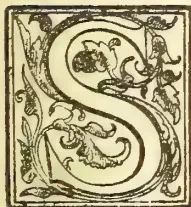

O much has the "new chrome process of tanning" been referred to lately, without explaining what that process is, that it may be of interest to give some information about tanning materials in general.

It is not so very many years ago that all kinds of Tanning material,—contained in oak bark, oak galls, valonia, myrabolans, wattle, tea-leaves, and elsewhere,—were supposed to consist of a single similar principle, which was denominated *Tannin* or Tannic acid, and was supposed to be a compound of a kind of sugar (called Glucose) and Gallic acid. This was found to be a mistake; and it was soon recognized that the tannin in oak galls differed from that of oak bark, and these differed from that in tea and coffee, and so on; so that that of galls was called Gallo-tannic acid, of oak-bark querci-tannic acid, of coffee caffe-tannic acid, and so on; almost every kind of tannin being separate and distinguished by its special name.

At the same time, although they have different chemical constitution, they are all more or less closely allied, and have very nearly the same properties. They all possess a powerfully astringent, but not bitter, taste; they all form with solution of salts of peroxide of iron a bluish-black, or greenish-black, ink solution; they all precipitate albumen, and combine to form insoluble compounds with gelatine tissue, the principal ingredient of animal skins, and thereby convert such skins into leather; they are all colourless (or feebly coloured) slightly acid compounds, consisting of organic acids or anhydrides (acids from which component water has been extracted), soluble in cold water and alcohol, uniting with alkalies to form soluble salts which readily

absorb oxygen from the air and produce dark-coloured products. They are found in almost all the organs of plants, but chiefly in the bark, wood, leaves and fruits. They are generally associated therein with colouring matters, which are also allied to the tannin, so much so that on decomposition they often yield the same products as the tannin; and very possibly this association has a good deal to do with the smaller differences in tannins of the same class. These colouring associates, like the tannin itself, are also soluble in water; and when tannin is extracted from the bark, leaves, etc., the extract consists of tannin and non-tannin, the latter being everything dissolved out by the water that is not tannin. The value of an extract depends not only on the percentage of tannin present, but is depreciated by an unduly high proportion of non-tannin which should not exceed one-half the percentage of tannin, and depends also on the colour, a standard now being adopted to measure the colour.

There are two principal classes of tannins: pyrogallol tannins and catechol tannins. The first class include digallic, ellagic or ellagi-tannic, quercitannic, gallo-tannic, rufaline acids, phlobaphen, etc., which on decomposition produce pyrogallol, a substance much used in photography; these usually give a light green or yellowish colour, and are mostly produced in fruits and seeds. The second class include catechine, catechu-tannic, mimo-tannic, kino-tannic, etc., acids, which on decomposition produce pyro-catechin and phloroglucin and not pyrogallol; these usually give a dark reddish colour, and are mostly produced in barks and woods. Leaves produce sometimes the first, and sometimes the second, class of tannin, and if they produce the former, they are usually suited for the manufacture of morocco leather.

All these natural tannins are very complex organic compounds of carbon, hydrogen and oxygen, and are very liable to decomposition, especially under the influence of air and moisture. Complex organic bodies are always more liable to decomposition than

\* Specially written by an Anglo-Indian Officer for the *Tropical Agriculturist*.

25------------------------------------------------

2THE TROPICAL AGRICULTURIST.[JULY 1, 1903.]

simple organic bodies, and simple organic bodies usually more so than inorganic bodies, and this is one of the reasons which is likely to cause the inorganic chrome tanning to supersede the old organic tanning.

For a long time it was expected that chromate salts would prove the best ingredients for tanning, for they have a strongly oxidizing power in themselves, and organic matter has a strongly deoxidizing power on them; but for a very long time attempts to utilize them were unsuccessful. Dr. Heinzerling, a German chemist, appears to have been the first to work them successfully; and it is probable that the present American chrome-tanning is nearly a modification of his process. That process consisted in the use of bichromate of potash, chloride of potash or soda, and sulphate of alumina, mixed together in a large stock tank, and drawn off as required by a system of piping communicating with each pit. As in ordinary tanning, the solution is at first made very weak, but is strengthened systematically every few days according to the thickness of the hides to be tanned; the quantity of chromic acid used being from  $2\frac{1}{2}$  to 5 per cent of the weight of the leather produced, and the cost from one to three shillings per 100 lb. of leather. The skins thus prepared are of a yellowish colour; and, at this stage, are dipped into chloride of barium which converts the soluble chromates into insoluble chromate of barium, and adds to their weight and solidity. They can then be coloured to any suitable colour, after which they are allowed to nearly dry and are then immersed in pure paraffin wax and resins which tend to make them waterproof. It is alleged that the use of paraffin and fatty matters reduces chromic acid to chromic oxide, the oxygen liberated in the hide oxidizes the fatty into acid bodies, and these acid bodies unite with the chrome oxide to form a third insoluble compound mordanted in the fibre of the leather, making it at once supple and waterproof.

It is an open question as to whether chrome tanning will ultimately supersede ordinary tanning or not. There are many points in its favour; the most important, as pointed out above, being that the inorganic compounds are more stable than the organic compound. Another point that is usually put forward in its favour is the rapidity of the operation, about as many days being required for chrome tanning as weeks are necessary for ordinary tanning; at the same time it is doubtful whether the short period of preparation is really as good as the longer older process, by which the skins become seasoned from the very length of the process. Then again the skins in the chrome process are artificially weighted by using the salts of the very heavy metal barium, and it is doubtful whether this is a real benefit. Again, bichromate of potash is at present cheap, but considering that some four to five hundred thousand tons of tanning material are used annually in Great Britain alone, and considering that there is a large demand of bichromate of potash for pigments as well, it is doubtful whether such demand would not raise the prices to an unprofitable extent.

If the chrome tanning does supersede the ordinary tanning, it will be a serious matter for India, not only in respect of the tanned skins that are exported in such large quantities, but also in respect of tanning materials themselves, for it is only recently that the tanning substances are being taken in hand and studied systematically. There are upwards of 200 Indian trees which produce tannin in some of their parts; the bulk of these tannins are produced by barks, and belong to the catechol class; they are mostly high coloured, and in the form of bark are far too bulky for export remuneratively, but there is not the slightest reason why as extracts a very much larger trade might not be carried on. As previously pointed out, the great desiderata for

good tanning material are, high percentage of tannin, low percentage of non-tannin, and good, or but little colour. Bark, as bark, seldom contains more than 20 per cent of tannin, but as extract often contains 50 per cent, and in some cases rises as high as 70 or 80 per cent. Many attempts have been made to decolourise extracts, and the operation has met with a fair amount of success; perhaps one of the best methods is by the use of alkaloids, for it has been found that the alkaloidal residue in quinine manufacture, a waste product, will serve the purpose; if added in very small quantity at first the colouring matter is removed, and for the addition of the alkaloid completely precipitates the tannin. Casein, and ferrocyanide of potassium and other processes have also been adopted.

The various tanning materials used in Europe and America have each their peculiar quality with respect to firmness and solidity, softness colour, scent, toughness, or power of resisting moisture and decay. It will be as well to review them and the Indian materials together in the following categories: (1) Barks, (2) fruits, (3) leaves, (4) galls, and (5) extracts.

(1) *Barks*.—The most important are the oak barks, used chiefly for sale leather as they contain quercitannic acid and phlobaphen which give solid deposits, some 200 to 300 thousand tons (tannin about 10 per cent) being consumed annually in Great Britain. In America the chestnut oak, Quercitron oak, red oak, and white oak are used for the same purpose, and in Northern India there are four good oak barks, one—*Quercus in cana*—having 22 per cent of tannin. The evergreen or holm oak of Southern Europe is used to give softness. Wattles, or mimosas, are the produce of Australian acacias, which yield from 18 to 34 per cent of tannin, and are imported to the extent of some 30,000 tons, but they are not so much appreciated as the oaks, as they are said to produce a dark hard and somewhat brittle leather. To the same genus belong the Indian Black babul with 30 per cent of tannin, white babul with from 9 to 21 per cent, and a troublesome climber of most open forests that have been fired (*A. pennata*) with about 9 per cent of tannin. To the same family belong the cassias, two of which (*C. auriculata* and *Fistula*) are perhaps the most commonly used tanning barks of Southern India, the former being the *Tangedu* or *Avaram*; also in the same family are *Albizias*, *Bauhinias*, *Butea*, *Dalbergias*, *Erythrina*, *Entada*, *Hardwickia*, *Ougeinia*, *Prosopis*, *Pterocarpus* and *Xylica*, common trees with a very fair proportion of Catechol tannin. Most of the nim or margosa family produce tannin barks, the most important being perhaps the *Carapa* with 35 per cent of tannin, whilst *Soymida* (13 p.c.) is largely used in Southern India and gives a light coloured leather, *Toon* (*Cedrela*) giving a purple leather. Many of the mango family also are important in this respect, mango itself giving 17 per cent, but perhaps the most valuable being *Rhusmynsorensis*, a common shrub in Mysore and the Coimbatore hills, which gives 16 per cent and furnishes a splendid brown or buff-coloured leather. The next important group are the mangroves that grow in tidal creeks, which are said to make most durable sole-leather, even better than oak, but there appears to be a prejudice against this tannin in England. Associated with the mangroves are often found *Heritiera*, *Sonneratia*, and *Avicennia*, all tan producers; and on the sandy stretches near them are frequently Tamarisks. Most of the Terminalia species, the producers of myrabolans, furnish tan-barks, and *Anogeissas* in the same family, a most plentiful tree in Southern India gives 32½ per cent. The Blue-Plums (*Eugenia*) are tanniferous, as are many other members of the same family, e.g., Guava, Careya, Barringtonia, Myrtle, and Hill Guava. Casuarina gives from 7 to 18 per cent.

26------------------------------------------------

JULY 1, 1903.]THE TROPICAL AGRICULTURIST.3

Alders, birches, and willows in Northern India are used, the willow being used in Russia in conjunction with Birch oil to form Russian leather. Of Conifers the Hemlock spruce is considerably used in America, and produces a very strong reddish brown leather; the Larch and Scotch Pine are used in limited quantities in Europe, two Pines and two Ephedras in Northern India.

(2) *Fruits*.—Valonia is the acorn-cup of the Turkey oak which is imported into Great Britain to the extent of some 30,000 tons. Myrabolans are the fruits of Terminalia, very abundant on the west coast and in the southern districts of Madras, but almost exterminated in other parts of the Presidency, as in former years the tree was cut to collect the fruits. Some 34 lakhs of rupees worth are exported annually, chiefly from Bombay and mostly to Germany, as they contain from 31 to 44 per cent of tannin, and are one of the cheapest forms in which tannin can be bought, the principle being gallo-tannic acid; they produce a yellowish green leather, which is both improved by, and improves the colour of, Oak, Hemlock and Babul (or wattle) barks. The best kind are the Chebulic myrabolan, which should be golden yellow in colour, pointed at both ends, and heavy, and should be collected just before they ripen. Another kind are Beleric myrabolans, whilst Emblic myrabolans belong to the Indian Gooseberry tree of a different family, and when immature contain 35 per cent, but only traces of tannin when ripe. Divi-divi is the twisted pod of a Cæsalpinia, but is not much appreciated as the mucilage in the pod ferments easily, draws damp, causes rot, and in a dry atmosphere produces a dark horny leather. Two other species of Cæsalpinia, Babul and Wagaten produce somewhat better tan-pods. Other fruits producing tannin are: Mangosteen, Mesua, Bael, Vateria, Jujube tree, Mango, Pomegranate.

(3) *Leaves*.—The most important leaf-tan is Sumach, derived from species of Rhus belonging to the mango family, especially used for tanning light skins and making morocco leather, and containing ellagic and gallic acids. Other similar leaves are: Pistacio, Mango, Tamarisk, Coriaria, Tamarind, Calyopteris, Indian almond, Careya, Guava, Woodfordia, and Phyllanthus Emblica, the latter especially is supposed to be an excellent substitute for Sumach.

(4) *Galls*.—These are excreoscences formed by insects on vegetable organs, usually containing some 70 per cent of ellagic and gallic acid; the principal are Aleppo galls on an oak, Chinese galls on a Rhus, but they are also found in abundance on many Indian trees, especially Tamarisk, Garuga, Pistacio, Acacias, Pongamia, Prosopis, Terminalias and other kinds.

(5) *Extracts*.—The principal extracts are Cutch, Gambier and Kino. Cutch and Gambier are both known in commerce as Terra Japonica, and are practically the same thing except that the former comes from the chips of Indian Acacias, the latter from the leaves of a Straits Settlements climber (Uncaria) of the coffee family. For cutch, trees of from 25 to 30 years of age with a diameter of 12 inches are billeted into lengths of 2 or 3 feet, the bark and sapwood removed, chipped into chips of about one inch square; chatties holding 3 or 4 gallons are filled as full as possible with these chips, and filled up with water, boiled for about 12 hours till the water is reduced to half, the liquor poured into other chatties and boiled for about 4 hours, perpetually stirring to prevent burning, until it becomes the consistency of syrup, when it is taken off the fire, allowed to cool, taken out and spread on leaves in a wooden frame, and left till the morning when it is dry enough to cut into pieces. About one ton of wood gives from 250 to 300 pounds, the value being about 30 to 35 shillings per

cwt. About 24 lakhs of rupees worth are exported annually, chiefly from Burmah, but the trade ought to be greatly developed in Madras. It is used not so much as a tan in itself for leather, as for softening leather, and principally for tanning fishing lines and canvas for trunks, etc., Kino is the red juice of Pterocarpus, Butea, Spatholobus, Ougeinia, Hardwickia, and other leguminous trees, and can also be obtained from Eucalyptus and some of the Blue-Plums; it is used for softening leather and also for medicine.

## THE UTILITY OF ALKALINE PHOSPHATIC MANURES.

By JOHN HUGHES, F.I.C.

Before considering the subject included under the title of this paper, it will be desirable to briefly refer to the origin and progressive use of

### ACID PHOSPHATIC MANURES.

The manufacture of superphosphate in this country may be said to have commenced in 1842, when the late Sir John Bennett Lawes, F.R.S., obtained a patent for treating finelyground mineral phosphates, such as Cambridge coprolites, with commercial sulphuric acid. The chemical theory then put forth maintained that the agricultural value of phosphatic manures depended upon the extent to which the phosphates they contained were rendered soluble in water through the aid of acid. It was contended that this solubility in water effected the most complete diffusion through the soil that could possibly be obtained, and the theory in itself is still correct though its application should be restricted to soils containing plenty of lime, so that the acidity of the manure may be immediately absorbed by the alkali in the soil. Indeed, at first, sulphuric acid being expensive, it was only used in small proportion, and great caution was observed in the mixing arrangements. Only a portion of the phosphates in the coprolites was rendered soluble in water, amounting perhaps to 20 per cent, in the manure produced, and frequently as much as 8 to 10 per cent. was left in the form of insoluble or undissolved phosphate of lime. Consequently, in those days, superphosphate was sent out in an excellent dry condition, and this in itself contributed very materially to increase the sale and render the new manure popular among farmers, for there were never any complaints about the damp acid condition of the manure.

When acid, however, became cheaper as the result of improved manufacture from less costly materials, and as competition increased on the expiration of the original patent rights, sulphuric acid was added in greater quantity, and the utmost possible amount of soluble phosphate was obtained, so that only 2 or 3 per cent. of phosphate of lime was left in a condition insoluble in water. Superphosphate then became damper and more acid, so that complaints respecting its bad condition were of frequent occurrence. Superphosphate when first introduced was chiefly applied as a manure for turnips and swedes raised on good arable land containing sufficient lime, yet there appears to have been some doubt raised in the mind of so keen an observer and experimentalist as the late Dr. Augustus Voelcker, F.R.S., as to whether acid manures were not conducive to disease in these roots.

At any rate, as early as 1863 we find him writing in the "Journal of the Royal Agricultural Society" upon "Phosphatic Manures for Root Crops" as follows:—

"Superphosphate of lime applied to root crops has a different practical effect on different soils. Purely mineral superphosphates fail to produce good turnip crops on light sandy soils. It has indeed been observed that the exclusive use of superphosphate,

27------------------------------------------------

4THE TROPICAL AGRICULTURIST.[JULY 1, 1903.

however beneficial it may be in the majority of instances, has in some soils led to the complete or partial failure or the presence of disease in the turnip crop.

"No acid combination as such can enter into plants without doing them serious damage; even free vegetable acids, as humic and ulmic acids, are injurious to all crops cultivated for food for the use of man or beast; and unless these acids, which are always present in what practical men so call humus, are neutralised by lime, or marl, or earth, none but the roughest and most innutritious herbage can be grown. Free mineral acids, are I believe still more injurious to all farm crops, and perhaps to all plants, than the free organic acids that are found in humus. A very dilute solution of sulphuric acid—say one part in 1,000 of water—may be used with advantage for killing grass in gravel walks made with flint or quartz sand; after one or two applications, the weeds will be destroyed and will not reappear for a long time. But if the walks are made with limestone gravel, the application of a much stronger acid has little or no effect on the grass or weeds; after some time the latter seem to grow all the better for having had a taste of dilute sulphuric acid. In reality, however no acid enters these plants, but on coming into contact with the limestone gravel, unites with the lime to form that useful fertilizer, sulphate of lime or gypsum. These examples thus prove unmistakably that a soil which contains free acid, in ever so small a quantity is unfit to maintain a healthy growth. We have therefore, strong presumptive evidence that soluble phosphate, a combination which has a strongly acid character, does not as such enter the roots of plants. The reconversion of soluble into insoluble phosphate, perhaps may appear undesirable, but in reality, it is not only beneficial, but absolutely necessary to the healthy and luxuriant development both of turnips and all other crops to which superphosphate is applied. The more rapidly and completely the soluble phosphate in commercial superphosphates and turnip manures, is precipitated and rendered insoluble in the soil, the more energetic will be its effect upon the turnip crop."

The above statements, made nearly 40 years ago, represent the views of one who was rightly regarded as an authority upon the properties and use of artificial manures, and it is interesting to note the extent to which these views have been realised in actual farm practice during succeeding years.

#### NEUTRAL PHOSPHATES.

In 1875, the Aberdeenshire experiments with finely ground phosphates were instituted and conducted under the management of Professor Jamieson for some years. The publication of the results excited much interest, for they demonstrated by actual field experiments that insoluble, or more properly termed undissolved, phosphates, if applied in a finely-ground condition and in sufficient quantity, possessed very considerable fertilising value, whereas, according to the previously held theory, such raw phosphates were supposed to possess no practical manurial value.

Further, these experiments proved that on certain soils deficient in lime, ordinary soluble phosphate was not superior in its action as a manure to undissolved phosphates to anything like the extent that had hitherto been generally supposed.

Very naturally these novel results, being opposed to the theory hitherto held, excited a considerable amount of hostile criticism which however time and more extended experience has proved to have been unreasonable and erroneous.

The experiments were carried out at five stations situated in different parts of the county of Aberdeen, and the soils are described in the official report as being "black mould resting upon a granite subsoil," and the analyses show that in every case they were specially deficient in lime. The figures for lime at

these five stations were respectively .08—.17—.12—.33 and .33 per 100 parts of the dry soil.

These soils were in fact exactly those upon which soluble phosphate as supplied by superphosphate would not be likely to exert its full benefit, while the vegetable acids existing in the black mould would naturally dissolve the finely ground mineral phosphate to a very considerable extent. In short the conditions were most favourable to the action of undissolved phosphates, and most unfavourable to the action of dissolved or soluble phosphates.

The experiments in themselves, were however, distinctly useful both scientifically and practically, and Professor Jamieson will always be favourably associated with what must now be regarded as a step forward in the economical application of finely ground neutral phosphates.

#### ALKALINE PHOSPHATE OR BASIC SLAG.

About the year 1883 the now well-known basic slag or Thomas phosphate powder was introduced to the agricultural world. It is the residual slag resulting from the treatment of iron ore by the Thomas-Gilchrist process of adding lime in order to remove the phosphoric acid and silica. Briefly it consists of basic phosphate of lime and basic silicate of lime, associated with some iron, manganese and magnesia compounds.

It has a distinctly alkaline character, but it is a mistake to suppose that this material contains any considerable quantity of free lime, because any such excess of lime would indicate a wasteful method of manufacture, lime being only added in sufficient quantity to remove the phosphorus and silica existing in the original iron ore. Though but slightly soluble in ordinary water, it dissolves to a certain extent in water impregnated with vegetable acids, and it is the neutralisation of such acids which exist in sour grass that largely contributes to make its application so beneficial on certain kinds of soil. No other manure has ever before occasioned so great a diversity of opinion as to its value as a fertiliser. When finely ground and applied to suitable land with sufficient water either in the soil or from rainfall, the results have been most satisfactory, both in the increased yield and in the improved quality of the grass and hay; but where the conditions are unfavourable and the land unsuitable, the results have been most disappointing. Indeed, when first introduced agricultural chemists of high repute were disinclined to place any fertilising value on such a hard fused mass, however finely it might be ground, because it was so insoluble in ordinary water. Little by little, however, farmers were induced to take small quantities for trial, chiefly on old and sour grass lands and the practical results were so good on certain soils—rich in vegetable acids but poor in lime—that scientific authorities were soon compelled to recognise its value, and as the market price was low the material naturally became popular in certain localities. In this country the importance of fine grinding has hitherto been recognised as the chief test of the probable manurial value, but in Germany, Professor Paul Wagner, of the Agricultural Station of Darmstadt, has insisted upon the solubility in a 2 per cent. solution of vegetable acid, such as citric acid, as a further and more definite test of probable manurial value.

Dr. Bernard Dyer, in his paper "On the Determination of Probably Available Mineral Plant Food in Soils" ("Journal of the Chemical Society," 1894), has adopted a cold 1 per cent. solution of citric acid for determining the proportions of phosphoric acid and potash existing in a presumably available form in the soil.

The present writer, however, has selected as his standard solvent a 0.10 per cent. cold solution, consisting of 1 part of citric acid to 1,000 parts of cold distilled water. Such a solution is twenty times weaker than that of Professor Wagner and ten times weaker than that of Dr. Dyer. In fact, it represents

28------------------------------------------------

JULY 1, 1903.]THE TROPICAL AGRICULTURIST.5

an acidity absolutely below that of the sap of any of the 108 plants examined by Dr. Dyer in the paper referred to, and it also more closely approximates to the natural acidity of ordinary soils than either of the standard solutions previously employed.

It is therefore contended that any phosphoric acid, lime or potash, dissolved out by this standard solution, may fairly be regarded as existing in a form available as plant food, whether in a soil or in a manure. In the following Table, the relative solubility in this standard solution of five different kinds of finely ground raw phosphate, is compared with that of a good specimen of basic slag. In each case, one gramme of the ground phosphate was exhausted with 1,000 grammes of cold distilled water, in which one gramme of crystallised citric acid had been dissolved. After standing 24 hours with occasional stirring, the insoluble portion was filtered off, ignited and weighed, while the proportions of lime and phosphoric acid were determined in the clear solution.

#### MINERAL PHOSPHATES.

*Solubility in cold weak solution of Citric Acid (1 in 1,000) after 24 hours.*

<table border="1">
<thead>
<tr>
<th></th>
<th>French.</th>
<th>Algerian.</th>
<th>Florida.</th>
<th>Tennessee.</th>
<th>Peace River.</th>
<th>Basic Slag.</th>
</tr>
</thead>
<tbody>
<tr>
<td>Total phosphate of lime present }</td>
<td>50.86</td>
<td>55.99</td>
<td>78.26</td>
<td>79.57</td>
<td>61.23</td>
<td>38.97</td>
</tr>
<tr>
<td>Fine powder passed through 100 hole sieve... }</td>
<td>76.21</td>
<td>67.69</td>
<td>72.37</td>
<td>91.63</td>
<td>93.61</td>
<td>83.80</td>
</tr>
<tr>
<td>Portion soluble in citric acid solution..... }</td>
<td>30.00</td>
<td>30.00</td>
<td>22.60</td>
<td>22.80</td>
<td>21.40</td>
<td>38.80</td>
</tr>
<tr>
<td>Containing— Soluble lime....</td>
<td>15.34</td>
<td>13.66</td>
<td>11.87</td>
<td>11.64</td>
<td>15.23</td>
<td>22.17</td>
</tr>
<tr>
<td>Soluble phosphoric acid.. }</td>
<td>2.85</td>
<td>6.35</td>
<td>8.25</td>
<td>8.40</td>
<td>9.90</td>
<td>8.70</td>
</tr>
<tr>
<td>Equal to phosphate of lime }</td>
<td>6.22</td>
<td>—</td>
<td>18.01</td>
<td>18.34</td>
<td>21.61</td>
<td>18.99</td>
</tr>
</tbody>
</table>

The above results show the percentage of phosphate of lime present in the respective samples, also the fineness of the grinding, the extent to which the respective specimens were dissolved by the cold, weak citric acid solution, and finally, the proportions of lime and phosphoric acid in its equivalent of phosphate of lime existing in the cold citric solution.

It will be seen that ground phosphates are only soluble, and therefore available as plant food to the extent of 22.60 to 31.40 per cent., and that the basic slag is only dissolved to the extent of 38.80 per cent., in fact only a little more than one-third of its weight, though it was of good quality, 38.97 phosphate of lime and 33.80 fineness. As regards the actual amount of phosphate of lime dissolved out of the five specimens, the Peace River, with a fineness of 93.61, gave the highest figures for solubility, there being 21.61 phosphate of lime dissolved out of a total of 61.23. In the case of basic slag, the figures, though relatively higher, are actually less, namely, 18.99 phosphate of lime dissolved out of a total of 38.97. These results explain why Professor Jamieson, with the black vegetable mould to experiment upon, obtained an appreciable increase in the yield of turnips from the application of finely ground raw phosphates, though if we take the most favourable example, namely, Peace River, only about

one-third of the total phosphates would have been utilised as available plant food and the remaining two-thirds was of no use to the crop. The defect in the economical application of finely-ground phosphates is their insufficient solubility, and it is this want of solubility that is the defect also of basic slag when applied to many soils. Before leaving these figures it is interesting to note that it is only in the proportion of soluble lime that basic slag shows a superiority over that of Peace River phosphate, there being 22.17 per cent. dissolved out as against 15.23. Indeed, the fertilising value of ordinary basic slag must be ascribed as very largely due to the ready supply of lime when the slag is brought in contact with sour soil, if accompanied by plenty of water either in the soil or from the rainfall. It is well known that slag fails to produce any practical results on certain soils, and this failure is probably due partly to a deficient supply of water and partly to the absence of that excess of vegetable matter which is necessary to produce an acid solvent.

#### THE NEW MANURE BASIC SUPERPHOSPHATE.

It occurred, therefore, to the author, after careful consideration in the autumn of 1900, that a new and useful manure could be produced by the careful admixture in suitable proportions of ordinary acid superphosphate with finely ground or slacked lime.

After making numerous trial mixtures the most suitable proportion were decided upon, and a manure was produced which possessed a distinctly alkaline or basic character, and at the same time supplied from 25 to 27 per cent. of phosphate of lime in a form readily soluble in the standard solution (1 in 1,000) of citric acid. The manure so produced was appropriately called basic superphosphate because it combined the alkaline nature of slag with the wellknown solubility of superphosphate. The mechanical condition is superior both to that of basic slag and superphosphate. Compared with the former it is much more bulky and lighter in weight, so that if equal weights be placed in two glass tubes about 1 foot long basic superphosphate will be found to occupy a space of 11 inches as compared with only 4½ inches occupied by basic slag, the relation in round numbers being as 100 to 40. Compared with superphosphate the new material is very much drier, containing only 4 to 5 per cent. of moisture instead of the 14 to 18 per cent. unusually found in commercial superphosphate. Being in a finely ground dry powder of light weight and bulky nature, greater uniformity and more perfect distribution can be obtained than is possible with basic slag, which when sown by hand is apt to drop between the fingers before complete delivery can be effected. Farmers will appreciate these advantages, and will be glad to be assured that there will be no danger of any clogging of the drill from damp condition, which in the case of badly made superphosphate is a very serious defect, and renders the uniform distribution of the manure quite impossible. The general composition of basic superphosphate may be gathered from the following analysis:—

#### COMPOSITION OF BASIC SUPERPHOSPHATE.

<table border="1">
<tbody>
<tr>
<td>Moisture (lost at 212° F.).....</td>
<td>4.15</td>
</tr>
<tr>
<td>Combined water and loss on ignition .. ..</td>
<td>12.86</td>
</tr>
<tr>
<td>*Phosphoric acid (total) .. ..</td>
<td>13.60</td>
</tr>
<tr>
<td>Lime .. ..</td>
<td>35.15</td>
</tr>
<tr>
<td>Sulphuric acid .. ..</td>
<td>28.20</td>
</tr>
<tr>
<td>Oxides of iron, alumina, magnesia, &amp;c. .. ..</td>
<td>2.34</td>
</tr>
<tr>
<td>Insoluble siliceous matters .. ..</td>
<td>3.40</td>
</tr>
<tr>
<td></td>
<td>100.00</td>
</tr>
<tr>
<td>*Equal to phosphate of lime ..</td>
<td>29.68</td>
</tr>
</tbody>
</table>

The manure usually contains from 33 to 35 per cent of total lime, so that in this respect basic

29------------------------------------------------

6

THE TROPICAL AGRICULTURIST.

[JULY 1, 1903.

superphosphate supplies fully 10 per cent. more lime than ordinary acid superphosphate.

The superior solubility in cold water of basic superphosphate compared with good basic slag containing 38.97 phosphate of lime and 83.80 fineness, is shown in the following table:—

*Solubility in Cold Water after 48 Hours, 1 Part Manure to 1,000 Parts Cold Water.*

<table border="1">
<thead>
<tr>
<th></th>
<th>Basic Super.</th>
<th>Basic Slag.</th>
</tr>
</thead>
<tbody>
<tr>
<td>*Portion soluble in cold water .. ..</td>
<td>66.80</td>
<td>6.60</td>
</tr>
<tr>
<td>Portion insoluble (after ignition) .. ..</td>
<td>33.20</td>
<td>93.40</td>
</tr>
<tr>
<td></td>
<td>100.00</td>
<td>100.00</td>
</tr>
<tr>
<td>*Containing—</td>
<td></td>
<td></td>
</tr>
<tr>
<td>Soluble lime .. ..</td>
<td>22.28</td>
<td>4.70</td>
</tr>
<tr>
<td>Phosphate of lime ..</td>
<td>None</td>
<td>None</td>
</tr>
</tbody>
</table>

It will be seen that basic superphosphate is fully ten times more soluble in perfectly cold water than well ground basic slag, the figures being 66.80 against 6.60 per cent. Further, that there is 4.80 lime dissolved out in the former against only 4.80 in the latter.

These figures may, perhaps, explain why basic slag fails on certain soils, while it produces excellent results upon others. It is not ordinary water that is capable of decomposing a hard fused mass like slag, however finely it may be ground, but water impregnated with vegetable acids. In other words, it is only on sour acid soil that special benefit may be expected from the application of slag. It will be noticed that no phosphate of lime was dissolved out by plain water from either manure, because on account of the presence of lime in excess, all the phosphate of lime was retained in a precipitated form in the basic super, and in a more insoluble form in the slag.

*Solubility in (1 in 1,000) Citric Acid Solution (1 part Manure to 1,000 parts Solution) after 24 hours.*

<table border="1">
<thead>
<tr>
<th></th>
<th>Basic Super.</th>
<th>Basic Slag.</th>
</tr>
</thead>
<tbody>
<tr>
<td>*Portion soluble in citric solution .. ..</td>
<td>94.20</td>
<td>38.80</td>
</tr>
<tr>
<td>Portion insoluble (after ignition) .. ..</td>
<td>5.80</td>
<td>61.20</td>
</tr>
<tr>
<td></td>
<td>100.00</td>
<td>100.00</td>
</tr>
<tr>
<td>*Containing—</td>
<td></td>
<td></td>
</tr>
<tr>
<td>Soluble lime .. ..</td>
<td>34.73</td>
<td>22.17</td>
</tr>
<tr>
<td>Soluble phosphoric acid</td>
<td>12.45</td>
<td>8.70</td>
</tr>
<tr>
<td>Equal to phosphate of lime</td>
<td>27.18</td>
<td>18.99</td>
</tr>
</tbody>
</table>

The above figures show that when both manures were treated in exactly the same manner, in regard to the quantity and strength of citric acid solution, with the same time allowed in each case for exhaustion with the standard solvent, basic super was dissolved to the extent of 94.20 per cent., as against 38.80 per cent. in the case of the basic slag. Further, 34.73 lime was dissolved in the former, against 22.17 in the latter. Lastly, 27.18 phosphate of lime was dissolved out of the basic super, against 18.99 out of the slag. The slag employed was the same as was used in all the previous experiments, and was of good quality and well ground. Though the slag contained 38.97 total phosphate of lime, only 18.99, or less than half, was dissolved by the standard solvent, and may therefore be considered to represent the proportion probably available as plant food. It is very important to bear these figures in mind, and to remember that it is not the total amount of phosphate of lime present in slag that should be regarded as indicative of its manurial value, but the actual quantity that is likely to be available as plant food. Hence, as a quick-acting manure, suitable for late application in the spring, basic super must be regarded as far superior

in fertilising effect to ordinary slag, notwithstanding the high total contents of phosphate of lime contained by the latter.—*Journal of the Society of Arts.* (To be continued.)

### QUININE AS A CURE FOR RINDERPEST.

SIR,—With reference to your leading article in last night's issue of the *Times of Ceylon*, I think you have been very much misinformed with regard to the advancement made in dealing with rinderpest. A great advance has been made, and most men of experience have little fear of an outbreak provided rules laid down for its suppression are strictly observed. Preventive inoculation only discovered during the past few years has proved most successful—an instance where "learned savants" have not laboured for years without result.

With regard to your statement that no treatment has been recommended in Ceylon except wholesale slaughter of infected cattle, burial of bodies, inoculation of contacts (strange that inoculation comes in if no advancement has been made) thorough disinfection, &c., I can only say that it is absolutely incorrect and shows want of knowledge of what has been written on the subject. Wholesale slaughter has never been commended—quite the reverse. Except annual reports, at the moment I can only refer you to two pamphlets written by myself:—1 "Notes for Cattle Owners," published in 1897, and II., a pamphlet on "Rinderpest" written for the Planters' Association of Ceylon in 1899. I have no doubt the Secretary would be glad to forward you a copy. If I am not mistaken it was printed at your office.

With regard to the quinine treatment, quinine has been recommended by me for many years (I enclose a page from "Notes for Cattle Owners," giving the prescriptions in 1897) modified in 1899 to some extent, as great difficulty was found in procuring drugs in remote districts.

The treatment now given to the stock inspectors of the Veterinary Department, and now being carried out by them, is as follows:—

<table border="0">
<tr>
<td>"Quinine" 1 to 2 drams</td>
<td>Mixed.</td>
</tr>
<tr>
<td>Arrack <math>\frac{1}{2}</math> bottle</td>
<td>To be given once or twice</td>
</tr>
<tr>
<td>Rice congee 4 bottles</td>
<td>a day.</td>
</tr>
</table>

I have also found the administration of Jeye's fluid very beneficial in checking an outbreak—given to all animals both healthy and sick in ten drop doses daily in the food.

Spraying all the cattle in an infected shed with Jeye's fluid and water is also carried out both in rinderpest and in foot-and-mouth disease. Bile inoculation is also practised, full particulars of which you will find in the pamphlet prepared for the Planters' Association in 1899.

It is quite possible that the Indian "discovery" has been made on information derived from Ceylon. The Indian dose, I may say, is absurd—40 grains for a good-sized bull! You will notice the dose recommended in Ceylon is 2 drams—or 120 grains. Where cattle have been properly isolated, and the instructions carried out, we have had little difficulty in suppressing outbreaks in Ceylon. The instances where outbreaks have become somewhat extended have all been in remote villages difficult of access, and with semi-wild cattle roaming free from village to village, and whose owners are averse to interference and who would sooner hide the disease than report it—thinking that it is due to the anger of the gods and that, if stayed, some calamity will come upon them.

I may add that quinine in a bad case of rinderpest as with other blood medicines, is useful, but is not by any means a specific as stated in your telegram

G. W. STRUGESS,  
Govt. Vet. Surgeon.

Colombo, June 30th.

30------------------------------------------------

JULY 1, 1903.]THE TROPICAL AGRICULTURIST.7RAILWAY THROUGH RUBBER FIELDS IN AFRICA.

A Decree of the Portuguese Government dated November 27, 1902, grants to Robert Williams, a British subject, a concession to build a railway 1400 kilometres [= 870 miles] in length, from Lobito Bay, on the Angola seaboard, to Katanga, on the Eastern frontier of the colony, where connection can be made with the Cape to Cairo system. The *concessionnaire* is required to deposit £100,000 as a guarantee that he will form a company with £2,000,000 capital, with its head office at Lisbon, and complete the railway within eight years from January 1, 1903. Angola is the extensive Portuguese possession south of the Congo river, from which is derived the Benguela, Landa, and Ambriz grades of rubber. Of late years the export of these rubbers has declined, which fact is attributed in part to the exhaustion of the supplies near the coast, but more particularly to the better transportation facilities to and from the Congo Free State since the completion of the Congo railway. Angola is a fertile district, and with a railway it is believed that not only would the rubber trade revive, but the general development of the country would be promoted.

Katanga, mentioned above, is a province in the extreme south-east part of the Congo Free State, which of late has begun to be developed in an energetic way by a strong Belgian company. This province is exceptionally rich in rubber, from all reports, which fact may tend to encourage Mr. Williams's railway project. Mr. Williams, by the way, is an engineer in the service of a British concern east of Lake Tanganyika, and some time ago he informed the Comité Special Katanga that while journeying through their territory he had found important sources of gold. The committee have encouraged his further investigations, with results that have surpassed all expectations. This may prove to be a still further incentive to the building of the railway. All these details are mentioned for the reason that whatever tends to the opening up of any rubber producing country is helpful in making rubber more accessible and in placing the production of rubber under more intelligent supervision.

The administration of the Cie. du Chemin de Fer du Congo (the Congo State railway), are reported to be about to invite tenders for the supply of a large electric installation and 30 electric locomotives, the latter to be employed on various small branch lines constructed to secure better communication with rubber producing districts. This railway, 241 miles in length, around the falls in the Congo river, between Matadi and Leopoldville, has now been in successful operation for several years. The net profits for the business year 1898-99 were 6,242,093.86 francs, for 1899-1900 they were 8,001,500.43 francs, for 1900-01 they were 7,778,397.90 francs. The capitalization is 30,000,000 francs.—*India Rubber World*.

PINE-APPLE CULTIVATION.

By J. H. HART, ESQ., F.L.S.

Laid before the Society, 10th February, 1903.

In the first issue of the handbook of Jamaica there appeared a short article by the present writer on Pine-apple cultivation. Since that time the cultivation of this fruit has been much extended in Jamaica, and varieties suitable to foreign markets have been largely introduced. Some of these varieties are now being offered to cultivators in Trinidad at reasonable prices. The variety known as Smooth Cayenne is highly recommended for cultivation, and justly so, as it is a very fine and full flavoured fruit.

The soil in the neighbourhood of Kingston, Jamaica, has been found to be a very "suitable soil" as the present writer designated it 21 years ago, and from this district large shipments have been made. Pine-apples, however, cannot be successfully grown in any kind of

soil. The soil occurring in the vicinity of Port-of-Spain is far from suitable, and in it Pine-apples could not be grown with advantage or economy. In districts which possess sandy or gravelly loams, with good drainage; pine-apples might be grown in Trinidad to considerable advantage. The soils in some of the Montserrat, Siparia and La Brea districts are known to be especially suited for the cultivation of this fruit by the common occurrence of the Pineapple in a practically wild condition; in fact, growing by the wayside without cultivation.

The well-known "La Brea" Pine-apple is a variety, which under good cultivation, would certainly pay to cultivate for export in districts where the soil is of the right character.

Heavy clay soils or, indeed, any soil which is re-tentive of moisture is quite unsuitable. So also are soils which are deficient in moisture. It is, therefore, best in commencing new cultivations to note the growth made by Pine-apple plants in any given district, before going largely into a cultivation which cannot succeed, owing to unsuitable soil. Pine-apples do not require rich soil, but it must be well drained naturally, or of a porous character, and yet one which will hold sufficient moisture for the wants of the plant. What is known as a light sandy or gravelly loam with plenty of depth, is the character of soil best suited. As to cultivation, I can find but little if anything to add to the directions given in the article I wrote for Jamaica twenty-one years ago, here reproduced:—

"Commencing the cultivation with a piece of "ruinate" the first work is to cut all bush, etc., and, if possible, have it removed from the ground with burning, as by burning the grass and weeds which are on the surface of the land organic matter will be destroyed, and we shall see that this is required in our method of cultivation. Having laid off the land in straight lines by placing stakes four feet apart at the ends, and straining lines between them we commence and hoe off all grass and weeds, arranging them in the centre between the first two lines, thus forming a ridge. After two rows are thus formed we commence with pick and shovel and loosen the ground to the depth of six inches in the centre space between the rows of weeds and throwing half the soil thus stirred on the top of each row of weeds we proceed thus till the whole is covered forming, when finished, ridges about 18 in. wide and 9 in. high with an interspace of 30 in. After allowing a few days for the weeds and grass to decay in some measure and the ridge to settle, the suckers may be planted. These should be selected after the bearing season is over, or indeed any time between October and January, if the weather is not too wet for planting. The lower dry leaves of the suckers should be removed to allow the small roots in their axils ready access to the soil and then placed in the centre of the ridges to a sufficient depth to render them able to remain upright, to assist which they should be firmly rammed with a wooden rammer, leaving a small basin-like cavity at their base to hold sufficient water to solidify the soil and fix the plant firmly in its place.

"After the first or second watering no more is necessary unless a period of exceptionally dry weather is experienced. The plantation must be kept free of all weeds, and the hoeings may be left in the trenches between the rows; different kinds of vegetable refuse may also be placed there and will benefit the pines by its gradual decomposition, as well as by the moisture it affords. Pines are not however, as a rule benefited by large quantities of manure, a little may be applied at times, but gradually as it is apt to induce them to rot at the base, and thus spoil many a fine plant."

It is not intended by these specific instructions to convey the idea that the writer's method is the only one by which successful cultivation can be carried

31------------------------------------------------

8THE TROPICAL AGRICULTURIST.[JULY 1, 1903.

on, as no particular method of cultivation can be expected to meet all conditions of soil and situations; and much must depend upon the care and energy with which the industry is developed and failures, successes, and other experiences turned to account. Planting on the flat without any ridge may be found in many cases to have not a few points to recommend it, but the writer's method, as before described, is one which may be depended upon as supplying to the uninformed the main points which lead to success in the production of large and well-flavoured fruit.

As fruits suitable for cultivation in Trinidad I should recommend the two varieties of "Ripley," the dark variety of which is identical with the "Black Antigua," The Smooth Cayenne and the La Brea variety. An article relating to the packing of the Pine-apple for market appears in the Bulletin of the Botanical Department for January, 1903.—*Agricultural Society*.

### HOW TO DEAL WITH NATURAL MANURES IN THE INTERESTS OF SANITATION AND AGRICULTURE.

By REV. DR. MORTON.

(Read before The Society, 13th January, 1903, and ordered to be printed for general circulation.)

Natural manures are drawn from the Soil and it is an ordinance of Nature that they should be returned to the soil with as little waste as possible. The penalty of disobeying that ordinance is two-fold, namely, loss to the soil and injury to health—that is, both Agriculture and Sanitation suffer.

It has been contended that in towns and villages you cannot conserve the manure and preserve the health—that one or other of these must be sacrificed. And very often as things are now managed both are sacrificed. I have been asked to prepare for the Agricultural Society some suggestions on this subject, and I submit the following:—

1. The Creator who wishes his earth to be fertile and his creatures to be healthy, has given us a short time in which to deal promptly and safely with waste substances.

2. The exposing of so-called waste substances to the weather is a first-class misdemeanour; for by evaporation and excessive fermentation in dry weather and by washing-out under rain the best elements of the manure are wasted and the air thereby rendered impure. All such substances should be kept under cover.

3. The liquid direct from the stall or washed out of the heap is the most valuable part of the manure, and when left to decompose the most dangerous to health.

4. The liquid should be collected in a concrete well, and thrown over the solids to prevent excessive fermentation and to render them of increased value as a fertilizer.

5. The contents of such a shed should be removed at least once a week. But they can be kept for that time with less danger to health than a pile of manure left in the weather will cause in only two or three days, for in point of fact you never can gather up the dangerous elements washed into the soil.

6. Covered manure never gets sloppy and does not produce Water-itch on those who remove it as exposed manure does.

7. It will pay for cartage and railag, for it is at least of double value to the soil.

8. In this matter the Government should set a good example to all. What can be expected of our villagers beyond what they see at the Public Works stables?

9. It should go out from this Society that Stable Manure, well kept and wisely applied, has a place in agriculture which no other substance can supply.—*Agricultural Society*.

### CULTIVATION AND TREATMENT OF RAMIE.

Mr. James Anderson, of Abroath, Scotland, writes as follows to the *Penang Gazette*:—I have had the pleasure of reading an article from the pen of Mr. Curtis in your interesting paper on Ramie, Rhea or China grass. From extensive experiments made in the different grades of this very fine fibre I have arrived at different conclusions from the Authorities he quotes, and am quite confident that, although the ribbon could be delivered at the degumming factories at £79s. a ton instead £12 in comparison with other fibres, it would pay handsomely and be largely used, although £26 a ton was paid for it. At that price the finished article would not cost more than 4d. per lb. in a condition similar to the enclosed sample. Contrary to the recognised theory I have conclusively proved to my own satisfaction that it is one of the least difficult of fibres to prepare for manufacturing purposes, and that the returns from dry stems grown in suitable localities such as the Straits Settlements far surpass those obtained from flax or hemp, with both of which I am intimately familiar, were Ramie put to the same ordinary use as flax. The waste after being degummed would scarcely be a half of that in flax. I notice that there is a difficulty in connection with the cutting of the ribbon from the stems and that a machine that will accomplish this at the rate of half a ton a day is needed. There are such machines in use now employed for other purposes, through which I have passed stems grown in the Botanic Gardens of Glasgow with far more wood than fibre on them and nearly as solid as a walking cane. These came out without a particle of wood adhering to the ribbon. The machine that I used I am sure would deliver not less than a ton of clean ribbon a day. With a simple machine that can be got here for about £2 two men could easily remove not less than 200 lb. a day of fibre from dry stems. Any patent machine driven by steam needing the attention of two men and only turning out say one cwt. a day is a costly farce.

"In conclusion, allow me to say that no patent machine is needed for the preparation of the fibre, and that the process of degumming it cannot be protected. It might be kept a secret, but that is all, as I know of half-a-dozen ways of doing this all of which are equally cheap and effective. When the so-called expert, whose ignorance of fibre and its treatment is amply demonstrated by the absurd and costly method he employs, disappears and the mechanical efforts of the patentee are found in the scrap heap, then and not till then will Ramie, Rhea, or China Grass get the chance that it has been denied. When this comes to pass it will revolutionise the industrial affairs of the Empire and bring untold wealth to Eastern climes. In this prosperity your favoured locality will largely share." We would suggest that those persons who intend to experiment with the *Calotropis Gigantea* described in our last issue would do well to apply to Mr. Anderson for further particulars.—*Indian Planters' Gazette*.

### NINE NOVELS—4,000 TREES.

A recent calculation made by the *Scientific American* shows what an immense quantity of timber is used to supply the present-day readers with the substance for their popular novels. Estimating that nine novels have a total sale of 1,600,000 copies each book containing 20 ounces, the total weight is 2,000,000 lb. of paper. Spruce is used to make the cellulose for the paper, each tree yielding about 500 lb. A simple calculation shows, therefore, that these nine novels alone swept away 4000 trees. We wonder whether they were worth it.—*Commercial Intelligence*.

32------------------------------------------------

JULY 1, 1903.]THE TROPICAL AGRICULTURIST.

## THE TEA FACTORY OF THE FUTURE.

(Contributed.)

(Continued from page 806.)

### II.

In any attempt to forecast the future of society in general or merely a single industry, it is well to differentiate carefully between the possible or probable development of present-day methods or systems, and wild and imaginative speculation. As a case in point,—the bookstalls and magazines are constantly coming out with perfervid prophetic descriptions of cities where half the population, or the lower classes, dwell more or less permanently under-ground, for want of space above, while wonderful mechanical flying machines whirl madly through the sky at incredible speeds; both of which, as anyone with a fair amount of common sense can see, are ridiculous improbabilities; the first case being limited by sanitary laws on the one hand and the cost of transporting the working classes to and from the suburbs on the other; and the second case is in the light of present day science, so far as it has gone—having regard to the public safety—a mechanical impossibility. On the other hand it is perfectly fair and reasonable that given a phenomenon or an effect, however insignificant to the casual observer, that effect may by a seeing few be recognised and contemplated upon as the main turning point in the particular industry or part of an industry with which it has to do. That is to say, if a casual effect at one point of a process of manufacture be observed to have a material bearing in improvement of quality or of economic production, it may be proposed to so alter the first process that effect shall be no longer casual, but a mathematical certainty. Such a case could not be termed merely an imaginative speculation, neither is it necessarily an inference from the obvious, rather it may be better described as a scientific deduction based on the possibilities of an observation, and even if the actual inference or deduction be in itself fallacious, it may nevertheless serve to open and to light a path to other real improvements in the direction indicated. In a former paper (published in this journal on the 3rd January last), I considered the reconstruction of a large tract of separate Tea Estates into one vast concern worked by a single factory, and enumerated some of the difficulties which have hitherto stood in the way of such reconstruction. I shall now, with some diffidence, attempt to forecast the probable machinery with which such a factory would be equipped, taking each process in its proper order.

#### WITHERING.

In the present day, as from the first, the leaf is spread out on special racks containing a certain number of trays of various materials, from galvanised wire meshing to bamboo mats, and in the majority of factories the arrangement is supplemented by some mechanical method of air draft at one or both ends of the withering room: frequently also the air so used is drawn by a system of conduits and screens from the room where the hot blast drying machines are situated.

It seems to be a general and accepted principle, confirmed by old and experienced Planters, that a cold wither is essential to the manufacture of good tea; but this principle, if laid down as a law, neglects altogether to take the natural elements into consideration, and, where entirely relied on, the usual result is that in seasons of heaviest rain combined with a rush of leaf greater than the accommodation for it, the said leaf positively refuses to wither at all, and further accumulation results in the loft and factory floors (and often even the

Manager's bungalow) being inundated a foot deep in leaf, which has finally to be rolled off half-withered, producing inferior tea. In the new withering apparatus there will be nothing of this, rather every single detail will be carried out and provided for with mathematical and scientific accuracy and precision. Among details to be noticed in connection with the mechanical air draft *with prepared air*, is the fact that it is always the leaf on the racks furthest from the fans which is first withered: the obvious reason for this is that the evaporation of the moisture taken up by the warm air passing over the first leaf when wet, induces a reduction of temperature in the draft; and as warm air will support a larger volume of moisture than when cold, this moisture is redeposited on the racks nearest to the fans. This fact, which can be observed by any user of heated air in wet weather, will be utilised as follows:—

The withering room will be fitted from floor to ceiling and almost from end to end with continuous banks of movable trays or endless webs on chains, the trays for these being probably constructed of some light material such as papier maché, or thin perforated steel, and anywhere from 10 to 15 feet in length. There would thus be, say, three or four banks of trays with a gangway between each in every room, the rows of trays would be about six inches apart vertically, and would travel outwards from the central tower of the factory while carrying leaf.

As no hot air would be used except in cases of great emergency, such as a breakdown in other rooms during a rush, the working speed would be slow, but it would be possible to greatly accelerate the motion for the purpose of spreading the leaf which would be done automatically, on the principal of one of the mechanical boiler stokers of the present day: the latter being fed by shutters, as required, from the receiving loft above. The leaf on a whole bank of trays, or rather in a whole room having been spread simultaneously, each tray would be worked up until the leaf showed at the further or outer end and there stopped. The various shutters in the central blast tower would then be opened to the required aperture, and a very gentle current of air properly dried and cooled to an exact degree of humidity and temperature found by careful experiment to be the best, would be passed over the trays. At the discharge end, the European or Sirdar in charge would watch the leaf actually in sight at the hour when it should be ready, and would then set all the trays in motion. The leaf arriving at the end would fall into a travelling conveyor belt and be carried and fed directly into the rollers. Should the leaf coming up slowly behind prove under or over withered, the motion will be reduced or accelerated, but in actual practice this will not occur, save as an exception, for reasons to be given later: rather will it be the rule that the Manager in his office below stairs will have his time-table showing the exact hour and minute when each room or part of a room will be ready, and if by accident the withering in that particular room is not going on correctly, as per schedule the blast apertures and temperatures will be manipulated.

At this point it would be well to explain that all divisional managers will telephone to the factory at least half an hour before leaf weighing, stating whether or not it has been raining, and the probable quantity and state of the leaf to be sent in. During the actual weighing, he will be provided with some simple instrument whereby he can gauge the percentage of moisture in the leaf on an average, and inform the receiving loft of the number of degrees ascertained and the total quantity of leaf, before or while despatching it. Even with our present one thousand acre gardens it is no uncommon thing to have it fine at the factory a whole

2

33------------------------------------------------

10THE TROPICAL AGRICULTURIST.[JULY 1, 1903.

morning while the pluckers are under pouring rain for some time, much more therefore will it be likely that the leaf from separate divisions in a large tract may vary enormously in respect of residual and artificial moisture. Under these conditions the Manager of the receiving room will with very little practice be able to make his arrangements for the distribution of the leaf to the various rooms. Supposing, for instance, the possible degrees of moisture from normal to heavily water-logged, be divided into ten, and he has five empty rooms out of a total ten available, there may come information that it is raining heavily in half the gardens and is fine on the others; he might thereby have three room loads of No. 10 and two of No. 1 or 2, but his final reports would probably give a much finer division, according to the actual rainfall, and he might be able to distribute the leaf so that, if possible, each room would not contain more than one grade, the final arrangement coming out that he has, say, one room full of No. 1 degree, two of No. 5, one of No. 8, and one of No. 9. He would therefore set his No. 1 degree room—the driest—to be withered first and at the exact calculated time at which the last room of yesterday's batch will be rolled off, one room of No. 5 degree to follow, the second No. 5 at the tail of that, and so on, it being remembered always that perfect control is maintained over the Draft, Temperature and Humidity of air used in the Blast, nothing whatever being left to chance or the vagaries of the weather. Up to the last year or two there has not been a method by which air could be dried in large quantities without at the same time being innocuous to the delicate flavour of the tea leaf. Now, however, that there is more than one method which can be worked on a commercial scale, and as we may reasonably expect the methods to improve as demand arises, we shall have at hand a method of drying our air to the exact degree required. The velocity of the air passing through the drying apparatus into the withering room will be set by the area of the apertures in the Blast Tower in connection with each room, and will vary in each room from time to time according to the moisture in the leaf and the time at which the leaf will be required in the rolling room. The temperature will, I imagine, be at all times a theoretical fixture based on scientific experiment, but will be capable of regulation by throwing into action one or more stands of refrigerating pipes located in the air ducts leading to the lofts from the drying room.

#### THE ROLLING ROOM.

The Rolling Machine of the present day is to the outward eye a very long way in advance of the hand rolling of twenty or thirty years ago, though an observation of a modern circular action machine shows that the box and hood (in the case of an open-top, the superincumbent leaf) is really nothing more than a very cleverly developed imitation of a huge and powerful hand, acting exactly as a hand does in the case of rolling, with the exception that the table is made to do its share. The disadvantage which precludes its advance into larger units is the fact that it rolls off a large quantity of leaf at one time, which cannot be placed in the same bulk into the drier. This I take it is not a fault on the part of the Drier but of the roller, for the development of the ideal machine in almost all classes tends towards a continuous action, which no roller yet produced has accomplished, and as it is desirable to bring one out as early as possible several planters and engineers are racking their brains in this direction. That the continuous roller will come, we may be safely assured: that it will be a large and heavy machine is probable, if it is made as it should be to take a heavy stream of leaf so as to ensure uniformity of roll over an entire day. Such a

machine would, I imagine, be a lengthy affair, as the leaf would have to be constantly moving forward, it would also have to include internal apparatus to prevent or break down the formation of leaf balls; it must be simple in its action, contain few moving parts, and be capable of being readily opened out for purposes of cleaning and repair. Having thus indicated the required lines of roller development, we will return to the tea which being delivered at the end of the roller will be conveyed by a continuous belt to the fermenting room, and fed on to rows and banks of trays which will move forward and halt in turn as they are filled. Here in a cool and scientifically fixed temperature, the leaf will lie, until in the scheduled time it is again discharged to advance on the Drier.

#### THE DRYING ROOM.

The modern large sized automatic drier is, as has already been stated, far in advance of the roller in the one important respect that it is continuous in its action, but even so there is room for improvement in many ways. It may be doubted if the most extensively used system of the present day of heating a vast volume of air by means of fuel fed furnaces and drawing it through the leaf will be continued indefinitely; already there are radically different methods being introduced, among which may be noticed the steam and electric driers. In the former, the fan or blast arrangement is reduced to the duty of merely carrying off the moisture evaporated, the heat being applied directly to the leaf by means of steam pipes under a low pressure over which the leaf trays are made to slide. While holding no brief for the inventor, it may be well considered whether the fully developed machine working from a steam boiled and applying heat to the leaf without the intervention of hot air tubes and plates is not the superior method, it has at least the one advantage that in the matter of burning the tea, it practically eliminates the human factor, as given a lock-up reducing valve and a low set safety valve, it is practically impossible for the attendant operator to offend in this respect. It has the further possible advantage, though it has probably not been thought of by the inventor, it is possible to have different temperatures in different parts of the machine, either by interposing a second reducing valve or by providing a by-pass from the high pressure side of the first. There is then the electric drier, at present a failure, on account of the fact that the materials for the idea were ahead of the materials available for carrying it out, as so frequently befalls the ambitious inventor. It is possible that in the course of years a radiator will be invented capable of standing the continuous strain put upon it without burning out, but it will only be useful where ample cheap power is available.

The new drying machine for our wholesale factory will not be built in the present two-maund-an-hour units, more probably it will occupy a length of from fifty to eighty feet and carry—if it has endless webs at all—some ten or fifteen rows of trays. Perhaps, if some successful method for turning over and stirring the leaf were introduced in place of tipping trays, a single chain of trays would be sufficient as a unit, in which case the working would be economical. Of one thing we may be certain, the machine will be automatic, and it will finish the drying in one operation. It will, in any case be heated from a central source, and ventilated by dried air, and if the machine is on the principle of heat locally applied, this air will be also heated by enclosing the feed duct inside the exhaust pipe leading to the central blast tower. It is also fair to suppose that the evaporation from one row of trays will not be permitted to pass through the leaf above or below, neither will the temperature applied to the nearly finished leaf necessarily be the same as at the start. Managers still dis-

34------------------------------------------------

JULY 1, 1903.]THE TROPICAL AGRICULTURIST.11

agree as to the relative temperatures for first and second firing, but while circumstances may alter cases, according to districts and localities, they should not in a single factory where the leaf is already scientifically prepared for the Drier.

It occurs to me at this point, having got our mechanical Withering machine, why should not the Drier be on exactly the same principle, and occupy a whole compartment 300 feet by 60, with such modifications as might be necessary. For instance, it would not be feasible to draw a current of air the entire length, but in the place of this, the gangways would be provided with more air-tight doors than would be necessary with the withering apparatus, and the sides of the racks would have to be enclosed, the air could then be exhausted from alternate gangways and enter by the others passing over the trays horizontally; while the temperature in each compartment could be fixed at any desired point and yet allow the tea to pass rapidly, and uninterrupted, from one end to the other.—*Indian Planters' Gazette*.

(To be concluded.)

## GATHERING RUBBER UNDER-GROUND.

Some experiments in rubber culture in progress in Africa may lead to the extensive growing of a class of rubber plants which, while little has been known of them hitherto, are already of commercial importance. It now appears that the *Landolphia* climbers supply a smaller proportion of the African rubber output than has been supposed. What the French call *Caoutchouc des herbes*, and the Germans *wurzelkautschuk* (root rubber), is really what the natives in many districts have been collecting for several years, in quantities not suspected until recently. The latest scientific investigation of the sources of African rubber however, confirm casual statements made from time to time by explorers and traders about rubber being obtained underground. An English physician, visiting missionary stations in Angola (Portuguese West Africa) twelve years ago, while on the Bihé plateau, inland from the seaport of Benguela, and among the headwaters of the Kwanza river, recorded in his notes.\*

Rubber has to be dug for with hoes, only a small plant showing above ground, the roots, from which it is obtained, running along for many yards, about six inches below the surface, varying in size from a quarter inch to an inch and a half. These roots are beaten with wooden mallets and boiled in water; when the rubber dissolves out it is collected and formed into balls, mixed a good deal with woody fiber.

The United States consul in Angola had already reported, in 1891,† that about three years previously a new source of rubber had been discovered in the Bihé country, and he was given to understand that the great increase in rubber shipments from the port of Benguela which followed had been due to this discovery. From a hundred tons or so yearly, before that period, the Benguela exports continued to increase until amounting in a single year to 500,000 pounds. Mr. Frank Vincent, an American traveller‡ next contributed a note on the subject:

Governor Paula Cid told me that in the year 1887 the exports of Benguela took a sudden jump upwards, owing to the appearance in the market of a new kind of India-rubber, which is extracted from the roots of a small shrub that grows spontaneously on the banks of certain rivers in the interior.

\* *Reality versus Romance in South Central Africa*. By James Johnson, M.D. New York: 1893 P 107.

† Special Consular Reports. India-Rubber Washington: 1892. P. 435.

‡ *Actual Africa; or the Coming Continent*. New York: 1895. P. 379.

The British consul at Loanda in 1899 reported: "Angola rubber is said to come very largely from a small creeper which struggles over sandy soil or desert places, incapable apparently of other productions."

The above quotations state precisely what has been found to be true of rubber gathering, not only in Angola, but in parts of the Congo Free State, French Congo, and other districts in Africa. Years later the Botanist Baum, travelling in the German possessions south of Angola, observed the collection of "root rubber" on which he reported fully, with photographs of the various operations involved\*—not for the interest of the curious, but to depict a considerable industry along the river Kunene. It is true that some of the earlier mentions of "root rubber" confused it with "Almeidina," a cheap gum exported in small quantities from the port of Mossamedes, in Angola, but not included in the customs returns of rubber shipments. The name "potatorubber," sometimes given to the latter, related to the appearance of the balls into which it was formed, and not to its source, though it did lead to the impression that it was dug from the earth as tubers.

The botanists are yet struggling with the nomenclature of this class of rubber plants, though agreed that they belong to the natural order *Apocynaceæ* and are confined mainly to two genera—*Carpodinus* and *Clinandra*. The *Carpodinus lanceolatus* is supposed to yield the greater part of the rubber known as "Benguela niggers" and lower Congo "thimbles." Dr. David Morris says:†

The interesting point is that these are neither trees nor shrubby climbers, as other rubber yielding plants in tropical Africa. They are described as low plants with slender, semi-herbaceous stems one or two feet high, and white aromatic flowers. They are found in great abundance on the sandy expanses in the Kwango district south of Stanley Pool [on the Congo river], and from this region alone it is said that 500 tons of rubber are produced yearly --- Although the stems contain rubber, the larger share is at present obtained from the creeping underground stems (*rhizomes*). These are about an inch in diameter and the natives extract the rubber by rasping them in water and then boiling. In this way a large quantity of vegetable debris is taken up with the rubber and the quality is thereby impaired. --- The discovery of these remarkable rubber plants shows how far we still are from knowing the full extent of the sources whence the valuable product may be obtained. It is possible that these new plants may be available for cultivation, and give returns earlier than other rubber plants. They could evidently be easily propagated by means of pieces of the rhizomes, and although it would be necessary to destroy many of the plants to obtain the rubber, there is a probability that numerous pieces of the rhizomes could be left in the ground to carry on the cultivation.

The native habitat of these plants is in certain wide stretches of country in interior Africa, not covered with such luxuriant forests as Sir Henry Stanley, for instance, has described on the upper Congo, and under a much less humid climate. Herr Baum wrote that the "root rubber" district in the Kunene country was so devoid of water that the natives going thither to work had to carry water with them, returning when the supply was exhausted. Herr Schlechter states that the plants grow near Stanley Pool on such sandy—and therefore unfertile—soil as nowhere exists in Kamerun. It would appear, therefore, that these plants are adapted to regions not suited to the growth of *Castilloa* or *Hevea* species, and the planting of them thus far in Africa has been done on the same estates with the Cearà rubber (*Manihot Glaziovii*).

\* *Der Tropenpflanzer*, IV Jahrg. Pr. 475-480.

† Cantor Lectures on the Plants Yielding Commercial India-Rubber. London: 1893. P. 34.

35------------------------------------------------

121THE TROPICAL AGRICULTURIST.[JULY 1, 1908.]

The latest business reports of several Belgian trading companies holding concessions in the Congo Free State allude to the rubber planting done by them. The company of the Plantations de la Lukulu report having planted 6000 *Manihot* trees and 8000 *lianes* (creepers), with 50,000 of the former and 12,000 of the latter still in nurseries. The Cie. Sucrière Européenne et Coloniale report planting 22,171 *lianes* and 748 *Manihot* trees, besides other species. The Plantations de la Luki had planted 16,594 *lianes* and specimens of nine different rubber trees, and had several thousand *Manihot* plants in nurseries. As to the *lianes* planted, on account of the local names being used, it is not clear what is the species. The first named company mention planting "malumbo," which, by reference to Hallier\* would indicate some variety of *Landolphia*. The other two companies, however, report the planting of "lombo" which suggests the *Clitandra*, a genus of "root rubber" plants. The companies referred to are operating in the Mayombe country on the lower Congo—immediately north of the district in Angola previously referred to.

It may be noted that all of the species of *Landolphia* are not of the giant creeper class, but some are included among the plants producing "Caoutchouc des herbes," or "root rubber." Such a plant is shown in the illustration, accompanying this article, of *Landolphia Thollonii*. The other illustration relates to *Carpodinus lanceolatus*. By the way in the present confused state of the nomenclature of African rubber yielding species, the same plant is referred to as *Carpodinus* by one writer and *Clitandra* by another, and possibly as *Landolphia* by a third. Herr Hallier, in his monograph on the *Apocynaceæ*, after a comparison of all the data accessible, recognises 21 established species of *Carpodinus*, 15 of *Clitandra*, and 20 of *Landolphia*. It need occasion no surprise therefore, if different observers, under different conditions, should apply different designations to the same plant.

It is plain that with the extensive production in the districts alluded to in this paper, the total exhaustion of "root rubber"—without replanting—is inevitable. In this connection the decline which has occurred already in the exports from Benguela is significant, the figures showing only 1,034,605 pounds for 1902, against 4,942,148 in 1898.—*India Rubber World*.

## THE FERMENT OF THE TEA LEAF.

MR. M. K. BAMBER ON MR. H. H. MANN'S SECOND PAMPHLET.

Mr. Bamber, asked for his views to-day on the observations of the Scientific Officer to the Indian Tea Association, courteously gave his opinions, though somewhat reticent at first about offering any criticism. Mr. Bamber had read the pamphlet, and remarked that it contained a great deal of interesting matter. What do you think of Mr. Mann's arguments about withering? Well, the remark that enzyme increases during the withering process is new; but, as Mr Mann in his first page says, it is a false idea, that the increase of the ferment is itself desirable. It seems difficult to reconcile his tabular statements which point to an increase of the ferment as giving a better tea. For some years now the planter has tried to get his wither during the first 24 hours, by arranging the thickness of spreading—according to the weather; but it has been found in practice that a two days' wither, or even longer, frequently gives a thicker tea, which fetches a higher price on the present market; and for the last year or two Messrs. Davidson and Co. have been guaranteeing, I believe, a wither in from 15 to 20 hours by the use of the fans which do not unduly dry the leaf.

\* Ueber Kautschuklianen und Andere Apocynen. Hamburg: 1900.

Mr. Mann holds that rapid withering is not good? Yes, the tables and active and total enzyme given by Mr. Mann are instructive; but on comparing them it will be seen that practically the same amount of enzyme was found in 4 hours' rapid withering as in 18 hours' ordinary withering—in fact in one case rather more. I think Mr. Mann is quite right in stating that too rapid a wither is not good; but I don't think his figures conclusively prove that the tea manufactured after a 4½ hours' wither would not have been so good as the tea manufactured after an 18 hours' wither. I think we can hardly say that the quantity of enzyme alone is as yet a measure of quality, and Mr. Mann's result would have been more conclusive had samples of tea been manufactured upon the same leaf with which he tested the enzyme.

Can Mr. Mann's experiments in any way be applied to Ceylon estates?

Well, I think the conditions are somewhat altered. In Ceylon the conditions range from practically sea level to 7,000 feet, and that makes it more difficult to draw deductions from experiments from one estate only.

Mr. Mann advises that the tea manufacturer should have his leaf soft for rolling when the chemical constituents of the leaf are at their best. Do you agree with this?

Mr. Mann's conclusion as to the chemical and physical condition of the leaf is no doubt theoretically correct; but practically I think that it would be found that the tea manufacturer will have to depend more on the physical than the chemical condition, even when the correct state of the latter is known. Withering in Ceylon is very largely under control, except perhaps during two or three months, when there is an undue rush of leaf, and large amounts have to be taken into the factory daily.

### IS IT PREFERABLE TO WITHER IN LIGHT OR IN DARKNESS?

With regard to the experiment as to the amount of enzyme in leaf plucked late in the evening or early in the morning, according to Mr. Mann's table the leaf plucked in the morning contains 2½ to over three times more enzyme than that plucked in the evening, and this should therefore produce a much better tea. But planters are disagreed as to which tea manufactured is the better. It would have been interesting if an estimation of tannin and other soluble matters in the leaf at these times had also been made, as this would probably have given him a better indication of the character of the tea.

### ASEPTIC FERMENTATION.

What do you think of Mr. Mann's conclusion about aseptic fermentation?

With regard to aseptic fermentation, I quite agree with Mr. Mann that the bacteria found on the tea leaf should be destroyed, or their action prevented; and I believe in the absolute necessity of having everything perfectly clean. For the last two or three years I have recommended that cloths, tables, and everything connected with fermentation should be kept clean by washing daily, or at frequent intervals, with a solution of permanganate of potash, with, I think, beneficial results. The fermenting leaf has occasionally been sprinkled with a dilute permanganate solution in addition, sometimes with an increased brightness of the colour, and at other times apparently with little marked affect. All cloths have been kept for some time out of contact with the fermenting leaf, so as to prevent contamination of the different rolls.

What about the effect of temperature on fermentation?

With regard to the effect of temperature on fermentation although the action of the enzyme, as Mr. Mann says, is greatest at a 120° F., this can hardly be recommended, as the liquors would almost invariably

36------------------------------------------------

JULY 1, 1903.]THE TROPICAL AGRICULTURIST.13

be wanting in point; or be too soft. Cold fermentation, with the temperature as low as 56°, has been carried out in Ceylon for some time, with the result that the fermenting leaf obtained a good colour, and the liquors retained their pungency. But it is hardly safe yet to say what is the best temperature.

#### FERMENTATION WITH ANTISEPTICS.

What about the use of antiseptics, Mr. Bamber? Have you made any experiments?

Yes. I have personally obtained exceptionally bright colours by oxidising the rolled leaf in an atmosphere of chloroform, which entirely prevented bacterial action and it was possible to keep the leaf for some days without its undergoing putrefaction. In Mr. Mann's experiment he apparently left the unrolled leaf in contact with chloroform vapour when he found that the ferment was destroyed.

#### THE USE OF SALICYLIC ACID NOT ADVISABLE.

Do you recommend the use of salicylic acid for cleansing?

As regards the use of salicylic acid Mr. Mann recommends that it should be dusted on the leaf immediately after rolling. Now although the tea manufactured by it was reported on as superior to that manufactured in the ordinary way, I do not like to advise its employment. It is largely used as a preservative both for foods and drink such as beer and wine; but it is not recommended in a greater proportion than one grain per pint in liquids, and one grain per lb. in solid food, and its presence in all cases has to be declared.

Mr. Mann states that it would be entirely removed when the tea has been fixed?

Yes. But unless a high temperature was employed I think this is rather doubtful, as although with steam it would volatilise at a lower temperature, its own volatilising point is about 200 degrees Cent. or twice the temperature of boiling water—a temperature to which tea never attains. But even should it entirely volatilise I don't think it is wise to give the impression that antiseptics are used in the manufacture of tea. There are, besides, two kinds of salicylic acid—one derived from certain plants and one manufactured artificially from sodium phenate in a current of carbonic acid gas. Although the latter form is chemically identical with the natural salicylic acid, bacterially as well as physiologically they are quite distinct.

Is the cost the same?

The cost of natural salicylic acid is 1s. 6d. an ounce. The artificial costs 3d. an ounce. The permanganate of potash that I have recommended for cloths, etc., costs about 10d. a lb., or less.

Mr. Bamber indicated that he did not think there was anything more to say. Mr. Mann's paper made some excellent suggestions some of which might possibly be investigated here with regard to their applicability in Ceylon.—"Times of Ceylon."

#### PERFUME-PLANTS.\*

The most profitable articles to export for long distances, such as from India to England, are those which contain much value in little space; perfumes for instance.

The orange flower is the one most certain to be profitable. Orange-flower-water is only produced, at Nice, Cannes, Grasse, &c., to the extent of 565,000 litres (one litre=1½ pints); whereas the exportation of that article amounts to more than 1,000,000 litres, not including the amount used in France. Over 500,000 litres have thus to be concocted from leaves, and the result is a very inferior product neither

desired by the consumer nor fit for the uses made of it. Paris alone imports 5 million francs worth of scented oils, fats, and essences. All France not improbably imports 12 millions worth.

It will be as well here to explain what kind of substances these are, and to note a few of the plants most useful for the purpose. (Mostly those found in India as well as in New Caledonia are here included.)

There are several ways of extracting perfume from flowers; for instance, the pneumatic method, the ether method, the sulphide of carbon method, &c. These methods require special machinery, and are suitable for regular manufacturers. Those who wish to work them are referred to special works on the subject. There are three other methods which are capable of profitable use, namely, 'enfleurage' (cold absorption), 'warm maceration', and 'distillation'.

*Enfleurage.*—Formerly, oil of Ben\* was considered the oil par excellence for perfumery, because of its great affinity for volatile perfumes, and especially because it does not soon become rancid. It has now almost disappeared from the French market, because of its high price and the heavy duties payable on its importation. It is replaced by fine olive oil; but, if obtainable, its use assures a real superiority and consequent greater profit. It would be easy in this country to extract the oil by means of a simple form of oil-press, the seeds being collected from the nearest trees. [The commonest native name is 'soanjra' (horse-radish tree), the long pods when green are cooked and eaten, the flowers and roots also.—Transl.]

The process is quite easy. Pieces of flannel or coarse cotton cloth are soaked in the oil and spread on frames of wire. These frames with cloth are piled one on another with a layer of flowers between each. So they remain for 50 or 60 hours till the flowers have lost all their perfume. Fresh flowers are then substituted until the cloth has acquired a strong odour. The oil is then extracted from the cloths by heavy pressure. The frames may even be dispensed with, the layers of cloth and flowers being simply piled one on another.

*Warm maceration.*—This process is almost as simple, and anyone can work it at small cost. Take a few pounds of lard or other animal fat, melt it in boiling water in a very clean vessel. Let it cool so that all impurities fall to the bottom of the water. The grease will solidify in a cake on top. Take it carefully out, and if it retains the slightest smell repeat the operation with fresh water and a pinch of salt or alum. When a perfectly odorless cake is obtained, drain it well and melt it over a sandbath, or in a vessel surrounded by hot water. Raise the heat and continue till all water contained in the grease has evaporated. The same result may be obtained by thoroughly working the grease like butter and removing the drops of water that are squeezed out. The grease must then be brought to a heat just sufficient to keep it fluid. As many flowers as it will hold are then put in, and the whole is kept at this temperature for 24 hours. At the end of this time renew the flowers and repeat the operation for about a week. A grease is finally obtained worth 8 to 10 francs a kilogramme (say 8 or 4 shillings a pound.) The calculation of profits is simple. At Cannes and Grasse the flowers of "Cassie" (*Acacia Farnesiana*) for instance, cost 5 to 7 francs the kilogramme. A kilogramme of grease requires 2 kilogrammes of flowers. Labour included, a kilogramme of scented grease is thus worth at least 10 francs in the market. When a sufficient quantity has been prepared it is carefully

\* Abridged (and adapted to India) from Dr. E. Heckel in "the revue des Cultures Coloniales," by F. Gleadow, I.F.S. The perfume industry is easy to work, requires little machinery, and seems likely to repay enterprise.

\* This is stated to be *Moringa pterygosperma*, whose "nuts" (? seeds) yield about 25 per cent. of their weight of an excellent oil able to absorb from flowers certain perfumes which are destroyed by heat.

37------------------------------------------------

14THE TROPICAL AGRICULTURIST.[JULY 1, 1903.]

packed in tins or in bottles and sent to Europe. Each vessel should bear clearly written and exact information as to the weight of grease, the quantity of flowers used in it, the time they remained in soak, &c., so that the purchaser may have, besides his own tests, a reliable basis for the price he may give.

In order to extract the essence from this grease or pomade, the latter is just melted and dropped by very small drops into the purest alcohol, in which it remains for ten or twelve days. The essence is then obtained by distillation. The resulting products are, on the one hand, the pure essence, and on the other, a quantity of grease which still contains enough scent to be good for pomade-making.\*

It has been already mentioned that certain flowers will not endure treatment with heat. Cold *enfleurage*† may be carried out by means of special frames with glass bottoms. Lard has been mentioned, but mutton fat or any kind of grease will do, provided only that it is clean and perfectly free from smell.

The process of distillation is well known, but it can only be applied to flowers whose perfume is not destroyed thereby, to leaves, roots, barks, stalks, seeds, resins, &c.

#### PERFUME-PLANTS.

**Orange** (*Citrus aurantium*).—The orange is entitled to precedence. The commonest kind, the sweet orange, was introduced into New Caledonia from Tahiti, and grows luxuriantly. The oranges unfortunately cannot be utilised and rot on the ground. They would yield a wine which, when well made, is equal to Madeira, and fetches 2 to 3 francs a bottle in France.

For perfumery the '*Bigaradier*' orange is the best. Its fruit is not edible, but its flowers have a superior scent. Three kinds of essences are obtained from the orange tree:—

1. (1) From the flowers. '*Neroli Portugal*' from the sweet orange is worth 200 francs (£8) a kilogramme (2½ lb.). '*Neroli bigarade*' from bitter oranges is worth 500 francs (£20) per kilogramme. One thousand kilogrammes of flowers should yield 300 grammes of essence.
2. (2) From the pericarp (orange-peel), this essential oil is worth 20 to 25 francs (16 to 20 shillings) the litre. Five kilogrammes of peel yield 312 grammes of essence. It also appears that 100 kilogrammes of oranges† in 100 litres of water yield 1 litre of essence. This result seems to have been obtained from dry peels, but it is better to use them green. The peels are rolled in a vessel whose interior is armed with needle points projecting 2 millimetres (1 line or 1-12 inch) from its interior surface. The essence pours out and escapes by a hole in the bottom of the vessel.
3. (3) From the leaves and small green fruits (called *essence de petit grain*).

The flower yields two perfectly distinct scents, according as the extraction has been by distillation or by maceration. In order to scent a kilogramme of grease, 8 kilogrammes of flowers have to be used in 32 operations, that is to say, 250 grammes of flowers are macerated at a time in the kilogramme of grease. The perfume thus obtained is far superior to that got by distillation. Besides the orange there are various kinds of citron. The essence of citron is worth 16 to 20 francs a kilogramme.

\* What becomes of the alcohol is not stated. Nor are the relative proportions of alcohol to the original grease and the final essence.—(Transl.)

† Is cold maceration meant? The passage is concise to obscurity.—(Transl.)

‡ So stated, but dry peel seems to be meant.—(Transl.)

**Bergamot**—(*Citrus Limetta*).—This comes mostly from Italy, 100 fruits yield about 85 grammes of essence worth 36 to 50 francs. For some years past a fungoid disease has afflicted the Italian citron trees and considerably raised the price of an essence that is the basis of many perfumes.

**Eucalyptus citriodora**.—The leaves yield on distillation a delicious essence resembling citron, 1 kilogramme and 700 grammes distilled at Sydney gave 11½ grammes of a pure and colourless essence.

**Cassie** (*Acacia Farnesiana*).—This comes next to the oranges, because its pronounced odour of violets\* has raised it to a most important place in perfumery. The plant is a native of India, but its introduction into New Caledonia has been a nuisance to farmers on account of the way it is spreading. It is cultivated in Algeria and in France. It is said that a hectare in full production near Cannes brings in a gross revenue of 20,000 francs. This statement may need varification; but it seems to be the case that in the department of Var the *Acacia* when five years old gives on the average 1 kilogramme of fresh flowers per plant per season, worth 4 to 5 francs a kilogramme, and a hectare can carry 5,000 plants. When dried in the shade, the flowers retain their perfume, 10 kilogrammes of fresh flowers yield 74 grammes of essence. Two kilogrammes of flowers will scent 1 kilogramme of grease. One person can gather 700 grammes of flowers in an hour. This plant also yields a gum as good as gum arabic. A plant two years old has yielded 60 grammes of gum, and a plant four years old 180 grammes. The bark and the pod are both rich in tannin. The flower will not bear distillation, *enfleurage* or maceration must be employed.

The "black wattle" (*Acacia decurrens*) of Australia has a flower possessing the same odour, and the gum was quoted on the London Market in 1895 at 1,500 francs for the ton. The flowers of *Acacia Lebbeak* (? *Albizia Lebbeak*.—(Transl.)) and those of the false *gusiacum* (*Acacia spirorbis*) are as yet unknown in perfumery, and would seemingly be fit companions with the "Cassie."†

**Geranium capitatum** grows exceedingly well in New Caledonia. The essence is worth 35 to 40 francs a kilogramme. That made in Algiers is worth more than the Indian variety. A kilogramme of leaves gives a gramme of essence. With two cuttings a hectare will produce about 40,000 kilogrammes of leaves, and these will yield 36 to 39 kilogrammes of an essence which resembles and frequently adulterates the essence of roses.

**Heliotropium Peruvianum**. When carefully grown, this plant may become a considerable shrub and will go on flowering for half the year. It is one of the safest and most paying of plants. The essence may be obtained either by *enfleurage* or by maceration. In France a great deal of artificial heliotrope is used, but the natural extract will always fetch its value. Good heliotrope pomade (genuine) is currently sold in London at 20 francs the half kilo. (about £14 or £15 a lb.) This perfume may be also obtained by the agency of carbon sulphide. M. Piver obtained 6 kilogrammes of it from the plants growing on 1 hectare at a cost of 3,000 francs, or 500 francs the kilogramme. Four grammes were sufficient to scent a kilogramme of pomade.

**Jasminum grandiflorum**. Grease or pomade scented with this fetches 7 to 15 francs according to quality. The flowers are worth 4 to 6 francs the kilo. at Cannes. A hectare of jasminum will yield about 2

\* This resemblance has never occurred to me though the smell is delicious.—(Transl.)

† The flower of *Albizia Lebbeak* and odoratissima loses its delicious perfume and acquires a stale one almost immediately it is gathered. It would have to go straight from the tree to the grease.—(Transl.)

38------------------------------------------------

JULY 1, 1908.]THE TROPICAL AGRICULTURIST.15

kilos, of an essence which, when pure, is sold in France and Egypt at 500 to 550 francs an ounce (31 grammes) or 16 to 17,000 francs the kilo. A woman can gather 1 to 2 kilos. of flowers daily. In Algiers 100 plants give 150 kilos. of flowers annually. A hectare may carry 5,000 plants, the daily produce of which may be 50 to 60 kilos. of flowers, or 7,000 to 9,000 kilos. annually. One hundred kilos. of flowers yield 12 to 14 grammes of essential oil. One hundred plants yield 25 to 28 grammes. The oil obtained by distillation has always a strong and somewhat empyreumatic odour, and will bear no comparison with that which has been obtained by *enfleurage* or by ether extraction, much less with that of the natural flowers. The gathering should be done up to 9 A.M., and from 5 to 7 P.M. When it rains the wetted flowers have to be thrown away, because they lose their perfume and turn brown. The rainfall is thus a consideration.

*Vetyver* or *Khushhus* (*Andropogon muricatus*).—The roots are worth 2 to 3, and very exceptionally 6 francs the kilo. According to Jeanneney's rough tests, the roots contain 1.3 per cent. of essential oil. A clump two years old may have 800 grammes of dried roots. The essence is brownish, soluble in alcohol, and worth 25 to 30 francs the kilo.

*Citronella* (*Andropogon Schonanthus*).—The essence is worth 40 to 50 francs the kilo. It is much used in England (lemon-grass oil.—*Transl.*) and is obtained by distilling the leaves, which yield 500 grammes of essence per 100 kilos. of leaves.

There are many other plants not recognised in the trade as yet, but perfectly likely to give profitable results; for instance, the following:—

*Lantana camara* and *aculeata*, the unarmed and the thorny species. The latter especially is more free-grown than welcome, and as it cannot be exterminated might as well be utilised. The leaves and twigs are aromatic and might be distilled, as they furnish 250 grammes of essence per 1,000 kilos. This product might be used either in perfumery or in medicine. The leaves are used for colds and fevers.

*Carica papaya*, the male flowers of the *papaya*.

*Beilschmiedia lanceolata*, or musk sandal.—The bark and seeds yield an essential oil smelling somewhat like Russia leather, 250 grammes of essence from 1,000 kilos of bark or seeds worth about 12 francs the kilo.

*Santalum album* and *austro-caledonicum*, well known.

*Thespesia populnea*, or *Oceania* rosewood.—The timber is valuable for cabinet work, and yields a fine brownish essence which would be excellent in perfumery. Worth about 30 francs the litre.—*Indian Forester*.

## RUBBER IN BOLIVIA.

The frequent reference in these pages to *estradas* in connection with rubber gathering may make of interest some word of explanation, with which is presented on this page a diagram of a small rubber concession embracing 32 *estradas*, giving employment to 15 men, lodged in three huts, the whole being convenient to a water course navigable by a steam launch. This is a rough sketch of a rubber concession actually being worked in Peru, and is probably the first plan of the kind to be presented in print. The word *estrada* is Spanish for path. A collection of rubber trees is called a *seringal*, from the Portuguese name of the Brazilian rubber tree "*seringa*," whence also comes the word *seringueiro*—a rubber worker. When a new *seringal* is to be opened, generally in a dense forest rendered almost impassable by the luxuriant undergrowth, an expert rubber hunter is employed who, starting from a given point, proceeds through the forest until a rubber tree is located. Calling back to his assistants,

he waits until they reach him, blazing out a path on the way and the tree is marked so that it may be recognised. He then proceeds until another tree is found, when the path is similarly extended, and so on until, having gone far enough in his judgment, he turns and proceeds again toward the starting point, still locating and marking rubber trees while his assistants blaze out the path. The work of opening the path is then completed, after which it is the duty of each *seringueiro* to keep open the *estrada* (path) which he is detailed to work. The idea is to make the *estradas* each of a convenient length for one man to tap all the trees included in it, and carry the rubber milk back to the hut and cure it, in one day. Two *estradas* are assigned to each man, who "works" them on alternate days. As will be seen, the number of trees embraced in the *estradas* varies widely, the numbers in the diagram ranging from 95 to 160. It will be seen also that this *seringal* embraces three groups of *estradas*, with considerable open spaces intervening, the reason for which is that the rubber trees are found in groups, and that in the open spaces indicated, the rubber trees are so scattered as not to repay location and working.

### YIELD OF THE PARA RUBBER TREE.

It must be understood that the product of the rubber tree varies greatly with its locality and also with its size. For instance, on the Acre it is not uncommon to find *estradas* of 100 trees giving 12 to 15 kilograms of green rubber—*i. e.*, on the same day as cut. On the Badajos, on the other hand, a similar *estrada* will yield only 3 or 4 kilograms. Besides, the yield from the same *estrada* will vary at times, and one man may extract 8 or 10 kilograms from an *estrada* that will give only 3 or 4 to another and less skillful operator.

This is the yield per day. Any attempt to estimate the yearly yield is complicated by the varying length of the working season, which may be 60, 90, or even 180 days, in different localities. The same *estrada*, as a rule, is not worked daily, but every other day.

It must also be remembered that many *seringueiros* adulterate their rubber with the *latex* of the pitch tree, which, when carefully mixed, 1 *fraco* of pitch *latex* to 2 of rubber *latex*, is not easily detected the rubber being sold at Manaos as "fine" at market prices. If, therefore, a really good man who cut rubber at night, thereby getting 40 per cent. more, mixed the product with pitch *latex*, he would get  $10 \times 5 = 15$  kilograms of rubber from an *estrada* which would yield only 6 kilograms to an innocent rubber cutter who cut by day-light and sold pure rubber only. Then the statistics of production usually given do not include "scrap," which is scraped off the trees and mixed together until it is impossible to reckon the total yield for any day, as nearly always the same man works two *estradas* on alternate days.

The almost universal practice of heating the *latex* before smoking in order to hasten the cure of the rubber doubtless has an injurious effect, in detracting from the elasticity of the finished product. [This is a subject on which The India Rubber World would like further details.]

The Caucho tree is now generally affirmed in these regions to be *Castilloa elastica*, but in view of some remarks in The India Rubber World on the Mexican rubber tree (the species first designated as *Castilloa elastica*), it would seem that the classification of the Brazilian rubber species should be revised. Among the *Heveas* I am acquainted with at least twelve well marked species, which give a very different product, and there is a kind of *Manihot* here which gives a rubber very different from that from the maniocaba (*Manihot Glaziovii*) of Ceara.—*India Rubber World*.

Manaos, August 16, 1902.

L. G.

39------------------------------------------------

16THE TROPICAL AGRICULTURIST.[JULY 1, 1903]EXPERIMENT CACAO PLOTS.

From Grenada Mr. M McNeill, the Agricultural Instructor, in his monthly report for January last, supplies interesting information with regard to the results of the manurial experiments now being conducted by the Imperial Department of Agriculture with cacao trees in that island:—

At the Vendome plot, Mr. McNeill states, the section which received an application of lime, followed by sulphate of potash, has up to the present, given most satisfactory results.

At Nianganfoix the largest yield is again recorded from the section treated with basic slag, followed by sulphate of potash. These plots are situated some miles apart and the soil in each case is typical of the lands in their respective localities. It is interesting to note that Professor Harrison, in his pamphlet on the *Rocks and Soils of Grenada*, referring to samples of soils taken near to the localities above mentioned, expresses the opinion that soils in the neighbourhood of Vendome plot would be improved by a dressing of say 10 cwt. of air slaked lime per acre with an after dressing of 1 cwt. of sulphate of potash per acre applied in proximity to the trees.

With regard to the locality around Nianganfoix he states:—

These soils are deficient in phosphates and low in potash. I am of opinion that these soils require heavy manuring with phosphates, say with basic slag at the rate of from 5 cwt. to 6 cwt. per acre, and with potash at the rate 1 cwt. per acre of the sulphate. —*Agricultural News*.

TESTING SEEDS.

The following directions for testing seeds, especially those received from abroad, are published for the guidance of the officers of the Department and others interested in the subject:—

Seeds may fail to germinate from a variety of causes, even when exposed to the proper degree of warmth, moisture and oxygen. They may be too old, they may not have been sufficiently mature when gathered, they may have become too dry, they may have been subjected to freezing before sufficiently dry, they may have been stored when damp and thus subjected to undue heating, or they may have been damaged by insects or fungi either before or after maturity. Defects of these kinds are not always visible, hence seeds should be tested before planting to learn if they will germinate. It is unnecessary to plant seeds in soil to test them, since the seed tester shown in fig 11 is much more convenient. This useful device consists of two circular pieces of clean, moderately thick cloth of rather loose texture, a table plate that is not warped, and a pane of glass large enough to cover the plate. The cloths are dipped in water and squeezed a few times while under the water to press out the air. They are then wrung out until moderately wet, spread over the bottom of the plate as shown, and the seeds to be tested are placed between them. It is well to use a hundred or more seeds of each sample, as a larger number will show the per cent. of vitality more accurately than a smaller one, and the lot should always be well mixed before taking the sample. The plate should be kept covered with the glass to prevent evaporation from the cloths, and it may be placed in any room of comfortable living temperature. The seeds should be frequently examined and may be removed as they sprout, when by subtracting the number that fail to sprout from the number put in, the percentage of vitality may be readily computed. The cloths should be placed in boiling water a few minutes before using them for a second test to destroy any spores

our mycelia of mould with which they may have become infected. (*Principles of Plant Culture*, Goff, p. 30.) —*Ibid*

TREATMENT OF MANURES.

The following hints are taken from the *Farmer and Stockbreeder* of April 5 last:—

The farmer is often at a loss to know what fertilizers to mix with safety without deleterious chemical combination taking place. The following should not be mixed:—

- Farm yard manure, or dung with lime, or basic slag.
- Nitrate with phosphatic slag.
- Nitrate with superphosphate.
- Sulphate of ammonia with phosphatic slag.
- Superphosphate with slag.

Those that can be mixed with safety are as follows:—

- Sulphate of ammonia with superphosphate.
- Nitrate with bones.
- Sulphate with bones.
- Bones with slag.

Nitrate with phosphatic guano.

- Sulphate with phosphatic guano.

At times some of the chemicals have a tendency to 'set,' i.e., nitrate of soda and kainit, and thus have to be powdered again to enable them to be sown. Rub and, as soon as mixed, apply to land. Keep as dry as possible until then. —*Ibid*.

GINGER AT MONTSERRAT.

Mr. A. J. Jordan, the Agricultural Instructor in Montserrat, has supplied the following information with regard to an experiment in ginger cultivation in that island:—

The plot at the Grove Experiment Station, which had an area of one-fifth of an acre, was reaped on March 3, and gave a yield of rhizomes, ('roots') at the rate of 14,307 lb. per acre. The land was spaded and the sets planted in April 1902. After planting, a mulch of three tons of pen manure was applied. Six weedings were given: two in May, one in June two in July, two in August and one in September.

The total cost was as follows:—

<table border="0">
<thead>
<tr>
<th></th>
<th style="text-align: right;">s.</th>
<th style="text-align: right;">d.</th>
</tr>
</thead>
<tbody>
<tr>
<td>Spading land</td>
<td style="text-align: right;">6</td>
<td style="text-align: right;">7</td>
</tr>
<tr>
<td>Planting</td>
<td style="text-align: right;">2</td>
<td style="text-align: right;">1½</td>
</tr>
<tr>
<td>Spreading manure</td>
<td style="text-align: right;">10</td>
<td></td>
</tr>
<tr>
<td>3 tons of pen manure</td>
<td style="text-align: right;">10</td>
<td style="text-align: right;">0</td>
</tr>
<tr>
<td>Weeding</td>
<td style="text-align: right;">8</td>
<td style="text-align: right;">10</td>
</tr>
<tr>
<td>Digging, weighing, storing</td>
<td style="text-align: right;">14</td>
<td style="text-align: right;">4</td>
</tr>
<tr>
<td>Total</td>
<td style="text-align: right;">£ 2</td>
<td style="text-align: right;">2 8½</td>
</tr>
</tbody>
</table>

or £10 13s. 6d. per acre

The weight of ginger used as sets was 248½ lb. —*Ibid*.

**KOLA NUTS.**—The demand for kola nuts from the West Indies is declining owing to the fact that France (formerly a large buyer) now imports its nuts direct from Africa, and that the so-called 'kola' drinks are not so popular as they used to be. The knowledge that an unlimited supply of nuts is always available in West Africa tends to cheapen the article and, according to Messrs. Gillespie, Bros. & Co., there is no likelihood of a return to the rates ruling four or five years ago. We recommend that *Cola vera*, described as producing nuts with two large cotyledons, should be introduced to the West Indies. These nuts will, it is stated, always command a good price if they are carefully cured beforehand and reach their destination in good condition. The species now generally cultivated in the West Indies is *C. esculiflora*. In this the cotyledons are small and much divided. —*Agricultural News*.

40------------------------------------------------

JULY 1, 1903.]THE TROPICAL AGRICULTURIST.17

### THE UDAPOLA RUBBER COMPANY, LIMITED.

The memorandum and articles of association of a new company termed the Uda-pola Rubber Co., Ltd., are published in the *Ceylon Government Gazette*. The objects for which the Company is established are among others—

To purchase or otherwise acquire the Uda-pola estate and premises situated in the District of Kegalla.

To improve, plant, clear, cultivate, and develop the said Uda-pola estate, and any other estates or lands that may be purchased, leased, or otherwise acquired as rubber estates, or with any other products or in any other ways, and to let, lease, and exchange or mortgage the same or any part thereof, whether in consideration of money or securities for money, or shares, debentures, or securities in any other Company, or for any other consideration or otherwise to trade in, dispose of, or deal with the same or any part thereof.

The nominal capital of the Company is R50,000 divided into 500 shares of R100 each, with power to increase or decrease the capital.

The subscribers are Messrs. E D Harrison, W Saunders, W T Highton, Gordon Frazer, E Benham, A L Hine-Haycock and W E Drury, all of Colombo.

The articles of association provide that the Company shall forthwith after its incorporation purchase all that and those the estate and premises called Uda-pola, situated in the District of Kegalla, for the sum of R7,200, the vendor paying all expenditure on the estate.

The first Directors shall be: Edward Devereux Harrison, William Saunders, Thomas Christopher Huxley, Archibald Leslie Hine Haycock, and F L Clements, and they shall hold office, except in the event of their becoming respectively disqualified, until the First Ordinary General Meeting of the Company to be held in the year 1904.

### THE IMPERIAL CEYLON TEA ESTATES, LIMITED.

#### REPORT OF THE DIRECTORS

to be submitted at the Annual Ordinary General Meeting of Shareholders to be held at the Company's Offices, 9, Fenchurch Avenue, London, E.C., on Wednesday, the 29th April, 1903, at 11-30 a.m.

The Directors now beg to submit the Balance Sheet and Profit and Loss Account for the year ending 31st December, 1902.

<table>
<tr>
<td>The Nett Profit, after payment of Debenture and other Interest for the year, amount to</td>
<td>£2,870</td>
<td>4</td>
<td>8</td>
</tr>
<tr>
<td>To which has to be added the balance brought forward from 1901</td>
<td>1,097</td>
<td>9</td>
<td>3</td>
</tr>
<tr>
<td><b>Total</b></td>
<td><b>£3,967</b></td>
<td><b>13</b></td>
<td><b>11</b></td>
</tr>
</table>

This the Directors propose to deal with as follows:—

<table>
<tr>
<td>(1) In writing off from cost of Properties, as Depreciation of Machinery, &amp;c.</td>
<td>£500</td>
<td>0</td>
<td>0</td>
</tr>
<tr>
<td>(2) In payment of a Dividend of 3 per cent (free of Income Tax) on the paid-up share capital of the Company</td>
<td>2,700</td>
<td>0</td>
<td>0</td>
</tr>
<tr>
<td>(3) In carrying forward to next year the balance of</td>
<td>767</td>
<td>13</td>
<td>11</td>
</tr>
<tr>
<td><b>Total</b></td>
<td><b>£3,967</b></td>
<td><b>13</b></td>
<td><b>11</b></td>
</tr>
</table>

3

The following Table gives the Acreage, and Results for the year—

<table>
<thead>
<tr>
<th>Estate.</th>
<th>Acreage in full and partial bearing.</th>
<th>Tea Crop. lb.</th>
<th>Yield per acre,</th>
<th>Cost of Crop per lb. in cents</th>
<th>Net price realised per lb., in pence.</th>
<th colspan="2">Working Profit.</th>
</tr>
</thead>
<tbody>
<tr>
<td>Binoya</td>
<td>526</td>
<td>180,193</td>
<td>343</td>
<td>29.41</td>
<td>5.26</td>
<td>426</td>
<td>6 6</td>
</tr>
<tr>
<td>Edinburgh</td>
<td>362</td>
<td>203,162</td>
<td>561</td>
<td>28.78</td>
<td>7.34</td>
<td>2,751</td>
<td>0 10</td>
</tr>
<tr>
<td>St. Vigeans and Fried-land</td>
<td>346</td>
<td>130,800</td>
<td>380</td>
<td>31.00</td>
<td>6.84</td>
<td>1,003</td>
<td>11 7</td>
</tr>
<tr>
<td>Mottingham</td>
<td>221</td>
<td>94,200</td>
<td>426</td>
<td>31.55</td>
<td>5.21</td>
<td>47</td>
<td>2 10</td>
</tr>
<tr>
<td></td>
<td>1,455</td>
<td>608,363</td>
<td>418</td>
<td>29.87</td>
<td>6.29</td>
<td>4,258</td>
<td>1 9</td>
</tr>
<tr>
<td>Non-pareil</td>
<td>175</td>
<td>17,174</td>
<td>—</td>
<td>—</td>
<td>deficit</td>
<td>237</td>
<td>17 0</td>
</tr>
<tr>
<td></td>
<td>Bt. leaf 2,442</td>
<td></td>
<td></td>
<td></td>
<td></td>
<td></td>
<td></td>
</tr>
<tr>
<td></td>
<td>1,630</td>
<td>627,979</td>
<td>418</td>
<td>29.87</td>
<td>6.29</td>
<td>£4,020</td>
<td>4 9</td>
</tr>
</tbody>
</table>

The return for the past year show a falling off compared with those for 1901, due (1) to short crops consequent upon unfavorable weather during October to December, and (2) to lower market prices for the produce.

The total acreage of the estates as on 1st January, 1903 was as follows:—

<table>
<thead>
<tr>
<th rowspan="2">Estate:</th>
<th colspan="4">Acreage under Tea.</th>
<th rowspan="2">Cardamoms.</th>
<th rowspan="2">Forest Reserves, &amp;c.</th>
<th rowspan="2">Total Acreage.</th>
</tr>
<tr>
<th>Tea in full bearing.</th>
<th>Tea in partial bearing.</th>
<th>Tea not in bearing.</th>
<th>Total</th>
</tr>
</thead>
<tbody>
<tr>
<td>Binoya</td>
<td>441</td>
<td>—</td>
<td>—</td>
<td>526</td>
<td>—</td>
<td>403</td>
<td>929</td>
</tr>
<tr>
<td>Edinburgh</td>
<td>350</td>
<td>—</td>
<td>48</td>
<td>398</td>
<td>—</td>
<td>39</td>
<td>437</td>
</tr>
<tr>
<td>St. Vigeans and Fried-land</td>
<td>346</td>
<td>—</td>
<td>—</td>
<td>346</td>
<td>—</td>
<td>2</td>
<td>348</td>
</tr>
<tr>
<td>Mottingham</td>
<td>212</td>
<td>9</td>
<td>—</td>
<td>221</td>
<td>—</td>
<td>37</td>
<td>258</td>
</tr>
<tr>
<td>Nonpareil</td>
<td>93</td>
<td>82</td>
<td>134</td>
<td>309</td>
<td>44</td>
<td>196</td>
<td>549</td>
</tr>
<tr>
<td></td>
<td>1,442</td>
<td>176</td>
<td>182</td>
<td>1,800</td>
<td>44</td>
<td>677</td>
<td>2,521</td>
</tr>
</tbody>
</table>

The area of Edinburgh estate is now reduced by 13 acres, being the land taken by Government for railway purposes. The amount received for compensation is deducted from cost of properties in the accounts now presented.

In accordance with the Articles of the Association Mr. Alex. Thomson retires from the Board at this meeting, and, being eligible, offers himself for re-election.

Messrs. W B Peat & Co. also offer themselves for re-appointment as Auditors to the Company.—By order of the Board,

W. H. BARTLETT, Secretary.

London, 21st April, 1903.

### THE ALLIANCE TEA CO. OF CEYLON, LD.

#### REPORT OF THE DIRECTORS

to be submitted at the Annual Ordinary General Meeting of Shareholders, to be held at the Company's Offices, 9, Fenchurch Avenue, London, E.C., on Thursday, 30th April, 1903, at 11-30 a.m.

The Directors have pleasure in submitting the Balance Sheet and Profit and Loss Account for the year ended 31st December, 1902.

<table>
<tr>
<td>The Nett Profit, after payment of Debenture and other Interest for the year amounts to</td>
<td>£5,581</td>
<td>1</td>
</tr>
<tr>
<td>To which has to be added the Balance brought forward from 1901</td>
<td>1,225</td>
<td>14 11</td>
</tr>
<tr>
<td><b>Total</b></td>
<td><b>£6,806</b></td>
<td><b>16 8</b></td>
</tr>
</table>

Total £6,806 16 8

41------------------------------------------------

18

THE TROPICAL AGRICULTURIST.

[JULY 1, 1903.

An Interim Dividend of 3 per cent was paid on the 26th September, 1902 absorbing £1,957 16 0 And the Directors now propose to deal with the balance as follows:—

- (1) In writing off from Cost of Properties as Depreciation of Machinery, &c 1,000 0 0
- (2) In payment of a final Dividend (free of Income Tax) of 4 per cent (making 7 per cent for the year) 2,610 8 0
- (3) In carrying forward to next year the balance of 1,238 12 8

Total £6,806 16 8

The following Table gives the Acreages and Results for the year:—

<table border="1">
<thead>
<tr>
<th>Estates.</th>
<th>*Acreage in full and partial bearing.</th>
<th>Tea Crop, lb.</th>
<th>Yield per acre.</th>
<th>Cost of Crop per lb in cent.</th>
<th>Net price realised per lb in pence.</th>
<th>Working Profit.</th>
</tr>
</thead>
<tbody>
<tr>
<td>Aberdeen</td>
<td>361</td>
<td>93,912</td>
<td>260</td>
<td>29.92</td>
<td>4.69</td>
<td></td>
</tr>
<tr>
<td>Calsay</td>
<td>365</td>
<td>160,920</td>
<td>441</td>
<td>31.05</td>
<td>7.19</td>
<td>1,452 17 10</td>
</tr>
<tr>
<td>Dunkeld</td>
<td>517</td>
<td>193,562</td>
<td>374</td>
<td>28.49</td>
<td>5.89</td>
<td>1,032 5 10</td>
</tr>
<tr>
<td>Luccombe</td>
<td>542</td>
<td>166,950</td>
<td>308</td>
<td>30.49</td>
<td>5.21</td>
<td>224 2 4</td>
</tr>
<tr>
<td>Thornfield-Gleneagles</td>
<td>464</td>
<td>222,806</td>
<td>480</td>
<td>26.40</td>
<td>7.55</td>
<td>3,050 5 2</td>
</tr>
<tr>
<td>Uda Radella</td>
<td>462</td>
<td>196,686</td>
<td>426</td>
<td>29.40</td>
<td>9.08</td>
<td>3,540 15 9</td>
</tr>
</tbody>
</table>

Total 2,711 1,034,836 382 29.06 6.84 £9,300 6 11  
Loss on Aberdeen 41 16 5  
£9,258 10 6

With the exception of Aberdeen and Luccombe, which suffered from reduced crops and lower prices, the Company's Estates have done well, and the year's results are satisfactory.

The total Acreage of Estates on 1st January, 1903, was as follows:—

<table border="1">
<thead>
<tr>
<th rowspan="2">Estates.</th>
<th colspan="3">Acreage under Tea.</th>
<th rowspan="2">Forest Reserve.</th>
<th rowspan="2">Total Acreage.</th>
</tr>
<tr>
<th>In full bearing.</th>
<th>In partial bearing.</th>
<th>Not in bearing.</th>
</tr>
</thead>
<tbody>
<tr>
<td>Aberdeen</td>
<td>347</td>
<td>14</td>
<td>—</td>
<td>361</td>
<td>119 480</td>
</tr>
<tr>
<td>Calsay</td>
<td>365</td>
<td>—</td>
<td>10</td>
<td>375</td>
<td>12 387</td>
</tr>
<tr>
<td>Dunkeld</td>
<td>517</td>
<td>—</td>
<td>—</td>
<td>517</td>
<td>79 596</td>
</tr>
<tr>
<td>Luccombe</td>
<td>542</td>
<td>—</td>
<td>—</td>
<td>542</td>
<td>208 750</td>
</tr>
<tr>
<td>Thornfield-Gleneagles</td>
<td>457</td>
<td>7</td>
<td>—</td>
<td>464</td>
<td>48 512</td>
</tr>
<tr>
<td>Uda Radella</td>
<td>405</td>
<td>57</td>
<td>13</td>
<td>475</td>
<td>80 555</td>
</tr>
<tr>
<td>Kehelgama</td>
<td>—</td>
<td>—</td>
<td>—</td>
<td>322</td>
<td>322</td>
</tr>
<tr>
<td></td>
<td>2,633</td>
<td>78</td>
<td>23</td>
<td>2,734</td>
<td>868 3,602</td>
</tr>
</tbody>
</table>

In accordance with the Articles of the Association, Mr J Bell-Irving retires from the Board at this Meeting, and, being eligible, offers himself for re-election. Messrs W B Peat & Co. also offer themselves for reappointment as Auditors to the Company.—By order of the Board, W H BARTLETT, Secretary. London, 22nd April, 1903.

CEYLON PROPRIETARY TEA ESTATES COMPANY, LTD.

REPORT OF THE DIRECTORS to be submitted at the sixth annual ordinary general meeting of shareholders, to be held at the Office of the Company, on Wednesday, 6th May, 1903.

The Directors herewith submit the General Balance Sheet and Profit and Loss Account for the year ending 31st December, 1902, duly audited.

The net amount at credit of Profit and Loss Account, after providing for General Expenses, Income Tax, &c., is £3,390 13s 5d; Debenture Interest paid to 30th September, 1902 (less Income Tax) amounts to £845 12s 6d; Less from last Account £211 17s 6d—£633 15s. Three months' Debenture Interest to 31st December, 1902 (less Income Tax) amounts to £210 18s 9d; Preference Dividends paid for 1902 (less Income Tax) amount to £1,224 14s; it is proposed to pay a Dividend of 1½ per cent on the Ordinary Shares which will absorb £1,175 14s; to write off for Depreciation £500; and to carry forward to next year a balance of £645 11s 8d. —Total £4,390 13s 5d.

During the past year the Company's estates have given a yield of 414 lb. per acre against 407 lb. in 1901. The gross price for the teas sold in London and Ceylon averaged 6.15d against 6.36d last year and the rate of exchange is 1s 4 23-64d against 1s 4½d. The market for medium teas continued to be depressed during 1902 and this Company, in common with others, realised low rates for its produce. Prices, however, have now improved, and there is reason to hope that, owing to the restricted supply, a higher range will be maintained and that this Company will benefit thereby. The manufacture of green teas was successfully inaugurated at Troy factory last and a satisfactory contract for the sale of the tea produced has been made for the first six months of this year. The following statement shows the results of the working of the Company for the last six years:—

<table border="1">
<thead>
<tr>
<th>Year.</th>
<th>Acreage of Tea in bearing.</th>
<th>Yield per Acre.</th>
<th>Rate of Exchange.</th>
<th>Sale Price of Tea.</th>
<th>Estate Tea.</th>
</tr>
<tr>
<th></th>
<th>lb.</th>
<th>lb.</th>
<th>per R</th>
<th>d.</th>
<th>lb.</th>
</tr>
</thead>
<tbody>
<tr>
<td>1897</td>
<td>2100</td>
<td>413</td>
<td>1/3 15-32</td>
<td>6.90</td>
<td>868,710</td>
</tr>
<tr>
<td>1898</td>
<td>2105</td>
<td>407</td>
<td>1/4 15-64</td>
<td>6.94</td>
<td>857,351</td>
</tr>
<tr>
<td>1899</td>
<td>2111</td>
<td>439</td>
<td>1/4 13-32</td>
<td>7.11</td>
<td>927,395</td>
</tr>
<tr>
<td>1900</td>
<td>2071</td>
<td>490</td>
<td>1/4 13-32</td>
<td>6.10</td>
<td>1,016,442</td>
</tr>
<tr>
<td>1901</td>
<td>2165</td>
<td>407</td>
<td>1/4½</td>
<td>6.36</td>
<td>393,174</td>
</tr>
<tr>
<td>1902</td>
<td>2165</td>
<td>414</td>
<td>1/4 23-64</td>
<td>6.15</td>
<td>896,227</td>
</tr>
</tbody>
</table>

<table border="1">
<thead>
<tr>
<th rowspan="2">Year.</th>
<th colspan="2">Tea Manufacture.</th>
<th rowspan="2">Total.</th>
<th rowspan="2">Profits.</th>
</tr>
<tr>
<th>Bought Leaf Tea, lb.</th>
<th>factured for others, lb.</th>
</tr>
<tr>
<th></th>
<th>lb.</th>
<th>lb.</th>
<th>lb.</th>
<th>£ s. d</th>
</tr>
</thead>
<tbody>
<tr>
<td>1897</td>
<td>32,799</td>
<td>89,307</td>
<td>990,816</td>
<td>6,277 6 9</td>
</tr>
<tr>
<td>1898</td>
<td>38,530</td>
<td>94,370</td>
<td>990,251</td>
<td>4,834 3 11</td>
</tr>
<tr>
<td>1899</td>
<td>61,772</td>
<td>1,681</td>
<td>990,848</td>
<td>6,790 2 5</td>
</tr>
<tr>
<td>1900</td>
<td>99,351</td>
<td>3,331</td>
<td>1,119,124</td>
<td>3,690 19 8</td>
</tr>
<tr>
<td>1901</td>
<td>53,311</td>
<td>—</td>
<td>936,485</td>
<td>3,123 13 5</td>
</tr>
<tr>
<td>1902</td>
<td>92,702</td>
<td>25,711</td>
<td>1,014,640</td>
<td>3,610 13 9</td>
</tr>
</tbody>
</table>

Under Clause 69 of the Articles of Association, Mr W H Wiggins retires from the Board on this occasion but, being eligible, offers himself for re-election. The Auditors, Messrs. Harper Brothers, Chartered Accountants, also retire from office, and offer themselves for re-election.—By order of the Board, WM. JOHNSTON, Secretary. London, 28th April, 1903.

THE SUNNYGAMA (CEYLON) TEA ESTATES COMPANY, LIMITED.

TENTH ANNUAL REPORT OF THE DIRECTORS to be submitted to the Shareholders at the General Meeting to be held on Thursday, 7th May, 1903, at 11th a.m., at No. 34, Great St. Helens, London, E C. The Directors herewith submit their Tenth Annual Report, together with Statement of Accounts and Balance Sheet for the year ending 31st December, 1902. The Profit and Loss Account (including £578 0s 9d carried forward from last year) shows a credit balance of £2,691 2s 6d, after paying interest on the

42------------------------------------------------

JULY 1, 1903.]THE TROPICAL AGRICULTURIST.19

debentures to 1st Jan., 1903, which the Directors propose to apply as follows:—

To pay a dividend of 6 per cent on the Preference Shares for the whole year, 1902, £900. To pay a dividend of 2½ per cent on the Ordinary Shares, £1,250.—Total £2,150. Carrying forward the Balance, viz:—£541 2s 6d.—Total £2,691 2s 6d.

The following figures show the result of the year's working:—

SUNNYCROFT ESTATE.—*Crop*—622,532 lb Tea sold in London, at an average net price of about 5s., realised £13,312 12s 6d; 48,423 lb Tea sold in Ceylon at an average net price of about 6 1-16d realised £1,220 13s 3d; Interest on Account £88 0s 7d; Total £14,621 6s 4d. *Expenditure*—Cost of Cultivation, Shipping, &c. £11,712 18s 2d; Profit Total £2,908 8s 2d.

PAMBAGAMA ESTATE.—*Crop*—254,116 lb Tea sold in London, at an average net price of about 4¾d., realised £4,642 3s 2d; 52,156 lb Tea sold in Ceylon, at an average net price of about 5 1-16d realised £1,995 14s 2d; Interest on Account £18 14s 7d; Total £5,756 11s 11d. *Expenditure*—Cost of Cultivation, Shipping, &c. £5,348 16s 9d; Profit £407 15s 2d; Total Profit £3,316 3s 4d.

The total crops amounted to 977,227 lb., against an estimate of 1,115,000 lb., given in the last report, the short fall being chiefly due to the curtailing of cultivation in 1901 and to the very unfavourable climatic conditions experienced during the latter half of 1902. For the above reasons the result of the season's working has been less satisfactory than was expected at the beginning of the year. On the other hand, the working of Pambagama has resulted in a profit instead of a loss, thus justifying to some extent the more sanguine expectations regarding this estate expressed in the last report. The net average price realised for Sunnycroft was 5 3-16d. per lb. against 5 9-16d. last year, and Pambagama 4¾d. against 4 15-16d. It is intended to make the whole of the Pambagama 1903 crop into green tea, and a considerable proportion of the Sunnycroft output. Estimates for the current year provide for crops and expenditure (Ceylon) as follows:—

<table border="1">
<thead>
<tr>
<th>Crop.</th>
<th>Expenditure.</th>
<th>Cost per lb. F.O.B.</th>
</tr>
</thead>
<tbody>
<tr>
<td>Sunnycroft. 660,000 lb.</td>
<td>R162,876</td>
<td>24 68 cts.</td>
</tr>
<tr>
<td>Pambagama 335,000 ,,</td>
<td>„ 84,700</td>
<td>25 28 ,,</td>
</tr>
<tr>
<td>995,000 lb.</td>
<td>R247,576</td>
<td>24 88 cts.</td>
</tr>
</tbody>
</table>

On the above basis the cost laid down in London at the current rate of Exchange will be slightly under 5d. per lb. The planting of Shade and Rubber Trees will be continued at a cost of R1,500 on Sunnycroft and R500 on Pambagama, and provision will also have to be made for the cost of some new Machinery for the manufacture of Green Teas on Pambagama, and Sunnycroft. The total area of the Company's properties is as follows:—

<table border="1">
<thead>
<tr>
<th></th>
<th>Sunnycroft</th>
<th>Pambagama</th>
<th>Total acres.</th>
</tr>
</thead>
<tbody>
<tr>
<td>Tea in bearing</td>
<td>1,145</td>
<td>607</td>
<td>1,752</td>
</tr>
<tr>
<td>Jungle, Timber Clear- ings, &amp;c. ..</td>
<td>668</td>
<td>371</td>
<td>1,039</td>
</tr>
<tr>
<td>Total...</td>
<td>1,813</td>
<td>978</td>
<td>2,791</td>
</tr>
</tbody>
</table>

Mr. William Forsythe, one of your Directors, retires by rotation, and being eligible, offers himself for re-election. Messrs. Drury Thurgood & Co., the Auditors of the Company, also retire, and again offer their services. By order of the Board,

CHARLES LINDER,  
London, 27th April, 1903. Secretary.

#### THE DIMBULA VALLEY (CEYLON) TEA COMPANY, LIMITED.

##### DIRECTORS' REPORT

To be submitted to the Shareholders at the Seventh Annual Ordinary General Meeting, to be held at the offices of the Company, 16, Philpot

Lane, London, E.C., on Monday, the 4th May, 1903, at 11 30 o'clock a.m.

The Directors beg to submit the General Balance Sheet and Profit and Loss Account for the twelve months ending 31st December last.

The net profit earned as shown by the Profit and Loss Account was £13,432 15s 5d, as against £13,500 13s 2d in the previous year, a result which, considering the state of the tea market during the year, the Directors consider satisfactory.

During the year 6 per cent was paid on the Preference shares and an interim Dividend of 4 per cent on the Ordinary shares.

It is now proposed to pay a final dividend of 4 per cent on the Ordinary shares, making 8 per cent for the year, and carry forward a balance of £1,680 7s 3d to next year.

The crop amounted to 920,204 lb to 31st December, against, for the previous twelve months, 1,193,357 lb.

The cost of cultivation and placing the crop on boardship was 28 21 cents, against 26 18 cents the previous twelve months.

The total crop, including 13 cwt coffee, realised £32,339 14s 8d nett, equivalent to a gross average, for the tea, of 9 37d per lb, against 8 11d last year, and 8 98d for the previous season.

Mr D Erroll Sinclair retires by rotation, but being eligible, offers himself for re-election.

Messrs Singleton, Fabin and Co., the Auditors to the Company, retire, and, being eligible, offer themselves for re-election.

JAMES SINCLAIR, Chairman and Managing Director,  
Rowe, White & Co., Secretaries.

April 25th, 1903.

#### CEYLON IMPORT DUTY ON TEA.

The following correspondence has been placed at our disposal by the Chairman of the Chamber of Commerce:—

Colonial Secretary's Office,

No. 021121. Colombo, 17th Dec., 1902.

SIR,—I am directed to forward for your information the enclosed copy of a letter addressed to His Excellency the Governor by Messrs Harrison and Crosfield, London, urging the abolition of the import duty levied on tea intended for re-exportation.—I am, Sir, your obedient servant,

A. G. CLAYTON, for Colonial Secretary.  
The Chairman, Chamber of Commerce, Colombo.

To His Excellency the Governor of Ceylon, Sir  
Joseph West Ridgeway, G.C.M.G., K.C.B.,  
K.C.S.I., Government House, Colombo, Ceylon.  
3, Great Tower Street, London, E.C.,

November 5th, 1902.

Sir,—Some time back we corresponded with Your Excellency's Government upon the above subject through our Colombo Firm, Messrs Crosfield, Lampard & Co., and the question was referred by your Government to the "Thirty Committee" of the Planters' Association, who after some consideration, voted against the removal of the present impost.

We were subsequently informed that, had we permitted the Chairman of the "Thirty Committee" to mention our Firm's name in connection with the resolution to abolish the duty on *all* tea landed in Ceylon for re-exportation, the result would have been different.

The reason we had in withholding our name (which we placed before Your Excellency's Government at that time) was that our primary object in getting the Duty abolished on tea landed in

43------------------------------------------------

20THE TROPICAL AGRICULTURIST.[JULY 1, 1903.]

Colombo for export only, was to enable us to establish a Brick Tea Factory in the island, in order to compete with those in Russian hands in China for the Russian overland trade in this article, which is a very large business. Had our name and the reason of our advocating the abolition of the duty been given publicity to, our Russian opponents would have been placed in possession of more information than at that time we considered expedient.

Our contention is, that the Duty imposed upon tea landed in the island for export only, is operating against the commercial interests and prosperity of the island, keeping away a large amount of trade from Colombo, which its geographical position would otherwise ensure; and it is upon this ground that we ask the matter should be dealt with.

The Import Duty was no doubt placed upon tea landed in Ceylon, under the impression that to allow tea from other countries of production free entry would prove detrimental to the interests of the Planting Community. It appears to us that the only possible harm that could result from the abolition of the present duty to the Ceylon producer, would be if that duty was rescinded upon tea landed for purposes of home consumption in the island; but if only abolished in the case of tea landed in the island for re exportation, we are persuaded that the result would prove beneficial, instead of detrimental, to the Ceylon Planter. The restrictive duty now in force merely removes the operation of blending from Ceylon to London and other ports. And did the same Customs Regulations exist in Colombo, as in London, where facilities for Blending in Bond are freely given and a return of the constituent parts of the blend is the only Customs requisition, the Ceylon Industry would be efficiently protected against the export of Blends as that of pure Ceylon Tea, the packages being compelled to carry a correct description of the contents. And while the interests of Planters would thus remain safely guarded on one hand, we believe a further extension of the business of the Merchant Community in Colombo would certainly follow upon the suggested change. If all countries had adopted the same policy as that which exists in Ceylon with regard to the Import Duty chargeable alike on Tea for consumption in the Island, and *also for re exportation*, the progress made in the consumption of Ceylon Tea would have been indefinitely retarded.

The history of the gradual progress of Indian and Ceylon Teas in the markets of the world, has been that of gradual conversion, commencing with an admixture of a small percentage of Indian and Ceylon grown Teas with those of China, slowly increasing the proportion of the former growths until the taste for the stronger tea had become firmly established, and the point reached when China teas could be discarded entirely. We have had, as is well-known, a considerable share in the introduction of Ceylon and Indian Teas into Russia, South Africa, South America, the United States and Canada, and in all cases the successful introduction of British-grown teas has had to follow on the lines we have stated. This being so, it appears evident that the change in the Duty at present imposed upon Tea landed in Ceylon for re-exportation could not but facilitate the distribution and consumption of that article. In regard to Brick Tea the case is even stronger.

In Russia the Brick Tea is admitted under a much lower tariff than for tea in bulk, thus rendering the outside manufacture of the Bricks an imperative necessity of the trade in that description of Tea. To manufacture Brick Tea in Ceylon and to capture a share of the 40 million pounds of tea imported into Russia every year in this form for the benefit of the Tea Industry of the island, it is absolutely essential that the present Import Duty on other descriptions of tea should be rescinded in so far as it applies to tea for re exportation.

Under present conditions it is not possible to compete with the Russian Houses established in China for this trade, as the ability to utilise Indian and China Dusts *with those of Ceylon* for the manufacture of Brick Tea, is a necessary condition for the successful introduction of the Ceylon-made Brick into the Russian markets. The present Tea Brick manufactures in China are making large use of the privilege there enjoyed by them, and import free of duty both Indian and Ceylon Dusts to use with China Tea in their manufactures. If the same process should be made possible in Ceylon, it would then become a case of the conditions being reversed in favour of Ceylon Tea, a smaller quantity of China and Indian Tea being used with larger quantities from the island, thus both helping the merchant and planter. Knowing your Excellency's keen interest in all that concerns the commercial and industrial prosperity of Ceylon, we venture to place this matter before you and trust you may be able to bring the matter again under the notice of the Thirty Committee, to whom we are willing this correspondence should be submitted at your Excellency's own discretion.—We beg, &c.  
(Sgd.) HARRISON AND CROSFIELD.

The Hon. the Colonial Secretary, Colombo,  
Ceylon Chamber of Commerce, Jan. 23rd, 1903.

SIR,—With further reference to your letter No. 021121, dated the 17th ultimo, I have now the honour under instructions from my Committee to inform you that the question of the abolition of the Ceylon Import Duty on tea has again received their most careful consideration. I am to state that at their last meeting the following resolution was passed, but only after a very long and full discussion:—"That the Secretary inform the Hon. the Colonial Secretary that this Committee adheres to the terms of its letter to Government, dated the 10th of March 1902, as they fail to discover any fresh arguments in favour of the abolition at the present juncture of the Ceylon Import Duty on Tea." In arriving at the above decision my Committee are anxious that they should not appear to Government to be influenced by any particular bias or prejudice in favour of the present Duty. Without intention the Ceylon Government has in the present provided a powerful safeguard to the producer of "pure Ceylon Tea" and the producer and the merchant alike have expended large sums upon the advertisement of this speciality. In the opinion of my Committee the abolition of the duty would involve a danger to "pure Ceylon Tea" which, it is impossible to estimate, whilst on the other hand they do not consider that a sufficiently strong case has been made out by the advocates of such a policy so that until far stronger arguments can be brought forward, or until the local commercial conditions change considerably, they feel compelled to adhere to the terms of the resolution which I have had the honour to communicate

44------------------------------------------------

JULY 1, 1903.]THE TROPICAL AGRICULTURIST.21

above.—I have the honour to be, Sir your obedient servant,

(Signed) F. W. WALDOCK, Secretary.

Colonial Secretary's Office, Colombo,  
No. 06432. April 17th, 1903.

SIR,—Advertising to your letter of the 23rd January last, I am directed by His Excellency the Governor to forward for the views of the Chamber of Commerce, the accompanying copy of a further letter from Messrs Harrison and Crosfield in which they again recommend the abolition of the import duty levied on tea intended for re-exportation.—I am, Sir, your obedient servant,

A. G. CLAYTON, for Colonial Secretary.  
The Secretary, Chamber of Commerce.

The Hon. the Colonial Secretary, Colombo, Ceylon.  
3, Great Tower Street, London, E. C.  
March 10th, 1903.

SIR,—We beg to acknowledge the receipt of your letter No. 01553, enclosing a copy of a letter addressed to you by the Secretary of the Chamber of Commerce, dated January 23rd, for which we are obliged. We have not got a copy of the Chamber's letter of March 10th, 1902, and therefore, are not aware of the arguments used in favour of the retention of Ceylon's protective Tea Duty. In the letter now under review, the Chamber's opposition to the abolition of the Duty is based upon the ground that its retention promotes the sale of "Pure Ceylon Tea." We are at a loss to find out how the Chamber arrive at such a conclusion.

We are Government to prohibit the export of Ceylon Tea in bulk, and permit it only to leave the Island in 1 lb. lead packets with a Government seal of guarantee, a really practical form of forcing on the world pure Ceylon Tea would be in force, but with most disastrous results to the prosperity of the Planting Industry. As it is, Ceylon Tea is exported in bulk, and immediately it is put in any one of the large markets of the World it is subjected to the competition of other growths, and is bought upon its merits as Tea, and not because of its country of origin. In our opinion it is only on the ground of merit that Ceylon Tea has any chance of retaining its present hold upon the markets of the World, and there is no chance of this being jeopardised if due care is taken in its manufacture. It would be impossible to say with certainty how much pure Ceylon Tea is sold to consumers, but it certainly would not exceed 15 per cent of the total export. It is generally admitted in the trade that the value of Ceylon Tea is for Blending purposes, and that it is not suitable as a self-drinking Tea. We have endeavoured to ascertain the World's annual consumption of Tea and now enclose figures for 1900 which account for about 540 million pounds excluding that consumed in the country of origin. As the World's consumption increases annually by at least 20 million pounds, the consumption of 1903 will be about 600 million pounds. Ceylon's total export in 1902 was 146 millions, it is therefore impossible for her to supply even 25 per cent of the World's requirements from her own production. By far the largest proportion of the Tea grown in India, China and Java passed Colombo on its way to Europe, and, were there no Duty, we feel persuaded that Ceylon would gradually become the great central distributing point of the

World—to the advantage of everyone engaged in the Island's Tea Trade, including the Planting Community. As a Firm, we have a large amount of capital invested in and upon Ceylon Tea property, and would advocate no legislation which we believe to be detrimental to the Island's staple product. But, after giving the most careful consideration to the whole subject, we can most confidently recommend the abolition of the duty on all tea landed for re-export, on the condition that due provision is made that all Blended Tea exported be correctly marked under the same rule as now enforced by H. M. Customs in the United Kingdom.—We beg etc.,

(Signed) HARRISON AND CROSFIELD.

## NOTES ON ECONOMIC PRODUCTIONS IN CEYLON.

*Para Rubber* is rapidly taking its place as one of the most important of the cultivations of the Island, and has been planted up in various climates at different elevations, but will be found no doubt most profitable at the lower elevations. During the year some 250,000 seeds have been distributed from the trees in the Henaratgoda Garden. Good yields have been obtained, and the best methods of getting rid of the water and preparing the "biscuits" for the market are beginning to be understood and practised. Prices have kept up to a high figure, over 4s having been obtained for a large quantity. It is important that the Ceylon name in London market as the best quality of this rubber should be maintained, and no carelessly prepared or inferior rubber exported. This cultivation is most promising in Ceylon, and both from the point of view of the production and the probable future market prices, if present methods and standards are continued, should be one of the most valuable of the Island's crops. No diseases have to be recorded of this plant. Some injuries by animals, pigs, &c., occasionally occur, but these are not difficult to deal with and need not cause alarm.

Some small areas of *Castilloa Rubber* planted at about 1,500 feet, and trees twenty-four months old showed a vigorous growth, a series of measurements which the writer made giving an average height of 14 feet 9 inches, average girth at 1 foot from the ground 15½ inches, at 4 feet 13½ inches. The amount of latex in the tissues of these young trees was also encouraging.

An experiment has been planned, and will be carried out during the present year, with the growth of *Para Rubber* on irrigated land in the dry-zone region of the Island. The results of this will not be available until the trees are sufficiently old to have the latex taken from them, but the condition of the plots will be noted and recorded.

*Camphor* continues to be planted up in various upcountry districts. At the present time, the supply is not equal to the demand, and the price, which some few years ago was 50s. per cwt. is now often over £10. The market would be able to stand an increased production, though this would tend to lower prices, but with a lower price there would arise a greater demand as at present. Camphor is too costly, except when it is essential in some manufactures, such as smokeless powder. The present supply from Formosa is likely to decrease, as the trees are being cut down to obtain the camphor and not planted in equal

45------------------------------------------------

22THE TROPICAL AGRICULTURIST.[JULY 1, 1903.

quantities. For a supplementary cultivation the growing of camphor for leaf plucking is to be recommended.

The *Citronella* industry is still in a depressed condition, and showed a falling off about 15 per cent. The continual adulteration of this oil with kerosine and other cheap oils, which are difficult to detect, has lowered the value of this oil, and the price, about 9d. per pound, does not make this cultivation sufficiently remunerative. Until by means of putting sound oil on the market a clean name is obtained for the Ceylon article; it cannot be hoped that the best prices, often 1s. 3d. can be obtained. There is a large demand for this oil, if pure, but there are various substitutes which can be employed if the article falls below a certain standard.

*Coconuts* are receiving more attention from planters, both European and Native; and the cultivation of this useful palm has generally improved. The exports of coconut oil and poonac have increased, of copra a little decreased, and the coconuts exported whole is also less than 1901. The prices of all the various marketable produce of the coconut palm have been maintained. Advice has been given as to the value of *Mimosa podica*, the sensitive plant, as a nitrogenous manure dug in; the roots of the plant usually contain a high proportion of the modules caused by bacteria which produce nitrogen, and experiments with this plant are so far most encouraging. The area under coconut cultivation has been considerably increased, and a considerable selection of seed nuts is being practised in many cases.

The export of *Cinchona* bark has fallen considerably. Some small areas have been planted. The prices for cinchona have not been encouraging. Until some efforts are made to improve the quality of cinchona planted by grafting and selection, as has been so successfully done in Java, this industry will not be sufficiently remunerative to attract planters.

The production of *Tea* all over the Island has increased slightly, and the proportion of green tea has more than doubled, some 4,000,000 lb having been made. The prices have been slightly lower, 6½d. being the average price, against 7d. in 1901; but this is not due to any falling off in the quality of the tea produced, but to the condition of the home market, which was rather over-burdened with stocks. Though the weather, especially during the latter part of the year, has been most unfavourable, for both the health of the tea bush and the production of leaf; tea estates have not suffered to any special degree from disease. "Gray Blight" has been active in various parts, but not so much as seemed probable from the climatic conditions. More cases of root disease have been recorded, but this is no doubt due to the fact that planters now recognise the cause of the death of the bushes, and not that this evil is on the increase. Very little, if any, tea has been planted, and the prospects of the industry seem generally hopeful.

"Shot-hole Borer" and *Helopeltis*, and later in the year the Lobster Moth did some damage, but the advice of the Government Entomologist was sought, and means have been taken to combat all of these pests.

*Coffee* production remains about the same, the slight increase being due to a rather better yield than usual. The leaf disease shows no sign of

abating, and will not do so while there is all over the Island sufficient coffee for it to continue an active existence. The only hope of being able to again grow coffee with remunerative profits lies in an extinction of all the coffee plants in the Island, an almost impossible and unpracticable event. The table of the last ten years' production does not show the descent from the experts of the prosperous days of coffee some thirty years ago, when more than 1,000,000 cwt. were produced and exported, or a hundred times the present output.

The condition of *Cacao* in the Island is prosperous, but not without an element of danger. The crops have been plentiful, and show an increased production of nearly 20 per cent. Not much of this is due to new cacao coming into bearing; it is chiefly owing to improved crops on the majority of estates. The abnormal rainfall in the cacao districts (about 25 per cent above the average) has been in favour of the spread of the canker fungus, and on many estates the position in regard to freedom from canker is very little, if any, better than last year. The estates where the remedial and preventive work has been carried out energetically are rapidly being freed from the disease, but these estates are only a small minority. The largeness of the crop has in many places prevented the crusade against canker being carried on effectively, as the amount of labour available for this work was less, extra labour being needed to get in the crop. The cost of curing was also increased by the absence of sunny weather, during which the cacao can be dried in the open at less cost and with better results than in the drying-house. A note of warning is needed that no planters get a false sense of security owing to the reduction to some extent of the ravages of the canker. The disease is still a menace to the profitable cultivation of cacao, and should be seriously and unitedly dealt with. A considerable sum of money spent in effectually ridding an estate of the disease as soon as possible, is a better investment than a half-hearted battle, and probably unsuccessful, spread over a long series of years. The prices of cacao have not been encouraging; this is due to the fact that the old Ceylon red cacao bean with a brown break and a bright external colour is now not easy to get pure. A series of observations in different estates show that even in fields of isolated red cacao 40 to 50 per cent of the pods contain seeds of the "Forastero," or purple bean variety, in varying proportions from only one or two purple seeds in a pod to 50 per cent or more.

More attention to the selection of heavy bearing trees—i.e., that year after year crop heavily—and keeping estates in a healthy condition are the most important directions in which progress can be made in the profitable cultivation of this valuable product.

There are now more than 8,000 acres of *Cardamoms* under cultivation in Ceylon. The quantity produced has increased during 1902 by about 10 per cent., owing in a great measure to the abundant rainfall in all the cardamom districts. The prices do not improve. The most hopeful direction for progress with this product is in discovering the conditions which favour the fertilisation of the flowers and so inducing an increase of fruit. No serious disease has affected cardamom plants, though a careful watch should be kept for

46------------------------------------------------

JULY 1, 1903.]THE TROPICAL AGRICULTURIST.23

any fungous or bacterial disease, as the conditions of shade and moisture under which cardamoms flourish are favourable to such enemies.

The production of *Pepper* has been about the same as 1901. The crop has been slightly above the average. No disease has been recorded which has done serious damage. The pepper in South India has been suffering from a parasitic disease, the nature of which has not yet been discovered, and it is therefore most important that any disease of pepper plants in Ceylon should at once be brought to the notice of the Government Mycologist. The cultivation of pepper in Ceylon is only as a subsidiary product on cacao and other estates, and it is consequently not of very high quality, and no special efforts have been made to improve it.

*Vanilla* planting has been but little extended, and the quantity and quality of the pods have not improved. The visit of Mr Dupont, Curator of the Botanic Station, Seychelles, to Ceylon has enabled us to get information about methods and cultivation which should help in this industry, a most profitable and suitable cultivation for small holders who can give their personal attention. No serious disease has attacked the vanilla plants, but in many places the plants have not flowered, or flowered very sparsely. A series of picked plants will be obtained during this year from Seychelles for experiment and observation.

#### THE COLONIAL OFFICE AND KEW GARDENS.

Probably few people are aware that Mr Chamberlain has a "Botanical Adviser," but this distinguished office was conferred on Sir W T Thistlethwaite Dyer, Director of Kew Gardens, last year, and since then relations with the botanical institutions of the Colonies have been maintained by semi-official correspondence. For some time past Kew has been serving as an advanced horticultural school for the training of gardeners for Colonial service; some sixty men botanically educated at Kew are now in official employment in various parts of the Empire. Colonial botanical institutions fall roughly into three classes. The first class are administered, like Kew, by a scientific director; the second class are in charge of a skilled superintendent; while the third class consists of "Botanic stations," which are small and inexpensive gardens devised to afford practical instruction in the cultivation of tropical crops. Each is in charge of a curator, who is an expert gardener trained at Kew. At the present time the most important Colonial botanical institutions in intimate relation with Kew Gardens are those of Ceylon, Jamaica, and the Straits Settlements, and the number of smaller agencies in communication with the Gardens is annually increasing.—*Westminster Gazette*.

#### A VISIT TO THE FIJIAN ISLANDS. (BY JAMES PINNOCK.)

Writing from the Fijian Islands, Mr James Pinnock says:—

I left Sydney, New South Wales, by the Union Steamship Company's steamer the "Manipouri" named after one of the lakes in the south or middle island of New Zealand, for the Fijian Islands. On the seventh day out we arrived at Vitu Levu, the chief island of the group, of which there are a very great number, nearly 800, counting the innumerable small islets and large rocks.

I arrived the following day at Suva (British), the capital and seat of Government of all the Fijian Islands. A new Governor has recently come out—Sir Henry Jackson—who came over with us from Southampton in the Royal mail steamer "Para,"

when we started our present tour in 1901, to the governorship of Antigua, in the West Indies. After a few months' residence there, he was recalled to England, and appointed to the Fijian Islands, vice Sir George O'Brien. The natives appear to have had terrible grievances in the past at the hands of the Government, and have most bitter complaints, the details of which have, I believe, been represented to the Home Secretary, but so far as I am aware never made public. I believe it has been under consideration—the attachment of Fiji to New Zealand, which would be much to the advantage of the former. Fiji has advanced but very little under British rule, though we have held it for nearly thirty years—viz, since 1874, when it was taken over by us as a Crown colony.

Your readers would like to learn something of the trade of the country, its imports and exports, and whether a field for emigration, &c. For the latter certainly not, and the former is too petty to be worth reporting. There is a considerable quantity of copra, the dried fruit of the coconut, prepared by the natives. This simply means that the outer husk is chopped off the nut, then the shell is broken in half, and the fruit, so well known and liked by the middle and lower class children in England, is taken out with knives made for the purpose, as nearly as possible in two pieces, and put in the hot sun to dry. When it is ready for shipment, and on its arrival in Europe it is sent to the crushing mills, and the oil—coconut oil, of course—is made, and the refuse converted into coconut-cake for feeding cattle. The islands abound with these trees; they are simply everywhere. The land is covered with them, and if counted it would be in millions. The copra is collected from all the various islands.

I must not omit to mention a new industry which in the future may be one of very great importance—namely, the production of cocoa. I went across the bay in a smart six-oared gig manned by natives, and visited the Lami River Estate, which is being worked by two very enterprising, hard working Englishmen, Messrs Powell Brothers, originally from London. The estate consists of 300 acres, which they have leased from the Colonial Government for fifty years at an annual rental of 3s per acre. They have cleared the land with Polynesian labourers, and covered the same with fine young cocoa plants, which are doing exceedingly well, and as the cocoa plants require shade they have planted bananas between each young tree, selecting the choicest banana roots from China, and, being of rapid growth, they are already shipping large quantities to both New South Wales and New Zealand, where there is always a ready sale; and, whilst waiting for the cocoa trees to develop and bear fruit (which takes five years to mature), they (the Powell Bros.) are already rapidly recouping themselves for their great outlay and labour, and making money in the meantime out of the sale of their bananas. Of this I had most absolute proof, and they deserve the highest commendation. I may mention that a good cocoa plantation is a small overyielding gold mine. The climate is one of the healthiest in the world for Europeans, and though I have deprecated Fiji somewhat as a field for emigrants, nevertheless men of good grit with some capital might follow in the footsteps of

47------------------------------------------------

24THE TROPICAL AGRICULTURIST.[JULY 1, 1903.

the men have pointed out, and make money in a few year.

Fruit is very plentiful and ridiculously cheap really good pineapples in great abundance at one penny each; bananas of every variety known, equal to any in Canary or West Indies, three or four for a penny; yams, sweet potatoes, taro, fresh coconuts, and vegetables of nearly every description in large quantities and equally cheap.

The natives are a fine race, but not given to much work, as they do not see the necessity for it. Nature being so bountiful and supplying all their wants in the way of food with scarcely tickling the soil. Indian Coolie labourers have to be imported to work the sugar estates, and Polynesians for more general work, though if the colony advances (if it ever does) I think there are hopes of their "turning to" like the natives of West Africa, who with an extended association and more intimate acquaintance with the white man, at length desire to imitate him in dress, style of living, &c., and in time to ape jewellery, umbrellas, walking sticks, dress his wives, drink wine, smoke cigarettes, and to meet these requirements he finds he must work. I have long watched this transition work itself up during my long residence among many West African and other races; to vie with and emulate each other is inimical and male and female, I think, of the whole human race. The men have the most luxuriant stock of woolly hair I have ever seen, and they are in the habit of saturating it with and keeping it packed in white lime, which has effect of taking out the black colour and leaving it red, and of which they seem very proud; it leaves it standing up like a large door mat.

At present commerce in a direct trade between Great Britain and the Islands is of small importance excepting in copra, though a large trade inter-colonially with Australia and New Zealand in sugar, and an ever increasing and developing trade with the same places in fruit, particularly bananas and pineapples. The few Europeans look well and strong, and if nearer to Europe, the islands might become a health resort, though there is considerable rain fall. Some small industries are springing up—as an instance, I visited a sawmill, which was employed cutting wood for packing cases to ship the fruit away in. With capital thrown into the country it may yet develop into an agricultural and cattle-raising country; the few horses in use at present are mostly imported from Australia. The mongoose has become very numerous, in fact, a pest, and a perfect terror to all those who keep poultry.—*Liverpool Daily Post*, March 18.

#### PLANTING NOTES.

THE TEA SERVED ON LINERS.—Commenting on the spread of the tea-drinking habit in India the *Englishman* (May 14) goes on to say:—"In another quarter too we think some attention should be directed to securing an improvement: on board most of the Liners plying from Calcutta the consensus of opinion as to the tea served out is remarkable. It is very improbable that the quality of tea used is inferior, and passengers are inclined to be hyper-critical as to the catering generally; but, allowing for this, there can be very little room for doubt that on few boats do they know how to make a good cup of tea. They manage this

particular art much better on Pacific Liners where you have brought round, three little teapots labelled Indian, Ceylon and China. Every passenger is able to indulge in his or her own particular taste in tea. There should certainly be some steps taken by the Indian Tea Association to see that where comparison is so likely and easily drawn, the quantity of Indian tea should be of the test." The same remark might be addressed to the Planters' Association and Chamber of Commerce in Ceylon.

NORTH BORNEO.—Our old friend, Mr. Henry Walker—now Commissioner of Lands, British North Borneo,—has been reading a very interesting paper on "The State of N. Borneo" before the Society of Arts with the Rt Hon. Sir G. T. Goldie, K.C.M.G., in the Chair, who as well as Mr. R. B. Martin, M.P., Chairman of the Company, Sir John Jardine, and Admiral Fremantle, took part in the subsequent discussion. Mr. Walker had some striking figures to offer: a trade rising in 20 years from about 400,000 to 7 million dollars in value; and general revenue increasing from 80,000 to 820,000 dollars in same time. The population is estimated at about 175,000 chiefly Malays but with 50,000 Dusuns (farmers), 13,000 Chinese and 250 Europeans. Tobacco is the great staple with coconuts, and coffee, indigenous dyes and rubber—pepper and gambier to be begun again. Minerals—gold and coal are being exploited. Sir John Jardine gave some curious information as to the trade of the E. I. Company with North Borneo, 150 years back:—

In the year 1763 the Government of Madras fitted out an expedition and took Manila from the Spaniards. There they found the Sultan of Zulu in one of the dungeons, and having delivered him from that dungeon, the Sultan gave the East India Company the concession of which they availed themselves. They started a factory in the Island of Balambangan and stopped there for a long time: and in the India Office beautifully drawn charts of the coast might be seen, made in the year 1763, describing the place and the products, and stating that cargoes might be got of such things as edible birds' nests, bees wax, lacquerwood, dammer, cloves, pepper, camphor, and cinnamon, while nearer to Sandakan there was an export of soft gold. Those things were highly valuable products, and if they were to be found then it was to be hoped they were to be found there still. Mr. John Jesse, the chief of the factory, went to Brunei, which he called in his letters Borneo Proper, and there planted pepper, building up a valuable business, as he obtained a monopoly of that article from the Sultan of Brunei. In 1775 we moved the factory to Labuan which, however, we abandoned in 1803. Coming nearer to our own time, Sir Stamford Raffles had made the very striking statement that in those days there was an export of gold dust from Montrado on the western coast of Borneo of about half a million sterling a year, and it was said in the record of the trading that there were no less than 32,000 Chinamen situated at the place who sent to their wives and families in China somewhere about £153,000 a year in the shape of fine gold. Those were important facts, and almost made one look with a rosier view on the position of the company.

48------------------------------------------------

JULY 1, 1903.]THE TROPICAL AGRICULTURIST.25INDIAN TEA IN SOUTH AFRICA.MR. CHAMNEY'S REPORT.

The following report is published in the April Proceedings of the Assam Branch, Indian Tea Association:—

From Mr. M. Chamney, to the Secretary, Indian Tea Association, dated Johannesburg, 1st Feb., 1903.

The tea-producing capacity of South Africa is confined to the Colony of Natal, where the plant is found flourishing in the hot humid tracts a little inland from the Eastern Coast.

**NATAL.**—The area at present under cultivation is not much over 3,000 acres, but owing to the favourable conditions at present ruling, this area is being extended. In spite of a short rainfall and weak labour force, the yield is high, the average outturn per acre being above that of India. But the quality produced is indifferent, and labour to work the plantations being almost entirely imported from Madras and Upper India, at great cost and high wages. Natal as a producer would have no chance in an open market, where the industry would be most unremunerative. A heavy import duty, however, of sixpence per pound on all foreign teas affords ample protection to the Colony, so that the little industry is flourishing and the crop easily disposed of locally, where the community have acquired a taste for its peculiar 'hay' flavour. The balance of tea consumed in the Colony comes mostly from Ceylon, very little Indian being imported; but the white population of Natal being small, and the field for enterprise, owing to the conditions mentioned, being confined, I will say no more about it at present, but will pass to consideration of the Transvaal, where the position is totally different.

**TRANSVAAAL.**—Here the duty imposed in Natal on foreign teas does not apply, only a small tax of three shillings for each 100 pounds of tea being levied for passing the tea over the Natal Government Railways. The Transvaal duty is 5 shillings per 100 lb., plus  $7\frac{1}{2}$  per cent *ad val.*—the latter being calculated on the invoice value, plus 20 per cent. of such value. Thus a tea purchased in Calcutta at 9d would pay  $7\frac{1}{2}$  per cent. on  $10\frac{3}{4}$  instead of the 9d it cost. Still the dues levied in this triple manner amount in all to less than 2d per pound, against 6d per pound in Natal or in England.

**SMALL CONSUMPTION.**—In spite of this, however, the consumption of tea in South Africa is still small. I have not got complete figures at my disposal, but I doubt if it is much over three pounds per head annually of the white population, which, in view of the richness of the country and the comparative smallness of the infant or non-consuming population, is a very indifferent record. The following table will show the amount and value of tea imports into the Transvaal for some years past:—

<table border="1">
<thead>
<tr>
<th>Year.</th>
<th>Weight in pounds.</th>
<th>Value in Sterling (Ad Val., plus 20 p.c.)</th>
<th>Equiv. value per pound.</th>
</tr>
</thead>
<tbody>
<tr>
<td>1897</td>
<td>997,000 lb.</td>
<td>£39,306</td>
<td>93d.</td>
</tr>
<tr>
<td>1898</td>
<td>990,730 ,,</td>
<td>£36,370</td>
<td>8<math>\frac{3}{4}</math>d.</td>
</tr>
<tr>
<td>1899-00</td>
<td>990,730 ,,</td>
<td>Years of war</td>
<td></td>
</tr>
<tr>
<td>1901</td>
<td>596,733 ,,</td>
<td>£26,147</td>
<td>10<math>\frac{3}{4}</math>d.</td>
</tr>
</tbody>
</table>

First 10 months of 1901, compared with first 10 months of 1902.

<table border="1">
<tbody>
<tr>
<td>Jan. to Oct.</td>
<td>/01 491,655 lb.</td>
<td>£21,542</td>
<td>10<math>\frac{3}{4}</math>d.</td>
</tr>
<tr>
<td>Jan. to Oct.</td>
<td>/02 1,203,675 ,,</td>
<td>£56,671</td>
<td>11<math>\frac{3}{4}</math>d.</td>
</tr>
</tbody>
</table>

From this it will be seen that the records for

the past year are not yet complete, but I am informed that they will probably work up to some 1,700,000 lb., imports being heavy towards close of the year; and although this amount is greatly in excess of that of any other year in the Transvaal's history, it is still far below what it might have been or is likely to attain to.

**FUTURE PROSPECTS.**—The small annual consumption shows this country to be a clear field for enterprise in pushing the sale of Indian Tea, and the general high cost of living prevailing at present should tend towards fostering its use, for even at Transvaal prices tea is much more economical than alcohol, which is largely consumed in South Africa. Whiskey costs 7s, a bottle, and it is retailed in drinking-bars and hotels at sixpence an ounce or 14s per bottle, while beer is sixpence for a small glass. Even locally manufactured soda or aerated water costs sixpence per bottle, and in the depressed condition of the country it is not surprising to find that tea-rooms are springing up all over the city and are doing a large and profitable business at a charge of sixpence per cup. Already there are some 70 tea and refreshment rooms exclusive of restaurants and hotels, and their use is spreading. The city is supplied mostly by eight tea "merchants" only, but some of the larger grocers import their own requirements. The present white population of Johannesburg is, within the Municipal limits, 65,000, but it is rapidly increasing, and the influx of new blood—tea drinkers from England and the Colonies—is certain to advance tea consumption beyond all normal rates of progress. Unfortunately for India, she has so small a say at present and Ceylon and Ceylon-China blends so strong a hold that unless she puts her foot down at once she will enjoy very little of the advance.

REQUIREMENTS FOR AN INDIAN TEA CAMPAIGN.

What is wanted is a constant supply of from 500 to 1,000 half chests of about 60 lb. each of Indian teas previously blended in Calcutta. I would suggest its comprising, say, 40 per cent. of flavoury Assam Pekoe, 40 per cent of tippy whole leaf Orange Pekoe from Cachar and 20 per cent of flavoury Darjeeling Pekoe, which should bear in the blend a characteristic whole-leaf appearance, and disclose a mild and flavoury liquor in cup. Such a blend could be made up, I presume, for 9d per lb. in Calcutta, and I believe it would serve best to educate the taste of the community here towards Indian tea, against which there is now some prejudice because of its supposed "rasping" flavour. The tea should be called *Pure Indian Golden Pekoe*, and be packed in 60 lb. cases (Venestas preferred), with the exception of 100 out of each challan of 503, which should be packed in 1 pound tin canisters (60 canisters to one case) of a kind similar to the sample sent to you today. In Durban an arrangement would have to be made for receiving and forwarding the tea, there being no through booking. Here in Johannesburg a responsible Secretary would be required, a storehouse sufficient for 1,000 half chests, and a small office, with perhaps an office boy, who would also act as store-keeper. Arrangements would probably be necessary for delivering the tea by cart and rail. The tea would be advertised and canvassed, the object being to create a taste for it by supplying at the lowest possible cost to the consumers and smaller retailers—the restaurants, clubs, hotels, and tea-rooms and police, military and constabulary messes,

4

49------------------------------------------------

26THE TROPICAL AGRICULTURIST.[JULY 1, 1903.

also to the small grocers who draw their supplies to present from professional importers at high cost. We could not hope to touch the larger grocers to begin with. In their case we would have to attain our object by creating a demand for the article with the public, which the grocers would naturally themselves fall in with, even if they ordered their supplies direct from the Calcutta market. The feasibility of such a campaign may be gathered from examples of what small retailers and the public now pay for their tea. Under separate cover I send samples of tea purchased here representing (Nos. 1, 3 and 4) kinds in common use, and a sample (No. 2) of Assam Pekoe which I was informed was very little in demand, viz:—

*Per single lb. Per Chest.*

<table border="0">
<tr>
<td>Sample No. 1.—Ceylon Golden Pekoe</td>
<td>..</td>
<td>..</td>
<td>s 3/</td>
<td>at</td>
<td>s 2/9</td>
</tr>
<tr>
<td>Sample No. 2.—Assam Golden Pekoe</td>
<td>..</td>
<td>..</td>
<td>s 3/</td>
<td>at</td>
<td>s 2/9</td>
</tr>
<tr>
<td>Sample No. 3.—Ceylon G. Pekoe as supplied to Hotels</td>
<td>..</td>
<td>..</td>
<td>s 2/6</td>
<td>at</td>
<td>s 2/3</td>
</tr>
<tr>
<td>Sample No. 4.—Ceylon Drinking blend</td>
<td>..</td>
<td>..</td>
<td>s 2/6</td>
<td>at</td>
<td>s 2/3</td>
</tr>
</table>

From this it will be seen that a discount of 3d per pound is allowed when the tea is purchased by the chest, but that even then the charge is very high for such tea, it being really an ordinary Pekoe and not Orange or Golden kind, and I believe there would be no difficulty about supplying quite as good a tea at a cost of about 1s 7d per pound, sold and delivered here, all charges included, except interest on the money advanced by the Association for financing the operations. I now append an estimate of the cost to be entailed in carrying through such a campaign as I have proposed. It is made out on the assumption that you can place the tea *f.o.b.* at Calcutta for 10d per pound, and that the rate of disposal will be at one thousand (1,000) half-chests per six months. At first it will be difficult to dispose of anything like this amount, but afterwards it should be far exceeded, when our teas have become known: and it was necessary to take some unit of sale. I would suggest that the tea be offered at 1s 9d per pound per chest, and is 7½d where lines of 10 or more chests are purchased.

ESTIMATED OUTLAY PER POUND OF TEA.—Capacity of packages, 60lb nett. Quantity to be disposed of in six months, 1,000 half-chests.

<table border="0">
<tr>
<td>Cost of tea in Calcutta, including blending, packing and shipping</td>
<td>..</td>
<td>..</td>
<td>s d</td>
</tr>
<tr>
<td>Steamer freight to Durban at 42s per ton</td>
<td>..</td>
<td>..</td>
<td>0-10</td>
</tr>
<tr>
<td>Insurance, Calcutta to Johannesburg, say</td>
<td>..</td>
<td>..</td>
<td>0-0½</td>
</tr>
<tr>
<td>Wharfage, handling, forwarding at Durban</td>
<td>..</td>
<td>..</td>
<td>0-1</td>
</tr>
<tr>
<td>Freight to Jo-Berg 10s 10d per 100 lb. Railway Tax 3s ditto, Transvaal duty 5s ditto, plus 7½ per cent. <i>ad val.</i>, or 6s 9d per 100 lb.</td>
<td>..</td>
<td>..</td>
<td>0-3</td>
</tr>
<tr>
<td>Clearing, cartage to Store, Coolies, &amp;c., at Johannesburg and delivering tea afterwards</td>
<td>..</td>
<td>..</td>
<td>0-1</td>
</tr>
<tr>
<td>Insurance, cables, telegrams, stamps, stationery</td>
<td>..</td>
<td>..</td>
<td>½</td>
</tr>
<tr>
<td>Secretary at £30 for 6 months, Stores and office for ditto, at £20, office boy (storekeeper) at £3, Rates, Taxes, &amp;c., at £2</td>
<td>..</td>
<td>..</td>
<td>0-1½</td>
</tr>
<tr>
<td>Total African expenses before or during the sale of the tea</td>
<td>..</td>
<td>..</td>
<td>6½d</td>
</tr>
<tr>
<td>Commission on sales at 1d per pound</td>
<td>..</td>
<td>..</td>
<td>0-1</td>
</tr>
<tr>
<td>advertising at £20 monthly in two or three Colonies</td>
<td>..</td>
<td>..</td>
<td>0-0½</td>
</tr>
<tr>
<td>Sundries Contingencies</td>
<td>..</td>
<td>..</td>
<td>0-0½</td>
</tr>
<tr>
<td><b>Total other African Expenses</b></td>
<td>..</td>
<td>..</td>
<td><b>0-1½</b></td>
</tr>
</table>

Grand Total .. 1s 7d

This estimate has been carefully compiled, and

should not be far out in the gross cost anticipated. Rents and handling charges are extremely high here and storage room is difficult to secure. Indeed, if you determine to send me a challan of tea soon, it would be well to inform me as quickly as possible the approximate date it would be shipped at Calcutta, as I will require time to arrange for its receipt at Durban and its storage here. This information could be sent by cable, A.B.C. Code (5th Edition).

FINANCE.—You will notice I have shown separately in my estimate the sum that will be required for current expenses before the first challan of tea is sold, and which your Association would have to remit to me, viz, 6½d. per pound, and allowing another farthing for share of the advertisements, a remittance of 35s. per chest, of £375 on each challan of 250 chests, and £1,750 on challan of 500 chests, would be necessary in the first place, and until the sale proceeds of the tea place me in funds.

CONCLUSION.—Hoping that you will find this Report interesting and what you required.—I remain, etc. (Sd.) M. CHAMNEY.  
—*Indian Planters' Gazette*, May 16.

#### THE MOSQUITO PLANT.

(To the Editor of the "Times.")

Sir,—With reference to the letter in the *Times* of this morning from Captain H D Larymore on the so-called 'mosquito plant' (*Ocimum viride*), I may mention that allied basils have been known 'from time immemorial' to the Hindu throughout India as a defence against mosquitoes, and a prophylactic in malarious districts. They recognise several species, such as *ran-tulsi*, or 'wild Tulsi'; *sufaid tulsi*, or 'white Tulsi'; *kala-tulsi*, or 'black Tulsi' (sweet basil), *Ran-tulsi* (*O. gratissimum*); *Krishna-tulsi*; and *tulsi, par excellence*, called also *parnasa* (*O. sanctum*). One or other of these basils is found growing everywhere in India especially about temples, and most of them are grown in gardens; in Farther India specially they are planted upon and about graves; and a decoction of the stalks and leaves is a universal remedy in cases of malarial fever. The last-named species is sacred to Vishnu, being called after the beautiful Tulsi, who excited the jealousy of his wife Lakshmi, who transformed the fair maiden into the plant which Vishnu at once consecrated to the service of his most distinguishing rites. The 'holy basil' is therefore planted before every Vaishnava house, and every Vaishnava wears necklaces or armlets, and carries a rosary, made up of sections of its stalks or roots; and Hindus are sworn on the waters of the Ganges poured into the palm of the hand, crossed with a sprig of holy basil; and sprigs of the plant are borne by the Brahmins at all funeral ceremonies. One of the most charming sights in India—the India of the Hindus—is that of a fair Brahmini woman, in the villages of the Deccan ('righthand' country), early every morning after having ground the corn for the daily bread of the family, and performed her simple toilet, with the fearless frankness of the Athenian ladies at the fair-flowing fountains of Callirrhoe, walking, with stately steps and slow round and round (*pradakshina*, 'turning to the right'—i.e., with the sun's shadow), the Tulsi plant placed on the four-horned altar before the house of 'the father of her children,' invoking on him and them, with

50------------------------------------------------

JULY 1, 1903.]THE TROPICAL AGRICULTURIST.27

outstretched arms and uplifted eyes of supplication, the blessings of all-indulgent heaven—that is, praying for less and less carbonic acid and even more and more oxygen—a perfect object-lesson in sanitation, art and religion. When the Victoria Gardens and Albert Museum were established in Bombay the men employed on these works were at first so pestered by mosquitoes and suffered so much from malarious fever, that on the recommendation of the Hindu *karbari* ("manager"), the whole boundary of the gardens was planted with holy basil and any other basil at hand on which the plague of mosquitoes was at once abated and fever altogether disappeared from among the resident gardeners and temporarily resident masons. The site of the gardens had before been one of the worst malaria-stricken spots on the island of Bombay. No one in those days knew anything of 'the mosquito-malaria theory' of today. I myself used myrrh as a protection against mosquitoes. They never came near any bed in which a little myrrh was burnt or a little tincture of myrrh sprinkled when retiring for the night. I never knew natives who used much cinnamon or cloves, &c., in their daily diet ever take malarial fever or die of cholera.—I have the honour to be, Sir, your most obedient servant,  
April 29.

GEORGE BIRDWOOD.

—London Times, May 2.

## TEA CULTIVATION IN THE TRANS-CAUCASUS.

### ITS PRESENT AND FUTURE.

Data as to the present opinions as to the future of the tea cultivation of the Caucasus vary considerably. H. B. M. Consul at Batoum in November, 1901, reported at length and unfavourably as to the importance or the future of tea growing there, stating that the "periodically published optimistic views have been much exaggerated, and, if anything, are misleading as to the state of affairs." "From the foregoing it is clear that tea planting in the Caucasus may at some remote period become sufficiently advantageous to warrant its being generally adopted, but for the present the industry has not assumed any commercial significance, and it is, therefore, not likely to play an important part in competing with Chinese, Indian and Ceylon tea, not only in the markets of the world, but even at the Russian and Central Asian tea trade centre." A year later, in November, 1902, his report is much more favourable and his conclusions altogether different, as the following copy shows:—

(See Agricultural Report of H. M. Consul at Batoum, November, 1902 ("Agriculture in the Trans-Caucasus for the year 1902") publishers Eyre Spottiswoode, E Harding Street, Fleet Street, E C price 1d. Also for previous year, price 1d.)

The same report thus concludes: "Under the conditions set forth above, the theory that tea growing in this country would not be generally adopted on account of the unfavourable climatic conditions and other difficulties which have to be encountered including the high rate of wages paid for labour, or that the tea industry and trade for the Caucasus could not possibly expand to a stage which would render it, even at the remote date, of commercial importance, is apparently an exploded idea. The results obtained during this season show that quite the contrary is likely to

be the case, and that there is every reason to believe that the cultivation and manufacture of tea promises to be one of the most prosperous and profitable agricultural pursuits in the Trans-Caucasus." (See published reports of Mr Consu Stevens of Batoum of December, 1901, and November, 1902. Fos. 2729 and 2918 respectively, on the agriculture of the Trans-Caucasus.)

I quote the Consul's opinion first as he is resident on the spot, and has therefore the best opportunities of judging.

The United States Consul at St Petersburg in a recent report states: "The experiments in tea culture in the Caucasus during recent years have proved eminently successful, and the Minister of Agricultural and Imperial Domains is now taking steps to establish the industry on sound working basis. The climate and other conditions are all in favour of the new enterprise."

FIRST EFFORTS IN TEA PLANTING.—The first efforts in tea planting in the Trans-Caucasus were made in the forties by Prince Vorontzoff. He was followed by various others, among them by Mr. Solovatzoff in 1885, and then Mr. Constantine S. Popoff took it up. The Imperial Domains Department started in 1895. These two are now the only planters on any large scale.

MR. POPOFF'S PLANTATIONS.—Mr. Popoff's estates are situated near Batoum, viz., at Chayka, Salibauri, and Kapreshum, which have since received Russian names, Otradnoe, Prevolnoe, and Zavietnoe respectively. The area under cultivation on the three estates is 312 acres. Mr. Popoff himself, replying in a lengthy article of several columns in the St. Petersburg Vedomosti of October 22, 1901 to a depreciation of his work by a correspondent of the said paper, states that after visiting China, India and Ceylon, and spending years theoretically and practically studying the question of tea culture, he began with three different plots, differing from each other in important particulars, in the neighbourhood of Batoum. He ordered tea seeds and plants from China, and still continues ordering seeds. He imported Chinese hands, not coolies, accustomed to tea planting, &c. The machinery, &c., was ordered from England. In reply to the accusation that tea planting in the Caucasus is a failure and that it is quite discredited, he gives the following data with respect to the position of this work:—

Privolnoe estate (or Salibauri). Plants from imported Chinese seed: Planted in 1893 11,181, 1896 5,022 1897 18,655, 1898 20,313, 1899 210,455.—Total 266,627.

Zavietnoe estate (or Kapreshum). Plants from improved Chinese seed: Planted in 1893 7,223, 1897 8,819 1898, 56,600, 1899 59,052.—Total 131,199.

Plants from imported Assam seed: Planted in 1897 2,464, Himalaya 1898 78, Ceylon 1898 4,102.—Total 6,644.

Otradnoe estate (or Chayka): Plants from imported Chinese seed: Planted in 1893 19,302, 1897 35,144, 1898 34,018.—Total 88,464.

In this estate experiments have also been made in sowing from seed collected from his own estates Planted in 1893, 345, 1900, 234.—Total 629.

Beside which, plants imported in 1893 from Chinese provinces: Mankong 401, Ninchan 447, Yau-loutung 409.—Total 1,257.

Also imported plants from: Japan 67, Ceylon 40, Java 7, Himalaya 16, Assam 22.—Total 155.

In 1894 he tried cultivating cuttings from plants imported from China. The experiment succeeded and

51------------------------------------------------

28THE TROPICAL AGRICULTURIST.[JULY 1, 1903.

he has: At Provolnoe 2,509 cuttings, Zavietnoe 1 350, Otradnoe 2,120. Total 5,979.

Independent of the above, he obtained sowings from Chinese seed in 1899: At Zavietnoe 452,377, Otradnoe 7,492, Provolnoe 1067,028.—Total 1 846,897.—1,846,897 Also planted out in nurseries: In 1900 at Provolnoe and Otradnoe 3092,492, 1901 1,668,115.—Total 6,807,504.

Yield of his tea factory:—Bohea tea: by Chinese method:—In 1895 20 funts, 1896 37 funts, (funt—14½ oz.) 1897 120½ funts.

By hand and machine method:—In 1898 2,900 funts, 1899 3,610 funts, 1900 846 funts.

By machine only in 1901—to Sept. 15, 9,072 funts. Tablet Tea:—In 1898 10,000 funts.

His tea, he adds, has been on sale since 1895 under the name "First Russian tea of Constantine Popoff." His Majesty's Consul at Batoum, in his report of 1901, says there are four qualities of tea on the Popoff estates, the first sold at R1.60 per funt (about 3s 8d per lb), the second at R1.20 per funt (about 2s 10d per lb), the third at R1 per funt (about 2s 4d per lb), and the fourth (dust) is made into tabloids and sold for the use of soldiers at 20 copecks per funt (about 6d per lb).

IMPERIAL DOMAINS' ESTATES.—The Imperial Domains had, in 1898, 102 acres under cultivation, in 1900 the area under cultivation was 465 acres, and in 1901 the same. The estate is at Chakva, some few miles from Batoum. In 1900 the crop was gathered from 102 acres and amounted to 5,444 lb. In 1901 the crop gathered from the same number of acres was 21,600 lb. The quality is principally Kangra Valley. The tea is classified into three qualities. In 1900 first and second were sold at R1.50 (3s 2½d) per lb, and third at R1.20 (2s 6½d) per lb. For the 1901 crop a bid was made by a Moscow firm at the all round rate of R1 (2s 1½d) per lb for the whole crop, but was declined. (See Report of H B M Consul at Batoum, Nov. 1901.) According to a letter report of the same, Nov. 1902, the area under cultivation on the Imperial Domains estate amounts now to 500—600 acres. To some extent the Imperial Domains' estate at Chakva is in the nature of an experimental plot for trying Japanese and Chinese plants, including tea. Mr Klingen, the agronomer of the Imperial Domains, and initiator of the Domains' Caucasian tea plantations, states the Department had in view other plants as well, as tea alone would be impossible, only a given percentage of the mountainous region being favorable to tea growing. The Imperial Domains for the further exploitation of the tea industry in Caucasus, will let small plots to the peasant classes. As most suitable sites, beside the Batoum coast district from the Turkish frontier to the northern limits of the Batoum province, the Ozurgetski and perhaps the Zugdidski districts are mentioned for the further expansion of plantations. Possibly, too, the Sukhnum district may offer suitable opportunities. Supposing the available area to be only 25,000 dessiatines (67,500 acres) and the average crop per dessiatine (2.7 acres) 20 pounds (720 lb), the yield of Caucasian tea might reach 500,000 pounds, 1,800,000 lb valued at 15 to 20 million roubles. The total tea yield of all the Caucasian plantations in 1901 was only 13½ tons, say 30,250 lb.

CLIMATE.—H M Consul at Batoum says that "the climate of Batoum and its environs is all that can be desired for the successful culture of tea." U S Consul at St Petersburg reports that the climate is in favour of the new enterprise. Mr. Popoff alludes to "places like Batoum where rains

are so often almost tropical in their continuation and force" and to the necessity, therefore, of terraces.

## GAME PRESERVATION IN INDIA.

### AN ALL INDIA PROTECTION SOCIETY.

It is high time that Government initiated some enactment whereby the destruction of herbivorous game might be controlled. Complaints are emanating from all over India, says the *Englishman*, as to the ruthless denudation of forests of game and unless Government is prepared to do something to prevent this denudation we might very easily and safely predict the annihilation of every species of herbivora in the very near future. What could be simpler than the insertion of a clause in all licenses whereby the licensee could be punishable for the wilful destruction of animals other than those which are a menace to human life. Of course, the Government would have to make provision to see that the enactment is enforced and complied with, but this might very easily be overcome by entrusting forest rangers with the power to apprehend and prosecute offenders. However, that there is something in this way wanted and wanted soon there can be no doubt, and the sooner it is done the better. Ceylon again has the upper hand of us in this matter as she has in the servant problem. If Government cannot help the next best thing would be to start an all India Game Protection Society with branches in different Districts. It is not of the use of guns and rifles by the native that we would complain, but rather of the mis-use of them. It is a well known fact that the ryot is not averse to turning over a penny by catering to the demand for heads, skins and horns which seems to be on the increase, and instances are not wanting to show that a wholesale slaughter of birds and harmless animals obtains in India to a very large extent and that this slaughter is becoming a serious menace to the existence of game is a fact that cannot be gainsaid. A trade in the young of deer and antelope is carried on to a very large extent and the manner in which these little animals are caught is cruel in the extreme. The mother is first shot, and not with one bullet at that, then the young are chased by mobs of villagers armed with stones and *lathis* with which frightful injuries are inflicted on the animal before it is finally captured. Cases have occurred where animals have been brought round for sale in a grievously maimed condition with very little of life in their attenuated bodies. This is simply one of the many ways of the ryot shikari to earn a few pice at the expense of the harmless denizens of the forest, but it is not the least by which game is being depicted and wantonly slaughtered.—*M. Mail*, May 19.

## THE VANILLA INDUSTRY IN MAURITIUS.

A document has just been communicated by the Government to the local press which is of very considerable importance to those persons who are engaged in the cultivation of vanilla; a pursuit which at one time was of much greater importance to the Colony than it is at present and which, in the opinion of all those who are competent to form one, might with reasonable intelligence and

52------------------------------------------------

JULY 1, 1903.]THE TROPICAL AGRICULTURIST.29

care be made to take the place of a valuable and satisfactory secondary industry.

The document we refer to is the Report of the Committee appointed by the Governor some months ago to consider and report upon the draft Ordinance, "to amend and consolidate the laws relating to vanilla." In it the president of the Committee, Mr Joseph Vankeirsbick, the Director of Forests and Gardens, informs His Excellency that it is hardly possible to give an exact estimate of the area of land cultivated in vanilla, most of the planters growing it in their gardens and private grounds and in small quantities. There are supposed to be about 3,000 vanilla planters in the Colony, but of that number there are not thought to be more than a hundred who grow yearly 50 kilos or above. The production of 1902 was about 15 tons of green vanilla, yielding nearly 3,500 kilos of vanilla prepared for exportation. The Committee is of opinion that the cultivation of the plant might be easily developed, and that if the planters were protected by good laws they would extend the industry. It is a matter of notoriety that the vanilla pods sold in the markets or hawked about the country are the product of thefts, and with a view of putting an end to such a state of things, the Committee make the following recommendations: (1) that each seller and preparer of vanilla shall have to take out a license, (2) that every grower shall have a special mark for his green vanilla pods, (3) the area under cultivation shall be declared to the authorities every year, (4) the vanilla shall not be gathered until notice thereof has been given to the authorities, (5) the plants or pods shall not be sold or given away without the purchaser or donee taking a certificate of origin; (6) that power be given to the police to arrest delinquents, with or without warrant; (7) that the declarations that have been hitherto made at a police station shall, in future, be made; first to the magistrate of the district and afterwards to the police, and (8) the appointment of a special vanilla Inspector whose duty it will be to visit plantations, factories &c, and who will make monthly report to the Receiver General, under whose direct orders he will be placed. He will receive a salary of at least Rs. 60 per annum, his expenses and a share of the fines inflicted under the law. He must be well versed in the cultivation and preparation of vanilla, as well as of the local laws and shall have the right to enter any plantation or factory and then make any enquiry he may think proper.

The above are, as we have said, the recommendations of the Committee; but three of its members have sent in a dissent to certain of those suggestions. Those gentlemen are Messrs Langlois, Péguilhan and de St. Peru, the principal growers and preparers of vanilla in the Colony; and they say that as in their opinion—the object of the law must be to give security to the planters and thereby to extend the cultivation of the plant—considering the large number of small growers and the fact that they are generally at a more or less long distance from the Magistrates' office, it will not be possible to ask or expect them to fulfil the various formalities required by the proposed law, and they therefore think that a simple declaration made before the crops, either to the Magistrate or to the nearest police station, would be sufficient and would not have the effect of discouraging small growers, and that, as regards

the fifth recommendation of the Committee, they think that a simple register to be kept by the purchaser of vanilla would be sufficient.

In the Seychelles, where the laws are strict and where, on account of the nature of the plantations and the physical conditions of the country, the industry can be carried on with comparative security, great success has attended the efforts of the people to improve and extend the cultivation—so much so that vanilla is now the staple industry of that dependency, and although we do not suppose it can ever occupy a corresponding position in this Colony, there is no reason why it should not receive a great extension and provide employment for many persons who are not seeking for it in vain.—*Mauritius Planters' and Commercial Gazette*,

---

### CITRONELLA OIL.

(To the Editor, "Chemist and Druggist.")

SIR,—Messrs Hayley & Co.'s letter in your last week's issue was read with interest, as it affords a clue to the source of the adulterant recently found in such enormous quantities of citronella oil. In our notes on the subject (*vide ante*, page 98 and 408) we pointed out that the sophisticating agent differed from that employed some years back—viz., American petroleum or kerosene—in the absence of odour and fluorescence characteristic of that article. We found it impossible without a very large supply of oil to separate any definite compound which would enable us to say positively what the adulterant was. Since many of the numerous constituents of resin spirit are identical with those present in Russian petroleum (notably reduced benzenes and naphthenes), it is in accordance with our results that a petroleum distillate may have been largely used for this purpose, and indeed this possibility was admitted in our last paper, wherein we showed the similarity in character of the two substances. It may be mentioned, however, that it has come to our knowledge, subsequent to the publication of our notes, that enormous quantities of resin spirit have been exported from this country. We do not agree that it has been for some time an open secret that gross adulteration has been practised, nor does it appear either fair or rational to lay the blame for dishonesty in Ceylon at the door of the honest importer here. The experience of Messrs. Hayley & Co., coincides with our own as to the unreliability of Schimmel's test when used alone. We find also that with different citronella oils different proportions of resin spirit must be added to produce the same effect on the solubility, one class of oil passing the test with as much as 20 per cent addition, whilst another class which would not exclude Winter's brand will not stand any addition of resin spirit without failing to pass Schimmel's test. The somewhat abnormal characters of Winter's oil were noted in a paper by Messrs Umney and Swinton (*P J* August 14, 1897, page 139), in which the following paragraph was included:—

We have addressed letters to the two firms mentioned [*i.e.* Messrs. Fisher and Messrs Winter & Son] on the subject of the method of distillation adopted; but although several months have elapsed, up to the present time have not received replies. We learn however, from two independent sources that the oil is

53------------------------------------------------

30THE TROPICAL AGRICULTURIST.[JULY 1, 1903.

not in the ordinary way distilled by steam and that practically no differences exist in the grasses used for distillation. It is distilled in all cases from freshly-cut grass or grass cut within three days as it is found that if the grass be left for more than the fourth day the yield of oil is not great enough to cover the distillation expenses.

Further light is now thrown on this question by Messrs Hayley's letter, in which it is stated that the grass used in the preparation of Winter's oil is not identical with that cultivated by the natives. No particulars are given, however, as to the method of distillation or as to whether a portion of the terpenes is removed in the course of preparation. It was on account of the undoubted purity of this oil that our minimum standard for the refractive index of the first 10 per cent distillate was fixed as low as 1.4570, the next lowest being 1.4590, out of the six samples examined in connection with our notes.

Messrs Hayley & Co state that they have adopted a practical test which gives satisfactory results without recourse to a complete analysis at the hands of an expert. If this test could be used to replace Schimmel's test; admitting all pure oil and rejecting adulterated ones, surely it would be in their own interests, and in the interests of commerce, to publish it with a view to stopping the greatly increased adulteration of the last few months. At the same time the quality of pure oils for valuation purposes must necessarily be determined by some quantitative analytical method, and the process recommended by Mr J C Umney—viz., estimation of the total acetylisable constituents (*C. & D.*, 1896, Vol. 48, page 356)—while not showing the different proportions of geraniol and citronellal, in our opinion suffices, the minimum suggested by Mr Umney being the equivalent of 60 per cent of geraniol. It should be, of course, be understood that the usual limits for specific gravity and optical rotation must be included with the standards suggested in our last paper. We mention this, inasmuch as a heavy oil has recently been met with which has a sp. gr. of 0.935, a figure which at once condemns the oil as impure.

Yours truly, ERNEST J PARRY. C T BENNETT.

London, S.E., April 21.

—*Chemist and Druggist*, April 25.

#### BRITISH NORTH BORNEO RUBBER AND GUTTA.

##### AN AMERICAN COMPANY TO EXPLOIT.

We have just received official particulars of an agreement between the Governor of North Borneo and Mr. Alleyne Ireland, of Boston, U. S. A., that the British Government have placed at the disposal of an American company about 20,000 acres, to be selected by the company, at a merely nominal rent, and for 999 years, of suitable land for the collection of the existing rubber and gutta, and for the future planting of these trees. The agreement seems to us a most generous one, and, while we have no doubt that it will eventually result in North Borneo's good, we regret very much that such a large tract of the best country should have been placed in the hands of an American company, without first being offered to a British syndicate. Considering the number of responsible people on this side who would gladly have financed such an undertaking, we think that it

would have been well if the Governor had advertised his intentions of granting such a lease. The duty payable upon each variety of rubber or gutta exported from the State of British North Borneo will be 10 per cent. *ad valorem*, the current Sandakan prices being taken as the standard of value, and this rate of duty will not under any circumstances be increased, and at no time shall the lessee be called upon to pay a rate of export duty greater than that paid by any other exporter of rubber or gutta from the State.—*India Rubber Journal*, April 27.

#### MOSQUITO AND MALARIA IN BAROTSELAND.

SPEECH BY SIR W. HELY-HUTCHINSON.

Capetown, April 28 (Special).—In the course of his speech last night, at the Science Association, His Excellency, the Governor, stated that Dr Ross, of the Indian Medical Staff Corps, who had devoted three years of his life to the study of the life history of the malarial parasite, had not met with his reward. In spite of the apparent hopelessness of his task, and of many discouragements, he continued unremittingly with his researches, and the result of his inquiries was that the mosquito was discovered to be a carrier of the malarial parasite. He supposed that many of them would have heard of the mission established about 400 miles north of the Victoria Falls, by the Evangelical French Church, called the Barotse Mission. The climate in the district was deadly in 1899. Seventeen people, young men and women, went out to work the mission, today, there were only two of these people left up there, both widowers, their wives having died there. Nine of the seventeen who went in 1899 were dead, and the rest had been obliged to return to Europe. Last year, a medical man went up to join the mission, at his own expense, and took with him an iron house, built upon Dr Ross's plan, fitted with mosquito blinds all round the house. He arrived at the mission in September, 1892. He (Sir W Hely-Hutchinson) saw a letter, three days ago, which had been written by that gentleman, this month. He said, among other things, that the sickness among the white traders in the district was so great that he believed nine-tenths of them had died, or been desperately ill since he had been there, while he and his wife, living in this house, had not had a touch of fever during the whole time. (Hear, hear.) He (the Governor) was writing home to tell his friends of the wonderful results of Dr Ross's discovery. He mentioned this case as a conspicuous illustration of what science could do in the cause of humanity.—*Natal Mercury*.

#### PLANTING NOTES.

TEA GROWING IN THE CAUCASUS.—We have received a copy of an interesting report—which appears on page 27—on Tea Cultivation in the Caucasus. The information has been furnished to Mr. J. H. Renton by the British Commercial Agent in Moscow. It is satisfactory for us to know from it that the total tea output from Russia is never likely to exceed 2 million lb. It seems impossible, however, to learn what the tea cost per lb. to produce!

54------------------------------------------------

JULY 1, 1908.]THE TROPICAL AGRICULTURIST.31

## CACAO CANKER AND HOW TO ERADICATE IT:

### MUST THERE BE LEGISLATION?

Legislation to protect private property from injury through the neglect of one's neighbours, has become common enough of recent years. In Tasmania we found a "Thistle Prevention Act" to protect careful, against careless, farming cultivation. In the Straits, they have been legislating to stop the ravages of the coconut beetle—a matter deserving attention in some parts of Ceylon—and the care taken in many colonies to legislate against the importation of infected coffee seed and plants, are cases in point. [Reference to the former is found in the United Planters' Association Report which we publish elsewhere to-night.] In the mother country the heroic measures taken to stop the spread of rinderpest among cattle and scab among sheep are examples of legislation of a severe type, often involving great personal hardship and loss. Now in Ceylon, we think the time has come to deal by legislation, with the cacao canker. We have been unduly critical of the Mycologist for not following up his most valuable work on behalf of cacao planters, by organising and initiating a system by which proprietors would be forced, in their own interests, to deal with canker, or otherwise have their estates reported to Government and the nearest Association. But on reflection we are free to admit that this was expecting a little too much of Mr. Carruthers,—especially during a period when he has had double duties devolving on him. The organisation we speak of should rather come, we now think, from the Cacao Sub Committee of the Planters' Association, and we would urge the members to do their duty by framing a register (first, so far as they can learn) of all Cacao Gardens (or "Wattes") which are free of canker or other fungoid disease; (2) of those suffering to some extent, but where a steady fight is maintained towards eradicating the evil; and (3) of gardens affected with canker, but in which little or nothing is done to combat or eradicate it.

If arguments in support of our proposal, and encouragement to the Cacao Planter to take up the fight and maintain it, until victory is won,—are wanted, they will surely be found in the following extract from the Mycologist's Circular on "Cacao Canker in Ceylon," of October, 1901:—

**SUMMARY.**—The position of cacao in Ceylon to day is hopeful, and yet not without cause for some anxiety. The canker is much decreased in quantity since 1898, owing to means having been taken meanwhile to combat it, and the fact that no season specially favourable to the fungus has occurred. But it has been growing in many places, chiefly native holdings, and these diseased places are a menace to the rest of the cacao in the Island. It behoves all owners or managers of cacao property to satisfy themselves, as practical men, by reading this Circular, by personal observations of estates where any treatment has been carried out, and by information from all whose experience and knowledge entitles them to be heard,

whether this disease can be lessened by any practicable methods. If they are satisfied as to this point, it is their duty to see that the cacao places which they control shall be treated, and that pressure is brought to bear on all cacao growers to take similar steps.

If a general crusade were carried out in every cacao district in Ceylon for a few years, the canker would be reduced to a minimum, and the cost of guarding against and removing it in turn be decreased.

I have not been able to get a pronouncement by cacao growers as to their views on the effect of the curative and preventive means used, though some questions bearing on the subject have been sent out by the Cacao Sub Committee of the Planters' Association, and the answers given will no doubt show the opinions of practical men. The following are the rules for treatment of cacao in relation to canker which were previously published in my reports, and having seen them carried out with a large measure of success, it is well to again lay them down:—

**Prevention.**—Regulate the shade so that the sun and air can reach all parts of the cacao trees, and keep the cacao from being so close as by its own leaves to densely shade the ground. Prevent dampness by surface draining, especially in low hollows. Allow suckers to grow on all trees that show any sign of disease. Burn all dead cacao trees and branches. Burn all discoloured pod husks from whatever cause they are discoloured. (If this is not possible bury with lime.) Bury all pods under at least two inches of soil with a sprinkling of lime.

**Cure.**—Cut out all diseased patches on bark or branches, removing also a wide margin—not less than two inches—of apparently healthy bark, and burn all the pieces removed. If this method is too expensive or too drastic, shave lightly over the diseased areas and around them, and burn the shavings. This latter treatment is not so effective as cutting out. Such work should be done vigorously in the dry weather, when the results are vastly better. Keep a gang of expert coolies continually on the look out for new canker patches, and have these parts removed before they spread far or produce their spores. Notice any dead cacao trees or branches on neighbouring small holdings, and endeavour to get these removed and burnt. These sanitary measures should be carried out on all estates, even where the canker is very rare, and the personal oversight of the superintendent seems to be the only way to prevent small patches of disease being missed in going round. It is much better to take a longer time in going round the estate and have work thoroughly done than to cover large areas and overlook some canker.

There can be no doubt that concerted action of this kind would save a great deal to nearly all cacao proprietors in the long-run; and it will certainly be necessary if voluntary co-operative action as suggested is not taken, to move for legislation. Perhaps, the sooner our scientific staff, both the Mycologist and Entomologist, are backed by ordinances, just as Sanitary Officers are, compelling the abatement of "nuisances," the better for our planting and agricultural prosperity and advancement in the future.

55------------------------------------------------

32THE TROPICAL AGRICULTURIST.[JULY 1, 1903.UNITED P. A. MALAY STATES.

(Extracts from the Report for 1902.)

**LABOUR.**—On the whole the supply of coolies from India has not been maintained, and complaints of shortage are to be heard on all sides. There are various reasons for this. A good paddy season in India, the heavy fall in exchange and consequent increase in the cost of living, higher wages offered by other countries, and a rapidly growing demand for the services of the Tamil coolie wherever his employment is permitted by the Indian Government, all provide an explanation for the inadequate supply in the Malay Peninsula. The Governor in Council has just stated that the F M S during the past year have paid, as forfeit to the British India Company, the sum of \$44,000, the equivalent of 4,000 tickets unused, against the guarantee to which a lengthy reference was made in your last annual report. Two labour conferences have been convened by the Government, one in Penang and one more recently in Singapore. At these all classes of Tamil labour employers were represented, your Chairman attending on behalf of the coffee, coconut and rubber interests of the F M S., and it has been finally decided that a monopoly, as regards professional recruiting, will be granted to the Madura Company, Negapattam, the wages offered ranging from 35 cents to 45 cents, subject to exchange fluctuations, and according to the locality in which the coolie recruit will have to work. These Conferences were arranged with the double object of ascertaining the views of planters and other unofficial employers, especially with respect to wages, and so avoiding the risk of friction, attendant upon possible Government competition, and also of considering a scheme for putting the whole question of recruiting upon a sound basis, which emanated from Messrs. O'Sullivan and Hill as the result of a visit which these gentlemen have recently paid to India. It should be clearly understood that, whilst no professional recruiting will be permitted except through the Madura Co., the kangani system will not be interfered with in any way. It may be that the offer of wages, so much higher than those ruling at present, will compel the employers of kanganies to raise their rates also, but that has yet to be seen, especially if recruiting by professionals is practically to be confined to indentured labour, and there was a remarkable concensus of opinion amongst the various delegates that the wages at present paid are quite insufficient to attract the Tamil coolie, in any numbers, to this country. There can be no doubt that if the Rubber industry is to achieve the success which is at present foreshadowed, the importation of very large numbers of coolies in the near future is distinctly indicated. It will not do for planters to wait until their trees are actually ready to tap, and then look round for labour and expect to find a sufficient supply at hand. Attached are various statistics in connection with labour, which should prove of interest.

COOLIES IMPORTED DURING THE YEAR 1901.

<table border="1">
<thead>
<tr>
<th>Landed at Klang</th>
<th>No. of coolies</th>
<th>Cost of Coolies.</th>
<th>Average cost of each coolie.</th>
</tr>
<tr>
<td></td>
<td></td>
<td>$</td>
<td>$</td>
</tr>
</thead>
<tbody>
<tr>
<td>Railway ..</td>
<td>1,732</td>
<td>43,840.11</td>
<td>25.31</td>
</tr>
<tr>
<td>Public Works Dept.</td>
<td>514</td>
<td>12,166.38</td>
<td>23.67</td>
</tr>
<tr>
<td>Negri Sembilan ..</td>
<td>316</td>
<td>..</td>
<td>29.10</td>
</tr>
<tr>
<td>Perak ..</td>
<td>117</td>
<td>..</td>
<td>34.68</td>
</tr>
</tbody>
</table>

**EXPERIMENTAL GARDENS.**—During June, 1902, the Committee appointed by the Resident-General to confer with and advise the Superintendent, paid a visit to these gardens. At this time the land had not been finally acquired, and there was but little progress to report. Since that date no official inspection by the Committee has been made, but it is reported that some 60 acres have been felled and cleared, and that the Superintendent's Bungalow, with a considerable approach road, has been built. The next report of the Committee, following a further inspection which will

be shortly made, will be awaited with interest. The Superintendent has compiled an elaborate treatise upon the extraction and preparation of latex from the Para Rubber tree (*Hevea Braziliensis*), accompanied by extensive statistics in connection with his experiments. The samples of rubber prepared by him were reported upon by the London experts, at the instance of the Kew Garden authorities, with the most satisfactory results, the best quality being valued at 4/4d per lb. Your Committee are of opinion that the treatise referred to above is a most valuable contribution to the literature of Rubber, and that the Superintendent has succeeded in absolutely dispelling the idea prevailing in certain quarters, that the rubber produced in this part of the world is of inferior quality.

**AGRICULTURAL SHOW.**—It has been decided to hold an Agricultural Show at Kuala Lumpur in July, 1904, and a Committee has been appointed to arrange preliminaries, but at present no definite programme has been drawn up.

**INSECT PESTS.**—*The Bee Hawk Moth.*—The caterpillars of this species have, during the past year, caused a great deal of anxiety to owners of coffee estates in the Klang district. It has only been by the most sustained effort and the expenditure of very large sums of money, that their ravages have been kept within bounds. A feature of the attack, has been its persistent recrudescence in spite of the apparent completeness of the measures taken for its suppression. A small batch of Ceylon crows were imported by the Government at your Chairman's suggestion, in the hope that these useful birds would settle in the country, and perhaps help, in course of time, to keep the caterpillar pest down. The experiment has so far proved a success in that the birds readily devoured the caterpillars when supplied to them whilst in captivity, and have not since their release deserted the locality. It yet remains to be seen, however, if they will breed.

*Coconut Beetles.*—“The staff which I hope shortly to have at my disposal will, I believe, prove sufficient to carry out the necessary measures for the protection of coconut trees, and I trust that before long the disastrous effects caused by the present ravages of the beetles, may be minimised as much as possible.” The above is verbatim extract from a letter addressed by the Field Inspector of Coconut Trees to your Association, first he entered upon the duties of his new appointment, and your Committee have great pleasure in testifying to the excellence and already far-reaching effects of the measures that have been taken for the suppression of the beetle pest. It does not seem too much to hope that within the very near future a serious danger to an important industry will have been averted by the ready and liberal assistance extended by the Government at a most critical juncture.

CHIEF PLANTING PRODUCTS.

**COFFEE.**—In spite of the fact that most of the large coffee estates are now thickly planted through with Para Rubber, which will undoubtedly kill the former product in course of time, the export of coffee from Selangor alone in 1902 amounted to 48,906 piculs, against 37,664 piculs for the previous year, an increase of no less than 11,242 piculs, or about 30 per cent. This result can only be due to the fact that a large acreage has just come into full bearing, and your Committee consider that the returns for 1902 will probably constitute a record for the F M S., and further that in two years' time the export will not amount to much more than half its present proportions. During the season under review the extensions in coffee alone have been practically nil, but in some cases it is being planted as a catch crop with Para Rubber at varying distances through the fields, and of course, if this system appeals to investors, it may be that there will be a continuous, if lessening, supply for some time to come. The outlook, however, is by no means encouraging, and although well opened estates on rich alluvial land can, even at present prices, be worked at

56------------------------------------------------

JULY 1, 1903.]THE TROPICAL AGRICULTURIST.33

a profit, still the counter attractions and prospects of Para Rubber, Rembong, and coconuts, will probably divert attention from coffee.

COCONUTS.—A return is attached showing that the export of copra from Selangor in 1902 amounted to 15,146 piculs, towards which practically nothing has been contributed by European-owned plantations, which are now only coming into bearing. Splendid growth is reported on all sides and it seems probable that by the time the trees are 5 years old, heavy pickings will be commencing. From an estate in the Jugra district, 4 years and 4 months old at the end of 1902, thousands of nuts are already coming in, and there are many individual trees carrying over 100 each. Given freedom from the beetle pest, there can be no doubt that such fine results must very soon attract capital to the country, especially as the coconut planter, his estate once opened, can usually be assured of sufficient labour for his requirements. Chinese and Malays, neither of whom are much use on coffee and rubber estates, are generally available when Tamil coolies are hard to get.

#### PARA RUBBER.

The attached statistics (incomplete though they are at present) serve to some extent to show how important an industry is growing up in our midst. It is a significant fact that from Ceylon comes the most pronounced inclination to invest in this product. Ceylon planters and capitalists, with the decline of coffee, have had little cause to congratulate themselves on their connection with the Malay Peninsula, yet it is undoubtedly owing chiefly to the visit to, and personal inspection of, our rubber estates, by some of their foremost men, that they are willing and anxious, if they can get an opportunity, to put more money in. Such support, in your Committee's opinion, is of infinitely greater value to the country and to the enterprise, than would be the influx of capital where expert knowledge on the part of its investors, was absent. As far as it is possible to judge at present, the Malay Peninsula appears to possess every factor necessary to the successful cultivation of rubber. Climate, soil transport facilities, the quality of the product, and the yield of the trees, leave little to be desired. As regards labour, this country is at any rate, infinitely better off than any other with which we will be brought into competition, excepting Ceylon, and India itself, where, however, some of the other conditions are far less favourable. It may be contended that little is known of the yield over a large area, which is true, but on the other hand we do know what considerable numbers of indifferently cultivated individual trees have given, and there is no reason whatever for fearing that our average yield will be less than that of any other country. The vexed question of the proper distance to plant, has yet to be settled, and your Committee would urge upon all those interested, to institute experiments, if they have not already done so, with the object of arriving at a definite conclusion. The distance perhaps most in favour at present is 15' by 15', which allowing for sites for buildings, roads, etc., gives about 175 trees to the acre. 10' by 10' planting provides more than double that number, and it is a question for serious consideration whether the closer distance is not the best, in view of the very slight additional outlay, and the fact that superfluous trees always be removed at will. Provided the cost of collection be not prohibitive, the best financial results will be secured from the largest returns per acre, not per tree, and although it must be apparent to all that a space of 10 feet is not sufficient for a tree with a natural spread of, say, 60 feet still, it is possible that the gross returns from six small trees may be more than one large one, and also that a system of coppicing may be introduced, or some other method for artificially retarding the upward and whippy growth, and thickening the stems, with a corresponding increase in yield. If such a result can be achieved, those who have their estates planted 20' by 20', will find themselves unable to put matters

right, for supplies, and additional trees, planted after their neighbours, have had a year or two's start, rarely make good growth. The best method of tapping has not yet been definitely settled either. Ceylon planters appear to favour small V shaped incisive cuts fresh every day. Short herring-bone cuts, gradually widened out by the daily removal of a thin slice of bark, to make the latex flow afresh, are most in vogue in this country, and some interesting experiments are now being carried on in the Singapore Gardens under the direction of Mr Ridley, which may prove to be the best of all. The injury to the tree is practically nil—only a small piece of bark, about 2" long by ¼" wide, being removed at a time, and although the daily yield is naturally very much less than by the other methods, the cuts being few and far between, still it seems probable that tapping may be continued almost the whole year round, which of course has also an important bearing upon the distribution of labour. The curing of the latex is now so thoroughly understood that no remarks upon the subject are called for here, but your Committee would draw your attention to the unanimous opinion of all the manufacturers that absolute purity and freedom from foreign matter, is the most important point of all. The latex is easily strained, and all impurities removed, and if, in course of time, over-production begins to make itself felt, those who have established a reputation for the quality of their produce will be the last to suffer.

GUTTA REMBONG (*Ficus elastica*).—A small sale of this rubber from about 4 year old trees was put through at \$190 per picul, the average yield per tree being about 10 oz. The lot in question was the most ordinary "scrap" and for really good stuff a much higher price would probably have been paid. The cost of collection was very heavy, the quantity being only a very small one. Still the margin of profit is sufficiently wide, at the price quoted, to make the cultivation of Rembong well worth considering. This variety has the advantage of yielding nearly two years sooner than Para, and gives a heavier return per tree. It is also cheaper to open, being planted not less than 30in by 30in spreads with great rapidity, consequently keeping the weeds down well, and is indigenous to the country. It moreover grows with great luxuriance in well-drained peat land where no other cultivation does any good at all. Tapping is easy, and requires nothing like the care that is necessary with Para, but the latex is slow to coagulate when poured out in pans, and the value of really good Rembong "biscuits" is at present an unknown quantity. The idea seems to be that the quality of this rubber is inferior, but so little is known about it when really carefully prepared, and the price realised for the "scrap" referred to was so satisfactory, that it would certainly appear to merit much greater attention.—For the Committee. E V CAREY, Chairman and HERBERT M DARBY, Hon. Secretary.

#### CEYLON PAPAIN.

A correspondent in Ceylon asks us to warn those who buy Ceylon papain of the fact that some of the stuff made there is of poor quality. He says:—

Papain is the concentrated active principle of *Carica Papaya*. Its preparation (speaking from an experience of twenty years) is complicated, and the pure derivative can only be obtained by treating the exudative material with rectified spirit, evaporation, heating at a regulated temperature, sifting, &c. The variety of the species used, age and sex of tree, and absolute cleanliness of implements are all important factors in determining the pure and unadulterated preparation. At present a crude material, prepared by natives and containing abundant adulteration, is purchased cheaply by local firms, who export it as papain or papaya.

5

57------------------------------------------------

34THE TROPICAL AGRICULTURIST.[JULY 1, 1903.

juice. The preparation of this stuff is very primitive, and consists only of drying in the sun or over a smoky fire, and of thickening by the addition of starchy matter, as rice congee, bread, flour, arrow-root, biscuits, &c., not to mention unclean receptacles. Still more recently the unscrupulous native has resorted to a dangerous adulterative material viz., the milk from the wild guttapercha, and the wild cactus. It is with reference to the latter that I wish especially to warn purchasers, as it has very irritant properties, acting like a caustic, and its use can only be productive of dangerous or fatal results. Such a case has already occurred. Buyers may therefore note that the granular form should always be obtained, as this allows of any adulteration being immediately detected, whereas the powdered form disguises all adulteration.

The comparative failure of papain as a therapeutic agent is undoubtedly explained in part by the sophistication to which it has always been subjected.—*Chemist and Druggist*, April 25.

### THE NAHALMA TEA ESTATE COMPANY.

BOARD OF DIRECTORS.—Messrs. Richard Arthur Bosanquet, Chairman, and John Abernethy.

#### REPORT OF THE DIRECTORS.

The Directors beg to submit their report, together with the general balance-sheet and profit and loss account, for the twelve months ending 31st December, 1902, duly audited.

The profit on the year's working of the estate in Ceylon is £544 19s.—Out of which has been paid—interest on prior lien debentures £120.—Six months' interest on account of arrears of debenture interest £270.—London office expenses, &c. £126 19s 5d.—Directors' fees £31 10s.—There was a balance at debit from 1901 £1,076 11s 8d.—Less by an arrangement made during the year with the creditors for Directors' fees, the amount due to them was reduced by £177 3s.—Six months' debenture interest paid as above £270 (for all) £447 3s.—Debit Balance £629 8s 6d.—Interest to 31st December, 1902, on £9,000 six per cent debentures (not paid) £540.—Interest on interest deposits (not paid) £24 2s 10s.—There will then be a balance at debit of profit and loss account to be carried forward to next year, made up as follows:—Two years' interest to 31st December, 1902, on £9,000 six per cent debentures, unpaid £1,080.—Interest on interest deposits, unpaid £51 2s 10s.—Debit balance in general account £65 19s 1d.

The crop obtained was 215,890 lb, as against an estimate of 210,000. The average cost was 4d per lb. the selling price 4 1/4d—as against a crop of 185,268 lb. in 1901, costing 4 7/8d per lb. and realising 4 6/8d.

The acreage of the Company's properties on 31st December last remained unaltered, but some portions of the estate have been utilised for the cultivation of rubber, 25,000 para rubber seeds having been sown.

<table>
<tr>
<td>Tea in full bearing</td>
<td>.. 446</td>
<td rowspan="2">} 692 acres.</td>
</tr>
<tr>
<td>Jungle</td>
<td>.. 246</td>
</tr>
</table>

A change in the superintendence of the estate had to be again made during the month of September last, Mr Wyness having been appointed to succeed Mr Brereton.

Mr W J Smith, the Visiting Agent, in a report dated 21st January, 1903, speaks very favourably of the present condition of the property and the prospects of the current year.

The crop for the season 1903 is estimated at 223,000 lb to cost 22.27 cents per lb. f.o.b. Colombo.

Mr Richard Arthur Bosanquet, the Director retiring by rotation, being eligible, offers himself for re-election.

### SCOTTISH CEYLON TEA COMPANY, LTD.

#### REPORT OF THE BOARD OF DIRECTORS

to be presented to the shareholders at their Fourteenth Annual Ordinary Meeting, to be held at the Office of the Company, 16, Philip Lane, London, E.C., on Thursday, 14th May, 1903, at 12 o'clock noon.

The Directors beg to submit to the shareholders the Balance Sheet, Crop Account and Profit and Loss Account for the year ending 31st December, 1902, duly certified by the Auditor.

The net profits for the year amount to £2,704 19s 4d, to which has to be added £233 10s 1d brought forward from previous accounts, giving a total to be dealt with of £2,938 9s 5d, which the Directors propose to apportion as follows:—

To Interim Dividend on the Ordinary Shares of 3 per cent (free of Income Tax) paid in September, 1902 £1,230, to Dividends on the 7 per cent Preference Shares paid September, 1902 and March, 1903 £630, to Final Dividend on the Ordinary Shares of 2 per cent (free of Income Tax), making 5 per cent for the year £820, to carry forward to next accounts £258 9s 5d.—Total £2,938 9s 5d.

The Directors much regret that the profits earned during the past year show such a serious shrinkage, as compared with those of previous seasons. This is largely accounted for by shortness of crop, consequent on the prevalence of very unfavorable weather during the latter part of the season, in addition to which the prices realised also show a falling off as compared with 1901.

The relative figures for the two seasons are as follows:—

<table>
<thead>
<tr>
<th></th>
<th>1901.</th>
<th>1902.</th>
</tr>
</thead>
<tbody>
<tr>
<td>Tea made</td>
<td>.. 795,098 lb.</td>
<td>719,687 lb.</td>
</tr>
<tr>
<td>Yield per acre</td>
<td>.. 466 lb.</td>
<td>418 lb.</td>
</tr>
<tr>
<td colspan="3">Prices realised:—</td>
</tr>
<tr>
<td>London</td>
<td>.. 7 0/8d</td>
<td>6 6/0d</td>
</tr>
<tr>
<td>Colombo</td>
<td>.. 30 1/2 cents</td>
<td>34 1/2 cents</td>
</tr>
<tr>
<td>Exchange</td>
<td>.. 1/4 1/2 per R.</td>
<td>1/4 11-32 per R.</td>
</tr>
</tbody>
</table>

The higher average obtained in Colombo is due to the fact that a large proportion of the better-class tea was sold in the local market than in the former season.

In addition to the Company's crop as noted above, 50,350 lb. tea were manufactured for others, giving a total output from our factories of 770,537 lb. tea for the year.

The Company's estates are all reported on by Mr Kerr, the Ceylon Manager, as in good heart, and, with an improved tea market, the prospect for current season are, so far, encouraging.

The Board again take this opportunity of acknowledging the services of the Company's Staff, both in Ceylon and London.

In accordance with the Articles of Association, Mr G G Anderson retires from the Board, and, being eligible, offers himself for re-election.

Mr James B Laurie, C.A., also offers himself for re-election as Auditor.

H. L. FORBES, Chairman.

London, 2nd May, 1903.

### THE KANDAPOLA TEA COMPANY, LTD.

DIRECTORS.—Messrs. R A Bosanquet, 2, Fenchurch Avenue, London (Chairman); E F Bosanquet, Steele Ashton, Trowbridge, Wilts; F C Gubbins, Nourington, near Dover, and G F Traill, Colombo, Ceylon (Managing Director).

#### REPORT OF THE DIRECTORS.

The Directors submit the statement of accounts to 31st December, 1902.

58------------------------------------------------

JULY 1, 1903.]THE TROPICAL AGRICULTURIST.35

<table>
<thead>
<tr>
<th></th>
<th>£</th>
<th>s.</th>
<th>d.</th>
</tr>
</thead>
<tbody>
<tr>
<td>The profit and last account show a profit on the working of the estates of .. ..</td>
<td>3,283</td>
<td>0</td>
<td>3</td>
</tr>
<tr>
<td>Interest .. ..</td>
<td>12</td>
<td>9</td>
<td>10</td>
</tr>
<tr>
<td>Transfer fees .. ..</td>
<td>0</td>
<td>7</td>
<td>6</td>
</tr>
<tr>
<td>Exchange .. ..</td>
<td>1</td>
<td>1</td>
<td>5</td>
</tr>
<tr>
<td>Brought forward from last year ..</td>
<td>345</td>
<td>19</td>
<td>8</td>
</tr>
<tr>
<td></td>
<td>£3,642</td>
<td>18</td>
<td>8</td>
</tr>
</tbody>
</table>

<table>
<tbody>
<tr>
<td>The Directors have paid the interest on the debentures .. ..</td>
<td>1,557</td>
<td>10</td>
<td>0</td>
</tr>
<tr>
<td>Dividend on the preference shares to the 31st December, 1902 ..</td>
<td>949</td>
<td>0</td>
<td>0</td>
</tr>
<tr>
<td>Home charges, as per account ..</td>
<td>215</td>
<td>0</td>
<td>5</td>
</tr>
<tr>
<td>Leaving a balance to be disposed of ..</td>
<td>981</td>
<td>8</td>
<td>3</td>
</tr>
<tr>
<td></td>
<td>£3,642</td>
<td>18</td>
<td>8</td>
</tr>
</tbody>
</table>

<table>
<tbody>
<tr>
<td>The Directors propose to place to the depreciation of machinery account</td>
<td>250</td>
<td>0</td>
<td>0</td>
</tr>
<tr>
<td>Carrying forward the balance ..</td>
<td>681</td>
<td>8</td>
<td>3</td>
</tr>
<tr>
<td></td>
<td>£931</td>
<td>8</td>
<td>3</td>
</tr>
</tbody>
</table>

The estimates of the year were based upon what is considered to be normal yield, but owing to unfavourable weather during the last four months of the year, they fell short of estimate by 69,436 lb. and as compared with the previous year show an increase of 1,882 lb.

During the year 167 acres have been manured with chemical manures or basic slag.

The cost of production averages 37.30 cents per lb. of made tea. The amount realised by sale of works out at 48.60 cents gross, the gross profit being 11.30 cents per lb., as against 9.15 per lb. in 1902, and 13.20 cents in 1900.

The new oil engines upon Kandapola estates are working well. The Directors have sanctioned the erection of a new turbine and a new roller upon Devonford estate, and also a new roller upon Frotoft.

The outlook as regards labour is not without anxiety, but, so far, the estates are sufficiently supplied, and the total Coast Advances is not much increased.

The following is the total acreage of tea, &c. and crops secured for 1902:—

<table>
<thead>
<tr>
<th rowspan="2">Name of Estates.</th>
<th>Tea</th>
<th>Forest,</th>
<th>Waste &amp;c.</th>
<th>Tea Crop</th>
</tr>
<tr>
<th>Acreage.</th>
<th>Acreage.</th>
<th>Acreage.</th>
<th>lb.</th>
</tr>
</thead>
<tbody>
<tr>
<td>Kandapolla (Group) ..</td>
<td>369</td>
<td>17</td>
<td></td>
<td>155,613</td>
</tr>
<tr>
<td>Frotoft (Group) ..</td>
<td>478</td>
<td>177</td>
<td></td>
<td>121,946</td>
</tr>
<tr>
<td>Erroll ..</td>
<td>215</td>
<td>24</td>
<td></td>
<td>68,253</td>
</tr>
<tr>
<td>Devonford ..</td>
<td>245</td>
<td>42</td>
<td></td>
<td>67,752</td>
</tr>
<tr>
<td></td>
<td>1,307</td>
<td>260</td>
<td></td>
<td>413,564</td>
</tr>
</tbody>
</table>

Mr. F C Gubbins, the Director who retires by rotation, being eligible, offers himself for re-election.

The total expenditure in Ceylon and London mounted to £30,093 8s 1d and deducting this from the value of the produce a profit is shown of £3,935 0s 2d, to which has to be added the balance of £261 9s 5d brought forward from the previous year, making a total of £9,256 9s 7d at the credit of profit and loss. From the above sum the Directors have transferred to the credit of Badulla Factory Account £1,500. The interim dividend of 2½ per cent paid on 15th November, 1902, absorbed £2,500, and Income Tax £402 17s 2d leaving a balance of £4,853 12s 5d out of which it is proposed to pay a further dividend of 4½ per cent, making 7 per cent for the year, and to carry forward to next account the sum of £353 12s 5d. The following is a comparison of results obtained during the period covered by this report with those secured during the previous year:

<table>
<thead>
<tr>
<th></th>
<th>1902.</th>
<th>1901.</th>
</tr>
</thead>
<tbody>
<tr>
<td>Yield of made tea per acre</td>
<td>560 lb</td>
<td>520 lb.</td>
</tr>
<tr>
<td>Cost for b Colombo per lb tea</td>
<td>4.54 pence</td>
<td>4.64 pence</td>
</tr>
<tr>
<td>Price realised for crop</td>
<td>7.02 pence</td>
<td>6.90 pence</td>
</tr>
</tbody>
</table>

The yield from the Company's properties during the past year was satisfactory, and the quality of the tea showed improvement, the increased average price having been obtained on a less favourable market. Cultivation on the Company's properties has been well maintained, and the Tea is reported to be in excellent heart and condition. The coffee and cocoa crops both exceeded expectations, and returns from these cultivations have added to the year's profits. No plumbago has been mined during the year, work having been confined to the low level tunnel referred to in the last report. In driving this tunnel solid rock has so far been encountered, and progress has been slow, only 138 feet having been cut during the year. The cost of this, together with the erection of a small oil engine and ventilating fan, has amounted to £359 1s., and this has been charged against the amount previously set aside for this purpose from the profit on former sales of plumbago. The acreage of the Company's property is now as follows:—

<table>
<tbody>
<tr>
<td>Tea, 4 years old and over</td>
<td>2,076 acres.</td>
</tr>
<tr>
<td>do Planted November/December</td>
<td>1899 14 do</td>
</tr>
<tr>
<td>do .. do ..</td>
<td>1900 40 do</td>
</tr>
<tr>
<td>do .. do ..</td>
<td>901 43 do</td>
</tr>
<tr>
<td>do .. do ..</td>
<td>902 40 do</td>
</tr>
</tbody>
</table>

<table>
<tbody>
<tr>
<td>Area under Tea</td>
<td>2,216 do</td>
</tr>
<tr>
<td>Area under Coffee and Cocoa</td>
<td>287 do</td>
</tr>
<tr>
<td>Area under Fuel</td>
<td>407 do</td>
</tr>
<tr>
<td>Forest, Patna, Roads and Streams</td>
<td>728 do</td>
</tr>
<tr>
<td>Total area</td>
<td>3,638 acres.</td>
</tr>
</tbody>
</table>

Mr P C Oswald a member of the Board, retires on this occasion, and, being eligible, offers himself for re-election. Messrs Deloitte, Dever, Griffiths & Co., the Auditors, also offer themselves for re-election.—By order, J. ALEC ROBERTS, Secretary. London, 5th May, 1903.

## OUVAH COFFEE COMPANY, LIMITED.

### REPORT

to be presented to the Eighth Ordinary General Meeting of the Company, to be held at No 5. Dowgate Hill, London, on Thursday, the 14th day of May, 1903.

The following annual accounts are now presented to shareholders, viz:—Balance sheet made up to 31st December, 1902. Profit and loss account for the year ended 31st December, 1902. The receipts from the sale of produce were as under:—Tea from the Company's own estates 1,161,250 lb. Tea made from bought leaf 94,079 lb. Total 1,255,329 lb.—£36,749 5s 5d; Coffee 456 cwts 1 qrs. 6 lb £1,748 11s 10d; Cocoa 204 cwts 2 qrs. 19 lb. £39 9s 0d; Sundry sales in Ceylon £51.2s 10d.—Total receipts £39,038 9s 1d,

## RANGALLA TEA COMPANY OF CEYLON.

### REPORT OF THE DIRECTORS

for the year ending 31st December, 1902, to be submitted at the Annual General Meeting of Shareholders, to be held at the Offices of the Company, on Wednesday 13th May, 1903.

The net profit for the year amounts to £977 17s 4d; to which has to be added the balance brought forward from 1901 £201 8s 4d.—Total £1,179 5s 8d.

Which sum the Directors now propose to deal with as follows: 1. In writing off for Depreciation of Machinery, &c £100 0s 0d; 2. In payment of a Dividend (free of Income Tax) of 3 per cent for the year £350 0s 0d; 3. In carrying forward the balance of £119 5s 8d.—Total £1,179 5s 8d.

59------------------------------------------------

36THE TROPICAL AGRICULTURIST.[JULY 1, 1903.

The crops have amounted to 200,000 lb Tea, and 5,316 lb Cardamoms (or 4,757 lb net), as against the original estimates of 235,000 lb and 3,000 lb respectively. The bought leaf raised the total quantity of Tea for the year to 253,165 lb. The Tea realised a net average price per lb of 6.03 pence, as against the cost of 5 $\frac{1}{2}$ d, or 32.36 cents per lb f.o.b. Colombo. The Exchange for the year on the Company's drafts averaged is 4.17-32d, or the same as for 1901.

The following Table gives the acreage of the Estates for the last five years:—

<table border="1">
<thead>
<tr>
<th></th>
<th>1898.</th>
<th>1899.</th>
<th>1900.</th>
<th>1901.</th>
<th>1902.</th>
</tr>
</thead>
<tbody>
<tr>
<td>Tea in full bearing</td>
<td>591<math>\frac{1}{2}</math></td>
<td>591<math>\frac{1}{2}</math></td>
<td>673</td>
<td>673</td>
<td>696</td>
</tr>
<tr>
<td>Do partial bearing</td>
<td>90</td>
<td>90</td>
<td>22</td>
<td>43</td>
<td>20</td>
</tr>
<tr>
<td>Do not in bearing</td>
<td>34<math>\frac{1}{2}</math></td>
<td>34<math>\frac{1}{2}</math></td>
<td>21</td>
<td>—</td>
<td>—</td>
</tr>
<tr>
<td>Cardamoms</td>
<td>56</td>
<td>56</td>
<td>46</td>
<td>36</td>
<td>50</td>
</tr>
<tr>
<td>Do not in bearing</td>
<td>10</td>
<td>14</td>
<td>58</td>
<td>38</td>
<td>24</td>
</tr>
<tr>
<td>Grass and Fuel Timber</td>
<td>25</td>
<td>25</td>
<td>25</td>
<td>10</td>
<td>10</td>
</tr>
<tr>
<td>Forest and Waste Land</td>
<td>434</td>
<td>430</td>
<td>416</td>
<td>441</td>
<td>441</td>
</tr>
</tbody>
</table>

1,241 1,241 1,241 1,241 1,241

The following is a Statement of the Tea and Cardamom Crops, with the yield of Tea per Acre:—

<table border="1">
<thead>
<tr>
<th></th>
<th>Tea. lb.</th>
<th>Cardamoms lb.</th>
<th>Yield of Tea per Acre lb.</th>
</tr>
</thead>
<tbody>
<tr>
<td>1898</td>
<td>206,620</td>
<td>4,026</td>
<td>349</td>
</tr>
<tr>
<td>1899</td>
<td>211,361</td>
<td>4,211</td>
<td>357</td>
</tr>
<tr>
<td>1900</td>
<td>218,572</td>
<td>1,828</td>
<td>325</td>
</tr>
<tr>
<td>1901</td>
<td>230,002</td>
<td>3,119</td>
<td>342</td>
</tr>
<tr>
<td>1902</td>
<td>200,000</td>
<td>5,316</td>
<td>287</td>
</tr>
</tbody>
</table>

Owing to unfavourable weather the outturn for last year was 35,000 lb of Tea below expectations, and results have also been affected by a slight falling off in quality, and the lower prices ruling during the greater part of the year for the Company's class of Tea. Including purchased leaf the crop estimates for the present season amount to 280,000 lb of Tea and 4,500 lb of Cardamoms. It is also expected that the Company will manufacture about 30,000 lb of Tea for another estate. The Superintendent reports favourably on the Properties, and advises that they are in their usual good condition. Up to the latest advices the yield of Tea and Cardamoms is in excess of the estimates. Mr William Keswick, M.P., retires from the Board in accordance with the Articles of Association, and, being eligible, offers himself for re-election. The Auditors, Messrs W B Peat & Co., also offer themselves for re-appointment.—By Order of the Board,  
W. H. BARTLETT, Secretary.  
London, 4th May, 1903.

## SPRING VALLEY COFFEE COMPANY, LTD.

### REPORT

to be presented to the Thirty-ninth Ordinary General Meeting of the Company to be held at No. 5, Dowgate Hill, London, Thursday, May 14th 1903.

The following Annual Accounts are now presented to Shareholders, viz:—Balance Sheet made up to 31st December, 1902. Profit and Loss Account for the year ended 31st Dec. 1902. The crop of Tea for the past season amounted to 699,806 lb, and this, together with 9,315 lb. bought from neighbouring estates and manufactured at Spring Valley, sold for £20,009 7s 1d. The crop from the few remaining Coffee trees amounted to 62 cwts. 2 qrs. 4 lb, and realised £156 13s 10d, being at the rate of 50s. 1d per cwt, against 77s 7d obtained for the 1901 crop. Coffee was sold in Ceylon to the value of £57 16s 3d. The total proceeds from the sales of produce amounted to £20,223 17s 2d, and expenditure in Ceylon and London to £17,200 7s 7d, leaving a profit on the year's working of £3,023 9s 7d, to which has to be added the balance of £270 3s 7d, brought forward from the previous year, making a total of £3,293 13s 2d. From the above sum the Directors have transferred £500 to Factory Extension, and after debiting £32 17s 2d for Income Tax and £900 for Dividend on the Preference Share Capital for the 12 months ended 31st December, 1902, there remains a balance of £1,810 16s to be now dealt with.

The Directors recommend the payment of a Dividend of 2 per cent on the Ordinary Capital, which will absorb £1,600 of the above sum, and that the balance of £210 16s be carried forward to next year. Results during the past year compare with those obtained in the previous year as follows:—

<table border="1">
<thead>
<tr>
<th></th>
<th>1902.</th>
<th>1901.</th>
</tr>
</thead>
<tbody>
<tr>
<td>Yield of tea per acre</td>
<td>460 lb.</td>
<td>408 lb.</td>
</tr>
<tr>
<td>Cost f. o. b. Colombo, per lb.</td>
<td>4.47 pence</td>
<td>4.78 pence.</td>
</tr>
<tr>
<td>Price realized per lb.</td>
<td>6.77 pence</td>
<td>7.19 pence.</td>
</tr>
</tbody>
</table>

Owing to unfavourable weather during the latter months of the year, the estimated crop of tea was not secured, though the yield showed an improvement on that of 1901. The tea planted in recent years has not matured so rapidly as was expected, and until the 400 acres of tea not yet being plucked comes into bearing, profits from the property must continue to be small. Prospects, however, both as regards the yielding capacity of the tea on Spring Valley when matured and well nourished, and also with regard to the market for our produce, are good. The area of the estate as on 31st December, 1902, was as follows:—

<table border="1">
<thead>
<tr>
<th colspan="2">TEA.</th>
<th></th>
</tr>
</thead>
<tbody>
<tr>
<td>In full bearing</td>
<td></td>
<td>1,521 acres.</td>
</tr>
<tr>
<td>Planted November/December 1897</td>
<td>194</td>
<td>"</td>
</tr>
<tr>
<td>" " 1898</td>
<td>196</td>
<td>"</td>
</tr>
<tr>
<td>" " 1901</td>
<td>10</td>
<td>"</td>
</tr>
<tr>
<td>Total under Tea</td>
<td></td>
<td>1,921 "</td>
</tr>
<tr>
<td>Total under Fuel</td>
<td>163</td>
<td>"</td>
</tr>
<tr>
<td>Forest, &amp;c.</td>
<td>257</td>
<td>"</td>
</tr>
<tr>
<td>Oolanakande Estate abandoned</td>
<td>365</td>
<td>"</td>
</tr>
</tbody>
</table>

Total Area 2,706 acres.

Mr. L Famin, a member of the Board, retires on this occasion, and, being eligible, offers himself for re-election. Messrs. Deloitte, Deger, Griffiths & Co., the Auditors, also offer themselves for re-election. By Order, J. ALEC ROBERTS, Secretary.  
London, 5th May 1903.

## MOSQUITO-CURING PLANTS.

Considerable prominence has been given to the value of the different species of *Ocimum* by Mr. Shipley's article in *Nature* (January, 1902) which treats more especially of *O. viride* as a cure for mosquitoes. This particular variety does not occur in Ceylon, but the reputation of the plant as a mosquito-fuge (to coin a new term) at once suggests the close connection between the plant in question and *O. sanctum*, known among the natives as madurutala or "the mosquito plant."

The testimony of Capt. Larymore, C M G, Resident, Kabba Province (Nigeria?) is certainly very strong, when he avers that by placing 3 or 4 of the plants round his bed at night he was able to sleep unmolested without using a mosquito curtain; and if we may assume that the experience was not a solitary one, and also that there were no other circumstances prevailing to which the absence of mosquitoes could have been attributed, then we must admit that a valuable discovery has been made for British East Africa. For ourselves we are inclined to think that *O. sanctum* would serve us quite as well as *O. viride*, and we would advise all mosquito-ridden ones to take the hint from the native, as Capt. Larymore has done in East Africa, and make use of madurutala, the mosquito plant of Ceylon, in the manner suggested.

Regarding *O. sanctum*, Trimen says, "The scent of the bruised leaves is faintly sourly (*sic*) aromatic; they are used in medicine in cases of cough and catarrh," but he does not add, "also for keeping away mosquitoes—hence the native name,"

60------------------------------------------------

JULY 1, 1903.]THE TROPICAL AGRICULTURIST.57

Other species of *Ocinum* are: *O. canum* (Hindala), the leaves of which are pleasantly aromatic when bruised, *O. basilicum* (suwanda-tala), the "Sweet Basil," with a very sweet aromatic scent when bruised. *O. gratissimum* (gas-tala) and its variety *O. suave*, with faintly aromatic apple-like scent, and used in medicinal fumigations. Lastly *O. adscendens*.

The majority of tropical labiates are characterised by aromatic properties, such as species of *Mentha*, *Coleus*, *Plectranthus*, *Pogostemon*, &c. *Anisomeles ovata*, another member of this order, which possesses "a warm Camphoreaceous scent" must, however, take the palm for keeping off noxious creatures, for we read that the smoke from this is believed by the natives of Ceylon to drive away not mosquitoes but demons!—"Agricultural Magazine," May.

### THE PEARL FISHERIES OF CEYLON.\*

The celebrated pearl "oysters" of Ceylon are found mainly in certain parts of the wide shallow plateau which occupies the upper end of the Gulf of Manaar, off the north-west coast of the island and south of Adam's Bridge.

The animal (*Margaritifera vulgaris*, Schum=*Avicula fucata*, Gould) is not a true oyster, but belongs to the family *Aviculidae*, and is therefore more nearly related to the mussels (*Mytilus*) than to the oysters (*Ostrea*) of our sea.

The fisheries are of very great antiquity. They are referred to by various classical authors, and Pliny speaks of the pearls from Taprobane (Ceylon) as "by far the best in the world." Cleopatra is said to have obtained pearls from Aripu, a small village on the Gulf of Manaar, which is still the centre of the pearl industry. Coming to more recent times, but still some centuries back, we have records of fisheries under the Sinhalese kings of Kandy, and subsequently under the successive European rulers—the Portuguese being in possession from about 1505 to about 1655, the Dutch from that time to about 1795, and the English from the end of the eighteenth century onwards. A notable feature of these fisheries has been

#### THEIR UNCERTAINTY.

The Dutch records show that there were no fisheries between 1732 and 1746, and again between 1768 and 1796. During our own time the supply failed in 1820 to 1828, in 1837 to 1854, in 1864 and several succeeding years, and finally after five successful fisheries in 1887, 1888, 1889, 1890 and 1891 there has been no return for the last decade. Many reasons, some fanciful, others with more or less basis of truth, have been given from time to time for these recurring failures of the fishery; and several investigations, such as that of Dr Kelaart (who unfortunately died before his work was completed) in 1857 to 1859, and that of Mr Holdsworth in 1865 to 1869, have been undertaken without much practical result so far.

In September, 1901, I was asked to examine the records and report on the matter and in the following spring was invited by the Government to go to Ceylon with a scientific assistant, and undertake what investigation into the condition of the banks might be considered necessary. Arriving at Colombo in January 1902, as soon as a steamer could be obtained we proceeded to the pearl banks. In April it was necessary to return

to my university duties in Liverpool, but I was fortunate in having taken cut with me as my assistant Mr James Hornell, who was to remain in Ceylon for at least a year longer, in order to carry out the observations and experiments we had arranged, and complete our work. This programme has been carried out, and Mr Hornell has kept me supplied with weekly reports and with

#### SPECIMENS REQUIRING DETAILED EXAMINATION.

The ss. "Lady Havelock" was placed by the Ceylon Government at my disposal for the work of examining into the biological conditions surrounding the pearl oyster banks; and this enabled us on two successive cruises of three or four weeks each to examine all the principal banks, and run lines of dredging and trawling and other observations across around and between them, in order to ascertain the conditions that determine an oyster bed. Towards the end of the time I took part in the annual inspection of the pearl banks, by means of divers, along with the retiring inspector, Captain J. Donnan, C.M.G., and his successor, Captain Legge. During that period we lived and worked in the native barque *Rangasan ceporanvee*, and had daily opportunity of studying the methods of the native divers with the results they obtained. [These were discussed and illustrated.

It is evident that there are two distinct questions that may be raised—the first as to the abundance of the adult "oysters," and the second as to the number of pearls in the oysters—and it was the first of these rather than the frequency of the pearls that seemed to call for investigation, since the complaint has not been as to the number of pearls per adult oyster, but as to the complete disappearance of the shell-fish.

Most of the pearl oyster banks or "Paar" (meaning rock or any form of hard bottom, in distinction to "Manul" which indicates loose or soft sand) are in depths of from 5 to 10 fathoms, and occupy the wide shallow area of nearly 50 miles in length, and extending opposite Aripu to 20 miles in breadth, which lies to the south of Adam's Bridge. On the western edge of this area there is a steep declivity, the sea deepening within a few miles from under 10 to more than 100 fathoms; while out in the centre of the southern part of the Gulf of Manaar, to the west of the Chilaw Pearl Banks, depths of between one and two thousand fathoms are reached. On our two cruises in the "Lady Havelock" we made a careful examination of the ground in several places outside the banks to the westward, on the chance of finding beds of adult oysters from which possibly the spat deposited on the inshore banks might be derived. No such beds, outside the known "Paars," were found; nor are they likely to exist. The bottom deposits in the ocean abysses to the west of Ceylon are entirely different in nature and origin from the coarse terrigenous sand, often cemented into masses, and the various calcareous nertic deposits, such as corals and nullipores, found in the shallow water on the banks. The steepest part of the slope from 10 or 20 fathoms down to about 100 fathoms or more, all along the western coast seems in most places to have a hard bottom covered with *Alcyonaria*, sponges, deep sea corals and other large encrusting and dendritic organisms. Neither on this slope nor in the deep water beyond the cliff did we find any ground

#### SUITABLE FOR THE PEARL OYSTER TO LIVE UPON.

Close to top of the steep slope, about 20 miles from land and in the depths of from 8 to 10

\* Abstract of a discourse delivered at the Royal Institution on March 27 by Prof. W. A. Herdman, F.R.S.,

61------------------------------------------------

38THE TROPICAL AGRICULTURIST.[JULY 1, 1903.]

fathoms is situated the largest of the "Paars," celebrated Periya Paar, which has frequently figured in the inspectors' reports, has often given rise to hopes of great fisheries, and has as often caused deep disappointment to successive Government officials. The Periya Paar runs for about 11 nautical miles north and south, and varies from one to two miles in breadth, and this—for a paar—large extent of ground becomes periodically covered with young oysters, which, however, almost invariably disappear before the next inspection. This paar has been called by the natives the "mother-paar," under the impression that the young oysters that come and go in fabulous numbers migrate or are carried inwards and supply the inshore paars with their populations. During a careful investigation of the Periya Paar and its surroundings, we satisfied ourselves that there is no basis of fact for this belief; and it became clear to us that the successive broods of young oysters on the Periya Paar, amounting probably within the last quarter century alone to many millions of millions of oysters, which if they had been saved would have constituted enormous fisheries, have all been overwhelmed by natural causes, due mainly to the configuration of the ground and its exposure to the south-west monsoon.

A study of the history of the Periya Paar for the last twenty-four years shows that since 1880 the bank has been naturally restocked with young oysters at least eleven times without yielding a fishery.

The 10-fathom line skirts the western edge of the paar, and the 100-fathom line is not far outside it. An examination of the great slope outside is sufficient to show that the south-west monsoon running up towards the Bay of Bengal for six months in the year must batter with full force on the exposed seaward edge of the bank and cause great disturbance of the bottom. We made a careful survey of the Periya Paar in March, 1902, and found it covered with young oysters a few months old. In my preliminary report I estimated these young oysters at not less than

#### A HUNDRED THOUSAND MILLIONS,

and stated my belief that these were doomed to destruction, and ought to be removed at the earliest opportunity to a safer locality further inshore. Mr. Hornell was authorised to carry out this recommendation, and went to the Periya Paar early in November with boats and appliances suitable for the work, but found he had arrived too late. The south-west monsoon had intervened, the bed had apparently been swept clean, and the enormous population of young oysters, which we had seen in March, and which might have been used to stock many of the smaller inshore paars, was now in all probability either buried in sand or carried down the steep declivity into the deep water outside. This experience, taken along with what we know of the past history of the bank as revealed by the inspectors' reports, shows that whenever young oysters are found on the Periya Paar, they ought, without delay, to be dredged up in bulk and transplanted to suitable ground in the Cheval district—the region of the most trustworthy paars.

From this example of the Periya Paar it is clear that in considering the vicissitudes of the pearl oyster banks we have to deal with great natural causes which cannot be removed, but which may to some extent be avoided, and that consequently it is necessary to introduce large measures of

cultivation and regulation in order to increase the adult population on the grounds, and give greater constancy to the supply.

There are, in addition, however, various minor causes of failure of the fisheries, some of which we were able to investigate. The pearl oyster has many enemies, such as star fishes, boring sponges which destroy the shell, boring Molluscs which suck out the animal, internal Protozoan and Vermean parasites and carnivorous fishes all of which cause some destruction, and which may conspire on occasions to ruin a bed and change the prospects of a fishery. But in connection with such zoological enemies, it is necessary to bear in mind that from the fisheries point of view their influence is not wholly evil as some of them are closely associated with pearl production in the oyster. One enemy (a Plectognathid fish) which doubtless devours many of the oysters, at the same time receives and passes on the parasite which leads to the production of pearls in others. The loss of some individuals is in that case a toll that we very willingly pay, and no one would advocate the extermination of that particular enemy.

In fact the oyster can probably cope well enough with its animate environment if not too recklessly decimated at the fisheries, and if man will only compensate to some extent for the damage he does by giving some attention to the breeding stock and "spat," and by transplanting when required the growing young from unsuitable ground to known and trustworthy "paars."

Those were the main considerations that impressed me during our work on the banks, and were, therefore, the leading points dealt with in the conclusions given in my preliminary report (July, 1902), which ended as follows:—"To the biologist two dangers are, however, evident, and, paradoxical as it may seem, these are *overcrowding* and *overfishing*. But the superabundance and the risk of depletion are at the opposite ends of the life cycle, and therefore both are possible at once on the same ground—and either is sufficient to cause locally and temporarily a failure of the pearl oyster fishery. What is required to obviate these two dangers ahead, and ensure more constancy in the fisheries, is careful supervision of the banks by someone who has had sufficient biological training to understand the life-problems of the animal, and who will therefore know when to carry out simple measures of farming, such as thinning and transplanting, and when to advise as to the

#### REGULATION OF THE FISHERIES."

In connection with cultivation and transplantation, there are various points in structure, reproduction, life-history, growth and habits of the oyster which we had to deal with, and some of which we were able to determine on the banks, while others have been the subject of Mr. Hornell's work since, in the little marine laboratory we established at Galle. [Discussed and illustrated by lantern slides.]

Turning now from the health of the oyster population on the "paars" to the subject of pearl formation, which is evidently an unhealthy abnormal process, we find that in the Ceylon oyster there are several distinct causes that lead to the production of pearls. Some pearls or pearly excretions on the interior of the shell are due to the irritation caused by boring sponges and burrowing worms. Minute grains of sand and other foreign bodies gaining access to the body inside the shell, which are popularly supposed to form the nuclei of

62------------------------------------------------

JULY 1, 1903.]THE TROPICAL AGRICULTURIST.39

pearls, only do so; in our experience, in exceptional circumstances. Out of the many pearls I have decalcified, only one contained in its centre what was undoubtedly a grain of sand; and from Mr Hornell's notes, taken since I left Ceylon, I quote the following passage, showing that he has had a similar experience:—

"February 16, 1903—*Ear-pearls*. Of two decalcified, one from the anterior ear (No. 148), proved to have a minute quartz grain (micro, preparation 25) as nucleus."

It seems probable that it is only when the shell is injured, as, for example, by the breaking off or erushing of the projecting "ears," thereby enabling some fine sand to gain access to the interior, that such inorganic particles supply the

#### IRRITATION WHICH GIVES RISE TO PEARL FORMATION.

The majority of the pearls found free in the tissues of the body of the Ceylon oyster contain, in our experience, the more or less easily recognisable remains of Platyelmian parasites; so that the stimulation which causes eventually the formation of an "orient" pearl is, as has been suggested by various writers in the past, due to infection by a minute lowly worm, which becomes encased and dies, thus justifying, in a sense, Dubois's statement that—"La plus belle perle n'est donc, en définitive, que le brillant sarcophage d'un ver" (*Comptes rendus*, October 14, 1901.)

[The lecturer then dealt with the work of Dr. Kelaart (1859), to whom belongs the honour of having first connected the formation of pearls in the Ceylon oyster with the presence of Vermean parasites, Filippi, Kukenmeister, Moebius, Humbert, Garner, Thurston, Giard, Seurat, Jameson, and finally Dubois—up to January, 1903.]

We have found, as Kelaart did half a century ago, that in the Ceylon pearl oyster there are several different kinds of worms commonly occurring as parasites, and we shall, I think, be able to show in our final report that Cestodes, Trematodes, and Nematodes are all concerned in pearl formation. Unlike the case of the European mussels, however, we find, so far, that in Ceylon the most important cause is a larval Cestode of the Tetrarhynchus form. Mr Hornell has traced a considerable part of the life-history of this parasite, from an early free-swimming stage to a late larval condition in the file fish (*Balistes mitis*) which frequents the pearl banks and preys upon the oysters. We have

**NOT YET SUCCEDED IN FINDING THE ADULT,** but it will probably prove to infest the sharks or other large Elasmobranchies which devour *Balistes*. It is only due to my excellent assistant, Mr James Hornell, to state that our observations on pearl formation are mainly due to him. During the comparatively limited time (under three months) that I had on the banks, I was mainly occupied with what seemed the more important question of the life-conditions of the oyster, in view of the frequent depletion of particular grounds. It is important to note that these interesting pearl-formation parasites are not only widely distributed over the Manaar banks, but also on other parts of the coast of Ceylon. Mr Hornell has found *Balistes* with its Cestode parasite both at Trincomalee and at Galle, and the sharks also occur all round the island, so that there can be no question as to the

probable infection of oysters grown at these or any other suitable localities.

There is still, however, much to find out in regard to all these points, and other details affecting the life of the oyster and the prosperity of the pearl fisheries. Mr Hornell and I are still in the middle of our investigations, and this must be regarded as only a preliminary statement of results which may have to be corrected, and I hope considerably extended in our final report.

It is interesting to note that the *Ceylon Government Gazette* of December 22 last announced a pearl fishery, to commence on February 22, during which the following banks would be fished:—

The South-East Cheval Paar, estimated to have 49 million oysters.

The East Cheval Paar, with 11 millions.

The North-East Cheval Paar, with 13 millions.

The Periya Paar Kerraï, with 8 millions—making in all more than 80 million oysters.

That fishery is now in progress, Mr Hornell is attending it, and we hope that it may result not merely in a large revenue from pearls, but also in considerable additions to our scientific knowledge.

As an incident of our work in Ceylon, it was found necessary to fit up

#### THE SCIENTIFIC MAN'S WORKSHOP

—a small laboratory on the edge of the sea, with experimental tanks, a circulation of sea-water and facilities for microscopic and other work. For several reasons [discussed in the lecture] we chose Galle at the southern end of Ceylon, and we have every reason to be satisfied with the choice. With its large bay, its rich fauna and the sheltered collecting ground of the lagoon within the coral reef, it is probably one of the best possible spots for the naturalist's work in eastern tropical seas.

In the interests of science it is to be hoped then, that the marine laboratory at Galle will soon be established on permanent basis with a suitable equipment. It ought, moreover, to be of sufficient size to accommodate two or three additional zoologists, such as members of the staff of the museum and of the medical college at Colombo, or scientific visitors from Europe. The work of such men would help in the investigation of the marine fauna and in the elucidation of practical problems, and the laboratory would soon become a credit and an attraction to the colony. Such an institution at Galle would be known throughout the scientific world, and would be visited by many students of science, and it might reasonably be hoped that in time it would perform for the marine biology and the fishing industries of Ceylon very much the same important functions as those fulfilled by the celebrated gardens and laboratory at Peradeniya for the botany and associated economic problems of the land. W.A.H.—*Nature*, April 30.

---

#### PRESERVATION OF COCONUT TREES FROM PESTS IN F.M. STATES.

---

#### ANNUAL REPORT OF INSPECTOR FOR THE YEAR 1902.

I assumed my duties as Federal Officer under the Coconut Preservation Enactment on the 1st

63------------------------------------------------

40THE TROPICAL AGRICULTURIST.[JULY 1, 1903.

October, 1902, the period therefore under review is only for the last three months of the year. My appointment being an entirely new departure, it was necessary for me to form my establishment, which of itself took some time, and, taking this into account, and the many difficulties I have had to contend against, I consider the progress that has been made during the three months is satisfactory, and the means adopted, although progress has been slow, have undoubtedly checked the ravages of the "beetles" and havoc done by them to the coconut trees in a marked degree. In October I was able to make a partial inspection of the districts of Kuala Lumpur, Klang and Kuala Selangor, and owing to the serious harm I found being done by the "beetles" in these localities I deemed it best to confine my attention to the State of Selangor at first, and, with the exception of a short visit to Negri Sembilan, I have devoted my attention entirely to this State. What little was done under the Enactment previous to my arrival, I honestly believe had a distinct tendency to increase rather than remedy the evil that existed. I found trees cut down under instructions either lying on the ground or half buried, rotten and simply full of the grub and beetles, while the stems that remained, perhaps 3 feet or so above the ground, in an equally infected condition. In addition to this, no proper steps had been taken by the authorities to have the numerous rubbish, refuse and manure heaps lying about in the vicinity of the towns and villages destroyed, the dumping grounds in a most unsatisfactory state and the owners of cattle sheds utterly callous as to the removal or where they put their manure; in fact, the general state of affairs was such that no one with any experience at all could have been surprised at the inroads and havoc done by the beetles to the trees adjacent with such a harvest of "hotbeds" for breeding grounds for these pests. It is true that many of the owners were shamefully neglectful of their plantations, but the surrounding so conducive to the harbouring of the beetles placed them without doubt at a great disadvantage. I may mention here that the few trees belonging to Government themselves were in a very bad state and as an example appeared to me to be deplorable. With this state of affairs, by no means exaggerated, and the evil spreading, it is easily accountable how some hard things which appeared in the *Straits Times* regarding the difficulty of coconut cultivation in the States should be taken as having more than a semblance of truth in it. Referring especially to the localities where the beetles have proved most troublesome, I feel sure, slowly perhaps, but surely and in time, it will be possible to eradicate the evil and bring about a distinct change for the better in the appearance of the plantations, and also I hope entirely to remove all grounds of complaint on which the correspondence above alluded to was founded. It is very noticeable how much the plantations improve the further you proceed from the towns and villages, which strengthens the opinion which I first formed that the evil to a great extent was attributable to the large quantity of grub in the manure and rubbish heaps that have been allowed to collect in these vicinities, and the beetles, taking advantage of these breeding places and the shelter made by them in the trees attacked, have gradually spread their way to the plantations further away; in a word, the plantations situated at any long distance from the

towns and villages have not been infected by these pests in nearly as serious a degree and the trees here ought with proper supervision to recover themselves in a few months. I have naturally had great trouble with the natives, who are very indifferent to looking after their plantations, and although I have done my best to use persuasive means and point out to them how much it is to their benefit to keep the plantations properly cleaned, etc. I have not met with the response I would have liked. However, it has not been entirely without success and some of the owners are at last beginning to see the advantage of giving more attention to their gardens, and by perseverance and other means I still hope that the majority may ultimately be brought round to see where their interest lies and become better agriculturists. In any case, it is encouraging to know that the cultivation is rapidly extending. The largest estates owned by Europeans are in the districts of Kuala Langat and Klang, and, as regards these plantations, I am pleased to say I am able to report most favourably. They vary in size from about 200 to 500 acres in extent, trees looking strong and healthy and of superb growth. I may, in passing, mention Klanang Estate near Jugra, about 450 acres under cultivation, and although the oldest trees are not more than five years in age still several of them are now in bearing. I am sorry to say that the white ant has been very troublesome in these parts. There are many fine plantations also all along the coast of Selangor, mostly native holdings. The land everywhere in these parts is most suitable for coconuts and for some miles inland. In my opinion, it is a "perfect home" for coconuts, the trees come quickly into bearing, produce magnificent crops, and owing to the fertility of the soil they absolutely require no manure; it would therefore I think be difficult to find any locality where the coconut palm can be grown under more favourable conditions. With these advantages I anticipate the cultivation of coconuts may prove in a few years to be one of the most important agricultural industries in the State, provided it is properly encouraged and guarded; and I think I cannot do better than conclude this report by repeating the views I have previously expressed on this subject, which, though general, certainly apply to the State of Selangor. I feel confident the encouragement and continued protection of the cultivation must add very materially to the future prosperity of the States. The area under coconuts is already very extensive, the soil exceptionally fertile and particularly suited to the growth of the trees, while there is plenty more good land available. I may be considered partial, but I am of opinion, taking it all round, that the production of coconuts is probably one of the safest and most paying of the agricultural industries in the States and certainly the most lasting, with very ordinary care and practically at small expense; but I think the great advantage lies in the fact that the native, with comparatively small means, who owns his 5, 10, or 20 acres, properly kept, is, in his own way, as well and comfortably off as the more wealthy owners of the large estates, and for this reason alone the furthering of the cultivation must prove the means of subsistence in comfort to a large number of the inhabitants and add generally to their welfare as also to the benefit to the States both directly and indirectly. L. C. BROWN, Inspector of Coconut Trees, F.M.S.

64------------------------------------------------

JULY 1, 1903.]THE TROPICAL AGRICULTURIST.41THE TRADE PROSPECTS IN AMERICA.

May 6.—The April issue of the journal of the American Asiatic Society, in the second note in its *Current Comment* deals with the organisation of the National Tea Association of the United States. The Editor says :—Apart altogether from its main object of the preservation of tea from adulteration and spurious imitations and the consequent defence of the Tea Inspection Law against attack, there is a very promising field for the educating influence which such an Association can exert among the people of the United States. There can hardly be a question that by intelligent and well-directed effort the consumption of tea in this country may be increased twice its present proportions. There is no subject in regard to which greater ignorance prevails among the American public than the judicious choice and proper preparation of tea, and there is no beverage whose more extensive consumption can be so justly defended. Every traveller in the United States knows how next to impossible it is to obtain a properly prepared cup of tea in any railroad restaurant, and the methods of preparation adopted in the popular restaurants of the great cities of this country are about equally objectionable. Considering that tea is the one beverage of popular use whose purity is absolutely guaranteed by law, and that it is the most economical beverage known to civilisation, it must be reckoned as singular that the American people consume only one pound per head per annum.—*N. C. Herald*, May 7.

RUBBER AND THE ACRE DISPUTE.WAR IN MINIATURE.

(From a Brazilian correspondent.)

The trouble in the Acre district—a district on the head waters of the Amazon, on the confines of Brazil and Bolivia—is immediately due to the collection of taxes upon the export rubber trade, but traceable ultimately to the dilatory and inefficient delimitation of the boundary between the two countries. Since the Acre has (within the last few years) been opened up, it has been found that it furnishes a large supply of the best rubber, the

ANNUAL PRODUCTION BEING WORTH NEARLY ONE MILLION POUNDS STERLING.

Formerly the centre of the South America rubber trade was Para, but of late years it has been at Manaus, the capital of the State of Amazonas. As rubber is a forest product, not raised by cultivation, there is considerable jealousy and rivalry between the merchants and exporting foreign houses at these places, and to some extent the jealousy is shared by the Governments of the two States, because there is a tax of 23 per cent *ad valorem* on all exported rubber, payable to the State from which it is exported. Both Brazil and Bolivia have claimed duty upon the rubber exported from the Acre district, and Bolivia, asserting sovereign rights over the territory, has granted a charter to a foreign syndicate for the exploitation of the district. An inconvenient consequence of the arrangement of it was that both the Brazilian and Bolivian Governments sought, as has been stated,

TO COLLECT DUTY UPON RUBBER PRODUCED OR COLLECTED IN THE ACRE DISTRICT.

It was to resist these double exactions that the inhabitants of the disputed territory in 1900 took the bold course of setting up an independent Government, styled the Republic of the Acre, a course which caused so much loss and dislocation of trade in the State of Amazonas that the President of the Republic was offered and accepted £20,000 to dissolve his Government and leave the country. This he did, and he and his party made profits, which, however, have nothing to do with the present trouble. The history of the recent troubles is this :—On the 6th of August, 1902, on the Xapury (Chapury), a branch of the upper Acre river, Placido de Castro, formerly a clerk and super-cargo of the Amazon Steamship Company, began a fresh revolution, gathering adherents as he went. The revolutionary authority was vested in three representatives, so that if one or two were taken, the survivor could continue the struggle. After a few preliminary skirmishes, the first big step was the investment of Porto Acre by the insurgents. The besiegers numbered about 1,000, and the town was held by a small garrison of Bolivian troops under the district governor. On October 25 the Governor wrote to the commander of the Acreanos, whom he addressed as "a friend, not as a revolutionary enemy," thanking him for his treatment of the prisoners, and sending three open letters—one for General Pando, President of Bolivia, one for the commanding officer of the captured force, and a private letter for his own wife. These were forwarded with the request that their bearer should be allowed to pass through the besiegers' lines and to communicate with the Bolivian Government and the rubber company which had an important trading station in the town. He was, however, promptly sent back. Shortly afterwards a party, sent to the besieged town by the rubber company, sought permission to pass through the lines, but these also were turned back a doctor only being allowed to join the garrison.

Porto Acre, being the most important Bolivian post in the Acre district, was well provisioned. As there was no sign of surrender in November or December, Placido de Castro gave the besieged notice on January 13 that he would attack shortly. On the 24th a white flag was hoisted and terms of capitulation agreed upon. Three hundred of the inhabitants (amongst whom was a Boer) were sent to Manaus, where they arrived on February 5.

Inhabitants of the district in a short time assisted as far as possible

EXCEPT ONE PARTY OR EXPEDITION OF RUBBER-GATHERERS

connected with Para. The number of the party was between one hundred and fifty and two hundred. The leader learnt that some Acreanos were at a "maloca," a depot or collection of huts thatched with palm leaves in which people live and rubber and provisions are stored. The occupants were called on to surrender, and refused. At the third summons the occupants shot and killed the nephew of the leader, who was standing by his side. Then the leader had a blazing arrow shot into the thatch. In a very few minutes the place was well alight; the occupants were shot as they came out, and out of seventy-five only nineteen got away. Porto Alonso having fallen, the Acreanos under Castro set out to meet the Bolivian force, whereupon the Brazilian Government sent troops to Manaus with orders to prevent

6

65------------------------------------------------

42THE TROPICAL AGRICULTURIST.[JULY 1, 1903.

a collision. The Brazilians deny that the central Government at Rio or the State Governments of Amazonas and Matto Grosso have assisted the revolutionists of the Acre. But Brazil objects to the Bolivian Government's action in granting to a foreign syndicate or company a concession which allows them to exercise sovereign rights over a territory in dispute. It is reported, however, that in return for an amicable settlement of the dispute by a joint boundary commission Brazil is willing to settle in cash any claim which the Acre syndicate may have against Bolivia; to lease the Custom house at Porto Alonso, which means to let Bolivia have all the revenue from the Acre district to which it is entitled; and also what is perhaps the greatest advantage, to construct the Madera-Mamoré railway. Surveys for this were made many years ago, and all the construction material taken to St. Antonio, the starting point of the railway, where it lay idle and rotted away. This will give Bolivia access to a part which can be reached by boats from the coast, and will be a compensation for the loss of access to the sea through the territory taken by Chili after the last war. The settlement would also be satisfactory to the rubber-gatherers. To have to pay both Bolivia and Brazil 23 per cent export taxes was a very serious matter to them, and they will have gained what they wanted when they have to pay one duty only.

It is stated at Manaos that

THE AMOUNT OF RUBBER GATHERED ready for delivery is eight or nine times larger than has been delivered in any previous year, and that the accumulated stock is worth between £7,000,000 and £8,000,000 sterling. When Porto Acre surrendered, some 20 steamers and launches, with lighters, were waiting to go up to take cargoes of rubber. This explains why it was worth the while of the Manaos Government to buy out the leader of the late Republic of the Acre at so high a price, and why the syndicate are anxious to hold the Bolivians to their bargain. —*Manchester Guardian*, May 2.

#### SPECIAL CACAO LEGISLATION.

We have been reminded by the receipt of a pamphlet under this heading from the Planters' Association that protection is wanted—and is much needed—by Cacao garden owners against the theft of their crops. But in our opinion the time has equally come for the protection of the careful, canker-destroying planter against his neighbour who takes little or no trouble in regard to canker. One or more of cacao planters allowing the disease to have full play must prove a standing danger to the rest of the cacao in the island, and especially to their near neighbours. We have heard of concrete cases in illustration of this fact. We could point to a neglected patch of cacao on a tea estate—the Superintendent not paying much attention to cacao—which got badly cankered and this canker spread to the adjacent estate where, however, a look out was kept; but on the piece adjoining the neglected garden, four or five times the money had to be spent that was required for the rest of the fields and the losses in trees was even then very considerable. It is possibly the case that some of our planters get the notion that

neither the Mycologist nor Entomologist do much good. But even if these scientists should preach in season and out of season, and try by every means in their power to show the evils of spininess in such sanitary matters affecting crops; yet if the majority, or a large number, do nothing to carry the advice given into practice, diseases cannot be checked or stopped, and then, of course, it is easy (though unreasonable) to ask "what good has the Mycologist done?" There are, however, we are glad to think, a large number of planters—perhaps, 500 to 600—who, every year, apply for advice and do act upon it to a more or less extent. And it is certainly very hopeful to find that on the "Experimental Station"—Gangarooa, where cacao was as badly cankered as on any place on the island—the scientists hope to get rid of the disease entirely in three years or so, and to treble the crop. The crop has gone up 20 per cent already, even though some 50 per cent of the trees have been cut out. If this cure is cheaply and quickly done at Gangarooa, surely such an object lesson will make everyone follow suit. If not, we say there will be nothing for it but special legislation—a compelling law.

In the "Gardeners' Chronicle" of May 16th, which we opened this morning, there is the following reference to proposed compulsory legislation in England, which shows how general is the feeling of approval:—

COMPULSORY DESTRUCTION OF THE INSECT PESTS OF FRUIT-TREES.—Herefordshire fruit-growers, who met at the Mitre Hotel, Hereford, last week, discussed at length the Bill which has just been introduced in the House of Commons by Sir James Rankin, M.P., dealing with the diseases of fruit-trees. It was resolved: "That this Association approves generally of Sir James Rankin's Bill for the eradication of disease and all injurious insects amongst fruit-trees in nursery gardens, and expresses the hope that it may be passed into law without delay; that Clause 15 should be struck out, and that the Bill should be made more universal in its scope." The Clause (15) objected to is to the following effect: "This Act shall not apply to occupiers or owners of land engaged in fruit-growing who are not nursery-men, but who may desire to sell or exchange surplus trees or plants of their own growing."

#### MR ANDERSON TO EXPLOIT.

We are very pleased to hear that the Pearl Fishery concession, formerly held by Mr. Rule, and which had lapsed, has fallen into the hands of Mr. W G Anderson, one of the most progressive of our townsmen.

Mr. Anderson has gone to Wassein in connection with the business, taking with him two expert divers, the object being to obtain samples of the pearls to be found on this coast. Afterwards, we understand, Mr Anderson will proceed to Melindi and Lamu. There are three known banks of pearl oysters on the coast of British East Africa: at Lamu, Wassein, and Melindi—the best bank it is supposed being that near Lamu. We shall await with interest the results of Mr. Anderson's experiments.—*African Standard*, April 28.

66------------------------------------------------

JULY 1, 1903.]THE TROPICAL AGRICULTURIST.43

## THE ROMANCE OF COFFEE AND TEA CULTIVATION IN CEYLON.

### THE MAGNIFICENT DIYAGAMA VALLEY IN THE AGRAS:

OVER 3,000 ACRES OF FORESTLAND IN ONE PROPERTY UNDER THE SHADOW OF KIRIGALPOTA, TOTAPELLA AND THE HORTON PLAINS;

2,350 ACRES OF THIS NOW UNDER TEA—AND CLEARINGS OF CINCHONA. (*Diyagama visited for the first time by the Senior Ed. "C.O."*)

#### THE DRIVE INTO DIYAGAMA VALLEY.

We were charmed with the drive by the riverside, facing a grand circket of mountains, from Sutton to Diyagama. The continuous tea of successive properties is liberally diversified by timber trees, while the forest and the mountains crown the long glen leading to the very limit of planting operations in Dimbula and to the largest single tea plantation in the district, or the island\* if not anywhere in the world. Horton Plains seemed very near when we came on the sign-board marking the well-kept bridle path leading to the patanas below "the milk-stone slab" mountain and the well-known resthouse, only 3 miles distant. As we grasped the situation and extent of Diyagama, our first thought was, what a magnificent expanse of forest this Valley must have looked, when first explored, and before a single tree was felled! It must have been in 1876 that Messrs. Graeme Elphinstone, J. Dick-Lauder and J. A. Campbell (of Waltrim) first passed into the main Valley and thoroughly explored the forest, climbing to a vantage point from which they could look over the flat with the Agraoya meandering for a mile or two, and the undulating knolls, and sloping valley running up to 5, 6 and 7 thousand feet on the mountain sides. Altogether there are 3,125 acres in the Diyagama estate and we could only compare its amphitheatrical situation and splendid basin of soil, as well as fertile hillsides, to the finest expanse of forestland ever taken up for coffee in Ceylon. Need we say that we refer to Spring Valley in the Badula district at the side of Namunukulakanda selected by the old West Indian planter, Sir Wm. Reid, after he had traversed most of our hill country. Spring Valley today contains 2,341 acres; but the original "block" may have been larger. In any case our first impression of the Uva Valley as we approached it with old Thomas Wood in 1865, the contour of its amphitheatrical hill and forest boundaries and the lower undulating expanse came back forcibly to our mind as we entered the Diyagama Valley in this year 1903.

#### EARLY DAYS IN DIYAGAMA.

Diyagama was not, however, purchased in one block or all at once. The original plan was to secure enough for a cinchona garden and in our "Directory" for 1875, Diyagama is entered for the first time; but only as

a block of 220 acres with Mr. Geo. Beck as Superintendent and Director during Elphinstone's absence in England. Cinchona, however, was not then planted; only coffee from the start. When the Dimbula Coffee Company was founded in 1876, Elphinstone became Managing Director; and on April 26th of this year, the great big purchase of 1,500 acres of land was made, all of which was felled in the same year and burnt off on February 29th, 1877. Early in 1878, the Directory return was of 1,759 acres with 1,720 planted in coffee, the Superintendents being A. B. Taylor, E. H. Fraser, J. E. A. Dick-Lauder, J. Gray, E. Forrest, D. MacColl, J. M. G. Murray, A. J. Thackwell, J. D. Watson, W. Neaves, A. R. Wilson, J. Balmain, M. Macmahon, H. M. Northey and E. F. Gregson. (J. B. Sharer, Accountant.) This long list included several of poor "Logie"s protégés, whom he sent wholesale to work on "the Company's land" (a refuge for the destitute)—Old John Gray and D. MacColl being typical.—Another big purchase of land was made about this time, as related further on, and Mr. Dick-Lauder had charge of half the property, while in 1879 he took full charge of all. By 1881, the estate was formed into five divisions and Mr. Dick-Lauder as Manager had G. D. Barnston down for the 4th and 5th; while H. F. C. Fyers, G. A. Templer and A. C. McInnes were among the new hands. There must have been 2,000 acres under coffee out of a total of 3,000 acres, beside 80 acres cinchona. In 1883, Mr. Dick-Lauder is down as Manager with F. G. Marshall, D. Griffin and F. D. Lloyd—total acreage 3,221; cultivated 2,165; with 2,053 acres under coffee and cinchona; beside these products separately, and just a beginning with tea (10,000 bushes!). By 1888, there were 1,442 acres under tea—increased by 1890 to 1,688 acres and coffee down to 458 acres, cinchona 150.

#### COMPETITION FOR CROWN LAND.

There was a good deal of excitement about the purchase of Agra blocks of land during the "boom" in coffee and we recall the fact that Mr. A. H. Thomas in June, 1876, bought a lot of 184 acres at so high a price as R245 per acre and the late Mr. R. B. Lawrance in 1879 one of 289 acres at R242.4 per acre—and that too at a time when the rupee approximated very closely to 2s. sterling in value. The latter gentleman openly vowed that the recently-formed "Diyagama" or rather "The Dimbula Coffee Company, Ltd.", would not be allowed to get the additional 6 or 7 blocks they wanted to add to their property without his having a "say" in the matter. This was in 1879 and Mr. Dick Lauder, who had to purchase, was a good deal disturbed, and calling on Mr. David Reid, the Railway Contractor, then residing in Kandy, he mentioned his difficulty. Mr. Reid at once took the matter up and arranged that he should attend the sale and bid freely, but apparently as an opponent of the Company. Mr. Lawrance, who strongly opposed Mr. Dick Lauder, when he offered for a block, was quite content to let Mr.

\* Meddecombra has as much tea, though not an equal reserve.

67------------------------------------------------

44THE TROPICAL AGRICULTURIST.[JULY 1, 1903.

Reid have as many lots as he chose, unopposed; and so it came to pass that the Company got all they wanted, except perhaps the two blocks which now constitute the Sandringham and Yarravale estates of the Balmoral Company. The price paid the Crown for the 3,125 acres in Diyagama must have averaged about *R150* per acre. But we are hastening on a little too fast.

#### A LIMITED COMPANY.

The original idea of warm-hearted, impulsive Graeme Elphinstone in entering the *ultima thule* of the Agras was to plant cinchona and to form a Limited Company, largely in the interests of Superintendents and men of small means. Next followed a Coffee Company, the original Prospectus of which as we have found it among old papers is so interesting, historically and economically, that we venture to reproduce it in full:—

“THE DIMBOOLA COFFEE COMPANY, LIMITED.

CAPITAL R300,000.

“IN 3,000 SHARES OF R100 EACH.

(WITH POWER TO INCREASE TO R500,000.)

“Provisional Directors:—Messrs. G H D Elphinstone, J F McLeod, H G Humphreys, W M Gow, Geo. Beck, J L Shand, W E Anderson.

Hon. Secretary.—H G Humphreys.

Bankers.—Oriental Bank Corporation.

Legal Adviser.—Fitzroy Kelly.

“Prospectus:—The success attending the formation of the Ceylon Cinchona Company has induced many Planters in Dimboola to make an effort to make an effort to promote a similar Company, for the purpose of planting coffee, under the facilities afforded by the Limited Liability Ordinance.

“It is proposed to purchase, if possible in contiguous lots, about 1,000 acres of Forest Land in the Agras, and to bring them into cultivation as rapidly as circumstances admit.

“Knowing that the Land can be purchased, and that it can be brought into bearing under £40 per acre (a liberal, and in the absence of all Agency and Interest charges, a perfectly safe estimate) a capital of £30,000 will be required. This it is proposed to raise in 3,000 shares of £10 each. Ten shillings to be paid on application for shares, Ten shillings on allotment: £2 on the purchase of the land and the remainder as required, but probably in sums of £3, £2, £2 at intervals extending over 18 months or 2 years.

“Power will be taken to increase the Capital of the Company so that the Shareholders may avail themselves of any favorable opportunity of acquiring good Estates which may be thrown on the market: and the Company will also be authorised to issue Debentures on the security of such purchases, should it appear to the Directors desirable to do so. The object of this provision is to increase the purchasing power of the Company without increasing the Capital on which Dividends are to be paid, and it is anticipated that a fair amount of money can be borrowed on such Debentures at Seven per cent.

“As this prospectus will circulate among those who are aware of the value of Coffee property when well selected and well planted, it is needless to urge any argument in support of the proposed enterprise. It will afford to those unable to purchase a whole Estate to themselves, a favorable opportunity of becoming directly interested in a valua-

ble property, and it will also provide a most desirable investment.

“A general meeting of Shareholders will be called when the whole amount of shares has been taken up, to elect Directors and a paid Secretary, and to make such Articles of Association under the direction of the legal adviser of the Company, as may be deemed necessary. In the meantime, to avoid delay, the promoters—who are acting—have purchased at a fair premium, 230 acres of land sold two months ago by the Crown, reported to be one of the finest blocks available, and on which felling operations are now progressing.

#### HISTORIC BUT WORTHLESS “SCRIP.”

This appeared in 1874; but the Company was not successfully floated until 1876-7 and Mr DickLauder (who began in 1877) took up the management of the property with which he has ever since been connected, in 1878-9. One of the first steps taken by the Manager, was to trace a good wide bridle road right round the amphitheatre, through the forest, at an easy height above the Valley. This road 6½ miles long, was made by Mr. A. B. Taylor and it at once enabled the felling of the different forest lots, let to contractors, to be conveniently inspected and the work to be readily carried out. We need not follow the history of the property in coffee or the downfall of “the Dimboola Coffee Company.” We wonder how many have preserved their “Scrip” of this once popular Company? We ventured to take away one or two specimens from Diyagama; and it is interesting, if saddening, to note the Directors’ signatures, and the several transfers. One share certificate before us purports to shew that Ewen W. H. Cameron of Dimboola is the holder of 5 shares and this is signed by “Noel H. Harris,” whom we so well recall as Major R.A. and who died as General still holding estate property in Ceylon; the other Director’s signature was the well-known and ever-sanguine “G.H.D Elphinstone.” The first and second calls of R25 each were paid in March 1874; and in September 1876 these shares were transferred to “Rosa Dick-Lauder” and in Sept. 1882 to the “Right Hon’ble John Dalrymple, Earl of Stair,” and eventually in 1885 to “J E A Dick-Lauder.” Altogether 6 calls were made up to November 1881, aggregating R305! \* Precious little these early holders of shares ever got; for the Diyagama coffee came in for the full blast of the dire fungus as soon as it got into bearing, and by 1881-3, things were very gloomy, and shortly after became hopeless. There was nothing for it, but a new Company as pointed out by the veteran Frank Sabonadiere, in a letter which deserves to

\* We may be told this is by no means the only “scrip” of ancient lineage and unprofitable result. We have chanced, for instance, on a specimen of “The Ceylon Tobacco Company, Limited”—R500,000 in R100 shares—and all fully paid up between 1889 and 1891 when a fortune was to be realised! But then nearer home, and more recently, we had the unfortunate “Ceylon Spinning and Weaving Company” and then not a few other unfortunate Ceylon Planting Companies.

68------------------------------------------------

JULY 1, 1903.]THE TROPICAL AGRICULTURIST.45

be put on record :—

“TO THE DEBENTURE HOLDERS AND SHARE-HOLDERS IN THE DIMBULA COFFEE COMPANY, LIMITED, OF CEYLON.

“GENTLEMEN,—The report furnished to the Debenture holders by me, in May last, renders it almost unnecessary that I should give further details as to the Diyagama property. I would refer them to the definition (Schedule 4) of the Estate, attached to that report, and to my recommendation to substitute the cultivation of tea, over a large acreage, for that of coffee. The further disappointment which has been experienced since the date of my report on the coffee crop of the present season, points to the expediency of giving up the precarious cultivation of the latter product, and I now strongly urge the planting of the entire acreage under coffee, with tea, for which in regard of soil elevation and climate the whole of the Diyagama land is undoubtedly well adapted. Any information which the Debenture holders may look for as calculated to be of service to them, in judging of the merits of the accompanying prospectus, should be such as will—firstly, give them some definite idea of the value of the property; and secondly, as will enable them to form an opinion of the probable results of the new undertaking which is represented, as the means of ultimately saving their invested capital. With regard to the first point, the present value of the property :—In my report of May last, I stated it as my belief, that if the estate were knocked down to the highest bidder, it would probably not realise more than one-fourth of the mortgage loan, or say £20,000. Not that this sum represented the value of the estate, but that there being no capital in the Colony, it was most improbable that any bidder would present himself prepared to pay a higher price. I am still of the same opinion. Though there is, perhaps, more capital in the country now, than when I last wrote, and more is being daily attracted to it, I do not think that any one could be found to bid a higher figure than that already mentioned. It is certain, however, if we may judge from the prices at which coffee estates suitable for conversion into tea, have recently changed hands and from the forming at the present time of more than one Company for the acquisition of such estates, that a rise has already taken place in their market value. The fact that Companies are being started in this way strengthens my opinion that the soundest policy for the Debenture holders to pursue, for the protection of their capital (the strong recommendation in my report of the 20th May to give the Dimbula Coffee Company an extension of time for the payment of their Debenture Debt having been found impracticable) is to acquire the Diyagama property and to further develop it as a tea and cinchona estate. I consider that the present value of the estate, to a Company formed to convert it into a tea estate, is not less than R440,000, and at this figure, I have no hesitation in stating my conviction that it can be made highly remunerative. Secondly, as to the probable results of the undertaking now submitted to the Debenture holders, I have framed with all the care in my power, leaving ample margin for every contingency and disappointment, an estimate of the outlay in effecting the gradual conversion of the whole

acreage into tea and cinchona, and of the result of operations. Pursuant to that estimate 1,930 acres now under coffee, will, in the course of the three first years, be completely planted with tea and cinchona. The total extent at the end of 1887-88, including what is already under cinchona and tea, will thus be 1,852 acres of tea and 240 acres of cinchona. I propose that the entire outlay, attaching to the planting of tea and cinchona to the end of the fourth year, be charged to capital account, in the meantime, the gradually decreasing production of coffee and the bark harvested from the cinchona now growing on the estate, yielding a sufficient income to pay fully four per cent to the holders of a “A” shares in the new Company, and I estimate that in the 5th year the cumulative interest on those shares will be paid up, while the holders of “B” shares will then be participating in dividends. In the ninth year (1893-94), when the entire tea acreage will be in full bearing, it is estimated that the net annual profit, from that product alone, will be R175,940 equal at 1/7 per rupee to £13,928 11s 8d. As I have already said, this estimate is the result of most careful preparation, and I have, therefore, no hesitation in recommending the Debenture holders one and all, to accept the scheme which has originated among some of their own number, so persuaded am I, that if they do so, they will ultimately recover the entire amount of their respective investments in the Debentures of the Dimbula Coffee Company. With regard to the Shareholders in the Dimbula Coffee Company, Limited, it being out of the power of the Trustees to entertain the proposal, advocated by me in my report of the 24th May, to give them an extension of time for the payment of their liability under their Debenture Bonds, the offer which the projectors of the New Company have so considerably made to them to join in their undertaking seems the only arrangement that is possible with a view to saving them from the entire loss of their Capital. In my judgment, the opportunity which is now afforded the Shareholders in the Dimbula Coffee Company of joining in the new scheme, removes a difficulty which I apprehend must have prevented them from carrying out the proposal for an extension of time (if such had been possible) and which they do not appear to have considered, I allude to the impracticability which the Dimbula Coffee Company, Limited, would find in raising the Capital necessary for the substitution on a large scale of Tea cultivation for that of coffee, under the existence of the heavy primary charge of their Debenture debt. I need scarcely point out that it was out of the question that the Debenture holders, or their Trustees on their behalf should consent to the postponement of their mortgage claim. I am, Gentlemen, your obedient servant,

F. R. SABONADIERE.

“18, Lena Gardens, West Kensington Park, London, 9th February, 1885.

Out of the first or Coffee Company, arose a Company with a very different fate; for

THE NEW DIMBULA COMPANY, LTD., has been and is one of the most prosperous tea associations in Ceylon, and here is part of the prospectus on which it was originally based :—

69------------------------------------------------

46THE TROPICAL AGRICULTURIST.[JULY 1, 1903.

"DRAFT OF PROSPECTUS OF A COMPANY PROPOSED TO BE INCORPORATED UNDER THE TITLE OF THE NEW DIMBULA COMPANY, LIMITED.

CAPITAL:—£13,000, divided into 4,000 "A" shares of £10 each; 6,000 "B" shares of £10 each, and 3,000 "C" shares of £10 each.

DIRECTORS:—Herbert Brooke Esq., (Messrs Brooke & Co.) St. Peters Chambers, Cornhill, London. William Stephenson Bennett, Esq., Castle Field, Calne, Wilts, and formerly Riverside, Ceylon. William James Carver, Esq., 3, Oxford Square, Hyde Park, London, formerly Registrar of the Supreme Court, Ceylon. Jas. Boyd Morphew, Esq., 7, Leinster Square, Bayswater, London, formerly Manager of the Oriental Banking Corporation, Colombo.

"PROSPECTUS.

"The unfortunate position of the Dimbula Coffee Company, Limited, of Ceylon, is but too well known, both to the Debenture holders and the shareholders. The Debenture interest being in arrear, the Trustees, in March last, were compelled, under their trust or mortgage deed, to take proceedings against the Company with the view to the realisation of their security. The result shortly of these proceedings, was that Judgment was entered up against the Company upon the understanding that it was not to be acted upon until the end of January, 1885, so that the Company might have an opportunity of paying up the overdue interest and going on. Unfortunately this has been out of their power. The Trustees for the Debenture holders have now announced, that having taken Counsel's opinion, they find it impossible to undertake the management of the Estate, under the powers in their trust deed, and have therefore given instructions to enforce their Judgment against the Company with the view to a fiscal sale. In the present state of Ceylon, this sale, though no doubt unavoidable under the circumstances, must be disastrous to the old Company, for it is believed the trustees will be fortunate if they obtain £20,000 for the Estate, a sum which would hardly be sufficient to pay the Debenture holders 5s in the £ on their debt, whilst the shareholders would lose every thing. Under these circumstances this Company has been formed to purchase the Estate, with a view, if possible, so to nurse and develop it, principally as a Tea estate, as eventually to recoup to the members of the old Company a portion of the loss they would otherwise sustain. \* \* \*

"In order to purchase the Estate, and work it in accordance with Mr. Sabonadiere's advice, a sum of about £40,000 will be required, which will be applied in or towards the purchase of the estate, and in planting Tea and other suitable products, the upkeep, and cultivation of the estate, during its development, and in defraying the general expenses of the Company \* \* \* Upon the assumption that the purchase money of the estate will be sufficient to pay back 5s in the £ to the Debenture holders, the Directors invite each Debenture holder to apply for "A" shares, to the amount of twenty-five per cent of the sum due upon the Debentures held by him, and upon his applying for, taking up and paying for such shares, there will be allotted to him, in addition, fully paid "B" shares to the amount of the remaining seventy-five per cent.

"The Shareholders of the old Company will thus receive nothing in respect of their shares, but the

Directors of this Company, offer to them three paid-up "C" shares in the new Company, in respect of every four shares they hold in the old Company, upon condition, that for every three "C" shares, so allotted, the owner shall apply, take up, and pay for one "A" share—that is to say, every Shareholder in the old Company taking up and paying for one "A" share in the new Company will have allotted to him, without further payment, three paid-up "C" shares.

"If this scheme is carried out, it is proposed that the "A" Shareholders, whose shares will represent the new Capital brought in, shall be entitled to receive, out of the profits, a cumulative Preferential annual dividend of eight per cent; that the "B" Shareholders, whose shares will represent the loss incurred by the present Debenture holders, shall, after payment of the last mentioned Dividend, be entitled to receive, out of the profits, a like cumulative Preferential Annual Dividend of eight per cent and that after payment of these two Preferential Dividends the "C" Shareholders, whose shares will represent the total loss incurred by the Shareholders of the old Company, shall be entitled to receive, out of the profits an Annual Dividend of six per cent. Any further profits will be divided among all classes of Shareholders alike."

DIYAGAMA BETWEEN 1883 AND 1903.

The gradual failure of "coffee" brought on a spell of "hard times" in the planting districts of Ceylon, of unexampled severity; and everywhere the utmost economy had to be practised. As soon as Diyagama came under the management of Mr Dick-Lauder, a specially careful system was adopted. Although 2,165 acres came under cultivation, yet three assistants sufficed, in place of the dozen or so whose names were enrolled in the early days of the property. The early "eighties" became a time of transition all over the coffee country and we find that, by 1884, Diyagama was on the "cinchona" bridge which gradually led over to "tea." In the Directory return of this year, 2,053 acres were given as "coffee and cinchona," with separately, 253,000 bushes of coffee, 600,000 trees of cinchona and 10,000 tea plants. Two years later, under the new Company, the fields of "coffee-alone" had disappeared, "coffee and cinchona" made up 1,865 acres, cinchona-alone 200 acres and tea-alone 100 acres—so that the oldest tea-field on the estate must be 17 to 18 years of age. Still another two years, to 1888—and we find a great change, with a return of no less than 1,442 acres of tea, only 190 of cinchona and 676 of coffee; while three years later in 1901 the tea had increased to 1,688; coffee was down to 458, and cinchona to 150 acres. Then a few years more saw poor old coffee quite gone out as well as the cinchona, all the fields in 1897 being planted with tea which covered, as it does today, some 2,350 acres, the rest being reserve forest, all but the land occupied by buildings and grass fields. Diyagama has a splendid reserve of forest-land of 600 to 700 acres; (while Meddecoombara in the same district with about the same area under tea has much less of reserve).

DIYAGAMA IN THE PRESENT DAY is a picture of carefully-tended, vigorous.

70------------------------------------------------

JULY 1, 1908.]THE TROPICAL AGRICULTURIST.47

looking tea, surrounded by a wide framework of forest with the everlasting hills in the background. Kirigalpota and Totapala, the second and third highest mountains in the island, are especially in evidence. The tea has never been forced by manure or otherwise on Diyagama. An average of 500 lb. of made tea per acre has contented the Manager; and considering the handsome continuous dividends, even during the past two years of depression, given by the Company-owners, who can doubt the wisdom of the policy observed? 'The proof of the pudding is in the eating thereof' and if 15 rising to 20 per cent per annum, do not content dividend-loving shareholders, especially when they know that their tea-bushes are healthy and vigorous, then indeed are they insatiable and undeserving. An output of 1,120,000 lb. of made tea is the largest from any Ceylon Factory and this required the equivalent of 2,000 tons weight of leaf to be taken off this block of tea which stretches for about three miles up and two miles across this last cultivated valley of the Agraya. The property is very compact, thanks to an exchange of outlying forest land effected with Government some time ago which has given both the Crown and the Diyagama owners, a much more uniform and convenient boundary than would otherwise be the case. The highest point on Diyagama is about 6,000 feet. The estate is now marked off into seven divisions (over 300 acres each) and these again are split into 12-acre fields, for the convenience of working; and apart from the "sinna duralis" in charge of these, the chief Manager gives no less than a day to each division in succession, so as to ensure careful supervision. The fields are all admirably drained and roaded, the total extent on the property being not less than 30 miles of roads. The rule is observed of giving any tea that looks below par, "a rest" from plucking; while any poor bit of tea is promptly "figged up" by being treated to suitable manure. In this way a wonderful degree of regularity has been obtained.

(To be concluded.)

#### PEARL FISHERY AND TROUT ACCLIMATISATION IN AUSTRALIA.

Mr W J Sowden has reported the South Australian Government in pursuance of the honorary commission which was issued to him on February 11, in order that he might collect information concerning the fisheries of Western Australia. [From this report we quote:—]

In determining the scope of the investigation it was necessary to keep in mind the conditions of the Northern Territory, as well as those of South Australia proper; for Western Australia is at least equally rich with our northern dependency in pearl oyster *beche-de-mer* *trepang*, and turtle throughout Australasia generally according to my observation, the neglect of the great national asset represented in the sea fisheries particularly is astonishing.

CULTIVATION OF PEARL AND OTHER OYSTERS.  
 BECHE-DE-MER.—Very little has been accom-

plished or even tried with the object of cultivating the edible oyster, though the *Ostrea edulis* is indigenous to parts of the coast, and most of this supplies of the bivalve consumed in the more closely settled parts of Western Australia are imported thither from Queensland and New South Wales. Experiments in the cultivation of the larger variety of mother-of-pearl oyster [*Meleagrina margaritifera*] are being made in the north-western portion of the state, particularly in the neighbourhood of the Monte Beilo Islands; but, as these experiments were not started until last year, even the experts feel that an expression of opinion regarding their success or otherwise would be premature for sometime to come. I suggest, however, that these trials should be sedulously watched in the interests of the Northern Territory. Other attempts to acclimatise in comparatively southern waters the large kind of pearl oyster named—the natural habitat of which is in the more northerly sea—have been made during recent years, but not in a thoroughly systematic manner. In the waters near to Broome are being secured pearl shells of this sort, the best of which bring more than £300 a ton in the market at present. Recently two pearls sold at over £5,000 each have, besides many more, been obtained. It should here be explained that the variety of pearl oyster indigenous to the zone of which Shark Bay may be treated as a centre is the *Meleagrina imbricata*—much smaller and poorer (from £5 a ton upwards), though having more numerous but less valuable pearls than the other. The collecting of *beche-de-mer* is of a merely desultory character, and is mainly confined to the reefs in the neighbourhood of Cossack and King Sound. It cannot be fairly described as in any sense an important industry, probably because the more profitable nature of pearl fishing has led to the prosecution of the latter to an extent entirely overshadowing it. All the authorities, however, agree that the gathering and preparation of *beche-de-mer* are capable of wide and profitable developments.

#### ACCLIMATISATION OF FISH.

The chief question upon which information was sought related to the possibility of introducing and successfully acclimatising fish in South Australia, and the best means of securing that end; but of course, the almost entire absence from this state of constantly running rivers complicates the matter. The cost of a hatchery depends upon local conditions—the water, the number of fry needed annually, the value of timber, and the necessity or otherwise of breeding ponds and caretakers' accommodation. The cheapest method of introducing a limited number of trout fry is to import the ova, and turn them out when they have attained a suitable size, after they have been hatched in the hatching boxes. The hatchery may then be closed when it is not in use, so that payment of wages to men for attending to the fish throughout the year will not be needed. Ova may be obtained from Hobart (Tasmania) or from New Zealand. The rainbow trout from New Zealand stand a high temperature, and live well in large pools; but as I understand that the Government of South Australia is already communicating with New South Wales and other states with reference to this matter I need not elaborate my comments upon it.—*Adelaide Observer*, May 9.

71------------------------------------------------

48THE TROPICAL AGRICULTURIST.[JULY 1, 1903.COWS OR COCONUTS?AMERICA AND GERMANY DISAGREE.

A letter just received at the Congregational House in Boston U. S., from the Caroline Islands, has added to the popular dislike of Germany already felt in America. On the instigation of a German trader the graduating class in the missionary training school at Ruk were arrested by the captain of a German warship, and carried to Ponape, 30 miles. The charge alleged was disloyal talk, to the effect that Germany was of no account, and the American mission owned the island. The missionary, Rev M L Stimson, endeavoured to obtain a hearing in the case, but was treated with great insolence by the German captain, who declared that the American missionaries were 'making great trouble.' This happened on December 26th, but two months later the prisoners had not been released. It seems that the missionary and the trader, as so often has happened, are at issue, and the German authorities have sided with the latter. Summarising the statements of the former, it appears that the Jaluit Gesellschaft has the trade monopoly, and objects to the missionary's refusal to plant every possible acre with coconuts. The missionary thinks the people need more than mere coconuts; they must pasture cows, etc. As Ruk and the neighbouring islands of the Mortlock group are far the most populous in the eastern Carolines, large profits are in sight if the German trader can enforce his preference of nuts to cows. The missionary reports that the Jaluit Gesellschaft is practically 'the soul and object of the local government.'

Evidences of a plot to dispossess the American mission are unpleasantly apparent. It was in occupation before the Spaniards took possession of the islands. The property was duly purchased; the deed, were endorsed and stamped by the Spanish Government. After the purchase of the islands from Spain by Germany, the German authorities notified the residents at Ponape and Kusaie to present all such deeds to them for validation. But no such notice was given to the residents at Ruk, who apprehend from remarks of the German Governor that their title is outlawed and a seizure contemplated; the property being coveted for Government uses when its contemplated removal from Ponape to Ruk takes place.

Meanwhile, as the mission reports, 'everything is being done that can be thought of to harass our work.' The Board of Missions at Boston has been desirous for some time to turn over its mission in Micronesia to either a British or a German society, but its efforts have been balked. The Government in the Carolines is believed to prefer Catholic to Protestant missionaries; their coming is already announced. Mr Stimson's letter says: 'It is my judgment that the Germans will put every possible obstacle in the way, either of your continuing the work or of any one else succeeding to it.'

All this is certainly most unfortunate for the restoration of that good feeling in America toward Germany which was upset by the behaviour of the German admiral at Manila in 1898, and still more by recent German doings in Venezuela. Nothing will abate the deep resentment thus

caused but the immediate disapproval at Berlin of these doings in the Carolines, and the fulfilment of the pledges given when Germany took possession there, that the American mission, now for sixty years in operation, should not be interfered with. The American Government, upon being informed of the existing conditions, immediately laid the case before the Imperial Government, of whose justice no doubt is at present entertained. But for Prussian militarism, and the overbearing aggressiveness it engenders, the two countries would get on very amicably. Nevertheless, it is a sad fact that Germany is the only nation in the world with which cool-minded Americans regard a war as possible. This is the explanation of the unprecedentedly large appropriation for new warships made by the recent Congress.

—Home paper.

J. M. W.

PLANTING NOTES.

TEA IN SOUTH AFRICA.—Very little is heard of any serious consideration being given on the part of the Chamber of Commerce and Thirty Committee to the immense market for Ceylon teas that South Africa offers. That India has been early alive to the field presented, one to which we have constantly drawn attention of late, is clearly shown by the report-dated Johannesburg, February 1st—to the Assam Branch of the Indian Tea Association, which we publish elsewhere tonight, and every word of which should be carefully perused by those interested in new markets for our teas. Mr. Chamney, the writer, who has studied the existing trade in detail, shows how much more might be done—the imports for last year being less than 2 million lb. or little more than 3 lb. per head. The duty on tea in the Transvaal is more clearly given than by our late correspondent, Mr. Arthur Green—working out at about 2d per lb while in Natal it is 6d. It is clearly to the Transvaal that attention must be most specially directed. At present Ceylon has a moderate hold: but we cannot believe that India will fail to take advantage of the information now sent over and do its best to secure a wide footing, probably at the expense of Ceylon. Whether the "Thirty Committee" are unable, for want of funds, or not, to take action—either on the report elsewhere, or after obtaining another from one or other of the most suitable Ceylon men now in South Africa—we trust that Colombo mercantile firms will bestir themselves to seize the opportunities for making our Ceylon product more widely known and liked than it is today, from the Limpopo to Orange River and from Durban to the Diamond City. Some firms have, as our passenger lists testified, already sent men to start their tea and other business connections across the water to the south-west; but much more remains to be done if what is in our opinion destined to be the best tea-consuming colonial territory in the world next to that of Australia, is to be secured for the nearest (*pace* Natal!) and in many ways most suitable British-grown tea available.

72------------------------------------------------

JULY 1, 1903.]THE TROPICAL AGRICULTURIST.49LIQUID-FUEL-FIRED TEAS.

The success achieved by the use of liquid fuel in the tea factory, in firing, could not be properly tested until teas so fired had been placed before the local trade. The first results are now to hand and any prejudice against the use of liquid fuel, for fear of its affecting flavour, is in a fair way to be proved without foundation, if this has not been done—see the letter below. Particulars will shortly be advertised. Meanwhile, Messrs. Delmege, Forsyth & Co. have issued the following letter to the members of the Colombo Tea Traders' Association:—

May 28th.

DEAR SIRS,—Through the courtesy of the proprietors of St. Clair Estate, we are pleased to be able to place the following information before those interested in the manufacture of tea. As it is quite probable that in the near future, Liquid Fuel will be extensively used for firing Teas in various Factories throughout Ceylon, we should like to call your attention to the "St. Clair" teas sold by Auction last Wednesday by Messrs. E. John & Co., these teas being entirely fired by Liquid Fuel. In case those interested would like to examine and retaste these teas, and desire larger samples than those distributed in the usual way for Public Sale, we herewith beg to forward additional musters as follows:—

Ex-Messrs. E. John & Co's Catalogue of 27th instant, Lot, 53 St. Clair 34 Chests, O P, 42 cents refused, Lot, 31 St. Clair 18  $\frac{1}{2}$ -chests, B O P, 60 cents sold, Lot, 53 St. Clair 12 Chests, P 36 cents refused.

We may mention that the proprietors of St. Clair Estate are so pleased with the results obtained by firing with Liquid Fuel, that they have arranged to continue using it.

Yours faithfully  
DELMEGE, FORSYTH & CO.

MOUNT PELE ERUPTION AND THE SOU'-WEST SEASON LAST YEAR.

An esteemed planting correspondent sends us an article from a home paper on the "Sky glows of 1883 and 1902." It deals with the effects of the Krakatoa Eruption in 1883, when the little island of this name between Java and Sumatra blew up in one magnificent explosion and 32,000 people were killed. Dealing with the effects of the Mount Pelee eruptions last year, the writer (Mr. D. B. Morris) quotes Dr. Flett who visited the West Indies last year as follows:—

We had, however, a singularly cold and bleak summer, and in the grey and clouded sky the setting sun was seldom visible. The wind continued to blow from the north and north-east for months with a dry cutting blast which reminded us of March, although midsummer was nominally long past. I believe that to have been a result of the volcanic activity at Mont Pelee and La Soufriere. Eruptions continued intermittently onwards from May, and have by no means ceased yet. These must have caused an abnormal heat over a considerable area in the West Indies, and the air so heated would rise upwards in a continuous and rapid stream from the area of volcanic disturbance. To supply the place of the air so removed, there would be an influx of colder air from all around, and as the abnormal heat continued with the repeated eruptions, the

inflow of cold air became a steady current for months, sufficient to disturb the atmosphere for a long distance, even as far as Scotland.

Commenting on the above our planting correspondent writes:—

"I think this article pretty well explains the abnormal weather we had during the S.W. season last year. I never saw a season up here [Lower Dimbula] with so little wind during the S.W. In fact we had hardly any of these tearing bursts we get now and again.

"I remember suggesting in the *Observer*, that the eruptions might be accountable for it, and Mr. Flett's explanation exactly corresponds with my idea. The heated air rising up into space would cause a vacuum, and draw the air surrounding atmosphere towards that point,"

RUBBER FORESTS IN THE PHILIPPINES.

Lieutenant Shuetan of the Constabulary has, says the "Manila American," arrived from Calapan, Mindoro, his present station, bringing the news of the discovery of vast stretches of rubber forests in the interior of the island. Although the existence of rubber producing trees in the interior of Mindoro has been a matter of rumour for some time, recent explorations have developed the fact that the greater portion of central Mindoro is comprised of one vast forest of rubber trees that produce as fine rubber as can be found in the world.—*Straits Times*, May 23.

THE INDIA TEA CESS COMMITTEE.

Recorded, letter No. 2596-S.R., from the Secretary to the Government of India, Finance and Commerce Department, notifying the constitution by the Governor-General in Council of a Committee to receive and expend the proceeds of the cess, levied and collected under the Act, The undernoted gentlemen were appointed by His Excellency in Council to be Members of the Committee.

1. E. Cable, Esq., President of the Bengal Chamber of Commerce. 2. Reginald Murray, Esq., Chief Manager, Commercial Bank of India, Ltd. 3. J. M. G. Prophit, Esq., of Messrs. Turner, Morrison & Co.—1, 2, and 3 Bengal Chamber of Commerce.

4. A. D. Jackson, Esq., of Messrs. Parry & Co.—4 Madras Chamber of Commerce.

5. H. S. Ashton, Esq., of Messrs. Shaw, Wallace & Co. 6. H. Bateson, Esq., of Messrs. Gillanders, Arbuthnott & Co. 7. H. G. Begg, Esq., of Messrs. Begg, Dunlop & Co. 8. W. Brown, Esq., of Messrs. Finlay, Muir & Co. 9. D. Currie, Esq., of Messrs. Macneil & Co. 10. Lockhart Smith Esq., of Messrs. Williamson Magor & Co. 11. A. Tocher, Esq., of Messrs. Duncan Brothers & Co.—5, 6, 7, 8, 9, 10 and 11 Indian Tea Association, Calcutta.

12. J. Buckingham, Esq., C.I.E., of Amgoorie Tea Estate Sibsagar. 13. G. FitzGerald, Esq., of Chabwa Tea Estate, Dibrugarh.—12 and 13, Assam Branch Indian Tea Association.

14. R. H. Henderson, Esq., C.I.E., of the Tarrapore Tea Co., Ltd. 15. G. Fraser, Esq., of the Lunugla Tea Company, Shamshernuggar.—14 and 15, Suram Valley Branch, Indian Tea Association.

16. H. R. Irwin, Esq., President, Darjeeling Planters' Association.—16, The Darjeeling Planters' Association and the Terai Planters' Association jointly.

17. W. Milne, Esq., Honorary Secretary, Dooars Planters' Association.—17, The Dooars Planters' Association.

7

73------------------------------------------------

50THE TROPICAL AGRICULTURIST.[JULY 1, 1903.

a 18. Lieutenant-Colonel S J Rennie, R.A.M.C. (retired).—18, The Dehra Dun Planters' Association.b

a 19. A Grey, Esq., Bar-at-Law, Lahore.—19, The Kangra Valley Planters' Association.b

a 20. The Hon'ble Mr G L Acworth.—20, The United Planters' Association of Southern India.b

The General Committee were requested to arrange for a meeting of the new Committee at an early date to elect a Chairman and Secretary, and to establish an office at which meetings should be held, accounts kept, and all business transacted. In accordance therewith, a meeting of the Cess Committee had been convened for the 1st June.

H. C. BEGG, Chairman.

H. M. HAYWOOD, Acting Secretary.

—*I. T. A. Minutes*, May 19th.

### PRODUCE AND PLANTING.

From the figures supplied by Mr George Seton, relating to

#### TEA COMPANIES,

it is shown that the market value of the shares of the forty-five representative companies, chosen by him for particular observation, has again risen substantially during the month of April, and now stands at over a million pounds sterling higher than on January 1 last. The improvement has again extended nearly "all along the line":—

<table>
<thead>
<tr>
<th>Face value of 45 companies' shares</th>
<th>£9,500,000</th>
</tr>
</thead>
<tbody>
<tr>
<td>Market value July 1, 1897 (highest)</td>
<td>12,000,000</td>
</tr>
<tr>
<td>Do April 1, 1902</td>
<td>6,745,000</td>
</tr>
<tr>
<td>Do Sept. 1, 1902 (lowest)</td>
<td>6,050,000</td>
</tr>
<tr>
<td>Do January 1, 1903</td>
<td>6,600,000</td>
</tr>
<tr>
<td>Do April 1, 1903</td>
<td>7,175,000</td>
</tr>
<tr>
<td>Do May 1, 1903</td>
<td>7,650,000</td>
</tr>
</tbody>
</table>

As the grand total of the share and debenture capital of the 170 (or thereabouts) tea companies registered, with sterling capital, in the United Kingdom, amounts to about £19,000,000, the fluctuations of the entire volume, based on these figures, may thus be approximately estimated:—

<table>
<tbody>
<tr>
<td>Face value of (about) 170 companies</td>
<td>£19,000,000</td>
</tr>
<tr>
<td>Highest market value, July 1, 1897</td>
<td>24,000,000</td>
</tr>
<tr>
<td>Lowest market value, September 1, 1902</td>
<td>12,100,000</td>
</tr>
<tr>
<td>Present market value, May 1, 1903</td>
<td>15,300,000</td>
</tr>
</tbody>
</table>

Taking 100 as representing the top value, the lowest level would be represented by just above 50, and the present value by nearly 64. The feeling among investors in, and holders of, these shares is still, Mr. Seton observes, optimistic—this optimism, however, being based less upon the expectations of any immediate large increase in profits than on a belief the industry has now entered upon a cycle of renewed prosperity, owing to production being kept more within the capabilities of the world's consumption.

With reference to the imports of

#### TEA INTO THE UNITED STATES.

A Consular report states that the quantity of tea received shows an increase of over 40,000,000lb over 1891, when the imports were very low, and 12,000,000lb over 1900, which year is taken as a basis of comparisons. Japanese tea shows an increase of a little over 1,000,000 lb, China 6,000,000 lb, the United Kingdom 3,000,000lb, and East Indies 2,500,000lb. In 1900 the United Kingdom and East Indies, which presumably includes Ceylon, together were credited with 5½ per cent. of all tea importation, while in 1902 this has increased to over 10 per cent. This is a much more satisfactory return than had been expected, and shows that the position is improving. To Chicago the direct importations of tea have fallen off, and are the lowest for the five years of which there are records to hand, while the imports from the United Kingdom have advanced, and are the highest. For the first

time tea merchants speak hopefully of the outlook, but tea merchants and growers are warned not to rush in stocks on speculation, as the increase must be gradual, and any attempt to force sales or to leave large stocks in the bonded warehouses will result in a fall in prices and heavy losses to speculators.

#### THE HANKOW TEA MARKET

for the new season's Monings opened on Thursday last, and the *Grocer*, discussing the outlook, says: "Speaking from the experience gained in 1902, it is to be hoped that the Kintucks will turn out to be a better crop than the last one, which was pronounced by the experts in tasting to have been very bad indeed. The admission of this dismal fact has put China tea yet more out of favour with the few old-fashioned firms who still sell the finer qualities of that growth; and the badness of last year's crop has also driven away nearly all the orders that importers here usually get for China teas the Continent, Denmark, and Sweden. To produce and ship inferior tea to these countries will only drive consumers there all the more on to Ceylon tea, to which they are already taking very kindly. The Ningchows last year were, on the contrary a fine crop, but, unfortunately for holders, they are but little wanted by the home trade. As if to make up for so serious a loss, it has so happened that, near the end of the old season just closed, about 1,500,000lb very fair Monings were imported into the United Kingdom. These at first had been kept back expressly for the Russian buyers; but it was afterwards discovered that the latter did not want them, and the teas were disposed of in London cheaply in consequence. Thus, when a sharp rise subsequently took place in the common grades of Indian and Ceylon, the wholesale dealers quickly absorbed them and got good value for their money; but at the same time it must be borne in mind that, if the above kinds of tea had not been dear they would have found no buyers in our market, where the demand is getting less and less every year. It has long been a noticeable habit with the London houses that after they have picked over and bought in July just enough of the first China crop for their year's wants, they altogether cease to operate in the true sense of the term, and business in the article from November until the following June invariably falls into a low rut being simply for the completion of retail purchases at most depressed if not ruinous rates. Yet for all this, a good crop of Kintucks, and especially if a small average one would find a brisk market here, and bring more satisfactory prices. Foochow teas, on the other hand, are not really used in England, as the bulk of what is landed at this port is by-and-by transshipped to the Continent, and particularly where portions consists of the crack chops of Soo Moos. Panyongs are likewise dealt with in the same way, and during the past season their quality has been very good and the value excellent; but as Continental purchasers had bought direct from China, it has been difficult to get rid of them here at any price. Luckily, no common red teas were made or sent hither in 1902, and none have been asked for, making it appear as though Foochow descriptions were dying out, so far as their consumption in the United Kingdom is concerned. As each year other countries are buying more and more from Ceylon direct, it looks—at the moment—as if the aggregate supplies in future will not be sufficiently large for dealers' wants here, and if so the price of common tea may keep at a higher level than usual. It follows, then, that there may be more demand in the coming season for sweet low-priced Monings at about 4½ to 5d, as the great blenders are now getting them into their blends, and, once in, they may continue to use them in small quantities. China, therefore, will have to watch the Indian and Ceylon markets, and be guided in shipments accordingly; for it must not be forgotten that China teas, even at the best, are now quite an exclusive and fancy trade, as not many

74------------------------------------------------

JULY 1, 1903.]THE TROPICAL AGRICULTURIST.51

dealers know their value, or will be tempted to stock a package for which they have not a buyer beforehand."

The "Salada" Tea Company announce that they have secured a prominent position in the

CEYLON COURT OF THE WORLD'S FAIR  
to be held next year in St. Louis, where they will make an exhibit of Ceylon tea. The *Globe* of Toronto, publishes a portrait of Mr. P C Larkin, and in the course of a biographical notice, mentions that mainly through his instrumentality "today, from the Atlantic to the Pacific in Canada, there is not a town, village, or hamlet where Ceylon tea is not a popular drink, and it is fast becoming so in every part of the United States."—*H. and C. Mail*, May 13.

## RUBBER CULTIVATION AT LAGOS.

### NEED FOR AN INDIAN FOREST EXPERT.

An interesting lecture on "Lagos: Its Hinterland, Products and People," was delivered by Major J H Ewart before the Colonial Section of the Society of Arts last week. For the last ten years, said Major Ewart, rubber has been collected in that Colony, and is much more profitable, beside being easier work than collecting oil and kernels. Consequently the latter trade has been very much neglected. The rubber plants thrive and grow quickly if the seed be allowed to fall in its natural way. A better quality and a larger quantity of rubber is collected if the trees are tapped during the dry season. They recover during the wet season and are ready to be tapped again the following season. The damage said to be done to rubber trees has been somewhat exaggerated, said Major Ewart, although natives who do not understand the work often deepen the cuts that have already been made by the Yankee collectors, and extend them all round the tree. If a trained official from the Indian Forestry Department were sent out with a staff of Indians to superintend and organise a proper Forestry Department in West Africa, the rubber and timber industry would benefit largely. —*Commercial Intelligence*, May 14.

## THE COFFEE CRISIS IN BRAZIL:

### A BAD LOOK OUT.

A planter writing to *O Estado* from Moujolino proposes the heroic remedy of leaving the coming crop on the trees and, as it leaves a dead loss, do not gather a single berry. We don't know how much it would cost, but if instead of burning coffee and leading money to planters to produce more Government would supply them with enough to pay *custeio* and maintain their farms for another year on condition of not gathering the coffee, there might be something in it. But then, they could never be trusted.

—Plans and projects for raising coffee prices are so common that no one takes any further notice of them. Whatever happens coffee will be produced in quantities enough to satisfy consumption.

A good deal of disappointment is felt that the effect of the late coffee legislation has not been immediate, but that instead of going up prices abroad have positively gone down since. But every one here is in too much of a hurry! At present, prices are apathetic because, for one thing, no one scarcely believes in the law being really executed.

The *Sun* of New York has also been taking the matter up and advocates a tax on coffee because,

when American took off the import tax Brazilians increased the export duties and got all the advantage. The "Sun goes on to tax us with ingratitude as America imports from Brazil half a dozen times as much as Brazil import from them. On the other hand we took more from G. Britain and some other countries than we sent to them and so helped them to pay for the excess of their imports from the United States and made all things beautiful.

Reciprocity is all very well but Americans do not take our goods out of philanthropy, but because they want them; nor do they refrain from taxing them for our benefit but because they can't produce them themselves and, like sensible people, want them, therefore, as cheap as they can get them! If they clap on a tax they will raise prices, certainly, and probably reduce consumption and injure us that way. But prices are already so low as to make it almost impossible they should fall lower for any long period, and any damage that might be done in that way would certainly fall much more on the American consumer. To tax oneself in order to spite one's neighbour is too silly to recommend itself to so sensible a people as the Americans and is not likely to be done.

Messrs Alfre o Guedes, José Souza Queiroz, José M de Camargo Arruda, Barao de Rezende, and Ignacio Mendonga Uchôa, the delegates of the Agricultural Congress that met early in the year, have issued a manifest explaining to planters the outcome of their mission and giving them advice for the future. The co-operation of Government was they say, disappointing because although adopting several of the measures recommended by the Congress, Government refused to have anything at all to do with compensation to planters for the coffee "eliminated" nor even to approach the Federal Government on the subject. Since the law was passed prices abroad have fallen and everything leads to the conclusion that they will fall lower still and not be sufficient to pay the cost of harvesting. What is to be the outcome of a situation by which the land owner will be ruined and 500,000 labourers left without work cannot be foreseen. The manifest recommends planters to act all together calmly and hopefully, but does not tell them how. If they are all ruined, and their *colonos* too, and can't even pick their coffee, it seems the best thing to do would be to plant something to eat at any rate. No doubt things are as black as they well can be, but the coffee will be picked that is on the trees, no matter what prices go-to if only to pay the *colono* what is owing. —*Brazilian Review*, April 21.

## PRODUCE AND PLANTING.

While the Tea Association of London and the majority of growers have been doing all in their power to bring about a reduction in

### TEA DUTY,

one member at least of the fraternity of grocers does not sympathise with them. Mr Imrie, J P President of the South Shields Grocers' Association, is, so far as regards tea, content with things as they are. He scorns the idea of a reduction of duty, and he explained why at the monthly meeting of his association. "Everybody seemed to be selling tea nowadays. If the duty was doubled it would send a tremendous lot of stuff out of the market that should never be in the market, and should certainly not be put into the stomach, because it would not be worth the duty, and

75------------------------------------------------

52THE TROPICAL AGRICULTURIST.[JULY 1, 1903.

they should not see the low-priced rubbish that they saw today—it would not come into the country. He hoped the Chancellor of the Exchequer would stick to his guns, and whether we liked the corn tax or not that he would not touch tea."—But

**THE DAYS OF SHILLING TEA SEEM NUMBERED.** We hear that a number of the large dealers, including Liptons, the International Tea Company, and others, have decided to abolish the sale of 1s tea at once. These firms will not sell any tea under 1s 2d, and those of them who have been selling over weight tea at 1s 6d will now charge 1s 8d.—*H & C Mail*, May 22.

### TEA BY THE SIBERIAN RAILWAY.

The British Commercial agent in Russia reports that, with the forthcoming opening of regular traffic on the Manchurian Railway the tea trade will receive a considerable impulse from the direct communications organised by the new line, with the steamer service attached to it, enabling tea to be carried direct from Hangkow, Shanghai and Ceylon (for Ceylon tea) to the chief stations of the Siberian and Russian railway systems including Moscow, Nijni, St. Petersburg and Warsaw. The full cost of delivery per pound (36 lb.) of tea from the above-named ports will be from 4.79 roubles to 5.1 roubles to Moscow; 5.8 roubles to 5.30 roubles to St. Petersburg; and 5.31 roubles to 5.53 roubles to Warsaw, according to port of despatch.—*Planting Opinion*, June 6. [A rouble is 2s 1½d.—ED. T.A.]

### ALLEGED GREAT PLUMBAGO DISCOVERIES IN AMERICA.

#### CEYLON'S INABILITY TO MEET THE NEW YORK DEMAND.

A striking example of Yankee tall talk has reached us, which, were it to be launched upon those interested in the plumbago industry in Ceylon and unversed in the mysteries of exaggeration which characterise American journalism, might cause plumbago kings to tremble and a panic among holders of plumbago scrip. It appears from the "Pittsburg Post" that "in all the glory of American mining" the endeavour to find a mine to divide "the magnificent profits with the famous graphite deposit on the island of Ceylon" had proved fruitless up till now. The "long looked-for deposit" has been found at last "if not on United States ground just across the border in Canada," only a few hours' ride from New York City. The writer proceeds as if he was familiar with every detail of the Ceylon work.

Graphite, which sells in New York at two hundred Dollars a ton, is never to be found on the market awaiting a purchaser. It is bought on orders placed months before delivery, and the delays to which manufacturers who use the mineral are frequently subjected result in great loss. The demand for graphite cannot possibly be filled by the Ceylon mine, and the few similar mines are of so little consequence as not to be considered—furnishing as they do only 10 per cent of the production. The problem has faced many of the most important industries as to where the future supply was to be found.

It has been realised from at least a century's experience that the Ceylon mine will always be worked and owned by a few families of natives, as has been the case since the discovery of the deposit which has made fortunes for many generations of Ceylonese, the mines descending from father to son. It is utterly impossible

to introduce modern mining methods on the island, and therefore just as impossible to increase the output in the mines. The graphite is mined by hand, is carried to the surface in baskets on the heads of Sinhalese, and is sorted by hand. And when the product is ready for shipment it is Ten Thousand miles from the market at New York. The crucible makers in Pennsylvania, whose work is entirely dependent on graphite; the manufacturers of steel, who cannot turn out their products without the crucibles; the workers in finer metals requiring crucibles; the manufacturers of graphite lubricants and the finer grades of machinery dependent on graphite as a lubricant; the manufacturers of structural paints; the owners of powder mills; all these and dozens of others who have millions of dollars invested in manufacturing enterprise, heretofore could look only to these coolies of Ceylon, carrying the graphite from the mines on their heads. As the mines have been worked to increasing depth and therefore with greater difficulty the output has decreased, while the demand has been increasing by leaps and bounds. The development of electricity has been another potent factor in increasing the demand in Europe and America, for the manufacture of core carbons, rheostats, cable conduits and electrical appliances of various kinds. The Ceylon mine has quadrupled in value. The value of this new mine has been increased in exactly similar proportion.

#### SOME IMPORTANT USES OF GRAPHITE.

Graphite has over 1,000 every day uses in commerce and the arts. A few of the more important uses calling for a constant increase of the supply are:—

In the manufacture of Crucibles for Steel, Brass and Copper.

In the manufacturing of Crucibles for the Precious Metals.

In the manufacture of Paints for Metal Surfaces.

As a Lubricant.

In the manufacture of Core Carbons, Rheostats and many other uses in the generation and use of electricity and electrical machinery.

In the manufacture of Stove Polish.

In the manufacture of Lead Pencils.

As a Polish for Gunpowder.

As a polish for Nuts and Small Metal Parts.

As a Packing for Pipes.

For Foundry Facings.

For Electrotyping.

For Shot Polishing.

Over 20,000 tons of Graphite are now imported into the United States yearly from Ceylon for the above and kindred purposes. It will be readily understood that an American market awaits the 10,000 tons a year which the Grenville Company proposes to mine, whereas the European market, equally large, can be supplied by the Grenville mine much cheaper than by the Ceylon mine.

#### MECHANICAL TREATMENT OF COCOA. FROM POD TO SACK.

The cocoa planters of Trinidad can now always boast that Trinidad was the first cocoa country that treated cocoa mechanically from the pod to the sack as such is now the case, and the honour of doing some belongs to Messrs. Marcus Mason & Co., Produce Exchange, New York, who are well known manufacturers of all kinds of tropical plantation machinery and who have spent a great deal of time, labour and money to obtain this result, and must therefore be heartily congratulated on the great and important success which they have now achieved. It is very interesting to see working the plant which been installed at the Philippine estate, Gran Couva, an estate which is under the management of Mr. Julius Boos. The first machine is

76------------------------------------------------

JULY 1, 1903.]THE TROPICAL AGRICULTURIST.53A POD OPENER

which has two motions—that of opening the pods and, secondly, that of detaching the beans from bits of stalks and pod-shells. The whole is discharged in one mixed bulk and can be carried by elevator, or otherwise, to a separator which divides all foreign matter, stalks and pods from the beans. It was practically illustrated that this machine could open 500 pods per minute or 30,000 per hour, so that the value of such a machine cannot be too highly estimated, especially on all plantations situated on a fairly flat land, as not only is it a great labour-saving machine, but it avoids loss of beans, through too deep a cut with the knife and the loss of such beans which are thrown away with the pod shells through the careless extractor. The next machine is

A FERMENTER

which is certainly a very novel idea. It is a large wooden cylinder mounted horizontally on rollers and so arranged that it gives free scope for the acid to drain off. The cylinder can be given a quarter turn in a few seconds by one man every morning and evening, as may be required, and this takes the place of shovelling the cocoa from one fermenting box to another, which under the present system takes hours. It therefore does away with considerable labour. After many trials it was proved that the cocoa was more evenly fermented than under the present system and ran no risk whatsoever of being chilled and therefore turning sour. The fermenter can be run on rails straight up to the dryer and discharged direct into it.

THE DRIER

which is certainly one of the most important machines and is patented like all their other cocoa machinery inventions, in Trinidad, Great Britain, the United States and other countries, shows that great thought and knowledge of the nature of cocoa must have been had ere such a machine could have been designed. The cocoa is thrown into the drier just as it comes from the fermenting box in its gummy sticky state and discharged when dry in a round, plump, clean, polished condition of very even colour. The principle of the drier is a revolving cylinder without any divisions so that men can easily get inside and is completely lined with wood. At the top of this cylinder there is a self-adjusting bar which allows the wooden surface to pass with such *bava* as it has collected, but knocks off all beans which adhere to same. This *bava*-coated surface next comes in contact with a strong self-adjusting scraper, which not only scrapes the surface quite clean, but retains the *bava*. The beans are lifted upwards, and passing over a hot tube drops like a water fall, and in so doing fall through a very strong hot blast which dries the cocoa in thirty to thirty-six hours. There is yet another machine, though not necessary to a complete plant, which is a greater labour-saving machine than any of those previously mentioned. It is called

A "CLEANER"

and is for all such planters as used drying houses of any kind. This machine does away entirely with hand cleaning and does not require an engine; but by one man turning a handle he can clean about 10,000 lb of wet fermented cocoa in one hour. This machine can discharge straight into baskets for heading up to the drying house floor if required. To give some idea of its capacity and the saving of time effected by it, we might

mention by way of contrast that it takes four men and six women  $4\frac{1}{2}$  hours to clean by hand 4,477 lb of wet, fermented cocoa. All the machines were set working for exhibition last Friday and Saturday and were inspected by a great number of planters, many of whom had travelled a considerable distance to see them. They were all well rewarded, and extremely pleased at seeing these novel ideas and the perfect satisfaction which their working gave. We, therefore, again congratulate Messrs. Marcus Mason Co, on their several inventions which will certainly revolutionise old methods, and wish them that full measure of success which they so richly deserve.—*Port of Spain Mirror*, April 2nd.

BRITISH EAST AND CENTRAL AFRICA:MR. A. WHYTE'S REPORT; AND MR. J. MCCLOUNIE'S NOTES.

The Report by our old friend, Mr. Alex. Whyte, on his recent travels along the seacoast belt of the British East Africa Protectorate, presented to Parliament through the Foreign Office, last month, comes to us as quite a revelation in much it relates. We may say at once that it is both unfortunate and inexplicable that such a Report, covering some 18 pages of printed foolscap with 4 full-pages of botanical plates, should be unaccompanied by a map, or even a sketch of the route. It has to be read, therefore, with an open atlas; but even the latest map editions fail to show all the villages and localities indicated. Our surprise is to find that the coast belt of "B. E. Africa," extending from the equator to about 5 degrees south, should be so freely cultivated by a people (of various races, Indians as well as Negro tribes being numerous) settled in villages and in territories allotted to the administration of different British Officers. We had imagined that Mombasa, which is in about the 4th degree south, was the only settlement on the coast and that it was the far interior alone that possessed population, cultivation and trade. On the contrary, Mr. Whyte shows us that much of the coastland may be compared to South-west Ceylon in abundant population, numerous villages and extended or extending coconut cultivation. Mr. Whyte makes a good deal of other plants and products—indigo, for instance; although he should know how German chemists have ruined the great Indian industry—but it is evident that the East African coast South of the equator is to be a great palm-growing region *par excellence*. What the effect will be on the European market for oil, copra, etc. time alone will show. Meantime, we are told that the trees are largely utilised for toddy-drawing, "palm wine" as it is called being a very general drink, and so the coconut trees suffer from "over bleeding" and must die out prematurely if the practice is continued to the same extent. Mr. Whyte speaks of the country being well watered with a good rainfall and that it is generally well-suited for coconuts, save where lagoons and low swampy lands intrude and in these rice and date palms could be grown

77------------------------------------------------

54THE TROPICAL AGRICULTURIST.[JULY 1, 1903.

*ad libitum.* But we notice from tables of rainfall appended for six stations and extending over 3 to 7 years that the average rainfall is only 12 inches at Kismayu near the equator; 23 inches for Lamu; 39.29 for Malindi; 43.49 for Takaungu; 47.92 for Mombasa; and 46.56 for Shimoni, the farthest South from the equator. This is not a very abundant rainfall for coconuts although when gardens are low-lying and soil moist, as in many parts of the Chilaw and Puttalam districts, 46 to 53 inches of rainfall suffice. May seems to be the one very wet month, getting 18 to 26 inches, or nearly half the year's total, the rest being fairly distributed over the other months. The mean temperature appears to be much the same as on the Ceylon coast a little above 80 degrees. This African coast is by no means unhealthy for Europeans; but there are no settlers so far, Mr. Whyte says, and yet he speaks of visiting "Mr. Anderson's plantation"—perhaps an official, like Mr. Skene and Mr. Farrant (Collectors), Mr. Henderson (Assistant) Mr. D. J. Wilson, Capt. Justice, all acting under Sir Charles Eliot. He also refers to an Italian Firm at Takaungu, which does a considerable business in rubber; while he was kindly received at Mission stations. Mr. Whyte visited a portly Arab gentleman's plantation with very fine coconut palms—but planted too close, 24 feet apart (we wish there was nothing closer in native gardens in Ceylon); the proprietor is now going to try 50 feet(!) with intermediary products between. Mr. Whyte gave wise advice as to avoiding the drip from the palm leaves for the minor products and to take care the roots of the latter did not spread to those of the coconuts. Mr. Whyte speaks of a dwarf variety which bears in its 4th year; on one tree 6 years old—only  $2\frac{1}{2}$  feet from the ground to the base of the fronds—he counted 91 nuts, not reckoning those "under the size of an orange" (oranges differ!). The nuts generally are not much smaller than ordinary ones. In Lamu island—an island of palms—he found a few of the Arabs, intelligently manuring—goat manure and coconut refuse being spread round the palm roots for a radius of 6 to 8 feet, with wonderful results in heavy crops of nuts.

But we must refer to some other products. On Mr. Anderson's Remise estate—"a concession," so he must be a settler—vanilla and tobacco are the products experimented with, and successfully, the tobacco being good and the damp sheltered valley chosen for vanilla giving special promise. Here Mr. Whyte found a few very handsome "Borassus" palms, growing above highwater mark. Why does he not use the familiar name "Palmyra"—or is he like the famous F.L.S. we met at a Linnaean Society's Dinner who could not recognise the "Palmyra" until we gave him its scientific name of "Borassus flabelliformis"—when he beamed with satisfaction. A good deal is told us of "rubber" as may be judged from the extracts we give elsewhere; and at Takaungu, quantities of grain, ground-nuts, oil seed as well as

coconuts are shipped coastwise. Elephants come near to the coast under forest and sub-forest (chena) in the wet season ("the succulent apples of the *Landolphia* rubber vine tempting them"). Mangoes, papaws, guavas and oranges, limes and pomegranates are plentiful at some points. Mr. Whyte had a feast at Mtondva in large luscious "rupee" mangoes. Fowls as large as in England at 25 to 40 cents each and abundance of good fish—so that an industry in salting is recommended—were features elsewhere. Large crops of Indian corn, sorghum, manihot and climbing yams; but none equal to the water-yam and delicate cush-cush introduced by Mr. Whyte into Ceylon from the West Indies. Herds of 100 head of cattle—very like those of Ceylon, but with fine cows, with large udders astonished Mr. Whyte here and there. On one forest range passed, the soil was good enough to grow coffee, tea and perhaps cacao; and farther on was an ideal grain, sugar and tobacco strong, black, rich soil. Rubber vines were common at several points. The virgin forests of Witu are specially praised,—hard-wood timber and rubber being among their riches.

Simultaneously with Mr. Whyte's Report, we receive Notes by Mr. J. McClounie on Products of British Central Africa: coffee, tea, tobacco, rubber, fibres, beeswax, ginger and turmeric, chillies, gum, cotton and timber are all touched on and strangely enough coffee is praised as now free from leaf disease in the Shire Highlands. The highest export, about 19,000 cwt., was in 1899; next year gave 11,000 cwt.; and in 1901 about 15,000 cwt. We shall quote these notes in full in our "Tropical Agriculturist" as well as much from Mr. Whyte's elaborate and interesting Report.—If we were young, with a certain limited amount of capital and not afraid of "pioneering," we should be tempted to try either for a location on the coast line of British East Africa, or in the maritime portion of Orissa (South of Bengal) in order to plant and cultivate a garden of coconut palms!

#### PRIZES FOR AGRICULTURAL AND PLANTING ESSAYS.

We have been approached by a well-known proprietary planter with a request that the *Ceylon Observer* should give an additional prize in connection with the Essays on the "Pruning of Tea" which have been called for, since he considers that it is quite possible that a third Essay in order of merit (out of the many sent in) may be nearly if not quite as worthy of a prize as No. 1 or No. 2. Taking several experienced planters into our confidence in respect of the wisdom of this proposal, we have been surprised at the diversity of opinions laid before us in response to our enquiry. One, a Manager in a large way, writes:—"I cannot really see what practical good the Pruning Essay is to effect: it will no doubt tell us much theoretically; but when the V.A. comes round with his pruning knife, it will be R5 per acre or—clear!" While another who inspects many estates, though

78------------------------------------------------

JULY 1, 1903.]THE TROPICAL AGRICULTURIST.55

more sympathetic, adds,—“Yes, I find there are doubts about the practical benefit to be derived from a Pruning Essay: a good Manager of any standing with many years behind him, should know how to deal with his trees.”\* Still, there are the younger planters to consider and it is always well to have the concentrated essence of practical experience, science and commonsense, put in black and white and in a readily accessible form. We are prepared, therefore, if the Judges on the Pruning Essays, find that there are three Essays of such superior excellence that it is difficult to place them in relative order, or if two are so near each other as to be classed “equal for the second prize” to be responsible for a similar amount to that already promised for the second: that is, if the Committee of the Planters’ Association and the Judges care to have such an offer. We hope this will satisfy the proprietor who sent us the suggestion.

From another quarter altogether, though in planting circles, we have a suggestion which we confess takes our fancy rather more closely. It is to the effect that pithy condensed accounts of the various industries in the Colony are much required in language that could be “understood by the common people” who read English, and which in fact could be more or less embodied in local school books. Our correspondent writes:—

“It would be very interesting if you could see your way to offering a small prize (money or books) weekly, for the best account in English of the actual work done in connection with each industry. Old Knox’s account of paddy-growing is just the sort of thing one wants, but, of course, if we could get folk-lore and folk-songs turned into English, so much the better. If the account were very intelligent, perhaps the teller might be commissioned to collect illustrations for the Colombo Museum, but that is another story. We want such an account of the various stages of the cultivation or manufacture as an intelligent village headman or master workman *might* give, —but it must be in English. Such an account might be most interesting reading for your *Tropical Agriculturist* Supplement—don’t you think? I would suggest topics for chapters:—

“1. Coconut growing; 2. Industries connected with coconut produce; 3. Palmyra growing; 4. Industries connected with palmyra produce; 5. Salt; 6. Plumbago mining; 7. Gem hunting; 8. Pearl fishing; 9. Gold and Silver-smith work; 10. Iron smelting (if it still exists in the villages); 11. Brass work; 12. Lacquer work; 13. Basket and mat-making; 14. Rattan work; 15. Wood cutting; 16. Carpentry; 17. Pottery; 18. Building; 19. River fishing; 20. Sea fishing (sear, etc.); 21. Chank fishing; 22. Paddy growing; 23. Dry grain growing; 24.

\* Another fact that makes it difficult for a Ceylon writer to bring forth an original essay, is the recent appearance of the excellent pamphlet on Tea-pruning by Sir Geo. Watt and Mr. Mann; while there is an elaborate chapter on the “Principles of Pruning” accompanied by illustrations, in the large and most useful 2nd edition of “The Pests and Blights of the Tea Plant” just issued by the same authorities.

Tea; 25. Cacao; 26. Pepper; 27. Cardamoms; 28. Rubber; 29. Cinchona; 30. Cinnamon; 31. Village Lace-work; 32. Kandyan Brass-work—and so on.

“If people would take it up, what an interesting volume you could make at the end! Of course the last set—the “European” products—have lots of literature; but for your purpose they might be just as interesting. And, if you come to making a volume, you could make it an illustrated one! Don’t you feel tempted?”

Frankly and distinctly we do; and we wish we could see the scheme realised; but to maintain any degree of uniformity and consistency clearness as well as brevity, we fear that most of the chapters (a case of boiling-down from the manuals of reference available) must come from one hand. Is there any one in our midst with the time and competency to take the work up? If not, we might devolve it on the shoulders of the coming Sub-Editor of our “T.A.”, as a capital way of initiating him into the history and practice of the various industries of the country. He can take Knox’s “Paddy-growing,” as a model for expression, and for number of words, and try (with our aid in revision) to do the same for other staples—while calling on specialists, where we can find them, for chapters on subjects about which perhaps nothing has, as yet, been put in print,—for example, “river-fishing” (a well-known angler in view); poultry, &c. Our own series of Manuals could, however, first be dealt with.

#### LABOUR RECRUITING IN SOUTH INDIA.

We direct attention to further practical information elsewhere with regard to the recruiting of labour in South India, which Mr. Westland has forwarded to us (see page 58.) It should be specially noticed by the planting authorities that the greatest difficulty experienced in recruiting in the new districts has been the inability to convince the coolies that they are not to be sent to Natal. They dread this so much that, it is said, the recruiters for Natal get R29 to R32 per head for every cooly they hand over to the Agents. The recruiters for Ceylon at first demanded from R4 to R7 per head, but ultimately agreed to work for R2 as they would, they thought, easily get coolies to go to Ceylon. But when the coolies were brought together, these Natal recruiters got hold of them and frightened them all back to their villages by saying they were all to be sent to Natal. It is felt to be a certainty that with an accredited Agent, with credentials from the Ceylon Government to the collector at Cuddapah, everything would change like magic, and any number of coolies could be had. The danger of individual superintendents and representatives from various companies going over to recruit is that they may bid against each other for labour. The recruiters would take the advantage of this and raise the rates for recruiting. In this way Ceylon planters would be paying far more for their labour

79------------------------------------------------

56THE TROPICAL AGRICULTURIST.[JULY 1, 1903.

than they would (or need do) had they one Agent on the spot controlling the recruiting. These facts will doubtless commend themselves to the P. A. Committee when they next meet in Kandy.

#### THE TROPICAL AGRICULTURIST.

A great compliment is paid to our monthly by Sir Geo. Watt, K.C.I.E., F.L.S., and Mr. H. H. Mann, F.L.S., in their new and greatly enlarged book on "The Pests and Blights of the Tea Plant." They say in their introductory chapter, *inter alia* that "the *Tropical Agriculturist* of Colombo has been found a mine of information for confirming or correcting observations made in India." Special reference is also made to "the very great assistance most generously afforded by Mr. E. E. Green.

#### THE TEA CORPORATION.

(To the Editor of the "Financial Times.")

Sir,—Will you permit me to address a few words to my fellow shareholders in the Tea Corporation, Ltd., through your columns? Having lived for upwards of 50 years in Ceylon and owning at the present time an adjoining estate to the plumago properties of this company which properties also I formerly owned, I am abled to speak with assurance, having extracted a large amount of plumago myself from them before I sold them. The fact that during the first four months of this year about 75 tons of plumago were extracted is a distinct proof that the shareholders of this company are in the dark as the annual returns from this source, because, counting an average profit of £17 per ton, this would show approximately £4,000 for the year. This is very different from the estimate of Mr. Plender and the secretary of £1,000 per annum. Adding this result to what we may reasonably expect from the tea, cocoa and other products, say, £10,000, we arrive at a profit for the year of £14,000. As a practical tea planter, I cannot believe that those of my fellow shareholders agreeing to the scheme now being forced upon them can realise what they are sacrificing. Surely it behoves such a firm as Messrs. A. Gibbs and Sons to protect the interests of the shareholders, many of whom came in on their name. I strongly feel that the committee of which Mr. Foss is Chairman deserves the thanks and support of every shareholder.—I am, &c.,

C. SHAND,

52, Longridge-road, S.W., 16th May.

#### TEA IN TURKEY.

In his recent report for the year 1902, the British Vice-Consul at Adana states that tea is on the increase as a beverage, especially in winter. Very cheap teas can sell well, and local agents should be told to extend this trade in the interior. Thousands of Circassians residing to the east of Kaiserieh drink much tea, and this now comes in from Russia or Persia. No drinkable tea is sold in Turkey, and yet that sold commands an excessive price. This trade needs to be developed.—*Board of Trade Journal*, May 28.

#### CINNAMON SALES IN LONDON.

The only event during the week, the quarterly cinnamon sales, have, we regret to record the fact, ceased to disturb the equanimity of our trade. There was a time—not very long ago—when these auctions were looked forward to with great curiosity and even anxiety not only by our trade, but by the consumers of the whole world. The London sales gave the key-note then for the immediate future of the article. We recollect, when reporting about the result of these sales at the time, laying stress on the fact that cinnamon had ceased to be the monopoly of a few brokers in the Lane, and that all Spice Brokers considered the article worth their attention. It was of course worth their while, for not only was a regular and steady business done almost every day in spot lots, parcels afloat or for distant shipment, but the public auctions also were of the greatest importance, and comprised thousands of bales of all sorts. But soon combinations between shippers and dealers were arrived at, the article began to be dealt in between first and last hand direct, and instead of a good trade every day, business dwindled down to a retail character, and the public auctions now comprise hundreds instead of thousands of bales. In place of 1s per lb. c. i. f. as used to be realised, 8d c. i. f. has been accepted, and even 7½d c. i. f. for a small quantity of usual assortment has been taken this week we hear. Evidently some shippers anticipate still lower prices in the future if they sell a "bear" at so low a figure. As a matter of fact the value in Ceylon has not fallen low enough to permit of a margin on the sales at 8d c. i. f. But then this arrival business of late has become a puzzle to everybody, which did not even find its solution in the discovery of the wild cinnamon.—*London Commercial Record*, May 29.

#### PLANTING NOTES.

PERAK PARA RUBBER.—Mr F. Stephens of Perak has sent home a sample of Para rubber which was valued at 4/6 a lb.—*Malay Mail*.

THE CONSULAR REPORT ON PLANTING PRODUCTS IN JAVA—in the past year appears elsewhere (abridged) tonight. The general result seems to have been a decrease, rather than an increase, in prices.

CHICKENS FROM EGGS TWELVE MONTHS' OLD.—I beg to enclose you a letter just received from one of my correspondents which, I think, will interest many of your readers:—"To the Manager, British Egg-Preserving Deptt, Hinckley, Leicestershire. I am writing to tell you, as I think it will interest you, that I have just hatched a chicken from an egg which I preserved in your Water-Glass twelve months ago. I put the egg in the solution on April 15th, 1902, and I set the egg on April 16th of this year, and the chick was hatched last Wednesday, a nice bird, and quite strong. I have had it photographed, and if you care to see it I will send you a copy.—E. DARE." I may say this is not the first person we have heard from who had discovered that Glass-preserved eggs retain their fertility for a prolonged period after being immersed in this solution. K. B. Baghot De la Bere Burbage Hall, Leicestershire.—*Gardeners' Chronicle*, May 23.

80------------------------------------------------

JULY 1, 1903.]THE TROPICAL AGRICULTURIST.57TO THE PLANTING WORLD.Seeds & Plants of Commercial Products.

**Hevea Brasiliensis.**—Orders being booked for the coming crop August-September delivery 1903, booking necessary before the end of April, quantities of 100,000 and over at special low rates. Plants available all the year round, 100,000 and over at special low rates. A leading Rubber planter in Sumatra, who purchased 50,000 seeds in 1899, and 100,000 in 1900, writes us, under date 15th November, 1900:—"I received your letter of 20th October, from which I learn that you added another case of 5,000 seeds to replace the loss, &c. I am satisfied hereby, and even after this adding I am satisfied by the whole delivery of this year." Special offer, post free on application.

**Castilloa Elastica.**—True superior variety cultivated in Mexico, seeds from specially reserved old untapped trees. Orders booked for October-November delivery 1903, immediate booking necessary; large quantities on special terms; Plants in Wardian cases.

A foreign firm of Planters writes under date 11th October, 1901:—"We beg to enquire whether you would procure us 100,000 Castilloa seeds, in which month we might expect them, and what would be the average price." Special offer, post free on application.

**Manihot Glaziovii.**—Seeds and Plants available all the year round, 100,000 and over at special low rates. A Mexican planter in sending an order for this seed wrote on the 22nd August, 1900:—"If they arrive fresh and germinate easily I may send you larger orders, as they are for high ground where the Castilloa does not thrive."

**Ficus Elastica.**—Seeds available in May-June; booking necessary before the end of March; also plants.

**Mimusops Globosa** (Balata) wood of the tree is much sought for buildings, fruits sweet like a plum and eaten, oil from seeds, said to yield as much as 45 lbs. of dry rubber per tree per annum, the milk is drunk and when diluted with water used as cow's milk, grow from sea-level up to 2,000 feet, orders being booked for seeds and plants, price on application.

**Cinnamomum Zeylanicum** (Cinnamon superior variety).—New crop of seed in April to June; booking necessary before the end of February, also plants.

**Coffee Arabica-Liberian Hybrid.**—A highly recommended leaf-disease resisting hardy new variety of Coffee (cross between Arabian and Liberian). New crop March-April; immediate booking necessary.

A foreign Agricultural Department writes dating 9th September, 1901:—"Please accept our order for 175 lbs. of Tea seed and for 2,000 Coffee beans. In regard to Coffee seed I would say that this will be the first importation made by this department, and we will leave the selection of the varieties to be sent to your judgment."

OUR DESCRIPTIVE PRICE LISTS.

The following six Descriptive Price Lists are now being forwarded with Circulars and special offer of Seeds and Plants of Rubber and other Economic Products:—

1. 1. Tropical Seeds and Plants of Commercial Products, enlarged edition for 1902-1903.
2. 2. Seeds and Plants of Shade, Timber, Wind-Belts, Fuel and Ornamental Trees, Trees for Roadsides, Parks, Open Spaces, Pasture Lands, Avenues, Hedges, and for planting among crops (Tea, Coffee, Cacao, Cardamoms, &c.)
3. 3. Seeds and Plants of Tropical Fruit Trees including Mango grafts.
4. 4. Bulbs, Tubers and Yams.
5. 5. Orchids—Ceylon and Indian.
6. 6. Seeds and Plants of Palms, Calamus, Pandanus, Cycads, Tree and other Ferns, Crotons, Roses, Dracinas, Shrubs and Creepers.

**Special Arrangements** made with foreign Governments, Botanical and Agricultural Departments, Planters and others for supplying seeds and plants of Commercial Products in larger quantities.

"SOUTH AFRICA."—The great authority on South African affairs of 25th March, 1899, says:—"An interesting Catalogue reaches us from the East. It is issued by WILLIAM BROTHERS, Tropical Seed Merchants of Henaratgoda, Ceylon, and schedules all the useful and beautiful plants which will thrive in tropical and semi-tropical regions. We fancy Messrs. Williams should do good business, for now that the great Powers have grabbed all the waste places of the earth, they must turn to and prove that they were worth the grabbing. We recommend the great Powers and Concessionaries under them to go to William Brothers."

*Agents in London*;—MESSRS. P. W. WOOLLEY & Co., 90, Lower Thames Street.

*Agent in Colombo, Ceylon*;—E. B. CREASY, Esq.

*Agent in British Central Africa*;—T. H. LLOYD, Esq., Blantyre.

*Telegraphic Address*:

J. P. WILLIAM & BROTHERS,

WILLIAM, HENARATGODA, CEYLON.  
Liber's, A.I. and A.B.C. Codes used.

Tropical Seed Merchants,  
HENARATGODA, CEYLON.

8

81------------------------------------------------

58THE TROPICAL AGRICULTURIST.[JULY 1, 1903.RECRUITING LABOUR IN SOUTH INDIA.FURTHER IMPORTANT NOTES.

Gammaduwa, June 5th.

The following particulars, with reference to recruiting in new districts, may prove of interest to your readers :—There appears to have been some difficulty in getting off the first lot of 15 coolies from Bezwada, even after they were on the Station platform, with train fare paid to Chingleput, South Indian railway, and provided with tin tickets. It was thought they would be forwarded on to Tataparai, but, on reaching Chingleput, it was found the tin tickets were useless until Tataparai was reached. So the coolies were detained until their fares from Chingleput to Tataparai were paid. There is not one scrap of difference in the fares or anything off to emigrant coolies travelling by rail. At Guntur my son met the Superintendent of Police, a very smart chap, who had orders from Headquarters to give all the assistance he could. There had been recruiters in the Bezwada and Guntur districts hunting for coolies for Natal, so the coolies feared he meant taking them there. Of Bezwada he wrote :—“I made the acquaintance of a splendid fellow and a clever Engineer. He is in charge of the Bezwada head sluice works, and you may imagine the importance of the work, as the canal—when complete—will irrigate about 680,000 acres of paddy land. He has a whole fleet of canal boats, stern wheelers, paddle boats, and twin screw steamers of all kinds, all shallow draught.” From Cuddappah he wrote on the 25th ult. :—“You will be glad to learn that my information with regard to

ABUNDANCE OF LABOUR

here is correct. There are large numbers of coolies to be had within a radius of about 40 miles and, I am sure, any number can be supplied. It will, of course, take some time to get them together, but they are here and inclined to emigrate.

“I have been four days here and in that time seen a good deal of the district. It is barren and poverty-stricken in the extreme (except below a tank), but the coolies are much better than one would expect from the appearance of the country.”

The rail fare from Cuddappah to Tuticorin is Rs. 3, the coolies land in Tuticorin in about 28—29 hours, in time to catch the B. I. boat next day.

On the evening of the 25th he left Cuddappah for Nandalur where 100 coolies were said to be waiting for him, but as nothing has been heard of them, he must have been misinformed. On the 29th, he again writes from Cuddappah, that he had been in every village within ten miles, and twice to villages 10 miles from Yerraguntta. He adds : “I have

SEVEN AGENTS IN THIS STRIP

and all are confident that they can get labour. From what I can see myself there is an abundance of good labour here and they are very keen on trying Ceylon ; but all dread that they will be caught and sent off to Natal. They dread that more than you can believe. Once they are satisfied we are dealing fairly with them, we will have no difficulty in getting as many coolies as we want.”

“Heat here is about 105 to 110 in the shade. At Proddatur it must have been 115 ; it was awful.”

“As the Collector is not expected at Cuddappah until 1st June, I am the only European (he writes) within 30 miles in any direction, and the Police Inspector and Tahsildars all say that with a wor

from the Collector he could get any number of coolies.”

On the 31st, he writes again from Bezwada that he is sending off a small gang. They had been waiting there for some days.

The prospects for recruiting are extremely favourable, and the getting of large numbers together is only a matter of a few days.

9th.—The small gang of 4 arrived on the 7th and a gang of about 50 is due this week. J. W.

THE MIDLAND (CEYLON) TEA PLANTATIONS COMPANY.REPORT OF THE DIRECTORS.

The Directors beg to submit the accounts, duly audited for the year ending 31st December, 1902.

The receipts for the Season are £5,499 5s 1d ; *Less* Working Expenses in Ceylon £4,905 1s 7d ; London Charges, Depreciation, Interest, &c. £563 2s 1d—Total £5,468 3s 8d.

The Profit on the Season's Working being £31 1s 5d Against Debit Balance at 31st December, 1901, on Profit and Loss Account £1,311 16s 9d ; Leaving Balance of Loss £1,280 15s 4d.

The crop secured was 272,470 lb, and the net average selling price was 4.8d per lb. Had it not been for the abnormally wet weather the crop would have been heavier, but the return is 10,000 lb in advance of the previous season.

The Directors find it necessary to make provision to the extent of £350 for depreciation, as there has been no opportunity since 1899 of writing off any sums on that account.

With the limited means at their disposal the Directors have been successful in carrying on the affairs of the Company, but the time has come when further manuring is absolutely necessary, and they have resolved, during the current season to permit an expenditure under this head of a sum not to exceed £270.

The first debenture-holders having agreed, through their Trustees, to waive their claims of interest during the two years ending December 31st, 1903, the London Agents engage during the current season (as they have done in the one just closed) to finance the ordinary work of the Company, and keep the estates in a proper state of cultivation.

Everything that can possibly be done to reduce expenditure has been carried out. The second mortgagees (in sympathy with the debenture holders) have waived their claims for interest, the Trustees and Ceylon Agents have relinquished their fees, the Directors seek no remuneration, and the London Agents accept a nominal sum for office rent and secretarial work.

At the request of the debenture-holders, through their trustees, Mr. E. Rosling, of the Ceylon Planters' Association, was asked to report on the Company's properties in January last. His report was very satisfactory to your Directors, as it contained nothing but approval of the management, and suggested no alterations or possible economies. A start has been made in one of the Company's factories in the manufacture of green tea for the Canadian market and the results, so far as can be judged at present, are likely to be satisfactory.

The course of the tea market has lately become much more favourable for Planters, and it is hoped that the current year will enable the Company to show results of a satisfactory nature.

It is with very great regret the Directors record the death of their Chairman, the late Mr. M. P. Evans. His place on the Board has been filled by the election of Mr. P. G. Spence. Under the Articles of Association, Mr. Aitken retires from the Board, and, being eligible offers himself for re-election.

82------------------------------------------------

JULY 1, 1903.]THE TROPICAL AGRICULTURIST.59

## TEA AND CINCHONA PLANTING ON DIYAGAMA, DIMBULA.

(Concluded from page 47.)

A good deal has been done in planting

### CINCHONA

of late years—40,000 plants having been put out amongst young tea (cinchona will not grow amongst old tea with its many roots) and some in virgin forest-land. The plants were raised from seed, costing R100 an ounce, with a certificate of high percentage of quinine got from the parent trees, chiefly from Java. Here, as everywhere, much has been done in planting timber trees, not only among the tea, 20 feet apart, but in separate clearings on virgin soil, which have already afforded a great quantity of firewood from the thinning out of gums, acacias, grevilleas, the original forest being drawn on for a certain proportion.

### DAYS OF OLD.

On the flat, near the centre of the property (on which is now placed the Factory and many other buildings,) great herds of elephants and elk used to assemble and enjoy the waters of the river, before the white man and Tamil cooly had taken up their abode in this region. Snipe, too, were common in some marshy portions, now devoted to grass-fields and the red-gum. On one well-drained portion of the flat, tea has given as much as 1,100 lb. per acre.

### THE DIYAGAMA FACTORY

is one of the largest, best-equipped and most convenient in all its arrangements, we have ever entered. Altogether with its contents and adjuncts, it has not cost less than R285,000 = say £19,000, and in this as in extent and busy activity, it may be compared with one of the great Manchester Cotton Factories. It is picturesquely situated in the valley, about the centre of the property, with a cart-road to the door, estate roads converging from all sides, and two grand wire-shoots leading up to the top of the ranges to bring down firewood. A main building, with two flanking parallel wings, beside an engine room on one side and a cooling chamber on the other, may be said to sum up, roughly, the plan of the buildings. But the main structure is divided in the centre and connected only by an iron bridge; so that if fire broke out, however severely, there would be a good chance of cutting it off from one of the main portions and dependent wings. A row of buildings of one story, for store, workshops and lodgings with one or two detached bungalows, supplement one side, just as the water-race for turbine and piping for Pelton wheel approach the Factory on the other. Enormous piles of firewood are conveniently placed, a good deal under shelter. Inside, on the long range of upper storeys, provision is made to take in from 50,000 to 80,000 lb. of leaf at a time, there being spread some 45,000 square feet of Jute Hessian, of which several bales are in steady demand for repairs! The water-wheel driven by a stream from the Agra-oya is one of the largest ever constructed by

Abernethy's of Aberdeen, being 30 feet in diameter by 5 in width of buckets and capable at its best of developing 40 horse-power. But in addition there is a Pelton wheel equal to 50 horse-power, so steep is the fall of the water conveyed by piping to this compact, easy-running motor. In addition, to provide for all emergencies, there is a steam engine of 50 horse-power. The machinery is all admirably arranged—ten Rollers, all Jackson's, being driven from the continuous shafting, provision being made for the tea to get four rolls; while the Driers include two Paragons (Jackson's latest improved), the automatic working of which in regard to the operations usually done by hand, is most satisfactory. Each of the Paragons as installed costs R7,000. (There are also one Britannic and two Victoria driers). As to the variety of other machinery in roll breaking, sifting, and packing machines, we need only say that the whole, on the day of our visit, were working most satisfactorily. The latest improvement has been an Electric Light Installation supplied and erected by Messrs. Boustead Brothers at a total cost of R8,000, lighting up the exterior, as well as the interior, of the Factory, much to the astonishment and admiration of the coolies. We greatly admired the covering of *Ficus repens* (the tiny ivy-like creeper) which covers the Factory walls all round to some height. A little plant introduced in 1888 from Mauritius—the first of the kind brought to Ceylon?—was the beginning of all this growth, and now a cooly's time is pretty well taken up in attending to the clipping of this attractive, dense and quick-growing wall creeper, which adapts itself, and prospers almost as well, to buildings in Colombo as in Diyagama, Hakgalla and Nuwara Eliya! We were interested in the "cooling-house" (for the oxidisation or fermenting of the rolled leaf) which is thrown out from the main building,—jute-hessian over the iron-roof and a constant flow of water down both sides from a central perforated pipe, keeping the temperature wonderfully cool and equable. A table covered with large polished slates on which to lay the leaf, added to the equipment. Successful withering in unfavourable weather is ensured as far as possible, by a series of fans, attached to the different storeys.—The rapidity with which a couple of coolies put together the

### "VENESTA CHESTS,"

almost entirely used on Diyagama, was very noticeable. The lowest offer of a Sinhalese contracting carpenter to do the work was 10 cents each chest; but the coolies, after some practice, now do them for 3 cents each and make high wages! Several advantages are claimed for the "Venestas" and they probably come near to the "Imperial" chests—the improved Glasgow Acmes which combine steel and veneering—in giving the most correct tares, as also in their "unbreakableness" and in the value of the chests after being once used. There is no doubt that tea proprietors have a good deal to gain by establishing a reputation for such careful

83------------------------------------------------

60THE TROPICAL AGRICULTURIST.[JULY 1, 1903.

and equal packing in their factories as will prevent the necessity for opening chests and rebulking in London warehouses.

We have already noticed precautions taken against fire through the two main buildings being separated, by a certain interval, though connected on the first (withering floor) by a light iron gangway. The establishment of electric light is another great safeguard and there is abundance of water close at hand; though may necessity for its use against fire never arise! We never inspect a Tea Factory, with its abundant pile of firewood logs and the evidence of timber requirements in many ways, without thinking what a pity it is that the great convenience of a bench with cross-cut saw is not an accessory where 'power is so frequently available.\* We find that here insurance rules interfere, no doubt for the reason that saw-dust is inflammable; but not much more so, surely, than the chips from the chopping of firewood, or the shavings from the work of carpenters so often employed.†

#### TEA PRICES IN 1886.

It was interesting in looking at past records in the Factory "office" at Diyagama to see that the first sale of tea from the estate in London in 1886, realised 1s. 9d. and 1s. 3d. a lb. for first and second qualities. That was the era of good prices and yet how slow were many planters to believe in the new product!

[One planter we recall who, in opening new land in another district, in 1878, utterly refused to take his partner's advice and put in at least 100 of a 300 acres' clearing, in tea; and so when a certain number of maunds of the best Assam-hybrid seed came down from Calcutta by the absent partner's orders, he tried hard to sell it to Agents in Colombo; but went round the whole of the Fort offices in vain—nobody wanted the tea seed! and so then he took it and "stuck in the stuff" at the top of his coffee clearing on a piece of waste ground intended for grass! There the tea bushes grew into flourishing seed-bearers which proved the attraction of the property (when the financial crash came some six years later) to the next owner. Still worse was the case of T. C. Anderson of Dikoya, and his planting neighbours, who refused to listen about the same time or earlier to his brother "Charlie," the Assam planter, who found such an avenue of tea bushes from seed he had sent down, leading up to T.C.'s bungalow, that he urged in the strongest way the planting of a Ceylon tea garden in the "70's"; but was laughed at, over-ruled, and over-persuaded to take back with him coffee seed to plant 100 acres of coffee in Assam! An utter failure of course; while for any one owning a tea garden, even of 100 acres in the '70's and early '80's, there was a fortune with tea averaging 1s. 6d. to 1s. 9d. a lb. in Mincing Lane. How well we recall when the average fell below the shilling, a leading merchant planter declaring to us that if ever the Ceylon average fell to *nine-pence*, three-fourths of the Ceylon factories might close their doors!]

#### VISITORS.

But to return from this digression, it was interesting to glance over the book of "autographs" of visitors lying on the Diyagama office table, and to find not a few of old colonists among the "familiar friends" of 20, 30, and 40 years ago, who have all passed that bourne whence no traveller returns. His Excellency Sir West Ridgeway has been a visitor to Diyagama on three several occasions. It is, of course, a convenient stopping-place in travelling from Nuwara Eliya *via* Horton Plains, the distance from the latter resthouse by the capital bridle-path being only 3 miles. But His Excellency's hope, at one time expressed, of seeing one of the first

#### LIGHT RAILWAYS

running up into the heart of the "Agras," has yet to be realised. It ought to be a very different work in cost from the Uda-pussellawa or Kelani line and should be a great convenience and saving of labour in many ways, and should pay fairly well. Mechanical improvements, to save labour in every possible way, are becoming pressing necessities in the Planting Districts of Ceylon. In this connection what has become of the patent TEA-PLUCKING machines? Could they not be further improved and be of value to supplement hand-plucking, rather than lose flush? Again who is to be the inventor of a means to prevent "broken" and ensure only leafy teas, such as the Russians, for instance, rejoice in? Perhaps Mr. Jackson in Aberdeen, or Mr. Davidson in Belfast, or some keen young Engineer on the spot in one or other of our planting districts, is even now considering the problem! The largeness of single "breaks" of tea from Diyagama—18,000 to 21,000 lb. at a time—is apt to interfere with much competition at Public Sales; and so, both in London and Colombo, occasionally a large consignment of this kind is privately disposed of, sometimes for the Russian market.

#### BUILDINGS.

Begin in 1886 and added to from time to time, according as the necessity arose, and means were available, the Diyagama Factory is necessarily a composite building; but for its size it is wonderfully compact and convenient, while in every way "pucka," as indeed are all the buildings on the property including the coolies which are well built and each provided with a good water-supply as well as arrangements for the open air washing and bathing so dear to oriental working people; while open stone-drains surrounding each set of lines are daily flushed. All this should go far to conserve health; but it takes a long time to get the Tamil coolies and his family to understand what is good for them. The establishment of a Dispensary and Medical Officer on the place had, however, an immediate effect on the health-bill and when we give the total population as approximating 3,000 (men, women and children) of whom about 2,000 should be working coolies in the field, it will be seen that the responsibility for health as well as work is

84------------------------------------------------

JULY 1, 1903.]THE TROPICAL AGRICULTURIST.61

not a light one for the Manager and his Assistants. The experience of Mr. Dick-Lauder is that of so many more, that coolies are not now what they were 10 to 20 years ago and that the supply has been gradually running short of the demand. Certainly labourers could not be better taken care of than on Diyagama and, of course, there is a considerable nucleus, as of other workmen—artificers, cartmen, factory workers, &c.—who know no other home.\* A good school for the children is another advantage and is sure to give satisfaction to kanganies and the more intelligent of the coolies. Another feature on the place are the neat cottages and bungalows, often embowered in roses and creepers, provided for the supervising employes†—tea-maker, medical men, conductors, &c.—and annual prizes offered for the best-kept gardens, shows of flowers &c., ensure the maintenance of attention and emulation in one of the most desirable directions. They have a splendid object-lesson in the

#### MANAGER'S BUNGALOW AND GARDEN

—the latter delightfully laid out on rising ground overlooking an attractive section and bend of the Agra-oya, where a deep pool enclosed in great boulders is succeeded by a series of cataracts. In flood time the river, in passing through this rocky gorge, must be a grand sight. The original forest left standing on the opposite bank contrasts well with the clumps of giant bamboos on each side of the handsome bridge and with the palms, cupressus, firs, eucalypts, acacias and other introduced trees. Fences and arbours covered with flowering creepers—the “*tangapoo*” facing the river contrasting with the “*taxonia*” and ivy on the porch and bungalow front—while the garden beds, stocked with some 250 varieties of roses‡ apart from other flowers (gorgeous flowering orchids not a few) and grassy green lawns between as smooth as those

\* During the coffee days Diyagama had a grand supply of labour—at one time the coolies were 14 months out of their pay; but when the estate was sold, Mr. Dick-Lauder claimed this and the coolies never lost a day's pay! He reckons that a quarter of the present force were originally with the Coffee Company and are now the backbone of the Diyagama labour force.

† As an inheritance perhaps from the days of Sabonadiere & Co., we noticed one or two names among well-paid Burgher employes, which were familiar to us when Delta and Rothschild were in their prime. The present Manager has found men of this stamp, trained and experienced, very useful in certain departments and so has required only two or three European Assistants.

‡ That horticulture is not neglected in our planting districts may be judged from this and from what we learned from Mr Huxley the other day of his garden on Old Peradeniya, where, among other attractions, he has some 400 varieties of hibiscus with orchids galore. It was a Yankee millionaire who bargained for the secret of the Wadham lawns to establish just such another set at his seat on the Hudson:—“Roll them for a thousand years” was the reply!

of the Oxford and Cambridge College ground, —make it all an ideal spot, with which the bungalow in its conception, structure (brick walls inside timber) and arrangements is quite in keeping—so that we can well regard a final farewell after watching the whole (as well as the tea fields) growing under one's hand, during something like a quarter of a century's residence, in a perfect climate averaging 60° in temperature, 4,000 feet above the sea level,—as a severe wrench. But so it has ever been in our Ceylon hill country! Where are the many who built cosy or handsome bungalows amidst delightful gardens, commanding unequalled scenery, in the 40's, 50's, 60's and so on? The Worms, Sabonadieres, Gordons, in Pussellawa; Corbets and Duffs, in Kotmale; Reid, Sortain, Downall and Cruwell, in Uva; Keith Jolly, in Hautane; Haddens, in Elkaduwa; Camerons and Roses, in Maturata; the Pallisers, Hoods and Hunters, in Dimbula; the Bakers in Nuwara Eliya—and echo answers: where? The Manager of Diyagama will be no exception to the rule. After a strikingly varied and wandering career with experience of China, Australia and its bushlife, New Zealand, America, South Africa and the Diamond fields,—he has given the best years of his life (27½ years—and only 15 months in that period out of the island) to planting in Ceylon and in a few weeks he quits the important property which has been his care for some 25 years, and justifiably his pride for more than half that term—as he has seen order brought out of chaos, depression and wellnigh ruin give place to bright hopes and abounding prosperity. Poor old Frank Sabonadiere's estimates in 1886 were deemed by many as far too sanguine\* and very few, if any, anticipated the splendid run of dividends before

#### THE NEW DIMBULA COMPANY

which beginning with 8 per cent for 1885-6, has since paid each successive year until 20 per cent and more has been attained

If we now recapitulate the financial results of the two Companies, we find that the old Dimbula Coffee Co., Ltd., was started in 1874 and wound up in 1885 and never paid a dividend. The New Dimbula Co., Ltd., started on March 15, 1885, with A. B. and C.

\* In Mr. F. Sabonadiere's Estimate we find that he reckoned on 1,852 acres of tea being in full bearing on Diyagama in 1893-4, yielding 926,000 lb. of made tea at 500 lb. per acre. The upkeep and cultivation of 1,852 acres he put

<table>
<tbody>
<tr>
<td>at R40 per acre</td>
<td>...</td>
<td>...</td>
<td>=</td>
<td>R74,080</td>
</tr>
<tr>
<td>Crop expenses 926,000 lb. at 33 cts. ...</td>
<td></td>
<td></td>
<td></td>
<td>305,580</td>
</tr>
<tr>
<td></td>
<td></td>
<td></td>
<td>Total ...</td>
<td>R379,660</td>
</tr>
<tr>
<td>Against</td>
<td></td>
<td></td>
<td></td>
<td></td>
</tr>
<tr>
<td>Proceeds 926,000 lb. at 60 cts. ...</td>
<td></td>
<td></td>
<td></td>
<td>555,600</td>
</tr>
<tr>
<td></td>
<td></td>
<td></td>
<td>Profit ..</td>
<td>R175,940</td>
</tr>
</tbody>
</table>

Times are greatly changed since this estimate was passed in 1885; but it shows that the good old planter-merchant Colonist was not far out in his ten years' anticipation.

85------------------------------------------------

62THE TROPICAL AGRICULTURIST,[JULY 1, 1903.

shares, and from the start paid a dividend, thus:—

<table>
<tr>
<td>In 1886-86 paid 8 p.c. on A. shares</td>
<td></td>
<td></td>
<td></td>
<td></td>
</tr>
<tr>
<td>1886-87</td>
<td>do</td>
<td>do</td>
<td>do</td>
<td>&amp; 2 p.c. on B.</td>
</tr>
<tr>
<td>1887-88</td>
<td>do</td>
<td>do</td>
<td>do</td>
<td>do do</td>
</tr>
<tr>
<td>1888-89</td>
<td>do</td>
<td>do</td>
<td>do</td>
<td>do do</td>
</tr>
<tr>
<td>1889-90</td>
<td>do</td>
<td>do</td>
<td>do</td>
<td>4 do do</td>
</tr>
<tr>
<td>1890-91</td>
<td>do</td>
<td>do</td>
<td>do</td>
<td>6 do do</td>
</tr>
<tr>
<td>1891-92</td>
<td>do</td>
<td>do</td>
<td>do</td>
<td>12 do do</td>
</tr>
<tr>
<td>1892-93</td>
<td>do</td>
<td>do</td>
<td>do</td>
<td>14 do do</td>
</tr>
<tr>
<td>1893-94</td>
<td>do</td>
<td>do</td>
<td>do</td>
<td>22 do do</td>
</tr>
<tr>
<td>1894-95</td>
<td>do</td>
<td>do</td>
<td>do</td>
<td>8 do do</td>
</tr>
</table>

This paid up all arrears of dividend on the B.'s; they also paid 6 p.c. on the "C." shares and with an additional dividend of 2 p.c. on all shares (A, B, and C.)

1895-96 paid 8 p.c. on the "A." and "B." shares, and 6 p.c. on the "C." also an additional dividend of 8 p.c. on all shares.

1896-97 The same as in 1895-96.

1897-98 do do do

1898-99 The Company was re-organised in March, 1899, A. B. and C. shares being done away with and declared a dividend of 20 p.c.

1899-1900 paid 20 p.c. and a Bonus of 3 p.c.

1900-1901 do do do 2 p.c.

1901-1902 paid a dividend of 20 p.c.

Mr. Dick-Lauder has the satisfaction therefore, of leaving Diyagama tea in splendid, vigorous health, with a fully equipped factory and other buildings and arrangements all in admirable order and the Company on a full tide of prosperity.

Meantime our first visit to the Premier Tea Plantation of Ceylon, the ultima thule of Dimbula and the Agras, has been a source of instruction and of pleasure; and as we crossed the bridge and bade Diyagama farewell on a bright sun-shiny morning, with the river sparkling below and the cool breeze of "incense-breathing morn" in our face, we could not help thinking of Tommy Moore and his enthusiasm when he sang,—

Oh! there's not in the wide world a valley  
so sweet,

As that vale in whose bosom the bright  
waters meet,—

But the hum of busy life among an array of tea pluckers on the hill sides, and the cheery salutation of the grand upcountry cricketer as he went forth to his daily round of duty as Assistant on Diyagama—reminded us that scenery and climate and delightful surroundings are not everything; but that good crops with fine plucking and high prices are the goal of the successful tea planter, and, we are glad to say, the distinguishing feature of DIYAGAMA and

"THE NEW DIMBULA COMPANY, LIMITED."

IN MID-DIMBULA.

"Waiting for the train at Talawakelle" means that the Agras' coach arrived early and that our destination was for the nonce, not Colombo but Nuwara Eliya. The time was well-spent by an inspection of the Engineering establishment and workshops planted so much enterprise and spirit by

MESSRS. BROWN AND DAVIDSON

in the centre of this great district and with the train at their orders to carry artificers or their work to Matale on the one side

or Uva on the other. A great economy is effected in such a case, as indeed for all Factories, when water can be used as the motive-power, and here an ample supply for a turbine to drive all the machinery is available. Very different too must it be for workmen—at forges and in founding casting especially—to be toiling at sea-level or anywhere in the lowcountry (80° to 85°) as compared with an elevation of 4,000 feet and a temperature between 60 and 70 degrees. One would suppose that the work of fitting up new Tea Factories was about closed now in Ceylon; but we learn differently in this busy scene of activity, although from the number of Assistants called for by Superintendent for repair of break-downs or of accidents to machinery, one may suppose that in this direction and renovations there will be continuous work enough for all the Engineering establishments upcountry. Still there are always improvements, and tea estates that put up with additions to the old coffee store at the outset, are gradually replacing with a proper factory. The most recent machinery too will always be aimed at, and where there is no water, oil engines are becoming more popular than steam; while the inventive powers are always being exercised to devise means of saving labour and doing better work. Every firm in the island has, we suppose, its new line of patents, whether in oil or steam Engines, Water Motors, Rollers, Dryers, Sifters, Roll-breakers, Packers, &c., &c. We can only say it was extremely instructive for us to have a walk through under competent guidance, the busy scene of activity in the

"TALAWAKELLE IRON-WORKS",

if we may so dub them—from the designing and plans office (where we duly admired several designs for new Factories), through the wood and iron, the turning-lathe and fitting Departments to the foundry (a recent addition) and the yards, around which we admired flower and fruit gardens, more especially recent importations in specially grafted orange and other fruit trees. We had a peep to at the latest local institution, the

TALAWAKELLE CLUB ROOMS

recently built (in timber) after what we thought a very convenient design and which may well prove an economical model for a number of districts, at centres where there is a chance of coming together in any number. We regretted we had not time to accompany our guide and hospitable host to Hatton to learn a little of what is intended by the

"SOLUBLE TEA MACHINERY INSTALLATION"

which Messrs. Brown and Davidson are erecting for the Limited Company which has taken up the patent process of Messrs. Kelway-Bamber and Rogers. All interested in the widest possible use of tea, must desire a full measure of success to this enterprising Company and the new process.

86------------------------------------------------

JULY 1, 1903.]THE TROPICAL AGRICULTURIST.63

## Correspondence.

To the Editor.

### TREATMENT OF COCOA BY MACHINERY.

Port of Spain, Trinidad, April 29.

DEAR SIR,—Having a good many friends in your island, I take the liberty of sending you the enclosed cutting which appeared in the Port of Spain "Mirror" of April 2nd, and which, I believe, will greatly interest them.

—Yours faithfully, H. SMITH.

[The cutting appears on page 52.—ED. T. A.]

### ON FIBRES AND ECONOMIC CLEANING.

Assam, India, May 10.

DEAR SIR,—I am in receipt of your notes on Fibre extraction and see in page No. 38 you mention, Marool fibre *i.e.*, "Sansevieria Zeylanica," I am interested in "Sansevieria Trifasciata" a fibre plant something like S. Zeylanica.

To clean "S Trifasciata" and to extract the fibre by machinery is my trouble, as I know of no machinery capable of cleaning or extracting the fibre. You say on page 38 "a cultivation of the Marool on a scientific system, the fibres being extracted by 'Benke's' machines, would yield magnificent results &c., &c. Would you kindly oblige me by giving me the address of the makers of this fibre machine. Also any particulars or references to persons knowing the machine will much oblige,—I am, yours faithfully,

S,

[The cost of cleaning is always the rock on which experiments fail. In Ceylon a good deal of money has been spent in trying to get profitable returns; the latest being by a Syndicate that took up a machine to deal with aloe fibre; but the work was too expensive. In Mauritius on the other hand, the sugar planters with fibre cleaners attached to their powerful machinery and rich soil to grow the aloes, do a fair amount of export trade in fibre. As to the "Sansevieria" and our correspondent's reference, we would advise an inquiry of Burn & Co. or any of the big iron houses in Calcutta as to Benke's machines. Our remarks were based on West Indian information.—ED. T. A.]

### "MADRE DEL CACAO."

Botanic Gardens, Singapore, May 14.

SIR,—In the *Tropical Agriculturist*, April 1st, p. 716, you state under Occasional Notes that the Madre del Cacao of Colombo is *Millettia atropurpurea*, which was obtained from Central America, and is easily grown from cuttings. This seems to me very curious as "*Millettia atropurpurea*" is a gigantic tree, common in our river-banks all over the peninsula. I have never attempted to grow it from cuttings and should not expect it to grow thus. The plants usually known as Madre del Cacao are *Erythrina*, commonly *E. stricta*, which answer to your

description as to cuttings and flowers. The flowers of the *Millettia* are small deep-black purple with golden fur. It is a grand tree, but not very rapid in growth. We always grow it from seed.—Yours truly,

HENRY N. RIDLEY.

[The remark, which has brought us Mr. Ridley's letter, occurs in the "Agricultural Magazine" given as a Supplement to the T. A." and Mr. C. Drieberg, as Editor, has been at pains to trace the error and will give an explanation in his next number. The proper name should be "*Lanhocarpus*"—not *Erythrina*.—ED. T. A.]

### COCONUT OUTTURN:—OIL AND POONAC TO NUTS.

Colombo, May 18.

SIR,—With reference to the article on Coconut Exports appearing in the "Tropical Agriculturist" of February, I regret to say that I cannot follow your reasoning in connection with the Poonac exports.

The poonac is the refuse of nuts which have already been represented in the figures under oil, and it seems to me that you are in error in adding to the nut equivalent in the way that you have done. If any adjustment of the tabulated figures under oil is necessary, it should probably be in the shape of a reduction in the nut equivalent, as your estimate of 500 nuts to a cwt. of oil is surely very high. As much is admitted in your remarks about the poonac exports, and the figures there indicated 375 to the cwt. are probably nearer the mark. Accepting the latter data, the number of nuts exported in the shape of oil works out, therefore, at 192,186 750 against your estimate of 256,249,000 with an additional 61,924,250 nuts for poonac.

In this connection I would also inquire if the figures in the Coconut Planters' Manual (page 15) are correct. It is stated that 40 full-grown nuts are required to make a gallon of oil, and that 2½ gallons go to the cwt. That means an outturn at the rate of 100 nuts per cwt. of oil worth at present R14. We have before us, therefore, three statements on this subject, and the question is which is nearest the mark 100; 375; or 500 per cwt. In the Eastern Province, outturns, I believe, vary from 28 to about 32 nuts per gallon—working with Chekkus, of course.—Yours faithfully,

J. J. P.

[Our correspondent raises an interesting question and one on which there is often considerable difference of opinion, justifiable so far as the experience of different districts, yielding small or large nuts, goes. We cannot understand how the February statement, "J. J. P." corrects, passed into print. Our authoritative statement will be found on pages 114-115 of our "Handbook and Directory" for 1901 (it will be gone into carefully again for edition 1903-4) as follows:—

It requires about 40 full-grown nuts, or a year's crop from a good tree, to make 1 gallon of oil, 12½ of which (500 nuts) go to a cwt. worth about R16. Copra requires from 170 to 200 nuts to the cwt. Desiccated coconut kernel for confectionery—3 nuts to 1 lb.—is a recent local manufacture of growing

87------------------------------------------------

64THE TROPICAL AGRICULTURIST.[JULY 1, 1903.

importance; and coconut butter has become a great industry in Germany. For 1,200,000 gallons of arrack consumed annually in Ceylon and 120,000 exported, 300,000 palm trees at 4 gallons per tree may suffice (Mr. Ellis got 5.94 gallons from some rich trees); but an enormous number of palms are devoted to sweet and even intoxicating toddy. Taking last year's (1900) return of Exports we work out number of nuts and trees as follows:—

<table border="0">
<tr>
<td>Coconut oil...</td>
<td>444,000 cwt.</td>
<td>= Nuts</td>
<td>222,200,000</td>
</tr>
<tr>
<td>Copra ...</td>
<td>362,457*</td>
<td>" "</td>
<td>72,000,000</td>
</tr>
<tr>
<td>Desiccated ...</td>
<td>13,604,913 lb.</td>
<td>" "</td>
<td>40,000,000</td>
</tr>
<tr>
<td>Coconuts ..</td>
<td>No. "</td>
<td>" "</td>
<td>15,000,000</td>
</tr>
</table>

(Poonac and Coir are got from Oil and Copra nuts.)

Arrack, and Baker's and Sweet

<table border="0">
<tr>
<td>Toddy, say ...</td>
<td>" "</td>
<td>Nuts</td>
<td>1,500,000</td>
</tr>
</table>

Total Nuts...350,700,000

or not nearly one-half of the coconut crop from Ceylon palms, apart from the trees not in bearing or past bearing. If we take 18 millions trees as yielding the above; 20 for local food†; and 10 for young and old palms, we get a total of 48 million Coconut palms of all ages and qualities in Ceylon.

—ED. T.A.]

#### A MACHINE FOR SHELLING ARECA-NUTS.

Glasgow, May 20.

SIR,—A letter appeared in an issue of your paper about the beginning of April, drawing attention to the want of a machine for shelling arecanuts. If your correspondent will communicate with me, and forward samples of shelled and unshelled nuts, together with a note of the work he would like the machine to do and any other points he thinks may be of use, I shall be pleased to give the matter my attention.—Yours faithfully,

JOHN A. MCGILVRAY.

[Will our former correspondent kindly communicate?—ED. T.A.]

#### CACAO PLANTERS AND COCOA-STEALING.

May 31.

SIR,—In his report for 1902 Mr. Alexander says,—

"The experience of another year confirms the opinion which I expressed last year that a pass should be legally required for the removal of cacao within a defined area, and that the traders in cacao should be licensed and legally compelled to keep proper accounts."

In fact, he suggests that they should enter in a book what is brought into their houses or stores and what goes out, just as is done by Superintendents of cacao estates. His suggestion, if carried out, will go far to practically put a stop to cocoa-stealing and will inflict no hardship on any honest grower or trader.—Yours faithfully,

CACAO PLANTER.

\* In 1898 the export of copra was as much as 506,277 cwt.

† Say that there are 700,000 families in Ceylon, do they use 1 or two coconuts a day on an average? Let us take 1½ and we get 383,000,000 nuts requiring about 20 million trees as above and giving a total of 47 million trees.

#### COFFEE AND TEA : A LESSON FROM THE PAST.

Badulla, June 6th.

DEAR SIR,—I have just read in your paper of the 3rd instant an extract from "The Brazilian Review" of April 21st, headed "The Coffee Crisis in Brazil: a Bad Look-out." It suggests to me a few points which, if you consider of public interest, you might publish.

I. The maximum export of Plantation Coffee from Ceylon was 873,654 cwt. in 1875 (beside 114,674 cwt. of native coffee, making a total of 988,328 cwt.) A large acreage being then immature, it was expected that the annual exports would increase. The price being high, encouraged further opening of land, had not disease, which was then in evidence, frightened planters from developing. Instead of exports increasing, they decreased by leaps and bounds, until Ceylon, which at one time supplied 12½ per cent of the world's consumption, is not now a factor in the Coffee Market. Its place has been taken by other countries, specially by Brazil.\* The fair prices ruling during the period of Ceylon's decadence encouraged development elsewhere and the supply now exceeds the demand, so that coffee planters even in Brazil, the country best adapted to the growth of this product, are unable to produce it to pay at the prices at present ruling. Had Ceylon continued a coffee-producing country, what would be its position with prices as they now rule?

II. If the Cess is continued with the view of developing new markets, increasing the demand and the present profits of Indian and Ceylon planters, is it not likely to encourage development in tea in those countries as well as in others equally well suited to its growth, such as Java, that can command cheap labour? Any appreciable increase of present prices will encourage the opening of further acreages in India, Ceylon and Java, and additional exports from China and Japan.

III. The laws of 'Supply and Demand' and 'The Survival of the Fittest' are dangerous to tamper with. Doubtless the Cess has done something in creating a demand for tea which is enabling the less fit to survive, but whether its continuance will be for the best interests of the Ceylon tea planter seems very doubtful. Are we not likely to create a demand, which we are unable to supply? This would lead to another wave of opening land in tea, and in a few years we would have to face a crisis similar to that just passed through. At present prices, estates suited to the growth of tea are paying well. Let us rest and be thankful. Cease the export duty as soon as possible and the spending of money in creating a demand for a product which we are unable to meet and which is more likely to benefit others than ourselves.—I am, dear Sir, yours faithfully,

POLITICAL ECONOMY.

\* Brazil has all along been the largest producer and exporter, shipping 240,000 tons in 1875 when Ceylon sent about 50,000 tons; but our 'plantation coffee' was far superior, about the finest in the world.—ED. T.A.

88------------------------------------------------

JULY 1, 1903.]THE TROPICAL AGRICULTURIST.65Monthly Shipments of Ceylon Black Tea to all Ports in 1902-1903.\*

(Compiled from Chamber of Commerce Circular.)

<table border="1">
<thead>
<tr>
<th rowspan="2"></th>
<th colspan="2">UNITED KINGDOM.</th>
<th colspan="2">RUSSIA.</th>
<th colspan="2">CONTINENT OF EUROPE.</th>
<th colspan="2">AUSTRALIA.</th>
</tr>
<tr>
<th>1902. lb.</th>
<th>1903. lb.</th>
<th>1902. lb.</th>
<th>1903. lb.</th>
<th>1902. lb.</th>
<th>1903. lb.</th>
<th>1902. lb.</th>
<th>1903. lb.</th>
</tr>
</thead>
<tbody>
<tr>
<td>January ..</td>
<td>9056013</td>
<td>7720486</td>
<td>612958</td>
<td>323101</td>
<td>151984</td>
<td>127883</td>
<td>714217</td>
<td>1738760</td>
</tr>
<tr>
<td>February ..</td>
<td>7455219</td>
<td>7983166</td>
<td>919709</td>
<td>372474</td>
<td>121158</td>
<td>150846</td>
<td>1020948</td>
<td>1337353</td>
</tr>
<tr>
<td>March ..</td>
<td>8193179</td>
<td>7192958</td>
<td>896513</td>
<td>568942</td>
<td>91081</td>
<td>138065</td>
<td>1713916</td>
<td>737977</td>
</tr>
<tr>
<td>April ..</td>
<td>8521383</td>
<td>8411101</td>
<td>988698</td>
<td>936533</td>
<td>93198</td>
<td>142852</td>
<td>2081904</td>
<td>1519067</td>
</tr>
<tr>
<td>May ..</td>
<td>9638555</td>
<td>10023181</td>
<td>238239</td>
<td>480774</td>
<td>80669</td>
<td>193804</td>
<td>2000522</td>
<td>1456987</td>
</tr>
<tr>
<td>June ..</td>
<td>12533050</td>
<td></td>
<td>1954976</td>
<td></td>
<td>166479</td>
<td></td>
<td>1828695</td>
<td></td>
</tr>
<tr>
<td>July ..</td>
<td>10724781</td>
<td></td>
<td>1779111</td>
<td></td>
<td>108785</td>
<td></td>
<td>1747959</td>
<td></td>
</tr>
<tr>
<td>August ..</td>
<td>7396614</td>
<td></td>
<td>1065399</td>
<td></td>
<td>298894</td>
<td></td>
<td>1573438</td>
<td></td>
</tr>
<tr>
<td>September ..</td>
<td>6652202</td>
<td></td>
<td>795315</td>
<td></td>
<td>70262</td>
<td></td>
<td>1357597</td>
<td></td>
</tr>
<tr>
<td>October ..</td>
<td>6559765</td>
<td></td>
<td>360844</td>
<td></td>
<td>79943</td>
<td></td>
<td>1567796</td>
<td></td>
</tr>
<tr>
<td>November ..</td>
<td>6386229</td>
<td></td>
<td>937757</td>
<td></td>
<td>213619</td>
<td></td>
<td>1033030</td>
<td></td>
</tr>
<tr>
<td>December ..</td>
<td>9072552</td>
<td></td>
<td>235785</td>
<td></td>
<td>60628</td>
<td></td>
<td>1577381</td>
<td></td>
</tr>
<tr>
<td><b>TOTAL ..</b></td>
<td><b>102,899,489</b></td>
<td></td>
<td><b>11,599,953</b></td>
<td></td>
<td><b>1,206,140</b></td>
<td></td>
<td><b>18,718,794</b></td>
<td></td>
</tr>
</tbody>
</table>

  

<table border="1">
<thead>
<tr>
<th rowspan="2"></th>
<th colspan="2">AMERICA.</th>
<th colspan="2">ALL OTHER PORTS.</th>
<th colspan="2">TOTAL.</th>
</tr>
<tr>
<th>1902. lb.</th>
<th>1903. lb.</th>
<th>1902. lb.</th>
<th>1903. lb.</th>
<th>1902. lb.</th>
<th>1903. lb.</th>
</tr>
</thead>
<tbody>
<tr>
<td>January ..</td>
<td>125795</td>
<td>538166</td>
<td>388215</td>
<td>584321</td>
<td>11050212</td>
<td>11032667</td>
</tr>
<tr>
<td>February ..</td>
<td>115332</td>
<td>743733</td>
<td>385795</td>
<td>615790</td>
<td>10018071</td>
<td>11203362</td>
</tr>
<tr>
<td>March ..</td>
<td>566263</td>
<td>417750</td>
<td>311191</td>
<td>270198</td>
<td>11777143</td>
<td>10625890</td>
</tr>
<tr>
<td>April ..</td>
<td>807390</td>
<td>363652</td>
<td>290137</td>
<td>531685</td>
<td>12782715</td>
<td>11895390</td>
</tr>
<tr>
<td>May ..</td>
<td>242651</td>
<td>538007</td>
<td>436410</td>
<td>979191</td>
<td>12637046</td>
<td>13671944</td>
</tr>
<tr>
<td>June ..</td>
<td>403005</td>
<td></td>
<td>714471</td>
<td></td>
<td>17660676</td>
<td></td>
</tr>
<tr>
<td>July ..</td>
<td>464858</td>
<td></td>
<td>846036</td>
<td></td>
<td>15671431</td>
<td></td>
</tr>
<tr>
<td>August ..</td>
<td>461229</td>
<td></td>
<td>678095</td>
<td></td>
<td>11384929</td>
<td></td>
</tr>
<tr>
<td>September ..</td>
<td>563981</td>
<td></td>
<td>688730</td>
<td></td>
<td>10628487</td>
<td></td>
</tr>
<tr>
<td>October ..</td>
<td>483035</td>
<td></td>
<td>655827</td>
<td></td>
<td>9707260</td>
<td></td>
</tr>
<tr>
<td>November ..</td>
<td>282794</td>
<td></td>
<td>547508</td>
<td></td>
<td>9400936</td>
<td></td>
</tr>
<tr>
<td>December ..</td>
<td>558864</td>
<td></td>
<td>626319</td>
<td></td>
<td>12181529</td>
<td></td>
</tr>
<tr>
<td><b>Total ..</b></td>
<td><b>5,048,137</b></td>
<td></td>
<td><b>6,569,644</b></td>
<td></td>
<td><b>146194397</b></td>
<td></td>
</tr>
</tbody>
</table>

Monthly Shipments of Ceylon Green Tea to all Ports in 1901-1902.

<table border="1">
<thead>
<tr>
<th rowspan="2"></th>
<th colspan="2">UNITED KINGDOM.</th>
<th colspan="2">RUSSIA.</th>
<th colspan="2">CONTINENT OF EUROPE.</th>
<th colspan="2">AUSTRALIA.</th>
</tr>
<tr>
<th>1902. lb.</th>
<th>1903. lb.</th>
<th>1902. lb.</th>
<th>1903. lb.</th>
<th>1902. lb.</th>
<th>1903. lb.</th>
<th>1902. lb.</th>
<th>1903. lb.</th>
</tr>
</thead>
<tbody>
<tr>
<td>January ..</td>
<td>64021</td>
<td>95535</td>
<td>..</td>
<td>..</td>
<td>..</td>
<td>3000</td>
<td>..</td>
<td>..</td>
</tr>
<tr>
<td>February ..</td>
<td>24839</td>
<td>52407</td>
<td>4420</td>
<td>..</td>
<td>..</td>
<td>1430</td>
<td>..</td>
<td>..</td>
</tr>
<tr>
<td>March ..</td>
<td>14800</td>
<td>59458</td>
<td>24210</td>
<td>..</td>
<td>..</td>
<td>..</td>
<td>..</td>
<td>..</td>
</tr>
<tr>
<td>April ..</td>
<td>13676</td>
<td>94220</td>
<td>8000</td>
<td>10411</td>
<td>..</td>
<td>..</td>
<td>..</td>
<td>..</td>
</tr>
<tr>
<td>May ..</td>
<td>70103</td>
<td>197662</td>
<td>..</td>
<td>..</td>
<td>..</td>
<td>600</td>
<td>..</td>
<td>..</td>
</tr>
<tr>
<td>June ..</td>
<td>87340</td>
<td>..</td>
<td>74225</td>
<td>..</td>
<td>..</td>
<td>..</td>
<td>..</td>
<td>..</td>
</tr>
<tr>
<td>July ..</td>
<td>40574</td>
<td>..</td>
<td>..</td>
<td>..</td>
<td>..</td>
<td>..</td>
<td>..</td>
<td>..</td>
</tr>
<tr>
<td>August ..</td>
<td>70900</td>
<td>..</td>
<td>..</td>
<td>..</td>
<td>..</td>
<td>..</td>
<td>..</td>
<td>..</td>
</tr>
<tr>
<td>September ..</td>
<td>50771</td>
<td>..</td>
<td>..</td>
<td>..</td>
<td>..</td>
<td>..</td>
<td>..</td>
<td>..</td>
</tr>
<tr>
<td>October ..</td>
<td>68679</td>
<td>..</td>
<td>..</td>
<td>..</td>
<td>..</td>
<td>..</td>
<td>..</td>
<td>..</td>
</tr>
<tr>
<td>November ..</td>
<td>48076</td>
<td>..</td>
<td>..</td>
<td>..</td>
<td>..</td>
<td>..</td>
<td>..</td>
<td>..</td>
</tr>
<tr>
<td>December ..</td>
<td>40423</td>
<td>..</td>
<td>..</td>
<td>..</td>
<td>..</td>
<td>..</td>
<td>..</td>
<td>..</td>
</tr>
<tr>
<td><b>TOTAL ..</b></td>
<td><b>644,443</b></td>
<td></td>
<td><b>127,115</b></td>
<td></td>
<td></td>
<td></td>
<td></td>
<td></td>
</tr>
</tbody>
</table>

  

<table border="1">
<thead>
<tr>
<th rowspan="2"></th>
<th colspan="2">AMERICA.</th>
<th colspan="2">ALL OTHER PORTS.</th>
<th colspan="2">TOTAL.</th>
</tr>
<tr>
<th>1902. lb.</th>
<th>1903. lb.</th>
<th>1902. lb.</th>
<th>1903. lb.</th>
<th>1902. lb.</th>
<th>1903. lb.</th>
</tr>
</thead>
<tbody>
<tr>
<td>January ..</td>
<td>113332</td>
<td>26534</td>
<td>..</td>
<td>..</td>
<td>177353</td>
<td>363883</td>
</tr>
<tr>
<td>February ..</td>
<td>26480</td>
<td>567474</td>
<td>515</td>
<td>..</td>
<td>56254</td>
<td>621616</td>
</tr>
<tr>
<td>March ..</td>
<td>62313</td>
<td>551016</td>
<td>100</td>
<td>..</td>
<td>101423</td>
<td>610474</td>
</tr>
<tr>
<td>April ..</td>
<td>53610</td>
<td>343963</td>
<td>9165</td>
<td>..</td>
<td>84451</td>
<td>448594</td>
</tr>
<tr>
<td>May ..</td>
<td>32676</td>
<td>569016</td>
<td>3280</td>
<td>4370</td>
<td>106059</td>
<td>771848</td>
</tr>
<tr>
<td>June ..</td>
<td>84184</td>
<td>..</td>
<td>4500</td>
<td>..</td>
<td>250249</td>
<td>..</td>
</tr>
<tr>
<td>July ..</td>
<td>194016</td>
<td>..</td>
<td>..</td>
<td>..</td>
<td>234590</td>
<td>..</td>
</tr>
<tr>
<td>August ..</td>
<td>105983</td>
<td>..</td>
<td>1600</td>
<td>..</td>
<td>178482</td>
<td>..</td>
</tr>
<tr>
<td>September ..</td>
<td>333704</td>
<td>..</td>
<td>6800</td>
<td>..</td>
<td>391275</td>
<td>..</td>
</tr>
<tr>
<td>October ..</td>
<td>281163</td>
<td>..</td>
<td>..</td>
<td>..</td>
<td>349847</td>
<td>..</td>
</tr>
<tr>
<td>November ..</td>
<td>156653</td>
<td>..</td>
<td>20080</td>
<td>..</td>
<td>224809</td>
<td>..</td>
</tr>
<tr>
<td>December ..</td>
<td>365843</td>
<td>..</td>
<td>2240</td>
<td>..</td>
<td>408506</td>
<td>..</td>
</tr>
<tr>
<td><b>Total ..</b></td>
<td><b>1,968,456</b></td>
<td></td>
<td><b>48,280</b></td>
<td></td>
<td><b>2,796,544</b></td>
<td></td>
</tr>
</tbody>
</table>

\* It is impossible to get the figures for the last month in time for publication; but see pages 66, 67 for certain information.

89------------------------------------------------

66

THE TROPICAL AGRICULTURIST.

[JULY 1, 1903.

SHARE LIST.

ISSUED BY THE

COLOMBO SHARE BROKERS'

ASSOCIATION.

CEYLON PRODUCE COMPANIES.

<table border="1">
<thead>
<tr>
<th rowspan="2">Company</th>
<th>paid</th>
<th>Buy-</th>
<th>Sell-</th>
<th>Trans-</th>
</tr>
<tr>
<th>p. sh.</th>
<th>ers.</th>
<th>ers.</th>
<th>actions.</th>
</tr>
</thead>
<tbody>
<tr>
<td>Agra Ouvah Estates Co., Ltd.</td>
<td>600</td>
<td>..</td>
<td>1000</td>
<td>..</td>
</tr>
<tr>
<td>Ceylon Tea and Coconut Estates</td>
<td>500</td>
<td>..</td>
<td>..</td>
<td>..</td>
</tr>
<tr>
<td>Castlereagh Tea Co., Ltd.</td>
<td>100</td>
<td>100</td>
<td>105</td>
<td>102½</td>
</tr>
<tr>
<td>Ceylon Provincial Estates Co. Ltd.</td>
<td>500</td>
<td>..</td>
<td>..</td>
<td>400</td>
</tr>
<tr>
<td>Claremont Estates Co., Ltd.</td>
<td>100</td>
<td>..</td>
<td>..</td>
<td>..</td>
</tr>
<tr>
<td>Clunes Tea Co., Ltd.</td>
<td>100</td>
<td>..</td>
<td>80</td>
<td>..</td>
</tr>
<tr>
<td>Glyde Estates Co., Ltd.</td>
<td>100</td>
<td>..</td>
<td>50</td>
<td>..</td>
</tr>
<tr>
<td>Doomoo Tea Co., of Ceylon Ltd.</td>
<td>100</td>
<td>..</td>
<td>100</td>
<td>100</td>
</tr>
<tr>
<td>Drayton Estate Co., Ltd.</td>
<td>100</td>
<td>..</td>
<td>..</td>
<td>..</td>
</tr>
<tr>
<td>Ella Tea Co., of Ceylon, Ltd.</td>
<td>100</td>
<td>..</td>
<td>35</td>
<td>30</td>
</tr>
<tr>
<td>Estates Co. of Uva, Ltd.</td>
<td>500</td>
<td>275</td>
<td>..</td>
<td>..</td>
</tr>
<tr>
<td>Glasgow Estate Co., Ltd.</td>
<td>500</td>
<td>1200</td>
<td>..</td>
<td>..</td>
</tr>
<tr>
<td>Gangawatte Tea Co., Ltd.</td>
<td>100</td>
<td>100</td>
<td>..</td>
<td>..</td>
</tr>
<tr>
<td>Great Western Tea Co., Ltd.</td>
<td>500</td>
<td>..</td>
<td>700</td>
<td>..</td>
</tr>
<tr>
<td>Hapugahalande Tea Estate Co.</td>
<td>200</td>
<td>..</td>
<td>..</td>
<td>..</td>
</tr>
<tr>
<td>High Forests Estates Co., Ltd.</td>
<td>500</td>
<td>..</td>
<td>515</td>
<td>..</td>
</tr>
<tr>
<td>Do part paid</td>
<td>400</td>
<td>..</td>
<td>400</td>
<td>..</td>
</tr>
<tr>
<td>Horrekelley Estates Co Ltd</td>
<td>100</td>
<td>..</td>
<td>100</td>
<td>..</td>
</tr>
<tr>
<td>Kalutara Co., Ltd.,</td>
<td>500</td>
<td>275</td>
<td>305</td>
<td>..</td>
</tr>
<tr>
<td>Kandyan Hills Co., Ltd</td>
<td>100</td>
<td>20</td>
<td>..</td>
<td>..</td>
</tr>
<tr>
<td>Kanapediwatte Ltd.</td>
<td>100</td>
<td>..</td>
<td>30</td>
<td>..</td>
</tr>
<tr>
<td>Kelani Tea Garden Co., Ltd.</td>
<td>100</td>
<td>..</td>
<td>35</td>
<td>..</td>
</tr>
<tr>
<td>Kirklees Estate Co., Ltd.</td>
<td>100</td>
<td>..</td>
<td>..</td>
<td>..</td>
</tr>
<tr>
<td>Knivesmire Estates Co., Ltd.</td>
<td>100</td>
<td>65</td>
<td>..</td>
<td>65</td>
</tr>
<tr>
<td>Maha Uva Estates Co., Ltd.</td>
<td>500</td>
<td>..</td>
<td>..</td>
<td>..</td>
</tr>
<tr>
<td>Mocha Tea Co., of Ceylon, Ltd.</td>
<td>500</td>
<td>815</td>
<td>..</td>
<td>..</td>
</tr>
<tr>
<td>Nahavilla Estate Co., Ltd.</td>
<td>500</td>
<td>..</td>
<td>400</td>
<td>..</td>
</tr>
<tr>
<td>Neboda Tea Co., Ltd.</td>
<td>500</td>
<td>..</td>
<td>..</td>
<td>..</td>
</tr>
<tr>
<td>Palmerston Tea Co., Ltd.</td>
<td>500</td>
<td>..</td>
<td>..</td>
<td>..</td>
</tr>
<tr>
<td>Penrhos Estates Co., Ltd.</td>
<td>100</td>
<td>..</td>
<td>100</td>
<td>..</td>
</tr>
<tr>
<td>Pitakanda Tea Company</td>
<td>500</td>
<td>..</td>
<td>..</td>
<td>..</td>
</tr>
<tr>
<td>Pine Hill Estate Co., Ltd.</td>
<td>60</td>
<td>..</td>
<td>47½</td>
<td>..</td>
</tr>
<tr>
<td>Putupaula Tea Co. Ltd.</td>
<td>100</td>
<td>..</td>
<td>..</td>
<td>..</td>
</tr>
<tr>
<td>Ratwatte Cocoa Co., Ltd.</td>
<td>500</td>
<td>250</td>
<td>..</td>
<td>..</td>
</tr>
<tr>
<td>Rayigan Tea Co., Ltd.</td>
<td>100</td>
<td>..</td>
<td>52½</td>
<td>..</td>
</tr>
<tr>
<td>Roeberry Tea Co., Ltd.</td>
<td>100</td>
<td>..</td>
<td>102½</td>
<td>..</td>
</tr>
<tr>
<td>Ruanwella Tea Co., Ltd</td>
<td>100</td>
<td>57½</td>
<td>..</td>
<td>..</td>
</tr>
<tr>
<td>St. Heilers Tea Co., Ltd.</td>
<td>500</td>
<td>..</td>
<td>500</td>
<td>..</td>
</tr>
<tr>
<td>Talgaswela Tea Co., Ltd.</td>
<td>100</td>
<td>..</td>
<td>42½</td>
<td>41</td>
</tr>
<tr>
<td>Do 7 per cent Prefs.</td>
<td>100</td>
<td>72½</td>
<td>80</td>
<td>..</td>
</tr>
<tr>
<td>Tonacombe Estate Co., Ltd.</td>
<td>500</td>
<td>..</td>
<td>..</td>
<td>..</td>
</tr>
<tr>
<td>Union Estate Co., Ltd.</td>
<td>600</td>
<td>..</td>
<td>..</td>
<td>..</td>
</tr>
<tr>
<td>Upper Maskeliya Estates Co., Ltd.</td>
<td>500</td>
<td>620</td>
<td>..</td>
<td>..</td>
</tr>
<tr>
<td>Yvakellie Tea Co. of Ceylon, Ltd</td>
<td>100</td>
<td>82½</td>
<td>85</td>
<td>..</td>
</tr>
<tr>
<td>Vogan Tea Co., Ltd.,</td>
<td>100</td>
<td>60</td>
<td>..</td>
<td>60</td>
</tr>
<tr>
<td>Wanarajah Tea Co., Ltd.</td>
<td>500</td>
<td>950</td>
<td>..</td>
<td>..</td>
</tr>
<tr>
<td>Yataderiya Tea Co., Ltd.</td>
<td>100</td>
<td>..</td>
<td>375</td>
<td>375</td>
</tr>
</tbody>
</table>

CEYLON COMMERCIAL COMPANIES

<table border="1">
<tbody>
<tr>
<td>Adam's Peak Hotel Co., Ltd.</td>
<td>100</td>
<td>..</td>
<td>80</td>
<td>..</td>
</tr>
<tr>
<td>Bristol Hotel Co., Ltd.</td>
<td>100</td>
<td>..</td>
<td>..</td>
<td>..</td>
</tr>
<tr>
<td>Do 7 per cent Debts</td>
<td>100</td>
<td>..</td>
<td>..</td>
<td>..</td>
</tr>
<tr>
<td>Ceylon Ice &amp; Cold Storage Co. Ltd.</td>
<td>100</td>
<td>95</td>
<td>100</td>
<td>100</td>
</tr>
<tr>
<td>Ceylon Gen. Steam Navigation Co., Ltd</td>
<td>100</td>
<td>..</td>
<td>250</td>
<td>..</td>
</tr>
<tr>
<td>Ceylon Superaeration Ltd.</td>
<td>100</td>
<td>..</td>
<td>..</td>
<td>..</td>
</tr>
<tr>
<td>Colombo Apothecaries' Co. Ltd.</td>
<td>100</td>
<td>..</td>
<td>135</td>
<td>135</td>
</tr>
<tr>
<td>Colombo Assembly Rooms Co., Ltd.</td>
<td>20</td>
<td>15</td>
<td>..</td>
<td>..</td>
</tr>
<tr>
<td>Do pref.</td>
<td>20</td>
<td>..</td>
<td>..</td>
<td>..</td>
</tr>
<tr>
<td>Colombo Fort Land and Building Co., Ltd.</td>
<td>100</td>
<td>95</td>
<td>100</td>
<td>100</td>
</tr>
<tr>
<td>Colombo Hotels Company</td>
<td>100</td>
<td>..</td>
<td>29½</td>
<td>290</td>
</tr>
<tr>
<td>Galle Face Hotel Co., Ltd.</td>
<td>100</td>
<td>..</td>
<td>195xd.</td>
<td>..</td>
</tr>
<tr>
<td>Kandy Hotels Co., Ltd.</td>
<td>100</td>
<td>127½</td>
<td>..</td>
<td>130</td>
</tr>
<tr>
<td>Mount Lavinia Hotel Co., Ltd.</td>
<td>500</td>
<td>..</td>
<td>250</td>
<td>..</td>
</tr>
<tr>
<td>New Colombo Ice Co., Ltd.</td>
<td>100</td>
<td>95</td>
<td>100</td>
<td>..</td>
</tr>
<tr>
<td>Nuwara Eliya Hotels Co., Ltd.</td>
<td>30</td>
<td>28½</td>
<td>30</td>
<td>30</td>
</tr>
<tr>
<td>Do 7 per cent prefs.</td>
<td>100</td>
<td>110</td>
<td>..</td>
<td>..</td>
</tr>
<tr>
<td>Public Hall Co., Ltd.</td>
<td>20</td>
<td>..</td>
<td>..</td>
<td>..</td>
</tr>
</tbody>
</table>

LONDON COMPANIES

<table border="1">
<thead>
<tr>
<th>Company</th>
<th>paid p. sh.</th>
<th>Buy-ers.</th>
<th>Sell-ers.</th>
<th>Trans-actions.</th>
</tr>
</thead>
<tbody>
<tr>
<td>Alliance Tea Co., of Ceylon, Ltd.</td>
<td>10</td>
<td>8</td>
<td>9</td>
<td>..</td>
</tr>
<tr>
<td>Anglo-Ceylon General Estates Co</td>
<td>100</td>
<td>..</td>
<td>52-57</td>
<td>..</td>
</tr>
<tr>
<td>Associated Estates Co., of Ceylon</td>
<td>10</td>
<td>..</td>
<td>nom</td>
<td>..</td>
</tr>
<tr>
<td>Do. 6 per cent prefis</td>
<td>10</td>
<td>..</td>
<td>2-4</td>
<td>..</td>
</tr>
<tr>
<td>Ceylon Proprietary Co.</td>
<td>1</td>
<td>..</td>
<td>5-10</td>
<td>..</td>
</tr>
<tr>
<td>Ceylon Tea Plantation Co., Ltd.</td>
<td>10</td>
<td>..</td>
<td>24-25</td>
<td>..</td>
</tr>
<tr>
<td>Dimbula Valley Co. Ltd</td>
<td>5</td>
<td>..</td>
<td>5½-6</td>
<td>..</td>
</tr>
<tr>
<td>Do prefis</td>
<td>5</td>
<td>..</td>
<td>5½-6</td>
<td>..</td>
</tr>
<tr>
<td>Eastern Produce &amp; Estate Co. Ltd.</td>
<td>5</td>
<td>..</td>
<td>3½-4½</td>
<td>..</td>
</tr>
<tr>
<td>Ederapolla Tea Co., Ltd</td>
<td>10</td>
<td>..</td>
<td>5-9</td>
<td>..</td>
</tr>
<tr>
<td>Imperial Tea Estates Co., Ltd.</td>
<td>10</td>
<td>5</td>
<td>6..</td>
<td>..</td>
</tr>
<tr>
<td>Kelani Valley Tea Ascen., Ltd.</td>
<td>5</td>
<td>..</td>
<td>3-5</td>
<td>..</td>
</tr>
<tr>
<td>Kintyre Estates Co., Ltd.</td>
<td>10</td>
<td>..</td>
<td>4-5</td>
<td>..</td>
</tr>
<tr>
<td>Lanka Plantations Co., Ltd</td>
<td>10</td>
<td>..</td>
<td>3-4</td>
<td>..</td>
</tr>
<tr>
<td>Nahalma Estates Co., Ltd.</td>
<td>1</td>
<td>..</td>
<td>nom</td>
<td>..</td>
</tr>
<tr>
<td>New Dimbula Co., Ltd.</td>
<td>1</td>
<td>..</td>
<td>2½-3</td>
<td>..</td>
</tr>
<tr>
<td>Nuwara Eliya Tea Estate Co., Ltd.</td>
<td>10</td>
<td>..</td>
<td>9½</td>
<td>9½</td>
</tr>
<tr>
<td>Guvah Coffee Co., Ltd.</td>
<td>10</td>
<td>..</td>
<td>..</td>
<td>..</td>
</tr>
<tr>
<td>Ragalla Tea Estates Co., Ltd.</td>
<td>10</td>
<td>..</td>
<td>9-11</td>
<td>..</td>
</tr>
<tr>
<td>Scottish Ceylon Tea Co., Ltd.</td>
<td>10</td>
<td>..</td>
<td>10-12</td>
<td>..</td>
</tr>
<tr>
<td>Spring Valley Tea Co., Ltd.</td>
<td>10</td>
<td>..</td>
<td>3-5</td>
<td>..</td>
</tr>
<tr>
<td>Standard Tea Co., Ltd.</td>
<td>6</td>
<td>..</td>
<td>11-12</td>
<td>..</td>
</tr>
<tr>
<td>The Shell Transport and Trading Company, Ltd.</td>
<td>1</td>
<td>..</td>
<td>2½-3½</td>
<td>..</td>
</tr>
<tr>
<td>Ukuwella Estates Co., Ltd.</td>
<td>25</td>
<td>..</td>
<td>par</td>
<td>..</td>
</tr>
<tr>
<td>Yatiyantota Ceylon Tea Co., Ltd.</td>
<td>10</td>
<td>6</td>
<td>7</td>
<td>..</td>
</tr>
<tr>
<td>Do. pref. 6 o/o</td>
<td>10</td>
<td>6</td>
<td>10</td>
<td>..</td>
</tr>
</tbody>
</table>

BY ORDER OF THE COMMITTEE.  
 Colombo, July 3rd, 1903.  
 \* Latest London Prices

RAINFALL RETURN FOR COLOMBO.

(Supplied by the Surveyor-General.)

<table border="1">
<thead>
<tr>
<th></th>
<th>1898.</th>
<th>1899</th>
<th>1900</th>
<th>1901.</th>
<th>1902</th>
<th>Av. of 53yrs.</th>
<th>1903.</th>
</tr>
<tr>
<th></th>
<th>Inch</th>
<th>Inch.</th>
<th>Inch.</th>
<th>Inch.</th>
<th>Inch</th>
<th>Inch.</th>
<th>Inch.</th>
</tr>
</thead>
<tbody>
<tr>
<td>January ..</td>
<td>2.32</td>
<td>.98</td>
<td>3.73</td>
<td>11.91</td>
<td>1.95</td>
<td>3.45</td>
<td>4.16</td>
</tr>
<tr>
<td>February ..</td>
<td>1.98</td>
<td>2.78</td>
<td>0.69</td>
<td>3.55</td>
<td>4.57</td>
<td>2.02</td>
<td>3.95</td>
</tr>
<tr>
<td>March ..</td>
<td>4.21</td>
<td>0.88</td>
<td>3.71</td>
<td>5.12</td>
<td>6.85</td>
<td>4.82</td>
<td>2.58</td>
</tr>
<tr>
<td>April ..</td>
<td>22.81</td>
<td>6.66</td>
<td>15.12</td>
<td>8.71</td>
<td>10.91</td>
<td>11.90</td>
<td>7.62</td>
</tr>
<tr>
<td>May ..</td>
<td>5.60</td>
<td>17.78</td>
<td>10.63</td>
<td>6.28</td>
<td>11.89</td>
<td>11.58</td>
<td>20.76</td>
</tr>
<tr>
<td>June ..</td>
<td>10.94</td>
<td>9.23</td>
<td>7.88</td>
<td>5.98</td>
<td>9.84</td>
<td>8.32</td>
<td>8.53</td>
</tr>
<tr>
<td>July ..</td>
<td>6.15</td>
<td>1.11</td>
<td>6.77</td>
<td>4.52</td>
<td>4.63</td>
<td>4.48</td>
<td>8.08</td>
</tr>
<tr>
<td>August ..</td>
<td>0.97</td>
<td>0.62</td>
<td>7.35</td>
<td>0.46</td>
<td>2.78</td>
<td>3.66</td>
<td>..</td>
</tr>
<tr>
<td>September ..</td>
<td>6.90</td>
<td>1.43</td>
<td>4.00</td>
<td>3.93</td>
<td>8.18</td>
<td>5.04</td>
<td>..</td>
</tr>
<tr>
<td>October ..</td>
<td>20.60</td>
<td>12.99</td>
<td>9.47</td>
<td>3.91</td>
<td>31.47</td>
<td>14.56</td>
<td>..</td>
</tr>
<tr>
<td>November ..</td>
<td>17.38</td>
<td>8.58</td>
<td>9.25</td>
<td>19.84</td>
<td>20.10</td>
<td>13.00</td>
<td>..</td>
</tr>
<tr>
<td>December ..</td>
<td>3.05</td>
<td>4.44</td>
<td>5.20</td>
<td>1.70</td>
<td>6.43</td>
<td>6.21</td>
<td>..</td>
</tr>
<tr>
<td>Total..</td>
<td>103.11</td>
<td>73.48</td>
<td>83.68</td>
<td>75.86</td>
<td>118.70</td>
<td>88.71</td>
<td>44.55</td>
</tr>
</tbody>
</table>

\* From 1st to 2nd July *nil*, that is up to 9.30 a.m. on the 3rd July.—Ed. C. O

CEYLON TEA: MONTHLY SHIPMENTS TO UNITED KINGDOM AND ESTIMATE.

<table border="1">
<tbody>
<tr>
<td>Estimate for</td>
<td>June 1903-11 to 11½ mill. lb</td>
</tr>
<tr>
<td>Total Shipments</td>
<td>do 1903-11,250,000 lb.</td>
</tr>
<tr>
<td>Do .. do</td>
<td>do 1902-12,563,050 lb.</td>
</tr>
<tr>
<td>Do .. do</td>
<td>do 1901-11,425,044 lb.</td>
</tr>
</tbody>
</table>

{ESTIMATE for July 1903-10 to 10½ mill. lb.]

THE MOSQUITO PLANT IN EGYPT.—Some specimens of the *Ocimum viride* are growing in the house lately erected for the cultivation of economic plants at the Government Gardens at the Delta Barrage. It is too early to say whether the plant will succeed in Egypt. Sir Joseph Hooker, in his "Treasures of Botany," mentions its use for the treatment of fever.—*Egyptian Gazette*, May 14.

90------------------------------------------------

JULY 1, 1903.]

THE TROPICAL AGRICULTURIST.

67

**COLOMBO PRICE CURRENT.**  
(Furnished by the Chamber of Commerce  
EXPORTS

Colombo, June 29th, 1903.

<table border="0">
<tr>
<td colspan="2"><b>CARDAMOMS :—</b></td>
</tr>
<tr>
<td>All round parcel, well bleached per lb.</td>
<td>R0.90</td>
</tr>
<tr>
<td>Do. dull medium do.</td>
<td>R0.75</td>
</tr>
<tr>
<td>Special assortment, 0 and 1 only do</td>
<td>R1.00</td>
</tr>
<tr>
<td>Seeds do.</td>
<td>R0.75</td>
</tr>
<tr>
<td colspan="2"><b>CINCHONA BARK :—</b></td>
</tr>
<tr>
<td>Per unit of Sulphate of Quinine 7 cents.</td>
<td></td>
</tr>
<tr>
<td colspan="2"><b>CINNAMON :—(in bales of 100 lb. nett.)</b></td>
</tr>
<tr>
<td>Ordinary assortment per lb.</td>
<td>45c.</td>
</tr>
<tr>
<td>Nos. 1 and 2 only per lb.</td>
<td>52c.</td>
</tr>
<tr>
<td>Nos. 3 and 4 only per lb.</td>
<td>39c.</td>
</tr>
<tr>
<td colspan="2"><b>CINNAMON CHIPS :—(in bags of 55 lb. nett. per candy of 560 lb.)</b></td>
</tr>
<tr>
<td></td>
<td>R60.00</td>
</tr>
<tr>
<td colspan="2"><b>COCOA :—</b></td>
</tr>
<tr>
<td>Finest estate red unpicked per cwt</td>
<td>R44.00</td>
</tr>
<tr>
<td>Medium do do</td>
<td>R40.00</td>
</tr>
<tr>
<td>Bright native unpicked and undried R34.00</td>
<td></td>
</tr>
<tr>
<td>Ordinary do do</td>
<td>R50.00</td>
</tr>
<tr>
<td colspan="2"><b>COCONUTS—(husked)</b></td>
</tr>
<tr>
<td>Selected per thousand</td>
<td>R40.00</td>
</tr>
<tr>
<td>Ordinary "</td>
<td>R31.00</td>
</tr>
<tr>
<td>Smalls "</td>
<td>R24.00</td>
</tr>
<tr>
<td colspan="2"><b>COCONUT CAKE—</b></td>
</tr>
<tr>
<td>Poonac in robins f. o. b. per ton</td>
<td>R70.00</td>
</tr>
<tr>
<td>Do in bags none.</td>
<td></td>
</tr>
<tr>
<td colspan="2"><b>COCONUT (Desiccated).</b></td>
</tr>
<tr>
<td>Assorted all grades per lb</td>
<td>14c.</td>
</tr>
<tr>
<td colspan="2"><b>COCONUT OIL—</b></td>
</tr>
<tr>
<td>Dealers' Oil per cwt.</td>
<td>R18.50.</td>
</tr>
<tr>
<td>Coconut Oil in ordinary packages f. o. b. per ton</td>
<td>R310.00.</td>
</tr>
<tr>
<td colspan="2"><b>COFFEE.—</b></td>
</tr>
<tr>
<td>Plantation Estate Parchment on the spot per bus.—</td>
<td></td>
</tr>
<tr>
<td>R10.50.</td>
<td></td>
</tr>
<tr>
<td>Plantation Estate Coffee f. o. b. (ready) per cwt.—</td>
<td></td>
</tr>
<tr>
<td>R55.00.</td>
<td></td>
</tr>
<tr>
<td>Native Coffee, f.o.b per cwt.—None.</td>
<td></td>
</tr>
<tr>
<td colspan="2"><b>CITRONELLA OIL—</b></td>
</tr>
<tr>
<td>Ready do per lb.—53c.</td>
<td></td>
</tr>
<tr>
<td colspan="2"><b>COPRA—</b></td>
</tr>
<tr>
<td>Boat Copra per candy of 560 lb.</td>
<td>R44.00</td>
</tr>
<tr>
<td>Calpenty Copra do do</td>
<td>R44.00</td>
</tr>
<tr>
<td>Cart do do</td>
<td>R3.00</td>
</tr>
<tr>
<td>Estate do do</td>
<td>R44.25</td>
</tr>
<tr>
<td colspan="2"><b>CROTON SEED per cwt—R12.00</b></td>
</tr>
<tr>
<td colspan="2"><b>EBONY—</b></td>
</tr>
<tr>
<td>Sound per ton at Govt. depot</td>
<td>R180—Sales of 25th May.</td>
</tr>
<tr>
<td>Inferior</td>
<td>R105—</td>
</tr>
<tr>
<td colspan="2"><b>FIBER—</b></td>
</tr>
<tr>
<td>Coconut Bristle No. 1 per cwt</td>
<td>R12.00</td>
</tr>
<tr>
<td>Do " 2 "</td>
<td>9.00</td>
</tr>
<tr>
<td>Do mattress " 1 "</td>
<td>2.75</td>
</tr>
<tr>
<td>Do " 2 "</td>
<td>1.85</td>
</tr>
<tr>
<td>Colr Yarn, Kogalla, " 1 to 8</td>
<td>16.50</td>
</tr>
<tr>
<td>Do Colombo " 1 to 8</td>
<td>12.00</td>
</tr>
<tr>
<td>Kitool all sizes</td>
<td>None</td>
</tr>
<tr>
<td>Palmyrah</td>
<td>None</td>
</tr>
<tr>
<td colspan="2"><b>PEPPER—Black per lb</b></td>
</tr>
<tr>
<td></td>
<td>None</td>
</tr>
<tr>
<td colspan="2"><b>PLUMBAGO—</b></td>
</tr>
<tr>
<td>Large lumps per ton</td>
<td>R600.00</td>
</tr>
<tr>
<td>Ordinary lumps do</td>
<td>R625.00</td>
</tr>
<tr>
<td>Chips do</td>
<td>R350.00</td>
</tr>
<tr>
<td>Dust do</td>
<td>R250.00</td>
</tr>
<tr>
<td>Do (Flying) do</td>
<td>R125.00</td>
</tr>
<tr>
<td colspan="2"><b>SATINWOOD (Sound) per cubic ft R6.10—Sales of 15 June.</b></td>
</tr>
<tr>
<td>Do (Inferior) per cubic ft.</td>
<td>R2.50 do</td>
</tr>
<tr>
<td>Do (Flowered) per cubic ft.</td>
<td>R11.10 do</td>
</tr>
<tr>
<td colspan="2">High Grown Medium Low Grown</td>
</tr>
<tr>
<td colspan="2">Average Average Average.</td>
</tr>
<tr>
<td colspan="2"><b>TEA—</b></td>
</tr>
<tr>
<td>Broken Pekoe and Broken cts</td>
<td>cts</td>
</tr>
<tr>
<td>Orange Pekoe per lb</td>
<td>50 42 36</td>
</tr>
<tr>
<td>Orange Pekoe do</td>
<td>46 41 36</td>
</tr>
<tr>
<td>Pekoe do</td>
<td>39 37 32</td>
</tr>
<tr>
<td>Pekoe Souchong do</td>
<td>36 30 29</td>
</tr>
<tr>
<td>Pekoe Fannings do</td>
<td>39 36 33</td>
</tr>
<tr>
<td>Broken mixed—dust, &amp;c</td>
<td>37 33 31</td>
</tr>
</table>

**CEYLON EXPORTS AND DISTRIBUTION  
FOR SEASONS 1902 AND 1903**

<table border="1">
<thead>
<tr>
<th rowspan="2">COUNTRIES</th>
<th colspan="2">Black Tea</th>
<th colspan="2">Green Tea</th>
<th colspan="2">Coffee—cwt.</th>
<th rowspan="2">Cocoa cwt.</th>
<th rowspan="2">Caramou lbs.</th>
<th colspan="2">Chinamon</th>
<th colspan="2">Coconut Oil</th>
<th rowspan="2">Copa cwt.</th>
<th rowspan="2">Desiccated Coconut lbs.</th>
<th colspan="2">Coconuts.</th>
<th colspan="2">Plumbago.</th>
</tr>
<tr>
<th>1902 lbs.</th>
<th>1903 lbs.</th>
<th>1902 lbs.</th>
<th>1903 lbs.</th>
<th>Plan- tation</th>
<th>Total</th>
<th>Bales. lbs.</th>
<th>Chips. lbs.</th>
<th>1902 cwt.</th>
<th>1903 cwt.</th>
<th>No</th>
<th>1903 cwt.</th>
<th>1902 cwt.</th>
<th>1903 cwt.</th>
</tr>
</thead>
<tbody>
<tr>
<td>To U K.</td>
<td>49375743</td>
<td>5,312,116</td>
<td>629125</td>
<td>253571</td>
<td>4235</td>
<td>4263</td>
<td>20033</td>
<td>206500</td>
<td>153975</td>
<td>399640</td>
<td>170977</td>
<td>92343</td>
<td>92.2</td>
<td>173513</td>
<td>391493</td>
<td>44972</td>
<td>80618</td>
</tr>
<tr>
<td>" Austria</td>
<td>18319</td>
<td>11473</td>
<td>...</td>
<td>...</td>
<td>2</td>
<td>2</td>
<td>107</td>
<td>1000</td>
<td>8334</td>
<td>147576</td>
<td>18201</td>
<td>2987</td>
<td>86.0</td>
<td>49.30</td>
<td>12775</td>
<td>...</td>
<td>5003</td>
</tr>
<tr>
<td>" Belgium</td>
<td>602.3</td>
<td>34383</td>
<td>...</td>
<td>44.50</td>
<td>...</td>
<td>...</td>
<td>6.3</td>
<td>614</td>
<td>63430</td>
<td>147536</td>
<td>17335</td>
<td>1936</td>
<td>129.07</td>
<td>154.87</td>
<td>93.162</td>
<td>1153</td>
<td>...</td>
</tr>
<tr>
<td>" France</td>
<td>180369</td>
<td>104790</td>
<td>...</td>
<td>...</td>
<td>...</td>
<td>...</td>
<td>616</td>
<td>514</td>
<td>20590</td>
<td>40590</td>
<td>4309</td>
<td>233</td>
<td>363.76</td>
<td>48920</td>
<td>...</td>
<td>1321</td>
<td>29774</td>
</tr>
<tr>
<td>" Germany</td>
<td>315767</td>
<td>191112</td>
<td>...</td>
<td>...</td>
<td>...</td>
<td>...</td>
<td>2782</td>
<td>45717</td>
<td>924416</td>
<td>41370</td>
<td>80.5</td>
<td>4464</td>
<td>94970</td>
<td>399330</td>
<td>...</td>
<td>9.841</td>
<td>213</td>
</tr>
<tr>
<td>" Holland</td>
<td>...</td>
<td>160</td>
<td>...</td>
<td>...</td>
<td>...</td>
<td>...</td>
<td>...</td>
<td>...</td>
<td>10066</td>
<td>1445.0</td>
<td>614</td>
<td>...</td>
<td>...</td>
<td>98180</td>
<td>...</td>
<td>102</td>
<td>...</td>
</tr>
<tr>
<td>" Italy</td>
<td>10994</td>
<td>8619</td>
<td>...</td>
<td>...</td>
<td>...</td>
<td>...</td>
<td>...</td>
<td>...</td>
<td>61200</td>
<td>114164</td>
<td>6638</td>
<td>1310</td>
<td>120.02</td>
<td>...</td>
<td>...</td>
<td>...</td>
<td>1646</td>
</tr>
<tr>
<td>" Russia</td>
<td>3568086</td>
<td>4736602</td>
<td>10411</td>
<td>1636</td>
<td>...</td>
<td>...</td>
<td>246</td>
<td>...</td>
<td>135300</td>
<td>25200</td>
<td>...</td>
<td>...</td>
<td>60416</td>
<td>...</td>
<td>...</td>
<td>...</td>
<td>206</td>
</tr>
<tr>
<td>" Spain</td>
<td>...</td>
<td>19.00</td>
<td>...</td>
<td>...</td>
<td>...</td>
<td>...</td>
<td>...</td>
<td>...</td>
<td>500</td>
<td>...</td>
<td>...</td>
<td>617</td>
<td>...</td>
<td>...</td>
<td>...</td>
<td>...</td>
<td>...</td>
</tr>
<tr>
<td>" Sweden</td>
<td>63003</td>
<td>39173</td>
<td>...</td>
<td>...</td>
<td>...</td>
<td>...</td>
<td>...</td>
<td>...</td>
<td>...</td>
<td>...</td>
<td>...</td>
<td>...</td>
<td>...</td>
<td>...</td>
<td>...</td>
<td>...</td>
<td>...</td>
</tr>
<tr>
<td>" Turkey</td>
<td>143.6</td>
<td>143.6</td>
<td>...</td>
<td>...</td>
<td>...</td>
<td>...</td>
<td>...</td>
<td>7.534</td>
<td>...</td>
<td>...</td>
<td>...</td>
<td>...</td>
<td>...</td>
<td>...</td>
<td>...</td>
<td>...</td>
<td>1582</td>
</tr>
<tr>
<td>" India</td>
<td>232603</td>
<td>316605</td>
<td>955</td>
<td>1481</td>
<td>...</td>
<td>...</td>
<td>...</td>
<td>...</td>
<td>200</td>
<td>1545</td>
<td>56</td>
<td>30313</td>
<td>63</td>
<td>429223</td>
<td>...</td>
<td>1727</td>
<td>89</td>
</tr>
<tr>
<td>" Australia</td>
<td>9.27304</td>
<td>8320819</td>
<td>271701</td>
<td>3726.5</td>
<td>1512</td>
<td>1532</td>
<td>260</td>
<td>190</td>
<td>49.9</td>
<td>1545</td>
<td>56</td>
<td>30313</td>
<td>...</td>
<td>...</td>
<td>11010</td>
<td>150510</td>
<td>144833</td>
</tr>
<tr>
<td>" America</td>
<td>2823487</td>
<td>2.82043</td>
<td>...</td>
<td>...</td>
<td>113</td>
<td>113</td>
<td>937</td>
<td>...</td>
<td>2024.6</td>
<td>59942</td>
<td>...</td>
<td>...</td>
<td>...</td>
<td>...</td>
<td>...</td>
<td>...</td>
<td>...</td>
</tr>
<tr>
<td>" Africa</td>
<td>263343</td>
<td>274163</td>
<td>...</td>
<td>...</td>
<td>...</td>
<td>...</td>
<td>...</td>
<td>7385</td>
<td>...</td>
<td>...</td>
<td>...</td>
<td>...</td>
<td>...</td>
<td>...</td>
<td>...</td>
<td>...</td>
<td>...</td>
</tr>
<tr>
<td>" China</td>
<td>320.731</td>
<td>1662.71</td>
<td>3920</td>
<td>1200</td>
<td>17</td>
<td>17</td>
<td>2020</td>
<td>6.89</td>
<td>...</td>
<td>...</td>
<td>...</td>
<td>...</td>
<td>...</td>
<td>...</td>
<td>...</td>
<td>1909</td>
<td>797</td>
</tr>
<tr>
<td>" Singapore</td>
<td>68.55</td>
<td>76596</td>
<td>...</td>
<td>...</td>
<td>...</td>
<td>...</td>
<td>...</td>
<td>1623</td>
<td>...</td>
<td>...</td>
<td>...</td>
<td>...</td>
<td>...</td>
<td>...</td>
<td>...</td>
<td>...</td>
<td>...</td>
</tr>
<tr>
<td>" Mauritius</td>
<td>3.699</td>
<td>44900</td>
<td>...</td>
<td>...</td>
<td>...</td>
<td>...</td>
<td>...</td>
<td>...</td>
<td>...</td>
<td>...</td>
<td>...</td>
<td>...</td>
<td>...</td>
<td>...</td>
<td>...</td>
<td>...</td>
<td>...</td>
</tr>
<tr>
<td>" Malta</td>
<td>150014</td>
<td>181181</td>
<td>...</td>
<td>...</td>
<td>...</td>
<td>...</td>
<td>...</td>
<td>...</td>
<td>...</td>
<td>...</td>
<td>...</td>
<td>...</td>
<td>...</td>
<td>...</td>
<td>...</td>
<td>...</td>
<td>...</td>
</tr>
<tr>
<td>Total export from 1st Jan. to 29th June 1903.</td>
<td>63409313</td>
<td>71017507</td>
<td>9260842</td>
<td>747392</td>
<td>5983</td>
<td>5953</td>
<td>28544</td>
<td>410915</td>
<td>396331</td>
<td>1252164</td>
<td>200983</td>
<td>108118</td>
<td>935536</td>
<td>8391531</td>
<td>5463949</td>
<td>24254</td>
<td>261804</td>
</tr>
</tbody>
</table>

91------------------------------------------------

68

THE TROPICAL AGRICULTURIST.

[JULY 1, 1902.

MARKET RATES FOR OLD AND NEW PRODUCTS.

(From Lewis & Peat's Fortnightly Price Current, London, 3rd June, 1902.)

<table border="1">
<thead>
<tr>
<th colspan="2"></th>
<th>QUALITY.</th>
<th>QUOTATIONS.</th>
<th colspan="2"></th>
<th>QUALITY.</th>
<th>QUOTATIONS.</th>
</tr>
</thead>
<tbody>
<tr>
<td><b>ALOES</b>, Socotrine cwt.</td>
<td></td>
<td>Fair to fine dry</td>
<td>60s a 60s</td>
<td><b>INDIARUBBER</b> (Contd.)</td>
<td></td>
<td>Good to fine Ball</td>
<td>2s 6d a 2s 7d</td>
</tr>
<tr>
<td>Zanzibar &amp; Hepatic</td>
<td></td>
<td>Common to good</td>
<td>20s a 60s</td>
<td>Mozambique</td>
<td></td>
<td>Ordinary to fair Ball</td>
<td>2s a 2s 4d</td>
</tr>
<tr>
<td><b>ARROWROOT</b> (Natal) lb.</td>
<td></td>
<td>Fair to fine</td>
<td>7d a 8d</td>
<td></td>
<td></td>
<td>Low sandy Ball</td>
<td>9d a 2s</td>
</tr>
<tr>
<td><b>BEE'S WAX</b>, cwt.</td>
<td></td>
<td></td>
<td></td>
<td></td>
<td></td>
<td>Sausage, fair to good</td>
<td>3s 2d a 3s 6d</td>
</tr>
<tr>
<td>Zanzibar Yellow</td>
<td></td>
<td>Slight y drossy to fair</td>
<td>£6 10s a £6 17s 6d</td>
<td></td>
<td></td>
<td>Liver and Livery Ball</td>
<td>1s 8d a 3s</td>
</tr>
<tr>
<td>Bombay</td>
<td></td>
<td>Fair genuine</td>
<td>£5 10s a £6 10s</td>
<td></td>
<td></td>
<td>Fair to fine pinky &amp; white</td>
<td>2s a 2s 1d</td>
</tr>
<tr>
<td>Madagascar</td>
<td></td>
<td>Dark to good palish</td>
<td>£6 7s 6d a £7</td>
<td></td>
<td></td>
<td>Fair to good black</td>
<td>1s 1d a 1s 3d</td>
</tr>
<tr>
<td><b>CAMPHOR</b>, Formosa</td>
<td></td>
<td>Crude and semi-refined</td>
<td>160s a 170s</td>
<td>Madagascar</td>
<td></td>
<td>Niggers, low to fine</td>
<td>7d a 2s 2d</td>
</tr>
<tr>
<td>Japan</td>
<td></td>
<td>Fair average quality</td>
<td>165s</td>
<td></td>
<td></td>
<td>Bengal--</td>
<td></td>
</tr>
<tr>
<td><b>CARDAMOMS</b>, Malabari</td>
<td></td>
<td>Climbed, bold, bright, fine</td>
<td>18 6d a 1s 9d</td>
<td><b>INDIGO</b>, E.I</td>
<td></td>
<td>Shipping mid to gd violet</td>
<td>3s 5d a 4s</td>
</tr>
<tr>
<td>Ceylon - Mysore</td>
<td></td>
<td>Middling, stalky &amp; lean</td>
<td>1d a 1s 1d</td>
<td></td>
<td></td>
<td>Consuming mid. to gd</td>
<td>3s 2d a 3s 7d</td>
</tr>
<tr>
<td></td>
<td></td>
<td>Fair to fine plump</td>
<td>9d a 3s</td>
<td></td>
<td></td>
<td>Ordinary to mid.</td>
<td>2s 10d a 3s 1d</td>
</tr>
<tr>
<td>Tellicherry</td>
<td></td>
<td>Seeds</td>
<td>1s 1d a 1s 3d</td>
<td></td>
<td></td>
<td>Mid. to good Kurpah</td>
<td>1s 9d a 2s 3d</td>
</tr>
<tr>
<td></td>
<td></td>
<td>Good to fine</td>
<td>1s 6d a 1s 9d</td>
<td></td>
<td></td>
<td>Low to ordinary</td>
<td>1s a 1s 7d</td>
</tr>
<tr>
<td>Long</td>
<td></td>
<td>Brownish</td>
<td>11d a 1s 4d</td>
<td></td>
<td></td>
<td>Mid. to good Madras</td>
<td>1s 4d a 1s 10d</td>
</tr>
<tr>
<td>Mangalore</td>
<td></td>
<td>Shelly to good</td>
<td>9d a 1s 6d</td>
<td><b>MACE</b>, Bombay &amp; Penang</td>
<td></td>
<td>Pale reddish to fine</td>
<td>3s a 3s 6d</td>
</tr>
<tr>
<td>Castor Oil, Calcutta</td>
<td></td>
<td>Med brown to fair bold</td>
<td>2s 3d a 2s 7d</td>
<td>per lb.</td>
<td></td>
<td>Ordinary to fair</td>
<td>2s a 2s 9d</td>
</tr>
<tr>
<td>Chillies, Zanzibar cwt.</td>
<td></td>
<td>1sts and 2nds</td>
<td>2d a 2d</td>
<td></td>
<td></td>
<td>Pickings</td>
<td>1s 9d a 1s 11d</td>
</tr>
<tr>
<td><b>CHINCHONA BARK</b>, lb.</td>
<td></td>
<td>Dull to fine bright</td>
<td>31s a 40s</td>
<td><b>MYRABOLANS</b>, } cwt.</td>
<td></td>
<td>Dark to fine pale UG</td>
<td>4s 3d a 4s 6d</td>
</tr>
<tr>
<td>Ceylon</td>
<td></td>
<td>Ledgeriana Orig. Stem</td>
<td>6d a 9d</td>
<td>Madras</td>
<td></td>
<td>Fair Coast</td>
<td>4s a 5s 6d</td>
</tr>
<tr>
<td></td>
<td></td>
<td>Crown, Renewed</td>
<td>5d a 7d</td>
<td>Bombay</td>
<td></td>
<td>Jubblepore</td>
<td>4s a 5s 6d</td>
</tr>
<tr>
<td></td>
<td></td>
<td>Org. Stem</td>
<td>2d a 4d</td>
<td></td>
<td></td>
<td>Bhimlis</td>
<td>4s a 7s 6d</td>
</tr>
<tr>
<td></td>
<td></td>
<td>Org. Stem</td>
<td>2d a 4d</td>
<td></td>
<td></td>
<td>Rhapore, &amp;c.</td>
<td>3s 6d a 5s 6d</td>
</tr>
<tr>
<td></td>
<td></td>
<td>Renewed</td>
<td>3d a 5d</td>
<td></td>
<td></td>
<td>Calcutta</td>
<td>3s 6d a 5s 6d</td>
</tr>
<tr>
<td></td>
<td></td>
<td>Root</td>
<td>3d a 4d</td>
<td><b>NUTMEGS</b>, Bengal</td>
<td></td>
<td>84's to 57's</td>
<td>3s</td>
</tr>
<tr>
<td><b>CINNAMON</b>, Ceylon 1sts</td>
<td></td>
<td>Ordinary to fine quill</td>
<td>7d a 1s 8d</td>
<td>lb.</td>
<td></td>
<td>110's to 65's</td>
<td>11d a 2s 10d</td>
</tr>
<tr>
<td>per lb.</td>
<td></td>
<td></td>
<td>6d a 1s 6d</td>
<td>Bombay &amp; Penang</td>
<td></td>
<td>160's to 115's</td>
<td>6d a 11d</td>
</tr>
<tr>
<td>2nds</td>
<td></td>
<td></td>
<td>5d a 1s 4d</td>
<td></td>
<td></td>
<td>Ordinary to fair fresh</td>
<td>13s 6d a 15s</td>
</tr>
<tr>
<td>3rds</td>
<td></td>
<td></td>
<td>4d a 11d</td>
<td><b>NUTS</b>, ARECA cwt.</td>
<td></td>
<td>Ordinary to middling</td>
<td>5s 6d a 6s</td>
</tr>
<tr>
<td>4ths</td>
<td></td>
<td></td>
<td>17-8d a 9d</td>
<td><b>NUX VOMICA</b>, Bombay</td>
<td></td>
<td>Fair to good bold fresh</td>
<td>7s a 10s</td>
</tr>
<tr>
<td>Chips</td>
<td></td>
<td></td>
<td>6d a 1s</td>
<td>per cwt.</td>
<td></td>
<td>Small ordinary and fair</td>
<td>5s a 6s 9d</td>
</tr>
<tr>
<td><b>GLOVES</b>, Penang lb.</td>
<td></td>
<td>Dull to fine bright bold</td>
<td>6d a 1s</td>
<td></td>
<td></td>
<td>Fair merchantable</td>
<td>4s 1d</td>
</tr>
<tr>
<td>Amboyna</td>
<td></td>
<td>Dull to fine</td>
<td>5d a 6d</td>
<td><b>OIL OF ANISEED</b></td>
<td></td>
<td>According to analysis</td>
<td>2s 6d a 3s</td>
</tr>
<tr>
<td>Zanzibar</td>
<td></td>
<td>Good and fine bright</td>
<td>3d a 4d</td>
<td><b>CASSIA</b></td>
<td></td>
<td>Good flavour &amp; colour</td>
<td>6d</td>
</tr>
<tr>
<td>and Pemba</td>
<td></td>
<td>Common dull to fair</td>
<td>3d a 3 13-6d</td>
<td><b>LEMONGRASS</b></td>
<td></td>
<td>Diugy to white</td>
<td>1d a 2d</td>
</tr>
<tr>
<td>Stems</td>
<td></td>
<td>Fair</td>
<td>2d</td>
<td><b>NUTMEG</b></td>
<td></td>
<td>Ordinary to fair sweet</td>
<td>3d a 1s</td>
</tr>
<tr>
<td><b>COFFEE</b></td>
<td></td>
<td></td>
<td></td>
<td><b>CITRONELLE</b></td>
<td></td>
<td>Bright &amp; good flavour</td>
<td>9d a 10d</td>
</tr>
<tr>
<td>Ceylon Plantation</td>
<td></td>
<td>Bold to fine bold colory</td>
<td>90s a 122s</td>
<td><b>ORCHELLA WEED</b>—cwt.</td>
<td></td>
<td></td>
<td></td>
</tr>
<tr>
<td></td>
<td></td>
<td>Middling to fine mid</td>
<td>70s a 100s</td>
<td>Ceylon</td>
<td></td>
<td>Mid. to fine not woody</td>
<td>10s a 12s 6d</td>
</tr>
<tr>
<td></td>
<td></td>
<td>Smalls</td>
<td>59s a 62s</td>
<td>Zanzibar.</td>
<td></td>
<td>Picked clean flat leaf</td>
<td>10s a 14s</td>
</tr>
<tr>
<td>Native</td>
<td></td>
<td>Good ordinary</td>
<td>40s a 51s</td>
<td><b>PEPPER</b>—(Black) lb.</td>
<td></td>
<td>... wiry Mozambique</td>
<td>10s a 11s</td>
</tr>
<tr>
<td>Liberian</td>
<td></td>
<td>Small to bold</td>
<td>30s a 40s</td>
<td>Alleppe &amp; Tellicherry</td>
<td></td>
<td>Fair to bold heavy</td>
<td>6d a 6d</td>
</tr>
<tr>
<td><b>COCOA</b>, Ceylon</td>
<td></td>
<td>Bold to fine bold</td>
<td>67s a 88s 6d</td>
<td>Singapore</td>
<td></td>
<td>Fair</td>
<td>6d a 6d</td>
</tr>
<tr>
<td></td>
<td></td>
<td>Medium and fair</td>
<td>58s a 64s</td>
<td><b>Acheen &amp; W. C. Penang</b></td>
<td></td>
<td>Dull to fine</td>
<td>5d a 5d</td>
</tr>
<tr>
<td></td>
<td></td>
<td>Native</td>
<td>£0s a 57s</td>
<td><b>PLUMBAGO</b>, lump cwt.</td>
<td></td>
<td>Fair to fine bright bold</td>
<td>30s a 35s</td>
</tr>
<tr>
<td><b>GOLOMBO ROOT</b></td>
<td></td>
<td>Middling to good</td>
<td>7s 6d a 10s</td>
<td></td>
<td></td>
<td>Middling to good small</td>
<td>20s a 25s</td>
</tr>
<tr>
<td>CHOTON SEEDS, sift. cwt.</td>
<td></td>
<td>Dull to fair</td>
<td>15s a 22s 6d</td>
<td></td>
<td></td>
<td>Dull to fine bright</td>
<td>9s a 15s</td>
</tr>
<tr>
<td><b>CUTCH</b></td>
<td></td>
<td>Fair to fine dry</td>
<td>20s a 27s 6d</td>
<td></td>
<td></td>
<td>Ordinary to fine bright</td>
<td>4s a 7s 6d</td>
</tr>
<tr>
<td>Ginger, Bengal, rough</td>
<td></td>
<td>Fair</td>
<td>40s</td>
<td></td>
<td></td>
<td>Good to fine pinky</td>
<td>65s a 75s</td>
</tr>
<tr>
<td>Calicut, Cut A</td>
<td></td>
<td>Good to fine bold</td>
<td>40s a 55s</td>
<td></td>
<td></td>
<td>Inferior to fair</td>
<td>40s a 60s</td>
</tr>
<tr>
<td>B &amp; C</td>
<td></td>
<td>Small and medium</td>
<td>46s a 60s</td>
<td><b>SAFFLOWER</b></td>
<td></td>
<td></td>
<td></td>
</tr>
<tr>
<td>Cochin Rough</td>
<td></td>
<td>Common to fine bold</td>
<td>35s a 40s</td>
<td></td>
<td></td>
<td></td>
<td></td>
</tr>
<tr>
<td>Japan</td>
<td></td>
<td>Small and D's</td>
<td>32s a 34s</td>
<td><b>SANDAL WOOD</b>—</td>
<td></td>
<td></td>
<td></td>
</tr>
<tr>
<td></td>
<td></td>
<td>Unsplit</td>
<td>31s</td>
<td>Bombay, Logs ton.</td>
<td></td>
<td>Fair to fine flavour</td>
<td>£15 a £30</td>
</tr>
<tr>
<td><b>GUM AMMONIACUM</b></td>
<td></td>
<td>Sm. blocky to fine clean</td>
<td>10s a 35s</td>
<td>Chips</td>
<td></td>
<td></td>
<td>£5 a £8</td>
</tr>
<tr>
<td>ANIMI, Zanzibar</td>
<td></td>
<td>Picked fr. fine pl. in sta.</td>
<td>£10 a £12</td>
<td>Madras, Logs</td>
<td></td>
<td>Fair to good flavour</td>
<td>£15 a £30</td>
</tr>
<tr>
<td></td>
<td></td>
<td>Part yellow and mixed</td>
<td>£7 a £10</td>
<td>Chips</td>
<td></td>
<td>Inferior to fine</td>
<td>£4 a £8</td>
</tr>
<tr>
<td></td>
<td></td>
<td>Bean and Pea size ditto</td>
<td>75s a £8 10s</td>
<td><b>SEEDLAC</b> cwt.</td>
<td></td>
<td>Ordinary to gd. soluble</td>
<td>11s a 120s</td>
</tr>
<tr>
<td></td>
<td></td>
<td>Amber and dk. red bold</td>
<td>£5 15s a 7 10s</td>
<td>SENNA, Tinnevelly lb.</td>
<td></td>
<td>Good to fine bold green</td>
<td>5d a 8d</td>
</tr>
<tr>
<td></td>
<td></td>
<td>Med. &amp; bold glassy sorts</td>
<td>95s a £6 15s</td>
<td></td>
<td></td>
<td>Fair greenish</td>
<td>3d a 5d</td>
</tr>
<tr>
<td>Madagascar</td>
<td></td>
<td>Fair to good palish</td>
<td>£4 a £8</td>
<td></td>
<td></td>
<td>Common dark and small</td>
<td>1d a 3d</td>
</tr>
<tr>
<td></td>
<td></td>
<td>red</td>
<td>£4 5s a 7 10s</td>
<td><b>SHELLS</b>, M. o'PEARL—</td>
<td></td>
<td></td>
<td></td>
</tr>
<tr>
<td><b>ARABIC</b> E. I. &amp; Aden</td>
<td></td>
<td>Ordinary to good pale</td>
<td>27s 6d a 37s 6d</td>
<td>Bombay cwt.</td>
<td></td>
<td>Bold and A's</td>
<td>43s a 14s 6d</td>
</tr>
<tr>
<td>Turkey sorts</td>
<td></td>
<td></td>
<td>32s 6d a 37s 6d</td>
<td></td>
<td></td>
<td>D's and B's</td>
<td>Small</td>
</tr>
<tr>
<td>Guatti</td>
<td></td>
<td>Pickings to fine pale</td>
<td>15s a 25s</td>
<td></td>
<td></td>
<td>Mergui</td>
<td>Small to bold</td>
</tr>
<tr>
<td>Kurrachee</td>
<td></td>
<td>Good and fine pale</td>
<td>10s a 23s</td>
<td></td>
<td></td>
<td>Mussel</td>
<td>Small to bold</td>
</tr>
<tr>
<td>Madras</td>
<td></td>
<td>Reddish to pale selected</td>
<td>15s a 20s</td>
<td></td>
<td></td>
<td>TAMARINDS, Calcutta</td>
<td>Mid. to fine bl'k not stony</td>
</tr>
<tr>
<td><b>ASSAFETIDA</b></td>
<td></td>
<td>Dark to fine pale</td>
<td>20s a 10s</td>
<td></td>
<td></td>
<td>per cwt.</td>
<td>Stony and inferior</td>
</tr>
<tr>
<td></td>
<td></td>
<td>Clean fr. to gd. almonds</td>
<td>50s a 45s</td>
<td></td>
<td></td>
<td><b>TORTOISESHELL</b>—</td>
<td></td>
</tr>
<tr>
<td></td>
<td></td>
<td>Ord. stony and blocky</td>
<td>3d a 4d</td>
<td></td>
<td></td>
<td>Zanzibar &amp; Bombay lb.</td>
<td>Small to bold dark</td>
</tr>
<tr>
<td><b>KINO</b></td>
<td></td>
<td>Fir to fine bright</td>
<td>75s a 120s</td>
<td></td>
<td></td>
<td></td>
<td>mottle part heavy</td>
</tr>
<tr>
<td>MERRH, picked</td>
<td></td>
<td>Fair to fine pale</td>
<td>65s a 95s</td>
<td><b>TURMERIC</b>, Bengal cwt.</td>
<td></td>
<td>Fair</td>
<td>18s a 25s</td>
</tr>
<tr>
<td>Aden sorts</td>
<td></td>
<td>Middling to good</td>
<td>4s 6d a 47s 6d</td>
<td>Madras</td>
<td></td>
<td>Finger fair to fine bold</td>
<td>11s a 13s</td>
</tr>
<tr>
<td><b>OLIBANUM</b>, drop</td>
<td></td>
<td>Good to fine white</td>
<td>30s a 42s</td>
<td></td>
<td></td>
<td>bright</td>
<td>9s a 13s</td>
</tr>
<tr>
<td></td>
<td></td>
<td>Middling to fair</td>
<td>6s a 31s</td>
<td></td>
<td></td>
<td>Bulbs</td>
<td>9s 6d a 1s 6d</td>
</tr>
<tr>
<td>pickings</td>
<td></td>
<td>Low to good pale</td>
<td>15s a 23s</td>
<td></td>
<td></td>
<td>Cochin</td>
<td>Bulbs</td>
</tr>
<tr>
<td>siftings</td>
<td></td>
<td>Slightly foul to fine</td>
<td>3s a 4s 3d</td>
<td></td>
<td></td>
<td></td>
<td>9s a 9s 6d</td>
</tr>
<tr>
<td><b>INDIARUBBER</b>, Ceylon</td>
<td></td>
<td>Fine (grwn. fr. Para seed)</td>
<td>2s a 3s 2d</td>
<td><b>VANILLOES</b>—lb.</td>
<td></td>
<td>Gd. crystallized 3/4 a 3/8</td>
<td>5s 5d a 22s 6d</td>
</tr>
<tr>
<td>Assam</td>
<td></td>
<td>Good to fine</td>
<td>7d a 2s</td>
<td>Mauritius</td>
<td></td>
<td>Foxy &amp; reddish 3/4 a 3/8</td>
<td>6s a 12s</td>
</tr>
<tr>
<td></td>
<td></td>
<td>Common to foul &amp; mxd.</td>
<td>2s a 3s 6d</td>
<td>Bourbon</td>
<td></td>
<td>Lean and inferior</td>
<td>5s 6d a 5s 6d</td>
</tr>
<tr>
<td>Rangoon</td>
<td></td>
<td>Fair to good clean</td>
<td>6d a 2s 6d</td>
<td>Seychelles</td>
<td></td>
<td>Fine, pure, bright</td>
<td>3s a 3s 1d</td>
</tr>
<tr>
<td>Borneo</td>
<td></td>
<td>Common to fine</td>
<td>8d a 3s 3d</td>
<td></td>
<td></td>
<td>Good white hard</td>
<td>67s 6d</td>
</tr>
<tr>
<td>Java, Sing. &amp; Penang</td>
<td></td>
<td>Foul to good clean</td>
<td>2s 3d a 2s 6d</td>
<td><b>VERMILION</b></td>
<td></td>
<td></td>
<td></td>
</tr>
<tr>
<td>Nyasaland</td>
<td></td>
<td>Fair to fine ball</td>
<td></td>
<td>WA, Japan, squares cwt.</td>
<td></td>
<td></td>
<td></td>
</tr>
</tbody>
</table>

92------------------------------------------------

# THE AGRICULTURAL MAGAZINE.

COLOMBO.

*Added as a Supplement Monthly to the "TROPICAL AGRICULTURIST."*

The following pages include the Contents of the *Agricultural Magazine* for July:—

Vol. XIV.]

JULY, 1903.

[No. 13.

## THE COLOMBO AGRI-HORTICULTURAL SOCIETY AND THE HENARATGODA SHOW.

HE approaching Agricultural Show at Henaratgoda and the interest that is being evinced in it, reminds one of the usefulness of Societies which have the improvement of native cultivation at heart.

Going back to past times we find that in the year 1842 was established the (probably first) Agricultural Society of Ceylon. The Proceedings of this Society for the years 1842 and 1843 furnish interesting reading, as showing the efforts by the Government and merchants of the day to introduce new products into the Island. We find in these volumes that a good deal of correspondence was carried on with other Societies in India and elsewhere with regard to new seeds and plants suitable for Ceylon, and that such seeds and plants were actually distributed for experimental cultivation among the members of the Society. How this useful body came to become extinct we cannot trace. For one thing it served as an example of how such Societies could make themselves useful, besides holding Shows at long intervals.

In the eighties and nineties we find the Agricultural Society of Colombo holding Shows, but it would seem that this institution exhausted its resources over the big exhibition of 1891, which appears to have been a financial failure.

In 1898 a less pretentious Fruit and Flower Show, promoted by Mr. W. E. Davidson (a very successful organiser), then Mayor of Colombo, was held in the Agricultural School premises under the patronage of our present Governor, Sir West Ridgeway. This Show was so great a success, that the Managing Committee decided to form

itself into a Standing Committee for the purpose of reviving the dormant Agri-Horticultural Society, without however undertaking its liabilities! A balance of some Rs. 300 left after the Fruit and Flower Show was placed to the credit of the revived Society, and in 1899 followed a large exhibition, promoted by the Hon. Mr. F. R. Ellis, a no less successful organiser than Mr. Davidson. This exhibition was also held at the Agricultural School under the patronage of the Governor, and in the end the credit of the Society was found to have risen to Rs. 600!

Since October, 1900, the Society has shown considerable activity under the leadership first of the Hon. Mr. G. M. Fowler, and afterwards of the Hon. Mr. C. A. Murray, both of whom have been always ready to attend meetings and discuss ways and means of improving the status of the Society. In the early part of the year it was decided to hold annual village shows, as more likely to appeal to the cultivating classes than town shows, which it was resolved to hold only at intervals of three or four years.

The first of these annual shows is now to be held at Henaratgoda, in the Botanic Gardens, kindly placed at the disposal of the Society by the Director of Botanic Gardens, who, with his staff, has shown a keen interest in all matters connected with Agri-Horticultural Shows. How far the experiment is going to succeed will be judged by the exhibition of produce—Agricultural, Horticultural, and Industrial—about to take place.

Up till now the revived Society has worked quite independently of Government aid, and if its financial status is not very high, it is at least above reproach, and may be said to share in the good fortune of our Governor's financial policy!

93------------------------------------------------

70Supplement to the "Tropical Agriculturist."[JULY 1, 1903.

His Excellency has already indicated his interest in the welfare of the cultivating classes by sanctioning a scheme for establishing Model School Gardens, where it is sought to interest village children in the legitimate work of a rural community; a scheme which is certain to prove of immense benefit as time goes on. The decision of the Agri-Horticultural Society to hold annual village shows will, we have no doubt, materially further the object of the School Garden scheme, as the two forces are working practically for the same end.

The presence of H.E. the Governor, about the end of his term of office, at the coming Show will mark a red letter day in the memory of the villagers and school children, to whom every facility is being given for attending the Show, and deriving all the benefit they can from it.

#### RAINFALL TAKEN AT THE GOVERNMENT STOCK GARDEN FOR JUNE, 1903.

<table border="1">
<tbody>
<tr>
<td>1</td>
<td>Monday</td>
<td>...</td>
<td>07</td>
<td>17</td>
<td>Wednesday</td>
<td>...</td>
<td>00</td>
</tr>
<tr>
<td>2</td>
<td>Tuesday</td>
<td>...</td>
<td>10</td>
<td>18</td>
<td>Thursday</td>
<td>...</td>
<td>26</td>
</tr>
<tr>
<td>3</td>
<td>Wednesday</td>
<td>...</td>
<td>18</td>
<td>19</td>
<td>Friday</td>
<td>...</td>
<td>Nil</td>
</tr>
<tr>
<td>4</td>
<td>Thursday</td>
<td>...</td>
<td>26</td>
<td>20</td>
<td>Saturday</td>
<td>...</td>
<td>18</td>
</tr>
<tr>
<td>5</td>
<td>Friday</td>
<td>...</td>
<td>77</td>
<td>21</td>
<td>Sunday</td>
<td>...</td>
<td>Nil</td>
</tr>
<tr>
<td>6</td>
<td>Saturday</td>
<td>...</td>
<td>15</td>
<td>22</td>
<td>Monday</td>
<td>...</td>
<td>Nil</td>
</tr>
<tr>
<td>7</td>
<td>Sunday</td>
<td>...</td>
<td>48</td>
<td>23</td>
<td>Tuesday</td>
<td>...</td>
<td>05</td>
</tr>
<tr>
<td>8</td>
<td>Monday</td>
<td>...</td>
<td>96</td>
<td>24</td>
<td>Wednesday</td>
<td>...</td>
<td>15</td>
</tr>
<tr>
<td>9</td>
<td>Tuesday</td>
<td>...</td>
<td>11</td>
<td>25</td>
<td>Thursday</td>
<td>...</td>
<td>30</td>
</tr>
<tr>
<td>10</td>
<td>Wednesday</td>
<td>...</td>
<td>01</td>
<td>26</td>
<td>Friday</td>
<td>...</td>
<td>14</td>
</tr>
<tr>
<td>11</td>
<td>Thursday</td>
<td>...</td>
<td>19</td>
<td>27</td>
<td>Saturday</td>
<td>...</td>
<td>1.10</td>
</tr>
<tr>
<td>12</td>
<td>Friday</td>
<td>...</td>
<td>87</td>
<td>28</td>
<td>Sunday</td>
<td>...</td>
<td>05</td>
</tr>
<tr>
<td>13</td>
<td>Saturday</td>
<td>...</td>
<td>1.00</td>
<td>29</td>
<td>Monday</td>
<td>...</td>
<td>Nil</td>
</tr>
<tr>
<td>14</td>
<td>Sunday</td>
<td>...</td>
<td>03</td>
<td>30</td>
<td>Tuesday</td>
<td>...</td>
<td>Nil</td>
</tr>
<tr>
<td>15</td>
<td>Monday</td>
<td>...</td>
<td>24</td>
<td>1</td>
<td>Wednesday</td>
<td>...</td>
<td>Nil</td>
</tr>
<tr>
<td>16</td>
<td>Tuesday</td>
<td>...</td>
<td>Nil</td>
<td></td>
<td></td>
<td></td>
<td></td>
</tr>
</tbody>
</table>

Total in....7.58

Mean in... .25

Greatest amount of rainfall in any 24 hours, from the 26th to 27th 1.10 inches.

No. of days on which rain fell 22.

ALEX. PERERA.

#### EDIBLE YAMS.

It is well known that many roots or bulbs, cultivated or growing spontaneously, are used as food by the poorer inhabitants. Hingurala, Innala, Kukulala, Kondol, Raja Walliya, Wellala, all imported, I think, are good eating and remunerative to cultivate; but Gahala, Dehala, Coco or Habarala are not to be despised. Very little of *Cassava* or manioc is grown now. In the old chena days Crown permits were obtainable on the condition that this yam was grown, and as an incentive the tax was payable in kind.

It yields two crops in the year. I have raised four crops in the same soil. It does not apparently require much manuring, for the yield every time was an improvement on its predecessor.

Hulankiriya or Arrowroot is sadly neglected.

Last year two beds of 3' x 10' gave me 8 lbs. of flour, which is, at the rate sold in the shops, worth Rs. 4.

*Batala* or sweet potato is almost a staple, and, need I say, an excellent diet. It is dug between August and November, and sells for 2 cts per lb. It is simply boiled or roasted, and no condiments are necessary, though some would relish it with a pinch of "coconut scrape." Given favourable rainfall this tiny creeper grows from year's end to year's end uncared for, except being protected from cattle.

*Katuwala* is the root of a jungle creeper. It is not unlike the java ala, and is responsible for the innumerable pits you find dug in the jungle. The women go in bands in search of it in the months of December and January. Its flowers also make a nice curry.

Then again the fleshy stem of the *eun*, the well-known water plant (*Nelumbium speciosum*). It is said to possess medicinal properties, and it forms an item in the native pharmacopoeia. The Chinese are said to make it their sole food in some parts. You will find it not infrequently in our village markets. As a stew it is like rhubarb stalks.

The *nelun* has sacred associations. Our Buddhist friends value its flowers for offering in their temples. There is hardly a decorative work or painting at Anuradhapura without a corner for this ideal flower. The *nelun* grows there luxuriantly floating in the innumerable tanks. The fruit grows to an appreciable size. It is so delicious and nutritious, too, that whenever you get there, do not fail to call for *Nelunbatu*.

GEO. WEERAKOON,

Mudliyar, W. P.

Potegama, 18th June, 1903

[To complete this interesting contribution we would give the following recipes for cooking Yams—taken from a pamphlet issued by the West Indian Department of Agriculture.—Ed. A.M.]

##### ROASTED YAMS.

Lay a yam before the grates of the stove or in the oven, turning it occasionally until cooked. Scrape off the outer skin, cut into pieces or mash with butter and serve hot.

##### BAKED YAMS.

Pare a yam, put it in the oven and bake until soft, take it out of the skin, mash with butter, put back into skin, cut in pieces and serve hot.

##### BOILED YAMS.

Pare a yam, put it into boiling water, cook until tender, serve whole.

##### YAM CHIPS.

Pare and boil a yam until tender. Cut in chips, fry in boiling lard and serve hot.

##### YAM RICE.

Pare and boil a yam until tender, press through a colander on to a hot dish, shake the colander lightly every few seconds, to cause the yam to fall off in short grains like rice, serve very hot.

##### YAM RISSOLEs.

Pare, boil and mash a yam. add pepper and salt, and if liked, a little minced parsley. Shape into

94------------------------------------------------

JULY 1, 1903.]Supplement to the "Tropical Agriculturist."71

rissoles, cover with egg and bread crumbs, and fry until a light brown.

YAM BORDER.

Pare, boil and mash a fair-sized yam, about two pounds in weight, add to it two tablespoonfuls butter, half a cup boiling milk, one tablespoonful salt, the yolks of two eggs well beaten; beat the mixture until very light. Butter a border mould, pack the yam in it and let it stand for eight minutes. Beat the whites of the eggs to a froth, add salt, turn out yam, cover with the whites and put in an oven to brown. Take from oven and fill the centre with meat or flesh heated in a sauce.

YAM au Choux.

One pound boiled yam, one boiled cabbage, two tablespoonfuls cream, one ounce butter, with salt and pepper to taste.

Rub the yam and cabbage through a wire sieve, mix together with butter, cream and seasoning. Pile upon a dish and serve with fried croutons of bread around. Serve very hot.

PORCUPINE YAM.

Two pounds yam, boil and mash with one egg and salt to taste. Shape and roll in beaten egg and vermicelli; fry. Serve hot with parsley.

YAM FRITTERS.

Pare and boil half a pound of yam until soft, beat lightly with a fork. Beat the yolks of four and the whites of three eggs, add two tablespoonfuls of cream, two tablespoonfuls of wine, one dessert-spoonful of lemon juice and half a teaspoonful grated nutmeg; beat all altogether until extremely light. Put plenty of lard into a frying pan and drop a tablespoonful of the batter at a time into it, and fry the fritters a nice brown; serve with wine sauce served separately, or only sprinkle powdered sugar over them.

YAM PUDDING.

Half a pound yam, two eggs, one lemon, two ounces butter, two ounces sugar. Pare and boil the yam and rub it through a sieve while hot. Beat the butter and the yam together and allow the whole to cool. Break the eggs and separate the yolks from the whites. Beat the yolks until light, add sugar, juice of lemon, the grated rind and the yam. Whisk the whites to a stiff froth and stir lightly in before baking. Put in a well buttered dish and bake in a brisk oven for twenty minutes.

YAMS en Brun.

Cut up one pound of yam already boiled and fry a light brown, sprinkle thickly with chopped parsley and shalot or mushroom, pepper, salt and lime juice, and serve very hot.

A COMPARATIVE ESTIMATE OF THE VALUE OF THREE FODDER GRASSES.

The subjoined report on these well-known fodder grasses is taken from the *Queensland Agricultural Gazette*. The report will be of local interest because *Panicum maximum* (Guinea grass) and *Panicum muticum* (water grass or Mauritius grass) are our commonest and indeed or only cultivated fodders. *Paspalum dilatatum* is the latest introduction (through the Royal

Botanic Gardens) in the way of a fodder; but we fear—to judge from our own experience in the Government Stock Garden, where it could be seen growing—that it does not possess the merits claimed for it, viz., of growing luxuriantly in dry parts of the Island where the fodder problem becomes so serious a question at times. *P. dilatatum* as far as we see requires as much attention as the two other grasses referred to.

The only matter for regret, as regards the analyses furnished, is that they were not made under exactly the same conditions. The remark regarding the presence of Prussic Acid in water grass is worthy of careful note.

"These grasses were grown upon the red volcanic soils of the Isis. The growth of all was very fine, being the flush result of good rains and high temperature. The grasses were just reaching the seeding stage when cut, and are representative of the varieties at their very best. For comparison, the analysis of a draught-damaged sample of *Paspalum dilatatum* is added in the outer column:—

<table border="1">
<thead>
<tr>
<th>Substances.</th>
<th>Panicum Maximum.</th>
<th>Panicum Muticum.</th>
<th>Paspalum Dilatatum.</th>
<th>Paspalum Dilatatum.</th>
</tr>
<tr>
<td></td>
<td>Per cent.</td>
<td>Per cent.</td>
<td>Per cent.</td>
<td>Per cent.</td>
</tr>
</thead>
<tbody>
<tr>
<td>Water</td>
<td>73.95</td>
<td>76.40</td>
<td>70.60</td>
<td>40.40</td>
</tr>
<tr>
<td>Nitrogen</td>
<td>0.69</td>
<td>0.53</td>
<td>0.61</td>
<td>0.82</td>
</tr>
<tr>
<td>Proteids</td>
<td>4.12</td>
<td>3.17</td>
<td>3.69</td>
<td>5.12</td>
</tr>
<tr>
<td>Starch</td>
<td>1.38</td>
<td>2.57</td>
<td>2.45</td>
<td>6.07</td>
</tr>
<tr>
<td>Sugars</td>
<td>1.35</td>
<td>0.82</td>
<td>1.62</td>
<td>8.38</td>
</tr>
<tr>
<td>Fats</td>
<td>0.53</td>
<td>0.49</td>
<td>0.70</td>
<td>0.28</td>
</tr>
<tr>
<td>Mineral Matter</td>
<td>3.64</td>
<td>2.89</td>
<td>3.79</td>
<td>4.54</td>
</tr>
<tr>
<td>Prussic Acid</td>
<td>0.0031</td>
<td>0.0045</td>
<td>—</td>
<td>—</td>
</tr>
</tbody>
</table>

The example of *Paspalum* given in the fourth column was grown at Machay. It was a poorly grown sample and had suffered severely from the drought, which is shown by the low content of water at cutting. No less than 25 per cent of the nitrogen and 15 per cent of the fats had been destroyed by the action of the drought. A somewhat similar effect had happened to samples of sugar-cane that had suffered under the same drought conditions. These facts made it clear that the value as a feed-stuff of crop produce depends upon the state of growth of normal crops when they are cut and used. There is a stage after which natural grown crops begin to dry up and lose value, which means that the nitrogen begins to disappear, and also to go over into less soluble and digestible forms and the fats decompose. These matters will be more fully dealt with on a later occasion. The prussic acid in *Panicum muticum* is close to the danger point. It must be fed with care.

J. C. BRÜNNICH, Chemist.

W. MAXWELL, Director.

95------------------------------------------------

72

Supplement to the "Tropical Agriculturist."

[JULY 1, 1903.]

COLOMBO AGRİ-HORTICULTURAL SOCIETY'S  
SHOW AT HENARATGODA.  
JULY 2ND, 3RD, AND 4TH.

LIST OF PRIZES.

FRUITS.

<table border="0">
<tr><td colspan="3">For the best specimens of—</td></tr>
<tr><td>1 Jaffna Mangoes (twelve)</td><td>... Silver Medal</td><td></td></tr>
<tr><td>2 Parrot Mangoes (twelve)</td><td>... do</td><td></td></tr>
<tr><td>3 Heart Mangoes (twelve)</td><td>... do</td><td></td></tr>
<tr><td>4 "Rupee" Mangoes (three)</td><td>... do</td><td></td></tr>
<tr><td>5 Mauritius Pineapples (six)</td><td>... do</td><td></td></tr>
<tr><td>6 Kew Pineapples (three)</td><td>... do</td><td></td></tr>
<tr><td>7 Best Pineapple in the Show</td><td>... Special Silver Medal</td><td></td></tr>
<tr><td>8 Native Pineapples (six)</td><td>... Silver Medal</td><td></td></tr>
<tr><td>9 Oranges (six)</td><td>... do</td><td></td></tr>
<tr><td>10 Mandarin Oranges (six)</td><td>... do</td><td></td></tr>
<tr><td>11 Lemons (twenty-five)</td><td>... do</td><td></td></tr>
<tr><td>12 Limes (twenty-five)</td><td>... do</td><td></td></tr>
<tr><td>13 Citrons (six)</td><td>... do</td><td></td></tr>
<tr><td>14 Pumelos (two)</td><td>... do</td><td></td></tr>
<tr><td>15 Custard Apples (six)</td><td>... do</td><td></td></tr>
<tr><td>16 Soursops (three)</td><td>... do</td><td></td></tr>
<tr><td>17 Mangosteens (twelve)</td><td>... do</td><td></td></tr>
<tr><td>18 Papaws (three)</td><td>... do</td><td></td></tr>
<tr><td>19 Rambutans (fifty)</td><td>... do</td><td></td></tr>
<tr><td>20 Sapodillas (six)</td><td>... do</td><td></td></tr>
<tr><td>21 Jambus, large fruited (twelve)</td><td>... do</td><td></td></tr>
<tr><td>22 Nam-Nams (twelve)</td><td>... do</td><td></td></tr>
<tr><td>23 Gauvas (twelve)</td><td>... do</td><td></td></tr>
<tr><td>24 Uguressas (twenty-five)</td><td>... do</td><td></td></tr>
<tr><td>25 Lovi-Lovi (twenty-five)</td><td>... do</td><td></td></tr>
<tr><td>26 Masans (twenty-five)</td><td>... do</td><td></td></tr>
<tr><td>27 Nellis (twenty-five)</td><td>... do</td><td></td></tr>
<tr><td>28 Ripe Jak (Varaka)</td><td>... do</td><td></td></tr>
<tr><td>29 Ripe Jak (Vela)</td><td>... do</td><td></td></tr>
<tr><td>30 Granadillas (two)</td><td>... do</td><td></td></tr>
<tr><td>31 Tamarinds (six)</td><td>... do</td><td></td></tr>
<tr><td>32 Bilings (twenty-five)</td><td>... do</td><td></td></tr>
<tr><td>33 Kamerungas (six)</td><td>... do</td><td></td></tr>
<tr><td>34 Avocado Pears (two)</td><td>... do</td><td></td></tr>
<tr><td>35 Durians (two)</td><td>... do</td><td></td></tr>
<tr><td>36 Water Melons (three)</td><td>... do</td><td></td></tr>
<tr><td>37 Musk Melons (three)</td><td>... do</td><td></td></tr>
<tr><td>38 Woodapples (six)</td><td>... do</td><td></td></tr>
<tr><td>39 Slimeapples (six)</td><td>... do</td><td></td></tr>
<tr><td>40 Ground Nuts (2 lb.)</td><td>... do</td><td></td></tr>
<tr><td>41 Single bunch of eating Plantains</td><td>... Special Silver Medal</td><td></td></tr>
<tr><td>42 Collection of different varieties of eating Plantains (one comb of each)</td><td>... do</td><td></td></tr>
</table>

VEGETABLES.

<table border="0">
<tr><td colspan="3">For the best specimens of—</td></tr>
<tr><td>1 Ash-pumpkins (two)</td><td>... Silver Medal</td><td></td></tr>
<tr><td>2 Bottle Gourds (two)</td><td>... do</td><td></td></tr>
<tr><td>3 Pumpkins (two)</td><td>... do</td><td></td></tr>
<tr><td>4 Snake Gourds (six)</td><td>... do</td><td></td></tr>
<tr><td>5 Bitter Gourds (twelve)</td><td>... do</td><td></td></tr>
<tr><td>6 Luffa (Veta-Kolu) (three)</td><td>... do</td><td></td></tr>
<tr><td>7 Beans (Bonchi) (fifty)</td><td>... do</td><td></td></tr>
<tr><td>8 Long Beans (Me) (twenty-five)</td><td>... do</td><td></td></tr>
<tr><td>9 Tomatoes (six)</td><td>... do</td><td></td></tr>
<tr><td>10 Lettuces (six)</td><td>... do</td><td></td></tr>
<tr><td>11 Celery (three)</td><td>... do</td><td></td></tr>
<tr><td>12 Sweet Potatoes (twelve)</td><td>... do</td><td></td></tr>
<tr><td>13 Chillies (twenty-five)</td><td>... do</td><td></td></tr>
<tr><td>14 Cucumbers (four)</td><td>... do</td><td></td></tr>
</table>

<table border="0">
<tr><td>15 Onions (2 lb.)</td><td>... do</td></tr>
<tr><td>16 Yams (six)</td><td>... do</td></tr>
<tr><td>17 Breadfruits (six)</td><td>... do</td></tr>
<tr><td>18 Brinjals (six)</td><td>... do</td></tr>
<tr><td>19 Bandakais (twelve)</td><td>... do</td></tr>
<tr><td>20 Alangas (twenty-five)</td><td>... do</td></tr>
<tr><td>21 Bunch of Ash Plantains</td><td>... do</td></tr>
<tr><td>22 Collection of Native Vegetables, 1st Prize, per President, Village Tribunals, Minuwangoda</td><td>Rs. 25</td></tr>
<tr><td>23 Collection of Native Vegetables, 2nd Prize</td><td>Silver Medal</td></tr>
<tr><td>24 Collection of English Vegetables</td><td>do</td></tr>
<tr><td>25 Collection of Leaves, &amp;c., of Uncultivated Plants used as Food</td><td>do</td></tr>
<tr><td colspan="2">VEGETABLE PRODUCTS.</td></tr>
<tr><td>1 For the best sample of commercial Coconut Oil (½ gallon)</td><td>Special Silver Medal</td></tr>
<tr><td>2 For the best sample of King Coconut Oil</td><td>Silver Medal</td></tr>
<tr><td>3 For the best sample of Cinnamon Bark Oil (4 oz.)</td><td>Special Silver Medal</td></tr>
<tr><td>4 For the best sample of Cinnamon Leaf Oil (1 bottle)</td><td>Silver Medal</td></tr>
<tr><td>5 For the best sample of Arrowroot Flour (5 lb.)</td><td>do</td></tr>
<tr><td>6 For the best sample of Copra, sun-dried (10 lb.)</td><td>Special Silver Medal</td></tr>
<tr><td>7 For the best sample of Copra, ordinary (10 lb.)</td><td>do</td></tr>
<tr><td>8 For the best commercial samples of Dessicated Coconut (5 lb. of each)</td><td>do</td></tr>
<tr><td>9 For the best sample of Vinegar (1 bottle)</td><td>Silver Medal</td></tr>
<tr><td>10 For the best sample of Arrack (1 gallon)</td><td>Special Silver Medal</td></tr>
<tr><td>11 For the best sample of Rubber</td><td>do</td></tr>
<tr><td>12 For the best sample of Coconut Jaggery</td><td>Silver Medal</td></tr>
<tr><td>13 For the best sample of Kitul Jaggery</td><td>do</td></tr>
<tr><td>14 For the best sample of Weli-hakuru</td><td>do</td></tr>
<tr><td>15 For the best sample of Fruit Preserve, three bottles (Mango, Pineapple, and any other)</td><td>Special Silver Medal</td></tr>
<tr><td>16 For the best sample of Fruit, Jelly, three bottles (Gauva, Lovi-Lovi, and any other)</td><td>Silver Medal</td></tr>
<tr><td>17 For the best sample of Ceylon Pickles (2 bottles)</td><td>do</td></tr>
<tr><td>18 For the best sample of Ceylon Chutney (2 bottles)</td><td>do</td></tr>
</table>

MISCELLANEOUS FOOD PRODUCTS.

<table border="0">
<tr><td>1 Best commercial sample of Coco-nuts (twelve)</td><td>Special Silver Medal</td></tr>
<tr><td>2 Largest bunch of Coconuts</td><td>do</td></tr>
<tr><td>3 Best commercial sample of Areca-nuts (twenty five)</td><td>do</td></tr>
<tr><td>4 Largest bunch of Arecanuts</td><td>Silver Medal</td></tr>
<tr><td>5 Best sample of Ma wi Paddy (½ bushel)</td><td>Special Silver Medal</td></tr>
<tr><td>6 Best samples of Devaraderi Paddy (½ bushel)</td><td>do</td></tr>
<tr><td>7 Best samples of Paddy, any other kind (½ bushel)</td><td>do</td></tr>
<tr><td>8 Best samples of Green Gram (1 measure)</td><td>Silver Medal</td></tr>
<tr><td>9 Best samples of Indian Corn, in cob (six)</td><td>do</td></tr>
<tr><td>10 Best collection of different varieties of Coconut (2 nuts of each)</td><td>...</td></tr>
</table>

96------------------------------------------------

JULY 1, 1903.]Supplement to the "Tropical Agriculturist."73

<table border="0">
<tr><td>11 Best Sugarcane (6 sticks)</td><td>do</td></tr>
<tr><td>12 Best Ginger (5 lb.)</td><td>do</td></tr>
<tr><td>13 Best Betel (100 leaves)</td><td>do</td></tr>
<tr><td>14 Best Nutmegs with Aril (twelve)</td><td>do</td></tr>
<tr><td>15 Best Cloves (1 lb.)</td><td>do</td></tr>
<tr><td>16 Best Vanilla (1 lb.)</td><td>do</td></tr>
<tr><td>17 Best Black and White Pepper (1 lb. each)</td><td>do</td></tr>
<tr><td>18 Best Arrowroot (5 lb.)</td><td>do</td></tr>
<tr><td>19 Best Cardamoms (2 lb.)</td><td>do</td></tr>
<tr><td>20 Best Cinnamon Quills (25 lb. from estates of over 25 acres)</td><td>do</td></tr>
<tr><td>21 Cinnamon Quills (10 lb.) from gardens of under 25 acres</td><td>do</td></tr>
<tr><td>22 Best Cacao Beans (5 lb.)</td><td>Special Silver Medal</td></tr>
<tr><td>23 Best Turmeric (2 lb.)</td><td>Silver Medal</td></tr>
<tr><td>24 Honey in comb</td><td>do</td></tr>
</table>

CATTLE.

<table border="0">
<tr><td>1 Best Bull of Indian breed</td><td>Special Silver Medal</td></tr>
<tr><td>2 Best cross-bred Native Bull</td><td>do</td></tr>
<tr><td>3 Best Cow of Indian breed</td><td>do</td></tr>
<tr><td>4 Best cross-breed Native Cow</td><td>do</td></tr>
<tr><td>5 Best Buffalo (Bull)</td><td>do</td></tr>
<tr><td>6 Best Bullock Hackery turnout</td><td>do</td></tr>
<tr><td>7 Best pair of Bulls &amp; Travelling Cart</td><td>do</td></tr>
<tr><td>8 Best kept Bull of Native breed</td><td>do</td></tr>
<tr><td>9 Best kept Cow of native breed</td><td>do</td></tr>
</table>

POULTRY.

<table border="0">
<tr><td>1 Best pair of Fowls (Native or Indian)</td><td>Silver Medal</td></tr>
<tr><td>2 Best pair of Foreign Birds reared in Ceylon</td><td>do</td></tr>
<tr><td>3 Best pair of Turkeys</td><td>do</td></tr>
<tr><td>4 Best pair of Geese</td><td>do</td></tr>
<tr><td>5 Best pair of Ducks</td><td>do</td></tr>
<tr><td>6 Best Cage of Fowls (6) reared in village by Sinhalese, Tamils, or Moormen</td><td>do</td></tr>
<tr><td>7 Best pair of Guinea Fowls</td><td>do</td></tr>
<tr><td>8 For the best India Game or Malabar Cock (per Sec., Ceylon Poultry Club)</td><td>Rs. 10</td></tr>
<tr><td>9 Do. do. Hen</td><td>10</td></tr>
</table>

DAIRY PRODUCE.

<table border="0">
<tr><td>1 Best sample of Cows' Milk (1 bottle)</td><td>Silver Medal</td></tr>
<tr><td>2 Best sample of Cows' Butter (½ lb.)</td><td>do</td></tr>
<tr><td>3 Best bottle of Ghee</td><td>do</td></tr>
<tr><td>4 Best Basket of Fowls' Eggs (6)</td><td>do</td></tr>
<tr><td>5 Best Basket of Ducks' Eggs (6)</td><td>do</td></tr>
<tr><td>6 Best Basket of Turkey Eggs (6)</td><td>do</td></tr>
</table>

INDUSTRIAL PRODUCTS.

<table border="0">
<tr><td>1 For the best sample of Coir Fibre and Yarn</td><td>Special Silver Medal</td></tr>
<tr><td>2 For the best sample of Rope made out of any other Fibre</td><td>Silver Medal</td></tr>
<tr><td>3 For the best collection of Fibres...</td><td>do</td></tr>
<tr><td>4 For the best sample of Native Mats</td><td>do</td></tr>
<tr><td>5 Do Basket Work</td><td>do</td></tr>
<tr><td>6 Do Rattan Work</td><td>do</td></tr>
<tr><td>7 Do Bamboo Work</td><td>do</td></tr>
<tr><td>8 Do Ornamental Potter</td><td>do</td></tr>
<tr><td>9 Do Earthen Flower Pots (6)</td><td>do</td></tr>
<tr><td>10 For the best sample of Bricks and Tiles (6 of each)</td><td>Special Silver Medal</td></tr>
<tr><td>11 For the best sample of Pillow Lace (3 yards, 3 in. wide)</td><td>Silver Medal</td></tr>
</table>

<table border="0">
<tr><td>12 For the best sample of Pillow Lace (collarette or handkerchief square)</td><td>do</td></tr>
<tr><td>13 For the best sample of Embroidery</td><td>do</td></tr>
</table>

SPECIAL PRIZES.

<table border="0">
<tr><td>1 For the best Country-bred Horse or Pony</td><td>Special Silver Medal</td></tr>
<tr><td>2 For the best collection of English vegetables grown in any part of the Island</td><td>do</td></tr>
<tr><td>3 For the best collection of Flowers grown in the Western Province</td><td>do</td></tr>
<tr><td>4 For the best collection of Flowers grown in any part of the Island</td><td>do</td></tr>
<tr><td>5 For the best collection of Medicinal Leaves, Fruits, &amp;c., with notes on the uses of same</td><td>do</td></tr>
<tr><td>6 For the best collection of Medicinal Oils, with notes on the uses of same</td><td>do</td></tr>
<tr><td>7 For the best School Garden in East Siyane, West Siyane, North Alutkuru, South Alutkuru, and Hapitigam Korales...</td><td>do</td></tr>
</table>

PRINCIPLES OF NUTRITION AND NUTRITIVE VALUE OF FOOD.

(Continued.)

*Cooking.*—The cooking of food has much to do with its nutritive value. Many articles which, owing to their mechanical condition or other cause, are quite unfit for nourishment when raw are very nutritious when cooked. It is also a matter of common experience that a well-cooked food is wholesome and appetizing, while the same material badly cooked is unpalatable. There are three chief purposes of cooking. The first is to change the mechanical condition so that the digestive juices can act upon the food more freely. Heating often changes the structure of food materials very materially, so that they are more easily chewed and more easily and thoroughly digested. The second is to make it more appetizing by improving the appearance or flavor, or both. Food which is attractive to the taste quickens the flow of saliva and other digestive juices, and thus digestion is aided. The third is to kill by heat any disease germs, parasites, or other dangerous organisms it may contain. This is often a very important matter, and applies to both animal and vegetable foods.

The cooking of meats develops the pleasing taste and odor of extractives and that due to the browned fat and tissues, and softens and loosens the protein (gelatinoids) of the connective tissues and thus makes the meat more tender. Extreme heat, however, tends to coagulate and harden the albuminoids of the lean portions, and also weakens the flavor of extractives. If the heating is carried too far a burned or charred product of bad flavor results.

Meats lose weight in cooking. A small part of this is due to escape of meat juices and fat, but the chief part of the material lost is simply water. The nutritive value of a meat soup depends upon the substances which are dissolved out of the

97------------------------------------------------

74Supplement to the "Tropical Agriculturist."[JULY 1, 1905.

meat, bones, and gristle by the water. In ordinary meat broth these consist almost wholly of extractives and salts, which are very agreeable and often most useful as stimulants but have little or no value as actual nutriment, since they neither build tissue nor yield energy. The principles which underlie the cooking of fish are essentially the same as with meats.

In many vegetables the valuable carbohydrates, chiefly microscopic starch grains, are contained in tiny cells with thick walls on which the digestive juices have little effect. The heat of cooking, especially with the aid of water, ruptures these walls and also makes the starch more soluble. The heat also caramelizes a portion of the carbohydrates and produces agreeable flavors in this and other ways.

In breads, cakes, pastry, and other foods prepared from flour, the aim is to make a palatable and lighter porous substance more easily broken up in the alimentary canal than the raw materials could be. Sometimes this is accomplished simply by means of water and heat. The heat changes part of the water in the dough into steam, which, in trying to escape, forces the particles of dough apart. The protein (gluten) of the flour stiffens about the tiny bubbles thus formed and the mass remains porous even after the steam has escaped. More often, however, other things are used to "raise" the dough—such as yeast and baking powder. The baking powder gives off the gas carbon dioxide and the yeast causes fermentation in the dough by which carbon dioxide is produced. This acts as the steam does, only much more powerfully. When beaten eggs are used, the albumen incloses air in bubbles which expand, and the walls stiffen with the heat and thus render the food porous.

Scrupulous neatness should always be observed in keeping, handling, and serving food. If ever cleanliness is desirable, it must be in the things we eat, and every care should be taken to insure it for the sake of health as well as of decency. Cleanliness in this connection means not only absence of visible dirt, but freedom from undesirable bacteria and other minute organisms, and from worms and other parasites. If food, raw or cooked, is kept in dirty places, peddled from dirty carts, prepared in dirty rooms and in dirty dishes, or exposed to foul air, disease germs and other offensive and dangerous substances can easily get in.

Food and drink may, in fact, be very dangerous purveyors of disease. The bacteria of typhoid fever sometimes find their way into drinking water, and those of typhoid and scarlet fevers and diphtheria into milk, and bring sickness and death to large numbers of people. Oysters which are taken from the salt water where they grow and "floated" for a short time in brackish water near the mouth of a stream, have been known to be infected by typhoid fever germs brought into the stream by the sewage from houses where the dejections from patients had been thrown into the drains. Celery or lettuce grown in soil containing typhoid germs has been thought to convey this disease.

Food materials may also contain parasites, like tapeworms in beef, pork, and mutton, and trichinæ in pork, which are often injurious and sometimes deadly in their effect. This danger is not confined to animal foods. Vegetables and fruits may become contaminated with eggs of numerous parasites from the fertilizers applied to them. Raw fruits and vegetables should always be very thoroughly washed before serving if there is any doubt as to their cleanliness. If the food is sufficiently heated in cooking all organisms are killed.

Sometimes food undergoes decomposition in which injurious chemical compounds, so-called ptomaines, are formed. Poisoning by cheese, ice cream, preserved fish, canned meats and the like has been caused in this way. The ptomaines often withstand the heat of cooking.

In some cases it has been found that foods are adulterated with compounds injurious to health; but sophistication in which harmless articles of inferior cost or quality are added is more common.

Dainty ways of serving food have a usefulness beyond their æsthetic value. Everyone knows that a feeble appetite is often tempted by a tastefully garnished dish, when the same material carelessly served would seem quite unpalatable. Furthermore, many cheap articles and "left-overs" when well seasoned and attractively served may be just as appetizing as dearer ones, and will usually be found quite as nutritious.

*Diets.*—The information gained from a study of the composition and nutritive value of foods may be turned to practical account by using it in planning diets for different individuals or classes of individuals, or in estimating the true nutritive value of the food actually consumed by families or individuals. By comparing the results of many such investigations with the results of accurate physiological experimenting it is possible to learn about how much of each of the nutrients of common foods is needed by persons of different occupations and habits of life, and from this to compute standards representing the average requirements for food of such persons.

During the last twenty years much of this practical application of the chemistry of food has been made in the study of actual diets. Much work of this kind has been done in England, Germany, Italy, Russia, Sweden, and elsewhere in Europe, and in Japan and other oriental countries. Within the past dozen years extensive studies have been made in the United States. The simplest way of making such inquiries is to find out what kinds and quantities of food are used during a given period in the household in which the study is made; to estimate the amounts of various nutrients which the different materials contain by means of figures given for the average composition of the various articles in tables, like Table I (p. 16); and then to calculate the cost and amount of nutrients for each person. There are, however, several chances for error in such a method. In the first place, since different specimens of the same kind of food vary greatly in composition, it is often inaccurate to estimate the

98------------------------------------------------

JULY 1, 1903.]Supplement to the "Tropical Agriculturist."75

nutrients of one specimen from figures representing the average composition. Accordingly, in the more careful dietary studies, the composition of the food is determined by analyzing samples of materials actually used. Again, this method assumes that all the food is really consumed, whereas it is very plain that frequently no small portion is wasted in the kitchen or at the table. This difficulty is usually met by measuring and computing the amounts of nutrients in the waste and sometimes by analyzing samples of it.

In preparing the results of dietary studies so that different studies may be compared, another difficulty appears. For example, in a family consisting of father, mother, and two children of different ages the amount of food taken by each is by no means the same, and it would be quite incorrect to divide the whole amounts consumed by four and call the result the amount used per person. Men, as a rule, eat more than women, women more than young children, and persons of active habits more than those who take little muscular exercise. A coal heaver, who is constantly using up nutritive material of muscular tissue to supply the energy required for his severe muscular work, needs a diet with more protein and higher fuel value than a bookkeeper who sits at a desk all day. It is ordinarily estimated that, as compared with a man at moderate or light work, a woman under similar conditions needs 0.8 as much food, and children amounts varying with their ages, and such figures are used to reduce the statistics of a dietary to the standard of one man at moderate work. The various factors commonly used in the United States in computing the results of dietary studies are as follows:—

*Factors used in calculating meals consumed in dietary studies.*

- Man at hard muscular work requires 1.2 the food of a man at moderately active muscular work.
- Man with light muscular work and boy 15-16 years old require 0.9 the food of a man at moderately active muscular work.
- Man at sedentary occupation, woman at moderately active work, boy 13-14, and girl 15-16 years old require 0.8 the food of a man at moderately active muscular work.
- Woman at light work, boy 12, and girl 13-14 years old require 0.7 the food of a man at moderately active muscular work.
- Boy 10-11 and girl 10-12 years old require 0.6 the food of a man at moderately active muscular work.
- Child 6-9 years old requires 0.5 the food of a man at moderately active muscular work.
- Child 2-5 years old requires 0.4 the food of a man at moderately active muscular work.
- Child under 2 years old requires 0.3 the food of a man at moderately active muscular work.

ON THE IDENTIFICATION OF DIFFERENT SORTS OF MEAT BY PRECIPITATION WITH SERUM.

BY M. H. VALLEE, OF ALFORT.

It has been recognised that the presence of glycogen as a means of identifying horse flesh is

not quite satisfactory, and that at present there are no chemical means known by which flesh from different species of animals can be detected, whereas on the other hand the biological process by means of precipitant serums is highly valuable.

Ohlenhuth points out that butchers' meat, no matter how well the carcase has been bled, always contains a certain amount of blood, and he was one of the first to obtain from a maceration of meat in water a characteristic precipitant.

Pork macerated in serum gives a clear precipitant with serum from a rabbit treated by injections of pig's serum, whereas this serum will not cause any precipitation in macerations of other sorts of meat.

Notél used precipitant serum to recognise horse flesh.

Meissner, Herbet, Kieter, and Wolff, have all studied the subject and published articles on it.

The first step necessary is to obtain a solution of the albumen in the substance under examination which can easily be done with raw, smoked, or salted meat, but cannot with cooked, the albumen being coagulated and insoluble. The meat should be finely minced and macerated in an 8 per cent. solution of chloride of sodium to which is added 50 per cent carbolic acid. Meissner and Herbet recommend this to prevent the growth of micro-organisms in the solution. Meissner and Herbet use one part of fresh meat to 50 of saline solution, and one part smoked or salted to 25 of water. I have used these proportions successfully.

The preparation while in process of maceration should be kept in a cool place for at least twelve hours, and shaken from time to time. It is then filtered through muslin to get rid of the material, and the pink fluid again passed through a quadruple paper filter several times until it is perfectly clear.

If it is only required to determine if the suspected meat is horse flesh, it is only necessary to take 2 cc. of the filtrate, and add 1 cc. of serum from a rabbit that has been inoculated several times with horse serum. The tube is kept in as cool a place as possible with a control tube to which no serum has been added. The result will usually be seen between second and sixth hours, but it is advisable to allow ten or twelve hours to elapse. If the meat is not horse flesh the solution will remain clear, but if, on the contrary, it becomes slightly turbid in half an hour, which turbidity increases up to the tenth or sixteenth hour, the meat is horse flesh.

If it is necessary to determine what sort of meat the specimen is, five tubes containing the solution have to be used as follows:—

- I. 2 cc. solution plus 1 cc. precipitant serum of Horse.
- II. " " " " Ox.
- III. " " " " Pig.
- IV. " " " " Dog.
- V. " " " " or control tube.

The tubes are treated as before and examined up to the sixteenth hour. If, for example, tubes I. and III. become turbid, then it may be taken for granted that the suspected substance is composed of a mixture of horse flesh and pork.

In the case of pork the test is absolutely reliable, also with horse and dog flesh, but not with beef, as ox

99------------------------------------------------

76Supplement to the "Tropical Agriculturist."[JULY 1, 1908.

serum will to a certain extent also precipitate mutton and goat flesh. Even in this case the test is useful, for if the minimum dose is used a solution of beef is only slightly troubled, and that of mutton and goat flesh gives no reaction. In no case should the experiment be continued for more than sixteen hours, or error may arise by precipitation taking place through the action of micro-organisms quite apart from the serum, and if the control tube gives a precipitate at the end of the experiment it should be commenced again. The activity of the serum should be tested on a solution of known composition.

In conclusion, I would point out that I have frequently used this method and have every confidence in it as a valuable test, and certainly think it ought to be known to all meat inspectors. In order to popularise the plan, precipitant serum for beef, pork, horse, and dog flesh is sent gratuitously from the Alfort College to all meat inspectors in France.—*Revue Generale de Medecine Veterinaire*, 15th February, 1903.

#### PRICKLY PEAR: AN INTERESTING COMMUNICATION FROM CEYLON.

Mr. John Rudd, Superintendent of Police, Jaffna, has sent the *Queensland Agricultural Gazette*, an extract from Mr. J. P. Lewis' "Manual of the Vanni Districts" on the destruction of *Opuntia Dillenii* by the help of a beetle, of which the name is not given, but supposed to be allied to the cochineal insect. Referring to the above the *Queensland Gazette* says:—Mr. Rudd rightly concludes that his communication may prove of great interest to us in Queensland, and we are much indebted to him for it. He says that the insect seems to have died out, and the *Opuntia* is once more rapidly spreading in the Vanni districts. Not being able to ascertain the name of the insect, Mr. Rudd inquired of Sir William Twynam, K.C.M.G., who was the Government Agent of the Province of Jaffna for many years, and had previously held office at Mannar. Sir William stated that he recollected the insect, and that it seemed to be a beetle, the larvæ of which fed on the juicy leaves of the *Opuntia*, weaving a web over the leaves, on which the eggs had been laid, to protect itself. The beetles soon reduced the *Opuntia* to a condition of pulp, rapidly killing it out to the roots. Cochineal of a kind was manufactured from the beetles, but Sir William could not say whether it was real cochineal, or what is obtained from some beetle allied to the cochineal insect.

The advertisement in the *Queensland Agricultural Journal*, offering a reward for the successful eradication of the prickly pear, does not give the scientific name of the pest; but it is probable that the insect under reference would readily feed on any *Opuntia* closely resembling *Dillenii*.

As the insect now appears to be extinct in Ceylon, Mr. Rudd thinks it might be worth while to correspond with the Government of the Madras Presidency with a view to ascertaining whether any advantage is likely to result from the introduction of the insect into Queensland.

Copy Extract from p. 279 of Mr. J. P. Lewis' "Manual of the Vanni Districts,"

published by the Government of Ceylon in 1890.

"The Prickly Pear, *Nakakalli* (*Opuntia Dillenii*), is very common about Mullaitiou and along the coast. In fact, so much had this exotic spread, that attempts have been made at different times to get rid of it by means of some insect. Large numbers of plants near Mathalau, and some near the Chinnaru, had been destroyed in this way by insects introduced from Jaffna, and some plants at Chemmalai, upon which insects brought from Trincomalee into the Newara Kalauriga District, and thence into the Vanni, had been put, had rapidly decayed. Mr. Dyke brought some more insects from Jaffna in 1865, and put them on plants at Mullaitiou. So great was the destruction they caused that three years afterwards, the assistant agent could not find a plant near Mullaitiou to destroy. Mr. Dyke remarks that this means of destroying the prickly pear must have been much appreciated by the natives for the insect to have spread so rapidly."

Extract from Diary of 1865-68

"The Madras Government required its officers to help in distributing the insect in consequence of the great nuisance caused by the spread of this plant."

Note by Mr. J. P. Lewis.

"I suppose this was not the cochineal insect, or the name would have been mentioned."

The above communication, continues the *Queensland* paper, is most interesting, and comes opportunely at a time when many schemes are being proposed for the destruction of the pear (*Opuntia vulgaris*) in Queensland, which now covers thousands of acres of plain and scrub land, as far from the coast as Morven, on the Western Railway Line, which appears to be its limit at present. If such an insect could be obtained, and it performed the work ascribed to it, thousands of acres of land would be reclaimed for agricultural and other purposes, and thousands of pounds sterling would be saved to the State.

We have referred the matter to Mr. H. Tryon, Government Vegetable Pathologist and Entomologist, and he will doubtless throw more light on the subject.

#### HOUSEHOLD HINTS.

A solution of equal parts of Gum Arabic and Plaster of Paris cements China and earthenware.

A small quantity of oatmeal porridge taken at bedtime is the best of all remedies for sleeplessness.

To mend China or glass, mix unslaked lime with the white of an egg, and, seeing that the edges of the broken parts are quite clean, put the paste on with a match.

100------------------------------------------------

JULY 1, 1903.]Supplement to the "Tropical Agriculturist."77

To make a drink for feverish cold boil in three pints of water three ounces of currants, two ounces of stoned raisins, and an ounce and a half of tamarinds. When the quantity is reduced to one pint, strain off the liquor, add a strip of lemon peel, and let it stand for an hour when it may be taken.

A good recipe for baking powder:— Mix 4 oz. each of fine ground rice and Carbonate of soda, and 3 oz. of tartaric acid. Pass twice through a wire sieve, and place in air tight bottles or tins for use.

**CHOCOLATE CAKE.**—*Ingredients.*—4 oz. chocolate or cocoa powder, 4 oz. castor sugar, 4 oz. butter, 3 well-beaten eggs,  $2\frac{1}{2}$  oz. flour, into which a little baking powder has been added.

*Formula.*—Put the chocolate into an oven to warm, Cream the butter and sugar, add to this

the beaten eggs and warmed chocolate, lastly the flour and baking powder. Beat the cake for 10 minutes with a wooden spoon, and then bake in a sharp oven for an hour. This quantity will make 2 doz. small buns, which are excellent, split open and spread with cream or butter.

**BANANA OR PLANTAIN JELLY.**—Owing to many enquiries for this recipe, which we gave some years back, we repeat it:—Peel the fruit, cut into slices, add three cups of water to each lb., and boil for one hour or till quite soft enough to admit of being strained through a net. After stirring add the sugar (which should be the same weight as the fruit when peeled and cut up) and some acid to taste. Boil all for at least one hour when the jelly will assume a nice colour and consistency.

MARTHA.

101------------------------------------------------

<!-- stage4: FAINT old-images-only -->

[Faint page: no legible print of its own could be verified; text withheld (stage 4 review list)]

102------------------------------------------------

A faint, circular red seal or stamp is centered on the page. The seal appears to be a library or institutional mark, possibly from a university or government institution. It features a central emblem or crest surrounded by text in a circular arrangement. The details within the seal are difficult to discern due to its faintness, but it likely contains the name of the institution and possibly a date or reference number.

103------------------------------------------------

JOHN LEWIS GORDON.

104------------------------------------------------

# “PIONEERS OF THE PLANTING ENTERPRISE IN CEYLON.”

(Fourth Series.)

## JOHN LEWIS GORDON,

PLANTER AND MERCHANT:—1847-1879.\*

HE above years indicate the term of Mr. John Lewis Gordon's useful career as a Ceylon Colonist—as Planter and Merchant. He arrived in the Island in 1847, and he finally quitted our shores in 1879. This comprises a third of a century in the modern History of Ceylon, and a very important period it was in the development especially of the Planting Enterprise. Practically coffee plantations on a large and regular system had only been ten years in existence when Mr. Gordon arrived, and he retired just before it became evident that coffee was doomed—a fact that was made very clear by 1881-3, after which attention was chiefly directed to Cinchona, though here and there tea clearings were beginning to shew up, following the example of Condegalla, Loolecondura, Horagalla, Kandaloya, Rookwood, Strathellie, Abbotsford, &c.

But we must go back to the beginning with our memoir. John Lewis Gordon was born on the 8th May, 1827, and must have been no more than 20 years of age when he landed in Ceylon in 1847. He was preceded two or three years earlier by a brother, Alick Norman Gordon, and both began their planting career on one or other of the very few estates then opened in Dimbula,† although John Lewis soon moved to Koorocoodie, Ambagamuwa, where he made a friend of Mr. Wm. Grant, —then of Templestowe, afterwards of New Valley,

Dikoya—his future brother-in-law. Koorocoodie\* belonged to Colonial Secretary Anstruther, son-in-law to Governor Stewart Mackenzie, but who quarrelled with his successor Sir Colin Campbell, and retired to manage his estates. Not for long though, as he could not get on with the coolies; and so went home. He was a very able Civilian, known as the “One-armed Rajah.” After a few years, Mr. Gordon took charge of the Peacock estate in Pussellawa, having for his proprietor Sir John Wilson, and as Agents Messrs. Geo. Stewart & Co., and with the latter he began a connection which lasted until Mr. Gordon became a partner and eventually the managing partner of the Firm. Mr. Gordon after some time left Peacock for Wavendon, and he was said to be the first Superintendent of many, that Sir John Wilson had parted with on good terms, a very nice appreciative letter coming to Mr. Gordon, saying how sorry Sir John was to lose his services, and hoping that his prospects would be bettered by the change. It was on 1st July, 1853—a great landmark in Mr. Gordon's life—that he entered on the management of Wavendon Estate, Ramboda, of which he very soon became co-proprietor with Capt. Horace G. Hayes. Old John (or Johnny) Falconer—afterwards shot by a thieving Kangany at Hantane—preceded Mr. Gordon as Manager on Wavendon, and from March, 1853, Mr. Falconer had as his Sinne Durai a very young Irishman, a relative of the proprietor, in Mr. Walter Agar, who came out as a lad of between 14 and 15 years to begin the planting career to which now for the long period of half a century continuously he has been so intelligently, industriously, and we are glad to say, not unsuccessfully attached. Mr. Lewis

\* The Editor has to explain how he completed a Memoir of Mr. John Lewis Gordon some months ago at Nuwara Eliya and posted the packet to his Colombo office; but it never reached its destination. The Postal officials have done all in their power to trace the packet, but so far in vain; and so after waiting over two months, this substitute for the lost memoir has been prepared under considerable disadvantages.

† Alick N. Gordon lived in what was then called the Swiss Cottage at Radella, which many years afterwards became Judd's “Store” and bungalow.

\* One old story from Koorocoodie estate told how the felling contractors came on a cheetah's den in the jungle with three cubs, which they secured and brought to the bungalow. Two were of the ordinary sort, and one black. The servants tried hard to rear the latter, but it died.

105------------------------------------------------

( 2 )

Gordon and his young Assistant soon became close friends, and indeed it is to Mr. Agar's reminiscences—some of which we shall quote *verbatim*—that we are indebted for much of the material which we have worked up in this compilation. Of course our old Directories and other early publications have also been laid under contribution; but they could afford at best but a bare skeleton sketch, while the flesh and blood to clothe it, could only come from the brother planter who held from 1853 an unbroken friendship with John Lewis Gordon till the day of the latter's death in 1902. In the early "Fifties," the Pussellawa and Ramboda districts were not fully opened, but presented a magnificent show of vigorous coffee fields framed by the everlasting forest. A more delightful climate, or more romantic scenery, did not, at the time, exist in Ceylon; while the facilities for sport—that is hunting elk with dogs, the popular form of sport at the time—were unequalled with the far-extending forests of the Pedro and False Pedro, and Great Western ranges, and the interminable Wilderness forest of the Peak, available on the other side. Pussellawa and Ramboda were very favourite residential districts. General Fraser ("Cheetah" Fraser as the Kandyans termed him because of his severity in 1818), who did so much as Deputy Quartermaster-General with his Assistant, then Lieut. Skinner, to map and road the island, resided in patriarchal fashion with his family at Rangboda. (One daughter afterwards married Capt. David Stewart of the Ceylon Rifles, and a second the Rev. W. F. Kelly, Chaplain). General Fraser, by the way, took John Falconer as his Superintendent when the latter left Wavendon. John Lewis Gordon was quickly recognised as a choice spirit by his neighbours, among whom were John Lyon Fraser on his own property of Tavalamtenne, Geo. Sheriff so long identified with Helbodde, Jack Tyndall on Glenloch, the Worms on Rothschild, and the Sabonadieres on Delta, A. Y. Adams in Maturata, Walter Ross Duff in Kotmalie, and such famous hunters or jolly companions as the Pallisers, Mac Lellans, Corbet, Wm. Rose, Hood and Hunter, Donald Steward, Dr. Shipton, G. and E. Francis, and many more, whose names were as "familiar as household words" in those bright young days of the Colony, when there was no more enjoyable or gentlemanly occupation on the face of the earth than that of a Ceylon coffee planter in such grand districts for climate and crops, and sport, as lay between Kandy and Nuwara Eliya. Mr. Gordon thoroughly enjoyed himself while doing good work as planter, in gathering, curing, and despatching many crops and opening new land, well backed by his Assistant, Mr. W. Agar, from 1853 till 1856. Mr. Gordon more than most men might illustrate

by his equable, though persevering frame of mind as a coffee planter, such lines as these:—

And I must work thro' months of toil,  
And years of cultivation,  
Upon my proper patch of soil,  
To grow my own plantation:  
I'll take the showers as they fall,  
I will not vex my bosom;  
Enough if at the end of all  
My Coffee Garden blossom.

In 1856 a great event occurred; for the "Periya Durai" got married and Wavendon household had to be rearranged. Mr. Agar, giving up his residence with Mr. Gordon, went to reside for a few months with Mr. Lyon Fraser, and then on 1st January, 1857, he took charge of Hanagalla Estate, now a part of the Pooprassie (Lipton's) Group. But to the marriage. Mr. Gordon's friendship for Mr. Wm. Grant of Ambagamuwa (a great Highlander) has already been mentioned. Mr. Grant was married to Miss Grant of Kingussie—no relative of his own. This lady's sister had come out to reside with her, and Mr. Gordon, as an occasional visitor had seen, admired and become more than a friend. On one occasion when Mr. Grant and the ladies were returning from Colombo, Mr. Gordon had arranged to meet them at Gampola; and before riding off, he said laughingly to his Assistant, "Who knows but I may return a married man;" and sure enough, two days after came an express messenger for certain clothes, and with orders to prepare the bungalow, as the master was going to be married. The marriage took place at Gampola in September, 1856; and never were couple more attached or more truly made for each other than Mr. John Lewis Gordon and Miss Grant. They had probably the seven happiest years of their lives on Wavendon from 1856 to 1863. During this period, the hospitality of Wavendon bungalow became a proverb in all the districts around; and especially were invalids taken there to be tenderly nursed. (Our own first meeting with old Geo. Sheriff was when he was on his way to see a young friend who was ill and being cared for on Wavendon.) There were, of course, other visitors from among the neighbours and sportsmen already named; and once a year, at least, Mr. Geo. Stewart, the head of the Colombo Firm, riding his well-known mule, and at another time his partner, Mr. George Mackenzie, would be sure to take a few days' rest at Wavendon in making a round of the planting districts. Mr. Gordon himself had to act as "V.A." from time to time; and we have an amusing story from an old resident still with us, Mr. J. N. Grant, who was in the early "Sixties," Superintendent of New Oodoowella, Mr. W. D. Gibbon being Manager of Old Oodoowella. There was a "short cut" from the other side of the hill through Mr. Grant's coffee which much annoyed the V. A., Mr. Sangster Martin, and he gave the Superintendent strict orders that no one was to be allowed to pass through that way. A few days after, Grant spied one of the tallest and handsomest

106------------------------------------------------

( 3 )

men he had ever seen with a sombrero hat and stout walking-stick coming along the short cut, a cooly with a wooden cane following behind. True to his orders he shouted:—"Hallo—I say—you are not to come by that path: you must go round by the road." The stranger advanced and smiled:—"Do you know who I am?" he asked, and on receiving a negative answer he said, "Well, you come over and breakfast with me on Horagalla tomorrow morning, and it will be alright." The young Superintendent complied and enjoyed a breakfast not common "in the jungle"; for Visiting Agents were few and far between at the time, and those of the "old school" generally provided for themselves and were very particular—especially about their "wines," according to Mr. Grant! Those were the days of funny experiences in rough and ready

Gordon resided with his family in Stuart Place Kollupitiya, and was noted for keeping up his old planting habit of early rising. His tall figure was frequently prominent on Galle Face, and he was often surrounded in the early morning not only by his own children, but by those of his neighbours Mr. and Mrs. R. Tatham and Dr. and Mrs. Charsley. When Mr. Wm. Anderson, now the respected managing partner of Messrs. George Stuart & Co. was the Firm's Visiting Agent, he called on Mr. A. Sinclair, ("Old Colonist") to act for him during a health trip he (Mr. Anderson) had to take to Europe; and like every one else who came in close contact with Mr. Gordon, Mr. Sinclair conceived the highest esteem and regard for his temporary chief. "One of nature's noblemen" was his description when we lately asked him what he thought of John Lewis Gordon—

"as honourable a man of business and as courteous a gentleman in all his relations in life as ever came to Ceylon." With such testimony we may well wind up our imperfect narrative. Personally, in the 60's and 70's we frequently met and interchanged a few words with Mr. Gordon in his promenades on Galle Face, and were charmed by his pleasant manner and fine handsome bearing. Like all the early partners in the Firm, Mr. Gordon was a great end of our then senior, Mr. A. M. Ferguson, who had visited him at Ramboda, and who was full of regret when Mr. Gordon finally quitted Ceylon to enjoy, in the north of Scotland, the *sum cum dignitate*, he had so fully earned by his 32 years of work in the tropics. No one was better fitted for the rôle of a country gentleman in the North, and Mr. Gordon thoroughly enjoyed the sport which Morayshire and the Highlands afforded, while he and Mrs. Gordon were always glad to see Ceylon friends in their Scottish home. The great affliction of Mr. Gordon's life came on the 16th September, 1897, when Mrs. Gordon died after 41 years of married life. Mr. Gordon survived five years, passing away on 27th September, 1902, when in his 76th year, and leaving a family of five sons and five daughters. Two sons are maintaining the Ceylon tradition, one being the manager of Kandenerwera Estate, Matale, and the other in the Firm with which his father was so long connected. Two brothers are in the Indian Staff Corps, namely, J. L. R. Gordon, Capt. 4th Sikhs and R. S. Gordon, Lieut. 4th Punjab Infantry. The youngest son and sisters are in the home in Scotland. Both as Planter and Merchant Mr. John Lewis Gordon was a sterling example of the Ceylon men of the 40's, 50's, 60's and 70's, and his career ought to act as an incentive to young colonists of the present generation; for, nothing but ability, perseverance and intelligence brought Mr. Gordon the steady promotion and the increasing influence which enabled him to retire from Ceylon in his 52nd year, and to enjoy a quarter of a century of comparative rest in his native land. To John Lewis Gordon as Planter, Merchant and Colonist we may apply the poet's lines more fittingly and with less exaggeration than is usually the case:—

"He was a man, take him for all in all,  
We shall not look upon his like again."

### CORRIGENDA.

In the biography of Mr. JOHN LEWIS GORDON, page 2, col. 2, for "seven happiest years" etc. read "six happiest years of their lives on Wavendon from 1856 to 1862."

Page 3, Mr. Gordon gave over charge of Wavendon to Mr. Agar in July 1862—not in September, 1863.

Page 4, col. 1, line 11, for "tracking a cheetah" read "treeing."—Col. 2, Mr. Gordon's large black bull-terrier was named *Jock*—not Jack.—In sentence "Suddenly she jumped up and ran towards home"—"home" should be "him."

<table border="1">
<tbody>
<tr>
<td>1886</td>
<td>...</td>
<td>97</td>
<td>...</td>
<td>28,151</td>
</tr>
<tr>
<td>1888</td>
<td>...</td>
<td>131</td>
<td>...</td>
<td>34,173</td>
</tr>
<tr>
<td>1891</td>
<td>...</td>
<td>112</td>
<td>...</td>
<td>33,789</td>
</tr>
<tr>
<td>1892</td>
<td>...</td>
<td>110</td>
<td>...</td>
<td>34,727</td>
</tr>
<tr>
<td>1894</td>
<td>...</td>
<td>128</td>
<td>...</td>
<td>39,083</td>
</tr>
<tr>
<td>1896</td>
<td>...</td>
<td>131</td>
<td>...</td>
<td>42,055</td>
</tr>
<tr>
<td>1897</td>
<td>...</td>
<td>132</td>
<td>...</td>
<td>42,456</td>
</tr>
<tr>
<td>1899</td>
<td>...</td>
<td>111</td>
<td>...</td>
<td>41,134</td>
</tr>
<tr>
<td>1901</td>
<td>...</td>
<td>117</td>
<td>...</td>
<td>48,996</td>
</tr>
<tr>
<td>1903</td>
<td>...</td>
<td>124</td>
<td>...</td>
<td>51,104</td>
</tr>
</tbody>
</table>

### ANECDOTES OF JOHN LEWIS GORDON. (From Mr. Walter Agar.)

Of his early days in Ceylon, I can now remember but few of the anecdotes he told me from time to time. He spoke much of his Dimbula friends—Fred and Edward Palliser, Fairholme, Captain Charles O'Brien (Cob), Planter and Surveyor,

107------------------------------------------------

( 2 )

Gordon and his young Assistant soon became close friends, and indeed it is to Mr. Agar's reminiscences—some of which we shall quote *verbatim*—that we are indebted for much of the material which we have worked up in this compilation. Of course our old Directories and other early publications have also been laid under contribution; but they could afford at best but a bare skeleton sketch, while the flesh and blood to clothe it, could only come from the brother planter who held from 1853 an unbroken friendship with John Lewis Gordon till the day of the latter's death in 1902. In the early "Fifties," the Pussellawa and Ramboda districts were not fully opened, but presented a magnificent show of vigorous coffee fields framed by the everlasting forests. A more delightful climate, or more romantic scenery, did not, at the time, exist in Ceylon; while the facilities for sport—that is hunting elk with dogs, the popular form of sport at the time—were unequalled with the far-extending forests of the Pedro and False Pedro, and Great Western range and the interminable Wilderness forest of the Peal available on the other side. Pussellawa and Ramboda were very favourite residential districts. General Fraser ("Cheetah" Fraser as the Kandyans term him because of his severity in 1818), who did much as Deputy Quartermaster-General with his Assistant, then Lieut. Skinner, to map and road the island, resided in patriarchal fashion with his family at Rangboda. (One daughter afterwards married Capt. David Stewart of the Ceylon Rifles, and a second the Rev. W. F. Kelly, Chaplain). General Fraser by the way, took John Falconer as his Superintendent when the latter left Wavendon. John Lewis Gordon was quickly recognised as a choice spirit in his neighbours, among whom were John Lyon Fraser on his own property of Tavalamtenne, Geo. Sherwood so long identified with Helbodde, Jack Tyndall of Glenloch, the Worms on Rothschild, and the Sabonadières on Delta, A. Y. Adams in Maturat, Walter Ross Duff in Kotmalie, and such famous hunters or jolly companions as the Pallisers, M. Lellans, Corbet, Wm. Rose, Hood and Hunt, Donald Steward, Dr. Shipton, G. and E. Francis and many more, whose names were as "familiar household words" in those bright young days of the Colony, when there was no more enjoyable gentlemanly occupation on the face of the earth than that of a Ceylon coffee planter in such grand districts for climate and crops, and sport, as lay between Kandy and Nuwara Eliya. Mr. Gordon thoroughly enjoyed himself while doing good work as planter, in gathering, curing, and despatching many crops and opening new land, well backed by his Assistant, Mr. W. Agar, from 1853 till 1856. Mr. Gordon more than most men might illustrate

by his equable, though persevering frame of mind as a coffee planter, such lines as these:—

And I must work thro' months of toil,  
And years of cultivation,  
Upon my proper patch of soil,  
To grow my own plantation;  
I'll take the showers as they fall,  
I will not vex my bosom;  
Enough if at the end of all  
My Coffee Garden blossom.

In 1856 a great event occurred; for the "Periya Durai" got married and Wavendon household had to be rearranged. Mr. Agar, giving up his residence with Mr. Gordon, went to reside for a few months with Mr. Lyon Fraser, and then on 1st January, 1857, he took charge of Hanagalla Estate, now a

amusing story from an old resident still with us, Mr. J. N. Grant, who was in the early "Sixties," Superintendent of New Oodoowella, Mr. W. D. Gibbon being Manager of Old Oodoowella. There was a "short cut" from the other side of the hill through Mr. Grant's coffee which much annoyed the V. A., Mr. Sangster Martin, and he gave the Superintendent strict orders that no one was to be allowed to pass through that way. A few days after, Grant spied one of the tallest and handsomest

108------------------------------------------------

( 3 )

men he had ever seen with a sombrero hat and stout walking-stick coming along the short cut, a cooly with a wooden case following behind. True to his orders he shouted:—"Halloo—I say—you are not to come by that path; you must go round by the road." The stranger advanced and smiled:—"Do you know who I am?" he asked, and on receiving a negative answer he said, "Well, you come over and breakfast with me on Horagalla tomorrow morning, and it will be alright." The young Superintendent complied and enjoyed a breakfast not common "in the jungle"; for Visiting Agents were few and far between at the time, and those of the "old school" generally provided for themselves and were very particular—especially about their "wines," according to Mr. Grant! Those were the days of funny experiences in rough and ready planting work: George Mackenzie insisted on 60 acres of Horagalla being holed ready for manure; but the manure never came—no carts to be got (in pre-railway days), and when we saw the field a little later, the holes having been filled up, we asked what very special manure had been applied to make the one field of coffee so superior in appearance to the other! There was a young planter in Pussellawa at this time who, when ordered from Colombo to cut drains, did so straight up-and-down the hill side, to the utter astonishment of his V. A. on the next inspection. The Oodoowellas in those far-off days had the largest cattle establishments for manuring purposes, ever seen in Ceylon; and when Mr. J. N. Grant got a request from a neighbour for a bottle of milk, his reply often was "We don't deal in bottles, but can give you a bucketful or two if you send the buckets"

Going back to Wavendon, Mr. Gordon gave over charge to Mr. Agar (who had been on Hanagalla for six years) in September, 1863, and the following year he sold out of his share of the property—no doubt in accordance with the rule of the leading Agency Firm\* that none of its partners should hold any interest of their own as proprietors in a plantation. For the next fifteen years Mr. Gordon's career was that of a Colombo resident, in mercantile life, varied by annual or biennial visits to the hills and tours of inspection of estates, as well as by one or two visits to Europe. Mr.

Gordon resided with his family in Stuart Place, Kollupitiya, and was noted for keeping up his old planting habit of early rising. His tall figure was frequently prominent on Galle Face, and he was often surrounded in the early morning not only by his own children, but by those of his neighbours Mr. and Mrs. R. Tatham and Dr. and Mrs. Charsley. When Mr. Wm. Anderson, now the respected managing partner of Messrs. George Stuart & Co. was the Firm's Visiting Agent, he called on Mr. A. Sinclair, ("Old Colonist") to act for him during a health trip he (Mr. Anderson) had to take to Europe; and like every one else who came in close contact with Mr. Gordon, Mr. Sinclair conceived the highest esteem and regard for his temporary chief. "One of nature's noblemen" was his description when we lately asked him what he thought of John Lewis Gordon—"as honourable a man of business and as courteous a gentleman in all his relations in life as ever came to Ceylon." With such testimony we may well wind up our imperfect narrative. Personally, in the 60's and 70's we frequently met and interchanged a few words with Mr. Gordon in his promenades on Galle Face, and were charmed by his pleasant manner and fine handsome bearing. Like all the early partners in the Firm, Mr. Gordon was a great friend of our then senior, Mr. A. M. Ferguson, who had visited him at Ramboda, and who was full of regret when Mr. Gordon finally quitted Ceylon to enjoy, in the north of Scotland, the *otium cum dignitate*, he had so fully earned by his 32 years of work in the tropics. No one was better fitted for the rôle of a country gentleman in the North, and Mr. Gordon thoroughly enjoyed the sport which Morayshire and the Highlands afforded, while he and Mrs. Gordon were always glad to see Ceylon friends in their Scottish home. The great affliction of Mr. Gordon's life came on the 16th September, 1897, when Mrs. Gordon died after 41 years of married life. Mr. Gordon survived five years, passing away on 27th September, 1902, when in his 76th year, and leaving a family of five sons and five daughters. Two sons are maintaining the Ceylon tradition, one being the manager of Kandewewera Estate, Matale, and the other in the Firm with which his father was so long connected. Two brothers are in the Indian Staff Corps, namely, J. L. R. Gordon, Capt. 15th Sikhs and R. S. Gordon, Lieut. 4th Punjaub Infantry. The youngest son and sisters are in the old home in Scotland. Both as Planter and Merchant Mr. John Lewis Gordon was a sterling example to the Ceylon men of the 40's, 50's, 60's and 70's, and his career ought to act as an incentive to young Colonists of the present generation; for, nothing but probity, perseverance and intelligence brought Mr. Gordon the steady promotion and the increasing affluence which enabled him to retire from Ceylon in his 52nd year, and to enjoy a quarter of a century of comparative rest in his native land. To John Lewis Gordon as Planter, Merchant and Colonist we may apply the poet's lines more fittingly and with less exaggeration than is usually the case:—

"He was a man, take him for all in all,  
We shall not look upon his like again."

#### ANECDOTES OF JOHN LEWIS GORDON. (From Mr. Walter Agar.)

Of his early days in Ceylon, I can now remember but few of the anecdotes he told me from time to time. He spoke much of his Dimbula friends—Fred and Edward Palliser, Fairholme, Captain Charles O'Brien (Cob), Planter and Surveyor,

\* The firm of Geo. Stewart & Co. was founded in 1843 (though, in reality, Mr. James Stewart acted as business agent for Messrs. Arbuthnot & Co., Madras, from 1835), and at once took a leading place as an Agency Firm for Estates. From the time we began compiling the Agency returns in our Directory, the record runs as follows, and it shows how the era of Tea—say 1888-1903—eclipses that of Coffee:—

#### Agency of Firm:

<table border="1">
<thead>
<tr>
<th>Year.</th>
<th>No. of Estates.</th>
<th>Total Cultivated.</th>
</tr>
</thead>
<tbody>
<tr>
<td>1875</td>
<td>68</td>
<td>18,451</td>
</tr>
<tr>
<td>1878</td>
<td>84</td>
<td>23,214</td>
</tr>
<tr>
<td>1881</td>
<td>89</td>
<td>33,749</td>
</tr>
<tr>
<td>1882</td>
<td>89</td>
<td>33,749</td>
</tr>
<tr>
<td>1884</td>
<td>86</td>
<td>25,450</td>
</tr>
<tr>
<td>1886</td>
<td>97</td>
<td>28,151</td>
</tr>
<tr>
<td>1888</td>
<td>131</td>
<td>34,173</td>
</tr>
<tr>
<td>1891</td>
<td>112</td>
<td>33,789</td>
</tr>
<tr>
<td>1892</td>
<td>110</td>
<td>34,727</td>
</tr>
<tr>
<td>1894</td>
<td>128</td>
<td>39,083</td>
</tr>
<tr>
<td>1896</td>
<td>131</td>
<td>42,055</td>
</tr>
<tr>
<td>1897</td>
<td>132</td>
<td>42,456</td>
</tr>
<tr>
<td>1899</td>
<td>111</td>
<td>41,134</td>
</tr>
<tr>
<td>1901</td>
<td>117</td>
<td>48,996</td>
</tr>
<tr>
<td>1903</td>
<td>124</td>
<td>51,104</td>
</tr>
</tbody>
</table>

109------------------------------------------------

( 4 )

and his brother, Alex. Norman. He had a very great admiration for the Pallisers (especially Fred) as sportsman and shot. Fred was the coolest and best elephant shot he ever knew, and Jack Tyndall told me,—inclusive of Sam Baker and himself,—Palliser was the coolest and best elephant shot he ever saw, though for want of equal opportunities his record was much lower than either. Edward was more with hounds and elk, and Gordon told of once when hunting in the higher Dimbula jungle, of the pack tracking a cheetah, which eventually jumped down into the middle of the pack, and though seized and held by the dogs, was playing havoc amongst them. Fred unhesitatingly flung himself amongst them, and killed the brute with his hunting knife, luckily without hurt to himself. Though unconnected with Gordon's story, I may here record the same feat of poor James MacDonald when hunting in the Dikoya jungles, years afterward. Of this, no doubt, Charley Fetherstonhaugh could give particulars. [The story has been told in an old *Observer*.—Ed.]

In those early Dimbula days they were at times sorely put to it for fresh provisions, and when rivers were in flood had often to depend on their guns for food, too glad on occasion to get even monkey. G. used to tell of one occasion when Fairholme and he were out with their shot gun seeking pigeons, parrots, &c. and came on an elephant's fresh tracks. Fairholme had with him a favourite terrier dog, which at once went barking after the elephant, when the latter promptly charged. The dog as promptly rushed back behind his master. They turned the elephant several times by firing at it when the dog went persistently after it; so altogether they had a lively and dangerous time of it; ere the huge brute made clear off. Another elephant yarn was that of Hunter of Scalpa on his way to Nuwara Eliya on his old white horse, meeting one in the jungle. The old horse turned round at once and set off home and *never* stopped till he got to some bungalow, I forget which, in spite of all Hunter could do. From Dimbula G. went, as I before said, to Ambagamuwa. There, it seems, it was mostly all work and little play, and it may be said his real planting life began. Of finding the *black* cheetah cub I have already written. Another story was of an old sailor who was an assistant on one of the estates, evidently with previous experience of distillation of mountain-dew, and got convinced he could extract good spirit from fermentation of the coffee in the cistern. He set up a make-shift still, and sure enough he extracted a *very powerful* spirit of which he was *very proud* and also *very fond*, and it proved too much for him eventually, and he had to depart.

From Ambagamuwa Gordon moved to South Peacock (Gourakodde), and there he always kept four or five well-bred harriers, and had hare and small deer (red deer)—sport *galore* there. These dogs he brought with him to Wavendon, of which more anon.

Gordon, as I before said, took charge of Wavendon estate on 1st July, 1853, having come to reside there about a month previously. He brought with him a large labour force to meet the requirements of a heavy coffee crop which loomed before us, and which resulted eventually in even more than he anticipated and far in excess of estimate. Much was lost, and but for Gordon's labour a very large loss would have been sustained. To work off all this heavy crop we had only hand-pulpers, hence it was a case of the old rattle-traps going *night and day* with, of

course, relays of coolies. Those who knew the construction of an old-fashioned pulper will best understand the following story:—The sieve was worked back and fore by a crank shaft driven by a cog wheel which was acted on by another cog on the cylinder shaft. Amongst Gordon's pack was a large black bull-terrier named Jack or Johnny as we felt inclined. Gordon was standing by, watching the pulping, and Jack near him. Gordon observed one of the *new* coolies intently watching the cogs going round for some time, as he helped the pulper round (the said cogs were always well greased to make things easy). At last he saw the cooly deliberately put his finger between the cogs, and as a consequence it was *nipped off*, and dropped on to the ground to the poor new chum's consternation. Jack sniffed at the bit, picked it up and away with it into the coffee!

About 10 o'clock one dark night Gordon heard a favorite dog of his, "Frenzy", making a very curious noise in a carpenter's shed which was close to his bed-room window. He lit his candle and went out. The dog was on her back still making this funny noise as G. approached. Suddenly she jumped up and ran towards home. G kept her off thinking she had a fit, put her in a small room and went to bed. Next morning "G." Lyon Fraser who was in the house and I examined the dog and found the teeth marks, evidently, of a cheetah on her throat or rather chest, too low to absolutely choke her. We concluded the cheetah was young, else it would have carried the dog off, but could in no way account for "G" not seeing the animal well. Two nights after we heard a great row of all the dogs, and being prepared—guns loaded, &c.—Gordon and I got out quickly. The moon was bright and we could see plainly Jock, the bull dog, and a large seizer making an especially savage attack on some animal. Away we went down the patana after them. Gordon saw a black animal jumping over the high grass in front. Thinking it was Jock he did not fire at it. Well, a few days afterwards Dr. Kelson's cattle-man came up from the patanas below Wavendon, where Dr. Kelson, who was then on Pallegolle, on the Nuwara Eliya Pass, had a cattle shed, bringing a *black cheetah* he had shot that morning. Gordon bought it, and the skin adorned the sitting-room floor at Wavendon until it lost all the hair through moths and wear. By holding the skin in a certain light the spots could be easily traced, being slightly lighter in colour than the rest of the hair.

One of our regular visitors at Wavendon was old George Stewart, the head of the firm which still bears his name. As all know he was originally Captain of the old S.S. "Seaforth" that plied between Bombay and other Indian ports and Colombo. Well, the old love of "quarter deck" walk never left him, and the large verandah at Wavendon was a favourite one with him on his visits. One time he was there Lyon Fraser happened to be there, and whether by design or in an idle moment he sketched a wasp on the end wall. Gordon and F. happened to be in the room smoking, and they saw Stewart peering closely at it when suddenly up went his stick. He made a good steady poke at the insect and scrunched it well and walked away with a well-satisfied air. Of course G. and F. kept as quiet as possible, and had to rush out to the back to enjoy the joke. Stewart it was believed, *never* found out the deception. Many more anecdotes could be given of life at Wavendon in good Jack Gordon's time, but the above may suffice as a sample.

110------------------------------------------------

# PRIZES

IN CONNECTION WITH THE

## “Tropical Agriculturist” 1903-4.

---

---

At the end of the current Twelve Months, three Prizes will be offered by the Proprietors of the “**Tropical Agriculturist**” for the **THREE BEST ESSAYS** summarising and embodying the information given in the *T.A.* volume for the current year (July, 1903 to June, 1904) respecting

### NEW PRODUCTS

that is, Products apart from the staples Tea, Coffee, Cacao, Cardamoms, Cinnamon, the Palms, Sugar, and Rice ;— and adding such additional and illustrative information as the writers may consider wise.

<table><tr><td><b>First Prize</b></td><td>...</td><td><b>Rs. 300</b></td></tr><tr><td><b>Second „</b></td><td>...</td><td><b>Rs. 200</b></td></tr><tr><td><b>Third „</b></td><td>...</td><td><b>Rs. 100</b></td></tr></table>

Essays must be sent in within four weeks after the issue of the June number of the *T.A.* for 1904.

**A. M. & J. FERGUSON.**

“CEYLON OBSERVER” OFFICE.  
15TH JULY, 1903.

111------------------------------------------------

This image is a scan of a blank page. The paper has a light beige or cream-colored tint. There are several small, dark specks scattered across the surface, which appear to be scanning artifacts or dust particles. No text, lines, or other markings are present on the page.

112------------------------------------------------

# \* The TROPICAL AGRICULTURIST \*

∞ MONTHLY. ∞

XXIII.

COLOMBO, AUGUST, 1ST 1903.

No. 2.

## THE TEA FACTORY OF THE FUTURE.

(Contributed.)

(Continued from page 806.)

### III.

#### BREAKING AND SORTING.

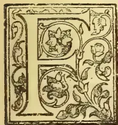A decorative initial letter 'F' is set within a square frame. The frame is adorned with intricate floral and leaf patterns. The letter 'F' itself is stylized and integrated with the surrounding decorative elements.

ROM the drying room the leaf would go direct, in a continuous stream, to the breakers and sorters, where it would be manipulated and fed directly into the bulking machines. What form the breaker and sifter will take in the future

is difficult to see; the breaker appears to be settled in all main principles, as it has been practically decided that it must be a cutter as distinguished from a breaker, and it has been demonstrated that revolving teeth are better than vibrating perforated plates, the only apparent question now remaining is how to prevail upon all the tea to oblige by lying across the teeth to be cut instead of trying to worm its way through endways. This frequently happens when the machines become old and more or less out of repair, and is got over in the most popular machine by automatically rubbing it through a strong No. 4 or No. 6 wire mesh, which would be alright if only the few long leaves were subjected to the treatment; unfortunately, however they often block the road for the well cut leaf and subject it to the same treatment, so that the saving of a few pounds in renewals frequently spoils the appearance of the tea, even if it does not result in the production of an undue amount of dust and fannings, for which the machine is unjustly blamed. Anyhow, we may confidently expect that the revolving cutter is the one which has come to stay. With regard to the sorter, it is at present a case of revolving cylinder *versus* the vibration of planes over a small arc. The revolving machine gets through a vast amount of work more or less

efficiently even when pressed, but some managers blame it for greying the tea, owing to the constant rubbing it gets by running down the rising sides; this has been got over in the latest cylinder machine by the introduction of more lifting plates and reduced diameter. The up-to-date vibrator, however, avoids this altogether by causing the leaf to jump from point to point in a manner that is absolutely bound to give it a chance to get through its proper mesh sooner or latter, if only the said mesh is long enough. The only difficulty with this machine, as now made, is, that it leaves too much to the skill and patience of the operator, as, if overloaded, it gets too deep to give the tea a chance to get through its proper mesh until the opportunity is passed. I do not think the unit size of the machine will ever be much increased, because that must entail a lot of tea being crowded and hustled about and the larger the machine, the longer the respective meshes, and so the longer the last leaf will be subjected to the possibility of being reduced to dust and fannings besides losing its bloom. It is difficult to give a strict and unbiased judgment between the two systems with regard to the future; it is highly probable that both will continue to improve as time goes on, and it is also likely that both will be backed. The cylinder has the best start, as the original jumper of many years ago was more or less of a failure from defective design, personally we would back the modern jumper for efficiency and clean sorting, when properly worked.

#### BULKING.

The bulkers will have to be sufficiently large in each case to take a full twenty-four hours' supply in each grade, they must of course be kept hot and dry as the tea will go direct from them to the packing department.

#### PACKING.

Packing will of course be mechanical in every case, but in addition to the ordinary convenient bulk sizes of chests, a large proportion of tea will continually be put up in canisters and packets for direct retail sale

113------------------------------------------------

80THE TROPICAL AGRICULTURIST.[AUG. 1, 1903.

in the country, and in the company's own shops at Home and abroad. Machines will be found—some exist already—which will weigh out pounds of tea and tie them up in neat firm packets, or seal them up in canisters bearing a graceful portrait of George Washington in the act of performing a political hyperbole, or some such tasteful decoration, designed to suit the locality of the intended sale and push it to the utmost.

#### BOX-MAKING.

Among miscellaneous departments, we may be sure that box-making will rank high. I imagine that we shall not go on for ever making clumsy boxes from *Mina* and such like wood, or importing ornate cases of veneer work with their inconvenient and costly lead foil linings. What is to prevent us from making use of our waste lands to raise such plants as will yield a coarse fibre of some sort without great cost which together with suitable forest timber can be worked up under pressure into a seamless box of coarse but serviceable and strong paper. The upper edge of the box would carry a groove into which a similarly mould-pressed lid would engage, so that some deodorised bituminous or resinous cement run into the groove before closing and clamping, would render the box both air and damp proof. Previous to packing, however, both case and lid would be treated in a vat to a process of electro deposition of some cheap metal both inside and out, which will effectually block the pores and render the box proof against every ill it is heir to, from white ants to a solitary jaunt down the Hooghly. Even the canisters will be made on this principle, and all classes of goods being packed and fastened down in an atmosphere devoid of moisture, it only remains to pass them under the printing rollers to the dry stove, or direct into the company's railway waggons.

#### CENTRAL STORE.

Another department tending largely to economy and efficiency will be the Central Store. Having all the machinery in one building, it will not be necessary to maintain stocks of spare parts in isolated factories all over the country-side, and the machinery employed being all of the largest possible units, there will be few spare parts necessary. Such expensive items as belting shafting, pulleys, etc., will be conspicuous by their absence more or less, as each machine will be driven by its own motor. Here too will be stored all tools used in the garden work and cultivation, which are not in use or are necessary for renewals. Such articles for instance, as pruning knives, which are in use for two months in the year, will, when done with, be counted in and despatched to the Central Store, where they will be cleaned up, machine sharpened, and, save where condemned as unfit for future use be greased and put away till next season. In the same way all kodallies, forks, axes, etc., will be issued in proportion to the labour and work, and save in case of argumentation of the labour force, no new tool of any sort will be issued except in exchange for an old one condemned by the divisional manager, and then only on his requisition; and such old tools will immediately be sheared in halves or otherwise defaced, so as to render it impossible to steal them, and reproduce them a second time dishonestly in demand for another new tool.

As a digression, it would be interesting to know exactly what becomes of all the old tools which year after year are condemned all over the tea districts,—here would be a small fortune in collecting them if transport rates were not so high. In any case on a vast estate, such as we are considering, the collection of old scrap iron and steel which must accumulate in the ordinary way of business, besides acting as a check on new issues of expensive stores, will represent no despicable sum when loaded into the company's own waggons on the spot and forwarded direct to the Calcutta foundries.

In connection with the store room will be the repair department, where small pieces of machinery can be turned out as required, a wood working machine or two to do planing and mortising work, for which we now pay heavy rates to Chinainen, and a small printing place for marking the boxes and decogating canisters and wrappers. All these, including the store, will be under the charge of an Engineer Assistant who will understand the use and repair of everything under his charge, and whom, therefore, it will be impossible to hoodwink in the matter of fraudulent demand of articles in stock.

This then is a general tentative idea of what the Tea Factory of the future will be like in the not very distant future; there have been some items of auxiliary machinery purposely omitted, but as this paper has already exceeded the limits originally intended we will conclude by remarking that the staff, in whose hands the new company's interests will be placed, will be an efficient staff, in fact efficiency in machinery and men will be their only *raison d'être*. It is probable, moreover, that if in entirely British hands every employee will be a shareholder in proportion to his position, and will be paid for extra efficiency and encouraged by a system of rewards to cheapen the cost of his or anyone else's department. But as a large combine is a machine, with no attributes of mercy to temper its justice, promotion will go by merit only, and the inefficient or indifferent, whether shareholder or not, will be ruthlessly weeded out, with as much consideration for his feelings or circumstances as would be shown to a worn or broken part of a steam engine.—*Indian Planters' Gazette*

### A NEW KIND OF PADDY.

CELEBRATED KINSHU PADDY OF JAPAN.

( $\frac{1}{2}$  BUSHEL EXHIBITED AT HENARATO DA A. H. SHOW

BY J. P. WILLIAM.)

Imported from United States Department of Agriculture and grown by the Exhibitor at Kola Estate, Udamanita, Siyano Korale, East Veyangoda.

Mr. Ernst A. Bessey of the above department wrote dated Washington D.C., 19th March, 1902:—"I have written to parties in Louisiana who have the Kinshu rice, and as soon as I have obtained it I shall send you a supply. I have taken pleasure in requesting that *Farmers' Bulletin* No. 110 be sent to you; this describes rice culture in the United States. That part of it describing rice culture in Louisiana and Texas will be of special interest to you, as they are the two States in which the Kinshu rice has been established. The three advantages of the Kinshu rice over other varieties are the following: (1) A larger yield: this variety yielding from 20 to 30 per cent. more than the best varieties heretofore grown in this country. (2) Harder grain: this is a very important point for rice in this country, as on account of this quality the percentage of grains broken in milling process is reduced from 30 to 40 or even more in the varieties ordinarily grown to from but 3 to 5 per cent. (3) The straw is still green when the grain is ripe, so that after the latter is thrashed out the straw makes a very good hay.

*From Year Book of the United States Department of Agriculture, 1900.*

While the rice industry of the South, and specially of Louisiana and Texas has grown rapidly in recent years, the introduction of the Kinshu rice from Japan was necessary to lift to a position among the great cereal of the country. Of this rice Dr. S. A. Knapp of Louisiana who procured the original importation in 1898 reports as follows:—

"This year has thoroughly proved the superiority of the Kinshu rice in every way under favourable conditions; the yield is on an average fully 30 per cent more than that of Honduras or South Carolina (the ordinary varieties). Under favourable conditions Kinshu rice

114------------------------------------------------

AUG. 1, 1903.]THE TROPICAL AGRICULTURIST.81

yields from 100 to 400 per cent. more than any other rice. It yielded this year 4 or 5 barrels per acre without any water except rain. The Honduras rice grown under the same conditions produced nothing. The straw is so tough that the seeds will not whip off in a storm. It mills 30 to 50 per cent more head rice (unbroken grains) than the Honduras. The Department never spent money that helped the country more than that spent in the importation of this Japanese rice. It has brought about the opening up of a development of an extensive region in South-Western Louisiana and South Eastern Texas, where the land was not previously of any value except cattle grazing. It has resulted in the investment of probably \$20,000,000. It has increased the production of rice in Louisiana more than \$1,000,000 per annum. Rice now has a future in United States second only to wheat. This rice has now been grown three seasons in South-Western Louisiana and South-Eastern Texas, the best expert says that it does not deteriorate under cultivation.

#### *Sowings at Kola Estate.*

A small quantity of the true Kinshu Paddy was sown twice as follows:—First sowing 18th September, bloomed 25th October, 38 days; reaped 25th November, 1902, in all 68 days. Second sowing on the same field 7th January, bloomed 14th February, 38 days, reaped 14th March, in all 68 days. Though the plants grew and blossomed well, the cultivation of the range of Paddy fields not having been at the same time or season for the yala harvest, the crop was infested with flies and birds and considerably damaged. It is therefore intended to sow the said fields on or about the 25th October next, so that the plants may come into maturity along with the Paddy sowing for the maha harvest. I consider that this Paddy could be cultivated advantageously in Ceylon three times a year, as is now done in the United States.

The Kinshu Paddy takes one or two days more time to germinate than any other existing varieties in Ceylon.

J. R. W.

## THE UTILITY OF ALKALINE PHOSPHATIC MANURES.

By JOHN HUGHES, F.I.C.

### THE UTILITY OF THE NEW MANURE.

Basic superphosphate can be applied, indeed has been applied in the season of 1901, with great advantage on soils deficient in lime, such as sand, gravel, granite, peat and clay. Briefly, it may be stated that all soils containing less than 1 per cent. of lime will be greatly benefitted by the application of basic superphosphate instead of slag or ordinary superphosphate. It is of practical importance to state that, though originally invented to supplement the deficient solubility of slag, which is fully recognised by those interested in its sale (they therefore recommend its application during the winter months), it has been found by actual field results that the new manure is superior also to superphosphate on soils deficient in lime. Mr. William E. Bear, of Magham Down, Hailsham, employing equal quantities of basic super and ordinary superphosphate, was able to obtain a growth of radishes, 66 per cent. greater in weight by the use of the former manure, than he did by the latter. In this case the soil contained, according to Dr. Bernard Dyer's analysis, only .68 of lime per cent. in the dry state. In another experiment on the farm of Mr. Ouston, near Grimsby, in Yorkshire, basic super used at the rate of 5 cwt. per acre, gave a specially good crop, and the soil on analysis was found to contain only .78 of lime per cent. Mr. Edward Packard, at Saxmundham, obtained by the application of 5 cwt. of basic super per acre, 18 $\frac{1}{2}$  tons of swedes, against 15

tons produced by 5 cwt. of slag, and 14 $\frac{1}{2}$  tons from the no manure plot, the soil in this case containing 1.75 lime per cent. It is well known that soils subject to the disease known as finger and toe in turnips are naturally deficient in lime, containing in fact considerably less than 1 per cent., and on such soils it is reasonable to suppose that an alkaline phosphate manure would naturally be a more suitable dressing than an acid phosphate manure such as superphosphate. During the season of 1901, numerous instances were recorded in which basic super has been used on such soils with very marked advantage, the virulence of the disease being materially reduced, and in some remarkable cases in Scotland, its application has completely prevented any attack, while other parts of the field manured with ordinary superphosphate had suffered very much from the disease. In connection with this subject it may be convenient to point out by means of the following tabulated figures, the relation in which lime and phosphoric acid are respectively removed from the soil by ordinary farm crops.

LIME AND PHOSPHORIC ACID REMOVED PER ACRE BY FARM CROPS.

<table border="1">
<thead>
<tr>
<th></th>
<th>Lime.</th>
<th>Phosphoric acid.</th>
</tr>
<tr>
<th></th>
<th>lb.</th>
<th>lb.</th>
</tr>
</thead>
<tbody>
<tr>
<td>Clover hay, 2 tons ..</td>
<td>66</td>
<td>25</td>
</tr>
<tr>
<td>Turnips, root, 17 tons</td>
<td>25.5</td>
<td>22.5</td>
</tr>
<tr>
<td>    "    leaf</td>
<td>48.5</td>
<td>10.5</td>
</tr>
<tr>
<td>Mangels, root, 22 ton</td>
<td>24.0</td>
<td>34.0</td>
</tr>
<tr>
<td>    "    leaf</td>
<td>29.0</td>
<td>15.0</td>
</tr>
<tr>
<td>Swedes, root, 14 tons</td>
<td>19.5</td>
<td>17.0</td>
</tr>
<tr>
<td>    "    leaf</td>
<td>22.5</td>
<td>5.0</td>
</tr>
<tr>
<td>Beans, grain, 30 bushels</td>
<td>3.0</td>
<td>22.5</td>
</tr>
<tr>
<td>    "    straw</td>
<td>20.0</td>
<td>9.5</td>
</tr>
<tr>
<td>Meadow hay, 1<math>\frac{1}{2}</math> tons ..</td>
<td>28</td>
<td>13</td>
</tr>
<tr>
<td>Potatoes, tuber, 6 tons</td>
<td>3.0</td>
<td>24.0</td>
</tr>
<tr>
<td>    "    haulm</td>
<td>23.0</td>
<td>3.0</td>
</tr>
<tr>
<td>Oats, grain, 45 bushels</td>
<td>2.0</td>
<td>12.0</td>
</tr>
<tr>
<td>    "    straw</td>
<td>10.0</td>
<td>7.0</td>
</tr>
<tr>
<td>Wheat, grain, 30 bushel</td>
<td>1.0</td>
<td>14.5</td>
</tr>
<tr>
<td>    "    straw</td>
<td>10.0</td>
<td>8.5</td>
</tr>
<tr>
<td>Bailey, grain, 40 bushels</td>
<td>1.5</td>
<td>15.0</td>
</tr>
<tr>
<td>    "    straw</td>
<td>8.5</td>
<td>5.0</td>
</tr>
</tbody>
</table>

It will be seen that in respect of an average crop of clover, hay, turnips, mangels and swedes, lime is relatively required in greater proportion than phosphoric acid. It is useless, therefore, to expect to grow good crops, or crops free from certain diseases, if there is a deficiency of lime. On the other hand it would appear that wheat, barley, and oats require phosphoric acid in greater proportion than lime, though the actual quantities are much less than in the case of root crops or clover hay. This table of figures is also useful in illustrating the great waste of applying lime in large quantities, such as 3 or 4 tons per acre, for the actual crop requirements would appear to be less than 100 lb. per acre. If 2 or 3 cwt. of superphosphate are considered sufficient to supply the requisite quantity of phosphoric acid, surely 3 or 4 cwt. of lime should be sufficient to supply the requisite quantity of lime. Of course this remark only applies to the application of lime to ordinary well-drained soil, and not to damp sour grass land where the natural acidity of the soil, would require larger dressings of lime. But under ordinary conditions large dressings of lime are practically wasted because the slaked lime, which is not absorbed by the soil or the plant, rapidly becomes converted into carbonate of lime, in which form it is but little soluble in ordinary water. Usually, where the soil is deficient in lime, the cost of its application is very great by reason of carriage from a distance, and in all such cases basic superphosphate will be found particularly useful and decidedly eco-

115------------------------------------------------

82THE TROPICAL AGRICULTURIST.[AUG. 1, 1903.

nomical, because in addition to supplying from 25 to 27 per cent. of phosphate of lime in a form sufficiently soluble to afford available plant food, it also supplies an appreciable dressing of caustic lime. How beneficial small dressings of alkaline ashes are may be inferred from the practice in India of burning the stubbles after the removal of the corn and previous to the usual rainfall. In this country the custom of collecting and burning the common cough grass (*Triticum Repens*) is to be highly commended as being not only the most effectual way of eradicating this troublesome weed, but as being a cheap means of supplying valuable alkaline ashes to the soil; for these ashes materially assist that important bacterial action whereby the inert vegetable matter of the soil is converted into valuable fertilising compounds such as nitrates.

A strong argument in favour of the utility of alkaline-phosphatic manures is afforded by the fact that all the natural manures hitherto used in agriculture are distinctly alkaline. Thus farmyard manure in the efficacy of which farmers thoroughly believe, is alkaline, and its agricultural value depends upon the extent to which the nitrogen compounds are converted by proper fermentation into ammonia salts. Guano, especially the good old Chincha Peruvian quality, is strongly ammoniacal. Bonedust, dried blood, woolen waste and shoddy, also soot, and lastly lime, are all more or less alkaline in their nature, and certainly not acid. Moreover, it is hardly necessary to repeat that basic slag is itself a striking instance of the utility of alkaline phosphate of lime as a manure for certain soils. Indeed it is not natural that manure should be acid, and the reason why ordinary acid superphosphate has been beneficial to crops grown on good arable land, is that the acidity of the manure has been absorbed or neutralised by the abundance of lime usually present in such soils. Obviously, where the soil is deficient in lime the acidity of superphosphate cannot be immediately absorbed, and harm may be done to the young rootlets of the plant. It would require a very heavy dressing of lime to saturate the soil so completely that every square inch of surface should always contain the necessary quantity of lime requisite to absorb the acid from every particle of manure that may be brought in contact with it. In other words it is much more economical to add lime in small quantity to the manure for the purpose of immediate and complete neutralisation, than to add lime in large quantities and at long intervals to the soil in order to provide a wasteful excess of alkali for the absorption of a minute quantity of acid. The necessity of relying upon a sufficiency of lime in the soil is entirely removed when using basic superphosphate, as by the careful admixture of an excess of lime in its manufacture all acidity is removed and the manure may be applied, mixed directly with the seed without any danger of destroying the vitality of the same. As a practical demonstration of the injurious effects produced by the continued annual application of acid salts, it is only necessary to refer to the report on the Woburn experiments by Dr Voelcker in the last number of the "Journal of the Royal Agricultural Society," in which a photograph is given of absolutely barren spots where the barley crop had entirely failed in consequence of the annual application of sulphate of ammonia to a ferruginous sandy soil. These barren spots were evidently due to the local accumulation of acid compounds and the absence of sufficient lime, for on the adjoining plot, which had received the same quantity of ammonia salts annually, but had in addition received a dressing of lime, the barley was looking thoroughly healthy. On such soils as that at Woburn, basic super, which in addition to phosphates, supplies some caustic lime, will naturally be more suitable than ordinary super, and when it is remembered that four-fifths of the former consists

of ordinary superphosphate, the manufacturer will find it to his interest to supply the new manure. Indeed, on all light sandy ferruginous soils manufacturers are at present in an awkward position, because acid manures being unsuitable it follows that alkaline manure, superior in its fertilising properties to basic slag, should be supplied, as otherwise no practical opposition to the use of slag is available. Basic superphosphate has the advantage that it can be mixed with nitrate of soda without any fear that the valuable nitric acid will be decomposed or driven off by an excess of acid, and the resulting compound is in an excellent dry powdery condition, admirably adapted to secure uniform distribution as a top dressing. During the season 1901 the manure has been sold in 187 places in England, 72 in Scotland, and 13 in Ireland. Many of the deliveries so included were in quantities of 10 to 20 tons, consigned to agents, so that the actual local trials have been still more numerous. The practical results obtained in the field have, notwithstanding the dry season, been most encouraging, and have fully realised the favourable opinion originally formed from the analytical results.

#### CONCLUSION.

In conclusion, it should be mentioned that basic superphosphate is not intended to supersede ordinary acid superphosphate upon soils containing plenty of lime, nor is it intended to take the place of well ground slag for application to damp sour land; but it is rather intended to take an intermediate position between these two well known and most useful manures, and to be employed as a quick acting alkaline phosphate manure, specially useful as a spring dressing for crops grown upon soils that contain less than 1 per cent. of lime, the united acreage of which represent such a large area of the cultivated land in the United Kingdom. The utility of alkaline phosphate manures when applied to certain soils has already been practically demonstrated by the great success that has attended the use of basic slag, notwithstanding its slow solubility, its frequently defective grinding, and recently, its reduced percentage of phosphate. If therefore a material of similar alkalinity, but of greatly superior solubility, can be obtained in an unlimited quantity, and of uniform quality, it is reasonable to anticipate that basic superphosphate will prove to be a really useful and most valuable additional fertiliser. The time has come when manures should be adapted to the soil, rather than that the soil should adapt itself to the manure. Obviously, soils differing so much in their chemical composition and physical character, as chalk and clay, peat and sand, granite and gravel require different manures, in the same way as they require different cultivation and different kinds of crops. It is not scientific, it is not economical, and it cannot be to the advantage of the farmer, that one kind of manure should be sold for application to all kinds of soils. Acid manures may with advantage be applied where there is plenty of lime, and alkaline manures may be more profitably applied where lime is deficient.

#### DISCUSSION.

The Chairman thought the Society was indebted to the reader of the paper for the way in which he had clearly placed before the audience the relative actions of various phosphatic manures when applied to different types of soil, and also for the fairness and candour with which he had stated the claims of the new substance of which he was the parent. Mr. Hughes had asked them to look upon the new manure as filling a gap which had been recognised to exist in the ordinary systems of manuring. It was well known that on an ordinary chalky soil or on a loam of an alkaline nature superphosphates answered every possible requirements of a manure to supply phosphates. It was also known that on a great number of soils

116------------------------------------------------

AUG. 1, 1903.]THE TROPICAL AGRICULTURIST.83

basic slag. He wonders where superphosphate had been found a difficult manure to apply. But there still remained a residuum of curious failures—certain soils which did not seem to respond in the way one would expect to basic slag. It was not always possible at first sight to predict why those failures occurred. Many happened on soils, almost acid in character, which were distinctly wanting in lime, and on soils where phosphates were deficient. Certain classes of sandy and gravelly soils required both the lime and the phosphate, and yet they gave very indifferent returns when basic slag was placed upon them. That might be due to the physical conditions of the soil or want of water; but at the present time it must be accepted as an experimental fact that basic slag utterly failed to answer expectations on such soils. Mr. Hughes had put forward his particular manure as likely to be most efficacious in dealing with that class of soil. Mr. Hughes had raised the question of solubility in two senses. He had, perhaps, not distinguished enough between the solubility in water which characterised the superphosphates and the solubility in the weak acid test solution which characterised the new manure. If solubility in water had a virtue at all, it was that it ensured in the soil the distribution of the manure. Superphosphate applied to the soil was washed down by the soil water dissolved in it, and promptly re-precipitated inside the soil wherever it met with a particle of carbonate of lime, and was then re-precipitated in the same form as that in which the phosphate of lime must be present in Mr. Hughes's manure, *i.e.*, the superphosphate of a soil containing any carbonate of lime would eventually result in the precipitated phosphate under discussion, only the mere fact that it had been precipitated inside the soil from the solution formed on the surface ensured an intimate and local distribution under the soil, which could not be obtained by any form of manure spreader followed up by cultivation. That, he took it, was the great advantage which superphosphate possessed over any other form of phosphate; and the fineness of grinding which had proved to be so effective in the case of some mineral phosphates and basic slag, was an attempt to reproduce that intimate distribution in an artificial fashion. Mr. Hughes had placed before them as one of the chief tests of the merits of the manure as compared with the others the superior solubility the substance possessed in a particular solution of citric acid. While he did not wish to depreciate the value of such a test as applied to any manure, it was necessary as far as possible that laboratory experiments should be checked by experiments in the field, because the soil was an extraordinary complex body. It was very difficult to regard the soil as otherwise than simply so much inert material which would re-act as it did in the laboratory. So far from that being the case the soil was only a store-house of living organisms; and it must always be remembered that it was a medium for supplying the plant with water. There were curious differences in the surface which the soil particles possessed. The surface of a cubic foot of clay soil amounted to something like two or three acres, whereas in a sandy soil the surface was reduced down to less than one acre. There were all sorts of such curious differences on the border line between physics and chemistry in the absorption of soluble material, and in the way they would afterwards be yielded up either to the soil water or to the natural acid solvent which the sap of the plant possessed. He, therefore considered that they should proceed slowly in deductions obtained from laboratory experiments compared with field practice; laboratory results must be checked by actual field trials. He would have been pleased if Mr. Hughes had brought forward a more exact account of some of the field trials. Mr. Hughes laid down that basic slag would only act upon, comparatively speaking, sour acid soils which had

been deprived of their lime. He was rather inclined to question that statement. Basic slag acted on a good many valuable clay soils which could in no way be described as acid soils; in fact, it was a very difficult thing to say where the acid soil began. He thought it was necessary to push the examination of an acid soil a little further than merely determining the amount of lime it contained. The laboratory with which he was connected had been for some considerable time engaged in examining not merely the lime contained in a number of soils, but the amount of that lime present in a basic condition *i.e.*, the amount of the carbonate and the alkali earth which they contained. It must be remembered that the lime which was present in a soil must be present as a sulphate; it might be lime as silicate, but it might not be carbonate of lime, which was the base that any soil acted as a neutraliser of the acids produced by decay. He had found many fertile soils, showing no signs of sourness, which contained no measurable quantity of carbonate of lime, seeming to be in an absolutely neutral condition, having neither acid or alkali, and yet which carried very good crops. Where the bases which seemed to be necessary for so many of the vital processes came from in those soils he could not say at the present moment. He thought it was necessary to revise their classification and ideas of what constituted an acid soil, and to examine more closely with regard to the presence or absence not only of calcium, but of those carbonates of calcium which constituted the active bases of the soil. Turning to the more practical question of the use of lime, he was inclined to differ from Mr. Hughes's remarks that the calcium carbonate itself, when it was once found in the soil, was of no service. It seemed to him that it was one of the most valuable things if it got freely into solution. One of the most characteristic substances found in drainage water was calcium bicarbonate. If any lime were applied to the soil and became calcium carbonate, it was bound to circulate in the soil in the form of calcium bicarbonate. He wished to ask Mr. Hughes if he had considered whether, on the whole, it was economical from the larger standpoint to first of all make a superphosphate and then to proceed to neutralise that with lime, so to speak, to destroy the material which had already cost money. It had been his practice for some considerable time, in dealing with soils where basic slag did not seem to answer, and where, from the absence of lime, superphosphate was not likely to do much good, to make up a mixture of superphosphate with some other ground phosphate, which was left for some little time to re-act, the mixture then being applied to the soil. He always obtained very good results from such a mixture. The acid which might be on some occasions injurious in such soils had been removed in the very advantageous way of passing over more calcium phosphate. He would like to ask Mr. Hughes whether the substance might not be improved by first of all neutralising the superphosphate with a neutral phosphate, and then, if need be, adding the requisite amount of lime to produce the actual alkaline reaction. In advocating his manure Mr. Hughes was once more recalling to farmers the importance of the use of lime upon their soil, a most important consideration. Everywhere one heard that the lime kiln which used to be on the estate had now tumbled to pieces, and the farmers instead of putting lime on the land used superphosphate and phosphate of lime, thinking that absolved them from the necessity of treating the land with occasional dressings of caustic lime or even chalk, which used to be a staple part of the routine of agriculture. It was impossible to hammer too much into farmer the fact that superphosphate and phosphate of lime were not lime at all in the sense in which caustic lime originally was used. The use of an artificial manure, so far from absolving the farmer from the necessity of

117------------------------------------------------

4THE TROPICAL AGRICULTURIST.[AUG. 1, 1903.

using lime only made it far more necessary that he should put some base upon the soil which would neutralise the superphosphate, and combining with the acid part of the sulphate of ammonia, which provide bases for nitrification in the various manures used. Feeling very strongly how much dressings of lime were required throughout the land, he wished every strength to Mr. Hughes's elbow in the introduction of a satisfactory superphosphate.

Mr. Hermann Voss thought that the reader of the paper would agree that well-made superphosphate contained only minute traces of free sulphuric acid, the acid in superphosphate being due to free phosphoric acid. He, therefore, thought the statement should not go forth to the public that ordinary superphosphate contained such a dangerous substance as sulphuric acid in a free state. Manufacturers of superphosphate took great care that any excess of sulphuric acid should be absorbed, many thousand tons of phosphate which contained from 40 to 50 per cent. of carbonate of lime being imported into this country from Belgium for that special object. The acid, damp, and lumpy condition of superphosphates which existed twenty years ago did not exist at the present time, so that the advantages of the new manure were not so great as Mr. Hughes had made out. The most interesting part of the paper was, that the reader of it had collected a number of facts indicating that what was really required in the soil was lime. It was necessary that a farmer, in order to utilise the manure to the best extent, should have plenty of lime on his land, by which means finger and toe disease sometimes caused by an excess of superphosphate, could be avoided. Five million tons of superphosphates were used every year in the whole world; and although the use of basic slag had largely developed, it had had the effect of increasing the consumption of superphosphate.

Mr. John Ruffle thought the basic superphosphate to give the best result should be made very fine. He suggested as a standard, that 90 per cent. of the substance should be sent through 180 holes to the linear inch, the remaining 10 per cent. not necessarily coming up to that standard. Such a fine substance would be easily dissolved, and could be distributed through the soil better than an acid phosphate.

Mr. F. J. Lloyd said he had noticed of late years that the result obtained by a dressing of a certain quantity of superphosphate upon a soil had not been so great as would have been produced by the same amount of dressing if it had been applied to a similar soil 20 years ago. In endeavouring to discover the reason, he thought, if his ideas were right, he could throw some light on the question of phosphatic manures. Downing proved that lime in the soil was continually sinking, and it was known that the lime in the soil which did not sink, was continually being taken away in the plant. The consequence was there was a tendency in the soil to which lime was not applied for the lime to disappear from the top surface of 6 or 8 inches in which a plant mostly lived. He believed that the soils of England today in those 6 or 8 inches were very greatly deprived of lime, and that the mere application of lime in any form to the surface would not remedy the defect. Why was it that superphosphate always gave the best result during the first year of its application; and that practically no result could be seen a year after it had been applied? He believed it was due to the fact that the phosphate in the superphosphate was soluble in water, and, being dissolved in the water of the soil, it penetrated into the soil along those courses through which the water flowed most freely. The root of a plant was always known to take the course of least resistance, which would be along those same channels. Therefore in the first year after

the application of the superphosphate the plant roots travelled along those same lines on the borders of which the phosphate had been precipitated, and that was why the superphosphate gave all its results during the first year. If the soil to a depth of 6 or 8 inches was deprived of lime, the soluble phosphates from the superphosphate, instead of being precipitated along those courses which the plant root frequently took, sank into the subsoil before it met lime to precipitate it, and for that reason the same results for a definite quantity of superphosphate were not obtained because it had been precipitated too low for the roots of the plant to utilise it beneficially. For that reason he believed the introduction of a manure free from acid which would apply a phosphate of lime in a form easily assimilable by plants would prove of very considerable benefit to the farmers of E. gland. He would have liked to deal with the question of how to estimate the availability of the substances in the soil and the substances in the manures applied to the soil; but it was perfectly evident that not only in England, but in every other country where manures were applied, the time had come when some authoritative body should lay down a definite standard which could be accepted universally as a means of estimating the available food in both a soil and a manure.

Dr. S. Rideal thought it was by no means proved that basic slags were at a disadvantage compared with the neutralised phosphate suggested by Mr. Hughes. The use of slag had increased enormously in recent years, due probably to the fine grinding, and when one compared the ratio of slag used in Germany, to that of superphosphate in England, one must conclude that basic slags had the disadvantages one was led to imagine existed. Basic slags certainly had an alkalinity similar to that claimed by Mr. Hughes, and it would be interesting to know whether Mr. Hughes had any definite opinion as to what the definite phosphate was which existed in his neutralised superphosphate. With regard to the question of manufacture, was it not feasible that if there was a basic slag which was alkaline and acid superphosphates which had injurious effects upon soils deficient of lime, then a mixture of the two ground together would bear out the theory propounded by Mr. Hughes. There was no occasion to convert the mineral phosphates into superphosphates. The Germans had already realised that point in the tremendous growth of the Thomas slag, and the deficiency of the pig-iron in phosphorus had led the German manufacturers to add mineral phosphates so as to produce a slag rich in phosphate. That seemed to him to be a method by which the native mineral phosphates could be converted into a basic slag phosphate suitable for use. The question to be considered was whether it was the ratio of lime to phosphate which caused the beneficial results. Although lime, phosphate and nitrogen were elements of plant life, potash was also a very important constituent. Potash was an alkaline body which could be used for neutralising the superphosphate, and a mixture would then be obtained containing lime and potash which, he believed would be superior to the mixture suggested by the reader of the paper. If the potash statistics were inquired into abroad as compared with England, it would be found that the increase in the Thomas slag had been accompanied in Germany and France by an enormous development in the use of potash manures. The land in this country was starved of potash. He thought the problem ought to be studied in relation to the alkaline phosphates, and not merely in connection with lime phosphates of unknown alkalinity.

Mr. Edward Packard thought there was no commercial form of potash which could be applied as an alkali to produce the action suggested by Dr. Rideal. The Chairman had asked why the reader of the paper had not given a large number of authentic

118------------------------------------------------

AUG. 1, 1903.]

THE TROPICAL AGRICULTURIST

85

cated results of the experience of last year. The fact was, that when the basic superphosphate was brought before those in authority who had opportunities of making experiments, they took no notice of it. He thought Mr. Hughes had proved that the basic super might prove a valuable adjunct, under certain circumstances, to the soil of the country. In some experiments, in which he had tried the basic superphosphate with nitrate of soda and potash, as against superphosphate, sulphate of ammonia, and potash, the results were astonishingly in favour of the basic superphosphate. Experiments were being carried on, and, in course of time, results of great value would be published.

Mr. James Hudson said that for years past he had been impressed with the fact that fruit growers made too free use of nitrogenous manure, especially in growing tomatoes. He had proved over and over again that regular successions of crops of cherries could be grown by the use of phosphatic manure, finely ground, as suggested by Mr. Hughes. He agreed that the constituents of the soil must be known before the right artificial manure could be applied.

Dr. Teed expressed the opinion that Mr. Hughes's discovery would be of the greatest benefit to the agriculture of the country.

Mr. D. A. Louis thought Mr. Hughes suggestion of mixing lime with a superphosphate was exceedingly valuable, because it enlarged the scope of the superphosphate. It made it appropriate to many soils, where it would otherwise have been very harmful.

Mr. Hughes, in reply, said the Chairman had alluded to certain cases in which the soil, although not deficient in lime, had given good results by the use of basic slag, but had afterwards stated that the soil was clay. It was well known that clay had the property of holding water to a considerable extent, and in his paper he laid great stress upon water as a factor in rendering slag soluble. He was, therefore, not surprised that it gave good results on clay. Further, bicarbonate of lime was often found in water; certainly as carbonic acid it usually came from decomposed organic matter; and if it so happened that organic acid came in contact with lime in the soil, one might be quite sure that the water that passed away from the soil was largely impregnated with carbonate of lime. The Chairman and other speakers had suggested the mixture of raw phosphate with the super. The object of mixing lime was to neutralise the acidity of the superphosphate; and if a material costing only 18s. or 20s., a ton in the form of lime could be used, why should raw phosphates, which cost £3 a ton, be used? Assuming that raw phosphates were used, the tables showed the extent to which they were acted upon by the weak solution of citric acid; only one-third of the phosphate would be saturated by the acid, two-thirds being wasted. He could not understand the remarks made in advocating the use of lime. He endeavoured to lay down very clearly that it was far more expensive to supply sufficient lime, so that every square inch of a field should contain enough lime to neutralise any acid, brought in contact with it. After adding about 20 per cent. of lime to the superphosphate, sufficient to neutralise all the acid and produce a slight excess in order to give it a distinctly alkaline character, everything was done that was required. He thought, therefore, the mixture of lime and superphosphate was one of the most profitable ways in which lime and phosphat could be applied to ordinary soils. He quite agreed with Mr. Voss, that any acidity in the superphosphate was due to the presence of free phosphoric acid and sulphuric acid. He top-dressed a row of peas with superphosphate and nearly killed them, which led him to the conclusion that there must be conditions in which superphosphate used as a top-dressing was

anything but beneficial. If it was injurious to the leaf, he submitted the acidity was equally injurious to the small rootlets of the plant, and on that principle his manure ought to be beneficial. Although basic slag was only soluble to the extent of 6 per cent. in ordinary water there had been a great demand for it; it had been of very great benefit, and many farmers were thoroughly satisfied with it. When slag was brought out the practical manure manufacturers all discarded it, and yet without any recommendation it had forced its way forward and demonstrated that an alkaline phosphate was the best form in which phosphates could be applied. No criticism had been offered on his remark that all the natural manures of the farm were alkaline and not acid, a point of great importance. Surely they must do well if nature was followed as a guide. He thoroughly believed in superphosphate and did not wish to detract from its merits, but its use should be restricted to soils which contained plenty of lime, just as basic slag was confined to soils which were particularly sour, and the new manure to intermediate soils. As time went on, with judicious use, it would be found there was plenty of room for all the manures.

On the motion of the Chairman, a vote of thanks was accorded to Mr. Hughes for his paper.

## PINEAPPLE CULTURE.

The culture of the pineapple has been developed much more carefully and upon a much more scientific basis on the Florida coast, or rather on the Florida peninsula, than in any other part of the globe. Of course we refer to open-air culture as distinguished from green-house culture under glass. Shedding for frost protection is carried on to some extent, but whether it pays as well as open air culture is still an open question. In this article we will simply consider the best methods adopted in open-air cultivation, leaving out the question of sheds entirely. There has nothing particularly now developed during the past year in this line, but for the benefit of beginners we are going over the same old ground again.

In the first place, select land which has as good a growth of timber as possible, and it is also very desirable to have yellow subsoil as near the surface as possible. Spruce pine and hickory are generally the growth on such land, but long-leaved pine is the timber on some of it. As a general thing hamock land unless largely hickory, is not desirable pineapple soil, and cabbage palmetto or too much saw palmetto is not a good indication. Neither are shells or lime rock, as a general thing. On such soils the pineapple is very liable to suffer from disease and insects. In clearing the land, the spruce pine stumps may be left, as they soon rot out, but every little root of the hardwood or saw palmetto should be removed, if possible. If the land is very poor, an application broadcast of a ton of steamed bone, and two tons cut tobacco stems per acre may be plowed in with advantage before planting. Select the heaviest slips, and plant as early as good, heavy six-inch slips can be obtained; no matter if some are longer, but have six inches the minimum. Set as deep as you can without danger of sand washing into the bud. The butt end should be trimmed by cutting off a slice one-quarter to a half inch thick with a sharp knife and peeling off a few of the lower scale-like leaves.

About twenty inches is the distance preferred for setting the Red Spanish variety, (the one which we are considering in this article), and the land can be marked off rapidly with a marker made like a large wooden rake, having teeth twenty inches apart. After marking out the whole field one way with parallel lines, mark off similarly at right angles, and plant where the lines intersect. After the field is all

119------------------------------------------------

86THE TROPICAL AGRICULTURIST.[AUG. 1, 1903.

marked with twenty-inch checks, you can lay off your alleys and main avenues as you please, skipping a certain number of rows where you want a path. The main avenue should run across the centre of the field and be wide enough for a waggon or a tram-road. The alleys running at right angles from this should be at intervals of twenty to thirty rows, and be from two to four rows wide. When the fruit is gathered the pickers stand in the beds, and as they break off the fruit toss it to men who stand in those side alleys who catch it and convey it the main avenue where it is loaded on a cart or tram-car.

As soon as the field is planted apply a large pinch of tobacco dust and cottonseed meal or castor pomace (half and half) in the bud of each slip. As soon as the plants begin to root some apply 600 pounds per acre and scuffle it in. This can be repeated with advantage if the weather is wet, every month or six weeks, always bearing in mind that it is waste to apply fertilizer to young plants in dry weather. A ton or more can be applied to advantage per acre during the first six to eight months. Castor pomace is at present the cheapest, and tobacco is not much needed at first unless the slips have red spider or mealy bug. In this case apply tobacco dust in the bud frequently and heavily. Keep the buds always full and the spiders will soon disappear, if there is much rain.

For the first twelve months nothing else is needed on the young field but these fertilizers, and from 3,000 to 5,000 pounds per acre can be used to advantage. Apply often and lightly, and scuffle frequently. You can't cultivate too much. The second September use blood and bone mixed with one-third its weight of 50 per cent. sulphate potash, half a ton per acre. Then in November use same, half and half, from 500 to 1,000 pounds, as needed, and in January apply half a ton to 1,500 pounds of half-stemmed bone meal (or flour) and half potash. Always use the 50 per cent. sulphate and the high grade blood and bone.

Do not work or cultivate your field again till the fruit has been gathered, and then apply first castor pomace, in July, then proceed as before through the autumn. While this is not an ironclad rule for procedure, it is as good a rule to follow as any you can formulate, and will always produce the maximum results. The pineapple is severely damaged by many of the very best kinds of commercial fertilizers as has been proven by experience and latter by some exhaustive tests carried on at Jensen by Prof. Rolfs of the agricultural department. With these fertilizers the maximum results will be obtained, and the greatest immunity from disease and insects insured, securing a long-lived field.

Bear in mind that at any time the red spiders make their appearance, tobacco dust is the remedy to be applied freely and at once, in the buds of the plants. If dry wilt appears, better pull up the plant at once, remove from field and burn and replace with a healthy sucker.

In gathering fruit for shipment always gather while cool, if dry (free from dew); or if they are hot from the sun, leave them in the packing house over night to cool before boxing.—*Times-Union*.—*Florida Agriculturist*.

#### QUEEN OF FLOWERS.

This magnificent flowering tree, a native of Ceylon and India (*Lagerstroemia Flos-reginae*), is well known in the West Indies but it is not so generally cultivated as it deserves. Besides the beauty of its flowers the timber is very valuable. The flowers are usually purple but there is a handsome variety at the Botanic Station at Antigua with pink flowers.

With regard to the occurrence of the tree at Barbados the Hon'ble Forster M. Alleyne (Porter's) writes as follows:—

I think you would be conferring a great benefit to Barbados, if you would endeavour to increase the

supply of plants of our beautiful flowering tree the 'Queen of flowers, which seems to merging on extinction. I have a fine tree here, now in full bloom, which bears copious seed pods, but for years past I have been unable to obtain fertile seed. I have also tried cuttings and layers, but to no effect. Possibly others more skilful than myself have succeeded but I have not heard of them. All the trees of this species which I know in Barbados are very old, and there seems reason to believe that it will die out in a few years if efforts are not made to rejuvenate it. The skill of your Department may remedy this evil, either by raising seeds or by importing young plants from other islands, which could not fail to be a great boon to the community.—*Agricultural News*.

#### CULTIVATION OF ALOE FIBRES.

M. Ch. Rivière has given in the "Journal d'Agriculture Tropicale" (January, 1903) a short account of the climatological distribution of aloe fibres under culture.

For hot and damp tropical regions, *Furcraea gigantea*, "Mauritius hemp" a species remarkable for the length of its fibre, is especially indicated. In moderately hot countries in which the summer heat is prolonged and the thermometer rarely falls to zero, the Mexican plants are to be preferred; the variety most exploited is "Sisal hemp" or "Henequen" (*Agave rigida*). In elevated regions where the heat is prolonged and the rainfall small, but where cold is sometimes experienced, the Tampico hemp (*Agave heteracantha*) is the most suitable plant on account of its comparative hardiness. Finally, *Agave americana* and *Agave mexicana* can be cultivated in almost any climate except those in which frost is common and protracted.—*Board Of Trade Journal*.

#### PINE-APPLES IN JAMAICA.

As showing the difficulty sometimes experienced in pine cultivation in the West Indies owing to the selection of an unsuitable locality and other causes, we quote the following from the *Jamaica Gleaner* of May 4:—We learn that the United Fruit Company's experiment in pine growing at Gregory Park has not turned out the success it was anticipated. The plants have grown to an enormous size but will not fulfil the promise of a fine crop. It is stated that fully 50 per cent. of the plants are bearing 'cocks' combs' and many-headed pines. We understand that this generally happens when the soil is of an excessive richness and when there has been over fertilization. It is said that the experiment has so far cost over £500. There is a belief, however, that the next crop will yield better results.—*Agricultural News*.

DRESSING FOR HORSES.—The following simple treatment for galls and sores on horses is strongly recommended in the *Sugar Planters' Journal*: 'Use one part pure oxide of zinc to about 12 to 14 parts of vaseline. Mix well. A little melted, strained mutton tallow added improves it, but is not absolutely essential. Use for galls, sores, and all skin ailments of animals.—*Agricultural News*.

OPOSSUMS AMONG BANANAS.—A Dundee grocer, on opening a box of bananas, shipped at Jamaica, was startled to find among the fruit five animals. The Zoological Department was communicated with, and on an examination by Professor Darcy Thompson, the animals proved to be opossums. One was the mother and the other four her young. Two of the young opossums were dead, but the mother and the other two on being tended to are now doing well, *Home Paper*.

120------------------------------------------------

AUG. 1, 1903.]THE TROPICAL AGRICULTURIST.87SILKWORMS AND SILKWORM REARING.

In the West End parks of London, and also in one two of the fashionable squares, are to be seen a few average specimens of the *Ailantus* tree, which does not, on the whole, suffer from the conditions that vegetable life has to submit to within the metropolitan district. The glossy leaves might suggest to us some association between the tree and a silken product, the *Ailantus* being, in fact, the special food of one of the silkworms, *Bombyx* or *Attacus Cynthia*. The silk spun by this species, *A. Cynthia* is to be recognised by its great softness, also both fabric and skeins, as obtained in China, indicate that the thread is reeled or wound by the dexterous natives. From the circumstance that this particular kind of silk has taken its name from the tree on which the worms feed some have called *Ailanticulture* the nurturing and breeding of these worms, which is scarcely an appropriate term being more applicable to the cultivation of the tree. Experiments have proved that the larvae of *Attacus Cynthia* will eat, and even do tolerably well, upon Lilac, Cherry, or *Laburnum*, but it is desirable to obtain for them a supply of the leaves of their favourite food plant.

The moth of *Attacus Cynthia* surpasses in appearance the better known insect *Bombyx Mori*, and has a greater expansion of wing. This is one of the silkworms in which the winter is passed within the cocoon, from which the moth emerges some time in May or June. Eggs being then laid young worms come forth at the end of July or August, living seven or eight weeks.—*Journal of Horticulture and Cottage Gardener*.

## NOTE ON SIMPLE MACHINES FOR EXTRACTING PLANTAIN FIBRE.

The objects of the present "Note" are (1) to again draw attention to the common plantain as a latent source of an immense quantity of fibre which has hitherto been practically wasted and which might be turned to account by the Indian ryots; and (2) to furnish some information about the two types of primitive machines which are believed to be in common use by the peasants in the Philippine Islands for extracting the fibre of *Musa textilis* (which is the plantain largely grown there for the production of the fibre known in commerce as "Manilla Hemp"), as they are equally well suited for extracting the fibre from the common plantain.

\* In the preparation of this Note, the following works have been consulted:—*Fibrous Plants of India* by Dr. Forbes Royle (pages 61-90); *Selections from the Records of the Madras Government*, No. XXIII, *Reports on the fibres of Southern India*; *Journal of the Agricultural and Horticultural Society of India*; *Report on Indian fibres and fibrous substances* by Cross, Bevan, King Joynson and Watt; *Tropical Agriculturist*; *Dictionary of the Economic Products of India* (Volume V. pages 296-307); *Kew Bulletin*.

The labours of the leading scientific men and laymen who have interested themselves in this subject are recorded, quoted, or referred to in the works mentioned above. Besides these works, there are numerous valuable articles which have been written about plantain fibre and which are embodied in the records of the Government of India, and in the Proceedings of the Agri-Horticultural Society Madras.

Although "Manilla Hemp" is yielded by a species of plantain, the fibre is altogether superior to that yielded by the varieties of plantain which are cultivated in India primarily for the sake of their edible fruits. So valuable is the fibre of *Musa textilis* that it practically rules the market in white fibres; while the fibre obtainable from varieties of the edible plantain is, as a rule, valued at very little more than half the price of "Manilla Hemp."

The existence of fibre in the common plantain has probably been known in India from ancient times, and its value and utility have been brought prominently to public notice at intervals from time to time. In the early part, and in the middle, of the last century, the subject came under the notice of many eminent men in India, foremost among whom was Dr. Forbes Royle, who, in his "Fibrous Plants of India," pages 61-90, has given a great deal of valuable standard information about plantains and bananas and their products; while in this presidency, Dr. Hunter, among others, seems to have taken a keen interest in the subject. At that time owing to the temporary suspension of the supplies of Russian hemp to the English market by the occurrence of the Crimean war, the Government instituted an inquiry as to the different kinds and relative values of fibres obtainable in this presidency. The information obtained was interesting and valuable at that time; and it will be found embodied in "Selections from the Records of the Madras Government," No. XXIII, *Reports on the fibres of Southern India* published in 1856 wherein the more important references to plantain fibre are quoted at foot.\* On page 158, it is stated: The fibre is easily cleaned, but some simple machinery is requisite of the description invented by Mr. Underwood or by Major Maitland, both of which appliances have been found on trial to be efficient. I have not yet seen any detailed description or plans of either of these simple machines, but so far as I am aware they are not now in use by the ryots in any part of this presidency.

Coming down to the present time, it would appear that main reasons why the ryots do not yet make use of the fibre contained in the stems of the common plantain are: (1) their general ignorance of its existence; (2) the comparative abundance of other species of fibre-yielding plants which can be easily and probably grown by them and with whose fibres and with the means of extracting them they have long been familiar; and (3) the want of some simple, but efficient machine or appliance, suited to their means, for extracting the fibre.

The patterns of the two simple machines shown in the following diagrams (Nos. 1 and 2) have been made from the descriptions given in the "Kew Bulletin," additional Series, II, I—Vegetable Fibres; and in Volume IX Part I, New Series, 1891, pages 57-62 of the "Journal of the Agri-Horticultural Society of India." I especially desire to acknowledge my indebtedness to Mr. A. Brown's "Sketch of a Knife used by the Natives at Gubat, Philippine Islands, for extracting the Fibre from *Musa textilis*" on page 62 of the journal referred to. The essential principles in Mr. Brown's sketch and in my sketch of machine No. 1 are the same, although it will be observed that the fittings are slightly different in my sketch.

\* Page 11, para. 2; page 31 para. 9; page 62, para. 4; page 92, para. 15; pages 93, 94; page 122; 131-134, para. 3, 6 and 9; pages 139, 140; pages 148, 149, page 158.

† The word stem is used here for the sake of simplicity. Morphologically, the so-called stem of the plantain is not a true stem, but is really composed of the broad, imbricated, clasping, leaf stalks.

121------------------------------------------------

88THE TROPICAL AGRICULTURIST.[AUG. 1, 1903.

The following is a sketch of No. 1 fibre-extractor which I consider to be a better type than No. 2:—

![A technical sketch of a simple machine for extracting fibre. The machine consists of a horizontal wooden beam (b) supported by two vertical posts (a-a) driven into the ground. A curved bamboo pole (f) is attached to the beam and supported by a post (d). A wire (h) is fixed to the end of the knife (c) and tied to the end of the bamboo pole (f). The knife (c) is a long, thin blade with a handle, pivoted on a wooden block (c) fixed to the beam. A pedal (i) is attached to the end of the bamboo pole (f) and is supported by a brick (e) driven into the ground. The pedal is positioned over a hole in the beam (b). The entire machine is shown in a cross-section, with the ground indicated by hatching.](fe16f5c9202e144b455e56682f8be3ff_5_img.webp)

No. 1.—Sketch of a simple machine which is used at Gubat, Philippine islands, for extracting plantain fibre.

*Explanation of Sketch.*

*a-a.* Two posts fixed in the ground to support the horizontal beam *b*. The beam is fastened securely to the posts by eight stout nails.

*b.* Round wooden beam, 8 feet in length by 6 inches in diameter, fixed horizontally on supports *a-a*, with its upper surface at a height of about 2 feet 7 inches from the ground.

*c.* Iron knife, about 9 lb. in weight and 3½ feet in length, with a blunt edge, fixed on an axle to the beam *b*. The blade of the knife should close firmly, and very evenly, on to an iron sole-plate, 15 inches in length by 2 inches in width, and half an inch in thickness, which is secured to the beam *b* by two screws.

*c (1).* Wooden block fixed in the beam *b* with a deep groove cut in it to accommodate the handle of the knife *c* for the purpose of keeping it steady. The groove allows the handle to be moved up and down freely, but prevents it from being moved to an undesirable extent laterally.

*d.* Post fixed in the ground at right angles to the beam *b* at a distance of 6 feet from the latter. The post should stand about 4½ feet above the ground level for the purpose of supporting the pole *f*.

*e.* Post driven into the ground firmly at a distance of about 6 feet from *d*, and standing about a foot and a-half above the ground, for the purpose of trying the base of the pole *f* to.

*f.* Bamboo or other strong supple pole, about 14 feet in length, tied to the two post *d* and *e* so as to act as a strong spring to which the handle of the knife *c* is connected by a chain.

*g.* Chain, connecting *f* with *c*, which can be lengthened or shortened as is found necessary in order to obtain the desired pressure of the blade of the knife on the fibre. 1 foot 7 inches to 1 foot 10 inches will be found a useful working range of length of the chain or distance between the end of the bamboo *f* and the end of the knife *c*.

*h.* Piece of wire fixed to the end of the knife, *c*, then passing through a hole made in the beam *b* and tied to the end of a long straight stick or bamboo *i*.

*i.* Bamboo or stick, about 7½ feet in length, which is supported by the wire *h* at one end, and by a brick, stone or piece of wood *l* at the other, so as to serve the purpose of a pedal. When the foot is placed on the stick with a little pressure, the handle of the knife *c* is depressed and the blade is thereby opened for the reception of a strip of plantain which it is intended to clean.

*k. k.* Two small stakes driven into the ground and standing about 15 inches in height to serve as guides for keeping the pedal *i* steady.

*l.* Brick, stone or piece of wood to support the end of the pedal *i* about 3 inches above the ground.

Having got the machine or machines fitted up, the next thing to do is to see that the knife-blade fits very evenly and correctly on the flat, iron sole-plate. On no account must the edge of the blade be too sharp, otherwise the fibre will be cut or broken. Having got the knife of the requisite bluntness the next thing to be considered is the pressure exercised by the spring *f*. A little experience will enable the operator to adjust the pressure to the exact degree that is required to get the best results out of the machine. If the pressure is too great the fibre will be unduly strained and broken more or less. If, on the other hand, the pressure is insufficient, an unnecessary number of strokes have to be given to get the fibre clean. It is therefore a most important matter to adjust correctly the pressure of the knife-blade. For this purpose, a chain is better suited than a cord to connect the knife handle *c* and the spring *f*, as the individual links furnish an easy means of graduating the shortening or lengthening of the chain, so that almost any degree of pressure that may be desired can be readily obtained.

It may be mentioned that the fibre obtained from plantain stems which have been grown in full sunlight is considerably stronger than that obtained from stems which have been grown under the shade of trees or in shady situations.

The plantain stems should be cut into 3½ feet lengths: each length should be opened up into its

122------------------------------------------------

AUG. 1, 1903.]THE TROPICAL AGRICULTURIST.89

component parts; and the component parts should be split into strips  $1\frac{1}{2}$  to 2 inches in width. The strips are now ready for being cleaned; and it is advisable that they should be cleaned the same day as the stems are cut down. It will be found that the inner, white and tender, strips are very much easier to clean than the outer green-coloured strips. The inner strips yield a fine soft, yet strong fibre; while the green-coloured strips yield a rather coarse fibre. It is, therefore, advisable to reject the two or three outermost component parts (leaf stalks) of the plantain stem, as they are, as a rule, difficult to clean.

The operator should now take a strip, in his hands, and place his foot on the pedal (*i*) to open the knife. Then place the strip, inner side uppermost on the iron sole-plate under the open knife, keeping hold of about six or seven inches of the end of the strip, and then allow the knife-blade to close carefully on the strip by taking the foot off the pedal. Now, with both hands the operator should draw the strip, with a good steady pull, through between the blade of the knife and the iron sole-plate. The strip should be passed under the knife two or three times, inner side uppermost, and then a few times outer side uppermost; and, if the pressure on the knife has been correctly adjusted, the strip should be cleaned in about half-a-dozen, or fewer strokes. Having cleaned one end of the strip, which will now appear as clean fibre, the other end which was held in the hand should be cleaned. Place it under the knife, inner side uppermost, leaving about half an inch to be cleaned by the second and subsequent strokes, and draw it through quickly. After three or four strokes the fibre will appear quite clean. Now hold the piece of fibre in the centre and give it three or four sharp shakes; then hang it up on a string or bamboo, fixed horizontally at a height of, say, 5 $\frac{1}{2}$  feet from the ground, in a shady place conveniently close to the machine to dry. If the day be fine and bright, the fibre will dry in a few minutes but it should be allowed to hang for several hours to dry it thoroughly. As soon as it is dry it can be made into cords or ropes or stored away for future use.

It must not be expected that an ordinary cooly can become really expert at the work of cleaning plantain fibre with one of these primitive machines without a considerable amount of practice. With a view, therefore, to getting a man to become expert at the work he should be kept steadily at it day after day for a month or more on daily wages. As soon as the employer is satisfied that this man can turn out what he considers to be a satisfactory quantity of fibre per day, he might suggest contract work to his man at so much per pound of fibre. The employer can easily calculate and settle for himself what rate he can afford to offer to his coolies or coolies for the fibre after ascertaining its current market value.

Planters, zemindars and especially the ryots and villagers who have plantains growing on their estates and in their gardens might, with the aid of these primitive machines, very easily and without much expense obtain all the fibre necessary to make cords and ropes for their own requirements. Should either or both of these patterns of primitive machines ever be adopted by the ryots and villagers, it is probable that considerable improvements will be effected in them in course of time by engineers or by others of an inventive turn of mind.

The fibre can also be extracted by scraping the plantain strips with a bamboo scraper on a hard smooth board 5"  $\times$  6"  $\times$  2", precisely in the same way as agave fibre is occasionally extracted from the fresh leaves of the plant by the villagers in the Coimbatore district.\*

\* Vide Bulletin No. 30 "Extraction of Agave Americana fibre at Coimbatore."

There can be no question as to the vast numbers of plantain stems that are available in this country, and it would be a good thing if even a tithe of the enormous quantity of fibre which could be obtained from them could be turned to account. The following suggestions are accordingly put forward as being likely, if adopted, to encourage the establishing of an industry in the extraction and utilization of plantain fibre:—

(1) That the professional fibre-cleaners and ryots be trained in their villages and that practical demonstrations be given to them, as well as to the pupils of technical schools, by trained men in extracting plantain fibre by means of No. 1 machine.

(2) That machines be supplied at practically cost price to those who may wish to buy them.

(3) That competitions be subsequently organised in districts or centres where plantains are largely grown, with such prizes should be offered to the most expert hands in extracting plantain fibre by means of No. 1 machine also for the best samples of cordage made of the fibre.

(4) That merchants likely to purchase the fibre should be made available in quantity be encouraged to attend the competitions so that producers and purchasers may be brought together in order that a demand for the fibre may, if possible, be created.

If any real encouragement is to be given for the purpose of introducing the industry among the Indian cultivators, no half-hearted measures will be productive of much good. It is, therefore, advisable that whatever is decided to do in furtherance of the scheme should be carefully planned, properly directed, and promptly carried out in a through manner till such time as reliable and reliable results are ascertained.

As already been stated, the fibre obtained from the common plantain is not so strong as that which is obtained from *Musa textilis*, the "Manilla Hemp" of Europe, and it will not therefore fetch anything like the price of the latter. It can, therefore, never compete favourably with "Manilla Hemp" in the European markets. But once the natives of India learn extracting and utilizing the fibre of the common plantain, it is almost a foregone conclusion that an industry in the much more valuable fibre of *Musa textilis* will follow in course of time.

Another question, the industry in extracting fibre for cordage from plantain stems after they have each borne their bunch of fruit is more certain to be of local interest and of benefit to the Indian cultivators than it is likely to attain any importance as an article of export.

ROBERT L. PROUDLOCK

Government Botanic Gardens and Parks, The Nilavilakam, Coimbatore, 9th July 1902.

Manilla hemp was successfully cultivated at the Farm in 1882-84 and fibre extracted by scraping the sheaths with a blunt knife by which the stems yielded 1 to 2 $\frac{1}{2}$  per cent. of their weight in fibre. A rope of Manilla hemp  $\frac{1}{2}$  inch thick sustained a weight of about 500 lb. The cost of extraction by hand was of course excessive.—C.K.S. A gentleman of Valavanur, South Arcot, Coimbatore, states that a specimen of Manilla hemp fibre has been valued in London at 235 per ton. He estimates the production at 1 $\frac{1}{2}$  lb. per stem or nearly one ton per acre. The cost of extracting the fibre by manual labour and the charges for baling, transport, etc., are about Rs 45. Large profits are possible, if the experiments are correct. Certain experiments made at the Farm in 1882-83 in extracting fibre from ordinary plantains showed that the average weight of a plantain stem was hardly 40 lb. and gave not more than 3 per cent. of fibre. The matter is well worth further attention.—C.K.S.

123------------------------------------------------

90THE TROPICAL AGRICULTURIST.[AUG. 1, 1903.SUBSIDIARY CROPS.

In past years, in many of the West Indian islands, the sugar-cane was the only crop of importance that was cultivated, and this is still, to a great extent, the case in some of the islands, notably in Barbados, Antigua and St. Kitt's. The fall in the price of sugar, however, consequent on the rise of the beet sugar industry in Europe, has caused planters to realize the fact that a one crop policy does not pay. The outlook for the future, moreover, is not too promising even with the abolition of the sugar bounties; the United States, at present the largest importers of West Indian sugar, are developing a beet sugar industry which has already assumed large proportions, while in Cuba a promising field for the cultivation of the sugar-cane is being extended. Even in England it is possible that a beet sugar industry may be started. If the sugar-cane is to be cultivated in future with profit, it will only be by a careful study of the best varieties to grow and of the best methods by which to grow them. Fortunately, the West Indian planter has, if he will only realize it, the choice of several crops, which can be used to replace the sugar-cane, at least in places where the soil or other conditions are not specially suited to that crop. One great advantage in possessing crops which can be substituted for the sugar-cane is often lost sight of and may be pointed out here. This is the help it gives the cultivator in combating disease. Where, as in England, rotation is practised and the same crop is not planted on the same land for four years, a fungus or an insect has far less chance of obtaining a permanent home in the soil than it has in the West Indies, where sugar-cane crop follows sugar-cane crop with only a short interval. The danger of this is well shown in the paper on 'Root-borer of the Sugar-cane' by the Rev. N. B. Watson (*West Indian Bulletin*, Vol. iv, p. 37), and the point is of the greatest importance in dealing with the root disease of the sugar-cane caused by *Marasmius*. If a badly infested field could be thrown out of sugar-cane cultivation for two or three years and planted in some other crop which is not liable to the disease, our insect and fungus pests would give far less trouble. Fruit is now one of the most important subsidiary crops of the West Indies, and in some of the islands, notably Jamaica, has largely replaced the sugar-cane. There is no reason why the industry should not be developed much further, if growers would only realize the necessity for careful cultivation, packing, etc. If fruit growing is to be developed as an industry, West Indian growers must remember that they have up-to-date competitors and that they must meet them with equally up-to-date methods. The best varieties only should be grown, the cultivation should be careful and scientific, the fruit should be carefully picked, handled, sorted, graded and packed, and the forwarding of it to foreign markets should be carefully looked after.

COTTON IN THE WEST INDIES.

Cotton, it is to be hoped, will become again one of the most important crops of the West Indies. In many of the islands the cotton industry is already established and in others there is every prospect of its becoming so. The demand for cotton is a constantly increasing one, the supply, to England at least, is steadily decreasing, and there is no doubt that good cotton can be grown in these islands, as is shown, for instance, by the report received from the British Cotton Growing Association on some cotton grown in Montserrat. Limes form the most important crop in Dominica and Montserrat, and we are glad to notice that some, at least, of the planters are using up-to-date methods in dealing with their insect enemies.

The ground nut industry is another that might very well be extended in the West Indies. At present ground nuts are actually imported from the United States for eating purposes. There is no good reason why this should be, and, more, why the ground nut

should not be used as a source of oil and oil-cake to replace the expensive cotton seed oil, olive oil, oil-cakes, etc., which are at present imported in large quantities. There are many other subsidiary crops that could be grown profit, every planter ought to be able to select some, to suit his own special conditions.—*Agricultural News*.

PLANTING NOTES.

MR. DUTHIE.—We learn that this gentleman has retired from the post of Director of the Botanical Department of Northern India, and Director of the Botanic Garden, Saharumpore.—*Gardeners' Chronicle*.

PEACH BLISTER has, if we may judge from the numerous specimens that have reached us, been unusually prevalent this year. It is the work of a fungus, *Exoascus deformans*, which causes swellings and deformity of the leaves. Nothing can be done at the time. It is one of those many cases where prevention is far better than cure so called. Spraying with Bordeaux Mixture in spring, before the leaves expand, affords the best chance of success. It must be remembered that the mixture is apt to burn the young leaves hence it should be used before they expand.—*Ibid*.

SIR DANIEL MORRIS, K.C.M.G.—Those who remember Dr. Morris's strenuous work at Kew and at the Royal Horticultural Society will be gratified to learn of the honour that has been conferred on him. Sir Daniel has shown such whole-hearted energy in the development of the agricultural resources of British Honduras, and more recently of the West Indies, that it is satisfactory to find the Government recognising in this way the efficiency of their officer. Sir Daniel's chief aim has been to enforce the lesson that the agricultural welfare of the colonies is to be increased mainly by the application of the resources of science. To that end he is leaving no means untried to promote the diffusion of knowledge, and to teach the cultivators the best means of turning their resources to account.—*Ibid*.

ACETYLENE LIGHT AS A MOTH-TRAP.—A correspondent in France recently inquired for particulars relating to the use of acetylene lamps for the capture of cockchafers. The following extract may be suggestive:—

WHOLESALE SLAUGHTER OF MOTHs.—The vineyards in the vine growing districts of Beaujolais, France, have suffered greatly from the depredations of night-flying moths, among which the pyralid was the most prominent. The following method of killing these insects has been adopted, and *The Electric Review* pronounces it a success. "Calcium carbide and water are combined for the generation of acetylene gas, and burners giving a light of ten-candle power are mounted above each generator. Six ounces of carbide is said to be enough to keep the flame going for as many hours. Eight inches below the burner is adjusted a shallow circular dish, 20 inches in diameter. A little water is poured into this, and a thick film of kerosene is deposited on the surface of the ether fluid. Thus is completed a trap to which the moths are attracted by the flame. According to the authority just quoted, these generators are set up about 550 yards apart, and are put in action at dusk, preferably on dark nights. On the first night one lamp caught 4,600 pyralids and 218 moths of other kinds. During July the lamps average 3,200 insects a lamp a night. The expense of the lamps is reported to have been 2 cents a night each, or 2½ cents a night an acre. It is said that this method of catching noxious insects is more efficacious than any method which has been tried before." Special cases require special remedies, but that is no reason why moths should be caught indiscriminately, many friends as well as enemies being thus destroyed. It is never safe to use moth-traps unless the "catch" is examined by an entomologist to determine of what it consists.—*Ibid*.

124------------------------------------------------

AUG. 1, 1903.]THE TROPICAL AGRICULTURIST.91

LIVE STOCK IN CEYLON:  
THE VISIT, AND OPINIONS, OF A  
GERMAN SPECIALIST.

It will be remembered that at the instance of Mr. Duncan Skrine—with an experience of farming and stock-raising in England, as well as of planting and mercantile life in Ceylon,—we, in August last year, discussed at some length the prospects of cattle stations and stock-raising in the North-Central regions of Ceylon after the new railway is opened. After twice visiting the N.-C. Province, once at the end of the dry season, Mr. Skrine was of opinion that cattle (and goats especially) should thrive there—just as well as in Southern India whence we draw so large a supply of live-stock of all kinds every year. Our total importation in 1901 was 29,093 cattle and 111,733 sheep and goats beside 453 horses, the gross nominal value being nearly R1,500,000. For 1902, the figures are:—

<table>
<thead>
<tr>
<th></th>
<th>Number.</th>
<th>Value: rupees.</th>
</tr>
</thead>
<tbody>
<tr>
<td>Cattle</td>
<td>29,232</td>
<td>552,167</td>
</tr>
<tr>
<td>Sheep</td>
<td>60,136</td>
<td>356,932</td>
</tr>
<tr>
<td>Goats</td>
<td>43,670</td>
<td>270,107</td>
</tr>
<tr>
<td>Horses</td>
<td>469</td>
<td>116,660</td>
</tr>
</tbody>
</table>

Total .. 133,507 1,295,866

Mr. Skrine distinctly stated that he found cattle looking better at the end of the dry season in Anuradhapura district than they were in South-western Ceylon with its much heavier rainfall, and he prognosticated a future for the North Central division in the feeding and raising of live stock when the enterprise was properly entered upon and the land cleared for the purpose.

We recur to this subject at present because of a visit we have had from a very intelligent and interesting German Specialist in Director von Drathen, whose trip to the East and excursion through Ceylon is chiefly directed to an examination of, and inquiry into, live stock and more particularly cattle, of all degrees, habits and breeds. After learning all he could about Colombo, the Agricultural farm and dairy, etc., Mr. von Drathen went to Kurunegala and Kandy and having ventured to give him some letters of introduction he has been good enough to record his impressions in so interesting a way that we cannot but quote from the two letters before us:—

“Kurunegala, May 27.—I am so much under obligation to you for valuable advice on my researches and for actually introducing me to the proper men, that I must express to you my sincerest thanks. Mr. Burrows and Mr. Modder especially have taken the matter up with great interest and have levelled the way for me in every respect. Now let me give you my idea,—of course, as yet an imperfect one—of the state of cattle interests and breeding in Ceylon. First of all the import bill\* seems to be rather heavy and

mostly the interest evinced by agriculturists seems of a passive nature. There seems to have been of late rather a decrease than an increase of cattle. Great losses by infectious diseases and the application of artificial manure instead of animal manure, seems to be principally responsible for it.\* There is a healthy demand as well for beef, milking cattle and draught-cattle. In view of a big supply at low prices of beef-cattle from India and, perhaps, from Australia, the producing of beef-cattle on a larger scale, would not seem remunerative and advisable, especially as a big proportion of the native population does not eat meat.

“More (better) prospects give (are found in) the breeding of draught-cattle and to a certain extent of milk-cattle. It does not seem advisable to lay too great stress on the milking qualities of the native cattle—the greater the quantity of milk, the more they would lose their hardiness, their activity and their, at present, very modest claims on care and keeping. If milk-cattle are required, I should advise to support milking strains from India and breed them pure. The crossing with native is tedious and uncertain in results. Those innovations should, of course, only be introduced where interest is shown—it cannot be at all created and sown broadcast.

“With draught-cattle the problem is easier. A general demand and better prices are the rule. As far as I can see two distinct types are required: one type, lighter, more active and energetic for the small holder, with little care, for lighter loads and for quick transport; the other type, large and heavy, for big loads and long distances at a slow pace. The combination is not possible and, in my opinion, not desirable. The bigger animal would require more food and care, which he surely would not get—he is then sure to deteriorate. The bigger type of the South Indian or Nellore cattle would have to be bred pure, perhaps, on the estates (Mr. de Soysa and other large holders could tell). The smaller type cannot be missed; of course, it can be improved in stature and frame, but the type must remain the same. Improvements can be inaugurated by rigid castration of young bulls not required for breeding purposes at young age—all breeding bulls to be approved by veterinary authorities. If the communities or Government would give small prizes or encouragement for well-kept and well-grown breeding bulls, it would be a further step to touch up with small means large interests. Of course, exchange of blood from different districts, buying and rearing of bull calves in rational ways, etc. would improve results. Before a more stable and regular supply of fodder is secured, no larger cattle breed should be introduced. And before the rigid suppression of disease is assured, the small holder will not invest largely in more expensive cattle.

“Another point for the future seems to me, that the cultivation of the different plantations under the stress of lowering prices for products and higher expenses has to be looked for, viz., working of the soil. That means draught-cattle.

“The régime of the artificial manure will be not everlasting and not unlimited—animal manure will, as Europe has proved—in the long run, more

\* This we take it, means that our imports of live stock are too heavy and, if so, we quite agree and should like to see the local supply increased, —ED. T.A.

\* We take it the Director thinks cattle manure should be used more freely on estates; but it is very expensive, —ED. T.A.

12

125------------------------------------------------

92THE TROPICAL AGRICULTURIST.[AUG. 1, 1908.

than hold its own—the constitution of plants and crops suffers sooner or later from these concentrated doses of mineral manures; they are more subject to degenerating.

“Cattle-breeding has surely a future in this island. No rapid improvement can, under the circumstances, be expected. Organisation and improvement will not set in generally and everywhere; but it will surely spread from some more interested and far-seeing centres slowly to wider districts. The steps to be taken have to start at the root; must be sure of good results, must be carried on, on a very small scale at first, *with sequence and perseverance* and last but not least must build upon the established types. Before the cattle can improve, the conditions of keeping, and rearing have to undergo a decided change for the better, otherwise all labour and expense will be lost. You see the subject has carried me too far, it is such an interesting one, so inexhaustible on close investigation, that the pen slips past the intended short remark. Of course I shall see and hear a great deal more on the subject.

“Hardly find the time to make sufficient notes on all new impressions. The weather is delightfully bright, rather warm though; the scenery beautiful and the people delightful—of a generous hospitality to the stranger that comes within their gates.

“Kandy, June 6.—Today I shall have finished another stage of my journey—a week’s sojourn in Kandy. Apart from the lovely and interesting surroundings, I have seen many, for my researches, valuable matters in national life and in planting and cultivating. Since I wrote you from Kurunegala, I have been at the place, managed by Mr. Scott at Dynevor—have seen Rockhill, lately sold to a French gentleman; and have spent a day with Mr. Van Der Pooten, a planter of special information. From there to Kandy I went through the most lovely, scenery of hilly woodlands, beautiful valleys, terraced for paddy cultivation, showing how centuries ago the natives acquired, perhaps, instinctively, the great idea to economise and keep the masses of water to crystallise at the given moment by assistance of light and warmth the vast amounts of fertile soil and soluble matter into vegetable produce.

“Kandy, the Rome of Ceylon, or is it Anuradhapura, that I shall see this week?—seen in the light of a monsoon sky—is exceedingly beautiful. By the generous support of the Government, I have seen some very interesting estates—Kondesalle and Pallakelle estates—full of contrasts and variety of system, all pretty well developed, if I am granted criticism on this matter. In the point of special interest to me, the estate of Mr. de Soysa was, in my opinion, decidedly ahead of the others, I mean in the producing of valuable draught stock of bulls. On this point, the most divergent reasonings can be heard—clever and partly convincing.

“Stock-breeding has on the average also up here not been acknowledged. The inter-mixing of European breeds does not seem an unqualified success although in this altitude, for special purposes, one may use it discriminately. The enlargement of the frame of cattle in the European type is not in touch with the requirements of the majority of husbandry in the tropics. Of special interest was to me the fact, that beyond the paddy plough I have not seen here a single implement

for cultivation of the soil drawn by animal-power. Both systems—the stocked and the unstocked plantation show at present good results; where the truth lies—where it will last longest, I do not venture at the present to say, although I have my own ideas on the subject. Am going North today to see a Cattle Show at Dambulla—from there, time permitting, to Jaffna. Hope to be in Colombo in a fortnight—shall visit also the Nuwara Eliya district.”

We now look forward with special interest to what Director von Drathen will have to tell us of our North-Central and Northern regions with reference to the live-stock he may see and the country generally. Any planter or other resident who has live-stock, especially cattle, he would like to show to our visitor, should write to him care of the Florence Hotel, Kandy to await return.

#### FORCING THE DEMAND FOR BETTER CLASS TEA.

Considerable optimism is displayed by most of the leading tea merchants at home, whose circulars have reached us by this mail over the ultimate benefit to be derived from an important step taken by some of the largest blenders during the week covered by the mail. These gentlemen resolved to discourage the sale of cheap tea and from 20th May were to sell nothing under 1/2d per lb. Of this action Messrs Wm. Jas. & Henry Thompson in their Circular dated 21st May say:—

The comparative cheapness of the grades above common to which we have previously alluded has now been practically realised by the Trade—for in view of the fact that, with a Duty remaining at 6d per lb., the low-priced canister has ceased to be remunerative; buyers are looking to a future trade based upon the sale of tea of better quality. Some of the largest Blenders last week met and decided to discourage as much as possible any further sales of the commonest tea—an important decision and if adhered to, likely to affect the industry as a whole very favourably, but it is to be hoped the Public will assist them and not compel the sale of Blends which can only be obtained by the purchase of the lowest class tea produced—unsatisfactory alike to both seller and buyer. Supplies are not excessive—nor from latest telegraphic information is the Indian crop likely to prove an early one—while both Home Consumption and Export continue on a favourable scale.

Messrs. Lloyd, Matheson, & Carritt under the same date characterise the action of the Blenders as a step in the right direction which they hope will have the effect of educating the masses to take a better class of tea. Messrs. Shephard & Company remark that “It is encouraging to find that thus at length a disposition is shown to check the cutting down of prices, and it is to be hoped that the result will shortly be seen in a more prosperous state of things for growers” while the *Grocer* of the 16th ult. commenting on the exit of the “Is Canister” remarks “The present state of the Tea market is such that for many months there is not likely to be any great, if any, downward change, but rather the opposite, and thus very little, if any, profit can be hoped

126------------------------------------------------

AUG. 1, 1903.]THE TROPICAL AGRICULTURIST.93

for on 1s 4d or lower-priced Teas." Buyers who get a little more when they sell will be readier to give a little more when they buy and it is not too much to hope that this resolution may in a short time raise the price of tea to the average for which tea planters have been waiting so patiently.

From American advices dated May 6th we learn that "The imports this year are largely in excess of a year's requirements fully 10,000,000 pounds, and points to a supply far enough ahead of the demand to make a weak market. Consumption must make a big leap forward to keep the market steady to firm. New crop Formosa tea is coming forward unusually early. Receipts over 46,000 packages. The tea market in Japan is firm, and tending higher."

#### CEYLON TEA IN NEW ZEALAND.

Ceylon tea has been getting a capital free advertisement in New Zealand. In a copy of the New Zealand *Weekly Free Press* a large and influential illustrated paper, recently to hand, an excellently written and splendidly illustrated article appears from the pen of Mr. Robert Wardrop which should do much towards popularising and improving the sale of Ceylon's staple in that quarter. In a letter to us Mr. Wardrop says:—

"I would like to call your attention to the amount of *rubbish* sold as Pure Ceylon Tea. The enclosed is a sample of some of the advertisements here and you have no idea the run there is on this class of stuff. Low class cheap Indian teas are at many instances sold as Ceylon, owing to the large margin of profit and it would pay the "Committee of Thirty" in the interests of the Ceylon growers to institute a few prosecutions against the sellers of the spurious article. There is really nothing to lose and a great deal to be gained in publicity, if only in the interests of the buyers by drawing their attention to the ways in which they are imposed upon."

The advertisement referred to runs: "5½ lb. Tin Pekoe Tip Ceylon Tea for 5/6." The "Thirty Committee" might appropriately advance the cause of Ceylon tea by forwarding a small quantity of the genuine article to Mr. Wardrop to be distributed by him where it would be most likely to make an impression.

#### CEYLON GROWN COTTON.

We have been interested in seeing three samples of cotton grown in Ceylon which Mr. C. Driberg has sent us. Mr. Driberg is growing a number of varieties experimentally and for seed (for distribution) in the stock garden, and the samples sent are taken from the plants sown there. They are of fine texture and thoroughly white and clean, the species being Goro Hill, Louisiana, and Naukin. We are glad to hear that these experiments are already well under way.

An expert, who has inspected the samples of Ceylon-grown cotton we referred to the other day, sent by Mr. C. Driberg, writes:—"The 'Louisiana' and 'Goro' are very white and clean, but the staple is poor and short, very like Bengal cotton, and undesirable as a sort to grow in Ceylon. The 'Naukin' is longer in staple, but not much, and cotton of this kind is not required to any great extent. The New Orleans, white Egyptian and Peruvian are the kinds I would recommend for planting in Ceylon."

#### BRITISH EAST AFRICA.

(Extract from Report by Mr. A. Whyte on his recent travels along the Sea-coast Belt of the British East Africa Protectorate.)

London, Jan. 30.

A careful examination has been made of the country from Lamu in the north to Wanga on the German boundary in the south. A visit was also paid to the German coconut and fibre plantations beyond Wanga, and to the clove and other estates in Zanzibar Island. In the intervals of travel, a considerable amount of work was done at Mombasa (head quarters), in planting up avenues of ficus and other trees along the main roads, and in replanting and laying out public gardens in the town and suburbs, as also in forming nurseries for seedlings at the old fort. The coast tour was made in two trips from Mombasa, one to the north as far as Lamu, the other to the German boundary in the south.

The coast region between Mombasa and Takaungu and for several miles inland is admirably adapted for the cultivation of the coconut palm, and along with it could be grown to advantage a variety of products, such as the sisal hemp, other aloes and sansevieria fibres, castor oil, tobacco, cotton, sem-sem, ground nuts, Liberian coffee, and the small-beaned coast coffee grown by the Portuguese and known as Inhambane coffee, and last but not least, indigo (the native local species *Indigofera arrecta*.)

The only species of American rubber which I think might do in this district is the Mexican (*Castilloa elastica*), Para (*Hevea*) is difficult to manage, and has proved in German territory, Ceara (*Manihot Glaziovii*) does not pay. There is a considerable export of rubber from Takaungu, which is principally procured from the Arabuka forest and those in the immediate hinterland. It has now been proved that the best and highest-priced article is procured from the vine *Landolphia Kirkii*, and that a very inferior quality is got from *Landolphia florida*. As the latter yield more latex than the former, the result is that collectors frequently mix the two species, and the Zanzibar and Mombasa merchants either give a much lower price for this mixture, or reject it altogether.

Kilifi, the shipping port of Takaungu, is 1½ hours' march distant, and is a fine, wide, deep lagoon, at the mouth of the Kilifi River. This is one of the finest and best-sheltered harbours on the coast, the anchorage opposite the Custom-house being about half-a-mile from the sea; and here, too, is one of the finest bits of scenery to be met with on the coast of this Protectorate. From the high cliffs above, one looks down on the decks of vessels at anchor, and the many varied

127------------------------------------------------

94THE TROPICAL AGRICULTURIST.[AUG. 1, 1903.]

shades of green on the lofty, precipitous, forest-clad banks of the harbour, lit up by the rays of the setting sun, have an exquisitely pleasing and soothing effect on the weary traveller. There are great possibilities for this district. The land is of exceptionally good quality both here and in the hinterland, and as the navigable lagoon extends a good way inland, an excellent waterway for the transport of produce is available. Already quantities of grain, ground-nuts, oil seeds and coconuts, &c., are shipped by dhows and coasting steamers to Zanzibar, Mombasa and other towns, and the Italian firm at Takaungu does a considerable business in rubber.

We now entered what may be termed the southern extremity of the great Arabuka Forest, which extends northward for many miles, with few breaks, beyond the Sabaki River. The portion we passed through on our way to Mtondoa—the next important village—was about 8 miles in breadth, and may be termed a sub-forest, few of the trees being over 30 feet in height. Here and there are stately old veterans, towering above the smaller forest and thick undergrowth, which would indicate that at no very distant period, previous to the raiding and decimating of the coast population, this had been a vast virgin forest.

As we reached the edge of the forest, the gardens of the villagers commenced at once, and we passed through some 4 miles of carefully cultivated shambas. The fields of Indian corn, sorghum and sem-sem, were beautifully regular, and fenced in with high saplings or poles from the forest, so as to protect the grain fields from the depredation of elephants. The crops were very heavy, and the soil magnificent—these clearings having evidently been cut out of forest similar to that we had just passed through.

As we passed the Magarini shambas the land continued good and seemed to get still richer the farther we went inland. In front was a range of hills of moderate elevation and of comparatively easy ascent. These are for the most part cultivated or fairly well-wooded, many of the trees attaining to a good size. The soil on this range is very good, and I believe tea, coffee (both Arabica and Liberian), and perhaps cacao, would do well here. The provision grounds or gardens were producing heavy grain and other crops, and various hamlets were passed on the way. From the top of the range, which is undulating or plateau-like, we had a magnificent view all round. Large plains of tall grass, flooded in some cases with intervening ridges of forest and scrub land, stretched away to the south and west, and the same range of forest clad hills, bearing rubber vines plentifully, extended northwards. Descending in a more southern direction, we passed through very rich valleys and plains, the soil becoming of a blacker colour, rich, stiff, and strong. It seemed to be an ideal grain, tobacco, and sugar-growing country. Here we came in touch with the Wanika tribes, and passed many of their villages and hamlets surrounded with well-cultivated shambas, yielding heavy crops. These are a very quiet, industrious, law-abiding, agricultural people, and Mr Skene informed me that they willingly paid their hut tax, and quite appreciate the benefits of peace and freedom from slave-raiding, conferred on them by British rule.

Late in the day we came on the largest stretch of good cultivation we had yet seen. Waving crops of sorghum ("mu'ama") and Indian corn ("Mahindi") extended over a long level valley to

the north and south, as far as the eye could reach. The strong, black soil was magnificent and had raised many such heavy crops in succession as those now ripening. These were the shambas of a large settlement of Swahili slaves, who have from time to time deserted their masters, and whose village was built along the ridge of a peculiar, solitary hill rising abruptly from the middle of the plain. After a very long and trying day's march we camped in this slaves' village called Kawa Ali Tete. Here we found the people well-to-do and happy in the enjoyment of perfect freedom, whilst their extensive cornfields bore eloquent testimony to their industry. Their square houses were large and well built and the people very civil—the headman bringing us presents of fowls and eggs, &c.

On the 2nd August, after leaving Kawa Ali Tete we continued our march through an equally rich undulating country, with stretches of fairly good forest along the ridges which separate the fertile valleys, and where rubber vines were fairly common. About noon we reached a stockaded village on a rising ground close to the Sabaki River. Here we rested and enjoyed a refreshing drink of the water from young coconuts—the trees within the fortified village being exceedingly fine, well-developed, and bearing heavy crops of nuts. The Sabaki at this ferry is very broad and was fortunately not overflowed, so the porters were able to wade across with their loads. The crocodiles, which are numerous here, rarely attack a caravan or a number of porters, while fording the river in company, but confine their attention to solitary individuals, while drawing water or bathing. During the wet seasons this river will be most useful as a waterway for the transport of produce from the rich hinterland, but in dry weather it will not be navigable for any great distance. Valuable stretches of forest extend northward from the Sabaki, and would seem to be a continuation of the great Arabuka forest, which extends southward as far as the Kilific Creek.

We now made for the Mission Station of Jelori, which is a little way south of the Sabaki.

We said good-bye to the Mission on the 4th August, and pushed on along the shores of a long lagoon or lake, which, during the floods, communicates with the Sabaki; then struck the Arabuka Forest, after passing through some good shambas bearing heavy crops of grain. The path we followed led us through the forest for the greater part of our day's march. The vegetation now became very interesting and good collections were made. The *Landolphias* (*L. Kirkii* and *L. florida*) were fairly numerous in most parts, and the vines did not seem to have been cut or much abused by the native rubber collectors, though the habit which the latter have of making a circular wound in the bark of the vines or lianas is very objectionable. At first the trees in this part of the forest were well-grown, and large trees were met with at intervals all the way. The average girth of the trees would not justify the application of the term "virgin forest," but rather that of "sub-forest," the finest I had yet met with. There is said to be a vast extent of them extending for many miles to the east, and still more so, with occasional breaks, to the north-east, and known as the Utwani Forest. The remnants of forest we had passed through during the two previous days were evidently only a continuation of the same forest. There are many varieties of the finest hard-wooded

128------------------------------------------------

AUG. 1, 1903.]THE TROPICAL AGRICULTURIST.95

timbers here, but I regret I did not procure many botanical specimens of them, as the flowering season was over and the trees were all in fruit. We did the next best thing we could, and procured specimens of the foliage, with the native names and uses to which the various timbers are put. We found paths through the thick underwood, and examined the forest for a considerable way. We met with *Landolphia* rubber vines, but those on the outskirts had suffered much at the hands of the natives. When a tall monarch of the forest had been felled, as a matter of course, the whole of the surrounding vines and lianas, to which he gave support, were doomed to destruction along with him, and this we found to be the rule, not the exception, with most of the choice trees. There is undoubtedly great wealth in these forests, and it may possibly be found practicable to float rafts of cut-up timber to the coast at Kipini, down the flooded rivers and lagoons in the wet season.

We had a hearty welcome from the Germans, and were hospitably entertained by them. We were kindly shown round the plantation, and were much struck with the perfect manner in which it was kept. Every product was planted with geometrical regularity, and the view down the long vistas of coconut palms was very fine. The trees had just come into bearing and a large return was expected this year. The sisal hemp plants were particularly healthy and luxuriant. Both coconut and fibre machinery are now imported, and large crops are expected this season.

#### SNAKE BITES.

Perhaps in no department of the ills which befall humanity, have cures been more industriously preferred, than in Snake Bites; and yet in none has absolute confidence been placed by the scientific world. Some of the remedies are amusing, but they operate as faith-cures, or save life where it was never in danger!—the snake not being poisonous or a full dose of poison not having been injected. Here is one of the latest remedies. A correspondent writes to a Madras paper:—"Mr C Veerabhadra Row, of Ellore, writes to the *Desopakari*, a local vernacular weekly, that *Calotropis gigantea* is an unfailing remedy for snake bite, especially that of a cobra. One or two drops of the juice of the fresh leaves should be poured down the nostrils, immediately after which the patient sneezes for two or three minutes, which is a sure indication of his recovery. This simple treatment will do for a cobra, but in the case of other snakes some additional treatment is necessary, which, however, he has not enlightened us upon. The late Karnam of Pedapadu village had tried this treatment with amazing success in many cases under the personal observation of the writer, and not 1 in a 100 failed." Wonders will never cease! Or is it, sneeze?

#### A BIG BANANA AND COCOA PLANTATION.

The Kingston (Jamaica) correspondent of the *Daily Telegraph* states that an American syndicate is negotiating for the purchase of 74,000 acres of land on the north side of the island for the cultivation of bananas and cocoa, and is arranging a contract with a steamship line to New York to take the products to the United States. The scheme includes the construction of a light railway

through the plantations to facilitate the rapid handling of the fruit. The syndicate will oppose the United Fruit Company in the American market.

#### THE SEYCHELLES ISLAND

is to be separated from Mauritius. All arrangements for the purpose have been made and Mr F Herchenroder, who came here to conclude the final treaty on the subject is to return to Seychelles by the mail of the 28th. Henceforth the Administrator of Seychelles will be styled Governor and Mr F Herchenroder will be the Chief Justice.—*Planters and Commercial Gazette*, May 28.

#### TROPICAL MEXICO'S BEST CROPS.

James Maunder, well known as a skilled hoti-culturist, arrived in New York last month from England, where he spent his vacation. To a representative of "Modern Mexico" Mr Maunder said:

"Since my arrival in this city I have met a number of people who are making inquiries concerning Mexico, and more particularly about the tropical portions of that country and its productions. Rubber is, of course, the largest crop that is being planted at the present time, with coffee a close second; but tropical fruits of all kinds—bananas, oranges, lemons, grape fruit, pineapples, ginger, cocoa, nutmegs, cola, cardamom, camphor, cinnamon, pepper, and in fact, all known kinds of tropical products can be grown in paying commercial quantities. Corn is, of course, the best side crop for the planter, as he is always compelled to feed his labourers, and a small crop of beans should always be put in, and when ten or more acres of the latter are planted, a bean huller should be purchased. To insure a good corn crop it is advisable to plant as soon after the rains begin in June as possible. After the land is burnt over and staked for rubber is the proper time to plant corn, provided, of course, the June rains have begun. Planting the rubber after the corn is planted will do the latter crop no damage. When corn is planted with rubber, one weeding is saved, as the corn keeps the weeds down, and the cost of that weeding so saved will pay for sowing and gathering the corn, hence it is called 'a catch crop,' and certainly it is a valuable 'ketch,' as from 35 to 50 bushels per acre can be harvested. A gentleman spoke of the cheapness of coffee as an argument against planting it. I asked whether the Western farmer left off planting wheat or corn because it was cheap. His reply was that wheat and corn were staple crops. If coffee is not a staple crop and in universal demand I certainly do not know what is. Besides, nearly all the coffee estates in the far East have died out. Even in Ceylon they can produce only from 500 to 800 pounds per acre, while in Mexico 1,500 pounds is the average crop.\* Again, coffee can be planted under the rubber tree with the very best results thereby saving the cost of weeding, and as rubber takes from the soil hardly anything needed by coffee, it is easy to see that coffee can be grown very cheaply in Mexico. Nearly all the tropical products I have mentioned can be grown under the shade of the rubber tree, all except the banana. This is such a gross feeder I could not advise the planting of it with any other crop, except perhaps as for shade for very young cocoa. Pineapples would be very much benefited by being planted

129------------------------------------------------

96THE TROPICAL AGRICULTURIST.[AUG. 1, 1903.]

under rubber, especially so if the rubber be planted 12x12 feet apart, thus giving 300 trees to the acre. Cocaine is another valuable product of the tropical portions of Mexico, and a plant that grows large enough to give a good plucking of leaves the third year. Vanilla is also grown in paying quantities in South Mexico. Sugar-cane is perhaps one of the quickest money-getting crops that offers just now to the parties with sufficient means to plant a good large acreage and to erect a modern mill that will extract the whole of the juice from the cane. Sugar is highly protected in Mexico, as well as the spirits made from the syrup. Indeed, the possibilities of tropical agriculture in southern Mexico are very great.—*Modern Mexico.*

[\* Over 13 cwt.! How long can this last?—if correct.—ED. T.A.]

### PONDICHERY.

(Communicated.)

The once flourishing and fashionable capital of French India, which for nearly half-a-century, has been slowly but surely retrograding from her former exalted position has, it is hoped, passed its lowest level and is now on a fair way of regaining her lost popularity and eminence. For more than one hundred-and-fifty years Pondicherry was regarded as one of the chief export commercial centres in all India, and her merchants controlled to a large extent the Foreign Export Trade of Southern India; but after the departure of *Dupleix* the French made but slow progress in extending the colony, and the competition from Madras soon limited the operations of the port to the comparatively few and small transactions between France and French India. About 40 years ago a considerable local business was established by the opening of a general

AGENCY FOR SUPPLYING INDIAN COOLIES to the French settlements of Martinique, Guadeloupe, Guyane and Réunion; the trade prospered for about 15 years when in consequence of repeated complaints from all quarters regarding the treatment of the coolies—who for the most part were British subjects and had been recruited under British protection, the Indian Government, after an exhaustive enquiry, was forced to forbid the recruitment of British Indian subjects for emigration to the French Colonies; and thus ended the existence of a very profitable source of income—brought about entirely by the greed and cruelty of the French planters—and whose acts have not only caused their own ruin, but have reduced the Colonies concerned to a state of bankruptcy. It is unlikely that the West India Emigration will revive, but it is possible Mr. Chamberlain may eventually allow Indian coolies to proceed to Réunion, under special labour contracts. Following shortly after the emigration *escapade* the discovery was made that

THE COMMON INDIAN GROUND NUT then worth in the bazaar about one rupee per bag of 168 lb. was a valuable export commodity and capable of almost unlimited extension: the conception of this weighty fact was due in the first place to the fertile brain of the late Monsieur A. Gallois Montbrun, the founder and senior partner

of the present firm of Messieurs Gallois Montbrun et Fils. The Indian ground-nut trade went ahead from the very beginning by leaps and bounds and cultivators were quite unable to keep pace with the ever-increasing demand. The mania for growing the nuts soon became a passion, and the *ryots* in North and South Arcot, Chingleput, Nellore, Trichinopoly and Tanjore districts, especially, neglected the cultivation of most other crops. Within a period of about five years the local value of a bag of nuts increased 600 or 700 per cent. For upwards of a decade of a years the ground-nut commerce flourished and the growers rose from a state of abject poverty and overwhelming indebtedness, to positions of ease and independence: the village *shroff* was dismissed, new lands were bought, comfortable *pukka* houses and stores built, while sufficient cattle and agricultural implements were provided to work the farm efficiently and economically. In many cases too material additions were made to the generally small stock of family jewels. The merchants and other operators in the trade did not, however, as a rule, make profits—several, in fact, were either partly or wholly ruined. But the *first* epoch of the ground-nut frenzy was destined to meet with an abrupt check, and, after a success of a decade or so of years—owing to the repeated cropping with the same seed and also the want of manure, the land refused to bring forth the usual increase.

### THE COLLAPSE

of the export ground-nut traffic was as sudden and unexpected as it was complete and widespread; yet, notwithstanding repeated losses, the *ryots* continued the cultivation with extraordinary tenacity for several years, amidst most unpropitious circumstances and surrounded by unpleasant experiences and forebodings. But these loyal tillers of the soil were destined to receive a just and generous reward for their faithful and ungrudging labours. A *second* epoch of the ground-nut trade was lately inaugurated by means of a very ordinary coincidence. The local Chamber of Commerce, having exhausted its inventive genius after failing to provide a remedy for the loss of this valuable trade, petitioned the Government to import a consignment of seed from the East Coast of Africa and which arrived in due time; the new nuts were distributed among approved cultivators who willingly paid the actual charges incurred by the importation. The scheme proved a complete success and the demand for the exotic seed soon became general throughout the southern districts.

### THE GROUND NUTS NOW GROWN

in Southern India are the product of a mixture of the indigenous with the exotic seed and the amalgamation so far has been an unqualified success. The crops, during the last three years, have exceeded all expectation; the total for the season of 1902 amounting to 1,600,000 bags, being record figures and exceeding all previous shipments by a quarter million of bags. For the current year a much larger export was anticipated. The acreage planted was largely increased and up to the end of December the condition of the crop was all that could be desired; but unfortunately in the early part of January heavy and unprecedented rains fell throughout the southern districts of Madras and the kernels suffered severely, and it is now

130------------------------------------------------

AUG. 1, 1903.]THE TROPICAL AGRICULTURIST.97

feared that the outturn available for export will be considerably below last year's figures. For some time Pondicherry enjoyed almost a monopoly of the earth-nut trade and large quantities of oil were made from the kernels in and around the Colony where some 1,200 "tub" machines, worked by a pair of very lean bullocks were in constant employ, working at certain times of the year 20 hours per day. The oil is used mostly for *cuisine* purposes, the great bulk of the total production being consumed by Burma. Since the introduction of the "Westend" export tariff a large portion of this traffic has been diverted to Cuddalore. Several puny attempts were made some time since to place the oil in European markets but without success. A company, composed of Pondicherry merchants, was formed a few years ago for crushing the kernels by steam machinery, but it failed and eventually went into liquidation resulting in a loss of a lakh or more of rupees. It seems incredible that the ancient crushing machines worked by a hub and lever supposed to date from the days of the Pharaohs, should compete successfully with the best machinery of the twentieth century. The total value of the ground-nut kernels exported from the Madras Presidency during the season 1902—estimated at local quotations, may be taken at 12 millions of rupees! In connection with the possible future of the ground-nut industry, it is very generally admitted by the best informed merchants and operators that the business is capable of considerable further development, even at greatly reduced prices. Owing to the very comparatively recent discovery of the value of the kernels as a commercial commodity the local markets have been unsteady and unsettled and liable to constant and sudden changes. Numerous speculators having a few thousand rupees to play with and being anxious to try their luck, regardless of results or ordinary business precautions, have materially interfered with the course of legitimate trade; but many of these interlopers have been taught rather severe lessons in finance and will have gained a practical knowledge of the rules of profit and loss.

#### THE PROSPECTS

for the next season's earthnut production are highly favourable so far as the present conditions are concerned. The heavy fall of rain about the middle of last month enabled the *ryots* to commence the sowing at an unusually early date, and if moderate monsoon showers set in next month, the cultivation should be well in advance of the average for many years past. A valuable advantage of the imported seed over locally grown nuts is that it may be sown at almost any season of the year. The prosperity of the town and colony of Pondicherry depend to an unpleasant degree upon the results of the ground-nut traffic; without it the port becomes an empty roadstead for three weeks in every month, while the commerce of the colony and the trade of the town sink into utter insignificance. There are four spinning and weaving

#### MILLS AT PONDICHERY,

two French and two English; the Rodier Company work 45,000 spindles and employ upwards of 3,000 coolies. The whole of these mills are employed chiefly in the production of common cloth which is indigo-dyed and shipped to Madagascar and the East Coast of Africa: Senegal taking a large share—which is supplied

mostly *via* Marseilles on Paris account. The cultivators of French soil complain bitterly—and with good reason, of the lethargy of the administration and of the Government in pressing forward Irrigation Works, which it is proved might easily be made to double the present land revenue of the colony. Nearly two years ago a large sum was voted by the Government of France to the Indian Colonies for sundry public works and other purposes and although interest has to be paid on the loan, the capital raised is said to be lying idle. The land, the water and the money are available—and yet the authorities remain quiescent—waiting, it would appear, for something further to turn up.

G. D.

#### THE VINE IN HUNGARY.

We have just received from the Minister of Agriculture, Hungary, a copy of an elaborate report, accompanied by some 24 very fine coloured plates, on a disease of the Vine in that country,—"*Coneothryrium diplodiella*" by Dr. G de Istvauffi. The fungus on the leaves and its effect on the roots, on the branches and on the fruit are very clearly shewn. We had no idea that such good scientific work was done in Hungary in connection with different branches of agriculture.

#### PRODUCE AND PLANTING.

##### THE WORKING OF CEYLON TEA COMPANIES DURING 1902.

The "Financial Times" points out in evidence of the magnitude of the Ceylon tea industry that there exist altogether nearly seventy different English companies, large and small. After complimenting the administrations of these undertakings on the promptness with which the accounts are rendered, our contemporary says:—"The last of the produce can scarcely be marketed before the end of March, and yet the last day of April saw reports issued, and in many cases the annual meetings held, by very nearly all of them. The average price of Ceylon tea continued to rule low during the first three quarters of the selling season, which extended, roughly, from the beginning of 1902 to the end of March last, and it was not until well on in January that any material improvement occurred, and even then it was confined mainly to the lower grades, on which demand has continued chiefly to run. This recovery towards the close was brought about mainly by the ascertained shortage of the Indian crop of 1902 and by the increased diversion direct, both from Calcutta and from Colombo, to markets other than London—more notably to America and Russia. The better prices ruling at the close, however, failed to bring up the average realised for the twelve months even to the comparatively low range of the previous year. But by means of economies, both in working cost and also in some cases in administrative expenses, the overhead profit was increased, although it is satisfactory to note that a larger proportion than usual has been devoted to writings off for depreciation.

"A bird's-eye view of the main results achieved may be obtained from the following table, which, however, we should explain, is prepared on a basis somewhat different from that of a similar one which appeared in our issue of May 20 of last year, the profits being now computed before deduction of debenture interest where this is incurred. The companies having debentures in issue are marked with an asterisk:—

131------------------------------------------------

98THE TROPICAL AGRICULTURIST.[AUG. 1, 1903.

<table border="1">
<thead>
<tr>
<th rowspan="3">Company.</th>
<th rowspan="3">Profits.</th>
<th colspan="4">Appropria-tions to Reserve or Depreciation.</th>
<th rowspan="3">Divi-dends.</th>
</tr>
<tr>
<th colspan="2">1901.</th>
<th colspan="2">1902</th>
</tr>
<tr>
<th>£</th>
<th>1902 £</th>
<th>1901 £</th>
<th>1902 £</th>
</tr>
</thead>
<tbody>
<tr>
<td>Alliance* ..</td>
<td>7,560</td>
<td>8,275</td>
<td>1,000</td>
<td>1,000</td>
<td>6</td>
<td>7</td>
</tr>
<tr>
<td>Ceylon Plantations</td>
<td>37,200</td>
<td>37,975</td>
<td>5,000</td>
<td>10,000</td>
<td>15</td>
<td>15</td>
</tr>
<tr>
<td>Dimbula Valley ..</td>
<td>14,000</td>
<td>13,950</td>
<td>2,500</td>
<td>500</td>
<td>8</td>
<td>8</td>
</tr>
<tr>
<td>East. Produce*</td>
<td>24,060</td>
<td>29,900</td>
<td>11,490</td>
<td>11,000</td>
<td>3</td>
<td>3</td>
</tr>
<tr>
<td>General Cey-lon*</td>
<td>10,720</td>
<td>8,200</td>
<td>2,000</td>
<td>2,000</td>
<td>nil</td>
<td>nil</td>
</tr>
<tr>
<td>Imperial* ..</td>
<td>4,360</td>
<td>3,170</td>
<td>500</td>
<td>500</td>
<td>3</td>
<td>3</td>
</tr>
<tr>
<td>Nuwara Eliya*</td>
<td>13,690</td>
<td>17,600</td>
<td>2,000</td>
<td>2,000</td>
<td>6</td>
<td>6</td>
</tr>
<tr>
<td>Ouvah ..</td>
<td>6,060</td>
<td>8,600</td>
<td>500</td>
<td>1,500</td>
<td>6</td>
<td>7</td>
</tr>
<tr>
<td>Ragalla* ..</td>
<td>5,680</td>
<td>7,000</td>
<td>200</td>
<td>1,300</td>
<td>4½</td>
<td>4½</td>
</tr>
<tr>
<td>Scottish Cey-lon ..</td>
<td>4,150</td>
<td>3,200</td>
<td>430</td>
<td>495</td>
<td>8</td>
<td>5</td>
</tr>
<tr>
<td>Standard ..</td>
<td>8,960</td>
<td>10,375</td>
<td>—</td>
<td>1,500</td>
<td>15</td>
<td>15</td>
</tr>
<tr>
<td>Yatiyantota...</td>
<td>5,960</td>
<td>8,160</td>
<td>1,000</td>
<td>1,000</td>
<td>2½</td>
<td>5</td>
</tr>
<tr>
<td>Total or average ..</td>
<td>142,400</td>
<td>156,405</td>
<td>26,620</td>
<td>32,795</td>
<td>642</td>
<td>654</td>
</tr>
</tbody>
</table>

It will be seen that the total profit was about 10 per cent more in 1902 than in 1901, while the appropriations to depreciation, &c., amount to nearly 20 per cent more. All of the companies, however, except the Alliance, the Dimbula Valley, the Nuwara Eliya, and Ouvah, made inroads on the balances brought forward, while all except the Ouvah carried sums of varying amounts (as much as £8,000 in the case of Eastern Produce) to the debit of block account, thus relieving revenue to that extent. To make this clear, and also to show the relative financial soundness of the various companies, we have compiled, as accurately as is possible from the varying material in the different reports, the following further table:—

<table border="1">
<thead>
<tr>
<th rowspan="2">Company.</th>
<th rowspan="2">Additions to block during year.</th>
<th rowspan="2">Total Re-serves &amp;c.</th>
<th colspan="2">Capital Account</th>
</tr>
<tr>
<th>Debit.</th>
<th>Credit.</th>
</tr>
<tr>
<th></th>
<th>£</th>
<th>£</th>
<th>£</th>
<th>£</th>
</tr>
</thead>
<tbody>
<tr>
<td>Alliance</td>
<td>920</td>
<td>1,240</td>
<td>—</td>
<td>75</td>
</tr>
<tr>
<td>Ceylon Tea Plant</td>
<td>1,655</td>
<td>106,130</td>
<td>95,900</td>
<td>—</td>
</tr>
<tr>
<td>Dimbula Valley</td>
<td>345</td>
<td>6,680</td>
<td>—</td>
<td>3,720</td>
</tr>
<tr>
<td>Eastern Produce</td>
<td>8,720</td>
<td>31,620</td>
<td>15,000</td>
<td>—</td>
</tr>
<tr>
<td>General</td>
<td>1,320</td>
<td>6,425</td>
<td>—</td>
<td>5,420</td>
</tr>
<tr>
<td>Imperial</td>
<td>1,210</td>
<td>765</td>
<td>2,680</td>
<td>—</td>
</tr>
<tr>
<td>Nuwara Eliya</td>
<td>1,420</td>
<td>3,590</td>
<td>—</td>
<td>2,150</td>
</tr>
<tr>
<td>Ouvah</td>
<td>—</td>
<td>4,350</td>
<td>1,000</td>
<td>—</td>
</tr>
<tr>
<td>Ragalla</td>
<td>995</td>
<td>76</td>
<td>1,325</td>
<td>—</td>
</tr>
<tr>
<td>Scottish</td>
<td>—</td>
<td>7,260</td>
<td>2,365</td>
<td>—</td>
</tr>
<tr>
<td>Standard</td>
<td>830</td>
<td>14,110</td>
<td>12,800</td>
<td>—</td>
</tr>
<tr>
<td>Yatiyantota</td>
<td>240</td>
<td>2,030</td>
<td>—</td>
<td>7,180</td>
</tr>
<tr>
<td></td>
<td>17,655</td>
<td>184,276</td>
<td>131,070</td>
<td>18,545</td>
</tr>
</tbody>
</table>

From this it appears that, overhead, appropriations to depreciations have been offset by additions to block of about one-half the amount.

"As regards the heavy debits on capital accounts, these are, of course, in most cases offset by good accumulations of reserve—notably in the case of the Ceylon Plantations, the Eastern Produce and the Standard. As regards the Ceylon Plantations Company it may be noted that about £65,000 out of the reserve has been sunk in coconut plantations, which are expected to yield good profits before long, and this company is to be specially commended in thus securing a second string to its bow, rendering it not entirely dependent on the uncertain profits from tea alone. The Eastern Produce Company, too, has a reserve double the amount by which its block exceeds its capital and while steadily improving its property by betterments over a series of years, it has steadily reduced its debenture debt by a sinking fund of £8,500 per annum, this sinking fund still being in ex-

istence. The Standard Company sails rather close to the wind—practically its entire reserves being sunk in improvements; but the company is reputed to possess very fine estates indeed. Of course, these figures must be taken in conjunction with the size of as well as with the amount of capital issued by each company, but they will help investors to judge for themselves of the soundness or otherwise of the various undertakings. In regard to the future the establishment of a rational relation between supply and demand seems likely to result in a more profitable future for the industry both in India and in Ceylon while the greater solidarity that is now being manifested among the planting communities, as represented by the Ceylon Association in London and the Indian Tea Association, is likely to have a decided influence for good on all that concerns the trade. The imposition of the Government directed ceases both in India and Ceylon (about which our readers have from time to time been informed in these columns) should provide sinews of war for the various campaigns for developing a taste for tea—and especially for British-grown tea—in the many new markets of the world. In the bi-weekly share reports supplied to us by the Indian Tea Share Exchange, our readers will find the market for this important group of securities closely followed."—*H & C Mail*, May 29.

#### PLANTING NOTES.

**SALE OF A VALUABLE ORCHID.**—At a sale of orchids held by Messrs. Protheroe and Morris, at Cheapside, yesterday, a plant of *Odontoglossum crispum* Raymond Crawshay (described as a fine plant with two bulbs and one new growth) realised 250 guineas.—*London Times*, May 29.

**AN INDIA-RUBBER DOG.**—A passenger crossing recently from Boulogne to Folkestone carried on board a basket, which, he said, contained a dog, which the authorities informed him required a special permit, and, after much altercation, the dog turned out to be only India-rubber, which the passenger was having a joke with at the 'officials' expense.—*India Rubber Journal*, May 25.

**INDIA-RUBBER, MEXICO.**—I learn that the Receiver for the debenture holders is still trying to find a purchaser for the Esmeralda property of the late company, but apparently, there is no rush of would-be buyers. In the meantime the Receiver remarks: "The return, if any to the debenture holders depends on the amount realised by the sale of the estates."—*India Rubber Journal*, May 25.

**PROGRESS IN MALACCA**—is very marked in recent years and the Administration Report for 1902 just issued contains much of interest to the tropical planter. The annual trade of Malacca when taken over from the Dutch in 1825 was worth £245,510 or say \$1,227,550. It has increased in value five times since and has doubled in the last ten years. The area planted in Malacca with tapioca is estimated at over 60,000 acres. There are 25 steam factories. The export returns give the value of tapioca exported at \$1,807,000. This includes tapioca from the Negri Sembilan. The Malacca crop is probably worth about \$1,500,000—say 30,000 piculs. In a few cases Para rubber is being planted with the tapioca and is doing well. The tea estate at Durian Tunggal is stated to have yielded 35,000 lb. of tea. This finds a sale on the London market at 8d per lb.

132------------------------------------------------

AUG. 1, 1903.]THE TROPICAL AGRICULTURIST.99

MR. JAS. SINCLAIR ON THE  
"SHOT-HOLE BORER."

The most important communication from home to hand today is that which Mr. James Sinclair sends us, regarding the "shot hole Borer." His proposals are drastic and far-reaching, in principle as well as in their probable effect. Coming as they do from one so much interested in the matter, they deserve very careful consideration on the part of planters generally and especially of those in Dimbula (whom Mr. Sinclair takes to task for what he observes as his fellow-planters' ancient apathy, but which is as much in our opinion the result of a wish to limit public attention to the district's troubles as much as possible); not to mention the Parent Society, to whose notice home measures to stamp out rinderpest are brought as an example. The matter deserves perhaps further discussion in every district affected than it has at present received; but especially should Mr. Sinclair's views, so emphatically stated—in the cause of the whole tea planting industry—be carefully examined, and thrashed out, when the Parent P.A. Committee meet at Kandy next month.

WHAT CAN BE DONE WITH RHEA.

[FROM A CORRESPONDENT.]

All who are interested in rhea and there are many such now-a-days should, if possible, pay a visit to Messrs. Jules Karpeles and Company, No. 1 Pollock Street, Calcutta, who are the agents for the Bengal Rhea Syndicate, in order to view the shipment of goods which they have lately got out from the Continent made from rhea grown in the District of Behar. Those who have seen rhea when it has just been decorticated, a bundle of long dirty, yellowy-green stalks, will hardly believe that the selection of articles on view are really the outcome of those same dirty-looking stalks. The texture of the articles is fine and silky, though somewhat heavier than silk, but at the same time delightfully cool and comfortable to wear. Another point which strikes the visitor is the extraordinary variety of articles which can be made from rhea. He picks up a fine piece of lace or a delicately coloured flimsy shawl and then on the other hand is shown a hawser for a ship's anchor, all these goods having been manufactured from the same fibre. All kinds of underclothing, velvet, tray cloths, incandescent gas mantles, a very pretty imitation straw are all on view at No. 1 Pollock Street. The consignment that Messrs Jules Karpeles have got out is not for sale, but simply to show the public the utility of this wonderful fibre, which amongst its other advantages is guaranteed to withstand the ravages of the *dhobi*—another great point in its favour. The Bengal Rhea Syndicate have already got 5,000 acres under cultivation, and are always extending it, so that at the end of two years they hope to supply the Calcutta market with all the above goods. There seems every probability that rhea will compete very severely with both silk and cotton in the market. It is much stronger and easier to work into cloth than fine cotton, and is cheaper than silk and for lustre and texture runs

that material very close. The present price of rhea is about the same as American cotton. Another great advantage of the rhea fibre is that it never rots, and may be left for years in water, so that for fishing nets it is invaluable.—*Pioneer*, June 14.

NATAL, AND CEYLON TEA PLANTERS.

Recently there has been more than one letter in the papers pointing to alleged drawbacks in the Natal tea industry, and there has been a general contention that the Natal estates should engage the services of men experienced in the methods of India and Ceylon. It has been set forth that such men would work wonders if they were employed. Well, I happened to hear from a prominent planter that he has applications for billets from men of Indian and Ceylon experience every week, but his opinion of them is not very encouraging, for he has tried them. "Why do not some of these clever men," he pertinently asks, "come over from India or Ceylon, and buy land, and taking the risks on their own shoulders, show us a more excellent way? There is plenty of room, and Natal tea-planters would not grudge them any success they might achieve."—"Man in the Moon."—*Natal Mercury*, May 23.

[The only conclusion from the above is that it is not the pick of Ceylon or Indian Planters who offer their services for Natal, but probably rather those who have not succeeded here and wish to try fresh fields and pastures new.—ED. T.A.]

CALCUTTA TEA COMPANIES.

INDIAN TEA IN 18 YEARS.

Messrs Barry and Co. Calcutta have just compiled a summary of the Audited Accounts of the Joint Stock Tea Companies registered in Calcutta seasons 1885 to 1902, which shows the financial record of tea during each of these 18 years. Each District is given separately and every item is given with minute detail, which must have cost an enormous amount of painstaking labour. The last line in the statement gives the total for 1902. It runs thus:—60 Companies, Paid-up capital, R1,99,63,063. Crop, 18,034,020 lb. Realised gross average, As. 5.9.46 per lb Cost, including sale charges, As. 5.3.73 per lb Gross Income, R65,24,098. Gross expenditure, R59,86,473. Profit, R5,37,625. Profit per lb As. 0.5.72 Per cent on capital, 2.69. Dividend paid 1885-1892, 2.05 per cent. Approximate cultivated area, 48,356 acres. Capital per acre, R413.—*M Mail*, June 17.

THE ADVANCE IN RUBBER PRICES.

The "Engineer" makes the following very satisfactory comment on the recent advance in prices:—"The circular recently issued by the India-rubber Manufacturers' Association notifying an advance of 10 per cent in the price of mechanical goods, which may be roughly described as packing, belting, and hose, has no doubt come as an unwelcome surprise to the buyers chiefly effected and yet a mere glance at the facts which have led to the issue of the notice must assuredly we think, bring conviction to the keenest buyer that the trade has ample justification for its action. It goes almost without saying that it is to the rise in price of raw

13

133------------------------------------------------

100THE TROPICAL AGRICULTURIST.[AUG. 1, 1908. ~

rubber that the manufacturers' circular is directly attributable. Para rubber, which is the best quality, and which rules the market quotations, has seen some rather prominent fluctuations in recent years and its purchase has come to be looked upon as a proceeding of a highly speculative nature. In 1900 the price reached 4s 2d per lb. Since then it has touched 2s 10d, a figure which enabled those firms who had bought largely to do pretty well for themselves. Of late, however, contrary to opinions which were freely expressed, a steady rise has been perceptible, the present price being 3s 11d with every prospect of the figures of three years ago being exceeded in the near future.—*India Rubber Journal*, May 25.

#### THE LOBSTER CATERPILLAR (STAUROFUS ALTERNUS); A REMARKABLE PEST ON TEA IN CEYLON.

(A few extracts from the latest *R. B. Gardens Circular*, Vol. II. No. 5, by MR. E. E. GREEN, Government Entomologist.)

This insect has for many years been known as a casual tea pest. It has indeed, been hitherto looked upon more as a curiosity than as a pest, occurring—as it usually does—only in small numbers (three or four) on isolated bushes.

The possibility of rapid increase has recently been exemplified in a startling manner by the appearance of enormous numbers of the "Lobster" caterpillar on certain tea estates in the Kalutara District.

Some idea of the severity of the attack may be gained from the number of the caterpillars actually counted on individual trees. Three average trees in the middle of the field yielded severally 306, 327, and 503; while from one specially loaded bush 1,349 caterpillars were removed. Putting the average at 350 only, this one field must have harboured on this particular day 29,400,000 caterpillars (supposing each acre to contain 3,500 trees). Besides the caterpillars actually present on the bushes, vast numbers were wandering about on the ground searching for more food. Others were to be seen climbing up the mango and the other trees growing amongst the tea. There was a distinct and continuous sound of the mastication of leaves, accompanied by the pattering of the pellets of excreta as they fell in showers upon the ground.

As recorded in the Superintendent's notes, the most active enemy of the Lobster caterpillar has been the common crow. These birds flocked to the infested fields and gorged themselves with the insects, apparently unaffected by the acrid secretion noticed above. No other natural enemies were observed. A few lizards (*Calotes versicolor*) were to be seen amongst the bushes, but they did not appear to be particularly interested in the caterpillars.

**REMEDIAL MEASURES.**—On the first notice of an attack, the locality should be very carefully examined and the conditions noted. If the attack is confined to a small plot, it should be possible to collect and destroy every individual caterpillar. The surrounding tea, for a considerable distance, must be examined with equal care; for, where the caterpillars are in force in one spot, they are almost sure to be present in smaller numbers on the neighbouring tea, the attack usually tailing off from a given centre.

But should an area of several acres be involved to such an extent that every bush bears a considerable number of caterpillars, it will be hopeless to contend against the invasion by hand-picking. The cost of the remedy will be greater than the amount of crop saved. In such cases it will be wiser to prune the tea and to burn or bury the prunings. Such pruning should be commenced on the outskirts and continued inwards. Every green leaf must be removed.

It was found in practice that—where the bushes had been eaten bare—before the prunings could be heaped and burnt a very large number of the caterpillars had left the branches and were re-ascending the bushes or wandering over the ground. Under these circumstances it is advisable that holes should be dug (ahead of the pruners) between each set of four trees, into which the prunings should be immediately swept—together with all fallen leaves and rubbish—and well covered with earth. Such holes were also be found to form excellent traps for the wandering caterpillars, which fall into them in numbers and are unable to crawl up the loose earth at the sides.

#### PRODUCE AND PLANTING.

##### TEA AND TARIFFS.

In the discussion of the proposed change in the fiscal policy of Great Britain and its effect on the Colonies, very little mention has been made of India. In referring to the speeches on the subject last week in the House of Commons, Sir Charles Dilke pointed out that a striking omission was one that robbed the new policy of all claims to be considered as a truly Imperial one, and that was that the 300 millions of India were excluded. India paid her share of running the Empire, which was not done by other people and they could not leave India out in any scheme of federal union. India and Ceylon tea planters will be anxious to learn, when Mr Chamberlain's plan is revealed how it will affect them but doubtless they think with many other people that the new proposals are merely in the air, and may remain in that position.

##### HEALTH-GIVING QUALITIES OF TEA.

We recently referred to an advertisement issued by the "Salada" Tea Company, in which tea was praised as preferable to coffee, because it has no "liver disturbing qualities." We were not responsible for the statement, but a sprightly New York contemporary takes us to task for printing such a libel on coffee even at second hand. The fair fame of the berry is not to be trifled with, and those who do so have to reckon with a writer in the "Tea and Coffee Trade Journal." When he refers to the besmirching of "honourable" drink and exhorts us to leave the "dirty work" of attacking coffee to the coffee substitute brands we feel duly chastened, although not guilty at first hand, while we admire the chivalry which prompts the rebuke. It is as wrong to say anything ill of coffee as to speak disrespectfully of Aldgate pump. We trust, therefore that those who advocate the consumption of tea will take to heart the advice tendered them by the writer we have quoted, who points his moral by the statement that "the hope for more favour from the public for tea is not apt to be stimulated by assailing coffees with suggestions that it is a poison." On the subject of

##### TEA AND ITS PRICE

the "Grocer" has the following: "As to the desirability of persuading consumers to use better tea there are no two opinions. For some years there has been such excellent value about in the medium and lower grades, and there has been so much pushing of those qualities by the multiple-shop companies, that the public have

134------------------------------------------------

AUG. 1, 1903.]THE TROPICAL AGRICULTURIST.101

acquired a disposition to pay gradually less and less for their tea, and now that an advance has taken place the situation has been rendered awkward. Moreover, the advance threatens to be of a permanent kind. It is satisfactory to note that shilling tea has been abolished, and that 1s 2d is now the lowest price; but what good is it to a grocer or to anybody else to be retailing tea now at 1s. 2d.? Clean Indian or Ceylon tea cannot be bought on the London market for less than 6½d or 6¾d. On the top of that there is 6d. and ¾ per cent duty; to many places over a farthing pound carriage; retailed "full weight without the wrapper"; also the wholesaler's profit to be added. We know that some one-and-two-penny blends have been lowered by the use of common China tea bought on the market at about 3½d per lb.; but such tankering can only cause dissatisfaction to retail customers. Respecting the price alteration, is anything being done by the grocers' associations to acquaint the public with the fact that they must expect to pay more for their tea—that there is a short supply and an advance in the wholesale price? These facts might with advantage be advertised in local papers, as is sometimes done in regard to advances in sugar, and with good results. This is one of the ways by which grocers' associations can, and do, please the rank and file of their members, because an official announcement carries conviction to the public mind and enables tradesmen to obtain an advance with much less trouble than would otherwise be the case." The methods of the

**FIRMS WHO SELL TEA AND OFFER PENSIONS**  
are receiving some attention just now from writers on financial topics. The *Financial Times*, referring to the pension system says:—"If properly arranged the scheme would be useful, but it is beyond doubt that the present arrangement is wrong. Much more is being given to present beneficiaries than can possibly be continued, and the result will be that after, at the most, a few years the allowances will drop very far below the much smaller sum which might have been given all along if the rates had been based on actuarial principles instead of being made by rule-of-thumb, with a keen eye to the advertising value of the round half-sovereign weekly."

**B. C. A. PRODUCTS.**

In the first bulletin issued by the Board of Trade from the Imperial Institute there are references to products recently received from British Central Africa including coffee, tea, tobacco, rubber, fibres, beeswax, ginger, chillies, gum, cotton, and timbers. The coffee leaf disease is as yet unknown in the Shire Highlands. Chillies grow freely and require little attention. In recent years chili cultivation has been taken up by almost every planter in Nyassaland. Fibres from Sierra Leone and cohune nuts from British Honduras are dealt with, and there are articles on the chemical analysis of gutta percha as a guide in its cultivation and valuation, rubber cultivation in the Congo Free State, the cultivation of economic plants in Uganda, cassava as a source of starch and allied products, and the cultivation of aloe fibres.—*H. and C. Mail*, June 5.

**CEYLON TEA COMPANIES IN 1902.**

Last year again proved a very disappointing one to the planters of this island, and the majority of the reports recently issued—or such of them as condescend to enter into particulars—are

**FULL OF EXCUSES AND EXPLANATIONS**

of the failure to fulfil the promises made at the beginning of the season. We learn that after commencing with weather considered good enough to justify the optimistic forecasts indulged in by the directors in their reports, and at the meetings, Dame Nature turned

sulky, and the latter part of the season was wet and unseasonable. Estimates, therefore, were rarely reached, and in a few instances the total crop even fell short of that for 1901. In this respect the Dimbula Valley Company was the greatest sufferer, its crop being 273,153 lb. less, but the Alliance, Ceylon Tea Plantations, General Ceylon, Kelani Valley, and Scottish Ceylon all gathered smaller quantities, and in the case of those rash enough to announce their estimates for the year, the shortage was even more marked than the figures given in the following table would imply. The General Ceylon Estates, for instance, looked for 2,581,190 lb. and secured no more than 2,318,881 lb. or a difference of over 200,000 lb. while the Poonagalla Valley, although it obtained 417,376 lb. or 20,783 lb. more than in 1901, expected to get 450,000 lb. That poor struggling company the Nahalma, however, actually got nearly 6,000 lb. more than it looked for, and about 30,000 lb. over the previous crop. Most of the undertakings refrained from publishing their estimates, but it may reasonably be assumed that their experience was in no way different.

<table border="1">
<thead>
<tr>
<th rowspan="3">Company.</th>
<th colspan="2">Plucking Area.</th>
<th colspan="2">Crop.</th>
<th colspan="2">Price per lb.</th>
</tr>
<tr>
<th>1901.</th>
<th>1902.</th>
<th>1901.</th>
<th>1902.</th>
<th>1901.</th>
<th>1902.</th>
</tr>
<tr>
<th>Acres.</th>
<th>Acres.</th>
<th>lb.</th>
<th>lb.</th>
<th>d.</th>
<th>d.</th>
</tr>
</thead>
<tbody>
<tr>
<td>Alliance</td>
<td>2,655</td>
<td>2,711</td>
<td>1,036,861</td>
<td>1,034,836</td>
<td>6.60</td>
<td>6.84</td>
</tr>
<tr>
<td>Bandarapola</td>
<td>782</td>
<td>788</td>
<td>468,901</td>
<td>503,185</td>
<td>6.25</td>
<td>6.</td>
</tr>
<tr>
<td>Burnside</td>
<td>1,134</td>
<td>1,144</td>
<td>353,284</td>
<td>425,062</td>
<td>6.58</td>
<td>—</td>
</tr>
<tr>
<td>Ceylon Tea Plantations</td>
<td>8,962</td>
<td>8,887</td>
<td>3,957,335</td>
<td>3,885,821</td>
<td>7.41</td>
<td>7.24</td>
</tr>
<tr>
<td>Dimbula Valley</td>
<td>2,059</td>
<td>2,157</td>
<td>1,193,357</td>
<td>920,204</td>
<td>8.11</td>
<td>9.37</td>
</tr>
<tr>
<td>Eastern Produce and Estates</td>
<td>11,023</td>
<td>11,007</td>
<td>3,833,333</td>
<td>4,004,313</td>
<td>6.61</td>
<td>6.39</td>
</tr>
<tr>
<td>Ederapolla</td>
<td>1,336</td>
<td>1,057</td>
<td>508,058</td>
<td>533,049</td>
<td>6.19</td>
<td>5.87</td>
</tr>
<tr>
<td>General Ceylon</td>
<td>5,436</td>
<td>5,477</td>
<td>2,371,738</td>
<td>2,318,881</td>
<td>6.04</td>
<td>6.05</td>
</tr>
<tr>
<td>Highland</td>
<td>617</td>
<td>586</td>
<td>241,481</td>
<td>241,983</td>
<td>7½</td>
<td>7½</td>
</tr>
<tr>
<td>Imperial Ceylon</td>
<td>1,630</td>
<td>1,630</td>
<td>647,742</td>
<td>627,979</td>
<td>6.58</td>
<td>6.29</td>
</tr>
<tr>
<td>Kelani Valley</td>
<td>1,222</td>
<td>1,233</td>
<td>549,906</td>
<td>570,163</td>
<td>6.21</td>
<td>5.81</td>
</tr>
<tr>
<td>Nahalma</td>
<td>446</td>
<td>446</td>
<td>185,268</td>
<td>215,890</td>
<td>4.66</td>
<td>4.41</td>
</tr>
<tr>
<td>Nuwara Eliya</td>
<td>2,506</td>
<td>2,597</td>
<td>1,225,614</td>
<td>1,300,326</td>
<td>6.34</td>
<td>6.28</td>
</tr>
<tr>
<td>Panawal</td>
<td>590</td>
<td>590</td>
<td>273,322</td>
<td>275,553</td>
<td>6</td>
<td>—</td>
</tr>
<tr>
<td>Poonagalla</td>
<td>1,230</td>
<td>1,259</td>
<td>396,593</td>
<td>417,376</td>
<td>7</td>
<td>7½</td>
</tr>
<tr>
<td>Portmore</td>
<td>522</td>
<td>—</td>
<td>226,282</td>
<td>221,148</td>
<td>9.72</td>
<td>9.28</td>
</tr>
<tr>
<td>Rangalla</td>
<td>716</td>
<td>5</td>
<td>230,002</td>
<td>5</td>
<td>6.49</td>
<td>5</td>
</tr>
<tr>
<td>Scottish Ceylon</td>
<td>1,720</td>
<td>1,721</td>
<td>795,098</td>
<td>719,687</td>
<td>7.08</td>
<td>6.60</td>
</tr>
<tr>
<td>Standard</td>
<td>2,481</td>
<td>2,484</td>
<td>1,105,996</td>
<td>1,183,972</td>
<td>6.7</td>
<td>—</td>
</tr>
<tr>
<td>Y'itiantota</td>
<td>2,970</td>
<td>2,982</td>
<td>1,261,484</td>
<td>1,434,496</td>
<td>6.510</td>
<td>6.484</td>
</tr>
</tbody>
</table>

Nor was the weather the only cause of disappointment, as in spite of the forced restriction of the output, the supplies coming into the market were still

**HEAVY ENOUGH TO KEEP PRICES DOWN,** and the better figures so hopefully talked of were never reached. Here and there, perhaps, a company managed to secure a fraction of a penny more per lb. amounting to as much as ¼d in the case of the Alliance and Highland, and ¾d in the case of the Poonagalla, while the Dimbula Valley found some consolation for its short crop in a price about 1¼d higher. On the other hand the Bandarapola, Eastern Produce and Estates, Ederapolla, Imperial Ceylon, Kelani Valley, Nahalma, Portmore,

135------------------------------------------------

102THE TROPICAL AGRICULTURIST.[AUG. 1, 1903.

Scottish Ceylon and Yatiyantota, all realised from about  $\frac{1}{4}$ d to  $\frac{3}{4}$ d below the results of 1901. Some companies have taken to selling part of their produce in Colombo, greatly to their advantage, as they save the heavy London charges, as well as freight and insurance cost. Of these the Burnside comes near the top, and from its two groups of estates realised 6.30d and 8.34d in London compared with 6.05d and 7.11d a year ago, and in Ceylon, 29 and 38 cents against  $32\frac{1}{2}$  and  $37\frac{1}{2}$  cents. A considerable number of the companies are now going in for

MAKING GREEN TEA,

the pioneer apparently being the Ceylon Tea Plantations. This company increased its output for the American and Canadian markets from 78,278 lb. to 513,489 lb., but the proportion to the total crop was apparently not large enough to show any substantial benefit, as the average realised was only 7.24d against 7.41d. The Burnside has also been making this class of tea, and last year turned out 4,215 lb. as an experiment, which proved fairly remunerative, and the Ederapolla and Kelani Valley are both proposing to make a start in the same direction. Other companies believe in Para Rubber as a profit-producing subsidiary, while others again prefer cocoa, coconuts, or cardamoms. The Bandarapola, indeed, goes in largely for cocoa, and has no less than 224 acres in bearing. Coconuts are the special favourite of the Ceylon Tea Plantations, which has become interested in a patent process for treating the kernel, and expects remunerative results when once the necessary machinery, now being installed, is working. It is, however, not so narrow-minded as to be content with only a second string, and is also devoting itself to the cultivation of rubber, and it will surely be a bad year when the company is unable to maintain its proud record of the past sixteen years in the matter of dividends. The Poonagalla Valley pins its faith to coffee and cardamoms, and has now forty-five acres planted with the latter.

<table border="1">
<thead>
<tr>
<th rowspan="3">Company.</th>
<th colspan="2">Net Profits.</th>
<th colspan="4">Sums put to Divi-</th>
</tr>
<tr>
<th colspan="2"></th>
<th colspan="4">Depreciation, etc. dends.</th>
</tr>
<tr>
<th>1901. £</th>
<th>1902. £</th>
<th>1901. £</th>
<th>1902. £</th>
<th>1901. p.c.</th>
<th>1902. p.c.</th>
</tr>
</thead>
<tbody>
<tr>
<td>Alliance</td>
<td>4,869</td>
<td>5,581</td>
<td>1,000</td>
<td>1,000</td>
<td>6</td>
<td>7</td>
</tr>
<tr>
<td>Bandarapola</td>
<td>2,224</td>
<td>2,047</td>
<td>1,026</td>
<td>974</td>
<td>6</td>
<td>6</td>
</tr>
<tr>
<td>Burnside</td>
<td>—743</td>
<td>184</td>
<td>—</td>
<td>—</td>
<td>—</td>
<td>—</td>
</tr>
<tr>
<td>Ceylon Tea Plan-</td>
<td></td>
<td></td>
<td></td>
<td></td>
<td></td>
<td></td>
</tr>
<tr>
<td>tations</td>
<td>37,199</td>
<td>37,974</td>
<td>5,000</td>
<td>10,000</td>
<td>15</td>
<td>15</td>
</tr>
<tr>
<td>Dimbula Valley</td>
<td>14,000</td>
<td>13,933</td>
<td>2,500</td>
<td>500</td>
<td>8</td>
<td>8</td>
</tr>
<tr>
<td>Eastern Produce</td>
<td></td>
<td></td>
<td></td>
<td></td>
<td></td>
<td></td>
</tr>
<tr>
<td>and Estates</td>
<td>16,839</td>
<td>16,278</td>
<td>67,875</td>
<td>67,875</td>
<td>3</td>
<td>3</td>
</tr>
<tr>
<td>Ederapolla</td>
<td>1,336</td>
<td>1,357</td>
<td>300</td>
<td>—</td>
<td>5</td>
<td>5</td>
</tr>
<tr>
<td>General Ceylon</td>
<td>3,718</td>
<td>1,214</td>
<td>2,000</td>
<td>2,000</td>
<td>—</td>
<td>—</td>
</tr>
<tr>
<td>Highland</td>
<td>1,499</td>
<td>1,898</td>
<td>250</td>
<td>250</td>
<td>4</td>
<td>5</td>
</tr>
<tr>
<td>Imperial Ceylon</td>
<td>4,032</td>
<td>2,870</td>
<td>500</td>
<td>500</td>
<td>3</td>
<td>3</td>
</tr>
<tr>
<td>Kelani Valley</td>
<td>613</td>
<td>1</td>
<td>638</td>
<td>—</td>
<td>—</td>
<td>—</td>
</tr>
<tr>
<td>Nahalma</td>
<td>—653</td>
<td>—298</td>
<td>—</td>
<td>—</td>
<td>—</td>
<td>—</td>
</tr>
<tr>
<td>Nuwara Eliya</td>
<td>11,893</td>
<td>15,800</td>
<td>2,000</td>
<td>2,000</td>
<td>6</td>
<td>6</td>
</tr>
<tr>
<td>Panawal</td>
<td>923</td>
<td>1,514</td>
<td>—</td>
<td>80</td>
<td>3</td>
<td>7</td>
</tr>
<tr>
<td>Poonagalla</td>
<td>—1,234</td>
<td>1,650</td>
<td>—</td>
<td>—</td>
<td>—</td>
<td>—</td>
</tr>
<tr>
<td>Portmore</td>
<td>4,376</td>
<td>3,930</td>
<td>—</td>
<td>—</td>
<td>12</td>
<td>10</td>
</tr>
<tr>
<td>Rangalla</td>
<td>1,669</td>
<td>d</td>
<td>1,000</td>
<td>d</td>
<td>4</td>
<td>d</td>
</tr>
<tr>
<td>Scottish Ceylon</td>
<td>4,154</td>
<td>2,705</td>
<td>429</td>
<td>—</td>
<td>8</td>
<td>5</td>
</tr>
<tr>
<td>Standard</td>
<td>8,960</td>
<td>10,375</td>
<td>—</td>
<td>1,500</td>
<td>15</td>
<td>15</td>
</tr>
<tr>
<td>Yatiyantota</td>
<td>5,963</td>
<td>8,157</td>
<td>1,000</td>
<td>1,000</td>
<td>2<math>\frac{1}{2}</math></td>
<td>5</td>
</tr>
</tbody>
</table>

a Net sale price.

b No information available.

c 7,500 debentures paid off each year with bonus of 5 per cent.

d No information available.

The net results of the year's working, as might have been expected, were varied. Both the Ceylon Tea Plantations and the Standard did well, and were able not only to maintain their dividends at the high figure of 15 per cent, but also to increase their allowances for depreciation, the former transferring £10,000 to that account and the latter £1,500, compared with £5,000 and nil a year ago. The Panawal raised its dividend once more to 7 per cent, against a mere 3 per cent in 1901, but only managed it by allowing a trifle of £80 for depreciation, and the Yatiyantota doubled its distribution, carrying £1,000 in each year to depreciation. Two others, the Alliance and the Highland, managed to pay an extra 1 per cent, after making their usual provision, and several more, including the Eastern Produce and Estates. Imperial Ceylon and Nuwara Eliya, contented themselves with repeating last year's performances. The Bandarapola, Dimbula Valley, and Ederapolla paid the same dividends as before, but at the expense of the estates, the Dimbula Valley transferring £2,000 and the Bandarapola £52 less, while the Ederapolla only managed it by ignoring the question altogether. Although the Poonagalla converted a loss of £1,234 into a profit of £1,650, most of it was required to wipe out the debit balance, but the outcome was none the less fairly satisfactory, as the company carried forward a credit of £632, and has, therefore, a rather better prospect of once more recruiting the dividend-paying class, after an absence of two years. The Burnside also made a profit of £184 against a loss of £743 in 1901, but has still a lot of leeway to make up before it reaches smooth water, as a debit of £854 yet remains to be wiped out, and the Nahalma is in just about as bad a plight. Its loss was only £298, compared with £653, but there are two years' debenture interest, and some £51 of interest on interest deposits unpaid, so altogether it is £1,197 to the bad. Both the Scottish Ceylon and the Portmore had not only to leave out of consideration the matter of depreciation, but to again reduce their dividends from 8 to 5 per cent, and 12 to 10 per cent respectively. The Kelani Valley's profits dwindled from £613 to less than £1, a result which apparently caused them to try the effect of a little new blood, as the superintendent of two of their estates was changed in July. A new factory erected on one of the estates at a cost of £2,115, in place of an old one reported dangerous, made a serious inroad into the profits of the General Ceylon Tea Estates, and the net profits fell from £3,718 to £1,214, but with the help of a large balance brought forward the directors were able to provide the usual £2,000 for depreciation, and carry forward £1,425, and we congratulate them upon adopting this course, instead of tantalising the shareholders with a small dividend even though it is some years since these had the gratification of receiving any return on their investment. The Rangalla directors are apparently too much ashamed of the year's trading, as an application for the annual statement met with the reply that the report was not issued to the press. These results, taken as a whole, and coming on top of the bad record for 1901, would seem sufficient to cause those interested in Ceylon tea planting in any shape or form to despair of ever seeing brighter days for the industry, yet if the reports are practically unanimous in bewailing bad fortune in the past, they are equally unanimous

136------------------------------------------------

AUG. 1, 1903.]THE TROPICAL AGRICULTURIST.103

in prophesying that the current season is to be an excellent one, and we can only hope the prophets will prove to be right.—*Investors' Review*, May 30.

### MOROCCO AND GREEN TEA.

It is not generally known that Morocco is a country of importance to tea, but that is a fact, and how important may be seen from the circumstance that the recent political troubles there made the London green tea market so nervous that it completely collapsed. Much green tea is drunk in Morocco, and a revolution naturally would have its influence on selling tea there, and London, which supplied the tea, knew it well.—*Planting Opinion*, June 20.

### THE TEA TORTRIX :

#### A WARNING NOTE TO PLANTERS.

The immediate and careful attention of Planters in Dimbula is being drawn to the appearance in that district of the destructive pest known as the tea tortrix, by a letter circularised by the Secretary of the Vigilance Committee of the Dimbula Planters' Association. Accompanying the letter are two pamphlets of the Royal Botanic Gardens, one the report by the Government Mycologist on Fungal Diseases, the other an account and life history of the tea tortrix. One Planter, in a letter to us, states that he had no suspicion that his estate harboured a single Tortrix until the visit of the Government Entomologist. "Planters would go through this estate," he writes, "and say there was not such a thing on the place, but I am catching caterpillars in certain fields at the rate of 2,000 to 3,000 a day, and from every field the pluckers bring in a few.

#### THE TIME TO ATTACK THE DISEASE

is now before it gets bad; after it gets bad it will be too late." 138 circulars have been sent out to Superintendents to put every one on guard. Tortrix is already very bad in some parts of Dikoya and Maskeliya, but Dimbula is supposed not to have it at all, and it is in its infancy; it can best be restricted now and they could be caught on many estates. We would urge all planters in their own interests to co-operate in the destruction of this pest, and there should be immediate action as a short delay may mean great after losses. Planters owe much to the useful literature published by the staff at Feradeniya, and do not subscribe to these circulars as we consider they should do; we suggest to Agents that every estate should subscribe. The following is the letter referred to, and we append a few useful notes gathered from the Government Mycologist's Report on the Tortrix:—

June, 1903.

Dear Sir,—A Vigilance Committee was appointed at the last general meeting of the Dimbula Planters' Association, consisting of Messrs Besanquet, Jackson, Whiting, Dunbar, Bowle, Evans, Dew, and Weldon, (Secretary), with the object that, if any estate is severely attacked by any disease, the managers of the adjoining estates may be informed and may combine to prevent the disease spreading. At the request of the Chairman, Dimbula Planters' Association, I write to every Superintendent to ask him in event of his estate being severely attacked kindly to write and

tell me so that I may write and ask his neighbours to be on their guard, and so that the member of Committee in that neighbourhood may if necessary arrange for united action being taken, and also arrange that the estate affected should be visited by Mr. Carruthers, Government Mycologist, or Mr Greeo. Government Entomologist. This information will be confidential, and only be mentioned to those who are interested in arresting the spread of the disease. The diseases most to be feared are apparently—Shot Hole Borer; Tea Tortrix; Root Disease; Grey Blight. I am sending to each member two Government circulars dealing with the last three pests, and I believe that a circular will shortly be issued about Shot Hole Borer. I suggest that every superintendent should at once send a subscription of Rs 1 to the Director, Royal Botanical Gardens Feradeniya, and ask that all the back numbers of these circulars that are in print should be sent him. This subscription of Rs 1 covers in all 40 circulars, postage free, which will contain most interesting and valuable information regarding New Products, Diseases of Tea and Cacao, &c.

P.S.—Tortrix is very prevalent, and should be caught immediately before it gets as bad as in Dikoya and Maskeliya. I am catching here 5,000 to 6,000 daily, by the pluckers, and paying ( ) cents, and it would be for the good of this district if everybody does the same.

#### THE TEA TORTRIX EGGS

are deposited by the moth on the upper sides of mature leaves, in masses of about  $\frac{3}{8}$  inch by  $\frac{1}{4}$  inch of a pale-yellow colour, each mass containing about 250 eggs. These masses are conspicuous objects and can easily be collected by coolies and children at the rate of 350 to 1,300 masses per day, 55,000 egg-masses having been taken from a field of 25 acres. Coolies should be employed to collect the egg-masses on their first appearance, and the same ground must be searched over repeatedly as long as it is found that eggs are being deposited. All affected leaves should be collected and burnt. Eggs are more freely deposited on tea of four to six months pruning than on bushes that have run for longer periods, so that more recently pruned trees in the neighbourhood of badly attacked fields should be more particularly attended to.

#### THE NEWLY HATCHED LARVA,

like the fully grown caterpillar, is dull green with a shining black head, with a few bristles on the body. After the second moult the caterpillars distribute themselves over the tea bush, each one spinning one or two leaves together for a shelter and feeding on the leaves or young shoot within. They nibble a leaf in places, bite into the base of a growing bud, gnaw a small hole in the side of a young shoot, and then move off and do the same mischief elsewhere; they thus destroy much more than they consume.

#### MEASURES FOR DESTRUCTION.

of the larva. When only a few shoots on each bush are affected the leaves and entfolded worm may be plucked off and destroyed, but this is costly when the bushes are badly attacked. On limited areas spraying with an arsenical compound is useful; another method is "bush-whacking," smartly tapping the branches with a stick. This shakes the worms on to the ground where they can be easily crushed, and also separates the leaves spun together.

The tortrix chrysalis is about half an-inch long, smooth, and of a deep red-brown colour. The moths are of a pale red-brown, often finely striated and mottled with darker markings; the male is about  $\frac{3}{8}$  in. in length with 11-16th in. expanse

137------------------------------------------------

104THE TROPICAL AGRICULTURIST.[AUG. 1, 1903.

of wing, the female  $\frac{1}{2}$  in. in length, with  $1\frac{1}{2}$  in. expanse of wing. The moths fly at night, and like most night flying moths are attracted by artificial light; so that lamps make more or less effective traps. The most useful is the Vermid acetylene lamps (described in the original pamphlet.)

THERE ARE CERTAIN NATURAL CHECKS to the tea tortrix, the most important being an infectious fungal disease which invades the body and chokes it up with mycelia, the dead caterpillar lying on the surface of the leaf. The diseased spores are spread by wind and rain over other bushes, and more worms are infected. This process of infection could possibly be hastened by spraying bushes with a mixture composed of dead caterpillars crushed and beaten up in water. An experiment on these lines is to be conducted by the Government Mycologist. Other natural enemies to the tortrix are Ichneumon flies (*Hymenoptera*), Tachinid flies (*Diptera*), several kinds of spiders, and two birds, both "white-eyes" (*Zosterops ceylonensis*, and *Z. palpebrosa*), small greenish-yellow birds which fly in flocks and diligently search the tortrix-infested bushes.

Beside tea the tortrix attacks acacias, albizzias, eucalypts among tea, and grevilleas; it was once an enemy of the coffee. Its distribution probably coincides with the tea plant, but as a pest is only recorded at Dikoya, Bogawantalawa, Maskeliya, Dimbula, Pundaluoya, Ambegamuwa and Yatiyantota. As we have stated above, there should be

A RECOGNISED SYSTEM OF CO OPERATION amongst planters to fight such a pest. Every man must take his share of the labour, bear his portion of the expense; one dirty estate may rapidly infect a whole clean district. On the first appearance of the pest immediate notification should be made to the local Planters' Association, and Superintendents warned. Neighbouring planters should join forces to destroy the plague in its initial stages; and, as Mr. Green says in his pamphlet such co-operation and work should be voluntary to make it unnecessary in Ceylon to introduce legislation to compel proprietors to take the necessary measures for the control of disease.

#### INDIAN TEA IN 1902-03.

From London returns to hand we find that for the season 1902-03, now closed, the total average of tea sold on garden account amounted to 7,483 for 1,207,987 packages against 7,652 for 1,291,724 packages in the preceding season, 1901-02. An analysis of the results from 1st June to 31st May 1902-03 compared with the preceding year shows the following:—

<table border="1">
<thead>
<tr>
<th></th>
<th colspan="2">1902-03.</th>
<th colspan="2">1901-02.</th>
</tr>
<tr>
<th></th>
<th>Packages.</th>
<th>d.</th>
<th>Packages.</th>
<th>d.</th>
</tr>
</thead>
<tbody>
<tr>
<td>Assam</td>
<td>560,069</td>
<td>8 57</td>
<td>611,753</td>
<td>8 69</td>
</tr>
<tr>
<td>Cachar and Sylhet</td>
<td>311,450</td>
<td>6 15</td>
<td>322,127</td>
<td>6 25</td>
</tr>
<tr>
<td>Chittagong</td>
<td>2,947</td>
<td>6 00</td>
<td>3,771</td>
<td>6 11</td>
</tr>
<tr>
<td>Chota Nagpur</td>
<td>1,925</td>
<td>5 42</td>
<td>1,772</td>
<td>5 33</td>
</tr>
<tr>
<td>Darjeeling</td>
<td>73,173</td>
<td>9 70</td>
<td>75,391</td>
<td>9 83</td>
</tr>
<tr>
<td>Doors</td>
<td>174,069</td>
<td>6 50</td>
<td>195,761</td>
<td>6 65</td>
</tr>
<tr>
<td>Kangra, etc.</td>
<td>16,328</td>
<td>6 06</td>
<td>11,739</td>
<td>6 47</td>
</tr>
<tr>
<td>Neigherry</td>
<td>6,559</td>
<td>6 50</td>
<td>6,207</td>
<td>6 78</td>
</tr>
<tr>
<td>Terai</td>
<td>12,230</td>
<td>6 27</td>
<td>12,769</td>
<td>6 55</td>
</tr>
<tr>
<td>Travancore</td>
<td>55,261</td>
<td>6 08</td>
<td>50,564</td>
<td>6 31</td>
</tr>
</tbody>
</table>

The present season has commenced with a fairer

basis of prices, and if nothing untoward happens this feature should continue throughout the year. We hear of a rush of leaf in several districts and much tea being made, but if careful plucking is the order of the day, the markets of the world may be expected to absorb the reasonable crop that will ensue.—*Indian Planting and Gardening*, June 20.

#### PRODUCE AND PLANTING.

##### REDUCTION OF THE TEA DUTY.

Although nothing practical in the interest of tea came of the debate in the House of Commons, it showed that the feeling in favour of reduction of duty is stronger than the division list indicates. If there is one article of universal consumption second in importance to bread alone to the working classes of England, it is tea, which has long ceased to be an article of luxury in the homes of the poor. Tea, and bread and butter form the staple diet of the millions who can least afford to pay an unnecessary penny of taxation, and the mischievous effects of the 6d duty have been proved to demonstration. Inconsistency in policy is found in the fact that the extra duty presses heavily upon India, and our great Asiatic dependency is surely entitled to be taken into consideration by a Government which professes ardent Imperialism and propounds preferential treatment to the Colonies as the highest form of political wisdom.

##### TOBACCO-GROWING

in the Transvaal is a profitable industry. One man grew less than an acre and realised £270 for the crop. The Transvaal is a tobacco-growing country second to none in the world at this rate. Another grower cleared in six months a net profit of £150 per acre.—*H and C Mail*, June 26.

#### THE TEA MARKET AND PROSPECTS.

Messrs. Wm. James and Henry Thompson, the leading Tea Broking House in Mincing Lane, furnish their constituents with an eminently instructive and sensible Report covering the year from June 1902 to 31st May 1903\*. There is not much that is new to us in Ceylon in the resumé given of the history of tea planting and crops from 1895 onwards. But it is well to be reminded of past experience as a means of checking any unduly sanguine view for the future. Of course we have the usual warning against "coarse plucking," and Messrs. Thompson & Co. go so far as to say that "proprietors will now realize they are masters of the situation." But are they? So soon as medium and lowcountry estates "pluck fine" common teas get scarce and the price rises; but high country prices often suffer in proportion; and then, too often to meet the situation, a renewed call is made on Java and China teas. How can the Ceylon or Indian proprietors prevent this? Indeed the Report it will be seen, recognises the difficulty and the only real remedy, namely that consumers should desire to drink a

138------------------------------------------------

AUG. 1, 1903.]THE TROPICAL AGRICULTURIST.105

better tea than is in the "common" or "low-priced canister;" for, in this way alone can the danger be lessened of heavy exports of common tea from China. The Report naturally does not believe in the "starvation of the London market" and offers a corresponding word of warning. The prospect of a steadily increasing demand for tea in South, as well as middle and Northern Africa, is emphasized and both timely and useful hints are afforded in regard to green tea, and the superiority of both the Indian and Ceylon makes over the Far Eastern "greens" is dwelt on. The importance of getting a full hold of this branch of the trade can only be understood when we recall the fact that markets exist—of course chiefly in America—for "48 millions of green tea and for 21 millions of uncoloured." We trust the day is close at hand when all this will be supplied by India and Ceylon. Finally we get the average prices realized for Ceylon tea sold in London on Garden account, namely, season 1899-1900 equalled 7½d; 1900-01 gave 6½d; 1901-02 gave 7d and for 1902-03 it was 7¼d. Surely for 1903-04 we may expect the average to be above that of four years ago, if indeed it does not approximate closely to eight-pence.

#### REJECTION OF TEA IN U. S. A.

A surprisingly large quantity of tea is rejected in the States as being under the standard, and Indian planters aiming at the American market cannot be too careful in manufacture. The quantity rejected in ten months immediately past amounted to 1,248,100lb or two per cent of the whole. We regret to notice Indian and Ceylons figuring in the list, though to a very small extent only. The following is the list:—

<table border="1">
<thead>
<tr>
<th></th>
<th>Packages.</th>
<th>lbs.</th>
</tr>
</thead>
<tbody>
<tr>
<td>Foochow</td>
<td>15,497</td>
<td>680,743</td>
</tr>
<tr>
<td>Congou</td>
<td>5,126</td>
<td>276,250</td>
</tr>
<tr>
<td>Pingusney</td>
<td>3,391</td>
<td>137,950</td>
</tr>
<tr>
<td>Country Green</td>
<td>743</td>
<td>64,400</td>
</tr>
<tr>
<td>Indian and Ceylon</td>
<td>1,459</td>
<td>48,669</td>
</tr>
<tr>
<td>Japan</td>
<td>303</td>
<td>21,660</td>
</tr>
<tr>
<td>Indian and Ceylon</td>
<td></td>
<td></td>
</tr>
<tr>
<td>  Dust</td>
<td>160</td>
<td>13,168</td>
</tr>
<tr>
<td>  " Green</td>
<td>38</td>
<td>2,500</td>
</tr>
<tr>
<td>  Canton</td>
<td>11</td>
<td>2,460</td>
</tr>
</tbody>
</table>

It is creditable to Indian and Ceylon green tea makers that so little of the new commodity fell below the standard, but what must be said of our black tea makers, when our blacks to the extent of nearly 1,500 packages were rejected. In blacks at least our reputation ought to be safe from such rejections.—*Indian Planting and Gardening*, June 27.

#### THE TEA TRADE.

MESSRS. WM. JAS. & HY. THOMPSON'S  
ANNUAL REVIEW.

38, Mincing Lane, June, 1903.

The season 1902-03 may prove to have marked an epoch in the history of the Tea Industry and the events of the last few years will therefore repay careful perusal. Between 1892 and 1902 the output in India rose from 124 to 175

million pounds and in Ceylon from 72 to about 150 millions—with the result that in spite of yearly increased consumption and export, the Stocks of both kinds in this country stood at 87 millions in 1902 against 58 millions ten years previously. Causes of which most are cognisanted to this state of affairs; suitable land was obtainable at a moderate price, labour was plentiful and the depreciation of silver with its concomitant drop in the exchange value of the rupee to about 50 per cent of its nominal value so reduced the cost of labour and supplies that the margin of profit was sufficiently great to attract universal attention—without a thought of the future extensions were pushed forward to a degree unwarranted by the position—107,000 acres in India and 80,000 in Ceylon were planted in the 5 years preceding 1900—land was rushed up in price and much of doubtful value brought into cultivation, all available leaf was plucked and stimulants used to force natural yield, already bounteous owing to favourable seasons, gardens in private hands were turned over to Companies at inflated prices and the stability and prosperity of the Industry were hardly ever called in question. Hailed at the time as a blessing events have proved that the large profits made were really well nigh disastrous. The usual result of excess in supply followed; prices steadily fell and to add to the difficulty of profitable cultivation the rupee gradually appreciated in value until in 1899 it was artificially raised to a fixity of 1s. 4d.—to meet all this, expenses had to be curtailed, the poorer lands did not pay for cultivation and profits were reduced in many cases to a vanishing point; more than this and most important of all, the price of Tea to the Consumer was lowered to a range without precedent and a new element was brought into the field of distribution, the Blenders who claimed, and were able, to supply the Public with

#### A GOOD TEA AT AN ABNORMALLY LOW FIXED PRICE,

and Consumers once accustomed to purchase tea of fair quality at a very low rate are strongly disinclined to follow an advance necessitated by the altered conditions of the Trade and a quotation, rather than the quality of the article remain dominant in their minds—how best to combat this is one of the problems of the future. On the other hand, this low range of price has not been without its advantages, and may be said to have served its day—it has checked extensions, it has helped to oust China tea almost entirely from the United Kingdom and to a great and increasing extent from the other markets of the world—it has compelled producers of British-grown Tea to seek other outlets and it has produced solidatory and the cohesion of the two countries India and Ceylon who are now working together in one common interest. So much for the past—this season we have witnessed the arrest of this downward progress; by climatic causes in part, by a more judicious system of plucking, by smaller yields, the causes of which are not yet fully understood, by the partial abandonment of inferior land, and last, but by no means least, by the manufacture of Green and Uncoloured Teas, supplies of Black Tea have been curtailed and for the first time for years have balanced the needs of the World—the dawn, we trust, of a happier era for producers. It may be asked, are these improved conditions likely to continue? The balance of probability is in the affirmative—by 1905 practically all extensions in India and Ceylon will be in full bearing, in fact the acreage which has been planted the last two or three years should be more than equalled by the abandonment of unproductive and worn-out areas: and supplies for 1903—4 from the two countries are estimated not to exceed 336 millions, of which probably not less than 15 millions will be Green Tea, leaving 321 million Blacks—of this Australia should take 24 millions, America 16 millions and all other Countries 40 millions; or about 240 millions avail-

139------------------------------------------------

106THE TROPICAL AGRICULTURIST.[AUG. 1, 1903.]

able for the British Isles, that is, less than should be required assuming a normal rate of increase in Consumption. Supplies, other than those from China, do not endanger the situation: Annam with its French connection, the Camcoans, owned and used by Russians, need not now be reckoned with;

#### TRAVANCORE WILL INCREASE IN QUANTITY

and popularity but this should not materially weaken the position; S. America and Natal are as yet only useful as indicating the possibilities of other areas of production and do not at present call for special recognition—while during the past year we have witnessed the pacification of S. Africa and the addition of two large countries to the Imperial domains—who can say what the result of this may be? With the African Continent in great part in British hands, with a back bone of communication in the Cape to Cairo railway under British control—why should not this Continent for commercial purposes become a second America, a second Australia and the consumer of tea in large quantities? For where Englishmen are English habits follow, among which may be reckoned the use of tea as a beverage. Unless Africa can supply itself, it should become an important addition to the consuming power of the world. There are several practical points on which we would lay emphasis, one of the most important being the question of plucking—we trust the lessons of the last few years may not be thrown away: the position is ameliorated but not rendered so secure that it cannot be again jeopardised by a return to a system of coarse plucking and consequent over-supply, and it is to be hoped, however, tempting it may appear to some that all interested will stay their hands in this direction and that Proprietors will now realise they are masters of the situation.

Again, while recognising to the full the necessity of fostering Foreign markets we would caution Growers against too much use being made of the "Starvation of the London market." It seems to be forgotten that transference of the Buying Power from one centre to another does not necessarily imply increased consumption and although it may raise the price in our market for a time owing to shortened supplies, it tends to make London less attractive to Exporters, thus narrowing competition and leaving the Trade more and more in the hands of the Home Buyers. Russia may, by its Siberian Railway, divert or at all events retain, a portion of its trade in Eastern lands—although land carriage is always more costly than sea—but as in the history of the world the trend of population has always been Westward, so in its wake and on parallel lines Commerce mainly flows in a Westward direction—England is halfway house on the route to the West, and the centre of distribution for the consumption of half the tea produced in the world and there is

#### NO DEMAND OF MAGNITUDE,

other than that for Australia, which is not represented in the London market. The problem alluded to above namely, how to raise the general average of Tea, remains. In recent years a rise in common grades has generally been followed by depressed rates for the medium and better sorts and the benefits obtained by those whose gardens produce tea for price are wrested from those who are the owners of property giving Teas of better quality—how this can be obviated is at present the most important factor in the position. To what extent will the ultimate remission of part of the Duty on Tea benefit Producers? Not to the amount it should, we fear, unless Consumers clearly see that the only tea which can now be purchased for the low-priced canister is by no means the best value to be had for money. If it could only be brought home to the Public that a tea slightly more costly but in reality more economical, provided them with a more palatable and wholesome beverage we cannot but think they would change their habit in this respect—it is a

question of the greatest importance to the Trade, lessening as it does the danger of heavy exports of common tea from China.

#### GREEN TEAS.

Those attributes which have in the past characterised pre-eminently Ceylon Planters—enterprise and activity—again compel grateful recognition from all those who have the welfare of the Island at heart. During the past year appreciating the changed condition of affairs occasioned by over-supply of Black Tea, they have with rapidity turned their attention to the manufacture of, to them an entirely new product with such success that this season will witness the manufacture of 10 to 12 millions of Green and Uncoloured teas, to which must also be added probably 3 to 5 millions from India, whose attention is also turned in the same direction. Owing to a less favourable yield in Japan with a consequently higher price, a ready market has been found mainly in the American Continent for both descriptions, Green and Uncoloured, and prices, plus the Cess, have been in advance of those obtainable for Blacks of similar descriptions. As usually happens supply has proved for the moment more than sufficient and arrivals in Canada and the States are becoming difficult to dispose of except at a reduction in rates—this will, we hope, although disappointing for the moment, ultimately prove of great advantage, for it will tend to repeat that which has already happened in the case of Black Tea, namely to make British grown Teas such good value compared with other kinds that it will force them into consumption and give them a permanent hold on the Consuming Public. Although a period of depression in this branch may have to be faced, ultimate success seems certain, especially when

#### THE RELATIVE CHEAPNESS OF INDIAN AND CEYLON TEAS

comes to be more generally known—for those at home experienced in this Trade realise how wide a discrepancy exists today in the prices paid for China growths as compared with British, at any rate in regard to cup character. As diversity of opinion seems to exist as to what is required it may be well to go more fully into detail. To take Green Teas proper, or faced Teas—first—the grading should be Young Hyson, a fine-leaved Orange Pekoe; Hyson, a leaf similar to a good Pekoe; Gunpowder, round and tightly rolled almost like shot; and Imperial, more like a round Congou—all these Teas should possess even leaf of greenish-grey slightly tinged with blue colour, with face but not glaze, and absolutely free from yellow leaves and dust, with pale green even infused leaf—in liquor the colour for America and Canada should be pale-green-yellow—free from brown or red tints with point and flavour; for Europe and Asia the colour of liquor is not of so much importance, strength being more the desideratum. Demand naturally varies from time to time and it may be that to supplant China, strength of liquor should receive more attention—for

THE DISCREPANCY IN PRICE IN FAVOUR OF CHINA can only as far as the tea itself is concerned be due to the appearance of the leaf and strength of liquor, not to quality and flavour where the advantage rests with Ceylon. For Oolongs the leaf may be bolder with olive-green-brown colour—not too much twist—free from broken tea and dust and with a slight glaze without any attempt at face—the infused leaf the same as Green Tea, but in cup deeper in colour with more fulness and grip—flavour of course is also desirable. Japan Greens may for practical purposes be divided into the same two divisions, Green and Uncoloured. The Greens may be subdivided into two classes—those similar to China which are neither in large supply nor wide demand, and those kinds peculiar to Japan which form the basis of supply for the American Continent; of these the Pan-fired Green Teas are of a bluish-green tint and of peculiar straight leaf, free from twist and without the roundness and finish of other kinds; in liquor very similar to China Greens; the

140------------------------------------------------

AUG. 1, 1903.]THE TROPICAL AGRICULTURIST,107

Uncoloured Tea is of the same make of leaf, but fired in baskets and thus without the face induced by pan-firing. In both kinds there is an absence of glaze and twist in the leaf which may be deemed the characteristics of Japan Tea properly so called. That there is a wide field may be gathered from the figures we append below and from which it will be seen that markets exist for Green Tea to the amount of 48 millions, and for Uncoloured 21 millions. Space forbids us, nor is it possible, to enter at greater length into this interesting subject, but for the guidance of Planters in India and Ceylon who intend to pursue this branch of the Trade, we purpose keeping types of the different kinds of faced and unfaced Greens and will be pleased to forward to any desirous of possessing them, standard samples of the various manufactures. All Green and Uncoloured Teas should be packed in half-chests.

#### THE LATEST BOOK ON TEA.\*

The title of this big handsome volume is an entire misnomer. The pages are by no means confined to "pests and blights;" but comprise all departments appertaining to the tea planter and manufacturer, and we have really a very full and up-to-date volume which ought to be in every tea estate bungalow in India and Ceylon. There are no fewer than eight full chapters covering 164 pages before we come to the "pests" at all. Plant life, races of the plant and improvement of tea seed, hoeing, weeding and tillage, drainage, principles of pruning, plucking, and tea manuring in all its phases are fully discussed; and then only do we come to thirteen chapters dealing with insect and other animal pests, as well as all vegetable parasites, with valuable appendices. There are no fewer than 24 full pages of illustrations, apart from some 44 figures in the letterpress, so that there can be no excuse for inability to follow the instructions or experiments of the learned writers, who certainly deserve well of all interested in the improvement and permanent success of the Great Tea Industry of British India and Ceylon. As showing the purpose which the writers themselves kept in view, we quote as follows from the preface:—

The book takes a much wider view of the questions discussed than the former edition, which only professed to be a report of particular investigations conducted on special tours under orders of the Government of India in the Kangra Valley and Assam. In the present, on the other hand, not only has a considerable amount of information obtained since 1898 been utilised, but the book has been almost entirely re-written, and is no longer a report on certain specific journeys, but a general account of the pests and blights affecting the tea plant in India, and to a certain extent in Ceylon. We hope it may be found of service both in making the culture of tea more scientific than heretofore, and in placing in the hands of planters the best means of dealing with enemies and diseases of the plant, which seem to be growing in number and in virulence every season.

A glossary, table of contents and admirable index are not the least useful features of

\* "The Pests and Blights of the Tea Plant" (2nd Edition) by Sir George Watt, F.L.S., C.I.E., &c., &c., and Harold H. Mann, F.L.S., &c., &c.

14

the well-printed, well-bound book (turned out from the Calcutta Government press) now lying before us.

#### TROPICAL PRODUCTS IN THE SOUTH SEA ISLANDS IN 1902.

The Deutsche Handels und Plantagen Company of the Southsea Islands at Hamburg reports that in 1902 the copra-crop was one third larger than in the previous year, and that the produce was sold at favourable prices. Also the copra production of the natives has been larger and the high rates which they could get for it helped them to more money, which, again, has been spent in the purchase of imported goods. The cacao plantings, which the company began in 1901, have developed well, but plantings made at a later period have suffered by dryness and had to be replanted. Of its real estates the company has been able to sell only a very small part to new settlers. Although the King of Sweden has declared England and the United States to be obliged to pay for the war-damages caused early in 1899 at Samoa, a payment has not yet been made. The total gross profit of the company in 1902 amounted to m.994,112 (against m.738,083 in the previous year), out of which, after payment of all costs and expenses, there remains a net profit of m.623,337 (m.400,832), out of which m.156,440 (m.123,822) are applied to writing-off purposes, while m.23,345 (m.13,953) are handed over to the reserve; as Directors' fees m.16,678 (m.7,660) are distributed, and the Shareholders obtain m.330,000 as a dividend of 12 per cent., against 8 per cent for the previous year.—*L. and C. Express*, June 5.

#### PROPOSED AMALGAMATION OF RUBBER INTERESTS IN KLANG :

##### INTERESTING TO OUR RUBBER PLANTERS.

We learn on the best authority from London, that negotiations are on foot to amalgamate the Bukit Rajah, Sonjei-Bingai, Eskdale, Bukit-Duku and Delabole Estates into a Company. The shares, however, are not to be offered to the public as they are all to be taken up by the present owners. This should form one of the most compact and important federations of interests in Rubber Cultivation in the East.

#### ALOE FIBRE IN S. INDIA.

A correspondent writes:—"The experiments in the manufacture of fibre from aloe leaves having apparently developed successfully, several persons are in communication with the Railway in Southern India to lease the aloe fencing along the lines for a certain number of years, to remove the matured leaves monthly, and offering very favourable conditions. A representative has lately visited Madras and has made preliminary arrangements for the acquirement of about 3,000 acres of land not far from Madras in view of opening out an extensive cultivation of aloe plants. The venture may prove in course of time a thriving industry in Southern India."—*Madras Mail*, June 25.

141------------------------------------------------

108THE TROPICAL AGRICULTURIST.[AUG. 1, 1903."SPOLIA ZEYLANICA":CROWS AND CATERPILLARS.

The June number of the *Spolia Zeylanica*, edited by Dr. Arthur Willey and issued by the Colombo Museum, is an interesting *brochure* and has among other items, a noteworthy article by the editor which is of general interest, on the "Acclimatisation of Ceylon Crows in the Malay Peninsula." The plantations in the Federated Malay States have had a bad time with insects of kinds, and the introduction of the Ceylon crow is with the view to help the planter to exterminate them. Ceylon has long been regarded as the Paradise of the 'pouchie,' and certainly its insect life is a teeming one; but the Malay Peninsula would seem not only to run our island hard for precedence, but also to eclipse our highest records for numbers, and destructive voracity. The Ceylon planter has had his own trouble with pests of kinds—animal and vegetable—but he dreads the latter more than the former, for while the destructive insect may worry his peace and reduce his profits, a fungoid growth may evolve a tragedy, and totally ruin a vast enterprise. The Selangor planter—often hailing from Ceylon—has had much to vex him in his plucky efforts to bring into profitable cultivation the virgin lands of the peninsula of Malaysia, and those who have read the official reports of promising plantations in that part of the world, are well-acquainted with the note which so persistently records the evil doings of the coconut beetle, the white ant, and the caterpillar. It is to fight the beetle and the caterpillar that the Ceylon crow has been indentified for by Malaysia. The idea originated with Mr. E. V. Carey, Chairman of the United Planters' Association of the Federated Malay States, and was the result of previous Ceylon experience. He says in the first letter to the local Resident-General when suggesting an application to the Ceylon Government for help in procuring a shipment of crows:—"about the year 1885 the Ceylon cinchona plantations were devastated by a caterpillar of the same family as that which has so severely attacked our coffee over here, and it is well within the writer's memory that tens of thousands of crows came to the rescue and practically annihilated the caterpillars." The report of the Director of the Colombo Museum to the Hon. the Colonial Secretary who had submitted Mr. Carey's letter for comment, has this remark on the cinchona caterpillar:—"I have not been able to find any record of the visitation of caterpillars in the Ceylon cinchona plantations about the year 1885. All the same Mr. Carey's recollection has not played him false; for the cinchona-caterpillar was much in evidence when planters were giving their best attention to the fever drug; but their numbers and destructiveness have, perhaps, got magni-

fied somewhat—the effect, doubtless, of the distorting mists of time. It was a caterpillar of fine proportions: a Jabberwock in outline, and with an appetite which knew no satiety. It was easily found, and at first small gangs of coolies were employed to exterminate it: but the crow was the effectual cure, and in its keen pursuit of this new titbit it appeared in regions it had never previously visited. When the crow came about, the "pocchi" gang's occupation was gone; for it was unwearying in its quest, and hunted around with an argus-eyed persistency. It was therefore a very sane suggestion, as a remedy for insect pests, to introduce into the Malay Peninsula the crow of Ceylon. Successful steps were taken here to secure a number of crows for exportation, and after some little time had been given to discover the best food and treatment which would keep the birds healthy in captivity, so as to allow of their reaching their ultimate destination in a sound condition, the first shipment was despatched. Over fifty reached Penang in prime health; but the reception accorded the new arrivals by the Straits Press was not flattering. The Ceylon crows have a bad name for thieving habits, and even an official introduction to their new home, did next to nothing in affording them a welcome, or a chance to redeem their character. They were like the dog with the bad name, unregenerate, and unreformable. But whatever the Straits Press had to say regarding these birds of evil omen, the Selangor planters hailed their coming, and anticipated that the crow on the caterpillar, and beetle would be as remedial for them as the fruit-growers of California had found the lady-bird on the scale insect. The crows were released in batches, and soon they were settling down, giving evidence of pairing, and had evinced in a mild way their old weakness for caterpillars. That a second consignment of crows has just gone forward to re-inforce the original batch, would point to the Ceylon crow's acclimatisation in the Malay Peninsula as realisable. It will take a considerable time, however, ere the new arrivals increase to such numbers as to make themselves felt as insect destroyers.

The other articles in *Spolia Zeylanica* have less general interest, albeit they are good reading. We are struck by the atmosphere which pervades the little periodical—so whole-hearted Ceylon—and side-lights from many distant points are thrown on local themes, for their elucidation and advancement: for example.—"The mortality of fishes in the Colombo Lake" and "Zoological Gardens." The Magazine exists "to preserve exact and authoritative records of vital phenomena for future guidance and reference," which makes its issue from the Museum highly appropriate, and usefully supplementary; for while the Museum preserves within its walls specimens of the tangible and abiding, the *Spolia* chronicles in its pages and deals through its columns with what is evanescent and vanishing.

142------------------------------------------------

AUG. 1, 1903.]THE TROPICAL AGRICULTURIST.109INDIAN TEA IN RUSSIA.INTERVIEW WITH MR. WALTER CARTER.

We extract the following passages from the interview in the *Calcutta Englishman* with Mr Walter Carter, of Messrs Cresswell and Co., who had just returned from a trip to Russia:—

The first thing that struck me was the thorough business-way the trade was worked, from the large merchant to the smallest of shopkeepers. The latter in the matter of window decorations and advertisements do not fall short of London. I did not see any Indian tea advertised. But at present all the Indian tea sent there is blended with China and Ceylon. At the same time we should shove along and do all we can for our particular produce. Ceylon is doing it, and China will no doubt make a great fight. We must encourage the Blender and prove to him that our teas are the finest the world produces.

BLENDING IN RUSSIA.

"After some trouble I managed to get a permit to go over two large blending establishments—for like in London these places are jealously kept. Never was I more astonished than when I found myself inside one of these places. Blending by machinery was going on, automatic weighing machines weighing from one ounce to two pounds, hundreds of men and boys dressed in clean white smocks packing into lead and paper packets as fast as their hands could do it. Each packet has to have a Government stamp on it guaranteeing weight, however small it may be, revenue officers being kept on the premises for the purpose of continually testing the scales and weights. The whole thing is an object lesson, for I had an idea that such things were only done in London. This was only one of many such places and the organisation, skill, and ability, as well as the enormity of the business done would have done credit to any London blending house. The sort of tea they drink is mostly China which you and myself would not look at, but they are used to it, and it will take some little time to change their taste, and this can only be done by the Blender. But it seems the pretty general idea that the quality of China tea is not what it was, and that Ceylons are not quite what they were when first introduced.

BRICK TEA.

"I was fortunate enough in getting an introduction to one of the largest importers of brick tea who showed me numerous samples. The weight of an ordinary brick of compressed dust varies from 3 to 5 lb. in weight and is so highly compressed and so beautifully figured with trade marks that it resembles a piece of carved black oak more than anything else. The bulk of this tea is China dust, although I saw samples of China, Ceylon and Indian mixed. There is no doubt that Indian and Ceylon brick tea would soon oust China, which is of the poorest quality. It is not sold much in the towns, but used mostly by the poorer class of peasants, who take it at meals like soup with milk and spices. The duty is much less than on whole leaf tea, being only overland via Port Dalny (Arthur) three roubles 70 kopecks for 40 English pounds, which is equal to only 2½d per lb; or if sent via Odessa 10 roubles 75 kopecks for the same amount or 6d per lb. Another class of brick tea is what they call green black, which is nothing more or less than compressed prunings or anything else that may be handy at the time of manufacture. The quality of liquor obtained from this is better left to the imagination than described. It would not pay India to make such stuff.

"The large importers," Mr Carter went on to say, "are fully alive to the fact that Ceylon and Indian tea must play an important part in the future of the industry, more especially as the art of blending is proving so popular, as well as remunerative. The

general opinion of importers is that Indian planters do not study enough the requirements of the Russian markets, and that buyers very often ship them most unsuitable and almost unsaleable kinds. I explained, of course, that the planter was only too willing to do what he could to help the industry, but forgot to mention that in the majority of cases he had to make what he was told, which was generally quantity. Duty of course is very high, being about one shilling and eight-pence per lb via Odessa, but three farthings per lb less if shipped via Port Dalny (Arthur). I understand that some importers have been agitating for a reduction, but it is thought that Government will not make any change. It is cheaper to ship via Port Dalny than via Odessa as you save ¾d. in duty to start with via Dalny. It is cheaper for a Moscow merchant to buy in London or Calcutta, and I am told that a penny half-penny is saved by buying in Calcutta. I am not quite sure about the freight yet, and cannot say for certain. What we want is to be able to take out a through bill of lading from Calcutta to Moscow via Shanghai and Port Dalny, and with this object in view I called on the agents in Moscow of the Russian Volunteer Fleet, and also two other Russian lines of steamers, and asked them if it were not feasible to come to some arrangement with the lines at present running to the Far East from here, and so facilitate trade. They have this under consideration. Taking it all round I was very favourably impressed indeed! Russia has come to stay provided we supply her requirements with suitable stuff, which we can easily do, and the more we encourage the blender, the tighter will be the grip."

TEA PLANTING IN JAMAICA.

The outlook for tea planting in Jamaica is under consideration, and it is said that Sir Alfred Jones is moving in the matter. An expert is, according to report, on the spot with a view to finding out if the conditions are favourable to tea growing.—*H. and C. Mail*, June 12.

CINNAMON IN LONDON.

Although it is only too true that the Cinnamon Sales held quarterly in London are not of the importance now, that they were up to the seventies, and even 'eighties, they continue to be of interest to the most prominent individual producers of the spice in Ceylon. Ever since the opening of the Suez Canal in 1870, London has been gradually losing its position as the central, if not only, emporium for the spice. Direct shipments to the chief Continental Ports steadily advanced till they reached to one-fourth of our total exports, then to one-third, and one-half, until last year, as we saw in our annual review of our export trade for 1902, the quantity of quilled Cinnamon sent to London was only about one-sixth of our total outturn, and of chips about one-tenth! Indeed, individual countries had equalled or outdistanced the United Kingdom—Germany having last year taken 895,639 lb. to Great Britain's 413,531 lb., and America and Spain 413,340 and 324,902 lb. respectively. This refers to quilled bark only. In chips, the divergence is still greater, Germany trebling the figures for Great Britain, and Belgium

143------------------------------------------------

110THE TROPICAL AGRICULTURIST.[AUG. 1, 1903.

Holland and Italy exceeding her figures very appreciably. While the falling-off in the spice business of the Lane has been unquestionable—at any rate, it has not kept pace with the enormous increase in our production of Cinnamon during the last 20 to 30 years—London still remains the distributing centre for the best growths of the Island. If there has been a deterioration of the market, it has been in regard to the volume of the business transacted, and not to the quality of the spice offered for sale. Indeed, we doubt if greater care has ever been taken in the preparation of Cinnamon, a higher rate of wages ever paid for manufacture, or a finer quality of Cinnamon ever exported than in recent years. And all the leading estates in the Kadirane and Ja-ela districts continue to ship their produce direct to London and avoid local sales. The explanation is to be found in the prices paid. As the Chamber of Commerce Price Current shows, it is seldom that much more than 50 cents per lb. is paid for Nos. 1 and 2 locally, while Thirds and Fourths are about 10 cents less. The two finest qualities in London average 70 to 80 cents net to the exporter. Though London has lost much of its glory with Cinnamon, it yet remains the only market for the spice; and for the best confectionery and for incense in church worship Spain, Italy and France draw their choicest supplies from London.

The Sale Lists we published last Tuesday week, bear out the above statement. Firsts having ranged at the sale held on the 25th May between 1s 4d and 1s 8d, Seconds 1s 3d and 1s 6d, Thirds 1s 1d and 1s 4d, and Fourths 7d and 11d per lb. The old favourite marks maintained their lead—A. S. G. P. (Golua Pokuna, belonging to the Smith family), F. S. W. S. and F. S. K. (Wester Seaton and Kimbulapitiya, owned by the Schraders), though, at this sale we miss the Rajapakse brands which once occupied one of the first three places. The finest brands, labelled “worked,” amounted to only 127 bales or one-sixth of the offerings; but they were all cleared at the above prices. The remaining 490 bales were “unworked,” which are generally made up of marks which do not go in for fine quilling, and for these the demand was rather slack and what was sold changed hands at a decline of about 1d a lb. The quantity offered, 617 bales, though small, having regard to our total outturn which is between 2,500 and 2,750 bales a year, was in excess both of the offerings in February last, when 584 bales were brought to the hammer, and of the quantity catalogued for the May sales last year, 433 bales. It is no wonder then that competition was poor; and yet our exports continue to grow! This year, up to 15th instant we sent off 80,000 to 130,000 lb. more quills than for the corresponding period of the last two years, and of chips (1,211,000 lb.) almost double the quantity. If better prices are sought, there should be a restriction in output; but of that we have little hope.

#### RUBBER IN MADRAS.

From the annual Report of the Agri-Horticultural Society of Madras, we learn—*Lindolphia florida*.—This fine West African climber has been a feature of the Nursery Gardens, its profusion of white flowers borne in large bunches being very beautiful. A few plants were obtained early in the year by layering. Later in the year a branch was pulled out from the mass of tangled growth and about 50 layers were made from it. A number of cuttings have been put down, but at present it is impossible to say if they will succeed or not. A few fruits were developed this year for the first time in Madras and it is hoped that these will come to maturity. If they do, we can look forward to the plant establishing itself in Madras.

#### VANILLA CULTIVATION IN COORG.

Sidapur, June 22.—This product promises to be prosperous. Mr. R R Kaundinya, a planter in South Coorg, has been successful—after much trouble and great perseverance—in producing pods for which he got excellent prices. He has invented a new method for curing the beans and has applied for a patent.—*M Mail*, June 24.

#### CEARA RUBBER IN NICARAGUA.

So much attention has of recent years been given to the cultivation of rubber at various points in Central America that the native rubber of the region, *Castilloa elastica*, is quite commonly regarded as the only species susceptible of cultivation in the country. In Nicaragua, the conditions exacted for its growth—hot, humid atmosphere, and a moist, though well-drained, soil—limit its artificial culture as well as its natural growth, practically to the Atlantic coast region. In view of the popular belief that this region is Nicaragua's rubber district par excellence, and the consequent neglect of rubber culture in other fertile portions of the country, it is interesting to note that at La Paz, in the district of Leon, where precisely opposite conditions of climate prevail to what are needed for “Central America” rubber—i.e., *Castilloa elastica*—another species, indigenous to Brazil, the “Ceara” of commerce (*Manihot glaziovii*) is being successfully planted. The climate at La Paz is hot and dry and the soil of volcanic origin, retaining moisture during drought to within a few inches of the surface. Temperature averages from 80 deg. to over 100 deg. F. During periods of drought, there is but little or no condensation of dew. In February 1902, “La Victoria” plantation was busy clearing a tract of about 300 acres from timber, vines and underbrush. Towards the end of May, after the first rains, planting of seeds in the open was begun. In June they had all sprouted, and in November of the same year the plantation boasted several trees as tall as 12 ft. This remarkable growth seems to obviate the necessity of nursery cultivation, the only care needed being to clean, and keep clear from all weeds, the seedlings till they are about 20 in. in height.—U. S. Consular Report.—*India-Rubber Journal*. May 25.

DIPHTHERIA PASTILLES.—It is announced from Paris, according to the *Apoth. Ztg.*, that Dr. Martin of the Pasteur Institute has succeeded in embodying the diphtheria serum into a solid pastille which is said to be more effective in combating the disease than the liquid anti-toxin.—*B. and C. Druggist*, June 5.

144------------------------------------------------

AUG. 1, 1903.]THE TROPICAL AGRICULTURIST.111PLANTING NOTES.

**QUININE.**—With the object of extending the use of quinine among the poorer classes of the Bombay Presidency, who suffer much from malarial fever, Government have arranged for the sale of quinine at two pies per packet of five grains instead of three pies, as at present.—*Madras Mail*, June 20.

**RUBBER HEELS.**—I am simply astonished at the enormous demand there is for Rubber heels for boots and shoes. Everywhere I go I see manufactures turning out large quantities of these goods of the different patterns and am told that they cannot supply the demand fast enough.—*India-Rubber Journal*, May 25.

**ANOTHER GUTTA-PERCHA SUBSTITUTE.**—I saw the other day a sample of a new gutta-percha substitute, which the inventor is working upon, and which he has got to a fair state of perfection, but he means to do better still, and, until that desired end is attained, I am precluded from giving any further details.—*Ibid.*

**THE AFRICAN "LANDOLPHIA" RUBBER PLANT**—the discovery of which was recently reported and considered as likely to revolutionise the rubber trade, appears to be no stranger in Java. A Hollander, who is reported to be well posted in the matter on reading of the "new" discovery writes to the *Straits Times* (25th June) as follows:—"It will probably be of interest to know that already in 1885 some plants of the genus *Landolphia* (*Landolphia Watsoniana*) were planted in the Botanic Gardens at Buitenzorg, Java. These plants grew very well; but the stems were too thin to be tapped, all attempts to get African *Landolphia* plants, giving a better result, failed."

**SUGAR AND COTTON CULTIVATION IN BRITISH GUIANA.**—Dr. Morris, the Commissioner of the Imperial Department of Agriculture for the West Indies, who has been visiting British Guiana at Mr. Chamberlain's request, addressed a meeting of the Members of the Royal Agricultural and Commercial Society of Georgetown on cotton cultivation and other minor industries. With regard to cotton, according to a report from Reuter's agents, he expressed the opinion that at first only light machinery should be introduced for its treatment. Addressing the Board of Agriculture, Dr. Morris expressed his admiration at the great amount of progress which had been made in the Colony since he had visited it six years ago. There was evidence of quite a new feeling. Quite a new energy seemed to have taken hold of the leading planters and also the leading officials. He had not the slightest hesitation in saying that the Board of Agriculture was doing most excellent work. It was keeping in contact with all classes of the community; it was, fortunately, in sympathy with small cultivators as well as large cultivators. If the people interested themselves in the work of the Board and benefited by its advice, he had no doubt that the Colony would in a few years be in a very much better position than it was at present. With reference to the sugar experiments, under the direction of Professor Harrison, the Commissioner stated that the work carried on was not surpassed in any part of the world where the sugar cane was cultivated.—*London Times*, June 20.

**THE EXPORT OF CEYLON RUBBER**—is going ahead slowly but surely. From 1899 to 1901, the progress was only from 7,900 to 9,072 lb.; but in 1902, the export rose to 15,602 lb. while for this year up to date it is over 20,000 lb.

**PIGSKINS FOR RUBBER.**—I read in a halfpenny daily that a Scotsman has invented a process whereby tanned pigskins are used in place of india rubber for tyres and that he has sold the American rights of his invention for £1,000,000. If I mistake not, this is by no means a new idea of the gentleman, as I remember seeing his tyre at one of the cycle shows some years ago. But still, one cannot believe all one reads in the halfpenny dailies.—*India-Rubber Journal*, May 25.

**PEARL FISHERY IN THE PERSIAN GULF**—Here is the latest authentic report, through this year's "Statesman's Year-book":—

The pearl-fishing industry in the Persian Gulf has its headquarters at Bahrein and Lingah, work being carried on also at Debay, Shargeh, Abu Thabi, and some other small places. There are no statistics of the fishery, but estimates, based on reports of native dealers, put the local value taken in 1899 at about 3,000,000 rupees. In 1900, owing to disease in one of the pearl banks, the output of pearls was smaller than usual.

**INCREASED USE OF JAVA TEA.**—A feature of the Java tea enterprise is said to be the very considerable and steadily increasing proportion of the produce which is shipped direct to Holland. This means the gradual conversion of a good many of the Dutch people to afternoon, and, perhaps morning, tea. If this process continues, says *Planting Opinion*, and Belgium, as well as the adjacent portion of Germany—the people of the Groningen and East Friesland Provinces have always been great tea-drinkers—were induced to consume increasing quantities of Java tea, no one would regret some expansion in the Dutch planting enterprise.

**INDIAN TEA IN RUSSIA.**—Mr. Walter Carter—in the important interview quoted elsewhere—speaks very highly of the energy and resource of the Russians in the tea trade and dispels any idea of prejudice on their part against Indian teas, says *Indian Planting and Gardening*, (June 20.) The consumer in Russia does not appreciate Indian tea pure at present. But the change will come if the Russian dealers are encouraged by a free supply, of qualities suitable to their requirements, from the Calcutta market. That the ability to buy these teas in Calcutta is an important factor in fostering the new trade is clear from the fact stated by Mr. Carter that the Russians by saving in freight, etc., find the Calcutta-bought teas come considerably cheaper. Mr. Carter has attracted general attention to the new route *via* Dalny and Siberia and has personally exerted himself to interest the Russian steamship lines to form a connection with Calcutta. An agent at Dalny would prove helpful to business and is worth consideration. The agent might well be a Russian, for it is clear from the reports of Russia, now published, that the more one works in unison with their merchants the better the chance of success,

145------------------------------------------------

112THE TROPICAL AGRICULTURIST.[AUG. 1, 1903.

**TEA AND MINOR PESTS.**—It will be observed that several correspondents agree with us that there is the risk of too much being made in the public prints of the various minor troubles affecting tea. Mr. J. Fraser, shows that the 30 years old tea on Abbotsford is full of vigour—another good test. Still another is given to us in the vigour of the tea on Avisawella, the oldest estate in the Kelani Valley. It has always been carefully cultivated but has not had much manure and yet few lowcountry gardens look better at the present time.

**MEXICAN LEGUMINOSÆ.**—M Langlasse visited Mexico as a collector of plants, especially of those as might be of interest for horticultural or economic purposes. The Leguminosæ, of which 237 specimens were collected, were critically examined by the late Marc Micheli, and the results of his labours are now before us in the form of a posthumously published memoir wherein the species are enumerated or described, and no fewer than twenty-eight quarto lithographic plates are given. Twenty-six new species and one new genus were described by M Micheli. They came especially from the Sierra Madre at a height of about 2,000 metres, and form, with the Compositæ, the dominant vegetation. Mimosæ are especially well represented. The memoir will possess a special but melancholy interest for those who knew M Micheli, and were in sympathy with him in his horticultural and botanical work.—*Gardeners' Chronicle*, June 20.

**A RECORD GREEN TEA MONTH.**—The Green Tea statement (July 7th) shows that during the second half of June a larger quantity of green tea earned the bonus than in any previous half month since the commencement of the bonus system. The figures were 881,959 lb. and with 710,790 lb. for the first half of the month this brings the June total of Green tea manufactured upon which bonus has been paid up to the record figures of 1,592,749 lb. This is remarkably good and if July shows a similar result the 4 cents bonus will be exhausted at the end of the present month and the 3 cents era inaugurated. It looks as if after all the 12 million aimed at will be attained this year. It is not expected that the claims in July will be quite so heavy as in June. In the course of a comment on the exports from Calcutta for the month of May we see in the *Englishman* to hand today that only 102 lb. of green tea were exported for the month of May!

**EXPERIMENTAL FARMING.**—In this progressive age every farmer must needs be an experimentalist. The one who studies the nature of the soil and, by the proper use of fertilisers, often increases his yield by 20, 30, or even 50 per cent. Mr J Davidson, in the *Journal of Agriculture* of South Australia, says:—"To be thoroughly progressive, both as regards stock-breeding and crop-raising, every farmer should be an experimentalist. Portions of his land should be set apart for trying the qualities of fertilisers and their effect on various kinds of crops, and ascertaining the most suitable fodders, etc, for his particular locality and nature of soil, which would prove a most valuable source of gaining exact knowledge for himself. Nothing could possibly take the place of such experiments."

**"PROTECTION OF BIRDS ON ESTATES."**—This question first started by Messrs. George Stewart & Co.—and not a day too soon—is the subject of a very suggestively practical letter elsewhere, from Mr. John Fraser who, writing from the "best-wooded" tea plantation in the island, must know of what he is speaking. His suggestions will no doubt be carefully considered by his brother planters.

MR. DONALD MACKAY has been writing to the Straits press on the subject of Australia and Coloured Labour, showing how the "labour party" though in a minority, overrides for the time the majority on this question, and how hard it is on tropical Queensland whence Kanakas who have been 20 years in the country, are about to be deported!

**HAUSALAND IN WESTERN AFRICA**—is the latest tropical paradise. Dr. Tonkin writes in the "Empire Review" for May:—

Hausaland is situated roughly between the 7th and 13th degrees of north latitude and east and west for about two hundred miles on each side of the meridian of Greenwich. The mean altitude of the upper parts of the country will probably be found to be somewhere about one thousand feet. It contains some small ranges of rocky hills, and several considerable patches of very precipitous country; but it has no notable peak—nothing, certainly, I should think, over four thousand feet high. The country is well watered and fertile. It contains almost every variety of physical feature common to the Tropics. There are mountain uplands, densely vegetated belts, fertile plains and desert solidities. A few of the most useful and some of the most magnificent trees in the world are included among its flora. Mighty baobabs (*Adamsonia digitata*) with trunks like church towers, thrust their massive branches like colossal fingers into the sky. Stately cotton trees (*Bombax*) rear their majestic heads over nearly every village. The Kadauya or Shea Butter tree (*Bassia Parkii*), with its dense wood and valuable oil-bearing kernel, is a prolific native. The feathery foliage of the tamarind feeds the silk-worm, which is the foundation of one of the national industries. In some parts of the country crotons are common. Almost every variety of palm, date, oil and dum, is represented. Groves of acacias stud the plains; pawpaws (*carica papaya*), nutmegs and sycamores, are to meet with in every courtyard; wild plums and custard apples grow by the wayside. Nor are flowers wanting, though the heavy fragrance of the jessamine only serves to accentuate the barren beauty of the rest. The lotus floats lightly on the surface of the pools. I have seen lilies growing by the acre, and here and there one comes across a flower like a chrysanthemum. In the south a convolvulus is common, and there are also many shrubs and trees that literally blaze with blossoms, the names of which I regret that I am not botanist enough to be able to give. Among the indigenous plants of value may be mentioned indigofera, cotton and tobacco. Of cereals, wheat, rice, durra (*sorghum vulgare*), and several varieties of millet. Of edible vegetables, the sweet potato (*convolvulus batatas*), the yam, manioc, several kinds of beans, onions, bananas, melons and limes,

146------------------------------------------------

AUG. 1, 1903.]THE TROPICAL AGRICULTURIST.113

INDIAN TEA ASSOCIATION :  
AN AMERICAN AND FOREIGN MARKET FUND,  
SCIENTIFIC RESEARCH : COOLY CONTRACTS.

A PLANTERS' DEFENCE ASSOCIATION.

CALCUTTA, July 2.

The following is an abstract of the proceedings of a meeting of the General Committee of the Indian Tea Association held on the 23rd June :—

Correspondence from London was read and the principal subjects dealt with were :—

(1) THE AMERICAN AND FOREIGN MARKET FUND CONCESSION.—There was a suggestion to allot a portion of the fund for the purpose of exhibiting Indian tea at the St. Louis Exposition. The London Association stated that the expenses for advertising in America and to work Russia, Paris and Rome amounted to £20,000 plus other charges leaving a small credit. It however, promised to discuss the question with several gentlemen connected with Indian tea who would shortly be home. The Committee is awaiting a communication on the Cess regarding the Exposition.

(2) SCIENTIFIC OFFICER'S FUND.—Read letter from Government who are prepared to give R5,000 for three years on the condition that the results of the inquiry should be published and available to Government and all tea planters in India. The total amount promised by Government and various Associations is R6,000 short of the annual cost of the scheme compounded.

Mr. Mann thought the economising balance would be obtainable from the general fund of the Association. Mr. Mann informed the Committee that he was prepared to give effect to his proposals.

(3) THE CANCELMENT OF LABOUR CONTRACTS IN CACHAR.—Mr. Sanderson's opinion on certain cases was to get the High Court's revisional jurisdiction. It was suggested to take Counsel's opinion, which is being done.

(4) RIVER STEAMER AGREEMENT.—Companies are anxious to reopen negotiations with the Association. A number of useful amendments were suggested and the matter referred to the London Committee.

(5) PROPOSED PLANTERS' DEFENCE ASSOCIATION.—The Surma Valley Association's letter was read and the proceedings recorded. Pending the receipt of details of the scheme the Committee noted a resolution in favour of the establishment of an Association by 29 against 13.

(6) THE PREVENTION OF MALARIAL FEVER.—Read letters from the Inspector General of Civil Hospitals forwarding copies of Sanitary Instructions issued by the School of Tropical Medicine, Liverpool, for observance at malarial places. The letter was thankfully acknowledged and recorded.

PLANTERS' RIGHTS IN INDIA.

We attract the attention of our planter readers to the lengthy abstract of the last meeting of the General Committee of the Indian Tea Association which our Calcutta correspondent sends us. Indian Planters

it would appear have not yet decided on the extent of their representation at St. Louis, while notwithstanding fairly liberal support from Government, the fund to enable the Association to retain the services of Mr. Harold Mann for another period is R6,000 short of the annual cost. The proposed Planters' Defence Association is creating much interest in planting circles in India. In accordance with a requisition signed by ten members of the General Committee, Indian Tea Association, calling a meeting of all members of the Surma Valley Branch to discuss the advisability of forming a "Planters' Defence Association," a meeting was recently held in Silchar. The Chairman intimated that the following resolution was passed at a meeting of the Surma Valley Branch of the Indian Tea Association and had been forwarded to the Parent Association :—

"That the Surma Valley Branch of the Indian Tea Association protest against the appointment of the very junior official now acting as Deputy Commissioner to the charge of such an important district as Cachar. The decisions, regarding all labour cases under Act I. and Act VI. have already created great unrest and disorganization among garden labour in the district, undermining the authority of garden Managers, and unsetting all garden discipline. During his short tenure of office in Silchar very serious injury has been inflicted on tea interests in the districts."

The following resolution was proposed but after some eloquent and straightforward talking was rejected in favour of the amendment noted below :—

MOTION.—"That a Planters' Defence Association be formed to defend all criminal cases of importance brought against members, and generally to defend their rights. This Association to be affiliated with the Indian Tea Association."

AMENDMENT.—"That an Association be formed in conjunction with the Surma Valley Branch of the Indian Tea Association to provide for the salary of a barrister, whose services shall be available for all members of the Surma Valley Branch, and that he be appointed Secretary to the Surma Valley Branch. That in addition to contributions by the Surma Valley Branch, and the Indian Tea Association, Calcutta, Garden Proprietors and Managers be requested to subscribe."

NATAL TEA CULTIVATION.

According to the annual report of the Durban Chamber of Commerce for the year 1902, it is stated with regard to tea cultivation in Natal, that by increased planting on several of the estates the total acreage of tea plantations reaches now about 4,000 acres, of which about 3,700 acres will have been picked from during the current season, 1902/03. The manufacture will be about 1,600,000 lb. weight. The shortage in rainfall will account for reduced output in all districts. The prospective yield for next season should, in consequence of a considerable portion of the acreage of the young tea planted three years ago coming into fuller yield, amount to 2,000,000 lb. The demand is steadily increasing, and there is room for further development provided the necessary labour is obtainable.—*Board of Trade Journal*, June 4.

147------------------------------------------------

114THE TROPICAL AGRICULTURIST.[AUG. 1, 1903.A NEW TROPICAL SEED PLANT.

There have recently been imported into England specimens of the "glycine subterranea," a plant which is in some respects the most curious in the world. Mr Ballard, who has reported on it, says that its roots contain every principle necessary for human food. The plant was discovered by a coffee-grower in Uganda. Its bulb is shaped like an egg, and is of a dark-red hue with black stripes. It is ground into a flour which tastes like chestnuts. Two pounds of this flour are sufficient to keep a man for a day, and will supply the place of bread, meat, butter, and vegetables. It is to be introduced in India and Brazil, where it should prove an enormous addition to the food plants there available. No doubt its finder will make a very good thing of his discovery.—[We may add to this account in a home paper that this is no "new discovery" as the plant is already known by the name of *Voandzia subterranea*. In appearance and habit it is similar to the common ground-nut (*Arachis*), but is not nearly so prolific. It was long ago introduced to India, Java, etc., but is grown as a curiosity rather than for use.—ED. T.A.]

A NEW FRUIT JELLY.

A delicious jelly known as "roselle" is now selling in London. It is even more delicate than the finest red-currant jelly. It is made from the flowers of a kind of hibiscus known as the "sabdariffa." The discovery that these flowers were eatable was made by an Indian indigo-grower. He knew that another plant of the same family—the okra—produced pods which were delicious when cooked, and this gave him the idea of trying the sabdariffa. After various experiments he found that the flowers would make a preserve. He sent some pots of this to a Bombay firm, and asked them what they would offer for his secret. They eventually paid him a couple of hundred pounds, but are now selling more than that value of the jelly annually.—[It is interesting to know that what is selling, as the home paper says, in London for the "roselle" or "rata-bilinch" grows in Ceylon like a weed; the natives using the calyces mainly in curries. It is cultivated to some extent in Queensland, where jellies and cooling fruit drinks are made from the fruit.—ED. T.A.]

THE PROGRESS OF SAMOA.

[To the Editor of the "Field."]

Sir,—In your issue of April 11th you have a short article on Samoa. The writer touches on the cultivation of cocoa and the profits to be derived therefrom. He speaks the price of cocoa as being £5 per cwt. 'Fine red Ceylon' is quoted in my paper today at 80s per cwt., and I do not think the price has been higher for a long time. Further, 'fine red Ceylon' is a small percentage of about the best cocoa in the world. The Ceylon planter would be very pleased with cocoa at 80s, to average 60s for his crop, and, in other parts of the world a planter who averaged 50s would, I fancy, be satisfied. I am speaking of the price netted after deducting shipping and selling charges. Here we think 3 cwt. to the acre a very fair crop, and about half of this goes for cost of production. Our labour force is cheap and good. If Samoa can beat us in profit per acre, it must either get very big crops or produce a very fine sample. I do not write this in a carping spirit, but should like to hear more of

this paradise for cocoa planters (with reliable figures) where 'it is claimed that 20 acres in full bearing yield a substantial income.' My market is London—where do the Samoans sell their cocoa?

L. STUART.

Ceylon, May 6th.

[The statement referred to was that of the author of the Consular report on the trade of Samoa.—ED.]

[It is quite possible that for limited quantities of cocoa, Australia and New Zealand offer a better market than London.—ED. T.A.]

A TURTLE AS IS A TURTLE.

A turtle hunting party under the leadership of Mr. W. G. Winterburn, started out on the 6th inst. for some of the islands in the vicinity of the Soko group. They were especially fortunate in securing a beauty weighing 222 lb. the shell being 3 feet by 30 inches across. Although smaller than the 300 pounder caught by the same sportsman last year and which kept the Hongkong Hotel in green soup and steaks for several days, this denizen of the deep is no mean specimen and will provide an aldermanic feast for its captors, most of whom are members of the Boat Club and intend celebrating the occasion by a dinner at the Kowloon Loon Hotel.—O. C. Mail, June 16.

SOIL NITRIFICATION AND MOSQUITOES.

Under this title an important paper is contributed to the current number of the *London Times* by Dr. Waddell, of Potter's-bar, who describes a series of experiments showing that the presence in water of even a very minute quantity of ammonia is fatal to mosquito larvæ, and leading to the conclusion that, while ammonia is a poison to them in all its combinations, the contained nitrogen unit is the index of effectiveness. He infers that in the effective nitrification of the surface waters and vegetation through the medium of the soil we have a force of enormous potentiality in the crusade against malaria, and one which is capable of practical application. Nitrification may be brought about in two ways—first, by the direct application of nitrogenous manures, and, secondly, by fostering the growth of certain plants belonging to the leguminosæ which are known by their peculiar root action to add to the nitrogen in the soil through their relations with certain earth bacteria. The growth of these plants may be encouraged by the use of phosphatic manures, and also by treating the ground and the seed to be sown upon it with cultures of the earth bacteria referred to, which are sold commercially under the name of "nitragin." Dr. Waddell calls attention to the inhibitory influence of ammonia upon various low forms of animal life, and suggests that his culture methods might be tested upon a large scale both in India and in the Campagna. They would have the incidental advantage of being in themselves profitable, and he thinks it probable that the methods of modern agriculture may have largely co-operated with drainage in bringing about the disappearance of malarial fevers from this country.—*London Times*, June 9.

148------------------------------------------------

AUG. 1, 1903.]THE TROPICAL AGRICULTURIST.115MALARIA AND MOSQUITOES.A MISSIONARY'S VIEWS.

The Rev. A Haegert writes as follows to the *Statesman* :—

In one of the issues of the *Statesman* it is stated that the Committee of the Liverpool School of Tropical Medicines says :—"That malarial fever is contracted *only* from the bites of a mosquito." Permit me to say, that this is nonsense. Malarial fever *may* be caused by mosquitoes that have been feasting on a malarial patient. It is also caused by inhaling malaria; malaria may also settle on clothes; put them in a box, and send it thousands of miles; then open the box, inhale the air and you get malarial fever. Digging up of new ground causes the malaria to arise, and gives malarial fever to the diggers and all in the neighbourhood. You do not dig up mosquitoes but malaria. In the cold season we were in camp near Bethesda. At night it blew a fearful gale. The howling of the wind, and the roar of swaying trees were grand. Some Magistrate, also in camp, thought that the judgment day had come—got up at midnight and bolted for life. He felt sure that the devil had no dogcart and horse, and so he hoped to get away. Poor duffer!—But it was so awfully cold, that I pulled the blanket over my nose, and prayed that no harm might come to us, and slept in peace. Before the gale, all were well; the next day 5,000 people were laid up with malarial fever. No mosquito could live in that fearful cold blast. There were none. My colleague, living in my tent, got four months' fever through it. So I sent him to Bethel. Then I got a letter from Bethany saying: "I am half dead with fever." So I rode 20 miles to frighten the fever from our Missionary. Returning to Bethel, I got a letter from Bethlehem. "My wife is half dead, come and see her." I was rushing in perfect health all over the country, while 5,000 people were ill, round about me. If you send one of your reporters to Howrah, and see the filthy, stinking tanks; and *via* Garden Reach to Phatapore and Sontoshpore, and see there hundreds of green, black stinking tanks, you will have there the cause of disease and death. I usually sleep here without a mosquito curtain. Some mosquitoes come almost every night to get their supper from me, for they have no cook, and I have not had fever for years. The above-named School admits that the mosquitoes do not generate the malaria, but only transfer it, in carrying the malaria from one to the other marshy soil. New soil, and rich vegetation and stinking, filthy tanks cause malaria. Best help to fill up the tanks round about Calcutta.

RUBBER IN ANTWERP FROM THE CONGO.

There is little doubt that in the future, however remote this eventuality may be, the increasing demand for rubber will have to be met from cultivated sources. With regard to the business conducted in raw rubber at Antwerp, it may be interesting to say that while in 1890 it amounted to only 30 tons, this figure rose in 1895 to 531 tons, while successive years showed rapid increases to the neighbourhood of 6,000 tons in 1900. Last year, however, a decline set in, and the phenomenal growth of this new rival to Liverpool has been

15

arrested. Antwerp rubber imports, it may be advisable to point out, are not limited to the Congo Free State, but also embrace the produce of other rubber-bearing lands to an increasing extent. However, the market may be said to have been created by the Belgian concessionaires of the Congo State, and to have risen to its imposing dimensions mainly through their agency. How far its position will be maintained in the future is a matter of political import which cannot, we imagine, fail to become of prominence, after what has recently transpired in the House.—*India Rubber Journal*, June 8.

INDIAN TEA AVERAGES: PESSIMISTIC VIEW.

The hope that we shall raise our total average price this season is futile. Our averages for the past seven seasons have been as follows :—

<table border="1">
<thead>
<tr>
<th rowspan="2">Season.</th>
<th>Average.</th>
<th>Decrease.</th>
</tr>
<tr>
<th>d.</th>
<th>d.</th>
</tr>
</thead>
<tbody>
<tr>
<td>1896-1897</td>
<td>9.00</td>
<td>—</td>
</tr>
<tr>
<td>1897-1898</td>
<td>8.64</td>
<td>0.36</td>
</tr>
<tr>
<td>1898-1899</td>
<td>8.78</td>
<td>0.22</td>
</tr>
<tr>
<td>1899-1900</td>
<td>8.23</td>
<td>0.77</td>
</tr>
<tr>
<td>1900-1901</td>
<td>7.24</td>
<td>1.76</td>
</tr>
<tr>
<td>1901-1902</td>
<td>7.65</td>
<td>1.35</td>
</tr>
<tr>
<td>1902-1903</td>
<td>7.48</td>
<td>0.17</td>
</tr>
</tbody>
</table>

The very heavy decreases of seasons 1900-1901 and 1901-1902 have been checked it is true, the decrease last season having been only 0.17d compared with season 1901-1902, but we shall now probably never again see a higher total average than 7.50d, black and green both included.—*Indian Planters' Gazette*, June 27.

CACAO CULTIVATION, DISEASE AND LEGISLATION.—The occasion for Mr. Holloway's interesting letter elsewhere is that circulars have been issued quite recently asking Matale planters for their opinions as to remedial steps which should be taken against the spread of disease, and also that the subject is to be discussed at the next Kandy Districts P. A. meeting. Mr. Holloway's view is that legislation is unnecessary and that the crux of the matter lies in careless cultivation which fosters disease and reduces crop. It is always invidious to take figures from private estates, but after a private estate has been turned into a public one such an example may be used. The comparison afforded between Gangaroowa, now the Experimental garden, and Mr. Holloway's own estate is one that will open the eyes of those whose crops are nearer 1 cwt. per acre than the writer's 5 cwt. Mr. Holloway answers Mr. Talbot in showing that green manuring is by no means in its infancy, and the hints he gives in this matter as well as in cultivation generally will be of the utmost value to cocoa planters—of which Mr. Holloway is himself the *doyen*. It should be noted that this veteran planter's estate is as open to thefts and disease as any and yet, owing to his precautions, he appears to suffer very little.

149------------------------------------------------

116THE TROPICAL AGRICULTURIST.[Aug. 1, 1903.]

THE HENARATGODA AGRI-HORTICULTURAL  
SHOW :

H.E. THE GOVERNOR'S ADDRESS TO THE  
AGRICULTURISTS SHOULD BE PRINTED  
IN SINHALESE AND CIRCULATED.

We are inclined to look upon the Show held at Henaratgoda during the past three days, as one of the most important and instructive organised under the auspices of the Colombo Agri-Horticultural Society. We do not mean that it can be compared in fullness, variety, or completeness with those with which successive Government Agents of the Western Province have identified themselves, since the days of Sir Charles Peter Layard—the veteran Rajah of many accomplishments and much practical knowledge of the people (and their industries,) with whom he sought to keep in touch to the end of his days, though far removed from the scene of his prolonged and honourable labours. And here, it is pleasant to record the reflection of one who was present and specially noted, among the Colombo visitors last Wednesday, the successor to the name and title of that ideal administrator, who was taking an interest in the purely rural industries represented at the Show. We have suggested that the Show was a small affair, as compared with Shows which used to be held at the Racquet Court and Agricultural School in Colombo; but it was not intended to be otherwise. Its importance consisted, not in its magnitude, but because it constituted the first departure from the town into the country. We have been advocates of this change, for a score of years, if not more, with others who recognise that Agriculture is the backbone of the Island's prosperity, and that on its development, largely depends the progress in prosperity of our peasantry. To Mr. LeMesurier—who has been rather unfortunately prominent recently in the newspapers—we believe, belongs the credit of having initiated Shows in District capitals, like Kegalla, Nuwara Eliya and Matara, as distinguished from Provincial capitals; and this further departure right into the country is to be doubly welcomed, now that School Gardens have been established in the villages, not only to impart practical knowledge and an appreciation of the beautiful to the rising generation; but also to serve as object-lessons to both old and young. And, for many reasons, the choice of Henaratgoda as the site of the first Village Show is to be commended. It is within easy distance of Colombo, whence necessarily, as matters now stand, enterprises of this character have to be directed; it is within easy reach of the local Railway Station; and, in the Government Experimental Garden, an uncommonly attractive site is ready at hand, with its lessons of beauty and industry.

Nor is it only in its possibilities and potentialities that Henaratgoda is a desirable spot for a country Show. It

further answered expectations in its achievements. It can hardly be claimed for the Show that it left nothing to be desired. Nobody expected that in a first attempt; but such faults and deficiencies as were noted were almost inevitable in a new departure, and they are of a character which can be remedied, and, we doubt not, will be remedied at the next Village Show. The utility of a large and influential General Committee cannot be gainsaid. It is necessary to enlist public sympathy and financial support for the undertaking; but the Executive Committee must consist of ladies and gentlemen really able and willing to give practical help in organisation, arrangement, and the multiplication, of exhibits and exhibitors! It is not fair to place on the Agent of the Province, the Korale Mudaliyar, and especially the Honorary Secretary, a greater burden than they can efficiently and fairly bear. We cannot but think that Mr. Driemberg, who worked cheerfully and noiselessly as usual, had too much placed on his shoulders. That seems to have been the universal opinion on the spot. Local men of influence and enterprise should be well represented on the executive; and surely, Dr. William Dias, the retired Colonial Surgeon who has exchanged the scalpel for the plough, so to speak, with indomitable pluck and gratifying success, is one whose name should not have been omitted from the list. And he lives within two or three miles of the site of the Show! Then, the Judges, too, should be chosen, not alone for their knowledge of the articles to be judged, but also for their willingness to discharge the onerous duties devolving on them. And here, too, we cannot but think too great a burden was placed on some at least of the ladies and gentlemen, on whose opinion rested the awards. There should be a fair distribution of labour; but, perhaps, qualified Judges are not easy to find, and in this, as in most matters, it is the willing horse that has to pay the penalty of his qualities. Anyway, there are articles whose taste and smell are of as much importance as their appearance, if not indeed of even greater importance; and jams and jellies, pickles and fruit, oil and ghee must be numbered among such. And here, a protest must be entered against the inclusion for competition, and not merely for show, of articles which had been awarded prizes at previous Exhibitions. The old is better than the new, among some things at least. It is so with wine, and it is said to be so with arrack; and as it is impossible to manufacture age, or to lessen the time-interval between events already accomplished, articles venerable for age should not be allowed to compete with those of more recent manufacture. Then, the clearness of oil grows with long-standing, and it is not reasonable that specimens which have done duty in past years should be allowed to snatch prizes from those which were specially prepared for the Show—the more so when these are of exceptional quality. There were splendid

150------------------------------------------------

AUG. 1, 1903.]THE TROPICAL AGRICULTURIST.117

specimens of pure white oil, as clear as water—both commercial samples and cold drawn King-Coconut Oil which is highly valued by the Sinhalese for the head. So far as may be, exhibits should be manufactured for the Show—or at most since the date of the previous Show in the Province or the District. Another point is, that the judging should be complete before the Exhibition opens, and that while the judging goes on, the outside public should be excluded—save exhibitors who are bringing in or arranging the special articles which are permitted time till the morning of the Show. Among these must be included Dairy produce; but there is something ludicrous in fresh milk, brought in early in the morning in a hot steamy climate, being judged late in the afternoon, perhaps after it has solidified in the bottle!

So much for criticism which, it will be understood, is not offered in a captious spirit. The lists we have published, the prizes awarded, and the descriptive testimony of our Report, declare the many successful features of the Show, which would have been still clearer, but that the weather and the season were against some of the fruits. The better part of those on show were splendid specimens, and we were specially struck with the size of the ash-pumpkin, which must have been difficult to grow in such wet weather as we have had for the last two or three months. We cannot but think that if the Headmen had done their duty, and informed the cultivators betimes, there would have been a far better show of plantains, oranges, market vegetables, grain, chillies &c., and the prizes would have gone to the cultivators themselves,—one of the chief objects of Village Shows—and not to influential collectors. Among industries which we have consistently advocated, we were glad to find Mr. Charles Andree of Kurunegala with his model hive ready for demonstration and instruction in bee-keeping. As an outsider, he could not compete in the Western Province Show; but he had evidently an apt pupil in the winner of the Silver Medal who exhibited some clean, large-sized combs, most of them full of transparent honey—taken, we understand, from a hive obtained from Mr. Andree. The result should be a splendid advertisement of his wares, for which we are told there is already a demand. The improvement in the breeding of cattle is another point which the Show brought out.

But we must stop, with one word of satisfaction at the encouragement which His Excellency the Governor and the Lieut.-Governor offered to the Exhibitors and the Organisers by their presence. Sir West Ridgeway, in acknowledging the loyal and grateful address, said much that was worth remembering; and we trust his final direct words to the agriculturist—pity they could not be interpreted on the spot—will be translated and circulated in the villages. The full attendance at the Show, especially of the peasant classes, was a very gratifying feature, and we trust the Agri-Horticultural

Society will add to the many obligations under which they have already placed the people, one more, by furnishing them with the *Rajjuruvoo's* counsel and appreciation which they will value with all the reverence which Orientals show to high station and authority.

(By our Special Representative.)

There is no show or exhibition which proves more attractive to the general public than an agricultural and horticultural one, and the present display in the Gardens at Heneratgoda has proved no exception to the rule. The event has aroused the keen interest of Europeans and natives throughout the district, and the complete success of the show is mainly due to the untiring efforts of Mr C Drieberg, the Hon. Secy., Messrs J C Willis, MacMillan, W Nock, H W Perera, and Mrs Drieberg and Miss Barber, backed by a strong and representative committee, with H E the Lieut.-Governor as President. A more charming spot for the show could hardly be imagined—the lawn of the Heneratgoda Sports Club in the middle of the Botanical Gardens. These Gardens with their wealth of grand tropical foliage plants are nearly 40 acres in extent, and under the supervision of Mr H W Perera have been greatly improved, and much good work is being done there. The town was full of interested villagers, and decorations have been put up in great style. The station was profusely ornamented, and immediately opposite the station and at the entrance of the Gardens two fine pannels have been erected. The chief building is in the shape of a cross, lofty and decorated in good taste. Each wing of this building is 130 ft. long by 30 ft. wide and contains stalls down each side, and also down the middle. The centre of the building is occupied by the dais draped in red cloth and decorated with plants and flowers, from which H E the Governor distributed the prizes. One wing of the building faces the lawn, the second opens into the refreshment rooms, the third leads to the poultry pens and stables, while the fourth leads to the shed where lace-work is exhibited. The sole object of the Colombo Agri-Horticultural Society in promoting a show of this description is to encourage agricultural and horticultural pursuits among the villagers. Agriculture has frequently been stated to be the backbone of England, this statement applies even more to this Colony; and as H E the Governor stated in his speech yesterday at the show, by agriculture Ceylon must stand or fall. The methods of cultivation among the native villagers are primitive, slow, and by no means productive of the best results, the best way to improve matters is by example, by the school gardens which are being established throughout the Colony, and by holding shows, such as the present Heneratgoda one in many villages.

These shows should be real gala days for the villagers; the exhibition of agricultural and industrial products of every kind should be followed by native games and races promoted among the people, prizes should be awarded, and the occasion be regarded as a special holiday in the district; thus, in a measure, taking the place of the holidays proclaimed by former chiefs. The show of products should, of course, be kept to the front

151------------------------------------------------

118THE TROPICAL AGRICULTURIST.[AUG. 1, 1903.]

as the main reason for the fete. In this way the villagers would be induced to take a more active interest in the cultivation of the soil.

It is certainly to be hoped that the Colombo Society will be encouraged by the result of the present Show in the Henaratgoda district and be induced to extend the shows next year.

#### VISIT OF H.E. THE GOVERNOR.

H.E. the Governor, escorted by the members of the Mutwal Cyclists Union, arrived at the Gardens at a quarter to five, heralded by the National Anthem played by the G O H Orchestra, and immediately took his seat on the special platform erected; Captain Gooch, A D C, the Hon Everard im Thurn, C B, C M G, Maha Mudaliyar S Dias Bandaranaike, C M G, the Hon Mr C A Murray, Mr Drieberg, Mr Beven, and others were also on the platform. On behalf of the Colombo Agricultural Society the Maha Mudaliyar, C M G, presented an address to the Governor. In returning thanks for the address His Excellency said that it was his first visit to the Heneratgoda Gardens with which he was much pleased and he complimented the Committee on the excellence of the Gardens. He regretted that Her Excellency Lady Ridgeway was unable to be present. She was under medical orders not to attempt to do too much and it was with difficulty that he had restrained her from coming to the Show that afternoon. He attached the greatest importance to agriculture of every kind, and by agriculture the Colony stands or falls. Under his governorship considerable attention had been given to the improvement of agriculture throughout the colony, and one of the chief accomplishments in this direction was the irrigation work carried out. It was hoped that eventually the great irrigation works would enable Ceylon to produce rice enough to make the colony independent of India, and having in regard the Indian famines this was an important future consideration. His Excellency dwelt on the important work accomplished by the staff at the Peradeniya Gardens; their work would assist the ordinary native cultivator as well as the planters. He traced the history of the movement which resulted in the present Colombo Agricultural Society; and mentioned the work being done by the village school gardens; it was of great importance to get the native children interested and instructed in agricultural pursuits. It was no good to try and revolutionise the present methods of native cultivation, the best way to improve agriculture was to give object lessons of good methods. The Colombo Society in 1902 determined to have annual shows in the villages, and the Heneratgoda Show was the first of these. He hoped presently to go round and inspect the show, and wished the Society good success in the future. The distribution of prizes by H.E. the Governor followed his speech, after which His Excellency made a tour of the show and then planted a tree in the grounds to commemorate the occasion. The Governor returned to Colombo by the special train, reaching the Fort at seven o'clock.

#### THE DISPLAY OF EXHIBITS.

On the whole was satisfactory, not as good possibly as former shows held in the metropolis, but for a country village show it must be considered excellent. While going through the Show I could not help wondering what a son of the soil from

the home country would think of this exhibition what would probably strike him most—the wonderful vegetation in the gardens, the tall slender area palms and waving tufts of the coconut trees. the wonderful Eastern products of all sorts, the curious and strange fruits and flowers, the natives with their picturesque garments of various hues, the troupes of devil-dancers—or what?

To describe the various classes in order I begin with fruit. The show of these was very good, the varieties displayed were numerous and well shown. The pineapples especially must be mentioned as a splendid exhibit, probably the finest collection of these fruits ever seen in the Island; and individual fruits were as fine in colour, size and flavour as the finest examples grown at home in pine-houses and cultivated with all the skill and knowledge of experienced English gardeners. The show of oranges was also good, while mangoes were very fair. The display of plantains was very disappointing; especially considering the district in which the show was held. There was a goodly display of pomeloes, but that pretty fruit the Rambutam was poorly represented. Mangosteens were poor and soursoups fairly good. The show of vegetables was fair, while the collections of English vegetables from Nuwara Eliya were very fine and attractive. These were shown by Mrs Garth, Messrs D C Jayawardane and Paul Soris. A special silver medal was awarded to Mrs Garth for a splendid collection of flowers. In the Miscellaneous food Products the display of coconuts was exceptionally fine, the commercial sample dozens made the decision of awards a matter of some difficulty and the large bunches of nuts were very good. Mr. W A Dep was awarded a silver medal for a fine collection of 37 varieties from Kuru Kotuva estate, Veyangoda. Copra was well shown, as also was coconut oil. Cinnamon oils were fairly shown, and several good samples of vinegar. Arrack of different ages was exhibited, Mr C E A Dias showing some 45 years old.

Messrs. A H Ayden and Hyde, judges of the tea, had only two samples to deal with, the award going to a good quality specimen from Glendon, Mr. R J Booth. The only specimen of plumbago shown was given a prize, partly, as Mr. S C Obeyesekere put it, to act as an incitement to others upon future occasions. Some brass work, made by a Negombo Tamil, was well-spoken of by the judges; it was stated that there is a brisk demand for this work and a considerable amount of the brassware is sent to Europe. In the special shed near the main building was a good display of lace and embroidery; and there native lace-workers drew considerable crowds to watch their clever fingers turning out the pretty and dainty work for which Ceylon women are widely famed. Some fine specimens of cattle were on exhibition; the Maha Mudaliyar's excellent Indian bull was awarded a prize, the same gentleman's exhibit also being first in the class for Indian cows; while Mr. H F Lotus Dharamaratne's cross-bred native bull was worthy of admiration. Two country-bred ponies were sent by Mr. C L H Bandaranayake and Mr. A E Rajapakse respectively, the one being a one year old bred at Maligatenne Estate, Veyangoda, the other a four year old, from Kadirane Estate, Katunayaka. Poultry were fair only, and did not call for much remark. A word must be said about the general collection of produce sent for Exhibition only by

152------------------------------------------------

AUG. 1, 1903.]THE TROPICAL AGRICULTURIST.119

Mr. Ensol Harris, of Rambukkana; this included packets of tea and coffee, jams, jellies, and various fruits. Considerable interest was evinced in a freak of nature in the form of a three legged drake, sent by Mr. B J Misso, of Alvin Land, Heneratgoda; and Mr C E A Dias, of Panadure, showed a collection over 100 varieties of birds' eggs. Mr H E Rajapakse, a former student, I believe, of the Agricultural School, sent an improved plough of his own invention, which was favourably spoken of by one or two experts. Mr J C Willis had on show several American tools specially adapted for the use of cultivators on a small scale; these tools are being more extensively used each year in America and England, and are devised to save labour, where possible a tool being fixed on a wheel to assist manipulation. Such tools were a wheeled hoe, and a drill, etc. A small hand spray holding about a quart of spraying mixture, appeared a useful tool, and also a machine for speedily and easily digging holes to the depth of 2 feet and of a circumference of about 8 to 10 inches. The presence of vast crowds of natives who thronged the stalls of exhibits, and seemed to greatly appreciate the presence of a band, some elephants, and the troupes of native devil-dancers was sufficient proof that these village shows are popular and may easily be made means for greatly raising the standard of agriculture, horticulture, dairy-farming, and native village industry generally throughout the colony.

The following were amongst those present yesterday at the Show:—

The Hon. Sir Charles P Layard and Maiss Layard, the Maha Mudaliyar, Don Solomon Dias Bandaranayake, the Hon. Mr and Mrs H L Crawford, Mrs F R Ellis Mr and Miss C D T Vigers, the Hon. Mr S C Obeyesekera, the Hon. Dr Rockwood, Mr and Mr Felix R Dias, Lady Grenier, Miss Grenier, Mr and Mrs F Beven, the Misses Beven, Mr and Mrs A Karl Beven, Mr Chapman Dias Bandaranayake, Mudaliyar and Mrs L A Dissanayake, Mr J W C de Soysa, Mr W A de Silva, Advocates E W Jayawardene and Wijeyekoon, Mrs F J Mendis, Mr and Mrs L Peiris, Mrs and Miss Seidle, Miss Barber, Messrs Barber, Seidle, G J A Skeen, G Nock, H MacMillan, Mr and Mrs Boyd, Mr Christopher, the Misses De Livera, Mrs Peter de Saram and the Misses de Saram, Mrs Illangakoon, Mr J F Drieberg, and the Misses Drieberg, Mrs and Miss Ondaatje, Mr B L Potger Mr John Modder, Mudaliyar Harry Jayawardena, Dr Gerald de Saram, Mrs Walter de Saram, Miss de Saram, Mr F M de Saram, Mr and Mrs W B de Saram, Mudaliyar Fonseka, Dr and Mrs Jinadasa, Mudaliyar J Abeyesekera, Mr Jacob de Mel and the Misses de Mel, Mr and Mrs James Peiris, Mr Charles Peiris, Mudaliyar and Mrs Walter Dias Bandaranayake, Mr and Mrs C Drieberg, Mr A S W Bandaranayake, Wilmot Dias Bandaranayake, Mr Solomon Seneviratne, Attapattu Mudaliyar, Mr C A Hartley, Mudaliyar J David Perera, Mr J Harward, Mr E Hunman, Mr and Mrs Warren, Mr L R R Rudd, Miss Rudd, Mr J Piachaud and Advocate W N S Ascappa, Mr W D and Miss Gibben, Mr W Jardine, Messrs Willis, Carruthers, Kelway-Bamber, F H Lock, Ayden &c.

Appended is a list of the principal awards.

## THE AWARDS.

### FRUITS.

Jaffna Mangoes (12)—silver medal, W H Dassenaiké, certificate Stephen Dias Bandaranaike. This section was well represented and some of the specimens were really superb fruit.

Parrot Mangoes.—No award.

Heart Mangoes—silver medal W H Dassenaiké, certificate J P Ranatunge. The section was fairly well represented.

Rupee Mangoes—silver medal, Estelle Dias Bandaranayake, certificate James de Zoyea. Most of the fruits were splendid samples of the rupee mango, some being as large as a full-sized breadfruit.

Mauritius Pineapples—silver medal, Dr W Dias. Kew Pineapples—silver medal, Dr W Dias, certificate D C Punchi Appuhami.

Best pineapple in the Show—silver medal, Dr W Dias.

Native pineapples—silver medal, Arnolis de Saram.

Oranges—silver medal S D Bandaranaike, certificate D T Jayawardene.

Mandarin Oranges—silver medal, Don Esaka Goonesekera, certificate D A Goonesekera.

Lemons—silver medal, Stephen Dias Bandaranaike.

Limes—silver medal, Don Bostian, certificate G E Piachaud.

Citrons—silver medals, D H Wijeyasinghe; certificate L D Cabral.

Pameloes—silver medal, T D Seneviratne, certificate D D Karunaratne.

Custard Apples—silver medal, D G Peiris.

Soursops—silver medal, S P Weerasinghe, certificate, K Slachia.

Mangosteens—silver medal, Don Paulis, certificate, D J Pieris.

Papaws.—Silver medal, J V Attapattu.

Rambutans—silver medal, Don Simon, certificate, P Ranatunga.

Sapodillas—silver medal, no award (one exhibit.) Jambus—no exhibit.

Nam-Nams—silver medal, E A Salgado (exceptionally good); certificate S P Weerasinghe.

Guavas—silver medal, Stephen Dias Bandaranaike.

Uguessa—silver medal, Dr W Dias, certificate, M C Rodrigo.

Lovi-lovi—silver medal, S Silva.

Massangs—silver medal, Miss Estelle Dias Candanaiké.

Nellies—silver medal, no exhibit.

Ripe Jack (*Waraka*)—silver medal, Hendrick Gaburale certificate Don J Jayatilleke.

Ripe Jack (*Velo*)—silver medal, D R Wijewardene.

Johore Jack—certificate (special) C L H Dias Bandaranaike.

Grenadiers—silver medal, no exhibit.

Tamarinds—silver medal, P S Karunaratne.

Bilings—silver medal, William A Dep.

Kamerungas—silver medal, W P Perera, certificate Miss M Illangakoon.

Avocado Pears—silver medal, no exhibit.

Durians.—no exhibit.

Water Melons—silver medal, William A Dep.

Musk Melons—silver medal, Hendrick Perera, certificate D G Pieris.

Woodapples—silver medal, Hendrick Perera, certificate D G Pieris.

Slimeapples—silver medal, K Arnolis Silva.

Ground nuts—silver medal, Dr W Dias.

Dang—special certificate, D S A Jayawardene.

Single bunch eating Plantains—silver medal, H D Carolis.

Eating Plantains different varieties—silver medal W H Dassenaiké.

### VEGETABLES.

Ash Pumpkins—silver medal, W H Dassenaiké, certificate M P Samarasinghe.

Bottle Gourds—silver medal, G D Paul.

Pumpkins—silver medal, D S Amarasekera Jayawardene.

Snake Gourds—silver medal, P Samaranayake.

Bitter Gourds—no award.

Lubbu—silver medal, Kumeloluwa School Gardens, certificate P Samaranayake.

Beans—silver medal, A H Alvis, certificate B Perera.

Long Beans—silver medal, Samuel Fernando.

153------------------------------------------------

120THE TROPICAL AGRICULTURIST.[AUG. 1, 1903.

Tomatoes—no award.  
 Lettuces—no award.  
 Celery—no award.  
 Sweet Potatoes—silver medal, Police Vidhane, Ratambale; certificate L A Dassenaiké.  
 Chillies—silver medal, Don Carolis, certificate P R D J Ambagallawella.  
 Cucumbers—silver medal, D R Wijewardene, certificate, B P Welun Appu.  
 Onions—silver medal, William A Dep.  
 Yams—silver medal, no name.  
 Breadfruits—silver medal, J P Salgado, certificate S D Leyandurn.  
 Brinjals—silver medal, Arnolis Silvar, certificate D W Weerakody.  
 Bandakkas—Kumbaloluwa Boys' School.  
 Alangas—none.  
 Ashplantains—silver medal, P Samarasinghe, certificate D R Vijewardene.  
 Native Vegetables, collection of (1st prize) R25.—  
 2nd prize—silver medal.  
 English Vegetables, collection of—  
 Leaves etc., of uncultivated plants used as food, collection of—silver medal, D C Dissanaiké.

#### VEGETABLE PRODUCTS.

Coconut Oil (½ gallon commercial)—special silver medal, W H Dassenaiké; certificate Dr W Dias.  
 King Coconut oil sample of—silver medal, W D Bandaranaike; certificate, J Seneviratne.  
 Arrowroot flour (5 lb)—silver medal, Miss Beatrice de Mel.  
 Copra, (sundried) sample of (10 lb) special silver medal, Dr W Dias; certificate, A K Beven.  
 Copra sample of ordinary (10 lb)—silver medal, Balasuriya; certificate, A E Rajapakse.  
 Desiccated Coconut (5 lb)—special silver medal, A Fernando.  
 Vinegar (sample one bottle)—silver medal, Mrs Arnold Dias.  
 Arrack (one gallon)—special silver medal, C E A Dias; certificate, W Don Joseph.  
 Rubber—special silver medal, Raphael Appuhamy; certificate, Horatalpedige Gunaya.  
 Coconut Juggery—silver medal, H Salgado.  
 Kitul Juggery—silver medal, Don Allis Rajapakse; certificate, Tegis Peiera.  
 Vell Hakuru—silver medal, Mudaliyar Wirasinghe certificate, C H Philips.  
 Fruit preserve—silver medal, Mrs F Beven.  
 Fruit Jelly—silver medal, Mrs E M Grey; certificate, Mrs F Beven.  
 Ceylon Pickles (2 bottles)—silver medal, Mrs E M Grey; certificate, D R Wijewardene.  
 Ceylon Chutney (2 bottles)—silver medal, Mrs E M Grey.

#### MISCELLANEOUS FOOD PRODUCTS.

Commercial sample of coconuts—special silver medal, A V Beven.  
 Commercial sample of arecanuts—special silver medal, S C Wickremasinghe.  
 Largest bunch of arecanuts—silver medal, S Don Julius Jayatileke.  
 Sugar cane—silver medal, D T Jayawardene.  
 Ginger—silver medal, C E A Dias.  
 Betel—silver medal, W D Bandaranaike.  
 Nutmeg with Aril—silver medal, Don Julius Jayatileke certificate Miss M Ilangakoon.  
 Cinnamon quills (25 lb. from estates of over 26 acres)—silver medal, Theodris Silva.  
 Cinnamon quills (10 lb. from gardens of under 25 acres)—silver medal, A E Rajapakse, certificate Thegis Silva.  
 Turmerlu (2 lb.)—silver medal, H Don James.

#### POULTRY.

Pair of fowls (native or India)—silver medal, Mrs W H Dassenaiké.  
 Pair of fowls foreign birds reared in Ceylon—silver medal, Dr. W Dias; certificate A S Bandaranaike.

Pair of turkeys—silver medal, Miss Estelle Dias Bandaranaike; certificate W Chapman Dias.  
 Pair of geese—silver medal W Chapman Dias.  
 Pair of ducks—silver medal, M Ilangakoon; certificate Miss Estella Dias Bandaranaike.  
 Cage of six fowls—reared in village by Sinhalese, Tamils or Moormen—silver medal, P J F Jayawardene, Police Vidhane Arachchi.  
 Pair of guinea fowls—silver medal, W Chapman Dias, certificate Don Franciscu, Police Vidhane.  
 Best Indian game or Malabar cock R10, Charles Perera Police Vidhane, Ragama, certificate Chas. Perera Police Vidhane.  
 Best Indian game or Malabar hen R10.

#### INDUSTRIAL PRODUCTS.

Coir fibre and yarn—special silver medal Palis Perera Dharmaratne.  
 Samples of rope—made out of any other fibre, silver medal, Don Charles Dassanayake recommended as he had 1 dozen samples of rope of different kinds. Sample of native mass, silver medal, D E Jayawardene.  
 Basket work—silver medal, H J J Pieris.  
 Rattan work—none.  
 Bamboo work—none.  
 Ornamented Pottery T de Alwis Wijeygoonewardene: certificate H W Dias Bandaranayake.  
 Earthen Flower pots—silver medal, C P Samarasinghe.  
 Bricks and tiles—special silver medal, Sarnalis Perera Weerasinghe.  
 Sample of pillow lace, silver medal, Miss M Ilangakoon.  
 Sample of pillow lace—silver medal, Miss Clarice de Saram certificate Dona Leanora Eliza Amarasekera Jayawardena special silver medal lace making Baba Nona.

Best collection of wild flowers—special silver medal, Miss Beven.  
 Best collections of English Flowers—grown in any part of the island Mrs Garth.  
 Best collection of English vegetables—grown in any part of the island special silver medal.  
 Country bred horse or pony—silver medal awarded to H E Rajapakse of Kadirana Estate, Katunaike for a four year old country bred, piebald pony; Certificate awarded to C L H Dias Bandaranayake for a country bred pony, one year old, bred at Maligattenne Estate, Veyangoda.

#### PLUMBAGO.

Special prize—James Fernando.

RUBBER.—ATTENTION IS AGAIN BEING CALLED—to the unattractive lot of the rubber gatherers of tropical Africa. There can be no doubt that, left to their own choice, the Congo natives would prefer to leave all the rubber in the forest. But since these simple minded people either won't be or can't be civilised—though it may seem a harsh statement of the question—their choice in the matter doesn't count. So-called civilised nations, however, owe it to themselves not to become parties to a policy of killing these ignorant human creatures simply because ordinary inducements do not stimulate them to gather rubber. As to the conditions in Africa, the world has heard of them for years, through religious missionaries and the British Aborigines' Protection Society, for example, but nobody seems to have proposed any practical means of reform. Meanwhile, if Captain Burrow's book is to be believed, the situation is working out its own cure. That is all the rubber is becoming exhausted, and many of the natives are being killed so that, in a few years, the "Curse of Central Africa" will be only a memory.—*India Rubber World*, June 1.

154------------------------------------------------

AUG. 1, 1903.]THE TROPICAL AGRICULTURIST.121

OUR OLDEST TEA STILL FULL OF  
VIGOUR:

ARE PESTS NOT RATHER TOO FREELY  
DISCUSSED IN PUBLIC?

Our question is one that has begun to attract the notice of a good many people who say that if the Ceylon papers get so full of "shot-hole borer," tortrix, caterpillars and blights, home capitalists and absentee shareholders will give up their faith in the tea enterprise altogether, and the effect will soon be felt in the quotations for shares! There is certainly some reason to take this view of the case into consideration. "Vigilance Committees" by all means; but a little less of publicity about what after all may turn out to be a case of "much ado about nothing," would be only prudent, if the impression is not to be carried abroad that Ceylon tea is in for all the insect and fungoid pests recorded by Sir George Watt and Mr. Harold Mann.

A good annual test, we always think, of the condition and prospects of our Tea Enterprise, is afforded by the crop report of the Superintendent of Mariawatte Estate of the Ceylon Tea Plantation Company, since it is about the most richly cultivated and heaviest-bearing garden in Ceylon. Where should pests take effect if not on bushes which have gone on for wellnigh 20 years bearing 12 to 16 maunds of tea per acre? But Mariawatte may be regarded as altogether exceptional—although old Assam Planters told us 15 years ago, after a visit, that they did not consider it would last much longer!—and we may be asked what about average tea in the old coffee districts? Well, we have just received from the Manager of Loolecondera, Me. G. F. Deane, the report on his oldest tea which he is good enough to send us, periodically, when we are making up our Handbook's "agricultural review." Let it be remembered that we are now dealing with tea 35 years old, about the oldest field regularly cultivated to be found in Ceylon and here is the Manager's report dated 3rd July:—

"Re the oldest tea fields here, I can tell you that they are still looking very well and full of vigour, no manuring has been done: the 22 acres planted 1868-9 gave a yield of 423 lb. made tea per acre last season and the 84 acres planted 1874-5 gave a yield of 434 lb. Both these fields suffer much from the wind or the yield would be greater."

Surely if anything is calculated to reassure any alarmed capitalist or shareholder about the soundness of our Ceylon Tea Industry, it is such a report as the above on the tea planted by old James Taylor for Messrs. Keir, Dundas & Co., 30 to 35 years ago:—still full of vigour and yielding good crops although without manure and exposed to wind. The test for 1903 at least could not be more satisfactorily answered.

PEARLING OFF GERMAN EAST AFRICA.

We learn that Dr Aurel Schulz, F R G S African explorer, has secured two concessions over the whole of the coast of German East Africa; one for mother-of-pearl and pearl fishing and the other for beche-de-mer.—*Zanzibar Gazette*, May 18.

PLANTING NOTES.

**GUM.**—Chili.—Large quantities of a kind of resin called in Spanish 'Goma brea,' are being shipped from Chili to the French ports. This vegetable glue is much appreciated, as it is an excellent substitute for the gum Arabic so universally employed. The plant of the 'Goma brea' grows in the forests of Salta and west of Santiago de Chili. The gum is easy of extraction, and the natives use it for various purposes. The exportation of this article has already commenced on a regular scale, and is likely to show a large development, as it equals gum Arabic in quality, although it is much cheaper.—*Argentine Consul at Dunkerque*.

**FRUIT TREE PLANTING BY THE ROADSIDES.**—We are continually met with the objection that the fruit would be stolen, or that it would be worthless, that no one would take care of the trees, and with other excuses for doing nothing. These objections have been traversed over and over again, but perhaps the better way is to continue to cite what is done elsewhere. From *Revue Horticole*, we learn that in 1902, there was a total of 166,342 fruit trees, principally Apples and Pears, planted along the roadsides in Bavaria, the average cost per tree being 2 fr. 76 c. The annual produce per tree averaged from 14 fr. 32 c. to 3 fr. 70. c., according to locality, or a rate of interest from 6.8 per cent to 1.7 per cent.—*Gardeners' Chronicle*, June 6.

**"WORLD'S FAIR BULLETIN."**—This is a pamphlet published in the interests of the Louisiana Purchase Exposition, to be held in St. Louis, 1904. Preparations are being made on an extensive scale, special buildings are being erected, and no pains spared to ensure success. "It is believed," says this sanguine publication, "that all the great societies and institutions of learning in the world will be represented, and that the resulting volumes of papers and discussions will be an enduring monument to the Louisiana Purchase Exposition." A horticultural building in connection with the affair is to be built in the shape of a Greek cross, with a centre pavilion 400 ft. square, and two large wings. One wing is to be heated, to serve as a nursery for bedding plants and to protect tender exhibits, and in this growing exotics and forced vegetables and fruits will also be housed. The second wing is for general horticultural exhibits, offices, &c., and the centre pavilion is to contain pomological exhibits.—*Gardeners' Chronicle*, June 6.

**RAMIE**—is said to have been successfully cultivated in South Sumatra. Two enterprising planters began with the experimental growing of the fibre in Siak, a district in East Sumatra. The experiment failed, but the experience gained showed the way how to succeed in better soil. That requirement was met in the Lampong districts—a neighbouring province. There the soil was found to be all that could be wished for. The ramie planted thrived in paying quantities, the fibre yielded being long and of excellent quality. The results at the outset proved to be so satisfactory that ramie planting there has passed beyond the trial stage. The planters sent specimens of the fibre produced to experts in Europe who pronounced the product to be fully equal to Chinese ramie. The machine used is that invented by Faure, which of late has been so much altered for the better that the cleaning of ramie by this method can, it is said, be hardly improved upon.—*Straits Times*, June 17.

155------------------------------------------------

122THE TROPICAL AGRICULTURIST.[AUG. 1, 1903.

**SILK.**—Experiments of great scientific interest being conducted by the producers of Lyons. The object in view is to obtain silks already coloured from the body of the silkworm. As a first essay, mulberry leaves were treated with neutral red of antidotolaine, with methylene blue, and picric acid. The worms readily ate the leaves so treated, and began to show corresponding colours in their own bodies. They also yielded red and blue silks; while those fed on the leaves treated with picric acid gave white or orange tinted silk.—*Indian Agriculturist*, July 1.

**TOMATOS AND APPENDICITIS.**—The name appendicitis, now so familiar, is comparatively new. The disease itself was formerly not differentiated from colic or from inflammation generally. When its true nature was understood it became a matter of importance to avoid swallowing anything which might lodge in the "appendix" and set up inflammation. Among the possible sources of danger were the seed of the Tomato. The Americans (the tale comes from the other side of the Atlantic) set to work to produce Tomatoes without seeds, and have succeeded; at the same time they have increased the size of the fruit and the amount of sugar which it contains.—*Gardeners' Chronicle*, June 6.

**ECONOMIC PRODUCTS IN TRAVANCORE.**—According to the annual report for 1902 to the Travancore Forest Department, results in regard to camphor-cultivation have been far from encouraging, as a third consignment of seeds from Japan have failed to grow; and although four hundred plants purchased from Ceylon nearly a fourth are reported to be thriving, the modifying statement is added that the plants are inclined to bush instead of forming clear stems. In Travancore the cardamom-industry is steadily developing, an additional area of 181 acres having been registered last year, raising the total under cultivation to 15,861 acres. The receipts from cardamoms rose from 51,953r to 83,793r. Manila, hemp, and teak are thriving, but rubber is a failure so far.—*Chemist and Druggist*, June 27.

**ABNORMAL GROWTH OF CORYPHA ELATA.**—Certain Palms, among them being the various species of *Corypha*, grow for several years without producing flowers or fruits, they then produce a huge mass of flowers, form their fruits, and die. The same thing occurs with other "monocarpic" plants well known in the West Indies, among them the Agave, where the main plant usually dies after producing its long pole. Some plants of *Corypha elata* are grown in the Botanic Gardens, Demerara, and Mr. J F Waby has recently reported an interesting case of abnormal growth in one of them. In May, 1883, three plants of this Palm, then some two or three years old, were planted in a group. One flowered, fruited, and died in 1901. A second flowered and fruited last year (1902), and is now dropping its ripe fruit, the plant standing gaunt and naked with the panicle of fruits at the top. The stem is at least 50 feet high. The third, instead of producing the flowering panicle as the others did, has started into fresh growth, and has, as it were, a young plant at the top about the size of one six or seven years old, with no sign whatever of the flowering panicle. This one has retained the large head of foliage usual at the flowering stage.—*The Agricultural News*, (Barbados).

**BRITISH COTTON-GROWING ASSOCIATION.**—At a meeting of the executive committee in Manchester this week, a letter from Count Gleichen of the Sudan Government, was read, in which he said:—"Re the Suakin-Berber Railway, I can only repeat my assurance to you that the Sudan Government is even more anxious than you can possibly be that the railway should be completed as soon as possible. It cannot, however, under the most favourable conditions, be ready for transport until the summer of 1906. . . . The actual laying will begin in September, 1904." Count Gleichen also stated that the Government, have sent a quantity of cotton seed into the Sudan. Mr J R Prince, the expert sent out to Southern Nigeria by the association, wrote from Onitsha:—"There is no doubt in my mind but that cotton will do well here; the only thing will be to find out the best time for planting, and that I will try to do by my experiments." A letter from Mr Hoffman, the expert at Lagos, stated that he hoped this season to have 5,000 acres under cotton at Abeokutta. Letters had been received from the Hon Francis Watts of Antigua, Director of Agriculture for the Leeward Islands, and the meeting decided to send out a power gin and press to Antigua at once. The subscriptions promised to the guarantee fund of £50,000 are now a little under £30,000. A meeting will be held in the Bolton Town-hall on Monday next for the purpose of making known the objects and methods of the association. Mr F Fletcher, of Gizeh, Cairo, who has been appointed Director of Agriculture for the Presidency of Bombay, will meet the executive during a forthcoming visit to this country. It was agreed to ask the Secretary of State for India to grant an interview to a deputation representing the Association.—*London Times*, June 25.

**THE MAKING OF PANAMA HATS.**—The January issue of the Jamaica *Bulletin of the Department of Agriculture* contains an interesting account of the making of "Panama" hats in Ecuador and Colombia. The common fan-shaped Palm is the one used in the manufacture of these hats. Young fronds, very uniform as to size, are cut from the plant, and boiled to a certain stage; they are afterwards hung up to dry, and the fronds separated in a draughty, sunless place. When nearly dry, the fronds are split, to make them uniform in size, and when completely dried the strips curl in at the edges, and then are ready for manufacture. When making a hat of this "straw," four women usually work together, taking from a week to six weeks over the task, in proportion to the standard of excellence required. When finished, the hats are pared smooth, well washed with soap and limejuice, and left to dry in the shade. A really well-made hat is always costly, since much care and time is expended upon it. To become a good hatter requires a very long training, and often the female children are set to work when only ten years old. Hatters work every day steadily, taking but hurried meals, and continuing work by candle-light, so as to have the hat ready by market day; an hour or two wasted means to them the loss of the market day, and consequently the loss of ready money. The process of boiling the 'culls' is an art in itself, as only few people are able to turn out good straw.—*Gardeners' Chronicle*, June 6.

156------------------------------------------------

AUG. 1, 1903]THE TROPICAL AGRICULTURIST.123TO THE PLANTING WORLD.

# Seeds & Plants of Commercial Products.

**Hevea Brasiliensis.**—Orders being booked for the coming crop August-September delivery 1903, booking necessary before the end of April, quantities of 100,000 and over at special low rates. Plants available all the year round, 100,000 and over at special low rates. A leading Rubber planter in Sumatra, who purchased 50,000 seeds in 1899, and 100,000 in 1900, writes us, under date 15th November, 1900:—"I received your letter of 20th October, from which I learn that you added another case of 5,000 seeds to replace the loss, &c. I am satisfied hereby, and even after this adding I am satisfied by the whole delivery of this year." Special offer, post free on application.

**Castilloa Elastica.**—True superior variety cultivated in Mexico, seeds from specially reserved old untapped trees. Orders booked for October-November delivery 1903, immediate booking necessary; large quantities on special terms; Plants in Wardian cases.

A foreign firm of Planters writes under date 11th October, 1901:—"We beg to enquire whether you would procure us 100,000 Castilloa seeds, in which month we might expect them, and what would be the average price." Special offer, post free on application.

**Manihot Glaziovii.**—Seeds and Plants available all the year round, 100,000 and over at special low rates. A Mexican planter in sending an order for this seed wrote on the 22nd August, 1900:—"If they arrive fresh and germinate easily I may send you larger orders, as they are for high ground where the Castilloa does not thrive."

**Ficus Elastica.**—Seeds available in May-June; booking necessary before the end of March; also plants.

**Mimusops Globosa** (Balata) wood of the tree is much sought for buildings, fruits sweet like a plum and eaten, oil from seeds, said to yield as much as 45 lbs. of dry rubber per tree per annum, the milk is drunk and when diluted with water used as cow's milk, grow from sea-level up to 2,000 feet, orders being booked for seeds and plants, price on application.

**Cinnamomum Zeylanicum** (Cinnamon superior variety).—New crop of seed in April to June; booking necessary before the end of February, also plants.

**Coffee Arabica-Liberian Hybrid.**—A highly recommended leaf-disease resisting hardy new variety of Coffee (cross between Arabian and Liberian). New crop March-April; immediate booking necessary.

A foreign Agricultural Department writes dating 9th September, 1901:—"Please accept our order for 175 lbs. of Tea seed and for 2,000 Coffee beans. In regard to Coffee seed I would say that this will be the first importation made by this department, and we will leave the selection of the varieties to be sent to your judgment."

## OUR DESCRIPTIVE PRICE LISTS.

The following six Descriptive Price Lists are now being forwarded with Circulars and special offer of Seeds and Plants of Rubber and other Economic Products:—

1. 1. Tropical Seeds and Plants of Commercial Products, enlarged edition for 1902-1903.
2. 2. Seeds and Plants of Shade, Timber, Wind-Belts, Fuel and Ornamental Trees, Trees for Roads, Parks, Open Spaces, Pasture Lands, Avenues, Hedges, and for planting among crops (Tea, Coffee, Cacao, Cardamoms, &c.)
3. 3. Seeds and Plants of Tropical Fruit Trees including Mango grafts.
4. 4. Bulbs, Tubers and Yams.
5. 5. Orchids—Ceylon and Indian.
6. 6. Seeds and Plants of Palms, Calamus, Pandanus, Cycads, Tree and other Ferns, Crotons, Roses, Dracinas, Shrubs and Creepers.

**Special Arrangements** made with foreign Governments, Botanical and Agricultural Departments, Planters and others for supplying seeds and plants of Commercial Products in larger quantities.

"SOUTH AFRICA."—The great authority on South African affairs of 25th March, 1899, says:—"An interesting Catalogue reaches us from the East. It is issued by WILLIAM BROTHERS, Tropical Seed Merchants of Henaratgoda, Ceylon, and schedules all the useful and beautiful plants which will thrive in tropical and semi-tropical regions. We fancy Messrs. Williams should do good business, for now that the great Powers have grabbed all the waste places of the earth, they must turn to and prove that they were worth the grabbing. We recommend the great Powers and Concessionaries under them to go to William Brothers."

*Agents in London*;—MESSRS. P. W. WOOLLEY & Co., 90, Lower Thames Street.

*Agent in Colombo, Ceylon*;—E. B. CREASY, Esq.

*Agent in British Central Africa*;—T. H. LLOYD, Esq., Blantyre.

*Telegraphic Address*:

J. P. WILLIAM & BROTHERS,

WILLIAM, HENARATGODA, CEYLON.

*Tropical Seed Merchants,*

Liber's, A.I. and A.B.C. Codes used.

HENARATGODA, CEYLON.

16

157------------------------------------------------

124THE TROPICAL AGRICULTURIST.[AUG. 1, 1903.]

## Correspondence.

To the Editor.

### COCONUT PALMS AND THEIR ENEMIES.

Quilimane, 2nd May, 1903.

DEAR SIR,—I have read many times, in your *Tropical Agriculturist*, that "beetles" are doing much ravage in the plantations of coconuts in the Straits Settlements.

Will you be kind enough to tell me which kind of insect they are, if cryptogamic or of the "*Oryctes* family" and can you give me a little description? I am forming a large plantation of coconut trees here and I am a little afraid of the enemy.—Yours truly,  
J. C. STUCKY.

[Mr. Stucky must provide himself with a copy of our Coconut Planters' Manual—new edition ready shortly—in which he will find the information required. Two beetles do harm in the Straits, just as they often do on neglected plantations or native gardens in Ceylon. The one is the black elephant or rhinoceros beetle, "*Oryctes rhinoceros*;" the other is "*Rhynchophorus ferrugineus*," or beetle.—ED. T.A.]

### MR. JAS. SINCLAIR ON THE SHOT-HOLE BORER.

London, May 19.

DEAR SIR,—I regret to see that no steps are apparently contemplated by the Planters' Association, to cope with what, in my opinion, will prove the most serious pest which has so far appeared on the tea bush, viz., "Shot-hole borer," unless some drastic measures are taken for stamping it out of the tea fields it is slowly but surely sapping.

If I am not wrongly informed, it lives and thrives in all conditions of atmosphere or cultivation and is, therefore, unlike any of the other enemies of the tea bush, most of which disappear, at all events for a period, until probably conditions suitable for their life return.

The unconcern by those present at the Dimbula Association meeting, at which the subject was mentioned, reminds me of the scorn which we in Dimbula over thirty years ago, treated the learning of the late Dr. Thwaites that leaf-disease would sweep through the new districts as well as the old and that young tea on virgin soil would have no immunity from its ravages. Those of us who are alive now, will have rather painful recollections of how soon those predictions were realised in Dimbula, as well as on their youngest coffee on the best soils. It is because of these painful recollections, that I would urge planters to combine for the early extermination of what must prove a worse enemy than what tea has been suffering from for so long now, viz., low prices.

From all I can learn, although it is very insidious in its operations, these are so slow that stamping it out will be comparatively easy, but not cheaply affected. Once the borer is inside the stem of the bush, that bush—it not all others in the same field, or surrounding ones—must be cut to the ground and burnt. This will, of course, entail serious loss to an estate where it has prevailed for years—as whole fields, if not the whole estate, should be cut down and all branches burned

and probably the soil afterwards turned over. It would take three years at all events for the stumps to grow a new bush and the question immediately arises: What planters unaided could afford to weed and prune and supervise an estate till the lapse of that period unless help were forthcoming? The question almost suggests its answer. The Ceylon Tea enterprise must pay for it and Government, which is as much interested as planters themselves in preventing a repetition of the disaster to coffee, should come forward with a helping hand. We have but to recall the steps taken by Aberdeenshire farmers to rid the county of rinderpest and other epidemics which were continually recurring, for an example of what can be done by combination. The local authorities obtained power to slaughter whole herds whenever an outbreak took place, and, from the rates paid by farmers, the proprietor of the herd received, I think, two-thirds of the value. Individual great hardships were borne willingly for the general good. Only the value for the butcher is paid, I believe, and often very high-class herds with long pedigrees for breeding purposes worth five or six times their value as butcher's meat were slaughtered. I would not propose that any such hardship should be inflicted upon the planter. I think his fellow-planters and Government should contribute yearly for three years, the yearly nett loss to the estate so deprived of its bushes, the former 2-3rds and Government one-third. It would be hopeless to look for combination or unanimity amongst planters; therefore Government must have a hand in it—first, to enforce action on the pest-stricken estate, and secondly to collect the wherewithal from, say the Tea Cess, to compensate for areas devastated by order of the officials appointed for this purpose. Planters are somehow very sensitive over Government interference, but as the official appointed to see the Committee's instructions carried out must be a planter, and the Committee for decision as to the necessity for devastation should be selected from the planting community in each District, there could be no room for friction.

A short Ordinance would, of course, be necessary to obtain all the necessary powers, and to amend the Tea Cess Ordinance enabling an infinitesimal cess for the purpose of compensation when necessary. I had almost omitted to say that even were but 2-3rds of the probable nett profit provided, no great hardship would accrue to the estate as, I think, planters will agree that the renewed bush would be a better one than the original and thus make up for the slight loss. I may mention also that the bye-laws made by the local authorities of Aberdeenshire are now embodied in the statutes of Great Britain and have become the law of the land with the result that epidemics amongst cattle or swine are very rare and when they do appear, they are stamped out speedily and they rarely, if ever spread.

JAMES SINCLAIR.

### MUSEUM OF ETHNOLOGY, NATURAL HISTORY AND COMMERCE OF THE PHILIPPINE ISLANDS.

Manila, P. I., June 15, 1903.

DEAR SIR,—The Commercial Museum was established, as you will see by the inclosed leaflet, for the purpose of promoting the commerce of the

158------------------------------------------------

AUG. 1, 1903.]THE TROPICAL AGRICULTURIST.125

Philippines with all other countries. In order to inform our patrons of commercial opportunities the Museum has organized a Department of Information. An important adjunct of this Department will be a reading room, equipped with the best newspapers, trade journals, directories and reports. You are cordially invited, if you see fit to do so, to donate your publications.

The Museum has patrons throughout the Orient, America and Europe and thus reaches a widely diversified clientele, affording an excellent medium for finding opportunities as well as capital for developing them. The journals received at the reading room are read by a member of the Museum staff, the items of interest are noted and indexed in a card catalogue. This catalogue is proving a source of valuable information to our foreign and local patrons. The reading room is open to the public, and business men are especially invited to make free use of it.

May I suggest that you can possibly do your patrons a favour by informing them that the Commercial Museum, established by the U. S. Philippines Commission, invites the attention of manufacturers and shippers to the opportunity extended to them to exhibit in the Museum, free of charge, such products as are suitable for the markets of these islands.

All firms that desire to form business relations in the Orient, or extend those already formed, whether they place exhibits in the Museum or not, should send us their addresses, lists of articles imported or exported, terms of sale, time, discounts, etc. This information will be placed in a classified card catalogue in the Museum where it will be open to the business public. No charges are connected with these services.

You might also favour some of your patrons by warning them that there is much just criticism here against American shippers on account of insecure packing of ocean freight; bills of lading are often not sufficiently clear; B/L should always be in duplicate.

Hoping that we may be of mutual benefit to each other, I am.—Very respectfully.

SAMUEL B. SHILEY,

#### REMARKS ON R. B. GARDEN'S CIRCULAR OF 26TH MAY, 1903—CACAO AND THE EXPERIMENTAL GARDEN.

Wattegama, June 16.

DEAR SIR,—I find it stated Gangaroowa is 150 acres in extent; it is only four miles from Kandy and adjoins our R. B. Gardens (only the River between two Estates). The annual crop: Cocoa, in 1892, was 2.47 cwt. per acre which became less every year till 1900, it was only 0.62 cwt. per acre(?): flat land and good climate. We have then the statement that when work was commenced by the new Manager 96 per cent of the trees were affected and 83,765 fungus fruit collected from May to December. Planters are calling out for stringent measures to make Native Proprietors cultivate their Cocoa and keep down the fungus etc., to prevent the disease going into their Estates. If this Estate (now the Experimental Garden) is an example how European planters, V. A.'s and Agents work their estates, the less they say about their neighbours, the Natives, the better. Then who in such a case is to be prose-

cuted?—the Manager, who may be to blame? Yet he may not be, as the V. A., Agents or Proprietors may not allow him the necessary funds to cultivate the estate properly; they wish to give certain returns from the estate, though the trees plainly tell them they are at starvation point, surrounded by bad atmosphere, their sap sucked up or poisoned by insects, and no notice is taken. Next we have last year's outturn of the whole of the Matale district given as 1.80 cwt cocoa per acre. Then we have the Pitakande Company report giving a profit of R1.87 per acre only, for the year, on cocoa. Now let us see what careful working of another estate without V. A. or Colombo Agents has done. Take Franklands estate, Wattegama, formerly native coffee gardens. What with mamotie weeding, no drains, all the good surface soil was lost; nevertheless the Proprietor had confidence in what he could do, opened up the land again and planted cacao from 1884 onwards. The land is steep, in part blue granite rocks among the soil, part cabook rock, stones and gravel among the soil, part quartz gritty soil, part hard clay soil and part deep loamy soil, yet all is now worked up and cacao is as near alike all over the estate as possible; people who have visited admire it. This estate has given an average crop of cocoa of 4.13 cwt per acre from the 1st July, 1892 to 1st July, 1902—10 years. 1894 highest 7 cwt per acre, 1900 and 1901 3 cwt per acre the lowest, owing to cultivating without shade trees, damaging some trees and losing blossom, and this year already over 5 cwt per acre. It has one short cut road to Panwila, another short cut road to Nuwaratenne village through the estate—a road to a public bathing place on the estate, Government road through and a town on the estate; yet no robbery was detected these 5 years—mostly villagelabour—watchers only.

The Manager of the new Experimental Garden says:—"The best cure for killing the fungus is sunlight. You must cut out and trim shade trees where too thick." I say: you must cut out the lower (at least up to 3 ft. from the ground if branches hang downwards) branches of your cacao as well, so as to let the sunlight reach the ground for some time during the day under the cacao tree. You must also remember the sunlight let in is not the only benefit your cacao will have by cutting shade. The shade trees require a certain amount of nourishment while standing among your cacao. At the same time they give a lot of leaves which properly used are good manure to cacao, but when a shade tree is cut down, decay soon sets in and insects and rain will, as you will see, soon pulverise the stump and roots. It is then the cacao roots will take nourishment and moisture from the decaying roots and stem. We, therefore, get sun-light and nourishment both, that help the cacao. I say: cut your trenches for green manure 3 ft. by 1½ ft. in a dry climate. These ought to be cut in December before rain stops, or in June after rains set in and should be kept open for some time to allow of ventilation of the lower soil and to catch rainwater.

159------------------------------------------------

126THE TROPICAL AGRICULTURIST.[AUG. 1, 1903.

It is then you can give your green manure: leaves, well-broken up cocoa shells etc., but mix all well with the soil and powdered dolomite lime and then put in trenches, one foot deep and mamoti wide holes, especially on steep land. It does not do to bury the mixture as recommended by Experimental Garden Manager, for cheapness, lasting or benefit as I have proved to my own satisfaction. Mr Talbot, in his London speech on 18th March last, said:—Burying tea prunings is tillage and gives root growth. Green manuring is very good for the low-country. He found it very good, but the system is in its infancy. I have always used green manure from 1853 to date—with the greatest success, on Gavattenne, Ranawa, Beredewelle, Marakona as well as on all my own estates in coffee days. I also let weeds grow among coffee and cacao and afterwards gathered them, mixed the same with soil and lime and applied the mixture to certain poor plants or trees to bring them up to match the other trees. Some planters do not take sufficient interest in their charges. Others are hampered by the Proprietor, V. A. or Colombo Agent.—Yours faithfully,

JOSEPH HOLLOWAY.

PATENT SOLUBLE TEA EXTRACT.

London E.C., June 19.

SIR,—I send you a notice of Mr. Bamber's Patent which, though very general and somewhat vague, may be of interest to your readers who if they wish the full details, can obtain a copy of the Patent N 7744 of 1903.—Yours truly,

OLD CEYLON.

(Extract from the "Journal of the Society of Chemical Industry"):

PRODUCTION OF A PURE SOLUBLE TEA EXTRACT.

[J. Roger, London, and M. K. Bamber, Ceylon, English Patent 7744, April 2, 1902.]

Tea leaves are extracted with boiling water and the hot extract subjected to centrifugal action. The clear solution drawn from the centre of the drum is cooled to about 33° F., and again passed through a centrifugal separator. The solution is then evaporated and mixed with the dried separated matters to form a powder.—W. P. S., May 15, 1903.

MANURES IN CEYLON.

June 30.

DEAR SIR,—We beg to draw your attention to the annexed pamphlet which contains besides other matter full information:—

1. 1.—About Manures, Manuring, Soils, Analysis, etc.
2. 2.—Coirmatting, Mats, Tea leaf bags, etc.
3. 3.—The service by the I G mail steamers to Europe, China, Japan, Australia and Africa.

—We are, dear Sir, yours faithfully.

per pro FREUDENBERG & Co.  
H. FREUDENBERG.

[The pamphlet is a very full and well illustrated one covering some 35 pages and with a great deal of useful information. The

illustrations of the Mills, Manures' Stores, Laboratory, Crushing Works, Main Engine, Boiler Houses, Oil Mills, and Bone Steaming Works are very clear and very attractive. Full instructions are given as to taking samples of soil and as to the value of a variety of manures, the analysis of which is given in detail. We also learn a good deal about auxiliary manures and there are tables showing the result of experiments on certain upcountry estates. We have also analysis of coconut and recommendations as to the manure for the favourite palm. We shall probably refer to this useful guide to manures on future occasions. Meantime we can recommend it to all our planter readers.—ED. T.A.]

PRIZE ESSAYS ON PRUNING OF TEA IN CEYLON.

Kandy, July 2.

DEAR SIR,—I herein enclose for the information of those interested a list of Noms de-Plume of Essayists on Pruning of Tea in Ceylon received in connection with the prizes offered through the Planters' Association of Ceylon.—Yours faithfully,

A. PHILIP.

Secretary Planters' Association of Ceylon.

LIST OF 'NOMS-DE-PLUME' OF ESSAYISTS ON PRUNING OF TEA IN CEYLON.—1 'Exilis Hibernicus,' 2 'Amelius,' 3 'E.W.T.,' 4 'Planter' F. R. H. S., 5 'Spernit Humum,' 6 'Rustic,' 7 'The Rational Treatment of Tea Bushes Pruning and Manuring' 8 'A Beginner,' 9 'Harlequin,' 10 'Agricola,' 11 'Agricola' (II), 12 'Agricola,' (III), 13 'Agricola III, Rd' 14 'Cultivator,' 15 'Andreekie,' 16 'Superfluous branches we lop away, that bearing boughs may live' King Richard II, Act III, Scene IV, 17 '?,' 18 'Vel Arte Vel Marte,' 19 'Knife,' 20 'Proprietor 986,' 21 'Decko,' 22 'Creeper,' 23 'J. E. T.,' 24 'Doodle,' 25 'Aberbrothocus,' 26 'Labour is 'Pleasure,' 27 'Byde' 28 'Cut and Come again,' 29 'Libertas,' 30 'Vigilans sed Aequus,' 31 'Solihull,' 32 'One Who Knows,' 33 'Ut Veniant Omnes,' 34 'Devoniensis,' 35 'A Whomelaw,' 36 'Nil Desperandum,' 37 'Concordia Parvae Res Crescent,' 38 'Resurgam,' 39 'Jot or Tittle's,' 40 'The Man in Green,' 41 'Camelia Thea.'

CACAO IN SAMOA.

Wattegama, July 2, 1903.

DEAR SIR,—I noticed in your issue of 1st instant an extract of a letter to the Editor of the *Field* from Mr L. Stuart, who wishes to know more about this paradise for cacao planters in Samoa. I, therefore, send you a letter I received from my friend Mr H. S. of Samoa proving it not such a paradise. They had the fungus on the bark, and the small pods were dying off on the trees just the same as in Ceylon; but trees grown from seed I supplied my friend with, Forrestero and Hybrid, were free and doing so well that he was selling those pods at a high price. Mr H. S. being an old friend I have sent him directions and advice how to keep cacao in good health and get good crops, gained from experiments made by me which have proved successful under my supervision as per my letter to you of 16th June and published by you on 18th June last.—Yours faithfully.

JOSEPH HOLLOWAY.

160------------------------------------------------

AUG. 1, 1908.]THE TROPICAL AGRICULTURIST,127

Apia, Deutsch : Samoa, Jan. 22nd, 1902.

DEAR MR. HOLLOWAY,—Having heard nothing from you for long years I was glad to see your name signed in the *Tropical Agriculturist* and to know you were in good health. My cacao from your place is bearing now abundantly, and most of the pods are sold for planting at the rate of 3 pods for 1 dollar. The other cacao trees raised from seed grown in Samoa are not giving so much satisfaction, and I take the liberty of asking you, with your more than forty years of experience, for advice as to what may be the reason that so many trees of three and four years old are getting black, dry branches, beginning to dry from their own tops. I have found muddy patches on the bark, these patches I have cut out, burned them and covered the cut surface with beeswax, but it does not show good result, I can't get rid of the fungus.

Some of these 'sick' trees are in rather sunny positions, others in shady. I must mention that in Samoa we cannot keep the grass out of the spaces between the cacao lines. Much shade is, in my opinion, doing them good, but the pods are scarce. My Liberian coffee is also starting to yield crops. My first prepared cocoa, of 3½ years old trees, has been valued in Hamburg over 80 marks f o b. Cacao planting is going on very rapidly here at present; a new German Company is soon starting 2,000 acres in cacao, and an English Company sanctioned by last mail is going to put 1,500 acres in cacao; both estates not far from me. Many Queensland men are settling here; only the labour question is still on the end point.

I am much obliged for your reply as to the weight of a Ceylon bag of cocoa, as the prices are noted in the *Tropical Agriculturist's*, London market reports.

In the same paper a Mr Francis J Holloway is mentioned in connection with para rubber. I think he would be your son, and I shall be very glad if he can send me some seed of that famous para rubber tree for trial. I shall be very much obliged for any explanation from you about the above problem, and to hear of you and your estate.  
—Faithfully yours. HUGO SCHMIDT.

#### HOW THE "T. A." IS IN REQUEST.

THE EDITOR OF THE "TROPICAL AGRICULTURIST."

Rangoon, July 4.

SIR,—I have the honour to invite a reference to paragraph 747 of your journal for the month of May, 1903, dealing with the subject of "The cultivation of Cassava—its conversion into sugar," and to ask whether you could kindly cause this office to be furnished with or inform me where could be obtained, a copy each of the following publications alluded to therein:—

(i) Mr Robert Thomson's pamphlet on the cultivation of "Cassava" in Florida.

(ii) Work by Messrs Lock, Wigner and Harland on Sugar-growing and refining.—I have the honour to be, Sir, your most obedient servant,

J. C. CLANCEY,

for Director of Land Records and Agriculture.

[Our answer will be that Mr Robert Thomson's pamphlet on "Cassava in Florida" will be found reproduced in our "T. A." for June 1902, page 795; but that we can say nothing as to the publishers of the work on Sugar.—ED. T.A.]

#### PARA RUBBER SEED.

Kepitigalla Estate, Matale.

DEAR SIR,—An important point to be decided, and of interest to Para Rubber growers, is whether the tapping of a tree, injures the seed for planting. This question has been raised by a few planters when ordering seed, stipulating that the seed should be from untapped trees only. I have sold many thousands of seeds during the last four years; but only three Planters have made this request. I have carefully tested seeds from tapped and untapped trees, of an equal number grown in beds side by side for the past three years, and I have never found the slightest difference. I have now large nurseries and am perfectly satisfied that there is no difference, if one can judge by general healthy appearance of plants in the nursery. I referred the matter to Mr Willis, the Director of the Royal Botanical Gardens, Peradeniya, and he has very kindly allowed me to publish his opinion which is as follows:—"As to seeds from trees that have been tapped (Para) our experience goes to show, that we get less seed when we tap, but the seed seems just as good on the whole. In some years our seeds seem better than in others, but so far as I am aware, this has no direct relation to tapping—weather has probably more to do with it. It is difficult without special observation on the subject, to disentangle one effect from the other." Re tapping Para, from experience gained in tapping 6,500 trees, I find that they can easily give 1 lb. per tree per year, if tapped twice yearly, as is being done at present on this estate.—I am, Sir, yours faithfully,

FRANCIS J. HOLLOWAY.

[We should certainly be inclined to recommend that seed should only be taken from Rubber trees set apart for that purpose just as Tea-bush-seed-bearers are so treated.—ED. T.A.]

#### A NEW PADDY.

Heneratgoda, July 6.

DEAR SIR,—I beg to enclose copy of particulars touching Kinshu Paddy attached to the special exhibit (among other varieties of paddy by other exhibitors) at the Heneratgoda Agri-Horticultural Show last week from Kola estate, Veyangoda, which has been awarded a special silver medal; a small sample is sent separately by this post.

I have forwarded packets of Kinshu paddy to C Drieberg, Esq., Hon Secretary, Agri-Horticultural Society, Colombo, and to the Controller, Government Experiment Station, Peradeniya, half measure each.—Yours faithfully,

J. P. WILLIAM.

[The particulars of the Paddy is given elsewhere. A specimen packet can be seen at our office by anyone interested.—ED. T.A.]

#### PRESERVATION OF BIRD LIFE ON TEA ESTATES.

Kandy, July 9.

DEAR SIR,—I enclose herein copy of correspondence with Messrs. Geo. Stewart and Co., on the

161------------------------------------------------

128THE TROPICAL AGRICULTURIST.[AUG. 1, 1903.

ubj et of the comparative absence of Bird Life in Tea Districts in Ceylon, and the probable connection between that circumstance and the present prevalence of caterpillar and other pests on the bushes as being of general interest.

Copies of the correspondence will also be circulated to the various District Associations for consideration and action.—Yours faithfully,

A. PHILIP.

Colombo, May 1st, 1903.

The Chairman, Planters' Association of Ceylon, Kandy.

Dear Sir,—We enclose copy of a memorandum which we are forwarding to Managers and Owners of Estates with which we are connected on the subject of the comparative absence of Bird Life in the Tea Districts in Ceylon, and the probable connection between that circumstance and the present prevalence of caterpillar and other pests on the bushes. We trust your Association may approve the object in view namely to restore in some measure the balance of nature, and that your members will give their support to these and other recommendations that may be considered likely to bring about in time the desired end. We need hardly say that the more the remedies are made general the more they are likely to prove successful.—We are, dear Sir, yours faithfully,

(Signed.) GEO. STEUART & Co.

SUGGESTIONS FOR THE PRESERVATION OF BIRD LIFE ON TEA ESTATES.

1. The varying conditions of altitude etc., of Estates must be taken into consideration in carrying out any of these recommendations.

2. The object should be to encourage small insectivorous birds as much as possible with a view to keeping down caterpillars and other pests on tea bushes.

3. All coolies on the estates should be given to understand what the object is, and that they or their children should not wantonly destroy nests of birds.

4. The following recommendations are made under the advice of Mr Green, the Government Entomologist, and of Mr Lewis, Conservator of Forests:—  
1st May, 1893.

5. That some ravines be allowed to grow up in Lantana (according to elevation) and the so-called Raspberry, to encourage the nesting of both insectivorous and frugivorous birds.

6. That the burning off of patana and grass land adjoining tea estates be absolutely put a stop to.

7. That where there are masses of rock, the growing of *Thunbergia* and *Cissus* be encouraged for the protection and nesting of shy birds.

8. That fields be divided into blocks by growing fruit-bearing shrubs such as the Mulberry, *Duranta*, and wild *Rhea* in hedges, these blocks being also useful as landmarks for manuring operations and other field works.

9. That there should be several small breeding sanctuaries, for which ravines away from coolie lines, appear to be suitable.—(Signed.) GEO. STEUART & Co.

Kandy, 2nd May, 1903.

Messrs George Steuart & Co., Colombo.

SUBJECT: PRESERVATION OF BIRD LIFE ON TEA ESTATES.

Dear Sirs,—I write to acknowledge receipt of your letter dated the 1st instant with enclosure, which will be laid before the Committee.—I am, dear Sirs, Yours faithfully, (Signed.) A. PHILIP, Secretary to the Planters' Association of Ceylon.

Colombo, May 18, 1903.

The Secretary, Planters' Association of Ceylon, Kandy.

Dear Sir,—We beg to enclose in the form of an addenda a summary of suggestions that have been put forward by recipients of our first circular on the

preservation of Bird Life on Tea Estates, and we trust that it will be of use in the event of your Committee taking any action on the subject.—We are, dear Sir, yours faithfully,

(Signed.) GEORGE STEUART & Co.

May 16, 1903.

Addenda.

PRESERVATION OF BIRD LIFE ON TEA ESTATES.

10. The following is a summary of suggestions that have been made by some of the recipients of the first memorandum:—

11. That the life of lizards should be strictly preserved as well as that of small birds.

12. That rewards should be offered to coolies for the destruction of hawks, jungle crows, jays, snakes, wild cats, and any other enemies of small birds or lizards.

13. The growing of Lantana is generally condemned, as being subject to attacks of bug, which infects adjoining vegetation.

14. It is questioned whether the burning of patana be not beneficial in destroying the germ of insect pests as well as snakes, cats and other vermin.

15. *Cryptomeria Japonica* is recommended as a sanctuary tree, and purple *Ipomea* and Passion Vines for rocky masses.

16. Various grains (wet and dry cultivation) are in one instance suggested for growth in ravines. Brambles of all kinds are generally recommended.

17. It is suggested that Government might help in the supply of the most suitable seed or plants for the purpose of sanctuaries.

(Signed.) GEORGE STEUART & Co.

Kandy, May 20, 1903.

Messrs Geo. Steuart & Co., Colombo.

SUBJECTS:—PRESERVATION OF BIRD LIFE ON TEA ESTATES.

Dear Sirs,—I write to acknowledge receipt of your letter dated 18th instant with enclosure which will be submitted to the Committee at the next meeting.—I am, dear Sirs, yours faithfully,

(Signed.) A. PHILIP, Secretary to the Planters' Association of Ceylon.

PESTS ON ESTATES: IN OLDEN AND MODERN DAYS.

Abbotsford, July 14.

DEAR SIR.—I yesterday reserved Scientific Staffs and Vigilance Committees, as I felt I was getting over greedy of *Observer*.

(2) SCIENTIFIC STAFF:—I do not think any ordinary reasonable being can object to this Establishment. They are paid to do their duty and are as keen as mustard, I hear. So it will be a case of more from that lot whether we have anything serious the matter with us or not.

VIGILANCE COMMITTEES:—I have every sympathy with these; but I object to the loud and early crowing from Pedrualagala or even Great Western. When *our* Hon Secretary came to me as a baby, I thought him an exceedingly promising child; but, alas! Providence saw fit to remove him to a higher and worser district before I had time to inoculate him with even the rudiments of discretion. He, however, is not too old to learn now. So I'll chuck him one of my most cherished mottos viz., "Festina lente" as, perhaps, it may do him good.

20 years ago whenever any one opened his *Observer* it was "Hullo, here's another new disease on Abbotsford." I didn't like it when I

162------------------------------------------------

AUG. 1, 1903.]THE TROPICAL AGRICULTURIST.129

came here; so when the late dear old A. M. F. asked me about red spider, I had the audacity to say the plucking K.P. had informed me she had levanted with the shot-hole borer and as the microscope had gone astray, I was helpless.

Passive resistance must be a wonderful power; for it is publicly stated now that Abbotsford is a non-infected estate, though it has just the same, more or less, harmless diseases that it had 20 years ago.

Advance Vigilants; but with less fuss please.—  
Yours truly,

JOHN FRASER.

## THE PROTECTION OF INSECTIVOROUS BIRDS.

Abbotsford, July 15.

DEAR SIR,—How pleased I am to see some sensible action being, at last, taken as regards the preservation of our insectivorous bird friends. They have a terrible struggle for existence in this island, as not only the hand of man, but the claws of many beasts and birds are all against them.

I think the following of their enemies should be exterminated or kept within due bounds, viz. :—Coolies (young and old); Cats (wild or tame); Hawks (sparrow especially); Jungle Crows and Jays.

Most estates in Ceylon now are fairly well covered with trees, all more or less attractive to and protective of birds, but the best sanctuary of all for birds, in my opinion, is a grove of, say, an acre of trees (the greater proportion of them fruit trees, of course) and shrubs, creepers and climbers, hedges and ditches and so forth round one's bungalow, as it is really surprising how tame even the most shy birds become in a blooming wilderness of this sort. The only drawback to this arrangement, and that not a very serious one, is the domestic cat, but any one really fond of birds will dispense with the cat, as I did or chain it up to something.

I do not care for some of the recommendations such, for instance, as the planting up of ravines. Brambles are untidy and difficult to keep in order and lantana does not fruit at this elevation though some varieties flower freely, but the birds do not seem to care for it.

Ravines planted in this way would be perfect sanctuaries for wild cats which want a lot of keeping down, so I vote for leaving the ravines alone.

The burning of patnas I have often felt very wroth about in connection with this subject; but birds are few on grass lands and beetles and caterpillars swarm and from recent experience I have come to the conclusion birds do not suffer so much from these fires as might be expected. During our last dry weather I found 2 nests on each of two occasions I went to the Elk Plains, and there was neither eggs or young in any; though I know for certain the fire had passed over at least two of them a day or two prior to my finding them and had done no damage.

For boundaries let us have shrubby fruit and flowering shrubs: China guava, Mulberry and red Habrothamnus, for instance, as almost all birds love these; but beware of anything of the Fir tribe, as tea hates all of them and they should, therefore, only be planted in the one-acre bungalow block.

Mr Nock knows more than any other 10 men in Ceylon what would best suit our varying elevations and climates, so let us hear what he has to say on the subject.—  
Yours truly,

JOHN FRASER.

## LABOUR SUPPLY AND COOLIES IN SELANGOR.

Kandy, July 15.

SIR,—I enclose herein copy of letters addressed to the Chairman, on the Labour Question by Mr. E. V. Carey, Klang, Selangor, for publication.—I am, Sir, yours faithfully,

A. PHILIP.

The Chairman, Ceylon Planters' Association, Kandy, Ceylon.

Dear Sir,—Although it is now many years since I left Ceylon, I am privileged to still have many valued friends there, and I have always endeavoured to keep in touch with everything that is going on in the country where I first started planting. It has been a great pleasure to me to meet Ceylon men over here from time to time, and on such occasions the labour question has usually been one of the most interesting topics of conversation between us. As you are doubtless aware, Ceylon has supplied the Straits with many other planters besides myself and we have endeavoured in building up our labour system here, to avoid, as far as possible, the dominion of the Kangany and the Chetty, which has made itself so unpleasantly felt in Ceylon, since competition for labour put these two classes in such a powerful position. It is in the hope that a short history of our experiences may be of interest, if not of any particular value, to our Ceylon friends that I venture to address this letter to you, especially as I see from a report of your Labour Commissioner, Mr Edgar Turner, that he appears to be under the impression that the system of working Tamils under indentures is almost universal over here, whereas, speaking for Selangor alone, I am in a position to state that, not a single indentured coolie is employed by any of the planters.

I do not know whether Mr Hill was the first to start the system of indentures, and rather fancy that the sugar planters of Province Wellesley, most of whom had come from the West Indies, were responsible for its introduction, though I know that Mr Hill did at one time employ indentured, as well as free, coolies. Be that as it may, in 1901 the free kangany system was in force in Selangor, and speedily ousted the other. Of course, at that time men's ideas of the best way to handle their labour were very crude, and we soon saw that, unless we did something to stop it, we should, before very long, be at the mercy of our kanganies, with, at the same time, every chance of internal strife amongst ourselves. So we started by keeping a separate coast advance account for each of our coolies, paid them monthly, and only recognised the kangany's position by giving him weeding contracts and pence money, as a *quid pro quo* for his trouble in recruit-

163------------------------------------------------

150THE TROPICAL AGRICULTURIST.[Aug. 1, 1903.

ing the coolies for us. We also purchased and supplied the coolies with rice, and in many cases even started shops on the estates, if the nearest town was too far away for the coolies to go there conveniently for their provision. We also let the coolies understand that, after paying off their debts, if they wanted money, they could get it on easier terms from us than they could from the Chetty, who has, in consequence, never played any important part in our dealings with our labour. Even if a kanganey wanted advances from a Chetty, having been unable to get them from his own master, there was little inducement for his request to be granted, more than for such an amount as the Chetty considered was covered by his wages and profits on weeding contracts, for he had absolutely no power over his coolies, inasmuch as none of them owed him money, and would, therefore, be very unlikely to do anything for him which did not suit themselves. We consider that this direct dealing with each individual coolie is our greatest source of strength, as they know exactly from month to month how they stand, and that they can always be sure of getting absolutely square treatment.

But, of course, it was not very long before we found that the establishment of a distinct planting etiquette between employers was necessary if we were to steer clear of trouble in the matter of taking on each other's coolies. Accordingly we, in Selangor, entered into an agreement which was signed, with one exception, by all the planters, that we would not engage any coolie whom we knew to have been employed by another planter, except with his full knowledge and consent; and, in order that the labour on the other hand might have absolutely fair play, and never be unjustly boycotted, we also agreed to refer all differences to the Committee of the Planters' Association, and to abide by their decision. Perhaps I may be permitted to illustrate what I mean by an example. "A" has a gang of coolies who give notice and leave him, offering their services to "B," who, upon communicating with a "A," is asked not to take them on. "B" considers that the coolies had good reasons for wishing to leave "A," and accordingly lays the whole thing before the Planters' Association. Both sides state their case and judgment is given. There is no ill-will between the disputants, and the coolies' interests have been carefully considered by a body of men, who, if bias can be suggested at all, will obviously be more in favour of coolies than of any individual employer, inasmuch as all are, theoretically at any rate, interested in labour being fairly treated, and in the country getting a good name. I must admit that no case has ever come before the P.A.; but I can also, with entire truth add that complaints on this score are now almost unknown, whereas, before we arrived at this *entente cordiale*, the air was full of trouble, the basis of all disputes being that, as long as a coolie had been paid off after giving the orthodox notice, he was entitled to be employed wherever he chose to go. Happily we were a small community, and this desirable understanding was easily arrived at. I am far from suggesting that what is possible to us is possible in Ceylon, but, now that an attempt to alter the old kanganey system has been seriously mooted, I would submit that the first move in the direction of

reform might well be the debiting of each individual coolie with own coast advance—an easy enough step, I should imagine, in the case of new recruits from the Coast. Ramasamy is much the same sort of individual, I fancy, wherever he is, and I can confidently state that our experience with him here goes far to show that, left to himself, he is most anxious to pay off his debt, and achieve the proud position of having "a balance in the bank"! It is one of the terms on which our licenses to recruit in India are issued, that we are not to compel a coolie to repay more of his debt than \$1.50c. per mensem, yet, over and over again, my men, entirely of their own accord, have handed me sums largely in excess of that amount, sometimes even as much as \$5. From this I judge that the condition of indebtedness is not acceptable to the individual coolie, especially when newly recruited, and I firmly believe that, were it possible in Ceylon to distribute your lump advances over the individuals in a gang of coolies, repayment would be not only more rapid, but there would be far less inclination on the part of your labour to move from place to place, and these two features would be a considerable set-off to the probably heavy debt against the kanganey himself, after his coolies' liabilities had been deducted from the gross amount. As I understand the law as affecting labour in Ceylon, it is on all fours with our legislation, in that no one individual can give notice for another. Take over the coolies' debts, and all obligations to follow their kanganies' fortunes at once disappears. As instancing the rapidity with which advances are recovered in this country, I would quote the case of the Bukit Rajah estate, the property of the Anglo-Ceylon and General Estates Co., Ltd., who are well-known in Ceylon. During the last four years some 300 coolies have been imported direct from the Coast, and the advance account at the end of March stood at \$76.10c., with a force of 191 Tamil coolies, each of whom has had to pay off from \$16 to \$20, for in the case of free labour, all coast advances are recovered from the coolies.

To touch for a moment upon the subject of indentures, I sincerely hope that Ceylon will think twice before attempting to adopt this system, for, even the sugar-planters over here are abandoning it as far as they are able to do so. It is the reverse of acceptable to the coolie, and only recommends itself to the employer on the score that the law helps him to retain the services of his labourers for a fixed period of time, in return for expenditure incurred in bringing the coolies over, which is not recoverable from them, and also to recoup him for the cost of erecting hospitals and so forth which the law compels him to do. I believe I am correct in stating that the Government intend to import none, but indentured labour for the future. That is because they have no source from which to draw trustworthy recruiting kanganies for one thing, and also, in my humble opinion, because scarcely a Government servant can speak Tamil, overseers acting as interpreters, not always to the satisfaction of the coolie, who, for this and other reasons—such as liability to be constantly moved from one place to another—rarely settles down as he does on an estate, and is apt to abscond or give a month's notice and leave, when a free agent. But there is a growing feeling all over the country that, if our labour

164------------------------------------------------

AUG. 1, 1903.]THE TROPICAL AGRICULTURIST.131

connection with India is to be on a sound basis, coolies must be free to come and go, within reason, and I cannot but think that great trouble would arise in Ceylon if such an apparently retrograde move as that suggested were to be made.

I do not wish it to be inferred from anything that I have said in this letter, that we have sufficient labour ourselves, for even in this one State we could do with 50 per cent more coolies than we have, and there is no doubt that the question of recruiting is in the near future going to assume very serious proportions; but, having once got our coolies, we find that the system which I have endeavoured to describe appears to suit them well enough, and that in itself is a matter for congratulation.

Apologising for the length of this letter. I am, dear sir, yours, faithfully,  
E V CAREY.  
Klang, Selangor, F M S, May 9th, 1903.

The Chairman, C.P.A., Rookwood, Hewaheta, Ceylon.

Dear Sir,—I have to thank you for your letter of 11th inst., and will now endeavour to explain such points as I failed to make clear in my last. I may add that I have not the slightest objection to your publishing either or both of my letters in the Ceylon papers, if you think that any useful purpose will be served thereby. You ask me how men with a poor labour force or useless kanganies are to get labour honestly. To this I would reply that in every collection of coolies, however poor as a body, there must be several individuals who stand out from the others, as being useful and reliable men. I do not think that time should be wasted in hunting up good kanganies, but would suggest that such coolies as I have referred to might well be entrusted with the work of recruiting the requisite fresh labour. The collection of coolies in India is not a very complicated matter, and the inducement to an intelligent and enterprising coolie of becoming a kangany would be in most cases a sufficient set-off for want of experience in recruiting. Over here if a man is opening a new place and has no labour connection at all, it is usually possible for him to get from a neighbour a coolie or two, with whom to make a start, and whom he can send to India to bring others over. It is in this way that our labour connections have, almost invariably, been built up out here, for, with the exceptions of Mr. Hill, Mr. Bailey and the late Sir Græme Elphinstone, some of whose old Ceylon kanganies, I believe, followed them to this country, we none of us had any nucleus upon which to set to work. All our kanganies, therefore, are coolies that have been promoted to their present positions, and speaking from my own personal experience, I can testify that they are on the whole a very satisfactory lot of men, far easier to handle than those who have been to the manner born! From what I have written so far, you will gather that I am not personally in favour of planters going over to India themselves to recruit their coolies. I tried it myself many years ago, and though the result of my visit was on the whole satisfactory, and has been a useful experience to me since, still I do not think that I was able to do very much more than any men would have been competent to do without me; and in the Puthu Kotah country, my nationality was actually against me, as the Chetties got it into their heads

that I was a police agent, and the reception accorded to me was anything but encouraging. At the same time, I do not think that the straight dealings of the white man are understood and appreciated, even in the most out-of-the-way villages, and that when any particular individual becomes known to the natives as a bona-fide recruiter, he will meet with no small measure of success.

The employers of free labour over here have nothing more in the shape of an agreement with their coolies than the obligation to work for a month and the giving of a month's notice, or the payment of a month's wages in lieu of notice, when the coolie desires to leave. The employer is bound by law to end his coolie's engagement in the same way, when and if he desires to get rid of him. Any attempt on the part of the coolie to sever his connection with his employer, except as described above, carries with it criminal liability, but he may repudiate his debt at any time, and the employer has only a civil remedy, which is, of course, of very little value. In actual practice, however, we find it an almost unknown thing for a coolie to demand his discharge, without at the same time paying up what he owes. It is contrary to his sense of "naiam," and he receives no support from his fellow coolies. Then, again, there is a distinct understanding, which I would not, however, say has the force of law, between the employer and his kanganies, that the latter are responsible for their coolies' presence on the estate, and also for their advances. The kangany gets higher wages, pence money, and weeding contracts for taking this liability upon himself, and they never complain when they have to pay up for bolters. At least such is my experience. Of course, in an unhealthy or otherwise unpopulous locality, this system might not work; but, even then, it could, I fancy, be settled by extra remuneration to the kangany for extra risk incurred.

I regret that I am unable to give you comparative statistics as to the number of free and indentured coolies imported into the Straits Settlements and Native States, but have referred the matter to the Protector of Labour, F M S., who will no doubt communicate with you on the subject. It is part of the Government programme, I believe, that in future only indentured immigrants are to be imported for their own works, but among all classes of planters it is strongly felt that the more free coolies we can get the better it will be for the country. Amongst the sugar planters, it is true, large number of indentured coolies are employed, but I have been told by many of the most influential of them, that they would gladly work with free labour only if they could get sufficient coolies. The trouble with them is that they do not thoroughly understand the free system, and are more or less dependent upon the recruiters of indentured labour in India for their supply.

If there is anything more that I can tell you, please regard me as always at your service.—I am dear sir, yours truly,  
E. V. CAREY

Klang, Selangor, F. M. S., June 27th, 1903.

P. S.—I trust that you will understand that I am not writing in any representative capacity, but am merely giving you my own experience and ideas, for what they are worth.—E. V. C.

17

165------------------------------------------------

132THE TROPICAL AGRICULTURIST.[AUG. 1, 1903.]BIRD LIFE SERIOUSLY CONSIDERED.

SIR,—Mr. Sholto Skrine has remarked that an eastern climate is conducive to nervous irritation. This may be so; but there are real worries all the same. Poochies, birds, and little Tamil children must be attended to! Mr. Anderson's remark as quoted in the "Ceylon Times" with regard to the laws of nature relating to birds and poochies is naive:—"It all has to be carefully worked out, and requires a good deal of study and observation" seems quite like patting the Diety on the back! Science and observation can, of course, accomplish much, but the presence of these poochies, and the absence of these birds will, I expect, be a real worry for some considerable time. If the younger Tamils were sent to school it might prevent them from interfering with the younger birds. We are told to introduce brambles, fruits, and grain as bird appetizers, and it is to be hoped, with such attractions they will not neglect a poochie dessert. Lizards are a good suggestion. They are well organised creatures, and certainly found of poochies. So are frogs—very fond—and hold more, but they won't climb tea bushes. Perhaps the P.A. might suggest some way by which they could be made to climb.

H. MILLER MACKAY.

A QUESTION ON DISEASE OF FOWLS.

Upcountry, July 16.

DEAR SIR,—Could any of your readers kindly advise me about the following: disease set in amongst my fowls and turkeys; out of quite seventy head I have only about half-a-dozen left. The fowls would be ill about three days, and sometimes less, purging the while; and on opening them after death I would find their livers enormously enlarged. Though the fowls and turkeys have practically been wiped out, none of my ducks have been attacked. The fowl-house is a large one, and kept scrupulously clean with Jeye's fluid; so over-crowding and dirt can't be the cause of the sickness. They are free to roam about and are not fenced in. Any information as to what the disease is and how it ought to be combated will be thankfully received.

HEN PECK.

Colombo, July 18.

DEAR SIR,—In regard to "Hen Peck"'s enquiry, with the exception of the purging referred to, death is from just the same cause as so many birds have died of in Colombo lately. About three weeks ago some of my best birds suddenly died from no apparent cause. I got Mr. S— to open a few and the cause of death was diseased liver. Others I have opened myself and death has no doubt been from the same cause. I believe the domestic fowl in this country (particularly in the lowcountry) is too liable to stand about too much and, consequently suffers from liver through want of exercise. Changeable weather and cold rain and winds then give such birds a sudden chill causing death. I think it is wise to give food sparingly to encourage birds to roam about more and a few doses of Epsom Salts might do good.—Yours,

S.

[Our correspondent "Hen Peck" and other poultry farmers should subscribe to the local monthly "Poultry Club Magazine" only Rs 16 a year.—Ed. T.A.]

THE PROTECTION OF INSECTIVOROUS BIRDS.

July 17.

DEAR SIR,—I have only now seen the article on this subject in the "Times of Ceylon," and, as I should like to say a few words thereon, I hope you and your readers will excuse another yarn.

It is a good many months ago now since I first pleaded for the protection of our little insectivorous birds and my reason for doing so was an article in the "Indian Field" which proved conclusively that the Jungle Crow in Northern India, not only stole eggs but killed young birds, and, as it has become a bit of a nuisance upcountry, I called for its extermination as I felt sure our smaller birds were getting less plentiful and that the cause of this was the increased number of Jungle Crows. The *Observer* and the "Times" printed my letter, but the latter, probably through an oversight, did not attach the article from the Indian paper which was, I thought, a pity as it left my letter without the support it needed.

Now for the criticism of the article referred to. The scarcity of bird-life in our higher districts has been a matter of surprise and regret to all in Ceylon for generations past. The felling of immense tracts of forest land recently for tea-growing is an awful mistake of somebody's as 99 per cent of our tea was formerly in coffee; but the felling of the forests had really nothing whatever to do with the scarcity of birds. Quite the reverse, in fact, for the birds have followed civilisation all along. Was there ever a sparrow in Nawalapitiya, Hatton or Nanuoya till the railway reached those villages? I trow not. What do you find today on Pedrotalagalla, the Horton Plains, the Elk Plains or even the Rajah Patanas which are only a couple of miles from here? Nothing, bar a few hawks of sorts, a lark or two, and some snipe and jungle fowl. A change has, indeed, taken place in the ornithological features of the hill country of Ceylon, but it is a change for the better, so let us do our best to make it better still.

It is all very well to talk of the balance of nature, but what was man made for if it wasn't to help to regulate that balance? We played the fool in Ceylon in the olden days by having coffee, coffee everywhere (and not a drop to drink for we all drank tea and brandy then) and the result was a most lovely life-history of Hemilia Vastatrix and death to coffee and the coffee planter. What we want now is common sense, combined with science of course, if such matters can combine—so away with all sentiment about the beautiful carnivorous birds. Plant those rogue birds as thickly as you please in the Colombo Museum; but keep them under in the open.

166------------------------------------------------

AUG. 1, 1903.]THE TROPICAL AGRICULTURIST.133

The Jungle Crow I have already condemned and I am executing him whenever I get the opportunity.

The Colombo crow, like the Colombo Agent, I look on as a necessary—(I won't put a name to it as it might be considered fulsome flattery), so we'll leave him alone.

The Jay is a beautiful bird and not over plentiful or aggressive; but should he attempt ever again to sweep my garden clear of lizards, I'll have much pleasure in sending specimens of him to Dr Willey and Mr Peter Robinson.

The above applies to sparrow hawks which live almost entirely on lizards.

Take away these rogue birds and there may then be a chance of our having hosts of useful ones. I wonder if Dr Willey ever saw a massacre of young crows in a rookery and, if so, what his thoughts were as to the balance of nature then.

Lizards are splendid insect-eaters as there seems no end to their appetite. A drop of 12 or 15 feet from a tree on to a beetle, grub or worm is their pet particular way of keeping their digestive organs in order, and the performance is a most amusing and surprising one, so let us preserve them by all means. We don't call them blood-suckers though; but I am not a scientist, so I had better stop.

One word more, however, about the introduction of insectivorous birds. There are lots of them no doubt all round us in India, the Straits and Australia, so why not try and bring them here? The Australian magpie or shrike is, I know, a grand hand at swallowing beetles and whistling, so why should we not try this and others?—Yours truly,  
JOHN FRASER.

#### BANANA FIGS.

##### AN INTERESTING EXPERIMENT.

July 18.

SIR,—I send you the results of an attempt to produce banana 'figs.' They are, by no means, as satisfactory as they might be—particularly as regards colour when compared with the Mafuta brand 'figs.' But the experiment is interesting as proving that it is not every variety of plantain that is suitable for fig-making. From previous experiments I am inclined to think that our Ceylon varieties as being starchy are not so suitable for drying into the fig form as, for instance, the 'Cavendish,' (an imported variety, of which the figs I send are made) which is more sugary and glutinous.—Yours truly,

C. D.

[We have tried the sample of "banana figs" submitted to us by our correspondent; the flavour of the fruit is good and by no means too sweet, but the colour is not attractive, being too much like dried dates; if this can be improved the "figs" would be far more attractive. But we question the use of such an article as "banana figs." On the English market there would be very little, if any, demand; the West Indian plantain is supplied in such quantities throughout the year,

and so cheaply, that as dessert fruit or for cooking purposes the "fig" would have no chance against it. A dried "fig" plantain has already been on the English market for some years, and we can say, from personal experience, that it was not satisfactory for dessert or culinary purposes, but it was not up to the standard of our correspondent's sample either in flavour or appearance. On the Continent of Europe, where fresh plantains are scarce and very dear, a demand might possibly be found for a good "banana fig."—Ed. T. A.]

#### PLANTING NOTES.

JUTE CULTIVATION—has been taken in hand to some purpose in Tonquin by M. Duchemin. The Governor-General has just visited his plantations. H. E. is reported to be highly pleased with what he saw, especially with the signs that the cultivation of the fibre there is likely to spread very considerably.—*Straits Times*, June 3.

CARDAMOMS.—There has been a remarkable rise in the cardamon produce of the Travancore forests. The Forest Department were able to collect from the reserved area 65 cadies of cardamon, the average collection in former years being only 25 cadies per annum. The price of cardamon is Rs1,000 per candy.—*Indi Agriculturist*, July 1.

INVENTION FOR THE PREPARATION OF RUBBER.—The specification of Mr E H Mathieu, of Singapore, of his invention for the preparation of Indiarubber from the milk of rubber trees, has been accepted by the Perak Government, and the petition for a grant of exclusive privilege of this invention will be considered by His Highness the Sultan in Council on the 11th July.—*Straits Times*, May 30th.

PARATRIPTICS.—In that admirable work by the late Theodore Child, entitled "Delicate Feasting," he says:—"Tea, coffee, and tobacco come under the heading to which scientific men have given the name of Paratriotics. The demand for them is based upon their power to prevent waste in the body, so that by their help and stimulus men can do more work, and endure more privation, with a smaller amount of actual food. Tea, coffee, and tobacco are not food, although temporarily and continuously they supplement it. The physiologist, Moleschott, calls them the 'savings banks' of the tissues."—*Indian Planting and Gardening*, July 4.

GOOD NEWS FOR THE RUBBER TRADE.—According to the mail advices from Ceylon, it has been officially reported that Para rubber is "rapidly taking its place as one of the most important cultivations of the island." During the past year 250,000 seeds were distributed from the trees in the Henaratgoda Gardens, from which good yields have been obtained. With these satisfactory observations a note of warning is given to planters. It is important it is urged, that the Ceylon name in the London market as representing the best quality of this rubber should be maintained, and that carelessly prepared or inferior rubber should not be exported. Rubber, it is hoped will prove one of the most valuable of the crops of Ceylon.—*British Trade Review*, July 1.

167------------------------------------------------

134THE TROPICAL AGRICULTURIST.[AUG. 1, 1903.

THE BOGAWANTALAWA DISTRICT TEA  
COMPANY, LIMITED.

DIRECTORS:—Messrs. Henry Bois, Charles Fethers-  
tonhaugh, John Geoffrey Fort and Alfred Tabor.  
Agents in Colombo.—Messrs. J M Robertson & Co.  
Agents and Secretaries.—Messrs. Roberson Bois  
& Co.

REPORT.

To be presented at the Sixth Ordinary Annual  
General Meeting of the Company, to be held at the  
Office of the Company, on Wednesday, the 1st July,  
1903, at Twelve o'clock noon.

The Directors have the pleasure to submit the  
Balance Sheet and Accounts of the Company for  
the year ending 31st March, 1903, duly audited.  
The yield of tea was affected by the unfavourable  
weather which prevailed during the last six months  
of the season, but the reduced shipments from  
Ceylon strengthened the market, and a better  
average price was obtained for the tea than in the  
two preceding years. The cost of production was  
much the same as usual and, having regard to the  
present high state of cultivation, is as low as can  
be expected. The total yield was 1,116,637 lb. tea  
plucked off 2,185 acres, being at the rate of 511 lb.  
per acre all round, costing free on board at  
Colombo 24 cents per lb. The gross average price  
of the 1,102,074 lb. sold in London was 7.77d per lb.  
The crops for the current season are estimated at  
1,180,000 lb tea. The gross average at which drafts  
were negotiated was 1/42 per Rupee against 1/4 3-16  
in the previous season. The Directors desire to  
place on record their appreciation of the services  
of their Manager, Mr A C Bonner, and his staff  
in Ceylon.

STATEMENT SHOWING RESULTS OF WORKING FOR  
THE FOUR YEARS ENDING 31ST MARCH, 1903.

<table border="1">
<thead>
<tr>
<th rowspan="2">Acreage Plucked. Acres.</th>
<th rowspan="2">Total Tea Crop. lb.</th>
<th rowspan="2">Yield per Acre. lb.</th>
<th rowspan="2">Cost of Crop per lb. f. o. b. Colombo. d.</th>
<th rowspan="2">Gross average per lb Tea sold in London. d.</th>
<th rowspan="2">Average Rate of Exchange per Rupee. d.</th>
<th colspan="2">Dividends.</th>
</tr>
<tr>
<th>Preference. d.</th>
<th>Ordinary. d.</th>
</tr>
</thead>
<tbody>
<tr>
<td colspan="8" style="text-align:center;">Season.—1899-1900.</td>
</tr>
<tr>
<td>2,185</td>
<td>1,209,451</td>
<td>553</td>
<td>3.69</td>
<td>7.98</td>
<td>1/4 5-16</td>
<td>6</td>
<td>7 1/2</td>
</tr>
<tr>
<td colspan="8" style="text-align:center;">Season.—1900-1901.</td>
</tr>
<tr>
<td>2,185</td>
<td>1,236,272</td>
<td>565</td>
<td>3.93</td>
<td>7.51</td>
<td>1/4 4</td>
<td>6</td>
<td>6</td>
</tr>
<tr>
<td colspan="8" style="text-align:center;">Season.—1901-1902.</td>
</tr>
<tr>
<td>2,185</td>
<td>1,134,651</td>
<td>519</td>
<td>4.00</td>
<td>7.22</td>
<td>1/4 3-16</td>
<td>6</td>
<td>4</td>
</tr>
<tr>
<td colspan="8" style="text-align:center;">Season.—1902-1903.</td>
</tr>
<tr>
<td>2,185</td>
<td>1,116,637</td>
<td>511</td>
<td>3.93</td>
<td>7.77</td>
<td>1/4 3-16</td>
<td>6</td>
<td>6</td>
</tr>
<tr>
<td colspan="6">The Profit for the year amounts to</td>
<td>£18,159</td>
<td>18 2</td>
</tr>
<tr>
<td colspan="6">To which has to be added Interest</td>
<td>193</td>
<td>2 1</td>
</tr>
<tr>
<td colspan="6">And the Balance from last year of</td>
<td>502</td>
<td>6 0</td>
</tr>
<tr>
<td colspan="6"></td>
<td>£13,855</td>
<td>6 3</td>
</tr>
<tr>
<td colspan="6">Interest on the Mortgage Debentures has been paid less Income Tax ..</td>
<td>393</td>
<td>15 0</td>
</tr>
<tr>
<td colspan="6">Dividends on the 6 per cent Pre- ference Shares for the 12 months were paid on the 8th October, 1902, and 1st April, 1903, less Tax ..</td>
<td>5,281</td>
<td>5 0</td>
</tr>
<tr>
<td colspan="6">An Interim Dividend of 1 1/2 per cent on the Ordinary Shares was paid, less Tax, on the 14th Jan., 1903 ..</td>
<td>1,406</td>
<td>5 0</td>
</tr>
<tr>
<td colspan="6">Income Tax to April 1903, has been paid ..</td>
<td>814</td>
<td>12 6</td>
</tr>
</tbody>
</table>

It is Proposed—

<table border="1">
<tbody>
<tr>
<td>To pay a Final Dividend of 4 1/2 per cent on the Ordinary Shares, making 6 per cent for the year, which will require, less Tax ..</td>
<td>4,218</td>
<td>15</td>
<td>0</td>
</tr>
<tr>
<td>To transfer to Reserve (increasing this account to £6,000) ..</td>
<td>1,000</td>
<td>0</td>
<td>0</td>
</tr>
<tr>
<td>And to carry forward to next year the balance of ..</td>
<td>790</td>
<td>13</td>
<td>9</td>
</tr>
</tbody>
</table>

£13,855 6 3

The Director retiring on this occasion is Mr.  
John Geoffrey Fort, and being eligible he offers  
himself for re-election.

Messrs. Whinney Smith and Whinney, who were  
appointed Auditors in the place of Mr. John Smith  
retired, offer themselves for re-election.—By order  
of the Board,

ROBERTSON, BOIS & CO., Agents and Secretaries.

12, Fenchurch Street, London, E.C., 20th June, 1903.

SCHEDULE OF THE COMPANY'S ESTATES.

<table border="1">
<thead>
<tr>
<th>Estates.</th>
<th>Tea, full bearing.</th>
<th>Tea, not in bearing.</th>
<th>Forest.</th>
<th>Grass.</th>
<th>Chena and Palm.</th>
<th>Total.</th>
</tr>
</thead>
<tbody>
<tr>
<td>Kirkoswald</td>
<td>756</td>
<td>35</td>
<td>74</td>
<td>12</td>
<td>—</td>
<td>877</td>
</tr>
<tr>
<td>Bridwell</td>
<td>382</td>
<td>36</td>
<td>35</td>
<td>5</td>
<td>15</td>
<td>473</td>
</tr>
<tr>
<td>Elbedde</td>
<td>705</td>
<td>—</td>
<td>27</td>
<td>15</td>
<td>—</td>
<td>747</td>
</tr>
<tr>
<td>Bogawana</td>
<td>342</td>
<td>26</td>
<td>44</td>
<td>6</td>
<td>18</td>
<td>436</td>
</tr>
<tr>
<td>Total</td>
<td>2,185</td>
<td>97</td>
<td>180</td>
<td>38</td>
<td>38</td>
<td>2,533 acres</td>
</tr>
</tbody>
</table>

MATE TEA AND THE NATIVE ARGENTINES.—  
The native Argentines indulge frequently in mate  
tea. It is drunk as a beverage between meals,  
and does not at all displace coffee or wine. The  
mate is put into the bottom of a gourd, boiling  
water is poured on it, and it is drunk through a  
long silver tube circular at the end, so that only  
the liquid is drawn up. After a few sips each  
one of the company passes it on to his neighbour.  
When the first brew is exhausted, more boiling  
water is added, and the circulation goes on.—  
*Bombay Gazette* July 13.

TEA IN THE TRANS CAUCASUS.—We learn that  
the cultivation of the Tea-plant in the southern  
Trans-Caucasus, principally in the vicinity of  
Batoum, is making great strides. Only nine years  
have elapsed since the first attempt in Tea culture  
was made on the Black Sea coast, and though looked  
upon with great scepticism, it is now evident that  
the cultivation can be advantageously entered  
upon. The managers of the Imperial Domains  
now have in hand from 500 to 600 acres under  
Tea, and during 1902 the crop has exceeded all  
expectations. One *dessotine* = 2.7 acres, has on  
an average yielded 720 lb avoirdupois, which at  
1 rouble per pood has brought in nearly £30 an  
acre. Owing to the satisfactory results obtained,  
the Russian Minister of Agriculture is about to  
adopt a series of measures to encourage the culti-  
vation by the smaller peasant class, and printed  
instructions are being freely circulated among  
these people. There is now every reason to  
believe that the cultivation and manufacture of  
Tea will be one of the most prosperous and pro-  
fitable agricultural pursuits in the Trans-Caucasus.  
—*Gardeners' Chronicle*, June 13.

168------------------------------------------------

AUG. 1, 1903.]

THE TROPICAL AGRICULTURIST.

13

Monthly Shipments of Ceylon Black Tea to all Ports in 1902-1903.

(Compiled from Chamber of Commerce Circular.)

<table border="1">
<thead>
<tr>
<th rowspan="2"></th>
<th colspan="2">UNITED KINGDOM.</th>
<th colspan="2">RUSSIA.</th>
<th colspan="2">CONTINENT OF EUROPE.</th>
<th colspan="2">AUSTRALIA.</th>
</tr>
<tr>
<th>1902. lb.</th>
<th>1903. lb.</th>
<th>1902. lb.</th>
<th>1903. lb.</th>
<th>1902. lb.</th>
<th>1903. lb.</th>
<th>1902. lb.</th>
<th>1903. lb.</th>
</tr>
</thead>
<tbody>
<tr>
<td>January ..</td>
<td>9056013</td>
<td>7720436</td>
<td>612958</td>
<td>323101</td>
<td>151984</td>
<td>127883</td>
<td>714247</td>
<td>51490</td>
</tr>
<tr>
<td>February</td>
<td>7455219</td>
<td>7983166</td>
<td>919709</td>
<td>372474</td>
<td>121158</td>
<td>150816</td>
<td>1020948</td>
<td>76555</td>
</tr>
<tr>
<td>March ..</td>
<td>8198179</td>
<td>7192958</td>
<td>806513</td>
<td>568942</td>
<td>91081</td>
<td>138065</td>
<td>1713916</td>
<td>7677</td>
</tr>
<tr>
<td>April ..</td>
<td>8521388</td>
<td>8411101</td>
<td>988698</td>
<td>936633</td>
<td>93198</td>
<td>142852</td>
<td>2081904</td>
<td>1067</td>
</tr>
<tr>
<td>May ..</td>
<td>9683555</td>
<td>10023181</td>
<td>238239</td>
<td>480774</td>
<td>80669</td>
<td>193804</td>
<td>2000522</td>
<td>1156987</td>
</tr>
<tr>
<td>June ..</td>
<td>12563050</td>
<td>11204634</td>
<td>1984976</td>
<td>1330431</td>
<td>166479</td>
<td>147245</td>
<td>1828695</td>
<td>1526555</td>
</tr>
<tr>
<td>July ..</td>
<td>10724781</td>
<td></td>
<td>1779011</td>
<td></td>
<td>108785</td>
<td></td>
<td>1747960</td>
<td></td>
</tr>
<tr>
<td>August ..</td>
<td>7396614</td>
<td></td>
<td>1065599</td>
<td></td>
<td>208894</td>
<td></td>
<td>1574498</td>
<td></td>
</tr>
<tr>
<td>September</td>
<td>6652292</td>
<td></td>
<td>795815</td>
<td></td>
<td>70262</td>
<td></td>
<td>1857897</td>
<td></td>
</tr>
<tr>
<td>October ..</td>
<td>6559765</td>
<td></td>
<td>360844</td>
<td></td>
<td>79943</td>
<td></td>
<td>1567796</td>
<td></td>
</tr>
<tr>
<td>November</td>
<td>6386229</td>
<td></td>
<td>937757</td>
<td></td>
<td>218619</td>
<td></td>
<td>1033030</td>
<td></td>
</tr>
<tr>
<td>December</td>
<td>9072552</td>
<td></td>
<td>285785</td>
<td></td>
<td>60628</td>
<td></td>
<td>1577381</td>
<td></td>
</tr>
<tr>
<td><b>TOTAL ..</b></td>
<td><b>102 899 489</b></td>
<td></td>
<td><b>11 599 953</b></td>
<td></td>
<td><b>1 206 140</b></td>
<td></td>
<td><b>18 718 794</b></td>
<td></td>
</tr>
</tbody>
</table>

<table border="1">
<thead>
<tr>
<th rowspan="2"></th>
<th colspan="2">AMERICA.</th>
<th colspan="2">ALL OTHER PORTS.</th>
<th colspan="2">TOTAL.</th>
</tr>
<tr>
<th>1902. lb.</th>
<th>1903. lb.</th>
<th>1902. lb.</th>
<th>1903. lb.</th>
<th>1902. lb.</th>
<th>1903. lb.</th>
</tr>
</thead>
<tbody>
<tr>
<td>January ..</td>
<td>125795</td>
<td>538166</td>
<td>389215</td>
<td>584321</td>
<td>11050212</td>
<td>11 31367</td>
</tr>
<tr>
<td>February ..</td>
<td>115332</td>
<td>743733</td>
<td>385705</td>
<td>615790</td>
<td>10118071</td>
<td>11 41332</td>
</tr>
<tr>
<td>March ..</td>
<td>566263</td>
<td>417750</td>
<td>311191</td>
<td>270198</td>
<td>11777143</td>
<td>11 2 899</td>
</tr>
<tr>
<td>April ..</td>
<td>807390</td>
<td>363652</td>
<td>290137</td>
<td>531685</td>
<td>12782715</td>
<td>11 35390</td>
</tr>
<tr>
<td>May ..</td>
<td>242651</td>
<td>538007</td>
<td>426410</td>
<td>979191</td>
<td>12637046</td>
<td>11 71941</td>
</tr>
<tr>
<td>June ..</td>
<td>403005</td>
<td>410820</td>
<td>714471</td>
<td>977991</td>
<td>17660676</td>
<td>11 37676</td>
</tr>
<tr>
<td>July ..</td>
<td>464858</td>
<td></td>
<td>846036</td>
<td></td>
<td>15671431</td>
<td></td>
</tr>
<tr>
<td>August ..</td>
<td>461229</td>
<td></td>
<td>678095</td>
<td></td>
<td>11384929</td>
<td></td>
</tr>
<tr>
<td>September ..</td>
<td>563981</td>
<td></td>
<td>688730</td>
<td></td>
<td>10828487</td>
<td></td>
</tr>
<tr>
<td>October ..</td>
<td>483085</td>
<td></td>
<td>655827</td>
<td></td>
<td>9707260</td>
<td></td>
</tr>
<tr>
<td>November ..</td>
<td>282794</td>
<td></td>
<td>547508</td>
<td></td>
<td>9400936</td>
<td></td>
</tr>
<tr>
<td>December ..</td>
<td>558864</td>
<td></td>
<td>626319</td>
<td></td>
<td>12181529</td>
<td></td>
</tr>
<tr>
<td><b>Total ..</b></td>
<td><b>5 048 137</b></td>
<td></td>
<td><b>6 569 644</b></td>
<td></td>
<td><b>146194397</b></td>
<td></td>
</tr>
</tbody>
</table>

Monthly Shipments of Ceylon Green Tea to all Ports in 1901-1902.

<table border="1">
<thead>
<tr>
<th rowspan="2"></th>
<th colspan="2">UNITED KINGDOM.</th>
<th colspan="2">RUSSIA.</th>
<th colspan="2">CONTINENT OF EUROPE.</th>
<th colspan="2">AUSTRALIA.</th>
</tr>
<tr>
<th>1902. lb.</th>
<th>1903. lb.</th>
<th>1902. lb.</th>
<th>1903. lb.</th>
<th>1902. lb.</th>
<th>1903. lb.</th>
<th>1902 lb.</th>
<th>1903. lb.</th>
</tr>
</thead>
<tbody>
<tr>
<td>January ..</td>
<td>64021</td>
<td>95555</td>
<td>..</td>
<td>..</td>
<td>..</td>
<td>3000</td>
<td>..</td>
<td>..</td>
</tr>
<tr>
<td>February</td>
<td>24889</td>
<td>52407</td>
<td>4420</td>
<td>..</td>
<td>..</td>
<td>1430</td>
<td>..</td>
<td>..</td>
</tr>
<tr>
<td>March ..</td>
<td>14800</td>
<td>59458</td>
<td>24210</td>
<td>..</td>
<td>..</td>
<td>..</td>
<td>..</td>
<td>..</td>
</tr>
<tr>
<td>April ..</td>
<td>13676</td>
<td>94220</td>
<td>8000</td>
<td>10411</td>
<td>..</td>
<td>..</td>
<td>..</td>
<td>..</td>
</tr>
<tr>
<td>May ..</td>
<td>70103</td>
<td>197662</td>
<td>..</td>
<td>..</td>
<td>..</td>
<td>600</td>
<td>..</td>
<td>..</td>
</tr>
<tr>
<td>June ..</td>
<td>87340</td>
<td>64868</td>
<td>74225</td>
<td>20640</td>
<td>..</td>
<td>..</td>
<td>..</td>
<td>..</td>
</tr>
<tr>
<td>July ..</td>
<td>40574</td>
<td>..</td>
<td>..</td>
<td>..</td>
<td>..</td>
<td>..</td>
<td>..</td>
<td>..</td>
</tr>
<tr>
<td>August ..</td>
<td>70900</td>
<td>..</td>
<td>..</td>
<td>..</td>
<td>..</td>
<td>..</td>
<td>..</td>
<td>..</td>
</tr>
<tr>
<td>September</td>
<td>50771</td>
<td>..</td>
<td>..</td>
<td>..</td>
<td>..</td>
<td>..</td>
<td>..</td>
<td>..</td>
</tr>
<tr>
<td>October ..</td>
<td>68679</td>
<td>..</td>
<td>..</td>
<td>..</td>
<td>..</td>
<td>..</td>
<td>..</td>
<td>..</td>
</tr>
<tr>
<td>November</td>
<td>48076</td>
<td>..</td>
<td>..</td>
<td>..</td>
<td>..</td>
<td>..</td>
<td>..</td>
<td>..</td>
</tr>
<tr>
<td>December</td>
<td>40423</td>
<td>..</td>
<td>..</td>
<td>..</td>
<td>..</td>
<td>..</td>
<td>..</td>
<td>..</td>
</tr>
<tr>
<td><b>TOTAL ..</b></td>
<td><b>644 448</b></td>
<td></td>
<td><b>127 115</b></td>
<td></td>
<td></td>
<td></td>
<td></td>
<td></td>
</tr>
</tbody>
</table>

<table border="1">
<thead>
<tr>
<th rowspan="2"></th>
<th colspan="2">AMERICA.</th>
<th colspan="2">ALL OTHER PORTS.</th>
<th colspan="2">TOTAL.</th>
</tr>
<tr>
<th>1902. lb.</th>
<th>1903. lb.</th>
<th>1902. lb.</th>
<th>1903. lb.</th>
<th>1902. lb.</th>
<th>1903. lb.</th>
</tr>
</thead>
<tbody>
<tr>
<td>January ..</td>
<td>113332</td>
<td>26534</td>
<td>..</td>
<td>..</td>
<td>177353</td>
<td>363883</td>
</tr>
<tr>
<td>February ..</td>
<td>26480</td>
<td>567474</td>
<td>515</td>
<td>..</td>
<td>56254</td>
<td>621616</td>
</tr>
<tr>
<td>March ..</td>
<td>62318</td>
<td>551016</td>
<td>100</td>
<td>..</td>
<td>101423</td>
<td>610474</td>
</tr>
<tr>
<td>April ..</td>
<td>53610</td>
<td>343963</td>
<td>9165</td>
<td>..</td>
<td>84451</td>
<td>448594</td>
</tr>
<tr>
<td>May ..</td>
<td>32676</td>
<td>569016</td>
<td>3280</td>
<td>4570</td>
<td>106059</td>
<td>771848</td>
</tr>
<tr>
<td>June ..</td>
<td>84184</td>
<td>773332</td>
<td>4500</td>
<td>..</td>
<td>250249</td>
<td>588840</td>
</tr>
<tr>
<td>July ..</td>
<td>194016</td>
<td>..</td>
<td>..</td>
<td>..</td>
<td>234590</td>
<td>..</td>
</tr>
<tr>
<td>August ..</td>
<td>105932</td>
<td>..</td>
<td>1600</td>
<td>..</td>
<td>178482</td>
<td>..</td>
</tr>
<tr>
<td>September ..</td>
<td>333704</td>
<td>..</td>
<td>6800</td>
<td>..</td>
<td>391275</td>
<td>..</td>
</tr>
<tr>
<td>October ..</td>
<td>281168</td>
<td>..</td>
<td>..</td>
<td>..</td>
<td>349847</td>
<td>..</td>
</tr>
<tr>
<td>November ..</td>
<td>156659</td>
<td>..</td>
<td>20080</td>
<td>..</td>
<td>224809</td>
<td>..</td>
</tr>
<tr>
<td>December ..</td>
<td>365843</td>
<td>..</td>
<td>2240</td>
<td>..</td>
<td>408506</td>
<td>..</td>
</tr>
<tr>
<td><b>Total ..</b></td>
<td><b>1 968 456</b></td>
<td></td>
<td><b>48 280</b></td>
<td></td>
<td><b>2 796 841</b></td>
<td></td>
</tr>
</tbody>
</table>

\* It is impossible to get the figures for the last month in time for publication; but see pages 136, 137 for certain information.

169------------------------------------------------

136THE TROPICAL AGRICULTURIST.[AUG. 1, 1903.SHARE LIST.

ISSUED BY THE  
COLOMBO SHARE BROKERS'  
ASSOCIATION.

CEYLON PRODUCE COMPANIES.

<table border="1">
<thead>
<tr>
<th>Company</th>
<th>paid p. sh.</th>
<th>Buy- ers.</th>
<th>Sell- ers.</th>
<th>Trans- actions.</th>
</tr>
</thead>
<tbody>
<tr><td>Agra Ouvah Estates Co., Ltd.</td><td>500</td><td>..</td><td>..</td><td>1000</td></tr>
<tr><td>Ceylon Tea and Coconut Estates</td><td>500</td><td>..</td><td>..</td><td>..</td></tr>
<tr><td>Castlereagh Tea Co., Ltd.</td><td>100</td><td>..</td><td>..</td><td>105</td></tr>
<tr><td>Ceylon Provincial Estates Co. Ltd.</td><td>500 600xd</td><td>..</td><td>..</td><td>..</td></tr>
<tr><td>Claremont Estates Co., Ltd.</td><td>100</td><td>..</td><td>..</td><td>..</td></tr>
<tr><td>Clunes Tea Co., Ltd.</td><td>100</td><td>..</td><td>85</td><td>..</td></tr>
<tr><td>Glyde Estates Co., Ltd.</td><td>100</td><td>..</td><td>50</td><td>..</td></tr>
<tr><td>Doomoo Tea Co., of Ceylon Ltd.</td><td>100</td><td>..</td><td>100</td><td>97½</td></tr>
<tr><td>Drayton Estate Co., Ltd.</td><td>100</td><td>..</td><td>..</td><td>..</td></tr>
<tr><td>Eila Tea Co., of Ceylon, Ltd.</td><td>100</td><td>..</td><td>35</td><td>32½</td></tr>
<tr><td>Estates Co. of Uva, Ltd.</td><td>500</td><td>..</td><td>325</td><td>..</td></tr>
<tr><td>Glasgow Estate Co., Ltd.</td><td>600 1200</td><td>..</td><td>..</td><td>1250</td></tr>
<tr><td>Gangawatte Tea Co., Ltd.</td><td>100 100</td><td>..</td><td>..</td><td>..</td></tr>
<tr><td>Great Western Tea Co., Ltd.</td><td>500</td><td>..</td><td>700</td><td>..</td></tr>
<tr><td>Hapugahalande Tea Estate Co.</td><td>200</td><td>..</td><td>..</td><td>..</td></tr>
<tr><td>Sigh Forests Estates Co., Ltd</td><td>500</td><td>..</td><td>..</td><td>515</td></tr>
<tr><td>Do part paid</td><td>400 400</td><td>..</td><td>..</td><td>..</td></tr>
<tr><td>Horrekelley Estates Co Ltd</td><td>100 100</td><td>..</td><td>..</td><td>100</td></tr>
<tr><td>Kalutara Co., Ltd.,</td><td>500</td><td>..</td><td>305</td><td>..</td></tr>
<tr><td>Kandy Hills Co., Ltd</td><td>100 40</td><td>..</td><td>..</td><td>40</td></tr>
<tr><td>Kanapediwatte Ltd.</td><td>100</td><td>..</td><td>80</td><td>..</td></tr>
<tr><td>Kelani Tea Garden Co., Ltd.</td><td>100</td><td>..</td><td>40</td><td>40</td></tr>
<tr><td>Kirklees Estate Co., Ltd.</td><td>100</td><td>..</td><td>..</td><td>..</td></tr>
<tr><td>Knavesmire Estates Co., Ltd.</td><td>100</td><td>..</td><td>70</td><td>70</td></tr>
<tr><td>Maha Uva Estates Co., Ltd.</td><td>500</td><td>..</td><td>450</td><td>..</td></tr>
<tr><td>Mocha Tea Co., of Ceylon, Ltd.</td><td>500</td><td>..</td><td>925</td><td>..</td></tr>
<tr><td>Nahavilla Estate Co., Ltd.</td><td>500</td><td>..</td><td>400</td><td>375</td></tr>
<tr><td>Neboda Tea Co., Ltd.</td><td>500 400</td><td>..</td><td>..</td><td>..</td></tr>
<tr><td>Palmerston Tea Co., Ltd.</td><td>500</td><td>..</td><td>350</td><td>..</td></tr>
<tr><td>Penrhos Estates Co., Ltd.</td><td>100 100</td><td>..</td><td>105</td><td>105</td></tr>
<tr><td>Pitakanda Tea Company</td><td>500</td><td>..</td><td>..</td><td>..</td></tr>
<tr><td>Pine Hill Estate Co., Ltd.</td><td>60</td><td>..</td><td>47½</td><td>..</td></tr>
<tr><td>Puttupaula Tea Co. Ltd.</td><td>100</td><td>..</td><td>..</td><td>..</td></tr>
<tr><td>Ratwatte Cocoa Co., Ltd</td><td>500 450</td><td>..</td><td>..</td><td>..</td></tr>
<tr><td>Rayigam Tea Co., Ltd.</td><td>100</td><td>..</td><td>62½</td><td>..</td></tr>
<tr><td>Roeberry Tea Co., Ltd.</td><td>100</td><td>..</td><td>110</td><td>..</td></tr>
<tr><td>Ruanwella Tea Co., Ltd</td><td>100</td><td>..</td><td>60</td><td>57½</td></tr>
<tr><td>St. Heliers Tea Co., Ltd.</td><td>500</td><td>..</td><td>500</td><td>..</td></tr>
<tr><td>Talgaswela Tea Co., Ltd.</td><td>100</td><td>..</td><td>42½</td><td>42½</td></tr>
<tr><td>Do 7 per cent Prefs.</td><td>100</td><td>..</td><td>..</td><td>..</td></tr>
<tr><td>Fonacombe Estate Co., Ltd.</td><td>500 400</td><td>..</td><td>..</td><td>..</td></tr>
<tr><td>Union Estate Co., Ltd.</td><td>500</td><td>..</td><td>..</td><td>..</td></tr>
<tr><td>Upper Maskeliya Estates Co., Ltd.</td><td>500 620</td><td>..</td><td>630</td><td>..</td></tr>
<tr><td>Gyakellie Tea Co. of Ceylon, Ltd</td><td>100</td><td>..</td><td>85</td><td>82½</td></tr>
<tr><td>Vogan Tea Co., Ltd.,</td><td>100 62½</td><td>..</td><td>65</td><td>65</td></tr>
<tr><td>Wanarajah Tea Co., Ltd.</td><td>500</td><td>..</td><td>1010</td><td>..</td></tr>
<tr><td>Yataderiya Tea Co., Ltd.</td><td>100</td><td>..</td><td>380</td><td>377½</td></tr>
</tbody>
</table>

CEYLON COMMERCIAL COMPANIES.

<table border="1">
<tbody>
<tr><td>Adam's Peak Hotel Co., Ltd.</td><td>100</td><td>..</td><td>80</td><td>..</td></tr>
<tr><td>Bristol Hotel Co., Ltd.</td><td>100</td><td>..</td><td>75</td><td>70</td></tr>
<tr><td>Do 7 per cent Debts.</td><td>100</td><td>..</td><td>..</td><td>..</td></tr>
<tr><td>Ceylon Ice &amp; Cold Storage Co. Ltd.</td><td>100</td><td>..</td><td>100</td><td>..</td></tr>
<tr><td>Ceylon Gen. Steam Navigation Co., Ltd</td><td>100 250 250xd</td><td>..</td><td>..</td><td>..</td></tr>
<tr><td>Ceylon Superaeration Ltd.</td><td>100</td><td>..</td><td>..</td><td>..</td></tr>
<tr><td>Colombo Apothecaries' Co. Ltd.</td><td>100</td><td>..</td><td>135</td><td>..</td></tr>
<tr><td>Colombo Assembly Rooms Co., Ltd.</td><td>20</td><td>..</td><td>15</td><td>..</td></tr>
<tr><td>Do prefs.</td><td>20</td><td>..</td><td>..</td><td>..</td></tr>
<tr><td>Colombo Fort Land and Building Co., Ltd.</td><td>100 97½</td><td>..</td><td>100</td><td>98</td></tr>
<tr><td>Colombo Hotels Company</td><td>100</td><td>..</td><td>295xd.</td><td>..</td></tr>
<tr><td>Galle Face Hotel Co., Ltd.</td><td>100 135</td><td>..</td><td>190</td><td>..</td></tr>
<tr><td>Kandy Hotels Co., Ltd.</td><td>100</td><td>..</td><td>130</td><td>..</td></tr>
<tr><td>Mount Lavinia Hotel Co., Ltd.</td><td>500</td><td>..</td><td>250</td><td>..</td></tr>
<tr><td>New Colombo Ice Co., Ltd.</td><td>100 97½</td><td>..</td><td>100</td><td>100</td></tr>
<tr><td>Nuwara Eliya Hotels Co., Ltd.</td><td>30</td><td>..</td><td>30</td><td>..</td></tr>
<tr><td>Do 7 per cent prefs.</td><td>100</td><td>..</td><td>112½</td><td>..</td></tr>
<tr><td>Public Hall Co., Ltd.</td><td>20</td><td>..</td><td>..</td><td>..</td></tr>
</tbody>
</table>

LONDON COMPANIES.

<table border="1">
<thead>
<tr>
<th>Company</th>
<th>paid p. sh.</th>
<th>Buy- ers.</th>
<th>Sell- ers.</th>
<th>Trans- actions.</th>
</tr>
</thead>
<tbody>
<tr><td>Alliance Tea Co., of Ceylon, Ltd.</td><td>10</td><td>8</td><td>9</td><td>..</td></tr>
<tr><td>Anglo-Ceylon General Estates Co</td><td>100</td><td>..</td><td>52-57</td><td>..</td></tr>
<tr><td>Associated Estates Co., of Ceylon</td><td>10</td><td>..</td><td>nom</td><td>..</td></tr>
<tr><td>Do. 6 per cent prefs</td><td>10</td><td>..</td><td>2-4</td><td>..</td></tr>
<tr><td>Ceylon Proprietary Co.</td><td>1</td><td>..</td><td>5-10</td><td>..</td></tr>
<tr><td>Ceylon Tea Plantation Co., Ltd.</td><td>10</td><td>..</td><td>25-26</td><td>..</td></tr>
<tr><td>Dimbula Valley Co. Ltd</td><td>5</td><td>..</td><td>5½-6</td><td>..</td></tr>
<tr><td>Do prefs</td><td>5</td><td>..</td><td>5½-6</td><td>..</td></tr>
<tr><td>Eastern Produce &amp; Estate Co. Ltd.</td><td>5</td><td>..</td><td>4½-4½</td><td>..</td></tr>
<tr><td>Ederapolla Tea Co., Ltd</td><td>10</td><td>..</td><td>5-8</td><td>..</td></tr>
<tr><td>Imperial Tea Estates Co., Ltd.</td><td>10</td><td>5</td><td>6</td><td>..</td></tr>
<tr><td>Kelani Valley Tea Asscm., Ltd.</td><td>5</td><td>..</td><td>3-5</td><td>..</td></tr>
<tr><td>Kintyre Estates Co., Ltd.</td><td>10</td><td>..</td><td>4-5</td><td>..</td></tr>
<tr><td>Lanka Plantations Co., Ltd</td><td>10</td><td>..</td><td>9½-10</td><td>..</td></tr>
<tr><td>Nahalma Estates Co., Ltd.</td><td>1</td><td>..</td><td>nom</td><td>..</td></tr>
<tr><td>New Dimbula Co., Ltd.</td><td>1</td><td>..</td><td>2½-3</td><td>..</td></tr>
<tr><td>Nuwara Eliya Tea Estate Co., Ltd.</td><td>10</td><td>..</td><td>9½</td><td>..</td></tr>
<tr><td>Ouvah Coffee Co., Ltd.</td><td>10</td><td>..</td><td>..</td><td>..</td></tr>
<tr><td>Ragalla Tea Estates Co., Ltd.</td><td>10</td><td>..</td><td>9-11</td><td>..</td></tr>
<tr><td>Scottish Ceylon Tea Co., Ltd.</td><td>10</td><td>..</td><td>10-12</td><td>..</td></tr>
<tr><td>Spring Valley Tea Co., Ltd.</td><td>10</td><td>..</td><td>3-5</td><td>..</td></tr>
<tr><td>Standard Tea Co., Ltd.</td><td>6</td><td>..</td><td>11-12</td><td>12</td></tr>
<tr><td>The Shell Transport and Trading Company, Ltd.</td><td>1</td><td>..</td><td>2½-3½</td><td>..</td></tr>
<tr><td>Jkuvella Estates Co., Ltd.</td><td>25</td><td>..</td><td>par</td><td>..</td></tr>
<tr><td>Variyantota Ceylon Tea Co., Ltd.</td><td>10</td><td>..</td><td>7½-7½</td><td>..</td></tr>
<tr><td>Do. pref. 6 o/o</td><td>10</td><td>..</td><td>9-10</td><td>..</td></tr>
</tbody>
</table>

BY ORDER OF THE COMMITTEE.  
Colombo, July 31st, 1903.  
Latest London Prices

RAINFALL RETURN FOR COLOMBO.

(Supplied by the Surveyor-General.)

<table border="1">
<thead>
<tr>
<th></th>
<th>1898.</th>
<th>1899</th>
<th>1900</th>
<th>1901</th>
<th>1902</th>
<th>Av. of 33 yrs.</th>
<th>1903</th>
</tr>
<tr>
<th></th>
<th>Inch.</th>
<th>Inch.</th>
<th>Inch.</th>
<th>Inch.</th>
<th>Inch.</th>
<th>Inch.</th>
<th>Inch.</th>
</tr>
</thead>
<tbody>
<tr><td>January ..</td><td>2.32</td><td>.98</td><td>3.72</td><td>11.91</td><td>1.95</td><td>3.46</td><td>4.16</td></tr>
<tr><td>February ..</td><td>1.98</td><td>2.78</td><td>0.63</td><td>3.55</td><td>4.57</td><td>2.02</td><td>3.95</td></tr>
<tr><td>March ..</td><td>4.21</td><td>0.88</td><td>3.71</td><td>5.12</td><td>6.85</td><td>4.52</td><td>2.53</td></tr>
<tr><td>April ..</td><td>22.81</td><td>6.66</td><td>15.12</td><td>8.71</td><td>10.01</td><td>11.30</td><td>7.62</td></tr>
<tr><td>May ..</td><td>5.80</td><td>17.73</td><td>10.63</td><td>6.28</td><td>11.89</td><td>11.86</td><td>20.76</td></tr>
<tr><td>June ..</td><td>10.94</td><td>9.23</td><td>7.83</td><td>5.93</td><td>9.84</td><td>8.32</td><td>5.42</td></tr>
<tr><td>July ..</td><td>6.15</td><td>1.11</td><td>6.77</td><td>4.52</td><td>4.63</td><td>4.46</td><td>4.93</td></tr>
<tr><td>August ..</td><td>0.97</td><td>0.62</td><td>7.35</td><td>0.46</td><td>2.78</td><td>3.66</td><td>..</td></tr>
<tr><td>September ..</td><td>6.90</td><td>1.48</td><td>4.00</td><td>3.93</td><td>8.18</td><td>5.04</td><td>..</td></tr>
<tr><td>October ..</td><td>20.60</td><td>12.99</td><td>9.47</td><td>3.91</td><td>31.47</td><td>14.56</td><td>..</td></tr>
<tr><td>November ..</td><td>17.38</td><td>8.58</td><td>9.25</td><td>19.84</td><td>20.10</td><td>13.00</td><td>..</td></tr>
<tr><td>December ..</td><td>3.05</td><td>4.44</td><td>5.20</td><td>1.70</td><td>6.43</td><td>6.21</td><td>..</td></tr>
<tr><td>Total..</td><td>103.11</td><td>73.48</td><td>83.68</td><td>75.86</td><td>118.70</td><td>88.71</td><td>49.42</td></tr>
</tbody>
</table>

From 1st to 29th July 4.93 inch., that is up to 9.30 am on the 30th July.—ED. C. O

CEYLON TEA: MONTHLY SHIPMENTS TO UNITED KINGDOM AND ESTIMATE.

<table border="1">
<tbody>
<tr><td>Estimate for</td><td>July 1903-10 to 10½ mill. lb.</td></tr>
<tr><td>Total Shipments</td><td>do 1903-9,500,000 lb.</td></tr>
<tr><td>Do do</td><td>do 1902-10,724,781 lb.</td></tr>
<tr><td>Do do</td><td>do 1901-8,488,409 lb.</td></tr>
</tbody>
</table>

[ESTIMATE for Aug. 1903-7 to 7½ million lb.]

SEEDLING PALMS AS TURF.—M Andre tells us that at Cannes and Nice and elsewhere along the Riviera it is becoming the customs to sow beneath the trees seeds of Phoenix canariensis. The seeds are sown very thickly, so that the seedlings form a sort of 'grass plot' beneath the trees. After a year or two the baby seedlings grow into juvenile Palms with a different shape of leaf not so well adapted for the purpose, and they are then removed, and fresh seeds sown.—Gardeners' Chronicle, July 11.

170------------------------------------------------

AUG. 1, 1903.]

THE TROPICAL AGRICULTURIST.

137

**CEYLON EXPORTS AND DISTRIBUTION FOR SEASONS 1902 AND 1903**

<table border="1">
<thead>
<tr>
<th rowspan="2">COUNTRIES</th>
<th colspan="2">Black Tea</th>
<th colspan="2">Green Tea</th>
<th colspan="2">Rubber</th>
<th colspan="2">Coffee-cwts.</th>
<th colspan="2">Cocoa</th>
<th colspan="2">Cardamoms.</th>
<th colspan="2">Cinnamon</th>
<th colspan="2">Coconut Oil.</th>
<th colspan="2">Dessicated Coconut</th>
<th colspan="2">Coconuts</th>
<th colspan="2">Plumbago.</th>
</tr>
<tr>
<th>1903 lbs.</th>
<th>1902 lbs.</th>
<th>1903 lbs.</th>
<th>1902 lbs.</th>
<th colspan="2">Lbs.</th>
<th>Plan-</th>
<th>N'tive</th>
<th>Total</th>
<th colspan="2">cwts.</th>
<th colspan="2">lbs.</th>
<th colspan="2">1903 cwts.</th>
<th colspan="2">1902 cwts.</th>
<th colspan="2">lbs.</th>
<th colspan="2">No</th>
<th colspan="2">1903 cwts.</th>
<th>1902 cwts.</th>
</tr>
</thead>
<tbody>
<tr>
<td>To U.K.</td>
<td>5866336</td>
<td>6329258</td>
<td>5894</td>
<td>308905</td>
<td>25254</td>
<td>5116</td>
<td>5116</td>
<td>5116</td>
<td>5116</td>
<td>5116</td>
<td>29355</td>
<td>523867</td>
<td>129325</td>
<td>340833</td>
<td>211455</td>
<td>110419</td>
<td>693177</td>
<td>4507321</td>
<td>No</td>
<td>56107</td>
<td>86028</td>
</tr>
<tr>
<td>" Austria</td>
<td>22193</td>
<td>21049</td>
<td>5894</td>
<td>308905</td>
<td>25254</td>
<td>5116</td>
<td>5116</td>
<td>5116</td>
<td>5116</td>
<td>5116</td>
<td>107</td>
<td>2384</td>
<td>2384</td>
<td>66676</td>
<td>18201</td>
<td>7321</td>
<td>43139</td>
<td>12775</td>
<td></td>
<td></td>
<td>13073</td>
<td>6394</td>
</tr>
<tr>
<td>" Belgium</td>
<td>7310</td>
<td>39216</td>
<td>5894</td>
<td>308905</td>
<td>25254</td>
<td>39</td>
<td>39</td>
<td>39</td>
<td>39</td>
<td>39</td>
<td>700</td>
<td>1000</td>
<td>88430</td>
<td>161336</td>
<td>6562</td>
<td>1793</td>
<td>245187</td>
<td>98169</td>
<td></td>
<td></td>
<td>1423</td>
<td>618</td>
</tr>
<tr>
<td>" France</td>
<td>209469</td>
<td>118320</td>
<td>4450</td>
<td>4450</td>
<td>90</td>
<td>516</td>
<td>516</td>
<td>516</td>
<td>516</td>
<td>516</td>
<td>23500</td>
<td>7335</td>
<td>23500</td>
<td>4784</td>
<td>233</td>
<td>939</td>
<td>43520</td>
<td>233</td>
<td></td>
<td></td>
<td>35785</td>
<td>38774</td>
</tr>
<tr>
<td>" Germany</td>
<td>387171</td>
<td>326813</td>
<td>6368</td>
<td>6368</td>
<td>90</td>
<td>2</td>
<td>2</td>
<td>2</td>
<td>2</td>
<td>2</td>
<td>2902</td>
<td>51372</td>
<td>292516</td>
<td>422650</td>
<td>10767</td>
<td>4464</td>
<td>699730</td>
<td>300865</td>
<td></td>
<td></td>
<td>102</td>
<td>203</td>
</tr>
<tr>
<td>" Holland</td>
<td>4149</td>
<td>4434</td>
<td></td>
<td></td>
<td></td>
<td></td>
<td></td>
<td></td>
<td></td>
<td></td>
<td></td>
<td></td>
<td>10000</td>
<td>67200</td>
<td>1040</td>
<td>6720</td>
<td>233695</td>
<td>80775</td>
<td></td>
<td></td>
<td>3211</td>
<td>1546</td>
</tr>
<tr>
<td>" Italy</td>
<td>12310</td>
<td>8686</td>
<td>31051</td>
<td>116435</td>
<td></td>
<td></td>
<td></td>
<td></td>
<td></td>
<td></td>
<td></td>
<td></td>
<td>64500</td>
<td>122564</td>
<td>7240</td>
<td>1310</td>
<td></td>
<td>11141</td>
<td></td>
<td></td>
<td></td>
<td></td>
</tr>
<tr>
<td>" Russia</td>
<td>448321</td>
<td>77612</td>
<td>5</td>
<td>5</td>
<td></td>
<td></td>
<td></td>
<td></td>
<td></td>
<td></td>
<td></td>
<td></td>
<td>159600</td>
<td>36400</td>
<td></td>
<td>60</td>
<td>34000</td>
<td></td>
<td></td>
<td></td>
<td></td>
<td></td>
</tr>
<tr>
<td>" Spain</td>
<td>4400</td>
<td>3281</td>
<td>600</td>
<td>600</td>
<td></td>
<td></td>
<td></td>
<td></td>
<td></td>
<td></td>
<td>277</td>
<td></td>
<td>500</td>
<td></td>
<td>1032</td>
<td>617</td>
<td>55970</td>
<td></td>
<td></td>
<td></td>
<td></td>
<td>206</td>
</tr>
<tr>
<td>" Sweden</td>
<td>60104</td>
<td>39873</td>
<td></td>
<td></td>
<td></td>
<td></td>
<td></td>
<td></td>
<td></td>
<td></td>
<td></td>
<td></td>
<td></td>
<td></td>
<td></td>
<td></td>
<td></td>
<td></td>
<td></td>
<td></td>
<td>312</td>
<td>1691</td>
</tr>
<tr>
<td>" Turkey</td>
<td>14315</td>
<td>19124</td>
<td></td>
<td></td>
<td></td>
<td></td>
<td></td>
<td></td>
<td></td>
<td></td>
<td></td>
<td></td>
<td></td>
<td></td>
<td></td>
<td></td>
<td></td>
<td></td>
<td></td>
<td></td>
<td>1727</td>
<td>155</td>
</tr>
<tr>
<td>" India</td>
<td>257610</td>
<td>481224</td>
<td>955</td>
<td>17331</td>
<td></td>
<td></td>
<td></td>
<td></td>
<td></td>
<td></td>
<td></td>
<td></td>
<td></td>
<td></td>
<td></td>
<td></td>
<td></td>
<td></td>
<td></td>
<td></td>
<td>452</td>
<td>142285</td>
</tr>
<tr>
<td>" Australia</td>
<td>10936985</td>
<td>10341636</td>
<td>3184293</td>
<td>394600</td>
<td></td>
<td>40</td>
<td>40</td>
<td>40</td>
<td>40</td>
<td>40</td>
<td>1626</td>
<td>94849</td>
<td>200</td>
<td>16016</td>
<td>56</td>
<td>34837</td>
<td>488896</td>
<td>67400</td>
<td></td>
<td></td>
<td>164487</td>
<td></td>
</tr>
<tr>
<td>" America</td>
<td>3140395</td>
<td>237057</td>
<td>113</td>
<td>113</td>
<td></td>
<td>113</td>
<td>113</td>
<td>113</td>
<td>113</td>
<td>113</td>
<td>390</td>
<td>190</td>
<td>4900</td>
<td>59942</td>
<td>53801</td>
<td>1203016</td>
<td>1152</td>
<td>1152</td>
<td></td>
<td></td>
<td></td>
<td></td>
</tr>
<tr>
<td>" Africa</td>
<td>263395</td>
<td>31028</td>
<td>4</td>
<td>4</td>
<td></td>
<td>4</td>
<td>4</td>
<td>4</td>
<td>4</td>
<td>4</td>
<td>1044</td>
<td>7385</td>
<td>244921</td>
<td></td>
<td>801</td>
<td>60</td>
<td>25325</td>
<td>11010</td>
<td></td>
<td></td>
<td></td>
<td></td>
</tr>
<tr>
<td>" China</td>
<td>4019803</td>
<td>2161355</td>
<td>12534</td>
<td>1200</td>
<td></td>
<td>21</td>
<td>21</td>
<td>21</td>
<td>21</td>
<td>21</td>
<td>2</td>
<td>8036</td>
<td></td>
<td></td>
<td>1933</td>
<td>339</td>
<td>1232</td>
<td>1082790</td>
<td></td>
<td></td>
<td>1951</td>
<td>797</td>
</tr>
<tr>
<td>" Singapore</td>
<td>87340</td>
<td>10132</td>
<td></td>
<td></td>
<td></td>
<td></td>
<td></td>
<td></td>
<td></td>
<td></td>
<td>2261</td>
<td>1523</td>
<td></td>
<td></td>
<td>3422</td>
<td>71</td>
<td></td>
<td></td>
<td></td>
<td></td>
<td></td>
<td></td>
</tr>
<tr>
<td>" Mauritius</td>
<td>34699</td>
<td>45900</td>
<td></td>
<td></td>
<td></td>
<td></td>
<td></td>
<td></td>
<td></td>
<td></td>
<td>13</td>
<td></td>
<td></td>
<td></td>
<td></td>
<td></td>
<td></td>
<td></td>
<td></td>
<td></td>
<td></td>
<td></td>
</tr>
<tr>
<td>" Malta</td>
<td>176390</td>
<td>207131</td>
<td></td>
<td></td>
<td></td>
<td></td>
<td></td>
<td></td>
<td></td>
<td></td>
<td></td>
<td></td>
<td></td>
<td></td>
<td></td>
<td></td>
<td></td>
<td></td>
<td></td>
<td></td>
<td></td>
<td></td>
</tr>
<tr>
<td>Jan. to 27th July 1903.</td>
<td>82103159</td>
<td>87601464</td>
<td>3829561</td>
<td>828471</td>
<td>25344</td>
<td>6916</td>
<td>6916</td>
<td>6916</td>
<td>6916</td>
<td>6916</td>
<td>37552</td>
<td>489510</td>
<td>1074076</td>
<td>1325701</td>
<td>341061</td>
<td>202770</td>
<td>10035178</td>
<td>6133839</td>
<td></td>
<td>273630</td>
<td>231168</td>
<td></td>
</tr>
</tbody>
</table>

\* Total quantities of Green Tea for which certificates had been granted from 1st January to 25th July 1903, were 6,494,621 lbs.

**COLOMBO PRICE CURRENT.**  
(Furnished by the Chamber of Commerce.)

EXPORTS  
PRICES SINCE LAST REPORT.  
Colombo, July th, 1903

<table border="0">
<tr>
<td colspan="4"><b>CARDAMOMS:—</b></td>
</tr>
<tr>
<td>All round parcel, well bleached per lb.</td>
<td>75c.</td>
<td>to</td>
<td>95c.</td>
</tr>
<tr>
<td>Do. dull medium do.</td>
<td>60c.</td>
<td>to</td>
<td>75c.</td>
</tr>
<tr>
<td>Special assortment, 0 and 1 only do.</td>
<td>80c.</td>
<td>to</td>
<td>R1</td>
</tr>
<tr>
<td>Seeds do.</td>
<td>75c.</td>
<td>to</td>
<td>80c.</td>
</tr>
<tr>
<td colspan="4"><b>CINCHONA BARK:—</b></td>
</tr>
<tr>
<td>Per unit of Sulphate of Quinine</td>
<td>6c.</td>
<td></td>
<td>7c.</td>
</tr>
<tr>
<td colspan="4"><b>CINNAMON:—(in bales of 100 lb. nett.)</b></td>
</tr>
<tr>
<td>Ordinary assortment per lb.</td>
<td>..</td>
<td>to</td>
<td>42c.</td>
</tr>
<tr>
<td>Nos. 1 and 2 only per lb.</td>
<td>46c.</td>
<td>to</td>
<td>48c.</td>
</tr>
<tr>
<td>Nos. 3 and 4 only per lb.</td>
<td>38c.</td>
<td>to</td>
<td>38½c</td>
</tr>
<tr>
<td colspan="4"><b>CINNAMON CHIPS:—(in bags of 56 lb. nett. per candy of 560 lb.)</b></td>
</tr>
<tr>
<td></td>
<td>..</td>
<td></td>
<td>R57 50</td>
</tr>
<tr>
<td colspan="4"><b>COCOA:—</b></td>
</tr>
<tr>
<td>Finest estate red unpicked per cwt</td>
<td>R40 00</td>
<td>to</td>
<td>R42 00</td>
</tr>
<tr>
<td>Medium do do</td>
<td>R38 00</td>
<td>to</td>
<td>R40 00</td>
</tr>
<tr>
<td>Bright native unpicked and undried do do</td>
<td>..</td>
<td></td>
<td>..</td>
</tr>
<tr>
<td>Ordinary do do</td>
<td>..</td>
<td></td>
<td>..</td>
</tr>
<tr>
<td colspan="4"><b>COCONUTS:—(husked)</b></td>
</tr>
<tr>
<td>Selected per thousand</td>
<td>R38 00</td>
<td>to</td>
<td>R40 00</td>
</tr>
<tr>
<td>Ordinary "</td>
<td>R32 00</td>
<td>to</td>
<td>R33 00</td>
</tr>
<tr>
<td>Smalls "</td>
<td>R25 00</td>
<td>to</td>
<td>R26 00</td>
</tr>
<tr>
<td colspan="4"><b>COCONUT CAKE:—</b></td>
</tr>
<tr>
<td>Poonac in robins f. o. b. per ton</td>
<td>..</td>
<td></td>
<td>R70 00</td>
</tr>
<tr>
<td>Do in bags none.</td>
<td></td>
<td></td>
<td></td>
</tr>
<tr>
<td colspan="4"><b>COCONUT (Dessicated).</b></td>
</tr>
<tr>
<td>Assorted all grades per lb</td>
<td>..</td>
<td></td>
<td>14c. to 15c.</td>
</tr>
<tr>
<td colspan="4"><b>COCONUT OIL:—</b></td>
</tr>
<tr>
<td>Dealers' Oil per cwt.</td>
<td>..</td>
<td></td>
<td>R18 00</td>
</tr>
<tr>
<td>Coconut Oil in ordinary packages f. o. b. per ton</td>
<td>..</td>
<td></td>
<td>R295 00.</td>
</tr>
<tr>
<td colspan="4"><b>COFFEE:—</b></td>
</tr>
<tr>
<td>Plantation Estate Parchment on the spot per bus.</td>
<td>R9 00</td>
<td>to</td>
<td>R9 50.</td>
</tr>
<tr>
<td>Plantation Estate Coffee f. o. b. (ready) per bus.—</td>
<td></td>
<td></td>
<td>R55 00.</td>
</tr>
<tr>
<td>Native Coffee, f.o.b per cwt.—</td>
<td></td>
<td></td>
<td>None.</td>
</tr>
<tr>
<td colspan="4"><b>CITRONELLA OIL:—</b></td>
</tr>
<tr>
<td>Ready do per lb.—</td>
<td>50c.</td>
<td>to</td>
<td>52c.</td>
</tr>
<tr>
<td colspan="4"><b>COPRA:—</b></td>
</tr>
<tr>
<td>Boat Copra per can y of 560 lb.</td>
<td>R43 25</td>
<td>to</td>
<td>R43 75</td>
</tr>
<tr>
<td>Calpentine Copra do do</td>
<td>R14 00</td>
<td>to</td>
<td>R14 25</td>
</tr>
<tr>
<td>Cart do do do</td>
<td>..</td>
<td></td>
<td>R38 00</td>
</tr>
<tr>
<td>Estate do do do</td>
<td>R44 00</td>
<td>to</td>
<td>R44 75</td>
</tr>
<tr>
<td colspan="4"><b>CROTON SEED per cwt:—</b></td>
</tr>
<tr>
<td></td>
<td>R12 00</td>
<td></td>
<td></td>
</tr>
<tr>
<td colspan="4"><b>EBONY:—</b></td>
</tr>
<tr>
<td>Sonnid per ton at Govt. depot</td>
<td>R115 00</td>
<td>to</td>
<td>R180</td>
</tr>
<tr>
<td>—Sales of 25 May, Inferior</td>
<td>R45 00</td>
<td>to</td>
<td>R105</td>
</tr>
<tr>
<td>—Next sales 24th August.</td>
<td></td>
<td></td>
<td></td>
</tr>
<tr>
<td colspan="4"><b>FIBRES:—</b></td>
</tr>
<tr>
<td>Coconut Bristle No 1 per cwt</td>
<td>R11 00</td>
<td>to</td>
<td>R12 00</td>
</tr>
<tr>
<td>Do " 2</td>
<td>8 00</td>
<td>to</td>
<td>9 00</td>
</tr>
<tr>
<td>Do mattress " 1</td>
<td>2 25</td>
<td>to</td>
<td>2 75</td>
</tr>
<tr>
<td>Do " 2</td>
<td>1 75</td>
<td>to</td>
<td>1 85</td>
</tr>
<tr>
<td>Coir Yarn, Kogalla " 1 to 8</td>
<td>6 50</td>
<td>to</td>
<td>16 50</td>
</tr>
<tr>
<td>Do Colombo " 1 to 8</td>
<td>6 50</td>
<td>to</td>
<td>12 00</td>
</tr>
<tr>
<td>Kitool all sizes</td>
<td>..</td>
<td></td>
<td>..</td>
</tr>
<tr>
<td>Palmyrah</td>
<td>..</td>
<td></td>
<td>..</td>
</tr>
<tr>
<td colspan="4"><b>PEPPER:—Black</b></td>
</tr>
<tr>
<td></td>
<td>per lb</td>
<td></td>
<td>..</td>
</tr>
<tr>
<td colspan="4"><b>PLUMBAGO:—</b></td>
</tr>
<tr>
<td>Large lumps per ton</td>
<td>R300</td>
<td>to</td>
<td>R600 00</td>
</tr>
<tr>
<td>Ordinary lumps do</td>
<td>R200</td>
<td>to</td>
<td>R625 00</td>
</tr>
<tr>
<td>Chips do</td>
<td>R140</td>
<td>to</td>
<td>R350 00</td>
</tr>
<tr>
<td>Dust do</td>
<td>R70</td>
<td>to</td>
<td>R250 00</td>
</tr>
<tr>
<td>Do (Flying) do</td>
<td>R40</td>
<td>to</td>
<td>R125 00</td>
</tr>
<tr>
<td>SAPANWOOD:—</td>
<td>R40</td>
<td>to</td>
<td>R45 00</td>
</tr>
<tr>
<td colspan="4">—Small supply</td>
</tr>
<tr>
<td>SATINWOOD (Sound) per cubic ft</td>
<td>R2 60</td>
<td>to</td>
<td>R6 10</td>
</tr>
<tr>
<td>Do (Inferior) per cubic ft.</td>
<td>R2 10</td>
<td>to</td>
<td>R2 50</td>
</tr>
<tr>
<td>D (Flowered) per cubic ft</td>
<td>R4 00</td>
<td>to</td>
<td>R11 10</td>
</tr>
<tr>
<td colspan="4">—Sales of 15th June</td>
</tr>
<tr>
<td colspan="4">High Grown Medium Low Grown</td>
</tr>
<tr>
<td colspan="4"><b>TEA:—</b></td>
</tr>
<tr>
<td></td>
<td>Average.</td>
<td>Average.</td>
<td>Average.</td>
</tr>
<tr>
<td>Broken Pekoe and Broken</td>
<td>cts</td>
<td>cts</td>
<td>cts</td>
</tr>
<tr>
<td>Orange Pekoe per lb</td>
<td>59</td>
<td>47</td>
<td>38</td>
</tr>
<tr>
<td>Orange Pekoe do</td>
<td>53</td>
<td>41</td>
<td>49</td>
</tr>
<tr>
<td>Pekoe do</td>
<td>45</td>
<td>37</td>
<td>36</td>
</tr>
<tr>
<td>Pekoe Souchong do</td>
<td>43</td>
<td>37</td>
<td>31</td>
</tr>
<tr>
<td>Pekoe Fannings do</td>
<td>43</td>
<td>38</td>
<td>32</td>
</tr>
<tr>
<td>Broken mixed—dust, &amp;c</td>
<td>32</td>
<td>35</td>
<td>31</td>
</tr>
</table>

171------------------------------------------------

138

THE TROPICAL AGRICULTURIST.

[AUG. 1, 1903.

MARKET RATES FOR OLD AND NEW PRODUCTS.

(From Lewis & Peat's Fortnightly Price Current, London, 1st July, 1903.

<table border="1">
<thead>
<tr>
<th colspan="2"></th>
<th>QUALITY.</th>
<th>QUOTATIONS.</th>
<th colspan="2"></th>
<th>QUALITY.</th>
<th>QUOTATIONS</th>
</tr>
</thead>
<tbody>
<tr>
<td colspan="2"><b>ALCOES, Socotrine cwt.</b></td>
<td>Fair to fine dry ..</td>
<td>10s a 72s 6d</td>
<td colspan="2"><b>INDIARUBBER. (Contd.)</b></td>
<td>Good to fine Ball ..</td>
<td>2s 6d a 5s 7d</td>
</tr>
<tr>
<td colspan="2">Zanzibar &amp; Hepatic ..</td>
<td>Common to good ..</td>
<td>20s a 62s</td>
<td colspan="2">Mozambique ..</td>
<td>Ordinary to fair Ball ..</td>
<td>2s a 2s 4d</td>
</tr>
<tr>
<td colspan="2"><b>ARROWROOT (Natal) lb.</b></td>
<td>Fair to fine ..</td>
<td>2d a 4d</td>
<td colspan="2">Madagascar ..</td>
<td>Low sandy Ball ..</td>
<td>9d a 2s</td>
</tr>
<tr>
<td colspan="2"><b>BEE'S WAX, cwt.</b></td>
<td></td>
<td></td>
<td colspan="2">Mace, Bombay &amp; Penang per lb.</td>
<td>Sausage, fair to good ..</td>
<td>3s 2d a 3s 6d</td>
</tr>
<tr>
<td colspan="2">Zanzibar Yellow ..</td>
<td>Slightly drossy to fair ..</td>
<td>£6 10s a £6 17s 6d</td>
<td colspan="2">Myrabolans, } cwt</td>
<td>Liver and Livery Ball ..</td>
<td>1s 9d a 3s 1d</td>
</tr>
<tr>
<td colspan="2">Bombay bleached ..</td>
<td>Good to fine ..</td>
<td>£6 a £7 5s</td>
<td colspan="2">Bombay ..</td>
<td>Fr to fire pinky &amp; white ..</td>
<td>2s a 1s 1/2d</td>
</tr>
<tr>
<td colspan="2">Madagascar ..</td>
<td>Dark to good polish ..</td>
<td>£6 10s a £7 2s 6d</td>
<td colspan="2">Bengal--</td>
<td>Fair to good black ..</td>
<td>1s 1d a 3s 3/4d</td>
</tr>
<tr>
<td colspan="2"><b>CAMPFIRE, PAKOSA ..</b></td>
<td>Crude and semi-refined ..</td>
<td>160s a 175s</td>
<td colspan="2">Shipping mid to gd violet ..</td>
<td>Niggers, low to fine ..</td>
<td>7d a 2s 6d</td>
</tr>
<tr>
<td colspan="2">Japan ..</td>
<td>Fair average quality ..</td>
<td>170s</td>
<td colspan="2">Consuming mid. to gd. ..</td>
<td></td>
<td></td>
</tr>
<tr>
<td colspan="2"><b>CARDAMOMS, Malabar lb.</b></td>
<td>Clipped, bold, bright, fine ..</td>
<td>1s 6d a 1s 7d</td>
<td colspan="2">Ordinary to mid. ..</td>
<td></td>
<td></td>
</tr>
<tr>
<td colspan="2">Ceylon, Mysore ..</td>
<td>Midling, stalky &amp; lean ..</td>
<td>7d a 8 3/4d</td>
<td colspan="2">Mid. to good Kurpah ..</td>
<td></td>
<td></td>
</tr>
<tr>
<td colspan="2">Tellicherry ..</td>
<td>Fair to fine plump ..</td>
<td>8d a 2s 6d</td>
<td colspan="2">Low to ordinary ..</td>
<td></td>
<td></td>
</tr>
<tr>
<td colspan="2">Tellicherry ..</td>
<td>Seeds ..</td>
<td>11d a 1s 1d</td>
<td colspan="2">Mid. to good Madras ..</td>
<td></td>
<td></td>
</tr>
<tr>
<td colspan="2">Long ..</td>
<td>Good to fine ..</td>
<td>1s 6d a 1s 9d</td>
<td colspan="2">Pale reddish to fine ..</td>
<td></td>
<td></td>
</tr>
<tr>
<td colspan="2">Mangalore ..</td>
<td>Brownish ..</td>
<td>11d a 1s 4d</td>
<td colspan="2">Ordinary to fair ..</td>
<td></td>
<td></td>
</tr>
<tr>
<td colspan="2">C. STOR OIL, Calcutta, ..</td>
<td>Shelly to good ..</td>
<td>9d a 1s 6d</td>
<td colspan="2">Pickings ..</td>
<td></td>
<td></td>
</tr>
<tr>
<td colspan="2">CHOLMES, Zanzibar cwt.</td>
<td>Med brown to fair bold ..</td>
<td>2s 2d a 2s 7d</td>
<td colspan="2">Dark to fine pale UG ..</td>
<td></td>
<td></td>
</tr>
<tr>
<td colspan="2">CINCHONA BARK.- lb.</td>
<td>1sts and 2nds ..</td>
<td>2d a 2 3/4d</td>
<td colspan="2">Fair Coast ..</td>
<td></td>
<td></td>
</tr>
<tr>
<td colspan="2">Ceylon ..</td>
<td>Bull to fine bright ..</td>
<td>31s a 40s</td>
<td colspan="2">Jubbopore, &amp;c. ..</td>
<td></td>
<td></td>
</tr>
<tr>
<td colspan="2">Crown, Renewed ..</td>
<td>Iedgeriana Orig. Stem ..</td>
<td>7d a 9d</td>
<td colspan="2">Calcutta ..</td>
<td></td>
<td></td>
</tr>
<tr>
<td colspan="2">Red ..</td>
<td>Org. Stem ..</td>
<td>2 1/2d a 4 1/2d</td>
<td colspan="2">64's to 57's ..</td>
<td></td>
<td></td>
</tr>
<tr>
<td colspan="2">Red ..</td>
<td>Org. Stem ..</td>
<td>2 1/2d a 4 1/2d</td>
<td colspan="2">110's to 65's ..</td>
<td></td>
<td></td>
</tr>
<tr>
<td colspan="2">Red ..</td>
<td>Renewed ..</td>
<td>3d a 5 1/2d</td>
<td colspan="2">160's to 115's ..</td>
<td></td>
<td></td>
</tr>
<tr>
<td colspan="2">Red ..</td>
<td>Boot ..</td>
<td>2 3/4d a 4d</td>
<td colspan="2">Ordinary to fair fresh ..</td>
<td></td>
<td></td>
</tr>
<tr>
<td colspan="2">Cinnamon, Ceylon 1sts ..</td>
<td>Ordinary to fine quill ..</td>
<td>7 1/2d a 1s 8d</td>
<td colspan="2">Ordinary to middling ..</td>
<td></td>
<td></td>
</tr>
<tr>
<td colspan="2">per lb 2nds ..</td>
<td>" ..</td>
<td>6d a 1s 6d</td>
<td colspan="2">Fair to good bold fresh ..</td>
<td></td>
<td></td>
</tr>
<tr>
<td colspan="2">3rds ..</td>
<td>" ..</td>
<td>5d a 1s 4d</td>
<td colspan="2">Small ordinary and fair ..</td>
<td></td>
<td></td>
</tr>
<tr>
<td colspan="2">4ths ..</td>
<td>" ..</td>
<td>4d a 11d</td>
<td colspan="2">Fair merchantable ..</td>
<td></td>
<td></td>
</tr>
<tr>
<td colspan="2">Chips ..</td>
<td>" ..</td>
<td>7-8d a 9 1/2d</td>
<td colspan="2">According to analysis ..</td>
<td></td>
<td></td>
</tr>
<tr>
<td colspan="2">Cloves, Penang lb.</td>
<td>Dull to fine bright bold ..</td>
<td>6d a 1s</td>
<td colspan="2">Good flavour &amp; colour ..</td>
<td></td>
<td></td>
</tr>
<tr>
<td colspan="2">Amboyna ..</td>
<td>Dull to fine ..</td>
<td>5d a 6d</td>
<td colspan="2">Dingy to white ..</td>
<td></td>
<td></td>
</tr>
<tr>
<td colspan="2">Zanzibar ..</td>
<td>Good and fine bright ..</td>
<td>3 1/2d a 4d</td>
<td colspan="2">Ordinary to fair sweet ..</td>
<td></td>
<td></td>
</tr>
<tr>
<td colspan="2">and Pemba ..</td>
<td>Common dull to fair ..</td>
<td>3 1/2d a 3 1s 1/2d</td>
<td colspan="2">Bright &amp; good flavour ..</td>
<td></td>
<td></td>
</tr>
<tr>
<td colspan="2">Stems ..</td>
<td>Fair ..</td>
<td>2d</td>
<td colspan="2">Mid. to fine not woody ..</td>
<td></td>
<td></td>
</tr>
<tr>
<td colspan="2"><b>COFFEE</b></td>
<td></td>
<td></td>
<td colspan="2">Picked clean flat leaf ..</td>
<td></td>
<td></td>
</tr>
<tr>
<td colspan="2">Ceylon Plantation ..</td>
<td>Bold to fine bold colory ..</td>
<td>90s a 122s</td>
<td colspan="2">wiry Mozambique ..</td>
<td></td>
<td></td>
</tr>
<tr>
<td colspan="2">Native ..</td>
<td>Middling to fine mid ..</td>
<td>70s a 100s</td>
<td colspan="2">Fair to bold heavy ..</td>
<td></td>
<td></td>
</tr>
<tr>
<td colspan="2">Liberian ..</td>
<td>Smalls ..</td>
<td>55s a 62s</td>
<td colspan="2">Fair ..</td>
<td></td>
<td></td>
</tr>
<tr>
<td colspan="2">Ceylon ..</td>
<td>Good ordinary ..</td>
<td>40s a 51s</td>
<td colspan="2">Dull to fine ..</td>
<td></td>
<td></td>
</tr>
<tr>
<td colspan="2">COCO, Ceylon ..</td>
<td>Small to bold ..</td>
<td>30s a 40s</td>
<td colspan="2">Fair to fine bright bold ..</td>
<td></td>
<td></td>
</tr>
<tr>
<td colspan="2">COLUMBO ROOT ..</td>
<td>Bold to fine bold ..</td>
<td>65s a 88s 6d</td>
<td colspan="2">Middling to good small ..</td>
<td></td>
<td></td>
</tr>
<tr>
<td colspan="2">CRETONIERS, sift. cwt.</td>
<td>Medium and fair ..</td>
<td>50s a 64s</td>
<td colspan="2">Dull to fine bright ..</td>
<td></td>
<td></td>
</tr>
<tr>
<td colspan="2">CUTCH ..</td>
<td>Native ..</td>
<td>46s a 50s</td>
<td colspan="2">Ordinary to fine bright ..</td>
<td></td>
<td></td>
</tr>
<tr>
<td colspan="2">GINGEB, Bengal, rough ..</td>
<td>Middling to good ..</td>
<td>7s 6d a 15s</td>
<td colspan="2">Good to fine pinky ..</td>
<td></td>
<td></td>
</tr>
<tr>
<td colspan="2">Calicut, Cut A ..</td>
<td>Dull to fair ..</td>
<td>16s a 22s 6d</td>
<td colspan="2">Inferior to fair ..</td>
<td></td>
<td></td>
</tr>
<tr>
<td colspan="2">B &amp; C ..</td>
<td>Fair to fine dry ..</td>
<td>20s a 27s 6d</td>
<td colspan="2">Fair to fine flavour ..</td>
<td></td>
<td></td>
</tr>
<tr>
<td colspan="2">Cochin Rough ..</td>
<td>40s ..</td>
<td>40s</td>
<td colspan="2">Chips ..</td>
<td></td>
<td></td>
</tr>
<tr>
<td colspan="2">Small to fine bold ..</td>
<td>72s a 85s</td>
<td>72s a 85s</td>
<td colspan="2">Madras, Logs ..</td>
<td></td>
<td></td>
</tr>
<tr>
<td colspan="2">Small and medium ..</td>
<td>41s 6d a 60s</td>
<td>41s 6d a 60s</td>
<td colspan="2">Chips ..</td>
<td></td>
<td></td>
</tr>
<tr>
<td colspan="2">Common to fine bold ..</td>
<td>33s a 38s</td>
<td>33s a 38s</td>
<td colspan="2">Seedlac ..</td>
<td></td>
<td></td>
</tr>
<tr>
<td colspan="2">Small and D's ..</td>
<td>30s a 32s 6d</td>
<td>30s a 32s 6d</td>
<td colspan="2">Tinnevelly lb.</td>
<td></td>
<td></td>
</tr>
<tr>
<td colspan="2">Unsplit ..</td>
<td>30s ..</td>
<td>30s ..</td>
<td colspan="2">Senna, Tinnevelly lb.</td>
<td></td>
<td></td>
</tr>
<tr>
<td colspan="2">Sm. blocky to fine clean ..</td>
<td>10s a 35s</td>
<td>10s a 35s</td>
<td colspan="2">Shells, M. o'PEARL--</td>
<td></td>
<td></td>
</tr>
<tr>
<td colspan="2">Picked fr. fine pl. in sts. ..</td>
<td>£1 10 a £1 12</td>
<td>£1 10 a £1 12</td>
<td colspan="2">Bombay cwt.</td>
<td></td>
<td></td>
</tr>
<tr>
<td colspan="2">Part yellow and mixed ..</td>
<td>£7 a £10</td>
<td>£7 a £10</td>
<td colspan="2">Bold and A's ..</td>
<td></td>
<td></td>
</tr>
<tr>
<td colspan="2">Bean and Pea size ditto ..</td>
<td>5s a £8 10s</td>
<td>5s a £8 10s</td>
<td colspan="2">D's and B's ..</td>
<td></td>
<td></td>
</tr>
<tr>
<td colspan="2">Amber and dk. red bold ..</td>
<td>£5 15s a £7 10s</td>
<td>£5 15s a £7 10s</td>
<td colspan="2">Small ..</td>
<td></td>
<td></td>
</tr>
<tr>
<td colspan="2">Med. &amp; bold glassy sorts ..</td>
<td>9s a £6 15s</td>
<td>9s a £6 15s</td>
<td colspan="2">Small to bold ..</td>
<td></td>
<td></td>
</tr>
<tr>
<td colspan="2">Fair to good polish ..</td>
<td>£4 a £5</td>
<td>£4 a £5</td>
<td colspan="2">Small to bold ..</td>
<td></td>
<td></td>
</tr>
<tr>
<td colspan="2">" red ..</td>
<td>£4 5s a £7 10s</td>
<td>£4 5s a £7 10s</td>
<td colspan="2">Mid. to fine blk not stony ..</td>
<td></td>
<td></td>
</tr>
<tr>
<td colspan="2">Arabia P. I. &amp; Aden ..</td>
<td>Ordinary to good pale ..</td>
<td>2s 6d a 3s</td>
<td colspan="2">Stony and inferior ..</td>
<td></td>
<td></td>
</tr>
<tr>
<td colspan="2">Turkey sorts ..</td>
<td>Pickings to fine pale ..</td>
<td>32s 6d a 57s 6d</td>
<td colspan="2">Small to bold dark ..</td>
<td></td>
<td></td>
</tr>
<tr>
<td colspan="2">Glatti ..</td>
<td>Good and fine pale ..</td>
<td>15s a 23s</td>
<td colspan="2">mottle part heavy ..</td>
<td></td>
<td></td>
</tr>
<tr>
<td colspan="2">" macchee ..</td>
<td>Reddish to pale selected ..</td>
<td>10s a 23s</td>
<td colspan="2">Fair ..</td>
<td></td>
<td></td>
</tr>
<tr>
<td colspan="2">Madras ..</td>
<td>Park to fine pale ..</td>
<td>15s a 20s</td>
<td colspan="2">Finger fair to fine bold ..</td>
<td></td>
<td></td>
</tr>
<tr>
<td colspan="2">ASSAFETIDA ..</td>
<td>Clean fr. to gd. almonds ..</td>
<td>30s a 100s</td>
<td colspan="2">bright ..</td>
<td></td>
<td></td>
</tr>
<tr>
<td colspan="2">" ..</td>
<td>Ord. stony and blocky ..</td>
<td>5s a 45s</td>
<td colspan="2">Do. ..</td>
<td></td>
<td></td>
</tr>
<tr>
<td colspan="2">KING ..</td>
<td>P. it to fine bright ..</td>
<td>4d a 5d</td>
<td colspan="2">Cochin ..</td>
<td></td>
<td></td>
</tr>
<tr>
<td colspan="2">MIXRRH, picked ..</td>
<td>Fair to fine pale ..</td>
<td>75s a 120s</td>
<td colspan="2">Vanilloes-- lb.</td>
<td></td>
<td></td>
</tr>
<tr>
<td colspan="2">Aden sorts ..</td>
<td>Middling to good ..</td>
<td>65s a 95s</td>
<td colspan="2">Mauritius ..</td>
<td></td>
<td></td>
</tr>
<tr>
<td colspan="2">OLIBANUS, drop ..</td>
<td>Good to fine white ..</td>
<td>4s 6d a 47s 6d</td>
<td colspan="2">Bourbon ..</td>
<td></td>
<td></td>
</tr>
<tr>
<td colspan="2">pickings ..</td>
<td>Middling to fair ..</td>
<td>4s a 42s</td>
<td colspan="2">Seychelles ..</td>
<td></td>
<td></td>
</tr>
<tr>
<td colspan="2">Sittings ..</td>
<td>Low to good pale ..</td>
<td>25s a 31s</td>
<td colspan="2">VERMILION lb.</td>
<td></td>
<td></td>
</tr>
<tr>
<td colspan="2">INDIARUBBER, Ceylon ..</td>
<td>Slightly foul to fine ..</td>
<td>15s a 23s</td>
<td colspan="2">Fine, pure, bright ..</td>
<td></td>
<td></td>
</tr>
<tr>
<td colspan="2">Assam lb.</td>
<td>Fine (grwn. fr. Fara seed) ..</td>
<td>3s a 4s 3d</td>
<td colspan="2">Good white hard ..</td>
<td></td>
<td></td>
</tr>
<tr>
<td colspan="2">" ..</td>
<td>Good to fine ..</td>
<td>2s a 3s 2d</td>
<td colspan="2">WAX, Japan, squares cwt</td>
<td></td>
<td></td>
</tr>
<tr>
<td colspan="2">" ..</td>
<td>Common to foul &amp; mx'd. ..</td>
<td>7d a 2s</td>
<td colspan="2"></td>
<td></td>
<td></td>
</tr>
<tr>
<td colspan="2">" ..</td>
<td>Fair to good clean ..</td>
<td>2s a 3s 4d</td>
<td colspan="2"></td>
<td></td>
<td></td>
</tr>
<tr>
<td colspan="2">" ..</td>
<td>Common to fine ..</td>
<td>6d a 2s 6d</td>
<td colspan="2"></td>
<td></td>
<td></td>
</tr>
<tr>
<td colspan="2">Java, Merg. &amp; Penang ..</td>
<td>Foul to good clean ..</td>
<td>8d a 3s 3d</td>
<td colspan="2"></td>
<td></td>
<td></td>
</tr>
<tr>
<td colspan="2">Nyasaland ..</td>
<td>Fair to fine ball ..</td>
<td>2s 3d a 3s 6d</td>
<td colspan="2"></td>
<td></td>
<td></td>
</tr>
</tbody>
</table>

172------------------------------------------------

# THE AGRICULTURAL MAGAZINE.

COLOMBO.

*Added as a Supplement Monthly to the "TROPICAL AGRICULTURIST."*

The following pages include the Contents of the *Agricultural Magazine* for August :—

Vol. XV.]

AUGUST, 1903.

[No. 2.]

## SWEET POTATOES.

**W**ITH a desire to improve on the varieties of sweet potatoes available locally, we obtained through the help of Mr. T. W. Mollison, Director-General of Agriculture in India, 10 lbs. of each of three American varieties found suitable for India, namely, Nancimund, Virginia and New Jersey. In Ceylon the Southern Province is credited with growing the best sweet-potatoes, but the finest we have seen were grown in Hanguranketa in the Central Province, where the tubers are not uncommonly from 5 to 6 lbs. in weight, and are said to reach 8 and 10 lbs each; and are yet mealy and free from fibrous tissue.

Three plots of the American varieties referred to above have just been dug up. The plots were 15 feet by 3 feet in size, and the cuttings were planted one foot apart each way. Unfortunately the tubers, as soon as formed, were attacked by field rats, and for some time, till the nuisance was abated, a good deal of damage was done in this way. The resultant crop weighed as follows :— Nancimund 10½ lbs., Virginia 12¾ lbs., and New Jersey 17¼ lb. Calculating the average produce per acre the crop works out between 14,000 and 15,000 lbs. The plots that have been lifted had the Vines supported on trellises. Other plots grown in the ordinary way are just about to be dug up. The tubers are of medium size, and though not quite as sweet as local varieties, are of excellent quality. More than one authority considered them the best potatoes he had yet met with. Cuttings of all three varieties have been freely distributed to School Gardens in all parts of the Island.

In this connection we give below the "Recipes for Cooking Sweet Potatoes," published under the authority of the Commissioner of Agriculture for the West Indies, and have no doubt that they will be very acceptable to our readers.

### FRENCH FRIED SWEET POTATOES.

Cut cold boiled potatoes in thin slices. Season with salt, put them into the frying basket, and cook in lard for five minutes.

### GLAZED SWEET POTATOES.

Cut cold boiled potatoes in slices about an inch thick, and season well with salt and pepper. For a quart of potatoes, melt half a cupful of butter, and add two tablespoonsful of sugar to it. Dip the slices in this liquid and lay them in a large pan. Cook for twelve minutes in a very hot oven in which time the potatoes should turn a rich glossy brown. Serve hot.

### ESCALOPEd SWEET POTATOES.

Slice sufficient cold, boiled potatoes to make three pints, and sprinkle with a teaspoonful of salt and a little pepper. Butter a large shallow dish, and spread the potatoes in it, making a layer not more than an inch thick. Melt one-third of a cupful of butter in one-fourth of a cupful of boiling water, and after sprinkling a quarter of this liquid over the potatoes, put them into a hot oven. In ten minutes sprinkle another quarter of the liquid over them, and repeat the act twice at intervals of ten minutes. After the final sprinkling bake for ten minutes.

### SWEET POTATO PIE.

One quarter of sweet potatoes boiled and mashed, three beaten eggs, three tablespoonsful of sugar, one tablespoonful butter, half a nutmeg (grated), half a teaspoonful ground cinnamon, a little ground

173------------------------------------------------

140Supplement to the "Tropical Agriculturist."[AUG. 1, 1903.]

cloves, a little lemon peel, and enough cream or milk to make the mixture of the consistency of batter. Make some rich pastry, line your dish with a part, pour in the mixture and bake with a top crust.

#### SWEET POTATO PUDDING.

Two coffee-cupsful of mashed boiled sweet potato, one teacupful of sugar, one teacupful of butter, four eggs, one teacup sweet cream, one teaspoonful cinnamon, one grated nutmeg, one teaspoonful of almond or vanilla essence and a pinch of soda dissolved in a teaspoonful of water. Beat the eggs light, add the sugar and butter rubbed to a cream, stir all together with three mashed potatoes until hot. Line a deep plate with puff paste, pour in the mixture. Bake in a moderate oven. When done, cover the top with slices of fruit marmalade and sprinkle thickly with granulated sugar.

#### SWEET POTATO RICE.

Boil sweet potatoes until tender, press them through a colander on to a hot dish, shake the colander lightly every other minute to cause the potatoes to fall off in short grains like rice, serve very hot. This will be found a nice accompaniment to any meat course.

#### SWEET POTATO RISSOLES.

Boil and mash the potatoes, add pepper and salt, and, when liked, a little minced parsley. Shape the rissoles, cover them with egg and bread crumbs and fry until a light brown.

#### BOILED SWEET POTATOES.

Boil the potatoes in water with their jackets on, peel and cut in slices before serving.

#### STEWED SWEET POTATOES.

Peel and slice about four or five pounds of sweet potatoes, take a cup of sugar, a tablespoonful of flour, a tablespoonful of butter and a little salt. Lay the sliced potatoes in an enamelled saucepan in layers sprinkled with sugar, butter, and flour, and after adding the last layer pour over it a cup of water. Stew gently, giving the pot an occasional stir.

#### RECHAUFFE OF COLD SWEET POTATOES.

Mash the potatoes until perfectly free from lumps, stir into every pound of potato two tablespoonfuls flour, two ditto minced onion, and 1 oz. butter, add sufficient milk to moisten them well, press the potatoes in a mould, turn out and bake in a moderate oven until nicely brown.

#### SWEET POTATO BREAD.

One cupful of mashed potato, one cupful of corn meal, one cupful of flour, two teaspoonsful baking powder; mix quickly, and, if too stiff, add more milk, bake in a hot oven.

#### BOILED SWEET POTATOES.

Potatoes to be half boiled, the skin removed, and put into the oven or before the fire until done. They ought to be of a nice brown colour; cut in pieces, serve hot.

#### TO COOK DRIED SWEET POTATOES.

Pour boiling water over them the night before they are wanted, next day boil, peel and dress with butter.

#### ROASTED SWEET POTATOES.

Lay them before the grates of the stove or in the oven, turning them occasionally until cooked.

Scrape off the outer skin and cut into pieces or crush with butter and serve hot.

#### SWEET POTATO FRITTERS.

Half a pound of sweet potatoes, boiled and mashed, one tablespoonful of flour, two tablespoonfuls of butter, two eggs, and a little salt. Mix all well together, make into little flat cakes, and fry in boiling lard. Serve with sugar and cinnamon.

#### RAINFALL TAKEN AT THE GOVERNMENT STOCK GARDEN FOR JULY, 1903.

<table border="1">
<tbody>
<tr>
<td>1</td>
<td>Wednesday</td>
<td>...</td>
<td>Nil</td>
<td>17</td>
<td>Friday</td>
<td>...</td>
<td>.60</td>
</tr>
<tr>
<td>2</td>
<td>Thursday</td>
<td>...</td>
<td>Nil</td>
<td>18</td>
<td>Saturday</td>
<td>...</td>
<td>Nil</td>
</tr>
<tr>
<td>3</td>
<td>Friday</td>
<td>...</td>
<td>.80</td>
<td>19</td>
<td>Sunday</td>
<td>...</td>
<td>Nil</td>
</tr>
<tr>
<td>4</td>
<td>Saturday</td>
<td>...</td>
<td>Nil</td>
<td>20</td>
<td>Monday</td>
<td>...</td>
<td>Nil</td>
</tr>
<tr>
<td>5</td>
<td>Sunday</td>
<td>...</td>
<td>.03</td>
<td>21</td>
<td>Tuesday</td>
<td>...</td>
<td>Nil</td>
</tr>
<tr>
<td>6</td>
<td>Monday</td>
<td>...</td>
<td>.09</td>
<td>22</td>
<td>Wednesday</td>
<td>...</td>
<td>Nil</td>
</tr>
<tr>
<td>7</td>
<td>Tuesday</td>
<td>...</td>
<td>Nil</td>
<td>23</td>
<td>Thursday</td>
<td>...</td>
<td>Nil</td>
</tr>
<tr>
<td>8</td>
<td>Wednesday</td>
<td>...</td>
<td>Nil</td>
<td>24</td>
<td>Friday</td>
<td>...</td>
<td>Nil</td>
</tr>
<tr>
<td>9</td>
<td>Thursday</td>
<td>...</td>
<td>Nil</td>
<td>25</td>
<td>Saturday</td>
<td>...</td>
<td>.07</td>
</tr>
<tr>
<td>10</td>
<td>Friday</td>
<td>...</td>
<td>Nil</td>
<td>26</td>
<td>Sunday</td>
<td>...</td>
<td>.04</td>
</tr>
<tr>
<td>11</td>
<td>Saturday</td>
<td>...</td>
<td>Nil</td>
<td>27</td>
<td>Monday</td>
<td>...</td>
<td>Nil</td>
</tr>
<tr>
<td>12</td>
<td>Sunday</td>
<td>...</td>
<td>.01</td>
<td>28</td>
<td>Tuesday</td>
<td>...</td>
<td>.35</td>
</tr>
<tr>
<td>13</td>
<td>Monday</td>
<td>...</td>
<td>.90</td>
<td>29</td>
<td>Wednesday</td>
<td>...</td>
<td>.20</td>
</tr>
<tr>
<td>14</td>
<td>Tuesday</td>
<td>...</td>
<td>1.31</td>
<td>30</td>
<td>Thursday</td>
<td>...</td>
<td>1.54</td>
</tr>
<tr>
<td>15</td>
<td>Wednesday</td>
<td>...</td>
<td>.29</td>
<td>31</td>
<td>Friday</td>
<td>...</td>
<td>Nil</td>
</tr>
<tr>
<td>16</td>
<td>Thursday</td>
<td>...</td>
<td>.51</td>
<td>1</td>
<td>Saturday</td>
<td>...</td>
<td>Nil</td>
</tr>
</tbody>
</table>

Total in....6.74

Mean in... .22

Greatest amount of rainfall in any 24 hours, from 29th to 30th 1.54 inches.

No. of days on which rain fell 14.

ALEX. PERERA.

#### OCCASIONAL NOTES.

Mr. John Rudd's communication to the *Queenslander* referred to in our last issue brought to light some interesting and valuable information which may be found to be of immense benefit to the agriculturist. We would suggest that Mr. Rudd should consult with Mr. E. E. Green and Dr. Willey with regard to the identification of the insect destructive to Prickly Pear.

The discovery of a method by which different sorts of meat could be identified is a most important one from a sanitary and economic point of view, and we entirely agree with the remark which occurs in the article on the subject published in our last number, viz., that the test should be known by all meat inspectors. In Ceylon it would be necessary to know how to distinguish between ox and buffalo meat.

We would draw attention to the remark made by Mr. T. C. Brunich, chemist to the Queensland Department of Agriculture, and quoted in our last number, viz., that the prussic acid in *Panicum Muticum* (Mauritius grass) is close to the danger point. It would be interesting to know if an analysis of locally grown grass will

174------------------------------------------------

AUG. 1, 1903.]

Supplement to the "Tropical Agriculturist."

141

give the same unfavourable result, or whether the occurrence of the acid in the Queensland sample was due solely to its presence of the poison in the soil.

We have just seen the following paragraph in an Exchange, and shall make enquiries as to the progress of the industry in Calcutta:—A firm of native merchants in Calcutta, who have been experimenting in the manufacture of banana flour have met with such success that according to the "Anglo-Indian Review," they have ordered a complete plant for large production. There seems every prospect of a good trade in the industry. An analysis conducted by Mr. David Hooper, F.C.S., of the Indian Museum, shows that the Indian-made product contains about the same quantity of carbohydrates as the West Indian, and is about one per cent richer in albuminoids. Its nutritious properties exceed that of arrowroot and other starchy food usually administered to invalids.

#### COLOCASIA YAM.

In our last number we had our attention directed to the subject of edible yams by Mr. George Wirekoon, Mudaliyar, and since then have been interested in a paper, treating of the rational methods of feeding infants, invalids and dyspeptics, which lauds the praises of this familiar tropical plant, so commonly grown and consumed by the natives of Ceylon, among whom it is known as "rata-habarala." In the West Indies it is known as "Tania," in the Hawaii Island, as "Taro," other names for it being "eddoes" or "cocoos."

We read, with reference to the tubers, that several analyses have been made by different investigators (*cf. Bulletin No. 68, U. S. Department of Agriculture*), and the results show that the carbohydrate and nitrogen contents render it a food which furnishes both proteins and starch at the same time. The large percentage of crude protein is of an albuminoid nature, consisting of a soluble albumen which coagulates at the body temperature—a fact which may account for the readiness and facility with which it is digested. From a dietetic point of view, therefore, it would appear that this vegetable offers many advantages over others.

One special point which is said to be in favour of this Colocasia is that the mineral salts, so indispensable to the building power of food, and which in all cereal and grain foods are found in the indigestible husk, occur in the tubers along with the digestible constituents.

The tubers are said to contain all the elements that go to build up a healthy body, and in a form that the weakest stomach can digest and assimilate. Being thus both a strong and at the same time a weak food, and possessing nothing in the way of irritating matter, but on the contrary possessing demulcent properties, it is reckoned as a valuable diet for convalescents, infants, invalids and dyspeptics.

So much for what the advocates of this humble plant have to say in favour of its being used either in the natural form, after boiling, or as a flour to which the name of "Tarena" has been given.

Dr. Nicholls, in the Text-book of Agriculture says of the plant:—The tuberous rhizomes are as much as six or seven inches in diameter, and they contain a large proportion of starch which renders them very nourishing food. They are used as vegetables like potatoes, and make a most nutritious soup. An excellent starchy food, resembling arrowroot, may also be obtained by grating the tubers and washing out the starch. "Altogether," says Dr. Nicholls, "*Colocasia Esculenta* may be reckoned among the most valuable of the food plants of the West Indies. Its tubers, as we have seen, are an important article of diet, its young leaves form a good green vegetable, its mature leaves make excellent fodder."

The Colocasia yam wants pushing in Ceylon, and those who eat the boiled tubers once will always wish for more. That has been our own experience. [In the West Indies the term *Yam* is restricted to the various edible species of *Dioscorea*.]

#### KIUSHU PADDY OF JAPAN.

We have received from Mr. J. P. William, the well-known seedman of Henaratgoda, a small quantity of this paddy grown by him in the Veyangoda district. The seed was originally got through the United States Department of Agriculture.

The advantages of the rice from this variety of paddy are stated to be (1) A large yield—25 to 30 per cent more than the best varieties; (2) Harder grain, so reducing the percentage of broken grain from 30 or 40 to 3 or 5 per cent; (3) The straw remains green when the grain ripens, so that the former makes a very good hay; after the grain is cut.

The plant is described as having a short stem, a thick kernel, and a thin husk.

The seed is said to take a day or two more to germinate than local varieties, and to mature within 10 weeks from time of sowing.

We are taking steps to give this new paddy a good trial in the Government Stock Garden.

#### PRIZE LIST—HENARATGODA SHOW.

JUNE 2ND, 3RD AND 4TH, 1903.

##### FRUITS.

Jaffna Mangoes (12)—silver medal W H Dassenaiké, certificate Stephen Dias Bandaranayake.

Parrot Mangoes—silver medal not awarded.

Heart Mangoes—silver medal W H Dassenaiké, certificate J P Ranatunge.

Rupee Mangoes—silver medal Estelle Dias Bandaranayake, certificate James de Zayas.

Mauritius Pineapples—silver medal Dr W Dias.

Kew Pineapples—silver medal Dr W Dias, certificate D O Punchi Appuhami.

Best pineapple in the Show—silver medal Dr W Dias.

Native pineapples—silver medal Arnold de Saram

175------------------------------------------------

142Supplement to the "Tropical Agriculturist."[AUG. 1, 1903.

Oranges—silver medal S D Bandaranaike, certificate J T Jayawardene.

Mandarim Oranges—silver medal Don Esak Goonesekera, certificate D A Goonesekera.

Lemons—silver medal Stephen Dias Bandaranaike.

Limes—silver medal Don Bastian, certificate G E Piachaud.

Citrons—silver medal D H Wijeyasinghe, certificate L D Cabral.

Pumelos—silver medal T D Seneviratne, certificate D D Karunaratne.

Custard Apples—silver medal D G Peiris.

Soursops—silver medal S P Weerasinghe, certificate K Sinchiya.

Mangosteens—silver medal Don Paulis, certificate D J Pieris.

Papaws—silver medal J V Attapattu.

Rambutans—silver medal Don Simon, certificate J P Ranatunga.

Sapodillas—silver medal not awarded.

Jambus—silver medal not awarded.

Nam-Nams—silver medal E A Salgado, certificate S P Weerasinghe.

Guavas—silver medal Stephen Dias Bandaranaike.

Uguressa—silver medal Dr W Dias, certificate M C Rodrigo.

Lovi-Lovi—silver medal S Silva.

Massangs—silver medal Miss Estella Dias Bandaranaike.

Nellies—silver medal not awarded.

Ripe Jack (*Waraka*)—silver medal Henrick Gaburale, certificate Don J Jayatilleke.

Ripe Jack (*Vela*)—silver medal D R Wijeyawardene.

Johore Jack—certificate (special) C L H Dias Bandaranaike.

Grenadillas—silver medal not awarded.

Tamarinds—silver medal P S Karunaratne.

Billings—silver medal William A Dep.

Kamerungas—silver medal W P Perera, certificate Miss M Illangakoon.

Avocado Pears—silver medal not awarded.

Durians—silver medal not awarded.

Water Melons—silver medal William A Dep.

Musk-Melons—silver medal J P Ranatunga.

Woodapples—silver medal Hendrick Perera, certificate D G Pieris.

Slimeapples—silver medal K. Arnolis Silva.

Ground nuts—Silver medal Dr W Dias.

Dang—special certificate D S A Jayawardene.

Single bunch eating Plantains—silver medal H D Carolis.

Eating Plantains, different varieties—silver medal W H. Dassenaik.

#### VEGETABLES.

Ash Pumpkins—silver medal W H Dassenaik certificate M P Samarasingha.

Bottle Gourds—silver medal G D Paul.

Pumpkins—silver medal D S Amarasekera Jayawardene.

Snake Gourds—silver medal P Samarayanake.

Bitter Gourds—silver medal not awarded.

Luffas—silver medal Kumbaloluwa School Garden, certificate P Samarayanake.

Beans—silver medal A H Alvis, certificate B Perera.

Long Beans—silver medal Samuel Fernando.

Tomatoes—silver medal not awarded.

Lettuces—do do

Celery—do do

Sweet Potatoes—Silver medal Police Vidhane, Ratambale; certificate L A Dassenaik.

Chillies—silver medal Don Carolis, certificate P R D J Ambagallawella.

Cucumbers—silver medal D R Wijewardene, certificate B P Welun Appu.

Onions—silver medal William A Dep.

Yams—silver medal not awarded.

Breadfruits—silver medal J P Salgado, certificate S D Leyanduru.

Brinjals—silver medal Arnolis Silva, certificate D H Weerakody.

Bandakkas—silver medal Kumbaloluwa Boys School.

Alangas—silver medal not awarded.

Ash Plantains—silver medal P Samarasinghe, certificate D R Wijeyawardene.

Native Vegetables, collection of—1st prize R25, 2nd prize—silver medal not awarded.

Leaves etc., of uncultivated plants used as food, collection of—silver medal D C Dissanaik.

#### Poultry.

Pair of fowls (native or Indian)—silver medal Mr. W H Dassenaik, Certificate Miss Estelle Dias Bandaranaike.

Pair of fowls foreign birds reared in Ceylon—silver medal Dr W Dias, certificate A S Bandaranaike.

Pair of turkeys—silver medal Miss Estelle Dias Bandaranaike, certificate W Chapman Dias.

Pair of geese—silver medal W Chapman Dias, certificate W A P Goonetilleke.

Pair of ducks—silver medal M Illangakoon, certificate Miss Estelle Dias Bandaranaike.

Cage of six fowls—reared in village by Sinhalese Tamils or Moormen—silver medal P J F Jayawardene, Police Vidhane Arachchi; certificate W Dias Bandaranaike.

Pair of guinea fowls—silver medal W. Chapman Dias certificate Don Francisau, Police Vidhane.

Best Indian game or Malabar cock R10, Charles Perera, Police Vidhane, Ragama; certificate Chas. Perera, Police Vidhane.

Best Indian game or Malabar hen R10—W H Dassenaik.

#### INDUSTRIAL PRODUCTS.

Coir fibre and yarn—special silver medal Palis Perera Dharmaratne.

Samples of rope, made out of any other fibre—silver medal Don Charles Dassanayaka. Sample of native mats—silver medal D L Jayawardene.

Basket work—silver medal H J J Pieris.

Rattan work—silver medal not awarded.

Bamboo work—silver medal not awarded.

Ornamented Pottery—silver medal T de Alwis Wijeyagoonawardene, certificate H W Dias Bandaranaike.

Barthen Flower pots—silver medal E P Samarasinghe.

Bricks and tiles—special silver medal Sarnalis Perera Weerasinghe.

Sample of pillow lace—silver medal Miss M Illangakoon.

Sample of pillow lace—silver medal Miss Clarice de Saram, certificate Miss E Rupesinghe, extra medal for lace making Baba Nona.

Handkerchief lace—silver medal Miss E de Livera.

Embroidery—silver medal Miss S M Wijeyasinghe, certificate Dona Leonora Jayawardene.

#### CATTLE.

Best bull (Indian)—special silver medal the Maha Mudaliyar, silver medal Lambert S Peiris.

Cross-bred native Bull—special silver medal H F Lobus Dharmaratne.

Cow of Indian Breed—special silver medal the Maha Mudaliyar.

Cross-bred, native—special silver medal not awarded.

Buffalo—special silver medal not awarded.

Bullock hackery thruout—special silver medal J A Peiris, silver medal H F Senanayake.

Bulls and Travelling Cart—special silver medal A J Perera, certificate Henry Salgado.

Bull of native breed—special silver medal A S Bandaranaike, certificate Don Carolis, Police Vidhane.

Cow of native breed—special silver medal, not awarded.

176------------------------------------------------

AUG. 1, 1903.]Supplement to the "Tropical Agriculturist."143DAIRY PRODUCE.

Milk—silver medal Government Dairy.  
 Butter " " " " " " " "  
 Ghee " " Dr. Dias. "  
 Fowls' eggs " " " "  
 Ducks' eggs " " Dr. Dias.  
 Turkey eggs " " Miss Dias Bandaranaike.

VEGETABLE PRODUCTS.

Coconut oil—special silver medal W H Dassenaiké, certificate Dr W Dias.  
 King Coconut oil—silver medal W D Bandaranaike, certificate J C Seneviratne.

Cinnamon oil—silver medal H Salgado.  
 Arrowroot flour—silver medal Miss Beatrice de Mel.  
 Copra (sundried)—special silver medal Dr W Dias, certificate A K Beven.

Copra (ordinary)—silver medal Mr Balasuriya; certificate A E Rajapakse.

Desiccated Coconut—special silver medal A Fernando.

Vinegar—silver medal Mrs Arnold Dias, certificate W H Disenayaka.

Arrack—special silver medal C E A Dias, extra prize D Don Joseph.

Rubber—certificate Raphel Appuhamy, certificate Horatipedige Duraya.

Coconut Juggery—silver medal H Salgado.

Kitul Juggery—silver medal Don A Rajapakse, certificate Tegis Perera.

Vell Hakuru—silver medal Mudaliyar Wirasinghe, certificate C H Phillips.

Fruit preserve—silver medal Mrs F Beven.

Fruit Jelly—silver medal Mrs E M Gray, certificate Mrs F Beven.

Ceylon Pickles—silver medal Mrs E M Gray, certificate D R Wijewardene.

Ceylon Chutney—silver medal Mrs E M Gray.

MISCELLANEOUS FOOD PRODUCTS.

Commercial sample of coconuts—special silver medal A K Beven.

Largest bunch of Coconuts—special silver medal Pedruwe Police Duraya.

Commercial sample of arecanuts—special silver medal S C Wickremasinghe.

Largest bunch of Arecanuts—silver medal S Don Julius Jayatileke.

Sugar cane—silver medal D T Jayawardene.

Ginger—silver medal C E A Dias.

Betel—silver medal W D Bandaranaike.

Nutmeg with Aril—silver medal Don Julius Jayatileke, certificate Miss M Illangakoon.

Cinnamon quills (25 lb, from estate of under 25 acres)—silver medal Theodris Silva.

Cinnamon quills (10 lb from gardens of over 25 acres)—silver medal A E Rajapakse, certificate Thegis Silva.

Turmeric—silver medal H Don James Appuhamy Ma-wi Paddy—special silver medal R D H Jayawardene.

Dewatadiri Paddy—special silver medal D V P Samarasinghe.

Paddy of any other kind—special silver medal Police Vidane Ratambala.

Green Gram—silver medal Willian Fernando.

Indian Corn—silver medal not awarded.

Kiushu Paddy—extra prize J P William.

Papaw milk—extra prize James de Zoysa.

Collection of different varieties of Coconuts—extra prize William Dep.

Pepper—silver medal F A Dias.

Honey in comb—silver medal Mr. F Beven.

SPECIAL PRIZES.

Horse and Pony—special silver medal, the Maha Mudaliyar; silver medal A E Rajapakse; certificate C L H Dias Bandaranaike, extra prize for pair of ponies and phæton H J Peris.

English Vegetables—special silver medal Ja. awardene Bros., certificate Mr H O Garth.

Flowers grown in any part of the Island—special silver medal Mr H O Garth.

Flowers grown in the Western Province—certificate

J V Attepattu.

Extra prize for wild flowers—Miss F Beven.

Medicinal oils—special silver medal Don Gregoris Kapurubanda.

Medicinal leaves &c.—special silver medal P Samaranayake.

School Garden R50 Handapangoda—special silver medal Kumbaloluwa, silver medal Kirriwattuduya, certificate Murugampola. Extra prize, silver medal girls' school, Kumbaloluwa.

Plumbago—special silver medal James Fernando.

Brass work—silver medal V Vallipuram & Sons, certificate Don Simon.

Tea—special silver medal R J Booth, Glendon.

HOUSEHOLD HINTS.

VINEGAR is seldom used on meat, and yet it might be very wisely, for it has the property of softening and even dissolving the muscular fibre. Take, for instance, meat that is very tough, set in a deep dish, cover it with diluted vinegar, allow it to stand over night, and the next morning it will be found as tender as possible.

TO REMOVE STAINS from marble mix well together equal quantities of lemon juice and oil of vitriol. Wet the stains with the mixture, and after a few minutes rub with a soft, dry cloth. Be careful not to let the vitriol come in contact with any article of your clothing, or it will burn.

TO CLEAN STRAW HATS wash them with soap and water, rinse in clean water, dry in the air, and then wash them over with the white of an egg beaten to a froth. Another method is to rub the straw with cut lemon dipped in sulphur, and wash the juice carefully with water. Then stiffen with the white of egg.

SALT AND VINEGAR make an excellent solution for cleansing bedroom water bottles or wine decanters. A dessert spoonful of rough salt put into a wine decanter, moistened with vinegar and well shaken, generally removes all stains.

EASY DOMESTIC WEIGHTS AND MEASURES.

Ten eggs of ordinary size equal about a pound in weight.

Butter of about the size of an egg equals an ounce.

A quart of sifted flour averages in weight about a pound.

Teaspoons vary greatly in size, the new ones of late years holding twice as much as the ordinary old-fashioned ones of former days. A medium-sized spoon contains about a drachm.

A pint, of liquid or a pint of finely-chopped meat averages about a pound in weight.

A tablespoonful of ground coffee, or of fine brown sugar, equals an ounce.

Two and a-half teacupsfuls of the best brown sugar equal a pound in weight.

Four teaspoonfuls equal one tablespoonful.

One rounded tablespoonful of butter weighs an ounce.

Two tablespoonfuls of powdered sugar or flour weigh an ounce.

Two teacupsfuls of butter average one pound.

Two teacupsfuls of coffee weigh a pound.

177------------------------------------------------

144Supplement to the "Tropical Agriculturist."[AUG. 1, 1903.

**DORMERS.**—Required three ounces of rice, half a pound of any cold meat, two ounces of suet, a teaspoonful of chopped parsley, salt, pepper, eggs, and crumbs. Well wash the rice, put it in a pan with plenty of fast-boiling salted water, and boil till tender. Then strain off the water. Chop the meat and suet very finely, mix them with the boiled rice, add the parsley and salt and pepper to taste. Roll the mixture into the shape of small sausages, egg and crumb them, then fry a golden-brown in boiling fat.

**TOMATOES A LA MONTRÉLL.**—Take two fair-sized tomatoes, cut them in halves—not lengthways—remove the seeds and water and season with pepper and salt. Wash two chicken livers, carefully remove the gall bags, scald in boiling water for a few minutes and chop them up finely. Melt a quarter of an ounce of butter in a saucepan, put the liver into it, add one teaspoonful of anchovy sauce, cayenne, and a little salt and one teaspoonful of bread crumbs, stir over the fire for a minute. Fill the tomato halves with this mixture. Place on a baking sheet in a hot oven for five to ten minutes till the tomatoes are tender. Serve hot on round croutons of fried bread the size of the tomato.

"MARTHA."

### COTTON.

The following interesting particulars connected with cotton growing as regards different varieties, and their cultivation, picking &c, taken from an address delivered by Dr. Morris, Commissioner of Agriculture in the West Indies early this year, would be welcome at this juncture when so much is being talked about the cultivation of the plant in Ceylon:—

#### VARIETIES OF COTTON.

The more widely cultivated variety is that known as Upland cotton. The plants are usually low bushes and the cotton is short-stapled, the lint being not more than two or three times the length of the seed (about .93 inch.) What is known as Sea Island cotton is a special variety described as a native of the West Indies. It has a fine, long, silky lint, (1.61 inch) three or four times the length of the seed. It is cultivated on a small scale only in the islands off the coast of Georgia and Carolina. It is seldom profitable to grow this in localities more than thirty miles from the sea.

The Sea Island cotton is recommended for trial in the West Indies side by side with the best varieties of Upland cotton. The return of Sea Island cotton is usually less than that of Upland cotton, but the increased price obtained for it more than compensates for the diminished yield.

#### SOIL AND CULTIVATION.

In regard to soil there is no difficulty likely to arise, as cotton is at present cultivated on nearly all kinds of soil.

On sandy soils the yield of cotton is usually small. On clay lands, especially in wet seasons, the plants attain a large size, but yield a small amount of lint in proportion to their size. The

best soils for the crop are medium grades of loam.

In the United States four feet is the usual accepted distance between the rows, and the distance between the plants is within the limits of 8 to 14 inches. Experiments made at the Georgia Experiment Station for five years to determine the best distance between cotton plants indicate that on land so rich, or so well fertilized, as to produce one and one-third bales (666 pounds) of lint per acre, the best distance is 4 feet between the rows and 1 foot apart in the rows.

In Carriacou cotton is planted in rows three feet apart and two and a half feet in the rows. This is probably too far in the rows.

The planting season commences in the States in the spring of the year just as all danger from frost is over, and the time the crop takes to mature varies between 120 and 157 days. The reaping season is about thirty days more, viz., in July, August and September. That would be about 26 weeks or 6 months for the whole crop.

In a pound of cotton seed there are about 3,800 to 4,000 seeds. At three seeds to a hole a pound would plant from about 1,250 to 1,300 holes. For fields planted in rows 4 feet apart and 1½ feet apart in the rows, from 5½ to 6 lb. of seed would be required to plant an acre.

The seed after the oil is extracted contains a large proportion of the manurial constituents required by the plant. On the average of 204 analyses of this meal it was found to contain 6.79 per cent. nitrogen, 2.88 per cent. phosphoric acid, and 1.77 per cent. potash.

Cotton seed meal is also one of the most valuable of the meals used for feeding live stock. If cotton seed meal and the hulls are returned to the soil there will be hardly any necessity of applying other manures, and the most advantageous way of doing this is to feed the meat and hulls to the animals and to apply the resultant manure to the land.

#### TIME TO PLANT.

For the West Indies it is probable that the best time to plant cotton will be in July and August. The crop should then come in early in December and January and be completed by the end of February. Close planting will have a tendency to produce an early crop and wide planting the reverse. If local seed is intended to be used for planting, it should be selected with great care from strong and heavy-bearing plants. By this means a special race of cotton might be raised to suit local conditions.

#### PICKING.

With regard to picking cotton in the West Indies, the people may not be able, at once, to pick large quantities per day. The difficulty is to remove the lint quickly and completely. When the pickers go into the field, it is necessary to place three fingers into the pod and remove the whole of the cotton at once, leaving the pod perfectly clean. At one time it was thought that 100 lb. a day was a fair average, but that is now considered rather small. In fact, there are keen and experienced pickers in the United States able to pick as high as 300 lb. of cotton a day. I saw women moving between the rows, picking the

178------------------------------------------------

Aug. 1, 1903.]Supplement to the "Tropical Agriculturist."145

cotton and putting it into large pockets in their aprons. When they go to the end of the rows they emptied the cotton into bags or baskets. These were again emptied and the cotton taken, after drying, into the ginning house. In some cases, dependent on the climate, it is necessary to give the cotton an extra drying before it is put through the gins.

As regards the quality of cotton growing here specimens are before you, and you will be able to judge for yourselves. The Sea Island cotton, which is a native of the West Indies, is of considerable value, owing to the length and silkiness of the fibre.

#### YIELD AND COST.

According to a Texas Station Bulletin, No. 26 of March, 1893, the average yield on seven farms was 392 lb. of lint, the average selling price 8c. per lb., the expenses per acre \$16.96 and the profit \$14.60. The cost for ginning, packing etc., being paid for by the value of the seed.

Again in Texas in 1892 the average cost of growing cotton on 12 farms was \$22.62 per acre, the lint was 415 lb., the price of lint was 9.6 c. per pound, and the average net profit per acre \$15.77. No charge for management was made with the exception of one farm. It is stated that 'the profit was large—larger perhaps than any profit from any staple cultivated on so extensive a scale.'

In these colonies the cost of producing cotton should be less than in the United States. The estate system of cultivation for sugar-cane would exactly suit cotton, and if the lighter soils, not so remunerative for sugar, were planted in cotton the results might be of distinct advantage to the planting community. There would, also, be added, in some of these colonies, an important auxiliary industry to those already existing.

#### BY-PRODUCTS.

The by-products of cotton comprise four separate articles, namely, (1) linters, (2) oil, (3) meal, and (4) hulls. If you obtain a return of 1,200 lb. Sea island cotton per acre you will have 400 lb. of lint and 800 lb. of seed. The proportion is exactly 1 to 2 by weight. If you examine the seed of the cotton you will find that the outside of it is covered with a crust or husk. If you break this you come to a whitish substance, called the kernel. In factories dealing with cotton seed they first of all remove the fine linters on the outside of the seed. Next, they decorticat the seed and remove the hull; that is the hard crust on the outside. That was at one time thrown away; now it is ground into a kind of bran, which is found useful for feeding animals. The kernel contains a large proportion of oil. A ton of seed contains about 50 gallons, but at present they can only extract about 45 gallons of this oil. When they have extracted the oil, they have left a cake or meal, also valuable for feeding purposes.

With regard to the percentages of the various parts of the entire seed, the meal will be 34 per cent, the oil will be 20 per cent, the linters will be 35 per cent, and the hulls 10 per cent. A more definite idea will be obtained if we calculate the amount of each which would be obtained from the average yield of an acre of cotton. This we

will take as 900 lb. of seed cotton, yielding 300 lb. of lint and 600 lb. of seed.

On this basis we should obtain (besides 300 lb. of commercial lint) from one acre:—

<table>
<tbody>
<tr>
<td>Meal.....</td>
<td>205 lb.</td>
</tr>
<tr>
<td>Oil.....</td>
<td>120 lb. or about 15 gallons</td>
</tr>
<tr>
<td>Hulls.....</td>
<td>215 lb.</td>
</tr>
<tr>
<td>Linters....</td>
<td>60 lb.</td>
</tr>
</tbody>
</table>

#### SAMPLES OF COTTON.

There are exhibited to-day samples of cotton grown in Barbados that very clearly show the suitability of the soil and climate for cotton cultivation. There are 24 estates on which experiment plots are now established. These cover about 16 acres. The specimens before you have been kindly contributed by Mr. Alistair Cameron from Kent plantation. They show healthy, vigorous growth and the lint is silky and of good length. There are a few acres growing also at Sandy Lane and elsewhere under the care of Mr. H. E. Thorne. A sample of cotton received from Trinidad belongs to the sort known as 'Kidney' cotton. In this the seeds are massed together in the centre of the lint. This is typical of some Brazilian and Peruvian cottons, but is not likely to be the best for the West Indies. It cannot be cleaned by roller gins and the staple is short and somewhat coarse.

---

#### GENERAL ITEMS.

---

Still a new process of extracting Ramie fibre is referred to in the *Journal d'Agriculture Tropicale*. It is stated on very good authority that the inventor has sold his process to an Anglo-Chinese Company at Shanghai, and that his company is sending a very white and silky fibre to Europe. The process, it is stated, does not require the use of any acid, and further that English capitalists are about to furnish a very large sum for establishing a big factory in Shanghai.

A practical man suggests, to make sweet potatoes produce tubers, twisting up the vines in a heap on the top of the roots.

To keep white ants from attacking trees, place a small quantity of white arsenic round the tree, not touching the tree; or saturate pieces of soft wood with Street's white ant mixture and bury close to the tree.

People are already beginning to confuse grape, grape fruit, and grape nut. The first needs no explanation, the second is a variety of pumelo which grows in clusters (and may be seen on Mr. F. Beven's estate in Veyangoda), while the third is a malted form of wheat. The second gets its name from the clusters which suggest a bunch of grapes, the third from the fact that grape sugar is developed in the process of malting.

It has been found at the Alabama Experimental Station, U.S.A., that the most satisfactory method of preserving the composite milk samples for testing, consists in the addition of half a teaspoonful of formalin to each pint of milk. This

179------------------------------------------------

146Supplement to the "Tropical Agriculturist."[AUG. 1, 1903.

gives a one-half per cent mixture, which, it is said, will remain in good condition for testing for one month in any season. Bichromate of potash and Perchloride of Mercury (corrosive sublimate) gave unsatisfactory results on trial.

The *Capricornian*, writing on fodder grasses, says:—Guinea grass (*Panicum Maximum*) is the principal fodder grass of Jamaica, and thousands of acres of it are to be seen in the islands of the West Indies. Baron Von Mueller writes:—"A favourite grass in tropical countries for stall-feeding. The best fodder-grass raised on the plains of India. It is necessary to guard against over-feeding with this grass solely." It has been familiar to our farmers for years, and can be grown easily enough. Indeed it sows itself on the slopes of Athelstane Range, and as we have stated is drought resistant. But if other fodder is available stock will not eat it. At Gracemere they do not care for it, and when cut for stall-feeding they pick up the green blades, and reject the bulk of the grass. We have not heard of it being tried as chaff. Its character and acceptance by stock may be due to the situation in which it is grown, but it might be expected to grow soft and succulent on the land around Matcham farm-

stead, Gracemere. Another grass of the same kind—"Panicum Maxime"—was grown by Mr. Edgar on the bank of the lagoon at the Botanic Gardens, and produced a wonderful amount of succulent green fodder. Baron Mueller introduced it also, and quoting an observer, wrote:—"It is the wonder of all beholders in Fiji, strangling by its running roots almost everything in its course; at its original starting point forming a mass of the richest green foliage, over six feet high, gradually lowering to the outer border, where a network of shoots or runners is covering the ground; it roots at the points, and sends up then a mass of the softest and most luscious fodder." Cuttings of it were distributed from our Botanic Gardens, but we are not aware that it has succeeded our native grasses anywhere. We do not know the grass *P. Maxime*. Could the description refer to our Mauritius grass or Watergrass, *P. Barbinode* or, as it is now known, *P. Muticum*?—Ed. A. M.]

We have been much troubled with Weevil among stored maize, and are glad to read in the *Queensland Agriculturist* of a preventative. Seed stored in salt bags, or together with salt, is not attacked. This is a simple remedy and fully worth trying.

180------------------------------------------------

A small, faint, circular red stamp or seal is centered on the page. The stamp contains text and a central emblem, but the details are difficult to discern due to fading. It appears to be a library or archival mark, possibly from a collection like the British Library or a similar institution. The text around the perimeter of the stamp is mostly illegible, but some characters are visible. The central emblem is also faint and its specific meaning is unclear.

181------------------------------------------------

A black and white portrait of a man with a beard and mustache, wearing a dark suit and a white shirt. The portrait is set within a circular frame, which is itself within a rectangular border.

GEORGE STEUART.

A decorative floral ornament featuring a stylized leafy branch with small berries or flowers.A black and white portrait of a man with a beard and mustache, wearing a dark suit and a white shirt. The portrait is set within a circular frame, which is itself within a rectangular border.

JAMES STEUART.

182------------------------------------------------

# \* The TROPICAL AGRICULTURIST \*

∞ MONTHLY. ∞

XXIII.

COLOMBO, SEPTEMBER 1st, 1903.

No. 3.

## “PIONEERS OF THE PLANTING ENTERPRISE IN CEYLON.”

(Fourth Series.)

### JAMES, & GEORGE STEUART:

SHIP COMMANDERS AND MERCHANTS; AND THE FORMER, MASTER ATTENDANT OF COLOMBO:—1817 TO 1863.

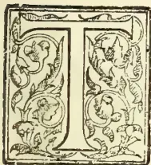

THE name of James Steuart, Master Attendant of Colombo, from 1825 to 1855 will always be an honoured one in the Annals of Ceylon. His published as well as private writings shew that he was an able and versatile man in dealing with public affairs; his management and account of the Ceylon Pearl Fisheries for 27 years was judicious and admirable in every way; and he laid the foundations of one of the most stable houses of Mercantile and Plantation Agency ever established in Ceylon. At the head of this Firm he put his brother George, who gave his name to “George Steuart & Co.” in 1843,—James being prohibited, as a public servant, from holding any share or interest in the house he had founded. Mr. George Steuart was, like his brother, trained as a navigator, and we first hear of him at Trincomalee in command of the ship “Valleyfield” in 1837, and at the time he was turned into a merchant he commanded the Ceylon Government’s little steamer the “Seaforth” of 300 tons. George Steuart was much more of the ship commander (the “skipper” and sailor), and less cultured than his brother James; but he developed into a very shrewd man of business; and stuck to his firm almost continuously for a period of over 20 years, retiring in 1863, when he had accumulated what for him (an old bachelor) was a fortune. He was in fact much wealthier than

his brother James, who was undoubtedly very badly treated by successive Governors of Ceylon—doubtless, from want of thought—until in 1855, Sir Henry Ward inadvertently drove the clever and worthy Master Attendant into retirement after 30 years’ service on the very inadequate pension of £367 per annum.

But to begin at the beginning, Captain James Steuart was born in 1810, and Dover seems to have been associated closely with his early days. This fact and a great many more particulars we learn from a valuable volume of MSS. notes left behind by Capt. Steuart, and most kindly lent to us by Mr. Reginald John. These notes treat on a variety of topics in rather a desultory way; but there are many autobiographical references scattered up and down the pages, and from one of these we learn that his father was a mariner before him, and owned as well as commanded a vessel (the “Hopewell,”) which was hired by the British Government as an Ordnance Transport to convey ammunition from Dover to the Fleet blockading Boulogne whence Napoleon’s Grand Army for the invasion of England was expected to issue. This was in 1805-6-7, and James Steuart served as a lad of 15 onwards under his father and learned navigation. Being ambitious, however, of enlarged experience and of visiting the Southern Seas, he induced his father to get him taken on the whaler “Cumberland,” 17th October, 1807, as a super-numerary; and the MSS. before us give a long and interesting account of his experiences. His

183------------------------------------------------

148THE TROPICAL AGRICULTURIST.[SEPT. 1, 1903.]

Captain soon found his value as a young seaman, and before long made Stewart his boatswain, and later offered to appoint him second mate. The voyage or rather cruise lasted three years, during which the "Cumberland" saw much of New Zealand, and we have graphic accounts of adventures and narrow escapes from the Maoris, some of them cannibals, 100 years ago. However, all went well, and in July, 1810, the ship with a valuable cargo of spermaceti whale oil, arrived at Portsmouth. We find Stewart next (only 20 years of age) in command himself of the "Charles," making voyages from London to Lisbon, then fitting her out as a transport for H.M. Service like his father before him. This employment lasted till 1814 (or later) and brought Captain Stewart to the notice of Admiral Lord Keith who wished him to become a Master in the Navy. But, we next find him at Capetown, in command of a vessel called the "Leda," locally owned, and plying between Cape Colony and London. In November, 1817, the owners proposed to him a voyage to Ceylon to fill up time, until certain wines they were preparing, were ready for shipment to London. Captain Stewart reports that at first he confounded his destination with Sierra Leone, then much better known and notorious for its bad fevers. He arrived at Galle 12th January, 1818; saw Mr. W. C. Gibson, Master Attendant; went on to Colombo and passed the Portuguese ship that voyaged once a year from Macao, with tea, silk, preserves, &c., for Colombo, which Captain Stewart reached on 16th January. Old Capt. Chrisp (*sic.*) Master Attendant, had been chief officer on an E. I. Coy.'s ship and described himself as a kind of "Deputy Vice-Admiral, Captain of the Port, and Marine Aide-de-Camp to H.E. The Governor." For foreign ships he was Consul as well; and for the few Colombo merchants he found the means of reaching ships in the roads; supplied all marine stores, anchors, &c.; and often arbitrated between Captains in search of high freights and merchants ashore who wanted to charter for low freight. All this we mention, because in 1825 Captain Stewart succeeded Captain Chrisp in all these duties. But first the "Leda" loaded at Colombo and her commander lived ashore for a month with Mr. Wm. Smith Boyd who had just begun as a merchant. Colombo and Galle were bereft of soldiers at the time (1818), all being upcountry for the Kandyan war, and only the Staff Officer and a few soldiers left in each town. The "Leda" left Galle 23rd February, 1818; reached Table Bay, 24th April after a stormy passage; sailed again 20th June, reached Falmouth 4th September; he bade farewell to the ship in London 8th October, and got the command of the ship "Eclipse" and

sailed 23rd March, 1819 for Colombo, which was reached 10th July, after some adventures duly recorded. After discharging cargo, the "Eclipse" took H.M. 59th Regiment to Calcutta and came back to Trincomalee on 27th November and took headquarters of 45th regiment round to Colombo, where a cargo, chiefly of coconut oil, was loaded or London. Capt. Stewart gives a curious account of the mode adopted to prepare the casks (brought from London apparently!) to receive the oil. They were first filled with water; but Capt. Stewart insisted on warm oil being put in at Colombo and the casks placed in the sun, and as the staves shrank the hoops were driven home. Previous to this the leakage of coconut oil on the long voyage home was enormous, causing sometimes a loss in place of profit on the cargo. On 1st February, 1820, the "Eclipse" sailed from Colombo for London having on board Sir Robert and Lady Brownrigg, Dr. Davy, Rev. George Bisset, Col. Hardy and other officers. (Grand entertainments were given to the Governor before he left). After an eventful voyage, calling at Table Bay, St. Helena, Ascension, &c., Dover was reached on 22nd June. The new Governor Sir Edward Paget got such an account of Capt. Stewart from his predecessor that he applied for the "Eclipse" to convey himself and staff out to Ceylon; but the King ordered a frigate to the service and so the "Eclipse" sailed for Mauritius and Colombo, reaching the latter on 17th March, 1821. With a full cargo again, Capt. Stewart left on return in April and got to England in August. Sir Edward Barnes was now at home and ordered out to succeed Paget as Governor,—(the latter being promoted to India)—and the new Governor was so anxious to have Stewart as his Captain, that he offered the Commander of the vessel selected to carry him (Captain Vaughan of the "Hercules") a gift of £500 to stay behind, but in vain. However, with the assistance of friends, Capt. Stewart purchased a ship of his own, the "Mediterranean," and sailing from Gravesend on 30th July, 1824, "with my wife" (all the reference we can find to his marriage), and other passengers and cargo for Ceylon, called at Madeira for some pipes of wine and reached Colombo on 22nd December. He found Sir Edward Barnes ready to make him Master Attendant, Captain Chrisp retiring, and he got leave to proceed to Calcutta to sell his ship which he did, and returning was gazetted Master Attendant of Colombo from 9th May, 1825. Chrisp now compared the duties of the office to that of "Boots" at an inn—at the beck and call of every body—expected to do everything that could not be done by any of the civil and military servants, then in Ceylon; and certainly, Capt. Stewart had a

184------------------------------------------------

SEPT. 1, 1903.]THE TROPICAL AGRICULTURIST.149

great variety of duties—some of them very responsible and in every case most carefully performed, though by no means adequately remunerated—during his 30 years' service in Ceylon. Capt. Stewart soon found that, pecuniarily, he had made a mistake in coming ashore. For instance, in one voyage in the "Eclipse," with his perquisites as Commander, he had cleared £2,000; how much more might he have done in his own ship! But in Colombo, although at first as owning the Government boats, supplying stores, &c., the post was a profitable one,—very soon (in 1832) some of the merchants began to complain to Government of the Master Attendant profiting beyond his salary. No change was made, though a good deal of wrangling took place, before the advent on 7th November, 1837, of Governor Stewart Mackenzie. Meantime, in April, 1835, Captain Stewart had been asked by Messrs. Arbuthnott & Co., Agents to the Madras Government, to undertake the duty of making advances, secured by shipping documents, for cinnamon and other produce on their account, they providing him beforehand with funds. In addition to Letters of Credit on the Ceylon Treasury, Stewart received specie (rupees) from Madras and sovereigns from England, and his business soon became considerable, leaving him with a handsome commission. He had been refused admission into the Civil Service proper and its pension privileges, and he was therefore free to trade, and here undoubtedly he laid the foundation of the house of GEORGE STEWART & Co., though it did not come into existence for some years after. On 6th December, 1836, however, Capt. Stewart received an order not to trade; but got a year's grace to wind up his existing engagements. We are not told what happened then, and we would infer that he must have got his brother to take up the business in 1838 (?); for he closes his chapter on the subject, writing in 1866, as follows:—"I firmly resolved as I could not retain the business for myself, to secure it for my brother, and by the kindness of the Madras Agents, I succeeded, and thus laid the foundation of that now flourishing establishment MESSRS. GEORGE STEWART & Co., of Colombo, from which my brother has retired with a fortune, while I have become a Government pensioner." [This would seem to shew that Mr. George Stewart did not recall, and acknowledge, as James expected, whence his prosperity first arose? James retired in 1855 and died in 1870 aged 80 years; George retired in 1863 and died on 8th July, 1896, aged 88 years—so that he was 18 years the junior of his brother James.]

On 5th April, 1839, Capt. Stewart ceased to be owner of licensed boats; and in a long and able letter to Government, he gave a history of the whole case from 1813; and he also showed how badly he had been treated in being excluded from the Civil Service Pension Fund, although an early predecessor, Mr. Laughton, was then living in England on £400 pension from this fund, his post being Master Attendant and his service 12 years. Capt. Stewart then offered to retire on a pension of £350 after a service of 15 years, including very valuable work done on the Pearl Banks, where he saved Government much money and secured good returns in a series of Fisheries from 1828 to 1837 inclusive, save in the one year 1834, when there was no Fishery. But then came a blank with no Fishery from 1838 to 1854, and Capt. Stewart remained at his post till 1855, the first year of a renewal of successful Fisheries. In 1837, an incidental reference is made to the arrival at Trincomalee of the ship "Valleyfield," under the command of his brother Capt. Geo. Stewart; and in April, 1839, he mentions a nephew who was coffee planting in Saffragam—perhaps Mr. Morphew? The merchants of Colombo soon found cause to regret their meddling with the boat arrangements so admirably managed personally by Capt. Stewart. Boatmen could not be got when most wanted, and when a gale of wind prevailed—in the open roadstead of Colombo remember—100 rupees reward was in vain offered to any boat that would take off a letter to a ship, whereas Stewart used to get it done for 10 rupees. At length the trouble became so great that on 4th March, 1848, the first "Cargo Boat Company" came into existence.

The book of MSS. before us, beautifully written in a clear bold hand, has, for its frontispiece, a delightful water-colour sketch of a full-rigged ship "Homeward bound," and the title-page runs:—

"RECOLLECTIONS

PROFESIONAL AND OFFICIAL

(Here comes an oval water-colour sketch of Yacht and Boat)

BY

JAMES STEWART,  
1866."

—four years before his death. The volume is further embellished with a photograph of the author from which our portrait has been reproduced; and by various water-colour sketches—one of Silavatturai with the boats returning from the Pearl Banks, March, 1828—full of colour and animation, and a full-page Chart of the Pearl Banks. This prefixes a valuable Chapter on the "Pearl Fisheries—their arrangement, responsibilities and results," which we must meantime pass over

185------------------------------------------------

150THE TROPICAL AGRICULTURIST.[SEPT. 1, 1903.

only noting that Capt. Stewart's first visit was in March, 1826, in company with Sir Edward Barnes, in the Government Steamer "Ann" which had a diving bell attached for Europeans to descend to the bottom of the sea. For well-nigh 30 years did Capt. Stewart look after the Pearl Banks with a care and shrewd observation that could not be exceeded in those days; and yet it is hard to think that cruel, thoughtless treatment to this old and meritorious public servant by Sir Henry Ward; of all Governors, in 1855, led at last to his retirement. He called three times after his return from a successful Fishery and each time was refused admittance to the Governor. He then wrote to the Private Secretary to say he was about to retire, and he wished to know when H.E. would make it agreeable to see him. The reply was an invitation to dinner, and the chapter ends:—"And so I dined at the Governor's table on Saturday, and left Colombo for ever on the following Monday—conscious that I had done my duty, although my services are not appreciated. Appreciated did I say? As their nature was misunderstood, so were their merits unknown, and therefore they could not be appreciated by those who withheld their very small, but just reward." [It was as Commissioner for the Loan Board that Capt. Stewart got most of his pension, his other services counting for little or nothing.]

In a later chapter Capt. Stewart refers to a trip home in 1844 or so, and his return with "an invalid wife." [Mrs. Stewart must have died some time after, and her remains were interred in Galle Face Cemetery, where we trust the grave is looked after; if there is no head stone, one ought to be erected.]

Later chapters are devoted to administrative questions, and then comes an interesting account of the total wreck of the ship "Colombo" with a full cargo, in a gale of wind, in Colombo roadstead in April, 1851, which reads strange in the light of the present protected harbour and modern conveniences. The volume has next a description of the Port of Colombo, accompanied by a carefully-prepared Chart, also water-colour sketches of the Port and coast as far as Mount Lavinia, and various letters and essays close this most interesting and valuable manuscript volume. Capt. James Stewart was a strong opponent of Government giving private banks in Ceylon the right of issuing paper money—which he rightly described as the equivalent of a loan of the amount in circulation without interest. His pen was never idle till the day he died. His only printed book—a thin octavo of 180 pages published in 1862, entitled:—"Notes on Ceylon and its affairs during a period of 38 years ending in 1855" is marked Part I, so that it was evidently intended to be followed by another volume.\* The "Notes" were printed for private circulation. We have long been admirers of much in the little book and have sat as students at the feet of one who thought out the colonial problems he tackled and was ever honest towards himself and all men. We cannot do better in closing our notice of CAPT. JAMES STEWART than apply to him two out of a quattette of verses recently penned for an Anglo-Indian of much the same type:—

\* We have since heard from Mr. Reginald John that there is a Part II. printed, also printed books by the same author on "Nearchus on British Seamen," Vols. 1 and 2, and "The Church and the Poor."

"Brave old warrior now laid low,  
But not till the fight was won,  
Thy soul wings forth in the afterglow  
Of a life that was nobly done.

"We bid thee farewell, staunch old friend,  
God grant we be strong like you,  
Through cloud and storm to a splendid end  
God help us to follow too."

#### GEORGE STEUART,

NAVIGATOR AND MERCHANT, 1837-1866.

Of Capt. or Mr. George Stewart we have little to say. We first hear of him in command of the ship "Valleyfield." Next, through his brother's influence, he got a place under the Ceylon Government as Commander of the Steamer "Seaforth" built for Pearl Fisheries' inspections; but which, after the Fisheries closed, was, in 1839, utilised to carry the mails between Bombay and Colombo. From this post George was removed by his brother to give his name to the firm that took over the business built up from April, 1835, by James Stewart in conjunction with Messrs. Arbuthnott & Co., of Madras. 1843 is the year usually given for the starting of GEO. STEUART & Co.; but we have reason to believe that George must have left the sea and been in training under his brother from 1839 onwards. George had little of the culture of his brother, but a good deal of shrewd ability. He had been a rough diamond as a "skipper," and continued so for sometime ashore; but he came under the influence of the first Bishop of Colombo, according to the story, and turned over a new leaf, especially in his attention to the clergy; and in some of his habits—at meals, for instance, always saying grace. This was something new to his old appu who had been with him in his unregenerate days, and so one day appu forgot when there was a specially clerical dinner party and whisked off the cover of the souptureen as soon as all had sat down, to be met by the hasty objection:—"D——it man appu, why don't you wait for grace!" George continued steadily at the helm of his firm with competent partners (Mr. John Lewis Gordon being among the best) and assistants, until he retired in 1863. He saw his house grow to become almost the biggest Estate Agency Firm in Colombo. Many stories are told of his trips upcountry during which he rode a favourite old mule. When he retired, he took his favourite Sinhalese manservant to England with him, and settled down at Blackheath (with occasional visits to Dover) for 20 years, known for his charities and eccentricities. The Sinhalese married an Englishwoman, and their family did well, Mr. Stewart helping them. When the subject of our notice died, he did not forget various Ceylon charities, and no one could say he made a bad use of his wealth. Living to be over fourscore, death came at last to the old Navigator and Colombo Merchant as a happy release:—

O, Death and Time, they chime and chime  
Like bells at sunset falling!—  
They end the song, they right the wrong,  
They set the old echoes calling:  
For Death and Time bring on the prime  
Of God's own chosen weather,  
And we lie in the peace of the Great Release,  
As once in the grass together.

186------------------------------------------------

SEPT. 1, 1903.]THE TROPICAL AGRICULTURIST.151

## CULTIVATION OF TOBACCO.

BY CLARENCE W. DORSEY,

### [AMERICAN, MANILLA AND SUMATRA EXPERIENCE UTILISED.]

Philippine tobacco has long been held in high esteem in the Orient, and Manila cigars maintain the same rank in eastern countries that Havana cigars occupy in Europe and America. To-day tobacco stands third among the exports from the Philippines. During the year 1900, according to the Monthly Summary of Commerce and Finance of the United States, 11,743,336 kilos of tobacco, valued at \$1,906,436, United States currency, were exported from the Islands. Tobacco was introduced into the Philippines shortly after the Spaniards took possession, seed having been brought from Mexico by Spanish missionaries. Little effort was made by the Government to restrict or encourage the cultivation of tobacco until 1781, when the cultivation and sale of tobacco was decreed a State monopoly. While this monopoly was in force, the natives in the large tobacco districts of Luzon were subjected to great inconveniences and even hardships. Each family was compelled to grow 4,000 plants and deliver the entire crop to the agents of the Government. None of the crop could be reserved for the use of the planter, and a fine was imposed when the crop was short. After the crop was harvested the leaves were selected and bought by Government agents, and bundles of inferior leaves were rejected and burned. Native houses were searched for concealed tobacco, and fines and penalties imposed on those who did not comply with all the requirements of the monopoly. Early in the nineteenth century many riots and disturbances arose out of the difficulties in meeting the harsh provisions of the law.

In the Visayan and southern Islands the monopoly was not in force, but tobacco raising was not generally practised until the middle of the nineteenth century. The profits from the monopoly annually amounted to several million pesos, but was finally abolished on December 31, 1882. Since that time the cultivation and manufacture of the crop has been in the hands of private individuals and companies. At the present time the greater part of the tobacco grown in the Islands comes from Luzon. The products of Isabela and Cagayan Provinces are the most highly esteemed, while considerable quantities are produced in Union and the Ilocos Provinces, on the west coast of northern Luzon. Nueva Ecija formerly raised a fair grade of tobacco, but the cultivation has fallen off in late years. The writer saw in Batangas Province many small fields that would aggregate many hundreds of hectares of tobacco. This is largely used for local consumption, and is of inferior quality. Tobacco is grown in small quantities in the Visayan and southern

islands, the greatest amounts probably being produced in Masbate, Tablas, Panay, Bohol, Leyte, Siquijor, Negros, and Mindanao.

Philippine tobacco is nearly all utilised in the manufacture of cigars and cigarettes, and finds a ready sale in Spain (which consumes more than one-half of the total production), England, Hongkong (where it is shipped to Asiatic ports), and British East India. During the year 1900 these countries bought more than seven-tenths of the entire crop. The agreeable aroma and flavour of the better grades of tobacco grown in the Islands have won for it a high place among the fine cigar tobaccos of the world, and, for a long time, it ranked next to the celebrated Cuban tobacco. When we consider the desirable qualities of Philippine tobacco, with the imperfect cultivation, curing, and fermentation it receives, and the improvements and advances that have been made in other tobacco countries, it becomes at once evident that every care and attention should be given the crop to enable it to regain its former position, if not to make it superior to the finest tobaccos grown in the world.

The markets of the United States offer every inducement for the improvement and spread of the Philippine tobacco industry. This becomes all the more evident when we consider the vast sums of money annually expended by the United States for foreign tobacco. During the year ending June 30, 1900, United States according to official statistics of the agricultural imports of the United States, paid for Cuban tobacco \$7,615,991, United States currency, and \$4,569,271, United States currency, for Sumatra tobacco. During this same year the Philippines exported to the United States only a few hundreds of dollars worth of tobacco, or less than one-hundredth of one per cent of the tobacco importations of that country. While it may be true that Philippine tobacco may never entirely supplant Cuban and Sumatran tobacco in the United States, there is certainly every inducement to encourage and improve the industry until modern cultural methods have realised to the fullest extent the highest perfection of the crop.

#### REQUIREMENTS OF THE TOBACCO MANUFACTURER.

In the manufacture of high-grade cigars certain essentials are necessary. The tobacco must burn smoothly and freely, with a pleasant taste—not rank and strong, nor too mild. When the taste is pleasant, not sharp and bitter, the aroma will invariably be good. The cigar that possess the above qualities will meet with a ready sale. The wrapper of the cigar, as distinguished from the filler, must be light in colour, rich in grain, thin in texture, small in vein and stem, very elastic and of good burning quality. It should stretch and cover well, have little aroma and appear well on the cigar. The most desirable

187------------------------------------------------

152THE TROPICAL AGRICULTURIST.[SEPT. 1, 1903.]

sizes are 40 and 45 centimetre leaves, for from such leaves the manufacturer can obtain four cigar wrappers from each leaf, with but little waste. After such a suitable wrapper leaf is grown, it must be properly cured, assorted and classified. The manufacturer can never afford to pay a high price for a bale of tobacco, unless he can calculate just how many suitable leaves it will contain. This is one reason why Sumatran tobacco commands such a high value, for so carefully is the grading and assorting done that the manufacture knows how many cigars each package of tobacco will wrap, and that the colour will be uniform. Wrapper tobacco should be uniform in size, color, and texture; then the buyer knows what he is getting and is willing to pay a good price.

For cigar fillers the leaves should be somewhat shorter, of medium body, have a rich brown colour and burn smoothly and freely. The quality of the filler determines the character of the cigar; hence the filler must possess the desirable aroma that distinguishes a good cigar.

Philippine tobacco has some of the above properties, and has earned its reputation on account of its agreeable aroma, fine veins and notable elasticity. This applies only to the better quality of tobacco grown on the alluvial lands of the Cagayan River in northern Luzon. The tobacco grown in the Visayan Islands is coarser, uneven in colour, and of greater strength. From the provinces along the west coast of northern Luzon the tobacco is of heavy body, and that grown near the sea has but little combustibility. Its ragged, broken character also lowers its market value. The tobacco grown in Nueva Ecija was formerly considered fine, but the colour was a decided yellow, and the taste somewhat bitter.

#### PREPARATION OF THE SEED BED.

No step in the cultivation of tobacco is more important than proper care in the preparation and sowing of the seed beds. This work can not be neglected without running the risk of a partial or total failure of the crop. To make good seed beds is a laborious task and requires good judgment in the selection of the location, soil and in the preparation of the land. To have plenty of good, strong, healthy plants is the surest foundation for a good crop of tobacco, provided they are from seed true to the desired standard. It is very important that in the preparation of the seed bed an abundant supply of seed should be sown, and provisions made for a succession of plants; so that, when the planting season comes, the supply of plants suitable for transplanting will be ample for the purpose, and the supply will be maintained throughout the period in which the planting is to be done.

The best soil for the seed bed is a rich, friable, dark, virgin loam or sandy loam. A deep, well-drained soil is greatly to be pre-

ferred. The necessary operations of tilling and stirring the soil should precede sowing the seed by several weeks. It is usually customary to thoroughly plow or spade the land and mark the land off into a number of beds surrounded by boards. In the famous Deli district in Sumatra the beds are built up about 30 centimetres high and surrounded by ditches. The size and number of the beds varies, but they are usually rectangular in size, with suitable walks or passageways between them. The beds are highly fertilized with rich manures or with any complete, specially prepared commercial fertilizer. Stable manure, or any complete guano, may be used. Care should be taken to thoroughly mix the fertilizers with the soil, so that the greatest amount of plant food may be available for the young plants. In the case of old lands, it is always advisable to burn the land over, to insure safety against grass and weeds. With new land the trouble from such sources is slight; but burning is sometimes practised, to increase the richness of the soil by adding the fertilizing properties of the burned wood. The burning is usually done one week before planting the seed. After burning, the soil is well spaded and all roots and tufts are carefully removed, and the surface made loose and smooth. Then the soil is well watered and the seed mixed with sand, or sifted wood ashes are nicely spread over the surface. After the seeds are sown the soil should be thoroughly compacted with a heavy roller and if the soil is at all dry, the beds should be watered and kept continuously moist, but not wet, until the plants are set out. It is best to plant new seed but at intervals of every few days, in order to be sure to always have fresh plants of proper size on hand when the time comes for transplanting. On a commercial scale it requires about 45 grams of seed to sow a bed 1 hectare in size. In the Cagayan Valley the seed is sown in the beds during the latter part of September and the first weeks of October, while the transplanting is made during the early part of December. This period of planting the seed bed varies slightly in the different parts of the Archipelago, on account of the varied climatic conditions; but practically all of the transplanting is done during the month of December, as experience has shown this to be the best month for such operations. In many parts of the Philippines it will be found advisable to construct some sort of cover for the seed bed, to protect the seeds and tender plants from the intense heat of the sun. A suitable shelter made of straw, cogon grass, or nipa palm, raised about 1 metre above the ground, will suffice. It should be so arranged that the covering can be put close together or spread out to regulate the amount of heat received by the small plants. After a few weeks this covering can be removed altogether and kept to serve for another bed. White ants and sometimes caterpillars and

188------------------------------------------------

SEPT. 1, 1903.]THE TROPICAL AGRICULTURIST.153

worms are destructive in the seed beds, and should be removed by hand or by mixtures of poisonous substances and water, known to be effective in removing such pests. When the plants are drawn for transplanting, great care should be taken to secure as much root as possible. It is usually considered the best practice to carefully wash away all particles of the seed bed soil that cling to the roots, for the plants live and grow better when the roots are perfectly clean.

#### SELECTION OF THE LAND.

Few, if any, plants are so easily modified as tobacco by climate, soil, elevation, nearness to the sea, and different methods of cultivation. This is plainly demonstrated by the rapid changes which take place in the character of the leaf, flavour, aroma, and special fitness for the varied uses and for different markets in introducing seed of well marked varieties into new districts. Each new class of soil, materially aided by climatic conditions, give peculiar qualities to the cured leaf as to its flavour, texture, colour, etc.

It has long been recognized that tobacco grown near the sea or large bodies of salt water has poor combustibility and, while the taste may be sweet, it commands a low price for the manufacture of cigars on account of its poor burning qualities.

In tropical countries the favoured locations for tobacco cultivation are the interior alluvial valleys. In such places the soils are usually deep, porous, easily stirred and cultivated, and the periodic overflow of the rivers adds new fertilizing elements to the soil, already rich in plant food. The famous tobacco districts of Isabela Province belong to this class, as well as the valley lands or the provinces of the west coast of Luzon. In the Cagayan Valley the quantity of rainfall, according to two years' observation ending in 1897, is much less than at other points in the interior of Luzon, or in the southern islands. The total amount of rainfall during the year is 700 mm., the greater part of which falls during the period from June to October. During the months of January, February, and March, when the tobacco is growing and ripening, the rainfall does not exceed 20 mm. Comparing the climate of this region with the Deli district in Sumatra, it will be found that the climatic conditions of the latter region more closely resemble those of southern Luzon and some of the southern islands. The rainfall is distributed over the entire year, while the greatest amounts are recorded in October, November, and December. The total amount received during the year averages more than 2,000 mm. The stations in the Philippines, where equivalents of greater amounts of rainfall are recorded, are Bolinao in Zambales Province, Albay in southern Luzon, La Carlota in western Negros, northeastern Mindanao, and Vigan in Ilocos Sur Province.

In Sumatra, where the best results with tobacco have been obtained, the soils are

mainly volcanic in origin. Where the finest and silkiest tobacco of a rich brown colour is grown, the soils are clayey, while the lighter colours of fine cigar wrapper tobacco are grown on loamy and sandy soils, with clay subsoils. In the clayey soils of the Deli and Langkat districts tobacco can often stand droughts of three weeks and longer, without much injury; but in these districts the frequent light showers are of great value to the growing crop. Experience has also shown in Sumatra that the best results have been obtained on land situated from 8 to 16 kilometers from the ocean, while tobacco plantations high up on the mountains have had poor success in growing fine, silky wrapper tobacco. The lowlands, free from frequent inundations and not too near the sea, with soils consisting largely of fine sand and silt, and rich in organic matter, have given the best results.

In the Philippines many fine bodies of interior valley land, with rich, loamy soils, can be found where tobacco cultivation has not been practiced, and it is on such tracts of land that its introduction is especially recommended. Mindanao possesses many large valleys with alluvial soils that could undoubtedly be made to produce a fine quality of tobacco. The soils of the large valley between Manila and the Lingayan Gulf should be carefully tested with seed from the famous tobacco districts of the world, to determine its fitness for growing tobacco. New areas are constantly being tried in various parts of the world, where tobacco growing was unknown, and the success of so many of these should prove an incentive to greater efforts on the part of the Philippine planter, to enter into competition to furnish a goodly portion of the world's supply of this profitable crop. Only very recently the cultivation of Havana tobacco has been introduced into Annam and Tokin in French Indo-China, and a portion of the crop exported to Manila. Such an example shows what may be accomplished by careful experimentation in the field of new crops, and should stimulate the energies of farmers in every part of the Archipelago.

#### CULTIVATION OF THE CROP.

Since the profits of growing tobacco depend largely on the planter's ability to produce a leaf of such qualities as to make it desirable to the manufacturer, it follows that the greatest care should be exercised in the cultivation of the plant. Prior to the work of transplanting, the ground should be thoroughly plowed or spaded to a considerable depth. Deep cultivation is advisable on any character of soils, as it readily allows the free percolation of rain and air through the soil, and increases the amount of available plant food contained in the soil, and helps to conserve the moisture, especially in times of drought. If only small amounts of manures are to be applied, it can be spread broadcast after the first plowing; but, if large quantities of stable or straw manures are used, it is best to

189------------------------------------------------

154THE TROPICAL AGRICULTURIST.[SEPT. 1, 1903.]

plow them in several weeks before the time of setting out the plants. After plowing, the land should be harrowed with a disk harrow, and then with a smoothing harrow. In Sumatra, where all of the operations are performed by Chinese coolies, the work of breaking the soil is performed by an implement called the "tyankol," a sort of spade, which takes the place of the plow, while the work of smoothing and reducing the soil to a fine state of tilth is accomplished by hoes and iron rakes. Either by plows and harrows or by spades and rakes, the field should be made loose and smooth before transplanting, or the young plants are at a disadvantage from the very start. The writer has seen many fields, especially in Batangas Province, where young tobacco plants were attempting to grow in a field filled with the hard clods of intractable clay soil. Such methods are to be condemned, for plants as tender and delicate as tobacco can not make a good growth in improperly prepared fields.

#### THE TRANSPLANTING MACHINE.

Often it will be found advisable to water the field before the work of transplanting begins. Transplanting can be done by hand or by a transplanting machine. Such a machine can only be used on level fields free from stumps, stones or large quantities of undecomposed vegetable matter. By its use more satisfactory results are obtained, and large areas can be planted at much less expense than by hand-planting. A transplanter is a two-wheeled machine drawn by two horses or mules. One man drives, while two boys drop the plants. Plants are set with mathematical regularity, at any distance desired. The machine is so arranged that a supply of water is furnished at the time of planting, so that the plants are thoroughly watered while being placed in the soil. Machines of this character are widely used in the United States for setting out tobacco, cabbage, and tomato plants with exceptionally good results. Machine-set plants start quicker, and grow and mature more evenly than hand-set plants.

In Sumatra, where all necessary operations are carried on by hand, the coolie is provided with a plant string, the same length as the field. Each end of the string is securely attached to a stick of the same length that it is intended the rows shall be separated. This string is divided into intervals by means of coloured string, to show the proper distance of the plants in the row. By means of a sharp stick, holes are made at the proper distance, about 10 centimetres deep and 7 centimetres in width. The holes are watered immediately before the plants are put in. The plants are pulled from the bed when the dew is still on them, and set out late in the afternoon, when the rays of the sun are not very strong. During the daytime the pulled plants are kept in a basket and carefully watered, and covered with cloth. About 4

o'clock in the afternoon, the coolie drops from the basket a plant beside each hole and, when all of the plants are dropped, commences to plant. He holds the plant in the centre of the hole with his left hand and with his right hand, pressess the soil around the roots carefully but firmly, so that he can give the plant a slight pull without removing it.

As regards the number of plants to the hectare, this depends so largely on experience and the character of the soil and the kind of tobacco that special directions can not be given. Close planting in the row tends to develop a very thin leaf, while open planting allows the leaves to grow to a greater size, and develops the gums and oils so common to tobacco. For cigar wrappers it is usual to plant closely in the row, in order that the leaves will shade each other and develop the fine, thin leaves desired for this purpose. In Sumatra as many as 10,000 plants are set out in a field of  $1\frac{3}{4}$  acres (slightly more than one-half of a hectare). For cigar fillers or for tobacco to be used for manufacturing purposes, the planting is much more widely separated than in Sumatra.

#### WATERING AND CULTIVATION.

As it is always desirable to get a uniform growth, great care should be exercised to have each plant live. Replanting should be done as quickly as it is possible to determine where fresh plants are needed. If the soil is moist and showers are frequent, watering the plants is unnecessary; but, if the ground is dry, they should be watered immediately after setting and each day thereafter, as long as the plants require it. The quantity of water used is in all cases governed by the condition and nature of the soil. Usually, after setting, the plants are undisturbed for a period of several days, during which time they are taking root. After this time cultivation should be begun and continued rapidly and frequently, until further cultivation is liable to injure the growing leaves. Cultivation at first can be done by a light plow or hoe; but, after the plants have reached a considerable height, only the hoe should be used, and this very lightly. At this period the leaves furnish sufficient shade to prevent the soil from baking and hindering the growth of the surface roots.

(To be concluded.)

RUBBER.—Mr. A D Machado, of Singapore, has discovered that the best results in obtaining *latex* are derived from a series of little incisions measuring two inches long by only an eighth of an inch wide. Such a series of wounds is entirely harmless, and produces, it is said, a supply as ample as the great herring-bone cut now in use, which is often capable of seriously injuring or even killing a tree. From 100 trees, ranging from twelve to fifteen years of age, Mr. Machado draws an average of about 3 lb. of dried rubber daily, and he expects the supply to be maintained for six months, working half the trees each day during that period.—*Straits Echo*.

190------------------------------------------------

SEPT. 1, 1903.]THE TROPICAL AGRICULTURIST.155

## HOW TO GROW ORANGES IN FLORIDA.

Some time since we were favoured by Mr. Herbert Webber with some photographs representing Orange culture in Florida. Mr. Webber, it will be remembered was deputed by the United States Government to take part in the Hybridisation Conference held at Chiswick in 1899; and amongst other things, greatly interested his hearers in the details of the intensely practical way in which our cousins immediately applied the lessons of science to the repair of the injuries to the orange groves of Florida caused by a severe "freeze." Mr. Webber has since communicated to the columns of *Country life in America* an interesting article on the culture of Oranges in Florida, from which, with his permission, we take the following extracts:—

"The first problem of the prospective Orange-grower is to select suitable land for his experiment—for an experiment it is until he has demonstrated by actual experience what he can do. The best Orange land is that known as "hammock" by the native Floridians. Hammock-land is characterised usually by a heavy growth of live Oak, Bahy, Hickory, Magnolia, &c., interspersed with Palmetto, and is usually comparatively low land near lakes or streams. It was on such land that the famous wild Orange-groves were found. While wild Orange-trees were found in various parts of Florida when the State came to be settled in recent years, it is not probable that they are indigenous. They were doubtless introduced by the Spaniards in very early times, and spread by the Indians, who are known to have planted them to some extent. When Orange-growing was taken up commercially, these wild groves were found to be very valuable. The tops of some of the trees situated as regularly as possible were cut off, and good varieties budded in. The trees in the wild groves were very thick, and many of them were dug out and replanted being later budded with improved varieties.

The other types of land have; as a whole, proved worthless for Orange-growing, and many a hard-earned dollar has been lost by planting on "scrub lands". Scrub land resembles high Pine land when cleared, and many a purchaser has been duped by "land sharks," into investing in scrub grove property only to discover later his error. Scrub land is the pitfall to be avoided by prospective Orange-growers.

Hammock lands being the most desirable for grove purposes, are naturally the most costly, uncleared land selling at from 50 dollars to 200 dollars per acre, while high Pine and flat woods land can be obtained at from 5 dollars to 50 dollars per acre.

About sixty trees are required to plant an acre of land in grove, and trees budded with the best varieties can in most cases be purchased for from twenty-five to forty cents each. Some over-careful individuals, who think nothing is done right unless they to it themselves, prefer to set seedlings in the grove and bud them themselves with the desired varieties. A case of this kind has come to the knowledge of the writer, where an inexperienced man prepared to bud his own trees in this way. He very carefully read and digested all the agricultural publications giving directions for budding, and then inserted the buds according to the most approved methods. Two years later he called an expert to examine his grove which presented a very peculiar appearance. Curious to relate, everything had been done right and in order, but the buds had been inserted wrong side up! Printed directions in books cannot be trusted to instruct one in fundamental principles.

The methods of planting young trees differ little from the methods pursued in planting Apple or Peach trees. On ordinary well-drained soils, the trees are planted so that the surface-line of the tree as it

grew naturally is placed slightly above the surface of the soil in the grove. In low moist lands the trees are planted on mounds, sometimes as high as 2 feet above the original surface. This is done to avoid "wet feet," as the growers express it, as it leads to the fatal malady known as "foot-rot."

The majority of soils in Florida on which Oranges are grown are largely sandy; in very many cases, indeed they are almost pure sand as deep down as one can go. A chemical analysis of the soil of one good grove known to the writer gave ninety-nine per cent. silica, or pure sand. Oranges grown on such soil are, as the scientist would term them, "sand cultures," and all the essential elements of plant-food must be added artificially. The experienced Florida Orange grower is an expert in the use of commercial fertilisers. He will tell you to use a fertiliser composed of three to four per cent. of nitrogen, five to 6 per cent. of phosphoric acid, and ten to twelve per cent. or more of potash. He can tell you all about the solubility and insolubility of phosphoric acid fertilisers, the necessity of using large quantities of potash, &c. He recognises that excessive quantities of potash fertilisers tend to produce sweet fruits; and that excessive quantities of nitrogenous fertilisers produce a rapid, vigorous growth of the tree, and a puffy, sour fruit. Some growers have carried the science beyond the range of known physiological laws and spray their trees at certain seasons of the year with certain chemicals to sweeten the fruit. Such methods are used by few growers, and the writer knows of only one grower who has followed the practice systematically. He regularly sprayed his trees to sweeten the fruit, and was able to guarantee his Oranges sweet. This sweetening of the fruit, however, renders it rather insipid, and while such Oranges give better satisfaction when eaten with cakes and confectionery, as a dessert fruit, they are ordinarily considered too "flat" by connoisseurs, and the practice will probably never become common.

Stable and barnyard manures should be utilised whenever they are made on the farm, from the standpoint of economy. They should not be purchased in preference to commercial fertilisers, however, which have given the best results, as some experienced growers are inclined to do. Experience has shown that they are harmful if used in large quantities, tending to produce thick-skinned, sour fruit, and leading finally to a serious disease known as "dieback". What stable or barnyard manure a grower may produce on his place, should be spread lightly over the grove, only a small portion being given to each tree.

The Orange-picking season in Florida is what harvest time and Apple gathering are in the North. Fancy the broad acres of corn and Wheat in Illinois or Iowa turned into fine old trees 30 feet high, with their branches interlocking and sprinkled here and there with golden Oranges. Fancy the balmy breezes, similar to May in that section of the country, fresh from the ocean or gulf, and laden with the perfume of the millions of fruits. At the picking season all nature partakes of the rich, pleasing aroma of the Orange, till, like Goethe's "Music of the Universe," it becomes well nigh indiscernible, and one must need stop and concentrate his attention to catch its full richness. In the crisp balmy air of the beautiful southern winter days the pickers may be seen at work with their picking-bags slung over their shoulders enlivening their work with song and jest, now picking from the ground, the fruit on the lowermost branches; now perched on tall ladders half buried in the rich green foliage, in order to reach the fruit on the uppermost branches. The heaped-up baskets or boxes are hauled in wagons to the packing-house, and dumped into the large bins. Thence they go to the "sizer," where all braised or faulty fruits are carefully picked out and the Oranges in two streams bright on one side and russet on the other, are mechanically assorted according to size, and fall into the respective bins.

Here the nimble-fingered packers deftly grasp the

29

191------------------------------------------------

156THE TROPICAL AGRICULTURIST.[SEPT. 1, 1903,

tissue paper wrapper, stamped with the special brand of the grove, quickly twirl it around the fruit and place it as it should be in the box, in order to fill it completely and with a definite number of fruits.

Such, in brief is a view of the process and pleasure of Orange growing. In addition to this, imagine the satisfaction of life in a country of rolling Pine woods, clear skies and pleasant and healthy climate, and you will realise in a slight degree why my fancy always turns in leisure moments to Orange growing.—HERBERT J. WEBBER.”—*Gardeners' Chronicle*.

## SAGO AND TAPIOCA.

By J. R. JACKSON.

Under the commercial name of tapioca we have a valuable food-product almost identical with cassava flour or cassava-meal, all of which are the produce of the large fleshy tuberous roots of two euphorbaceous plants—*Manihot utilisima* and *M. Aipi*, the first known as the bitter and the second as the sweet cassava. Both plants are half-shrubby or herbaceous perennials, supposed to be natives of Brazil or some part of South America. The fleshy roots not only contain much starch but also a quantity of milky juice, which has always been stated to be poisonous in the bitter cassava but harmless in the sweet—a statement which even now is often repeated, though so long ago as 1877 the Government chemist at Trinidad showed from his own experiments that the sweet like the bitter, yields considerable quantities of prussic acid, which statement has quite recently been confirmed by Professor Carmody, the present Government chemist at Trinidad. The quantity of the poison yielded by the two species is stated to be so nearly equal that “by mere chemical analysis it would be impossible to distinguish between the two.” Professor Carmody has, however, shown that whilst in bitter cassava the prussic acid is distributed more or less uniformly throughout the tissues of the root in the sweet cassava it is located chiefly in the skin and outer portion of the rind. It follows that in order to prepare sweet cassava so that it may be a safe food for human beings the following precautions should be taken: Carefully scrape off the skin and outer portion of the rind whereby the greater portion of the poison will be removed. Next thoroughly heat the remainder by boiling or otherwise so as to destroy and drive off any remaining prussic acid; further, cassava should be eaten only after it has been freshly cooked. Thus prepared, sweet cassava is a thoroughly wholesome and valuable article of food. It is chiefly from the bitter variety that cassava-meal and tapioca are made, which is done by scraping and grating the root and carefully removing the milky juice by expression, after which the meal is thoroughly washed, when the starch separates and is dried and granulated on hot plates, the heat dissipating any remaining poison and causing the tapioca to form into the agglutinated masses in which we see it in commerce. The now expressed juice, boiled and concentrated, also becomes wholesome, and under the name of cassareep is used for culinary purposes in the West Indies, and is imported in quantities to this country as a basis for table-sauces. Cassava is very extensively cultivated throughout the tropics, especially in South America, West tropical Africa, and the Straits Settlements, whence we import this wholesome and nutritious food.

Sago, as known, in English Commerce, is limited in its origin to two or three palms, but the word sago has generally a wider application than either of the foods already mentioned, for it is given to many products of a similar character to true sago produced in different parts of the world. The sago known in British commerce is obtained from a large palm—*Metoxylon Sagu*—which is found abundantly in Sumatra and the neighbouring islands, as well as

in Java, Malacca, Siam, and Borneo. Like most palms it has a straight, cylindrical trunk, 40 to 50 feet high and 1 to 2 feet in diameter, marked for a good distance down with the bases of the fallen petioles, and clothed with thick brown or blackish fibres. Under these fibres the outer woody portion of the trunk is very hard, but it is of no great thickness and by far the largest portion of the trunk is filled with a soft, cellular, spongy substance of a buff yellow colour. It is from this that sago is procured, and to obtain it the trees are cut down and the trunk cut up into equal-size pieces, which are split down the centre so that the whole of the medullary substance may be scraped out and thoroughly washed in clean water. The starch is thus separated by a system of filtration and finally granulated or pearled by passing the starch mass through sieves with different sized meshes, the whole being finally roasted, or, more properly, dried. Pearl sago occurs in commerce in different sized pearls, usually varying from that of a pin's head to a small pea, but sometimes very much larger in size. So large is the yield of sago on some plantations that it has been estimated that three trees will furnish more food than an acre of wheat, and six trees more than an acre of potatoes. It is definitely stated that from £00 lb. to 600 lb. of good sago may be taken as the average yield of a good tree, and as much as 800 lb. has been known to be so obtained. With regard to the nutritive properties of sago, the meal which is largely consumed in the Moluccas is made into a coarse kind of bread or cake, 2½ lb. of which is said to afford a good and sufficient amount of sustenance for a man on very exacting manual labour. These facts, taken in connection with the abundance and cheapness of sago, lead one to think that it ought to be much more extensively used than it is.—*Chemist and Druggist*.

## THE MANGO: ITS CULTURE AND VARIETIES.

VARIETIES.

Any one who has resided a few years in India cannot fail to have been struck by the great number of varieties of this fruit to be found in every part of the country. To quote Firminger, “the worst have not inaptly been likened for flavour and consistency to tow soaked in turpentine; while the finest, having the soft, bland consistency of blanc-mange, so as to admit of being eaten with a spoon, certainly rival, if not excel, any fruit in the world for deliciousness of flavour.” With such a range of diversity, it would obviously be impossible to enumerate every variety of Mango found in India within the limited scope of a newspaper article. Indeed, I have no intention of attempting the task. All I purpose doing here is to describe a few of the very best varieties which have come under my own observation, and of which I have had personal experience under cultivation. These I can recommend to the readers of *Indian Planting and Gardening* as being well worth cultivating. I do not recommend amateurs, or even those who grow this fruit on a large scale for trade or profit, to cultivate more than at most a dozen varieties, believing as I do that it is better, more satisfactory, and certainly more paying to grow a few well known and highly prized varieties than a large number of varieties whose only claim to a place in the garden is the fact of their existence. For market purposes the cultivator should follow the English and Continental market gardeners who grow on a large scale certain well known varieties of fruits, flowers and vegetables. The collector of curiosities may, of course, stock his garden with every known variety, but that is because he has more money to throw away than the average less fortunate grower, who either grows for market or for his own personal use. When, however, a grower

192------------------------------------------------

SEPT. 1, 1903.]THE TROPICAL AGRICULTURIST.157

comes across a really good variety that he has not, and which is much fancied, or is likely to be highly appreciated, it should be added to the existing collection. I do not recommend the cultivation of a large number of varieties simply for the sake of having them in the garden. I take a more utilitarian view of fruit culture.

There are certain well recognised points about Mangoes which should be kept before one in making a selection. These are: (1) flavour; (2) absence of fibre in the flesh; and (3) the size of the seed. A Mango without flavour, though having no fibre and a small seed, is quite unfit as a dessert fruit; but is eminently suited for making into preserve, jelly or jam. On the other hand, a Mango with exquisite flavour, and with fibre and a large seed, is equally unsuited as a dessert fruit, and is not fit for preserving, etc. Again, a Mango with good flavour, little or no fibre, but having a large seed, is also unsatisfactory. Therefore, a Mango, to be fit for dessert purposes, should have flavour, little or no fibre, and a small seed. In the following list I have divided the varieties into "Dessert" and "Kitchen," as they do at home in the case of Apples and Pears:—

DESSERT

*Alphonso or Affoos.*—This is undoubtedly the best Mango in India. It is grown chiefly in the neighbourhood of Bombay, but in reality its home is Goa. I have eaten it at both places, and my enquiries elicited the fact that it was introduced to Bombay from Goa by the Portuguese. It has preserved its distinctive features in a wonderful manner. It comes "true" from seed, so there need be no hesitation in raising plants by this means. The fruit is of moderate size, about  $3\frac{1}{2}$  inches long and  $2\frac{1}{2}$  inches across, slightly flattish, and having a distinct "nose." It assumes a rich yellow tinged with pink when ripe. The flesh is deep sulphur yellow, of rich consistency, and delicious flavour. There is practically no fibre, and the seed is exceedingly small and flat. It is a vigorous grower and prolific bearer; and realizes Rs. 5 per dozen in the Bombay Crawford market. It is in season during May and part of June.

*Langra.*—I consider this next to the foregoing in quality. In many respects it resembles it, that is, in size, colour of flesh, flavour and small seed. Sometimes it grows to a larger size, especially in the Darbhanga district. It comes "true" from seed, and maintains its distinctive character. It is in season in June, almost a month later than most other Mangoes. The Langra described by Firminger as "an excessively large fruit, of inferior quality," does not apply to this, and that authority must have had the common Fazli in mind; as this fruit is often palmed off on the unwary as the true Langra. There is, however, no comparison between the two.

*Bombay.*—Under this name a large number of varieties are sold that are not really Bombay. The true Bombay is a fairly large fruit; pyreform in shape narrowing off almost to a point. The skin is very dark green, with a bluish, tinge or "flush." It is of exquisite flavour. The flesh is deep reddish yellow, absolutely fibreless, and with a small thin seed. Why it is called Bombay I don't know, because it is not met with on the Bombay side—at any rate I have not met with it there. It does not come "true" from seed; that may be one reason why there are so many inferior forms of *Bombae Am.* It must always be propagated by grafting or inarching. It is in season in May.

*Malda.*—The true Malda is an exquisite fruit; quite different from the huge fruits, of insipid flavour, commonly met with under this name. It is a middle sized fruit, of olive green colour when ripe, with flesh of deep orange colour, fibreless, delicious flavour and small, flat seed. It may be described as a large-sized Langra. It does not come "true" from seed. It is in season from about the middle of May.

*Pyaree or Strawberry.*—This is a fruit grown exclusively on the Bombay side, in the neighbourhood of Mazagon. It is a small fruit, with a curious but very pleasing flavour, reminding one somewhat of the Strawberry; hence its name. The flesh is pale yellow and fibreless with a seed large in proportion to the flesh. It is in season throughout May and part of June. I have never raised it from seed.

*Kissenbhog.*—This is a round fruit of large size. The flesh is fibreless, but in flavour it is inferior to all the foregoing; but it is a dessert fruit, and much esteemed by the natives of Bengal and Behar. It is in season earlier than most kinds.

The six foregoing I consider to be the best Mangoes in cultivation in India. The following I have classed as "Kitchen," but at a pinch some of them may be used as dessert:—

KITCHEN.

*Large Malda.*—This is an immense fruit, perhaps the largest in cultivation. It corresponds to the *Barera* of Goa and Bombay. It ripens a pale yellow. The flesh is of the same colour, and fibreless; but the flavour, though sweet, is "mawkish." It makes excellent preserve and jelly. It is in season in May and June.

*Barera.*—This is the largest Mango grown on the Bombay side, and is in great request for pickles, chutnies, preserves, etc. The flesh, when ripe is yellow, and has a small amount of fibre, with a moderate sized stone. It is said to have come originally from Goa.

*Gopal Bhog.*—This is a moderate sized fruit, grown chiefly in the Malda District, and held in high esteem by the natives of Bengal. It ripens a deep amber, the flesh being orange colour, of livery consistency and of fairly good flavour. It is fibreless, with a small seed, and makes excellent preserve and pickle.

*Peter.*—This is a moderate sized fruit, of roundish form with a pronounced "nose." It ripens of a reddish tinge. The flavour is said to resemble that of a ripe Gooseberry; but to me it never gave that idea. It has a small amount of fibre.

*Kysapatee.*—Some people go into ecstasies over this fruit. It is small, slightly fibrous, with a seed out of all proportion to the flesh. Its only merit lies in its flavour, which is very fine. The natives use this largely for pickling.

*Madras or Bangalore.*—This is a large, round fruit, somewhat like Kissenbhog. It ripens with a bright reddish tinge. It is a good Mango, but has a larger proportion of fibre than one would wish for in a dessert fruit. The flavour is distinct from any other Mango. It is much esteemed in Southern India.

*Fazli.*—This is a very large fruit, and comes into season in July and August. It resembles the large Malda in many respects, and is not a bad fruit, taken all round. It makes splendid preserve.

The seven foregoing I can recommend as well worth cultivating in the garden. There are scores of others, all more or less good, bad and indifferent. I have tried nearly all the known kinds, and have come to the conclusion that they are not worth growing in the garden.

The following are highly spoken of by Mr. Gollan, Superintendent of the Government Botanical Gardens Sharanpur, but with the merits of which I am not acquainted.

*Hatijhul.*—Of this Mr. Gollan says: "One of the best. This kind yields fruit with a very thin seed; flesh of most delicious flavour and each fruit averaging a pound in weight." Other good kinds which have fruited with him, and which he recommends, are *Baramasi*, *Gola*, *Naspati*, *Phaizun*, *Tamancha*, and *Tota*.

HORTUS INDICUS.

*Indian Planting and Gardening.*

193------------------------------------------------

158THE TROPICAL AGRICULTURIST.[SEPT. 1, 1903.]

## VISIT TO THE COLOMBO STOCK GARDENS.

### USEFUL AGRICULTURAL AND ECONOMIC PRODUCTS.

The work of the distribution of the seeds and plants, formerly carried on by the old Agricultural School, is now continued by the Colombo Stock Garden. Anyone driving along Thurston Road cannot fail to notice, on the grounds of the old Agricultural School, the trim and well-kept gardens, from where plants and seeds are sent out to various school gardens in the island, and through them introduced among the *goiyas*. The latter, it is recognised, should be taught to cultivate something more than the limited variety of food products and those not of the best, to which they are confined at present. The distribution of useful food products among the school gardens had been carried on for some time, but, with the Oriental antipathy to take to anything "foreign" the villagers could not be induced to cultivate in a systematic way the good things a beneficent Government provided for them.

**A TREE SPINACH.**—Of the very few foreign agricultural products which were successfully diffused through the school gardens, and which have become established in the villages are two varieties of vegetables. One of these is the Australian spinach, which has taken a hold, principally in the Sabaragamuwa Province, between Ratnapura and Balangoda. The leaves of it are eaten, but it is not anything like the Ceylon spinach which the bungalow *podian* purchases from the vegetable man. The Australian spinach is a bushy tree, about four feet in height, and it produces a thick crop of leaves, which make excellent eating.

**A SUBSTITUTE FOR CABBAGE.**—The other vegetable which has also found a home in the village, is known as the Swiss chard. In appearance it is like a sturdy turnip plant. Its leaves which are eaten, make a very good substitute for cabbage. It is grown chiefly in the interior villages of the Western Province.

**THE GROUND NUT.**—It is not generally known that an effort was made some five years ago to introduce the ground nut (*Arachis Hypogea*) into the country. Seeds were procured from India and crops successfully grown in the Agricultural School grounds, and the nuts distributed through school gardens to villagers. The school gardens in those days did not possess the facilities they do now, and the proper cultivation of the "pea nut" was neglected all round until, gradually, its cultivation was dropped altogether—whether owing to deterioration of seed or want of method in the growing was not ascertained.

Since that time the scope of the work of the Agricultural School has increased, and school gardens now possess every facility for dealing in a proper manner with agricultural products and distributing them to the villagers. The Colombo Stock gardens are now growing a variety of new agricultural and economic products, and year by year there is an appreciable increase in the introduction of new species. As regards the ground nut a consignment of the seed of the large Mauritius variety has been received; and with the better facilities now obtaining in school gardens, it is hoped that the natives may be induced to take more favourably to this valuable product. A crop of the Mauritius variety flourishing excellently, is now to be seen in the Stock Gardens, and its superiority over the Indian variety, of which also there is a quantity growing in the Gardens, is noticeable at glance. The ground nut will grow all over the island up to a medium elevation, and it should add considerably to the food-stock of the villagers.

**JAPANESE BUCKWHEAT.**—Another valuable adjunct to the limited food stock of the cultivator should be the newly introduced Buchwheat (*Fagopyrum esculentum*).

A patch of ground in the stock Gardens is cultivated with the Japanese variety, and the plants are now in flower. Buckwheat is a small shrub and bears no resemblance to the cereal wheat. It is a fast grower, and would do very well in poor soils sandy heaths, etc., in the North-Western and Eastern Provinces and in the Vanni district. It can be grown as a catch crop when the cultivation of staple crops fails, and during times of scarcity.

**ESULENT ROOTS.**—Then there are in the Stock Gardens some new varieties of sweet potato (*Batatas edulis*) recently introduced. They are an American species, and, while being of better flavour than the Ceylon varieties, are said to be free of the fibrous matter which is found in the Sinhalese *batala*. Another welcome addition is a new African yam, introduced this year. As the natives of the island show a tendency to take to the cultivation of esulent roots, there is every prospect that the new potatoes and yams will come to be cultivated regularly by the villagers.

**"Pop Corn."**—In cereals a new variety of Indian corn has been got out, viz., American sweet corn, and cobs are now available for planting. In Ceylon nearly every one is familiar with "pop corn"—the roasted Indian corn. It is also boiled and eaten in the interior parts of the island. In the Kurunegala district, and all along the north road, the Sinhalese grow their *Iringu* in the *chenas*. The American sweet corn should therefore find no difficulty in establishing itself in the island.

**THE TONGA BEAN—"THE POOR MAN'S FRIEND."**—The wonderful Tonga bean—a perennial, whole-some vegetable—is also grown in the Stock Gardens and seeds are being distributed. It is claimed for this bean that two plants will provide a small *goiya* family with a good and nourishing vegetable for nine months in the year. Of plantains nearly a dozen varieties of Queensland and other *jats* new to the island have been imported, and some of the trees are now in fruit in the Stock Gardens. The clusters of fruit on the trees are, however, small, and do not compare favourably with the ordinary native varieties.

**COTTON GROWING.**—Turning to economic products, much attention is being devoted to cotton growing and there are some six varieties already planted in the Stock Gardens, including the brownish-coloured Nankin cotton. The seeds will be distributed in the North-Central and Northern Provinces. There is nothing to prevent the systematic cultivation of large tracts of land in the north with some of the well-known varieties of cotton. Much waste land in that quarter could be planted up with it, and, with the opening of the Northern railway, there should be every facility to increase the cultivation of so valuable a product.

**FODDER GRASS.—MALE BAMBOO.**—The cultivation of fodder plants again, should receive earnest attention. A fine crop of the useful fodder grass *Paspalum dilatatum*, which is suited for any elevation, has been raised in the Stock Gardens, and roots are to be distributed among school gardens. Among other products grown in the Stock Gardens are jute and camphor, and the male bamboo (*Dendrocalamus strictus*). This is a very useful bamboo. Unlike the other kinds it is perfectly solid and is, therefore, admirably suited for building and other purposes in the interior. The seeds, like those of camphor, were got from the Botanic Gardens and grown, and a fine clump of bamboos raised. Beds of *Portulaca*, showing a blending of colour, and tastefully arranged, brighten the appearance of the gardens, which are under the supervision of Mr. C. Drieberg and are looked after by Mr. Alexander Perera, Manager Stock Gardens, who has had a long training at the Royal Botanic Gardens, Peradeniya. To those interested in the cultivation of Agricultural products a visit to the Colombo Stock Gardens at this time will afford much that is of interest.—Local "Times."

194------------------------------------------------

SEPT. 1, 1903.]THE TROPICAL AGRICULTURIST.159THE COTTON CRISIS—A SUBSTITUTE.

25, Birchington Road,

West Hampstead, N.W.

SIR,—Herewith I send you a copy of letter sent to the Agricultural Department of your Colony. It will interest your readers, and, I hope, induce them to agitate for State support, or failing this, your leading capitalists would find it a highly profitable industry. Could you not follow it up by a leader? There is no end to the possibilities of Ramie, and now that the Americans are cornering the cotton trade, it is a splendid opportunity to prevent these tactics in future. You will confer a blessing on your Colony if you induce the start of this industry. You may rely on my co-operation.—Yours faithfully,

D. EDWARDS-RADCLYFFE.

[The following is the letter referred to. As we have said before, we should like to see home authorities and capitalists who believe in Rhea form a syndicate for its cultivation. Land could be got on very easy terms.—ED. T.A.]

"I would call your attention to the possibilities of Ramie (Rhea), which undoubtedly is the Textile of the future. If you can grow this fibre, which is easily cultivated, there is a vast trade with Europe possible. It would be specially welcome in England as a rival to cotton, and would do much to prevent the corner in Cotton so easily worked by American capitalists, as experience teaches us to our cost. A Lancashire Cotton Famine would not be possible if supplies of Ramie were forthcoming. It would also help to make a self-contained Empire—we should produce all we want independently of other countries. The fibre is as easily worked as it is grown, and I see no reason why the industry should not be fostered in your Colony, from cultivation to spinning, or even weaving, from the field to the loom.

"I would suggest the Government provides seed or plants. It is easily grown from seed. In every district where the plant is freely grown, set up decortication and degumming stations, such as mills grind the corn here or the central stations crush the sugar-cane in Queensland. If the Government does not put up these stations, then they should encourage the capitalists to form syndicates by giving a bonus on the amount produced.

"The degumming stations would be highly profitable. 1st. The fibre would be extracted in the form of filasse, easily packed, and a great saving in freight effected as compared with ribbons. 2nd. A profit would be made on the enhanced price the filasse would command as compared with ribbons over-burdened with freight. 3rd. The waste products would be a source of income, and would show a profit on the cost of working the fibre to filasse. The by-products are:—(a) The gum, which is very valuable, (b) the fibre in the leaves and lateral shoots could be worked into paper pulp—this would command a high price, as it makes the finest paper.

"All these products—the filasse, the gum and the pulp—would command good prices in England, and if your manufacturers will treat the fibre in the Colony there is no reason why the yarns should not be sent over here after retaining sufficient for your home supplies.

"If the Government will fail in with my suggestions, I shall be pleased to offer my services on the principle 'no cure, no pay'—i.e., I am content to take my remuneration in share of profit.

"If the Government is of opinion the trade would be best conducted by private enterprise, I think the initial stages should be fostered by the Government making the preliminary experiments as to growing, &c., offering planters the seed or plants, either free or at very low rates, and by offering assistance in the shape of loans for planters to get large tracts under cultivation, and to the District Councils to enable them to put up decortinating and degumming stations, and by recommending capitalists to take up the planting, flassing, spinning, weaving, &c. I think the Government would do wisely to advertise the possibilities of the fibre and the reason the Textile of the future will have such a prominent place in our industries.

1st.—It is many times stronger than cotton, flax, hemp and the like.

2nd.—It has a very long staple from 3 to 9 in.

3rd.—It is easily grown, as it acclimatizes itself in almost any zone where agriculture is possible—of course with varying results, as it crops in some latitudes as many as four times per annum.

4th.—It is beautifully lustrous, more after the nature of silk in appearance.

5th.—It does not rot, giving it, for many purposes such as fishing lines, nets, sail cloth, ropes, boot and saddery thread, tarpaulins, rick cloths, tents, hose, shop blinds, boot linings and other requirements necessitating exposure to damp, great advantages.

6th.—It is non-elastic. Here it is invaluable for machinery belting and ropes, measuring tapes, mixed with wool it imparts non-shrinking possibilities to that article, and many other purposes where rigidity is an advantage.

7th. I could further expatiate on its merits, but space forbids. I will curtail my remarks by stating there is nothing, wool, cotton, flax, hemp, jute, and even silk produces, this fibre cannot imitate and in most cases excel. It makes splendid cloth for uniforms, and almost indestructible table linen, sheeting dress goods, velvets, curtains, lace, tapestry and upholstery purposes, lamp wicks, waistcoatings, trousers, duck, riding breeches, &c. It is pronounced by the medical profession as the most advantageous surgical dressing and for body wear. I will wind up by pointing out its durability and toughness alone commend it as a material that is invaluable for its indestructible qualities.

"There are many purposes for which its peculiar properties make it extremely valuable, for instance, incandescent gas mantles. It excels all other fibres, and in this alone an ever increasing demand will consume enormous quantities. I could instance many other purposes, but I think the foregoing quite sufficient to extol the merits of

RAMIE, THE TEXTILE OF THE FUTURE.

"Small farmers wishing to start Ramie growing can do so without any great outlay, and they can prepare the fibre for export without costly machinery. I do not recommend degumming stations except on large scale. Small parcels of fibre can be shipped and the degumming can be done here.

"Stamps of the Colony should accompany all requests for particulars as a proof it is not an idle enquiry.

"If further information is required how to procure seed, plants, and cultivate and prepare the fibre for the market, and how to dispose of the produce, also advice as to the installation of degumming and flassing stations, manufactories, &c.—in short, any assistance I can give to encourage the world-wide cultivation of this fine fibre, you have but to apply to

D. EDWARDS-RADCLYFFE,

25, Birchington Road,  
West Hampstead, London."

195------------------------------------------------

160THE TROPICAL AGRICULTURIST.[SEPT. 1, 1908.]COTTONSEED OIL.

Not long since we drew attention to what may be regarded as one of the big industrial problems of the day in India, viz., the question as to the possibility of establishing a cottonseed oil industry in this country. We had learned from the last annual report of the Chamber of Commerce at Cawnpore how the question, in spite of long accepted conclusions to the contrary—chiefly on the ground that the Indian seed was too poor in oil—seemed likely to be answered eventually in the affirmative. Reference has already been made in these columns to the results of actual experiments by makers of cottonseed oil machinery in America, on a working scale, not mere laboratory investigations, which seemed to demonstrate that Indian seed contained sufficient oil to make the extraction profitable. Further, that the same machinery and the same process used in the United States would be adaptable in this country—thus disposing of another fallacy, for hitherto it had been held that special machinery would be required to manipulate Indian cottonseed. It was understood to be the intention of Government that if these experiments in America proved successful, it would bear the expense of importing and erecting a small experimental plant, while the Cawnpore Chamber had undertaken to find a firm or concern prepared to work the oil mill in connection with its cotton ginning factory.

Accordingly, when the Committee of the Chamber, in June and July last year, forwarded to the Director of Land Records and Agriculture, United Provinces, copies of the communications received from certain cottonseed oil machinery makers in America regarding the experiments made by them on Indian cottonseed, together with samples of the products of the same seed, it was recommended that on the strength of these favourable reports, a small experimental oil-extracting plant be indented for by Government. Nothing more was heard about the matter till April last, when a communication (dated 12th April 1908) was received, through the Department from the Inspector-General of Agriculture, in India, to whom the correspondence and samples had apparently been forwarded, in which it was intimated that it was not considered advisable to import into India now at Government expense, any machinery for extraction of cottonseed oil as a trial, as the adaptability of English or American machinery for Indian cottonseed is not yet established.

Further, that arrangements had been made to send small consignments of each principal variety of cotton seed from the more important cotton growing districts to America for trial in American mills. And that these trials would be supervised by an Officer of the United States Department of Agriculture.

The Committee of the Chamber, in their reply, demur from the conclusion arrived at, viz., that "the adaptability of English or American machinery for Indian cotton seed is not yet established." They point to the reports received from America, already referred to, on the one ton sample lot representing average quality cottonseed grown in the United Provinces, as affording reasonable grounds for belief in the possibility of a cottonseed oil industry being established in India on a paying basis; and the following extracts from the said reports are adduced in support of their contention:—

"The samples of cottonseed have been received, but it is smaller than the seed raised in this country. However the same process used here will be used in making oil from the sample."

"Our opinion is that the seed is very rich in oil, equal to if not better than, the American seed."

"We find that the sample sent us is if anything slightly richer in oil than that produced in America, and the same process will be necessary and sufficient to produce oil in your country."

"We think from the results that we have obtained here that we could handle Indian cottonseed and get the very best results from it. . . . We are very well satisfied that the Indian cottonseed would practically yield as much oil as the American seed."

The Committee of the Chamber go on to say that the opinions expressed above may be safely accepted as a sufficient warrant to proceed with the investigation, the next step in which would be the importation of the requisite oil extracting plant to work in connection with a cotton ginning and pressing concern. Further that in their opinion it would be sheer waste of time to send additional samples of Indian cottonseed to America for further testing purposes. Looking to the vast importance of the whole question to India, both from an agricultural and industrial point of view, the opinion is stated that it would be regrettably false economy to hesitate about carrying out the scheme of investigation as originally proposed. The following particulars of exports of Indian cotton seed are then quoted as demonstrating the remarkable growth of the over sea demand for the commodity, and as may be assumed, the increasing value attached to it by the countries that chiefly import it:—

<table>
<thead>
<tr>
<th></th>
<th>Cwts.</th>
<th>Rs.</th>
</tr>
</thead>
<tbody>
<tr>
<td>1897-1898</td>
<td>28,367</td>
<td>76,307</td>
</tr>
<tr>
<td>1898-1899</td>
<td>37,115</td>
<td>87,092</td>
</tr>
<tr>
<td>1899-1900</td>
<td>43,485</td>
<td>97,165</td>
</tr>
<tr>
<td>1900-1901</td>
<td>224,901</td>
<td>554,991</td>
</tr>
<tr>
<td>1901-1902</td>
<td>2,036,055</td>
<td>4,633,153</td>
</tr>
<tr>
<td>1902-1903</td>
<td>3,975,180</td>
<td>10,114,030</td>
</tr>
</tbody>
</table>

Finally, the hope was expressed that in the light of the foregoing representation the Inspector-General of Agriculture in India might be induced to reconsider his decision.

We certainly agree with the contentions of the Chamber. It is easier to our mind to place reliance on the *bona fides* of the American makers of machinery who have favourably reported on cotton seed, than to find satisfaction in the idea of any settlement of the question by a further series of experiments conducted under the supervision of an Officer of the United States Department of Agriculture. The cost of importing a small experimental plant is a mere bagatelle, considering the vast importance of the investigation, which, owing to an apathy on the part of the Agricultural Department that seems inexplicable, has been delayed too long already. About 10 years ago, Dr. J. A. Voelcker, Consulting Chemist to the Royal Agricultural Society of England, was deputed to visit India to report on the possibilities of improvements of Indian agriculture, and his recommendations in regard to oilseeds were both forcible and explicit, yet they would appear to have been simply ignored. Referring to his report, we find how clearly this expert demonstrated the great economic loss to the country by the export of this valuable commodity. Dr. Watt had called his attention to the fact that reckoning from the cotton produced and after deducting what seed is used for home consumption and for sowing again, there ought to be fully 600,000 tons of cotton seed available for export.

At the time of Dr. Voelcker's visit very little cotton seed was being sent out of the country, but as last year's exports had mounted up to nearly 200,000 tons, his observations in regard to the export of oil seeds generally may appropriately be quoted in the present connection.

"Now it is clear that as these seeds are for the greater part exported, their export must imply the removal of a very considerable amount of the constituents of the soil. Were they (with the exception of castor-oil seed) to be consumed by cattle after expression of the oil, the manurial constituents would be returned to the soil from which they were drawn, and the balance of fertility might be main-

196------------------------------------------------

SEPT. 1, 1903.]THE TROPICAL AGRICULTURIST.161

tained. The oil having itself no manurial properties and being derived from the atmosphere, and not from the soil, is a fitting object for export, but to send away the entire seed, or the refuse after the removal of the oil, is to send away the valuable manurial constituents contained in the seed, including those taken out of the soil itself, in brief, to export them is to export the soil's fertility. The answer given will doubtless be that there is the advantage of the ready cash obtained in exchange; but it becomes the duty of Agricultural Departments, and of Experimental Farms in particular, to demonstrate clearly to the people what the advantages are of using such refuse materials either as food for cattle, and thus indirectly as manure, or else by direct application to the land. Where, as in India, supplies of manure in any form are so short, it seems wrong to allow so much manurial element to be carried beyond the seas without endeavouring to establish its value and the importance of retaining it in the country. We in England are not slow to avail ourselves of the advantages this export system offers, and at the time of my leaving for India, I was feeding bullocks at the Woburn Experimental Farm on linseed cake, and was also growing crops with rapecake manure. Both these materials, in all likelihood, were the produce of Indian soil, and represented its transported fertility."

Thus the loss to India by neglecting its possible cottonseed oil industry is not to be measured only by the profit that would accrue from the manufacture, and its advantages in affording a new and probably extensive field for the employment of both labour and capital.—*Capital*.

## COFFEE IN CENTRAL AFRICA.

Coffee-planting in Central Africa has not turned out the great success which was anticipated, if we may believe a couple of articles which Mr. J. Dempster has just contributed to the *Blantyre* paper. The planting problem, he says, is clamouring for solution.

"It demands must be met in some form or other and before very long. If the agricultural interests are to be maintained at all, it is evident that a new movement must be made in order to defend its present position, for, in a very short time under its existing conditions, it must be hopelessly abandoned and the stakes lost." The reasons he gives are that the culture of coffee "was entirely a new process to many who formed the planting community, and lay quite outside the scope of their comprehension. Many clamoured, but were ignorant of what they clamoured about. At best it was only a piece of quackery where quack outbellowed quack." This according to Mr. Dempster, was the state of things at the beginning and this is the state still. When all went well, he says it was more by luck than by sound judgment; but when things went badly the planter was powerless to find the cause or the cure. The greatest obstacle to the successful growth of the plant is, he continues, "a disease which has hitherto defied all the curative measures brought to bear upon it. Each year it has gone from bad to worse." This disease, which he says must be watched from the very beginning, he describes thus:—

Bastard trees exhibit diseased berry from the very outset, when the berry is no larger than a pin's head. Every joint of the primaries will be found more or less diseased, and in aggravated cases disease can be traced along the whole course of the pith. Trees that appear healthy may not exhibit disease even when the berry is half grown, but it may appear as a minute speck hardly visible to the naked eye at a later period. It however, never occurs without disease in the joint of the primary or secondary upon which it grows. The malady begins and rivets itself in the joints of those branches, but when it appears in the bean it localises itself in no particular

part—sometimes in the very heart of the bean and working its way through the whole substance. At other times it originates on the surface immediately under the silver skin, and is then known as spotted berry, but is only the modified form of rotten berry.

Inasmuch as the disease is aggravated by excessive moisture and checked by drought it would appear to be much the same as that known in this country as 'black rot.'

Among other ills that Central Africa is heir to is (1) borer which, Mr. Dempster says "can easily be kept out of the coffee, though he admits that in the past there have been 80 to 90 per cent. of blanks in every coffee field due to this cause; and (2) a spotted bug which seems a terrible scourge. Yet another item claimed as an evil is drought, but Mr. Dempster will have none of this. "There would need to be something more fatal at the roots than want of moisture in order to kill a coffee tree," he says, "or even cause it inconvenience." And he tells his readers that he very early came to the conclusion that "coffee was heir to no evils whatever except such as the ignorance and inexperience of men had thrust upon it." He points to similar neglect and deterioration in stock rearing, wheat-growing, and other matters of agriculture, and he attributes the "general smash of the agricultural affairs of British Central Africa" to ignorance and inexperience. It is hard to judge of the accuracy of the writer's view from this distance, but inasmuch as he sets up as an authority himself, and on the other hand scouts the effects of drought and insect pests, and the idea of importing new seed, and of shading his coffee, it would appear to be a case of the blind leading the blind. What will planters in Coorg and Mysore, for instance, think of the following?

In case planters are still in doubt as to whether shade is a benefit or the reverse, I will again touch in the subject. I need not remind them of the fact that as shade has gradually appeared, coffee crops have rapidly disappeared. Despite this fact it seems, still a question with some men on the ground of having read about its good effects in India and Ceylon. I have the testimony of the most intelligent planter in B. C. A., and the most experienced, a trained Indian planter, who maintains that shade did considerable damage to the Indian plantations, but it exterminated borer.

Estates ruined by shade! Borer exterminated! One wonders where this "trained Indian planter" obtained his experience.—*M. Mail*.

## DESTRUCTION OF PLANTS IN GARDENS IN ABERDEEN.

Much indignation is being felt in west-end circles in Aberdeen, writes an Aberdeen correspondent, at the destruction caused in gardens by midnight prowlers. These persons have torn up and scattered about almost everything they could lay their hands upon. Their object has not been theft, as the more valuable plants and flowers have been left strewn all over the grounds. The absolute ruin for this season of some of these pretty gardens seems to be entirely malicious. One night recently, in the suburb of Queen's Cross, at least ten different gardens were visited by the scoundrels, and the whole of the beautiful and expensive plants which these gardens contained were torn up, tossed about, and trampled upon. Some idea of the destruction committed may be gained, says our correspondent when it is stated that at one house at which I called, and which has a very small garden, the owner estimated the damage done at over £5, without taking into consideration the loss of the pleasure he derived from his garden. The loss entailed upon those with large gardens must be exceedingly great. In one case a long length of garden hose was destroyed, and after dragging it

197------------------------------------------------

162THE TROPICAL AGRICULTURIST.[SEPT. 1, 1903.]

all over the ground as an implement of destruction, they left it lying in a side street. As may be supposed, elaborate precautions have been taken by the police authorities—precautions, it is sincerely to be hoped, that will lead to the capture of the delinquents.—*Gardeners' Chronicle*.

### GROUND NUTS IN THE UNITED STATES.

The demand for these nuts has been good, prices are better than for some years past, and the stocks held by dealers are, we are told, small. This would indicate a good demand for the next crop, as the consumption is a growing one both for domestic use and for oil and feeding purposes. We are strongly of opinion that, if better methods of preparation of the land and a better system of rotation were followed, and more consideration were given to the requirements of the crop in the way of fertilizers, much heavier crops would be grown than the average now raised. The crop is an important one in Eastern Virginia and North Carolina, and the land well suited for its production, but in many sections they have been too long grown on the same land without a rotation of other crops. According to the census reports, the area devoted to growing pea nuts in 1899 in Virginia, was 116,914 acres, and the product was 3,713,347 bushels, the average yield per acre being 31 bushels. In North Carolina, in the same year 95,856 acres were devoted to the crop, and the yield was 3,460,439 bushels, the average yield per acre being 36 bushels. These yields are too small to be profitable, and fall far short of what can easily be made. Fifty bushels to the acre can readily be made by planting in a proper rotation and by fertilizing scientifically. One hundred bushels per acre have been frequently grown. Too often the practice is to follow peanuts with peanuts, year after year, until the land will not produce a crop worth gathering. At best the only rotation is peanuts followed by corn, and then by peanuts again. This is too short a rotation. A more profitable way would be to grow cow peas or soy beans, and then follow with peanuts, and after this crop plant sweet potatoes. A dressing of 300 lb. to the acre of acid phosphate should be applied to the cow pea crop, and a mixture of 100 lb. of acid phosphate, 300 lb. of cotton seed meal, and 65 lb. of muriate of potash, or 30 lb. of kainit to the acre should be applied before planting the pea nuts. A dressing of 25 bushels of lime to the acre should be given every three or four years. We are satisfied that if such a system as we suggest be followed, it will result in a much heavier average yield of nuts and the fertility of the land will be maintained and enhanced.—*Southern Planter*.

### VANILLA IN THE COMORO ISLANDS.

The following is translated from an article in the *Bulletin de la Société d'Etudes Coloniales* for April 1903, entitled 'L'agriculture aux Comores:—

'The most profitable crop is vanilla. The first plantations date back ten years, having been started at Anjouan in 1893. At present there are more than 70,000 vines in cultivation, which yield about 40,000 kilograms (about 90,000 lb.) of prepared vanilla yearly. In Comoro vanilla can be cultivated up to a height of 800 metres (over 2,500 feet) above sea-level, it is usually trained on "pignon d'Inde," which are forced to branch by cutting the ends when the plants are about six months old. The vanilla is planted at the foot of supports, the slips are from 20 to 40 inches long, and three or four nodes and internodes are buried in the soil. The plants yield fruit in the third year. The pollination is carried out by women and children, and the flowers which are not fertilized are removed.—*Agricultural News*.

### CACAO DISEASE IN ST. LUCIA.

The cacao trees in St. Lucia have recently been suffering from the combined attack of a grub which barks the roots, and a fungus *Diplodia cacaocicola* (see *West Indian Bulletin* Vol. 11, p. 190) which causes the branches to die back. Mr. George S. Hudson, the Agricultural Instructor, writes to the *Agricultural News* saying that he is combating these parasites by (1) high cultivation and manuring (2) cutting back affected trees to suckers, (3) planting thick overhead shade which seems to restrain *Diplodia*, and (4) injecting bisulphide of carbon into the soil. The object of the first measure is to increase the vigour of the attacked trees and so enable them to throw off the disease. Cutting back the affected trees will prevent the spread of the fungus further down the stems and if the diseased parts be at once burned will prevent the infection of healthy trees. The injection of carbon bisulphide into the soil has in view the destruction of the root grub. It will be interesting to learn to what extent these remedies will prove successful.—*Agricultural News*.

### PLANTING NOTES.

PRESIDENT ROOSEVELT AT HOME.—The *Pacific Florist* for July has a portrait of the President of the United States, with axe on shoulder, on his way to fell a tree, Gladstone-wise, at his summer residence Oyster Bay, New York.—*Gardeners' Chronicle*.

ERRATUM.—In Mr. Joseph Holloway's letter on Cacao and the Experiment Garden, published on page 125 of our August issue, concerning the cocoa crops on the Franklands Estate it was stated, "1834 highest, 7 cwt per acre, 1900 and 1901 3 cwt per acre the lowest, owing to cultivating without shade trees." This sentence should read, "owing to cutting out shade trees."

ASPLENIUM EBENOIDES.—An interesting instance of a Fern hybrid's bearing upon botanical science is found in the case of the rare Fern known as *Asplenium ebenoides*. In all botanical manuals this is set down as a good species, but there has always been a suspicion that it is a natural hybrid—a theory which its extreme rarity and irregular occurrence seemed to bear out. Its indicated parents were *Asplenium ebenum* and the Walking Fern (*Camptosorus rhizophyllus*), members of totally different genera. Acting on this suggestion, Miss Margaret Slosson recently planted sections of the prothallia of these two Ferns together, and had the satisfaction of raising, not *Asplenium ebenum* or the Walking Fern, but true *Asplenium ebenoides*. Thus, after nearly fifty years, this Fern has been proved to be really a hybrid. W. M. Clute, "*Fern Bulletin*."

THE GARDENS OF THE VATICAN.—In the last issue of his weekly journal, Mr. T. P. O'Connor has gathered together many interesting details concerning that remarkable man the late Pope Leo XIII. For us here the particulars respecting the Pope as a gardener, and the setting forth of the gardens, possess interest. "T.P." says the late Pontiff took a great interest in the Vatican gardens—would watch the growth of flower and fruit and tree with daily solicitude. He was very proud of the fact that the gardens produced 10,000 fine Oranges yearly; and one day he found that the gardener had allowed some of the Ivy to languish. The gardener excused himself on the ground that the soil was bad. The Pope replied, "You don't know what you are talking about or else you think we believe everything you are pleased to tell us." After which admonition the Pope gave the gardener a regular lecture, which made him exclaim, as soon as the Pontiff's back was turned, "He can teach anyone, from the cardinals to the gardeners. They can't get over him."—*Gardeners' Chronicle*.

198------------------------------------------------

SEPT. 1, 1903.]THE TROPICAL AGRICULTURIST.163

A YEAR'S WORK IN TRINIDAD:  
ANNUAL REPORT, 1902-3, OF THE  
BOTANICAL DEPARTMENT, BY  
MR. J. H. HART, F.L.S.

HINTS FOR PLANTERS AND SCHOOL-  
GARDENS; A GOOD DEAL ABOUT  
RUBBER.

The Annual Report of the Trinidad Botanical Department, written by Mr. J. H. Hart, F.L.S., is before us, and has several points which stand out, inviting attention. There is evidence in the pages of the Report that the Botanical Department of Trinidad is bent on making itself usefully felt throughout that Colony, and that by its patient experiments and through its skilled advice, it is prepared to guide the agricultural interests of the island, when new departures are desirable, and a profitable return for capital and labour is in view. It is not simply what is done by the trained officers of the Department working on their own account, nor the instruction which is imparted to the cadets attached to the station; but an effort is made to reach a wider public, and scatter broadcast the quarterly issue of the official Bulletins which contain the latest results of scientific observation, and the cream of its patient research. Courses of lectures are also delivered for the benefit of students of the Training School of Teachers, and the lectures are open to planters on the payment of a small fee. From an expert there is always much to be learned, and although planters are presumed to know their own business, well, there can be no doubt whatever that a course of lectures on the principles of general Agriculture, or on some special branch of it in particular, by a thoroughly qualified man, should widen the planter's horizon considerably, and teach him, among other things, how little he knew, and how much there was yet to be known. Our Scientific Staff at Peradeniya might increase its usefulness by following in the footsteps of the Trinidad Botanical Department. Bee-keeping, although not a strictly recognised branch of a botanical department, naturally takes a place as a kind of "side-show," and it is evidence of the enterprise shown by Mr. Hart, the Trinidad Superintendent, that he includes bee-keeping among his duties, and has devoted a paragraph of his interesting Report to this outside subject. He tells us that the native black bee of Trinidad is too much given to swarming to produce much honey, and several consignments of Italian queens were imported which made excellent progress when united to stocks of the ordinary black bee. But later experiments have led to the desirability of dispensing altogether with the local bee, as the Italian has been found to be more productive, giving nearly double the yield of honey. In Ceylon, as far as we know, little or nothing has been done to make bee-keeping popular or a general success, and the object-

lesson of Trinidad might well be profitably followed in the colony, till in time every school-garden should have its hive, and the local bee-keeper be in general evidence.

Rubber has naturally engaged the attention of the authorities of the Trinidad Botanical Department and good progress is reported. In the trial section reserved for observation *Castilloa*, *Hevea* and *Funtumia* have been grown, and it has been found that the *Funtumia Elastica* gave good rubber four and a-half years from planting, while *Castilloa* of the same age was evidently immature and of less value. The latex of *Funtumia* also coagulates more easily "as it can be prepared by heating in vessels over a fire, and besides gives a larger percentage of rubber from equal quantities of latex." The use of commercial Formalin for the purpose of agglutination "promises to prove an excellent means of preparing rubber of the best quality from rubber fluids." It also "acts as a preservative, prevents decomposition, and materially improves the quality of the rubber." *F. elastica* grows either in the open or under shade, but with shade the growth is more rapid. The seed carries better and keeps longer than that of *Castilloa* or *Hevea* and can be sent by post, as a thousand seeds weigh but an ounce. Experiments have proved that it is not advisable to bleed the rubber tree in dry weather, and that the flow is freer in the rainy season. An interesting record is made regarding one-fifth of an acre planted with the yam *Dioscorea*. The out-put was 3,845 lb., and when the produce was sold, and working expenses deducted, there was shown a net return at the rate of £17 per acre. Onions were also tried—two experiments—the first sowing produced at the rate of two tons per acre; the second sowing—a fortnight later—is contemptuously dismissed with the remark—"Produced no return worth mentioning." It is evident that the man who goes in for onion culture, has more than the usual tropical risks, and would require to be "very square-headed" to succeed. There is much to learn about timber trees, spices, fruits, vegetables, tobacco, coffee, cacao and sugarcane in the pages of Mr. Hart's Report, and to those interested in Tropical Agriculture, the perusal is as profitable as sitting for an hour at the feet of an expert who was there to frankly tell all he knew.

AGRICULTURAL PROGRESS IN THE  
FEDERATED MALAY STATES.

The Administration Report by the Resident-General of the Federated Malay States for 1902, gives an interesting and lucid account of the present position of agriculture in that part of the Malay Peninsula. The country being pre-eminently suited for rubber cultivation, it is only natural that this product should claim the greatest share of attention, both from the Government and Planters. Though an export has not yet begun, it promises to be on a considerable scale in the near future; 16,000 acres was the

199------------------------------------------------

164THE TROPICAL AGRICULTURIST.[SEPT. 1, 1903.]

estimated area under rubber at the end of last year. This is said to be "chiefly" Para rubber, which shows that this is not the only kind that is being planted. Of other sorts *Ficus elastica* (Rambong) is the most largely used. This species grows luxuriantly in the Lowcountry of Ceylon, but is not cultivated. In the Straits, however, and more particularly in Java, the cultivation of this has certain advantages over Para. It is considered to yield two years earlier than the latter, and to give a heavier return per acre, whilst its cultivation is also supposed to be cheaper, fewer trees being required per acre, and less care in tapping than with Para. Rambong rubber, however, fetches only about half the price of good Para at present.

A matter of great importance to rubber planters just now is what to grow as catch crops, either temporarily or permanently, in a rubber plantation. There is necessarily a large amount of unoccupied space between the trees for at least the first six years, during which there is no return as regards rubber. This subject is being experimented with by the Superintendent of Government Experimental Plantations, Mr. Stanley Arden. Among the products considered most likely to answer the purpose are rhea fibre, bowstring hemp, arrowroot, ground-nuts and cardamoms. The Chairman of the United Planters' Association of the Federated Malay States reports that the most pronounced inclination to invest in Para rubber cultivation comes from Ceylon, a fact which is considered to indicate successful prospects.

Guttapercha, a substance allied to rubber, also promises to be a valuable source of revenue to Government shortly. Like "rambong" the tree is indigenous in the Straits; it exists in large numbers in the forests, and, contrary to former opinions, is said to multiply rapidly, being "better able to stand their own than almost any other forest tree," according to the States Conservator of Forests.

Coconut cultivation is equally promising of success in the Federated Malay States, there being now close on 50,000 acres under this product. The interests of the industry are being guarded by an Inspector of Coconut Plantations, who apparently has been appointed by Government. This official reports the appearances of pests, and neglect of estate owners in keeping their property clean. Liberian coffee is being rapidly displaced by Para rubber, it is stated. Yet its cultivation must be extended in other parts, as the export for last year (62,580 pikuls) is the highest on record. The Report says, that "a few chosen estates still give a margin of profit."—Sugar cultivation continues "fairly prosperous," notwithstanding that the planters have to face the drawbacks of increased price of firewood and a fall in the price of sugar.

#### CAMPHOR AND CAMPHOR OIL.

There is always information of interest to tropical planters in the Reports of Messrs. Schimmel & Co., the great manufacturing

chemists of Leipzig, London and New York. For instance, in the latest, we find the following on an article that may ere long become an article of regular export, albeit in a small way from Ceylon:—

CAMPHOR OIL.—Nothing new can be said of this article. We hear from Japan that the Camphor Monopoly Bill will again be laid before Parliament in the new Session, in May of this year. A matter of exceptional interest was the report that a limited Company has been formed in New York under the style of 'The Port Chester Chemical Company,' which has for its object the production of camphor by synthetic process. The share-capital amounts to 1,000,000 dollars, in 10,000 shares of 100 dollars each. According to the prospectus which we have before us, the world's consumption of camphor is said to amount to 3,000,000 lb. and that of the United States to 2,000,000 lb. It is claimed that the camphor produced synthetically is decidedly purer than the natural article (probably crude camphor) as it is received from Japan, or Formosa, for the purity of the latter is given as 88-90 per cent, that of artificial camphor as 99 per cent. The process is protected by patents. The factory has been established in Fox Island, with plant for an annual output of 2,000,000 lb. The immediate production is said to amount to 600,000 lb. The crude material employed is oil of turpentine, and the yield is 98 lb. camphor from 1 barrel of the oil. With the proposed maximum output of 2,000,000 lb., the company expect to pay dividends of 50 per cent. It appears to us that in the calculation the cost of turpentine oil of 63 cents per lb. is taken too low, in view of the present market-quotations, whilst the selling-price of camphor at 50 cents per lb. is taken a little too high. The company may perhaps prosper, so long as the price of crude camphor in Japan is not reduced to such an extent that the estimates are upset. This new competition would probably only affect the value of the article, when the production exceeds the demand in the United States, and when the Company would be forced to export its product. The prospectus of the Company contains the following interesting communications on the camphor production in Asia, taken from the reports of the American Consul in Formosa:—

Hitherto Camphor has been produced from the wood of the camphor tree which grows in Japan, China and chiefly on the island of Formosa. The production of Japan has fallen to 300,000 lb., that of China has never exceeded 220,000 lb., whilst that of Formosa in 1895 reached a total of 7,000,000 lb., and in the last four years amounted on the average to about 6,000,000 lb. For all practical purposes, Formosa therefore covers the world's requirements, and its production yields an annual revenue of about \$800,000 to the Japanese Government. In order to protect the industry, it is now obligatory to plant immediately a new tree for every camphor tree which is cut down. The production in Formosa is moreover a monopoly, and is protected by 1,500 armed guards who also control the afforestation as prescribed by law.

THE DAHLIA AS A VEGETABLE.—The Dahlia is now cultivated in Europe for its flower, but according to a recent writer, it was first introduced there for its root as a vegetable. The Dahlia bulb, when roasted and eaten, is wholesome and a substitute for the potato.—*Indian Planting and Gardening*, Aug. 15.

200------------------------------------------------

SEPT. 1, 1903.]THE TROPICAL AGRICULTURIST,165CEYLON ASSOCIATION IN LONDON.MR. H. K. BUTHERFORD ELECTED  
PRESIDENT.THE FUTURE OF THE TEA INDUSTRY.

The Fifteenth Annual General Meeting of the Ceylon Association in London was held on June 15 at the London Chamber of Commerce, Eastcheap, E.C. There were present, among others: Sir Richard Cayley, Sir J J Grinlinton, Messrs. A Bethune, J.P., C Bois, R A Bosanquet, Alex Brooke, A Brown, A Bryans, R A Cameron, F H M Corbet, G Crabbe, A A Delmege, Norman W Grieve, J Hamilton, W Haslam, J M Maitland, Kirwan, A Ralph, W A L Rowland, H K Rutherford, J L Shand, Sholto G D Skrine, A G Stanton, A Thomson, Thornton A Williams, J Wilson, and W Martin Leake (Secretary).

Sir Richard Cayley:—It is a matter of great regret to all of us that Mr Bois, the President, is unable to attend today, and in his place I move that Mr H K Rutherford take the chair.

Mr R A Cameron seconded the proposition, and it was agreed to.

The Secretary having read the notice convening the meeting.

The Chairman (Mr H K Rutherford) said:—In rising to propose the adoption of the reports of the Executive Committee and the Tea and Produce Committee and of the accounts, I may say this is not the first time you have asked me to take the chair in the place of an absent president, but I do not think that on any previous occasion we have had so much reason to regret the circumstances which necessitate any one of us taking the chair as we have today in the absence of our president. (Hear, hear.) I have just been handed a letter from Mr Bois, which I think I may read to you. It is as follows:—

“The Cliftonville Hotel,

“Margate, June 12, 1903.

“To the Chairman.

“Dear Sir,—Will you kindly express to the members of the Association my very great regret at being unable to preside at the general meeting. In vacating the office of president I should have wished to thank the members for the compliment they paid me in electing me on two successive occasions to the presidential chair, and for the support they have afforded to me during my term of office.

“So many members of the Association have expressed a kindly sympathy for me in connection with my accident—a sympathy for which I sincerely thank them—that it may interest them to know that I have so far recovered as to be able to come to the seaside for change of air, and although still somewhat helpless, I am daily gaining strength, and hope in time to be able to again attend the committee meetings of the Association.

“With all good wishes for the prosperity of the Association, and congratulations to the new president.—I am, dear sir, yours faithfully,

“HENRY BOIS.”

(Applause.) You have heard the letter read, gentlemen, and I am sure I only express the feelings of every member of this Association, and of the kindred Associations in Ceylon, with which Mr. Bois has been so long and honourably connected, when I say that we offer him our deepest sympathy in the circumstances,

and in the result of the accident which has laid him by for such a long period of time, and which has deprived us of his valuable services. (Hear, hear.) I trust, though Mr. Bois necessarily has had to resign the presidency of the Association, that his absence will only be of a temporary character, and that when he is restored to health he will be able to resume his position at the head of this Association. The reports of the Executive Committee and Tea and Produce Committee, I think, fully explain to you the various subjects with which the Association has had to deal during the past year. It is highly gratifying to see that the numbers of our Association do not diminish. (Hear, hear.) It is a sign that the Association is valued by those who have interests in Ceylon. It is also satisfactory to know that we are financially sound. (Hear, hear.) With regard to the subjects which have been brought up during the year, I think the two most important matters were the proposed Tea Clearing House and the Ceylon Tea Cess Fund. With regard to the former, you held a meeting some short time ago, when you passed a resolution approving the proposals for the Tea Clearing House. Since then I do not know that the negotiations have progressed any further, but Mr Bosanquet is here today, and I am sure he will be able to enlighten you as to whether anything fresh has transpired. He so ably laid the matter before you at the last meeting, that it is quite unnecessary for me to say anything further upon the subject. I would only state that since our meeting the Indian Association has also had the matter under consideration, and has passed a resolution approving of the formation of such a Clearing House—very much on the same terms as ours—but with this most important proviso, namely that no provision be made for extending the scope of the institution beyond that connected with the handling and delivery of tea. I did not happen to be at our meeting to discuss the subject, but I am inclined to think, after what I have heard in conversation with members of this Association, that this is about the only form in which this Association could agree to join the proposed Tea Clearing House—that the Tea Clearing House, if formed, shall be purely and simply for the clearance of tea, and nothing else, and that it shall be out of the power of the Tea Clearing House to be used as an engine of combination between either of the parties to the detriment of any other. If we can form a Tea Clearing House protected in such a way as that, I, for one, do not see why it should not be formed. In connection more or less with that object, you remember that the two Associations agreed that it would be advisable to form a joint Association of tea producers, and I believe that was very nearly being carried out; but the Indian Association put the principles of co-operation to a practical test by asking us, when tea was being very largely over-produced, if we would join with them in closing our factories for a certain period of time during the year. To this we could not agree, and the Indian Association therefore came to the conclusion that the time was not ripe for forming a joint Association of the two bodies. Perhaps we are better as we are. Each Association in its own particular way can do a vast amount of good in the interests each represents, and when any very important subject

21

201------------------------------------------------

166THE TROPICAL AGRICULTURIST.[SEPT. 1, 1903.]

comes before the two Associations in which they are jointly interested, I think it is a very simple matter for them to act in concert and give effect jointly to their wishes, as powerfully as if they had been working it as one joint Association. (Hear, hear.) With regard to the Tea Duty, I do not think there is much to be said. You know that the Government turned a deaf ear to the petition of the Indian and Ceylon Associations praying for a reduction of the duty on tea, and that Mr. Chapin's appeal to the Government to retain the Corn Tax and lessen the import duty on tea has also failed. But as we know by this time, the Government are not very much influenced by petitions from their Colonial possessions, and till the voice of the public is heard on this matter of the reduction of the duty on tea, I do not think we are likely to have any reduction. But the time is undoubtedly approaching when the rise in the price of tea will be felt by the consumer—for the consumer will have to pay the increased price—and he will make his voice heard, and next year you will very probably have a reduction in the duty. Now as to the Ceylon tea cess. This is a subject which has always been fruitful in discussion, and upon which there have been varying opinions—I do not intend to review or revive the contentions of the parties with regard to the discussion, as the matter is now practically settled. I think it was a somewhat delicate and difficult problem to bring the Upcountry growers and the Low country growers and the Government into line on this important question. It cannot, I think, be seriously contended that the interests of all growers are identical. As long as we have proprietary interests solely connected with the growing of the finer teas upcountry, with other interests in the production of common teas, it is inevitable that differences of opinion will exist as to the distribution and allocation of the tea cess. But I think the Lowcountry planters have reason to be grateful to their fellow planters in the Upcountry as I believe not a few of them sacrificed a good deal for the common good of the whole industry. (Hear, hear.) I think I am right in saying that this Association has never tendered advice to the Thirty Committee in Ceylon unless that advice was asked for, and I believe the Thirty Committee are of opinion that as long as we do not interfere with them, we are entitled to have a voice in their deliberations when any large or important question with regard to the tea cess fund is being brought up. (Applause.) I yield to no one in my appreciation of the good, hard and unselfish work of the Thirty Committee in Ceylon, but if we and they refuse to regard otherwise than with suspicion the influences that sometimes are set to work to bring the two Associations into a state of variance with one another, then I think we can work, as we ought to work, for the mutual support of the interests we represent. As I was in some degree personally responsible for the proposition that was sanctioned by the Government of Ceylon and endorsed by the Planters' Association in regard to the tea cess fund, I trust the settlement which has been arrived at, although there are differences of opinion regarding it, will meet with your approval, and that it will be found to be the best under the peculiar circumstances of the case. Now, I think these are practically all the subjects dealt with in this report

and as it is usual on this occasion for the Chairman to review the position of the tea industry, with your permission I will make a few remarks on that subject. For the last few years, I think we have always talked in "mournful numbers" of the tea industry, but today we can speak in a happier tone. Happily we have been spared a prolonged continuance of the severe stress of the last three years, which, if it had prevailed much longer, would have undoubtedly brought about widespread misfortune. As it is, I am afraid, a good number of tea proprietors and investors have suffered not a little during that period, but it is now some consolation to them that there is some hope that their investments will, at any rate, return a fair interest on their money in the future. (Hear, hear.) The position since last we met in this room has materially altered, and the price of tea today represents, if carried on till the end of the year, and increased income to the Ceylon planters of £500,000 sterling. That has been achieved with a moderate rise in the price of tea, and if the price again goes up to what it was three or four years ago, the industry will benefit proportionately to a great extent. I think it is now fairly well established that India and Ceylon cannot hope to very much increase the output of tea unless under more favourable climatic conditions than they have had during the past few years. As practically all the tea lands which were planted some few years ago are now in bearing and considerable portions of land are going back in cultivation, and tea markets are extending in every direction, I think it is reasonable to come to the conclusion that the dark days of 1901, 1902, and 1903 have passed away, and that we are entering into an era of prosperity. I believe, however, we are on the brink of very important changes in the tea industry, and I think it is the duty of this Association and the Indian Association to most carefully study the tide of affairs and the altering conditions of the industry. Efforts are undoubtedly being made by an important section of the tea trade to frustrate any rise in the price of tea, and this section has gone so far recently as to import into this country the lower grades of China tea, brought from America and from the Continent of Europe, in order to lower the standard of tea in this country, so that the consumer may have it at the price he had it previously. There is also another section of the trade, however, acting in opposition to this policy, and whose endeavour it is to keep up the quality and the price of tea. That is the section which I trust this Association will lend their support to. (Hear, hear.) But if there is to be a determined effort on the part of the former section to introduce China tea to this country, then I think this Association will have to most carefully watch their efforts in this direction; and I throw out the suggestion for what it may be worth, that, if such efforts appear to be at all successful it might be worth consideration whether the sums which we spend on the Continent of Europe in the propaganda of Ceylon tea with so little effect could not be brought here to fight this attempt to introduce China tea into the country. (Hear, hear.) Cheapness, apart from quality, appeals to the millions, and it would be rash for anyone here to say that the British public will never revert to China tea. When cheapness is the only consideration I think the masses would drink almost anything. (Laughter, and hear

202------------------------------------------------

SEPT. 1, 1905.]THE TROPICAL AGRICULTURIST.167

hear.) Now, while I am on the subject of supply and demand, I would like to bring to your notice another factor, a factor which I do not think has been taken into account, but which I believe will be most important factor in the near future in the Ceylon tea enterprise. As you are aware, during the last three years the tea proprietors of the lowcountry have been certainly making no profit, if they have not been working at a loss. On that account, as you will remember in the days of coffee, when they turned their attention to cinchona, they are now turning their attention to planting these tea estates with rubber. I was astonished to find it stated in the administrative report of the Kegalla district that no less than 4,000 acres of rubber had been interplanted among the tea in that district. That is only one district, and if we consider what is being done in other districts I would not like to say how much rubber has been planted, but I would not be at all astonished to learn that from ten to fifteen thousand acres of lowcountry estates have been interplanted with rubber. In the Kelani Valley, Kalutara, and minor lowcountry districts there are 60,000 acres of tea, planted in land all more or less suitable for the cultivation of Para rubber, and producing about 25,000,000 lb of tea. It becomes a question that is worthy of consideration. What is going to happen? and if we take also into consideration the possibility of green tea being a permanent production, even if it does not increase beyond the 12,000,000 lb now produced, we are face to face with the fact that if this rubber succeeds better than tea the whole of that 25,000,000 lb may in time vanish altogether from the black tea output. Apart from the possibility of this state of affairs coming into existence or not, we are face to face now with the fact that the British-grown tea available for this country at the present time, after allowing for the demands of other countries, is falling below the ever-increasing consumption of the people of this country. As a corroboration of this statement, I would refer you to that most excellent report of Messrs W and H Thompson published last week—a review of the tea trade in which they deal with this question. Now, what would be the inevitable result of this? If there is a shortage of tea it must be found by some other country. Java is steadily increasing its output, but China alone can easily fill up this shortage, and whatever may be said to the contrary I think there is a risk of the consumer being forced to buy China tea if cheapness is his only consideration. Now, what is our position? There are remedies, though I almost dread to mention them. There are three remedies, and two of them could be put into immediate operation, the remedy of coarse plucking, which we must continue to avoid; the remedy of heavy manuring, and the third remedy, which would take some considerable time—I mean the opening up of fresh lands. No Association has power to prevent any of these alternatives being resorted to. But these considerations open up a very great field of thought which I am not prepared to enter into today, although I think they are well worthy of consideration. The view I have presented to you may be a startling one, seeing only a year ago we were bemoaning over-production, and it may be thought that I am looking too far ahead, but you will agree with me that seeing we do not look upon this tea industry as being of an ephemeral character, but as one

which we hope has a permanent existence before it; it is therefore the duty of this Association to study the signs of the times, and to watch everything connected with the industry, and sometimes, at any rate, take our eyes off the small details of the day-to-day work of our business, and take a wider view. I believe the time is approaching, if it has not absolutely arrived, when it is not so much the exploitation and expansion of new markets that we have to look to, but to hold the markets we have already, at so much trouble and expense, been able to secure; and I believe this can only be done by producing a quality of tea which consumers all the world over cannot do without. (Applause.) I move the adoption of the reports and accounts.

Mr. R A BOSANQUET seconded the motion. He said he had listened with very much interest to the words which had fallen from Mr Rutherford, and he wished to endorse everything he had said with regard to the absence of Mr Bois. Having worked with Mr Bois on many occasions in Ceylon it had given him even greater pleasure to have an old friend to work with again at this end, and he hoped the day might come when, if not in the presidential chair, yet still holding office in the Association, he might be well to the fore, and again taking an active part in its work. (Hear, hear.) Mr Bois carried with him the confidence of men both at Home and in Ceylon, and it was a great thing, when work had to be done, that people should be working together in harmony, so that when they took a pull it might be a long pull and a pull altogether. With regard to the work done during the past year, a certain portion of it, as they knew, had fallen on his (the speaker's) shoulders solely because of the absence of Mr. Bois. Naturally it would have fallen to Mr Bois as the senior member of the Tea Clearing House sub-committee, and it was with great reluctance that he had taken upon himself, of necessity, the work which had devolved upon him. The result of it the members had laid before them at their last meeting in that room, and he could only regret that on that occasion their chairman, Mr Rutherford, was not present to occupy the chair. It would have been better for them and better for the Association, because what he had said that afternoon came a little late, and he (Mr Bosanquet) had listened to him with a certain feeling of disappointment. He had thought as he went on his way in that work, laying as much as possible of what passed before Mr Rutherford by correspondence, owing partly to that gentleman's absence from London, that Mr Rutherford was very much of the same mind as he was himself. But he gathered today that Mr Rutherford did not agree with the steps that had been taken, and thought that the work of the executive council of the Tea Clearing House should be limited to the old routine of clearing tea and documents. He must say that at the general meeting, at which they passed the resolution in favour of the new scheme as it had been drawn up, there was a lack of enthusiasm in that room in passing the resolution which was most marked. He had realised it, and his feeling when the meeting was over was that they had not taken a step in advance. He could not take the view of Mr Rutherford with regard to the executive council of the Tea Clearing House and its work—not the work that it was immediately formed to do, but the work that if necessity arose, it might do. Every

203------------------------------------------------

168THE TROPICAL AGRICULTURIST.[SEPT. 1, 1903.]

safeguard was prepared in the scheme to prevent any combination such as Mr Rutherford suggested from taking place between any two factors, buyers, wharfingers or importers. It was clear that in the working of the Tea Clearing House the people who received the main benefit were the buyers. (Hear, hear.) The only wish that was expressed by the importers was that they should take a hand in the management of the Tea Clearing House to prevent a combination of the wharfingers and buyers such as had been prevalent for some years, and it was therefore thought advisable that the executive council of the Clearing House should have conferred upon it greater powers. He threw out the suggestion at the Association's meeting on this question that what they required was an association of Indian and Ceylon importers, and he was glad that that suggestion seemed to meet with acceptance from a good number of those present. Well, he thought that might go forward in time. It was one of those things in regard to which one had to wait to see how the wind blew. Perhaps the time had not yet come, but that it would come he felt confident. They saw the need for it more every day. There were some points that arose on which they wanted to show a bold and united front; as business men they wanted to be able to tackle each question that came up affecting their pockets. There was one question which he did not touch upon at the recent meeting, but it was almost like throwing down the battle gage in that room; he meant the question of freights. (Hear, hear.) There was a combination to raise freights. It began with a very soft-gloved hand, and those who owned the hand had put one thumb down. Rates had risen to 27s 6d, and would probably go to 30s before very long. But at present those who stood to lose by this were disunited; they presented no common front, and no body of business men in the trade were prepared to meet together for the purpose of opposing the combination. (Hear, hear.) He would like to see an association of importers in which the principal importers could come together and say what they would do and what they would not do. If they were not ready to meet such a state of things, if they were content to sit still and say "The prices of tea have gone up"—well, he was not content; he was a malcontent. (Hear, hear.) He considered that upon the statistical position the price of tea ought to be better than it is, and it was because of the lack of combination and union among them that they did not see the price of tea today at least one penny per lb. higher. (Hear, hear.) The Indian Tea Association had found themselves incapable of effective combination. But some of its members had formed a small association of about ten or twelve importers—he could not give the exact number; but fortunately for him he had been able to get a little bit behind the scenes and had got to learn what they had been doing and how they had done it, and he wanted to say that they of the Ceylon Association owed to the Indians and their combination and firm front the present rise in tea. They did not owe it to themselves or to the statistical position, but to the firm front the Indians showed. And they had found that it paid them. (Hear, hear.) He hoped the Indian Association would do the same next year, and that the Ceylon importers would follow their example. The two

trades of Ceylon and India were diverse in so respects, but they had one thing in common and that was their pockets. He asked that the Ceylon Association should draw closer to the Indians. (Hear, hear.) He would lay great stress upon that. One of his Ceylon friends in England dropped a remark the other day which he meditated upon—as he would meditate upon the remarks which had fallen from Mr. Rutherford. This friend said, "India doesn't want Ceylon tied to its tail." But that was not a correct description of the position. They met on common ground for the common interest, and no one had suggested that Ceylon should be tied to the tail of India—(hear, hear)—and to say such a thing was like trying to draw a red herring across the track. They had a red herring last year, at a sub-committee which met and did much work—and arrived at no result. The Indians drew the herring across the track by asking Ceylon importers to close their factories for three weeks. It was an absurd proposal, but the Indians were on the horns of a dilemma; they thought they would have an enormously big crop; they honestly believed it, but it did not come off. It was no good one party bringing forward an absolutely definite proposal and saying, "If you don't accept it we won't go with you." Let proposals be brought forward with a view of seeing if they were feasible. He would have liked to have met the Indians half-way, and so, if it had been possible, have done something to meet the question, and, so to speak, scratch their backs and keep them in a good humour; but they had stuck to their guns with a proposal which, to lay before Ceylon men, was absolutely absurd. They knew the danger of coarse plucking. In one of his letters to Ceylon he had suggested that every day in the daily papers there should be the words, in black-leaded type, "Lest we forget." (Laughter.) He did not quite agree that the day was passed when they might see over-production. At any rate, they must realise that the trade had learned to live on much smaller stocks than in the old days. They lived much more from hand to mouth, both the planters and the trade in this country, and it was said that the trade were fifteen millions short of supplies. If they were, he must say they seemed exceedingly comfortable under it, and did not excite themselves at all; if they did the importers might see their prices rise 1d in the lb. Let this be as it might, they must march with the times. They must not sit still and let things drift. That was what they had been inclined to do in the past, and he hoped that during the coming year they might be able by good management to draw nearer to India and its Association, and feel that they were working hand in hand with one common object—they were both importers, and as importers they could have the position in their own hands provided they showed a common front. (Applause.)

Mr SHOLTOGD SKRINE: I rise to support the motion for the adoption of the report, and, in doing so, first let me congratulate the Association upon what I consider to be the very sensible way in which it approached the difficult and contentious question of the raising of the tea cess. Feeling undoubtedly ran high in Ceylon, and this Association, which in my opinion represents the payers of the tea cess very much more completely than does the Planters' Association in

204------------------------------------------------

SEPT. 1, 1903.]THE TROPICAL AGRICULTURIST.169

Ceylon as at present constituted, was apparently looked upon over there as simply a sort of registration society of that Association's decisions, and when we ventured to differ ever so slightly the sign of independence was considered contumacious, and denounced accordingly. We may, however, let that pass, knowing as we all do that an Eastern climate is conducive to nervous irritation, and now that they have so wisely adopted our well-meant suggestions, we may draw a veil over the past and hope for calmer and wiser views in the future. I cannot resume my seat without expressing my extreme surprise, and, I might almost say, disappointment at the trend of public opinion in Ceylon, where the leading men in our industry appear to me to be suffering from a very severe attack of what I can only term "cess fever," and to look upon the cess as being the one and only panacea for every ill that our industry may suffer from. (Laughter.) Far be it from me to run down the cess, though I am inclined to think its day of usefulness is almost over; but I should like to see a little more open-mindedness, and would gently remind my brother-planters that other means do exist for helping our industry, which is even now going through a crisis, and still requires fostering if it is ever really to weather the storm and again become prosperous. On all sides we hear of labour difficulties and excessive advances, and unquestionably this is one of the evils confronting us. Then why not do something before the evil becomes acute, as it promises to do before long? Surely some panacea other than the very extraordinary one of adding to the taxation of the industry you depend on might be thought of! But I fear other considerations come in, and I admit I almost tremble at my own temerity when I suggest to our leaders in Ceylon a line of action which will not be so agreeable to our rulers as the asking for increased taxation, while I myself am at a safe distance, and am in no way affected by the frown of the Governor or the absence from a seat at his hospitable table. Still it does seem to me that now is the time, when our industry is struggling and the island's revenues are redundant, to press for some alleviation in the taxation on the food of the coolie, and to call for the abolition of the unjust import Duty on Rice, and a reduction in the excessive rate of transport on the Government railway on the coolies' staple food. Mr. Balfour's argument against a tax on the food of the poor man in England surely holds good for the poorer man in Ceylon, and the fact that country-grown rice goes free of duty is even a stronger and more convincing argument. On the other point the Indian Government's action is an object-lesson to Ceylon, for the food of the poor is carried at specially low rates on the Government railways. Reduction on these two points would at once cheapen our labour, and go a long way towards lightening the labour difficulties. No doubt it is easy for me to take this line in London, but it will require more courage for a man in Ceylon, and will probably mean for a public man the giving up of all hope of obtaining an honourable prefix to a commonplace name to be worn while resident in the Island to distinguish him from the common herd. (Laughter. Still, strong men do exist, and plain Mr Pitt, to say nothing of Mr Gladstone and Mr Chamberlain, are proofs that plain ministers are not to be de-

spised; and do not we all remember that Brutus was an honourable man? (Laughter.) No, gentlemen, it is time the cess fever abated, and our leaders looked to other means to help us, and a strong and determined agitation on the lines suggested might do great things if only we could find the individual to set the ball a-rolling. The present is a unique opportunity for pressing these questions forward, but I fail to see signs of any action being taken. Our leaders appear to be more desirous of adding to our burdens rather than lightening them. We in London can do but little, but I am quite convinced that an agitation started in Ceylon to achieve the objects I have indicated would command the strongest support from this Association in London, and might easily mean the renewal of that brotherly love between us, the loss of which we have all of late so deeply deplored. (Laughter, and applause.)

Mr J M Maitland Kirwan:—I see it is stated here that the committee have had under consideration the French import duty on tea. Has anything been done? It is an important question.

Mr W Martin Leake:—I do not think any conclusion is come to yet. The proposal for increasing the duty has been postponed again and again, and for six months at a time.

The motion was carried unanimously.

The Chairman:—I rise to propose that this Association accords Mr Henry Bois a cordial vote of thanks for his work as President for the last two years. I have already made some remarks in reference to Mr Bois, and these have been accentuated by Mr Bosanquet. You all know how hard-working our retiring President has been and how deep an interest he has taken in this Association, and I am sure we shall miss his able and ripe judgment from our councils here. (Hear, hear.) But I trust that when he returns it will be in perfect health, and thus enable him to fulfil his duties in the same able way as previously. (Hear, hear.)

Mr W Martin Leake (the Secretary):—I am the person who has been brought more closely than anybody in connection with the retiring President, Mr Bois. He is a very old friend of mine; I have known him forty years, and more, and I should like to say that nothing could have been more agreeable and pleasant than our working together these two years. (Hear, hear.) The quantity of work he has had to do I do not think anyone here can have any conception of, except, perhaps, Mr Bosanquet. And not only in this matter of the Tea Clearing House has he given his time to the Association, but again and again he has had three or four meetings a week with our Indian friends. I have the greatest pleasure in seconding this vote of thanks. (Hear, hear.)

The proposition was carried.

Mr J. L. Shand:—I cannot but express regret for the resolution which has been entrusted to me, but the regret has been already so well spoken to by Mr Rutherford, Mr Bosanquet and Mr Leake, that I will only touch upon it. A sad necessity compels us this year to elect a new President. We had hoped we should have had the benefit of Mr Bois's ripe experience for some years, but, unfortunately, owing to his very serious accident, we have lost his services, and I am sure the regret we all feel becomes real sorrow when we think of the time of trouble and trial he has had.

205------------------------------------------------

170THE TROPICAL AGRICULTURIST.[SEPT. 1, 1903.

I probably have the latest news of him—later than was given in the letter read by the Chairman—for I was with him yesterday, and am glad to say he was very cheerful and was bearing up as well as possible. (Hear, hear.) This is only the fifteenth year of this Association, but it is rather a strange thing that already the inception of the Association is veiled in mist. (Laughter.) In fact, so mythical has it become that the birthplace of Homer, the nationality of Gladstone, and the identity of the first tea-planter in Ceylon are very much on a par with it. (Laughter.) Mr. Rutherford claims to have an inspiration as to when it was founded; so has Mr. James Sinclair, so have I, and so, too, have other gentlemen in this room. However, it is respectable to have a mystery of this sort about our origin. (Laughter.) We will come now to the records of this Association, which our worthy Secretary takes good care are correct, and which he is always able to put before us in proper form. There is one who stands out prominent in these records, and that is Mr. Rutherford. (Hear, hear.) He has been our vice-chairman, and he has worked hard with us on committee for many years, and I am going to ask you today to show confidence in him by asking him to fill the position that Mr Bois has vacated. (Hear, hear.) Mr Rutherford, as you all know, has the interests of Ceylon thoroughly at heart, he works with zeal at anything he takes up, and I am perfectly certain the interests of the Ceylon tea industry could not be entrusted to better hands than his. (Applause.) We have had there less and one or two other important matters before us four years ago over which Mr Rutherford and some others of us here incurred a certain amount of odium. I refer to the 1 lb draft question. We were told we must not interfere in these things. (Hear, hear, and laughter.) Well, we had an anxious time, but if any gentleman will only compare the account sales he received four years ago before it was settled to weigh to the  $\frac{1}{2}$  lb, he will find how immensely he has benefited by that struggle in which we were engaged. I have just been able to prove to a gentleman in my office that in the course of these four years he has put into his pocket 500 chests of tea more than he would have had if it had not been agreed to weigh to the  $\frac{1}{2}$  lb. This is one result of what Mr Rutherford did, one of the things he brought to a successful issue. (Hear, hear.) I want to refer to another point. This idea that seems to exist in some quarters in Ceylon that there is anything antagonistic between us and the (Planters' Association is absolutely ridiculous. Applause.) Our wishes are absolutely identical. I myself was cradled in the Planters' Association in Ceylon, and if any dynastic question should arise as to which Chairman should have to go, the Chairman of the Ceylon Association in London or the Chairman of the Planters' Association, I would do my best to get rid of the Chairman of this Association. (Laughter.) The idea that there is anything antagonistic between the two bodies is absolutely ridiculous—(applause)—and it is only, I believe, the irresponsible utterances of penny-a-line scribblers that fan this sort of thing. (Laughter.) Members of the Planters' Association do not all think alike, we here do not always think alike; but it does not follow that there is anything antagonistic between us, and it

is entirely absurd to think anything of the kind exists. (Hear, hear.) I have much pleasure in proposing Mr Rutherford as our President for the ensuing year. (Applause.)

Mr Alex. Brooke:—I second that proposition Mr Shand has put it so well that I see very little to say—though I would not go with Mr Shand in his remarks about the 1 lb draft. (Laughter.) But I can say this: I do hope, and, indeed, I am quite sure, that under Mr Rutherford's rule we shall have peace. (Hear, hear.) If a country is happy without a history, I am quite sure a trade is—(laughter)—and I do hope we shall have no cess fights: that our exertions will be directed towards reducing the burdens upon tea (as Mr Skrine pointed out, there is plenty of room there,) and that we may see prosperity. I am sure we have got the best Chairman we could have in Mr Rutherford. (Hear, hear.)

The proposition was unanimously carried.

The CHAIRMAN:—I have to think you very much indeed for the great honour you have done me in electing me President of this Association for the coming year. I know there are many men of ability in this Association, men who are zealous in its good work, who would be better fitted for the Chairman than I am—(oh, no)—and I trust that after this year you will be able to elect some other gentleman of your number should Mr. Bois not be able to resume his duties. I quite agree with what Mr. Brooke has said; the more peace we have in this Association the better. (Hear, hear.) It is not the duty of the Association to be ever agitating, but it is its duty to be always watchful; and as long as we are watchful over the interests of the Colony and its industry, we shall be pursuing the best course. (Hear, hear.) As to the draft dispute, I can bear out what Mr Shand says as to the result of the present system of weighing in comparison with the system in use before the dispute arose. I find my company has saved very considerably indeed since the reform was effected. (Hear, hear.)

Sir Richard Cayley:—We all agree that the real main spring of the Association is the Secretary—(applause)—and it is the greatest pleasure to me to move the re-election of Mr Wm. Martin Leake. He has been an old friend of mine for the last fifty years from the time of our college days, and although I had nothing to do with the formation of this Association, I think I am one of the original members. It has always been my greatest pleasure to meet Mr Leake here, and to see the very able and successful manner in which he performs all his duties. (Hear, hear.)

Mr. F H M Corbet:—I have great pleasure in seconding the resolution. I cannot add anything to the extremely accurate way in which Sir Richard Cayley has described Mr Leake's discharge of the duties, and upon my mind the same impression has been made.

The Chairman:—You can very well do without a president, but you could never do without Mr Leake, who has all along been the mainspring of this Association. (Hear, hear.) He has the whole of the affairs of the Association and everything that has happened, and that is likely to happen, well within his view. You could not get anyone to supply his place and do anything like the amount of work he

206------------------------------------------------

SEPT. 1, 1903.]THE TROPICAL AGRICULTURIST.171

does; and certainly no one in the Association would desire that anyone should supply his place. (Applause.)

The proposition was agreed to.

Mr. W Martin Leake:—I am very much obliged to you, gentlemen, for electing me once more. It comes to me with added pleasure this year in being proposed by my very old friend Sir Richard Cayley. We rowed together—I rowed and he steered—in our college boat over fifty years ago. One interesting point raised by Mr. Shand was the origin of this Association. He says Mr. Rutherford started it, and that Mr J Sinclair also started it. Where do I come in? (Laughter; and Mr Shand: “I started it too.”) The fact of the matter is that over twenty years before this Association was started I was trying to start an Association of this kind. I wrote home to Mr Rawdon Power, once Government Agent in Kandy, and said we would make him Agent in London for the Planters’ Association, and he was to get up a committee; he replied that he would do it if we would pay his cab fares. (Laughter.) We could not manage to do that, so it fell through. (Laughter).

The CHAIRMAN proposed the re-election of the Executive Committee. This was agreed to, and on the proposition of Mr J Hamilton, Mr R A Bosanquet was added to the committee. Excepting Mr W H Anderson, Mr J Hamilton, Mr W Rollo, and Mr P G Spence, who are no longer able to attend the meetings, the Tea and Produce Committee was also elected.

On the proposition of Mr R A Cameron, the Chairman was thanked for presiding and the meeting then closed.—*H. and C. Mail*, June 19.

#### PARA RUBBER PRODUCTION.

#### MILLIONS OF ACRES SUITED FOR RUBBER IN STRAITS AND BURMAH.

#### TREES YIELDING IN SIX YEARS.

The following jottings on Para rubber are extracted from a letter written to the Hon. F R S Baxendale, of this colony, by his brother. Mr Cyril E S Baxendale, a resident of the Malay Archipelago:—

“My Dear Frank,—I have read the article, written by Mr Holmes, in the *Fiji Times*, of December 17th, on rubber and copra. I have planted about 20,000 rubber trees of various kinds, principally Para (*Hevea brasiliensis*) in the Federated Malay States, and also cultivate coconuts. Last July, while staying in Perah, I tapped two Para trees in my host’s garden. I was there for seventeen days, and nearly every morning, before breakfast, renewed the incisions. After my departure he continued tapping in a desultory way for a further month or six weeks, and sent me the results. Between us we had collected just thirty pounds of rubber from the two trees. This I sold to a manufacturer in Liverpool, and I had the pleasure, a few weeks ago of sending my late host a cheque for \$45, the equivalent of nearly £4. The manufacturer explained that if I had deferred sending the rubber for a few weeks the price would have been 6d per lb higher. Both of these trees are over twenty years old. My oldest trees at Jugra are four and a half years, from seed, and there is very little latex in them

yet. At this age with us a healthy Para is from thirty five feet to forty feet high, and measures at a yard from the ground anything from 33in. in girth. The growth is so rapid above the ground that the roots are liable to be broken or torn out in any ordinary squall. We never experience anything in the nature of a hurricane, but our Para fields are strewn with branches and prostrate trees after every storm. Young stock is cheap with us now, and sometimes we plant as close as 10 x 10 (435 trees to the acre), and keep on supplying the losses every few months. I presume you must have sheltered land in Fiji, or Mr Holmes possibly has not taken the wind into consideration. Wind-belts are not much use, owing to the rapid growth of the trees. We had considerable difficulty in getting seed at first. I had very poor results from Ceylon and Burmah seed as both places are rather too far, even if the seed is packed in Wardian cases. We got our original stock from Kew Gardens. They sent Mr Wickham to South America to collect seed. Only 3 per cent germinated at Kew and these were brought out to Ceylon and the Straits. It was two of these which I tapped in Perah, I believe. Between Singapore and Burnah there are millions of acres suitable for rubber planting; and with labour at 7d. per day there is likely to be considerable development in this line. Under present conditions we expect returns from our rubber at six years old. In his figures concerning copra Mr Holmes has put the value of our dollar too high. The price paid in Singapore is rarely more than the equivalent of 13s per picul, which is 133 lb.

#### TOBACCO CULTIVATION IN JAFFNA.

Tobacco cultivation is extending in the Northern Province; but the general complaint of the tobacco traders is that the leaf produced is getting to be more and more deteriorated in quality. This is due to the want of that high cultivation and high manuring which are necessary for the production of a good article possessing the desired strength and flavour. The labour and manure bestowed formerly on one acre is now spread over two or three, hence the great inferiority complained of. Cultivators, however, who look more to the quality than to the quantity of their crop find to their advantage that it raises competition among purchasers.—*Jaffna “Catholic Guardian,”* July 4.

#### TOBACCO CULTURE AT ROME.

We have alluded to the attempt at tobacco culture in Ireland, which Mr. Redmond wishes to convert into a permanent and profitable industry. Experiments have been made even nearer London, for a few years ago the late Mr. Faunce de Laune, of Sharsted Court, near Sittingbourne, was permitted, under the close supervision of revenue officers, to plant tobacco and cure the leaf with an eye on the market. The attempt was not very successful, though more than one man of keen boldy smoked a pipe of Kentish tobacco. But now that Dr Suchsland has discovered the flavour of the finest leaf to depend on the microbe, we need but import a few Cuban bacilli and leave the Customs officers to appraise their value.—*Daily Chronicle*.

207------------------------------------------------

172THE TROPICAL AGRICULTURIST.SEPT. 1, 1903.THE SUPPOSED NEW SUBSTITUTE FOR RUBBERMR. RIDLEY OF THE STRAITS BOTANIC GARDENS ON THE DISCOVERY.

On the head of the excitement that the allegations anent the *Landolphia Thallonii* must have caused, says the *Straits Times*, June 27th, the following notes anent the *Landolphias*, which have been kindly furnished to us by Mr H N Ridley—the Director of the Botanic Gardens and the highest authority upon such matters in this part of the world—will prove of the greatest interest to all engaged in the cultivation of rubber. Mr. Ridley writes:—

As in the *Straits Times* of Thursday you ask for information on *Landolphias*, perhaps it may interest your readers if I give some account of these plants. The *Landolphias* are large woody climbers occurring in the forests of Africa and Madagascar, and are really hardly distinct from our *Willugbieas*, or Getah Grip, so abundant in the forests of the Malay peninsula. There are about thirty kinds of *Landolphias* known, of which we have plants of seven kinds in the Botanic Gardens, where they have been cultivated for many years. Many grow well and flower constantly, producing small white sweet-scented flowers like those of our Getah Grips, and one kind has this year for the first time produced large, pulpy, orange-coloured, sausage-shaped fruits.

As jungle rubbers supplying a source of revenue in heavily forested country, these rubber-vines are not to be despised, and the greater part of the Congo rubber, of which we have heard so much in connection with the Belgian Congo state, is derived from the *Landolphia*. But as cultivated plants these rubber-vines are very unsatisfactory. As your Hollander correspondent states, they only produce when cultivated in the open slender stems and branches, forming often quite a large sized bush but not much thicker than a pencil. The bark contains plenty of rubber it is true, but to get it out is too expensive to pay unless rubber attained a value which it is never likely to. I attempted once to extract it by cutting the branches into lengths, putting one end in the fire so that the heat forced out the latex at the other end, and catching it in a pan, but it was such a slow and unsatisfactory business that it was clear that it could never be of any practical value. The French in Cochinchina have manufactured some rubber from the *Willugbieas* there, by treating the bark of the vines collected in the woods by natives, with acid and extracting the rubber in that way, but with the slender twigs and stems of *Landolphias* and *Willugbieas* cultivated in the open, this would be costly, and could hardly be recommended. The only likely way to deal with this class of rubber plants is to grow them in partly cleared forests, leaving enough big trees to act as supports to the climbers, and this has been done, but the plants are not of very rapid growth, and the area of land required in proportion to the return which could be reasonably expected is too large to tempt planters. To these difficulties one must add the fact that these rubber-vines produce a quite inferior class of rubber, but it is only fair to say that the low price obtained by these rubbers is doubtless due to a large extent to careless collection, and adulteration with lower grade rubbers practised by the native rubber

gatherers. I do not know of any *Landolphia* of Africa which produces a better rubber than the *Willugbiea firma*, of our forests. This is still plentiful all over the peninsula, and the rubber is collected by Sakais and Malays but by no means to any large extent, as the profits on it are not large.

The discovery of a new kind of *Landolphia* therefore is not at all likely to materially effect the para-rubber planter, still less to revolutionize the rubber world unless it possesses much higher qualities than those of the other kinds. With a very large area of Tropical Africa unexplored botanically, one may very reasonably expect the discovery of half a dozen new kinds within the next few years.

In justice to the *Landolphias* one must admit that they certainly saved the situation for the past 20 or 30 years. Rubber which could hardly have been said to have been cultivated at all then, began to get very scarce, owing to the destruction of so many of the more accessible of the South American trees. When *Landolphias* were discovered to be very abundant over large areas in Africa, the forests containing them were exploited and the rubber brought into the markets in large quantities, to such an extent that the market got over-stocked, and at the same time the more accessible forests were depleted. Indeed already some large areas formerly producing rubber in considerable quantity are now worked out.

From the planter's point of view it is distinctly to his interest that these jungle rubbers should be discovered and worked out as quickly as possible, in order that he may get an open field for his product. *Landolphia Thallonii*, the root rubber to which you refer, is a little shrub about six inches tall. As a curiosity it is well worth introducing here, and I have no doubt that we shall soon have it. As a plant of practical utility it is hardly up to our requirements, as the rubber is difficult to extract clean, and fetches a very low price. It was discovered in 1899.—*Straits Times*, June 27.

CITRONELLA OIL.

The investigation in regard to the identity of a new adulterant of citronella oil and the failure of Schimmel's test to detect it is brought to a fitting conclusion by Messrs Parry and Bennett. We understand that observations by Messrs Schimmel & Co.'s chemists confirm generally the conclusion to which the English workers have come, except that the adulterant may be a fractional distillate of Russian petroleum—a fact which Messrs Parry and Bennett have indicated to be not improbable, as there is considerable similarity in properties between certain fractions of that petroleum and those of resin spirit. This, however, is a secondary matter compared with the exposure of the adulteration which the English workers have made, and which has created considerable interest in Ceylon. We would fain hope that the Ceylon Government gave assistance in the matter, but are not sanguine that anything Government may do will stop the propensity of some native distillers and dealers to sophisticate their products. A constant check must be kept on essential oils which come from the East, and so far as citronella oil is concerned the analytical factors given by Messrs Parry and Bennett will suffice to show when the oil is or is not pure.—*Chemist and Druggist*, June 20.

208------------------------------------------------

SEPT. 1, 1903.]THE TROPICAL AGRICULTURIST,173

RUBBER PLANTING ON THE ISTHMUS OF  
TEHUANTEPEC.  
INTERESTING EXPERIENCE OF  
MEXICAN CASTILLOA.

(As seen by the Editor of *The India Rubber World*.)

The site of the plantation 'La Ventura' five years ago was virgin forest. At that time Mr James C Harvey and his son Clarence purchased for themselves and their associates (a private corporation) 1000 acres of land and prepared to develop it along the most practical lines. When the senior of the two first came to Mexico it was with the idea of planting coffee, but after months of study and a personal inspection of most of the Isthmus country he decided that India rubber offered the best opportunity for profit, and therefore has turned the larger part of his land into a plantation of *Castilloa elastica*. I am enlarging upon this a trifle because, to my certain knowledge, the gentleman under consideration is not only an expert horticulturist and botanist, but has studied tropical agriculture in Central and South America, and in the East Indies and West Indies, and beyond this he and his associates offered no stock for sale, but went into the business to make money out of their own investment of capital, energy, and knowledge. Such a plantation must, without fail, give the visitor the best possible view of the practical end of the business. There are, of course, many such private estates in the tropics, but it happened that this was the one that I knew most of and to visit which I had a most cordial invitation.

Here I was, therefore, installed in the palm thatched house, with its earthen floor and bamboo walls, that for five years had been the home of these hardy pioneers. The domicile was situated at one end of a long ridge, on each side of which, with a rare eye to effect, were planted gorgeous flowering and foliage plants, and trees valuable for fruit and for ornament. Very modestly the presiding genius showed me sixty-five different species of palms, probably the largest collection in the Americas. Not only were there palms native to the tropical parts of America but there were specimens from Java, Ceylon, New Guinea, Queensland, the Fiji islands, New South Wales, and a score of other remote places. These were gathered, not as part of the planting proposition, but from a plant lover's interest alone, which they seemed to appreciate by growing luxuriantly.

Then too, I must not forget the collection of orchids that hung from the bamboo lattice outside of the house, and clung to the trees on all sides; nor the orange, lemon, lime, grape-fruit, banana, and plantain trees, a notable part of the garden equipment. I looked with interest also on the vanilla vines, the cacao plantation, and the twenty-five varieties of pineapples, but my chief thought was rubber and so, I soon found, was his. I do not wish to make my planter friend blush but when I found the work he was doing, how widely he was consulted by planters both in Mexico and in distant tropical lands, I was more than ever impressed with my wonderful luck in thus 'striking oil' when first I began to bore. So I asked questions and questions, and questions, and took notes most copiously all the time.

22YIELD OF LATEX.

One of the first points that I wanted settled was whether here or elsewhere, there were *Castilloa* trees either wild or cultivated that did not yield latex. So we both started out to find one such tree by cutting the outer bark—indeed during all of the trip I cut trees by the hundred just to prove this point—but found none except in one instance, which will be related later. I was much interested also to note the differences in the latex as it issued forth. In some instances the tree would send forth a perfect shower of milkwhite drops, which coagulated rather slowly, while another near by would exude a thicker fluid that began to coagulate almost immediately. The natives claim that this latter tree is simply so rich in rubber that it retards the flow and that after a little tapping it corrects itself and the latex becomes more fluid.

The younger trees all gave out abundant latex, but those that were less than four years old gave a milk that seemed immature; that is, it did not coagulate into dry hard rubber but remained quite sticky. I noted also a curious thing in connection with this, which was that in the younger trees the latex began to mature first near the base of the tree, while up toward the branches it still remained of the sticky sort. But we found no trees in this district that did not yield latex abundantly.

GROWTH OF CASTILLOA.

At "La Ventura" I was able to institute some exceedingly interesting comparisons between the growth of the rubber tree under favorable and unfavorable conditions. In both cases the trees were *Castilloas* planted from selected seed. In the first instance they were planted in the open, about 9 feet apart, on rolling land which had good drainage. Measuring the circumference of the trunks a foot above the ground, I got a fair average of 23.3 inches, and an estimated average height of 22 feet. The banner *Castilloa* was a seedling planted in the open that measured 32 inches in circumference and 25 feet high. All of these trees had every appearance of health and vigor and gave forth milk abundantly. From the records shown me, they were a trifle over four years old. In the second instance, grown in partial shade, such as produced fine cacao, with the land more level and not well drained, the trees being planted at exactly the same time, and from the same lot of seed, I got an average of 4.6 inches for circumference a foot above the ground, and an average height of 6 feet. Anyone would not seem to need a more graphic illustration than this of the necessity for observing proper conditions in planting and further, as a warning against planting in badly drained land or in the shade.

The *Castilloa* orchard, through which I tramped many times, had in it about 240,000 trees from one to four years of age. All of them were planted from the seed, except a small percentage taken from nursery stock to make up for the occasional failure of a seedling.

One result of my early observation, and one that grew with each day's experience, was the conviction that a knowledge of climate, rainfall, soils, drainage, etc., is an absolute necessity from the beginning in the selection of suitable sites for rubber plantations. In other words, the expert tropical agriculturist, well equipped with

209------------------------------------------------

174THE TROPICAL AGRICULTURIST.[SEPT. 1, 1903.

common sense, is most likely to be the one who starts right. For example, one plans to plant the *Castilloa*. It is a soft wood tree, a tree that from its physical formation is not built to stand high winds, that with its long taproot must have a deep, rich soil and well drained withal. It is a deciduous tree, which means that at a certain time each year it encourages the presence of the sun's rays on its trunk and limbs. The prospective planter should, therefore, pick out land that is covered with a growth of soft rather than hard wood trees, as the latter points to gravelly soil instead of clayey loam. It should be rolling land, or at least land that is naturally well drained. It should be soil that will give the tree plenty of moisture during the dry season and yet that will not be soggy during the wet. For a running rule there should be at least four feet of drainage soil. In the clearing of the land, if there are not natural wind breaks, a certain amount of forest should be left standing to act as such. Referring again to the long taproot of the *Castilloa*, it is said that as the tree grows older it often disappears, its place being taken by large laterals.

#### VISITS TO ESTATES.

Our first visit was to 'Ixtal.' By that time I was getting to be somewhat of a *connaisseur* in rubber trees, and so, after the noon breakfast, was glad to accompany Mr Adams on a tour of inspection. Here were some 250 acres planted to rubber, the oldest being four years, the total number of trees being about 150,000. The land was very similar to that at 'La Ventura' and the growth about the same, although in a part of the plantation the trees seemed to be a little taller. *Lateax* flowed from them all abundantly and my guide said that he had never found one that did not show plenty of milk. In discussing this question Mr Adams told of an Austrian scientist who had been in that region and who claimed that there were three native *Castilloa* species, only one of which was a rubber producer. They all looked alike, so he said, and the difference in them could only be detected by a careful examination of the cellular structure of the leaf. He said further that he uprooted 80 per cent of his own first year's planting because he did not know this. When he finally did get the right tree big enough to tap it bled so freely that he was obliged to stop the cuts with clay else it would have bled to death. We were able to assure Mr Adams that this was not credible, to which he agreed.

Our next journey was to 'La Junta,' the largest plantation in that district. The estate contains some 5,000 acres, of which one half is already cleared, most of it planted to rubber. The trees are from 7 to 9 feet apart, and looked as if they were in prime condition. The orchard numbers about 750,000 rubber trees. The oldest of these will be two years old next July, and average 2.5 inches in diameter, a foot from the ground, and about 7 ft. in height. For help there are from 200 to 400 men, one half of whom are natives. Perhaps here more than anywhere else has been tried the experiment of importing labour, and not depending entirely upon the native, who is not at all times entirely reliable.

I looked and inquired particularly for any enemy of the "*Castilloa*," but found trace of none, and heard only of an ant that attacks the tree where

it has been wounded at times, but that only rarely. Of the few trees thus attacked, nearly all had thrown out woody excrescences that were not only protecting the inner tissues, but seemed actually to be crowding the devourers out. So rare is it that a tree is thus attacked that the planters take no precaution against it.

#### NEMESIS OF THE TARANTULA.

That deadly pest of the Southwest, the tarantula, whose bite is certain death to both man and beast, has at last found its nemesis in the form of a small wasplike insect that is found quite numerously in some regions. The discovery of a tarantula killer will be interesting news to all residents of the Southland. The wonderful phenomenon is no more than the black wasp with silvery wings, which is common in this locality. Henceforward he will be known as the tarantula killer and will be looked upon as a blessing to mankind by all who are mortally afraid of the tarantula. The female wasp keeps a close lookout for the tarantula, which keeps just as close lookout from fear of the wasp. The latter lights quickly on the tarantula, stings it once, which produces a drunken stupor and then drags the lifeless victim to a grave previously prepared to receive him. It must be remembered that the tarantula is not yet dead, just dead drunk, but he coils himself into a kind of knot and when safely deposited by the wasp in a desired location the victim has a sorry appearing aspect. Underneath the tarantula the wasp digs another hole, and in this she makes herself at home until she has laid her quota of eggs on the body of the tarantula. The warmth of the tarantula's body is sufficient to hatch the eggs, and in due time the young tarantula killers show themselves and then begin to feast on the prostrate body of Mr. Tarantula. The remains are sufficient to keep the young wasps in food until they are large enough to hustle for themselves. This statement results from close study made of the matter by a farmer residing near Guthrie, who became interested in watching the movements of the wasp and kept a close watch afterward, learning therefrom the facts above given. This should exempt the black wasp with silvery wings from further execution at the hands of the human family.—*Chicago Chronicle*.

[On enquiry of Dr. Willey with regard to the above he was kind enough to write:—

"Many kinds of wasps prey upon spiders which they paralyse in order to prepare them for the use of the wasp-grubs. It is not surprising to learn that one species attacks the tarantula. The statement that the 'warmth of the tarantula's body is sufficient to hatch the eggs' requires confirmation. Indeed the entire story as given in the cutting appears rather to lack precision and authenticity, although it is quite probable that the wasp in question will go for the tarantula just as a mongoose goes for a snake."—ED. T.A.]

#### A GUTTA-PERCHA COMPANY.

There has been some little excitement in the india-rubber trade owing to the discovery in the French Congo of a so-called rubber plant, and speculation is rife as to the chances of this plant

210------------------------------------------------

SEPT. 1, 1903.]THE TROPICAL AGRICULTURIST.175

seriously affecting the rubber of commerce, It may be noted in this connection that there is now in practical use a substitute for gutta-percha, the invention of Mr. Gentzsch, of Vienna, concerning which great things are predicted. An English company has secured the patents for Great Britain and the Colonies, and this undertaking, with a capital of £200,000, is, we are informed, actively preparing to manufacture the artificial product at its own factory near London. The Imperial German Post Office has adopted the "new gutta," as it is called, for the insulation of telegraph cables, while experts in this country are stated to have pronounced favourably upon the invention. It is claimed that the new article can be produced at about one-third of the cost of natural gutta-percha, and that it does not suffer from oxidation, thus making it specially valuable for insulating purposes, and notably so for post-office work. As an insulator it may possibly displace Indiarubber, whether vulcanised or pure; and it can be used for a variety of purposes, including belting. The "new gutta" bids fair to develop into an industry of considerable extent. It is being largely manufactured in Germany and Austria.—*Westminster Gazette*.

#### PRODUCE AND PLANTING.

##### SOJA BEANS.

The race of coffee substitute contrivers seem to thrive. We are told by the "Tea and Coffee Trade Journal," of New York, that a new industry in Meherrin, Va., among the German settlers, is the cultivation of soja beans, to be used in the place of coffee. Up to a few years ago this bean was unknown in that section, and since it has been substituted for coffee its cultivation has largely increased. It is contended by those who have tried raising the beans that they are unsurpassed for feed. The German says he would much rather have them to make his coffee than the Rio grain. A result is that the coffee trade among Germans has somewhat decreased.

##### RUBBER IN THE FRENCH CONGO.

Reference has been made in the Press to the reported discovery in the French Congo of a rubber-producing herb. It was found by a French botanist growing extensively in sandy places. Unlike other rubber obtained from plants, trees, or vines, the rubber in this case grows under ground. It is extracted from the roots. The herb is *Landolphia thallonii*. Specimens of the plant have been found, too, in Lower Guinea and the Lower Congo. It is also thought that it thrives in Northern Nigeria. The rubber from this herb is said to be of excellent quality. One needs to know something more of the life history of the herb and the quality of the yield before definitely expressing an opinion as to whether it is likely to be of much service, but experts are inclined to think favourably of it.—*H. and C. Mail*, June 19.

#### THE NEW ARTIFICIAL MANURE 'KALKSTICKSTOFF.'

Our Berlin correspondent writes:—A few more particular concerning the new fertiliser 'Kalkstlickstoff,' which I lightly touched upon in a former note may be welcome. As stated, nitrogen, its all-important constituent, is drawn from

the air, and, indeed, by an old process—namely by passing air over red-hot copper, whereby copper oxide and free nitrogen result. At first the nitrogen was combined with calcium carbide to form the 'Kalkstlickstoff,' or calcium cyanamide (calcium, carbon, and nitrogen), but at the suggestion of Dr G Erlwein the use of calcium carbide was avoided, and the nitrogen brought into combination with a mixture of coal and lime in an electric furnace. The resultant product is a black mass consisting of coal, quick-lime and from 10 to 14 per cent. nitrogen, all ready for use as a fertiliser. Dr. Gerlach, of Posen, and Professor Wagner of Darmstadt, conducted a series of experiments with calcium cyanamide and found that its nitrogen operated with much the same effectiveness as that of potassium nitrate, or saltpetre. One gramme of nitrogen in the form of 'Kalkstlickstoff' per box of earth (5 to 10 kilos.) could be given to oats, barley, mustard, and poppies; a quantity exceeding that given practically. At the same time, it must be admitted that experiments in the open field did not yield the good results obtained from saltpetre. Still, considering the little experience with the new fertiliser, results on the whole were very satisfactory, and the problem of utilising air-nitrogen for agricultural purposes may be regarded as solved by the German chemists. *Sell's Intelligencer*.

#### THE POSITION OF INDIAN GREEN TEA.

One circumstance that has temporarily saved Japanese tea in the States from its fate in Canada is frankly admitted to be the abolition of the U.S.A. tea duty. So far from this having been a good stroke for British-grown tea, it has proved the reverse, though from the nature of the case, and the wrong use the Japanese tea exporters are turning it to, the effect must be only temporary. The States people have been accustomed for years to a certain range of retail prices. At these rates British-grown compared favourably and gave a good value at a lower price. With the removal of the duty retail prices naturally came down, and the position being easier for the consumer for the moment, the advantage is effaced. The dealers in the Japan trade have taken advantage of the relief to appropriate about half the amount of the tax, and tea prices have advanced from 20 to 25 per cent. for Japanese sorts. This they could do and still cheapen the article to the consumer, but as the latter gets accustomed to the low range and the novelty works off, the old state of things will be forgotten and British and Japanese will again come into competition on the old terms to the advantage of the former. The respite afforded by the taking off of the tax can indeed only last so long as the old conditions are remembered, and people's memories are short. India and Ceylon will not have to wait long before the temporary advantage gained by Japan disappears, and to this result the dealers have materially contributed by cutting down the benefit of the removed duty to the public by 50 per cent. On the whole, therefore, we may expect before long that the relations between black and green teas here will adjust themselves to a point when the added bonus of half-anna will place green ahead as contemplated by the Committee. Meanwhile improvement in manufacture will no doubt assist the movement.—*Indian Planting and Gardening*, July 4.

211------------------------------------------------

176THE TROPICAL AGRICULTURIST.[SEPT. 1, 1903.]COTTON-GROWING IN THE WEST INDIES.

The Imperial Department of Agriculture for the West Indies has issued a pamphlet on this subject, detailing the experiences and recommendations of Dr. Morris. From this publication we take the following extracts:—

“Where it is clearly evident that sugar cannot be produced at a profit, the cultivation of Cotton would offer employment to a large section of the community; and if careful attention were devoted to growing the varieties of Cotton best suited to the soil and climate and these happen, as in the case of ‘Sea Island’ Cotton, to command relatively high prices, the industry would have a reasonable chance of success.

A few of the points in favour of re-establishing a Cotton industry in the West Indies may be mentioned. There are large stretches of cleared land, formerly under cultivation in Sugar-cane, well adapted for the cultivation of Cotton. The soil and climate have, long ago, been proved to be favourable, and the present labour supply, especially in such Islands as Barbados, Montserrat, Antigua, and St. Kitts is likely to be equal to the demand, and available at a lower cost than anywhere in the United States.

The variety of cotton suitable for cultivation in the West Indies is the ‘Sea Island’ Cotton. This is a special kind almost identical with Egyptian Cotton, and usually commands the highest price.

It may be added that the planters regard favourably the prospect of at least a partial return to Cotton planting in these Colonies. It will readily fall into line with the estate routine with which they are already familiar, and it will require almost identically the same kind of field preparation as sugar. Irrigation and the use of expensive artificial manures will be unnecessary. If the whole of the Cotton-seed that is produced were converted into meal, and this were consumed by animals, and the resultant manure applied to the land, it is probable that no other fertilisers would be required.

It is also in favour of a cotton industry that expensive machinery and buildings are not required, and that the crop could be grown and exported within a period of six to eight months from the time of planting. It is probable that a central ginning factory, costing a few hundred pounds, would be capable of dealing with the crop produced on a comparatively large area.”—*Gardeners’ Chronicle*, June 6.

RUBBER AND COCONUTS IN SELANGOR.

The expectations of our planters are centred in the first place upon Para rubber and secondly upon coconuts. The rubber trees have generally developed magnificently, and I have been personally much struck with the growth during my sixteen months’ absence of those which I have seen since my return. Reports of coconuts continue to be encouraging, and I note with satisfaction the appointment of a special officer with the requisite staff to carry out the provisions of the ‘Coconut Trees Preservation Enactment.’ It is now to be hoped that the ravages of the coconut beetle, *Oryctes rhinoceros* and *Rhyncophorus ferrugineus*, may be systematically checked.—*Latest Administration Report*.

THE FIRST CUP OF TEA.

According to a recent authority the first cup of tea in this country was drunk at Arlington House, which stood on the site now occupied by Buckingham Palace. This pioneer cup of tea was drunk by Lord Arlington, and the price per pound was exactly £3, which is equal to about £8 of our present currency. It was many years before the beverage became generally popular, though ever since its introduction into England it has been largely consumed by the wealthier classes.—*Tatler*.

PLANTING NOTES.

PARA RUBBER—is going to have a great future in the Malay peninsula and Burmah, according Mr. C. E. T. Baxendale whose letter to a relative will be found on another page. Just as fast, however, as rubber may be planted, are the areas of original forest being used up or frittered away; while the demand in new and extended uses in steadily increasing in Europe and America.

THE BIRMINGHAM BOTANICAL GARDENS, which were laid out as long ago as 1831 by the late John Claudius Loudon when on his wedding-tour with the authoress of “The Mummy,” is about to lose its veteran curator, Mr W B Latham. He, in conjunction with Professor W Hillhouse, constructed the much-admired Hugh Nettlefold Rock-garden, which is the best Alpine garden in the provinces.—*Chemist and Druggist*, July 11.

CLOVES.—Zanzibar seems to have the sole monopoly of supplying the world’s markets with cloves: its crops and that of Pemba reaching in 1899 to 17 million lb.; but in 1900 and next year 11 millions—the average of four years being about 13 millions; and this seems to be quite enough for the world’s demands. Like Ceylon cinnamon, there is no encouragement to increase the clove crop.

PROGRESS OF THE FEDERATED MALAY STATES.—Notice is hereby given that, with a view to encouraging the introduction of agricultural products not under general cultivation in the Federated Malay States and neighbouring countries, the Government is prepared to grant to any *bona fide* planter who can satisfy the Government that he is the pioneer in the introduction as a business operation, of a new and commercially valuable product, freedom from payment of export duty in respect to such product for a period of five years from a date to be fixed by Government in each case. The period of freedom from payment of export duty may be increased to ten years in the case of such new product in regard to which the planter can prove, to the satisfaction of Government, that he has introduced or been instrumental in introducing into the Federated Malay States the use of special machinery necessary for the preparation of such product for the market, and the practical utility of which machinery shall be demonstrated to the satisfaction of Government. Each application under the notification will be dealt with on its merits, and the Government reserves to itself the right of granting or refusing any application without assigning reasons for its action.—*Straits Times*.

212------------------------------------------------

SEPT. 1, 1903.]THE TROPICAL AGRICULTURIST.177PLANTING IN PERAK.SUGAR—RUBBER—COCONUTS &c.

New and extended plantations of sugar-cane were opened, during 1903 both by Europeans and Chinese, in the coast districts; the largest plantations being those of the Straits Sugar Company, in Krian and Lower Perak, and of the Perak Sugar Cultivation Company in Krian. The area of estates planted with rubber, both *Rambong* (*Ficus elastica*) and *Parâ* (*Hevea brasiliensis*), was considerably extended; and recent returns of the analysis and value of Malay rubber, furnished by the Royal Botanical Gardens at Kew, are of hopeful augury for the future of this product. The area of land under cultivation for coconuts was also extended; one of the best and most flourishing plantations being that at Bagan Datoh, in the Lower Perak district, under the management of Mr John Symes, a retired Inspector of the Perak Police. Arrangements are now being made for replanting abandoned mining land, chiefly with Casuarina trees, which grow quickly in the poorest soil, and produce excellent firewood; and work will shortly be commenced in every district. The Government plantations and gardens, in Larut and Kuala Kangsar, were kept in good order; although the heavy rainfall of the last quarter of the year caused some damage to the Larut Hill station, and prejudicially affected the supply of vegetables. The nurseries were kept stocked with coconuts, nutmegs, rubber, and most of the principal fruit trees; for sale as well as for Government plantations. The Government herd of cattle was well maintained.—*Mr Rodger's Administration Report.*

AGRICULTURAL SHOWS.

It has been decided, on the initiative of Mr. Curtis, Superintendent of the Government Botanical Gardens in Penang, to hold properly organised Agricultural Shows, annually, in the Federated Malay States and the Colony; and the first of these Shows will be held in Selangor during the ensuing year. As far as Asiatic, or at least Malay, cultivators are concerned, a considerable amount of Government assistance will probably be necessary, in the first instance, to render these Shows of real educational value. If practically managed, however, they should be productive of much good; by improving the local breeds of cattle, sheep and poultry; by improving local cereals (especially rice) and methods of cultivation; and by introducing simple but effective agricultural machinery. As Malays are at present extremely backward in all matters connected with agriculture, and quite devoid of enterprise, the best method of interesting, and at the same time educating them will probably be by means of Government exhibits of good specimens of live stock; of selected seeds, if possible under cultivation; and of simple machinery in actual operation.—*Mr. Rodger's Perak Report.*

COCONUT PALMS IN A CYCLONE.

We have frequently seen coconut palms overthrown by a windstorm, when they come down with a great mass of earth all about their wide spreading roots. But a recent case reported of some 19 palms, each being

twisted off at the root,—or the stem torn away from the root,—is surely most unusual and would indicate a cyclonic burst right over the devoted group that thus fell victims on a low-country estate the other day.—Who has had such an experience before?

INDIAN TEA COMPANIES.

(*Investor's Guardian*, June 20.)

The budget of Indian tea company reports which have been issued this week each and all demonstrate the deplorable result of the 1901-2 season. The unsatisfactory markets at this end were supplemented by unfavourable weather on the plantations, which, besides diminishing output (by no means an unmixed evil) operated against the efforts which were being made very generally to improve the quality of the produce.

IMPERIAL TEA COMPANY.

This company, the largest of the nine enumerated above, was formed in the heyday of the prosperity of the tea industry (1897) to amalgamate the undertakings of eleven Indian tea companies, and one other estate. The authorised capital is £1,000,000, and the issued £487,960 (as above). The following statistics give a view of the company's working results since its incorporation:—

<table border="1">
<thead>
<tr>
<th rowspan="2">Crop</th>
<th colspan="2">Prices.</th>
<th colspan="2">Area.</th>
</tr>
<tr>
<th>lb.</th>
<th>Calcutta a. p.</th>
<th>London d.</th>
<th>Culti- vated acres.</th>
<th>In- crease acres.</th>
</tr>
</thead>
<tbody>
<tr>
<td>1897</td>
<td>2,092,469</td>
<td>6.1</td>
<td>7.56</td>
<td>9,026</td>
<td>286</td>
</tr>
<tr>
<td>1898</td>
<td>2,617,448</td>
<td>5.6½</td>
<td>7.69</td>
<td>9,840</td>
<td>814</td>
</tr>
<tr>
<td>1899</td>
<td>3,507,709</td>
<td>5.6½</td>
<td>7.86</td>
<td>10,023</td>
<td>183</td>
</tr>
<tr>
<td>1900</td>
<td>3,864,442</td>
<td>4.9</td>
<td>6.75</td>
<td>10,029</td>
<td>6</td>
</tr>
<tr>
<td>1901</td>
<td>3,814,206</td>
<td>5.2½</td>
<td>7.64</td>
<td>10,029</td>
<td>0</td>
</tr>
<tr>
<td>1902</td>
<td>3,687,398</td>
<td>5.1½</td>
<td>7.24</td>
<td>10,069</td>
<td>40</td>
</tr>
</tbody>
</table>

The figures give a somewhat remarkable result. The average price of Indian tea in 1896 was 8.75d per lb., and the slump commenced in the following year. The Imperial Company at that time brought only about 20 per cent of its teas to London, and these sold at a price slightly below the average for Indian teas generally. During the last three years a much larger proportion (about 45 per cent) of its produce has been brought to London for sale, and it is a remarkable fact and one which reflects considerable credit on the management, that the price in London during the past two years—which period has been the most depressed in the history of the industry—has been very little below the first two years (1902, with 1,600,000lb, brought to London, giving an average of 7.24d, per lb. against 7.56d. in 1897 when under 500,000lb. of the best tea was sold here) and has been up to, or a little better than, the average for all Indian teas sold in London.

On the other hand, the production compared with the acreage shows that there has been a very large increase in the output per acre the 2,092,469 lb. from 9,026 acres in 1897 giving an average yield of 232lb, per acre against 366lb. the average of 3,687,398lb. from 10,069 acres in 1902. The explanation would appear to be that a considerable proportion of the acreage of 1897 and '98 was very young tea, which has now come into full bearing.

213------------------------------------------------

178THE TROPICAL AGRICULTURIST.SEPT. 1, 1903.

Notwithstanding its largely increased output (80 per cent. in six years) and a comparatively steady range of (London) prices the Company has not been a success in respect of profits. No dividend has yet been paid on the ordinary shares; whilst that on the 5 per cent. cumulative preference shares is now 1½ years in arrear. The results of the past three years are tabulated below:—

<table border="1">
<thead>
<tr>
<th></th>
<th>1900.</th>
<th>1901.</th>
<th>1902.</th>
</tr>
</thead>
<tbody>
<tr>
<td>By sales, etc</td>
<td>£78,934</td>
<td>£101,121</td>
<td>£94,189</td>
</tr>
<tr>
<td>Working expenses</td>
<td>78,796</td>
<td>93,421</td>
<td>89,015</td>
</tr>
<tr>
<td>Net profit</td>
<td>138</td>
<td>7,700</td>
<td>5,174</td>
</tr>
<tr>
<td>Debenture interest 6%</td>
<td>...</td>
<td>1,587</td>
<td>4,398</td>
</tr>
<tr>
<td>Preference dividend 5%</td>
<td>6,000</td>
<td>3,000</td>
<td>..</td>
</tr>
<tr>
<td>Depreciation machinery</td>
<td>..</td>
<td>..</td>
<td>500</td>
</tr>
<tr>
<td>Balance of year's revenue</td>
<td>—5,862</td>
<td>3,113</td>
<td>276</td>
</tr>
<tr>
<td>Brought forward</td>
<td>6,490</td>
<td>628</td>
<td>3,741</td>
</tr>
<tr>
<td>Carried forward</td>
<td>628</td>
<td>3,741</td>
<td>4,017</td>
</tr>
</tbody>
</table>

An issue of £125,000 6 per cent debentures was authorised in 1901 to provide for additional expenditure which had been incurred on capital account. £73,700 were issued and £72,500 are outstanding; the balance of £51,300 are lodged as security for bills payable.

The position of the company shows to greater advantage when considered in relation to the future of the industry rather than from a view of its achievements to date. At any rate, it has got through the crisis, it may be hoped without serious damage, and although it will need very careful financial management, the improvement which has recently taken place in the market price of teas (which was too late to appreciably affect the returns for 1902) and the steady expansion in the area of distribution, which puts the rise in home price on a much broader and surer foundation than a fortuitous restriction of output, gives hopes of a better profit account in the immediate future.

#### MOSS FROM A ROLLING STONE.

#### HOW OTHERS SEE US IN CEYLON. MOVING ABOUT FARTHER EAST—AND LABOUR DIFFICULTIES.

(By an old Coffee Wallah.)

#### MALDIVES.

You are a bright set of boys down in Ceylon—you and the Maldives between you. If you don't take care you will go down to history as "The Wreckers." The Maldives wreck ships recklessly. But you, in Ceylon, not content with acting as a Loadstone Rock towards a carefully calculating Shipmaster, deliberately wreck the Sultan of your rival wreckers because he has exceeded his allowance of sixpence a week. This is about the funniest story I ever read. For the Sultan's sake it is to be hoped that the egregious *Truth* does not constitute himself as Counsel for the defence. 'Tis a great pity I left you. You have gone quite wild since you lost the weight of my controlling hand.

#### 5 NATIONALITIES.

There is balm in Gilead yet, and I am beginning to think that there are worse things than rheumatic fever. During five weeks on my back I was never a day without a visitor, and one day I had a levee in my bed-room.

Five men dropped in one after another, and five different nationalities, an Englishman, a Frenchman, a German, a Dutchman, and a Switzer! Man is a vain thing in more senses than one—and must I confess that my vanity was gratified by the solicitude of my neighbours. Gratitude also was not forgotten.

Permission being given to move, I started to pay a long-promised visit to a young sugar planter in

#### PERAK,

taking with me, to massage the still offending member, a faithful Javanese boy who was an endless source of comfort to me, and an equally endless source of amusement to my friends from the way in which he shepherded me. Was there a gangway to go down he was before me with his shoulder for me to rest my hand on. Was there a gangway to go up, he was there again with hand outstretched to help me up.

Arrived at

#### BELAWAN

in company with one of the best assets (two-legged) that the Chartered Bank ever possessed, I told the ever-faithful 'There's the luggage; get Chinese porters and follow me.' The wharves are pretty long at Belawan. The Banker and I arrived on board the *Ho Kwei*, but still no sign of the luggage: and still no sign: and still no sign! The Banker hunted up the Captain, and we explained our predicament. 'Oh,' says the skipper, 'the *Sumatra* is going out today. Never mind, I'll wait for you.' A messenger was sent for our luggage to the '*Sumatra*,' the best part of a mile down the wharf. The trunks arrived in due time, the whistle sounded and we were off. Meantime I had been making play with the skipper, well knowing that if once we were under way no speech was to be got of him; for the navigation out of Belawan is very ticklish.

'Captain N,' says I, 'are you any relation to Mr N. in Medam?'

'No,' he replies, 'we are namesakes and Danes, but no family.'

'You know my friend S. in Medam. Do you know what he calls you?' 'No!'

'Well to distinguish you from him, as you are the later comer, and a ship-Captain; and the other one of your name is a peaceful man of business, my friend S. calls you the Pirate!'

'My word,' says the skipper, 'I'll have S. by the throat when I get back!'

Thus we made friends, and then I ventured to approach a rather delicate subject.

MAC(LCQ): Captain, I am travelling with a very distinguished Banker. I hope you have a thundering good dinner for us.

CAPTAIN: Don't you be afraid!

And he spoke with reason, because we had a first-class dinner, quality if possible, exceeding quantity. Arrived at Penang, I expected to be met by my young Perak sugar-planter. He not showing up, the Banker insisted on driving me up to the Bank house: and there I found that the whole chummery consisted of old friends. How small is the world! The young sugar-planter was finally discovered hiding at the end of a telephone, and being dragged out, a very pleasant party separated, each to his 'daily round, his common task.'

I have nothing but admiration for the

214------------------------------------------------

SEPT. 1, 1903.]THE TROPICAL AGRICULTURIST.179FEDERATED MALAY STATES RAILWAY.

At Penang is a long jetty. But I go too fast. I said nothing but admiration. At the end of the jetty there is considerable accommodation for sitters. There were several Europeans waiting for the ferry boat; all the seats were occupied by the lowest class of Chinese. and we Europeans had to hang about on our two legs; but let me be! If I told what I know and if I uttered eighteen-nineteenths of what I thought, Exeter Hall would ever debar me from that coveted seat in Parliament!

My ever faithful was highly disturbed about my luggage, and wanted to hang on to every individual parcel himself. But when he realised that a label would carry it through, he speedily reconciled himself to allow other people to carry the weights for him! The ferry boat is an excellently appointed little steamer. You walk from the jetty on board, no jumping, no prancing, but just as it were from one platform to another, and on the Province Wellesley side the same. The drawback to a man, with a man, with a game leg, is the rather steep gangway up to the first-class deck. But, really and truly, a man with a game leg has no right in the East. You should take him away and bury him deep. If I were to attempt to describe the seats inside a first-class carriage you would think I had been drinking (which I have—a cup of tea). Extraordinary as their arrangement appears at first sight, they are really very comfortable. It would be interesting to know where the model was adopted from, or if it was evolved from the fertile brain of a Straits official. If the model is not well-known it is well-worth being examined by prospectors or constructors of proposed railways in the tropics. But once in the train, don't look out of the window. Of all the dreary dismal flats I have ever seen, this is the dismallest. The country from Rotterdam to the Hague is mountainous by comparison. I don't know why, but I could only think:—Dead donkeys, dead donkeys, dead donkeys. I remember an old saying that no one had ever seen a dead post-boy, a dead donkey and a dead something else. I forget the third. And it would come upon me that in these dreadful flats had been buried all the dead donkeys that no man had ever seen, no man ever could see and no man would ever wish to see. Arrived at Parit Buntar Station I was notified that there was an interval for refreshments. I slung my game leg over my shoulder and made best time on the other one to the buffet. The whiskey was very small and the soda was very tepid. Awfully thanks!

It was a relief to arrive at our destination,

BAGAN SERAI.

There we got into Krêta Sêwas, a two-wheeled conveyance. Once in it, it is not so bad; but for a 16 stone man to get into it, it is as bad as anything in an Obstacle Race. It is the same model as we have here in Sumatra. You are completely boxed up, and it is owing to that fact that I did not lose my life when (some years ago) I went over a 65 feet precipice in one of these machines. Had I been in a buggy I must have broken my neck: as it was, I was rattled about like a pill in a box and escaped with a bit of a shaking.

I think the Dutch Government watches the welfare of

INDENTURED COOLIES

even more carefully than the British Government does. But both display a strange neglect of the case of

YOUNG EUROPEAN ASSISTANTS

in regard to their housing. In Sumatra I have known a Government Commissioner asking information in an Assistant's house, where the roof was so bad, he had to keep his hat on; and, walking a hundred yards to the coolie lines which had newly been re-roofed, suggested that they should again be re-roofed because there were two chinks which you could cover with a rupee, through which the sun penetrated. Across the water in this connection I won't say what I have seen. Only, *Verb Sap*. Young British life is precious now-a-days. They have better cooks in Perak than we had Upcountry in Ceylon 30 years ago. See what Dr. Thwaites says in his book about that question.

CRIMPING.

You, my dears in Ceylon, think you are in a labour fix. You may thank your stars and planets that you have no Demarara planters among you. A man that you call a crimp in Ceylon is a perfect gentleman among a certain section of Demarara sugar men. Such barefaced crimping I have never heard of, not even in Java, though I can give you an idea of how it went there at one time. It was on the Kloet. My host took me to visit a neighbour, and said 'My friend and I are going to such and such an estate tomorrow. I have only one saddle. Could you lend me one?' 'Certainly,' said our host, 'anything to oblige your friend from Ceylon.'

'Would you send it over?' asked my friend. 'You be damned!' said our host. 'If one of my coolies gets over to your estate, I never see him back again!' W. T. MCK,

Serdane, Sumatra, 25th June, 1903.

FRESH WATER PEARLS.AN AMERICAN INDUSTRY.

Along the Upper Mississippi and some of its tributaries the pearl fisher has started forth again to seek his fortune. During the winter months, says the New York "Tribune," he has stayed on land, content to tell stories of his past misfortunes, of the luck which he expects in the future, and the various ways he will spend his wealth—when he gets it.

In the winter time the pearl fisher may be a farmer, who sticks to his "section" as long as the rivers are frozen over, but who cannot escape the get-rich-quick contagion which comes with spring skies and the return of the pearl fishing season. Hundreds of pearl fishers also come from river towns, where they have lived a precarious life through the winter, and having spent what little they earned the foregoing year are eager to get back to the clam beds at the earliest sign of a thaw. The pearl fisher with a family soon finds a home near the clam beds. He either pitches a tent on the river's edge or rigs up a houseboat. In any case it is a miserable habitation, visited at all hours of the day and night by mosquitoes, and filled frequently with the miasma which breeds malaria. Having thus cared for the domestic or social side of life, the pearl fisher equips himself

215------------------------------------------------

180THE TROPICAL AGRICULTURIST.[SEPT. 1, 1903.]

for business. If he has fished for pearls before he knows that he cannot depend alone on these foundlings of fortune for a livelihood. The only practical way for him is to dig up clams and sell their shells, and as he sorts over the bivalves he can keep his eye out for an elusive pearl. He may go through a whole season and only discover a few "dead ones," which are practically worthless, or of a sudden he may stare at a brilliant "turtle back" as large as a marble and worth \$10,000.

The work is done from a scow shaped boat which drifts with the current, dragging over the bottom a large number of hooks, on which the clams "bite." The hooks are on short strings, or chains, and are attached side by side on a long bar or gas pipe. There are two of these bars, which are kept on stanchions on either side of the boat. By means of a "mule," which consist of a frame covered with canvas, placed vertically into the water, and which acts as an under water sail, the "clammer" obtains enough motive power to propel the boat and drag the hooks over the bottom. The clams lie with their mouths toward the current, so that they may catch food particles that come floating toward them. When the hooks enter their mouths the clams immediately shut down on them and hang on like so many steel traps. The pearl seeker usually works on the river in the morning and spends the afternoon in camp "boiling out." This is the process by which the pearls are found, the shells cleaned and made ready for market. A tank, constructed of planks with a metal bottom, is used for this purpose, and the clams are placed in it with about enough water to cover the bottom. Then the whole is covered with boards or a blanket.

A fire is built underneath the tank, and the clams steamed or boiled until they are so thoroughly cooked that the meat will drop out of the shell. Contrary to the general belief, this does not injure the pearl, for the reason that it is protected by the shell of the clam and is not exposed to the direct heat. The cooking requires an hour or two, and when it is finished the clams are shovelled on to a sorting table, where the search for pearls is made, and the shells graded and placed in bins. There are some fifty varieties of shells, most of which are valuable. The largest shells, or "washboards," are too brittle to be worth anything for commercial purposes. The smaller shells are all good for pearl buttons and bring the clammer \$15 to \$20 a ton. The shell buyers come with barges and take the shells at the camps. Very often a steamboat is sailing down the river, pushing several barges, each of which contains in the neighbourhood of five hundred tons of clam shells. These shells are made into pearl buttons at factories at various river towns. The buttons are sawed out of the shell, and in this rough form are sent East to be finished. There are some fifty factories on the Mississippi, each employing from ten to sixty hands the year round.—*Globe*, June 12.

#### SALE OF INDIAN TEA ESTATE.

Messrs. Mackenzie, Lyall & Co., sold by public auction in Calcutta on the 14th instant the Mirzapur Tea Estate. The property is

situated in the District of Sylhet, Assam, and is close to the Satgaon Station on the Assam-Bengal Railway. The estate, which comprises about 2,000 acres of leasehold land, of which about 397 acres are under tea, together with the factory, machinery, and plant, bungalow, coolies, lines and premises, was sold as a going concern, as from the 1st January, 1903. The outturn of tea for 1902 was 127,425 lb., and the estimated outturn for 1903 is 148,000 lb. The property was valued in 1898 at R1 83,000 and was sold at the auction for R45,000 to Messrs. Andrew Yule & Co.—*Madras Mail*, July 17.

#### PLANTING NOTES.

BIRD-LIFE ON ESTATES.—Messrs. Geo. Stewart & Co. (the premier Agency Firm for Estates) deserve credit for the steps taken to attract attention to this subject and to provoke and secure careful action which, we trust, will be the result of the correspondence given elsewhere. There is some difficulty in doing all that is desirable, to conserve and encourage the nesting and settlement of birds. For instance the burning of patna &c. near an estate is deprecated in the interests of birds; but is undoubtedly often advantageous in getting rid of troublesome insects, snakes &c. However there are other means of helping bird-life which are freely pointed out and we trust will be freely acted on.

"MOSS FROM A ROLLING STONE"—is the title of a chatty and amusing, as well as instructive letter from an old Ceylon friend on page 178. And yet "W T McK," (who must still be remembered by not a few old Durais upcountry) has not rolled about much since he settled in Sumatra, a good many years ago. But he is on the move now, with a game leg and an inimitably faithful Javanese boy, and we do not know which to admire most, the performances of the limb or those of the boy. But "W T McK" always would have his little joke,—though the son or nephew of one of the best of Bishops—greatly admired in the Midlands, and a true Highlander in heart as well as blood. Is it any wonder that he should have faithful servants as well as attached friends? and then there is his ever-present, saving sense of humour—worth a fortune in itself. For, what is a millionaire without a grain of humour? nothing but a dry-as-dust miserably unhappy specimen of humanity. We venture to say that "W T McK" has got a lot of amusement out of his rolling experiences, and after the present trip he will no doubt tell us all about Rubber and Coconuts, as well as Sugar, in Penang, Perak and the Straits generally—a letter which will be ready for another Chapter in that Book on "Twenty five (or thirty) years in Java, Sumatra and the Eastern Archipelago," with which W T McK, must come out later on, under the auspices of an enterprising London publisher.

216------------------------------------------------

SEPT. 1, 1903.]THE TROPICAL AGRICULTURIST.181

**FIBRES GALORE :  
CEYLON READY TO GROW RHEA OR  
RAMIE ; BOW-STRING HEMP ; ALOES,  
PLANTAIN OR CALOTROPIS :  
IF ONLY A PROFITABLE RETURN  
IS GUARANTEED.**

We are rather tired of hearing the praises of this or that fibre sung by amateurs, and to read the earnest exhortations of stay-at-home Englishmen to their brethren in the East to go in for the cultivation of Rhea, or Sansevieria, or Plantain, if they wish to make a fortune. We think the better and proper way would be for the said writers to shew some practical interest by sending out capital to invest on their own account, or by their investing in the indispensable fibre-cleaning machine in which they have most faith, and coming out to show how it will answer the need of the Planter. We have a right to speak with some authority; for, when the guest of "Old Colonist" at Newport near Dundee, so far back as 1879, we went into the matter of "Fibre-yielding plants" very thoroughly, wrote largely in Sir John Leng's paper, the "Dundee Advertiser"; interviewed and were interviewed by "Jute Kings" or their Agents, to whom we made clear that Ceylon was a paradise for the growth of fibre-yielding plants; but that the successful, that is the profitable, application of machinery was the difficulty, and that it was for manufacturing capitalists to lead the way in this direction. We were at the time assured by experienced members of the Bradford and Dundee jute and silk trades, that there was an undoubted fortune ready for the men who could supply a fibre between jute and silk, something in fact to mix with the former, and that the fibre of the Rhea plant seemed best to answer the requirement. But there was the difficulty about the cleaning machinery and although the "Faure" and several other patents have been much talked of, for many years back, we have yet to see indubitable proof of a practical success. Our *Tropical Agriculturist* for 22 years has been full of information respecting different plants yielding good, marketable fibres; and we really hoped we were near a solution, when Mr. Macdonald some years ago, visited Bombay Ceylon and the Straits as Agent for a Machine Syndicate. He was much pleased with Mr. Manley Power's 8 acres of rhea on his Kurunegala estate, only he wished it were 800 acres, and so he passed on to the Straits where it was understood he was to remain until his machine shewed what it could do on a considerable scale, as he was said to be interested in an extensive plantation of rhea. But death suddenly took Mr. Macdonald away; and we have never quite understood what became of his machine or the garden of rhea. Next there turned up in Colombo a visitor from Natal, with a Patent for a Machine which would make a fortune out of aloe fibre, as yielding a far higher percentage than

the machine of the Mauritius planters, and he so worked on the judgment (or feelings) of several hardheaded men of business in Colombo that, as the visitor had no capital of his own, they agreed to provide the wherewithal to have one of the Patent Machines built and tried at the Colombo Iron Works, and the Editor of the *Observer*, on being asked, readily agreed to become one of the Syndicate. The machine was built, was carefully and fully tried (aloe leaves or branches being carried down free by railway from Dimbula and Dikoya) but finally pronounced not to be, and that it never could be, a success commercially and so the Syndicate paid up the money outlay, though it would take a great deal besides to make up the loss of time to the chief promoter who kindly took all the trouble of arranging for the due testing. The patentee went off to India. Before this time, in the early "eighties" when coffee was at its lowest, a long series of practical experiments in Colombo showed that the plant which gave the largest percentage of fibre was the "Sansevieria Zeylanica" (one of the bowstring hems); but profitable results even here could not then be shown. Now, we see that Sir Joseph Hooker has lately been drawing the attention of Sir Daniel Morris (as he is now) to the existence in Cuba of a wonderful fibre plant, belonging to these bowstring hems, with leaves three to four feet long and six inches broad—supposed to be the "Sansevieria grandis." The Cuba fibre sometimes reaches London and fetches up to £35 and £40 a ton. In regard to rhea some interesting information has lately appeared in the Indian press (see extracts elsewhere) and it would really seem as if a Bengal Syndicate were at last to thoroughly exploit the "Faure" Machine,—the results so far in the fibre and cloth sent home being regarded as very satisfactory. Incidentally it is mentioned that the price of rhea fibre is at present about the same as that of American cotton. The Bengal Syndicate have 5,000 acres under cultivation; but they are stingy about giving outside planters the use of Faure's machines, and so Mr. W. W. Johnson of Malda reports to the "Englishman" that he has corresponded with a responsible English firm with the following result:—

"We can supply you with an efficient machine for decorticating rhea, sisal, hemp, and other agave fibres. The machine has just been patented in India. We have satisfied ourselves that the machine will do its work and will deliver its fibre in a good saleable condition. We can take up the fibre at full current market rates, and planters may have confidence that their produce will be saleable at full market rates. We have made it a condition of our undertaking the sale of this machine, that it shall be supplied at a moderate cost free from the control of any syndicate. The machine decorticates the fibre in a good merchantable condition suitable for the further process it has to undergo, and we are told by practical men that the product is just what they want. The machine costs £25 nett, plus £2 10s. packing and shipping charges, total £27½, and weighs about 400 lb."

23

217------------------------------------------------

152THE TROPICAL AGRICULTURIST.[SEPT. 1, 1903.]

The trial of this comparatively cheap machine will be watched with interest for there can be no doubt that Rhea, Sisal or Sansevieria could be freely grown in many parts of the country traversed by the Ceylon Northern railway, as well as in waste lands nearer Colombo. Still more may this be said of "Calotropis," the fibre of which has recently been the subject of considerable notice in the Madras Presidency. Still more familiar in Ceylon, of course, is the fibre of the plantain ("Musa textilis") which, in the Philippines, gives the well-known Manila Hemp. And in this connection, it is interesting to know that the Curator of the Ootacamund Botanic Gardens has just published a bulletin on some very simple native machines used in the Philippines for extracting the fibre, with sketches of an improved machine of Mr. Proudlock's own invention. We have reproduced his report and a figure of the machine in the August No., and would point out that all this activity must surely (as we sincerely trust,) issue in new or increased industries both in India and Ceylon. Any one who means to experiment, cannot fail to find a mine of information in the *Tropical Agriculturist*.

#### PLANTING IN BRITISH EAST AFRICA : FREE GRANTS OF LAND.

*A propos* of the enquiry of our correspondent "Masai" for a description of British East Africa from a planting point of view, it may interest "Masai" and others of our planting readers to know that a circular just issued by Sir Charles Eliot points out that within the Protectorate free grants of unoccupied land will be given outside the Railway zone—that is a mile on each side of the Railway. Grants for agriculture and cultivation will not exceed 640 acres, but His Majesty's Commissioner is prepared to let larger areas within the limits specified for experiments in grazing at a nominal rent for the first ten years. The only conditions—and they are reasonable—are, that the applicant must pay survey fees, and that if after three years the holder of a free grant of land fails to cultivate it or otherwise make use of it to the satisfaction of the Land Officer, it will revert to Government. The districts in which the free grants are offered are situated along the Uganda railway a mile or more from the line. The elevation varies from about 550 to 9,000 feet, with corresponding changes of temperature. In the lower altitudes the climate is tropical but not excessively hot; above 5,000 feet white men can live very much as in Europe, European vegetables of excellent quality are produced in abundance and there are large areas which have been pronounced to be eminently fit for raising stock, particularly sheep. In the part of the Protectorate not included in the notice, free grants are not given; but outside the Railway Zone freeholds can be purchased at 2 rupees (two shillings and eight pence) an acre and arrangements are made by which persons of moderate

means can purchase an agricultural holding of 640 acres by instalments spread over 16 years. Land is usually leased at about 15 rupees (£1) for 100 acres; but ground only suitable for grazing or such purposes as Zebra and Ostrich farming can be obtained at lower rates. The chief products of the East Africa Protectorate are India-rubber, copra, fibre, castor oil, sim-sim, copal, timber, maize. The cultivation of coffee, cotton, tobacco and European vegetables has also been successfully commenced and there is a growing export of potatoes to Durban.

#### CEYLON TEA IN AMERICA.

The interview of our London Correspondent with Mr. Larkin, though a little belated, is still of interest. We are all ready to confess in Ceylon now that Mr. Wm. Mackenzie was right, and everybody out here obstinately wrong, about "Green Teas," and that it would have been a good thing if the manufacture of the latter had been commenced four or five years earlier as the Planting Commissioner had advised. And now Mr. Larkin is pressing for Ceylon Oolongs after the Formosan type. If Mr. Fairhurst's instructions are not enough to lead to successful experiments, can a Formosan Chinaman—an Oolong maker—not be got over to Colombo, failing a Ceylon planter trying to find out the secret on the spot? Anyway no time should be lost if the "Oolongs" market is to be captured. As to "Advertising," Mr. Larkin is quite right as to the absolute need of going ahead with advertisements; but the question is who should now see to such advertising. We say the merchants and dealers in our tea, and not the planters. The latter have done more than their duty in giving so long a spell of subsidies, and after their big outlay and advertisement at the St. Louis Exhibition, they may well withdraw from what is peculiarly a mercantile, trading duty.

#### OUR RUBBER INDUSTRY.

A well-informed planter gives us the following information as to the 1,000 acres of native land which a year ago were reported to be taken up for Rubber in Sabaragamuwa :—

"Mr. Margetson, along with another gentleman, represented a Syndicate who were prepared to take up Para. They, however, did not close their negotiations with the native vendor, owing to some misunderstanding with the home people, resulting in both leaving for England.

"I will be very much surprised if we cannot show a very large area under this product in the near future. It is interesting to follow the very great forethought exercised by Thwaites and Trimen in having stocked such valuable products in days gone-by,"

218------------------------------------------------

SEPT. 1, 1903.]THE TROPICAL AGRICULTURIST.183MALABAR PLANTAIN FIBRE.

Calicut, 23rd July.—I learn from the correspondent of a local vernacular paper that a European gentleman has acquired a property in the Wynaad with the intention of planting it up with plantains, in view to the establishment of a plantain fibre industry. He has sent down to Tellicherry for 15,000 shoots. A particular species of wild plantain grows in the Wynaad, and experiments with its fibre may perhaps lead to good results. I also learn that Mr Subba Rao, of the Revenue Board has been visiting the Coimbatore District in order to make enquiries about plantain fibre. Samples of the fibre of various species of the plant were sent to him from Palghat.—*M. Mail*, July 25.

PLANTING IN NEGRI SEMBILAN, STRAITS.

(From Report of Mr W Egerton, C.M.G.)

COFFEE.—The price of coffee rose towards the end of the year, but it has since fallen. Trees now in bearing are kept clean but no new area is planted. Nearly all coffee has been planted up with Para (*Hevea brasiliensis*) and Rambong (*Ficus Elastica*), and as these trees increase in size coffee cultivation will be abandoned.

RUBBER.—Not much has been done in extending the cultivation of rubber, not from want of faith in the future of this cultivation, but from want of capital. Some old trees on Linsum Estate were tapped, and 133lb of rubber sent to England realised 3s 10d a lb. although classed by the exporter as "Number two quality." The trees on all the estates look wonderfully healthy and make extremely rapid growth. No doubt the climate here is very similar to that of the portion of Brazil where large Para forests exist, which is about the same latitude south as we are north. As soon as any considerable area begins to produce rubber we are likely to see a scramble for land.

PEPPER, GAMBIER AND TAPIOCA.—The price of the first two of these products continued very remunerative. Tapioca is lower, but is still high enough for the cultivation to pay well. Much land was applied for but very little granted, owing to the reluctance of the Chinese to agree to combine a permanent cultivation—such as rubber or coconuts—with tapioca and gambier. As tapioca cultivation without simultaneous planting of some permanent cultivation leaves the land in a ruined state, no more land will be alienated except under agreement to combine tapioca planting with fruit or rubber cultivation.

HOME GROWN-RUBBER.

TO THE EDITOR OF THE INDIA-RUBBER JOURNAL.

SIR,—I was surprised to see in the last number of the *India Rubber Journal* (p. 606) that you remark that the importation of South American rubber-yielding trees into our Eastern Tropical Colonies which was accomplished by Kew in 1876 had met, unfortunately, with very little success.

This, perhaps, may be true of the Castilloa, but in the case of the tree yielding Para rubber it appears to me that the culture has emerged from the experimental stage, both in Ceylon and the Straits Settlements, and that it only depends on the price of rubber to make these possessions an assured source of supply in the future.

The excellent report of Mr. Stanley Arden (who was trained at and sent out from Kew) which you are reprinting speaks for itself as regards the Malay Peninsula.—Yours faithfully,

W. T. THISSELTON-DYER, Director.

[In our answer to Mr. Heywood we phrased the reply in a manner which we would not have done had we been treating the subject of rubber planting carefully, and the phrase used in connection with the plants sent from Kew is liable to misconception. We are therefore glad to give Sir W T Thiselton-Dyer's letter in connection therewith, although the facts are well-known both to ourselves and to those of our readers who are interested in the development of rubber planting.—ED.]

NO RUBBER PLANTING REQUIRED !

J. T. WICKS, (Consulting India-rubber Manufacturing Expert) writes to the Editor of the *India Rubber Journal* :—A few days since I called on a customer near London and took his order. He said that he had been solicited to invest £100 in rubber tree planting which would in a short time yield £400. I laughed aloud. I said : "Leave it to the Government to plant the Crown forests of Assam, Ceylon, the Malay and elsewhere. Treat the African native rubber-gatherers humanely ; and remember that the South American rubber forests, with an inland waterway of upwards of 30,000 miles, are chock-full of India-rubber only waiting to be gathered."

THE LATEST IN FIBRES.

Probably ninety-nine persons out of a hundred are utterly ignorant of the fact that such a thing as Murva fibre exists, and is a paying product. Yet, properly cultivated, a yield of £45 to the acre may be reckoned upon from this product. Mr. Stanley Arden of the F. M. S. Experimental Gardens thus reports upon it :—

"Murva or Moorva fibre is the product of *Sansevieria Roxburghiana*—now recognised as distinct from *S. zeylanica*, which plant was formerly supposed to yield this product—and is a member of the family of plants which yield the fibre known as bow-string hemp. The *Sansevieras* belong to the natural order *Homodoraceae* and are small perennial plants with short, thick rhizomes and fleshy or leathery radical leaves, mottled or spotted, and varying according to the species from two to seven feet in length. Most of the species are natives of tropical Africa, but are widely distributed throughout the tropics of both hemispheres. Probably the most common species in the Malay Peninsula is *S. guineensis*, which yields the Konje hemp. It is a somewhat similar plant to *S. zeylanica*, which also occurs here in a state of cultivation but has larger and flatter leaves and produces a more valuable fibre. *Sansevieras* are easily propagated by division of the rhizome or from seed, or more readily still from the leaves, which may be cut into small pieces about 3 inches long and placed in a moist situation when they will readily take root. With the exception of *S. Ehrhembergii*, which is a native of Somaliland and would probably only thrive in an arid situation, these plants enjoy a good soil, moist climate and a moderate amount of shade, and for this reason would probably be valuable to Para rubber planters as an auxiliary crop. The young plants should be put out about two feet apart and the same distance between the rows, and when once established they may be regarded as a permanent crop, yielding regular cuttings of leaves several times a year. The leaves of all the species contain an abundance of fibre noted for its fineness, elasticity and strength. Murva fibre is as yet hardly known to commerce, but is largely used by natives, who hold it in high esteem for making bow-strings, ropes, mats, etc. The fibre from *S. guineensis* (Konje fibre) and *S. cylindrica* (Lé hemp) are much valued in Europe for the manufacture of ropes, especially those used for deep sea sound-

219------------------------------------------------

184THE TROPICAL AGRICULTURIST.SEPT. 1, 1903.

ngs. The fibre is obtained from the fresh leaves, either by scraping away the cellular tissue by means of a blunt knife or by washing and beating. When the pulp is thoroughly removed the fibre should be washed in clean water and hung in the shade to dry, and when perfectly dry packed in bales and pressed, and is then ready for export. It will be seen that the method of preparation in vogue is quite simple, although the fibre would doubtless be improved by the aid of a suitable decorticating machine. I am not in possession of any data with regard to the yield of leaves or of prepared fibre in this country, but, judging from the plants I have seen scattered about in the Peninsula, I should imagine that these plants could be grown quite as well here as in Jamaica, for example, where the return of fibre from *S. guineensis* is estimated at 1½ tons per acre per annum, valued in London at £30 per ton. Both *Sanseviera guineensis* and *S. zeylanica* are represented in the collection of the Experimental Plantations, but so far have only been used for propagating purposes. There appears to be need for further investigation with regard to the cultivation of these plants and the preparation of the fibre, as the soil, climate and age of the leaves when collected have much to do with the length and strength of the staple and the quantity and quality of the fibre generally."—*Straits Times*, July 14.

#### HISTORY OF THE INTRODUCTION OF PARA RUBBER INTO THE MALAY PENINSULA.

(*Agricultural Bulletin.*)

As there has been a good deal of confusion as to the history of the introduction of this plant into the East, the following history may be of some interest. In a letter dated April 17th, 1878, from Sir William Thistlethwaite, the Secretary to Sir Joseph Hooker at Kew Gardens, he writes "On 4th June, 1863, we received from Mr. Markham some hundreds of seeds obtained from Dr. Jas. Collins. Of these seeds less than a dozen germinated, and six of the plants so obtained were taken by Dr. King, Superintendent of the Botanic Gardens, Calcutta, in the same year to India. The climate of Calcutta did not prove very favourable to the Heveas which required the conditions of growth met with in hot and moist tropical forests. It was therefore decided on consultation with Mr. Markham that, in the event of more Heveas being raised and sent out from Kew, they should be received at the Botanic Gardens, Ceylon, which should then be regarded as the depot for supplying young plants to such parts of India as were suited for its growth. On June 14th, 1876, we received from Mr. Wickham about 70,000 seeds of which about 4 per cent germinated. On August 9th we despatched 1,919 plants raised from these seeds in Wardian Cases in charge of a gardener. Of the whole consignment 90 per cent reached Dr. Thwaites in excellent condition. On August 11th, 50 plants were sent to the Botanic Gardens, Singapore. Owing to that delay in payment of freight these plants all perished. On June 11th, 1877, 22 plants were sent to the Botanic Gardens, Singapore. In October of this year Mr. Murton, Superintendent of the Gardens, Singapore, planted himself 9 Heveas and 1 Castiltoa at the back of the residency in Kwala Kangsa. Mr. Low reports, "They were brought here in October last by Mr. Murton and planted at the back of the residency and are growing very well. They were quite small when

they arrived here, but the Castiltoa is now (July 26th, 1878) 5 feet high with branches of equal length and the Heveas vary from 4 to 8 feet and are growing vigorously." In a subsequent report dated February 3rd, 1879, Mr. Low writes "the Heveas are now 12 to 14 feet high. They take to the country immensely. The Castiltoa is a large tree 10 feet high with branches 5 feet long."

At the same time that these were planted some Para Castiltoa, and Ceara rubbers were also planted at Durian Sabatang, (Teluk Anson), but it appears they were washed away by a flood shortly after.

In a later letter from Sir Hugh Low to the Royal Gardens, Kew, dated December 11th, 1879, he writes, "As I am writing I should like to mention that the Hevea *Braziliensis*, which, having received from Kew through Singapore, I planted at Kwala Kangsar in Perak, grew magnificently and fruited, I believe, two or three years before those of Ceylon. I distributed the seeds to various places in the neighbourhood, and they are now to be found in Mr. Hills' Coffee Gardens in various parts of the Peninsula and in several places in Perak. When Mr. Swettenham was at Home in the summer I enquired of him as to their condition, and found they were not thought to be of any value as some Dyaks had tapped some of the largest trees and found that scarcely any juice exuded from them." This unfortunate statement seems to have deterred Perak planters from paying any attention to Para rubber for sometime. Sir Hugh Low obtained some seed from somewhere in 1882, and gave it to Mr. Wray who planted it at Kwala Kangsar. This may have come from the old trees there, for Sir Hugh Low sent seed (50) from Perak to the Singapore Gardens. The same year seeds were distributed from the Singapore Gardens, the first recorded being sent to the Bishop of Sarawak. This entirely disposes of the statements by Mr. Wray and others that the first seeds or plants introduced into Perak were introduced by Sir Hugh Low in 1882. In fact almost every plant of Para rubber in the Malay Peninsula was derived from the Botanic Gardens, Singapore, and these directly or indirectly through Ceylon from the Royal Gardens, Kew. In 1877, Mr. Murton had planted the young trees received from Kew as above mentioned in the upper Garden to a more suitable locality in the new Economic Gardens. In his report for 1881 Mr. Cantley writes "the tallest Hevea (in the gardens) is now 25 feet tall and 14 inches round the base." These trees commenced to fruit in 1882. Seeds were later received in large quantities from Ceylon, and when the Kwala Kangsa trees began to fruit Sir Hugh Low sent seeds from them back to the Singapore Gardens for distribution. Although the plant grew so well, planters could not be induced to take it up, and, owing apparently to a report that it produced no rubber, the few people interested in rubber turned their attention to Castiltoa and Ceara rubber. But practically, with the exception of Mr. T. H. Hill's estate, there were no plantations of Para rubber till Tan Chay Guan commenced to plant in Malacca. In 1897, however, the high price of rubber and the low price of coffee stimulated the interest of planters, and a rush was made for the seeds. At the same time planters in all parts of the tropics sent for seeds and plants, and attempted to grow the plant everywhere with varying

220------------------------------------------------

SEPT. 1, 1903.]THE TROPICAL AGRICULTURIST.185

success. In many countries it seems to have proved a failure, the climate being unsuitable. In the Malay Peninsula it appears to have been more successful than in almost any other country both in rapidity of growth and production of rubber, and the only thing to be regretted is that planter's did not take up the cultivation ten years ago.—*Straits Times*, July 1.

#### RUBBER IN THE FEDERATED MALAY STATES AND THE STRAITS :

HOW SIR F. SWETTENHAM AND SIR HUGH LOW DEVELOPED NEW INDUSTRIES IN THE STATES.

ABOUT 12,000 ACRES OCCUPIED BY RUBBER—SAY 3,000,000 TREES—IN THE MALAY PENINSULA.

(BY MR. DONALD MACKAY.)

[In answer to our inquiry, our old friend Mr Mackay has been good enough to give us the following useful information.—ED. C.O.]

July 24th.—I am reminded of your enquiry about rubber in the Straits. I think you meant the "Federated Malay States" which do not like being classed as part of the Straits (any more than Scotland likes being classed as part of England.) I am afraid my information is only enough to enable me to answer your question in a very rough fashion, but here it is for you.

The greatest progress in rubber has been made in Selangor which is, undoubtedly, the Premier State in agriculture, the same as Perak is in tin-mining. It is estimated that Selangor has rubber planted through close on 10,000 acres and has considerably over two million trees growing from no age, or under a year planted up to six. One half of the total quantity is under age or less than a year planted. Negri Sembilan comes next with something like 1,500 acres and over 310,000 trees from less than one up to six years growing. Unlike the neighbouring State it has little more than a tenth under age.

Perak comes last with broken and uncertain figures, but I am not inclined to put the total higher than 50,000 trees of all ages. Province Wellesley has a good many rubbers growing. I can only in the absence of returns, hazard a guess of half-a-million trees growing. I think the whole Straits and States can be put at three millions. Out of the total there are not a hundred-thousand five and six years old, so that will give you an idea of the probable influence in the next few years on the market of the produce of the Straits and States. This, I take it, is what your correspondent has in view in asking for information about this part of H M's tropical dominions, or he may be making an estimate to decide whether in view of the great areas, over wide-spread surfaces, now planted with rubbers, it is not advisable to call a halt.

We are a long way off the "end of our tether" in respect of what is considered suitable land which so far has been all on the flat. I am inclined to think, judging from the localities of the indigenous rubber trees in the forest clad slopes, that the Para might do as well there if not better than on the alluvium and decomposed vegetable matter of the more or less swampy waterlogged lands on which the greater part of the planting in Selan-

gor has been done, and, indeed, in the other states as well. Probably lands so situated might not have been chosen, but for the failure of Liberian Coffee in respect of paying prices and the estates having been drained for the growth of that product. The planting in Province Wellesley is on lands drained for sugarcanes and there is, figuratively speaking, any amount of such abandoned land. One estate alone last year put 50,000 coconuts in nurseries to utilise lands abandoned for cane-growing.

It may exercise your active brain why Selangor, a smaller state than Perak, took such a decided lead in planting Coffee. (It is natural enough having taken that lead that it should keep it up in Rubber.) I can only attribute it to the one man influence; there is no superiority in soil or difference in climate to account for it. The present Governor of the Straits was resident in Selangor 22 years or so ago. He started the railway from Klang to Kwalla Lumpor and virtually started Coffee planting with it, but not on the swamp lands; it began and was continued on the higher lands until the accident of some coffee plants, growing luxuriantly in a Malay garden on the borders of the swampy low-land revealed the possibilities of that soil. (Of some of which William Forsythe and others had a dearly-bought experience in the coffee-growing days when land at Klang was all the rage.) What Sir Frank Swettenham was to Selangor in influencing progress, Sir Hugh Low was at the same time to Perak in the introduction of new products, (he introduced the Para seed from which grew the 250 trees which have been giving much of the seed which has planted up so much), establishing Experimental Gardens and generally enthusiastic with knowledge in all that concerned agricultural development. Our High Commissioner crowned his Federation labours by his excellent speech the other day at the opening of the Federal Conference in Kwalla Lumpor.

#### COCONUT OIL EXPORTS FROM SINGAPORE TO AMERICA.

(TO THE EDITOR OF THE "STRAITS TIMES.")

Sir,—Singapore is a large producer of coconut oil both for local consumption and for export, chiefly the former. For cooking purposes the consumption amongst Asiatics is very large, and there are several grades of quality, but the best is produced by a refining process eliminating the odour and taste peculiar to the coconut. The difference between the price of ordinary and refined oil is as 13 is to 16. The success of the superior oil locally seemed assured at first, but American lards were introduced to this market and as they are solid even in this climate they practically killed the demand for the superior oil, though much dearer in price. Some experimental shipments to San Francisco, however, met with success, and a new lease of life was given to the refinery, a firm in Portland, Oregon, having contracted for the whole production at a profitable price. Two months ago, however, a telegram was received in Singapore, advising that a heavy Import Duty had been placed on the oil, and cancelling all outstanding contracts. Written advices now to hand show that the oil, which solidifies in California, was successfully competing on the Pacific Coast with American lards, and that the people interested in the latter articles petitioned Washington with the result that the oil had been removed from the class of duty free oils, and been graded as butter paying  $3\frac{1}{2}$  gold cents duty on a cost of  $5\frac{1}{2}$  gold cents equal to 60 per cent *ad valorem*. The result is that the Singapore refinery has been closed, and the American firm who imported

221------------------------------------------------

186THE TROPICAL AGRICULTURIST.(SEPT. 1, 1903.

the Singapore oil have bought the whole plant for transfer to Portland. Thus America has secured a new industry, and the Straits Settlements have lost what has cost a great deal to create, and what would have been very valuable in the future. The peculiar hardship in the case of the Straits Settlements lies in the fact that American lards are allowed to enter the Straits Settlements, free of duty, and kill the local demand for a local product, while in America these same lards are protected from the competition of the Singapore oil by a duty of 60 per cent. It is a glaring injustice to the community of the Straits Settlements to permit a state of things which enables American competitors to bodily lift an industry from the Straits to America, and monopolise the consumption not merely of their own country, but also of this country. Singapore, 23rd July. Nemo.

### COOLIES AND DEBTS IN CEYLON.

PROPOSED DRAFT BY MR. ADVOCATE H. CREASY.

Whereas it is expedient to protect persons commonly known as Coolies from legal proceedings in respect of certain liabilities, Be it therefore enacted by the Governor of Ceylon, by and with the advice and consent of the Legislative Council thereof, as follows :—

1. This Ordinance may be cited as the Coolies Protection Ordinance, 1902.

2. Coolie means every labourer other than a Cangany employed on an Estate, whose name is on the Check Roll of such Estate.

Cangany means any person whose name is on the Check Roll of an Estate on which he is employed as such Cangany with Coolies working under him and entitled to head money or pence money for such Coolies.

Estate means any land on which labourers are employed of which 10 acres or more are actually cultivated.

Employer means the chief person for the time being in charge of an Estate and includes the Superintendent.

Action includes legal proceedings and process of every description other than criminal and includes proceedings in Insolvency.

3. No action shall be maintained against a Coolie.

(a) Upon any promise expressed or implied to repay money paid or advanced to him or another person at his request.

(b) Upon any promise expressed or implied to be answerable for the debt or default of another person, or

(c) Upon any Bond, Bill of Exchange, Promissory Note, or other Security, made, drawn, accepted, endorsed, or given by him.

Provided however, that the provisions contained in this Ordinance shall not apply to money lent to a Coolie for the *bona fide* expenses of his journey from India to Ceylon, or from any part of Ceylon to the Estate on which he is to be engaged as a Coolie, or to money not exceeding the sum of Rs. \_\_\_\_\_ *bona fide* advanced to the wife, or relations of a Coolie immediately prior to his leaving India for Ceylon, or to clothing, rice, or other food, advanced to a Coolie by his employer.

4. All proceedings and documents, in or incidental to an action in contravention of this Ordinance shall be void and where complaint is made by a Coolie or by an employer, that such Coolie is dealt with in contravention of this Ordinance by

any process, execution or order issued out of any Court and is made to that Court or any Court superior to it, the Court or some Judge thereof shall examine into the complaint and shall if necessary discharge such Coolie without fee and may award reasonable costs to the complainant, which may be recovered as if costs had been awarded in his favour in an action in such Court.

5. The Provisions of this Ordinance shall not apply to any liability contracted before the commencement of this Ordinance.

6. This Ordinance shall continue in force until the—

### JUBILANT MALAYSIA.

#### COCONUTS AND RUBBER.

In regard to tropical products—Coconuts and Rubber especially—the Malay Federated States have evidently a great future before them, and they know it. Spite of the checks and disappointments which, from time to time, have wasted the substance and tried the patience and courage of its planters,—ravages by beetles, caterpillars, porcupine and pig—enough often to depress the stoutest-hearted—labour difficulties and all the troubles incident to pioneering work,—the men of the Malay Peninsula have kept steadily pegging away, taken the buffets of outrageous fortune with what grace they could, seen dark days and cloudy ones when hope's eye grew dim;—but spite of it all they have held on their way with the firm purpose to succeed; and today they are jubilant, and almost within sight of their reward. In the report of one of the Malayan Produce Companies which lies now before us, and in which Ceylon men are largely interested, there is manifested this same buoyant spirit, and the mood finds expression in these words :—“I should say that as far as I can see, there is not one of them (shareholders) who will ever have cause to regret that he entered into the investment,” and this is before a dividend has been earned! This rather “high-falutin” note is almost unknown in Company reports, and the shrillness of such piping has not always heralded success nor safe-guarded a speculation; but when we turn from the planting expert opinion to the sober words of the Government Annual Report of the Federated Malay States, we find the same exhilarating spirit abroad, only instead of being arranged in bright colours, it is clad in drab. “As regards the planting interest” says the last Annual Report of the Government “further experience confirms the belief, or rather endorses the certainty, that the combination of climate and soil in these States pre-eminently adapts them for the cultivation of Rubber (Para and Rambong) and Coconuts, two products, the demand for which is annually increasing, while the success of Sugar cultivation has already been proved.” Rubber exports—in any quantity—from the Malay Peninsula, have yet to be waited for; but it is anticipated that in a year or two

222------------------------------------------------

SEPT. 1, 1903.]THE TROPICAL AGRICULTURIST.187

they will show something handsome. Samples of Para Rubber have been submitted for valuation, and the best specimens have and the price of 4s 4d per lb. affixed to them. The better quality of Para, as compared with Rambong—*Ficus Elastica*—has made it the favourite cultivation; but the Rambong has many enthusiastic supporters for the tree is indigenous to the country, shows a more even growth, has heavier yielding powers, and requires nothing like the care which is necessary with Para, all of which it is expected will more than compensate for the slight deficiency in quality. As it is, the "scrap" of this variety has sold at a price which leaves a wide margin of profit, and this too in spite of the facts that the trees tapped were but four years old, and the quantity being small, the cost of collection was very heavy. The latex is rather slow to coagulate which is an objection. What price a carefully prepared "biscuit" of this variety may fetch has yet to be discovered, but judging from the value of its "scrap" it should do well. At the Experimental Plantations of Batu Tiga, the Superintendent Mr. Stanley Arden is devoting part of his time to experiments on the extraction of the latex, and his future reports on the subject will be interesting to compare with the results that have been observed in Ceylon. A trial is being made with the Lagos Silk Rubber—*Kickxia Elastica*; but so far a number of untoward circumstances have prevented anything like a fair chance to the new plant, though Mr. Arden is "of opinion that they will succeed here and probably become a valuable acquisition, but it is essential that they should be planted in well drained ground."

As to Coconuts—the twin favourite with Rubber in the affections of the planters of Malaysia,—everything points to this being a highly remunerative branch of agriculture. The Federal Inspector under the "Coconut Trees Preservation Enactment,"—a gentleman with a considerable experience of coconut plantations in the Straits Settlements—has, after inspecting his Province, reported that: "in many districts here the soil is admirably adapted for the growth of the palm, no manure is required, the most favourable conditions exist, the trees come quickly into bearing and produce magnificent crops. \* \* \* This cultivation will be one of the safest and most paying of the agricultural interests of the States and the most lasting and least costly." A high note is here sounded and we naturally turn for corroboration to the private report already quoted from, and find that there it is thus written:—"There can be no manner of doubt that the cultivation of Coconuts in Selangor is bound to turn out a magnificent success." With the near horizon thus heavily gilt, and such an exhilarating atmosphere pervading the Malay Federated States, is it any wonder that at this time the usual risks of Tropical Agriculture should be forgotten, and that Malaysia should be openly jubilant?

#### AGRI-HORTICULTURAL SHOWS AND THEIR BENEFIT TO THE PEOPLE.

It would be well, we think, in future, before an Agricultural Show is held in a rural district or outstation in Ceylon, to draw up a short paper and have it printed in English, Sinhalese and Tamil, giving an account of the objects held in view in arranging for and opening the Show. Most people consider that an Agri-Horticultural Show is simply useful as a medium for the distribution of prizes to the best Exhibitors. This is a very poor justification. The great object must be the improvement of the general agricultural productions of the country, first, by affording information—object-lessons—to the many, who can best obtain an insight into improvements through a great collection of agricultural exhibits; next, there will be the presentation of ideals in the best of everything to work up to, or even to improve upon; and then the opportunity should be seized to give the agriculturists present some instruction on the the spot. Could this be done at our rural Shows, by brief addresses in Sinhalese, to the assembled cultivators, translated from prepared papers adapted to local circumstances? We commend the suggestion to the different Government Agents, the Director of Public Instruction and the head of the Gardens and Scientific Staff:—all of whom are specially interested in promoting improved agriculture among the people.

---

#### PLANTING NOTES.

HARD ON CEYLON RUBBER.—It is stated that Ceylon "biscuit" rubber sent from London to the United States has been pronounced by the Customs authorities there to be a manufactured article, on which a heavy duty (20 per cent) must be levied! If this is persisted in, Ceylon exports must be confined to Europe, where, fortunately, the market is a good and improving one. America will be the loser by classifying our really crude rubber as manufactured; because it is presented in so pure and clean a state.

DOG LATIN NAMES FOR PLANTS.—Although I have a fair knowledge of Latin, which is often useful, I fail to see why plants should have names given to them which the men who have most to do with them can neither understand nor pronounce. Farther than this, the words used have no existence in Latin, and these dog Latin words are mixed up with dog Greek and French. Not even content, the "inventors of language" seem to think that any English word or name can be made into Latin by adding "um" to the end. There is, as an example, a very fine Anthurium named after myself in sham Latin "Fletcherianum." What can be the meaning of this, and how would a Frenchman pronounce it? Originally Latin was intended to be a universal system of nomenclature, which would be understood almost all over the world; but this idea has been done away with by the supposed conversion of English to Latin by the much enduring "um."—*Journal of Horticulture*, July 23.

223------------------------------------------------

188THE TROPICAL AGRICULTURIST.[SEPT. 1, 1903.

**THE KING'S COFFEE.**—King Edward is becoming an inveterate coffee-drinker. Wherever he goes his Egyptian coffee-maker, Emin Abraham, follows with his little coffee mill, and after luncheon and dinner prepares a special brew for His Majesty and the fortunate few who are privileged to taste it. Emin is able to hold this little mill in his hands when grinding the berries—a particular kind—and the coffee is served in very small cups which have almost the appearance of egg-cups. It is, of course, served by Emin himself in all the glory of oriental drapery. The people who have tasted the King's coffee are very few, and not all of those admire the flavour of it though none would dare to say so, knowing His Majesty has such a high opinion of its quality.—*Tatler*.

**PLUMBAGO MARKET REPORT.**—London, July 17.—The market is distinctly weaker and, although quotations cabled from Colombo for all qualities have been materially reduced, buyers do not come forward. America is the weakest spot at the moment and there is a considerable quantity of unsold plumbago held by operators there, which is being pressed on the market. A good parcel of ordinary lump on spot sold at £35, but this is the only sale of importance during the week. Best quality of lump is offered for shipment at £38 10s., but buyers only point to £36. Common lump for shipment offered at £18, with buyers at £15 to £16. The qualities that have suffered most are fine and medium qualities of dust which are pressed for sale without meeting any support.—*Messrs Chapman, Anthony & Co.*

**CLOVES.**—It is curious how Zanzibar maintains its monopoly of the clove trade. Here are the exports for four years and distribution, from Messrs. Schimmel & Co.'s latest Report :—

Cloves.—The exports were :—

<table>
<thead>
<tr>
<th></th>
<th>Weight in pounds.</th>
<th>Value in rupees.</th>
</tr>
</thead>
<tbody>
<tr>
<td>In 1898</td>
<td>10,856,566</td>
<td>2,155,956</td>
</tr>
<tr>
<td>1899</td>
<td>16,593,340</td>
<td>2,958,487</td>
</tr>
<tr>
<td>1900</td>
<td>11,788,095</td>
<td>2,372,227</td>
</tr>
<tr>
<td>1901</td>
<td>11,962,069</td>
<td>2,465,373</td>
</tr>
</tbody>
</table>

They were made up as follows :—

<table>
<thead>
<tr>
<th></th>
<th>1898.</th>
<th>1899.</th>
<th>1900.</th>
<th>1901.</th>
</tr>
</thead>
<tbody>
<tr>
<td>Europe</td>
<td>4,138,086</td>
<td>8,028,780</td>
<td>5,235,388</td>
<td>4,470,632</td>
</tr>
<tr>
<td>America</td>
<td>729,960</td>
<td>648,970</td>
<td>719,600</td>
<td>252,000</td>
</tr>
<tr>
<td>Asia</td>
<td>5,912,800</td>
<td>7,599,517</td>
<td>5,769,293</td>
<td>7,081,471</td>
</tr>
<tr>
<td>Africa</td>
<td>75,720</td>
<td>316,073</td>
<td>63,814</td>
<td>153,966</td>
</tr>
</tbody>
</table>

It will be seen that the exports to India have increased considerably, those to Europe slightly, whilst the exports to America have greatly gone down.

There is very little encouragement to grow any more cloves for the present.

**RUBBER AND TEA.**—Comment made today by an experienced planter just back from a visit to Kalutara is interesting, especially in view of Mr. Rutherford's recent prophecy. He tells us that two years ago planters made the mistake of planting rubber trees among fine tea. They were then taking a hopeless view of tea, but in four years' time they will have to toss up to see which they will cut out—the bushes or the trees! Our visitor admits that there is plenty of land in the low country suitable for rubber where the tea is poor, and that there is plenty of suitable soil right up to Ratnapura and beyond. He found the Kalutara estates he saw free from Shot-hole borer and, of course, of tortrix. Grey blight was to be found, not in patches but only on single bushes here and there.—Local "Times," July 29.

**CHINESE CAMPHOR.**—In a report on the trade of Fuchan, the American Consul mentions that the camphor forests in the north-west of the province are a monopoly of the Chinese provincial Government, which has established depôts, where all persons are required to bring their camphor. Foreign dealers buy from these depôts, not being permitted to purchase direct from natives in the interior. Camphor may be exported under the transit-pass system, and an effort is being made by certain British tea firms to bring tea down to Fuchan under the same system, which requires only the payment of half duty in addition to the export duty to Foreign countries, thus exempting the Foreigner from the payment of the likin duties up country and all the way along the road to Fuchan. This is resisted by the provincial authorities, because they receive all the likin taxes, while the duties paid under the transit-pass system go mostly to the Government through the Imperial Chinese Customs.—*Chemist and Druggist*, July 25.

**PLUMBAGO MARKET REPORT.**—London, July 10.—No sales have taken place since last mail, and the market is of a featureless character. There are no available stocks in London to test the market, and the business formerly done here for transhipment to the United States and the Continent is quite lost. Shippers, very rightly, have discontinued sending unsold plumbago to London on consignment, and a very large proportion of the trade is now done by Colombo direct with the consuming centres, and will probably continue to be done so long as Colombo shippers are careful to ship qualities in every way equal to standard. Should they, however, be tempted to lower the quality of their shipments, the trade will return to its old groove, as consumers will only consent to operate on samples taken from actual parcels. In the absence of business we cannot quote lower prices, but the tendency is distinctly flat.—*Shapman, Anthony & Co.*

**THE GARDENER'S HIGHEST DEGREE.**—In the *World's Work* for July there is an interesting article on Kew Gardens, which deals with a side of its work little dreamt of by most visitors—viz., the training of young gardeners. Morning after morning small batches of young men are taken through the Museum. To the average visitor the Kew Museum is merely a dull collection of common place-looking objects. To the young gardener who listens to the demonstrations of Mr Hillier, the keeper of the Museum, it shows the goal of the planter who plants a seed. For here he sees and handles the things that can be made out of the plants which he has been tending and bringing to maturity. What is the best broom for sweeping? He has seen the seed, tended the plant, and here is the broom. Does he aim at tea-planting? Here in the tea case he will find all manner of teas in balls or bricks as they come from China or Burmah. He sees the results of the back-bending labour of his profession, and realises that in the end the gardener is the purveyor to the human race. He, of course, learns much more beside before he gets the so-dearly-prized certificate, but most of those who read this will appreciate what the Museum work means to the tiller of the soil.

224------------------------------------------------

SEPT. 1, 1903]THE TROPICAL AGRICULTURIST.189TO THE PLANTING WORLD.

# Seeds & Plants of Commercial Products.

**Hevea Brasiliensis.**—Orders being booked for the coming crop August-September delivery 1903, booking necessary before the end of April, quantities of 100,000 and over at special low rates. Plants available all the year round, 100,000 and over at special low rates. A leading Rubber planter in Sumatra, who purchased 50,000 seeds in 1899, and 100,000 in 1900, writes us, under date 15th November, 1900:—"I received your letter of 20th October, from which I learn that you added another case of 5,000 seeds to replace the loss, &c. I am satisfied hereby, and even after this adding I am satisfied by the whole delivery of this year." Special offer, post free on application.

**Castilloa Elastica.**—True superior variety cultivated in Mexico, seeds from specially reserved old untapped trees. Orders booked for October-November delivery 1903, immediate booking necessary; large quantities on special terms; Plants in Wardian cases.

A foreign firm of Planters writes under date 11th October, 1901:—"We beg to enquire whether you would procure us 100,000 Castilloa seeds, in which month we might expect them, and what would be the average price." Special offer, post free on application.

**Manihot Glaziovii.**—Seeds and Plants available all the year round, 100,000 and over at special low rates. A Mexican planter in sending an order for this seed wrote on the 22nd August, 1900:—"If they arrive fresh and germinate easily I may send you larger orders, as they are for high ground where the Castilloa does not thrive."

**Ficus Elastica.**—Seeds available in May-June; booking necessary before the end of March; also plants.

**Mimusops Globosa** (Balata) wood of the tree is much sought for buildings, fruits sweet like a plum and eaten, oil from seeds, said to yield as much as 45 lbs. of dry rubber per tree per annum, the milk is drunk and when diluted with water used as cow's milk, grow from sea-level up to 2,000 feet, orders being booked for seeds and plants, price on application.

**Cinnamomum Zeylanicum** (Cinnamon superior variety).—New crop of seed in April to June; booking necessary before the end of February, also plants.

**Coffee Arabica-Liberian Hybrid.**—A highly recommended leaf-disease resisting hardy new variety of Coffee (cross between Arabian and Liberian). New crop March April; immediate booking necessary.

A foreign Agricultural Department writes dating 9th September, 1901:—"Please accept our order for 175 lbs. of Tea seed and for 2,000 Coffee beans. In regard to Coffee seed I would say that this will be the first importation made by this department, and we will leave the selection of the varieties to be sent to your judgment."

## OUR DESCRIPTIVE PRICE LISTS.

The following six Descriptive Price Lists are now being forwarded with Circulars and special offer of Seeds and Plants of Rubber and other Economic Products:—

1. 1. Tropical Seeds and Plants of Commercial Products, enlarged edition for 1902-1903.
2. 2. Seeds and Plants of Shade, Timber, Wind-Belts, Fuel and Ornamental Trees, Trees for Roadsides, Parks, Open Spaces, Pasture Lands, Avenues, Hedges, and for planting among crops (Tea, Coffee, Cacao, Cardamoms, &c.)
3. 3. Seeds and Plants of Tropical Fruit Trees including Mango grafts.
4. 4. Bulbs, Tubers and Yams.
5. 5. Orchids—Ceylon and Indian.
6. 6. Seeds and Plants of Palms, Calamus, Pandanus, Cycads, Tree and other Ferns, Crotons, Roses, Dracinas, Shrubs and Creepers.

**Special Arrangements** made with foreign Governments, Botanical and Agricultural Departments, Planters and others for supplying seeds and plants of Commercial Products in larger quantities.

"SOUTH AFRICA."—The great authority on South African affairs of 25th March, 1899, says:—"An interesting Catalogue reaches us from the East. It is issued by WILLIAM BROTHERS, Tropical Seed Merchants of Henaratgoda, Ceylon, and schedules all the useful and beautiful plants which will thrive in tropical and semi-tropical regions. We fancy Messrs. Williams should do good business, for now that the great Powers have grabbed all the waste places of the earth, they must turn to and prove that they were worth the grabbing. We recommend the great Powers and Concessionaries under them to go to William Brothers."

*Agents in London:*—MESSRS. P. W. WOOLLEY & Co., 90, Lower Thames Street.

*Agent in Colombo, Ceylon:*—E. B. OREASY, Esq.

*Agent in British Central Africa:*—T. H. LLOYD, Esq., Blantyre.

*Telegraphic Address:*

J. P. WILLIAM & BROTHERS,

WILLIAM, HENARATGODA, CEYLON.  
Liber's, A.I. and A.B.C. Codes used.

*Tropical Seed Merchants,*  
HENARATGODA, CEYLON.

24

225------------------------------------------------

190THE TROPICAL AGRICULTURIST.[SEPT. 1, 1903.]

## Correspondence.

To the Editor.

### TEA IN SOUTH CAROLINA AND AMERICA GENERALLY.

Summerville, South Carolina, July 3.

DEAR SIRS,—Looking over the pages of your valued journal (*Tropical Agriculturist*), I find from a reference in the September, 1902, number that I should have received with the August number, the tabulated statement of Messrs. Gow, Wilson & Stanton for 1901, I believe. It failed to arrive. Be so kind as to have it forwarded to me.

The repeal of the war duty has lowered the price of tea to the extent of robbing the importer of any profit. The retail price of cheap teas remains about the same. The rubbishy teas are fortunately for us being re-shipped home. The present situation is annoying to the American producer, but only temporarily so. The "free breakfast table" sentiment must finally yield.

Just now I am amusing myself with reading the statements as to the relative yield of black and green teas from green leaf. That a lot of liquor may be pressed and twisted out of the steamed leaf and the same weight obtained, I cannot see how, unless the product be sold insufficiently dried.

Nor do I understand the statement that green teas (of any real, competitive value) can just as well be made out of rather indifferent leaf. My experience in this country is that it pays to employ the smallest and best leaf for greens, and to eul the product very carefully — Yours very truly,

CHARLES H. SHEPARD.

[Mr. Shepard is right: good green tea wants good leaf. But the price paid for it will not permit of the best Ceylon leaf, that is leaf grown at our highest elevations, being manufactured into green tea.—ED. T.A.]

### PRIZES FOR MANAGERS TURNING OUT THE BEST TEAS.

Analytical Laboratory, 79, Mark Lane,  
London, E.C. July 10.

SIR,—The careful examination of the tabulated results of the sales of tea in Colombo from 505 estates for the year 1902, as published on page 829 of the *Tropical Agriculturist* for June 1903, should be of great practical interest to all those who are Proprietors or Shareholders in Tea Companies in Ceylon. To my mind encouragement in the cultivation and manufacture of Tea is of the greatest importance and constitutes one of the most practical subjects that the Planters' Association should support. It is very well to give Prizes for the best Essays, but Prizes should I think be granted to the Managers of Estates that produce the highest average price in the tea sold. This would be a practical way of encouraging the manufacture of a superior quality of tea. I confess I have never felt much sympathy with the Tea Cess which seems to be a means of helping the producers of the poorest tea. Really good tea will always

sell readily, and it is the inferior tea that requires an enlarged demand over a larger area in order to get sold. As pointed out some years since, professional assistance was required in the cultivation and manuring of the plant and in the manufacture of the leaf into tea, rather than in the analysis of the soils; and in time no doubt attention will be directed to these points in the manner suggested.

JOHN HUGHES.

### COTTON CULTIVATION IN CEYLON.

July 19.

DEAR SIR,—From what I know of Cotton-growing in East Africa, I feel sure there are some thousands of acres in the low country of Ceylon which could not be put to a better purpose than cotton-growing. The variety, if I mistake not, was the Sea Island Cotton, and, judging from the way the bushes were bearing, the cultivation could not have worked more promising; though shortly after my visit, to the only plantation then growing this product, I regret to say locusts did a very great deal of damage to the crop. Here, though we have no such voracious enemies to contend against, my own experience has shown me that one must guard against insect pests; but cotton-growing, I should say, is one of the few products eminently adapted to the low-country Sinhalese. They have their buffaloes; they are good hands at ploughing; and it would not take them long to get the land into a fit state for planting; but it is a product that requires cheap and easy transport for large bales have to be dealt with, and the usual price is about 5½ per lb., though, I believe, at present, it stands at something like 7d. All round the maritime districts of Ceylon, for 15 to 20 miles inland, there must be land thoroughly well-suited to the product; and any efforts to grow it should be confined, in the first instance, to low lying lands along the low-country railway lines, and rivers, within easy reach of such ports as Colombo, Galle and Jaffna, say, and both the South Sea Island and Egyptian varieties of cotton should be tried. The out-turn of clean cotton is something like a third, the rest being almost all seed; but any Syndicate going in for the cultivation thoroughly, ought to be prepared to manufacture the seed into cake for cattle-feeding, and to extract the oil out of the seed as well, and I'm under the impression that the stalk itself can be put to some useful purpose.—I am, dear Sir, yours faithfully,

W. H. COWLEY.

### OUR TEA ESTATES AND VANISHING INSECTIVOROUS BIRDS.

Colombo, July 20.

SIR,—I have read Mr John Fraser's letter, in your issue of Saturday last, 'criticising' an article giving Dr. Willey's views on 'Our Tea Estates and Vanishing Insectivorous Birds' which appeared in your paper of the 13th instant. I wish to be allowed to offer a few

226------------------------------------------------

SEPT. 1, 1903.]THE TROPICAL AGRICULTURIST.191

remarks, as I have had the opportunity of observing and studying the habits of birds in various parts of the Island for many years. To begin with, in your article it is stated that the disappearance of birds had been brought about gradually with the opening up of the country for coffee, but that more recently, with the felling of immense tracts of forest for tea-growing a complete change had taken place, etc., etc. Mr Fraser tries to show that this is not so by saying that '99 per cent of our tea was formerly in coffee.' Truly a remarkable statement! I will quote from 'Ferguson's Handbook and Directory': 1878 (when the coffee-acreage was at its height) acreage planted or opened for coffee, 275,000; total approximate acreage in tea in June, 1902, 386,343 scarcely a difference of 99 per cent!—acreage cultivated in June, 1902, including cocoa, cardamoms, cinchona, and coffee (native gardens not being included, also, 3,356 acres under rubber) 426,875—another proof that no new land had been cleared since 1878! Mr Fraser says 'the felling of the forests had really nothing whatever to do with the scarcity of birds. Quite the reverse, in fact, for the birds have followed civilization all along.' Now, who ever heard of wild forest birds following civilization? What are the insectivorous birds found about most estates now? A few white-eyes (*Zosterops*), the common grass warbler, a straggling gray tit-mouse (this bird formerly lived in large numbers in the coffee bushes), and a robin or two—all small birds. Where are the large insectivorous birds? Migratory cuckoos and wagtails still visit the hills, as they, no doubt, did from the time of Noah. Swallows and swifts hawk overhead as of old. In support of his contention that birds have increased up-country with the felling of forests, Mr Fraser trots out the common house-sparrow! This domestic pest is found in all interior villages. Mr Fraser asks—what do we find on certain plains and patanas near estates? and truly answers 'nothing, bar a few hawks of sorts, a lark or two, and some snipe and jungle owl.' One might ask where are the birds which once frequented these same plains and patanas in plenty? Have they, too, followed civilization, or flocked to the tea gardens? No one will congratulate Mr. Fraser when he says: 'The jungle crow I have already condemned and am executing him whenever I get the opportunity.' It was known long before Mr Fraser made his recent discovery in the *Indian Field* that the jungle crow not only stole eggs but killed young birds. Dr. Willey rightly points out that it is not every bird that pilfers nests. Even 'rogue birds occasionally raid nests; but not as a rule. If Mr. Fraser had been along the North Road from Kurnegala to Dambulla, a stronghold of the jungle crow, he would find the jungle and forest teeming with large as well as small birds, and there is no indication that 'the smaller birds are getting less plentiful' owing to 'the increased number of jungle crows.' One other point before I have done. The crows which frequent Abbotsford are not 'Colombo crows,' which do not dwell far from the seaboard, but the large black crow, the 'high-caste' crow of the Sinhalese. It does not require a scientific person to tell this. The lizards which Mr. Fraser credits with amazing acrobatic feats are known to ordinary people—not scientists—as 'blood-suckers,' in the same way that a certain class of planters are known as 'creepers.' Mr Fraser has not brought forward a single argument to support his new and astounding theory that wild birds increase in a country with the felling of forest and jungle! Comment on, or refutation of, such a statement is almost needless. Cheap sneers do not advance any views, and Dr. Willey and Mr Peter Robinson can do very well without any specimens which fall to Mr Fraser's gun. Mr. Fraser's letter, however, should not be taken seriously, as he says in the opening sentence that he is going to give 'another yarn.' I enclose my card.—Yours, &c.,

COMMON-SENSE,

PRESERVATION OF INSECTIVOROUS BIRDS.

[We called Mr. Nock's attention to Mr. Fraser's letter with the following result.—ED. T.A.]

Hakgala, Nuwara Eliya, July 20,

DEAR SIR,—*Re* "Birds," I am so busy that I am unable to study the subject sufficiently to write you anything worth printing. I entirely agree with what Mr. Fraser says on the subject. The main thing is to put a stop to the coolies killing every bird they come across, but this is a difficult matter. The mongoose is, no doubt, one of the greatest enemies to bird life. These should be destroyed as much as possible and all other known bird enemies. Trees and shrubs of all sorts, which yield berries and give shelter, should be encouraged where possible. The mulberry is one of the best as it grows from almost the sea-level to the highest mountain, and bears well at all elevations, and is of the easiest possible cultivation, growing in almost any soil and situation. Every district is sure to have suitable trees and shrubs for this purpose and these should easily be found by the Superintendents themselves, and each should plant that which has been proved to do well in his district and then gradually add others as they are discovered. To give a list that would be any good, would take a long time for me to prepare here; but it should be readily accomplished at Peradeniya where there is a full Library to consult, as to the plants growing in the different districts. I am very sorry I can't do more now.—Yours &c.,

W. NOCK,

THE PROTECTION OF INSECTIVOROUS BIRDS.

Abbotsford, July 24.

DEAR SIR,—It is quite a pleasure to me to see a letter signed "Common Sense" in the "Times of Ceylon" of the 22nd instant on this subject as, I feel sure, the more this subject is kept before my brother planters the better it will be for the birds and us.

I wish, however, there had been a little more common sense and a little less John Fraser in that letter as I, for one, should be sorry to see this discussion degenerate into a disputatious pen and ink squabble.

This correspondent, as well as the "Times" Editor, appears to have overlooked the fact that all my letters have referred solely to the protection of bird-life in our *higher* districts and the best means of enticing more and more of them to come to us. Birds swarm in the low-country and always did so, but in the higher hills it was and is different.

I know this for certain as in the early 'seventies I amused myself strolling around all our higher districts on foot, for the mere pleasure of it, and as I have been a sincere lover of nature, wild or tame, ever since I remember anything, you may rest assured I did not overlook much in the beast or bird line. I did all the higher districts ex-

227------------------------------------------------

192THE TROPICAL AGRICULTURIST.[SEPT. 1, 1903.]

cept Maturata, and I again say bird-life was then as now conspicuous by its absence, though there were very large tracts of forests in Ambegamuwa, Maskeliya, Dikoya, (right through to Balangoda) Dimbula, Udapussellawa and so forth. All those forest lands were opened up within a few years, and I am told that by "Ferguson's Handbook and Directory" of 1878 there were 275 000 acres in coffee. In June 1902, it is said, we had 386,343 acres in tea or 111,000 odd more than we had in coffee 22 years previously and that I have, therefore, grievously exaggerated in stating that 99 per cent of our present tea land was formerly in coffee.

Figures are awfully dangerous things; but, I think, if any one cares to tot up the acreages opened in the Kelani Valley, Kalutara, Kadugannawa, Kegalla and Balangoda, Nawalapitiya to Matale Valley and so on they will find the sum total is the differing 11,000 acres or even more so. Where, pray, is the gross exaggeration?

It may seem strange, but it is quite true birds have followed civilisation upcountry and "Common Sense" could not help knowing this were he an upcountry man and an ordinary observer of bird-life. I could easily show him more than a dozen varieties of birds here now and quite double this number during the North-East monsoon when our migratory friends come.

All they want is a sanctuary of some extent near the bungalow and trees scattered over the country. A pair of Humming-birds have built here for years within a foot of my bedroom window and this year they hatched two broods out of the same nest; but what becomes of the young it is difficult to say as they never seem to increase since the Jungle Crows put in an appearance a few years ago; so I say keep down the crow.

There is no cheap sneering about anything I have written. I am too much in earnest for that; but I do more or less resent dogmatic assertions from men who know nothing whatever about the subject they are writing on.

If "Common Sense" and Dr. Willey, too, whom I hope to have the pleasure of meeting some day, will come upcountry and see for themselves, I'll trot them along from Bogawantalawa to Pedro through hundreds of thousands of acres of primeval forest and grass-lands, and if they are not surprised at the paucity of bird-life, I'll stand them anything they like in Nuwara Eliya and cry *Peccavi*!—Yours truly,

JOHN FRASER.

[Legge, in his book on Birds, gives 47 species as peculiar to Ceylon of which 19 are found in and around Nuwara Eliya and generally on the plateaux over 5,000 feet. As regards area cultivated in Dimbula, Dikoya, Maskeliya, Lower Dikoya, Ambagamuwa, Kotmale, Pussellawa, Ramboda, Punduloya, Upper Hewahetta, Maturatta, Udapussellawa and Nuwara Eliya in 1878 and 1903, the comparison works out as follows:—In 1878, total 135,000 acres; in 1903, 174,000 acres.—ED. T.A.]

## NEW VARIETIES OF SWEET POTATOES.

Colombo, July 31.

DEAR SIR,—I am sending you  $\frac{1}{2}$ -dozen each of 3 varieties of American sweet-potatoes, named Nancimund, Virginia and New Jersey, grown in the stock garden. They are not of any size, but are considered to be of good quality. You will find that they have not much "sweetness" about them; at any rate far less than local varieties. So far I have not come across anything to beat the sweet-potatoes of Hangurankette where I have seen them weighing 5 to 6 lb. each (and they are said to go up to 8 and 10 lb.) but still mealy and of good flavour. I mean to ask Mr. Fairchild (Agricultural Explorer to the U. S. Government) to give this variety a trial in America.—Yours truly, C. D.

[We shall have pleasure in trying and giving an opinion on the new potatoes.—ED. T.A.]

## THE PROTECTION OF INSECTIVOROUS BIRDS.

Abbotsford, Aug. 1.

DEAR SIR,—I promised something further re the attraction of birds to civilisation and along with this, if you can kindly afford the space, I should like to say a few words concerning the carping criticisms of the writer who dubs himself "Common Sense" though, I think, it very regrettable that such silly little side-issues should have been dragged into this discussion.

My primary assertions were that in the primeval jungles of our higher districts long ago and now, there were and are very few birds, but that matters improve when the land is opened as birds follow civilisation, and are far more plentiful in the open than in the jungles.

I expressed an opinion that the smaller ones seemed to be getting less plentiful within the last year or two and I said I had reason to believe the Jungle Crow, quite a decent addition to our upcountry birds, was the cause of this.

The contention on the other side was that the recent felling of large areas for tea was the cause of the scarcity of bird-life upcountry, a most absurd idea seeing we have opened only 9,000 acres of land, and that by no means all forest, during the last 22 years or just  $\frac{2}{5}$  per cent of an annual increase on our opened area of 22 years ago.

"Common Sense" now drags me down to Gehenna—pardon, I see he calls it Galagedera—in his attempt to still prove my statements "gross exaggerations"!

I shall take no further notice of his uncommon nonsense as it is birds and not irrational arguments we want. He tells us "there are no Humming Birds in Ceylon;" but as Tennent says the birds I alluded to are known by that name it should suffice for ordinary folk. Now for the attraction of birds to civilisation. I trotted out the house-sparrow as an instance of birds following roads and railways and I was jeered at. I will now give

228------------------------------------------------

SEPT. 1, 1903.]THE TROPICAL AGRICULTURIST.193

one more instance which ought to be conclusive.

Legge states there are 19 birds in and around Nuwara Eliya peculiar to Ceylon and of course the statement of such an authority is indisputable.

Please note they were in or around Nuwara Eliya and not in the wilderness.

I'll just take one of those birds as another example on the above subject and I see no reason why it should not be the Nuwara Eliya Blackbird.

When I came to Abbotsford Black-birds were as much a "*rara avis*" as crows. So I took some trouble in catching a pair of young birds in Nuwara Eliya and I brought them over as, though we are only some 4 miles from Nuwara Eliya, the sight of a Black-bird here then was considered a very unusual sight indeed.

Now I have often 3 or 4 nests of them within as many yards of my verandah and I should like to know why this change?

I maintain most birds, given reasonable shelter, prefer the open country as there is far more food there than in our impenetrable jungles.

Black-birds swarm here now and I believe they are pretty common all over Upper Dimbula.

I think I should withdraw my indictment against the *old* coolies for the following reasons:—A year ago I noticed the excitement of a pair of black-birds in a field I was then pruning and I went to ascertain the cause. I found a tea bush in which there was a black-bird's nest with a couple of half fledged youngsters.

I was very wroth so I called the Kangany and the coolie who had so stupidly pruned the bush and gave them "beans."

The nest was then protected by some prunings and those birds survived and got away all right I know, as I had a look at them every time I passed that way, until I saw them flying around.

Black-birds get to be very tame and don't mind in the least being hustled by the dogs until the youngsters are fledged and then they play the fool and drag them unnecessarily far away.

I have had as many as 4 young black-birds brought me by the pluckers round the bungalow of an afternoon and this is why I am inclined to retract my inclusion of the old coolies. Anywhere away from the lines the nests are fairly safe; but when the children come in, it is different. A good large sanctuary with plenty of undergrowth near the bungalow is, as I before said, the best safeguard for birds.

If the Durai is keen on anything, be it hunting, shooting, fishing or even bird-protection, he will find it doesn't take long to get Ramasamy to back him up and to take almost as keen an interest in the job as he does himself.

—Yours truly,

JOHN FRASER.

## No. II.—RE BIRD-LIFE IN THE HILLS.

August 3.

SIR,—I think Mr. Fraser is quite correct that birds follow cultivation; but there are many more birds in the jungles than people realise, for when walking through only, you see but few, but sit still for an hour in a quiet spot and birds begin to show up in a wonderful way. Why is Ceylon so short of game birds in comparison with India and other parts of the East? I think it is due to the enormous number of wild cats, mongooses and snakes. I heard of a planter the other day who had killed over 200 cats of sorts in a year or two with a pack of terriers. That man is doing more to help to increase birds than any man in the island. If we could but clear the Central Province of these pests, we should, I think, see a large increase of bird-life, but it is an endless job. I think we might start by killing all pet-cats, for they keep down bird-life round the bungalows and possibly disappear, and increase the population of cats by interbreeding with the wild ones. I once tried to keep pheasants in large pens or aviaries out here. I stoned the wire-netting below ground, wired in the top 9 feet from ground and did everything I could to keep the cats out; but without effect as within six or nine months the pheasants (12) all met their deaths by cats or mongoose. They clear out my pigeons; but curiously enough I have had no fowls killed for years, perhaps they have lost their taste for fowls. Snakes kill my young rabbits. How many varieties of cats are there including the mongoose and pole-cat tribe out here, I wonder. I fancy more than are mentioned in Tennent.—Yours truly,  
PROPRIETOR.

## OUR LABOUR FORCE AND RECRUITING IN NEW DISTRICTS.

Aug. 1.

DEAR SIR,—Permit me to thank the Chairman of the Ambegamuwa Planters' Association for the kind way he handled the subject of recruiting coolies from the Telugu district and for the resolution carried by the meeting. The small increase of pay we agreed to give to induce coolies to come to work on our estates from a distance of 267 miles north of Madras is not so serious, as the present state of affairs as exemplified in the paragraph headed "*kanganies* promissory notes."

Under the arrangement by which the Telugu coolies have been brought to the estate not a pro-note has been signed, each individual coolie is responsible for the money advanced to him and the actual expenses incurred on his journey from his village to the estate and for rice, curry stuffs, cumbly and cloths supplied if required on his arrival.

I hope the system of recruiting will be discussed and modified, if coolies can be induced to come to Ceylon estates on easier terms; but it must be remembered that in breaking ground in a new district, some inducements had to be held out to the coolies to come to Ceylon, to them an unknown country. The difficulty was to get them to believe they were to be taken to Ceylon, seeing that at almost every station the coolies stopped,

229------------------------------------------------

194THE TROPICAL AGRICULTURIST.[SEPT. 1, 1903.

to be fed, the Natal recruiters, tried to prevent them from going on, and in not a few cases succeeded.

As to raising the standing rates of pay, How many estates pay their coolies according to standing rates in their district? It would puzzle some to say what the standing rates are.

Have we not pluckers earning from 50 to 75 cts. and even more per day in busy crop time? Do all pay alike per lb of leaf? Have we not factory coolies from 33 to 50 cents per day? and some estates paying field workers 33 to 37 cents with 4 to 6 cents head money on all coolies. Where does the standard come in? In certain districts the rate is supposed to be much higher than in other districts. How about P W D., and rates of pay to road coolies, do coolies complain of the inequality? There are reasons for the various rates, and coolies must realise the fact.

In reply to the second objection, let me refer to the following paragraph of that most valuable letter of Mr E V Carey published in the local press last month:—"During the last four years some 300 coolies have been imported direct from the Coast and the advance account at the end of March stood at \$76.10cts with a force of 191 Tamil coolies each of whom has had to pay off from \$16 to \$20 for in the case of free labour all Coast advances are recovered from the coolies." This may not be our experience at the end of two years, but it is worthy of a trial.

During the past 30 years I have on pay day always assisted to recover debts due by coolies to their kanganies. If any complaints are raised at pay-table, the cooly, as a rule, gets his pay and deals with the kangany himself. The result of this system is that a record of the amounts recovered as kept in the check-roll, and a large number of the coolies soon wipe off their debts, and but for their agreeing to become security for money paid to, or on account of their friends, their debts would be nil.

We may not be legally entitled to recover debts in this way, but the system of recovering at the pay-table has the full consent of the coolies.

The weak point of the individual indebtedness is touched on by the Chairman, viz:—"That long before you would be able to recover these expenses from coolies some might die, others desert or give notice and leave, and not having a responsible kangany their debts would be irrecoverable." Those risks must be run, the notice and leaving coolies can do so now, and we have even heard of kanganies doing likewise. Our two-cent fund which has not to be drawn upon by a cooly until his debts are paid and his two years' service completed some of it may become available to go against loss by bolters or death.

Should the Ceylon planters adopt the recommendation of the Sub-Committee of the Planters' Association and establish an Agency in the new districts, the agent can extend the term of service should he find that coolies flock to his standard and are eager to be drafted to Ceylon.

At the end of their two years' service, when they become entitled to 2 cents per day, for every day they have worked and their train fare paid back to the Railway Station nearest their village, the probability is they may not want to return, but wish to send over money to bring over their friends, so that the sender of the money may

become a kangany on the same lines as the kanganies from the older districts.

If the right class of coolies are brought from the new districts, men with wives and families, the chances are, after they get used to the climate (which is very different from theirs) they come to stay; but if the coolies recruited are the scum of the towns, men who don't work in their own country, they will be loafers whom the recruiting Agent can get any number of willing to take his money and go to Ceylon. The employer of such will find them of so little use, that when they bolt as they are almost sure to do, he may not care to spend money in having them apprehended, and put in jail, but if he does it will have good effect on the others who may have intended to change their abode or return to their country without squaring accounts. Like other new coolies Telugus have to be taught their work; but they are quiet, able and willing workers at what they can do, and compare favourably with the Tamils.

If it be admitted that estates have not sufficient coolies, that they are unable to get their requirements from the older districts, and that recruiting in new districts is possible, and desirable, why should the consideration of the proposed Agency, recommended by the Commissioners be allowed to drop? Surely not because the first lot of coolies have been engaged at a slightly higher average rate of pay, all risks included, than has been ruling? Cannot this be considered by a meeting of Planners who support the idea of recruiting labour from new districts?

Bringing over a few coolies as a first venture need not prevent others being brought to Ceylon on, perhaps, more favourable terms, but to attempt recruiting without a suitable Agency, will, in my opinion be found a very expensive method of adding to one's labour force. This letter is already too long or I might give my reasons for this opinion. —Yours faithfully, JAMES WESTLAND.

#### SOME NOTES ON A TRIP IN THE COOLY DISTRICTS OF SOUTH INDIA.

Left Colombo on the evening of 8th May, and after a pleasant passage in ss. "Africa", arrived at Tuticorin at 9 a.m. next day.

Entrained at once for Madras—22 hours' run by express. The country from Tuticorin to Madras is absolutely flat and all under cultivation, generally cotton or other dry crop in the south. When the Petiaar water is reached, this is replaced by wet crops, rice, tobacco, betel, etc. As far as the eye could reach saw one vast rice field broken at intervals by villages and clumps of palmyras. All this part of the country was rejoicing at the late harvest. Seldom has one been so abundant and never has labour been so scarce to reap it. The land owners complained that up to 30 years ago rates were paid to their coolies which have obtained since there were records in South India. Since Ceylon, the Straits, Natal and others have offered the cooly such inducements to emigrate, wages have been steadily rising and they are now double what they were a generation ago.

Was told that the land holders look upon the coolies on their properties as assets or live-stock, much as we regard cattle and horses. The property may change hands, but the cooly never leaves the soil and is practically as much a fixture as the building on it.

The more valuable estates, along river banks and under tanks, are of fabulous value. Land has, in some cases, changed owners recently at over R2,000 to R3,000 per acre.

230------------------------------------------------

SEPT. 1, 1903.]THE TROPICAL AGRICULTURIST.195

The mirasidars or land holders find that emigration is now so general in these districts that in Negapatam there is actually a land holders' *Anti-emigration Association*.

The cooly is, in many cases, in debt to his master but as long as he remains on the estate the amount is seldom worked off, and may gradually increase to anything from R10 to R20.

The recruiting kanganies or Agents for Ceylon or elsewhere get hold of the cooly, represent to him that he is a slave and point out the advantages of other countries and induce him to bolt with them. As soon as the mirasidar hears of it he wires to the agent of his Association to watch the nearest shipping port or railway station and is often successful in getting back his man.

This does not apply to any great extent to Ceylon, where our own Kanganies, who know the island and are more or less in touch with their relatives, in S India, find it to their advantage to be open in their dealings with their village authorities.

The rate of commission paid to recruiters by the Straits for an ablebodied single and marriageable girl is R35 per head. No children are accepted and the recruiter gets his commission on presenting the cooly at the depot, in Negapatam or Madras. For Natal the commission is R29 for men and R32 for girls, and medical examination is not so strict as for the Straits. Failing both, the Rangoon Companies pay R12 per head with few questions asked.

In view of these large sums it is not surprising that the recruiting agents sail as near the wind as they dare. I am told that they make a clear R20 a head off each cooly for the Straits and Natal and that after allowing a very liberal percentage for rejections. One other point in this connection, the cooly from Tuticorin to Bezwada and Madras to Cuddapah has heard of Natal and hates and fears the name. The recruiter for that country knows this and uses Ceylon as a bait. Wherever I was, our island had a good name if known at all, and it is hard that we should have other countries trading on it. To the average cooly Ceylon and Natal are as adjacent districts and he does not discover the true state of things till too late.

A great many coolies come to Ceylon from Trichinopoly district but the supply is not unlimited. From Tanjore Junction to Chingleput, he would be a fool, indeed, who would think of emigrating to any other country, as this is a land flowing with milk and honey. Cultivation to the highest degree meets one on every side and the run is very similar to Colombo to Hanwella by road on a much larger scale.

I saw a recruiter at Chingleput, who said he had supplied some coolies to Ceylon and the Resthouse book contained some well-known names in proof of his statements. He also showed me letters from Ceylon planters offering in one case R7 per head, and in another R12 per head for all coolies supplied. He told me it was hopeless to get coolies from Chingleput district, but they were to be had in Salem.

After a month's work he got me 8 coolies, pariahs, two of them had been in the Wynad and wanted to go back to tea-planting. Their village was a long way from Chingleput and they were for the time without employment.

From Madras to Bezwada the country changes completely and there are miles and miles of sandy, scrub covered tracts without a house or sign of cultivation. Gudur is a large village in the centre of a poor population who find it hard to make a living, the same may be said of Ongole and Bapatna. These are very good centres and a great many labourers emigrate to other parts from thence.

Bezwada itself is on the edge of an enormous district, the Kistna, one of the richest in all India. It is hopeless to think of getting coolies from here as there are large areas of irrigable land waiting for cultivators to take them up. There is a good sea-port within

reach, a railway passes through the centre of it, and there is abundant water. The natives are Telugu, fine, well-set up powerful men quite the finest men I saw anywhere.

From Bezwada to Guntur district, dry cultivation is met with and, as we went farther West the country got poorer till at Phirangepram, 53 miles from Bezwada, I found, what we want, a people accustomed, able and anxious to work and subject to famines. The country is a series of flat plains surrounded by steep, low rocky hills, covered with prickly pear and, except for wells, absolutely without water. Crops are cotton, cholum, chillies and ragi—all dry country products. There has been no monsoon here for six years and all the wells in one district had dried up except one, fifty feet deep, which all the villagers near had to go to for water.

I was assured that there would be a famine there this year and from appearances one could easily believe it likely. Guntur is the centre of this district and is surrounded by such coolies. The average rate of pay for a man is 2½ annas, a woman 1½ annas, and for that they have to work hard all day long. I had great difficulty in persuading a gang to emigrate as they feared they were to be shipped to Natal. I found the most powerful inducement was the promise that if they worked they were sure of at least one square meal a day.

We started eventually and as most kanganies have similar experiences, they may be of interest. All went well till we stopped at one station to wait for a connecting train. Here some Natal agents got at my coolies and persuaded 6 of them, that Ceylon was a dreadful country, all going to it were treated like slaves or died in a few months, etc., and frightened them so much that they refused to proceed. The Police were appealed to, but without result. I found afterwards that the Police get a commission from these recruiters for every man they can stop in the trains on any pretext whatever.

The usual way of blackmailing a gang is to ask a cooly who his maistri is, then to charge him with travelling without a ticket, boarding the train while in motion, or similar trifling act. Rather than be detained the unfortunate kangany or maistri tips the constable fifty cents or a rupee, only to have the same experience farther on. Since the kidnapping laws have been so strictly enforced, the favourite dodge is to pretend that a woman in the gang is being taken away against her husband's wish or is under age, the demands of these sharks are limited only by the amount of money the cooly has on his person, and he is systematically bled all the way down to Tataparai Camp. I saw clear cases of this myself and am prepared to give the Superintendent of Railway Police any further information as to dates, stations and names he may desire. It is scandalous and one of the greatest evils our coolies have to face on their journey to Ceylon.

Arrived at Tataparai the cooly is at once under the protecting wing of the Ceylon Government and his troubles are practically at an end.

I visited the Camp early one morning during the absence of the Superintendent. I had thus an excellent opportunity of seeing the ordinary every day work of his staff and I can truly say that if the cooly complains of Tataparai he does so without cause.

He is housed, fed like a fighting cock (3 curries and as much rice as he can hold), and taken on boardship at Tuticorin by the Camp peons, who look after him and are responsible for him until he is safely handed over to their friends at Ragama. If the weather be rough the passage is a long night of horror for the cooly who is, as a rule, no sailor.

Just two words on the Cuddapah district in which I spent some days. Coolies were to be had in plenty, they were strong healthy men, of a much more independent class than the Telugu appears to be in

231------------------------------------------------

196THE TROPICAL AGRICULTURIST.[SEPT. 1, 1903.

ther districts and many professed a willingness to come with me if I could convince them that they would not be taken to Natal. Two men came with me and say they are delighted. They have written good accounts of this country to their friends and more may follow.

The most striking point in the trip was the universal dislike to Natal; of the many hundreds of coolies who have gone there, few have returned and *none* of those will go back at any price, preferring famine and death in their own country.

Should a Ceylon man wish to try recruiting in Cuddapah, Guntur or Negapatam districts he must be prepared at all points, the country is being thoroughly worked by the native agents for Natal and the Straits, and they do not always play the game. In one district of a few miles in diameter one Agent has 300 recruiters working for him. They leave no village untried as the high commission is worth their best energies.

I could not expect the collectors or other high officials to give any assistance to one more than another, and letters of recommendation from Ceylon to these gentlemen are of little value, except to prove one's identity and the object of his mission. However willing they may be to render assistance they have not time to do more than mention the fact to the Deputy Collectors, Tasildars and other headmen in their districts. As these latter are the landholders and actual owners of the coolies we have come to take away, we cannot expect very great help from them.

The best aids we have are the coolies who have already come over, to spread the fame of Ceylon, through their village and the next, and *in time* the others may think of trying this new country—Ceylon.

The Telugu coolies now in Ceylon, as a result of this trip are nearly all family men. Those who did not bring their wives are now anxious to send for them. Those who have their wives and children here will soon settle down and will think twice before undertaking the long and trying journey back to their country.

Guntur is, I think, the most promising of any of the many centres of labour I visited, and saw with my own eyes many hundreds who would gladly exchange the constant toil and frequent famines of their native land for the easy work and happy life of the Ceylon estate coolies.

#### COCONUT CROPS AND PRICES.

Aug 3.

DEAR SIR,—I see from Chapman Anthony & Co.'s Circular, to hand by the last mail, that a rumour is current in London that the Ceylon crop of coconuts this year will be 75 per cent larger than last year. If such a rumour were started with regard to tea, what a hullabaloo of contradiction there would be! And yet, one may say, not only that the rumour is absurd; but that it involves a physical, or agricultural, impossibility. Last year was an exceptionally good year for coconuts; and I believe the crops gathered were the largest the island ever yielded. It is very seldom in agriculture that two successive heavy crops are reaped; but the rainfall of the latter half of 1902 and the first half of this year, gives promise that 1903 will also be a good year; but I should be surprised if the total outturn proves more than last year. If it does exceed the outturn of 1902, it will be only by a little, chiefly from trees coming into bearing. It is absolutely impossible that the same trees can bear this year 75 per cent more crop than they carried last year; and the extensions cannot yield anything approaching that increase. I should say he was a bold man who would venture to say, looking

to the slow growth of coconut exports, that the outturn 10, or even 15, years, hence will be 75 per cent more than last year. I am interested in a few hundred acres, all of it young, and some just coming into bearing; and my crops this year show only the normal increase expected from young trees, and such as has been realised for years past.—Your faithfully,

COCOS NUCIFERA.

#### BIRDS AND TEA PESTS.

Upcountry, Aug. 4.

SIR,—Now that Mr. John Fraser and "Common Sense" have finished "going for" each other, it would be very interesting and instructive if any of your readers would give us a little information regarding bird-life in the tea districts. Planters are out in the fields most of the day and have splendid opportunities to study this interesting subject. I am surprised so little about bird-life has resulted from the numerous letters which have appeared in your columns.\*

There must be a number of planters who take an interest in the subject, who are able to write concerning it and to stick to the point. I am not a planter and have not the time at my disposal to be out-of-doors as much as I wish, but I have been about somewhat and have been much struck with the fact that when travelling through dense jungle one seldom sees a small bird. An occasional flock of parrots may be met with; but it is on the outskirts of the jungle near the cultivated lands and dwellings that small birds are to be seen. My bungalow is situated in the heart of the tea districts, 4,000 feet elevation. In an hour on a Sunday afternoon in my small garden I have counted as many as nine varieties of small birds, and I have noticed that a small crown and yellow bird with a long bill is the most active on the orange trees tearing apart the leaves stuck together by pests of various kinds. This bird is vulgarly known in this district as the "honey bird," but it seems to enjoy the tit-bits, spiders, grub, or eggs found when he or she manages to tear the leaves apart. One of your correspondents suggested that it would be well to have the tea pests and not develope their natural enemy in case a cure might become worse than the disease. This seems to me to savour of armchair philosophy. Small birds are the natural enemies of pests such as we want to get rid of; there are a number of birds which prey upon these pests, but for want of proper shelter for nests and from enemies they do not increase as rapidly as the pests. There cannot be much danger in giving assistance to indigenous birds. The points are to find out, what birds want assistance, what are their habits, and in what way they can be helped to increase.

Mr. Marks makes a very practical suggestion in connection with birds which frequent patanas; but are birds indigenous to patanas of use to exterminate tea pests? For instance, a very large proportion of the tea estates lie a long distance from patana lands. I have mentioned a bird I have seen busy at tortrix: I understand this bird hangs its nest on bamboos or creepers. I know the robin feeds on grubs, although I have seen

\* This is too-too: Mr. Fraser's letters afford much information if "Interested" will impartially consider them.—ED. T.A.

232------------------------------------------------

SEPT. 1, 1903.]THE TROPICAL AGRICULTURIST.197

him going for guavas. I have not seen him at the tortrix, but no doubt he would feed on this if he were hard pressed. The robin builds in a box or hole, but he has enemies. A pair hatch five or six young regularly in an old pigeon cote in my garden and they are very pleased when the young are able to fly, but very often I find the young shortly after hatching lying below the cote: whether turned out by sparrows or other birds I know not. I do not pose as an authority; I only state what I have noticed. If others will do likewise useful information may result. I am indirectly interested in tea. I take an interest in fruit trees and plants which I find are infested by pests. I am interested in birds of all kinds and have encouraged them to come to the garden; they come, but I could do with more. The subject to me is full of interest, and no doubt it is so to many of your readers.—Yours faithfully,

“INTERESTED.”

### THE PROTECTION OF BIRDS.

Abbotsford, August 7.

DEAR SIR,—A few more last words please on the above subject.

I was surprised when Mr Marks said the Ceylon robin kept at a distance from human habitations, and I was still more so when “H C W” stated that artificial inducements for birds were quite useless.

Here is my experience to the contrary.

When Mr Alex. Whyte, now of Central Africa, was a chemist and taxidermist in Kandy he lived in a house just over the way from his shop in Ward Street. I called at his house (need I say 30 odd years ago,) and I was at once struck by the number of birds in his garden, which was by no means a large one and as you see practically in the centre of the town. The secret of it was he had lots of little boxes nailed to his trees and verandahs for the robins and so forth to build their nests in, and there they were to be seen either sitting on their eggs or trotting the youngsters around the garden as tame as barndoor chickens. I adopted the idea and I have almost always found it a successful draw until quite recently when I found the Ceylon robins had deserted their boxes in the trees, and the “blue robins” had left off building in the boxes attached to the verandah wall-plates, and I want to find out why it should be so, as these two dear songsters are amongst our markedly decreasing birds here.

Kingfishers used to swarm at Radella and all round about here, and now we only see a pair or two of them once in a blue moon.

“Proprietor’s” letter is a very interesting and sensible one, and very much to the point as far as tea districts in general are concerned, as wild cats swarm where cultivation is carried on amidst chena or abandoned land or adjacent forests; but it is quite different here although we have always had a few wild cats, and very troublesome ones they are, we have not sufficient cover for them to increase much.

There are lots of shy birds in the jungles abutting on the low-country just as there are lots of cats and snakes in the same regions, but it is different as regards those up here.

The bird is figured in Legge’s book, but I forget the scientific name.

25

Our birds decrease however, and I see nothing for it but to blame the Jungle Crow, a recent addition to our Upcountry birds, though the Printer’s D must needs call it a decent addition to which, of course, I demur.

The crow, however, appreciates and hastens to take advantage of this testimonial; for, no sooner had I read this news than down one hopped on to my doorstep; spread-eagled his tail and wings and proceeded to plume his feathers as if the whole premises belonged to him. I set the collie at him and the result was most laughable. Collie danced and barkea for all he was worth at the crow a few feet above him. Crow cocked his head on one side and scolded the dog for his officious interference. The performance has been rehearsed several times since and I can easily see this crow is going to get the better of me through sheer downright impudent cheek; so will some kind friend please come and take him away alive or dead.

Since writing the above I have seen a letter by “Interested” and though he doesn’t flatter me overmuch, I am very pleased, indeed, to see it. Robins are very fond of deserted pigeon cotes, but failing these they do not despise half a cigar box nailed to an umbrageous tree.

The little honey bird he refers to is what Tennent calls Sun Birds or “The Humming bird of Ceylon.” They are most industrious little beggars, but I’ll back a Jenny Wren against them.

Well done Joe Spedding, more power to your elbow and may the pariahs (!) increase and multiply exceedingly.—Yours truly,

JOHN FRASER.

### USEFUL HINTS FROM A PLANTER.

August 12.

SIR,—I enclose what may be useful, if you have room for the hints. By the way I must thank your “T. A.” Editor for the para on how to make plantain jelly. Our cook had it all explained to him and produced a really excellent jelly. Re your article from Home paper on DAY FEVER, if any of your readers who suffer from this annoying malady will invest in a nasal-douche which costs about R2, and within two or three minutes after an attack of sneezing, stand over the toilet basin and thoroughly but gently syringe the nostrils with cold water for about two minutes, after which bathe the eyes, in five times out of six he will probably receive instant relief, and be free from the attack for the whole day. If this does no good let him try Mother Seigel’s Syrup for a month after meals. For INSOMNIA try a cup of hot soup nightly, the last thing before going to bed.

AN OLD PLANTER.

### CEYLON PRODUCTS AND OUR ANNUAL STATISTICS.

Aug. 13.

DEAR SIR,—Your article on Tea, &c., on the 8th is excellent reading and to the point. Tea-dealers must make up their mind that we have reached finality in tea bearing in Ceylon and India for some years to come. Labour, or want of labour, is the chief cause and will continue to be so if men are rash enough to add to the tea area. Of course, there are large tracts of land suitable for the growth of common low-

233------------------------------------------------

198THE TROPICAL AGRICULTURIST.[SEPT. 1, 1903.

country tea still available for opening in Ceylon, but there is no high land available. In the low-country labour, unhealthiness, and poor quality of tea, especially if made into black, stop increased production even there. I fancy India is in the same boat as regards labour and unhealthiness even in regions where there is plenty of good land situated so as to give strong and well-flavoured tea.

*Manuring* can only keep up the production on land opened, so that our present exports may not be less. Burying prunings with basic slag takes up such a lot of labour as to double the cost of what is entered as pruning over the area so treated. The regular routine of pruning is thus hindered and so the entire yield of the "buried pruning" area is counterbalanced by the diminished yield on fields of the estate that ought to be pruned and are not from want of labour.

*Cacao* is a product that Ceylon men can never depend on getting the same price two years running. Tea can only be grown now in Ceylon and India. I mean tea to please the taste of the man in the street. Cacao may be grown in any tropical country even where labour is scarce, and there are few tropical countries that have such poor soil to grow cacao as Ceylon.

Stocks of cacao suddenly increase and poor Ceylon is not accountable but for a very small part of this increase. Wilson, Smithett & Co. in their circular of 24th July, give:— Tons.

Stocks of cacao in Port of London 1903... 79,299  
Do do 1902... 70,324  
—9,000 tons increase in one year. What a small portion of this increase can be credited to Ceylon as shown in the same circular:—

London stock of Ceylon and  
Java Cocoa, 1903 ... 11,108 bags  
Do 1902 ... 12,104 do

Indeed there is a diminution, instead of an increase, and yet the total increase of cocoa stock is 9,000 tons, not packages. The price of cocoa is dominated by the exports of other countries than Ceylon, and so the Ceylon cacao planter must work in the dark.

Caidamoms? Alas and alack! Over-production of a character that one sees no finality to at present is what the Ceylon and India cardamom planter has now to face. I wish him a happy issue out of all his troubles, but *hæ my doots*.

Ginchoa is something like the religious in the British army other than Roman Catholic, Anglican, Presbyterian and Wesleyan—it's a "fancy article," as the Sergeant-Major shouted out when announcing time for the soldiers of the garrison to march off to their respective places of worship. Java is the ruling factor, but I don't think Ceylon will ever do much, for neither our climate nor soil are fitted for its successful cultivation. Other minor products, like the minor prophets, are very excellent, but essays on them or sermons from the texts they contain are seldom attempted. —Yours, &c., PRODUCER.

JAPANESE EXPORTS OF CAMPHOR.—The value of the camphor exported from Japan in 1902, amounted to £347,577, while in 1901 it reached the sum of £398,632, leaving a balance in favour of the latter year of £51,055. The United States, United Kingdom, Germany, British India and Hongkong are the chief consumers.—*British and Colonial Druggist*, July 31.

## THE MOCHA TEA COMPANY OF CEYLON, LTD.

### THE ANNUAL REPORT.

The Directors have the pleasure to submit their Report and Accounts for the season ending 30th June, 1903.

The total quantity of tea made on the Company's estates was 439,965 lb. costing 28.97 cents per pound in Colombo—of which 3.88 cents per pound was for manuring—while the net price realized was 45.60 cents per pound compared with 41.56 cents last season.

The net profit for the year, after providing for a bonus of R2,000 to the Managers, is R81,263.80 equal to 20 per cent on the Capital of the Company.

During the year an Interim Dividend of 4 per cent has been paid, and after passing a sum of R1,875.78 to Depreciation Fund there remains at credit of the Profit and Loss account a balance of R64,667.93, which the Directors recommend should be dealt with as follows:—

<table>
<tbody>
<tr>
<td>That a final Dividend of 13 per cent. (making 17 per cent for the season) be paid, absorbing ...</td>
<td>R52,520.00</td>
</tr>
<tr>
<td>That there be placed to Reserve Account ...</td>
<td>10,000.00</td>
</tr>
<tr>
<td>And that the balance be carried forward to the new season ...</td>
<td>2,147.93</td>
</tr>
</tbody>
</table>

R64,667.93

The Depreciation Fund now stands at R89,764.24 which if deducted from the total cost of buildings and machinery (104,764.24) will reduce those items to the round sum of R15,000, and the Directors therefore do not consider it necessary to place any further amount to Depreciation.

Your Directors regret that owing to unfavourable weather the crop on all the estates was short of the estimate, but it is gratifying to see that the better prices realised more than made up for the deficiency in yield.

The Company's properties consist of:—

<table>
<tbody>
<tr>
<td>1,067 Acres Tea 5 years old and upwards</td>
<td></td>
</tr>
<tr>
<td>12 do Tea 4 years old</td>
<td></td>
</tr>
<tr>
<td>92 do Forest, &amp;c., and Fuel Trees</td>
<td></td>
</tr>
<tr>
<td>52 do Grass,</td>
<td></td>
</tr>
<tr>
<td>43 do Roads, Buildings, etc.</td>
<td></td>
</tr>
</tbody>
</table>

1,266 Acres.

The estimated crops for season 1903-04 amount to 467,500 lb. to cost R126,360.50 in Colombo from which sum the rents of the Glentilt Bazaars have to be deducted.

In accordance with the Articles of Association Mr F W Bois retires from the Board but being eligible offers himself for re-election.

It will be necessary to appoint an Auditor for season 1903-04.—By order of the Board,  
J. M. Robertson & Co., Agents and Secretaries.  
Colombo, 27th July, 1903.

## THE PINE HILL ESTATES CO., LTD.

### ANNUAL GENERAL MEETING.

DIRECTORS:—Messrs H St C Bowle Evans, F M Mackwood, F Hunter; Agents and Secretaries: Mackwood & Co.

### REPORT OF THE DIRECTORS.

#### ACREAGE:

<table>
<thead>
<tr>
<th></th>
<th>Acres.</th>
</tr>
</thead>
<tbody>
<tr>
<td>Tea in bearing</td>
<td>2794</td>
</tr>
<tr>
<td>Young tea 1898</td>
<td>31</td>
</tr>
<tr>
<td>do 1899</td>
<td>65</td>
</tr>
<tr>
<td>Cardamoms</td>
<td>1½</td>
</tr>
<tr>
<td>Jungle and Patana</td>
<td>9</td>
</tr>
<tr>
<td>Fuel and Grass</td>
<td>11</td>
</tr>
<tr>
<td>Waste Land</td>
<td>1½</td>
</tr>
<tr>
<td>Scrub (disputed)</td>
<td>18</td>
</tr>
<tr>
<td></td>
<td>4164</td>
</tr>
</tbody>
</table>

234------------------------------------------------

SEPT. 1, 1903.]THE TROPICAL AGRICULTURIST.199

The Directors have the pleasure to submit their Tenth Annual Report. The amount at credit of profit and loss account including R304.42, brought forward from last year's account is R12,800.70, out of which the Directors propose paying a dividend of 6 per cent absorbing R12,524.40; and carrying forward a balance of R276.30—Total R12,800.70. The crop of Tea secured from the estates was 156,756 lb and of bought leaf 50,183 lb as against 143,487 lb and 50,664 lb last season respectively. The average net price realised was 37.10c as against 35.58 cts per lb for the previous year. The estimate of crop for the current year is 175,000 lb from the estates and 50,000 lb from bought leaf. According to the articles of Association Mr F Hunter retires from the Board of Directors, but being eligible offers himself for re-election. An Auditor for season 1903-1904 will have to be appointed.

## THE DUMONT COFFEE COMPANY, LIMITED.

### DIRECTORS' REPORT.

Report presented at the seventh annual meeting at Winchester House, Old Broad Street, London, E C, on Tuesday, the 28th July:—

The Directors submit the general balance sheet and profit and loss account for the year ending 31st December, 1902. The amount brought forward from previous year was £33,653 8s 10d. 1901 crop adjustment £690 0s 3d. Total £34,343 9s 1d.

From which has to be deducted—The net loss for the year, amounting to £6,435 17s 10d. The London charges (including loss by depreciation in value of the debentures held by the Company) £3,161 3s 1d. Interest at 5½ per cent. per annum, inclusive of income tax, has been paid on the debentures, amounting to £21,989. Total £31,586 0s 11d

Leaving a balance, which it is proposed to carry forward, of £2,757 8s 2d.

The crop for 1902 amounted to only 43,019 cwts., as compared with 143,395 cwts. in 1901, and an average 106,159 cwts. for the three preceding years. This disappointing yield was owing to a severe drought which followed the heavy crop of the previous year.

<table border="0">
<tr>
<td>Of the year's output</td>
<td>.. 41,194 cwts.</td>
<td>were sold in London</td>
</tr>
<tr>
<td>and</td>
<td>1,825 ,,</td>
<td>in Santos</td>
</tr>
</table>

43,019

The gross average price realised for the whole crop was equivalent to 35s 1½d per cwt. landed in London, as against 33s 8½d the previous year and was 8s 5½d per cwt. over the average price of Santos coffee, which was 26s 8d for the period in which our sales were effected the latter price being a lower one than ever recorded for any previous season. It is a matter for satisfaction that the Company's produce sold at a relatively higher price than at any former time as compared with average Santos coffee.

The average price obtained for the Company's pulped coffee, of which there were 24,309 cwts was 39s per cwt and for the unpulped coffee 30s per cwt.

The exchange rate of the milreis was 12d as against 11 7-16 the previous year and the cost of laying down the coffee in London was 38s 6d per cwt or 13s 9½d over that of 1901, the increase being due to the short crop and higher rate of exchange.

The position of coffee-growers generally in Brazil is acknowledged to be an extremely critical one at the present time. Owing to the very low price at which coffee has been for some years past many planters are unable to retain their labour force, or maintain their properties in a good state of cultivation. The financial position is so acute that unless relief comes in some form or other, it is believed a portion of the present Brazil crop may not be harvested, and a partial abandonment of large areas may possibly take place. If this occurs, it would doubtless lead to an improvement in the coffee market.

Taking into consideration these conditions, it is a matter of satisfaction that this Company has been able, in spite of adverse circumstances, to keep its property in a good state of cultivation, and retain a full labour force.

The Dumont Railway, which for the past few years has yielded substantial profits, was last year worked at a loss, owing to the short crop of coffee in the district.

In August last a severe frost caused very considerable loss of coffee trees on many properties; the Dumont estate, however, was fortunate in escaping with damage on a comparatively small area.

The current year's crop is estimated by our Manager at 96,000 cwts. Picking began on the 13th April, and to date of this report about 58,600 cwts had been harvested.

Mr G A Talbot and Mr R Hart are the retiring Directors, and, being eligible, offer themselves for re-election.

The Auditors, Messrs Jackson, Pixley, Browning Husey & Co., also retire, and again offer themselves for re-election.

“RED RUST”: A TEA DISEASE REMINIS, CENT OF THE COFFEE LEAF DISEASE OF CEYLON.—At the annual general meeting of the Assam Branch of the Indian Tea Association Mr. Harold Mann, in reply to some remarks made on the serious proportions “Red Rust” was assuming in the Tea Districts, of Upper Assam gave some information which it may be well for Ceylon Planters to know, even although there may be no immediate necessity for the knowledge. He said:—

You are aware that now nearly two years ago I published a pamphlet giving the result of my experiments in connection with this blight. Since that time its prevalence has distinctly increased, and now in 1903 it occupies relatively to the plant a position of more gravity than any other blight which attacks the bush, and forcibly reminds me of the Coffee Leaf disease of Ceylon in its effect on a garden and its disastrous results. At the time of my writing before almost all the serious attacks were on low lying undrained land, and this class of soil is distinctly still the worst, but it has since become of serious importance on well-drained uplands which were not seriously attacked two years ago. This extension is of a very serious character, and while I do not wish it to be thought that a few examples of blighted shoots are a cause, necessarily, of great alarm, yet the matter will have to be watched most carefully. I am, in fact, prepared to recommend to the Calcutta Committee that on my return in February next I should be able to spend my time for several months practically exclusively in working at this serious blight.

The disease is essentially one attacking bushes of low vitality,—if they are in a thoroughly healthy vigorous condition they will as a rule not be seriously affected, though the rule does not apply in all cases. This low vitality may be induced, and is most often induced by lack of drainage, and hence the presence of only surface roots. It may also be produced by “long” pruning on a high pruned bush,—thus forming a non-luxuriant shoot. It is very often the result of close plucking in the early part of the season, and finally exhaustion of the soil, and consequent necessity of manure, often plays a great part in the prevalence of the blight. There remains, however, an enormous amount of investigation to do in this perhaps the most serious, if not the most alarming blight of tea, and this I hope to have the chance to undertake early next season.

235------------------------------------------------

200THE TROPICAL AGRICULTURIST.[SEPT. 1, 1903.

**THE INDIA RUBBER INDUSTRY :  
THE EQUIVALENT OF NEARLY 12,000  
ACRES (3½ TO 4 MILLION TREES)**

PLANTED IN CEYLON ;

THE EXTENT PLANTED IN OTHER  
EASTERN LANDS ;

THE WORLD'S SUPPLY OF RAW  
RUBBER ; AND ENORMOUS TRADE  
IN "SCRAP" OR "WASTE" RUBBER.

Now that further Directory returns have come in, especially from the Kelani Valley and other lowcountry districts, we find we were much below the mark in our approximate total of the area and number of rubber trees, planted out. The Assistant Agent of Kegalla, in his Report for 1902, gives over 4,000 acres for the extent covered with rubber, in his district, no doubt, on the authority of planters, rather than of his headmen, since he says it is chiefly grown amongst tea. And even if we allow for planting in other divisions such as Kegalla and Western Dolosbage, within the revenue district, there can be little doubt that the Kelani Valley must now have the equivalent of 4,000 acres at from 300 to 400 trees per acre, although when the rubber is planted among tea, we suppose 100 to 200 trees will be the allowance per acre. In the same way from the Kalutara Administration Report for 1902, recently published, we learn of 360 acres planted with rubber only, besides 200,000 plants among tea, at end of last year, and 450 acres to be opened in 1903. We think the above estimate must be below the mark for rubber among the tea. For, we find that, our independent estate returns give a total of 2,037 acres up to date. Altogether for the island we now get 11,630 acres—or close on 12,000 acres—as covered with rubber, and we cannot put the total of trees, young and old, now planted out in Ceylon, at less than 3½ to 4 millions—by far the larger proportion—say 2 to 2½ millions—being very young, under 1 and 2 years old. The distribution of this acreage by districts is given as follows :—

<table>
<thead>
<tr>
<th></th>
<th style="text-align: right;">Acres.</th>
</tr>
</thead>
<tbody>
<tr>
<td>Kelani Valley .....</td>
<td style="text-align: right;">4,100</td>
</tr>
<tr>
<td>Kalutara .....</td>
<td style="text-align: right;">2,357</td>
</tr>
<tr>
<td>Minor Lowcountry Districts :—</td>
<td></td>
</tr>
<tr>
<td>    Hanwella, Mirigama, Ambalanga,     godu, Henaratgode, etc. ....</td>
<td style="text-align: right;">2,700</td>
</tr>
<tr>
<td>Udagama .....</td>
<td style="text-align: right;">242</td>
</tr>
<tr>
<td>Kuruwita (Ratnapura)....</td>
<td style="text-align: right;">219*</td>
</tr>
<tr>
<td>Dumbara .....</td>
<td style="text-align: right;">366</td>
</tr>
<tr>
<td>Matale (4 divisions) .....</td>
<td style="text-align: right;">481</td>
</tr>
<tr>
<td>All other districts ranging from     4 to 140 acres .....</td>
<td style="text-align: right;">1,165</td>
</tr>
</tbody>
</table>

Total acres ... 11,630

The next remarkable feature is the way in which the cultivation has been extending

\* This is exclusive of the 1,000 acres reported some time ago to be leased from a Native Chief by a South African visitor, with a view to rubber ; we have not, so far, learned if planting has taken place.

in the Central Province. The limits of altitude (as well as of suitable area) set in the early stages of the industry have been quite over-passed and experiments in rubber growing with Hevea (Para) as well as Castilloa, by planters, are now found at elevations of from 1,000 to 2,000 feet, if not, in some cases, exceeding the latter altitude. It is even officially anticipated that rubber may prove a profitable cultivation under irrigation—that is on land near to some of the many irrigation tanks now being restored. We must, therefore, revise and enlarge our estimate of the possible ultimate extent of this industry, provided the conditions of market demand and prices continue favourable. And without taking "irrigation" and the vista it opens up, into consideration, we think rubber is now in a fair way to become as important a Planting Industry, in respect of area under cultivation, as Cacao which is at present represented by 25,000 acres on plantations and between 9,000 and 10,000 acres in native gardens. There is one matter very clear, however, and that is, as to the planting of rubber among tea or any other product. It is very evident that full allowance must be made for eventual injury to the latter. It is a common saying in the Straits now, that rubber kills out coffee ; and long ago Mr. Vollar in Dumbara found the shade even of his ceara trees, of much detriment to his coffee and cacao. Already, the injurious effect of rubber, when interplanted, is seen on some of the older fields in the Kalutara district ; and by-and-bye this will be the case in the Kelani Valley. We have therefore felt bound to make more allowance than usual in allotting the respective areas (for tea and rubber or coconuts) where interplanting has taken place ; and, as a consequence partly due to this fact, we may mention in passing, that the Directory's total area under tea—notwithstanding certain new clearings—will shew no advance in the aggregate on 1902.

As regards the extension of rubber in Ceylon, we have the following opinion from a practical planter who sees as much of the country as any one we know :—

"People who expect rubber to grow profitably on lands (indiscriminately) where tea has failed in the low country will have disappointments awaiting them ; but the area under cultivation can, nevertheless, be very largely extended and I have great hopes of some of the dry districts coming to the front with this cultivation.

As to the wise rule for planting, in the future, though we fear it has not been much observed in the past,—we may quote as follows :—

Naturally it depends a good deal upon the land, how close rubber should be planted, but taking an average lowcountry estate, I should say that 12 by 12 or 15 by 12 would be a suitable distance, thinning out afterwards if necessary ; and amongst tea, the number of trees per acre should not exceed 70 to 100 if the tea is expected to continue flushing and even then some lopping up of the rubber will be necessary."

236------------------------------------------------

SEPT. 1, 1903.]THE TROPICAL AGRICULTURIST.201

In past years we have had 200 trees returned as often planted among tea—and we notice 15 by 15 feet apart or 190 trees to the acre, as the rule observed some time ago in the Malay States with 10 by 10 or 400 plants for separate clearings. It will have been seen that the United Planters' Association of the Malay States estimate their total area under rubber at 9,430 acres with approximately, 1,352,547 trees. This averages considerably less than 200 trees per acre and presents a contrast to Ceylon where, for 12,000 acres, we give over three million trees; but the question is whether our Malay State friends reduce their acreage to any one standard, or where one man has 75 and another 250 to the acre, each is counted as an acre of rubber? A careful observer, Mr Donald Mackay, in his letter to us yesterday affords much more liberal estimates which may be summarized as follows:—

<table>
<thead>
<tr>
<th></th>
<th>Acres.</th>
<th>Trees.</th>
</tr>
</thead>
<tbody>
<tr>
<td>Selangor (approximately)</td>
<td>10,000</td>
<td>over 2,000,000*</td>
</tr>
<tr>
<td>Negri Sembilan do</td>
<td>1,500</td>
<td>310,000†</td>
</tr>
<tr>
<td>Perak</td>
<td>300‡</td>
<td>50,000</td>
</tr>
<tr>
<td>Province Wellesley</td>
<td>3,000‡</td>
<td>500,000</td>
</tr>
<tr>
<td>Rest of States &amp; Straits Settlements</td>
<td>1,800‡</td>
<td>300,000‡</td>
</tr>
<tr>
<td></td>
<td>16,600</td>
<td>3,160,000</td>
</tr>
</tbody>
</table>

[Mr Donald Mackay estimates a total of three millions of rubber trees with less than 100,000 from 5 to 6 years old.]

We may add for North Borneo 100 acres with 15,000 trees, and then there is Java, an unknown quantity; but, of course, the rubber exported thence as from the Eastern Archipelago and the Straits generally, hitherto, has been collected from indigenous trees. In many cases *Ficus elastica* has been laid under contribution very successfully. We do not know how much territory is included in "Indo-China"; but we see it credited in a recent year with an export of 756,680 lb. of rubber, or less than 7,000 cwt., whereas in our calculation of the world's production we put 10,000 cwt. down for Java, Borneo, Indo-China and the Eastern Archipelago. Of Guttapercha, both Java and the Straits ship enormous quantities—as much as 262,000 cwt. in one year. India and Burma used to supply 7,000 to 8,000 cwt. of rubber, from indigenous trees of course; but there has been a great falling-off—only 4,136 cwt. in 1901-02 and 1,035 last season of 1902-03. German East Africa is said to have 300,000 rubber trees growing with 20,000 ready for tapping, and extensions going on. But all this is a trifle compared with the indigenous supplies from East and West Africa as also from South America, the Amazonian region in particular; but then over large extents—in Africa especially—the forest trees are ruined in the process of harvesting the rubber, many of them being cut down.

\* One half under a year. † One-tenth under one year. ‡ Our own Estimates.

Altogether, there seems no immediate reason to fear that the production of raw rubber will overtake the demand; and in the case of Ceylon, the 22,500 lb. of rubber sent away (by the Customs returns just out) in the first six months of 1903, have all been sold at highly satisfactory prices, usually topping the market, the result of careful attention to preparation. May this long continue. The local experimental Government plantations have not been very successful; they are Idangoda (last reported with 27 acres and 3,435 growing trees); Yatepowa (37 acres and 14,104 trees, the collecting of the latex from these being rented at R1,000 a year); and Korossa (27 acres) near Rambukana with small trees for their age, and costing as much as R252 per acre for upkeep. We do not know how far Ceylon planters have meddled with any species beyond the Hevea and Castillon. One estate, at least, in Kelani Valley, used to be credited with growing the creeping *Landolphia*; while it is interesting to note the following paragraph in the Peradeniya Gardens Report in respect of another African rubber:—

"The *Funtumia* (*Kicksia*) or 'Lagos rubber' plants raised from seed received from Lagos in 1899 and planted out in 1900 are making healthy and rapid growth, some of them being 12 feet high and of a bushy habit. They are subject to attacks in November and December by the caterpillar of a moth (*Caprinia conchylalis*), which lodges in the young leaves and curls them up around it."

If we now turn to the world's consumption of rubber, we find that in 1902 the United Kingdom received raw rubber to the value of £5,180,000; but of this no less than £3,532,000 was re-exported to various countries, and only £1,628,000 worth or 127,624 cwt. kept for home consumption. Of raw Guttapercha 73,000 cwt. were required for consumption valued at over £1,000,000. North America (U.S. and Canada) and the Continent of Europe each require 50 per cent more raw rubber than Britain and her Colonies. But we never before realized how great is the World's trade in "Waste" or "Scrap" Rubber,—"old goloshes", tyres and the like! America alone imported nearly 250,000 cwt. worth nearly £300,000 in 1901-2; while the quantity collected in the U. States itself is said to equal 800,000 cwt. and it is reckoned that such "waste" or "scrap" material gives 80 per cent of reclaimed or marketable rubber. The price paid is 6-2 dollar-cents a lb., so any one can judge what waste rubber is worth in a manufacturing country. Altogether, there must be a trade in Europe and North America quite as great in weight, if not greater, in scrap or waste rubber, used over again year by year, as in fresh raw rubber from South America, Africa and the East. Indeed while we put the world's total annual supply of fresh raw rubber at 1,250,000 cwts., we should be inclined to estimate the quantity of waste rubber used over again each year, at nearly 2 million cwt. yielding 70 to 80 per cent of workable material.

237------------------------------------------------

202THE TROPICAL AGRICULTURIST.[SEPT. 1, 1903.]

### SOIL CONDITIONS IN THE PHILIPPINES.

We cannot but admire the wonderful activity of the Bureau of Agriculture of the United States Government in the Philippines; several bulletins have already been published dealing exclusively with agriculture and agricultural pursuits, and now we have received the latest dealing with soil conditions in these islands. The bulletin consists of nearly 60 pages of matter, printed in an excellent manner, with two maps and ten plates. The frontispiece is a large Soil-map of the surveyed portion of the island of Luzon, the different soils being shown in colour; and there is a sketch map of the islands showing where soils have been examined. The plates are excellent photographic reproductions; four illustrating the abaca or Manila hemp export industry. This is the chief industry of the Philippines. The abaca fibre is obtained from the *musa textilis*, one of the plantains, and though known to the natives for hundreds of years it is only during the last 50 or 60 years that much fibre has been exported. Abaca fibre or Manila hemp is used for making ropes, heavy cables and binder twine, fine qualities being used by the natives for weaving various kinds of cloth; in 1901 the total export of the fibre amounted to over 99,000 tons. For the successful cultivation of the fibre plantain, certain soil conditions are required. The soil must be of lasting fertility and well drained, the plantain will not grow on wet, poorly drained ground. The soil must be light and loamy, cool and moist. A moist climate is required for the plant will not survive a period of six months of dry weather, and is seriously injured if more than six weeks elapse without some rainfall. Mr. C. W. Dorsey, author of the bulletin and Soil Physicist to the Bureau of Agriculture, says, "many exaggerated statements are made about the inexhaustible fertility and wonderful resources of the Philippines"; and we see no reason why the fibre plantain, *musa textilis* should not be successfully grown in Ceylon. The richness of the soil in parts of the Philippines is certainly shown by the very tall and strong appearance of the palms in a coconut grove of which there is a photographic reproduction. Rice is largely cultivated in the valleys of the interior, the paddy fields in appearance being very like those of Ceylon, there being the same system of irrigation and ploughing, the plough used is evidently the native buffalo-drawn one as used by the Sinhalese. The buffalo, seldom if ever used for riding purposes in Ceylon, is evidently broken in to it in the Philippines, for in the illustration of the coconut grove a buffalo in the foreground is being ridden by a native. One plate shows the Igorrote women of the Union Province, Luzon, digging camotes or sweet potatoes; while another photograph illustrates the native method of tobacco cultivation. Sugarcane is cultivated, the method of grinding cane (plate ix) being very primitive. Corn, coffee, cacao, pepper and various fruits are also grown. There is a possibility of tea planting being introduced into the Philippines in the future as well as cotton; but for the present Ceylon has no fear of the Islands as a rival. The bulletin is an excellent and full report of the various soils, taken district by district in different provinces, with chapters on the geology of the Islands, the various kinds of clays and loams, and the general agricultural conditions prevailing.

### TEA INDUSTRY IN THE CAUCASUS.

BY MR. CONSUL P. STEVENS.

Before the year 1894 but little interest had been taken in tea planting in the Caucasus. Since that year experiments on a very extensive scale have been made near Batoum. The results obtained are decisive, and it has been distinctly proved that the Trans-Caucasus is one of the countries in which tea can be profitably grown. The portion of the Trans-Caucasus most favourable for tea planting comprises a belt along the Black Sea, stretching from Soukhoun in the north to the Turkish frontier in the south, but many causes, principally climatic, combine to prevent the zone from extending any great distance inland. Land can be acquired by persons of Russian nationality. Foreigners of all nationalities are excluded from acquiring lands along the coasts, either by purchase or on lease. The most important factors in tea planting as in almost every other agricultural pursuit are soil and climate.

The soil varies in different localities from a deep red clay to a light blackish earth. Every variety of weather occurs in the tea growing district. At times severe drought, at others deluges of rain, whilst severe frosts and snow of 3 feet at the coast line have been known to do enormous damage to the tea plantations. The weather otherwise is well adapted for tea growing; the rainfall is heavy averaging 96 inches per annum, and in some cases even in excess of these figures, it is however, fairly evenly distributed throughout the year. The heat is never very excessive, ranging from 100° to 130° Fahr. in the sun. I would imagine that the temperature and climate of the Batoum neighbourhood resemble, in a great measure, those of the Himalaya tea districts of India, the monsoons, which do not exist in the Caucasus, and somewhat more severe winters constituting the only differences; and the opinion that seems to prevail is that when the tea bushes are out of sight with snow in the winter a good first crop is ensured. The soft spring weather usually prevailing at the beginning of March enables transplanting to be carried out with perfect safety, and the spring rain frequently renders the watering of nurseries and seedlings unnecessary.

*Labour.*—Next in importance is the question of labour supply, and in this respect the system in vogue some four to five years ago was anything but satisfactory, as labourers were scarce and the gardens were worked by day labourers, the men coming and going at will, so that they could not be depended upon. A few Chinese and Japanese specialists, whose services had been engaged by contract in their countries, and who received monthly wages, formed an exception to the above, but their numbers were very few and have since dwindled down to only one Chinaman, who is now permanently employed on the tea estates belonging to the Imperial Domains. Things in this respect have, however, altered during the past two or three years, and I am given to understand that women and children are employed for picking the leaf.

On existing plantations the bulk of the plant is pure China, the older portions exclusively so, but seed also has been imported from India, Ceylon, Java, and Japan. They are all doing well, and the China plant appears to thrive in whatever situation it has been planted. Almost every system of planting has been resorted to from dibbling in the seed to transplanting at from six months to three years old, with and without lumps of earth on the roots; the best results have apparently been obtained with young plants having earth attached to the roots, a process which, although expensive, gives an extremely small percentage of empty spaces.

*Crop 1902.*—In the remarks made in my agricultural report for the year 1902 I stated that the crop for that year had been far in excess of anything that had been expected, and on an average had yielded 20 poods, or as near as possible 7 cwt. per dessiatine

238------------------------------------------------

SEPT. 1, 1903.]THE TROPICAL AGRICULTURIST.203

of 2.7 acres, which crop had been sold at the all round rate of 1 rouble per Russian lb., and therefore had brought in a revenue of nearly £30 per acre to the owners of the land. It will be admitted that this result is exceedingly good. The prospects for the present year are, if anything, still more brilliant. The area of land under tea near Batoum is at the present time as near as possible 1,134 acres.

Caucasian teas possess a very agreeable aroma and a flavour not unlike Ceylon and Indian teas, and some samples of tea furnished by the Imperial Domains have been valued by Russian experts as being worth from 4 to 5 r., (8s. 4d. to 10s. 6d.) per lb. Tea samples from Batoum have been valued in London by experienced importers at 1s to 1s 2d per lb.

**FACTORIES.**—Two tea factories exist near Batoum. One of them, on the estates of Mr K Popoff, of Moscow, and the other on the tea plantations belonging to the Imperial Domains at Chakva. Both these factories are corrugated iron buildings erected by a Belfast firm, and are fitted with the most modern and up-to-date appliances for drying, rolling, and in general otherwise manipulating the tea leaf. The Popoff factory only manufactures tea grown on the plantations of its owner, whereas the tea factory belonging to the Imperial Domains undertakes to manufacture, at a small charge, tea grown on other estates situated in the surrounding district, the quantity of which is, however, up to the present, not great, although it is becoming an accepted thing that all landed proprietors and owners of small plots in the neighbourhood should, either more or less, take up the cultivation of tea. Thus it will be seen that the action of the Domains is to encourage tea planting.

**SEED.**—I learn that no more tea seed is being imported into the Caucasus from the Far East, and that seedlings and plants locally grown are now being used on the estates of the Imperial Domains and on the property of Mr K Popoff for extending the area under tea. The Imperial Domains also furnish seeds and seedlings to any persons desirous of taking up the culture of tea.

In conclusion, I may say that tea can be made to pay and pay well in the Batoum district, provided suitable land be selected. The difficulty is the lack of practical experienced men.—*L. & C. Express*, July 17.

### COFFEE CULTIVATION IN THE PHILIPPINES.

There are many theories to support the belief that American capital and enterprise will find its principal scope in these islands in the coffee-growing industry. There are obvious reasons why the cultivation of this plant will soon receive serious attention in the Philippines. Latitude, altitude, climate and all qualities of the soil necessary to the raising of coffee combine to attract investors. Lastly an amount equal to twice the value of our trade with China, goes to Brazil annually to purchase this commodity; exports from the United States to Brazil are infinitesimal by the side of this importation. If this demand can be supplied from the Philippines, the coffee trade alone will amount to as much annually as our aggregate imports and exports at the present time.

The immense hilly areas of the Philippines, where the ground is at once friable, well drained and enriched by the washing down of new soil by frequent rains, assuredly offered special inducements to the cultivation of coffee. The islands lie within the region of the tropics best adopted for this industry. The mountain slopes ranging from 1,000 to 4,000 feet above sea level, in latitudes lying between 15 deg. N and 15 deg. S., offer the most favourable inducements, although

it is successfully cultivated from 25 deg. N to 30 deg. S., where the temperature does not fall below 55 deg. Fahr.

An attractive feature of coffee cultivation is the short time required for returns on capital invested. The plants begin bearing in the second year and by the third year will produce a remunerative crop.

Sufficient coffee is grown throughout the islands at the present time to demonstrate that it is already beyond the experimental stage. There is no reason why as high grade coffee may not be produced in Mindanao and many of the southern islands as that which has made Java famous. Mindanao being the same distance north of the equator as Java is south. Neither is there any reason to assume that the insect pests with which cultivators will have to contend will be more formidable in the Philippines than in other regions of the tropics in the same latitude.

There are wonderful possibilities in the outlook for this industry in the Philippines.

The cultivation of coffee should receive more than ordinary attention.

Every pound produced will find an open market in the United States. The investor in this line will rest secure from the thought of adverse tariff legislation. The same may be said of cocoa, copra, rubber and the forest products.

With reference to the cultivation of rice, there is but little fear that the product of these islands will seek a market in the United States. As this cereal constitutes the food of one-fourth of the population of the globe, and these islands are conveniently near the people who use it, there does not seem to be any reason why the production of this article should be restricted.

With sugar it is different. The sugar industry of the United States is sufficiently powerful to control national legislation. If sugar is produced in the Philippines and placed on the home market, cheaper than the home product can be marketed, it will probably be only a matter of time until a handicap in the way of tariff legislation would reduce the profits of the Philippine sugar power. Everything being equal, investments in industries permanently free from duty will be more secure.

The tobacco industry of the islands may have less to threaten. The Philippines produce an article that stands alone. It is altogether probable that it may win such favour on its merits that it will have less to fear from the great tobacco interests. At any rate there is every reason to believe that it will always find a ready and profitable market in the United States, after its first introduction.

The available lands of these islands may easily be utilised to produce articles of export that will not arouse opposition at home.—*Manila Times*, July 9.

### RUBBER IN ANNAM AND CEYLON. Specially translated for "Tropical Agriculturist."

#### DR. YERSIN'S PLANTATION IN NHA-TRANG.

In the *Journal d' Agriculture Tropicale* for June 1903 is an account of an interview on the above subject with Dr Yersin, the eminent bacteriologist, who has a trial plantation of Heveas

239------------------------------------------------

204THE TROPICAL AGRICULTURIST.[SEPT. 1, 1903.]

at Nha-Trang. On his way back to Paris for a holiday Dr Yersin broke his journey at Ceylon and among other places visited the plantation of Mr F. J. Holloway at Kepitigalla, and some of his impressions on rubber cultivation as carried on at this estate are given. The interview is recorded by Mons. M. P. Cabot, and we extract the following which we translate for our readers.

Some five years ago Dr Yersin, Director of the Pasteur Institute of Nha-Trang, established a plantation of Heveas there in extent about 10 hectares. He declines to give an opinion on the rubber returns from these trees as he cannot tell with any exactness for another two years what the returns will be, but certain bits of information show the plantation to be fairly satisfactory. You know, says Mons. Cabot, that one of the objections that is raised against planting Heveas outside Amazonia is the dry season which prevents the gathering of the latex and hinders the good growth of the tree. However, in the Nha-Trang region there is a very marked dry season for four months but it agrees perfectly with the same season observed by me in Rio Beni. Three years' observations in these two places give an average of 125 days of rain per annum at Nha-Trang, and 121 days of rain per annum at Rio Beni; the mean annual temperature being 26dg. C at Nha-Trang, and 25.7dg. C at Rio Beni. Because Rio Beni with its marked dry season gives a good growth and return from Heveas I do not pretend to reason that one cannot, therefore, have a more favourable place than Nha-Trang. Dr. Yersin himself acknowledges that his trees with an average growth in circumference of 10 millimetres per annum appear to be behind those of Ceylon plantations by a year, and two years behind those of Malay. But the most important factor is the soil: it should be low-lying, even swampy, and rich in alluvials; the sub-soil should be clay to retain moisture round the roots. These conditions are met more or less in the Nha-Trang Valley where Dr. Yersin's trial plantation is established.

I was surprised, he says, with the small per centage of seed, imported from Ceylon which germinated at Nha-Trang; 10 to 15 per cent only. But the Nha-Trang trees have begun to fruit, and the importation of seed from Ceylon will not be necessary. When returning to France Dr. Yersin visited

#### THE CELEBRATED PLANTATION OF HEVEAS (PARA RUBBER) AT KEPITIGALLA

in Ceylon, which Mr. F. J. Holloway, very satisfied with the results obtained, continues to extend considerably each year. There Dr. Yersin saw in use a very curious tool designed by Mr. Holloway to replace the Brazilian *machadiño*, and this instrument appeared rational inasmuch as it cut through the bark without harming the sapwood.

This may be true for young thin-barked trees, but would this tool be as good for tapping the bark of old Heveas such as I have seen in America with bark often 10 millimetres thick? I think not, and, in any case, the tapping of old trees with the "Holloway knife" would make an enormous demand on time; already at Kepitigalla the tapping is very slow since it takes three men to tap 100 trees distant only 4 to 5 metres and to

place 400 cups; whilst in Amazonia a single *seringuero* in a morning taps more than 150 trees distant 30 to 35 metres, and places 450 to 500 cups. And what is more he has sufficient strength left in the afternoon to smoke the latex of his daily gathering!

Dr. Yersin appears to throw doubt on the large returns indicated on certain Ceylon estates, and which appear to him to be obtained from certain chosen trees. He estimates, with reason, that really certain calculations cannot be established except by observation on the returns from several thousand trees taken together.

#### RUBBER DRYING AT KEPITIGALLA.

Mons. Cabot proceeds: The Doctor also saw cakes of rubber prepared at Kepitigalla by simple coagulation and without smoking; after having passed the latex through a fine metal sieve it is poured into small tin plates where it coagulates spontaneously, and is left there for 24 hours. The cakes are gently flattened with the hand first and then by means of a wooden roller, worked by hand, and which is passed over each face of the cake. They are then placed on bamboo frames where they dry still more, and, after some days, are hung on lines stretched in a draught of dry air, where they are left about two months. They must be carefully watched to prevent moulds growing on the rubber and a man is specially occupied with removing these as fast and as soon as they appear. For this rubber which looks well in thin clear cakes a higher price is obtained in London than for good Para. I wonder why, because in Amazonia spontaneously coagulated rubber, non-smoked, in thin disks, it is true, but without impurities, are classed and sold as "medium."

The conclusion which I have arrived at from my interview with Dr. Yersin, is that the exploitation of Hevea is not at all impracticable in Indo-China provided there is judicious choice in soil and climate, and attentive selection of individual trees. Ficus can be exploited more quickly, it is true, but the product is undoubtedly inferior to that of Hevea in quality. Just one word again on individuality, it is very evident that individual differences of returns among the Heveas in any given plantation are as great in Indo-China as in Amazonia and elsewhere.

#### THE INVENTION OF A NEW ARTIFICIAL FERTILISER

is announced from Germany, where it is being promoted by one of the two leading Electrical Companies in that country. It is termed nitrogen of lime, and is composed of a combination formed of one part of calcium, one part of carbon and two parts of nitrogen. As is known, carbide of calcium is obtained by the reduction of lime and coal in the electric furnace, and it has now been found that on introducing nitrogen into the furnace containing the coal and lime there is formed a black mass, which is termed nitrogen of lime. It is claimed that the new product will be invaluable in connection with agriculture, and that it will be able to compete with guano, Chili nitrates and sulphate of ammonia as a fertiliser of the soil,—  
*M. Mail*, July 22.

240------------------------------------------------

SEPT. 1, 1903.]THE TROPICAL AGRICULTURIST.205

COCONUT PALM PROTECTION:  
ARE WE TO LEGISLATE AS IN THE  
MALAY STATES?

A COMMISSION REQUIRED.

When the enactment came into force in the Malay States (which we reproduce below at the request of the Batticaloa Coconut planters), and an Inspector of Coconut Trees was appointed, we wrote as follows:—

We quite envy the ready way in which Sir Frederick Swettenham and his subordinate administrators go ahead with up-to-date legislation, and profit by the experience and, too often, the dilatoriness of Ceylon. The Straits is the first Crown Colony to treat the proceeds of Land Sales as a capital fund, apart from current revenue, for the promotion of roads, bridges and other public works, and very notable are the results. Then how often in Ceylon have we called for some action to protect the natives against their own indolence and indifference in respect of the state of their coconut gardens?

We are quite aware that there may be more difficulties in the way of such legislation being applied to all the coconut districts of Ceylon, than has been the case in the Straits. But apart altogether from the grievance of planters (whether European or Ceylonese) who do look after their clearings and cultivate and tend them properly, we have been convinced for more than thirty years back that some measure was urgently required in the very best interests of the native owners of coconut gardens throughout the island. The specially troublesome case is, of course, where beetles are freely allowed to infest native-owned trees and to breed and breed and fly away to do very great damage in the adjacent carefully tended plantation. We have seen this happen again and again; and common equity should give the proprietor so pestered, the power to enter on the neglected adjacent garden and exterminate the beetles at the expense of his lazy neighbour, making the outlay a first charge on the garden cleared up. But villagers are also greatly injured; and here is an instance from Batticaloa:—

For instance the village of Timitar where there were about 50 acres of fine coconut trees about (4 to 6 years old) five years ago, there is now only one solitary coconut tree remaining and the whole village has abandoned the gardens and migrated elsewhere.

Without at all being enamoured of "Commissions"—the more we know of them, the less we are inclined to multiply them as a rule;—yet the present case in regard to the island interests as a whole in Coconuts, is one pre-eminently calling, we think, for the appointment of a Commission to make a Report on how far the Straits law is applicable to Ceylon, and what further points should be embodied in a local Ordinance with reference to the improvement of this most important branch of the island's Agriculture. The Governor has no lack of experienced and shrewd proprietors and planters of Coconuts from whom to choose the un-

official side of such a Commission in, for instance,—Messrs. W. H. Wright, W. Jardine, F. Beven, de Soysa, de Mel, together with representatives from Batticaloa, Jaffna, and perhaps, the Southern Province. A selection of four unofficial members from these, (the rest being prepared to give evidence) in association with as many Agents and Assistant Agents from the principal coconut-growing districts, could not fail to make a strong and useful Commission to inquire into and report on a very important subject.

FEDERATED MALAY STATES: STATE OF  
SELANGOR.

*Enactment 4 of 1898.*

AN ENACTMENT FOR THE PROTECTION OF  
COCONUT TREES PRESERVATION.

1. This enactment may be cited as the coconut trees preservation enactment, 1898, and shall come into force upon the publication thereof in the *Gazette*.

2. The owners of all coconut trees attacked by beetles are required to clear the trees of these insects within one month of being served with a notice from the Collector of Land Revenue Kuala Lumpur or District Officer of the district in which such trees are situated.

3. It shall be the duty of the owner or person in charge of every coconut tree which is dead or attacked beyond recovery by either of the beetles described in the schedule forthwith to uproot such tree and either to consume it with fire or to bury it in the ground at a depth of not less than three feet so that the beetle and all eggs and larvae therefore may be totally destroyed and that the tree may not serve as a breeding place for any or either of the beetles in the schedule mentioned.

4. All coconut trees in each mukim shall be periodically inspected by the penghulu of the mukim who shall report to the Collector of Land Revenue Kuala Lumpur, or the District Officer or such other officer as the resident may appoint in that behalf such trees as are infected with the beetles and in every case where an infected tree has been ordered by the Collector of Land Revenue or such other officer as the aforesaid to be cleaned, cut down, burned or buried in the manner laid down in the preceding section the penghulu shall see that such order is carried out.

5. If any person without reasonable excuse (the burden of proof whereof shall lie on the accused) neglects or refuses to perform the duty imposed upon him by section 2 or 3 he shall be liable on conviction before a magistrate to a fine not exceeding two dollars for every tree in respect of which such neglect or refusal occurs and the Collector of Land Revenue Kuala Lumpur or District Officer or such other officer as the Resident may appoint in that behalf may cause to be performed the duty so neglected or refused to be performed and may recover the cost of such performance from the defaulter in any civil court having jurisdiction in the matter.

6. If any person keep on his premises dead coconut trees or stumps or coconut timber rubbish heaps or other accumulations of dung vegetable refuse or other matter which would be likely to harbour or become breeding places for the said beetles and neglects or refuses to remove or destroy the same when required so to do by a notice in writing from the Collector of Land Revenue or the District Officer or such other officer as aforesaid he shall be liable to a fine not exceeding 25 dollars and the said Collector of Land Revenue or District Officer or other officer may cause such trees stumps timber rubbish heaps or other accumulations to be removed or destroyed and may

26

241------------------------------------------------

206THE TROPICAL AGRICULTURIST.[SEPT. 1, 1903.

recover the cost of such removal or destruction from the defaulter in any civil court having jurisdiction in the matter.

7. All Officers of the land department and the District Officer and his assistants and any such other officer as aforesaid shall have access at all reasonable times into and upon any land whereon any coconut tree is growing for the purpose of inspecting such tree and also into and upon any land or premises where there is reason to suppose that there are kept any such things as in the last preceding section are referred to.

Description of Beetles.

1. 1. Orycted rhinoceros or black beetle.
2. 2. Rhynchophorus ferrugineus or red beetle.

### ODDS AND ENDS.

(By Cosmopolite.)

The account of the Senior Editor's

#### TRIP THROUGH DIMBULA

was exceedingly pleasant reading, especially to one who has known the district since it was clothed with primeval jungle, and has witnessed the fluctuations of its career, up and down and up again. When I first rode through Cameton's land along with the late Mr. Russell Drummond, in 1865, I made the remark to him, that it was the finest jungle I had yet seen in Ceylon; to which he replied that I could get it all for £1 an acre if I liked. I was dissuaded from going in for it, at the price; by one or two of the V.A.'s, of the period, who laughed the idea to scorn, saying that it was far too high for coffee, which, of course, was King at that time, and no one took any thought of tea as a product with which to earn some honest rupees. I, no doubt, missed a good chance of acquiring wealth; but, with the knowledge I have since acquired of the nature of the coffee bush, I am ready to confess that I now quite agree with those V.A.'s, and their opinions, for land as high as that referred to never proved a gigantic success as a coffee totum.

Your Dimbula trip was grand, but now go away to my old diggings and tell us how Rangala and its "Boys" are looking. I wish I could take a run out and go over the old district for myself, and see what changes have been effected by Queen Tea since I left King Coffee fighting gamely but unsuccessfully.

Without exception the finest sheet of coffee I ever saw in my life, and the heaviest crop I ever saw on the bushes, was on

#### MORATENNA ESTATE IN KURUNEGALA,

which, at the time I speak of, belonged to old Tim MacCartney, the head of the Police Department, but which now, I daresay, has gone back to its native state of abandonment.\* When planters used to "blow" about having one ton an acre on certain of their fields, I never contradicted them, as I knew that the thing was quite possible after having seen that crop on Moratenna Estate, although, for my own part, I never succeeded in picking more than ten hundred weights an acre. This, however, will be of no interest to your readers, who have, one and all, been inoculated with the tea bacillus, and who, at this

\* Moratenna is still a valuable property, belonging to Kurunegala Estate Company, planted chiefly in cacao and some tea.—ED. T.A.

period of the island's history, care naught for coffee and its value in the Lane.

In the *Tropical Agriculturist* of June, I find a paragraph on the subject of

#### DISHORNING CATTLE,

and recommending those going to adopt this plan of preventing cattle from goring each other in trucks or sheds, to burn the horn bud out, with caustic potash, when the calf is quite young. Here we have history repeating itself with a vengeance, for, in June 1898, I myself in these notes, recommended this plan, which, in my opinion, is undoubtedly the best; my information got copied by Home and Colonial papers, till now the paragraph, after running its course for a year or two, has found its way back to Ceylon and been recopied into the paper in which it originally appeared. Some time ago, an article from my pen, which had appeared in one of our agricultural papers, was copied into an American one, and from that was taken over by a New Zealand paper. But, alas! in the latter the paragraph began thus:—"A Dakota farmer writes as follows, &c., &c." Now, I have never been in Dakota, and have no wish to go there, so why the Editor of the New Zealand paper should have dubbed me a Dakota farmer, when the American paper distinctly acknowledged the paragraph as having been taken from a Scotch paper, is "one of those things that no fellow can understand."

[Our friend relates a common experience in literary and especially editorial life: we have often been attracted by an extract in an exchange paper, unacknowledged, and thought how curiously sensible and like our own sentiments those expressed here, were—only to find later that the writing was our own after going round the world, through several reprints!—ED. T.A.]

#### CITRONELLA OIL.

[The following is a reply in the *Chemist and Druggist* of July 18th, to a previous letter in regard to citronella oil:—

Sir,—We have read with great interest Messrs. Parry and Bennett's reply to our letter of March 25th. Are we to understand that the resin-spirit mentioned has been exported to Ceylon? We have made inquiries from the local authorities, who state that they are not aware that any such article has been imported, but that if any has been it has been entered under the heading of "Chemists' sundries," and cannot therefore be traced. Our statement that it has been an open secret for some time past that gross adulteration was being practised was only intended to apply locally. The views expressed by Mr J. C. Umney in his letter to the London Chamber of Commerce, as summarised by him in his letter appearing immediately above that to which we are replying, embodies many of the reasons why we do not consider the publication of our methods of testing broadcast to the trade to be in our interests. The estimations of the acetylisable constituents, or the suggested equivalent of 60 per cent. geraniol, cannot we think, be put into practical use as a test where the native trader or distiller expects the European exporter to examine his produce and either accept or reject it at once. Many natives bring in but very small quantities of oil for sale, and, where time is of importance, local conditions render it impossible to call in the aid of the Government analyst; and it is out here, at the root of the industry, that the oil must necessarily be first tested to ascertain its degree of purity; the subsequent examination

242------------------------------------------------

SEPT. 1, 1903.]

THE TROPICAL AGRICULTURIST.

207

in London should merely be required in order to check the quality purported to have been exported. Messrs. Schimmel & Co.'s statement (*vide* their report for April, 1900; also alluded to in Mr. Parry's book on "Essential Oils") regarding the two different kinds of grass is quite correct. The grass from which Winter's oil is distilled is, we believe, identical with that from which Fisher's oil is obtained, and it is known locally as the "Maha Pangiri"; while the oil which forms the whole export of the island, with the exception of Winter's, is distilled from another variety, called the "Lena Batu Pangiri." We think that the differences noticeable in many oils of undoubted purity may be due to the varying soils and climates to be found in the districts where the grass is grown.—Yours faithfully,

CHAS. P. HAYLEY & CO.

Galle, June 22

A CHEAP TRIP IN ITALY:  
AND HOW TO MANAGE IT.

(By an ex-Ceylon Resident.)

Though I have several times on my way to and from England, landed at Naples, the generally accepted idea of the great cost of an "Italian tour" had prevented my indulging in such a luxury, and, consequently, I originally contemplated only a stay in Naples until "winter had gone away" in old England and which I learnt before leaving Ceylon was feasible on moderate terms. So December saw us settled in the capital of Southern Italy, in the Via Carracciolo, which is the fashionable drive of the Neapolitans, bordering the bay to the West of the Castle Novo beyond which lie the Port and the Docks. The "Pension Baker," kept by two English ladies, is a very comfortable establishment; the terms are moderate and the situation excellent, commanding a fine view of the bay right across to Capri and Vesuvius; trams run from close by to all over the city and an English penny will take one a long way. Here we met very agreeable fellow-tourists who had been in various parts of Italy, and soon heard of numerous similar Pensions in other towns, equally good and moderate. We found too that those we met usually travelled second-class\* (by the *quick trains*) and the fares are fairly moderate and the accommodation good. Under these circumstances we determined to work our way, not being tied to time, entirely by land to England, instead of crossing by sea to Genoa and thence by rail. Having found how much additional pleasure and sight-seeing can thus be got for a moderate extra outlay I send you these few notes in hopes they may be useful to your readers and encourage others to follow our example.

One must live wherever one is, and my experience is that to do so in Italy, adds practically nothing to one's necessary and usual outlay on this account, indeed if it does not effect some saving to those who have not a house to keep up elsewhere. The Pensions already referred to are not, as a rule, mentioned in the leading guide books, chiefly because they do not advertise in such publications; they have not livery porters at their doors or busses to meet the trains, the

cost of which must eventually come out of the travellers' pockets;—they are none the worse for their less showy appurtenances and are now largely used by a good class of travellers with, perhaps, moderate means, but of good social positions and desirable as acquaintances.

The rates vary from 8 (Liras) francs a day to as low as 6, and, indeed, for prolonged stays even less can be secured, while of course, "in the season," e. g. Easter at Rome, slightly more may be asked, but rarely above ten a day. These prices include three regular meals a day—say, (1) early breakfast of coffee, eggs, bread and butter. (2) Lunch (12.30 to 1 p.m.) of meat, pudding, cheese and fruit. (3) Dinner (about 7 p.m.) of soup, fish, meat, vegetables, pudding and dessert. In most places afternoon tea with cake is included and in some the wine of the country, a very palatable liquor, is supplied free and if not can be got at one Lira a bottle.

The food is good and well cooked, some of the vegetables are made up into a separate course, and poultry forms an item about twice a week. On leaving the servants all expect *tips* but these do not add disproportionately to the outlay except, perhaps, when the stay is for a couple of days only. Our average outlay spread over five months including tips and liquor I find averages 8½ francs a day, while the simple pension rates varied from 8 including wine, to six in a house kept by Italians at Florence, said to be the cheapest place in Italy.\*

RAILWAY FARES.—That from Naples to London second class *via* Rome, the San Gothard Pass, Basle and the Hook of Holland to Harwich is

<table>
<tr>
<td>From Genoa to London <i>via</i></td>
<td>£7 14s 9d</td>
</tr>
<tr>
<td>Mount Cenis .. ..</td>
<td>£4 7s 2d</td>
</tr>
</table>

Difference .. .. £3 7s 7d

represents the additional cost of such a trip under this head. All luggage has to be paid for as extra in Italy except what can be carried on the hand and placed in the racks in the carriages, but this is fairly liberal and no one interferes unless a large box is noticed. Washing in Italy is cheap and promptly done. No "dress clothes" are required, but most men get into a black coat of some sort for dinner. So a small wardrobe suffices.

Besides the above our additional outlay for sight-seeing came to just £12 for two, and one-third of this was spent on a 16 days' trip in the environs of Naples to Capri, Sorrento, Amalfi, Pastum and Pompei, largely in carriage hire and other fares, besides the usual charges for admission and tips to guides and attendants. It also includes the cost of going to the top of *Vesuvius* 30s for one. The balance went in charges, tips, tram fares, carriage hire, etc. in Naples, Rome, Florence and Milan—where we

\* One season in Vichy we were able to board in a first-class hotel for 5 francs a day; but that was exceptional, due to a badly-attended season. In the same way at Carlsbad, towards the end of a poor season, we had all we wanted in a very good hotel (two of us) for 12½ guldens.—ED. T.A.

† We are glad to see our correspondent has no complaint to make about thefts on the Italian Railways.—ED. A

\* "Only princes and fools travel first-class in Italy" is an old saying.—ED. T.A.

243------------------------------------------------

208THE TROPICAL AGRICULTURIST.[SEPT. 1, 1903.

saw all the leading sights—and were quite surfeited with churches, galleries and pictures; while for about 7 francs extra we were able to make a slight detour from the direct route at Milan to see Lakes Como and Lugano. [But why not turn aside—and give two or three days to Venice—unique among Italian towns?—ED. T.A.] Summarising these it may be said that for under £10 a head of extra expenditure over and above the cost of the direct journey to England we had a long visit to Naples (and a tour of its surroundings), three weeks in

ROME,

a week in Florence, three days in Milan and a peep at the Italian lakes, an interesting journey over the wonderful San Gothard Pass and a passing glimpse of Switzerland. Our expenditure was spread over some three months, but for those who desire to get through it more expeditiously, the trip might be very comfortably done, say, in a month (excluding the Amalfi trip) for about £15 a head including living in addition to the railway fare already specified. This would give Naples one week. Rome, say, three weeks. Florence five days and Milan two days, and one day to the Lakes.

Numbers of the English have now found out the inducements held out by comfortable Pensions, the number of visitors using them has increased very largely and the number of such houses has also multiplied accordingly. Owing to the bad weather farther North and the unpopularity of Germany the influx of visitors to Italy this year has been very large, while many have taken up their residence there. At Florence, it is said, there are some 7,000 English-speaking residents. Undoubtedly on the grounds of climate and economy alone, there is much to be said in support of this preference.

At Rome we stayed at Mrs. Damer Rose's, 57 Via Sistina (on the Pincian Hill) a very healthy part of the city.

THE LATEST BOOK ON TEA.\*

is by Mr. Claud Bald, and a copy has just reached us from the Calcutta publishers. It is a work of nearly 300 pages with some 22 pages of very useful illustrations, and the information is evidently up to date, albeit specially adapted to the Indian tea planter. Nevertheless the following extracts from the preface and contents, will show that there is a great deal for all working in tea, and especially for young planters desirous of being well up in their profession:—

"The desire of the author in undertaking this work has been to give some practical hints and directions regarding the details of tea estate management, which may be helpful to those who are entering upon a Planter's career, or to Managers who, through force of circumstances, have been placed in charge of a property before having gathered sufficient experience. It is hoped that the work may also be useful as a book of reference for Directors, Managing Agents, etc., with regard to

\* Indian Tea: Its Culture and Manufacture Being a text book on the cultivation and manufacture of tea, by Claud Bald, Calcutta, Thacker Spink & Co., 1903.

the various operations in field and factory. It is not intended to be a mere popular work with a superficial description of tea garden life; the first aim is to be helpful to those engaged in the industry, and the author hopes that any Planters of experience, who may be inclined to differ from him on minor points, will view the work with some indulgence, as it is impossible for all men to think alike on all points regarding the cultivation and manufacture of tea. The scope of the work is intended to include, beside the operations of planting and manufacture, some hints on buildings and machinery, forestry, accounts, etc., in fact all the most important matters which are included in the management and control of a tea estate. No attempt is made to deal with the history, the bibliography or the statistics of tea, all of which are outside the scope of this book. Scientific terms are avoided as much as possible. The chemistry of tea is not dealt with, beyond what is necessary for practical work; readers who wish to study this branch of the subject are referred to the work by Mr. Kelway Bamber on the 'Chemistry and Agriculture of Tea,' and also to the various and valuable productions of Mr. Mann, the Scientific Officer for the Indian Tea Association."

CONTENTS:—Preface, Cultivation, Drainage, Pruning, Extensions, Tea Seed, Preparation of Land and Planting, Roads, Land-slips, Manuring, Renovation of Deteriorated Areas, Tea Blights, Forestry, Tea Manufacture—Plucking Leaf, Withering, Rolling, Fermentation, Firing or Drying, Sifting and Sorting, Packing, Some Indications of Quality, Green Tea, Buildings, Machinery, Railways and Tramways, Accounts, The Cooly, and Appendix.

ILLUSTRATIONS.—Plucking Leaf, Tea Flowers, Development of Tea Seed, Development of Germinated Seed, Seed Sower, Causeway at Mountain Stream, Faulty Revetment, Proper Form of Revetment, Effects of Green Fly Blight, First Flush, First Plucking, Second Flush, Second Flush with Succession Buds, Banjy Shoot, Growth from Banjy Brick-kiln, Foundation, Plan of Factory Buildings, Section of Building Site, Lower Terminal of Single Wire Tramway, and Terminal of Light Wire Tramway for Top-Dressing. Here, besides, is the opinion of a practical Ceylon planter:—

"Claud Bald's new book just published—Thacker, Spink & Co., Calcutta—on 'Indian Tea: Its Culture and Manufacture,' is really worth perusal and deserves a place beside Rutherford's Note-book in the Planter's Library. It is not like 'Rutherford' of merely a statistical character as the headings of chapters show. Written in the simplest of English with the cleverest expression, it contains much concerning the industry and its working that even an experienced planter, or, I should say, particularly an experienced planter, will enjoy the perusal of."

A NEW RUBBER-PRODUCING CREEPER—called *Rhynchodia Wallichl*, has been discovered in the Pegu district by Mr. Hearsey, Divisional Forest Officer, Shwegyin. The creeper is found growing abundantly on low land in light forests on both sides of the Railway line in the Nyaunglebin Sub-division, but is liable to destruction by potta-holders. The rubber is clean and of good quality.—*Indian Daily News*, July 30.

244------------------------------------------------

SEPT. 1, 1903.]

THE TROPICAL AGRICULTURIST.

209

**Monthly Shipments of Ceylon Black Tea to all Ports in 1902-1903.\***

*(Compiled from Chamber of Commerce Circular.)*

<table border="1">
<thead>
<tr>
<th rowspan="2"></th>
<th colspan="2">UNITED KINGDOM.</th>
<th colspan="2">RU SIA.</th>
<th colspan="2">CONTINENT OF EUROPE.</th>
<th colspan="2">AUSTRALIA.</th>
</tr>
<tr>
<th>1902. lb.</th>
<th>1903. lb.</th>
<th>1902. lb.</th>
<th>1903. lb.</th>
<th>1902. lb.</th>
<th>1903. lb.</th>
<th>1902. lb.</th>
<th>1903. lb.</th>
</tr>
</thead>
<tbody>
<tr>
<td>January ..</td>
<td>9056013</td>
<td>7720436</td>
<td>612958</td>
<td>523101</td>
<td>151984</td>
<td>127983</td>
<td>714247</td>
<td>1738760</td>
</tr>
<tr>
<td>February</td>
<td>7455219</td>
<td>7933166</td>
<td>919709</td>
<td>372474</td>
<td>121158</td>
<td>150346</td>
<td>1020948</td>
<td>1337353</td>
</tr>
<tr>
<td>March ..</td>
<td>8198179</td>
<td>7192958</td>
<td>896513</td>
<td>568942</td>
<td>91081</td>
<td>138065</td>
<td>1713816</td>
<td>737977</td>
</tr>
<tr>
<td>April ..</td>
<td>8521383</td>
<td>8411101</td>
<td>988698</td>
<td>935633</td>
<td>93198</td>
<td>142352</td>
<td>2081904</td>
<td>1510067</td>
</tr>
<tr>
<td>May ..</td>
<td>9658555</td>
<td>10023181</td>
<td>238239</td>
<td>480774</td>
<td>80669</td>
<td>193804</td>
<td>2000522</td>
<td>1456987</td>
</tr>
<tr>
<td>June ..</td>
<td>12563050</td>
<td>11204684</td>
<td>1954976</td>
<td>1350431</td>
<td>166479</td>
<td>147245</td>
<td>1828695</td>
<td>1526555</td>
</tr>
<tr>
<td>July ..</td>
<td>10724781</td>
<td>9362321</td>
<td>1779011</td>
<td>460757</td>
<td>108785</td>
<td>158907</td>
<td>1747960</td>
<td>1933567</td>
</tr>
<tr>
<td>August ..</td>
<td>7396614</td>
<td></td>
<td>1055599</td>
<td></td>
<td>208894</td>
<td></td>
<td>1574498</td>
<td></td>
</tr>
<tr>
<td>September</td>
<td>6652202</td>
<td></td>
<td>795315</td>
<td></td>
<td>70262</td>
<td></td>
<td>1857897</td>
<td></td>
</tr>
<tr>
<td>October ..</td>
<td>6559765</td>
<td></td>
<td>360844</td>
<td></td>
<td>79943</td>
<td></td>
<td>1567796</td>
<td></td>
</tr>
<tr>
<td>November</td>
<td>6386229</td>
<td></td>
<td>937757</td>
<td></td>
<td>213619</td>
<td></td>
<td>1038030</td>
<td></td>
</tr>
<tr>
<td>December</td>
<td>9072552</td>
<td></td>
<td>285785</td>
<td></td>
<td>60628</td>
<td></td>
<td>1577381</td>
<td></td>
</tr>
<tr>
<td><b>TOTAL ..</b></td>
<td><b>102,899,489</b></td>
<td></td>
<td><b>11,599,953</b></td>
<td></td>
<td><b>1,206,140</b></td>
<td></td>
<td><b>18,718,794</b></td>
<td></td>
</tr>
</tbody>
</table>

<table border="1">
<thead>
<tr>
<th rowspan="2"></th>
<th colspan="2">AMERICA.</th>
<th colspan="2">ALL OTHER PORTS.</th>
<th colspan="2">TOTAL.</th>
</tr>
<tr>
<th>1902. lb.</th>
<th>1903. lb.</th>
<th>1902. lb.</th>
<th>1903. lb.</th>
<th>1902. lb.</th>
<th>1903. lb.</th>
</tr>
</thead>
<tbody>
<tr>
<td>January ..</td>
<td>125795</td>
<td>598166</td>
<td>385215</td>
<td>584321</td>
<td>11050212</td>
<td>11032667</td>
</tr>
<tr>
<td>February ..</td>
<td>115332</td>
<td>743733</td>
<td>385705</td>
<td>615790</td>
<td>10018071</td>
<td>11203362</td>
</tr>
<tr>
<td>March ..</td>
<td>566263</td>
<td>417750</td>
<td>211191</td>
<td>270198</td>
<td>11777143</td>
<td>10625890</td>
</tr>
<tr>
<td>April ..</td>
<td>807390</td>
<td>363652</td>
<td>290137</td>
<td>531685</td>
<td>12782715</td>
<td>11895390</td>
</tr>
<tr>
<td>May ..</td>
<td>242651</td>
<td>558097</td>
<td>436410</td>
<td>979191</td>
<td>12637046</td>
<td>13671944</td>
</tr>
<tr>
<td>June ..</td>
<td>408005</td>
<td>410820</td>
<td>714471</td>
<td>977991</td>
<td>17660676</td>
<td>15597676</td>
</tr>
<tr>
<td>July ..</td>
<td>464858</td>
<td>652273</td>
<td>846036</td>
<td>1048151</td>
<td>15671431</td>
<td>13615076</td>
</tr>
<tr>
<td>August ..</td>
<td>461229</td>
<td></td>
<td>678095</td>
<td></td>
<td>11384929</td>
<td></td>
</tr>
<tr>
<td>September ..</td>
<td>563981</td>
<td></td>
<td>688730</td>
<td></td>
<td>10628487</td>
<td></td>
</tr>
<tr>
<td>October ..</td>
<td>483085</td>
<td></td>
<td>655827</td>
<td></td>
<td>9707260</td>
<td></td>
</tr>
<tr>
<td>November ..</td>
<td>282794</td>
<td></td>
<td>547508</td>
<td></td>
<td>9400936</td>
<td></td>
</tr>
<tr>
<td>December ..</td>
<td>558864</td>
<td></td>
<td>626319</td>
<td></td>
<td>12181529</td>
<td></td>
</tr>
<tr>
<td><b>Total ..</b></td>
<td><b>5,048 137</b></td>
<td></td>
<td><b>6,569,644</b></td>
<td></td>
<td><b>146194397</b></td>
<td></td>
</tr>
</tbody>
</table>

**Monthly Shipments of Ceylon Green Tea to all Ports in 1901-1902.**

<table border="1">
<thead>
<tr>
<th rowspan="2"></th>
<th colspan="2">UNITED KINGDOM.</th>
<th colspan="2">RUSSIA.</th>
<th colspan="2">CONTINENT OF EUROPE.</th>
<th colspan="2">AUSTRALIA.</th>
</tr>
<tr>
<th>1902. lb.</th>
<th>1903. lb.</th>
<th>1902. lb.</th>
<th>1903. lb.</th>
<th>1902. lb.</th>
<th>1903. lb.</th>
<th>1902. lb.</th>
<th>1903. lb.</th>
</tr>
</thead>
<tbody>
<tr>
<td>January ..</td>
<td>64021</td>
<td>95535</td>
<td>..</td>
<td>..</td>
<td>..</td>
<td>3000</td>
<td>..</td>
<td>..</td>
</tr>
<tr>
<td>February</td>
<td>24839</td>
<td>52407</td>
<td>4420</td>
<td>..</td>
<td>..</td>
<td>1430</td>
<td>..</td>
<td>..</td>
</tr>
<tr>
<td>March ..</td>
<td>14800</td>
<td>59458</td>
<td>24210</td>
<td>..</td>
<td>..</td>
<td>..</td>
<td>..</td>
<td>..</td>
</tr>
<tr>
<td>April ..</td>
<td>13676</td>
<td>94220</td>
<td>8000</td>
<td>10411</td>
<td>..</td>
<td>..</td>
<td>..</td>
<td>..</td>
</tr>
<tr>
<td>May ..</td>
<td>70103</td>
<td>197662</td>
<td>..</td>
<td>..</td>
<td>..</td>
<td>600</td>
<td>..</td>
<td>..</td>
</tr>
<tr>
<td>June ..</td>
<td>87340</td>
<td>64868</td>
<td>74225</td>
<td>20640</td>
<td>..</td>
<td>..</td>
<td>..</td>
<td>..</td>
</tr>
<tr>
<td>July ..</td>
<td>40574</td>
<td>54235</td>
<td>..</td>
<td>..</td>
<td>..</td>
<td>7688</td>
<td>..</td>
<td>..</td>
</tr>
<tr>
<td>August ..</td>
<td>70900</td>
<td>..</td>
<td>..</td>
<td>..</td>
<td>..</td>
<td>..</td>
<td>..</td>
<td>..</td>
</tr>
<tr>
<td>September</td>
<td>50771</td>
<td>..</td>
<td>..</td>
<td>..</td>
<td>..</td>
<td>..</td>
<td>..</td>
<td>..</td>
</tr>
<tr>
<td>October ..</td>
<td>68679</td>
<td>..</td>
<td>..</td>
<td>..</td>
<td>..</td>
<td>..</td>
<td>..</td>
<td>..</td>
</tr>
<tr>
<td>November</td>
<td>48076</td>
<td>..</td>
<td>..</td>
<td>..</td>
<td>..</td>
<td>..</td>
<td>..</td>
<td>..</td>
</tr>
<tr>
<td>December</td>
<td>40423</td>
<td>..</td>
<td>..</td>
<td>..</td>
<td>..</td>
<td>..</td>
<td>..</td>
<td>..</td>
</tr>
<tr>
<td><b>TOTAL ..</b></td>
<td><b>644,443</b></td>
<td></td>
<td><b>127,115</b></td>
<td></td>
<td></td>
<td></td>
<td></td>
<td></td>
</tr>
</tbody>
</table>

<table border="1">
<thead>
<tr>
<th rowspan="2"></th>
<th colspan="2">AMERICA.</th>
<th colspan="2">ALL OTHER PORTS.</th>
<th colspan="2">TOTAL.</th>
</tr>
<tr>
<th>1902. lb.</th>
<th>1903. lb.</th>
<th>1902. lb.</th>
<th>1903. lb.</th>
<th>1902. lb.</th>
<th>1903. lb.</th>
</tr>
</thead>
<tbody>
<tr>
<td>January ..</td>
<td>113332</td>
<td>26534</td>
<td>..</td>
<td>..</td>
<td>177353</td>
<td>363883</td>
</tr>
<tr>
<td>February ..</td>
<td>26480</td>
<td>56747</td>
<td>515</td>
<td>..</td>
<td>56254</td>
<td>621615</td>
</tr>
<tr>
<td>March ..</td>
<td>62313</td>
<td>551016</td>
<td>100</td>
<td>..</td>
<td>101423</td>
<td>610474</td>
</tr>
<tr>
<td>April ..</td>
<td>53610</td>
<td>343963</td>
<td>9165</td>
<td>..</td>
<td>84451</td>
<td>448594</td>
</tr>
<tr>
<td>May ..</td>
<td>32676</td>
<td>569016</td>
<td>3280</td>
<td>4570</td>
<td>106059</td>
<td>771848</td>
</tr>
<tr>
<td>June ..</td>
<td>84184</td>
<td>773332</td>
<td>4500</td>
<td>..</td>
<td>250249</td>
<td>858840</td>
</tr>
<tr>
<td>July ..</td>
<td>194016</td>
<td>666316</td>
<td>..</td>
<td>8614</td>
<td>234590</td>
<td>736853</td>
</tr>
<tr>
<td>August ..</td>
<td>105982</td>
<td>..</td>
<td>1600</td>
<td>..</td>
<td>178482</td>
<td>..</td>
</tr>
<tr>
<td>September ..</td>
<td>333704</td>
<td>..</td>
<td>6800</td>
<td>..</td>
<td>391275</td>
<td>..</td>
</tr>
<tr>
<td>October ..</td>
<td>281168</td>
<td>..</td>
<td>..</td>
<td>..</td>
<td>349847</td>
<td>..</td>
</tr>
<tr>
<td>November ..</td>
<td>156653</td>
<td>..</td>
<td>20080</td>
<td>..</td>
<td>224809</td>
<td>..</td>
</tr>
<tr>
<td>December ..</td>
<td>365843</td>
<td>..</td>
<td>2240</td>
<td>..</td>
<td>408506</td>
<td>..</td>
</tr>
<tr>
<td><b>Total ..</b></td>
<td><b>1,968,456</b></td>
<td></td>
<td><b>48,280</b></td>
<td></td>
<td><b>2,796,844</b></td>
<td></td>
</tr>
</tbody>
</table>

It is impossible to get the figures for the last month in time for publication; but see pages 210, 211 for certain information.

245------------------------------------------------

210

THE TROPICAL AGRICULTURIST.

[SEPT. 1, 1903.

**SHARE LIST.**

ISSUED BY THE  
**COLOMBO SHARE BROKERS'**  
ASSOCIATION.

**CEYLON PRODUCE COMPANIES.**

<table border="1">
<thead>
<tr>
<th>Company</th>
<th>paid p. sh.</th>
<th>Buy- ers.</th>
<th>Sell- ers.</th>
<th>Trans- actions</th>
</tr>
</thead>
<tbody>
<tr><td>Agar Onvah Estates Co., Ltd.</td><td>500</td><td>1000</td><td>..</td><td>1000</td></tr>
<tr><td>Ceylon Tea and Coconut Estates</td><td>500</td><td>..</td><td>..</td><td>..</td></tr>
<tr><td>Castlereagh Tea Co., Ltd.</td><td>100</td><td>..</td><td>101</td><td>101</td></tr>
<tr><td>Ceylon Provincial Estates Co. Ltd.</td><td>500</td><td>605</td><td>..</td><td>..</td></tr>
<tr><td>Claremont Estates Co., Ltd.</td><td>100</td><td>..</td><td>..</td><td>..</td></tr>
<tr><td>Clunes Tea Co., Ltd.</td><td>100</td><td>65</td><td>72½</td><td>..</td></tr>
<tr><td>Clyde Estates Co., Ltd.</td><td>100</td><td>..</td><td>50</td><td>..</td></tr>
<tr><td>Doomoo Tea Co., of Ceylon Ltd.</td><td>100</td><td>0xd</td><td>100xd</td><td>..</td></tr>
<tr><td>Drayton Estate Co., Ltd.</td><td>100</td><td>..</td><td>..</td><td>..</td></tr>
<tr><td>Ella Tea Co., of Ceylon, Ltd.</td><td>100</td><td>..</td><td>..</td><td>30</td></tr>
<tr><td>Estates Co. of Uva, Ltd.</td><td>500</td><td>..</td><td>350</td><td>..</td></tr>
<tr><td>Fernlands Tea Co., Ltd.</td><td>500</td><td>..</td><td>..</td><td>..</td></tr>
<tr><td>Glasgow Estate Co., Ltd.</td><td>500</td><td>..</td><td>125½</td><td>125½</td></tr>
<tr><td>Gangawatte Tea Co., Ltd.</td><td>100</td><td>100</td><td>..</td><td>..</td></tr>
<tr><td>Great Western Tea Co., Ltd.</td><td>500</td><td>..</td><td>700</td><td>..</td></tr>
<tr><td>Gupugahaland Tea Estate Co.</td><td>200</td><td>175</td><td>..</td><td>..</td></tr>
<tr><td>High Forests Estates Co., Ltd</td><td>500</td><td>502½</td><td>..</td><td>..</td></tr>
<tr><td>Do part paid</td><td>400</td><td>400</td><td>..</td><td>..</td></tr>
<tr><td>Honorelley Estates Co Ltd</td><td>100</td><td>..</td><td>100</td><td>..</td></tr>
<tr><td>Kalutara Co., Ltd.</td><td>500</td><td>290</td><td>..</td><td>300</td></tr>
<tr><td>Kandy Hills Co., Ltd</td><td>100</td><td>40</td><td>..</td><td>..</td></tr>
<tr><td>Kanapediwatte Ltd.</td><td>100</td><td>..</td><td>50xd</td><td>..</td></tr>
<tr><td>Kelani Tea Garden Co., Ltd.</td><td>100</td><td>..</td><td>..</td><td>..</td></tr>
<tr><td>Kirkles Estate Co., Ltd.</td><td>100</td><td>..</td><td>..</td><td>..</td></tr>
<tr><td>Knavesmere Estates Co., Ltd.</td><td>100</td><td>70</td><td>75</td><td>70</td></tr>
<tr><td>Maha Uva Estates Co., Ltd.</td><td>500</td><td>400</td><td>450</td><td>..</td></tr>
<tr><td>Mocha Tea Co., of Ceylon, Ltd.</td><td>500</td><td>..</td><td>900</td><td>..</td></tr>
<tr><td>Nahavilla Estate Co., Ltd.</td><td>500</td><td>..</td><td>400</td><td>..</td></tr>
<tr><td>Neboda Tea Co., Ltd.</td><td>500</td><td>400</td><td>..</td><td>..</td></tr>
<tr><td>Palmerston Tea Co., Ltd.</td><td>500</td><td>..</td><td>500</td><td>..</td></tr>
<tr><td>Penrhos Estates Co., Ltd.</td><td>100</td><td>105</td><td>..</td><td>..</td></tr>
<tr><td>Pitakanda Tea Company</td><td>500</td><td>..</td><td>..</td><td>..</td></tr>
<tr><td>Pine Hill Estate Co., Ltd.</td><td>60</td><td>..</td><td>45</td><td>..</td></tr>
<tr><td>Putupaula Tea Co. Ltd.</td><td>100</td><td>..</td><td>..</td><td>..</td></tr>
<tr><td>Ratwatte Cocoa Co., Ltd.</td><td>100</td><td>475 xd</td><td>..</td><td>..</td></tr>
<tr><td>Rayigam Tea Co., Ltd.</td><td>100</td><td>..</td><td>52½</td><td>..</td></tr>
<tr><td>Roeberry Tea Co., Ltd.</td><td>100</td><td>105</td><td>..</td><td>105</td></tr>
<tr><td>Ruanwella Tea Co., Ltd</td><td>100</td><td>..</td><td>60</td><td>60</td></tr>
<tr><td>St. Heliers Tea Co., Ltd.</td><td>500</td><td>..</td><td>500</td><td>..</td></tr>
<tr><td>Talgaswela Tea Co., Ltd.</td><td>100</td><td>..</td><td>50</td><td>47½</td></tr>
<tr><td>Do 7 per cent Prefs.</td><td>100</td><td>..</td><td>..</td><td>..</td></tr>
<tr><td>Tonacombe Estate Co., Ltd.</td><td>500</td><td>400</td><td>..</td><td>..</td></tr>
<tr><td>Union Estate Co., Ltd.</td><td>500</td><td>..</td><td>..</td><td>..</td></tr>
<tr><td>Upper Maskeliya Estates Co., Ltd.</td><td>500</td><td>630</td><td>..</td><td>630</td></tr>
<tr><td>Uvakellie Tea Co. of Ceylon, Ltd</td><td>100</td><td>85</td><td>..</td><td>85</td></tr>
<tr><td>Vogan Tea Co., Ltd.,</td><td>100</td><td>65</td><td>..</td><td>65</td></tr>
<tr><td>Wanarajah Tea Co., Ltd.</td><td>500</td><td>..</td><td>1050</td><td>..</td></tr>
<tr><td>Yataderiya Tea Co., Ltd.</td><td>100</td><td>300</td><td>320</td><td>320</td></tr>
</tbody>
</table>

**CEYLON COMMERCIAL COMPANIES.**

<table border="1">
<tbody>
<tr><td>Adam's Peak Hotel Co., Ltd.</td><td>100</td><td>..</td><td>30</td><td>..</td></tr>
<tr><td>Bristol Hotel Co., Ltd.</td><td>100</td><td>..</td><td>75</td><td>..</td></tr>
<tr><td>Do 7 per cent Debts</td><td>100</td><td>..</td><td>..</td><td>..</td></tr>
<tr><td>Ceylon Ice &amp; Cold Storage Co. Ltd.</td><td>100</td><td>..</td><td>100</td><td>100</td></tr>
<tr><td>Ceylon Gen. Steam Navigation Co., Ltd</td><td>100</td><td>..</td><td>250</td><td>..</td></tr>
<tr><td>Ceylon Superseration Ltd.</td><td>100</td><td>..</td><td>..</td><td>..</td></tr>
<tr><td>Colombo Apothecaries' Co. Ltd.</td><td>100</td><td>132½</td><td>135</td><td>..</td></tr>
<tr><td>Colombo Assembly Rooms Co., Ltd.</td><td>20</td><td>15</td><td>..</td><td>15</td></tr>
<tr><td>Do prefs.</td><td>20</td><td>..</td><td>..</td><td>..</td></tr>
<tr><td>Colombo Fort Land and Building Co., Ltd.</td><td>100</td><td>97½</td><td>100</td><td>97½</td></tr>
<tr><td>Colombo Hotels Company</td><td>100</td><td>235</td><td>290</td><td>290</td></tr>
<tr><td>Galle Face Hotel Co., Ltd.</td><td>100</td><td>190</td><td>..</td><td>190</td></tr>
<tr><td>Kandy Hotels Co., Ltd.</td><td>100</td><td>..</td><td>127½</td><td>127½</td></tr>
<tr><td>Mount Lavinia Hotel Co., Ltd.</td><td>500</td><td>..</td><td>250</td><td>..</td></tr>
<tr><td>New Colombo Ice Co., Ltd.</td><td>100</td><td>..</td><td>100</td><td>..</td></tr>
<tr><td>Nuwara Eliya Hotels Co., Ltd.</td><td>30</td><td>..</td><td>27.60</td><td>..</td></tr>
<tr><td>Do 7 per cent prefs.</td><td>100</td><td>..</td><td>112½</td><td>..</td></tr>
<tr><td>Public Hall Co., Ltd.</td><td>20</td><td>..</td><td>..</td><td>..</td></tr>
</tbody>
</table>

**LONDON COMPANIES.**

<table border="1">
<thead>
<tr>
<th>Company</th>
<th>paid p. sh.</th>
<th>Buy- ers.</th>
<th>Sell- ers.</th>
<th>Trans- actions.</th>
</tr>
</thead>
<tbody>
<tr><td>Alliance Tea Co., of Ceylon, Ltd.</td><td>10</td><td>8</td><td>9</td><td>..</td></tr>
<tr><td>Anglo-Ceylon General Estates Co</td><td>100</td><td>..</td><td>52-57</td><td>..</td></tr>
<tr><td>Associated Estates Co., of Ceylon</td><td>10</td><td>..</td><td>nom</td><td>..</td></tr>
<tr><td>Do. 6 per cent prefs</td><td>10</td><td>..</td><td>2-4</td><td>..</td></tr>
<tr><td>Ceylon Proprietary Co.</td><td>1</td><td>..</td><td>5-10</td><td>..</td></tr>
<tr><td>Ceylon Tea Plantation Co., Ltd.</td><td>10</td><td>25</td><td>25-26</td><td>..</td></tr>
<tr><td>Dimbula Valley Co. Ltd</td><td>5</td><td>..</td><td>5½-6</td><td>..</td></tr>
<tr><td>Do prefs.</td><td>5</td><td>..</td><td>5½-6</td><td>..</td></tr>
<tr><td>Eastern Produce &amp; Estate Co. Ltd</td><td>5</td><td>..</td><td>4½-4½</td><td>..</td></tr>
<tr><td>Ederapolla Tea Co., Ltd</td><td>10</td><td>..</td><td>5-6</td><td>..</td></tr>
<tr><td>Imperial Tea Estates Co., Ltd.</td><td>10</td><td>5</td><td>6</td><td>..</td></tr>
<tr><td>Kelani Valley Tea Asscm., Ltd.</td><td>5</td><td>..</td><td>3-5</td><td>..</td></tr>
<tr><td>Kintyre Estates Co., Ltd.</td><td>10</td><td>..</td><td>4-5</td><td>..</td></tr>
<tr><td>Lanka Plantations Co., Ltd</td><td>10</td><td>..</td><td>3½-4</td><td>..</td></tr>
<tr><td>Nahalma Estates Co., Ltd.</td><td>1</td><td>..</td><td>nom</td><td>..</td></tr>
<tr><td>New Dimbula Co., Ltd.</td><td>1</td><td>..</td><td>2½-3</td><td>..</td></tr>
<tr><td>Nuwara Eliya Tea Estate Co., Ltd.</td><td>10</td><td>..</td><td>9½</td><td>..</td></tr>
<tr><td>Ouvah Coffee Co., Ltd.</td><td>10</td><td>..</td><td>..</td><td>..</td></tr>
<tr><td>Sagalla Tea Estates Co., Ltd.</td><td>10</td><td>..</td><td>9-11</td><td>..</td></tr>
<tr><td>Scottish Ceylon Tea Co., Ltd.</td><td>10</td><td>..</td><td>10-12</td><td>..</td></tr>
<tr><td>Spring Valley Tea Co., Ltd.</td><td>10</td><td>..</td><td>3-5</td><td>..</td></tr>
<tr><td>Standard Tea Co., Ltd.</td><td>6</td><td>..</td><td>12</td><td>..</td></tr>
<tr><td>The Shell Transport and Trading Company, Ltd.</td><td>1</td><td>..</td><td>2½-3½</td><td>..</td></tr>
<tr><td>Ukuwella Estates Co., Ltd.</td><td>25</td><td>..</td><td>par</td><td>..</td></tr>
<tr><td>Vatyanctota Ceylon Tea Co., Ltd.</td><td>10</td><td>..</td><td>7½-7½</td><td>..</td></tr>
<tr><td>Do. pref. 6 o/o</td><td>10</td><td>..</td><td>9-10</td><td>..</td></tr>
</tbody>
</table>

BY ORDER OF THE COMMITTEE.  
Colombo, Sept. 4th, 1903.  
\* Latest London Prices.

**RAINFALL RETURN FOR COLOMBO**

(Supplied by the Surveyor-General.)

<table border="1">
<thead>
<tr>
<th></th>
<th>1898.</th>
<th>1899</th>
<th>1900</th>
<th>1901</th>
<th>1902</th>
<th>Av. of 33yrs.</th>
<th>1903.</th>
</tr>
<tr>
<th></th>
<th>Inch.</th>
<th>Inch.</th>
<th>Inch.</th>
<th>Inch.</th>
<th>Inch.</th>
<th>Inch.</th>
<th>Inch.</th>
</tr>
</thead>
<tbody>
<tr><td>January</td><td>2.32</td><td>.98</td><td>3.72</td><td>11.91</td><td>1.95</td><td>3.46</td><td>4.16</td></tr>
<tr><td>February</td><td>1.98</td><td>2.78</td><td>0.63</td><td>3.55</td><td>4.67</td><td>2.02</td><td>3.95</td></tr>
<tr><td>March</td><td>4.21</td><td>0.88</td><td>3.71</td><td>5.12</td><td>6.85</td><td>4.82</td><td>2.53</td></tr>
<tr><td>April</td><td>22.81</td><td>6.66</td><td>15.12</td><td>8.71</td><td>10.01</td><td>11.30</td><td>7.62</td></tr>
<tr><td>May</td><td>5.80</td><td>17.73</td><td>10.63</td><td>6.28</td><td>11.89</td><td>11.86</td><td>20.78</td></tr>
<tr><td>June</td><td>10.94</td><td>9.23</td><td>10.63</td><td>5.93</td><td>9.84</td><td>8.32</td><td>5.42</td></tr>
<tr><td>July</td><td>6.15</td><td>1.11</td><td>..</td><td>4.52</td><td>4.63</td><td>4.46</td><td>5.02</td></tr>
<tr><td>August</td><td>0.97</td><td>0.62</td><td>..</td><td>0.46</td><td>2.78</td><td>3.66</td><td>7.54</td></tr>
<tr><td>September</td><td>6.90</td><td>1.48</td><td>..</td><td>3.98</td><td>3.18</td><td>5.04</td><td>1.63</td></tr>
<tr><td>October</td><td>20.60</td><td>12.99</td><td>..</td><td>3.91</td><td>31.47</td><td>14.56</td><td>..</td></tr>
<tr><td>November</td><td>17.38</td><td>8.58</td><td>..</td><td>19.34</td><td>20.10</td><td>13.00</td><td>..</td></tr>
<tr><td>December</td><td>3.05</td><td>4.44</td><td>..</td><td>1.70</td><td>6.43</td><td>6.21</td><td>..</td></tr>
<tr><td>Total..</td><td>103.11</td><td>73.48</td><td>..</td><td>75.86</td><td>113.70</td><td>88.71</td><td>53.68</td></tr>
</tbody>
</table>

From 1st to 2nd Sept. 1'63 in., that is up to 9.30 a.m. on the 3rd Sept.—ED. C. O.

**CEYLON TEA: MONTHLY SHIPMENTS TO UNITED KINGDOM AND ESTIMATE.**

<table border="1">
<tbody>
<tr><td>Estimate for</td><td>Aug. 1903—</td><td>7 to 7½ mill. lb.</td></tr>
<tr><td>Total Shipments</td><td>do 1903—</td><td>6,500,000 lb.</td></tr>
<tr><td>Do</td><td>do 1902—</td><td>7,396,614 lb.</td></tr>
<tr><td>Do</td><td>do 1901—</td><td>6,030,406 lb.</td></tr>
<tr><td>|ESTIMATE for</td><td>1903—</td><td>6½ to 7 million lb. |</td></tr>
</tbody>
</table>

TEA IN JAMAICA.—Last May, Jamaica was visited by Mr Royal Dawson, a tea-planter of great experience in India, for the purpose of inquiring into the prospect of extensive tea cultivation. He considers that the valleys of the Blue Mountain range are admirably adapted to tea growing, and decidedly recommends the Assam variety.—*Agricultural News*, August 1.

246------------------------------------------------

SEPT. 1, 1903.]

THE TROPICAL AGRICULTURIST.

211

**CEYLON EXPORTS AND DISTRIBUTION FOR SEASONS 1902 AND 1903.**

<table border="1">
<thead>
<tr>
<th rowspan="2">COUNTRIES</th>
<th colspan="2">Black Tea</th>
<th colspan="2">Green Tea</th>
<th colspan="2">Rubber</th>
<th colspan="2">Coffee-cwts.</th>
<th colspan="2">Cocoa</th>
<th colspan="2">Cardamoms.</th>
<th colspan="2">Cinnamon</th>
<th colspan="2">Coconut Oil.</th>
<th colspan="2">Desiccated Coconut</th>
<th colspan="2">Coconuts.</th>
<th colspan="2">Plumbago.</th>
</tr>
<tr>
<th>1903 lbs.</th>
<th>1902 lbs.</th>
<th>1903 lbs.</th>
<th>1902 lbs.</th>
<th>lbs.</th>
<th>Plan-tation</th>
<th>Total</th>
<th>lbs.</th>
<th>cwts.</th>
<th>lbs.</th>
<th>cwts.</th>
<th>lbs.</th>
<th>cwts.</th>
<th>lbs.</th>
<th>cwts.</th>
<th>lbs.</th>
<th>cwts.</th>
<th>No</th>
<th>cwts.</th>
<th>lbs.</th>
<th>cwts.</th>
</tr>
</thead>
<tbody>
<tr>
<td>To U K.</td>
<td>6701949</td>
<td>72560657</td>
<td>634215</td>
<td>365392</td>
<td>26373</td>
<td>5741</td>
<td>5741</td>
<td>31503</td>
<td>372132</td>
<td>251695</td>
<td>844127</td>
<td>256555</td>
<td>149400</td>
<td>5092859</td>
<td>5264823</td>
<td>73659</td>
<td>89307</td>
<td></td>
<td></td>
<td>7513</td>
<td></td>
</tr>
<tr>
<td>Austria</td>
<td>23495</td>
<td>33619</td>
<td>...</td>
<td>...</td>
<td>...</td>
<td>...</td>
<td>...</td>
<td>107</td>
<td>...</td>
<td>9874</td>
<td>62276</td>
<td>21222</td>
<td>9362</td>
<td>66555</td>
<td>12775</td>
<td>...</td>
<td>...</td>
<td></td>
<td></td>
<td>16508</td>
<td></td>
</tr>
<tr>
<td>Belgium</td>
<td>96290</td>
<td>50030</td>
<td>...</td>
<td>...</td>
<td>...</td>
<td>...</td>
<td>...</td>
<td>725</td>
<td>1000</td>
<td>9030</td>
<td>137656</td>
<td>7677</td>
<td>1798</td>
<td>298322</td>
<td>133035</td>
<td>...</td>
<td>...</td>
<td></td>
<td></td>
<td>1246</td>
<td></td>
</tr>
<tr>
<td>France</td>
<td>243114</td>
<td>143242</td>
<td>5750</td>
<td>5750</td>
<td>...</td>
<td>...</td>
<td>...</td>
<td>816</td>
<td>733</td>
<td>25000</td>
<td>42084</td>
<td>9350</td>
<td>238</td>
<td>51120</td>
<td>...</td>
<td>...</td>
<td>...</td>
<td></td>
<td></td>
<td>1423</td>
<td></td>
</tr>
<tr>
<td>Germany</td>
<td>38339</td>
<td>445222</td>
<td>6368</td>
<td>6368</td>
<td>90</td>
<td>2</td>
<td>2</td>
<td>3078</td>
<td>60313</td>
<td>408316</td>
<td>440550</td>
<td>11972</td>
<td>6738</td>
<td>872000</td>
<td>489260</td>
<td>...</td>
<td>...</td>
<td></td>
<td></td>
<td>4429</td>
<td></td>
</tr>
<tr>
<td>Holland</td>
<td>9149</td>
<td>4434</td>
<td>...</td>
<td>...</td>
<td>...</td>
<td>...</td>
<td>...</td>
<td>...</td>
<td>...</td>
<td>79000</td>
<td>84000</td>
<td>1040</td>
<td>1519</td>
<td>227745</td>
<td>80775</td>
<td>350</td>
<td>203</td>
<td></td>
<td></td>
<td>350</td>
<td></td>
</tr>
<tr>
<td>Italy</td>
<td>13210</td>
<td>13134</td>
<td>...</td>
<td>...</td>
<td>...</td>
<td>...</td>
<td>...</td>
<td>...</td>
<td>...</td>
<td>...</td>
<td>...</td>
<td>...</td>
<td>...</td>
<td>...</td>
<td>...</td>
<td>...</td>
<td>...</td>
<td></td>
<td></td>
<td>...</td>
<td></td>
</tr>
<tr>
<td>Russia</td>
<td>5442438</td>
<td>922252</td>
<td>31051</td>
<td>106435</td>
<td>...</td>
<td>...</td>
<td>...</td>
<td>352</td>
<td>...</td>
<td>230120</td>
<td>47483</td>
<td>...</td>
<td>60</td>
<td>61300</td>
<td>...</td>
<td>3995</td>
<td>...</td>
<td></td>
<td></td>
<td>...</td>
<td></td>
</tr>
<tr>
<td>Spain</td>
<td>4400</td>
<td>3231</td>
<td>...</td>
<td>...</td>
<td>...</td>
<td>...</td>
<td>...</td>
<td>...</td>
<td>...</td>
<td>...</td>
<td>...</td>
<td>...</td>
<td>...</td>
<td>...</td>
<td>...</td>
<td>...</td>
<td>...</td>
<td></td>
<td></td>
<td>...</td>
<td></td>
</tr>
<tr>
<td>Sweden</td>
<td>74631</td>
<td>52205</td>
<td>600</td>
<td>600</td>
<td>...</td>
<td>...</td>
<td>...</td>
<td>...</td>
<td>...</td>
<td>500</td>
<td>...</td>
<td>...</td>
<td>617</td>
<td>...</td>
<td>...</td>
<td>...</td>
<td>...</td>
<td></td>
<td></td>
<td>...</td>
<td></td>
</tr>
<tr>
<td>Turkey</td>
<td>17740</td>
<td>19124</td>
<td>...</td>
<td>...</td>
<td>...</td>
<td>...</td>
<td>...</td>
<td>...</td>
<td>...</td>
<td>200</td>
<td>...</td>
<td>...</td>
<td>...</td>
<td>...</td>
<td>...</td>
<td>...</td>
<td>...</td>
<td></td>
<td></td>
<td>...</td>
<td></td>
</tr>
<tr>
<td>India</td>
<td>278157</td>
<td>619146</td>
<td>1735</td>
<td>17331</td>
<td>...</td>
<td>...</td>
<td>...</td>
<td>...</td>
<td>...</td>
<td>5300</td>
<td>28904</td>
<td>55</td>
<td>15700</td>
<td>599177</td>
<td>67400</td>
<td>...</td>
<td>...</td>
<td></td>
<td></td>
<td>...</td>
<td></td>
</tr>
<tr>
<td>Australia</td>
<td>1260046</td>
<td>1214196</td>
<td>...</td>
<td>...</td>
<td>...</td>
<td>...</td>
<td>...</td>
<td>1661</td>
<td>390</td>
<td>384921</td>
<td>59942</td>
<td>65527</td>
<td>59423</td>
<td>1406936</td>
<td>6162</td>
<td>...</td>
<td>...</td>
<td></td>
<td></td>
<td>...</td>
<td></td>
</tr>
<tr>
<td>America</td>
<td>4067583</td>
<td>3080578</td>
<td>4180933</td>
<td>608593</td>
<td>...</td>
<td>...</td>
<td>...</td>
<td>113</td>
<td>1070</td>
<td>...</td>
<td>...</td>
<td>...</td>
<td>...</td>
<td>...</td>
<td>...</td>
<td>...</td>
<td>...</td>
<td></td>
<td></td>
<td>...</td>
<td></td>
</tr>
<tr>
<td>Africa</td>
<td>351141</td>
<td>349772</td>
<td>...</td>
<td>...</td>
<td>...</td>
<td>...</td>
<td>...</td>
<td>43</td>
<td>...</td>
<td>...</td>
<td>...</td>
<td>...</td>
<td>...</td>
<td>...</td>
<td>...</td>
<td>...</td>
<td>...</td>
<td></td>
<td></td>
<td>...</td>
<td></td>
</tr>
<tr>
<td>China</td>
<td>5035151</td>
<td>2655234</td>
<td>15524</td>
<td>1200</td>
<td>...</td>
<td>...</td>
<td>...</td>
<td>2</td>
<td>...</td>
<td>...</td>
<td>...</td>
<td>...</td>
<td>...</td>
<td>...</td>
<td>...</td>
<td>...</td>
<td>...</td>
<td></td>
<td></td>
<td>...</td>
<td></td>
</tr>
<tr>
<td>Singapore</td>
<td>124620</td>
<td>126572</td>
<td>...</td>
<td>...</td>
<td>...</td>
<td>...</td>
<td>...</td>
<td>43</td>
<td>...</td>
<td>...</td>
<td>...</td>
<td>...</td>
<td>...</td>
<td>...</td>
<td>...</td>
<td>...</td>
<td>...</td>
<td></td>
<td></td>
<td>...</td>
<td></td>
</tr>
<tr>
<td>Mauritius</td>
<td>47749</td>
<td>48896</td>
<td>...</td>
<td>...</td>
<td>...</td>
<td>...</td>
<td>...</td>
<td>13</td>
<td>...</td>
<td>...</td>
<td>...</td>
<td>...</td>
<td>...</td>
<td>...</td>
<td>...</td>
<td>...</td>
<td>...</td>
<td></td>
<td></td>
<td>...</td>
<td></td>
</tr>
<tr>
<td>Malta</td>
<td>261350</td>
<td>213781</td>
<td>...</td>
<td>...</td>
<td>...</td>
<td>...</td>
<td>...</td>
<td>...</td>
<td>...</td>
<td>...</td>
<td>...</td>
<td>...</td>
<td>...</td>
<td>...</td>
<td>...</td>
<td>...</td>
<td>...</td>
<td></td>
<td></td>
<td>...</td>
<td></td>
</tr>
<tr>
<td>Total export from 1st Jan. to 31st Aug 1903.</td>
<td>95390130</td>
<td>101517948</td>
<td>4831256</td>
<td>1153951</td>
<td>26463</td>
<td>7610</td>
<td>40</td>
<td>7650</td>
<td>174</td>
<td>1496836</td>
<td>1425191</td>
<td>409621</td>
<td>275166</td>
<td>11853122</td>
<td>7295652</td>
<td>325973</td>
<td>319618</td>
<td></td>
<td></td>
<td></td>
<td></td>
</tr>
</tbody>
</table>

† Total quantities of Green Tea for which certificates had been granted from 1st January to 29th Aug 1903, were 7,605,724 lbs.

**COLOMBO PRICE CURRENT.**  
(Furnished by the Chamber of Commerce.)  
**EXPORTS**

PRICES SINCE LAST REPORT.  
Colombo, Aug 31st, 1903

<table border="1">
<tbody>
<tr>
<td colspan="3"><b>CARDAMOMS:—</b></td>
</tr>
<tr>
<td>All round parcel, well bleached per lb.</td>
<td>50c.</td>
<td>to 65c.</td>
</tr>
<tr>
<td>Do. dull medium do.</td>
<td>..</td>
<td>40c.</td>
</tr>
<tr>
<td>Special assortment, 0 and 1 only do.</td>
<td>..</td>
<td>80c.</td>
</tr>
<tr>
<td>Seeds do.</td>
<td>..</td>
<td>70c.</td>
</tr>
<tr>
<td colspan="3"><b>CINCHONA BARK:—</b></td>
</tr>
<tr>
<td>Per unit of Sulphate of Quinine</td>
<td>6c.</td>
<td>to 7c.</td>
</tr>
<tr>
<td colspan="3"><b>CINNAMON:—(in bales of 100 lb. nett.)</b></td>
</tr>
<tr>
<td>Ordinary assortment per lb.</td>
<td>40½c.</td>
<td>to 41c.</td>
</tr>
<tr>
<td>Nos. 1 and 2 only per lb.</td>
<td>..</td>
<td>45c.</td>
</tr>
<tr>
<td>Nos. 3 and 4 only per lb.</td>
<td>..</td>
<td>37½c.</td>
</tr>
<tr>
<td colspan="3"><b>CINNAMON CHIPS:—(in bags, of 56 lb. nett. per caddy of 560 lb.)</b></td>
</tr>
<tr>
<td>..</td>
<td>R54.00</td>
<td>to R56.00</td>
</tr>
<tr>
<td colspan="3"><b>COCOA:—</b></td>
</tr>
<tr>
<td>Finest estate red unpicked per cwt</td>
<td>R42.00</td>
<td>to R44.00</td>
</tr>
<tr>
<td>Medium do do</td>
<td>R40.00</td>
<td>to R42.00</td>
</tr>
<tr>
<td>Bright native unpicked and undried do</td>
<td>..</td>
<td>..</td>
</tr>
<tr>
<td>Ordinary do do</td>
<td>..</td>
<td>..</td>
</tr>
<tr>
<td colspan="3"><b>COCONUTS:—(husked)</b></td>
</tr>
<tr>
<td>Selected per thousand</td>
<td>..</td>
<td>R42.00</td>
</tr>
<tr>
<td>Ordinary "</td>
<td>..</td>
<td>R36.00</td>
</tr>
<tr>
<td>Smalls "</td>
<td>R28.00</td>
<td>to R30.00</td>
</tr>
<tr>
<td colspan="3"><b>COCONUT CAKE:—</b></td>
</tr>
<tr>
<td>Poonac in robins f. o. b. per ton</td>
<td>..</td>
<td>R70.00</td>
</tr>
<tr>
<td>Do in bags none.</td>
<td>..</td>
<td>..</td>
</tr>
<tr>
<td colspan="3"><b>COCONUT (Desiccated).</b></td>
</tr>
<tr>
<td>Assorted all grades per lb</td>
<td>..</td>
<td>14c. to 15c</td>
</tr>
<tr>
<td colspan="3"><b>COCONUT OIL:—</b></td>
</tr>
<tr>
<td>Dealers' Oil per cwt.</td>
<td>..</td>
<td>R13.00 to R13.25</td>
</tr>
<tr>
<td>Coconut Oil in ordinary packages f. o. b. per ton</td>
<td>R306.25</td>
<td>to R307.50</td>
</tr>
<tr>
<td colspan="3"><b>COFFEE:—</b></td>
</tr>
<tr>
<td>Plantation Estate Parchment on the spot per bus.</td>
<td>R8.00</td>
<td>to R8.50.</td>
</tr>
<tr>
<td>Plantation Estate Coffee f. o. b. (ready) per cwt.—</td>
<td>..</td>
<td>R58.00</td>
</tr>
<tr>
<td>Native Coffee, f. o. b per cwt.—</td>
<td>..</td>
<td>None.</td>
</tr>
<tr>
<td colspan="3"><b>CITRONELLA OIL:—</b></td>
</tr>
<tr>
<td>Ready do per lb.—</td>
<td>..</td>
<td>50c. to 52c.</td>
</tr>
<tr>
<td colspan="3"><b>COPRA:—</b></td>
</tr>
<tr>
<td>Boat Copra per caddy of 560 lb.</td>
<td>R43.50</td>
<td>to R44.50</td>
</tr>
<tr>
<td>Calpentyn Copra do do</td>
<td>R44.00</td>
<td>to R44.75</td>
</tr>
<tr>
<td>Cart do do do</td>
<td>R38.00</td>
<td>to R39.00</td>
</tr>
<tr>
<td>Estate do do do</td>
<td>R44.00</td>
<td>to R44.75</td>
</tr>
<tr>
<td colspan="3"><b>CROTON SEED per cwt:—</b></td>
</tr>
<tr>
<td>..</td>
<td>..</td>
<td>R12.00</td>
</tr>
<tr>
<td colspan="3"><b>EBONY:—</b></td>
</tr>
<tr>
<td>Sound per ton at Govt. depot</td>
<td>R140.00</td>
<td>to R180</td>
</tr>
<tr>
<td>—Sales of 24th Aug 1903 Inferior</td>
<td>R50.00</td>
<td>to R95</td>
</tr>
<tr>
<td colspan="3"><b>FIBRES:—</b></td>
</tr>
<tr>
<td>Coconut Bristle No. 1 per cwt</td>
<td>R11.00</td>
<td>to R12.00</td>
</tr>
<tr>
<td>Do " 2</td>
<td>8.00</td>
<td>to 9.00</td>
</tr>
<tr>
<td>Do mattress " 1</td>
<td>2.25</td>
<td>to 2.75</td>
</tr>
<tr>
<td>Do " 2</td>
<td>1.75</td>
<td>to 1.85</td>
</tr>
<tr>
<td>Colr Yarn, Kogalla " 1 to 8</td>
<td>6.50</td>
<td>to 16.50</td>
</tr>
<tr>
<td>Do Colombo " 1 to 8</td>
<td>6.50</td>
<td>to 12.00</td>
</tr>
<tr>
<td>Kitool all sizes</td>
<td>..</td>
<td>..</td>
</tr>
<tr>
<td>Palmyrah</td>
<td>..</td>
<td>..</td>
</tr>
<tr>
<td colspan="3"><b>PEPPER:—Black per lb</b></td>
</tr>
<tr>
<td colspan="3"><b>PLUMBAGO:—</b></td>
</tr>
<tr>
<td>Large lumps per ton</td>
<td>R300</td>
<td>to R550.00</td>
</tr>
<tr>
<td>Ordinary lumps do</td>
<td>R200</td>
<td>to R600.00</td>
</tr>
<tr>
<td>Chips do</td>
<td>R125</td>
<td>to R300.00</td>
</tr>
<tr>
<td>Dust do</td>
<td>R70</td>
<td>to R325.00</td>
</tr>
<tr>
<td>Do (Flying) do</td>
<td>R40</td>
<td>to R120.00</td>
</tr>
<tr>
<td>SAPANWOOD:—</td>
<td>R40</td>
<td>to R45.00</td>
</tr>
<tr>
<td colspan="3"><b>—Small supply</b></td>
</tr>
<tr>
<td>SATINWOOD (Sound) per cubic ft.</td>
<td>R2.60</td>
<td>to R6.10</td>
</tr>
<tr>
<td>Do (Inferior) per cubic ft.</td>
<td>R2.10</td>
<td>to R2.50</td>
</tr>
<tr>
<td>D (Flowered) per cubic ft.</td>
<td>R4.00</td>
<td>to R11.1</td>
</tr>
<tr>
<td colspan="3"><b>—Sales of 15th June. Next sales 7th Sept.</b></td>
</tr>
<tr>
<td colspan="3"><b>High Grown Medium Low Grown</b></td>
</tr>
<tr>
<td colspan="3"><b>Average Average Average.</b></td>
</tr>
<tr>
<td>Broken Pekoe and Broken cts</td>
<td>cts</td>
<td>cts</td>
</tr>
<tr>
<td>Orange Pekoe per lb</td>
<td>66</td>
<td>57</td>
<td>42</td>
</tr>
<tr>
<td>Orange Pekoe do</td>
<td>53</td>
<td>43</td>
<td>36</td>
</tr>
<tr>
<td>Pekoe do</td>
<td>45</td>
<td>39</td>
<td>34</td>
</tr>
<tr>
<td>Pekoe Sonchong do</td>
<td>46</td>
<td>32</td>
<td>32</td>
</tr>
<tr>
<td>Pekoe Fannings do</td>
<td>44</td>
<td>..</td>
<td>34</td>
</tr>
<tr>
<td>Broken mixed—dust, &amp;c</td>
<td>39</td>
<td>..</td>
<td>33</td>
</tr>
</tbody>
</table>

247------------------------------------------------

212

THE TROPICAL AGRICULTURIST.

[SEPT. 1, 1903.]

MARKET RATES FOR OLD AND NEW PRODUCTS.

(From Lewis & Peat's Fortnightly Price Current, London, 29th July, 1903.)

<table border="1">
<thead>
<tr>
<th colspan="2"></th>
<th>QUALITY.</th>
<th>QUOTATIONS.</th>
<th colspan="2"></th>
<th>QUALITY.</th>
<th>QUOTATIONS.</th>
</tr>
</thead>
<tbody>
<tr>
<td colspan="2"><b>ALOES, Socotrine cwt.</b></td>
<td>Fair to fine dry ..</td>
<td>60s a 70s</td>
<td colspan="2"><b>INDIARUBBER. (Contd.)</b></td>
<td>Good to fine Ball ..</td>
<td>2s 6d a 3s 7d</td>
</tr>
<tr>
<td colspan="2">Zanzibar &amp; Hepatic ..</td>
<td>Common to good ..</td>
<td>20s a 6's</td>
<td colspan="2">Mozambique ..</td>
<td>Ordinary to fair Ball ..</td>
<td>2s a 2s 4d</td>
</tr>
<tr>
<td colspan="2"><b>ARROWROOT (Natal) lb.</b></td>
<td>Fair to fine ..</td>
<td>3d a 4d</td>
<td colspan="2"></td>
<td>Low sandy Ball ..</td>
<td>9d a 2s</td>
</tr>
<tr>
<td colspan="2"><b>BEE'S WAX, cwt.</b></td>
<td></td>
<td></td>
<td colspan="2"></td>
<td>Sausage, fair to good ..</td>
<td>3s 2d a 3s 7d</td>
</tr>
<tr>
<td colspan="2">Zanzibar Yellow ..</td>
<td>Slight y drossy to fair ..</td>
<td>£6 5s a £6 15s</td>
<td colspan="2"></td>
<td>Liver and Livery Ball ..</td>
<td>1s 9d a 3s 1d</td>
</tr>
<tr>
<td colspan="2">Bombay bleached ..</td>
<td>Good to fine ..</td>
<td>£6 a £7</td>
<td colspan="2"><b>Madagascar</b></td>
<td>Fr to fine pink &amp; white ..</td>
<td>2s a 3s 1d</td>
</tr>
<tr>
<td colspan="2">Madagascar ..</td>
<td>Dark to good palish ..</td>
<td>£6 10s a £7 2s 6d</td>
<td colspan="2"></td>
<td>Fair to good black ..</td>
<td>1s 1d a 2s 3d</td>
</tr>
<tr>
<td colspan="2"><b>CAMPHOR, Formosa ..</b></td>
<td>Crude and semi-refined ..</td>
<td>160s a 17s</td>
<td colspan="2"><b>INDIGO, LI</b></td>
<td>Niggers, low to good ..</td>
<td>7d a 2s 6d</td>
</tr>
<tr>
<td colspan="2">Japan ..</td>
<td>Fair average quality ..</td>
<td>170s</td>
<td colspan="2"></td>
<td>Bengal--</td>
<td></td>
</tr>
<tr>
<td colspan="2">OMS, Malabari ..</td>
<td>Clipp ed, bold, br ght, fine ..</td>
<td>86d a 1s 7d</td>
<td colspan="2">Shipping mid to gd violet ..</td>
<td>3s 8d a 4s</td>
<td></td>
</tr>
<tr>
<td colspan="2">Ceylon, Mysore ..</td>
<td>Middling, stalky &amp; lean ..</td>
<td>7d a 9d</td>
<td colspan="2">Consuming mid. to gd. ..</td>
<td>3s 2d a 3s 7d</td>
<td></td>
</tr>
<tr>
<td colspan="2"></td>
<td>Fair to fine plump ..</td>
<td>8d a 2s 6d</td>
<td colspan="2">Ordinary to mid. ..</td>
<td>2s 10d a 3s 1d</td>
<td></td>
</tr>
<tr>
<td colspan="2">Tellicherry ..</td>
<td>Seeds ..</td>
<td>1s a 1s 2d</td>
<td colspan="2">Mid. to good Kurpah ..</td>
<td>1s 9d a 2s 3d</td>
<td></td>
</tr>
<tr>
<td colspan="2"></td>
<td>Good to fine ..</td>
<td>1s 6d a 1s 9d</td>
<td colspan="2">Low to ordinary ..</td>
<td>1s a 1s 6d</td>
<td></td>
</tr>
<tr>
<td colspan="2">Long ..</td>
<td>Brownish ..</td>
<td>11d a 1s 4d</td>
<td colspan="2">Mid. to good Madras ..</td>
<td>1s 4d a 1s 10d</td>
<td></td>
</tr>
<tr>
<td colspan="2">Mangalore ..</td>
<td>Shelly to good ..</td>
<td>9d a 1s 6d</td>
<td colspan="2">Pale reddish to fine ..</td>
<td>3s a 3s 6d</td>
<td></td>
</tr>
<tr>
<td colspan="2"><b>CASTOR OIL, Calcutta, ..</b></td>
<td>Med brown to fair bold ..</td>
<td>2s a 2s 7d</td>
<td colspan="2">Ordinary to fair ..</td>
<td>2s a 2s 9d</td>
<td></td>
</tr>
<tr>
<td colspan="2">Chillies, Zanzibar cwt.</td>
<td>1sts and 2nds ..</td>
<td>2d a 2d</td>
<td colspan="2">Pickings ..</td>
<td>1s 9d a 1s 11d</td>
<td></td>
</tr>
<tr>
<td colspan="2"><b>CINCHONA BARK, lb.</b></td>
<td>Dull to fine bright ..</td>
<td>31s a 40s</td>
<td colspan="2"><b>MACE, Bombay &amp; Penang</b></td>
<td>Dark to fine pale UG ..</td>
<td>5s a 6s nom</td>
</tr>
<tr>
<td colspan="2">Ceylon ..</td>
<td>Ledgeriana Orig. Stem ..</td>
<td>6d a 9d</td>
<td colspan="2">per lb.</td>
<td>Fair Coast ..</td>
<td>4s 3d a 4s 6d</td>
</tr>
<tr>
<td colspan="2"></td>
<td>Crown, Renewed ..</td>
<td>5d a 7d</td>
<td colspan="2"><b>MYRABOLANS, } cwt</b></td>
<td>Jubbepore ..</td>
<td>4s a 5s 6i</td>
</tr>
<tr>
<td colspan="2"></td>
<td>Red ..</td>
<td>2d a 4d</td>
<td colspan="2">Madras ..</td>
<td>Bhimies ..</td>
<td>4s a 7s 6d</td>
</tr>
<tr>
<td colspan="2"></td>
<td>Org. Stem ..</td>
<td>2d a 4d</td>
<td colspan="2">Bombay ..</td>
<td>Rhajpore, &amp;c. ..</td>
<td>3s 6d a 5s 6d</td>
</tr>
<tr>
<td colspan="2"></td>
<td>Org. Stem ..</td>
<td>3d a 5d</td>
<td colspan="2"></td>
<td>Calcutta ..</td>
<td>3s 6d a 5s nom</td>
</tr>
<tr>
<td colspan="2"></td>
<td>Renewed ..</td>
<td>3d a 4d</td>
<td colspan="2"><b>Bengal, ..</b></td>
<td>64s to 57s ..</td>
<td>3s</td>
</tr>
<tr>
<td colspan="2"></td>
<td>Root ..</td>
<td>7d a 1s 8d</td>
<td colspan="2"><b>NUTMEGS, lb.</b></td>
<td>110s to 65s ..</td>
<td>11d a 2s 1d</td>
</tr>
<tr>
<td colspan="2"><b>CINNAMON, Ceylon 1sts</b></td>
<td>Ordinary to fine quill ..</td>
<td>6d a 1s 6d</td>
<td colspan="2">Bombay &amp; Penang ..</td>
<td>160s to 115s ..</td>
<td>6d a 11d</td>
</tr>
<tr>
<td colspan="2">per lb. 2nds ..</td>
<td>" ..</td>
<td>5d a 1s 4d</td>
<td colspan="2"><b>NUTS, ARECA cwt.</b></td>
<td>Ordinary to fair fresh ..</td>
<td>1s a 1s 2s 6d</td>
</tr>
<tr>
<td colspan="2">3rds ..</td>
<td>" ..</td>
<td>4d a 11d</td>
<td colspan="2">Nux Vomica, Bombay ..</td>
<td>Ordinary to middling ..</td>
<td>5s 6d a 6s</td>
</tr>
<tr>
<td colspan="2">4ths ..</td>
<td>" ..</td>
<td>17d a 9d</td>
<td colspan="2">per cwt. Madras ..</td>
<td>Fair to good bold fresh ..</td>
<td>7s a 10s</td>
</tr>
<tr>
<td colspan="2">Chips ..</td>
<td>" ..</td>
<td>6d a 1s</td>
<td colspan="2"><b>OIL OF ANISEED ..</b></td>
<td>Small ordinary and fair ..</td>
<td>5s a 6s 9d</td>
</tr>
<tr>
<td colspan="2"><b>CLOVES, Penang lb.</b></td>
<td>Dull to fine bright bold ..</td>
<td>5d a 6d</td>
<td colspan="2">Cassia ..</td>
<td>Fair merchantable ..</td>
<td>4s</td>
</tr>
<tr>
<td colspan="2">Amboyna ..</td>
<td>Dull to fine ..</td>
<td>4d a 4d</td>
<td colspan="2">Lemongrass ..</td>
<td>According to analysis ..</td>
<td>2s 6d a 3s</td>
</tr>
<tr>
<td colspan="2">Zanzibar ..</td>
<td>Good and fine bright ..</td>
<td>4d a 4s 6d</td>
<td colspan="2">Nutmeg ..</td>
<td>Good flavour &amp; colour ..</td>
<td>6d</td>
</tr>
<tr>
<td colspan="2">and Pemba ..</td>
<td>Common dull to fair ..</td>
<td>1d</td>
<td colspan="2">Cinnamon ..</td>
<td>Bluish to white ..</td>
<td>1d a 2d</td>
</tr>
<tr>
<td colspan="2">Stems ..</td>
<td>Fair ..</td>
<td>1d</td>
<td colspan="2">Citronelle ..</td>
<td>Ordinary to fair sweet ..</td>
<td>3d a 1s</td>
</tr>
<tr>
<td colspan="2"><b>COFFEE</b></td>
<td></td>
<td></td>
<td colspan="2">Orchella Weed--cwt ..</td>
<td>Bright &amp; good flavour ..</td>
<td>9d a 10d</td>
</tr>
<tr>
<td colspan="2">Ceylon Plantation ..</td>
<td>Bold to fine bold colory ..</td>
<td>90s a 122s</td>
<td colspan="2">Ceylon ..</td>
<td>Mid. to fine not woody ..</td>
<td>10s a 12s 6d</td>
</tr>
<tr>
<td colspan="2"></td>
<td>Middling to fine mid ..</td>
<td>70s a 100s</td>
<td colspan="2">Zanzibar ..</td>
<td>Picked clean/flat leaf ..</td>
<td>10s a 14s</td>
</tr>
<tr>
<td colspan="2"></td>
<td>Smalls ..</td>
<td>59s a 62s</td>
<td colspan="2"><b>PEPPER, (Black) lb.</b></td>
<td></td>
<td></td>
</tr>
<tr>
<td colspan="2">Native ..</td>
<td>Good ordinary ..</td>
<td>40s a 50s</td>
<td colspan="2">Alleppe &amp; Tellicherry ..</td>
<td>Fair to bold heavy ..</td>
<td>6d a 6d</td>
</tr>
<tr>
<td colspan="2">Liberian ..</td>
<td>Small to bold ..</td>
<td>30s a 40s</td>
<td colspan="2">Singapore ..</td>
<td>Fair ..</td>
<td>6d a 6d</td>
</tr>
<tr>
<td colspan="2">Cocoa, Ceylon ..</td>
<td>Bold to fine bold ..</td>
<td>65s a 85s 6d</td>
<td colspan="2">Acheen &amp; W. C. Penang ..</td>
<td>Dull to fine ..</td>
<td>6d a 6d</td>
</tr>
<tr>
<td colspan="2"></td>
<td>Medium and fair ..</td>
<td>50s a 64s</td>
<td colspan="2"><b>PLUMBAGO, lump cwt.</b></td>
<td>Fair to fine bright bold ..</td>
<td>3s a 3s 5s</td>
</tr>
<tr>
<td colspan="2"><b>COLOMBO ROOT</b></td>
<td>Native ..</td>
<td>45s a 50s</td>
<td colspan="2"></td>
<td>Middling to good small ..</td>
<td>20s a 28s</td>
</tr>
<tr>
<td colspan="2">Croton Seeds, sift. cwt.</td>
<td>Middling to good ..</td>
<td>7s 6d a 14s 6d</td>
<td colspan="2"></td>
<td>Dull to fine bright ..</td>
<td>9s a 15s</td>
</tr>
<tr>
<td colspan="2"><b>CUTCH ..</b></td>
<td>Dull to fair ..</td>
<td>1s a 2s</td>
<td colspan="2">chips ..</td>
<td>Ordinary to fine bright ..</td>
<td>4s a 7s 6d</td>
</tr>
<tr>
<td colspan="2">Ginger, Bengal, rough, ..</td>
<td>Fair ..</td>
<td>20s a 27s 6d</td>
<td colspan="2">dust ..</td>
<td>Dull to fine ..</td>
<td>1s a 1s 6d</td>
</tr>
<tr>
<td colspan="2">Calicut, Cut A ..</td>
<td>Small to fine bold ..</td>
<td>72s a 85s</td>
<td colspan="2">SAGO, Pearl, large ..</td>
<td>" ..</td>
<td>13s a 16s 6d</td>
</tr>
<tr>
<td colspan="2">B &amp; C ..</td>
<td>Small and medium ..</td>
<td>41s 6d a 60s</td>
<td colspan="2">medium ..</td>
<td>" ..</td>
<td>13s a 16s 6d</td>
</tr>
<tr>
<td colspan="2">Cochin Rough ..</td>
<td>Common to fine bold ..</td>
<td>3s a 3s 5s</td>
<td colspan="2">small ..</td>
<td>" ..</td>
<td>10s a 13s 6d</td>
</tr>
<tr>
<td colspan="2">Japan ..</td>
<td>Small and D's ..</td>
<td>30s a 37s 6d</td>
<td colspan="2"><b>SANDAL WOOD--</b></td>
<td></td>
<td></td>
</tr>
<tr>
<td colspan="2"><b>GUM AMMONIACUM ..</b></td>
<td>Unsplit ..</td>
<td>27s 6d a 28s</td>
<td colspan="2">Bombay, Logs ton. ..</td>
<td>Fair to fine flavour ..</td>
<td>£15 a £30</td>
</tr>
<tr>
<td colspan="2">Animi, Zanzibar ..</td>
<td>Sm. blocky to fine clean ..</td>
<td>10s a 35s</td>
<td colspan="2">Chips ..</td>
<td>" ..</td>
<td>£5 a £8</td>
</tr>
<tr>
<td colspan="2"></td>
<td>Picked fr. fine pl. in sts. ..</td>
<td>£10 a £12</td>
<td colspan="2">Madras, Logs ..</td>
<td>Fair to good flavour ..</td>
<td>£15 a £30</td>
</tr>
<tr>
<td colspan="2"></td>
<td>Part yellow and mixed ..</td>
<td>£7 a £10</td>
<td colspan="2">Chips ..</td>
<td>Interior to fine ..</td>
<td>£4 a £8</td>
</tr>
<tr>
<td colspan="2"></td>
<td>Bean and Pea size ditto ..</td>
<td>75s a £8 5s</td>
<td colspan="2"><b>SEEDLAC cwt.</b></td>
<td>Ordinary to gd. soluble ..</td>
<td>11s a 130s</td>
</tr>
<tr>
<td colspan="2"></td>
<td>Amber and dk. red bold ..</td>
<td>£5 15s a £7</td>
<td colspan="2">Senna, Tinnevelly lb. ..</td>
<td>Good to fine bold green ..</td>
<td>5d a 8d</td>
</tr>
<tr>
<td colspan="2"></td>
<td>Med. &amp; bold glassy sorts ..</td>
<td>95s a £6 15s</td>
<td colspan="2"></td>
<td>Fair greenish ..</td>
<td>3d a 5d</td>
</tr>
<tr>
<td colspan="2">Madagascar, ..</td>
<td>Fair to good palish ..</td>
<td>£4 a £8</td>
<td colspan="2"><b>SHELLS, M. o'PEARL--</b></td>
<td>Common dark and small ..</td>
<td>1d a 2d</td>
</tr>
<tr>
<td colspan="2"></td>
<td>" red ..</td>
<td>£4 5s a £7 10s</td>
<td colspan="2">Bombay cwt. ..</td>
<td></td>
<td></td>
</tr>
<tr>
<td colspan="2"><b>ARABIC E. I. &amp; Aden ..</b></td>
<td>Ordinary to good pale ..</td>
<td>2s 6d a 3s</td>
<td colspan="2">Small ..</td>
<td>Bold and A's ..</td>
<td></td>
</tr>
<tr>
<td colspan="2">Turkey sorts ..</td>
<td>Pickings to fine pale ..</td>
<td>15s a 23s</td>
<td colspan="2">D's and B's ..</td>
<td>D's and B's ..</td>
<td></td>
</tr>
<tr>
<td colspan="2">Ghatti ..</td>
<td>Good and fine pale ..</td>
<td>24s a 27s</td>
<td colspan="2">Small ..</td>
<td>Small ..</td>
<td>25s a 15s 6d</td>
</tr>
<tr>
<td colspan="2">Kurrachee ..</td>
<td>Reddish to pale selected ..</td>
<td>10s a 23s</td>
<td colspan="2">Mergui ..</td>
<td>Small to bold ..</td>
<td>£8 10/ a £9 7/6</td>
</tr>
<tr>
<td colspan="2">Madras ..</td>
<td>Dark to fine pale ..</td>
<td>15s a 20s</td>
<td colspan="2">Mussel ..</td>
<td>Small to bold ..</td>
<td>17s a 55s</td>
</tr>
<tr>
<td colspan="2"><b>ASSAFETIDA ..</b></td>
<td>Clean fr. to gd. almonds ..</td>
<td>50s a 10s</td>
<td colspan="2">Tamarinds, Calcutta..</td>
<td>Mid. to fine blk not stony ..</td>
<td>3s a 10s</td>
</tr>
<tr>
<td colspan="2"></td>
<td>Ord. stony and blocky ..</td>
<td>5s a 45s</td>
<td colspan="2">per cwt. Madras ..</td>
<td>Stony and inferior ..</td>
<td>4s 6d a 6s</td>
</tr>
<tr>
<td colspan="2"><b>KINO ..</b></td>
<td>Fair to fine bright ..</td>
<td>4d a 5d</td>
<td colspan="2"><b>TORTOISESHELL--</b></td>
<td></td>
<td></td>
</tr>
<tr>
<td colspan="2">Myrrh, picked ..</td>
<td>Fair to fine pale ..</td>
<td>75s a 120s</td>
<td colspan="2">Zanzibar &amp; Bombay lb. ..</td>
<td>Small to bold dark ..</td>
<td>16s a 23s 6d</td>
</tr>
<tr>
<td colspan="2">Aden sorts ..</td>
<td>Middling to good ..</td>
<td>65s a 95s</td>
<td colspan="2"><b>TURMERIC, Bengal cwt.</b></td>
<td>mottle part heavy ..</td>
<td></td>
</tr>
<tr>
<td colspan="2">Olibanum, drop ..</td>
<td>Good to fine white ..</td>
<td>4s 6d a 4s 6d</td>
<td colspan="2">Madras ..</td>
<td>Fair ..</td>
<td>11s a 13s</td>
</tr>
<tr>
<td colspan="2"></td>
<td>Middling to fair ..</td>
<td>33s a 42s</td>
<td colspan="2">Bulbs ..</td>
<td>Finger fair to fine bold ..</td>
<td>8s 6d a 13s</td>
</tr>
<tr>
<td colspan="2">pickings ..</td>
<td>Low to good pale ..</td>
<td>23s a 30s</td>
<td colspan="2">Do. ..</td>
<td>Bulbs ..</td>
<td>8s</td>
</tr>
<tr>
<td colspan="2">sifttings ..</td>
<td>Slightly foul to fine ..</td>
<td>15s a 23s</td>
<td colspan="2">Cochin ..</td>
<td>Finger ..</td>
<td>8s a 10s</td>
</tr>
<tr>
<td colspan="2"><b>INDIARUBBER, Ceylon</b></td>
<td>Fine (grwn. fr. Para seed) ..</td>
<td>3s a 4s 4d</td>
<td colspan="2"></td>
<td>Bulbs ..</td>
<td>9s</td>
</tr>
<tr>
<td colspan="2">Assam lb. ..</td>
<td>Good to fine ..</td>
<td>2s a 3s 7d</td>
<td colspan="2"><b>VANILLOES-- lb.</b></td>
<td></td>
<td></td>
</tr>
<tr>
<td colspan="2"></td>
<td>Common to foul &amp; mxd. ..</td>
<td>1s a 2s</td>
<td colspan="2">Mauritius ..</td>
<td>Gd. crysallized 3/4 a 8 in ..</td>
<td>5s 3d a 23s</td>
</tr>
<tr>
<td colspan="2">Bangoon ..</td>
<td>Fair to good clean ..</td>
<td>2s a 3s 5d</td>
<td colspan="2">Bourbon ..</td>
<td>Foxy &amp; reddish 3/4 a 8 ..</td>
<td>5s a 12s</td>
</tr>
<tr>
<td colspan="2">Borneo ..</td>
<td>Common to fine ..</td>
<td>6d a 2s 6d</td>
<td colspan="2">Seychelles ..</td>
<td>Lean and inferior ..</td>
<td>3s 6d a 6s</td>
</tr>
<tr>
<td colspan="2">Java, Sing. &amp; Penang ..</td>
<td>Foul to good clean ..</td>
<td>8d a 3s 5d</td>
<td colspan="2"><b>VERMILION lb.</b></td>
<td>Fine, pure, bright ..</td>
<td>3s a 3s 1d</td>
</tr>
<tr>
<td colspan="2">Nyassaland ..</td>
<td>Fair to fine ball ..</td>
<td>2s 3d a 3s 6d</td>
<td colspan="2">Wax, Japan, squares cwt ..</td>
<td>Good white hard ..</td>
<td>65s a 67s 6d</td>
</tr>
</tbody>
</table>

248------------------------------------------------

# THE AGRICULTURAL MAGAZINE.

COLOMBO.

*Added as a Supplement Monthly to the "TROPICAL AGRICULTURIST."*

The following pages include the Contents of the *Agricultural Magazine* for September :—

Vol. XV.]

SEPTEMBER, 1903.

[No. 3.]

## COTTON CULTIVATION.

**A**T the present moment the question of cotton cultivation is occupying the close attention of local authorities in common with those of other British Colonies, as a result no doubt of the action taken by the British Cotton Growers' Association with a view to secure produce independently of the American States. As far as this island is concerned, there is little doubt that the agitation for British-grown cotton will bear fruit before very long. The late visit of the Director of Botanic Gardens in Ceylon to America, was no doubt with a view, among other objects, of mastering the details of cotton cultivation which, for some reason to be yet discovered, has hitherto, and since Dutch occupation, proved a failure as far as experiments on a more or less limited scale went. The odds are certainly in favour of Ceylon as a cotton-growing country, and what is only required to prove the fact is organised action by competent authorities, who are qualified to examine into and settle such details as the best varieties to cultivate, the best localities for growing the cotton plant, and the proper seasons for carrying on cultivation. We understand that already the Director of Botanic Gardens has made a tour of inspection of the likely districts for the growth of cotton, districts that have so long suffered under the disadvantages of inaccessibility, which, however, no longer obtains as a result of the railway extension from Kurunegala *via* Anuradhapura to Jaffna. The regions tapped by this railway secured by the sagacious policy of Sir West Ridge-

way, are known to have yielded large crops of agricultural produce in days of old, and the object of that policy is, stated shortly, to restore the large areas so long abandoned to their former status as crop yielding areas. In favour of this movement there may be said to be three factors, viz., the restorations, now in progress, of the damaged tank irrigation system, the provision of the means of conveyance for men, animals and produce, and the improved condition of the soil that has so long been lying fallow. The similarity of conditions as regards climate and rainfall that obtain in the newly-opened regions and parts of India and other countries where cotton cultivation is successfully carried on, goes to favour the project, and assuming that Government are prepared to push it beyond the experimental stage, there is no reason why the wastes of the North-Central Province should not within the next few years present a vast stretch of cotton fields. The chief point, to which it behoves the Government to direct its attention, is to provide or foster a suitable agency—which should in the first instance, if possible, be a local agency—for the produce; and we would be inclined to favour the example set by the Australian Government, viz., the offering of a premium for produce during the initial stages of the new industry. These are, however, matters of detail which are best left to those who are most competent to advise the Government in the matter.

In this connection we have had our attention drawn to the experiments carried on with different varieties of cotton, indigenous and imported, at the Government Experimental Farm, Cawnpore, with a view to discovering which are the most

249------------------------------------------------

214Supplement to the "Tropical Agriculturist."[SEPT. 1, 1903.

suitable for cultivation. It is not unlikely that the results of these experiments will prove of value to us as indicating the direction our own enquiries should take. In a bulletin published by the Principal of the Cawnpore Industrial School, we are told that among the long-stapled varieties, the American, as a rule, did better than the Egyptian. It was found that the growing season was too short to allow the Egyptian varieties to come to maturity. It is therefore laid down that in order to introduce long-stapled cotton, it is, in the first place, essential that the varieties be chosen, which, in their native habitat mature in about the time available according to local conditions. As the result of the experiments referred to, it is thought probable that cotton could be grown in Cawnpore long enough and fine enough to spin to 30s to 40s in the local mills. The best of the naturalised American cotton gave them a first crop of 259 lbs. per acre, and a second crop of 217 lbs. The total amount of seed from both crops was 945 lbs. In the same year, a hybrid produced 655 lbs. cotton and 1,375 lbs. seed for both pickings. For the improved Cawnpore variety the corresponding figures are 396 lbs. cotton and 942 lbs. seed. When it is remembered that the best cotton districts in India will barely average 200 lbs. per acre, and a good American crop will not exceed 300 lbs., the significance of the figures will be apparent.

The extraction of the oil from cotton seed seems further to promise an opening for ginning factories to utilize their power during the many months of the year when there is no cotton to gin. It is an industry that is considered by competent authorities to be naturally associated with a ginning factory; and if an enterprising firm should embark in it without even waiting for action on the part of Government, it is the opinion of the Chairman of the Upper Chamber of Commerce at Cawnpore, that there is every indication of a successful venture.

#### OCCASIONAL NOTES.

In another column we reproduce "A Nature Study" on the White Ant which is always an interesting object to the Tropical reader, and has furnished the subject of a charming article by Prof. Drummond. There may be some who have not noticed the only species of Termite which builds above ground—lately pointed out to us by Mr. E. E. Green, Government Entomologist. It is to be found on decaying trees forming a "nest" of blackish material which is said to be entirely built up of their excreta.

The invention of a new fertilizer is announced from Germany, where it is being promoted by one of the two leading electrical companies in that country. It is termed nitrogen of lime, and is composed of a combination formed of one part of calcium, one part of carbon, and two parts of nitrogen. As is known, carbide of calcium is obtained by the reduction of lime and coal in the electric furnace, and it has now been found that on introducing nitrogen into the furnace contain-

ing the coal and lime, there is formed a black mass, which is termed nitrogen of lime. It is claimed that the new product will be invaluable in connection with agriculture, and that it will be able to compete with guano, Chili nitrates and sulphate of ammonia as a fertiliser of the soil.

Mr. de Courcy Short, Assistant Government Agent of Nuwara Eliya, is taking steps to improve the stock of Indian corn grown in the Nuwara Eliya and Badulla districts, and the Superintendent of School Gardens has indebted for the best varieties of Australian maize seed for distribution in these districts.

#### RAINFALL TAKEN AT THE GOVERNMENT STOCK GARDEN FOR AUGUST, 1903.

<table border="1">
<tbody>
<tr>
<td>1</td>
<td>Saturday</td>
<td>..</td>
<td>Nil</td>
<td>17</td>
<td>Monday</td>
<td>..</td>
<td>.14</td>
</tr>
<tr>
<td>2</td>
<td>Sunday</td>
<td>...</td>
<td>Nil</td>
<td>18</td>
<td>Tuesday</td>
<td>...</td>
<td>.30</td>
</tr>
<tr>
<td>3</td>
<td>Monday</td>
<td>...</td>
<td>Nil</td>
<td>19</td>
<td>Wednesday</td>
<td>...</td>
<td>.40</td>
</tr>
<tr>
<td>4</td>
<td>Tuesday</td>
<td>...</td>
<td>Nil</td>
<td>20</td>
<td>Thursday</td>
<td>...</td>
<td>.16</td>
</tr>
<tr>
<td>5</td>
<td>Wednesday</td>
<td>...</td>
<td>Nil</td>
<td>21</td>
<td>Friday</td>
<td>...</td>
<td>Nil</td>
</tr>
<tr>
<td>6</td>
<td>Thursday</td>
<td>...</td>
<td>Nil</td>
<td>22</td>
<td>Saturday</td>
<td>...</td>
<td>.08</td>
</tr>
<tr>
<td>7</td>
<td>Friday</td>
<td>...</td>
<td>Nil</td>
<td>23</td>
<td>Sunday</td>
<td>...</td>
<td>.73</td>
</tr>
<tr>
<td>8</td>
<td>Saturday</td>
<td>...</td>
<td>Nil</td>
<td>24</td>
<td>Monday</td>
<td>...</td>
<td>.02</td>
</tr>
<tr>
<td>9</td>
<td>Sunday</td>
<td>...</td>
<td>Nil</td>
<td>25</td>
<td>Tuesday</td>
<td>...</td>
<td>.21</td>
</tr>
<tr>
<td>10</td>
<td>Monday</td>
<td>...</td>
<td>.24</td>
<td>26</td>
<td>Wednesday</td>
<td>...</td>
<td>Nil</td>
</tr>
<tr>
<td>11</td>
<td>Tuesday</td>
<td>...</td>
<td>3.10</td>
<td>27</td>
<td>Thursday</td>
<td>...</td>
<td>.05</td>
</tr>
<tr>
<td>12</td>
<td>Wednesday</td>
<td>...</td>
<td>.03</td>
<td>28</td>
<td>Friday</td>
<td>...</td>
<td>Nil</td>
</tr>
<tr>
<td>13</td>
<td>Thursday</td>
<td>...</td>
<td>Nil</td>
<td>29</td>
<td>Saturday</td>
<td>...</td>
<td>Nil</td>
</tr>
<tr>
<td>14</td>
<td>Friday</td>
<td>...</td>
<td>1.24</td>
<td>30</td>
<td>Sunday</td>
<td>...</td>
<td>Nil</td>
</tr>
<tr>
<td>15</td>
<td>Saturday</td>
<td>...</td>
<td>.07</td>
<td>31</td>
<td>Monday</td>
<td>...</td>
<td>.03</td>
</tr>
<tr>
<td>16</td>
<td>Sunday</td>
<td>...</td>
<td>.74</td>
<td>1</td>
<td>Tuesday</td>
<td>...</td>
<td>Nil</td>
</tr>
</tbody>
</table>

Total in....8.27

Mean in. .27

Greatest amount of rainfall in any 24 hours, from 10th to 11th 3.10 inches.

No. of days on which rain fell 16.

ALEX. PERERA.

#### SCHOOL GARDENS IN CEYLON.

We have been permitted to reprint the following interesting Report, which is useful as being a disinterested account of the progress made by some of the School Gardens in the Western Province. Such a report affords valuable criticism, and coming from an expert should lead the teachers in charge to discover in which directions improvement is possible, and to take the necessary action.

Excerpts referring to particular gardens are about to be forwarded to the teachers concerned.

938A. Royal Botanic Gardens,  
Peradeniya, 25th July, 1903.

Sir,

I have the honour to submit through you the following Report on my visit to judge the School Gardens in the Western Province which competed for the prizes offered in connection with the Colombo Agri-Horticultural Society's Show held in Henaratgoda Botanic Gardens on 2nd, 3rd, and 4th July, 1903.

250------------------------------------------------

SEPT. 1, 1903.]Supplement to the "Tropical Agriculturist."215

2. The programme kindly arranged for me by Mr. Drieberg, the Superintendent of School Gardens, together with the guidance of the Director, Royal Botanic Gardens, assisted me considerably in my task. The conclusion I arrived at was to award Handapangoda School 1st prize (Rs. 50), Kumbaloluwa 2nd prize (*special silver medal*), Kiriwatudua 3rd prize (silver medal), and Mirigama 4th prize (certificate). Had there been a fifth prize I should have recommended the Girls' School at Kumbaloluwa for it, although it did not compete, for I think it is exceptional to find native women taking such interest in garden work as is here displayed. Next to the above, in order of merit, were the schools at Danowita, Oorapolla, Jambureliya, and Galahitiyawa. Kesbawa school, although visited, did not enter the competition.

3. At the outset I arranged to base my decision on the following points:—Area cultivated, variety of plants grown, (*a.* economic, *b.* ornamental plants), skill, and method. Other conditions, however, had also to be considered, viz., the locality, facilities available, and natural drawbacks. Contrary to expectation the most inaccessible localities have accounted for the best gardens. Subjoined are brief notes on each garden, with a list of the chief contents which I noted growing.

4. I am not however disposed to conclude that the unsuccessful competitors have hidden their talents. Some of the schools, notably Kumbaloluwa and Kesbawa, are struggling with such obvious disadvantages as poor soils, want of manure and scarcity of water; whilst Galahitiyawa, and, to some extent Danowita, have not yet passed the initial stage of clearing the site of jungle.

5. There was noticeable a general sameness in the variety of plants grown. Betel, Manyokka, Sugarcane and Habaralas formed as a rule the chief constituents of the garden, the first-named always predominating. In most gardens there were a few seedlings of Buckwheat, which I think should be replaced with something more useful; also some Mulberry plants, which were generally flourishing. Small beds of English vegetables were in some cases represented, though only as meagre specimens. Good curry-making vegetables are the most appreciated, and for this reason other sorts have indifferent values set upon them. For instance, the leaves of radishes are used, I am told, in preference to the roots, and the plants are therefore allowed to grow on indefinitely.

6. The absence of ornamental plants was generally conspicuous, and where grown they mainly consisted of *Cannas*, common *Caladiums*, and *Alternanthera*. Ornamental gardening as a whole is obviously, and perhaps wisely, held in secondary importance. Only in two gardens, Danowita and Mirigama, were attempts made at labelling the beds; at the former school these were written in Sinhalese, and the latter in English.

7. Although none of the gardens can be said to have yet attained to any standard of merit, the average progress made is remarkable and praiseworthy. This can only be fully appreciated by a consideration of the surrounding conditions and influences, as well as of the natural inapti-

tude of the teachers and their want of any special training. The poorer people are indifferent to gardening of any sort, and the better-to-do classes are apparently averse to it owing to the manual labour it involves. Therefore, anything even approaching a methodical arrangement of beds and borders filled with useful plants, is a step forward, and should be encouraged.

8. As to the functions of the School Gardens, I have been much impressed with the need there exists for any system by which the better kinds of fruits and vegetables could be introduced into districts where these are unknown, and which would conduce towards the natives cultivating the best kinds and varieties in preference to the most inferior sorts. The reason of the scarcity of good, or any, fruits in the native districts is difficult to understand. Coconuts and plantains were practically the only fruits met with, and the latter only of the poorest varieties, viz., *Embulhonarawala* and *Puwalu*. *Kolikuttu* and *Suwandel*, the best plantains, are not grown in the districts visited by me, and on the whole tour I noted only two Papaw trees, which were young specimens without fruit in two different school gardens.

9. Were I asked to make suggestions, I would recommend that each teacher should keep a sort of record-book for the garden, entering in it all seeds and plants as received, with date of receipt, and from whom received. This would not add much to his duties, and once the system was established, it could be extended according to the resources of the teacher. A list of the plants grown in each garden might also be prepared and kept up to date by the teacher responsible. This would be instructive and would also serve as a check on vandalism in the event of transference of teachers.

10. The use of labels should be encouraged, as they add considerably to the interest, appearance and even usefulness of a garden.

11. A piece of lawn about a school always looks attractive and affords a playground for the children; it requires but little trouble to keep it up, and it may help to feed a cow. I would therefore recommend that where practicable the making and maintaining of playgrounds be encouraged.

12. The teachers, and if practicable the pupils, should be encouraged to visit centres of gardening activity, more particularly the Peradeniya and Branch gardens. They could thus acquire much information and new ideas regarding plants and methods of planting, propagating, &c.

In the interests of the agricultural and horticultural development of the Island, and as an aid to the object of the Botanic Department, I would strongly advocate all support and encouragement to be given to the School Gardens.

I am, Sir,

Your obedient Servant,

H. F. MACMILLAN.

Curator, *R. B. Gardens, Peradeniya.*

The Director,

Royal Botanical Gardens, Peradeniya.

251------------------------------------------------

216Supplement to the "Tropical Agriculturist."[SEPT. 1, 1903.

SCHOOL GARDENS JUDGED FOR PRIZES,  
JUNE, 1903.

*Verbatim Notes.*

HANDAPANGODA VERNACULAR BOYS' SCHOOL.

7 miles from Padukka Railway Station, with very bad road.

Area cultivated, about one acre.

Average daily attendance of boys, about 100.

Soil fairly good; well-water near but not plentiful.

*Contents of Garden.*

A.—Vegetables or Economic Plants.

<table border="0">
<tr>
<td>Pines (Kew, Mauritius, and native)</td>
<td>Me-karal (good)</td>
</tr>
<tr>
<td>Brinjals (good)</td>
<td>Maize</td>
</tr>
<tr>
<td>Chillies</td>
<td>Manala</td>
</tr>
<tr>
<td>Bandakkai</td>
<td>Sweet potato (2 kinds)</td>
</tr>
<tr>
<td>Yams (Dioscorea)</td>
<td>Kairawila</td>
</tr>
<tr>
<td>Arrowroot</td>
<td>Betel</td>
</tr>
<tr>
<td>Butsarana (Canna edulis)</td>
<td>Kaha (Curcuma)</td>
</tr>
<tr>
<td>Ginger (good plot)</td>
<td>Sugarcane</td>
</tr>
<tr>
<td>Velvet-bean</td>
<td>Buckwheat (few starring plants)</td>
</tr>
</table>

*Hevea.*—There are two trees which are planted too closely together and in an unsuitable place.

*Mulberry.*—There is an open hedge about 20 yards long.

B.—Ornamental Plants.

<table border="0">
<tr>
<td>Cannas (good)</td>
<td>Bouganvillea glabra</td>
</tr>
<tr>
<td>White Caladiums</td>
<td>Clitoria</td>
</tr>
<tr>
<td>Tuberose (good)</td>
<td>Roses (few)</td>
</tr>
<tr>
<td>Wrightia zeylanica</td>
<td>Alternanthera (2 kinds)</td>
</tr>
<tr>
<td>Tabernamontana</td>
<td></td>
</tr>
</table>

C.—Fruit or Economic Trees.

<table border="0">
<tr>
<td>Plantains (3 or 4 kinds, not in fruit)</td>
<td>Oranges (several young trees not in bearing)</td>
</tr>
<tr>
<td>Papaw (1 tree, not in fruit)</td>
<td>Breadfruit (1 tree)</td>
</tr>
<tr>
<td></td>
<td>Pomegranate (young plant)</td>
</tr>
</table>

The general condition of garden indicates perseverance and skill; and notwithstanding the remote locality, there is a fairly good variety of plants, which are methodically arranged and well grown.

KUMBALOLUWA VERNACULAR BOYS' SCHOOL.

3 miles from Veyangoda Railway Station.

Area cultivated, about 1½ acre.

Average daily attendance of boys, about 150.

Soil very poor; shade and water scanty.

*Contents of Garden.*

A.

<table border="0">
<tr>
<td>Betel (2 kinds <i>Green</i> and <i>Variegated</i> leaved)</td>
<td>Radishes (said to be from India; leaves only used)</td>
</tr>
<tr>
<td>Ginger</td>
<td>Bandakkai</td>
</tr>
<tr>
<td>Arrowroot</td>
<td>Ground-nut</td>
</tr>
<tr>
<td>Pines (Mauritius and Native)</td>
<td>Cabbages (fair)</td>
</tr>
<tr>
<td>Chillies</td>
<td>Me-karal</td>
</tr>
<tr>
<td>Kankun (Ipomea aquatica)</td>
<td>Gourds (good)</td>
</tr>
<tr>
<td>Suake Gourd</td>
<td>Bouchi (good)</td>
</tr>
<tr>
<td>Manala</td>
<td>Sweet-potato</td>
</tr>
</table>

B.

<table border="0">
<tr>
<td>Cannas</td>
<td>Caladiums (several varieties)</td>
</tr>
<tr>
<td>Alternanthera (2 kinds)</td>
<td>Palms (a few) in pots</td>
</tr>
</table>

C—None noted.

*Mulberry.*—9 shrubs in a bed (which ought to be removed) and fifty yards of hedge.

The work is carried on systematically, and the general laying out of the garden indicates more advanced ideas than elsewhere noticed.

The teacher gives object-lessons in physical geography by representing valleys, mountains, &c, with groves and hollows in the earth, and water poured over this indicates rivers, &c.

KIRIWATUDUA VERNACULAR BOYS' SCHOOL.

10 miles from Lunawa Station; 5 miles from Kesbawa by short-cut road, the latter only a rough track.

Area cultivated, about ¼ acre.

Average daily attendance of boys, about 80.

Soil for the most part gravelly and poor.

*Contents of Garden.*

A.

<table border="0">
<tr>
<td>Betel</td>
<td>Bandakkai</td>
</tr>
<tr>
<td>Ginger</td>
<td>Yams (Dioscorea)</td>
</tr>
<tr>
<td>Arrowroot</td>
<td>Shallots</td>
</tr>
<tr>
<td>Sugar-cane</td>
<td>Garlic</td>
</tr>
<tr>
<td>Butsarana</td>
<td>Habarala</td>
</tr>
<tr>
<td>Manyokka</td>
<td>Cheena-ala</td>
</tr>
<tr>
<td>Pines (3 kinds)</td>
<td>Tampala</td>
</tr>
<tr>
<td>Kankun</td>
<td></td>
</tr>
</table>

B.

<table border="0">
<tr>
<td>White Caladiums</td>
<td>Karabu-mal (Melam-podium)</td>
</tr>
<tr>
<td>Allamanda Hendersoni</td>
<td>Wrightia zeylanica</td>
</tr>
<tr>
<td>Acalypha torta</td>
<td>Hibiscus schizopetalus</td>
</tr>
<tr>
<td>Heliconia rubra</td>
<td>Lagerstroemia indica</td>
</tr>
<tr>
<td>Crotons (mainly of one variety)</td>
<td>Honeysuckle</td>
</tr>
<tr>
<td>Balsams</td>
<td>Cobba-neela (Buhinia acuminata)</td>
</tr>
</table>

C.

<table border="0">
<tr>
<td>Plantains (4 varieties, none in fruit)</td>
<td>Oranges (a row of 8 trees, doing well)</td>
</tr>
<tr>
<td>Papaw (one small plant)</td>
<td>Arnatto (one shrub)</td>
</tr>
<tr>
<td>Durian (one plant, doing well)</td>
<td>Camphor (one young plant)</td>
</tr>
<tr>
<td colspan="2">A promising garden with a nice variety of plants.</td>
</tr>
</table>

MIRIGAMA OR MUGURUGAMPOLA VERNACULAR BOYS' SCHOOL.

Close to Mirigama Railway Station.

Area cultivated, about ¾ of an acre.

Average daily attendance of boys, about 130.

Soil fairly good; shade good; well-water convenient.

252------------------------------------------------

SEPT. 1, 1903.]

Supplement to the "Tropical Agriculturist."

217

Contents of Garden.

<table border="0">
<tr>
<td></td>
<td style="text-align: center;"><b>A.</b></td>
<td></td>
</tr>
<tr>
<td>Betel</td>
<td>Sweet potato (American variety)</td>
<td></td>
</tr>
<tr>
<td>Arrowroot (both variegated and green forms)</td>
<td>Buckwheat</td>
<td></td>
</tr>
<tr>
<td>Bandakkai</td>
<td>Garlic</td>
<td></td>
</tr>
<tr>
<td>Snake gourd</td>
<td>Innala</td>
<td></td>
</tr>
<tr>
<td>Bonchi</td>
<td>Kaha</td>
<td></td>
</tr>
<tr>
<td>Me-karal</td>
<td>Chillies</td>
<td></td>
</tr>
<tr>
<td>Pines (Mauritius and Native)</td>
<td>Karawilla</td>
<td></td>
</tr>
<tr>
<td>Manyokka</td>
<td>Fennel</td>
<td></td>
</tr>
<tr>
<td>Mun-eta (Dolichos)</td>
<td>Radishes</td>
<td rowspan="3">} only germinating</td>
</tr>
<tr>
<td>Alcasias</td>
<td>Beet-root</td>
</tr>
<tr>
<td>Maize</td>
<td>Turnips</td>
</tr>
<tr>
<td></td>
<td>Kankun</td>
<td></td>
</tr>
<tr>
<td></td>
<td>Kohilla</td>
<td></td>
</tr>
</table>

<table border="0">
<tr>
<td></td>
<td style="text-align: center;"><b>B.</b></td>
</tr>
<tr>
<td>Cannas (good)</td>
<td>Alternanthera</td>
</tr>
<tr>
<td>Caladiums (good)</td>
<td>Vinca</td>
</tr>
</table>

<table border="0">
<tr>
<td></td>
<td style="text-align: center;"><b>C.</b></td>
</tr>
<tr>
<td>Plantains (not best kinds)</td>
<td>Rambutan</td>
</tr>
<tr>
<td></td>
<td>Soursop</td>
</tr>
</table>

The most favourably situated garden of all those visited, but too much time is given to toy-gardening, and there is a lack of method or skill shewn.

KUBULOLUWA VERNACULAR GIRLS' SCHOOL.

About 3½ miles from Veyangoda Railway Station  
 Area cultivated, about ¼ of an acre.  
 Soil hard and gravelly; situation exposed.  
 Average daily attendance of girls, about 80.

Contents of Garden.

<table border="0">
<tr>
<td></td>
<td style="text-align: center;"><b>A.</b></td>
</tr>
<tr>
<td>Betel</td>
<td>Kankun</td>
</tr>
<tr>
<td>Arrowroot</td>
<td>Chillies</td>
</tr>
<tr>
<td>Habarala</td>
<td>Brinjals</td>
</tr>
<tr>
<td>Manyokka</td>
<td></td>
</tr>
<tr>
<td></td>
<td style="text-align: center;"><b>B.</b></td>
</tr>
<tr>
<td>Cannas</td>
<td>Palms (a few in pots)</td>
</tr>
<tr>
<td>Heliconia rubra</td>
<td>Clitoria</td>
</tr>
<tr>
<td>Alternanthera</td>
<td></td>
</tr>
</table>

C.— None noted.

There is a good deal of taste displayed in the laying out of this small garden. In spite of obvious drawbacks the ground is neatly kept, and the plants, especially those in pots, showed that they were cared for. This is creditable for a girls' school and deserves encouragement.

DANOWITA VERNACULAR BOYS' SCHOOL.

5 miles from Ambepussa Railway Station.  
 Area cultivated, about one acre.  
 Soil around school poor, in new clearing good.  
 Average daily attendance of boys, about 80.

Contents of Garden.

<table border="0">
<tr>
<td></td>
<td style="text-align: center;"><b>A.</b></td>
</tr>
<tr>
<td>Bandakkai</td>
<td>Bonchi</td>
</tr>
<tr>
<td>Habarala</td>
<td>Me-karal</td>
</tr>
<tr>
<td>Betel (green and variegated forms)</td>
<td>Kaha</td>
</tr>
<tr>
<td>Kekiri</td>
<td>Yams</td>
</tr>
<tr>
<td>Innala</td>
<td>Manyokka</td>
</tr>
<tr>
<td>Dara-Dambala</td>
<td>Sweet potato</td>
</tr>
<tr>
<td>Chillies</td>
<td>Pines</td>
</tr>
<tr>
<td>Buckwheat</td>
<td>Garli</td>
</tr>
<tr>
<td>Mun-eta</td>
<td>Sugarcane</td>
</tr>
<tr>
<td>Kankun</td>
<td>Gier r</td>
</tr>
<tr>
<td>Arrowroot</td>
<td>Gourds</td>
</tr>
<tr>
<td>Niviti</td>
<td>Cabbage</td>
</tr>
<tr>
<td>Butsarana</td>
<td>Brussels Sprouts</td>
</tr>
<tr>
<td></td>
<td>Beetroot</td>
</tr>
</table>

<table border="0">
<tr>
<td></td>
<td style="text-align: center;"><b>B.</b></td>
</tr>
<tr>
<td>Alternanthera</td>
<td>Tampala</td>
</tr>
<tr>
<td>Cannas</td>
<td>Clitoria</td>
</tr>
<tr>
<td>Caladiums</td>
<td></td>
</tr>
</table>

<table border="0">
<tr>
<td></td>
<td style="text-align: center;"><b>C.</b></td>
</tr>
<tr>
<td>Soursop</td>
<td>Orange</td>
</tr>
<tr>
<td>Cacao</td>
<td>Rambutan</td>
</tr>
</table>

The soil round the school is poor and undrained. The new clearing shows progress, but is inconvenient owing to being separated from school by about 200 yards and a swamp, over which I had to cross by means of chairs and tables !

JAMBURELIYA VERNACULAR BOYS' SCHOOL.

2½ miles from Kesbawa.  
 Area, about ¼ of an acre.  
 Soil good; water convenient.  
 Average daily attendance of boys, about 70.

Contents of Garden.

<table border="0">
<tr>
<td></td>
<td style="text-align: center;"><b>A.</b></td>
</tr>
<tr>
<td>Betel</td>
<td>Kaha</td>
</tr>
<tr>
<td>Habarala</td>
<td>Pines</td>
</tr>
<tr>
<td>Arrowroot</td>
<td>Ground-nuts</td>
</tr>
<tr>
<td>Bandakkai</td>
<td>Ginger</td>
</tr>
<tr>
<td>Manyokka</td>
<td>Sugarcane</td>
</tr>
<tr>
<td></td>
<td style="text-align: center;"><b>B.</b></td>
</tr>
<tr>
<td>Heliconia rubra</td>
<td>Cannas</td>
</tr>
<tr>
<td>Crotons (only one variety)</td>
<td>Acalypha torta</td>
</tr>
<tr>
<td>Alternanthera</td>
<td>Tristillaetia</td>
</tr>
<tr>
<td>Caladiums</td>
<td>Bignonia Unguis-cati</td>
</tr>
</table>

<table border="0">
<tr>
<td></td>
<td style="text-align: center;"><b>C.</b></td>
</tr>
<tr>
<td>Rambutan (2 plants)</td>
<td>Cacao (1 plant)</td>
</tr>
<tr>
<td>Nan-nām (2 plants)</td>
<td>Camphor (1 plant)</td>
</tr>
<tr>
<td>Brazil Cherry (1 plant)</td>
<td>Mulberry (a bed of overgrown cuttings)</td>
</tr>
<tr>
<td>Pomegranate (2 plants)</td>
<td></td>
</tr>
</table>

The state of the garden is not creditable considering the favourable site and small area.

OO RAPOLLA VERNACULAR BOYS' SCHOOL.

8 miles from Veyangoda Railway Station.  
 Area cultivated, about ¼ acre.  
 Soil fairly good, situation good.  
 Average daily attendance of boys, about 250.

253------------------------------------------------

218Supplement to the "Tropical Agriculturist."[SEPT. 1, 1908.Contents.

<table border="0">
<tr>
<td></td>
<td>A.</td>
</tr>
<tr>
<td>Habarala</td>
<td>Yams</td>
</tr>
<tr>
<td>Chillies</td>
<td>Hingurala</td>
</tr>
<tr>
<td>Me-karal</td>
<td>Ginger</td>
</tr>
<tr>
<td>Betel</td>
<td></td>
</tr>
<tr>
<td></td>
<td>B.</td>
</tr>
<tr>
<td>Cannas (common|kinds)</td>
<td>Alternanthera</td>
</tr>
<tr>
<td>Caladiums (a few)</td>
<td></td>
</tr>
</table>

C.—Plantains (many, but no ripe fruit).  
The garden shows a lack of energy and skill on the part of the teacher responsible.

KESBEWA VERNACULAR BOYS' SCHOOL.

5 miles from Lunawa Railway Station.

Area, about one acre.

Soil seems nothing but hard gravel.

Shade and water scarce.

Contents.

<table border="0">
<tr>
<td></td>
<td>A.</td>
</tr>
<tr>
<td>Alocasia</td>
<td>Arrowroot</td>
</tr>
<tr>
<td>Brinjal</td>
<td>Chillies</td>
</tr>
<tr>
<td></td>
<td>B.—Cannas</td>
</tr>
<tr>
<td></td>
<td>C.</td>
</tr>
<tr>
<td>Breadfruit</td>
<td>Star-apple (1 young plant)</td>
</tr>
</table>

It seems impossible to do anything with this garden as regards growing vegetables or fruit trees, and all that it appears suited for is to be laid out in lawns with the necessary paths.

GALAHITIYAVA VERNACULAR BOYS' SCHOOL.

Midway by railway line between Ragama and Henaratgoda Stations.

Area, about 2 acres.

Soil good, situation fair.

Well-water in garden, but not plentiful in dry weather.

Contents of Garden.

<table border="0">
<tr>
<td></td>
<td>A.</td>
</tr>
<tr>
<td>Chillies (few)</td>
<td>Manyokka</td>
</tr>
<tr>
<td>Betel</td>
<td>Pines (mainly Kew)</td>
</tr>
<tr>
<td>Bandakkai</td>
<td>Alocasia (few)</td>
</tr>
<tr>
<td>Me-karal</td>
<td></td>
</tr>
</table>

<table border="0">
<tr>
<td></td>
<td>B.</td>
</tr>
<tr>
<td>Caladiums (few &amp; poor)</td>
<td>Tampala</td>
</tr>
<tr>
<td>Crotons (,, ,,)</td>
<td></td>
</tr>
</table>

C.—Mulberry (a few small plants).

This garden is mainly in course of clearing. There are hardly any crops noticeable, except Pineapples and Manyokka.

H. F. MACMILLAN.

A NOTE ON "CULTIVATING."

By "cultivating" we here mean the moving of the soil by hand or power implements during the life of the crop.

One of the objections generally brought forward against digging or ploughing land under coconut cultivation is that the roots of the palm are disturbed and even considerably injured.

We have been struck by the claim put forward by the *Station, Farm and Dairy* for this system of root-disturbing and root-breaking as a means of increasing the yield of maize.

"However necessary," says the writer of the 'Grain Column,' "a careful selection of seed and soil may be for maize cultivation, I consider my plan of cultivating a still more important factor in augmenting the yield of the maize crop."

The writer then goes on to describe his method of working the implement known as the cultivator, and states that the operation performed periodically is practically equivalent to transplanting the entire field two or three times, and that with little labour and expense. The object of transplanting, however, is to secure additional productiveness by multiplying the rootlets, thus securing a more vigorous growth and larger resulting crop.

"In talking about this subject," he boldly asserts, "I talk confidently, because I know what I am talking about. With me it is not an experiment but an experience, and I invite criticism."

The object in the use of the cultivator, used first on one side and the next time on the other, is both to keep the surface cultivated and to cut the roots on each side in turn. Every root cut or broken off at any one operation will, it is said, multiply and send a corresponding extra supply of food to the plant by the time the same side is disturbed again.

The author of the remarks reproduced above has invited criticism, and we echo his invitation to local agriculturists. There is such a practice as root-pruning to ensure productiveness, and a laborious process of transplanting coconut trees is in vogue in parts of India. In Ceylon a number of enlightened planters, acting up to their convictions, have succeeded in overcoming local prejudice against 'cultivating' coconut land. Let us have the views of these latter, who "know what they are talking about" on the new philosophy of "cultivation!"

THE WHITE ANT CITY.A NATURE STUDY.

BY WALTER W. FOGGATT, F.L.S.,  
Government Entomologist.

Most people have heard of white ants, but it would probably be difficult to describe one, or say in what way they differ from black ants. Now, like many other names that have crept into common use, from a naturalist's point of view this term is very misleading, for these insects are in no way related to the ants; but a popular name always sticks, so "white ants" they will remain to the end of the chapter.

The white ant we are now describing is scientifically known under the name of *Termes lacteus*; the first or group name was given to all the white ants by Linnæus, from the Latin word *Tarmes*, a worm in timber; and, in describing the species, I gave it the second or specific name *lacteus* (*Lac*, milk) in allusion to the curious habit of the soldier when alarmed of discharging a globule of milk-like fluid from the forehead,

254------------------------------------------------

SEPT. 1, 1903.]Supplement to the "Tropical Agriculturist."219

If you want to know anything about a thing, the best method is to study it in its natural surroundings; so let us shoulder a pick and axe, and go out into the paddock and investigate one of the large domed "ant nests" that by years of work these industrious little miners have raised over what was once a dead log. There are many other kinds of white ants' nests, both here and in other parts of the world; some, blackened and rounded masses built in the fork of a dead tree, are known as "negro heads" in the West Indies; others are constructed in hollow trees, under logs, and deep down underground in roots and stumps, some nests containing only a few score inhabitants, others countless millions.

This earth-covered dome which we are about to open out is, however, typical of the curious termitaria (otherwise termites' or white ants' home) which are found all over the warmer parts of the world, some of which at Port Darwin, in North Australia, are 18 to 20 ft. in height. Years ago a pair of winged white ants flying from an adjoining nest which had become too crowded to hold them and many thousands more of their brothers and sisters, after escaping their many enemies, tired and worn out, crept under the log and commenced housekeeping on their own account. Their wings had fallen off soon after they alighted, so they could not have gone much further, and would have soon starved to death, but a wandering band of workers and soldiers of their own species came across them, and recognised them as relations. They were certainly very unlike each other, for the worker white ants had never possessed wings, but were soft white creatures with broad rounded heads, and a pair of thick-toothed black jaws hidden under the front of the head most admirably adapted for gnawing wood; while the soldiers, who did not go in for work, but simply acted as an armed escort for the helpless workmen, were provided with a long pair of black scissor-like jaws projecting in front of an elongated yellow head, with which they could easily snip off the head of any enemy that came across their path. They had also above the jaw a little circular hole connected with a chamber in the top of the head containing a lot of sticky white fluid, that they could also discharge at will over the top of the fighting jaws, and give their enemy a very bad time indeed. Though both the workers and soldiers were quite blind it did not matter very much to them, as the whole of their lives were spent in the dark, working under cover, and wingless; but the king and queen, as we will now call the once flying but now wingless pair, are provided with a fine pair of eyes, and vary from almost black to chocolate brown in colour. Fired with ambition, this band of travellers forgot all about their old home, and set to work to found a new colony, which in the course of time from very humble beginnings, after many additions and enlargements, has risen up to the mound before us.

This nest is a little over  $5\frac{1}{2}$  ft. in height, with a rounded dome-shaped top, swelling out at the base to about 10 ft. in circumference. The outer shell consists of a mantle of solid earth

varying from 18 in. to 2 ft. in thickness on the summit, but much thinner at the base. All this great mass of earth, as it was scraped off the surrounding surface, has been carried up bit by bit in the jaws of these busy little masons, and mixed with a mortar-like excrement that has passed through their bodies, formed into a clay wall that has dried and hardened in the sun. So fine is this clay, that in Ceylon the native jewellers use it for polishing their gems; it also sets well, and is often used for making earthen floors in houses in the bush. Now, we will break a hole in the side on the thinnest part of the outer wall and expose a portion of the woody mass within, and see what a commotion we have caused. All the workers in the breach rush into the galleries behind for shelter, and the yellow-headed soldiers come hurrying to the front, but, evidently finding the damage more extensive than usual, retreat in good order into the front of the galleries running back into the heart of the colony, where they stand on guard with their sharp jaws projected, and their slender bead-like antennæ waving backwards and forwards just touching the comrade on either side. In a very short time you see that there is something going on behind their ranks, and presently out walks a worker bearing a small clay brick in her jaws, which she lays down in the front of the opening, puts it down with her head and then turns round and discharges a drop of ready-made mortar on the top of it. She then backs out, making room for the next one to repeat the process, until in a very short time a low rampart is raised in front of the tunnel, and in the course of a few hours, every gallery facing the hole is sealed up. They appear to know that it is of no use trying to mend the great gap in the clay wall, so they make temporary repairs, and later on fill up the gap under cover of night, for if you visit it a few weeks later you will find it patched up with fresh clay, and nicely rounded over. As we now want to examine the internal structure of the nest we set to work with axe and pick, and soon remove all the clay wall, exposing a smaller domed mound of dark brownish material honeycombed and folded together in flattened masses, with the base buried about six inches in the ground, from under which are a few main underground roads leading away out to adjacent stumps and logs. The best method of examination is to get a pole and overturn the nest, cut away the base which is now swarming with millions of little white ants in all stages of growth, even the large dark blackish winged ones if it be late in the season, and study the whole in detail. Though the summit and outer surface of the sides consist of hard solid masses loosely attached to each other, the under portions form a net-work of much softer material. Turning the nest, detached at the base, over on its side, we cut away until we come to what looks like a few table-spoonsful of fine crystalline sugar, but are really eggs in the process of hatching, carried out of the Queen's Chamber by the attendant workers as soon as they are laid. Taking more care we come to a more solid mass, which is the Queen's Chamber, and the centre of the universe in as far as the

255------------------------------------------------

220Supplement to the "Tropical Agriculturist."[SEPT. 1, 1903.

weight to be taken to account, but also the kinds inhabitants are concerned. The floor is flat, with a regular rounded dome, about the size and shape of an inverted saucer; it is attached all round the edge to the floor, but there are numerous openings all round so that the attendants can run in and out. Here in the centre of the curious cell lies the Queen, who can never move beyond the limits of her chamber; once a slender graceful winged insect, she now rests incapable of movement, for her head, neck, and legs have remained the same size as of old, but her body, distended with eggs, has swollen out until it is as thick as one's little finger, white in colour and cylindrical in form. Carefully tended and fed by her little workers, her whole mission in life is to lay eggs, which are the sole means by which the life of this city of millions is perpetuated.

Above the Queen's Chamber we come to the nursery, the centre of which is a structure about the size of a man's head, formed of curled sheets of more brittle material, and much thicker than brown paper, in which the tiny baby white ants dwell until large enough to roam at large.

Now, the whole of this remarkable nest is composed of a kind of *papier-maché*, for though it was once wood, it has been chewed up as food by the inhabitants, passed through their bodies, and deposited in the form we now see it as building material.

About the end of October this nest would have been in a regular whirl of excitement, for about that time the winged males and female white ants have undergone their final moult, cast off the pupal skin, and are ready for flight. The workers pierce the walls all over with narrow galleries, down which the winged ones crawl, but the openings at first are guarded by soldiers, until everything is ready, and then out they fly in a stream for hours. These are the flying ants that come round the lamps in such numbers on muggy evenings in the early summer, dropping their wings off as they crawl over the table.

As you all know, white ants are very destructive creatures, from their habits of eating wood or anything else in their way, and are sometimes called the "carpenters' friends," because they cause so much damage to woodwork, which has to be repaired or renewed by the carpenter. Even in the heart of the city of Sydney they are sometimes found eating out roofs and floors of houses. A wonderful instinct seems to tell them wherever wood is to be found, and they will mine or carry their little covered galleries many yards up a brick or stone wall to get into a roof above.

White ants are looked upon as very good food by the natives of some tropical countries. It is said that once when a great Bayere chief came to pay a state call on Dr. Livingstone in his camp in Central Africa, the Doctor, wishing to show honor to his guest, gave him some apricot jam on bread, and asked him if he had ever tasted anything as good. "Ah!" said the chief, "you should try roast white ants."—*Agricultural Gazette of N. S. W.*

## RHEA IN INDIA.

The cultivation of rhea and the preparation of fibre and cloth made from it have evidently taken practical shape in India. The Ceylon experiments in this direction appear to have been conducted in a very half-hearted manner, and their failure was not to be wondered at.

The Bengal Rhea Syndicate has already sent out not only the prepared fibre but a shipment of goods to Europe, and the result of the enterprise will be watched with the greatest interest by those looking about for a new industry. The Calcutta Agents of the Syndicate are Messrs. Jules Karpeles & Co., No. 1, Pollock St.

So far, we learn through the *Indian Agriculturist*, only the manufacture of fine kinds of clothing has been attempted, owing to the Syndicate not at present being in a position to send large quantities. They have got about 5,000 acres under crop, and are continually extending it. The manager in Calcutta, Mr. Ballarin, thinks that it will be two years before large quantities of goods could be placed on the market, and then the Syndicate hope to flood Calcutta with cheap, durable and "dhoby-proof" goods. Rhea is expected to take the place of both silk and cotton, being cheaper than silk and equal in price to fine cotton, but almost fifty times as strong, and easier to work into cloth than the latter. The present price of rhea is said to be the same as that of American cotton, and decidedly below that of Egyptian. The fight is expected to be, however, chiefly with the former, as it is so much more largely used at present. Silk, hemp, and linen manufacturers are, it is thought, likely to be affected by rhea which never rots "though left in water for years." It is known that the fibre serves well when used for nets.

Such experience as we ourselves have had certainly goes to prove the contention that the fibre even in the form of lace defies the destructive art of the local washerman!

## PRINCIPLES OF NUTRITION AND NUTRITIVE VALUE OF FOOD.

(Continued from page 7.)

For people in health there are certain rules of diet to be observed. The first is to choose food that agrees with them. The second is to use such kinds and amounts of food as will supply all the needs of the body, and at the same time to avoid over-burdening it with superfluous material to be disposed of at the cost of health and strength. The evils of over-eating will make themselves felt sooner or later in some form or another.

The best physiological evidence goes to show that moderate quantities of food taken at moderate intervals are more easily and completely digested than large quantities taken at long intervals.

In considering the pecuniary economy of food one must acquire what diets furnish the largest amount of available nourishment at the lowest cost. Not only has the price per given quantity or

256------------------------------------------------

SEPT. 1, 1903.]Supplement to the "Tropical Agriculturist"221

and amount of actual nutriments supplied and their fitness to meet the demands of the body. The most economical food is that which is cheapest and also best adapted to the needs of the user. By making a comparison in the way suggested, it is found that fresh vegetables are the dearest sources of protein, meats and fish somewhat cheaper, and cereals cheapest of all. As to sources of energy such foods as oysters and lobsters are the costliest, followed by some of the green vegetables and fruits, then the majority of meats, next potatoes, and cheapest of all the cereals.

The market price of food materials is clearly not regulated by their actual value for nutriment. The agreeableness of food to the palate or the fancy has often much to do with price. But animal foods such as meat, fish, milk and the like not only gratify the palate more than most vegetables do, but supply an actual need by providing protein and fats in which vegetable foods, except cereals and legumes are lacking, and are more easily digested as regards protein. There is thus ground for paying somewhat more for the same total amount of nutritive material in animal food. Foods already prepared for use are as a rule more expensive than the unprepared materials which supply as much nutriment. This, however, afford a pleasing variety, and if not too costly the difference may be considered to be set off by the convenience of preparation, the palatability and pleasing variety they give. But often inordinate prices are charged and purchasers do not sufficiently realize how expensive are these foods for which properties are claimed that are not proved to satisfaction to belong to them.

Scientific research interpreting the observations of practical life, indicates that a four-fold mistake is made in food economy. First, the costlier kinds of food are used when the less expensive are just as nutritious and may be made nearly or quite as palatable. Secondly, the diet is apt to be one-sided in that foods are used which furnish relatively too much of the great ingredients and too much of the flesh-forming materials. Thirdly, excessive quantities of food are used, part of the excess which is consumed and is detrimental to health, and part thrown away as unconsumed waste. Finally, serious errors in cooking are committed. For the wealthy, the worst injury is to health, for the poor there is the additional injury to their purse. It is surprising, when the matter is examined carefully, to find how much people with limited incomes lose in this way.

(To be continued.)

#### COCONUTS IN ZANZIBAR.

We cull the following from the Annual Report of the Agricultural Department for 1902. The average yield of nuts per tree per annum for four years from three plantations was, respectively, 34.7; 25.9; and 17.5. Prices ranged in 1902 from Rs. 20 to Rs. 30, and averaged Rs. 24 on the spot. The net returns, from all sources, from coconuts amounted in 1902 to Rs. 4,626.4-3, and we are now beginning to reap the benefits of cultivation and careful management. We make the nuts into copra, as in Pemba it is impossible to keep in touch with market variations.

Gathering in Zanzibar cost Rs. 1-12-7 per 1000. To this must be added certain perquisites, namely, to overseers 30 nuts for every 1000 gathered, to each *nokoa* 100 per gathering, equal to 400 a year, and similarly *makadama* or second headmen receive 50 each, *wangojezi* or caretakers 25 each. The total number of nuts so distributed comes to about 50,000 a year, the value of which is equivalent to an additional cost in the gathering of Rs. 1 per 1000; bringing the total cost to about Rs. 24 per 1000. Instead of gathering with men at regular monthly wages we pay according to the work done, at the rate of 5 pice for every hundred nuts carried to the heap, and 1 pice for every tree climbed.

We have about 30,000 nuts set for seed, to be placed out this season. We shall continue to set seed nuts from time to time—at every gathering, so that we may have a continual supply of seedlings coming on. It will take some years to plant up all the available ground.

Owing to representations that had been made of the bad condition of Copra coming into the market from Zanzibar and Pemba, merchants in the town were invited to discuss the question of improvement in the condition of Copra, at a meeting held on May 7th. Zanzibar Copra fetches in London about £2 a ton less than the clean white sundried copra that comes from Cochin and Malabar. In consequence of its being only half dried it goes black. Nevertheless there was some doubt at the meeting whether much could be done to improve it by regulations. Regulations, it was pointed out, had been tried before and had had the effect of checking the production. Zanzibar Copra is rich in oil and ranks in London at about five shillings a ton over ordinary fair merchantable Straits or Singapore. The bulk of it goes to Marseilles, where in that market it commands the highest price.

Before meeting the European merchants I had ascertained from the natives their view of the matter, and the reasons why they did not dry their copra properly. The Copra trade is, in the first place, in the hands of small native manufacturers, who buy nuts in small quantities, and sell the copra to Indians who trade in the outskirts of the town and the main thoroughfares, and who again sell to the European merchants. Natives state that it pays them better to only half dry their copra; the small additional price obtained for well-dried not being sufficient to compensate them for loss of weight incurred. I pointed out to the *masheha* the importance to the trade of the island of the people taking more care with their copra, and I sent inspectors to visit the principal centres and prevent as far as possible green copra from being sent for sale; but though something can be done in this way, and I think has been done, it is obvious that no permanent improvement can take place in the condition of Zanzibar Copra so long as the native can find a market, and a profitable market, for it as it is.

#### GENERAL ITEMS.

It is not generally known how leeches reproduce their species. We take over the fol-

257------------------------------------------------

222Supplement to the "Tropical Agriculturist."[SEPT. 1, 1903.

lowing information from the *Agricultural Gazette* of N. S. W. :—In autumn they burrow into the mud. After pairing they burrow into the earth above water level and form cocoons or egg cases of slimy material in which are enclosed from ten to sixteen eggs. These cocoons are left in the burrows, and in from four to sixteen weeks the young ones emerge. The young are slender and threadlike, and it is about five years before they attain full size.

Maize oil, expressed from the seeds of maize or Indian corn, is reported as becoming an important article of commerce. In 1897 the amount sent abroad from the United States was 2,646,560 gallons, while in 1902 the total exports reached 4,266,398 gallons. Belgium is the largest importer of American maize oil, and took more than half the total quantity exported in the latter year. The Netherlands and Germany are the next largest importers.

Mr. M. D. Hutcheon, Colonial Veterinary Surgeon at the Cape, writing about Stockholm tar says :—Tar is antiseptic, stimulant, diuretic, diaphoretic, expectorant and parasiticide. Its antiseptic properties are well known as a dressing for wounds, grease, thrush, &c. Its stimulating effects are due principally to its healthy actions on the mucous membranes of the digestive organs. Its diuretic action is due to the turpentine and resin which it contains, both of which act as stimulants to the kidneys. Diaphoretic means that it stimulates or increases the healthy action of the skin. Expectorant refers to its beneficial action on the mucous membranes of the upper air passages, hence it is largely used as a local dressing to the mouth in the Malarial Catarrhal fever of sheep, and also as a medicine in diseases of the lungs, more especially in that form of pneumonia of sheep known as "Jagziekte." In 1890 when I was engaged in conducting experiments with numerous remedies for the destruction of the wire worm "Strongylus Contortus" found in such numbers in the stomach of sheep, I tried Stockholm tar. I gave each sheep two table-spoonfuls, a much larger dose than the farmers usually give, but it produced no apparent ill-effects on the sheep. They were killed 24 hours after, and I was very pleased with its apparent effects. The worms were dead, and in addition the whole of the mucous surfaces of the small intestines presented a very clean and healthy appearance. Some years ago a mixture of Stockholm tar and common salt was largely used

in the Albert and Wodehouse districts as a lick for sheep, and the farmers assured me that it greatly improved the health and condition of their sheep. The mixture was made into a stiff dough. I do not think that the exact proportions were calculated. I can thoroughly recommend the mixture, and where sheep have a craving for salt, they eat it readily.

There would appear to be an end to the trials of Tea and Coffee in Zanzibar. We read in the report for last year that the cultivation of tea has been abandoned as the expense of plucking and manufacturing has proved greater than the returns, the flushes are not large enough, and there is a tendency on the part of the plant to seed. But the made tea was eagerly bought up by natives at 11 annas per lb. The history of coffee is shortly written. It was devastated by the leaf disease. The report on cocoa is not encouraging. The cultivation of chillies is said not to pay except when left to native industry.

The importance of sending "clean" fruit to market is illustrated by the following experience given in the *Agricultural News* of Barbadoes :—St. Michael's pines were freely bought by wholesale dealers in Liverpool at 2s. 6d. and 5s. each owing to their bright and clear fresh appearance. Jamaican pines fetched 10d., but had they been packed like the first would have been sold for 2s. 6d. and 3s. 6d. each. Very ordinary looking pines retail in most cities and towns throughout the Kingdom at 1s. and 1s. 6d. each. They are sound but small ; "Speckled" fruit can often be had equally large for 6d. *Moral.*—Pack few fruits in a box, leave cranes perfectly free so as not to be crushed or damaged in any way. The finer the appearance of the fruit the better the price; so do not stint space.

Cassava flour is likely to be useful in brewing. The value of the starch is about £12 per ton in quantity. This will shew that there is a future for this product if cultivated extensively. So says "Our Western Empire."

Here is a Mem. to make the Veterinary Surgeons' mouth water !—Mr. J. D. Rochfeller's pet Jersey cow valued at £6,000 has been ill at Turrytown, New York. Professor Law of Cornell University was called in to attend, his fee being £500 !

Milk weighs 10 lb. 4 oz. per gallon ; thick cream from 9½ to 9¾ lb. per gallon.

258------------------------------------------------

This image is a scan of a blank page. The paper has a light beige or cream-colored tint. There are some very faint, blurry marks scattered across the surface, which appear to be scanning artifacts or minor imperfections in the paper. No text, lines, or other graphical elements are present.

259------------------------------------------------

A black and white portrait photograph of a man, identified as William Henry Wright. He has a full, white beard and mustache, and is looking slightly to the right of the camera. He is wearing a dark suit jacket over a light-colored shirt with a high collar. The photograph is set within a rectangular frame on a light-colored page.

WILLIAM HENRY WRIGHT.

260------------------------------------------------

# \* The TROPICAL AGRICULTURIST \*

◁ MONTHLY. ▷

XXIII.

COLOMBO, OCTOBBER 1ST, 1903.

No. 4.

## “PIONEERS OF THE PLANTING ENTERPRISE IN CEYLON.”

(Fourth Series.)

### WILLIAM HENRY WRIGHT:

COFFEE AND COCONUT PLANTER AND SUCCESSFUL HORTICULTURIST  
AND FLORICULTURIST:—1840 TO 1903.

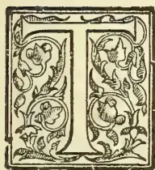

THE subject of our notice—a Ceylon-born man—is still with us, hale and hearty, and most intelligent and versatile in all that concerns his work, and long may he continue so.

It would take a young Englishman from Colombo sometime to beat Mr. Wright in a walk round his Mirigama property, albeit he is now about to close his 82nd year!

W. H. Wright was born in Colombo on 19th October, 1821, and was educated at the Orphan Asylum, at the time admirably maintained by Government, Mr. Craig being the Military school master. In 1840 he applied to General Stewart-Mackenzie to be sent to England to learn Engineering, and was accordingly promised a free passage in H.M. Ship “Rattlesnake”; but, unfortunately, war broke out in China and the services of the man-of-war were requisitioned to carry troops across from Ceylon and India to China. Mr. Wright, however, got a place as an assistant on Rajawella estate, Dumbara Valley, the property of the Hon. George Turnour, his superiors being Messrs. George and James Reid. Here he remained, learning much and working hard for nearly three years until August, 1843. Next, on the recommendation of Mr. Robert Gerard of Deegalla estate, he was employed as Superintendent of Works under Major Bradley, R.E. Department, Kandy.!

About a year after, Mr. Wright became an Estate Superintendent once more, and he worked with great zeal under the firm of Messrs. Hudson, Chandler & Co., at Peradeniya, where he opened no fewer than three coffee estates—namely, “Peradeniya,” “New Peradeniya,” and “Esperanza.” When Hudson & Co. became bankrupt, Messrs. J. Murray Robertson & Co. took over the estates retaining Mr. Wright in their employment. Whilst working here he bought “Vava Kalla” in partnership with Mr. James Maartensz of Colombo, and this he opened and planted with coffee, and then 15 months later sold it for double the amount he had paid for and spent on it. After selling “Vava Kalla” Mr. Wright bought, in 1861, 120 acres in Haputale in partnership with Mr. John Hamilton, of Kandy. This he opened and planted with coffee, and the estate was afterwards known as Koslande. About two years later he bought Mr. Hamilton’s half share and became sole proprietor, but in 1875 he sold Koslande estate to Mr. Bennet. At the same time (1862-1874) Mr. Wright opened Macaldenia, also in Haputale.

Mr. Wright had now had 45 years’ work as a planter; so on selling Koslande he retired with a competency—Rs. 200,000 at least—the fruit of his well-directed and untiring industry, and came to Colombo. Here he lived in the “Aviary,” Park Road, which he improved very much. He next bought a block of land in Turret Road, and immediately began building “Wilhelmsruhe”

261------------------------------------------------

224THE TROPICAL AGRICULTURIST.[Oct. 1, 1903.

and laying out the garden with his usual great taste. Here he lived quietly, giving his time and thoughts chiefly to his flowers, vegetables and trees. But some of the investments made for him by injudicious lawyers did not prosper, and Mr. Wright with plenty of energy and a sufficiency of capital, determined once more to begin work as a planter—in coconuts this time—and so in 1886, when 65 years old, he bought land near Mirigama, cleared and planted it and built himself a substantial bungalow with the inevitable gardens, and there he continues to the present day. Mr. Wright's plantation is now in its prime and one of the finest in the island. As a Horticulturist Mr. Wright has repeatedly got prizes at Agri-Horticultural Shows, and he is famous for his flowers and orchids. He is the most successful cultivator of Mangosteens in the island. On the 20th October—that is in a few days—Mr. Wright will enter on his 83rd year, and still he is well and strong, able to make the round of his coconut estate in the liberal cultivation of which he takes the greatest interest. It may be said of Mr. Wright, as of the great leader of Old Testament times, that his eye is not dim nor his natural force abated! Mr. Wright is a credit to Ceylon—a bright example of what industry and intelligence will do to his countrymen,—and as a man most worthy in every relation in life. Long may he flourish to gather in big crops of nuts, and to be known as the worthy and wealthy SQUIRE OF MIRIGAMA!

---

## CULTIVATION OF TOBACCO.

BY CLARENCE W. DORSEY.

[AMERICAN, MANILLA AND SUMATRA EXPERIENCE UTILISED.]

(Concluded from page 154.)

Every effort is made, both through fertilizing and cultivation, to maintain a steady and rapid growth, as any check in the rate of growth tends to thicken the leaf and reduce its elasticity. Stable manures are commonly used, while fertilizers known to be rich in potash are especially to be recommended. In many parts of the United States it is customary to apply specially prepared fertilizers after the plants have attained considerable size, to still further stimulate the growth of the crop. In Sumatra the crop is given three cultivations. The second cultivation is made at the time the plants are about 30 centimeters high. Just before the second cultivation, the coolie carefully removes the lower leaves, places them around the stem, and packs the loose soil on these. At this second cultivation the suckers are broken off and buried in the same way as the leaves, so as to protect the stem. The

work of topping and suckering varies considerably, with reference to individual plants and the character of tobacco desired.

Early or low topping is not desirable, as it throws too much growth into the leaves, making them coarse and large. If the plants are thrifty and the weather favourable for growth it is frequently advisable, if thin, fine-textured leaves are desired, not to top the plants at all, but let them produce their flowers and seed pods. If, however, the plants seem weak and it appears that they can not mature the full number of leaves, they should be topped by pinching out the "buttons," allowing to remain as many leaves as the plant will be able to mature. When plants have been topped too low and the leaves thicken and curl, a few suckers may be permitted to grow, which will remedy any thickening and curling. By using good judgment in the matter of topping and suckering, and making proper allowance as to the soil and climatic conditions, the leaves can be grown to almost any thickness that is desired.

From the time the plants begin to grow in the seed bed, until they are harvested, they should be examined carefully for worms, insect pests of all kinds, and all of the diseases which they are subject to. Worms may be removed by hand or by applications of mixtures containing poisonous substances, such as Paris green. For diseased plants frequently there is no other remedy than to remove the plant and reset other plants. But, if the resetting is done too late, the small plants never amount to much.

At the time of topping, or when the buds have made their appearance, a few plants are usually left for seed. Only the best, finest and healthiest looking plants are selected for this purpose. These are allowed to grow and blossom at their full height. Sometimes all of the leaves are removed; but, usually, only the bottom leaves are taken off. When ripe, the little balls containing the seed are carefully cut off with a knife or other sharp instrument. The cutting must be done carefully, so that the seed will not fall out. The seed pods are then spread out in the sun and, when thoroughly dried, the seeds can be removed. The seed should be cleaned, preferably in a small seed mill, and only the heaviest seed preserved for the next planting.

### HARVESTING AND CURING.

More satisfactory results are obtained when the leaves are "primed" than when the entire stalk is cut. By cutting the entire stalk, much green tobacco is carried to the shed, since all the leaves never ripen on the plant at the same time. By the system of priming the leaves are taken off the stalk as soon as they ripen, and carried to the drying sheds in baskets. Sometimes half of the leaves are removed and the balance of the stalk cut, and the leaves cured on the stalk. Tobacco should never be cut or primed when wet with rain or dew, as this causes the leaves to sunburn and

262------------------------------------------------

Oct. 1, 1903.]THE TROPICAL AGRICULTURIST.225

little holes to form, which lowers the value of the leaf. If the tobacco gives promise of being "wrapper"—that is, if it is light green, very sound in leaf, and of desirable size—it should be primed at an early stage of ripening. If however, appearances indicate that it will prove "filler" tobacco, it should be allowed to thoroughly ripen.

In the Cagayan Valley it is customary to make five gatherings of the ripened leaves at intervals of eight days. The native cuts the leaves while they are hot and drooping, collects them on his left arm until the bundle is too large, when it is placed on carts and hauled to the sheds.

The different primings should be kept separate in the shed, so that they can be fermented separately, as each set of leaves from different parts of the plant requires different treatment in the subsequent fermentation,

#### THE CROP FROM THE SUCKERS.

If the soil is rich and the season favourable a second profitable crop can be produced from the suckers. The first suckers, of coarse should be broken off from time to time; otherwise, they will sap, hinder, and check the growth of the leaves. When all of the leaves have been primed from the original stalk except four or six leaves at the top, two suckers should be allowed to grow from the bottom of the stalk. These will be well started by the time the top leaves of the original stalk are ripe. The stalk should then be cut just above where the suckers sprout, and cultivation should begin at once, by carefully placing soil up around the old stubble. The suckers should not be allowed to have more than six or seven leaves each. The growth of these will be rapid, and they will mature early. Usually these are not

each style of shed. Some are broad and flat, others narrow and tall. The broad, flat type of barn is to be preferred, for the tobacco cures more slowly, and better results are obtained. The interior of the shed is so constructed that frequent tiers of rafters and posts allow ample support for hanging the tobacco. The doors and windows should be arranged with the idea of giving very thorough ventilation when open. The manipulation of the barn or curing shed is entirely governed by the condition of the weather and the nature of the tobacco, and no fixed rules can be given. Considerable care and judgment must be exercised in the curing of the crop, and as the conditions vary in each case from year to year, only experience can determine just what is to be done to meet the new problem in the curing shed. The process requires a few weeks, especially if the leaves have been primed. The crop is considered thoroughly cured when the midribs of the leaves are cured: it is then ready to be taken to the packing house for sorting, fermenting, and baling.

Very much of the value of tobacco depends upon the infinite care that is taken throughout the whole period of its production, and thorough consideration of all the details should be shown in the fermentation, grading, and sorting. The fermentation has two purposes. The first is to insure the proper texture, glossy appearance, and colour to the leaf. It brings out the characteristic properties of the leaf, which are hardly apparent when the leaf is cut in the field. It is, furthermore, necessary to press the tobacco into bales, so that it can be shipped in compact form. The best results are obtained when bulk fermentation is practiced. In this method, the leaves are assorted

FIG. 3.—Framework for the cheese-cloth covering.

primed, but the stalks should be cut. In northern Luzon these mature in about three weeks, and, in years of great humidity, a second crop of suckers is allowed to grow.

After harvesting, the tobacco is carried to the sheds for drying and curing. These sheds are usually large enough to hold the crop from a number of small fields. Many different kinds of drying sheds are used and differences of opinion prevail as to the relative merits of

into piles, depending on what part of the stalk they have been taken from. Layer after layer of leaves are placed together, until piles of more than 1 metre are reached. The temperature in the pile gradually rises, and frequently thermometers are inserted to determine the exact degree of heat which is never allowed to become excessive, or the tobacco will be injured. The piles are frequently turned over, to secure the proper

263------------------------------------------------

226THE TROPICAL AGRICULTURIST.[Oct. 1, 1903.

heat and regulate the fermentation. No statement can be made as to how often the piles should be turned over, or when this should be done, as it depends upon the condition of the tobacco, especially as to how moist it was when placed in the pile. The leaves from the upper part of the stalk must be fermented more slowly than the lower leaves; consequently, the piles must be torn down and rebuilt more often. The principal fermentation is one before the sorting as, after the sorting, there are so many grades which have to be kept separate. Often these different grades are fermented to improve the quality of the leaf.

In the Cagayan Valley the tobacco is placed into packs of four bundles of from 20 to 40 leaves. These bundles are then placed into bales of 80 packs. From 1 hectare an average yield for a number of years is 612 kilos of dry leaves. The tobacco is frequently assorted with the following results: From 1 hectare, 10 packs of superior tobacco, 30 packs of first-class, 40 packs of second-class, 80 packs of third-class, 160 packs of fourth-class, and a number of packs of fifth-class tobacco. The sorting is generally carried on with reference to the colours, absence or presence of spots, length and soundness of leaf. Many divisions and subdivisions are made, according to market demands and the intended use of the tobacco. After the work of sorting and grading has been completed, it is baled into compact bales, when it is ready for shipment.

#### GROWING TOBACCO UNDER SHADE.

The growing of crops under shade is not a new idea, but was practiced perhaps hundreds of years ago; but the cultivation of fields of tobacco under a light cloth shelter of some character is comparatively recent. The idea of using shade started in the United States in Florida, where in the last few years tobacco cultivation has made enormous advance. It was noticed that in new land, only partially cleared of the forest growth, the plants grown under the scattered trees were far superior to plants not so shaded. From this the idea of artificial shade had its birth and now large fields, nearly 5 hectares in size, are grown under shade with great success.

In addition to the experiments in Florida, many trials have been made in the State of Connecticut, with equal success. The character and quality of the tobacco was considerably modified and profits greatly increased. It was determined that tobacco fully equal to the finest Sumatra leaf could be grown in the Connecticut Valley on a commercial scale, and the experiments received widespread attention and large companies have been formed to grow tobacco exclusively under shade. By using the shade, the damage from insect pests is reduced to a minimum, the moisture content of the soils is increased, while the evaporation from the leaves is largely retained, favouring a more rapid and luxurious growth. The shelter tempers to some extent the intense

heat of the sun and at the same time readily allows the free passage of even the slightest showers through it.

In figure 2 is shown the general appearance of a tobacco field covered with a cheese cloth shelter. The field contains about  $4\frac{1}{2}$  hectares and is one of a number of large fields of shaded tobacco grown in Florida in 1899. In figure 3 is shown the details of the outside structure of the framework, before the covering was put on. In figure 4 is shown the details of the framework of a shade that was used in the Connecticut Valley in 1901. A strong framework is constructed of posts and stringers, that is further strengthened by strong wires secured at each end of the field by strong stakes driven well into the ground. This is covered with some light cloth, such as cheese cloth. By special request, an extra wide (about 5 metres) quality of cloth was made for the season of 1902. The cloth completely covers the framework and reaches to the ground, where it is secured. Gates are provided, covered with cloth, and, in the fields of large dimensions, it is advisable to leave a road lengthwise through the field. Usually, the cloth must be renewed each season, but the framework is built sufficiently strong to last four or five years. The height of the framework is about 3 meters and the average total cost of the shade in the United States is about \$350, United States currency, for 1 acre 0.4 hectare. In the Philippines such a shelter could be constructed much more cheaply, on account of the cheapness of the framework, for bamboo and bejuco could be substituted largely for hard wood posts and wire.

The covering completely incloses the field, and should be made so close that few, if any, insects can enter. The protection from strong winds is very beneficial, as the leaves are often torn and lashed when the crop is not protected. Much protection is also afforded from heavy, dashing rains, which would otherwise damage the leaves. The force of the heavy rainfall is broken and frequently the crop is saved when, without protection it would be badly torn and damaged. So much better results have been accomplished in the United States with the shade-grown tobacco that an earnest plea is made for its introduction into the tobacco districts in the Philippines. Rumors have stated that the attempt is to be made in the Cagayan Valley, but the author can not state how far these experiments have been conducted, or what success has been attained. It will, of course, be advisable to experiment on a small scale, rather than expend any considerable amount of money on materials for shading large fields. A shade of sufficient size should be constructed to determine to what extent the crop will be benefited, and then plans can be made for the erection of larger coverings.

#### CONCLUSIONS.

From the above, it is at once apparent that the successful cultivation of tobacco requires

264------------------------------------------------

OCT. 1, 1903.]THE TROPICAL AGRICULTURIST.227

the greatest care and attention, from the preparation of the seed bed to the final ferment-

prices ever obtained for the finest of the old standard crop. And this has been the expe-

FIG. 4.—Framework used in Connecticut.

cation and baling of the ripened leaves. While anyone unfamiliar with tobacco culture can probably produce a crop, it is to be doubted if it will be of such a character as to command a good price. Judgment, only to be gained through experience in growing the crop, is necessary at so many stages of the growth of the plant that it is doubtful if it is profitable for the planter to undertake its cultivation unless he can engage the services of some one who has had such experience. And yet it is possible for the careful planter, who persistently studies the requirements of the crop, in a very few years to produce tobacco of a quality superior to that grown in regions where its cultivation has been practiced for scores of years. When the Department of Agriculture attempted growing Sumatra tobacco under shade in the Connecticut Valley, the idea was greatly ridiculed by conservative New England planters, who scoffed at the idea of trying to grow a new kind of tobacco. They maintained they had grown tobacco for years, and knew the limitations of the soils and climate and the kind of tobacco best suited to the conditions. It took only one year to convince them that a new type of tobacco could be grown and sold for prices many times in advance of the best

rience of tobacco cultivation the world over. Experiments have been tried in tobacco growing in new areas and in a few years, in many cases, have entirely revolutionized the agriculture in certain districts. New areas are constantly being opened up, with results that are very gratifying, even to the most sanguine experimenters.

In the districts where tobacco cultivation has been carried on for years, no one should be contented with the results obtained, but should by constant experimentation with new seed and improved cultivation endeavour to improve the quality of the crop. Here in the Philippines it is commonly stated that the tobacco grown to-day is inferior to that formerly grown. This is greatly to be regretted, and it should be the especial effort of every planter to produce tobacco not equal to that grown a few years ago, but far superior to the finest crops that were ever harvested. The tobacco markets of the world willingly pay, and pay well too, for tobacco of a superior quality, whether it is to be used for cigars, cigarettes or manufacturing purposes. The trade does not pay well for common tobacco for anyone can grow coarse, common tobacco of low grade. The quality of the tobacco must be superior to that formerly

265------------------------------------------------

228THE TROPICAL AGRICULTURIST.[OCT. 1, 1903.

grown to command a good price, for tobacco consumers are becoming more fastidious and constantly demand better goods for their money.

The author is of the opinion that the Philippine Islands can and should produce cigar-filler tobacco that is fully equal to the finest product of the famous Vuelta Abajo district of Cuba, and a cigar wrapper equal to Sumatra tobacco. With careful attention to soil and climatic conditions, it is believed districts can be found that will raise tobacco similar in flavour and aroma to that grown in the best districts of Turkey. These results can only be obtained, however, by persistent, intelligent, well-directed efforts on the part of the planter.

Philippine tobacco to-day does not occupy the position it should, and every planter or company engaged in its cultivation should strive to place it on the high standard it deserves.

## RUBBER PLANTATIONS IN MEXICO.

### RAPID GROWTH OF THE INDUSTRY.

Rubber planting in Mexico is extending considerably, and there are a number of plantations, owned by companies or private individuals, gradually coming into bearing and which show that certain parts of Mexico are well adapted to rubber growing.

Some of these plantations are of immense area as will be seen below, and though the majority are only partially planted, nurseries are in full swing and planting out is going on rapidly.

*Modern Mexico* (September) gives some particulars of the progress in Mexico rubber planting, from which the extensiveness of the industry can be realized. The question of labour seems as great a problem in Mexico as in Ceylon. Those estates however, which have a good name among the labouring class do not seem to have so much difficulty in this respect. "The most serious problem which confronts agriculturists in Mexico is the obtaining and maintaining of desirable labour, but Vista Hermosa has no trouble in this respect (Vista Hermosa is an estate in which besides rubber, sugar and coffee are chiefly grown). A plentiful supply of the very best class of agricultural labourers is to be had in the adjoining mountains, and Vista Hermosa enjoys a reputation among them of possessing a healthy climate and of giving them good treatment and prompt pay for their work."

Regarding the rubber-growing industry in Mexico Col. J. B. Sanborn after visiting plantations there stated that "the question of the production of rubber from cultivated trees has been settled absolutely in the State of Chiapas and bordering on Tabasco at one or two points. The first producing plantation in this district was put in by Alexander Cordova from seventeen to twenty years ago. It is located between the towns of Teapa and Tacotalpa. The trees have been regularly tapped twice each year for about ten years. Cordova was a poor man when he started the plantation and owed a large amount of money. He has since cleared off his debts and is a man of means, all made out of rubber culture. The second plantation, so far as I have been able to learn, was started by the Moldanardo family thirteen years ago, and is called Santa Anna—is located near Tacotalpa and contains 14,000 trees. These trees have been tapped once each year for two or three years, and have yielded an average of one pound of rubber per tree. The above statement can be corroborated by any reliable authority in the city of San Juan Bautista. When Dr. Abbott wrote me

in April that the corn on the plantation was about a foot high, I expected to see a small patch probably three feet high on my arrival. Judge of my surprise when I rode up to the top of Administration hill to look over a cornfield of about 700 acres already in tassel and so high that a man on horseback is completely hidden from view. Some of the stalks are sixteen feet high; they will all average over twelve feet. Already the stalks are down, some rubber planted and growing and the staking and planting is being gradually extended over the entire field. The young trees are up a few inches, and long before this letter reaches the printers the entire vast field of 700 acres and about 100 acres not now in corn will be all planted in rubber.

### A CLEAR RUBBER GROVE.

"All the clearing which has been done to date has been done in a thorough manner, every tree except the rubber and a few royal palms having been cut down and burned. In this climate the dampness and worms make short work of stumps and fallen trees, and we may expect in about two years to have a grove of rubber practically as clean as a New England apple orchard. In making the clearings a considerable number of fine mahogany trees were discovered. These were cut down, squared and cut into long planks about two inches thick; the wood is being used in making chairs, tables, etc."

That considerable care is taken with the better estates to have every thing done thoroughly well is seen in the following statement by a partner in one of the company-owned plantations, specially noteworthy is the care taken to prevent the estate labourers from spending their earnings in intoxicants:—"We own and operate our own transportation, regulate the prices paid to labor, build and maintain interior roads, establish a church and have our own fiesta days, preventing the Indians from going to distant towns and squandering their money, regulate the sale of aguardiente, and in many other ways improve conditions. The wisdom of our foresight in this direction has already been proven by the fact that several different parties have already attempted to get a foot-hold near our location for operating resorts, where the natives could spend their money for rum."

### RUBBER PLANTATIONS.

The various estates cultivate a variety of crops besides rubber; the chief being coffee, sugarcane, cacao, citrus fruits, bananas or plantains, corn, rice and pines, while from some estates where transport conveniences exist an export trade with the United States is done in vegetables, tomatoes, peppers, etc., one company alone shipping over 9,000 crates of green leaves during the winter of 1902-3. Cattle raising to a small extent is also carried out on certain estates. Thus the Chicago Tropical Planters' Co. have an estate of 7,500 acres near Omeala, Vera Cruz, of which 2,500 acres are to be in coffee, 500 in rubber with some 250,000 trees, and 4,000 acres under cattle fodder capable of sustaining 3,000 head.

### CASTILLOA ELASTICA, 600 TO 900 PER ACRE.

On Isebel Estate there are 12,000 rubber trees, 3 years old; 5,000 rubber trees, 5 years old; 10,000 rubber trees, 4 to 5 years old; 5,000 rubber trees, 6 to 4 years old; 8,000 rubber trees, 2 years old; 155,000 rubber trees 1 year old. On this estate 660 to 900 *Castilloa Elastica* per acre are planted, and this is not considered too many. Some 100,000 acres of land are owned by the Mexican Coffee and Rubber Growers' Association varying in elevation from 700 to 3,000 feet, the average being about 2,000 feet. The surface, generally speaking, comprises rolling hills and stretches of valley and fine table lands, by gradual rise extending back to the main ridge, reaching its highest elevation on the western boundary. These hillsides afford the finest soil and drainage for the cultivation of rubber and coffee, while the table lands and valleys will produce everything grown in that country. The hills are nearly all gradual and easy slopes, and

266------------------------------------------------

OCT. 1, 1903.]THE TROPICAL AGRICULTURIST.229

are covered with the great virgin forest trees, the size and number of which attest the richness and depth of the soil. Few tracts of land in Mexico have so large a quantity of valuable timber, such as mahogany, ebony, cedar (some of which measures 5 feet in diameter), iron-wood, lignum-vitæ, Brazil wood, logwood and other dye woods, some being very valuable. The soil is a rich vegetable loam of great depth, with a prime red clay sub-soil.

This company are going in entirely for rubber. The San Marcos Co. is going in for rubber alone, and has an estate of 21,000 acres. Another company has 240 acres (90,000 trees) already under rubber, and 1,500 acres yet to be planted. The Le Junta, almost a model estate contains 475,000 rubber trees over 3 years old, with a nursery of 700,000 trees, a large average under coffee, and 2,500 cacao trees. The Cascajal Co. besides coffee and other products have 67,000 rubber trees, 5 years old; 73,000 trees from 2 to 4 years old; and a large acreage for rubber nursery work.

Altogether the rubber planting industry in Mexico appears to be in a very flourishing condition. The uses for rubber are increasing yearly and the demand is growing, so that even in some 15 years' time when the large districts planted in Mexico and other parts of America, and also in Ceylon, the Malay States, etc. are in full bearing, it is not probable that the demand for good rubber will be more than met. The largely increased supply will probably bring down the prices somewhat, but even then the crop will always be a paying one; so that no planters need be afraid of further planting rubber for fear of its being a non-paying crop through low market-prices, provided always that the best rubbers only are grown. It must be considered also that in all probability the supply of the poorer grades of rubber will go down; cheap and inferior rubber will be ousted, and there will always be a demand for rubber of the best quality.

## THE RUBBER INDUSTRY IN CEYLON AND BURMA.

Considerable interest is now being taken in Burma, the Malay Peninsula, and also in Ceylon since 1898 in the cultivation of rubber. The variety chiefly planted is the *Hevea Brasiliensis*, the Para rubber of commerce. Roughly estimated there were about four million trees of this variety planted in the East within the last decade, and all of which originated from the plants sent from Kew to the Botanical Gardens of Peradeniya, near Kandy, in the Island of Ceylon. At Amherst, situated just south of Moulmein, Mr. W. F. Todd started a plantation of Para rubber in 1899 and has now 50 acres fully planted with 14,000 trees which from young plants have developed into fine trees. There was every prospect of this cultivation being a good success, and a profitable return was expected when the trees had attained an age of eight years, or five years hence. The plants referred to as having been sent from Kew to the Botanical Gardens in Ceylon were sent out at the instance of the British Government in 1876. The cultivation of this variety of Para rubber was started about two years since by the Government of India in the southern extremity of British Lower Burma, at a place called Mergui and on the adjacent King Island. When the rubber trees at Amherst and other parts of Burma arrived at maturity the markets of Europe would receive a supply of nearly pure rubber which would lose only 1 per cent in the washing. This had been proved by recent samples sent home of cultivated rubber both from Ceylon and the Straits Settlements. The seeds of the *Castilloa Elastica*, the variety now planted on a large scale in Mexico, had been also successfully introduced into Burma by Mr. Todd, who imported the seeds direct from San Salvador and Mexico, some of which were forwarded by him to Samoa in the South Seas and arrived there in

good condition. The seed is supposed to lose its vitality very quickly, but, with careful packing, it is possible for it to travel safely for three months. In the present year there was considerable demand for this seed in Ceylon as it was found to thrive better on a wider range of country and climate than the Para,—*Rangoon Times*.

## COTTON GROWING.

### TO IMPROVE PRODUCTION BY SEED SELECTION.

An interesting letter on the improvement of cotton by seed selection (a criticism on a paper in the year-book of the American Department of Agriculture) appeared in the columns of the *New York Herald*, from which we make one or two useful extracts. Cotton growing in Ceylon is at present only in the experimental stage, but it is probable that before long we shall see a fair acreage under this crop. As already stated in these pages the area of the black soil suitable for cotton growing in Ceylon is limited—some 25,000 acres—so that it will be necessary, if the industry is to be a paying one, to get the biggest crops possible from this limited area. This matter is receiving attention from Mr. MacMillan, who is carrying on the cotton growing experiments at Anuradhapura, and the seed of the first crop is to be carefully saved, and selected seed only will be used for further growing. These extracts, therefore, will not be out of place just now.

The writer of the letter says:—

An article by Mr. Herbert J. Webber, on 'Improvement of Cotton by Seed Selection,' in the year-book of the Department of Agriculture, contains suggestions which, if generally adopted, would lead to a large increase in the cotton production of the United States. He concludes that the most important problem now before cotton growers seems to be that of increasing the production on the same acreage, rather than extending the acreage itself. Mr. Webber recognizes that the character of the soil is the factor of greatest importance. He believes, however, that there is great opportunity of improving the industry on all lands, both good and poor, and he estimates that the cotton crops could be doubled, on the same acreage now grown, by proper attention to two factors necessary to success, namely, the universal use of good seed cotton and careful methods of tillage and fertilization.

### THE IMPORTANCE OF GOOD SEED.

While both of these factors contribute largely to success, Mr. Webber believes that the importance of good seed is probably more commonly overlooked than the matter of cultivation. His observations show that fully half the planters use seed taken at random from public bins, about which they know nothing other than that it was produced somewhere in the same vicinity; and he says: 'As well might the breeder of fast trotting horses introduce dray animals into his stables, or the breeder of intelligent hunting dogs introduce ordinary mongrel curs into his kennels. The use of good seed and its production by a regular system of selection is just as important a factor in the production of the crops as that of cultivation. No intelligent method of farm management disregards the production and use of good seed. The day, when growers can afford to plant any sort of cotton seed, has passed. Only seed of a known variety, selected because of its desirable qualities and adaptability to local conditions, should be planted.'

### SEED SELECTED IN THE LOCALITY.

The traditional belief that an occasional change of seed is necessary, if good crops are to be regularly secured, is attacked by Mr. Webber, who contends that, to secure the best results, plants must be bred and adapted to soil and climatic conditions, and that cotton planters and growers of cereal crops as well, if they are to obtain the best results, must select their seed in the locality where it used to be regularly grown, in order to adapt it to the particular soil and climatic conditions.

267------------------------------------------------

230THE TROPICAL AGRICULTURIST.[OCT. 1, 1903.]

In connection with this matter of the selection of seed adapted to particular locality; careful selection of the best seed in the Anuradhapura experiments may result in a breed of cotton specially suited to the soil and conditions prevailing in Ceylon and giving really good returns. We may be quite sure that the matter will receive full attention from Mr. MacMillan, who is determined to leave nothing undone to obtain the best results in Ceylon, and he probably has this matter of

#### A SELECT CEYLON BREED

view.

The paper outlines a system of selection based on the principle that, while plants reproduce their main characters unchanged, and the stability of the cultivated plants and natural species depends upon this law of heredity, still they are not absolutely fixed and stable, but are very unstable and highly variable in minor characters. The system outlined, which is one that any planter can carry out on his own plantation, is based on the use of the seeds of only such plants as show the characteristics which it is desirable to reproduce—such as quantity of production, length of fibre and earliness of maturity. It is recommended that, after these plants have been carefully selected, the seed from the middle pickings of each plant be carefully gathered; that that from each plant be ginned separately, in a gin that has been carefully cleaned so as to prevent mixture of unselected seed, and that the seed of each plant be planted separately the following year, so as to test its quality for the reproduction of the qualities desired to be perpetuated. All plants that do not come up to the standard are to be discarded in the second year, and the seed of only the very best are to be used for planting the third year. By the beginning of the fourth year a sufficient supply of highly-selected seed for seeding a large plantation will be secured. The system of selection can be indefinitely continued, however, from year to year on a tract of ground set apart for that purpose, and thus the quality of the cotton can be kept to a high standard or constantly improved.

### RUBBER AS SHADE FOR COFFEE.

An interesting account of the growing of rubber trees in Assam has been published by Mr. D. P. Cope land, Deputy Conservator of Forests, Darrang Division. The rubber tree in question is the *Ficus elastica* and the information given cannot fail to be of interest in these days of high prices for India rubber. The fig in question does not produce so valuable a latex as the *Hevea* or *Castilloa*, but for all that its cultivation is found to be profitable, and it is questionable whether planters in Southern India could not turn to profit the many varieties of *Ficus* which grow on their estates. It is true that a note of warning has recently been sounded with regard to these trees as being the cause of one of the coffee planters' chief troubles, viz., stump rot. But as Mr. Graham Anderson said in the course of the discussion on this subject at the recent meeting of the South Mysore Planters' Association, "it would be a great pity if attention was diverted from their propagation."

The *Ficus elastica* in its natural state starts in the forks of other trees, often 30 feet and more from the ground, and the young plant remains for years an epiphyte until its aerial roots touch the ground. As soon as this takes place the little clinging plant changes rapidly into a vigorous tree, throwing out numerous aerial roots which gradually envelop the tree on which it first began life and often kill it out. The *Ficus elastica* so far will be recognised to be similar to many other varieties of the species which are found in South India to-day. The methods of germination in vogue in Assam are the same as those practised by planters in Mysore and Coorg with the *Ficus glomerata*, *Indica*, *Mysorensis*, etc.,

which they grow as shade trees for coffee. Bird droppings and ripe figs under the rubber trees are swept up daily, as it is found that seed which has passed through the alimentary canal of birds germinates best. From two to three seers of pulverised rubber seed is then well mixed with 10 seers of ash and 20 seers of vegetable loam or good soil, and is spread evenly over a bed, whence sufficient seedlings should be obtained to plant out 100 acres of rubber 70' × 35'. The seedlings remain for two years in nurseries in Assam and then they are planted out in the forest on mounds four feet high and then staked. In artificial planting the *Ficus elastica* is found to grow best when treated thus. It can, however, be propagated also from cuttings, if ripe young branches or shoots are used, but the trees so raised do not appear to throw out aerial roots to the same extent; and from its aerial system will the future yield of rubber be eventually extracted.

In Assam the *Ficus elastica* is found to grow well anywhere where the atmosphere is damp. The best natural rubber trees are met with in the forests at the foot of the hills, or on the hills themselves up to an elevation of 2,500 feet. Artificially planted the trees thrive equally well, on high land or low land, in forest land or grass land, so long as they are planted on a mound, and their roots when the plants are still young are not exposed to the sun. It will thus be seen that the *Ficus elastica* is very similar in its habits and predilections to the various kinds of *Ficus* which are so popular among coffee planters; and one cannot but think that the latter would do well to experiment with the trees they have, and ascertain if the latex which flows therefrom, if not as valuable as that of the *Ficus elastica*, is not at any rate worth tapping. If it is found to be of no value they might gradually replace their trees with the Assam variety if found to thrive as well, as it may be expected to do. If the shade trees on coffee estates could be made to bring in some grist to the mill they would go a long way towards helping the over-burdened planter to tide over a bad year.—*Madras Mail*.

"SILVALINE": A NEW TEXTILE MATERIAL.—For some time past trials have been made, says *Handels Museum*, with the view of producing from European soft woods a fibrous material which can be spun, and serve as a cheap substitute for cotton, jute, &c. One of these new fibrous materials, 'Silvaline' (forest linen), was discovered by Rud. Kron at Golzern. It is made from Central European pine-trees, the material thus obtained being transformed into 'Silvaline' yarn, of which string, ropes, belts, decorative and clothing stuffs, flour and corn sacks are made. Beside 'Silvaline,' a number of other raw stuffs, such as straw, alfa, bamboo, rags, bass, jute-refuse, &c., can be employed under this process, and multifarious kinds of yarns, from the coarsest to the finest, can be produced from them. The price of a ton of 'Silvaline' yarn fluctuates accordingly from 30 to 300 marks. Corresponding with the variety of the raw stuffs and mixtures of stuffs, the strength of 'Silvaline' yarn amounts to 40 up to 80 per cent. of that of jute and cotton yarns. It is stated that 'Silvaline' yarn, even if made of the worst raw material, is always so strong that it can be used for weaving purposes. 'Silvaline' yarn can be interwoven with jute, cotton, linen, wool, &c., and may, it is said, constitute 60 to 80 per cent. of the woven article, without essentially affecting its quality. Even weavings which consist entirely of 'Silvaline' are said to possess sufficient strength for many purposes (particularly for serving as sacks for grain, flour, sugar, salt, cement, artificial manure, &c.) and to distinguish themselves by their cleanliness, freedom from dust, and tightness. Machinery of a special construction is required for the purpose of the 'Silvaline' industry, which is protected by patents, and which is manufactured and put into working order by a Saxon firm.—*Chamber of Commerce Journal*, Sept.

268------------------------------------------------

Oct. 1, 1903.]THE TROPICAL AGRICULTURIST.231

## THE WASHING OF CRUDE RUBBER.

The washing of crude rubber serves the purpose of removing from it the soluble organic and inorganic impurities, as also to free it from such mechanical impurities as all kinds of nondescript dirt, sand, wood, bark, and vegetable fragments of almost every description. The soluble impurities in the rubber very rarely exceed 1 or 2 per cent., but the mechanical impurities reach very high figures indeed.

The readiness with which any particular kind of crude rubber can by the washing process be converted into technically pure rubber depends not only upon the nature and amount of the impurities present, but is also very largely determined by the nature and condition of the india-rubber itself. Very firm and tough grades of rubber which soften only slightly at temperatures approaching the boiling point of water, and which contain only small quantities of resinous matter, are always very easily washed, whatever the nature of the impurities they contain. But soft and sticky grades of rubber, containing generally considerable proportions of resinous matter, offer almost invariably very great difficulties in the washing process.

In carrying out this process the rubber is cut into pieces of suitable size, which are then subjected to a treatment in hot or boiling water. Rubber grades which occur in small or moderate-sized balls are generally soaked without each ball being cut open. After this soaking the rubber is worked upon the well-known rubber washing machines in a current of clean water, when it finally assumes the form of very porous or honeycombed sheets, which are free from dirt if the operation has been successful. The rollers of these washing machines are occasionally smooth rollers, or they are provided with slightly oblique knife-edged corrugations, or these corrugations cover the rollers in the form of a helix. As the rollers of the washing machines revolve, moreover, at different speeds, it follows that if they are corrugated they not only tear and cut in a vertical, but also in a horizontal direction. The corrugated rollers also produce much more porous sheets than the smooth rollers, and the former are therefore distinctly superior to the latter. It is, of course, true that the corrugated rollers suffer much greater wear and tear, but this very fact, to my mind, already amounts to an obvious demonstration of their greater efficiency as compared with the smooth rollers.

As already mentioned, the preparation of the rubber for the washing process upon the rollers consists in its treatment with hot water, and it is my opinion that the success of the washing operation depends much more upon this particular treatment than upon the construction of the washing machine. I am further of opinion that in a great many rubber factories this particular stage of the washing process is treated in a rather summary fashion, receiving but scant attention, with the result that the efficiency of the washing process, as a whole, suffers more or less considerably. The mistakes committed in this process consist either in the rubber being subjected to the treatment in the tank without being cut into sufficiently small pieces, or the temperature of the water is too high, or the soaking treatment is not continued long enough. But the error most commonly to be observed is that all these faults occur together.

For the recognition of the correct mode of carrying out the soaking, or softening operation of the rubber in water, we shall first have to arrive at a clear understanding as to the purpose of this particular operation, from the description of which by practical workers, or in the literature on india-rubber, one would be inclined to infer that nothing more was aimed at than the softening of the rubber through the heat of the water. If this were correct, this operation might be equally well carried out by subjecting the rubber to the heat of, say, a rubber-drying stove. But this is certainly

not the case. It is, of course, quite possible to soften a piece of crude rubber in the heat of a rubber stove, but if we take a piece thus softened upon the washing rollers we shall find at once that rubber softened in this manner cannot be washed at all, and that the bulk of the dirt and woody debris it contains is simply ground to a fine powder, which remains cemented in the mass of the rubber.

In my studies on the coagulation of the rubber latex I made the observation that even a very impure rubber if taken upon the rubber-washing machine immediately after coagulation, can with the most surprising rapidity be washed into a product entirely free from every trace of mechanical impurity. Especially particles of wood, bark, and similar vegetable fragments fly from the rubber as if propelled by a spring, so that the man operating the machine becomes covered all over with these fragments, and I think that this observation contains the key for the explanation of the function of the soaking process in the washing of crude rubber. It seems to me that the remarkable ease and completeness with which in this case the separation of the mechanical impurities takes place is due to the fact that the rubber itself contains the maximum of water it is capable of absorbing. In consequence, this rubber is devoid of all adhesiveness, as may sufficiently be judged already from the circumstance that even freshly-cut sections of this rubber cannot be made to adhere. It is this lack of adhesivity which prevents the before-named mechanical impurities from getting cemented to the rubber substance. They are merely loosely embedded in the rubber, and float off with the water running upon the washing rollers as soon as they become exposed. It now becomes perfectly clear that what we must aim at in the soaking process of the crude rubber is not so much a softening of the rubber by the heat of the water, but a complete saturation of it with water. This water-absorption of the rubber amounts to about 25 per cent. of its weight, and it is accompanied by a very considerable increase of its volume. This increase in volume is in itself already equivalent to a very marked softening of the rubber, and should the degree of softness thus obtainable not be found sufficient, very short immersion in warm—but not hot—water will give the desired result.

The water-absorption of rubber to the above-named degree is, however, a rather slow process, which requires the longer time the greater the thickness of the pieces treated. Hence it follows that it is desirable to cut the rubber into pieces of very moderate thickness only. Practical experiments have shown that this is possible by the use of a rotary knife, by means of which the rubber can be cut into shives not exceeding  $\frac{3}{8}$  in. in thickness in much less time than it takes at present to cut up the rubber into irregular pieces by hand. On immersing the rubber in the water, the present method of simply letting it float upon the water is about as ineffective as it well could be. Care must be taken to have the whole of the rubber actually below the surface of the water. If the water used be cold, the complete saturation of the rubber with it requires a period of at least twelve days but if the water is steadily kept at 30 deg. C., the saturation is already complete at the end of three days. In treating rubber qualities high in resinous matter, it is particularly important to prevent the temperature of the water from ever reaching 40 deg. C., as at this temperature the great majority of the rubber resins already become very soft and sticky. Experiments I made to carry out this process of water-absorption under higher pressure, as in vacuo, showed that no saving of time, nor any other advantage, is to be gained thereby. The ease with which rubber thus saturated with water can be washed completely free of even the worst forms of mineral and vegetable impurities is quite surprising, but especially in dealing with rubbers containing large amounts of wool, it is most important to ensure the complete saturation of the rubber with water.

At the present time the soaking operation almost everywhere is carried out with the rubber being cut in

29

269------------------------------------------------

232THE TROPICAL AGRICULTURIST.[Oct. 1, 1903.]

far too large pieces. It is by no means necessary to cut the rubber into pieces individually small, or of little weight, but it is very essential that in one direction these pieces should be of very slight thickness only. This is achieved by cutting the rubber, as already suggested above, into shives or slices of moderate uniform thickness. The treatment of rubber in hot or boiling water, as at present practised, is absolutely fatal to the efficiency of the washing process. Most of the india-rubber resins form at a temperature of 65 deg. C. very sticky masses, and many are actually liquid at this temperature, and therefore act as a most effective cement between the rubber and its mechanical impurities. Very little consideration will show that once, and as far as, this cementation has taken place, the purifying effect of the washing operation becomes correspondingly illusory. The mineral and vegetable particles cemented to the rubber are no longer removable, they are simply ground into a fine powder, which remains permanently in the rubber, much to its detriment and often causing apparently obscure manufacturing difficulties.—*India-rubber Journal*.

## KAPOK: A COMMERCIAL PRODUCT FROM THE COTTON TREE OF JAMAICA.

I have translated and adapted from the French *Journal d'Agriculture Tropicale* an interesting account of a material which is abundant in Jamaica, namely the wool or silk-cotton of our widely-disseminated cotton-tree. This material, so entirely neglected by us, has already attained a considerable degree of commercial importance in the Dutch Island of Java and in two other adjacent insular possessions of Holland. The main source of information on this subject is a work recently published in Holland from the pen of Dr. Greshoff on the Useful Plants of the Dutch East Indian Islands. This gentleman is the Director of the Colonial Museum in Haarlem, and therefore he must be regarded as an eminent and authentic authority on the subject.

Our cotton-tree is known to botanists as the *Eriodendron anfractuosum* of DeCandolle. It has also other scientific names. It is the *Bombax pentandrum* of Linnaeus, and the *Ceiba pentandrum* of Gaertner. Readers of Charles Kingsley's interesting "At Last" will be reminded that he designated the cotton-tree of Trinidad as the ceiba. There is some reason, however, to adhere to the terminology of DeCandolle, for the word *Eriodendron* signifies cotton-tree. In Java the Dutch call this tree Kapok or Randoe. In commerce the wool receives the name of Kapok. A microscopical examination serves at once to distinguish kapok from cotton. Its fine threads or fibres are of a clear yellow colour, three-fourths to four-fifths of an inch in length, circular in section (not flattened or ribbon-like, as in cotton), and the fibres are often enrolled upon themselves but never rolled up in the form of a corkscrew. This material can neither be spun, nor woven like the cotton of textile manufactures, its fibres being wanting in strength and other qualities, nevertheless, it has been attempted to mix kapok with cotton. Owing to the lightness and elasticity of its fibres, kapok is well adapted for the stuffing of pillows and mattresses, for use in upholstery, etc., and may fittingly replace feathers, hair, and wadding. It is employed for these purposes in various countries, and beds made up with it are described as very comfortable and pleasant, being cool and not liable to be infested with insects. The last-named quality should surely be a strong recommendation for its local use, and what a boon it would be to Londoners could they by its adoption banish the notorious "metropolitan."

In Java for a long time the kapok was looked upon as a tree of very little utility, and it is only in recent years that it has become an article of commerce, which, even when put upon the market in large quantity, is always readily sold. At the present time when it has become absolutely necessary for tropical planters to find a cultivation other than that of coffee, sugarcane and indigo, kapok is attracting more and more attention. Of late years the journals and reviews of Java have on different occasions shown the profit which could be drawn from this tree. A very good article, written with this object, appeared in the "Indische Mercur," in 1891; and this article has certainly not been without influence on the constantly increasing cultivation of kapok in Java. Here are some extracts:—"Even before the fruits of the kapok have arrived at maturity, many Chinamen seek to get hold of them, if need be by buying them. The importation into China must be exceedingly large, judging by the demand which is made for it in that country. About ten cents is paid for 100 dried fruits. (A Dutch cent is the hundredth part of a florin, accordingly, the cent is worth one-half an American cent or about one farthing.) An adult cotton-tree, growing from a cutting, yields fully 5000 fruits. Trees grown from seedlings produce more. This tree grows rapidly, and begins to bear from the second year. It requires no attention, and grows even on very poor soils, and is not exacting as regards water." An energetic Chinaman in Solo (Java) said, "If I possessed a concession, I would plant cotton-trees on it on a large scale, and it would be seen if I did not draw more profit therefrom than those who spend thousands of florins on the ordinary cultivations, the expenses of which consume all the profits. If cotton-trees were planted on the bare mountains of the South, I am certain that the operation would be advantageous." These words were brought to the attention of the planters. In 1888, 1889 and in 1890, the importations into China must have been considerable, but the Chinese kept the matter secret for they fear the competition of European merchants.

At the present time, there are in the central parts of Java some fifty plantations whereon the kapok is harvested as an accessory product, on some even as the principal product, whilst ten years ago five only gave attention to it. According to official figures, the exportation from Java rose from 1,888,639 kilos to 2,777,467 kilos in 1896. Of 38,586 bales which were exported in 1896, 25161 were sent to Holland, 8,159 to Australia, 745 to China, and 216 to America.

The yield of kapok per tree per annum, it is said, varies from 1 to 50 kilos. Dr. Greshoff has ascertained the average weight of the dry fruit to be 26 grammes and 80 centigrammes, the fluff or kapok weighed 4 grammes, 90 centigrammes; the seeds (to the number of 175) 10 grammes, 20 centigrammes; the pod weighed 10 grammes, 30 centigrammes, and the stalk weighed 1 gramme, 10 centigrammes. In the cleaning of kapok in Java, use is made at the present time of small iron mills, each giving two piculs of clean merchandise for a day's work. (The picul in Java weighs 61 kilos, 220 grammes.) Each mill employs about four women to receive the merchandise, to fill up the bags and carry them into the "godowns" or storehouses, where they are pressed into bales. (Generally, the bales weigh 37 kilos for the cleaned kapok and 80 kilos for that which is not cleaned.) Improved machines for cleaning kapok are made by Thomas Barraclough, of 20, Bucklersbury, London. It should be remembered that for export it is not advisable to press the kapok excessively; this would impair the elasticity of the fibres. In 1898 the quotations in Holland were:—Extra cleaned, 39½ cents to 36 cents the half-kilo (nominally, one pound.) Good cleaned, 31 to 33 cents. Cleaned, second quality, 26 to 20 cents. Good uncleaned, 8½ to 9½ cents. Ordinary, uncleaned, 6 to 7 cents. In Java the cotton-tree furnishes an important by-product in the seeds, which are purchased by the Chinese with a view to extract the oil, which is used in the adulteration of

270------------------------------------------------

Oct. 1, 1903.]THE TROPICAL AGRICULTURIST.233

the oil of peanuts. At Tegal and Kediri the preparation of this oil is carried on at some tobacco-plantations. The proprietor of the Wedari oil-factory (in Jepara) bought from the natives in 1893, about four millions of kapok-fruits, and obtained from them 530 piculs of cleaned kapok and 1,000 piculs of seeds, which, added to 3,000 other piculs bought from the Chinese dealers, served for the preparation of 400 piculs of oil and 3,400 piculs of oil cake. In Java the cotton-tree is held to be an excellent support for pepper-plants, cubeb, etc. It is also employed as a shade-tree in the coffee-plantations. Again, in India it constitutes naturally-excellent living telegraph-posts, on account of the two following properties; the wood is not attacked by the termite-ants, whilst, on the other hand, the horizontal and widely-separated branches do not interfere with the wires. In this paper we have recounted many valuable properties possessed by the cotton-tree. Proprietors and cultivators in this island have too long been in ignorance of the great intrinsic value of this tree. It will be seen that, in Jamaica, we have an additional resource coming, perhaps, somewhat unexpectedly into view. It is to be hoped that all classes will study and strive to make the best of this gift of nature. At this period of the year the cotton-tree is bare of leaves. It is a deciduous tree, and it has the peculiarity of putting forth its flowers before the leaves. At the moment the trees in this locality have put forth an enormous number of flower-buds, promising a great crop of bolls and seeds, and so the coming season is likely to afford good opportunities for paying attention to the facts which have been stated. We hopefully trust that many readers of the Journal will turn this information to a fitting account.

JAMES NEISH, M.D.

—Journal of the Jamaica Agricultural Society.

## SWALLOWORT FIBRE.

Much has been appearing in the papers of late regarding the intrinsic value and importance of the giant Swallowort, or *Calotropis gigantea*, that useful and wonderful shrub, the dried twigs of which the ancient Arabs were wont to tie to the tails of wild bulls and then set fire to, in times of drought, with a view to inducing rain. But whatever has appeared of late seems to be merely a repetition of what had been published previously, and even the statement that the juice of the plant is a prophylactic for snake-bite poisoning is one that has been frequently made. The attention that is now being devoted to the plant is, of course, mainly on account of its fibre, which possesses far greater resistant properties than most, if not all, of the known fibres of commerce. The absence of an effective mechanical decorticator for separating the fibre has hitherto been the chief drawback in the way of the commercial exploitation of the shrub, the manual process of separation which has long been in vogue in Western India and other parts of the country and which gives us the well-known bowstring hemp of commerce being too slow and primitive to induce European capitalists to embark in the enterprise.

Perhaps it may not be very generally known that about six years ago Mr. MacDonald, an expert, came out to India and experimented with the fibre at Thana, in the interests of Messrs. MacDonald, Boyle and Co., who pronounced very favourably on the sample produced, declaring it to be finer and more silky than rhea, even though it had not been machine-combed. What is more important is that this firm was at the time quite convinced that with its rhea-extracting machine, which has been successfully used in the Straits Settlements for rhea, it was quite possible to treat *Calotropis*. It proposed at the time to ask the Bombay Government for certain concessions to exploit *Calotropis* fibre for a lengthened

period, but I have been unable to trace the further history of the firm's praiseworthy enterprise. I recently had occasion to write to London regarding *Calotropis* fibre and obtained from a reliable correspondent the important information that Mr. E. Lehmann, of 8, Chatham Buildings, Chatham Street Manchester, supplies a machine which will deal with Swallowort, the plant being treated similarly to flax and hemp stems, first through the softener, then scutched and finally brushed. This final brushing is said to enhance the marketable value of the fibre. On the other hand, an authority on fibre machinery in London declares that he is not aware of any description of leaf (containing strong fibre, capable of being spun and woven) which cannot be treated by the machines of Mr. Thomas Barraclough, of 20, Bucklesbury, London E. C. If the merits of these three machines have been faithfully represented, then one of the main difficulties that have hitherto stood in the way of the exploitation of *Calotropis* fibre has at length been satisfactorily overcome.

There is, however, yet another great difficulty that has long been recognised, and no endeavour, so far as I am aware, has been made with a view to ascertaining whether it is surmountable or not. I refer to the regular supply of the fibre for the market. According to my London correspondent, the only thing against the fibre becoming popular in England is its erratic supply. If regular season's supplies could be guaranteed, from £38 to £40 per ton, cif, could be commanded in the London market, *Calotropis* grows luxuriantly in all imaginable descriptions of soils, sandy, stony, rocky or loamy. It can be propagated by seed as well as by cuttings and roots. But the great question is as to whether it will repay systematic cultivation, without which there is no likelihood of its furnishing a permanent industry, for, in its present scattered wild state, probably only a few hundred tons of fibre per annum can be obtained from the cut stems, whereas several thousands of tons would be needed were the industry established. Mr. F. Gleadow, of the Forest Department, is strongly of opinion that regular cultivation will not pay, principally because the plant is of a straggling, light-demanding habit, and could probably not be grown dense enough to give any considerable yield. He admits however, that he has made no experiments with it. Mr. Strettell published an interesting pamphlet in 1878 about Swallowort, in which he gave the yield of fibre per acre at 532 lbs., or 727 lb. where waste is guarded against. It may here be mentioned that a stem of the plant can be got to yield from  $\frac{1}{4}$  to 2 per cent. of fibre.

As regards regular cultivation, though it may not pay the European capitalist, natives may probably find it remunerative. In most parts of India the people are fully alive to the uses of the fibre, and they may be induced to cultivate systematically if the remunerativeness of the enterprise is satisfactorily explained to them. I remember once reading that in parts of the Nasik District *Calotropis* is grown specially for its fibre. Yet another factor which needs to be taken into consideration is with regard to the textile value of the plant as grown in different parts of the country, as also the age at and the season during which it can profitably be cut. Mr. Gleadow is again my authority for stating that the plant is neglected in the Deccan because of its uselessness, and that in the month of February, plants cut down in the Saharapur District were found to be quite unfit. In the Punjab the shrub is cut down in October and November or April and May for the extraction of the fibre, while in Scinde the process is carried on all the year round. Some authorities say that the plant should be cut when it is in blossom, while others consider this unnecessary. To this the important fact should be added that, whatever may be the case elsewhere in several parts of the country, Swallowort may be found flowering almost throughout the year. There are two species of the plant, *C. gigantea* and *C. procera*.

271------------------------------------------------

234THE TROPICAL AGRICULTURIST.[Oct. 1, 1903.]

respectively, but it is generally admitted that they are almost identical in every respect, and so far as the quality of the fibre is concerned, experiments have shown that it is equally good in each case. Apparently, granting that the decorticator difficulty no longer chokes the way, all that now remains to be done is to ascertain whether there are areas in India where Swallowwort plantations could be profitably opened. In many parts of the Madras Presidency, where the plant now runs wild, it may just be possible to find considerably extensive waste places which could be profitably planted up with this hardy shrub. And no doubt also, the quality of the fibre could be materially improved with a little care and trouble.

Of almost equal importance to the fibre of swallowwort is the silky cotton from the seeds, known commercially as "madar floss." It is soft, very white and has a beautiful silky gloss. Until about two decades ago, it was generally regarded as of too short staple to be spun, but in 1886, a Lancashire spinner claimed to have overcome this particular difficulty and declared his readiness to purchase any quantity. The Scientific Department of the Imperial Institute subjected the floss to analysis and found that it possesses the chemical characteristics of lingo cellulose and contained a very high and unique percentage of furfural. The floss was once in great demand for fancy textile purposes, but, owing to variations in the quality of the parcels supplied, and to the intermittent supply when requirements arose, the material dropped out of use. If of good quality the floss would realise from 4d. to 5d. per pound cif. In packing it for sale it should be handled as little as possible, the pods and seeds being entirely removed, and the floss left in its actual condition—unopened; any discoloured portions being removed and forwarded separately. The exports from Java are generally sewn in canvas in bales from 80 to 90 lb. each, not pressed. In parts of India, the floss is used, like the Dutch "kapok," for stuffing pillows. In Calcutta the substance is sometimes commercially known as "akund cotton."

It is scarcely necessary to dilate in the present article on the various other uses and the properties of the different parts of the Swallowwort plant, and it will suffice to mention briefly that the bark, leaves, &c., are all medicinal and very commonly employed by native physicians. The juice mixed with common salt is given in toothache and the juice of the buds in earache. It is also associated with lac as a leather dye. The root is used in the manufacture of gunpowder charcoal, and the ashes are employed as a mordant. The natives set great store by the plant, and have long been aware of its several economic uses. Now that so much attention is being devoted to the textile industry in India, it may be that, in the light of the information above given, a serious effort will be made to settle conclusively whether or not it is possible to establish out here a profitable industry in the two fibres which swallowwort yields. Considerable attention is at present being paid to rhea, which can now be easily dealt with by the Faure and other machines, and so much is the fibre thought of that the cultivation of the plant is receiving State encouragement in America. If *Calotropis* would but lend itself to profitable cultivation, and if it could be mechanically treated, there is no reason why it should not occupy an even higher place than rhea in the textile market.—*Madras Mail*.

## CASSAVA.

The greatest confusion and uncertainty has existed here as to varieties of Cassava called Sweet that can be relied upon to be perfectly wholesome for live-stock to eat raw and for people to eat cooked, and Bitter Cassava which contains a high enough

proportion of poison to make a special preparation necessary before it could be used as meal or farine.

Some of our so-called Sweet varieties on analysis showed a proportion of poison (hydrocyanic acid) that made them dangerous to be in common use, and so we often heard of pigs and fowls dying through eating their roots. As in many thrown up cultivations the cassava flowers and forms seeds, and these drop and grow, it may have happened that there has been much intercrossing, and this seems likely from the many different kinds scattered through the island; differences of leaf, stem, and roots often being very slight—but still noticeable by those accustomed to them. Now, sweet Cassava is a most useful and wholesome vegetable for human food and for the feeding of live-stock, but very many are afraid to use anything but a very few varieties (which it so happens too do not bear largely) and so the free use of one of the most economical food stuffs in the whole vegetable world is very much circumscribed.

Mr. Robert Thomson, who for many years resided in Colombia, was greatly impressed with the economic value of the Sweet Cassava universally used as food there. Here we have the varieties of yams as the staple food of the people, with cocoes (tanas) and sweet potatoes in common use also, but not much cassava, except in the very dry districts where yams and cocoes do not grow. But in Colombia, Mr. Thomson says, the people have no yams, and they hardly grow tanas at all; their whole dependence for farinaceous food is on Sweet Cassava, and so, depending upon it for food, have not encouraged the Bitter or poisonous variety, but continually developed the Sweet, so that in the quantity produced and the high content of starch and solids, some, if not all of our varieties grown here are much inferior. This is shown by Mr. Thomson's experimental cultivation in St. Andrew, where Colombian and Jamaica varieties were grown side by side under exactly the same conditions. The soil is a light, gravelly loam, the elevation above sea 400 feet, the rainfall very light; it is indeed a dry district. The Colombian varieties were collected in different districts and at varying elevations, up to a high altitude, so that it cannot be said that the conditions of the experimental cultivation favoured them in any way. The soil was fairly good, one acre was ploughed the other two acres had only holes dug 4 x 4 feet, and the Cassava was planted in December 1901, when the ground was moist.

Seventeen varieties were delivered to the Agricultural Chemist, Mr. H. H. Cousins for analysis, in November 1902, eleven months from planting, who found that the content of hydrocyanic acid in the West Indian varieties of Sweet Cassava is about 0.010 the average of the Colombian varieties is only about a sixth of that or 0.0017.

It is quite possible that after cultivation in Jamaica may alter the Colombian Cassava, but if always grown from cutting it is not probable. The danger of growing from seed is the liability to crossing. As regards starch content the Jamaican varieties averaged about 20 per cent. at the most 25 per cent., but under the same conditions as the Colombian only 17 per cent. The analysis showed that the varieties from Colombia averaged 29.53 of starch, the highest "Notoseves," re-named here by consent of His Excellency the Governor, "Governor Hemming," gave 36.50 per cent. of Starch, the lowest "Pacho," 19.30. Of the solids not starch the highest was a "Pacho" variety with 19.13 per cent., the lowest and another "Pacho" variety with 5.62—there were three Pacho varieties. The lowest content of hydrocyanic acid was the Helada variety with a trace 0.0007, the highest, Cajon Amarilla with 0.0030, and Negrita with 0.0035. Mr. Thomson remarks that the Pacho varieties are more suitable for the hills where he believes they would largely increase their content of starch. The whole collection of these useful plants has been bought out by the United States Government for planting in Florida and elsewhere

272------------------------------------------------

OCT. 1, 1903.]THE TROPICAL AGRICULTURIST.235

and will give enough cuttings to plant about two acres, which within a year, will again produce enough to plant 50 acres. Before, however, specimens of each variety were secured by the Government of India and by Dr. Morris for the Imperial Department of Agriculture, and by the Hope Gardens here. Some of the roots are still left in the ground and will grow up, so that there may yet be more cuttings available of these valuable varieties. More recently Cassava roots grown at Hope Gardens on analysis have proved to be quite as rich in starch as the best of the Colombian, but containing a much larger proportion of hydrocyanic acid. Later Mr. T. H. Sharp had some roots of different kinds of Sweet and Bitter Cassava from his property at Inverness, analysed and two of the Bitter have given no less than 39.10 per cent. of starch while one variety of Sweet is given at 35.14 or a little below the Colombian. Of course, there may be great differences in the qualities of the soils for growing Cassava. The true test is to grow both native and Colombian side by side in the same soil and under the same conditions. This is now being done at Hope. Even if equalled in starch contents by native kinds the new Colombian varieties are of such undoubted value as a safe food product, free of prussic acid that such Cassava should come into more general use for the table.—Journal of the Jamaica Agricultural Society.—*Indian Planting and Gardening.*

## OUR TEA ESTATES AND VANISHING INSECTIVOROUS BIRDS.

Dr. A Willey, F.R.S., Director of the Colombo Museum, who has just returned after an extended collecting tour, has given some information to a contemporary.

THE LESSER EVIL AND THE GREATER GOOD.

—“ROGUE” BIRDS.

Looking into the memorandum, in the summary of suggestions received by Messrs. Geo. Stewart & Co., the protection of lizards and the destruction of hawks, jungle-crows and jays, is recommended. As regards, the jungle-crow, if the coucal (*Centropus rufipennis*) is meant, or the black crow (*Corvus leuillant*), it might be pointed out that they are both more or less insectivorous though they occasionally pilfer nests. The coucal, the *Eittikukula* of the Sinhalese, levies heavy contribution on all creeping things—centipedes, slugs, scorpions, lizards, beetles, and all insects, and it is also said to raid the nests of birds. Dr. Willey thought it would be a great pity to destroy the Centropus—called by some jungle crow—which was one of the prettiest birds in Ceylon. “If the planters establish sanctuaries for birds, what they should do is to pay attention to the depredations of individual birds and destroy them,” said Dr. Willey. “and not destroy the whole race. Those birds which cause damage to nests, are ‘rogue’ birds, like our ‘rogue’ elephants,’ and surely for the sake of a few individuals you are not going to exterminate the whole lot.” The pilfering of nests by occasional birds, he thought, did not compare with the good services performed by the whole race in destroying all kinds of insects.

The black crow, though it robs nests occasionally, and eggs and chickens from the planters’ poultry yard, is a great hand at picking up caterpillars. During the recent severe visitation of the lobster caterpillar in the Kalutara district it will be remembered that crows in thousands flocked to the infested fields and gorged themselves with the insects. Here again Dr. Willey did not think it advisable to destroy the black crow. He had opened the stomachs of a large number of these birds and had taken out a variety of insects from them. The black crow occasionally raided a nest but it was not the rule.

### THE MOST BEAUTIFUL CEYLON BIRD

As regards the blue jay (*Cissa ornata*), this handsome bird, it is known, lives on fruit, beetles, and lizards, and Dr. Willey thought the suggestion to destroy jays a preposterous one: “They do damage at times, but here again they are the individuals; you have to look to, and not the whole race. The blue jay is one of the greatest characteristics of Ceylon bird life, and its destruction ought not to be sanctioned by any official organization.”

### MAINTAINING THE BALANCE OF NATURE.

Of raptorial birds frequenting up-country one or two species of harriers, hawk-eagles, and hawk-kites feed principally on large beetles, lizards (*Calotes*)—commonly known as “blood-suckers”—frogs, and mice but it is only some of the falcon tribe that live exclusively on birds. No one would wish to see raptorial birds so numerous as to be a serious menace to bird life or poultry rearing, but when they keep frogs, mice, lizards, and beetles down to proper limits one need not complain if they occasionally kill birds or raid the poultry yard, “I do not believe in the advisability of carrying on a campaign against hawks, let alone the question of extermination,” said Dr. Willey. “If you see a hawk swooping down to take a chicken shoot it.” To destroy the whole lot of the winged carnivora just because certain species killed lizards and birds, Dr. Willey thought, would not be just. “It is their nature, and you do not notice a fewer number of birds or lizards in places frequented by hawks. It is the existence of things like this which keeps up the balance of nature.”

The lizards (*Calotes*) Dr. Willey remarked, were as every one knew, insectivorous; but they lived principally on small flies. It was probable they also fed on insect larvae but he had never found any in the stomachs of lizards he had opened.

### PATNA AND GRASS LAND.—THE ABODE OF INSECTIVOROUS BIRDS.

As to the burning off of patna land, contrary views are held in the correspondence published. Messrs. E. E. Green, Government Entomologist, and F. Lewis, Conservator of Forests, are agreed that the burning off of patna and grass land adjoining tea estates should be absolutely put a stop to. On the other hand, recipients of Messrs. Geo. Stewart & Co.’s first circular take a different view. They question whether the burning of such land would not be beneficial in destroying the germs of insect pests as well as snakes, cats, and other vermin. Now it is well-known that a large number of insectivorous birds, such as certain babblers, cuckoos, warblers, chats, and one or two of the robin tribe, effect patnas and grass lands up-country. All these birds are purely insectivorous and feed on worms, caterpillars, beetles, flies, and other insects. “It will be a great mistake to burn off patna and grass land adjoining tea estates,” said Dr. Willey. “The insect pests which they harbour are probably a very small percentage of those which attack tea, but that is a point which can be easily ascertained.” He, however, thought that the fact that such land sheltered a great number of insectivorous birds counterbalanced “the germs of insect pests as well as snakes, cats, and other vermin” which were alleged to exist in such land. Snakes, which were all carnivorous, of course, were killed wherever they were seen.

The planting of suitable trees to form sanctuaries and for the nesting of birds is a matter that requires careful consideration, as pests which infest our cultivated trees originally came from wild jungle trees. In the correspondence published in one place the growing up of ravines in lantana is recommended and in another place deprecated as being subject to attacks of bugs which infest adjoining vegetation. Dr. Willey agreed in the condemnation of lantana. The weed was all right in its way, but it grew to the exclusion of all other plants. In the vicinity of plantations especially its growth should not be encouraged said Dr. Willey. It would simply tend to the desolation of tea estates.

273------------------------------------------------

236THE TROPICAL AGRICULTURIST.[Oct. 1, 1903.THE ATTRACTION OF OFFENSIVE PESTS.

That odious pest, the lantana bug (*Orthezia insignis*) which has spread up-country to such an alarming extent, it is known, was originally a garden pest at the Botanic Gardens, Peradeniya, and it acquired a taste for various plants and trees. Some of the plants mentioned in the memorandum, as suitable to be grown for the benefit of birds, are *thunbergia*, *duranta*, and *ipomea*. These plants, among others, are mentioned by Mr. Green in his report on the lantana bug, published in January, 1899, as being food plants of *Orthezia*. This disagreeable pest, for which there are no natural enemies in this country—birds do not feed on the bug, and there are no known insect parasites of it—are said to have a special taste for, and particularly appreciate, plants of the natural order "Acanthaceæ, Rubiaceæ, and Verbenaceæ, to the first of which *thunbergia* belongs, and to the last *lantana* and *duranta*. *Ipomea* (natural order Convolvulaceæ) also forms one of its food plants. *Orthezia* it was said, failing more favoured plants, could subsist and breed on tea. The insect was said to possess, enormous and rapid reproductive powers. Dr. Willey did not think it would be at all advisable to have in the neighbourhood of tea estates any sort of plant which would attract offensive pests.

Speaking generally on the subject of the disappearance of birds and the appearance of insect pests, "It is only natural" said Dr. Willey, "that when forest land is converted into plantations insectivorous birds must suffer more than anything else, as they are deprived of their nesting places. Planters are bound to have tea pests, for, when a large extent of country is deforested, there are bound to be pests, because such opening up of land and planting up with rodents, disturbs the balance of nature, which it is most impossible to restore."

INTRODUCTION OF EXOTIC BIRDS—PARASITICINSECTS.

Dr. Willey thought that it would be possible to carry out the idea of bird sanctuaries, and that it would be possible also to introduce birds into such places of refuge. He meant exotic birds. In other countries they were introducing birds from outside, for instance crows in the Malay Peninsula, and in India several species of insectivorous birds were introduced through Calcutta some time back.

Speaking about the parasitic Hymenoptera, the Ichneumon flies, which deposited their ova in the body of feeding larvae, and the Tachinid family of Dipterous flies, which attached theirs on the outside of the caterpillar—in both cases the grubs issuing from the eggs devouring the flesh of the living victim—Dr. Willey remarked that Ichneumon flies should be encouraged. There were a great many Ceylon wasps which were the natural enemies of caterpillars and reared their young at the others' expense, which should not be destroyed through any mistaken notion, as wasps were destroyed sometimes. They should be recognised as friends. Most people when they saw a spider trod on it, which was a great mistake. All these insects were useful in their way.

RAMIE.DIFFERENT KINDS OF RAMIE.

There are two kinds of Ramie plants which, if properly grown and prepared, would be bought by the textile trades in Europe in any quantity, and at a very remunerative price,—

1. (1st.) *Urtica (Behmeria) nivea*, or white China-grass.
2. (2nd.) *Urtica utilis*, or *tenacissima*, green Ramie, from Java and the Indian Archipelago.

The first will grow in temperate zones, but the second only in tropical or semi-tropical climates.

WHITE RAMIE.

One of the characteristics of this plant is the annual up-growth of the stems, which disappear in the autumn after having fructified. Another is the white down covering the undersides of the leaves.

This plant originates in China and Oriental Asia, having been cultivated for centuries by the Chinese for their own use, the excess of production being exported to England under the name of China-grass. It grows in temperate zones like the olive and orange, and flowers in the autumn, after which the stems dry up, showing apparently no life until the following Spring. It is of importance to cut the stems before the flowering, or the fibre is spoiled. After experiments made in different climates it has been found that the *Urtica nivea* is unsuitable for tropical or semi-tropical countries, as the abnormal growth and constant flowering prevent the stems from maturing, and reduces both the quality and quantity of the fibre. It thrives, however, very well in temperate zones, where the heat is not excessive in the Spring and Autumn, and where only slight frosts occur in the Winter. It may be laid down as a general rule that the growing of *Urtica nivea* will not give good economical results in any but a temperate zone, the extreme limit of which is to where sugar-cane and bananas can be grown. This plant fructifies abundantly and the seeds are fertile; in the experimental farm in Algiers, very large crops have been obtained during the last 40 years.

GREEN RAMIE.

This species, *Urtica tenacissima* or *utilis*, is distinctly characterised by having perennial stems and the undersides of its leaves almost green, but sometimes very slightly covered with a white down. It is a native of Java and the Indian Archipelago, and for industrial purposes ranks equal, if not superior, to China-grass. It grows like a shrub; the stems rapidly throw out branches and become ligneous, rapidly increasing in height and diameter. It lives for several years, and the flowering is not followed by the drying of the stems, as is the case with the white ramie. The flowering periods are not numerous, and it rarely produces any seed. In good moist soil, this nettle will take the form of a shrub up to 16 feet high, but in poorer dry soil it becomes a mere bush. The green ramie with its enormous growth is thus most suitable for tropical districts having constant rains or irrigation in periods of drought. Under such conditions this plant rapidly produces stems 6 to 7 feet in height, which should be cut for treatment in the green state, before the appearance of the side-shoots, but when having arrived at a certain degree of maturity. A peculiar characteristic of this ramie is that when a stem is cut, leaving a fair sized stump, this stump will throw out side shoots which develop into high stems. This, on the contrary, never happens with the white ramie, the stems of which are annual, while the shoots spring from the root. There was for some time a doubt as to the industrial value of green ramie, though its richness in magnificent, strong fibres was well known; but lately the difficulty in its mechanical and chemical treatment has been overcome, and many manufacturers now prefer it to the white ramie.

This is of importance to the cultivator operating in warm climates, as the constant and exuberant growth of this species enables him to get several crops and a correspondingly better financial return.

This ramie is now sufficiently well known in the trade, and should give any grower an excellent result in suitable localities, that is, in warm, moist climates, where the vegetation is not interrupted by insufficiency of rain, or where irrigation can be applied during dry periods.

TREATMENT OF RAMIE IN A DRY OR A GREEN STATE.

The methods of treating the stems are of great importance to the grower, as the price obtained

274------------------------------------------------

Oct. 1, 1903.]THE TROPICAL AGRICULTURIST.237

depends on delivering to the manufacturers the article most suitable for their machinery.

The treatment when in a dry state necessitates full grown stems, which in temperate zones will only permit of two crops per annum; while, on the contrary, when treated in a green state the stems need not be so fully developed, and several crops can be obtained.

*Treatment in the dry state.*—It is difficult to explain why so much attention has been paid to this mode of treatment. No earlier records give any indication of it; in fact the people of Asia, notably the Chinese, who for many centuries have used the nettle fibres, have never prepared them in a dry state like flax and hemp are treated, on the contrary, they decorticate them absolutely green, and remove the bark while the stems are growing. It would be a false economical basis for one to compare ramie with flax and hemp believing that the unique advantage of the dry treatment consists in the ability to store, it in stacks or sheds, until an opportune time for decorticating. The grower might then perform this work in the winter time when other labour is slack. In France, and even in those parts of Europe most favoured by the climate, it would be almost impossible to dry the stems in the open air. Moreover, as regards France, the growing of ramie does not seem to have given very satisfactory results, even in the colonies the moisture of the air is too great to enable us to obtain, by open-air drying, stems sufficiently dry to suit the decorticating machines at present in use. In India and China where the growth of the ramie is very abundant, and labour very cheap, it is impossible to get the stems, even comparatively, dry in the open air, and any attempt at storage will lead to fermentation, and consequently the fibre will be spoiled.

The dry stem is also hygrometrical, and rapidly absorbs the moisture in the air, as has been proved by experiments with stove-dried plants.

In insufficiently dried stems cannot be decorticated satisfactorily, as the beaters and scrapers of the machines acting upon a soft spongy matter, weaken and soil the fibres, without fully removing the woody part, or even the cuticle. When exposed to the air this later becomes of a brownish colour, hard and horny, resisting all efforts to remove it by machinery.

The strips thus obtained can only be cleaned and deprived of cuticle and gum by means of chemical baths, which often have to be so strong that they damage the quality and strength of the fibre.

The machines for dry work require to be fed with well-grown stems of fairly uniform diameter, in order to produce good strips.

If the stems are cut before maturity they often become flat and out of shape in drying, and the machine does not act uniformly on all the surfaces but leaves a good deal of woody substance in the strips. With well-grown and perfectly dried stems, certain machines do good work in removing the bark and woody part, but the strips retain the cuticle, which is very difficult to get rid of by the chemical baths used for the purpose at present. All these objections apply when the stems are passed through the machines as a first operation after being dried but we hear of a new method of first submitting them to chemical action, and then decorticating.

So far the decorticating has been found very difficult, particularly in tropical humid climates, where the crops are very heavy.

It often involves manipulations very costly to the cultivator, and is sometimes impossible if he has to cut the crop and spread it over large areas to dry.

Some authorities contend that drying in stoves is the only effectual mode of getting rid of the moisture, but that is impracticable, and would greatly increase expenses.

*Treatment in the Green State.*—It is very easy to decorticate the ramie stems in a green state, and the Asiatics use only this method in treating their

fibre nettles. Immediately after the stem is cut there is no difficulty in removing the bark and woody part, on account of their moist state, without many fibres adhering to them. The Chinese, in fact, often decorticate the plant while growing. Many decorticating machines have failed to give satisfactory results because they have been fed with only comparatively green stems, which have already lost a good deal of their vegetable moisture. This leads to a question important for both cultivators and manufacturers. At what stage of its growth ought the ramie to be cut, or in other words, what is meant by green stems? Recent experiments demonstrate that the best time is just after the stems have reached their full height, when still herbaceous, soft, and succulent, and when the bark has formed, but not become brown. At this period, before the appearance of the eyes at the axils of the leaves, the primary useful fibres are already formed, and have sufficient strength; but afterwards only layers of useless fibre are produced. It is therefore clearly a mistake to let the bark thicken, hardening the epidermis and increasing the woody part. In time the fibres lose their fineness, flexibility, and whiteness, in short their most valuable qualities, and become more and more surrounded by the hardened cuticle and gum, two substances which are very difficult to get rid of when ancient.

To minimise the formation of these deleterious substances the plants should be pretty close-set and well watered, to induce a rapid lengthening of the stems. In a thick plantation, there are very few leaves at the base of the stem, the ramifications are not developed, and the atmospheric influences act less directly on the cuticle, which consequently remains softer and thinner.

In warm and temperate climates, with good irrigation, as many as five successive full grown crops have been obtained per annum and in tropical climates, with regular and abundant rains still more. The use and value of green ramie stems depends entirely on their treatment; and if by certain instruments or machines, the bark, woody matter, and cuticle can be removed without damaging the fibre, and the liquid gum pressed out, strips of fibre will be obtained divided in numerous filaments, and free from a great portion of the useless elements. Care must be taken, however, that the beating and scraping be not too violent or the fibre will be injured.

In order to prevent the hardening of the remaining gummy matter, some authorities recommend that the strips should be placed in a chemical bath, immediately after being taken from the machines. Other authorities would soak the green stems first, or subject them to the action of a certain gas, then dry and work them mechanically. This preliminary treatment by liquids or gas would change the gummy matter to a powder, and when the stems were afterwards well dried, decorticating would be easy by means of beaters or stripping machinery.

These operations refer to the green stems, which do not require to reach maturity in order to provide good fibre, and taking everything into consideration, are much easier to treat than the dried ones. The fibres are of a superior quality, and one may cut four times the number of crops—which point is of vast economical importance in warm climates where the stems reach a height of about 5 feet in thirty-five to forty days, when well watered by regular rain, or irrigated.

#### THE WEIGHT AND VALUE OF THE CROPS.

The results of the crops vary according to the locality, the number of cuttings per annum, the system of treatment, and the skill of the labourers, which makes it impossible to fix a general standard revenue per acre. In taking the gross weight of the yield per acre of green or dried stems, we only obtain a very approximate estimate of the initial value of the crop, as the quantity of useful fibre is not in proportion. The weight of the green stems

275------------------------------------------------

238THE TROPICAL AGRICULTURIST.[OCT. 1, 1903.

is generally taken by the purchaser as a basis for his calculations but this is subject to great variations and often a great loss of vegetable liquid takes place in an incredibly short time, when the atmosphere is dry. Then the stems have more or less leaves and are more or less compact, according to the season which causes the weight to vary. In fact, some stems grown in the summer have been found of inferior weight to those grown in the spring, though of the same dimensions. In a carefully cultivated hectare ( $2\frac{1}{2}$  acres) we find from thirty to forty stems per square yard, about 64 inches high, which means 400,000 stems per hectare each crop. The average weight of free fibres is about 3 to  $3\frac{1}{2}$  grammes per stem, or 1,200 kilos (one kilo =  $2\frac{1}{2}$  lb.) for 400,000 stems, and for four crops per annum 4,800 kilos of "flasse" (fibres not quite completely degummed). Supposing, in round numbers, a yield of 4,000 kilos of degummed fibre per hectare, the sum realised at the present price of 850 fr. per ton would be 3,400 fr. (£135, or 45 per acre). It is impossible to estimate the exact profit to the grower on account of the varying conditions of productions in different localities, but an average minimum of £10 per acre may be counted on, and though the first cost of planting is considerable, the maintenance of the plantation is very simple and inexpensive. To estimate the value of the crop by the gross weight of the stems often leads to serious discrepancies. Though 400,000 green stems weigh as a rule, 18 to 22 tons, they lose rapidly in weight by evaporation and falling of leaves, and sometimes the same number of stems only weigh 15 to 18 tons, though containing no less weight of fibre than the heavier ones. This depends on the season, the quantity of moisture they hold, and the number of leaves.—*Agricultural Gazette*.

#### FORMALIN IN TREATING RUBBER FLUIDS.

The well known preservative properties of Formalin led us to expect that this chemical—as Dr. Weber says—would act as a preservative: *Latex* from trees of mature age was treated with Formalin in varying quantity, but our results did not confirm those reported by Dr. Weber, in so far as the period required for the formation of the cake of rubber on the surface; on the contrary, it was found that the time required was four times that mentioned by him. Eventually, however, the creamy portion did coalesce and form a cake of spongy rubber which parted with the liquid it contained readily on pressure. The quality of the rubber obtained was excellent, but was not observed to be much superior, if any, to that obtained by the ordinary creaming without Formalin. There is however, every reason to believe that it may keep better than rubber so prepared on account of the intimate mixture of the rubber globules with the chemical preservative, and specimens will be kept for the purpose of observing its effect. *Castilloa latex* treated to the creamy process will readily cake together and harden on the surface without the application of Formalin, if left for a sufficient length of time, and if left in the mother liquor without creaming or washing, the albuminoids will decompose and the rubber globules will form a cake of rubber on the surface, of good quality, though somewhat darkened by oxidation. *Castilloa latex* can be coagulated or agglutinated also by the sand filter, or when placed in a vessel having a fine copper wire gauze at its base. The watery fluids drip readily through this without allowing the rubber globules to pass, and when all are removed the rubber in paste can be turned upon a porous substance to dry. With the sand bath, the sand should be fine, clean and well wetted. The latex can then be poured upon it after placing wire gauze on the surface. These processes, however, do not compare in cleanliness nor can so good rubber be made by them, as when the readily decomposing albuminoids are washed away

by the creaming process. The rubber produced is also inferior in quality. There is every reason to believe therefore that treatment of *Castilloa latex* with Formalin is likely to become a highly successful method to adopt in the preparation of crude rubber.—*Trinidad Bulletin*.

#### RUBBER AMONGST TEA.

SIR,—The planting of rubber in fine tea is considered, and rightly so, by a correspondent in your paper, as a grave mistake, but, whilst upholding his contention, I would do so for an entirely different reason to that given by him, viz., that the question must be faced as to which product is to be retained and which sacrificed. I would suggest that there is very considerable doubt whether the para (I am assuming this species of the rubber tree has been planted in the land referred to) will, if allowed to remain in land which is capable of producing fine tea, ever be grown as a commercial success. In support of this doubt expressed I have the authority of a member of a firm in London interviewed by me yesterday in connection with rubber matters generally. That gentleman informed me that his firm are proprietors of over 300,000 "castilloa" trees in Mexico, some of them 25 years of age, besides holding considerable interests in para cultivation. He has in his firm's interests visited the great rubber-producing countries, and there can be no question of his right to speak with very considerable authority. He contends that, while para rubber will grow well in other than swampy land, it will never be found to yield a paying amount of latex, and that two successive dry seasons, which may allow of the "tap" root becoming dry, will kill or seriously injure the tree. Now it will be allowed that fine tea will not grow under the conditions required for para as mentioned above, and that, therefore, where such tea has been interplanted with rubber, the wisest thing to be done is to cut out the rubber at once. Not only fine tea, but poor tea on hill sides has been planted with rubber in many parts of Ceylon, on the principle that the tea will not pay but the rubber will grow. I have confidence in my authority and believe that when the trees come to what should be a "tapping" age, there will be much disappointment. Again, greater experience than is possessed by any Ceylon planter of rubber has proved the "para" rubber tree to be very delicate and liable, unless grown under conditions approximating to its natural habitat, i.e., in swampy low-lying ground, to diseases of many kinds. The "castilloa" on the other hand is a much more robust tree, which will grow well and yield well even where subject to continued draughts. In short, I would advise planters of rubber to stick to "para" where the conditions are quite suitable, for it is when grown thus a most valuable product, and proprietors are to be envied, but to plant "castilloa elastica" in every place where ideal conditions for "para" are not to be found. It may be of interest to mention that my informant does not consider there is the least chance of the manufacture of artificial rubber being made a success, and also that, looking to the planting going on in all parts of the world of which he has the best information, he gives a period of 15-18 years before production will catch up present consumption and bring in cheapened rubber which should, however, still pay well.

I am told that a few seeds of the "kickzia" variety of rubber have gone to Ceylon. This tree is highly spoken of, but the seed is very hard to get, and all that is available is snapped up by the Germans.—Yours, &c., W. E. G.  
Euston Hotel, London.—"Times of Ceylon."

276------------------------------------------------

OCT. 1, 1903.]THE TROPICAL AGRICULTURIST.239DELFT HOR ESTABLISHMENT.

(From Mr. Ivers' Report for 1902.)

<table>
<thead>
<tr>
<th></th>
<th>Rs.</th>
</tr>
</thead>
<tbody>
<tr>
<td>Revenue ...</td>
<td>1,000</td>
</tr>
<tr>
<td>Expenditure ...</td>
<td>1,050</td>
</tr>
</tbody>
</table>

There were thirty foals born during the season, but of these five were born dead, and there were sixteen deaths, caused chiefly by want of grass for the mares and foals.

<table>
<thead>
<tr>
<th colspan="2">The present stock consist of—</th>
<th>At Delft.</th>
</tr>
</thead>
<tbody>
<tr>
<td>Stallions...</td>
<td>...</td>
<td>3</td>
</tr>
<tr>
<td>Brood mares</td>
<td>...</td>
<td>59</td>
</tr>
<tr>
<td>Foals ...</td>
<td>...</td>
<td>16</td>
</tr>
<tr>
<th colspan="2"></th>
<th>At Iranativu.</th>
</tr>
<tr>
<td>Young stock</td>
<td>...</td>
<td>41</td>
</tr>
</tbody>
</table>

Since the commencement of the breeding experiment in 1898 the total expenditure has been R6,190.36, and the revenue R8,839.80, leaving a profit of R2,649.44.

The financial results of the year would be better had I not decided to keep back ponies from sale until they are between three and four-year old; of course they will come in for sale in 1903.

The year 1902 was a disastrous one in Delft for both cattle and horses. The usual April-May showers having failed, the overstocked pasture was exhausted, and the water supply ran short on the plains. Consequently the weak cattle and horses had to travel over 4 miles to the only available water at Saraputti, and then return to the plain to pick up the scanty herbage. In result the reports show that the villagers lost 1,364 head of animals, and 5 mares and 21 foals of the Government stock died.

The rains began in October, and continued until the end of December to such an extent that the pasture grounds were completely flooded. Only the sandbank round the Island afforded shelter and a precarious food supply. The people assert that such a flood has been almost unprecedented in their recollection.

Delft island is in extent 18 square miles, excluding the salt lakes. The "village" pasture land may be estimated at 7,000 acres, the "horse plains" 3,000 acres, and the village compounds 1,000, a total of 11,000 acres, but of this a great deal is mere coral stone. Cattle, sheep and goats are more than double this number. The land can only carry one beast to the acre where there is good pasture, so that it is clear that Delft has double the amount of beasts it can feed. But no cattle disease occurs, and the only natural check on production is death by famine. The people will not sell their cattle except at a ridiculous price, based probably on the recollection that when the Government cattle were in the island the breed was preferred; so they ask R20 to R25 for these degenerate cattle. I had one bull killed and weighed, and he scaled 59 lb. Similar animals could be purchased on the mainland for R8j to R10, and they make no use of the cattle. They run wild. I am now having them branded under the Gunsabawa rules to endeavour to make ownership certain and ascertain the actual numbers. But while I was trying to improve matters in the interest of the cattle and the

30

horses, a few persons, instigated and supported in Jaffna, proceeded to enclose the pasture lands, over which the village cattle and horses graze in common, by asserting ownership to the horse enclosures on the plains. These plains were formerly kept for the sole use of the Government stud, and were cut off from the inhabited part of the island by a wall. These attempts at encroachment I firmly resisted. The Legislative Council was appealed to by the would-be encroachers, but my action in securing the pasturage land as common pasture was upheld. A good deal of heat was imported into this somewhat trivial matter. I have therefore thought it well to deal with it at some length.

MANNAR:—BEARS, LEOPARD, AND STRAY DOGS

Rewards were paid for killing—

<table>
<tbody>
<tr>
<td>Leopards ...</td>
<td>...</td>
<td>..</td>
<td>16</td>
</tr>
<tr>
<td>Bears ...</td>
<td>...</td>
<td>...</td>
<td>5</td>
</tr>
<tr>
<td>Stray dogs</td>
<td>...</td>
<td>...</td>
<td>45</td>
</tr>
</tbody>
</table>

TOBACCO CULTIVATION IN JAFFNA.

The following is the statement of tobacco exported beyond the sea and Coastwise:—

Statement of Tobacco exported beyond Sea and Coastwise during the years 1901 and 1902.

<table>
<thead>
<tr>
<th></th>
<th colspan="2">Beyond Sea.</th>
<th colspan="2">Coastwise.</th>
</tr>
<tr>
<th></th>
<th>Quantity.</th>
<th>Value.</th>
<th>Quantity.</th>
<th>Value.</th>
</tr>
<tr>
<th></th>
<th>cwt.</th>
<th>R.</th>
<th>cwt.</th>
<th>R.</th>
</tr>
</thead>
<tbody>
<tr>
<td>1901 ...</td>
<td>28,269</td>
<td>673,062</td>
<td>51,220</td>
<td>583,661</td>
</tr>
<tr>
<td>1902 ...</td>
<td>43,982</td>
<td>1,029,806</td>
<td>34,560</td>
<td>454,963</td>
</tr>
</tbody>
</table>

There has been a fall in the price in the leaves grown locally, and it is a matter of great anxiety with the tobacco growers of the Province that the price is on the decline for some years past. The fall in the price is chiefly owing to the markets being glutted, and unless a fresh market is found for the local product no material improvement can be affected. A trial was made by Mr. Mac D. Gibson at Pallai in curing the Jaffna tobacco to suit European markets. I have nothing new to mention as regards this important industry which will continue to be unsatisfactory to the producer until he begins to realise the necessity for improved methods of curing the product. I can only call attention to my observations in previous Administration Reports.—*Administration Report for 1902.*

THE PRESENT TEA SITUATION IN AMERICA.

BY C R BANKS.

(WITH B FISCHER & CO.)

As the earliest teas of the season to arrive are Japans, the writer will give them the first comment, by saying that the cup quality of the present season is decidedly better than it has been for several years past, on the general average. The prices are decidedly higher than last season, which has in a measure limited the sale, because the merchant will not make other than necessary purchases on a sharply advanced market. The same condition exists with Basket-Fired Japans. The Japanese Government has endeavoured to aid the growers of teas by subsidizing that industry. An association was formed by the growers, which is ably represented in the United States, to further their interests. For reasons unknown to the writer the market materially advanced, so much so that the merchant could not profitably sell Japan teas

277------------------------------------------------

240THE TROPICAL AGRICULTURIST[OCT. 1, 1903.]

to the consumer at prices at which the buyer would take them, and they are.

#### SUBSTITUTING GREEN CEYLONS AND YOUNG HYSONS.

The former have been taken by the public very favourably in the sections where they want light liquor Japan teas, because the infusion of the green Ceylon, at a low cost tea, makes as fine a coloured liquor as many of the choice Japans. It is a well-known fact that when the public get accustomed to drinking a kind of tea it takes a great deal of influence to cause them to change, and we think the alert Japanese will see at too late a day their error, unless they market their teas on the basis of other kinds that are their equal, if not their superior, in cup quality. The foreign Formosa market opened on a basis of 3 to 4c. higher than last year for early teas, which are thin and undesirable. The latter pickings have gradually declined to a basis which seems reasonable to consider a fair business risk in dealing in them. The season is yet too early to give statistics of special value to the average grocer.

THE LOSS OF THE STEAMSHIP "HEATHFORD" by fire with 32,000 hc. "Formosa" and about 375 hc. Congou, is likely to have the same effect upon the market as did the loss of the "Satsuma" last season, and the smaller export to date is bound to be felt, owing to the unusually small stock now in warehouses.

The Congou market at Kui Kiang and Han Kow, the latter being a district where the finest cup teas come from, open at from 3 to 5c. per pound higher for the same grade, over last year, and maintained this basis for all first crop shipments to the finish because the Russian and English merchants were very large buyers, and practically swept their markets. The low grades are costing at least 2c. over our present market rates. The official reports show: July 2, 1902, Export of Congou to the United States from Shanghai and Han Kow, \$3,600,000; July 7, 1903, \$2,700,000; Export to July 7 below last season, 900,000 pounds, or 25 per cent. Owing to the

ADVANCED PRICES IN SHANGHAI AND HANKOW this year the American merchant, from careful figures, bought four million pounds less than last year up to the present time, which included purchases made for future shipments. As the above 900,000 pounds show, the shipments and the balance were for future shipments. The indications are such that the United States buyers will not be able to make the heavy shipments this year of 52,000 hc. of Congou and Foo Chow to England, because the English merchant has bought more freely than a year ago, and shippers will be more guarded in shipping only what will pass easily our Government standard. The standard law for quality has been maintained by our tea inspector, Mr McGay, with as careful judgment as the writer believes it could be, although he considered it necessary to criticise some of the low grade "Formosas" which have been on the market. I was informed by him that he was careful to admit nothing below the standard selected. The writer is free to express his opinion that the Commissioners appointed to make the standard must have selected

A TEA THAT DETERIORATED IN CUP QUALITY to a great extent, more so than it seems would be good judgment to have for a Formosa standard. The unfortunate shippers and consignees of 20,000

Foo Chow, Oolong and Congou, which were rejected, have suffered a severe loss because of their ill-advised selections, but were very fortunate in having the English market, which was short of Congous, take the same at a slight advance over cost, and all the rejected teas now have been as the law requires them to be, shipped out of the country. The writer takes pleasure in expressing his praiseworthy opinion of the careful examination the Board of Appraisers gave.

THE APPEAL ON THE REJECTED TEAS, and at the suggestion of the National Tea Association and others submitted the case to the Secretary of the Treasury and received the opinion of the Attorney-General that the request for having the rejected teas sifted and that portion that was admissible admitted, was in the opinion of the Attorney-General impossible to be granted.

The Ping Suey, foreign market opened on a basis of our own which was about 20 per cent. higher than last year, and has gradually declined to about 10 per cent advance of our present market. The Moyune green market has opened at a sharp advance and the indications are that it will be in a measure sustained because this market is almost entirely bare of desirable green teas. Some are unattainable at any price. The Ceylon and Assam market here is decidedly lower than it is in London, which seems to many an impossibility. The native Ceylon and India market shows a shortage of two to three million pounds for the month of June against the corresponding month of last year. The finest grades are higher, the medium and low grades remain at their high standard of price recently attained. Our present tea market has been quiet, although there has been a steady demand for good cup grades. This proves that

TRASHY TEAS ARE NOT WANTED, and the merchant who buys other than good average stock lessens the general use of teas, and loses desirable customers, together with carrying dead stock. It is easy to assume that pure edible merchandise of any kind drives good trade to the merchant who with care selects choice drinking teas, which only can be had by buying an article which has been selected with care at the proper season, fired in the proper way, and cared for as it should be, because we all know very well that tea is a delicate article. If care and judgment are used in the purchase of good teas we are confident the tea trade will increase and dealers will receive the benefit. During the writer's late visit to London and Paris he noticed a great many tea shops where tea is served by the cup, and learned that the tea trade is gradually increasing in many sections where he visited.—*American Grocer*, July 22.

#### CEYLON RUBBER.

[REPORT OF MR. W. H. JOHNSON OF THE GOLD COAST COLONY.]

Mr W H Johnson, Head Curator of the Botanic Gardens at Aburi, Gold Coast Colony, was recently sent on a visit to Ceylon, on behalf of the Gold Coast Government, to study the preparation for commerce of rubber from the Para rubber tree. The following is an extract from his report:—

As the study of this product was the primary object of my visit to Ceylon, I devoted a considerable portion of my time in making myself acquainted with

278------------------------------------------------

OCT. 1, 1903.]THE TROPICAL AGRICULTURIST.241

every detail connected with the cultivation of the tree, and the preparation of the product for commerce. Until quite recent years Para rubber of commerce was supplied solely from the trees indigenous to the swampy forests of Para, South America. But the ever-increasing demand for rubber in the manufactures and arts, coupled with the high prices obtained for the Para variety in comparison with that of others, drew the attention of various persons to the advisability of introducing and cultivating this tree in other countries. Planters in Ceylon were among the first to commence this cultivation from seeds supplied by the Ceylon Botanical Department, and produced by the trees introduced to Ceylon by the Indian Government through the agency of Kew in 1876.

It is estimated that there are now over 3,000 acres\* in Ceylon cultivated with this tree. Although I saw Para trees growing vigorously at all elevations, varying from a few feet above sea level to 3,000 ft, and where the annual rainfall varied from about 70 in to 150 in, those growing on an estate in the South Kalutara district seemed to me to be giving the most satisfactory results. This estate is about 100 ft above sea level, with an annual average rainfall of over 100 in, with soil composed for the most part of a gravelly loam. The trees had been grown from seeds sown to stake at 12 ft apart, and were ready for tapping after the seventh year. The amount of dry rubber obtained from the trees tapped on this estate last year averaged 1 lb per tree.

#### TAPPING AND CURING.

The methods employed in tapping these trees, and in curing the product, were practically identical at each estate that I visited. A row of V-shaped incisions is made in the tree, 3 in or 4 in apart at about 6 ft from the ground with a wedgeshaped instrument. The sides of the V are usually 5 in or 6 in long, and the width at the open end about 4 in. The shape of the instrument is a check against cutting deep enough to penetrate the wood of the tree, which is a most important point to guard against. At the base of the V, a small round tin cup, 3 in or 4 in wide, and about 4 in deep, is fixed by pressing the thin edge of the cup into the bark to catch the latex, which commences to flow immediately the tree is cut, and generally continues flowing for several hours.

On the following day a second row of similar incisions is made, about 6 in. below the first, and so on each day until the base of the tree is reached; a second series of similar incisions is then made inside the first, commencing with the top row, and so on each day until the base of the tree is again reached, when a third and sometimes a fourth series of inner Vs is made, but the number depends largely upon the size of the first incisions, and the size and age of the tree. Tapping is performed during the early morning, and late in the afternoon, as the heat of the sun seems to check the flow of latex.

The methods adopted in curing the rubber are of the simplest nature imaginable. As the latex is brought in from the field it is poured into enamelled iron saucers, about 1 foot in diameter, and 2 inches deep, and left until the rubber coagulates, which usually happens by the following day; but if it is desired to hasten the process, a few drops of acetic acid are added. This plant is not, however, commendable, as rubber so treated is always rated at a lower value in the market. The coagulated rubber is subjected to pressure by rolling. Great care is taken to keep the rubber free from dirt and other impurities during these operations. After the pressed rubber has been drained, it is usually submitted to a little artificial heat, to hasten the drying, and then spread out to dry in a well-aired room. Properly dried rubber is an amber colour all over, and quite translucent. Rubber so cured fetches about 4s per lb in the market.

RUBBER FROM PEMBA, ZANZIBAR.—A new item appears in the list of exports from Pemba, Zanzibar; £141 worth of rubber was exported. The Consul

remarks: The rubber in question came from the Crown lands situated in the northern part of the island, and was gathered from wild rubber vines. I may mention, in connection with the subject of rubber, that Mr Burtt of the Friends' Industrial Mission in Pemba, recently imported and planted upon the mission shamba, at Banani, some thousands of seedlings of Para rubber trees. I am glad to say that most of those seedlings have done well, and are at present quite healthy-looking.

PROFITS OF RUBBER GROWING.—Mr George Cullen Pearson, Puebla, Mexico, writes as follows to a contemporary:—Last year, when in London, I had sent me from the plantation a sample of rubber from three year old trees. The trees were only very lightly tapped, but sufficient rubber was obtained to enable me to present a sample on which a quotation could be made. It was valued by the same firm of brokers at 2s 8d, and pronounced thoroughly marketable. I do not present this as a precedent to be followed, but it is interesting as showing that even at the early stage of the tree's growth clean and careful preparation will produce a rubber which commands a price considerably over that yielded by mature trees when ignorantly and slovenly handled.

It is regrettable that statements should be irresponsibly made, disparaging an industry which will certainly become a source of wealth to those who give thought, care and patience to its development, by anyone who has not studied its methods and is manifestly unacquainted with the principles which make for success. For my own part, I am more than satisfied with the growth and prospects of my own enterprise. Let us take the case of a man possessing 100,000 trees, and put the yield at the seventh year at 1 lb only—I believe this to be below what the result will actually be. Let us put the price of good, clean, sound rubber at 3s per lb, which my brokers inform me it is quite safe to assume will be its value. The result would be £15,000 sterling for the first year, which would be doubled certainly by the ninth year, an income for which I for one am quite content to work and wait.—*India-Rubber Journal*.

#### FISHING ON THE NILGIRIS.

(From a Correspondent.)

It is some thirty years ago since trout were first introduced to the Nilgiri streams, and we hear of their having been subsequently seen in the Pykara river. For a long time not much was done until the time of Mr Rhodes-Morgan and Major Grant v. C. The latter was most enthusiastic on the subject, and during the time that he was in charge of the fishing operations, he stocked the Dodabetta and Marliamund reservoirs, the Snowdon ponds and Burnfoot lake, the Avalanche, Pykara, Emerald Valley and many smaller streams with trout. These unfortunately were all either *Salmo fario* or *Salmo Levenensis*. Trout have been seen and caught in the Dodabetta reservoir, in Burnfoot lake, Snowdon ponds and in the Avalanche river and its tributaries. All of these have been *S. fario*. It has been remarkable that whatever time of the year the fish were caught, the results were the same, i.e., that the female fish were always in spawn, whilst the males were never in the corresponding condition requisite for breeding. Reports at varied intervals have been received that small trout have been seen, but it is much to be feared that it was not the case, as no game watcher has ever seen one, neither have any of the fishing members of the Nilgiri Game Association, although they have made frequent excursions for that purpose alone. Another fact which lends colour to the opinion that *S. fario* does not breed here, is that

\* More like 12,000 acres.—ED. T.A.

279------------------------------------------------

242THE TROPICAL AGRICULTURIST.[OCT. 1, 1903.

the experience of the Ceylon Fishing Club is identical.

This knowledge caused the Nilgiri Game Association to turn their attention to the *Salmo irridens* (the rainbow trout), which was reported to be already established in Ceylon; but owing to a series of disasters, usually attributable to the apathy of the people on board ship, in neglecting to put fresh ice round the box containing the ova, two consignments successively arrived in a hopeless condition.

A consignment of some 20,000 ova reached Ootacamund in excellent condition early in 1902, but some of the best-looking eggs never hatched at all, probably from having been frozen, whilst the mortality amongst those which did hatch out was so great that only some 300 survived to be turned out into a pond at Pykara. Bad luck did not cease here, as a record flood burst the dam and the fish were probably all swept into the river; and nothing further is known about them. It is believed that during the current season a large number of ova *S. irridens* will be imported, and should luck attend the operations, there is no reason to doubt that the fishing here, in a few years, may be as good as it is at present in Ceylon, where the success has been so great that a fair basket of fish can be made (even with the minimum limit of 11 inches), and strangers gladly pay as much for a day's fishing as they would on a first-rate river in England.

Regarding other fish here, it should be remarked that with the exception of two species of minnow there is no indigenous fish on the Hills. The late Mr. McIvor and other keen sportsmen introduced many tench and carp into the Ootacamund lake, and it is the pursuit of these fish, which have increased out of all proportion, owing to the absence of any predatory fish to keep them in order, which forms so large a part of the day's work of the Bazaar population, Masheer, Malabar carp and the lesser barillus also have been turned into the lake. Trout have not been seen there, but there are some large fish which rise in a suspicious way at times. Whether trout are there or not cannot make much difference, as the lake is unsavoury and too weedy to fish with any pleasure. The barilli can be seen rising in great numbers any evening in the warm weather.

The history of the Marlamund reservoir is somewhat similar. It has been stocked from time to time and is known to contain Carnatic carp and tench; but nothing further is known. The Municipality have wisely forbidden fishing there for the public. The Pykara river was stocked with Malabar carp some years ago by the late Mr. Wapshare (and perhaps others.) It now swarms with fish, mostly small, about 4½ lb, being the largest one which has been landed. The average is about ¾ lb. and they give excellent sport. In future it is believed that an ordinary K30 game licence will be necessary in order to permit of this river being fished.

There are few places in India where Masheer fishing is so easily obtainable as the Bhowani river. It can be reached in some six hours; but it is much to be feared that dynamite has ruined this once splendid river. Fish are caught still, it is true, but not one where there used to be 20. The often repeated story is, blasting operations, pay day, "here's a cartridge," "you bring some fish," and it must be remembered that the native of this country, far from thinking it discreditable to destroy little and big fish all together, is merely con-

vinced that not using dynamite when he can, is merely another form of master's madness; so also is the astonishing fact that he should stand in the sun and try and catch a fish, when he can buy it in shandy. Whatever the cause may be, it is a fact that miles and miles of the Bhowani are destitute of fish altogether. The Moyar on the north is another fine river. Dynamite there has also done its work, but there is very fair Malabar carp fishing to be had, and the river can be reached in about seven or eight hours from Ootacamund.—*M. Mail.*

## PRODUCE AND PLANTING.

### A COFFEE SUBSTITUTE.

A correspondent of the "Grocer," referring to the falling-off in the consumption of coffee, expresses the view that coffee substitutes may have something to do with the diminution. He calls attention to the following circular: "Prospectus relating to the sale of British patent—(subject, A New Substitute for Coffee; inventor, Dr A Grunfeld).—Dr Grunfeld, a well-known physician, has, after careful study, invented an exact and harmless substitute for coffee in the form of a liquid extract. The ingredients of the manufacture are extremely cheap, so that a very large percentage of profit should be made. Shortly described, the method of preparing the substitute is as follows: The ingredients are horse-chestnuts, sodium chloride, potash, sugar, and water.

Referring to the

### COFFEE TRADE

of the United States the correspondent of a contemporary says: "The United States Government report on May 30 shows that about 80 per cent of the imports came from Brazil, 8 per cent from other South American countries, 8.3 per cent from Central America and Mexico, and less than 2 per cent from the East Indies. And yet Java Coffee and Mocha is sold in nearly all stores as the leading coffee. If Brazil could have the credit for the really fine coffee it sends from the Santos district, the planters would get more for their product. It is possible to buy for 6d or 8d coffee grown in Central America, Venezuela, or Brazil that will roast as well and make as fine a beverage as East India coffee, costing 10½d or 1s."

At the meeting of the

### DUMOUNT COFFEE COMPANY

held last week, Mr H K Rutherford, the Chairman of the Company, stated that the results recorded in the last report were the worst the Company had experienced. Referring to the position of the Brazilian coffee industry, Mr Rutherford said: "At no time I believe in the history of coffee have there been such vast interests at stake, the fate of which, I do not think it is an exaggeration to say, hangs this year trembling in the balance. As naturally there must be many Shareholders who do not follow the movements in what is known as the coffee crisis in Brazil, I cannot perhaps do better than begin by quoting the words of President Rodrigues Alves in his Message to the country. He said in that Message, 'The fall of prices of our staple product is disheartening to producers whose labours are almost fruitless. The various classes of farmers and planters who have so honourably and with such sacrifices faced the gravest and most terrible difficulties must find an echo, each and all of them, in my administration, whose chief aim it is to attenuate the effects of a situation so precarious'; and in the month of May last at the opening of the Congress he said, 'The economical situation, though unsatisfactory, is not hopeless. It is due mainly to the helplessness of the coffee producers in face of over-production. Their concerted efforts to counteract some of the evil effects of the crisis deserve aid from the public powers.' These utterances, by the head of the State, will serve to show you the gravity of the

280------------------------------------------------

OCT. 1, 1903.]THE TROPICAL AGRICULTURIST.243

situation arising from the over-production of coffee in Brazil. After the enormous crop of 1901 of 15½ million bags, leaving the world's visible supply at June 30, 1902, at 673,150 tons, came the unexpected crop of last year of 12.1-3 million bags, against an estimated crop of 7 to 8 millions, and this left the world's visible supply at 707,700 tons, or an increase of 34,550 tons. Under such a weight it was impossible for markets to improve. So much now depends on the output of the current crop that it is being studied with the utmost anxiety by all who have interests in coffee. In many quarters it is predicted it will fall considerably short of the previous year, for the following reason. Over a large area severe frosts last August are said to have destroyed either temporarily or permanently many millions of trees. Further, the low price to which coffee has fallen, the difficulty of obtaining the means, not only to carry on the cultivation, but the harvesting of the crop, the handing over the growing crops to the colonists in lieu of arrears of wages, the exodus of labourers from the country and the prohibition of the Italian Government to allow further emigration to the coffee districts, unless under special conditions, and the failure of many local district banks, must all tend to diminish production. The State Congress at San Paulo passed a measure providing for the destruction of 20 per cent of the lower grades of coffee, but the other States not agreeing, it has not been put into force. A tax, however, has been placed on the opening out of any new coffee lands, sufficiently heavy to make it prohibitory to do so, and the latest information we have is that the San Paulo Government are seriously considering making advances to planters to the extent of £1,200,000, if they can find means of raising the money. I mention these things to bring home to you the difficulties of the situation in Brazil. I do not, however, believe any of these artificial means of bolstering the industry will succeed in remedying the evils of over-production, and the future position will have to be fought out by the law of the survival of the fittest." Mr Rutherford went on to say, referring to the position of the company: "I think there can be no reasonable doubt if this company can keep afloat during these trying times, and it comes about that considerable areas of coffee have to be abandoned in Brazil during this crisis, the Dumont Company, with its plantations, buildings, railway and machinery, all well cared for and up-to-date, may yet reap the fruit of its long patient waiting for the turn of the tide."

At the same meeting

MR RUCKER,

the broker of the Company, gave the following particulars about the supply and demand. He said in the course of his remarks: "Last year there was not any very great adverse divergency between the amount of coffee grown and the amount of coffee consumed. About 17,200,000 bags of coffee came into the United States and into Europe, and about 16,300,000 bags were delivered to the consumers. At the end of the season just over we found our visible supply only 575,000 bags bigger than at the commencement of the season. That is nothing, because if you calculate the percentage out on 16,300,000 bags, it is a mere adverse plus of 3½ per cent. Neither do I think that this season—of course, that is more uncertain, but from what I hear and know I do not myself think there will be any very great adverse divergency between the amount of coffee grown and the amount of coffee consumed. But then, you will ask me why are things so bad? Why are prices at the lowest point ever known? Well, I can embody the answer in two phrases—visible supply and fear. 1895-6 was an epoch-making year in the history of coffee. Previously to that we had had ten years of unexampled prosperity. Coffee, which is worth today 24s and which averaged last season some 26s 8d, was worth then and was considered to be low at 50s. It had been up in the seventies; it had been as high as 84s. Now, what was our visible supply in 1895-6? It was 2,500,000 bags. The visible supply is our barometer; it is the weather

gauge of the coffee market, and what do you think it is today? This shows the over-production. It is 11,800,000 bags. Every day 11,800,000 bags of coffee have to be carried, to be warehoused and to be financed, and that is a great weight round the throat of the coffee trade. But even that fact does not explain the present low prices. In order to explain that thoroughly you have to look at the word 'fear'. Two years ago the Brazils produced the huge crop of 15,500,000 bags, and possibly as much as 17,000,000 bags on the trees, and the trade fears that what the Brazils have done once they may do again. Now, a great deal has happened since that bumper crop. As you have heard from your chairman, there has been a drought and there has been frost, and my experience of life is that those things which are foreseen and generally expected very rarely happen in their entirety. It does not alarm me tremendously this fear of another huge crop. I doubt very much whether we will ever get it; but, of course, we may." Referring to the question of consumption he said: "Last year we delivered to the trade 16,300,000 bags of coffee. What do you think we delivered in 1895-93? 11,000,000 bags only. Just fancy what a tremendous increase in consumption; that is at the compound rate of 6 per cent per annum; and if you carry that ordinary calculation on for another five years, in that time, unless prices advance enormously—because, after all, this increased consumption is not owing only to low prices, but greatly owing to the increase in population in coffee-consuming countries—I say that if you carry that calculation on you will find that we shall require 22,000,000 bags of coffee in five years' time, against 11,000,000 bags in 1895-1896.—*H. and C. Mail.*

#### COTTON GROWING.

It should be remembered that to obtain the best results from cotton, as indeed from any cultivation in these days, it is necessary to choose suitable land and maintain it in a high state of cultivation. No other crop should be planted with cotton. As the plants grow up, close attention should be given to the appearance of insect and fungoid pests. These require to be dealt with immediately or the crop may be reduced to one-half or even lost altogether.—*Agricultural News.*

#### RUBBER PLANTING IN CEYLON AND THE STRAITS.

(From Mr. D. Mackay.)

Aug. 19.

Your *Observer* of the 1st instant, giving a leading article on Rubber, is most interesting and instructive. The world's trade in

"WASTE" AND "SCRAP" RUBBER is quite an eye-opener. It shows that nothing goes to waste, that it pays to work up all that has had its day of use in order to be used again. The elastic nature of the article is well exemplified in the manner in which it lends itself to be recreated for renewed use in the varied purposes to which it is applied. I had no idea the

#### KELANI VALLEY

had gone in so largely for interplanting tea with rubber. Low prices induce planters everywhere, and especially of the Ceylon breed, to go in for anything that offers a better prospect. Neither tea nor coffee, but the former especially, can thrive in conjunction with rubber or coconuts, or for the matter of that with any other production. One or the other must hold the field. It cannot be held by two and give full yields

281------------------------------------------------

244THE TROPICAL AGRICULTURIST.[OCT. 1, 1903.]

from each; the strongest will get the most of the food and the weakest will go to the wall. We have coffee lining with coconuts, but the older the coconut tree gets, the less the coffee tree bears. It will be the same with rubber. It may not do much harm for a year or two, but after that the spread of the roots of the strongest will tell a tale on the yield of the weakest.

I see that you wisely did not venture into speculation on the

#### FUTURE YIELD

of the three million trees said to be growing in Ceylon, or the other three million in the Straits and States. The forecast might come right, but it is quite as likely it would be misleading, for the one half of those trees now growing so quickly and thickly must give way to make growing room for the rest. The thinning out process must begin very soon and will have to be continued year by year until trees that have arrived at the age of 8 or 9 years are standing 24 by 24, or it may be wider apart. We hear of tapping trees five and six years old, but it is not decided if it is advisable for the future of the tree at so early an age, or, if it could be done without hurt, whether the results would pay.

You have raised the question of development of

#### RUBBER PLANTING BY "IRRIGATION,"

but it has to be considered whether land irrigable would not grow other and better paying crops that would give more employment and profit to the multitude, that rubber would grow and grow well by irrigation. So long as the irrigated land did not become waterlogged, there can be no doubt, but where there are "the toiling masses" to be fed I would consider it a misapplication of land to grow rubber when rice and other food stuffs could be grown giving far more employment to labour than rubber ever will. Regarding this country, where so far rubber has been grown, it is growing only on low lands; the water instead of being supplied has had to be got rid of. Even if we take to planting the higher lands, we should not need to irrigate as the rainfall is so abundant and well distributed.

A few years ago

#### THE MALAY STATES

offered blocks up to a thousand acres in extent for rubber planting. The quit rent was to be 10 cents of a dollar per acre for ten years; afterwards the ordinary quit rent of 50 cents. I am not aware that much advantage was taken of the offer. I know of one or two Ceylon men who did take land under these conditions, but there were not many besides. I think this offer no longer exists as it was only the other day given out by authority that quit rent of all land taken up in future will be one dollar per acre. It may seem somewhat strange to planters in Ceylon that terms so liberal were not more largely availed of. I think the explanation may be that the weakness of the Survey Department did not allow in advance the examination and survey of blocks of suitable land and that applicants had, in a densely forested country, to look out the land for themselves. This is rather rough work to which the Ceylon man, for instance, brought up on a long opened tea estate, was quite unaccustomed and did not care to face; that more would have been taken up had there been better preparation is more than likely.

What the moving cause of the present

#### INCREASE OF QUIT RENT

together with a premium of 2½ dollars per acre may be I have no idea. I can only say that it seems inopportune at a time when planting has not, through rubber and coconuts, recovered from the severe losses and disappointments from the fall in price of Liberian coffee, and the continued depression of that price for the last five or six years. Planting in 1896, when coffee was over \$40 a piecil and producing plentifully, without disease, promised good things for the planters. The bright vision from that source has proved but an unpleasant dream. Planters, however, with the energy and persistence derived in good measure from Ceylon, whence so many of them had come, did not despair of the soil or the climate that gives it its value. While making the most of the attenuated profits left them on coffee, they set to work to substitute other products and they began over again with coconuts and rubber for their future hope.

One is given over to wonder why, when things are, as regards planting, in such a transition state, the Federal Government should more than double the cost of the land. The natural thing to suppose is that such a step would be reserved till the new planting brought some prosperity to the planters. It is not at present as if there was a run on land for planting. All that planters are doing or can do, is to make the best of what they have got, and under such circumstances to put a premium and enhanced quit rent on land is, to say the least of it, a curious way of giving effect to the publicly expressed sympathy with the enterprise.

It would seem as if, while tin mining is so prosperous, the governing authorities are unable to realise that some day they may waken up to find that the

#### AGRICULTURAL INTEREST

is after all the mainstay of the future. For the present, however, tin holds the field. The miner is made much of and the poor planter has to get along with only words that may mean much, but produce but little.

This should be a good country for the planter if Government would wake up to realise the importance of developing the agricultural interests of the country. Attention is given chiefly to the mining and railway interests both of which are important for it is the profits from the former that help to extend the latter. A railway in this country is a great convenience and should be a great developer, but I cannot say that in Perak planting has greatly, if at all, developed with the extension and now completion of the railway, and I can only attribute it to the want of Government encouragement and inducement. I do not look for real and hearty sympathy with the planting enterprise in this land until tin has gone down to a price that materially reduces Government revenue. The required attention and substantial encouragement will then be given to planters to take up the land which is now waste, and of which there is so much to be utilised for production of food and other products.

#### UGANDA RUBBER TRADE.

Replying to a question as to the term and conditions granted to the Italian Colonial Trading Company and the Victoria Nyanza Agency respectively for the collection of rubber in the Uganda Protectorate,

282------------------------------------------------

OCT. 1, 1903.]THE TROPICAL AGRICULTURIST.245

Viscount Cranborne said that the text of the concession had not been received. The general terms and conditions were given in the Return laid in Africa No 7, 1903. The main conditions of the agreement with the Italian company were reported by His Majesty's Commissioner to be—that it was for five years; that the permit was held subject to any rights of the natives to forest produce; that the permit carried no rights other than the collection of rubber; that European supervision was to be employed, and only trained collectors allowed to collect rubber; that any labour employed within the area of the permit was to be paid for in rupees and not in shells or food; that the company planted 20,000 vines during the period of the permit in areas to be approved by the collector; that at the expiration of the permit the conditions for a fresh permit be considered between the Administration and the company. The agreement with the Victoria Nyanza Agency was also for five years, the firm undertaking to plant 14,000 rubber vines during the period of the permit.—*Home paper*.

---

### SILK CULTIVATION IN CEYLON.

#### DEVELOPING SILK IN CEYLON.

The following letter and reports on a sample of silk prepared from cocoons cultivated at the Royal Botanic Gardens, Peradeniya, were supplied as a *communiqué* to the Press at the Secretariat:—

Royal Botanic Gardens, Peradeniya, August 19th, 1903.

SIR,—I have the honour to enclose for your inspection a sample of silk prepared from cocoons cultivated by the Government Entomologist, together with extracts from a letter of Messrs H T Gaddum & Co., and copies of report by their expert and Mr Green.

These reports are very satisfactory, and give hope that when the mulberry trees grow, we may be able to establish a small silk industry in Ceylon.—I am, Sir, your obedient servant, JOHN C. WILLIS, Director, R. B. G.

The Hon. the Colonial Secretary, Colombo.

(Extracts from letter from Messrs. H T Gaddum & Co., 57, Brown Street, Manchester containing report of expert.)

I received Giretti's very satisfactory report about your cocoons. He says: "I have been very much interested in the attempts to rear silk cocoons in Ceylon and have examined the cocoons with great care." They have evidently suffered a little, through lack of food for the worms, imperfect storing and mildew. Notwithstanding this they have reeled off very well and there is every indication that the district is suitable for silk cultivation. Your Government should take the matter up warmly.

Herewith I send you my official report along with the small hank of silk produced from the cocoons received. They resemble those produced in Syria. With so small a sample I have been unable to establish whether the "brin" single thread is fine or coarse, yielding with four cocoons a size of 8-11 or 10-12. The silk is of very good, strong quality, a little streaky, as it was not possible to sort the colours so as to obtain a thorough mixture of shades or an even result. With a large quantity the result would be better.

The cocoons weighed G63 and yielded 15 grammes of silk, or a return of 420.

We have been recently selling a good deal of silk produced in Cashmere and, comparing this with your sample, our salesman, Massey, is of opinion that it is firmer than the Cashmere and worth at present about 16/ as against 18/ for best Italian silk.

#### (Report by Mr. Green.)

The sample of silk is the result of cocoons from the second generation of silkworms raised at Peradeniya.

The first generation was raised from imported Italian seed, and was kept for stock purposes. The resulting eggs were submitted to a cool temperature (in the Colombo Ice Company's rooms) for six months; after which they were allowed to hatch and the worms were raised at the R. B. Gardens.

Owing to difficulty in providing food at the critical time, the cocoons were somewhat under-sized.

Large nurseries of mulberry plants are now being raised, and plants are being distributed throughout the Island, with the assistance of the Government Agents of the several provinces. When the trees have become established and have made sufficient growth, it is proposed to issue silkworm seed to the various recipients of plants, for more extended experiment.—(Signed) E. E. GREEN, Government Entomologist.

---

### RUBBER RESOURCES IN PERU.

A great deal has been written about the exhaustion of the rubber tree; periodically reports appear stating that the traders and native Indians are destroying, or have laid waste, whole forests of rubber; that in a very short time the supply from such and such a source will end, and that there is nothing to be obtained from risking one's life in the search for rubber, because it no longer exists in paying quantities.

It is well to consider that the rubber regions of Brazil, Venezuela, Colombia, Ecuador, Bolivia, and Peru embrace many hundreds of thousands of miles—that the supply from such sources has been relatively small—that if it is undoubtedly true that in a great many instances the cutting down of the caoutchouc tree has been resorted to as the quickest and cheapest method of obtaining the sap, it is an established fact that this does not apply to the hevea trees, which produce the fine rubber, because any person acquainted with the rubber industry knows that this tree cannot be felled economically, and that the only way of getting the sap is by means of incisions, and that the majority of the traders or rubber hunters who have gone into these regions have confined themselves to the banks of the Amazon or of the larger rivers, and rarely have gone into the higher land where the best rubber is to be found.

In eastern Peru the land is higher than in other parts of the rubber region, and among the several varieties of rubber that exist, the hevea, commonly called by the Peruvians 'jebe,' is the one which abounds. It is jebe, otherwise fine rubber, which is in greatest demand. The hevea tree has not been cut down, nor is it exhausted in our territory. On the contrary, it is as yet only beginning to be exploited, and therefore is destined to become the greatest factor in the development of eastern Peru.—Mr F A PEZET, First Secretary of the Peruvian Legation, in the *India-Rubber Journal*.

---

### LAVENDER CROP.

The lavender gardens at Grove Ferry, in Kent, are now in their prime, and the fragrance of the flowers is unusually strong this season, in the markets the first supplies for the year were readily disposed of from 4s to 6s a dozen bunches. At Carshalton, Wallington, and Beddington the crop of flowers is abundant, the lavender dealers admit that the season will be a satisfactory one, and that the crop and prices are all that can be desired.

283------------------------------------------------

246THE TROPICAL AGRICULTURIST.[Oct. 1, 1903.]

The lavender harvesters are now busy with their curious sickles, which have roughened edges, on account of the tough nature of the flower stalks. The lavender grower can always depend upon a good demand for his blooms, for the simple reason that he has more than one outlet for disposal. If market value for cut blooms are low, he can reserve his stock for distillation.

English oil of lavender, because of its superior quality is worth more than four times the price of the French extract. The English lavender has no equal for fragrance, and thus can have no foreign competitor to contend with. It will surprise many to learn that lavender was introduced into England as early as 1658, though it is only within the past 50 years that it has been cultivated extensively for market and distillation. Many of the Surrey lavender growers bring their own blooms to Covent Garden Market, put up in bunches, and sell it direct to the buyers, such as the street hawkers and higglers. They can do this by the payment of 1s a morning for their stand in or about the market, and a toll varying according to the quantity brought up for sale. The growers who work on these lines make money from their crop, for they avoid the salesman's commission, and work up a permanent connection at the same time. Fine, hot weather brings out the aroma, and is also necessary for successful harvesting. For a full month "sweet lavender" will be cried throughout the streets in every city in the United Kingdom.—*Globe*.

#### THE USES OF THE SUNFLOWER.

The seeds should be planted, two to three inches apart, in rows three to three and half feet apart, at a depth, except in very heavy soils, of two to three inches. The heads should be harvested before the seeds are quite ripe, to prevent scattering and loss. After drying, the seeds can be threshed out and stored in bags in the usual way. The most useful part of the plant is the seed. The seeds themselves form an excellent food for poultry and are fed to horses and cattle to keep the animals in good physical condition. The oil expressed from the seeds is the most valuable manufactured product of the sunflower, and for edible purposes approaches more nearly to olive oil than any other vegetable oil known. The cake, left after the extraction of the oil is rich in nitrogenous matter, its food value is equal to that of the cake made from linseed or Indian corn, at the same time it has the advantage of being more palatable. The branches and stalks of the sunflower are used as food for cattle, horses and sheep.—*Agricultural News*.

#### ADVERTISING JAPAN AND CEYLON TEA IN AMERICA.

The Japanese have assimilated one American trait, to wit, being interviewed in the public press in as many places and as many times as opportunity permits. The value of advertising under such auspices is well understood here and the knowledge has spread even across the Pacific. Thus it has come about that our western land has been told something of Japan tea by the Special Commissioners journeying in America in the interest of that leaf. Their progress eastward was traceable

by this ingenious manifestation. A year ago a Ceylon Commissioner shrewdly employed a bureau of publicity, but greased the way by a sprinkling of paid advertising in local journals, in consequence of which more extensive results were realised. The Japanese should acquaint themselves with this fact, for it is important. It is a general impression that they do things in a Liliputian way, and there certainly was nothing very mammoth in the appropriation last year by their National Tea Association of \$1,500 for advertising Japan tea in the United States and Canada. It all looked so comic as to suggest opera-bouffe, though Anglo-Saxon traders in Japan tea were moved to tears and remonstrance. Even the expenditure of the entire government grant of \$35,000 in mere advertising would still be picayunish in the light of the dimensions of the United States and Canada, and the sooner the Japanese understand that the only effective way with us is the large way the sooner will their position in defence of their market here become less vulnerable, to say nothing of extending their market. The Japan tea commission has learned something of the art of publicity, and plain duty requires that they learn it all; else there are breakers ahead.—*Tea and Coffee Trade Journal*.

THE CONGO RUBBER MOVEMENT.—Exports of Rubber from the Congo Free State during 1902 are officially stated as follows:—

<table>
<thead>
<tr>
<th></th>
<th>Kilos.</th>
<th>Value.</th>
</tr>
</thead>
<tbody>
<tr>
<td>Total rubber exports</td>
<td>5,804,030</td>
<td>45,271,434 francs</td>
</tr>
<tr>
<td>Product of the State</td>
<td>5,350,452</td>
<td>41,783,525 "</td>
</tr>
</tbody>
</table>

The arrival at Antwerp during the year 1902 embraced 5,403,985 kilograms, from all sources, of which 4,992,954 kilograms were from Congo Free State. The difference between the Antwerp receipts and the output of the Free State is doubtless to be accounted for in the Rotterdam trade in Congo rubbers, the arrivals there of this grade in 1902 having amounted to 899,750.—*India Rubber World*.

THE MOSQUITO PLANT.—Sir William Thiselton-Dyer sends to the *Times* a long letter from Dr. Prout, the Principal Medical Officer, Sierra Leone, detailing the numerous experiments made by him and Dr Hood to put to the test the alleged powers of the mosquito plant, *Ocimum viride*. The conclusions may be briefly summarised as follows:—

1. Growing plants have little or no effect in driving away mosquitoes, and are not to be relied on as a substitute for the mosquito net.

2. Fresh basil leaves have no prejudicial effect on mosquitoes when placed in close contact with them.

3. The fumes of burnt basil leaves have a stupefying and eventually a destructive effect on mosquitoes; but to obtain this action a degree of saturation of the air is necessary, which renders it impossible for the individual to remain in the room. It is probable, however, that cones made of powdered basil would, when burnt, have the effect of driving mosquitoes away, and to this extent might be found useful.

The fumes of insect powder (Pyrethrum), and of nicotine 'XL-All,' are efficacious in making the rooms in which they are burnt too uncomfortable for gnats and flies; but the discomfort is equally great to human beings, and by the time the rooms were habitable the insects or their relatives might return, unless mosquito nets were used over the verandahs, &c.—*Gardeners' Chronicle*.

284------------------------------------------------

Oct. 1, 1903.]THE TROPICAL AGRICULTURIST.247NEW PRODUCTS.

The following is from Mr Cameron's paper read at the United Planters' Association Conference at Bangalore, on Aug. 5:—

5. **MR CHAIRMAN AND GENTLEMEN.**—Three years ago I had the honour of reading to you a paper on industrial exotics. Since that time, considerable progress has been made in the acclimatisation of such plants, and knowing more about them, I make no apology for bringing forward the subject again today. The prevailing prices of coffee and tea are less hopeful than they were three years ago, and unless some unexpected reaction takes place in the supply from other countries, the outlook, especially in the former product is not cheerful. But, fortunately for the Indian planter, there is an increasing demand in the markets of Europe and America for other products which he may be able to supply; and it is concerning some of these that I venture, with your permission, to say a few words. The vegetable products for which there is a growing demand are Indian rubber, textile fibres, tans, lubricating oils and fancy woods. There are also numerous other products which it is impossible to refer to in one paper.

RUBBER-YIELDING PLANTS.

So pressing is the demand for good rubber at the present time that, while experts are exploring the world for further supplies, the chemists are actually trying to manufacture an artificial caoutchouc. If they should succeed in the latter attempt, rubber planting would I suppose, become an unprofitable enterprise. But it is unlikely that they will succeed in copying nature exactly. I should here mention that an artificial product claiming to possess all the best properties of guttapercha is now manufactured in Germany, and is used for insulating wires and cables. Then let us see, Gentlemen, how we stand in regard to a possible rubber industry in Southern India. Of several rubber-producing plants on trial, the American trees stand out prominently in the estimation of the public. These are *Hevea Braziliensis* producing Para rubber, *Castilloa elastica* the source of Central America or Panama rubber, and *Manihot Glaziovii*, which yields Ceara rubber; here entered in the order of merit as regards the quality and value of their respective rubbers. But the prominence of these trees is due to their extensive use and productiveness in America, where they form part of the arborescent flora of the country, and we have still to learn, to a large extent, how far they may prove remunerative to the State and planter when cultivated as exotics in this country.

This brings me to my own experiences of the three trees, and as far as their utility to Mysore is concerned, I am going to reverse the order of things by putting Ceara first and Para last. Within the past decade the Ceara tree has thriven amazingly, and has certainly come to stay in the country. It will flourish from the seaside to an elevation of at least 4,000 feet. Matured trees shed their seeds so abundantly that thousands of seedlings can be picked up wherever a few trees abound. Nor is it an unproductive tree, as it has so long been considered in this country. Recent tapping experiments in the Lal Bagh have conclusively proved that trees ranging in age from 8 to 14 years are highly charged with latex, and that the latter flows freely when tapped at the correct season and in the proper place. During the dry season, when the tree is leafless, the large root limbs should be tapped; and after the rains the operation should be transferred to the trunk, which yields its milk sapfreely throughout the cold season. These experiments have also proved that, as regards the productiveness of latex, no two trees are exactly alike. Between the two extremes of a copious discharge and hardly any discharge at all, we seem to possess every degree of productiveness. This peculiarity does not appear to be due to situation, exposure, or even the quality of the

soil, in whole, as two trees growing together under the same conditions of soil, etc., were found to be wholly different in the amount of latex they contained. It seems to be rather a constitutional feature that some trees contain more laticiferous vessels than others. In view of ascertaining what quantity of rubber a mature tree will yield without being injured, a specimen has been tapped twice a week for the past three months and the coagulated latex (it is not all pure rubber, as I shall explain later) now amounts to a trifle over 3 lbs. The experiment is going on, as the tree shows no signs of exhaustion either constitutionally or in the flow of latex. Early dawn is much the best time of the day for tapping, and the operation should cease about 8 a.m. The quantity collected from each of these tappings has varied from half an ounce to two-and-a-quarter ounces.

What we have to do now is to raise nurseries of seedlings from the good trees and try to eliminate the bad ones. Being so hardy during long periods of drought, the Ceara tree would adapt itself readily to many of the scrub tracts at elevations ranging from 1,000 to 3,000 feet, with an annual rainfall of 25 to 40 inches. We know, of course, that it grows vigorously at higher elevations where the rainfall is heavy. But there seems to be a doubt (although nothing is proved) if the outturn of rubber would be as plentiful and good under the latter conditions of growth. Personally, I am in favour of the maidan as the best location for a Ceara rubber industry on an extensive scale. This you will naturally think cannot be of much advantage to the planter, who is confined to the hills. But in a large concern of this kind the planter, with his matured experience and larger capital, is bound to have a share sooner or later. It is now proved beyond a doubt that the Ceara tree is wholly adapted to the climate of Southern India. It is also been proved that as it approaches maturity some varieties of the tree are highly charged with latex, and I may here state that the dry climate of the plains is all in favour of a pure rubber being easily prepared from the latter. American imports of the rubber into the United Kingdom are valued at a somewhat lower rate than similar products of Para and *Castilloa*. But with the improved methods of purifying the actual rubber by the extraction of hurtful ingredients such as phosphates, resin, and albuminous matter, the best tree of the future will be the one producing the largest quantity of pure rubber or caoutchouc. The latter is suspended in the latex fluid in the form of minute globules and needs to be separated in much the same way that cream is separated from milk. An ideal preparation of pure rubber would be to drain the latex from the tree by means of a syphon into a kind of churn where the caoutchouc is separated by centrifugal force. It follows from this that any rubber at once depreciates in value when it is allowed to coagulate with all its impurities as it is taken from the tree. This ball of rubber, for instance, which was taken from a tree a few days ago, is full of hurtful ingredients rendering the whole mass subject to the growth of fungoid disease and putrefaction, results which are greatly aggravated in a damp climate. The old American remedy to prevent disease was sun-drying and smoking. But that is only partially effective and does not purify the rubber.

We now come to a brief review of *Castilloa elastica*, which has also attained the reproductive stage in the Lal Bagh. In its culturable requirements this important tree seems to be intermediate between the Para and Ceara species, requiring neither the tropical humidity of the former nor the open and comparatively dry conditions of the latter. It is, in fact, a tree for the coffee zone, as, no doubt some of you have already discovered.

Mr. C O Weber, an expert, who has recently visited Castilloa, a plantation on the Isthmus of Colombia, writes (we have given fully in *T. A.* :—)

Although I do not say positively that *Castilloa* would fail on the maidan I certainly think it will have

31

285------------------------------------------------

248THE TROPICAL AGRICULTURIST.[OCT. 1, 1903.]

a better chance in comparatively open spaces throughout the coffee zone. Indeed it may become a good shade tree for coffee for all we know at present.

Now we come to the last of the three American trees, e.g. *Hevea Brasiliensis*, or Para Rubber. When pure, the latter is worth R4 a lb and is admitted to hold market at present. But under improved methods of preparation it will soon be closely run in quality, and perhaps greatly exceeded in quantity, by the rubber which I have just reviewed. Anyhow, it is not likely to be of much practical use in the drier parts of India; therefore, we are justified in turning our attention to more hopeful subjects.

The Assam rubber tree (true India rubber) *Ficus elastica*, I have all along said will grow well in the coffee districts, and the reason why it is not found there in quantity is possibly due to the difficulty of rapid propagation. But in any South Indian rubber plantation this useful tree should certainly find a place. It is said to be doing well in the Straits Settlements.

Much nonsense has been written lately concerning a new rubber plant—*Lindolphia Thallonii*—found on the French Congo. I have little doubt, too, but some of the writing was done to influence the rubber trade, for good or otherwise. The latex of this little shrub, which is only half a foot high, is chiefly stored in the root. But this is not an exceptional discovery, as I have shown in this paper that the roots of Ceara rubber trees are full of milk sap. So are the roots of several species. Should we be driven to utilise climbers in preference to trees for our supply of rubber which is improbable, the long established *Cryptostigia grandiflora*, a plant of Madagascian, offers a richer source of rubber, I believe, and it can be grown without trouble. It is known around Bangalore by the local name *Mate vult umbra*. In concluding these details of my own experience with some rubber-yielding plants you will gather Gentlemen that I favour the selection of Ceara for the plateau of Mysore and and Castillos for the moister region of the hills. Para may succeed in parts of tropical West India; but of that I am uncertain.

#### FIBRES AND SERICULTURE.

The fibre industry is passing into the practical stage and seems to hinge at present on capital outlay and a good market. Cultivation as I told you on a former occasion is assured in this country where there are fibre yielding plants suitable to almost every condition of soil and climate. The plants most suitable to the tea and coffee tracts are those producing Rhea hemp, Mauritius hemp, and perhaps Manila hemp; while at the highest elevations on the Western Ghauts, in somewhat sheltered positions of course, an unlimited supply of New Zealand flax (*Phormium tenax*) and Ban Rhea (*Villebrunea integrifolia*) could be produced.

Sericulture is also well worthy of trial in the drier districts. In connection with the latter industry the new Japanese reels recently imported by Mr Tata promise to increase the value of local silk by at least 50 per cent. A consignment of silk thus reeled on Mr Tata's farm, has been valued by the Home brokers at R13 per lb and is highly praised for its excellent quality. Silk prepared by the native method is only worth R5 to R6 per lb. What we really require for our Indian industries is the best class of machinery that can be procured. Even the few products which I have named require three distinct machines or apparatus. These are firstly, a powerful engine with decorticator, like Todd's (costing £600), to manipulate strong leathery leaves such as afford the so-called aloe fibres, bowstring hemp and New Zealand flax. Also Death and Ellwood's scraping wheels worked by Marshall's portable engines. The latter appear to be exclusively used in Yucatan, where a single wheel can clean leaves at the rate of 20 per minute.

Secondly, a machine after the style of Faure's, priced, I believe, at £100, to deal with the more deli-

cate fibre of Ramie, Rhea, and possibly Manila hemp. Then we find that with proper reeling the value of silk is greatly enhanced. It is not, however, necessary that every grower of fibre should possess a machine. The one used by the South Indian Fibre Company is carried all over the country-side, just like a threshing machine at Home. It would be the same in dealing with silk, which is not a bulky article. One central depot for reeling should suffice for a large area. Although especially a poor man's industry, I see no reason, essentially in times of planting depression like the present, why the planter should not have a mulberry patch and try his hand at sericulture.

In Assam, the Bengal Rhea Syndicate possesses a large area of cultivation, and it is highly probable that Ramie and Rhea may do for the north of India what aloes and hems are expected to do for the south.

The common railway aloe, *Agave Americana*, has risen to the expectations of the South Indian Fibre Company, whose best consignments have realised as much as £32 per ton of clean fibre. This only shows what a splendid opening there is in this country when Sisal and other first class fibres shall be established in quantity, and supplies assured to the brokers at Home. Another healthy sign is the increasing local demand for plants of Sisal, and the Mauritius hemp. At the gardens we are booked for all that can be raised during the next two years—approximately a couple of lakhs. Fortunately our Sisal plants have commenced to pole, and propagation thence already amounts to about 18,000 plants.

There are in Mysore alone, as you well know, immense tracts of poor, but still comparatively good land under scrub. Many of these tracts, situated near the railway, I should like to see taken up for the cultivation of fibre and Ceara rubber, the success of which, if properly taken in hand, there can be no doubt whatever. At present the two redeeming products on these lands are grass for cattle and the tanner's shrub, *Cassia auriculata* yielding *tangadi* bark, the staple tan of the Province. High prices are offered for the best tans, evidently because natural supplies are unequal to the requirements of the time. The pinch is being felt, for instance at Cawnpore, where there are extensive leather and boot factories. The babul tree, which furnishes the bark in that locality, is becoming exhausted, and to carry bark in bulk from distant parts of the country is too expensive. For this season, and for its richness in tannic acid, the comparatively light pods of the Divi Divi tree command a high price and are eagerly sought for. Plantations of this useful tree should certainly be raised at elevations ranging from 1,000 to 3,500 feet, with a rainfall of 30 to 70 inches. The Divi Divi is a very hardy and long-lived tree, which becomes more productive of pods (fruit) up to at least 60 years of age. It needs an open situation with good drainage.—*Madras Mail*.

#### RUBBER PLANTING IN ASSAM.

Considerable interest is at present being shown in the planting of rubber on Estates in Assam, though it appears as if planters had not fully realised the enormous profitability of the undertaking. To say that the venture is very much more paying than tea growing or coffee growing would perhaps be saying too much at once, but that it compares more than favourably with either of these two occupations cannot be doubted for a moment. For example in one particular only it will be realised how favourable is the comparison and that is that the rubber industry can never suffer from overproduction when one comes to consider the enormous and still daily growing demand for this material. To every manufacture of the present day rubber in one form and another seems to be necessary. The commonest West African rubber fetches £200 per ton at home while

286------------------------------------------------

OCT. 1, 1903.]THE TROPICAL AGRICULTURIST.249

the Para Rubber of South America reaches the ruling price of £400 a ton. About two years ago the Government of India, obviously foreseeing the advantages accruing from the plantation and production of rubber, started the cultivation of Para rubber in the Southern extremity of Lower Burma known as Mergui and also on the adjacent King Island. A year prior to the action of Government, however, private enterprise had also launched into the trade. In 1899 a Yorkshireman (Mr. W. S. Todd) living at Amherst near Moulmein started a plantation of Para rubber and has now fifty acres fully planted with 14,000 trees which even at this early stage have developed splendidly and give great promise of bringing Mr. Todd, in another five years, a very ample return. So that it is estimated that when all the plants in Burma begin to yield Europe will receive a good supply of nearly pure rubber which will only lose about one per cent. in the washing. This has been proved by samples recently sent home of cultivated rubber both from Ceylon and the Straits Settlements.

The *Hevea Brasiliensis*, however, is not the only variety of rubber that has been introduced into Burma. The seeds of the *Castilloa Elastica*, the variety now planted on a large scale in Mexico have been successfully introduced into Burma by Mr. Todd who imported the seed direct from San Salvador and Mexico. Some of these seeds were afterwards forwarded by this gentleman to Samoa in the South Seas and are reported to have arrived there in good condition. This latter fact is all the more important considering that this seed loses its vitality very quickly. Its transmission, therefore, from one place to another must be accomplished as rapidly as possible, though if carefully packed it is possible for it to travel in good condition for a period of three months. This year there is a considerable demand for this seed in Ceylon as it has been found that it thrives on a wider range of country and climate than the Para plant. These latter considerations naturally make for the popularity of this seed in India where conditions and country are so varying. That there is money in rubber planting there can be no doubt and we are so far informed that the country in North Bengal appears to be specially adapted for rubber cultivation so that private enterprise if not Government interest should at least be aroused and that the results will be satisfactory will be the hope of India's wellwishers since India as a country and not merely private enterprise will benefit by this industry.—*Englishman*.

#### COCOA PROSPECTS AND RESOURCES OF ECUADOR.

Mr. Harold Hamel Smith, writing from 112, Peaburch-street, on July 14, sends us the following extracts from letters written to him by an American engineer resident in Ecuador with regard to the development of that Republic. He says:—"Writing in May, 1902, my American friend says: 'I am still engaged with the Guayaquil-Quito Railroad, but my friend has taken a trip to Esmeraldas, one of the richest provinces in this country in natural resources, but as yet very little developed. The richness of the soil there can be imagined when he says he has seen cacao trees not more than four years old bearing several pounds of cocoa.' My time is spent almost entirely on the

mountain operations; at present I am on a section considerably in the interior. There are many fine opportunities in this country for investing capital in several different lines of business. The interior has never had any communication with the coast excepting by mule transport, so that the building of this road, which used to be considered impossible, will develop a section that has hitherto been isolated from the rest of the world. Modern flour mills will be built, hotels for the accommodation of tourists will be erected, and many other modes of opening up and developing the resources of the districts will take place.' Writing on May 4 of this year my correspondent says:—'In January last I resigned my position with the railroad, and am now in charge of the building of a wagon road from this town (Latacunga) to a town called Napo, in the oriental regions at the headquarters of the Amazon. It will be a road five metres wide, and, if completed, will certainly open up a very rich region. It will take at least two years to build it, if not more; but once finished, there are sure to be great opportunities for development opened out especially in the bringing in of rubber, also gold, which the Indians wash from any point along the banks of the Napo river, and I have no doubt but that once the wagon road is complete machinery will be carried up here on a very large scale to be used instead of the *pan* and *batea*.—*London Times*.

#### A TOURIST ON JAVA.

Mr. Donald Mackay, a well-known Ceylon planter, who lately paid a visit to Java, has just published an account of his tour in which he thus sums up his impressions:—

##### WONDERFUL RESULTS.

The wonders of Java are numerous, and the increase of population is as wonderful as any. From the five millions at which it stood when the British occupation ceased in 1816, it has risen to considerably over 26 millions. It was anticipated that the population would double itself in a century, but the increase has been four-fold in little more than eighty years. This is a striking result of the improved condition of the people effected by beneficent legislation. In the olden days forced services of all kinds, excessive taxation, internal disorders, misrule and oppression, operated to prevent anything like the extraordinary increase referred to. In Java it does not appear as if this unprecedented increase in the population had produced congestion anything like that obtained in Bengal. Owing to the climate, comparatively healthy, the soil, which is extremely fertile; the rainfall, which is full, averaging over 70 inches; the irrigation, which is general and effective—the land has supported the burden of increased population without much, if any, congestion.

##### MEAT AND DRINK.

The food of the masses consists of rice and maize, the former grown in the lower, and the latter in the middle zone of elevation. Javanese abstain from pork, and, as a rule, from intoxicating drinks; those who can afford it indulge in fish, flesh, and fowl. The flesh of the buffalo, ox, deer, and goat is for daily sale in the markets or bazaars, and that of the horse would be, but for an order preventing it. Milk is not in general use it is usually left wholly for the calf. From this

287------------------------------------------------

250THE TROPICAL AGRICULTURIST.[OCT. 1, 1903.

it may be gathered that preparations from milk are not in much use amongst the Javans. Cooked rice is exposed for sale in the bazaars, as also is Indian corn, roasted in the ear. A "kati", or a pound and a third, is the usual daily allowance of rice for a native, along with salted fish, and greens to season the meal, which is eaten on a mat laid on the floor or ground. Water with meals is the almost exclusive beverage, but tea and coffee are obtainable in the bazaars. Salted eggs are an important article in the Javan diet—they are prepared for preservation in a mixture of salt and ashes, in which they are kept for a fortnight, and are then good for many months. The principal meals are at noon and in the evening; but for the travellers by road there are numerous eating houses, where cooked food is obtainable at any hour of the day; beef is more indulged in than any other meat, and as a rule it is undercooked, tough and undesirable; poultry is in the same category, and the mutton, which is seldom seen, is not much better.

The accommodation and the entertainment provided for Europeans in the hotels is fairly good. The victuals are peculiar, especially at the midday meal, when they have what is called the 'rice-table,' an agglomeration of dishes of poached eggs, fish, meat, &c., offered by many attendants, and, as a rule, accepted and piled on to a liberal foundation of rice, the mass, or mess, being consumed with the aided relish of many condiments. It requires a little practice to get used to this fare of so many things in a heap so as to enjoy it, as the Dutch seem to do, by making it the principal part of the meal. The absence of bread in the fare provided strikes the average Briton as much as the overwhelming variety provided for the 'rice-table.' Many of the Dutch ladies appear at the midday meal in what is more or less the native costume, the 'sarong' for a skirt, the 'kabaya' or muslin jacket, and sandals minus stockings.

#### ROAD AND RAIL.

The communications by road and railway are good and fairly plentiful, the main line of railway runs from Anjer in the extreme west, to Banjoe Wangie in the far east, with here and there branch lines connecting with the principal coast towns, or running up the main lateral valleys. The route of the main line may be considered as through the central valley of the west into the great valleys of Mid-Java and the east. The first line laid down connected Samarang on the north coast, with Solo and Djokja, the capitals of the two native States, in the interior—this was laid on the 4 feet 8½ inches gauge, and by a company. Afterwards the line was made from Batavia to Djokja on the metre gauge, and from Soerabaya to Solo on the same gauge. The result of mixing the gauges is that in travelling from the political capital in the West, to the commercial capital in the East, there is a break of gauge at both Djokja and Solo, and the Dutch did not seem in any hurry to do away with the obstruction to through carriages, either by a third rail or by altering the broad to the narrow gauge, over the forty miles which separates about 500 miles of metre gauge in the East from about the same number of miles of metre gauge on the western side.

Travelling by rail in Java, as in India, is cheap; first-class about 1½ pence per mile, and third the one-fourth of that. Carriages are fairly comfortable, and the speed moderate. There is

no night travelling, and no apparent reason why there should not be any. Refreshment rooms are a big fraud. There is hardly anything in the way of solids but a badly cooked, tough "beef-steak." Fortunately the best of bananas and other tropical fruits are plentiful. Considering the population, increasing so rapidly, and the resources of Java in soil and water, it is not a thousand or twelve hundred miles of railway it should have but twice that to develop its wealth in the rich provision of Nature.

The State railways of Java, as regards alignment and construction, are supposed to be models to follow, but as to their cost information was not easily obtainable. As may naturally be supposed with so numerous a population, the passenger trains, and especially, the third-class carriages, are crowded, and the same noisy gabble of many voices is heard with both arrivals and departures. In East and Mid Java there are between one and two hundred miles of narrow gauge steam tramways of apparently cheap construction, which seem to answer well as subsidiary feeder lines. They are on a par with the cheaply constructed two feet and two and a half feet gauges of India.

#### MOUNTAIN SCENERY.

To see tree ferns in abundance and luxuriance, one should take the trip from Pasoerawan or Proboling, across the Tengger mountains via Lesali to Malang on the other side, a journey of at least 40 miles, which is best done on pony back. Out of many attractions for the last few miles going up and the first few going down the other side, the tree ferns are the principal. The forest in great measure has been removed, and the ferns are, therefore, seen to advantage, conspicuously adorning everywhere the ravines and natural watercourses. In the higher zone, reaching to 6,000 or 7,000 feet elevation, the cultivation is limited to maize, potatoes, and cabbages. The latter especially are grown extensively by the Tengerese, and from their produce the greater part of Java is supplied. In the middle zone—beginning about 4,500 feet—are the cinchona and coffee plantations; chiefly owned by the Government, and in the lower zone, beginning about 2,500 feet, commences the finer maize, ending on the plain with rice, sugar, indigo, tobacco, coconuts, etc.

There is not a great deal of virgin forest to be seen on the Tengger mountain; it has been mostly removed in the development of cultivation. The wholesale removal would appear to have been injudicious; if one may judge from the efforts of replacement by casuarinas as wind belts. To see virgin forest on a large extent one has to go further east across the slopes leading away northward from the great volcanic mountain "Raveng." There is seen the forest primeval, in which stand mighty monarchs with buttressed trunks, and great clumps of giant bamboos, arching overhead, and showing long vistas like the aisles of a grand Cathedral, one of Nature's own making. Then elsewhere comes an undergrowth of small bamboos, wild ginger, magnificent tree ferns and creepers in great variety and luxuriance. This forest began its growth after the mighty "Raveng" had ceased erupting. The whole of the erupted matter is not yet converted into soil, as becomes apparent where the formation is exposed, and hence Nature's provision for the support, by buttresses, of the trees grown on a substratum of black volcanic sand.

288------------------------------------------------

OCT. 1, 1903.]THE TROPICAL AGRICULTURIST.251

Mr Mackay is enthusiastic about the ancient civilisation of Java which was of Hindu origin and highly developed. The Javanese, at the time Europeans reached the island early in the 16th Century, were more advanced than the contemporary barbaric nations of America, and stood even above the Chinese in having a coinage system of gold and silver,—*Straits Times*.

### ALLEGED "COARSE" PLUCKING OF TEA IN INDIA.

#### MISTAKEN NOTIONS.

The rumours, which are recently bruited at Home, that Indian planters were again reverting to coarse plucking, have been exercising an evil influence. It is strange that the London trade, in particular have not yet learnt to recognise the fact that the same quality tea cannot be manufactured the year round; that the quality of the tea made in the factory depends wholly on the quality of the leaf brought in from the field; that the latter again, is wholly dependent on climatic conditions. Immediately there is an increase in production, owing to heavy flushes brought on by favourable weather—the flushes following in rapid succession—a scare is at once set up that coarse plucking is being resorted to; those responsible for the harmful rumours forgetting that the leaf must be taken off the bushes, and that a rush of leaf of necessity means an increased outturn. Then as to the quality of the tea manufactured from quickly grown leaf it also must of necessity be inferior to that produced from leaf of slow growth. The sap of the former leaf is watery and wanting in the chemical constituents which go to make good quality tea. To jump to the conclusion, therefore that because there is an increase in the outturn and a falling off in quality planters must have reverted to coarse plucking, is an inference unwarranted and unjustifiable. Our attention has been called to this matter by a letter which "a very influential (London) correspondent" has written to the *Englishman*.\*

The correspondent practically asserts and takes it for granted that there will for a certainty be a largely increased crop of common tea from India. What right has he to assume any such thing? Especially so in the face of the fact that the very same assertion was made at the commencement of last season and proved false. Next he positively asserts that planters have adopted "free plucking,"—in other words coarse plucking—we should like to know what authority he has for his statement,—the recent telegrams? Not content he goes on to say that in a few cases a too short labour force to take off the leaf in time may be the reason for a largely increased crop of common tea. He is evidently not aware that Managers as a general rule, when their plucking force is short, pluck more lightly than usual, so as to skim over the ground as speedily as possible. Heavy plucking would retard rather than advance the operation. A garden with a short labour force for plucking would all else being equal, therefore rather produce less common tea than otherwise. Then, as to his last sentence he surely must know that fine plucking has, in the great majority of cases, proved an utter failure and a dead loss to those gardens

\* We gave this in *Observer* simultaneously.—*Ed. T.A.*

which depended on their quality alone paying them, irrespective of quantity. Experience dearly bought the past three seasons has taught planters that the only safe policy to adopt is a *via media* one—to pluck neither too fine nor too coarse, but compromising between the two to pluck "medium." Neither quantity nor quality by itself will pay, the two must be suitably apportioned to ensure a profit.

The genius who has penned the epistle takes two things for granted,—first that coarse plucking is the order of the day, secondly that all markets are going to be flooded with our common and commonest teas, with disastrous results to all connected with the Indian tea industry. The importation of our poorest kinds of tea into London should therefore be put a stop to, and we should not send too coarse kinds to compete with even worse stuff from China. In fact so far as we can make out about 40 per cent. of our outturn must not be admitted into the United Kingdom. The British consumer must only be supplied with the better qualities; for which of course although the correspondent does not say so, the consumer will pay no more than he does at present for his blends. The blenders at Home would most assuredly be delighted at such an arrangement, and bless the writer of the letter. They would buy tea at anything from 1s 6d to 2s 6d and sell their blends of the same at 1s 2d. Like the old woman with the eggs, it would be the quantity of tea they sold that would pay them,—*Indian Planters' Gazette*.

### CASTILLOA SEED AND PLANTING IN MEXICO.

The earliest bloom of the *Castilloa* appears about the first of March, the seed ripening within sixty days, and is usually all gone thirty days later. The seeds are usually gathered as soon as ripe, and it is often a race between the planters and parrots to see which will get the most as the latter are very fond of them. The seed is secured by knocking the cones off the branches of the trees with long poles. The cones are then put in water, and allowed to stand over night, when the gluten surrounding the seed slightly ferments. The mass is then placed in a sieve, and the pulp easily washed away. Then after a final washing, the floaters or unvitalised seeds are skimmed off, and the residue are dried on mats in the shade. As the vitality of the *Castilloa* seed is very slight, it is necessary to plant within a week or two at the longest. It might be well to note here that Mr Harvey kept some seeds alive by packing in charcoal, and that they germinated when planted several months later, but no one but a trained Horticulturist would be likely to be successful with such an experiment. With regard to the planting of the seed, it is well to remember that the first rains are often times followed by a week or two of dry weather. It is therefore best to wait until at least four inches of rain have fallen, that is, when planting in heavy soil, and to have a reserve of seed saved for failures, either from drought, washouts, or lack of germination.

On one of the plantations I was shown the result of a very interesting experiment, which was designed to show why of two seeds, planted near each other in apparently equally favourable positions, one produced a vigorous tree, while the other produced a weakling. To determine this, the planter selected three sizes of seeds and planted them under equal conditions, supposing naturally that the largest seed would produce the most vigorous plant. He learned, however, that size had nothing to do with it, as in some cases the smallest seeds produced gave the best result. The real difference seems to be, therefore, in the inherent vitality of the seed itself. There are a great many ideas regarding

289------------------------------------------------

252THE TROPICAL AGRICULTURIST.[Oct. 1, 1903.]

the best way of planting the *Castilloa*, and there is no doubt but different methods are adapted for difference of situations. I am firmly convinced, however, that in the region I visited, by far the best method of planting is at the stake, backed up by a small nursery, in order that the failures may be made good. Any one who has seen two year old seedlings as against two year old nursery plants will, I think, agree with me.

Speaking of the forest, one of the most conspicuous trees is a sort of a banyan, which has all the idiosyncrasies of that tree of many trunks, and grows to a great size. It is a species of *Ficus* which has not as yet been identified, but is probably the *Ficus Benjamina*. On tapping it gives a certain amount of latex, but of a very sticky nature, and probably of no value.

The next day we took in a plantation far up the Coachapa river, owned by a wealthy native, Señor Sanchez. His interests were chiefly in cattle, although he had a little grove of wild seedling *Castilloas* about ten years old, which were 16 to 18 inches in diameter, and perhaps 30 feet high. These we tapped in all sorts of ways, and got an abundance of milk, and incidentally proved that neither native nor white man can tap a tree successfully without much practice and skill.

Indeed the next great problem that is to confront the rubber planters is that of tapping and preparing for market. One has only to look at the wild trees in the forest, and see how they have been hacked and scarred by the natives, to appreciate the fact that the planters will need better work and greater care of their trees. If all of the natives were expert *machete* men, and good climbers, the problem would be easily solved, but the real good men in this line are scarce. It is a most interesting sight to see a really skilful tapper, armed only with a rope and *machete*, beginning at the bottom of a tree, cut the channels so that the sap runs from one to another with scarcely a drop spilled, every stroke of the *machete* being just right, walking easily up the smooth tree trunk, and even running the tapping channels out on the larger branches. It is also equally disgusting to see a native who claims that he knows how to tap, mangle the bark, and able to climb only a foot or two without slipping down. The practical solution is going to involve two things: one is the invention of a simple tool that is foolproof, and that cannot in any way injure the tree, and the second is a light safe ladder that will allow the *mozo* to reach the upper part of the trunk. Most of the planters plan to bleed the trees twice a year, in May and October. Some however, hold that they can stand tapping much oftener, and some most interesting experiments are being inaugurated in the exploitation of this theory.

The sap flows apparently as freely at one time of the year as it does another, but the dry season is undoubtedly to the best for tapping, as there is no rain to wash away the milk, and the tree is resting then. If the cutting is done well, the scars soon fill in with new smooth bark, which in no way interferes with later working. The natural way, however, will be to drain one side of the tree at one time, and another at a subsequent tapping. The planters are already planning as to the arrangement of gangs of men, and the pay for tapping and coagulating. The favourite method undoubtedly will be to give each native a certain stint, measured by the amount of latex that he brings in. I got a number of estimates as to the cost of tapping and coagulating, based on actual work, and in no case was it more than 10 cents a pound Mexican.

Another thing that the planters plan to do is to produce clean dry rubber, and there is no reason why they should not accomplish it. Of the various means of coagulating that are devised by experts, the one that seems to appeal the most strongly to the practical planter on the Isthmus is the use of the juice of the "amole" vine, the *Idomoea Bonv nox*, which is most abundant everywhere, and which is apparently adds nothing to the rubber, and effects a quick and clean coagulation.—*India Rubber World*.

## RUBBER PRODUCTION AND MANUFACTURE.

In the course of a paper in "The India-Rubber Journal" of July 20th, "On the Present State of the Manufacture of India-rubber,"—a paper read before the International Congress of Applied Chemistry,—the following passages occur of special interest to Rubber planters:—

"There are already quite a number of instances of successful rubber plantations in various parts of the world which quite suffice to show that rubber planting has, indeed, emerged from the stage of a mere commercial experiment. At the present moment considerable areas are under cultivation in some of the northern state of South America, Central America, Mexico, the Malay Peninsula, Ceylon, and Java, which have already begun to produce rubber, and the aggregate production of which within the next few years should attain to fairly large dimensions. The state of affairs is not so favourable as regards the African rubber production. Almost everywhere in Africa rubber-yielding trees and plants are exploited in a way which must lead to their not far distant extermination. The orders issued in the British possessions, as also by the Congo Administration, have largely remained a dead letter: as a matter of fact, it is highly questionable whether the orders issued by the last-named administration were ever meant to be more than a sop to public opinion. The planting experiments which have been made in various parts of Africa still leave some considerable doubt as to prospects, as well as the best tree to cultivate.

"So far, the production of crude rubber has fairly kept pace with the increasing demands of the factories, but while at the same time the prices have shown a continuous upward tendency, the quality has, in many cases, distinctly deteriorated. This, unfortunately, applies more particularly to the highest of all rubber qualities—Para rubber. While fifteen years ago, fine Para rarely showed a loss in washing exceeding from 10 to 12 per cent, this rose within the last ten years to from 12 to 16 per cent, and in the last five years has reached from 15 to 20 per cent. During the same time interval, Colombia Virgin, at one time one of the finest brands of rubber, has practically entirely disappeared from the market. What little still occurs under that name is an altogether inferior product. All the numerous brands of rubber shipped from the Central American rubber districts have greatly shrunk in bulk, and enormously deteriorated in quality. The fine qualities of rubber, almost equal to Para, which were formerly obtained from Madagascar have likewise fallen off in quality and quantity, and the same is true of all the rubber grades of India and the Indian Archipelago. On the other hand, the quality of the African rubber grades has distinctly improved, largely owing to the exertions of the companies operating in the Congo district.

"During the last few years the use—and particularly the misuse—of substitutes has distinctly decreased, owing, no doubt, to the recognition that in recovered rubber we possess an incomparably better material for the reduction of the cost of the mixings. The recovery of india-rubber is based upon the fact that by heating ground vulcanised rubber waste either with high pressure steam, or with certain solvents, the rubber can be re-converted into a plastic mass which is capable of re-vulcanisation. This capability

290------------------------------------------------

OCT. 1, 1903.]THE TROPICAL AGRICULTURIST.253

of re-vulcanisation is due to the circumstance that soft vulcanised rubber is still a largely unsaturated product, and as with increasing saturation of the rubber with sulphur its chemical indifference also increases, recovered and re-vulcanised rubber naturally possesses a higher degree of saturation than vulcanised native rubber. Hence follows the interesting fact that soundly manufactured rubber goods containing recovered rubber are invariably more stable products than goods manufactured from native rubber only. For this reason the use of recovered rubber for the chapping of rubber mixings must be pronounced a most satisfactory expedient."

#### PLANTING NOTES.

**VIPER'S VENOM.**—M. Phisalix told the Academy of Sciences at a recent meeting, "is not a poison for its own species in the natural conditions of inoculation." Lord and Lady Kelvin, by the way, were present at this sitting, and were warmly welcomed.—*Chemist and Druggist*.

**STRAWBERRIES AND POTASH SALTS.**—In the June number of the *Agricultural Gazette* for 1902, in an article on "Fruits in pots," I mentioned that I experimented with muriate of potash on strawberries, which died, as I was pretty certain, from applications of this substance. It is interesting to see in a report on experiments with "fertilisers for market garden crops" in England by Bernard Dyer, that he found that "Potash salts, as far as our experience goes, appear to have been deleterious rather than beneficial to strawberries."—*Journal of the Board of Agricultural*.—W S Campbell.

**THE GOVERNMENT HORTICULTURAL GARDENS, LUCKNOW.**—The annual report of Mr. Ridley, the Superintendent of these gardens, shows that considerable improvement has been effected in the condition of the gardens during the past year. It is satisfactory to note that Government have made an extra grant of Rs10,000 towards the upkeep of the gardens, and this will provide several long-felt wants. An important matter is the enclosing of the garden and its very valuable collection of trees, plants, etc., with an efficient fence, and this yet remains to be considered. It seems that fruit growing for profit has become almost an impossibility at Lucknow, owing to a combination of the *khatis* who buy such crops, and agree among themselves as to the limit price to be bid at the sales. Of economic plants only one small order was received for plants of *Agava Sisalana*. As regards aloes for fibre culture it is stated that a plantation recently formed in the Jhansi district of *Agava Vivipara* suffered severely from frost in December and January last. There was a good demand on the gardens for trees, shrubs and ornamental plants, and 3,000 palms in pots were supplied free to the officer in charge of the recent Delhi Durbar. The gardens suffer from a difficulty in getting suitable boy apprentices, men who would get better paid employment as gardeners or artisans prefer to get a little cheap education and become clerks. As regards finances, the expenditure of the year amounted to Rs27,925, against a total income of Rs26,925, leaving a deficit of Rs600.

**TEA IN THE GERMAN CAMEROONS.**—The authorities of the German Cameroon territory are laying out extensive tea plantations, and have sent a German Professor, Dr. Preuss, to collect the best varieties of seed and shrub from Ceylon and Darjeeling.—*St. James's Gazette*.

**THE INDIAN FIBRE TRADE.**—Major Pran, Director of the Botanical Survey of India, we learn, is making a careful investigation of the sources of the fibres now vaguely classed as Indian hemp. To secure this end the systematic cultivation and identification of the plants yielding the various fibres known to dealers are absolutely necessary and are being carried out.

**CASTILLOA RUBBER.**—An article in the *Journal d' Agriculture Tropicale* (July) treats on castilloas in Costa Rica and Java, being partly a letter on the subject by M. Koschny. We translate the last paragraph of the article as it bears on our own publication:—"Mr Koschny protests against the translation of a certain phrase of his given by the *Tropical Agriculturist*. This excellent contemporary, citing M Koschny on the subject of *Castilloa elastica*, (white variety) says 'It is not shade loving'; whereas the exact rendering should be, it shuns elevated forests and is not met with in mixed forest. However, one never finds it in quite open situations, it is always found partially shaded."

**RHEA FIBRE IN INDIA AND CEYLON.**—We draw attention to the article elsewhere, on this important subject. Rhea planting has already taken hold in India and the Bengal Rhea Syndicate have now mills working at Romford, Essex, and manufactured rhea goods are being turned out by the Bunbeg Mill Company. The Secretary of the concern, Mr. Frank Birdwood, states that planters need not be apprehensive of flooding the market with raw fibre, thus showing that there is abundant room for extension of rhea planting. Ceylon is well suited for the cultivation of this fibre plant and trial plots in the island have proved how well it can be grown here. Ceylon should be to the fore in sharing in this new industry as well as in that of cotton growing.

**TEA versus RUBBER OR COCONUTS.**—Discussing the future of the Ceylon Planting Industry, Mr. Donald Mackay makes the following remarks:—

"Tea has more than taken up the position that coffee did, although it is not so many years ago since many said it would never arrive at that position. But if tea were to go back, because unprofitable to produce, would coconuts in Ceylon come in as tea did to save the country and its progress? With all my faith in coconuts, I don't think they would fill up any great gap. The land suitable for the growth of the coconut tree is limited and a great part of it is taken up already. It may be a question in the future though not at present, whether coconuts at fair prices, such as now obtains, or rubber at low prices, will pay the best."

The above was written before Mr. Mackay saw our evidence of some of the oldest and heaviest-bearing tea in the country—on Loolcondura 38 years, Abbotsford 30 years, and Mariawatte, 25 years—being as vigorous now as 20 years ago. There is no sign of failure we are glad to say in the Tea Planting Industry, though it is always desirable for the planter to have other strings to his bow where possible.

291------------------------------------------------

254THE TROPICAL AGRICULTURIST.[OCT. 1, 1903.

**LEECHES.**—In answer to a correspondent the Entomologist has furnished the following information concerning leeches, which may be of general interest:—Leeches prefer marshes or ponds with a bottom of mud or clay overgrown with weeds. In autumn they bury deep into the mud. After pairing they burrow into the bank just above the level of the water and form cocoons or egg cases of a slimy material in which are enclosed from ten to sixteen eggs. These cocoons are left in the burrows and in from four to six weeks the young ones emerge. The young leeches are slender and threadlike, and it is about five years before they attain full size.—*Agricultural Gazette*, of N S W.

**A PLEASING GIFT.**—Instances of the disappearance of uncommon or interesting plants in the neighbourhood of towns are unfortunately only too frequent, so that the gift of a small but particularly rich piece of land, presented by Mr Willett to the Ashmolean Natural History Society of Oxfordshire, will appeal to all naturalists. The donor desired to perpetuate the name of his famous fellow-collegian, and suggested that the area should be known as the "Ruskin Plot." The unique character of the vegetation is due to the presence of dolite overlying the clay, and these provide the situation required by a number of orchids and sedges. Mr G C Druce, who selected the spot describes in a small pamphlet the interesting plants which are collected together.—*Nature*.

**MAIZE FODDER.**—Maize is the greatest of all fattening feeds for live stock, but, as is well known, it will make a badly balanced ration, being deficient in protein, and consequently not suited as a sole ration for growing animals. It has long been known that different samples of maize vary much in chemical composition, the softer and more starchy having a lower protein content than the flinty varieties, as it is the germ and horny-appearing portions and bran that contains the protein. Scientific plant-breeders have been busy for several years with attempts to develop breeds of maize that will come nearer yielding a well-balanced feed. As it is we must balance the maize ration with some food having a much higher protein content, and containing less of carbohydrates and fat. These efforts have measurably succeeded, but not perfectly. The experiment stations are working on this problem with every prospect of ultimate success.—*Agricultural Gazette*, of N S W, Aug.

**RUBBER IN ANNAM AND CEYLON.**—We call attention to the article under this title on another page, Dr. Yersin who has visited Ceylon on more than one occasion, was greatly struck with his visit to Mr F J Holloway at Kepitigalla plantation; but remarks on the slow process of tapping there, and compares the gathering of the latex in Ceylon with the evidently better methods employed in Brazil. In Ceylon, he says, it takes three men to tap 100 trees distant only 4 to 5 metres, and to place 400 cups; whilst in Amazonia a single rubber collector in a morning taps over 150 trees and places 450 to 500 cups; and moreover in the afternoon he smokes his morning's gathering of latex. Quicker and more economic methods will evidently have to be employed in Ceylon, now that rubber planting is being considerably extended each year; but is Dr. Yersin correct in his figures?

**RUBBER AND EXPERIMENTAL GARDENS.**—While the Edangoda and Yattipauwa Government Experimental Gardens, are now leased for extraction of latex at £1,000 a year,—the little garden near Kambukkana, of some 21 acres, is being made the subject of experiments by the Forest Department, and, we hear, with surprising results as regards the quantity of rubber harvested for the age of the trees. It is intended, we believe, to plant up some 25 more acres in this garden.

COFFEE, as is well known, is an antidote to alcohol, but *The Lancet*, which has been discussing the habit of taking coffee after dinner, declares that, unlike alcohol, coffee diminishes organic waste and rouses the muscular energy without the collapse which follows alcoholic imbibition. Excessive coffee drinking is condemned as an evil, but cautiously used coffee is said to serve an admirable purpose in dietetics. Jelly is an excellent vehicle for coffee, and coffee jelly is recommended as an excellent sequel to dinner for people with whom hot coffee disagrees. The coffee in the jelly should not be stinted in quantity—which is the cardinal mistake of the English housewife in brewing hot coffee. To be quite satisfactory coffee must be made with an abundance of material, whether served hot or as coffee jelly.—*Home paper*.

**JAPANESE CAMPHOR MONOPOLY.**—The Osaka *Mainichi* reports that there is a good deal of opposition to the idea of disposing of the monopoly of the camphor and camphor-oil business in Japan to Messrs Samuel Samuel & Co., who hold the monopoly of the Formosan article. The authorities are reported to be greatly troubled about the matter, as the firm are sure to do all they possibly can to gain control of the market. The law comes into effect on and after October 1st next. The Osaka journal does not undertake to explain why the Government should be anxious to differentiate between rival bidders for the monopoly, and particularly anxious to debar the firm which has already paid handsomely for the monopoly in Formosa.—*Chemist and Druggist*.

**SAMOA AS A CACAO COUNTRY.**—"In two years Samoa ought to be making a name for itself as a cacao country" is the proud boast contained in the latest advices from this island to hand by the Australian mail this morning. The manager of another cacao plantation company it appears had just arrived—The Safata Samoa Cocoa Gesellschaft. This Company intends clearing and planting 400 acres, and hope to get the cacao planted by the end of the year. A particularly dry season last year has had an adverse effect on the young cacao plantations and many planters have had to replant this season. Labour too is a difficulty. Some of the planters who imported Chinese, are now drawing long faces at the prices charged per head (marks 714) for recruiting, transport, commission, etc., to be paid in three monthly instalments. This includes their passage back to China, three years hence. This does not include the labourers' wages of 10 marks per month; that is to say, if an epidemic should break among the Chinese, and the men die, the planter would lose his 714 marks. Some people we note speak very highly of their Chinese; others, the reverse.

292------------------------------------------------

OCT. 1, 1903.]THE TROPICAL AGRICULTURIST.255

## OUR PEARL FISHERIES AND MR. CORNELL'S GOOD WORK.

Galle, August 31.

Mr. James Hornell, of the Marine Laboratory, leaves tomorrow for a month's stay at Peradeniya. While there, he will turn his attention to Botany. On his return to Galle, Mr Hornell will work on till November, when he will go to the Pearl Fishery for inspection. The prospect of a good fishing next year is bright, and the oysters should be better developed as they will be a year older. The experiments in Galle have entirely proved Profess. Herdman's theory, that oysters could be taken away from their native waters, carried a considerable distance and thrive in spite of the change.

### CEYLON PEARL FISHERY.

Professor Herdman's work on the Ceylon Pearl Fishery will be published in parts by the Royal Society. The first part will touch on the commercial aspect of the cultivation of the pearl oyster, and as it will embody the result of Mr Hornell's experiments, the publication will be of paramount interest to readers in the island.

### THE MARINE LABORATORY.

Since the removal of the Waste Lands Office from the Laboratory building, Mr Hornell has had more room for his specimens. Amongst the latter we were shown oyster shells large and small, the larger shells being in some instances of more recent growth than the others. The stunted growth was explained as being due to want of nourishment or where the fringes of shells have been cut away. Different specimens of corals were seen including some to which pearl oysters had attached themselves. In these cases, however, the coral in its growth had destroyed the oyster. We were also shown masses of concrete and other bodies to which the oyster attaches itself, and Mr Hornell explicitly explained how the gluey strings or threads thrown out by the oyster are hardened by contact with sea water. These threads the oyster casts off when it desires to move on to a better spot.

### EXHIBITS FOR ST. LOUIS.

The exhibits Mr Hornell is preparing for the St. Louis Exhibition were packed in several cases. It is his intention to include a complete set of models showing how the pearl fishery is carried on in Ceylon—oysters themselves forming the most interesting portion at all stages of culture. The ravages on the pearl oyster by its enemies will also be fully illustrated. He will exhibit, too models of appliances used in other fishing industries, from the primitive rod and noose used in catching crabs and lobsters to the means wherewith deep sea fishing, edible oyster fishing, etc. are carried on. His models of boats are most complete.

### NEW INDUSTRIES.

Sponges too will form part of the collection; these are fished on the North-East coast, and Mr. Hornell thinks that the industry should be developed as the sponges are good though not of the best variety, and will lead to a profitable trade in time. A collection of the shells of oysters fished off Trincomalee (window-pane pearl oysters) has been secured. These are large and contain oysters, but are not fished by Government, the right to fish being given out on lease. Among the exhibits are samples of edible oysters from Bentota and Batticaloa, the latter much larger than the Bentota product. Mr. Hornell is of opinion

that the cultivation of edible oysters notably at Bentota and Batticaloa could be vastly improved and yield better and larger supplies if conducted on the lines of oyster cultivation in Europe. Nothing is being done at present in this direction. —*Galle Cor.*

## THE GOLD COAST BOTANICAL DEPARTMENT.

The official report of the Botanical Department of the Gold Coast Colony for the past year has reached us, and contains some interesting information on the work accomplished during the year. The following among many economic plants were planted out during the year, *Cinnamomum camphora*, *Cinnamomum zeylanicum*, *Hevea benthami*, *Landolphia owariensis* and *Ilex* sp. (Paraguay tea). The croton flourishes well in the Colony, and a sample lot of seed sent to England was favourably commented on by an expert, and a trial for an American market recommended. The notes regarding

### WEST AFRICAN RUBBER

(*Funtumia Elastica*) are worth quoting:—

"Fifteen thousand of these plants were planted out on the new piece of land acquired by the Government. Lines 10 feet apart were cut through the bush, in these the plants were planted 10 feet apart *i.e.*, about 435 trees to the acre. These are growing well and promise to be a great success. It is hoped that this experiment on the part of the Government will excite the natives' interest in the planting of rubber. The plants require very little attention when once established. This makes the industry suitable to the African native, who dreads having to keep his land clean after he has planted it. These rubber plants are benefited by allowing the bush to grow up around them, as they grow much quicker in the shade, beside making clear trunks, which is very necessary in order to carry out the tapping operations. When planted in the open without shade they have a tendency to become shrubby. The sample of rubber mentioned in last year's report, obtained from a tree seven years old, has been favourably reported upon. It is quite evident by this that they may be tapped at the seventh year."

The sample referred to was submitted to Sir Thyselton Dyer at Kew, who stated that it was of good quality, but too small a sample to submit to a broker for valuation. We quote further:—

ABBA (*FICUS VOGELII*).—One hundred and thirty of this rubber-producing plant were propagated from cuttings and planted out during the year; it is a remarkably fast grower. The cuttings when planted were 1 foot high, some of them are now over 6 feet. The milky juice when properly prepared is of a very good quality. The sample of Gold Coast TOBACCO sent home was not favourably reported on by experts. As regards COLA NUT,—

The seed of this valuable plant is highly esteemed by the natives, who say that it enables them to go long journeys without fatigue. It is largely used in Europe as a medicinal agent, also for mixing with cocoa.

Nine thousand of these plants were planted out on a part of the new land acquired by the Government, which is situated on the Western side of the Government Sanatorium at Aburi. trees are planted 15 feet apart, that is, 11 to the acre.

32

293------------------------------------------------

256THE TROPICAL AGRICULTURIST.[Oct. 1, 1903.]

During the early part of the year, 8,000 COCONUTS were planted out, and suffered a great deal from white ants, which ate out the interior of the nut before it had time to send out fresh roots into the soil; in this way over 500 plants were lost. On the whole, the botanical department has a very satisfactory report to make.

#### GUATEMALA COFFEE CROP.

E J Berg, of Cabau, was recently quoted in the New Orleans "Picayune" as follows:

"The Guatemala coffee crop has been curtailed about one-third by the earthquakes and volcanic eruptions on the Pacific side. The loss falls heavily upon the planters in that part of the country, as many of them had drawn ahead on the crop and will be unable to produce any coffee for five years. We produce the finest coffee in the world, but ship very little of it to the States because we get a better price for it in Europe."—*Tea and Coffee Trade Journal*.

#### COTTON GROWING IN GAMBIA.

##### EXPERT REPORT RECOMMENDS CEYLON VILLAGE TANK SYSTEM.

From the report on the Gambia Colony which has just been issued as a Parliamentary paper, we learn that efforts are being made by the Government to encourage the cultivation of cotton as a second staple industry, and expert advice has been secured for the benefit of the people. The chief obstacles to the expansion of a cotton industry are the sparseness of the population and the superior profits attainable from ground nuts, the crop of which provides five months' hard work for the people. The question of irrigation has been before the Government for some time, and an expert report on the subject has been furnished, in which a suggestion was made for the adoption of the village tank system of Ceylon. At present, in view of the expenditure such a proposal would necessitate, and the difficulty of obtaining labour, the scheme stands over for future consideration.—*Egyptian Gazette*.

#### MADRAS GOVERNMENT BOTANIC GARDENS.

##### FIBRE AND INDIA RUBBER.

The annual report of these Government Gardens at Ootacamund and elsewhere in the Nilgiris gives full particulars of the work accomplished during the year:—

"By far the largest number of enquiries received were about rubber, and especially for detailed information concerning it. There is every indication that rubber cultivation is now beginning to receive the earnest attention of planters in this Presidency which its great and constantly increasing importance entitles it to. In South-Western India, the climatic conditions on the ghauts up to 3,000 feet elevation and in the low-country lying close to them, having a minimum rainfall of 80 inches a year, are specially favourable for the successful growth of rubber trees.

The enquiries about plantain fibre were only slightly fewer than were those about rubber. Judging from the nature of the correspondence received, it is evident that considerable interest is being taken in this product.

In paragraph 22 of last year's report, it was stated that three men who were sent here by the Forest Department of the Travancore Government received a training in the work of extracting plantain fibre. It appears that the work of developing this new industry had been transferred from the Forest Department to the School of Arts, Trivandrum, where the work of extracting the fibre and weaving it into fabrics of different kinds has been started as an experimental measure with the object of introducing the industry among the people of Travancore."

Three plants of *Musa Ensete*, the Abyssinian banana, raised from seed received from the Botanic Gardens, Hakgala, Ceylon, in July, 1901, were planted in the garden during the year and are doing well. This species is reported to grow to a height of full 30 ft. in its native country.

In the Kullar Experimental Gardens between ten lines of rubber trees over 200 plants of *Musa textilis* (Manilla Hemp) have been planted with a view to utilising the land profitably for a few years till the rubber trees grow up. Ceylon planters should make a note of this. Over 100 trees of *Hevea brasiliensis*, the Para rubber tree, have been planted, and it is intended to plant more of this species (which is the most valuable of all the species of rubber trees) during the ensuing year.

"In February, the ceara rubber trees at Bekki Kolley, Gadbrook, South-East Wynad were again tapped; and the failure in the plantings reported in last year's report were filled up. In February, 1902, 44 Para rubber trees were planted 30 feet apart, 22 plants of *Castilloa elastica* were planted, 20 feet apart, in a group; and one more plant of *Ficus elastica* was planted, making seven plants altogether, that have been planted in this plantation. It is most unfortunate that the best ceara rubber tree has died owing to the attacks of "borer" and "white ants."

#### WIRE ROPEWAYS FOR TRANSPORT.

In a recent number of *Page's Magazine* Mr. Horace H. Gass, of the Indian Forest Service, discusses the utility of wire ropeways for transport in countries like India, possessing valuable products which are locked up for want of capital and enterprise to establish suitable lines for export over rough and inaccessible territory. The Anaimalais (Elephant) mountains of Southern India are an important centre of timber supply. The forests in this region, although much over-worked in the past, still contain a large supply of exploitable wood of valuable species, the principal of which is teak. The climate being unhealthy this range of hills is almost uninhabited by man, but is infested with wild animals. It is a long distance from the railway, and though roads lead to the foot in various directions, there is only an indifferent cart-track, with a very steep gradient leading up to the west of the outer slopes, and covering a distance of about 3 miles. The ghaut road has always been a serious obstacle to work on a large scale, as the forests can only be worked in the rainy season; but this difficulty has been overcome by setting up a wire ropeway or timber-run from the crest of the hills overlooking the plains. The ropeway between the terminals is 6,318 feet long, and the length of line actually traversed by the carriages 5,284 ft. The carriage of 20 cwt. of timber down the ghaut section of the road, inclusive of loading, unloading, and returning, would occupy about two days, against the half-hour of the wire ropeway. Once at the foot of

294------------------------------------------------

Oct. 1, 1903.]THE TROPICAL AGRICULTURIST.257

the hill there is little difficulty in moving on the material, as block carts can always be obtained in the plains. It is the portion of the journey into the forest which the cartmen dread and will not undertake in the bad weather. It was at one time feared that damage might be done to the ropeway by wild elephants, as the hauling rope is quite close to the ground in many places; but, though they are often on the line, no damage has been done hitherto.

### COTTON IN THE WEST INDIES.

In an article on Cotton Cultivation, *The Agricultural News* says, of the West Indian Islands: We have confidence that those who are now taking up cotton planting in these Colonies, are prepared to do all they can to make this season's planting a success. They have been plentifully supplied with seed of all the principal kinds of cotton suitable for cultivation in the West Indies. The seed was tested beforehand and it has germinated satisfactorily. The larger areas are naturally planted with Sea Island cotton. This is likely to suit the climatic conditions of the West Indies better than any other. Indeed, the original stock is claimed to have been obtained from these islands. According to Brooks:—'The Sea Island cotton plant has a larger and more vigorous growth than Upland cotton. It withstands the vicissitudes of the heat and cold better, and it is less subject to disease; the so-called blight and rust do not affect it as readily as they do the Upland cotton, nor does it shed its flowers and bolls to anything like the same extent. The early growth of the Sea Island is so vigorous, that it maintains itself in fields infested with Bermuda and nut grass, as the Upland could not. The leaves are larger, smoother, and of a brighter green than Upland, and the flowers are larger, handsomer, and of a more golden yellow. But the bolls are smaller, and instead of being five-lobed are usually only three-lobed.'

As regards details of cultivation it is recommended, in addition to other operations, to 'mould up' the plants when about 6 to 10 inches high. This will add to their stability and prevent injury from strong winds. On very exposed fields a head-row of Guinea corn might be planted to shelter the cotton plants. Finally we would repeat what we have already endeavoured to impress upon the planters, viz, that they should keep a watchful eye for insect and fungoid pests.

### RUBBER CROP OF THE LOWER AMAZON.

In a review of rubber statistics from Manaus for the calendar year 1902, in the June number of this Journal, we estimated the rubber product of the state of Para for that period at 10,832½ tons. This estimate is practically confirmed by some details since supplied to the *India Rubber World* by a leading house in Para which permits the following comparison to be made of the arrivals at Para during two whole crop seasons, and eleven months of the last season, as distinguished between produce of Para state and of the Upriver regions. The figures indicate metrical tons and include Cauchó:

Para state. Upriver. Total.

<table>
<tbody>
<tr>
<td>Crop year 1900-01</td>
<td>9,238</td>
<td>18,372</td>
<td>27,610</td>
</tr>
<tr>
<td>Crop year 1901-02</td>
<td>10,420</td>
<td>19,662</td>
<td>30,080</td>
</tr>
<tr>
<td>July-May 1902-03 (11 months)</td>
<td>10,439</td>
<td>17,823</td>
<td>28,262</td>
</tr>
</tbody>
</table>

The first interest in these figures is in their showing of the sustained production of rubber on the lower Amazon. In spite of this region having been longest worked, and presumably more closely worked than any other in South America, the fact remains that the volume of receipts from Para state is now larger than ever before. It is true that, by the extension of rubber gathering into the state of Amazonas, up the river, and into Bolivia and Peru, the product of Para is now greatly exceeded by that from the new fields, but not because of any decline in the Para output. The figures credited to Para do include nowadays some rubber collected in the state of Matto Grosso, and arriving *via* the river Tapajoz, but this is estimated by our correspondent not to exceed 50 to 100 tons in a year. Another point of interest is the increasing production in Para state of Cauchó, which formerly was obtained only upstream. The entries of Para Cauchó increased from 66 tons in 1900-01, and 82 tons in 1901-02 to 322 tons [=708,400 pounds] in the first eleven months of the crop year just closed.

Following are some figures from other sources, stating the total entries of rubber (and Cauchó) at Para for several crop years, and the amount of the same produced in the state of Para, showing the production of that state to have increased steadily. [The (α) indicates quantities on which export duties were collected in certain years—practically the same thing as amounts arrived;]

<table>
<thead>
<tr>
<th></th>
<th>Total.</th>
<th>Para.</th>
<th></th>
<th>Total.</th>
<th>Para.</th>
</tr>
</thead>
<tbody>
<tr>
<td>1889-90</td>
<td>15,300</td>
<td>4,644α</td>
<td>1894-95</td>
<td>19,430</td>
<td>8,210α</td>
</tr>
<tr>
<td>1890-91</td>
<td>16,830</td>
<td>7,304α</td>
<td>1895-96</td>
<td>21,020</td>
<td>8,708α</td>
</tr>
<tr>
<td>1891-92</td>
<td>18,440</td>
<td>6,474α</td>
<td>1896-97</td>
<td>22,320</td>
<td>8,576</td>
</tr>
<tr>
<td>1892-93</td>
<td>18,990</td>
<td>8,241α</td>
<td>1897-98</td>
<td>22,250</td>
<td>8,919</td>
</tr>
<tr>
<td>1893-94</td>
<td>19,710</td>
<td>8,049α</td>
<td>1898-99</td>
<td>25,370</td>
<td>9,339</td>
</tr>
</tbody>
</table>

It is of course an encouraging fact; if it be proved that the *Hevea* rubber species are capable of such treatment that they may be kept productive indefinitely. It would appear, from the above figures, to be a mistaken idea that rubber gatherers have constantly gone further up the Amazon because the earlier rubber fields are become exhausted. They go up-river to meet a steadily increasing demand for rubber. New rubber fields are undoubtedly richer in yield at first, and new settlements afford for awhile the possibility of larger profits in bartering merchandise to native rubber gatherers, but there appears to be still enough profit possible in the lower Amazon region to keep up the rate of production, and to enlarge it year by year.—*India Rubber World*.

### RUBBER OUTPUT OF BRAZIL.

The Brazilian rubber crop season of 1902-03 closed June 30 under very satisfactory conditions. Estimates and preparations are now being made for the new season just begun. The crop of 1901-02 was the largest ever produced—29,998 tons. The crop of the season just closed was 29,890, a decrease of only 108 tons, or less than 1 per cent. Never before has so much enthusiasm been shown in the trade, and never before so many men been employed in the business. Thousands of labourers are pouring into the forests of the interior, and thousands more will follow. New rubber fields will be opened and old ones worked with improved methods and larger forces. Business in Para is steadily improving.—*Bradstreeds*.

295------------------------------------------------

258THE TROPICAL AGRICULTURIST.[OCT. 1, 1903.

### PLANTING AND ADVENTURES IN B. C. AFRICA.

Mr. J. B. Ferrier, formerly of Bogawantalawa, writes in good spirits over prospects in Mlanje, as his published letter recently showed. In another letter he sends some interesting notes as follows:—

"The drought has been severe here as you no doubt know, but next year we hope to have a good season. Cotton grows like a weed up here, and the tobacco, if carefully attended to, comes on splendidly. Tea is flushing here in spite of the drought. Mr. Storey mentioned that the output of tea was so small that we could demand the price we get; but the yield will increase year by year, and the valuation from London of 7½d for bulk, I think compares favourably with medium elevation tea of Ceylon.

"I am near the Mlanje Mountain, just at the bottom, and often go up for a day or two. Early morning one wakes up and see thick Jack Frost on the ground. It is really just like taking a trip to England. Spring-bok and pigs are plentiful here.

"I went up 'The Peak' (9,000 odd feet) with two other planters, some time back. At first we laughed and said it was a ridiculously easy climb but when we found that we had to climb over great boulders, crawl under caves and cut our way through bushes, it changed our speech altogether. To cap all we arrived at the top after an eight-hours' climb, a matter of a little over 2,000 feet from where we started from. We started back at 4 p. m. and got ourselves into a worse pickle than before, had to use our climbing rope and jump great bottomless chasms, some quite 12 feet wide—a slip of the foot and away we would go. Well we struggled on until dark, getting into worse difficulties until we found a precipice of about 40 feet facing us; then our hearts sank and we gave it up. It was madness to go on any further. As luck would have it we struck a cave only, both sides open, so in we went, without blanket, but one solitary tin of sardines. I shall never forget the night, bitterly cold, nearly up top of the mountain. We shivered all night, but thank goodness all the ill-effect I felt was a little fever."

### LEASE OF CROWN LAND FOR EXPERIMENTAL CULTIVATION.

MR. H. STOREY APPLIES FOR 650 ACRES IN THE NORTH CENTRAL PROVINCE CEYLON.

The following notice recently appeared in the *Gazette*:—

Application having been made by Mr H Storey of Warakamure Estate, Matale, to the Government Agent of the North-Central Province for the lease of Nadutivu, an island in the Mahaweli-ganga in the Medapattu of the District of Tamankaduwa of the North-Central Province, in extent about 650 acres, and bounded on the north, south, and west by the Kaluganga, and on the west by the Mahaweli-ganga, for the purpose of experimental cultivation of coconuts, rubber, and fruit, and it being considered desirable to encourage such experimental cultivation, which if found to be successful, is likely to lead to the opening up for cultivation of similar unirrigable land in the district hitherto lying waste, it is hereby notified under Regulation No 52 of Land Sale Regulations, published in *Gazette* dated 20th February, 1903, that the said land will be leased to the said applicant under the following conditions:—1.—The rent to be

fifty cents per acre per annum. 2.—The lease of the land to be for six years, with the option of purchase at R10 per acre at the end of that period. 3.—Coconuts, rubber, and fruit only can be planted on the land leased. 4.—No timber above two feet in circumference to be felled, and any valuable timber under that size felled to be paid for at Government rates. 5.—The land to be forfeited to, and vest in, the Crown, if at any time such land or any building thereon be applied, without the written consent of the Governor, to other purposes than those specified in the grant or lease, or if within a reasonable time the necessary steps have not been taken to apply the land to the purpose for which it was granted. 6.—No permanent buildings to be erected on the land without the written consent of the Government Agent.

### ENGLISH AND AUSTRALIAN FRUIT CULTURE AT NUWARA ELIYA.

This year the cooking pear and red-heart plum crops totally failed. It was suggested at the time that the failure was due to the peculiarity of the two monsoons, which, however, favoured the production in fair quantities of apples in Mr Cotton's orchard and at the Royal Botanic Gardens, known as the Ridgeway Park at Nuwara Eliya. Here plants which were imported from Australia barely six months old bore plentifully towards the end of last year. This year so far there is but one single apple in Mr Cotton's orchard, out of the many trees he has there. At the Park there are none. It is more than probable that the cooking pear and red-heart crops early next year will be a record one, as at every turn pear trees may be noticed covered over with a phenomenal crop of blossoms everywhere. At Mr Cotton's orchard the blossoms on the red-heart plums are very plentiful. Recently the writer's attention was called by Mr Cotton to the Australian Fig plants of the two varieties imported by Mr Cotton towards the middle of 1901, which are doing very well. Mr Cotton mentioned that the trees gave him a good crop of fruit since their introduction, and he is of decided opinion that the Fig plants would prove a great success with anybody who cared to grow them up here. The Lacont eating pear has one single fruit set. Last year there were two. Mr Cotton hopes next year to see the tree laden with a fair supply of fruit. Last year's importations of orange plants from Australia are all striking up fast—and should soon be in fruit. Visitors to Nuwara Eliya could do no better than visit the Orchard which is open to all who care to go round for fancy sake. Those who are interested in Horticulture can glean useful information from Mr. Cotton whose many years of wide experience and continual experimenting entitles him to be aptly called the doyen producer of English and Australian fruit in Ceylon.—Cor.

### GUTTA-PERCHA AND RUBBER IN THE PHILIPPINES.

In Mindanao Dr. Sherman was surprised at the extent of country over which Gutta-percha exists. The natives say that all of the mountain region of southern Mindanao contains Gutta-percha. Much of the country, of course, has not been explored by Americans, or even by gutta collecting natives, but so far as any one has gone, the trees have been found, and in none of the towns visited by Dr.

296------------------------------------------------

OCT. 1, 1903.]THE TROPICAL AGRICULTURIST.259

Sherman on the south coast did he find Chinese or Moros who were not engaged in the Gutta-percha business, shipping the product through Cottabato. Going inland, Dr Sherman found large Gutta-percha trees, some of which were felled for him by the natives and the *latex* extracted by the usual methods. One tree, 160 feet in height and 8 feet in circumference, yielded 9½ pounds of dry Gutta-percha. Had the tree fallen so that it could have been 'ringed' entirely around, and had precautions been taken to catch all the milk which was lost on the ground, Dr. Sherman thinks there would have been 20 pounds, while if all the gutta contained in the bark and leaves could have been secured there would have been 150 to 200 pounds. This is typical of the wastefulness of the native methods in all Gutta-percha districts. In much of this region the trade is controlled by a Moro datto named Piang, with the aid of a Chinese agent at Cottabato. Piang claims to observe the Government regulation against the felling of Gutta-percha trees, but Dr. Sherman found this method practised by his men, nevertheless. Similar conditions were also found on some of the smaller islands visited, particularly on Tawi Tawi.

Having made a study of the material, Dr. Sherman declares that a good quality was found by him but the customs officials, not being judges of Gutta-percha, are forced to accept the valuations made by the Chinese, with the result that the exports yield less than the proper amount of revenue. The natives, it is asserted, are also cheated by the traders, both in regard to the quality of their produce and in the weights.

As a result of Dr. Sherman's report, the Secretary of the interior for the Philippines, Dr. Dean C. Worcester, in whose department the forestry bureau is embraced, asserts that 'at the present rate of destruction there will be no Gutta-percha trees standing four years hence.' He is inclined, therefore, in view of the evident uselessness of ordinary measures for protection of the trees, to recommend the establishment of a government monopoly of Gutta-percha. Exportation, except by the government, could be prohibited, and such prohibition could be made fairly effective. Government buyers could be located at suitable points. The Government could well afford to pay a price considerably higher than that now prevailing for the Philippine product, thereby avoiding ill feeling on the part of the gatherers, and by limiting the amount which it purchased could greatly retard the present rapid destruction of the trees. The Government buyers would necessarily come in closer contact with the collectors, and something might eventually be done in the way of introducing proper methods of extraction in place of the present destructive processes. At all events, the establishment of suitable extraction plants would make it possible to utilise the large amount of Gutta-percha which is now left in the bark of trees that have been felled and ringed. By the way, Dr. Worcester says that a method has been worked out in the Government chemical laboratory for the extraction from the Philippine product of a chemically pure gutta, equal in every way to the best heretofore put upon the Singapore market, the purifying process involving the loss of about 56 per cent. of the original mass.

Dr Sherman also investigated the question of rubber resources. No rubber was found in Mindanao, but in the Sulu islands he saw an abundance of large rubber vines, or creepers, from which

rubber was extracted by cutting them so freely that they soon died. Samples which he secured, he was told at Jolo, would bring at Singapore a price equal to 32 to 40 cents, gold, per pound. It appears that, during 1901-02, in addition to Gutta-percha, there were exports of India-rubber from the Philippines on which duties were paid, amounting to 282 996 pounds.—*The India Rubber World*.

#### NEW TOOL FOR TAPPING RUBBER TREES.

A device for grooving or tapping India-rubber trees is the subject of a United States patent [No. 730,299] granted to Faye S. Robinson of Boston. It has been designed for use particularly on plantations of *Castilloa elastica*. Briefly described, the device comprises a tongs-like structure having jaws to embrace or partially embrace a tree, and an adjustably supported knife adapted to cut the groove in the tree. When the device is in position the movement thereof up or down the tree, or around it, causes the knife to cut the proper channel in the bark. The construction of the tool permits the jaws to widen as they are drawn downward, to allow for the increasing diameter of the trunk. A vertical groove may be cut, or a horizontal groove, or a spiral groove around the tree, as desired. While it is supposed that a single grooving knife will be used preferably, the plan of the invention permits additional knives to be inserted. The patent has been assigned to Ferdinand E. Borges, Secretary of the Consolidated Ubero plantations Co. (Boston.)—*India Rubber World*.

#### ABANDONED TEA LAND IN CACHAR.

(To the Editor, *Indian Planting and Gardening*.)

DEAR SIR,—In last week's leader your comment upon the true causes of abandonment of tea lands in Cachar taking place in a large scale than in Assam and assign greater reasons than Mr H H Mann's sweeping dictum of faulty planting as peculiar to the district. You have, however, omitted to mention another very serious handicap that Cachar planters have had to fight against, and which has driven them to open fresh lands and abandon old. That is the working of the pest, mosquito blight. This blight in Cachar absolutely ruins old plantations stocked as in early planting days with China and low class hybrid, so that with the competition from Ceylon mentioned by you it did not pay to keep them in cultivation. It was imperatively necessary to plant out fresh land with indigenous plants which are not so liable to the attacks of the mosquito, and in this you will find another true cause of the large abandonment. In Assam proper this pest has not made itself felt to same extent. Mr Mann who has investigated the subject should not have forgotten this obvious cause, and you do right to draw his attention to the mistake of attributing facts to other causes than the true ones.—Yours truly, OLD CACHARI.

31st August 1903.

—*Indian Planting and Gardening*, Sept. 5.

IS MUSHROOM-SPAWN SEED?—Of course a botanist would have no difficulty in replying in the negative, but the Customs-House officers in India, it appears, think differently, and levy a duty on imported spawn as if it were seeds. The matter has not been contested in the law courts, or we might get our minds improved.—*Gardeners' Chronicle*.

297------------------------------------------------

260THE TROPICAL AGRICULTURIST.[Oct. 1, 1903.CEYLON PEAT DEPOSITS AND THEIR POSSIBILITIES.

The Peat Deposits of the island are as yet an unrealised asset; and chiefly, we fancy, from want of knowledge how other nations have handled their supply, and its value as a fuel. People with an experience of certain parts of the United Kingdom are apt to associate peat fuel with outlandish districts where everything is backward, and where it is used for burning simply because nothing else can be had. They think of the sudden bog to which the labourer—when not otherwise employed in remunerative work—goes his way to cut briquettes, has them stacked for the wind and sun to evaporate the super-abundant moisture, and after many days they are transported to the farm or cottage for household use. It is very much a fuel for the poor; but the peat reek (smoke) has a charm for all who know it, and possesses a fragrance which can fill the heart with many an old-time tender memory. The home visitor may often see much of the land, and traverse many of its roads, without having in any way come in touch with “the glowing fires of peat.” Coal is at home the universal stand-by for heating purposes, as fire-wood is in this colony; but the ever-increasing cost of timber fuel—in such places as Nuwara Eliya where peat is everywhere in evidence—suggests the thought that if the American method of handling the vegetable deposit were followed, there might be a remunerative new enterprise ready to the hand of any who had the pluck to work it, while at the same time a good service would be done to the community. Not only in the great Republic of the West have the bogs been turned into money; but Russia, Germany and Holland are all working on the same lines. Sweden, however, has the first place in the race, for it already possesses a Royal Peat Association which has blossomed out in the eyes of the world with a Peat Exposition, and showed last year twenty-four varieties of native peat. Peat, as compared with coal and wood, has been the subject of boiler-heating tests, under the auspices of the American Society of Mechanical Engineers, and the results are as follows:—Two and one half tons of pine wood gave the same heat as a ton of hard coal. It took one-and-four-fifths of a ton of common air-dried peat to give the same thermal result. The average heat given out by a pound of the best soft coal is 13,600 thermal units and from a similar weight of dry peat 9,000 units are obtained. Still better results are expected from the new system of peat manufacture—which is to grind the peat to pulp, extract the water by fans, and then press the pulp into blocks as hard as coal. It is claimed for these manufactured briquettes that they will yield more heat than ordinary hard coal. The price of manufacturing the peat into fuel—when the figures for the Continent are taken—is sixty cents of a dollar per ton—say R1.20—labour being cheap; in

America where labourers' wages are high, the cost is \$1.75 a ton—say R3.50, which covers royalties as well. The advocates of peat as a fuel have many good things to say in its favour. It does not dry the air as coal fires do, and it is as antiseptic as the atmosphere of a pine forest. The fine complexions of Irish and Swedish women are claimed as largely due to the moist pure air of peat fires. Peat charcoal is a good disinfectant, and some Continental chemists declare that it is death to the cholera bacillus; while the ash in manufactures, and as a fertilizer, equals in worth, its original cost. It makes the richest swards for lawns; discourages insect pests, and mutton fed on pastures which have been dressed with it, is unapproachable for flavour. Water drawn from peat streams can take a voyage round the world and be sweet at the end of it. Portions of the upper layer of the peat when ground with asphalt is a most enduring and elastic pavement, and the charcoal of carefully burnt peat is worth five times as much as wood charcoal for the higher uses in arts and manufactures. This is an extensive and attractive programme for peat-fuel, in its bid for public regard, and compares favourably with firewood or coal. What is advanced above, coming as it does from an American source, albeit one of the sanest of the weeklies of New York, may be all the better of the grain of salt; but even with that condiment added there is a good show which remains worthy of notice. In the island there are many places where the peat deposit can be found, but in selecting a site for an experiment it would be well to be within easy haulage of a ready market. Nuwara Eliya is specially a favoured spot with its large resident population as a possible constituency, and peat everywhere in evidence. The Ceylon maker of peat briquettes, has, in the hot sun of the tropics, a great advantage over either the European or American peat manufacturer, and is not likely to be under-sold by the Government Forest Department. If the making of peat-fuel were found to be a success at the Sanatorium other places could be tried, and in time we would have a new industry of considerable promise established, and the community helped. Our readers will remember the six gradations of carbon:—Peat, Petroleum, Coal, Plumbago, Amber and Diamond.

‘BANANINA’: A PLANTAIN EXTRACT.—We have received from the Banana Food Co., Ltd., Alderman's House, Bishopsgate-street, London, E.C., a sample of their speciality, ‘Bananina.’ This is a food prepared from a special growth of the banana, after the fibrous matter is extracted by a special process, which has received no less than eleven awards in London, Paris, Brussels, etc. Analysis of ‘Bananina’ shows that it is absolutely without adulterant, and that over eighty per cent consists of carbo-hydrates, which, according to eminent medical authorities, are very necessary to the debilitated and feeble; whilst the phosphoric acid, which appears in fairly large proportion, plays an important part in every good food,—*Grocer's Journal*.

298------------------------------------------------

OCT. 1, 1908.]THE TROPICAL AGRICULTURIST.261PRODUCE AND PLANTING.

The example of India and Ceylon in the matter of tea growing has stimulated a desire to

EXPERIMENT WITH TEA SEED

in every likely place on earth, whether in British or Foreign possessions. From time to time we hear of successful experiments with tea planting in the Southern States of America, in the Caucasus, Jamaica, and elsewhere, but time alone can show whether the sanguine expectations will be realised and the production placed on a permanent footing. In some parts of Africa the outlook for tea is said to be encouraging. Natal has already proved that it can grow tea successfully, and we learn that with a view to the cultivation of tea on an extensive scale in the German Cameroon territory, the authorities have sent a German professor, Dr Preuss, to collect the best varieties of seed and shrub from Ceylon and Darjeeling.

In the report of Professor Thorpe, the principal chemist of the Government Laboratory, upon the work of the laboratory for the year ending March 31, it is stated that tea is examined by

TEA INSPECTORS,

appointed under the Sale of Food and Drugs Act, 1875, at certain of the principal places of importation, and consignments suspected to be of doubtful purity are sampled and sent to the Customs Laboratory for further test. During the past year these samples have increased from 998 to 1,521, but the proportion of those rejected as unsuitable for home consumption was almost exactly equal to the average for the last ten years—viz., a little over 11 per cent. One of the most frequent causes of rejection is excess of sand, which often exceeds 10 per cent, and in one instance was as high as 16 per cent. The rejected tea is allowed either to be exported or to be used duty-free in the manufacture of caffeine. More than 90 per cent of the tea imported comes from India and Ceylon; India sending by far the larger portion; and less than 10 per cent comes from China and all other countries. The importation of extract of tea (as well as extracts of coffee, chicory, and tobacco) is prohibited, but occasionally samples suspected to be of this nature are submitted for test.

Our New York contemporary, the "Tea and Coffee Trade Journal," states that "the Japan Tea Commission is now in the U.S. on a tour of inspection with a view to increasing the demand for Japan tea in America. The party's progress eastward from Seattle has been marked by interviews with the members in the public Press, in which some plans of the group are revealed. Japan tea has been most popular in this country in the West, and the opening of the great North-West has, therefore, most interested the visitors, who have scrutinised with customary Japanese minuteness all things that were to be seen. They express themselves as pleased and determined that the soil shall become tributary to Japan tea."

"The members," says our contemporary, "have also been pleased to tell about the Japan Tea Central Association, with the American newspapers called the Japan Tea Trust, and, because sanctioned by government, and, consequently novel, worthy of respectful consideration. Concerning this Association Commissioner Aizawa is quoted as having said: 'The Association numbers 1,200,000 members and controls not only the tea for export, but also the tea kept for home consumption, and there are practically no tea plantations outside the Association, which was formed under permission from the government. A salient feature of the Administration of the Association is the committees which are constantly travelling over the country inspecting the plantations. The tea has to be of a certain grade and condition, or it is refused. In the factories also there are Inspectors, and every shipment of tea is examined before it is put on the market, and if it does not come up to standard it is rejected. All exported teas go through this examination, as well as nearly all that sold for domestic use, so the mark of the Association is a guarantee that the grade and quality of any particular tea are what they

are represented to be. The Association has already an agency in Chicago and one in New York, and there is also a branch in Montreal, Canada, but we do not think we are doing the business in this country that we should. We consider that tea is a healthier drink than coffee, and that when Japanese teas are well known here a very large quantity will be consumed in the United States. The trade between the two countries is growing every year, and we intend to see that the tea trade shares in the general advance. My particular mission here is to examine into the market and to endeavour to ascertain the best steps to take to push the sale of Japanese teas. I shall visit nearly all the principal cities in the country before returning to Japan.'"—H. and C. Mail.

CACAO OR COCOA (THEOBROMA CACAO.)

There are but few plants that have had such a varied range of usefulness and established such a rapid reputation and popularity in so short a space of time as the Cocoa, or, perhaps more properly, the Cacao plant (*Theobroma Cacao*), and probably no plant has ever had the distinction of playing such an important part as a social reformer, for in this letter respect everyone knows that, in the hands of Messrs Cadbury, a new and model village has sprung up near Birmingham under the name of Bourneville which will ever be associated with the celebrated plant.

To meet the increased demand the Cacao-tree has become widely cultivated in most tropical countries. Amongst the British West Indian Islands, Trinidad has always stood in a foremost position for the quality of its Cocoa.

In Sir Daniel Morris's *Report on the Economic Resources of the West Indies*, he states that Cacao cultivation has been established in Trinidad from its earliest days. The total area under regular cultivation in 1879 was 24,158 acres, and though the average at the time the report was written was not given, it was estimated at a considerably higher figure. In 1881 the Exports of Cacao were of the value of £266,613, which had increased in 1895 to £620,634.

In Jamaica the report said that Cacao cultivation was introduced by the Spaniards, and in 1671 there were sixty-five walks in bearing, and many new ones in cultivation. These had practically disappeared soon after the English occupation, and the present cultivation was not more than thirty years old. In 1876 the value of Cacao exported from Jamaica was only £1,236, which had increased in 1896 to £17,528. In most of the other islands Cacao has been cultivated with more or less success, beside which it has been successfully introduced into Ceylon, as well as into British India, where it is said trees raised from seed come into full bearing at the age of five or six years, after which period they yield about 150 lb of seed annually.

For the successful cultivation of Cacao, beside the requisite soil and climate, an equable and regular rainfall, as well as some protection or shelter from prevailing winds, are necessary. If shade-trees are required, they should be put in the ground either before or at the same time as the Cacao-plants, if they are intended to provide temporary shade for a few months. In the West Indies, Bananas and Plantains are put one between each Cacao-plant, and these last for two or three years while permanent shade-trees, which are chiefly hard-wooded plants, are placed at distances of about 40 feet, and the three or four years afford a permanent shade. By giving ample space between the Cacao-plants, many other plants of a useful character may be planted between them without impoverishing the ground during the first two or three years. They assist in keeping the ground cool and moist and free of weeds. In planting belts of trees around plantations as a protection against winds, such trees should be of some economic value, so as to give some return.

299------------------------------------------------

262THE TROPICAL AGRICULTURIST.[OCT. 1, 1903.

Although a Cacao-tree is in fruit more or less all the year round, the seasons when the crops are most abundant are in May and June, and October and November. The quality of the Cacao-beans or seeds depends largely on the variety, of which a large number are in cultivation, known chiefly by the form, size and colour of the fruits. Cacao-seeds contain naturally about half their weight of oil or fat, known as Coco-butter, which is expressed; and in consequence of its sweetness and freedom from rancidity, is largely used in medicine in the preparation of suppositories, as well as in ointments, cosmetics, coating of pills, &c.

Commercial cocoa of the cheaper kinds are mostly composed of a small portion of the pulverised seed mixed with starch or flour, hence the thickened beverage produced by them. The "Cocoa Essences" or "Cocoa Extracts" of the best makers, being the pure powdered seed, produces a thinner or more fluid beverage, but one in every way more wholesome, nutritious, and invigorating.

Without going into figures as to the increased consumption of cocoa in this country, it will suffice to say that while in 1820 only 267,000 lb were consumed, at the present time the consumption in the various forms of cocoa and chocolate amount to some 20,000,000 to 30,000,000 lb.—*Gardeners' Chronicle*.

#### PLANTING NOTES.

**THE FLOWERING OF HARDY BAMBOOS.**—Nearly all over Great Britain and Ireland some or other of the hardy Bamboos are flowering this year. The profusion with which A. Simoni is now not only flowering, but fruiting, in the Trinity College Gardens at Dublin is well shown by the fertile culms I send herewith. The seeds or fruits are nearly naked, and resemble very fat and heavy Oats, but are larger and more glossy. It was formerly believed that when Bamboos flowered they invariably died after ripening the seed. In some cases this is probably true, as observed in India and elsewhere; but Lord Redesdale informed me some time ago that in the case of A Simoni this does not usually take place, and that, although the clumps look very brown and miserable for a time, young leafy shoots again appear from the stout, Couch grass-like stems that run about underground.—*Gardeners' Chronicle*.

**TEA SOILS.**—Previous to going on leave, Mr Mann published a valuable contribution to tea literature in a work entitled "The Tea Soils of Cachar and Sylhet." All the soils of the tea districts in Assam and Bengal have now been dealt with save the Dooars, which will be treated of later on. Mr Mann shows that soil has an important bearing on the quality of tea made; at the same time other causes, such as climatic conditions, etc., of course, influence manufacture. Until further experiments have been made by planters, no very definite conclusions can be arrived at. We have not yet learnt how to make a good standard quality tea all the year round. This is what baffles experts and planters alike; and until we can harness climatic conditions, and make them subserve our requirements, the same as, for example, electricity, we are absolutely at the mercy of the elements; and the best of soil, and the most modern buildings and machinery, will not solve the problem of how to turn out an irreplaceable standard of the best quality tea. Planters are blamed at times for the poor quality of their teas; if the wiseacres at Home would only come out—and take their place—say for a fortnight—they would very speedily find out to their own entire satisfaction, that the quality of tea can in no way be improved during certain seasons of the year.—*Indian Planters' Gazette*.

**THE PENRHOS ESTATES CO. OF CEYLON.**—We direct attention to the very full and interesting information regarding the working of this Company given in the Annual Report elsewhere and at the same time have to congratulate all concerned on the substantial dividend of 10 per cent declared to-day. The Penrhos Company has never failed to pay a dividend, although 10 per cent has not been attained since 1899. In addition to the dividend R5,000 have been placed to Extension Account and R3 486 93 carried forward—all of which signifies prosperity and careful management.

**THE CLOCK PLANT.**—The Clock Plant is a native of Borneo, and in that country even, it is said to be as rare as in other sections of the world. The plant derives its name from its peculiar habits, which are known to but few who have not studied the plant from a scientific standpoint. The plant has leaves of two sizes, one of which acts in the capacity of a minute hand, which keeps moving until four o'clock in the afternoon, and the other keeps going until morning. The larger leaves act as the hour hands. Starting in a position when all of the leaves lie close to the stem, with the points hanging down, they rise gradually until they turn toward the top, and then they drop to their former position. It takes the smaller leaves about one minute to go through this performance, and the longer leaves just about an hour.—*Journal of Horticulture*.

**COCONUT BREAKING IN TRINIDAD.**—An article in a recent issue of the *Journal d'Agriculture Tropicale* gives an account of the method of opening the coconut in Trinidad. The coconut, it is said, is opened, generally, by a negro with four blows of a cutlass. The nut, broken into three pieces, is handed over to a woman or boy who removes the kernel with a small knife and puts it, cut in small pieces, into a bag. The bag when full is carried to the drying room. A thousand nuts yield about 650 to 700 lb of kernel and fresh fibre (undried). The cost of breaking the nuts, up to the time they are cut up and put into the bag, amounts to about 2s per thousand nuts. A good labourer breaks about 2,000 nuts per day. The writer states that the growers would be grateful if manufacturers could supply them with a machine that would break the nuts and remove the kernels.—*The Board of Trade Journal*.

**PORCUPINES ON COCONUT ESTATES.**—A letter to a Ceylon contemporary refers to the damage being done to rubber and coconut trees by porcupines. A remedy mentioned is 'Rough on Rats' poison. Tennent, in his interesting "Natural History of Ceylon" says that the porcupine is extremely pernicious and persevering, but withal so crafty that it is with difficulty that any trap can be so disguised as to capture it. The following mode of capturing porcupines by the natives is worth quoting from the same author. "Some of its favourite food is placed at the extremity of a trench, so narrow as to prevent the porcupine turning, whilst the direction of his quills effectually bars his retreat backwards. On a coconut tope at Bangwelle, within a few miles of Colombo, I have heard of as many as twenty-seven being thus captured in a single night." The more ordinary expedient is to smoke them out by burning straw at the apertures of their burrows.

300------------------------------------------------

Oct. 1, 1903.]THE TROPICAL AGRICULTURIST.263THE TEA CURE FOR MOUNTAIN SICKNESS.

(FROM A CORRESPONDENT AT CHAMONIX.)

Every Alpine climber is familiar with the mysterious malady known as mountain sickness, which has the power of suddenly transforming a robust mountaineer into a helpless invalid. About a dozen years ago, when the two well-known observatories were built on Mont Blanc by Dr. Jansen and Monsieur Vallot, many of the men who were taken up to act as porters and builders were completely incapacitated at first, and some of them were obliged to return to Chamonix without having accomplished a single stroke of work. *Mal de montagne*, as the French call it, resembles the more familiar malady *mal de mer* in its general symptoms, in its prostrating effect, and also in the fact that only one satisfactory remedy has ever been found for either of them—namely, the studious avoidance alike of the choppy sea and the lofty mountain top. Another point of resemblance is that *mal de montagne* attacks some people much more violently than others; and while some manage to get over it very quickly, there are a certain number of people who are never free from its weakening influence when once a certain altitude is reached. It is generally attributed simply to the rarity of the atmosphere, which lowers the vitality, and while throwing the action of the heart and lungs out of its normal condition, completely upsets the digestive organs. This is the view of the well-known Alpine authority, Dr. Zsigmondi, who in his work upon mountain dangers has correctly enough included mountain sickness as one of the most serious foes that a mountaineer has to encounter. Many remedies have been suggested for this trying and inconvenient malady, which saps a man's strength and enfeebles his limbs precisely at the moment when he stands most in need of all the vigour and energy of which he is capable, but unfortunately most of these remedies have proved entirely ineffectual.

Recently, however, a cure has been discovered by a Russian topographer named Passtoukhof, which he claims to be an absolute specific for mountain sickness. For some years past M Passtoukhof has been making ascents in the Caucasus, where he has climbed the Grand Ararat, Mount Kasbek, and Mount Elbruz, the latter being the highest point in the Caucasus range, and overtopping the height of Mont Blanc by more than 2,000ft. At such an altitude as this it is easy to understand that the question of mountain sickness becomes a serious one, and on more than one occasion M Passtoukhof has found not only himself, but all the other members of his expedition completely prostrated by it. On one of these occasions it occurred to him to try the experiment of lighting his spirit lamp and making some tea, which he administered to himself and his companions in an almost boiling condition, with a result that far exceeded his expectations. Almost immediately the more serious symptoms disappeared, and in a short time all the members of the expedition found themselves well enough to continue the ascent. Later on M Passtoukhof repeated this experiment of exhibiting boiling tea as a remedy for mountain sickness, with results so invariably successful that he now feels justified in considering that it may really be regarded as a specific. It would, however, be interesting to ascertain whether it is really the "theine" or the boiling water that produces this remarkable cure,

33

as the fact of its being served as hot as possible seems to be looked upon as an essential point. Perhaps some member of the Alpine Club will make some further experiments with this supposed tea cure, which is at present quite unknown to the ordinary Alpine guide—*London Times*.

CROWN LANDS IN BRITISH GUIANA.  
FIVEPENCE AN ACRE.

A pamphlet issued by the Government of the Colony of British Guiana states that homestead grants of land in the Colony for areas not exceeding five acres are made for 5d an acre, but the grantee must continually reside on and beneficially occupy the land for ten years, at the end of which time it becomes his absolute property.

The Crown lands can be purchased outright for 7½d per acre, but in addition, surveying fees amounted to 10d and office fees 5d per acre—in all, 10½d per acre. Land is rented at 2d per acre if cultivated, and 3½d if uncultivated.—*Daily Mail*.

SALICYLIC ACID AND TEA MANUFACTURE.

(Communicated.)

The sentiment of the Ceylon planter with regard to the purity of Ceylon tea is such that he would much prefer an army of microbes, with all the fermenting putrefaction entailed, and a forest of the moisture fungusoids, which so readily form on tea after firing, than the use of an antiseptic, which he stigmatises as chemical adulteration.

Mr. Harold H. Mann—in his last pamphlet on "The Ferment of the Tea Leaf"—says "The absolute cleanliness of everything during tea manufacture becomes more and more evident. There seems considerable reason to suppose that by the addition of a small quantity of salicylic acid to the fermenting leaf the effect of outside microbes may be entirely eliminated (the salicylic acid being entirely driven off during the subsequent firing), and the tea correspondingly improved." Mr. Mann dusted salicylic acid on to part of the fermenting leaf of a roll, and submitted samples along with samples of the remainder of that roll, alternately fired, to Messrs. Cresswell & Co.; and they reported that the samples treated were preferable in every way. It is because the correct oxidation required in the tea leaf is due to the enzyme or vegetable ferment—and not to an organic fermentation, which brings on decomposition and putrefaction—that the use of an antiseptic, to ward off organic fermentation, is advisable. The fermentation, which takes place when leaf becomes heated in baskets, or transport bags, and in heaping in the factory and in thickly spread leaf is organic, and ruinous to the good quality of the tea to be produced.

Mr. Alan Wiley writes:—"Strawberries may not only be taken with impunity by the rheumatic; but with distinct advantage. It is a somewhat curious coincidence, therefore, that in the strawberry, the presence of salicylic acid which is a specific in acute rheumatism has been definitely established. Salicylic acid would appear to be a normal

301------------------------------------------------

264THE TROPICAL AGRICULTURIST.[Oct. 1, 1903.

constituent of most fruits. The acid has been found in grapes, apples, plums, oranges, and cherries. The fact that salicylic acid exists normally in fruits is of interest in connection with the use of salicylic acid as a preservative in jams."

Chief chemist D. A. Wiley, of the United States Agricultural Department, is said to be now carrying on experiments in Washington as to the physiological effects of salicylic acid used as a preservative in food substances. The cost of salicylic acid at the Colombo Apothecaries Co.'s stores is R3.50 per lb. 1 lb. should to be ample for 10,000 lb. of tea. As a preservative for leaf prior to rolling, salicylic acid has, however, been found to be useless, and it would be interesting if some one could explain why this should be the case. H. M. M.

#### THE CULTIVATION OF RHEA LOCALLY.

##### AN OFFER TO GOVERNMENT AND THE REPLY.

Mr D Edwards Radclyffe, of 25 Birchington Road, West Hampstead, London, N.W., has addressed to the Home Office a long communication (which was duly sent to the local Government last month) "calling attention to the possibilities of Ramie (Rhea), which," he says, "undoubtedly is the *Textile of the future*." He goes at length into the matter showing that the plant can easily be cultivated in any part of the globe. He points out that a vast trade with Europe would be specially welcome as a rival to cotton and would do much to prevent the corner in cotton so easily worked by American Capitalists." Mr Radclyffe urges Government to take up the industry or to encourage capitalists to do so by giving out grants of land, and putting up and assisting towards the erection of decortication or degumming stations. He offers to supply all information desired on the subject and even offers his services to Government on the principle "no cure no pay," content to take his remuneration in share of profit. He the Governor referred this to the Director of the Royal Botanic Gardens, and Mr Radclyffe has been informed in accordance with the following

##### REPORT :-

The Hon the Colonial Secretary.

There are undoubtedly great possibilities before Rhea, which in many respects is one of the best of all fibres. The difficulties in the way of its expansion are commercial rather than agricultural.

2. Rhea has for many years been grown at Peradeniya in small trial plots, and planters have experimented with it, but though it grows well, it requires a very regular rainfall and much manure, while the price obtained is unremunerative. It is possible that by the use of degumming machines locally (which has not hitherto been done) a better result might be obtained, but most people here are agreed that there is little prospect of success before the industry in Ceylon at present.

3. The Chief Commercial obstacles to the success of Rhea are the facts that the great existing fibre industries of Cotton, wool, jute &c. are opposed to it, and that the mercerised cotton now so common competes with Rhea on its own ground, giving a similar silky lustre to the goods made of it.

4. I do not think that under present conditions it is worth the while of Government to do more than keep a plot of Rhea going at Peradeniya in

case of a demand springing up, but later on it might be worth while to import machinery and try it on a large scale at the Experimental Station.

(Signed), JOHN C WILLIS, Director R B G., Peradeniya, 27th August, 1903,

#### THE RUSSIAN DUTY ON CEYLON AND INDIAN TEA, RAISED FROM 31½ TO 33 ROUBLES PER POOD.

LONDON, Sept. 9.

Russia has raised the duty on Ceylon and Indian Teas imported through the European Frontier or Black Sea from 31½ roubles per pood [a pood being 36 pounds] to 33. The duty on Chinese Teas is not raised, but fresh regulations are instituted to ascertain the origin and places of despatch.—(*By Telegraph*)

#### INDIAN LABOUR IN THE FEDERATED MALAY STATES.

(Extracts from the 1902 Report.—*Supplement to the "Pahang Gazette," Sept. 1.*)

Office of Protector of Labour, F.M.S.—Seremban, 25th May, 1903.

##### INDENTURED LABOURERS.

On some of the indentured-labour-employing sugar estates provision is made for looking after children whilst parents are absent at work. The children are gratuitously fed; the result is satisfactory and much appreciated. The vital statistics are more favourable than in preceding years, owing, I am of opinion, largely to the "Rice-Ticket System"—really a system of rations. The larger percentage of coolies whose indentures have expired and who remain on the estates show a happier relation between employer and employed. Sugar estates are almost exclusively employers of indentured labourers at present. The few remaining in Government employ in Perak were in good condition and spirits when visited by me on 17th and 18th May 1902.

The death-rate of the indentured immigrants (87.6 per mille according to Statement of Indian Immigration Agent, Perak) is higher than that of the whole Indian population (56.15 per mille in Perak). Indentured immigrants' death-rate, exclusive of cholera deaths on Robana and Nova Scotia estates—now happily at an end—I hope would have been 75.8 per mille. The indentured Indian immigrant before leaving Negapatam undergoes a stringent medical examination, and no effort must be wanting on the part of the Government and the employer to reduce the death-rate during the period of his indenture to the normal death-rate of the Federated Malay States.

I should consider it abnormally big amongst our specially selected men when it exceeds 35 per 1,000. At the same time it will be noted that the largest percentage of death is from bowel complaints. In many cases this may be caused by the continuous change of diet—rice as against the more astringent millets in the labourer's homes and the difference in the water. The water of the Indian coolie districts is extremely nauseous to those who are accustomed to the water in our fine rivers and constantly-running

302------------------------------------------------

OCT. 1, 1903.]THE TROPICAL AGRICULTURIST.265

streams. The Indian prefers his own liquid; the difference is very great to any ordinary palate.

#### FREE COOLIES.

These now are free coolies coming from India at their will—*i.e.*, returning to the Federated Malay States after being home; time-expired indentured immigrants and those moving freely from place to place attracted by high wages, relations, or other causes; more largely employed by sugar planters than formerly; largely employed always by Government Public Works and Railway Departments. The system adopted by Government Departments, during the early part of 1902, of issuing a ticket with a statement of the coolies' wages account for the preceding month, with his pay, has borne good fruit. Complaints, of delayed wages and not knowing their accounts, are of the past.

An experiment in one unhealthy locality of issue of rations and pay was tried. The results were most satisfactory to the health of the coolie. Rations and a daily rate of pay should be always the system insisted on for "construction works" or in unhealthy localities. Districts that, when opened five to eight years are most healthy, are often at their inauguration very unhealthy. If a coolie goes there and is not well, and earns short wages, I am convinced he will not and does not feed himself sufficiently well. The only remedy is to give him daily wages for each day he does work and a monthly allowance of food issued weekly which he gets whether he works or not; if a wilful idler, the laws provide for his adequate punishment (he will work in the jail without the wage). I am glad to say that the largest Government employers supported this view fully at the meeting in Penang on the 8th October, 1902. I am sure it is the easiest as well as the surest method of improving our health returns. It will be economical by reducing hospital charges and increasing efficiency of labourers. When the coolie is so highly paid that a few days' work supplies his food, I still believe it will be the better and cheaper system to agree with him for rations and pay per working day for reasons given above.

#### KANGANY-RECRUITED COOLIES.

Generally there exists the best understanding between the employer and the employed. The employer almost invariably speaks the language fluently and has had a special training in looking after this class of labour. The differences are trivial and call for no comment. The officers in charge of Indian immigrants in Perak, Selangor and Negri Sembilan all confirm the happy relations existing between employers and employed. I attribute this largely to the fact that the men's accounts are settled monthly and the heavy advance system has not yet developed. I strongly deprecate any change from our present good system to that of delayed payment of wages and heavy advances. It is noted in Negri Sembilan that all estates do not pay monthly. It is also noted in Perak that native contractors and *rumah kichil* system will require watching; and the native contractors in Selangor are also noted as being irregular in their payments. It is needless to add that these will have attention. Otherwise the reports are all favourable. All the labourers that have been brought from India have, on enquiry, stated they have been well treated and liberally fed on the voyage from India.

#### MORTALITY.

The death-rate of the whole Indian population, including that of our bad returns, is fairly satisfactory—a death-rate of 43.7 per mille against a death-rate in Madras ranging from 35 to 44. For the first six months of the year 1902 our death-rate was 52.96. The death rate of our kangany-recruited people, old residents and new comers, mixed, there are not official records for; but there is every reason to believe it to be accurate as far as it goes. Some estates are left out. 21.6 per mille is very satisfactory.

The birth-rate of 6 per thousand of the kangany-recruited class is also promising. We have to remember the small percentage of married men and it compares with a birth-rate of the Madras Presidency varying from 21 to 40. The birth-rate for the whole Indian population is 6.97.

The total addition to the number of Indian residents in the Federated Malay States was 1,156 during 1902. The increase is smaller than that of former years, of which I have no accurate record.

The plenty after the dearth in India, and the prices not having yet fallen, have rendered the lot of all labourers very prosperous there. There is a margin of plenty beyond which low prices induce emigration; as well as the margin of scarcity which forces emigration. In the first case, attraction draws immigrants; in the second case necessity compels them. A happy medium of attraction can be the only stable basis for an adequate supply.

#### THE SYSTEMS OF RECRUITING

in use during the year were:—(i.) The indentured immigrant recruiting; (ii.) The kangany recruiting; (iii.) The free coolie, or rejected immigrant when referred to in recruiting sense (otherwise he is a voluntary emigrant from India); small in number and only sent over at the end of the year. It will be desirable to see how these people acclimatise and benefit by their emigration. There are also under this heading a considerable number who have paid full passage money, and who account for part of our increase of 1,156 not otherwise traceable; men who have been in out-of-the-way places, earned high wages, gone to India and returned here to work again. I occasionally meet small bodies of them. They are always well off, in good spirits, and content.

The kangany-recruited coolies have been of the usual satisfactory type and physique during years of plenty. The indentured men are of good quality, but the supply has by no means equalled the demand.

The medical inspection for Straits emigrants is stated to be more severe than that for other Colonies. It does not appear necessary that it should be so, more especially after the new Enactment, already approved by the Government and employers, is passed for them. The labourer will be assured of sufficient good nourishment whilst learning agricultural work. At present he gets good food but only trained agriculturists are passed.

The State aided passage ticket system from Negapatam has been in force during the year, we shall not derive the benefit we ought from this until our wants and attractions become more widely advertised in India.

I have attached to this report certain comparative statements with other Colonies (Form IX.) that

303------------------------------------------------

266THE TROPICAL AGRICULTURIST.[OCT. 1, 1903.]

you may be aware of the costs and attractions with which our employers have to compete.

Our employers offer constant employment (not available in all parts of India or Burmah), payment of passages for indentured immigrants, short term of service, and the Government gives subsequently full rights of a British subject to reside, to acquire land or property, and no restrictions or license fees to reside after expiration of indentures. Combined, these are great advantages and, when sufficiently known will, I hope, prove very attractive to indentured immigrants. It is well to record that the Madras Government value their labourers humanely, and as revenue-producers; and it is only to such places as it is shown to be clearly to the advantage of the emigrant to go, that they will favour emigration. In all cases collectors are particular to enquire into death-rates and the care taken of women and children. Thus taking provident care for increase, as Emigration develops. The Indian labourer's lot in normal years is not miserable, but, to the industrious, in normal years comfortable; and, from the number of festivals and ceremonies, even bright. Year by year his position has improved, is improving, and will improve. He is a much more upstanding, look-you-in-the-face individual than he was 25 years ago when I first knew him in his home. It is well with him in normal years in his home.

**Total Indian Population in the F.M.S.—**

<table>
<tr>
<td>31st December, 1901</td>
<td>58,615</td>
</tr>
<tr>
<td>31st December, 1902</td>
<td>59,771</td>
</tr>
<tr>
<td>Increase over last year</td>
<td>1,156</td>
</tr>
</table>

**Total Indentured Indian Immigrants.—**

<table>
<tr>
<td>31st December, 1901</td>
<td>4,512</td>
</tr>
<tr>
<td>31st December, 1902</td>
<td>3,031</td>
</tr>
</table>

Decrease accounted for by expiry of indentures and sufficient men to take up their places.

**Arrivals of Labourers at Penang for the F.M.S. during 1902:—**

<table>
<tr>
<td>Indentured Labourers</td>
<td>1,433</td>
</tr>
<tr>
<td>Kangany recruited Coolies</td>
<td>1,420</td>
</tr>
</table>

**Indian Population:—Statement of Births, Deaths, etc.**

<table>
<tr>
<td>Year.</td>
<td>Births.</td>
<td>Deaths.</td>
<td>Birth-rate.</td>
<td>Death-rate.</td>
</tr>
<tr>
<td>1902</td>
<td>677</td>
<td>3,212</td>
<td>6.97</td>
<td>43.7</td>
</tr>
</table>

**Government Savings Bank Returns (Selangor returns alone are available):—**

<table>
<tr>
<td>Year.</td>
<td>Depositors</td>
<td>Deposits at end of year.</td>
<td>at end of year.</td>
</tr>
<tr>
<td>1901</td>
<td>...</td>
<td>207</td>
<td>Not known</td>
</tr>
<tr>
<td>1902</td>
<td>...</td>
<td>270</td>
<td>$21,767.65</td>
</tr>
</table>

**Money Order Remittances on India by Indians:—**

<table>
<tr>
<td>Year.</td>
<td>Money Orders.</td>
<td>Amounts.</td>
</tr>
<tr>
<td>1901</td>
<td>13,632</td>
<td>R715,322.6.0</td>
</tr>
<tr>
<td>1902</td>
<td>11,454</td>
<td>R569,139.0.0</td>
</tr>
</table>

The lowness of exchange during 1902 probably largely accounts for the falling off in remittances.

These last two by no means will complete the benefits to India by our immigration; coolies have brought chetties. There are the sums paid for income-tax by our F.M.S. chetty community to the Indian Government on profits earned. I have made many enquiries and think \$40,000 to \$50,000 will be somewhere near the mark.—I have, etc. THOS. H. HILL, Protector of Labour, F.M.S.

**COFFEE PLANTING IN RHODESIA.**—We have a letter from a young planter stating that he is just starting coffee-planting in Rhodesia, near Melsetter.

**COCONUTS IN THE MALAY STATES.**

(Extract from the Diary of the Inspector of Coconut Trees, F.M.S. for the months of June and July, 1903.)

July 15th. I left this morning per ss. "Amherst" for Singapore. This ended my first tour through Pahang, and it may not be out of place if I here make a few general remarks as a summary of my visit. Between Lipis and Pekan I am pleased to say that the area under coconut cultivation is much larger than I anticipated, although there is really no exportation of copra from these parts. The product, except for internal consumption, seems to find its way up to Lipis. The usual price obtained for the nuts is 2½ to 3 cents, which certainly ought to pay proprietors exceedingly well. They are again resold at Kuala Lipis at about 7 cents each. As I have said, the plantations as a whole are fairly well kept and compare most favourably in this respect with the native holdings in Perak, Selangor and Negri Sembilan. There is however good room for improvement and I may mention it is chiefly due to the number of buffaloes in these parts that keep down the undergrowth, rather than to any particular attention of the owners that the holdings are kept in better condition. It is, nevertheless, well worthy of notice that real care is taken to protect the young trees from harm by the buffaloes: they are protected by a stout fencing of jungle wood posts. Until nearing Pekan the plantations are practically free from the beetles; at the same time, to prevent any evil arising from this source, the plantations should be periodically supervised. The trees are mostly in bearing on the sides of the river, and although I saw a few young trees being planted out, the cultivation does not seem extending much. At Pekan the beetles are undoubtedly giving trouble, also between there and Kuala Pahang; but I trust, with precaution and instructions I have given, with the aid of the staff now at work, that the ravages of the beetles will be sufficiently checked to prevent any further serious harm being done by these pests. In these plantations the trees are greatly used for obtaining an extract from the stem of the fruit for making what is known as "Gula Malacca" and I did not notice any copra being made. As regards Kuantan I trust with the steps I have taken the evil here may in course of time be eradicated and kept from spreading further abroad. I thought the nuts themselves in some plantations on the upper part of the Pahang river were small, but all round I found the soil excellently suited for the coconut trees and I am glad to see that the area of cultivation in the Kuantan district may soon be very considerably increased. Judging from what I have seen and the information obtained I should say, generally, as an average, the trees do not come so quickly into bearing by perhaps a year or so, as compared to a few of the best plantations in the other States, although the trees at Nga Menteler, which I have alluded to before, certainly prove an exception. My thanks are due to the District Officers at Kuala Lipis, Temerloh and Kuantan for their kind assistance and attention to me during my stay in their districts.

L. C. Brown, Inspector of Coconut Trees, F.M.S.  
—Pahang Government Gazette, Sept. 1.

**GOOD PROSPECTS FOR RUBBER.**—We learn that a Ceylon Planter who applied to a London Rubber firm for information as regards the prospects of that staple was assured in reply that they were ready to take a contract for ten years in advance for the delivery of good Ceylon Rubber at a fixed price per pound. This shows what confidence there is in the future demand for rubber, the explanation being the ever-spreading supply of electrical machinery of all kinds, the wires of which have to be protected with rubber.

304------------------------------------------------

Oct. 1, 1903.]THE TROPICAL AGRICULTURIST.267

NELSON :—NEW ZEALAND.  
AN IDEAL HOME FOR ANGLO-INDIANS AND  
ANGLO-CEYLONESE.

(By an ex-Ceylon planter.)

After spending a considerable time in most of the chief towns of New Zealand, none that I have visited struck me more forcibly as a place of peaceful retirement for Anglo-Indians than Nelson. Comparisons are odious at times, so it would be hardly within my province to point out some of the defects which were so obvious in other towns when writing a short description of that which has most taken my fancy. Nelson itself is beautifully situated on high ground about one mile from the harbour to which there is excellent and cheap communication either by bus or cab. The Union Company provide a splendid steamer service daily to Wellington, the capital of New Zealand, a journey of from twelve to thirteen hours. This Company have also a line of steamers running twice weekly either way to the West Coast from Nelson, visiting Westport and Greymouth—the chief seats of the coal and gold industry of New Zealand.

A word with regard to the Union Company and its different lines of steamers trading along the coasts may not be out of place. The fares by many visitors are considered high; but this is not to be wondered at when the wages paid are taken into consideration: £6 10s per month for a man before the mast and all found; the remainder of the crew, officers and engineers proportionately highly. The table and accommodation provided, however, would be hard to equal even by some of the best deep-sea lines.

Being surrounded by hills Nelson is well-sheltered from the cold, southerly winds which are not infrequent during the winter month. On the whole the town is well-laid out and possesses two large recreation grounds; a botanical garden, which, for its size, is one of the most comprehensive I have yet seen; besides an art gallery and several entertainment halls visited at frequent intervals by some of the best Theatrical Companies coming to the colony. Few provinces, if any, have had so much attention paid to roads, and every advantage has been taken in tracing them at easy gradients through some of the finest scenery in that part of the country which takes the first rank in either the North or South Islands.

CLIMATE.—As a rule people looking for a place of retirement give the climate the first consideration, and a few discomforts can be faced with comparative indifference—provided health is maintained. In this instance the former is provided for but without the latter. I have no hesitation in saying Nelson would satisfy the most fastidious with its dry atmosphere, moderate rainfall, glorious sunny days in spring and summer and clear frosty nights in winter.

EDUCATION.—In this respect there can be no cause for complaint. There are schools of all grades from Colleges down; and all education is free up to the higher branches at College. The masters all hold first-class qualifications and are appointed by Government.

A large proportion of the RESIDENTS are retired Indian Army Officers and Civil Servants with moderate means. As to LIVING a friend of mine, who has lived both in Ceylon and India and who is at present living with his wife and family near Nelson, has been kind enough to give me the following information, which may be of some value to your readers. A married man with a wife and two children can live comfortably on £250 per annum inclusive of the rent of an eight-roomed house. To most houses of this size there is a fairly large section of land attached which could be devoted to fruit and vegetable growing. The chief industries in the province itself are fruit(hop) growing, grazing and farming—in fact for fruit, Nelson Province might well be named the Kent of New Zealand.

To sportsmen excellent deer stalking can be obtained a few hours' ride from town for which the license is £1 per annum. The deer originally imported are now breeding freely in both islands and afford really good sport. First-class trout fishing is to be had almost at the door and the streams are in no way reserved. The Acclimatisation Society stock the rivers yearly, so that an abundant supply of the finny tribe can always be relied on. R.W.

RUBBER NOTES FROM THE AMAZON.

(To the Editor of the *India Rubber World*.)

It usually is taken for granted here that heating the *latex* before smoking injures the quality of the rubber. In 1873, when this method was first introduced, the Para rubber houses—Manaos did not then exist—especially Singlehurst & Co., sent representatives up country, asking the *seringueiros* not to adopt it. Nowadays, however, when only greenhorns smoke cold rubber milk, little is said about the practice. There can be no doubt that heating the milk hastens the effect of the cure by smoking, but whether it does or does not injure the rubber, I cannot say; I think, however, that it does. I will try to obtain samples of cold and hot smoked rubber, and send to the United States for comparison.

You may be interested in hearing of the enormous yield of a rubber tree (*Hevea Brasiliensis*) in Mucumurutuba, on the river Madeira. It was discovered by an old man nearly three years ago, since which time it has been tapped regularly 90 days in the year—25 days in the month during the season—yielding an average of 2 litres of *latex* per day. This would give a total of 180 litres [=190 quarts] per year. L.G.

Manaos, Brazil, May 7, 1903.

JAVANESE LABOUR FOR THE STRAITS.—The Malay Peninsula Sugar Industry Association has taken steps to approach the Netherlands India Government on the subject of sanctioning emigration from Java to the Straits Settlements on the following conditions, viz:—(1) That the protection clauses of the Indian Immigration Ordinance be extended to cover Javanese labourers, and (2) That the Superintendent of Indian Immigration be given the same power of inspection and regulation of Javanese as he now exercises in the case of Indian coolies.—*Straits Times*.

305------------------------------------------------

268THE TROPICAL AGRICULTURIST.[OCT. 1, 1903.]RHEA FIBRE.A NASCENT INDUSTRY FOR INDIA  
(AND CEYLON.)

(FROM "PIONEER'S" CORRESPONDENT.)

London.—The oft-debated question whether planters in India in search of profitable forms of cultivation can grow rhea fibre for manufacturing purposes of a quality enabling them to compete with the China grass grown in the Far East has, you recently informed your readers, been put to practical test by the Bengal Rhea Syndicate, who already have some 5,000 acres under cultivation, and have been exhibiting in Calcutta sample underclothing, velvets, tray cloths, incandescent gas mantles and other articles made therefrom. These goods were manufactured, I believe, on the Continent, but at a time when the problem of developing inter-Imperial trade is uppermost in the public mind it is a matter for gratification that the pioneers of what is, I believe, destined to be a great industry are to be found in this country as well as on the Continent. I paid a visit to the factory of the Syndicate the other day. The works are situated on the outskirts of the developing town of Romford, within very easy reach of London.

I was conducted over the factory by Mr Frank Birdwood, who as Secretary to the concern has given a great deal of time and thought to its interests, and has made himself much at home in discussing the intricacies of textile manufacture and the relative advantages of this or that machine. The Syndicate have hitherto mainly relied on the China market for raw material, but are very desirous of bringing the Indian planter into the benefits of co-operation in their enterprise. The planter should master the facts as to the climatic conditions and soil best suited for ramie-growing, and as to the best methods of cultivation, given in the *Agricultural Ledger*, No. 15, by Sir George Watt. He should make sure, by sending home samples, that the fibre he can produce is of the right class; and in preparing the raw material for export to the mills he must be abreast of the times.

Many planters are fully aware of the need for careful study and well thought-out methods on the lines indicated, but they are doubtful of the capacity of the market to take large additional supplies of the fibre. When larger quantities of the fibre are available and the outturn is correspondingly increased, the ratio of the cost of production will be lessened. The boot and saddlery thread were, in the first instance, only introduced into the London market, but a demand is now growing up in Leicestershire and Northamptonshire, the centres of the boot trade, and there can be no doubt that the combination of strength and cheapness will ensure the growth and stability of this trade against the competition of the most powerful combines manufacturing linen thread.

In pursuance of the wise policy, in the initial stages of a new industry, of *festina lente*, the Syndicate have not as yet undertaken their own spinning. The processes I saw at the mills were those of degumming, cleaning, drying, separating, equalising lengths, weaving and dyeing, and thread manufacture. The machinery is of the most modern type, and so far as a casual visitor could judge, the methods of working, no less than the general supervision, are most efficient. I had previously been shown at the offices of the Syndicate, samples

of the spun goods manufactured from the woven fibre turned out at Romford by the Bunbeg Mills Company. There can be no doubt that ramie-made cloths and other goods are not only far superior to linen but will, ere long, compete with silk, by reason of their being very much cheaper, and with cotton, by reason of their greater strength and durability. There are very few articles, if any, among manufactured textiles with which ramie-made goods cannot and will not enter into competition, from khaki and sailcloth to dainty dresses and tapestries and curtains. Among the advantages of ramie-goods are that they are rot-proof, that they bleach a pure lustrous white and that they are unshrinkable. My tour of the Romford factory convinced me that there is a great future before this industry, and that Mr Birdwood had solid ground to rest upon in expressing the conviction that the Indian planter need not be apprehensive of flooding the market with raw material, inasmuch as the demand is bound to keep fully abreast of the supply.

The question whether India is or is not to participate as a producer of the raw material in this nascent industry, has a wider bearing on her industrial future than that which relates to the initiation of new avenues for the employment of planting capital, at a time when, in some directions it has been hard hit by currency changes and excess of production. There can be no doubt whatever that if the raw material is extensively grown in India for utilisation by the English and Continental manufacturers, ramie spinning and weaving mills will in course of time spring up in the great commercial centres of the country, and thus India will participate in ramie manufacture, as she participates today in the production of cotton goods made from her own raw material. Thus a great step forward will be taken in the industrial development so essential to adequately relieving the pressure on the soil which, though temporarily retarded of late by an unusual succession of famines must become more and more acute with the growth of population and the rise in the standard of comfort now being witnessed. Even in the early years of ramie cultivation we may expect to see some of the preliminary processes of manufacture, particularly that of degumming, carried out on the plantations before shipment to Western factories, in order to reduce the cost of freight. On economic grounds, therefore, every encouragement should be given the Indian planters to grow ramie of the right kind and in the right way. There is reason to believe that the plant can be cultivated successfully in other countries besides China and India, and it behoves the captains of the planting industry in the latter Empire to establish her share in this promising industry before the ground is occupied elsewhere and India is put out of the running.

TEA FOR RUSSIA.

EXPORTS OF INDIAN TEA direct to Russia are again going well ahead. Last year's shipments to date are nearly doubled, with eleven hundred thousands odd, against six hundred thousand. This is a trade we seem likely to hold, as the Russians really care for good tea and the taste for Indian once established will take care of itself in all but the commonest grades, which the Russians do not take.—*Indian Planting and Gardening*.

306------------------------------------------------

Oct. 1, 1903.]THE TROPICAL AGRICULTURIST.269THE LABOUR QUESTION.A. PLANTING REVOLUTION.

Now that the Report of the Labour Commissioners has been before the planters for some time, and its contents more or less assimilated, the question as to how far it is going to help in procuring a better labour supply for the island is not, by any means, decided. With the Report itself little or no fault can be found. Its forty-eight pages are replete with much information—more or less bearing on the cooly question—and an insight is given as to some of the causes which have dammed back the stream of immigrants that, till of late, has regularly flowed year by year toward the colony. The keenness and extent of the competition for other parts of the world, which are also demanding service, are clearly brought out and the risks from the tricky recruiter are noted. The Commissioners, while agreed as to the need of reliable European agents on the spot, if the depleted labour force of the colony is be reinforced and kept up to full strength, are at variance as to whether the appointment of those agents should be left to private enterprise, or they should be employed by a Labour Bureau catering for the planting districts as a whole. Although no call has been made for an umpire to decide this very important question, the recent public-spirited action of Mr. James Westland, in undertaking a labour mission of his own—in which both money and brains were expended—entitles him to much weight in settling the Commissioners' differences. In his speech at the late Matale Planters' Association meeting he says in reference to the difference of opinion between Messrs. Turner and Hill:—"I agree with Mr Hill, and for this reason: that the sending over of agents by private individuals becomes a very expensive system. If Matale, Kandy, and Kelani Valley each sent an agent, what would be the result? They would bid against themselves, and the recruiters would want instead of two rupees, six, seven, eight, nine and ten." In this finding we are inclined to agree. As it is at present, the bidding up locally of rates for labour is bad enough, but if this system is to be extended to the raw material, it will aggravate the position until it will become intolerable. Further it is the recruiter who alone will benefit by the competition, the cooly being no better off than before; whereas if more money has to be expended, it will be well that it should find its way to the labourer whose increased well-being would certainly be reflected in his old home and be an encouragement for others to hasten to the same field, so that they too might share in the plenty. Mr. Westland, in inaugurating an increased scale of pay for his Telugu coolies, above what has hitherto been current, has unconsciously proclaimed a planting revolution. "A.H.T." in his interesting letter elsewhere objects strongly to the scale of payment being altered, as Mr. Westland has done with his force. For very many years the present ordinary rates have been fixed. There are exceptions it is true—in the tea-house and

elsewhere, as there always have been. [Even in the days of coffee the store-hands were more highly paid than the rank and file.] But, speaking generally, the wage has ever been a settled one, and negotiations with new labour, while they opened many estate questions—weeding contract rates, and head money for instance—left the remuneration of the cooly untouched. Advances might rise or fall, but the wage itself was settled. Mr. Westland has now been able to show that the cost of Telugu labour is moderate, even when all the extras have been included: but where the pinch will probably come, will be the convincing of the local Tamil who gets thirty three cents per diem that the Telugu at forty cents is worth the extra and does not cost the estate more. Ramasamy is not much of an arithmetician; but he is quite capable of appraising his services at the worth of any Telugu, and seeing in the handsome monthly balance of his brother labourer, a very desirable possession into which he should immediately prepare to enter. We fear with a mixed force there will be discontent; but it is possible that estates may be so manned that some may rely exclusively on the Tamil and others depend solely on the Telugu, in which cases easy working might result. It is a bold bid which Mr. Westland has made toward the settlement of the vexed labour question of the day. We certainly trust that the difficulties which are inherent in the launching of any new labour scheme—and are not absent from this one—may be easily overcome, and that the Telugu will turn out a success. Mr. Westland has shown real public spirit in his unselfish endeavour to solve the labour difficulty of the island, and the enthusiastic reception he received from his brother planters in Matale when he last spoke there, honestly reflects the feeling of every district of the island. Men may differ with him in details, and see dangers ahead in the working out of his scheme; but all will admit that a good work has been done, and an honest effort made to save the situation.

---

SCHOOL GARDENS AT HOME.—A Bill was issued recently which has been introduced by Mr Jesse Collings, the object of which is to provide for the teaching in all public elementary schools of agricultural and horticultural subjects; to give facilities for nature study, and generally by means of object lessons, to cultivate habits of observation and inquiry on the part of the pupils. To this end the Bill provides for school gardens, and such collection of examples and objects as may be necessary for the practical illustration and application of the instruction given. The education specified in the Bill, while optional in urban schools, is compulsory in all schools situate in rural and semi-rural districts. The measure includes instruction in fruit, flower, and vegetable growing; poultry and bee-keeping; budding, pruning, and grafting; cow and pig-keeping; milking; rotation of garden crops; nature and properties of soils; use of manures; knowledge and choice, of seeds; structure, life, and food of plants; action of birds and insects on crops; choice and use of simple tools, and packing fruit, vegetables and other produce for market.—*Journal of Horticulture*.

307------------------------------------------------

270THE TROPICAL AGRICULTURIST.[Oct. 1, 1903.INDIAN GREEN TEA AND THE CESS.

"B." writing to the *Englishman* from Assam on September 5th, says:—

When the price of Indian blacks went up early in the year it was plainly shown that bringing more China tea to London brought the price down. Ceylon greens have affected the price of Japanese greens in America to such an extent, that the Japs deputed a Mr. Otaui there to enquire. His suggestions are:—"Let our manufacturers use only the tea leaves of the first-period picking in the manufacture of green tea, and use the leaves of the latter picking for the production of black tea. I think that the future before the latter kind of tea is great and I expect that England and other countries in Europe may in time become our customers." No one would be surprised if some of the energy here shown, were diverted to ascertain how India and Ceylon manufacture their blacks. But the enquiry makes it doubtful whether this item of the 'stemming outturn' policy of the Associations, adopted by the Cess Committee, will be more successful than the previous two items—abandoning area, or having lay days in the height of the plucking season. In conversation the other day, it was remarked that the Cess Committee very wisely goes against the ordinary British methods of which consuls complain, and wishes to give the customer what he likes, and not what he ought to like. This may be the correct way of stating the case, but there is the fact that they pay for using good material in producing an article that sells for less money than if the material was used in the ordinary way with the object of clearing away two and a half per cent of the first named, so as to raise the price of ninety-seven and a half per cent of the tea as ordinarily made. The idea may be sound and perhaps is a question of figures. But if the "corner" has no control over those who had comparatively unlimited quantities of a similar article to the ninety-seven and a half per cent, the success of the crop is very problematical. The real contributors to the cess—tea shareholders—must look dolefully at the first effort of the Cess Committee on their behalf. The St. Louis contribution is an international courtesy business and could not be avoided. But even here if the amount had been spent in 500 American towns, giving each a two days' demonstration in the same way as will be done to the élite of America at St. Louis, this would have been to the greater benefit of the industry. The flavour and knowledge of the goodness of Indian growths would have been made known to hundreds and thousands of teetotallers, and those who partake but sparsely of intoxicating drinks, instead of to the units and tens who can afford to travel to St. Louis.

PLANTING NOTES.

COCONUTS IN THE SOLOMON ISLANDS.—Mr. Svensen's letter appears on another page, and we have no doubt that Ceylon planters, especially those in the Low-country Districts who have coconut plantations on their estates, will be interested in this note from the far away Solomon Islands. From Mr. Svensen's account coconut palms must do exceedingly well in the islands, for the limit number of trees to the acre is considerably below what is considered the

average in Ceylon, and they come to maturity at an early age. The Solomon Island planters are not of great experience, as stated, and our *Tropical Agriculturist* columns are open to articles on coconut cultivation as carried on in Ceylon and which will prove of interest and use to our brother planters across the ocean. Continually we are hearing of fresh places in far distant parts of the globe where the *Tropical Agriculturist* is read and appreciated, and we are pleased to have this letter from Mr. Svensen, as well as others from readers in all parts of the wide world.

HOW CEYLON AFFECTED CACHAR.—Mr Harold Mann's pamphlet on the Cachar soils is reviewed in *Indian Planting and Gardening* and we quote as follows:—

The chief feature which struck Mr. Mann in Cachar, apart from the technical details of his subject, was the great amount of tea land that has been allowed to lapse into jungle. He attributes this to the more rapid deterioration of tea in the Surma than in the Brahmaputra Valley. He says:—"In Cachar the most striking feature of the whole district is the enormous proportion of abandoned tea land now only used for cattle grazing—or used for nothing. In one case which came under notice not a single acre of tea land in a garden of nearly 500 acres remains under cultivation which was in hand twenty years ago—all has been abandoned and the land left useless except for grazing and growing sunn grass—and this is by no means an isolated case." Mr. Mann attributes this necessity for abandonment to two causes. First, faulty system of cultivation. Secondly he lays the blame on certain mechanical characteristics of the soil unsuitable for the sustained growth of tea. He furthermore adds that "the quality of the tea obtained from the valley, except from some of the properties in the lower part of Sylhet, is distinctly below the Indian average, and very much below that of Assam and has deteriorated, relatively as that produced in the Brahmaputra Valley, enormously in recent years." While admitting that Mr. Mann's remarks may not be totally without justice, the subject, as it appears to a practical tea man better versed in the economic aspects of the case, is considerably cleared up by the last fact adduced. There was undoubtedly some planting done in Cachar wrong in principle, and much cultivation wrong in practice. The same applies to Assam proper and other districts, but these considerations do not contain the key to the reasons for abandonment on such a large scale. The cause is to be found as far afield as Ceylon. Cachar was never fitted to produce tea of the special quality that has made Assam famous. But in the old days Cachar tea did well enough. When Ceylon opened out tea, the island planters were able, without matching Assam, to pour forth a large output of cheaply grown tea, which compared favourably with Cachar, and brought down the price of these qualities with a run. So much for the greater relative fall of Cachars compared with Assams. The consequences of the development upon Cachar were urgent. It became necessary to cheapen production or increase output for same expenditure. The old lands could not be pushed. It was necessary to open out the lower rich soils and gradually abandon the less productive average. Ceylon brought pressure on Cachar which she has never been able to exercise on Assam.

308------------------------------------------------

OCT. 1, 1903.]THE TROPICAL AGRICULTURIST.271TO THE PLANTING WORLD.

# Seeds & Plants of Commercial Products.

**Hevea Brasiliensis.**—Orders being booked for the coming crop August-September delivery 1903, booking necessary before the end of April, quantities of 100,000 and over at special low rates. Plants available all the year round, 100,000 and over at special low rates. A leading Rubber planter in Sumatra, who purchased 50,000 seeds in 1899, and 100,000 in 1900, writes us, under date 15th November, 1900:—"I received your letter of 23rd October, from which I learn that you added another case of 5,000 seeds to replace the loss, &c. I am satisfied hereby, and even after this adding I am satisfied by the whole delivery of this year." Special offer, post free on application.

**Castilloa Elastica.**—True superior variety cultivated in Mexico, seeds from specially reserved old untapped trees. Orders booked for October-November delivery 1903, immediate booking necessary; large quantities on special terms; Plants in Wardian cases.

A foreign firm of Planters writes under date 11th October, 1901:—"We beg to enquire whether you would procure us 100,000 Castilloa seeds, in which month we might expect them, and what would be the average price." Special offer, post free on application.

**Manihot Glaziovii.**—Seeds and Plants available all the year round, 100,000 and over at special low rates. A Mexican planter in sending an order for this seed wrote on the 22nd August, 1900:—"If they arrive fresh and germinate easily I may send you larger orders, as they are for high ground where the Castilloa does not thrive."

**Ficus Elastica.**—Seeds available in May-June; booking necessary before the end of March; also plants.

**Mimusops Globosa** (Balata) wood of the tree is much sought for buildings, fruits sweet like a plum and eaten, oil from seeds, said to yield as much as 45 lbs. of dry rubber per tree per annum, the milk is drunk and when diluted with water used as cow's milk, grow from sea-level up to 2,000 feet, orders being booked for seeds and plants, price on application.

**Cinnamomum Zeylanicum** (Cinnamon superior variety).—New crop of seed in April to June; booking necessary before the end of February, also plants.

**Coffee Arabica-Liberian Hybrid.**—A highly recommended leaf-disease resisting hardy new variety of Coffee (cross between Arabian and Liberian). New crop March-April; immediate booking necessary.

A foreign Agricultural Department writes dating 9th September, 1901:—"Please accept our order for 175 lbs. of Tea seed and for 2,000 Coffee beans. In regard to Coffee seed I would say that this will be the first importation made by this department, and we will leave the selection of the varieties to be sent to your judgment."

## OUR DESCRIPTIVE PRICE LISTS.

The following six Descriptive Price Lists are now being forwarded with Circulars and special offer of Seeds and Plants of Rubber and other Economic Products:—

1. 1. Tropical Seeds and Plants of Commercial Products, enlarged edition for 1902-1903.
2. 2. Seeds and Plants of Shade, Timber, Wind-Belts, Fuel and Ornamental Trees, Trees for Roadsides, Parks, Open Spaces, Pasture Lands, Avenues, Hedges, and for planting among crops (Tea, Coffee, Cacao, Cardamoms, &c.)
3. 3. Seeds and Plants of Tropical Fruit Trees including Mango grafts.
4. 4. Bulbs, Tubers and Yams.
5. 5. Orchids—Ceylon and Indian.
6. 6. Seeds and Plants of Palms, Calamus, Pandanus, Cycads, Tree and other Ferns, Crotons, Roses, Dracinas, Shrubs and Creepers.

**Special Arrangements** made with foreign Governments, Botanical and Agricultural Departments, Planters and others for supplying seeds and plants of Commercial Products in larger quantities.

"SOUTH AFRICA."—The great authority on South African affairs of 25th March, 1899, says:—"An interesting Catalogue reaches us from the East. It is issued by WILLIAM BROTHERS, Tropical Seed Merchants of Henaratgoda, Ceylon, and schedules all the useful and beautiful plants which will thrive in tropical and semi-tropical regions. We fancy Messrs. Williams should do good business, for now that the great Powers have grabbed all the waste places of the earth, they must turn to and prove that they were worth the grabbing. We recommend the great Powers and Concessionaries under them to go to William Brothers."

*Agents in London:*—MESSRS. P. W. WOOLLEY & Co., 90, Lower Thames Street.

*Agent in Colombo, Ceylon:*—E. B. CREASY, Esq.

*Agent in British Central Africa:*—T. H. LLOYD, Esq., Blantyre.

*Telegraphic Address:*

J. P. WILLIAM & BROTHERS,

WILLIAM, HENARATGODA, CEYLON.  
Liber's, A.I. and A.B.C. Codes used.

Tropical Seed Merchants,  
HENARATGODA, CEYLON.

34

309------------------------------------------------

272THE TROPICAL AGRICULTURIST.[Oct. 1, 1903.

## Correspondence.

To the Editor.

### PLANTING IN B. C. AFRICA.

Mlanje, British Central Africa, 22nd July, 1903.

DEAR SIR,—I am rather surprised at the tone of Mr. Storey's letter *re* planting in B.C.A. Evidently he seems to think that because he came over on a shooting trip for a few months, that he had gained a vast experience in everything concerning this country. How can a person passing through the country in a Machilla carried by natives learn what prospects there are in tobacco, cotton and tea? Most of Mr. Storey's time, if he went shooting, was spent in the plains far away from estates. I venture to say that he did not visit the coming district Mlanje or he would not have such vague ideas of tea and tobacco. I may say that next year there will be many hundred acres of tea planted in this district, and also in the Blantyre and Zomba districts; many hundred acres of tobacco and cotton will be planted. It takes a man time to learn the prospects of a country, not a mere visit. As has happened so often in this country, men come out to hunt game; they hear all kinds of tales and immediately rush back to where they came from, volunteering information of what they know absolutely nothing about.

It might also surprise Mr. Storey to learn that a sample of the Mlanje tea was sent home to a London Broker and valued at 7½d in bulk. If such is the case what will be the future with machine-manufactured and sorted tea.—I am, etc.,

YOUNG CEYLON PLANTER.

### RAMIE FOR CEYLON.

Birchington Rd., West Hampstead, N.W.,

London, Aug 3.

DEAR SIR,—I am glad to see by your issues that there is some one else agitating to get this grand fibre into the agricultural economy of the Empire. I endorse much that Mr James Anderson says:—"It is not difficult to prepare" or grow. I doubt, however, the policy of drying the stems. This seems to me to be causing a loss not only in handling to dry, but after the fibre is dried to soften again to degum, and if the canes are to be transported or exported the cost of freight would kill it. I hope the simple machine, he speaks of, will treat it in the green state. As it is in that condition the best results are attained. He speaks of a machine that is wanted to clean  $\frac{1}{2}$  a ton a day and in the next paragraph he says his machine will deliver "a ton per diem easily," whereas in the following passage he states two men could easily remove 200 lb per day. Now a ton is 2,240 lb. There is a vast difference between these figures.  $\frac{1}{2}$  a ton = 1,120 and 1 ton = 2,240 and lastly 200; but even this result at so small a cost for machine would be profitable. No doubt, Mr Anderson can explain the discrepancy; does he mean 2,000 lb?

I should hail with delight so simple a process. It only goes to prove what Sir J Sinclair says:—"He who introduces beneficially a new and useful 'plant' is a blessing and honour to his country." I hope there are many in Ceylon ready to take the honour. Grow ramie. It has a vast future. Start manufacturing also. I, like Mr Anderson, assert it is easy to grow, prepare and manufacture, and no matter whose process is adopted,—for the benefit of the Empire. I say grow Ramie.\*

—Yours faithfully,

D. EDWARDS RADCLYFFE.

### CEYLON RUBBER SALES IN LONDON.

6, Mincing Lane, London, E.C. Aug 21.

DEAR SIR,—It will probably be of interest to some of your friends to hear that Ceylon-grown Para Rubber was sold in sale here today, at again higher prices. Particulars as follows:—

<table border="1">
<thead>
<tr>
<th>Mark.</th>
<th>Cases.</th>
<th>Description.</th>
<th>Price per lb.</th>
</tr>
</thead>
<tbody>
<tr>
<td>Heatherley</td>
<td>3</td>
<td>Fine biscuits pale colour</td>
<td>4s 6d</td>
</tr>
<tr>
<td>Do</td>
<td>1</td>
<td>do darker</td>
<td>4s 6d</td>
</tr>
<tr>
<td>Do</td>
<td>1</td>
<td>Fine clean scrap</td>
<td>3s 8½d</td>
</tr>
<tr>
<td>Do</td>
<td>1</td>
<td>Fine black</td>
<td>3s 5½d</td>
</tr>
<tr>
<td>Do</td>
<td></td>
<td>1 bag thick rough sheet cuttings</td>
<td>3s 6d</td>
</tr>
<tr>
<td>Culloden</td>
<td>3</td>
<td>Small thin white biscuits</td>
<td>4s 6d</td>
</tr>
<tr>
<td>Do</td>
<td>1</td>
<td>Fair black scrap little heated</td>
<td>3s 0d</td>
</tr>
<tr>
<td>Do</td>
<td>1</td>
<td>Fine black scrap</td>
<td>3s 5½d</td>
</tr>
<tr>
<td>Do</td>
<td>2</td>
<td>Low dirty black scrap</td>
<td>2s 0d</td>
</tr>
<tr>
<td>Yatipauwa</td>
<td>3</td>
<td>Fine biscuits palish colour</td>
<td>4s 6d</td>
</tr>
<tr>
<td>Do</td>
<td>1</td>
<td>Reddish clean scrap</td>
<td>3s 6d</td>
</tr>
<tr>
<td>Dolahena</td>
<td></td>
<td>1 small box (14 lb) clean pale thin shield</td>
<td>4s 6d</td>
</tr>
</tbody>
</table>

Fine Para has risen to 4s 1d to 4s 2d since our last.—We are, Dear Sir, yours faithfully.  
LEWIS & PEAT, *Brokers*.

### COCONUT PLANTING IN THE SOLOMON ISLANDS.

Sydney, Aug. 24.

DEAR SIR,—Even to far away Solomon Islands your valuable periodical has penetrated, as I, these last ten years, have been a subscriber through my Sydney Agent, and I as well as others have obtained many valuable hints from it. Especially does anything concerning coconuts interest us, as this is the only product as yet cultivated to any extent in this group, and we should be pleased to find opinions and experiences from other parts of the tropics on this head a bit more frequently expressed than at present, every one here being practically beginners without previous experience of coconut planting. Especially, I think, is the question of open *versus* close planting, a very important one. Without exception we here now, on the suggestion of Mr. Woodford, the Resident Commissioner, plant open, viz., 33 feet apart or 40 trees to the acre. This allows the leaves on the fully grown trees, allowing for curvature, just about to touch each other. Even if the yield per acre is no heavier by this planting, (which I believe it is) I consider we have two considerable advantages. One is that the trees

\* We gave a full paper by Mr. Radclyffe in our September T.A. on page 159.—ED.

310------------------------------------------------

OCT. 1, 1903.]THE TROPICAL AGRICULTURIST.273

will in good soil set flowers before four years old, so the first crop is obtainable in five to six years, while, if planted close, the trees will only struggle into bearing after seven to eight. Also with open planting, the grass when first started will grow luxuriantly, so that a considerably larger amount of cattle will find support, thus providing plenty of manure.

Any young men with coconut-planting in view might do worse than investing in this place, as a more suitable country could hardly be found. Here are no hurricanes, plenty of rain equally distributed during the season, the beetle practically unknown, the best of soil, no rats, porcupines or pigs; so one may practically consider the life of the tree assured when the nut is shitted from the nursery into the ground. Land may be had from the Government on 99 years' lease, at a practically nominal rent, or may be bought right out from the natives, subject to Government's approval. The introduction of labour from the islands to Queensland is now stopped, so a good supply may be depended on in the group, at the rate of 10/-per month, and very good workers they are. Should you find space for these lines in your valuable periodical, and anyone seeing them should wish for further information about the group, I shall be pleased on application to render any service in my power.—Yours sincerely,

O. SVENSEN, *Solomon Islands*.

[The soil must be very good, for 40 coconut palms per acre to grow so that the branches or leaves touch: in Ceylon it usually requires 75 trees, although a smaller number in some cases is planted.—ED., T A.]

#### CHEAP FREIGHT FOR TEA TO AUSTRALIA.

Sept. 4.

DEAR SIR.—Did you observe that the mail steamers to Australia have reduced tea freight from R50 and over, down to R35 for Fremantle, Adelaide, Melbourne and Sydney? This ought to be good news. It is the effect of outside steamers calling here frequently now and taking cheap cargo there. The "Hobart" went recently and other steamers of the line are coming. "Fazilka" goes in a day or two. One of Currie's steamers is expected in a week or so, and another line owning the "Afghanistan," "Beluchistan," &c., are expected to call. So there may now be a good prospect of fair and cheap rates of freight to all Australia.—Yours faithfully,

SHIPPER,

#### SILK CULTIVATION IN CEYLON.

Kadugannawa, Sept. 5.

DEAR SIR,—I fancy the "mildew" mentioned by Messrs. H. T. Gaddum & Co. in their letters re Ceylon cocoons is *Muscardinæ*, one of the diseases which nearly killed out the silk industry in Continental Europe and other countries a good many years ago. The Government Entomologist kindly sent me some of the worms he was raising at Peradeniya last December, and some of them developed both *Pehrine* and *Muscardinæ*. Very careful selection of breeding-stock will be necessary to eliminate these diseases: we shall probably obtain better results with

the next brood. It is unfortunate that there is no district in the Island which has a sufficiently large number of mulberry trees to provide leaf for a large crop of worms, and we shall have to wait fully two years before any considerable consignment of Ceylon silk can be shipped, as the leaf from young trees is of no use. But the cocoons produced in Dimbula twenty years ago were reported on as equal to any produced in Italy, we should be able, in the meantime, to attain that standard and, I hope, to go beyond it.

But there are other silks beside that of the mulberry silk-worm which Ceylon can very largely produce, and I have been working for the last six months at the domestication of our indigenous wild worms with very encouraging results. I hope to send you notes on these when certain experiments now in progress are concluded. I am dealing fully with all the different species that can be grown in Ceylon in the pamphlet. I am writing on "The Cultivation of Silk-worms": its publication has been delayed in order to include the latest results.

As it has taken more than 20 years to arouse public attention to the possibility of growing silk profitably here, the Director of the Royal Botanic Gardens is not unduly cautious in expressing the hope that "we may be able to establish a small silk industry in Ceylon." But I shall be much surprised if the industry in a few years' time does not attain very considerable importance as we have advantages here which other silk-growing countries do not possess.—Yours faithfully,

PERCY N. BRAINE.

#### CACAO IN JAMAICA AND CEYLON.

Wattegama, Sept. 9.

DEAR SIR,—In the *Ceylon Observer* of 7th inst., I noticed an extract from the *Gardeners' Chronicle* of August 15th re "Cacao in Jamaica and other islands," wherein it is stated that trees raised from seed come into bearing at the age of five or six years after which period they yield about 150 lb. seed annually—this means 1 cwt. 1 qr. 10 lb. per tree." Our Matale Planters' Association have given the average of the whole of the Matale district as 1 cwt. 2 qr. 12 lb. per acre. Taking 10 pods to 1 lb. dry seed or 1/3 oz. per pod of the Jamaica cacao, it means 1,500 pods for one tree. Then, taking the cacao as there planted at, say, 20 feet apart, it means 109 trees per acre and 145 cwt. 1 qr. 26 lb. per acre. Is there not an error in the 150 lb. seed? Can it be 150 lb., or even 15 lb.? If the 150 lb. dry seed is correct, then how can we, in Ceylon, compete with Jamaica in cacao cultivation? I believe our cacao is considered of better flavour and our labour is somewhat cheaper, though with the North Road closed we shall never get cheap labour, as it prevents small gangs with little capital for road expenses coming over, the Colombo route being too expensive. They must get those expenses either from Recruiting Agents, Head Kanganis, or mortgage their

311------------------------------------------------

274THE TROPICAL AGRICULTURIST.[Oct. 1, 1903.]

lands or get their friends to join them in giving pro-notes to Chetties or other money-lenders on the coast in anticipation of sending their Ceylon earnings back to repay loans and support their families, &c. This will depend a great deal on the estate they join. If in a feverish district, new coolies, as they try to live cheap and are not accustomed to getting wet, will sooner or later get the fever; and if the Superintendent will not see to their special wants and have them properly attended to, they naturally will think that estate is no home for them, and as soon as well enough will want to leave that estate and go to some of their friends on estates which are better situated and where coolies are properly supervised and able to save money to pay their coast debts. Then we have on some of our tea estates very steep land and small bushes, difficult for coolies to pluck leaf on—even to get their day's name. Then we have other estates where land is flat, bushes are broad and there is plenty of leaf. Here they not only get a day's name, but get paid for extra leaf. Again some estates often work short time; here the coolies is a loser.—Yours faithfully,

J. HOLLOWAY.

#### FLOWERING BAMBOOS.

Pussellawa, September 13.

DEAR SIR,—I read the article in your Friday's issue of the *Observer*, under the column "Interesting Notes" re the flowering of Bamboos in England, and though the correspondent asserts the seed to resemble that of oats, is not aware of the use the Ceylon villagers make out of it, and for his information I pen this letter.

The seed is termed in Sinhalese as "oona haal" (which literally means Bamboo Rice), and is prepared in the same way as rice for food and is a rare luxury for them.—Yours truly AREREP.

#### SALICYLIC—AND CRITICAL—ACID.

Sept. 16.

SIR,—Your correspondent, H. M. M., who writes to you in the *Observer* issue on Salicylic Acid, is nothing but a babbler and plagiarist. Any fool can copy out of another person's book, and add a few remarks of his own. To come to the point however, what experience has your communicator had with the acid? Has he used it at all? One would naturally have thought that he would have, after reading the writers he has quoted, experimented with it himself, and then have given his opinion.

He has hardly gone far enough with his quotation from Mr. Mann. He should have added, "Owing to lack of time it has been up to the present impossible to continue this line of investigation (with salicylic acid), but this is a promising method at least."

Being myself much interested in the manufacture of tea, I shall be obliged if you would publish this letter with a view to your correspondent giving the fullest details, and his own experience with the use of Salicylic Acid during the manufacture of tea.—Yours faithfully,  
TEAMAKER.

#### THE CLUNES ESTATES COMPANY OF CEYLON, LIMITED.

The Report was as follows:—

DIRECTORS.

Messrs. S L Harries, G H Alston, V A Julius, Visiting Agent Mr. S L Harries.

<table border="1">
<thead>
<tr>
<th>Clunes Division, Superintendent: Mr F Duncan, (Acting.)</th>
<th>Erracht Division, Superintendent: Mr B Allyn,</th>
</tr>
</thead>
<tbody>
<tr>
<td>Tea in bearing 390 acres, Forest .. 174 ,,</td>
<td>Tea in bearing 501 acres, Forest and Waste land .. 244 ,,</td>
</tr>
<tr>
<td>Total .. 564 ,,</td>
<td>Total .. 745 ,,</td>
</tr>
<tr>
<td colspan="2">Grand Total 1,309 acres.</td>
</tr>
</tbody>
</table>

The Directors present herewith to the Shareholders the accounts and Balance Sheet of the Company for the year ending 30th June, 1903. The crops of tea secured amounted to 344,251 lb or 73,149 lb short of the estimates. This shortage was caused by very unfavorable weather from July to December last year, and also by a severe attack of Helopeltis on Clunes Estates.

The cost of production was 22.78 cents while the price realised for the Tea was 31.87 cents net per lb compared with 29.03 cents for the previous season. It has been found necessary to write off the sum of R1,367.17 for irrecoverable Coast Advances for which provision was made in last Balance Sheet. During the months of May and June R 4,355.83 were expended on the manuring of the property, but as no benefit was derived from this manure before the end of the last financial year, the Directors have decided to carry this amount forward to the current season's expenditure. The profit for the year's working amounts to R29,088.26, equal to about 8.75 per cent on the paid up Capital of the Company, out of which the Directors have decided to write off R3,528.61 for depreciation of Building and Machinery; to this has to be added R4,175.10 brought forward from the previous season, making R24,634.75 available for distribution. The Directors now recommend the payment of a Dividend for the year of 6 per cent and that the balance of R4,764.75 be carried forward to the current season's working account. The Estimated Crops for 1903/1904 amount to 407,000 lb including 12,000 lb of tea from purchased leaf, on an expenditure of R90,899.59, of which (inclusive of the sum above mentioned) R7,724.00 will be spent on Manuring. As intimated to Shareholders in the circular of 22nd June last, the Clunes Crop of black tea for the current season, estimated at 175,000 lb has been sold for 34½ cents per lb delivered in Colombo. It is also proposed to inter-plant with Para Rubber 150 acres Tea on Erracht Division and nearly the whole of the tea on Clunes. During the year the Hon'ble. Mr. W H Figg resigned his seat on the board and Mr G H Alston was appointed to the vacancy. In terms of the Articles of Association Mr S L Harries now retires from the board, but is eligible for re-election. The appointment of an Auditor for the present year rests with the Meeting. By order of the Directors,  
WHITTALL & Co.  
Colombo Aug. 11th 1903. Agents & Secretaries

#### ST. HELIER'S TEA COMPANY, LIMITED.

REPORT OF THE DIRECTORS.

Directors:—Hon. Mr S Bois and W J Mason, Esq.

ACREAGE.—In bearing 250 acres, Planted in 1896, 29 acres, Planted in 1898, 34 acres—Total 313 acres Jungle &c. 114 acres—Grand total 427 acres.

The Directors have now the pleasure to submit their Eleventh Annual Report and Accounts to the 30th June last, from which it will be seen that the Profit and Loss Account after writing off the sum of R1,487.50 for depreciation on buildings and machinery, shows a credit balance of R2,630.94 which in view of shortness of available cash the Directors advise should be carried forward. The crop which was estimated at

312------------------------------------------------

OCT. 1, 1903.]THE TROPICAL AGRICULTURIST.275

105,000 lb. of made tea, has turned out only 88,421 lb, realising an average price of 37.82 cts per lb, as against 34.66 cts last year. The cost of tea in Colombo, exclusive of a sum of R706.07 expended on capital account, works out at 25.38 cts per lb, as against 24.43 cts last season. The Visiting Agent's report dated 20th July, 1903, can be seen by the Shareholders at the Company's Office. The Directors have to mention that the mortgage over the Company's Estate for £3,000 which was called up on 15th October last, has been replaced. Mr H G Bois having left the island, Mr W J Mason was appointed a Director in his place, and now retires in accordance with the articles of association; but being eligible, offers himself for re-election. Hon. Mr S Bois retires from the board by rotation; but being eligible, also offers himself for re-election. The Shareholders will have to elect an Auditor for 1903/04.

Bois Brothers & Co., Agents and Secretaries.

### THE HAPUGAHALANDE TEA COMPANY, LIMITED.

#### REPORT OF THE DIRECTORS.

DIRECTORS:—Messrs. William Milne, (Chairman,) Robt. Davidson, Keith Rollo, Agents and Secretaries:—Messrs. Lewis Brown & Co.

#### ACREAGE :

<table>
<thead>
<tr>
<th></th>
<th>A.</th>
<th>P.</th>
<th>R.</th>
</tr>
</thead>
<tbody>
<tr>
<td>Tea in full and partial bearing ..</td>
<td>385</td>
<td>0</td>
<td>0</td>
</tr>
<tr>
<td>Jungle &amp;c. .. ..</td>
<td>369</td>
<td>1</td>
<td>3</td>
</tr>
</tbody>
</table>

Total Acreage ... .. 754 1 3

Your Directors beg to submit their Annual Report and Accounts for the twelve months ending 30th June, 1903, which they trust may be considered satisfactory. The quantity of tea manufactured for the season (including Estate and bought leaf, but exclusive of that manufactured for other Estates) was 180,440 lbs as compared with 135,150 lbs and 181,020 lbs, in 1901-1902 and 1900-1901 respectively. Estimating the unsold tea at a safe valuation, the amount realized for this product has been R59,203/63, which gives an average of 32.81 cents per lb. An interim dividend for the Season of 3 per cent amounting to R5,100—was paid on 21st February last. After setting aside R3,293.58 for depreciation on buildings and machinery, the amount available for further distribution (including R6,158.96 brought forward from last account) is R20,882.68. From this sum the Directors recommend payment of a final dividend of 9 per cent which will absorb R15,300—and leave a balance of R5,582.08 to be carried forward. In terms of the Articles of Association, Mr. Wm. Milne retires from the Board of Directors and is eligible for re-election. The appointment of an Auditor for the current season will rest with the meeting.

### DOOMOO TEA COMPANY OF CEYLON, LTD.

#### REPORT OF THE DIRECTORS.

DIRECTORS:—W D Gibbon, Esq., W Anderson, Esq., Herbert Bois, Esq. The Directors have the pleasure to submit their report and the accounts for the year ending June 30, 1903. The crop realised was 297,490 lb, against an estimate of 275,000 lbs and of this 223,420 lbs. have been sold at an average price of 40.97 cents, as against 36.37 cents last year, which may be considered satisfactory. After estimating the value of the unsold tea at the safe figure of 35 cents and paying a bonus of R500 to the Superintendent of the estates, there is available a sum of R52,367.34 of which your Directors have passed R5,000 to Depreciation Account and 2,500 to the Reserve Fund leaving a balance of R44,867.34. This they recommend should be disposed of as follows:—By the payment of a dividend of 10 per cent for the year R40,000/00; By carrying forward R4,867.34—Total R44,867.34. After deducting receipts for manufacturing tea, the estimates for the Current Season provide for a crop of 285,000 lb to cost R69,567, exclusive of Capital expenditure. The acreage of the Company's properties is as follows:

Doomoo 213 acres tea 5 years old and upwards, acre tea 2 years old and upwards, 3 acres tea under 2 years, 16 acres timber, 58 acres Chenas and Patanas.—Total 299 acres.

Verellapatna 524 acres tea 5 years old and upwards 11 acres tea under 2 years, 143 acres Chenas Patanas and Timber, 10 acres Grass, Total, 688 acres.

During the year Mr H G Bois having left the Island, Mr Herbert Bois was appointed a Director in his place. The latter gentleman retires in accordance with the Articles of Association, but being eligible offers himself for re-election. It will be necessary to appoint an Auditor for season 1903-04.—J M ROBERTSON & Co., Agents and Secretaries.

### THE PENRHOS ESTATES COMPANY, OF CEYLON, LIMITED.

#### REPORT OF THE DIRECTORS.

Directors.—Messrs G W Suhren, W P Metcalfe, E M Shattock.

The Directors have pleasure in laying before the Shareholders their Report and Accounts for the year ended 30th June 1903, duly audited. The amount of Tea secured was 243,070 lb:—198,325 lb. on Estate account, as against an Estimate of 207,000 lb. showing a decrease as compared with last season of 11,795 lb. and 44,745 lb. manufactured from bought leaf, an increase over last year of 17,635 lb. The comparative table of the Estate Tea for the past six seasons is appended, and will doubtless be found of interest:—

<table>
<thead>
<tr>
<th></th>
<th>Crop in lbs.</th>
<th>Cost laid down in Colombo.</th>
<th>Cost without Manure.</th>
<th>Net average Price.</th>
</tr>
</thead>
<tbody>
<tr>
<td>1896-1897</td>
<td>155,625</td>
<td>27.52</td>
<td>26.31</td>
<td>36.42</td>
</tr>
<tr>
<td>1897-1898</td>
<td>145,250</td>
<td>26.23</td>
<td>25.65</td>
<td>39.12</td>
</tr>
<tr>
<td>1898-1899</td>
<td>158,106</td>
<td>25.41</td>
<td>24.05</td>
<td>41.03</td>
</tr>
<tr>
<td>1899-1900</td>
<td>196,554</td>
<td>23.74</td>
<td>22.32</td>
<td>37.46</td>
</tr>
<tr>
<td>1900-1901</td>
<td>199,143</td>
<td>26.29</td>
<td>23.88</td>
<td>34.89</td>
</tr>
<tr>
<td>1901-1902</td>
<td>210,120</td>
<td>22.39</td>
<td>21.50</td>
<td>32.94</td>
</tr>
<tr>
<td>1902-1903</td>
<td>198,325</td>
<td>24.41</td>
<td>22.84</td>
<td>35.61</td>
</tr>
</tbody>
</table>

The total Crop secured cost inclusive of Manure 23.82 cents per lb. laid down in Colombo, and realised a nett average of 34.68 cents. A sum of R1,160.34 has also been spent during the year on the up-keep of young clearings, etc. After payment of the Interest on Debentures and establishment charges the nett profit for the year comes to R20,617.03, or about 13½ per cent on the capital of the Company. To this must be added the amount brought forward from the previous season, viz:—R4,119.90, making the total amount available for distribution R24,736.93. The Directors recommend that this be apportioned as follows:—

<table>
<thead>
<tr>
<th></th>
<th>Rs.</th>
</tr>
</thead>
<tbody>
<tr>
<td>By payment of a Dividend of 10 per cent</td>
<td>15,000 00</td>
</tr>
<tr>
<td>„ payment of a Bonus to Superintendent</td>
<td>1,250 00</td>
</tr>
<tr>
<td>„ placing to Extensions Account</td>
<td>5,000 00</td>
</tr>
<tr>
<td>„ carrying forward to next Account</td>
<td>3,486 93</td>
</tr>
</tbody>
</table>

R24,736 93

The acreage of the Company's Estates is as follows:—

<table>
<tbody>
<tr>
<td>Old Tea .. ..</td>
<td>5481 Acres.</td>
</tr>
<tr>
<td>Tea under 4 years ..</td>
<td>51½ „</td>
</tr>
<tr>
<td>Forest .. ..</td>
<td>600 „</td>
</tr>
<tr>
<td>Chena etc. .. ..</td>
<td>42 „</td>
</tr>
<tr>
<td></td>
<td>296 „</td>
</tr>
</tbody>
</table>

Total ... 938 Acres.

Mr G W Suhren retires from the board of Directors by rotation and it will be necessary to elect another Director in his place. An Auditor will also have to be appointed for season 1903-04.—LEE, HEDGES & Co., Agents and Secretaries.

313------------------------------------------------

276THE TROPICAL AGRICULTURIST.[Oct 1, 1903.

WANARAJAH TEA CO., OF CYLON, LTD.

PLANTING NOTES.

REPORT OF THE DIRECTORS.

DIRECTORS.—Mr J C Dunbar, Chairman; Messrs R Davidson, J W Vanderstraaten, Fred Wernham.

ACREAGE:—Tea in bearing, 1,040 acres. Planted in 1898, 20 do; 1,060 acres in Tea; Timber Trees, 20 do; Forest, 27 do; Grass not available 27 do. Total 1,134 acres.

The Directors have the pleasure of presenting to the Shareholders the report, balance sheet, and profit and loss account for the year ending 30th June, 1903. The crop harvested amounted to 437,783 lb against an estimate of 450,000 lb. The slight shortage, being due to inclement weather early in the season. Of the above, 350,824 lb have been sold to date at an average of cents 48.23, against cent 44.70 to same date last year. Manure.—The estimate provided for 360 acres. The acreage completed was 357, at a cost of R12,509.18.

After paying an interim dividend of 5 per cent and allowing 5 per cent depreciation on buildings and 10 per cent on machinery, there remains the sum of R91,386.27, including the balance brought forward, R39,776.96, which the Directors recommend be applied as follows:—

<table>
<tbody>
<tr>
<td>To a final dividend of 12 per cent, making a total of 17 per cent for the year</td>
<td>R45,360.00</td>
</tr>
<tr>
<td>To be carried forward</td>
<td>46,026.27</td>
</tr>
</tbody>
</table>

Total 91,386.27

The estimated crop for season 1903/04 is 450,000 lb of made tea. The visiting Agent's reports can be seen by Shareholders at the Company's Office. Mr R Davidson retires from the Board by rotation, but is eligible for re-election. The election of an Auditor for the current season rests with the Shareholders.

IMPORTANT COCONUT ESTATE  
COMPANY.

CAPITAL, R500,000.

We learn that the rich Kirimetiyana Coconut Estate in the Marawila district, belonging to the heirs of the late F. Schrader, is to be taken up by a Limited Company with a nominal capital of about R500,000.

FEEDING AND DOCTORING TREES.—A new method of feeding trees and plants without the agency of the roots has been discovered by the well-known entomologist, M S A Mokrshhezki, who has explained his discovery in a lecture before the Imperial Botanical Society of India. He has invented an apparatus by which he can introduce into the stems of Apple and Pear trees salts of iron, either in the form of a solid or in solution. The effect of the chemicals is, on the one hand, completely to cure the tree of chlorose, and, on the other, to stimulate its growth in an important degree. Among other extensive researches the scientist has applied his theory to 800 fruit trees growing on the southern shore of the Crimea. By introducing dry sulphate of copper into the stems he produced an unusual development of the trees, as many photographs testified. M Mokrshhezki considers that in this way the size of a fruit tree can be increased, its colour improved and varied, and its diseases removed. The discovery opens up a wide field of practical utility, and is regarded as most important.—*Journal of Horticulture*.

REMEDY FOR MOSQUITO BITES.—Year by year we learn more of the appearance of that vile insect the mosquito. But why not checkmate the owner of the boring proboscis? The Entomologist for the State of New Jersey has placed on record how to do it. The oil of citronella, distilled from *Andropogon nardus*, is the thing: the odour is not unpleasant, and the oil may be lightly applied to the skin of those parts of the body exposed to the conscienceless marauder, keeping it away from the eyes. The reporting entomologist has slept peacefully on an exposed verandah when all others were driven in-doors to mosquito-curtains, etc. It has never failed during his collecting rambles—the enemy flies before it!—*Indian Planting and Gardening*, Sept. 5.

RUBBER IN THE CAMEROONS.—A despatch has been received through the Foreign Office, from H M Embassy at Berlin, transmitting an extract from the 'Cologne Gazette' of the 11th July containing the following information, from its correspondent in the Cameroons, as to the cultivation of caoutchouc in that Colony:—"In the district of Victoria over 200,000 small trees have been planted of the species of caoutchouc known as *Kickxia elastica*, which was discovered some years ago by Dr. Preuss at Malende, on the right bank of the Mungo. The caoutchouc produced is sold at Hamburg at the high price of 5 marks a kilo. Some of the older trees at Malende yield over 4 kilos a year. The Plantation Company, Soppo, acquired the land at Malende in order to get seeds from there, and *Kickxia* seeds are also now to be obtained from the Government experimental nurseries at Victoria. Further stocks of *Kickxia* trees have lately been discovered on the lands of the two plantations, 'Meanja' and 'Koke,' which are devoting themselves to its greater cultivation. The plantation 'Meanja' is going to raise its capital for this purpose from half a million to one million and a half marks, and negotiations are in progress with German gum manufacturers to obtain their participation in the undertaking."—*Board of Trade Journal*.

SILK CULTIVATION IN CEYLON.—We direct attention to the interesting information given on this subject by Mr. Percy N Braine on page 273, who has devoted considerable time and attention to the matter and whose opinions must be regarded as more or less authoritative. Mr. Braine is optimistic regarding the final development of a silk industry in Ceylon, and we can only hope as his experiments advance they may justify his hopes. Dimbula has proved over twenty years ago that cocoons produced there are equal to any produced in Italy. The information contained in the present letter—and that promised by the writer, embodying the results of his experiments in domesticating our indigenous wild worms—will be of the utmost interest to many who have recently commenced to interest themselves in the subject of silk cultivation. It should also be noted in this connection that the experiments of Mr. Rogers in silk at Quetta are said to be promising. When Lord Kitchener was in Quetta he noticed with surprise the neglect of sericulture in the District. The Afghans there are already trained to the silk industry and if the cultivation of silk is successful it may have an important civilising influence on the tribes, and the women would find employment.

314------------------------------------------------

Oct. 1, 1903.]THE TROPICAL AGRICULTURIST.277

### THE EXPERIMENTAL STATION, PERADENIYA.

Before the Committee for Agricultural Experiments of the above station at its regular meeting at Peradeniya, it was stated that

A MODEL FACTORY LABORATORY is being built at Gangaroowa by Messrs. Brown and Davidson; and a

CONSTANT TEMPERATURE HOUSE is also being erected, under the immediate supervision of Mr. Herbert Wright, for curing products.

### HAKGALA GARDENS.

#### THE NEXT SUPERINTENDENT.

The salary of Mr J Knighton Nock, at present of Benachie, Watawala, when he succeeds his father, Mr W Nock, in charge of Hakgala Gardens, will be R2,500, rising by biennial increments of R250 to R3,500 (not R3,000—as given last night.)

Mr W Nock goes on three months' leave on the 18th April and on the 18th July—at the close of his leave—will retire. Mr J K Nock takes up preliminary duties at Hakgala on November 1st, for six months' special training, which would have been necessary in the case of any one appointed. He put in two years' work in the Gardens some years ago, so is by no means new to his future occupation.

### CHINA V. CEYLON TEA.

Our evening contemporary in a recent issue mentioned that Ceylon tea would always be in request for Russia to mix with China tea because the latter would not otherwise keep so well. This is strange news to local authorities, the fact being that China tea is especially noted for its keeping qualities, while Ceylon is that which is so apt to go off in quality.

### SISAL HEMP IN BOMBAY PRESIDENCY.

The 11 plants—says the annual report of Mr. George A Gemmie, in charge of the Botanical Survey of the Bombay Presidency—which flowered the previous year produced nearly 20,000 bulbs, of which over 12,000 were despatched to the Divisional Forest Officer, Nasik, and the remainder were distributed to various applicants for experimental purposes. During the year under report 16 plants flowered, and they have produced 38,800 bulbs. The plants put out in the Botanic Garden, Ganeshkhind, made fair progress, and those at the experimental plot at Nandgaon are also in a thriving condition.—*Times of India*, Sept. 9.

### CEYLON AND INDIAN GREENS IN AMERICA.

The rapid progress made in the United States and Canada by Ceylon and Indian Greens seems, from news to hand by this mail, to be causing a good deal of concern among members of the Japanese Tea Trade, and a resolution has been adopted by the Tea Guild in Japan urging a cessation of late picking in order to maintain the present

quality and price. "Such a proposal," say Messrs. W. J & H Thompson, "should be satisfactory to our Planters, as British growths are making way in America at present solely on account of their cheapness, and consequently it is to their interest that the high rates ruling for other kinds should be maintained." For some reason or another an impression seems to be abroad in Ceylon that the Green Tea industry is under a cloud. This, we need hardly say, is an erroneous impression, and enquiry among those most closely interested in the industry here reveals a strong confidence in its future. In support of this we may state that another large green tea finishing factory is well under way in the course of construction in Colombo. As Messrs. Thompson say; British Greens are making progress on account of their cheapness, and the fact that a Ceylon firm is at present executing a single order for one million lbs. of greens is ample testimony that Ceylon greens are considered worth their money. But while the general rule is that Ceylon tea fetches lower prices than Japan, we are glad to know that there are Ceylons which sell at a price quite equal to the best Japans. The green tea trade of Japan is now a waning industry and the prospect and probability is that ere long it will be ousted entirely from the American markets, when, if discretion is shown by Indian and Ceylon exporters, the prices could be raised to a even higher rate than now prevails. The exhaustion of the bonus at the end of the year will no doubt affect our supplies, and cause a relative rise in prices.

### CEYLON TEA IN RUSSIAN WRAPPERS.

In view of satisfactory results of experiments in Tea planting on a small scale in the Cameroons, the Government has decided to go in for planting on a much larger scale. Good varieties from Ceylon and the Himalayan district are to be cultivated. Talking of tea, I find that a good deal of "Russian" tea consumed in Germany is bought in London. There is a prejudice in favour of Russian teas, and the German dealers accommodate themselves to it by putting up Ceylon and Indian teas in wrappers printed with Russian characters. Thus the Teutonic consumer gets a very good article for his money, while at the same time his Russian bias is borne in mind. An East Prussian general dealer told me that he did quite "a roaring trade" in Mincing Lane "Russian." I hope our tea dealers have noted that the tea duty in the new German tariff stands at 12s 8d instead of £2 10s 10d per cwt., and made preparations to work the German market directly the new advantageous rates come into force.—*Home paper*.

### BIRD-LIFE IN CEYLON.

#### THE CASE AGAINST THE MUNGOOSE IN BARBADOS.

Barbados seems to be much in the same plight as Ceylon in regard to the increasing scarcity of bird life. The introduction of the mungoose is blamed for this to a considerable extent, and the researches of the Rev N B Watson and H A Ballou, B.Sc., the Govern-

315------------------------------------------------

278THE TROPICAL AGRICULTURIST.[Oct. 1, 1903.

ment Entomologist, both naturalists of repute, go a long way to prove that the accusation against this little animal is not wrongly placed. The mungoose is not indigenous to Barbados and its introduction may be another case of the balance of nature being upset by man's artificial means. In any case the inhabitants seem now to be paying heavily for the introduction of this animal. Can any blame be attached to the mungoose in Ceylon for the destruction of our bird life? We do not know of any great prevalence of these animals in the island, but the matter may be worth observation. It has gone so far in Barbados that the Agricultural Association of that Colony has presented a petition to the Governor, praying that action be taken by the Legislature to lessen the numbers, or get rid altogether of the mungoose in the island. The main points in the petition, from the *Agricultural News*, are as follows:—

That since the introduction of the mungoose, insectivorous birds, snakes, toads, bats and lizards, which were fairly numerous, have gradually diminished, until now, few insectivorous creatures are seen, and snakes, toads and lizards are rarely found in the cane-fields.

That owing to the destruction of these birds, reptiles, etc., which prey on the insects attacking the sugar-cane and other crops, these pests have so increased that heavy loss is now sustained by the sugar-cane growers and other inhabitants of this island, who are engaged in agriculture. That the mungoose is almost, if not entirely, responsible for the great diminution of the insectivorous birds, lizards, etc., your petitioners submit, is abundantly proved by the researches of the Rev. N B Watson, the Vicar of St. Martin, an entomologist of repute, and the information, supplied them by Mr. Henry A Ballou, B. Sc., the Entomologist of the Imperial Department of Agriculture. Mr Watson stated that from 1900 to the present time, he had examined the contents of the stomachs of fifty-nine mungoose and some lizards. In the stomachs of fifteen of the mungoose, he found the remains of toads, and in the stomachs of the toads taken from the mungoose, he found portions of beetles of various descriptions; in seven mungoose stomachs, he found portions of green lizards; in one, portions of ground lizard; in seven, the remains of blackbirds; in six, centipedes; in four, portions of the ground dove; in one, the remains of a small yellow bird. In the stomachs of two green lizards examined he found larvae and pupæ of moths, the maggot of a fly, three caterpillars, a small field cricket, a field spider, and portions of some beetle. Mr. Ballou informed your petitioners that in Dominica, where there is no mungoose, ground lizards are numerous.

That in Barbados, prior to the introduction of the mungoose, the green and ground lizards were to be found in large numbers in the sugar-cane fields eating the moth-borers, as they emerged from the tunnels in the canes to dry their wings, prior to taking flight.

That the moth-borer tunnels provide easy access for the spores of the rind fungus, a disease which has caused great loss in the past to your petitioners and others engaged in the culture of the sugar-cane; and your petitioners regret to state it is still causing considerable loss.

## THE MOSQUITO PLANT.

TO THE EDITOR OF THE "TIMES."

Sir,—The supposed discovery by Captain Larymore in Northern Nigeria of a basil (*Ocimum viride*) which possessed the property of driving away mosquitoes has since the beginning of the year been noticed frequently in the papers. It was the subject of a letter from Captain Larymore himself in *The Times* of April 29th last.

I have received, in consequence, letters from all parts of the world asking for seeds. I should therefore be greatly obliged if you would publish, for general information, the enclosed correspondence, which appears to dispose conclusively of the plant's possessing any real protective value.

I am afraid we are all of us prone to jump at an easy empirical remedy rather than to attack laboriously the root of an evil. Some years ago it was announced that blue gum trees would render a malarious locality healthy. Much money was accordingly spent in planting them on the West Coast of Africa, in Cyprus, the Campagna, and elsewhere. Experience has shown that it rather increased than diminished the malaria by, as is now understood, affording shelter to the *Anopheles* which carries it.

As Dr Prout points out, the evil of these empirical nostrums is that they produce "a false feeling of security" and lead to the neglect of the only precautions which are really effective.

Kew, July 24. W. T. THISSELTON-DYER.  
—*London Times*, July 27

[A letter and long report from Sierra Leone follow; but see Sir George Birdwood's letter on the subject, below.—ED. T.A.]

TO THE EDITOR OF THE "TIMES."

Sir,—I do not desire to revive the ancient controversy over Basil, if the plants we so call are indeed the 'Ocimum' of Pliny [48 (12)]; but having carefully read in *The Times* of yesterday Dr. Prout's report of June 30 last, 'On the Basil, in relation to its effects on mosquitoes,' I must protest that I am quite unable to accept his experiments with single pots of this plant and three, five, and even six captive mosquitoes, as a conclusive demonstration of the inutility of Captain Larymore's proposal for hedging in human habitations in the tropics with this plant as a protection against mosquito-borne malaria.

Of course, all the time that I was planting the Victoria Gardens, Bombay, round about, and through and through with Holy Basil I was draining it and in every other way contriving to secure its salubrity—and one must ever be on guard against the assumption of cause and effect where there may be only sequence of fact. But with every allowance for error, my experience in the Victoria Gardens must count far more, with me at least, in favour of Captain Larymore's proposal than Dr Prout's multitude of experiments in miniature can count against it.

## GAME [AND FISH?] PROTECTION SOCIETY.—

Mr. John Fraser's letter elsewhere, calls attention to the losses of fish being incurred in the streams which the Ceylon Fishing Club have stocked at great expense, apparently through unlicensed natives and employees. Officials, of both the Railway and the Civil Service, should be on the alert. Many sportsmen will agree also with the opinion expressed re the killing of sambur.

316------------------------------------------------

OCT. 1, 1903.]THE TROPICAL AGRICULTURIST.279

## STOCK-BREEDING AND AGRICULTURE IN INDIA AND CEYLON.

### RETURN OF DIRECTOR VON DRATHEN OF SAXONY.

#### AN INTERESTING INTERVIEW.

After some weeks' absence from Ceylon Herr von Drathen, the Director of cattle breeding in the Agricultural Chamber of Saxony, returned to Colombo from India *via* Tuticorin, and stayed with his Assistant, Herr Hunzinger at "Guyscliffe" Cinnamon Gardens. Herr von Drathen kindly gave us an interview and related some exceedingly interesting particulars of his recent tour through India. This Indian trip was not included in the Director's original programme; but, reading the history of India in its relationship with Ceylon, he came to the conclusion that a tour of inspection through certain parts at least of the vast peninsula must be undertaken, and he has not in any way regretted the step.

Herr von Drathen, had greatly enjoyed his visit to Ceylon, which was the first introduction to the tropics and the wonderful tropical scenery, so it is not surprising to find that he is particularly pleased with this Colony, its people and marvellous scenery. Indeed he said that returning to Colombo after a tour through many parts of India, where much inconvenience and hardship had to be endured, was like coming home, and the comforts and luxuries of Colombo life he greatly appreciates. Thanks to Mr. Freudentberg, the German Consul here, and the Hon. John Ferguson, C.M.G., who gave him numerous introductions, and also to the German Consul-General at Simla, Herr von Drathen found himself readily welcomed at all the Government and Military farms and cattle and agricultural stations throughout India. He said he could not too gratefully acknowledge the assistance he received from all the authorities. He expressed himself as particularly pleased with the booklet "Notes by the Way," an account of a trip through India, by our Senior Editor, which proved *most useful*; it conveyed the idea that the writer was a man of broad views and one who observed much, and he was led much by these notes. It was hardly just or even possible, said Herr von Drathen, to compare Ceylon and India *agriculturally*; one might as well strive to compare the music of a single instrument to that of a full orchestra. In Ceylon there is the one principal industry—planting; in India there are planting, cattle raising, horse-breeding and a great diversity of agricultural methods, so that comparison is impossible. The historical development of India from ancient times has had much influence on its agriculture. In contradistinction to Europe there has been in India no interchange of ideas and methods, or very little, between different localities; each little division, in some instances each village, has gone on its own lines, and in consequence there is little or no progress, but an infinite number of varieties and differences in methods, and in varieties and breeds of stock. So that to generalize on agriculture and cattle breeding in India is, in fact, impossible.

Herr von Drathen was greatly pleased with the Agricultural Departments of the Government, and the systems in vogue in different parts of the country; and no less was he struck with the political Government of this vast Indian Empire.

35

The Director's principal interest was stock-breeding, while tillage and cultivation of the soil also received considerable attention. Tillage of soil, said the Director, is the great basis of Indian production.

At Darjeeling the object of the visit was a scientific one; it was desired to settle a scientific dispute concerning the difference between the Indian bison and the gayal. From Darjeeling a move was made to Kalimpong where Herr von Drathen and his assistant Herr Hunzinger had under observation the splendid herd of a Tibetan Chief consisting of the Siri mountain breed crossed with the Mithun cattle or gayal. This fine herd was carefully inspected, many interesting photographs of the cattle were taken, and a number of animals were carefully measured and noted. It was their plan to proceed into Sikkim, but for some reason, possibly frontier troubles which are very frequent there, the Government refused to allow them to enter this district.

At Kalimpong Herr von Drathen found great interest in the philanthropic work carried on there by the Rev Mr Graham at the so-called Eurasian homes, where children from different cities in the North of India are being educated especially in agricultural pursuits, and this the Director describes as "a splendid philanthropic scheme."

The scenery around there, he says, it is impossible to forget, the sight of the huge Kinchinjunga, towering up 27,000 feet was "one of the sublimest moments of my life"; and the mountain scenery and the great tea estates proved most attractive.

#### INDIA VS. CEYLON TEA CULTIVATION.

In regard to tea cultivation in India and Ceylon Herr von Drathen could not, of course, speak authoritatively—not being a planter; but the opinion of an eminent agriculturist who has studied agriculture from a scientific point of view is worth recording. In the first place the Indian cultivation is not so intense as that practised in Ceylon. Another great difference noticed was, that whereas in Ceylon the estates are kept most carefully weeded and cleaned, in India they are not cleaned nearly so much. Grass and weeds are allowed to grow and periodically turned into the ground to act as green manure. The Indian planters hold the view that keeping the ground so clear encourages drought, and exposes the tea bushes to winds and draughts among the stems. Though the Director has given some attention to the subject he has not yet arrived at any definite conclusion as to the better system. Going straight to the Indian tea districts from Ceylon's "exceedingly clean and neat estates," the "great green wastes" of the Indian tea gardens struck him at once.

Asked as to his opinion on the comparative qualities of Ceylon and Indian teas, Herr von Drathen said that personally he preferred the more delicately-flavoured Ceylon product, though here again he spoke as a layman whose taste possibly was deviated by European mixtures of different teas. In comparison with the Hill districts Calcutta looked very dreary, dusty and sterile. Here a stay of about a week was made, and considerable interest was found in the Museum, especially the agricultural and economic products departments. The economic products in the Museum are exceedingly well displayed, and in the Directors' opinion should be shown everywhere on the same principle. This system was originated by Sir George Watt, who also issues the very useful Government Agricultural Bulletins.

317------------------------------------------------

280THE TROPICAL AGRICULTURIST.[OCT. 1, 1903.THE GANGETIC PLAIN

proved attractive for observations on soil tillage; the chief crops cultivated are wheat, rice, jute and jowar, the latter, a kind of sorghum, being largely grown. The general impressions of the Gangetic plain were that the land is diligently cultivated and with great labour on the part of the cultivators, who do not, however, seem to get great returns from the land for the amount of labour expended; the people in the villages are of little wealth and are obliged to strive hard to make a living. The Plain, moreover, was seen in unfavourable circumstances, it was the dry season and there had been no rain for a long period. The Plain cattle were of no great interest; they are reared by millions by the ryots, but compared with the better breeds in other parts were "simply mongrels, or rather I should say *nondescripts*; mongrels is perhaps, too strong a term."

The two corner stones in cattle-breeding, said Herr Von Drathen, are feeding and rearing, and then the selection of breeding animals and the elimination of the poorer ones must follow it up. The poor owners in the Gangetic Plain cannot afford to feed their cattle properly, and moreover no special fodder crops are grown. Promiscuous breeding is allowed, and in consequence the cattle are in a poor state. It is remarkable however, that in places one finds small "islands" where more care has been taken in breeding, and which shows what cattle can be produced from these village animals.

INDIAN AND CEYLON CATTLE.

One thing in India is an improvement on Ceylon. The Indian ryots keep a smaller number of bulls than the Ceylonese; castration is more largely practised, and this reduces the chances of promiscuous in-breeding. The bulls in the herds are small in number.

THE ALLAHABAD MILITARY DAIRY FARM.

At Allahabad the military farm is worth some notice, and it is a striking example of what careful cultivation and economical management can accomplish. The whole system practised is arranged and carried out with signal success by Major Meagher. By his system the waste lands are turned into grass-land; splendid grasses have been grown for dairy cattle, and in the splendid stock were some of the finest milking buffaloes Herr von Drathen has seen—the milk yields being up to 28 seers! Cattle are also kept there of various Indian breeds, good for their milking qualities, which give satisfactory returns and which supply the Hospitals and Cantonments with milk. Waste milk and remnants feed the pigs with the result that there is thus a supply of excellent Indian-grown bacon and ham! The results obtained by Major Meagher are remarkably successful. Some fine specimens of Australian shorthorns are kept at Allahabad for crossing purposes, and of these Herr von Drathen has some excellent photographs.

HORSE-BREEDING IN THE TROPICS

can never be so remunerative as in Europe. In the first place there is the entire absence of the small producer; and secondly the horse is never used in the tropics for agricultural purposes. Indian horses are very handy; quiet and of great endurance, but mostly of little commercial value—and this at once handicaps horsebreeding in India. The Director remarked, *en passant*, that the Indian Tonga horses were far superior to the Ceylon coach horses, and in a tonga cart he covered 60 miles, with a rise of 7,000 feet, between 9 a.m.

and 6 p.m. with one hour's rest. These horse have a good deal of the Arab in them.

From Benares the tour was made to Lucknow, Agra and thence to Delhi, and then to Hissar. There an inspection was made of the splendid breed of transport bullocks. The farm there has been reorganised and now the stock consists of about 2,000 cattle, and 300 to 400 mules. The area of the farm is some 42,000 acres, well laid out with irrigation works; by this means a large supply of lucerne or alfalfa is grown and also sorghum, and is ensilaged as a reserve-supply for years of drought.

The Bombay Presidency is the most highly cultivated district in the North-west. The management is clever and good returns are obtained. In the Central Provinces Herr von Drathen received valuable information from Mr. Mollison, Inspector-General of Agriculture in India. At Nagpur a farm has been started on the same lines as at Hissar. In the different provinces the Government is trying to establish types of cattle by breeding pure to the type and under normal conditions. The object of the farm is to provide transport cattle; and superfluous beasts are sold to country breeders. At Nagpur—the centre of the cotton district—Herr von Drathen inspected a large native cotton factory; from capital to employees all is native; some 5,000 hands are employed, the best and latest machinery is in use, and what particularly struck the two visitors was the perfect sanitation and ventilation throughout the factory—even baths being provided!

SPORT IN MYSORE.

At Mysore the Maharajah, who is very interested in stock and horses, was visited and his fine stud was inspected. At the Kunegal stables is a fine Australian stud stallion, "Courage," one of the finest thoroughbreds the Director has ever seen—a descendant of a former St. Leger winner!

In Mysore the splendid herd of Amrut-mahal cattle belonging to the Government were seen; these are the finest cattle in India and of a very ancient strain, very useful for transport purposes and quick trotters.

A TIGER BAGGED.

At Mysore the two visitors were fortunate in having a tiger shoot, and Herr von Drathen is to be congratulated on bagging a fine tiger, from which he procured the rudimentary "collar-bones;" which, not every one knows, are found floating in the flesh and are considered "talismen" by the natives.

In the Kunegal paddocks a simple and effective method of artificial fertilisation of the mares is practised, and with great success, the fertility having been raised from 40 per cent to 83 per cent! The great success of this is due to Colonel Jones, the Superintendent. The stud is of some 30 years standing, and fine grass and lucerne are grown for fodder. Two onagas from Northern India are kept for mule breeding, and these are fine-boned animals.

At Sarampore the remount depot was inspected; there are 700 walers kept at this station. Major Gunn of the Veterinary Department accompanied the visitors to Nellore and Kistna Valley to see the biggest Indian draught cattle. The Nellore cattle breeders are well up in their business, and find a ready sale for their cattle at R120 to R160 per head for bullocks, whereas the village cattle can be bought for R6 to R8 a head. Madura was also visited with its agricultural plains, and plantations of cotton, jute and coconuts; but these

318------------------------------------------------

Oct. 1, 1903.]THE TROPICAL AGRICULTURIST.281

ast are not grown so collectively as in Ceylon. In Mysore the plantations of aloe for fibre, started recently by a Company, were visited.

During his tour Herr von Drathen has collected a vast amount of information which will take weeks of careful work to properly arrange and compile before being in a proper state for publication; a large number of useful and interesting photographs have also been procured. But Herr von Drathen is not yet half-way through his tour! He left Colombo on the 18th Sept. and proceeded by the N. D. L. ss. "Roon" to Java. From Java he goes to Sumatra, and after paying a short visit to the Straits he will journey to Yokohama. After a more or less prolonged stay in Japan the two travellers will probably cross to Port Arthur and journey home to Saxony by the trans-Siberian Railway, as the Director wishes to inspect the horses and horse-breeding systems in Western Siberia and South Russia.

We wish both Herr Von Drathen and Herr Hunzinger a very pleasant and successful journey, and shall hope to hear from them sometimes on their journey as to their impressions of the lands they visit and the state of agriculture and stock-raising there.

#### "THE HANDBOOK OF HORTICULTURE AND VITICULTURE."

The second edition of this book, revised and brought up to date, has been published by the Department of Agriculture of Western Australia. In this volume Mr. A. Despeisses, M.R.A.C., gives a vast amount of information, carefully arranged and fully illustrated with photographic reproductions, sketches and diagrams, dealing with fruit culture and vine-growing in the different districts of Western Australia. It deals with the whole subject of fruit-growing from the choice of locality, and the clearing of the land to the gathering and marketing of the fruit, and the packing and shipping of it for the over-sea fruit trade. There are excellent and clearly written chapters on every subject connected with fruit cultivation, such as planting, grafting, budding, pruning, irrigation and root management, etc. The cultivation of the different fruits that can be profitably grown in Western Australia is described, with lists of the best varieties and illustrations of these comparing their respective shapes and sizes.

Another section of the work deals with fruit preserving and conserving such as fruit drying, canning and pulping, fruit candying, and also wine-making. Insect and fungoid pests, diseases and plant fumigation, with excellent illustrations of the pests and fungi are all included. In fact, we have in this volume of over 600 pages a wealth of useful and practical information for the fruit grower or would-be horticulturist in Western Australia.

As regards the future of the state Mr R. Helms, of the Bureau of Agriculture, has said: "The greatest prosperity of the country will begin when the cultivation of specially tropical products is taken up in earnest. It will be then that the country becomes populated, for a couple of hundred acres well tilled and planted with suitable

crops, enables a man to acquire an independency. The country possesses not only the rare advantage of being perfectly healthy, but the land best suited to the growth of tropical products is free from timber. It, therefore, requires no coloured labour to produce cotton, sugar, cacao, tobacco, rubber, or fibre. Europeans can do the work, and no great capital is required to prepare the land, the grubbing of trees in a tropical forest being always a great expense. Moreover, irrigation can be carried out at a minimum of expense."

#### A CENTRAL COTTON FACTORY FOR THE WEST INDIES.

The following is the summary of an address delivered by the Imperial Commissioner of Agriculture, at a meeting of landowners and others at the Court House, St. Vincent, on Friday, Aug. 7 last:—

After a brief reference to the result of the conference held with the landowners and planters in June last, Sir Daniel Morris expressed his satisfaction with the thoroughly earnest manner in which cotton cultivation had been taken up in the colony. On one property more than 120 acres were likely to be established this season. On others, active efforts were being made to prepare and plant the land. He was glad to state that the promises made in June would be more than realised. At Bequia, the area proposed to be planted, in the first instance, was 5 acres only. It is probable now that at least 20 acres will be planted in that island. Altogether, including the Experimental Plots, the total area to be planted in cotton at St. Vincent by the end of September next would, probably, not fall far short of 500 acres. Considering the very short time available, this was a gratifying response on the part of the planters to the offer made to them by the Imperial Department of Agriculture. It was impressed on those engaged in the planting of cotton that the land should be thoroughly broken up and kept in a good state of cultivation, that the plants should be 'moulded up' when 6 to 10 inches high, and where exposed to strong winds, rows of pigeon peas should be planted to afford shelter. The Central Cotton Factory to deal with this season's crop would be erected in Kingstown. It was proposed that the Factory, containing a set of ginning machines and a baling press, worked by steam power, should be ready in December next.—*Agricultural News*.

#### COCONUT OIL INDUSTRY.

##### METHODS EMPLOYED IN TRINIDAD.

Some extracts from an article on the coconut oil industry, which appeared in *Industrial Trinidad*,—the official organ of the "Victoria Institute"—may be of interest to coconut planters in Ceylon. The various particulars given as to cost and prices, etc., which we trust are correct, will enable a comparison to be made with the Ceylon industry. The modern machinery used is a vast improvement on the old boiling and skimming method used to extract the oil:—

Fifteen years ago coco-nut oil was imported into Trinidad but since then this has ceased altogether, and we now export coco-nut oil to

319------------------------------------------------

282THE TROPICAL AGRICULTURIST.[OCT. 1, 1903.]

the annual value of £2,500. The growth of this industry has been slow, as by the ordinary local method of extracting oil from the nut, there was not a very high margin between the relative values of nuts and oil, and it must always take time before a purely agricultural industry will adopt machinery. By the most

PRIMITIVE METHOD OF EXTRACTING THE OIL, the kernel of the nut was grated on a cassava grater and boiled with water. The oil, which on boiling became separated and floated on the surface, was skimmed off. As the industry advanced and a larger output was necessitated, rotary graters took the place of the cassava grater, and "teachers" or "steam pans" were used for boiling, and in some cases old scum presses from the sugar estates were used to press the water from the resulting meal and render it available as a stock feed. The objections to this method were high cost in labour charges, inferior extraction and low value of the by-product, oil-meal. Some enterprising capitalist some years ago erected modern oil-extracting machinery in Port-of-Spain. They evidently overlooked the very serious disadvantages of high cost of transporting the nuts from where they grow, or, if transported in shell to reduce this cost, the loss of the husk as fuel which necessitates the use of expensive coal. It is only since modern machinery has been erected at Mayaro and Cedros that the advantages of this industry have become apparent. The average price realised for nuts during the past two years has been from \$7 to \$8 per 1,000; if made into oil by the most modern machinery, after deducting the cost and value of residual cake, the oil would cost 40 cents per gallon. The difference between that price and 50 cents, the average price oil has been sold at during the past two years, would be the profit to the manufacturer, or, if manufactured by the owner of the nuts, it would increase the proceeds of his nuts by \$2.45 per 1,000. There is therefore a loss to the colony of almost \$2.50 per 1,000 on the 12½ million nuts we now annually export, or over \$40,000.

#### THE MODERN PROCESS.

The most modern process of extracting oil from the coco-nut is by hydraulic presses. Before pressing, the kernel of the nut must be broken up into as fine a meal as possible, and as this can only be done with the dry kernel, it is therefore necessary to make copra first. The copra is ground into as fine a meal as possible in a disintegrator, after which it is warmed and packed in small bags and is then subjected to a pressure of 2 tons to the square inch in the hydraulic press. An extraction of 48 per cent from the copra is obtained by this first pressing. The cake from the first pressing, being comparatively dry, can now be ground a second time in the disintegrator into a very fine meal, after which it is again warmed and pressed, when a further extraction of 10 per cent from the copra is obtained, making 58 per cent in all. The residual meal amounting to 38 per cent of the weight of copra is a first-class stock feed containing 11.50 per cent fatty matter, and 10.50 per cent moisture, for which there is an ample demand in the local market at 1½ cents per lb. By this process a relatively high extraction of oil is obtained at a low cost, and the residual meal is of high commercial value. The cost per gallon of oil extracted does not exceed 10 cents, in a small plant capable of an output of 100 gallons per day, including capital

and depreciation charges as well as labour and supplies. The oil should be extracted as near where the nuts grow as possible:—

(1) To avoid heavy freight or transport charges—1 puncheon of oil being equal to 400 nuts.  
(2) Where husks and branches can be obtained no other fuel is necessary to work the factory.  
(3) Copra can only be made without the aid of artificial heat on the east and south coasts, where most of our nuts grow. The cost of putting down a modern oil extracting plant capable of an output of 100 gallons per day, or of working up a crop of 1,250,000 nuts would be about £1,000 or £1,200, and the following relative value of nuts, copra and oil, worked out from the results of such a plant, may be useful to any who propose going into this industry:—

<table border="1">
<thead>
<tr>
<th>Nuts per 1,000.</th>
<th>Copra per ton.</th>
<th>Oil per gallon.</th>
</tr>
</thead>
<tbody>
<tr>
<td>$10</td>
<td>$67.86</td>
<td>50 cents.</td>
</tr>
<tr>
<td>9</td>
<td>61.73</td>
<td>46 "</td>
</tr>
<tr>
<td>8</td>
<td>55.61</td>
<td>42 "</td>
</tr>
<tr>
<td>7</td>
<td>49.48</td>
<td>38 "</td>
</tr>
<tr>
<td>6</td>
<td>43.36</td>
<td>34 "</td>
</tr>
<tr>
<td>5</td>
<td>37.23</td>
<td>30 "</td>
</tr>
</tbody>
</table>

N.B.—Cents here given are not Ceylon cents, but American, 100 to the dollar.

#### MADRAS COOLIES IN FIJI.

The ship "Elbe," which sailed from Madras about the end of May last, with some 600 emigrant coolies for Fiji, reached its destination last month, and landed the emigrants in excellent condition. This is the first batch of Madras emigrants despatched to Fiji, and we hear that these pioneers have very favourably impressed the Colonists, who consider the Madras coolies quite as good as, if not even better than, the coolies they have hitherto been importing from Calcutta.—*M. Mail*, Sept. 16.

#### RECONSTRUCTED TEA COMPANY.

##### NEW TEA CORPORATION, LIMITED (78,349.)

Registered August 18. Capital, £70,000 in £1 shares. Object, to take over the business of the Tea Corporation, Limited (incorporated in 1897); to adopt an agreement with the said old company and W Pender the (liquidator thereof); to cultivate tea, coffee, cocoa, and other produce; to breed and deal in live stock and to carry on the general business of planters, agriculturists, growers, curers, packers, and shippers of fruit and vegetable or other produce, commission and general agents, graziers, contractors, &c. The signatories are:—

<table border="1">
<thead>
<tr>
<th></th>
<th>Shares.</th>
</tr>
</thead>
<tbody>
<tr>
<td>W Pender, 4, Lothbury, E C</td>
<td>1</td>
</tr>
<tr>
<td>E T Bartlett, 57, Fellows-road, South Hampstead, N W</td>
<td>1</td>
</tr>
<tr>
<td>R Franck, 21, Rosemont-road, Acton</td>
<td>1</td>
</tr>
<tr>
<td>W V Goulstone, 34, Egerton-road, Greenwich</td>
<td>1</td>
</tr>
<tr>
<td>R Wilder, Glen Isla, Langton, near Tunbridge Wells</td>
<td>1</td>
</tr>
<tr>
<td>B J Mauran, 8, St. Saviour's-road, Brixton-hill, S W</td>
<td>1</td>
</tr>
<tr>
<td>F S Lowe, 7, Bessborough-street, London</td>
<td>1</td>
</tr>
</tbody>
</table>

No initial public issue. The number of directors is to be not less than two nor more than five. The first are A. Bull, Finsbury House, E C, T J Lawrance, 165, Fenchurch-street, E C, and V H Smith, Hay's Wharf, S E. Qualification, £500. Remuneration, £300 per annum, divisible. Registered office: 15, Bishopsgate-street Within, E C.—*H. and C. Mail*.

320------------------------------------------------

OCT. 1, 1903.]THE TROPICAL AGRICULTURIST.283Monthly Shipments of Ceylon Black Tea to all Ports in 1902-1903.\*

(Compiled from Chamber of Commerce Circular.)

<table border="1">
<thead>
<tr>
<th rowspan="2"></th>
<th colspan="2">UNITED KINGDOM.</th>
<th colspan="2">RUSSIA.</th>
<th colspan="2">CONTINENT OF EUROPE.</th>
<th colspan="2">AUSTRALIA.</th>
</tr>
<tr>
<th>1902. lb.</th>
<th>1903. lb.</th>
<th>1902. lb.</th>
<th>1903. lb.</th>
<th>1902. lb.</th>
<th>1903. lb.</th>
<th>1902. lb.</th>
<th>1903. lb.</th>
</tr>
</thead>
<tbody>
<tr>
<td>January ..</td>
<td>9056013</td>
<td>7720436</td>
<td>612958</td>
<td>323101</td>
<td>151984</td>
<td>127883</td>
<td>714247</td>
<td>1738760</td>
</tr>
<tr>
<td>February ..</td>
<td>7455219</td>
<td>7983166</td>
<td>919709</td>
<td>372474</td>
<td>121158</td>
<td>150846</td>
<td>1020948</td>
<td>1337353</td>
</tr>
<tr>
<td>March ..</td>
<td>8198179</td>
<td>7192958</td>
<td>896513</td>
<td>668942</td>
<td>91081</td>
<td>138065</td>
<td>1713916</td>
<td>737977</td>
</tr>
<tr>
<td>April ..</td>
<td>8521383</td>
<td>8411101</td>
<td>988698</td>
<td>935633</td>
<td>93198</td>
<td>142852</td>
<td>2081904</td>
<td>1510067</td>
</tr>
<tr>
<td>May ..</td>
<td>9638555</td>
<td>10023181</td>
<td>238239</td>
<td>450774</td>
<td>80669</td>
<td>193804</td>
<td>200052</td>
<td>1456987</td>
</tr>
<tr>
<td>June ..</td>
<td>12568050</td>
<td>11204634</td>
<td>1934976</td>
<td>1330431</td>
<td>166479</td>
<td>147245</td>
<td>1828635</td>
<td>1526555</td>
</tr>
<tr>
<td>July ..</td>
<td>10724781</td>
<td>9362321</td>
<td>1779011</td>
<td>460757</td>
<td>108785</td>
<td>158007</td>
<td>1747960</td>
<td>1938567</td>
</tr>
<tr>
<td>August ..</td>
<td>7396614</td>
<td>6454565</td>
<td>1065599</td>
<td>969325</td>
<td>208894</td>
<td>164500</td>
<td>1574498</td>
<td>2492924</td>
</tr>
<tr>
<td>September ..</td>
<td>6652202</td>
<td></td>
<td>795315</td>
<td></td>
<td>70262</td>
<td></td>
<td>1857897</td>
<td></td>
</tr>
<tr>
<td>October ..</td>
<td>6559765</td>
<td></td>
<td>360844</td>
<td></td>
<td>79943</td>
<td></td>
<td>1567796</td>
<td></td>
</tr>
<tr>
<td>November ..</td>
<td>6386229</td>
<td></td>
<td>937757</td>
<td></td>
<td>213619</td>
<td></td>
<td>1033030</td>
<td></td>
</tr>
<tr>
<td>December ..</td>
<td>9072552</td>
<td></td>
<td>285785</td>
<td></td>
<td>60628</td>
<td></td>
<td>1577381</td>
<td></td>
</tr>
<tr>
<td><b>TOTAL ..</b></td>
<td><b>102,899,489</b></td>
<td></td>
<td><b>11,599,953</b></td>
<td></td>
<td><b>1,206,140</b></td>
<td></td>
<td><b>18,718,794</b></td>
<td></td>
</tr>
</tbody>
</table>

  

<table border="1">
<thead>
<tr>
<th rowspan="2"></th>
<th colspan="2">AMERICA.</th>
<th colspan="2">ALL OTHER PORTS.</th>
<th colspan="2">TOTAL.</th>
</tr>
<tr>
<th>1902. lb.</th>
<th>1903. lb.</th>
<th>1902. lb.</th>
<th>1903. lb.</th>
<th>lb.</th>
<th>1903. lb.</th>
</tr>
</thead>
<tbody>
<tr>
<td>January ..</td>
<td>125795</td>
<td>538166</td>
<td>389215</td>
<td>584321</td>
<td>11050212</td>
<td>11032667</td>
</tr>
<tr>
<td>February ..</td>
<td>115332</td>
<td>743733</td>
<td>385705</td>
<td>615790</td>
<td>10018071</td>
<td>11203362</td>
</tr>
<tr>
<td>March ..</td>
<td>566263</td>
<td>417750</td>
<td>311191</td>
<td>270198</td>
<td>11777143</td>
<td>10625890</td>
</tr>
<tr>
<td>April ..</td>
<td>807390</td>
<td>363652</td>
<td>290137</td>
<td>531685</td>
<td>12782715</td>
<td>11895390</td>
</tr>
<tr>
<td>May ..</td>
<td>242651</td>
<td>538007</td>
<td>436410</td>
<td>979191</td>
<td>12637046</td>
<td>13671944</td>
</tr>
<tr>
<td>June ..</td>
<td>403005</td>
<td>410820</td>
<td>714471</td>
<td>977991</td>
<td>17660676</td>
<td>15597676</td>
</tr>
<tr>
<td>July ..</td>
<td>464858</td>
<td>652273</td>
<td>846036</td>
<td>1048151</td>
<td>15671431</td>
<td>13615076</td>
</tr>
<tr>
<td>August ..</td>
<td>461229</td>
<td>735131</td>
<td>678095</td>
<td>499192</td>
<td>11384929</td>
<td>11315637</td>
</tr>
<tr>
<td>September ..</td>
<td>563981</td>
<td></td>
<td>688730</td>
<td></td>
<td>10628487</td>
<td></td>
</tr>
<tr>
<td>October ..</td>
<td>483085</td>
<td></td>
<td>655827</td>
<td></td>
<td>9707260</td>
<td></td>
</tr>
<tr>
<td>November ..</td>
<td>282794</td>
<td></td>
<td>547508</td>
<td></td>
<td>9400936</td>
<td></td>
</tr>
<tr>
<td>December ..</td>
<td>558864</td>
<td></td>
<td>626319</td>
<td></td>
<td>12181529</td>
<td></td>
</tr>
<tr>
<td><b>Total ..</b></td>
<td><b>5,048,137</b></td>
<td></td>
<td><b>6,569,644</b></td>
<td></td>
<td><b>146194397</b></td>
<td></td>
</tr>
</tbody>
</table>

Monthly Shipments of Ceylon Green Tea to all Ports in 1901-1902.

<table border="1">
<thead>
<tr>
<th rowspan="2"></th>
<th colspan="2">UNITED KINGDOM.</th>
<th colspan="2">RUSSIA.</th>
<th colspan="2">CONTINENT OF EUROPE.</th>
<th colspan="2">AUSTRALIA.</th>
</tr>
<tr>
<th>1902. lb.</th>
<th>1903. lb.</th>
<th>1902. lb.</th>
<th>1903. lb.</th>
<th>1902. lb.</th>
<th>1903. lb.</th>
<th>1902 lb.</th>
<th>1903. lb.</th>
</tr>
</thead>
<tbody>
<tr>
<td>January ..</td>
<td>64021</td>
<td>95535</td>
<td>..</td>
<td>..</td>
<td>..</td>
<td>3000</td>
<td>..</td>
<td>..</td>
</tr>
<tr>
<td>February ..</td>
<td>24839</td>
<td>52407</td>
<td>4420</td>
<td>..</td>
<td>..</td>
<td>1430</td>
<td>..</td>
<td>..</td>
</tr>
<tr>
<td>March ..</td>
<td>14800</td>
<td>59458</td>
<td>24210</td>
<td>..</td>
<td>..</td>
<td>..</td>
<td>..</td>
<td>..</td>
</tr>
<tr>
<td>April ..</td>
<td>13676</td>
<td>94220</td>
<td>8000</td>
<td>10411</td>
<td>..</td>
<td>..</td>
<td>..</td>
<td>..</td>
</tr>
<tr>
<td>May ..</td>
<td>70103</td>
<td>197662</td>
<td>..</td>
<td>..</td>
<td>..</td>
<td>600</td>
<td>..</td>
<td>..</td>
</tr>
<tr>
<td>June ..</td>
<td>87340</td>
<td>61868</td>
<td>74225</td>
<td>20640</td>
<td>..</td>
<td>..</td>
<td>..</td>
<td>..</td>
</tr>
<tr>
<td>July ..</td>
<td>40574</td>
<td>54235</td>
<td>..</td>
<td>..</td>
<td>..</td>
<td>7688</td>
<td>..</td>
<td>..</td>
</tr>
<tr>
<td>August ..</td>
<td>70900</td>
<td>41730</td>
<td>..</td>
<td>..</td>
<td>..</td>
<td>..</td>
<td>..</td>
<td>..</td>
</tr>
<tr>
<td>September ..</td>
<td>50771</td>
<td>..</td>
<td>..</td>
<td>..</td>
<td>..</td>
<td>..</td>
<td>..</td>
<td>..</td>
</tr>
<tr>
<td>October ..</td>
<td>68679</td>
<td>..</td>
<td>..</td>
<td>..</td>
<td>..</td>
<td>..</td>
<td>..</td>
<td>..</td>
</tr>
<tr>
<td>November ..</td>
<td>48076</td>
<td>..</td>
<td>..</td>
<td>..</td>
<td>..</td>
<td>..</td>
<td>..</td>
<td>..</td>
</tr>
<tr>
<td>December ..</td>
<td>40423</td>
<td>..</td>
<td>..</td>
<td>..</td>
<td>..</td>
<td>..</td>
<td>..</td>
<td>..</td>
</tr>
<tr>
<td><b>TOTAL ..</b></td>
<td><b>644,443</b></td>
<td></td>
<td><b>127,115</b></td>
<td></td>
<td></td>
<td></td>
<td></td>
<td></td>
</tr>
</tbody>
</table>

  

<table border="1">
<thead>
<tr>
<th rowspan="2"></th>
<th colspan="2">AMERICA.</th>
<th colspan="2">ALL OTHER PORTS.</th>
<th colspan="2">TOTAL.</th>
</tr>
<tr>
<th>1902. lb.</th>
<th>1903. lb.</th>
<th>1902. lb.</th>
<th>1903. lb.</th>
<th>1902. b.</th>
<th>1903. lb.</th>
</tr>
</thead>
<tbody>
<tr>
<td>January ..</td>
<td>113332</td>
<td>26534</td>
<td>..</td>
<td>..</td>
<td>177353</td>
<td>363883</td>
</tr>
<tr>
<td>February ..</td>
<td>26480</td>
<td>567474</td>
<td>515</td>
<td>..</td>
<td>56254</td>
<td>621616</td>
</tr>
<tr>
<td>March ..</td>
<td>62313</td>
<td>551016</td>
<td>100</td>
<td>..</td>
<td>101423</td>
<td>610474</td>
</tr>
<tr>
<td>April ..</td>
<td>53610</td>
<td>343963</td>
<td>9165</td>
<td>..</td>
<td>84451</td>
<td>448594</td>
</tr>
<tr>
<td>May ..</td>
<td>32676</td>
<td>569016</td>
<td>3280</td>
<td>4570</td>
<td>106059</td>
<td>717848</td>
</tr>
<tr>
<td>June ..</td>
<td>84184</td>
<td>773332</td>
<td>4500</td>
<td>..</td>
<td>250249</td>
<td>588840</td>
</tr>
<tr>
<td>July ..</td>
<td>194016</td>
<td>666316</td>
<td>..</td>
<td>8614</td>
<td>234590</td>
<td>736853</td>
</tr>
<tr>
<td>August ..</td>
<td>105982</td>
<td>756126</td>
<td>1600</td>
<td>9780</td>
<td>178482</td>
<td>801636</td>
</tr>
<tr>
<td>September ..</td>
<td>338704</td>
<td>..</td>
<td>6800</td>
<td>..</td>
<td>391275</td>
<td>..</td>
</tr>
<tr>
<td>October ..</td>
<td>281168</td>
<td>..</td>
<td>..</td>
<td>..</td>
<td>349847</td>
<td>..</td>
</tr>
<tr>
<td>November ..</td>
<td>156653</td>
<td>..</td>
<td>20080</td>
<td>..</td>
<td>224809</td>
<td>..</td>
</tr>
<tr>
<td>December ..</td>
<td>365843</td>
<td>..</td>
<td>2240</td>
<td>..</td>
<td>408506</td>
<td>..</td>
</tr>
<tr>
<td><b>Total ..</b></td>
<td><b>1,968,456</b></td>
<td></td>
<td><b>48,280</b></td>
<td></td>
<td><b>2,796,844</b></td>
<td></td>
</tr>
</tbody>
</table>

\* It is impossible to get the figures for the last month in time for publication; but see pages 284, 285 for certain information.

321------------------------------------------------

284THE TROPICAL AGRICULTURIST.[Oct. 1, 1903.SHARE LIST.LONDON COMPANIES

ISSUED BY THE  
COLOMBO SHARE BROKERS'  
ASSOCIATION.

CEYLON PRODUCE COMPANIES.

<table border="1">
<thead>
<tr>
<th rowspan="2">Company</th>
<th colspan="4">paid Buy- Sell- Trans-</th>
</tr>
<tr>
<th>p. sh.</th>
<th>ers.</th>
<th>ers.</th>
<th>actions</th>
</tr>
</thead>
<tbody>
<tr><td>Agra Ouvah Estates Co., Ltd.</td><td>500</td><td>1000</td><td>..</td><td>..</td></tr>
<tr><td>Ceylon Tea and Coconut Estates</td><td>500</td><td>..</td><td>500</td><td>..</td></tr>
<tr><td>Castlereagh Tea Co., Ltd.</td><td>100</td><td>..</td><td>101</td><td>..</td></tr>
<tr><td>Ceylon Provincial Estates Co. Ltd.</td><td>500</td><td>..</td><td>..</td><td>..</td></tr>
<tr><td>Claremont Estates Co., Ltd.</td><td>100</td><td>..</td><td>..</td><td>..</td></tr>
<tr><td>Clunes Tea Co., Ltd.</td><td>100</td><td>..</td><td>67½</td><td>..</td></tr>
<tr><td>Glyde Estates Co., Ltd.</td><td>100</td><td>55</td><td>..</td><td>55</td></tr>
<tr><td>Doomoo Tea Co., of Ceylon Ltd.</td><td>100</td><td>..</td><td>100</td><td>..</td></tr>
<tr><td>Drayton Estate Co., Ltd.</td><td>100</td><td>..</td><td>..</td><td>..</td></tr>
<tr><td>Ella Tea Co., of Ceylon, Ltd.</td><td>100</td><td>20</td><td>35</td><td>..</td></tr>
<tr><td>Estates Co. of Uva, Ltd.</td><td>500</td><td>..</td><td>350</td><td>350</td></tr>
<tr><td>Fernlands Tea Co., Ltd.</td><td>500</td><td>..</td><td>..</td><td>..</td></tr>
<tr><td>Glasgow Estate Co., Ltd.</td><td>500</td><td>..</td><td>..</td><td>..</td></tr>
<tr><td>Gengawatte Tea Co., Ltd.</td><td>100</td><td>100</td><td>..</td><td>..</td></tr>
<tr><td>Great Western Tea Co., Ltd.</td><td>500</td><td>..</td><td>700</td><td>..</td></tr>
<tr><td>Japugahalande Tea Estate Co.</td><td>200</td><td>175</td><td>..</td><td>..</td></tr>
<tr><td>High Forests Estates Co., Ltd.</td><td>500</td><td>520</td><td>..</td><td>520</td></tr>
<tr><td>Do part paid</td><td>400</td><td>420</td><td>..</td><td>420</td></tr>
<tr><td>Korrekley Estates Co Ltd</td><td>100</td><td>..</td><td>100</td><td>..</td></tr>
<tr><td>Kalutara Co., Ltd.,</td><td>500</td><td>..</td><td>300</td><td>..</td></tr>
<tr><td>Kandy Hills Co., Ltd</td><td>100</td><td>40</td><td>..</td><td>..</td></tr>
<tr><td>Kanapediwatte Ltd.</td><td>100</td><td>..</td><td>20</td><td>..</td></tr>
<tr><td>Kelani Tea Garden Co., Ltd.</td><td>100</td><td>40</td><td>45</td><td>..</td></tr>
<tr><td>Kirklees Estate Co., Ltd.</td><td>100</td><td>..</td><td>..</td><td>..</td></tr>
<tr><td>Knavesmire Estates Co., Ltd.</td><td>100</td><td>..</td><td>80</td><td>..</td></tr>
<tr><td>Maha Uva Estates Co., Ltd.</td><td>500</td><td>..</td><td>450</td><td>437½</td></tr>
<tr><td>Mocha Tea Co., of Ceylon, Ltd.</td><td>500</td><td>..</td><td>890</td><td>..</td></tr>
<tr><td>Nahavilla Estate Co., Ltd.</td><td>500</td><td>..</td><td>400</td><td>..</td></tr>
<tr><td>Neboda Tea Co., Ltd.</td><td>500</td><td>420</td><td>..</td><td>..</td></tr>
<tr><td>Palmerston Tea Co., Ltd.</td><td>500</td><td>..</td><td>300</td><td>..</td></tr>
<tr><td>Penrhos Estates Co., Ltd.</td><td>100</td><td>..</td><td>..</td><td>..</td></tr>
<tr><td>Pitakanda Tea Company</td><td>500</td><td>..</td><td>..</td><td>..</td></tr>
<tr><td>Pine Hill Estate Co., Ltd.</td><td>60</td><td>..</td><td>45</td><td>..</td></tr>
<tr><td>Putupaula Tea Co. Ltd.</td><td>100</td><td>..</td><td>..</td><td>..</td></tr>
<tr><td>Ratwatte Cocoa Co., Ltd.</td><td>100</td><td>500</td><td>..</td><td>500</td></tr>
<tr><td>Rayigam Tea Co., Ltd.</td><td>100</td><td>..</td><td>..</td><td>50</td></tr>
<tr><td>Roeberry Tea Co., Ltd.</td><td>100</td><td>105</td><td>..</td><td>..</td></tr>
<tr><td>Ruanwella Tea Co., Ltd.</td><td>100</td><td>..</td><td>60</td><td>57½</td></tr>
<tr><td>St. Heliers Tea Co., Ltd.</td><td>500</td><td>..</td><td>500</td><td>..</td></tr>
<tr><td>Talgawela Tea Co., Ltd.</td><td>100</td><td>..</td><td>45</td><td>45</td></tr>
<tr><td>Do 7 per cent Prefs.</td><td>100</td><td>70</td><td>..</td><td>..</td></tr>
<tr><td>Tonacombe Estate Co., Ltd.</td><td>500</td><td>400</td><td>450</td><td>..</td></tr>
<tr><td>Union Estate Co., Ltd.</td><td>500</td><td>..</td><td>150</td><td>..</td></tr>
<tr><td>Upper Maskeliya Estates Co., Ltd.</td><td>500</td><td>620</td><td>635</td><td>..</td></tr>
<tr><td>Ovakellie Tea Co. of Ceylon, Ltd.</td><td>100</td><td>85</td><td>..</td><td>85</td></tr>
<tr><td>Vogan Tea Co., Ltd.,</td><td>100</td><td>..</td><td>67½</td><td>65</td></tr>
<tr><td>Wanarajah Tea Co., Ltd.</td><td>500</td><td>..</td><td>1050</td><td>..</td></tr>
<tr><td>Yataderiya Tea Co., Ltd.</td><td>100</td><td>..</td><td>340</td><td>335</td></tr>
</tbody>
</table>

CEYLON COMMERCIAL COMPANIES.

<table border="1">
<tbody>
<tr><td>Adam's Peak Hotel Co., Ltd.</td><td>100</td><td>..</td><td>30</td><td>..</td></tr>
<tr><td>Alitol Hotel Co., Ltd.</td><td>100</td><td>60</td><td>..</td><td>..</td></tr>
<tr><td>Do 7 per cent Debts</td><td>100</td><td>..</td><td>..</td><td>..</td></tr>
<tr><td>Ceylon Ice &amp; Cold Storage Co. Ltd.</td><td>100</td><td>..</td><td>92½</td><td>..</td></tr>
<tr><td>Ceylon Gen. Steam Navigation Co., Ltd.</td><td>100</td><td>..</td><td>..</td><td>275</td></tr>
<tr><td>Ceylon Superintendence Ltd.</td><td>100</td><td>..</td><td>..</td><td>..</td></tr>
<tr><td>Colombo Apothecaries Co. Ltd.</td><td>100</td><td>132½</td><td>135</td><td>..</td></tr>
<tr><td>Colombo Assembly Rooms Co., Ltd.</td><td>20</td><td>15</td><td>..</td><td>15</td></tr>
<tr><td>Do</td><td>20</td><td>..</td><td>..</td><td>..</td></tr>
<tr><td>Do prefs.</td><td>20</td><td>..</td><td>..</td><td>..</td></tr>
<tr><td>Jolombo Fort Land and Building Co., Ltd.</td><td>100</td><td>..</td><td>100</td><td>100</td></tr>
<tr><td>Jolombo Hotels Company</td><td>100</td><td>..</td><td>..</td><td>290</td></tr>
<tr><td>Galle Face Hotel Co., Ltd.</td><td>100</td><td>190</td><td>195</td><td>190</td></tr>
<tr><td>Kandy Hotels Co., Ltd.</td><td>100</td><td>120</td><td>..</td><td>..</td></tr>
<tr><td>Mount Lavinia Hotel Co., Ltd.</td><td>500</td><td>..</td><td>250</td><td>..</td></tr>
<tr><td>New Colombo Ice Co., Ltd.</td><td>100</td><td>..</td><td>..</td><td>100</td></tr>
<tr><td>Nuwara Eliya Hotels Co., Ltd.</td><td>30</td><td>..</td><td>27-80</td><td>27½</td></tr>
<tr><td>Do 7 per cent prefs.</td><td>100</td><td>..</td><td>110</td><td>..</td></tr>
<tr><td>Public Hall Co., Ltd.</td><td>20</td><td>..</td><td>..</td><td>..</td></tr>
</tbody>
</table>

<table border="1">
<thead>
<tr>
<th rowspan="2">Company</th>
<th colspan="4">paid Buy- Sell- Trans-</th>
</tr>
<tr>
<th>p. sh.</th>
<th>ers.</th>
<th>ers.</th>
<th>actions.</th>
</tr>
</thead>
<tbody>
<tr><td>Alliance Tea Co., of Ceylon, Ltd.</td><td>10</td><td>8</td><td>9</td><td>..</td></tr>
<tr><td>Anglo-Ceylon General Estates Co.</td><td>100</td><td>..</td><td>52-57</td><td>..</td></tr>
<tr><td>Associated Estates Co., of Ceylon</td><td>10</td><td>..</td><td>nom</td><td>..</td></tr>
<tr><td>Do. 6 per cent prefs</td><td>10</td><td>..</td><td>2-4</td><td>..</td></tr>
<tr><td>Ceylon Proprietary Co.</td><td>1</td><td>..</td><td>5-10</td><td>..</td></tr>
<tr><td>Ceylon Tea Plantation Co., Ltd.</td><td>10</td><td>25</td><td>25-26</td><td>..</td></tr>
<tr><td>Dimbula Valley Co. Ltd.</td><td>5</td><td>..</td><td>54-6</td><td>..</td></tr>
<tr><td>Do prefs</td><td>5</td><td>..</td><td>54-6</td><td>..</td></tr>
<tr><td>Eastern Produce &amp; Estate Co. Ltd</td><td>5</td><td>..</td><td>42-4½</td><td>..</td></tr>
<tr><td>Ederapolla Tea Co., Ltd</td><td>10</td><td>..</td><td>5-8</td><td>..</td></tr>
<tr><td>Imperial Tea Estates Co., Ltd.</td><td>10</td><td>..</td><td>5..</td><td>..</td></tr>
<tr><td>Kelani Valley Tea Asscn., Ltd.</td><td>5</td><td>..</td><td>3-5</td><td>..</td></tr>
<tr><td>Kintyre Estates Co., Ltd.</td><td>10</td><td>..</td><td>4-5</td><td>..</td></tr>
<tr><td>Lanka Plantations Co., Ltd</td><td>10</td><td>..</td><td>34-4</td><td>..</td></tr>
<tr><td>Nahalma Estates Co., Ltd.</td><td>1</td><td>..</td><td>nom</td><td>..</td></tr>
<tr><td>New Dimbula Co., Ltd.</td><td>1</td><td>..</td><td>24-3</td><td>..</td></tr>
<tr><td>Nuwara Eliya Tea Estate Co., Ltd.</td><td>10</td><td>..</td><td>9 xd</td><td>9 xd</td></tr>
<tr><td>Juvah Coffee Co., Ltd.</td><td>10</td><td>..</td><td>..</td><td>..</td></tr>
<tr><td>Sagalla Tea Estates Co., Ltd.</td><td>10</td><td>..</td><td>9-9½</td><td>..</td></tr>
<tr><td>Scottish Ceylon Tea Co., Ltd.</td><td>10</td><td>..</td><td>10-12</td><td>..</td></tr>
<tr><td>Spring Valley Tea Co., Ltd.</td><td>10</td><td>..</td><td>3-5</td><td>..</td></tr>
<tr><td>Standard Tea Co., Ltd.</td><td>6</td><td>..</td><td>..</td><td>11½</td></tr>
<tr><td>The Shell Transport and Trading Company, Ltd.</td><td>1</td><td>..</td><td>24-5½</td><td>..</td></tr>
<tr><td>Jkwella Estates Co., Ltd.</td><td>25</td><td>..</td><td>par</td><td>..</td></tr>
<tr><td>Yatiyantota Ceylon Tea Co., Ltd.</td><td>10</td><td>..</td><td>7½-7½</td><td>..</td></tr>
<tr><td>Do. pref. 6 o/o</td><td>10</td><td>..</td><td>9-10</td><td>..</td></tr>
</tbody>
</table>

BY ORDER OF THE COMMITTEE.  
Colombo, Oct. 2nd, 1903.  
Latest London Prices.

RAINFALL RETURN FOR COLOMBO.

(Supplied by the Surveyor-General.)

<table border="1">
<thead>
<tr>
<th rowspan="2"></th>
<th>1898.</th>
<th>1899</th>
<th>1900</th>
<th>1901.</th>
<th>1902</th>
<th colspan="2">Av. of 33yrs.</th>
<th>1903*</th>
</tr>
<tr>
<th>Inch.</th>
<th>Inch.</th>
<th>Inch.</th>
<th>Inch.</th>
<th>Inch.</th>
<th>Inch.</th>
<th>Inch.</th>
<th></th>
</tr>
</thead>
<tbody>
<tr><td>January ..</td><td>2.32</td><td>.98</td><td>3.72</td><td>11.91</td><td>1.95</td><td>3.46</td><td>4.16</td><td></td></tr>
<tr><td>February ..</td><td>1.98</td><td>2.78</td><td>0.63</td><td>3.55</td><td>4.57</td><td>2.02</td><td>8.95</td><td></td></tr>
<tr><td>March ..</td><td>4.21</td><td>0.88</td><td>3.71</td><td>5.12</td><td>6.85</td><td>4.82</td><td>2.53</td><td></td></tr>
<tr><td>April ..</td><td>22.81</td><td>6.66</td><td>15.12</td><td>8.71</td><td>10.01</td><td>11.30</td><td>7.62</td><td></td></tr>
<tr><td>May ..</td><td>5.80</td><td>17.73</td><td>10.63</td><td>6.28</td><td>11.89</td><td>11.86</td><td>20.76</td><td></td></tr>
<tr><td>June ..</td><td>10.94</td><td>9.23</td><td>7.93</td><td>9.58</td><td>9.84</td><td>8.32</td><td>5.42</td><td></td></tr>
<tr><td>July ..</td><td>6.15</td><td>1.11</td><td>6.77</td><td>4.52</td><td>4.63</td><td>4.46</td><td>5.92</td><td></td></tr>
<tr><td>August ..</td><td>6.97</td><td>0.62</td><td>7.35</td><td>0.46</td><td>2.73</td><td>3.66</td><td>7.54</td><td></td></tr>
<tr><td>September ..</td><td>6.90</td><td>1.48</td><td>4.00</td><td>3.93</td><td>8.18</td><td>5.04</td><td>8.06*</td><td></td></tr>
<tr><td>October ..</td><td>20.60</td><td>12.99</td><td>9.47</td><td>3.91</td><td>31.47</td><td>14.56</td><td></td><td></td></tr>
<tr><td>November ..</td><td>17.38</td><td>8.58</td><td>9.25</td><td>19.84</td><td>20.10</td><td>13.00</td><td></td><td></td></tr>
<tr><td>December ..</td><td>3.05</td><td>4.44</td><td>5.20</td><td>1.70</td><td>6.43</td><td>6.21</td><td></td><td></td></tr>
<tr><td>Total..</td><td>103.11</td><td>73.48</td><td>83.69</td><td>75.86</td><td>118.70</td><td>88.71</td><td>65.06</td><td></td></tr>
</tbody>
</table>

\* From 1st to 30th Sept. 8.06 in., that is up to 9.30 a.m. on the 1st Oct.—ED. C. O.

CEYLON TEA: MONTHLY SHIPMENTS TO UNITED KINGDOM AND ESTIMATE.

<table border="1">
<tbody>
<tr><td>Estimate for</td><td>Sept. 1903—6½ to 7 mill. lb.</td></tr>
<tr><td>Total Shipments</td><td>do 1903—5,500,000 lb.</td></tr>
<tr><td>Do do</td><td>do 1902—6,652,202 lb.</td></tr>
<tr><td>Do do</td><td>do 1901—6,093,129 lb.</td></tr>
<tr><td>Estimate for October</td><td>1903—7 million lb. j</td></tr>
</tbody>
</table>

CEYLON RUBBER AT 4s 8½d PER LB.—The price of fine Ceylon Rubber in the London market shows no tendency but that of rising. Has the price of 4s 8½d per lb. for Elston fine pale biscuits, as announced in our letter from Messrs. Lewis & Peat ever been beaten in the (as yet somewhat short) history of Ceylon Rubber?

322------------------------------------------------

OCT. 1, 1903.]

THE TROPICAL AGRICULTURIST.

285

**CEYLON EXPORTS AND DISTRIBUTION FOR SEASONS 1902 AND 1903.**

<table border="1">
<thead>
<tr>
<th rowspan="2">COUNTRIES</th>
<th colspan="2">1902</th>
<th colspan="2">1903</th>
</tr>
<tr>
<th>lbs.</th>
<th>1902</th>
<th>lbs.</th>
<th>1903</th>
</tr>
</thead>
<tbody>
<tr>
<td>To U K</td>
<td>70361603</td>
<td>79139794</td>
<td>7593868</td>
<td>4035827</td>
</tr>
<tr>
<td>Austria</td>
<td>2496</td>
<td>83619</td>
<td>..</td>
<td>..</td>
</tr>
<tr>
<td>Belgium</td>
<td>97111</td>
<td>65473</td>
<td>..</td>
<td>..</td>
</tr>
<tr>
<td>France</td>
<td>257060</td>
<td>16862</td>
<td>5750</td>
<td>..</td>
</tr>
<tr>
<td>Germany</td>
<td>491219</td>
<td>46018</td>
<td>6398</td>
<td>..</td>
</tr>
<tr>
<td>Holland</td>
<td>16259</td>
<td>4511</td>
<td>..</td>
<td>..</td>
</tr>
<tr>
<td>Italy</td>
<td>15291</td>
<td>13161</td>
<td>74117</td>
<td>106435</td>
</tr>
<tr>
<td>Russia</td>
<td>6008596</td>
<td>9971146</td>
<td>..</td>
<td>..</td>
</tr>
<tr>
<td>Spain</td>
<td>8361</td>
<td>3231</td>
<td>2350</td>
<td>..</td>
</tr>
<tr>
<td>Sweden</td>
<td>84202</td>
<td>56905</td>
<td>..</td>
<td>..</td>
</tr>
<tr>
<td>Turkey</td>
<td>19210</td>
<td>24362</td>
<td>..</td>
<td>..</td>
</tr>
<tr>
<td>India</td>
<td>304939</td>
<td>679057</td>
<td>4275</td>
<td>22931</td>
</tr>
<tr>
<td>Australia</td>
<td>1443914</td>
<td>13740798</td>
<td>4902131</td>
<td>926977</td>
</tr>
<tr>
<td>America</td>
<td>454109</td>
<td>3663018</td>
<td>..</td>
<td>..</td>
</tr>
<tr>
<td>Africa</td>
<td>407951</td>
<td>438537</td>
<td>..</td>
<td>..</td>
</tr>
<tr>
<td>China</td>
<td>5640703</td>
<td>302157</td>
<td>15534</td>
<td>..</td>
</tr>
<tr>
<td>Singapore</td>
<td>147344</td>
<td>142969</td>
<td>..</td>
<td>..</td>
</tr>
<tr>
<td>Maluku</td>
<td>53499</td>
<td>50919</td>
<td>..</td>
<td>..</td>
</tr>
<tr>
<td>Malta</td>
<td>302040</td>
<td>240436</td>
<td>..</td>
<td>..</td>
</tr>
<tr>
<td>Total export from 1st Jan. to 28th Sept 1903.</td>
<td>104757871</td>
<td>111594424</td>
<td>6740443</td>
<td>1593063</td>
</tr>
</tbody>
</table>

  

<table border="1">
<thead>
<tr>
<th rowspan="2">Commodity</th>
<th colspan="2">1902</th>
<th colspan="2">1903</th>
</tr>
<tr>
<th>lbs.</th>
<th>cwt.</th>
<th>lbs.</th>
<th>cwt.</th>
</tr>
</thead>
<tbody>
<tr>
<td>Green Tea</td>
<td>7593868</td>
<td>4035827</td>
<td>74117</td>
<td>106435</td>
</tr>
<tr>
<td>Rubber</td>
<td>27893</td>
<td>..</td>
<td>..</td>
<td>..</td>
</tr>
<tr>
<td>Coffee—cwt.</td>
<td>6332</td>
<td>..</td>
<td>..</td>
<td>..</td>
</tr>
<tr>
<td>Cocoa</td>
<td>32972</td>
<td>..</td>
<td>..</td>
<td>..</td>
</tr>
<tr>
<td>Cinnamon</td>
<td>299971</td>
<td>..</td>
<td>..</td>
<td>..</td>
</tr>
<tr>
<td>Coconut Oil</td>
<td>230794</td>
<td>..</td>
<td>..</td>
<td>..</td>
</tr>
<tr>
<td>Desiccated Coconut</td>
<td>9058767</td>
<td>..</td>
<td>..</td>
<td>..</td>
</tr>
<tr>
<td>Coconuts</td>
<td>6139258</td>
<td>..</td>
<td>..</td>
<td>..</td>
</tr>
<tr>
<td>Plumbago</td>
<td>95312</td>
<td>..</td>
<td>..</td>
<td>..</td>
</tr>
</tbody>
</table>

**COLOMBO PRICE CURRENT.**  
(Furnished by the Chamber of Commerce.)  
**EXPORTS**

PRICES SINCE LAST REPORT.  
Colombo, Sept. 28th, 1903.

<table border="0">
<tr>
<td colspan="4"><b>CARDAMOMS:—</b></td>
</tr>
<tr>
<td>All round parcel, well bleached per lb.</td>
<td>70c.</td>
<td>to</td>
<td>R1</td>
</tr>
<tr>
<td>Do. dull medium do.</td>
<td>50c.</td>
<td>to</td>
<td>70c.</td>
</tr>
<tr>
<td>Special assortment, 0 and 1 only do.</td>
<td>R1</td>
<td>to</td>
<td>R1.20</td>
</tr>
<tr>
<td>Seeds do.</td>
<td>..</td>
<td>70c.</td>
<td>..</td>
</tr>
<tr>
<td colspan="4"><b>CINCHONA BARK:—</b></td>
</tr>
<tr>
<td>Per unit of Sulphate of Quinine</td>
<td>6c.</td>
<td>to</td>
<td>7c.</td>
</tr>
<tr>
<td colspan="4"><b>CINNAMON:—(in bales of 100 lb. nett.)</b></td>
</tr>
<tr>
<td>Ordinary assortment per lb.</td>
<td>40c.</td>
<td>to</td>
<td>41c.</td>
</tr>
<tr>
<td>Nos. 1 and 2 only per lb.</td>
<td>47c.</td>
<td>to</td>
<td>48c.</td>
</tr>
<tr>
<td>Nos. 3 and 4 only per lb.</td>
<td>35c.</td>
<td>to</td>
<td>36c.</td>
</tr>
<tr>
<td colspan="4"><b>CINNAMON CHIPS:—(in bags of 56 lb. nett. per candy of 560 lb.)</b></td>
</tr>
<tr>
<td></td>
<td>R54 t</td>
<td></td>
<td>R55</td>
</tr>
<tr>
<td colspan="4"><b>COCOA:—</b></td>
</tr>
<tr>
<td>Finest estate red unpicked per cwt</td>
<td>R42.00</td>
<td>to</td>
<td>R44.00</td>
</tr>
<tr>
<td>Medium do do</td>
<td>R40.00</td>
<td>..</td>
<td>..</td>
</tr>
<tr>
<td>Bright native unpicked and undried do</td>
<td>..</td>
<td>..</td>
<td>..</td>
</tr>
<tr>
<td>Ordinary do do</td>
<td>..</td>
<td>..</td>
<td>..</td>
</tr>
<tr>
<td colspan="4"><b>COCONUTS:—(husked)</b></td>
</tr>
<tr>
<td>Selected per thousand</td>
<td>R45.00</td>
<td>..</td>
<td>..</td>
</tr>
<tr>
<td>Ordinary do</td>
<td>R38.00</td>
<td>..</td>
<td>..</td>
</tr>
<tr>
<td>Smalls do</td>
<td>R32.00</td>
<td>to</td>
<td>R33.00</td>
</tr>
<tr>
<td colspan="4"><b>COCONUT CAKE:—</b></td>
</tr>
<tr>
<td>Poonac in robins f. o. b. per ton</td>
<td>R70.00</td>
<td>..</td>
<td>..</td>
</tr>
<tr>
<td>Do in bags none.</td>
<td>..</td>
<td>..</td>
<td>..</td>
</tr>
<tr>
<td colspan="4"><b>COCONUT (Desiccated).</b></td>
</tr>
<tr>
<td>Assorted all grades per lb</td>
<td>15c.</td>
<td>to</td>
<td>16c.</td>
</tr>
<tr>
<td colspan="4"><b>COCONUT OIL:—</b></td>
</tr>
<tr>
<td>Dealers' Oil per cwt.</td>
<td>R13.50</td>
<td>to</td>
<td>R18.75</td>
</tr>
<tr>
<td>Coconut Oil in ordinary packages f. o. b. per ton</td>
<td>R317.50</td>
<td>..</td>
<td>..</td>
</tr>
<tr>
<td colspan="4">Sellers R320, No buyers.</td>
</tr>
<tr>
<td colspan="4"><b>COFFEE:—</b></td>
</tr>
<tr>
<td>Plantation Estate Parchment on the spot per bus.</td>
<td>R8.50</td>
<td>to</td>
<td>R9.00.</td>
</tr>
<tr>
<td>Plantation Estate Coffee f. o. b. (ready) per cwt.—</td>
<td>R58.00</td>
<td>..</td>
<td>..</td>
</tr>
<tr>
<td>Native Coffee, f.o.b per cwt.—</td>
<td>None.</td>
<td>..</td>
<td>..</td>
</tr>
<tr>
<td colspan="4"><b>CITRONELLA OIL:—</b></td>
</tr>
<tr>
<td>Ready do per lb.—</td>
<td>50c.</td>
<td>to</td>
<td>52c.</td>
</tr>
<tr>
<td colspan="4"><b>COPRA:—</b></td>
</tr>
<tr>
<td>Boat Copra per candy of 560 lb.</td>
<td>R44.75</td>
<td>to</td>
<td>R45.50</td>
</tr>
<tr>
<td>Calpentyn Copra do do</td>
<td>R45.00</td>
<td>to</td>
<td>R46.50</td>
</tr>
<tr>
<td>Cart do do do</td>
<td>R42.00</td>
<td>to</td>
<td>R43.00</td>
</tr>
<tr>
<td>Estate do do do</td>
<td>R46.50</td>
<td>to</td>
<td>R47.00</td>
</tr>
<tr>
<td colspan="4"><b>CROTON SEED per cwt:—</b></td>
</tr>
<tr>
<td>EBONY</td>
<td>R12.00</td>
<td>..</td>
<td>..</td>
</tr>
<tr>
<td>Sound per ton at Govt. depot</td>
<td>R140.00</td>
<td>to</td>
<td>R180</td>
</tr>
<tr>
<td colspan="4">—Sales of 24th Aug 1903 Inferior R50.00 to R95</td>
</tr>
<tr>
<td colspan="4">—Next sales 26th October, 1903.</td>
</tr>
<tr>
<td colspan="4"><b>ETBRES:—</b></td>
</tr>
<tr>
<td>Coconut Bristle No 1 per cwt</td>
<td>R11.00</td>
<td>to</td>
<td>R12.00</td>
</tr>
<tr>
<td>Do do 2</td>
<td>8.00</td>
<td>to</td>
<td>9.00</td>
</tr>
<tr>
<td>Do mattress do 1</td>
<td>2.25</td>
<td>to</td>
<td>2.75</td>
</tr>
<tr>
<td>Do do 2</td>
<td>1.75</td>
<td>to</td>
<td>1.85</td>
</tr>
<tr>
<td>Coir Yarn, Kogalla do 1 to 8</td>
<td>6.50</td>
<td>to</td>
<td>16.50</td>
</tr>
<tr>
<td>Do Colombo do 1 to 8</td>
<td>6.50</td>
<td>to</td>
<td>12.00</td>
</tr>
<tr>
<td>Kitool all sizes</td>
<td>..</td>
<td>..</td>
<td>..</td>
</tr>
<tr>
<td>Palmyrah</td>
<td>..</td>
<td>..</td>
<td>..</td>
</tr>
<tr>
<td colspan="4"><b>PEPPER:—Black</b></td>
</tr>
<tr>
<td>per lb</td>
<td>..</td>
<td>..</td>
<td>..</td>
</tr>
<tr>
<td colspan="4"><b>PLUMBAGO:—</b></td>
</tr>
<tr>
<td>Large lumps per ton</td>
<td>R300</td>
<td>to</td>
<td>R575.00</td>
</tr>
<tr>
<td>Ordinary lumps do</td>
<td>R200</td>
<td>to</td>
<td>R550.00</td>
</tr>
<tr>
<td>Chips do</td>
<td>R125</td>
<td>to</td>
<td>R330.00</td>
</tr>
<tr>
<td>Dust do</td>
<td>R50</td>
<td>to</td>
<td>R230.00</td>
</tr>
<tr>
<td>Do (Flying) do</td>
<td>R40</td>
<td>to</td>
<td>R100.00</td>
</tr>
<tr>
<td>SAPANWOOD:—do</td>
<td>R40</td>
<td>to</td>
<td>R45.00</td>
</tr>
<tr>
<td colspan="4"><b>SATINWOOD (Sound) per cubic ft</b></td>
</tr>
<tr>
<td>Do (Inferior) per cubic ft.</td>
<td>R3.00</td>
<td>to</td>
<td>R7.40</td>
</tr>
<tr>
<td>D (Flowered) per cubic ft</td>
<td>..</td>
<td>..</td>
<td>..</td>
</tr>
<tr>
<td colspan="4">—Sales of 7th Sept.</td>
</tr>
</table>

<table border="1">
<thead>
<tr>
<th rowspan="2">TEA:—</th>
<th colspan="3">High Grown Medium Low Grown</th>
</tr>
<tr>
<th>Average</th>
<th>Average</th>
<th>Average</th>
</tr>
</thead>
<tbody>
<tr>
<td>Broken Pekoe and Broken</td>
<td>cts</td>
<td>cts</td>
<td>cts</td>
</tr>
<tr>
<td>Orange Pekoe per lb</td>
<td>62</td>
<td>47</td>
<td>42</td>
</tr>
<tr>
<td>Orange Pekoe do</td>
<td>54</td>
<td>43</td>
<td>38</td>
</tr>
<tr>
<td>Pekoe do</td>
<td>45</td>
<td>39</td>
<td>35</td>
</tr>
<tr>
<td>Pekoe Souchong do</td>
<td>40</td>
<td>34</td>
<td>30</td>
</tr>
<tr>
<td>Pekoe Fannings do</td>
<td>44</td>
<td>36</td>
<td>33</td>
</tr>
<tr>
<td>Broken mixed—dust, &amp;c</td>
<td>34</td>
<td>28</td>
<td>29</td>
</tr>
</tbody>
</table>

\* Total quantities of Green Tea for which certificates had been granted from 1st January to 26th Sept. 1903, were 8,304,746 lbs.

323------------------------------------------------

286

THE TROPICAL AGRICULTURIST.

[Oct. 1, 1903.

MARKET RATES FOR OLD AND NEW PRODUCTS.

(From Lewis & Peat's Fortnightly Price Current, London, 26th August, 1903.

<table border="1">
<thead>
<tr>
<th colspan="2">QUALITY.</th>
<th>QUOTATIONS.</th>
<th colspan="2">QUALITY.</th>
<th>QUOTATIONS.</th>
</tr>
</thead>
<tbody>
<tr>
<td>ALCOES, Socotrine cwt.</td>
<td>Fair to fine dry</td>
<td>60s a 70s</td>
<td>INDIARUBBER. (Contd.)</td>
<td>Good to fine Ball</td>
<td>2s 6d a 3s 7d</td>
</tr>
<tr>
<td>Zanzibar &amp; Hepatic "</td>
<td>Common to good</td>
<td>20s a 6s</td>
<td>Mozambique "</td>
<td>Ordinary to fair Ball</td>
<td>2s a 2s 4d</td>
</tr>
<tr>
<td>ARROWROOT (Natal) lb.</td>
<td>Fair to fine</td>
<td>3d a 6d</td>
<td></td>
<td>Low sandy Ball</td>
<td>9d a 2s</td>
</tr>
<tr>
<td>BEE'S WAX, cwt.</td>
<td></td>
<td></td>
<td></td>
<td>Sausage, fair to good</td>
<td>3s 2d a 3s 7½d</td>
</tr>
<tr>
<td>Zanzibar Yellow "</td>
<td>Slight y drossy to fair</td>
<td>£6 5s a £6 15s</td>
<td></td>
<td>Liver and Livery Ball</td>
<td>1s 9d a 3s ¼d</td>
</tr>
<tr>
<td>Bombay bleached "</td>
<td>Good to fine</td>
<td>£6 a £7</td>
<td></td>
<td>Fr to fine pinky &amp; white</td>
<td>2s a 1s ¾d</td>
</tr>
<tr>
<td>Madagascar "</td>
<td>Dark to good palish</td>
<td>£6 10s a £7</td>
<td></td>
<td>Fair to good black</td>
<td>1s 1d a 3s 4½d</td>
</tr>
<tr>
<td>CAMPHOR, Formosa "</td>
<td>Crude and semi-refined</td>
<td>160s a 175s</td>
<td></td>
<td>Niggers, low to good</td>
<td>7d a 2s 5d</td>
</tr>
<tr>
<td>Japan "</td>
<td>Fair average quality</td>
<td>170s</td>
<td></td>
<td>Bengal--</td>
<td></td>
</tr>
<tr>
<td>CARDAMOMS, Malabar lb.</td>
<td>Clipped, bold, bright, fine</td>
<td>1s 6d a 1s 7d</td>
<td>INDIGO, E.I.</td>
<td>Shipping mid to gd violet</td>
<td>3s 6d a 4s</td>
</tr>
<tr>
<td>Ceylon, Mysore "</td>
<td>Middling, stalky &amp; lean</td>
<td>9d a 1s 1d</td>
<td></td>
<td>Consuming mid. to gd.</td>
<td>3s 2d a 3s 7d</td>
</tr>
<tr>
<td>Tellicherry "</td>
<td>Fair to fine plump</td>
<td>10d a 2s 6d</td>
<td></td>
<td>Ordinary to mid.</td>
<td>2s 10d a 3s 1d</td>
</tr>
<tr>
<td>Long "</td>
<td>Seeds</td>
<td>1s a 1s 1d</td>
<td></td>
<td>Mid. to good Kurpah</td>
<td>1s 9d a 2s 3d</td>
</tr>
<tr>
<td>Mangalore "</td>
<td>Brownish</td>
<td>11d a 1s 4d</td>
<td></td>
<td>Low to ordinary</td>
<td>1s a 1s 5d</td>
</tr>
<tr>
<td>CASTOR OIL, Calcutta "</td>
<td>Shelly to good</td>
<td>6d a 1s 6d</td>
<td>MACE, Bombay &amp; Penang</td>
<td>Mid. to good Madras</td>
<td>1s 4d a 1s 10d</td>
</tr>
<tr>
<td>CHILIERS, Zanzibar cwt.</td>
<td>Med brown to fair bold</td>
<td>2s a 2s 5d</td>
<td>per lb.</td>
<td>Pale reddish to fine</td>
<td>3s a 3s 6d</td>
</tr>
<tr>
<td>CINCHONA BARK, lb.</td>
<td>1sts and 2nds</td>
<td>2d a 2½d</td>
<td></td>
<td>Ordinary to fair</td>
<td>2s a 2s 9d</td>
</tr>
<tr>
<td>Ceylon "</td>
<td>Dull to fine bright</td>
<td>31s a 40s</td>
<td></td>
<td>Pickings</td>
<td>1s 9d a 1s 11d</td>
</tr>
<tr>
<td></td>
<td>Ledgeriana Orig. Stem</td>
<td>6d a 9d</td>
<td>MYRABOLANS, } cwt</td>
<td>Dark to fine pale UG</td>
<td>5s a 6s nom.</td>
</tr>
<tr>
<td></td>
<td>Crown, Renewed</td>
<td>5d a 7d</td>
<td>Madras, } cwt</td>
<td>Fair Coast</td>
<td>4s 3d a 4s 6d</td>
</tr>
<tr>
<td></td>
<td>Org. Stem</td>
<td>2½d a 6½d</td>
<td>Bombay "</td>
<td>Jubbepore</td>
<td>4s a 5s 6½</td>
</tr>
<tr>
<td></td>
<td>Red, Org. Stem</td>
<td>2½d a 4½d</td>
<td></td>
<td>Bhimiles</td>
<td>4s a 7s 6d</td>
</tr>
<tr>
<td></td>
<td>Red, Renewed</td>
<td>3d a 5½d</td>
<td></td>
<td>Rhajapore, &amp;c.</td>
<td>3s 6d a 5s 6d</td>
</tr>
<tr>
<td></td>
<td>Root</td>
<td>3½d a 4d</td>
<td></td>
<td>Calcutta.</td>
<td>3s 6d a 5s nom.</td>
</tr>
<tr>
<td>CINNAMON, Ceylon 1sts</td>
<td>Ordinary to fine quill</td>
<td>7½d a 1s 8d</td>
<td>NUTMEGS-- Bengal, lb.</td>
<td>64's to 57's</td>
<td>3s</td>
</tr>
<tr>
<td>per lb. 2nds</td>
<td>" "</td>
<td>6d a 1s 6d</td>
<td>Bombay &amp; Penang "</td>
<td>110's to 35's</td>
<td>11½d a 2½ 10d</td>
</tr>
<tr>
<td>3rds</td>
<td>" "</td>
<td>5d a 1s 4d</td>
<td></td>
<td>160's to 115's</td>
<td>6d a 11d</td>
</tr>
<tr>
<td>4ths</td>
<td>" "</td>
<td>4d a 11d</td>
<td></td>
<td>Ordinary to fair fresh</td>
<td>9s</td>
</tr>
<tr>
<td>Chips</td>
<td>" "</td>
<td>17-8d a 9½d</td>
<td>NUTS, ARECA cwt.</td>
<td>Ordinary to middling</td>
<td>5s 6d a 6s</td>
</tr>
<tr>
<td>CLOVES, Penang lb.</td>
<td>Dull to fine bright bold</td>
<td>6d a 1s</td>
<td>NUX VOMICA, Bombay</td>
<td>Fair to good bold fresh</td>
<td>7s a 10s</td>
</tr>
<tr>
<td>Amboyna "</td>
<td>Dull to fine</td>
<td>5d a 6d</td>
<td>per cwt. Madras</td>
<td>Small ordinary and fair</td>
<td>5s a 6s 9d</td>
</tr>
<tr>
<td>Zanzibar "</td>
<td>Good and fine bright</td>
<td>4½d a 4¾d</td>
<td></td>
<td>Fair merchantable</td>
<td>4s a 4s 3d</td>
</tr>
<tr>
<td>And Pemba "</td>
<td>Common dull to fair</td>
<td>4½ a 4 5-16d</td>
<td>OIL OF ANISEED "</td>
<td>According to analysis</td>
<td>2s 6d a 2s 10d</td>
</tr>
<tr>
<td>Stems "</td>
<td>Fair</td>
<td>1½d</td>
<td>CASSIA "</td>
<td>Good flavour &amp; colour</td>
<td>6d a 6½d</td>
</tr>
<tr>
<td>COFFEE</td>
<td></td>
<td></td>
<td>LEMONGRASS "</td>
<td>Dingy to white</td>
<td>1d a 2d</td>
</tr>
<tr>
<td>Ceylon Plantation "</td>
<td>Bold to fine bold colony</td>
<td>90s a 122s</td>
<td>NUTMEG "</td>
<td>Ordinary to fair sweet</td>
<td>¾d a 1s</td>
</tr>
<tr>
<td></td>
<td>Middling to fine mid "</td>
<td>70s a 100s</td>
<td>CINNAMON "</td>
<td>Bright &amp; good flavour</td>
<td>9d a 10½d</td>
</tr>
<tr>
<td></td>
<td>Smalls</td>
<td>59s a 62s</td>
<td>CITRONELLE "</td>
<td></td>
<td></td>
</tr>
<tr>
<td></td>
<td>Good ordinary</td>
<td>40s a 5s</td>
<td>ORCHELLA WEED--cwt</td>
<td></td>
<td></td>
</tr>
<tr>
<td></td>
<td>Small to bold</td>
<td>36s a 40s</td>
<td>Ceylon</td>
<td>Mid. to fine not woody</td>
<td>10s a 12s 6d</td>
</tr>
<tr>
<td>COCOA, Ceylon "</td>
<td>Bold to fine bold</td>
<td>66s a 91s</td>
<td>Zanzibar.</td>
<td>Picked clean flat leaf</td>
<td>10s a 1s</td>
</tr>
<tr>
<td></td>
<td>Medium and fair</td>
<td>56s a 64s</td>
<td>PEPPER - (Black) lb.</td>
<td></td>
<td></td>
</tr>
<tr>
<td></td>
<td>Native</td>
<td>45s a 50s</td>
<td>Alleppe &amp; Tellicherry</td>
<td>Fair to bold heavy</td>
<td>6d a 6d ¼</td>
</tr>
<tr>
<td>COLOMBO ROOT "</td>
<td>Middling to good</td>
<td>7s 6d a 14s 6d</td>
<td>Singapore "</td>
<td>Fair</td>
<td>5d a 6d</td>
</tr>
<tr>
<td>CROTON SEEDS, sift. cwt.</td>
<td>Dull to fair</td>
<td>15s a 21s</td>
<td>Acheen &amp; W. C. Penang</td>
<td>Dull to fine</td>
<td>6d a 5½d</td>
</tr>
<tr>
<td>CUTCH "</td>
<td>Fair to fine dry</td>
<td>22s 6d a 30s</td>
<td>PLUMBAGO, lump cwt.</td>
<td>Fair to fine bright bold</td>
<td>3s a 3s 5s</td>
</tr>
<tr>
<td>GINGER, Bengal, rough, "</td>
<td>Fair</td>
<td>40s</td>
<td></td>
<td>Middling to good small</td>
<td>20s a 25s</td>
</tr>
<tr>
<td>Calicut, Cut A, B &amp; C "</td>
<td>Small to fine bold</td>
<td>72s a 85s</td>
<td></td>
<td>Dull to fine bright</td>
<td>9s a 15s</td>
</tr>
<tr>
<td>Cochin Kough "</td>
<td>Small and medium</td>
<td>41s 6d a 60s</td>
<td></td>
<td>Ordinary to fine bright</td>
<td>4s a 7s 6d</td>
</tr>
<tr>
<td>Japan "</td>
<td>Common to fine bold</td>
<td>32s a 35s</td>
<td>SAGO, Pearl, large</td>
<td>Dull to fine</td>
<td>13s a 15s 6d</td>
</tr>
<tr>
<td>GUM AMMONIACUM "</td>
<td>Smalls and D's</td>
<td>30s a 31s 6d</td>
<td>medium</td>
<td>" "</td>
<td>13s a 16s 6d</td>
</tr>
<tr>
<td>ANIMI, Zanzibar "</td>
<td>Unsplit</td>
<td>27s 6d a 28s</td>
<td>small</td>
<td>" "</td>
<td>10s a 13s 6d</td>
</tr>
<tr>
<td></td>
<td>Sm. blocky to fine clean</td>
<td>0s a 5s</td>
<td></td>
<td></td>
<td></td>
</tr>
<tr>
<td></td>
<td>Picked fr. fine pl. in sts.</td>
<td>£10 a £12</td>
<td>SANDAL WOOD--</td>
<td></td>
<td></td>
</tr>
<tr>
<td></td>
<td>Part yellow and mixed</td>
<td>£7 a £10</td>
<td>Bombay, Logs ton.</td>
<td>Fair to fine flavour</td>
<td>£15 a £30</td>
</tr>
<tr>
<td></td>
<td>Bean and Pea size ditto</td>
<td>75s a £3 5s</td>
<td>Chips "</td>
<td>" "</td>
<td>£5 a £8</td>
</tr>
<tr>
<td></td>
<td>Amber and dk. red bold</td>
<td>£5 15s a £7</td>
<td>Madras, Logs "</td>
<td>Fair to good flavour</td>
<td>£15 a £30</td>
</tr>
<tr>
<td></td>
<td>Med. &amp; bold glassy sorts</td>
<td>95s a £6 15s</td>
<td>Chips "</td>
<td>Inferior to fine</td>
<td>£4 a £9</td>
</tr>
<tr>
<td></td>
<td>Fair to good palish</td>
<td>£4 a £8</td>
<td>SEEDLAC cwt.</td>
<td>Ordinary to gd. soluble</td>
<td>17s 6d a 15s</td>
</tr>
<tr>
<td>Madagascar, "</td>
<td>red</td>
<td>£4 5s a £7 10s</td>
<td>SENNA, Tinnevelly lb.</td>
<td>Good to fine bold green</td>
<td>5d a 8d</td>
</tr>
<tr>
<td>ARABIC E.I. &amp; Aden "</td>
<td>Ordinary to good pale</td>
<td>22s 6d a 3s</td>
<td></td>
<td>Fair greenish</td>
<td>3d a 5d</td>
</tr>
<tr>
<td>Turkey sorts "</td>
<td>32s 6d a 37s 6d</td>
<td>32s 6d a 37s 6d</td>
<td></td>
<td>Common dark and small</td>
<td>1d a 3d</td>
</tr>
<tr>
<td>Ghatti "</td>
<td>15s a 23s</td>
<td>15s a 23s</td>
<td>SHELLS, M. o'PEARL--</td>
<td></td>
<td></td>
</tr>
<tr>
<td>Kurracheh "</td>
<td>Good and fine pale</td>
<td>24s a 27s</td>
<td>Bombay cwt.</td>
<td>Bold and A's</td>
<td></td>
</tr>
<tr>
<td>Madras "</td>
<td>Reddish to pale selected</td>
<td>10s a 23s</td>
<td></td>
<td>D's and B's</td>
<td>25s a 152s 6d</td>
</tr>
<tr>
<td>ASSAFETIDA "</td>
<td>Dark to fine pale</td>
<td>15s a 20s</td>
<td></td>
<td>Small</td>
<td></td>
</tr>
<tr>
<td></td>
<td>Clean fr to gd. almonds</td>
<td>50s a 10s</td>
<td></td>
<td>Mergui "</td>
<td>£8 10/ a £9 7/6d</td>
</tr>
<tr>
<td>KINO "</td>
<td>Ord. stony and blocky</td>
<td>5s a 45s</td>
<td></td>
<td>Mussel</td>
<td>17s a 55s</td>
</tr>
<tr>
<td>MIRRH, picked "</td>
<td>Fair to fine bright</td>
<td>4d a 5d</td>
<td></td>
<td>TAMARINDS, Calcutta.</td>
<td>8s a 10s</td>
</tr>
<tr>
<td>Aden sorts "</td>
<td>Fair to fine pale</td>
<td>97s 6d a 120s</td>
<td></td>
<td>per cwt. Madras</td>
<td>Stony and inferior</td>
</tr>
<tr>
<td>OLIBANUM, drop "</td>
<td>Middling to good</td>
<td>65s a 95s</td>
<td></td>
<td></td>
<td>4s 6d a 6s</td>
</tr>
<tr>
<td></td>
<td>Good to fine white</td>
<td>4s 6d a 47s 6d</td>
<td>TORTOISESHELL--</td>
<td></td>
<td></td>
</tr>
<tr>
<td></td>
<td>Middling to fair</td>
<td>33s a 42s</td>
<td>Zanzibar &amp; Bombay lb.</td>
<td>Small to bold dark</td>
<td></td>
</tr>
<tr>
<td></td>
<td>Low to good pale</td>
<td>23s a 30s</td>
<td></td>
<td>mottle part heavy</td>
<td>16s a 23s 6d</td>
</tr>
<tr>
<td></td>
<td>Slightly foul to fine</td>
<td>15s a 23s</td>
<td>TURMERIC, Bengal cwt.</td>
<td>Fair [bright</td>
<td>11s a 13s</td>
</tr>
<tr>
<td>INDIARUBBER, Ceylon</td>
<td>Fine (grwn. fr. Para seed)</td>
<td>3s a 4s 6d</td>
<td>Madras "</td>
<td>Finger fair to fine bold</td>
<td>5s 6d a 13s</td>
</tr>
<tr>
<td>Assam lb.</td>
<td>Good to fine</td>
<td>2s a 3s 7d</td>
<td></td>
<td>Bulbs</td>
<td>8s</td>
</tr>
<tr>
<td>Rangoon</td>
<td>Common to foul &amp; mxd.</td>
<td>1s a 2s</td>
<td></td>
<td>Finger</td>
<td>8s a 10s</td>
</tr>
<tr>
<td>Borneo</td>
<td>Fair to good clean</td>
<td>2s a 3s 5d</td>
<td>Do.</td>
<td>Bulbs</td>
<td>9s</td>
</tr>
<tr>
<td>Java, Sing. &amp; Penang</td>
<td>Common to fine</td>
<td>6d a 2s 6d</td>
<td>VANILLOES-- lb.</td>
<td></td>
<td></td>
</tr>
<tr>
<td>Nyassaland</td>
<td>Foul to good clean</td>
<td>8d a 3s 5d</td>
<td>Mauritius } 1sts</td>
<td>Gd. cry sallized ¾ a ¾ in</td>
<td>5s 3d a 20s</td>
</tr>
<tr>
<td></td>
<td>Fair to fine ball</td>
<td>2s 3d a 3s 6½d</td>
<td>Bourbon } 2nds</td>
<td>Foxy &amp; reddish ¾ a 3</td>
<td>5s a 9s</td>
</tr>
<tr>
<td></td>
<td></td>
<td></td>
<td>Seychelles } 3rds</td>
<td>Lean and inferior</td>
<td>3s 6d a 6s</td>
</tr>
<tr>
<td></td>
<td></td>
<td></td>
<td>VERMILION lb.</td>
<td>Fine, pure, bright</td>
<td>2s 10d a 2s 11d</td>
</tr>
<tr>
<td></td>
<td></td>
<td></td>
<td>WAX, Japan, squares cwt</td>
<td>Good white hard</td>
<td>67s 6d</td>
</tr>
</tbody>
</table>

324------------------------------------------------

# THE AGRICULTURAL MAGAZINE.

COLOMBO.

*Added as a Supplement Monthly to the "TROPICAL AGRICULTURIST."*

The following pages include the Contents of the *Agricultural Magazine* for October :—

Vol. XV.]

OCTOBER, 1903.

[No. 4.

## REPORT OF THE SUPERINTENDENT OF SCHOOL GARDENS FOR 1902.

N the course of my inspections I visited ninety-seven schools during the year. At the end of last year (1901) there were only five schools working under the scheme; there are now thirty-six.

In the Western Province gardens have been started in connection with twelve schools. Of these, I would mention Jamburaliya, Kiriwat-tuduwa, Kambaloluwa, Handapangoda, Muguru-gampola, and Danowita as being fairly well established and working satisfactorily. The main difficulty in the Western Province is in connection with school premises, which in many cases belong to villagers who, now that gardens have been established, are raising objections to their land—so long lying idle—being utilized for the purpose.

In the North-Western Province gardens have been started in connection with seven schools. Of these, Weuda, Medagama, and Kirimetiyana are doing good work. The Assistant Government Agent of Chilaw has taken a personal interest in the development of the scheme. An application for the services of a gardener—to remain for some time at each school and demonstrate practical details—was made by the Government Agent, who guarantees a salary from the Village Tribunal funds. I would recommend that the services of the head gardener in the stock garden be allowed

in such cases, and the vacancy on the staff filled by the employment of a temporary hand.

In the Province of Sabaragamuwa gardens have been started in connection with nine schools. Of these, Hatela and Illukkumbura have shown the best work, but the rest are making satisfactory progress. Here Crown land, as a rule, is provided, or land is procurable from the chiefs, who are interested in the scheme. In this connection I would specially mention the support given by the Ratemahatmaya of Meda and Kadawatu korales.

In the Central Province gardens have been started at five schools, and of these Tenna, Nugawela, and Gunnepana are the best. As is to be expected, the climate is in favour of the gardens, but I have found it necessary to suppress a too great tendency to develop the ornamental side of school gardening. The Assistant Government Agent at Matale has secured additional land for Tenna school, and has offered the boys a prize for gardening.

In the Southern Province three gardens were started in connection with Narandeniya, Talpawila, and Elakaka, and all are working well.

In the North-Central Province, which was visited in the latter part of the year, and where three schools were selected, there is a good field for work. The Government Agent is specially interested in the scheme, land is available, and provision has been made for the cleaning and annual repairing of fences, &c. (as in the Province of Sabaragamuwa), with Gansabhawa labour. The short supply of water is the only serious drawback, as is the case in the North-Western Province also,

325------------------------------------------------

288Supplement to the "Tropical Agriculturist."[OCT. 1, 1908.

The following returns are furnished to me by the teachers:—

A.—A monthly return showing attendance at garden work, the nature of the work done, &c.

B.—A monthly financial return.

C.—A quarterly return giving particulars of crops grown, &c.

The following is a summary of the financial returns furnished in 1902.

Profits were shown by Jamburaliya (Rs. 2.10), Kumbaloluwa (Rs. 20.09), Tenna (Rs. 4.88), Dipitigala (Rs. 12.85), Wariyapola (Rs. 7.52), Pinawala (Rs. 6.97), Yakella (Rs. 5.15), Pannala (Rs. 21.32), Mugurugampola (Rs. 20.34), Kahatuduwa (Rs. 2.08). Nikaweratiya and Wataraka showed neither profit nor loss, while there was a deficit in the case of the following:—Kiriwatuduwa (Rs. 22.13), Handapangoda (Rs. 9.02), Weuda (Rs. 1.41), Nugawela (Rs. 1.52), Danowita (Rs. 27.15), Talpawila (Rs. 2.36), Rikillagasgoda (Rs. 8), Dorawaka (Rs. 11.11), Galahitiyawa (Rs. 6.12).

The utility of the gardens cannot, particularly at this early stage, be gauged by receipts or profits, as in most cases they are situated in remote parts of the Island, where they are calculated to do more good than if close to market centres. In such cases, therefore, a market has yet to spring up for the products introduced through and grown in the school gardens. It is indeed one of the objects of the scheme to create a demand for such products, and better financial results are bound to follow as the scheme matures. It should further be borne in mind that, besides the implements and seeds supplied to them, the teachers receive no financial aid, and are not permitted to employ and charge for hired labour: all the operations in the garden have to be performed by the scholars themselves. The additional work demanded of teachers in connection with this scheme is of a special and, in most cases, of an exacting nature, and it is not unreasonable that they should expect some recognition of that work when satisfactorily performed; for if ornamental gardening among Railway Station Masters is considered worthy of encouragement by the offer of prizes, much more so is economic gardening among schoolmasters deserving of recognition and reward. At the same time the school children must also be encouraged, and an annual distribution of prizes should act as a great incentive to good work.

In the Review of the Imperial Department of Agriculture for the West Indies (6th December, 1902) occurs the following reference to the work done in the Colonies:—"In Trinidad it is satisfying to find that there are now 149 school gardens in the Colony, of which no less than 78 were of sufficient merit to obtain the Government bonus at the last examination." It would be an excellent thing if the Department of Public Instruction in Ceylon made school gardening a subject for the Government grant. Such a step would strengthen my hands and give impetus to the development of the scheme.

The resolution of the Colombo Agri-Horticultural Society to hold Village Shows (the benefits of which it is unnecessary for me to enlarge on)

and to award prizes for school gardens will materially help on the scheme. I am also sanguine of raising a fund for providing prizes for school children. So that there is a prospect of the good work of both teachers and scholars being recognized from outside the Department.

I shall now proceed to deal with the question, "What practical purpose do these school gardens serve?" They constitute in each province so many centres from which the people can obtain seeds and plants of edible and otherwise useful products. Whether from lack of energy or opportunity, it is beyond the power of the villager to procure for himself such seeds and plants from the Botanic Gardens or other local or foreign source as it would be to his advantage to have. The occasional distribution of seeds through headmen is attended by very uncertain results, and only where a Government Agent or his Assistant has taken a personal interest in seed distribution has any definite advantage followed. In consequence there has been no appreciable change, either as regards variety or quality of produce, in village cultivation for many years past, and such improvement as there has been is of a local nature, as arising from special local influence. Now, however, the school gardens serve as agencies between the village and the central stock garden, and, through the latter, all other possible sources of seed supply.

In this way each garden is a means of bringing to the notice of the people such improved and new varieties of plants as are suitable for cultivation by them. The multiplication of food crops, particularly in districts where the ordinary diet of the people is lacking in quality and variety, is, it will be readily admitted an important factor in sanitary reform, and the school garden scheme has provided the organization for effecting this.

Further, the school garden serves as an object lesson, inasmuch as it gives the people an opportunity of seeing the actual cultivation of the seeds distributed; and this is of the greatest importance, as the village cultivator, proverbially conservative, could not afford, even if he desired, to indulge in experiment.

Through the central stock garden the school gardens provide for the exchange of seed, so important an element in the improvement of crops, by which the best seeds of one district are introduced into another and *vice versa*. In terms of a Circular I have issued with reference to the selection and preservation of seed, one-third of the selected seed is retained for future use in the school garden, one-third distributed among the children and their parents, and the remaining third transmitted to me.

In this connection I might mention that the collection and selection, drying and storing, packing and distributing of seed, constitute one of the chief duties of the Manager of the Stock Garden, who also keeps a record of all seeds distributed.

My travels in the interior have brought to my knowledge many little-known facts, and afforded me the opportunity of discovering and supplying the wants of particular localities. In some parts such invaluable trees as jak and breadfruit are not seen, though the people can ill-afford to be

326------------------------------------------------

OCT. 1, 1903.]Supplement to the "Tropical Agriculturist."289

without them, the radish has never been heard of, and no use is being made of such common vegetables as bandakkai (*Hibiscus esculentus*) and alanga (*Ipomæ muricata*); and yet the people are content to eat flower buds of kahata (*Careya arborea*) and other wild products of unknown food value. A visitor from the Gold Coast, whom I supplied with a collection of native vegetable seeds, recognized among them species that were found in West Africa, but the uses of which were unknown. The same state of affairs exists in parts of the Island, which for want of exploiting by an agricultural official have so long remained ignorant of the value of many edible products. But the constant supply of seed of native vegetables, exotics possible of cultivation, and new varieties introduced from abroad (some of which like Australian spinach—*Chenopodium album*—have taken to the soil and with the people) that has gone out to the school gardens has done a great deal towards meeting the wants of the country districts. The useful work done in this way it is of course not possible to gauge at present, but should be soon apparent.

In 1896 the Indian Government felt justified in expending a sum of no less than Rs. 108,000 in the purchase of carrot seed for free distribution throughout India. With the knowledge—through printed reports—of the unfortunate history of this magnificent experiment, I venture to think our system of supplying seed through the agency of the school gardens, where, however, their cultivation is demonstrated, is a surer, if less conspicuous means of inducing the village cultivator to grow a larger variety and better quality of food crops.

In the stock garden I am making as complete as possible a collection of native and foreign varieties of the yam, the cultivation of which cannot, I think, be too largely taken up in the outlying parts of the Island.

Besides vegetables, the school gardens are growing fruits suitable for cultivation in the different localities, so that it will not be long before there will exist at each school garden so many agencies in the shape of fruiting trees for the extension of fruit cultivation in the island.

At present fruits like the sapodilla (*Achras sapota*), which, as in Calcutta, should when in season be found in quantities in our markets, are rarely seen, and the tree is only found growing in old gardens.

The plants for the nursery of fruit trees in the stock garden were supplied by the Royal Botanic Gardens, as well as raised from seed. From Mr. W. H. Wright of Mirigama I received seeds of the excellent mangosteens grown by him, from the Trinidad Botanic Garden seeds of a highly recommended guava, from the agricultural Department of Queensland eight of the best varieties of bananas grown in that Colony. The bananas are now well established in the stock garden, and are already throwing out shoots, which will be shortly available for distribution. The varieties received are named "Ladies' fingers," "Sugar," "Moku," "Butter," "Delana," and "Decca." I am expecting a further supply of banana plants from Fiji. From the Director-General of Agriculture for India I have received three varieties of American sweet

potatoes found suitable for cultivation in India, viz., the "Nancimond," "New Jersey," and "Virginia." These I hope to gradually spread about the country.

The Ceylon goiya is not, as is generally supposed, an expert market gardener. The contrary is only true of special communities and districts, where a knowledge of horticulture, as if carpentry or basket-making, may be said to be hereditary. So that technical instruction in this, as in other industrial occupations, must be recognized as supplying a want which, though it may not be popularly admitted, really exists.

In addition to the advantages of school gardening as a desirable occupation for children from a physical, sanitary, and recreative point of view, there is the advantage that must follow a study of plants and the details of their cultivation and growth, and the opportunities afforded for observation and reasoning on facts suggested by such study. I am convinced that the children who work in school gardens are acquiring much useful information of a practical character.

With the idea of developing the educational side of the scheme, pamphlets and leaflets in English and Sinhalese have been printed and freely circulated. The first, prepared by the Director of Botanic Gardens, treats of school gardens and nature study. The laying out of a garden was the subject of a leaflet written by me, and I have also prepared a junior and senior course in the study of plant life. The Government Entomologist has contributed a Paper on the Silkworm and Silk.

An attempt is being made (through the agency of school gardens) to popularize sericulture as a home industry in the villages. I have supplied twenty-eight schools with mulberry cuttings for providing a stock of food for the silkworms. A few schools were also supplied with silkworm eggs provided by Mr. Green, but these failed to hatch out owing to the eggs not having been previously subjected to refrigeration. It is intended to shortly distribute a fresh lot of eggs after the necessary refrigeration. In the meantime I have placed myself in communication with Professor Mukerji, an Indian authority on Sericulture, as well as the Principal of the Sericultural School at Rampur Boalia, Rajshahi, with a view to drawing supplies of eggs from India.

In Apiculture the experimental working of a frame hive is still being continued. Through this means I have gained some useful information in the management of Ceylon bees. Though my efforts to induce the bees to store honey in a "super" have proved unsuccessful, it is a satisfaction to know that they can be sufficiently domesticated to build in frames, and that there is a prospect of rational method of keeping bees for honey and wax, displacing the rough and ready devices in vogue among the natives, necessitating the employment of drastic measures for securing the honey and resulting in the loss of valuable insect life. The garden honey I have produced has proved to be infinitely superior to ordinary wild honey. Not the least important aspect of the experiment in Apiculture is the possible advantage of bee-keeping to the Planting industry, as insuring more certain fertilization in the case of fruit-bearing crops

327------------------------------------------------

290Supplement to the "Tropical Agriculturist."[OCT. 1, 1903.]

A complete set of grafting and budding tools was procured from Messrs. Carter & Sons, London, and they are at present being used in the stock garden before utilizing them for demonstrations at school gardens.

I have made a number of experiments with insecticides and fungicides and the means of applying them, and have devised a convenient hand pump with "cyclone nozzle" attachment for delivering sprays in the form of a mist. I was led to do this in consequence of "knapsack" spraying machines proving too cumbersome for work out here. I am keeping a stock of materials for making up kerosine emulsion and Bordeaux solution for use in school gardens whenever necessary. As a cheap and non-poisonous insecticide I recommend a mixture of castor oil and soap, emulsified with the aid of carbonate of soda. As both the oil and soap are procurable by teachers, it would only be necessary to supply them with the carbonate, which is cheap enough and can be forwarded in parcel form through the post, thus doing away with the inconvenience of having to send fluid preparations.

The treatment of betel disease has also received my attention. In December I took in hand a diseased plot of betel in Jawatta, situated at a convenient distance from my office, and visited the garden often while it was under treatment. I am glad to report that the measures adopted by me were attended with very satisfactory results.

In conclusion, I should wish to acknowledge the service of my only assistant, Mr. Alexander Perera, who has done good work both in the stock garden and my office.

C. DRIEBERG, B.A., F.H.A.S., &C.,  
Superintendent School Gardens.

RAINFALL TAKEN AT THE GOVERNMENT  
STOCK GARDEN FOR SEPTEMBER, 1903.

<table>
<tbody>
<tr>
<td>1</td>
<td>Tuesday</td>
<td>...</td>
<td>Nil</td>
<td>17</td>
<td>Thursday</td>
<td>...</td>
<td>40</td>
</tr>
<tr>
<td>2</td>
<td>Wednesday</td>
<td>..</td>
<td>2.30</td>
<td>18</td>
<td>Friday</td>
<td>...</td>
<td>Nil</td>
</tr>
<tr>
<td>3</td>
<td>Thursday</td>
<td>...</td>
<td>10</td>
<td>19</td>
<td>Saturday</td>
<td>...</td>
<td>31</td>
</tr>
<tr>
<td>4</td>
<td>Friday</td>
<td>..</td>
<td>20</td>
<td>20</td>
<td>Sunday</td>
<td>...</td>
<td>08</td>
</tr>
<tr>
<td>5</td>
<td>Saturday</td>
<td>..</td>
<td>3.40</td>
<td>21</td>
<td>Monday</td>
<td>..</td>
<td>22</td>
</tr>
<tr>
<td>6</td>
<td>Sunday</td>
<td>...</td>
<td>Nil</td>
<td>22</td>
<td>Tuesday</td>
<td>...</td>
<td>1.10</td>
</tr>
<tr>
<td>7</td>
<td>Monday</td>
<td>...</td>
<td>05</td>
<td>23</td>
<td>Wednesday</td>
<td>...</td>
<td>03</td>
</tr>
<tr>
<td>8</td>
<td>Tuesday</td>
<td>...</td>
<td>22</td>
<td>24</td>
<td>Thursday</td>
<td>...</td>
<td>82</td>
</tr>
<tr>
<td>9</td>
<td>Wednesday</td>
<td>...</td>
<td>Nil</td>
<td>25</td>
<td>Friday</td>
<td>...</td>
<td>Nil</td>
</tr>
<tr>
<td>10</td>
<td>Thursday</td>
<td>...</td>
<td>Nil</td>
<td>26</td>
<td>Saturday</td>
<td>...</td>
<td>Nil</td>
</tr>
<tr>
<td>11</td>
<td>Friday</td>
<td>...</td>
<td>Nil</td>
<td>27</td>
<td>Sunday</td>
<td>...</td>
<td>06</td>
</tr>
<tr>
<td>12</td>
<td>Saturday</td>
<td>...</td>
<td>Nil</td>
<td>28</td>
<td>Monday</td>
<td>...</td>
<td>1.00</td>
</tr>
<tr>
<td>13</td>
<td>Sunday</td>
<td>...</td>
<td>Nil</td>
<td>29</td>
<td>Tuesday</td>
<td>...</td>
<td>23</td>
</tr>
<tr>
<td>14</td>
<td>Monday</td>
<td>...</td>
<td>Nil</td>
<td>30</td>
<td>Wednesday</td>
<td>...</td>
<td>37</td>
</tr>
<tr>
<td>15</td>
<td>Tuesday</td>
<td>...</td>
<td>Nil</td>
<td>1</td>
<td>Thursday</td>
<td>...</td>
<td>65</td>
</tr>
<tr>
<td>16</td>
<td>Wednesday</td>
<td>...</td>
<td>Nil</td>
<td></td>
<td></td>
<td></td>
<td></td>
</tr>
</tbody>
</table>

Total in....11.54

Mean..in. .38

■ Greatest amount of rainfall in any 24 hours, from 4th to 5th 3.40 inches.

■ No. of days on which rain fell 18.

ALEX. PERERA.

OCCASIONAL NOTES.

The question of raising fodder grasses and leguminous crops suitable for fodder—besides the two stock grasses grown in the Island—has once again come to the front as a result of the deliberations of the Commission that lately sat on the Government Dairy. The only two graminaceous plants hitherto cultivated for soiling purposes are the Mauritius or water grass (*Panicum muticum*) and Guinea grass (*Panicum maximum*), and the success which has attended the cultivation of both these introduced species has led to the opinion that a persistent effort should be made to establish other exotic species of graminaceae, and, if possible, also leguminosae, to give greater variety to stock food, and furnish a material for the preparation of hay, which is practically unknown except in the form in which it is imported from Australia for racers and high-class hacks.

In connection with the fodder question we might mention that seeds of *Paspalum dilatatum* (about which we reproduce some interesting information elsewhere) were not long ago distributed through the Royal Botanic Gardens, Peradeniya, and a plot of this has been established at the Government Stock Garden worked in connection with the School Garden scheme. Mr. Nock, Superintendent of Hakgalla Gardens, who visited the garden last month declared that the grass shewed as good growth as he had seen anywhere. The crop of herbage taken off this plot was cut about the end of last month, and Mr. Alexander Perera, Manager of the Stock Garden, reports that the grass was readily eaten when placed before horse and cow.

Seeds of the Mauritius ground-nut grown in the Stock Garden have been freely distributed to schools in all parts of the Island, and many applications from private persons had unfortunately to be refused owing to the limited quantity available for distribution. The Stock Garden is little more than an acre in extent, and yet it has to supply some fifty school gardens with seeds and plants, and though demands from private individuals are readily met, when possible, applicants who have not been able to get what they have asked for will understand the difficulty of supplying more than a limited number of applicants in addition to the School Gardens.

Through the Stock Garden also plants of the male bamboo (*Dendrocalmus strictus*) and Queensland bananas have gone far and wide, and have served as a ready means of exchange for plants wanted. The facilities offered by the garden in this way are fully appreciated by private land owners who form a large proportion of the visitors to it. When available seeds are supplied to private parties on the understanding that the villagers living near estates where the seeds are grown will be given every encouragement to cultivate the varieties distributed. So that by various ways and means the object of the scheme is being attained, and no one can reproach the Stock Garden with being a show place without any influence for practical good.

328------------------------------------------------

OCT. 1, 1903.]Supplement to the "Tropical Agriculturist."291

In our last number we made reference to the fact that the Superintendent of School Gardens was introducing seed maize from Australia for improving the local crop. The imported seed has now been distributed in the first instance to the Kichcheries at Kandy, Nuwara Eliya (where the bulk of the seed went), Badulla, Kegalle, Kurunegalle, Anuradhapura, Ratnapura, Matara and Chilaw, while a number of smaller parcels were despatched to School Gardens. Two varieties of maize seed were secured, one known as "90 day maize" suitable for the wetter districts, the other "120 day maize" for the drier parts. We trust the attempt to improve our local varieties of *Zea mays* will meet with a full measure of success.

The following exchanges for the Agricultural Magazine can be only periodically acknowledged, and we do so now with much thanks to the Editors of our worthy contemporaries:—*Agricultural Gazette of New South Wales*; *Journal of the Department of Agriculture, Western Australia*; *The Journal of Agriculture of Victoria*; *The Queensland Agricultural Journal*; *The Agricultural Journal Cape of Good Hope*; *The Station, Farm and Dairy, Sydney*; *The Perth Sunday Times*; *The Capricornian*; *The Veterinary Journal, Edinburgh*.

Other periodicals which regularly reach us are;—*Gleanings in Bee Culture, Ohio*; *The Agricultural Journal and Mining Record, Natal*; *The Indian Agriculturist*; *The Tropical Agriculturist*; *Proceedings of the Royal Physical Society, Edinburgh*; *Proceedings of the Highland and Agricultural Society of Scotland*; *The Adelaide Observer*; *Circulars and Agricultural Journals of the Botanic Gardens, Ceylon*.

The Exhibits being collected for St. Louis afford the welcome opportunity, which such periodic collections present, to not merely the virtuous, but to the agriculturist and scientist, to see the best of what the Island can produce. The chief section outside the Ceylon Court proper for which our exhibits are destined is the Agricultural Building, an immense structure covering no less than 20 acres. In this hall little Ceylon has a space of 60 by 40 feet which, however, is considered quite large enough to hold her commercial agricultural exhibits consisting of Tea, Cocoa, and Coconuts, besides produce of smaller output such as Cinchona, Coffee, Rubber, Cinnamon, etc.

The Forestry section is also to find a home for certain exhibits from Ceylon. The Committee have wisely entrusted the preparation of the specimens, the mounting of the exhibits, and indeed the entire design for the Forest Trophy to the very best person to whom the work could have been deputed. We refer to Mr. Frederick Lewis, F.L.S., of the Forest Department. Mr. Lewis' extensive knowledge of the character and quality of our timbers is invaluable under such circumstances, and the arrangement of our Forest Products will, as far as

we have been able to gather, be calculated to make the collection one of the most conspicuous and attractive that will represent the Island's resources.

A fresh lot of silkworm ova from moths reared by Mr. E. E. Green, Government Entomologist, at Peradeniya, were after a period of refrigeration by cold storage in Colombo, distributed to a few selected School Gardens last month. It will be remembered that a very favourable opinion was passed on the Cocoons which Mr. Green reared in Peradeniya and submitted to experts. We shall be glad to send a copy of Mr. Green's useful little pamphlet on silkworms—either in English or Sinhalese—to any one applying to us.

### THE CHEMISTRY OF THE GROUND-NUT AND ITS PRODUCTS.

In view of the great interest that has arisen in the cultivation of the ground-nut in Ceylon, we reproduce some interesting information from the *Indian Agricultural Ledger*, No 15 of 1893, on the value of the nut, oil, and cake, which intending cultivators would no doubt be glad to have.

#### CHEMISTRY OF GROUND-NUT AND OF ITS OIL AND OIL-CAKE.

SEED.—Church in his "Food-grains of India" gives the following analysis of ground nuts:—

<table>
<thead>
<tr>
<th></th>
<th>In 100 parts.</th>
</tr>
</thead>
<tbody>
<tr>
<td>Water</td>
<td>7.5</td>
</tr>
<tr>
<td>Albuminoids</td>
<td>24.5</td>
</tr>
<tr>
<td>Starch</td>
<td>11.7</td>
</tr>
<tr>
<td>Oil</td>
<td>50.0</td>
</tr>
<tr>
<td>Fibre</td>
<td>4.5</td>
</tr>
<tr>
<td>Ash</td>
<td>1.8</td>
</tr>
<tr>
<td></td>
<td>100.0</td>
</tr>
</tbody>
</table>

"The nutrient-ratio of ground-nut,"—i.e., the proportion of albuminoids to starch in its composition—says Church, "is here 1:5.2 and the nutrient-value so high as 151. As half the weight of peanuts is oil, they require a considerable admixture of starchy food in order to become a wholesome and economical article of diet. The green and unripe pods are less oily and more easily digested: they have an agreeable taste when roasted."

The seed, according to Corenwinler, contains in 100 parts 6.76 water, 51.75 oil, 21.80 nitrogenous substances, 17.66 starch with some nitrogenous matter, 2.03 phosphoric acid, potash, magnesia and chlorine.

OIL.—In the *Pharmacographia Indica* it is said that "in *Arachis* oil, the commoner glycerides, palmitin and olein are partially replaced by the homologous glycerides of hypogæic and arachidic acids (*Allen*)." "Creiling, besides separating arachic acid, obtained another acid which he identified with lignoceric acid  $C_{24}H_{32}O_2$ , discovered by Hull & Hermann in 1880 in beechwood tar."

OIL-CAKE.—The following note on the feeding value of ground-nut cake was prepared by Dr. J. W. Leather, Agricultural Chemist to the Government of India:—

"The seeds of *Arachis hypogaea* form, after being

329------------------------------------------------

292Supplement to the "Tropical Agriculturist."[OCT. 1, 1903.]

crushed and the greater part of the oil expressed, a cake which possesses valuable feeding properties.

"In Germany, France, and Belgium it has for some time been considered as one of the better cattle-foods, and although up to the present in England its consumption has been limited, the trade in it appears to be now developing.

"Like the refuse cake obtained by crushing other oil seeds, such as linseed, cotton seed, etc., it is of a decidedly concentrated nature, and the daily ration per cow or bullock only amounts to some few pounds.

"Its composition naturally varies according to the amount of oil expressed from the nut, but the following analyses may be quoted in illustration:—

<table border="1">
<thead>
<tr>
<th></th>
<th>Muler.</th>
<th>Voelcker.</th>
</tr>
</thead>
<tbody>
<tr>
<td>Moisture . . . .</td>
<td>9.6</td>
<td>10.77</td>
</tr>
<tr>
<td>Oil . . . . .</td>
<td>11.8</td>
<td>8.47</td>
</tr>
<tr>
<td>* Albuminoids . . . .</td>
<td>31.9</td>
<td>47.44</td>
</tr>
<tr>
<td>Starch, digestible fibre, etc. .</td>
<td>37.8</td>
<td>22.27</td>
</tr>
<tr>
<td>Woody fibre . . . .</td>
<td>4.3</td>
<td>4.53</td>
</tr>
<tr>
<td>Mineral matter . . . .</td>
<td>4.6</td>
<td>6.52</td>
</tr>
</tbody>
</table>

<table border="1">
<tbody>
<tr>
<td>* Containing nitrogen . . . .</td>
<td>100.0</td>
<td>100.00</td>
</tr>
<tr>
<td></td>
<td></td>
<td>7.59</td>
</tr>
</tbody>
</table>

"These analyses show that the material is a highly nitrogenous food and the residual manurial value of the dung will be high, since the same contains the greater part of the nitrogen and mineral matter. It is as well to point out, however, that these good qualities are attributable to the nut and not to the shell.

"The latter consists principally of indigestible woody fibre, and on the careful exclusion of this part of the fruit will depend in a great measure the success of the earth-nut cake as a food for English stock. Its separation before crushing presents no difficulties, and the cake, which has been latterly placed on the English market, has been fairly free from it. The following analyses of the shell and kernel, which I have made of a sample of the nut bought in the bazaar, may be quoted as showing the differences that exist between them:—

<table border="1">
<thead>
<tr>
<th></th>
<th>Shell.</th>
<th>Kernel.*</th>
</tr>
</thead>
<tbody>
<tr>
<td>Moisture . . . . .</td>
<td>7.35</td>
<td>4.70</td>
</tr>
<tr>
<td>Oil . . . . .</td>
<td>2.80</td>
<td>49.25</td>
</tr>
<tr>
<td>* Albuminoids . . . .</td>
<td>7.57</td>
<td>29.09</td>
</tr>
<tr>
<td>Starch, digestible fibre, etc. .</td>
<td>13.73</td>
<td>13.21</td>
</tr>
<tr>
<td>Woody fibre . . . .</td>
<td>55.35</td>
<td>1.65</td>
</tr>
<tr>
<td>Mineral matter . . . .</td>
<td>13.20</td>
<td>2.10</td>
</tr>
</tbody>
</table>

<table border="1">
<tbody>
<tr>
<td></td>
<td>100.00</td>
<td>100.00</td>
</tr>
<tr>
<td>* Containing nitrogen . . . .</td>
<td>1.21</td>
<td>4.65</td>
</tr>
</tbody>
</table>

"In a report to which reference will be made immediately, Dr. Voelcker remarks: The principal objections to its use are that, owing to the rough method of pressure employed, the cake is often apt to have some amount of horse-hair and bits of rough sacking (from the bags used in pressing out the oil) attached to it, and that it is very liable to turn rancid and to become sour."

"A comparative experiment on its value as a food for cattle was carried out during the winter of 1891-92 at the Royal Agricultural Society of

England's Experimental Farm, the results of which (published in R. A. S. E. Journal, Vol. iii. T. S.) may be here appropriately quoted. Three lots of Hereford bullocks were fed during 107 days, the first receiving linseed cake as the concentrated food, the second lot beans, oats and barley, and the third, earth-nut cake, oats and barley; in each case hay and roots were also given *ad libitum*. At the commencement Lot I received 6 lb. per head per day of linseed cake, which was gradually increased to 12 lb.; Lot II. received 6 lb. (2 lb. of each) of beans, oats and barley per head per day, which was gradually increased to 12 lb. of the mixture; and Lot III. received 6 lb. (2 lb. of each) of earth-nut cake, oats and barley per head per day, which was also gradually increased to 12 lb.

"The following tabulated statement shows the results:—

<table border="1">
<thead>
<tr>
<th></th>
<th>Live weight gain per head per day.</th>
<th>Average carcass weight in 8 lb. stones.</th>
<th>Average price realised a. 4 s. per stone.</th>
<th>Cost of additional food per head.</th>
</tr>
</thead>
<tbody>
<tr>
<td>6 Bullocks (Lot 1)</td>
<td>2.03</td>
<td>101</td>
<td>2 s. 12 d.</td>
<td>3 s. 17 d.</td>
</tr>
<tr>
<td>9 Bullocks (Lot 11)</td>
<td>2.01</td>
<td>100</td>
<td>2 s. 7 d.</td>
<td>3 s. 0 d.</td>
</tr>
<tr>
<td>4 Bullocks (Lot 111)</td>
<td>2.19</td>
<td>99</td>
<td>2 s. 6 d.</td>
<td>3 s. 4 d.</td>
</tr>
</tbody>
</table>

"Having regard only to the actual gain in live weight, the earth-nut cake ration gave a somewhat better result than the others, whilst conversely it stands third in the list if the carcass weights be compared, the difference being, however, not great. If in addition the money values realised for each lot be considered together with the cost of the additional foods, the difference is likewise but trifling. It must be noted also that the prices of linseed cake and of earth-nut cake will vary according to the state of the market (that of linseed cake was £10.5 in the case cited) and such market fluctuations would readily alter differences so slight as the above."

In a pamphlet (issued very possibly by the trade entitled "How to Tell the Value of Feeding Stuffs," it is pointed out (in connection with the above practical test) that "had a trial been made with equal quantities of brewer's grains and ground-nut cake, as against linseed cake, we should expect a different result, both as regards weight of carcass and cost of feeding." The gentleman who kindly supplied me with the above pamphlet has given the following analysis of Calcutta ground-nut cake alongside of which may be placed another analysis by Tuson:—

<table border="1">
<thead>
<tr>
<th></th>
<th>Tuson.</th>
<th>Calcutta.</th>
</tr>
</thead>
<tbody>
<tr>
<td>Water . . . . .</td>
<td>9.58</td>
<td>10.10</td>
</tr>
<tr>
<td>Nitrogenous matter . . . .</td>
<td>42.81</td>
<td>48.55</td>
</tr>
<tr>
<td>Oil . . . . .</td>
<td>7.46</td>
<td>9.16</td>
</tr>
<tr>
<td>Carbo-hydrates . . . . .</td>
<td>27.63</td>
<td>22.53</td>
</tr>
<tr>
<td>Cellulose . . . . .</td>
<td>7.87</td>
<td>4.73</td>
</tr>
<tr>
<td>Salts (ash) . . . . .</td>
<td>4.71</td>
<td>4.93</td>
</tr>
<tr>
<td></td>
<td>100.00</td>
<td>100.00</td>
</tr>
</tbody>
</table>

Professor Robertson (*Journ. Royal Agri. Society, September, 1893*), after stating that he found horses thrive best on a mixture of equal weights of this cake and corn,—the cake being broken into small

330------------------------------------------------

OCT. 1, 1903.]Supplement to the "Tropical Agriculturist."293

pieces and steeped for 24 hours,—goes on to say that for fattening purposes for cattle "I do not know of any better food, in regard alike to its feeding value and to the superior quality of the beef produced."

#### A PADDY PEST.

In the report of the Agricultural Chemist to the Department of Agriculture, Mysore, reference is made to the extensive destruction of paddy by the "fly" known as *Cecidomia oryza*.

The most noticeable feature of the affected paddy was that the stalks had no ears. They were much below the normal height and terminated either abruptly as though cut off or were capped by a withered portion as a result of the ear having been destroyed by the insect in the early stage of development. The stems which were closed at the top were found to be free from nodes. An attempt to tiller was observable, but the shoots were also found destroyed by the pest. Apparently the later sown paddy had suffered most; and fields little cultivated and manured were the worst affected.

The following is a description of the pest: larvae, yellowish white, maggot-like; burrow in the stem before the internodes have begun to develop, that is before the paddy has begun to shoot. They are generally found close to the junction of root and stem. Generally one maggot is found rarely two or three occur in the same stem. They leave the outside intact and keep to the central portion. Owing to the absence of pupae in the stems, it is inferred that perforation takes place outside them. Full-grown larvae measured  $\frac{3}{8}$  to  $\frac{1}{4}$  of an inch were never found in stalks that had made an attempt to "shoot." The older of these stalks were open at the top and had died back to the crown; the younger, which were still green, were closed at the top; but below this a hole was to be seen from which insects had evidently escaped. In 75 per cent of the youngest and greenest stalks were to be observed clusters of from 10 to 30 egg-like bodies (probably pupae) clustered into an oval, and supposed to be the pupae of a parasite feeding on the maggots. These, when hatched, produced tiny black flies, probably a species of Prototrupids. The stalks without a hole near the top contained these flies, dead or alive. One of the reasons suggested for the sudden appearance of the pest is the abnormally low water supply of the season, so that irrigation was necessarily less than usual, with the probable result that the insect had better opportunity to find safe places to pupate. Another reason suggested is that there might have been an epidemic in the parasites referred to, and in consequence a large number of insects had escaped destruction during the previous year, and so laid eggs from which maggots were hatched this year.

The remedies suggested are to sow the paddy as early as possible, and cultivate and manure the crop as well as circumstances will permit. Similar remedies are said to have been found effective with the Hessian fly (*Cecidomia destructor*), an insect of a similar character.

Local cultivators should profit by the hints given in regard to this pest.

#### PASPALUM DILATATUM.\*

Interest has lately been aroused in the fodder plant known to botanists as *Paspalum dilatatum*, *Poir.* The present accordingly seems a fitting opportunity to bring together in a convenient form the information on this subject which at present exists in the Office of the Reporter on Economic Products.

The late Baron Ferd. von Mueller, K.C.M.G., etc., in his work *Select Extra-Tropical Plants*, page 218, gives the following description of the plant:—"Extra-tropical, South America. Perennial, of excellent quality for fodder. Mr. Bacchus found it hardy in Victoria up to a height of 2,000 feet. It grew in New South Wales, after drought was followed by heavy rains,  $4\frac{1}{2}$  feet in little more than two months. It is closely allied to the Mexican *P. virgatum*, L., introduced into Australia like many other fodder grasses by the writer."

An interesting article on *Paspalum dilatatum* by Mr. C. Sargeant recently appeared in *The Melbourne Leader*. The paper was subsequently reprinted by *Indian Gardening* in its issue of 27th April, 1899, and is here given in full:—

"That large and fertile district in Gippsland, known as the scrub country is rapidly being reclaimed; but the conversion of these regions into valuable grazing and agricultural farms has not been easily accomplished. Very large sums of money have been lost by the early pioneers in finding out the most suitable grass to sow. At first rye grass and white clover [were tried,] but the results were distinctly not favourable. The grass grew well enough, but could not resist the caterpillars. Then a fresh start was made with cocksfoot, which proved an excellent grass, but failed in its turf-forming capacity. No matter how thickly it was sown, it had a strong tendency to thin out and become tussocky. Thus the soil becomes too much exposed, with injury to the pastures during hot weather. The cocksfoot, being a shallow-rooted grass, suffers much from drought, and, further, is peculiarly liable to the ravages of the grasshoppers. Nothing can be said against the cocksfoot as a fattening grass, the finest lambs that enter the Melbourne market being from cocksfoot and clover pastures; while cows fed on it give excellent milking results. If this grass would only form a turf nothing could be better.

"At the beginning of last year *The Leader* drew attention to a new grass—*Paspalum dilatatum*—that had been cultivated with much success by the Agricultural Department of New South Wales. Being much impressed with *The Leader* statements, I at once set about obtaining some seed for testing, and the results, so far, are most satisfactory; so much so, that I have come to the conclusion that the introduction of this grass into the colony for the purpose of fodder and pasture is most desirable. While endeavouring to induce the farmers of this locality to look upon this

\* Being information collected in the Office of the Reporter on Economic Products to the Government of India.

331------------------------------------------------

294Supplement to the "Tropical Agriculturist."[OCT. 1, 1903.

plant as a grass destined to supplant the cocksfoot as the primary grass in our pastures, the contention was met with the statement that the grass already existed in the district, and that it was a weed. Being satisfied that this was a mistake, and that the whole question was of too important a character to neglect, I determined to undertake a journey to New South Wales for the express purpose of examining and investigating the grass in the districts where it is stated to be successfully established.

"This necessitated a special visit to the north-eastern corner of New South Wales, where is situated the rising district of Wollongbar, on the Richmond River, a locality that is destined to become one of the most important centres of production in that colony. About ten miles beyond Ballina, the first port of call, the country begins to rise about 400 or 500 feet above the sea. This country, which was originally covered with timber and dense jungle, has been, and is still being, dealt with in precisely the same manner as the scrub country of Gippsland, the soil and the general aspect being in all points very similar. Wollongbar has lately come into prominence on account of the attention paid to the cultivation of artificial grasses, and foremost among those who have devoted their attention to this industry is Mr. H. Morton Williams, of "Florida," Wollongbar. Mr. Williams has been remarkably successful with the cultivation of the *Paspalum dilatatum* which, if appearance, growth, quality, and general results are anything to go by, certainly promises to become the queen of grasses for the dairy farmer and graziers generally. This grass is indigenous to Ceylon, and was first brought under the notice of Australians by the late Baron von Mueller, who strongly recommended it on account of its high nutritious qualities, and its drought-resisting properties, on which he laid great stress. Like many other things, very little notice was taken of the grass at the time. If any attempts were made to cultivate it, very little was heard of it. The first to introduce the seed into the Richmond River district was Mr. Edward Secombe, who procured a small parcel and succeeded in propagating it. No seed at the time could be obtained under 10s. to 12s. per lb. Mr. Secombe's experiments at once attracted the attention of Mr. Williams, who determined to give it a trial. Mr. Williams' holding consists of 100 acres, 60 of which are cleaned in the usual way, that is, by burning the cut scrub, and then burning off the logs. Of the 60 acres, 7 acres are occupied with garden, orchard, stockyards and flats for testing seeds, leaving 53 acres under grass. Much of this contains large bare patches where logs have been burnt off, so that, at the outside, there are not more than 50 acres. And since last September 7 acres out of that have been continually shut up for seed purposes. Mr. Williams states that in the first instance he sowed *Paspalum dilatatum*, cocksfoot, rye grass, timothy, couch grass, alsike and white clovers. In addition to the *Paspalum* there are only small patches of cocksfoot and rye grass left. The *Paspalum* is asserting itself and gaining possession of the ground

from which the other grasses have vanished. Having spent two days on the farms, and closely observed everything, I can from actual observation bear out all Mr. Williams' statements. He and others affirmed that the district was suffering from a four-months' drought, from October to the end of January, therefore it could not be said that things were under their best aspect.

"As showing the carrying capabilities of the *Paspalum*, the number of stock noted on the farm were 34 milk cows, 22 head young stock, ranging from 12 months to 2 years old, 1 bull and 6 horses making a total of 63 head. The whole of the stock were in excellent condition, and, as a rule, their condition was better than that of cattle fed on other grasses. A feature of the farm is the number of small paddocks into which it is divided, and the process of sub-division is still being carried out. So rapid and continuous is the growth of the grass—assuming that it has a reasonable amount of rain—that the soundness of the principal of closing a paddock for a few weeks is fully demonstrated in the case of this remarkable pasture plant. It seems to possess exceptional vitality, together with sound constitution, and grows with great rapidity after a fall of rain. It should be noted that the whole of the grass seed on the farm was sown on the surface after the scrub had been burnt, and from a sample that was dug up for inspection I noticed that it presented a dense mass of fibrous roots, some of which were over 12 inches in length, showing that it grows no less vigorously downward than upward. In deeply cultivated land it is a veritable deep sinker, and a grass that, if given an opportunity, is thoroughly capable of looking after its own existence. As a frost-resisting grass I was informed that when the sugarcane was entirely blighted the *Paspalum* only showed very slight signs of having been affected. Cows when turned in upon it from other pastures, soon show an improvement, and an increased yield of milk. Mr. Williams, who sends his cream to the local creamery, furnished me with the average test for each month for the past year, which may be looked upon as a good yield, considering that the cows are purely a scratch lot, picked up in the sale yards, and in no way selected:—For January 3·7, February 3·7, March 3·8, April 3·8, May 4·1, June 4·3, July 4·1, August 4·0, September 3·7, October 3·6, November 3·5, December 3·6. As to the quality of the grass when converted into hay, subjoined is an analysis made by Mr. F. B. Guthrie and supplied by the Wollongbar Experimental farm:—Moisture 10·55; total albuminoids, 10·31; soluble albuminoids, 1·38; insoluble albuminoids, 8·93; digestive fibre, 29·96; woody fibre 27·95; total ash, 6·37; soluble ash, 4·32; insoluble ash (by difference), 2·05; amide compounds, 14·86. Total 100·00.

"From the foregoing it will be seen that the *Paspalum* is a valuable fodder plant as well as a pasture grass and worth the attention of all who may have land suitable to its growth. Where it will not grow it is difficult to say. It must be accepted that, provided it can obtain sufficient

332------------------------------------------------

Oct. 1, 1903.]Supplement to the "Tropical Agriculturist."295

moisture, it will grow anywhere. It has been proved to grow in sand; also some planted near salt water, and inundated with it, was none the worse for the immersion. The grass is certainly of most nutritious and succulent quality, and for an artificial grass, as already stated, it possesses wonderful vigour. It sheds its seed twice a year, and when the seed stems are in full bloom reaches as high as 5 feet, fresh stems still shooting from the crown in various stages of growth. My own experimental plot in Gipsland has plants now with stems reaching to the height of 4 feet 6 inches, and at the same time new shoots are rising from the crown. It is quite as strong and healthy-looking as that growing at Wollongbar, and its general bearing indicates that it has come to stay. Those who are in a position to speak authoritatively at Wollongbar, state most positively that it will carry a cow to the acre at the worst. Mr. Campbell, Inspector of experimental stations in New South Wales, is of opinion that its carrying capabilities would amount to an average of a cow and a half to the acre. Victorian dairy farmers will, however, no doubt be well satisfied with grass that will carry one cow to the acre. In this connection it may be reasonable to expect that in temperate Victoria during the winter months there may be a longer period of dormancy than in the sub-tropical district of the Richmond River. Experiment may show that such is the case on the south side of the Dividing Range in Victoria; but on the north side, specially in the Goulburn Valley and similar districts, where the winter is milder, the autumn growth may be prolonged and the spring growth earlier, especially if there is provision for flooding with water when required. It must be borne in mind that subdivision will be the keystone of success in dealing with this grass. The experience at Wollongbar is that when a paddock is shut up for a few weeks, the grass at once starts to grow and recovers itself rapidly. With respect to the permanency of the *Paspalum*, Mr. Williams has a small paddock that he laid down four years ago, which presents a solid turf of green verdure. There is not a speck of the soil to be seen. The sight of this paddock is enough to convince the most sceptical as to the value of the grass. Owing to its capacity for forming a strong turf it will no doubt do much in keeping down weeds, and it may in a great measure successfully resist the bracken fern.

"Like all artificial grasses, it may after a time be necessary to plough it up and re-plant. Of course the grass being quite new, experience will have to be gained as to its proper treatment. There are two essentials to ensure the seed germinating, *viz.*, heat and moisture. If a reasonable amount of heat is not obtained, the seed may be dormant for some time. In any case it must not be expected that the whole of the seed sown will germinate for a certain proportion is barren. In laying down a pasture, from 5 lbs. to 8 lbs. of seed is necessary, but as little as 2 lbs. may be sown. In that case, when the grass reaches the seeding stage, it will be necessary to close the paddock to allow of the shedding of the seed. By that means the paddock will become fully grassed. To sow such a small quantity of seed, in order to

obtain an equal distribution, it requires to be thoroughly mixed with a quantity of sawdust.

"The fame of the *Paspalum* has reached the other colonies, including New Zealand. Orders for the seed are coming from all parts to Wollongbar. For the purpose of raising a pasture, roots of the grass may be planted. The seed of the grass is difficult to save, owing to its not all ripening at once. As a consequence, it entails a great amount of time and labour in collecting it. There is no reason why the grass should not thrive as well in Victoria as it does at Wollongbar, except, perhaps, that there may be a greater deadness in the winter, for which an allowance may be made by reducing the carrying capacity. Any one who is in a position to run 100 cows may regard himself as thoroughly independent, and this, according to the New South Wales proven experience, with *Paspalum*, handled as described in this article, can be done on 100 acres of reasonably good land."

The following passages, taken from the Report of a meeting of the Agri-Horticultural Society of India held on 13th December, 1899, appeared in *Indian Gardening* of the 21st idem:—

"In connection with the reference made by the Department of Land Records and Agriculture, Bengal, in August last, Mr. E. C. Whitehead sends the following:—A report on a new fodder plant (*Paspalum dilatatum*) which can be grown with profitable results on all sandy wastes, by Mr. A. Crawford, the dairy expert of the Department of Agriculture, Perth, Western Australia, is published in the Perth *Western Mail* of the 26th May last. The plant will, I think, prove an inestimable boon to us in this country, for millions of acres that are now to all intents practically useless would become valuable grazing properties. The fodder or grass, *Paspalum dilatatum*, will thrive even in the poorest soils. "At the quarantine station at Sabiaco, two-and-a-half years ago at the beginning of summer it was planted in the poorest sandy soil with no manure and no attention. It grew well all the summer, and at the end it was found that it had put down its root 18 inches in the sand, and it was impossible to pull it up. It grew about 18 inches in height and kept growing the whole summer. Last year it was tried at Drakesbrook in good soil, but planted very late. The roots have not gone down so deep as in the sand, but they are strong and have a fine hold of the ground. The grass grew over 2 feet high, although it was planted just at the beginning of the summer, and had very little rain to give it a fair start. I planted it at Claremont in a better class of sandy soil, without manure, and, watered, it grew 3 feet 2 inches high in three months. I then cut it, and in 6 weeks it was over 2 feet high again. It had no rain or watering from the time of cutting. Some which I planted in the same kind of sand and did not water, grew 2 feet 9 inches and after cutting, and still without water, it grew 2 feet 10 inches, and was quite green at the end of the summer. Some sown in manured sandy soil and watered regularly, did not grow nearly as high, but threw out more leaves and was inclined to become tussocky. In all cases as the two experimental stations and at

333------------------------------------------------

296Supplement to the "Tropical Agriculturist."[Oct. 1, 1903]

Claremont, it kept green and grew right to the end of the summer."

Mr. G. M. McKeown, Manager of the Richmond River Experimental Station, New South Wales, writes thus about it:—"It is probably the best fodder plant or pasture grass yet introduced into this district, resisting both heat and cold, and yielding enormous quantities of fodder; much liked by stock, and shown by analysis to be of excellent quality. Plants in drills 18 inches by 6 inches apart quickly reached 5 feet in height, a test cutting giving 13 tons 3 cwt. to the acre. From a seed plot sown on the 28th September in sub-soil land a second cutting was obtained on the 3rd June in the following year, weighing at the rate of 19 tons 4 cwt. to the acre. Subsequent cuttings after saving the seed yielded over 14 tons to the acre. In deeply worked land at least three heavy cuttings may be obtained in the season. In all seasons good pasture may be obtained from this grass, if not overstocked, and once established, it stands well the grazing and trampling of stock."

Mr. H. Martin Williams of Wollongbar, New South Wales, remarks:—"Four years ago I sowed my first seed-bed, and my farm is now practically sown with *Paspalum dilatatum*, and the more I see of it the more I like it. Of course I have mixed other grasses with it, but the *Paspalum* is the basis of the pasture. It has proved itself a mainstay, growing vigorously when the fierce heat had parched up every other grass. It stands drought well, and frosts do not kill it, and I have even cut it down and run a fire over it, and after this severe treatment it has grown as vigorously as ever. Its feeding qualities for dairying are undoubted. The quantity of seed to sow an acre is 5 lb. to 8 lb."

Mr. Sergeant, of Victoria, observes that he visited a farm consisting of 100 acres, whereon 60 acres are cleared, and of that area 7 acres are taken up with garden, buildings, etc., leaving 53 acres under grass (*Paspalum dilatatum*) and other grasses. On this at the end of four months' drought, from October to the end of January, all the other grasses had disappeared, and yet it was carrying the following stock:—34 milk cows, 22 head of young stock from 12 months to 2 years old, 1 bull and 6 horses, making a total of 63 head. The farm was sub-divided into small paddocks, and the stock frequently shifted from one to the other. Mr. Crawford, after giving an analysis of hay made from *Paspalum dilatatum* by Mr. Guthrie, continues:—"This hay compares very favourably with ordinary hay, containing a large proportion of digestible and nourishing material. The best time for sowing is from July

to September. The seed cost about 7s. per lb. A seed-bed could be sown and the plants divided and planted out later in the spring."

It is understood that this grass (*Paspalum dilatatum*) has been tried recently in Tirhoot with some success. Bullocks are reported to be fond of the grass which in good soil runs to 4 feet. It is also believed to flourish on Usar or Alkali lands.

It is not improbable that in the near future the experiments made by private individuals and others with this grass may lead to useful results. At present there is a scarcity of seed which has to be obtained from Australia and America.

Under the heading "The Fodder of the Future," the *Madras Mail* reproduces the following particulars in its issue of the 8th November, 1900:—

"Messrs. Law Somner & Co., 139-141, Swanston Street, Melbourne, Victoria, Australia, who are now in a position to supply seeds of *Paspalum dilatatum* at 5s. 6d. a pound, postage, etc., extra, write as follows to the Secretary, Agri-Horticultural Society of India: There can be no question as to *Paspalum dilatatum* being an invaluable grass, and it is now being eagerly sought for, since it has passed the stage of experiments. It resists both heat and cold (withstands drought, and frosts will not kill it), yields enormous quantities of fodder, is much liked by stock, and is shown by analysis to be of excellent quality. A good many people have found a difficulty in getting the seed to germinate. In our opinion this has been due to their sowing at the wrong time of the year, and in some cases where very unfavourable seasons, droughts, etc., have occurred, after sowing. Never sow in the fall of the year, but choose the early spring and summer, just before the ordinary season's rains may be expected. The quantity of seed to sow per acre varies with the requirements; 5 lbs. to 8 lbs. per acre on well-prepared ground will soon result in a good paddock. If  $1\frac{1}{2}$  lbs. to 2 lbs. per acre are sown, after grazing it should be held up about September, and allowed to grow on and shed all its seed naturally. It will soon spring up, and young grass, if anything like a favourable season takes place, will be fit to graze in May. We consider that allowing the grass to shed its seed is the very best and surest method of thoroughly establishing a pasture. When the plants are far apart, the grass grows into big tussocks, but as soon as the spaces are filled up, it forms quite as good a turf as any of the other grasses."

"There is nothing hard or wiry about this grass, it is soft and succulent, and there is no part of it from the crown to the seed heads that the stock will not eat."

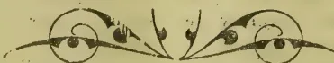

334------------------------------------------------

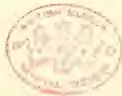A faint, circular red stamp or seal is centered on the page. The stamp contains text in a circular arrangement, which is difficult to read due to fading. The central part of the stamp features a decorative emblem or crest. The overall appearance is that of an archival or library mark on aged paper.

335------------------------------------------------

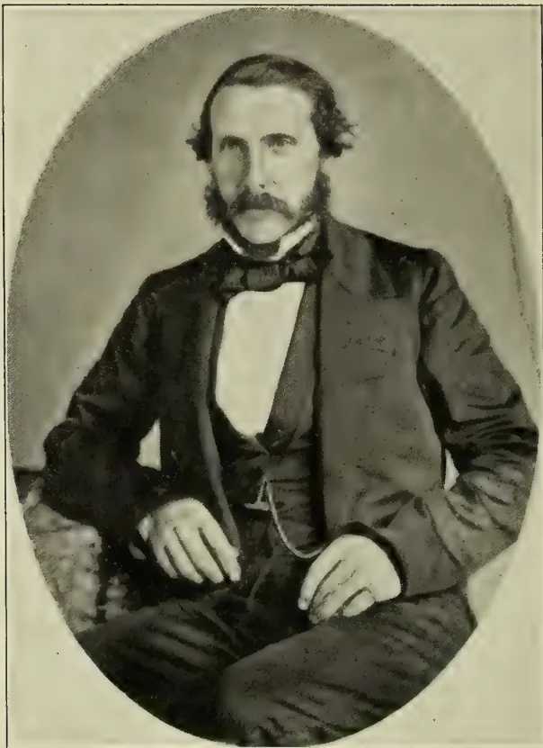A black and white portrait of a man, Alexander Cushnie Mortimer, from 1859. He is seated, facing forward, with a serious expression. He has dark, wavy hair and a full, dark mustache. He is wearing a dark, three-button suit jacket over a white shirt and a dark bow tie. His hands are resting on his lap. The portrait is set within an oval vignette, which is itself enclosed in a thin rectangular border.

**Alexander Cushnie Mortimer,**  
**1859.**

336------------------------------------------------

# \* The TROPICAL AGRICULTURIST \*

## ◁ MONTHLY. ▷

XXIII.

COLOMBO, NOVEMBER 2ND, 1903.

No. 5.

## “PIONEERS OF THE PLANTING ENTERPRISE IN CEYLON.”

(Fourth Series.)

### ALEX. CUSHNY MORTIMER:

COFFEE PLANTER:—1846 TO 1866.

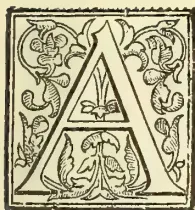

MONGST the Planting Pioneers of the past of Ceylon, few names are more worthy of a place in the “*Tropical Agriculturist*” than that of Alexander Cushny Mortimer, so well-known in the forties, fifties, and sixties—first, as an assistant on Baharundrah and Reilagalla, afterwards in charge of Colgrain, thence promoted to the important supervision and agency of Sir John Cheape’s valuable properties in Hantane and Nilambe, where he will best be remembered as the careful, methodical and conscientious Coffee Planter, strict with his assistants, but unsparing of himself, and unflinching in his duties towards the estates.

A. C. Mortimer was a native of Old Rayne, Aberdeenshire, the immediate locality in which was laid the scene of that famous classical tale, “Johnie Gibb of Gushetneuk.” His school education was of the briefest and most meagre description. The local “Johnathan Tawse,” though a strict disciplinarian and wondrously learned, had not the faculty, or, perhaps, a fair chance of imparting much of his lore to others during the few brief winter months which, as a rule, comprised the school days of the average Crofter’s son. The scanty seed, however, fell here on good ground, as the sequel will show. Sandy had soon to tackle the pick and spade with which he became a greater adept than ever he seemed likely to be with the pen. His brothers and

he may be said to have literally made a farm out of a moorland waste, much to the pleasure and profit of the laird who looked with benign approval on the praiseworthy industry of the lads, from the results of whose labours he could see visions of a rising rental. The laird in this case was none other than the veritable “Sir Simon Frissel” in the inimitable creation of Dr. Wm. Alexander, otherwise known as Sir Robert E. Dalrymple, the father of Sir James, who, as Capt. Dalrymple, then sailed the Eastern seas.

Coffee planting at that time (1837) was in its infancy, albeit a promising baby, as Capt. Dalrymple heard, on calling in at Colombo, and eager to share in the good fortune in prospect, found his way to Kandy, and pushing upwards, through the Kotmale Valley, selected the block of land which afterwards formed Baharundrah and Reilagalla, the latter now merged into Westhall. The Captain afterwards had some idea of settling down as a planter himself, but for one so luxuriously brought up, the daily drudgery, monotony, and plain living soon lost the charm of novelty. “I could get nothing eatable,” he said, and so returned to Logie for the purpose of looking out a man more suitable and fitted for the post of planter. His first selection was a son of the Manse, Alexander Cushny—(whose obituary notice by the way, appears in the *Observer* of 30th July to hand while I write). Alexander Cushny was not a success as a planter, though he afterwards, by a fortunate fluke, acquired a considerable competence in Hongkong.

337------------------------------------------------

298THE TROPICAL AGRICULTURIST.[Nov. 2, 1903.

"Sandy Mortimer" had by this time reached the dignity of minister's man, or general factotum to the Rev. Mr. Cushny, after whom he had been named, and was now recognised as a very capable, hard working and altogether exemplary youth of 25 years. The minister's man, to the envy of many a Garioch youth, was the next chosen for Ceylon, and in December, 1845, he left his native parish for Southampton, thence sailing per P. & O. under the wing of Capt. Dalrymple's younger brother, G. E. Dalrymple, who accompanied him to Baharundrah, where he first became initiated into the mysteries of Coffee Planting, and soon displayed that aptitude and careful plodding which almost invariably brings success. Mr. Mortimer did much excellent work on Baharundrah, and particularly in planting Reilagalla, in which work he took a keen interest; and although the latter estate never responded well to the careful planting, it was not the fault of the planter, but the bleak, cold climate, during a wet cycle, proving unsuitable for coffee. From being an assistant on Baharundrah, Mr. Mortimer was in due time promoted to the full charge of Colgrain, in Nilambe, into the duties of which he entered with great zeal. Fortunately for him this estate had been greatly neglected, had indeed become an eye-sore in the district, thereby affording him an excellent opportunity of showing what a capable and industrious young Scot could accomplish. The eyes of the neighbours were upon him, watching with keen interest the change he was effecting; and no one witnessed this with greater appreciation than the neighbouring proprietor, Sir John Cheape, who in course of time resolved to secure the services of the enthusiastic and indefatigable young planter.

Planters are sometimes apt to make a grievance of having got charge of an estate in wretched order, and not being in love with the country degenerate into chronic grumblers. It was otherwise with Mortimer who saw his opportunity, delighting in his work, and dearly loving his adopted country. He was now, as he said, "happy as a king."

Men of the upbringing of Sandy Mortimer have unquestionably a certain advantage over the scions of aristocratic families. There is all the difference between accepting the inevitable, and prizing the position as a first step on the ladder. General Sir J. Cheape was recalled to his military duties in India, and A. C. Mortimer was installed as sole manager of his extensive estates in Nilambe and Hantane, a trust which Mr. Mortimer fulfilled with great fidelity and success. The group ultimately consisted of six estates—Kitoolmoola, Galaha, E. & W. Vedehette, Gourakella and Godawella—besides properties in Dumbara which he periodically visited on his grand black steed, but often wished the Mahaweliganga would carry away these undesirable estates, particularly Victoria, which was as sickly as it was profitless. Hantane, on the other hand, was in these days one of the most productive and profitable districts of the Island: £20 net profit per acre was not uncommon. One year the little group gave £12,000 clear profit and the next year there was a margin of £16,000 after providing for the most liberal upkeep. Compared with this the average Tea Company, with its big factories, complicated accounts, and grand Board of Directors, is a poor thing.

Galaha was the best estate in the locality, while Kitoolmoola was a perfect model of all a well-cultivated estate should be. Not a weed was ever allowed to seed on these 300 acres, yet the culture was not

confined to the coffee plant. Trees from many different lands found a congenial home here, the proprietor being ever on the outlook for suitable exotics, even British Apple trees were here brought into bearing with very fair success, as many a visitor can testify. The garden around the bungalow contained many choice ornamental shrubs, while the bungalow itself was tastefully festooned with floral creepers. Here Lady Cheape lived for several years during the absence of Sir John on duty.

During the early years of his planting career, Mortimer was by no means a highly-paid man. A "4-3-4 man" to begin with, his salary increased by slow degrees, till at the end of five years I find he was drawing about £150 per annum. He was, however, a self-denying man and saved money, which he lent at 12% to his employer—poor G. E. Dalrymple—of whom he wrote in one of his letters:—"He drives tandems (round the Kandy Lake) like the very wind." Alas, poor young Dalrymple drove once too often. The trap got upset and he was crippled for life. One horse has often ruined the planter who keeps him only for pleasure; it took two to ruin G. E. Dalrymple.

About this time Mortimer wrote to his mother:—"I can live comfortably on £30 a year"! This may well surprise many a modern planter who would be pleased if he could live comfortably on double the amount; but there were few whiskies and sodas agoing in those days, and no swagger appus on R30 a month to swell and multiply master's beef bills. Then, there was no "rugger" to decoy the sufficiently exercised planter from home. Grand enterprise, "rugger"! Judging from the prominence given to it in every weekly Overland paper, and the enthusiastic letters of devotees. No wonder that the coffee tree got mouldy in olden days, when there was no rugger to relieve the monotony! Only imagine what zest it would have given to life, if such men as A. C. Mortimer, Peter Moir, R. B. Tytler, Sandy Brown, etc., had weekly played "rugger" in Kandy against a team led by Geo. Wall and backed by the Richmonds of Colombo! With what eager and absorbing interest absent proprietors would have opened their *Observer* and read the profuse details of this new product!

A. C. Mortimer, however, enjoyed life in his own solid—or as some would say—stolid way. From the first he liked Ceylon, and on Kitoolmoola he reached the zenith of his glory. In writing to his brother from here he says:—"This is truly a beautiful and bountiful island, and planters ought to be very thankful to Providence for having been placed upon it. What a contrast their lot is from that of the poor suffering farmers at home." And to his sister he writes:—"Talk of society: why, Lady Cheape lives within a stonethrow of where I write, and one of my assistants has a wife. (!) Imagine what a change to me, after living for five years in the jungle without seeing a white woman."

Mr. Mortimer was ultimately admitted as a partner in two estates, Goorakelly and Goorawella, the profits from which rapidly accumulated, and the time came in due course when, much as he loved Ceylon, he began to see the expediency of making room for others. Though for twenty years he had been blessed with robust health, latterly he had suffered somewhat from dysentery which threatened to become chronic. It was now the year 1865. His relatives wrote urging him to come home, reminding him that health was of more importance than more money, that he was getting an old fellow now; and that if he stayed much longer, no young

338------------------------------------------------

Nov. 2, 1903.]THE TROPICAL AGRICULTURIST.[299]

lady would look at him! To which he cheerily responded that he did not know "what they called an old fellow," that he felt yet in his prime, remarking by the way, that Sir John was sixty and his wife twenty-seven. It was in vain that friends in Ceylon warned him against stopping "*the year too long.*" The difficulty of getting suitable men to fill the important appointment was not so easily overcome. Though there was now a plethora of good planters, few exactly suited Sir John Cheape.

At length, however, Mortimer secured the services of two thoroughly capable and reliable men, James Beaton and Wm. Cameron. The former, a good planter, and as a clever, methodical, well-trained accountant, had proved himself extremely useful to the estates. The latter an admirably equipped horticulturist and planter, whose brethren will long remember, as the man who introduced that most useful of fuel and timber trees, the *Grevillea robusta*. Many a man has had a monument built to him for less.

With two such men in charge of the estates Mr. Mortimer now felt he could confidently leave Ceylon, and in March, 1866, he finally took farewell of the beloved *Watties*—rather run down, but hopeful that he would soon recruit in his native land. *It was not to be*—the farewell letter to Mr. Beaton from Galle indicated much suffering from heat and general weakness. His parting words were "Do your duty to God and man, and fear not."

As the voyage proceeded he gradually got worse till, in his own words, he reached Cairo "more dead than alive." He felt somewhat refreshed, however, by a night's comfortable rest in a good climate. Would that he had remained there for some weeks, but hope hastened him onwards to his mother-country. The season of the year seemed favourable and well-chosen. The month of May would be remembered by him as one of the most genial of the year, but unquestionably there has been a change during the past half-century, and the merry month of May has now become the most treacherous of all the twelve. This was experienced as the "Delhi" entered the English Channel, when a sudden chill brought on a serious relapse, and Mr. Mortimer died on the day after reaching Southampton.

The remains were conveyed to Aberdeenshire, and in the church-yard of Old Rayne may be seen a neat head-stone bearing the following words:—

"IN MEMORY  
of

"ALEXANDER CUSHNY MORTIMER,

"Youngest son of James Mortimer and Elizabeth Wilson, Sunside of Rayne, who left his native country in 1845, and lived for about twenty years thereafter as a coffee planter in Ceylon, where he was much respected by his employers and friends. Having left that Island in bad health and arrived at Southampton, he died there on the following day, 3rd of May, 1866, in the 46th year of his age, and was buried here beside his kindred deceased—"on the 9th of May—deeply lamented by his surviving brothers and sisters, who have placed this stone to mark his grave, and in token of their sorrow and affection for a beloved brother."

The Rev. Henry L. Mitchell, one of the ablest and best beloved of our jungle padres, paid the following eloquent tribute to his old friend in "Missionary Record" of June, 1869:—(Referring to the Deltotte Church) "One most saddening characteristic of social intercourse in a country where all are emigrants, and look constantly forward to leaving for a home in another land, is the

rapidity with which friends are lost by removals. Of the numerous congregation that used to assemble in this Church in 1862, when the writer of these words began his ministry in it, mostly all now reside elsewhere or are gone to rest in the grave. One of these, A. C. Mortimer, whose name will be long associated with this Church and district, where the memory of his persevering energy and conscientious rectitude will long remain green to many, passed away on the very day that, after twenty years of successful exertion, he reached his native shore."

Dear old padre Mitchell, too, is gone, but his graphic word-picture of this locality is well worth quoting:—

"In all parts of the island of Ceylon, and especially amongst the central hills, the scenery is most beautiful. No more picturesque surroundings could be imagined than those of Deltotte Church. Unlike the splendid £15,000 churches seen in towns at home half hidden amongst houses of seven or eight storeys, as if sites were grudgingly granted on soil where mammon might flourish, Deltotte church borrows all of splendour there is about it from Nature's scenes around. It is situated all alone in a valley, along which a winding stream flows to irrigate many a rice field. The frowning peaks of Kitoolamoola are seen to the North; Galaha, one of the finest Coffee estates in the island, lies under its semi-circular crest of rocks towards the east; the rounded hills of Gallantenne and the Vedahettes on either side bounding the nearest horizon, away to the south lovely patnas crowned with forest slope away to Rathoongodde, and a winding road traverses by a gradual ascent the whole length of this unequalled landscape."

#### CONTEMPORARIES AND NEIGHBOURS.

In those days the Scots planter was in the ascendant in Ceylon, particularly the sons of toil, with some knowledge of agriculture. It was the natural reaction from a different class of pioneers who had previously tried their hand at planting with but very partial success. The new type of planter was, however, very far from being an invariable success, and it is curious—and not unprofitable to note the diversity of character even amongst those reared on the same soil.

Another protégé of the Elphinstones was one Hay, who was sent out from the Garioch, much better equipped educationally than A. C. Mortimer, but lacking in that solid God-fearing principle which the latter brought steadfastly to bear upon all his duties. After all, it is character more than ability that brings success. Hay at first forged ahead of his contemporaries and soon got charge of a couple of estates, Kent and Ambokka in Matale, but he took to drink, went mad, and after burning some Sinhalese villages had to flee the country. G. E. Dalrymple afterwards entrusted Hay with the management of a flax-works in Aberdeenshire, but strange enough it too took fire, and the last part this man played was acting as a chance porter in Aberdeen, in which position he died. "Twas he who on seeing "Ceylon" on the baggage he was wheeling, asked the passenger if he knew Sandy Mortimer, and on hearing he was flourishing and worth thousands, set down his barrow and, throwing his arms in the air, exclaimed "L—d man, he and I worked together!!"

Amongst the immediate neighbours of A. C. Mortimer in Hantane, in the fifties, was Norman Stewart on Oodoowella, a good and very popular planter, followed by the equally good, though more

339------------------------------------------------

300THE TROPICAL AGRICULTURIST.[Nov. 2, 1903.

erratic and often impracticable, William Smith.

Over the new ridge towards Kandy there lived and worked with a will James Martin of Hantane estate. A man in every respect, very much after the type of Mortimer, so much so, that one portrait may serve for both. Steady as a rock, conscientious in the performance of all his duties, and careful in his own personal expenditure, enabling him to do quietly many a generous action, which thrifless men of the so-called good-hearted type were utterly incapable of. Economy is sometimes jeered at, as if it were meanness, while the reverse is often the truth. To exercise self-denial and strive for independence is *manly*, to give way to extravagance is contemptible. James Martin was a bred gardener, having served under that clever botanist *Dallachie* of Haddo House, who followed his late apprentice to Ceylon; but arriving during the disastrous days of 1847-8 he never succeeded in getting employment, and soon drifted downward. An exceptionally clever man with polished manners, he at once got into what was then termed society in Kandy, chiefly of the military element; but when the funds ran low, his gold watch in pawn, and he himself arrested for debt, it was his old assistant who came forward to relieve the watch and pay the passage of his whilom master to Australia. Our friend A. C. Mortimer, the minister's man of old, did a similar good action for the son of the Manse.

After sixteen years of steady work James Martin was fortunate enough to marry the pretty Miss McCombe of Kandy, with whom, and with the £9,000 he had saved, he soon after retired to enjoy his *otium cum dignitate* in his native land, Dr. Marshall, his fortunate partner in Cocagalla estate, having previously retired upon the fruits of that profitable venture. Both are now gone, but enjoyed many years of pleasant intercourse in and around the beautiful Granite City, that Mecca of so many Ceylon men.

Let us now for a moment take a peep at—in some important details, a neighbour of a very different character. Sandy Gray, so long on Ingrogalla, was also a Buchanan loon, and Scot of the most pronounced type, whose vernacular never failed him. An honest, good, planter, kind, good-natured and hospitable to a fault. But Sandy was improvident, and never thought of providing against old age; his bungalow became the rendezvous of thankless loafers, and men out of billets, many of whom forgot him when he himself came to be in need. Sandy, indeed, discovered when too late that the temporary applause of the sponging loafer was a poor exchange for destitution in old age. Sandy Gray went out to Ceylon in 1840, in the same ship that carried Dr. Marshall and James Martin, and after 40 years' labour died literally penniless. He it was, who as spokesman of the party, about to be engaged, asked if the £50 a year promised as salary was exclusive of "coal and candle licht," and at the Kandy hotel he often created amusement by calling out to his horsekeeper "Fau's the fup."

#### THE LETTERS OF A. C. MORTIMER.

After this rapid sketch of his life and surroundings, I cannot conclude without giving a few extracts from the interesting pile of letters entrusted to me for perusal—letters, many of which have been carefully treasured for over half-a-century. Indeed, from the day he left home in 1845 till his last voyage in 1866, he continued to write with praise-worthy regularity, at least once a month, and what strikes me first, and chiefly, in perusing these letters, is the undying love of the writer for his "ever revered mother"; and secondly, the intense interest

he took in his planting work. If asked the secret of his undoubted success as a planter, I would say:—Loving remembrance of home and delight in his estate duties. Another thing that strikes me is the wonderful improvement in diction and penmanship as time progresses, which speaks well for the educative effects of a life in Ceylon. These letters, chiefly addressed to the "much-loved mother," the dearest sister, or a darling niece, breathe throughout a spirit of simple piety, affectionate attachment, and keen interest in all the little details of home life. At first, the orthography is rather weak, the writing clumsy, and as Carlyle said of Cromwell's letters, "the grammar seems hopeless"; but as I have said before many days there appears a marked improvement.

His first letter after leaving home is dated from Aberdeen, and addressed to his mother, from whom, with many prayers for her welfare, he takes an affectionate leave, and writing out a sort of holograph will "bequeaths all he is possessed of (£14) to her. This in case of being drowned en-route for Ceylon." This maternal love is very pleasing to note, though it is not often that young Scotsmen are so demonstrative in showing it, and Max O' Rell in his last work "Travels in Woman Land," remarks that it is "a curious characteristic of the British to ignore the poor father. It is the mother tongue, the mother wit, the mother country, never by any chance, "The Father-land."

London was a tremendous surprise to the young man from the Garioch. Such a forest of ships on the Thames as he had never dreamed of, and could not conceive how the boat from Aberdeen ever found its way through. In the metropolis someone took him to see what he called "the polotecian" (polytechnic) which fairly flabbergasted him, and he confesses he is not equal to describing "all the arts and sciences of the world" which he saw there. On board the P. & O. he was greatly pleased with the "Bill of Fare." "Tell mother," he writes to his brother, "that I have everything I could desire here in the way of food—soup, beef, pudding, porter and spirits all free." But he was not long in discovering that the stomach of John Bull was not so easily satisfied, or that he had a great propensity for grumbling.

On nearing Malta he writes "We are getting rid of our English fellow passengers here, and I'm very glad. "Nasty fashons bruteswi' their meat"!

As the voyage proceeded, his descriptive powers improved, and on reaching Ceylon we have lengthy letters, describing the island as a perfect paradise, the beauty and bountifulness of which exceeded all his expectations. The work on Baharundrah and Reilagalla was a joke to him, compared with the toil to which he had been accustomed, and altogether life on the Wattie was a daily delight. His salary, small as it was, more than satisfied him. "This is the country for 'samblam' as the coolies call it" he wrote to his brother, and from the first he contrived to save a little, mindful of what the wise old Quaker says:—"It's what thee'll spend, my son not what thee'll make, which will decide whether thee's to be rich or not."

At the end of three years he was able to say he had lent G. E. Dalrymple, his employer, £150 @ 12%. His letters by this time began to look quite business-like, his calligraphy straight and regular, his orthography quite creditable. He now took it upon himself to lecture his brothers on their bad writing and spelling. Exhorting them to practice, practice, adding "for nothing," he says, "broadens out a man's mind like writing."

340------------------------------------------------

Nov. 2, 1903.]THE TROPICAL AGRICULTURIST.301

On his promotion to Colgrain he threw his whole energy into reclaiming and improving the neglected estate, with what success we have already seen. Referring to this he writes from Kitoolmoola:—“It was my work on Colgrain that brought me my present appointment. I do not wish to say more on this subject as self praise is not commendable.”

Mortimer continued to flourish, and as before indicated, ultimately became a partner in two of the estates. As a sample of the letters he continued to write home to the ‘Auld House’, I may quote the following dated Kitoolmoola, 15th November, 1863:—

“My dear B—,

I have again the pleasure to drop you a note to inform you all that I am still in the land of the living and place of hope. Thanks to a kind and beneficent Providence who is with us in all our out-goings and incomings. My earnest prayer is that this may find you all equally well.

Last mail brought me no letters from home. I’m afraid you are all too much taken up with the world or too lazy. I do not mean to say that I am faultless, far from it, at the same time there are many of you against one. Since I last wrote I have had Græme Elphinstone here, a very fine young fellow, the best of all the Logie family I ever met. Old John McL— was with him. I’d not seen John for some years, and what a change! Imagine him coming to dinner in *full dress* with no fewer than three gold rings on his fingers! Elphinstone told me his father and mother had been calling upon you. I hope my dear mother was not put out by such unusual visitors. Poor body! I do hope she is still in the good providence of God enjoying her usual health, and that ALL of you strive as much as in you lies, to make her in every sense of the word *comfortable*, and although, far distant myself, my substance is none the less at her service, as I have intimated to you over and over again, and trust, therefore, that you will carry out my wishes to the *very l. tter*. I hope we shall have the pleasure, please Providence, to meet in a few months. Meantime, we are busy gathering our crops, which are rather light, but plenty to cover all expenses and *something over*. My own Watties close by are bearing heavily, and will clear over £1,000 each, and did the same last year, not bad farming from estates of 150 acres each.

Sir John and Mr. Tottenham are evidently in a stew at my leaving. I have recommended three of their estates being sold—— No more at present.

Yours, &c., &c., A. C. MORTIMER.

It now only remains to make—as the ministers would say, the ‘*Application*.’ It will be noted that, in this case, character was of more importance than mere ability or scholarship. Some may be inclined to think that had A. C. Mortimer been generous to himself during the early years of his planting career, his life might have been prolonged. This, however, is rather an exploded idea. “Man wants but little here below.” Sir J. Lubbock (now Lord Avebury) says:—“The more moderate the living, the better the health, and chance of longevity; long meals make short lives. It is easy to eat too much, there is no fear of eating too little.” Many may comment upon the infatuations of “staying the year too long” and it seems probable enough that our friend sacrificed himself from a mistaken sense of duty, but altogether he has left an exemplary record.

Some men seem to succeed who do not deserve it, others deserve it who do not; but A. C. Mortimer both deserved it, and did succeed.

## THE PAPAIN INDUSTRY.

### CULTURE OF THE PAPAW TREE.

A fruit which attracts a passing notice from time to time in the Press in this country and at Home is the papaya or papaw (*Carica papaya*), and it is a matter of surprise that a plant for which so many advantages are claimed has received so little attention. Here and there in Madras good specimens are to be found, so that no doubts as regards its successful growth need be entertained, and that it has not hitherto been grown by the acre points either to its many good points being imperfectly realised, or to the proverbial antipathy of agriculturists in this country to start anything new, or, possibly, to the doubt about a ready market being available for the produce. The fruit when ripe is too well known to require much notice here. It is more or less esteemed, probably according to the quality of the fruit which has been obtained, for the papaw is like the mango in this respect, that its fruit varies greatly in flavour and delectability. When unripe, the fruit can be boiled and eaten as a vegetable, included in the comprehensive curry, or made into pickle. The juice has an emollient effect on the skin and may be used as a cosmetic; it is said, moreover, to be efficacious as a vermifuge, and the plant itself is said to be a first-rate mosquito-louse.

### MEDICINAL PROPERTIES.

Valuable, however, as these properties of the papaw may be, they would scarcely afford reasons for growing it by the acre, and it is therefore to the remarkable chemical and medicinal qualities of the plant that we would draw particular attention. There abounds in the tree a juice—white, milky and viscous—which is remarkable as containing fibrine, a principle found otherwise only in the animal kingdom, and has also the extraordinary property of hastening the decay of muscular fibre exposed to its influence. It has an energetic action upon nitrogenous substances and will curdle milk and is more efficacious than pepsin in dissolving albumen. In its peptonising powers, indeed, it is accounted superior to ordinary animal pepsin, having the peculiar advantage of requiring neither the aid of acid nor an alkali to convert the contents of the stomach into peptone. These wonderful digestive properties are well known to the natives of this country, who may be seen suspending meat under the branches of the tree or carrying home the freshly-purchased joint or fowl wrapped up in a papaya leaf. An equally useful but less known device is to dip tough meat into water containing a few drops of the juice, for meat so treated will become in a few minutes quite tender.

The active principle of the juice of the papaya which has these wonderful properties, and which the celebrated chemist Vanqueline compared to blood deprived of its colouring matter, is separated and sold under the name papain, the price of which, when dried, varies between 12s. and 16s. per lb. At Montserrat, where a remunerative industry in this product has existed for some years, the peasants collect the juice in calabashes into which a small quantity of water is first placed.

### TO OBTAIN THE PAPAIN.

The juice is obtained by lightly scoring the rind of the fruit with a knife or some other sharp instrument. As the juice falls into the water it thickens to the consistency of ice cream, and in this state is sold to the manufacturer at the rate of 3d. to 1d. an ounce. From a small plot upon which 120 trees were planted out experimentally in May, 1902, over 10 lbs. of juice were collected by the end of December, or seven months afterwards, and this in spite of 25 per cent. of the trees being males, and therefore non-fruiting. Expert coolies, it is said, can extract 4 oz. of juice per hour. In Ceylon, also, papain is collected by natives and is purchased cheaply by local firms, who export it as papain or papaya-juice.

341------------------------------------------------

302THE TROPICAL AGRICULTURIST.[Nov. 2, 1903.

The preparation of this stuff is said to be very primitive, and consists only of drying in the sun or over a smoky fire, and of thickening by the addition of starchy matter, as rice conge, bread, flour, arrowroot, biscuits, etc., not to mention unclean receptacles. Still more recently unscrupulous natives have been accused of resorting to a dangerous adulterative material, viz., the milk from the wild guttapercha and the wild cactus. If such stuff as this can obtain a sale there is little doubt that pure papaw juice, care fully and cleanly collected, treated with rectified spirit in the approved way, and evaporated and heated at a regular temperature, would find a ready and constant market at Home. It seems, at any rate, to be an experiment that is well worth trying.

—Madras Mail.

## THE CONGO RUBBER INDUSTRY.

### THE BELGIAN POLICY.

Regarding the action of the Belgians in the Congo and their management or mismanagement of the Rubber industry, the following letter to the Editor of the *I. R. Journal* appeared in that paper. One reason for the present high price of Para in the English market is given. In the last number of your paper I see there is a letter upon Congo and its atrocities. The letter does not so much deal with the atrocities; it is chiefly an attempt to whitewash the King of the Belgians. It is well that somebody should "stick up" for that much-abused monarch. He sadly needs help of that kind, but I am a little puzzled to know who will give him any. He obtained power over the Congo on his promise that he would endeavour to civilise that region. He did nothing whatever with that object; all his power, his "capital" (precious little of that he used), and his influence were exerted in the direction of getting money, and some of his agents scrupled at no barbarity to effect their purpose.

England, unfortunately, did little by way of protest; and the Rubber Trade, which was very deeply interested, did nothing at all. There is a Rubber Manufacturers' Association, but I have not heard of the slightest attempt it made, either through our Foreign Secretary or otherwise, to show its detestation of these doings. The Rubber Trade is now reaping the harvest of its indifference, or of its incapability to deal with such a matter. In despite of all predictions of a short crop, it turns out that Para sent out last year 90 tons more than the year before, which was the largest crop on record (Para receipts, 1903, 26,546 tons; 1902, 26,456 tons—increase, 90 tons). Why, then, is Para 4s. 6d.? Simply because Congo has failed to supplement Para as it ought to have done. Owing to the methods practised by the agents of the King of the Belgians, what should be the second largest rubber field in the world is getting deserted of its inhabitants.

AN ENGLISH MANUFACTURER.

## PLANTAIN FIBRE EXTRACT ON.

[BY THE REV. A. ANDREW.]

Since my note on Plantain Fibre was published in your columns (see *T. A.* page 329,) enquiries have reached me from various parts of India—from Tinnevelly, Trichinopoly, Coorg, the Central Provinces, Calcutta and Behar—a king for more information on plantain fibre extraction. Previous to this, enquiries had come from the West Coast, Vizagapatam and Jaffna, in Ceylon. Evidently there is a very widespread desire to take up this industry seriously and make it a paying concern, if it is possible to do so. From the enquiries made from Calcutta and Behar it is apparent that growers there are still carrying on the wasteful practice of casting the stems on to the rubbish heap after the fruit has been obtained. Such questions as these are being asked:—How is the fibre extracted? Is it the stem that is used after it has fruited? From what part of the stem is it taken? Is any particular kind of plantain required? When can be made of the

fibres, and where can they be sold? A Calcutta gentleman writes:—"I have extensive plantations, but hitherto I have not done more than sell the fruit and the leaves. As the extraction of the fibre promises to become a profitable industry, I should like to make myself acquainted with the process. Will you therefore kindly favour me with the information I seek?" Another writes:—"On one point I require more information than what you have been pleased to furnish; I mean that the process of extracting fibre has not been as clearly explained as to enable a general reader to try his hand at the new enterprise by way of experiment. I shall feel highly obliged if you would be so good as to publish another letter throwing light on this point for general information." With regard to

### THE PARTICULAR KIND OF PLANTAIN

which can be used for extracting fibre from, the best is the *Musa textilis*, or Manila hemp plantain, so extensively grown in the Philippines for fibre alone. Its fibre is stronger and better than that of any other species. It cannot, however, be grown for its fruit, as that is worthless. On this account it would not be a profitable industry in India, where the climatic conditions are less favourable for its culture than those existing in the Philippines. Another reason against its introduction into the existing plantain topes is its tendency to spoil the fruit of other plantains which are grown for their fruit. Of this a certain writer says:—"It is useful in the garden if much grafting is done, because the fibre in the leaf stalk is stronger than that of the common banana, but it should not be planted where the plantain is grown for fruit, because its pollen will fertilise the ovules of the other species, and the result will be abundant, hard, black seeds as large as a pea in the fruit that without fertilised ovules are such delicious fruit." Great care, therefore, should be taken by those who cultivate plantains for fruit to exclude the *Musa textilis* from their gardens. It might be tried on the West Coast for its fibre alone, where the rainfall is abundant, and where it might be made to pay. But I fear the plantain growers must be content with the ordinary species for fibre and fruit, as well as for the many other uses to which the plantain tree can be put. The return that the ordinary species gives for the labour expended on their cultivation is sufficiently encouraging and hence the most should be made of them.

### VARIETIES GROWN.

The following are the species which are most frequently grown, and which are being cultivated in our school farm:—Bonden, Kattei bonden, Rustali, Pey vazhei, Pu vazhei, Raja vazhei, Nir bonden, Savvazhei, Pacohei vazhei, Uthira vazhei, and Bengala vazhei. There are several other varieties besides these. One of the most notable is the *Morus vazhei*, or the Mauritius plantain, whose botanical name is *Musa cavendishii*. It is a dwarf plantain and seldom grows more than 6 feet in height. It thrives well, and is surprisingly productive, having very large bunches for its size. Some of the bunches are so heavy in our garden and hang so far down as to touch the ground. Though the dwarf species is so productive of fruit, it is deficient in fibre, owing to the shortness of the stem, and it will hardly pay to extract it, if this species be cultivated only. The short stem, however, can be taken and the fibre extracted from it along with that of the other kinds.

### CLEARING THE FIBRE.

It is the stem that is taken after the fruit has been cut off and cut into lengths of about 3 feet. These are then divided into strips about 2 inches in width and placed at the side of the machine for extracting the fibre. These strips are taken one by one and put under the knife and pulled through. Each strip is pulled through several times until all the soft stem-substance is removed from the fibre. The fibre is thereafter dried in the sun and put aside for the manufacture of cordage and ropes, or is taken and woven into cloth where it is possible to do so.

342------------------------------------------------

Nov. 2, 1903.]THE TROPICAL AGRICULTURIST.303THE MACHINE USED.

It is rather difficult, in the absence of diagrams, to describe the machine, which I understand is largely used in the Philippines to extract the Manila fibre. It is a simple contrivance. For a full description of it I would refer all interested in the subject to the Bulletin written by Mr. Proudlock, Curator of the Government Botanical Gardens, Nilgiris, and sold by the Government Press, Madras, for a few annas. It contains all the information needed, and has diagrams to illustrate the remarks made about the machine. I have not a copy at hand to refer to at present. The principal part of the machine is the knife, which is about 4 in. broad and 26 in. long; half of this length forms the blade, and the other half the handle. The handle springs from the blade at an angle of about 30°, the handle and the blade forming one continuous piece of iron or steel. To get an idea of the shape of the knife a two-foot measuring rule with hinge may be taken and opened out to its full length and placed on a table. One-half should be held by the one hand and the other half help by the other hand; then one side of the rule should be raised up till an angle of 30° be formed, when the shape of the fibre-extracting knife will appear. The edge of the knife must be blunt, and must rest on an iron plate, which must be exactly parallel with the blunt edge of the knife so as to fit very closely to it. The iron plate should be  $\frac{1}{4}$  in. thick and 15 in. long and 3 in. broad. This should be fixed with screws to a cross beam of any ordinary kind of wood. This beam should be held up from the ground about 3 ft. by two upright poles firmly fixed in the ground.

THE SCRAPING KNIFE.

The knife has a hole in the centre close to the point where the handle turns up from the blade into which a bolt is put, thereby making this the pivot on which the knife moves. To hold the knife, a piece of wood is fixed into the cross beam, having a groove in it, into which the knife is put, and the bolt put through. This secures the knife in its place and allows it to work. A few inches along the handle another piece of wood is fitted into the cross beam, having also a groove in it in which the handle works, this is to prevent the oscillation of the knife sideways when the knife is in action. Then at the end of the handle furthest a way from the blade there is a hole to which a rope is tied; this rope goes two ways, upwards to a bamboo spring to which it is fastened, and downwards to a foot-pole on the level, or near the level of the ground. The spring is made with an ordinary piece of bamboo, which is fastened to poles fixed in the earth. The spring has an upward pull, and keeps the knife tight on the iron plate, and can be regulated by shortening or tightening the rope that connects it with the knife.

WORKING THE MACHINE.

When a strip is taken to be extracted, the foot is placed on the foot-pole and pressed down, this has the effect of opening the knife. The half of the strip is placed under the knife, the foot is taken off the foot-pole and the knife closes tight on the strip. The strip is then pulled through several times, as mentioned already. The other half is treated in the same way. I am not satisfied, however, with the machine, as it is somewhat wasteful of the fibre. It appears to me that the loss of fibre it causes might be saved by the use of some device which will loosen the stem-matter from the fibre before the knife is put in action, and thus make it easy for the knife to extract all the fibre in the stem without any loss whatever. I hope to experiment on this at an early date.

The fibre of all the plantains cultivated for fruit is useful for making cordage. Once the public realise that cords and ropes made from this kind of fibre are strong and can be utilised for the many purposes that hemp ropes are used, they will not hesitate to spend money in buying them. There is an extensive market for ropes in India, and then there is the demand that may be created in European countries for the fibre as soon as a sufficient supply is forthcoming.—*Madras Mail*,

THE COMMERCIAL USES OF THE INDIAN ACACIAS.

A considerable trade is at present done in India in the export of gum, which find a ready market in Europe and America. The most important gum-yielding trees are the acacias, and consequently considerable interest from this point of view attaches to an article dealing with the Indian acacias, published in a special number of the "Agricultural Ledger," 1902.

*Acacia Arabica*.—This tree is widely distributed throughout India. It is cultivated on a light, sandy loam, and grows well, even in the presence of a fairly large percentage of alkali salts. When young the tree yields yearly from 4 to 20 oz. of a soluble light yellow or reddish gum; the product from very old trees is darker coloured and somewhat less soluble in water. The gum, as at present produced, is of no value for confectionery purposes, is no, where sufficiently abundant to become a famine food, and is generally used in calico printing. The bark of the tree is extensively employed in India as a tanning material, the quality of the bark deteriorates after the tree is from 19 to 12 years old, and owing to the small percentage of tannin contained even in the bark of young trees the manufacture of tannin extract for export would not be profitable.

The pods and leaves are valuable as a cattle fodder, and they are also used medicinally as an astringent. The fact that *Acacia arabica* will grow even in presence of alkali salts renders it particularly valuable in India, where large tracts of alkali lands occur.

The so-called arabic or acacia gums may be divided into three classes:—(a) Gum arabic of European commerce, (b) East Indian gum arabic, (c) Indian gum arabic. The first comprises the product of *Acacia Senegal*, from the French colony of Senegal, a yellow or slightly reddish gum; Kordofan or Turkey gum, exported from districts on the upper Nile, a colourless gum, completely soluble in water; and Sukum and Mogador gums, inferior products exported from the northern districts of Africa. The second class:—East India gum, is imported into Bombay from Aden and the Red Sea ports, and having been picked and sorted, is re-exported; it is usually a good soluble gum of a white to slightly reddish colour. The third class:

Indian gum arabic, generally known as "Gum Ghatti," is a mixture of acacia gums, of variable quality, the superior properties of the products of *Acacia Senegal*, *A. catechu* and *A. jacquemontii* being spilt by the presence of inferior gums derived from other trees. In some parts of Southern India hand-picking and sorting is now practised, and a better trade is being done.

The following figures taken from the "Agricultural Ledger," 1902, give the export of Indian gum arabic during the past five years:—

cwts.

<table>
<tbody>
<tr>
<td>1896-7</td>
<td>..</td>
<td>..</td>
<td>58,769</td>
<td>..</td>
<td>..</td>
<td>91,979</td>
</tr>
<tr>
<td>1897-8</td>
<td>..</td>
<td>..</td>
<td>46,525</td>
<td>..</td>
<td>..</td>
<td>60,412</td>
</tr>
<tr>
<td>1898-9</td>
<td>..</td>
<td>..</td>
<td>41,469</td>
<td>..</td>
<td>..</td>
<td>60,412</td>
</tr>
<tr>
<td>1899-00</td>
<td>..</td>
<td>..</td>
<td>46,254</td>
<td>..</td>
<td>..</td>
<td>51,393</td>
</tr>
<tr>
<td>1900-01</td>
<td>..</td>
<td>..</td>
<td>37,553</td>
<td>..</td>
<td>..</td>
<td>46,659</td>
</tr>
</tbody>
</table>

In 1900-1901, 2,355 cwt. of East India gum were imported from Africa and Red Sea ports, and 12,171 cwts. exported, the difference being due probably to adulteration with Indian gum arabic.

*Acacia catechu*.—The gum produced by this tree is of a pale yellow colour, it is soluble in water, and more nearly resembles true gum arabic than does that of *Acacia arabica*. The timber is only used for the preparation of cutch, although it is a hard and durable wood, takes a fine polish, and seasons well.

343------------------------------------------------

304THE TROPICAL AGRICULTURIST[Nov. 2 1903.

The total exports of cutch from India during the last four years, for which statistics are available, were as follows:—

<table>
<thead>
<tr>
<th></th>
<th>cwts.</th>
<th>£</th>
</tr>
</thead>
<tbody>
<tr>
<td>1897-8 .. ..</td>
<td>97,187 .. ..</td>
<td>.. ..</td>
</tr>
<tr>
<td>1898-9 .. ..</td>
<td>61,669 .. ..</td>
<td>.. ..</td>
</tr>
<tr>
<td>1899-00 .. ..</td>
<td>127,815 .. ..</td>
<td>164,695</td>
</tr>
<tr>
<td>1900-01 .. ..</td>
<td>101,995 .. ..</td>
<td>.. ..</td>
</tr>
</tbody>
</table>

*Acacia concinna*.—The pods of this tree are used by the natives as a detergent in the preparation of silk and cotton goods for dyeing. The local trade in these is considerable, and it is suggested they might also be used in Europe.

*Acacia Farnesiana* yields a soluble gum, but the "Cassie pomade" manufactured from the flowers is the product of most interest.

*Acacia jacquemontii*.—The gum yielded by this tree is almost colourless and readily soluble in water, with which it forms a highly viscous mucilage suitable for use in pharmacy and confectionery.

*Acacia modesta*.—This species produces a pale, yellowish, translucent gum (Amritsar gum), which is soluble in water, but is only obtainable in small quantities. The timber of this tree is employed for the manufacture of agricultural implements.

*Acacia Senegal*, which yields true gum arabic, is only met with in Rajputana and Sind, although, as previously mentioned, it is widely distributed in the Sudan and Senegal.

Many varieties of acacia furnish barks which are used by the natives to facilitate the fermentation of saccharine juices, but the well-ground bark of *Acacia leucophloea* is considered most suitable for this purpose, and if the quality were more constant even larger quantities would be used.

It may be added that a systematic examination of the chemical and physical properties of Indian gums is now being carried out in the Scientific and Technical Department of the Imperial Institute.—*Board of Trade Journal*.

## NOTES ON RUBBER CULTURE.

The culture of the Central American rubber tree has passed the experimental stage in the sense that the practicability of the agricultural production of rubber has been demonstrated, but on the other hand it has been ascertained that the tree may thrive where it will yield little or no rubber. Under favorable natural conditions the culture of *Castilla elastica* bids fair to become very profitable, but the experimental determination of the factors which influence the production of rubber has scarcely begun. [The spelling *Castilla*, instead of *Castilloa*, has been adopted at Washington, on account of its being the original form.]

AREA OF CULTIVATION IN S. AMERICA.—In southern Mexico and Central America the region well adapted to the culture of *Castilloa* are much more limited than has been supposed. The presence of wild *Castilloa* trees is not a sufficient evidence that a locality is suited to commercial rubber culture.

THE FUNCTIONS OF THE LATEX.—The functions of the rubber milk in the economy of the plant are not well understood or agreed upon by botanists, but there are numerous reasons for holding that in *Castilloa* and many other plants it aids in resisting drought.

SITUATION AND CLIMATE FOR CASTILLOA.—A continuously humid climate is not necessary to the growth and productiveness of *Castilloa*; the indications are rather that the quantity of milk and the percentage of rubber are both increased by an alternation of wet and dry seasons. In its wild state *Castilloa* does not flourish in the denser forests, but requires more open situations. It is confined to forest regions only by the perishability of its seeds. *Castilloa* thrives better when planted in the open than in the dense forests; even young seedlings are not injured by full exposure to the sun, providing that the ground does not become too dry.

CASTILLOA AS A SHADE TREE.—The planting of *Castilloa* under shade or in partially cleared forests is to be advised only on account of special conditions or as a means of saving labor and expense. The loss of the leaves in the dry season may be explained as a protection against drought, and does not indicate conditions unfavorable to the tree or to the production of rubber. The falling of the leaves of *Castilloa elastica* in the dry season renders it unsuitable as a shade tree for coffee or cacao. In continuously humid localities where the leaves are retained shade trees are superfluous and the yield of rubber declines.

PARA RUBBER IN THE EAST.—In British India it has been ascertained that the Para rubber tree may be repeatedly tapped on several successive or alternative days by renewing the wounds at the edges. The yield of milk increases for several tappings and the total is unexpectedly large. It is not yet known whether multiple tapping is practicable with *Castilloa*, or whether this new plan may not give the Para rubber tree distinct cultural advantage over *Castilloa*.

AGE FOR TAPPING.—The gathering of rubber from trees less than eight years old is not likely to be advantageous; the expense of collecting will be relatively large, and the quality of such rubber is inferior, owing to the large percentage of resin.—*Dept. of Agriculture, U.S.A.*

## PLANTING NOTES.

CEYLON TEA IN NEW ZEALAND.—From a Maori land correspondent we learn that in the country districts there Indian teas and blends are what are chiefly sold. The merchants in many cases push these cheap lines rather than Ceylons as there is so much more profit in the former. There should, however, be a promising opening for pushing pure Ceylon tea in N.Z. In this connection we learn that Mr. Robert Wardrop has applied to the "Thirty Committee" for a small grant of tea to enable him to experiment—in application which ought to be successful (being to a large extent in the growers' interest) if it is within the power of the Committee to accede to it.

INSECTICIDES FOR USE IN HAWAII.—A paper on this subject opens as follows in the *Planters' Monthly*:—One of the greatest hindrances to agriculture in these Islands is the ravages of insect pests. The songs of the ancient Hawaiians often refer to the roses once grown, but the roses exist today only in song and in the memory of Kamauias. Their growing was abandoned because of the destructive work of the Japanese "rose" beetle (*Adoretus umbrosus*). Watermelons and muskmelons are a luxury, a good watermelon bringing fifty cents to one dollar at the fruit stands in Honolulu. These products could be raised in certain sections, in quantities great enough to bring them within the reach of every table, were it not for the attack of the "melon-fly" (*Dacus cucurbitae*). Some sections, otherwise ideal for farming, cannot produce paying crops because of the presence of vast numbers of cutworms, locally known as "peelua" or "poko" worms, the young or larvae of several species of moths belonging to the family Noctuidæ, which devour not only the vegetable gardens but whole fields of forage plants. One of the plant lice, the "green fly" (*Aphis* sp.), in the past season did much damage to the corn crop of the Kula District, on the Island of Maui. The yield of corn would have been large, but the attacks of the plant lice may result in driving many holders to give up their leases. It is not the small farmer alone who is the sufferer. The manager of one of the sugar plantations estimates a loss of \$50,000 worth of cane on a single plantation through the destructive work of the cane borer, the larva of a beetle (*Sphenophorus obscurus*).

344------------------------------------------------

Nov. 2, 1903.]THE TROPICAL AGRICULTURIST.305

## FERTILIZERS AND MANURES.

Plants require food just as animals do, only the food is of a different kind. The soil is among other things a store-house for plant-food, and in common with other store-houses will become exhausted in time if we do not return to it the plant-food removed from it. The substances replacing this plant-food are called manures. Few of these manures supply everything the plant requires to make it grow. But most soils contain some of the plant-food which is required in small quantities by the plant, in such relatively large quantities that the supply they contain is practically inexhaustible, as for example, iron, and we do not require to consider this kind of plant-food at all when speaking of manures. Generally there are three or four kinds of plant-food of which the soil is liable to contain a comparatively small quantity and which as a result we must be ready to supply in the form of manure when needed. These substances which are called, Nitrogen, Phosphoric acid, Potash and Lime can be separated out of the soils and out of the manures by Chemists, who can therefore tell us to a certain extent what the soils are deficient in and what fertilizers must be applied to give the best results. For the soils are not all alike and the plant-food one soil may be particularly deficient in, another soil may have in sufficient quantity for immediate use. Also the manures have not got these substances in equal quantities. One kind of manure contains a particularly large supply of one kind of plant-food, another has principally another kind of plant-food which it can supply to the soil. One manure may give large crops on one field to which it supplies just the kind of plant-food which is missing while it will fail to produce an equally good crop on another field however much of it may be applied, if it does not contain that kind of plant-food which is required for that particular field. For this and other reasons the one-sided or special fertilizers are not used much in countries in which agricultural chemists have not been at work. As a rule only such manures find favour there which supply all the plant-foods which are likely to be wanting on an average soil. We may therefore call these manures complete fertilisers to distinguish them from the one-sided or special fertilizers which supply principally one or, at most, two kinds of plant-food. These complete fertilizers are generally excreta from domestic animals. In such, the different kinds of plant-food are generally present, only in small quantities, and not always in the proportion in which they are required by the crop on a certain soil. As a result, these manures may often be mixed with small quantities of special fertilizers to great advantage. For, this small quantity of special fertilizer is supplying what happens to be deficient in the general fertilizer, and it having a comparatively large percentage of this one constituent, is equivalent to a large quantity of the general fertilizer with which it is mixed. For example, if a soil happens to be greatly deficient in phosphoric acid, one pound of bone meal which contains 20 per cent of phosphoric acid may be 50 times as valuable as a cattle manure containing 0.4 per cent of phosphoric acid. Or if the soil happens to be particularly deficient in potash, one pound of ashes containing 5 per cent of potash may be equal to 25 lb. of manure containing, in addition to 0.2 per cent of potash, 0.4 per cent of phosphoric acid and 0.5 per cent of nitrogen. For the latter not being required would be practically valueless. If, however, the soil were equally deficient in both these constituents and nitrogen as well, no amount of ashes or bone meal would do much good by themselves. It would require ashes and bone meal and poonac as well. In that case about one pound of bone meal, two pounds of ashes and four pounds of poonac, would contain the plant-food found in 50 lb. of cattle manure having the composition given above. Therefore even if all the constituents of plant-food supplied by cattle manure are deficient in the soil, we may still, to a large extent,

replace or augment cattle manure if we desire to do so. There are of course other special manures which may replace those mentioned above. Saltpetre may take the place of the ashes and to a certain extent that of poonac as well. Fish manure may replace poonac, also bone meal, though it does not possess as high a percentage of phosphoric acid as the latter. Blood manure may also be used instead of poonac and is more concentrated than it. Besides these, there are a lot of imported fertilizers which may be used. So that the agriculturist has in addition to the manure he produces in his own stables, a large number of commercial fertilizers to draw from should he desire to augment his supply of manure; and money judiciously spent in buying fertilizers is generally well spent.

**CATTLE MANURE.**—In Mysore two systems of collecting this manure exist. In the one the stables are cleaned out daily and the manure placed in a heap or a pit; in the other, the manure is allowed to accumulate in the stables. But in neither case is bedding or litter used to any considerable extent and as a matter of course the urine must be lost very largely, if it does not drain away entirely. Of course, the relative amount and relative composition of the dung (the solid excreta) and of the urine (the liquid excreta) vary very much with different feeding. But on an average, with well-fed cattle, the quantity of plant-food excreted in the urine is about the same as that excreted in the dung as determined by Messrs. Muntz and Gnard in their experiments in Normandy. About half the quantity of the plant-food of the manure is therefore lost if the urine is not preserved. In fact, probably a little more than half. But so far as the quality of plant-food is concerned, the loss is several times as great. Probably, if applied directly to the field in suitable dilution, the urine produced by a herd of mature cattle would be, say, four times as valuable as the dung, for in the urine the nitrogen is directly available for the plant, while in the dung, it is comparatively inert. Perhaps one practical illustration from actual agricultural practice may serve to bring home this point with greater force. A farm well known to me on which practically all the urine was allowed to go to waste formerly, has increased its average yearly crop returns for the past ten years by 300 per cent since carefully preserving all the urine in its stables, and that of course without increasing the expense of cultivation. In order to save this urine it is necessary to resort to one of two principles, either to have water-tight floors for the stables and collect the urine in cisterns or water-tight pits, or to use enough bedding or litter to completely absorb the urine. The former principle though used in parts of Europe will, I fear, not answer well in this climate. For the latter purpose very varied substances may be used as absorbents; straw, dry earth, dry leaves, or dry ferns will answer. Straw is the material most extensively used for this purpose in Europe and America. Jungle soil if well dried, also forms a good absorbent. But of course, if wet, is practically valueless. In order to keep it dry it must of course be put under shelter on a platform some distance say, six inches or a foot from the ground. Green leaves and twigs as employed at present to some extent in the Malnad are of course practically useless as an absorbent, though they doubtlessly help to add a little to the comfort of the cattle when housed in stables not cleaned out daily. Dry leaves serve, however, a very useful purpose as an absorbent, and furthermore like straw add some manurial constituents. In the appendix are given the analyses of several varieties of leaves gathered in Hassan District from the ground after dropping from the trees. These leaves must of course be kept dry just like all other bedding materials, if they are to serve the purpose of absorbents for the liquid manure.

Apparently, the most rational system for preserving the urine is to apply absorbents in the form of dry litter in sufficient quantity to completely absorb the

39

345------------------------------------------------

308THE TROPICAL AGRICULTURIST.[Nov. 2, 1903.]

by the author literally signifies pods, but obviously the fingers are meant). The quantity of potash, therefore which is exported is enormous, and M. Dugast, who has sought to determine it for Algeria has arrived at figures which are considerable. (*Revue des Cultures Coloniales*, 1902, pp. 193 to pp. 199.) Nitrogen and phosphoric acid have a lesser importance, and the banana is characterised, from the standpoint of its requirements, by the need of very great supplies of potash. The composition of the soil in variable in an eminent degree according to its origin. Generally speaking tropical soils give on chemical analysis, high figures for potash and low ones for nitrogen and phosphoric acid. But the soils of Central America, of Madeira, important centres in the production of bananas, and those of Guinea, where this cultivation has been recently introduced, are equally deprived of potash.

According to these data, the banana requires a complete manure, bringing to the soil at the same time nitrogen, phosphoric acid, and potash, with predominance of the last named element. We are happy to find ourselves on this point in perfect agreement with the views of M. Dugast on the one part, and on the other part, with those of M. Teissonnier, Chief of the Agricultural Service of French Guinea, who has studied very closely on its own ground the manuring of the banana. M. Teissonnier has been good enough to communicate to us in these terms the result of his observations:—

"I have arrived at establishing a good formula for the banana, in which the potassic element predominates; I expect to publish in a short time a notice on this subject, when my experiments are finished."

Most frequently the dead leaves and stems of the banana are used as manure; in these it is thought that the greater part of the elements removed from the soil are restored to it; but the useful effect of this vegetable matter is very feeble, on account of the slowness of its decomposition, and it is prefer- able, according to the authoritative advice of Semler to make composts of them in mixing them with ashes, lime, farm-yard manure, etc., and to allow them to rot during a year,—still it will be necessary to add potash and phosphoric acid in which they are deficient. The guanos, generally employed at the Azores and in the Canary Islands, the oil-cakes and the fish manure employed in India, are equally insufficient, and ought also to be made complete by the addition of potassic and phosphated manures.

Some excellent results have been obtained in Madeira in a volcanic soil, poor in potash and in phosphoric acid, but rich in nitrogen and better provided with carbonate of lime than the greater part of tropical soils, by the application of a complete manure, testing:—

<table>
<tr>
<td>Nitrogen .. ..</td>
<td>13 per cent.</td>
</tr>
<tr>
<td>Potash .. ..</td>
<td>20 "</td>
</tr>
<tr>
<td>Phosphoric acid .. ..</td>
<td>16 "</td>
</tr>
</table>

This manure which is a mixture of very concentrated and very soluble products is applied in the proportion of 50 grammes per plant, equal to 1  $\frac{1}{2}$  ounce in a trench made about eighteen inches around the stem. The application of this manure is made twice a year, so that each plant receives in all 100 grammes of the mixture (3  $\frac{1}{2}$  ounces).

To us this quantity appears too little, also that it would be to the interest of the planter to strengthen still more the proportion of potash in the complete manure by giving the whole of the nitrogen under an organic form, as oil-cake, guanos, fish manure, farm-yard manure, composts, etc.

We advise the trial of a manure testing

<table>
<tr>
<td>Potash .. ..</td>
<td>20 per cent.</td>
</tr>
<tr>
<td>Phosphoric acid .. ..</td>
<td>10 "</td>
</tr>
</table>

This manure can be very easily prepared by mixing for manuring a hectare planted with 1,500 plants;—  
Equal to 600 plants per acre). 400 kilos of sulphate

of potash, containing 50 per cent. of potash. 600 kilos of mineral superphosphate, or the same quantity of basic slag, which would furnish at the same time lime and phosphoric acid.

To reduce the expense of transport, there would be equally an advantage in giving the phosphoric acid in the form of superphosphate containing 45 per cent. of phosphoric acid; there would then be required 240 kilogrammes per hectare.

(These quantities, reduced to English weights and measures, would be as follows:—400 kilos of sulphate of potash per hectare are equal to 88 pounds, and this is equal to 344 pounds per acre. Six hundred kilos of mineral superphosphate are equal to 1,300 pounds per hectare, and this is equal to 530 pounds per acre; 240 kilos of the stronger superphosphate, generally known as Professor Wagner's "double phosphate," is equal to 528 pounds per hectare, represented by 211.2 pounds per acre. I take the standard adopted by Professor Crookes in his translation of the famous work on Chemical manures by George Vills.)

The mixture can be easily made without there being any fear of loss of fertilising materials. It should be employed in the proportion of 400 or 600 grammes per plant, according as the preference may be given to the double superphosphate or to the common kind. (Equal to 14 oz., and to 1 lb., 5 oz., respectively.) Care must be taken to place the manure in a trench made around the stem, in avoiding to place it in direct contact with the latter, so as to prevent accidents.

This manure costs at the maximum 200 francs per hectare, about one penny-half-penny per plant without counting the nitrogenous manures. It is a very small expense, which will be largely compensated by the regularity of and increased yield in the crops.

(Considering that the banana is a herbaceous plant, and that like all herbaceous plants, it requires nitrates in the early stages of its growth, the translator, cultivating a few specimens of the Chinese banana (*Musa Cavendishii*) sets out two closely-planted circles of the cow-bean (*Vigna sinensis*) around each banana so as to furnish the nitrates that may be required on digging in the beans at the period of flowering. Doubtless the leguminous plants, so plentiful in their variety in Jamaica, would be of essential service, if not in rotation, at least as an auxiliary and ameliorating crop in the cultivation of bananas).—JAMES NATHAN, M.D., in Journal of the Jamaica Agricultural Society.—Indian Planting and Gardening.

## COCONUT CULTIVATION.

Coconut cultivation is the subject of a pamphlet bulletin issued by the Philippine Bureau of Agriculture. The history and botany of *Cocos nucifera* is discussed, also its various uses such as the copra and coconut oil, coir, tuba, etc. The portion dealing with cultivation is instructive. That the coconut will grow and thrive upon the immediate seashore, in common with other plants, is simply an indication of its adaptability to environment. That it is at a positive disadvantage as a shore plant may be determined conclusively by anyone who will examine the root system of a seashore-grown tree upturned by a wash or tidal wave, and one uprooted from any cause, farther inland. It will be seen that the root system of the maritime plant is immensely larger than the other, and that a corresponding amount of energy has been expended in the search through much inert material to forage for the necessary plant food which the more favoured inland species has found concentrated within a smaller zone.

### A THOROUGHLY PERMEABLE SOIL REQUIRED.

The planting must be made in a thoroughly permeable soil. The thick, fleshy roots of the newly upturned palm are loaded with water, and tell us that an inexhaustible store of this fluid is an indispensable element of success. If further evidence of

346------------------------------------------------

Nov. 2, 1903.]THE TROPICAL AGRICULTURIST.309

this were required, the testimony of drooping leaves and of crops shrunken from one-half to two-thirds, as the result of drought, confirm it and bespeak the necessity of copious water at all times.

The living tree upon the sea sands further emphasizes this necessity; for, while its roots are lapped by the tides, it never flags or wilts, and from this we may gather the added value of a site which can be irrigated. The careful observer will note that along miles of sea beach, among hundreds of trees whose roots are either in actual contact with the incoming waves, or subjected to the subterranean influence of the sea, there will never be so much as one tree growing in any beach basin which collects and holds tidal water for even a brief time; and that, notwithstanding the large number of nuts that must have found lodgment and favourable germinating influence in such places, none succeed in growing. From this we may derive the assurance that the desired water must be in motion and that land near stagnant water, or marsh land, is unsuitable to the plant. It may frequently be observed that trees will be found growing fairly thriftily upon mounds or hummocks, in places invaded by flood or other waters which, by reason of backing or damming up, have become stagnant. An examination of the roots of an overthrown tree in such a locality will show that all of those in the submerged zone have perished and rotted away, but that such is the vitality and recuperative energy of the tree that it has thrown out a new feeding system in the dryer soil of the mound immediately surrounding the stem, which has been sufficient to successfully carry on the functions of nutrition, but altogether ineffective to anchor the trees securely, or to prevent its prostration before the first heavy gale.

#### GREAT ADAPTABILITY TO ENVIRONMENT.

Although analysis of the coconut ash derived from beach-grown nuts shows a larger percentage of those salts that abound in sea water than those grown inland, yet the equal vigour, vitality, and fruitfulness of the latter simply confirm the plant's exceptional adaptability to environment and ability to take up and decompose, without detriment, the salts of sea or brackish waters. As a victim to the maritime idea, the writer in 1886 planted far inland several hundred nuts in beds especially devised to reproduce littoral conditions; shore gravel, sea sand, broken shells, and salt derived from sea water being used in preparing the seed beds. The starting growth was unexcelled. Then came a long period of yellowing decline and almost suspended animation, ultimately followed by a complete restoration to health and vigour. The early excellent growth was due to the fact that the first nourishment of the plant is entirely derived from the endosperm, and careful lifting of the young plants disclosed the fact that recovery from their moribund condition was, in every instance, coincident with the time that the roots first succeeded in working through the unpalatable mess about them into the outlying good, sweet soil.

#### EXPOSURE OF THE PLANTATION.

The exposure of the plantation is an important consideration, and a maritime site should be selected in preference to one far inland, unless it be on an open, unprotected flat, exposed to the influence of every breeze or the fiercest gales that blow. The structure of the coconut seems well fitted to endure winds of almost any force, and that a remarkably abundant and strong circulation of air is essential to its best development is well shown by comparing a tree subjected to it with the wretched, spindling specimen growing in a sheltered glen or ravine. Strong confirmation of this may be found within the artificial environment of a plant conservatory, where it is feasible to reproduce, in the minute detail of soil, water, temperature, and humidity, every essential to its welfare except a good, strong breeze.

#### THE SOIL FOR COCONUTS.

The soils for coconut growing are best selected by the process of exclusion. The roots of coconuts are devoid of the well-defined descending axis, which is possessed by most tree plants, and is often so strongly developed as to permit of rock cleavage and the withdrawal of food supplies from great depths. The coconut has no such provision for its support. Its subterranean parts are simply a mat-like expanse of thick, fleshy worm-like growths, devoid of any feeders other than those provided at the extreme tips of the relatively few roots. These roots are fleshy (not fibrous) and can not thrive in any soil through which they may not grow freely in search of sustenance. It then becomes obvious that stiff, tenacious, or waxy soils, however rich, are wholly unsuitable. All very heavy lands, or those that break up into solid, impervious lumps, and lastly, any land underlaid near the surface with bed rocks or impervious clays or conglomerates, are naturally excluded. All other soils, susceptible of proper drainage, may be considered appropriate to the growth of the palm. Spons (Encyclop.) advocates light, sandy soils. Simmonds (*Trop. Agric.*) lays more or less emphasis upon a sandy mixture.

As a matter of fact every grain of sand in excess of that required to secure a condition of perfect permeability is a positive disadvantage and must be paid for by a correspondingly larger area of cultivation and by future soil amendment. For the rest, the richer and deeper the soil the less the expense of maintaining soil fertility.

#### WEEDING: A WORD FOR CEYLON GROWERS.

It has long been the reprehensible practice of coconut growers to merely dig pits, manure them, set the plants therein, and permit the intervening lands (except immediately about the trees) to run to weeds or jungle.

It is amazing to read of discussions between Ceylon and Indian nut growers as to the best method of tethering cattle upon coconut palms in pasture, so as to obtain the most benefit from their excreta. The entire superficiality of the orchard will be required by the wide-spreading, surface-feeding roots of the trees, and pasture crops of any kind, grown for any purpose other than soiling or for green manuring, are prejudicial to future success.

#### SEED PLANTING.

Care should be exercised in selecting seed-nuts from trees the nuts of which are well formed and uniform. This precaution will suggest itself when one observes that some trees have the habit of producing a few very large nuts and many of very small and irregular size and shape, and it is obviously to the planter's interest to lend no assistance to the propagation and transmission of such traits. It is almost superfluous earnestly to recommend planters to sow no seeds from young trees. The principal for this contention—that no seed should be selected except from trees of established, well-known fruiting habits—would seem to cover the ground effectually.

The best seed should be selected and picked when perfectly mature and lowered to the ground. The fall from a lofty tree not infrequently cracks the inner shell, without giving any external evidence of the injury. A seed so injured will never sprout and therefore is worthless for seed purposes.

Freshly collected seed nuts contain in the husk more moisture than is required to effect germination, and if planted in this condition decay is apt to set in before germination occurs. To avoid this the natives tie them in pairs, sling them over bamboo poles where they are exposed to the air but sheltered from the sun, and leave them until well sprouted. It is, however, more expeditions to pile the nuts up in small heaps of eight to ten nuts, in partial shade, where the surface nuts may be sprinkled occasionally to prevent complete drying out.

Germination is very erratic, sometimes occurring within a month and sometimes extending over four, five,

347------------------------------------------------

310THE TROPICAL AGRICULTURIST.[Nov. 2, 1903.]

or more months. When the young shoot or plumule has fairly thrust its way through the fibrous husk it is a good practice to go over the heaps and segregate those that have sprouted, carefully placing them so that the growing tip be not deformed or distorted by the pressure of superincumbent nuts. When these sprouts are 30 to 50 cm. high, and a few nuts have thrust through the husk, they are in the best possible condition for permanent planting.

The original preparation of the land should be good and the surface tilled at the time of planting irrepachable, i. e., free from weeds and so mellow that the soil can be closely and properly pressed around the roots by hand. The orchard should be securely protected from the invasion of cattle, etc. Planting should be made concurrently with the opening of the rainy monsoon, during which season further field operations will not be required except when an intermittent, drier period indicates the advisability of running the cultivator. If stable manures of any kind are available, a good application at the time of planting will effect wonders in accelerating the growth of the young plants.

#### MANURING\* THE PLANTATION.

The manuring problem must be met and solved by the best resources at our command. In India, Ceylon the Penang Peninsula, and Cochin China, where the tree has been cultivated for generations, the most that was ever attempted until very recently was to throw a little manure in the hole where the tree was planted, and for all future time to depend on the inferior, grass-made droppings of a few cattle tethered among the trees, to compensate for the half million or more nuts that a hectare of fairly productive trees should yield during their normal bearing life.

Upon suitable coconut soils—i. e., those that are light and permeable—common salt is positively injurious. In support of this contention, I will state that salt in solution will break up and freely combine with lime, making equally soluble chloride of lime which, of course, freely leach out in such soil and carry down to unavailable depths these salts, invaluable as necessary bases to render assimilable most plant foods; and that, on this account, commercial manures containing large amounts of salt, are always to be used in much discretion, owing to the danger of impoverishing the supply of necessary lime in the soil. Finally, so injurious is the direct application of salt to the roots of most plants that the invariable custom of trained planters (who, for the sake of the potash contained, are compelled to use crude Stassfurt mineral manures, which contain large quantities of common salt) is to apply it a very considerable time before the crop is planted, in order that this deleterious agent should be well leached and washed away from the immediate field of root activity.

That the coconut is able to take up large quantities of salt may not be disputed. That the character of its root is such as to enable it to do so without the injury that would occur to most cultivated plants I have previously shown, while the history of the coconut's island career, and the records of agricultural chemistry, both conclusively point to the fact that its presence is an incident that in no way contributes to the health, vigour, or fruitfulness of the tree.

Cultivation as a manurial factor should, therefore, not be overlooked, and all the more strongly does it become emphasized by the very difficulties that for some years to come must beset the Philippine planter in the way of procuring direct manures. It is now the most approved orchard practice to encourage an early development of leaf and branch by the liberal application of nitrogen, whose stimulant actions upon growth are conceded as the best.

\*Throughout this paper the writer uses this word in preference to "fertilizing" even when speaking of so-called "commercial fertilizers."

#### GREEN CROPS.

The planter must sow and plow under crops of peas, beans, or other legumes that will furnish both nitrus and nitrogen in excess of what they remove. Incidentally, they will draw heavily upon the potash deposits of the soil, and they must all be turned back, or, if fed, every kilo of the resulting manure must be scrupulously returned. He must pay for the cultivation of the land, for the growing of crops that he turns back as manure (and that involves further expense for their growing and plowing under), and in addition, he must be subject to such outlay for about seven years before he can begin to realize for the time and labour expended. But there are expedients to which the planter may have recourse which, if utilized, may return every dollar of cultural outlay. By the use of a wise rotation he can not only maintain his land in a good productive condition but realize a good biennial crop that will keep the plantation from being a financial drag. The rotation that occurs to me as most promising on the average coconut lands of these Islands would be, first, a green manure crop, followed by corn and legumes, succeeded by cotton, and then back to green manures.

The first green crop selected will be one known to be of tropical origin which, with fair soil conditions, will not fail to give a good yield. He may with safety try any of the native rank-growing beans, or cowpeas, soja, or velvet beans. It remains for the planter to determine if the crop thus grown is to be plowed under, or if he will use it to still better advantage by partially feeding it, subject, as previously stated, to an honest return to the land or all the manure resulting therefrom. He may utilize it in any way, even to selling the resulting seed crop, provided all the remaining brush is turned back to the land and a portion of the money he receives for the seed be reinvested in high-grade potash and phosphatic manures. The plantation should now be in fair condition for a corn crop, and, as a very slight shading is not prejudicial to the young palms, the corn can be planted close enough to the trees, leaving only sufficient space to admit of the free cultivation that both require.

It must not be forgotten that corn makes the most serious inroads upon our soil fertility of any of the crops in our rotation, and, unless by this time the planter is prepared to feed all the grain produced to fatten swine or cattle, it had better be eliminated from the rotation and peanuts substituted. In addition to this, he must still make good whatever drains the corn will have made upon this element of soil fertility.

The next step in our suggested rotation is the cotton crop. Here, too, limitations are imposed upon the planter who is without abundant manurial resources to maintain the future integrity of his grove. He may sell the lint from his cotton, but he can not dispose of it (as is frequently done here) in the seed.

If the enterprise be not upon a scale that will justify the equipment of a mill and the manufacture of the oil, he has no alternative but to return the seed in lieu of the seed cake, wasteful and extravagant though such a process be. The oil so returned is without manurial value and, if left in the seed, is so much money wasted. The rational process, of course, calls for the return of the press cake, either direct or in the form of manure after it has been fed. With this is also secured the hull, rich in both the potash and the phosphoric acid which we now know is so essential to the future welfare of the grove. The above rotation is simply suggested as a tentative expedient. The ground will now be so shaded that we cannot hope to raise more catch crops for harvesting, although it may be possible during the dry season to raise a partial stand of pulses, of manure value only; but, from the fruiting stage on, this becomes a minor consideration.

348------------------------------------------------

Nov. 2, 1903.]THE TROPICAL AGRICULTURIST.311

Such a system would, if closely followed, practically restrict the farmer's ultimate purchases to a small quantity of acid phosphates, or of bone dust, which, in conjunction with good tillage, should serve to maintain the grove in a highly productive condition for an indefinite term of years.

### EUCALYPTS.

Your reviewer of two recent works on Eucalypts seems to require correction on certain points. *Eucalyptus globulus* cannot be considered as the first in economic importance amongst the Eucalypts. In almost every shade of extra-tropical climate there is to be found a Eucalypt which will grow as well, or better, than *E. globulus*, and yield a far superior timber. It is generally held now that Eucalypt planting has suffered by the indiscriminate praise showered on *E. globulus*, by the early Eucalypt enthusiasts.

Your reviewer says, further, that Eucalypt plantations now exist in Italy, France, Algeria, California, and other countries. He does not appear to be aware that there is probably more Eucalypt plantation in South Africa than in any other country, and that at the present rate of progress there will, in a few years, be more Eucalypt plantations in South Africa than in all the other countries combined. There is no group of trees in the warm temperate regions of the world that can produce hardwoods of good quality so rapidly and so cheaply as Eucalypts, and their cultivation bids fair to become the central factor in the forestry of these regions. At this moment train-loads of Eucalypt timber are pouring into South Africa, Eucalypt sleepers displacing metal and creosoted-pine sleepers. South Africa will soon be paying out something like a quarter of a million pounds yearly for Eucalypt timber imported for railway sleepers and mining timber (little or none of this, by the way, *E. globulus*), so that any delay in the prosecution of Eucalypt planting in South Africa would be a most expensive proceeding. It is noteworthy that, so long as the Eucalypt is properly fitted to its climate, it seems to grow better in South Africa than in Australia, the explanation being probably that all the Eucalypts in South Africa have been raised from seed, and are thus growing in South Africa free from their Australian pests, both fungoid and insect. With the view of preserving this happy immunity from disease, the importation of Eucalypt plants into Cape Colony is placed under stringent restrictions.

The meritorious work of Messrs. R. T. Baker and H. G. Smith, if carried to a conclusion, should be the classic for many years on Eucalyptus oil. Your reviewer is mistaken in saying that practically all the Eucalypt species indigenous to Australia are included in their work. Practically, all the Eucalypts are indigenous to Australia, but they are not included in Messrs. Baker and Smith's work, which embraces 111 out of 120 described species of New South Wales and a few others from the neighbouring colonies of East Australia, but none of the well known timber Eucalypts of Western Australia, Jarrah, Kari, Touart, red gum, York gum, &c.

It is a little disappointing that the authors were unable to obtain leaves of such a prominent Eucalypt as *Eucalyptus regnans*, the tree which shares with *E. diversicolor* the honour of being the tallest tree in the world. It is common enough in the Government plantations near Cape Town, as is also *E. alpina*, which figures also in the list of unprocurables. It is particularly unfortunate that they have not tested *Eucalyptus calophylla*, the type of the parallel veined Eucalypts, which is a West Australian species.

Messrs. Baker and Smith state that forty tons of Eucalypt leaves were used, and 500 distillations made. Their work is a model of painstaking investigation and to the chemist and those interested in the oil industry will no doubt prove extremely useful.

But the authors have not confined themselves to the chemistry of Eucalyptus oil. They propose a number of new Eucalypt species and a new classification of Eucalypts. How far the numerous new species will stand the test of critical investigation in the field remains to be seen. Many of their new species have already been contested.

#### THE RELATION BETWEEN LEAVES AND OIL.

Messrs. Baker and Smith have discovered that there is a relation between the venation of Eucalypt leaves and the chemical constitution of the oils of those leaves. Parallel veins and pinene go together. Many of the parallel veined leaves smell of turpentine like a pine leaf. Then come the peppermint Eucalypts, containing piperitone, with a more complex venation; and then a still more complex venation yielding oils rich in eucalyptol or cineol, which is the valuable constituent in the best Eucalypt oils. This is a very interesting and important correlation, especially if further investigation shows that it holds good through the whole Eucalypt genus. As chemists one can pardon the authors their enthusiasm over it. But whether it is sufficient to found a new classification of Eucalypts on may be doubted. We have numerous Eucalypt classifications in the field. There is that which is generally accepted in default of a better, the antheal system of Bentham, somewhat modified and simplified, but not improved in Mueller's subsequent works. There is a (perhaps more practical) bark system, and there are various obsolete systems founded on the shape of the cones and the flower buds. As Messrs. Baker and Smith most justly remark, a natural classification founded on a combination of all these, including the quantity and structure of the timber, has yet to be made. It is not likely that their oil-and-vein classification will be sufficient in itself. It seems unlikely that anyone, except a scientifically trained forester, who has spent a large portion of his life among the Eucalypts in their natural forests, will be able to construct a sound natural grouping of the species of this difficult genus. The work will require a Mathieu a Brandis, or a Gamble, that is to say, a practical forester with special scientific qualifications. It is not to be done with botanical specimens as Bentham and Mueller attempted it, nor with practical knowledge alone as Wools attempted it, nor in a chemical laboratory where Messrs. Baker and Smith have done most of their work! It is true that Mr. Maiden is now bringing out a "Critical Revision of the Genus Eucalypts," and from this, with his great reputation as a practical botanist, much is expected. The first number, on that very important species *Eucalyptus pularis* and its allies, has already appeared, also part ii. on *E. obliqua* and the gum-top stringy barks.

In view of the differences in the quality of the oil yielded by various Eucalypts, the authors advocate plantations in certain circumstances of good oil yielding species. The lopping they suggest a forester would replace by copicing. It is believed that all Eucalypts coppice well. Most of them will stand a considerable amount of looping, but it eventually kills them. It is only in a few instances that species of Eucalyptus are found predominating over an area of country to any great extent, so that a particular species being worked for its oil may soon be cut out in close proximity to a permanent plant. But some Eucalypts are very tenacious of life, and "suckers" soon spring from the stumps of the trees cut down; it is thus only a matter of a few years when fresh material is again obtainable. This may be seen from the photograph of *E. Smithii*, where most of the dense growth is from "suckers" of this nature. We have been able to show, in several instances, that the oil obtainable from this young growth is of the same character as that obtained from the mature leaves, so that no great differences in the quality of the oil need be expected. But we think it to be a pity that the trees should, in many instances, be felled for their leaves alone. By judicious lopping a fresh supply of leaves could more quickly be obtained, so that a permanent

349------------------------------------------------

312THE TROPICAL AGRICULTURIST.[Nov. 2, 1903]

upply might be assured. There are few species of *Eucalyptus*, however, which form the prevailing vegetation in certain localities, and are found growing gregariously in their native habitat; this is particularly the case with some of the "Mallees." In New South Wales there are several species of this nature, as, for instance, the "Blue Mallee," *E. polybractea*; the "Red" or "Water Mallee," *E. oleosa* the "Grey Mallee" *E. Morrisii*; and the "Argyle apple" *E. cinerea*; all these species give good eucalyptol oils, and all are more or less gregarious in their habits, so that natural plantations of these species are practically ready to hand; but besides these naturally covered areas the question of the cultivation of certain *Eucalyptus* species is of importance in this connection.

It may possibly be accepted as conclusive that some *Eucalyptus* species are not inexhaustible under certain conditions, and it is worthy of consideration whether plantations of young trees of *Eucalyptus Macarthurii* for instance, might not be profitably cultivated for the preparation of its valuable geranyl-acetate oil. So with the eucalyptol oils, it is probable that the cultivation of some species, *E. Smithii* for instance, could be profitably under taken, and from which young growth an oil could be distilled that would compete satisfactorily, both in price and eucalyptol contents, with any European oil of this class.

A minor fault running all through their book is their use of the word "sucker". By "sucker" is properly understood shoots from the roots, such one sees in poplars, elms and willows. *Eucalypts* do not sucker (except rarely and accidentally) and the authors use the word in the sense of "coppice shoot". No doubt "sucker" is an Australian colloquialism, but naturally the use of slang expressions is to be avoided in a scientific work. To be accurate the authors should use the term early or first foliage, or its equivalent, since this important diagnostic feature is seen in the first foliage of *Eucalypt* seedlings equally with coppice shoots.

#### FORESTRY IN AUSTRALIA.

As yet no one of the Australian colonies has taken the first step in scientific forestry. Though Mr. Maiden in his various writings has let in a flood of light on the subject, and the student of *Eucalypts* stands deeply in his debt, there is not a line by scientifically trained foresters descriptive of the forests of Australia. There is no want of liberality on the part of Australia in endowing the researches of scientific men living in cities, but there is a woeful neglect of forestry in the field. Scientific forestry as understood on the Continent of Europe is unknown in Australia, and unless the commonwealth can bring its attention to bear on the terrible waste of its natural forest resources now going forward, its future history will be a black one, comparable only in modern times to that of the Spaniards in Mexico.

In the older settlements of East Australia the forests pillaged of their best species, or burnt and ruined, have greatly declined in value. Gone are the valuable reserves of iron-bark, tallow-wood, and forest mahogany among the *Eucalypts* and the splendid cedars (*Cedrela toona*) which should have been the country's pride. South Africa is getting most of its timber from the comparatively newly settled West Australia. The Australian has yet to learn to take the honey without destroying the bees!

When your reviewer takes us to America, we get amongst a people awakening to the fact that there is such a thing as scientific forestry. As he remarks the American volume on *Eucalypts* is excellently got up. It is a pleasure to turn over the pages with their life-like pictures of *Eucalypts*. It is not likely, however, that there will ever be any great production of *Eucalypt* timber in north America. It is only South California that quite repeats any Australian climate, namely South-West Australia. It is doubtful if *Eucalypts* will ever do much in the eastern States. The Gulf States, which are alone suited to *Eucalypts*, have their cold snaps and freezes, together with an all the year-round rainfall which we do not find in Australia

while there is an abundance of good hardwood already in the country, and the four pitch-pines, rivaling hardwoods in strength and durability. *Eucalypt* culture in America is still in its infancy, they have not yet discriminated the valuable from the many worthless species, nor fitted, as far as may be, the species to its climate.

D. E. HUTCHINS.  
E. HUTCHINS.

Cape Town, June 23.—Nature.

### MURVA FIBRE (SANSEVIERIA ZEYLANICA) FROM THE STRAITS SETTLEMENTS.

An enquiry relating to the value of samples of Murva fibre grown experimentally in the Straits Settlements, was referred to the Imperial Institute by the Commercial Department of the Board of Trade.

The sample which was first forwarded only weighed 2.6 grams, and is stated to have been extracted from a single leaf. It had a white, lustrous appearance and a staple of about 50 cm. (20 ins.). A second sample was afterwards received, which was very similar in character and appearance to the first, except that it had a very slight yellowish tinge.

Owing to the small amount of fibre available, a complete chemical examination could not be carried out, but the following determinations were made by the usual methods. For comparison, the results furnished by the examination of other specimens of the fibre of *Sansevieria zeylanica* by the Scientific and Teaching Department of the Imperial Institute are also quoted:—

#### MURVA FIBRE (SANSEVIERIA ZEYLANICA) FROM THE STRAITS SETTLEMENTS.

<table border="1">
<thead>
<tr>
<th></th>
<th>Moisture per cent.</th>
<th>Ash per cent.</th>
<th>Cellulose per cent.</th>
<th>Length of Ultimate Fibre.</th>
</tr>
</thead>
<tbody>
<tr>
<td>Straits Settlements</td>
<td>9.9</td>
<td>0.7</td>
<td>75.9</td>
<td>1-3 mm.</td>
</tr>
<tr>
<td>Grenada</td>
<td>9.5</td>
<td>1.4</td>
<td>72.7</td>
<td>1-5 mm.</td>
</tr>
<tr>
<td>Assam</td>
<td>9.4</td>
<td>0.7</td>
<td>75.6</td>
<td>1.5-3.5 mm.</td>
</tr>
<tr>
<td>Colonial and Indian Exhibition (Cross &amp; Bevan)</td>
<td>9.7</td>
<td>—</td>
<td>73.1</td>
<td>1.5-3 mm.</td>
</tr>
</tbody>
</table>

From these results it appears that the fibre from Selangor is fully equal in quality to specimens obtained from other sources.

The fibre has also been submitted for commercial valuation to two leading firms of fibre brokers, who were informed of the favourable results which it had furnished on chemical examination. One firm reports that the sample is a very strong, clear, hard fibre, of good colour but rather short and tapering; it is coarser, and not quite so soft and pliable as is usual for the fibre of *Sansevieria zeylanica*. Owing to the want of regular supplies the fibre has not a recognised position on the London market, but consignments of long staple have been sold at very high prices. The value of the present specimen is given at about 35*l.* per ton (Sisal hemp being now 37*l.* per ton), but if long and of similar quality it would be worth 40*l.* per ton and upwards.

The other brokers to whom the fibre was submitted value it at 33*l.* per ton, and 36*l.* per ton if "bright white," at which prices they state it would meet with ready sale.

It would appear from these reports that these samples of fibre of *Sansevieria zeylanica* are of good quality, and that consignments of similar character would probably meet with a ready sale on the London market.—*Board of Trade Journal*.

350------------------------------------------------

Nov. 2, 1903.]THE TROPICAL AGRICULTURIST.313

INTERESTING DISCOVERIES IN TEA  
MANUFACTURE.

CHANGING GREEN DUST TO BLACK :  
WITHERING SPACE REDUCED 33  
PER CENT.

LATTER PROCESS 1 CENT CHEAPER PER 8 LB.

After but 10 days' experiments, Mr. Wm. Hall, the trusty Manager of the Galaha Tea Factory, has had the felicity of alighting upon two important discoveries which although in their infancy as yet have shown results that will be of the utmost interest to both black and green tea manufacturers. The latter is perhaps the most profitable process. When we enquired recently as to details, as far as he could give them yet (for the matter will not be advertised just at once, and the taking out of a patent will be a still longer business), Mr Hall said :

"The process is one by which I can

CHANGE GREEN TEA DUST AND FANNINGS INTO  
BLACK.

Green dust and fannings do not fetch above 12 cents in the local market whereas black dust has been fetching upwards of 34 cents. By the new process, which is not costly, an extra 22 cents is gained by transforming the dust from green into black. Of course the black tea does not get the bonus ; but as the dust and fannings produced in green tea manufacture are more than double what is produced in black, while the better grades of green are getting their good prices, plus 3 cents bonus, the remnant may in future be treated so as to receive—say, an additional 20 cents, at least, minus the cost of the transforming process.

Green tea manufacturers in Colombo are naturally exceedingly interested in the news of the discovery, and Mr Hall has had an interview with Mr A Fairlie, Manager of Messrs. Finlay Muir & Co., and other tea men, upon the subject.

That the statement as regards value is not made without ground is seen from the following figures quoted in valuation by a leading Colombo broker for his sample of black tea dust (green, changed)—described as "Reddish dust thin light green"—6½d (London) and 35 cents (Colombo).

HOW TO IMPROVE BLACK AND COPE WITH A

"BUSY SEASON."

Then as to black tea. Mr Hall tells us that his second process is of even greater importance in a sense, because it affects by far the greater bulk of tea producers in Ceylon. It is one by which the space in any factory necessary for withering can be reduced 33 per cent and quality distinctly improved. Leaf that has to lie by till there is sufficient withering space will now be handled far more rapidly. The same broker's report on samples of Broken Pekoe—A, "Brownish mixed irregular leaf. Good strength. Pungent. Fair quality." and B (the same, with "green" added)—gave the London and Colombo value of each, respectively as 8d and 42 cents and 8½d and 45 cents, B (45 cents) being made by the new process. Further the report says :—"In liquor we prefer the style of B. They are, of course, very green ; but they have more character than the other." Another broker reported :—"In flavour we prefer B. But A has more strength, while B is slightly brighter."

40

"It will be to lowcountry teas, especially, said Mr Hall, "that the process should be of the most advantage, as planters are always anxious to improve the quality of these as much as possible. The cost, too, is not dearer: it is in fact, appreciably cheaper— $\frac{1}{3}$ th of a cent per lb. In these hard times 12½ cents per 100 lb. is not a saving to be sneered at; though the fact that prices will be further improved by the use of the new process is the most important feature."

Indulging in calculations as to the "green-to-black" dust transformation, we were interested to have our attention drawn to the fact that about 10 per cent of green tea was dust; and that of the order of 1,000,000 lb. of greens which the Galaha Tea Co. are executing, this means 100,000 lb. A rise of 22 cents per 100,000 lb. is R22,000 clear, from which would be subtracted the doubtless comparatively small cost of the transformation process; and a handsome sum is still saved.

Further particulars of Mr Hall's fortunate finds, which must be of great practical service to Ceylon tea growers, will be awaited with intense interest.

MERCANTILE CALCULATIONS.

A Fort correspondent writes :—"If green dusts can be made into blacks, it is fine business. An invoice of 10,000 lb tea will have 800 lb dust, as greens valued at 13 cents = R104, and as black valued at 30 cents = R240. The advantage of making green dust into black dust is manifest. The difference on invoice of the above quantity, say 10,000 lb all grades, is 4 per cent in favour of blacks. I don't see why it should not be possible to make black dusts out of green. Mr Hall deserve the thanks of the green tea community if he has solved the problem."

MAALE REVISITED.

There is always something to be learned even during an evening and morning in the train! The wealth of vegetation, potentialities of production in cacao, tea, coconuts, kituls, arecas, plantain, &c., strikes one anew and very forcibly as one runs down from Kandy, or rather climbs again next morning, the 400 feet which represent the difference between the Matale Valley and Wattegama which again is on the same level as Kandy. The district along the line should be hard to beat for the production of trees and leaf and, no doubt, of fruit in due season. Has

27,000 LB. OF TEA LEAF

plucked in one day on a Matale plantation ever been beaten in Ceylon? And on this side estimates do not seem to be short, at least not on the estate in question.

As for cacao, 3 cwt per acre in Ceylon is a full and a profitable crop; the average must be nearer 2 cwt. And yet from Dutch Guiana and Trinidad we used to hear of 10 cwt. per acre, without much greater profit though, so little care was taken in preparation. What has been the largest harvest per acre of cocoa in Ceylon? What has become of

THE CACAO THIEVES COMMISSION

—is it asleep, or dormant pending the arrival of a new Governor? That something more than ordinary is required must be admitted

351------------------------------------------------

314THE TROPICAL AGRICULTURIST.[Nov. 2, 1903.

when threatening letters are sent not only to Estate Managers, who are determined to allow no robberies, but also to their wives, threatening to shoot! Fancy

18 MILES OF BARBED WIRE  
surrounding one cacao estate—and that not one of the largest! Fancy, too, Sikh watchmen being imported, each at R25 a month in wages, and a cordon established to keep out thieves! We certainly live in strange times when such steps are necessary. Were R.B.T. alive, “peppering with small shot” would be heard of; but then there might be revenge with some heavier. Can it be that Sir Henry Blake—another Galway man like Sir Wm. Gregory, by the way—is coming here specially to deal with

#### CRIME

—the one item that has baffled the administration of the past eight years—witness the five unavailing or unfruitful Ordinances? Sir Henry will find that illicit sales of arrack (in cooly lines as in Sinhalese villages) and “sweet (intoxicating) toddy” *galore* have much to answer for.

By the way, down Matale way, the cacao men declare that the scientific method of treating canker was in vogue with them long before it appeared in print with the “imprint” of authority which commanded respect, who, otherwise, would not attend to the example and experience of their neighbours.

But here we are at Katugastota and must really look out at the yellow Mahaweliganga rolling along among trees and islets—by far the most picturesque river scene, on any of the Ceylon Railways; while the approach to Kandy is always charming in the wealth and variety of vegetation, floral as well as arboreal.

Matale itself—we forgot to say—is ever a picture of greenery and peaceful quiet, overshadowed by the splendid mountains, so that with Mrs. Hemans we can cry,—

For the strength of the Hills,  
We bless Thee,—  
Our God, our fathers' God.

#### THE CEYLON RUBBER CO., LIMITED.

CAPITAL R750,000.

This Company has applied for incorporation and the Memorandum and Articles of Association will appear in today's “Gazette.” The Signatories are Messrs. William Anderson, C M Gordon, A L Hine-Haycock, J J Park, W P Barber, L O Leefe and F J de Saram. The first directors will be Messrs. F L Clements, Keith Rollo and Edward S Grigson; and the Proctors, Messrs. F J and G de Saram. The nominal capital of the Company is R750,000 divided into 750 shares of R1,000 each.

#### THE CEYLON COTTON EXPERIMENT.

##### RETURN OF MR. J. C. WILLIS.

Mr. J C Willis, who has been on a short trip to Southern India, has again returned to Colombo. His tour in India was confined to the Tinnevelly district, the cotton-growing region of India, and a few facts mentioned to our representative will prove of interest. The cotton-growing

is confined entirely to the Indian ryots. The crop is sold to the dealers, Chetties and others who dispose of it to the ginning mills and they despatch it to Tuticorin, baled, for shipment to Europe. There are about twelve cotton mills in the Tinnevelly district, Volkaart Brothers, Ralli Brothers and Harvey Brothers' spinning mills being the three chief companies. The Indian cotton seed is useless for crushing. The American cotton produces a clean black seed which can be easily crushed, but the Indian varieties have a greenish wool on the husk which sucks up the oil and prevents the proper extraction of the cotton-oil. Cotton is a small paying crop in India. The total value realised, cotton and seed, off one acre of ground is only R25 *gross*; this, of course, necessitates as cheap cultivation as possible and does not allow of manuring. In Ceylon experiments will be tried with the two varieties cultivated in India, and Mr. Willis is having

##### ABOUT 300 LB. OF SEED SENT OVER

for growing in the trial grounds at Anuradhapura. Of the 125 acres reserved there, 25 acres will first be sown, and probably another 25 acres later. Of the two Indian sorts to be sown, one is superior to the other, but the careless and indifferent Indian ryot takes no pains to sort his seed; consequently mixed seed has to be sown. Next year Mr. Willis will save his own seed and the further trials will be with the better quality only.

##### SOWING

commences as soon as the N.E. monsoon bursts; a late monsoon will therefore mean late sowing. The cultivation of cotton in Ceylon is somewhat limited; it can only be grown in the black-soil districts, and as far as is at present known there are only 25,000 acres of this soil in the island. The experiment at Anuradhapura will also include American and Egyptian cotton, but not the famous Sea Island variety, past trials having shown that this cotton cannot flourish well in Ceylon. The cotton must always be succeeded by some other crop the following year as

##### A ROTATION CROP.

Manuring—as shown above—is out of the question. The transport of manure in Ceylon would also militate greatly against its use. In India gingelly is used as the rotation crop, it being considered a paying one by the ryots; in Ceylon we have already paddy, so that rice and gingelly would probably be used for rotation.

Mr. Willis has hopes that the trials at Anuradhapura will prove very successful, and that cotton cultivation in Ceylon may become a paying concern.

HIBISCUS FIBRE.—The *Bollettino Agricolo* of the Italian colony of Erythrea (west coast, Red Sea) for September—contains a supplement illustrated with photographic reproductions of the Hibiscus, and a small sample of fibre obtained from *Hibiscus marcranthus*. The sample of fibre given is short—about 2 inches in length—and not at all well-cleaned. The inner bark of several varieties of Hibiscus yield more or less fibre, which bears more resemblance to jute than to hemp, though sometimes called Indian hemp; it is occasionally sent to England in small quantities under the name of Bastard Jute.

352------------------------------------------------

Nov. 2, 1903.]THE TROPICAL AGRICULTURIST.315NOTES FROM NORTH QUEENSLAND.

AUSTRALIA, TROPICAL AGRICULTURE ON THE JOHNSTONE RIVER, GERALDTON—THE SUGAR INDUSTRY AND WHITE LABOUR—KANAKAS AND ABORIGINALS—CHINESE AND EXTENSIVE BANANA CULTURE—SWAG MEN LOOKING FOR EMPLOYMENT—THE FRUIT-SUPPLY GREATER THAN THE DEMAND—CUTTON BROTHERS' FRUIT FARM AND COFFEE PLANTATION, CLUMP POINT—DUNK ISLAND—THE ST. BERNARD GROUP AND LIVERPOOL CREEK—ROUGH LIVING IN QUEENSLAND AND HIGH PRICE OF PROVISIONS—THE GOONDISUGAR MILL—SPORT AND GAME IN THE GRASS COUNTRIES—ABANDONED FRUIT FARMS AND BUILDINGS—BAD ROADS AND CORDUROY-BRIDGES—THE PAST SEASON'S FLOODS AND HURRICANE—THE GOVERNMENT OF AUSTRALIA.

Gurradunga, near Geraldton, N.Q., Aug. 18.—There are millions of acres of rich chocolate-brown loamy soil going begging in Queensland and alluvial river banks—occasionally inundated at flood times—still uncultivated, save and except patches of bananas belonging to enterprising Chinese. What is the cause of this dead-and-alive state of things in Australia? The question is soon answered: *want of population*. From the mouth of the Johnstone River or from Geraldton to the Mulgrave and Russell Rivers into Cairns, the land is well suited to the growth of every kind of Tropical product—coffee, tea, sugar, arrowroot, cassava, coconut palms, mangoes, oranges, bananas, pineapples, guavas, yams, sweet potatoes and many other useful food provisions. And yet, how far apart all the selections are and how little land now under cultivation for want of labour! In the face of this, the outcry for a "White Australia" is still at its height and the Government has given notice for the returning of Kanakas to their Island homes in Polynesia.

On the Johnstone River, Geraldton, there are many still

WORKING SIDE BY SIDE WITH INDIANS AND CHINESE, JAPANESE AND HALF-CASTES, especially on the sugar plantations between Geraldton and Alligator Point. All the sugarcane cut is carried to the Goondi Mill and quite a little town has sprung up at Goondi, inhabited by the employees of the Sugar Refining Company who run the mill and crush the cane of the sugar planters, assisted by the C.S.R.C. Sundown also contributes sugar-cane to Goondi Mill. ("Sundown" is the name of a portion of the river-flats near Geraldton.) There are some large banana garden there, owned by Chinamen. It is strange that the Chinese monopolise banana cultivation and ship from the Johnstone River about 30,000 bunches every week. The prices vary from 1s. to 3s. 6d. per bunch—according to the Sydney and Melbourne markets, which are sometimes glutted with fruit from the South Sea Islands and the prices come down at once.

White men believe only in sugar cultivation and a few years ago a central mill was to have been constructed at Darági near Alligator Point and Alligator Creek. Many selectors were waiting to see whether the

mill would be built before embarking in the cane cultivation on our side of the Johnstone River, but only the houses of the officers and a store and wharf were put up and they are now unoccupied, the reason being no doubt the uncertainty of things working out right with this "White Australia" reform.

Supposing the Kanakas are all driven out of Australia, we have still a black native and some half-castes. These people are now well-protected and well-fed by their employers and are increasing, and multiplying exceedingly. They dress in European fashion and smoke a large quantity of tobacco, talk English fairly well and will most undoubtedly develop into something superior to what they are at present. Then what about *White Australia*? We have also wealthy Chinamen married to English women, and Japanese, Hindus, Malays and other Orientals flourishing in Australia, so that, I fear, we shall

NEVER HAVE A PERFECTLY WHITE AUSTRALIA,

and if the present Government do not rescind some of their existing laws and restrictions regarding emigrants, the population of Australia will not increase in comparison with other British Colonies and the United States of America and Canada in particular. Here on the Johnstone River may be seen Chinamen on horseback riding to town like gentlemen, and white men humping their swags on their backs—on foot, many of them—without a penny to bless themselves with.

On the selection on which I am now living there are half-a-dozen a day calling and asking for flour, tea, sugar, and potatoes. They are hungry and tramped all the way from the Russell River about 15 miles from Alligator Point and they are tired and want to camp. Most of them are Irishmen and always have a yarn ready to get what they want, but my experience has been that after giving them provisions and allowing them to burn all my dried firewood to bake their "Johnny Cakes" and boil the "Billy Can" of tea they go away without saying thank you. The mounted ones are the best because they must look after the horse and do not hang about in wet weather, waiting for the rain to stop, before resuming their journey.

Last X'mas I visited the extensive FRUIT FARM AND COFFEE PLANTATIONS OF MESSRS. CUTTON BROTHERS

at Clump Point, thirty miles to the South of Geraldton. The ss. "Ellen" called at Liverpool Creek to land Chinese and their Banana plants and provisions, &c. The soil of Liverpool Creek is very rich and will no doubt put good crops of fruit into the markets of Australia, we anchored near the St. Bernard Group of Small Islands—on one of which is built a lighthouse. At Clump Point the Cutton's cutter came off to us and shipped a large quantity of mango and pineapples. I landed with Mr. James Cutton and commenced work next morning, pruning coffee and showing the natives how to prune and open out the centres of the bushes. On this estate there are hundreds of mango and orange trees—pineapple patches, lime

353------------------------------------------------

316THE TROPICAL AGRICULTURIST.[Nov. 2, 1903.

and lemon groves—avenues of coconut palms and some jak or artocarpus integrifolia. Quite an interesting place—with sixty acres of coffee arabica and coffee Liberica shaded by orange and mango groves with the tamarind and star apple, cinnamon and cacao, papaw and banana scattered about the road sides. Unfortunately the fruit supply of Queensland is much greater than the demand and the value of fruit in the markets is continually fluctuating. On one occasion a large shipment of pineapples was made to an Agent in Townsville and his reply was that the firm were very lucky in only showing a loss on the shipment of 5s—balance for freight! The pineapples get ripe in the crates and so do the mangoes and oranges; coconuts sell for one penny each and are the best paying product of the fruit farmed at present. Coffee came down very low in price and when the firm sent samples to a leading firm in Sydney, they said they could match them for 4½d per lb. Nearly all the cultivators of coffee have discontinued cultivating and many will not even gather coffee. Here in Geraldton I have had permission to gather coffee from four selections and it hardly pays my expenditure. The Messrs. Cutton Brothers (four) manage their fruit farm themselves and employ about fifty aborigines, black native labour at about ten shillings a month and their "tucker." The "tucker" means a good deal in Australia—good bread or johnny cake, tea, sugar and sometimes meat and as for the fruit on the trees they help themselves. Cutton's farm was a perfect "niggers' paradise" at Christmas. About fifty of their friends came to visit them previous to the Christmas holiday breaking-up, when they all marched off, carrying sacks of mango. They are also supplied with stick tobacco; they refused ordinary leaf grown on the estate and wanted pig-tail tobacco!

A few evenings ago a native called to deliver some potatoes and he got benighted, so I gave him a quarter of a loaf of bread with half-a-bottle of guava jam spread over it. After eating it he said he wanted some tea!—and wound up by asking for a pipe, tobacco and a candle to light him home. It is needless to say that his entertainment cost more than the value of the potatoes. Wages are very low in Australia, especially in Queensland. A white man was engaged by one of my near neighbours to fell heavy timber, big virgin forest trees—no child's play!—for the large sum of ten shillings per week. Sometimes £1 is paid for an expert—but a great deal of work is expected from a white man here for one pound a week, another potent reason for keeping down the progress of the Australian colonies.

#### ADVICE TO EMIGRANTS.

My advice to people in England is to stop there (of course I include Scotland and Ireland), for there is no disputing the fact that those who come here, leave the substance for the shadow. Men get a job on the Railway, after working for two or three days, rain comes and the line gets flooded, they shut down the works, pay the men off and half of them "go on the Wallaby" to look for another job, sleeping under trees and living

on tea and damper, shoulder the swag and billy can and become "stone broke," no wonder they look worn out before they reach old age.

There is an English gentleman with his wife living on an Island opposite Clump Point by themselves, I believe. It is my wish when next at Clump Point to call and see them, if I can get the cutter. When returning from the Cuttons last New Year's Day we tried to sail to Geraldton and were tacking all day in the cutter, managed to pass the St. Bernard Group and round two points of the Coast, but night came on and the ss. "Palmer" of the A. U. S. N. Company picked me up in open sea (the Pacific Ocean), and for 7s 6d took me up the Johnstone River calling at "Marillion" on the way. Provisions seem double the price they are in England—at present eggs are selling at 1s 6d per dozen, bacon 1s 3d per lb. cheese 1s per lb. packet candles 10d, matches 2d per box, tea 1s 6d and 2s, 2s 6d and 3s. Chiefly cut up large leaf and called

#### "CEYLON GOLDEN TIP,"

even the 3s tea was cut by machinery. The Matron of the Hospital asked my opinion on it and on turning it (the brew) out on a plate, it was all cut leaf, there were no "Pekoe tips." Many rubbishy teas sold in Brisbane are called "Ceylon Golden tip tea." Very few of the so called *Oriental names or brands* are genuine Ceylon estate names. It is my firm belief that all kinds of blends are made up of China, India, and Ceylon, and then called Ceylon golden tip tea of the best quality!

If Diogenes went round in his tub with a lantern he would not find many honest men in this enlightened twentieth century, especially amongst tea dealers and grocers. Some tea sold for a Ceylon planter and Manufacturer by an Agent I recommended in Brisbane, averaged only 6½d for the best tea. How much of the 6,000 lb. of orange pekoe would be sold separately on its own value? Very little, indeed. I should fancy it is more likely to be used as a strengthener of a blend and *there is where the profit is made.*

#### NO TEA DUTY IN QUEENSLAND.

At present there is no duty on tea in Queensland, but that fact does not make any difference in the prices still charged by the stores. Who makes the profit?

Times are very hard and all provisions are very dear in Australia. It is not the El Dorado it was thirty years ago, and the prospects of improvement are not bright.

If it were not for a Company like the

#### COLONIAL SUGAR REFINING COMPANY

and the Chinese growing bananas we should have to shut up shop altogether in Geraldton. The Goondi Sugar Mill employs a good many men and feeds and houses them, and with sugar going down and stores coming up the river keeps things alive; then again half a dozen steamers call during the week for bananas and the steamboat whistle keeps us all awake both by night and day. I always get up by the Goondi Mill whistle at half past five in the morning and yet the days slip away too quickly.

354------------------------------------------------

Nov. 2, 1903.]THE TROPICAL AGRICULTURIST.317

Our winter has been very mild this year. May, June, July and August are the cold months of the year in Australia.

#### GAME IN THE GRASS COUNTRY.

Within a morning's ride from me is a vast territory called the "Grass Country," and at this time of the year generally supplies enormous quantities of game in shape of wild turkeys, wild ducks, wild geese and other game. This vast plain was completely under water during the rainy season, and my neighbour William Cook was obliged to go to market in a boat, disembarking on the Cairns road near the selection I am living on at present.

Many selections have been totally abandoned and the fruit trees are bearing mango, orange, lemon, lime, guava and other crops. Some of these places can be bought very cheaply just now, that money is very scarce in Queensland. Iron roofed houses, stables, piggery, kitchen, garden and orchard going with the fenced in selection,

#### BAD TRANSPORT ROADS.

The roads are very bad for transport of produce. Instead of bridges they place logs of wood across two long beams, this is called a Corduroy Bridge and very uncomfortable they are both on horseback and on foot. The wood gets very slippery, and one night the writer fell through with a heavy load of provisions from Goondi; sometimes they are under water altogether and after the flood, some of the logs are sticking up in the air; then the heavy carts and waggons used for transporting timber leave deep ruts on the road that fill with water and make walking very difficult indeed.

I always feel knocked up for a day or two after a trip to town to buy provisions, and when I carried a load of sixty pounds of pumpkins into Goondi five miles and returned with flour, oatmeal, sugar, kerosene, candles, beef, bread and other provisions, my back ached and feet were sore. Some of your readers might ask why not use a pack-horse, but my reply is simply this: the cost of horse-hire, and having to lead him is as bad as walking to say nothing of getting him over the Johnstone River. Australians as a rule do not believe in walking and carrying loads on their backs, they would rather spend four hours looking for and catching a horse to ride half a mile.

The past season beats the record for

#### LONG AND HEAVY RAIN,

in Geraldton about 250 inches having fallen in eight months, and the rain it raineth still. The Geraldton Races were postponed from Saturday to next Saturday, and each Saturday it is raining hard, twice I have been washed out of my humpy. (A humpy is a thatched cottage). Everything in Queensland comes in lumps—too much rain—too little rain, and young plants suffer from too much rain and rot away, others get burnt up after ten days burning hot tropical weather.

These cold months are our only chance of raising a few English vegetables, and everything in my garden is flourishing just now. Cabbages, turnips, potatoes, tobacco, pumpkins,

beans, cucumbers, radishes, tomatoes, onions, cotton, pineapples, bananas, papaw, pea tree, sweet potatoes three kinds.

#### FLOODS AND HURRICANES.

The coffee is looking very well just now, since the crop has been gathered and the bushes pruned. Roses in bloom, beautiful crotons, mulberry trees and the Lisbon lemon with its golden fruit; one gets very fond of a good garden. The worst of it is, when everything looks blooming and pleasing to the eye of man, a flood and hurricane come, similar to the one that devastated the pretty town of Townsville very lately; large buildings were completely swept away and the sheets of iron were flying about like birds on the wing. Even the hotels and the hospital suffered, and many lives were lost—churches, schools, and large warehouses were in ruins.

The people in other cities in Australia (or as people say now, in the Commonwealth) contributed very liberally to the relief of Townsville. Leonta was the name given to the cyclone (Raging lion); Bowen and Charters Towers also suffered.

Meanwhile the people of Australia are dissatisfied with their present Government and are crying loudly for reforms and reduction of expenditure, the labour party is not so popular as formerly and it seems they have been tried in the balance and found wanting.

HENRY COTTAM.

#### THE MOSQUITO PLANT.

(To the Editor of the Times.)

Sir,—A reference has been made in the papers to an article in the *Paris Journal* by Mr Charles Raymond, the dramatic author. Mr Raymond says that during a long summer stay in Venice he effectually escaped mosquitoes by garnishing his windows with pots of the plant of the family *Ocymum basilicum*. No mention is apparently made of the correspondence which has already taken place on the subject, and it can only be assumed that Mr Raymond had never seen it when he wrote his article. As the accuracy of my own statements with reference to this plant has, on the recommendation of the authorities at Kew, been probably doubted by many, I should feel obliged if you would be so kind as to add this further testimony to the properties of *Ocymum* from such an impartial source.—I am, Sir your obedient servant,

H. D. LARYMORE, Capt. R.A.

Junior U.S. Club, Charles-street, S.W., Aug. 27.  
—London Times, Aug. 29.

#### DAMASCUS "MOTHER-OF-PEARL."

Our Consul at Damascus mentions in his last report on the trading of his district that the "mother-of-pearl" so familiar as an inlay in all sorts of furniture and woodwork from Damascus is not real "mother-of-pearl" at all. It is obtained from a common sort of fresh-water bivalve found in large quantities at Deir-el-Zor and other places on the banks of the Euphrates, and not from the Red Sea oyster, as is commonly supposed. If the latter were employed, the cost of the various articles which it serves to adorn would be far greater than it is, the price of the common shell being about 1d per pound whereas the genuine article costs from 1s to 1s 7d per pound. "However, it can hardly be maintained that any deception is practised, because the eye, even of the amateur, can distinguish at once the difference between the two, the exquisite iridescent sheen, delicacy of colouring, and general brilliancy of the one being entirely absent in the other."—London Times.

355------------------------------------------------

318THE TROPICAL AGRICULTURIST.[Nov. 2, 1903.AMERICAN ALOES IN INDIA.

(From a Correspondent.)

Travellers by the South Indian and Madras Railways are familiar with the beautiful stemless herbaceous plant with its long, grey, fleshy leaves, thorny on the sides and at the top, which fences for miles the lines on both sides. From the centre of crowded leaves shoots a straight, stately column to the height of 15 to 40 feet, bearing bunches of flowers at the top. This lovely living pillar would seem a flagstaff hoisted to proclaim to those who have eyes to see that a life's task is done.

The original home of this plant is South America; it was introduced into Europe in 1561, and from thence into India. Agreeably to its exotic origin, the vernacular names are an adaptation of old words to new things. In Tamil it is called elephant "Kurrazhai," in Teingu elephant "Kulabanda" and "Rakesimuttalu" ("Rakshasa" or demon leaves), all being words indicating the unusual size of the leaves. The plant lives from 10 to 70 years before flowering. Hence it has come to be believed that it flowers only once in 100 years. It is found in the warmer countries of Europe, such as Italy and Sicily. It is used as a fence in Italy and there, as well as in South America, the fibre of the leaves is turned to good use as ropes and twine. In ancient Mexico, a kind of paper was manufactured from the leaves. In more modern times their juice has been made to yield a sort of soap. More important than all this would seem their use as fodder to cattle—the leaves are said to be so used. In this country, where the simple cowboy has been taught to see the forester in every bush, it will be an untold blessing if this cheap fodder abundantly supplied with the minimum of cost and labour, is placed within easy reach of them.

Its fibre is much in demand in this country. Out of it are made the ropes used in water-lifts, the cords to tie cattle with and the receptacles from which to hang pots of curd and ghee. For agricultural purposes, however, despite the comparative cheapness of the fibre of this plant, that of the *Janummu* (*Crotalaria juncea*) if not *Gongura* (*Hibiscus cannabinus*) is preferred, owing to its obviously superior strength to stand exposure to water. In this part of the country, seeds of this plant are sown along with the cholan and ragi. The leaves are used as fodder and their stems yield fibre. It was recently stated in the *Madras Mail* that the Railway Companies intended to lease their fences and that applications have been made for the grant of land to plant the American aloes in. Even here, it has been observed that the ryots would willingly pay for these leaves which would bear cutting ever so often. The medicinal use of these leaves is quite as well known to ryots. Their juice mixed with pounded ragi and painted on the part of the body affected, alleviates pain in man and beast.

The plant belongs to the amaryllis order; its leaves are shaped like a sword, and toothed like a saw. The back of every leaf, which is from 6 to 7 feet long, bears traces of three other tapering leaves which have grown in close contact with it. When the flowering stem shoots, it grows with wonderful rapidity, and one plant is recorded to have attained to the height of 22½ feet in the space of 30 to 40 days. The flower leaves are colourless; and the pollen sacs, which at first grow in a line with the stalks which bear them, stand later at right angles to them and resemble umbrellas held over the pistil. Slices of the flower stem serve to sharpen a razor, and the spongy stuff in it to kindle fire.—*Madras Mail*.

NEW AND VALUABLE AGRICULTURAL PRODUCTS IN THE MALAY STATES.INTERESTING GOVERNMENT NOTICE TO PLANTERS.

Notice is hereby given that, with a view to encouraging the introduction of agricultural products not under general cultivation in the Fed-

rated Malay States and neighbouring countries, the Government is prepared to grant to any *bona fide* planter who can satisfy the Government that he is the pioneer in the introduction, as a business operation, of a new and commercially valuable product, freedom from payment of export duty in respect to such product for a period of five years from a date to be fixed by Government in each case. The period of freedom from payment of export duty may be increased to ten years in the case of such new product in regard to which the planter can prove, to the satisfaction of Government, that he has introduced or been instrumental in introducing into the Federated Malay States the use of special machinery, necessary for the preparation of such product for the market, and the practical utility of which machinery shall be demonstrated to the satisfaction of Government. Each application under the notification will be dealt with on its merits and the Government reserves to itself the right of granting or refusing any application without assigning reason for its action.—By command,

OLIVER MARKS,

Acting Secretary to Resident-

Resident-General's Office, General, F.M.S.

Selangor.

—*Selangor Gazette*.INTERESTING TEA, COCONUT, FIBRE—AND PUNKAH-PULLING PATENTS.

[Applications for the under-specified inventions have been made. Full particulars may be obtained from the Indian and Eastern Patent Agency, 14, Olive Street, Calcutta, through whom the applications can be filed:—]

TEA.—Gilbert William Sutton, civil engineer, of Rothmans, Great Baddow, Chelmsford, in the county of Essex, England. Improvements in apparatus for driving off the moisture from tea leaf and the like, and in appliances used therewith.

William Gow, tea broker, of Rood Lane, London, E.C., England. Apparatus for the process of paning or roasting tea leaf, and for drying other substances.

Peter Stuart Brown, manufacturer, of Bothwell park, Bothwell, Lanarkshire, Scotland. Improvements in boxes for holding tea.

COCONUT.—Gustav Müller, baker, of No. 37, Waldemarstrasse, in the city of Berlin, in the Kingdom of Prussia, in the German empire. Improvements in the treatment of coconut butter.

FIBRE.—James Felix Beard, machinist and engineer, of Cameron station, State of Coahuila, Mexico, and Roger Hayne, dry goods commission merchant, of St. Louis, United States of America. Improvements in machines for removing or separating the fibre contained in vegetable leaves.

PUNKAHS.—Charles Gibson, sub-conductor, Military Works Services, serving at Jalapahar, Darjeeling, India. A machine designed to be used in conjunction with electric or other motors for pulling punkahs, and for other purposes.

Montague Churchill-Shann, electrical engineer, residing at the Grand hotel, Chowringhee Road, Calcutta, British India. Improvements in punkah-pulling systems.—*Indian and Eastern Engineer*, September.

356------------------------------------------------

Nov. 2, 1908.]THE TROPICAL AGRICULTURIST.319PRODUCE AND PLANTING.

There is an article in the "Monthly Review" on "The Fiscal Controversy," by Sir Michael Hicks Beach, who writes as a "Unionist who believes that the proper object of a Customs Tariff is to raise revenue." In his article Sir Michael presses the point that we should be compelled to give a similar preference to the other colonies by taxing the foreign foodstuffs with which they compete. He then asks what the people of the United Kingdom would gain, or lose, by this policy, and he makes the following reference to

THE TEA DUTY QUESTION.

"Mr Chamberlain has suggested that any loss to the poor from this cause might be made good by remissions of taxation on tea, sugar, and tobacco. The suggestion that the remission of existing duties would be a gain is in itself an admission that the imposition of new duties would be a burthen; but tobacco may be dismissed at once; for a large part of the population, specially women and children, are non-smokers, and all must eat. But if India and the Crown Colonies are to be included in colonial preference—and this could hardly be refused—some duty on tea and sugar must be retained. The sugar duty might, it is true, be repealed for five years, owing to the provisions against colonial preference in the Brussels Convention. But at the end of that time the West Indies might be trusted to demand a duty on foreign sugar, just as the Indian and Ceylon planters would demand it at once on foreign tea. Their tea, on equal terms, has already gone far to drive foreign tea out of our market; so that any preference would probably enable them, by raising their prices, to deprive consumers here of no small part of the benefit of any reduction of taxation." This is a polite way of saying to the consumer, "Don't have anything to do with preference schemes. If Indian and Ceylon growers, for instance, were to have it all their own way in the tea market, you would have to pay fancy prices for your teas."

We give on this page Mr George Seton's annual table, containing an exhaustive analysis of the working for the year 1902 of forty-five representative

INDIAN TEA PLANTING COMPANIES.

In this statement a column has been added, showing the total capital expenditure, which differs considerably from the amount of capital issued. The increase shown in the total capital, compared with last year, is caused by the substitution this year of two companies not previously included, viz., the East India and Ceylon Company and Hunwal in the place of Borelli and Borokai, which are omitted. The forty-five companies are only representative of a much larger total (there being very nearly 100 Indian tea companies altogether registered in this country, besides about seventy Ceylon companies). The principal points emphasised by this year's table are:—A small reduction in the gross realisation per lb of tea (7.47d). A considerable reduction in the cost of production per lb (6.23d). A moderate increase in the margin of profits (1.24d). A fair increase in average dividend and of interest paid (3.7 per cent). A perceptible increase in the reserves (£619,212.)—*H and C Mail*.

INDIAN TEA PLANTING COMPANIES,

(TO THE EDITOR OF THE "INDIAN PLANTERS GAZETTE.")

Sir,—I beg to send you a copy of my Annual Table, containing an exhaustive analysis of the working, for the year 1902, of 45 representative Indian tea planting companies. . . . The principal points emphasized by this year's table are:—

(a) A small reduction in the gross realisation per lb. of tea (7.47d.)

(b) A considerable reduction in the cost of production per lb (6.23).

(c) A moderate increase in the margin of profit (1.24.)

(d) A fair increase in average dividend and of interest paid (3.7 per cent.)

(e) A PERCEPTIBLE increase in the Reserves (£619,212). Trusting you may see your way to make some allusion to these results in your column. I am, Yours truly, GEO. SETON.

120, Bishopsgate Street, London, E.C.  
—*Indian Planters' Gazette*.

THE TRAINING OF FOREST OFFICERS.

A copy of *Nature* 3rd Sept. has been tabled at the Secretariat with the following in Mr Im Thurns' writing "notice is invited to the pregnant letter on Forest Officers."

TRAINING OF FOREST OFFICERS.

"In a sympathetic notice in the *Indian Forester* of the late distinguished Inspector-General of Forests in India, Mr H C Hill, Sir Dietrich Brandis stigmatises as "absurd" "the idea which, until a short time ago, was current in England and which to this day is held by many English botanists that a good botanist must necessarily be a good forester." I quite agree that the idea is absurd, but as I am probably better acquainted with the English botanical world than Sir Dietrich Brandis, I doubt very much whether the idea was ever current in this country, or is held at the moment by many English botanists. For my part I entirely dissociate myself from it as I know many accomplished botanists who would probably make very indifferent forest officers. I am more able to agree with Sir Dietrich Brandis when he says: "A forester, more than almost anybody else, must use his eyes and must be able on the spot to draw conclusions from what he has observed. But the power of observation is by no means possessed by every one. A further requisite, in which I think Sir Dietrich Brandis also agrees, is sympathy with and pleasure in forest nature for its own sake. It appears to me that neither point is kept in view in the present mode of recruiting the Indian Forest Service. Sir Dietrich Brandis lays great stress on sport, and unless it becomes too absorbing a pursuit it undoubtedly fulfils the conditions I have stated. It would, however, be as undesirable to insist that every Forest Officer should be a sportsman as that he should be a botanist. But I entertain a very strong opinion that a Forest Officer will never rise to the highest level of efficiency in his work unless he has a scientific grasp of the principles which underlie it. He should be able to identify the trees which compose the forest vegetation under his charge, and for this purpose he should have such an elementary acquaintance with botany as will enable him to use intelligently the book which Sir Dietrich Brandis has been, for several years, occupied at Kew in preparing for that purpose. He should further have some knowledge of the nature and conditions of vegetable life; he should grasp the idea

357------------------------------------------------

320THE TROPICAL AGRICULTURIST.[Nov. 2, 1903.

that a tree is a living organism, the growth and development of which are subject to adverse or favourable conditions. He should further have some idea of the enemies and diseases by which trees are liable to be attacked, and of how these attacks can be met. All this a man of ordinary intelligence can acquire if he possesses a real taste for nature without rising to the level of the professional botanist, which it would be absurd to demand of him. There is the same fallacy underlying the view that mere administrative efficiency is sufficient for a good forest officer, as in thinking that mere mechanical drill, without resource or initiative, will make a good soldier. As I have felt it my duty to urge these views officially I shall be glad to state them more publicly. I should like to take the opportunity of expressing my regret at the untimely death of Mr H C Hill, the late Inspector-General. Largely as the result of my personal persuasion, he accepted a mission in 1900 to initiate a scientific forest Administration in the Straits Settlements. His reports were of the highest value and will be a permanent basis for the future forest policy of that part of the Empire.—Signed, W. T. Thistleton-Dyer. Kew, 28th August.

#### AGRICULTURAL ETHIOPIA.

##### ITS ECONOMIC FUTURE.

Agricultural Ethiopia is divided into two parts, north and south, of which the imaginary line will follow about the latitude of Adis Abeba. North of this line lies old Ethiopia, with small landowners, who cultivate barley if they inhabit the table lands of average altitude, or cotton and coffee if they are near the deep, warm valleys. The agricultural productions of the Ethiopian table lands vary with their very different altitudes. The complete deforestation of the north gives a melancholy aspect to the landscape; the natives have cut down for building, or for firewood, all the trees, without making any attempt at replanting. In the vicinity of Adis-Abeba, for example, it is impossible to find any shade. The pasture lands stretch out indefinitely, with herds of cattle and horses, or flocks of sheep. At long intervals, the round huts of the natives may be seen grouped on the banks of a stream in the bottom of a valley; all round are fields of wheat, barley and lentils, but

##### LIVE STOCK IS THE GREAT RESOURCE OF THE PEOPLE.

In fact, in a country like Ethiopia, completely deprived of natural means of communication and not yet provided with railways, cereals and other produce of the soil can be sold only in the region where they grow, while herds of cattle can be taken to the trade centres, and even the ports of the Red Sea without great expense. Thus the country is furrowed with caravans of merchants who, according to the *Bulletin de Géographie Commerciale*, come to the small local markets to exchange cotton, cloths, silks, weapons, hardware, hats, and military stores, for coffee, cattle, sheep, horses and mules. The Galla country or Southern Ethiopia, does not present the monotony of vast undulating plains. The mountain groups which compose it are covered to their summits with busy forests, and abound in picturesque sites. The number of valleys is very good; in fact, every little stream has hollowed out its valley, where everything seems to grow without cultivation.

##### TWO CROPS IN THE YEAR.

The marvellous richness of the soil is aided by abundant and regular rains, and by an ideal

climate. The ground is said to yield, almost without cultivation, two crops a year. In the lowlands cotton flourishes, farther up on the slopes are fields of maize, sorghum, barley, wheat, lentils and beans. In the kitchen gardens, besides the usual vegetables—potatoes, onions and peas—tobacco and cabbages are grown, the latter more than three feet high.

##### MILES OF EXCELLENT COFFEE.

Farther to the west, the country is richer, more cultivated, and more populous. For miles in the valleys, of the Gabba, Godjibe and Boro there are only coffee trees. The undergrowth of the forests is entirely composed of coffee shrubs, and millions of pounds of excellent coffee ripen there every season. The natives gather only a small quantity, the rest falls and decays on the spot. Northern Ethiopia is already a consumer of manufactured articles. The people have a certain idea of comfort; living in a temperate country with cool nights, they are obliged to dress warmly; they buy woollen stuffs, cotton cloths, silks, &c., even hats and shoes. To profit by the natural wealth of this country, means of communication must be created. The Abyssinian plateau could be approached by railways on three sides—on the north east a line could start for the Italian port of Massowah, on the northwest one could ascend the Blue Nile as far as Khartum, and on the east a line should run by Djibouti. Which one can most easily become the chief artery of trade? The line by Massowah would serve only the northern provinces; there remain Khartum and Djibouti. By Khartum, says the *Bulletin*, England could easily construct a railway the length of the Blue Nile, and then by the valley of the Didessa, penetrate to the heart of the table lands. This line would be well situated, but in order to have the traffic of the Gallas provinces it would have to be pushed as far as Léka. It would then be more than 620 miles long. But Djibouti is exactly 652 miles distant from Léka, in passing by Adis-Abeba, the capital of the empire—that is to say, merchandise over the Djibouti line would reach the Red Sea after a passage of 652 miles, while goods which would take the Khartum line, would, at the end of the same distance, be 1,516 miles from Alexandria and from the sea. Djibouti is the natural port of the central table lands of Ethiopia, and it is destined to be the distributing point for the products of the southern provinces, which have before them every prospect of prosperity.—*Society of Arts Journal*.

**SHARK LIVER OIL**—His Excellency the Governor has received a despatch from the Court enclosing a letter from Messrs. Hugh Highgate & Co. of Paisley in which they ask for information regarding a supply of oil made from the livers of sharks. Four jars of the oil have been sent to the Court with the information that sharks are extremely plentiful in these waters, that there is no use made of sharks' livers though the fins are highly valued by the Chinese which they dry and export to Hongkong obtaining as much as \$70 per pikul for the white sort; and that another fish with an oily liver is the Borneo skate or *ikan pari* which might also be put to a commercial value. We hope Messrs. Hugh Highgate & Co. of Paisley may be able to report favourably upon the oil sent to them as it will no doubt furnish the basis of a very important industry.—*British North Borneo Herald*.

358------------------------------------------------

Nov. 2, 1903.]THE TROPICAL AGRICULTURIST.321A NEW TANNIN PLANT.CULTIVATION OF CANAIGRE IN MEXICO.

The cultivation of canaigre, a plant which is indigenous to some parts of the United States, and Mexico, is the basis of a new industry. The amount of tannin that is used in the world is constantly increasing and has to be looked for in other plants than those already known. The principal substances that are used for tanning now are oak bark, hemlock bark, and sumach. Last year the United Kingdom alone used 136,284 tons of tanning substances, and in the United States the consumption amounted to 1,500,000 tons. The growing demand for leather also increases the demand for tan bark, and the visible supply is said to be deficient. The tanners and scientific men are, according to Consul Jerome, of Mexico City, looking in the chemical as well as in the vegetable kingdom for a new method to produce tannic acid, and this has been discovered in the root of the canaigre, the Latin name of which is *Rumex hymenosepatus*. The name canaigre is a corruption of canaigre, meaning sour cane, a name given to the plant by the Mexicans. This plant is of bushy habit, growing to the height of from 15 inches to 3 feet, but having large tuberous roots, like sweet potatoes and of very much the same colour. It is handsome in appearance, and grows wild in the arid regions of New Mexico, Arizona, California and Mexico, but nowhere does it attain such size as about 100 miles south of El Paso, where it grows in great profusion. It is a plant of slow growth, taking about 5 years to mature. The trouble heretofore has been that, after gathering the crop that grew wild, there was none to fall back upon, but before long this will be remedied, as several years ago the farmers around Deming planted many acres of canaigre. In 1898 the Department of Agriculture analysed the canaigre and found that the roots contained 35 per cent of tannic acid. The result of this discovery was that a large shipment was sent to Germany, which arrived in bad condition as it fermented en route, but after many experiments the growers in Mexico have learned better how to handle it and thoroughly dry it before shipping.—*Society of Arts Journal*.

NOTES FROM BRITISH CENTRAL AFRICA.

Mlanje; Aug. 24.

I see Mr Storey, like all our Ceylon folk who pay a flying visit to British Central Africa, has taken to running down the country, its prospects, labour, &c., in your columns.

THE LABOUR QUESTION

is not so unreliable as Mr Storey pictures it. We have plenty of labour in the country and to spare, but it is more abundant during the dry season than the wet, and if planters built lines and provided food for their labourers this evil would be remedied. How would your Tamil coolies like to put up under a cover of a few sticks thrown together, and a few bundles of Mana grass during the heavy monsoon rains? This is the sort of treatment our British Central Africa labourers get from most of the Planters and Companies when they emigrate to the Townships and Estates during the rainy season as well as the dry. Very few employers of labour take the trouble to build houses for their men, but those who do so and provide food, I know, have ample labour the whole year round. Beside imported labour we have villagers who go and come to work daily, many of them from 6 to 8 miles, appearing at 6 a.m. muster and going home to their villages after roll call. Labour is so plentiful this year that

hundreds, yes, thousands are turned away monthly (from the doors of the Transport Company and planters) who come in search of employment. This is due to the settlement of the country, and its freedom from tribal wars, and the security the natives now feel from kidnapping on their way to one district from another.

It is estimated that we have about 100,000 people in this protectorate and out of that there would be about

70,000 AVAILABLE FOR LABOUR

and from what I can gather, only about 25,000 are employed at transport and on estates per annum.

Much labour is now saved by the development of vehicular traffic and when our Railway is made the saving in labour will be enormous.

THE MARKET FOR OUR PRODUCE.

British Central Africa tobacco is selling in London at 1s per lb. South Africa, Mr M Storey says, is a precarious one; let me tell him and your readers that this is not so, for the biggest market in South Africa (the Transvaal) is now open to us free of duty, this concession being made to us in exchange for labour sent down to the mines.

What more proof is wanted, than British Central Africa being thrown open to recruit labour for the mines that we have more than enough of labourers.

OUR RAILWAY

is making rapid progress notwithstanding the unusually low state of the rivers and the consequent difficulty in getting up plant &c. Some 20 miles of an extra line had to be made from Port Herald to Chiromo along the Shire bank owing to the abnormally low state of the river, and this of course caused some delay in the starting of the line from Chiromo, but it is now also begun and work is making rapid progress over a distance of some 6 to 8 miles from the township where some thousands of labourers are busy at earth work. Over most of this distance the line has to be made up some 6 feet—to be above flood level and allow for sinking, like your main line out of Colombo a bit.

Strong opposition has been raised by the Missions and other factions in Blantyre to labour being recruited for the mines in this new Colony, principally on the pretext that the British Central Africa native (who is practically an unsophisticated savage) will be corrupted in morals and that he is physically unfit for work in the mines. Both those pleas are, I think, unreasonable and show a dog-in-the-manger policy which is not fair to our natives. Although we cannot employ them ourselves, still we protest against their being allowed to go and earn good wages to return with their savings to enable them to pay their taxes; leaving out of the question the other benefits which will be derived through the civilising influence brought to bear on the savage during a year's honest work at the mines in South Africa. A thousand natives have been recruited during the past six months and

SENT TO JOHANNESBURG

with the sanction of the Home and local Governments as an experiment from districts in the Protectorate far away from European settlements and among a people who were never known to emigrate in search of work in the planting districts—not that we cannot spare a few thousands from our midst, but owing to the indignation meetings held. Government have put these restrictions on recruiting Agents, 45/- per month, the

41

359------------------------------------------------

322THE TROPICAL AGRICULTURIST.[Nov. 2, 1903.

wages paid to our emigrant labourers by the mine owners.

British Central Africa has experienced a

#### DROUGHT THIS YEAR

the like of which has not been known within the memory of the oldest white residents. Not that we have had a long spell without rain, but it has been so scanty, resulting in the drying up of the streams all over the country, and the cry is everywhere want of water except where there exist rivers that are fed by the highest ranges of mountains. Blantyre, the town containing the largest number of European residents in the country, some 200 odd, is almost waterless. Nearly all the wells are dry, and deeper ones are being sunk to try and secure a better supply of water. Sickness amongst the Europeans and natives this year is more, in consequence of the greater scarcity of water, than usual, and there have been several cases of enteric fever in the townships. Zomba and Mlanje are well supplied with good rivers and small streams from their mountains which never dry up.

#### COTTON CROPS

have not turned out so well as expected, owing to the want of rain. Many of the pods have dried upon the trees without coming to maturity. I myself have not much faith in cotton as a paying product in British Central Africa. We in Mlanje have too many enemies—bug, and other insect pests that destroy the fibre and the pods, even before they come to maturity, have their life's blood sucked out of them by a species of bug so that they shrivel up and do no good. Trying to save about a quarter of an acre from being destroyed by insects. I employed two boys for two hours every morning for three months. So what the trouble would be with an extensive breeding field can only be imagined. Cotton here is as bad as coffee for attracting business. Locusts even devour it ravenously. H. B.

#### EXPERIMENTAL CULTIVATION IN THE NORTH-CENTRAL PROVINCE.

Application having been made by Mr. R. M. Eckert of Sunnycroft Estate, Veyangoda, to the Government Agent of the North-Central Province, for the lease of land lot No. 7456 in preliminary plan No. 2398, containing in extent 661 acres and 3 roods, bounded on the north by Pannakkawala-kele, south by Thonygalakele, west by Pusiyan-kulamawewa Ismattekele, and east by Galkada-wala village, Hinnemukalana and Karambewa village, situated in the village Pussiyan-kulama of Nuwaragama korale in the Nuwaragampalata of the Nuwarakalawiya District, for the purpose of experimental cultivation which, if found to be successful, may lead to the opening up for cultivation of a large area of unirrigable jungle land hitherto lying waste, it is hereby notified under regulation No. 52 of land sale regulations published in *Gazette* dated 20th February, 1903, that the said land will be leased to the said applicant for five years under the following conditions, unless within six weeks from the date of this notice valid reasons to the contrary are adduced:—

1. The land to be taken over by the lessee in blocks of at least 100 acres each every year, such blocks being defined by the Government Agent by arrangement with the lessee.

2. The lease of the entire land to be completed within five years and to be terminated in the fifth year.

3. The rent for the blocks taken over to be Rs 1 per acre per annum, payable each year in advance.

4. At the expiry of the lease, right of pre-emption at Rs 10 per acre to be allowed to the lessees.

5. No timber above 2 feet in circumference to be felled, and any valuable timber under that size felled to be paid for at Government rates.

6. Aloes only to be cultivated on the land leased.

7. The land to be forfeited to, and vest in, the Crown if at any time such land on any building thereon be felled, without the written consent of the Governor, to other purposes than those specified in the grant or lease, or if within a reasonable time the necessary steps have not been taken to apply the land to the purposes for which it was granted.

8. No permanent buildings to be erected on the land without the written consent of the Government Agent.—By His Excellency's command,

EVERARD IM THURN, Colonial Secretary.  
Colonial Secretary's Office, Colombo, Sept. 20, 1903,

#### AMERICAN BOTANICAL LABORATORY IN JAMAICA.

The Director of Kew presents his compliments to the Editor of *Nature* and requests the favour of his publishing the enclosed letter.

Kew, August 23rd.

Sir William Thistleton Dyer, Royal Botanic Gardens, Kew, Surrey, England.

My dear Sir,

The Government of Jamaica has decided to relinquish its use of the buildings at Cinchona. The experimental and botanical plantations are, however, to be maintained as before. The Surveyor-General of Jamaica offered under public advertisement on June 15th the group of buildings known as Bellevue and some land for rental. I have personally accepted this rental for the purpose of saving the station for scientific purposes, and with the plan of establishing there, if possible, the long desired botanical laboratory in the American tropics. At my request, Dr MacDougal has recently visited Jamaica to arrange details of the lease, and reports that the buildings and their furnishings are already comfortable and well adapted for the use of investigators. Dr MacDougal and I decided to take these steps after consultation and correspondence with Prof. Underwood, who spent the early part of the year in Jamaica in the study of ferns, and who is now in Europe; with Dr. Duncan S. Johnson, who has recently returned from Jamaica, where he has been collecting material for embryological studies; with Mr. Wm. R. Maxon, who was with Prof. Underwood there during the spring; and with Prof. Earle, who spent last November in Jamaica in mycological investigations. Dr. MacDougal was already familiar with the locality from his visit there with Prof. Campbell in 1897, and we had discussed the topic with the Hon. Wm. Fawcett, director of the public gardens and plantations of Jamaica, while he was in New York last autumn during the meeting of the Plant Breeding Conference. The aid and co-operation of all who regard the securing of Cinchona as a proper and desirable act will be needed to maintain such a laboratory, and to this end I ask that you write me your opinions on this subject, and to indicate what aid you can render, and whether either you or your students would wish to make use of the

360------------------------------------------------

Nov. 2, 1903.]THE TROPICAL AGRICULTURIST.323

station during the next year, and if so, for what length of time approximately. I may say that the Jamaican Government is heartily in sympathy with the enterprise, and will co-operate to a very important extent, furnishing facilities for growing plants under the widely different climatic conditions offered by the gardens at Cinchona, Hope, and Castleton, the use of the large botanical laboratory and herbarium at Hope, and the use of visitor's tables in the laboratory at Hope.

As regards Cinchona, I quote the following from Professor Underwood's account, of his work in Jamaica from the July issue of the *Journal of the New York Botanical Garden*:—

"Not the least important of the results of the expedition was a possible solution of the problem of a suitable location for a tropical laboratory, which has long been under consideration by American botanists. At the time of the visit of the committee appointed some years ago to investigate the subject, the plant at Cinchona was occupied by the Government botanist, and was consequently out of the question. A one-story six-room house, three or four low buildings suitable for laboratory work, with two greenhouses of sufficient capacity to conduct experimental work under glass, could be had of the Jamaica Government at a nominal rent. Cinchona is nearly a mile above the sea, with a delightful climate (the extremes of temperature for the past twenty years being 45° F. and 79° F.), a delightful outlook, and as closely accessible to virgin forest as could be obtained. Within three miles, nearly on a level, is Morce's Gap, whose tropical conditions I have described above; close to Morce's Gap you make the ascent to John Crow Peak (6,000 feet), through a forest of tropical luxuriance. Below is Mabess River (3,000 feet), with similar but lower-level vegetation. At about the same distance from Cinchona (three miles) is New Haven Gap (5,500 feet), with a similar but higher-altitude flora. Still higher altitudes are accessible at Portland Gap and Blue Mountain Peak at a distance of eight to ten miles.

"There are no human habitations above Cinchona, so that the Clyde River, which supplies it with water, is pure and without source of contamination; a more healthful location could not be found in all the American tropics."

Briefly expressed, the above scheme offers the investigator residence accommodations and laboratory facilities at Cinchona under the most pleasant and advantageous conditions, from which place he may quickly transfer his work to more pronounced tropical conditions at Hope in a dry climate, or to Castleton in an extremely humid locality. The marine flora is equally accessible.

The locality furnishes easy access to an immense number of species of plants different from those available at any other similar institution; traveling and living expenses are very reasonable, and Jamaica may be reached at intervals of only a few days by numerous steamers from England, Germany (Hamburg), and nearly all ports of eastern America.—Yours sincerely, N L BRITON.

New York Botanical Garden, Bronx Park,  
New York City, Aug. 13.—*Nature*.

#### PEARL SHELL FISHING IN AUSTRALIA.

(From the Northern Territory: Government Resident's Report.)

The total quantity of pearlshell exported during the year 1902, was 138 9-20 tons, of the declared

value of £20,497. The figures for 1901 were 141 tons, valued at £17,168. Mr Dashwood remarks:—

There are 50 boats engaged in the trade as against 44 for the last year. The value of pearlshell has gradually increased during the last three years and the best shell now realises a high price. It will be noticed that though 2 11-20 tons less were exported this year the price realised on the total export was £3,329 more. I believe that the pearlshell produced in North Australia commands the highest price in the London market, and the yield is reducing year by year in Torres Straits, which is the largest producer of pearlshell. With the employment of Asiatic labour, shell at its present value, and the existing average yield per boat maintained, no doubt the industry is a profitable one if worked on proper lines.

Additional regulations made under "The Northern Territory Crown Lands Act, 1890," provide that the area from which the discoverer of a new natural pearl shell bed shall be entitled to the reward provided by regulation No. 4, made on November 8, 1899, shall be 10 square miles. In the event of a dispute arising as to the boundaries of any new natural pearl shell bed, or as to the locality from which any pearl-shell has been raised, the decision of the Government Resident is to be final.—*Adelaide Observer*.

#### THE RUBBER INDUSTRY IN THE EAST. PROGRESS IN CEYLON AND BURMA.

Mr. James Pinnock writes in a home paper as follows:—"Considerable interest has been taken in Burma, in the Malay Peninsula, as also in Ceylon, since 1898, in the cultivation of rubber. The variety chiefly planted is the *Hevea Brasiliensis*, the Para rubber of commerce. Roughly estimated, there have been about 4,000,000 trees of this variety planted in the East within the last decade, all of which originated from the plants sent from Kew to the Botanical Gardens of Peradeniya, near Kandy, in the island of Ceylon. During my visit to Moulmein I met a Yorkshireman (Mr. W S Todd) living at Amherst, near Moulmein, who started the planting of Para rubber in 1899, and has now fifty acres fully planted with 14,000 trees, which from young plants have developed into fine trees. There is every prospect of its being a great success, and a return is expected when the trees shall attain the age of eight years—that is, in another five years hence. The plants referred to as having been sent from Kew to the Botanical Gardens in Ceylon were sent out at the expense of the British Government in 1876. A cultivation of this variety of Para rubber was started about two years since by the Government of India on land in the southern extremity of British Lower Burma, known as Mergui, and also on the adjacent King Island, which is situated about 12 deg. 30 min. north latitude and 93 deg. 30 min. east longitude."

#### FINE RUBBER FROM CEYLON AND THE STRAITS.

"When the rubber trees at Amherst and other parts of Burma arrive at maturity the markets of Europe will receive a supply of nearly pure rubber, which will only lose 1 per cent in the washing. This has been proved by recent samples sent home of cultivated rubber both from Ceylon and the Straits Settlements. The seeds of the *Castilloa elastica*, the variety now planted on a large scale in Mexico, have been also successfully introduced into Burma by my friend, Mr. W S Todd, who imported the

361------------------------------------------------

824THE TROPICAL AGRICULTURIST.[Nov. 2, 1909.]

seed direct from San Salvador and Mexico, some of which was forwarded by him to Samoa in the South Seas, and arrived there in good condition. This seed is supposed to lose its vitality very quickly, but, with careful packing, it is possible for it to travel safely for three months. In the present year of 1903, there is a considerable demand for this seed in Ceylon, as it is found it thrives on a wider range of country and climate than the Para."—*India-Rubber Journal*.

### A SNIPE JHIL IN THE MONSOON.

A Jhil in the rains, a trout-stream in winter, or a hunting country in summer, all conjure up visions of sports that has been. And yet, to the lover of solitude and the haunts of wildfowl, a quiet evening in the rains on some familiar stretch of water is full of interest.

With a lingering look at my guns, lying in snug and oily slumber, I wended my way to a favourite jhil. Forgetting for the moment the sweltering heat, blotting out visions of flying ducks and crowding snipe that came before the mind at sight of the wellknown spot, I untied my boat and paddled out. Many a time had the little craft crept out on a brisk cold morning when the ducks lay thick and quacking loudly at the disturber of their early toilets, and the rists hung low over the still dark reeds. Many a time had it returned low in the water with its load of those same ducks, as the morning sun dispersed the fog. Now alas! *quantum matatus ab illo*. Here was my familiar little jhil a veritable inland sea. In vain I tried to locate the old cold-weather land-marks. Gone was the island where the snipe were wont to jostle one another, the island that, like the jam in a child's tartlet, was ever kept as a final *bonne-bouche*, when the long-bills had been driven from the rushy margins. Gone too the spit of mud and reeds, whence, when too lazy to wade, I had slain (and missed) many a wily pintail or gadwall as, with nervous outstretched neck, he hastily negotiated the dreaded spot. The little jhil of yore was masquerading as a full blown lake, and one felt aggrieved and lost, as at meeting an old friend in some preposterous disguise.

Paddling gently out over the now wide waters, I moored my craft to a clump of *narkul* reeds in mid-ocean. Our arrival raised violent indignation among a small colony of warblers, who gave vent to their wrath with many twitterings and aggressive cocking of tails. Soon, however, our silence and evident desire for peace, reassured these agitated little warriors. Anger gave place to consuming curiosity, and a dozen little beedy eyes examined the intruders from every point of view. Finally, voting us harmless lunatics, the colony returned to its business, leaving a sentinel to watch the enemy.

As the disturbance of our arrival subsides, as peace and silence are restored, one by one the denizens of the reedy forest steal forth to greet the sinking sun. A stately spot-bill duck sails into the open, and cautiously surveys the outlook. In her wake comes a scuttling brood of fluffy, bustling little ducklings babbling, splashing, and playing, hide and seek through the reedstems. The lean and handsome old lady eyes me suspiciously, and imperceptibly edges her brood away to a safer distance,

cautious though unalarmed. A bunch of cotton-teal peep carefully on to the stage, and hail the setting sun with much gabbling, preening, and suppressed conversation. Half-a-dozen dabcnicks follow, bobbing and diving, shaking the water from their nervous little heads, as they raise and flutter their absurd little wings in sheer joyousness of life. Last of all giants among pigeons, a pair of blacked-back geese sail majestically on the scene. The *rukta*, or knob, on the nose of the male, abnormally swollen at this time of the year, gives him an appearance of ferocity and distinction absurdly at variance with his amorous gyrations around the slender person of his graceful little spouse. Gradually my stage becomes crowded, and all down the long line of reeds a bustling, splashing, diving assemblage of bird life comes forth to stretch and breath the open evening air before settling to the nightly search for food.

Suddenly all is wild commotion. Frantic beating of wings, furious hissing and quacking, and a helter-skelter rush for cover, while all down the line the water is beaten high in spray. An ominous rush of wings from behind, a flash of a dark body through the air, and, with a hard "smack," a peregrine strikes his prey. A poor wee duckling goes up in those cruel claws, quacking pitifully and feebly. From comedy to tragedy and with the climax the stage is cleared. I am left with the feeling of having witnessed a horrible crime. But anon the players reappear (for kismet rules the lives of fowl as of men), and the play once more starts in lighter vein.

The sun has dipped, but what glory he has left. Creeping over the water, coires a pink glow, bright and concentrated as lime-light. The reed-stems grow luminous, the water shimmering with opalescent tints, the green line of rice away on the margin gleams with a vivid brilliance that almost pains the eye, the irridescent backs of the cotton-teal, and the speculation the wings of the spot-bills, catch the glow and transform the owners into birds of paradise. Slowly the vision melts into one of surpassing loveliness. Surely this is the glorious refugience of some Divine Presence, the light that never was on land or sea. Beautiful it is with a heavenly beauty, yet is there something of awe in that marvellous glow, something that makes one glance involuntarily round, as though the source of the wonder were near at hand. Brighter and more intense it grows, till the eye itself seems filled with pink and gold. As the climax is reached there falls a solemn hush on the earth. The spell lasts but a moment, the splendour rapidly and palpably gives way to the grey of coming night. Silently the spirit sighs an unconscious breath of thankfulness for the manifestations of its Creator.

The play is done. As the boat glides noiselessly from its shelter of reeds, a hasty scattering follows among the fowl. Cotton-teal flitter away, with repeated cries of "with-witherick" that grow fainter as they pass away across the water into the gathering gloom. Whistling teal rise in ungainly and uncertain flight, and whistle themselves with many aimless turns out of range of the dimly remembered boat. A sarus and his wife, after many bobs and curtseys, trumpet themselves into the dusk, their heavy wing-beats dying away in the distance as they pass to their beloved ploughland, where the worms now lie

362------------------------------------------------

Nov. 2, 1903.]THE TROPICAL AGRICULTURIST.325

thick and luscious on the surface. Overhead white cattle-egrets, at this season decked in orange neck plumes, pass, in wavering lines, silent like ghosts, to their roost. Bats dart, like swallows along the surface of the water, at the myriads of insects born of the night. As I tie up the boat, far across the dark waters steels the pitiful cry of the goggle-eyed plover, weird harbinger of night, "pitt-ti-wee" pitt-ti-wee," a sound that brings to the mind, more vividly than almost any other marsh cry, cold winter nights that have gone and that are yet to come.

Polo is good, and racquets, and billiards, and bridge, but let no man dream that an evening off, in the company of waterfowl on a jhil, in the wondrous after-glow of a monsoon sunset, is wasted.—*Pioneer*.

CEYLON PRODUCE IN LONDON.  
Salisbury Square, Fleet St., London, E.C.,  
September 9th, 1903.

DEAR SIRS,—Attached to this letter are two circulars issued dealing with the last cardamom and rubber sales. These circular reports have been issued to meet an expressed demand. In the last cardamom sales, out of 742 cases of Ceylon Mysore cardamoms offered, only four hundred passed through our hands. The market was so worked that without any exception the planter owners must feel very satisfied with the results in comparison with several other sales. We ask growers of produce in Ceylon to consult us at all times with reference to produce, and the information will be given in a frank and open manner. If we consider it advisable to sell in Ceylon we shall say so, but in any case a careful report and valuation will be given of any sample.

Rubber is, so to speak, new to Ceylon, but the quality of shipments which have come along to this market within the past year or two leaves little to be desired, in fact we have heard it expressed by buyers that it is too good. Of course we need hardly say that the remark was as foolish as it is absurd, and the proof of this lies in the fact of the splendid price which is being paid in comparison with rubber previously holding the high price record. We have sent out directly and indirectly copies of that valuable book "All about Rubber" published by yourselves, and we are confident that all interested in rubber should and ought to possess a copy of this careful study. The only fault to be found is its cheapness and we almost think it you were to double the price you would double the sale. We mention this fact, as planters in Ceylon have written home to England and to their London representatives asking if it is possible to obtain a good work on rubber and rubber cultivation, and in one or two instances we have had repeat orders from the same source.—We are, dear Sirs, yours faithfully.—**JOHN HADDON & CO.,** Proprietors, **WALTER HADDON,**

early planting, and the result was a very high proportion of casualties. Four-year-old cinchonas were manured with bone-meal, 10 maunds per acre; this manure being slow in its action little difference is yet apparent in the condition of the trees. The crop taken during the year was 203,405 lb of dry bark; 165,805 lb. from Muagho, and 37,597 lb. from sittong. This crop was composed of 120,294 lb *Ledgeriana*, 3,396 lb, *Succirubra*, and 79,715 lb. of *Hybrid No 1*, a cross between *Succirubra* and *officinalis*. Considerable improvements have been effected in the factory in arrangements and method of working, and several additions have been made to the factory plant. The raw material worked up during the year was 390,043 $\frac{1}{2}$  lb bark, which provided 10,010 lb. 12 oz. of sulphate of quinine, the average yield being 2.56 per cent. The total cost of making 3,424 lb. of cinchona febrifuge was Rs18,260.12, or Rs 55 per lb.

The issues of sulphate of quinine for the year amounted to 9,793 lb 3 oz., a decrease of 1,213 lb. 13 oz. as compared with 1900-1901. This decrease is accounted for by the fact that the Jail Department required 1,500 lb. less for conversion into pie-packets. The demand by Government officers for dispensaries, &c., on the other hand, increased by 391 lb. 9 oz. The issues of cinchona febrifuge for the year amounted to 3,670 lb. 4 oz., a decrease as compared with the previous year of 135 lb. 12 doz. This decrease is explained by the fluctuating character of the demands on the part of medical depots. This deficit was to some extent counterbalanced by an indent for 300 lb. cinchona febrifuge by the Principal Veterinary Officer, South Africa. Judged by the only certain test—the demand by the public generally—the belief in the reliability of febrifuge as a remedy for malaria remains unchanged.

LIQUID FUEL.

(To the Editor, *Madras Mail*.)

SIR,—I have been using liquid fuel for a Hornsby-Ackroyd oil engine with success, except on such occasions when small quantities of water have been found practically mixed with the liquid fuel (a thing that never occurred when using kerosene oil), when the engine slows at once and sometimes stops nearly dead. If any one will tell me of any practical way in which to separate the oil and water, and probably others too, will be under an obligation. I have tried pouring off the oil gently after the water has been allowed to sink to the bottom, but directly the drum is tipped up or the oil disturbed in any way the water seems to mix with the oil. I have also tried skimming, but this is a tedious job and in avoiding taking up any water a considerable percentage of oil is lost. Another detriment to using liquid fuel seems that after the engine has run about 48 hours a tube, apparently of carbon, forms round the spray holes and a cake of the same substance forms opposite to it in the vaporiser.

—*M. Mail.* OIL ENGINE.

SIR,—In reply to the letter signed "Oil Engine" in your last issue, I beg to suggest his trying Well's Oil Cistera, a simple filter, which I have found most useful. I have one in daily use for filtering impure machine oil. It cost, roughly, £5, landed in Madras. Its capacity is six gallons, but larger and smaller filters are procurable. Dirty

BENGAL GOVERNMENT CINCHONA PLAN-TATION AND FACTORY.

The 40th annual report has just been made by Major D. Prain, I.M.S. Planting during the last year at the Musungu plantation has not been as successful as could be wished. There was a failing water-supply at the Musenghies which necessitated

363------------------------------------------------

326THE TROPICAL AGRICULTURIST.[Nov. 2, 1903.

oil, that is, oil that has been used, placed in a reservoir at the top is "siphoned" into a lower receptacle and then filters through a wool pad into a third chamber, whence it can be drawn off by a brass tap, fitted to the filter,

Madras.

PERFECTLY CLEAN.

### RUBBER.

**PRESERVATION OF AFRICAN RUBBER FORESTS.**—The reckless exhaustion of rubber in the British colonies of Lagos and Gold Coast, in West Africa, suggested to the authorities of Southern Nigeria, in 1900, to form a forestry department, the first work of which was to deal with the preservation of the extensive rubber forests in the Benin territories. Regulations were drawn up for enforcement by the forestry inspector, restricting the extraction of rubber to certain seasons and certain methods; beside which the natives were instructed, through their head men, in the importance of preserving the rubber trees. Certain forest reserves have been declared, in which the gathering of rubber is prohibited between Feb. 15th to May 31st in each year, and its exportation between March 1st and May 31st, and it appears that this rule—certainly with regard to exportation—is capable of being enforced.

**ROOT RUBBER AND REPLANTING.**—After the harvesting of a potato crop there are no more potatoes to be had from the same field without first planting a new crop. The same condition applies to the so-called "root rubber," of which so much has come out of Africa. It is true that the roots of the rubber plants in no way resemble potatoes in shape, but otherwise the comparison holds good. As an authority quoted on another page says:—"The surface, after the natives have collected their rubber, resembles an orchard or meadow which has been upturned by a grub-seeking hog." It is not probable that the natives will do any replanting, since so many years would be required for a new growth of this peculiar rubber; hence the more of the product marketed, the sooner will the supply become extinct.—*India Rubber World*.

### ON EXTERMINATING ANTS.

MEMB (To the Editor of the 'Sydney Herald.')

Sir,—In your issue of Wednesday there was a letter from "H.M.S." on the subject of ants, and as I have had several trials at their extermination you may perhaps allow me to give my experience. Some 20 years ago, when I bought the house in which I now live, the ground was infested with many nests of the

#### SMALL BLACK ANT

and one nest of the sugar ant. In the garden, amongst other trees, there was a nectarine, which during the first two years was covered with black aphids, the result being that the leaves were curled up and no fruit was produced. I observed that there was a continual stream of small black ants ascending and descending the trunk, and having read Sir John Lubbock's account of his researches on the habits of a British ant that carried the eggs of an aphid which lives in the daisy (*Bellis perennis*) into their nests, kept them during the winter, and in spring carried them out to the daisy plants, it occurred to me that there was some connection between the stream of ant traffic and the diseased, aphid-infested condition of

the tree. In winter I therefore smoothed the bark of the tree stem, with a spokeshave for a width of 6in. or 7in., and rubbed this space with chalk. I knew beforehand that a ring marked with chalk absolutely prevents ants from climbing an upright post or the leg of a table. and if they are above it and descend they only get to the ground by falling off, seemingly losing their foothold, but, further, a ring chalk mark on a flat surface is often not passed by ants any more than the finger streak drawn across their track, as mentioned by "H.M.S." It seems probable that they leave a scent of formic acid as they travel, and that this is neutralised by the chalk, which forms formiate of calcium and carbon dioxide. But to return to my tree, the chalk ring on which was renewed from time to time as it fell or was washed off, that year there was not an aphid or black leaf on it, and there has not been from that day to this, and the chalking has not been renewed since, as I have got the ants exterminated. As to the extermination of the black ant, I asked a friend much taken up with bees as to how long a bee lived, and he told me that their lives varied from four or five months to a couple of years. If flowers and honey were plentiful they got worn out and their wings broken in the shorter time, whilst in bad seasons they lasted longer, in fact they worked themselves to death. On this I based a scheme of black ant extermination, and every day watered the ground round each nest and stamped it hard, so that the ants' time was so taken up in repairing damages that they had none to provide food and bring up pups, and they were done to death in a short time. For years there has not been a black ant about the place, and there has scarcely been an aphid or a coccus on any plant, but last year a small colony of black ants established itself under a brick edging to a footpath, and a cypress a couple of yards from the nest is infested with coccus, whilst ants are travelling all over it.

### THE SUGAR ANTS

required a different treatment, as they had their nest deep down in some rubble, which was turned over, and the opening was through this. I found that they were particularly active after 4 p.m., when they came out in numbers, and then I killed them with two trowels, letting them run over one, and crushing them with the other. They are so full of formic acid that the air smelt of it, the trowels were brightened by corrosion, and the grass was killed by their dead bodies. I notice that "H.M.S." writes of standing the legs of tables, &c., in water, but any fluid oil is much effectual, as the trachea (breathing pores of insects) are stopped up by it, and, further, it does not evaporate as water does. A chalked ring is equally effectual if renewed from time to time. A good method which I have also used since, as it takes less time, is to lay some bones with a little meat on them in their way, and these are soon covered with ants, when they are dipped into a bucket of hot water for a second, and then replaced. A mutton shank tied to a string with which to handle it is convenient. Your correspondent also writes of

### THE BULL-ANT,

more commonly known as bulljoe, as being so quarrelsome that only a few can live together. They are certainly very vicious, but I doubt that they are quarrelsome with one another, and they are certainly the most cowardly of any of the ant tribe that I know, scuttling off on encountering another ant one quarter of their own size. They live few in a nest, in which they have large cells 18 to 24 inches below the surface, and their sting, which they use on very slight provocation, produces a scarlet, inflamed patch as large as a crown piece, if on a fleshy part, which is painful for days. I, when a new chum, took hold of one on a tree in Fitzroy Gardens, Melbourne, some 37 years ago, but have always used a pair of metal pliers since then. Lastly, I come to

364------------------------------------------------

Nov. 2, 1903.]THE TROPICAL AGRICULTURIST.327THE WHITE ANT,

which is the greatest trouble of all, as it does damage in a wholesale way. Other ants are mere petty pilferers so far as a house is concerned, though their aphid and scale breeding practices do infinite harm in gardens and orchards, harm which does not seem to be recognised so far by the owners, but the white ant eats up a house or other valuable property, kills trees, and sometimes eats a patch of potatoes. I remember a case where they destroyed the shingles on the roof of a miner's cottage in 18 months, and half the rest of the place as well. As to exterminating the white ant, I would like to give my experience. Some 15 years ago I bought a weatherboard cottage at Mittagong, which I had not seen for a couple of months, when it was in good condition. I went there to see about making some additions, and when lying in bed I could hear a continued rasping sound, and in the morning found that the pine lining for 3 feet wide and 20 feet in length, had been eaten by white ants, a mere paperlike shell covered by paint being left. I at once got some blue oil, the heavy residual oil from making kerosine, and got a lad with a watering can to sprinkle and saturate the ground inside and outside the brick foundation. This was not very expensive, as the oil was then only worth about 4½d per gallon, and some 40 gallons sufficed. There was not a white ant in the place in two days, and there has not been one for 14 years, and the eaten boards are still untouched. I had observed that the white ant must have access to fresh water; the quantity they require is probably very small, but they must have it or they die, and blue oil cuts off the water supply. This experiment I have repeated in numerous cases, and the result has always been similar. Many people have used blue oil, but they painted the beams and spoiled the floors, doing little good. What is wanted is to saturate the foundation soil, and then wood is safe. It is probable that a liberal application of common salt, the commoner the better, as this contains chloride of magnesium, to the soil on which a house is built would have the same effect. I observed over 30 years ago in the islands in the Hunter above Newcastle that there were two classes of dead (ring-barked) trees—first, those which were eaten by white ants, and those which were not. First, trees which had grown on ground never flooded by salt water, and in which more or less fresh water could be found; second, trees growing on ground which was occasionally, as at spring tides, flooded by salt water, and in these I never found a white ant. The way of a victorious general is not found in killing a large number of the enemy, but in cutting off his supplies of food and ammunition, and providing for his own men, which, by the way, is just what the British War Office has not done in the past, according to reports. So it is with the gardener and orchardist. Their enemy is the ants, who have no eight hours day, no Sundays, no half-holidays or whole holidays, who work when work can be done, and then rest or die, and there are always more than enough to take their places. There is no decrease of birth-rate in their case. The fruit and vegetable growers of New South Wales have a difficult row to hoe. They have many difficulties to contend against, and ants stand well to the front. Another is Loranthus, which is invading orchards everywhere, and is also increasing in bush trees.—I am, &c., WILL. A. DIXON.

Mr E T Webb, Bathurst, writes:—"Having read the interesting article on the above in your issue of the 2nd, I think it might interest your readers to know that

ALL KINDS OF ANTS CAN BE EASILY EXTERMINATED

by the use of carbon bisulphide. Pour from one to three teaspoonfuls down their holes and then set it alight. It will not only kill the ants, but destroys their eggs. A very large ant bed will take about six

ounces. Put some down every hole before lighting. Care must be taken in the use of the carbon, as it is very inflammable. Another method is to mix arsenic with sugar, or something sweet, and put it where they can get it. After some time they will disappear. This I have only tried once, on sugar ants, where I could not use the carbon, and I found it answer; but, in my opinion, there is nothing that does the work so quickly or effectively as the carbon."

THE DELFT HORSE ESTABLISHMENT.CAUSE OF THE HORSE DISEASE DISCOVERED.

Dr. Willey, F.R.S., returned to Colombo recently in the ss. "Lady Havelock" from Jaffna, where he has been inspecting the Horse Establishment at Delft and Iranativu in connection with the outbreaks of disease among the stock there.

This establishment was prospering except for the fact that year after year during the months of August, September and October a mysterious disease broke out among certain animals, and the horses were dying off in spite of all precautions that were taken. In the Administration Report for 1901 sent in by Mr R W Ivers, C.M.G., then Government Agent at Jaffna, an interesting paragraph concerning this mysterious horse sickness appeared, and in an interview at the Colombo Museum Dr. Willey pointed out this reference to the T.A. representative, as worth noting. Concerning the progress at the Delft Horse Establishment he states:—"The only drawback has been an excessive mortality which has arisen in two ways:—(1) Anaemia and "poverty" among the young foals on Delft arising from "ties"; (2) the mortality on Iranativu among apparently healthy fat young horses, the cause of which we have been unable to ascertain. During the months of August to October we have lost about 25 per cent of the stock." Further in the report he states "The mortality in Iranativu is still unexplained. Last year Mr Sturgess found the ponies suffered internally from parasitic worms, and we attributed the death to this cause. The disease disappeared by treatment, but although the water-holes were carefully cleaned and fenced, the same mortality occurred at the same time. One of the finest colts was seen, apparently quite well, in the morning by the Stock Inspector, who was on the island, and was found rolling on the ground in the evening, and died before any treatment could be applied. The occurrence of some poisonous plant at this time of the year seems to be indicated, and a botanical examination of the island becomes very necessary. It is noticeable that there is no mortality among the cattle, sheep, or goats, which graze freely over the island at this time, nor does it appear in Delft."

Last year the Stock Inspector said he picked out a certain seaweed from a sick horse's mouth, but this weed was only found with one horse although several were ill at the time. This weed was sent to the Colombo Museum and also to Peradeniya, but was found to be apparently harmless. On a collecting visit to the district in July Dr. Willey incidentally looked into the matter and collected some of this special seaweed, but as it was stated that it was harmless then and not poisonous until later he went recently to thoroughly investigate the matter.

365------------------------------------------------

328THE TROPICAL AGRICULTURIST.[Nov. 2, 1903.THE POISONOUS SEAWEED.

The poisonous seaweed is a very common alga, found extensively not only around the coasts of Ceylon but also in European and British waters. It is a bright green filamentous alga, forming great mats, and looks like a thick mass of coarse green hairs. It is of various shades of green and darker brown or black when the spores are present, and Dr Willey showed samples of it in his study, some preserved in spirits, some dry as it is found on the shore. Dr Willey has not yet determined its scientific appellation, but the native name for it here is "Mukkara pasi." During the blowing of the South West Monsoon masses of this sea-weed are cast up on the shore in certain parts of the island and particularly, it seems, on Iranativu.

Some of this weed Dr. Willey offered to a horse, but it refused to eat it; but when concealed in grass it ate it readily and immediately showed the symptoms of disease expected, thus showing that the horse instinctively knew it to be poison. When the weed is cast up on the shore it frequently gets mixed and entangled with another seaweed, rather similar in appearance though coarser, specimens of which Dr. Willey also showed us—and which is perfectly wholesome, and then the animals, evidently not detecting the presence of the poisonous alga, devour it.

The result of eating this *mukkara pasi* is a violent bowel complaint, and taken in the initial stages it is cured by castor oil treatment. The weed has not yet been properly analysed to ascertain what particular poison is contained in the plant cells, but this will be carefully done at the Museum, and Dr. Willey will before long make his report to Government on his investigation.

PLUMBAGO MINING IN CEYLON.

Mr T Hutchings, now in Colombo, has been in Ceylon for the last four years, engaged in mining for plumbago in the Kalutara district. He is a practical miner of 36 years' experience and has been in Johannesburg for a period of 15 years as foreman of the Salisbury and Jubilee mines where he worked a shaft of 5,000 feet, the deepest he ever worked on. In Ceylon his deepest shaft was only 125 feet and he says that mining in Ceylon, as it is done now, is quite in its infancy and there is much room for improvement. The native system of mining is only a surface one, they go a little in to the ground and then commence tunnelling while in most instances the deeper the shaft the better is the formation of the veins and success is sure to be met with if the Ceylon pits are worked deeper than they are now. At present the good veins, which yield plumbago are left in the rocks below and only a few feet of the surface searched, Mr Hutchings having left his pit which changed hands and has not yet decided whether he will stay in Ceylon or return to South Africa where prospects are more rosy.

CEYLON CROWS IN SELANGOR.

Kuala Lumpur.—The imported crows from Ceylon have made their appearance here. Over 40 of them were seen in search of a place where they could roost. Once they are here, it may safely be assumed that they come to stay, and this town is large enough for the execution of their scavenging characteristics.—*Penang Gazette*.

SAMPLE SEEDS TO HAND.

We learn on enquiry that the Peradeniya authorities have just received a 5s packet of *Ocimum viride*, the "mosquito" plant, from Messrs. H. Cunnell & Son, Swanley, England, and on opening the packet it was found that it contained the large quantity of 8 minute seeds! Four of these have been sent to H. K. Kala, and the other four sown at Peradeniya. If success is attained in raising plants, it is probable that the charge will be R5 each for them. The native *ocimum sanctum* (*Maduru tala* of the Sinhalese) or *ocimum gratissimum*, is said to be probably quite as effectual as *ocimum viride*.

PLANTING NOTES.

COTTON-GROWING EXPERIMENTS.—The Government experiments in cotton have so far been of little value in Tirhoot, the area sown being far too small and the drought having killed off a lot of the young plant, but at Arrowah in Chupra Mr J. McGregor is, we are told, putting down several acres in Egyptian and other sorts of cotton and from his experiments some valuable data may be obtainable next year.—*Indian Planters' Gazette*.

INDIAN BOTANICAL GARDENS.—The Report (1902), on the Botanical Gardens, Saharanpur and Mussoorie, is again very satisfactory both as regards finances and the work accomplished. Fair crops were obtained from the fruit trees, and the distribution of fruit and food plants showed a considerable increase in number over the previous year. There was a very fair demand for young plants of agave sisalana (the Sisal Hemp), and every plant raised was disposed of, to the number of 15,000. The cash receipts of the two Gardens was R27,312, while the expenditure was R25,821; the total revenue was R31,500—leaving a profit in favour of the gardens of R5,679.

LIMING SOILS.—Clay soils, when wet by rains are not porous enough to allow the water to pass through them with sufficient rapidity. In consequence they become water-logged, and the air which is necessary for the healthful development of plant roots within the soil is excluded. In dry times such soils take readily. Liming is an effective preventive or remedy for all of these conditions. Upon certain loamy soils containing considerable clay, liming often renders the surface more friable and less liable to form a crust upon drying. The improvement of drainage brought about by liming is one of the most effective means of preventing surface washing. When heavy rains occur on limed soils the water sinks into the soil instead of rushing over the surface. Soils which are composed of siliceous sand are frequently benefited by being rendered more compact by liming. On such soils carbonate of lime is preferable to air or water slacked lime, owing to the caustic nature of the latter, and the best material to employ where it is obtainable is a clay marl containing a fair amount of carbonate of lime. The clay as well as the lime tends to materially improve the physical condition of the soil. It should also be the aim to increase the amount of organic matter in such soils by the use of muck and stable manures, or by the occasional ploughing under of a green crop or of sward.—*Journal of Horticulture*.

366------------------------------------------------

Nov. 2, 1903.]THE TROPICAL AGRICULTURIST.329PLANTING FIBRE.

The Rev. A. Andrew writes from Chingleput :—  
The extraction of plantain fibre in South India promises to become a profitable industry. Enquiries as to how to extract it have reached me from various quarters, showing the interest that is now being awakened to the value of the once discarded plantain stem after the previous fruit has been cut off. It used to be thrown on the rubbish heap as utterly worthless. But it is different now, since cultivators have begun to realise how much they were losing by their former wasteful practice. The fibre can be made into ropes, or woven, I believe, into cloth. At the Melrosapuram Agricultural School, near here, the fibre is being extracted and made into ropes. It may be interesting to some to learn something of the nature of the fibre which is being extracted. A few days ago a piece of rope was sent to me from the above school. Another piece of rope was sent to me by the Deputy Superintendent of the Chingleput Reformatory School—this was made of hemp in Calcutta. These two ropes were tested by me to ascertain their breaking tension strength. The following is the result :—

<table border="0">
<thead>
<tr>
<th>Plantain fibre rope.</th>
<th>Hemp rope.</th>
</tr>
</thead>
<tbody>
<tr>
<td>Length 122 yards</td>
<td>14 yards</td>
</tr>
<tr>
<td>Thickness, 5-16ths of an inch</td>
<td>9-32nds of an inch</td>
</tr>
<tr>
<td>Weight, 83 pallams, or 6 lbs 10½ ozs.</td>
<td>10 pallams or 12½ ozs</td>
</tr>
<tr>
<td>Breaking tension 230 lbs 2 ozs</td>
<td>236 lbs</td>
</tr>
<tr>
<td>Price, R. 1 per viss, or 3 lbs 2 ozs</td>
<td>R1-40 per viss.</td>
</tr>
</tbody>
</table>

It will thus be seen that the hemp rope is somewhat stronger, but is 20 per cent, higher in price. The strain which the plantain fibre bore is remarkable, and it shows that plantain fibre rope is about as good for all practical purposes as the hemp rope. Its durability and powers to resist wear and tear have yet to be put to the test, however. My impression is that a fibre which can bear such a high tension will be found to be durable. This fibre has a white, glossy appearance, and the ropes made from it have a very attractive look. Each plantain stem can produce on an average about 4 ozs. of fibre, and 600 plants can be grown on an acre. Each acre will therefore produce 150 lb. or 48 viss, of fibre. This at R1 per viss will give R48 per acre. A boy on 2 annas wages a day can extract fibre from five stems. An acre will give him work for 120 days, and this will cost R15. The charge for spinning the fibre into ropes by hand is about 6 annas a viss. And hence it will take R13 for wages for a man to spin the fibre got from an acre. This could be done much cheaper by a spinning machine and in a shorter time. The hand process takes 120 days for an acre. If the expenses incurred in extracting and spinning the fibre be deducted, the sum of R15 will be got as profit from an acre of plantain cultivation. This amount of clear profit is as much as the average value of all food-crops grown in South India, per acre, and is a distinct addition to the income derived from the plantain fruit and shoots. Besides, the refuse from the stems when the fibre is being extracted, the leaves, and every other thing connected with the plantain, are returned to the soil as manure. Only the fruit and the fibre, with some of the tender leaves and the tender heart, are taken and sold. Nothing is lost in this process.

In addition to the saving and profit got from the fibre produced by an acre of plantains, two hands are employed for 120 days each, thus providing two new occupations. Plantain gardens, if managed as they ought to be, can be very profitable, and become a constant source of income while they are under cultivation. Turmeric takes about a year to reach maturity, and so does sugarcane; but once a plantain garden begins to bear fruit the fruit on all the trees does not mature at one and the same time. Some bunches appear before the others, and hence there is a constant maturing of bunches one after the other going on. These are sold as they reach the stage when they

can be cut from the tree. In this way money is constantly coming into the hands of the cultivator, which is very gratifying to him. It is not so with other products of the soil. Plantains are universally used for curry, and hence there is a constant demand for green fruit from plantain gardens.—*M. Mail*, Sept. 28.

IRRIGATION IN CEYLON.INTERVIEW WITH AN OLD RESIDENT.  
SOME HINTS FOR QUEENSLAND.

Comparatively little is known in Australia concerning the island of Ceylon, beyond the immediate surroundings of Colombo, familiarised to us by the visits of tourists travelling to and from Europe. Most of us know of the beauties of the southern part of the island; and we have heard of the heroic struggle of the planters who met the entire destruction of coffee, their main dependence, by establishing the growth of tea, till then almost unknown in the island. But how many of us realise that it has an area representing about five-sixths of that of Ireland, and a population almost equal to that of the Australian Commonwealth? Yet such is the case, and the exceeding interest attaching to this bright particular star in the crown of the British monarch has been brought vividly home to those who, during the past few weeks have had the pleasure of intercourse with Mr. R. W. Ivers, C.M.G., of the Ceylon Civil Service, who is just now on a visit to Australia for the benefit of his health. Mr. Ivers has spent some thirty years in the service, his chief work having been as Government Agent in the North Central province. He was also for a time acting Colonial Secretary, which in a Crown colony means, of course, a great deal more than with us. Mr. Ivers, during his visit to Queensland, has employed himself in collecting information concerning the tick pest and other topics which may have a bearing on his future work. He explains that ticks are prevalent in Ceylon, though happily redwater is unknown; but he is impressed with the value of dipping as a means of preventing that anaemia and tick worry which are so destructive to the well-being of tick-infested cattle, and the Queensland Government have afforded him every help in prosecuting his inquiries, so that he has now obtained all he requires on the subject. He has also investigated, as far as possible, the question of drought-resisting grasses and shrubs, and will carry with him practically all that is known here upon a subject of such vital importance. Seeds also have been freely supplied to him of any plants likely to be of service, and during a visit, which he paid on Saturday last to the Government Agricultural College, at Gatton, he expressed himself as extremely grateful for the attention and help so freely bestowed upon him during his stay in Queensland. As an expression of this feeling, Mr. Ivers devoted some little time to a conversation with a representative of the "Courier" who happened also to be visiting the college on the day, and to an explanation of certain matters in which he thinks the experience of Ceylon may possibly prove of service here. It may be added that he is greatly pleased with what he has seen of this country, and believes that its possibilities under a proper system of development, are almost unlimited. He thinks, however, as many Queenslanders do also, that irrigation is the great key needed to unlock the problem of settlement of productiveness in this great continent.

42

367------------------------------------------------

330THE TROPICAL AGRICULTURIST.[Nov. 2, 1903.]IRRIGATION IN CEYLON.

We are so accustomed to think of Ceylon as a tropical and mountainous country with heavy and frequent rainfall, that it will be information to most people to learn that in the northern half of the island there are large tracts of country where the life of the natives is practically dependent upon irrigation. Such has evidently been the case in centuries past, judging from the countless remains of irrigation works now being discovered and restored amongst the dense forests which constitute the north central division of the island. These works date back—many of them—before the commencement of the Christian era, to a time when Ceylon was ruled by its own Kings, and when probably the whole island was densely populated and cultivated with an intensity unknown to our European races. But from 700 to 1,200 A.D., waves of invasion swept over the country from India, and the natives were gradually driven to the southward into the hills, the invaders usurping their place on the plains of the north but unable to establish themselves in the centre. Through continuous warfare, and the consequent insecurity, these central areas became a waste, the tropical forest—ever ready to regain its hold where the hand of man relaxes its way—quickly grew up over the deserted villages and fields, filled up the irrigation trenches which had been kept open with laborious care, over-ran the dams and tanks of the industrious natives, and threw its dense mantle over all the works of man. Now once more, under the great Pax Britannica, under the fostering and directing care of the British resident and the British engineer, the forest is being driven back, dams are being restored, watercourses reopened, and happy, busy, thoughtful humanity takes once more the place of nature red in tooth and claw. Moreover the railways are being pushed out into these reclaimed territories, so that in a noble and beneficent sense it may be said that what we have hold, not by force of arms so much as by the double ribbon of steel, which was Ruskin's abomination, but which counts for so much today in security against famine and in the charm and variety of twentieth century life even in the remotest regions of the world. In such work accomplished in India, in Ceylon, in Egypt, indeed in every quarter of the globe, Britain will send down the ages her proudest monument of Empire.

A LESSON FOR QUEENSLAND.

But what has all this to do with us in Queensland? may be naturally asked. Mr Ivers thinks it has a great deal to do with us; for he holds that in the system of numerous small dams conserving the water in creeks, and depressions throughout the country, we have the possibility of irrigating areas which, though not sufficient to keep alive our immense flocks and herds in time of drought, may yet enable us to preserve the more valuable portions of our stock, and protect considerable areas from actual devastation. Mr Ivers is not unmindful of the difference between Queensland and Ceylon in the cost of labour; but whilst this may influence the character of the work to be undertaken, he believes that what has been done there can also be done here, though perhaps in a different way.

It is pointed out that in Ceylon wherever a small watercourse exists a cheap earthen dam is thrown across it, by means of which a body of water can be held back for irrigation and cattle

supply purposes. No piling or stonework is employed in the dam itself, but the earth is dumped into the site of the dam from either side, and allowed to gradually consolidate, the face being kept at the natural batter of 2 ft. to one. Numerous dams of this character are built, some indeed being of very large size. The one safeguard required is that the spill-way, or by-wash as it would be called here, is of sufficient capacity to prevent the water ever reaching the top of the dam. A large by-wash is provided at either end of the dam in the natural ground, and these channels are protected with stones or boards, so that they will not wash out with the rush of water in seasons of heavy rain. What frightens people in works of this kind, says Mr. Ivers, is the enormous cost of the sluices, which require skilled labour in construction and erection, and highly skilled labour, too, because if the sluice leaks, the whole work is destroyed. In Ceylon this difficulty is overcome in the smaller dams in a very simple way. By means of a box and "core" of suitable pattern, concrete pipes are made in short sections, and tapering at one end, so that they can be connected by simply fitting the small end of one into the large end of another. In addition to this a square block of concrete is moulded with horizontal and vertical bore, corresponding with the size of the pipe. The block is laid in the bed of the watercourse inside the dam, and connected on the one hand with a line of pipes running out through the bottom of the dam to the irrigation channels, and on the other hand with a column of pipes rising above the level of the water inside the dam. Thus we have an L-shaped sluice, of which the concrete block forms the elbow. The vertical column of pipes is protected by upright posts. No valves are used, for when water is required, all that is needed is to remove a section of the perpendicular series of pipes, and let the water in. This also admits of adjustment to the varying levels of the water, and is at the same time a simple mode of shutting off the water altogether, as nothing more is needed than to bring the top of the pipes above the water level by simply adding additional lengths. In a large dam there are provided a number of these sluices. The diameter of the pipes varies from six inches to eighteen inches at the top. It remains but to distribute the water over the fields, and this is done by means of contour channels in the soil. Mr Ivers considers that the timber dam of America, which is in reality a weir, would be cheaper in Australia, where good timber is comparatively plentiful and labour dear; but from what he has seen and heard of Queensland, he is quite convinced that great relief from drought is obtainable by this means and without any excessive outlay.

It is interesting to learn that some of these earthen dams in Ceylon are really of an extensive character. One of the ancient constructions of this kind which has been restored is at the confluence of three streams, and is six miles across, having a maximum height in the centre of 70ft., and so wide as to accommodate three teams abreast. This work throws the water back for a distance of five miles, and feeds an irrigation canal fifty four miles in length, distributing water to numerous villages on either side. This great work was constructed by a native king in 340 A.D. But it is not such gigantic works that Queensland needs. It is rather to realise what was the object of the ancient

368------------------------------------------------

Nov. 2, 1903.]THE TROPICAL AGRICULTURIST.331

Sinhalese—that every drop of rainfall should be utilised before it reaches the sea.—*Brisbane Courier*.

#### HORSE-BREEDING ESTABLISHMENT, DELFT AND IRANATIVU.

Full particulars of the establishment will doubtless appear in the Government Agent's report. I visited the islands in January, and again in October, and carried out the necessary work with reference to branding, castration, shipping, &c. Ten colts were operated upon, all successfully. Owing to the scanty pasture heavy loss occurred amongst the foals during the year, the mothers not having sufficient milk for them. This was due first to drought, and then to floods which covered up a great deal of the pasture and only subsided at the close of the year. Another reason for the scanty pasture is the enormous number of cattle, goats, and sheep on the island. Several thousands died of starvation during the year. There are too many for the pasture; their extremely small size (some of them not much larger than sheep dogs) indicates the difficulty there is in getting enough to eat. Butchers taken up from Colombo to buy cattle and establish a trade laughed at the cattle and declined to buy any. Any one who knows anything at all of stock raising must have been very amused in reading the various accounts published of the hardships encountered on Delft by the presence of the handful of ponies in comparison to the number of cattle. The figures given speak for themselves. It was stated that there were 14,000 cattle, 8,000 sheep and goats, and 250 buffaloes on 10,000 acres of grazing land, if my memory is correct. The grazing land is in parts coral rock, swampy areas in which the principal pasture is a kind of moss, areas of recently cultivated land, and areas of good (or what is called good) pasture. The grass is the fine grass common in Ceylon, but is very thin, and I have never seen it in sufficient abundance to cover one's boot sole. It is said 14,000 cattle, 8,000 sheep and goats, 250 buffaloes, and 78 horses are kept on this available 10,000 acres of grazing land. The best pasture in the world would not carry them, much less a pasture subject to drought for half the year. The horse establishment on Delft numbers in all 78, including mares, stallions, and foals; the presence of these is said to be a great hardship to the people, eating all the best pasture from their stock. There is no restriction as to pasture or water, and horses, cattle, &c., roam over the same land. While I was at work in the horse kraal on the horse plains hundreds of cattle were grazing outside the walls and around my camp all day. A parallel case would be for a man to have one horse grazing on Galle Face and another man a hundred cattle, the latter accusing the owner of the horse of inflicting hardship upon him by taking all the best pasture. On Iranativu the case is different; the owners reduced their cattle and goats as advised, with the result that there is a plenty of pasture for all—ankle deep—and all the animals are in excellent condition.

Showing how much interest is taken in the cattle on Delft, it is nearly impossible to get a pair of bulls to pull a cart, and having obtained them very few can be driven, being absolutely untrained. I do not think there is a single pair of trained cart bulls on the island. In travelling about the island a cart is pulled by coolies, and one generally walks.

PARASITES.—The ponies and cattle are pestered by ticks and flies; the ticks are successfully combated on the young foals by periodical dressing with a mixture of Stockholm tar, sulphur, and oil; on the older horses it is difficult to do anything to prevent the worry of flies. I collected specimens of the two common flies and forwarded them to Mr Green, Government Entomologist, who reported as follows:—The large fly is *Hippobosca maculata* (Leach), a blood-sucker, and has strong, sharp, irritant claws, does not lay eggs, the larval stage being passed in the ovaries of the parent, and finally extruded as pupa, which hatches out as a fly. There is no external larval existence. The small fly was new, and was sent by Mr Green to Mr E E Austin of the British Museum, who reported that it is a species of *Lyperosia* (Fam. Muscidae), and in all probability new, since as far as he was aware, no species of *Lyperosia* has yet been described from the Oriental region. The specimen forwarded being very near to *Lyperosia minuta* (Beggi) from Somaliland, but appears to be distinct. In England *Lyperosia irritans*, with its allies *Hæmatobia stimulans* (Mg.) and *Stomoxys calycritans* (L.), is a common plague of cattle and horses in the fields in summer. At the horse show held in Colombo in August the first prize for country-bred ponies was awarded to a Delft pony, "Rajah," the property of Sir F Burdett, Bart, A.D.C.—*Administration Report*.

#### THE CEYLON MODEL FARM.

The farm started in January, and has been successfully worked during the year by Mr P Samaranayaka, the manager resident on the farm, who has worked throughout the year to make the farm a success.

STOCK CATTLE:—At first some Scind cattle were sent to the farm from the Government Dairy. They suffered from the drought considerably and did not thrive, and were all returned, except six calves. It was then decided to purchase native cows and cross them with a Scind bull. Nineteen native cows were purchased and put on the farm. These so far have done well, and should come into profit in 1903.

SHEEP AND GOATS.—Eleven native ewes and eleven lambs and three New Zealand ewes were purchased. Some were put to a half-bred Australian ram and others to a good native ram. During the year nine lambs were born, three males and six females. The former will be sold, and the latter remain in the herd for breeding purposes.

So far the sheep have been successful, and would have been more so had there not been such prolonged droughts during the year.

Five goats were purchased in Scind, but have not turned out successful, as they could not stand the climate. They became affected with a form of giddiness and rheumatism and three died. Four kids were born, of which two died.

GARDEN PRODUCE.—As an adjunct to the farm a vegetable garden was started, and the following were cultivated experimentally on a small scale, with success. Lettuce, radishes, horse radish, vegetable marrow, spinach, yams of different kinds, luffa (of two kinds), snake gourd, water gourd, beans, melon, brinjal, and pumpkins. They were sold locally; the amount realised will be seen in the statement annexed.

369------------------------------------------------

332THE TROPICAL AGRICULTURIST.[Nov. 2, 1903.

The following have been planted on a more extensive scale:—Chillies, pineapples (both Mauritius and Kew), plantains (of different varieties), and manioc. The area planted with these is about  $1\frac{1}{2}$  acre. They are of a more permanent nature, and should begin to give a profitable yield in 1903.

GRASS.—About 4 acres of land is under Mauritius grass for the cattle on the farm, and any in excess of requirements is sold. The grazing land of the farm is provided by the golf links.

MODEL FARM INCOME AND EXPENDITURE.—The amount derived by sale of vegetable, grass, and sheep is R322.43. Revenue from lands leased to Golf Club, Messrs W H Davies & Co., Colombo Commercial Company, Limited, Municipal Council, and small cultivators of grass is R4,756.50; total R5,078.93. The expenditure, including rent paid to the Hon. the Government Agent, Manager's commission, purchase of stock, implements, and cost of a sheep shed, amounts to R3,490.08, leaving a balance of R1,588.87. Of the expenditure R1,350 has been paid to the Hon. the Government Agent as rent, R766.02 has been spent on stock, implements, and shed. Credit may therefore be taken for R3,704.87 as profit, and actual expenses of the farm to R1,374.56. Statements of receipts and expenditure and stock on hand are annexed.

G. W. STURGESS, M. R. C. V. S., Government Veterinary Surgeon.  
—Administration Report.

## PRODUCE AND PLANTING.

While the Consuls at the Treaty Ports of China inform us that

THE AWAKENING OF THE CHINESE TEA GROWER to the needs of foreign markets is as far off as ever, there are a few prophets on this side who are still hopeful. Not long since one of these made it known that, "With a sufficient capital which would be re-productive, I would undertake to double the present trade in China tea in a few years, to the great benefit of the Chinese, and also to the health and temperance of tea drinkers who would consume China tea if they could get it. But," he added, no doubt with regret, "meanwhile the trade persist in ignoring it." This may be very obstinate policy on the part of "the trade," but they evidently have good reason for this wayward course. Teas from India and Ceylon have secured such a firm hold on the trade and on consumers that without the expenditure of a large sum of money it is not quite clear how the China tea trade is to be successfully rehabilitated, notwithstanding that those interested are never tired of telling us "that the day will come," &c.

If we may judge by a recent circular from Messrs Smith, Baker and Co., of Yokohama,

### THE JAPANESE TEA MAN

is not quite awake to the competition of Indian and Ceylon growers. The firm mentioned say: "Judging from the present talk among native tea men they seem to take about the same languid interest in the local tea market from now to the end of the season that the habitual 'fan-tan' player does after three-quarters of the cash in the game has been withdrawn, that is, they seem to know just how it is coming out. They say today for instance, that there will be only seventeen days more picking (the growers having agreed to stop picking September 1), and the narrowing margin of production becomes the more confident they feel of their ability to take care of the present stock and probable addition, and, in consequence, signs of weakness on the part of holders are nowhere apparent to buyers for export. When we explain to them with

painful particularity the inroads Ceylon and India teas are making in the American and Canada trade for cheap Japans they miss the point entirely, and ask childlike and blandly if it is not possible for them to import some of the cheap Ceylons for home consumption in Japan! "These Mongolians is improvin'. Will an export of 42,000,000 lb from Japan cover the requirements of America and Canada for this season?" Tea exported during the current season to August 11 has been 22,461,148 lb, of which 5,551,555 lb were for New York, *via* Pacific Ocean, and 3,480,963 lb *via* the Suez Canal; 3,551,963 lb for San Francisco, 10,550,863 lb for Chicago, and 2,228,623 lb in Canada. The total one year ago at this time was 19,244,527 lb.

Since Russia has taken possession of the Central Asian territories she has developed the cultivation of cotton in a remarkable degree. Central Asia now produces annually about 100,000 tons of

### COTTON,

which, although insufficient to make the Russian cotton industry entirely independent of the United States for cotton for manufacturing purposes, is a great step in that direction. The "Revue Generale des Questions Economiques" mentions an incident which may lead to a revolution in this branch of industry, viz., that a Russian engineer M Scheveline has discovered a process by which the fibre of flax and hemp can be transformed into a substance similar to cotton by being treated with the residuum of naphtha. This causes the fibre to decompose, and to acquire the appearance and qualities of cotton. This substance can then be worked with cotton-spinning machinery, and the manufactured article has all the qualities of cotton tissues. No preparation of the flax is necessary; the plant can be used just as it is pulled out of the ground. The inventor does not intend taking out a patent for his discovery; on the contrary, he offers to make his system known to all who ask. This discovery is of great importance to Russia. The area planted with flax in 1900 was about  $4\frac{1}{2}$  millions of acre, which produced about 490,000 tons, and this quantity, treated with the new process, would enable Russia to dispense with American cotton. In a few weeks the British Cotton-growing Association will establish its headquarters at the Equitable Buildings, St. Ann Street, Manchester. The association has interested itself in the question of improving the quality and increasing the growth of cotton in India.

Although the reports from the association are necessarily indeterminate, they appear to give on the whole good reason for hope. As regards West Africa Mr Hoffman, the expert at Lagos, expects that at least three or four thousand bales will be grown this year, and as the natives are beginning to take up the matter of cotton growing with the keenest interest, this comparatively small beginning is sufficiently encouraging. From Sierra Leone Mr Neely writes in a very encouraging strain, and though the result of the attempt to grow from American seed is doubtful, he has the best hopes of the future of native cotton, which is believed to be equal, if not superior, to middling American. Cotton is indigenous to the country, and has long been grown for the manufacture of native cloths. Among the other fields for the activities of the association may be mentioned Southern Nigeria, where various experimental patches under the direction of Mr Prince are reported to be doing very well, and the West Indian Islands, in which it is expected that next season a very large area will be planted."

The prospects are encouraging, whether we regard the West Indies (with their 3,670 acres already planted), the West Coast of Africa, Eastern and Central Africa, or Rhodesia; and there is no reason to doubt but that Americans would soon have the opportunity they at present sigh for, of consuming all their home-grown supply, if the possibilities of the regions we have named were exploited, as they would be, under the stimulus of preferential treatment in our markets.—*H. and C. Mail*, Sept. 18.

370------------------------------------------------

Nov. 2, 1903.]THE TROPICAL AGRICULTURIST.333PEARL FORMATION IN THE CEYLON  
PEARL OYSTER.DR. HERDMAN'S PAPERS AT THE  
BRITISH ASSOCIATION.

A paper on "Pearl-Formation in the Ceylon Pearl-Oyster," contributed by Professor Herdman F.R.S., and Mr James Hornell, and read before the British Association on Sept. 16th, stated that they had had two cruises of several weeks each amongst the pearl-oyster banks in the Gulf of Manaar, and had had the experience of the three consecutive inspections of March and November, 1902, and March 1903, and also the successful fishery of 1903, from which to draw conclusions. Many hundreds of oysters had been examined, and large numbers of pearls had been decalcified. As a result of this work they had come to the conclusion that there were several distinct causes that led to the production of pearls in the Ceylon pearl "oyster":—(1) Some pearls or pearly excrescences on the interior of the shell were due to the irritation caused by *Elione*, *Leucodore*, and other boring animals; (2) minute grains of sand and other inorganic particles only formed the nuclei of pearls under exceptional circumstances. Probably it was only when the shell was injured—*e.g.*, by the breaking of the "ears," thus enabling sand to get to the interior—that such particles supplied the irritation that gave rise to pearl-formation; (3) many pearls were found in the muscles, especially at the lavator and pallial insertions, and these were formed around minute calcareous concretions, the "calcospherules" which were produced in the tissues and formed centres of irritation; (4) most of the fine pearls found free in the body of the Ceylon oyster contained the remains of *Platyhelminthian* parasites, so that the stimulation which led to the formation of an "Orient" pearl was, as had been suggested by various writers in the past, due to the presence of a minute parasitic worm. In all cases, whatever its nucleus might be, the pearl, like the nacre, was deposited by an epithelial layer. These pearls might be conveniently classified as (I.) *Ampullar*-pearls, where the nucleus and resulting pearl lay in a pouch or ampulla of the ectoderm projecting into the mantle; (II.) *Muscle*-pearls, formed around calcospherules near the insertions of muscles; and (III.) *Cyst*-pearls, formed around encysted parasites. The parasite in the case of the majority of the cyst-pearls of Ceylon was the larva of a *Cestode* which appeared to be new and would be described under the name *Tetrarhynchus unionifactor*. The younger larval stages had been found free-swimming in the Gulf of Manaar, and on the gills of the oyster; later stages were common in the liver, mantle, and gills, and a more advanced condition was found in the *File-fishes*, *Balistes mitis* and *B. stellatus* which fed upon the oysters. The sexually mature *Cestode* had not yet been found, but it might be expected to occur either in one of the large *Eilasmobranchs* (such as *Trygon narnak*), which abounded on the pearl-banks, or in one of the smaller cetaceans which might also feed upon such fishes as *Balistes*.

Professor Herdman also discoursed on "A Phosphorescence Phenomenon in the Indian Ocean." He described how, during his recent expedition to Ceylon, as they lay at anchor in the Gulf of Manaar, on March 13th, 1902, about 9 p.m., the sea was seen to be dotted with bright phos-

phorescent lights of considerable size singly placed at some distance apart. These for over an hour continued to glow with a pulsating appearance in harmony—all shining brightly at the same moment, and then all flickering out together, to reappear simultaneously a few seconds later. On going out at once with a net, a sample of the plankton was obtained, but it was not certain that any of the pulsating forms had been caught. The gathering contained *Sagitta* (very many) *Appendicularia*, *Copepoda*, several common species, and *Sapphirina sinuicanda*, *Pontella fera*, *Calocalanus pavo*, and some smaller forms, along with half-a-dozen 1 in. long *Heteronereids* of a reddish-brown colour. The light was thought to be probably due to the last-named, but the matter, however, could not be definitely ascertained at the time, and the above explanation was only suggested.—*London Times*, Sept. 17.

Mr. J LOMAS, on September 14th, in a paper on 'Polyzoa as Rock-cementing Organisms,' described the composition and formation of about 20 samples of 'calcretes,' which were among the specimens of sea-bottoms recently brought from the Gulf of Manaar by Professor Herdman. They were broken off by pearl-divers from the parent masses, which formed rocky platforms, locally called 'paars,' in many parts of the gulf. They all occurred in shallow water at depths varying from 2½ to 10 fathoms. The majority of the specimens were sandstones cemented by carbonate of lime, but occasionally compact limestones, sometimes phosphatic, and coral rock were brought to the surface. All the stones were thickly encrusted with polyzoa nullipores, wormtubes, sponges, and other marine organisms. While the importance of nullipores as agents in binding grains of sand had been recognised, the work of polyzoa so readily broke up and lost their structural characters that it was only when very recent samples were at hand that criteria could be obtained determining their former presence. Mr Lomas then described in detail the geological and zoological formation of these 'calcretes,' determined by examination of thin slices or sections of the calcrete with recent colonies on the outside.—*London Times*, Sept. 15.

COTTON GROWING IN THE WEST INDIES.MEETING AT THE COLONIAL OFFICE.

A conference was held yesterday at the Colonial Office to consider the question of the development of cotton growing in the West Indies. The Duke of Marlborough, Under Secretary for the Colonies, presided. The following Colonial representatives were present:—Sir F. Hodgson, Barbadoes; Sir Gerald Strickland, Leeward Islands; Sir C. Knollys, Trinidad; Sir Robert Llewellyn, Windward Islands; Mr Ashmore, British Guiana, together with Mr. Lucas and Mr. Pearson of the Colonial Office; Mr Dobree, chairman of the Colonial Bank; and Sir Alfred Jones, president; and Mr J. C. Atkins, secretary, representing the British Cotton Growing Association. Cotton growing in the West Indies is being taken up very energetically, and there is every prospect of a prosperous industry being established in the various islands. The Governors are doing all in their power to encourage the movement, and substantial assistance has been rendered by the British Cotton Growing Association who, in addition to giving a large sum to be distributed in prizes, have provided machinery for,

371------------------------------------------------

334THE TROPICAL AGRICULTURIST.[Nov. 2, 1903.

preparing the cotton and are also sending out agents to see to the proper treatment and marketing of the crop. The scheme was fully discussed yesterday, and arrangements were made for making advances to small growers where required. As already announced in *The Times*, Sir Daniel Morris, Imperial Director of Agriculture for the West Indies, is proceeding to the United States, accompanied by Mr Bovell, of Barbadoes, to study the methods in vogue there for growing and marketing cotton. The sea island variety of cotton grows well in the West Indies and several lots already received in England have fetched high and remunerative prices, and there is every probability that before long a large and profitable industry will be established.

The Chairman stated that the movement, both in the West Indies and in other parts of the Empire, met with the most cordial approval and would receive every possible support from the Government whilst the Colonial Secretary took a very great personal interest in the matter.

The Duke of Marlborough promised Sir Alfred Jones that he would attend the next meeting of the association in Manchester early in October.—*London Times* Sept. 17.

#### TEA FROM JAMAICA.

Sir Alfred Jones, K.C.M.G., stated to a *Daily Mail* representative in Liverpool yesterday that his experiments in Jamaica had showed excellent prospects of tea growing on the island. In a short time tea of good blend will be added to the exports of Jamaica. Mr. R. Dawson, an expert, selected the warm, temperate slopes of the Blue Mountains, at an altitude of some 4,000 feet, as being an ideal place for the growth and cultivation of tea. There is ample water power to work the machinery. From experiments it has been proved that the Chinese varieties grow luxuriantly, but there are still better prospects for the Assam and Ceylon hybrids.—*Daily Mail*, Sept. 19.

#### BANANA HEMP FROM GERMAN EAST AFRICA.

It is reported from German East Africa that recently in the interior, in the Uluguru mountains, a species of banana has been found in great numbers, the inside bark of which has been recognised by experts as very valuable as Manila hemp. There is said to be room enough for unbounded plantations of the new industrial material,—*L. & C. Express*, Sept. 18.

#### AGRICULTURE IN SIERRA LEONE.

In a recent report on Sierra Leone, issued by the Colonial Office, it is stated that agriculture, in its generally accepted sense, is not carried out in that Colony or Protectorate. Generally speaking, it may be said to be confined to the growing of such crops as rice, cassava, and maize. The soil is fertile, and there are millions of acres of land that might be made productive, but the natural indolence of the people is an almost insuperable bar to the extension of agriculture, and as long as their easily satisfied wants are met under present conditions, it will be difficult to overcome their inertness and to persuade them to take up agriculture on a larger and lucrative scale. Small quantities of sweet potatoes and yams are also grown, and in some parts ginger is cultivated to a limited extent. Efforts are being made to encourage and extend

THE CULTIVATION OF COTTON, and an American cotton expert has been sent out, under the auspices of the British Cotton Growing Association, for this purpose. At present a certain amount of cotton is cultivated in those parts of the Protectorate where the manufacture of native cloth is carried on. The plant is indigenous to the country, and its cultivation is of the most primitive kind, the seed being sown broadcast over the land on which cassava or rice has been planted. The native plant is perennial, and the quality and staple are good. A sample which was recently sent to England was quoted at 53d per lb. The cotton expert is of opinion that much might be done to improve both the quality and the staple by proper methods of cultivation and by a careful selection of seed. He is now engaged in the Sherbro district in carrying out experiments with a view of determining this. Every encouragement is being given to the people to induce them to take up the industry, and the Government has agreed to accept cotton in lieu of cash in the payment of the house tax. Consignments of cotton will also be carried by rail free of freight.—*Board of Trade Journal*, Sept 17.

#### SERICULTURE IN ORISSA.

The native Chiefs of Orissa, says the *Englishman*, are setting an excellent example to others by introducing sericulture among their tenantry. The Maharaja of Mourbhang was the first to set the ball rolling. The Maharaja of Keonjhor followed suit, and we understand others are also alive to the advantages of silkworm rearing. At Baripada thousands of mulberry trees are being propagated in a nursery. The trees will be distributed among the peasantry next June and July. The shrub mulberry of Bengal has also been introduced, and three crops of cocoons have been already reared successfully, and a number of local raiyats trained. The plan on which the Maharaja is proceeding is an excellent one. For the first four or five years while the mulberry trees are growing, the silkworms will be reared in small plantations of Bengal mulberry at Baripada and a number of outstations for the purpose of training the raiyats. When the thousands of mulberry trees are full grown all over the State, hundreds of cultivators will be also ready to make use of the leaves for the purpose of rearing silkworms. The Maharaja intends buying up the cocoons from his tenants and spinning them to raw silk in a central factory. The Maharaja has employed one of the best sericulturists of the country to look after the enterprise and although at the initial stage of the industry it cannot possibly yield any profit, the measures adopted promise a final success. At Keonjhor mulberry planting will be commenced in a few days.—*Pioneer* Oct. 5.

#### INDIAN COOLIES FOR REUNION.

Another competitor in the Indian Cooly Emigration field may possibly be seen shortly. We learn from the *Quinzaine Coloniale* (Paris) that a determined effort is about to be made to reintroduce Indian Cooly Emigration to Réunion, where planters and employers are in a desperate state owing to a want of labour. The British Government stopped emigration to Réunion many years ago because the coolies were badly treated; but in 1897 a new Convention was drawn up, permitting emigration though under conditions which the French Colonists say are "impossible." It is now sought to have the Convention modified and it is hoped in Paris to effect this.—*M. Mail*, Oct. 1.

372------------------------------------------------

Nov. 2, 1903.]THE TROPICAL AGRICULTURIST.335

### JAVA RUBBER EXTRACTION FROM TWIGS & C.

The *Java Bode* points out that the increasing demand for twigs, branches, and leaves from gutta trees for the extraction of that stuff is doing harm. The young gutta trees hitherto spared in the jungle from their not being old enough to yield the real article, are now getting stripped of their leaves and twigs for the other form of extraction. The result is too often the death of the trees.—*Straits Times*, Oct. 5.

### B. C. A. EXPORT VALUATION ASSESSMENT ON TEA.

ONE SHILLING PER POUND.

The Board of Trade have received a copy of the *British Central Africa Gazette* under date of 30th June last, which contains a notice to the effect that on and after the 1st July, 1903, the export valuation assessment on tea will, until further notice, be 1s per pound.—*Board of Trade Journal*, Sept. 17.

### PARA RUBBER IN THE STRAITS.

Mura, Sept. 26.—The Government seems determined to encourage the cultivation of Para. This is very prudent. With a view to supplying the gardeners in the districts with the seeds by and by, 1,000 young plants have now been planted all along the roadside in town, well fenced in. That this move will, in due course, be beneficial to the revenue of the State goes without saying, inasmuch as the soil is highly favourable to the growth of rubbers. Already many land-holders up-country are growing Para extensively.—*Straits Times*.

### PLANTING IN KALUTARA,

RUBBER CLEARINGS.—Clearings are being made for rubber, as much as the cramped space in the district allows, and on St. George's Group, fifty acres of forest land at Bopitiya were burned on the 9th Oct., and twenty-five on the 10th, under the supervision of the Superintendent of Ambtenne Estate. For the opening up of more arable lands for the plantation of rubber, Kalutara looks to the Railway, on the construction of which the prosperity of the planting district depends to a considerable extent.

### PLANTING IN NEGRI SEMBILAN.

Only three applications for agricultural land, in Negri Sembilan, during 1902, for 50 acres and over, were received. Mr Rowland was granted 100 acres at Perhentian Tinggi for the collection of getah taban. Messrs Cumming and Bugai's application for 50 acres at Kuala Sawah for millet cultivation was approved. An application for 50 acres at Kuala Sawah for cotton cultivation was also approved.

### PLANTING NOTES.

A PECULIAR FOOD PRODUCT FROM BALUCHISTAN—is reported to have recently been brought to official notice. It is the pollen of *Tiphia angustifolia* or elephant grass, the yellow powder being used as flour and for bread-making in Sind and Bombay.—*M. Mail*.

AN UNUSUALLY LARGE SPECIMEN OF RED CAPSICUM—was shown to us today. It weighs exactly 8 oz. and has been grown at the Tea Gardens where vegetable cultivation has been recently started under the direction of Mr A B Stephens Acting Superintendent, Government Gardens, Taiping.—*Perak Pioneer*.

RUBBER—selling privately at 5 shillings—shows how firm the market for this product is at home. We trust that the rubber canker, upon which—as a contemporary takes upon itself to make public—Mr. Carruthers is now reporting, will not be found to be affecting the product at all seriously.

A RUBBER RISE.—The U. S. Consul-general at Cobourg states that a circular has recently been issued by the India-rubber Manufacturers' Association announcing an advance of ten per cent on the price of manufactured goods owing to the rise in the price of raw rubber. He advises manufacturers to be careful in dealing with this article, as there is every prospect of the price of 1900 (\$1.01 per lb) being exceeded in the near future.—*Chemist and Druggist*.

TAMARIND AVENUES.—The avenues of the Salem District are a legacy which the old Maramut Department left to posterity. We are sorry to note a large fall in the income from these avenues, which amounted to only R33,787 for last year against R44,992 in the previous year. This is explained to have been due to the low bids at the sales of the avenue produce on account of the scanty yield of tamarind.—*Indian Engineering*.

A NEW RUBBER COMPANY.—“Mountford Rubber Co., Ltd.” (78,498).—Registered September 4, with capital £500, in £1 shares, to carry on the business of manufacturers of and dealers in India rubber, gutta percha, fibre, leather belting, leather, canvas, asbestos, waterproofing, ebonite and vulcanised goods, etc. No initial public issue. The number of dealers is not to be less than 2 nor more than 5; the subscribers are to appoint the first. Registered by Waterlow Bros. and Layton, Limited, Birchin Lane, E.C.—*Investors' Guardian*.

THE NEXT PRIZE COMPETITION FOR TEA MANUFACTURERS.—After the award in Messrs. Geo. Stewart & Company's prize essay competition, a little breathing space will be wanted. But as soon as a new subject is required the P. A. Committee, having now received a stimulus, would do well to consider Mr. John Hughes' even more practical (or commercial?) suggestion for a prize—i.e., for the highest average price of tea sold in Colombo. In a letter elsewhere he takes a planting contributor to task for misreading his previous proposal contained in his letter of July 10th (published July 27th.) It may be suggested that with a system of commissions on profits, such a prize would be a small additional incitement to careful manufacture? It is not every superintendent, however, who gets commissions based on the prices his charge obtains, and in the proposed prize both superintendent and assistants (if any), in each case, should have their share.

373------------------------------------------------

336THE TROPICAL AGRICULTURIST.[Nov. 2, 1903.

**PRODUCE IN ZANZIBAR.**—The clove crop does not promise to be very plentiful this season. Reports from Pemba are bad and most of the Zanzibar plantations bid fair to have a very thorough rest after last year's record crop. Zanzibar and Pemba copra will soon be able to hold its own against the produce of Chole which has hitherto been much superior to anything these islands could put on the market. The result of this improvement is that Zanzibar copra has gone up in price. Chillies have also improved greatly and the abnormal demand in Europe this year, resulting in very exceptional prices, has been bravely met by Zanzibar with a finer quality than we had been in the habit of shipping.—*Zanzibar Gazette*, Sept. 16.

**EDIBLE FUNGI.**—The Royal Horticultural Society recently held a special show of Fungi at Westminster, and a lecture on the subject was delivered by Dr Cooke. "If the mystery of cultivating edible Fungi," said Dr Cooke, "could be discovered, we should be able to cultivate many species." He himself had eaten eighty species, all more or less wholesome. The cultivated Mushroom (*Agaricus campestris*) is a most widely spread species. It is found in Siberia, Northern India, Mongolia, Ceylon, North and South America, South Africa, Oceana, Tasmania, and everywhere, indeed, if a suitable climate exists. It is recognised as good for food in a number of countries. The Chinese, he remarked, cultivate a number of species of Fungi, but it is not known whether this is included.—*Journal of Horticulture*, Sept. 17.

**IS FIBRE DUST MANURE?**—In discussing this subject in his last communication our Marawila correspondent stated that a well-known planter of Negombo was reported to have given it as his opinion that fibre dust was a manure. His authority for that statement was one of our contemporaries,—he believes, the "Standard." What gave the colour of truth to this assertion, was the laboured arguments of the learned Solicitor-General, that fibre dust was not manure. The planter referred to writes:—"I gave it as my opinion unhesitatingly, that fibre dust is of no manurial value whatever, and that I had never used it, nor known it used as such. I had, however, seen it applied to light sandy soil, with beneficial results, due—not to its possessing the constituents which the soil requires in order to give crops—but to its capacity for absorbing and conserving moisture and ameliorating the mechanical condition of the soil. I am glad to find you agree with me on these points. Will you, therefore, do me the justice to put this right in an early issue of the *Observer*?" Our correspondent does so cheerfully. He adds:—"It is so refreshing to find great minds in complete agreement!"

**ANTS.**—On the extract on Ants reproduced elsewhere, Mr. E. E. Green, for whose opinion, we referred it to him, says it will no doubt interest our readers, as it did him. But there is room for doubt as to whether the writer has correctly judged between cause and effect, in some of his observations. For instance, whether the absence of ants caused the disappearance of aphids, or whether the disappearance of aphids (from some other natural cause) removed the source of attraction to the ants, any direct observations, that may throw light on the subject, will always be valuable. Mr. Green does not think that the elaborate theory about a chemical action set

up by the passage of ants over chalk is necessary to account for their inability to climb a post rubbed with that substance. The mechanical difficulty is quite sufficient. The dry powder gives way beneath their feet. If the chalk is applied wet, in the form of whitewash, it will not bar the passage of ants. With regard to "white ants" (termites), kerosene is a well-known deterrent. Mr. Green has not experimented with the crude oils; but ordinary kerosene—as used for illuminating purposes—is too costly and its effect too transient for extensive use as suggested. Carbon bisulphide (at present unprocurable in Ceylon) is—in his opinion—the best exterminant for all ants and termites. But, instead of setting it alight, after pouring it into the nests, Mr. Green blocks up all the openings with heated earth or clay, and leaves the deadly gas to do its work. Being heavier than air, it sinks into and pervades the underground galleries, suffocating every occupant. A local manufactory of carbon bisulphide would be a boon to the Island.

**RAMIE FIBRE.**—I have had an interview with Mr. Edwards Radcliffe. Mr. Radcliffe has a machine set up in Kensington where Ramie fibre is decorticated, the gum extracted and the ribbon prepared for working up; but his contention is that the waste could be as easily removed from the fibre at the spot of production by hand labour, as is indeed done, I believe, in China. By following out this method, freight would be about half the cost it is at present and consequently profits much larger. The samples Mr. Radcliffe has to show fill several books and are most interesting as indicating the numerous articles which can be made out of Rhea. He has specimens of table linen, dress fabrics, threads of all colours ready for weaving, cords for coarse and fine string work such as hammock making etc., mantles for incandescent lamps, and many other things too numerous to mention. When his sons, who were, two of them, C I V troopers in the South African War, got their kits according to Government requirements, Mr. Radcliffe had khaki suits made in addition for each of them of ramie cloth which they wore all through the war instead of the regulation suits in their knapsacks. The ramie khaki stood the test of the Campaign so well that whereas all the other troopers came back almost in rags, the suits worn by these young men, though stained and splashed with mud, were still perfectly serviceable and respectable. The truth is that the stoutness of materials made from ramie is likely to be an objection to it as a fabric. It apparently wears too well ever to be a fashionable article; but for military purposes, or for workmen's clothes, it seems just the right stuff. Some of the samples Mr. Radcliffe showed me were from rhea grown in England, near Wellington, Salop, so that evidently the plant flourishes in all sorts of climates. His letters to the papers here are exciting attention now in various quarters, and the day I saw him, he was arranging for an interview with a representative of "Commercial Intelligence."—*London Cor.*

374------------------------------------------------

Nov. 2, 1903.]THE TROPICAL AGRICULTURIST.337CEYLON GAME PROTECTION SOCIETY.MEETING OF THE HAPUTALE BRANCH.

The Annual General Meeting of this branch was held at Haputale Resthouse on Saturday, 3rd October. There was a poor attendance. Mr C S Burns was elected Chairman.

THE REPORT.

The Hon. SECRETARY presented his Annual Report as follows :—

Since we last met the Government have come to what, for the present at all events, we must regard as a final decision on the question of shooting on the hills. This decision is, as you probably know—first, that shooting sambur over an elevation of 4,000 feet is forbidden, over dogs, everywhere, whether the country is ever visited by a knifing pack or not; second, the licenses to *stalk* anywhere over 4,000 feet are to be issued by the Government Agents to all fit and proper persons; and third, that red deer may be shot over dogs, by license-holders in the open season, at any elevation. This is, as you are aware, a very big concession from what has been the rule for the last four years, but I submit that it does not go far enough. Why it should be illegal to shoot sambur over bounds where no registered pack ever hunts and where stalking is impracticable, I fail to understand. It is clearly not because it is considered unsportsmanlike, as some of the men who have been most energetic in getting the law imposed, find it very sporting to bring their packs down below 4,000 feet and shoot sambur and spotted deer over them there. The Hon. the Colonial Secretary writes that it is imposed “purely in the interests of sport and to prevent the extermination of game.” I fear it may have rather the opposite effect. Superintendents who are not allowed to shoot elk themselves are not likely to risk making their coolies dissatisfied by being too energetic in stopping their hunting, and it is from these coolies that the only danger of extermination arises. However, one of the great objections to the old rule was that it conferred an entire monopoly of the sport over the enormous area of country over 4,000 feet on those very few men who had the spare time to run a knifing pack. The concession of the right to stalk anywhere goes a long way to remove this complaint. In addition to those who have not the spare time to run a knifing pack, there are a very large number of sportsmen who object to knifing, owing to the large proportion of does and immature stags, whose slaughter this form of sport entails, and to these sportsmen the concession of the right to stalk stags should be acceptable. Those men who own red deer packs will be pleased to see all the Uva panamas again thrown open to their sport, although I must say that the rule closing them has not been very carefully observed. From this you will see, that though we may not have got all we think we are entitled to, still the agitation, for which this branch was mainly responsible, has secured some valuable concessions. No doubt you have seen in the papers the draft of the proposed new rules for the Society. I notice in them there is no mention of the power of branches to spend a portion of their funds in their district, and I will endeavour to get this inserted. I would also call your attention to rule XI, by which members bind themselves to observe the existing Ordinances. By these Ordinances a close season has been fixed for red deer, but I understand that many of the leading members of the Society ignore this altogether. Either the rule or the Ordinance will have to be altered. A watchman has been appointed temporarily for the country immediately below the Haputale estates. His salary is paid, half by this branch and half by the Wellumwittia Hunt Club. Should he prove to be doing good in stopping coolies hunting, I hope to give him the permanent appointment, but subscriptions to the branch must improve or it will be difficult to pay his salary. The parent Society still pays for a watchman

in Lower Uva, and considering the claims of other lowcountry districts for grants for watchers, I don't think we can ask for more.”

Mr. A C FRASER referred to the subject of the right of branches to spend a portion of their funds on their districts, and a discussion followed.

The meeting unanimously expressed its opinion that the old rule, whereby branches had a claim to three-quarters of the local subscriptions, should be inserted in the new rules, and the Hon. Secretary was instructed to do his best to secure this.

They further expressed their opinion that the Hon Secretaries of all branches should be ex-officio members of the Working Committee of the Society in order to render that body as far as possible in touch with the general feeling of the Society.

THE DUTY ON CARTRIDGES.

Mr J MARKS brought up the subject of Mr T G Elliott's letter to the last meeting of the Parent Society on the question of the duty on cartridges. He particularly pointed out that an enormous majority of imported cartridges were used on feather and not on big game.

The opinion of the meeting, with one dissentient, was that as the Society is presumed to be representative of the leading sportsmen in the island, the question of the cost of cartridges does concern them, and in their opinion, Mr Elliott's letter deserved fuller consideration from the Parent Society than it received.

The meeting then adjourned.

W. ORMISTON,  
Hon. Secretary.

THE TROPICAL AGRICULTURIST.

We have to inform our readers that from the 1st January, 1904, Reuter's Telegram Company, Limited, will take over the sole Advertising Agency of this publication. The “Tropical Agriculturist” can, in future, be seen, advertisements fixed, and subscriptions booked and all information obtained from the following offices of Reuter's Telegram Company, Limited :—London, Manchester, Liverpool, Glasgow, Capetown, Durban, Johannesburg, Melbourne, Adelaide, Perth, Hobart, Wellington, Auckland, Shanghai, Honkong, Yokohama, Calcutta, Bombay, Madras, Colombo, Rangoon, Singapore and Batavia.

BRITISH POSSESSIONS AND THE TEA TRADE.

(To the Editor of the London “Times.”)

SIR,—On the 17th inst., in summarising the contents of the Blue-book on “British and Foreign Trade and Industry,” you gave a condensed statement of the sources of supply of eight leading articles of food consumed in the United Kingdom. A noteworthy feature in this statement is the unique position of tea. While in the case of the other seven articles British possessions supply only from 4 per cent to 33 per cent. of the whole, in the case of tea the proportion is close on 90 per cent. This has not always been so. In 1872, when Messrs Keir, Dundas & Co., of Kandy, in which firm I was then a partner, produced and shipped to London the first consignment of tea ever exported from Ceylon, the proportion of the home consumption then contributed by British possessions—i.e., by India—was only 13 per cent.

43

375------------------------------------------------

338THE TROPICAL AGRICULTURIST.[Nov. 2, 1903.]

Not less noteworthy are the conditions under which this peaceful revolution has been achieved. The British Government, a Government devoted to free trade and to whom a tax on food is as an accursed thing, has throughout selected tea for exceptional taxation. For three years past tea, the average price of which in bond has been about 7d. per lb., has been subject to a duty of 6d. per lb. Indian and Ceylon planters can claim that they have demonstrated the possibility, even under adverse circumstances, of producing within the limits of the Empire an adequate supply of one necessary of life. An incidental result of their efforts not to be overlooked has been that the price of tea in bond has been reduced by about 60 per cent., so that the whole population has shared with the Government in the fruits of our planters' enterprise.—Yours faithfully,

WM. MARTIN LEAKE, Secretary.

The Ceylon Association in London, 61-62, Gracechurch-street, E.C., Sept. 21.  
—London Times, Sept. 22.

### THE "VICTORIA REGIA" IN MADRAS.

#### AT THE AGRICULTURAL GARDENS.

There is a fine specimen of the *Victoria Regia* growing in a tank in the nursery gardens. This gigantic aquatic plant was discovered by R. H. Schomburg in 1837, on the banks of the Berbice. The flower is sometimes as much as a foot in diameter, with several hundred petals, passing in alternate tints from pure white to rose and pink. It passes through three distinct stages in the process of expanding, with an interval of a day between each stage, and is almost equally beautiful during each of these stages. When perfectly expanded it almost immediately dies off. When it first opens it is white with pink in the middle, which spreads over the whole flower the more it advances in age. It is generally found the next day of a pink colour. As if to enhance its attractiveness, it is sweet-scented. The leaves are from 3 to 6 ft. in diameter, resembling salvers, or large round tea trays, and resting upon the water. The upper surface of the leaf is of a bright green colour while the lower is of a vivid crimson; and presents a complicated network of fibres, from which project a very formidable array of thorns. Over 40 years ago attempts were made to introduce this extraordinary plant into Madras but without success. Lady Denison, [mother of Mr. A. J. Denison of Colombo.—Ed. T.A.] while here, planted the *Victoria Regia* in two separate sheets of water in the People's Park, but they did not thrive long, and ultimately died, owing it is believed, to the water in the Park being strongly impregnated with salt. Beside the specimen in the Horticultural Gardens, others have been successfully grown in several private gardens, viz., at Guindy, at Rutland Gate, Nungumbaukam, and at the Priory, Teynampett. The plant is found not to exist, as a rule, more than two years, when its place must be supplied by a fresh one raised from seed. The seeds are sometimes very long in germinating. One instance is recorded of a seed germinating two years and nine months after it was sown. I have had seeds which have taken 15 months to germinate.—*M. Mail.*

THE CONSOLIDATED ESTATES CO.—This Company is in a much sounder condition, but the redemption of 5 per cent of Debentures, at 103, prevents a dividend being paid; over £1,050 also is carried forward, in order to provide for more liberal manuring. The crop last year was 100,000 lb. short and the estimate for 1903 advances on it by 118,000 lb. "Other products" yielded about £250 more than expected in 1902.

### GUTTA PERCHA IN NEW GERMAN GUINEA.

The Colonial Economic Committee of Berlin announces that the utility of the gutta-percha discovered by the expedition which was undertaken to New Guinea under the leadership of Herr Schlechter has so far been established that the gutta-percha from the lowlying country may be regarded as suitable for cable purposes as an admixture, and, if carefully obtained, be fit for cable in a pure condition. Large quantities of gutta-percha have been obtained from New Guinea, and are at present being tested, the Secretary of State for the Imperial Post Office having granted a large sum of money for the purpose. It is proposed by the Colonial Economic Committee to establish a gutta-percha enterprise for the education of the native population of New Guinea in the cultivation of gutta-percha and its winning. This will take the form of a fresh expedition under Herr Schlechter for a period of three years. Assistance will be given by natives of Borneo and others familiar with the question of rubber production.—*Nature.*

### SOLUBLE TEA.

#### NOW ON SALE: APPRECIATED BY LORD KITCHENER, AND AT SIMLA.

We draw attention to the Sale of Soluble Tea by the local Syndicate for which Messrs. Crosfield Lampard & Co. are Agents. Two sample 1 oz. bottles, which hold enough of the tea powder extract to make 50 cups, have been sent us for trial; and after experimenting we may say that the tea produced is admirable in liquor and flavour, while the compactness of the article should ensure wide favour. The bottles sent us are well-corked and encased in cardboard packets (2 inches by 1 square) on which appears the intimation "A pure soluble tea possessing all the best properties of tea with a minimum amount of tannin" and directions:—Put one small saltspoonful in a cup, pour on water, add milk and sugar to taste.

The shares of the Company are now selling at 10 per cent premium and are likely to rise higher as soon as the sale of Soluble Tea gets well started. Tea men, of course, are very much against the new fledgling; but the points of advantage, detailed in a little booklet sent out with every bottle sold, are such as must commend it to the attention of every one interested in a portable concentrated beverage like this.

Already a supply has been sent for use in Somaliland; it is likely to make its way in Egypt; and Lord Kitchener has been using it and has expressed great appreciation of the article during his Kashmir trip. At Simla it has given much satisfaction and we should not be surprised if the Indian Military Commissariat Department indent for large quantities. The Company have every reason to be pleased with present prospects.

### THE RATWATTE COCOA CO., LTD.

#### THE REPORT.

DIRECTORS.—Messrs. Gordon Pyper, T. O. Huxley and A. Collingwood Smill.

In presenting a statement of the accounts of the Company for the year ended 30th June, 1903, the Directors beg to congratulate the Shareholders on the Dividend-paying stage which the Company has now reached. The conditions attendant on the production of crops were favourable to Cocoa, but adverse to Tea.

376------------------------------------------------

Nov. 2, 1903.]

THE TROPICAL AGRICULTURIST.

339

The yield of Cocoa was good, 598 cwts. 3 qrs. 15 lb. having been secured and sold, part in London and part in Colombo, at an average rate of R37.83 per cwt. Last year's crop was 428½ cwts., and realised R37.56 per cwt. The tea crop secured, including 14,069 lb. bought leaf, was 119,710 lb., and sold in Colombo at an average rate of 30.68 cents per lb. Last year's crop all told was 131,760 lb., and sold at 28.55 per lb. The Minor Products realised R582.37. The total profit for the year is R27,051.52. After clearing off balance at debit of Profit and Loss Account (R9,835.17) and paying interest on Mortgage and Debentures, as well as placing R3,000 to a Debenture Redemption Account, there remains a balance of R6,699.36, which the Directors propose utilising in paying at 4 per cent Dividend on the paid-up Capital of the Company, and carrying forward R699.36 to next year. Sixty Debentures have been paid off during the year. The Estimates for the ensuing year are 550 cwts of Cocoa and 155,000 lb of Tea to cost R50,580, including expenditure on improvements and on minor products. The Cocoa-drying house will be enlarged and remodelled during the coming year, as it is too small now in every way to deal with present crops. A new Tea Roller also will have to be added to the Factory Machinery. In terms of the Articles, Messrs T C Huxley and A Collingwood Small retire from the Directorate, but are eligible for re-election. The appointment of an Auditor for the current year rests with the Meeting. The following is a definition of the Company's property as at 30th June last:—

<table border="0">
<tr>
<td>Cocoa planted 1893</td>
<td>..</td>
<td>..</td>
<td>72</td>
</tr>
<tr>
<td>Do 1894</td>
<td>..</td>
<td>..</td>
<td>85</td>
</tr>
<tr>
<td>Do 1895</td>
<td>..</td>
<td>..</td>
<td>56</td>
</tr>
<tr>
<td>Do 1898</td>
<td>..</td>
<td>..</td>
<td>10</td>
</tr>
<tr>
<td></td>
<td></td>
<td></td>
<td>223 acres</td>
</tr>
<tr>
<td>Tea planted 1890 (and Cocoa)</td>
<td>..</td>
<td>..</td>
<td>119</td>
</tr>
<tr>
<td>Do 1896</td>
<td>..</td>
<td>..</td>
<td>24</td>
</tr>
<tr>
<td>Do 1897</td>
<td>..</td>
<td>..</td>
<td>100</td>
</tr>
<tr>
<td>Do 1898</td>
<td>..</td>
<td>..</td>
<td>75</td>
</tr>
<tr>
<td></td>
<td></td>
<td></td>
<td>318 acres</td>
</tr>
<tr>
<td>Total Cultivated</td>
<td>..</td>
<td>..</td>
<td>541</td>
</tr>
<tr>
<td>Jungle</td>
<td>..</td>
<td>..</td>
<td>180</td>
</tr>
<tr>
<td>Grass</td>
<td>..</td>
<td>..</td>
<td>3</td>
</tr>
<tr>
<td></td>
<td></td>
<td></td>
<td>724 acre</td>
</tr>
</table>

By order of the Directors,

Geo. STEUART & Co.,

Agents and Secretaries.

PRODUCE AND PLANTING.

The report which gained currency last week that Russia contemplated increasing the duty on British-grown tea has now been confirmed.

THE IMPORT DUTY ON INDIAN AND CEYLON teas imported into Russia by the European frontier and the Black sea is increased from 31 roubles 50 copecks per pood to 33 roubles, the import duty on China teas remaining unchanged at the former figure. The reasons for this increase appear to be a wish to check the growing trade in Indian tea, imports of which into Russia have, we believe, reached 20 million pounds annually, and is as yet in its infancy, and to encourage the import of China tea by the Trans-Siberian Railway. It may also be a little piece of retaliation for India's countervailing duties on bounty-fed sugar. Russian buyers are in evidence both in Colombo and Calcutta, and have for years selected the best tea they can get, particularly Darjeeling growth, to satisfy the demand for good tea in their own country, so that any vexatious increase in the duty will be a serious matter, both in their own interest

and in that of the tea-producing countries of India and Ceylon.

In a book entitled "Tea Hints for Retailers," by John H Blake, Denver, Colo., the author is of opinion that the China teas will be retired from the markets of the world through the overwhelming and superior commercial methods of their rivals, which the Chinese innately are unable to take up. The tea-growing experiments in South Carolina are referred to and approved by the author, who would go so far as to assist it with proper tariff consideration, which, as he thinks, would assuredly bring into bloom a valuable American industry and at the same time compel, so far as demand compelled it, the use of a superior tea from abroad, low grades being prevented from coming in on account of the additional tax.

THIS IS THE WAY THEY PUFF JAPAN TEA IN CHICAGO.

It appears in a small monthly called "Gude Thynge." "Tea time. The new Japan crop of 1903 has just come in. Is there anything about tea that is romantic to you? Anything away up the Omar Khayyam scale, with orders of pomegranates in Arabian Nights gardens? Yes? We thought so, but—our tea, our new Japan tea of this season's harvesting. May we brew a sermonette about tea—our tea? It won't be uninteresting. It's in, our new, fresh Japan tea. Now tea, though a dried leaf, may almost be said to be a dried flower. The dried flower, exposed to the air, must give back to the sun its subtle aroma. So the dried leaf, so tea. Fresh tea, then, has properties, that vanish in the open. So they who buy tea in small quantities from our great chests and canisters cannot know tea in its fullest value. But there is a way to do this. Buy tea in original packages of 5, 10, 20, 50 and 100 pounds. Then you have tea direct from the Japanese garden to the Chicago teapot, and with a saving of 5 cents or more a pound. In tea, as in other things, the choice is at the tip-top. The tip of the plant and its two or three nearest leaves furnish the world's perfect tea. Down the branch are other larger and tougher leaves, from which comes tea of inferior delicacy. Blend some or all of these leaves and you have all known market varieties. We are great importers, as you know. We do not take what comes; we direct what shall come. Our Japan tea, just in, fired on porcelain plates, was first picked from gardens of our own selection, and came to us by fast mail steamers. The crop for high-class Japan teas ran about 33 per cent. short this year."

It is said that a watchmaker in Elpaso, Texas, named Anderson, expects to make a

FORTUNE OUT OF A COFFEE TABLET

he has invented, and upon which he has been experimenting for some time. He claims that he has a perfect tablet made from the pure coffee berry. No foreign substance is used in the tablet, and the inventor says that he has accomplished something which has baffled chemists for years. He asserts that by the use of his tablet a month's supply of Mocha and Java coffee can be carried in one's vest pocket, and the aroma and strength of the compound are never lost. He claims, also, that he removes the tannic acid of the berry, which causes nervous people much trouble and is one of the objections raised to coffee drinking. The process of coffee making is simplified by dropping a tablet into a cup of hot water.—*H. and C Mail.*

377------------------------------------------------

340THE TROPICAL AGRICULTURIST.[Nov. 2, 1903]CASTILLOA RUBBER FOR CEYLON.

We are pleased to receive the letter from Mr. Pearson, given elsewhere, and to give it publication in our pages; it not only clears Mr. Pearson (whom at the time of publication we could hardly credit with having written such "nonsense"), but it also sets Ceylon right, which is of more concern to us. We have gone through the article in question again, transposing the tables given by Drs. Trimen and Webb, and it then reads, as Mr. Pearson remarks, consistently. Mr. Pearson has one of the largest and most advanced rubber plantations in Mexico, and kindly sends us a few interesting particulars. In the past six years, he states, I have raised and planted over 400,000 trees, all castilloa. Of these some 200,000 are four and five years old, their development up to the present being most satisfactory. Many have a girth of from 25 to 30 inches with a height of from 28 to 30 feet, and hitherto all tapping has been merely experimental but the results obtained have been most encouraging both in yield and quality. Samples were sent to London at the beginning of the present year for which the price quoted by Lewis and Peat was 3s 4d in February last. I enclose a small sample which it may interest you to see as being the product of a tree 4½ years old." The small piece of crude rubber sent by Mr. Pearson appears to be an excellent sample of good clean rubber, and very promising from a tree only 4½ years old.

RUBBER-PLANTERS HOMEWARD-BOUND.

Mr. Francis Pears, the well-known manager and proprietor of Lanadron Estate, Muar, Johore, which has an acreage of 3,000, 800 acres being in Rubber and Coconuts, and Mr. J. A. Macgregor, proprietor and manager of Terentang and Gadut Estates, Seramban, Negri Sembilan (1,850 acres—of which 90 is Liberian Coffee and a good deal more in Rubber) are homeward-bound on the Japanese liner "Kamakura Maru." They were anxious to visit Ceylon Rubber Estates and had hoped to run down to Kalutara and back before the vessel left; but had not sufficient time at their disposal. Mr. Macgregor, who has some of the oldest rubber trees—20 years old, some 7 feet in circumference—is a neighbour of Mr. V. R. Wickwar, now in Ceylon, who manages the Seramban, Ayer Angat and Ayer Silolo Estates in Seramban. Mr. Pears' rubber is younger, about 4 years old; and he was hoping to see some young Rubber trees in Ceylon for comparison, beside examining the tapping implements used. In the Straits a curved gouge is the most common instrument, permitting a thin strip of bark to be sliced and a regular incision made along any length required for tapping. This mode appears to be far more favoured now than the herring-bone incisions which, once made, and tapped from, leave that part of the bark surface finished for the time being; whereas with the gouge a deeper incision and fresh tapping

may be made over the same area after a short interval—according as the tree bears it. Our visitors intend to visit Ceylon rubber estates more fully on their way back.

MARINE LABORATORY AT GALLE.H. E. THE GOVERNOR'S VISIT.

GALLE, Oct. 15.—Yesterday morning His Excellency the Governor, attended by Sir Francis Burdett, extra A.D.C., paid a visit to the Marine Laboratory, where he was received by Mr James Hornell, and spent some time looking over the specimens submitted for examination. In addition to the various specimens of the pearl oyster at different stages of its growth, corals, star fishes, &c., seen by the Hon. Mr. in Thurn some time ago, Mr Hornell was able to show His Excellency a number of interesting specimens of the common bath sponge obtained from Trincomalee, and which had been prepared by the native method. Mr Hornell explained that these sponges are of the ordinary commercial species, and as this kind occurs naturally in quantity at Trincomalee and in the shallows of the Jaffna peninsula, in his opinion, an investigation of the local characteristics of its life history would, there is every reason to believe, eventuate in the establishment of a flourishing and lucrative sponge fishery in the north. What exists at present is wholly unworthy to be termed an industry; two or three men merely add a trifle to their living by occasionally gathering a few dozen sponges. Mr Hornell further remarked that, in detaching and curing, the methods employed are so crude and careless as to irretrievably impair the value of the article, judging by the market requirements of Europe and America. Once the life history of the sponge is made out, there should be little trouble in organising sponge-fishing on a proper basis—protecting the sponges while immature, regulating the time and manner of fishing, or rather cutting, and by instructing the fishermen in suitable methods of curing and bleaching. Mr Hornell has been doing good work since his arrival in the island with Professor Herdman, and we feel sure that Sir West Ridgeway was much cheered by the success attending his researches and experiments which His Excellency was instrumental in promoting.

MARINE INVESTIGATIONS IN THE NORTH.

Mr Hornell will not accompany Captain Legge on his trip to the Pearl Banks this week, but he purposes shortly leaving Galle for Jaffna and Mannar to carry out an important marine investigations in those seas. He will make a stay of two months in the North.

PLANTING NOTES.

THE USE OF CINNAMON AS A FLAVOUR FOR TEA—Is not uncommon in Switzerland according to some writers, the spice being added to the leaf before brewing the tea.—*I. P. Gazette*, Oct. 10.

378------------------------------------------------

Nov. 2, 1903.]THE TROPICAL AGRICULTURIST.341

## Correspondence.

To the Editor.

### CASTILLOA RUBBER FOR CEYLON.

Orizaba, Mexico, Aug. 27.

DEAR SIR,—Mr. Darley, a resident here, has been good enough to send me the *Tropical Agriculturist* for June last, in which you have reprinted an article written by me "on the yield of the Castilloa" which appeared in the April number of *Modern Mexico*. Remarking on the statements therein made, you say that you cannot well understand what I mean when I condemn Ceylon as unfit for growing Castilloa rubber, judging from the figures I quote, which are given, or those furnished by Dr. Trimen.

In view of the figures as they stand, I am surprised at the moderation of your criticism; but the paragraph from the May number of *Modern Mexico*, will show you that I did not write the nonsense to which you very properly take exception. If you will now again review the article, transposing the tables, that is to say putting Dr. Trimen's figures in the place of Dr. Weber's and Dr. Weber's results at Panama in the place of the table credited to Dr. Trimen, you will find that the article is at least consistent in its remarks. I also wrote that I believed that a *biannual* tapping can with safety be carried out, as Dr. Weber also believes. In the article I am made to say *triennial*; an error I regret to see is also copied in your reproduction. I wrote *Modern Mexico* pointing out this blunder and you will see, by the apologetic paragraph, that I am now made to say *biennial*! I know by former bitter experience the eccentricities of native compositors, but in the present case there is no such excuse, as *Modern Mexico* is set up and published in New York. With regard to my remark that the "Castilloa" cannot be profitably grown in Ceylon it is founded entirely on what I have been told by several former residents whose statements appeared to be confirmed by the tables given by Dr. Trimen. I shall be pleased if the results already obtained there prove my argument to be based on false premises. It may be unnecessary to trouble you with this letter as the article in question is probably already forgotten, but, I think it only just to myself that you should know that it is the blundering of the publisher, and not I, which is responsible for the statements which reduced my article to absolute nonsense.—I am, dear Sir, yours very faithfully,

G. CULLEN PEARSON.

[The paragraph referred to runs as follows:—"In the article on 'The Yield of the Castilloa Tree' in the April issue of *Modern Mexico*, the tables showing the results of tappings of rubber trees by Mr. Weber and Dr. Trimen were, through an unfortunate error, transposed. The mistake was noticed before the entire edition had been mailed, and a slip making the correction was inserted in the remainder. Many copies, however, having gone out without this correction, it is made herewith. Mr. Pearson was also made to say that a 'triennial' tapping can, with perfect safety, be carried out,' whereas it should have read 'biennial' (biannual)."]

—*Modern Mexico* for May, 1903.—ED. T.A.]

### CEYLON RUBBER IN LONDON.

4s 8½d PER LB.

London, Sept. 4.

Dear Sir,—The following particulars of Ceylon-grown Para Rubber sold at public sale here today may interest your readers:—

<table border="1">
<thead>
<tr>
<th>Mark.</th>
<th>Quantity.</th>
<th>Description.</th>
<th>Price per lb.</th>
</tr>
</thead>
<tbody>
<tr>
<td>Putupaula</td>
<td>3, cases</td>
<td>Fine large biscuits</td>
<td></td>
</tr>
<tr>
<td>do</td>
<td>2 case</td>
<td>Good scrap</td>
<td>4s 7d</td>
</tr>
<tr>
<td>do</td>
<td>1 do</td>
<td>Fair do</td>
<td>3s 6d</td>
</tr>
<tr>
<td>Doranakande</td>
<td>1 do</td>
<td>Fine pale biscuits</td>
<td>4s 7½d</td>
</tr>
<tr>
<td>Elston</td>
<td>1 do</td>
<td>do</td>
<td>4s 8½d</td>
</tr>
<tr>
<td>J H V, in estate mark</td>
<td>2 do</td>
<td>do</td>
<td>4s 7d</td>
</tr>
</tbody>
</table>

Fine Para at 4s 3½d per lb. Market very firm.  
—Yours faithfully, LEWIS & PEAT,

### TEA-PRUNING IN INDIA.

DEAR SIR,—In connection with tea pruning, my new boss from Assam believes in cutting back frequently, so I am giving him a practical illustration. Last year I manured one acre with oil cake (four maunds castor) in July, and it gave 4½ maunds tea against 2½ from the unmanured parts up to December. This year I again gave it eight maunds of Sirgovjea cake, and cut down half of the bushes to 12 inches. Up to date we have lost about 1½ maunds of tea, and I shall have a record of how much has been lost this year and the record can be kept easily for three or four years. This will show the actual loss by cutting down, and I am convinced that in four years the uncut tea will look as well and give more tea than that which was cut back.—Yours faithfully,

C.

### LEASE OF CROWN LAND FOR EXPERIMENTAL CULTIVATION.

Central Province, Sept. 14.

SIR,—Mr. H. Storey will be a brave and venturous man if he accepts the conditions laid down by Government for the lease of the 600 acres of land in the North-Central Province. I will take the "Conditions" in the order they come in the *Government Gazette* of Friday, the 4th inst.

"1st.—The rent to be fifty cents per acre per annum." This is fair if the period of time is extended, say at the very least, to twenty-five years.

"2nd.—The lease of the land to be for six years with the option of purchase at R10 per acre at the end of that period." I will take the product coconuts: one whole year will pass before plants can be put into the land. Five years afterwards he will be compelled either to pay R10 per acre for the whole of the block or give it over as it stands, buildings and all to Government, and that before he has received one cent of return for six years' rent and all the money spent on the land opened.

"3rd.—Coconuts, rubber and fruit only can be planted on the land leased." Why bar cotton, ramie, aloe, sapan wood, ground nuts, kolloo, gram, &c.?

"4th.—No timber above 2 feet in circumference to be felled, and any valuable timber under that size felled to be paid for at Government rates." Has Mr. Storey read this

379------------------------------------------------

342THE TROPICAL AGRICULTURIST.[Nov. 2, 1903.

clause seriously? Trees 2 feet in circumference means 8 inches in diameter, about the size of a post we generally cut for the centre of our Cooiy Lines, and certainly that size is wanted for centre posts for bungalows. Then what about timber "under that size"?! Why Mr. Storey will have to call the Forester every time he wants a pole of any kind! All this is very important, but nothing as compared to the fact that if he carries out conditions in clause 4, he can grow nothing on the soil. If every tree 8 inches in diameter and over are to be left standing, what will grow under them? Certainly coconuts will not. They must have thoroughly cleared land till they are in full bearing. Rubber may grow in small uncleared chena land, but I doubt if it will grow under high trees 8 inches in diameter and over. As for fruit trees, &c., there is not a fruit tree that I know of in Ceylon that will grow and bear under a forest shade.

The thing is an utter farce and can't be worked. With the worry and trouble about the timber, and the expense of clearing land with numerous trees standing, and the Forester at one's heels, and miserable sickly products trying to grow under shade, the whole thing will be an utter failure. I hear from good authority that the natives are withdrawing from the lands under the numerous tanks in the North-Central and Northern Province because Government is too exacting.

It is a big venture on the part of Mr. Storey to spend his money so far away from the centre of business. He has the climate to contend with, as well as labour and other small items too numerous to mention. As an encouragement to him, and to others, who will follow him and buy up land, if he is only successful, Government should sell him the block as it stands timber and all for R10 per acre, to be paid in instalments—say, one rupee an acre per year for ten years, binding him to clear so much of the land yearly.—Yours faithfully,

A. H. T.

#### GAME AND FISH PROTECTION.

Abbotsford, Sept. 18th.

DEAR SIR,—I am probably rushing into print as per usual without due consideration or cause, as all kind friends will say; but can any sportsman resist it?—seeing how keen Messrs. Greene and Fyers are over the protection of game and the fining of all delinquents. Men in their position can do ever so much for sport of every description, so I hope I may be excused for publicly calling on them to take our trout under their wing. The Rajah Patna stream, stocked some years ago for breeding purposes, was entirely swept by, it was said, coolies employed by the Forest Department for the supply of firewood to the Railway. Anyhow the stream was cleared out; but, as an attempt has been made to stock it once more, may I ask these gentlemen to help us to protect it? Portions of the Ambawella Oya, I believe, have been tampered with more than once as I have done the stocking of that stream for years, and therefore ought

to know where fish should be. But, bless you, they are conspicuous by their absence in the best out-of-the-way jungly sections of the river. I have heard a weird tale of sackfuls of trout having been brought down from the Horton Plains by platelaying railway coolies. It is an undoubted fact that a deal of dynamite disappeared just at that time, but—as my good friend Thomas Farr says—it's all "tommy rot," I, of course, humbly but not over-quietly, accept his dictum. He tells me old age and otters account for the disappearance of a lot of well-marked big fish up yonder, but I cannot swallow that.

I hope our A.G.A. will refuse all licenses for hunting sambur in this neighbourhood in future. Durais of sorts, dogs of sorts, Lee-Enfields, blunderbusses, vittu-catties and niggers innumerable make it positively too dangerous to even indulge in a stroll round the garden of a Sunday morning.—Yours truly,  
JOHN FRASER.

#### INCREASED TEA DUTY IN RUSSIA.

THE COLONIAL OFFICE APPROACHED.

Kandy, Oct. 6.

DEAR SIR,—I enclose herein copy of correspondence received from Mr. Leake between the Ceylon Association in London and Downing Street, on the subject of Increased Duty on Indian and Ceylon Teas imposed by the Russian Government, for the information of all interested.—Yours faithfully,  
A. PHILIP.

CEYLON ASSOCIATION IN LONDON.

(Copy.) 61 and 62 Gracechurch Street, London, E. C., 14th Sept., 1903.

SIR,—I am instructed to invite your attention to the announcement that the Russian Government has, by a recent Ordinance, increased the duty on Indian and Ceylon Teas imported by the European Frontier or the Black Sea by 1½ roubles per pood equivalent to about 1 1/8 per pound. From this increased duty China and Japan Teas will, it seems, be free.

The total import of Tea of all growths into Russia is about 126,000,000 lb annually, of which about 50,000,000 lb is imported by the European Frontier and the Black Sea.

The following comparative figures for the years 1899 and 1902 show how rapidly Indian and Ceylon Teas have been displacing rival growths in this latter portion of the trade when on even terms.

<table border="1">
<thead>
<tr>
<th></th>
<th>1899. lb.</th>
<th>1902. lb.</th>
</tr>
</thead>
<tbody>
<tr>
<td>CEYLON TEA shipped direct from Colombo</td>
<td>3,949,740</td>
<td>11,727,068</td>
</tr>
<tr>
<td>do re-exported from London</td>
<td>1,587,286</td>
<td>3,647,807</td>
</tr>
<tr>
<td></td>
<td>5,537,026</td>
<td>15,374,875</td>
</tr>
<tr>
<td>INDIAN TEA shipped direct from Calcutta and Chittagong</td>
<td>44,811</td>
<td>4,001,423</td>
</tr>
<tr>
<td>do re-exported from London</td>
<td>727,252</td>
<td>2,886,445</td>
</tr>
<tr>
<td></td>
<td>772,063</td>
<td>6,887,868</td>
</tr>
</tbody>
</table>

Total British-grown Tea 6,309,089 22,262,743  
or an increase of 350 per cent in 3 years.

380------------------------------------------------

Nov. 2, 1903.]THE TROPICAL AGRICULTURIST.343

The larger part of the imports as above into Russia, however, still come from China: and it is to be feared that further progress with our Teas may be checked by the differential tax now imposed on them.

I am to suggest that the facts be submitted to the Foreign Office in the hope that representation may be made to the Russian Government on the subject.—I have the honour to be, Sir, your obedient servant,

(Signed) WM. MARTIN LEAKE, Secretary.

The Right Hon. J Chamberlain, M.P., Colonial Office, S.W.

Downing Street, 17th Sept., 1903.

SIR,—I am directed by Mr Secretary Chamberlain to acknowledge the receipt of your letter of the 14th inst., on the subject of the surtax recently imposed by the Russian Government on Tea imported from India or Ceylon, and to inform you that the matter is receiving the attention of His Majesty's Government.—I am, Sir, your obedient servant,

(Signed) C. P. LUCAS.

The Secretary to the Ceylon Association in London.

#### QUEENSLAND BANANAS, COLOMBO GROWN.

Colombo Stock Garden, Oct. 9th.

DEAR SIR,—I send you some fruits of a variety of Queensland bananas growing here. The size of the fruits is not their only recommendation, as you will, I think, find them mealy and of good flavour. The bunch was of fair size and consisted of some 150 fruits.—Yours, etc.,

C. DRIEBERG,

Supt., School Gardens.

[The bananas are excellent, both in quality and flavour, beside being the fattest we have ever seen.—ED. T.A.]

#### TELUGU COOLIES FOR CEYLON.

##### THE ERROR OF HIGHER WAGES.

SIR,—There is a good deal of interesting reading in the proceedings of the Matale Planters' Association meeting of the 29th of August; and, as far as Mr. Westland's Telugu coolies scheme is concerned, all planters in Ceylon will thank him for what he has done, and for sending his son over to bring some of the new labourers as sample and proof that they are available.

One error, in my humble opinion, Mr. Westland has committed in offering these new people higher wages than we give our old hands. At least the Planters' Association of Ceylon should have been consulted. Before they were engaged they asked what pay they were to get—why not have told them they would receive the same as our old coolies? If they refused, some arrangement for something extra for regular work and good conduct could be conceded after due consideration by the Association; but I would give nothing that we could not give at the same time to our old coolies. Mr. Westland, in a previous speech—or letter, I forget which—said we had already raised the rate of wages I think not. Certainly not for the last 42 years! We paid our coffee-store coolies extra, that is from their pay of 33 to 35 cents and 40 cents, and we do the same in our tea factories. Field labourers do not complain. They know if their turn comes to get work in the factory their pay will be raised.

I will consider this extra wage to the Telugu coolies in another light. Gangs are sent to the field from parade to different works—to cut holes, say. Will our coolies continue to be satisfied with 33 cents to do the same task as the Telugu coolies who gets 40 cents? I feel very certain there will be great complaints and some fine morning, when a big flush is on, we would have the Tamil kanganis coming to parade to say none of their coolies will come to work because the Telugu coolies received far better pay for the same work.

Again, as regards the kanganis' pay: Mr. Westland would pay 40 cents per day wage for every 15 coolies, and pay no head money. I think this is a mistake. The head money encourages kanganis to bring their coolies to work. The Telugu kangani would get his 40 cents whether there were 15 or 7 coolies? I will suppose one or two are down with fever, and some others say they are not quite fit; a few come to work and the boss gets his 40 cents.

I say: pay the Tamil and the Telugu the same wage and pay both extra for extra work. For years I give a "tundu" for extra work to men and women every evening. I believe Mr. Westland's idea of 2 cents per day as a saving fund would do well with our coolies. It would encourage them to come to work more regularly.—Yours &c. A. H. T.

#### MR. WESTLAND'S TELUGU COOLY FIGURES.

Doormoamadella, Oct. 14th.

SIR,—In reply to the para *re* Telugu Coolies, in Monday's *Observer* of the 107 coolies brought over from India to this estate, two died on the estate, one is in the Matale Hospital, 92 have left and 12 remain. They made no complaint of the work, pay, lines or food, but said they could not stand the wind and rain, of which we had more than usual during the past quarter.—Yours, etc.,

JAMES WESTLAND.

#### TELUGU COOLIES IN CEYLON: HOW TO WORK THEM.

Lindula, Oct. 14th.

SIR,—Did Mr. Westland expect any other result than that his Telugus would bolt? Of course, the other coolies and their kanganis would drive them away. It has happened up here before, and the mistake was then found out. Bring Telugus over if you like—in hundreds, and they will work and stop if they are given a chance. In small numbers hand them over to the existing head kanganis who, drawing their head pay, will not only take over and be answerable for their debts, but nurse them. But to think any small gang of 80 people could hold their own against hordes of inimical Tamils is too much. Higher wages and promises would not keep them. I have individual Telugu coolies and women working under me in gangs as ordinary coolies, and first-class labourers they are. I would today take over a hundred of them with pleasure, but I should hand them over to be looked after by one of their own colour

381------------------------------------------------

344THE TROPICAL AGRICULTURIST.[Nov. 2, 1903.

and establish them as the ordinary labourer is on the estate, be he Tamil, Sinhalese, Arcot, or Telugu. No distinctive marks, higher pay, etc.—but just a common garden coolie and no more. This result, I suppose will throw back the deliberation on labour of the P.A. another decade, and local crimping will triumph.—Yours truly, FACT.

P. S.—Get the labour into the country. Mr. Westland's coolies won't leave. They will go on to other estates only, but not as units at 40 cents.—F.

#### CEYLON RUBBER COMPANIES.

##### THREE PROMISING PIONEERS.

The Seremban Company, from the prospectus of which we quote fully elsewhere has been floated, we understand, entirely by Ceylon capital. It is doubtful if there are any Straits men in it. This is practically the first Rubber Company of its kind and will no doubt form a basis on which many other Companies may come out; but the special claim of the Seremban is that it is a "going concern." The capital was well over-subscribed before the application list had been open 3 days. The first Rubber Company floated as a going concern is worthy of special remark; no doubt this Company marks a new era as far as the investing public are concerned.

Elsewhere we quote also full particulars of the Southern Ceylon Rubber Company which is to work the recently purchased Udugama estate. Mr. Harrison's report and valuation shows that the Tea at present is worth nearly half the whole property; but whereas there are as yet only 2,000 Para Rubber trees on the land, it is proposed to open as many as 1,500 acres in this product, and—on the completion of this—yet further extensions will be taken in hand.—Yet another Rubber Company is announced. This is to acquire the Selangor "Golconda" estate (the acreage, not "average" of which the Straits Directory gave as 987-100 being already in Para Rubber and coconuts.) The prominent Ceylon names in the directorship showed—in yet a third instance—how strong is the local faith, among some of the shrewdest of our planting proprietors in the future of that product—still somewhat young in public not ce—Para Rubber.

#### THE GOLCONDA ESTATE RUBBER COMPANY, LTD.

Application for the Incorporation of the above Company, under the provisions of the Ceylon Joint Stock Companies' Ordinance, has been made by Messrs F J and G de Saram on behalf of the Company. The primary object of the Company is to purchase the Golconda estate situated in the District of Klang, Selangor, in the Malay Peninsula and comprising 970 acres, for R90,000. The nominal capital of the Company is R300,000, divided into 3,000 shares of R100 each. The memorandum and articles of Association of the Company are published in the *Gazette*, the subscribers

being:—The Hon J N Campbell, Mr W D Bosanquet and Mrs Elinor Bosanquet, Messrs John Inch, F J Healing, and J E B Baillie-Hamilton and Mrs Margaret A Inch. The first Directors of the Company will be Mr W D Bosanquet, Mr John Inch and the Hon Mr J N Campbell.

#### "A MANUAL OF FOREST ENGINEERING."

##### AN INDIAN GOVERNMENT WORK.

This work by C. Gilbert Rogers, Fellow of Cooper's Hill, Deputy Conservator of Forests, Imperial Forest Service of India, is intended chiefly for Forest Officers of India, but including as it does a wealth of practical information useful for agriculturists in the tropics it should be found of great use to planters generally, especially such as are engaged in more or less pioneering work and have to rely on themselves and local labour for the laying out of estates and improvement of the same.

The manual is in three volumes; Vol. I. includes Building Materials and Building Construction; Vol. II, Road-making and Bridges; Vol. III, Transport of Timber; Wells; Construction of Embankments and Water-channels, River Training Works; and Demarcation of Forests. The manual should prove of much service to foresters everywhere, while the first two volumes are almost equally useful to planters—the language and terms employed and the numerous illustrations and diagrams enabling even a tyro to understand and carry out his work. A forest officer or planter in many places has to carry out his work with the simplest and crudest appliances, and generally with local materials only, and this manual is especially useful to such men. As the author states—the use of technical terms has been avoided as far as possible, and an attempt made to render the manual intelligible to those who have had no special training in engineering. The scope of the work is certainly very wide. The manual is published at the Government Printing Office, Calcutta, price R4, or six shillings, and is well worth investing in.

#### PLANTING NOTES.

THE FRENCH GOVERNMENT AND THE T. A. AND CEYLON DIRECTORY.—M. Em. Labussière, Consular Agent for France, has been directed by "Monsieur le Directeur de l'Office National du Commerce Extérieur de la France" to acknowledge the receipt, on behalf of the Minister of the Commerce, of the complete collection of the *Tropical Agriculturist* and of the two copies of the "Ceylon Directory" which had been sent to him for transmission to the French Government, in March last. M. Labussière adds:—"It pleases me at the same time, you will understand it easily, to convey to you His Excellency's very warm thanks. These very interesting publications have been transferred to the Library of the Ministry of Agriculture (Office des renseignements agricoles), where they will be consulted with very great benefit by the Planters of France."

382------------------------------------------------

Nov. 2, 1903.]THE TROPICAL AGRICULTURIST.345TO THE PLANTING WORLD.Seeds & Plants of Commercial Products.

**Hevea Brasiliensis.**—Orders being booked for the coming crop August-September delivery 1903, booking necessary before the end of April, quantities of 100,000 and over at special low rates. Plants available all the year round, 100,000 and over at special low rates. A leading Rubber planter in Sumatra, who purchased 50,000 seeds in 1899, and 100,000 in 1900, writes us, under date 15th November, 1900:—"I received your letter of 20th October, from which I learn that you added another case of 5,000 seeds to replace the loss, &c. I am satisfied hereby, and even after this adding I am satisfied by the whole delivery of this year." Special offer, post free on application.

**Castilloa Elastica.**—True superior variety cultivated in Mexico, seeds from specially reserved old untapped trees. Orders booked for October-November delivery 1903, immediate booking necessary; large quantities on special terms; Plants in Wardian cases.

A foreign firm of Planters writes under date 11th October, 1901:—"We beg to enquire whether you would procure us 100,000 Castilloa seeds, in which month we might expect them, and what would be the average price." Special offer, post free on application.

**Manihot Glaziovii.**—Seeds and Plants available all the year round, 100,000 and over at special low rates. A Mexican planter in sending an order for this seed wrote on the 22nd August, 1900:—"If they arrive fresh and germinate easily I may send you larger orders, as they are for high ground where the Castilloa does not thrive."

**Ficus Elastica.**—Seeds available in May-June; booking necessary before the end of March also plants.

**Mimusops Globosa** (Balata) wood of the tree is much sought for buildings, fruits sweet like a plum and eaten, oil from seeds, said to yield as much as 45 lbs. of dry rubber per tree per annum, the milk is drunk and when diluted with water used as cow's milk, grow from-sea-level up to 2,000 feet, orders being booked for seeds and plants, price on application.

**Cinnamomum Zeylanicum** (Cinnamon superior variety).—New crop of seed in April to June; booking necessary before the end of February, also plants.

**Coffee Arabica-Liberian Hybrid.**—A highly recommended leaf-disease resisting hardy new variety of Coffee (cross between Arabian and Liberian). New crop March-April; immediate booking necessary.

A foreign Agricultural Department writes dating 9th September, 1901:—"Please accept our order for 175 lbs. of Tea seed and for 2,000 Coffee beans. In regard to Coffee seed I would say that this will be the first importation made by this department, and we will leave the selection of the varieties to be sent to your judgment."

OUR DESCRIPTIVE PRICE LISTS.

The following six Descriptive Price Lists are now being forwarded with Circulars and special offer of Seeds and Plants of Rubber and other Economic Products:—

1. 1. Tropical Seeds and Plants of Commercial Products, enlarged edition for 1902-1903.
2. 2. Seeds and Plants of Shade, Timber, Wind-Belts, Fuel and Ornamental Trees, Trees for Roads, Parks, Open Spaces, Pasture Lands, Avenues, Hedges, and for planting among crops (Tea, Coffee, Cacao, Cardamoms, &c.)
3. 3. Seeds and Plants of Tropical Fruit Trees including Mango grafts.
4. 4. Bulbs, Tubers and Yams.
5. 5. Orchids—Ceylon and Indian.
6. 6. Seeds and Plants of Palms, Calamus, Pandanus, Cycads, Tree and other Ferns, Crotons, Roses, Dracinas, Shrubs and Creepers.

**Special Arrangements** made with foreign Governments, Botanical and Agricultural Departments, Planters and others for supplying seeds and plants of Commercial Products in larger quantities.

"SOUTH AFRICA."—The great authority on South African affairs of 25th March, 1899, says:—"An interesting Catalogue reaches us from the East. It is issued by WILLIAM BROTHERS, Tropical Seed Merchants of Henaratgoda, Ceylon, and schedules all the useful and beautiful plants which will thrive in tropical and semi-tropical regions. We fancy Messrs. Williams should do good business, for now that the great Powers have grabbed all the waste places of the earth, they must turn to and prove that they were worth the grabbing. We recommend the great Powers and Concessionaries under them to go to William Brothers."

*Agents in London*;—MESSRS. P. W. WOOLLEY & Co., 90, Lower Thames Street.

*Agent in Colombo, Ceylon*;—E. B. CREASY, Esq.

*Agent in British Central Africa*;—T. H. LLOYD, Esq., Blantyre.

*Telegraphic Address*:

J. P. WILLIAM & BROTHERS,

WILLIAM, HENARATGODA, CEYLON.

*Tropical Seed Merchants,*

Liber's, A.I. and A.B.C. Codes used.

HEN

44

383------------------------------------------------

346THE TROPICAL AGRICULTURIST.[Nov. 2, 1903.]

## LABOUR ON CEYLON ESTATES: A LABOUR LEAGUE SCHEME.

PLANNED BY MR. D. J. MACGREGOR.

(Read before the Maskeliya Planters' Association.)

1. It is needless to dilate on the acute stage the Labour Question has assumed. That is apparent to all. There are too few coolies in the island for estate requirements, and they are not coming in from the Coast as they were in the habit of doing. The existing mode of recruiting in the island—one planter outbidding another for coolies—is most disastrous and the cause of the enormous increase in advances, and, if persisted in, will only result in pushing them higher still.

2. Some writers to the papers advocate legislation in this crisis, but I think it would be a great mistake to meddle with the Labour Ordinance as it now is. Our present difficulties have been brought upon us by ourselves, through local recruiting, and we must endeavour to overcome them the best way we can. If all the Proprietors of Estates and the Managers of Companies and Agents were to combine and stop the issue of all local advances after a given time, the coolies would remain on the estates on which they are at present located, for the simple reason that they would get no advances from any other estate, and work on their advances on the estate on which they happened to be employed. This may appear at first sight a drastic remedy, but severe diseases require desperate remedies. Were this scheme adopted all over the planting districts simultaneously the local labour difficulty would be solved. It would be to the advantage of every estate in the island to join this scheme; but as perfect unanimity cannot be expected, if 80 per cent join, the scheme would be quite workable, as the remaining 20 per cent could only absorb a limited amount of labour, and they will soon be glutted with the heavily indebted gangs.

3. On certain estates the advances per cooly appear in the estate books as low as 5 or 10 rupees; but this is no criterion of the indebtedness of the cooly, as we all are aware, when a tundu from such an estate is presented showing 20 to 50 rupees a head. On these estates the head Kanganis provides and finances the labour supply. He is influential if not wealthy. He has large powers and is in good repute with the chetties and money-lenders, because he promptly meets his liabilities; and to enable him to do this he has only to ask the Superintendent of the estate to hand over to him one or two months of the Check Roll balance pay, and it is done. The Superintendent of such an estate would probably object to the scheme proposed. Such estates, however, are the exception and not the rule.

Each migration from one estate to another for higher advances represents a serious loss to the coolies, but this does not distress them. Has not the Durai given a big advance on which they will all fare luxuriously—more especially the Kanganis—until the time comes for another move? And so it will go on so long as there is a way of postponing the day of reckoning indefinitely.

**BONA FIDE COAST ADVANCES.**—So far I have only dealt with coolies in the Island and local advances. But the labour difficulty will never be solved unless every estate recruits from the coast; and the only way to do this is through the Kanganis. The reports of the Agents employed on the "Westland" scheme and of the other recruiting Agents are useful, and indicate the districts from which labour may be procured; but recruiting by European Agents will not work, and will end as such schemes have ended in the past. Labour can be procured from the existing sources, principally Trichinopoly and Madura Districts, and if local recruiting comes to a sudden end, the Kanganis will at once revert to recruiting from the Coast, as was their wont. We are simply cutting our own throats by recruiting locally, and running up advances to an unrecoverable limit. The Kanganis

have no incentive to recruit from the Coast. They find it easier to recruit locally.

They can read the labour barometer as correctly as we can and are perfectly aware that scarcity of labour, which is now chronic, means increased local advances! Not only that, but we have now to subsidise them to retain the labour already on the estates. No advances to recruit locally should be issued. Advances should be bona-fide *coast advances* to recruit from the coast of India. The kanganis, to whom the money is advanced, should sign an agreement to procure a certain number of coolies for a certain sum of money, say one cooly for R10 or R15 within a certain time, in failure of which 9 per cent. interest should be charged. If an agreement of this sort is properly drawn up, stamped and witnessed, a kanganis who fails to procure the coolies, or to return the money, is liable to be prosecuted criminally for a breach of contract—as the money was paid for the special purpose of procuring labour, and nothing else; whereas the existing system of pro-notes between the Superintendents and kanganis is merely an acknowledgment for money due, failure to pay which is a matter for civil action only. And it says a great deal for them that they seldom repudiate or attempt to evade payment of their debts.

**How to RECOVER ADVANCES.**—Should this scheme be adopted the labour force may be looked on as permanent as there will be no moving about from one estate to another. The advances can be recovered little by little, extending over several years, from the kanganis' head money alone.

Take an estate employing 200 coolies, and advances at R25 each = R5,000. Of these 150 should turn out to work daily = 3,750 per month, which at 5 cents head money (2 cts. head kanganis and 3 cts sub-kanganis) = R187.50 per month—or R2,250 per annum. Then there would be caddy and other outside debts which must not be repudiated. These would probably come to R5,100 which with the estate advances amount to R6,500. In three years the above sum would be paid off from the head money alone. Over and above the head money there would be the weeding contracts which could be paid to the kanganis for subsistence money. But would it be necessary to clear off all the advances in 3 years? No one would object to have R10 to R15 per cooly outstanding always. Under this scheme it would be necessary to pay monthly, and into the coolies' hands. By doing so they would know exactly how they stand from month to month, and have the means to buy necessaries without getting into further debt to the kanganis or caddy-keepers. The kanganis could recover the money due to them by the coolies in monthly instalments of R1 or 50 cents, as was the custom before the tundu system came into existence, or the practice which now prevails of handing over to the kanganis one or two months of the check-roll balance pay whenever he demands it. And for the protection of the coolies, each payment to the kanganis could be entered in the check-roll in a column for that purpose. One month of the kanganis' head money could be credited to the estate advance account and one month paid towards caddy and outside debts alternately.

**7. TUNDUS.**—If a kanganis or cooly demands his tundu it cannot be refused whether he is in debt or not. We all know that a kanganis before asking for his tundu, has decided on the estate to which he is going, and has already made his arrangements with the head kanganis or some other kanganis of that estate for the payment of his debt. Members of this confederation would have nothing to do with a kanganis presenting a tundu showing any money due to the estate from which it was issued. If the kanganis or cooly is free and has no debt, it is quite a different matter, and he would be at liberty to be employed wherever he pleases. He would hold his discharge note free of debt, and any member of the confederation would be perfectly justified in taking him on if he so desired. (See note A—exemptions).

384------------------------------------------------

Nov. 2, 1903.]THE TROPICAL AGRICULTURIST.347

8. RULES.—If the Planters' Association were to take up the scheme, its success would be assured, for without their patronage it could not be carried through. The rules for its working would be very simple and these should be drawn up by a Committee appointed by the Parent Association. Each District Association should keep a register of all the members of the confederation.

9. PENALTY.—Any member accused of a breach of the rules would be tried by the Confederation Committee; and if found guilty, his name is to be posted up as a defaulter in all the P. A. Rooms of the different districts in the island.

CONCLUSION.—This is the whole scheme and I think it is workable if it can be carried through. It is all fair and square. It places the interests of all the parties concerned on a firmer and sounder footing than they are on at present. It would cause consternation at first amongst the kanganis to find the usual door for renewed and inexhaustible credit closed against them, but they would soon fall in with the changed and inevitable situation.

NOTE A. EXEMPTIONS.—As the non-federates would have the run of all the confederate estates to recruit from, it would be quite in order on the part of the confederates to recruit from the non-confederates. Also it may happen that a confederate B. was short handed and another confederate C. had more labour than he could employ. In such a case it would be to the advantage of B. to take on C's surplus labour or payment of their debts: both would be mutually benefited and the transaction would not constitute a breach of rules. It might and probably would happen that coolies on one estate would wish to join their relations on another estate.

Such cases would be exempt—provided always that the Superintendent of the estate, on which the coolies who wish to leave are employed, consents to discharge them. This would hold good also in cases of coolies leaving to be married on other estates.

#### DISCUSSION.

The termination of the reading was followed with applause, in the midst of which Mr C P HAYES remarked:—I should say the first thing that would happen would be that the kangani will go bankrupt and we will stand a very good chance of losing all our coolies.

MR DJ MACGREGOR:—I should think not. We would only lose the kangani. If the unexpected happens, and the kangani loses the money due to him by his coolies getting scattered, the kangani would leave the estate and very probably he would not be employed anywhere else.

MR C P HAYES:—And the Superintendent may get the sack.

MR MACGREGOR:—Very probably. (Laughter.)

MR C H HOOD:—Do I understand that it is proposed to form a New Labour Federation? If so, we had better wait perhaps till the old one is finished with and dissolved.

MR D J MACGREGOR:—Yes. A new Labour Scheme is what I propose. But there need not be any hurry about it. We can wait till February.

The CHAIRMAN expressed scepticism as to joining hands effectively in any scheme whatever. The penalty suggested would not be of the slightest use.

MR MACGREGOR referred to public opinion.

The CHAIRMAN said it would do for men of standing, but never meet the cases of black sheep.

MR MACGREGOR—on being asked—said he only wanted his scheme published at present, in order to give all planters an opportunity of considering it.—This was minuted.

### THE FERNLANDS TEA COMPANY.

#### THE REPORT.

THE CHAIRMAN moved, seconded by Mr F W A PETT that the report and accounts as published be adopted.—Carried.

The report is as follows:—

DIRECTORS:—Messrs. E E Green, F W A Pett, H. Egan and G H Alston, Estate Superintendent:—Mr. H L Egan.

ACREAGE:—Fernlands.—Tea in full bearing 219 acres, Grass and Jungle 52 acres.—Total estate 271 acres. Eton.—Tea in full bearing 164 acres, Cardamoms 20 acres, Cardamoms in partial bearing 20 acres, Grass, Jungle and Scrub 46 acres.—Total estate 250 acres. Grand total 521 acres.

The Directors have pleasure in laying before the Shareholders the Accounts for the Season ending 30th of June, last. The Crop amounted to 169,971 lb of tea realising a net average of 45.47 cents per lb as against Crop last season of 162,248 lb, net average 44.40 cents. 4,182 lb Cardamoms were secured and sold at a net average of 91 cents per lb. The Profit on the year's working amounted to R26,928.89, equal to 9.76 per cent on the paid up Capital of the Company, to which has to be added the sum of R2,155.44, brought forward from last season's working, less R537.79, short realised on the estimated value of Crops unsold on 30th of June, 1902, making a total of R28,546.54, at credit of Profit and Loss Account. An Interim Dividend of 2 per cent was paid on the 18th of February last, absorbing R5,500, and the Directors now recommend the transfer to Depreciation Account of the sum of R2,500, and the payment of a Final Dividend of 6 per cent, making 8 per cent for the year, leaving a balance to be carried forward to the current season's working account of R4,046.54. The estimates for the current season are 165,000 lb of tea and 5,000 lb of Cardamoms on an expenditure on working account of R58,864 while R5,000 will be expended on Capital Account for the erection of a new Oil Engine on Fernlands Estate. In terms of the Articles of Association Mr E E Green now retires from the office of Director, but is eligible for re-election. The appointment of an Auditor will rest with the meeting. By order of the Directors, WHITEALL & Co., Agents and Secretaries.

### THE CONSOLIDATED ESTATES COMPANY, LIMITED.

#### TWELFTH ANNUAL REPORT.

To be submitted to the Shareholders at the General Meeting, to be held at 34, Great St. Helens, E.C., on Wednesday, October, 17th, 1903, at 11.30 a.m.

The General Managers have the pleasure to submit their Twelfth Annual Report and balance sheet, together with statement of accounts for the crop year ending 30th June, 1903.

The Profit and Loss account shows a balance (including £582 8s 5d brought forward from last year) of £7,539 18s 2d, after paying Interest on the Debentures, and an Interim Dividend of 4 per cent, on the Preferred Shares.

Out of this sum the General Managers propose—

<table>
<tbody>
<tr>
<td>To pay a Balance Dividend of 4 per cent.</td>
<td></td>
<td></td>
</tr>
<tr>
<td>on the Preferred Shares, making 8 per cent. for the whole year, which will absorb</td>
<td>..</td>
<td>£1,560 0 0</td>
</tr>
<tr>
<td>* To set aside for redemption of 5 per cent. of the Debentures at 103</td>
<td>..</td>
<td>2,472 0 0</td>
</tr>
<tr>
<td>To pay a Dividend of 5 per cent. on the Ordinary Shares</td>
<td>..</td>
<td>1,950 0 0</td>
</tr>
<tr>
<td>To place to Reserve Fund</td>
<td>..</td>
<td>500 0 0</td>
</tr>
<tr>
<td>Carrying forward the Balance, viz:—</td>
<td></td>
<td>1,057 18 2</td>
</tr>
</tbody>
</table>

\* By the Articles of Association it is provided that no Dividend can be paid on the Ordinary Shares in any one year unless five per cent of the Debentures have been redeemed for that year.

385------------------------------------------------

348

THE TROPICAL AGRICULTURIST.

[Nov. 2, 1903.

The following shows the result of the year's working, viz. :—

<table border="1">
<thead>
<tr>
<th colspan="4">NEW PROCEEDS OF CROP.</th>
</tr>
<tr>
<th></th>
<th>£</th>
<th>s.</th>
<th>d.</th>
</tr>
</thead>
<tbody>
<tr>
<td>1,630.537 lb. Tea at an average net price of 5'96d1 per lb. realised</td>
<td>40,531</td>
<td>10</td>
<td>2</td>
</tr>
<tr>
<td>Cocoa, Cardamoms, Cinchona Bark, and Cinnamon (part estimated) ..</td>
<td>1,446</td>
<td>16</td>
<td>2</td>
</tr>
<tr>
<td>Interest on Account ..</td>
<td>179</td>
<td>19</td>
<td>6</td>
</tr>
<tr>
<td></td>
<td>42,158</td>
<td>5</td>
<td>10</td>
</tr>
</tbody>
</table>

<table border="1">
<thead>
<tr>
<th colspan="4">EXPENDITURE ON ESTATES.</th>
</tr>
</thead>
<tbody>
<tr>
<td>Messrs George Stewart &amp; Co.'s drafts—R435,010 at an average of 1/4 13-32 per rupee</td>
<td>£29,722</td>
<td>4</td>
<td>8</td>
</tr>
<tr>
<td>Add Balance of Coast Advances</td>
<td>17</td>
<td>4</td>
<td>3</td>
</tr>
<tr>
<td></td>
<td>29,739</td>
<td>8</td>
<td>11</td>
</tr>
<tr>
<td>Bonus to Superintendents—R7,850 at 1/4 3-32</td>
<td>526</td>
<td>8</td>
<td>0</td>
</tr>
<tr>
<td></td>
<td>30,265</td>
<td>16</td>
<td>11</td>
</tr>
</tbody>
</table>

Profit on Crop Account £11,892 8 11  
 The General Managers are glad to report that the results of last season's working are the best for several years, notwithstanding the heavy shortage in the quantity of tea harvested.

With exception of the first three months of the season the weather in Ceylon was unfavourable for the growth of tea, with the result that the falling off in the crops, as compared with last year, amounted to nearly 100,000 lb the actual figures being 1,630,537 lb against 1,726,241 lb for last season. Fortunately, however, owing to the reduced supply both from India and Ceylon, values have been much better, the average net price realised for the Tea having been 5'96d this season, against about 5'50d last year and about 5'31d the year before. Exchange has remained almost stationary the average price of the Rupee for three months' drafts having been 1/4 13-32, against 1/4 23-64. The sterling cost of the Tea has been a little higher than that for last year owing to the short crop, as a small crop costs more to produce, relatively, than a large one, the actual figures having been about 4½d per lb for 1902-3, against 4 1-6 for 1901-2.

THE PRODUCTS OTHER THAN TEA, which were estimated at £1,000 to £1,200, have actually realised £1,446 16s 2d the excess being mainly due to the fact that more Cinchona was harvested than had been estimated for. This, however, cannot be expected to continue, as the supply of bark from the old trees is gradually becoming exhausted, and the General Managers, in view of this, have again thought it desirable to carry £500 of the proceeds to credit of the Reserve Fund. The other extraneous products have realised about the amount expected, and continue to do well. The acreage of the Company's Estates is unchanged, but all the Tea recently planted is now in partial bearing, and the acreage in full bearing has materially increased. The following are the figures :—

<table border="1">
<thead>
<tr>
<th>Name of Estate.</th>
<th>Ceylon District.</th>
<th>Tea Full Bearing.</th>
<th>Tea Partial Bearing.</th>
<th>Reserve Suitable for Tea.</th>
<th>Other Products, Grass Waste, Water, &amp;c.</th>
<th>Total Acreage.</th>
</tr>
</thead>
<tbody>
<tr>
<td>Wattegodde</td>
<td>Dimbula</td>
<td>800</td>
<td>35</td>
<td>Nil</td>
<td>70</td>
<td>895</td>
</tr>
<tr>
<td>Hoonocotua</td>
<td>Kotmale</td>
<td>584½</td>
<td>15</td>
<td>52</td>
<td>110½</td>
<td>762</td>
</tr>
<tr>
<td>Tallagalla</td>
<td>Kalutara</td>
<td>585</td>
<td>32</td>
<td>25</td>
<td>58</td>
<td>700</td>
</tr>
<tr>
<td>Ellagalla</td>
<td>Matele</td>
<td>231</td>
<td>9</td>
<td>15</td>
<td>190</td>
<td>445</td>
</tr>
<tr>
<td>Rutland</td>
<td>Hewaheta</td>
<td>449½</td>
<td>69</td>
<td>17</td>
<td>127½</td>
<td>663</td>
</tr>
<tr>
<td>Warriagalla</td>
<td>Nilambe</td>
<td>422½</td>
<td>87½</td>
<td>150</td>
<td>601</td>
<td>1,261</td>
</tr>
<tr>
<td>Sorana</td>
<td>Kalutara</td>
<td>500</td>
<td>45</td>
<td>75</td>
<td>138</td>
<td>758</td>
</tr>
<tr>
<td><b>Total</b></td>
<td></td>
<td><b>3,572½</b></td>
<td><b>282½</b></td>
<td><b>334</b></td>
<td><b>1,295½*</b></td>
<td><b>5,484</b></td>
</tr>
</tbody>
</table>

\* Of which more than 300 acres are planted with Cardamoms, Cocoa, Cinnamon and Cinchona.

Last year's Estimate of Expenditure on Capital Account was £800 to £900, but shortly after the Estimates had been framed it was found necessary to have an oil engine installed at the Rutland Factory, owing to the scarcity and dearness of fuel. This installation (which is working well) and a few minor expenses have increased the actual expenditure on Capital Account to £1,251 12s, which has been charged, as usual, to the Factory and Extension Account. The only expenditure actually provided for in the estimate for next season on Capital Account amounts to between £300 and £400, but there are several other works at present under discussion, which, if decided on, would increase this expenditure to £800 to £1,000. The Estimates of Crop and Expenditure for next season have, as usual, been very carefully prepared by the Superintendents of the various Estates, in consultation with the Ceylon Agents. In view of the short returns last year the estimated crops have been put down at very moderate figures, and the General Managers have every hope that, with normal weather, they may be exceeded.

<table border="1">
<thead>
<tr>
<th></th>
<th>EXPENDITURE.</th>
<th>CROP.</th>
</tr>
</thead>
<tbody>
<tr>
<td>Wattegodde</td>
<td>R 108,870 .. ..</td>
<td>400,000 lb tea</td>
</tr>
<tr>
<td>Hoonocotua</td>
<td>79,464 .. ..</td>
<td>280,000 " "</td>
</tr>
<tr>
<td>Ellagalla</td>
<td>31,283 .. ..</td>
<td>110,000 " "</td>
</tr>
<tr>
<td>Tallagalla</td>
<td>67,675 .. ..</td>
<td>245,000 " "</td>
</tr>
<tr>
<td>Warriagalla</td>
<td>70,502 .. ..</td>
<td>250,000 " "</td>
</tr>
<tr>
<td>Rutland</td>
<td>59,020 .. ..</td>
<td>200,000 " "</td>
</tr>
<tr>
<td>Sorana</td>
<td>66,684 .. ..</td>
<td>263,500 " "</td>
</tr>
</tbody>
</table>

Total R483,498 at 1/4s = £32,988. 1,748,500 " "  
 Also about 15,000 lb of Cinchona from Rutland, 10,000 lb Cardamoms, and 15 cwts. Cocoa, 50 bushels pepper, 6 cwt. Areca, from Warriagalla, and 1,300 lb. Cinnamon from Sorana; the value of the whole of such products being estimated at about £1,000 to £1,200.

The reports from all the estates continue to be quite satisfactory, and there appears to be at present no serious blight nor pest of any kind likely to interfere with the favourable growth of the crops. The Shareholders will notice that it is proposed to carry forward rather a larger balance than usual. This is due to the fact that the Company's Ceylon Agents have strongly urged a more liberal application of manure during the coming season than has been allowed during the past two years. This will result in considerable additional expense, but will no doubt prove most beneficial to the land and lead to better crops.

ARBUTHNOT, LATHAM & Co.  
 General Managers.

34, Great St. Helen's, E.C.,  
 29th Sept. 1903

NEW RUBBER COMPANIES.  
 THE SOUTHERN CEYLON TEA AND RUBBER COMPANY, LTD.

[EXTRACTS FROM THE PROSPECTUS.]

Authorised capital R1,000,000. *Provisional Directors:* The Hon Mr J N Campbell, the Hon Mr W H Figy; L T Boustead, Esq (to join after allotment). *Bankers:* The Chartered Bank of India, Australia and China, *Solicitors:* Messrs Julius and Creasy. *Agents and Secretaries:* Messrs Whittall & Co.

It is proposed to form a Company under the above name for the purpose of acquiring and developing a block of over 7,000 acres of land in the Southern Province of Ceylon in Para Rubber and other products, about 480 acres being already cultivated in Tea. The property is freehold, the original grant being direct from Government. Beside the Tea and sundry minor products such as Coconuts, Arecanuts and Mangol steens, &c. which are bringing in a small annual income, there are about 2,000 Para Rubber Trees (5 years old) on the property. It was the growth of these and the large extent of fine undulating forest

386------------------------------------------------

Nov. 2, 1903.]

THE TROPICAL AGRICULTURIST.

349

which led the vendor to purchase the property from the late proprietors, after having it reported on and valued by Mr R W Harrison of Culloden. From a perusal of Mr Harrison's report, a copy of which accompanies this prospectus, it will be noted that the Rubber is considered equal in growth to that in the Kalutara District, and Mr Harrison also thinks well, of the prospects of the Tea if properly cultivated. The objects which the promoters of the Company have in view are to develop the Estate as rapidly as possible in Rubber and to bring the Tea and minor products into a thorough state of cultivation. For the property as it stands including the Tea and other products, also a well equipped Factory the vendor is prepared to accept R290,000, and it is estimated that a further sum of R310,000, will suffice for opening and bringing into bearing

1,500 ACRES OF PARA RUBBER.

The total amount of Capital necessary therefore for the above scheme is R600,000, and it is expected that this sum will cover all flotation, preliminary, and management expenses, upkeep for 6 years and the erection of a suitable building for drying and curing the Rubber Crop. It is contemplated that on the completion of the planting of the 1,500 acres above referred to further extensions should be taken in hand. The profits from the tea during the next 2 years may not be very considerable as the cost of production will be rendered somewhat high by the outlay necessary for manuring, thorough draining of the Tea Estate and for redeeming such abandoned Tea as may be deemed advisable. Additional labor both Tamil and Sinhalese will be introduced for the purpose, and the crop, which at a moderate estimate has been placed at 120,000 lb Tea in 1904, should, with the assistance of manure and a labor force sufficient for plucking it, be increased to about 200,000 lb about 3 years later. Mr. Harrison's Report is considered to justify these expectations. The

GREEN TEA

manufactured on the property has, for some time past realised very satisfactory prices, as much as 39 cents having been obtained in some instances. In estimating profits however it is considered advisable to anticipate a much lower figure than hitherto obtained. As regards possible profit from

TEA

between 1st January next and 31st December, 1910, it is difficult to speak with any degree of certainty owing to market fluctuations, but it would appear not unreasonable to expect 6 to 8 cents per lb profit on a probable output of 1,250,000 lb of Tea. It is estimated that the old Rubber and the Arecanuts, &c., will possibly yield an income of from R15/17,000 over the same period. There are very few data to go on to help to frame any reliable estimate of the yield from

RUBBER

trees over 10 years of age, but it is generally conceded that an estimate of 35 to 40 lb per acre in the 6th year, rising to 150 lb per acre in the 10th year is on the safe side. The cost per acre for cultivation, management, &c., should not exceed R30 per acre; and 50 cents per lb of Rubber for collecting, curing, &c., is considered a liberal estimate. At present Ceylon Rubber is selling at over 4s 6d per lb in London, and over R3 locally and even allowing for an eventual drop of R1 per lb in the market, there still remains a very handsome profit. All extensions and upkeep of Rubber not in bearing will be debited to Capital Account but the upkeep of the Tea acreage, minor products and of each year's Rubber Clearings as they come into bearing will be debited to Profit and Loss Account, and the surplus on sales will be available for distribution to the Shareholders. It should be mentioned that there is a fair promise of

PLUMBAGO

being found on the property as there is a great deal of this mineral throughout the District, and this may prove a considerable source of income; but this has not been taken into consideration in appraising the value of the Estate. The only contract in existence in connection with the property to be acquired, apart from the contract with the vendor, is that of the sale of the crop from the minor products before mentioned, which has been sold up to end of March, 1904, and proceeds received by the late proprietors. Pending the registration of the Company the services of a first class Superintendent and the necessary Assistants will be engaged, a survey made of the proposed extensions, and everything put in train so that felling may be started on 1st December, 1903. Colombo, 20th September, 1903.

MR. R W HARRISON'S REPORT ON THE PROPERTY REFERRED TO.

This property is situated in the Udugama District of the Southern Province 16 miles from Galle, and lies between two Government cart roads leading to Udugama. The property is said to consist of:—

<table border="0">
<tr>
<td>Tea with Factory, Lines, Small Bungalow</td>
<td>480 Acres</td>
</tr>
<tr>
<td>Abandoned Tea, Minor Products, Reserve Land, (Jungle fern, swamps) ...</td>
<td>6,858 "</td>
</tr>
</table>

7,338 Acres.

About 100 acres of tea, the block nearest the Factory, is good and would give large returns if it were cultivated. Over all the rest of the tea there are a great many vacancies, but the whole of the 480 acres is good enough to cultivate and with careful treatment and systematic manuring, the present yield of about 200 lb per acre, could be easily doubled in the next two years. Some of the abandoned tea might be reclaimed. All the tea land has been badly opened in the first instance and has been much neglected subsequently. Before cultivation could be adopted on a large scale it would be necessary to drain the whole place; at present there is very great loss of soil from wash. In my estimate of the value of the tea I have allowed for the money, which would have to be spent in retraining and general improvements. The Factory which is situated about a mile from the nearest tea, is in sufficient capacity to deal with double the present foot and is amply equipped with Machinery at present, though probably another drier and sifter will be required later on. The motive power is a vortex turbine. The growth of the few Rubbers there are on the place is distinctly good, and compares very favourably with trees of the same age in other districts. I have no hesitation in saying that a very large extent of the reserve land is well suited for the cultivation of this product. Out of the 6,604 acres of reserve on the Maminadola block, I estimate that there are 1,000 acres of fern land, on which I place no value at all; the greater part of the remainder, with the exception of some of the steeper ridges, which are more or less wind blown, is suitable for Rubber. There are a great many Arecanut trees on the Ginedomini and Saumarez blocks, which are at present leased for R450 per annum; with a small expenditure in clearing them of jungle growth, the crop might be doubled.

<table border="0">
<tr>
<td colspan="2">My valuation is as follows:—</td>
<td style="text-align: right;">R.</td>
</tr>
<tr>
<td>Tea with Factory, &amp;c.</td>
<td>480 Acres</td>
<td style="text-align: right;">115,000 00</td>
</tr>
<tr>
<td>Minor Products</td>
<td></td>
<td style="text-align: right;">5,000 00</td>
</tr>
<tr>
<td>Reserve land and abandoned tea</td>
<td>6,858 acres less 1,000 acres useless fern land at R30 per acre</td>
<td style="text-align: right;">5,858 acres</td>
</tr>
<tr>
<td></td>
<td></td>
<td style="text-align: right;">175,74000.</td>
</tr>
</table>

295,740 00

At this figure the purchase of this property should be a sound investment either to a Company or Capitalist desirous of developing the whole property or to a private individual, who might open to a certain extent and sell off what he does not want. The value of land suitable for Rubber is certain to increase very much in the

387------------------------------------------------

350THE TROPICAL AGRICULTURIST.[Nov. 2, 1903.

course of the next few years; even now, on the Kalutara side, the Government upset price is R40 per acre. In developing this property the labour question will be a difficult matter; the resident Sinhalese population is not large and there are few Tamils in the District at present. (Signed) R W HARRISON.  
Culloden, Aug. 11th, 1903.

### THE SEREMBAN ESTATE RUBBER CO., LIMITED.

#### [EXTRACTS FROM THE PROSPECTUS.]

Authorised capital R1,000,000. *Provisional Directors:* Edward S Grigson, Esq.; W S T Saunders, Esq.; Hon Mr W H Figg. *Bankers:* The National Bank of India, Limited. *Solicitors:* Messrs Julius & Creasy, Colombo. *Agents and Secretaries* Messrs Whittall & Co.

The object of this Company is to purchase the Seremban Estate, situated in the state of Negri Sembilan of the Federated Malay States from the present holders—Messrs E S Grigson, W S T Saunders, W H Figg, L Davidson, D R Marshall, V R Wickwar and the representatives of the late D Cameron and the late E D Harrison—and to further develop the cultivation of Para-Rubber and other products, for which the climate and land is eminently suitable. The land is held under Government Leases for 999 years, at a quit rent of 30 dollar cents per acre per annum for 2,840 Acres.

<table border="0">
<tr>
<td>50</td>
<td>do</td>
<td>do</td>
<td>do</td>
<td>652</td>
<td>do</td>
</tr>
</table>

Total 3,492 Acres.

Exceptional transport facilities are afforded on the property. A good cart road passes through the cultivated area to Seremban, the Capital of the State (a distance of 4 miles); Port Dickson is only 24 miles from Seremban, with which it is connected by a Railway. Another, metalled cart road recently constructed passes through the Eastern and Southern Divisions of the Estate. The Southern extension of the Federated Malay States Railway now under construction affords direct communication with Seremban and passes through two miles of the property. Arrangements can most probably be made with Government for a siding for Estate purposes. It will be noted that in spite of the exceptionally favourable situation the quit rent payable is only 30 cts. per acre per annum for over  $\frac{3}{4}$ ths of the area leased. No land similarly situated is now available and the present quit rent fixed by Government is \$1 per acre with a possibility of an increase. The cultivated area consists of 470 acres, and a further 50 acres will be added by the end of the year. Originally 420 acres (four fields of 105 acres each) were planted with Liberian Coffee, later, in 1898, this area was planted throughout with Para Rubber 20 ft. by 20 ft., and again with the last three years was quincunxed, since when eight acres have been acquired by the Government for Railway purposes. At present the

#### CENSUS OF RUBBER TREES.

stands approximately:—40,000 trees 5½ years on 1st January, 1904. 10,000 trees 3½ years on 1st January, 1904. 30,000 trees 2½ years on 1st January, 1904. The new clearing will give an additional 20,000 trees, selected plants being in readiness for immediate planting. It is generally admitted that the growth of Para Rubber in the Malay States is much quicker and finer than in Ceylon, and returns should be proportionately larger, but in estimating probable receipts of Rubber, figures have been based on results obtained here. In calculating the probable cost of cultivation and tapping at R1 per pound of Rubber produced, local figures have again been followed to some extent. The rate fixed upon may be considered somewhat excessive when the trees are 8 years old and upwards, but there will always be a number of younger trees coming into bearing for which provision must be made, and any saving that may be effected on the working will be a set off against further depreciation in the value of the produce. Small quantities of

Rubber from this Estate have recently been sold in the Colombo market realising a nett average of R3.00 per pound including scrap. The greater part of the Coffee originally planted still exists and a Crop of 500 piculs is estimated for 1904 after which it is not expected that there will be any substantial revenue from this source. The property is to be purchased as from 1st January 1904 for R450,000 valued as follows:—

<table border="0">
<tr>
<td>412 Acres Rubber and Coffee</td>
<td rowspan="2">} R360,600.00</td>
</tr>
<tr>
<td>100 do New Clearings</td>
</tr>
<tr>
<td>2,980 do Forest ..</td>
<td>..R 89,400.00</td>
</tr>
</table>

<table border="0">
<tr>
<td>3,492 Acres</td>
<td>R450,000.00</td>
</tr>
</table>

It is intended to open up the available forest as rapidly as possible, 200 acres to be undertaken in 1904. The Estimated cost of clearing and planting with Rubber is \$40 (say R60.00) per acre. The further outlay on Capital Account for 1904 would be about \$6,500 (say R10,000.00) to provide suitable accommodation for curing the increasing quantities of Rubber, and advances for establishing an efficient Labour Force. It is admittedly difficult to frame an Estimate of the

PROBABLE PROFITS FROM RUBBER CULTIVATION, but judging by the great and increasing demand for qualities of Rubber, such as the Company's property will produce, and taking into consideration the fact that supplies cannot largely increase for some time to come, a profit of R1.75 per lb for the first three years should be well within the limits of reasonable expectation. From 1907 onwards the nett profits are calculated at R1.50 per lb only, and the greatly increased returns which by that time may be looked for from the younger parts of the Estate should fully compensate for any shrinkage in value, while the Crops thereafter will go on steadily improving as the trees advance in age. Calculating on the above basis the figures, for 512 acres now in cultivation, work out as follows:—

<table border="1">
<thead>
<tr>
<th></th>
<th>Estimated Crop lb.</th>
<th>Net Profit per lb @ R.</th>
<th>Net Profit R.</th>
</tr>
</thead>
<tbody>
<tr>
<td>1904</td>
<td>.. 20,000</td>
<td>1.75</td>
<td>35,000</td>
</tr>
<tr>
<td>1905</td>
<td>.. 34,000</td>
<td>1.75</td>
<td>59,500</td>
</tr>
<tr>
<td>1906</td>
<td>.. 40,000</td>
<td>1.75</td>
<td>70,000</td>
</tr>
<tr>
<td>1907</td>
<td>.. 60,000</td>
<td>1.50</td>
<td>90,000</td>
</tr>
<tr>
<td>1908</td>
<td>.. 80,000</td>
<td>1.50</td>
<td>120,000</td>
</tr>
<tr>
<td>1909</td>
<td>... 90,000</td>
<td>1.50</td>
<td>135,000</td>
</tr>
</tbody>
</table>

In addition to these profits it is believed that there will be a fair return from the Coffee in 1904. The Company have a most valuable asset in the large reserve of very fine land which the estate possesses and profits should grow into very big figures as the New Clearings come into bearing. It may be mentioned that the Rubber which comes from the indigenous sources in Para itself, and which represents so large a proportion of the world's supply cannot compete with Cultivated Rubber in the matter of cost, the Export Duty alone being 23 per cent, and charges naturally increase as Forests more remote are tapped. If therefore prices fall, it must affect the main source of supply before the cultivated area is touched.

#### TIN

has been found, and it is being profitably worked in the near neighbourhood of Seremban, and the Company has the option of dealing with its mineral resources, should opportunities offer. It may also be added that the Jungle, owing to its proximity to town, is becoming yearly of more value for timber and firewood. There are good connections of Labour on the Estate, and Mr Wickwar, the Manager, does not apprehend difficulty in increasing the force as required. The opening of new land is done largely by the natives of the Straits Settlements, Tamil labourers being employed on the general working of the Estate.

Reports by Mr Wilson Wood and the late E D Harrison may be seen. Owing to the deaths of Donald Cameron and E D Harrison, two of the Proprietors of Seremban Estate, it is impossible now to state

388------------------------------------------------

Nov. 2, 1903.]THE TROPICAL AGRICULTURIST.351

the dates at which their shares in the property can be transferred to the Company, but steps are being taken for obtaining probate of the Wills and the Executors have agreed that their shares in the property shall be transferred as from 1st January 1904.

Colombo, 10th October, 1903.

### AN AMERICAN AGRICULTURIST FOR INDIA.

Among the passengers arriving in the ss "Orontes" (Oct. 19th,) was Mr. E. Norton, who after some years in the United States is proceeding to India to start as an agriculturist. Mr. Norton has had considerable experience in America, and also spent four years at Cornell University studying agricultural science. He will start at Dhond, Poona, in connection with the American Orphanage there, and try what can be done with poultry-farming, horticulture, fruit and vegetable growing etc. If Dhond is not a promising centre Mr. Norton will try elsewhere, and hopes to go in for dairy-farming and cattle breeding, provided he can get a sufficient and permanent supply of fodder. He has devices for a number of economical implements and cultivators, which he hopes to induce the natives to use, these being economical and more effective than their own primitive implements. Simple windmills for irrigation purposes are also in Mr. Norton's programme, and we wish him success in his enterprise.

### PRODUCE AND PLANTING.

The Russian Consul-General in London, Baron Ungern Sternberg, denies that

THE INCREASED RUSSIAN TEA DUTY is retaliatory in intention, or has any relation to the Sugar Convention. His explanations are that Indian and Ceylon teas are imported into Russia only in very small quantities. Russia is very anxious to encourage the Trans-Siberian Railway, and at the same time foster the town of Dalny, which at present, it may be explained, exists only in the shape of stone and lime, and, so far from wishing to retaliate against Great Britain, she only desires to admit by a quicker route an article which has recently grown greatly in favour in the country. "Russia," said the Baron, "only uses Indian and Ceylon teas for blending with Chinese teas because a better flavour is produced. Beside," he added "Russia wants a little money. That is all that it amounts to." This is the official explanation of Russia's action, but the conclusion is inevitable that the increased duty is retaliatory in intention and will be retaliatory in effect. Only teas re-exported from Great Britain or sent into Russia via the European frontier and the Black Sea will be subject to the increased duty. Teas going over the Trans-Siberian Railway are subject to increase, and the import duty on China teas is not changed. China tea, in fact, obtains a preference over British-grown teas, and the latter are subjected to an impost amounting, roughly, to £100,000 a year, unless British exporters consent to use the Trans-Siberian Railway. It is impossible to say as yet what the effect of the new duty will be, but it is a significant fact that since 1901 the exports of Indian and Ceylon tea to Russia have grown considerably. In 1901 the quantity of Indian tea exported direct from Calcutt and re-exported from the United Kingdom was 6,540,356 lb; in 1902 it had risen to 8,488,528 lb. From Ceylon the quantity exported to Russia was, in 1901, 17,726,824 lb in 1902, it was 18,270,467 lb. The City is optimistic, but it is scarcely to be expected that the figures for 1903 will show the same proportionate increase. Exporters point cheerfully to the fact that in the ordinance imposing the new duty nothing is

said about tea sent via the Baltic, and in that direction they think they may be able to checkmate the Government of the Czar. Upon the question whether this new duty is a violation of the Anglo-Russian Treaty of Commerce of 1859 the Consul-General is emphatic in declaring that it is not. "The treaty," he said, "specifies that British goods are not to pay a higher duty than the goods of any other country, but Britain is the only European country, practically, that sends tea into Russia, and the treaty, therefore, does not apply in this instance."

—*H. & C. Mail.*

### INDIAN MANGOES FOR LONDON.

LONDON, Sept. 20.—About a month ago, I bought, at one of the large London Stores, some mangoes said to have come from Madeira.

They were hard and rather fibrous. In India they would hardly be considered third-rate, yet I was charged one shilling and threepence each! It is quite astonishing to me that no serious attempt has been yet made to send some of the delicious Indian Mangoes to this country. If those I bought could sell for 1s 3d each, the best Indian Mangoes would be worth 2s 6d each! There is surely some way of ensuring their safe arrival in London in good condition. Why cannot some experiments be made by packing the more likely varieties in a box or two, and leaving them unopened for the length of time they would take to travel from Bombay to London? How long do natives keep them in straw to ripen them? A few experiments at a trifling cost would show whether their transport is feasible.

E. BONAVIA, M.D.

—*I. P. and Gardening, Oct. 17.*

### THE LEMONGRASS OIL INDUSTRY.

With reference to my recent article on the above subject in your columns, I have gathered a few details regarding the state of the industry in the Waluvanad Taluq of Malabar. This taluq is a portion of the outbreak zone, and the growth of the industry there is a matter for gratification as it provides one more outlet for the energy of the jungle Moplah, much of whose fanaticism and anti-social proclivities may be traced to the hard conditions of his existence. There are at present no fewer than 11 stills at work in Waluvanad, one belonging to Mr Barton Wright, of the Nilgiris, who has leased certain lemon grass hills both in Ernad and Waluvanad. The other stills are worked by enterprising Moplachs. By the way, Mr Wright is now criminally prosecuting two Moplachs for removing grass from his holdings. The stills in use are locally made, of copper the boiler being 6 feet high and 12 feet in circumference and fitted at the top with a cover which is attached to a cask by means of a pipe. The steam passing through the pipe is condensed in a vessel attached to the end of the pipe. In the condensed water the oil is held and it is removed thence and bottled. The stills cost from R200 to R250 each. I gather that a grass-cutter is paid 2 as, for cutting down and bringing in a bundle of grass sufficient to make a decent headload. About 16 such bundles are put into the still and they yield about a bottle of the distilled oil. The Moplan distillers send down their oil chiefly to Cochin, where the native merchants, I am told, pay very well for it. Mr Barton Wright, I believe, sends his stuff down to Ferokh, where it is once again filtered prior to exportation to Europe. The natives of Ernad and Waluvanad empirically distinguish no fewer than 27 species of lemon grass, but say that only five of these varieties possess a commercial value. They also state that the most valuable of these varieties does not blossom. Ernad and Waluvanad, I am reliably informed, are full of hills on which lemon grass grows wild and could be had virtually for the collecting.—*M. Mail.* Oct. 19.

389------------------------------------------------

352THE TROPICAL AGRICULTURIST.[Nov. 2, 1903.THE MANURIAL VALUE OF RAINWATER.

We of a tropical climate all know the stifling nausea when even a flower seems to thrust her perfume on the fetid air, and the long clean breath inhaled with pleasure when a shower has driven earth to earth and we can sniff up purity in gulps. But what has the soil gained from a planter's point of view?—vegetable manure equal any day to Fraser's mixture—that "grand stuff" over which he fingers holes in his pockets in very contemplation of results. It was lately calculated from analysis of a 3 in. fall of rain in London, which gives 22 gallons of water per acre per inch, that this rainfall on the 74,839 acres of the county of London contained no less than 3,730 tons of solid impurities of which 330 tons consisted of common salt, 267 tons of sulphate of ammonia, and 2,000 tons of soot and suspended matters. Of course, a London atmosphere would probably be unique in the way of sooty substances, and particularly in the quantity of sulphate of ammonia, to form which would require the combustion of no less than 29,904 tons of coal. It would be particularly interesting to have analysis of rain water from various districts of Ceylon with a view to gauging its manurial value. The careful system of drainage on Ceylon estates with most drains running at such a decisive gradient as 1 inch in 15 inches, drains cut at distances from each other of from 30 feet to 35 feet, is calculated to carry off rain water without giving it much chance of filtering through the soil. The very careful system of weeding on Ceylon estates, where the red earth—red which attracts all the permeating influence of the sun—is left absolute and bare to form in dry weather a burnt up crust, which is so non-absorbing, that what part of it does become moist is quickly washed away from the remaining part of hardened crust, tends in every way to help the atmosphere, the aqueous and the chemical principles of continuous change. How many hundreds and thousands of tons of our finest organic soil are rolled in a great alluvial mass down the Mahaweliganga each monsoon? I read your interesting interview with Herr Von Drathen published last month, and his remarks on this subject—as to the system prevailing in India of allowing a growth of verdure in between the bushes which both protects the soil and retains rain water. Some further discussion on this subject ought to be of general interest and benefit. H. M. M.

PEERMAAD NOTES.

(From our own Correspondent.)

Peermaad, October 15th.—Since writing my last notes, weather has cleared up beautifully here, and we expect to haul in leaf shortly, which generally means business when we do begin in earnest.

ESTATE YIELDS.—This estate of 306 acres in bearing, has given 389 lb of made tea an acre all round in nine months ending September, which goes to show what Peermaad

is capable of doing, for the whole of the 306 acres, say, planted in the years 1896-1900 and in the following acreages per year:—150 acres in 1896, 20 acres in 1897, 103 acres in 1898, 8 acres in 1899 and 25 acres in 1900; the planting season here falls in the months of June, July and August.

ADVANCES TO KANGANIS.—"Root and Branch" seems to be on the right track as regards advances to kanganis at any rate, for as an example I have the pleasure of owing my three head-kanganis R5,650 and odd between them—instead of them owing me anything, and I think the above yield per acre speaks for itself especially as it has only cost 18.75 cts per lb of made tea f.o.b., inclusive of 18 acres of new clearing put out this year.

THE LOCAL MOSQUITO PLANT.

QUITE AS EFFECTIVE AS THE WEST AFRICAN.

A correspondent, well-known in India as a botanist and horticulturist, has carried out some experiments with the common Tulsi (*Ocimum sanctum*), [or *Maduru tali* of the Sinhalese.—Ed T. A.] and he writes to a contemporary to say that it is quite as efficacious in keeping off mosquitoes as the Nigerian variety, *Ocimum viride*, to which Captain H D Larymore first drew attention in London. The correspondent crushed the leaves and smeared the juice over the portions of his body exposed to mosquitoes, and slept peacefully, without mosquito net or punkah, and had not a mark of a bite the next morning. He has repeated the experiment every night since, with the same result; and he therefore thinks that he has proved the efficacy of the Tulsi. He is now going to try what effect the mere presence of the plant around his bed will have.—M. Mail.

PLANTING IN THE SEYCHELLES IN 1902.

The report of Mr Sweet-Escott, the administrator of Seychelles, for the past year, gives a revenue of R437,465—the highest of any previous year except one—and an expenditure of R497,479, which is exceptionally high because of the cost of new roads and public buildings. Nearly half the revenue is derived from Customs duties, and the assets at the end of the year were largely in excess of the liabilities. The imports (excluding specie) amounted to R861,159, and the exports to R1,094,268, of which vanilla absorbed R642,330. The violent fluctuations in the price of this staple explain the fluctuations in the commercial statistics of Seychelles as well as in the revenue. Nearly a third of the imports are from the United Kingdom, the bulk of the remainder being from India and France, Mauritius sending the balance. Beside vanilla, the exports are tortoiseshell, cocoa, coconut oil, guano, and salt fish. Soap made in Seychelles finds its chief market in Zanzibar and Madagascar. The population at the end of the year was 19,772. The labour difficulty is being met by importing coolies from Madras. The Curator of the Botanic Station was despatched last year to Ceylon, Java, and other Eastern tropical Colonies to examine what plants and methods of cultivation could be introduced to Seychelles, and this, which is extremely interesting, is annexed to the usual annual report.—London Times, Sept. 29.

390------------------------------------------------

Nov. 2, 1903.]THE TROPICAL AGRICULTURIST.353TEA PESTS : THE BORER.

MEETING OF THE PUSSELLAWA PLANTERS' ASSOCIATION.

*Report of a Sub-Committee appointed by the Pussellawa Planters' Association to collect statistics as to the existence, spread and best means to combat pests and blights affecting tea in this district.*

A circular was sent out to some sixty estates representing approximately 25,000 acres ranging in elevation from 1,500 to 4,500 feet and with a rainfall averaging from 90 inches to 180. Answers to the circular were received from 45 estates to a total of 19,000 acres. 7 estates about 3,000 acres, are said by the resident to be not now affected by shot-hole borer though small areas have at times been attacked. The elevation of these 7 estates ranges from 3,000 to 4,500 ft, the rainfall from 120in. to 180in. Thirty-eight estates, about 16,000 acres, elevation from 1,500 to 4,000ft. rainfall 90 to 150, report as being affected by this pest and from the information collected it may be said that a large proportion of this area is severely affected by shot-hole borer. It is eminently satisfactory that this Committee can say in reply to the circular that as regards all other pests and blights than shot-hole borer this district is singularly free. In no case has opinion been expressed that any other pest or blight has ever done serious damage or remained being in evidence. It is an interesting fact within the knowledge of this Committee that the shot-hole borer is spreading in a southerly direction, its first appearance being nearly always on the northern boundary of the estate. The conclusion this Committee has inevitably arrived at with regard to the shot-hole borer is that it is the most serious pest that has yet been known to attack tea over any extended average. The affected area has undoubtedly largely and rapidly increased during the last few years and drastic and systematic measures are absolutely necessary to keep it in any sort of check. Weighing the evidence afforded by the responses to their circular this Committee considers that the present inroad of the borer necessitates the destruction of all prunings over affected areas and would go so far as to recommend legislation to make this compulsory. On this point the Committee was divided—3 to 2 being in favour of legislation. Fully alive therefore to the extremely destructive nature of this insidious pest the Committee are of opinion that the whole time of an expert should be given to the complete study of it and that this want might be met by appointing a trained assistant to work under the Government Entomologist, whose time is at present divided amongst the study of numerous other entomological questions.

MR. E. E. GREEN ON THE BORER.

The CHAIRMAN:—Mr Green has kindly said he is willing to give us an address on the subject, and we should all be very glad to hear him. (Applause.)

Mr GREEN,—who was received with applause said:—Well, gentlemen, I have come here more to give you information of practical importance and have not arrived with any set address to give you. I have brought no specimens of shot-hole borer with me, but I am glad of this opportunity of saying a few words on the subject, for I want to let it be known minimising the importance of the pest—for I think it is a very serious pest and requires very careful watching, but I think it is a pity a scare should get about—I do not think the pest is likely to jeopardise the tea industry in any way. It means a considerable amount of loss of crop no doubt; but I think you can put aside the idea it is going to wipe out tea as some people seem to have got into their heads. From what I have seen of it,—I have known it for over 13 or 14 years; it began in Nawalapitiya district and was noted in one of my first reports. I have not heard of any very large dying out of tea due to it, and I have never got reliable

reports of the death of a single tree which could really be put down to shot-hole borer itself. But at the same time I should like to point out that to keep it in check I consider the destruction of prunings is one of the important points—not the only important point because I think there are several things which ought to be attended to. One thing I think; it is a mistake to allow tea to run too long. If you allow tea to run too long the plant gets full of the borer and it weakens the stamina of the tea, and it needs heavier pruning and does not recover so quickly. I have not had experience of the district down here, but judging from what I have seen I should put the length of interval at from 15 months to 18 months, according to the elevation of the tea as a safe time to allow tea to run. I have been told by several people that that would mean the loss of the best part of the tea; but I have been told many people do prune at quite short intervals. What is the usual interval?

Mr. G. C. BLISS—From 15 to 18 months. Other members corroborated.

Mr. GREEN (continuing):—I think there is no doubt it will necessitate more liberal cultivation than has been the custom in a good many places if tea is going to be kept up to its present standard of bearing. But beyond that I think if you keep the prunings destroyed and prune at fairly frequent intervals and keep the tea in fairly good heart, it will be able to fight its own battles. I have frequently found in vigorous tea that the tendency of the plant is to deposit fresh wool over the hole made by the borer, and you will often find that the entrance hole or exit hole—it is all the same—has been blocked. Each of the galleries made by the borer are isolated, and on that account I deprecate the excessive punishing of tea in places where the borer has been at work any time. I think the idea to get below the borer is hopeless—hopeless in this way because it is difficult to tell whether you are getting below the living borer or not, and you may be doing a lot of unnecessary damage to the tea. I think that ordinary pruning according to the merits of the bush is what I would recommend in a place like this, and careful cultivation of the tea to keep it in full vigour. There has been a good deal of talk about the chena land being full of shot-hole borer. I have found the borer in a certain number of plants, but in a great many other plants that have been sent to me I have found a great many quite different beetles altogether. It is difficult for you to understand. There are about 100 different beetles very much alike to the shot-hole borer and only distinguishable under the microscope. A man sent me some borer from *Albizia* branches, I told him it was a different thing, but he was very sceptical and said he was sure it was shot-hole borer. He sent me some more, and there were seven distinct species in the second lot, and not one of them shot-hole borer. This shows how difficult it is for the layman to distinguish whether it is shot-hole borer or not. It is a class of beetle—the furniture beetle,—and they go for dead wood. They burrow into chairs and rafters. There is only a comparatively small number that attack living wood. Shot-hole borer, I think, I have found or it has been sent to me—in Guava, in Grevilleas of course, and in Arnatto, and I have seen it in *albizia* branches, but in none of them to the same extent as in tea. In many places there are vagrant beetles flying about and they try to worry their way into trees. I have seen one attempt to get into an *albizia stipulata* and become imprisoned in a drop of gum. It does not seem to have established itself anywhere so firmly as in tea. It is still a moot point where the borer originated. Probable in its original condition it was very

45

391------------------------------------------------

354THE TROPICAL AGRICULTURIST.[Nov. 2, 1903.]

much more limited than it is now. Many pests where they get an extended area of cultivation and find a continuous plant to breed in such as tea affords alter their habits very considerably, and very often increase and multiply to a greater extent than they did in their original home. I don't know if there is any point upon which any member wishes information?

THE CHAIRMAN:—Is it literally only the shot-hole borer you find in tea?

Mr. GREEN:—It occurs also in Guava, Grevillea and Arnatto. I have found shot-hole borer not only in living tea but in dead tea. I have found several species which only go for dead wood. I suppose you have all acquainted yourselves with how it acts in a tea bush. It goes in at a node hole, and each little infection is quite distinct by itself from the next one. It does not turn up and down the stem. When it gets into one hole it makes two or three little galleries, and the female beetle lays its eggs there and its young are brought up. The female parent then vacates the hole and probably goes off and makes a series of channels in another hole. There is always an interval between the several infections up the stem, and it is quite a chance if in pruning you discover it is there. If you cut between the nodes you would have no idea it was in the stem. You have to cut from the points affected to notice the borer. If you cut between the nodes you cannot be sure if he is above or below.

THE CHAIRMAN:—Does he work up or down. In a newly-affected bush he usually begins on the red wood.

THE HON. SECRETARY:—Don't you think they were in the stem first as regards clearing?

Mr. GREEN:—No. Clearing in tea corresponds to red wood. In nurseries for instance you will find it in the stem first. But when it attacks clearing you will find nearly always it is in the red wood first.

Mr. SHELTON-AGAR: When a tree is pruned, how long does it take the beetle to vacate the hole or die?

Mr. GREEN:—If the prunings lie on the ground what happens is that after a certain time the parents (the parent beetle may or may not be in these prunings) beetles begin to fly away. There will be a certain amount of eggs, young grub and pupae of the beetle in the prunings, and those less than three-quarters grown will die, and those of three-quarters and above will mature and grow out of these prunings, but will take a certain time to do so. Burning is undoubtedly the best way to get rid of the borer because you can burn them right away off the bush. I am not averse to burying if it is properly performed. The way to bury prunings is to dig large holes before you prune all the tea, and have the prunings swept right in and earth put on the top of them.

THE CHAIRMAN:—How much earth. Three or four inches?

Mr. GREEN: I should say 6 to 9 inches at the least, and a little lime or basic slag is a good thing to add to it. But that is getting out of my province. I am infringing on Mr. Caruthers' province; he is against burying because it affects the spread of root disease. You will have to decide that for yourselves; whether the risks from borer or root disease are likely to be greater.

In reply to another question Mr. Green said the male beetle never left the gallery but the female beetle flew away and made other holes.

Mr. GEO. BENZIE:—Do you recommend burning to anything else?

Mr. GREEN:—Personally I do. Looking at it from the point of getting rid of the shot-hole borer I say yes. But the other matter is for the agriculturist to decide.

THE CHAIRMAN:—Has any gentleman any further question to ask?

Mr. GREEN:—Anything in the life history of the insect you don't understand? I am always very glad to explain that.

THE CHAIRMAN:—Well, Mr. Green, we thank you very much indeed. You have filled us with hope. I must say I thought it very much worse than you seem to regard it.

Mr. GREEN:—I do not wish to minimise the importance of the pest in any way. My opinion is that it is not a pest that will endanger the tea industry in any way.

THE CHAIRMAN:—I think we should pass a unanimous vote of thanks to Mr. Green for his kindness in coming here and giving us so much valuable information. (Applause.)

Mr. E. M. HAY:—I have much pleasure in proposing a vote of thanks to the Chairman for the very able manner in which he has presided and carried on the business today. (Applause.)

This terminated the meeting.

## THE INDIAN MICA INDUSTRY.

[FROM A CORRESPONDENT.]

Mica is one of the best known of the common minerals. It forms an integral part of granites, gneisses, and many of the schistose rocks, and is readily recognised owing to its mode of occurrence in glittering plates of various colours, and to its not readily decomposing, as many other rock-forming minerals do, when exposed at surface. Although found in great abundance in nature, commercial mica has a considerable value, the very best varieties often realising a price of £400 a ton. To be of any commercial value, the mica plates should be several inches square, and occasionally "books" of mica are met with five feet long by three feet or more wide. The occurrence of large sheets, which can be mined or quarried at a profit, is of course very exceptional, and there are not more than half-a-dozen localities in the world where mica mining is carried on as a regular industry. Large plates of mica are often found, but it is very rare indeed that they are free from the flaws and discolourations which render them worthless in the market.

### CHARACTERISTICS OF MICA.

The chief characteristics of all the micas is their more or less perfect cleavage, which permits the mineral to be split into films of great thinness, and the elasticity of the plates. Mica is capable, moreover, of standing very high temperatures, and it is a bad conductor of electricity, which gives it a great value in all electrical appliances on account of its high insulating properties.

There are many varieties of mica, but they are all more or less essentially silicates of alumina with potash, soda, and magnesia in different proportions. There are only three varieties of mica which are of commercial value, the most important of which is muscovite. This is an almost pure silicate of alumina, and potash, and is usually colourless, but occasionally of a deep ruby or olive green shade. It is often tinged with inclusions of iron compounds, and very subject to small joints which traverse the faces of the plate and divide them into triangular pieces. The valuable ruby mica of Bengal, the olive green mica of Madras, and the amber mica of Brazil all consist of muscovite.

392------------------------------------------------

Nov. 2, 1903.]THE TROPICAL AGRICULTURIST.355

The Canadian mica consists of a silicate of magnesia, and is usually colourless or brownish yellow. It is very soft, and possesses excellent properties for use as insulators in dynamo commutators, and for other electrical work. The other variety, known as bistite, contains as a rule a quantity of iron, and is very rarely found in a colourless form. Some varieties are black and others dark green. In India this species of mica is largely used as a drug, when powdered by the natives, and is supposed to be very efficacious in cases of diarrhoea or dysentery.

Mica was much valued by the ancients, both in India, and also by the prehistoric tribes of North America. The mica of the Hazaribagh and Nellore Districts has been worked for centuries by the Hindus, who used it in ages past, as now for ornamental work, such as tassels, flowers, and also for inlaid work. Large sheets were used by native artists in the times of the Moguls for painting pictures upon, and the art of portrait-painting on mica sheets still exists.

#### METHODS OF WORKING.

The methods of working in vogue centuries ago are still carried on by the natives, usually as large open pits and cuttings, which follow the pegmatite veins in which the mica occurs as deep as 20 or 30 feet occasionally, when the rock is soft enough, small and irregular inclines are put down, following the direction of the richest shoots. Timber is hardly ever used to support these excavations, and when water is met with in any quantity the mine is either stopped or kept under control by long lines of workers, usually women, who hand out full *gurrahs* to one another, the empty vessels being returned by another line in the same manner.

In North Carolina in the United States mica mines were wrought in prehistoric days by the Indians, and the discovery of mica ornaments in ancient burial mounds, hundreds of miles from the mica districts, led to investigation, and finally to the re-opening of the old excavations in the Alleghany Mountains, the nature of which had puzzled antiquarians for many years. As in India the ancient American tribes used the mica for ornamental purposes, chiefly in connection with their religious ceremonies.

#### THE USES OF MICA.

The uses of mica at the present day are multitudinous. In India a large quantity of the mineral produced goes to Delhi and Patna, where it is chiefly worked up for native ornamental purposes. The earliest industrial use of mica was probably for windows and lanterns, but it is rarely used for these purposes nowadays.

It is very largely used for making the little windows in heating stoves, but although it resists heat admirably, the smoke from coal or oil very rapidly impairs its transparency. Mica chimneys for lamps are used very generally for out-door purposes, where rapid changes in temperature would break glass. The great use for mica has been for electrical purposes, as owing to its elasticity and non-conducting properties, it is one of the best available substances which can be obtained for placing between commutator segments. Small plates of mica are also manufactured into "micanite" by cementing them together on a cloth or paper basis, with an insulating substance such as shellac. Micanite can readily be moulded into various shapes, and is much used for different details in electrical machinery.

Mica cardboard is used for coating boilers and steam pipes, being almost as effective as asbestos goods for this purpose. It is almost manufactured into firemen's helmets and solar topees, and it has been used to line the interior walls of buildings, both for ornamental and fireproof purposes. The variegated colours of the fragments of mica cemented into this cardboard, adapts it well for decorative purposes, and it is probable that as a substitute for ordinary wall papers its use will be much extended.

Mica waste is ground up into a fine flour and used for putting a glittering surface on wall papers etc., while mixed with oil it has a value as a lubricant. The explosive known as mica powder consists of nitro-glycerine and an absorbent made of ground mica, instead of the infusorial earth used in the manufacture of ordinary dynamite.

#### A RIVAL IN BRAZIL.

India is still the chief mica-producing country in the world, but large and constantly increasing quantities are also mined in Canada and America, while very large mica districts are now being opened up in Brazil, which bid fair to swamp all the other countries.

The most important district in India is at Hazaribagh in Chota-Nagpur, where English Companies are at work, as well as many native concerns. The mica occurs as "book," in pegmatite veins in a country consisting largely of gneiss and mica schists. European methods have been introduced to open out these mica-bearing veins, but as in the case of other minerals, skilled management is required to make mica mines a successful undertaking. The Vellore District of Madras contains many pegmatite veins, containing large sized plates of mica in a species of hornblende schist. Some of the largest sheets yet discovered have come from Nellore.

The Canadian mica has the advantage of being very easily worked, as it occurs in a very soft rock. Mica mining in North Carolina, and new Hampshire in the United States, is a rapidly growing industry. A heavy duty on imported mica helps to expand the American output, but the amount used in the United States is still far in advance of the Home production. A quantity of mica was formerly obtained from Norway, but the deposits were rapidly exhausted and the export has now ceased. The Brazilian mica mines have only been at work for about five years, but the deposits are practically inexhaustible, and they have the advantage of labour which is almost as cheap as in India, and more efficient, as well as railway communication from the mining districts to the coast. The Brazilian deposits are very like those of Bengal, consisting of veins of pegmatite in schists and other metamorphic rocks. The best mines in Brazil are in the States of Gogaz, Bahia, and Minas Gerais, near Rio de Janeiro. They are situated on hills over 3,000 feet high and within a few miles of railways in each instance. The veins are on an average 10 feet wide, and produce very large plates of excellent mica, often 2 feet by 12 inches when dressed. These veins consist largely of Kaolin, or decomposed felspar, and this product also finds a market in Brazil. Much of the mica is of the ruby variety, and readily commands the highest prices. The mica is packed into boxes of about 1 cwt. each, and great care is exercised in eliminating all flawed or discoloured sheets,

393------------------------------------------------

356THE TROPICAL AGRICULTURIST.[Nov. 2, 1903.

It is estimated that Brazilian mica averages about £150 a ton for the better qualities, and that this yields a profit of close on £100 a ton. The output in the last two years has nearly doubled what it was in 1900, and it seems likely to increase very materially.

New York and London are the two great markets for mica in the world, the quantity sold annually in each city being about the same. In 1900 the mica imported into the United Kingdom from India amounted to about 1,700 tons, of a value of about £175,000. Madras and Bengal contributed almost equal proportions to make up this total. The United States takes an enormous quantity of mica, a large part of that sold in London being reshipped to New York. Nearly all the Brazilian output goes to the States, and as the tonnage is increasing by leaps and bounds it seems likely that the Indian mica industry has a very serious rival to contend with in the immediate future.—“S” in the *Pioneer*.

### THE NEW DIMBULA TEA COMPANY, LIMITED.

REPORT, SEASON 1902-1903.

Submitted to the meeting of Oct. 21st.]

The Directors have the pleasure of submitting the accounts for the financial year ending June 30th, 1903.

The crop, 1,189,438 lb., is practically the same as the estimate. Though the season has not been a favourable one, reports from the Estate are very satisfactory as regards the general appearance of the Tea.

The yield was 506 lb. per acre as compared with 500 lb. for the previous season; the net average price was 8 032d, as against 8 035d. in 1901-1902.

The Electric installation is working well in the Factory, which with the machinery is in first-rate order, as well as the other buildings on the estate.

The labour supply is still a difficult matter to deal with, and especially when cultivation is more extensively taken in hand, but the latest reports are satisfactory.

The Accounts now presented show a surplus of £19,268 8s 4d, after writing off the amount of Tea Extension, viz, £380 4s 3d, Cinchona Expenditure £95 2s 8d, and the amount of the Factory and Machinery Account, viz, £116 10s 4d. The Directors propose a dividend of 20 per cent per annum for the year ended June 30th last, 5 per cent of which was paid in March, together with a Bonus of 1 per cent, and the placing of 1,500 to the Reserve Account.

For the working of the Estate during the past season, the shareholders have every reason to be grateful to the management in Ceylon. Mr Dick Lauder has unfortunately been in ill-health for some months, and left Ceylon in June on furlough; his unwearied evotion to the interests of the Company is well-known, and to him and the Staff in Ceylon special thanks are due. Mr S Payne-Gallwey has taken over charge of the Company's property. It is satisfactory to add that Mr Dick Lauder will still continue his valuable advice and assistance by joining the Board while in England.—By order of the Board, A CRABBE, Secretary.

### LATEST HOME RUBBER SALES.

Since last mail the market has become quieter, values showing a decline of fully 2d per lb. Para.—Fine hard cure on the spot is worth 4s 6½d, and forward delivery 4s 5d per lb., business in all positions being restricted. The auctions on the 2nd instant showed good demand at steady prices. East Indian kinds were in consequence of the firm tone of sellers mostly bought in, the sales com-

prising 4 packages Ceylon, mark Yatipanwa, fine thin biscuits at 4s 9½d, darkish scrap at 3s 6d. 8 packages Straits Settlements, fine thin dark biscuits (grown from Para seed) at 4s 9½d, scrap at 3s 3d per lb.; 5 cases Assam, 167 Penang, and 12 Borneo were bought in.—*Wilson, Smithett & Co.'s Circular*, October 9.

“SCIENCE AND AGRICULTURE: WHAT CEYLON IS DOING”—is the subject contribution to the *Times of India*, of October 19.—“If Buitenzorg”—it begins—“may be regarded as a finished model of what scientific investigation as applied to agriculture should be, Ceylon may be looked upon as an example of how such an institution should be commenced by a country which cannot launch out upon a heavy expenditure. The Shining Island of the Hindus is half the size of Java and only one-fifth the area of Bombay, and contrasted with either it is but sparsely peopled. Yet the inquirer into the subject of the development of economic products will find in the history of Ceylon in recent years valuable evidence of the influence of scientific research and experiment. Excellent as was the work done a generation or more ago upon certain lines, the effort to place the Ceylon Department upon a modern scientific basis only began with the opening of the present century; and with all the extensions the cost today is less than a lakh of rupees a year. One can only judge the beginnings of the modern system by the promise shown. Ceylon is even now “a child in these matters” and it will be years before anything like the perfection of Buitenzorg is attained. Still what Ceylon has done, and is doing, may contain a lesson or two for Bombay. Its complete establishment, it is important to remember, deals only with an island 25,000 miles in extent.... May not one ask these questions: If such an establishment is needed as the beginning of scientific investigation of economic products for an area of 25,000 square miles, and if the Dutch consider that Java with its 50,000 square miles needs such an elaborated scientific organisation as exists at Buitenzorg, what are the reasonable requirements of the Bombay Presidency's 123,000 square miles? And what is its present establishment compared with what it should be upon such a basis?... Last year, too, Ceylon began an experiment which will be watched by all the leading agricultural scientists in the world. It opened the first British Tropical Agricultural Experiment Station on any scale.... Upon the protective value of the scientific research now carried on one cannot of course quote figures. But special attention is paid to diseases which attack tea—the exports of which were last year valued at forty-eight lakhs of rupees—and already in the new experiment station twenty-five separate one-acre plots have been arranged for experiments with the light-and-dark-leaved indigenous jats, the China jat, and an Assam hybrid. The volume of literature now issued on the subject of diseases and giving information regarding the establishment of new industries bears ample testimony to the usefulness of the Ceylon Department upon its new and more scientific basis.

394------------------------------------------------

Nov. 2, 1903.]

THE TROPICAL AGRICULTURIST.

357

**Monthly Shipments of Ceylon Black Tea to all Ports in 1902-1**

(Compiled from Chamber of Commerce Circular.)

<table border="1">
<thead>
<tr>
<th rowspan="3"></th>
<th colspan="2">UNITED KINGDOM.</th>
<th colspan="2">RUSSIA.</th>
<th colspan="2">CONTINENT OF EUROPE.</th>
<th colspan="2">AUSTRALIA.</th>
</tr>
<tr>
<th>1902.</th>
<th>1903.</th>
<th>1902.</th>
<th>1903.</th>
<th>1902.</th>
<th>1903.</th>
<th>1902.</th>
<th>1903.</th>
</tr>
<tr>
<th>lb.</th>
<th>lb.</th>
<th>lb.</th>
<th>lb.</th>
<th>lb.</th>
<th>lb.</th>
<th>lb.</th>
<th>lb.</th>
</tr>
</thead>
<tbody>
<tr>
<td>January ..</td>
<td>9056013</td>
<td>7720436</td>
<td>612958</td>
<td>323101</td>
<td>151984</td>
<td>127883</td>
<td>714247</td>
<td>1738760</td>
</tr>
<tr>
<td>February</td>
<td>7455219</td>
<td>7983166</td>
<td>919709</td>
<td>372474</td>
<td>121158</td>
<td>150846</td>
<td>1020948</td>
<td>1337353</td>
</tr>
<tr>
<td>March</td>
<td>8193179</td>
<td>7192958</td>
<td>896513</td>
<td>568942</td>
<td>91081</td>
<td>138065</td>
<td>1713916</td>
<td>737977</td>
</tr>
<tr>
<td>April</td>
<td>8521383</td>
<td>8411101</td>
<td>988698</td>
<td>936633</td>
<td>93198</td>
<td>142852</td>
<td>2081904</td>
<td>1510067</td>
</tr>
<tr>
<td>May</td>
<td>9638555</td>
<td>10023181</td>
<td>238239</td>
<td>480774</td>
<td>80669</td>
<td>193804</td>
<td>2000522</td>
<td>1456987</td>
</tr>
<tr>
<td>June</td>
<td>12563050</td>
<td>11204634</td>
<td>1934976</td>
<td>1330431</td>
<td>166479</td>
<td>147245</td>
<td>1828695</td>
<td>1526555</td>
</tr>
<tr>
<td>July</td>
<td>10724781</td>
<td>9362321</td>
<td>1779011</td>
<td>460757</td>
<td>108785</td>
<td>158007</td>
<td>1747960</td>
<td>1933567</td>
</tr>
<tr>
<td>August</td>
<td>7396614</td>
<td>6454565</td>
<td>1065599</td>
<td>969325</td>
<td>208894</td>
<td>164500</td>
<td>1574498</td>
<td>2492924</td>
</tr>
<tr>
<td>September</td>
<td>6652202</td>
<td>5305610</td>
<td>795315</td>
<td>882356</td>
<td>70262</td>
<td>171263</td>
<td>1857897</td>
<td>1362494</td>
</tr>
<tr>
<td>October</td>
<td>6559765</td>
<td></td>
<td>360844</td>
<td></td>
<td>79943</td>
<td></td>
<td>1567796</td>
<td></td>
</tr>
<tr>
<td>November</td>
<td>6386229</td>
<td></td>
<td>937757</td>
<td></td>
<td>213619</td>
<td></td>
<td>1033030</td>
<td></td>
</tr>
<tr>
<td>December</td>
<td>9072552</td>
<td></td>
<td>285785</td>
<td></td>
<td>60628</td>
<td></td>
<td>1577381</td>
<td></td>
</tr>
<tr>
<td><b>TOTAL</b> ..</td>
<td><b>102,899,489</b></td>
<td></td>
<td><b>11,599,953</b></td>
<td></td>
<td><b>1,206,140</b></td>
<td></td>
<td><b>18,718,794</b></td>
<td></td>
</tr>
</tbody>
</table>

  

<table border="1">
<thead>
<tr>
<th rowspan="3"></th>
<th colspan="2">AMERICA.</th>
<th colspan="2">ALL OTHER PORTS.</th>
<th colspan="2">TOTAL.</th>
</tr>
<tr>
<th>1902.</th>
<th>1903.</th>
<th>1902.</th>
<th>1903.</th>
<th>1902.</th>
<th>1903.</th>
</tr>
<tr>
<th>lb.</th>
<th>lb.</th>
<th>lb.</th>
<th>lb.</th>
<th>lb.</th>
<th>lb.</th>
</tr>
</thead>
<tbody>
<tr>
<td>January</td>
<td>125795</td>
<td>538166</td>
<td>389215</td>
<td>584321</td>
<td>11050212</td>
<td>11032667</td>
</tr>
<tr>
<td>February</td>
<td>115332</td>
<td>743733</td>
<td>885705</td>
<td>615790</td>
<td>10018071</td>
<td>11203362</td>
</tr>
<tr>
<td>March</td>
<td>566263</td>
<td>417750</td>
<td>311191</td>
<td>270198</td>
<td>11777143</td>
<td>10625890</td>
</tr>
<tr>
<td>April</td>
<td>807390</td>
<td>368052</td>
<td>290137</td>
<td>531685</td>
<td>12782715</td>
<td>11895390</td>
</tr>
<tr>
<td>May</td>
<td>242651</td>
<td>588007</td>
<td>436410</td>
<td>979191</td>
<td>12637046</td>
<td>13671944</td>
</tr>
<tr>
<td>June</td>
<td>403005</td>
<td>410820</td>
<td>714471</td>
<td>977991</td>
<td>17660676</td>
<td>15597676</td>
</tr>
<tr>
<td>July</td>
<td>464858</td>
<td>652273</td>
<td>846036</td>
<td>1048151</td>
<td>15671431</td>
<td>13615076</td>
</tr>
<tr>
<td>August</td>
<td>461229</td>
<td>735131</td>
<td>678095</td>
<td>499192</td>
<td>11384929</td>
<td>11315637</td>
</tr>
<tr>
<td>September</td>
<td>563981</td>
<td>245323</td>
<td>688730</td>
<td>739124</td>
<td>10628487</td>
<td>8706170</td>
</tr>
<tr>
<td>October</td>
<td>483085</td>
<td></td>
<td>655827</td>
<td></td>
<td>9707260</td>
<td></td>
</tr>
<tr>
<td>November</td>
<td>282794</td>
<td></td>
<td>547508</td>
<td></td>
<td>9400936</td>
<td></td>
</tr>
<tr>
<td>December</td>
<td>558864</td>
<td></td>
<td>626319</td>
<td></td>
<td>12181529</td>
<td></td>
</tr>
<tr>
<td><b>Total</b> ..</td>
<td><b>5,048 137</b></td>
<td></td>
<td><b>6,569,644</b></td>
<td></td>
<td><b>146194397</b></td>
<td></td>
</tr>
</tbody>
</table>

**Monthly Shipments of Ceylon Green Tea to all Ports in 1901-1902.**

<table border="1">
<thead>
<tr>
<th rowspan="3"></th>
<th colspan="2">UNITED KINGDOM.</th>
<th colspan="2">RUSSIA.</th>
<th colspan="2">CONTINENT OF EUROPE.</th>
<th colspan="2">AUSTRALIA.</th>
</tr>
<tr>
<th>1902.</th>
<th>1903.</th>
<th>1902.</th>
<th>1903.</th>
<th>1902.</th>
<th>1903.</th>
<th>1902.</th>
<th>1903.</th>
</tr>
<tr>
<th>lb.</th>
<th>lb.</th>
<th>lb.</th>
<th>lb.</th>
<th>lb.</th>
<th>lb.</th>
<th>lb.</th>
<th>lb.</th>
</tr>
</thead>
<tbody>
<tr>
<td>January</td>
<td>64021</td>
<td>95535</td>
<td>..</td>
<td>..</td>
<td>..</td>
<td>3000</td>
<td>..</td>
<td>..</td>
</tr>
<tr>
<td>February</td>
<td>24839</td>
<td>52407</td>
<td>4420</td>
<td>..</td>
<td>..</td>
<td>1430</td>
<td>..</td>
<td>..</td>
</tr>
<tr>
<td>March</td>
<td>14800</td>
<td>59458</td>
<td>24210</td>
<td>..</td>
<td>..</td>
<td>..</td>
<td>..</td>
<td>..</td>
</tr>
<tr>
<td>April</td>
<td>13676</td>
<td>94220</td>
<td>8000</td>
<td>10411</td>
<td>..</td>
<td>..</td>
<td>..</td>
<td>..</td>
</tr>
<tr>
<td>May</td>
<td>70103</td>
<td>197662</td>
<td>..</td>
<td>..</td>
<td>..</td>
<td>600</td>
<td>..</td>
<td>..</td>
</tr>
<tr>
<td>June</td>
<td>87340</td>
<td>64868</td>
<td>74225</td>
<td>20640</td>
<td>..</td>
<td>..</td>
<td>..</td>
<td>..</td>
</tr>
<tr>
<td>July</td>
<td>40574</td>
<td>54235</td>
<td>..</td>
<td>..</td>
<td>..</td>
<td>7688</td>
<td>..</td>
<td>..</td>
</tr>
<tr>
<td>August</td>
<td>70900</td>
<td>41730</td>
<td>..</td>
<td>..</td>
<td>..</td>
<td>..</td>
<td>..</td>
<td>..</td>
</tr>
<tr>
<td>September</td>
<td>50771</td>
<td>107145</td>
<td>..</td>
<td>43066</td>
<td>..</td>
<td>4832</td>
<td>..</td>
<td>..</td>
</tr>
<tr>
<td>October</td>
<td>68679</td>
<td>..</td>
<td>..</td>
<td>..</td>
<td>..</td>
<td>..</td>
<td>..</td>
<td>..</td>
</tr>
<tr>
<td>November</td>
<td>48076</td>
<td>..</td>
<td>..</td>
<td>..</td>
<td>..</td>
<td>..</td>
<td>..</td>
<td>..</td>
</tr>
<tr>
<td>December</td>
<td>40423</td>
<td>..</td>
<td>..</td>
<td>..</td>
<td>..</td>
<td>..</td>
<td>..</td>
<td>..</td>
</tr>
<tr>
<td><b>TOTAL</b> ..</td>
<td><b>644,443</b></td>
<td></td>
<td><b>127,115</b></td>
<td></td>
<td></td>
<td></td>
<td></td>
<td></td>
</tr>
</tbody>
</table>

  

<table border="1">
<thead>
<tr>
<th rowspan="3"></th>
<th colspan="2">AMERICA.</th>
<th colspan="2">ALL OTHER PORTS.</th>
<th colspan="2">TOTAL.</th>
</tr>
<tr>
<th>1902.</th>
<th>1903.</th>
<th>1902.</th>
<th>1903.</th>
<th>1902.</th>
<th>1903.</th>
</tr>
<tr>
<th>lb.</th>
<th>lb.</th>
<th>lb.</th>
<th>lb.</th>
<th>lb.</th>
<th>lb.</th>
</tr>
</thead>
<tbody>
<tr>
<td>January</td>
<td>113332</td>
<td>265340</td>
<td>..</td>
<td>..</td>
<td>177353</td>
<td>363883</td>
</tr>
<tr>
<td>February</td>
<td>26480</td>
<td>567474</td>
<td>515</td>
<td>..</td>
<td>56254</td>
<td>621616</td>
</tr>
<tr>
<td>March</td>
<td>62313</td>
<td>551016</td>
<td>100</td>
<td>..</td>
<td>101423</td>
<td>610474</td>
</tr>
<tr>
<td>April</td>
<td>53610</td>
<td>343963</td>
<td>9165</td>
<td>..</td>
<td>84451</td>
<td>448594</td>
</tr>
<tr>
<td>May</td>
<td>32676</td>
<td>569016</td>
<td>3280</td>
<td>4570</td>
<td>106059</td>
<td>771848</td>
</tr>
<tr>
<td>June</td>
<td>84184</td>
<td>773332</td>
<td>4500</td>
<td>..</td>
<td>250249</td>
<td>558840</td>
</tr>
<tr>
<td>July</td>
<td>194016</td>
<td>666316</td>
<td>..</td>
<td>8614</td>
<td>234590</td>
<td>736853</td>
</tr>
<tr>
<td>August</td>
<td>105982</td>
<td>756126</td>
<td>1600</td>
<td>3780</td>
<td>178482</td>
<td>801636</td>
</tr>
<tr>
<td>September</td>
<td>338704</td>
<td>430290</td>
<td>6800</td>
<td>3050</td>
<td>391275</td>
<td>588373</td>
</tr>
<tr>
<td>October</td>
<td>281168</td>
<td>..</td>
<td>..</td>
<td>..</td>
<td>319847</td>
<td>..</td>
</tr>
<tr>
<td>November</td>
<td>156653</td>
<td>..</td>
<td>20080</td>
<td>..</td>
<td>224809</td>
<td>..</td>
</tr>
<tr>
<td>December</td>
<td>365843</td>
<td>..</td>
<td>2240</td>
<td>..</td>
<td>408506</td>
<td>..</td>
</tr>
<tr>
<td><b>Total</b> ..</td>
<td><b>1,968,456</b></td>
<td></td>
<td><b>48,280</b></td>
<td></td>
<td><b>2,796,844</b></td>
<td></td>
</tr>
</tbody>
</table>

\* It is impossible to get the figures for the last month in time for publication; but see pages 358, 359 for certain information.

395------------------------------------------------

358

THE TROPICAL AGRICULTURIST.

[Nov. 2, 1903.

**SHARE LIST.**

ISSUED BY THE

**COLOMBO SHARE BROKERS'**

**ASSOCIATION.**

**CEYLON PRODUCE COMPANIES.**

<table border="1">
<thead>
<tr>
<th>Company</th>
<th>paid p. sh.</th>
<th>Buy. ers.</th>
<th>Sell. ers.</th>
<th>Trans- actions</th>
</tr>
</thead>
<tbody>
<tr>
<td>Agra Ouvah Estates Co., Ltd.</td>
<td>500</td>
<td>1000</td>
<td>—</td>
<td>—</td>
</tr>
<tr>
<td>Jeylon Tea and Coconut Estates</td>
<td>500</td>
<td>..</td>
<td>500</td>
<td>—</td>
</tr>
<tr>
<td>Castlereagh Tea Co., Ltd.</td>
<td>100</td>
<td>101</td>
<td>1 2/50</td>
<td>101</td>
</tr>
<tr>
<td>Ceylon Provincial Estates Co. Ltd.</td>
<td>500</td>
<td>605</td>
<td>—</td>
<td>..</td>
</tr>
<tr>
<td>Clunes Tea Co., Ltd.</td>
<td>100</td>
<td>67 1/2</td>
<td>..</td>
<td>70</td>
</tr>
<tr>
<td>Glyde Estates Co., Ltd.</td>
<td>100</td>
<td>..</td>
<td>80</td>
<td>65</td>
</tr>
<tr>
<td>Doomoo Tea Co., of Ceylon Ltd.</td>
<td>100</td>
<td>..</td>
<td>100</td>
<td>—</td>
</tr>
<tr>
<td>Drayton Estate Co., Ltd.</td>
<td>100</td>
<td>..</td>
<td>..</td>
<td>..</td>
</tr>
<tr>
<td>Ella Tea Co., of Ceylon, Ltd.</td>
<td>100</td>
<td>30</td>
<td>..</td>
<td>32 1/2</td>
</tr>
<tr>
<td>Estates Co. of Uva, Ltd.</td>
<td>500</td>
<td>..</td>
<td>350</td>
<td>..</td>
</tr>
<tr>
<td>Fernlands Tea Co., Ltd.</td>
<td>500</td>
<td>—</td>
<td>—</td>
<td>—</td>
</tr>
<tr>
<td>Glasgow Estate Co., Ltd.</td>
<td>500</td>
<td>..</td>
<td>..</td>
<td>..</td>
</tr>
<tr>
<td>Jangawatte Tea Co., Ltd.</td>
<td>100</td>
<td>100</td>
<td>..</td>
<td>..</td>
</tr>
<tr>
<td>Great Western Tea Co., Ltd.</td>
<td>500</td>
<td>..</td>
<td>700</td>
<td>..</td>
</tr>
<tr>
<td>Rapugahalande Tea Estate Co.</td>
<td>200</td>
<td>175</td>
<td>..</td>
<td>..</td>
</tr>
<tr>
<td>High Forests Estates Co., Ltd.</td>
<td>500</td>
<td>520</td>
<td>..</td>
<td>550</td>
</tr>
<tr>
<td>Korrekelly Estates Co Ltd</td>
<td>100</td>
<td>..</td>
<td>100</td>
<td>..</td>
</tr>
<tr>
<td>Kalutara Co., Ltd.,</td>
<td>500</td>
<td>..</td>
<td>300</td>
<td>..</td>
</tr>
<tr>
<td>Kandyan Hills Co., Ltd</td>
<td>100</td>
<td>40</td>
<td>..</td>
<td>..</td>
</tr>
<tr>
<td>Kanapediwatte Ltd.</td>
<td>100</td>
<td>..</td>
<td>80</td>
<td>..</td>
</tr>
<tr>
<td>Kelani Tea Garden Co., Ltd.</td>
<td>100</td>
<td>40</td>
<td>..</td>
<td>..</td>
</tr>
<tr>
<td>Kirkies Estate Co., Ltd.</td>
<td>100</td>
<td>..</td>
<td>..</td>
<td>..</td>
</tr>
<tr>
<td>Knavesmiere Estates Co., Ltd.</td>
<td>100</td>
<td>..</td>
<td>80</td>
<td>..</td>
</tr>
<tr>
<td>Maha Uva Estates Co., Ltd.</td>
<td>500</td>
<td>..</td>
<td>450</td>
<td>..</td>
</tr>
<tr>
<td>Mocha Tea Co., of Ceylon, Ltd.</td>
<td>500</td>
<td>..</td>
<td>900</td>
<td>..</td>
</tr>
<tr>
<td>Nahavilla Estate Co., Ltd.</td>
<td>500</td>
<td>..</td>
<td>400</td>
<td>..</td>
</tr>
<tr>
<td>Neboda Tea Co., Ltd.</td>
<td>500</td>
<td>420</td>
<td>..</td>
<td>..</td>
</tr>
<tr>
<td>Palmerston Tea Co., Ltd.</td>
<td>500</td>
<td>..</td>
<td>300</td>
<td>..</td>
</tr>
<tr>
<td>Penrhos Estates Co., Ltd.</td>
<td>100</td>
<td>..</td>
<td>97 1/2</td>
<td>..</td>
</tr>
<tr>
<td>Pitakanda Tea Company</td>
<td>500</td>
<td>..</td>
<td>..</td>
<td>..</td>
</tr>
<tr>
<td>Pine Hill Estate Co., Ltd.</td>
<td>60</td>
<td>..</td>
<td>42 1/2</td>
<td>..</td>
</tr>
<tr>
<td>Puttupula Tea Co. Ltd.</td>
<td>100</td>
<td>..</td>
<td>..</td>
<td>..</td>
</tr>
<tr>
<td>Ratwatte Cocoa Co., Ltd.</td>
<td>500</td>
<td>525</td>
<td>550</td>
<td>..</td>
</tr>
<tr>
<td>Rayigam Tea Co., Ltd.</td>
<td>100</td>
<td>50</td>
<td>52 1/2</td>
<td>50</td>
</tr>
<tr>
<td>Roeberry Tea Co., Ltd.</td>
<td>100</td>
<td>105</td>
<td>110</td>
<td>..</td>
</tr>
<tr>
<td>Ruanwella Tea Co., Ltd</td>
<td>100</td>
<td>..</td>
<td>60</td>
<td>..</td>
</tr>
<tr>
<td>St. Heliers Tea Co., Ltd.</td>
<td>500</td>
<td>..</td>
<td>500</td>
<td>..</td>
</tr>
<tr>
<td>Talgawela Tea Co., Ltd.</td>
<td>100</td>
<td>..</td>
<td>42 1/2</td>
<td>..</td>
</tr>
<tr>
<td>Do 7 per cent Prefs.</td>
<td>100</td>
<td>..</td>
<td>..</td>
<td>..</td>
</tr>
<tr>
<td>Tonacombe Estate Co., Ltd.</td>
<td>500</td>
<td>..</td>
<td>..</td>
<td>..</td>
</tr>
<tr>
<td>Union Estate Co., Ltd.</td>
<td>500</td>
<td>..</td>
<td>125</td>
<td>..</td>
</tr>
<tr>
<td>Upper Maskeliya Estates Co., Ltd.</td>
<td>500</td>
<td>625</td>
<td>..</td>
<td>..</td>
</tr>
<tr>
<td>Yvakellie Tea Co. of Ceylon, Ltd</td>
<td>100</td>
<td>85</td>
<td>..</td>
<td>..</td>
</tr>
<tr>
<td>Vogan Tea Co., Ltd.,</td>
<td>100</td>
<td>..</td>
<td>70</td>
<td>..</td>
</tr>
<tr>
<td>Wanarajah Tea Co., Ltd.</td>
<td>500</td>
<td>..</td>
<td>1025</td>
<td>..</td>
</tr>
<tr>
<td>Yataderiya Te. Co. Ltd.</td>
<td>100</td>
<td>..</td>
<td>320</td>
<td>315</td>
</tr>
</tbody>
</table>

**CEYLON COMMERCIAL COMPANIES.**

<table border="1">
<tbody>
<tr>
<td>Adam's Peak Hotel Co., Ltd.</td>
<td>100</td>
<td>..</td>
<td>80</td>
<td>..</td>
</tr>
<tr>
<td>Aristoi Hotel Co., Ltd.</td>
<td>100</td>
<td>60</td>
<td>..</td>
<td>65</td>
</tr>
<tr>
<td>Ceylon Ice &amp; Cold Storage Co. Ltd.</td>
<td>100</td>
<td>..</td>
<td>87 1/2</td>
<td>..</td>
</tr>
<tr>
<td>Ceylon Gen. Steam Navigation Co., Ltd</td>
<td>100</td>
<td>..</td>
<td>..</td>
<td>..</td>
</tr>
<tr>
<td>Ceylon Superáeration Ltd.</td>
<td>100</td>
<td>..</td>
<td>..</td>
<td>..</td>
</tr>
<tr>
<td>Colombo Apothecaries' Co. Ltd.</td>
<td>100</td>
<td>132 1/2</td>
<td>..</td>
<td>..</td>
</tr>
<tr>
<td>Colombo Assembly Rooms Co., Ltd.</td>
<td>20</td>
<td>15</td>
<td>..</td>
<td>..</td>
</tr>
<tr>
<td>Do 7 per cent prefs.</td>
<td>20</td>
<td>..</td>
<td>..</td>
<td>..</td>
</tr>
<tr>
<td>Colombo Fort Land and Building Co., Ltd.</td>
<td>100</td>
<td>95</td>
<td>..</td>
<td>..</td>
</tr>
<tr>
<td>Colombo Hotels Company</td>
<td>100</td>
<td>290</td>
<td>295</td>
<td>290</td>
</tr>
<tr>
<td>Galle Face Hotel Co., Ltd.</td>
<td>100</td>
<td>..</td>
<td>190</td>
<td>190</td>
</tr>
<tr>
<td>Kandy Hotels Co., Ltd.</td>
<td>100</td>
<td>120</td>
<td>125</td>
<td>..</td>
</tr>
<tr>
<td>Mount Lavinia Hotel Co., Ltd.</td>
<td>500</td>
<td>..</td>
<td>250</td>
<td>..</td>
</tr>
<tr>
<td>New Colombo Ice Co., Ltd.</td>
<td>100</td>
<td>95</td>
<td>100</td>
<td>95</td>
</tr>
<tr>
<td>Nuwara Eliya Hotels Co., Ltd.</td>
<td>80</td>
<td>..</td>
<td>80</td>
<td>..</td>
</tr>
<tr>
<td>Do 7 per cent prefs.</td>
<td>100</td>
<td>..</td>
<td>110</td>
<td>..</td>
</tr>
<tr>
<td>Public Hall Co., Ltd.</td>
<td>20</td>
<td>..</td>
<td>15</td>
<td>..</td>
</tr>
</tbody>
</table>

**LONDON COMPANIES**

<table border="1">
<thead>
<tr>
<th>Company</th>
<th>paid p. sh.</th>
<th>Buy. ers.</th>
<th>Sell. ers.</th>
<th>Trans- actions</th>
</tr>
</thead>
<tbody>
<tr>
<td>Alliance Tea Co., of Ceylon, Ltd.</td>
<td>10</td>
<td>8</td>
<td>9</td>
<td>..</td>
</tr>
<tr>
<td>Anglo-Ceylon General Estates Co</td>
<td>100</td>
<td>..</td>
<td>53-56</td>
<td>..</td>
</tr>
<tr>
<td>Associated Estates Co., of Ceylon</td>
<td>10</td>
<td>..</td>
<td>..</td>
<td>..</td>
</tr>
<tr>
<td>Do 6 per cent prefs</td>
<td>10</td>
<td>..</td>
<td>2-4</td>
<td>..</td>
</tr>
<tr>
<td>Ceylon Proprietary Co.</td>
<td>1</td>
<td>..</td>
<td>..</td>
<td>10</td>
</tr>
<tr>
<td>Ceylon Tea Plantation Co., Ltd.</td>
<td>10</td>
<td>25</td>
<td>25-26</td>
<td>..</td>
</tr>
<tr>
<td>Dimbula Valley Co. Ltd</td>
<td>5</td>
<td>..</td>
<td>5 1/2-6</td>
<td>..</td>
</tr>
<tr>
<td>Do prefs</td>
<td>5</td>
<td>..</td>
<td>6-6</td>
<td>..</td>
</tr>
<tr>
<td>Eastern Produce &amp; Estate Co. Ltd</td>
<td>5</td>
<td>..</td>
<td>4 1/2-4 1/2</td>
<td>..</td>
</tr>
<tr>
<td>Ederapolla Tea Co., Ltd</td>
<td>10</td>
<td>..</td>
<td>..</td>
<td>..</td>
</tr>
<tr>
<td>Imperial Tea Estates Co., Ltd.</td>
<td>10</td>
<td>..</td>
<td>5 1/2-6</td>
<td>..</td>
</tr>
<tr>
<td>Kelani Valley Tea Asscn., Ltd.</td>
<td>5</td>
<td>..</td>
<td>3-5</td>
<td>..</td>
</tr>
<tr>
<td>Kintyre Estates Co., Ltd.</td>
<td>10</td>
<td>..</td>
<td>4-7</td>
<td>..</td>
</tr>
<tr>
<td>Lanka Plantations Co., Ltd</td>
<td>10</td>
<td>..</td>
<td>3 1/2-4 1/2</td>
<td>..</td>
</tr>
<tr>
<td>Nabalma Estates Co., Ltd.</td>
<td>1</td>
<td>..</td>
<td>nom</td>
<td>..</td>
</tr>
<tr>
<td>New Dimbula Co., Ltd.</td>
<td>1</td>
<td>..</td>
<td>2 1/2-3 1/2</td>
<td>..</td>
</tr>
<tr>
<td>Nuwara Eliya Tea Estate Co., Ltd.</td>
<td>10</td>
<td>..</td>
<td>9 xd</td>
<td>..</td>
</tr>
<tr>
<td>Juvah Coffee Co., Ltd.</td>
<td>10</td>
<td>..</td>
<td>..</td>
<td>..</td>
</tr>
<tr>
<td>Bagalla Tea Estates Co., Ltd.</td>
<td>10</td>
<td>..</td>
<td>9-10</td>
<td>..</td>
</tr>
<tr>
<td>Scottish Ceylon Tea Co., Ltd.</td>
<td>10</td>
<td>..</td>
<td>9-10</td>
<td>..</td>
</tr>
<tr>
<td>Spring Valley Tea Co., Ltd.</td>
<td>10</td>
<td>..</td>
<td>4-5</td>
<td>..</td>
</tr>
<tr>
<td>Standard Tea Co., Ltd.</td>
<td>6</td>
<td>..</td>
<td>12</td>
<td>..</td>
</tr>
<tr>
<td>The Shell Transport and Trading Company, Ltd.</td>
<td>1</td>
<td>..</td>
<td>..</td>
<td>..</td>
</tr>
<tr>
<td>Jkuwella Estates Co., Ltd.</td>
<td>25</td>
<td>..</td>
<td>par</td>
<td>..</td>
</tr>
<tr>
<td>Yatiyantota Ceylon Tea Co., Ltd.</td>
<td>10</td>
<td>..</td>
<td>7 1/2-8 1/2</td>
<td>..</td>
</tr>
<tr>
<td>Do. pref. 6 o/o</td>
<td>10</td>
<td>..</td>
<td>9-10</td>
<td>9-10</td>
</tr>
</tbody>
</table>

BY ORDER OF THE COMMITTEE.  
 Colombo, Oct. 30th, 1903.  
 Latest London Prices.

**RAINFALL RETURN FOR COLOMBO.**

(Supplied by the Surveyor-General.)

<table border="1">
<thead>
<tr>
<th></th>
<th>1898.</th>
<th>1899</th>
<th>1900</th>
<th>1901</th>
<th>1902</th>
<th>Av. of 33yrs.</th>
<th>1903.</th>
</tr>
<tr>
<th></th>
<th>Inch</th>
<th>Inch.</th>
<th>Inch.</th>
<th>Inch.</th>
<th>Inch</th>
<th>Inch.</th>
<th>Inch.</th>
</tr>
</thead>
<tbody>
<tr>
<td>January ..</td>
<td>2.52</td>
<td>.98</td>
<td>3.72</td>
<td>11.91</td>
<td>1.95</td>
<td>3.46</td>
<td>4.16</td>
</tr>
<tr>
<td>February ..</td>
<td>1.98</td>
<td>2.78</td>
<td>0.63</td>
<td>3.55</td>
<td>4.57</td>
<td>2.02</td>
<td>3.95</td>
</tr>
<tr>
<td>March ..</td>
<td>4.21</td>
<td>0.88</td>
<td>3.71</td>
<td>5.12</td>
<td>6.85</td>
<td>4.82</td>
<td>2.53</td>
</tr>
<tr>
<td>April ..</td>
<td>22.31</td>
<td>6.66</td>
<td>15.12</td>
<td>8.71</td>
<td>10.01</td>
<td>11.30</td>
<td>7.32</td>
</tr>
<tr>
<td>May ..</td>
<td>5.80</td>
<td>17.73</td>
<td>10.63</td>
<td>6.28</td>
<td>11.89</td>
<td>11.86</td>
<td>20.76</td>
</tr>
<tr>
<td>June ..</td>
<td>10.94</td>
<td>9.23</td>
<td>7.83</td>
<td>5.98</td>
<td>9.84</td>
<td>8.32</td>
<td>5.42</td>
</tr>
<tr>
<td>July ..</td>
<td>6.15</td>
<td>1.11</td>
<td>6.77</td>
<td>4.52</td>
<td>4.63</td>
<td>4.46</td>
<td>5.02</td>
</tr>
<tr>
<td>August ..</td>
<td>0.97</td>
<td>0.62</td>
<td>7.35</td>
<td>0.46</td>
<td>2.78</td>
<td>3.66</td>
<td>7.51</td>
</tr>
<tr>
<td>September ..</td>
<td>6.90</td>
<td>1.43</td>
<td>4.0</td>
<td>3.93</td>
<td>8.18</td>
<td>5.04</td>
<td>8.06</td>
</tr>
<tr>
<td>October ..</td>
<td>20.60</td>
<td>12.99</td>
<td>9.47</td>
<td>3.91</td>
<td>51.47</td>
<td>14.56</td>
<td>11.10</td>
</tr>
<tr>
<td>November ..</td>
<td>17.38</td>
<td>8.58</td>
<td>9.25</td>
<td>19.84</td>
<td>20.10</td>
<td>13.00</td>
<td>..</td>
</tr>
<tr>
<td>December ..</td>
<td>3.05</td>
<td>4.44</td>
<td>5.20</td>
<td>1.70</td>
<td>6.43</td>
<td>6.21</td>
<td>..</td>
</tr>
<tr>
<td>Total..</td>
<td>103.11</td>
<td>73.48</td>
<td>83.68</td>
<td>75.86</td>
<td>118.70</td>
<td>83.71</td>
<td>76.16</td>
</tr>
</tbody>
</table>

\* From 1st to 28th Oct. 11.10 in., that is up to 9.30 a.m. on the 29th Oct.—Ed. C. O.

**CEYLON TEA: MONTHLY SHIPMENTS TO UNITED KINGDOM AND ESTIMATE.**

<table border="1">
<tbody>
<tr>
<td>Estimate for</td>
<td>Oct. 1903</td>
<td>7,000,000 lb.</td>
</tr>
<tr>
<td>Total Shipments</td>
<td>do 1903</td>
<td>7,000,000 lb.</td>
</tr>
<tr>
<td>Do</td>
<td>do 1902</td>
<td>6,559,765 lb.</td>
</tr>
<tr>
<td>Do</td>
<td>do 1901</td>
<td>8,989,024 lb.</td>
</tr>
</tbody>
</table>

[ESTIMATE for November 1903—7 million lb.]

**FRENCH AGRICULTURAL MISSION TO SENEGAL**

We learn from *La Nature* that M. Dybowski, the Inspector-General of Colonial Agriculture, has just been appointed by the Minister of French Colonies to undertake a mission to Senegal and French Guinea to study the conditions existing in these possessions with a view to future enterprise in the direction of agricultural colonisation.—*Nature*, Oct. 1.

396------------------------------------------------

<!-- stage4: ACCEPT_CAP r1O/O_001:63 -->

Nov. 2, 1903.]

THE TROPICAL AGRICULTURIST.

359

**CEYLON EXPORTS AND DISTRIBUTION FOR SEASONS 1902 AND 1903.**

<table border="1">
<thead>
<tr>
<th rowspan="2">COUNTRIES</th>
<th colspan="2">1902</th>
<th colspan="2">1903</th>
</tr>
<tr>
<th>lbs.</th>
<th>cts.</th>
<th>lbs.</th>
<th>cts.</th>
</tr>
</thead>
<tbody>
<tr>
<td>To U. K.</td>
<td>77606431</td>
<td></td>
<td>81127</td>
<td>507237</td>
</tr>
<tr>
<td>" Austria</td>
<td>3-712</td>
<td>36368</td>
<td></td>
<td></td>
</tr>
<tr>
<td>" Belgium</td>
<td>116368</td>
<td>54225</td>
<td></td>
<td></td>
</tr>
<tr>
<td>" France</td>
<td>294390</td>
<td>186519</td>
<td></td>
<td></td>
</tr>
<tr>
<td>" Germany</td>
<td>516092</td>
<td>42111</td>
<td></td>
<td></td>
</tr>
<tr>
<td>" Holland</td>
<td>16-592</td>
<td>4514</td>
<td></td>
<td></td>
</tr>
<tr>
<td>" Italy</td>
<td>15440</td>
<td>13474</td>
<td></td>
<td></td>
</tr>
<tr>
<td>" Russia</td>
<td>634-969</td>
<td>10386233</td>
<td></td>
<td></td>
</tr>
<tr>
<td>" Spain</td>
<td>8561</td>
<td>3281</td>
<td></td>
<td></td>
</tr>
<tr>
<td>" Sweden</td>
<td>9-911</td>
<td>64318</td>
<td></td>
<td></td>
</tr>
<tr>
<td>" Turkey</td>
<td>21-38</td>
<td>36008</td>
<td></td>
<td></td>
</tr>
<tr>
<td>" India</td>
<td>5561-72</td>
<td>712563</td>
<td></td>
<td></td>
</tr>
<tr>
<td>" Australia</td>
<td>15-77102</td>
<td>15-8576</td>
<td></td>
<td></td>
</tr>
<tr>
<td>" America</td>
<td>496339</td>
<td>391951</td>
<td></td>
<td></td>
</tr>
<tr>
<td>" Africa</td>
<td>408214</td>
<td>4-8-72</td>
<td></td>
<td></td>
</tr>
<tr>
<td>" China</td>
<td>5926213</td>
<td>363512</td>
<td></td>
<td></td>
</tr>
<tr>
<td>" Singapore</td>
<td>16-939</td>
<td>187795</td>
<td></td>
<td></td>
</tr>
<tr>
<td>" Mauritius</td>
<td>53499</td>
<td>61819</td>
<td></td>
<td></td>
</tr>
<tr>
<td>" Malta</td>
<td>328904</td>
<td>265456</td>
<td></td>
<td></td>
</tr>
<tr>
<td>Total export from 1st Jan. to 26th Oct 1903.</td>
<td>118074111</td>
<td>120493599</td>
<td>6868431</td>
<td>1750638</td>
</tr>
</tbody>
</table>

\* Total quantities of Green Tea for which certificates had been granted from 1st January to 24th Oct. 1903, were 189,897 lbs.

**COLOMBO PRICE CURRENT.**

(Furnished by the Chamber of Commerce.)

**EXPORTS**

PRICES SINCE LAST REPORT.

Colombo, Oct. 26th, 1903.

**CARDAMOMS:—**

<table>
<tr>
<td>All round parcel, well bleached per lb.</td>
<td>80c. to</td>
<td>R1</td>
</tr>
<tr>
<td>Do. dull medium do.</td>
<td>60c. to</td>
<td>70c.</td>
</tr>
<tr>
<td>Special assortment, 0 and 1 only do.</td>
<td>R1 to</td>
<td>R1-10</td>
</tr>
<tr>
<td>Seeds do.</td>
<td>70c.</td>
<td></td>
</tr>
</table>

**QINCHONA BARK:—**

<table>
<tr>
<td>Per unit of Sulphate of Quinine</td>
<td>6c. to</td>
<td>7c.</td>
</tr>
</table>

**CINNAMON:—(in bales of 100 lb. nett.)**

<table>
<tr>
<td>Ordinary assortment per lb.</td>
<td>44c. to</td>
<td>45c.</td>
</tr>
<tr>
<td>Nos. 1 and 2 only per lb.</td>
<td>50c. to</td>
<td>52c.</td>
</tr>
<tr>
<td>Nos. 3 and 4 only per lb.</td>
<td>39c.</td>
<td></td>
</tr>
</table>

**CINNAMON CHIPS:—(in bags of 56 lb. nett. per candy of 560 lb.)**

<table>
<tr>
<td>...</td>
<td>R60</td>
</tr>
</table>

**COCOA:—**

<table>
<tr>
<td>Finest estate red unpicked per cwt</td>
<td>R42-00 to</td>
<td>R44-00</td>
</tr>
<tr>
<td>Medium do. do. do.</td>
<td>R38-00 to</td>
<td>R40-00</td>
</tr>
<tr>
<td>Bright native unpicked and undried</td>
<td>..</td>
<td>..</td>
</tr>
<tr>
<td>Ordinary do. do. do.</td>
<td>..</td>
<td>..</td>
</tr>
</table>

**COCONUTS:—(husked)**

<table>
<tr>
<td>Selected per thousand</td>
<td>R48-00 to</td>
<td>R50-00</td>
</tr>
<tr>
<td>Ordinary " "</td>
<td>R41-00 to</td>
<td>R42-00</td>
</tr>
<tr>
<td>Smalls " "</td>
<td>R34-00 to</td>
<td>R35-00</td>
</tr>
</table>

**COCONUT CAKE:—**

<table>
<tr>
<td>Poonac in robins f. o. b. per ton</td>
<td>R70-00 to</td>
<td>R72-50</td>
</tr>
<tr>
<td>Do in bags none.</td>
<td>...</td>
<td>...</td>
</tr>
</table>

**COCONUT (Desiccated).**

<table>
<tr>
<td>Assorted all grades per lb</td>
<td>..</td>
<td>15c. to 16c.</td>
</tr>
</table>

**COCONUT OIL:—**

<table>
<tr>
<td>Dealers' Oil per cwt.</td>
<td></td>
<td>R13-25</td>
</tr>
<tr>
<td>Coconut Oil in ordinary packages f. o. b. per ton</td>
<td></td>
<td>R300-00</td>
</tr>
<tr>
<td>—Transactions.</td>
<td></td>
<td></td>
</tr>
</table>

**COFFEE:—**

<table>
<tr>
<td>Plantation Estate Parchment on the spot per bus.</td>
<td>R8-00 to</td>
<td>R9-00</td>
</tr>
<tr>
<td>Plantation Estate Coffee f. o. b. (ready) per cwt.—</td>
<td></td>
<td>R58-00</td>
</tr>
<tr>
<td>Native Coffee, f. o. b. per cwt.—</td>
<td></td>
<td>None.</td>
</tr>
</table>

**CITRONELLA OIL:—**

<table>
<tr>
<td>Ready do per lb.—</td>
<td>50c. to</td>
<td>52c.</td>
</tr>
</table>

**COPRA:—**

<table>
<tr>
<td>Boat Copra per candy of 560 lb.</td>
<td>R44-50 to</td>
<td>R45-25</td>
</tr>
<tr>
<td>Calpentyn Copra do. do.</td>
<td>R46-00 to</td>
<td>R46-50</td>
</tr>
<tr>
<td>Cart do. do. do.</td>
<td>R43-00 to</td>
<td>R44-00</td>
</tr>
<tr>
<td>Estate do. do. do.</td>
<td>R45-00 to</td>
<td>R46-00</td>
</tr>
</table>

**CHOTON SEED per cwt:—**

<table>
<tr>
<td>...</td>
<td>R13-00 to</td>
<td>R13-50</td>
</tr>
</table>

**ECONY:—**

<table>
<tr>
<td>Sound per ton at Govt. depot</td>
<td>R140-00 to</td>
<td>R180</td>
</tr>
</table>

—Sales of 24th Aug 1903 Inferior R50-00 to R95

**FIBRES:—**

<table>
<tr>
<td>Coconut Bristle No. 1 per cwt</td>
<td>R11-00 to</td>
<td>R12-00</td>
</tr>
<tr>
<td>Do. " 2</td>
<td>8-00 to</td>
<td>9-00</td>
</tr>
<tr>
<td>Do. mattress " 1</td>
<td>2-25 to</td>
<td>2-75</td>
</tr>
<tr>
<td>Do. " 2</td>
<td>1-75 to</td>
<td>1-85</td>
</tr>
<tr>
<td>Colr Yarn, Kogalla " 1 to 8</td>
<td>6-50 to</td>
<td>16-50</td>
</tr>
<tr>
<td>Do. Colombo " 1 to 8</td>
<td>6-50 to</td>
<td>12-00</td>
</tr>
</table>

Kitool all sizes ... ..

Palmyrah ... ..

**PEPPER:—Black**

<table>
<tr>
<td>per lb</td>
<td>..</td>
<td>...</td>
</tr>
</table>

**PLUMBAGO:—**

<table>
<tr>
<td>Large lumps per ton</td>
<td>R300 to</td>
<td>R600-00</td>
</tr>
<tr>
<td>Ordinary lumps do</td>
<td>R225 to</td>
<td>R575-00</td>
</tr>
<tr>
<td>Chips do</td>
<td>R150 to</td>
<td>R350-00</td>
</tr>
<tr>
<td>Dust do</td>
<td>R50 to</td>
<td>R230-00</td>
</tr>
<tr>
<td>Do (Flying) do</td>
<td>R40 to</td>
<td>R100-00</td>
</tr>
<tr>
<td>Do do</td>
<td>R40 to</td>
<td>R45-00</td>
</tr>
</table>

**SAPANWOOD:—**

<table>
<tr>
<td>do</td>
<td>..</td>
<td>..</td>
</tr>
</table>

**SATINWOOD (Sound) per cubic ft**

<table>
<tr>
<td>Do (Inferior) per cubic ft.</td>
<td>..</td>
<td>..</td>
</tr>
<tr>
<td>Do (Flowered) per cubic ft</td>
<td>..</td>
<td>..</td>
</tr>
</table>

—Sales of 7th Sept.

**TEA:—**

<table>
<thead>
<tr>
<th></th>
<th>High Grow'n Average</th>
<th>Medium Average</th>
<th>Low Grow'n Average</th>
</tr>
</thead>
<tbody>
<tr>
<td>Broken Pekoe and Broken</td>
<td>cts</td>
<td>cts</td>
<td>cts</td>
</tr>
<tr>
<td>Orange Pekoe per lb</td>
<td>59</td>
<td>52</td>
<td>41</td>
</tr>
<tr>
<td>Orange Pekoe do</td>
<td>53</td>
<td>45</td>
<td>37</td>
</tr>
<tr>
<td>Pekoe do</td>
<td>43</td>
<td>41</td>
<td>37</td>
</tr>
<tr>
<td>Pekoe Souchong do</td>
<td>39</td>
<td>33</td>
<td>34</td>
</tr>
<tr>
<td>Pekoe Fannings do</td>
<td>39</td>
<td>37</td>
<td>31</td>
</tr>
<tr>
<td>Broken mixed—dust, &amp;c</td>
<td>34</td>
<td>30</td>
<td>32</td>
</tr>
</tbody>
</table>

397------------------------------------------------

360

THE TROPICAL AGRICULTURIST.

[Nov. 2, 1903.

**MARKET RATES FOR OLD AND NEW PRODUCTS.**

(From Lewis & Peat's Fortnightly Price Current, London, 23rd September, 1903.

<table border="1">
<thead>
<tr>
<th colspan="2">QUALITY.</th>
<th>QUOTATIONS.</th>
<th colspan="2">QUALITY.</th>
<th>QUOTATIONS.</th>
</tr>
</thead>
<tbody>
<tr>
<td colspan="2"><b>ALOS, Socotrine cwt.</b></td>
<td>Fair to fine dry .. 36s a 70s</td>
<td colspan="2"><b>INDIARUBBER (Contd.)</b></td>
<td>Goo' to fine Ball ... 3s a 3s 10½d</td>
</tr>
<tr>
<td colspan="2">Zanzibar &amp; Hepatic</td>
<td>Common to good .. 20s a 63s</td>
<td colspan="2">Mozambique ..</td>
<td>Ordinary to fair Ball ... 2s a 2s 6d</td>
</tr>
<tr>
<td colspan="2"><b>ARROWROOT (Natal) lb.</b></td>
<td>Fair to fine .. 3d a 6d</td>
<td colspan="2">Low sandy Ball ... 9d a 2s</td>
<td>Sausage, fair to good .. 3s 2d a 3s 9½d</td>
</tr>
<tr>
<td colspan="2"><b>BEE'S WAX, cwt.</b></td>
<td></td>
<td colspan="2">Liver and Livery Ball .. 1s 9d a 3s 5½d</td>
<td>Fr to fine pinky &amp; white .. 2s a 2s 1½d</td>
</tr>
<tr>
<td colspan="2">Zanzibar Yellow ..</td>
<td>Slight'y drossy to fair .. £6 5s a £6 17s 6d</td>
<td colspan="2">Madagascar ..</td>
<td>Fair to g od black .. 1s 1d a 3s 4½d</td>
</tr>
<tr>
<td colspan="2">Bombay bleached ..</td>
<td>Good to fine .. £6 5s a £7</td>
<td colspan="2">Niggers, low to good .. 7d a 2s 3½d</td>
<td>Bengal--</td>
</tr>
<tr>
<td colspan="2">Madagascar ..</td>
<td>Dark to good palish .. £6 10s a £7 2s 6d</td>
<td colspan="2">Shipping mid to gd violet .. 3s 8d a 4s</td>
<td>Consuming mid. to gd. .. 3s 2d a 3s 7d</td>
</tr>
<tr>
<td colspan="2"><b>CAMPHOR, Formosa ..</b></td>
<td>Crude and semi-refined .. 160s a 175s</td>
<td colspan="2">Ordinary to mid. .. 2s 10d a 3s 1d</td>
<td>Mid. to good Kurpah .. 1s a 1s 6d</td>
</tr>
<tr>
<td colspan="2">Japan ..</td>
<td>Fair average quality .. 170s</td>
<td colspan="2">Low to ordinary .. 1s 4d a 1s 10d</td>
<td>Pale reddish to fine .. 3s a 3s 6d</td>
</tr>
<tr>
<td colspan="2"><b>CARDAMOMS, Malabar lb.</b></td>
<td>Clipped, bold, bright, fine .. 1s 6d a 1s 7d</td>
<td colspan="2">Ordinary to fair .. 2s a 2s 9d</td>
<td>Pickings .. 1s 9d a 1s 11d</td>
</tr>
<tr>
<td colspan="2">Ceylon.- Mysore ..</td>
<td>Middling, stalky &amp; lean .. 9d a 1s 1d</td>
<td colspan="2">Dark to fine pale UG .. 5s a 6s nom.</td>
<td>Fair Coast .. 4s 3d a 4s 6d</td>
</tr>
<tr>
<td colspan="2">Tellicherry ..</td>
<td>Fair to fine plump .. 8d a 2s 4d</td>
<td colspan="2">Jubbepore .. 4s a 5s 6d</td>
<td>Bhimlies .. 4s a 7s 6d</td>
</tr>
<tr>
<td colspan="2">Long ..</td>
<td>Seeds .. 1s a 1s 1d</td>
<td colspan="2">Rhajpore, &amp;c. .. 3s 6d a 5s 6d</td>
<td>Calcutta .. 3s 6d a 5s nom.</td>
</tr>
<tr>
<td colspan="2">Mangalore ..</td>
<td>Shelly to good .. 1s 6d a 1s 9d</td>
<td colspan="2">64's to 57's .. 2s 9d a 3s 10d</td>
<td>Bengal .. 1s a 2s 7d</td>
</tr>
<tr>
<td colspan="2">CASTOR OIL, Calcutta ..</td>
<td>Med brown to fair bold .. 2s a 2s 6d</td>
<td colspan="2">110's to 65's .. 6d a 1d</td>
<td>Ordinary to fair fresh .. 9s</td>
</tr>
<tr>
<td colspan="2">CHILLIES, Zanzibar cwt.</td>
<td>1sts and 2nds .. 6d a 1s 6d</td>
<td colspan="2">160's to 115's .. 6d a 1s 4d</td>
<td>Ordinary to middling .. 5s a 6s</td>
</tr>
<tr>
<td colspan="2">CINCHONA BARK.- lb.</td>
<td>Dull to fine bright .. 31s a 40s</td>
<td colspan="2">NUTS, ARECA cwt.</td>
<td>Fair to good bold fresh .. 7s a 10s</td>
</tr>
<tr>
<td colspan="2">Ceylon ..</td>
<td>Ledgeriana Orig. Stem .. 6d a 9d</td>
<td colspan="2">NUX VOMICA, Bombay per cwt.</td>
<td>Small ordinary and fair .. 5s a 6s 9d</td>
</tr>
<tr>
<td colspan="2">Crown, Renewed ..</td>
<td>Org. Stem .. 3½d a 7d</td>
<td colspan="2">OIL OF ANISEED ..</td>
<td>Fair merchantable .. 4s 8d</td>
</tr>
<tr>
<td colspan="2">Red ..</td>
<td>Org. Stem .. 2½d a 6d</td>
<td colspan="2">CASSIA ..</td>
<td>According to analysis .. 2s 8d a 3s</td>
</tr>
<tr>
<td colspan="2">Ordinary to fine quill ..</td>
<td>Org. Stem .. 2½d a 4½d</td>
<td colspan="2">LEMONGRASS ..</td>
<td>Good flavour &amp; colour .. 6d a 6½d</td>
</tr>
<tr>
<td colspan="2">1sts ..</td>
<td>Renewed .. 3d a 5½d</td>
<td colspan="2">NUTMEG ..</td>
<td>Dingy to white .. 1d a 2d</td>
</tr>
<tr>
<td colspan="2">2nds ..</td>
<td>Root .. 3½d a 4d</td>
<td colspan="2">CINNAMON ..</td>
<td>Ordinary to fair sweet .. ¾d a 1s</td>
</tr>
<tr>
<td colspan="2">3rds ..</td>
<td>7½d a 1s 8d</td>
<td colspan="2">CITRONELLE ..</td>
<td>Bright &amp; good flavour .. 9d a 10½d</td>
</tr>
<tr>
<td colspan="2">4ths ..</td>
<td>6d a 1s 6d</td>
<td colspan="2"><b>ORCHELLA WEED-cwt</b></td>
<td>Mid. to fine not woody .. 10s a 12s 6d</td>
</tr>
<tr>
<td colspan="2">Chips ..</td>
<td>4d a 11d</td>
<td colspan="2">Ceylon ..</td>
<td>Picked clean flat leaf .. 10s a 14s</td>
</tr>
<tr>
<td colspan="2">lb. ..</td>
<td>1½d a 9½d</td>
<td colspan="2">Zanzibar ..</td>
<td></td>
</tr>
<tr>
<td colspan="2">Amboyna ..</td>
<td>6d a 1s</td>
<td colspan="2"><b>PEPPER (Black) lb.</b></td>
<td>Fair to bold heavy .. 6d a 6½d</td>
</tr>
<tr>
<td colspan="2">Zanzibar ..</td>
<td>5d a 6d</td>
<td colspan="2">Alleppe &amp; Tellicherry ..</td>
<td>Fair .. 6d a 6½d</td>
</tr>
<tr>
<td colspan="2">and Pemba ..</td>
<td>5½d a 5½d</td>
<td colspan="2">Singapore ..</td>
<td>Dull to fine .. 5½d a 5½d</td>
</tr>
<tr>
<td colspan="2">Stems ..</td>
<td>5d a 5½d</td>
<td colspan="2">Acheen &amp; W. C. Penang ..</td>
<td>Fair to fine bright bold .. 3s a 3s</td>
</tr>
<tr>
<td colspan="2">..</td>
<td>1½d</td>
<td colspan="2"><b>PLUMBAGO, lump cwt.</b></td>
<td>Middling to good small .. 20s a 28s</td>
</tr>
<tr>
<td colspan="2"><b>COFFEE</b></td>
<td></td>
<td colspan="2">chips ..</td>
<td>Dull to fine bright .. 9s a 15s</td>
</tr>
<tr>
<td colspan="2">Ceylon Plantation ..</td>
<td>Bold to fine bold colory .. 90s a 122s</td>
<td colspan="2">dust ..</td>
<td>Ordinary to fine bright .. 4s a 7s 6d</td>
</tr>
<tr>
<td colspan="2">Native ..</td>
<td>Middling to fine mid .. 55s a 90s</td>
<td colspan="2">SAGO, Pearl, large ..</td>
<td>Dull to fine .. 1s a 1s 6d</td>
</tr>
<tr>
<td colspan="2">Liberian ..</td>
<td>Smalls .. 40s a 60s</td>
<td colspan="2">medium ..</td>
<td>.. 13s a 16s 6d</td>
</tr>
<tr>
<td colspan="2">Cocoa, Ceylon ..</td>
<td>Good ordinary .. 40s a 5s</td>
<td colspan="2">small ..</td>
<td>.. 10s a 13s 6d</td>
</tr>
<tr>
<td colspan="2">..</td>
<td>Small to bold .. 3Cs a 40s</td>
<td colspan="2"><b>SANDAL WOOD--</b></td>
<td>Fair to fine flavour .. £15 a £30</td>
</tr>
<tr>
<td colspan="2">..</td>
<td>Bold to fine bold .. 66s a 91s</td>
<td colspan="2">Bombay, Logs ton. ..</td>
<td>.. £5 a £8</td>
</tr>
<tr>
<td colspan="2">..</td>
<td>Medium and fair .. 55s a 6s</td>
<td colspan="2">Chips ..</td>
<td>Fair to good flavour .. £15 a £30</td>
</tr>
<tr>
<td colspan="2">..</td>
<td>Native .. 48s a 55s</td>
<td colspan="2">Madras, Logs ..</td>
<td>Inferior to fine .. £4 a £8</td>
</tr>
<tr>
<td colspan="2">..</td>
<td>Middling to good .. 3s 6d a 15s</td>
<td colspan="2">Chips ..</td>
<td>Ordinary to gd. soluble .. 17s 6d a 13s</td>
</tr>
<tr>
<td colspan="2">..</td>
<td>Dull to fair .. 15s a 22s 6d</td>
<td colspan="2"><b>SEEDLAC cwt.</b></td>
<td>Good to fine bold green .. 5½d a 8d</td>
</tr>
<tr>
<td colspan="2">..</td>
<td>Fair to fine dry .. 22s 6d a 30s</td>
<td colspan="2">SENNA, Tinnevelly lb</td>
<td>Fair greenish .. 3½d a 5½d</td>
</tr>
<tr>
<td colspan="2">..</td>
<td>Small to fine bold .. 72s a 85s</td>
<td colspan="2">..</td>
<td>Common dark and small .. 1½d a 3½d</td>
</tr>
<tr>
<td colspan="2">..</td>
<td>Small and medium .. 41s 6d a 60s</td>
<td colspan="2"><b>SHELLS, M. O'PEARL--</b></td>
<td>Bold and A's ..</td>
</tr>
<tr>
<td colspan="2">..</td>
<td>Common to fine bold .. 32s a 35s</td>
<td colspan="2">Bombay cwt.</td>
<td>D's and B's ..</td>
</tr>
<tr>
<td colspan="2">..</td>
<td>Small and D's .. 30s a 31s 6d</td>
<td colspan="2">..</td>
<td>Small ..</td>
</tr>
<tr>
<td colspan="2">..</td>
<td>Unsplit .. 27s 6d a 28s</td>
<td colspan="2">..</td>
<td>Mergui ..</td>
</tr>
<tr>
<td colspan="2">..</td>
<td>Sm. blocky to fair clean .. 20s a 65s</td>
<td colspan="2">..</td>
<td>Mussel ..</td>
</tr>
<tr>
<td colspan="2">..</td>
<td>Picked fr. fine pl. in sts. .. £10 a £12</td>
<td colspan="2">..</td>
<td>TAMARINDS, Calcutta..</td>
</tr>
<tr>
<td colspan="2">..</td>
<td>Part yellow and mixed .. £7 a £10</td>
<td colspan="2">..</td>
<td>per cwt. Madras ..</td>
</tr>
<tr>
<td colspan="2">..</td>
<td>Bean and Pea size ditto .. 75s a £8 5s</td>
<td colspan="2">..</td>
<td><b>TORTOISESHELL--</b></td>
</tr>
<tr>
<td colspan="2">..</td>
<td>Amber and dk. red bold .. £5 15s a £7</td>
<td colspan="2">..</td>
<td>Zanzibar &amp; Bombay lb.</td>
</tr>
<tr>
<td colspan="2">..</td>
<td>Med. &amp; bold glassy sorts .. 95s a £6 15s</td>
<td colspan="2">..</td>
<td>Small to bold dark ..</td>
</tr>
<tr>
<td colspan="2">..</td>
<td>Fair to good palish .. £4 a £8</td>
<td colspan="2">..</td>
<td>mottle part heavy ..</td>
</tr>
<tr>
<td colspan="2">..</td>
<td>.. red .. £4 5s a £7 10s</td>
<td colspan="2">..</td>
<td>Fair ..</td>
</tr>
<tr>
<td colspan="2">..</td>
<td>Ordinary to good pale .. 27s 6d a 35s</td>
<td colspan="2">..</td>
<td>Finger fair to fine bold ..</td>
</tr>
<tr>
<td colspan="2">..</td>
<td>Pickings to fine pale .. 15s a 23s</td>
<td colspan="2">..</td>
<td>Bulbs ..</td>
</tr>
<tr>
<td colspan="2">..</td>
<td>Good and fine pale .. 24s a 27s</td>
<td colspan="2">..</td>
<td>Finger ..</td>
</tr>
<tr>
<td colspan="2">..</td>
<td>Reddish to pale selected .. 10s a 23s</td>
<td colspan="2">..</td>
<td>Bulbs ..</td>
</tr>
<tr>
<td colspan="2">..</td>
<td>Dark to fine pale .. 15s a 20s</td>
<td colspan="2">..</td>
<td>..</td>
</tr>
<tr>
<td colspan="2">..</td>
<td>Clean fr. to gd. almonds .. 50s a 10s</td>
<td colspan="2">..</td>
<td>..</td>
</tr>
<tr>
<td colspan="2">..</td>
<td>Ord. stony and blocky .. 5s a 45s</td>
<td colspan="2">..</td>
<td>..</td>
</tr>
<tr>
<td colspan="2">..</td>
<td>Fir to fine bright .. 4d a 5d</td>
<td colspan="2">..</td>
<td>..</td>
</tr>
<tr>
<td colspan="2">..</td>
<td>Fair to fine pale .. 97s 6d a 120s</td>
<td colspan="2">..</td>
<td>..</td>
</tr>
<tr>
<td colspan="2">..</td>
<td>Middling to good .. 65s a 95s</td>
<td colspan="2">..</td>
<td>..</td>
</tr>
<tr>
<td colspan="2">..</td>
<td>Good to fine white .. 4s 6d a 47s 6d</td>
<td colspan="2">..</td>
<td>..</td>
</tr>
<tr>
<td colspan="2">..</td>
<td>Middling to fair .. 3s a 42s</td>
<td colspan="2">..</td>
<td>..</td>
</tr>
<tr>
<td colspan="2">..</td>
<td>Low to good pale .. 23s a 30s</td>
<td colspan="2">..</td>
<td>..</td>
</tr>
<tr>
<td colspan="2">..</td>
<td>Slightly foul to fine .. 15s a 23s</td>
<td colspan="2">..</td>
<td>..</td>
</tr>
<tr>
<td colspan="2">..</td>
<td>Fine (grwn. fr. Para seed) .. 3s a 4s 9½d</td>
<td colspan="2">..</td>
<td>..</td>
</tr>
<tr>
<td colspan="2">..</td>
<td>Good to fine .. 2s 3d a 3s 7½d</td>
<td colspan="2">..</td>
<td>..</td>
</tr>
<tr>
<td colspan="2">..</td>
<td>Common to foul &amp; mxd. .. 1s a 2s</td>
<td colspan="2">..</td>
<td>..</td>
</tr>
<tr>
<td colspan="2">..</td>
<td>Fair to good clean .. 2s a 3s 5½d</td>
<td colspan="2">..</td>
<td>..</td>
</tr>
<tr>
<td colspan="2">..</td>
<td>Common to fine .. 6d a 2s 6d</td>
<td colspan="2">..</td>
<td>..</td>
</tr>
<tr>
<td colspan="2">..</td>
<td>Foul to good clean .. 6d a 3s 6½d</td>
<td colspan="2">..</td>
<td>..</td>
</tr>
<tr>
<td colspan="2">..</td>
<td>Fair to fine ball .. 2s 3d a 3s 8d</td>
<td colspan="2">..</td>
<td>..</td>
</tr>
<tr>
<td colspan="2"><b>INDIARUBBER, Ceylon lb.</b></td>
<td></td>
<td colspan="2"><b>VERMILION lb.</b></td>
<td>Fine, pure, bright .. 2s 10d a 2s 11d</td>
</tr>
<tr>
<td colspan="2">Assam ..</td>
<td></td>
<td colspan="2">Seychelles ..</td>
<td>Good white hard .. 67s 6d</td>
</tr>
<tr>
<td colspan="2">Rangoon ..</td>
<td></td>
<td colspan="2">Bourbon ..</td>
<td></td>
</tr>
<tr>
<td colspan="2">Java, Sing. &amp; Penang ..</td>
<td></td>
<td colspan="2">3rds ..</td>
<td>Gd. cry sallized 3½ a 3½ .. 5s 3d a 20s</td>
</tr>
<tr>
<td colspan="2">Nyassaland ..</td>
<td></td>
<td colspan="2"><b>WAX, Japan, squares cwt</b></td>
<td>Foxy &amp; reddish ¼ a 5 .. 5 a 9s</td>
</tr>
</tbody>
</table>

398------------------------------------------------

THE  
AGRICULTURAL MAGAZINE.  
COLOMBO.

*Added as a Supplement Monthly to the "TROPICAL AGRICULTURIST."*

The following pages include the Contents of the *Agricultural Magazine* for November:—

Vol. XV.]

NOVEMBER, 1903.

[No. 5.]

BOX AND POT CULTIVATION IN SCHOOLS.

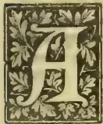

VERY common complaint made by the teachers in our schools is that they have not sufficient land for cultivation. The truth is that many teachers look upon school gardens too much as a commercial

pursuit, and as a means of supplementing their small salary-income. They are very anxious, as a rule, to grow plantains and establish a large betel garden, but when they are required to carry on gardening in accordance with the aims and objects of the school garden scheme they begin to raise difficulties, and, as already stated, one of the difficulties they are fond of raising is the want of a sufficient area to cultivate. Now as a rule our schools are not well served as regards land. Some are fortunate enough to be situated on Crown property, when it is generally possible to extend the area originally attached to the school. More frequently the school stands on private property, the owner or owners of which have consented to the school being built upon it. In the latter cases only a very small space is, as a rule, available for the garden which, in most cases, is part of an area already planted up with coconuts or some other permanent crop which cannot be interfered with.

The object of the foregoing remarks is to introduce our teachers to the system of school gardening, by means of boxes and pots, a system which is, so to speak, independent of land. To those who have nearly an acre of land at their disposal, and still grumble, we can only say

you have already had far too much. To those who have no land to speak of, we would say, you must go in for box and pot cultivation. To the rest who have limited areas we also commend this means of supplementing their limited operations.

In school gardening, therefore, as in all things, 'Where there is a will there is a way.'

The Imperial Department of Agriculture for the West Indies, in a useful little pamphlet entitled "Hints for School Gardens," offers the following remarks on this subject:—

"Schools which cannot, for any reason, attempt a garden in the proper sense of the word can do at great deal with cultivations in pots and boxes.

It might be advisable in all schools to commence with box and pot cultivation. Many of the more important points in agricultural practice, such as drainage, the proper breaking up of the soil, the results of manuring, can be well demonstrated in this way. The expense will be very little at the beginning, very few tools being required. The labour is very light and thus not likely to arouse the prejudices of some parents, as hoeing and forking sometimes do. These prejudices against the work will, no doubt, disappear in time; but whilst the subject is comparatively novel, it is wise to avoid arousing them.

Box and pot cultivations may then form the starting point for all school gardens. Those schools which cannot go further must confine their attention to these, gradually extending their scope where found practicable.

The schools which have room for a garden can commence by raising plants in pots and boxes.

399------------------------------------------------

362Supplement to the "Tropical Agriculturist."[Nov. 2, 1903.

Very shortly the desirability of planting out some of them in the open will arise, and one or more garden beds should be prepared, the requisite tools being bought as desired."

Here follow the directions for box and pot cultivation:—

**"Tools etc., required."**—A supply of boxes and pots are the first requisite. These can be obtained without much expense, as many waste household articles can be utilized. Any stout wooden boxes, and kerosene tins, are extremely useful, and many small plants may be grown well in small tins such as old butter tins.

A few pots, bamboo or earthenware, should be obtained, and also a shovel and trowel, soil, some cocoa-nut fibre refuse, and a little sand.

A sieve is very useful, but, as a rule, expensive. Very good substitutes may be made for a small sum with fine-meshed wire-netting nailed on to a small shallow box with top and bottom knocked out, or by replacing the wire-netting by a sheet of tin pierced with holes about one-quarter to one-half an inch in diameter.

Two sizes of boxes are wanted, shallow ones for raising seedlings in, and deeper ones for transplanting them into later.

Flat slips of wood about six inches long by one broad, smooth on one side and pointed at one end, should be obtained for use as plant labels.

**Seed Boxes.**—The seed boxes should be shallow, from four to six inches in depth, with sides securely fastened so that they will bear the weight of the moist soil. Ordinary wine and whisky cases answer very well, and useful seed boxes can be made from the bottoms of kerosene tins. Bore a number of holes, about half an inch in diameter, in the bottom of each to secure good drainage. Stand the boxes on a layer of small stones or ashes.

**Soil for the Boxes.**—Prepare a good supply of soil for filling the seed boxes according to the following directions, and store it, under cover, ready for use:—Pick out from some good soil all the larger stones and put in a heap. Then pass the soil through the sieve, by which means the gravel is removed and may be stored in a second heap, the soil itself forming the third.

**Filling the Boxes.**—To prepare a box for sowing seeds, place on the bottom a layer of the stones obtained as above, then a layer of cocoa-nut fibre, to prevent the fine soil which is to be added blocking up the spaces between the stones and impeding drainage. Over the cocoa-nut fibre put a layer of the gravel and finally of sifted earth. Level this, and slightly press it down to make the top layers of soil firm. This is important as if the soil is loose the seeds will quickly be dried up, and also it is much more difficult for them to get out of their seed-coats in very loose soil.

**Sowing Seeds in Boxes.**—The box having been filled with soil in accordance with the previous directions, water well, and allow to drain.

In the case of very small seeds, such as lettuce, etc., scatter them evenly over the surface, and cover very lightly with a small quantity of the finest obtainable soil. Larger seeds may be buried deeper; with ordinary seeds half an inch may be

taken as a good average depth. In all cases press the earth gently down after covering the seeds and water very lightly, using a watering-can with a fine rose. If ants are troublesome and carry off the seeds, support the seed box on a couple of pots standing in water.

Put the seed boxes away in the shade, and water them very carefully. It is sometimes advisable to place a sheet of glass over the top of the box. By this means the air is kept uniformly moist and germination is usually hastened. The glass also prevents damage by rain if the seed boxes cannot be placed under a roof.

**Care of Seedlings.**—After the seedlings have appeared above the ground tend them very carefully, the most important thing being to water them regularly. Do not keep them in dense shade too long, or they will grow very tall and weak, and have a tendency, if crowded together, to 'damp off,' owing to fungoid attacks. When large enough they must be transplanted into their permanent positions. Prick the plants out separately with a flat pointed piece of wood, for instance the pointed end of a wooden pot label, press the soil lightly around the roots of each as it is lifted up, and place them either in separate pots, or at a sufficient distance apart in deep boxes, or kerosene tins. The pots, boxes, or tins should in all cases be filled in a similar manner to the seed boxes.

**Precautions necessary in Pot Cultivation.**—If the position where the boxes and pots will stand finally is very exposed and sunny, some attempt should be made to screen the pots from the direct rays of the sun. They may be buried in the soil, imbedded in trash, or cocoa-nut fibre refuse, screened by a board, or protected in any other way local conditions may suggest. It is also well to stand them in saucers of water. Daily waterings are essential. It is best to cover the soil in each pot with a little cocoa-nut fibre refuse which will prevent the top hardening as a result of constant watering, and also diminish evaporation."

Manurial experiments can be carried on in garden beds or in boxes and pots. In some cases they are easier in the latter because it is then possible to ensure that exactly similar soil is used throughout the experiment; that the plants are treated exactly alike as regards water, light, and other conditions.

One difficulty in carrying out manurial experiments in garden beds, is that in many gardens the soil is so rich to start with, that it contains all the constituents necessary to the plant's growth. The manured plot, therefore, will merely contain more of same constituents than the unmanured plot, which, however, has quite enough. That is to say, to get quicker results as to the action of various manures very poor soil only should be used.

The important point is that the different pots should be treated exactly alike throughout. For example, with two boxes or pots, one manured and the other unmanured, the result is worthless if the same soil is not used for both; if one is kept in the shade and the other not; if one is exposed

400------------------------------------------------

Nov. 2, 1903.]Supplement to the "Tropical Agriculturist."363

to wind and the other not; or indeed if one receives any treatment whatsoever which the other does not."

These directions clearly indicate the scope and utility of box and pot cultivation, and what useful practical lessons could be brought out by their adoption in our schools. We would like to see a competition in this method of school garden for special prizes that the department may see fit to offer—practically in the case of schools which have little opportunity for bed-cultivation.

#### OCCASIONAL NOTES.

The varieties of Queensland plantains that have so far fruited are "Cavendish," "Borrego," "Ladies' Fingers" and "Sugar." Presuming that there has been no confusion in the names, the last-mentioned is the only one that can lay claim to be a really desirable addition to the local varieties of table plantains. The fruits are much larger than our average eating kinds, and their consistency and flavour are excellent.

The "four-winged bean" is a vegetable that used to be a great favourite with our ancestors, but has, for some unknown reason, rather dropped out of favour. Anyhow, the bean is seldom found among market vegetables. Its other names are the "Princess Bean" and the "Asparagus Pea." When boiled in the tender stage, there is little difference between this and the French bean. The botanical name of the four-winged bean is *Psophocarpus tetragonolobus*.

The *Australasian*, referring to the Asparagus Pea, says:—A new vegetable, and one that promises to be a great acquisition, is the Asparagus Pea, introduced into Victoria by Lord Hopetoun. It is extremely prolific, and most people would pronounce it a delicious vegetable when properly prepared, combining as it does the pronounced flavour of asparagus with the delicate suggestion of the table Pea. The method of culture is that of the ordinary Pea, and the particulars as to price of seed, &c., can be obtained from F. Hamilton Brunning ("Adamson's"). Amongst other places where it can be seen in full profusion is the Leongatha Labour Colony, and the head gardener there states that it is suited to all classes of climate, thriving almost equally well with or without watering. The plant is of a prostrate nature, branching much like a rock melon, and spreading nearly two feet. Stem prostrate, leaves trifoliate, leaflets spatulate ovate, an inch in length, two stipules ovate, flower axillary, and of a scarlet red and purple, giving the appearance of a field of red clover. Pod square, with fringe on each side, two to four inches long, containing six to ten small peas. The pod is cooked and eaten with the fingers after the manner of asparagus.

Regarding the above we should mention that while we have the white and heliotrope flowered varieties, we have not seen the "scarlet and purple." With us the plant is allowed to run on

trellises. As a prolific bean there is nothing to beat it. We reproduce the following recipes for cooking, given in Hamilton Brunning's catalogue:—

1. Tie the pods in bundles, put them into well-salted boiling water, and cook until they are tender (this will require about fifteen minutes). While boiling, prepare some slices of toast; arrange the Asparagus Peas, when well drained nearly upon it, and then pour the sauce over them.

To make the sauce:—Put butter the size of an egg into a saucepan, and when it bubbles stir in a scant half-teaspoonful of flour, stir well with an egg whisk until cooked; then add two teacupfuls of thin cream, some pepper and salt; stir over the fire until perfectly smooth, and then pour sauce over the Asparagus Peas.

2. Boil the pods in a little water until tender; add a little butter, cream, salt and pepper.

3. Cut each pod crossways into two; put them into boiling water, and let them cook until tender; drain them, and add butter the size of a walnut; put into stewpan with a cupful of cream with a little flour, pepper, and salt, and let this simmer a few moments.

A good deal has lately been written about the value of *Ocinum viride* and other species of the same genus. We have not seen, except in an Australian contemporary, any reference to Citronella grass (*Andropogon nardus*) as a means—and a very effective means—of driving away the "musical nocturnal tormenter" as somebody dubbed the wily mosquito.

Our neighbours over the straits called Falk are evidently envying our good fortune in possessing a scientific staff of experts. They want a similar staff, and they want our resourceful Director of Botanic Gardens to assist them with his advice in formulating a scientific scheme for the Bombay Presidency. It is gratifying to be sometimes reminded that we are not so behind the age after all.

The cultivation of ginger (*Zingiber officinale*) is little carried on in the Island, and it is a matter of surprise that this is so, seeing that the tubers realise such good prices in the market. One is struck with the immense trade in this product in the West Indies and in Cochin China, and is inclined to attribute the fact to the superiority of the article as placed on the market. A knowledge of the proper preparation of ginger would, therefore, be desirable, and we are indebted for the following hints on the best method of curing to the Journal of the Jamaica Agricultural Society.

After the tubers have been dug out and freed from roots and dirt, the skin is carefully and thoroughly taken off with a knife made for the purpose. The points and toes must be carefully rounded, the smaller toes cut off in such a way as to disguise the mark, thus giving the pieces a graceful rounded appearance. These must be washed very clean, and laid regularly

401------------------------------------------------

364Supplement to the "Tropical Agriculturist."[Nov. 2, 1903.]

piece by piece on mats made for the purpose, and put in the sun to dry. At noon on the first day the pieces should be turned over regularly, so that both sides may be equally exposed to the sun. In the evening they may be irregularly massed together and left in the open-air for the night. On the second evening the mat with the ginger should be taken up, but it should not be folded. A free circulation should always be provided to prevent fermentation and discolourations. In three to five days the ginger should be dry. Care should be taken that the tubers do not get wet during exposure. After drying comes the washing or "juicing." The tubers are soaked for half an hour in clean water in which lime juice (half pint to six or seven gallons) has been added. After washing well in the same water they are laid on mats to dry. Washed ginger is white and floury.

It has been discovered by a series of careful experiments made by the Bureau of Animal Industry in the United States Department of Agriculture, that if a small tablet consisting of Permanganate of Potash and Sulphate of Aluminium be promptly administered, loss of stock through the eating of poisonous plants is to a great extent averted. The action of the Permanganate is to oxidise and destroy the poison still remaining unabsorbed in the stomach, and this action is intensified by the Sulphate of Aluminium.

The "Tangelo" is the latest novelty in fruit, according to the *Californian Fruit Grower*. It is the result of crossing the Tangerine orange with the Pumelo, and has been brought about in the Plant Breeding Laboratory of the United States Department of Agriculture by Dr. Webber and Mr. Walter Swingle. The fruit is about the size of an ordinary orange, has the easily-removable skin and orange-yellow pulp of the Tangerine, and its segments fall apart as readily as those of the latter. At the same time a slightly acid-bitter flavour persists, but not to the same extent as in the Pumelo.

Trials made in the packing of seeds for long-distance transportation has brought out the fact that the more satisfactory way is to pack fresh seeds after drying well in the shade, in 6 or 8 oz. tins in fairly well galvanized charcoal. To every pint measure of the charcoal powder should be added one tablespoonful of water, mixing the charcoal thoroughly by shaking through a sieve. The seeds should then be put into the tin gradually, adding charcoal and well tapping the tins, so that the spaces between the seeds are well filled in. The top was well covered with charcoal, so that when shut the pressure prevented any movement inside. These directions are well worth remembering when sending seeds, such as mangosteens, &c., long distances.

According to the *Queensland Agricultural Journal*, the collection of Papaw juice is a regular industry in the West Indies, especially in Mont-

serrat. The juice is collected in calabashes in which is a small quantity of water, and is obtained by slightly scoring the fruit with a knife. As it falls into the water the juice thickens into the consistency of ice-cream, and is thus sold to manufacturers for from  $\frac{1}{2}$  l. to 1 l. per oz. The long-pointed variety is said to bear earlier and nearer the ground, but the round fruits are believed to give the larger yield of juice. One gardener, it is stated, is able to collect an average 4 oz. of juice per hour. The present price of dried Papaw juice or Papain is given as 12s. to 16s. per lb. A small Barbados plantation of 120 trees (of which about 25 per cent are non-fruiting males) planted in May, yielded to the end of December (i.e., seven months) over 10 lbs. of juice.

#### RAINFALL TAKEN AT THE GOVERNMENT STOCK GARDEN FOR OCTOBER, 1903.

<table border="1">
<tbody>
<tr>
<td>1</td>
<td>Thursday</td>
<td>65</td>
<td>17</td>
<td>Saturday</td>
<td>105</td>
</tr>
<tr>
<td>2</td>
<td>Friday</td>
<td>50</td>
<td>18</td>
<td>Sunday</td>
<td>25</td>
</tr>
<tr>
<td>3</td>
<td>Saturday</td>
<td>08</td>
<td>19</td>
<td>Monday</td>
<td>20</td>
</tr>
<tr>
<td>4</td>
<td>Sunday</td>
<td>02</td>
<td>20</td>
<td>Tuesday</td>
<td>45</td>
</tr>
<tr>
<td>5</td>
<td>Monday</td>
<td>Nil</td>
<td>21</td>
<td>Wednesday</td>
<td>44</td>
</tr>
<tr>
<td>6</td>
<td>Tuesday</td>
<td>Nil</td>
<td>22</td>
<td>Thursday</td>
<td>68</td>
</tr>
<tr>
<td>7</td>
<td>Wednesday</td>
<td>02</td>
<td>23</td>
<td>Friday</td>
<td>86</td>
</tr>
<tr>
<td>8</td>
<td>Thursday</td>
<td>Nil</td>
<td>24</td>
<td>Saturday</td>
<td>55</td>
</tr>
<tr>
<td>9</td>
<td>Friday</td>
<td>06</td>
<td>25</td>
<td>Sunday</td>
<td>20</td>
</tr>
<tr>
<td>10</td>
<td>Saturday</td>
<td>Nil</td>
<td>26</td>
<td>Monday</td>
<td>66</td>
</tr>
<tr>
<td>11</td>
<td>Sunday</td>
<td>Nil</td>
<td>27</td>
<td>Tuesday</td>
<td>18</td>
</tr>
<tr>
<td>12</td>
<td>Monday</td>
<td>Nil</td>
<td>28</td>
<td>Wednesday</td>
<td>25</td>
</tr>
<tr>
<td>13</td>
<td>Tuesday</td>
<td>Nil</td>
<td>29</td>
<td>Thursday</td>
<td>08</td>
</tr>
<tr>
<td>14</td>
<td>Wednesday</td>
<td>Nil</td>
<td>30</td>
<td>Friday</td>
<td>03</td>
</tr>
<tr>
<td>15</td>
<td>Thursday</td>
<td>38</td>
<td>31</td>
<td>Saturday</td>
<td>Nil</td>
</tr>
<tr>
<td>16</td>
<td>Friday</td>
<td>65</td>
<td>1</td>
<td>Sunday</td>
<td>Nil</td>
</tr>
</tbody>
</table>

Total in....13.59

Mean in.... .44

Greatest amount of rainfall in any 24 hours, from 23rd to 24th = 3.55 inches.

No. of days on which rain fell 21

ALEX. PERERA.

#### LATE RESEARCHES IN PLANT PHYSIOLOGY.

The researches of Prof. Dunstan, F.R.S., of the Scientific Department of the Imperial Institute and Dr. Henry regarding Cyanogenesis in Plants go to prove the extreme importance of the study of vegetable physiology both from an agricultural and medical point of view.

Prof. Dunstan and Dr. Henry have been working on a number of plants which appear under certain conditions to possess poisonous properties, with a view to discovering to what extent they contain glucosides capable of furnishing prussic acid. Previously they had found prussic acid in young plants of *Lotus arabicus*, which though not

402------------------------------------------------

Nov. 2, 1903.]Supplement to the "Tropical Agriculturist."365

present in the plant as such, originates through the action of a specific enzyme on a corresponding glucoside. It is needless for us to go fully into the details of the elaborate experiments that were carried out by the two workers referred to; suffice it to say that they have also proved to their satisfaction the presence of an enzyme in the *Sorghum* capable of furnishing prussic acid from the corresponding glucoside.

We quote the concluding portion of the report on this interesting subject:—

"Besides lotusia and dhurrin, the glucosides we have isolated from young plants of *Lotus arabicus* and *Sorghum vulgare* respectively, only one other cyogenetic glucoside is definitely known—that is, the amygdalin derived from bitter almonds, which, however, is found in the seeds of the plant.

"The results of our investigations have rendered it probable that the production of prussic acid in a number of other plants may be associated with the presence of cyanogenic glucosides. Moreover, the question of the occurrence of prussic acid, and the part played by it in vegetable metabolism, involves problems of the first importance in vegetable physiology, with which we intend to deal when we have obtained a further insight into the nature of other cyanogenic glucosides now under investigation. So far as *Lotus arabicus* and *Sorghum vulgare* are concerned, it would appear that the existence of a cyanogenic glucoside in the young plant up to the period when the seeds ripen at any rate may serve as an important protection to the plant from the attacks of animals. It appears that animals indigenous to the countries in which these plants are native refuse to eat them in the earlier and poisonous stages of growth. The part played by the glucoside in the general metabolism of these plants, and the origin and fate of the cyanogenic group, still remain to be ascertained. The temporary presence in a plant of a considerable quantity of a cyanogenic glucoside, together with an enzyme capable of decomposing it, appears to us to be a fact which must have an important biological meaning.

"As so much interest attaches to the subject from several points of view, we are engaged in investigating the constituents of other plants which furnish prussic acid. Among them we may mention *Phaseolus lunatus* (seeds), *Lotus australis*, *Manihot utilisima*, and *Linum usitatissimum*, as well as a number of little known plants, derived from the colonies, which have proved to be poisonous to cattle, some of which may contain cyanogenic glucosides. From the chemical point of view it is important, in the first instance, to isolate these glucosides and to ascertain their properties, composition, and molecular structure. This work we have now accomplished with the glucosides of *Lotus arabicus* and *Sorghum vulgare*, which are shown to be radically different in chemical constitution, whilst each belongs to a type chemically distinct from that of amygdaline the only naturally occurring cyanogenic glucosid, hitherto definitely known."

## REPORT OF THE GOVERNMENT VETERINARY SURGEON FOR 1902.

This report which is now published separately begins with a reference to Contagious and Infectious Diseases in Cattle, and it is stated that throughout the year there was comparatively little disease of this nature. Indeed there was a marked absence of Rinderpest in most of the provinces, and only in the Sabaragamuwa and Southern Provinces were there any deaths from this scourge. But we read of another form of contagious disease instead, namely what the Colonial Veterinary Surgeon describes as either a form of rinderpest or a similar disease known as hæmorrhagic septicæmia—an extremely fatal malady, which is thus reported upon:—

*Hæmorrhagic Septicæmia* (described by Blin and Carowgean in India-China).—The symptoms of this disease closely resemble those of rinderpest. They develop suddenly; these is fever, quickened respiration, dullness, loss of appetite, discharge from nostrils (at first thin, afterwards becoming thick and yellowish in colour), tears flow from the eyes, and the skin around and under the eyes may become sore, diarrhoea occurs becoming dysenteric, cough is usually present. The rate of mortality is great. It appears to be most severe in buffaloes.

In the cases in the North-Central Province swelling of the throat was described by the Inspector, and numbers of wild animals and a horse or two showing œdematous swellings died, which leads to the conclusion that the disease was not true rinderpest. It is hard to distinguish from rinderpest, but there are a few points which may help to diagnose. It usually attacks buffaloes more than other cattle; it does not become so widespread as rinderpest; the outbreaks are usually of a sporadic form sooner than epidemic; and there may be soft kind of dropical swellings (œdematous) usually in the loose skin under the throat and neck.

The postmortem symptoms are much the same as rinderpest, the main difference described being the pulmonary lesions. In rinderpest the lungs are usually whiter than normal and spongy (but congestion may be present). In hæmorrhagic septicæmia congestion is described as red brown patches surrounded with infiltration of serum, these may be collections of pus in the lung tissue, and if of some standing the pus may be in a state of caseification. In both diseases bronchial tubes may be congested and ulcerated, with deposits of lymph. The lesions in the digestive tract are much the same in both diseases.

The following interesting statement is taken from the body of the report:—"The total number of cattle for the whole island is 1,398,209, and the number of deaths reported from all diseases 9,237, giving a percentage of '6 per cent.'"

The small horse-breeding establishment on Delft Island numbers 78 animals in all—mares, stallions and foals.

403------------------------------------------------

366Supplement to the "Tropical Agriculturist."[Nov. 2, 1908.

The following summary will give an idea of the working of the Government Dairy:—

The total expenses of the year were Rs. 24,377.83, and the receipts by the sale of stock and milk Rs. 27,653.59, giving a profit of Rs. 3,275.76.

The amount realised by the sale of milk alone was Rs. 24,703.75.

The return of stock at the end of the year shewed of cows 108, calves 105, stud bulls 4, draught bulls 2.

### SUNFLOWER SEED.

There is nothing more easy to grow than sunflowers, but apart from their ornamental character one never thinks of these plants as being of any use to the cultivator. To give some idea of what can be done with the seeds we have made the following *resumé* of an article published the *London Agricultural Gazette* not long ago:—

Small parcels of sunflower seed have for years reached London, but of late large consignments have arrived from Odessa, and it is worthy of note that a 300 ton cargo found a purchaser at £11 5s. per ton. This would go to show that there is a market for the seed, and assuming that one acre on an average will produce 50 bushels of seed, without as great exhaustion of the soil as many other crops occasion, its value as a profitable cultivation will be understood. The sunflower has been large and profitably cultivated in Hungary, Germany and Russia for a long time past. Not only do birds of all kinds thrive on the seed, but there is perhaps no more fattening seed for poultry, while cattle like it either whole or crushed. The stalks of the plant can also be used as fodder. Speaking roughly each seed produces a thousand. Yet it is said that the demand is greater than the supply. The hulled seeds contain

<table border="1">
<thead>
<tr>
<th></th>
<th>German Seed.</th>
<th>Russian Seed.</th>
</tr>
</thead>
<tbody>
<tr>
<td>Oil</td>
<td>33.48 p.c.</td>
<td>34.25 p.c.</td>
</tr>
<tr>
<td>Organic substances</td>
<td>54.04 p.c.</td>
<td>54.39 p.c.</td>
</tr>
<tr>
<td>Protein substances therein</td>
<td>14.12 p.c.</td>
<td>18.80 p.c.</td>
</tr>
<tr>
<td>Ash</td>
<td>2.86 p.c.</td>
<td>3.56 p.c.</td>
</tr>
<tr>
<td>Water</td>
<td>9.62 p.c.</td>
<td>7.80 p.c.</td>
</tr>
<tr>
<td></td>
<td>100.00</td>
<td>100.00</td>
</tr>
</tbody>
</table>

### POULTRY PICKINGS.

A good diet is the essential thing for egg production. In the morning, as early as possible, feed pollard mixed thoroughly with water, but so that it will break into pieces when thrown down. In the evening feed good grain, oats or wheat, with barley or maize for a change on wet cold days. If the fowls are penned up, give a little cooked meat or green bone, the latter being preferable as it contains much mineral salts and fat besides albuminoids, all of which are invaluable for egg production. The latter should be fed at midday. Do not allow the birds to get too fat. A good plan is to feed the grain at night in a corner where there is some litter

or straw so that "scratching" may be induced. An occasional allowance of green food (cabbage, lettuce, &c.) and some grit will make the diet perfect. Such is the advice of the poultry expert of the Queensland Agricultural College given in the *Agricultural Journal* of that Colony.

A convenient tonic for fowls is Sulphate of Iron; a little in the drinking water just sufficient to give it a slightly bitter taste. This often greatly helps the birds on, particularly during the process of feather making which is very exhausting.

The buff varieties of Wyandottes and Plymouth Rocks are apt to be confused, but according to the *Farmers' and Stockbreeders' Review*, there is no excuse for mistaking a buff Orpington with its rose comb. The other two have single combs. Orpingtons have white or flesh-coloured legs, Plymouth rocks have yellow legs, like Wyandottes. The shape is also very characteristic of each breed.

Douglas mixture for fowls is made of 1 oz. sulphuric acid and  $\frac{1}{4}$  lb. sulphate of iron. Dissolve in two gallons water and add one table spoonful to every gallon of the drinking water.

The production of eggs is according to the best authorities merely a matter of feeding, and it is said that the most persistent non-layers will be induced to lay if fed with such a mixture as "butter-milk, wheat-porridge and a few chopped chillies." Dried blood is also considered a perfect food for egg production. Good scratchers are better layers than birds that get at their food without exertion. Therefore scatter the food about easily disturbed litter so that the hens will get exercise in searching for the grain.

Warts in chickens should be treated by first tearing off the wart with a pair of pincers or a pin and touching the entire ulcer with a little cotton plug moistened with tincture of iodine. The warts are produced by the mycelium of a fungus (*Aspergillus fumigatus*), the mycelium of which is within the wart. Treatment must be adopted on the first appearance of the trouble. The *Queensland Agricultural Gazette* recommends another simple and effective remedy, namely, dipping the heads of the chickens twice a day in fresh urine.

The *Scottish Farmer* writes:—There has been some talk lately of the superiority of water-glass (silicate of soda) to lime for the preservation of eggs. It is contended that eggs preserved in a solution of water-glass will keep longer fresh than in lime-water, and will acquire no taste; that, indeed, at the end of six months, the whites, when boiled, will have the milky appearance of a new-laid egg. Professor Long repeatedly recommends this method; and it is being largely adopted in America for market purposes. The proper solution is 10 per cent. of water-glass in perfectly pure water. The purity of the water is an important point. At Birmingham Show last December, out of twenty-

404------------------------------------------------

Nov. 2, 1903.]Supplement to the "Tropical Agriculturist."67

four exhibits of preserved eggs (delivered four months previously), two were in water-glass, and neither got a prize. The first prize went to lime-water, and the second to eggs which were rubbed with vaseline, each egg wrapped in a cloth and packed in bran. If the contention in favour of water-glass be correct, there was some mischance befel those sent to Birmingham Show.

To cure scaly legs, on the first indication of roughness anoint the legs with sweet oil and kerosine, half and half.

### TO ROUGHLY ASCERTAIN THE COMPOSITION OF SOILS.

We have several times lately been asked to give some method of finding approximately the constituents of a soil when no chemist is available. This we have not been able to do, because scientific men, who understand the difficulties connected with making an accurate soil analysis, do not consider that there is any rough and ready method which would be at all available.

Semler, in his work on "Tropische Agrikultur," Vol. I., 1897, writes on this method of soil analysis:—Whoever wishes to take up a piece of virgin land should be capable of making a soil examination by separating the fine and slimy parts from the coarser particles by means of washing with water. Such examination would not by any means render a chemical analysis superfluous. Still, by this washing process, the presence of some of the most important soil constituents and an approximate idea of their quantitative proportions may be ascertained, and thus some fairly reliable conclusion as to the fertility of the soil becomes possible. The materials required are: A few wine glasses, a small pestle and mortar, a piece of litmus paper, a small scale, a small bottle of muriatic acid, another of ammonia, another of oxalic acid mixed with water, a fourth of phosphate of ammonia and of soda, and some filter paper, all of which may be bought at any chemist's shop.

Suppose it be desired to try if a soil contains sand and clay. Take 50 grammes of the soil (15.43 gr. Troy = 1 gramme) or 32.14 dwt. Grind it well in the mortar, having wetted it first, until it is reduced to a soft pasty mass. Now dip a piece of litmus paper into it. If this turns red, there is a proof that it contains humic acid, and hence that drainage is required or that lime should be applied. Now pour the thick liquid into a tall funnel, reduce it largely with water and carefully wash out the mortar, emptying what remains in it into the funnel. If it be then allowed to stand for a little time, the various constituents will sink to the bottom of the glass according to their specific gravity and their degree of division into particles. The coarse sand sinks first, then the fine sand, followed by the clay, and if humus be present this will form the upper layer. From the depth of the layers a fairly safe conclusion may be arrived at as regards the proportional quantity of each

constituent contained in the soil. To continue the examination, stir up the sediment, and in a few minutes pour the cloudy liquor into another glass, being careful not to allow the sand, which will have meanwhile again sunk to the bottom, to flow off. The residue must be mixed with water, stirred, and, as in the first instance, be poured out. Continue this process until, apparently, nothing is left in the first glass but sand. To prevent any moisture running down the edge of the glass, smear a little grease on the outside or hold a bit of wood against the spot where it runs off. Now dry the sand on filter paper and then weigh it. What it falls short of 50 grammes will be put to the account of fine soil (clay and humus).

The examination for the lime and magnesia contents proceeds as follows:—Weigh off 20 grammes of the dry soil, pour it into a small bottle, and add six times as much water; then add gradually from five to ten grammes of muriatic acid, and put away for several hours in a warm place. If, when the muriatic acid is added, a distinct buzzing sound is heard, this is a proof that the soil is rich in lime. When the contents of the bottle have become perfectly settled, pour them on to filter paper, and add the washings of the bottle as well. The yellow liquid filtered through, which must, of course, be caught in a glass, must be mixed with ammonia until it distinctly smells of it. If brown flakes separate themselves in it, these will be oxyhydrate of iron and hydrate of alumina (with phosphoric acid). The liquid must again be filtered, and, in its liquid state, must be mixed with a solution of oxalic acid and water, so long as any cloudiness arising from oxalate of lime appears. Note must be taken, if during this process the smell of ammonia disappears; should this happen, the smell must be restored by the addition of more ammonia. The lime contents may be ascertained by the quantity of precipitation; but if a more accurate calculation of the quantity is required, the liquid must be poured on to a dry piece of filterpaper, which has to be accurately weighed; the precipitated matter on the paper must then be washed and dried near the fire. Then both paper and precipitate are weighed, and the gain in weight is taken as the oxalate of lime. By heating it is changed into carbonate of lime, but this process is not needed, since we know that 100 parts of lime are equal to 63 $\frac{1}{3}$  parts of carbonate of lime.

The magnesia is not taken into consideration in the preceding process. Its contents can be ascertained from the liquid filtered from the oxalate of lime, to which a little ammonia is added. Then a little phosphate of ammonia is dissolved in it, and it is stirred with a glass rod. After a short interval, if there is a large percentage of magnesia, a crystalline sediment results, which consists of ammoniac phosphated magnesia. If the percentage of magnesia is small, there will be little precipitate, and that only after standing for a long time.

It is important to examine into the moisture-holding power of the soil. For this purpose, weigh 100 grammes of dry earth, pound it fine in

405------------------------------------------------

368Supplement to the "Tropical Agriculturist."[Nov. 2, 1903.]

the mortar and empty into a glass, the weight of which, together with its contents, must be ascertained. Then pour so much water into the glass as will completely cover the soil, and which it cannot be expected to completely absorb. In twenty-four hours the superfluous water must be carefully poured off and the glass again weighed. The additional weight gives the percentage of water which the soil can take up. This power of water absorption reaches, in the cases of clay and humus, to 80 and 100 per cent. In the case of gravel and sand, it falls to 20 and 25 per cent.

Mr. Semler recommends that these experiments should be made during dry weather, as the appearance of many soils is at such a season very deceptive. But experiments should be made both during a dry and a wet season.—*Queensland Agricultural Gazette.*

### MANIOC STARCH.

The value of manioc as a source of starch is thus described by Prof. Archbald of Toronto University:—Maize starch has its own characteristics, which distinguish it from other starches. If a cheaper raw material be suggested for the production of starch and allied products, it must yield them of the same quality. In the plant cassava we have a raw material which yields a starch of the highest purity, possessing all the characteristics of the maize product, the cost of production being  $\frac{1}{4}$  that of the maize. Both the sweet (*Manihot aripa*) and the bitter varieties (*Manihot utilisima*) are equally important sources of starch for edible and manufacturing purposes. Experiments made in Florida with fresh roots, the average percentage of starch was found to be 24.75, and with Jamaica roots, 26.23, the product obtained from several pounds of the root had all the characteristics of the best maize starch, and 4 per cent of cane sugar was recovered from the liquor. Compared with maize and potatoes, upon which practically the whole world depends for its supply of starch, the average yield of starch is as follows:—Maize 53; potatoes 18, cassava 25 per cent. An acre of ground yields 40 bushels of maize, which in turn yield 1,200 lbs. of starch, whilst the same ground will yield 10 tons of cassava, yielding 6,720 lbs. of glucose and 5,000 lbs. of starch, and it is possible to reach a much greater amount. In Jamaica, 20 tons per acre could be grown with ease.

With maize at 45 cents (1s. 10 $\frac{1}{2}$ d.) per bushel, the crude starch from that source is 1 $\frac{1}{2}$  cents ( $\frac{3}{4}$ d.) per lb. With potatoes at 50 cents (2s. 1d.) per bushel, the unmanufactured starch is 5 cents (2 $\frac{1}{4}$ d.) per lb. while cassava grown on a basis of 8 or 10 tons per acre (as at Lake Mary, Florida, where the only complete cassava starch factory is situated) costs half a cent ( $\frac{1}{4}$ d.) per lb. in the unmanufactured state. It is quite evident that cassava is the cheapest known source of starch, costing a quarter as much as maize starch. A plant has been devised by Professor Archbald, by means of which the whole 25 per cent of dry starch can be obtained, and this

plant can be worked 25 per cent cheaper than the potato starch plant, the process being perfectly automatic and continuous. The problem, then, of the cassava starch manufacture on a commercial basis may be considered solved. The plant will work up 100 tons of roots per day of 10 hours. The entire process only occupies three days, when the starch is ready for market, while maize, under the most favourable conditions, requires from 12 to 14 days.

### REMEDIES FOR TAPEWORM.

The patient (dog, horse, cat) should be prepared beforehand for the administration of the medicine, so that the drugs may come easily into contact with the parasites and the latter pass out without difficulty.

In the case of dog, horse, or cat, a fast of 18 hours at least is advisable before the medicine is given, and previous to the fast it is often advisable to empty the bowels by means of a purgative.

Some tapeworm medicines are themselves purgative; such as are not, must either be combined with a purgative, or the latter should follow the medicine.

The dose should be repeated in all animals in 2 or 3 weeks, or may be less. The medicines should be fresh.

If the head of the worm does not get expelled, the disease will again recur.

The faeces should be destroyed to prevent infection. The patient is therefore best kept in confinement during treatment.

**Dog Medicines.**—(1.) Arecanut, freshly powdered, 10 grains to 2 drams at most, the rule being 2 grains for each pound of the dog's weight, to be administered after 18 hours' fast in butter, oil, cream or broth. Arecanut is astringent and should be followed after half an hour by a table spoonful of castor oil alone or in milk. Given to puppies without a purgative it is dangerous. Sound nuts should be procured and grated as required.

(2.) Extract of male shield fern (*Aspidium filix-mas*).—This is an excellent vermifuge. The dose is 10 grains to a dram. It may be combined with castor-oil, or with half a dose of arecanut and castor. The medicine acts in three to six hours.

(3.) Tenaline.—The dose is 10 to 30 minims. The drug is the active principle of arecanut.

(4.) Turpentine.—The drawback to this drug is the danger of inflammation of the stomach or kidneys following. The dose is, according to the age of the dog, from 10 minims to a dram, given in a full dose of castor-oil ( $\frac{1}{2}$  to 2 oz.).

(5.) Koussou or Cusso.—This drug owes its properties to Koussin. It is one of the best and safest medicines for tapeworm, its action being directly toxic to the worm, but it is rather expensive. The infusion and fluid extract are too bulky and disagreeable. It may be given in capsules in doses of 10 to 40 grains for adults, and 10 to 20 for young animals. The dose should be followed by oil.

406------------------------------------------------

Nov. 2, 1903.]Supplement to the "Tropical Agriculturist."369

(6.) Kamala is like the last better known on the Continent, and is also very effective. As an adjunct to male fern it has been found a very valuable remedy. Doses, 15 to 30 grains for adults, 3 to 15 grains for puppies. The medicine is given in gruel or oil.

The doses for tapeworm in the cat are arecanut, 5 to 30 grains; extract of male fern, 10 to 20 minims; kuosso, 20 minims to 1 dram; kamala, 10 to 30 grains.

The doses for tapeworm in sheep, cattle and horses are arecanut, 2 drams; terpentine, 1 dram; kamala,  $1\frac{1}{2}$  dram; extract of male fern, 1 dram; liquor arsenecalis, 4 drams; or a mixture of 1 dram sulphate of iron and salt in the food.

The foregoing recommendations are taken from an article by Prof. MacDougall, M.A., D.Sc., in the last volume of the Highland Agricultural Society's Transactions.

We would remind our readers of the necessity for making due allowance for the size of local animals as compared with those of the larger breeds for which the doses are intended, and that the relation of the quantity of a drug to the weight of the animal should be considered.

Powdered pumpkin seed (about a tea spoonful) is another remedy given on the authority of Mr. G. S. Saxton, C.C.S., in our issue of October, 1902.

Kamala is a powdery substance obtained as a glandular pubescence from the exterior of the fruits of *Mallotus philippinensis* (*Rottlera tinctoria*) a plant occurring in Ceylon and known in Sinhalese as Hamparila, and in Tamil as Kalilapodi.

Kuosso is the product of *Brayera anthelmintica*.

#### GENERAL ITEMS.

At an Agricultural Conference organised by the Department of Agriculture of Queensland, the following resolution was passed:—"That the Conference is pleased to note that the Educational Department had recommended school teachers, especially those residing in the country districts, to use as much as possible, object lessons for the purpose of acquainting pupils with elementary agricultural science; to institute, where practicable, experiments on a small scale in the school ground; and to encourage pupils in the collecting of specimens of natural and agricultural products to be displayed in the school-rooms."

In reply to a correspondent the *Queensland Agriculturist* says that "Tapioca and starch are made from the Cassava (manioc) root, but sago is derived from the sago palm, *Cycas circinalis*." We would point out that the sago palm is *Metroxylon Sagu*. *Cycas* is not a member of the palm family, but belongs to the Cycadaceae—a gymnospermous order.

To get rid of cockroaches, says a contemporary, put small quantities of boracic acid into the nooks and corners where they are found, and in a couple of months they will have disappeared. But naphthaline should answer quite as well we think.

"Manna" is produced by the *Dendrocalamus strictus*, the male or solid bamboo in the form of a white brittle gum similar to what is seen exuding from *Odina wodier* (Sin., Hik). On analysis this manure revealed the following composition: Water, 2.66; Glucose, .75; Ash, .96; Sugar, 95.63. The three chief manures imported into Bombay and used in India are (1) Taranjabin obtained from the Camel Thorn (*Alhagi camelorum* and *A. maurorum*) growing in Persia and called "Manure of the Desert"; it consists of a peculiar sugar called melizilore and cane-sugar. (2) Gurangabin, a product of Persia and Arabia, collected from the Tamarisk (*Tamarix gallica*); it consists of cane-sugar, inverted sugar, dextrin and water. (3) Shirkhist is the name for the white granular masses found in Persia on the shrub *Cotoneaster nummularia*. These manures are valued for their aperient, expectorant and tonic properties, and their supposed virtue in strengthening the liver, stomach and intestines.

Mannas of minor importance are those secreted by the Pines (*Pinus excelsa*) in the Himalayas, the *Eucalyptus viminalis* on the Nilgiris, and the wild plantain (*Musa superba*) in the Bombay Presidency. The European manure is chiefly derived from the ash of Sicily (*Fraixinus rotundifolia*), and occasionally there is collected what is known as Briacon manna from the larch trees (*Pinus larix*) of the South of France.

Castor oil finds an important application in Turkey red dying being converted into Turkey red oil by the action of strong sulphuric acid and subsequent neutralisation with alkali. The purgative principle is, so far as we know, not yet identified. Tuson's "ricinine" is stated by himself to be non-purgative. The greater part of the active principle appears to be left in the pressed seeds; its isolation and examination, and the estimation of the amount present in the oil and the pressed cake has yet to be worked out to satisfaction.

It is not generally known how readily rats may be caught by means of birdlime. If it is desired to make a colony desert their burrows, it is only necessary to smear a little round the entrances. If it is desired to catch them, the best way is to dress plenty of straws and spread them thickly on the ground around the burrows. Among the straws throw some attractive bait—malt sprinkled with oil of carraway is a good draw. When the spot is visited next morning the straws will be found gathered up in little bundles, and in the centre of each will be found a rat, alive or dead according to the extent of its entanglement. Do not be tempted to place your foot upon one of those rats if it still struggles, but kill it with a stick. If the birdlime is to be used indoors, take a piece of stiff brown paper and put the sticky stuff in the centre. Birdlime can be easily made by boiling down linseed oil. Put the oil into a tin, place the tin in a saucepan of water, and let it boil slowly till it is of the right thickness and stickiness.

407------------------------------------------------

370Supplement to the "Tropical Agriculturist."[Nov. 2, 1903.

The Principal of the Queensland Agricultural College, in an article on *Paspalum dilatatum*, in the May (1903) number says:—"Having been the first to bring before the notice of the public of Queensland this valuable grass, some seven years ago, I have experimented with it under different conditions, and watched its progress very carefully, and the more knowledge I acquire of its habits and growth, the more strongly am I convinced of its value, not only for pastoral purposes, but also as a fodder. . . . Regarding *Paspalum dilatatum* as a grass for milk production and for fattening stock, I think I am within bounds in saying that, all things being considered, it surpasses all other grasses known to us as a permanent pasture. It possesses great drought-resisting qualities, and frost will not injure it. . . . Trampling it down and cutting it off with stock does not injure it. The soft succulent nature of the grass induces stock to relish and eat every part from crown to head. When cut and saved at the proper stage it makes excellent hay; with us one acre has yielded 22 cwt. of good hay. When milch cows are grazed on the *Paspalum* field, the flow of milk increases rapidly and the cows put on condition. . . . In respect to what has been written above, the writer can truthfully say that all particulars are based on actual results." This is high praise and praise from a high quarter. We trust that our own experience with the grass—only just begun—will eventually turn out to be as satisfactory as that of the Principal of the Queensland Agricultural College.

The value of green-manuring in improving poor soils is little understood and less practised among local agriculturists. Says a contemporary, "The most barren soils may eventually be rendered by green-manuring with velvet bean or cow pea. . . . An acre of well-grown cow pea will amount in weight to from 1½ to 2½ tons, and when this mass is turned under (the soil) it gives up 64 to 70 lbs. of nitrogen, 21 to 25 lbs. of phosphoric acid, and from 100 to 180 lbs. of potash." Here are two crops which might with advantage be sown in paddy-fields between crops and during the dry seasons, with a view of supplying some fodder for cattle and adding fertility to the soil.

Mr. Flage Carter of Park County has made himself famous as "the originator of the capillary attraction principle of supplying water to trees." The State Board of Horticulture and the Government Experimental Station at Fort Collins are said to be investigating the merits of the new discovery. Shortly explained the modus consists of taking a bucket of water to the tree, as you would to a horse, and suspending it on a limb of the tree. Then bend down a twig (quite about that of a lead pencil) as you would draw the neck of the animal to the bucket. *Result*: The liquid

will be rapidly absorbed by the twig! Who is going to be the first to try this in Ceylon?

The Chinese idea of a prosperous State is well worth the careful notice of rulers—Colonial and otherwise. The Chinese have a respect—which is akin to reverence—for agriculture, and their appreciation of its value in the State is well shewn in the following translation of a Chinese poem:—

"Where spades grow bright, and idle swords grow dull;  
Where gaols are empty and where barns are full;  
Where field-paths are with frequent feet out-worn,  
Law court-yards weedy, silent and forlorn;  
Where doctors foot it, and where farmers ride;  
Where age abounds, and youth is multiplied;  
Where poisonous driuks are chased from every place;  
Where opium's curse no longer leaves a trace;  
Where these signs are, they clearly indicate  
A happy people and a well-ruled State."

Nitrate of ammonia added to twice its weight of freshly-crusted washing soda and an equal quantity of the coldest water obtainable will produce a temperature of 40° below freezing point. This is the most powerful freezer without acids.

Mr. S. C. Voller, Assistant Instructor in Fruit Culture of the Department of Agriculture, Queensland, sends to the Agricultural Journal of that Colony what he recommends as an infallible wash for destroying aphids and other insect life on vegetables. The wash is said to stick like varnish and instantly destroy all animal life on plants. Here is the recipe:—Resin, 20 lbs.; Caustic Soda, (98 per cent) 4 lbs., or (70 per cent) 6 lbs.; Fish Oil, 3 pints or Whale Oil, 2½ lbs.; 140 to 150 gallons water. Place all the ingredients in a boiler with 20 gallons of water, and let the whole simmer for 3 hours. Then add hot-water slowly and stir well till there are at least 40 gallons; then add cold water to make up 140 gallons. Never add cold water when corking. A stronger solution with only 80 gallons of water will destroy the most intractable pests.

With reference to the extraction of Plantain Fibre from ordinary varieties, we learn from a contemporary that a Madras Official Bulletin gives a description of a kind of simple and cheap machinery invented by Mr. Underwood and also by Major Maitland. These inventions have not come before us, and we would be glad to have any particulars with reference to them.

The description of the "remarkable pineapple" referred to in the *Queensland Agricultural Journal* of April last reminds us of our local "Queen" (we do not know the *smooth-leaved Queen*), while the illustration of the "remarkable mango" is very like our Parrot mango, with the exaggerated horn rather too high up

408------------------------------------------------

# \* The TROPICAL AGRICULTURIST \*

◇ MONTHLY. ◇

XXIII.

COLOMBO, DECEMBER 1ST, 1903.

No. 6.

## THE LOSS OF SOIL FERTILITY

**T**HE loss of fertility from the soil occurs in various ways, but the characteristics of soils have much influence on the loss, and something also depends upon the kind of manure or fertilizer used. One result of an inquiry regarding the mineral fertili-

zers used at the Rothamsted Experimental Farms, in England, says *American Fertilizer*, is to show that neither potash nor phosphoric acid, when present in excess of immediate requirements, is liable to escape from the soil or to sink to a depth beyond the reach of plant roots, and that if such should happen the quantity would be very small. When barnyard manure is used, both the potash and phosphoric acid contained in the manure have been found to descend in more liberal quantities and to a greater depth into the sub-soil, than when applied in the form of fertilizers. The excess phosphoric acid and potash derived from superphosphate and potash salts respectively accumulate in the first nine inches of the soil, but are less soluble than the same substances supplied in barnyard manure. The accumulations of phosphoric acid are less fixed, but, and consequently more available, when alkaline salts have been applied with superphosphate, and it is also the case that potash salts are similarly affected in a beneficial sense, when there are accompanying applications of phosphate and nitrogenous substances. It has, therefore, been demonstrated that the loss from the soil is not as great as has been supposed, and that the soil has the power to retain the larger share of soluble plant foods near the surface, if it is not exceedingly porous.

### THE EFFECT OF THE RAINFALL.

During the entire year the amount of water which falls upon a field is very large, and soluble substances are consequently dissolved, especially as the actual amount of water used by crops, compared with that which falls is small. The rains would soon deplete the soil of its soluble mineral matter but for the power of the soil to retain potash and other substances. For that reason

some soils are more valuable than others. The nitrates in soils are more easily carried away than potash or phosphoric acid, hence it is possible that the loss in the form of nitrates may be large, especially during very wet weather. When the soil is dry, evaporation brings to the surface some of the nitrates carried down by the rains, and growing crops also prevent loss by protecting the soil, or by appropriating the plant foods. It is well known also that some soils absorb gases from the air, hence some of the ammonia lost from the soil is recovered in that manner, and the power of ordinary land plaster to absorb gases has enabled some farmers to gain fertility to their soils by its use; while ammonia is largely brought down by rains to the soil, the result being that it is converted into nitric acid. In the soil there is a large and abundant supply of plant foods, but they do not exist in forms which permit of their use except in limited supply. This is a provision of nature to prevent exhaustion of the soil, for if the plant foods in the soil were easily rendered soluble the soil would long ago have been deprived of them. But they are in the soil, and ready for use when demanded; but the soil will not give up these foods except when certain natural laws have been complied with, even the farmer cannot rob the soil by taking therefrom more than a fair proportion unless he pays the cost of so doing to an amount which is really prohibitory to a certain extent.

### COMPENSATION FOR EXCESSIVE CROPPING.

When a farmer exhausts a soil by excessive cropping, and without returning something as compensation therefor, he simply deprives the soil of its soluble portions, but even the poorest soil will have left, for a future reserve, its vast stores of insoluble plant foods.

The farmer who uses manure and fertilizer thereby gains from the soil more than he applies because the materials which he adds to the soil serve to render soluble the inert plant foods existing in the soil; and as it takes capital to make money in business, so it takes manure and fertilizers to make the soil more subservient to the demands of the farmer. Every dollar expended for plant food to be applied to the soil is an investment which in the future is sure to bring good returns, because of the abundance of raw materials existing in the soil ready for use when proper

409------------------------------------------------

372THE TROPICAL AGRICULTURIST.[DEC. 1, 1903.

methods are applied for deriving them from the vast stores which are always in reach with the tide of suitable appliances.

#### GREEN CROPS IN MANURE.

The growing of green crops for manure benefits the land not only by returning to the soil that which may have been derived therefrom and from the air, but also, through the chemical action of plant roots, which have the capacity of changing the characteristics of the various "salts" in the soil, and as the roots of plants appropriate carbonic acid as an agent in neutralizing the alkaline matter, various compounds are formed. Alkalies also neutralize acids, and there is a constant tendency to effect chemical changes by reason of the use of green foods, manures, fertilizers, plaster or lime. The soil is the bank of the farmer upon which he can draw, but he must first make his deposits. Cultivation, tile drainage, the use of certain crops and a knowledge of the characteristics and requirements of the soil will give the intelligent farmer a great advantage over him who does not carefully consider the reserve of plant foods in the soil.

### THE CANKER FUNGUS IN RUBBER.

#### MR. J. B. CARRUTHERS ON THE DISEASE.

A special general meeting of the Kalutara Planters' Association was held at the Tebuwana resthouse on Saturday afternoon, October 31st, to hear Mr. J. B. Carruthers, Government Mycologist, on the question of Canker in Rubber, which has made its appearance in the Kalutara district.

#### MR. CARRUTHERS' ADDRESS.

Mr. J. B. Carruthers, who, on rising was received with applause, said: Gentlemen, to begin with the history of the disease, I may mention that it was first noticed two years ago by the Assistant Conservator of Forests of the Province of Sabaragamuwa; but it was not till some five months ago that my attention was called to it. Following this various diseased specimens of rubber were sent to me from a number of districts, and, in some of these specimens, I found the *nectria* or canker fungus. The specimens sent contained mycelium, and, on investigating this by means of cultures, I found spores, which, on scrutiny showed that they belonged to a species of *nectria*. I then made inoculations on trees, and that is the only way to prove the guilt of an individual parasitic fungus as the cause of any disease. *Nectria* grow on apple trees, plum, cacao, tea, etc., etc., and affect and eventually fill many kinds of trees. After these preliminary investigations had been to some extent finished in the laboratory at Peradeniya, I visited Kalutara and went over some fifteen or more estates and have seen practically all the rubber estates of any size. The result of this inspection is that the estimated proportion of diseased trees in the Kalutara district is about one in two-hundred or half per cent. Yatiporna and Edengoda estates on the other side of the river are not included in this record. If they are included it would about double the percentage and make it over one per cent. Yatiporna has about 40 per cent. trees affected by canker and Edengoda 20 per cent. The canker has been there for some years, possibly five or even more. Details of the effects and structure of the fungus will be given in a circular of the Royal Botanic Gardens, so that there is no need for me to take up your time with these. Coming now to observe the aspect of the disease on trees, as a general rule the external appearances on the rubber tree are roughened and swollen places in the stem and branches. These, on cutting off the outer bark, show discoloured tissue, at first a neutral tint colour, and afterwards brownish and claret colour. When shaved the whole of the diseased parts are shown up like an outlined coloured map in the lighter-coloured healthy tissue. When the canker fungus has been growing in such a spot for some time—I cannot definitely say how long, as this depends on physiological conditions—the fruits are produced

at first pink or whitish spores, and later round red fruits like cayenne pepper, which look, on examination under a magnifying lens like crystallized strawberries. The structure of these red fruits is the means of identifying the fungus as a *nectria*. The canker spreads through the agency of the wind in dry weather by water, and by insects such as red ants which carry the spores on their legs and bodies in their travels over the trees. The only conditions necessary for spores to grow are damp and moisture, both of which Kalutara always has. As regards the general health of rubber in the district it is good, very good, notwithstanding the dropping of leaves, drying back of young branches and irregular deciduity in certain rubber trees. The preventive methods I would recommend are inspection by gangs of coolies, cutting out the canker and the entire excision of affected portions, and the burning of all bark cut off and dead branches. The burning of dead branches is a most important matter. Personally speaking I believe—though I am perhaps rather rash to speak on this matter to planters who have practical experience of these things—the best way to tackle a disease like this is not only to look out for this *nectria* canker disease, but to observe any and all diseases that may arise. With regard to the cultivation of rubber—as also in the case of other products—a regular inspection should be made during a considerable time of the year, so that the moment anything unusual is noticed in the way of disease it can be treated by simple means at the initial stage. As regards the time of the year for observing the disease I think dry weather is the best. You can see it better and also observe the effect of the same. The disease is better seen in dry weather; it is much more easy to spot then than in wet weather. If you cut out a portion of your tree when the weather is damp and moist and leave a small portion of the disease in the area cut out the fungus will struggle on and regain a foothold, but if you did that in dry weather it would completely dry out the fungus. So that there are two reasons to show that dry weather is the best for observing and for dealing with the disease. With regard to the applying of mixtures on diseased parts, there is no doubt that theoretically and practically it is sound, but I have reasons for not recommending this. In my experience the farmers in England and planters out here very often, if any wash is recommended, show a tendency not to carefully cut out any portion of the diseased bark, but to simply smear the bark with the mixture in a general sort of way, and the natural result is that the fungus goes on in its fell work under the wash, so that the treatment is of no avail. If you cut out the diseased portion of the bark and smear the wound with blue stone, the result would be advantageous, that is, if there is no slovenly work done with regard to rubber disease—as in the case of cacao cultivation—the Tamil cooly can be shown in a very short space of time how to spot the diseased trees. When it comes to cutting off portions of the bark in the trunk or branches there should be no hesitation. The whole of the affected portion is full of the mycelium of the fungus and will not produce latex, so that you are not damaging your tree to any extent by cutting off such portion as is affected. After operation on the affected portion the tree will go on as usual. The rubber tree, gentlemen, has a wonderful power of growing and producing new tissues. Too much importance cannot be attached to this gang inspection. Whenever the bark of the tree is rough, and has a larger corkey layer than the average bark I find that where you scrape the bark there is no disadvantage to the living tissues of the tree, and it seems probable that they are even stimulated by this treatment and the amount of latex increased. With regard to the production of an abnormal or corkey bark it would be well to groom it and see whether there is any unhealthy tissue right behind. There is one thing that I ought to have touched on, viz., with regard to the scare raised by people which

410------------------------------------------------

DEC. 1, 1903.]THE TROPICAL AGRICULTURIST.373

your Chairman has referred to; and in this connection some people seemed to be scared on observing rubber trees in some places dropping their leaves. This dropping of leaves and even branches I think is due to climatic or unforeseen reasons. During the short time I was in this district I saw trees which had previously dropped their leaves and had dead branches on them recovering, producing buds, and pushing on. I am quite certain that this nectria fungus was not responsible for the abnormal dropping of leaf and drying of certain branches. This is a question which I should wish to have gone into rather more fully, but you will understand that, when one has something in hand to deal with, it is better to devote one's attention solely to the point in question. Therefore I have not very closely studied this question to ascertain the exact cause for this dropping of the leaves. I have not found that any typically diseased trees had dropped their leaves, nor had they dead branches. So we may take it that there is no connection between nectria in rubber and any abnormal dropping of leaves, or dying back of branches which are probably due to an abnormal season or to a tree being in an unsuitable place, or, through some accidental reason, not being able to do so well as its neighbours.

In reply to questions Mr. Carruthers said: I have not searched the nurseries. The trees I have seen the fungus on were about two years old. I do not think there is any reason to suppose that the fungus would not attack plants. I have not inspected very young plants and am not sure on this point. I think it is more than possible that the smooth bark of the young plant will not induce the spores of the disease to settle on it; whereas if you had a wound on any tree, it is possible that the disease will get a hold on that tree by the spores settling on the wound. I have not, however, seen the canker in nursery plants. If you have the canker in nursery plants, there is no doubt the disease will very soon show itself because it will kill the plants.

The Chairman later proposed according to the "Times of Ceylon" the following motion:—"That this meeting is gratified to hear that the number of rubber trees in this district affected by the canker is so extremely small, but, recognising that this and other evils may by neglect assume serious proportions, resolves to undertake on all estates in the district the regular inspection of their trees with a view to prevention of diseases, and to treat the trees in the way recommended by the Government Mycologist, i.e., the excision of all cankered bark and the burying of all dead and dying branches." (Applause.)

The proceedings ended with a votes of thanks to Mr. Carruthers and to the chair.

### GUTTA (GETAH JELUTONG) FROM SARAWAK.

A specimen of Getah Jelutong and samples of a mineral substance used in its preparation were forwarded from Sarawak, through His Majesty's Consul at Brunei, for examination in the Scientific and Technical Department of the Imperial Institute, and are described in despatches, copies of which were transmitted to the Imperial Institute by the Foreign Office.

From the correspondence accompanying the samples it appears that the mineral substance used in the preparation of the Getah or Gutta is obtained from China, and is known to the Malays as "Menang Sayla," and to the Chinese as "Chio Koh." This substance is not employed in its natural condition, but is baked before use, being reduced thereby to a kind of feathery powder, and its addition is said to be essential to the preparation process. The latter is described as follows:—It (the Getah) is taken from the Jelutong tree, and is obtained by barking the tree and then scraping off the gum as it exudes,

and not by tapping, a process which is very destructive to the trees. The Getah must be prepared immediately, and this is done by first sprinkling a pint of kerosene oil in a tub, then a kerosene tin full of water is poured in and the same quantity of the gum, to which is added a teaspoonful of the "Menang Sayla," and the whole is then well mixed and afterwards kneaded and rolled into large balls, in which form it is exported." The local value of the product is about 5 dols. per picul, and in Singapore it is from 7 to 8 dols. per picul.

Getah Jelutong is already well known in the European and American markets under the name of Pontianac, but its commercial utilisation is chiefly confined to the United States, which imports large quantities annually. The supply is obtained from Borneo and the Malay Peninsula, and is not restricted to Sarawak as the Consul appears to indicate.

The specimen of the Getah Jelutong was a large cheese-shaped mass, of light brown colour externally, but quite white and of granular structure within; it was almost free from dirt or vegetable debris, but contained a considerable quantity of water which exuded on pressure, and it had a distinct odour of kerosene; it was soft, could be easily worked in the fingers, and possessed very little tenacity. On exposing a piece to the air for some time, however, the outer portion hardened and became quite friable. When treated with hot water it formed a very soft mass, without becoming sticky, and could readily be moulded, but it did not harden on cooling, merely returning to its original form.

On chemical examination the material was found to contain:—

<table>
<tr>
<td>Moisture</td>
<td>..</td>
<td>..</td>
<td>40.8 per cent.</td>
</tr>
<tr>
<td>Ash</td>
<td>...</td>
<td>..</td>
<td>0.28</td>
</tr>
</table>

The dry material was entirely soluble in cold ether, but only partially soluble in alcohol. It did not contain any of the hydrocarbon "gutta," the characteristic constituent of true gutta percha, but the following substances were isolated from it:—

1. 1. A small quantity of a sticky elastic substance resembling caoutchouc in appearance and properties;
2. 2. A large quantity of a white granular substance;
3. 3. A very small quantity of a distinctly crystalline substance;

the two latter substances being dissolved by hot alcohol.

A comparative examination of a sample of commercial Pontianac gave almost identical results.

In appearance the Getah Jelutong resembles a poor quality of gutta percha, but its composition, as indicated above, would suggest that it may perhaps be more closely allied to the inferior varieties of rubber.

Getah Jelutong or Pontianac is usually stated to be obtained from *Dyera costulata*, a large tree which is fairly common throughout the Malayan region, but it is probable that the material as met with in commerce is a mixture of gutta derived from different sources. It has been stated, in fact, that it is the custom of the natives to mix the latex of the Jelutong tree with that derived from different species of *Willughbeia*, which yield inferior rubbers. The value of Pontianac in the London market is about £19 to £20 per ton, but as already stated, the chief demand for the material is in the United States, which in 1901 imported 9,371,087 lb., valued at 248,838 dols. Of this total, 8,708,107 lb. are returned as coming from the British East Indies, probably through Singapore, whilst the remainder, 662,980 lb. was imported from the United Kingdom. After undergoing certain treatment, the Pontianac is chiefly employed in the United States as an ingredient in the mixtures used for the manufacture of rubber goods of low quality, and its utilisation for such purposes appears to be extending.

The sample of Getah Jelutong from Sarawak was almost identical in appearance, composition and properties with commercial samples of Pontianac, being

411------------------------------------------------

374THE TROPICAL AGRICULTURIST.[DEC. 1, 1903.]

remarkably free from admixture with vegetable or mineral impurities, and it would, no doubt, be suitable for any purpose for which the latter is employed. At present, however, the material is of relatively small commercial value.

Two specimens of the mineral substance used in the preparation of Getah Jelutong were supplied: one of the mineral as imported, the other of the material prepared for use by heating.

The mineral proved to be a specimen of the fibrous variety of gypsum, known as "satin spar" (hydrated calcium sulphate); it was white, translucent, crystalline and massive.

The specimen which had been heated was white and opaque; it was non-crystalline, but retained the fibrous form of the mineral, and readily crumbled to powder in the fingers. It absorbed water, but did not set like plaster of Paris. It contained only 2.48 per cent. of water, so that in course of preparation the gypsum has probably been heated to a high temperature, with the result that the product does not set when mixed with water.

If, as is indicated, the addition of this substance is essential in the preparation of the gutta, it is probably due to the fact that the latex is coagulated by a solution of calcium sulphate, as is known to be the case with several other rubber latices.—

*Board of Trade Journal.*

### THE ROOT ROT OF TARO ("CALADIUM ESCULENTUM.")

According to DeCandolle the taro plant is a native of India; from which country it was transported first to Ceylon, Sumatra; the Malay Archipelago and Egypt, and more recently to the Fiji Islands and New Zealand. From New Zealand it undoubtedly accompanied the present native Hawaiian race in its migration to Samoa, Tahiti, and finally to these Islands.

The plant has been in cultivation so long that there are many cultural varieties, differing from one another in size, maturity, form and habit of growth, and especially in the coloring of the flesh of the swollen root or corm, the portion of the plant which is mainly used for food, and the varieties resulting from cultivation have become so fixed, that they now have nearly the same value as separate species. In Hawaii there are two distinct individual strains of taro, the one with red or pink flesh and the other white. Of each of these strains there are many sub-varieties or forms, each with native names. A list of such varieties is given in "Thrum's Annual for 1883," enumerating twenty-eight in all. Later lists give as high as forty-five separate forms or strains known to the Hawaiian people. Taro holds about fourth place among the products of Hawaii, at least in area of land devoted to its cultivation and probably also in total value of crop. The investment in taro growing approximates from \$450,000 to \$500,000. It is practically all consumed in Hawaii, the export of taro flour or "Taroena," amounting to but a very small percentage of the total crop.

USUAL METHOD OF CULTURE.—Taro is cultivated in patches of varying size. Each patch is surrounded by a dyke containing openings admitting water and allowing its exit. These patches are usually extremely irregular and depend on the contour of the land both as to size and shape. A valley containing one or two square miles will have, perhaps, two or three hundred taro patches or fields, and hardly two of these will be exactly alike in size or shape. Before planting the taro the water is allowed to drain off the fields; the ground is then dug up, or plowed with a rice plow, and is fertilized with the leaves, stems and trimmings of the previous crop. In this way the taro rot is perhaps often transferred to new fields, through the use of the trimmings of diseased plants as fertilizer. Occasionally stable manure is used, or rarely, a complete fertilizer. These are thoroughly mixed with the soil. Taro is propagated by means of the crown of the plant with its accompanying leaf stalks. At the time the

crop is harvested, the upper portion of the root is cut off with a knife, then the leaves themselves are cut off leaving about six inches of leaf stalk on the crown of the root. These tops, called "hules," are either planted in a circle around a little mound of dirt, or in rows across the field. They are usually placed about one foot apart. As soon as the patch is planted water is again turned on, but only enough is used to keep the hules moist until the roots start. The patch is not flooded. In about a month after the hule has been planted the roots start, and the crown throws out new leaves. The period of maturity varies according to the variety, ranging from twelve to fourteen months or more, from the time the hule is set in the ground. Cultivation consists in keeping the patch clear of weeds, and the soil between the roots is sometimes stirred with pick or shovel, care being taken not to loosen the roots.

TARO ROT.—The lowland taro, or that which is grown entirely under irrigation, suffers a great deal from a disease known as "taro rot." The disease appears to be of two forms, one of which is due to soil conditions or lack of drainage. The other is of a fungus or bacterial nature, and is due in part at least to the planting of diseased hules. The rot is first observed in the patches when the plants are about two months old, usually making its appearance on small or poorly nourished hules, or on those which are improperly planted. The disease is entirely local. The losses throughout the Hawaiian Islands due to the disease amounts to at least \$70,000 per annum, and the disease seems to be on the increase.

CONCLUSIONS.—The conditions necessary to secure a good crop of taro, are:

1. (1) A supply of good hules free from disease.
2. (2) A patch so laid out as to secure the most economical use of the irrigation water.
3. (3) The application of proper fertilizers at the right time.
4. (4) A constantly running stream of water circulating over the fields, or when this is not possible, a frequent change of water.
5. (5) An occasional change in the variety of the taro planted.
6. (6) An entire change of hules from one patch to another, or a rotation of crops, using taro land for rice or bananas, at least two years in every five.—*Planters' Monthly.*

### DANGERS OF ELECTRICITY.

HOW TO AVOID THEM.

By SYDNEY F. WALKER, R.N., M.I.E.E., etc., etc.

The accidents at the Fulham baths illustrate the dangers incident to the use of electricity, and a consideration of them and others of a similar nature show how easily the dangers may be provided against.

Electricity is coming more and more into our daily life. It is entering more and more into all our manufacturing processes, and its use in every instance means either greater comfort or cheaper production. But there is one thing necessary in order that the increasing use of electricity may go on, and that is that it shall be produced and delivered to the consumer at a cheap rate, and for this purpose it is necessary that higher and higher pressures shall be made use of.

THE PERILS OF HIGH PRESSURE.—High pressures enable electricity to be generated at places where energy can be obtained cheaply and to be transported cheaply to where the consumer requires it; and it is not only the very high pressures, such as are used for transporting electricity in large quantities that are economical. What may be termed high domestic pressures enable current to be delivered to private houses, offices, warehouses, etc., at a cheaper rate than lower pressures, and this is the reason that in almost every town, as soon as incandescent lamp makers were able to produce a really practical lamp at 200 volts, the lighting service was altered to that figure.

412------------------------------------------------

DEC. 1, 1903.]THE TROPICAL AGRICULTURIST.375

And this is where the danger comes in—a danger, however, easily guarded against.

When a man grasps a conductor with his hands and his feet are connected with what electricians called "earth," the other conductor of the supply service being connected to "earth" also, or when he grasps two conductors representing the two sides of the supply service with his two hands, a current passes through his body as long as he remains in connection. This current passes through the nerves controlling two of the vital organs, the lungs and the heart, and the danger will depend on the pressure of the service, the strength of the current which passes, and the time during which it passes, the last being one of the most important factors. The strength of the current passing will depend also on the pressure, and on the contact the victim makes with the supply service and with "earth."

The blood is forced through the arteries, the small capillaries, and the veins by the action of the heart. The heart is, in fact, a pump, and is subject to many of the laws governing other pumps. If anything occurs to stop or to lessen the action of the lungs, the action of the heart is lessened by the increase of the resistance to the passage of the blood through the vessels, and by the decrease of energy delivered to the heart itself. If this goes on for any length of time the heart must come to rest, as any other pump would.

And that is what takes place when an electric shock is received, either from hand to hand or from hand to feet. If the shock is very powerful the heart may stop at once. If it is not very powerful, but if the passage of the current continues for any length of time, the heart may come gradually to rest, and this is what seems to have taken place at Fulham and in other cases.

**SOME RECENT ACCIDENTS.**—I have investigated several instances of death from electric shock during the past few years, where the pressure was supposed to be safe, and would have been safe with very trifling precautions.

The conditions in all the cases were the same. There was an electric service of either 500 volts continuous current or 200 volts alternating. The victims in each case were making good connections with "earth" through their feet and other portions of their bodies. They made connections with a conductor in which there was an electric pressure by grasping another conductor which was in connection with the supply conductor, through a break in the insulating envelope. The connection was in nearly every case for several minutes at least. At a mine in Warwickshire the victim was standing on wet ground, in wet boots and stockings, the ground being in connection with one side of the 500 volt continuous current supply service, and he made connection with the other side of the service by grasping an iron girder, whose edge had scraped its way through the insulator to the conductor. The current was passing for at least ten minutes.

At Sheffield the victim stood on the wet lead floor of a lavatory, one side of the 200 volt alternate current supply service being connected to "earth," and he made connection with the other side of the supply service by grasping a brass bracket inside which the supply wires ran, the sharp edge of the bracket having been forced through the insulating envelope by the victim himself in pulling the bracket down. The current was only passing through the man's body in this case for a very short time. He died probably partly from fright, caused by the shock, and partly from concussion of the brain caused by his mate pulling him violently down, so that the back of his head struck the concrete floor.

At Fulham the victims apparently made connection to earth through the water in the baths, and through the drain pipes of the bath, a large portion of their bodies being in direct connection with the water, which was warm. They made connection with the supply service, which was at 200 volts, by grasping a pipe in which the supply wires ran, the pipe being insulated from "earth," but being in connection with the conductor inside through some abrasion of the in-

sulating envelope. The victims were in connection with the supply service for some minutes, during which the action of the heart was gradually arrested.

**HOW TO PREVENT DANGER.**—There are two methods of avoiding similar accidents. One is by making the insulation envelopes of the supply conductors very much stronger mechanically than is at present the custom, so that they cannot be easily cut through. Electricians and wiring contractors are apt to leave this part of the problem out of account altogether, and no one troubles so long as nothing happens.

The other method is to connect all metal pipes, tubes, brackets, etc., through which supply wires run to "earth," so that no differences of pressure can possibly exist between them and "earth."

Both these methods should be applied, and we should then hear no more of accidents of the kind, even when still higher pressures rule. It is the difference of pressure between the pipe or the bracket which is grasped and the "earth" with which the victim is in connection which causes the trouble. If the pipe cannot make connection with the conductor, and if the pipe is at the same pressure as the earth no current can pass and no danger follows.—*London Daily Mail*

## RUBBER AND RUBBER-YIELDING PLANTS FROM THE FAR EAST AFRICA PROTECTORATE.

These specimens were forwarded to the Imperial Institute by Sir C. Eliot, Commissioner of the East Africa Protectorate, with a view to the chemical examination and commercial valuation of the rubber and the botanical identification of the plants from which the rubber was obtained. In the accompanying letter the specimens were described as follows:—

"A sample of the coagulated juice of a vine which grows in abundance in the Nandi Forest, together with specimens of the leaves, flowers and fruit; also samples of the rubber, leaves, flowers and fruit of a vine which grows near Takaungu . . . Both plants are abundant in their respective localities."

The specimen received were, however, more numerous than is indicated above, and comprised:—

1. 1. The leaves, flowers, fruit and coagulated juice of a vine which grows in abundance in the Nandi Forest, Mombasa. Forwarded by Mr. Mayes.
2. 2. Rubber from Nandi. Forwarded by Mr. Hobley.
3. 3. Three Rubber vines from Takaungu, labelled Mbungu, Vipo and Impira respectively.
4. 4. A euphorbiaceous rubber plant from Takaungu.
5. 5. Rubber from Takaungu.

The botanical specimens have been identified for this department at Kew by Dr. Otto Stapf, who reports that the vine from the Nandi Forest is *Landolphia Watsoniana*, Voightherr; the vines from Takaungu, labelled Mbungu and Vipo, prove to be the same species, viz., *Landolphia Petersiana*, Dyer; the vine from Takaungu, labelled Impira (also known as M'pira) is *Landolphia Kirkii*, Dyer; and the euphorbiaceous plant from Takaungu is *Manihot Glaziovii*, Muell-Arg., a native of Brazil. It may be noted here that the "Mbungu" rubber of East and West Africa is usually stated to be obtained from *Landolphia florida*, whereas the plant from Takaungu known by this name is *Landolphia Petersiana*.

Of the three samples of rubber accompanying the botanical specimens, two were forwarded from Nandi; one of these being derived from the vine which has been identified as *Landolphia Watsoniana*, whilst the botanical source of the other is not stated. In the case of the sample of rubber from Takaungu, no indication is given as to the particular plant from which it was obtained.

### DESCRIPTION OF THE SPECIMENS.

1. 1. Rubber from Nandi, forwarded by Mr. Mayes, Derived from *Landolphia Watsoniana*,

413------------------------------------------------

376THE TROPICAL AGRICULTURIST.[DEC. 1, 1903.

This was a small ball of rubber, about  $1\frac{1}{2}$  in. in diameter, rather sticky and dark brown in colour externally; the freshly-cut surface was pinkish-white in the centre of the ball, but turned brown on exposure to the air, and was not so sticky as the outside surface; it had a sour, mouldy odour, and contained small particles of vegetable matter; the ball was fairly elastic, and fragments of the rubber stretched well without breaking; the rubber partially melted when heated to  $120^{\circ}$  C.

2. Rubber from Nandi forwarded by Mr. Hobley.

A small ball of rubber, almost exactly resembling No. 1 in appearance and properties, the only differences being that it contained more moisture and the freshly-cut surface was much whiter.

3. Rubber from Takaungu.

A ball of rubber about  $2\frac{1}{2}$  in. in diameter, brown in colour externally and slightly sticky; the freshly-cut surface showed a mottled appearance, varying from white to light brown in colour, and was not sticky; the ball was slightly porous, and contained small particles of vegetable matter distributed through it; it was very elastic, and fragments of the rubber stretched well without breaking; it went sticky when heated in the water-oven, and melted almost completely at  $120^{\circ}$  C.

So far as chemical composition is concerned, the rubber from Takaungu is of very good quality, since it contains a low percentage of moisture and resin and 84 per cent. of true caoutchouc, being much superior in these respects to the samples from Nandi in which the percentage of resin is much higher. The two rubbers from Nandi are, as already pointed out, almost identical in appearance, and also agree very closely in composition, as is seen on comparing the following figures calculated for the dry material:—

<table border="1">
<thead>
<tr>
<th></th>
<th>Resin.</th>
<th>Caoutchouc,</th>
<th>Dirt.</th>
</tr>
</thead>
<tbody>
<tr>
<td>I.</td>
<td>13.6</td>
<td>77.1</td>
<td>9.3</td>
</tr>
<tr>
<td>II.</td>
<td>12.2</td>
<td>78.2</td>
<td>9.6</td>
</tr>
</tbody>
</table>

It would seem probable, therefore, that the two specimens were derived from the same or very closely allied species of plant.

#### COMMERCIAL VALUATION.

Samples of the rubbers, together with the results of the chemical examination, were submitted to brokers for commercial valuation. They report that the specimens from Takaungu, which they describe as nice, hard, red rubber, would sell well at about 2s. 6d. to 2s. 7d. per lb., ex warehouse in London, if not sticky. The samples from Nandi are described as a rather softer rubber, Nyasa character, and dark coated which, if not heated, would be worth about 2s. 3d. to 2s. 4d. per lb. The brokers add that all the samples appear to have been externally heated, but suggest that this may possibly have occurred during transit, and that larger consignments might not show this defect. The market is very good at present, and as medium rubbers are scarce, such qualities as represented by the samples would sell readily.

It is clear from the above report that consignments of rubber of similar quality to these samples could be easily disposed of in the London market.—*Board of Trade Journal*.

#### NOTES ON PRODUCTS RECENTLY RECEIVED FROM BRITISH CENTRAL AFRICA.

A number of new samples of products of British Central Africa have been recently forwarded to the Imperial Institute by H.M. Commissioner and Consul-General at Zomba, most of them having been collected by Mr. J. McClounie, head of the Scientific Department of the Protectorate. The samples have been sent for exhibition and for examination by the Scientific and Technical Department of the Imperial Institute. A descriptive report by Mr. McClounie contains the following particulars:—

COFFEE.—It is gratifying to be able to state that owing to the inland position of British Central Africa and to precautionary measures enforced by the Government, coffee leaf disease is as yet unknown in the Shire Highlands. Nearly all the coffee estates are situated at altitudes varying from 1,900 feet to 3,000 feet. The export of coffee from 1897 to 1900 was as follows:—

<table border="1">
<thead>
<tr>
<th></th>
<th>Tons</th>
<th></th>
<th>Tons</th>
</tr>
</thead>
<tbody>
<tr>
<td>1897 .. ..</td>
<td>384</td>
<td>1899 .. ..</td>
<td>959</td>
</tr>
<tr>
<td>1898 .. ..</td>
<td>361</td>
<td>1900 .. ..</td>
<td>557</td>
</tr>
</tbody>
</table>

The value of the coffee exported in 1901 was 14,751*l.*, as compared with 26,577*l.* in 1900. The decrease was due partly to the year having been unfavourable to the growth of the plant, and partly to the prevailing low prices.

TEA.—Tea was introduced into British Central Africa many years ago, but it is only within the least two or three years that efforts have been made to prepare the product for sale. It is not expected that there will be any extensive production for some years to come owing to the difficulty of obtaining seed for new plantations. The samples sent were prepared by hand.

TOBACCO.—The samples of unfertilized leaf show the product as taken from the drying sheds. The manufactured tobacco, although it might not pay on the London market, meets with a ready sale, locally and in Rhodesia, at remunerative prices. When experience has taught the planters how to produce a quality of tobacco suited to the English market, the production is expected to become highly remunerative, as the cost of labour and land is comparatively small, and the climatic conditions are favourable to the growth of the plant.

RUBBER.—The sample of rubber is one of good quality, obtained from the indigenous *Landolphia*. The latter can be profitably cultivated only on a large scale as it requires about ten years to bring the plant from seed to a condition suitable for tapping. According to the latest report of Mr. Commissioner Sharpe to the Foreign Office (*Diplomatic and Consular Reports*, No. 2,872, *Annual Series*), the amount of rubber exported from the Protectorate has considerably decreased. The rubber producing area was small and has soon been exhausted. The bulk of rubber now exported comes through the Protectorate from territories to the north and west.

FIBRES.—The fibres sent are those of *Sansevieria* and *Furcraea* (*Mauritius* hemp). *Sansevieria* grown wild all over British Central Africa, and *Furcraea* is easily propagated and grows rapidly. Success in fibre cultivation, however, depends upon freights and markets, and as the freight to London is 10*l.* to 12*l.* per ton, and good fibre may fetch 20*l.* or a little over, the margin of profit to the grower is so small, after the cost of production has been paid, that he is induced to turn his attention to more remunerative products. The sample of *Furcraea* was valued by brokers in London at 26*l.* per ton, and was described as "clean, rather short, colour yellow"; the *Sansevieria* was described as "poor cleaning, length fair, colour yellow sandy, value 21*l.* per ton." The average value would be rather low, as at the time of the above quotation prices were high.

BEEWAX.—The samples received were prepared from material brought in by the natives. It is stated that beeswax might be easily produced in large quantities, and with considerable profit at present prices.

GINGER AND TURMERIC.—Small quantities of ginger are produced on several estates. From specimens grown in the Zomba Botanic Gardens, it appears that if cultivated on the rich black soil so frequently met with in marshy places, ginger might become a fairly remunerative product. Its preparation for the market does not require expensive machinery, and its cultivation gives little trouble.

The samples of turmeric were obtained from indigenous plants. Low market prices, however, offer little inducement to cultivation.

414------------------------------------------------

DEC. 1, 1903.]THE TROPICAL AGRICULTURIST.377

**CHILLIES.**—These grow freely, even on poor land, and require little attention. Where the soil has been manured the bushes are extremely vigorous and crop heavily. In recent years chillie cultivation has been taken up by almost every planter in Nyasaland.

**GUM.**—The sample of gum, collected by natives, was obtained from trees at present unidentified.

**COTTON.**—The samples are from plants grown experimentally in the vicinity of Zomba. The results of the trial seem to show that there is little difficulty in growing cotton in the Protectorate. The climatic conditions are all that could be desired. Experiments have been made of late by many growers. When the necessary machinery has been obtained and the local transport companies have granted the reduction of freights promised for this special export, it is expected that cotton cultivation in British Central Africa will become general and extensive.

**TIMBERS.**—The samples of woods are from the Blantyre Mission. The tree known as "Mkungusa" or "Mlanje Cedar" (*Widdringtonia Whytei*) is the principal indigenous timber tree of British Central Africa.

"Mbawa" (*Kaya senegalensis*) is an indigenous mahogany, often attaining a great height and girth. The finest known example of this tree is at Manje; the bole rises 40 feet from the ground without a branch, and at the base has a diameter of 8 to 10 feet.

Ebony (*Diospyros sp.*) is met with frequently on the plains at an elevation of about 2,000 feet. "Mwenya," "Maopa," and "Chiwimbi" are woods largely used in furniture making. Their botanical identity is unknown, "Mlombwa" and "Ngosa" are from north-east Rhodesia.

**IRONSTONE.**—The samples sent are from a deposit on the Songani Estate, which appears to have been worked by the natives for ages. The best specimens of the mineral are found surrounded by a thick bed of mica and clay.

**LIMESTONE.**—The sample is from the Lake Shirwa Island, where the mineral is fairly plentiful at a height of 500 feet above the lake level.—*Board of Trade Journal*.

### A QUEENSLAND CRITICISM.

We reproduce the following from a north Queensland journal, the Cairns *Morning Post*, of October 16th last. It will be seen that it is a criticism (fair and honest we have no reason to doubt), on a letter from Mr. H. Cottam, written to the *T. A.*, and which appeared in these pages about a year ago (December, 1902). The letter was published in these pages in all good faith as to the correctness of the information given—Mr. Cottam's own observations and experience—and we have pleasure in now giving this able defence of planters and planting in Queensland, but trust that Mr. Cottam will be able to offer a justification of his views in due course.

An instance of the misleading nature of written articles comes to hand in a contribution by Mr. Henry Cottam ("H.C.") reprinted in the last issue of the *N.Q. Register* from the "Tropical Agriculturist" of December, 1902, which, while giving an account of his personal experiences immediately following his arrival in this country, also constitutes a criticism of one of our industries, coffee. A portion of the article appears elsewhere in this issue. The misleading nature of this is enhanced by the elimination of the first portion of the original contribution, which in detailing some of the jobs—yelept "agricultural billets"—he had had, but apparently didn't retain for more than a few days; containing the inevitable criticism of the legislation, within but a very short time of his arrival in Queensland; an implication of base ingratitude against one employer, who told him to find another job after the great interest he (Mr. Cottam) had taken in the raising of vegetables in spite of drought; containing the happily expressed statements that "The Northern parts of Queensland are awful places for ticks and scrub itch," also small "ticks that torment a man," and incidentally referring to the smashing of his thumb in

a mowing machine, gives a basis on which the amount of discount to be subsequently allowed may be calculated, and explains a great deal—at least to the colonist. We met Mr. Cottam in Cairns. We regret his inability to obtain an "agricultural billet" on any of the coffee estates in the vicinity, but at the same time are not quite prepared to shovel the blame for this on to either the growers he designated "inhospitable," or the industry of "bad investments." But with regard to his statements. We know most of the coffee growers in the Northern districts, and the statement that there is only one coffee plantation worth mention near Cairns is very distinctly misleading; indeed, he might have headed this remark as did Rudyard Kipling in one of his wildest poems, with this couplet—

Lest you should think this story true  
I merely mention I  
Evolved it lately, 'tis a most  
Umitigated . . . misstatement.

With regard to the non-paying of Coffee estates he is also misleading; in fact contradictory. We learn on reliable authority that the return quoted, viz., 7 tons from 10 acres of coffee, or even 10 cwt. per acre for trees planted 10 × 10, not only compares very favorably with similar crops from other countries, but undoubtedly does pay; and besides this instance there are many other coffee estates that are paying more or less well. Another misleading point is in the omission to state that the valuation quoted of 5½ per lb is for coffee in the parchment, which equals some £70 to £75 per ton clean or ready for consumption. Mr. Cottam probably noticed that the estates are almost universally of small area, and also that the methods of work probably differed to such as he had been accustomed to, and it is a pity he did not wait to ascertain a cause, and see whether the conditions did not necessitate a difference, before rushing into print with hastily formed conclusions. The statement that Geraldton is the only place where there is a good rainfall, is again in its half truth misleading. Geraldton has the highest average rainfall, but the whole country from Cooktown to Townsville is as well watered as could be desired, and carries not merely some of the finest agricultural soil to be found in the tropics and an excellent climate, but with it an average rainfall for the whole area of no less than 80 inches per annum.

It is obvious from the article that this writer visited but a few of the coffee estates, and also self-evident that he was disappointed in not obtaining employment in coffee. The emphasis—almost unholy glee—with which he quotes the failures, discloses almost malicious intent to misrepresent and mislead. Failures with pioneering of industries are, history has shown us, inevitable. That these should be ignored or hidden we do not claim, but that they are disproportionate to the losses incidental to the initial stages of other great industries, even with coffee or tea itself in Ceylon or India, is highly improbable; and coming virtually as an irresponsible assertion from one who, as we know (and his foreign readers at any rate do not), is not in a position to know the real standing of the industry and the other side of the question, it constitutes not merely a biased criticism, but as we have already stated, a deliberate misrepresentation that in the interests of the State we think requires pointing out. His closing paragraph in which he says "The above report by an old Ceylon planter may prevent Ceylon and Indian planters from making mistakes," only goes to support this. We sincerely hope such newcomers will not make mistakes; but this article now before us, taken as a whole, in our opinion, conveys very distinctly a misleading impression and rather than exposing the real state of the industry and preventing them, positively invites mistakes. To attempt to throw the blame—if blame there be—of certain initial failures on the shoulders of Mr. Howard Newport, the instructor in coffee culture, who, by the way, is resident at the State Nursery, Kamerunga, of which he is also manager and has other duties in connection with the Department of Agriculture of which he is the only senior

415------------------------------------------------

378THE TROPICAL AGRICULTURIST.[DEC. 1, 1903.

officer resident in the North, is uncalled for, for these estates were not opened under his advice or instruction, but long before his appointment. While on this subject we may mention that there would seem to be the idea with some that the instructor in coffee culture was appointed by the Government to advocate the planting up of coffee solely. Since we were here at the time of the agitation for an instructor and saw many of the petitions submitted to the Government, we may state the appointment followed a unanimous request of those already growing coffee, for an expert to advise and instruct them. Mr. Newport has done good work and devoted his energies to the advancement of the industry to the growers. If the industry is not as great or as wide-pread as it might have been, the fault does not lie at his door, and while having in this branch of his work, for he has not been kept solely at coffee instruction, by no means an easy row to hoe, he has commanded the gratitude and respect of all coffee growers. Not even do those who have tried and failed in growing coffee blame the instructor in any way.

"Under these circumstances," continues the correspondent (circumstances related, or rather misrelated, by himself) "I would strongly advise Ceylon men to stay away from Queensland"—the reason is worth noting—"there is no hospitality as in Ceylon for a planter looking for a berth, long experience goes for nothing." Thus he continues to misstate and unload the blame of his own want of success on to others. We need scarcely say that the residents of North Queensland can hardly be accused of want of hospitality, but we may say that in coming to a democratic country Ceylon or Indian planters (and we have seen several of these) or others, must bear in mind that he must take his coat off, and that everything must be done by himself for himself; that such positions as superintendents of estates are not to be had—the demand doesn't exist—any more than for such services as bailiff or farm manager, private secretaries, valets, or coachmen. But to the man of practical utility, grit, energy and stamina, North Queensland not only will be found hospitable and holding out to him as great possibilities as were ever to be found, whether in coffee culture, other industries or walk of life, but as his capabilities are so will be the measure of his success. "Leaving Cairns for Geraldton" says Mr. Cottam, "seems to be jumping out of the frying pan into the fire." Well, from his 1st heard of address he has remained in the fire. Let us hope that he has started to work, and that he will prove a capable citizen when his experience of this country is enlarged, and he has learnt, for instance, to manipulate mowing machines without smashing his thumbs.

#### RUBBER FROM MOMBASA, EAST AFRICA PROTECTORATE.

This sample of rubber was forwarded to the Imperial Institute for examination and commercial valuation by Sir C. Eliot, Commissioner of the East Africa Protectorate, and in the accompanying letter it is stated to have been obtained from a creeper which grows in the Shimba Hills near Mombasa. The label upon the specimen furnishes the additional statement that the rubber was obtained from the Waduma Forest, two hours' journey from Muele Hill, Shimba.

*Description of the Specimen*.—A ball of rubber, about 3 in. in diameter, light brown in colour externally, and slightly sticky; the freshly cut surface showed a mottled appearance, varying in colour from white to light brown, and was less sticky than the outer surface; the ball was slightly porous, and contained small particles of vegetable matter distributed through it; it was very elastic, and fragments of the rubber stretched well without breaking; when heated at 120° C. the rubber partially melted.

*Commercial Valuation*.—A specimen of the rubber, together with the results of the chemical examination, was submitted to brokers for commercial valuation,

and was classed by them (together with the sample from Takaungu) as nice, hard, red rubber, which would sell well, and be worth 2s. 6d. to 2s. 7d. per lb., *ex* warehouse in London, if not sticky. Consignments of this rubber would no doubt find a ready sale in the London market at the present time.—*Board of Trade Journal*.

#### CULTIVATION OF THE GAMBIER PLANT IN SUMATRA.

The tanning material known as gambier, or white catechu, is a product obtained by extracting the leaves and twigs of the East Indian plant, *Uncaria Gambier*, and concentrating the extract so produced until it solidifies. Until quite recently this material was almost entirely produced in the Straits Settlements, but within the last few years its manufacture has been commenced in Sumatra and Java, and according to a recent number of the "Journal d' Agriculture Tropicale" (March, 1903), the care bestowed in Sumatra on the cultivation of the plant and in the manufacture of the extract has led to the production of a high quality gambier, which is gradually displacing the products of other districts. The young plants, when from 7 to 8 in. in height are planted out, so that merely the tip of the stem shows above ground; this treatment usually results in the production of a large number of lateral roots, so that the plant is less liable to be torn out of the ground by strong winds, and is less susceptible to the attacks of fungoid growths. The twigs and leaves for the preparation of the extract are obtained by careful pruning of the plants with shears, this method being less harmful than lopping the branches with knives as was formerly practised. The twigs are first cut up in a chaff-cutter, and then extracted by boiling with water, the extract being then concentrated until it almost solidifies; at this point it is allowed to stand for an hour to cool, then cut into the usual cubical pieces, which are finally dried by artificial heat. In this way, it is stated, a product lighter in colour than ordinary gambier is obtained.—*Ibid*.

THE KOLA TREE OF THE FRENCH CONGO.—The kola nuts of commerce are the product of the West African tree, *Cola acuminata*. They are employed to some extent in Europe as a drug, and also as a stimulating foodstuff of the same character as tea or coffee. Attention is directed in a recent number of the "Journal d' Agriculture Tropicale" (February, 1903) to a species of kola (*Cola ballayi*) growing in the French Congo, the fruit of which resembles that of *Cola acuminata*, and possesses similar properties. This tree grows well up to an altitude of about 1,400 ft., either on the banks of rivers amid thick undergrowth, or on the open plain, but requires a clay soil containing iron. It attains maturity in ten years and yields in the wild state from 100 to 110 lbs. of nuts per annum, the quantity which is easily doubled by cultivation. The nuts are used by the natives as a sustaining food stuff; they are collected just before ripening and buried in ant-heaps, when the ants remove the yellowish white skin, without attacking the nut, and at the same time cover with a coating of loam, which prevents access of air to the nut, and so acts as a preservative. The nuts were for some years exported in considerable quantities from the Congo, but the presence in several cargoes of larvae of an insect which destroyed the kernels, stopped this trade. The creation of an export trade in these nuts would be of great value to this part of Africa, where much of the soil is quite unsuited for the cultivation of other economic plants.—*Board of Trade Journal*.

416------------------------------------------------

DEC. 1, 1903.]THE TROPICAL AGRICULTURIST.379

## THE LEEMING SYSTEM FOR COFFEE.

(From a Planting Correspondent.)

Signs are not wanting, not only in India but almost all over the world, that there is to-day an awakening to the need of science in agriculture and horticulture. Some nations are especially enterprising in organising Experimental Stations for scientific research; others, again, are quick to take advice in matters in which they have failed to originate. It has been said that the more we know of the way in which the plant lives and of the manner in which it carries out its life's work, the fuller our knowledge of the conditions and limitations under which these operations are carried on, the greater will be our success as practical men. Ordinary routine work well carried on ensures a large measure of success, but it affords no hope of advancement, no chance of breaking new ground and no power of adapting ourselves to unforeseen conditions.

What has been found to be true of agriculture and horticulture generally is especially the case with coffee cultivation. Coffee planters in Southern India were very prosperous some seven or eight years ago. Profits on most estates were high and men could afford to cultivate highly. Then when conditions changed and the unforeseen conditions of over-production and consequent low prices, as well as deterioration in the coffee produced, had to be faced, how many were able to adapt their methods accordingly? Many men who had to cut their coat according to their cloth enforced most stringent economy in the working of their estates, but it was mostly at the expense of labour or manure that could ill be spared. One planter only, I believe, studied the coffee plant scientifically and introduced a system whereby he made certain of reducing his expenses to the lowest possible figure, and at the same time thought to improve both the yield and the quality of the produce of his trees. Needless to say I refer to Mr. Leeming, about whose system much has been written, but of which much is yet imperfectly understood. It is in the hope of correcting existing misunderstandings that the following notes have been written, and of enlisting on behalf of the system the attention of those who so far have not thought fit to give it trial. Those who can "make coffee pay" under present conditions may be wise to "let well alone." Even they, however, could do no harm by experimenting with the system on a few small blocks. They might obtain even better results than they obtain now. In agriculture, as in most things, there is no standing still. We must advance or, sooner or later, go backwards. To those, on the other hand, who cannot at present prices make coffee pay, but hope on for better times in the assurance that "it is a long lane that has no turnings," I would say "try Leeming," because there seems very little chance of any turning being encountered for a long time yet.

The first stages in the evolution of Mr. Leeming's system date back many years. He first gave up pruning and handling because he saw no good in forcing new wood to grow to be eventually cut off again, and because he found it did not pay him to continue these works. The money he saved thereby he put into manure and into labour, with the result that his trees grew matted, and it was evident that they suffered from too little space within which to develop. Mr. Leeming was led by this fact, and by the appearance of old coffee trees grown on neighbouring estates and in the neighbourhood of the Malayalis' villages which were at least 15 ft. in diameter, and by what he had read of coffee-growing in Brazil and Central America, to cut out half his trees diagonally throughout a plot of two acres. The 600 trees per acre which were left he allowed to grow as they would, without even removing the suckers. This was in 1894. He was so pleased with the result both in the crops obtained and in the appearance of his trees that in 1898 he treated 25 acres similarly; and he has continued the process ever since,

till now it has been adopted all over his estate of "Scotforth," on the Shevaroy Hills. This estate is composed of the following gardens:—

1. 64 acres old coffee planted 6' × 6'. The whole of this block (except 10 acres which contain 600 trees to the acre) has been cut out now, for the second time leaving 300 trees to the acre.

2. 25 acres planted 6' × 5' in 1888. First cutting out was done in 1898. Second cutting out was commenced in 1900, carried on in 1901 and completed in 1902, leaving 350 trees to the acre.

3. Three acres planted 6' × 6' in 1891 and 1892. First cutting out was done in 1899, and second cutting in 1901.

4. 35 acres planted 8' × 8' in 1895. These have only been cut out once, in July of this year, leaving 325 trees per acre.

5. 45 acres planted 8' × 8' in 1896. These have only been cut out once, in June and July of this year, leaving 325 trees per acre.

6. 17 acres planted 8' × 8' in 1899, 1900 and 1901. These have not been cut out at all as yet.

The total area planted was thus 189 acres, from which must be deducted 40 acres entirely destroyed by borer (30 acres of 1895 and 1896 plantings and 10 acres from rest of the estate) leaving 149 acres of old and young coffee in good order.

These 40 acres destroyed have since been "supplied," and concerning them a Mysore planter who has just visited "Scotforth" writes:—"I should never have believed you could have eradicated borer as you have done after what I did see two years ago. The old coffee is looking wonderfully vigorous and healthy compared with when I saw it last and the improvement in the patches, which were bored, struck me especially."

The following returns from three fields, longest under "the system," may prove of interest:—

No. 1 Field, cut out first in 1898. Second cutting out commenced in 1900, continued in 1901 and completed in 1902, so that there now remain 25 per cent of the original number of trees. It yielded 1,343 bushels of cherry per annum for four years previous to cutting out and 1,217 bushels after cutting out,—a loss of 129 bushels. There is little doubt, however, that the loss would have been turned into a gain had the second cutting out not been commenced, and continued, so soon.

Field No. 2, cut out in 1899 and again in 1901 (leaving the trees 14' × 14' apart) yielded 288½ bushels of cherry per annum for four years previous to cutting out, and 333 bushels after cutting out,—a gain of 44½ bushels.

Field No. 3, cut out in 1899 and again in 1901 (leaving the trees 12' × 12' apart) yielded 73 bushels of cherry per annum for four years previous to cutting out and 162 bushels after cutting out, a gain of 69 bushels.

Coffee trees may be seen in all stages of development at "Scotforth," and two noteworthy points in connection with the system are (1) that the results of cutting out have in each case been so conspicuous as to induce Mr. Leeming to persevere with the same treatment with the remaining blocks and in no case has he regretted doing so, and (2) that the whole system is still only in the experimental stage and therefore no final results have yet been obtained. As regards the distance at which the coffee should be finally left, Mr. Leeming says that all depends on circumstances. For instance, his practised eye will tell him whether the blocks which now contain coffee 14ft. × 14ft. will be allowed to remain at that distance or whether they will require yet more space. Similarly with regard to that at 12ft. apart and with the young coffee at 8ft. × 8ft., the growth of the plants will enable Mr. Leeming to decide when the time has arrived for giving them more room. No definite rule can be laid down. It is in this particular more especially that Mr. Leeming's experience stands him good steady, and where those who would profit by his example would do well to enlist his services. Coffee trees, if left too close together too long, receive a check, Mr. Leeming finds, from which they will not recover sometimes for years. Some ex-

4S

417------------------------------------------------

380THE TROPICAL AGRICULTURIST.[DEC. 1, 1903.

press surprise that Mr. Leeming undertakes the second cutting out at such an early period, but practical experience and results obtained from experimental blocks show that he has made no mistake in acting as he has done. The crops are larger and in spite of increased bearing, the trees withstand, and recover from, the effects of leaf-disease in a way that they never used to do before.

As regards the experimental stage in which the system is at present, it will be seen that only a small portion of the older coffee of the "Scotforth" estate has been left alone since 1900. By far the greater area has but lately received its final thinning out. Now Mr. Leeming considers that for the full benefit of thinning-out to accrue four years at least must elapse. It will thus be seen that it is too early yet to gauge the efficacy of the system by the crops which have been picked, and that several years must first elapse. Mr. Leeming acknowledges that had he been aiming at large and immediate returns per acre, irrespective of quality, he would have left at 8½ by 8½ft, a considerable portion of the estate which he has since cut out to 12ft. by 12. Had he done so, however, he estimates that his trees would have got a bad attack of leaf disease and would have received a check, from which they would have taken a long time to recover. Asked what results he had obtained from the gardens which first received attention, Mr. Leeming said that an acre or so had given him an average of two thirds of a bushel per tree, and that when they were more fully developed he thought he would have no difficulty in getting one bushel per tree in alternate years. Asked whether he would not prefer to have half a bushel only per tree and have it each year, Mr. Leeming said:—"Yes, but that is not Dame Nature's way." He is content, therefore, to take what Nature provides even if only in alternate years, and he expects the average will work out at least 8 cwts. per acre per annum.

So far we have dealt with Mr. Leeming's expectation as regards crops. He has had, however, two far more important objects in view than bumper crops. They are (a) improving the quality of his produce and (b) cutting down expenses. As regards (a) Mr. Leeming who has had some practical experience of the London market, holds very decided views as to deterioration in the quality of coffee being due to leaf disease, and his system is directed to checking leaf disease more than to anything else. He has found as a result of his methods the most extraordinary development in the size of the bean his trees produce in spite of a big crop. The figures as regards the different grades of the "Scotforth" crops during the last four seasons as given in the following table, show more clearly than can any description of mine the remarkable which Mr. Leeming has achieved.—

SEASONS.

<table border="1">
<thead>
<tr>
<th>Size of Coffee.</th>
<th>1899-00</th>
<th>1900-01</th>
<th>1901-02</th>
<th>1902-03.</th>
</tr>
</thead>
<tbody>
<tr>
<td>A. ...</td>
<td>6.45 %</td>
<td>17.59 %</td>
<td>19.86 %</td>
<td>38.73 %</td>
</tr>
<tr>
<td>B. ...</td>
<td>49.76 "</td>
<td>43.48 "</td>
<td>49.57 "</td>
<td>37.40 "</td>
</tr>
<tr>
<td>C. ...</td>
<td>23.84 "</td>
<td>15.26 "</td>
<td>18.74 "</td>
<td>8.27 "</td>
</tr>
<tr>
<td>P. B. ...</td>
<td>3.55 "</td>
<td>11.67 "</td>
<td>7.16 "</td>
<td>7.69 "</td>
</tr>
<tr>
<td>T ...</td>
<td>6.07 "</td>
<td>11.73 "</td>
<td>4.27 "</td>
<td>7.60 "</td>
</tr>
<tr>
<td>R. &amp; B. ...</td>
<td>.33 "</td>
<td>.27 "</td>
<td>.40 "</td>
<td>.31 "</td>
</tr>
</tbody>
</table>

100' p/c 100' p/c 100' p/c 100' p/c

During the same period the number of bushels (struck) of cherry required to produce ton of crop was as follows:—In 1899-1900, 266; in 1900-1901, 260.80; in 1901-1902, 238.20; in 1902-1903, 244.60. The figures for 1902-1903 would, Mr. Leeming is convinced, have been better than for any previous season had October, November, and December last not been so abnormally wet. Mr. Leeming attributes this extraordinary improvement to the elimination of the evils of overcrowding, viz., leaf disease, drying up at the end of the branches, *bili humi* or white ripe fruit, and inability to ripen the crops; and the greatest of these is leaf disease.

As regards (b) cutting down expenses, Mr. Leeming has modified his system somewhat in the last year or two. He has given up all attempts to grow green manure and prefers to aim rather at obtaining the natural mulch which Dr. Lehmann recommends so highly, and to the latter he expresses great indebtedness for pointing out to him the difference between natural and artificial mulch. Mr. Leeming has accordingly given up trenching and digging in any form relying on drains which he has had dug to a depth of three feet all over his estate, at intervals of about 20 feet. He has found by experience that they accomplish all that is required in the way of aeration of soil and that in land so treated his trees always looked fresh, however dry the weather. For shade, which a bad attack of borer in 1901 led Mr. Leeming to attend to without delay, he prefers *Erythrina*, it being a quicker grower, more leguminous and therefore richer in nitrogen, and less liable to the attacks of insect pests than the indigenous forest trees. Excluding the work of planting shade and digging drains, which Mr. Leeming considers should be charged to capital account, his ordinary expenses are divided between weeding and manuring. Ten weedings at a cost of R. 88 per annum per acre in the aggregate he finds to be necessary (but this item as the shade and coffee trees close up and cover the ground more and more will in the future be probably reduced); and an application of 450 lb. per acre of poonac at a cost including application, of R. 11 to R. 12 per acre. All such works as pruning, handling, topping, etc., are absolutely tabooed, the trees being left free to grow entirely as they like.

The chief arguments which have been brought against the system are the following:—(1) That the trees will yield two large crops under it and nothing afterwards (2) That the amount of manure required per acre will be as much as under the old system. (3) That though it seems to answer on the Shevaroys, yet it may not be equally suitable for other Districts. Now as regards the first of these allegations one may ask if the men who make this assertion have ever given a reasonable explanation of their statement which, from Mr. Leeming's experience, is quite contrary to facts.

As regards (2) one can safely reply that planters used to give their trees, if the analyses were worked out, far more food than should have been necessary. In other words they made little or nothing out of the soil which was hardly satisfactory from a monetary point of view. So far Mr. Leeming has found 450 lb. [i.e., 1½ lb. per tree at 300 trees to the acre] of the manure he applies to be sufficient per acre and the analysis shows that he is even then allowing a good margin for safety. This can only be explained by the assumption that, owing to a more healthy root development the trees at "Scotforth" are now in a position to extract some of their food from the soil which they were, apparently, unable to do before. The third allegation may be true. However, the principles of "the system" surely remain the same though they may require altering to suit local conditions. Otherwise, how is that they answer so admirably in such an enormous area [as compared with Southern India] in Central and South America?

That the Leeming system in the main is the right way to grow coffee appears to admit of less and less doubt, and its introduction into the several coffee growing Districts of Southern India is gaining ground year by year. By the words "in the main" we refer especially to giving the tree freedom and space within which to expand, which is the rule in most of the countries of the world which grow coffee. That many of the methods which Mr. Leeming finds to answer best will require modifying and adapting to other localities is however, equally certain. On some estates, for instance, 3 foot drains may not be necessary on others indigenous shade may be found most suitable; and on all the particular requirements of the soil must be ascertained before any hard and fast rule as

418------------------------------------------------

DEC. 1, 1903.]THE TROPICAL AGRICULTURIST.381

regards manuring can be laid down. The need of experiment, therefore, in Districts where the conditions are different to those of the Shevaroys cannot be too strongly urged; and Mr. Leeming's experience affords the best example of the lines upon which to work. Fortunately for his brother planters that gentleman has shown himself hitherto most willing to show enquirers round and answer their questions on his estate; but not, he says, by correspondence. If he could be induced to visit other localities and give would-be disciples the benefit of his advice *insitu* we cannot but think that the best results would ensue, it being as necessary to ultimate success for the system to be continued thoroughly.

To sum up, Mr. Leeming may be said to have done for coffee what men of science are trying to do for agriculture and horticulture everywhere. By the aid of long experience and persistent effort he may fairly claim to have made two beans grow where only one grew before; and, moreover, beans of a better quality.—*Madras Mail*.

## INDIA RUBBER IN CEYLON.

### CAOUTCHOUCS AND GUTTAPERCHAS.

The following useful account of rubber, rubber trees and guttaperchas, and particulars of the industry so far in Ceylon, is given in the October annals of the Royal Botanical Gardens, Peradeniya, edited by J. C. Willis, M.A., F.L.S.—

#### RUBBER OF COMMERCE:

Rubber appears on the market in many forms known as slabs, balls, lumps, tongues, biscuits, sheets, twists, strips, negrohead, niggers, scrap, &c. The qualities first named are in general the best, being more homogeneous and less intermixed with bark, sand, or other impurities. The price varies from about 4s. 6d. per lb., which is obtained at present by the biscuits of the finest Ceylon-grown Hevea rubber, down to about 1s. 6d. for poor scrap rubbers. The standard rubber quality is "Fine Para, up-river, hard cure," which appears as large very uniform slabs, at present valued at about 4s. per lb. Pure caoutchouc, freshly prepared, is almost colourless, but rubber as it appears on the market is of all kinds of colours, blackish, bluish, greyish, yellowish. A good rubber should be uniform in texture and colour.

Caoutchouc appears to be a compound of carbon and hydrogen, expressed by the formula  $(C_{10}H_6)_n$ . It is slightly lighter than water, having a specific gravity of about 0.92. It is a non-conductor of heat and electricity, and becomes electrical on rubbing. It is insoluble in water and alcohol, but absorbs them, and swells up in so doing. In oil of turpentine, carbon bisulphide, ether, benzine, chloroform, &c., rubber forms a clear homogeneous sticky fluid, usually known as rubber solution, but which is rather a solution of the so-called solvent in the rubber than of the rubber in the solvent.

Rubber alters in air and is injured by oils. When heated, *e.g.*, by standing in the sun while drying, it melts to a sticky mass, which does not become firm again on cooling, and which is almost valueless. Crude rubbers contain more or less resin, which lowers their value; the smallest proportions, about  $1\frac{1}{4}$ —7 per cent. are found in the best rubbers, *e.g.*, in Para. Rubber is used in innumerable ways in the arts. The crude product goes through various preliminary processes. It is first boiled in water for twelve or more hours to soften it, then torn to fragments in a machine on the principle of the coffee-pulper, and then passed in small quantities between grooved rollers moving in opposite directions, which are continually washed by a stream of water. The rubber emerges as thin sheets with a peculiarly pitted surface, and cleaned of its coarser impurities such as bark, sand, &c. It is then dried and masticated between heated grooved rollers,

pressed together into sheets or blocks and left in a cool place for some months to become homogeneous, and is then cut into sheets for manufacturing purposes.

For the majority of its uses rubber is vulcanized, a certain proportion of sulphur being added to it during mastication and the rubber heated for some time to a considerable temperature. It thus becomes tougher and more resistant, and is less easily melted. A large proportion of sulphur (20—40 per cent.) produces vulcanite or ebonite.

#### STAPLE RUBBERS.

CASTILLOA OR PANAMA RUBBER.—*Castilloa* is a genus of the family *Moraceæ* (often included in *Urticaceæ*), and belongs to that section of the family which includes the jak and breadfruit (*Artocarpus*), the milk tree (*Erosimum*), and the many species of *Ficus*, *e.g.*, the Bo and the Assam rubber (*F. elastica*). The genus has two or more species. Of these, the most important is *C. elastica*; Cervantes, the *Ulé* of the Spaniards, which is found wild in Mexico from lat. 21° southwards, in Guatemala, Honduras, San Salvador, Costa Rica, and Nicaragua; it also appears to occur in North-Western South America. *C. tunu* Hemsl., the *Tunu*, occurs in Honduras and Costa Rica. *Castilloa* rubber was introduced into the Colony about the same time as the Para and through the same agency. A Wardian case of plants arrived in 1876 from the Royal Gardens, Kew, and the plants were put out at Henaratgoda and Peradeniya. They grew well at both places, but especially at Henaratgoda, and were increased by cuttings. They began to flower in 1881, and in the following year a few seeds were ripened. About 1886 the growth became less rapid, and since then has been very slight, the soil in the gardens being shallow, and at Henaratgoda not well drained. *C. elastica* is usually described as a large tree of rapid growth, reaching 180 feet in height and 15 feet in girth. The Ceylon plants show no sign of such growth. There has been some doubt as to whether they are the true *C. elastica*; they were brought by Cross from Darien (Panama), where they were locally known as Caucho, and have been described by some as a different species, *C. Markhamiana* Markham (not Collins). Recent research seems to show that this form cannot be specifically separated from *C. elastica*, but at the same time it is not improbable that the latter occurs in several different varieties. Koschny describes three in Costa Rica, the white, black, and red (*Ule blanco*, negro, colorado), recognised chiefly by the colour of the bark. As this is partly due to lichens, these colours are probably not reliable tests out of Costa Rica. The white form is described as the best, the others giving a poor yield and being easily injured by tapping. A considerable number of plants were distributed from the gardene, and the tree is now common in Ceylon, especially in the Matale District. In recent years some seed has been imported direct from Mexico and elsewhere, and may prove to be different from the originally imported form.

When young the tree grows rapidly upwards, and forms a number of short lateral branches, which after a time drop off, being detached from the trunk by a peculiar joint, whose surface resembles a piece of coral. The bark is rather soft and thick. The leaves are large and oblong. The flowers are borne when the tree has reached some considerable size (in the fifth year or later) and has begun to form permanent branches. They are monoecious, male and female on the same branch, enclosed or embedded in a top-like common receptacle, which is covered externally with small leaves. This subsequently forms a somewhat fleshy fruit, containing numerous small seeds about  $\frac{1}{2}$  inch in diameter, with white papery seed-coats. About 800-1,000 seeds weigh a pound. They do not keep well, and should be sown as soon as possible.

#### CULTIVATION.

The seeds are sown on a rich deep, and about 8 inches apart, in a well-prepared nursery and lightly covered with a little vegetable mould. They are kept lightly

419------------------------------------------------

382THE TROPICAL AGRICULTURIST.[DEC. 1, 1903.

shaded, and watered when the surface of the ground is dry. They germinate in about three weeks. In ten or twelve months the young plants are 2 feet high and ready for planting out.

Cuttings (at least 3 inches long, with a basal portion of old wood) may also be taken; those from lateral branches have a tendency to grow more or less horizontally, so that main shoots must be used. The tree in its native country inhabits a warm, steamy climate, like that of the low-country of South-West Ceylon, and is rarely found above 1,500 feet. The most common situations are in alluvial soil at the sides of valleys or on low ridges. It needs deep, warm, loamy soil, with plenty of water, but does not thrive where the soil is swampy, nor in places where there is not good drainage at the roots. It grows best where the temperature never falls below 60°, and in a district with a well distributed rainfall of at least 70 inches. The most promising localities in Ceylon are the lower mountain districts, such as Matale, Rambukkana, Balangoda, Passara.

#### PLANTING OUT.

The young plants are planted out during rainy weather in holes filled with well prepared sandy, loamy soil. If the plantation is of *Castilloa* only, they are usually put at about 12-15 feet apart. The young trees are shaded for a time; possibly it would be best if they were always lightly shaded like cacao, *Castilloa* being a forest tree. It is sometimes itself used as a shade for cacao or for other crops. The ground is kept clear of weeds and the trees watered in dry weather until they reach sufficient size to take care of themselves. The tree grows fairly rapidly at first, and soon reaches a height of 10 or more feet. The largest of the original trees at Henaratgoda at six years old was 46 feet high and 26 inches in girth at a yard above the soil; at ten years old its girth was 36 inches, but afterwards it grew more slowly.

#### TAPPING.

The tree may be tapped when it reaches a girth of at least 2 feet or 2 feet 6 inches. After the eighth year there will probably be a number of trees in the plantation ready for tapping.

The milk flows much more freely than that of *Hevea*, so that one cut seems to drain a much larger area of the stem. The native American methods of tapping are wasteful, and often cause the death of the trees. The method described under Para rubber, by cutting V incisions at frequent intervals, seems to be the only one used in Ceylon. The milk here runs so freely that a simple sloping cut is sufficient, and there is no need to make the V. A sharp knife should be used, as the milk flows more readily and the wound is less ragged. The cuts need not be so close together as in *Hevea*; they may be 3 or 4 feet apart instead of 1. A large quantity of milk flows from an incision, so that tins holding 150 c.c., or 4 ounces must be used. The incisions are about an inch long, and should be confined to one side of the tree, or to not more than three-fourths of its circumference at a time. The milk is placed in a glass churn or other receptacle (machines for the purpose are occasionally used) in which it can be shaken. On standing, the caoutchouc floats to the top as a cream. The beery fluid below is run off by the tap. The cream is mixed with water, churned, left to stand, and the process repeated. The rubber is thus obtained almost pure in three creamings, and the cream is poured out to dry on a porous surface, when a thin sheet of perfectly dry and almost pure caoutchouc is obtained in a short time. Good results are obtained with less trouble by the use of the centrifugal machine, first applied to rubber separation by Biffen.

Samples of Ceylon *Castilloa* rubber, prepared by Mr. Parkin by the creaming method, were submitted to MM. Michelin et Cie, who reported that they were "rubber in very clean sheets, unusually

fine for *Castilloa*." On washing and drying the rubber lost nothing in weight. The film contained 91.78 per cent. of pure caoutchouc, 7.54 per cent. of resins. Till further experience has been gained we do not know how much tapping is advisable in *Castilloa*, nor how much it will stand. A few trees of about 3 feet girth gave an average of 5 ounces of rubber each from one day's tapping. Probably three or four tappings might be done every year without serious injury, but this remains to be investigated. The tree is not very resistant, and in some cases at Henaratgoda has died back completely, apparently as the result of a number of tappings carried on four years ago. Trees in the Matale District, about twelve years old, have yielded  $1\frac{1}{2}$  to 2 pounds of rubber a year. It is sometimes stated that rubber may be obtained from saplings or from the young twigs, thus saving many years in obtaining a return, but Parkin's experiments showed that in Ceylon at any rate the latex in young stems contains no caoutchouc, but a sticky substance like bird-lime, which he terms viscin.

The best *Castilloa* rubbers appear on the market as sheets, and are valued next to fine Para. Ceylon samples have obtained 3s. 6 $\frac{1}{2}$ d. per lb. at a time when fine Para was valued at 4s. 2d.

#### CEARA RUBBER.

*Mamihot* is a genus of the family *Euphorbiaceæ* to which belong also several other rubber yielding plants. It comprises about eighty species, natives of S. America; among others is the manioc, tapioca, or cassava (*M. utilisima*, Pohl.), so largely grown in Ceylon (see chapter Vi.). *M. Glaziovii*, Müll.-Arg., the Ceara rubber, is a native of Brazil, and is especially common in the Province of Ceara. Plants and seeds were collected there by Cross, and arrived at Kew in the end of 1876. On 15th September, 1877, 50 plants were sent to Peradeniya, and put out there and at Henaratgoda. These came on rapidly, so that in the following year seeds from them were sent to Burma, Calcutta, and Madras. In 1879 a few seeds were distributed to planters in Ceylon, and in 1880 24,550 seeds and 1,879 plants were thus disposed of. By the end of the following year the demand for seed from the gardens had almost ceased, planters having large supplies of their own. Some seeds were also imported privately direct from Brazil. In 1883 about 1,000 acres were said to be occupied by this product. Early results as to yield were, however, disappointing, and with the rush into tea rubber was soon neglected in favour of this more profitable cultivation. The export in 1892 was 7,280 lb., in 1895 1,753 lb., and in 1896 17,591 lb., decreasing subsequently to 2,792 lb. in 1898. After this date the export figures do not distinguish between this product and the newly commencing export of Para rubber, but there is no reason to suppose that any increase has occurred. At the present time probably not more than 500 acres are cultivated in Ceara rubber, though it is everywhere common as a hedge in native compounds.

The tree grows rapidly, often reaching a height of 30 feet and a girth of 20 inches within two years. It has a smooth silvery bark, not unlike that of the birch, which readily peels off. The leaves are palmately lobed, with 5-7 points. The flowers are produced at the age of eighteen months or later. They are of separate sexes, but both male and female occur on the same tree. The fruit is a capsule containing three seeds, and splits open explosively, scattering the seed to some little distance. The seed, like those of many other plants of this family, is not unlike a beetle in appearance, and has a little wart or caruncle at the end from which the root emerges in germination. The shell of the seed is extremely hard, and in consequence seeds may lie dormant in the soil for some time, springing up when the conditions are favourable. About 700 seeds weigh a pound.

420------------------------------------------------

DEC. 1, 1903.]THE TROPICAL AGRICULTURIST.383CULTIVATION OF CEARA.

The seeds have so hard a coat that if not filed they do not germinate in a reasonable time. The caruncle end is filed on either side with a rasp. The seeds may be sown in a nursery or at stake. They germinate in about twenty days. They are planted out at distances of about 15 feet by 15 feet; sometimes the tree has been employed as shade for cacao or other crops, but it has not proved very satisfactory for this purpose. The tree also grows readily from cuttings about a foot long.

The Ceará Province has a gravelly or sandy soil, and a climate rather like that of the Badulla District in Ceylon in the matter of rainy seasons. The tree grows luxuriantly in most of the lower hill districts in Ceylon, up to about 3,000 feet above sea level. It also thrives when properly started in the dry regions of the north and east. The tree reaches its full height rapidly; it rarely grows much above 40 feet high, but continues to branch out and grow in thickness. It drops its leaves in the dry weather.

TAPPING CEARA.

Mr. Cross, in his original report mentions that in Brazil the trees are tapped when they reach a diameter of about 5 inches, *i.e.*, at about two to three years old, judging by the growth in Ceylon. "The collector takes with him a stout knife and a handful of twigs to serve as a broom. Arriving at a tree, any loose stones or dust are swept from the ground around the base, and some large leaves are laid down to receive the droppings of milk which trickle down. Some do not go to the trouble....for which reason the milk adheres to sand, dust, decayed leaves, and other impurities. The outer surface of the bark of the trunk is pared sliced off to a height of 4 or 5 feet. The milk then exudes and runs down in many tortuous courses some of it ultimately falling on the ground. After several days the juice becomes dry and solid, an isthen pulled off in strings and rolled up in balls or put in bags in loose masses. Only a thin paring should be taken off, just deep enough to reach the milk vessels; but this is not always attened to." A latter account, by Mr. Biffen (*Kew Bulletin*, 1898 p. 14), states that "the rubber is exported in three forms:—(a) In pale yellow-brown threads,  $\frac{1}{4}$  inch in diameter and several inches in length, obtained by peeling off the thin layer of old bark and making a slight incision with a narrow-bladed axe. A small quantity of latex flows and coagulates on the trunk. (b) In small flat cakes prepared by tapping the base of the tree and allowing the latex to flow on the ground and coagulate there. Hence the rubber contains large quantities of dirt on its lower surface, which is removed to a certain extent by rubbing in coarse-meshed sieves. (c) By smoking with the vapour from the burning nuts of a palm, in a similar manner to Para rubber. So prepared, it contains a large quantity of water, which partially sweats out on exposure to the heat of the sun. The exudation on evaporation leaves a brown resinous substance. This last method is becoming very general. To collect the latex small tin cups are used; each tree is tapped eighty days, divided by an interval of about three months into two periods of forty each. under this system the tree is said to live for fifteen to twenty years. The tapping is always done in the dry season, from July to December.

AVERAGE YIELD.

The average yield per tree is from  $\frac{1}{2}$  to  $1\frac{1}{2}$  kilos (1 to 3 lb.) per year; coagulation may be effected by churning or by the addition of an excess of water or salt solution. In the former case the rubber particles, which are unprotected by any film (as the fat particles of milk are), simply adhere to form a mass. In the case of the addition of excess of water, salt, or smoking, coagulation is brought about by means of the globulin present. This coagulates at 74–76° C. or on dilution, &c., and tangles up the

rubber particles in its meshes, much as white of egg gathers up particles in suspension when used for clearing jellies."

The first important trial in Ceylon was made at Peradeniya in dry weather at the end of April, 1882, when the trees were five years old. The dry bark was peeled off, and sloping cuts were made with a knife. The milk mostly dried on the stem, and was pulled off and rolled into balls, but some fell on the ground and became mixed with sand, and was also more sticky than the rest. The milk was found to flow most freely in the early morning.

## RUBBER CULTIVATION IN THE F. M. S.

Mr. E. V. Carey, ex-Chairman of the United Planters Association, F. M. S., writes from Klang, Selangor, on Nov. 12th with regard to the interview which the *Ceylon Observer*, of Oct. 28th, published with Messrs. Parry and Tunnicliffe, two F. M. S. planters who recently passed through Colombo, in the course of which both these gentlemen "apparently gave the paper in question some interesting information on what we all recognise to be an interesting subject in Ceylon as well as over here, namely rubber planting":—Had they confined themselves to admitted facts, instead of disporting themselves on controversial ground, I do not suppose anyone would have grudged them the experience of being taken seriously. But unfortunately they seem to have allowed themselves to be carried away by the subtle deference of their interviewer, and to have made statements which render it necessary, in the interests of this country and of the rubber enterprise in it for others, perhaps better known and with far longer planting experience than themselves, to enter the arena with them to protest against their assertions.

In particular I take exception to the statement that "up-country" or hilly estates are far preferable to the Klang alluvial for the cultivation of Para rubber. I do not suggest that investors in Ceylon have made a mistake in associating themselves with Mr. Wickwar's recent flotation, or that to be successful Para Rubber must be grown in alluvial land, but to contend that the up-country rubber estates are better than those in the coast districts is the veriest moonshine. Nothing is to be gained by these invidious comparisons, and I therefore refrain from expressing the opinion that the reverse of what Messrs. Parry and Tunnicliffe have said is the case, nor do I wish to quote any statistics bearing on the question at all. It is generally believed that rubber in this country is going to be a very good thing, in almost any locality. Why then before we have done more than a little experimental tapping, publish conjectures on the subject which only tend to divert capital from one quarter to another, and to cause possible uneasiness to those who in reality may have least cause for alarm? It is an unfortunate feature of Messrs. Parry and Tunnicliffe's pronounced distaste for Klang land that such rubber interests as they possess are confined to "up-country" estates, and whilst I do not assert that this consideration caused them to depreciate the value of Para rubber on the alluvial, still the fact discounts to no small degree whatever value their opinions might otherwise possess. It will be understood that no such suggestion of possible bias can be alleged against me when I say that by far my biggest interest in rubber (Para) is my "up-country" estate of 200 acres which I confidently expect to do very well for me.

Then again there is no justification for the statement that "the minimum distance advocated by the States planters is 20 by 20 feet." Many of us have very decided ideas on the subject, but we do not know so much even as you in Ceylon about it, for the simple reason that so little tapping

421------------------------------------------------

384THE TROPICAL AGRICULTURIST.[DEC. 1, 1903.

has been done over here. We cannot possibly speak with any authority on the subject. There are men who prefer 10 ft. by 10 ft., and some again who think 30 ft. by 30 ft., the better distance. Only the actual experience of comparative yields can definitely settle the question. As regards the "white ants," if these insects are more plentiful on land which being flat, retains its decaying vegetable matter instead of having it all washed away by the heavy rains, it is certain that the treatment of affected trees is very much more easily carried out on the flat, as the tap roots do not go down below water level, say four feet, whilst on the hills it is often impossible to get down below the tap root, which is always attacked first. Reference is made to the heavy "undrained" Klang land, which is said to grow good coffee, but to be less suitable for Para rubber. In Ceylon the cultivation of coffee has not been forgotten, and your readers will appreciate that "undrained" land which is still well enough drained to grow good coffee hasn't much wrong with it in this respect. The drainage is all artificial, of course, and costs money, but the system is now well understood and Klang men think that they get more than their money back in the unquestionable richness of the soil. That trees are more liable to blow down where there is a heavy surface deposit of vegetable matter than on land devoid of humus goes without saying, but the percentage of loss from this cause is not alarmingly heavy; and even on the hills the tops of trees often snap off in strong winds the development of stem being checked until the new shoot has replaced the old top. As regards Mr. Parry's dissertation on the question of freeing the latex of albumen, I can only say that we are not all so advanced in our ideas, and are at present quite content, if we can, by following Ceylon methods, to turn out as good samples as you do. However, it is, of course, possible that there may be something in the suggestion, and, if the Government analyst at Singapore will show us how to get rid of albumen without incurring a prohibitive expenditure, we shall be very grateful to him. At present, however, we are scarcely prepared to pin our faith to a gospel, which we hear preached from Ceylon for the first time, by one of our own men as the result of an interview with an analytical chemist during a flying visit to Singapore. Mr. Tunncliffe claims that he was the first to send home a sample of biscuit Rambong rubber but has not yet received any valuation, and evidently created an impression by this and other statements; but, as a matter of fact, many such samples have been sent home, a recent valuation by Messrs. Figgis & Co. being as high as 4s. 9d. per lb.

With respect to the labour question and importation of Javanese coolies, Mr. Parry asserts that the Dutch are likely to put obstacles in the way, whereas it has been known for some time that Mr. Turner, a prominent sugar planter in Province Wellesley and Perak, has received every assistance from the Dutch Government in getting Javanese coolies over and it is more than probable that we shall be able in course of time to get as many of them as we want, the difficulties at present being the disinclination on the part of the Javanese to leave their own country, and their high cost landed here—neither of them insuperable obstacles, we hope, given the co-operation of the Dutch authorities.

I will add no more now to an already over-long letter, beyond to express the hope that Ceylon men who are interested in rubber will come over and see this splendid rubber country for themselves or if they cannot do that, that they will ascertain the views of the many leading Ceylon men who have been here, rather than allow themselves to be influenced by the opinions of passers-by who under the seductive influence of the interviewer, are apt to lose sight of the possible importance of their utterances.

## RUBBER PLANTING IN THE MALAY PENINSULA.

Sir,—In your issue of the 29th October last appeared an article on the future of rubber planting in the Malay Peninsula, written as the outcome of an interview with Mr. M. S. Parry, the Hon. Secretary of the Federated Malay States U P A, and Mr. H. Tunncliffe, on their way through Colombo to England. The two gentlemen referred to between them have handed down to posterity some useful information for budding investors in rubber cultivation in the F M S but the grounds upon which they have based their joint or several fixed opinion on the relative merits of "Klang land" and "upcountry land" for the purposes of rubber cultivation are conspicuous by their absence. I would draw attention to the statement, which is the only apparent attempt to explain why up-country land is preferable to "the Klang land." The statement reads.—

"That *Ficus Elastica* does well at the Negri Sembilan and in the Klang land is far preferable to Para. The Klang is the heavy, undrained deep soil by the coast and is excellent for coffee but not so suitable for rubber as the up-country districts as the roots cannot get sufficient grip in the soft soil and the sea winds frequently blow down the trees, also white ants are very troublesome there."

1. No mention is made that there are at least three if not four distinct kinds of soil in the Klang District, which is a very large one, and that what is a profitable and good cultivation in any one kind is not necessarily so in the other two or three.

2. Heavy undrained deep soil is referred to. Neither of the above gentlemen interviewed can have visited the estates in the Klang District very thoroughly if they call the soil undrained. You do not often happen to find drains in virgin jungle, and from my knowledge of the district the soil over the cultivated area is heavily and well drained. It can hardly be possible that the gentlemen meant undrained, instead of undrained, if so it shows a lamentable ignorance on the subject. I may mention that on this estate alone I have a fall of twelve feet, in under two miles, to high water level, and many other estates in the district have equally effectual drainage.

3. It is also stated that the rubber planted in this heavy soil is not so good as that planted up-country on account of its not being able to get sufficient grip in the soft soil. There is a charming simplicity about this reasoning.

4. It is also stated that white ants are very troublesome there, that is in Klang.

It is not stated that white ants are more troublesome in the Klang district than elsewhere but the statement leads the reader to suppose they are. As to this I may mention that while visiting Negri Sembilan the other day in the immediate vicinity of the estate especially named by the interviewed gentlemen, viz. Mr. Wickwar's up-country estate, I was informed that a great deal of damage was always being done by white ants throughout Negri Sembilan and from what I saw on my visit quite as much harm was done to rubber trees there by these pests as in the Klang District. Of necessity on any estate there will always be a certain percentage of loss of trees from pests, but that this percentage is larger in the Klang District than up-country it would be hard for either of the two gentlemen referred to prove. It is needless to add further comment as the proof of the pudding is in the eating, and a visit to estates in "the Klang land" and the "up-country land" might possibly turn the scales in favour of the former. At all events a haphazard statement such as the two gentlemen interviewed are reported to have made cannot be looked upon by any reasoning individual as anything but a puff advertisement.—I have etc.

EDMUND B. PRIOR, Klang Coffee Cultivation Co., Ltd.  
Golden Hope Estate, Klang, Selangor, F M S.—(To Ceylon paper re article in *Ceylon Observer*.)

422------------------------------------------------

DEC. 1, 1903.]THE TROPICAL AGRICULTURIST.385CACAO IMPORTS TO THE UNITED STATES.RAPID GROWTH OF THE CHOCOLATE INDUSTRY.

Figures compiled by the United States Department of Commerce and Labour show that the importation of cacao has grown from 2,000,000 pounds in 1883 to 24,000,000 pounds in 1893 and 63,000,000 pounds in 1903. The value of importations of cacao in crude form has grown from £200,000 in 1883 to £800,000 in 1893 and nearly £1,600,000 in 1903. Meantime the importation of manufactured cacao and chocolate has fallen from 1,467,977 pounds in 1897, valued at £47,963 to 690,824 pounds in 1903, valued at £28,964 approximate. Both cacao and coffee have grown rapidly in favour in the United States in recent years, as against tea, which showed no material increase. The coffee importations grew from 515,000,000 pounds in 1883 to 1,091,000 pounds in 1902 and 915,066,380 pounds in 1903; those of tea amounted to 73,000,000 pounds in 1883 and only 75,000,000 in 1902, but in 1903 were 108,000,000. Thus the growth in the importation of cacao has been more rapid proportionately than that of coffee and much more rapid than that of tea. Other evidence of the growth and popularity of cacao and its product, chocolate in the United States is in the fact that the number of cacao and chocolate manufacturing establishments reported in the census of 1880 was 7; in 1890, 11, and in 1900, 24, while the capital employed increased from £106,100 in 1880 to £1,378,146.—*Bradstreets*.

VANILLA CULTIVATION IN MAURITIUS.

A committee was recently appointed in Mauritius to make recommendations for the amendment of the laws on vanilla. In the report of this committee it is stated that 'vanilla grows luxuriantly in Mauritius and constitutes an important source of revenue. There is practically no disease on fully grown plants. The failures in certain plantations are mostly due to bad cultivation. For some years, however, the plants have been attacked by fungi, which sometimes destroy a whole plantation in a short time. The flowers have a great enemy in the common green bug which damages large numbers of buds. These are however easily caught by hand.'

There are some 3,000 vanilla planters in Mauritius but the majority of these, the *Agricultural News* says, are small proprietors who have a few plants in their gardens or orchards. The exports of prepared vanilla amounted, in 1902, to 7,712 lb. The cultivation is capable of considerable extension.

THIEVING OF VANILLA PODS

In spite of care taken to save the pods, they are subject to the depredation of thieves whom, owing to the nature of the product, it is very difficult to detect. With a view, therefore, to protecting the planters, it is recommended that stringent regulations be made for the licensing of all sellers and preparers of vanilla the affixing of a special mark by vanilla growers on their green pods, and the giving of notice to the authorities before vanilla is gathered. The committee further recommends that a special Inspector be appointed for the purpose of inspecting and reporting on all vanilla plantations, preparing houses, etc.

**EXCHANGE VALUE OF THE RUPEE AND STRAITS DOLLAR.**—In reply to a letter from Mr. R. L. Holme, Fiji, we shall have some further remarks to make shortly in regard to the varying exchange value of the Indian and Ceylon Rupee, and the Malay Straits Dollar. The exchange value at present of the Rupee is 1s. 4d. or R15 to the £1 sterling, and in calculating the price of copra in Colombo that will be correct The cent is the one-hundredth part of the Rupee. The Straits Dollar is now equal to 1s. 10½d.

PINEAPPLE CULTIVATION IN CEYLON AND JAMAICA.

Kingston Jamaica, October 8th, 1903.

DEAR SIR,—I subscribe for the "*Tropical Agriculturist*" and look eagerly for it every month. Your magazine is indeed a most valuable publication, and the information I glean from its pages is worth to me many times its cost.

I have been growing pineapples exclusively for 20 years, and anything pertaining to this fruit has always been of great interest to me.

Would you publish at some future time an article on the pineapple in Ceylon, giving a description of all the varieties grown in your island? I would be glad to know something about the "Kew" pineapple, and would also like to know whether it is a smooth leaf variety and if it is the same as the "Smooth Cayenne" grown in the "Azore" islands and shipped extensively to London. I have 56 varieties growing, but no "Kew," or if I have, it has never come to me under that name.

Later I want to publish a list of all the varieties I have, sending a copy to every Director of Botanic Gardens throughout the world.

Very truly yours,

GEORGE LOUTREL LUCAS.

Among the varieties of pineapples cultivated by Mr. Lucas are the following:—Smooth Cayenne, Abbaka, Red Ripley, Green Ripley, Kensington Elverton, Black Jamaica, Ruby, Nacirema, Imperial, Mexican, Pernambuco, and others. Mr. MacMillan, of the Royal Botanic Gardens, Peradeniya, writes to us that "the Kew Pine, or as some people call it "Giant Kew Pine," is synonymous with "smooth Cayenne." The former name is not, so far as I am aware, known in England, and has probably arisen in the Colonies from this variety being introduced from Kew Gardens.

There seem to be only three or four varieties altogether grown in Ceylon. Of these the "Kew" is by far the best, the "Ripley," or as it is locally called "Mauritius," coming next to it. The former can always be identified by its smooth-edged leaves, all the others being jagged or prickly. Pineapples are so little cultivated here that there is very little local information available. We have received lately some half a dozen varieties from Java, but these have not yet produced fruit, so we are unable to speak of their value."

The following note is from Mr. Macmillan's Circular on tropical fruits:—

*Ananas sativa*.—Pineapple; Annasi, (Sinhalese); Anashi-pallam, (Tamil). Generally supposed to be the most delicious fruit in the world. The leaves afford a fine and durable fibre of commercial importance. Will thrive from sea-level to medium altitudes in moist and dry districts. Rich loamy soil, leaf mould and well-rotted manure; well-drained and sunny situation. Plant about 2 ft. apart, in rows 3 ft. from each other. Prop. by suckers and "crowns" (fruit shoots).

"Kew pine" (Smooth Cayenne).—The best variety for general cultivation, being a robust grower, usually bearing in the low-country in six months from time of planting suckers. Fruit grows to a large size, sometimes weighing over 20 lb. (exceeding the record for other countries); is very juicy and of a delicious flavour. Leaves not spiny.

"Mauritius."—Fruit moderately large, yellow, and well-flavoured. Leaves spiny.

423------------------------------------------------

386THE TROPICAL AGRICULTURIST.[DEC. 1, 1903.

"Gal-annasi."—Similar to the latter in appearance and flavour.

We shall be glad to receive Mr. Lucas's list of all the varieties he cultivates in Jamaica, and some remarks on his methods of cultivation, the soil, etc. and the respective qualities of the different varieties and their merits as regards flavour and exportation values will prove of considerable interest.

Mr. Pearson, of Colombo, is cultivating pines with a view to exporting, and when a trial shipment has been made we shall hope to have further information on the success of the experiment.

### IRRIGATION IN INDIA.

According to a report of the United States Geological Survey, India stands pre-eminent for her gigantic engineering undertakings. No other country has so vast and so fertile an expanse of territory, with such convenient slopes for the construction of canals, and at the same time such an abundant water supply. The average annual precipitation rarely exceeds thirty inches. At the close of 1901 the area of India, including native states, was 1,559,603 square miles, the total population was 294,266,701, and the total expenditure upon all classes of irrigation works by the government of India had been £67,570,000. In the year 1900-01 the expenditures on account of irrigation amounted to £2,300,000, and the revenue was £2,415,000, showing a profit of 7.5 per cent. on the capital outlay for construction. The total area cultivated in India the same year was 180,151,093 acres and the total area irrigated was 18,611,106 acres; or, counting areas double cropped, or those irrigated more than once in a season, the area irrigated was 33,096,031 acres. The estimated value of the irrigated crops in 1900-01 was £30,000,000, and of these it is interesting to note that the area under cultivation in wheat amounted to over 16,000,000 acres and in cotton to over 8,333,000 acres, and that the total value of the latter crop alone was £10,554,600.

### COCONUT CULTIVATION IN THE COCOS-KEELING ISLANDS.

Mr. A. S. Baxendale, of the Federated Malay States Service, who has prepared the Colonial Office report on these islands for 1903, gives some interesting details of palm cultivation in the islands as practised by Mr. William Ross. Seed nuts are taken from any palm of the sea islands species without regard to its age.

#### IRREGULARITY IN LINE PLANTING.

Eighty trees are planted to the acre, care being taken to avoid regularity in "lining." The reason for this is that wind does less damage when the trees are not in rows. Another very wise precaution to prevent the palms being uprooted by wind is to plant the seed nuts at the bottom of holes 3 feet deep.

#### DEEP PLANTING.

The holes so dug are not filled up by hand seeing that the light sandy soil fills up the hole in course of time. The roots of palms planted in this manner are naturally deeper and better covered than are those of trees grown from seeds embedded in the usual manner, immediately below the surface.

It is stated by Mr. Ross that a series of experiments has proved to him that nuts which are allowed to fall contain an average of 10 to 12 per cent. more copra than an equal number of carefully picked nuts.

Though at times the islands have suffered to some extent from the ravages of the coconut beetle, yet men are never employed to capture and kill these pests. The trees which show signs of harbouring beetles are cut down and burnt.

### PLANTING AND OTHER NOTES.

A GARDEN OF MEDICINAL PLANTS is to be established at Golden Gate Park, San Francisco, Calif. The Park Commissioners have set aside about eight acres of ground in a well-protected part of the park, and have asked the park superintendent and the authorities of the California College of Pharmacy to further the plans of such a garden. Climatic and other conditions are exceptionally favourable, and it is believed that fully 90 per cent. of all medicinal plants may be grown in the open. Other plants will be cared for in suitable greenhouses.—*B. & C. Druggist*.

BENGAL GOVERNMENT AGRICULTURAL COLLEGE.—The buildings for the new Government Agricultural College and Institute at Pusa, Bengal, are to be begun without delay. They are to be of considerable size, their total cost being estimated at from five to six lakhs of rupees. We understand that Mr. Bernard Coventry, Manager of the Dalsing-Serai indigo concern, who is a recognised expert in agricultural matters, has been appointed Principal of the Central Government Agricultural College about to be established at Pusa (Behar). Proposals have been made, says the *Indian Agriculturist*, for opening an Agricultural Farm in the Rajahmundry District, and the selection of a suitable place is now under consideration. Biccavole, Dwarapudi, and Samukota are thought of, but if it is intended that ryots should be benefited by having frequent opportunities of visiting the farm, Rajahmundry will be an ideal place, being in the centre of the district.

ARTIFICIAL PEARL PRODUCTION IN JAPAN.—A report from the Osaka, Japan, exposition, published in European papers, says a Japanese, has devised a plan for the artificial production of pearls. His method is to put a grain of sand or foreign substance forcibly into pearl oysters, which he afterwards puts back in the beds. In this way he gets pearls so like the natural pearls that connoisseurs cannot tell them apart. It would be strange, thinks one writer, if they could, for the method employed by the Japanese is the one employed by nature. It is a well-known fact that pearls are produced by a grain of sand or some other foreign substance falling into the open oyster and being covered by the same substance as the interior of the shell. The pearls thus produced are being sold so cheaply that a fear is gaining ground that they may affect the market for "real" pearls—that is for pearls produced by accidents to the oysters rather than by the efforts of man. The "artificial" pearls are being put to exactly the same uses as the "real" ones.

WATER DIVINING.—An interesting demonstration was given of "water divining" at the site of the new works which the Clyde Rubber Works Co., Ltd., are erecting at Porterfield, Renfrew. A small company of gentlemen had been invited to see "how it was done." The diviner was Mr. Wells, of Weston-super-Mare. He was armed with a V-shaped twig of green thorn, says the *I. R. Journal*, and he grasped a leg of the twig in each hand, depressing the ends so that the V-shaped junction pointed to the earth. After a walk of about 60 or 70 yards the point of the twig was seen to curl up, and there the diviner stopped, a stake being erected in this position. From this point Mr. Wells circled round and round until the twig began to curl, and another stake was fixed in the earth, about 20 yards away from the first. Between these two stakes lay the line of running water. Mr. Wells has been engaged in his present work for about ten years, and in this country and abroad he has in hundreds of cases located water supplies, and he claims never to have had a failure. He admits that the depth of the water, its quantity and its quality are matters of conjecture. On this occasion he calculated that the water is 300 or 400 feet under the surface, and he believes that it is abundant. At the close of the demonstration Mr. Wm. Ewing Birrel referred to the interesting nature of the demonstration, and expressed the hope that it would turn out to be successful.

424------------------------------------------------

DEC. 1, 1903.]THE TROPICAL AGRICULTURIST.387

### RUBBER PROSPECTS IN CEYLON. CAUSE FOR OPTIMISM.

The pessimistic comparison by a planting correspondent recently of the future career of rubber to the ambitious but short-lived flight of a rocket suggests to us a few reflections upon this much-discussed industry. Viewing the question dispassionately, no critic, with much knowledge of the subject, could subscribe to such a forecast as the above, which is entirely unsupported by facts; nor was it such sentiments as these which assisted in building up the previous great planting industries of Ceylon. On the contrary, we venture to state that the new industry starts under the most auspicious circumstances, and with a minimum of risk. As always occurs when "novae res" are being canvassed, extreme views are expressed on every side, and it is amusing to hear on the one hand pessimists describing rubber-planting as about on a par with gold or plum bago mining, whilst on the other the optimistic section already sees itself rich beyond the dreams of avarice. The truth lies, as usual, midway. The man, who wants to amass riches in a hurry, had best avoid rubber; nor is this genus uncommon in Ceylon. But the pioneer of rubber in Ceylon, who can imitate the patience, perseverance and stolidity of his prototypes in the coffee and tea industries, can lay claim to even greater prospects of ultimate success. The only objection one meets with, is the length of time Para Rubber takes to come to maturity; but, on the other hand, we say confidently that the auspices under which this industry starts are, as far as Ceylon is concerned, most flattering. The markets throughout the world are exceedingly steady, and the demand, if all reports that reach us be true, is on the increase. A substitute, it is true, for rubber, is constantly talked of, but, as in the case of plumbago, has yet to come within the range of practical politics. Again, its opponents argue that rubber will never make its permanent home in Ceylon; yet experts, of whom Ceylon contains but a few, are of an entirely opposite opinion, and their view is supported by the beautiful growths which may be seen in various low-country districts—notably those of Kalutara, where Arapolakande, Uuloden, Neboda and other estates cannot but satisfy the veriest sceptic. If a proof were needed that the Ceylon public pins its faith to Para Rubber, it is furnished by the avidity with which a recent flotation of a foreign Company was taken up. We understand that the Seremban Estate Company, Limited, was not only over-subscribed, but the shares, even before allotment, are at a substantial premium and the fortunate allottees appear likely to soon find themselves on velvet. There are various other Syndicates and small private Companies on the tapis locally, some with the Malay Peninsula in view, and others with Ceylon as their field of enterprise. The Ceylon Rubber Company is, we believe, floated, and yet another and more ambitious concern is the Southern Ceylon Rubber Company, Limited. The venue of this latter concern bears an ill-omened name, Udugama;

but this, we believe, is the only unsatisfactory feature about it, and that a sentimental one. The report of Mr. R. W. Harrison, probably one of the best informed of our local Rubber Experts, states that a very large extent of the reserve land is suitable for the cultivation of this product, and the trees already planted and approaching maturity he regards as favourable in growth as those of other districts. Referring to the prospectus itself, we find that the purchase price, which the vendor asks, is R290,000 or about R20,000 more than he paid for it—not exorbitant, we consider, in view of expenses incurred in the actual acquisition of the property. It is not clear from the document before us whether the vendor insists on a cash payment or whether he is willing to accept part-payment in shares. On enquiry, however, we hear that a considerable portion of this sum of R290,000 will be represented by shares, some taken up by the vendor himself and some by the Debenture Holders in the original Udugama Company. It will be useful to enquire what the position of this Company will be, say, in six years—1910—if the anticipations sketched in the Prospectus prove correct. By that time the property of the Company of a productive nature will consist of 1,500 acres Para Rubber beside tea and minor products, which for the purposes of this sketch, we do not take into account. The estimated harvest is, at that age, 35 lb. per acre, or, say, 52,500 lb. for 1910, which, at a profit of R1.50 per lb., would give R78,750 nett to present to its shareholders. After the sixth year, the amount of rubber, which it is possible to harvest, increases far more rapidly each year and naturally the profits increase proportionately. In the tenth year, Ceylon rubbers are admitted to produce 2 lb. per tree; but even allowing for a return of, say, 1½ lb. rubber per tree, this would work out at a return of 150 lb. per acre or at R1.25 per lb. profit, R225 per acre, equal to R337,500 or rather more than 50 per cent on the share capital of the Company.

The mistake, which the Directors make, in our opinion, is that of not providing for more capital at this initial stage—but we can appreciate their difficulty here—because the only way to overcome it would be the issue of part-paid shares and we know how unpopular this method of finance is in Ceylon. On the other hand from what we hear hinted, the Directors might have confidently asked for more capital. For it is understood, that R200,000 is likely to be subscribed in Australia, which added to the R150,000 already subscribed, leaves only R100,000 available for subscription in London and Ceylon. Surely twice this sum might be safely reckoned upon? As we pointed out before, the only point against this concern is the length of time required for the realisation of a profitable return, but the prospective profits after 6 years, if realised, far more than make up for the loss of interest on the Capital invested during the youth of the Company. This long wait is inevitable in every concern of a similar nature—a condition familiar to the Ceylon public.

49

425------------------------------------------------

388THE TROPICAL AGRICULTURIST.[DEC. 1, 1903.

### A NEW TEA-BUYING FIRM IN COLOMBO. FOR BUSINESS WITH TURKEY.

Russian tea businesses have been added to in Colombo one by one; but we do not recall any case hitherto of a firm opening at this very central market for tea business with Turkey—and Turkey only. Mr. M. Landau, who has been in Colombo about six weeks, and has been accommodated so far with the Oriental Boat Company, until he secures a suitable office in the Fort, has been making preparations to get to work. He is a member of the, well-known firm of M. Landau and Sons, and has himself been stationed in Shanghai for four years where the firm handled about 10,000 lb. of tea monthly. Mr. Landau, who has come here with his family to settle down for good, has not yet been buying in the local market; but hopes to commence before very long. He says there is considerable fondness for Ceylon tea in the Turkish dominions, and good prospects of its extension. The present high prices in Colombo, however, are not quite to our visitor's liking and it is the lower grades that will most probably suit Turkish requirements. The exports to Turkey up to October 17th this year are 21,588 lb. as against 30,608 lb. in 1902. Next year should see these figures largely increased. M. Landau is a Swiss by birth, hailing from Geneva, but it is 20 years since he saw his native country. We wish him all success in Ceylon.

### THE NEW SOUTH AFRICA.

#### INTERESTING INTERVIEW WITH THE REV. J C HARRIS OF JOHANNESBURG.

##### CONDITIONS OF LIFE IN THE NEW COLONIES —THE LABOUR QUESTION—FUTURE PROSPECTS, FOR SETTLERS AND OTHERS— LORD MILNER AND THE NEW COLONIAL SECRETARY.

The Rev. J C Harris of Johannesburg, who has been 12 years in South Africa, has kindly accorded our representative an interview on affairs in that country.

"How is the country settling?" was the first question.

"Things are settling down wonderfully, considering the great upheaval. As far as the Transvaal is concerned, the problem with most has not been settling down, but "settling up." Pre-war debts, and war-time loans, rents for houses and shops which could not be occupied, over-due bills, deferred interest, &c., these and similar matters have kept the lawyers busy. But now matters are being re-adjusted and people are getting on their feet again. The period since the declaration of Peace, has, however, been a very trying time. Business has been slow, the railways have been cramped by military requirements and money has been very "tight." Of course all these difficulties would have vanished before a "boom," but for various reasons the long-expected boom has not come off."

##### THE WANT OF LABOUR.

"Why not?"

"The chief reason is lack of labour. Many of the mines are still closed down, while the richer and larger ones which are working are some of them employing less than half the "boys" they want, and consequently the "output" is kept down, and development is retarded. The Labour Problem is the crux of the whole question. The mines must have native labour, and the Kaffirs do not seem to be available. A special Commission has now recommended the importation of Chinese labour, under certain restrictions. That report was practically a foregone conclusion from the first."

"Was there much opposition to the introduction of Chinese?"

"Yes, a very strong section of the community, including many of the tradesmen, and I suppose all Australasians most fiercely opposed it. They contend that this is only a dodge of the capitalist houses to make higher dividends; that Kaffirs can be got; that the capitalists have refused to accept Kaffir labour when offered, and have "choked off" the Kaffirs by reducing their pay. And they point to the curse of the Chinaman in Australia and New Zealand. Some of the men have talked wildly about shooting the Chinese if they come. 'Is it for this we fought,' they ask? 'Did we suffer and did our kinsmen die, to hand this country over to the Jewish Speculator and the Heathen Chinee?'"

##### CHANGE IN FEELING TOWARDS CHINESE.

"And the other side?"

"Well, the other side contends that the country's progress is being retarded, that the mines are idle, all because we cannot get labour. They urge that with proper legislation the Chinese peril can be averted or reduced to a minimum. Six months or so ago, Johannesburg was almost solid anti-Asiatic, but the growing dulness of trade consequent on the deadness of the Share-market, produced a wonderful change. And if trade is bad, and money slack, other considerations disappear. Most men do not come to the Transvaal for Health, or Religion, but for Money, and most of the mine owners and mineworkers alike would get labour from the Bottomless Pit, if they could and if they felt it would make things "boom."

##### THE FUTURE.

"But what of the future of the country?"

"I fear that consideration does not enter very much into the minds of very many of the British people there. Patriotism pales before Pocket, because only a small proportion of the people mean to stay in the country. As soon as they have "made their pile," they mean to clear out. I speak, of course, of the mass of the miners in the Transvaal. Indeed, at present they are not to be blamed; for the cost of living is so great that a married man cannot live there unless he has a big salary. You can quite see the political peril which faces us. Not alone from Bond intrigue, nor chiefly from the lingering enmities of the war, but chiefly our menace lies in the lack of public spirit and the political inertness of the British themselves."

"And the Dutch?"

"This does not apply to them in the same

426------------------------------------------------

DEC. 1, 1903.]THE TROPICAL AGRICULTURIST.389

degree. They are there to stay. It is to them "Ours Land"—Our Land. There they were born, there they have bled and there they will die. More, they are politically solid. There are, I admit, minor splits caused by the natural hatred of the no-surrender party of the "Hands Uppers" and the National Scouts. But, I believe, a few years will wipe that out, or greatly modify it. The Dutch are one party; the British are not. Cliques, and Unions, Guilds and Leagues wrangle and curse each other, so that you can never count heads among the English, with any certainty of party-reckoning as you would among the Afrikander or Dutch.

#### LORD MILNER'S REMAINING WORK.

"How do you think the Transvaal will regard the recent refusal of Lord Milner to leave S. Africa?"

"I believe that the British section throughout S. Africa will rejoice. In spite of an attempt to undermine his work, and vilify his name and tie his hands, S. Africa believes in Milner, and trusts him. It would be the basest ingratitude were it otherwise."

"But there seems to be strong feeling against Milner?"

"Yes, but among whom? Some of the irreconcilable Dutch and the rebels hate him, of course. A burglar hates the Policeman who runs him in, and an intriguer hates the keen diplomat who sees through his humbug. Then again we have a number of new arrivals—men who have just come to the country hoping to reap the crop of the War in big fortunes. Many of these have no knowledge of the long and weary struggle of the past seven years. They do not know how splendidly, how keenly, Milner has fought for British interests, and how he has checkmated the wily schemers who plotted the elimination of the British factor from S. African Politics. Such folk, of course, readily lend themselves to the "bazaar-talk," as you would call it, of the canteens, or the vapourings of the *Daily News*. But I assure you that the real South African, the man who has read his History and helped to make it, would consider it nothing short of a calamity were Milner removed just yet. Besides, that is the great aim of the Afrikander Bond—the Merriman-Sauer, Pro-Rebel Party in the Cape Colony. Their hope is that a change of Government at Westminster may result in a recall of Lord Milner, and so cause a reversion of policy. That is the old, old game, the far and fatal precedent which for the past half-century has cursed S. Africa. On the other hand, we, I mean the British, feel that the surest and safest way to weld the races and establish a safe peace, is to retain the present policy and lift South Africa out of the cock-pit of miserable party issues."

#### THE RACIAL CHANGE.

"You speak of British vs. Dutch. Is the Racial change very distinct?"

"I fear it is. And for the present it is, perhaps, inevitable. Men, who have been through a bitter war, cannot throw off the entail of it at once. And, largely owing to the diabolical lying of some of the pro-Boer press as to the Concentration Camps and "Methods of Barbarism," many of the Dutch women

cherish enmities where they should feel gratitude. It is the cruel irony of things, that the very men who, in England, shout, for party purposes, about race hatred in S. Africa, have done most to arouse and perpetuate that very evil. And yet I believe that, as a rule, our new fellow-subjects mean to "play the game." They are, of course, sore at the loss of their country, and one cannot expect them to be eager to sing "Rule Britannia;" but on all sides one finds a very hopeful desire to forget, to let the past die, and to join hands in a common citizenship. Perhaps Delarey is the finest type of Dutchman we have. If only the wretched party-mongers at home would leave us alone, and mischievous place-hunters could be put down, we would soon work out our political salvation."

#### BRITISH POLITICAL CHANGES AND SOUTH AFRICA.

"How do you think the changes in the home Cabinet will affect you?"

"Not in the least. The Hon. Alfred Lyttleton, the new Colonial Secretary, though comparatively unknown to the crowd, is, of all men, probably the most likely to secure continuity of policy for S. Africa. He has been an eager student of S. African affairs, and has been, since Lord Windsor's retirement, Chairman of the Imperial S. African Association, a Society which has done much for British interest in S. Africa. He is a strong man, and will make his mark."

#### CONSTITUTIONAL REFORM.

"When are you likely to get Responsible Government in the Transvaal?"

"I do not know. I do not think we are ripe for it yet, nor are we likely to be for some time. We have so many divergent and powerful interests at work, that, in my opinion, we need the strong hand of an impartial Power to prevent one party or the other from wrecking the ship. Mr. Chamberlain put the situation tersely in one of his speeches when in Johannesburg. Said he in effect:—

"We are quite ready, almost eager to relinquish our hold on the reins of Government, but we want some guarantee that you will not be exchanging Government by Downing Street, for Government by Park Lane."

Our present Legislative Council is somewhat on similar lines to your own. It is half official and half nominated by the High Commissioner. On the whole the Council is representative of the various interests:—Mining, Commercial, Labour, &c. As the result of the first Sessions work we had a batch of Laws which were strikingly progressive from the point of view of the Social Reformer—a Liquor Law, which abolishes Barmaids and gives the right of Local Option, a new Morality Law, and a Sunday Ordinance securing a weekly Day of Rest for the miners. Another good thing is the abolition of Sweepstakes."

#### OPENINGS FOR SETTLERS.

"And what openings are there for young men in the Transvaal?"

"I would not advise any one to go to the Transvaal just yet "on spec" unless he is a very capable artisan, or miner, or has money

427------------------------------------------------

390THE TROPICAL AGRICULTURIST.[DEC. 1, 1903.]

enough to wait. There are many men out of work, but most of the out-of-works are either "bummers" or men who can "turn their hands to anything!" A good carpenter is fairly sure of work, and will earn 22s 6d a day—about R17. If he is unmarried, or can leave his wife elsewhere, he can do well. But if he has to rent a house and keep a family in Johannesburg he will have a hard struggle. House rents are enormous, and are not likely to grow less for some time, I fear. A small four-roomed house, built of corrugated iron, will cost from £10 to £12 10s a month rent. A Kaffir house-boy demands £3 10s to £4. Food and clothing are not as dear in proportion, but run to about 50 per cent above English costs. For a married man, I should say, the purchasing value of a sovereign on the Rand is about 11s—as compared, that is, with England. But for the single man, with push and grit, who is really capable, and who can keep straight, there will be many opportunities. Men who drink and play the fool, will go to the devil double-quick there."

"And the climate?"

"Perfect. The grandest climate in the world. Johannesburg is 6,000 feet above sea-level, just like your Nuwara Eliya, and the air is clear and bracing. The dust is a serious drawback, but in time will probably get better as we get better roads."

THE OLD—AND THE COMING—DAYS.

"And the good old days?"

"We prefer to forget them if we can. I knew Kruger and Reitz and the other Boer leaders. Some of them are back. Mr. Smuts, who was State Attorney, and was said to be leader of the Young Burgher War Party, is now practising in Pretoria. He is a keen, clever man. Kruger is gone, and Leyds. The latter was the "Professor Moriarty" of the Transvaal and—more than any other man—brewed the war. The cancer is not quite cut out yet. There is mischief stirring in Cape Colony, but if the Progressives can carry the next elections there, we shall hope for co-ordination among the South African States, and soon, I trust, Federation."

"Then you have faith in the future of South Africa?"

"Of the Transvaal—certainly, almost unlimited. In Johannesburg there are enormous piles of buildings going up. Plots of ground in the main street which 15 years ago cost £40, now bring £40,000. Now that we have clean Government, the old flag, justice, and the discipline of the war behind us, I believe the next few years will see the Transvaal taking a forefront place among the Younger Peoples which are the pride and the hope of the Old Mother of Nations."

#### COTTON-GROWING IN WEST AFRICA.

A member of the Lagos Legislature who has just arrived from West Africa has given Reuter's Liverpool representative a most encouraging account of the cotton growing prospects in that colony. Sir William Macgregor, the Governor, is taking up the matter in the most energetic manner. Recently Sir William visited the  *Hinterland*  centres and addressed the chiefs and natives on the importance of cotton-growing,

Subsequently his Excellency had numerous requests for seed to start the industry. Many tons were distributed, and now an extensive area is under cultivation. There are many thousands of acres in the vicinity of the newly-constructed railway which are available for cotton growing, and this land, it is expected, will at no distant date be fields of growing cotton. During the American civil war and also at the time of the notable cotton famine Lagos produced large quantities of cotton, and at present there were many parts of the colony where the residue of this cotton is growing wild. This cotton, which is described as "native cotton," is of fine quality. Reuter's informant held the view that in years to come Africa would be able to grow all the cotton which the English manufacturers could require, and still have a surplus for exportation. The natives were being stimulated by the fact that such leading commercial men as Sir Alfred Jones and others in England were energetically taking up the subject. At present, in order to encourage cotton growing, the Lagos Railway was conveying the new crop to the coast free of charge, and Elder, Dempster's steamers were carrying it to England without charging freight, and a cablegram received this week in Liverpool from Lagos said that the natives were taking up the growing with energy and even enthusiasm.—*London Times*.

#### THE TEA TRADE DURING THE YEAR 1902-3.

Sir,—To some members of the tea world the cheerful view we took last year of the outlook may have seemed somewhat optimistic. The event has, however, justified the opinion we then expressed that "the prospects of the trade, which had been very depressing a year ago, are brighter." This year, to quote Lord Curzon, we "seem to see a silver lining in the dark cloud which has hovered so long over the tea industry." The silver lining is the fact that consumption has at last overtaken production. This improvement is due to three main causes:—First, lessened production; secondly, the manufacture of green tea instead of black; thirdly, the most important of all, the exploitation of new markets for British-grown teas. The lessened production was owing partly to climate causes, partly to the labour difficulty, partly to finer plucking, and partly to the fact that much less land has come into bearing during the last two years than during the previous three. The manufacture of green tea has been taken up so vigorously that

#### CEYLON

estimates to displace black tea during the current year to the extent of 12,000,000 lb. The manufacture is also carried on with great success in India, though not to the same extent as in Ceylon. The opening up of new markets is, however, the chief cause of the improved outlook. This course we have advocated by letters to the Press, and have endeavoured to help forward for a long time past. It is now generally recognised as the only way to enable the industry to preserve its prosperity, the only way, in fact, for the planter to preserve his existence. Great efforts are being made to push the sale of British-grown tea in countries where until lately it was almost unknown, notably in India itself. The endeavour to popularise the drinking of Indian tea among the natives of India, which was the principal subject of a letter, "Indian Tea for the Indians," which we wrote to *The Times* a year ago, has been vigorously carried on. The

428------------------------------------------------

DEC. 1, 1903.]THE TROPICAL AGRICULTURIST.391

**INDIAN TEA MARKETS EXPANSION COMMISSION** continues its work, with the satisfactory result that tea is becoming popular among the poorer classes and that there is an increasing demand for good tea throughout the country, as the consumer is being educated to like sound tea, and therefore refuses the rubbish sold by the irresponsible native hawker. The report of the two years' work of the Commission is extremely interesting. The principal method adopted for inducing the natives to drink tea, as we explained last year, is the sale of packets of dry tea and of cups of brewed tea at one pice (½d.) each. The sale of the packets and cups increased enormously during the first 18 months of the Commission's operations. During the last six months the sale slightly decreased, but not because tea was not growing in favour. On the contrary, the decrease was due to the fact that many small traders, after selling packets for a time, ask for the same class of tea in bulk and retail it. This shows that the habit of tea drinking has taken root. The Commission took advantage of the opportunity afforded by the immense assemblage of persons of all ranks and many nations at the Delhi Durbar, to bring Indian tea prominently forward. Depôts were opened in several of the camps and in the city, where very large quantities of tea were sold. It was also hawked about the streets. At the restaurants in the Fine Arts Exhibition and the Polo Club nothing but pure Indian tea was sold. In addition to the work done by the Commission, a similar system is being carried out in the city of Madras and in other parts of South India. In Madras hawkers go round with kettles of prepared tea morning and evening, and supply the native population at a pice a cup. They also visit the officials in the various public offices during tiffin time. The sales of brewed tea and of tea in packets are going up every month. These efforts of private enterprise are now assisted by what is known as the tea cess, which is a voluntary tax of ½ of a pie (equivalent to 1-48 of a penny) levied on every pound of tea exported from India. The money thus raised is devoted to exploiting new markets for Indian tea.

Turning to the consideration in detail of the world's consumption of British-grown tea outside the land of its production during the year 1902-3, we find that the United Kingdom is still the largest customer, Australia, America, and Russia following in order. The uncertainty as to the duty on tea in the United Kingdom naturally greatly affected the trade during the earlier part of the year; no more tea was imported than was absolutely necessary. It does not appear, however, that less tea was drunk. There was already a large quantity in the country, which supplied the deficit. On May 31, 1903, this stock was 12,000,000 lb less than on the same date in 1902. The consumption per head has not declined. As the lessened production is owing greatly to finer plucking, the diminution of supply has been chiefly of low-priced teas. It is impossible now to supply good tea at as cheap a rate as heretofore. Tea is not really dearer, as the higher-priced teas go a great deal farther than the so-called cheap ones. Consumers are beginning to realise that a pound of 2s tea makes twice as many cups as a pound at 1s 4d, and that the higher the price paid the smaller is the proportion absorbed by the tax and the larger the proportion really spent in tea. Those persons who insist on having

low-priced tea may find they are using what has been rejected by foreign markets.

#### AUSTRALIA

has taken rather less tea during the last two years than during previous years, owing, doubtless, to the depression in trade caused by droughts. Until lately

#### AMERICA

has been a coffee-drinking country, and of the small quantity of tea she consumed the black came almost entirely from China and the green from Japan. Now tea is becoming popular, and imports of British-grown tea have risen in a few years nearly 100 per cent. Two clubs in New York make a feature of afternoon tea. Men who drink it are not laughed at, even by their enemies. There are very few villages, no matter how small, where it is not possible to get good tea. These changes are owing almost entirely to the enterprise of certain tea-producing firms in India and Ceylon. The utmost pains, assisted by wonderful machinery, are devoted to preparing tea, particularly green tea, for the American market. Green tea has always been more drunk in America than black. Therefore Ceylon planters have taken up the manufacture of green tea, and turn out blends equal to the best Japanese production. As it is found that the same kind of tea does not suit all parts, samples of water from all the great cities in North America are sent out and tea is manufactured to suit them. The sale of the tea is also vigorously pushed by good advertising and by demonstrations. Both in the United States and in Canada people are learning that a pound of British grown tea produces two or three times as much beverage as a pound of China or Japan tea, and also that the strong Indian and Ceylon teas are as sustaining as coffee, which the weaker growths from China and Japan are not. The removal, in January, of the 10 cent (5d.) tax on tea doubtless increased the demand in the United States.

#### EXPORTS TO RUSSIA

of Indian tea have more than doubled during the year. The Russian Government has lately increased the duty on British grown teas, leaving the duty on China tea uncharged. The intention doubtless is to check the growing trade in Indian tea, and encourage the import of Chinese tea by the new Trans-Siberian Railway. It is quite certain, however, that the Russian merchant, who is a very business-like man, will buy the tea he prefers wherever he can get it cheapest. If he finds that Indian tea suits his purpose best, Indian tea he will have. Russia consumes more liquid tea per head than any other country; but the people take it very weak, generally making five brews from one spoonful of dry leaf. This fact makes Indian tea very valuable to the Russian blender, as no other growth will bear so much watering. A proposal is under consideration to use the Trans Siberian line for the purpose of importing British grown tea, which will be sent from Calcutta, *via* Shanghai, to Port Dalni (Arthur), and thence to Moscow, so that instead of retarding our trade with Russia the new railway may help it. If Indian and Ceylon planters will study the Russian market, they may feel sure of securing a very valuable and increasing trade with that country.

Tea drinking is also gaining ground in

429------------------------------------------------

392THE TROPICAL AGRICULTURIST.[DEC. 1, 1903.]TURKEY IN ASIA.

The British Vice-Consul at Adana says that thousands of Circassians drink tea, though he himself considers there is no drinkable tea to be had in Turkey. What there is comes from Russia, and though very inferior commands a very high price.

EXPORTS TO WESTERN EUROPE

are steadily increasing. Afternoon tea is rapidly becoming an institution in Paris. In Rome, also, English tea rooms have been opened. Ceylon tea is sold in over 1,300 shops in Switzerland and in many towns in the south of France. In Germany, Austria, and Scandinavia consumption is increasing. The above remarks show that the demand for British-grown tea is steadily growing, and that the prospects of the trade are better than they have been for some time past. There is every reason to hope that the improvement will continue. Very little land will come into bearing during the next few years, so that, unless planters revert to the fatal system of coarse plucking, consumption and production will be fairly balanced. We may hope that the "silver lining" will shine more and more brightly till at last the "dark cloud" will entirely disappear.—Yours faithfully,

BROOKE, BOND, & CO., LTD.

17 and 18, St. Dunstan's-hill, E. C., Oct. 1.  
—London Times.

LORD AMPHILL AND ANAMALAI PLANTERS.

In pursuance of his policy of endeavouring to get to the root of local "grievances" by informal discussion with the persons immediately affected, in preference to hearing them set forth in a formal address, His Excellency the Governor during his recent visit to the Anamalai Hills met several of the Planters at the Monica Bungalow on the 13th instant, and had a long and interesting talk with them about their prospects and wants. The Planters were represented, by Messrs Windle, Marsh, Walsh, Congreve Duncan, Watt and several others. They seemed to be very hopeful and confident of the success of their newly developed District. Messrs Finlay, Muir and Co. are putting up expensive buildings and machinery; the Monica estate is employing Sinhalese workmen to build a tea factory; while one of the Planters has constructed at considerable cost a wooden bungalow in the style of a Swiss chalet. Several estates have been opened up and cultivation has already made a considerable advance. In 1902-03, 74 tons of coffee were harvested, as against 10½ tons in 1901-02, and the crops now on the trees are estimated at 136 tons. Cardamoms are expected to yield 34,500 lb. this year; last year the yield was 18,515 lb. This year's crop of tea is estimated at 50,000 lb., and the following crop at 150,000 lb. All this looks like development and prosperity, and if better times are in store for coffee, the Anamalai District, with its newly planted soil and favourable climate, ought to do well. The first and principal request put forward by the Planters was that

CERTAIN BRANCH ROADS SHOULD BE CONSTRUCTED. This request was preferred in an Address to His Excellency at Coimbatore last year; and His Excellency, while promising to give his attention to the subject, which was undoubtedly important from the point of view of the expansion of planting,

pointed out that the construction of the Ghaut road had cost a great deal more than was originally anticipated, and expressed a fear that it might not be possible to provide money for the construction of branch roads as fast as the Planters wished. The branch roads more particularly asked for on the present occasion were:—

1. A bandy road from Peralai to Monica, a distance of 7 miles, to serve Puthetotam estate (400 acres under cultivation), Stanmore (795 acres under cultivation) and Castlecroft (285 acres under cultivation).

2. A bridle-path from Stanmore to where the Serabundera bridle-path now stops, a distance of 4 miles. This would serve Serabundera, which has 100 acres under cultivation and is 4 miles from the Ghaut Road.

3. The conversion into a bandy road of the existing bridle-path from Monica to Karangamudi, a distance of 4 miles. This would serve the Karangamudi Estate, which has 400 acres under cultivation and is 4 miles from the Ghaut Road, and also enable cultivation in two other blocks to be extended.

Mr de Winton, C.I.E., Chief Engineer, who was also present at the interview, thought that the roads and bridle paths could be made for about Rs5,000. His Excellency could not give any definite promise that these roads would be constructed by Government, but proposed to consider the request carefully on his return to Madras, and expressed a hope that it might be found possible to meet the Planters' wishes in the matter. The question of the maintenance of the Ghaut Road was then discussed. The Planters were anxious that it should be maintained by the P. W. D. as the District Board has not the requisite funds to spare for the purpose. His Excellency promised to refer the point to the Departments concerned for consideration. The next point raised was the

REVISION OF THE TERMS OF THE LEASES,

so as to enable Planters to cut and trade freely in the timber growing on their lands. His Excellency considered such a request quite inadmissible, as also the next one, that the Section of the leases which prohibits Planters from trading in minor forest produce should be expunged. It appears to be true enough that the Kaders (local hill tribe) trespass on the estates and commit theft of minor produce; but the point was fully considered at the time the leases were drawn up, and the Section was deliberately inserted in pursuance of a promise by Government to the jungle folk.

The last request made was

THAT RUBBER MIGHT BE INCLUDED

in the schedule of plantation products. This seems reasonable. Rubber is not indigenous on these hills, but has been imported and cultivated by several of the Planters. No hardship would, therefore, be caused to the Kaders by its being classified as a plantation product. The Conference ended with some discussion about the applicability of the Planters' Labour Act to the circumstances of the Anamalais.—*M. Mail.*

RUBBER GROWING IN SEYCHELLES.

SEYCHELLES.—In his report for 1902 Mr Dupont, Curator of the Botanic Station, writes as follows:—

PARA RUBBER.—A good contribution of Para Rubber seeds was sent by me whilst in Ceylon in September last. A tin of 2,000 freshly gathered seeds, dipped in a solution of copper sulphate for the destruction of fungi, and sprinkled with crystals of naphthaline,

430------------------------------------------------

DEC. 1, 1903.]THE TROPICAL AGRICULTURIST.393

arrived in such good condition that not less than 1,700 plants were distributed and sold at 10c. a piece two months later. These seedlings are growing well everywhere in Seychelles, and it seems that there is no plant that is better adapted to the climate, soil, and labour supply of this colony. The seeds are easily available in Ceylon, where planting an acre does not cost more than R7. All vall-ys, ravines, river banks, and especially the numerous marshy lands, which amount to several thousands of acres in all the Seychelles I-lands, should be planted without delay. The price of Para Rubber is rising every day, reaching 4s 4d in Ceylon, whilst the cost of tapping is as low as 45c. in that colony, where an acre produces 200 lb at least.

**CASTILLOA RUBBER.**—Seeds were sent twice by me from Ceylon, but both consignments miscarried and reached Seychelles only four months after the date of shipping. Only a few seeds brought by me on my return from the East have succeeded and are now being distributed. A few plants belied out at the Botanic Station, on Capucin Crown land, and on some private estates, are doing very well.

West African Rubber (*Funtumia elastica*) and Assam rubber (*Ficus elastica*) have also been introduced, the former from the Gold Coast and the latter from Java.

**Gutta-percha.**—Seeds and plants of the following varieties of gutta-percha have been successfully introduced:—1. *Pal-qium gutta* (best variety). 2. *Dichopsis obovata*. 3. *Palagium Treubii*. 4. *Payenia Leerii*. The plants have stood the long transit from Java very well, and some of them have been distributed already.—*I. R. Journal*.

---

#### “TEAS OF CEYLON GROW IN FAVOUR.”

“P. C. LARKIN, THE TEA KING OF AMERICA,” SAYS THEY WILL OUST THE CHINESE AND JAPANESE PRODUCT.”

“Over the tea cups” is when gossip is exchanged but “in the teacups” was the topic of gossip which a “Herald” reporter proposed to the commercial leader who is known as the “Tea King of America.” This gentleman, Mr P C Larkin, who is making his semi-annual tour of the United States in the interests of the Salada Tea Company, is now registered at the Hotel Touraine, accompanied by Mr. James A McGuane, New York manager of the company.

Discussing the trade conditions between this country and the eastern tea producing nations, the “Tea King” related a number of facts of interest not only to business men, but to all users of the cheerful beverage.

“Last year the consumption of tea in America,” said he, “amounted to 100,000,000 pounds. The important feature of the trade was the remarkable progress in the introduction of Ceylon and India tea, of which there was consumed in this country last year 27,000,000 pounds.

“These teas have been brought to the notice of the American tea drinker only during the past few years, but so rapid has been the growth of their use that it is easy to see that eventually the teas of China and Japan will disappear entirely, as in England.”

When asked for the reason of this rapid growth in the use of Ceylon and India tea, Mr Larkin replied:

“There are several reasons. One is that the Salada Tea Company packs all its tea in sealed lead packets, thereby delivering the tea fresh from the tea garden to the teacup. Another point is the purity of teas from Ceylon and India, as absolutely no artificial colouring or adulteration is

permitted, whereas it is well known that teas from China and Japan are largely coloured with Prussian blue, gypsum, and soapstone.

“It is interesting to know that tea is not indigenous to China, but was undoubtedly taken there from India, where tea is found throughout the jungles. In China it is never found except in a cultivated state. Tea was not cultivated in India and Ceylon for the market until about 40 years ago, when an experimenter cultivated the shrub and shipped a small quantity to London. Finding that he got four or five times the price that was paid for the best China growth, his experiment has resulted in the production of over 250,000,000 pounds of Ceylon and India tea annually.

“To show you how rapidly this tea has displaced China growths, I might say that some years ago China shipped annually to Great Britain 160,000,000 pounds. Last year this amount had dwindled to 13,000,000 pounds, and yet the consumption of tea in England has nearly doubled.”

When asked if Americans can really be called great tea drinkers, the tea king said:

“English speaking people are practically the only consumers of tea. Australia leads with seven to eight pounds consumed per capital each year, England comes next with six pounds, Canada five pounds, United States 1½ pounds, Russia less than three quarters pound and various European countries not named practically none.

“Tea can be grown nearly everywhere,” said Mr Larkin, when asked of the feasibility of great tea plantations in the new eastern possessions of the United States, “but the quality demanded restricts the area of production to peculiar combinations of soil and climate. Another requisite which we have to advantage in Ceylon and India is cheap and steadfast labour. We must be able to depend upon sufficient labour whenever we want it or the tea leaves would be spoiled in a very short time.

“We believe that with the advent of Ceylon and India teas in the United States the consumption per capital will increase rapidly, as it has done in England and elsewhere. This because the teas are much more delicious and very much more healthful.

“The Ceylon and Indian Governments are going to spend a large sum in erecting a magnificent bungalow at the St. Louis exposition, where Salada Tea Company representatives will be glad to receive their friends.”—*Boston Herald*.

---

#### INTERCHANGE OF BRITISH PLANTS.

There is one sort of trade, if it may be so called, within the British Empire which has not waited for fiscal or any other artificial inducements to become firmly established. It is related in the official report on the administration of Seychelles last year that the curator of the Botanic Station had “personally conducted” himself to Java, Ceylon, and other lands in the tropical belt, to ascertain what plants there growing could be hopefully experimented with in his own little colony. This process is going on in most parts of the Empire; there is constant exchange between them of plants and animals. Of course, many of these emigrants refuse to become acclimatised in their new homes, but in numerous instances, brilliant success attends the endeavour. Australia, for example, is indebted to the process for her finest fruit and salmon, both being derived

431------------------------------------------------

394THE TROPICAL AGRICULTURIST.[DEC. 1, 1903.

from importations, while English horses, cattle, and sheep have founded illustrious families in all the leading colonies possessing congenial climates. On the other hand, the gracious bird which figures so largely in the British menu at Christmas came originally, like the proud peacock, from the East. It seems, moreover, that English hothouse pines and grapes beat their foreign ancestors hollow for quality; and in the Scilly Isles, some of the narcissus growers are said to be hopeful of acclimatising the banana at Trececo.—*Globe*.

#### THE PRICE OF RUBBER.

4s 4d IN NOVEMBER-DECEMBER.

During the last eight months the price of Para rubber has advanced 1s per lb, and to all accounts in an active market. Starting in the beginning of the year at 3s 8d, a quick rise to 3s 11d took place, and followed by a rapid fall to 3s 4d; since then, with the exception of a period of stagnation in April, May, and June, the rise has been continuous. At the present time of writing the manufacturers and merchants are asking if we are going to have a recurrence of the high price of January in 1900, when Para sold at 4s 9½d. We would that it were possible—the *India Rubber Journal*, remarks—to give any indication of how the price will go in the present state of affairs. With the market in the present condition, it is impossible to say. Last year we ventured to make a prediction which, as it turned out, was fulfilled. Personally, at the time we believed that our informant had studied the subject so closely as to be able, at least so far as anyone is able, to say what course matters would take. We have been favoured with another of his opinions on the subject, and, with all due reserve, and without asking any reader to take it for more than it is worth, we give it here. It is his opinion that Para will rise in the course of the next few weeks to 4s 8d, but that it will not touch higher figures this year. The probability is that during November and December it will drop to the neighbourhood of 4s 4d.

#### CASSAVA CULTIVATION.

(To the Editor of the London "Times.")

35, London-road, Forest-hill.

Sir,—I am glad to be in a position to afford another illustration of the remarkable activity and resourcefulness manifested by the United States Department of Agriculture other than the instances adduced by your "Occasional Correspondent" in your issue of today, under the heading "New Products for American Irrigated Lands." Two years ago I introduced to the island of Jamaica from the Republic of Colombia a few cuttings each of some 30 varieties of cassava (*Manihot utilisima*), all of which are new to the West Indies. I propagated these until I had a stock of many thousands of stems, which yield numerous cuttings for planting purposes. The tubers of 17 of these varieties were analysed by the Jamaican Government Chemist with remarkable results. Thus, eight of the varieties contain from 33·30 to 36·50 per cent. of starch; and all the varieties (the tubers constitute an important article of food for man and animals) contain an average of only one-sixth of the poisonous property—hydrocyanic acid—which characterises the kinds grown in the West Indies. These precious non-poisonous varieties were offered for sale to the public

of Jamaica. Only the Government Botanic Garden purchased one or two cuttings of each variety. I thereupon communicated with the Agricultural Department at Washington. That department immediately despatched the professor in charge of the sub-tropical experimental grounds in the south of Florida to report on my collection; thus the entire collection of stems were disposed of and transferred to Florida. In recent years strenuous efforts have been made to establish cassava cultivation, one or two of the West India varieties, on a great commercial scale, and more than one factory for the production of starch, glucose, &c., have successfully embarked on this project. Moreover, the farmers of Florida have discovered that the tubers are of the greatest value for feeding stock. It is interesting to note that prior to the shipment of the stems to Florida I despatched to the Governments of Bombay and Punjab, in accordance with instructions, sets of cuttings of these valuable varieties, also a set to the Imperial Department of Agriculture for the West Indies. I have the honour to be, Sir, your obedient servant,  
ROBERT THOMSON.

#### RAINBOW TROUT OVA FOR CEYLON.

LARGE IMPORTATION FOR 1904.

Nuwara Eliya, Oct. 27th.

Authoritative information regarding the importation of consignments of sixty-thousand rainbow trout ova during 1904 for the Ceylon Fishing Club is to the effect that the order will be divided between the Earl of Denbigh's and the Wyresdale hatcheries. Three consignments of twenty-thousand each will be imported, the first consignment of which is expected to arrive in February; the two others will follow within a fortnight or so of each other.—*By telegraph*.

#### SCIENTIFIC NOTES.

In the *Rivista d'Italia*, Mr Italo Giglioli, Director of the Agricultural Station at Rome, deals with certain agricultural questions affecting the South of Italy. After reviewing the principal vegetable products now produced by Italy the author suggests, as possible outlets for fresh enterprise, the cultivation of (1) the camphor plant (*Laurus camphora*); (2) the insecticide *Pyrethrum cinerariaceolum*; and (3) the india-rubber plant (*Ficus elastica*). The author sees no reason why the production of india-rubber in Italy should not be a success.—*Nature*.

#### PLANTING NOTES.

ELEPHANT-CATCHING OPERATIONS IN MADRAS—during the forest year ending the 30th June, 1903, were confined to North and South Malabar. Fifteen elephants were captured, of which two died and one was shot. One of the deaths occurred in the pit itself, the animal having broken its neck by its fall: the other elephant is reported to have died of strangulation during the night after its capture. The elephant that was shot (a tusker) was too old to be trained and it is said that it was found quite impossible to release him from the pit. Beside the elephants captured in the pits, a young female calf was caught in the forest when found wandering about alone. This animal is said to be weak as the result of starvation. Of the remaining eight elephants, two, captured in South Malabar, were sold by auction and the others are reported to be in good health.—*Madras Mail*.

432------------------------------------------------

DEC. 1, 1903.]THE TROPICAL AGRICULTURIST.395A NEW TEXT BOOK ON TEA.

The new text book "Indian Tea, its Culture and Manufacture" by Mr. Claud Bald, which has just been issued from the press of Messrs. Thacker, Spink & Co., Calcutta, [and is on sale at this office] is a well got up volume. The printing is clear; the illustrations excellent; the arrangement good; and there is a copious index which is always a comfort. The author's aim is to present the budding Indian tea planter with a trade handbook, which may be referred to with confidence in cases of difficulty—a light to lighten his darkness, in fact—and he further hopes that even such exalted people, as Directors, Managing Agents, &c., may find it useful as a book of reference "with regard to the various operations in field and factory." The author makes no claim to originality, deprecates criticism on minor points, on the plea that "it is impossible for all to think alike" on the best methods for the cultivation and manufacture of tea; has evidently drawn much on his personal experience; and is prepared to advise on a very wide range of subjects. The table of contents indicates that the author is quite an admirable Crichton in planting matters for besides the ordinary A.B.C. of planting routine, common to tea planting all over the world, there are special chapters on Landslips, Restoration of Deteriorated areas, Forestry, some Indications of Quality, Buildings, Machinery, Railways and Tramways, Accounts; and—last of all—The Cooiy. Without including the appendix and index, there are but 276 pages into which to cram the information deemed desirable, and that what is given should be scrappy is natural enough. Spite of the extensive survey which is taken, the book is parochial after all. "Indian Tea" is its title, and Indian tea is its theme. Much—very much—of what is said has no interest or bearing save for Indian tea planters, and those who cultivate the shrub in other lands, will have pages to skip. Nevertheless it is impossible to read the book without profit, for however foreign much of the matter may be, and only adapted for a special environment it has the good quality of being conducive to thought. We may wonder at the ways of Indian tea men, and question their methods; but here and there "Wrinkles" may be picked up, and our own system improved on. When Ceylon is referred to, we at times get news. The Draining on Ceylon tea estates is thus described:—"The drains running at intervals across the hill with catch pits at suitable distances for gathering silt, this being periodically cleared out and carried back to the land"! The chapter on Pruning is naturally read with avidity. We are not yet in possession of the prize-essays which are to register the high-water mark of the colony's present knowledge, and give confidence and light to those planters who have hitherto followed the rule of thumb without having any good reason to give for their procedure. In the absence of these enlightening documents, Mr. Claud Bald's manifesto for the time being takes its place, and he has much to say on the matter.

We confess, however, to be somewhat staggered at his theory of pruning. "The primary object of Pruning," he says, "is to change the form which the plant would naturally take, and so turn it into a low bush instead of a tree"! The Indian scientific tea authorities, Sir G. Watt and Mr. H. H. Mann, cannot have been studied when a crude dictum of this kind was given to the world. The primary object of pruning is really to keep the tree in an abnormal condition, producing a continuous leaf crop, and preventing the bearing of flowers and fruit which is the natural consummation of a plant's life. That, we take it, is the common sense view of the thing, and has besides received the suffrages of science. An author, however, may be quite wrong in his theory, yet get good results worthy of noting from his practical work; and in the chapter on Pruning from Mr. Bald's pen, much may be learned. It is pleasing to see that while our author gives in his adhesion to the desirability of the individual bush treatment—so much insisted on by the Indian scientific tea experts, yet he knows its utter impracticability, and discards it as unworkable. When discussing the height a tea tree should be topped when it is cut down for the first time, how the stem should be treated, and the side branches trimmed he adds this further advice:—"The wounds"—knife wounds, we presume—"should be slightly slanting and facing the north, or on the side remote from the direct rays of the sun"! Now that is a fine cryptic sentence. We have said before that Mr. Bald's book was one conducive to thought, and in the face of the above who can deny it. We know we have wrestled with the enigma and tried to wring from this dark saying a meaning of some kind, but we have failed, and pass it on, more in sorrow than in anger, to our planting readers! What can the thing mean, and why face the north? The north has long been a region of mystery and influence. Sir Thomas Browne, we know, combated in his "Vulgar Errors" the belief that a corpse always floated with its head towards the north, and we have met and heard of people whose rules for healthy living included sleeping with their heads toward the north; but the one was a superstition, and the other the fancy of an eccentric. How to prune "slightly slanting and facing the north" is a puzzle we give up. Although Mr. Claud Bald's book may not be likely to take a place among the scientific authorities on tea culture, to which men of all lands will confidently appeal, it has a niche of its own lower down, and in a way as useful. We can recommend it to the notice of planters for this humbler service, and as a work containing much varied and valuable information.

RUBBER PLANTING IN THE MALAY STATES.AN INTERESTING INTERVIEW.

The cultivation of rubber in the Federated Malay States is of such growing importance and of considerable interest to Ceylon planters and others financially interested in rubber production,

50

433------------------------------------------------

396THE TROPICAL AGRICULTURIST.[DEC. 1, 1903.

that some notes on the state of the industry in the States will prove useful to our readers. Mr M S Parry, the Hon. Secretary of the Federated States U P A, and Mr H Tunncliffe, a well-known planter in the Negri Sembilan who has given much attention to rubber cultivation there, we interviewed recently in Colombo, and some interesting information was elicited.

#### THE AREA UNDER RUBBER.

The area in the States under Para rubber was 16,000 acres on the 1st April 1903; part of this acreage was planted entirely with rubber, but part is mixed plantations; among coffee chiefly. When returns were made last April it was thought unadvisable to publish the number of trees in cultivation as these in some cases were inaccurately returned, so the acreage only was published; next April Mr W W Bailey, who is now Chairman of the F. M. States P A, hopes that the full returns of acreage, number of trees, ages etc., will be correctly returned and be available for publication. The average age of trees now is from 3 to 4 years, though there are plantations up to six and seven years old, and a large number of younger trees, as planting is still going on vigorously.

The price of land in the Federated States has recently gone up 100 per cent; and the price now is from 50 cents to 1 dollar per acre, with a premium of 1 dollar to 1.50, though this rise was in opposition to the recommendation of the U P A. Government's opinion was that it should obtain a share of the planter's future profits.

#### THE KLANG AND UPCOUNTRY LAND.

The varieties cultivated are Para and Rambong; this latter kind, the Ficus Elastica, does well in the Negri Sembilan, and in the Klang land is far preferable to Para. The Klang is the heavy, undrained, deep soil by the coast and is excellent for coffee, but not so suitable for rubber as the upcountry districts, as the roots cannot get sufficient grip in the soft soil and the sea winds frequently blow down the trees; also white ants are very troublesome there. In connection with this Mr. Parry thinks the Ceylon planters and others who invested in Mr. Wickwar's upcountry estate are to be congratulated, this land being far preferable to the Klang. Certain upcountry planters, Mr. Tunncliffe informed us, having been asked to float their estates as companies gave the rejoinder that when they had got a good thing why should they give it away by floating. The planters there evidently have faith in the future of the Malay States rubber industry; and, indeed, the fact that Ceylon men will invest in the rival country speaks volumes.

#### PLANTING AND TAPPING.

As yet rubber planting in the Malay States is only in its infancy, in the experiment stage; and what is being done in the way of tapping is quite experimental. All the planters there are pleased to know that Ceylon men acknowledge that their rubber is 2 years ahead of Ceylon trees in both girth and growth; this is in a great measure due to the better soil conditions there. There is great diversity of opinion among planters as to the best distance apart for planting, and the *minimum* distance advocated by the States planters is 20 × 20 ft. On some estates planting at a smaller distance is done, but this is to the after-detriment of the trees, or necessitates "cutting out." The great objection to cutting out is the resulting dead wood that is left, and this is an attraction to

white ants. This is the only pest of any sort that the Malay planters have; elephants in some parts do great damage, and cattle are very partial to Ficus leaves; of canker there is none. Tapping is so far not carried out except as quite an experiment. Mr. Tunncliffe has tapped six-year old trees and got a splendid yield of latex and good dry rubber, and maintains that it is not to the detriment of those particular trees, (that is *Ficus*), but, of course, this remains to be seen. Opinions on the age of tapping differ greatly, and not only age, but girth and growth of the tree must be taken into consideration. His opinion is that too early tapping, as carried out in places in Ceylon, is not advisable; the older the tree and the stronger it is, the more latex it yields, and also the higher is the percentage of rubber in the latex. Mr. Tunncliffe was the first States planter to send home a sample of Rambong biscuit rubber, which was of very fine quality, but he had not yet heard the value of it priced by the London buyers.

#### ANALYSIS OF THE LATEX.

Considerable stress is to be laid on the importance of the composition of the latex, and this is a matter which should be taken up thoroughly by Ceylon men. It is of importance, said Mr. Parry, to clean the rubber efficiently, not merely from dirt, etc, but chemically clean, free from albumen, and the cleaning of albumen from the rubber makes a great difference in its marketable value. The less albumen in the rubber the smaller are the chances of mildew forming. Mr. Burgess, the Government analyst at Singapore, also regards the analysis of the latex of first importance; he is of opinion that people at home in buying shares will be largely influenced by analysis shown of the estate's rubber.

#### THE LABOUR QUESTION.

The question of labour will be the difficulty in the Malay States, though at present it is felt only in parts; in Selangor the planters are well off for labourers. If, said Mr. Tunncliffe, you have a good healthy estate, near the railway and town, and good kanganis, you will get labour; otherwise it will be very difficult. Government is making efforts to import labour, Tamils and Javanese. The latter, Mr. Parry does not think will be successful, and the Dutch are likely to put obstacles in the way which will prohibit many Javanese from going over to the Malay States. Chinese labourers are fairly satisfactory on weeding contracts, etc, but not on day wages. Tamils are not good as rubber-tappers, but the Bandjanese from North Java are good at this work.

For recruits the average cost is about 14.50 to 15 dollars per head with a good Kanganis; but in Negri Sembilan the cost is much higher, and Government pays as high as 48 dollars. The high wages paid by Government, and the making of the new railways are taking away the planters, labourers. A great deal of crimping by sub-contractors and small contractors for the railways and the Government works is going on. Government is trying to stop the crimping, for the small contractor does no recruiting work but simply crimps labourers from estates. Planters who have lost labourers may go down the railways, where the laying of the lines is in process and point out to the officials the various labourers from their own estates, these are immediately returned to the estates and not taken on under Government again; but few planters care to go to the trouble

434------------------------------------------------

Dec. 1, 1903.]THE TROPICAL AGRICULTURIST.397

and waste of time that such a method incurs. A trial was made by Government of having a central recruiting Agent in India, but this did not prove satisfactory, and now the authorities have reverted to the old system of recruiting by Agents in India.

Both Mr Parry and Mr Tunnicliffe are confident that there is a great future for the rubber industry in the Federated Malay States, especially in the upcountry districts where soil and climatic conditions are most favourable; and when the exportation of rubber begins properly, the Malay rubber, which will be of a fine clean quality, will fetch high prices in the home market.

#### CEYLON PLANTS FOR THE GOVERNOR OF FIJI.

The Botanical Gardens have sent per the "Ranadi" 12 cases of plants in glass-cases to H E the Governor of Fiji. The Heneratgoda Garden has also sent by the same vessel for Messrs Power and Rankine of Fiji a case of plants containing bananas, &c. The names of the plants are not known as they were put inside glass cases. They were all sent under the charge of the Captain of the vessel. Messrs E B Creasy were responsible for getting the plants shipped.

#### INDIAN TEA ASSOCIATION.

October 13th.—Letters dated 3rd, 11th, 18th and 24th September from the Secretary, Indian Tea Association, London, having been previously circulated, were brought up:—

THE LOUISIANA PURCHASE EXPOSITION.—In the letter of 24th September it was stated that the Secretary to the Royal Commission for the St. Louis Exposition had applied for space in the Department of Agriculture and had promised to provide India with the necessary space for her Exhibit. This official had also promised to do all in his power to assist in promoting the success of the Indian Exhibit and to locate it in a convenient position, so that all the Colonial Exhibits might be in close proximity to each other.—Application had also been made to the Director of Concessions, St. Louis, for a suitable site for erecting a Tea House in proximity to that to be built for Ceylon and also for the privilege of selling tea on similar terms to those given to Ceylon.—Negotiations were also proceeding with Mr. R. Blechynden, who acted as Commissioner for the Indian Tea Exhibit at the Chicago Exhibit in 1893, regarding terms for similar services in connection with the Association's Exhibit at St. Louis.

PROPOSED MANUFACTURE IN INDIA OF "OOLONG" TEAS.—With the letter of 11th September were forwarded three samples of Formosa Oolongs which it was stated had been recently sold in the London market at 11d, 2s 2½d and 2s 4½d per pound respectively. The Brokers, Messrs. Stenning, Inskip & Co., advised the making of only small quantities of this class of tea for trial shipments so that experience might be gained in the manufacture.—The samples referred to were too small to admit of their distribution among enquirers and the Secretary was instructed to ask for larger samples.

BRITISH IMPORT DUTY ON TEA.—In compliance with a request from the United Planters Association of Southern India, a copy of a Resolution passed at the last Annual Meeting of that body, drawing attention to the urgent need of a reduction in the British Import Duty on Tea, had been forwarded to the London Committee for such action as they might see fit to take in connection therewith.—It was stated that the matter would receive due consideration, but the political situation at the moment was not opportune for sending in a petition as the office of

Chancellor of the Exchequer had just been vacated by Mr. Ritchie. It was therefore very unlikely that any change in the rate of duty would be made before April next.—The Secretary was instructed to advise the United Planters' Association accordingly. It appeared to the General Committee that the matter was certain to be taken up at Home in due course as the tariff question was now so prominently before the public. The London Committee were to be asked to take the matter up in good time before the introduction of the Budget.—*I. T. A. Minutes*.—H. C. Begg, Chairman, H. M. Haywood, Acting Secretary.

#### PLANTING OF FRUIT AND VEGETABLES IN RATNAPURA DISTRICT.

(Specially contributed.)

Bellwood.—The land I have undertaken to plant is not an ideal locality for a coconut field. It is dense forest in the midst of dense forest. The lay is sharply undulating, with many steep faces, and some marshy bottoms. There are here and there groups of boulders and very large single ones covering much ground. The soil is stony and coarsely gravelly, and varies in fertility, according to depth which runs from six inches to over a foot. We have planted about 20 acres with coconuts, which have done, on the whole, one better than I expected, but we have planted some on steep faces, that we may find it necessary to remove, and avoid planting such spots in future. Some of the two-year old plants carry as many as 12 green leaves, but some have died from starvation on the poorer parts. Our chief dependance, however, for the much-needed early return, was not on coconuts, but on PLANTAINS.

We knew that this was a most voracious plant, and that no soil at our disposal could long keep it fruitful, but we believed in manure, and made up our minds to cultivate high from the first. The best soil was in the bottoms, especially the wet *deniyas*, that is marshes that not only receive all the superfluous rain, that falls on the high ground, but there are springs all along the borders between the wet and the dry. There is a heavy cover, of course, vegetation of many kinds of grasses, shrubs and trailing plants. The first of those *deniyas* I tackled was about one-and-a-half acres, a long strip averaging 100 feet in width, with a perennial stream entering at the head, and studded all over with open gem pits about four feet deep. The work to be done was a main drain 3 × 3 feet, border drains about 2 × 2, and cross drains to carry the water from the borders in to the main; the rank vegetation cleared away; the gem pits filled in, and a uniform perforce established. The accomplishment of all this work cost about £100, but provided space for 500 plantain stocks, on a soil specially rich in organic matter, but though secured alike from surface flood, and subsoil springs, continues to retain more moisture than is desirable. We began the plantain work in April 1902, and have planted up-to-date between 700 and 800 stocks, as plants and labour became avoidable, and we propose to go on in the same way till all the other *deniyas* are reclaimed, and planted. They have been gradually coming into fruit, for the past six months, but the bunches born on the first stem, are generally poor and small, but we have had a few good bunches from second stems. In the way of manure, we propose to give a basketful of cattle-shed dung, and a pound of basic slag, for every bunch removed.

435------------------------------------------------

398THE TROPICALAGRICULTURIST.[DEC. 1, 1903.]

We have been using bat guana with tolerable success, we have the liberty of a large cave, inhabited by thousands of those creatures, and we pay Rs20 per ton for collection. Of cattle manure we have made about 100 cubic yards in twelve months so that any profitable product, we can otherwise succeed in growing, can be kept up to the mark by means we already command, more anon.

24th Oct.—It was a part of our original plan to have a large garden of vegetables, chiefly chillies, as the most profitable product, but hitherto our failure has been completed, we sowed the seed at stake, with and without manure in beds, in the open, and under cover of roof, and under leaf shade. In the wet season few of the seeds germinated, and those few were promptly cut below the seed leaves by crickets. It is clear, that however favourable other conditions may be, chillies and crickets cannot comfortably co-exist.

#### BRINJALS

were fairly successful when planted at the same time, and on the same ground with plantains. On a second trial, 500 plants were as good as thrown away, as nothing else can succeed where plantains have got possession of the soil; I had on this occasion forgot an old maxim, that I fully accepted, and worked on many years ago, namely, "Never attempt to get two different crops off the same land, at the same time."

#### BANDAKAY.

No insect enemies have attacked this plant here, though it failed when tried without manure, with 20 lb. of cattle-shed manure to each plant, and plenty of room, it grows to a great size and gives a fruit over every leaf, and they are little affected by the weather.

#### BEANS.

We have tried in great variety, but the most of them yield nothing during our protracted wet season but masses of leaf, and nearly all of them are attacked by swarms of small red ants, that as soon as the flower falls, suck the sap out of the tender young pod, and destroy them. We have only one kind that is fairly good in all weathers, a ground bean whose chief enemy is snails. We have other kinds that are more ornamental than useful, that neither animal nor insect touches.

#### GOURDS, PUMPKINS, &C.

The protracted wet season is unfavourable to all this family of plants, which grow to leaf and not to fruit. The common yellow pumpkin has been an utter failure; the snake gourd is a breeding place for two species of nocturnal moths, the grubs of which eat the tendrils and young leaves, but the worst enemy is an insect that makes the fruit itself its breeding ground. I have not spotted the parent, but the grubs are small white worms, twenty or thirty of which eat the heart out of the immature fruit in a very short time, and latterly not one fruit escaped, so that culture has been given up. The bottle-gourd is not attacked by any insect, but it rots and falls by excess of moisture. We have had no success with cucumbers and melons, but kekiry does pretty well. It has, however, a special insect pest, in the form of a small red beetle which promptly appears, where ever it is sown. W. B. L.

#### THE PANAGULA RUBBER CO. LTD.,

Another Ceylon Rubber Company has been formed under the above title, and its memorandum and articles of association appear in last night's *Gazette*. The object of the Company is to purchase a block or blocks of land in the Kelani Valley from the Government and to plant the same with rubber. The nominal capital of the Company is Rs500,000 divided into Rs5,000 shares of Rs100 each—the original issue of shares being Rs125,000. The first subscribers are Messrs David Kerr, A M Forbes, A D Forbes, Robt. W Kerr, C E Weldon, A W Gordon Graham and S P Blackmore who take one share each; while the first Directors shall be Messrs C E Weldon, D Kerr, and Gordon Graham. The registered office of the Company is to be established at Hatton.

#### A NEW HYDRO EXTRACTOR, BY MR. DRUMMOND DEANE.

Mr. H Drummond Deane's Hydro-Extractor, which will shortly be advertised in our columns, is of peg-top type and built to stand the strain of 1,200 revolutions per minute, which speed is necessary when in use for taking water of green leaf for black tea manufacture. For this purpose several machines have been sold; and among recent testimonials, Mr H J Mounsey of Rosekandy estates, Cachar, has, just written, that it is a perfect success for 'green teas' of Japan type. It is claimed to be the most perfect machine on the market and it is in use in most of the large Indian concerns now making green tea.

OF MR. DRUMMOND DEANE'S 'STERILISER' he can, at the moment, only say that it is designed for making pure green teas of Chinese type without steam and that the patent applications were for 'straining leaf under pressure.' Three Ceylon men have lately applied for patents on the same lines, but Mr Deane was before them; his specifications are filed in both India and Ceylon. This machine will be found most useful in drought when the 'liquor' gets brown owing to hardness of leaf if made as 'Japans' by steam. This reduces the value, but there is no objection to darker liquor for Chinese greens. Of all this we shall hear more details shortly. It is claimed that the Finishing and Panning machine patented in India is the best on the market, and as Mr Judge, his partner, has dropped the pen of a journalist for the post of Manager of the Calcutta Central Green Tea Factory, they have every opportunity of testing their work. Nearly half the whole Indian green tea of this season after purchase in Calcutta has gone to the Central Factory to be finished. Of the Hydro, the large Friction Clutch Pulley for stopping the machine and the interchangeable basket receivers are some of its best features. Mr Deane is just putting up one himself, chiefly for 'black tea' in wet weather; but he will make some green teas shortly with his London Agent's permission.

TEA PLANTING IN JAVA.—We draw attention to the interesting information contained in an interview elsewhere with two gentlemen, planters in Java, who are at present on a visit to Ceylon. It is evidence of the enterprise of the Java planters that they should send one of their number over to study Ceylon plantations and the methods of cultivation and manufacture in practice in this island.

436------------------------------------------------

DEC. 1, 1903.]THE TROPICAL AGRICULTURIST.399A VICTIM OF THE MOSQUITO PLANT.

(From a Correspondent.)

As I lie here with my swollen face and aching hands, I realise vividly why the fixed epithet "fatal," should be attached to curiosity. At a time when discussion waxed hot in the local Press on the merits and demerits of the great Mosquito Plant, or as scientists call it, *Ocimum viridis*, my fates ordained that I should become the proud possessor of a fine young specimen. They were only to be obtained from the Agri-Horticultural Gardens in Madras, and it was through the mistaken kindness of the Secretary that my fatal curiosity was satisfied, and I obtained my desire. In due time the plant arrived. At first it seemed very ordinary and not unlike a glorified nettle; but it was treated with the care its rarity in these parts seemed to call for, put under the special protection of the *malee*, placed in a secluded part of the garden, and carefully tended by myself. Shortly afterwards I was laid up in bed for a few days with a slight indisposition, and it struck me, as I was greatly troubled with mosquitoes, that it would be an excellent opportunity to try the much-vaunted virtues of the plant. *Ocimum viridis* was accordingly brought in with all due ceremony, and installed on a small table by my bedside. Then, remembering, or seeming to remember the accounts of how various correspondents had crushed the leaves and rubbed themselves over with them, much to the discomfiture of surrounding clouds of mosquitoes, I snipped off a leaf, thoroughly rubbed my face and hands with it and awaited the result with confidence. The mosquitoes soon discovered their apparently unprotected prey and three or four swooped down on me. They did not appear to care for it much and left in a hurry, but, to my amazement, shortly afterwards settled on the plant itself, where they apparently browsed with great content. This somewhat shook my faith. As a further protection, therefore, I crushed the stalk of the leaf and well rubbed the juice of it in. The general result seemed successful, as no mosquitoes molested me that night. I then thought the incident closed and the virtue of the plant proved. I found, however, that I had reckoned without my plant, which now proceeded to avenge itself with a leisurely vindictiveness worthy of the reddest of Red Indians. The first indications of its malignity appeared next morning, in a slight rash under the eyes, but to which little attention was paid; by evening, however, these increased to fair-sized blisters, while more spots showed themselves wherever the leaf and stalk had been rubbed. All next day the rash steadily increased and began to be very painful. The Doctor was called in, but his treatment, though mitigating the evil, was powerless to arrest the vengeance of the plant, and for five long days my hands, face and neck have been as badly scalded. While lying waiting for things to take a turn for the better, I have tried in vain to persuade my friends and the Doctor, in the interests of Science, to make experiments on themselves in order to find out whether it was the leaf or the stalk that did the damage. For myself, I am content to consider the efficacy of the plant, as a mosquito-fuge, sufficiently proved, but I am bound to confess I prefer the evil to the remedy.

—M. Mail.

GUTTA PERCHA OF PALAQUIUM PETIOLA FROM CEYLON.

(Bulletin of the Imperial Institute—Supplement to the Board of Trade Journal.)

These samples of gutta percha were forwarded for examination from Ceylon. It was stated that the specimens had been collected from one species of tree only, viz., *Palaquium petiolare*, Engl., growing at Hinidoo Kanda, South-West Ceylon, and that the supply would be almost unlimited. Three distinct samples, prepared by different methods, were submitted:—

(a) "20 balls, each prepared by rubbing the latex in palm of hand, during October, 1901."

(b) "1 ball prepared by rubbing in palm of hand after the greater part of the water had been driven off by slow heating for two hours, on 25th October, 1901."

(c) "Thin layers prepared by evaporation at ordinary temperature of air. Exposed to air for over three months."

Description of the samples.

(a) The balls ranged from 1 to 2 inches in diameter and had a smooth shining surface; externally the colour varied from yellowish-white to brown, but internally the freshly broken surface was milk-white, turning yellowish-white on exposure to the air; the fracture was smooth and the balls were quite free from foreign vegetable matter; when whole they had no odour, but when freshly broken a slight sour smell was noticed. The balls were fairly hard and withstood a sharp blow without fracture, but small pieces were rather friable and showed no toughness; the material was easily reduced to coarse powder in a mortar. On holding a piece in the hand it softened so that it could be moulded, and on immersion in hot water it became very sticky and plastic; after the latter treatment the mass took some time to harden, and at the end of two days it was still fairly flexible.

(b) The ball was about 2 inches in diameter and was almost identical in appearance and properties with sample (a). The only differences noticed were that on standing exposed to the air it developed a slight reddish tinge, which was afterwards lost as it gradually darkened, and that after softening in water it took longer to harden.

(c) This was an aggregated mass formed of thin plates of the gutta which had adhered together; these were dark brown in colour externally but nearly white within. The plates were brittle, breaking easily with a smooth fracture, but when held in the hand they softened so that they could be bent without breaking, and finally could be moulded in the fingers. In other respects it resembled sample (a), but took longer to harden after immersion in hot water.

Chemical Examination.—The three samples as received had the following composition—

<table border="1">
<thead>
<tr>
<th></th>
<th>a</th>
<th>b</th>
<th>c</th>
</tr>
<tr>
<th></th>
<th>Per cent.</th>
<th>Per cent.</th>
<th>Per cent.</th>
</tr>
</thead>
<tbody>
<tr>
<td>Moisture</td>
<td>9.6</td>
<td>5.0</td>
<td>1.3</td>
</tr>
<tr>
<td>Resin</td>
<td>62.3</td>
<td>68.6</td>
<td>68.0</td>
</tr>
<tr>
<td>Gutta?</td>
<td>24.6</td>
<td>25.0</td>
<td>25.1</td>
</tr>
<tr>
<td>Dirt</td>
<td>3.5</td>
<td>1.4</td>
<td>5.6</td>
</tr>
<tr>
<td>Ash (included in dirt)</td>
<td>1.05</td>
<td>0.65</td>
<td>1.25</td>
</tr>
</tbody>
</table>

For purposes of comparison the percentages of

437------------------------------------------------

400THE TROPICAL AGRICULTURIST.[DEC. 1, 1903.

resin, gutta and dirt may be expressed on the dry material as follows:—

<table border="1">
<thead>
<tr>
<th></th>
<th>a</th>
<th>b</th>
<th>c</th>
</tr>
<tr>
<th></th>
<th>Per cent.</th>
<th>Per cent.</th>
<th>Per cent.</th>
</tr>
</thead>
<tbody>
<tr>
<td>Resin</td>
<td>68.9</td>
<td>72.2</td>
<td>68.9</td>
</tr>
<tr>
<td>Gutta ?</td>
<td>27.2</td>
<td>26.3</td>
<td>25.5</td>
</tr>
<tr>
<td>Dirt</td>
<td>3.9</td>
<td>1.5</td>
<td>5.6</td>
</tr>
</tbody>
</table>

These results show that the samples are very uniform in composition, the only considerable variation being in the amount of insoluble matter (dirt) present. Sample (b) which had been prepared by heating contained the largest amount of resin, but otherwise the different methods of preparation had apparently little influence upon the composition of the product. It was clear from the physical properties of the samples that the gutta percha is of inferior quality, and this opinion was confirmed by the large percentage of resinous substances found on analysis. Moreover, the "gutta" obtained from it did not exhibit the characteristic properties of the substance from true gutta percha, being friable, devoid of strength, and softening when held in the fingers. In fact no true gutta was present in any of the samples. Material such as this possesses no value for insulating purposes, and the brokers to whom it was submitted for commercial valuation stated that it would only be worth about 1½d. per lb.

#### CEYLON PEARL FISHERY.

##### A RICH HARVEST.

Since the Dutch made way for the British in Ceylon more than a hundred years ago, according to the Report on the Pearl Fishery of Ceylon in 1903, the fishing on the north-west coast of the Gulf of Manaar has brought in a net income of over a million pounds sterling. From 1796, the first year of the British occupation of Ceylon, to 1837 23 fishings took place; between the years 1837 and 1855 none. From 1855 to 1891—except from 1864 to 1873—there has been a 10 yearly fishing. The net average profit of each fishing amounted to about £34,000. The smallest brought £10,000, and the richest, that of 1891, £96,000. At the last period of ten years there was no fishing. The yearly reports on the condition of the oyster-banks stated that though there were plenty of young oysters, none were full grown. This backward state, as well as the dying-out and disappearance of the pearl-oyster, could not be scientifically accounted for.

The Government, therefore, decided to invite an expert, Professor W A Herdman, to Ceylon in 1902, and to entrust to him this task. The professor not only justified the confidence placed in him, as was shown by the result of this year's pearl-fishing, but he made at the same time, and on the spot, valuable observations on the sea fauna and the life of the pearl oyster, besides subjecting the bottom of the whole Gulf of Manaar to an exhaustive biological examination, whereby he was enabled to discover and point out to Government the richest banks of full grown oysters. In consequence of the favourable report of the expert a pearl-fishing was decided on, and the date fixed for February 23, 1903. The weather prevented its being started until March 2. It lasted till April 14, for 42 working days, Sundays and holidays excluded. Some time before the beginning of the actual operations extensive preparations were made in Marichikadai, a small convenient bay nearest to

the three banks to be fished. A town of huts, large enough to accommodate 50,000 persons, was built, a daily steamer service with Colombo was started, a post and telegraph office established, and the greatest attention was paid to drawing up sanitary rules to protect the fishery from invasion by an epidemic.

Thousands of divers, belonging to every Oriental nation, Berbers, Arabs, Persians, Burmans, people from further and nearer India, arrived to join in the fishing with the Sinhalese and Tamil divers. From 120 to 200 large boats, manned by 3,000 to 5,000 divers, start at daybreak every morning. The greatest depth in which the divers work is about 42 ft. They remain under water from 60 to 80 seconds, and during that time a skilful diver will gather from 15 to 30 oysters. When the boats have returned and drawn up on the sands, every pair of divers bring their day's booty to land, where, without counting, they make three even divisions of it. The Government official chooses two of these as the share of the State, while the third belongs to the diving-pair, as their earnings, on which they may make what profit they can. Every evening the Government portion is publicly auctioned off, a thousand shells at a time, more than 25,000 men, mostly pearl-merchants, attending the auction. Among these are a considerable number of Europeans. On the eighth day the Government had covered all its expenses in connection with the fishing, and could face the rest of the time in perfect confidence of profit. From March 27 the oysters began to show themselves poor in pearls, and many merchants, foreseeing the end was near, left the market. Then the camp gradually emptied. On April 14th the Government decided, in view of the decrease in the oyster catch and the daily results, to declare this year's fishing closed.

The fishery exceeded all the anticipations of Government; as to profit, it was the second richest for a hundred years. It was favoured by weather, and the largest but one as to working-days. In 1881 the divers fished for 47 days. According to the reports of the divers, millions of young oysters swarm on the banks, a most hopeful promise for the next fishing. The net takings of Government this year amount to R8,30,000, and this goes to increase the revenue of Ceylon, so that from the Government point of view the fishing of 1903 was a profitable undertaking. For the pearl-markets of the world, and the mother-of-pearl industry, it was, however, of little importance, as not a single one of the pearls found was distinguished as to colour or size. A few of the most valuable, about the size of a pepper-corn, brought a price of from R750 to R1,000, but a higher rate than this was not heard of. The oysters, though on an average rich in pearls, held mostly small ones worth about R30 per carat, and a large proportion of seed-pearls, which as pearls possess little or no value. They are chiefly used by well-to-do natives, who burn them for lime, as a substitute for real lime, and mixing this with finely-chopped betel-nut, smear it on a leaf and chew it as a luxury. The total value of the oysters has not been published, but taking the Government share of R8,30,000, as representing two-thirds of the whole, it may be roundly calculated at R12,00,000. In comparison to the pearl oysters of Aden and the Persian Gulf the shells of those in Ceylon are small, of a bad colour, and quite inferior quality.—*Globe*.

438------------------------------------------------

Dec. 1, 1903.]THE TROPICAL AGRICULTURIST.401SUB-TROPICAL FRUITS IN CEYLON.

For some time past Mr A. J. Pearson of Messrs. Brown & Co., Colombo, has been importing fruit trees from Australia with the object of seeing how they succeed in Ceylon, and some account of his success with these will be of interest especially to Upcountry readers in those districts which are sufficiently elevated for growing the various trees.

The different kinds which Mr Pearson has so far tried include citrus fruits, peaches, nectarines, apricots, Japanese plums, figs and grapes.

It is of course, necessary to bring the young trees over when they are dry and dormant, and in the best possible condition for being lifted from the soil and travelling. This period is

**DURING THE AUSTRALIAN WINTER**  
and it is in the months of June and July that the moving of the trees is accomplished. After many trials considerable experience has been gained, and now Mr Pearson knows the right methods to be adopted and the plants arrive in Ceylon generally in perfect condition. Points in regard to proper ventilation while travelling, and proper packing material have had to be learned, and now specially constructed and ventilated travelling crates have been made and suitable fibre material used for packing.

**CITRUS FRUITS,**  
including about a dozen varieties of oranges and several kinds of lemon have been brought into Ceylon. Both oranges and lemons do well in the island. Oranges, all of the yellow varieties, do very well where the climatic conditions suit them, but in many parts the climate is too wet and the fruit do not get sufficient sun to colour properly. Very good results were obtained with Washington navel oranges, except that the fruit did not get the bright yellow colour so characteristic of that variety. In certain parts of Ceylon where the climate is dry, and there is plenty of continued sunshine to colour the fruit, oranges do well. The growth of the tree and fruit is good at Hatton, but they succeed better on the Uva side. Lemons also do well, the Uva district being best for them also. The trees are strong and quick growers and fruit freely. When the lemons attain a certain size they are picked and allowed to ripen and colour afterwards. Both oranges and lemons have proved very satisfactory.

**THE DECIDUOUS TREES.**

The deciduous trees which Mr Pearson has got over from Australia will not flourish below an elevation of about 4,000 ft. Above this they do fairly well, and are satisfactory at Nuwara Eliya. All these deciduous trees are greatly handicapped in Ceylon by the want of a cold season. Deciduous trees require a dormant resting season, in which they shed all their leaves and the trees have a period of rest before again bursting into leaf and undergoing the severe tax of fruit-bearing. This cold dormant season is wanting in Ceylon; on the higher elevations the trees shed their leaves to a certain extent, but before they are properly shed the new leaves begin to appear. Amongst these deciduous trees are apricots, peaches, nectarines, plums and figs. Figs are doing well, and it is only in the last two years that these have been imported. Being very gross feeders figs require a great amount of manure. They grow well and begin to fruit very soon after planting. Japanese plums are also a recent in-

troduction, and they promise well. Peaches do fairly well, especially at high elevations.

**AUSTRALIAN GRAPE VINES.**

Grape vines have been introduced from Australia, both purple and green varieties. A good number of them have been planted, but the same trouble is found with them—they want a resting season. Some cultivators have tried the method of giving the vines a forced rest by artificial means. The roots of the vine are exposed to the sun, and thus the flow of sap is restrained and the plant stays partially dormant. In the drier Jaffna district the grapes do well, but it is doubtful if they will be much good elsewhere; they get good foliage but do not fruit satisfactorily. Regarding the

**EXPORT OF FRUIT FROM CEYLON**

Mr. Pearson says that there is little use in trying to export mangoes for the London market; they are too soft and will not stand the voyage even if packed unripe; the mango is a fruit which must be eaten at the right moment,—in the morning it may be too hard to eat and by evening almost too soft. Mr. Pearson is growing a number of pines—having  $\frac{1}{2}$  an acre under cultivation in Colombo—and will try exporting these to London, sending only the larger and finer fruit; and it is thought probable that these may stand the voyage well. So far the introduction of sub-tropical fruit is fairly satisfactory, and we wish Mr Pearson further success in the enterprise, which he is still carrying on.

—◆—

**THE CEYLON FISHING CLUB.  
INTERESTING PROPOSALS FOR AC-  
CLIMATISED TROUT.**
**HATCHERIES TO BE MOVED TO A COLDER SPOT.**

We learn authoritatively that the decision arrived at by the Managing Committee of the Ceylon Fishing Club at the usual monthly meeting held at the Hill Club on Saturday, the 24th October, in connection with the importation of Brown Trout Ova for 1904, is by no means due to the report that Brown Trout were freely breeding in the streams at Nuwara Eliya and Horton Plains. Opinion with regard to the exact breed of these fry in the streams at Nuwara Eliya is much divided. A good many anglers assert it is the Rainbow Trout. Others say that it is the Brown Trout, and now some of the Committee of the Fishing Club are of opinion that the fry is a cross between the Rainbow and the Brown. Mr John Cotton informed our representative that it was more than probable that the latter was the case in the streams at Nuwara Eliya. He thought it was impossible to definitely tell what the fry were, unless they were isolated. He thought that some of the fry should be removed from the streams when they were between 9 and 12 inches, and kept in some special stream and watched; he thought that the stream offered to the Fishing Club by Mr A. W. A. Pilié at the last general meeting would be a suitable stream for experimenting purposes. The reason for not importing Brown Trout Ova next year is, we learn, that the Managing Committee are assured that the water in the present hatcheries is too hot for hatching out Brown Trout Ova; and for rearing the fry. The percentage of returns from Brown Trout during the last two years—though satisfactory as compared with India's success—was by no means what it should be. It is stated that the

439------------------------------------------------

402THE TROPICAL AGRICULTURIST.[Dec. 1, 1903.

Fishing Club are seriously contemplating the removal of the present ancient-looking sheds which are greatly exposed to the sun up to the Pedro Range where the hatching out of the Brown Trout-ova and rearing of the fry would be possible owing to the colder water at the higher elevation, and the extra shade. The Ceylon Fishing Club, when they remove the hatcheries to the new site, mean to do it on a big scale—as they will make provision for the breeding of trout during the spawning season—so as to secure their own ova for the supplying of streams Upcountry, beside preserving ova, for shipment to India and other tropical climates—where its success is bound to give better results than ova imported from England as the fry from the ova preserved in the new hatcheries will be of a harder type, peculiar only to the tropics, and, therefore, better able to stand the temperature of water which is not so cold as that of the streams in England. The venture, if successful, would mean a big income for the Ceylon Fishing Club, beside reducing its present annual expenditure greatly. Early this year we recorded that the removal of the hatcheries from the present site to one up Pedro was contemplated but that it could not be thought of for sometime owing to the amount of money which would be involved in its removal. The suggestion there was to remove the hatcheries to the plateau on the summit of false Pedro where any one of the three streams could supply the water necessary for the hatcheries. The objection there was to its being rather out of the way, and it would, therefore, not be able to receive the constant and careful attention of Messrs. E M de Concy Short and H D Elhart. It is now stated that the hatcheries, when removed, will be to a site on the slope of the road up Pedro, just above Keena House Hotel and a little distance below the present reservoir. The object of the new selection is to turn such quantities of water as may be required from the Pedro-Oya stream, after the reservoir has been served, into the hatcheries. Here is an abundance of shade and a wealth of gigantic trees at the spot. All the cold necessary for the hatching of the ova and the rearing of the fry is ensured. It would also be within an easy distance for the supervising of the hatcheries. The importance of the speedy construction of the new hatcheries is one deserving of the attention of all members of the Ceylon Fishing Club. Given success it would mean the reduction of fees and a larger supply of trout to fish for. Acclimatised ova must give good results. The streams would be more plentiful today, had there been some means of protecting the large shoals of fry observed by many towards the latter end of last year—but now alas too few, as the young fry were attacked vigorously by the older trout. It is presumed that barely  $\frac{1}{2}$  of the fry bred in the streams at Nuwara Eliya passed into the size required for the anglers' rod.

The stream offered by Mr Plâté for experimenting to the Fishing Club runs from the Single Tree Range dividing Mr John Hagenbeck's land from St Edward's School. This property, it will be remembered, was purchased late last year by Mr John Hagenbeck at a fiscal sale on a writ taken out by the Apothecaries Company. Mr Plâté, who is a great angler, secured Mr Hagenbeck's permission—we are told—to offer the exclusive use of the stream to the Ceylon Fishing Club.

## WHAT AMERICA DOES IN RICE AND TEA.

The United States Board of Agriculture is real business. The United States imports great quantities of rice. But the Department thought more could be produced at home and it introduced and distributed Japanese rice. The impetus thus given is shown by the fact that in 1901 the United States grew 65,000 000 lb more rice than in 1900. Consider the case of tea which is of more direct interest to India, Indian and Ceylon tea—especially the latter—is to be pushed at the St Louis Exposition. The effort comes not a moment too soon as America is thinking of growing her own tea. Several kinds are produced already and experts have pronounced them to be very good. The profit has been estimated at 30 or 40 dollars an acre and a machine for the manufacture of green tea has been perfected and placed under the control of the Department. The United States imports 10 or 12 million dollars' worth of tea a year. It would take a long time to cultivate such a quantity, but the Secretary of the Board of Agriculture wrote two years ago that "there are thousands of acres of land and thousands of idle hands that might be made available for this work, and our possibilities in this field should not be neglected."—*Madras Mail*, Nov. 4.

## PLANTING NOTES.

FRUIT AND VEGETABLE CULTIVATION IN RATNAPURA.—A special article on the planting of fruits and vegetables in the Ratnapura district appears on another page. The land brought under cultivation was virgin forest, and of the different crops plantains appeared to have done best. The long wet season was much against the success of the vegetables grown but the article is well worth perusal.

CARDAMOMS IN GERMANY.—While little has been heard of Mr. Spence's work in Australia, owing to the delay incurred by his illness, Cardamom-growers have today something to go on with in the report to hand from Mr. Renton. But why has it been kept from the public so long? "Bremen 2nd June; Hamburg 13th June"—are the dates given. The demand in Germany is not extensive, but what there is is peculiarly varied. In Brunswick and Hanover, one or two pounds a year are wanted by oilman-store dealers. In Russia it is not large enough for the product to be pushed alone, but information is to be got from Colombo Russians. Hamburg is the leading centre; and indeed the hope of the Ceylon growers. But at present the Malabar product holds preference. The remedy lies not—it is urged—in artificial means. Here we once more have our views borne out, that to push a product properly you must advertise, advertise, ADVERTISE. That is what we have so often urged in the case of America; and on the Continent there is not less need. Of course the cost is great—but mainly by these means steadily and patiently pursued will tangible results come—as come they must, unless there is any slackening—in their own good time. Cardamom sales in Colombo would be an innovation and the Chamber's verdict will be awaited with interest.

440------------------------------------------------

DEC. 1, 1903.]THE TROPICAL AGRICULTURIST:403THE EXPERIMENT STATION PERADENIYA.

The Agricultural Committee meeting held at the Experiment Station on Monday the 2nd instant, was prolonged and of great importance to the Planting community of Ceylon. The most interesting announcement to tea planters is that

GOVERNMENT HAVE SECURED SEPARATE TWELVE-ACRE PLOTS OF TEA

at Ambalangoda, Peradeniya, Dessford, Haputale and Portswood for the purpose of carrying out a thorough scheme of manurial experiments over these representative parts of the island. The experiments will last for over three years. Government have allowed free freight for all manures used and have placed the work in the hands of Messrs Kelway Bamber and Herbert Wright. This is an excellent undertaking and the tea planters will await the publication of the results with interest.

CACAO received a large amount of attention and plots have been laid out on the Experiment Station for the cultivation of several varieties of Forastero and Nicaragua cacao. New species of cacao are also being cultivated.

NEW MACHINERY FOR CACAO

was also introduced by Mr Willis. Some machines were explained which can shell 20,000 cacao pods in an hour.

GREEN MANURES

for tea, cacao and coconuts were discussed and a paper will probably soon be published on the work which has already been done at the Experiment Station.

TEA PLANTING IN JAVA.INTERESTING INTERVIEW.

Meeting two Java visitors to Ceylon, Messrs. J G E de Dieu Stierling and E H Evans our representative was favoured with replies to various questions on the subject of tea-planting in Java. To begin with, our representative asked, Mr Evans—who speaks English with great fluency—acting as spokesman,

"What is precisely your mission to Ceylon?"

"Mr Stierling comes on behalf of the Java Planters' Association to make a few weeks' study of conditions of tea-planting in Ceylon. It is probable that in regard to field work and cultivation we have very little to learn from Ceylon, but in the factory and the processes of manufacture it is more than probable you are ahead of us and have something to teach us."

"How many planters are there in Java?"

"Well, it is difficult to say. You see, although Java is twice the size of Ceylon, tea is only cultivated in the West—I cannot give the exact area, but the output is about 35 million lb. (about a quarter of yours)—the East of Java, which is much drier, being devoted mainly to sugar, always wherever it will grow more paying than tea, and also to coffee." On reference to Mr Stierling, the number of planters was put at approximately 120.

"What is the acreage of your estates?"

"Well, my own estate is about 1,200 acres. Mr Stierling's somewhat larger. But some estates in Java, run up to nearly 2,000 acres each. 2,000 is, however, the largest."

"And the yields?"

"Well, we are never really satisfied with anything less than 700 lb. per acre. This is generally without manuring. And as to manuring, the soil being virgin soil, we should never think of beginning it until the tea is from 15 to 20 years of age."

"What are your elevations?"

"There is no tea above 5,000 feet. But then there is nothing below 2,000. And it must be remembered that 2,000 in Java would be fully equal in temperature and climate to 3,000 feet in Ceylon."

"What is your labour?"

"Practically all Javanese, and it is very fair stuff. There are a large number of Malays in Java, but they keep entirely to the coast."

"What is your market for tea? Do you have any special Commissioner for pushing your teas in Europe?"

"Most of our tea, for the output is not a large one compared with that of India and Ceylon, goes to Amsterdam. It is true that a good deal finds its way to London, for London buyers have agents who buy regularly, every sale, at the Dutch auctions and not long ago an abnormal quantity was bought, to make up a shortage in London; but some goes direct to the London market, Mr. Stierling, for instance, sends all his teas there. As to pushing our teas, the buyers do that in nearly every part of Europe. No, we have no man specially set apart for the work. No doubt it would provide a pleasant occupation for one's retirement! Perhaps Mr. Stierling, when he gives up planting, will take up the work!"—a suggestion which the genial veteran Dutch planter—he has been 35 years in Java, but looks as fresh and vigorous as a man of 30—greatly enjoyed.

Our visitors go to Kandy and will thence visit various estates, both in the neighbourhood and in higher districts, not omitting Haputale.

CARDAMOM COMMITTEE.FURTHER INTERIM REPORT.

A meeting of the Cardamom Committee was held on the 2nd November, 1903, at the Victoria Commemoration Buildings, Kandy, at 1.30 p.m. in the afternoon. A Statement of Accounts was submitted showing receipts R1,909.18 against expenditure R547.68, leaving a balance of R1,361.50 at date. After consideration of correspondence and connected papers and data the following Resolutions were passed:—

(I.) That the Chairman communicate with Russian Merchants regarding introducing Cardamoms into Russia direct.

(II.) That the Ceylon Chamber of Commerce be communicated with to obtain the views of the Chamber regarding the advisability of holding regular public sales of Cardamoms.

(III.) That a Report by an Agent employed by Mr Renton be published.

(IV.) That the Commissioner at St. Louis Exhibition be supplied with samples of Cardamoms of different grades up to the value of R500, if required for distribution to the trade.

(V.) That Mr Renton be thanked for his letter—The Cardamom Committee then adjourned.

51

441------------------------------------------------

404THE TROPICAL AGRICULTURIST.[DEC. 1, 1903.REPORT.

The Agent's report referred to in the resolutions is as follows:—

I now beg to give you the result of my enquiries into the cardamom trade in Germany.

From enquiries made at all the principal sausage manufactories; as for instance, to mention only one in Brunswick, I was informed that these manufactories employ a very minimum quantity of this article; spiced meat preparations are not nearly so much in favour as formerly. In Gotha and the south you may be able to do more. Enquiries made at the oilmanstore-dealers in Brunswick and Hannover convinced me of the truth of this statement, and, further, I was assured, that pastry cooks, confectioners, bakers and private families only use cardamoms in really infinitesimal quantities. Here again I found this fact confirmed by personal enquiries in the confectioners' shops. These respective businesses find one or two pounds more than enough in one year.

A very important firm in Hannover referred me to the large firms owning spice mills in Bremen, Hamburg, Leipzig, and Hanau, which certainly use the largest quantity of cardamoms. But for these inferior sorts suffice, as the less good or somewhat damaged qualities only are ground up. The full perfect capsules are never milled. In Bremen I visited, amongst others, the largest spice firm, who admitted that their firm buy large quantities of cardamoms. They get these from firms in Ceylon, who consign the goods to Bremen. One of their principal places where they make good sales is Russia, where spice is consumed in larger quantities than in Germany. But I do not consider it advisable to work in Russia, unless you have trustworthy and direct representatives. Other representative firms in Bremen spoke in the same way so that, as far as Bremen is concerned, the article is entirely in the hands of the importers, who have their own mills, who sell to dealers, who in their return supply the retail with very minimum quantities. The demand by the last is so small, it would not pay to supply them direct; then the carriage on the small packets of one or two pounds would only pay, if sent with other goods.

The representatives in Bremen of—are in daily touch with all the important houses, as they meet always on the exchange. I have asked them to make more enquiries, obtain more precise information and let me hear from them. They themselves would not be indisposed to take up the article themselves on commission.

Hamburg is for cardamoms, as for all Colonial produce, by far the largest market on the Continent. The article is imported in very considerable quantities, as the statistics, which I obtained at the Bureau for Trade and Commerce, show:—

<table border="0">
<tr>
<td>Imports in 1900</td>
<td>106,000 lb.</td>
<td>460,000 marks</td>
<td>£23,000</td>
</tr>
<tr>
<td>1901</td>
<td>64,800</td>
<td>280,000</td>
<td>£14,000</td>
</tr>
</table>

The returns for 1902 are not yet available. The shortfall in 1901 is astounding. This must be a result of the outturn of the crop for that year, and consequently the crop for the following year must be all the bigger. For cardamoms have never been so cheap and depressed as at present, in consequence of large offerings from so many quarters.

On the other hand, the consumption does not appear to have decreased, though at the same time it has not increased—as confirmed by the opinion of the largest spice firm in Hamburg. This firm buys 1,000 chests of 70 lb yearly, and principally cardamoms in capsules, as the so-called cardamom seed finds less employment. The first is ground with the skin and distributed in this way through second and third hands to the consumers—by confectioners, pastry-cooks, and private families in small doses at a time. The quality and prices vary much; and what is remarkable is that the fruit with the skin is often dearer than the pure seed. Russia especially provides a large field for disposal of the article. Prices depend upon the quality, and run from 4 to 6 marks per kilo.

...be preferred to Ceylon,

Two large firms of spice dealers in Hamburg, confirmed the report that cardamoms are an important article in the Hamburg trade, and are often sold 100 chests at a time. One buys generally at auction in London: he had just bought 200 chests of 70 lb each. The price at present fluctuates between 3 and 4 shillings per lb. (?) all depending on quality. There are other firms in Hamburg and Altona interested in cardamoms. A London firm says it can buy 100 lb. chests at 200, 220, 250, and 300 marks but these must be damaged or inferior quality. They can sell in small quantities to the consumers—the seed at 2/8; the better fruit in capsules at 5 marks per lb. (?) This firm manufactures special preparations for confectioners, etc., and carries cardamoms and cinnamon as accessories to their regular trade.

My private opinion is that it will be exceedingly difficult to increase the consumption of cardamoms by any outside or artificial means. The only possible way would be to advertise in a large way, in order that the article—which is known only by name in certain circles—may awaken further interest and become more enquired for. Cardamoms are a spice which outside of North Germany are hardly known in the trade, and it may be possible, by suitable advertisements, to create a real increase in the consumption. I cannot, though, conceal the fact that a very large sum will be required, and that the return in increased consumption on the capital thus employed for advertisement will be very slow in coming back.

Bremen 2nd June; Hamburg 13th June, 1903.

NEEDLE-LEAF TEAS.

It may be remembered that a prominent firm of brokers expressed to us the opinion that no machinery could imitate the hand-rolled Japan needle-leaf teas, but some months back our contemporary now learns, Mr. A. H. Ayden, of Messrs. Whittall & Co.,—having known from his own experience the value of imitating the basket-fired teas of Japan, and of an invention, which would achieve this—began experiments which have been continued ever since, and with such encouraging results that samples are now before us of Ceylon leaf, rolled lengthwise by a machine which he has taken adequate steps to patent both in Ceylon and in India. The machine was made by Messrs. Brown & Co., Ltd., at Hatton; and the principal features of it are that an outer cylinder, with blades, revolves slowly in one direction, while an inner cylinder, similarly fitted, rotates more rapidly in an opposite direction. The leaf is thus constantly moving, with air freely circulating through it. It is also twisted entirely in its length, and not rolled in a mass as in the existing machines. It is cooled in the process, and comes out at a lower temperature than it went in; and there is an exceptionally small percentage of dust and fannings. The machine which has been experimented with takes 70 lb of leaf, but it is expected that better results can be obtained from machines taking 300 lb, and further tests are to be made on this larger scale. The finishing process now carried on in Colombo for practically all the teas for the United States will also be used. There is a considerable saving of fuel, and the machines, when put on the market, will be obtainable at half the present price of black tea rollers.

THE GANGAROOWA EXPERIMENTAL STATION.—It is indeed satisfactory to note the already good results in connection with the Gangaroowa Station. The obtaining of 12-acre experimental tea plots in various districts will, we have no doubt, prove exceedingly useful. This new departure marks the originality and earnestness of the Ceylon authorities in striking out on new lines. We also notice that improved cacao machinery is being introduced. We hope that good results will follow each department of the Peradeniya staff's enterprise.

442------------------------------------------------

Dec. 1, 1903.]THE TROPICAL AGRICULTURIST.405

## Correspondence.

To the Editor.

### THE CULTIVATION OF RAMIE FIBRE

25, Birchington Road, West Hampstead, London, W.S., Oct. 7.

DEAR SIR,—As you have published a letter of September 10th, sent to me from your Government, I hope you will, in all fairness, publish my reply. I feel the misstatements made by gentlemen, who have no commercial experience, or practical knowledge, but are based on mere laboratory experiments, are misleading and likely to do great harm. The fact that Ramie is and can be used is demonstrated by the Chinese and Japanese—to say nothing of many other states where it is worked in a primitive way by the natives for clothing, fishing lines, nets, &c., &c. If these peoples can use it, it stands to reason with more advanced methods of obtaining the fibre a very vast industry is possible. Here in Europe the manufacturers are keenly alive to its merits and if only supplies were assured any number of mills would be started and you would do well to bring it before the planters who certainly will be left behind if such advice as is contained in the reply you have published to my letter is acted upon. For an assertion to go forth that Ramie is *hopeless*—because the manufacturers of cotton, jute, &c., oppose it—is feeble in the extreme. Of course, it is opposed as it is a formidable rival. What new invention was not opposed? I'll instance Arkwright's loom; Electricity opposed by Gas. Incandescent gas by even Gas Companies who now embrace it with delight as a help to oppose electric light and this is what will happen in the textile trades. As soon as Ramie gets a proper footing it will be taken up by the manufacturers with the same zest as is now shown in opposing it. I could mention many other instances such as railways, steamships, *et hoc genus omne*. All were opposed and where are they today? Now a last remark as to the absurd fallacy that mercurised cotton ousts Ramie. As a matter of fact it is a spurious lustre at best, something like the fleeting stimulant caused by alcohol. It is poison to the cotton as alcohol is to the invalid. A shower of rain will kill any mercurised cotton lustre, but the natural lustre of Ramie lasts for years, than the test of strength durability, &c. I have a tunic worn by a trooper in S. African War made of Ramie. It outwore three cotton tunics and has life in it yet to outlast one or two more. I must not trespass longer; but I do urge you, Sir, to do your utmost to bring this lovely fibre Ramie, the textile of the future, to the front and not let your colony lag behind and lose the fortunes that are possible to pioneers.—Yours faithfully,

D. EDWARDS RADCLYFFE.

No. 18934.

25, B R, W H, London, Oct. 7.  
His Excellency the Governor of Ceylon.

Sir,—I beg to acknowledged a letter of Sept. 10, directed to be sent to me and signed A G Clayton, for Colonial Secretary. I am glad to see Ramie has been grown for years at Peradeniya, and that it grows well; but I am sorry to see it is only in an experimental way. Evidently it has only been half-heartedly treated. This, I gather, as you say price obtained is unremunerative, as the price today here is £37 per ton. Such an assertion by the planters is to say the least misleading. I gather from a Ceylon paper it costs £7 9s to grow. Surely the profit of £29, viz, difference between cost and price it fetches here, is sufficient to pay freight brokerage and leave a balance for the planter beyond the dream of avarice. I don't hesitate to say if degumming stations were set up, even a greater profit might be made. Not only would there be a saving in freight, but also the pilasse would fetch a price that would pay handsomely for the outlay. But a further profit would be made from the by-products, gum and paper pulp. I must, therefore, again urge upon you that the prospect of success is assured if taken in hand properly. As proof of this I refer you to the Chinese, Japanese and Formosan trade in this article. As to your remarks respecting the commercial difficulties, I see no obstacle that cannot be overcome. Existing industries of course oppose it—the most flattering proof of the rivalry Ramie is considered to possess by the textile industries. If it were an insignificant, worthless fibre, the manufacturers would not oppose it, but treat it with contempt. That mercurised cotton competes with Ramie on its own ground, is as absurd as it is fallacious. To obtain a lustre cotton is killed and the lustre is of so fleeting a nature it is lost on the first shower of rain and entirely obliterated in the wash. Whereas Ramie not only retains its lustre, but if anything is improved by washing. I would therefore respectfully submit, you would do well to go more carefully into the possibilities of this fibre, as from what I gather of other Colonies Ramie will be rapidly placed in the foremost rank of our textiles—a position its many splendid qualities entitles it to take. I would, therefore, submit with all deference to the reports you have acted on that Ramie is worth cultivating and will add to the prosperity of your Colony.—I am, Sir, your obedient servant,

D. EDWARDS RADCLYFFE.

### THE MANURIAL VALUE OF RAINWATER.

DEAR SIR,—The value of rainwater as a manure is full of interest; and it is a subject on which scientists might popularise information by the publication of accurate analyses. I remember reading some time ago of investigations in India which proved the superiority of canal-water over well-water for irrigation purposes; but, I fancy, a great deal must depend on local circumstances—such as the situation of the well, the sources whence the canal is fed, the soil, &c. I always thought the special value of rain-water was due to the electricity with which it is charged—the analysis on stormy days showing more valuable ingredients than when rain fell without any electrical disturbance. I was not aware—though, now that *H.M.M.* in your issue of the 20th has placed the matter in black and white, I quite appreciate the reason for it—that the rain-water in towns could contain so much more fertilising matter than in the country; and, I fancy, many agriculturists shared my ignorance. London is, of course,

443------------------------------------------------

2406THE TROPICAL AGRICULTURIST.[DEC. 1, 1903.]

quite exceptional. Cannot our local scientists—especially those connected with the Royal Botanic Gardens—supply us with analyses of Colombo and Kandy rain-water from time to time—taken after a drought and during rainy weather, and compare them with the analyses of rain from different country districts? But what does *H.M.M.* mean by a 3-inch fall of rain in London giving “22 gallons of water per acre per inch”? Surely there is some mistake in the figures—22,000? Then, four sentences lower down, what is meant by the red earth helping the atmosphere? How is it done? GOIYA.

DEAR SIR,—You need not bother about the manurial value of rain. This we have already got some 20 odd years ago. The respective districts got the rain analysed and the results are to be found in the records of the P. A. It would be of much interest if those records were to be published now. Mr. Giles Walker, I am sure, can put his thumb on the day and date he got the Dkoya rain

#### ANALYSED.

DEAR SIR,—“Goiya,” in your columns, is rather out when he says that it was his belief that the manurial value of rain-water lay in the electricity it contained. The passage of electricity, through the atmosphere during a thunderstorm, converts the nitrogen of the atmosphere into ammonia. Rain, in its passage through the air, washes out all the impurities it contains—both gaseous or solid—in the form of very fine particles of dust. These impurities are often of much manurial value. It, therefore, stands to reason that the rain-water, after a period of drought, is more beneficial to vegetation than the rain that falls. AFTERWARDS.

#### NEED FOR LIBERAL CULTIVATION.

Wattegama.

DEAR SIR,—I have seen in the *Ceylon Observer* ‘Howls from the Hills,’ signed ‘Jackal’ with an artistic sketch of a jackal below the signature. Mr. Storey has ably defended Mr. Westland, and the latter ought to have every planter’s sympathy and not be howled at. From ‘Jackal’s’ description of how Mr. Anderson pulled down Mr. Westland at the last Matale P.A. meeting and the artistic sketch of the animal, I can easily unearth the ‘Jackal.’ ‘Jackal’ could easily have noticed the P.D. misprinted; ‘pound the cacao trunk,’ should have been cacao *husk* (printer’s error) when he read on. See Mr. Cochran’s analysis of the cacao husk.

My object is to impress on proprietors the cultivation of their estates from the beginning, not to take out all they can get from the very start and then sell their estates for a song, examples—Delgolle, Neeloola, Sunnyside, &c. The new proprietors full well know that there is money to be made from these estates under a more liberal treatment, just as I have worked up abandoned coffee estates successfully with tea, cacao, &c. I have given proof in the past of what I can do, so treat the would-be critics with contempt.

I had Professor Preuss, of Berlin and German East Africa, here accompanied by an Assistant of the Peradeniya Gardens and took them all over the estate on Friday last. They expressed themselves as highly pleased with all they saw. I also showed them two cacao pods, 5-pounds each (*sic*), and the tree from which they were plucked, with more such unripe pods on the trees; also all kinds of fruit trees all over the estate. I now send you the two pods by train plucked on Wednesday last for your inspection, &c. As I wish to plant out the seed on a new clearing, I will thank you to send the pods back within ten days.

As regards rubber, I had ceara rubber at one time, but could not make it pay; so when para rubber came to the front I asked my son, F., to make that plant one of his specialties. Time has proved his success in tapping and curing on Kepitigalla estate.

Where did our first coffee, cinchona, cacao and tea plants come from? Echo answers: ‘From the jungle.’ What did they live on? Echo: ‘the decay of all leaves, twigs and fruit around the tree.’ But you usually find in these forests that there is a large variety of trees in the jungle, so fruit trees are less exposed to one kind of insects. Again some insects and birds destroy other insects. Then there are also wild animals in the jungles who eat the grass, fallen fruit, and some who turn up the soil to look for worms &c., a proof that vegetable manure, decayed or green, weeds, leaves and fruit are all that is required for fruit-bearing trees in the jungle. Unless you wish to force the trees on estates to give more crop by using artificial manures, the latter mixed with decayed cattle or vegetable compost is no doubt a great help to the trees.—Yours faithfully,  
JOSEPH HOLLOWAY.

#### RAMIE FIBRE FOR GAS MANTLES.

Colombo.

DEAR SIR,—It may interest you to learn that “ramie fibre” is now being largely used as the basis of Incandescent Mantles in place of cotton, as the para on page 16 of the “Journal of Gas Lighting”—sent herewith—will show. In this direction alone, the sale of ramie will be considerable, seeing that incandescent lighting is ever on the increase and that there are in London alone, a dozen large factories engaged in the manufacture of mantles.—Yours faithfully,

W. W. TOWNSEND,

Acting Manager, Colombo Gas & Water Co.

#### (Cutting.)

It is suggested that, if there is a corner in anything in the incandescent trade in the near future, it will spring out of ramie. The demand for ramie mantles has grown enormously of late; and most large buyers are specifying ramie mantles in their orders. The price of the material has risen; but ramie is not such a necessity that a corner in it could not be met by large purchasers boycotting it (by using cotton mantles) for a sufficient time to break down any attempt in that direction.

444------------------------------------------------

DEC. 1, 1903.]THE TROPICAL AGRICULTURIST.8497THE EXPORT OF FRUIT FROM CEYLON.

Oct. 31.

DEAR SIR,—I have only just noticed Dr. Bonavia's letter *re* mangoes in the London market which you quoted on 21st inst. from *I. P. and Gardening* of 20th September.

It will, perhaps, interest the writer to learn that trials, such as he suggests, have been made in Ceylon some years ago—the packages being kept, in one of our hotter districts, for 33 days unopened. Several kinds of fruit were packed and with one exception (due to injury while being gathered) all were in perfect condition when examined. As shipping agents here refuse to carry fruit to London, no matter how carefully it is packed, lest it should taint the contents of tea chests, (although coconut oil casks are freely exported) it will be necessary for fruit-growers here to form an Association and subsidise vessels which are independent of tea cargo.—Yours faithfully, B.

ILLIBERALLY CULTIVATED ESTATES UNFORTUNATELY SELECTED EXAMPLES: "BOLTERS" TRAFFIC CENTRES.

Nov. 1.

DEAR SIR,—Mr. Joseph Holloway has been quite unlucky in his choice of examples of cacao estates—Delgolla, Nella Oola and Sunny Side—which "had been sold for a song because the proprietors had not cultivated their estates from the beginning, but taken out all that they could get from the very start" (*vide* his letter in your issue of 28th ult.) As I was an unhappy shareholder in the *Delgolla Company* and have known uninterruptedly the property since 1878, I can assure Mr. Holloway that little had been taken out of it. 200 acres criollo 6 years old gave 800 cwts. in 1883 and the same 200 acres plus 100 acres criollo 6 years old gave in 1884 400 cwts. The mysterious disease that many planters attributed to *Helopeltis* (wrongly I think) had set to work and the trees never gave any more adequate crops. Manuring was resorted to without avail. In 1887 coconuts were inter-planted and later extended to new fields and the property is now a very fine coconut estate worth double the amount paid for it in 1900, for the Company sold out at a ruinous price owing to the desire of a small majority of absentee shareholders to realise. *Nella Oola* never gave any cacao crops worth mentioning. When the estate was sold there were only 110 acres of tea and some 80 acres of old cardamoms which could not be cultivated at a profit. *Sunny Side* had only 40 acres of cacao in cultivation and 110 acres of tea, the latter leaving but loss year after year although manuring had been resorted to for both products. These properties were thus sold for quite different reasons than Mr. Holloway asserts. I write *en connaissance de cause* as the two last estates were in my charge for some time. As for the good advice given about the treatment of the cacao husks, I think that the majority of Superintendents are very pleased to have sufficient labour to pick and cure their crop and are unable to spare labour for the fastidious process of pounding the husks with lime. What an uncommonly

lucky man Mr. Tipple is who asserts—in the same issue—that "so long as the estate manager is supported by his owner or owner's agent no loss has ever ensued on labour advances"—ever or scarcely ever? I wonder how managers or proprietors would say as much! "Pro Bono Plantatorum" I wish to report that Kandy, Katugastota and Peradeniya have become centres for the traffic of runaway coolies. Gangs are made by Kanganis and presented with supposed native tundu and advances obtained. Generally within 6 weeks the new gang has disappeared. Yours truly, A. v. d. P.

PLANTING NOTES.

FRUIT-GROWING IN CEYLON.—Some interesting information concerning Mr. A. J. Pearson's experiments in introducing fruit trees into Ceylon appears on another page. Anything done to improve and further the agricultural and horticultural interests of the colony is deserving of thanks, and we wish Mr. Pearson every success in the further development and success of his enterprise. With reference to the letter on fruit export (page 5), our correspondent seems to think it possible to do something in this line. It is very improbable that mangoes will prove worth exporting, but with such firm fruit as pines it is different, and we shall await the result of Mr. Pearson's experiment with this fruit with interest.

"A NOTE ON CULTIVATION."—In the September number of the *Agricultural Magazine* appears "A note on cultivation," which is defined as moving of the soil by hand or power implements, during the life of the crop. The writer makes a very curious statement, and one which a coconut planter of long experience tells us he has not heard before: that there is an objection against digging or ploughing land under coconut cultivation, as the roots of the palm are disturbed and broken thereby. The most unenlightened Sinhalese, whenever he overcomes his ingrained apathy, and cultivates his land, undertakes tilling of the whole surface of the ground, or only round his trees, as the one and only agricultural operation. He descants on the beneficial effects of "breaking the roots" of the coconut tree. If you engage him to plough your land, the beneficial effects of the ploughing are measured by the number of roots that are broken. The breaking up and the consequent aeration of the soil, are unknown quantities to him. He knows only of the benefits of the "breaking of the roots." Is the writer really quite correct when he states that "in Ceylon, a number of enlightened Planters, acting up to their convictions, have succeeded in overcoming local prejudice against 'cultivating' coconut land"? Surely it is rare to find instance of this so-called "local prejudice." Everybody seems to be agreed that ploughing and root-breaking are beneficial operations in coconut cultivation, especially where the rootlets are matted on the surface of sandy soil.

445------------------------------------------------

408THE TROPICAL AGRICULTURIST.[DEC. 1, 1903.NATURAL CHARACTERISTICS AND USES.

[Mr P C MacMahon, of Woodside, Uragala, wrote the following essay for circulation at the St. Louis Exposition under the scheme approved by the Executive Committee: but, it having been rejected, with regret, by the Cardamom Committee of the P.A., as too long, Mr MacMahon sends it to us for publication:—

Cardamoms of commerce are the cured fruit of capsules with their seeds, of a plant known botanically as *Elettaria Cardamomum* Mat. Many kinds more or less related to the above grow wild in the higher mountain-forests of Ceylon, Southern India, Cochin-China, Madagascar, and a few other countries. Of the above-named species what is known as the "Mysore" variety is the kind now almost entirely cultivated in Ceylon. It is distinguished from some of the others by a more robust habit, smooth glossy leaves, tall and erect inflorescence, unfurrowed and slightly-elongate capsules. The plant is of a bulbous nature and in the laying out of a plantation two of its bulbs with the whole of their long stems, which sometimes reach to the length of 12 feet are planted in shallow holes, at the distance of 7ft. by 7ft. or 8ft. by 8ft. according to the fancy of the planter or the nature of the soil he is bringing into cultivation. The stems are allowed to lie flat on the ground. Great care must be taken in choosing soil, as only the richest loam of the primeval forests will successfully grow this product. The trees of the latter must be thinned out, to afford the plants sufficient light, and at the same time, exclude the direct rays of the tropical sun. After two months shoots appear above ground from the planted bulbs, and as these grow and mature they in turn throw out further shoots or stems, until at the end of three years a large clump of from 3 to 4 feet in diameter is formed—inflorescence or racemes which also rise from the bulb intermingling with the stems or in sloping situations gracefully hanging over. The racemes are now covered for the whole length with bracts from which spring the pretty orchid-like flowers of whitish colour with centre pink markings. These flowers are great favourites of the wild bees of the Island, who gather from them a rich store of honey and wax, and, at the same time freely bestow their humming services in successfully fructifying same—the fruit buds of which after three to four months' growth changing into ripe capsules. When arrived at this state they are collected by the labours of the estate into bags and carried to the curing factory, where they are at first washed and for several days after bleached and dried in the sun, care being taken to avoid discolouration either by rain or damp and at the same time prevent as much as possible, by not too great exposure, the capsules from bursting and losing their precious seeds. The next work is clipping the dried stems of the capsules which came off with them when being plucked. This work is done by women with small scissors, and is a slow and delicate operation. After having been clipped they are further bleached and dried, and then sorted into different grades usually called Nos. 1, 2, 3, 4, "splits," and "seeds," after which they are packed in paper-lined boxes and despatched to the metropolis of the island, Colombo, where they are either sold locally for export to India or shipped to England and the "continent" for commercial sale.

The uses and virtues of cardamoms have been known to many of the Eastern nations from the

earliest periods, and so highly do the Hindoos value them, that they have bestowed on the seeds the political name of "grains of paradise." In the receptions of the higher classes of this nation among themselves sugar-coated cardamoms are always presented to the guests, and often on these occasions the youthful mother of the house, if there happen to be such a one, hands or leads round for inspection, what she in the intensity of her delight loves to call her "sugar cardamom," namely her latest-born babe and favourite child. The consumption of cardamoms by these people and the Burmese is very great and must reach close on 1,000,000 lbs. annually. They use them extensively in cooking, in the manufacture of confectionery, toilet, oils, medicines, tooth-powders, and in masticating with the betel leaf which is a kind of pepper. In England and the other States of Europe they are also largely used, and the export from India and Ceylon, Indo-China to there totals now over another 1,000,000 lb. per year. The principal uses which the home countries apply them to are the manufacture of cakes, confectionery, sausages, liquors, and in the packing of fruit, fish, etc., etc. In the public bars too, they are also coming into use, for dispelling from the breath of the frequenters the nauseating smell of tobacco and alcohol. In medicine and for toilet purposes their use is legion, and far too numerous to mention here. On the whole it may be safely said that as a spice they are now the most appreciated of any known to mankind. This to some extent is shown by the rapid extension of cultivation in Ceylon—that island in 1883 exported only 21,655 lb, while in 1902 it rose to 615,922 lb. and this year it is expected to yield 750,000 lb.

It is to be regretted that this "giant republic" so far this year has taken direct only 1,215 lb. By the help of the better knowledge of the spice which this great Exposition will afford its people, and the fast rising commercial marine which the nation is sending forth, it may safely be predicted that a larger import of cardamoms and more reciprocity of trade will soon spring up between it and "little Ceylon," the Taprobane of the ancient Greeks and "Pearl of India."

TROUT-FISHING UP TO DATE.

Nowhere but in America would anyone have been daring enough to attempt the packing of six miles of excellent trout-fishing into 104 acres of land. The Castalia Trout Club, of Cleveland, Ohio, according to *V.C.*, have not merely attempted this feat but have been successful in their attempt. Within the narrow limits at their disposal they cut out of the solid limestone six miles of winding channel, with cunning eddies and seductive pools besprinkled along its course. The club possesses its own hatchery, and spawn is obtained from sound parent-fish out of the stream itself.—*Westminster Budget*, Oct 16.

TROUT FOR AUSTRALIAN RIVERS.

The R.M.S. "Ormuz" brought from Sydney last week a consignment of young Rainbow trout for some of our inland streams. Altogether 1,000 trout were shipped at Sydney, but only 600 survived the voyage. The Inspector of Fisheries (Mr T Duffield) has forwarded the trout to gentlemen in different parts of the state with the object of stocking some of the rivers.—*Adelaide Observer*, Oct. 24.

446------------------------------------------------

DEC. 1, 1903.]THE TROPICAL AGRICULTURIST.409KORALE TEA ESTATE LIMITED,REPORT OF THE DIRECTORS.

Submitted at the Seventh Annual Ordinary General meeting of Shareholders, held at the Offices of the Company, on Thursday, 22nd October, 1903, at 3 p.m.

The Directors now submit the Report and Accounts for the year ending 30th June, 1903, which have been duly audited. The net amount at Credit of Profit and Loss Account, after providing for General Expenses is £1,463 1s 10d; to which should be added the balance brought forward from 30th June, 1902 £113 12s 6d—Total £1,576 14s 4d. To dispose of which it is proposed to write off cost of improvements to Estates £498 5s 7d; Directors' Fees £150; and to carry forward a balance of £928 8s 9d—Total £1,576 14s 4d.

Owing to excessive rainfall the crops on Riverside, Glenloch, and Karagastalawa fell short of estimates, and the cost of working in consequence became heavier, but the improvement in the price of tea which has been maintained throughout the year has been to some extent a compensation. Wewesse yield has increased, and as nearly all the tea planted since the formation of the Company is now yielding a return, the Directors look forward to an increasing revenue from this estate. Since the last Annual Meeting the Factory on Karagastalawa, containing at the time several thousand pounds of tea, was destroyed by fire. The Insurance affected fully covered all loss sustained, and the Company is now in possession of a new Factory equipped with up-to-date machinery and more favourably situated than the old one. The Directors do not recommend the payment of a dividend this year, but think it advisable to strengthen the financial position of the Company by carrying forward the balance of £928 8s 9d after writing off £493 5s 7d, the amount expended on improvements to the estate during the current year. The Directors desire to record their appreciation of the services of the Agents and Managers in Ceylon during the past year.—By Order of the Board, H. C. DOWLING, Secretary.

ACREAGE OF ESTATES.

<table border="1">
<thead>
<tr>
<th></th>
<th>Tea.</th>
<th>Chena.</th>
<th></th>
<th></th>
<th></th>
<th></th>
</tr>
<tr>
<th></th>
<th>Over 4 years.</th>
<th>Under 4 years.</th>
<th>Patna.</th>
<th>Fuel.</th>
<th>Forest.</th>
<th>Total</th>
</tr>
</thead>
<tbody>
<tr>
<td>Riverside</td>
<td>290</td>
<td>—</td>
<td>88</td>
<td>12</td>
<td>—</td>
<td>390</td>
</tr>
<tr>
<td>Glenloch</td>
<td>178½</td>
<td>—</td>
<td>82</td>
<td>55½</td>
<td>—</td>
<td>316</td>
</tr>
<tr>
<td>Karagastalawa</td>
<td>239</td>
<td>11</td>
<td>70</td>
<td>58</td>
<td>14</td>
<td>392</td>
</tr>
<tr>
<td>Wewesse</td>
<td>449</td>
<td>151</td>
<td>151</td>
<td>3</td>
<td>50</td>
<td>804</td>
</tr>
<tr>
<td></td>
<td>1,156½</td>
<td>162</td>
<td>391</td>
<td>129½</td>
<td>64</td>
<td>1,902</td>
</tr>
</tbody>
</table>

<table border="1">
<thead>
<tr>
<th></th>
<th>Crop.</th>
<th>Production.</th>
<th>Expenditure on</th>
</tr>
<tr>
<th></th>
<th>1901/1902</th>
<th>1902/1903</th>
<th>1902/1903</th>
</tr>
</thead>
<tbody>
<tr>
<td></td>
<td>lb.</td>
<td>lb.</td>
<td>£ s. d.</td>
</tr>
<tr>
<td>Riverside</td>
<td>143,416</td>
<td>115,870</td>
<td>2 006 2 5</td>
</tr>
<tr>
<td>Glenloch</td>
<td>72,519</td>
<td>56,501</td>
<td>1 059 6 7</td>
</tr>
<tr>
<td>Karagastalawa</td>
<td>61,021</td>
<td>56,728</td>
<td>1 261 4 8</td>
</tr>
<tr>
<td>Wewesse</td>
<td>112,330</td>
<td>144,973</td>
<td>3 110 12 11</td>
</tr>
</tbody>
</table>

<table border="1">
<thead>
<tr>
<th></th>
<th>Cost of Production.</th>
<th>Average Price in London.</th>
<th>Net Return per Acre.</th>
</tr>
<tr>
<th></th>
<th>1901/1902</th>
<th>1902/1903</th>
<th>1901/1902</th>
<th>1902/1903</th>
</tr>
<tr>
<th></th>
<th>d.</th>
<th>d.</th>
<th>d.</th>
<th>d.</th>
</tr>
</thead>
<tbody>
<tr>
<td>Riverside</td>
<td>3.69</td>
<td>4.15</td>
<td>4.86</td>
<td>5.28</td>
</tr>
<tr>
<td>Glenloch</td>
<td>4.53</td>
<td>4.49</td>
<td>5.35</td>
<td>5.75</td>
</tr>
<tr>
<td>Karagastalawa</td>
<td>5.23</td>
<td>5.33</td>
<td>5.71</td>
<td>6.00</td>
</tr>
<tr>
<td>Wewesse</td>
<td>5.54</td>
<td>5.14</td>
<td></td>
<td></td>
</tr>
</tbody>
</table>

CENTRAL TEA COMPANY OF CEYLON, LIMITED.REPORT OF THE DIRECTORS

Submitted at the Eighth Annual Ordinary General Meeting of Shareholders held at 20, Eastcheap, E.C., on Monday, the 26th October, 1903.

The Directors beg to submit the General Balance Sheet and Profit and Loss Account for the year ending 30th June, 1903, duly audited.

The net amount at Credit of Profit and Loss Account, including the balance brought forward at 30th June, 1902, and after providing for General Expenses, Directors' Fees, Income Tax, &c., is £2,725 19s 7d.

Deduct Preference Dividends since paid (less Income Tax) as follows:—

For the six months ending 31st December, 1901 (paid 6th July, 1903) £614 1s 3d, for the six months ending 30th June, 1902 (paid 15th Sept., 1903) £644 1s 3d, for the six months ending 31st December, 1902 (paid 8th Oct., 1903) £644 1s 3d, for the six months ending 30th June, 1903 (paid 8th Oct., 1903) £614 1s 3d. Leaving to carry forward to next year a balance of £149 14s 7d.—Total £2,725 19s 7d.

During the past year the Tea Market showed considerable improvement, and the Company's Tea sold at nearly 1d per lb rise on the prices of the previous season. The Directors are pleased to be able to state that all arrears of dividend on the Preference Shares have been paid. The gross average price realised for the Tea was 7.27d per lb as against 6.36d per lb last season, the rate of exchange being 1s 42s. 64d as against 1s 4 2s 64d. The yield of Tea was 354 745 lb, being an average of 391 lb per acre, over a plucking area of 908 acres. The Cardamom crop was 6 630 lb, gathered from 34 acres, and realised a gross average of 12.76d per lb. Under Clause No. 24 of the Articles of Association, Mr H K Rutherford retires on this occasion from the Board, and being eligible, offers himself for re-election. The Auditors, Messrs Harper Brothers, Chartered Accountants, also retire from office, and offer themselves for re-election.—By order of the Board, WM. JOHNSTON, Secretary.

THE SCOTTISH TRUST AND LOAN COMPANY OF CEYLON, LIMITED.REPORT BY THE DIRECTORS.

of the Scottish Trust and Loan Company of Ceylon, Limited, to the twenty-sixth Ordinary General Meeting of Shareholders, held within the Company's Registered Office, No. 123, George Street, Edinburgh, on Wednesday, the 28th day of October 1903, at 3 15 p.m.

The Directors present their twenty-sixth Report being for the year to 31st August 1903.

*Crops and Prices.*—The results of the past season show an improvement on those of last year. The total crop from the Company's properties amounted to 738,144 lb. which is 866 lb. less than last season; but while the average cost of production per lb. of made tea has remained the same as last year, the average price realised has improved from 6.39d. to 6.89d. per lb.

*Factory Buildings and Machinery.*—All these are in a thorough state of repair. An extension has been made to the Sarnia Factory to provide additional withering space, and the machinery in Alhwick and Brookside Factories is being improved. The Cart Road to the Annfield Factory has been completed, and the last instalment on that account has been paid.

*Accounts.*—The balance at the credit of Profit and Loss Account is, £5,047.13.4. And the Directors propose to pay a Dividend at the rate of 7½ per cent. for the year, free of Income Tax, of which 2½ per cent. was paid as an Interim Dividend at 1st May 1903, £3,375 0 0, leaving £1,672.13.4 to be carried forward to next Account.

*Mortgage held in Ceylon by the Company.*—The only remaining loan of the Company is now reduced to £2,000.

*Management.*—The Directors have to record with great regret the loss which the Company has sustained by the death of Mr Bringlee, who had acted as Secretary of the Company since 1839. In his place they have appointed Mr J Maxtone Graham, C. A., who was the late Mr Bringlee's Partner, and who is conversant with the affairs of the Company.

447------------------------------------------------

410THE TROPICAL AGRICULTURIST.[DEC. 1, 1903.]

The Directors regret that Mr Herbert Anderson, who latterly acted in an advisory capacity at the London Office, has resigned. His services have been of much benefit to the Company.

*Directorate.*—The Director retiring by rotation is Mr James Haldane, and he is eligible for re-election.

*Auditors.*—Messrs Moncreiff and Horsburgh, C. A., are eligible, and offer themselves for re-election.—By order of the Board.

J. MAXTONE GRAHAM, Secretary.  
Edinburgh, 20th Oct. 1903.

### THE UKUWELA ESTATES CO., LTD.

#### REPORT OF THE DIRECTORS,

Submitted to the Shareholders at the Fifth Annual General Meeting, held at the Company's Office at Ingram House, 165, Fenchurch Street, London E.C., on Tuesday, the 3rd day of November, 1903 at 2 p.m.

The Directors beg to submit herewith the accounts of the Company, and their Report for the year ending 30th June, 1903, showing a balance at credit of Trading account of £3,635 10s 1d. The balance at credit of profit and loss, as per account overleaf, after payment of London charges, including Income Tax, Depreciation of Machinery, Buildings, &c., the creation of a fund for the redemption of the Debentures, Debenture Interest for the year, and Preference Dividend for six months to 31st December, 1902, and Interim Dividend on the ordinary shares at the rate of 10 per cent per annum free of Income Tax for a like period is £1,168 17s 9d which the Directors propose to deal with as follows:—

Six months' Dividend on the Six per cent Preference Shares to 30th June, 1903, £288 10s; Balance Dividend of Ten per cent free of Income Tax on the ordinary shares, making for year ended 30th June, 1903, 15 per cent £755; Bonuses to Superintendent and Secretary £40; Balance forwarded to credit of new account £90 7s 9d. Total 1,168, 17s 9d. Cocoa and other credits amount £653 13s 3d, as compared with £441, 14s 10d for year ended 30th June, 1902. The Trading account shows a working expenditure £3,921 12s 5d, which includes the following sums, viz:—£279 18s 3d manuring 137 acres of tea and £24 9s 6d on capital account. The estimated crop for year to 30th June, 1904 is 305,000 lb. of tea and 160 cwt of cocoa.

The undenoted table of figures will at a glance, show the cost of production, prices realised, &c., since the inception of the Company, and which your Directors think will prove of interest and value to the Shareholders.

<table border="1">
<thead>
<tr>
<th>Year ending 30th June.</th>
<th>Tea in bearing (Acres).</th>
<th>Tea Secured (lb.)</th>
<th>Yield per acre (lb.)</th>
<th>Cost of Tea per lb. F.O.B. at Colombo.</th>
<th>Nett Sale Price per lb. of Tea.</th>
<th>Cocoa in Bearing (Acres).</th>
<th>Cocoa Secured (Cwt.)</th>
</tr>
</thead>
<tbody>
<tr>
<td>1899</td>
<td>313</td>
<td>290,239</td>
<td>927</td>
<td>2 87d</td>
<td>5 12d</td>
<td>74</td>
<td>53</td>
</tr>
<tr>
<td>1900</td>
<td>346</td>
<td>273,510</td>
<td>790</td>
<td>3 13d</td>
<td>5 02d</td>
<td>75</td>
<td>85</td>
</tr>
<tr>
<td>1901</td>
<td>365</td>
<td>305,336</td>
<td>836</td>
<td>3 13d</td>
<td>4 29d</td>
<td>74</td>
<td>118</td>
</tr>
<tr>
<td>1902</td>
<td>379</td>
<td>308,683</td>
<td>814</td>
<td>2 79d</td>
<td>5 00d</td>
<td>74</td>
<td>162</td>
</tr>
<tr>
<td>1903</td>
<td>398</td>
<td>308,901</td>
<td>776</td>
<td>2 88d</td>
<td>5 43d</td>
<td>71½</td>
<td>194</td>
</tr>
</tbody>
</table>

<table border="1">
<thead>
<tr>
<th>Year ending 30th June.</th>
<th>Yield per acre. G. q. lb.</th>
<th>Cost of Cocoa per Cwt. F. O. B. at Colombo.</th>
<th>Nett Sale Price of Cocoa per cwt.</th>
<th>Average rate of Exchange during year.</th>
<th>Profits as per Trading Account</th>
<th>Divi- dends Paid.</th>
</tr>
</thead>
<tbody>
<tr>
<td></td>
<td></td>
<td></td>
<td></td>
<td></td>
<td>Pref.</td>
<td>Ord.</td>
</tr>
</tbody>
</table>

<table border="1">
<tbody>
<tr>
<td>1899</td>
<td>0</td>
<td>2</td>
<td>25</td>
<td>—</td>
<td>£2</td>
<td>7 0</td>
<td>—</td>
<td>*£406</td>
<td>6%</td>
<td>5%</td>
</tr>
<tr>
<td>1900</td>
<td>1</td>
<td>0</td>
<td>17</td>
<td>£1</td>
<td>19</td>
<td>8</td>
<td>3</td>
<td>6</td>
<td>0</td>
<td>1/4 23-64</td>
<td>2,373</td>
<td>6%</td>
<td>9½%</td>
</tr>
<tr>
<td>1901</td>
<td>1</td>
<td>2</td>
<td>11</td>
<td>1</td>
<td>8</td>
<td>2</td>
<td>3</td>
<td>0</td>
<td>4</td>
<td>1/4 16-64</td>
<td>1,519</td>
<td>—</td>
<td>—</td>
</tr>
<tr>
<td>1902</td>
<td>2</td>
<td>0</td>
<td>21</td>
<td>1</td>
<td>0</td>
<td>6</td>
<td>2</td>
<td>9</td>
<td>7</td>
<td>1/4 13-64</td>
<td>3,009</td>
<td>6%</td>
<td>+10%</td>
</tr>
<tr>
<td>1903</td>
<td>2</td>
<td>2</td>
<td>25</td>
<td>1</td>
<td>0</td>
<td>9</td>
<td>2</td>
<td>12</td>
<td>4</td>
<td>1/4 16-64</td>
<td>3,635</td>
<td>6%</td>
<td>+15%</td>
</tr>
</tbody>
</table>

\* For period from 4th May, 1899, to 30th June, 1899, only.

† Free of Income Tax.

The present acreage of the estate is as follows:—

Tea in full bearing 398 acres, Young Tea 6 acres, Cocoa in bearing 71½ acres, Young Cocoa 2½ acres, Grass Land 7 acres, and Reserve Land available for cultivation 76½ acres. Total 561½ acres.

Mr H L Anley, Director, retires in accordance with the Articles of Association, but being eligible, offers himself for re-election. Messrs. Woodman, Tulloch and Edds, the Auditors, retire but offer themselves for re-election.—F. G. AMBROSE and J. P. BENTLEY ANLEY, Directors; T. W. PALMER, Secy. London.

### THE KINTYRE TEA ESTATES COMPANY.

#### REPORT OF THE DIRECTORS.

The Directors have the pleasure to present the accounts for the twelve months ending June 30th, 1903.

The estimated tea crop for the season was 518,000 lb, but the quantity harvested was only 423,540 lb as compared with 521,317 lb secured last year. This heavy shortage was shared by all the Company's estates, as was the case in different degrees by other properties whose season covered the same period, and may be attributed to unfavourable weather. The short crop has caused an increase in the cost of production, which works out at approximately 28½ cents. The price realised for the tea shows an improvement, being about 1d a lb better than last year, but this improved rate has not been sufficient to counter-balance the shortage of crop.

The net profit amounts to £2,792 6s 9d, and, after paying directors' fees, &c., income tax, and commission to superintendents, there remains a balance at profit and loss account of £2,133 1s 5d, to which has to be added £106 7s 1d brought forward from last year. The board have paid, half-yearly as usual, the dividends on the preference shares, amounting to £1,000. They have written off for depreciation £250, and they now recommend the payment of a dividend of 2 per cent on the ordinary shares, absorbing £900, and that £89 8s 6d be carried forward to next year. The coast advances have been added to during the year to the extent of £84 18s 3d, and the outstandings are certified by the respective superintendents as good and recoverable.

The average yield of tea in full bearing was 489 lb per acre; the gross average price realised in London was 7 4/1d per lb, and the average exchange is 4 29-64d per rupee. The estimates for the current season point to a crop of 495,000 lb, to cost 27 4/4 cents per lb.

Mr G A Talbot, a Director, retires on this occasion, and, being eligible, offers himself for re-election. Messrs Leake & Co., the Auditors, offer themselves for re-election.

#### ACREAGE STATEMENT.

<table border="1">
<thead>
<tr>
<th></th>
<th>Kintyre.</th>
<th>Eltofts.</th>
<th>Ayr.</th>
<th>Total.</th>
</tr>
<tr>
<th></th>
<th>Acres.</th>
<th>Acres.</th>
<th>Acres.</th>
<th>Acres.</th>
</tr>
</thead>
<tbody>
<tr>
<td>Tea in full bearing</td>
<td>258</td>
<td>250</td>
<td>368</td>
<td>876</td>
</tr>
<tr>
<td>Forest</td>
<td>—</td>
<td>30</td>
<td>33½</td>
<td>63½</td>
</tr>
<tr>
<td>Rubber Clearings</td>
<td>—</td>
<td>—</td>
<td>35</td>
<td>35</td>
</tr>
<tr>
<td>Patana Scrub, Waste and Ravines</td>
<td>30</td>
<td>10</td>
<td>—</td>
<td>40</td>
</tr>
<tr>
<td>Total Estate</td>
<td>288</td>
<td>290</td>
<td>436½</td>
<td>1104½</td>
</tr>
</tbody>
</table>

448------------------------------------------------

DEC. 1, 1903.]

THE TROPICAL AGRICULTURIST.

411

THE ASSOCIATED TEA ESTATES OF CEYLON, LTD.

REPORT OF DIRECTORS AND ACCOUNTS TO 30TH JUNE, 1903.

Submitted at the Eighth Annual General Meeting of Shareholders, held at Cinnamon Street Hotel on Wednesday, 28th October, at 12 o'clock noon.

The Directors beg to submit herewith the Accounts of the Company for the year ending 30th June 1903 showing a gross profit of £4,554 17s 9d, compared with £3,629 11s 1d last year, in which Manuring expenditure is not included. From this, a sum of £380 13s 9d is written off against Buildings and Machinery and Immature Cultivation, being one-quarter of the amount outstanding. Against the Manuring Account the Directors have decided to set £2,265 7s 11d, being the whole balance carried over from last year, leaving a sum of £1,559 0s 1d spent during the year under review to be carried forward. After allowing for sundry charges, interest on loans, etc., there remains a credit balance of £607 9s 6d, which after deducting the debit balance of £176 11s 2d brought forward from last year's Account, leaves a credit balance of £430 18s 4d, which the Directors propose to carry forward. The yield of Tea for the year was as follows:—

<table border="1">
<thead>
<tr>
<th></th>
<th>1902-3.</th>
<th>1901-2.</th>
</tr>
</thead>
<tbody>
<tr>
<td></td>
<td>lb.</td>
<td>lb.</td>
</tr>
<tr>
<td>Silverkandy</td>
<td>126,258</td>
<td>121,217</td>
</tr>
<tr>
<td>Chesterford</td>
<td>367,855</td>
<td>372,550</td>
</tr>
<tr>
<td>Horagoda</td>
<td>10,885</td>
<td>33,504</td>
</tr>
<tr>
<td>Doragalla</td>
<td>235,245</td>
<td>270,597</td>
</tr>
<tr>
<td>Total</td>
<td>740,243</td>
<td>797,868</td>
</tr>
</tbody>
</table>

Excluding Horagoda, this shows a decrease of 35,006 lb on the total yield of the previous year, and falls below Superintendents' estimates by 65,642 lb. The cost of production per lb, for Colombo, was as follows:—

<table border="1">
<thead>
<tr>
<th></th>
<th>1902-3.</th>
<th>1901-2.</th>
</tr>
</thead>
<tbody>
<tr>
<td>Exclusive of Manuring, Buildings, and New and Immature Cultivation.</td>
<td>cts.</td>
<td>cts.</td>
</tr>
<tr>
<td>Silverkandy</td>
<td>29.74</td>
<td>29.74</td>
</tr>
<tr>
<td>Chesterford</td>
<td>26.05</td>
<td>26.05</td>
</tr>
<tr>
<td>Horagoda</td>
<td>26.81</td>
<td>26.81</td>
</tr>
<tr>
<td>Doragalla</td>
<td>29.25</td>
<td>28.48</td>
</tr>
<tr>
<td>Proportion of Cost of Manuring, Buildings, and New and Immature Cultivation.</td>
<td>cts.</td>
<td>cts.</td>
</tr>
<tr>
<td>Silverkandy</td>
<td>4.30</td>
<td>3.10</td>
</tr>
<tr>
<td>Chesterford</td>
<td>34.04</td>
<td>24.27</td>
</tr>
<tr>
<td>Horagoda</td>
<td>30.41</td>
<td>27.67</td>
</tr>
<tr>
<td>Doragalla</td>
<td>36.75</td>
<td>3.95</td>
</tr>
<tr>
<td>Total.</td>
<td>34.04</td>
<td>35.23</td>
</tr>
</tbody>
</table>

The average prices reduced to the London equivalents for purposes of comparison were:—

<table border="1">
<thead>
<tr>
<th></th>
<th>1902-3.</th>
<th>1901-2.</th>
</tr>
</thead>
<tbody>
<tr>
<td></td>
<td>Gross cts.</td>
<td>Gross cts.</td>
</tr>
<tr>
<td>Silverkandy</td>
<td>8.82d or 47.64</td>
<td>8.18d or 43.94</td>
</tr>
<tr>
<td>Chesterford</td>
<td>6.21d or 34.26</td>
<td>5.73d or 29.19</td>
</tr>
<tr>
<td>Horagoda</td>
<td>6.38d or 33.19</td>
<td>5.48d or 27.66</td>
</tr>
<tr>
<td>Doragalla</td>
<td>6.65d or 34.90</td>
<td>6.24d or 32.21</td>
</tr>
</tbody>
</table>

The total tea sold for the year realised a gross average of 6.79d per lb, and cost, sold in London, 5.31d, exclusive of manuring. The exchange for the year averaged 1s 4 2s 6d. The yield per acre was 419 lb over the fields in full bearing. The estimate for the season 1903-4 is 805,000 lb against a crop of 729,358 lb for 1902-3. Sir Alexander Wilson, the Director retiring by rotation, is eligible for re-election. Mr J M Henderson, the Auditor to the Company, retires, and offers himself for re-election. By Order of the Board,

Rowe WHITE & Co., Secretaries.

4, Lloyds' Avenue, Fenchurch Street, London, E.C. 19th October, 1903.

CENTRAL PROVINCE CEYLON TEA CO.

The Directors beg to submit to the shareholders the audited accounts for the year ending 30th June 1903.

The total crop of tea from the estates for the past season was 757,196 lb, against 803,315 lb of the preceding year, being a decrease of 46,119 lb. About fifty acres of tea were pruned down and allowed to grow up without being cropped. It is being topped and will not be plucked till January, which will give it about a year's rest. The result is said to be satisfactory. The total sales, including bought tea, were 961,152 lb, averaging 5.76d per lb net, being 4.81d more than last year. As regards cocoa, the crop amounted to 874 cwt; against 584 cwt last year, the average price being 46s 1d per cwt, as against 49s 5d. There were during the season 21 acres of tea not yet in full bearing. The rate of exchange averaged 1s 4.2d per rupee, being a little higher than last year. The net profit for the year amount to £4,246 13s 3d, after writing off £472 8s 10d from estates account for depreciation, which, with £1,720 4s 2d brought forward from last year, shows a sum of £5,966 17s 5d to be dealt with. Of this amount £1,500 has been applied to the payment of an interim dividend at the rate of 6 per cent per annum on the preference shares to 31st December, 1902. The Directors now recommend a dividend at the rate of 6 per cent per annum on the preference shares to 30th June, 1903, and a dividend of 2 per cent on the ordinary shares, together absorbing £2,500, leaving £1,966 17s 5d to be carried forward to next account. Some ten acres of tea are being put out of cultivation as being unre remunerative. Mr H P Powell is the Director retiring by rotation, and, being eligible, offers himself for re-election.

London, October 22nd, 1903.

CAROLINA TEA COMPANY.

The Directors beg to submit the balance-sheet and profit and loss account for the [11th] year ending 30th June, 1903:—

The nett profit, less interest paid on debentures, £2,450, is £3,624 17s 1d; The Directors have written off the expenditure on additions to buildings and machinery during the year £623 12s 10d; and have placed to the credit of extensions and depreciation account £1,200 0s 0d = £1,823 12s 10d; Leaving £1,801 4s 3d; Amount brought forward from last year at credit of the ordinary shares £813 15s 2d; Making a sum available for distribution of £2,614 19s 5d, which it is proposed to appropriate as follows:— To a dividend on the ordinary shares of 4 (per cent) (of which 2 per cent was paid on the 24th April, 1903) £2,000 0s 0d; And to carry forward to the credit of the ordinary shares the balance of £614 19s 5d.

The title of the account which in previous years has stood in the balance sheet as "Reserve Fund" has been altered by the Directors to "Extensions and Depreciation account," the sums added to this account year by year having been invested in extending and improving the properties.

The season, though suitable for cocoa, was unfavourable for yield of tea, and the crop secured is below previous years, as shown in the following table:—

<table border="1">
<thead>
<tr>
<th></th>
<th>Tea from Estates.</th>
<th>Tea from Purchased Leaf.</th>
<th>Cocoa from Estates.</th>
</tr>
<tr>
<th></th>
<th>lb.</th>
<th>lb.</th>
<th>cwt.</th>
</tr>
</thead>
<tbody>
<tr>
<td>1902-1903</td>
<td>916,726</td>
<td>38,175</td>
<td>560</td>
</tr>
<tr>
<td>1901-1902</td>
<td>957,954</td>
<td>47,827</td>
<td>574</td>
</tr>
<tr>
<td>1900-1901</td>
<td>953,399</td>
<td>29,575</td>
<td>466</td>
</tr>
<tr>
<td>1899-1900</td>
<td>1,131,333</td>
<td>43,195</td>
<td>414</td>
</tr>
<tr>
<td>1898-1899</td>
<td>961,757</td>
<td>32,862</td>
<td>555</td>
</tr>
</tbody>
</table>

The cost of the tea crop was 4.73d. per lb free on board Colombo, as against 4.39d. and 4.78d, for the two previous seasons: the increased cost per lb was due to the short crop, and the larger expenditure on manuring. The average gross sale price of tea has advanced to 7.24d per lb. from 6.99d in the preceding season, and 6.34d in 1900-1901, the improved condition

52

449------------------------------------------------

412THE TROPICAL AGRICULTURIST.[DEC. 1, 1903.

of the tea market and the successful manufacture of green tea for America contributing to this result. The total area of land now under cultivation is 2,619 acres, comprising:—Tea in full bearing 2,224 acres. Tea in partial bearing 207 acres. Cocoa, coffee &c. 183 acres equal to 2,619 acres.

Out of the year's profits the Directors have placed the usual sum of £1,200 to extensions and depreciation account, bringing the amount at the credit of that account up to £12,000, and they have also paid the sum of £623 12s 10d. being the capital account expenditure during the season on buildings and machinery. The estates are reported upon as being in good condition. As foreshadowed in our last report, a large sum has had to be expended on manuring and the Directors have decided to revert to fully as liberal a cultivation of the estates as was done in past years.

Your Directors are fully satisfied with the work of the staff in the Company's employ, and of the Agents in London and in Colombo. Your Directors have accepted with extreme regret the retirement of Mr Cameron from the Board after much active and useful work in the interest of the Company since its formation. The Directors retiring by rotation are Mr Evelyn Heseltine and Mr Wharram Megginson, who, being eligible, offer themselves for re-election.

London, October 8th 1903.

#### MATURATA TEA COMPANY.

The Directors herewith beg to submit their sixth annual report and balance sheet for the year ending 30th June, 1903.

After bringing forward the unappropriated balance of £2,834 13s 8d from last year's account, and after payment of debenture interest and London charges (Directors' fees, &c.), the net amount at credit of profit and loss account is £4,312 3s 10d.

An interim dividend of 3 per cent. has been paid on the preference shares for the half-year, amounting to £120 0 0. And the final 3 per cent. was paid on the preference shares on 30th June, making 6 per cent. for the year, amounting to £120 0 0. An interim dividend of 4 per cent. was paid on the ordinary shares in May last, absorbing £320 0 0. It is proposed to pay a further dividend of 8 per cent. less income tax, on the ordinary share capital, making 12 per cent. for the year, and which will absorb £640 0 0. Thus leaving to be carried forward to next year a balance of £3,112 3 10. Total £4,312 3 10.

The crop during the past year shows a decrease of 15,546 lb. compared with that of 1902. The average price is 8s 30d as against 8s 17d for the previous year.

The falling-off in crop is owing to unfavourable weather in Ceylon, and almost all estates have suffered loss of crop from this cause.

It is a matter of congratulation that the average selling price of our tea shows an advance, as the general average of high-grown teas such as ours marks a distinct decline in this respect during the past season.

A further £500 of the debenture debt has, during the past year, been paid off, reducing the amount to £5,500. In all, since the formation of the Company, £2,500 of the debenture debt has been redeemed.

Mr George Alderson-Smith retires in a accordance with the Articles of Association, and, being eligible, offers himself for re-election as a Director.

#### THE GOOMERA (CEYLON) TEA ESTATES COMPANY.

##### REPORT OF THE DIRECTORS.

The Directors beg to submit herewith their ninth annual report and balance sheet for the year ending 30th June, 1903.

The accounts after paying debenture interest and London expenses, show a profit of £188 3s 8d which deducted from the debit balance of £1,771 5s 4d

brought forward from last year, leaves a loss of £1,583 1s 8d to be carried forward.

The total crop from the Company's estates amounted to 241,858lb realising a net average of 5s 83d per lb against 242,488lb harvested from the Company's estates the previous year, which realised a net average of 6d.

The past season has not been a favourable one for yield on most estates, and in consequence the Goomera crop has proved very disappointing whilst the tea has not shown the good flavour which characterised it in the previous season, although the plucking and manufacture were done with equal care. Liberal cultivation has been consistently carried on throughout the year.

The Manager of the Goomera estate had six months' leave of absence to come to England on account of his health, during the year.

The estimate for the new season is 170,000lb from Goomera, and 95,000lb from Hunugalla, against a crop of 132,861 lb from Goomera, and 84,039lb from Hunugalla last year (exclusive of bought leaf).

Mr T C Owen retires in accordance with the Articles of Association, and being eligible, offers himself for re-election.

#### THE HORNSEY TEA ESTATES COMPANY, LIMITED.

##### SEVENTH ANNUAL REPORT 1902—1903.

The Directors beg to submit to the Shareholders the Report and Audited Accounts for the year closing 30th June, 1903. The crop of tea has weighed out 163,530lb., against last year's of 168,749lb., or a decrease of 5,219 lb., of made tea. The cost of production has been 27.44 cents, against last year 26.62 cents, or in sterling 4½d. per lb. in Colombo, against 4½d. per lb. last year. The average selling price for the crop has been 42.35 cents, equivalent to a London price of 7½d. per lb. gross, against 40 cents last year, or 7¼d. per lb. gross. The weather has been very adverse during the past season all over Ceylon, but a higher price has rather more than compensated for the smaller outturn, and the profit shows an increase of £158 19s 2d. over the corresponding period. The Directors are glad to say that the tea keeps its excellent quality, and to report that the Garden is in good order. The new Factory is doing excellent work and has materially reduced the cost of production.

The Audited Accounts show that, after paying Fixed Charges and Prefrence Dividend for the twelve months, there is sufficient to pay off the amount of £136 16s 9d. outstanding at Preliminary Expenses Account, and to carry forward the small Balance of £14 18s 3d. to credit of next year.

The Directors desire to express their thanks to Mr. W S T Saunders and to Messrs. E Benham & Co., the Colombo Agents, for the attention given to the Company's business during the year. In accordance with Articles of Association Mr Walter S Sichel retires from the Board, and, being eligible, offers himself for re-election. The Auditors, Messrs. Singleton, Fabian & Co., offer themselves for re-election.

Directors.—CHARLES A. REISS AND WALTER S SICHEL.—Secretary.—ALBIN B. TOMKINS.

#### THE LANKA PLANTATIONS COMPANY, LD.

Report presented at the twenty-third ordinary Annual General Meeting of the Lanka Plantations Company, Limited, held at the office of the Company, on Wednesday, the 11th November, 1903, at twelve o'clock noon precisely.

The Directors now submit their Report for the twelve months ending 30th June last together with the balance sheet and accounts of the Company made up to that date and duly audited.

450------------------------------------------------

DEC. 1, 1903.]THE TROPICAL AGRICULTURIST.413

Twenty-three cwts. of Coffee were gathered from the Suckers referred to in Paragraph 2 of the last Report. This is the last of the Coffee which has now been entirely superseded by Tea. On Yattawatte the total crop of Cocoa amounted to 998 cwts and realised £2,547 5s 7d, against 938 cwts last year, which realised £2,417 13s 7d. The disease is reported to have been less virulent, and at present prospects appear more favourable. Of Cardamoms 479 lb were gathered realising £10 8s 6d. The growth of Para and Castiltoa Rubber Trees on this estate is very promising, and the planting is being extended. The Coconuts are also growing well.

The total yield of Tea was 943,851 lb, plucked from 2,194 acres, being at the rate of 430 lb per acre, and realised £27,111 10s 6d the average being 6'90d per lb net. Considering the generally unfavourable season this must be considered satisfactory. Last year the crop amounted to 934,650 lb at an average price of 6'46d per lb net. On Thotulagalla the new factory has been completed and fully equipped with machinery; the saving thereby effected is at present equal to fully 10 per cent on the Capital cost, and when the Tea is all in full bearing the saving will be much increased. The cost has been charged to Suspense Account as well as that of an Oil Engine for Ampittiakande factory.

The average rate at which drafts were negotiated on account of the season's crops was 1/4 12-32 per Rupee against 1/4 11-32 last year. The following statement shows the approximate acreage and state of cultivation of the Company's Estates on the 30th June last, as per recent surveys.

<table border="1">
<thead>
<tr>
<th>Estate</th>
<th>Tea</th>
<th>Cocoa</th>
<th>Rubber</th>
<th>Grass</th>
<th>Chena and Patena and Waste</th>
<th>Forest and Timber Trees</th>
<th>Total</th>
</tr>
</thead>
<tbody>
<tr>
<td>Ampittiakande</td>
<td>291</td>
<td>..</td>
<td>..</td>
<td>4</td>
<td>..</td>
<td>70</td>
<td>365</td>
</tr>
<tr>
<td>Arnhall</td>
<td>174</td>
<td>..</td>
<td>16</td>
<td>..</td>
<td>239</td>
<td>..</td>
<td>429</td>
</tr>
<tr>
<td>Fruit Hill</td>
<td>229</td>
<td>..</td>
<td>..</td>
<td>..</td>
<td>8</td>
<td>..</td>
<td>237</td>
</tr>
<tr>
<td>Fordyce, Garbawn, Gonagalla &amp; Paramatta</td>
<td>798</td>
<td>..</td>
<td>..</td>
<td>5</td>
<td>..</td>
<td>135</td>
<td>938</td>
</tr>
<tr>
<td>Rappahannock</td>
<td>322</td>
<td>..</td>
<td>..</td>
<td>31</td>
<td>30</td>
<td>90</td>
<td>473</td>
</tr>
<tr>
<td>Rillamule</td>
<td>195</td>
<td>..</td>
<td>..</td>
<td>..</td>
<td>343</td>
<td>22</td>
<td>560</td>
</tr>
<tr>
<td>Thotulagalla</td>
<td>332</td>
<td>..</td>
<td>..</td>
<td>..</td>
<td>60</td>
<td>114</td>
<td>556</td>
</tr>
<tr>
<td>Yattawatte</td>
<td>..</td>
<td>751</td>
<td>..</td>
<td>95</td>
<td>312</td>
<td>82</td>
<td>1,240</td>
</tr>
<tr>
<td>*Interspersed with Rubber &amp; Coconuts</td>
<td>2,391</td>
<td>751</td>
<td>16</td>
<td>135</td>
<td>992</td>
<td>513</td>
<td>4,798</td>
</tr>
</tbody>
</table>

The net profits for the past years amounted to £5,359 6s 7d, to which must be added the sum of £377 16s 9d, the balance brought forward from the year 1901-2 making together £5,737 3s 4d. Having already paid a half-yearly interim dividend on the six per cent. Preference shares to the 31st December, 1902, amounting (less income tax) to £413 8s 9d, the Directors recommend payment of the dividend on these shares to 30th June last, requiring (less income tax) £420 15s 9d, and having deducted £955 12s 7d, being one-tenth of the sums charged to Suspense Account during the ten years ending 30th June, 1902, they further recommend a dividend of 4s per Share (free of Income Tax) being 2 per cent on the Ordinary Shares, amounting to £3,000, carrying forward the balance of £947 6s 3d to next account. Mr George Allen, the Director, retiring on this occasion, being eligible, offers himself for re-election. Messrs. Whinney, Smith & Whinney who were appointed Auditors in the place of Mr John Smith retired offer themselves for re-election.—By Order of the Board,

C. M. ROBERTSON, Secretary.

12. Feuchurch Street, London. E.C. 30th Oct.

NOTES FROM OUR LONDON LETTER.

LONDON, Oct. 23.

I met Mr. Alex. Whyte today. He tells me he has retired from the Government service on pension. When he left Uganda he was the oldest Civil Servant in that territory, but his health is very good, and, after a short spell of rest in Scotland, he has undertaken fresh work in the Tropics. This time he is bound for Liberia for which he sails from Southampton on the 13th proximo. His services have been secured by a Syndicate who having bought a large concession in the State of Liberia, intend to develop the

RUBBER TRADE.

The rubber chiefly grown in Liberia is the climbing sort, of which, I believe, there are three different varieties. At present the natives have hardly awakened to the value of these creepers growing so luxuriantly round their villages, and where the rubber is utilised at all, it is simply collected in bulk, good, bad and indifferent, and brought to market. The object of the Syndicate is to alter all that and teach the people which plant is the best to cultivate and extract the rubber from, and in general to develop the industry as much as possible. My Whyte goes out to make a report on the land, and advise as to the variety of rubber which will be most profitable to grow, and, as a large part of the district round Liberia has been little explored, and is practically an unknown land, so far as the resources are concerned, he is likely to have a good lot of travelling up and down the country to do. But he seems very fit and well, and is evidently looking forward with pleasure to his new work. The Syndicate have made him a very good offer, I understand, so that between that and his pension he may be considered a prosperous man. I suppose Mr. Whyte has been well-nigh forty years in one tropical climate or another, and I must say he is a capital example of the work a man is capable of under such circumstances. He has left Uganda with the cacao plants he introduced now in full bearing, with seed sufficient to be distributed over the entire district; the tea, he planted, is doing well: coffee, cardamoms and various varieties of spices have also been introduced, and in fact he appears to have found a wilderness and left a fruitful field. His view on the best situation for the capital of Uganda differs, I find, from the report of the Medical Commission sent out to Elbedde to investigate into that question. The Commission found that the sleeping sickness was caused by infection carried by a fly of the tsetse species, and that it seemed to be too frequently met with in the present capital for Elbedde to be recommended as the official residence. They, therefore, suggest a place about a hundred miles further inland, as being healthier, and a more desirable place for Europeans to live in. Mr. Whyte does not agree with this at all. He says he lived a good deal in Elbedde, and never saw any reason to fear sleeping sickness there more than in other places. If he was ever bitten by the tsetse, as he expects

451------------------------------------------------

414THE TROPICAL AGRICULTURIST.[DEC. 1, 1903.]

he was, often enough, no ill consequences followed, and—given proper care,—he says people can live in as good health there, as anywhere else in Uganda. He is of opinion, on the other hand, that the removal of the centre of operations away from the railway line will be a retrograde step, and a serious injury to the development of the country.

Mr Whyte sent all sorts of kind messages to his old friends in Ceylon, and to the *Observer*. He had come across Mr. G. Greig and Mrs Greig at Braemar, where he stayed for some time with his sister, Mrs. Miller. So far as he knows at present, he will be absent in Liberia till June of next year. I heard also recently of another old Ceylon Colonist,

MR. R. B. ARTHUR,

who, for some time, has been working as an artist in London. He was, however, when I heard of him, talking of giving up his Studio, times not being favourable to painters at present. B. P.

#### NEW MAKE OF COCONUT BUTTER

Mr. H. K. Rutherford's Company, I understand, expect shortly to put a new make of coconut butter on the market. I saw a sample at the offices in Eastcheap today which struck me as being a superior article to the ordinary varieties of the commodity. It was beautifully white, firm and clear, and quite free of the rancid odour which is present occasionally in coconut butter. For cooking purposes, I should suppose it would do equally as well as lard, and should commend itself to vegetarians who object to fat in that form. The Jews, I believe, are good customers in vegetable fats.—*London Cor.*

#### A RECORD IN COPRA OUTPUT.

AT HUNUPITIYA MILLS.

We are interested to learn that Mr. C. M. B. Wilkins did a record year's desiccating at the Hunupitiya Mills, Negombo, for the year ending 30th September in turning out over 1,250,000 lb. which is considered very good for the number of machines used. With the extra machinery just put in, he is now able to give an output of over 2,000,000 lb. per annum and with the introduction of new and up to date oil presses he hopes to get the oil department started shortly and has every hope of being able to cheapen his desiccating by making the oil-mill engine serve the desiccating factory as well on oil-making days.

#### PREPARATION OF RUBBER IN LAGOS.

A meeting of the committee of the African trade section of the Liverpool Chamber of Commerce was held recently in the board-room of the chamber, Sir Alfred Jones, K. C. M. G., Chairman of the section, presiding. A letter was received from the Lagos Stores, Ltd, suggesting that the Lagos natives should be shown that it was more profitable for them to bring their rubber to market in a more finished condition than was the case at present, and that they be taught how this can be done, as in the neighbouring French Colonies. It was resolved to

offer prizes value £7 for the best exhibits of prepared rubber at the Lagos Show, and this offer was cabled out to the Governor, Sir William Macgregor. In a subsequent communication the suggestions made in the letter from the Lagos Stores, Ltd, were transmitted to Sir William Macgregor.—*Journal of Commerce*.

#### SILK COTTON.

According to the *Journal d'Agriculture Tropicale*, of Paris, ten years ago there were only five plantations in Java, whereas at the present day there are fifty cultivating the kapok or silk-cotton tree as a secondary product, and some even as the principal one. The sales in Holland in 1901 were 35,615 bales, and at the end of this year there was a stock in hand of 9,000. The annual production in Cambodia is estimated at 60,000 kilograms, entirely consumed by the native population for stuffing sofas and beds. Production is less in Cochinchina, it might be augmented, as the tree is remarkably vigorous.—*E. Gazette*.

#### NEW PEARL SUPPLY.

ACHIEVEMENT BY A FRENCHMAN.

Paris, Tuesday, Oct. 20.—An exceedingly interesting communication was made to the Académie des Sciences yesterday, when M. Raphael Dubois, a professor attached to the University of Lyons, informed that learned body that he had found a means of acclimatising the pearl oyster and reproducing pearls on the coast of France. Before the assembled scientists M. Dubois exhibited several living specimens of the genuine pearl oyster cultivated in the Mediterranean. The pearls shown by the professor were of the species known as *Margaritisera Vulgaris* (Jameson), which is found in Ceylon waters, in the Persian Gulf, and elsewhere. It is also found on the coast of Tunis; but, while the proportion of pearls found there is only one in from 1,200 to 1,500 oysters, M. Dubois has succeeded in obtaining the remarkable result of one in ten. The professor's pearls are of a very small variety, but he is hopeful that in time he will be able to obtain specimens of a larger size. The importance of this discovery at the present moment, when pearls are so much in vogue, can hardly be over-estimated. One of the pearls stolen from the Marquis of Anglesey lately was valued at over £10,000; and it was remarked that during her recent visit to Paris the Queen of Italy showed a marked preference for pearls. It is, of course, possible to manufacture artificial pearls, but these soon lose their lustre, whereas the pearls shown by Professor Dubois are genuine and of fine quality.—*Mail paper*.

#### PLANTING NOTES.

THE PEARL FISHERY ITEMS—quoted elsewhere—possess a retrospective interest. The Supplementary Estimates contain a vote for R3,432.97 for expenses over Mr. Dixon's oyster-washing experiment.

THE MALAY STATES COFFEE COMPANY—see the report elsewhere—shows improving prospects, the crop obtaining 25 per cent more revenue than was expected. There is therefore a substantial 'carry forward' of R2,958.37, while the estimate in quantity of crop is 7 per cent ahead of last year.

452------------------------------------------------

DEC. 1, 1903.]THE TROPICAL AGRICULTURIST.415

### DECLINE IN JAPANESE TEA CULTIVATION.

According to M Bure, Consul-General of Belgium, the tea trade of Japan is passing through a very severe crisis. In fact, Japanese tea is hardly exported anywhere, except to the United States and Canada, where it is threatened by Ceylon competition. There are no large tea plantations in Japan. Agents buy the tea from the small planters and sell the lot to exporters, usually Foreigners, at the free ports. According to statistics, the number of families of growers in 1895 was 737,000, and the cultivated area of 50,500 chos (the cho is equivalent to 2.45 acres), and a production of 8,698,000 kwan (8.2 lb). At the present day the number of families is only 586,000, the cultivated area 49,200 chos, and production 7,643,000 kwan. Annual exports do not exceed 22,000 metric tons, valued at about £920,000, in which total 17,000 tons go to the United States, and over 4,000 to Canada and British America. Yet Japanese tea is good.—*Commercial Intelligence*.

### MR. HORNELL'S PEARL FISHERY COLLECTION.

#### EXHIBITION AT THE COLOMBO MUSEUM.

At a meeting of the Executive Committee held in connection with the St. Louis Exhibition last week, it was decided that Mr. Hornell's marine collection should be exhibited at the Colombo Museum for a few days. The collection of exhibits will leave Colombo for the Exhibition probably on the 26th instant, and till then the public will have the opportunity of seeing some very interesting specimens of pearl fishery, free of charge. The specimens, which are very complete, show the whole life history of the pearl oyster. They have been on view since yesterday and large numbers have already availed themselves of the opportunity. The specimens show the oyster in its different stages of development up to the fully-formed oyster. Very interesting are the specimens of the "blister" and "cyst" pearls. The "blister" pearl is found in the shell of the oyster, while the "cyst" pearl is found in the body of the oyster. Then there were the valves showing the different formation of pearls and blisters; and oysters, in glass bottles, showing the pearls in a fully-developed state. The "trigger" fish was also on view in a large glass jar filled with water, and it may be of interest to note that this fish harbours one stage of the pearl-inducing parasite. There is a large collection of different kinds of coral, while a varied collection of rocks found at the pearl banks is also exhibited. Another large collection of marine shells found at the pearl banks, forms a very interesting part of the exhibits. Some of them are really very beautiful, and are well worth a place in a drawing room. Then there are also on view the different appliances required for a pearl fishery. These help one exactly to form an idea and realise the different processes gone through at a Pearl Fishery. There are the pearl divers' baskets, a large collection of nets,—one a circular net which is seven yards in circumference. This net is taken over the arm and dexterously thrown so that the net spreads and the weighted circumference sinks to the ground. Then by means of a rope attached to the centre, the net is drawn up and the weights drag along the ground till they collect. There is also a fine collection of fishing exhibits, also to be sent to the St. Louis Exhibition. These comprise models of fishing nets from Chilaw, fishing rods,

the different boats used for fishing, paddy field fish traps, used also in rivers and lakes, and various other fishing appliances. The collection is a very large and complete one. There are some large pieces of bath sponges secured from Trincomalee. These are native cured, but resemble very closely the sponges which come out from abroad and are for sale at our shops. A fine specimen of a star-fish found in the pearl banks is also on view.

#### MR. HORNELL'S PHOTOGRAPHS.

There is also on view a large number of photographs showing the oyster in its different stages and the position in which the pearls are found. Other photos include scenes in connection with the last pearl fishery. They are all photographs taken by Mr. Hornell at the spot and afterwards enlarged. There is first the natural appearance of the Ceylon pearl oyster, then the pearl oyster shewing an area of shell repair, which is denoted by a lighter colour, at the right of the picture. The Anatomy of the Ceylon pearl oyster is interesting. The dissection of a pearl oyster, furnishing an excellent example of a cyst pearl in position in the ventral region and the mantle, and the dissection of a pearl oyster shewing a cyst pearl in position in the dorsal region, give to the visitor a good insight into the formation of the pearl in the oyster. A good picture is that of the low water in Trincomalee Harbour with rocks covered with edible oysters between tide marks and the living mushroom corals often found associated with pearl oysters. Other photos show the valuation, the sorting, the searching by Tamils for blister pearls in shell refuse, and other mementoes of the fishery.

### THE TEA TRADE AND MR. CHAMBERLAIN'S PROPOSALS.

(FROM A CORRESPONDENT.)

Mr Chamberlain's proposal to reduce the duty on tea from 6d to 1½d per lb is of considerable importance to the proprietors of tea estates in India and Ceylon. The question which is occupying the attention of planters at the present moment is this. How will this affect us?

It has often been argued that to abolish the duty on tea would not be an advantage to India and Ceylon, as it would encourage the importation of China tea which is of inferior quality, but of which there is supposed to be a vast quantity sufficient to glut the London tea market. This China tea is of too low a quality to induce merchants to import it with a duty of 6d a lb to be paid. Will China tea, therefore, be largely imported if the duty be reduced to 1½d per lb? We believe that Indian and Ceylon tea proprietors and planters need not be alarmed on this ground.

There is such a vast difference in the care used in cultivation, the plucking of the leaf, the withering, the rolling by the best machinery, the fermenting, the firing, the sifting into different grades of orange pekoe, broken pekoe, pekoe, souchong, &c. —in fact, in the whole process in Ceylon—as compared with the antiquated hand-made China methods, that, apart from the natural qualities of the leaf itself, Ceylon must of necessity produce a much better tea. Only those who have lived on a Ceylon tea estate can possibly realise the exceeding care which is enforced. As a body the tea planters are a hardy, resourceful, intelligent, courageous body of men—all English, Scotch, or Irish—and proud of the fact that there is no adul-

453------------------------------------------------

416THE TROPICAL AGRICULTURIST.[DEC. 1, 1903.

teration or trade trickery of any description whatsoever in their business. It may be asked who will really get the benefit of the  $4\frac{1}{2}$ d reduction in duty. As the British public has had to pay the duty of 6d a lb, so will it get the benefit of the reduction, but the tea industry will also assuredly benefit through an increased demand for tea caused by its cheaper price. The present average price of all the Ceylon teas is about  $7\frac{1}{2}$ d, to which must be added 6d. a lb duty, thus bringing the cost to 1s  $1\frac{1}{2}$ d per lb. If, in accordance with Mr Chamberlain's proposal, the cost be reduced to 9d per lb, surely this will cause a fairly large increase in the consumption of tea. If we add 3d a lb for the retail dealer, it should then be possible for the public to purchase really good Indian and Ceylon tea for 1s a lb. The tea industry for the past few years has been in a most unsatisfactory condition, and the heavy duty of 6d, which is equal to an *ad valorem* duty of 80 per cent, has been a severe handicap in checking consumption.

Well may planters say, as they have so often said "Here are we an English colony in which we have spent millions of money in opening tea estates and in machinery for our factories, every penny of it British capital, our industry not getting 5 per cent interest, and still the old Mother country imposes a duty of 80 per cent. *ad valorem* on our tea. Why so much talk of free trade when there has never been free trade for us? Free trade is for the benefit of the Foreigner, not for loyal colonists." The tea-planter's life of today is very different to the palmy coffee days of 25 years ago. The life of a planter in those days was a perfect paradise compared with tea planting of today, when the utmost and unceasing care is required and the cost of working expenses has to be reduced to the finest point of economy.

Tea is grown in Ceylon at sea level, and at every elevation ranging up to 6,500 ft.; the higher the elevation the more delicate is the flavour of the leaf. Lucky are estate proprietors who have properties at 5,000 ft. elevation and upwards, because jungle land cannot now be purchased from the Government at above that elevation. Twenty years ago the Ceylon Government was warned that if the mountain tops were denuded of jungle growth it might seriously affect and cause a decrease of the rainfall of the island, and in consequence of this warning an Act was passed by the Ceylon Legislative Council to stop the sale of all Crown jungle land at elevations of 5,000 ft. and upwards, it was a wise act undoubtedly.

There are no crop seasons in Ceylon as regards tea, as the trees go on "flushing" all the year round. This, no doubt, is in consequence of its being an island having a hot, moist atmosphere. Almost any climate may be had, from the hot, moist heat of Colombo to the cold, frosty air of Nuwara Eliya, which is 6,200 ft. above the sea level. For beauty of scenery and richness of vegetation Ceylon stands unrivalled and financially it is thoroughly sound. This latter fact is in some measure due to its highly paying State railway, for which its rulers claim credit; but it is perhaps doubtful statesmanship to run a railway at high rates which give large immediate profits, but which hamper commercial industries and conduce to careless and expensive management.

Tea is of such absolute necessity to the work-people of this country that Mr Chamberlain could not have selected a more suitable article for reduction of import duty. At the same time he is doing only an act of justice to an industry which is

entirely British and to a body of British subjects who have during the past 20 years gone through greater vicissitudes (owing to coffee leaf disease) than almost any other colonists. We trust that the British workman, the Indian and Ceylon planters and proprietors and even the poor Tamil coolies whose wage is about 5d per day of ten hours, may all derive benefit by the lower cost and consequent increased consumption of tea.

If, when prosperity does return, the planters will avoid coarse plucking—which produces inferior tea and which greatly increases the weight of production and gluts the market—they may reasonably look forward, not to temporary, but to permanent, cheery days should Mr Chamberlain's proposal become an accomplished fact.—London *Times*.

## THE REFINING OF COCONUT OIL.

### AND NEUTRALISING HOSTILE TARIFFS

Mr. Brodrick, the Secretary of State for India, speaking on 24th inst. at the Masonic Hall, Guildford, on the fiscal question, expressed the opinion that much might be done by Mr. Balfour's policy of neutralising hostile tariffs. He remarked:—

Every day that I read official papers this necessity is more brought home to me. I took up a file only yesterday—there is no secret about it—and in it I saw a small instance which will come home to all of us affecting one of our Colonies. A very active industry had grown up in the last three or four years in Singapore in the refining of coconut oil. Last year, or the year before, machinery was put up at a very large cost; work had been begun, the export of a very large number of gallons had already taken place, and a firm at Portland (Oregon), in the United States, was taking practically the whole of the product. What happened? In April of this year news arrived that the United States, in the exercise of their undoubted right, had put a tax of 60 per cent *ad valorem* on the importation of coconut oil—so refined. Within three months not only was that factory shut up, but the very people at Portland who had been buying the product so refined made an offer to buy the whole machinery at half its cost, and to transfer it to the United States. There is a Colonial industry, rising legitimately, and equally legitimately extinguished, by a policy which we do not desire to imitate, but which we desire to prevent. (Cheers.)—L. and C. *Express*.

## THE DEMAND FOR INDIAN LABOUR, CEYLON RECRUITING IMPROVED.

Judging from two recent reports there is no diminution in the demand for Indian labour. The Seychelles have long discussed the importation of coolies from Madras and the Secretary of State has now approved of a scheme for a five years' agreement with repatriation when it expires. An offer was received from a steamship company to place a special boat on the run if the emigrants numbered over one hundred and forty, and the Seychelles Government guaranteed to employ half that number. But then the planters who had talked so much of the scarcity of labour hesitated and the matter is in abeyance. Wages for estate labourers in the Seychelles run from R12 to R14, whilst carpenters, masons and blacksmiths can obtain from R25 to R60 a month. In Ceylon the cry is again that Southern India does

454------------------------------------------------

DEC. 1, 1903.]THE TROPICAL AGRICULTURIST.417

not send as many men as the planters need. This is largely attributed to the trouble which arose in 1900 when 135,000 coolies made the journey, but found the estates could not employ them all. Many got into debt with the Kanganies and are now afraid to return to Ceylon. However, from January to the end of July this year, 20,985 men arrived, which is an increase of over a thousand upon the corresponding period of 1902 and points to an increase in activity. The system by which Indian coolies are secured for the Ceylon gardens has much improved of late years and the comfort of the men is more studied. To many, however, the idea of even a brief sea trip is so terrifying that they will not go, and the planters will probably have to wait until the railway over Adam's Bridge, connecting the island with the mainland is built before the necessary labour can be more easily secured. In the Straits and the Malay States the planters have agreed upon terms for the recruitment of Statute labourers in India, but the fact that the immigrants have to pay their own return passage may deter many Indian coolies from going so far away, even although the agreement is to be for three years only.—*Times of India*, Nov. 12.

#### RUBBER CULTIVATION IN BURMA.

The efforts of Government to encourage rubber cultivation in Burma are being attended with a certain amount of success. A Burmese Municipal Commissioner of Shwegyin has taken up the cultivation there and the wife of a forest officer has a large rubber plantation and recently obtained about 100,000 plants from Ceylon.—*Pioneer*, Nov. 14.

#### PEPPER PLANTING IN COORG.

POLLIBETTA, Nov. 12.—The pepper plantings in these parts in some cases date back a few years, but are mostly of more recent date. It is to be regretted that they were not planted years ago, as a profit would now have been derived from them which would not have been despised. Pepper was looked askance at as it was supposed it did harm to the coffee, but there are no indications of this on any of the places on which it has been cultivated. Only in one case has the systematic cultivation of the vine been carried out for a long time, so long that the stems of the vines, at the foot are of the thickness of a man's forearm, and now is the owner reaping the fruits of his prudence and foresight. On one occasion he realised Rs 5,000 for his pepper crop, and the income from this source is almost all pure profit, for, beyond planting the vines and harvesting the crop, no special attention is paid to them—the cultivation of the coffee sufficing for them also.—*M Mail*, Nov. 17.

#### BRITISH GREEN TEA IN AMERICA. A NEW YORK VIEW.

The market here looks somewhat askance at the large production this year of British green tea, which gives promise of having an outturn of at least 11,000,000 pounds Ceylon and 4,000,000 pounds Indian. Most of this is destined for the American market, United States and Canada. As has been stated many times, the British tea growers wish this market as an asset of theirs, and having too slowly succeeded with their black

teas, have taken also to the manufacture of green teas, which they have been told this market insists on having in preference to black teas. They even pay a bonus, amounting to about one cent a pound United States money, to the makers of green tea. Last year, the first of any that amounted to anything in the manufacture of green tea, about 3,000,000 pounds, were made, and this year the increase is about 500 per cent, which is enormous, in view of quantity produced last year for the first time. The Indian makers are also attracted to the green tea market this year. Perhaps a special incentive for the large production has been the scarcity of the green teas last year, when they brought high prices, and the British greens came into notice as a desirable substitute. But the situation has changed. As was to have been expected, the barren market and the high prices obtained has stimulated production, and as is apt to result in such conditions, quality has been sacrificed to quantity. We have now in the market a great quantity of

UNDESIRABLE GREENS OF LOW GRADE, which are not easily saleable. On the other hand greens of superior grade are very scarce, command high prices and are considered a good investment to hold for still higher prices, which they are thought certain to bring as the season advances. There is absolutely no substitute in sight. Some regret is expressed that Ceylons or Indians have not risen to the occasion. There is no tea here that will match with higher grade greens so that at least they can be mixed without injuring the appearance of the pot pourri, to say nothing of the cup qualities. In the great abundance of the low grade teas, ruling at times even cheaper than the cheapest British greens, there naturally is not much call for the British green teas as an emergency, and these will have to sell entirely on their merits. Of course they have acquired a good deal, as goes the Indian expression, but it is to be doubted if it as yet equals by much the extent of the production. The makers, too, should be advised to put more cup quality in their teas. We saw some the other day which looked fine in the color in the cup, but was so weak in the body that only an expert taste could discover a tea flavour; it was like so much hot water and was utterly drowned when sugar and milk were added. Of course, such weak tea suits some palates, but the complaint here is that the tea is too weak to be desirable commercially. It would appear to us that the makers have not been very thoroughly advised or if so favoured have not accepted the good counsel proffered, and hence it happens that the best plums in the market cannot be 'bid for.—*The Tea and Coffee Trade Journal*, Oct 20.

#### A FIND IN KULU : SAPPHIRE OR BERYL.

A trader who has just come down from Zanskar, writes the Kulu correspondent of the "Civil and Military Gazette," says that the passes are free from snow, what fell earlier in the month, having apparently all melted; this trader also brings a story of a fresh find of sapphires, his version being to the effect that two marches beyond Zanskar there is a small lake, surrounded on three sides by steep cliffs, and that a Sahib, who had come with a permit from the Maharajah, had examined three cliffs with his glasses, and detected a large deposits of "neelum" or sapphire in the face of one of the cliffs, the said sapphires being only two feet long! and that two natives who had attempted to climb up to the sapphires

455------------------------------------------------

418THE TROPICAL AGRICULTURIST.[DEC. 1, 1903.

had lost their footing and were both killed, also that the Sahib was coming back in spring to drain the lake and make a path to the deposit. That a find of some kind has really taken place, I had have little or no doubt I happen to know who the Sahib in question is, and also that he has a mineral concession from the Maharajah, and in a letter I received from him some months ago he told me he intended to search for corundrum minerals in that direction during the past summer. Still the story has been greatly embellished, sapphires two feet long are as mythical as the philosopher's stone; one a quarter of that size would be a giant among corundrum gems; a deposit of that size is far more likely to turn out massive blue beryl of very poor water, as these large stones invariably are beryls run to a great size at times. The late Professor Dan, in his work on mineralogy, mentions an aquamarine in the possession of Don Pedro of Brazil, as large as a horse's head, but unfortunately clear on one side only, the other sides being opaque, and a Mining Engineer of my acquaintance told me he had seen an even larger specimen, found in Brazil some nine or ten years ago.—*B. Gazette*, Nov. 12.

#### A PEARL FOR £700.

According to the latest Northern Territory files a pearl found on the local grounds two or three months ago is reported to have been sold to a Queensland pearlbuyer for £700 cash. This pearl weighed 79 grains, and, with one small exception, was a fairly perfect gem. A recent visitor to Thursday Island bought £900 worth of shells. The great majority of them was purchased from European boat-owners.—*Adelaide Register*, Nov. 5.

#### PARAGUAY TEA: OR 'MATE.

There comes from Paraguay to the 'Journal of Tropical Medicine' news of an apparently harmless beverage which is the sole stay and stimulant of the working classes in Paraguay and the Argentine Republic. It is often known as Paraguay tea or maté, and an attempt made to introduce it into this country some years ago failed because—as we may guess—there were more potent competitors in the field. It is usually drunk as a hot infusion, through a metal tube, but may be taken like tea, with milk and sugar. Workmen take it with them wherever they go and sip it occasionally. Wood-cutters will work on it for five or six hours before breakfast, and the writer declares that, taken at night, it makes nursing, study, or what doctors call 'night work,' real pleasure. Analysis does not explain these results, and lifelong and persistent use appears to have no evil consequences. This would be good substitute for the numberless patent medicines which supply alcohol to women, or even, in at least one familiar case, cocaine.—*Chronicle*.

#### PLANTING NOTES.

ANOTHER RUBBER PRODUCER.—A new rubber producing creeper, called *Rhynchodia Wallichii*, has been discovered in the Pegu district by Mr Hearsey, Divisional Forest Director, Shwegyir says the *Commercial News*, 'Frisco Oct. 8. This creeper is found growing abundantly on low land in light forests on both sides of the railway line in the Nyaunglebin subdivision, but is liable to destruction by potta soldiers,

RUBBER IN NEGRI SEMBILAN.—It is interesting to note in connection with the progress made by the Federated Malay States that quite recently a Negri Sembilan estate of four hundred acres of rubber sold for \$300,000.—*S. F. Press*.

MR. ALEX. WHYTE.—News of this remarkable agricultural scientist appears elsewhere. After a brilliantly successful career in Uganda, he is off on a special "rubber" mission to Uganda, which our London correspondent fully describes elsewhere.

PLANTING PRODUCTS IN ZANZIBAR.—We are glad to see that His Majesty's Government have decided to make the regulations about adulteration of produce binding on British subjects. The attempts of the local authorities to improve the quality of our products were greatly hampered by the fact that they had no control over the Indian middleman who is invariably the worst offender in matters of this kind. The quality of chillies and copra has considerably improved during the last few months, and now that the Indians have been made to understand that the adulteration of produce is a punishable offence, there is no reason why our copra should not be made to compete favourably with the best produce of Ceylon and other places.—*Zanzibar Gazette*.

TEA COMPANY NEWS.—We give elsewhere the annual reports of Tea Companies. The Central Tea Company disposes of over £2,500 but without paying a dividend on ordinary shares and carries forward £150: this in spite of a rise of 1d per lb. in prices—an improvement on which the management partly must be congratulated.—The Ukuwella pays its interim at 10 per cent and shows, in 15 per cent, a fine increase on 1902: its tea was nearly 3d per lb., and cocoa 2s 9d per cwt., better. The management are certainly doing well for the shareholders, after five years' work.—The Scottish Trust and Loan Co. has yielded up its solid 7½ per cent and with such splendid and well-managed estates as Brookside (Mr G W Murray), Alnwick (Mr Andrew Polson and Annfield (Mr R M Knight) the Company should be paying its 10 per cent and more before very long: nearly £1,700 is carried forward this time.

PROPOSED CANNING OF PINEAPPLES.—Mr Landau, the Swiss gentleman who recently came over to Ceylon to buy and export tea to Europe, has come to the conclusion that a lucrative business can also be carried on in Ceylon, in preserving and exporting pineapples. The Ceylon pineapple, he says, is excellently adapted for preservation just as is the Mauritius variety, and it is one of the best on the market, and he hopes to start operations soon. Mr Landau has calculated that he could clear a profit of R1 83 on each dozen tins of pineapple which he made in Colombo, and he expects to make at least 50 dozen tins a day, which would bring him a profit of say R90 a day or £1,800 a year! Mr Landau has tried his hand at preserving papau which he characterises as one of the most valuable fruits in existence. The other day he made some papau jelly. Out of a papau three lb, in weight, with a proportionate amount of sugar, he says three lb of papau jelly can be made. He also thinks of preserving the unripe papau in tins and also the jack fruit,

456------------------------------------------------

DEC. 1, 1903.]THE TROPICAL AGRICULTURIST.419TO THE PLANTING WORLD.Seeds & Plants of Commercial Products.

**Hevea Brasiliensis.**—Orders being booked for the coming crop August-September delivery 1903, booking necessary before the end of April, quantities of 100,000 and over at special low rates. Plants available all the year round, 100,000 and over at special low rates. A leading Rubber planter in Sumatra, who purchased 50,000 seeds in 1899, and 100,000 in 1900, writes us, under date 15th November, 1900:—"I received your letter of 20th October, from which I learn that you added another case of 5,000 seeds to replace the loss, &c. I am satisfied hereby, and even after this adding I am satisfied by the whole delivery of this year." Special offer, post free on application.

**Castilloa Elastica.**—True superior variety cultivated in Mexico, seeds from specially reserved old untapped trees. Orders booked for October-November delivery 1903, immediate booking necessary; large quantities on special terms; Plants in Wardian cases.

A foreign firm of Planters writes under date 11th October, 1901:—"We beg to enquire whether you would procure us 100,000 Castilloa seeds, in which month we might expect them, and what would be the average price." Special offer, post free on application.

**Manihot Glaziovii.**—Seeds and Plants available all the year round, 100,000 and over at special low rates. A Mexican planter in sending an order for this seed wrote on the 22nd August, 1900:—"If they arrive fresh and germinate easily I may send you larger orders, as they are for high ground where the Castilloa does not thrive."

**Ficus Elastica.**—Seeds available in May-June; booking necessary before the end of March also plants.

**Mimusops Globosa** (Balata) wood of the tree is much sought for buildings, fruits sweet like a plum and eaten, oil from seeds, said to yield as much as 45 lbs. of dry rubber per tree per annum, the milk is drunk and when diluted with water used as cow's milk, grow from sea-level up to 2,000 feet, orders being booked for seeds and plants, price on application.

**Cinnamomum Zeylanicum** (Cinnamon superior variety).—New crop of seed in April to June; booking necessary before the end of February, also plants.

**Coffee Arabica-Liberian Hybrid.**—A highly recommended leaf-disease resisting hardy new variety of coffee (cross between Arabian and Liberian). New crop March-April; immediate booking necessary.

A foreign Agricultural Department writes dating 9th September, 1901:—"Please accept our order for 175 lbs. of Tea seed and for 2,000 Coffee beans. In regard to Coffee seed I would say that this will be the first importation made by this department, and we will leave the selection of the varieties to be sent to your judgment."

OUR DESCRIPTIVE PRICE LISTS.

The following six Descriptive Price Lists are now being forwarded with Circulars and special offer of Seeds and Plants of Rubber and other Economic Products:—

1. 1. Tropical Seeds and Plants of Commercial Products, enlarged edition for 1902-1903.
2. 2. Seeds and Plants of Shade, Timber, Wind-Belts, Fuel and Ornamental Trees, Trees for Roadsides, Parks, Open Spaces, Pasture Lands, Avenues, Hedges, and for planting among crops (Tea, Coffee, Cacao, Cardamoms, &c.)
3. 3. Seeds and Plants of Tropical Fruit Trees including Mango grafts.
4. 4. Bulbs, Tubers and Yams.
5. 5. Orchids—Ceylon and Indian.
6. 6. Seeds and Plants of Palms, Calamus, Pandanus, Cycads, Tree and other Ferns, Crotons, Roses, Dracinas, Shrubs and Creepers.

**Special Arrangements** made with foreign Governments, Botanical and Agricultural Departments, Planters and others for supplying seeds and plants of Commercial Products in larger quantities.

"SOUTH AFRICA."—The great authority on South African affairs of 25th March, 1899, says:—

"An interesting Catalogue reaches us from the East. It is issued by WILLIAM BROTHERS, Tropical Seed Merchants of Henaratgoda, Ceylon, and schedules all the useful and beautiful plants which will thrive in tropical and semi-tropical regions. We fancy Messrs. Williams should do good business, for now that the great Powers have grabbed all the waste places of the earth, they must turn to and prove that they were worth the grabbing. We recommend the great Powers and Concessionaries under them to go to William Brothers."

*Agents in London:*—MESSRS. P. W. WOOLLEY & Co., 90, Lower Thames Street.

*Agent in Colombo, Ceylon:*—E. B. CREASY, Esq.

*Agent in British Central Africa:*—T. H. LLOYD, Esq., Blantyre.

*Telegraphic Address:*

J. P. WILLIAM & BROTHERS,

WILLIAM, HENARATGODA, CEYLON.

*Tropical Seed Merchants,*

Liber's, A.I. and A.B.C. Codes used.

HENARATGODA, CEYLON.

53

457------------------------------------------------

420THE TROPICAL AGRICULTURIST.[DEC. 1, 1903.]

## Correspondence.

To the Editor.

### THE SLAUGHTER OF BIRDS IN CEYLON

Croydon, 23rd Oct., 1903.

SIR,—I enclose a cutting from the *Daily News* of the 19th, which I trust you will reproduce in your columns; and I hope that the Ceylon Game Protection Society will take steps to have a stop put to this wanton destruction of bird-life in the island. I noticed in one of your issues lately a letter from a planter describing how when riding along a certain road he had seen a "vision of blue," which proved to be some hundreds of jays' wings hung up to dry, the whole of which were to be sold for a miserable five rupees. I do earnestly hope that this abominable, murderous traffic in birds, wings and bodies will be put an end to.—Yours truly,

DONALD FERGUSON.

(Extract.)

BIRD MILLINERY.

Never before, say the plumage brokers, has there been so successful a season from their point of view, the recent agitation only having had the effect of increasing business, for prices are as high as ever. In spite of the prohibition of bird slaughter in India—which has been in force since the commencement of this year—it is remarkable to note that at the last public auction, held at the London Commercial Sale Rooms last Tuesday, over seventy-three of the packages offered came from East India and Ceylon, as compared with thirty-five from China and thirty-three from Brazil and other parts. It has come to the knowledge of a *Daily News* representative that, as a matter of fact, the Indian birds are still being slaughtered as largely as ever. They are smuggled into Ceylon for exportation abroad. The attention of the authorities is drawn to this matter. The quantity of Indian birds in the market is, however, plausibly explained by the brokers, who state that the vast consignments which have come forward were collected before the restriction (dating from the 1st of January!) was put in force, and are in effect practically old stock. But, in spite of the prohibition, which should increase the value of this "old stock," we do not find that prices have gone up appreciably, which would indubitably have been the case had the supply really ceased. In addition, however, it is found that an increasing number of birds is being imported from China and Japan and from South America the plumage from the little paddy birds fetching from twenty-five to thirty shillings an ounce. It is largely used for fans. Ospreys are not so plentiful as heretofore, owing to the growing scarcity of the victims, whilst parrots are being rapidly exterminated. As a consequence they are going up in value for, whereas formerly they were to be bought for three half-pence or two pence, sixpence farthing each is now fetched by the same rosehead variety. Whilst English seagulls which are now so fashionable, fetch ten pence, the Japanese kind—known as Albinos on account of their pure whiteness of colour secured by their being bred in the darkness—fetch as much as eighteenpence apiece in the market. One thousand three hundred and eighty-five Impeyan pheasant skins were also offered for sale fetching from one and ninepence to three and sixpence each together with over a thousand female Birds of Paradise sold at sixteen shillings apiece, the green-breasted and long-tailed variety fetching as much as £1 15s. Humming birds, which find their principal market in Paris are exceedingly cheap at the present moment. Killed by blow-pipes they are exported for sale at rates which vary from three farthings to twopence three farthings

each bird. The short-tailed variety can be purchased for a halfpenny, the ruby-coloured bird varying from a penny to twopence three farthings whilst the blue were priced at twopence. Crested pigeons largely used in the manufacture of cigarettes can just now be had at three and fivepence and the little bronze kingfisher from one and seven to two and twopence. West India osprey skins in large supply sold, we learn, at full prices. Jungle cocks found themselves in fair demand at the last auction whilst many hundred of jays and owls were readily bought up for the adornment of civilized womankind. It may be added one of the largest wholesale dealers informed the writer that he had in stock a quantity of made-up birds which sold exceedingly well.

### ON THE SELECTION OF MANURES.

London, E.C., Oct. 30.

DEAR SIR,—The particulars mentioned in the following paragraph from the *Globe* of October 23rd are of practical interest to tea planters in India and Ceylon:—

Wine and milk tend to absorb the odours of substances near them. It is not so well-known that grapes also take up odours in this way. The Journal of the Society of Horticulture of Brussels states that grapes at Geisenheim acquired an odour of creosote, which persisted in the wine made from them. A still more disagreeable case is that of grapes which caught the odours of decomposing offal from a slaughtering house. The smell of rotting seaweed gets into grapes and wine in some parts of France. The seaweed is used as manure, and the odour in this case appears to get into the grapes by the roots of the vine.

In reporting on the manuring of tea during the last few years, I have always discouraged the *direct* application of strong offensive materials, such as decomposing fish, bones, flesh or blood, and as far back as 1878 when I first visited Ceylon officially on behalf of the Planters' Association I recommended that steamed bone meal, which has a strong disagreeable smell, should be mixed with acid superphosphate in order to absorb and fix the volatile ammonia always given off in a hot damp climate when large quantities of this useful manure are stored in a heap.

All decomposing animal matter should indeed either be treated chemically, or made into a compost with earth and a little lime before being applied to the trees. The direct application of such offensive materials is calculated not only to affect the flavour of the leaf, but also to attract the presence of grub which, after feeding on the manure, will probably attack the small rootlets of the shrub.

JOHN HUGHES,  
Agricultural Analyst.

### PROPOSED ZOOLOGICAL GARDENS.

Colombo, 10th Nov.

SIR,—As some doubt seems to exist as to the nature of the proposed scheme for establishing Zoological Gardens in Colombo, I think it may be as well to acquaint your readers with the proposed details of same and to give a recapitulation of what has been done in the past with a view to the same object. In June 1899 my firm, acting on behalf of certain persons interested in the subject, approached Government to know if a site could be granted or leased for Zoological Gardens and in August 1900 the

458------------------------------------------------

DEC. 1, 1903.]THE TROPICAL AGRICULTURIST.421

Colonial Secretary offered a site of 20 acres behind Buller's Road on terms to be subsequently communicated. This site is still available and is only one acre and a half less than the area of the larger portion of the Regent's Park Zoo, exclusive of the block beyond the Regent's Park Canal where the Elephant house is situated. The lie of the land is very suitable and has been visited and approved by a former Secretary of the Calcutta Zoo who considered it much better than the site of their Zoo. The idea then was to form a public company for the Zoo with two Government Officials permanently on the Board and on application to the Legislative Council for a subsidy, a committee was appointed by the Governor to consider the question of establishing Zoological Gardens in Colombo and at a meeting of that committee held in June 1902, I was asked to furnish a draft prospectus of the company—which was done. Since then the subject has been in abeyance until last month when Dr. Willey, who has started a small collection of animals at the Colombo Museum, suggested as an alternative to the Company that the Gardens should be started and maintained by a Zoological Society composed of Founders, Life Members and Members—according to the amount of their subscriptions to the Society. It is understood that the Government will give the land on certain favourable conditions. At an interview Dr. Willey and I had with the Lieut. Governor, it was promised that R12,000 should be placed on the estimates for 1904 as a preliminary step pending discussion of the schemes. Any one interested in the subject can see the draft prospectus of the company and the proposed scheme of membership for the Society should they care to call on me, and, it is hoped, if the vote is carried, to obtain the sanction of Government to one or other of the schemes and at once to start the Gardens on a small scale with the animals now at the Museum and other animals in private collections Colombo which have been promised to the Zoo as well as some animals upcountry which are also destined for the Zoo. Directly the scheme is approved by Government money will be collected for shares in the Company, or as subscriptions to the Society, as the case may be. The situation of Colombo as a calling port for Asia Africa and Australia gives great advantages for the collecting of animals from these countries. On the other hand it may be well at first to confine the scope of the undertaking to indigenous animals only. The climate renders all costly heating apparatus and a double set of houses for winter and summer unnecessary. The large number of passengers calling here, with time on their hands and not much to amuse them, should furnish considerable gate money which would go towards the cost of feeding of the animals and general upkeep. If the public will subscribe the money necessary for erecting and enclosing the buildings on a proper scale there is no reason why Ceylon should not have the cheapest and best Zoological Gardens in the world—I am, Sir, yours obediently,

V. A. JULIUS.

CARDAMOMS IN SWEDEN AND NORWAY.

Hangala, Nov. 19.

SIR,—I enclose copy of a letter from Mr. Renton and will be much obliged by your publishing it.—Yours faithfully,

WILLIAM SINCLAIR.

MY DEAR SINCLAIR,—I wrote you last from Hamburg, and have now returned from Skandinavia. There is a good consumption of cardamoms in Sweden and Norway, as the article is largely used in the bread. You taste it in all the white bread. The imports for consumption were last year

<table>
<tr>
<td>Sweden ..</td>
<td>52,526 kilos =</td>
<td>1,156,672 lb</td>
</tr>
<tr>
<td>Norway ..</td>
<td>11,257 do =</td>
<td>247,654 lb</td>
</tr>
<tr>
<td>Denmark ..</td>
<td>39,336 Danish lb</td>
<td>432,696 lb English</td>
</tr>
</table>

The total population of the three countries is only some 7½ million inhabitants, so they do well and would do more if the duty was not so high. In Sweden and Norway it is 1s 1½d per lb a ½ kilo. Importers do not think the consumption will increase. Within the last 10 years it has grown about 10 per cent, more particularly in Sweden. The importers and retailers made a big profit on the article. It is sold somewhere about 3s to 4s per lb. In Norway I see the Customs valuation of the article is just over 6s per kilo; this includes duty.

All supplies are drawn from London and Hamburg, and dealers there make their profit on the article. The biggest dealers in Sweden are now buying freely, as they do not think they will go lower and are stocking the article, as it is cheap. I don't think there is much chance of increasing the consumption, in these countries, but if the public could obtain the article cheaper, they would probably waste more of it, if direct exports were made. The London and Hamburg dealers give the Swedish importers three months credit.

The Scandinavian importers are of the opinion that the only way to raise prices is to limit the output. Naturally they are pretty happy, as the public so far has not shared much of the benefit of the drop in prices. The Hamburg importers, whom I also interviewed, are strongly of opinion that there can be no marked increase in consumption; advertising or a propaganda would in their opinion be of no use. The only way to increase the price is they say to restrict output.

The German custom figures puzzle me a little. Duty paid to end of August on

<table>
<thead>
<tr>
<th></th>
<th>in 1903.</th>
<th>in 1902.</th>
<th>in 1901.</th>
</tr>
<tr>
<th></th>
<th>46,200 kilos</th>
<th>45,100 kilos</th>
<th>38,200 kilos</th>
</tr>
<tr>
<th></th>
<th></th>
<th>Of which from</th>
<th></th>
</tr>
</thead>
<tbody>
<tr>
<td>British India</td>
<td>15,100 kilos</td>
<td>19,000 kilos</td>
<td>13,500 kilos</td>
</tr>
<tr>
<td>Ceylon</td>
<td>21,200 do</td>
<td>18,000 do</td>
<td>9,000 do</td>
</tr>
<tr>
<td></td>
<td>36,300 do</td>
<td>37,000 do</td>
<td>22,500 do</td>
</tr>
</tbody>
</table>

Where the balance of 9,900, 8,100 and 5,700 kilos respectively came from is not explained. Can you not do anything in England itself to increase the consumption of the article by the Public, in say cakes and pastry?—Yours sincerely,

(Signed) J. H. RENTON.

SLAUGHTER OF WILD BIRDS FOR SKINS.

Nov. 19.

DEAR SIR,—I was much interested in a letter in your columns the other day by Mr Donald Ferguson on the subject of the sale of wild birds' skins in England. His letter

459------------------------------------------------

422THE TROPICAL AGRICULTURIST.[DEC. 1, 1903.

discloses a most lamentable state of affairs, and calls emphatically upon this Society to use every endeavour to put a stop to the slaughter of wild birds for their skins, in Ceylon at any rate.

I know upon the best authority that His Excellency the Lieut.-Governor would lend all the assistance in his power to put a stop to this nefarious trade, and I shall be extremely obliged if any of your outstation correspondents would give me some information on the subject or would put me in the way of dealing with it.—I am, yours faithfully,

THOS. FARR,  
Hon. Secretary, G.P. Society,

#### GOLD PROSPECTING IN CEYLON.

(Extracts from the Report of G G Dixon, Esq. to the Hon the Colonial Secretary, Colombo.)

Colombo,

Ceylon, May 19, 1903.

SIR,—I have the honour to report on the gold occurrences in Ceylon. I received instructions from the Colonial Office to leave London on 25th April, 1902, for Ceylon and to report myself at Colombo. On arrival at Colombo on 21st May I was requested to proceed at once to Horton Plains. I left Colombo the following morning, and on arrival at Horton Plains I received my instructions from the Acting Governor. I was directed to make an examination of the Island and report upon the quartz reefs and the alluvial deposits. The object of the examination was to determine whether the reefs, and the alluvial deposits, carried gold in sufficient quantities to pay. I was further instructed first to make a general investigation, as the area was a large one, some 24,000 square miles; the detailed work to be carried out later, should the information collected warrant further expenditure. I first inspected the Malwana district, situated about 30 miles north-east of Colombo. The gravel deposits are situated between the north bank of the Kelani river and the south bank of the Matotuena river, a tributary of the Kelani. The country here, with the exception of a low rocky ridge, is very flat, and at the time of my visit all the low-lying country was under water, making it quite impossible to test the flats, over which I had to wade knee deep in water. On the south side of the low ridge, referred to above, the gravel was within 1 foot of the surface. Practically the whole of this gravel deposit carries gold. Attempts have been made to work the ground for this metal, but without success. The gold obtained by careful panning gave from 8d to 11½d per cubic yard. This is calculated per cubic yard of gravel: no allowance is made for top soil, which varies considerably. From this district I went on to Avisawella to test the deposits in and on the banks of the rivers Sitawaka and Getaheta. Gold was found in the gem bearing gravel in the beds of the rivers, and in the gravel deposits on the flats; the gravel averaged 9 inches. In the Getaheta no gold was found beyond half a mile from its junction with the Sitawaka. On the right bank of the Sitawaka river near the railway line deposit of gravel was found 20 feet above the river; several pannings produced one fine colour of gold; this gravel is reported to carry gems. From Pussella I visited the Wilderness of the Peak. The country in the vicinity of the numerous rivers was composed of boulders of gneiss and some quartz: although the streams were carefully tested in

likely-looking spots and wherever a deposit of gravel presented itself, no gold was found.

From the Wilderness of the Peak I returned to Ratnapura. As the Kalu-ganga was low I decided to put down a pit in the middle of the stream to get some information of the class of gravel, and also to test it for gold. The pit was sunk to a depth of 10 feet in the gravel. The gold obtained equalled one fine colour to every three or four pans. At the same time that this was being carried out pits were being sunk at different points on the Katugassella creek at the back of the Residency. Having found gold in a tributary stream and in smaller quantities in the main river, I decided to test the black sand at the mouth of the Kalu-ganga to see if any fine gold had been carried down to the sea. Numerous tests made in the river and along the coast for 5 miles gave no gold. At the mouths of all the gold-bearing rivers on the west coast of New Zealand fine particles of gold can be obtained from the black sand of the seashore. Exploration was then commenced in the Kandy District. The hills showed no sign of gravel banks or terraces and the small streams were barren. The stream flowing from Kandy lake gave a colour or two after repeated tests, and the gravel in the pits in the Peradeniya Gardens carried gold from the surface to a depth of 15 feet; this being the deepest point which I could reach without doing a considerable amount of excavating. This gravel gave from one to three fine colours per pan. The gravel had no doubt been deposited by the Mahaweli-ganga in times past.

I tested creeks between Peradeniya and Kaduganawa, but without result. From Gampola I visited Sinnapiya estate, Matale, Dambulla, Kurunegala up the Northern Extension Railway as far as Ambanpola, country roads to Pattalam the coast road *via* Waimatavillu, Ponparippu, Marichchikkaddi, Chilavaturai, and Mantai to Attimoddai, Trincomalee, Habarana, Batticaloa *via* Polonnaruwa, Mannanpiya, Vakaneri, and Valenekelli, up the Batticaloa-Lunugala road as far as Ekiyankumbura, and from there north to Hembarawa, crossed the Mahaweli-ganga, Dankanda gap and Matale, which finished this line of exploration [but without result].

The next line taken was from Matale to Gampola by train, and from there to Hambantota *via* Ramboda, Nuwara Eliya, Badulla, Bandarawela, Haputale, Koslanda, and Wellawayaya. From Gampola to Nuwara Eliya the streams tested all proved barren. At Nuwara Eliya the streams running into the lake carried gold in small quantities. Once over the divide, however, the streams again proved barren, and no gold was found between this point and Hambantota. On my return from Colombo I left Hambantota for Haputale *via* Timbukketiya, Madampe, Pelmadulla, and Hal-dummulla. I examined gravel in the gem pits on the We ganga 25 feet below the surface, but could not get a colour of gold.

From Haputale I went by train to Hatton, and from this point I worked through the Laxapana and Maskeliya districts, but without finding any gold or gravel in any quantity. I had hoped to have followed the Kelani-ganga to the point where it cuts its way through the main range, but the bad weather prevented my doing so. I then returned to Colombo, where I was laid up with an attack of enteric fever, which I did not get over until 30th January. On 9th February I left for Galle, and from there visited the Morawak-

460------------------------------------------------

DEC. 1, 1903.]THE TROPICAL AGRICULTURIST.423

korale, where I marked several places where I wished pits sunk to test the gravel. This work was carried out by the Inspector of Mines, Mr T G Hunter, who was with me through the greater portion of my travels. The tests of the gravel gave a few colours of gold per pan, but it was not present in payable quantities. In giving values per cubic yard reference was made to the gravel worked; to this in actual practice must be added, where the flats are worked, the amount of top soil or over-burden, in some cases amounting to over 20 feet. In the creek beds and in the rivers this top soil would not be met with, and in some of the minor streams it is less than 10 feet. The present general survey of the country has proved that there are practically no gravel terraces, and that the shallow deposits, which are worked by the digger in other countries, would not be sufficiently remunerative or extensive. Had there been any appreciable quantity of gold-bearing gravel in the island, it is only reasonable to suppose that during my journey of 3,041 miles, of which 1,078 miles was done on foot, that I should have found some of it. Hundreds of tests were made as I worked from point to point; in fact, wherever gravel was found it was tested. The above refers to surface work, and the fact must not be lost sight of, that we are as ignorant as ever as to what minerals occur in depth. I am therefore able to report upon the shallow workings, river beds, &c., as being unprofitable to work by the gold digging system. By the dredging system I believe, if suitable places were secured, and the gold-saving appliances were modified to suit the conditions necessary for saving both gems and gold, that the undertaking, if properly managed, would pay. From some hundreds of tests made of quartz from reefs all over the country—for it is very abundant—I find that the highest values obtained were not remunerative. The quartz reefs of this country are dissimilar from any I have yet met with; they give one the impression that they are not fissure veins at all, but simply a re-arrangement of the quartz particles of gneiss. I do not think that the gold which has been found in the gravels had its origin in the gneiss, but in either a capping rock which has long since been worn away, or possibly in a fold of Hornblende Schist, such as occurs in the Kolar goldfield, Mysore, India. If my theory is correct, then we must look for gold produced from that capping rock, not in the hills but deeply buried. If an old-time river-bed could be found on the plains and explored, it would elucidate this point. In places like the lake at Nuwara Eliya, which must have been a swamp at some time; in the low country where two or more streams meet, and where there is little or no scour as in Malwana; and at the junction of the Sitawaka and Getaheta, the gold would settle and remain for all time. There is no information to be had on the subject of deep leads, as no boring has yet been carried out to prove the existence of gold or other minerals in depth.—I am, &c.,

GEORGE G. DIXON.

THE MALAY STATES COFFEE CO., LTD.  
THE REPORT.

Messrs. V A Julius, and E M Shattock.—Directors  
The Directors beg to submit to the Shareholders their report and accounts for the year ended March 31st, 1903. The crop was estimated at 650 piculs of coffee, to show a surplus over expenditure of £916.83. The actual results, however, were considerably more favourable, the crop secured having been 671.51 piculs

coffee which realised (after deduction of curing charges) the sum of £12,972.38, or with the proceeds of refuse coffee, etc., sold, a total of £14,699.90, showing a profit of £3,045.56 on working account. After payment of establishment charges, etc., the balance at credit of Profit and Loss Account is £2,958.37, which the Directors recommend should be carried forward to next account. The estimate of crop for the current year is 700 piculs coffee on an expenditure (inclusive of curing charges) of £15,685.00. So far no particulars of sales of the crop have been received, but it is hardly likely that the price realised will be so favourable as last year. Rubber continues to make extremely satisfactory growth, and it is proposed to apply part of the available funds to plugging up a further area in this product. Mr L T Boustead visited the property in March last, and a copy of his report is appended herewith, together with a few photographs of various parts of the estate, which will doubtless be of interest to Shareholders. Mr H G Bois and Mr G W Suhren retired from the board owing to their departure from the island, and it will be necessary to elect two Directors in their place. An Auditor will also have to be appointed for the current season.—By order of the Directors. LEE, HEDGES & Co., Agents and Secretaries.

THE DUCKWARI (CEYLON) TEA PLANTATION COMPANY, LIMITED.

REPORT BY THE DIRECTORS.

The Directors have pleasure in submitting the accounts for the year ending June 30th, 1903. Including the balance brought forward from last year, and after writing off 10 per cent. depreciation in value of Machinery and Buildings, the balance at credit of Profit and Loss Account, subject to Income tax, is £2,863 12 1. From this has to be deducted an Interim Dividend of 3½ per cent. on Preference Shares (£420), and 2½ per cent. on Ordinary Shares (£200), paid on February 14th and February 21st, 1903 £620 0 0. Leaving £2,243 12 1 which it is proposed to appropriate as follows:—

(1) In payment of 7 per cent. in full on the Preference Shares £420 0 0. (2) In payment of 7 per cent. in full on the Ordinary Shares £360 0 0. (3) To carry forward balance to next year £1,463 12 1. Total £2,243 12 1. The Directors, being desirous to free the Company from their Debenture Bonds, have resolved to set aside funds for this purpose, and hope to materially reduce them during the current year. The returns of Crop have been 302,530 lb. Tea and 17,355 lb. Cardamoms, against 320,070 lb. Tea and 14,283 lb. Cardamoms in last season. The average price obtained for the former is 6.12d per lb. and 14.04d per lb. for the latter, against 5.48d per lb. and 17.66d per lb. respectively for the previous twelve months.

The Estimates for the coming season are 310,000 lb. Tea and 10,000 lb. Cardamoms. The Machinery and Buildings are maintained in a good state of repair, Mr TROUTBECK retires from the Direction by rotation, and, being eligible, offers himself for re-election. The Auditors, Messrs BROWN, FLEMING & MURRAY also retire and offer themselves for re-appointment.

P. G. SPENCE, *Chairman*,

R. CROSS AITKEN, *Secretary*,

17, Philpot Lane, London, E. C., Nov. 1903.

DIGALLA CEYLON TEA ESTATE COMPANY, LIMITED.

REPORT OF THE DIRECTORS

to be submitted at the Seventh Annual Ordinary General Meeting of Shareholders to be held at 20, Eastcheap, E C, on Wednesday, 18th November, 1903.

The Directors herewith submit the General Balance Sheet and Profit and Loss Account for the year ending 30th June, 1903, duly audited.

The net amount at Credit of Profit and Loss Account, after providing for General Expenses, Directors' Fees, Income Tax &c., is £1,297 5 9. Dividends on the 6 per cent. Preference Shares were paid for 1902/3 (less

461------------------------------------------------

424

THE TROPICAL AGRICULTURIST.

[DEC. 1, 1903.

Income Tax) amounting to £340 10 0. It is proposed to write off for Depreciation £700 0 0. And to carry forward to next year a balance of £256 15 9. Total £1,297 5 9.

The Estate Crop has been 236,087 lb. as against 249,382 the previous year, and has realised gross 6.31d per lb. as compared with 5.88d last year, showing an increase of .43d per lb. The Company's property is being planted with Para rubber among the tea, with a view to augmenting the profits of the Company in the future. Under clause No. 24 of the Articles of Association, Mr G A Talbot retires on this occasion from the Board, and being eligible offers himself for re-election. The Auditors, Messrs Harper Brothers, Chartered Accountants, also retire from office, and offer themselves for re-election. By order of the Board,

WM. JOHNSTON, Secretary.

London, 3rd November, 1903.

THE CEYLON AND INDIAN PLANTERS' ASSOCIATION, LIMITED.

SIXTH ANNUAL REPORT, 1902-1903.

The Directors beg to submit their report and the Audited Accounts for the year ending 30th June, 1903.

TEA.—The total yield has been 797,663 lb, against last year 855,816 lb of made tea, or a decrease of 58,153 lb. Although the average cost has been somewhat higher than last year owing to smaller crops, a better market has more than compensated for this, and the profit from the group of estates shows an increase of £783 10s 5d. The diminished yield appears to be entirely due to adverse weather conditions which have affected the whole of Ceylon. The estates are all in good order, and are kept in a proper state of cultivation, and will again yield more leaf when conditions are favourable.

PLUMBAGO.—The result of the year's working has been satisfactory; 350 tons have been mined during the twelve months. The average sale price has been R325 or £21 13s 4d net per ton, and the profit is £4,550 0s 6d against £1,520 18s 6d last year.

TEA ANALYSIS OF YEAR'S WORKING.

<table border="1">
<thead>
<tr>
<th></th>
<th>Total Acreage</th>
<th>Ac'ge in bearing &amp; partial</th>
<th>Acreage planted not in bearing</th>
<th>Cost per lb in cts and sterling</th>
<th>Gross av'ge sale price per lb</th>
<th>Net average sale price per lb</th>
</tr>
</thead>
<tbody>
<tr>
<td>Laxapana</td>
<td>1,021</td>
<td>806</td>
<td>21</td>
<td>27 52 4 45d 30 19</td>
<td>7 21d</td>
<td>6 27d</td>
</tr>
<tr>
<td>Maha Eliya</td>
<td>305</td>
<td>264</td>
<td>35</td>
<td>Colombo 4 83d 30 08</td>
<td>46 38c</td>
<td>45 28c</td>
</tr>
<tr>
<td>St. Andrew's</td>
<td>770</td>
<td>627</td>
<td>—</td>
<td>Colombo 4 89d 31 74</td>
<td>7 20d</td>
<td>6 21d</td>
</tr>
<tr>
<td>Kandaloja</td>
<td>1,006</td>
<td>586</td>
<td>4</td>
<td>Colombo 5 08d 29 42</td>
<td>35 67c</td>
<td>34 67c</td>
</tr>
<tr>
<td></td>
<td>3,102</td>
<td>2,283</td>
<td>60</td>
<td>Colombo 4 64d</td>
<td></td>
<td></td>
</tr>
</tbody>
</table>

<table border="1">
<thead>
<tr>
<th></th>
<th>Profit per acre in bearing</th>
<th>Average yield per acre made tea</th>
<th>Crop made lb.</th>
<th>Original E' mate 1902-1903 lb.</th>
<th>Estimated crop 1903-1904 lb.</th>
<th>Estimated cost per lb Colombo 1903-1904 cts.</th>
</tr>
</thead>
<tbody>
<tr>
<td>Laxapana</td>
<td>£2 18 s</td>
<td>397 lb</td>
<td>320,295</td>
<td>346,650</td>
<td>344,500</td>
<td>26 09</td>
</tr>
<tr>
<td>Maha Eliya</td>
<td>4 5 0</td>
<td>463 lb</td>
<td>122,224</td>
<td>130,040</td>
<td>133,000</td>
<td>28 25</td>
</tr>
<tr>
<td>St Andrew's</td>
<td>1 10 s</td>
<td>280 lb</td>
<td>175,276</td>
<td>215,000</td>
<td>210,000</td>
<td>27 38</td>
</tr>
<tr>
<td>Kandaloja</td>
<td>0 8 11</td>
<td>307 lb</td>
<td>179,663</td>
<td>185,000</td>
<td>185,000</td>
<td>29 88</td>
</tr>
<tr>
<td></td>
<td>£2 1 1</td>
<td>349 lb</td>
<td>797,663</td>
<td>876,650</td>
<td>872,500</td>
<td></td>
</tr>
</tbody>
</table>

The accounts show that after paying Debenture Interest, Preference Dividend, and all fixed charges, there is a balance at credit of Profit and Loss of £4,275 18s. 11d. The Directors recommend paying a dividend on the ordinary share capital of 5 per cent, absorbing £2,000, writing off £556 5s. 6d. from new machinery account and £816 13s. 11d. from extension account, and to carry forward a credit balance of £902 19s. 6d. to the new year. The Directors desire to draw attention to the fact that, as shown in the balance sheet, £6,400 of debenture Stock is deposited against a loan from the Agents, and they will be glad to receive applications for this amount from debenture Stockholders, or Shareholders, so that the loan may be paid off.

ANALYSIS OF COSTS F.O.B. COLOMBO.

<table border="1">
<thead>
<tr>
<th></th>
<th>Laxapana</th>
<th>Maha Oya</th>
<th>St. Andrew's</th>
<th>Kandaloja</th>
</tr>
</thead>
<tbody>
<tr>
<td>Superintendence</td>
<td>2 98</td>
<td>3 06</td>
<td>3 50</td>
<td>3 6</td>
</tr>
<tr>
<td>Visiting Fees</td>
<td>—</td>
<td>.82</td>
<td>—</td>
<td>.2</td>
</tr>
<tr>
<td>House Coolies</td>
<td>.32</td>
<td>.27</td>
<td>.36</td>
<td>.40</td>
</tr>
<tr>
<td>Bungalows</td>
<td>.11</td>
<td>.07</td>
<td>.13</td>
<td>.08</td>
</tr>
<tr>
<td>Lines</td>
<td>.08</td>
<td>.07</td>
<td>.22</td>
<td>.63</td>
</tr>
<tr>
<td>Factories, &amp;c.</td>
<td>.45</td>
<td>.15</td>
<td>.33</td>
<td>.38</td>
</tr>
<tr>
<td>Contingencies</td>
<td>.38</td>
<td>.39</td>
<td>.49</td>
<td>.73</td>
</tr>
<tr>
<td>Fire Insurance</td>
<td>.19</td>
<td>.27</td>
<td>.24</td>
<td>.32</td>
</tr>
<tr>
<td>Cattle Sheds</td>
<td>—</td>
<td>—</td>
<td>—</td>
<td>.02</td>
</tr>
<tr>
<td>Water Course</td>
<td>.01</td>
<td>.09</td>
<td>.03</td>
<td>.08</td>
</tr>
<tr>
<td>Supplying</td>
<td>—</td>
<td>—</td>
<td>—</td>
<td>.11</td>
</tr>
<tr>
<td>Roads, Drains, &amp;c.</td>
<td>.33</td>
<td>.36</td>
<td>.46</td>
<td>.23</td>
</tr>
<tr>
<td>Weeding</td>
<td>3 15</td>
<td>2 32</td>
<td>4 09</td>
<td>4 77</td>
</tr>
<tr>
<td>Pruning</td>
<td>.79</td>
<td>.76</td>
<td>.98</td>
<td>1 40</td>
</tr>
<tr>
<td>Forking, &amp;c.</td>
<td>.23</td>
<td>.10</td>
<td>.15</td>
<td>.07</td>
</tr>
<tr>
<td>Cost of Manure</td>
<td>2 22</td>
<td>2 67</td>
<td>2 17</td>
<td>.49</td>
</tr>
<tr>
<td>Application of Manure</td>
<td>.58</td>
<td>.39</td>
<td>.27</td>
<td>.27</td>
</tr>
<tr>
<td>Tools</td>
<td>.11</td>
<td>.14</td>
<td>.13</td>
<td>.05</td>
</tr>
<tr>
<td>Stock</td>
<td>.08</td>
<td>—</td>
<td>—</td>
<td>—</td>
</tr>
<tr>
<td>Plucking and Baskets</td>
<td>9 91</td>
<td>10 73</td>
<td>10 38</td>
<td>9 64</td>
</tr>
<tr>
<td>Manufacture, Packages, &amp;c.</td>
<td>3 31</td>
<td>4 33</td>
<td>3 73</td>
<td>5 64</td>
</tr>
<tr>
<td>Transport to Colombo</td>
<td>1 27</td>
<td>1 26</td>
<td>1 49</td>
<td>1 85</td>
</tr>
<tr>
<td>Shipping Charges</td>
<td>.76</td>
<td>—</td>
<td>.75</td>
<td>—</td>
</tr>
<tr>
<td>Machinery</td>
<td>.21</td>
<td>1 70</td>
<td>.15</td>
<td>.61</td>
</tr>
<tr>
<td>Sundry</td>
<td>.05</td>
<td>.24</td>
<td>.03</td>
<td>.06</td>
</tr>
</tbody>
</table>

Costs in Cents per lb. 27.52 30.19 30.08 31.74

The Directors desire to record their thanks to Mr George Greig and Staff in Ceylon, also to Messrs. Skrine & Co., Colombo, for the attention given to the Company's business during the year. By the Articles of Association Mr Thomas North Christie retires from the Board, and, being eligible, offers himself for re-election. The Auditors, Messrs, Singleton, Fabian & Co., also offer themselves for re-election. CHARLES A. REISS & CHARLES F. DICKINSON, Directors. ALBIN B. TOMKINS, Secretary.

51, Lime Street. London, 16th Oct., 1903.

PRODUCE AND PLANTING. CENTRAL AFRICAN TEA.

According to an official report on the British Central Africa Protectorate, the cultivation of tea has been continued, and has received greater attention. It is, however, in an experimental stage, and the tea produced varies greatly in quality. The quantity produced is only small at present. The tea plantations are confined at present to the slopes of Mlanje Mountain, situated in the south-east corner of the Shire Highlands. Here the average rainfall is 107 inches, nearly double that of the rest of the Protectorate. The tea, when brewed, can scarcely be said to reach the usual standard of ordinary tea; but in this respect doubtless improvements will be made. At present the Mlanje tea would be useful for purposes of blending with others, as it possesses a pleasant and

462------------------------------------------------

DEC. 1, 1903.]THE TROPICAL AGRICULTURIST.425

characteristic taste of its own. The progress made by the tea plants during the past year shows that there is little difficulty in the successful cultivation of this product on deep black soils at Zomba. The question of the success of tea at Zomba is therefore not one of cultivation, but depends on rainfall. It is only a very limited area of the Protectorate that has a suitable rainfall—that is, approaching 110 inches annually. With an altitude of 3,000 ft above sea level, and an annual normal rainfall of 50 inches, such as Zomba obtains, and also the greater part of the Shire Highlands, it is only from two such districts as South-east Mlanje and North-west Nyassaland that tea may ever be expected to become a successful commercial product. The altitude of the latter district is from 1,500 ft to 2,500 ft, and obtains an annual normal rainfall of 76 inches.

#### BAD FOR HANKOW.

Indian and Ceylon tea growers are, by their persistent efforts to capture the tea markets of the world, making things very unpleasant for their Chinese rivals. The Hankow tea export continues to decline, and it is officially reported that unless the native growers improve their teas the trade will go over entirely to India and Ceylon. It is pointed out that the Siberian railway route, which was used for tea during the year 1902 for the first time, can hardly fail to work considerable change in the conduct of the trade in Russia, enabling as it does supplies to be placed on the consuming markets at a much earlier date than before. During the season some 3,000,000 lb were forwarded by this means, which in former years would have been sent via Odessa. It is also noted that 23,056 piculs of tea dust were imported into Hankow from Ceylon in 1902, and practically the whole of this importation left the port mixed with China dust, in the form of brick and tablet tea.

#### CONSUMPTION OF INDIAN TEA IN AMERICA.

The *American Grocer* makes the following interesting remarks in the column under the head of the tea:—"Blended tea having a touch of British-grown tea grows in favour much faster than straight Ceylon or India. The imports of tea into all ports of the United States for eight months ending August and the exports were as follows: Imports, eight months, 50,355,96 lb; exports, 4,011,207 lb; net imports, 46,344,754 lb; net imports same time 1902, 47,084,254 lb. Of the 1903 imports, Japan furnished 23,559,824 lb, or about 48 per cent; Chinese Empire 17,399,054 lb, or about 34 per cent; the balance 18 per cent came from the United Kingdom, British North America, and the East Indies. It is evident that British-grown tea is making good headway in finding a market in the United States." The New York correspondent of the *London Grocer*, writing on this subject says: "The sale of packet tea is growing, and as the consuming public come to understand that the same quantity of Indian and Ceylon tea as of Japan or China will make double, if not thrice, the quantity of beverage they will use them more freely. Nine out of ten consumers use just the same quantity as they have been accustomed to use of Formosa, Oolong, or Japan, and the result is a heavier-bodied beverage than is generally liked."

#### CONSUMPTION OF TEA IN CANADA.

The population of Canada, according to the last census, was 5,333,883. The average consumption of tea per head for the fiscal year ending June 30, 1903, was 3.139 lb, the net tea consumed in Canada amounting to 16,760,287 lb.

#### COCOA AND RUBBER FROM THE GOLD COAST.

Last year cocoa of the value of £94,944 was exported from the Gold Coast as compared with £42,837 in 1901, an increase of 121 per cent, and thereby hanging a tale which is set forth in the annual report of the colony. This industry was founded in 1879 by a native of Accra who brought some cocoa plants and pods from Fernando Po, made a small plantation and four years later, sold the cocoa pods in the neighbour-

ing villages. The first consignment of 12 lb of cocoa was shipped to England in 1895 and realised £6 1s. No more cocoa was shipped until 1901 since when the industry fostered by the Government which distributed large quantities of cocoa seeds from the botanical station at Aburi, and at one period, shipped crops to England for the native growers and also by the Basel Mission Stations has advanced with rapid strides fully 6,000,000 plants having been planted in one district alone. The chief port of shipment is Accra, which is now connected with market towns in the districts in which the greater portion of the cocoa exported is grown, by excellent roads. Now the Gold Coast gets practically as much for its cocoa as for its gold. With reference to rubber it is pointed out that although 5 per cent more was exported than in 1901, 15 per cent less value was realised. The wholesale destruction of trees and vines by the natives, due to the unskilful methods employed by them in the extraction of the latex, and the low prices now realised in Europe, are the factors which have conduced to the decline of this once staple product. An effort is being made to teach the native how to tap the trees and vines without injuring their vitality or growth.—*H and C Mail*, Nov 6.

### THE CEYLON LAND AND PRODUCE COMPANY, LIMITED.

#### REPORT.

Your Directors have the pleasure to submit the Annexed Profit and Loss Account and Balance Sheet for the Crop year ending 30th June, 1903, duly audited. The amount at credit of Profit and Loss Account is £9,411 10s, which, with the sum of £287 3s 11d, brought forward from last year, leaves £9,698 13s 11d to be distributed. On the 22nd July last an Interim Dividend of 7½ per cent on the Ordinary Shares, free of Income Tax, and 3 per cent on the Preference Shares, less Tax, was paid, and your Directors now propose to pay on the 14th day of December, 1903, the balance of the fixed Cumulative Dividend on the Preference Shares (3 per cent), making 6 per cent, for the year, less Tax, and 7½ per cent on the Ordinary Shares, making 15 per cent, for the year, free of Income Tax; it is also proposed to transfer £2,315 from Profit and Loss Account to Reserve Fund, increasing that account to £22,500 and carry forward the balance of £1,024 11s 7d, subject to the Directors' remuneration for the year under review and to the payment of Income Tax, etc. Your Directors have to report that the total Crop of Tea from the Company's Estates for the year amounted to 1,038,584 lb, representing a shortage on the Estimates of 50,441 lb; there were, however, increases of 60,763 lb made from purchased leaf, and of 122,457 lb made for others, the outturn aggregating 1,539,809 lb, as compared with the provision made at the commencement of the season for 1,457,025 lb. In submitting their report your Directors are pleased to record a further rise in the price of Tea, the Company's net average being 5.88d compared with 5.46d and 5.28d realised in the two preceding seasons. The mean rate of exchange still remains the same, viz., 1s 4¾d, but freights have been again a little higher. The policy of judiciously manuring both Tea and Cocoa has been persevered with, the sum of £23,378 (£1,936 4s 2d) having been spent on this account in the course of the year under review, the whole of which has been charged into Revenue Account, whilst the estimates for the current financial period provide for the treatment of about one thousand acres at a cost of £35 per acre. 3,271 cwt of Cocoa were secured, being a substantial increase on the estimate of 2,680 cwt, and in this product also an improvement in prices has to be reported. The campaign against Cocoa canker closely engages the attention of the Company's Manager in Ceylon, and efforts are continuously made to keep this disease well in hand on

463------------------------------------------------

426

THE TROPICAL AGRICULTURIST.

[DEC. 1, 1903.

the lines recommended by the Government Mycologist, no expense being spared in its treatment: your Directors have no reason to alter their views—corroborated as they are by men qualified to form an opinion—that canker can be kept down by care and attention, and to better ensure this the staff on the North Matale and Alloowiharie groups has been increased. The census of Coconuts taken at the end of last June gives a total of 61,042 trees, or say 803 acres at the rate of 76 trees per acre. During the past few years considerable attention has been given to the cultivation of what may be termed minor products, the area successfully planted with Pepper, Croton Seeds, Kola Nuts, and—latterly—Rubber being of importance in the aggregate. It has been decided to improve the facilities for curing Cocoa, and the necessary work was well forward at the time of last advices. No decision has yet been arrived at respecting the proposed Green Tea Factory on Alloowiharie. In deference to the wishes expressed by some influential Shareholders, your Directors have decided to accelerate the payment of the Preference Dividends, whereby distributions will be made on these shares in January and July in respect of the year ending 30th June, instead of in July and December, as has been the custom for many years past. TEA.—When our last report was issued quality was unattractive and prices ruled low. Towards the middle of November, however, it became evident that the Indian crop would be much less than expected, and this, together with moderate supplies from the Island, caused a gradual improvement in the position. The commoner grades have benefited most by the new condition, Pekoe Souchongs being about 2d per lb. higher than at this time in 1902, while a good demand was experienced for the best teas on offer. Unfavourable weather in the Island did not allow of good quality being manufactured during a great portion of the period under review, and those estates which were favourably situated reaped the advantage. Latterly flavour improved, and many of the arrivals were much more attractive than before. Owing in a great measure to the increased manufacture of green tea, imports from Colombo to the United Kingdom show a considerable decrease this season, and supplies recently have been barely enough to meet trade requirements. Deliveries from the London Bonded Warehouses from 1st January to 31st October were 79,741,000 lb versus 85,642,000 lb in 1902, when the possibility of a rise in Duty caused abnormal clearances, and imports during the same period 79,551,000 lb and 88,164,000 lb respectively. Outside quarters have continued to draw on this market for a considerable portion of their supplies, the total dispatched from London in the first nine months of the year being:—

<table border="1">
<thead>
<tr>
<th>1903.</th>
<th>1902.</th>
<th>1901.</th>
</tr>
</thead>
<tbody>
<tr>
<td>11,906,000 lb</td>
<td>13,075,652 lb</td>
<td>13,305,000 lb</td>
</tr>
</tbody>
</table>

A decided increase is noticeable in direct shipments from Colombo to Canada and the United States, but there is a slight falling off in those to the Continent, partly attributable to the higher price of common tea.

TO AUSTRALASIA.

<table border="1">
<thead>
<tr>
<th>1903.</th>
<th>1902.</th>
<th>1901.</th>
</tr>
</thead>
<tbody>
<tr>
<td>15,179,000 lb</td>
<td>14,706,000 lb</td>
<td>16,269,000 lb</td>
</tr>
<tr>
<td>9,519,000 lb</td>
<td>To Russia, 10,479,000 lb</td>
<td>6,977,000 lb</td>
</tr>
<tr>
<td>9,356,000 lb</td>
<td>To AMERICA. 4,226,000 lb</td>
<td>2,692,000 lb</td>
</tr>
</tbody>
</table>

From 1st January to 31st ult., 922,500 packages of garden tea passed through the Mincing Lane Sale Rooms, realising 7½d. per lb, compared with 6½d. per lb for 1,028,300 packages, and 6½d. per lb for 1,053,000 packages in the corresponding ten months of the two preceding years.

COCOA.—The market opened with a dull tone, and prices very quickly showed some slight decline, but as speedily recovered, and an active demand for good and fine qualities prevailed to the end of April, prices for these descriptions then showed an advance

of 7s 8d per cwt from the lowest point. For the next four months the market was very dull and price gradually dropped till an appreciable decline had occurred, but in the last two months there has been more general buying, and the loss in value has been fully recovered. Superior quality is still in limited supply, and commands high prices. It is a good feature that deliveries of Ceylon Cocoa have more than maintained the improvement to which attention was called last year, and to the 25th October amounted to 41,803 bags, against 39,822 bags in 1902, and 20,070 bags in 1901. This is the more satisfactory when taken in connection with the statistics of all kinds, which are as follows, viz.:-

IMPORTS TO 25TH OCTOBER.

<table border="1">
<thead>
<tr>
<th>1903.</th>
<th>1902.</th>
<th>1901.</th>
</tr>
</thead>
<tbody>
<tr>
<td>170,034 bags</td>
<td>200,278 bags</td>
<td>195,012 bags</td>
</tr>
</tbody>
</table>

DELIVERIES TO 25TH OCTOBER.

<table border="1">
<tbody>
<tr>
<td>169,801 do</td>
<td>209,159 do</td>
<td>177,327 do</td>
</tr>
</tbody>
</table>

STOCKS 25TH OCTOBER.

<table border="1">
<tbody>
<tr>
<td>61,929 do</td>
<td>68,523 do</td>
<td>93,011 do</td>
</tr>
</tbody>
</table>

ACREAGES.—The following Statement shows the approximate acreage of the Company's Properties at date:—

<table border="1">
<thead>
<tr>
<th rowspan="2">Name of Estate.</th>
<th rowspan="2">Tea. Over 3 Yrs.</th>
<th colspan="2">Cocoa.</th>
<th rowspan="2">Cocoa, Coffee, &amp;c.</th>
<th rowspan="2">Forest, Grass, Chena, aban- doned, &amp;c.</th>
<th rowspan="2">Total Acreage.</th>
</tr>
<tr>
<th>Bearing.</th>
<th>Not Bearing.</th>
</tr>
</thead>
<tbody>
<tr>
<td>Alloowiharie Group ..</td>
<td>214½</td>
<td>322</td>
<td>25</td>
<td>116½</td>
<td>15</td>
<td>692½</td>
</tr>
<tr>
<td>Andangodde Estate ..</td>
<td>176½</td>
<td>—</td>
<td>—</td>
<td>—</td>
<td>—</td>
<td>176½</td>
</tr>
<tr>
<td>Fetteresso Est. ..</td>
<td>410</td>
<td>—</td>
<td>—</td>
<td>—</td>
<td>28</td>
<td>438</td>
</tr>
<tr>
<td>New Peradeniya Estate ..</td>
<td>386½</td>
<td>18</td>
<td>—</td>
<td>—</td>
<td>50½</td>
<td>454½</td>
</tr>
<tr>
<td>North Matale Group ..</td>
<td>407</td>
<td>733</td>
<td>10</td>
<td>85</td>
<td>360</td>
<td>1,595</td>
</tr>
<tr>
<td>Owella Estate ..</td>
<td>108</td>
<td>110*</td>
<td>—</td>
<td>—</td>
<td>239</td>
<td>457</td>
</tr>
<tr>
<td>Rickarton Est. ..</td>
<td>540</td>
<td>—</td>
<td>—</td>
<td>—</td>
<td>56</td>
<td>596</td>
</tr>
<tr>
<td>Strathilda Group ..</td>
<td>259½</td>
<td>167*</td>
<td>7</td>
<td>—</td>
<td>54</td>
<td>438½</td>
</tr>
<tr>
<td>Forest Land ..</td>
<td>—</td>
<td>—</td>
<td>—</td>
<td>—</td>
<td>430</td>
<td>430</td>
</tr>
<tr>
<td></td>
<td>2,393½</td>
<td>1,348</td>
<td>152</td>
<td>201½</td>
<td>1,183½</td>
<td>5,278½</td>
</tr>
</tbody>
</table>

1,500  
† And Cocoa. \* And Tea.

N.B.—In the absence of detailed surveys these figures, as mentioned above, are approximate only. The Estimates for current year provide for a Crop of 1,106,200 lb, Tea from the Company's Estates, 178,000 lb from bought leaf, and 220,000 lb made for others, a total of 1,504,200 lb compared with 1,589,809 lb manufactured last year. The intake at date of latest advices owing to adverse weather conditions compares unfavourably with the Crop secured at the same time in 1902. The Crop of Cocoa is estimated to be 3,290 cwts. Mr Alex. D Wilson by rotation, retires from the Directorate, but being eligible, offers himself for re-election. Mr James B Laurie, the Auditor, also retire, but he is eligible, and offers himself for re-election.—By order of the Board, JAMES WILSON, Chairman; ALFRED E LOCK, Secretary. Leadenhall House, 101, Leadenhall Street, London, E.C., 12th Nov. 1903.

THE COLOMBO ZOOLOGICAL GARDENS.—Mr. Julius' exhaustive letter on this subject elsewhere is of high public interest. Progressive as Ceylon is in so many ways, we feel sure the local public will not be slow in eagerly taking up the cause of a Colombo Zoological Gardens.

464------------------------------------------------

DEC. 1, 1903.]THE TROPICAL AGRICULTURIST.427**THE BURIAL OF TEA PRUNINGS :**

MR. KELWAY BAMBER'S ADDRESS.

(From the Proceedings of the Dimbula Planters' Association, November 30th, 1903.)

At a recent meeting of the Dimbula Planters' Association, Mr. Kelway Bamber delivered an address on the subject of the burial of the prunings and the manuring of tea estates to secure a permanent improvement. The question of burying prunings is one of considerable importance, and Mr. Bamber's advice should have considerable weight among planters, and his address reproduced below is well worth reading.

The question of the burial of prunings has lately come into prominence in view of the fact that on a few estates on which it has been done, several plants have died out. I have been to these estates to see the results of the burial of prunings, and find the cause is very easily explained. On the fields where these bushes died the prunings had been buried just before a very wet season—in fact, in September, on the Uva side. There were then three or four months of very wet weather, and the prunings did not decompose, and the fungus in the soil got on to them, and killed one per cent of the bushes during the following year. The holes were immediately opened when it was discovered; the prunings were taken out, and the holes filled in, with the result that the disease entirely ceased. I think it would be as well to briefly explain

WHY THE BURIAL OF PRUNINGS IS RECOMMENDED and generally adopted in the island. A few years ago when I came to the island there was a great deal of grey and brown blight prevalent in this and most other districts, and it seemed essential that something should be done to prevent the spread of these disease spores. Burning the prunings was first suggested. To do this it was necessary first of all to dry the prunings and then carry them into ravines or to the nearest road and burn them there. Before this could be done most of the spores would naturally be spread over the ground and, I think, as much harm is done in that way as by leaving them on the surface. The only other remedy is to bury the prunings, and I recommended this to be done very largely, because in the first instance when the prunings are not dry and burial is done at once and well covered with basic slag or lime there is very little risk of the spores spreading on to the new leaves of the bushes.

THE DEFICIENCY OF HUMUS IN THE SOIL.

Another thing which made me recommend the burial of prunings was the great deficiency of *humus* in most Ceylon soils. As far as I can see on most estates there is no other possible source of *humus*. Where an estate is just below forest there is a certain amount of nillu, or in other cases mana grass is available as *humus*; but in Dimbula there is no other source except by the burial of prunings. As long as this is done, with care to prevent the burial of big wood and so that only green leaves and prunings are buried, little harm can result. When you open a hole you will notice in nine cases out of ten a lot of white fungus, but it is not necessarily the fungus which causes root disease.

BURYING REPLACES NITROGEN.

The burning of prunings would also mean a very large loss of nitrogen to the soil—which is one of the most expensive constituents to

replace and, therefore, although you don't actually add anything to the soil by the burying of the prunings you replace a large amount of nitrogen, in a form in which it can be readily utilised by the bushes. Another thing that made me decide to recommend the burial of prunings was the generally hard and uncultivated condition of the soil. It is very difficult to ensure thorough cultivation without some such method as the burying of prunings. I have examined a large number of estates where it has been done, and have noticed that the soil is still in an absolutely friable condition. Beneath the holes, the ground is as hard as it was originally. It is almost impossible for tea to send its roots freely into the earth unless it is cultivated. Hence this was one of the reasons why I recommended the burying of prunings. Another reason was that when the organic matter is buried it gives off a gas which dissolves in rain-water and renders the mineral matter in the soil available to the bushes. No artificial manure will do this in the same way; but I would like to point out that the burial of prunings cannot be considered an effective manuring. It is only recommended as

A BASIS OF MANURING.

Anyone who has dug up prunings will notice how many tea rootlets have grown into the holes, and this shows what the tea plant requires to encourage freer growth. It has been suggested and frequently carried out to apply the manure in these holes when the root growth is fully formed there, and, up to a certain extent, this is a very good method, but it has been pointed out to me today that the period should not exceed six or eight months after the burial because the manures do not seem to have the same effect on the crop. This is partly due to the fact that the manure is placed too deeply into these holes. The succulent rootlets are too much disturbed, and it becomes impossible for them to absorb the manure until new rootlets have been sent out; but if the manure is put in at an earlier stage and not too deep, I think it is still one of the best methods.

ALBIZZIA MOLUCCANA AND DADAPS.

Another method that has been suggested for returning *humus* to the soil is the growth of *Albizzia Moluccana* and *Dadaps* among the tea. I would like to point out here a slight risk run in planting *Albizzias* throughout tea estates. I have noticed lately in several districts where grevilleas have been cut down, and where the stumps have died that several bushes have been killed near them. I have examined these, and find it was due to root disease spreading from the dead root of the grevillea on to the tea root and so killing it. If you have noticed the *albizzia* roots you must see they spread for several feet in either direction through the tea and if you had to cut them down at any subsequent date and kill them, I think, if the fungus was already in the soil, there would be a very great risk of it getting in the dead roots and killing out the adjoining bushes. If *Albizzia* could be pollarded and could be kept alive by letting the suckers grow, I think there would not be so much risk; but I am not quite certain they can be pollarded. One or two gentlemen say they have seen good results; but I have seen trees die when cut down. I myself think the *Dadap* is the more likely tree to be of benefit in this way, because at Peradeniya they

54

465------------------------------------------------

428THE TROPICAL AGRICULTURIST.[DEC. 1, 1903.]

have cut them down and pollarded them with very beneficial results. It forms annually a green mass of organic material which can be buried as a green manure. Of course the reason the Albizzia and Dadap are recommended is owing to the property they have of obtaining nitrogen from the air and not depending entirely upon the nitrogen from the soil. This is due to the fact that they have nodules on the roots in which certain bacteria live, capable of absorbing the nitrogen from the air for their own growth and passing it on for the use of the tree itself, where it is used to form leaves and new growth. When, however, these leaves are returned to the soil it means a distinct gain of nitrogen every year, and from that point of view I think Albizzias are to be recommended. I think

#### POLLARDING SHOULD BE TRIED

and, if it succeeds, the trees should be cut at an early date and allowed to grow again. But what I think will be a more important source of humus is the growth and burial of green crops such as Crotalarias or other of the leguminosæ. I recommended this some years ago, but it has not been carried out to any great extent until lately. I have been getting reports from estates, and all these reports, I am glad to say, are very favourable indeed. Crotalaria is such a succulent plant if you pull it up after four or five months and bury it, that there is very little risk of the root-disease spreading from its use. I have made careful analyses of this plant, and I have found the growth of one crop would supply as much nitrogen as if you applied fully half-ton of castor cake. Of course, you cannot expect the same immediate results, but you must remember that for the tea to be permanent you must keep the soil in proper condition. Half-a-ton of castor cake does little or nothing to add to the humus. The crop of Crotalaria adds humus to the soil and supplies several tons of organic matter containing, of course, a large proportion of moisture, and all this does more to render the cultivation of tea permanent than any continuous application of artificial manure. Under certain circumstances I have recommended that the burial of prunings should be stopped entirely. These are chiefly in very wet districts or in very clayey soils or in fields that have been within the last few years opened from jungle in which the disease is known to be prevalent. But even in these cases although, I think, it is better not to run undue risk, I consider it would be very slight if only

#### GREEN LEAVES AND YOUNGER PRUNINGS

were buried carefully with lime or basic slag. I have had numerous samples of prunings sent to me in which very large wood was buried, although I have, in my recommendations to these estates, carefully pointed out again and again that on no account should large wood be buried; and, I think, greater care in this respect should be taken, because if there is any disease about, the dead wood will help to spread the root-disease as much as anything. And the wood is of no use in the soil; in many cases it keeps the soil too open and it contains very little nitrogen or plant food. It is also of great use as a fuel to the coolies, and I think it is better left on the surface. There is a method that might probably be adopted with advantage in the burial of prunings. We all know—at least I have seen—that wherever the root-disease has spread from buried prunings to

the tea, it is almost invariably in wet clayey soils, and the holes have become more or less sodden with water. If you open up old holes in clayey soils you will find the ground is almost impervious to water, and I think if trenches could be dug down and the prunings buried in a way that no water could possibly hang about, the chief reason for disease would be remedied, for fungus will not grow so readily in a well-drained soil. Another important point is that the burial of prunings should only be done before dry weather. I think there is not the slightest doubt from what I can see that great harm has happened from this. Cases of disease that have been reported have occurred where the burial of prunings had taken place before a period of wet which entirely prevented the decomposition of the prunings.

MR. MASEFIELD:—How long would you say, Sir?

MR. BAMBER:—I should say at least two or three months before. When I first recommended the burial of prunings on account of the presence of grey blight, I think I recommended that they should be covered with at least six inches, if not more of soil. I think now that if the burial of prunings is confined to young wood and leaves it is advisable not to go so deep. The bulk of the feeding roots of tea grow 3 or 4 in. to 1 ft. from the top, and I think if prunings are buried to that depth only it should be sufficient and less expensive.

MR. MASEFIELD:—What would you limit the size of burying prunings to? Brown wood?

MR. BAMBER:—Yes, I think no prunings should be thicker than your finger.

MR. MASEFIELD:—Then it would be safe to bury all brown wood.

MR. BAMBER:—Except under the conditions I have mentioned, I think it would be safe. I think I would also suggest that where the burial of prunings has been carried out systematically for some years so that practically the whole of the estate has been brought under cultivation, it might pay to omit the burying for one season and probably to apply rather more manure. By spending the money in manure, I think possibly a better return may be obtained, for I know well that the burial of prunings is a very expensive item and does not always give the return one might expect from it. So it would be advisable to stop for an occasional round where the cultivation has been thoroughly carried out, I should like it clearly understood that

#### I AM NOT AGAINST THE BURIAL OF PRUNINGS.

It has several times been brought under my notice recently that I am now recommending the stopping of the burial of prunings; but, except under these circumstances I have mentioned I would recommend going on with it until we get some other source of returning humus to the soil. It is absolutely essential that there should be a considerable supply of humus in the soil if we are to get continuous and good crops, and get the bushes to respond to manures quickly. If not you have to put far more manure into the soil at greater expense, and the return is invariably less. It is only by maintaining the humus and cultivation of the soil that the expense of manuring can be kept down to the minimum. I do not know that there is anything further I have to say, but I will be pleased to answer any question any gentleman may care to put.

466------------------------------------------------

DEC. 1, 1903.]THE TROPICAL AGRICULTURIST.429

Mr. CHARLES RYAN :—I should like to know if there is any ready means of distinguishing between the dangerous fungus growths and the innocuous ones in the holes.

Mr. BAMBER :—There are no means ; until it gets to the fruiting-stage you cannot determine it. But I think, that wherever you see a tea bush dying out near a pruning hole or dead grevillea you may be quite certain in nine cases out of ten it is due to this root fungus ; that it is present in the soil and greater precaution is necessary.

Mr. RYAN :—The tea must die first.

Mr. BAMBER :—No, you can dig up the prunings as soon as signs of the disease appear.

The CHAIRMAN :—Is this fungus general all over the island ?

Mr. BAMBER :—I don't think it is known at all in the low-country. I have not seen it below 2,000 or 3,000 feet, so my remarks apply to districts above that elevation.

The CHAIRMAN said he asked the question because Mr. Bamber said at Kandy there was very little risk in growing Albizzias in the low-country. Was he in favour of growing them in Dimbula ?

Mr. BAMBER :—I think there is some risk from what we see from the grevillea which is a harder wood and not so liable to disease. Unless the fungus was in the ground, the decay of wood would not cause the disease.

The CHAIRMAN :—How is it carried about ?

Mr. BAMBER :—That we do not know yet.

Mr. GRAEME SINCLAIR :—I have found where prunings were buried that the tipping takes much longer to come on.

Mr. BAMBER :—I think in the majority of cases the holes dug for prunings are far too wide, with the result that the roots are considerably injured for some weeks and months, which would account for the tipping taking longer to come on. That is one of the reasons why I should suggest burying in a narrow trench one foot wide, so as not to injure the roots of the bushes.

Mr. MASEFIELD :—Would you think that burying in steep land is objectionable owing to the wash ?

Mr. BAMBER :—As far as I have seen, if burying is carefully done, and as long as the land is not too steep, I don't think there is much danger from wash.

Mr. MASEFIELD :—It depends on the rainfall a good deal, I suppose ?

Mr. BAMBER :—Yes, and if it is exposed direct to the South-West monsoon I think there is considerable danger of wash ?

Mr. MASEFIELD :—In the lowcountry, would you say the rainfall is too heavy for the burial of prunings ?

Mr. BAMBER :—Not in some cases.

Mr. MASEFIELD :—You recommend the burial of prunings in the lowcountry ?

Mr. BAMBER :—I do certainly.

Mr. MASEFIELD :—What is the method adopted of growing *Crotalaria* ?

Mr. BAMBER :—I think the general method is to grow it up every other row and continue weeding between the intermediate lines, then to pull it up and use it as a mulch or bury it as you would prunings. It is absolutely essential that sowing is done at the right period of the year, because although the seed may germinate at most periods the growth is limited unless it is sown at a period suitable to the plants. This varies in every district, but I think it is easily seen by those who watch its growth alongside of the road, I have not noticed any here,

but on the other side of Uva I have seen it. I think the best time would be about January or February as the main growth appears to be in March, April and May, the same time when tea is most luxurious, and again at the end of the year.

Mr. MASEFIELD :—Will it give two crops of seed ?

Mr. BAMBER :—Yes, I think it advisable to let it seed, I have seen seed germinating after the crop. I have seen it stated that the growth of leguminous plants would considerably send up the cost of weeding, but as far as I can understand, those who have tried it notice that the plants choke out the weeds and the cost of manuring is not increased in the slightest. In fact I do not see why it should not be considerably reduced. I would suggest to sow *Crotalaria* about the end of January with a certain amount of sulphate of potash and basic slag, so that by the time you pull it up to either use as a mulch, or dig it in, you will have a very large crop of green material. I should advise that the crop should not be cut, but should be pulled up and used as a mulch. The root is very tough and fibrous and when the plant is pulled up it breaks up the soil and if left on this broken soil the leaves are very soon taken in.

Mr. C.E. WELLDON :—There is one thing I should like to ask you. You say you recommend the burying of prunings on steep faces ?

Mr. BAMBER :—Not on very steep faces ?

Mr. WELLDON :—I was going to ask, would you recommend burying prunings where the land was so steep that when you took the earth out of the hole it rolled down into the ravine instead of remaining where it is put ?

Mr. BAMBER said he did not think he would in that case.

Mr. WELLDON :—My experience is the coolies have to replace that soil by scraping between the side bushes and that leaves the tea tree on a mound.

Mr. BAMBER :—I should say that face was too steep.

Mr. GRAEME SINCLAIR :—Are feeding roots an annual growth ?

Mr. BAMBER :—I think they grow twice a year. In reply to another question by Mr. Sinclair, Mr. BAMBER said :—You must avoid the cutting of holes when the growth is most active.

Mr. SINCLAIR :—In May and November ?

Mr. BAMBER :—As far as I can see, there is a very good growth in March.

Mr. SINCLAIR :—We begin to flush heavily then.

The CHAIRMAN :—May I ask, Sir, if all the manurial value of prunings is lost by leaving them on the ground ?

Mr. BAMBER :—Not by any means. I daresay a certain amount of nitrogen is given off, but, I think, the chief loss is from wash and wind. One objection I noted was that wherever prunings were left on the surface the tea sent up a large number of rootlets into the decomposing mass, and as soon as the wind and rain came and washed the prunings away, these rootlets were left on the surface, and in the heat of the sun they were quickly killed. It seemed to me better that these should be encouraged to grow in, and not waste their energy in growing upon the surface.

This concluded the discussion and

Mr. DUNBAR then proposed a hearty vote of thanks to Mr. Bamber for his attendance at that meeting and for giving such valuable information. Loud applause.)

467------------------------------------------------

430

THE TROPICAL AGRICULTURIST.

[DEC. 1, 1903.

THE CEYLON LAND AND PRODUCE COMPANY, LTD.

STATISTICS FOR PAST 14 YEARS.

<table border="1">
<thead>
<tr>
<th rowspan="2">Year ending 30th June.</th>
<th rowspan="2">Acres of Tea in bearing.</th>
<th colspan="4">T E A.</th>
<th rowspan="2">Rate of Exchange.</th>
<th rowspan="2">Rupee Cents.</th>
</tr>
<tr>
<th>Crop, lb.</th>
<th>Average per Acre, lb.</th>
<th>Teas made for others, &amp; from Purchased Leaf, lb.</th>
<th>Net average per lb. realised for all Tea sold in London.</th>
</tr>
</thead>
<tbody>
<tr>
<td>1890</td>
<td>1131</td>
<td>354,842</td>
<td>314</td>
<td>286,292</td>
<td>9.46</td>
<td>1/5½</td>
<td>54.06</td>
</tr>
<tr>
<td>1891</td>
<td>1345</td>
<td>480,684</td>
<td>358</td>
<td>357,648</td>
<td>9.10</td>
<td>1/6</td>
<td>48.61</td>
</tr>
<tr>
<td>1892</td>
<td>1385</td>
<td>503,293</td>
<td>364</td>
<td>479,005</td>
<td>7.81</td>
<td>1/4½</td>
<td>46.63</td>
</tr>
<tr>
<td>1893</td>
<td>1406</td>
<td>589,192</td>
<td>419</td>
<td>526,172</td>
<td>7.70</td>
<td>1/3</td>
<td>51.33</td>
</tr>
<tr>
<td>1894</td>
<td>1451</td>
<td>608,110</td>
<td>419</td>
<td>342,040</td>
<td>6.77</td>
<td>1/2½</td>
<td>46.68</td>
</tr>
<tr>
<td>1895</td>
<td>1556</td>
<td>597,399</td>
<td>384</td>
<td>435,908</td>
<td>7.34</td>
<td>1/1½</td>
<td>55.40</td>
</tr>
<tr>
<td>1896</td>
<td>1556</td>
<td>694,720</td>
<td>446</td>
<td>590,111</td>
<td>6.80</td>
<td>1/2</td>
<td>48.57</td>
</tr>
<tr>
<td>1897</td>
<td>1571</td>
<td>748,994</td>
<td>476</td>
<td>482,652</td>
<td>6.51</td>
<td>1/3</td>
<td>43.40</td>
</tr>
<tr>
<td>1898</td>
<td>1636</td>
<td>753,151</td>
<td>460</td>
<td>393,360</td>
<td>6.22 6.27a</td>
<td>1/4</td>
<td>38.88 39.19a</td>
</tr>
<tr>
<td>1899</td>
<td>1754</td>
<td>754,765</td>
<td>430</td>
<td>281,457</td>
<td>6.75 6.78a</td>
<td>1/4½</td>
<td>41.54 41.72a</td>
</tr>
<tr>
<td>1900</td>
<td>1814</td>
<td>865,768</td>
<td>477</td>
<td>406,327</td>
<td>6.19 6.21a</td>
<td>1/4½</td>
<td>37.51 37.64a</td>
</tr>
<tr>
<td>1901</td>
<td>2108</td>
<td>917,038</td>
<td>435</td>
<td>483,102</td>
<td>5.24 5.28a</td>
<td>1/4½</td>
<td>32.00 32.24a</td>
</tr>
<tr>
<td>1902</td>
<td>2391</td>
<td>986,862</td>
<td>413</td>
<td>453,288</td>
<td>5.38 5.46a</td>
<td>1/3½</td>
<td>32.86 33.35a</td>
</tr>
<tr>
<td>1903</td>
<td>2440</td>
<td>1,038,584</td>
<td>426</td>
<td>551,225</td>
<td>5.92 5.83a</td>
<td>1/4½</td>
<td>36.18 35.91a</td>
</tr>
</tbody>
</table>

a Including Sales made in Colombo.

COCOA.

DIVIDENDS.

<table border="1">
<thead>
<tr>
<th rowspan="2">Year ending 30th June.</th>
<th rowspan="2">Crop cwt.</th>
<th rowspan="2">Net Average per cwt. (London).</th>
<th rowspan="2">Highest Price realised.</th>
<th colspan="2">Preference</th>
</tr>
<tr>
<th>6 per ct.</th>
<th>10 per ct.</th>
</tr>
</thead>
<tbody>
<tr>
<td>1890</td>
<td>1224</td>
<td>95/11</td>
<td>115/</td>
<td>6 per ct.</td>
<td>10 per ct.</td>
</tr>
<tr>
<td>1891</td>
<td>1355</td>
<td>108/</td>
<td>129/6</td>
<td>6 do</td>
<td>10 do</td>
</tr>
<tr>
<td>1892</td>
<td>1431</td>
<td>96/5</td>
<td>120/</td>
<td>6 do</td>
<td>15 do</td>
</tr>
<tr>
<td>1893</td>
<td>2201</td>
<td>90/11</td>
<td>130/9</td>
<td>6 do</td>
<td>15 doa</td>
</tr>
<tr>
<td>1894</td>
<td>1212</td>
<td>58/4</td>
<td>83/</td>
<td>6 do</td>
<td>15 do</td>
</tr>
<tr>
<td>1895</td>
<td>2840</td>
<td>52/9</td>
<td>65/6</td>
<td>6 do</td>
<td>15 doa</td>
</tr>
<tr>
<td>1896</td>
<td>2385</td>
<td>56/8</td>
<td>80/</td>
<td>6 do</td>
<td>15 doa</td>
</tr>
<tr>
<td>1897</td>
<td>2266</td>
<td>66/1</td>
<td>85/</td>
<td>6 do</td>
<td>15 doa</td>
</tr>
<tr>
<td>1898</td>
<td>2523</td>
<td>68/3</td>
<td>80/</td>
<td>6 do</td>
<td>15 doa</td>
</tr>
<tr>
<td>1899</td>
<td>2594</td>
<td>66/3</td>
<td>86/</td>
<td>6 do</td>
<td>15 doa</td>
</tr>
<tr>
<td>1900</td>
<td>1574</td>
<td>78/</td>
<td>102/6</td>
<td>6 do</td>
<td>15 do</td>
</tr>
<tr>
<td>1901</td>
<td>2378</td>
<td>72/6</td>
<td>103/6</td>
<td>6 do</td>
<td>15 do</td>
</tr>
<tr>
<td>1902</td>
<td>2865</td>
<td>59/11</td>
<td>80/</td>
<td>6 do</td>
<td>15 do</td>
</tr>
<tr>
<td>1903</td>
<td>3271</td>
<td>63/7</td>
<td>89/</td>
<td>6 do</td>
<td>15 do</td>
</tr>
</tbody>
</table>

a And 5 per cent Bonus.

THE AGRA TEA COMPANY OF CEYLON, LIMITED.

Minutes of an Extraordinary General Meeting of the shareholders of the above Company, held at 11.45 a.m. on Wednesday, the 2nd day of December, 1903, at the office of the Colombo Commercial Company, Limited, Slave Island, Colombo.—*Present*.—Major E F Tranchell (in the chair), Mr F J de Saram, Mr R Morison, Mr Joseph Fraser (by his Attorney), Mr J K Symonds (by proxy) and the Agents and Secretaries.

It was proposed by Mr MORISON, seconded by Mr DE SARAM and carried unanimously:—"That the Directors of this Company be and they are hereby

authorised on behalf of and in the name of the Company to transfer to the proprietor or proprietors of Preston estate, situate at Dimbula in Udapane korale, Nuwara Eliya, Central Province of the Island of Ceylon, a portion in extent two roods and twenty-eight perches more or less of Wishford estate, situate at Dimbula aforesaid, the property of this Company, in exchange for a transfer to the Company of a portion in extent one acre more or less of St Margaret's Estate, also situate at Dimbula aforesaid, upon such terms and conditions as the said Directors shall think fit in the interests of the Company, and to affix the seal of the Company to all deeds necessary for giving effect to the said exchange."

The Directors have the pleasure of submitting their report, together with accounts made up to the 30th September, 1903. The acreage of the Company's property is as under:—

<table border="1">
<thead>
<tr>
<th></th>
<th>Acres</th>
<th>r.</th>
<th>p.</th>
</tr>
</thead>
<tbody>
<tr>
<td>Cultivated from 2 to 9 years old.</td>
<td>373</td>
<td>1</td>
<td>0</td>
</tr>
<tr>
<td>Available Jungle</td>
<td>137</td>
<td>0</td>
<td>8</td>
</tr>
<tr>
<td>Tonas, etc. ....</td>
<td>17</td>
<td>3</td>
<td>0</td>
</tr>
<tr>
<td>Total acreage</td>
<td>528</td>
<td>0</td>
<td>8</td>
</tr>
</tbody>
</table>

The crop for the past season was disappointing, only 14,255 nuts having been plucked. This is owing to the fact that the severe drought caused the young nuts to dry up and fall off the trees. The severe drought in the early part of the season is also responsible for the expenditure of R1,144.93 on watering. Red beetles are still very troublesome. The expenditure on endeavouring to eradicate this pest amounted to R1,050.87 during the season—nearly one-fifth of the total ordinary expenditure. Only one or two trees have been actually destroyed. The year's working results in a loss of R6,900.66, to which has to be added the balance brought forward from last year, viz. R4,871.14, bringing the total at debit of the Profit and Loss Account up to R11,771.80. The estimated expenditure for the season 1903-4 is R5,200.00, and it is anticipated that the crop will amount to 30,000 nuts, estimated to realise R1,200.00. It will be necessary to borrow a further sum of R5,000.00 to provide for the current season's working, after which it is expected that the estate will have reached the self-supporting stage. Mr A O Tranchell retires from the Board in accordance with the Articles of Association, but is eligible for re-election. The appointment of an Auditor will rest with the meeting. By order of the Directors, Colombo Commercial Company, Limited.

JOHN G WARDROP, Manager, Agents and Secretaries: Colombo, 21st Nov., 1903.

HOW TO DETECT ADULTERATION IN CITRONELLA OIL.

Mr M Kelway Bamber, the Government Chemist, has hit upon an absolutely reliable test, for detecting adulteration in Citronella Oil as follows:—You take a certain quantity of a pure fatty oil insoluble in alcohol. The citronella oil to be tested is added; and the oils are mixed and shaken up for one minute with 10 volumes of alcohol of a certain strength. The mixture is then put into a milk centrifugal machine and revolved for one minute, when the volume of fatty oil plus any adulterant from the citronella oil can be immediately read off and the percentage calculated. Four tests can be made in about five minutes. The idea is, if the test is approved by Government, to appoint, if possible, one or two Government inspectors to test all the oil at the Customs before shipment.—Local "Times."

468------------------------------------------------

DEC 1, 1903.]THE TROPICAL AGRICULTURIST.431Monthly Shipments of Ceylon Black Tea to all Ports in 1902-1903.

(Compiled from Chamber of Commerce Circular.)

<table border="1">
<thead>
<tr>
<th rowspan="2"></th>
<th colspan="2">UNITED KINGDOM.</th>
<th colspan="2">RUSSIA.</th>
<th colspan="2">CONTINENT OF EUROPE.</th>
<th colspan="2">AUSTRALIA.</th>
</tr>
<tr>
<th>1902. lb.</th>
<th>1903. lb.</th>
<th>1902. lb.</th>
<th>1903. lb.</th>
<th>1902. lb.</th>
<th>1903. lb.</th>
<th>1902. lb.</th>
<th>1903. lb.</th>
</tr>
</thead>
<tbody>
<tr>
<td>January ..</td>
<td>9056013</td>
<td>7720436</td>
<td>612958</td>
<td>323101</td>
<td>151984</td>
<td>127883</td>
<td>714247</td>
<td>1738760</td>
</tr>
<tr>
<td>February</td>
<td>7455219</td>
<td>7983166</td>
<td>919709</td>
<td>372474</td>
<td>121158</td>
<td>150846</td>
<td>1020948</td>
<td>1337353</td>
</tr>
<tr>
<td>March ..</td>
<td>8198179</td>
<td>7192958</td>
<td>896513</td>
<td>568942</td>
<td>91081</td>
<td>138065</td>
<td>1713916</td>
<td>737977</td>
</tr>
<tr>
<td>April ..</td>
<td>8521388</td>
<td>8411101</td>
<td>988698</td>
<td>936633</td>
<td>93198</td>
<td>142852</td>
<td>2081904</td>
<td>1510067</td>
</tr>
<tr>
<td>May ..</td>
<td>9638555</td>
<td>10023181</td>
<td>238239</td>
<td>480774</td>
<td>80669</td>
<td>193804</td>
<td>2000522</td>
<td>1456987</td>
</tr>
<tr>
<td>June ..</td>
<td>12563050</td>
<td>11204634</td>
<td>1984976</td>
<td>1330431</td>
<td>166479</td>
<td>147245</td>
<td>1828695</td>
<td>1526555</td>
</tr>
<tr>
<td>July ..</td>
<td>10724781</td>
<td>9362321</td>
<td>1779011</td>
<td>460757</td>
<td>108785</td>
<td>158007</td>
<td>1747960</td>
<td>1933567</td>
</tr>
<tr>
<td>August ..</td>
<td>7396614</td>
<td>6454565</td>
<td>1065599</td>
<td>969325</td>
<td>208894</td>
<td>164500</td>
<td>1574498</td>
<td>2492924</td>
</tr>
<tr>
<td>Sept'mber</td>
<td>6652202</td>
<td>5305610</td>
<td>795315</td>
<td>882356</td>
<td>70262</td>
<td>171263</td>
<td>1857897</td>
<td>1362494</td>
</tr>
<tr>
<td>October ..</td>
<td>6559765</td>
<td>6827027</td>
<td>360844</td>
<td>470845</td>
<td>79943</td>
<td>158272</td>
<td>1567796</td>
<td>2013007</td>
</tr>
<tr>
<td>November</td>
<td>6386229</td>
<td></td>
<td>937757</td>
<td></td>
<td>213619</td>
<td></td>
<td>1033030</td>
<td></td>
</tr>
<tr>
<td>December</td>
<td>9072552</td>
<td></td>
<td>285785</td>
<td></td>
<td>60628</td>
<td></td>
<td>1577381</td>
<td></td>
</tr>
<tr>
<td><b>Total ..</b></td>
<td><b>102,899,489</b></td>
<td></td>
<td><b>11,599,953</b></td>
<td></td>
<td><b>1,206,140</b></td>
<td></td>
<td><b>18,718,794</b></td>
<td></td>
</tr>
<tr>
<th rowspan="2"></th>
<th colspan="2">AMERICA.</th>
<th colspan="2">ALL OTHER PORTS.</th>
<th colspan="2">TOTAL.</th>
<th colspan="2"></th>
</tr>
<tr>
<th>1902. lb.</th>
<th>1903. lb.</th>
<th>1902. lb.</th>
<th>1903. lb.</th>
<th>lb.</th>
<th>lb.</th>
<th colspan="2"></th>
</tr>
<tr>
<td>January ..</td>
<td>125795</td>
<td>538166</td>
<td>389215</td>
<td>584321</td>
<td>11050212</td>
<td>11032667</td>
<td colspan="2"></td>
</tr>
<tr>
<td>February</td>
<td>115332</td>
<td>743733</td>
<td>385705</td>
<td>615790</td>
<td>10018071</td>
<td>11203362</td>
<td colspan="2"></td>
</tr>
<tr>
<td>March ..</td>
<td>566263</td>
<td>417750</td>
<td>311191</td>
<td>270198</td>
<td>11777143</td>
<td>10625890</td>
<td colspan="2"></td>
</tr>
<tr>
<td>April ..</td>
<td>807390</td>
<td>363652</td>
<td>290137</td>
<td>531685</td>
<td>12782715</td>
<td>11895390</td>
<td colspan="2"></td>
</tr>
<tr>
<td>May ..</td>
<td>242651</td>
<td>538007</td>
<td>436410</td>
<td>979191</td>
<td>12637046</td>
<td>13671944</td>
<td colspan="2"></td>
</tr>
<tr>
<td>June ..</td>
<td>403005</td>
<td>410820</td>
<td>714471</td>
<td>977991</td>
<td>17660676</td>
<td>15597676</td>
<td colspan="2"></td>
</tr>
<tr>
<td>July ..</td>
<td>464858</td>
<td>652273</td>
<td>846036</td>
<td>1048151</td>
<td>15671431</td>
<td>13615076</td>
<td colspan="2"></td>
</tr>
<tr>
<td>August ..</td>
<td>461229</td>
<td>735131</td>
<td>678095</td>
<td>499192</td>
<td>11384929</td>
<td>11315637</td>
<td colspan="2"></td>
</tr>
<tr>
<td>September ..</td>
<td>563981</td>
<td>245323</td>
<td>688730</td>
<td>739124</td>
<td>10628487</td>
<td>8706170</td>
<td colspan="2"></td>
</tr>
<tr>
<td>October ..</td>
<td>483085</td>
<td></td>
<td>655827</td>
<td>428861</td>
<td>9707260</td>
<td></td>
<td colspan="2"></td>
</tr>
<tr>
<td>November ..</td>
<td>282794</td>
<td></td>
<td>547508</td>
<td></td>
<td>9400936</td>
<td></td>
<td colspan="2"></td>
</tr>
<tr>
<td>December ..</td>
<td>558864</td>
<td></td>
<td>626319</td>
<td></td>
<td>12181529</td>
<td></td>
<td colspan="2"></td>
</tr>
<tr>
<td><b>Total ..</b></td>
<td><b>5,048,137</b></td>
<td></td>
<td><b>6,569,644</b></td>
<td></td>
<td><b>146194397</b></td>
<td></td>
<td colspan="2"></td>
</tr>
</tbody>
</table>

Monthly Shipments of Ceylon Green Tea to all Ports in 1901-1902.

<table border="1">
<thead>
<tr>
<th rowspan="2"></th>
<th colspan="2">UNITED KINGDOM.</th>
<th colspan="2">RUSSIA.</th>
<th colspan="2">CONTINENT OF EUROPE.</th>
<th colspan="2">AUSTRALIA.</th>
</tr>
<tr>
<th>1902. lb.</th>
<th>1903. lb.</th>
<th>1902. lb.</th>
<th>1903. lb.</th>
<th>1902. lb.</th>
<th>1903. lb.</th>
<th>1902. lb.</th>
<th>1903. lb.</th>
</tr>
</thead>
<tbody>
<tr>
<td>January ..</td>
<td>64021</td>
<td>95535</td>
<td>..</td>
<td>..</td>
<td>..</td>
<td>3000</td>
<td>..</td>
<td>..</td>
</tr>
<tr>
<td>February</td>
<td>24839</td>
<td>52407</td>
<td>4420</td>
<td>..</td>
<td>..</td>
<td>1430</td>
<td>..</td>
<td>..</td>
</tr>
<tr>
<td>March ..</td>
<td>14800</td>
<td>59458</td>
<td>24210</td>
<td>..</td>
<td>..</td>
<td>..</td>
<td>..</td>
<td>..</td>
</tr>
<tr>
<td>April ..</td>
<td>13676</td>
<td>94220</td>
<td>8000</td>
<td>10411</td>
<td>..</td>
<td>..</td>
<td>..</td>
<td>..</td>
</tr>
<tr>
<td>May ..</td>
<td>70103</td>
<td>197662</td>
<td>..</td>
<td>..</td>
<td>..</td>
<td>600</td>
<td>..</td>
<td>..</td>
</tr>
<tr>
<td>June ..</td>
<td>87340</td>
<td>64868</td>
<td>74225</td>
<td>20640</td>
<td>..</td>
<td>..</td>
<td>..</td>
<td>..</td>
</tr>
<tr>
<td>July ..</td>
<td>40574</td>
<td>54235</td>
<td>..</td>
<td>..</td>
<td>..</td>
<td>7688</td>
<td>..</td>
<td>..</td>
</tr>
<tr>
<td>August ..</td>
<td>70900</td>
<td>41730</td>
<td>..</td>
<td>..</td>
<td>..</td>
<td>..</td>
<td>..</td>
<td>..</td>
</tr>
<tr>
<td>Sept'mber</td>
<td>50771</td>
<td>107145</td>
<td>..</td>
<td>43666</td>
<td>..</td>
<td>4832</td>
<td>..</td>
<td>..</td>
</tr>
<tr>
<td>October ..</td>
<td>68679</td>
<td>70885</td>
<td>..</td>
<td>46410</td>
<td>..</td>
<td>13599</td>
<td>..</td>
<td>400</td>
</tr>
<tr>
<td>November</td>
<td>48076</td>
<td>..</td>
<td>..</td>
<td>..</td>
<td>..</td>
<td>..</td>
<td>..</td>
<td>..</td>
</tr>
<tr>
<td>December</td>
<td>40423</td>
<td>..</td>
<td>..</td>
<td>..</td>
<td>..</td>
<td>..</td>
<td>..</td>
<td>..</td>
</tr>
<tr>
<td><b>TOTAL ..</b></td>
<td><b>644,443</b></td>
<td></td>
<td><b>127,115</b></td>
<td></td>
<td></td>
<td></td>
<td></td>
<td></td>
</tr>
<tr>
<th rowspan="2"></th>
<th colspan="2">AMERICA.</th>
<th colspan="2">ALL OTHER PORTS.</th>
<th colspan="2">TOTAL.</th>
<th colspan="2"></th>
</tr>
<tr>
<th>1902. lb.</th>
<th>1903. lb.</th>
<th>1902. lb.</th>
<th>1903. lb.</th>
<th>1902. lb.</th>
<th>1903. lb.</th>
<th colspan="2"></th>
</tr>
<tr>
<td>January ..</td>
<td>113332</td>
<td>265340</td>
<td>..</td>
<td>..</td>
<td>177353</td>
<td>363883</td>
<td colspan="2"></td>
</tr>
<tr>
<td>February</td>
<td>26480</td>
<td>567474</td>
<td>515</td>
<td>..</td>
<td>56254</td>
<td>621616</td>
<td colspan="2"></td>
</tr>
<tr>
<td>March ..</td>
<td>62313</td>
<td>551016</td>
<td>100</td>
<td>..</td>
<td>101423</td>
<td>610474</td>
<td colspan="2"></td>
</tr>
<tr>
<td>April ..</td>
<td>53610</td>
<td>348963</td>
<td>9165</td>
<td>..</td>
<td>84451</td>
<td>448594</td>
<td colspan="2"></td>
</tr>
<tr>
<td>May ..</td>
<td>32676</td>
<td>569016</td>
<td>3280</td>
<td>4570</td>
<td>106059</td>
<td>771848</td>
<td colspan="2"></td>
</tr>
<tr>
<td>June ..</td>
<td>84184</td>
<td>773332</td>
<td>4500</td>
<td>..</td>
<td>250249</td>
<td>858840</td>
<td colspan="2"></td>
</tr>
<tr>
<td>July ..</td>
<td>194016</td>
<td>666316</td>
<td>..</td>
<td>8614</td>
<td>234590</td>
<td>736853</td>
<td colspan="2"></td>
</tr>
<tr>
<td>August ..</td>
<td>105982</td>
<td>756126</td>
<td>1600</td>
<td>3780</td>
<td>178482</td>
<td>801636</td>
<td colspan="2"></td>
</tr>
<tr>
<td>September ..</td>
<td>333704</td>
<td>430290</td>
<td>6800</td>
<td>3050</td>
<td>391275</td>
<td>588373</td>
<td colspan="2"></td>
</tr>
<tr>
<td>October ..</td>
<td>281168</td>
<td>1390027</td>
<td>..</td>
<td>7710</td>
<td>349847</td>
<td>1529031</td>
<td colspan="2"></td>
</tr>
<tr>
<td>November ..</td>
<td>156653</td>
<td>..</td>
<td>20080</td>
<td>..</td>
<td>224809</td>
<td>..</td>
<td colspan="2"></td>
</tr>
<tr>
<td>December ..</td>
<td>365843</td>
<td>..</td>
<td>2240</td>
<td>..</td>
<td>408506</td>
<td>..</td>
<td colspan="2"></td>
</tr>
<tr>
<td><b>Total ..</b></td>
<td><b>1,968,456</b></td>
<td></td>
<td><b>48,280</b></td>
<td></td>
<td><b>2,796,844</b></td>
<td></td>
<td colspan="2"></td>
</tr>
</tbody>
</table>

\* It is impossible to get the figures for the last month in time for publication; but see pages 432, 433 for certain information.

469------------------------------------------------

432

THE TROPICAL AGRICULTURIST.

[DEC. 1, 1903.

**SHARE LIST.**

ISSUED BY THE

**COLOMBO SHARE BROKERS'**

**ASSOCIATION.**

**CEYLON PRODUCE COMPANIES.**

<table border="1">
<thead>
<tr>
<th>Company</th>
<th>paid p. sh.</th>
<th>Buy-ers.</th>
<th>Sell-ers.</th>
<th>Trans-actions</th>
</tr>
</thead>
<tbody>
<tr><td>Agra Ouvah Estates Co., Ltd.</td><td>500</td><td>1000</td><td>1100</td><td>—</td></tr>
<tr><td>Ceylon Tea and Coconut Estates</td><td>500</td><td>1</td><td>500</td><td>—</td></tr>
<tr><td>Castlereagh Tea Co., Ltd.</td><td>100</td><td>—</td><td>102½</td><td>—</td></tr>
<tr><td>Ceylon Provincial Estates Co. Ltd.</td><td>500</td><td>—</td><td>605</td><td>—</td></tr>
<tr><td>Clunes Tea Co., Ltd.</td><td>100</td><td>—</td><td>85</td><td>—</td></tr>
<tr><td>Clyde Estates Co., Ltd.</td><td>100</td><td>75</td><td>80</td><td>—</td></tr>
<tr><td>Doomoo Tea Co., of Ceylon Ltd.</td><td>100</td><td>—</td><td>100</td><td>100</td></tr>
<tr><td>Drayton Estate Co., Ltd.</td><td>100</td><td>—</td><td>—</td><td>—</td></tr>
<tr><td>Eila Tea Co., of Ceylon, Ltd.</td><td>100</td><td>30</td><td>32½</td><td>—</td></tr>
<tr><td>Estates Co. of Uva, Ltd.</td><td>500</td><td>—</td><td>—</td><td>300</td></tr>
<tr><td>Fernlands Tea Co., Ltd.</td><td>500</td><td>—</td><td>—</td><td>—</td></tr>
<tr><td>Glasgow Estate Co., Ltd.</td><td>500</td><td>—</td><td>1212½</td><td>—</td></tr>
<tr><td>Gangawatte Tea Co., Ltd.</td><td>100</td><td>100</td><td>—</td><td>—</td></tr>
<tr><td>Great Western Tea Co., Ltd.</td><td>500</td><td>—</td><td>700</td><td>—</td></tr>
<tr><td>Hapugahalande Tea Estate Co.</td><td>200</td><td>200</td><td>—</td><td>—</td></tr>
<tr><td>High Forest Estates Co., Ltd</td><td>500</td><td>—</td><td>—</td><td>575</td></tr>
<tr><td>Do part paid</td><td>400</td><td>450</td><td>—</td><td>—</td></tr>
<tr><td>Horrekelley Estates Co Ltd</td><td>100</td><td>105</td><td>107½</td><td>107½</td></tr>
<tr><td>Kalutara Co., Ltd.,</td><td>500</td><td>305</td><td>—</td><td>300</td></tr>
<tr><td>Kandyan Hills Co., Ltd</td><td>100</td><td>40</td><td>—</td><td>—</td></tr>
<tr><td>Kanapediwatte Ltd.</td><td>100</td><td>—</td><td>75</td><td>—</td></tr>
<tr><td>Kelani Tea Garden Co., Ltd.</td><td>100</td><td>45</td><td>50</td><td>—</td></tr>
<tr><td>Kirkles Estate Co., Ltd.</td><td>100</td><td>—</td><td>—</td><td>—</td></tr>
<tr><td>Knavesmire Estates Co., Ltd.</td><td>100</td><td>77½</td><td>—</td><td>77½</td></tr>
<tr><td>Maha Uva Estates Co., Ltd.</td><td>500</td><td>—</td><td>450</td><td>—</td></tr>
<tr><td>Mocha Tea Co., of Ceylon, Ltd.</td><td>500</td><td>—</td><td>900</td><td>—</td></tr>
<tr><td>Nahavilla Estate Co., Ltd.</td><td>500</td><td>400</td><td>—</td><td>425</td></tr>
<tr><td>Neboda Tea Co., Ltd.</td><td>500</td><td>420</td><td>—</td><td>—</td></tr>
<tr><td>Palmerston Tea Co., Ltd.</td><td>500</td><td>250</td><td>300</td><td>—</td></tr>
<tr><td>Penrhos Estates Co., Ltd.</td><td>100</td><td>—</td><td>97½</td><td>—</td></tr>
<tr><td>Pitakanda Tea Company</td><td>500</td><td>—</td><td>—</td><td>—</td></tr>
<tr><td>Pine Hill Estate Co., Ltd.</td><td>60</td><td>—</td><td>42½</td><td>—</td></tr>
<tr><td>Putupaula Tea Co., Ltd.</td><td>100</td><td>100</td><td>—</td><td>—</td></tr>
<tr><td>Ratwatte Cocoa Co., Ltd.</td><td>500</td><td>—</td><td>550</td><td>—</td></tr>
<tr><td>Rayigam Tea Co., Ltd.</td><td>100</td><td>60</td><td>—</td><td>60</td></tr>
<tr><td>Roeberry Tea Co., Ltd.</td><td>100</td><td>117½</td><td>—</td><td>—</td></tr>
<tr><td>Ruanwella Tea Co., Ltd.</td><td>100</td><td>60</td><td>—</td><td>—</td></tr>
<tr><td>St. Heliers Tea Co., Ltd.</td><td>500</td><td>—</td><td>500</td><td>—</td></tr>
<tr><td>Talgaswela Tea Co., Ltd.</td><td>100</td><td>45</td><td>47½</td><td>—</td></tr>
<tr><td>Do 7 per cent Prefs.</td><td>100</td><td>—</td><td>—</td><td>—</td></tr>
<tr><td>Tonacombe Estate Co., Ltd.</td><td>500</td><td>425</td><td>450</td><td>—</td></tr>
<tr><td>Union Estate Co., Ltd.</td><td>500</td><td>—</td><td>110</td><td>—</td></tr>
<tr><td>Upper Maskeliya Estates Co., Ltd.</td><td>500</td><td>650</td><td>—</td><td>—</td></tr>
<tr><td>Uvakellie Tea Co. of Ceylon, Ltd</td><td>100</td><td>90</td><td>100</td><td>90</td></tr>
<tr><td>Vogan Tea Co., Ltd.</td><td>100</td><td>—</td><td>72½</td><td>72½</td></tr>
<tr><td>Wanarajah Tea Co., Ltd.</td><td>500</td><td>—</td><td>1025</td><td>—</td></tr>
<tr><td>Yataderiya Te Cc. Ltd.</td><td>100</td><td>—</td><td>360</td><td>—</td></tr>
</tbody>
</table>

**CEYLON COMMERCIAL COMPANIES.**

<table border="1">
<tbody>
<tr><td>Adam's Peak Hotel Co., Ltd.</td><td>100</td><td>—</td><td>30</td><td>—</td></tr>
<tr><td>Bristol Hotel Co., Ltd.</td><td>100</td><td>70</td><td>75</td><td>70</td></tr>
<tr><td>Ceylon Ice &amp; Cold Storage Co. Ltd.</td><td>100</td><td>—</td><td>87½</td><td>—</td></tr>
<tr><td>Ceylon Gen. Steam Navigation Co., Ltd</td><td>100</td><td>250</td><td>—</td><td>—</td></tr>
<tr><td>Ceylon Superaeration Ltd.</td><td>100</td><td>—</td><td>15</td><td>—</td></tr>
<tr><td>Colombo Apothecaries' Co. Ltd.</td><td>100</td><td>135</td><td>—</td><td>—</td></tr>
<tr><td>Colombo Assembly Rooms Co., Ltd.</td><td>20</td><td>15</td><td>—</td><td>—</td></tr>
<tr><td>Do prefs.</td><td>20</td><td>—</td><td>—</td><td>—</td></tr>
<tr><td>Colombo Fort Land and Building Co., Ltd.</td><td>100</td><td>—</td><td>100</td><td>100</td></tr>
<tr><td>Colombo Hotels Company</td><td>100</td><td>290</td><td>295</td><td>—</td></tr>
<tr><td>Galle Face Hotel Co., Ltd.</td><td>100</td><td>—</td><td>187½</td><td>—</td></tr>
<tr><td>Kandy Hotels Co., Ltd.</td><td>100</td><td>120</td><td>—</td><td>—</td></tr>
<tr><td>Mount Lavinia Hotel Co., Ltd.</td><td>500</td><td>—</td><td>250</td><td>—</td></tr>
<tr><td>New Colombo Ice Co., Ltd.</td><td>100</td><td>—</td><td>95</td><td>—</td></tr>
<tr><td>Nuwara Eliya Hotels Co., Ltd.</td><td>30</td><td>—</td><td>30</td><td>—</td></tr>
<tr><td>Do 7 per cent prefs.</td><td>100</td><td>—</td><td>110</td><td>—</td></tr>
<tr><td>Public Hall Co., Ltd.</td><td>20</td><td>15</td><td>—</td><td>—</td></tr>
</tbody>
</table>

**LONDON COMPANIES.**

<table border="1">
<thead>
<tr>
<th>Company</th>
<th>paid p. sh.</th>
<th>Buy-ers.</th>
<th>Sell-ers.</th>
<th>Trans-actions.</th>
</tr>
</thead>
<tbody>
<tr><td>Alliance Tea Co., of Ceylon, Ltd.</td><td>10</td><td>8</td><td>9-10</td><td>—</td></tr>
<tr><td>Anglo-Ceylon General Estates Co</td><td>100</td><td>—</td><td>53-56</td><td>—</td></tr>
<tr><td>Associated Estates Co., of Ceylon</td><td>10</td><td>—</td><td>1-2</td><td>—</td></tr>
<tr><td>Do 6 per cent prefs</td><td>10</td><td>—</td><td>2-4</td><td>—</td></tr>
<tr><td>Ceylon Proprietary Co.</td><td>1</td><td>—</td><td>—10</td><td>—</td></tr>
<tr><td>Ceylon Tea Plantation Co., Ltd.</td><td>10</td><td>25</td><td>25-26</td><td>—</td></tr>
<tr><td>Dimbula Valley Co. Ltd</td><td>5</td><td>—</td><td>5½-6</td><td>—</td></tr>
<tr><td>Do prefs</td><td>5</td><td>—</td><td>5½-6</td><td>—</td></tr>
<tr><td>Eastern Produce &amp; Estate Co. Ltd</td><td>5</td><td>—</td><td>4½-4½</td><td>—</td></tr>
<tr><td>Ederapolla Tea Co., Ltd</td><td>10</td><td>—</td><td>5-8</td><td>—</td></tr>
<tr><td>Imperial Tea Estates Co., Ltd.</td><td>10</td><td>—</td><td>5½-6</td><td>—</td></tr>
<tr><td>Kelani Valley Tea Asscn., Ltd.</td><td>5</td><td>—</td><td>3-5</td><td>—</td></tr>
<tr><td>Kintyre Estates Co., Ltd.</td><td>10</td><td>—</td><td>4-7</td><td>—</td></tr>
<tr><td>Lanka Plantations Co., Ltd</td><td>10</td><td>—</td><td>3½-4½</td><td>—</td></tr>
<tr><td>Nahaima Estates Co., Ltd.</td><td>1</td><td>—</td><td>nom</td><td>—</td></tr>
<tr><td>New Dimbula Co., Ltd.</td><td>1</td><td>—</td><td>2½-3½</td><td>—</td></tr>
<tr><td>Nuwara Eliya Tea Estate Co., Ltd.</td><td>10</td><td>—</td><td>—</td><td>—</td></tr>
<tr><td>Ouvah Coffee Co., Ltd.</td><td>10</td><td>—</td><td>—</td><td>—</td></tr>
<tr><td>Ragalla Tea Estates Co., Ltd.</td><td>10</td><td>—</td><td>9-10</td><td>—</td></tr>
<tr><td>Scottish Ceylon Tea Co., Ltd.</td><td>10</td><td>—</td><td>9-10</td><td>—</td></tr>
<tr><td>Spring Valley Tea Co., Ltd.</td><td>10</td><td>—</td><td>4-5</td><td>—</td></tr>
<tr><td>Standard Tea Co., Ltd.</td><td>6</td><td>—</td><td>12</td><td>—</td></tr>
<tr><td>he Shell Transport and Trading Company, Ltd.</td><td>1</td><td>—</td><td>—</td><td>—</td></tr>
<tr><td>Ukuwella Estates Co., Ltd.</td><td>25</td><td>—</td><td>par</td><td>—</td></tr>
<tr><td>Yatiyantota Ceylon Tea Co., Ltd.</td><td>10</td><td>2½</td><td>—</td><td>—</td></tr>
<tr><td>Do. pref. 6 o/o</td><td>10</td><td>—</td><td>9-10</td><td>—</td></tr>
</tbody>
</table>

BY ORDER OF THE COMMITTEE.  
 Colombo, Dec. 4th, 1903.  
 Latest London Prices.

**RAINFALL RETURN FOR COLOMBO.**

(Supplied by the Surveyor-General.)

<table border="1">
<thead>
<tr>
<th></th>
<th>1898.</th>
<th>1899</th>
<th>1900</th>
<th>1901</th>
<th>1902</th>
<th>Av. of 33yrs.</th>
<th>1903</th>
</tr>
<tr>
<th></th>
<th>Inch.</th>
<th>Inch.</th>
<th>Inch.</th>
<th>Inch.</th>
<th>Inch.</th>
<th>Inch.</th>
<th>Inch.</th>
</tr>
</thead>
<tbody>
<tr><td>January ..</td><td>2.32</td><td>.98</td><td>3.72</td><td>11.91</td><td>1.95</td><td>3.46</td><td>4.16</td></tr>
<tr><td>February ..</td><td>1.98</td><td>2.78</td><td>0.63</td><td>3.55</td><td>4.67</td><td>2.02</td><td>3.95</td></tr>
<tr><td>March ..</td><td>4.21</td><td>0.88</td><td>3.71</td><td>5.12</td><td>6.85</td><td>4.82</td><td>2.53</td></tr>
<tr><td>April ..</td><td>22.81</td><td>6.66</td><td>15.12</td><td>8.71</td><td>10.01</td><td>11.30</td><td>7.62</td></tr>
<tr><td>May ..</td><td>5.80</td><td>17.73</td><td>10.63</td><td>6.28</td><td>11.89</td><td>11.86</td><td>20.76</td></tr>
<tr><td>June ..</td><td>10.94</td><td>9.23</td><td>7.83</td><td>5.93</td><td>9.84</td><td>8.32</td><td>5.42</td></tr>
<tr><td>July ..</td><td>6.15</td><td>1.11</td><td>6.77</td><td>4.52</td><td>4.63</td><td>4.46</td><td>5.02</td></tr>
<tr><td>August ..</td><td>0.97</td><td>0.62</td><td>7.35</td><td>0.46</td><td>2.78</td><td>3.66</td><td>7.54</td></tr>
<tr><td>September ..</td><td>6.90</td><td>1.48</td><td>4.00</td><td>3.93</td><td>8.18</td><td>5.04</td><td>8.06</td></tr>
<tr><td>October ..</td><td>20.60</td><td>12.99</td><td>9.47</td><td>3.91</td><td>31.47</td><td>14.56</td><td>11.17</td></tr>
<tr><td>November ..</td><td>17.38</td><td>8.58</td><td>9.25</td><td>19.84</td><td>20.10</td><td>13.00</td><td>0.94</td></tr>
<tr><td>December ..</td><td>3.05</td><td>4.44</td><td>5.20</td><td>1.70</td><td>6.43</td><td>6.21</td><td>0.12*</td></tr>
<tr><td>Total..</td><td>103.11</td><td>73.48</td><td>83.68</td><td>75.86</td><td>118.70</td><td>88.71</td><td>77.29</td></tr>
</tbody>
</table>

\* From 1st to 2nd Dec. 0.12 in., that is up to 9.30 a.m. on the 3rd Dec.—ED. C. O.

**CEYLON TEA: MONTHLY SHIPMENTS TO UNITED KINGDOM AND ESTIMATE.**

<table border="1">
<tbody>
<tr><td>Estimate for</td><td>Oct. 1903</td><td>7,000,000 lb.</td></tr>
<tr><td>Total Shipments</td><td>do 1903</td><td>6,500,000 lb.</td></tr>
<tr><td>Do</td><td>do 1902</td><td>6,386,229 lb.</td></tr>
<tr><td>Do</td><td>do 1901</td><td>6,229,472 lb.</td></tr>
</tbody>
</table>

[ESTIMATE for December 1903—9½ to 10 million lb.

**SENSITIVE PLANT FOR MANURING: A DISCOVERY!**—We hear that Mr. Herbert Wright has discovered the presence of abundance of parasitical eelworms in the roots of the 'Sensitive plant'—which has been used as a green manure with the idea that the nodules were all nitrogenous! This is certainly rather a shock!

470------------------------------------------------

DEC. 1, 1903.]

THE TROPICAL AGRICULTURIST.

433

**CEYLON EXPORTS AND DISTRIBUTION FOR SEASONS 1902 AND 1903.**

<table border="1">
<thead>
<tr>
<th rowspan="2">COUNTRIES</th>
<th colspan="2">Black Tea</th>
<th colspan="2">Green Tea</th>
<th colspan="2">Rubber</th>
<th colspan="2">Coffee-cwts.</th>
<th colspan="2">Cocoa</th>
<th colspan="2">Carda. mom.</th>
<th colspan="2">Cinnamon</th>
<th colspan="2">Coconut Oil</th>
<th colspan="2">Desiccated Coconut</th>
<th colspan="2">Coconuts.</th>
<th colspan="2">Plumbago.</th>
</tr>
<tr>
<th>1903 lb.</th>
<th>1902 lb.</th>
<th>1903 lbs.</th>
<th>1902 lbs.</th>
<th>lbs.</th>
<th>Plan. Nativ. Station</th>
<th>Total</th>
<th>Cwts.</th>
<th>lbs.</th>
<th>Cwts.</th>
<th>Bales.</th>
<th>Chips. lbs.</th>
<th>1903 cwt.</th>
<th>1902 cwt.</th>
<th>lbs.</th>
<th>No</th>
<th>1903 cwt.</th>
<th>1902 cwt.</th>
<th>1903 cwt.</th>
<th>1902 cwt.</th>
</tr>
</thead>
<tbody>
<tr>
<td>To U. K.</td>
<td>843,047</td>
<td>919,974</td>
<td>91,604</td>
<td>53,700</td>
<td>3,667</td>
<td>7,614</td>
<td>7,614</td>
<td>35,176</td>
<td>47,560</td>
<td>46,123</td>
<td>39,091</td>
<td>37,464</td>
<td>360,467</td>
<td>100,034</td>
<td>809,513</td>
<td>95,222</td>
<td>12,764</td>
</tr>
<tr>
<td>Austria</td>
<td>5,498</td>
<td>4,953</td>
<td>2,572</td>
<td>...</td>
<td>...</td>
<td>52</td>
<td>...</td>
<td>107</td>
<td>...</td>
<td>9874</td>
<td>7,346</td>
<td>2,425</td>
<td>21,555</td>
<td>8,295</td>
<td>19,915</td>
<td>...</td>
<td>1,542</td>
</tr>
<tr>
<td>Belgium</td>
<td>1,463</td>
<td>1,501</td>
<td>...</td>
<td>...</td>
<td>156</td>
<td>...</td>
<td>...</td>
<td>752</td>
<td>1,000</td>
<td>17,530</td>
<td>20,876</td>
<td>11,909</td>
<td>3,905</td>
<td>3,822</td>
<td>3,510</td>
<td>2,953</td>
<td>1,414</td>
</tr>
<tr>
<td>France</td>
<td>37,511</td>
<td>20,143</td>
<td>5,750</td>
<td>...</td>
<td>...</td>
<td>...</td>
<td>...</td>
<td>916</td>
<td>738</td>
<td>5,553</td>
<td>5,553</td>
<td>11,355</td>
<td>238</td>
<td>3,510</td>
<td>12,501</td>
<td>2,020</td>
<td>6,103</td>
</tr>
<tr>
<td>Germany</td>
<td>5,375</td>
<td>5,375</td>
<td>6,368</td>
<td>...</td>
<td>1,672</td>
<td>2</td>
<td>...</td>
<td>3,361</td>
<td>6,953</td>
<td>5,991</td>
<td>6,722</td>
<td>2,095</td>
<td>1,245</td>
<td>1,931</td>
<td>1,245</td>
<td>6,657</td>
<td>1,155</td>
</tr>
<tr>
<td>Holland</td>
<td>2,431</td>
<td>4,514</td>
<td>...</td>
<td>...</td>
<td>...</td>
<td>...</td>
<td>...</td>
<td>...</td>
<td>...</td>
<td>2,880</td>
<td>12,800</td>
<td>2,361</td>
<td>5,015</td>
<td>3,007</td>
<td>12,441</td>
<td>635</td>
<td>1673</td>
</tr>
<tr>
<td>Italy</td>
<td>16,560</td>
<td>19,213</td>
<td>12,027</td>
<td>12,715</td>
<td>...</td>
<td>...</td>
<td>...</td>
<td>...</td>
<td>...</td>
<td>10,740</td>
<td>19,163</td>
<td>42</td>
<td>181</td>
<td>...</td>
<td>...</td>
<td>3,995</td>
<td>...</td>
</tr>
<tr>
<td>Russia</td>
<td>889</td>
<td>3,281</td>
<td>...</td>
<td>...</td>
<td>...</td>
<td>...</td>
<td>...</td>
<td>352</td>
<td>2,300</td>
<td>51,320</td>
<td>6,408</td>
<td>...</td>
<td>...</td>
<td>...</td>
<td>...</td>
<td>...</td>
<td>433</td>
</tr>
<tr>
<td>Spain</td>
<td>9,974</td>
<td>3,725</td>
<td>2,350</td>
<td>...</td>
<td>...</td>
<td>...</td>
<td>...</td>
<td>...</td>
<td>1,000</td>
<td>500</td>
<td>...</td>
<td>...</td>
<td>1129</td>
<td>...</td>
<td>7,305</td>
<td>312</td>
<td>1949</td>
</tr>
<tr>
<td>Sweden</td>
<td>23,401</td>
<td>38,463</td>
<td>...</td>
<td>...</td>
<td>...</td>
<td>...</td>
<td>...</td>
<td>2</td>
<td>1,311</td>
<td>7,300</td>
<td>...</td>
<td>...</td>
<td>6,214</td>
<td>...</td>
<td>1,097</td>
<td>7,290</td>
<td>383</td>
</tr>
<tr>
<td>Turkey</td>
<td>29,373</td>
<td>79,124</td>
<td>5,555</td>
<td>2,670</td>
<td>...</td>
<td>34</td>
<td>40</td>
<td>704</td>
<td>1,521</td>
<td>6,322</td>
<td>5,200</td>
<td>9,907</td>
<td>55</td>
<td>57,432</td>
<td>1,094</td>
<td>2,211</td>
<td>2,204</td>
</tr>
<tr>
<td>India</td>
<td>173,375</td>
<td>171,413</td>
<td>400</td>
<td>...</td>
<td>...</td>
<td>...</td>
<td>...</td>
<td>113</td>
<td>112</td>
<td>63,321</td>
<td>11,941</td>
<td>9,630</td>
<td>85,183</td>
<td>18,292</td>
<td>16,704</td>
<td>...</td>
<td>3,456</td>
</tr>
<tr>
<td>Australia</td>
<td>5,625</td>
<td>5,625</td>
<td>6,669</td>
<td>16,126</td>
<td>460</td>
<td>...</td>
<td>...</td>
<td>4</td>
<td>...</td>
<td>...</td>
<td>...</td>
<td>1,163</td>
<td>218</td>
<td>5,770</td>
<td>...</td>
<td>...</td>
<td>...</td>
</tr>
<tr>
<td>America</td>
<td>5,081</td>
<td>5,081</td>
<td>1,200</td>
<td>...</td>
<td>...</td>
<td>...</td>
<td>...</td>
<td>48</td>
<td>2,154</td>
<td>10,000</td>
<td>...</td>
<td>2,061</td>
<td>846</td>
<td>1,232</td>
<td>10,000</td>
<td>...</td>
<td>...</td>
</tr>
<tr>
<td>Africa</td>
<td>60,630</td>
<td>41,170</td>
<td>2,375</td>
<td>6,340</td>
<td>...</td>
<td>...</td>
<td>...</td>
<td>2</td>
<td>189</td>
<td>...</td>
<td>...</td>
<td>9597</td>
<td>1029</td>
<td>...</td>
<td>...</td>
<td>...</td>
<td>...</td>
</tr>
<tr>
<td>China</td>
<td>188,442</td>
<td>181,599</td>
<td>...</td>
<td>...</td>
<td>...</td>
<td>...</td>
<td>...</td>
<td>3,298</td>
<td>130</td>
<td>...</td>
<td>...</td>
<td>...</td>
<td>...</td>
<td>...</td>
<td>...</td>
<td>...</td>
<td>...</td>
</tr>
<tr>
<td>Singapore</td>
<td>74,494</td>
<td>67,309</td>
<td>...</td>
<td>...</td>
<td>...</td>
<td>...</td>
<td>...</td>
<td>13</td>
<td>...</td>
<td>...</td>
<td>...</td>
<td>...</td>
<td>...</td>
<td>...</td>
<td>...</td>
<td>...</td>
<td>...</td>
</tr>
<tr>
<td>Malaya</td>
<td>35,724</td>
<td>26,546</td>
<td>13,599</td>
<td>...</td>
<td>...</td>
<td>...</td>
<td>...</td>
<td>...</td>
<td>...</td>
<td>...</td>
<td>...</td>
<td>...</td>
<td>...</td>
<td>...</td>
<td>...</td>
<td>...</td>
<td>...</td>
</tr>
<tr>
<td>Total export from 1st Jan. to 30th Nov. 1903.</td>
<td>1,248,702</td>
<td>1,318,813</td>
<td>77,631</td>
<td>236,123</td>
<td>3,915</td>
<td>9,526</td>
<td>40</td>
<td>9,666</td>
<td>45,092</td>
<td>2,639,383</td>
<td>18,553</td>
<td>6,000,009</td>
<td>4,541,888</td>
<td>1,502,429</td>
<td>11,595,633</td>
<td>4,231,146</td>
<td>44,562</td>
</tr>
</tbody>
</table>

\* Total quantities of Green Tea for which certificates had been granted from 1st January to 28th ov. 1903, were 100,677,578 lb.

**COLOMBO PRICE CURRENT**  
(Furnished by the Chamber of Commerce.)

**EXPORTS**

PRICES SINCE LAST REPORT.

Colombo, Nov. 30th, 1903.

<table border="1">
<tbody>
<tr>
<td colspan="4"><b>CARDAMOMS:—</b></td>
</tr>
<tr>
<td>All round parcel, well bleached per lb.</td>
<td>59c.</td>
<td>to</td>
<td>70c.</td>
</tr>
<tr>
<td>Do. dull medium do.</td>
<td>50c.</td>
<td></td>
<td></td>
</tr>
<tr>
<td>Special assortment, 0 and 1 only do.</td>
<td>80c.</td>
<td>to</td>
<td>90c.</td>
</tr>
<tr>
<td>Seeds do.</td>
<td>60c.</td>
<td></td>
<td></td>
</tr>
<tr>
<td colspan="4"><b>CINCHONA BARK:—</b></td>
</tr>
<tr>
<td>Per unit of Sulphats of Quinine</td>
<td>7c.</td>
<td></td>
<td></td>
</tr>
<tr>
<td colspan="4"><b>CINNAMON:—(in bales of 100 lb. nett.)</b></td>
</tr>
<tr>
<td>Ordinary assortment per lb.</td>
<td>45½c.</td>
<td>to</td>
<td>47c.</td>
</tr>
<tr>
<td>Nos. 1 and 2 only per lb.</td>
<td>52c.</td>
<td>to</td>
<td>53c.</td>
</tr>
<tr>
<td>Nos. 3 and 4 only per lb.</td>
<td>37c.</td>
<td>to</td>
<td>40c.</td>
</tr>
<tr>
<td colspan="4"><b>CINNAMON CHIPS:—(in bags of 56 lb. nett. per candy of 560 lb.)</b></td>
</tr>
<tr>
<td></td>
<td>R60.00</td>
<td>to</td>
<td>R63.00</td>
</tr>
<tr>
<td colspan="4"><b>COCOA:—</b></td>
</tr>
<tr>
<td>Finest estate red unpicked per cwt</td>
<td>R46.00</td>
<td>to</td>
<td>R48.00</td>
</tr>
<tr>
<td>Medium do do do</td>
<td>R40.00</td>
<td>to</td>
<td>R43.00</td>
</tr>
<tr>
<td>Bright native unpicked and undried do</td>
<td>..</td>
<td></td>
<td>..</td>
</tr>
<tr>
<td>Ordinary do do do</td>
<td>..</td>
<td></td>
<td>..</td>
</tr>
<tr>
<td colspan="4"><b>COCONUTS:—(husked)</b></td>
</tr>
<tr>
<td>Selected per thousand</td>
<td>R50.00</td>
<td></td>
<td></td>
</tr>
<tr>
<td>Ordinary ,,</td>
<td>R42.00</td>
<td></td>
<td></td>
</tr>
<tr>
<td>Smalls ,,</td>
<td>R35.00</td>
<td></td>
<td></td>
</tr>
<tr>
<td colspan="4"><b>COCONUT CAKE:—</b></td>
</tr>
<tr>
<td>Poonac in robins f. o. b. per ton</td>
<td>R65.00</td>
<td>to</td>
<td>R67.50</td>
</tr>
<tr>
<td>Do in bags</td>
<td>..</td>
<td></td>
<td>..</td>
</tr>
<tr>
<td colspan="4"><b>COCONUT (Desiccated).</b></td>
</tr>
<tr>
<td>Assorted all grades per lb</td>
<td>..</td>
<td></td>
<td>16c</td>
</tr>
<tr>
<td colspan="4"><b>COCONUT OIL:—</b></td>
</tr>
<tr>
<td>Dealers' Oil per cwt.</td>
<td>R13.50</td>
<td>to</td>
<td>R13.75</td>
</tr>
<tr>
<td>Coconut Oil in ordinary packages f. o. b. per ton</td>
<td>R305.00</td>
<td>to</td>
<td>R310.00</td>
</tr>
<tr>
<td colspan="4">—Prices nominal. Buyers at lower. Sellers at higher figure.</td>
</tr>
<tr>
<td colspan="4"><b>COFFEE:—</b></td>
</tr>
<tr>
<td>Plantation Estate Parchment on the spot per bus.</td>
<td>R8.00</td>
<td></td>
<td></td>
</tr>
<tr>
<td>Plantation Estate Coffee f. o. b. (ready) per cwt.—</td>
<td>R58.00</td>
<td></td>
<td></td>
</tr>
<tr>
<td>Native Coffee, f.o.b per cwt.—</td>
<td>..</td>
<td></td>
<td>..</td>
</tr>
<tr>
<td colspan="4"><b>CITRONELLA OIL:—</b></td>
</tr>
<tr>
<td>Ready do per lb.—</td>
<td>Firm.</td>
<td>54c.</td>
<td>to 56c.</td>
</tr>
<tr>
<td colspan="4"><b>COPRA:—</b></td>
</tr>
<tr>
<td>Boat Copra per candy of 560 lb.</td>
<td>R46.50</td>
<td>to</td>
<td>R47.25</td>
</tr>
<tr>
<td>Calpentyn Copra do do</td>
<td>R47.00</td>
<td>to</td>
<td>R48.25</td>
</tr>
<tr>
<td>Cart do do do</td>
<td>R45.00</td>
<td>to</td>
<td>R46.00</td>
</tr>
<tr>
<td>Estate do do do</td>
<td>R47.50</td>
<td>to</td>
<td>R48.50</td>
</tr>
<tr>
<td colspan="4"><b>CROTON SEED per cwt.—</b></td>
</tr>
<tr>
<td></td>
<td>R13.00</td>
<td></td>
<td></td>
</tr>
<tr>
<td colspan="4"><b>EBOXY:—</b></td>
</tr>
<tr>
<td>Sound per ton at Govt. depot</td>
<td>R160.00</td>
<td>to</td>
<td>R185</td>
</tr>
<tr>
<td>Inferior</td>
<td>R50.00</td>
<td>to</td>
<td>R100</td>
</tr>
<tr>
<td colspan="4">Sales of 30th Nov. 25 tons only sold out of 125 tons offered.</td>
</tr>
<tr>
<td colspan="4"><b>FIBRES:—</b></td>
</tr>
<tr>
<td>Coconut Bristle No. 1 per cwt</td>
<td>R11.00</td>
<td>to</td>
<td>R12.00</td>
</tr>
<tr>
<td>Do ,, 2</td>
<td>8.00</td>
<td>to</td>
<td>9.00</td>
</tr>
<tr>
<td>Do mattress ,, 1</td>
<td>2.25</td>
<td>to</td>
<td>2.75</td>
</tr>
<tr>
<td>Do ,, 2</td>
<td>1.75</td>
<td>to</td>
<td>1.85</td>
</tr>
<tr>
<td>Coir Yarn, Kogalla ,, 1 to 8—Firm</td>
<td>8.00</td>
<td>to</td>
<td>16.00</td>
</tr>
<tr>
<td>Do Colombo ,, 1 to 8—Firm</td>
<td>7.00</td>
<td>to</td>
<td>12.00</td>
</tr>
<tr>
<td colspan="4"><b>PEPPER:—Black</b></td>
</tr>
<tr>
<td></td>
<td>..</td>
<td></td>
<td>..</td>
</tr>
<tr>
<td colspan="4"><b>PLUMBAGO:—</b></td>
</tr>
<tr>
<td>Large lumps per ton</td>
<td>R300</td>
<td>to</td>
<td>R575.00</td>
</tr>
<tr>
<td>Ordinary lumps do</td>
<td>R225</td>
<td>to</td>
<td>R550.00</td>
</tr>
<tr>
<td>Chips do</td>
<td>R150</td>
<td>to</td>
<td>R350.00</td>
</tr>
<tr>
<td>Dust do</td>
<td>R50</td>
<td>to</td>
<td>R230.00</td>
</tr>
<tr>
<td>Do (Flying) do</td>
<td>R40</td>
<td>to</td>
<td>R100.00</td>
</tr>
<tr>
<td colspan="4"><b>JAPANWOOD:—</b></td>
</tr>
<tr>
<td>do—Small Supply.</td>
<td>R37.50</td>
<td>to</td>
<td>R40.00</td>
</tr>
<tr>
<td colspan="4"><b>SATINWOOD (Sound) per cubic ft</b></td>
</tr>
<tr>
<td>Do (Inferior) per cubic ft.</td>
<td>R3.00</td>
<td>to</td>
<td>R7.40</td>
</tr>
<tr>
<td>Do (Flowered) per cubic ft.</td>
<td>..</td>
<td></td>
<td>..</td>
</tr>
<tr>
<td colspan="4">—Sales of 7th Sept. 1903.</td>
</tr>
<tr>
<td colspan="4"><b>TEA:—</b></td>
</tr>
<tr>
<td></td>
<td>Average</td>
<td></td>
<td>Medium Low Grown</td>
</tr>
<tr>
<td>Broken Pekoe and Broken</td>
<td>cts</td>
<td>cts</td>
<td>cts</td>
</tr>
<tr>
<td>Orange Pekoe per lb</td>
<td>55</td>
<td>45</td>
<td>43</td>
</tr>
<tr>
<td>Orange Pekoe do</td>
<td>58</td>
<td>46</td>
<td>39</td>
</tr>
<tr>
<td>Pekoe do</td>
<td>45</td>
<td>41</td>
<td>38</td>
</tr>
<tr>
<td>Pekoe Souchong do</td>
<td>40</td>
<td>36</td>
<td>35</td>
</tr>
<tr>
<td>Pekoe Fannings do</td>
<td>37</td>
<td>32</td>
<td>30</td>
</tr>
<tr>
<td>Broken mixed—dust, &amp;c</td>
<td>34</td>
<td>25</td>
<td>26</td>
</tr>
</tbody>
</table>

471------------------------------------------------

434

THE TROPICAL AGRICULTURIST.

[Dec. 1, 1903.

MARKET RATES FOR OLD AND NEW PRODUCTS.

(From Lewis & Peat's Fortnightly Price Current, London, 18th November, 1903.

<table border="1">
<thead>
<tr>
<th colspan="2">QUALITY.</th>
<th>QUOTATIONS.</th>
<th colspan="2">QUALITY.</th>
<th>QUOTATIONS.</th>
</tr>
</thead>
<tbody>
<tr>
<td colspan="2"><b>ALOES, Socotrine cwt.</b></td>
<td>Fair to fine dry .. 3s a 70s</td>
<td colspan="2"><b>INDIARUBBER. (Contd.)</b></td>
<td>Good to fine Ball ... 3s a 3s 8d</td>
</tr>
<tr>
<td colspan="2">Zanzibar &amp; Hepatic ..</td>
<td>Common to good .. 20s a 63s</td>
<td colspan="2">Mozambique ..</td>
<td>Ordinary to fair Ball ... 2s a 2s 6d</td>
</tr>
<tr>
<td colspan="2"><b>ARROWROOT (Natal) lb.</b></td>
<td>Fair to fine .. 3d a 6d</td>
<td colspan="2">Low sandy Ball .. 9d a 2s</td>
<td>Sausage, fair to good .. 3s 2d a 3s 5d</td>
</tr>
<tr>
<td colspan="2"><b>BEE'S WAX, cwt.</b></td>
<td></td>
<td colspan="2">Liver and Livery Ball .. 1s 9d a 3s 4d</td>
<td>Fr to fine pinky &amp; white .. 2s a 3s 1d</td>
</tr>
<tr>
<td colspan="2">Zanzibar Yellow ..</td>
<td>Slight y drossy to fair £6 12/6 a £6 17/6</td>
<td colspan="2">Madagascar ..</td>
<td>Fair to g od black .. 1s 1d a 2s 3d</td>
</tr>
<tr>
<td colspan="2">Bombay bleached ..</td>
<td>Good to fine .. £6 5s a £7 5s</td>
<td colspan="2">INDIGO, E.I</td>
<td>Niggers, low to good .. 7d a 2s 11d</td>
</tr>
<tr>
<td colspan="2">Madagascar ..</td>
<td>Dark to good palish £6 12/6 a £7 2/6</td>
<td colspan="2">Shipping mid to gd violet .. 3s 6d a 4s</td>
<td>Bengal--</td>
</tr>
<tr>
<td colspan="2"><b>CAMPHOR, Formosa ..</b></td>
<td>Crude and semi-refined 175s nom.</td>
<td colspan="2">Consuming mid to gd. 3s 2d a 3s 7d</td>
<td>Ordinary to mid. 2s 10d a 3s</td>
</tr>
<tr>
<td colspan="2">Japan ..</td>
<td>Fair average quality .. 180s nom.</td>
<td colspan="2">Mid. to good Kurpah 1s 9d a 2s 3d</td>
<td>Low to ordinary 1s a 1s 6d</td>
</tr>
<tr>
<td colspan="2"><b>CARDAMOMS, Malabar lb.</b></td>
<td>Clipped, bold, bright, fine 1s 6d a 1s 7d</td>
<td colspan="2">Mid. to good Madras 1s 6d a 2s</td>
<td>Pale reddish to fine 3s a 3s 6d</td>
</tr>
<tr>
<td colspan="2">Ceylon.- Mysore ..</td>
<td>Middling, stalky &amp; lean 3d a 1s 1d</td>
<td colspan="2">Ordinary to fair 2s a 2s 9d</td>
<td>Pickings 1s 9d a 1s 11d</td>
</tr>
<tr>
<td colspan="2">Tellicherry ..</td>
<td>Fair &amp; fine plump 6d a 2s 4d</td>
<td colspan="2">Mace, Bombay &amp; Penang per lb.</td>
<td>Dark to fine pale UG 4s 3d a 4s 6d</td>
</tr>
<tr>
<td colspan="2">Long ..</td>
<td>Seeds 11d a 1s 1d</td>
<td colspan="2">MYRABOLANS, } cwt</td>
<td>Jubblapore 4s a 5s 6d</td>
</tr>
<tr>
<td colspan="2">Mangalore ..</td>
<td>Good to fine .. 1s 6d a 1s 9d</td>
<td colspan="2">Madras } cwt</td>
<td>Bhimies 4s a 7s 6d</td>
</tr>
<tr>
<td colspan="2">Chestnut ..</td>
<td>Brownish 11d a 1s 4d</td>
<td colspan="2">Bombay ..</td>
<td>Rhajpore, &amp;c. 3s 6d a 5s 6d</td>
</tr>
<tr>
<td colspan="2">Castor Oil, Calcutta ..</td>
<td>Shelly to good 6d a 1s 6d</td>
<td colspan="2">Bengal ..</td>
<td>Calcutta 2s 9d a 5s 10d</td>
</tr>
<tr>
<td colspan="2">Chillies, Zanzibar cwt.</td>
<td>Med brown to fair bold 2s a 2s 5d</td>
<td colspan="2">NUTMEGS-- lb.</td>
<td>64's to 57's 110's to 65's</td>
</tr>
<tr>
<td colspan="2"><b>CINCHONA BARK-- lb.</b></td>
<td>1sts and 2nds 2d a 2d</td>
<td colspan="2">Bombay &amp; Penang ..</td>
<td>160's to 115's</td>
</tr>
<tr>
<td colspan="2">Ceylon ..</td>
<td>Dull to fine bright 31s a 40s</td>
<td colspan="2">NUTS, ARECA cwt.</td>
<td>Ordinary to fair fresh</td>
</tr>
<tr>
<td colspan="2">Cinnamon, Ceylon 1sts per lb.</td>
<td>Ledgeriana Orig. Stem 6d a 9d</td>
<td colspan="2">NUX VOMICA, Bombay per cwt.</td>
<td>Ordinary to middling</td>
</tr>
<tr>
<td colspan="2">2nds ..</td>
<td>Crown, Renewed 3d a 7d</td>
<td colspan="2">Madras ..</td>
<td>Fair to good bold fresh</td>
</tr>
<tr>
<td colspan="2">3rds ..</td>
<td>Org. Stem 2d a 6d</td>
<td colspan="2">OIL OF ANISEED ..</td>
<td>Small ordinary and fair</td>
</tr>
<tr>
<td colspan="2">4ths ..</td>
<td>Org. Stem 2d a 4d</td>
<td colspan="2">CASSIA ..</td>
<td>Fair merchantable</td>
</tr>
<tr>
<td colspan="2">Chips ..</td>
<td>Red Renewed 3d a 5d</td>
<td colspan="2">LEMONGRASS ..</td>
<td>According to analysis</td>
</tr>
<tr>
<td colspan="2">Cloves, Penang lb.</td>
<td>Root Renewed 3d a 5d</td>
<td colspan="2">NUTMEG ..</td>
<td>Good flavour &amp; colour</td>
</tr>
<tr>
<td colspan="2">Amboyna ..</td>
<td>Ordinary to fine quill 7d a 1s 8d</td>
<td colspan="2">CINNAMON ..</td>
<td>Dingy to white</td>
</tr>
<tr>
<td colspan="2">Zanzibar ..</td>
<td>" " 6d a 1s 6d</td>
<td colspan="2">CITRONELLE ..</td>
<td>Ordinary to fair sweet</td>
</tr>
<tr>
<td colspan="2">and Pemba ..</td>
<td>" " 5d a 1s 4d</td>
<td colspan="2">ORCHELLA WEED--cwt</td>
<td>Bright &amp; good flavour</td>
</tr>
<tr>
<td colspan="2">Stems ..</td>
<td>" " 4d a 11d</td>
<td colspan="2">Ceylon ..</td>
<td>Mid. to fine not woody .. 10s a 12s 6d</td>
</tr>
<tr>
<td colspan="2">Coffee Ceylon Plantation ..</td>
<td>" " 1d a 9d</td>
<td colspan="2">Zanzibar ..</td>
<td>Picked clean flat leaf .. 10s a 14s</td>
</tr>
<tr>
<td colspan="2">Native ..</td>
<td>Dull to fine bright bold 6d a 1s</td>
<td colspan="2">PEPPER--(Black) lb.</td>
<td>Fair to bold heavy .. 6d a 6d</td>
</tr>
<tr>
<td colspan="2">Liberian ..</td>
<td>Dull to fine 5d a 6d</td>
<td colspan="2">Alleppe &amp; Tellicherry ..</td>
<td>Fair .. 6d a 6d</td>
</tr>
<tr>
<td colspan="2">Cocoa, Ceylon ..</td>
<td>Good and fine bright 5d a 5d</td>
<td colspan="2">Singapore ..</td>
<td>Dull to fine .. 5d a 5d</td>
</tr>
<tr>
<td colspan="2">Colombo Root ..</td>
<td>Common dull to fair 5d a 5d</td>
<td colspan="2">Acheen &amp; W. C. Penang ..</td>
<td>Fair to fine bright bold 3s a 3s</td>
</tr>
<tr>
<td colspan="2">Croton Seeds, sift. cwt.</td>
<td>Fair 1d</td>
<td colspan="2">PLUMBAGO, lump cwt.</td>
<td>Middling to good small 20s a 2s</td>
</tr>
<tr>
<td colspan="2">Cutch ..</td>
<td>Bold to fine bold colour 90s a 122s</td>
<td colspan="2">chips</td>
<td>Dull to fine bright 9s a 15s</td>
</tr>
<tr>
<td colspan="2">Ginger, Bengal, rough ..</td>
<td>Middling to fine mid 55s a 90s</td>
<td colspan="2">dust</td>
<td>Ordinary to fine bright 4s a 7s 6d</td>
</tr>
<tr>
<td colspan="2">Calicut, Cut A ..</td>
<td>Smalls 40s a 60s</td>
<td colspan="2">SAGO, Pearl, large ..</td>
<td>Dull to fine 13s a 15s 6d</td>
</tr>
<tr>
<td colspan="2">B &amp; C ..</td>
<td>Good ordinary 4s a 5s</td>
<td colspan="2">medium ..</td>
<td>18s a 19s 6d</td>
</tr>
<tr>
<td colspan="2">Cochin Rough ..</td>
<td>Small to bold 3s a 40s</td>
<td colspan="2">small ..</td>
<td>10s a 13s 6d</td>
</tr>
<tr>
<td colspan="2">Japan ..</td>
<td>Common to fine bold 30s a 31s 6d</td>
<td colspan="2">SANDAL WOOD--</td>
<td>Fair to fine flavour .. £15 a £30</td>
</tr>
<tr>
<td colspan="2">Gum Ammoniacum ..</td>
<td>Small and D's Unsplit 27s 6d a 28s</td>
<td colspan="2">Bombay, Logs ton.</td>
<td>Chips .. £25 a £8</td>
</tr>
<tr>
<td colspan="2">Animi, Zanzibar ..</td>
<td>Sm. blocky to fair clean 20s a 55s</td>
<td colspan="2">Madras, Logs ..</td>
<td>Chips .. £15 a £30</td>
</tr>
<tr>
<td colspan="2">Madagascar ..</td>
<td>Picked fr. fine pl. in sts. £10 a £12</td>
<td colspan="2">SEEDLAC cwt.</td>
<td>Ordinary to fine 160s a 190s</td>
</tr>
<tr>
<td colspan="2">Arabia E. I. &amp; Aden ..</td>
<td>Part yellow and mixed £7 a £10</td>
<td colspan="2">Senna, Tinnevelly lb.</td>
<td>Good to fine bold green 5d a 7d</td>
</tr>
<tr>
<td colspan="2">Turkey sorts ..</td>
<td>Bean and Pea size ditto 75s a £8 5s</td>
<td colspan="2">SHELLS, M. o'PEARL--</td>
<td>Fair greenish 3d a 5d</td>
</tr>
<tr>
<td colspan="2">Ghatti ..</td>
<td>Amber and dk. red bold £5 15s a £7</td>
<td colspan="2">Bombay cwt.</td>
<td>Common dark and small 1d a 2d</td>
</tr>
<tr>
<td colspan="2">Kurrahee ..</td>
<td>Med. &amp; bold glassy sorts 95s a £6 15s</td>
<td colspan="2">Mergui ..</td>
<td>Bold and A' 25s a 12s 6d</td>
</tr>
<tr>
<td colspan="2">Madras ..</td>
<td>Fair to good palish £4 a £8</td>
<td colspan="2">Mussel ..</td>
<td>D's and B's Small .. £6 a £8 5s</td>
</tr>
<tr>
<td colspan="2">Assafcetida ..</td>
<td>Ordinary " red £4 5s a £7 10s</td>
<td colspan="2">Tamarinds, Calcutta...</td>
<td>Small to bold .. 17s a 55s</td>
</tr>
<tr>
<td colspan="2">Kino ..</td>
<td>Ordinary to good pale 22s 6d a 32s 6d</td>
<td colspan="2">per cwt. Madras ..</td>
<td>Mid. to fine blk not stony 3s a 12s</td>
</tr>
<tr>
<td colspan="2">Mirrh, picked ..</td>
<td>Pickings to fine pale 20s a 35s</td>
<td colspan="2">TORTOISESHELL--</td>
<td>Stony and inferior 4s 6d a 6s</td>
</tr>
<tr>
<td colspan="2">Aden sorts ..</td>
<td>Good and fine pale 16s a 23s</td>
<td colspan="2">Zanzibar &amp; Bombay lb.</td>
<td>Small to bold dark mottle part heavy 16s a 23s 6d</td>
</tr>
<tr>
<td colspan="2">Olibanum, drop ..</td>
<td>Reddish to pale selected 24s a 27s</td>
<td colspan="2">Turmeric, Bengal cwt.</td>
<td>Fair [bright] 11s a 13s</td>
</tr>
<tr>
<td colspan="2">pickings ..</td>
<td>Dark to fine pale 10s a 23s</td>
<td colspan="2">Madras ..</td>
<td>Finger fair to fine bold 8s a 10s 6d</td>
</tr>
<tr>
<td colspan="2">siftings ..</td>
<td>Clean fr. to gd. almonds 50s a 10s</td>
<td colspan="2">Do. ..</td>
<td>Bulbs .. 7s a 8s</td>
</tr>
<tr>
<td colspan="2">Indiarubber, Ceylon ..</td>
<td>Ord. stony and blocky 5s a 45s</td>
<td colspan="2">Cochin ..</td>
<td>Finger .. 6s 6d a 8s</td>
</tr>
<tr>
<td colspan="2">Assam lb.</td>
<td>F. ir to fine bright 3d a 5d</td>
<td colspan="2">VANILLOES-- lb.</td>
<td>Bulbs .. 6s a 7s</td>
</tr>
<tr>
<td colspan="2">Bangoon ..</td>
<td>Fair to fine pale 97s 6d a 120s</td>
<td colspan="2">Mauritius ..</td>
<td>Gd. cry sallized 2d a 3d in 4s a 18s</td>
</tr>
<tr>
<td colspan="2">Borneo ..</td>
<td>Middling to good 65s a 95s</td>
<td colspan="2">Bourbon ..</td>
<td>Foxy &amp; reddish 3d a 8s 3s a 6s 6d</td>
</tr>
<tr>
<td colspan="2">Java, Sing. &amp; Penang ..</td>
<td>Good to fine white 42s 6d a 47s 6d</td>
<td colspan="2">Seychelles ..</td>
<td>Lean and inferior 3s a 6s</td>
</tr>
<tr>
<td colspan="2">Nyassaland ..</td>
<td>Middling to fair 38s a 42s</td>
<td colspan="2">VERMILION lb.</td>
<td>Fine, pure, bright 3s 3d</td>
</tr>
<tr>
<td colspan="2"></td>
<td>Low to good pale 23s a 30s</td>
<td colspan="2"></td>
<td>Good white hard 75s</td>
</tr>
<tr>
<td colspan="2"></td>
<td>Slightly foul to fine 15s a 23s</td>
<td colspan="2"></td>
<td></td>
</tr>
<tr>
<td colspan="2"></td>
<td>Fine (grwn. fr. Para seed) 3s a 4s 8d</td>
<td colspan="2"></td>
<td></td>
</tr>
<tr>
<td colspan="2"></td>
<td>Good to fine 2s 6d a 3s 6d</td>
<td colspan="2"></td>
<td></td>
</tr>
<tr>
<td colspan="2"></td>
<td>Common to foul &amp; mxd. 1s a 2s</td>
<td colspan="2"></td>
<td></td>
</tr>
<tr>
<td colspan="2"></td>
<td>Fair to good clean 2s a 3s 4d</td>
<td colspan="2"></td>
<td></td>
</tr>
<tr>
<td colspan="2"></td>
<td>Common to fine 6d a 2s 4d</td>
<td colspan="2"></td>
<td></td>
</tr>
<tr>
<td colspan="2"></td>
<td>Foul to good clean 8d a 3s 3d</td>
<td colspan="2"></td>
<td></td>
</tr>
<tr>
<td colspan="2"></td>
<td>Fair to fine ball 2s 3d a 3s 6d</td>
<td colspan="2"></td>
<td></td>
</tr>
</tbody>
</table>

472------------------------------------------------

# THE AGRICULTURAL MAGAZINE.

## COLOMBO.

*Added as a Supplement Monthly to the "TROPICAL AGRICULTURIST."*

The following pages include the Contents of the *Agricultural Magazine* for December:—

Vol. XV.]

DECEMBER, 1903.

[No. 6.

### THE CLIMATE OF CEYLON.

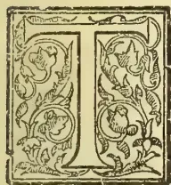

THE Surveyor-General's Report for 1902 is a particularly interesting document, and is well illustrated by three maps of the Island besides other explanatory diagrams. The maps show respectively

the mean annual rainfall, the mean rainfall during the South-West monsoon, and the mean rainfall during the North-East monsoon.

We call the following information from the report:—

The climate varies considerably in different parts of the Island, both as regards temperature and rainfall. In the lowlands the climate is tropical, but in the mountains in the interior the climate is found equal to many parts of Europe.

The mean temperature for the year 1902 was highest at Mannar and lowest at Nuwara Eliya, being 82.3° and 59.7° respectively.

At Colombo and Kandy the mean temperature was 81.8° and 75.4° respectively.

The mean daily range of temperature, i.e., the mean of the daily differences between the maximum and minimum temperatures, was highest at Ratnapura, having been 20.2°, and lowest at Galle, 8.7°

The differences recorded at Colombo and Kandy were 12.7° and 15.8° respectively.

The absolute range or differences between the

highest and lowest temperature of the air recorded during the year was greatest at Nuwara Eliya and lowest at Galle, having been 30.7° and 12.5° respectively.

The absolute difference at Kandy was 24.5° and at Colombo 19.0°.

The hottest station, taking the mean temperature of night and day all the year round into account, was Mannar (82.3°). The coolest Nuwara Eliya (59.7°). Colombo and Kandy were 81.0° and 75.4° respectively.

The deficiency in rainfall reported in 1901 was more than made up for during 1902. The first three months of the year and the months of October and November were abnormally wet all over the Island. October and November especially shewed large excess, the most remarkable being 17 inches in October on the West and over 12 inches in November on the East coast above the average. During the year the whole Island has received from 14 to 30 inches more than the average for the past 33 years, the only exception being a small patch in the south part of the Uva Province with 2½ inches below the average.

The following figures give the mean annual rainfall of the chief towns in various parts of the Island:—Colombo, 88.77; Galle, 91.72; Hambantota, 37.11; Batticaloa, 58.17; Trincomalee, 63.45; Jaffna, 45.47; Mannar, 38.59; Puttalam, 46.98; Anuradhapura, 54.47; Kurunegalle, 84.71; Kandy, 82.16; Nuwara Eliya, 94.44; Badulla, 76.93; Ratnapura, 151.39.

473------------------------------------------------

436Supplement to the "Tropical Agriculturist."[DEC. 1, 1903.RAINFALL TAKEN AT THE GOVERNMENT  
STOCK GARDEN FOR NOVEMBER, 1903.

<table border="1">
<tbody>
<tr>
<td>1</td>
<td>Sunday</td>
<td>...</td>
<td>Nil</td>
<td>16</td>
<td>Monday</td>
<td>..</td>
<td>12</td>
</tr>
<tr>
<td>2</td>
<td>Monday</td>
<td>...</td>
<td>14</td>
<td>17</td>
<td>Tuesday</td>
<td>...</td>
<td>10</td>
</tr>
<tr>
<td>3</td>
<td>Tuesday</td>
<td>...</td>
<td>07</td>
<td>18</td>
<td>Wednesday</td>
<td>...</td>
<td>Nil</td>
</tr>
<tr>
<td>4</td>
<td>Wednesday</td>
<td>...</td>
<td>24</td>
<td>19</td>
<td>Thursday</td>
<td>...</td>
<td>04</td>
</tr>
<tr>
<td>5</td>
<td>Thursday</td>
<td>...</td>
<td>05</td>
<td>20</td>
<td>Friday</td>
<td>...</td>
<td>Nil</td>
</tr>
<tr>
<td>6</td>
<td>Friday</td>
<td>...</td>
<td>11</td>
<td>21</td>
<td>Saturday</td>
<td>...</td>
<td>Nil</td>
</tr>
<tr>
<td>7</td>
<td>Saturday</td>
<td>...</td>
<td>36</td>
<td>22</td>
<td>Sunday</td>
<td>...</td>
<td>Nil</td>
</tr>
<tr>
<td>8</td>
<td>Sunday</td>
<td>...</td>
<td>04</td>
<td>23</td>
<td>Monday</td>
<td>...</td>
<td>14</td>
</tr>
<tr>
<td>9</td>
<td>Monday</td>
<td>...</td>
<td>11</td>
<td>24</td>
<td>Tuesday</td>
<td>...</td>
<td>Nil</td>
</tr>
<tr>
<td>10</td>
<td>Tuesday</td>
<td>...</td>
<td>14</td>
<td>25</td>
<td>Wednesday</td>
<td>...</td>
<td>Nil</td>
</tr>
<tr>
<td>11</td>
<td>Wednesday</td>
<td>...</td>
<td>Nil</td>
<td>26</td>
<td>Thursday</td>
<td>...</td>
<td>Nil</td>
</tr>
<tr>
<td>12</td>
<td>Thursday</td>
<td>...</td>
<td>Nil</td>
<td>27</td>
<td>Friday</td>
<td>..</td>
<td>Nil</td>
</tr>
<tr>
<td>13</td>
<td>Friday</td>
<td>...</td>
<td>Nil</td>
<td>28</td>
<td>Saturday</td>
<td>...</td>
<td>Nil</td>
</tr>
<tr>
<td>14</td>
<td>Saturday</td>
<td>...</td>
<td>Nil</td>
<td>29</td>
<td>Sunday</td>
<td>...</td>
<td>Nil</td>
</tr>
<tr>
<td>15</td>
<td>Sunday</td>
<td>...</td>
<td>09</td>
<td>30</td>
<td>Monday</td>
<td>...</td>
<td>Nil</td>
</tr>
</tbody>
</table>

Total in....1.75

Mean in.... .06

Greatest amount of rainfall in any 24 hours  
from 6th to 7th=.36 inches.

No. of days in which rain fell—14 days.

ALEX. PERERA.

OCCASIONAL NOTES.

Among our visitors during October was Mr. B. C. Basu, Assistant Director of Agriculture, Assam, who came on official duty with a view to acquainting himself with the cultivation and manufacture of Cocoa, Cinnamon, Citronella, Pepper and Cardamoms. Mr. Basu, to whom we rendered all possible aid, was a distinguished student of Cirencester Agricultural College.

Under the head of Cocoa in the return of imports into the United States, the U. S. Department of Agriculture Year Book for 1902 gives the following information:—Cocoa, crude and leaves and shells of 45, 924, 353 pounds imported in 1901. Whatever could this mean? There would appear to be confusion between coco (nut), cocoa, and coca!

In view of the local beliefs in the existence of gold in the Island, it is interesting to find (vide *Scientific American* of May 2nd) that an electric contrivance has been invented by Messrs L. Draft and A. Williams of Ealing, England by the use of which gold, tin, silver, copper, or iron bearing reefs could be accurately located. Numberless experiments are reported to have been made, and all are said to prove that the invention is not an imaginary thing but a solid fact.

The following interesting note on the botany of Tobacco is given by Mr. R. S. Neville (tobacco expert) in the *Queensland Agricultural Journal*. Of the 50 different kinds all except two are indigenous to America. *N. suaveolens* is native to Australia, and *N. fragrans* to New Caledonia.

The best are given as. (1) *N. tabacum* of which there are two species, *Macrophylla* (Maryland) and *Angustifolia* (Virginia). Of these there are several varieties including the famous tobacco of Cuba and Manilla. To the second class belongs *Latakia* tobacco. (2) *N. rustica* is Hungarian tobacco cultivated largely in Europe, Asia and America. There is a large and a small leaved variety, both producing good tobacco. (3) *N. persica*, a form of *tabacum* produced by climatic influence. (4) *N. crispa*, a species grown in Syria and along the Mediterranean. (5) *N. repanda*, a Mexican species whose small leaves give the peculiar aroma to Mexican cigars.

We have had pressing enquiries from certain quarters regarding the identity of a tree called Massoy or Meswi, and for the information of those concerned we have pleasure in giving its botanical name (for which we are indebted to Mr. Ridley of the Singapore Botanic Gardens) viz.,—*Cinnamomum Xanthoneurum* (Blume), a species which Mr. J. C. Willis, Director, Royal Botanic Gardens, Peradeniya, informs us is native to New Guinea.

THE NEW ENTOMOLOGY.

Among recent visitors to the Island was Mr. George Compere, Entomologist to the State of Western Australia. Mr. Compere is an Entomologist of the new school who has little faith in kerosene emulsion, arsenical insecticides or fumigation, but believes in making use of the natural enemies of plant pests to destroy them. His theory that every insect has its natural enemy is not a new one that has yet to be proved, for Mr. Compere has been working for many years on this line and demonstrate the soundness of his theory over and over again till it is now a recognised "cult." His name is always associated with that of Mr. Koebele who did so much to save the fruit gardens of California, while his work in connection with the "red scale" is interesting enough to be referred to, as giving some idea of the boundless enthusiasm of the man. The facts are culled from an official report by the Quarantine Officer of the State Board of Horticulture U. S. A.

Australia and the adjacent islands had been twice ransacked by Mr. Koebele and once by Mr. Compere in the search for an enemy of *Aspidiotus auranti*, but in vain. Mr. Compere was then directed to visit the Orient and found evidences of internal parasites on the scale at Hongkong, but discovering that there was no suitable tree to send to California, he ventured into China, in spite of the 'Boxer' trouble, and at last came upon a little orange tree slightly infested, and observed the small chalcid flies depositing their eggs in the scales. He purchased the tree, carefully dug and boxed it, and shipped to San Francisco. Thus was the red scale suppressed in California.

Hailing originally from the latter country, Mr. Compere has for some years been a resident of Perth, Western Australia; but this last statement is hardly accurate, for while his residence is there, he has been more abroad than at home.

474------------------------------------------------

DEC. 1, 1903.]Supplement to the "Tropical Agriculturist."437

On his previous tour Mr. Compere left Perth in October, 1902, and returned in August, 1903, after visiting Sydney, Manila, the Philippines, China, Japan, California, the United States, England, Spain, France, and Italy.

Since then another prolonged tour was undertaken, and Mr. Compere, having come from India, was on his way back to Australia. In Ceylon, where he spent two days, our visitor found much to interest and occupy him in the Government Stock Garden, (established in connection with the School Garden scheme), and was able to secure a number of specimens of fruit flies and other insects damaging the crops being raised there. Mr. Compere will no doubt make reference to such work as he accomplished in Colombo in his report on his present tour, and we shall look forward to the publication of this report in the pages of our "exchange," the *Journal of the Department of Agriculture*, Western Australia. Mr. Compere's visit was full of interest to us, as he had so much to say regarding the latest developments in his interesting work, which he enters into with a zest and enthusiasm that is not often met with even in a scientific expert, carrying out every detail with his own hand, however unpleasant and trying the circumstances.

---

#### VETERINARY NOTES.

---

Dr. R. A. Stoute, Veterinary Surgeon to the Government of Barbados, has contributed the following suggestions for improving the breed of Zebu cattle in respect to their qualities as beef-producing animals:—

There are three characteristics possessed by Zebu cattle which it would be well to develop in any beef breed.

1. (1.) Smallness of bone in proportion to size.
2. (2.) Immunity from ticks.
3. (3.) Power of obtaining nourishment from hard, coarse fodder.
4. (4.) Great foraging power.

Were I asked the best means of producing these characteristics, or at least which I considered the best means, I would suggest the following:—

Obtain as nearly perfect a bull as possible from the breed decided on, (presumably Short horn, Hereford or Polled, Red or Black), select some pure-bred Zebu cows, as nearly approaching the build of a beef breed as possible. Cross these with the bull decided on. Castrate all bull calves and divide the heifers into three lots of four calves each. One lot of about four calves I would keep at pasture day and night; lot No. 2, I would keep at pasture during the day, and pen or tether at night; lot No. 3, I would keep always tied. Keep a record of weights taken about every month, and from these different lots only breed from those that had developed well, and had the three characteristics wanted, accompanied by form of father. Breed these to same bull, as the idea of in-and-in breeding has lost the dread it once had. In fact some breeders maintain this is the best way to reach a point of excellence. Treat calves from these in the same manner in which the mothers were treated. Again breed to

the same bull and continue until  $\frac{1}{4}$  Zebu and  $\frac{3}{4}$  pure breed has been reached. From the last lot of calves I would keep a few of the best marked as brood bulls.

Mr. Thomas Newberry, M.R.C.V.S., writing to the October number of the *Veterinary Journal* says with reference to Pasteur's Vaccine for the prevention of "Blackleg" that he used the "Blacklegine" in the worst affected districts during the present year, and (to quote his own words) "in each case where animals on the farm were already dead or dying, I vaccinated what apparently remained healthy, and in every instance the operation secured immunity from attack, and 'greater evil' was seen no more."

It is stated on the authority of Professor Nocard that the *Magana* of South Africa and the *Surra* of India are identical and due to the presence of a parasite (trypanosoma) in the blood. In Africa the disease is propagated by the tsetse fly, while in India the agent would appear to be the *tabanus tropicus*. The recent outbreak in Mauritius is said to have been due chiefly to *Stomoxys nigra*.

M. Nocard's last public utterance was in support of the movement to establish classes for Veterinary Surgeons also in the school of Tropical Medicine at Liverpool, and it is satisfactory to be able to state that the movement has now taken practical shape, and the Prospectus and Course of Instruction have already been published. Those who doubt the utility of such a measure should read Professor Nocard's speech on the occasion referred to.

We have received a copy of Bulletin No. 2 of the Department of Agriculture of the Transvaal entitled: "Some Diseases of the Horse in South Africa." The author of this number is Dr. Thieler, the Government Veterinary Bacteriologist who ably deals with the various forms of diseases and their treatment.

Mr. William Hutchison, late Stock Inspector in Queensland, who writes to the September number of the *Cape Agricultural Journal* is a strong advocate of "Spaying", the prejudice against which he attributes to the losses resulting from unskillful operating. Reading Mr. Hutchison's letter, a summary of which we give below, we are inclined to recommend that something might be done to test the value of spaying among the Government Dairy Stock. We do not know whether the operation has ever been performed on cattle in the Island, though we have heard of a Ceylonese who returned to the Island after spending some years in Australia, as thoroughly qualified and able to show how it is done.

One of the chief advantages of spaying cows not up to dairy requirements is, says Mr. Hutchison, in the direction of raising the standard of production, as the cows can be kept in milk to the end of the season without the trouble of getting into calf again, and if sold will bring much higher

475------------------------------------------------

438Supplement to the "Tropical Agriculturist."[DEC. 1, 1903.]

prices for fattening purposes. If retained, the animals will fatten readily. Under present conditions the system of selling deteriorated cows tends to depreciate the value of real good milkers and perpetuate the breed of inferior dairy cattle. Having spayed many thousands, says Mr. Hutchison, I can speak from practical experience. I have spayed stock from six months to seven years old and over on an average 150 per day, day after day, . . . with a loss of  $2\frac{1}{2}$  per cent in hot and cold weather all the year round. This, we must admit, is pretty extensive experience.

### KAPOK.

[The following paper on one of our commonest trees, too little appreciated locally, is worthy of perusal by landowners and planters generally. The native names for the tree are "pulun" and "imbul," and the word "Kapok" (said to be a Malayan name) should not be confounded with "Kapu" the local name for spinning Cotton derived from varieties of *Gossypium*. We take over the article from the *Queensland Agriculturist*.—Ed. A. M.]

Kapok, so well known as a soft material largely used in the upholstering trade for stuffing chairs, &c., and equally largely employed for stuffing mattresses and pillows as a substitute for feathers, hair, &c., is the product of a kind of cotton-tree (*Bombax pentandrum* or *Eriodendron aufractuosa*), much grown in Java of late years for the sake of the fruits which produce the fibre, which meets with a ready sale in European markets in large quantities. Dr. James Neish, M.D., contributes an interesting article on this product, adapted from the *Journal d' Agriculture Tropicale* to the *Journal of the Jamaica Agricultural Society*. Amongst other things we read that of late years the journals and reviews of Java have on different occasions shown the profit which could be drawn from this tree. A very good article, written with this object, appeared in the *Indische Mercur*, in 1901; and this article has certainly not been without influence on the constantly increasing cultivation of kapok in Java. Here are some extracts:—"Even before the fruits of the kapok have arrived at maturity, many Chinamen seek to get hold of them, if need be, by buying them. The importation into China must be exceedingly large, judging by the demand which is made for it in that country. About 10 cents is paid for 100 dried fruits. A Dutch cent is the hundredth part of a florin; accordingly, the cent is worth one-half an American cent or about one farthing. An adult cotton-tree, growing from a cutting, yields full 5,000 fruits. Trees grown from seedlings produce more. This tree grows rapidly, and begins to bear from the second year. It requires no attention, and grows even on very poor soils, and is not exacting as regards water." An energetic Chinaman in Solo (Java) said, "If I possessed a concession, I would plant cotton-trees on it on a large scale, and it would be seen if I did not draw more profit therefrom than those who spend thousands of florins on the ordinary

cultivations, the expenses of which consume all the profits. If cotton-trees were planted on the bare mountains of the South, I am certain that the operation would be advantageous." These words were brought to the attention of the planters. In 1888, 1889, and in 1890, the importations into China must have been considerable, but the Chinese kept the matter secret for they fear the competition of European merchants.

At the present time there are in the central parts of Java some fifty plantations whereon the kapok is harvested as an accessory product, on some even as the principal product, whilst ten years ago five only gave attention to it.

According to official figures, the exportation from Java rose from 1,888,639 kilos to 2,777,467 kilos in 1896. Of 38,586 bales which were exported in 1896, 25,161 were sent to Holland, 8,159 to Australia, 745 to China, and 216 to America.

The yield of kapok per tree per annum, it is said, varies from one to 50 kilos (2 lb.  $3\frac{1}{2}$  oz. to 111 lb.) (According to Dr. Warren de la Rue, the kilogramme is equivalent to 2.2046213 lb. of 7,000 grains; usually the kilo is reckoned at 2 lb.  $3\frac{1}{2}$  oz. avoi.) Dr. Greshoff has ascertained the average weight of the dry fruit to be 26 grammes and 80 centigrammes; the fluff or kapok weighed 4 grammes 20 centigrammes; the seeds (to the number of 175) 10 grammes 20 centigrammes; the pod weighed 10 grammes 30 centigrammes, and the stalk weighed 1 gramme 20 centigrammes.

In the cleaning of kapok in Java, use is made at the present time of small iron mills, each giving two piculs of cleaned merchandise for a day's work. (The picul in Java weighs 61 kilos 220 grammes, about 137 lb.) Each mill employs about four women to receive the merchandise, to fill up the bags and carry them into the "godowns" or storehouses, where they are pressed into bales. (Generally, the bales weigh 37 kilos for the cleaned kapok and 80 kilos for that which is not cleaned.) Improved machines for cleaning kapok are made by Thomas Barraclough, of 20, Bucklersbury, London. It should be remembered that for export it is not advisable to press the kapok excessively; this would impair the elasticity of the fibres.

In 1898 the quotations in Holland were—Extra cleaned,  $39\frac{1}{2}$  cents to 36 cents the half-kilo (nominally, 1 lb.) (10d. to 9d. per lb.). Good cleaned, 31 to 33 cents ( $7\frac{1}{2}$ d. to  $8\frac{1}{2}$ d.). Cleaned, second quality, 26 to 20 cents ( $6\frac{1}{2}$ d. to 5d.). Good uncleaned,  $8\frac{1}{2}$  to  $9\frac{1}{2}$  cents ( $2\frac{1}{2}$ d. to  $2\frac{3}{4}$ d.). Ordinary, uncleaned, 6 to 7 cents ( $1\frac{1}{2}$ d. to  $1\frac{3}{4}$ d.).

In Java the cotton-tree furnishes an important by-product in the seeds, which are purchased by the Chinese with a view to extract the oil, which is used in the adulteration of the oil of peanuts. At Tegal and Kediri the preparation of this oil is carried on at some tobacco plantations. The proprietor of Wedari oil factory (in Japan) bought from the natives in 1895, about 4,000,000 of kapok fruits, and obtained from them 530 piculs of cleaned kapok and 1,000 piculs of seeds, which, added to 3,000 other piculs bought from the

476------------------------------------------------

DEC. 1, 1903.]Supplement to the "Tropical Agriculturist."439

Chinese dealers, served for the preparation of 400 piculs of oil and 3,430 piculs of oil cake.

In Java the cotton-tree is held to be an excellent support for pepper plants, cubebs, &c. It is also employed as a shade tree in the coffee plantations. Again, in India it constitutes naturally excellent living telegraph posts, on account of the two following properties:—The wood is not attacked by the termite-ants, whilst, on the other hand, the horizontal and widely separated branches do not interfere with the wires.

### NATIVE BELIEFS REGARDING THE HAIRMARKS ON CATTLE.

[J. D. E. HOLMES, M.A., M.R.C.V.S.]

#### Lucky Marks.

(1.) *Tamani Suli*.—A ridge of hair along the middle line of the back about its centre. "Tamani" means a herd, and this mark indicates that the purchaser will acquire a large number of cattle.

(2.) *Irattai Kavam* consists of two ridges of hair, one on each side of the brisket. A single hairmark on one side of the brisket (*Ottaikavam*) is most unlucky, and forebodes the loss of all other cattle in the house and also the death of the purchaser.

(3.) *Bhashicam Suli* is a crown on the forehead above the line of the eyes. "Bhashicam" is the name of the wreath worn by bride and bridegroom during the marriage ceremony. If the purchaser be a bachelor or widower, this mark indicates that he will marry soon. If the purchaser be a married man, he will either have the misfortune to lose his wife and marry again, or the good fortune to obtain two wives.

(4.) *Gopura Suli*.—A crown upon, in front of, or immediately behind, the hump. Considered a very lucky mark.

(5.) *Nir Suli* is a crown situated on the middle line of the back, just opposite to the opening of the urethra. Regarding this the saying is that "The family will either be reduced to eshes or swell like a river." The hairmark is thus of doubtful signification. An intending purchaser rather than incur the risk of evil consequences will avoid the purchase. The ryots say that if a little earth be taken and rubbed on this hairmark the bullock will void urine.

(6.) *Irangupirán* (ascending centipede).—A ridge of hair on the hind quarters curving up to the back is a sign of coming prosperity. If the ridge does not curve upwards to the back it is called *Irangupirán* ("descending centipede"), and indicates adversity to the purchaser.

(7.) *Lakshumi Suli* is a hairmark situated on one side of the neck, at a distance from the dewlap. "Lakshumi" is the goddess of fortune. This is considered to be the most lucky hairmark, but is rarely met with. A bullock with such a mark is highly esteemed, and fetches a long price.

#### Unlucky Marks.

(1.) *Mukkanti Suli* or *Agni Suli*.—Three crowns on the forehead arranged in form of a triangle

said to represent the three eyes of Siva, of which the one in the forehead will, if opened, burn up all things within the range of vision.

This mark forebodes ruin to the purchaser.

(2.) *Kudai-mél-kudai*.—Two crowns one over the other on the forehead predict disaster after disaster.

(3.) *Ottai-Kavam*.—A single hairmark on one side of the brisket close to the middle line forebodes loss of all other cattle in the house and the death of the purchaser.

(4.) *Vilangu Suli* (fetters).—Hairmarks on the fetlocks of either pair of legs indicate that the purchaser will soon be in gaol.

(5.) *Pádai Suli*.—Two ridges of hair on the back on either side of the middle line; indicates that the purchaser will soon need a coffin.

(6.) *Irangupirán* (descending centipede).—A ridge of hair on the hind quarters not curving upwards to the back indicates adversity.

(7.) *Nágappadam*.—A ridge of hair on the haunch spreading out at one end like the hood of a cobra. If the direction of the hood is upwards it is termed *Munnágam*, and if downwards *Pinnágam*.

(8.) *Tattu Suli* (obstacle).—A crown situated on the back between the points of the hips; indicates that any business undertaken by the purchaser will fail.

(9.) *Tudaippa Suli*.—A hairmark on the side of the tail near the root, sometimes extending as ridge over the back.

#### Other Superstitions regarding Cattle.

A bullock whose tail has the root of the tuft of hair situated above the hock is said to have "E'ru-val," and to bring ill-luck. A cow having "E'ru-vál" is not objected to.

A bullock having white hair, skin, horns, and hoof is considered of weak constitution, and not to be purchased.

A black bullock is generally considered a rogue. If not a rogue, he is considered of great value according to the saying—"A black bullock is but the fourth of a bull, but if he be guileless he is a bullock and a quarter."

A bullock with numerous small spots over the body, "like a deer," is considered very lucky.

The form of the horns is supposed to indicate many things. The different forms of horns go by different names. For instance, *Mádkakkombu* means horns bent backwards. This is a good sign in a cow. The saying is—"Let any man who does not know how to select a cow purchase one with horns curved backwards."

Straight horns, *Silái*, are liked. Horns pointed forwards, *Kópadá*, indicate spirit. Twisted horns, *Churutai*, are considered good. Horns which are hollow and present white patches, looking as if they were rotten, "*Kollikkombu*," are considered very disastrous. Horns with white tops, *Pún-kombu*, are also bad.

If a cow at the time of purchase voids urine, it is considered a very good omen, but if she passes dung it is a bad omen. The reverse is the case with a bullock.

A bullock which fails to cut the fourth pair of permanent incisors is called *A'rukatti-madu*, and is considered lucky, that is, "One who purchases

477------------------------------------------------

440Supplement to the "Tropical Agriculturist."[DEC. 1, 1903.

a bullock with only six permanent incisors will become rich enough to keep an elephant."

A bullock which cuts only seven permanent incisors is unlucky to the owner. The saying is that one who purchases such a bullock should have his coffin ready.

#### NOTE ON A COMMON FIBRE PLANT.

A correspondent, writing to us on a matter of business, asks if sufficient encouragement is being given by the local authorities for developing the indigenous resources of the Island. He says that enough is not being done to make the most of what already exists, and too much attention is given to what is new and foreign. He instances the case of fibres, and asks why attempts are not made to encourage the cultivation of fibre plants already found growing in the Island.

We quite agree with our correspondent that much more might be done in the way of growing such plants as *Crotalaira Juncea*, the Sunn Hemp of India and Hana of Ceylon. The fibres are used to a fairly large extent in the manufacture of fishing nets, and for this purpose it is cultivated in parts of the Island, as, for instance, the Chilaw district. We have little doubt that the plant would be more largely cultivated if the people were made aware of the fact that there is more than a local demand for the fibre.

Not long ago the Burman Government sent a two pound sample of the fibre to the Imperial Institute with a request that the report on the fibre might include its value in the London market, together with any remarks that could be given as to how the quality of the fibre could be improved.

Mr. Collyer, the fibre expert, stated that the fibre should sell freely in the London market, and that its cultivation should be encouraged as much as possible. In his opinion the sample was strong, bold and clean, though of a somewhat dull colour, its length varying from 36 to 40 inches. He fixed the value of the fibre as represented by the sample sent £16 to £17 per ton, but advised that it should be better cleaned than the sample, and should also be brighter in colour; and added that if more carefully prepared, its value would be from £2 to £3 per ton higher than the price quoted.

Messrs. Puddy & Co. confirmed by independent reference to the statements of Mr. Collyer. They find the fibre to be of fair quality, and state that it might be brighter and longer with advantage; but that it is saleable in the London market, and that if they had at the present time a shipment on hand, they could secure £16 to £16 10s. per ton for it.

The late Sir Frederick Abel had the fibre examined in detail by the comparative process adopted in the Research Department of the Institute, and this examination went to confirm the opinion expressed by the practical experts in regard to the good quality of this fibre.

#### HOW TO GET RID OF TICKS ON CATTLE.

The following is taken from a report of the proceedings of the Jamaica Agricultural Society held on February 21 last:—

The Hon. Oscar Marescaux gave an interesting account of the method successfully adopted by him to get rid of ticks on cattle. 'I am pleased,' he said, 'to see that the Agricultural Society are seeking information as to the possibility of destroying the plague of ticks which renders our island a pest to ourselves, to our friends and visitors, and especially to our animals; and as I have succeeded in ridding my property of the pest, you may like to know how this has been done.'

'Cherry Garden in St. Andrew consists of nearly one thousand acres of land—gentle slopes, —mountain sides—some cultivation, but principally grass lands. I have cattle and horses, from 80 to a hundred of the former and 8 to 10 of the latter. You can or any lady can walk over any part of the property—short bite, Guinea grass, gullies, ruinate—without picking up a tick, and my stock are free from them, though occasionally a weak cow may be seen with a few which are at once destroyed.'

'Some years ago ticks were a plague on Cherry Gardens, and I determined to get rid of them. My cattle were constantly driven in the pen, and there the cattle men and boys were made to pull off the ticks, placed them in a calabash, and when nearly full to burn them in a fire kindled in the pen for the purpose. It was a tedious job to get my people to do this. They all believed it was useless work, for the ticks came out of the ground. For a long time little impression was made on the appearance of the cattle, but little by little the ticks were less and less numerous, and now, as I have said before, the place is practically free, from them.'

'I was informed that the tick will not reproduce unless he has sucked blood. I, therefore, aimed at burning all those who had thus feasted. The tick does not travel—the fertilized female drops from her prey, and has her young, commonly known as grass lice. When she drops, these grass lice climb up a grass stalk and cluster up at the top like bees. If a living creature in passing brushes close to them, they soon scramble over it, and endeavour to feed on it; but if nothing disturbs them they simply die.'

'The process I have adopted is tedious, especially on account of the passive resistance of the people one employs; but it is efficacious, and I hope you may induce others to adopt it.'

Mr. Fawcett stated that his experience was, in districts where Indian cattle were bred, the ticks were less. Ticks did not attack Indian cattle when they were in good condition, as much as other breeds of cattle.

Dr. Pringle said he had adopted a similar method to that followed by Mr. Marescaux; and with success. Ticks were now very much less on his properties than they were two years ago. It was a very good plan,

478------------------------------------------------

DEC. 1, 1903.]Supplement to the "Tropical Agriculturist."441

Mr. Fursden said that the plan was good, and if followed up would diminish the tick plague. But how were they going to compel everybody to follow the plan and do likewise?

Mr. Olivier said the only thing they could do was to make the method of destroying the ticks as widely known as possible. No legislation was needed. Anybody, whose cattle had ticks should simply pick them off and destroy them. He moved that Mr. Marescaux's letter be printed in the *Journal* along with the opinions of the members.

This was agreed to.

### THE CURING OF CARDAMOMS IN INDIA.

So much has been written about the future of the Cardamom, that it is interesting to find an account of the preparation of Cardamoms for the market in India. The following is a description given in a paper on Cardamom Cultivation in the Bombay Presidency by Mr. J. W. Mollison, head of the Indian Agricultural Department. [It is stated that the character of the water used has a material influence on the capsules, the water of some wells having special virtues for bleaching and improving the flavour of the Cardamoms.]

"Water from the well is drawn and taken to a suitable room. A large earthenware vessel is filled with the water, into which pounded *antalkai* (the fruit of soap-nut, *Sapindus trifoliatum*) and *sikikai* (*Acacia concinna*) in the proportion of 2 lbs. of the former to  $\frac{1}{4}$  lb. of the latter for about 5 gallons of the water are placed and well stirred. Another vessel contains a strong solution of common soap in the water of the well. The mixture containing 2 lbs. of pounded soap-nut and  $\frac{1}{4}$  lb. of *sikikai* suffices for 5 maunds (1 maund = 26 lbs.) of cardamoms.

"Two women seated on tripods place a wide-mouthed earthenware vessel between them, the washing tub as it may be styled. Eight *lota*-fulls of the well water (a large supply of which is kept at hand) are poured into the tub and three *lota*-fulls of the soap-nut or *sikikai* mixture. The *lota* holds about one quart of water.

"The tub then receives a basketful of cardamoms weighing 10 lbs. The two women plunge their hands into the tub and stir vigorously for about one minute and then suddenly rest for about the same length of time, and again stir for another minute. A thick lather results. This completes the first washing. The cardamoms are baled out by hand and transferred to a basket, where they remain a few seconds till the water has drained off. The basketful is received by two other women sitting on tripods with a washing tub between them. This tub contains 7 quarts of the pure water, 1 quart of the soap-nut and *sikikai* mixture, and one of the soap solution. The cardamoms are stirred as in the first washing with the same interval of rest and are baled out into another basket. When the water is drained off, the washed cardamoms are thrown on to a mat. The heap becomes large after a few hours' work. A woman is exclusively in charge of it and con-

tinually sprinkles the well water over it. She is relieved at night by another woman, who sprinkles the heap till morning once every half hour.

"Next day when the sun has risen, the heap is carried to the flat roof of the house, and the cardamoms are spread on mats for four or five hours to dry. The next operation is to nip off the short stalks. This is done by women sitting in the house. Each woman has a large pair of English scissors. She squats on the floor and rests her right hand which holds the scissors on the floor and feeds the scissors with her left hand. The pace at which this nipping is done astonished me. The stalk is very small, and care must be taken to cut it off without injury to the cardamom itself. I saw an old woman nip 90 cardamoms in one minute.

"This done the sorting begins. The small ill-shapen cardamoms are separated and only the well-rounded ones packed for export to distant markets. A woman sorts a maund per diem.

"I must now return to the first washing. The mixture in the tub, after the first basketful has been baled out, is replenished by two or three quarts of the well water and a second basketful washed. The tub is then emptied and a fresh mixture made. The mixture for the second washing also does duty for two basketfuls. The women who wash the cardamoms are paid 3 annas per diem. An ordinary wage is  $1\frac{1}{2}$  to 2 annas. The night-watcher receives 4 annas. The nipping is paid for by the piece at the rate of  $\frac{1}{2}$  anna per *padi* (10 *padis* = 1 maund = 26 lbs.). It is said that an expert can earn  $2\frac{1}{2}$  annas per diem. She must clip 13 lbs. therefore; all other hands employed are paid by the day at 2 annas.

"Besides this bleaching now-a-days cardamoms are starched. Starching was first introduced at Sirsi where bleachers had recourse to it, as they had to compete with bleachers at Haveri, who were experts in the art of bleaching, and who had established their fame as such. The starched cardamoms look whiter than the ordinary bleached cardamoms of Haveri, and the bleachers of Haveri have therefore now taken to starching. The starch is prepared by pounding together rice, wheat, and country soap with buttermilk. The paste is dissolved in a sufficient quantity of water and the solution is sprinkled over the cardamoms to be starched as they are being rubbed by the hand."

### GENERAL ITEMS.

The *West Indian Bulletin* recommends Jeyes disinfectant for screw worm in young calves. It should be supplied with a little brush which could be got within the orifice of any sore. The best plan is to dress the calves as soon as they are born, to keep off the flies and anticipate the evil. If already attacked, the worm should be killed with Jeyes' fluid, the wound washed with soap and water, and a second application of the fluid given.

The *Journal of the Society of Arts* recommends the sweet potato as a suitable substitute for the

479------------------------------------------------

442Supplement to the "Tropical Agriculturist."[DEC. 1, 1903.

English potato in times of scarcity. As it is, supplies of the latter have to be drawn from France, Holland, Germany, Belgium, and even the Argentine and other places. In this connection, it is interesting to note that trial shipments of sweet potatoes have been made from the West Indies.

The *Agricultural News*, Barbadoes, points out that Cocoa canker—as the bark disease has come to be called—is not so new a disease as is generally thought, and quotes thus from Porter's *Tropical Agriculturist* (1833):—"Cocoa trees are likewise subject to a disease which shows itself in the form of black spots or blotches on the bark and which as soon as they appear should be carefully cut out, or the trees will quickly die." Verily, there is nothing new under the sun!

The *Agricultural News*, Barbadoes, gives the following analysis of sweet potato meal by Prof. Church: Water at 100° C, 12.9, ether extract (oil &c.) 1.1, fibre 2.4, Nitrogenous matter (N=584) 3.7 (albuminoids coagulated by phenol-method 3.4), ash 2.4, starch, sugar, gum, &c. by difference 77.5. The sample was of meal prepared by Dr. Rat by the aid of machinery.

The dried leaves of the screw pine are used in Dominica for making hats which are sold at for 6d. to 1/6 each, according to quality of workmanship. In Ceylon the leaves of the wild date (*Phoenix zeylanicum*) take their place.

The great disparity of price in Jamaica and Cochin ginger (in favour of the latter) is explained by the fact that the former lacks careful grading which tells against it, for buyers feel they can depend on Cochin ginger to be what the marks indicate, and prefer to purchase an article of known quality. It is authoritatively asserted that "Cochin ginger is actually of less value than Jamaica," and yet the London buyers will pay more for it!

The three best materials for use in storing sweet potatoes have—by actual trial—been found to be cotton seed hulls, dry sand, and cotton seed, in the order named. Storing in straw is condemned.

We read in an exchange that Mr. Hoffmann Bang, a Dane, has erected machinery at St. Thomas, in the Danish West Indies, for the manufacture of dried bananas for export in closely packed handy cardboard boxes.

The mosquito (*Culex Pungens*) is said by Dr. L. O. Howard to have a minimum life-history period of ten days. In the case of small fruit flies (*Drosophilila* &c.) which attack fallen fruit the life-history is even shorter, and some reared on a mango completed the cycle in eight days.

To freeze without ice or acids, here is a good recipe:—1 lb. of ammonium chloride or sal ammoniac finely powdered is very completely mixed with 2 lbs. nitrate of potash or saltpetre and labelled "Powder No. 1." Powder 3 lbs. best Scotch Soda and label "Powder No. 2." For use take an equal break of No. 1. and No. 2, stir together, place in an ice pail round the vessel to be cooled and pour rather less cold water than is required to dissolve the whole. If, for instance, a quart of No. 1 and No. 2 are taken, they will require about one quart of water to dissolve them. The temperature will fall to about 30° below "freezing point," which is the extent of cold required to freeze a liquid. The amount of water used is of the greatest importance, too much will consume the cold produced. The ice pail may be of wood, but the vessel with the liquid to be frozen should be of pewter or other metal, and the mixture should surround the vessel nearly to the top.

480------------------------------------------------

# \* The TROPICAL AGRICULTURIST \*

## ∞ MONTHLY. ∞

XXIII.

COLOMBO, JANUARY 1ST, 1904.

No. 7.

### A SKETCH OF THE CEYLON PEARL FISHERY OF 1903.

(BY EVERARD IM THURN, C.B., C.M.G., LIEUT.  
GOVERNOR OF CEYLON.)

(*In Spolia Zeylanica.*)

Part I.

THE HARVEST OF THE SEA.

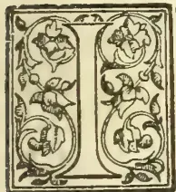

It is difficult to imagine a more picturesque incident than the "harvest of the sea," when pearls are the crop gathered in. The scene is in the shallow tropical sea which is shut in by Ceylon on the east, the coast of Southern India on the west, and on the north by "Adam's Bridge," a reef partly just awash and partly cropping up in the form of a chain of islands which connects Ceylon with India. In the Gulf of Mannar thus formed it was found at least some 300 years before Christ that there is an abundant growth of pearl-producing mussels—locally called oysters. The banks or "paars" on which these bivalves grow lie from 5 to 10 fathoms below the surface of the water. Thither for 2,000 years, when the rumour goes abroad that the harvest is ripe, divers have come together from the Red Sea and the Persian Gulf and the coasts of India, as well as from Ceylon itself, to gather in the Orient pearls which have been distributed to adorn stately men and beautiful women in many a function throughout the civilized as well as the barbaric world.

The coast lands of Ceylon nearest to the oyster paars is for the most part very sparsely inhabited, and, like the opposite coasts of Southern India, consists chiefly of rolling sand plains, with here and there a little coarse grass or low sparse vegetation or even occasional scrubby jungle. For some mysterious and hitherto unexplained reason this harvest of the sea has always been an uncertain one, apt suddenly, and at any stage in its growth, to disappear; and often it is many years before it re-appears. At most times of the year, and sometimes for years together when the oyster crop is known to have

failed, the adjacent shore is a desert in which a human being is rarely to be seen. But nowadays, and throughout the past century, as each November comes round, an official from Colombo visits the paars, takes up a certain number of oysters from each, washes out the pearls, submits these and the facts connected with them to experts, and the Ceylon Government thus decides whether or not there shall be a fishery in the following March and April.

#### THE EXTENSIVE NECESSARY PREPARATIONS.

If the decision is in the affirmative preparations have to begin at once. The fact that there is to be a fishery is made known throughout India and the Eastern world, and even in Europe. This is done partly by the prosaic system of newspaper advertisement, partly by that far more wonderful passing of the word from man to man which, as is now well known, can carry news across a continent with amazing speed. On land which is at the moment a desert, an elaborate set of temporary Government buildings have to be erected for receiving and dealing with many millions of oysters and their valuable if minute contents. Court-houses, prisons, barracks, revenue offices, markets, residences for the officials, streets of houses and shops for perhaps some thirty thousand inhabitants, and a water supply for drinking and bathing for these same people have to be arranged for. Lastly, but, in view of the dreadful possibility of the outbreak of plague and cholera, not least, there are elaborate hospitals to be provided.

After an interval of eleven years it was announced at the end of 1902 that there would be a fishery in the following spring. The difficulty of making the above-mentioned preparations in due time was enormously increased by the fact that so long an interval had elapsed since the last fishery, and that so few persons were conversant with what had to be done. Mr. Ivers, the Government Agent of the Northern Province, and his immediate assistants Messrs Horsburgh and Denham were, however, equal to the occasion; and when the time appointed for the commencement of the fishery came, a complete temporary town had sprung up as well and minutely ordered as are most permanent towns.

481------------------------------------------------

444THE TROPICAL AGRICULTURIST.[JAN. 1, 1904.]THE FISHERY FLEET.

A fleet of some 200 large fishing craft had gathered, and with the help of an occasional steamer from Colombo had brought together, chiefly from India but partly from Ceylon, a population which during the course of the fishery varied from about 25,000 to perhaps 35,000 or 40,000 souls—men, women, and children.

It was my great good luck to pay two visits of considerable duration to the camp and, especially as I had had considerable part in arranging for it, to see it thoroughly. Many men have written and many others will write of this camp and of the Ceylon pearl fishery generally, but I believe that I saw it from a point of view peculiarly advantageous for seeing and understanding its general effect; and this is my sole excuse for acceding to the request of my friend Dr. Willey that I should describe, as I saw it, this great effort of recovery of spoil from 1 ceylon deep in *Spolia Zeylanica*.

Another great advantage I had which has fallen to the lot of few other officials, and certainly never before to a Lieutenant-Governor with scientific leanings. On a suggestion made to me I gladly provided for the supply of diving dress and apparatus; and these being on the spot my innate curiosity induced me on several occasions to put on this dress and go down to visit the paars and see for myself how the oysters grow. I believe that Mr. Hornell, Captain Legge, and myself are probably almost the first persons to make use of the diver's dress for inspecting the bottom of the sea for purely scientific purposes; and some account of my own experiences may be not without use.

I have roughed it in so many places and so many ways, that after the idea of myself going down had once suggested and commended itself to me, I do not think that any qualms or doubts presented themselves.

FIRST EXPERIENCES WITH THE DIVER'S DRESS.

The sensation of being put into the dress is at first certainly rather trying. The weight is of course enormous and most oppressive, and I found that the operation of screwing up of the rivets fastening the very heavy helmet on to the rest of the dress was distinctly painful. Mr. Bartlett, professional diver, who valetted me on this occasion, certainly did his best to spare me as much inconvenience as possible. But a few months later when I was at the Maldive Islands with H.M.S. "Highflyer" and, moved by a desire to see for myself the wonderful coral forests and jungles and underwater cliffs of those atolls, I again donned the diver's dress, as supplied to His Majesty's ships, I found that both the weight and the painfulness of being screwed up were considerably less. I am assured that the equipment of the "Highflyer" is identical with those used in constructing the Colombo breakwater—it was one of these that I used at the peral fishery; but I am positive that for some reason the "Highflyer" dress caused me the less inconvenience, and if any scientific man wishes to engage in the enterprise of deep sea diving, I should strongly advise him before acquiring his dress to consult the naval authorities.

The dress once donned and one's heavily encumbered body once got over the side of the ship and on to the ladder, the rest is easy. All that is necessary is to keep one's feet well down when descending the ladder and until one is entirely under water. Neglect, or rather ignorance of this precaution on one occasion brought me into difficulties. Having seen the professional diver swing himself off the ladder instead of first going patiently down to the lowest rung, I thought I would do the same, with the result that I fell on my back into the water, and that the air distributed within the dress instead of being forced gradually up from feet to head, as would have been the case if I had gone down feet foremost, was forced to the front of chest and legs and kept me kicking on my back on the water.

NINE FATHOMS BELOW THE SURFACE.

After leaving the ladder feet downward pure passivity is to be recommended until one reaches the bottom. My first depth was 9 fathoms, but it certainly seemed to me to take a very long time to get down those 54 feet, and on the first occasion or two the pain in my ears was intense. I was told that the slower I went down the less acute would this pain be, but after various experiments I have not been able to make up my mind whether the longer endured but very slightly less acute pain is preferable to the quicker, sharper sensation. The most surprising thing to me was that as soon as the bottom was once reached all sensation of pain ceased,—it was perhaps overhelmed by the undoubted delight at the novelty of one's sensations and to exasperation at the small control one had at first over one's movements under that pressure of water. I could not by any effort keep my feet quite firmly on to the ground; and each twitch which the man who played Providence to me at the other end of the rope gave—doubtless in his nervous anxiety to guide me aright—had the unfortunate effect of throwing me over on to my back or my side or my face. Finally I found that getting about on all fours was the proceeding which gave me the greatest control over my own movements.

The light was wonderfully good, as a full green twilight, and I could distinctly see the ship 9 fathoms over my head. It is curious that at the same depth in different parts of the sea the quantity of the light varies considerably. This is probably due to the greater or less quantity of matter floating in the water.

THE PICTURESQUE SEA-BOTTOM.

The bottom where I first went down was a sandy, slightly undulating plain. Here and there at distances of a foot or so apart were small groups of from six to a dozen oysters, each group fastened by the byssus to a stone or piece of loose coral or dead shell; as far as I could see, no oysters were fastened to the actual bottom. Scattered about among the oysters on the sand were mushroom-shaped and other loose-growing corals, and here and there was a branched coral fastened to the bottom. The fishes and shrimps swam about utterly oblivious of one's presence, especially a lovely little ultramarine blue fish with a golden yellow tail. It was somewhat exasperating to throw an oyster at a fish and to find that the missile instead of going towards the fish dropped languidly to one's feet. Of big fish I hardly saw any, and of sea snakes, generally very plentiful in those parts, I saw only one, and that was while I was on my way down one day. Crabs were fairly abundant, and I came across a striking-looking—indeed vicious-looking—animal of this sort (*Rhinolambus contrarius*).

To one like myself who has as long as he can remember found a peculiar joy in seeing Nature from new points of view, it is pure delight to make one's way along the bottom of the sea, picking up shells, corals, starfish (very abundant), sea urchins, and a host of other things which had always before been to one lifeless "curiosities."

THE PEARL DIVERS AT WORK.

One of my chief purposes in going down was to see the divers actually at work. In but a few moments from leaving the ship and the world to which I had long been accustomed, I reached a quite new world and, as it seemed, one apart from all other human beings. Then from the gloom of the distance—it was easier to see upwards than for any distance along the ground—some big thing came rapidly towards one; it might have been a big fish, but as it came quickly nearer it proved to be a naked Arab swimming gently but rapidly towards me, his rope between his toes, and his hands and arms rapidly sweeping oysters into the basket which hung round his neck. I tried to speak, forgetting that my head was buried in my helmet, but he glided close past me without taking any more notice of me than did

482------------------------------------------------

JAN. 1, 1904.]THE TROPICAL AGRICULTURIST:445

he fish. He had perhaps thirty to forty oysters in his basket by that time. But his time was up—after all he could only stay down from 50 to 60 seconds, while I without inconvenience could stop down for half an hour. In an instant he had changed from a swimming to a standing position, and he was rapidly hauled up from me towards heaven, his feet being the last part to disappear.

As I gazed up after him something dark came down through the water and nearly hit me. It was a stone at the end of a rope thrown down for another diver. It was a warning that I had wandered from my own ship till I was under one of the diver's boats; and I beat a hasty retreat.

#### RETURNING TO THE SURFACE.

I had but to give a pull at the rope, a signal, and I felt myself being pulled rapidly up through the water. I went faster than the bubbles of air which had been rising from my dress, and was carried up through a stream of these bright bubbles. Suddenly it was very light, and some big dark broad thing covered with bubbles was directly above me, and the next moment I hit against it. It was the bottom of the launch, and my next task was to guide myself till I came to and with difficulty succeeded in getting on to the ladder. Then as I stood on the ladder, while the helmet was unscrewed and taken off and the fresh air came, I knew how good fresh air is.

While down on the first occasion or two my nose bled rather unpleasantly, but as this never happened to me afterwards, I put it down to the fact that on those first occasions I had a heavy cold in my head. I was once more back on the Master Attendant's barque, moored in the middle of the fleet on which the divers were all hurrying up to complete their day's load within the given time.

(To be concluded.)

## PLANTING PROSPECTS IN UGANDA.

### AN INDIAN PLANTER'S EXPERIENCES.

The prospects for planters in Uganda and impressions of a newcomer in the country are given in an interesting letter from Mr. George Caine, late of Messrs. Begg Dunlop & Co., in our Indian contemporary. It will be read with interest as giving an insight into this new country being opened up by the Uganda Railway, and of use to planters and others who may be looking upon the country as a possible place for settling in.

UGANDA RAILWAY, via MOMBASSA.

LIMORU, 12th November, 1903.

I have been intending to write to you for some time past to give you my impressions of this country for the benefit of the readers of your *I.P.G.*, as doubtless many of my old friends in Behar as well as others will be glad to learn what inducement this country offers to planters. I cannot at present give any definite opinion on the subject, but give you the points that strike me for what they may be worth. (I don't mean by this to hint at a cheque!) I arrived in this country at the end of April, and after looking around a little I decided to try this part which has a magnificent climate. The altitude here is 7,400 feet and the scenery lovely—like the hills in India, but with no snowy ranges or so many big mountains, and I am 1½ miles from the railway station which again is 25 miles by rail from Nairobi. The railway station of Kikuyu lies between—Nairobi is the commencement you may say of these highlands, and is 5,400 feet elevation and is 530 miles by rail from Mombasa, Kikuyu being 6,400 feet.

#### RAINFALL AND CLIMATE.

There is rather more rainfall at Kikuyu than Nairobi, and more here than at either place. No meteorological records have been kept in this country,

but I gather there must be about 70 inches here during a normal year. It is warmer of course at Nairobi, but is not up pleasantly hot there, and here the climate is like the Highlands of Scotland but without the winter, and with a hotter sun you have to wear a solar *topi* or double terai hat. Being almost under the equator there is little variation in climate. December and January are the hottest months, and June and July the coldest, but you rarely get frost, it being quite exceptional, and although the sun is warm enough like it is in Darjeeling or Simla, the air is equally cool as in those favoured regions.

The rainfall in a normal year is well distributed, being spread over the months of November and December and from March or April to end of June with showers in the other months, and here we get Scotch mists in the rainy weather and also heavy dews at nights for about 20 out of every 30 days, but they had a failure of the rain and a bad famine three years ago.

As to the future it is hard to speak. There is practically no local demand for any produce. The country is a series of flattish ridges with valleys between, and the sides of the ridges are often very steep. There is usually a stream in the valleys and you require to build your house near a stream as it is uncertain work sinking a well for water. Thatched houses with mud walls can be run up very cheaply, but corrugated iron is the best for a roof in this stormy and wet climate.

#### CHEAP AND ABUNDANT LABOUR.

Labour is cheap and plentiful enough for present needs, but if many settlers came it might be necessary to import from Uganda, where there is plenty of surplus labour. Present wages are Rs. 4 per mensem. The people are strong and light-hearted, they live on sweet potatoes and beans, so it says a good deal for the climate.

Women do weeding and carrying loads and get Rs. 4 per mensem also. Nothing much at present is being grown here except potatoes, but there is no local market for them, the trade not having expanded sufficiently yet to bring the middleman, who is always necessary to farmers for disposing of produce, and therefore here the farmer has to be an exporter also and ships his potatoes to South African ports for sale in Johannesburg. Roughly the through rate to Johannesburg on potatoes is £19 per ton I am told, and the net price to the farmer if the potatoes arrive safely and sell well may be £6 per ton. The Uganda Railway gives a through rate to Durban of Rs. 40 per ton. The South African Railway freight to Johannesburg is so deadly. As potatoes are a perishable product it is hardly worth the risk to my mind.

Beans grow readily here, and I am growing them and very little of my land is in potatoes. I will grow potatoes when a starch factory and/or potato spirit distillery is started here. I am also trying Rhea fibre, tobacco, and onions. I brought Rhea roots from India and they are coming on well. I also brought some linseed and mustard, both of which have grown to seed, but I planted them at the wrong time. Very good tobacco has been grown at Kikuyu and some excellent cigars made from it, superior in my opinion to the Indian cigars, as it must be remembered that the latter owe much of their flavour to the Sumatra wrapper with which they are covered. However, all these crops are in a more or less experimental stage. I also propose to try tea.

#### SPLENDID SOIL.

The soil here is magnificent, a friable porous loam, never water logs. The formation is volcanic and there are extinct craters in the country. The country about me is scrub and bush with forest land two miles away. The rainfall doesn't seem heavy enough for tea, but I rely on the heavy dews at night to make up for the deficiency, also the mists in the rainy weather, but it is true the soil here dries very quickly. The life is a very lonely one. There is one settler near Limoru

483------------------------------------------------

446THE TROPICAL AGRICULTURIST.[JAN. 1, 1904.]

station, and the Italian Catholic Mission is about half a mile from me, other settlers there are none here at present, most of them being at Kikuyu and between there and Nairobi and Kyambu. I found the officials out here most courteous and ready to help one so far as the existing land regulations will permit. Mr. A. E. Cruickshank, the Traffic Manager of the Railway, who has many old friends in Behar, is most obliging and ready to meet farmers by low rates of downward freight to Mombassa; he very kindly sends me his copy of your *I. P. G.* to read, so I get your local news.

MANY PROSPECTS FOR MEN WITH SOME CAPITAL.

This country I consider offers many prospects of success, but it may be a waiting game, and I would not advise any one to come here without at least £1 000 of capital, and even then he must be prepared to go slowly and live cheaply and put up with a very lonely life for a time. A man might manage with less, but runs a risk of finding himself stranded. Land up to 1,000 acres can be bought outright at Rs. 2 per acre free hold, or a square mile of 640 acres can be taken up and payment spread over 16 years, and certain conditions are imposed in regard to cultivating a certain area annually which I think are unnecessary and unfair in the present state of the country before it is known what crops can be profitably grown. The settler has to compensate natives for any cultivated land on his holding. No one is making anything at present, and few can be paying their way, but everyone hopes in the future. An Agricultural Department has just been formed, and Mr. A. Linton from Egypt appointed Director, and probably agricultural development will be considerably accelerated.

GRAZING AND CATTLE RAISING.

I have not touched on the question of sheep and cattle raising, as although there is a large area of pasture land it is not a matter I understand much about, also there are tribes of wandering Masai who herd cattle on these plains, and Government haven't yet decided how they are going to prevent them from grazing the land a sheep farmer may take up. The Masai have held these pastures by force of arms in the past, and cannot understand any prohibition against grazing where they choose. The Masai are a warrior caste and have raided the neighbouring tribes for years. It is said they could go at a jogtrot in a large body up and down hills for 40 miles in the day and raid some unsuspecting victims.

In conclusion it is no use any thirsty man coming here. Whisky costs Rs. 10 a case freight from Mombasa, stores too are very expensive. Only a temperate man prepared to rough it and lead a lonely life for some time to come has any hope of sticking it here. I often think of the comfortable houses, well served meals and good attendance and jolly society that most people enjoy in India, but the climate here compensates me for a good deal. As you will gather from what I have written there is no certainty here. I haven't got any live-stock, started a few animals, such as tame antelope, monkeys, etc., but the leopards carried them off. They seemed to think I have come here to keep them in delicacies. Black ants too are very bad—one little antelope was literally bitten to death in about an hour before any one noticed that it was suffering. I shall be very glad to answer any enquiries or to give any information.

SOCIETY AND SPORT.

I was almost forgetting to describe the social and sporting aspects of my neighbourhood. Nairobi is becoming quite a large place and sports a hotel. There must be quite 20 ladies in Nairobi and a regiment of the King's African Rifles. It is also the head-quarters station of the Uganda Railway, and holds two race-meetings a year at least. Horseflesh is scarce. There are no indigenous ponies, although zebras abound on the plains. The British India steamers carry horses at a very moderate rate from Bombay or Kurrachee. Roads are being made, but at present I have only bridle

paths about me, and few ponies could climb down some of them, although I have plenty of space near my house for a polo ground or race-course—but somewhat undulating. As to sport, there are partridges, guinea fowl and duck, but not in large numbers. No antelope shooting near me except on the plains at Nairobi. There are rhino and elephants near me, but my game license does not permit me to shoot them. Three forms of game license are issued.

I. The sportsman's license—entitling a man to shoot practically anything—intended for wealthy sporting visitors—cost £50 for one year.

II. The same license issued to gazetted Government officials for £10 for one year.

III. The settler's license costs £10 for one year which I have got, it only entitles me to shoot antelope and is not much used, as I have no time to go on shooting jaunts. If a settler wants to shoot big game he must take out a £50 license. I think that anyhow the rhinoceros hardly needs protection beyond the game reserve area; he is a dangerous beast, more formidable than a lion to tackle, and attacks people without provocation; he is well described as a big ugly pig. I feel awfully fit here.

GEORGE CAINE.

NATURAL PRODUCTS OF THE PHILIPPINES.

STAPLE PRODUCTS OF THE ARCHIPELAGO

An account of the general history of the Philippine Islands, with some interesting information regarding the natural products and resources of the group, appears in the *Manila Times*, from which we extract the following:—

Staples in the order of importance are hemp tobacco, sugar, copra, coffee and rice. For home consumption the economic classification is rice, corn, bamboo zacate, cogon and sorghum. Rice is the chief food of all peoples in the Far East, and is the chief food ofatives who look upon the Philippines as home. When boiled without salt, it is regarded as American and Europeans regard bread, or, in other words, it is the staff of life in Pacific Oceanias. Short crops usually entail suffering, for rice is the main-stay of life throughout the islands, and the general indolence of the tribes is such that they are never ready for the calamity of famine. Rice in the husk is called palay. There are a number of varieties, but the most cultivated are Mimis and Malagquit. On account of their glutinous qualities they make up into the finest bread and cakes on the Oriental markets. Corn, of American origin, is the second of the food products. Ninety day corn, of the flint variety, alone is in common cultivation, but the Agricultural Bureau is making an effort to supplant it by advanced grades from American seed. Success is said to be assured. Bamboo ranks third in commercial importance. With nipa for thatching and rattan for whipping or tying together, the homes for the peasantry are built, and many that grace the suburbs of all cities and towns. Moreover, bamboo has a succulent root that takes the place of asparagus for table use.

Zacate, or grass, a forage for livestock, is cultivated with great care, especially near cities or large towns, for the returns are large. There are a number of varieties and several crops are grown each year. Cogon is also a forage plant. Where nipa does not grow it is used for thatching cases and other buildings. Sorghum is a fodder plant, and in some localities it is employed in the manufacture of sugar and alcohol. Other grasses and fodder plants form the pastures of the mountains.

484------------------------------------------------

JAN. 1, 1904.]THE TROPICAL AGRICULTURIST.447TEXTILE OR FIBRE PLANTS.

Textile plants, as are used in the manufacture of cloth and cordage are hemp, cotton, pineapple, cabo negro, rattan, ramie, agave and pandan. Pineapple furnishes the fibre for the pina cloth so much in vogue in the ornamental dress of women. Hemp furnishes the material for the chief wear of men and for rope and cordage. Oil-producing plants are the coconut, castor bean, lumbaga, sesame and the peanut. The coconut, however, is of greatest importance and value. It not only produces an oil of great medicinal value, but also copra and fibre for calking and cordage purposes. By tapping the central bud that crowns the tree, tuba, or a kind of wine is extracted, which, fomented, becomes vinegar, and, distilled, a kind of brandy. The woody part of the shell is used for rosaries and many other articles. The trunks of the palm serve as pillars to support cases, and the hollow part of the trunk is created into oil barrels, tuba casks and water pipes. Cocoanuts and their products are largely exported.

DYE AND STARCH PLANTS.

Dye and starch plants belong to the economic subdivision of plant life in the islands, and they are rich in the order of their importance, viz., Indigo, safflower, salicican, ananaples, aguisip, sibucao bacauan, arrowroot, buri, cassava, bagsang, lumbia, canong and bauga. The alcoholic plants are sugar cane, nipa, sorghum, coconut, buri, camona, maize, and the aromatic plants are tobacco, coffee, chocolate, mace, betel, cinnamon and pepper. And, coupled with these, are a large number of medicinal plants, all of which find a ready market in all parts of America and Europe.

Vegetables of all sorts grow in abundant richness, not only in size but flavour, especially such as have been grown from American seeds since the sovereignty of the flag of the United States asserted itself, Irish potatoes grow to richest size and flavour in north Luzon, while sweet potatoes thrive in every island of the group where this cultivation has been attempted.

The Agricultural Bureau has been experimenting with the cereals grown in temperate zones with varied success, yet the opinion is expressed that both wheat, oats, rye and barley will do well in the temperate portions of the islands when planted during the temperate season.

RESINS, GUMS AND ESSENTIAL OILS.

Aside from this, the Philippines are rich in resins, gums and trees that produce flowers from which essential oils are distilled. Chief among these are Ilang-Ilang, Sampaguita and Champaca. Resins and gums are each a dozen or more in number, and their harvesting forms an important industry in many sections of the archipelago. These substances of plant life are marketed in all of the principal marts of the world.

FLORA AND FAUNA.

Putting it in a general way the flora of the Philippines is tropical, but there are very great differences in vegetation on the Pacific and China sea-coasts. Mindanao and the Sulu Archipelago are equatorial, and they possess a growth of the durian and mangosteen, plants of indigenous growth, which are very common in all islands near the equator. But such forms of vegetation lessen until they reach the parallel of Manila, where the two floras are supposed to have their dividing line. North of the capital is found the pine and vegetation of subtropical belt, and south the foliage and blossoming families of Myrtacea, Lauraceae, Orchidaceae and others.

Wherever rains are most copious foliage with many variegated colors is most dense, and this applies to Mindanao and all contiguous equatorial islands. North the mountains are more compact,

and, in consequence, this territory has a more limited agricultural zone. The forests of the mountain sides and valleys contain an abundance of ferns, orchids, and palms. While the fir is not found, other gums, such as the almaciga and various species of the Podocarpus and agojos, grow luxuriantly, and are much sought after for decorating purposes.

As the Gazetteer puts it, "where the hand of man has not interfered with nature, two kinds of vegetation are seen; either the land is covered with extensive forests or with grass of various species." Latitudes and altitudes determine largely the disbursement of flora in Oceania of the South Pacific, including that of the China Sea. That in the Philippines is analogous to that of Sumatra, although the latter has much the larger number of species. There is no comparison between the flora of the Philippines and that of Java, the latter having a distinct variegated foliage, and, practically, a distinct forestry. It may be said, too, that identical species are quite rare on the Pacific coast and on that of the China Sea.

While blossoms from native plants and shrubs and trees have delicately beautiful petals and colorings of every shade imaginable, very few of them are fragrant, such as the connoisseurs of the beautiful delight in most. Ilang-Ilang is perhaps the most fragrant of all, and next in rank are Sampaguita and Champaca. The flowers of the first-named spread their fragrance from one to two miles where they are cultivated in orchards, and their perfume is such that one delights to linger among them.

THE WATER BUFFALO OR CARABAO.

Pastoral pursuits are extensive. The water buffalo or carabao is the most useful animal in the islands, and they are numerous propagated wherever marsh land and rivers obtain, and this means they are raised in almost every island of the archipelago where any pretension is given to agriculture. This animal is the beast of all heavy burden, is stronger than the ox but much less docile. Originally he came from India, but is now common in all of the torrid latitudes of the Eastern Hemisphere. Here he is used for draft, carriage and tillage, and under existing conditions is indispensable. "Ghee," or a kind of butter, is made from the milk of the female, but it is not very palatable, nor is the meat of the matured animal, but that from the calf is sweet, tender and luscious. The hide of the carabao is practically hairless and very tough, making a valuable commercial leather.

Horses, cattle, hogs, fowls and other animals, including sheep and goats, have become domesticated, and are to be found on every farm, ranch or hacienda. Deer, wild hogs, wild turkeys and wild chickens abound in the mountains and forests near the tribes and tribal families of the islands. The rivers, bays, gulfs and harbors furnish fish, reptiles, alligators and crocodiles, some of which approach the size of mammals.

NATIVE FRUITS.

Wild and cultivated fruits of the archipelago are large in variety and many of them are superior in quality. Anona, an exotic from Mexico, has a soft, white meat with small black seeds resembling the bullock's heart or the custard apple; balambing has the flavor of quince and is used by the natives with meat or fish; bananas are the commonest and cheapest fruit in the islands, and there are eighteen or twenty varieties; camias, when green has a sour taste and when ripe is sweet and fragrant; cantaloupes of excellent varieties grow in the provinces near Manila; citron, fruit very large, is found in abundance; duat, a wild edible fruit, about the size of an olive, dark purple to black in color, is found in all of the principal islands;

485------------------------------------------------

448THE TROPICAL AGRICULTURIST.[JAN. 1, 1904.

guanabano, pear-shaped and similar in exterior to the pineapple, containing an acid pulp, is used for preserves; guayaba, a Tagalog bayabas, yellowish when ripe, is very aromatic as are also the leaves; nangka is perhaps the largest fruit of its sort in the world, is recognized by its aromatic and penetrating odor, and its flesh is used for preserves and sweet-meats; lanzon, perhaps the most beautiful fruit grown in the Philippines, is like the lemon, containing five divisions, has a flesh almost transparent, sweetish sour, quite delicate, and is very refreshing; lemons, seven varieties, two of which are of superior quality while the rest are worthless for commercial purposes; mabolo, about the size of a seedless California orange, has a flesh white and sweet, but it is somewhat indigestible; mampon, very similar to the mango for table use, preserves or sweetmeats; mango is one of the most exquisite fruits in the world, is from six to seven inches in length, flattened. It is used as a food, while green or ripe, often being converted into preserves, jelly and marmalade, both the fruit and the converted foods having an exquisite acid flavor; mangosteen, an exotic fruit, grows only in Sulu and some points off Zamboanga and Cotabato, where it is greatly prized by Moro sultans, who call it the "King's fruit." Oranges of various species are found in many portions of the islands; papaya has two sexes, male and female, the former producing small white aromatic flowers, and the latter the fruit, which has an acid taste, and for table use is pickled or converted into a sauce with red peppers, spices, relishes and onions; pineapples have fine acid flavors and are of good size; rima, about the size of a child's head, is a bulb composed of small female flowers, and its flesh is a substantial food, when boiled or roasted and eaten with sugar or syrup; santol is similar to the peach but larger, and the zapote, also similar, are natives of China, but grown to a considerable extent in the islands; tampoy, about the size of a seedling apple, soft and sweet, has an odor very like that of the rose and is quite eatable. Among the masses of wild fruits growing in the Philippines may be mentioned the doctoyan, pananquinan, durian, abuli, amahit, angiap, amaga, agonanan, dar, bonano, marobo, cabaan and dalinon. These, in general, are sweet and sour, and somewhat carminative.

#### FORESTRY AND MINERALS.

No part of the world has a finer display of forestry than the Philippines, area considered. This is true not only in variety but in quality and quantity. There are one hundred and eighty-one varieties that have merchantable value, that is, for building and cabinet purposes, and most of the forests covering millions of acres are virgin, having never been touched by axe or saw.

Public forests of the Philippines are grouped into six classes for proper botanical and commercial survey. The first is the superior, with twelve species, including ipil and molave, both export woods; the first group includes seventeen species, among them camphor, betis, malatapay and palmoris; the second has forty-eight species, including alalangat and banuyo; the third seventy-five which includes abilo, balodo, calumpit, dao, labato, manga and pipi; the fourth two hundred, and the fifth thirteen, with twenty varieties of palm, including the valuable area, orania bonga and caryota. This classification shows 665 varieties of timber, peculiar to the islands, fixing, too, the woods of economic or commercial value.

Forest products, besides the woods for economic purposes, such as ship-building, general construction and cabinet work, comprise a number of gum-producing trees and medicinal and dye barks and plants, hitherto mentioned. Philippine hard woods must come into considerable use in America

and Europe in the near future. Lumbermen of Manila say that narra, the mahogany of the Philippines, can be delivered in the United States at a much less price than it can from South America, and that its colorings for artistic work are superior to the woods that come from the south part of the Western Hemisphere, hence are even more valuable.

The forests of the Philippines are one of their great sources of natural wealth. That the forests of the islands might be protected, a Forestry Bureau was created, April 14, 1900, and reorganized under acts of the Civil Commission in June and July, 1900.

#### PINE-APPLE HIBRIDIZATION.

##### EXPERIMENTS AT HOPE BOTANIC GARDENS, JAMAICA.

The superior qualities of the Ripley-varieties as to flavour, and the excellent qualities of the Smooth Cayenné as to large size and weight, good keeping and ability to bear long transport, gave rise to the idea that if the two varieties could be crossed the hybrid product would most likely partake of the mixed qualities of both parents. This process in horticulture is known as cross-pollination or cross-fertilisation. It is the method whereby numerous fruits—apples, pears, grapes, etc., have been produced. It is well known to horticulturists that very many cross-seedlings may be produced without much success as to the desired result of producing a better plant. It is recounted that many thousands of worthless grape-seedlings have been grown before one good or better grape-vine could be established. Hence the value of, and even necessity for, trials on a numerically extensive scale. At Hope, during the present year, it is gratifying to observe that these operations are on a scale at least large enough to deserve if not indeed to command success.

The botanical name of the pine-apple plant (*Ananassa sativa*) denotes its growth from seeds; but in practical cultivation the plant is multiplied, true to its variety, by means of offsets, which have received special names; thus an offset from between the leaves of the plant is inappropriately called a "sucker;" those from the stem near the base of the fruit are called slips; the prolonged stem passing through the fruit bears an elegant grouping of foliage called appropriately a crown. When the crown is double or is surrounded by numerous buds called cockscombs, the fruit becomes unsaleable as choice fruit, and these faulty fruits are called monsters. All these various offsets have the same physiological character; they are all axillary buds or phytoms, and all may be employed in reproducing the parent-plant true to the original variety.

The process of rearing a plant by cross-fertilisation makes it imperative that the reproduction shall be by seed. How the seed of new quality is to be obtained may be thus explained:—When in flower the pine-apple presents a cone of flowers all compacted together, just as the fruit is made up of a congeries of single fruits compacted together in the fruit cone which constitutes the pine.

##### THE FERTILISING PROCESS.

The flower of the pine-apple is both staminate and pistillate; that is to say, it contains six stamens and one pistil; it is thus a flower which is readily fertilised by simple agencies. Artificially, these agencies have to be controlled. The proposition is to remove all simple agencies from action upon the flowers of the Ripley. This is done by cutting out the stamens from all the blossoms of the Ripley before the anthers have ripened their pollen and by protection from external agencies by wrapping up the flower-head with fine gauze. Then the maturity of the stigma forming the summit of the pistil is watched for. At the proper moment pollen-dust from the

486------------------------------------------------

JAN. 1, 1904.]THE TROPICAL AGRICULTURIST.449

stamens of the flowers of Smooth Cayenne is applied to the moist and adherent stigma of the Ripley, and the flower-head is again wrapped up, and so protected against any other mode of pollination, which would of course impair and render uncertain the result.

That this delicate operation has been skilfully performed at Hope is shown by the abundance of the seed obtained and the large number of seedling-plants procured. I estimated that there are this year between 1,500 and 2,000 seedling-plants thus cross-fertilised and known as Cayenne x Ripley, growing in the nurseries at Hope, so that there is surely a hopeful chance of more than one superior variety being evolved.

#### CARE OF THE YOUNG SEEDLINGS.

These tiny favorites are growing under glass in the orchid-houses, occupying a part of each house. The heat of the solar rays is modified by applying a coat of whitewash to the glass roof, and ample ventilation is secured by open doors and windows. On the bench beneath the glass roof water-tight boxes containing coarse and well moistened with water were placed, and the seedlings after being germinated in shallow pans were picked out into small earthenware pots filled with suitable compost. The plants are not watered. It is the sand which receives a regular watering, and the porous pots absorb by physical attraction sufficient moisture for the nutrition of the young plants. True to their hybrid origin, these little plants were widely different in their characters. No two, indeed, could be compared with each other as being alike. To my idea many of them showed signs of a predominating Riplean feature in the incipient spiny foliage. This final test is the fruiting, which will be waited with interest.—*Journal of the Jamaica Agricultural Society.*

### SOIL INOCULATION FOR LEGUMINOUS PLANTS.

#### TO INCREASE THE SUPPLY OF NITROGEN.

Of the three elements, nitrogen, phosphoric acid and potash, going to make up the value of fertilizers, nitrogen is by far the most expensive, costing about 15 cents per pound, while phosphoric acid and potash cost only about five. While nitrogen is abundant in nature, forming four-fifths of the atmosphere, it is only under certain conditions that this uncombined nitrogen becomes available for plant growth.

It has long been known that leguminous plants, such as cow peas, velvet beans, alfalfa, the vetches, the clovers, etc., are usually rich in nitrogen and increase the nitrogen of the soils on which they grow. This was not fully explained until science brought out the fact that this family of plants is able to obtain the nitrogen from the air.

#### THE BACTERIA NODULES.

It has been found that the power of securing free nitrogen exists only when small nodules or tubercles, containing bacteria, are found on the roots. It is now generally believed that these bacteria by some mysterious process, draw the nitrogen from the air, which is ever present between the soil particles, and converts it into forms which can be utilized by the plants on which tubercles grow. These tubercles may readily be seen by examining the roots of any leguminous plant grown under favourable conditions, i. e., soils deficient in nitrogen, which contains the germs for the development of the tubercles on the particular legume. If the soils are abundantly supplied with nitrogen there is little need for the bacteria, and the nodules which they produce are not so likely to occur on the roots. On the other hand in soils poor in nitrogen (most soils are) the bacteria, if preset in sufficient quantity, attach themselves to the roots in large numbers and

#### STIMULATE THE PLANT,

upon which they grow, to produce tubercles; and

thus provide the necessary nutritive substance for the growth of the bacteria, while in return the plant receives the nitrogen which the bacteria alone can take from the air, rendering it available for the plant.

It has often been noted that when a leguminous plant was grown for the first time on a soil it frequently produced no tubercles and failed to thrive; this is true in many instances even though some other legume has been successfully grown on the same soil the previous season. This led to the conclusion that, at least, each genus of legumes has its own kind of bacteria. No legume is likely to thrive unless the bacteria necessary for that particular legume is present in the soil. Bacteria are left in the soil in great numbers by the decay of the tubercles left from a previous successful growth of a given legume.

The introduction of bacteria into the soil where rarely grown legume seed are to be planted, is commonly known as inoculation, that

#### IT PAYS TO INOCULATE SOILS,

for at least some legumes is evidenced by the following figures: Duggar, (Ala.) Experiment Station reports that inoculation increased the yield of Hairy vetch from 232 pounds, cured hay per acre on uninoculated plot, to 2,540 pounds on inoculated plot. Inoculation increased the yield of crimson clover from 761 pounds, cured hay per acre to 4,057 pounds. Similar results according to Prof. H. Benton in the *Florida Agriculturist* have been obtained with clover, vetch and alfalfa in Louisiana, Canebrake Station, Alabama, and other stations.

#### METHODS OF INOCULATION.

There are at least three methods by which soils may be inoculated. One method is to find a field on which a crop of the plant to be grown has made a satisfactory growth and where the tubercles have developed in abundance, thus being sure that the bacteria are present in abundance. Haul the soil from the inoculated field, using that from two to three inches deep, as the germs in first inch may have been killed by sunshine, and that deeper than three inches may not contain the bacteria in sufficient numbers. Scatter about one ton per acre over field to be inoculated. This inoculated soil should be quickly harrowed in to prevent the sunshine killing the germs. If the seeds are to be sown in drills it is better to put the inoculating soil in the drill with the seed.

A second method is to obtain some soil from an inoculated field, about half bushel of soil to each bushel of seed to be planted, place it in a vessel and pour water over it; stir vigorously, allow the larger particles of soil to settle, use this murky water to thoroughly wet the seed before sowing. The seed may be dried again if kept out of the sunshine. The germs which should be in the murky water stick to the seed and inoculate the soil on which they are sown. This is at present the most economical method of inoculating a field.

#### NITROGEN AS A FERTILIZER.

The third method is to buy a material known as nitrogen. This is simply a gelatinous substance full of the germs one wishes to use. Pure cultures of nitrogen may be obtained for peas, beans, the vetches, lupines, the clovers, alfalfa, mellilotus and flat pea.

There are two methods of using nitrogen as an inoculating material. One is by bringing the nitrogen into solution by using pure water, and sprinkling this solution over the seed to be planted. The other method is by mixing the nitrogen with a small portion of the soil, then scatter this soil over a prepared field and harrow in immediately. The cost of inoculating an acre with nitrogen is about \$2.50 per acre. One bottle of the prepared nitrogen is sufficient to inoculate one-eighth of an acre. Owing to the fact that nitrogen has to be transported across the

487------------------------------------------------

450THE TROPICAL AGRICULTURIST.JAN. 1, 1904.]

ocean, many of the bottles ferment and the inoculating property of the material is lost. Therefore, for practical purposes, we would recommend the use of soils containing the germs required for the species of legume to be grown.

A sufficient amount of soil inoculated with germs of the rarely grown legume may frequently be obtained from a neighbouring farmer, who has succeeded with one of these crops. In the event this is not practicable, buy a quart or so of seed of the legume to be grown, make a small area very rich by the use of stable manure, thoroughly prepare the soil, sow the seed at the proper time and in the proper manner. Keep the weeds down, so the plants will have good chance to develop. If the tubercles do not appear the first year repeat the second or even third. In most cases the tubercles will develop either the first or second year. After the tubercles have appeared on the plants use the soil from this small plot to inoculate larger areas.

#### RUBBER IN THE PHILLIPPINES.

The United States Department of Agriculture has received from the Philippines several samples of low-grade gutta-percha, but no rubber, and it has not been supposed that native rubber trees exist in the islands. It has recently been announced, however, that a shipment of native rubber has been sent from Zamboanga, island of Middanao, to a San Francisco firm. This rubber, according to the *I. R. Journal*, is said to be derived from *Ficus elastica*, the Assam rubber tree of the East Indies.

That the *Ficus* is confined to Mindanao is scarcely to be expected, in view of the fact that it has been reported on Formosa, far north of Luzon. It should accordingly be sought for on other islands of the group. The existence of what may prove to be another rubber plant is indicated by the following paragraph from a recent letter received by this department from Mr. Henry E. Neibert, an American teacher stationed at Jaro, on the Island of Leyte:—

"There is a rubber plant indigenous to the soil here, the native name of which in the Binasaaya dialect is *quiliquili* (pronounced *ke-li-ke-li*). Neither the natives nor the Spaniards seem to be aware of its commercial value, and have cut all easily accessible specimens at an early age for the columns which support their houses. Because it is a prolific plant is the only reason that it still exists."

#### POSSIBLE INTRODUCTION OF RUBBER FROM CEYLON.

It is not known that either *Castilloa* or *Hevea* has been introduced into the Philippines. Seeds for experimental planting can be secured more easily from Ceylon or the Straits Settlements than from tropical America, but as soon as the superiority of any one or more of the Mexican or Central American varieties of *Castilloa* has been determined, a new supply of seed should be sent out. The suitability of some of the various soils and climatic conditions found in the Philippines for the culture of *Castilloa* is to be expected. The character of the natural vegetation would enable one conversant with the subject to select the most favourable localities for experimental plantings, but until these have given evidence of success extensive undertakings will not be justified.

#### PLANTING AND OTHER NOTES.

TEA CULTIVATION IN THE CAUCASUS.—The cultivation of tea in Russia is reported as progressing satisfactorily. On the Crown estate, Tschakira, there were, according to recent reports, fifty-five dessjatinas of land under tea cultivation. The first harvest, in April and May last year, gave a yield of 76,323 lb. raw leaves. The second, in June, gave 62,430 lb.; the third, in September, 37,412 lb.; and the fourth, in October, 116,165 lb. The aggregate output of dry tea was about 1,000 pood. The private tea growers delivered a smaller quantity of raw leaves to the Tschakira establishment. Of

raw tea leaves, 4½ lb. yield 1 lb. of tea. As the tea has met with a ready sale, and as the cultivation is comparatively low, great hopes are entertained by those interested about the future of this industry.

GOLD COAST COCOA INDUSTRY.—The report on the Gold Coast for 1902 states that the value of cocoa exported during the year shows an increase of about 121 per cent. over that for 1901. This industry was founded in 1879 by a native of Accra, who brought some cocoa plants and pods from Fernando Po, made a small plantation and, four years latter, sold the cocoa pods in the neighbouring villages. The first consignment of 121 lbs. of cocoa was shipped to England in 1895, and realised 6*l.* 1*s.* No more cocoa was shipped until 1901, since when the industry, fostered by the Government, which distributed large quantities of cocoa seeds from the botanical station at Aburi and, at one period, shipped crops to England for the native growers, and also by the Basel Mission Stations, has advanced with rapid strides, fully 6,000,000 plants having been planted in one district alone. The chief port of shipment is Accra, which is now connected with market towns in the districts in which the greater portion of the cocoa exported is grown, by excellent roads.—*Board of Trade Journal*.

RUBBER IN MALAY STATES.—The Resident-General for the Federated Malay States in his Report for 1902 says:—"Export of Para rubber in quantity has not yet commenced, and we may have to wait a year or two longer for that consummation, but meanwhile we know that our samples realise high prices in England, and that additional outside capital is coming in to extend the area of land under this cultivation." The chairman of the United Planters' Association of the Federated Malay States writes in his official report for the year 1902:—"As far as it is possible to judge at present, the Malay Peninsula appear to possess every factor necessary to the successful cultivation of rubber. Climate, soil, transport facilities, the quality of the product, and the yield of the trees, leave little to be desired. As regards labour, this country is, at any rate, infinitely better off than any other with which we will be brought into competition, excepting Ceylon and India itself, where, however, some of the other conditions are far less favourable. It may be contended that little is known of the yield over a large area, which is true, but, on the other hand, we do know what considerable numbers of indifferently cultivated individual trees have given, and there is no reason whatever for fearing that our average yield will be less than that of any other country." The British Resident at Negri Sembilan writes that not much has been done in extending the cultivation of rubber from want of capital. Some old trees on Linsum Estate were tapped, and 133 lbs. of rubber sent to England realised 3*s.* 10*d.* per lbs., although classed by the exporter as "number two quality."

PUBLICATIONS ETC. RECEIVED.—*Indian Museum Notes*, being the first number of Vol. VI, containing extensive entomological notes and four plates. The *Indian Forester* includes a chapter on the commercial value of Mhowra seed; also the yield of Madras forests, and fire-protection in the teak forests of Lower Burma. The *Agricultural Gazette* of New South Wales (November) contains much useful information of Australian agriculturists; there is a well-illustrated article on irrigation, and a chapter on locusts and grasshoppers with an excellently coloured plate. The *Agricultural Journal* (Natal) is an interesting exchange. A critical review of *Gossypium* by Dr. A. Alcott comes to hand from Italy. We have also to acknowledge a digest of researches and criticisms bearing on the revision of the *British Pharmacopoeia* from the Pharmacopoeia Committee. A neat little leather-bound booklet, *Agenda Agricole and Viticole*, has come to hand from Messrs. Vermorel, President of the Society of Agriculture and Viticulture of Beaujolais.

488------------------------------------------------

JAN. 1, 1904.]THE TROPICAL AGRICULTURIST.451

## LAC AND THE LAC INDUSTRY IN CEYLON.

(By E. E. GREEN, Government Entomologist.)

Strictly speaking, lac is not a vegetable economic product, but as it is a resin and collected upon plants it is convenient to include it here.

Lac is not—as sometimes supposed—a resinous exudation from a tree, excited by the punctures of the insect that accompanies it. The juices of the plant first pass through the body of the insect, and reappear as an excretion from the skin. The resinous matter first occurs in the form of separate plates on the dorsal area of each segment of the larval insect. As the insect grows these plates enlarge, coalesce, and thicken; finally forming a hard compact shell completely enclosing the insect, but perforated by three small holes—known as the spiracular (2) and anal (1) orifices. Where the insects are much crowded on a branch—as usually occurs—the resinous cases become agglomerated, resulting in a continuous incrustation enclosing the branch upon which it is formed. In this condition it is known as “Stick-lac.” “Seed-lac” consists of the resinous matter removed from the branches and broken up. “Shell-lac” is the residue after evaporation of an alcoholic solution of the resin. The lac insect is a Coccid or scale-insect, belonging to the genus *Tachardia*. Many species of *Tachardia* are known to science, but only a few of them are of any economic value. The principal source of commercial lac is *Tachardia lacca*, a native of India.

### LACQUER WORK IN CEYLON.

Lacwork, or lacquerwork, appears to be a dying industry in Ceylon. There are two distinct classes of work; one in which the lac-pigments are applied to the wood while it is revolving on a turning-lathe, the heat of friction causing the lac to adhere; and another in which the pigments are heated over a charcoal fire during application. The first class of work is applicable only to articles that can be turned on a lathe. The second can be employed for the decoration of other articles, such as panels, Kandyau walking-sticks, standard handles, and small pieces of furniture. The painted pottery and much of the decorative panel work—often classed as lacwork in Ceylon—have really no connection with that art. The pigments employed in the painting of pottery are mixed with vegetable gums, and applied with paint brushes. Paint brushes are not and—from the nature of the medium—cannot be employed in true lacwork. As far as I have been able to discover, work of the first class is centred in the small village of Angaladuwa (situate about 7 miles from Tangalla), and is in the hands of two small families only. I have visited this village and (with the exception of the actual mixing of the pigments, which was reserved as a trade secret) have seen the whole process.

The product of two distinct species of lac insects (*Tachardia albiziae*, Green; and *T. conchiferata*, Green) is employed by the lacworkers of the Tangalla District. The former, known to the natives as “Kon laccada,” occurs on the following trees:—“Keppitiya” (*Croton aromaticus*), “Kon” (*Schleichera trijuga*), “Hinguru” (*Acacia caesia*), and “Kittipol” (a name which I have been unable to identify). I have found it also on “Hulan-mara” (*Albizia stipulata*), “Pehimbiya” (*Filicum decipiens*), “Na-imbul” (*Harpullia cupanioides*), and *Nephetium litchi*. The latter (*T. conchiferata*), known as “Tela-kiriya laccada,” is a scarcer species, and is found by the natives only on the “Tela-kiriya” (*Excoecaria Agallocha*), an Euphorbiaceous plant. I have myself taken this lac insect on a species of *Acacia*, in the Kandy District. Though less abundant than the other, this species is preferred by the lacworkers, as it produces lac of a brighter and clearer quality. They also use small quantities of imported Indian lac (the product of *Tachardia lacca*), which they purchase at Gallo. It makes a quality similar to that of “Tela-

kiriya laccada.” A third species of *Tachardia* (which has been provisionally named *T. lobata*) occurs in Ceylon on a species of *Flacourtia*. But the insect is so small and the resinous secretion so dense, that it would be of little or no value for lacwork.

### WOOD EMPLOYED IN THE WORK.

The wood employed by the lacworkers of Angaladuwa is—almost exclusively—“Suriya” (*Thespesia populnea*), which is light and easily worked on a turning lathe. It is seasoned (under cover) for about two months. “Satinwood” (*Chloroxylon Swietenia*) is more rarely used. The work is smoothed with the leaves of the “Sandpaper fig” (*Ficus asperima*). The objects usually manufactured are small tables, chairs, fancy cups, tom-tom frames, and walking-sticks. But any article, the parts of which can be revolved on a lathe, can be lacquered by this process.

The turning lathes employed are of a very primitive construction. The object is pivoted upon two fixed points, and is revolved independently of the lathe. The operator works in a sitting posture on the ground. The object is revolved by a second man, by means of a piece of rope twisted two or three times round it or round a block to which it is attached.

### THE PREPARATION OF LAC-PIGMENTS.

The lac-pigments are prepared as follows:—The freshly collected twigs bearing the lac insects are dried in the sun. The resin is then removed, pounded and winnowed or sifted. In this condition it is termed simply “laccada.” It is then packed into small bolster-shaped bags of thin cotton cloth and roasted over charcoal fires. As the lac melts and oozes through the cloth it is allowed to drip on to a smooth leaf or the smooth surface of a piece of plantain stem, where it cools into a hard brittle mass of a deep brown colour. This is the uncleared lac, locally termed “Kahata ekka.” A piece of this uncleared lac is next softened over the fire and attached to the point of a short stick. It is again warmed and a second stick attached to it. The softened lac is then drawn out between the two sticks, worked about, doubled up, and redrawn many times, until it assumes the form of a long stout ribbon of glistening fibrous lac of a bright golden brown colour. It is now known as drawn lac, or “Kahata netta.” It only remains to add the pigments,—a process which I was not allowed to see, but it is doubtless effected in much the same manner as described later, in the account of the Matale lacwork.

The pigmented lac finally appears in the form of broad cakes or sticks—resembling coarse sealing-wax—of four colours: red, yellow, green, and black. They are usually shaped so that the edges vary in thickness, to permit of fine lines or broad bands of colour being applied.

### APPLYING THE PIGMENT.

The object to be ornamented is now attached to the lathe and revolved as described above. The pattern is in the form of bands of colour of varying breadth; the width of the several bands being first marked out by holding the thin edge of one of the cakes of pigment against the revolving wood at the measured intervals. Where large surfaces are to be covered, narrow lines of one colour are often superposed over a ground of another colour. A favourite combination—especially for the decoration of small tables—is a black ground with concentric rings of yellow or yellow and red.

As mentioned above, the pigment is applied by pressing the cakes of coloured lac against the revolving wood, to which it adheres by the heat of friction. After the surface has been roughly covered in this manner the colour is evenly distributed (while the object is still revolving) by means of small pieces of cane with blunt chisel-shaped ends. The application of colour is repeated several times, and the work is finally polished by holding against it a piece of fresh Pandanus leaf, assisted at intervals by the application of the operator's finger.

The work is now complete, and the pigmented lac forms a dense waterproof covering, which can be affected only by heat or alcohol.

57

489------------------------------------------------

452THE TROPICAL AGRICULTURIST.[JAN. 1, 1904.]

The natural crimson pigment of the lac insect—from which a separate dye is manufactured in India, and which gives its name to the artist's colour "crimson lake"—does not appear to be utilized in any way in Ceylon. It is noticeable that a certain proportion of the insects—even in a single colony—are of a gamboge-yellow instead of crimson colour, and yield correspondingly a yellow pigment.

#### FINGER-NAIL LACQUER-WORK.

The second class of lacwork is known as "piya-pothen" (finger-nail) work. The principal examples of this work are coloured walking-sticks and native ceremonial staffs. The headquarters of this branch of the industry is at a village named Hapuvida, in South Matale. It is confined to about five families. The name of this class of work is derived from the fact that the pattern is manipulated chiefly by the finger (or thumb) nail of the operator.

The lac employed is that from *Tachardia albizzae*, and is here called "Keppitiya laccada," being collected principally from the "Keppitiya" tree (*Croton aromaticus* var. *lacciferus*). The insects occur on a number of other trees, but the lacworkers state that the lac grown on the croton is of a superior quality, and that lac from other trees is darker and more opaque.

#### PREPARATION OF THE LAC.

The preparation of the lac is, in most particulars, similar to that employed by the Tangalla workers. The crushed lac is enclosed in narrow bolster-shaped bags of thin cloth. It is heated over a charcoal fire, and the bag twisted until the melted lac oozes through the cloth. This melted lac is then scraped off with the back of a knife, and is drawn in the manner already described. Vermilion ("Sodilingam") is the base of the red pigment. Dhobies' blue ("Nifu") is employed for the blue tints. Orpiment (or sulphide of Arsenic), locally known as "Hirial," forms the yellow and buff colours. Black is produced by burning rags soaked in oil, and catching the soot on the bottom of an earthenware chatty. The greens are compounded from the blue and yellow pigments.

The pigment is mixed into the drawn lac by softening the latter and pounding the coloured powders into it. This mixing is done by repeated blows with a blunt knife, which drives the colouring matter into the lac, the compound being kneaded and folded again and again during the process.

From the nature of the appliances, this form of lacwork seems to be principally confined to the ornamentation of wooden sticks, or of such pieces of furniture and other articles as are composed of rod like pieces of wood joined together. It will be convenient to follow the process in its simplest form, namely, in the decoration of a walking-stick.

#### THE PROCESS OF LACQUERING.

The wood, having been fashioned into the requisite form and carefully smoothed, is first coated with the ground colour (usually red). The only tools employed are small round tapered sticks, about 8 inches long, of some hard wood. The specimens in the Museum collection are cut from some kind of palm. The lac pigment is softened over glowing charcoal and a portion transferred to the point of this distributing tool, and worked about until it thickly covers about an inch of the extremity. This, in its turn, is again heated over the charcoal, and when sufficiently soft is spread evenly over the surface of the object by means of the same wooden tool. The object that is being coloured is itself repeatedly warmed to ensure the even distribution of the colour. The coating of pigment is then smoothed and polished with a strip of "ola" (Talipot leaf), a final polishing being given with a piece of soft rag. Upon this groundwork all the other colours that form the pattern are overlaid in the manner described below. For this purpose the lac pigments are drawn out into threads of varying fineness in the following manner. A small piece of the requisite colour is attached to the point of the wooden tool. It is repeatedly heated and kneaded upon the

piece of palm leaf, to the smooth surface of which it does not adhere. When sufficiently ductile, the tool being held in the left hand, a piece of the softened mass is taken between the finger and thumb of the right hand and drawn out into a thread which, as it extends, is wound off round the bare knee and left hand of the operator, forming a short skein; the thread being finally pinched off with the thumb nail. The thickness of the thread depends upon the rapidity of the drawing action; the fine threads being produced by a rapid movement, while the broader ribbon-like threads are formed by a slower action.

#### MAKING THE PATTERN.

To make the pattern—which is usually in thin lines of a lighter colour on the dark background—a thread of lac pigment of suitable thickness and tint is selected. The object is warmed, the end of the thread attached at the desired point and held in position with the thumb of the left hand. The thread is then applied, being made to follow any curves required by the pattern, and is finally cut off at the right spot with the finger nail. That portion of the object is then again warmed, and the filament of colour pressed firmly into the substance of the groundwork by means of the strip of palm leaf. Broader bands of colour are formed by applying many threads side by side. When warmed and pressed into position, the several threads coalesce, losing all trace of their composite origin. Dots are formed by applying the end of the thread and cutting off a minute piece with the thumb nail. Such dots are consequently square or diamond-shaped.

In this manner the most intricate patterns are traced on the coloured ground, and great artistic taste is displayed in the execution. To ensure symmetry, the distances are carefully measured with thin strips of the palm leaf. The work is finally polished with a piece of soft cotton cloth, apparently without the assistance of any oil or other lubricant.

The output of local lacwork is completely absorbed in the Island. It is very small, and the artificers do not seem at all enterprising or anxious to extend their operations or to find new markets.

There seems no reason why the Indian lac insect, which secretes the resinous matter in much greater abundance, should not be established in Ceylon. Its plentiful occurrence here might give a healthy impulse to the local trade in lacwork. I have made several attempts to introduce the Indian insect; but owing to delay in postage and unsuitable packing, the insects have invariably died during transit.

#### CHEMICAL ANALYSIS OF CEYLON LACS.

The following analyses have been prepared by Mr. M. Kelway Bamber, Analytical Chemist to the Ceylon Government. For convenience of comparison, the analysis has been conducted by the method employed by Mr. Hooper in his analyses of the Indian lacs.

#### Composition of "Keppitiya laccada" (*T. albizzae*, Green.)

<table border="1">
<thead>
<tr>
<th></th>
<th>Per cent.</th>
</tr>
</thead>
<tbody>
<tr>
<td>Moisture ...</td>
<td>3.50</td>
</tr>
<tr>
<td>Colouring matter ...</td>
<td>8.50</td>
</tr>
<tr>
<td>Resin ...</td>
<td>74.72</td>
</tr>
<tr>
<td>Bark, fragments, &amp;c. ...</td>
<td>7.25</td>
</tr>
<tr>
<td>Ash ...</td>
<td>6.03</td>
</tr>
<tr>
<td></td>
<td>100.000</td>
</tr>
</tbody>
</table>

#### Composition of "Tela-kiriya laccada" (*T. Conchiferata*, Green.)

<table border="1">
<thead>
<tr>
<th></th>
<th>Per cent.</th>
</tr>
</thead>
<tbody>
<tr>
<td>Moisture ...</td>
<td>2.45</td>
</tr>
<tr>
<td>Colouring matter ...</td>
<td>7.00</td>
</tr>
<tr>
<td>Resin ...</td>
<td>85.31</td>
</tr>
<tr>
<td>Insoluble ...</td>
<td>4.40</td>
</tr>
<tr>
<td>Ash ...</td>
<td>.34</td>
</tr>
<tr>
<td></td>
<td>100.000</td>
</tr>
</tbody>
</table>

(Annals of the Royal Botanic Gardens, Peradeniya.)

490------------------------------------------------

JAN. 1, 1904.]THE TROPICAL AGRICULTURIST.453

## REPORT OF THE ADMINISTRATION OF COORG.

A copy of the above Report has been received, and we make the following extracts:—

### AGRICULTURE, PLANTING, &c.

The depression in coffee has indirectly given an impetus to the cultivation of rice, the total extent under which (80,694 acres) increased by upwards of 1,400 acres excluding areas twice cropped. Coffee planting was finally abandoned in large areas held by natives, and the extent recorded as being cultivated with this product (59,417 acres) consequently declined by nearly 10 per cent, while the inspection of deteriorated coffee gardens led to proposals to reduce assessment in respect of an aggregate area of over 12,000 acres. The year was remarkable for an exceptionally abundant crop, but the advantages which would under ordinary conditions have been derived from this circumstance were entirely neutralized by the disastrously low prices ruling in the London market. Prices hardly less favourable contributed to keep the cardamom industry in a similarly depressed condition notwithstanding the grant of numerous reductions and remissions of assessment. Though the total area shown as held for cardamom-growing is over 58,000 acres, it is estimated that only some 1,100 acres are actually under cultivation; the industry is now practically moribund. The only other agricultural feature of the year which calls for notice was the continuing expansion of orange cultivation. The rainfall, though deficient at one season, was on the whole up to the average, and except as regards coffee and cardamoms the prices realized were normal.

As an indication of the extent to which coffee has deteriorated it may be observed that during the year under report reductions of assessment aggregating Rs 6,958 were sanctioned in respect of 6,652 acres, while the orders of the Chief Commissioner were awaited in respect of similar proposals relating to an aggregate sum of Rs. 6,243 distributed over an area of 5,499 acres. The unfavourable conditions affecting the industry formed the subject of special representations by a deputation from the Coorg Planters' Association on the occasion of Sir Donald Robertson's visit to Mercara in February, 1903, the outcome of which was the decision to consider the expediency of (a) modifying the assessment rules by permitting the imposition of a grazing rate on land which, though naturally fit for coffee-growing, cannot be profitably cultivated while prices continue at the present low rate, (b) permitting the complete exemption from tax of wet lands, the entire being attached to which is cultivated with coffee paying full assessment, and (c) refusing applications for reduction of assessment from planters whose negligent cultivation has made their estates a material factor in the spread of infection from the borer insect.

The area shown in the Statement under orchards and garden produce is made up of 232 acres of arecanut and 2,966 acres of orange groves. The expansion is attributable to the gradual decline in the interest taken in coffee planting. An incidental consequence of the same factor is the impetus given to the cultivation of pepper. No statistics are available, but considerable areas have been cultivated with pepper on estates formerly worked only for coffee, and the enterprise at first promised favourably, but falling prices have since discounted the prospects of success.

The total rainfall recorded at the head-quarters of the province was 120.65 inches as against 118.66 inches in the preceding year and an average of 119.12 inches for the past ten years. The rice crop was an average one and the yield of coffee particularly abundant, the out-turn under the latter head being estimated at some 5,650 tons or double the previous year's crop. The prices realized were however so low that the increased out-turn had no appreciable effect on the industry except in so far as it served to retard the ruin of estates on the margin of cultivation. The cardamom crop was fair, but prices continued to be disastrously low.

Elephant-Catching operations were successfully initiated during the year with the assistance of Mr. Tiraman, a Deputy Conservator in the Madras Forest Department, who was deputed to Coorg in May, 1902, for the purpose of instructing the local staff in the Malabar system of pitting. During his stay in the province sites were selected for some 70 pits in the southern ranges, and in the ensuing monsoon nearly 50 of these were excavated and prepared for the capturing season, which comprises the months of March, April and May. Two serviceable young elephants were caught in March, 1903, and several other captures have since been effected. The actual cost of the operations during the year was approximately Rs. 1,600.

## PINEAPPLE CULTURE IN FLORIDA.

### AN EXTRAORDINARY SYSTEM.

Along the east-coast railway line, which traverses Florida, from 23 degrees north latitude southward, the pineapple belt stretches, chiefly where spruce pine lands existed. For years this grey sandy waste was taboo to fruit growers and farmers, but when a knowledge was gained of the action of fertilisers upon free soil, attention was turned to improving this huge sand-bed. Now several train loads of splendid pines are sent away daily during the shipping season, and huge fortunes have been made in the business.

The selection of the land is the most important problem connected with successful pineapple growing, for the pineapple cannot endure wet feet. Here along the pine barrens the land has proved to be ideal. A first look at the soil used would make a grower in Queensland roar with laughter says *Queensland Country Life*. The kind of soil used is not simply absurd, it is preposterous. It looks like pure sand, such as one sees going from Mackay to the beach, and down along the coast road to Broadson. As a matter of fact some of it contains nearly 99½ per cent. of substances which are quite insoluble even in strong acids. Fancy raising a crop of fruit from soil only one two-hundredth part of which is soluble in water! Yet it is done, and last year Florida produced about 4,000,000 pines for market from these once barren lands. The mystery is easily explained. They have an ideal base for the cultivation, viz: free drainage, and the art of fertilisers is thoroughly understood.

### THE GREAT PROBLEM OF FERTILIZERS.

In the south-eastern part of the United States the use of commercial fertilizers has more nearly reached the stage of exact science than anywhere else in this country. The subject is large and complicated. The Florida Experiment Station has published a bulletin, over one hundred pages, devoted entirely to fertilizers for pineapples. We have learned that nitrogen from an organic source is better for pineapples than nitrogen from inorganic sources. Sulphate of potash is better than muriate of potash. Bone meal seems to yield a sufficient amount of phosphoric acid. A complete fertilizer would be about as follows:—Two hundred pounds of dried blood, two hundred and fifty pounds of low-grade sulphate of potash, and one hundred and fifty pounds of bone meal. This is about the right quantity for the first application to an acre of twelve thousand plants. The fertilizer is sprinkled between the rows and then worked in with a scuffle hoe. The first application may be made eight or ten weeks after the field has been ploughed, and the next about January or February. After the field begins to bear, applications of the above mixture should be made immediately after the crop is marketed, and again about January or February.

### PLANTING OUT THE SUCKERS.

About twelve thousand plants of the Red Spanish variety are set out to the acre, and in the course of eighteen months 50 to 75 per cent. of plants will

491------------------------------------------------

454THE TROPICAL AGRICULTURIST.[JAN. 1, 1904.

produce fruit. Under very favourable circumstances, by selecting the finest suckers, and planting out at the earliest opportunity, a larger percentage of the plants will fruit. The plants which have fruited usually produce from one to four new plants. All but two of these to each plant are removed for setting out. The suckers which are left on the parent plant produce the second crop a year later, so that for a second crop it is not unusual to harvest fifteen thousand, or more, fruits from the acre which has been set out to twelve thousand plants.

In the pine woods and the spruce-pine land, the favourite method of planting pineapples at the present time is to lay the ground off in beds of about six rows, the rows being planted about twenty inches apart, the plants about twenty inches apart in the row. Fields, laid off into these narrow beds are much more cheaply worked and fertilized than when laid off in a solid block.

#### THE SHED SYSTEM OF CULTIVATION.

One of the greatest factors in the success attained in Florida has been the introduction of the shed system of cultivation, and now over hundreds of acres stretch low shedding, equalising the temperature greatly the whole year round. The best pines are raised under these sheds—and the expense of building a shed usually staggers a beginner—it is something like £80 per acre. The pineapple "shed" is a modified form of greenhouse, the roof of which has as much space open as covered, it is about 7 feet high, and built of hardwood and pinelaths. The object of the shed is to reduce the temperature in summer, and increase it during the winter. The advantage of shedding are these; (1) An increased amount of nitrogen is developed in the soil; (2) the texture of the fruit is improved; (3) the size of the fruit is increased about twenty-five per cent; (4) the temperature is reduced in summer, and increased in winter. Many acres are now shedded where the danger from frost is quite remote. One of the largest sheds at the present time shelters a half-million plants, and covers forty acres. The cost of such a pineapple shed is about £80 per acre. This, of course, may be considerably reduced as the area is increased. The following bill of lumber gives approximately what it takes to build a shed for a single acre:—463 posts, 4 by 4 inches by 9 feet; 266 stringers, 2 by 6 inches by 16 feet; 5,900 laths, 1 by 3 inches by 16 feet, for cover; 450 boards 1 by 12 inches by 16 feet, for sides.

#### THE METHODS ON THE FLORIDA KEYS.

The Florida Keys are famous for pineapples. Here the growers set out their plants in a mass of rubble, equalled only by the refuse from the rock-quarry. Sometimes there is no leaf-mould left after cleaning, and it becomes necessary to brace the newly-set plant on all four sides with rocks to keep it from falling over. No cultivation is given, as it is impossible to use a plow or even a hoe. Young plants are usually set out within a few weeks after the crop on the old field has ripened, and are allowed to have their own way for several months, when labourers are employed, who use large knives to cut out the weeds that may have sprung up, or whatever shrubbery may not have been killed by burning over in clearing. It may be necessary to go over the field again before the first crop comes in, but ordinarily one weeding is sufficient. In this section it is impossible to plant in rows, as the plants have to be set out wherever possible at convenient distances from each other. By the time the second crop is ripening, the foliage will be so dense that the ground is completely shaded. Fertilizing is not practised in this section.

The pineapple plantation on the Keys produces crops for from five to ten years, when the field is said to be "run out." Then Nature is allowed to claim her own, and the sturdy "Conch" moves on

to a new field. Unfortunately, the ambitions from other sections of the country have entered the field, and the end of this comfortable system is practically in sight.—*Agricultural Journal*.

### THE COTTON WORM.

#### THE USE OF PARASITES TO COMBAT IT.

Among insects, as among all other groups of animals and plants, there is constantly going on a keen struggle for existence. Insects are preyed upon by animals in other orders such as birds, toads and lizards, and by other insects, examples of which are very easy to find. The wild bees eat caterpillars; the dragon-flies or pond-flies capture and devour butterflies, grasshoppers and even other dragon-flies; lady-birds (coccinellids) eat plant lice and scale insects. Many more examples might be given. In addition to these predaceous insects, there are others still more common and much more effective in checking extreme outbreaks of insect pests. These are parasites, and they are extremely abundant.

Parasites are of two kinds—external and internal. Examples of the former are the very familiar reddish mites found attached to the body and wings of grasshoppers. These act in a similar way to those parasites of the higher animals, the lice and ticks of man, cattle, dogs, fowls, etc. In the insect realm internal parasites are of much more importance than external. These have a wide range in habit, structure and relationship, but the commonest are certain two-winged flies (*Diptera*), and certain of the wasp-like, four-winged flies (*Hymenoptera*). Insects of nearly all orders are attacked by internal parasites, and the attack usually results in the destruction of the individual attacked, or the host, as it is called.

Two of these internal parasites have recently been reared from pupae of the cotton worm by the Entomologist on the staff of the Imperial Department of Agriculture. A large number of pupae was kept in boxes and jars under favourable conditions for the moth to emerge. After eight days no more moths emerged, but on the ninth and subsequent days a number of small flies appeared and a few small black and white *Hymenoptera*. Although at present nothing is known of the early stages of these insects, yet it is possible, from our knowledge of other similar insects, to give a general account of the life-history of each.

This parasitic fly is at first glance not unlike the common house-fly, but comparison shows it to have more bright colours on the head, and the body is covered with rather long, stiff hairs. It belongs to the family *Tachinidae* or *Tachinid* flies, nearly all of which are parasitic.

The adult female has no sting or ovipositor, so that when the eggs are laid they are merely fastened upon the skin of the caterpillar which is attacked. If the caterpillar sheds its skin at once, the egg may be cast off with it, but it generally happens that the egg hatches before the moulting of the skin takes place. In this case the small, white, footless maggot, which comes out of the egg, immediately bores its way through the skin of the caterpillar, which is now the host, furnishing both food and protection to the unwelcome guest. Here this small maggot lives and grows, feeding on the vital fluids of the host. In spite of this tax upon it the caterpillar is able to go on to the pupa stage; but when this is reached and no more food is being taken in to supply the demands of the maggot, the guest eats up the host itself. All the concentrated energy and dormant life, which should go to develop a moth capable of reproducing its kind, is converted into a fly, whose object in life is to live at the expense of some other insect, and so instead of a moth there emerges from the cocoon a fly. The hymenopterous parasite differs from the fly in the method of depositing its eggs. This one has a sting-like ovipositor, by means of which it is able to insert its eggs under the skin of the caterpillar, and there is no escape for the unlucky host,

492------------------------------------------------

JAN. 1, 1904.]THE TROPICAL AGRICULTURIST:455

At present the cotton worm parasites are very few in proportion to the extreme abundance of the host, but later the proportion of parasites to host will be much higher.

Insects in their native localities and under normal conditions are less likely to become epidemic, than if they are introduced to new localities or if the conditions become considerably changed. This is because the relation of host to parasite is upset, the parasites having to accustom themselves to the new host, or the host having opportunities for rapid development which enable it to increase to a remarkable extent in spite of its parasites.

Extreme abundance of any insect pest is usually followed by a season of comparative scarcity, which is due to the development and increase in number of the parasites consequent upon the extreme abundance of its host or food supply. Later, other parasites may be bred from the eggs or the adult, and experiments will be tried by this Department as to ways for increasing the numbers of the parasites already known.—*Agricultural News.*

## INDIA-RUBBER LATEX.

### THE PRESENCE OF INDIA-RUBBER AS SUCH IN THE LATEX.

India-rubber is a product of such extraordinary physical properties that already years ago I came to entertain strong doubts as to the presence in the india-rubber latex of india-rubber as such. It is, of course, impossible to decide this question without an ample supply of india-rubber latex. Unfortunately, this is a product which, if shipped into our latitudes, always arrives either in an entirely useless condition, or, at any rate, having undergone such alterations as to render any conclusions based upon its examination in that state of rather questionable value. It is well known that, by adding to the fresh milk a quantity of strong ammonia, it may reach here in apparently perfect condition, but whether this addition of the ammonia has not produced an alteration of the milk, rendering it unfit for the conclusive elucidation of the above point, is likewise a moot point.

### EXPERIMENTS WITH CASTILLOA LATEX.

For this reason, the following experiments, carried out on the spot with the freshly collected milk of *Castilloa elastica* (Caucho rubber) may be of interest. The milk obtainable from the different rubber trees varies very much in consistency. That of *Castilloa elastica* is generally obtained in the condition of a creamy mass, scarcely liquid. On diluting it with water and shaking the mixture, we do not obtain a homogeneous milky fluid. The liquid obtained always contains a large number of very small nodular aggregates of about the size of a pinhead. The microscopical examination of such a diluted milk shows that this is due to the fact that the globules occurring in *Castilloa* milk are not single globules, but unite to form strings, or clusters of globules, which are not easily broken up into their integral parts. Considering the coagulating action of heat upon most kinds of rubber milk, it must appear very surprising that a milk so rich in albuminous matter as that of *Castilloa elastica* can be boiled without coagulation, although it should be stated that this can only be done with the fresh milk. *Castilloa* milk which has been standing for any length of time cannot be boiled without coagulating. Even more surprising is the circumstance that, in boiling the rather lumpy liquid we obtain on diluting this milk with water, all the little lumps and knots disappear, and we obtain in this way a perfectly thin and homogeneous milk which, under the microscope, shows itself to consist of enormous masses of individual globules. All the globular aggregates before mentioned have therefore been broken up in the boiling.

### THE COLOUR OF CASTILLOA RUBBER.

On standing, the latex of *Castilloa elastica* rapidly darkens in colour, and is, after a few hours, converted into a most uninviting-looking blackish-brown mass. This striking change always takes place under the conditions under which the natives collect the latex and prepare the rubber from it, and it is chiefly responsible for the abominable colour of all the brands of *Castilloa* rubber at present in the market. But it must not be understood that this change of colour of the latex involves a change in the india-rubber contained in it. If we effect a complete separation of the rubber substance of the latex from the aqueous vehicle in which this substance is emulsified, we find at once that the rubber remains practically permanently colorless, but that the aqueous vehicle undergoes very rapidly the above described discoloration, and it is therefore evident that in order to obtain *Castilloa* rubber of a light colour, the separation of the rubber substance from the aqueous vehicle must be effected at the rate at which the latex is gathered. Latex discoloured in the above-described manner, on boiling, rapidly coagulates; whereas the fresh latex, as I have already pointed out, cannot be coagulated by heat.

### THE PRESENCE OF TANNIC ACID IN THE LATEX.

In the literature on india-rubber we very frequently meet with the statement that rubber latex contains tannic acid. Considering, however, that the latex contains a very large proportion of albumen which is readily and completely precipitated (coagulated) by tannic acid, the above statement is obviously wrong. If any proof beyond the one just adduced were needed, it will be found in the fact that on adding to india-rubber latex a solution of tannic acid, complete coagulation at once supervenes. I believe that the above erroneous statement is due to the incorrect interpretation of the fact that *Castilloa* latex, on addition of any salts of iron, assumes a very strong, dark green coloration, a reaction characteristic or members of the tannin class. But I found, on closer investigation of this point, that in the case of the *Castilloa* latex, this very striking colour reaction if not due to the presence of tannin, but to a substance belonging to a class of bodies known as glucosides. The glucoside in the *Castilloa* latex appears to be a compound of a crystallisable sugar (dambonite), and a substance closely related to aesculetin, which occurs in the horse chestnut.

### REACTIONS OF CASTILLOA LATEX.

The general reactions of the latex of *Castilloa elastica* are as follows:—

**ETHYL AND METHYL ALCOHOL:—**Immediate complete coagulation.

**ACETONE:—**Fairly rapid coagulation.

**FORMALDEHYDE:—**No coagulation. Does not coagulate on boiling.

**FORMIC ACID:—**Traces produce immediate coagulation, which does not take place when the acid is added in excess.

**ACETIC ACID:—**Same as formic acid, acts more energetically.

**INORGANIC ACIDS:—**Same as acetic acid.

**AMMONIA:—**In very small quantity produces intense greenish-yellow coloration and coagulation; the latter fails when excess of ammonia is used.

**CAUSTIC SODA:—**Same as ammonia, more intense coloration.

**FERRIC CHLORIDE:—**Very intense dark green coloration and coagulation.

**TANNIC ACID:—**Immediate precipitation.

**HYDRO-FERRO-CYANIC ACID:—**Immediate coagulation.

All the numerous well-known precipitants of the alkaloids, including albumen, have the same action upon the latex as the two last-named of the above reagents, and there remains therefore no doubt whatever that it is, indeed, not the rubber of the latex which is coagulable, but the albumen contained in it.

493------------------------------------------------

456THE TROPICAL AGRICULTURIST.[JAN. 1, 1904.THE LATEX GLOBULES ARE NOT RUBBER.

A careful examination of rubber latex under the microscope soon reveals the very interesting fact that the minute globules suspended in it are covered with an extremely thin film of albuminous matter; but we further find that the contents of these globules do not consist of india-rubber as we know it, but of a substance possessing about the fluidity of an oil. In other words, these supposed rubber globules are not rubber. Of course, it might be suggested that these globules consisted of india-rubber rendered liquid by the presence of some substance acting upon it in the manner of a solvent, and it seemed to me important to settle this question. This seemed to be possible with the following considerations as the starting point.

India-rubber is absolutely insoluble in ether.\* If, therefore, india-rubber is present in the globules of the rubber-milk, it should be impossible to remove these globules from the milk by shaking it with ether. If, on the other hand, these globules do not contain preformed india-rubber, but merely a substance which by some simple molecular change, say polymerisation, is transformed into india-rubber, we might then expect this substance to be readily soluble in ether,† and therefore, on shaking the rubber-milk with ether, the whole of the contents of the globules should dissolve in the latter. Under these circumstances, the milky appearance of the latex would disappear, and we would obtain a watery, clear liquid, with a supernatant layer consisting of an ethereal solution of the mother substance of india-rubber. And this is exactly what we do obtain. Working in this manner, I obtained with the greatest ease ethereal solutions containing up to 43 per cent. of this rubber substance. This fact alone is sufficient to demonstrate that the contents of the so-called rubber globules are not india-rubber, for, even if india-rubber were soluble in ether, a 43 per cent. solution of this kind would be almost semi-solid; whereas the ethereal solutions I obtained were perfectly limpid, and could be filtered with the greatest ease.

These solutions may be kept in the dark in a cool place for several weeks without any apparent change. Sooner or later, however, they become distinctly viscous, and once this change has become noticeable, a few days suffice to convert them into almost water-white jellies of surprising toughness. If the ether is allowed to evaporate from these jellies by exposing them to the air in a cool place, we obtain ultimately an almost colourless, glassy, and fairly transparent substance possessing in a high degree all the properties of a very high-class rubber.

I did not succeed in producing this polymerisation by boiling such a freshly made ethereal solution for several hours, but on adding to such solutions ether containing hydrochloric acid, or a trace of formic acid, a very rapid rise of temperature takes place, the ether within a very few seconds begins to boil, and this boiling proceeds with explosive violence under formation of an enormously inflated spongy mass. The thermometer at that point recorded 61 deg. C. The cavities of this spongy mass are, of course, filled with ether vapour, and on cooling, the whole structure collapses, the ether gradually evaporates, and we obtain thus eventually a solid mass in all essentials resembling the product obtained from the above described jellies.

\* Of course, this applies to resin-free rubber. From crude rubber ether dissolves the resins contained in it. The rubber substance itself is quite insoluble in that solvent.

† I omit the chemical reasoning justifying this assumption.

ANALYSIS OF RUBBER FROM ETHEREAL SOLUTION.

The rubber thus obtained on extraction with acetone yields about 3 per cent. of a resinous substance identical with that obtainable by the same treatment from the commercial brands of Castillo rubber, but much lighter in colour. The rubber obtained from these ethereal solutions on analysis was found to contain 87.89 per cent. of carbon and 11.80 per cent. of hydrogen. No doubt, therefore, remains that india-rubber, as such is not pre-existent in the india-rubber latex, but is the product formed by a process of polymerisation from the thin, oily liquid emulsified in the latex.

This is not the place to enter upon a full discussion of this interesting and vastly important result, but I may point out that the above already amounts to an almost complete proof that one of the possible terpenes of the class known as olefinic terpenes must be the mother substance of india-rubber, and that it only remains to discover this particular terpene, and the means and ways of its production, in order to realise the synthesis of india-rubber. These remaining problems do not appear to offer any insuperable difficulties, though the task cannot be considered an easy one.—*India-Rubber Journal*.

IRRIGATION IN EGYPT.THE NILE DAMS.

Sir Benjamin Baker recently gave some very satisfactory information which had not yet been published regarding the beneficial results of the expenditure on the Nile dams. After remarking that about £2,300,000 was expended at Assouan, and £1,000,000 at Assiout, he went on to say that the following conclusions had been drawn by the Egyptian Government officials:—The Assiout barrage was in operation during the summer of 1902 before there was any water in the reservoir, and when it acted merely as a regulating dam to raise the level of the water in the river without increasing its quantity. It was estimated that the direct and indirect gain was not less than £600,000 in one year on an expenditure of a million.

The Assouan dam sluices began to be closed in October, 1902, and during March and April and part of May the flow down the river was supplemented to the extent of one million tons of water daily, and this was gradually increased until in June the quantity was 20 million tons per day, and practically doubled the available supply at the most critical time for the irrigation of the summer crops.

RESERVOIRS SAVE THE COTTON CROP.

The levels in the river south of Halfa were very low in March, April, and the first half of May, so that without the assistance from the reservoirs great difficulty in saving the cotton crops would have been experienced. The result of the discharge was to give an ample supply, with Middle and Lower Egypt, at least one month earlier than would have been the case without the reservoir, and a cotton crop probably amounting to nearly seven million cantars, of a value at present market rates of over 22 millions sterling, was plentifully irrigated.

RECENT PROGRESS IN MIDDLE EGYPT.

In Middle Egypt, 170,000 acres of basin land had been converted to perennial irrigation, and each year more would be taken in hand, up to a final total of about 350,000 acres. In two years the rent of the converted basin land increased £3 per acre, and the value of the land £30 per acre, while the cost of the conversion, including all drains and irrigation works, was £4 per acre. Up to the present, therefore, the annual increased rental was £510,000, and the increased value £5,100,000 in converted lands only.

494------------------------------------------------

JAN. 1, 1904.]THE TROPICAL AGRICULTURIST.457

## THE AMERICAN BUREAU OF TROPICAL AGRICULTURE.

The bureau of tropical agriculture, since our acquisition of extensive possessions in the East and West Indies, has become an important feature of the department of agriculture, and the studies of tropical growths made by its experts sent out to the various colonies promise to add enormously to the resources of our new domains. There is in the tropics a great diversity of trees and plants of much economic value, as yet but slightly utilized, but of large commercial possibilities if systematically cultivated and exploited.

### THE TROPICAL FRUIT TRADE.

The enormous business developed in the cultivation of the banana in the West Indies and Central America for export to this country, mainly through the enterprise of Boston capitalists, indicates what may possibly be done with other tropical fruits. The orange and the pineapple, together with the coconut, are tropical products that have been staples longer than the banana has. But there are various other fruits, comparatively little known here, that might achieve high favour if systematic efforts were made to introduce them. Chief of these is the mango, which easily bears transportation and commends itself by its extraordinary delicious qualities. Its bearded pit (seed) makes it objectionable to many on first acquaintance, for it is difficult to eat the fruit on that account. But there are some varieties which have little or no fibre attached to the seed, and the bureau of tropical agriculture is encouraging the cultivation of these in Porto Rico for the American market. Another tropical fruit that is gaining favour here is what is popularly known as the alligator pear—a corruption of the Mexican name, aguacate. It makes a fine salad, and is served in various other attractive ways. A fruit that bears transportation admirably is the sapodilla, exceedingly sweet and rich flavoured. This is borne by the tree which produces chicle, now the principal basis for chewing gum.

### CASHEW NUTS AND OIL.

The experts sent from Washington have been greatly impressed with the remarkable combination of economic properties included in the cashew tree and its fruit. The cashew is a native of India and is now a familiar growth in the West Indies. Its fruit is palatable and makes a good preserve. But better still is the nut, which as a seed projects from one end of the fruit. It is one of the finest flavoured nuts in the world, and produces an oil superior to olive oil and equal to that of the almond. The tree belongs to the same family as the poison sumach, but the poisonous properties are confined to an acrid oil contained in the shell of the nut. Persons susceptible to ivy poisoning have consequently made the acquaintance of the raw nut greatly to their sorrow. To eliminate this poison it is necessary to roast the nut. The bark is valuable for tanning, and the trunk yields a gum so obnoxious to insect life as to be of great potential value for entomologists and horticulturalists. Other oils and also acids of diverse medical and chemical value are obtained from various parts of the tree. These possess stimulative and anaesthetic properties. Altogether the cashew tree promises great commercial possibilities.

Great industrial results are expected of a widely distributed tropical shrub, the emajagua, which yields a very strong fibre that has the remarkable property of increasing in strength when submerged in water. It is easily cultivated and has a value for paper making as well as for fibre.

A tree that is strongly recommended for cultivation in Porto Rico is the litchi chinensis. It is urged that it be planted by the thousand, for its fruit would be in great demand in this market. The dried fruit, known

as the litchi nut, resembles a raisin inclosed in a thin shell. The fresh fruit is deliciously acid, and, raised in the West Indies, could easily be sent to this country in that condition—*Boston Herald*.

## RUBBER CULTURE AND FINANCE.

### AN ACCOUNT OF A MEXICAN RUBBER COMPANY AND ITS PLANTATION.

From an important source at Chicago the following information with reference to rubber culture has been issued, and is published in a financial contemporary:—"That the rubber industry will soon become a most important one admits of no doubt. As yet it is comparatively new; for it was only about the year 1840 when Goodyear discovered the process of vulcanising rubber, giving it its varied and almost innumerable uses.

"Since then the commercial value of rubber has enhanced rapidly, until now fortunes await those who can raise this precious product successfully. The rubber bicycle tyre alone doubled the demand for rubber, and the many new uses such as tyres for automobiles and other vehicles, electric insulation, and ocean cables, are doubling and trebling the demand. With this increased demand the supply of rubber is constantly decreasing, owing to the destructive methods used in gathering.

### A PREDICTED ADVANCE IN TIME.

As the rubber tree is a tropical growth, and the native of the tropics is often a slothful worker, he destroys where no easier method is found, cutting down the tree or ringing it with juts, and millions of trees are thus destroyed, which will require the planting of thousands of acres to replace. So, with the demand increasing and the supply decreasing, the present price of rubber will not only be maintained, but will surely advance. The cultivation of the rubber tree will never be followed extensively; for rubber is grown in the tropics where few civilised white men can be induced to go, irrespective of the prospect of great fortunes which are being made there now, and will be made there in the future.

"The natives of Africa, Brazil, and the Indies are indolent and slothful, an example of which was shown when the French Government in Central Africa supplied the natives with seeds and young shoots of rubber trees to plant and cultivate; but no planting or cultivating was ever done, they preferring to carry on their destructive methods of gathering the rubber milk, having neither the patience nor energy to plant and cultivate trees, which require time and attention before the young seedlings will bear. The Para rubber tree of Brazil is another instance; while it produces a very fine grade of rubber, it is a swamp growth. It requires twenty years of growth before yielding its rubber, which is no inducement for cultivation. [This is evidently not a practical grower's remark.—*Ed. T.A.*] The Mexican rubber tree (*Castilloa*) requires only six years of growth before yielding, and grows under climatic conditions more favourable for cultivation than the jungles of Africa or the swamps of the Amazon. These advantages have been brought about by a peculiar condition of the country physically, which condition lies largely in the arrangement of the mountain ranges lying north and east of Soconusco, keeping out the cold winds of the north and condensing the moisture of the Pacific into rain. From this condition there has been formed a very limited district from which the yield of rubber will never form more than a comparatively small part of the entire output of the world. While many rubber companies have been started up in the past few years, encouraged by the large profits in rubber, most of these have simply turned out stock-selling schemes, with apparently little

495------------------------------------------------

458THE TROPICAL AGRICULTURIST.[JAN. 1, 1904.]

thought of the duty of proper selection of land for the cultivation of rubber, and with seeming disregard of contracts with shareholders for conscientious planting and cultivating of rubber trees. Again, there are other rubber companies backed by men of good reputation; but many of these men, unfortunately, know nothing of rubber culture, and their lack of knowledge and experience can only be followed with unsatisfactory results. To La Zacualpa Rubber Plantation Company belongs the credit of being

THE MOST SUCCESSFUL COMPANY NOW ENGAGED IN THE CULTURE OF RUBBER TREES,

for their plantation has been producing rubber commercially for many years. They have now a grove of 5,000 trees, planted in 1889, producing on an average over £3 to the tree—a production of 50 per cent. in excess of the amount the company's figures of future profit are based upon. These are facts no other rubber company can show, and, with the plant of the past three years, the company has over 1,000,000 trees under cultivation and 2,000,000 trees in the nursery. The Zacualpa plantation is situated in the department of Soconusco, State of Chiapas, Mexico—a locality where, as rubber experts have expressed it, 'the rubber tree grows spontaneously'—which is largely accounted for by the splendid arrangement of the mountain ranges, as before stated.

MODE OF PLANTING OUT ON ZACUALPA.

"Conservative management and nearly four years' conscientious work on this plantation have placed La Zacualpa first on the list of plantations devoted to the cultivation of rubber, it being the only one that has solved the problem by actually producing rubber in commercial quantities from cultivated as well as wild trees. Their trees are planted in squares of some 28 acres, each containing 10,000 trees, with roads 24 ft. wide between the squares. This plan allows of the most careful supervision, and the actual number of trees planted can easily be ascertained.

"On September 8, 1899, La Zacualpa Rubber Plantation Company was organised under the laws of the State of California, and purchased from Mr. O. H. Harrison 18,791 acres of land in the department of Soconusco, State of Chiapas, Mexico, the title to which is perfect and free from all encumbrance, Mr. Harrison becoming one of the company and its resident director. At the time of purchase Mr. Harrison was shipping many thousand pounds of rubber yearly from La Zacualpa to Cotesworth and Powell, 148, Leadenhall-street, London. The Company at once made plans for the systematic development of the land, and set apart 12,000 acres suitable for rubber cultivation. Mr. Ashmore Russan, the English rubber expert, who paid a visit to this plantation, states in a letter to this company as follows: 'As regards the suitability of your land for the cultivation of the Castilloa (or Mexican rubber tree), I can only say that it is black alluvial of very great depth, and I know of none better. The location is all that could be desired for rubber cultivation, having all the conditions necessary as to elevation, depth of soil, rainfall and climate; the general surface is level, but sufficiently rolling for good drainage, and is intersected by a number of sanjones, or ditches for carrying off the surface waters. The titles to La Zacualpa Rubber Plantation were thoroughly investigated before the purchase of the property, and passed upon by the best legal authority, everything being found in order and the chain of title perfect.' Since acquiring title the company has been shipping rubber regularly in commercial quantities from its own cultivated and wild trees.

U. S. GOVERNMENT STUDENTS ON ZACUALPA.

"Its success has not only attracted the eyes of President Diaz, of Mexico, but likewise the Secretary of Agriculture at Washington, D. C., the Hon. James Wilson, who has appointed Mr. O. F. Cook, botanist in charge, Department of Agriculture, and his chief assistant, Mr. G. N. Collins, to study rubber cultiva-

tion on La Zacualpa. These gentlemen have spent some time on the plantation, making a careful study of the situation, and have returned with full material for a report to be made to the Department, which will be published in due time and illustrated with photographs taken during the trip. From letters received, their report, when issued, will be one of the most interesting bulletins published by the above Department. The management of this plantation have at all times courted a personal investigation of their work, with the result that they are able to present an array of testimonials and endorsements regarding the merit of their plantation. It is the purpose of La Zacualpa Rubber Plantation Company to interest the outside public in their work. Shares in La Zacualpa Rubber Plantation are not capital stock of a corporation, and carry none of the responsibilities and obligations, or liability to assessment of capital stock, but represent an undivided interest in the plantation itself.

THE ARRANGEMENT OF THE COMPANY'S SHARES

"The 12,000 acres comprising the plantation are divided into 12,000 shares, each share representing one acre of land, and the holders of shares in La Zacualpa Rubber Plantation are the actual owners of one undivided acre of land for each share held, with a guarantee expressed upon the certificate by La Zacualpa Rubber Plantation Company, under its official seal, to plant 200 (300 trees to the acre have been planted, and belong to the shareholders) or more rubber trees per acre for each share sold, and to care for same for a period of five years, and at the expiration of that time to gather the first harvest and deliver the net proceeds thereof to the shareholder.

"In other words, La Zacualpa Rubber Plantation Company sells to each shareholder one undivided acre of land in La Zacualpa Rubber Plantation, with 200 or more rubber trees five years old, and their profits for all time, for each share sold, and agrees to plant so that the first harvest belonging to a shareholder is the one to be gathered from La Zacualpa Rubber Plantation during the sixth year from the date of the certificate. After the delivery of the first harvest La Zacualpa Rubber Plantation Company will care for the plantation, and harvest and market the crop for 10 per cent. of the net proceeds therefrom. Out of this commission the company agrees to pay all costs of administration, including maintenance of its home and branch offices."—*Home and Colonial Mail*.

PLANTING NOTES.

TROPICAL PRODUCTS IN GERMAN EAST AFRICA.—Professor Zimmermann, Botanist to the German East Africa Government, has been stopping a few days in Zanzibar. He is on the scientific staff of the experimental station, Amani, founded in 1902, in the Usambara country. Among the various tropical products under cultivation at Amani Dr. Zimmermann is paying special attention to cinchona which he hopes to succeed in introducing on the elevated parts of the country. Considerable progress is being made in the cultivation of cotton: natives are induced to cultivate it and sell it to the Government who ship it to Europe, the net profits being afterwards distributed among the growers. Attention has so far been confined to Egyptian cotton, but experiments are to be made with the Sea Island variety. In connection with this subject we may remark that the Zanzibar Government have also been trying to introduce the cultivation of this important product in these Islands; cotton seed has been distributed to all the Government plantations in Zanzibar with a view to giving it another and more thorough trial. Experiments will be made with both the Egyptian and Sea Island varieties.—*Zanzibar Gazette*.

496------------------------------------------------

JAN. 1, 1904.]THE TROPICAL AGRICULTURIST.459"NEW INDUSTRIES FOR THE NATIVES."

At a recent meeting of the Dimbula P.A., Mr Kelway Bamber gave some useful advice on the manuring of tea, and the advantage of growing a green nitrogen producing plant among the tea as a mulch, especially crotalaria. He explained the method of growing the crotalaria, and stated that one crop grown and pulled up and to be used as a mulch was equivalent to a dressing of half a ton of castor oil cake; the green crops supplying necessary humus. Some difficulty is experienced in obtaining crotalaria seed, although the plant is a common road-side weed in Ceylon. The natives for some reason will not go to the trouble of gathering the seed; and, although offering a fair price, Mr. Bamber has been unable to induce them to take up the work. Crotalaria in many parts of the island grows plentifully; in the neighbourhood of Colombo it grows in abundance about Bambalapitiya, and is very common in the Matale district and elsewhere. Native boys and youngsters could easily collect the ripe seed and there would always be a good demand for almost any quantity of it. We should like to see the work taken up.

Another seed for which there is a strong demand is the *Nux Vomica*, a common tree in many parts of Ceylon. The yellow fruit can be easily gathered when ripe, and all that is required is to wash the pulp off in any stream or pool of water and dry the large clean seeds, two or three of which are in each fruit. For *nux vomica* seed there is a good demand, and for this also a ready sale could be found. Any one who could take up the work and get natives in the various districts to collect the seed would find a brisk market for its disposal. Both these products are ready to hand, and it is only necessary to induce the natives to take up the work—but they are naturally disinclined to take up any new venture and look on it with some suspicion.

SOLUBLE TEA :HOW SHOULD THE TEA-PLANTER REGARD IT.

A correspondent elsewhere raises a timely question when he asks whether considerably less leaf is not required to make a certain quantity of tea liquid—from the soluble tea powder than is required to produce the amount of ordinary black tea that will yield an equal quantity of the "cup that cheers but not inebriates." As the Soluble Tea Company is going ahead, such a question affecting the Company's capacity for absorbing green leaf is of high interest to the black, and even the green tea producer. We have, therefore, sought for an answer to the question. It is pointed out that it is a very vague question—as 1 lb. of one tea will not give the same quantity of a good infusion as another—and it will take more pounds of some tea leaf to make, say, 1 lb. of soluble tea, than of other leaf. It all depends on the quality of the tea, and the quality of the green leaf used for soluble tea. The anxious enquirer may, however, console himself with the

general statement, that the more soluble tea is made, the more of ordinary leaf tea will be taken off the market—to the benefit of the planter. His conclusion is scarcely to the point, as soluble tea is not so likely to take the place of ordinary tea, in its ordinary use; but will be mostly used by the man in a hurry, who has no time to wait for the infusion of ordinary tea. It is more likely to displace essences of coffee. Had essence of coffee been made purely of coffee beans—as soluble tea is made of pure tea leaf—what a boon it might have been to coffee planters! It has already been sufficiently made known that soluble tea is striking out into quite new fields for itself, the world over; while its growing popularity with natives opens up prospects of a ready sale in this way. Both this and its other spheres of enterprise should present results which must inevitably tend to the general good of the tea industry.

CASTILLOA OR PANAMA RUBBER.

Castilloa is a genus of the family *Moraceæ* (often included in *Urticaceæ*), and belongs to that section of the family which includes the jack and breadfruit (*Artocarpus*), the milk tree (*Brosimum*), and the many species of *Ficus*, e.g., the Bo and the Assam rubber (*F. elastica*). The genus has two or more species. Of these, the most important is *C. elastica*, (Cervantes), the Ulé of the Spaniards, which is found wild in Mexico from lat 21° southwards, in Guatemala, Honduras, San Salvador, Costa Rica, and Nicaragua; it also appears to occur in North-Western South America. *C. tunu*, (Hems), the Turu, occurs in Honduras and Costa Rica. *Castilloa* rubber was introduced into the Colony about the same time as the Para and through the same agency. A Wardian case of plants arrived in 1876 from the Royal Gardens, Kew, and the plants were put out at Henaratgoda and Peradeniya. They grew well at both places, but especially at Henaratgoda, and were increased by cuttings. They began to flower in 1881, and in the following year a few seeds were ripened. About 1886 the growth became less rapid, and since then has been very slight, the soil in the gardens being shallow, and at Henaratgoda not well drained. *C. elastica* is usually described as a large tree of rapid growth, reaching 180 feet in height and 15 feet in girth. The Ceylon plants show no sign of such growth. There has been some doubt as to whether they are the true *C. elastica*; they were brought by Cross from Darien (Panama) where they were locally known as Caucho, and have been described by some as a different species, *C. Markhamiana*, Markham (not Collins). Recent research seems to show that this form cannot be specifically separated from *Celastica*, but at the same time it is not improbable that the latter occurs in several different varieties. Koschny describes three in Costa Rica, the white, black, and red (Ulé blanco, negro, colorado), recognised chiefly by the colour of the bark. As this is partly due to lichens, these colours are probably not reliable tests out of Costa Rica. The white form is described as the best, the others giving a poor yield and being easily injured by tapping. A considerable number of plants were distributed from the Gardens, and the tree is now common in Ceylon, especially in the Matale District. In recent years some seed has been imported

58

497------------------------------------------------

460THE TROPICAL AGRICULTURIST.[JAN. 1, 1904.

direct from Mexico and elsewhere, and may prove to be different from the originally imported form. When young the tree grows rapidly upwards, and forms a number of short lateral branches, which after a time drop off, being detached from the trunk by a peculiar joint, whose surface resembles a piece of coral. The bark is rather soft and thick. The leaves are large and oblong. The flowers are borne when the tree has reached some considerable size (in the fifth year or later) and has begun to form permanent branches. They are monœcious, male and female on the same branch, enclosed or embedded in a top-like common receptacle, which is covered externally with small leaves. This subsequently forms a somewhat fleshy fruit, containing numerous small seeds about  $\frac{1}{4}$  inch in diameter, with white papery seed coats. About 800-1,000 seeds weigh a pound. They do not keep well, and should be sown as soon as possible.

**CULTIVATION.**—The seeds are sown an inch deep and about 8 inches apart, in a well prepared nursery and lightly covered with a little vegetable mould. They are kept lightly shaded, and watered when the surface of the ground is dry. They germinate in about three weeks. In ten or twelve months the young plants are 2 feet high and ready for planting out.

Cuttings (at least 3 inches long, with a basal portion of old wood) may also be taken; those from lateral branches have a tendency to grow more or less horizontally, so that main shoots must be used. The tree in its native country inhabits a warm, steamy climate, like that of the low country of South-West Ceylon, and is rarely found above 1,500 feet. The most common situations are in alluvial soil at the sides of valleys or on low ridges. It needs deep, warm, loamy soil, with plenty of water, but does not thrive where the soil is swampy, nor in places where there is not good drainage at the roots. It grows best where the temperature never falls below 60°, and in a district with a well distributed rainfall of at least 70 inches. The most promising localities in Ceylon are the lower mountain districts, such as Matale, Rambukkana, Balangoda, Passara.

The young plants are planted out during rainy weather in holes filled with well prepared sandy, loamy soil. If the plantation is of *Castilloa* only, they are usually put at about 12-15 feet apart. The young trees are shaded for a time; possibly it would be best if they were always lightly shaded like cacao, *Castilloa* being a forest tree. It is sometimes itself used as a shade for cacao or for other crops. The ground is kept clear of weeds and the trees watered in dry weather until they reach sufficient size to take care of themselves. The tree grows fairly rapidly at first, and soon reaches a height of 10 or more feet. The largest of the original trees at Henaratgoda at six years old was 46 feet high and 26 inches in girth at a yard above the soil; at ten years old its girth was 36 inches, but afterwards it grew more slowly.

**TAPPING, &c.**—The tree may be tapped when it reaches a girth of at least 2 feet or 2 feet 6 inches. After the eighth year there will probably be a number of trees in the plantation ready for tapping.

The milk flows much more freely than that of *Hevea*, so that one cut seems to drain a much larger area of the stem. The native American methods of tapping are wasteful, and often cause the death of the trees. The method described under Para rubber, by cutting "V" incisions at

frequent intervals, seems to be the only one used in Ceylon. The milk here runs so freely that a simple sloping cut is sufficient, and there is no need to make the V. A sharp knife should be used, as the milk flows more readily and the wound is less ragged. The cuts need not be so close together as in *Hevea*; they may be 3 or 4 feet apart instead of 1. A large quantity of milk flows from an incision, so that tins holding 150 c.c., or 4 ounces, must be used. The incisions are about an inch long, and should be confined to one side of the tree, or to not more than three-fourths of its circumference at a time. The milk is placed in a glass churn or other receptacle (machines for the purpose are occasionally used) in which it can be shaken. On standing, the caoutchouc floats to the top as a cream. The beery fluid below is run off by the tap. The cream is mixed with water, churned, left to stand, and the process repeated. The rubber is thus obtained almost pure in three creamings, and the cream is poured out to dry on a porous surface, when a thin sheet of perfectly dry and almost pure caoutchouc is obtained in a short time. Good results are obtained with less trouble by the use of the centrifugal machine, first applied to rubber separation by Biffen. Samples of Ceylon *Castilloa* rubber, prepared by Mr Parkin by the creaming method, were submitted to M.M. Michelin et Cie, who reported that they were "rubber in very clean sheets, unusually fine for *Castilloa*." On washing and drying the rubber lost nothing in weight. The film contained 91.78 per cent. of pure caoutchouc, 7.54 per cent. of resins. Till further experience has been gained we do not know how much tapping is advisable in *Castilloa*, nor how much it will stand. A few trees of about 3 feet girth gave an average of 5 ounces of rubber each from one day's tapping. Probably three or four tappings might be done every year without serious injury, but this remains to be investigated. The tree is not very resistant, and in some cases at Henaratgoda has died back completely, apparently as the result of a number of tappings carried on four years ago. Trees in the Matale District, about twelve years old, have yielded  $\frac{1}{2}$  to 2 pounds of rubber a year. It is sometimes stated that rubber may be obtained from saplings or from the young twigs, thus saving many years in obtaining a return, but Parkin's experiments showed that in Ceylon at any rate the latex in young stems contains no caoutchouc, but a sticky substance like bird-lime, which he terms viscin. The best *Castilloa* rubbers appear on the market as sheets, and are valued next to fine Para. Ceylon samples have obtained 3s. 6d. per lb at a time when fine Parawas valued at 4s 2d.—*Circular (No. 7) of the Royal Botanic Gardens, Ceylon*, for December 1903.

THE STANMORE ANAMALLAY COY. LTD.—is at present in the stage at which the Directors cast their bread upon the waters; or in other words the period at which money is expended in opening land and preparing it for cultivation. Further opening is to be done shortly and in consequence further shares are to be issued. The prospects of the Company are on the whole encouraging and it was stated by Mr. Maclure that by 1st January 1908 there should be a return of 12 per cent on their whole capital from tea alone. We direct attention to the interesting report elsewhere.

498------------------------------------------------

JAN. 1, 1904.]THE TROPICAL AGRICULTURIST.461PEARL FORMATION.MR. HORNELL'S INVESTIGATION.

Jaffna, Nov. 28.—I had an interview with Mr James Hornell, Biologist in charge of the Marine Laboratory at Galle, this morning at the Jaffna Rest-house, and he was kind enough to give me some particulars concerning his investigations with regard to the formation of pearl. The actual and immediate cause for the formation of the pearl is a tiny parasite which undergoes different stages. In its first stage the parasite exists in the water. This parasite is eaten by the oyster and, entering its stomach, finds its way into its body mixing with the blood. The oyster, in turn, is eaten by the

TRIGGERFISH

commonly known by the name of Kilathi, in whose body the parasite attains its third stage. These three stages were known previously. Mr Hornell's investigations so far have led him to believe that the fourth and final stage is attained in a kind of fish called in Tamil "Thirukkai" and his attention is devoted to the collecting of further evidence to confirm this belief. It appears that the "Thirukkai" fish eats the "Kilathi" (or Trigger) and in its bowels the parasite develops into its final (fourth) stage. The "Thirukkai" fish lays eggs in the water where they hatch and then a number of parasites come into existence. These parasites are eaten by the oyster, and those that die in its stomach produce pearl. Mr Hornell is also on the look-out for sea sponges in their living form so as to make some observations. With this end in view he may go to the adjoining islands.—*Jaffna Cor.*

FURTHER INTERESTING PARTICULARS.

Trincomalee, Nov. 20th.—Mr. J. Hornell, the Marine Biologist of the Galle Laboratory, who arrived here some time ago and is occupying the Resthouse, will be leaving this for Jaffna and Mannar by the ss. "Lady Havelock." He has specially visited here, not so much to investigate about sponge culture, which perhaps is a future programme, as for the solution of the question of the pearl oyster destroyers. Among many other Marine researches made, he has traced that a fish of the Linnean genus called in Tamil "Kitathi"—a species of Ray, which he calls a trigger fish for it is a thorn-back and has two trigger-like spinal thorns—is a devourer of pearl oysters. The parasitic animal, to which this mollusc is a host, when eaten by these fishes, grows to an intermediate stage, and, when these fishes are likewise attacked and swallowed by large sharks, skates, dolphins, and other large fishes, it passes into maturity. These parasites are the producers of pearls. It is a mistake, destroying these fishes, for although they may destroy oysters yet, but for them, no pearls would be formed, however much the oysters are preserved. He intends to confirm this theorem by observations at Jaffna and Mannar. Specimens of these parasites, gutted from fishes, are being preserved for inspection.

The "trigger fish" is a flat one of the shape of a Flounder or Halibut—with thick, rough scales and as Mr. Hornell puts it, fit for smoothing purposes. He is of opinion that there are abundant pearl oysters in the Trincomalee harbour, but for want of pro-

tection they are fished for eating by the public. He has found 2-years old oysters which prove that the infusion of fresh water into the harbour from the Mahaweli ganga being said to destroy them, is an untenable theory.

That the orbicular oysters to be found in the Bay of Tamplegam, have been overfished, and the paucity of these oysters is due to the past renting system, owing to which the renters have endeavoured to make the best of their opportunity.—*Trincomalee Cor.*

THE INDIAN AND THE CEYLON TEA PLANTER.A CONTRAST.

A gentleman who has just returned from a tour through the Ceylon tea districts has informed us that the contrast between the way things are done in the Colony and in India is very great, and that Indian Planters require rousing up—being, in great measure, wanting in the push and go now so characteristic of their fellow-workers in the Island. It has, of course, to be borne in mind that conditions in India and Ceylon are very different. In India political and military interests predominate, and industry and trade take a back seat; in Ceylon the very reverse obtains; consequently the Government of the Crown Colony fosters industry and trade to the utmost in its power, as the welfare of the Island is wholly dependent on its commercial development. In this country, on the other hand, commerce is practically a secondary consideration, and agricultural industry does not meet with the attention on the part of the Government which it deserves. Tea in Ceylon is the staple product, and the welfare of the industry is therefore of supreme importance to the Administration. Under the circumstances, tea planters, as a community, are a power in the land, and hold sway in a manner quite impossible to their less favoured brethren in India. It may, therefore, be urged that, such being the case, a too critical comparison is not fair; the Island industry having the powerful support of the Government which is in full sympathy with it, whereas the Indian industry is looked upon with a jealous eye, instead of being encouraged and tended with care and has every obstacle to progress thrown in its way by an unsympathetic executive. Viewed in this light, the wonder is, not that the planting community in India has done so little, but that it has done so much. The seeming apathy of Indian planters is more or less born of despair, for do what they will to improve their prospects and condition, they have to face the tactics of not over-friendly Government officials, who, instead of helping them, more often than not openly oppose and hinder them in every way possible. The Indian tea planter meets with discouragement at every turn, he is constantly thwarted in his endeavours to make headway; it says a great deal for his steadfastness that he did not long ago throw up the sponge. But his indomitable pluck and courage—identically the same as that possessed by his brother in Ceylon—have

499------------------------------------------------

462THE TROPICAL AGRICULTURIST.[JAN. 1, 1904.]

enabled him so far to keep his head above water, and despite his so called apathy and seeming indifference, he has managed to hold himself up from being swamped. The Ceylon planter's rapid progress is in truth due to the fostering care of his Government, which is doing more and more to encourage him every day; thus seconded, it is not surprising that he is making the marvellous headway that he is. The Indian planter, although perhaps his progress is not so apparent, is nevertheless, in his own quiet way, forging ahead. He is fighting the powers that be, and gradually, but surely, making his influence felt. He is borne up with the hope that the day will yet come, when in place of an obstructive he will be able to reckon upon a sympathetic Government, backing him up, and working hand in glove with him to still further open up the jungles and waste lands of Assam, and give employment to many more than the 600,000 labourers at present on his rolls. Not that there will be further extensions of tea fields, but rather of by-products of every kind suitable to the province. Give the planter the necessary agricultural labourer on fair terms, and not at the present prohibitive prices, and he will soon convert the forest and jungle into handsome revenues paying plantations of rubber, fibre plants of various kinds, and other remunerative products; and the native workers on his estates, will likewise do their share by turning the adjacent waste lands into smiling fields of rice and rich cereals of all descriptions. The Indian tea planter asks the aid of his Government to do for him what the Ceylon Government is doing for its planting community. If the Indian Government will forswear its obstructive tactics in connection with the recruitment of labour into the province and encourage immigration in every legitimate way; if it will, once and for all, do the planter justice, and give him justice, instead of harassing him and tying his hands, he will work out his own salvation and that of his labourers, and Assam will once again become, as it was of old, "the garden of India." Without in any way detracting from the merits of the Ceylon planters, we must not forget that all the knowledge that they have acquired, they have, in the first instance, learnt from their Indian brethren who were the pioneers of the tea enterprise, and, all said and done, the Indian tea industry still holds the premier place. If the gibe—that Indian planters are asleep—is flaunted in their face, they can at least reply that they have been asleep with one eye open, watching for the chance which they will grasp immediately it comes within their reach.

The Ceylon planters are to be congratulated on their present prosperity and their bright future prospects. They are fully deserving of all the praise which is bestowed on them, and their example is one to be followed by all similarly circumstanced. A review, giving a true account of the history of the Indian tea industry would, however, show that the Indian planter is not the whit behind his Ceylon *confrère* in the desire for rapid progression, and such a review would prove equally attractive and profitable reading. — *Indian Planters' Gazette*, Dec 5.

[The Editor, *IPG*, adds:—"There is one point which the writer has omitted to draw attention to, and that is that the majority of tea planters in Ceylon are proprietors, and—being their own masters—have a free hand to act as they will. Indian planters are not so favourably placed in

this respect." But our Indian *confrère* should know that in Ceylon, too, Companies own the bulk of the tea property. The reason for the greater success in Ceylon is that planters form so much larger a proportion of the white population than in India, and are proportionately more influential, they are also more compact and more articulate. — *Ed. T. A.*]

## SCIENTIFIC PEARL CULTURE.

Pearl merchants in this country will no doubt be interested in the experiments which have been conducted near Toulon by Professor Dubois of Lyons, with a view to facilitating the possible culture of pearls by scientific means. The Professor, who recently read a paper on the subject, before the Académie des Sciences, theorises as, follows:—The pearl is a disease of the shell due to the accretion of mother-o'-pearl under the action of a parasite, and this disease is communicable to other mollusca of the same genus. Acting upon these premises Professor Dubois has conveyed a number of pearl oysters from the shores of Tunis to Toulon, and under his observation they have thriven wonderfully. In their natural state the oysters on an average are said to produce one pearl amongst about 1,200 shells. The Professor, however, by inoculating his oysters with a serum obtained from the pearl blisters, states that he has been able to obtain one pearl in ten shells. If this be so, the production of pearls should be an easy matter, and the pearl of the future quite a drug in the market. But apparently the pearl merchants of the West are in no way excited. They state that such experiments have been made before, but that up to the present no one has been able to produce pearls of a size that would make them of any value. One of the old theories as to the formation of the pearl was that the gem had its origin in a grain of sand or other extraneous matter which found its way into the shell of the bivalve, and which the mollusc was unable to eject. The intruding substance was covered by the shell fish with a layer of "nacre" as the basis of the pearl is called, and as time went on continued accretions of nacre were added and the pearl grew gradually in size. Mr. Albert F. Calvert, a gentleman who appears to possess considerable knowledge of the subject of pearl fishing, adheres to this view in spite of the alleged discovery of Professor Dubois. He states moreover that pearl farming has been frequently attempted, and that the Chinese have made great progress in the artificial production of pearls. Their method of bringing the desired result about is to insert some foreign substance into the shell of the oyster, and to replace the mollusc in the river or canal in which they found it. The mollusc to protect itself covers the intruding substance with nacre, and in due course the fisher comes along and collects the resulting pearl. To the unscientific mind this method of cultivation seems to promise better results than that advocated by Professor Dubois, but it must be remembered that the results of that gentleman's labours are taken seriously by such biologists as have devoted time and attention to the study of the life history of the pearl-producing mollusc. — *Bombay Gazette*, Dec. 1.

500------------------------------------------------

JAN. 1, 1904.]THE TROPICAL AGRICULTURIST.463RUBBER AND FIBRE FROM THE SAME PLANT.

The Honorary Secretary of the Madras Agricultural Society writes to us:—Having had my attention called to the rubber-and-fibre-yielding properties of the plant known to botanists as *Cryptostegia grandiflora*, which grows wild over a considerable area in this Presidency, I sent in May last samples of both materials to the Director of the Imperial Institute in London, with a request that they might be valued commercially after being chemically examined. As in both cases a favourable conclusion may be drawn from the results of the examination and valuation of these products, I am sending you a few details from the Reports in the hope that they may be of interest to some of your readers.

The rubber was reported on by Professor Wyndham R. Dunstan the Director, who says:—"The rubber on arrival was soft but not sticky, very elastic and possessed fair tenacity. After keeping for some time, however, it hardened a little and then exhibited a tendency to tear when stretched." The chemical examination gave the following results:—

<table border="1">
<thead>
<tr>
<th></th>
<th>Sample as received.</th>
<th>Calculated for dry material.</th>
</tr>
</thead>
<tbody>
<tr>
<td>Moisture</td>
<td>24.7</td>
<td>—</td>
</tr>
<tr>
<td>Caoutchouc</td>
<td>67.4</td>
<td>89.5</td>
</tr>
<tr>
<td>Resin</td>
<td>5.9</td>
<td>7.9</td>
</tr>
<tr>
<td>Dirt</td>
<td>2.0</td>
<td>2.6</td>
</tr>
</tbody>
</table>

A sample of the rubber together with a statement of the above results was submitted for commercial valuation to brokers, who reported that at the present time it would be worth 2s. 4d. per lb., and that, as medium qualities of rubber had been very scarce in the London market for some time, the present would be a favourable time for forwarding a trial consignment. As to the methods of obtaining the rubber from the plant Professor Dunstan quotes the suggestion which Sir Daniel Morris Commissioner of the West Indian Imperial Agricultural Department, made in the course of a lecture before the Society of Arts on the sources of commercial India-rubber that "it is quite possible that by coppicing the plant and taking yearly crops of shoots this plant might yet be rendered of value." This point, however, as well as the other suggested methods of collection could only be determined by practical experiment.

Regarding the fibre Professor Dunstan says that in general character and appearance it resembles that of *Marsdenia tenacissima*, on which a Report was recently supplied by the Imperial Institute to the Government of India, and the results of the chemical examination by the Scientific and Technical Department of the Imperial Institute show that these fibres are also very similar in their chemical properties and behaviour. The following figures which Professor Dunstan gives show how close is this resemblance.—

<table border="1">
<thead>
<tr>
<th></th>
<th><i>Cryptostegia</i> Per cent.</th>
<th><i>Marsdenia</i> Per cent.</th>
</tr>
</thead>
<tbody>
<tr>
<td>Moisture</td>
<td>7.9</td>
<td>7.7</td>
</tr>
<tr>
<td>Ash</td>
<td>0.85</td>
<td>1.5</td>
</tr>
<tr>
<td>A Hydrolysis Loss</td>
<td>5.2</td>
<td>7.8</td>
</tr>
<tr>
<td>B Hydrolysis do</td>
<td>9.8</td>
<td>8.9</td>
</tr>
<tr>
<td>Mercerising do</td>
<td>4.8</td>
<td>4.9</td>
</tr>
<tr>
<td>Acid Purification Loss</td>
<td>1.2</td>
<td>3.5</td>
</tr>
<tr>
<td>Nitration gain</td>
<td>49.0</td>
<td>53.9</td>
</tr>
<tr>
<td>Cellulose</td>
<td>92.0</td>
<td>91.5</td>
</tr>
<tr>
<td>Length of ultimate fibre</td>
<td>10.60 mm.</td>
<td>10.80 mm.</td>
</tr>
</tbody>
</table>

With regard to these particulars about the two fibres, Professor Dunstan says:—"The fibre contains little or no ligno-cellulose; this is shown especially by the absence of colour in the nitration product, and by the fact that when the chlorinated product, obtained in the course of the estimation of cellulose, is treated with sodium sulphite, no red chlorination is produced. It is exceptionally resistant to the action of alkali, as is indicated by the comparatively small losses sustained on hydrolysis and mercerising. The remarkable quality of the fibre is shown also by the unusually high percentage of cellulose, and by the large increase of weight on nitration. In all these particulars the fibre of *Cryptostegia* resembles that of

*Marsdenia*." The leading fibre brokers to whom the sample was submitted for commercial valuation considered it likely to prove of considerable value, but said that its commercial possibilities could only be arrived at by submitting it to manufacturing tests, and for this purpose they asked to be supplied with two or three bales as early as possible. They report, however, that the fibre is of good quality and worth about £30 per ton. From the above it will be seen that the results of the examination and valuation of both these products of the "*Cryptostegia*" may be considered very favourable, and it is indeed unusual for one and the same plant to yield good samples of two such valuable and important materials as rubber and fibre. If they can be produced of as good a quality as the samples sent on a large scale, and a regular supply depended upon, there seems little doubt that both would find a ready sale on the London market. It is still more matter of surprise that this useful indigenous plant, which will grow pretty well anywhere in this Presidency, and may in many places be seen growing wild over considerable areas, has hitherto been quite neglected.—*Indian Planting and Gardening*, Dec. 5.

THE EDITOR OF THE "INDIA RUBBER WORLD" IN CEYLON.

MR. HENRY C. PEARSON,

We recently had a visit from Mr. Henry C. Pearson, the well-known and able editor of the *India Rubber World*, who arrived in the s. s. "Himalaya" on a twelve days' visit to Ceylon. Mr. Pearson is a Boston man, with considerable interest in rubber, as his profession alone would show, though his proprietary interests are not extensive and have not been added to since he assumed the Editorship of the famous rubber journal. His views of the future of the rubber industry are of interest. Mr. Pearson thinks that the fear of rubber being over-produced is infinitesimal; though there is little doubt that the high prices so long prevailing have done much to encourage planting extensions. Rubber is different, he argues, from such a product as tea—for the uses of rubber are extending year by year and a limit to them is far from being fixed. The demand, therefore is likely to keep pace with the supply for some time to come. On the other hand rubber is bound to become cheaper as time goes on and rubber manufacturers are only waiting this time to be able to do more business in rubber than they can with the high prices still ruling. Mr. Pearson holds that the British planter is doing a great service to the Rubber Trade all over the world by his enterprise in rubber-planting.

This is Mr. Pearson's first visit to the East and while in Ceylon he is anxious to visit as many typical rubber estates as possible, both Upcountry and in Kalutara district. He is well acquainted with Mr. J. C. Willis, Director, Peradeniya Gardens, through correspondence, &c.

Mr. Pearson goes from Colombo to Singapore, and will visit the Malay States and afterwards Manila, before making his way to Yokohama and home via the Pacific and the States. He has come out as much as anything for a rest and change; but a man of Mr. Pearson's energy is not given to resting much while ashore—especially when there is personal acquaintance with growing rubber to be made. Mr. Pearson was the only American on the "Himalaya," and the voyage out was very pleasant.

501------------------------------------------------

464THE TROPICAL AGRICULTURIST.[JAN. 1; 1904.

### THE WAY TO MAKE GREEN TEA PAY. THE AMERICAN MARKET.

In green tea we have practically but a single market to aim at. The American trade has been long accustomed to being supplied with long lines of homogeneous tea, and also to have facilities presented for repeating their orders and procuring with ease the particular kinds of tea suitable for their business. The process for making green tea depending less upon natural changes in the leaf and more upon mechanical treatment than is the case with blacks, it is possible so to control the manufacture, as to turn out from gardens very far apart from one another and situate in very different districts, tea possessing almost identical character. We can instance three gardens whose teas we have seen, which are situated as far apart, respectively, as Darjeeling, Cachar and Chota Nagpore, and yet which produce teas varying so little in character as to be practically interchangeable, and from prices realised, these teas are shown to be the best on the market. There is everything to gain, therefore, by other gardens conforming to the style of manufacture which has thus produced teas admittedly superior to the rest. If there were any sacrifice of price in so doing it would be different, but as there is an actual advantage, no barrier exists. With regard to our China type supply, the case is somewhat different, for the Kumaon and Kangra planters, in whose hands it lies, have their individual secrets, and do not work together as there is no advertised process to conform to at present. But even here it would be found to their advantage to adopt uniformity. We trust producers will consider the position seriously, and take steps to conform to a uniform standard of manufacture, combining for the purpose. Experience of late has shown that this branch of the American trade is ours if we choose to attack it in a body.—*Indian Planting and Gardening*.

### PLANTING NOTES.

**RUBBER IN MALAYA.**—As an instance of the way in which planters here are now going in for rubber, we (*Malay Mail*) may cite the case of the West Country and Belmont estates in the Kajang district. At the present moment there are nearly 16,000 trees over 6ft. high there, while smaller ones have been planted to the number of 65,000. By the end of the year it is expected that there will be fully 85,000, or, roughly, 100 to the acre, the trees being planted 20ft. by 20ft.—*Singapore Free Press*.

**RUBBER IN THE MALAY STATES.**—An important letter appears on page 468 from the pen of a prominent Straits planter, Mr W. W. Bailey, General Manager of the Selangor Plantation Syndicate, with reference to our October interview with Messrs Parry and Tunnicliffe. It is quite plain that our visitors have under-estimated the value of upcountry Rubber land in the Straits and we believe that both upcountry and low-country properties in Malaya are assured of a rich and promising future. The references to Brazil are appropriate—though of course, differences of soil, latitude and local climate have to be carefully taken into account.

**INDIAN AND CEYLON TEA PLANTING.**—Whatever Mr. Bamber may have urged as desirable, catch-pits for silt in drains do not obtain in Ceylon. Mr. Claud Bamber (who writes elsewhere) in his book says:—‘The *primary* object of pruning is to change the form which the plant would naturally take and so turn it into a low bush instead of a tree. The *next object* is to encourage the bush to produce leaves *rather than wood*, etc.’ The italics are ours. An expert has but to glance at these statements, to see how unscientific they are. It is a pity that the mystery why the wounds on topped tea should face the North, has been left unexplained. We are asked to believe that there are good reasons for it; but in an age of the decadence of faith, we feel this to be unnecessarily hard treatment. Is there any need for the creation of a new ‘Asian Mystery’?

**LIBERAL CULTIVATION AND PRACTICAL MANAGEMENT FOR CEYLON TEA.**—We direct attention to a very important letter on page 469 from a planter of 21 years’ experience, of which 5 were in agriculture at home and 16 here in tea. There is a great deal of truth in his letter. But in spite of the points he makes, we do not think he quite grasps the situation. With the aid of Mr. Bamber, the cultivation of estates in Ceylon and even the manufacture of tea are gradually progressing into scientific cultivation and manufacture. It is the combination of chemical knowledge and practical experience which is leading to this very desirable result. Planters were comparatively working in the dark before. Now the light is breaking, and we not think the disinclination to preserve old tea-estates by liberal cultivation is as general as our correspondent makes out. We should be glad of other opinions on this important topic.

**UVA TEA ESTATES, 1900-3: AND DRY MONSOONS.**—The following list of Uva estates averages in the last three years goes to show that this year’s dry S.-W. monsoon averages in Uva are not equal to those of the last two years. Demodera is a notable exception—accounted for by its splendid factory and machinery and so much young tea, no doubt. The list runs:—

<table border="1">
<thead>
<tr>
<th rowspan="2">Mark.</th>
<th>Average.</th>
<th>Average.</th>
<th>Average.</th>
</tr>
<tr>
<th>1901.</th>
<th>1902.</th>
<th>1903. (Up-to-date).</th>
</tr>
</thead>
<tbody>
<tr>
<td>Badulla</td>
<td>8½</td>
<td>7½</td>
<td>8½</td>
</tr>
<tr>
<td>Cocagalla</td>
<td>10</td>
<td>10½</td>
<td>9</td>
</tr>
<tr>
<td>Canavarella</td>
<td>10½</td>
<td>11½</td>
<td>9½</td>
</tr>
<tr>
<td>Cullen</td>
<td>—</td>
<td>10½</td>
<td>9½</td>
</tr>
<tr>
<td>Demodera</td>
<td>9</td>
<td>8½</td>
<td>11½</td>
</tr>
<tr>
<td>El Teb</td>
<td>8</td>
<td>9</td>
<td>9</td>
</tr>
<tr>
<td>Glen Alpin</td>
<td>8½</td>
<td>10½</td>
<td>9</td>
</tr>
<tr>
<td>Gouakelle</td>
<td>7½</td>
<td>8</td>
<td>8½</td>
</tr>
<tr>
<td>Gowerakelle</td>
<td>9</td>
<td>11½</td>
<td>8½</td>
</tr>
<tr>
<td>Ledgerwatte</td>
<td>10½</td>
<td>11½</td>
<td>9½</td>
</tr>
<tr>
<td>Mahadowa</td>
<td>10½</td>
<td>9</td>
<td>8½</td>
</tr>
<tr>
<td>Spring Valley</td>
<td>10</td>
<td>8½</td>
<td>9</td>
</tr>
<tr>
<td>Telbedde</td>
<td>8</td>
<td>9</td>
<td>9½</td>
</tr>
<tr>
<td>Ury</td>
<td>8</td>
<td>9½</td>
<td>8½</td>
</tr>
<tr>
<td>Uva</td>
<td>7½</td>
<td>8</td>
<td>7½</td>
</tr>
</tbody>
</table>

502------------------------------------------------

JAN. 1, 1904.]THE TROPICAL AGRICULTURIST.465CAMPHOR PRODUCTION.INTERVIEW WITH A CAMPHOR MERCHANT.

Amongst the numerous visitors from abroad which have recently been visiting Ceylon is Mr. Peter P. Van Vleet of Memphis, Tennessee, who with his wife is on a trip round the world, mainly on a holiday—having arrived here from the States *via* Japan and the Philippines. Mr. Van Vleet is a partner in the big Van Vleet, Mansfield Drug Co. of Memphis. While at Manila he and his wife were the guests of Governor Wright who succeeded Governor Taft (now U.S.A. Secretary for War). In Japan, he was interested in studying the state of the camphor trade—his firm being largely interested in this product, the sole control of which (through its monopoly) is one of Japan's proudest commercial boasts and for which it has never been sorry it accepted Formosa instead of Korea in treating with Russia. For in Japan, we learn, the camphor production has now almost died out; the trees have been so cut about—the camphor being obtained by boiling the pulp obtained—that they have died off and Japan has now to rely on its island of Formosa, where the supply is practically inexhaustible. Mr. Van Vleet thinks that for anyone who can undertake camphor-growing here, there is a sound future, the demand being always greater than the supply at present prices, which are fixed by the Japanese Government. Six or seven years ago, Mr. Van Vleet says, camphor could be bought at 27 cents (about 85 rupee cents) per lb. whereas now it has risen nearly 150 per cent to 63 cents (or about R1.90). Owing to the high price, it has been cut out as a disinfectant and many other articles have taken its place. Our visitor was interested to hear that some camphor was already being grown in Ceylon—*e.g.* 15 acres in the Hewaheta district and further plantations elsewhere—and he advised extension in this product wherever it is found to grow well.

Mr. Van Vleet was also interested in cinchona, which was now 15 cents (about 40 rupee cents) a pound, formerly—when Peruvians first collected it from their own forests—1\$5c, or R3.30 nearly. India had cut out Peru by planting cinchona, and thus guaranteeing a regular supply, for Peruvians had found it too profitable, were lazy in collecting it and prices went up to 2 dollars per pound. But Java now was producing even better cinchona, richer in quinine, and the Indian product suffered accordingly. All the supply of quinine, we are told, comes from Germany which buys up practically all the cinchona supply. Mr. Van Vleet knew well Mr. F. L. Seely, of the Paris Medicine Co., who visited Ceylon 2 years ago—on his honeymoon (his bride being the daughter of one of his chief Directors, Mr. Grove) and who has since gone in for Law.

Mr. Van Vleet was congratulating himself on being at this season in a temperature of 75° to 78° in the shade, while his friends in Tennessee were sleighing and skating as usual in the middle of December. He and

Mrs. Van Vleet proceed to Calcutta and across India, leaving Bombay for Europe and thence home. *Bon voyage.*

COOLY EMIGRATION TO REUNION.THE BAD LABOUR CONDITIONS IN THE FRENCH COLONY.

Pondicherry, November.

There seems to be a probability of a brisk competition springing up for the coolie emigration trade at no very distant date. It is stated in a late issue of the Paris paper *Quinzaine Coloniale*, that "a determined effort is about to be made to re-introduce Indian coolie emigration to Reunion, where planters and employers are in a desperate state owing to a want of labour"; and private advices from France lately to hand seem to confirm the account, adding that it is rumoured Messieurs Waldeck Rousseau and Lanessan, members of the late Cabinet, and also Monsieur Hebrard of the *Temps de Paris* with M. Yves Guyot of the *Siècle*, are expected to join the Syndicate. The Isle of Bourbon has ever been dependent upon British India for the labour required to work its sugar plantations and also, in a great measure, to carry on the public works of the Colony. Up to the introduction of the Indian Emigration Act of 1861, a fair supply of Indian labourers was generally obtainable at reasonable rates, and for some years after the Act came into force matters worked smoothly. But as time wore on the Planters and their Agents became oppressive and cruel, and it was only after submitting for many years of tyranny and despotism that the "Gentle Hindoo" revolted and refused to work. And at about the same time similar complaints were received from the French West Indian Colonies to which large numbers of coolies had emigrated under the British Indian labour law. The accusations against the Planters and the local Government officials were rigorously and thoroughly investigated, and the result was that with here and there an exception the complaints were proved to be substantially correct: it was shown that not only were the French authorities to blame for allowing the planters to commit horrid atrocities upon helpless natives, but that they permitted them to defraud and victimise the coolies in any way they wished, while means of seeking redress of their wrongs were kept absolutely and entirely beyond their reach. And this disgraceful state of affairs was enacted practically in the presence of a highly paid English official—styled "Protector of emigrants" and stationed at the Headquarters of each of the Colonies where Indian contract labourers were employed. The end of the whole business has been the suppression of the Indian Emigration Convention of 1861, and British Indian subjects are now forbidden under severe penalties to emigrate or to enter into Foreign labour contracts or to proceed abroad. The Act is framed so as to include all or any "who shall assist or attempt to assist a British Indian subject to reach a *Franco-Indian* port with a view to emigrate to a Foreign country." The law, however, was evaded two and three years ago in the case of Madagascar, to which Colony upwards of 1,000 emigrants were shipped from Pondicherry, in two English steamers. The coolies were brought into Pondicherry surreptitiously by railway, and after a nominal medical examina-

503------------------------------------------------

466THE TROPICAL AGRICULTURIST.[JAN. 1, 1904.]

tion were lodged in the depot to await shipment. The British Consul, who is also the protector of emigrants for the ports of Pondicherry and Karrikal, was invited to hold a survey on such of the emigrants who claimed to be British subjects, and to satisfy himself that they were proceeding to Madagascar entirely of their own accord. This was all very right and proper, and the "cargoes" were landed at Tamatave all in good health and condition. But unfortunately for the poor coolies, there were practically no suitable arrangements prepared for their reception or future disposal: no organised medical staff; no commissariat; no proper camp and no adequate or intelligent supervision or direction; the provisions provided were totally insufficient, the quality inferior and objectionable and not suited for newly arrived Foreign emigrants. The whole business was, indeed, a helpless and shameless muddle, brought about by sheer neglect and want of care and foresight. It is not to be wondered at that the scheme failed and that Indian Cooly Emigration to Madagascar naturally died out: but the result of this ill-starred enterprise should be a wholesome warning to Governments, contractors and others engaged or concerned in trading with Foreign coolies labourers. Of the one-thousand emigrants landed at Tamatave about one-third are said to have died in the country, another third returned to India, and the remainder are supposed to be working out their time. The Madagascar Government will, of course, have to foot up the bill of costs, but the contractor—who happens to be a man of means, has been fined in the sum of 100,000 francs—for neglect: the case is under appeal. This Madagascar affair is brought prominently to the front for the reason that it is quite a recent occurrence and with a view that while entrusting British Indian emigrants to French officials and employers, positive and stringent provisions should be made to guarantee beyond the question of a doubt, their absolute freedom from oppression and injustice. The contractors should be required to give valid security—guaranteed by the local Government, for the due and faithful performance of their contracts with the coolies. The promoters of the new scheme are sanguine of obtaining a modification of the late Convention proposed by the Government of India: it is rumoured that several leading English Statesmen have promised to support the French planters' appeal and certainly Messieurs Hebrard and Guyot deserve recognition for their plucky advocacy of the British cause when nearly every other paper on the Continent was doing its best to bring odium upon the English nation. It is moreover said that Monsieur Yves Guyot is a personal friend of Mr Chamberlain—not a bad omen—perhaps, true? That a concession in the present case would be appreciated—not only by the whole island of Bourbon, but equally so by the French Government and a strong section of the entire French people, is beyond doubt or question. The French nation has taken a noble initiative in suggesting to the English people a closer alliance and a better friendship than that which has existed during late years between the two countries, and the Government would be guilty of a grave error should it fail to accept the generous offer. But the responsible Ministers of King Edward dare not refuse and will gladly do all in their power to consolidate the good feeling. It is admitted that the emigration question is exceedingly complicated and requires

very careful handling and profound consideration. The Government of India must possess an absolute and direct controlling power over the actual employers of British-Indian labourers—so far as the proper treatment of the coolies is concerned: half measures and a shifting liability will not work: substantial penalties for offences against the Act of Convention must be positively defined and rigidly enforced, and to secure this and the general agent at head-quarters—Pondicherry—must be amenable to the British authorities.

#### THE DEMAND FOR INDIAN COOLY LABOUR

is rapidly increasing and old established emigration agencies find it difficult to obtain a little part of the ordinary requirements of the trade; urgent orders are coming in from all quarters for largely increased supplies, which, with the present state of the local labour markets, it will be impossible to meet for many months to come. The current season's crops, which are now approaching maturity, are expected to give record returns, and if the outturn reaches a good average limit, the harvest should be a prodigious one: it seems likely that in some districts the local labour will fall short of the demand and that assistance from outlaying taluks will be needed to gather in and trash out and prepare the grain and other products for market. It is highly satisfactory to notice that the condition of the agricultural labourer is gradually being changed; the rates of pay, the hours of work and other considerations are being modified, and in certain measures by mutual consent: there is—at last—a good prospect that the hard-working coolies population of the country will receive a fair wage for his labours. A few years of agricultural prosperity and a brisk demand for Foreign labour, and the conditions between employer and the employed, must materially help to bring about the desired change. For centuries the lion's share of the Indian labourers' earnings has found its way either directly or indirectly into the pockets of voracious and unprincipled agents and employers of high and low degree, whose professed object is to enrich their condition by grinding the work-people to the finest edge of endurance. The Foreign emigration system, as generally conducted in India, is a scheme for making (*sic*) wholesale and retail, without sharing in any risk or liability, financially or otherwise, that may overtake any transaction. The process is simple and effective: a favoured few—mostly adventurers, secure an order (usually through an agent) from a Foreign Government for a supply of Indian labourers to be delivered at a fixed price per head: the rate arrived at generally represents the maximum limit, *plus* an unblushing margin for possible contingencies, for each and every item of charge, and to this aggregate of small totals is added the Chief Agent's modest commission. Indirectly the poor emigrant pays the whole cost incurred by the Government—and paid to the Colonial Agents—for his transport and expenses from the date of his enlistment in India up to the time of his arrival at the depot where he is to be employed. It may fairly be assumed that in the large majority of cases not one-half of the "incidental expenses" debited in emigration accounts are legitimate charges. It is, perhaps, but natural that these extreme statements should be ridiculed by theorists and others interested in the pecuniary side of the case, but the facts are undeniable and carry conviction.

G. D.

504------------------------------------------------

JAN. 1, 1904.]THE TROPICAL AGRICULTURIST.467

# Correspondence.

To the Editor.

## INDIA AND CEYLON TEA PLANTING.

Darjeeling, Nov. 18.

DEAR SIR,—I am indebted to you for devoting so much valuable time and space to my book on "Indian Tea, its Culture and Manufacture." You have been so good as to say some kind things about the book, but there are some passages concerning which you express disapproval and as your paper has such vast influence with a very large number of planters, I feel that you are entitled to any explanations I may have to give. You express surprise at the para, where I mention that the Ceylon planters are ahead of us in the matter of having cross-drains and catch pits for silt. My authority is your own scientist, Mr Bamber, in his "Report on Ceylon Tea Soils" 1900; in which he urges the general adoption of the system on all the steep parts of Ceylon estates. He says:—"The silt accumulated in this way forms an excellent material for top-dressing, while the annual expense of clearing drains is reduced to a minimum, it being merely necessary to clear out the holes." With regard to "The primary object of Pruning," you make out that I am at variance with the Scientists, Sir Geo. Watt and Mr H H Mann; but if you turn to the revised edition of the work to which you refer you will find at page 67 as follows:—

"Para. 132. *Objects of Pruning.*—Pruning is an operation carried on in order to induce the plant to assume a particular shape so as to facilitate cultivation and plucking of the leaf, &c."

Thus it is seen that there is perfect agreement as to what is the primary object of pruning, and we use almost the same words. I should point out, however, that the para, which I have quoted, does not appear in the early edition by Sir Geo. Watt; and I must also mention that my book was already in the press before the new para appeared. The interesting theory about "flowers and fruit" does, indeed, appear in the book referred to, but it is only in the form of a quotation from Sir Geo. King. It is referred to with approval, but is, by no means, spoken of as the primary object of pruning.

I should be very sorry indeed if it were found that any of my conclusions or recommendations are not in accord with the ascertained facts of science.—Please note that I appeal for a distinction between facts and mere theories. I look to science for guidance in all practical work, and I have great hopes that the men, who are engaged specially in the elaboration of that branch of the subject, will yet accomplish great things for the industry. I am exceedingly sorry that a perusal of my book seems to have given you the impression that the work is scrappy and superficial. In the circumstances, perhaps I may be excused for mentioning that before I went to press I took up each subject in detail, and studied every work I could lay hold of which had any bearing upon the subject in hand. I also gathered something from my own twenty-five years' experience in tea. I might very well have followed the example of some of my predecessors, and given copious extracts

from various other authors at each stage; in this way the covers of my book would have swelled out considerably, but it would have defeated my chief object, which was to be intensely practical. Planters, as a rule, are very busy men, and they have not always time to investigate into the nice distinctions of different theories to account for well-ascertained facts. The book was primarily intended for India, and specially for young beginners; but if our fellow-planters in Ceylon find in it anything which can be of use to them, the fact will only add greatly to my pleasure. There is one more point upon which your article calls for explanation. It is my suggestion to Planters in India that when they prune down the main stems of young seedlings, they should do it so that the wounds shall face the north. I ask you to believe that there are good reasons for this, but fear I have already presumed too much upon your patience; hence I must close this letter, while I beg to remain.—Yours truly,

CLAUD BALD.

## GREEN TEA AND BLACKS: THE OLD ISSUE.

SIR,—I take up the weekly summary of the *Ceylon Observer* for the week ending November 18th, 1903, and find the following interesting figures:—

<table border="1">
<thead>
<tr>
<th rowspan="2"></th>
<th colspan="2">Black Tea.</th>
<th colspan="2">Green Tea.</th>
</tr>
<tr>
<th>1903.</th>
<th>1902.</th>
<th>1903.</th>
<th>1902.</th>
</tr>
</thead>
<tbody>
<tr>
<td>U.K. ...</td>
<td>81,841,108</td>
<td>88,456,940</td>
<td>7,385,329</td>
<td>2,173,529</td>
</tr>
<tr>
<td>Others ...</td>
<td>33,430,700</td>
<td>39,012,522</td>
<td></td>
<td></td>
</tr>
<tr>
<td>Totals ...</td>
<td>120,271,808</td>
<td>127,469,462</td>
<td>7,385,329</td>
<td>2,173,529</td>
</tr>
<tr>
<td colspan="5" style="text-align: center;">Grand totals black and green.</td>
</tr>
<tr>
<td></td>
<td>120,271,808</td>
<td>...</td>
<td></td>
<td>127,469,462</td>
</tr>
<tr>
<td></td>
<td>7,385,329</td>
<td>...</td>
<td></td>
<td>2,173,529</td>
</tr>
<tr>
<td></td>
<td>127,657,137</td>
<td></td>
<td></td>
<td>129,642,991</td>
</tr>
</tbody>
</table>

Messrs. Wilson Smithett & Co.'s London average Ceylon blacks:—

<table border="1">
<tbody>
<tr>
<td>October 30th, 1903</td>
<td>d.</td>
<td>8.25</td>
</tr>
<tr>
<td>" 1902</td>
<td>d.</td>
<td>7.20</td>
</tr>
<tr>
<td colspan="3">Messrs. Forbes &amp; Walker's Colombo average:—</td>
</tr>
<tr>
<td>November 19th, 1903</td>
<td>c.</td>
<td>40</td>
</tr>
<tr>
<td>" 1902</td>
<td>c.</td>
<td>35</td>
</tr>
</tbody>
</table>

It will be observed from the foregoing figures that shipments of black tea to London during 1903 have fallen away to the extent of 6½ million pounds, and one naturally enquires whether the removal of this weight of tea from the London market has had the effect of hardening prices both at home and locally to the extent of about one penny per lb.? I do not say that it has had this effect, I merely ask the question. As we are aware the Thirty Committee have decided to expend R150,000 is further subsidizing 5 millions of green teas at 3 cents a lb. during the early months of 1904, with the expiry of this vote our money ends, and so does the green tea bonus.

I do not know that any of the Thirty Committee were particularly keen about voting this subsidy, which to a very great extent comes out of the pockets of the producers of black tea, and no one was more reluctant than those who felt, that unless the black tea producers were satisfied it was to their advantage to pay this bonus they were being very unfairly taxed. A question, and a very pertinent one, has been raised as to whether the green tea buyer is about to pay more money for this class of tea, and whether the black tea

59

505------------------------------------------------

468THE TROPICAL AGRICULTURIST.[JAN. 1, 1904.

producer is not being sacrificed in the interests of the green tea buyer, and on this point we are left some what in the dark. Now what I should like to ask the black tea producer is this. Is the penny a lb rise in black tea chiefly owing to the removal from the London market of 5½ million pounds of tea made into greens? If this is so, have you not by taxing yourself 30 cents per lb benefitted to the extent of 4·70 cents per lb which amounts are the difference between 1902 and 1903 prices. If you have benefitted to this extent, it appears to me, it would not hurt you to continue paying this tax indefinitely and in increasing ratio until blacks and greens prices are on the same level when it might even then pay you to go on if by not doing so there was a chance of 10 millions of greens reverting to blacks. I do not say you have benefitted or that it would pay you; I merely ask the question. If, on the other hand, the rise in the price of blacks has not been caused by the quantity of green tea made, the bonus should be stopped immediately 5 millions of greens have been made. Perhaps, indeed, it should not have been voted at all.

I ask these questions not because as a producer of green tea I want to enlist the further sympathy of the growers of blacks, but because I know there is a strong minority who would like to see the green tea bonus swept away, and who feel, I may say bitterly feel, that they are charitably assisting the green tea grower to make huge profits. Now the Ceylon tea planter whether he grows blacks or greens is reluctant if not unwilling to accept charity at the hands of anyone, especially of the latter producer. Moreover, I believe, that the estates which are now making greens will still be able to live, even if they have to revert to blacks, which they will certainly do when the bonus ceases unless blacks and greens are fetching prices identical. Is it to the interest of the growers of 140 million pounds of black tea to allow the green tea producer to return to blacks? I do not say it is, I merely ask the question. I show a few low-country averages last week, green and blacks and a few of up-country blacks viz:—

<table border="0">
<thead>
<tr>
<th colspan="2">BLACKS.</th>
<th colspan="2">LOW GROWN.</th>
<th colspan="2">GREENS.</th>
</tr>
</thead>
<tbody>
<tr>
<td>Avisawella</td>
<td>.. 38</td>
<td>Chesterford</td>
<td>.. 37</td>
<td>faced</td>
<td></td>
</tr>
<tr>
<td>Ganapalla</td>
<td>.. 38</td>
<td>Ellakande</td>
<td>.. 34</td>
<td></td>
<td></td>
</tr>
<tr>
<td>Glendon</td>
<td>.. 39</td>
<td>Farnham</td>
<td>.. 32</td>
<td></td>
<td></td>
</tr>
<tr>
<td>Keiham</td>
<td>.. 38</td>
<td>Vincit</td>
<td>.. 33</td>
<td></td>
<td></td>
</tr>
<tr>
<td>Ninfield</td>
<td>.. 36</td>
<td>Contract estates</td>
<td></td>
<td rowspan="2">} 34½</td>
<td></td>
</tr>
<tr>
<td>Polatgama</td>
<td>.. 37</td>
<td>say</td>
<td></td>
<td></td>
</tr>
<tr>
<th colspan="6">HIGH GROWN.</th>
</tr>
<tr>
<td>Agraouyah</td>
<td>.. 45</td>
<td>Gampaha</td>
<td>.. 44</td>
<td></td>
<td></td>
</tr>
<tr>
<td>Ballagalla</td>
<td>.. 41</td>
<td>Middleton</td>
<td>.. 51</td>
<td></td>
<td></td>
</tr>
<tr>
<td>Brownlow</td>
<td>.. 47</td>
<td>Preston</td>
<td>.. 46</td>
<td></td>
<td></td>
</tr>
<tr>
<td>Coreen</td>
<td>.. 43</td>
<td>Scarborough</td>
<td>.. 48</td>
<td></td>
<td></td>
</tr>
<tr>
<td>Tounnagory</td>
<td>.. 59</td>
<td></td>
<td></td>
<td></td>
<td></td>
</tr>
</tbody>
</table>

I show these latter because we are always being told—lots of low grown teas, good up-country prices; shortage of low grown, bad up-country prices.

I raise this questions now so that we may have plenty of time to consider the matter during the next six months.—Yours, &c.

November 23rd, 1903.

W. FORSYTHE.

#### THE FUTURE OF RUBBER IN THE MALAY STATES.

Klang, Selangor, Nov. 24.

DEAR SIR,—I write with reference to an interview which appeared in the *Ceylon Observer* of October 28th with Mr M S Parry of

the F M S United Planters' Association, and Mr Tunncliffe. I do not wish to question the great future of Rubber in the Malay Peninsula nor to enter into a discussion as to whether the alluvial flats of the Klang, Perak and other rivers are better for Rubber cultivation than the Hill lands; for Planters cannot have had their eyes shut as to how such well-drained flats have proved their capabilities in coffee, tea and cacao; (I do not allude to some undrained swamps or to such so close to the sea and so low that they are affected by high tides); but I agree with the old saying about comparisons, and I cannot understand how the *Ceylon Observer's* informants had the courage to dictate the following paragraph:—

"KLANG AND UPCOUNTRY LAND."—"The varieties cultivated are Para and Rambong. This latter kind, the *Ficus Elastica*, does well at the Negri Sembilan, and in the Klang land is far preferable to Para. The Klang is the heavy, undrained deep soil by the coast, and is excellent for coffee, but not as suitable for rubber as the upcountry districts, as the roots cannot get sufficient grip in the soft soil and the sea-winds frequently blow down the trees; also white ants are very troublesome there. In connection with this Mr Parry thinks the Ceylon Planters and others who invested in Mr Wickwar's upcountry Estates are to be congratulated, this land being preferable to the Klang. Certain upcountry planters, Mr Tunncliffe informed us, having been asked to float their estates as Companies gave the rejoinder that when they got a good thing, why should they give it away by floating. The Planters there evidently have faith in the future of the Malay States Rubber industry."

If they wished to do Mr Wickwar's Company a good turn, they have had their wish gratified, for I know of no better Upcountry Estate than the (now) Seremban Company's, and I have not got a word to say against it. It may prove itself to be even as good as what is considered by many men to be the best Rubber Estate in the Peninsula namely the Sungei Rongam Estate (The Selangor Rubber Co.) with 1150 acres opened in Rubber, and 3600 acres of reserve jungle lying between river and Railway for over 5 miles, and with 3 Railway stations on it) which is in the Klang district, and of which Professor Troub (of Botanic Gardens, Buitenzorg, Java) said last month "It was a magnificent sight, and I did not expect to see such a grand sheet of Rubber in the Malay Peninsula." All the Klang district is not good; but there are plenty of splendid Estates in Klang which I do not intend to mention, for I feel sure that other Planters will feel hurt on your informants' remarks whether they happen to have good or bad estates.

I shall say nothing about my own estates in the Klang district more than that I have heard the opinion of such as Messrs. E S Grigson, Thomas North Christie and Norman Grieve on it, and I am prepared to take their opinions, as against your informants'; though none of these men ever ran down the Upcountry estates for, like me, very likely they are interested in both and consider comparisons as I do. I would not answer this letter had it only appeared in a local paper, for the opinions expressed in it would do no harm here; but as I represent owners of estates in both Klang and Kuyala Lumpur I feel it my duty to take some notice of it, and if possible to prevent such wrong expression of opinions; and hope that both up-

506------------------------------------------------

JAN. 1, 1904.]THE TROPICAL AGRICULTURIST.469

country and low-country rubber will continue to look as promising as it does at present. Other men here are not likely to let such a letter as this pass, and it may possibly raise such a nest of hornets about the ears of your informants as will sting them in places that are unprotected and do them more harm than it can possibly do to the owners of good low-country land.

Take for instance one part of the statement as follows:—'Klang is a heavy undrained deep soil by the coast and is excellent for coffee, but is not so suitable for rubber as the up-country districts, &c.'—All land is undrained until it has been drained; and land undrained and undrained is neither suitable for coffee or rubber, and men who have tried to grow either on it deserve the consequences. Yet one Estate in the Klang District with a main drain 26 feet wide and 10 feet deep at its mouth and 45 miles of all sorts of smaller drains, gave a large profit last year, and supported 600 acres of Rubber, 400 acres of which is over 5 years old beside opening a 100-acre clearing in Coffee 7 x 7 and Rubber 14 x 14. Can this land be bad or unsuitable for Para Rubber? Again 'deep soil by the coast' Men who took up land sufficiently near the coast as to be affected by high tides and salt water should have planted coconuts in it: but many of the Klang Estates are miles away from the coast, some as much as 15 miles.

I now quote some paragraphs from Brazil Diplomatic and Consular Reports:—

'Trade of Para and the District for the year 1897.' Page 26.

1. HABIT OF PARA.—'The localities where Rubber trees thrive best are on islands, and low ground near rivers, where the banks are periodically inundated,' 'Ground that has no drainage is not suitable to the tree.'

2. RICHEST ZONES.—'The Richest Zones as at present known are along the banks of all the Southern tributaries of the River Amazon's, and on the Islands in the main stream and near Para.' 'The most prolific part is on the River Aquiri or Acre, one of the tributaries of the River Parus.' The Northern tributaries of the Amazon's do not produce much Rubber. Of those the River Negro produces the most and &c.' 'The River Branco yields very little Rubber and the upper part runs through pasture lands and high ground (no doubt of a considerable elevation) which is not suitable for good Rubber.'

3. RAINFALL.—'The rainfall during 1897 amounted to 115 inches. Rain fell during 291 days and the maximum during one day amounted to three inches.'

4. HEIGHT.—'It grows to a height of 60 feet.'

5. LEAVES.—'The leaves are trifoliolate.'

6. FLOWERS, FRUITS AND SEEDS.—'The seeds should be planted as soon as possible as they soon lose their vitality.'

No doubt the high ground that the Consul writes of in the upper reaches of an enormous river like the Amazon, is land of a considerable elevation, and I think Mr Parry has mis-named the land here planted with Para as hill land. They should be called Low-country hills which have an elevation of, in most cases, not more than 100 feet from sea-level, like Seremban Company's land, and this land has proved itself to yield well—trees twelve years old having averaged 8 lb each. It is no pleasure to me to have to write this letter, and I am sorry that my friend Mr Parry should have been tempted to lend his name in the way he did to such a production as the paragraph headed 'The Klang and Up-Country land.'—Yours faithfully,

W. W. BAILEY.

## A FORWARD POLICY ON CEYLON TEA ESTATES IMPERATIVE.

### IF PROPRIETORS AND SHAREHOLDERS REQUIRE EVEN ANNUAL PROFITS.

Dikoya, Nov. 27.

SIR,—How truly refreshing it is to read the remarks which fell from the lips of the Chairman at the Kintyre Tea Estates Company's meeting held in London on 26th October, 1903. The more so, when we consider how much this particular gentleman has been held up to everyone in and out of Ceylon as a model in the management of tea estates—praise, perhaps merited during a period such as we experienced between 1886—1897. How long cheap work and want of proper systems of cultivation of estates would last was apparently a matter never thought out, before cheap work, generally, was so widely adopted on the estates under the management of the gentleman referred to. The following paragraph in the proceedings of the meeting alluded to, must have produced many a smile in Ceylon; for what planter has advocated more widely cheap work on tea estates and laughed to scorn anyone who ventured to suggest years ago that tea must be cultivated and properly worked if it was to yield even crops and maintain its wood, prevent decline in quality and be kept strong enough to resist pests—than the very man who now has turned round to the other quarter of the compass and poses that he has brought forward a new policy that many, ages ago, foresaw would become imperative, but were prevented from carrying out, by the powers that be:—The paragraph referred to above runs as follows:—'I must remind you that 600 lb. an acre is a heavy crop for any plant to produce annually and if that yield is to be maintained more cultivation must be done than to estates that yield 400 lb. an acre. Perhaps in the past our advisers in Ceylon have not kept this sufficiently in view and they have produced our tea too cheaply, if I may use the expression.' I would ask you Mr. Editor, together, with your sensible and practical readers, to consider these phrases; and say if you think I am wrong when I submit that those remarks, are a direct slur on the practical men in Ceylon; who have often vainly tried to impress on people directing affairs in London and elsewhere, how short-sighted it was in many cases to reduce expenditure on tea estates in the past and that the time would assuredly arrive when such a policy would be lamented; but was such warning heeded? In most cases I think, I can safely say 'no'; and now what do we find? Estates going back year after year and people at home just beginning to rouse themselves from years of slumber and commencing to realise at last, the weak and impracticable policy pursued for years. I ask what has really happened during the past few years? Am I wrong in saying that Managing Directors and others have worried their Ceylon Managers about decimal points in the cost of production? They in turn have passed it on to their Superintendents who have been compelled to accept inferior work to keep within the limit of cost allowed and has often resulted in change of superintendence, loss of labour, bad name on the Coast, preventing immigration and heaps of other influences—too numerous to mention individually, for they would fill a fair-sized book. Shareholders have little conception of the grossly bad methods adopted by many of their Directors and in some

507------------------------------------------------

470THE TROPICAL AGRICULTURIST.[JAN. 1, 1904,

cases perhaps by retaining the services of theoretical instead of practical men, as Inspectors of their estates in Ceylon. If each estate had in recent years been worked on its merits, we would not now be lamenting loss of quality, bad wood, pests on our tea and other factors which have been noticed from time to time working against us all round; which loss of time may take years to mend; if ever it will return; so low has our tea got on so many estates throughout the island, from want of proper and regular nourishment to the soil. The time has undoubtedly arrived when theoretical men should rest on their oars and practical planters be appointed to fill their places—of the type of such planters as Messrs Clements, Jackson, Keith Rollo, Fraser, Alex, Cantlay, Robt. Bowie, and a few others: a class of agriculturists and practical men who are few and far between in Ceylon; who possess foresight, enterprise and initiative, so seldom come across in this country, which, as a rule, has a "Follow my Leader" sort of policy to the detriment of the island and its products. If only Shareholders and Proprietors would raise their voices and insist that more practical methods be inaugurated at once, their Managers' hands would be forced—but none the less strengthened—in adopting a bold forward policy on tea estates, before disease further attacks our staple product and our soil deteriorates beyond recovery. Wake up, all hands, and do, for demand has overtaken supply; let us all do our best to raise the standard of our tea and thereby retain our good name for being able to produce the best tea in the world. Let us note carefully what the gentleman referred to, has advocated on the Kintyre property for the current season, viz., 406 acres to be manured, 125 acres to be limed, 275 acres to have its prunings buried; a very liberal treatment on a property 876 acres in extent and one I should like to see more generally adopted on tea estates throughout Ceylon. Let estates be liberally treated from Superintendents downwards and profits will rise, if the Advertisers and Inspectors of Estates are drawn from the right sort; further, see that all works on estates are thoroughly well carried out within reasonable limits, let us not forget to show Ramasamy and Meenatchie etc., a fair margin of profit for the work they perform and labour will once more flock over to Ceylon as they did before this cursed cheap work and no permanent profit system was adopted on a great many estates in Ceylon; where neither Proprietor, Shareholder, Superintendents, or Ramasamy and Company have benefited.—I would ask everyone to read Mr. Joseph Fraser's speech at the Associated Tea Estates' meeting in London, which was held towards the end of October; it is well worth perusal. I would sign my name to this letter, but not wishing to advertise I will content myself by remaining, — Yours faithfully,  
A TEA PLANTER AND AGRICULTURIST.

#### COCONUT PRICES.

December 4th.

SIR,—I see mention was made in a recent article in the *Observer* of the system adopted in Desiccating Mills, facilitating frauds; but the Chamber of Commerce Circular prices coconuts under three headings, and the prices for Selected, Ordinary and Small vary very considerably—as much as R15 per 1,000 separating Selected from Small. One can quite understand the extensive purchases and large daily consumption of

the mills hindering the sorting of nuts into classes and paying for them separately. It must also be difficult to require a certain percentage of each sort to go to a thousand. But is the course not practised with cinnamon? Any way, one should be able to say at a glance whether the big nuts had been sorted off from a heap; and that should regulate the price. But who is to see to it? On payment by weight should answer; but that is a tedious process. As it is, the grower of big nuts and of heavy nuts gains nothing by his enterprise in the Desiccating Mills. It is as if the tea buyer bought by the chest without reference to its size, or by the lb, without reference to quality.—Yours truly,  
COCOS NUCIFERA.

#### CARDAMOMS IN SCANDINAVIA.

Watawala, Nov. 30.

DEAR SIR,—The figures given by Mr. Renton as imports of Cardamoms into Skandinavia are given correct in kilos, though not in lb.:

<table border="1">
<thead>
<tr>
<th></th>
<th></th>
<th>Kilos.</th>
<th>Given by Mr. Renton as lbs.</th>
<th>Should be</th>
</tr>
</thead>
<tbody>
<tr>
<td>Sweden</td>
<td>...</td>
<td>52,526</td>
<td>1,156,672</td>
<td>115,798</td>
</tr>
<tr>
<td>Norway</td>
<td>...</td>
<td>11,257</td>
<td>247,654</td>
<td>24,817</td>
</tr>
<tr>
<td></td>
<td></td>
<td>Danish lb.</td>
<td></td>
<td></td>
</tr>
<tr>
<td>Denmark</td>
<td>...</td>
<td>39,336</td>
<td>432,696</td>
<td>43,383</td>
</tr>
<tr>
<td></td>
<td></td>
<td></td>
<td></td>
<td>Total lb....183,998</td>
</tr>
</tbody>
</table>

The population of the three countries together is 10 millions—not 74, as given, Sweden heading with about 5,350,000.—Yours faithfully,  
OSCAR DICKSON.

[We are much obliged to our Swedish friend, for his corrections.—ED. T.A.]

#### SILK CULTIVATION IN CEYLON.

Kadugannawa, Dec. 5.

DEAR SIR,—When writing to you on this subject three months ago, I promised to send you notes on some experiments I was making with our indigenous wild silkworms. The first object that I had in view was the domestication of the *Tusser* and other wild worms. In India it was, for a long time, thought to be impossible, no one having been able to get the moths to pair in confinement, but in the Dimbula district in 1880 my efforts were successful after some eighteen months, and I have since then adopted new methods with excellent results. Having got together a fairly large stock of eggs by collecting since January last all the worms, or cocoons, of the *Tusser* and *Atlas* moths that I could get, it occurred to me that I might as well at once begin some experiments which I have long contemplated,—feeding the worms on certain plants of which there is a considerable acreage in many districts which does not bring in a very satisfactory revenue to its proprietors; the products referred to are tea, cardamoms and cinchona. To those who have no experience in such matters it may seem a vain idea to make such an attempt, but these wild worms have been found occasionally feeding on all these three products, though the number of such instances is certainly small: *one of the finest Atlas cocoons I have was spun by a worm found on a cardamom plant.* I hoped especially to be able to hold out the prospect of relief to the tea industry, and though this attempt has not been altogether successful, it was so to a certain

508------------------------------------------------

JAN. 1, 1904.]THE TROPICAL AGRICULTURIST.471

point, and further efforts with the experience now gained, should effect the desired result. It will be no small advantage to the tea enterprise if it is found possible to devote the unprofitable fields of tea to the production of Tusser silk, and in addition to these there must be a considerable extent of tea in many districts which would be better for an occasional period of rest, and if left unpruned they can be utilised for the cultivation of these wild silkworms. The eggs devoted to these experiments began to hatch on the 2nd and 3rd August: *Tusser* 785, *Atlas* 970. The food at first offered to them was of many different kinds, including several plants and trees on which the worms are often found feeding. Several of these latter they altogether refused to eat, and the rate of mortality was very high. As the *Atlas* worms are not so difficult to domesticate as the *Tusser*, both species were kept together at first, but some days later a number of *Atlas* worms and a few *Tusser* were picked out and kept in trays and fed on bombu leaf and castor-oil leaves in the same way as the ordinary silk worms are fed on mulberry. A great many of the worms kept on branches (in bottles) continually crawled down and were drowned in the water. On the 26th August only two *Tusser* and 115 *Atlas* worms were left. The former died before spinning (*though one, an injured worm, began a very promising cocoon*); but several of the latter spun on cinchona, sapu and castor-oil. On the 5th September another lot of *Tusser* eggs began to hatch. Those that were fed on tea from the first day grew very well for about three weeks; but in my absence for several days were apparently fed on unsuitable leaf or the branches were watered with dirty water, and the survivors were transferred to other food. The moths from these and the earlier lot of *Atlas* cocoons are now emerging, and the first female moth of the latter has just paired. To many people the smallness of these results will, perhaps, seem discouraging, but the experiments, as already mentioned, were interrupted by my frequent absence from home, sometimes for two days or more, and the results are better than I expected. I had not expected with the first brood of worms to get them to feed on tea leaf at all: further attempts, with the next brood, ought to be easier and the death-rate considerably less.

The experiments are interesting, too, in other ways. In some districts in India the natives feed the *Tusser* worms out-of-doors on trees that have been coppiced, and those which are reared on sapu trees produce the lightest-coloured and the best cocoons. In Ceylon the worms have never been found feeding on the sapu, and the *Atlas* worms reared here on this tree have all spun cocoons rather darker than usual. My worms refused altogether to eat the tender leaves, preferring mature, coarse leaf even in their infancy: the taste for succulent foliage is evidently acquired through their partial domestication in India. As regards the natural food-plants of the *Tusser*, more than one writer in the past dozen years has stated that it feeds sometimes on the castor-oil plant. My *Atlas* worms, after being fed for three or four weeks in trays on castor leaf, were promoted to branches, and several of them had accidents, falling down through other worms eating the stalks of the leaves they were eating. As the *Tusser* worm is considerably heavier than the

*Atlas* it does not seem likely that the castor-oil can be one of its natural food-plants, though the worms may be occasionally driven to feed on it by accident.—Yours faithfully,

PERCY N. BRAINE.

#### TRIVANDRUM AND THE COLOMBO ZOO.

Peermaad, Dec. 6.

DEAR SIR,—Reading with interest your article on the Colombo Museum and proposed Zoo, I would suggest that some of those interested in the scheme should visit the Trivandrum Museum and Gardens, which, if not strictly a "Zoo," are a credit to His Highness the Maharajah of Travancore. The Gardens, under the care of Mr. H. Ferguson, are tastefully laid out and contain a very fine collection of wild beasts—not all lumped together, but grouped here and there in situations most suitable. The lions, tigers and bears would be hard to beat anywhere, and smaller game, such as kangaroo, deer, sambur, are well represented—birds, monkeys, etc., and snakes. From my point of view at any rate the Museum as a *building* eclipses Colombo Museum. Steamers do not often call at Trivandrum, but, landing at "Quilon," the journey by backwater is well worth doing. A cabin boat with some 18 rowers is the luxurious method of travelling, but if a day's time is no object, and *expense is*, there are ordinary 2nd class wallams, which is about a half-size padda-boat and is very comfortable; there is a good Travellers' Bungalow at Trivandrum, and I am sure it will well repay the traveller to make the journey if he is interested in the Museum-cum-Zoo scheme.—I am, dear Sir, yours faithfully,

H. DRUMMOND DEANE.

#### SOLUBLE TEA AND GREEN LEAF.

Dec. 7th.

DEAR SIR,—We have had no authoritative statement from the Soluble Tea Company as to the quantity of leaf required to make 2 oz. of their tea powder which makes 100 cups of tea, as compared with the quantity of leaf required to make the quantity of ordinary drinking tea to make the same number of cups. If considerably less leaf is required for the soluble tea, then the prosperity of the Soluble Tea Company is adverse to the leaf grower; so "*cave canem*" say I—and not "welcome, little stranger."—Yours faithfully,

DOUBTFUL.

REMARKABLE PRICES FOR CEYLON STAMPS.—The sale of the first portion of a valuable collection of British and Colonial postage stamps formed by a well-known philatelist was commenced by Messrs Puttick and Simpson at Leicester-square yesterday. High prices prevailed throughout, and more than £700 was obtained for the 250 lots sold:—Ceylon, 1855 59, 6d deep claret, slightly torn, £5 5s unused 1s lilac, no gum, £7; rare 2s blue, large margins, £7 5s; 1861, 6d deep brown and 8d brown, both unused, with part gum, £7 2s 6d; rare 8d yellow-brown, brown, with gum, £5 15s; 1883-84, 16 cent, lilac, in mint state, £6 15s; unused 24 cents purples £6; and 1885, 5 cents on 24 cents purple-brown, unused, with part gum, £7 5s.—*Morning Post*.

509------------------------------------------------

472THE TROPICAL AGRICULTURIST.[JAN. 1, 1904.]THE GROWING OF RAMIE FIBRE.

The following letter has been addressed to several papers:—

SIR,—I will ask you, Sir, to find me space in your columns to give some information as to the planting and growing of the fibre. To see ramie introduced into India as an agricultural staple of value is the object of my interest in the present movement to place ramie products on the markets of the world. China grass, rhea or ramie has been grown for centuries in China with success, and has been decorticated and degummed by simple manual processes, and woven by the patient Chinaman into fabrics of "vegetable silk," which takes a middle rank between real silk and cotton. The ramie plant itself is a species of nettle of the order *Urticaceæ* and one or more of the species of *Behmeria*. The *Behmeria Puya*, or *Pooah* plant, which grows wild in the north of India, also yields a rhea fibre. The plant may be propagated from seeds or slips. If from the former, the seeds should be sown in shallow dishes, and when about six or eight inches high the young shoots should be pricked out into nurseries of prepared ground. If planted in sufficient space, lateral shoots are given off which, when pegged down, take root. The Botanical Gardens of India which exist, more or less, to distribute economic plants, should be in a position to distribute seeds. Some authorities are of the opinion that the most successful method is propagation by root cuttings.

Next as to the question of soil. There is little doubt that different soils would produce different types of ramie fibre, but these experiments have yet to be made. What can be proved now from experience, gathered in China, the West Indies, Java and India, is that it is the rich alluvial soils which produce the best crops. Briefly good tea-lands, good sugar-lands, would also make good ramie lands. An abundant rainfall is beneficial to the growth of ramie; it can be grown equally well in low-lands and highlands; but the more slowly matured fibre of the cooler districts has qualities peculiarly its own. It is, however, by no means necessary that ramie should be grown on extensive estates and by planters with large capital; it can and ought to be grown also on small patches of land by the humble and laborious ryot, he bringing his ramie crops to the broker, or to the factory to sell. This is, however by the way. When the young plants are ready to be planted out, they should be rooted in the soil sufficiently close together to prevent lateral shoots, it being important to obtain long unbroken strands of fibre without knots or branches. It is, however, advisable to cut down the whole of the first crop which is short and branched, and to replant the cuttings so as to get numerous straight and tall stems in their place. The time taken to mature a crop would vary with the climatic conditions, but in about six to twelve months' time it is generally ready to gather, and when once well established, from three to five crops a year can easily be obtained without exhausting the plant. To keep the soil clear of weeds is one of the early expenses to be incurred; later when the ground is well covered by the plants, weeding becomes less necessary. The soil must, of course, be well manured.

Ramie is now being grown successfully on the West Coast of Africa, in the Argentines, in Java, and elsewhere, and I fail to see why the rich land of the Terai, Darjeeling, Nilgiris, etc., and the rich and luxuriant soil of Ceylon should not furnish large and profitable crops of this valuable fibre-

plant; and I think that the Government should, through the agency of the Botanical Gardens, do what is possible to give technical information as to the planting and cultivation of the fibre-plant, the preparation of the soil, and should provide gratis, or at a very low price, the seeds and cuttings necessary to encourage the growth of ramie. If these instructions were circulated in leaflets in the Vernaculars of different Provinces, much might be done to familiarise the minds of the ryots with the facts of ramie growing, and a beginning made in what I believe would prove an agricultural industry of great prospective value to India. In my next letter I propose, with your permission, to give some information regarding decortication and degumming the fibre. RAJA VARMA,

3 Northumberland Avenue, London.

PEARL-SHELLS IN THE PHILIPPINES.

Simultaneously with the information that a new pearling ground has been discovered at Chittagong, and with the news that a company is about to be formed in Singapore to prospect for pearl shell along the shores of the Malay Archipelago, comes the fact of the entrance into Manila of a small coasting steamer with a cargo of about one ton of shell obtained on the South side of the Island of Mindanao at Siassa and Paragna. The valuable find is to be reshipped in a few days to Messrs W R Grace & Co., of New York, the trading allies of the Sulu company. The latter is a San Francisco corporation established for the purpose of utilising the natural resources of the Southern Islands, and the cargo which the steamer "Camarines" has just brought up to Manila is a sample lot intended to test the market value of the shell. At Mindanao the trade is mainly in the hands of Chinese vendors, and the demand on the spot being somewhat small, a big field is undoubtedly open to the Sulu company. As is well known, pearl shells are in great demand, and are used for a variety of purposes. Thousands in the East and Far East wear them on their white coats, and many thousands of ladies prefer to wear them in the form of brooches, and other items of personal adornment. Pearl shells are not common on every strand, but the fisheries of Mindanao are exceptionally valuable, and the treasure-seekers of the Island must be congratulated on the opening up of a field of enterprise in the Philippines which history tells us has lain dormant for nearly a century.—*S China M Post*.

FEATHERED STOWAWAYS.

BIRDS THAT TAKE PASSAGES ABOARD LINERS.  
[From an article by Mr. F Finn, F Z S in the *Bombay Gazette*, Dec. 8th, we extract the following:—]

The second stowaway I have to record was the last I have met and the most remarkable. As the P and O steamer "Japan," left Colombo harbour, on her homeward voyage last December, a crow which perched in the rigging was hungrily watching the cook cutting up some meat, was carried out to sea, and did not think it worth while apparently to make an effort to return. He was not a very prosperous-looking crow for his face was bare of feathers on one side and possibly he thought that a sea voyage might be of benefit to his constitution. Be that as it may, he stayed on board and was regularly fed at night, he roosted aloft in the rigging. This was well while the weather was calm, but a day or two before we got in to Suez it began to blow very hard one night and in the morning the poor crow

510------------------------------------------------

JAN. 1, 1904.]THE TROPICAL AGRICULTURIST.473

was found worn out by his efforts to hold on in the teeth of the wind. With characteristic prudence he determined the next night to roost under the awning, but the ship's cats showed such a desire to make his closer acquaintance that his friends on board decided that he would be safer caught and caged. He bore his imprisonment with good grace and appetite like my old friend the shrike, but his adventures had a sad ending. The weather was terribly cold when we reached England this January and the poor crow, although he lived to be delivered at the Zoological Gardens, died before he had the opportunity of recounting his adventures and experiences to his fellow crows in the society's aviaries. At any rate he could claim to have made a record as a stowaway that has seldom been equalled especially by a bird which eschews migration and foreign adventure to such an extent as does the town-loving Indian crow.

#### PRODUCE AND PLANTING.

##### THE RUSSIAN BOYCOTT OF INDIAN TEA.

A letter appeared recently in the *Times* from Sir Roper Lethbridge, who is very indignant with the wicked free-feeders and their suggestion that the recent increase of the Russian duties on Indian tea is the result of the Indian Government's action imposing countervailing duties on bounty-fed Russian beet sugar. Sir Roper states that the reason for the Russian tea duties is well known in Calcutta, and the tea plantations of the Caucasus, which are now being developed, have a striking similarity to Ceylon and Indian teas in flavour, and it is with the object of fostering the new industry that a heavy duty has been imposed on the imported article. Sir Roper says:—"Why should the Czar admit Indian and Ceylon teas of precisely the same quality and flavour at a duty that would enable them to crush this most lucrative industry? The free importers would freely do it, in the sacred name of free Trade; but the Czar is neither a fool nor a fanatic." It is common knowledge to all interested in tea-growing that the Russian authorities wish to protect their much-talked-of tea industry in the Caucasus, and that this was a reason for imposing heavier duties on British-grown tea imported into Russia. But it is quite likely that a double shot was intended, and that in addition to wishing to foster the infant tea industry of the Caucasus, the Russian Authorities may have also intended to show their resentment at the Indian countervailing duties on Russian bounty-fed sugar."

##### THE SUPPLIES OF TEA AT AUCTION.

The quantities of tea offered at public auction continue on such a large scale that it is not surprising to find the demand slackening. In their last circular Messrs Gow, Wilson and Stanton sounded a note of warning on this subject. Few will be found to dispute this statement, but in practice each grower and importer seems to rely on his neighbour to act upon it instead of following the advice himself. It is a difficult problem. Tea growers, many of whom have to consider shareholders clamouring for dividends are beset, with anxieties as to the best course to adopt, and as the plan for regulating supplies seems ineffective, the old policy of everyone for himself is naturally reverted to, with the result that supplies come merrily to market and prices are not maintained.

##### THE BOARD OF CUSTOMS REPORT AND TEA.

The annual return for year ending December 31, 1902, of samples of tea analysed in the Customs Department under Section 30 of the Sale of Food and Drugs Act, 1875, shows that the total number of samples analysed during the year was 1,399, as follows.—760 samples black tea, congous, &c.; 311 black tea, dust, 23 black tea, siftings; 27 green tea, faced; 93 green

tea, unfaced; 185 green tea, capers; total 1,399. Of this total, 1,252 samples were considered satisfactory, and the importations represented by them were accordingly delivered on the certificate of the analyst. The remaining 147 samples, representing 1,522 packages, were of doubtful character, and they were reported to the Board for their decision. The Board decided that the whole of these 1,522 packages should not be admitted for home consumption or for use as ship's stores, but should be restricted to exportation, or for the manufacture of caffeine.

##### A TEA MISSIONARY.

Mr. A. Suter, of the Montreal branch of Crossfield, Lampard, Clark & Co., the London, England, and Colombo house, has returned from his two weeks' tour through New York State, Ohio, Michigan and Pennsylvania. 'Mr. Suter's trip was made,' says the *Canadian Grocer*, 'with a view of opening branches and agencies for his house in the special interest of Ceylon and Indian teas, and though the popular taste has not taken hold of our southern and western cousins as in Canada, he was pleased to learn that owing to the stimulating advertising that had been done during the past number of years the trade was beginning to look with distinct favour upon these teas, and it was only a question of a few years when the excellent merits of British-grown teas would meet with favour. Many of the leading jobbers in Bay City, Detroit, Cleveland, Columbus, Buffalo, and Pittsburg were considering the advisability of taking hold of Ceylon and Indian teas, and there is little doubt that the St. Louis Purchase Exhibition next year, where large bungalows are being erected by the Ceylon Government and Tea Association for the purpose of introducing these teas to the American public, will have a marked effect. The introduction of Ceylon green teas since the Chicago Fair will make the work of diverting the taste of tea-drinkers easier, as Americans are, if drinkers of tea at all, more friendly to China and Japan greens than to blacks. Mr. Suter reports his reception as very favourable and most encouraging.'

##### TEA INTERESTS AND PERSIAN TRADE.

Mr J D Rees's lecture on "Persia and the Gulf Trade," had some remarks about tea, specially interesting. He said: "As regards tea the increase of 90 per cent must necessarily raise the retail price very considerably, and it was understood that importation by the new Quetta-Nushki route had, for the time at any rate, received a severe check. This was a matter calling for the sympathetic attention of the Indian and home Governments. Our interest in Persia and the Gulf solely resulted from there being in fact at the present time Indian frontiers. The spend-thrift and spiritless Shah would certainly barter the independence of the ancient Persian monarchy, and it was not too soon to think of the division. The recent appointment of more consuls was a sign of happy augury, and now that the North-West frontier of India was at length placed on a satisfactory footing and reduced to its proper political dimensions the Gulf and its shores, which were the actual frontiers of our Eastern Empire, needed—and were receiving—attention. The recent trade treaty with Persia gave us a right to be consulted in future, which we had not had under previously existing arrangement. The present tariff was a revenue tariff. England got the same terms from Persia as Russia, the Foreign Office had not been so blind as was represented, and though tea at a duty of 5 per cent could not compete with tea paying 95 per cent, the results as regarded this commodity could not be accurately gauged till all the stocks imported at the lower rate had been consumed. He could not but believe that the enormous increase was dictated by Russia to Persia to prevent the smuggling of tea over her protected border and at the same time to injure the traffic from India by the Nushki route."—*H. and C. Mail*.

511------------------------------------------------

474THE TROPICAL AGRICULTURIST.[JAN. 1, 1904.CATTLE-FARM AT SULUTANAGODA IN WELIGAM KORALE—MATARA DISTRICT.

(By a visitor.)

Having heard of this institution for some time, I determined to pay a visit to it, and took the opportunity to do so two days ago. Sulutanagoda is a village about 8 miles from Matara on the Kotawila road, past the estate of that name lately owned by Mr C J R LeMesurier. It may be mentioned in passing that Mr LeMesurier bought the land and got the estate planted himself when at Matara, and built a substantial bungalow on it, hoping no doubt to reap in due time—but, alas, it has changed hands and is now the property of a rich renter of Matara. In addition to some 200 acres of coconut, I believe there is about 160 acres of paddy land. The country all about seemed well-planted with coconut. Citronella looked very pleasant and cheerful in the bright sunlight. To return, however, to the object of my visit, the Cattle-Farm is an institution by the Mudaliyar of the Korale, Mr Jas. Wickremeratna, with the object of improving the breed of cattle in the District. With this praise-worthy object he laid the matter before Government and I must say that Government has so far given him every encouragement. In the first place they gave him a stud bull, a magnificent animal, but not too big so as to be too unwieldy for the small native cows. The Government also placed at the Mudaliyar's disposal 100 acres of Crown land, about 15 or 20 acres of which have been cleared and fences, in with palings, and 14 headmen presented a cow each so as to form the nucleus of the Farm. Temporary sheds have been run up for the cattle and I learnt from the man in charge that all the cows were big with calf at the present time. Beside the cows at the Farm the services of the stud bull are allowed free of charge to any villager who sent his cow to the Farm. Three korotowas have been formed for growing vegetables, grain and other new products to be introduced. Two of them were already well planted and growing various kinds of vegetables. The third one will be duly planted up, and the whole clearing was planted with grass, seeds of which were obtained from the Botanical Gardens. Of course, the whole thing is in its infancy, but there is no doubt that in 3 or 4 years, the benefits of the Farm will be fully shown. Whatever the results, I think the Mudaliyar deserves all praise for his action in striking out into new enterprises of this nature for the improvement of his District and the benefit of the people under him, and let us hope that he will meet with all success. Would that there were many more like him. With 100 acres of land at his disposal and the Farm already started I have no doubt he will strike out into other and new schemes to improve the condition of the villager. I understood the Government Stock Inspector visited the Farm, and was highly satisfied with what has been done so far. On the way we passed many well-built houses the results, as I was told, of the citronella industry. The whole country seemed prosperous and flourishing.

EXTRAORDINARY NOVEMBER RAINFALL.

HALF THE TOTAL FALLS ON ST. ANDREW'S NIGHT.

Matale, N.E., Dec. 1st.—Now that November account is closed, it may interest some of your readers to learn that the month's rainfall was 5.94 in. of which under 2.73 in. fell on St. Andrew's night. Although showers fell on 13 days, the weather throughout was more like March or April, than any November within the past 14 years. Result—leaf plucked double the quantity secured in October which was cold, wet and unfavourable for tea flushings. Without going so back,

the November records here, are as follows:—

<table border="1">
<thead>
<tr>
<th></th>
<th>Inches.</th>
<th>Days.</th>
<th></th>
<th>Inches.</th>
<th>Days.</th>
</tr>
</thead>
<tbody>
<tr>
<td>1891</td>
<td>10.00</td>
<td>15</td>
<td>1898</td>
<td>9.60</td>
<td>19</td>
</tr>
<tr>
<td>1892</td>
<td>16.44</td>
<td>25</td>
<td>1899</td>
<td>17.56</td>
<td>18</td>
</tr>
<tr>
<td>1893</td>
<td>21.39</td>
<td>25</td>
<td>1900</td>
<td>20.14</td>
<td>25</td>
</tr>
<tr>
<td>1894</td>
<td>17.53</td>
<td>21</td>
<td>1901</td>
<td>21.90</td>
<td>21</td>
</tr>
<tr>
<td>1895</td>
<td>10.48</td>
<td>19</td>
<td>1902</td>
<td>36.33</td>
<td>27</td>
</tr>
<tr>
<td>1896</td>
<td>21.36</td>
<td>27</td>
<td>1903</td>
<td>5.94</td>
<td>13</td>
</tr>
<tr>
<td>1897</td>
<td>13.51</td>
<td>14—Cor.</td>
<td></td>
<td></td>
<td></td>
</tr>
</tbody>
</table>

THE WORLD'S PRODUCTION OF RUBBER.

The following table showing the World's production of rubber in 1902, with comparative figures for 1900, is compiled from estimates published in *Industrie et Commerce de Caoutchouc* of 6th November, 1903:—

<table border="1">
<thead>
<tr>
<th rowspan="2">Country of Production.</th>
<th colspan="2">Quantity Produced.</th>
</tr>
<tr>
<th>1900 Tons</th>
<th>1902 Tons</th>
</tr>
</thead>
<tbody>
<tr>
<td>Brazil, Peru and Bolivia ...</td>
<td>25,000</td>
<td>30,000</td>
</tr>
<tr>
<td>Other States of South America ..</td>
<td>3,500</td>
<td>1,000</td>
</tr>
<tr>
<td>Central America and Mexico ..</td>
<td>2,500</td>
<td>2,000</td>
</tr>
<tr>
<td>Straits Settlements and Dependencies ..</td>
<td>—</td>
<td>1,000</td>
</tr>
<tr>
<td>East and West Africa and the Congo ..</td>
<td>24,000</td>
<td>20,000</td>
</tr>
<tr>
<td>Java, Borneo, &amp;c. ..</td>
<td>1,000</td>
<td>—</td>
</tr>
<tr>
<td>Madagascar and Mauritius ..</td>
<td>1,000</td>
<td>—</td>
</tr>
<tr>
<td>India, Burma and Ceylon ..</td>
<td>500</td>
<td>—</td>
</tr>
<tr>
<td>Total ..</td>
<td>57,500</td>
<td>54,000</td>
</tr>
</tbody>
</table>

QUININE IN INDIA.

The recent cheapening of the cost of production of sulphate of quinine has made it possible for the Government to increase the quantity of quinine sold in the pice packets from five to seven grains. It has also been decided that quinine will be packed in 2 anna parcels of eight packets and printed vernacular directions given with each packet. The Postal authorities have undertaken to distribute vernacular translations of the fuller directions for self-treatment to all who ask for them.—*M. Mail.*

PLANTING NOTES.

RUBBER PLANTING IN CEYLON.—Two important letters elsewhere on this subject should be noticed—one from an authority on Castilloa, our visitor, Mr. H. C. Pearson.

CEYLON EXPERIMENTS WITH SILKWORMS.—We believe that silk culture in Ceylon during the present generation is now only in its infancy and that after careful experiments such as those recorded by Mr. P N Braine elsewhere—showing most satisfactory results on the whole—the local knowledge acquired should be productive of considerable interest in the cultivation of silkworms and silk culture generally in Ceylon. The "hobby" might well be turned into a profitable side-industry on the part of planters and others suitably placed as regards food, climate, &c.; if local sericulturists have already had experiences differing from those related elsewhere, or otherwise of general interest, we invite them to communicate with us that these may be added to the general stock of information at present available upon silkworms grown under local conditions.

512------------------------------------------------

JAN. 1, 1904.]THE TROPICAL AGRICULTURIST.475THE STANMORE ANAMALLI CO., LTD.REPORT.

The Directors have to submit their report and accounts for the year ending June 30th, 1903. The Company was incorporated on 14th day of October 1902 and the property taken was as from the 1st July 1902. The following was the acreage of the Company's estate on the 1st July, 1903:—

<table>
<tr>
<td>Tea planted 1900,</td>
<td>112 acres planted throughout with Java Ledger Succ. Cin. 20' x 17' ft.</td>
</tr>
<tr>
<td>Coffee do 1900,</td>
<td>110 acres Succ. Cinchona 20' x 17' ft.</td>
</tr>
<tr>
<td>do do 1902,</td>
<td>65 do about 30 acres only planted with Cinchona.</td>
</tr>
<tr>
<td>Cinchona 1901,</td>
<td>50 do Hybrids and Ledgers (Java)</td>
</tr>
<tr>
<td>Rubber do</td>
<td>4 do Para Rubber</td>
</tr>
<tr>
<td>Cardamoms 1900</td>
<td>80 do about 18 acres Ceylon variety</td>
</tr>
<tr>
<td>do 1901</td>
<td>55 do</td>
</tr>
<tr>
<td>do 1902</td>
<td>46 do 512 total cultivated</td>
</tr>
<tr>
<td>Reserve Forest</td>
<td>1,886</td>
</tr>
</table>

Total acreage 2,398 acres

The buildings thereon (1) a permanent bungalow partially furnished, (2) three sets of permanent lines, (3) stables and a writer's house both permanent. An arrangement has been come to whereby the Company's tea is to be made at the Monica Factory until the Company's own factory is built. As will be seen from the accounts for the year July 1st, 1902 to June 30th, 1903 annexed, nearly all the expenditure for the year has been incurred on capital account, viz., in the roading, draining, weeding and upkeep of clearings, in the opening and planting of tea, cardamoms and coffee and in addition to the buildings. The original issue of shares amounted to R217,900; and one hundred and forty shares of the further issue made during the year, have been subscribed for. The scheme of finance to bring 450 acres of tea into bearing and build a suitable factory for the Company will be put before the Shareholders at the general meeting. In terms of the articles of the Association all the Directors now retire, and are eligible for re-election. It is proposed to change the office of the Company to Hatton, as it is more conveniently situated for transaction of the Company's business, and to appoint Mr. F. Liesching, who now resides at Hatton, Secretary of the Company. Mr. F. M. Simpson has audited the Company's accounts for the year. It will be necessary to appoint an Auditor for the season 1903-1904.

(Signed) JULIUS & CREASY, Secretaries.

THE CALEDONIAN (CEYLON) TEA ESTATES, LTD.REPORT OF THE DIRECTORS.

The Directors beg to submit the balance sheet and profit and loss account for the year ended 30th June, 1903, duly audited. The working account, after providing for London charges, shows a profit of £3,538 8s 6d, and the profit and loss account, including the balance brought forward from the previous year, and after payment of interest on debentures, &c, leaves an available balance of £1,369 9s 6d. From this sum the Directors now recommend the payment of 4 per cent on account of the dividend on the preference shares for the year to 30th June last, amounting to £1,280. Leaving to be carried forward to the next year the balance of £89 9s 6d.—Total £1,369 9s 6d. The Directors regret that for reasons given below they are at present unable to declare the full dividend on the cumulative preference shares. The yield of tea from the Company's estates for the past and two previous seasons was as follows:—

<table>
<thead>
<tr>
<th>Lawrence and</th>
<th>1902-3.</th>
<th>1901-2.</th>
<th>1900-01.</th>
</tr>
</thead>
<tbody>
<tr>
<td>Venture</td>
<td>315,401 lb.</td>
<td>410,120 lb.</td>
<td>399,087 lb.</td>
</tr>
<tr>
<td>Selegama</td>
<td>167,876 "</td>
<td>165,379 "</td>
<td>167,378 "</td>
</tr>
<tr>
<td>Wavina</td>
<td>126,389 "</td>
<td>112,695 "</td>
<td>94,979 "</td>
</tr>
<tr>
<td></td>
<td>609,616 lb.</td>
<td>688,194 lb.</td>
<td>661,444 lb.</td>
</tr>
</tbody>
</table>

The gross average prices obtained in London were:—

<table>
<thead>
<tr>
<th></th>
<th>1902-3.</th>
<th>1901-2</th>
<th>1900-01.</th>
</tr>
</thead>
<tbody>
<tr>
<td>Lawrence</td>
<td>7-59d</td>
<td>6-62d</td>
<td>6-84d</td>
</tr>
<tr>
<td>Venture</td>
<td>7-66d</td>
<td>6-78d</td>
<td>7-13d</td>
</tr>
<tr>
<td>Selegama</td>
<td>6-26d</td>
<td>5-70d</td>
<td>5-79d</td>
</tr>
<tr>
<td>Wavina</td>
<td>6-25d</td>
<td>5-78d</td>
<td>5-64d</td>
</tr>
</tbody>
</table>

The crop of cocoa comprised 278 cwts. from Kahawatte and 38 cwts. from Wavina, in all 316 cwts. and this realised a net average of about 54s. per cwt.; 1,605 seed pods were also disposed of. The previous year's crop of cocoa was 185 cwts. It will be seen by the above figures that the total quantity of tea produced was 78,578 lb. less than the previous season's crop, and 75,384 lb. below the estimates. The chief cause of this shortage was the abnormal weather prevailing during the greater part of the year. Owing, however, to the higher prices obtained for the tea, and the larger quantity of cocoa gathered, the amount realised for the whole crop is about the same as that of the preceding season. The expenditure has been larger on account of various alterations and improvements made in the working of the estates, the benefit of which, it is anticipated, will be realised in the near future; and this explains why the net result is less favourable than that of the previous year. The estimates for the current season are given by the Managers in Ceylon, as follows:—

Lawrence and

<table>
<tr>
<td>Venture</td>
<td>400,000 lb. tea.</td>
<td></td>
<td></td>
</tr>
<tr>
<td>Selegama</td>
<td>190,400 do.</td>
<td></td>
<td></td>
</tr>
<tr>
<td>Wavina</td>
<td>125,000 do.</td>
<td>and 30 cwts. cocoa.</td>
<td></td>
</tr>
<tr>
<td>Kahawatte</td>
<td>do.</td>
<td>300 do.</td>
<td></td>
</tr>
<tr>
<td>Total</td>
<td>715,400 do.</td>
<td>330 do.</td>
<td></td>
</tr>
</table>

The young coconut and para rubber trees continue to make good progress, and will, it is hoped, commence to yield shortly. The amount charged to capital in the accounts now rendered includes the cost of a new factory on Wavina estate, fully equipped with machinery, beside new machinery and coolie lines on the other estates. In accordance with the Articles of Association, Mr. William Gow retires from the Board, and, being eligible, offers himself for re-election. The Auditors, Messrs Singleton, Fabian & Co., also offer themselves for re-election.

PLANTING NOTES.

TEA COMPANY NEWS.—The Ceylon Land Produce Company's report on another page is a massive document but full of instruction for other proprietors and directors! Nearly £2,000 was spent in manuring to keep the 5,278 acres in good heart. The 15 per cent dividend and £1,000 odd carried forward prove how strong the Company is. The tea crop estimate for next year is 80,000 lb. less than this year's yield: about 6 per cent less.

GREEN TEA AND BLACK.—Mr. W. Forsythe asks some pertinent questions elsewhere. He does not venture to express a definite opinion—far be it from us to go one better at this early stage!—but wishes to know, if black tea producers feel they are unfairly treated when the bonus is being given to greens. Green tea should be out of its swaddling clothes before long: but it is always a question, for business principles must come into play, whether a cessation of the bonus will not instantly mean cessation of manufacture of greens. A 2-cent bonus might well be the next experiment?—And so on?

60

513------------------------------------------------

476THE TROPICAL AGRICULTURIST.[JAN. 1, 1904.

MR. H. C. PEARSON'S VISIT TO KALUTARA RUBBER DISTRICT,

Mr. H. C. Pearson, Editor of the *India Rubber World*, from whom an interesting letter on *Castilloa* appeared in our columns recently, has been paying a visit to the Kalutara rubber district. He is full of admiration for the growth of rubber in Kalutara district and saw some tapping done, with satisfactory results. The canker, recently reported upon by Mr. Carruthers, he remarks upon as nothing serious and not likely to injure Para Rubber in the least. Extensions appear to be going on apace. Asked as to the amount of tapping a tree could stand, Mr. Pearson said that was a question for your Peradeniya experts to solve. No one really knows what the latex is to the tree, whether it is sap and life—a reserve stock of nourishment on which it can draw in dry weather; or whether the vigour of the tree is little decreased or even improved by tapping, according to the frequency and regularity of the performance. The methods of tapping here—V-shape, or unconnected slanting cuts, or herring-boning—differ from those in force in Mexico, where the native wielder of the cutlass, or *machette*, makes a connected zigzag cut up the stem and the whole of the latex flows down to the foot of the tree. Asked as to close planting, Mr. Pearson did not think sufficient was known about its effect to condemn it: but he would be inclined to regard the danger as not so much one of drawing too much from the soil as of not allowing the sun to get to the soil and to the bark of the tree.

Mr. Pearson also visits the Kelani Valley, making use of all his available time for seeing Ceylon Rubber growing. He sailed for the Straits by the P. & O. "Bengal."

GREEN TEA INTO BLACK.

CALCUTTA ALSO MAKES THE DISCOVERY.

A method of turning green tea into black has been discovered by Mr. Judge, and the process, which, we are informed, is an extremely simple one, will be communicated free to all purchasers of the complete installations of the Deane Judge machines for manufacturing green teas. This is an important consideration, for the green tea fannings and dust, which at present are of little value, by being readily converted into black tea fannings and dust will fetch their full value in the market. Green tea makers will thus gain a great advantage from the concession, for they will stand to make a considerable extra profit. The probable effect of the discovery will be a further impetus to launch into the manufacture of greens on an extensive scale. The prices for green teas which are now being realised in the local market are so extremely satisfactory that we have little doubt but that many more gardens will take up the manufacture in right earnest next year. There is every thing to gain by so doing; and if the two industries are properly worked and dove-tailed one into the other, there cannot possibly accrue any loss. So long as pale liquor and neat leaf are distinctive marks of the finished teas placed on the market, they will always realise the remunerative rates which are being paid for them at the present time. And there is no difficulty in gardens making and

keeping up a constant supply of such, now that the requisite machinery is available.—*Indian Planters' Gazette*.

COTTON GROWING IN AFRICA.

Berlin, Nov. 18.—Some instructive statistics showing the steady growth of the German cotton trade and textile industry are published by the *Vossische Zeitung* today. The growing importance of the German textile industry, and especially of the cotton trade, naturally demands the development of sources of raw material which shall be independent of commercial and political relations with other countries. The experiments in cotton-growing, which have for some time past been made on the West Coast of Africa under British auspices, have been followed with the closest attention by the German colonial authorities in Africa. For the systematic organisation of the work in German East Africa an official cotton inspector has been appointed who is a cotton farmer of wide experience from the North American cotton States. The inspector's headquarters will be at Dar-es-Salaam, and his duties will be to see that the cultivation of the cotton is conducted in a manner which may lead to a timely success, and to survey the sites of new plantations, in the choice of which proximity to rivers and to contemplated railways is to be a paramount consideration. This year's harvest in the coast regions of German East Africa is estimated at 50,000 German pounds weight. Fresh plantations have been laid out in the following districts—in Dar-es-Salaam about 600 acres, in Bagamoya about 240 acres, in Kilwa about 220 acres, and in Mohorro about 50 acres. The cotton which has lately been received from the Lindi and Tange districts is valued at between 70 and 80 marks (or shillings) per 100 German pounds (50 kilogrammes). This crop is said to be equal to the best "white Egyptian" and to be suitable for the finer-spun yarns as well as for worsted. In Togoland a cotton inspectorate has also been created, with its office at Lome; and in this district the cultivation of cotton by natives is making rapid progress. According to the latest advices the crop from the Togo "Hinterland" is expected to reach several hundred bales. It is noteworthy that the samples of the new Togo crop which have arrived are rated as being superior the first crop and are classed as "fully good middling." The English cotton expert from the Gold Coast is said to have expressed a very favourable opinion of the progress made by cotton-growing in Togoland and to have observed that the end of June or the beginning of July was also the time for planting the cotton in the Gold Coast Colony.

The undeveloped condition of the country naturally renders the question of transport one of the utmost importance. The solution of this difficult question is being promoted on the one hand by the establishment of an inoculating station in charge of an army staff-surgeon to combat the dreaded "tsetse" fly, and on the other hand by surveys for the new railway line from Kilwa to Lake Nyassa. The construction of the projected railway from Lome to Palime will be entrusted by the Government to a firm of contractors, and upon its completion the new line will be transferred, together with the wharves and coast railways, to a company under special conditions safeguarding the interests of the colony. In German South-West Africa the prospects of cotton cultivation are also favourable. Several large samples of cotton grown from the famous "sea island" seed are declared by experts to be of extremely good quality. The farmers are proposing to form an association for damming the Swakop river in order to utilise its waters for the development of cotton-growing. It is further proposed to canalise the river Kunene in the north in order to prepare the soil for cotton-culture in that part of the colony.

The German textile industry and the various chambers of commerce are rivalling each other in

514------------------------------------------------

JAN. 1, 1904.]THE TROPICAL AGRICULTURIST:477

their support of this new enterprise which is being so extensively developed throughout the German sphere of influence in Africa. Attention in Germany has been drawn to the fact that the British Cotton-Growing Association intends to raise its capital from £50,000 to £100,000. Moreover, it is noted that the expenses of the cotton experts in the employ of the association are borne by the individual Colonies in which they are engaged. Belgium also is said to be on the point of introducing the cultivation of cotton into the Congo State, while the excellence of the cotton grown in Cuba and the still greater possibilities of the Island in this respect have already attracted German attention to this new rival. The object of the Colonial scholarships of the Berlin Society for the development of Colonial agriculture, which I mentioned in my despatch of November 17, is to qualify young German farmers to become cotton-inspectors in the German colonies by a 21 months' course of study in the cotton States of America. This step is said to be due to the initiative of the German consul at the great cotton port of Galveston, under whose supervision the new students will be placed.—London *Times*, Nov 25.

### COCONUT LEAF DISEASE.

#### IN CEYLON AND PORTUGUESE WEST AFRICA.

Writing to us from Quilimane, Portuguese West Africa, a correspondent asks for information regarding the Coconut Leaf Disease. In Quilimane, he says, the disease attacks the leaves, which become discoloured and dried, without there being any insect pest or any visible disease present. The disease quickly spreads from tree to tree until a whole plantation is destroyed. In Quilimane the only remedy known is the total destruction of the diseased tree in an early stage of the disease by cutting down and burning. Our correspondent suggests it may be the coconut disease of the West Indies—the *Pestalozia*.

We have submitted our correspondent's letter to Mr. J B Carruthers, the Government Mycologist, and he has favoured us with the following remarks. Mr. Carruthers says:—"We have a leaf disease of the coconut in Ceylon due to a fungus which is a *Pestalozia*, the species of which I am not yet sure of. *Pestalozia* is the name of a group of fungi which are only stages in the life of some other fungus, so that when more knowledge is gained of the fungus it is placed in its proper place in the fungus flora and gets a new name. The disease of the coconut leaf is one which I have in my agenda list—which unfortunately gets longer—as one of the things needing early attention, and, when I have finished on rubber canker and some other things, I hope to get down to Negombo and Ambalangoda districts, whence this has been sent to me and collect and investigate. I recommend the cutting off and burning such leaves and have drawn up some directions for copper sulphate spraying experiments which I hope will be carried out."

### CULTIVATION OF COTTON IN THE FEDERATED MALAY STATES.

Touching the important question of whether this part of the Empire could not produce its proportion of cotton to meet the Empire's needs, the following letter from Mr A S Baxendale to the Federal Secretary appears in the November "Agricultural Bulletin." [From which we quote.—Ed. T.A.]

Kuala Lumpur, Sept. 24, 1903.

Sir,—There are probably in these States ten

million acres suitable for agriculture, and, under-correction, I would suggest that not more than half a million are under cultivation. The present would therefore seem to be a suitable time for Government to indicate to planters—European and native—its intention to encourage more particularly the growth of such products as are unlikely to undergo alarming fluctuations in price. The improbability of cotton being ousted from its present position as the staple fibre of the spinning industry is instanced by the difficulty of finding a market for ramie—which is stated to surpass cotton in nearly every essential respect, as a fibre. Seeing, however, that ramie cannot be woven by cotton machinery, it is a drug in the market at a third of the price given for ordinary cotton. To describe tersely the comparative merits of cotton and any other staple product which can be generally cultivated throughout the Federated Malay States, it may be said that the yield of an additional 1,000,000 acres of cotton would not very appreciably affect the cotton market, whereas the successful cultivation of the same acreage of any other product with which we need be concerned, would cause a collapse in its price. I would refer particularly to what is known by Javanese as the "Kala-kala." (I understand from the Director of the Singapore Botanical Gardens that this shrub is a variety of the *Gossypium herbaceum*.) I have seen this plant carefully cultivated and have seen it practically untended producing what appeared to me to be fairly large crops. Plants may be seen in many parts of these States apparently thriving in a moist climate. The following quotation from a letter addressed to me by Mr C E S Baxendale discloses the views held by practical native cultivators with previous experience of this form of cultivation, as to the possibility of growing cotton at a profit in these States. "About three and a half years ago a deputation claiming to represent 65 Javanese land-holders in this district came to see me. They asked me to guarantee them a price (15 cents a catty for the clean cotton they suggested) and one of them would go to Java and bring over seeds of the best variety which they called 'Kapas Blanda.' This kind is an annual. The only kind I knew here is the perennial Kala-kala, but there are two other kinds known to my Javanese friends—'Kala-kala Palembang,' and 'Fardeh.' Their expressed intention was to plant cotton solely, *not* as a catch-crop (I do not see any reason why it should not do well with either rubber or coconuts) and the fact that many of them had been cotton growers in Java and know the soils and conditions of both countries was noteworthy. The 'Blanda' is said to yield one heavy crop, while our trees are perpetually yielding a few pods at a time." Mr Cyril Baxendale did not accept this offer, seeing that his brokers were unable to guarantee him a future price. They expressed their willingness, however, to buy Kala-kala of the same quality as that he sent to Liverpool at prices varying (from different brokers) from 5½d to 7d per lb. while ordinary prices at Liverpool were averaging about 6d a lb. (Prices at present average about 7d a lb.) The Kala-kala seed was valued at £7 a ton—a very high figure for cotton seed. The brokers reported that the cotton was "a very valuable variety owing to its 'harsh' fibre, this makes it approach wool in consistency and it is greatly sought after by woollen manufacturers to mix with wool." I presume that the "Kapas Blanda" referred to by the Javanese was an imported variety of the Sea Island cotton-producing plant

515------------------------------------------------

478THE TROPICAL AGRICULTURIST.[JAN. 1, 1904.]

("G. Barbadense.") This plant though not deciduous, is I believe treated as if it was so and crops in the method described by the Javanese. In spite of the favour with which the "Kapas Blanda" is viewed by these men I should not be inclined to abandon "Kala-kala" in favour of the imported variety unless a series of experiments proved the latter had the better commercial prospects. It must be remembered that there is a very great advantage as regards labour in having to deal with crops that do not suddenly necessitate a large temporary addition to the labour force on an estate. The cost of engaging one man for 1,000 days is ordinarily much less than the cost of engaging 1,000 men for one day. And if throughout the Federated Malay States all the planters wanted this sudden increase in their labour force simultaneously, the possible result would be that the planters in their attempts to attract the available 'floating' labour would have to pay such prices as would seriously affect the prospects of their enterprise. In cotton-growing countries it would seem that during the 'picking season' men, women and children who at other times are unable to obtain a wage, are eagerly engaged at task-work rates which make their earnings, during the time they are employed, considerably higher than the normal wages of a first class labourer for the same length of time. even disregarding the question of cost, the nature of our population would seem to offer an overwhelming obstacle to the general introduction of a form of cultivation the success of which must to a great extent depend on the possibility of planters being able to engage simultaneously a large supply of 'casual' labour.

In regard to the general question of the desirability of a dry climate for growing cotton, it would appear that in the United States a very wet season is almost as much feared by the cotton growers as is a drought. Exceptionally wet weather is stated to produce weeds and tends to make the plant run to wood rather than crop. It seems to me to be possible to believe that even in the wettest years there is generally sufficient sunshine here to mature a crop of cotton. I know nothing of the climate of the cotton-growing districts of the United States, but would suggest that there is possibly an unusual lack of sunshine during the wet summers and that every hour of sunshine is of great importance when a plant has to bear fruit either on a certain date or not at all. After the opening of the boll there is undoubtedly some danger of rain discolouring the cotton if left exposed to the weather. Yet I have now in my possession some beautifully clean white cotton that was purposely allowed to remain on the shrub during three days of heavy rain while the boll was open. When considering these sources of possible disappointment it is only reasonable to bear in mind that neither droughts nor gales (gales strip the shrubs of blossoms), which frequently cause immense losses to cotton growers in the United States, are likely ever to cause serious loss to planters in the Federated Malay States. If, I have made out a case for supposing it would be worth the while of Government to consider this matter seriously, I would urge that with a view to its doing so, a small Committee, chiefly composed of planters, should be requested to visit Java and observe and record such practical results in regard to cotton cultivation as they consider noteworthy. Such a Committee should, I would suggest, also try to arrive at some arrangement by which

Javanese emigration to the Federated Malay States might be encouraged. The over-population of Java is yearly causing greater concern to the Government of that Island, and for many years every encouragement has been offered to labourers to leave Java for Dutch possessions, which are much in want of coolies. But there is, I understand, a strong feeling among the Javanese against emigrating to Sumatra and Borneo. It would seem that the same objection does not exist to coming to the Federated Malay States, and if it is demonstrated to the Government of Java—as I believe it would be possible to do—that Javanese emigrants do not generally become permanent settlers here, it might be possible for us to come to some agreement with the Dutch Colonial Government that would be mutually advantageous.—*S. F. Press.*

## THE COFFEE INDUSTRY OF COLOMBIA

### LANGUISHING FOR WANT OF LABOUR.

Mr Dickson, British Vice-Consul at Bogota devotes a recent report to the coffee industry and trade of Colombia, where the coffee plant is widely grown. A few years ago Colombian coffee had a high reputation and secured high prices abroad. It was at that time grown in large plantations, with good machinery, and was store dried. The high prices led to over-planting, and it was thought that coffee would replace the quina industry. But there was not sufficient labour to keep all the new plantations going, and many of them had to be abandoned before the plants matured in the third year. The revolutionary war which broke out in October, 1899, gave the final blow to the enthusiasm for coffee planting, and ruined the few plantations which survived the previous crisis. At present, matters are even worse, for labour is scarcer than ever, by reason of the loss of life through war and disease. The existing plantations lose half their coffee from want of labour; the greater part of the produce of the last three years is still stored in the river ports, for there is no way of despatching it, while the coffee stored on the estates is deteriorating. Formerly the cost of exporting was one-third of the net value in London; this has now increased owing to excessive charges both of transport and storage. With the exception of a few estates on the Magdalena river, it appears that it does not pay to grow coffee in Colombia when the price on the New York market falls below four pence per pound. The cost of production cannot be reduced below two pence, and the cost of transport is about twopence also. A tree from four to eight years old will yield, in small and well-cultivated plantations about one pound of coffee annually; in large and less cared for plantation the yield is about half that amount; the price in Colombia range according to quality, from 3½d to 5½d per pound on the average. Of all the coffee produced in the country only a small quantity remains at home in normal years, and it is usually composed of beans damaged by the machinery. Owing to the disturbed state of the country and the increasingly scientific cultivation in Brazil, Colombian coffee is losing favour, especially as that now being exported is three years old. The report describes the different qualities of Colombian coffee and the different processes through which it passes before fit for consumption. Before 1899 the export was, roughly, thirty to thirty-five million kilos, and the value, on the average, about eleven million dollars.—*London Times.*

516------------------------------------------------

JAN. 1, 1904.]THE TROPICAL AGRICULTURIST.479SIR A SWETTENHAM AND COTTON GROWING.

His Excellency the Governor has given the Berbice Cotton Growers' Committee the sum of \$50 as a prize to be competed for by the peasant farmers throughout the colony up to the 30th of June next, for the largest area of land under cotton cultivation.—*Demerara Daily Chronicle*.

SOME FACTS ABOUT QUININE.

We recently announced that the cheapening of the cost of production of quinine had enabled the Government to increase the quantity of quinine sold in the pice packets from 5 to 7 grains. That being quite a new departure this is an opportune moment in which to enquire into the conditions under which the cinchona industry is maintained in this and other countries. In this connection the Memorandum on bark and quinine by Mr W M Standen, Director of the Government Cinchona Plantations, which has just been published, is interesting. From it we learn that the Madras Government manufactured 15,711 lb of quinine in 1902 and the Bengal factory 11,927 lb, or a total manufacture in India of 27,638 lb. Excluding this 17,153,000 lb of cinchona bark, the raw product from which quinine is manufactured, were exported in the same year from Ceylon, India and Java viz, from Ceylon 407,000 lb, from India 2,020,000, and from Java 14,726,000 lb; and the arrivals in London during the same period from Africa and South America amounted to 179,872 lb and 775,000 lb respectively. The total amount of bark available for manufacture in 1902 was thus 18,107,872 lb, which it was estimated contained 861,812 lb of quinine. In addition 43,705 lb of quinine were manufactured in and exported from Java. The quinine production of the world in the year 1902 may, therefore, be estimated as follows:—From Ceylon, Indian, Javan, South American and African barks 861,812 lb; quinine exported from Java 43,750 lb; quinine produced at the Government factories in India 27,638 lb; or a total of 933,200 lb.

There are 20 quinine factories in the world viz: 3 in England, 2 in Germany, 1 in Holland, 5 in France, 2 in Italy, 4 in America, 1 in Java, 1 in Bengal and 1 in this Presidency. The most important markets of the world are, however, Amsterdam and London. In the early days of the bark industry, the London market was well supplied with bark from South America and Ceylon: but since the decline in exports from these countries, and the steady increase of production from Java, the Amsterdam market has become a far more important centre for the sale of bark. During 1902 the quantity of bark sold in Amsterdam was 14,322,659 lb while the quantity sold in London during that year was only 2,850,000 lb. Those interested in this wonderful febrifuge will have noticed that the price of quinine in the London market is always quoted at so much per unit. This unit is the price of 1-100th of a lb of quinine sulphate in bark form. For example, if the percentage of sulphate of quinine in the bark is three and the price paid 4½d the unit is 1½s. When the unit is 1½d the cost of 1 lb of sulphate of quinine in bark form is  $1.5d \times 100 = 150d$  or 12s 6d. The difference between this figure and the selling prices of quinine per lb. represents the cost of manufacture and the manufacturers' profit. In 1902 the average unit price was 1½d and the average price of Howard's quinine was 1 2½ per oz.

There are two points of controversy between the Director of the Government Cinchona Plantations and the private planters. The one is the allegation by the latter that they are at a disadvantage owing to Government competition; the other the variation in the analysis of samples of their bark by which their sales to the Government factory are regulated. With regard to the former, Mr Standen points out that

since 1882 the imports of quinine into India have rapidly increased, in spite of the fact that during this period the Government Hospitals and Dispensaries and Medical Depôts have been supplied from the Bengal and Madras factories. The imports in 1879 were 5,940 lb. in 1882, 10,650 lb, and in 11 months of 1902, according to Messrs Woodhouse, they were 57,250 lb. It cannot be said, therefore, says Mr Standen, that the manufacture of quinine by Government has adversely affected the trade in quinine. With regard to the second bone of contention Mr Standen says:—

With a material like cinchona bark the value of which consists of its alkaloidal contents, the question of obtaining a representative sample of the bulk is one of great importance. That it is a matter of considerable difficulty, if not of impossibility, to obtain a sample which accurately represents the value of a large bulk can be realised, when it is remembered that the bark of one tree may contain 1 per cent. of quinine, while that of a similar tree of the same age and grown on the same field may yield 10 per cent. This extreme degree of variation is quoted for the sake of illustration, but in actual working, the range of value between one tree and another on a good field of *officinalis* bark may well be from 3 per cent. to 6 per cent. of quinine. In the case of a consignment of 20,000 lbs of bark in 100 bales, the bark may be the produce of 10,000 trees, each differing in alkaloidal yield from the others, and each bale may contain the bark of 100 trees. It is evident, therefore, that, unless care is taken to thoroughly mix the 200 lb. that are required to fill the bale a sample of one pound drawn from the contents of this bale is not likely to represent with accuracy the whole 200 lb.

Mr Standen points out that in Java the bark is pounded in small chips and well mixed before being packed, "but in India this pounding and mixture of the bark before packing does not appear to have received the attention it deserves. It is not surprising, therefore, that complaints about low analysis are heard from time to time."—*M. Mail*.

PROFESSOR HERDMAN'S REPORT ON THE CEYLON PEARL FISHERIES.

In the list of new books for the week is the Report to the Government of Ceylon on the Pearl Oyster Fisheries of the Gulf of Mannar, by W A Herdman, D Sc. F R S with supplementary Reports upon the Marine Biology of Ceylon by other naturalists, 12 x 9½. 370 pages. Twenty plates. The publishers are the Royal Society. Following (says the *Times*) on Mr Herdman's historical, biological and descriptive record are more special reports by various writers, by far the largest being on "Copepoda" by Mr L Thompson and Mr. Andrew Scott. Further reports will be published in 1904, and the remaining parts, dealing with other groups of annuals, will appear, it is hoped, in the following year.—*Home Cor.*, Dec. 4th.

THE ASPHALTE DEPOSITS OF TRINIDAD.—Professor Henry Louis, of Newcastle, who was sent out by the Government to investigate the asphalt deposits of Trinidad, addressed a meeting on the subject last night at Newcastle. It had been suggested that the so-called pitch lake from which 120,000 tons of asphalt were dug annually was inexhaustible, but Professor Louis said he had been able to prove that this was not so. The level of the lake had sunk to a degree corresponding exactly with the quantity taken from it. If they knew the depth of the lake they would know to a ton how much asphalt was in it.—*London Times*.

517------------------------------------------------

480THE TROPICAL AGRICULTURIST.[JAN. 1, 1904.]

### A CHAT WITH MR. KELWAY BAMBER. SALT AND NITROGEN IN CULTIVATION.

(From a correspondent.)

To an enthusiastic agriculturist, as I claim to be, a chat with Mr. Bamber could not have failed to be as interesting as it certainly was instructive. Mr. Bamber will, I feel sure, pardon me, if I make public portions of the conversation which have a public interest.

It is about 20 years since I advocated the use of salt as a manure for coconuts. My arguments was that the home of the palm was on the salt-saturated soil and salt-laden atmosphere of the sea shore; that when we carry on its cultivation inland we must try to imitate as closely as possible the habitat of the palm, by applying salt to the soil on which it grew. The late Dr. Trimen and many experienced coconut planters were of opinion that the South West Monsoon storms carried inland as much salt as the palms required. My reply was that the beneficial results of salt should not be measured by the actual requirements of the tree. Salt has very

#### VALUABLE CHEMICAL AND MECHANICAL PROPERTIES,

which should not be lost sight of. The hygroscopic properties of salt are of great value, both in light and stiff soils. It was very gratifying to me to find that these views are shared by Mr Bamber, and that he is as interested as I am on the issue of salt by Government for agricultural purposes, at special rates. It is very encouraging to know that two very high officials of government are also interested in the subject. Mr. Bamber has been engaged in trying to find a substance that will denaturalise it. I have always thought, and still think, that this is a waste of useful energy. What is possible chemically, will be found improbable in practice. Salt for culinary purposes, is not a large item of household expenditure in native houses. The profits from its sale by boutique-keepers are not large. Neither consumer nor seller is likely to be tempted, for the sake of a few cents and rupees, respectively, to purify and crystallise what had been rendered impure for manurial purposes. Except the lowest classes of Tamils, people are generally very fastidious of what enters into consumption. I always suggested that salt should be mixed with "Pandiletti." The only difficulty will be, to get anyone to handle it after that. I have since thought the matter over, and think that if it is mixed with lime, and ground, nobody will be found to take the trouble to separate the salt from the lime, for the problematical gain that will result. The mixture, or at least the substances that compose it, are of very great value in coconut cultivation.

Would that the Hon Mr Ferguson were in the island to agitate the subject in the Legislative Council! He was always keen on the subject and latterly compiled a pamphlet on salt. One of the other members might put a question on the subject to find out the present views of the Government.

As in the case of the up-country tea plantations, so on the low-country coconut estates, Mr Bamber advocates cultivation of nitrogen-producing plants both for the sake of the nitrogen directly accruing to the soil, and for the humus their decay will yield. He places

#### THE MIMOSA

as one of the best of nitrogen-producing plants for coconut estates. I pointed out to him, that except as an experiment on a small patch, no practical planter would allow his estate to be over-run with mimosa, however beneficial the result might be. It would mean the practical abandonment of the place. No one unshod would be able to do any work whatever on the estate. All coolies, cart-drivers, pickers &c, will have to be shod to protect their feet from thorns from which least scratch produces ulcers in the coolie. Even if it is allowed to grow round the coconut tree, it will in a short time spread all over the estate, unless a constant war of extermination is waged against it. Besides, it is very expensive to turn it into the soil, or even to bury it. Failing that, he strongly suggested the encouragement of the growth of 'pilla,' a leguminous plant, that cattle and goats do not eat, and on which I had always pinned my faith. We examined the roots of a plant, and found it full of nodules. The plants should be allowed to grow till the seeds dropped, and be then rooted up and buried. On the estate from which I write, a leguminous creeper has shown itself where it is most wanted, on sandy soils. Its roots too are with nodules. The 'Crotolaria' is not very common on this side of the country. The lowly 'Indupielli,' the food of hares, should be encouraged to grow round coconut trees, and be dug in. It, too, belongs to the order leguminosæ and has nodules on its roots.

#### LIME, &c.

Too little attention is paid to lime. Without its presence in the soil, the nitrifying organisms in the soil will be dormant. True, a little lime is applied to the tree in the phosphate of lime of bone manures; but that will not do. It must be free lime and lightly broadcasted over the soil.

#### RAILWAY SLEEPERS IN CEYLON.

(To the Editor, "Indian Engineering.")

SIR,—The Ceylon people are puzzled about sleepers. Suitable material cannot be obtained from the local forests, and they affect a fear of the cost of importing wood that has been tried and proved in every way satisfactory. The General Manager states that Australian jarrah wood is far and away the best for the heavier rails, and withstands the attacks of dry rot and ants, which destroy other woods. Unfortunately the wood has to be imported, and consequently a certain proportion of the cost represents shipping, inspection and other charges. For a management that can swallow the camel of an unremunerative narrow-gauge line, this is straining at a gnat with a vengeance. Jarrah sleepers, now that they are becoming the vogue in India, may be obtained in any abundance at a cost which compares favourably with that entailed in securing local produce, and Colombo being closer to Fremantle than Calcutta, the bugbear of shipping charges is exaggerated. It seems to us that it would be a much wiser policy to adopt the jarrah sleeper which has given such good results, in preference to the introduction of the cast-iron pot sleeper, with which Mr Greene proposes to experiment.

#### OLD RAILS

—*Indian Engineering*, Dec. 12.

518------------------------------------------------

JAN. 1, 1904.]THE TROPICAL AGRICULTURIST.481A NEW RUBBER COMPANY:RANI RUBBER CO., LTD.

The Memorandum and Articles of Association of this Company appear in a recent *Gazette*. The principal object of the Company is to acquire and take an assignment of the lease about to be granted by the Government of Travancore to Mr. George Nicol Thomson, of three blocks of land situated on the banks of two rivers, the Kakaad and the Sittaar, within the Koni reserved Government Forest, Travancore, containing in extent about 500 acres, and to convert the same into a rubber plantation. The nominal capital of the Company is R300,000 divided into 3,000 shares of R100 each. The first subscribers are Messrs. John G Wardrop, A A Prideaux, G R Marnoch, H P Church, R C Dickson, J W R Still and J Stewart, all of Colombo; while the first directors shall be the Hon. Mr. J N Campbell, Messrs. A A Prideaux, G N Thomson and J G Wardrop.

MR. SPENCE'S CARDAMOM MISSION IN AUSTRALIA.HIS FIRST REPORT.

The following has been sent us for publication:—  
W. Sinclair, Esq., Chairman, Cardamom Committee, Kandy.

Sydney, N.S.W., 30th Nov., 1903.

My Dear Sinclair,—Owing to a very severe illness contracted shortly after my arrival in Western Australia, and which laid me up for some four months here, I regret to say during that time I was quite unable to attend to any business. Hence the cause of delay in sending you any report sooner. However, I am glad to say, I am nearly all right again, and have been able to get about and attend to the cardamom business which I undertook.

WESTERN AUSTRALIA.—Nothing in the way of pushing our cardamoms can be done here, as they get almost everything they require, principally, from Victoria.

MELBOURNE.—I got this length about middle of September, and regret to say I was again laid up here for about a fortnight. As soon as I was able to move about, I set to work. I first called on the Governor-General (Lord Tennyson) and delivered letter from H E Sir West Ridgeway. The Governor-General received me most kindly and, through the introduction, I met most of the officials who were of assistance to me. From Customs-house books I found the principal importers, and called on the following houses here . . . . I had samples sent to all the above firms and they all took much interest in them; but from all I got much the same answer: "Our requirements here are too small to import any large quantity from Ceylon."

SYDNEY.—On my arrival in Sydney, N.S.W., early this month, I called on several of the large houses here (to most of them I had letters of introduction) . . . . but got much the same answer as at Melbourne. I have distributed samples with Chamber of Commerce, and where I thought they would be of some benefit and could be seen, and have given all the information required. As this is not a manufacturing country, I am afraid the consumption of cardamoms here will not be much increased for many years to come have done my best to push them and bring them before public notice here, but regret to say,

with little result. In time to come there may be a greater demand for them. Other products as well as cardamoms I brought under notice as much as I could.—Yours sincerely,

J. A. SPENCE.

NATAL TEA PLANTING NOTES.

LABOUR SCARCE THERE ALSO.

(By "Camelia Thea.")

At last the long-expected and wished-for rains have fallen, and we may now look for heavy flushes, which, after the long rest the trees have had, should be better than usual. Although the output has been less than ordinarily this season (through the drought), the quality of tea made has much improved, and I would urge upon all planters the necessity for keeping up the quality throughout the season. We can make as good tea in Natal as any imported, and if (through want of labour), we cannot supply all the tea required, let us cater for the high-class demand rather than for the low grade; it is only a question of time, and a re-organised labour supply, when we shall be able to supply all that is needed. Although the Delegates sent by the Indian Immigration Trust Board to India, to confer with the Indian Government respecting a better supply of labour, have been back some time, they have not published any report as to their doings. The success of the Natal tea planting industry is bound to depend upon the supply of cheap unskilled labour, as nearly all the cultivation has to be done by hand, and, personally, I think it is time the Coast planters combined, and, through a properly-organised Association, took upon themselves the immigration of labour from India or elsewhere, on the same lines as the Ceylon Planters' Association. Under the system in vogue here, the supply of labour gets less every year, and the class of Indians coming gets worse. Natal has obtained a bad name in the recruiting districts in Southern India, and only persons leaving their country for their country's good agree to come here. I should like to see this matter brought up at a Planters' Association meeting—as something must be done to increase the present supply of labour.—*Natal Mercury*, Dec. 3.

CHINESE TEA PLANTERS WANTED FOR INDO CHINA.

M Beau, the Governor General of French Indo-China, is bent upon drawing Chinese Agriculturists to settle in the thinly peopled Districts of Annam and Tonquin. Tea planters are wanted in particular. His Secretary-General, M Hardouin, has gone to Canton and Foochow to arrange for recruiting Chinese labourers in large numbers in furtherance of M. Beau's scheme.—*Straits Times*.

SALT AND NITROGEN IN CULTIVATION.—We direct special attention to the "chat with Mr. Bamber" by a practical planter which appears elsewhere.

519------------------------------------------------

482THE TROPICAL AGRICULTURIST.[JAN. 1, 1904.]SILK CULTIVATION IN MANCHURIA.

The American Consul at Niu-chwang states in a recent report that considerable quantities of raw white, yellow, and wild silk, as well as silk cloth, pongees and cocoons, are exported from Niu-chwang, the Ya-lu river, and other Manchurian ports. It is not possible, he says, to give even an approximate estimate of the amount, because from many of the places the trade is in native junks and through the native Customs; which keep no records; but the value must be millions of taels per annum. Large quantities of cocoons go to Chi-fu and Shanghai, and are made into yarns and cloth. Some go to France, and are made into a special ribbon embroidery and re-exported to China. The Manchurian silk district extends from Kiaochau on the coast, across the mountains to the district around the headwaters of the Ya-lu. The autumn cocoons are carefully preserved over the winter, and the silk-worms are hatched in April. These are taken into the hills, where a scrubby white oak is grown, and are placed on the trees to feed. About July another cocoon is formed and the worm from this finds abundance of food in the full foliage. The second cocoons are therefore the more valuable. The process is cruder than that employed in the production of the finer kinds of silk, and the oak shrub does not yield such tender food as the carefully cultivated mulberry. The oak is planted on mountains and hillsides, where the ground is too rough and poor for food cultivation. The process of removing the silk from the cocoon, as well as the making of the cloth, is all by hand, and the labour is enormous. Kiaochau is the centre of the cloth-making district.—*London Times*, Dec. 9.

THE PRICE OF COOLIES IN ASSAM.

(To the Editor of the "Englishman.")

SIR,—The tea planters in the tea districts of Assam and Cachar don't appear to realise the grave situation of the present state of the labour market. Coolies are getting scarcer and scarcer year by year and the present rates, demanded by coolie contractors, are ruinous to the tea industry. I know for a fact a first-class coolie has been landed on the gardens in Assam a few years ago for R80, whereas the same class of coolie the contractors now demand R140 in the depot, and with his steamer fare, etc., makes the total cost to R160. All I can say is, that the coolie contractors are the only persons who are benefiting by this rise in the labour market and reaping rich harvests, and if something is not done soon to keep these abnormal rates in check, the tea industry will suffer a very severe loss. I am really very much surprised at the apathy shown by the "Indian Tea Association" in Calcutta in the matter of coolies and the directors and shareholders of the various Tea Companies appear to be in the same somnolent state.—Yours faithfully,

ONE INTERESTED.

—*Englishman*, Dec. 17.

PLANTING AND OTHER NOTES.

DISCOVERY OF ASBESTOS IN MYSORE.—A discovery of that useful mineral asbestos has been made by the Mysore Geological Department in the vicinity of Avanhalli, in the Bangalore District, and the Mysore Government are investigating whether the quality and quantity of the mineral is such as to justify its creating an industry. Asbestos is a common mineral in India and is met with in most places, but on attempting to create an industry it has always been found that it is not available in sufficient quantities or of proper quality to make mining pay.—*Pioneer*, Dec. 17,

CROTALARIA.—In response to a correspondent in our columns, Mr. C. Drieberg has written a lengthy communication to us on crotalaria and the leguminosae generally. He describes the various leguminous plants, which are nitrogen-producers, and suitable for cultivation for increasing the fertility of the soil and adding humus. Mr. Drieberg's letter will be read with much interest by all interested in the question.

THE CARDAMOM MISSION IN AUSTRALIA.

—We direct attention to the first report to hand from the "Cardamom Commissioner," Mr. J. A. Spence, who left Ceylon about six months ago for Australia. Illness for a period of four months, delayed his work considerably, but apart from this it has proved very discouraging—the local requirements being of the smallest and the pushing of our product a thankless task. We trust that as Mr. Spence pushes on himself, he may find his efforts meeting with better reward. At present cardamom planters cannot feel especially elated, as regards Australia.

RUBBER—UP TO DATE.—The latest circular from Peradeniya, deals with Castilloa rubber. It will be noted that planting is not advised further than 15 feet apart: Para, in the Straits, is put at 20. Tapping gives a more voluminous flow than from Para trees, while prices are usually about 16 per cent lower. As to rubber prospects, following on our information from Mr. H. C. Pearson elsewhere, we quote the following sentences (from our contemporary) uttered by a London expert:—

You Ceylon people, when you come home and see motor cars running about for the first time, are apt to get the idea that there is an enormous increase in the demand. This is not borne out of the figures. Although there is no oversupply, it cannot be said that there is not enough rubber. I should not be surprised to see prices drop another penny or two, with a smart recovery in the spring.

GRASS AND FODDER.—It is only by bitter experience that states, like individuals, learn obvious truths. The South African War has taught its lessons outside the Dark continent and India is paying more attention to transport, and cattle and horse breeding than it did before. The last famine, too, has impressed the Indian authorities with the need of providing food for beasts as well as for man in emergencies. We read in an Indian paper that "General Sir Alfred Gaselee, while in Bundelkhand visited the headquarters of the Grass Farm at Jhansi, inspected the pressing operations and showed particular interest in the quality of the hay. The Inspecting Officers have been over the whole of Messrs Abbott Brothers' farms, which extend over a distance of 250 miles, going thoroughly into the details and capacities of the business. The farm has now eight hydraulic presses, pressing 2,500 maunds of fodder daily; and the attention given to its progress by the head of the Command shows that it is being taken into serious consideration as an adjunct to the military resources of the country in case of an emergency."

520------------------------------------------------

JAN. 1, 1904.]THE TROPICAL AGRICULTURIST.483TO THE PLANTING WORLD.

# Seeds & Plants of Commercial Products.

**Hevea Brasiliensis.**—Orders being booked for the coming crop August-September delivery 1903, booking necessary before the end of April, quantities of 100,000 and over at special low rates. Plants available all the year round, 100,000 and over at special low rates. A leading Rubber planter in Sumatra, who purchased 50,000 seeds in 1899, and 100,000 in 1900, writes us, under date 15th November, 1900:—"I received your letter of 20th October, from which I learn that you added another case of 5,000 seeds to replace the loss, &c. I am satisfied hereby, and even after this adding I am satisfied by the whole delivery of this year." Special offer, post free on application.

**Castilloa Elastica.**—True superior variety cultivated in Mexico, seeds from specially reserved old untapped trees. Orders booked for October-November delivery 1903, immediate booking necessary; large quantities on special terms; Plants in Wardian cases.

A foreign firm of Planters writes under date 11th October, 1901:—"We beg to enquire whether you would procure us 100,000 Castilloa seeds, in which month we might expect them, and what would be the average price." Special offer, post free on application.

**Manihot Glaziovii.**—Seeds and Plants available all the year round, 100,000 and over at special low rates. A Mexican planter in sending an order for this seed wrote on the 22nd August, 1900:—"If they arrive fresh and germinate easily I may send you larger orders, as they are for high ground where the Castilloa does not thrive."

**Ficus Elastica.**—Seeds available in May-June; booking necessary before the end of March also plants.

**Mimusops Globosa** (Balata) wood of the tree is much sought for buildings, fruits sweet like a plum and eaten, oil from seeds, said to yield as much as 45 lbs. of dry rubber per tree per annum, the milk is drunk and when diluted with water used as cow's milk, grow from sea-level up to 2,000 feet, orders being booked for seeds and plants, price on application.

**Cinnamomum Zeylanicum** (Cinnamon superior variety).—New crop of seed in April to June; booking necessary before the end of February, also plants.

**Coffee Arabica-Liberian Hybrid.**—A highly recommended leaf-disease resisting hardy new variety of Coffee (cross between Arabian and Liberian). New crop March-April; immediate booking necessary.

A foreign Agricultural Department writes dating 9th September, 1901:—"Please accept our order for 175 lbs. of Tea seed and for 2,000 Coffee beans. In regard to Coffee seed I would say that this will be the first importation made by this department, and we will leave the selection of the varieties to be sent to your judgment."

## OUR DESCRIPTIVE PRICE LISTS.

The following six Descriptive Price Lists are now being forwarded with Circulars and special offer of Seeds and Plants of Rubber and other Economic Products:—

1. 1. Tropical Seeds and Plants of Commercial Products, enlarged edition for 1902-1903.
2. 2. Seeds and Plants of Shade, Timber, Wind-Belts, Fuel and Ornamental Trees, Trees for Roadsides, Parks, Open Spaces, Pasture Lands, Avenues, Hedges, and for planting among crops (Tea, Coffee, Cacao, Cardamoms, &c.)
3. 3. Seeds and Plants of Tropical Fruit Trees including Mango grafts.
4. 4. Bulbs, Tubers and Yams.
5. 5. Orchids—Ceylon and Indian.
6. 6. Seeds and Plants of Palms, Calamus, Pandanus, Cycads, Tree and other Ferns, Crotons, Roses, Dracinas, Shrubs and Creepers.

**Special Arrangements** made with foreign Governments, Botanical and Agricultural Departments, Planters and others for supplying seeds and plants of Commercial Products in larger quantities.

"SOUTH AFRICA."—The great authority on South African affairs of 25th March, 1899, says:—"An interesting Catalogue reaches us from the East. It is issued by WILLIAM BROTHERS, Tropical Seed Merchants of Henaratgoda, Ceylon, and schedules all the useful and beautiful plants which will thrive in tropical and semi-tropical regions. We fancy Messrs. Williams should do good business, for now that the great Powers have grabbed all the waste places of the earth, they must turn to and prove that they were worth the grabbing. We recommend the great Powers and Concessionaries under them to go to William Brothers."

Agents in London:—MESSRS. P. W. WOOLLEY & Co., 90, Lower Thames Street.

Agent in Colombo, Ceylon:—E. B. CREASY, Esq.

Agent in British Central Africa:—T. H. LLOYD, Esq., Blantyre.

Telegraphic Address:

J. P. WILLIAM & BROTHERS

WILLIAM, HENARATGODA, CEYLON.

Tropical Seed Merchants,

Liber's; A.I. and A.B.C. Codes used.

HENARATGODA, CEYLON

61

521------------------------------------------------

484THE TROPICAL AGRICULTURIST.[JAN. 1, 1904.]

## Correspondence.

*To the Editor.*

### TEA PRUNING IN INDIA AND CEYLON.

Calcutta, Dec. 9.

SIR,—In your last issue in commenting upon Mr Claud Bald's book on Indian Tea, you threaten us with a "new Asian mystery" *apropos* of Mr Bald's dictum that the cuts made in pruning tea should face the North. *Di meliora!*—and, if I can avert the prospect, I expect your thanks. Mr Bald has stated an Indian belief. Beliefs, as some one stated of morality, are often questions of latitude. Don't you think the latitude contains the solution of the matter and gives a clue to the reason for the belief? At the pruning season in India the sun is at the South and, consequently if the slanting cuts usual in pruning are made with a North aspect, they are protected from the direct rays of the sun. It appears probable that the belief that the direct rays are injurious in their effects on the fresh "wounds" lies at the bottom of the practice. I do not propose to enter into the merits of the question or to state that in my opinion it matters a brass button or not, but merely desire to clear up the "Asian mystery."

Of course it was hard lines to ask you to believe right away without excuse assigned, as in Ceylon you are nearly in the case of the "naked Negro panting on the line"—("do you boast of your golden store and palmy wine"? Toddy, I suppose, —horrid stuff). Well, your sun does not go South very much and if it did with your practice of pruning at whatever time of the year you please (convenient, and no doubt accounts for some Ceylon teas I have seen) the position of the cuts is not even theoretically material to you.

However, in this case, the prophet has honour in his own country (and remember he is writing on Indian tea). In India we should be inclined to believe Mr Bald even where he assigns no reasons, for his reputation is a very solid one as an experienced planter.—Yours faithfully.

CHARLES JUDGE.

[We are quite willing to allow Mr Claud Bald's apologist to accept everything which his mentor may dictate regarding the cultivation of the tea bush with or without reason; but an opinion on pruning which is only "probable," and the merits of which Mr Charles Judge wisely declines to discuss, does not appear to us to be worth much; nor is it likely to be adopted by the practical planter of Ceylon.—ED. T.A.]

### RUBBER-GROWING IN CEYLON.—I. (CASTILLOA.)

Colombo, Dec. 12.

SIR,—The very valuable circular of the Royal Botanic Gardens on "Panama Rubber" or "Castilloa" is before me and as I read a friend calls my attention to a cutting from one of the Colombo dailies signed "W E G" which questions the soundness of the conclusions reached at Peradeniya and Heneratgoda. Personally they had appealed to

me as being very fair and not at all a condemnation of the Castilloa *Elastica* as a tree worthy of the Ceylon planters' attention. As I spent the better part of last winter in Mexico especially to visit and examine castilloa plantations, I feel that a word just here may not be out of season.

In the first place while the rainfall and climate here are favourable to the quick and lusty growth of the tree, such soils, as I have seen, would not tempt me to try it, were the experiment to be mine. Its long tap root certainly demands a deep rich soil while the laterals do not compare with the Hevea for length or food-gathering ability. The *Tierra Caliente*—where my researches took place—has about 100 inches of rain, about the same climate as Kandy, and a dry season that is practically the same. It is, however, only in the rich deep well-drained soils there that the Castilloa amounts to anything. In shallow gravelly soils, it does very well for a few years and then stands still. Several abandoned plantations, of which *Filisola* on the Coatzacoalcos river is a good example, testify to this. I agree with "W E G," that the Castilloa is a very hardy tree; that is, it will stand a lot of cutting, hacking etc., and recover—provided it is in a spot suited to its best development. Otherwise it is just the opposite and takes any sort of excuse to wither and die. I am also inclined to think that those who tap the Castilloa before the seventh or eighth year will find much of the latex immature and of little use. It is possible, of course, to select trees that have matured earlier and get good latex, but the chances are that the labourers will mix good and bad and injure the resulting Caoutchouc. This is why most of the planters in Mexico do not figure on any profitable crop under seven years and some put it as high as ten.

Of course in the Matale district which, I fear, I shall not be able to visit during my present stay in Ceylon, the soil may be all that is desired and the Castilloa do finely.

I believe fully in "W E G's" conclusions as to planting cuttings, and even go further and hold that planting seed is best of all, and that in the open, and at the beginning of the rainy season.

May I add that what the Ceylon planters are doing with India Rubber, their alertness and interest, as shown by such correspondence as that from which I have quoted, have astonished and delighted me, and I trust that the day is not many years distant when the Island's yearly out-put will be millions of pounds instead of thousands.

HENRY C. PEARSON.

Editor of the "India Rubber World."

II.

Dec. 12.

DEAR SIR,—The same fate that awaited Cinchona will happen to Rubber if this fool-hardy close planting is persisted in. As long as Cinchona was planted at large intervals, it did well and grew luxuriantly; directly close planting was resorted to canker set in and killed it out by hundreds of acres at a time. Why not plant rubber alternately with coconuts, *wide apart*, and ensure success instead of courting disaster? I have been bitten by greed; but not again, I hope.—Yours truly,

FACT.

522------------------------------------------------

JAN. 1, 1904.]THE TROPICAL AGRICULTURIST.485RAMIE FIBRE FOR CEYLON.—I.

Hampstead, N.W., Nov. 21.

DEAR SIR,—Your colony will do well to start Ramie as an industry. I am collecting information for three Government Departments and I am convinced Ramie will come to the front very shortly. I am in a position to place 100 tons per week if quality and price are satisfactory; and if regular supplies can be relied on there are many other firms anxious to open up in Ramie. In spite of the cold water thrown on it by some Government officials from practical experience I urge you to recommend your planters to grow Ramie. *Florate Ramie* is the motto of—Yours faithfully,

EDWARDS-RADCLYFFE.

II.

Dec. 14th.

DEAR SIR,—Concerning Ramie fibre, what people want to know is how to prepare and sell the product. I know many who have grown this plant. Any one can grow it, for it grows with the rank, gross greed of ground typical of all its tribe. I have produced it luxuriantly both in tropical Australia and Central Mexico, and, like everyone else I have known who did so, I had to root it out and turn it.

INSULA.

III.

West Hampstead, N.W., Dec. 18.

DEAR SIR,—As former correspondence from the Colonial Secretary was published in your columns, September 10 and October 27, I now enclose a reply I have sent to the Colonial Secretary, as I presume his letter to me will be published as before. My object is to help Ceylon and point out to the Colony the business they are missing. Such pessimistic reports as Director J C Willis writes have all along stood in the way of Ramie. Why should difficulties exist in Ceylon that are not experienced in China and Japan? If planters expect to be guaranteed from loss or stipulate conditions which don't exist in any other industry, then Ramie will not find a place in the agricultural economy of your Colony. If you would like proof of the possibilities of the Ramie trade and its uses in Europe, if you will instruct your London representative, I shall be glad to satisfy the enquiry, and I have no doubt his report will be satisfactory to the encouragement of establishing the Ramie Industry in Ceylon. I still maintain it is a crop worth Ceylon's attention—*Florate Ramie*.—Yours faithfully,

D. EDWARDS RADCLYFFE.

(Copy.)

The Hon. The Colonial Secretary, Ceylon.

Dec. 12.

SIR,—In reply to yours of Nov. 21, enclosing letter of Director John C Willis, I am sorry the merits of Ramie are so grudgingly given. I notice Director Willis recedes from some of his contentions, but he still adheres to the fallacy mercerised cotton takes the place of Ramie lustre, a comparison about as appropriate as "lemonade is equal to champagne." Mercerised cotton is almost useless; its gloss is of the most fleeting character; it is lost almost first time of wearing, certainly

gone first shower or first wash. Ramie improves by washing. The quality of cheapness is no compensation for nastiness. The Ceylon planter, he says, is "concerned with textiles of the present," if so he had better devote his attention to Ramie unless he wishes to be left. As to Rhea being exhaustive is not the experience of others. His allusions to rotation, I do not understand, Ramie lasts for 16 to 18 years. If it requires manure why not give it as to other crops? It always pays. I doubt if your farmers have a crop that will pay as handsomely. The Chinese are making it pay. I have bought at £18 and only lately at £40, and I am informed the Chinese planters make large profits at the lower figure. My quotation is not for flasse, but ribbons. Flasse would fetch £50 a ton—the cost of flassing on the place of production would be trifling, I should say a properly organised degumming station would turn it out, including cost of growing, at £10 per ton. As to "the process of cleaning being a stumbling block," this shows me it has not been properly understood. If the Chinese can do it, surely, the Sinhalese are as capable. If your planters will only undertake it properly, there are methods and machinery waiting employment that will surmount all difficulties if, which I doubt, any need exist. As to the nonsense of planters being guaranteed from loss and expecting to have contracts till they can submit samples, such impossible conditions have too long stood in the way of Ramie. Evidently the planter is so afraid of losing, he misses the opportunity of making. "Nothing venture nothing have" applies in full force. I know nothing about the areas waiting cultivation, but I do know none of the crops mentioned by Director Willis will pay so well as Ramie. As to my coming to Ceylon and planting &c., Director Willis cannot be in earnest. If all Colonies talked in this way, I should want to possess the earth to comply with such conditions. I will, however, make your Government this offer. I will teach you how to flasse without remuneration except a share of profits. As to the proof of demand, I have been preparing statistics for the Government here. There are firms *here* willing to take from 2 to 70 tons per week—to say nothing of the demand in Sweden, Switzerland, France and Germany. If there are any capitalists in Ceylon with enterprise enough to take up Ramie, if they will communicate with me I would soon satisfy them that demand exists. My opinion is that Government would do well to make the enquiry and further to encourage the industry; whereas by circulating such pessimistic reports, they retard the Ramie industry and throw it into the hands of Germans and French who are fully alive to the potentialities of Ramie and are making profit whilst we sleep. For further proof, see what Japs and Chinese are doing. Per same post I send you printed matter which might do good to your Colony if published. My object is to help our Empire generally.—Yours faithfully,

D. EDWARDS RADCLYFFE.

CROTALARIA,

Dec. 21.

SIR,—A correspondent suggests that I should furnish botanical and vernacular names of all the leguminous plants that ought to be cultivated on estates. The suggestion is made, I understand, in

523------------------------------------------------

486THE TROPICAL AGRICULTURIST.[JAN. 1, 1904.]

connection with the recommendation that advantage should be taken of the property possessed by most leguminous plants (and particularly the *Papilionaceæ* or plants of the bean sub-order) of drawing and fixing nitrogen from the atmosphere.

The order *Leguminosæ* is so largely represented in the island, and so many common weeds belong to it, that the question of "cultivation" might almost be passed over, and only the question of conserving the nitrogen-fixing weeds that occur naturally in the locality considered. Indeed, the latter procedure will, I think, prove in the end the most convenient and economical method of taking advantage of the property referred to, though it may be a fact that some *Leguminosæ* which would require to be "cultivated" possess this property in a more marked degree than others. At any rate, the necessity need hardly arise for importing new species for the purpose indicated. Even the much-talked-of "Cow-pea" and "Florida Velvet Bean," which for long had the reputation of being the best plants for green-manuring, are hardly distinguishable from certain varieties of "Mé" and the plant called "Achariya pala" respectively.

The term *Crotalaria* (not *Crotolaria*) is the name, not of any single plant, but of a whole genus, of which there are a number of species indigenous to the island. Perhaps the best known of these is "Hana" (*Crotalaria juncea*) from which is obtained the fibre used locally in the manufacture of fishing nets. But there are other common weeds such as the "Andanaheriyas" (*Crotalaria retusa* and *verrucosa*) belonging to the same genus. No one need feel bound to select any special favourite of the hour as recommended by seedsmen, for there are leguminous wild plants suitable for green-manuring to be found everywhere—by the sea, e.g. "Mudu-awara" (*Canavallia obtusifolia*), in the dry low-country e.g., Aswenna (*Alysicarpus vaginatus*) at less dry and higher elevations e.g. Alupila (*Tephrosia tinctoria*) and so on according to varying local conditions, such as elevation temperature, rainfall soil, &c. As an illustration of how existing weeds can be turned to account may be cited the case of the ubiquitous sensitive plant (*Mimosa pudica*) which though a troublesome weed, is being utilised to advantage in some localities where it has taken possession of the soil. But less intractable weeds, and, where possible, plants not without some economic value, whether for food, fodder, fibre, &c., should preferably be selected. The chief point, however, is that such plants should be favoured as have found local conditions suitable for robust, and even rank, growth, and self-regeneration.

The *Kew Bulletin* has recommended the following leguminous plants as useful both for fodder and green manuring. *Vigna catiang* (cow pea or "gas mé"), *Cajanus indicus* (dhail or "rata-tora"), *Phaseolus lunatus* (bonchi) *Dolichos lablab* (Dambala?), and *Phaseolus Mungo* now *P Mao* (muneta). Dr Watt, referring to *Acer ortetinum* (Kadala), *Crotalaria Juncea* (Hana), *Dolichos biflorus* (Kollu), *Indigofera tinctoria* (nil-awari), says:—"It need only be added, regarding the remarks that will be found under these and such-like crops, that they were printed in the Dictionary before the publications of Hellriegel's discoveries, and express, therefore, agricultural experiences that have been handed down for generations. It is significant that the chief plants that in India are valued as green manures, or have the reputation of improving the soil, should all belong to the order *Papilionaceæ*."—Yours truly,

C. DRIEBERG.

## TEA DUST.

Kandy, Dec. 24.

SIR,—I enclose herein copy of a letter received from the Secretary, Ceylon Association in London, addressed to him by the Secretary of the Tea Buyers' Association in regard to the lining of packages containing tea dust, to be published for general information.—Yours faithfully, A. PHILIP.

165, Fenchurch Street, London E. C., Dec. 2.  
W Martin Leake Esq. Secretary Ceylon Association in London.

Dear Sir,—At a meeting of my Committee yesterday the fact that carriers are refusing to take delivery of dusts and small teas unless cased was discussed and it was resolved:—

"That the Committee recommend the members of the Tea Buyers' Association not to purchase after the 1st July 1904 packages of dust and small tea weighing more than 60 lb. nett lined with 5 oz lead."

My Committee hope that your Association will let this resolution be known to growers and will use its influence in getting the system adopted.—I am, &c.

(Sigd,) J. A. BROWN, (Secretary).

## MONSOON BIRDS.

Pelmadulla, Jan. 3.

DEAR SIR,—There are many birds which come in with the monsoon, but the one referred to by your correspondent is doubtless one of the bee-eaters, *merops philippensis* or *m. viridis*, most likely the former, the blue-backed bee-eater. This bird is sometimes quite erroneously spoken of as the azure fly-catcher, there evidently being some confusion in the lay mind between *fly catcher* and *bee-eater*.—Yours faithfully,

C. M. HARBORD.

## THE CLYDE TEA ESTATES CO. LTD. : GREEN TEA CONTRACT, 40 CENTS.

22, Baillie Street, Fort, Colombo, Jan. 4.

DEAR SIR,—We beg to inform you that this Company's tea crop for the current year has been sold, made into Green Tea, at 40 cents per lb. delivered in Colombo; any "Thirty Committee" bonus being payable to buyers. To secure this comparatively satisfactory price, a more elaborate process of manufacture than hitherto in use has been adopted at an estimated increased cost of nearly one cent per lb. of made tea.—We are, dear Sir, yours faithfully,

LEWIS BROWN & Co,  
Agents and Secretaries.

## PLANTING OF RUBBER TREES IN BURMA

Kandy, Jan. 5.

SIR,—I enclose herein copy of correspondence received from Secretary, Ceylon Association in London, which explains itself and in continuation of the correspondence on the subject printed at page XC of the correspondence portion of the Year Book of the Planters' Association of Ceylon (Kandy) 1901-1902.—Yours faithfully,

A. PHILIP.

524------------------------------------------------

JAN. 1, 1904.]THE TROPICAL AGRICULTURIST.487

From Ceylon Association in London,  
61 & 62, Gracechurch Street, E.C.

To A Philip Esq., Secretary, Planters' Association, Kandy, Ceylon, 18th Dec., 1903.

DEAR SIR,—I beg to enclose for the information of all concerned copy of correspondence with the India Office as to the Indian Government experiments in the Planting of Rubber trees in Burma. There seems to have been misapprehension as to the extent of these experiments which will be removed by the explanation of the Secretary of State.—Yours faithfully,

(Signed) WM MARTIN LEAKE, Secretary.

61 & 62, Gracechurch Street, 27th, Nov. 1903.

SIR,—In reference to my letter of 2nd August, 1901, and your reply thereto R & S 2007 of 8th idem on the subject of planting of Rubber trees in Burma by the Indian Government, I am to say that information reaches my Committee that the area planted already exceeds 10,000 acres, and that it is yet being further extended by all means available, by the Forest Department.

On 17th May, 1901, the late Secretary of State for India, in a reply to a question in the House of Commons, said that the Indian Government had "recently authorised an extensive experimental plantation of the Para-Rubber tree in the Tenasserim division of Burma" and he stated the object of the Government to be "to do their best to develop the resources of that country and encourage private enterprise by showing that this tree can be profitably cultivated in parts of India."

I am respectfully to submit that a plantation of 10,000 acres, though undoubtedly extensive, cannot reasonably be considered experimental; and so far from acting as an encouragement to private enterprise the extensive experiment is, as a matter of fact, viewed with very great alarm by the many private persons now engaged in Rubber planting in Ceylon and other British possessions. In Ceylon alone there were, according to the latest returns, nearly 12,000 acres of Rubber trees planted. To the owners of these lands it is a great discouragement to find that the Indian Government is likely to be a very powerful competitor with them in the market for their produce. I have the honour to be, Sir, your obedient servant, (Signed) WM. MARTIN LEAKE, Secretary.

The Under Secretary of State for India, India Office, Whitehall, S.W.

India Office, Whitehall, S. W. 11th Dec., 1903.

Sir,—I am directed by the Secretary of State for India in Council to acknowledge the receipt of your letter of the 27th November, in which you represent that the size of the Burma rubber plantation is so large that it cannot reasonably be considered experimental, and further, that the experiment is viewed with very great alarm by many private persons engaged in rubber planting in Ceylon and other British possessions.

In reply, I am to say that Mr Secretary Brodrick is not disposed to fetter the discretion of the Government of India, who, he considers, are in the best position to judge what is a suitable area for the rubber plantations, which they have experimentally undertaken. As the total world's production of rubber exceeds 50,000 tons per annum, and as only 100 tons per annum are estimated as the output of the 10,000 acres in Burma, it seems highly improbable that the Burma rubber plantations, even if they were considerably larger than

is at present contemplated, would have any per ceptible effect on prices.

This being the case, the Secretary of State does not see how the existence of these plantations should excite alarm among private persons engaged in rubber planting in Ceylon, especially as there is no reason to believe that the supply of the commodity is, or will be in the immediate future, in excess of the demand.—I am, Sir, your obedient servant, (Signed) HORACE WALPOLE.

The Secretary, Ceylon Association in London.

61 and 62 Gracechurch St.; E.C., Dec. 11th, 1903.

Sir,—I have the honour to acknowledge receipt of your letter (R and S 30, 60) of this date.

There must, I think, be an error in the estimate of the output of Rubber put forward, viz., 100 tons from 10,000 acres, or 22.4 lb per acre. Such a result as this would hardly show that "this tree can be profitably cultivated."

Mr A Dupont, Curator of the Botanic Station, Seychelles, in his report dated 31st July last, says:—"An acre of land may yield 200 lb of Rubber at least" and again "a plantation in Ceylon yields seven years after planting 300 lb per acre per annum."

It seems probable that the correct estimate is 1,000 tons of Rubber from the 10,000 acres. But in that case the argument adopted in your letter under reply loses nine-tenths of its force.—I am, Sir, your obedient servant, (Signed) WM MARTIN LEAKE, Secretary.

The Under-Secretary of State for India, Whitehall, S.W.

India Office, Whitehall, S.W., Dec. 18th, 1903.

Sir,—I am directed by the Secretary of State for India in Council to acknowledge the receipt of your letter of 11th December on the subject of Rubber-tree cultivation by the Forest Department in Burma.

In reply I am to say that the yield per acre must necessarily vary with the method of cultivation adopted and the number of trees planted per acre. In undertaking the experiment, with a view to ascertaining the conditions under which the Hevea may be grown in Burma, the Forest Department is operating in an area already under natural forest, and the method of planting adopted differs greatly from the close and continuous plantations to which your letter apparently refers, the seed being sown only at wide intervals in natural forest. The estimate of yield given in my letter of 11th December was based on the number of rubber-trees expected to be in existence at the end of the 12th year under the particular mode of treatment which it was proposed to pursue.—I am, Sir, your obedient servant, (Sgd.) A. GODLEY.

The Secretary, Ceylon Association.

61 & 62, Gracechurch Street, Dec. 18, 1903.

Sir,—I am in receipt of your letter (R. & S. 3,196) of this date.

The explanation given of the method adopted by the Indian Government in planting the Rubber trees in Burma will no doubt go far to allay the alarm, felt by those engaged in Planting in Ceylon and elsewhere, at the magnitude of the operations of which reports have been received.

In order to attain this result I am sending a copy of our correspondence to Ceylon for publication in the local newspapers.—I am, Sir, your obedient servant,

(Sgd.) WM. MARTIN LEAKE, Secretary.

The Under-Secretary of State for India, Whitehall, S. W.

525------------------------------------------------

488THE TROPICAL AGRICULTURIST.[JAN. 1, 1904.]

CEYLON MEN IN THE FAR WEST.  
COFFEE IN PUERTO RICO:  
OLD PLANTERS IN CHICAGO.

[As soon as it was announced in the Chicago papers, that Mr. J. Ferguson was to speak in that city on "Ceylon," several old Ceylon residents sent cards to await his arrival. Among the rest was Mr. Augustus Waddington, who was planting in Ceylon from 1858 to 1868—recalling R. B. Tytler, Col. Byrde, sear., and other old residents. Mr. Waddington is still hale and hearty and in business in Chicago and he handed to our Senior, as of interest to him and to Ceylon planters, a copy of the following letter which appears to be from Capt. Hansard, formerly of the Ceylon Rifles and the Police Department, and who will be remembered by many of our readers. The information afforded is very interesting and will be read with profit; and the interest is increased by Capt. Hansard being so well-known here, while his correspondent, Mr. Waddington, has also a warm corner for Ceylon.—ED., T. A.]

September 17th, 1898.

A. Waddington, Esq., Chicago.

DEAR SIR,—The British Consul at San Juan has placed in my hands your letter of inquiry of 24th August requesting that I would answer direct to you, and this I have very much pleasure in doing. But I must digress for a moment to notice that you were formerly in Ceylon. I was out there in the days of the Ceylon Rifles which regiment perhaps you remember and by a peculiar coincidence one of my greatest friends out there was a Waddington—Cyril; I wonder if he can be any relation of yours. Now to

COFFEE IN PUERTO RICO.

I must first premise for your general information that all costs I may mention will be in Puerto Rico currency; and, owing to recent events, we are in perfect ignorance as to its value, though the rate of exchange up to the beginning of the war has varied from \$7.50 to \$8.70 to the 1 stg. Present quotations are very high and unsettled, and we are uncertain as to how the Government of the United States will take over the coinage, which is purely insular. The District I live in is at the extreme N.E. corner of the island. The highest point in the island is near me and is just over 3,000 ft. high. The District is new to coffee, though every peasant has had a few coffee trees about his hut from time immemorial—and they bear well. Government land is to be had about here in plenty at suitable elevation, say from 1,000 feet upwards. This is all thickly covered with most valuable timber; the price for this has hitherto been \$4 per acre (and less). But appropriated land can be had at about the same price \$4 and at \$5. These latter are at lesser elevations, considerably cleared and all robbed of the valuable timber. Of the several estates around me, I am unable to name more than one that is doing even fairly. The remainder, I fear, must be run at a tremendous loss, but the total ignorance of anything

CONNECTED WITH COFFEE

amply accounts for this. There is no such a thing as regularity of distance, lining, holing, pruning of any sort, or frequent weeding. Trees of any size, pulled out of ground anyhow and in any weather are put in a hole, made with the point of a

cutlass—never singly, often three and sometimes even six together—and are then allowed to grow to any height and often with weed enough to hide a 4 feet or 5 feet tree. Under such conditions it would be misleading to quote returns, even were such obtainable; and ideas are so vague as to yield per acre or per tree. My own trees are too young yet to quote from and my this season's crop is only now ripening; but I may say I find that, given fair treatment

COFFEE DOES WELL

at any elevation, and for first year's bearings trees bear well. Another reason for none of the neighbouring estates doing well is want of capital and the fact that taxes have been so high in our district that nearly everybody has at one time or other abandoned for a time, and (perhaps more than anything) to there generally having been a dishonest, ignorant man in charge. I cannot answer your question as to what the cost of Government land will now be. I can today obtain several hundred acres of land at \$4 cash. There are several estates, of sizes varying from 300 to 700 or 800 acres, planted over with coffee. I was seeking information for a New Orleans gentleman about two years since and a place of 800 acres—with house, and 150 acres planted—was offered me at \$15,000; but I met the owner when in the American lines lately and he told me confidentially he would not sell under \$100,000 now, because the Americans were in; still I would not like to offer him the \$15,000 if I did not want to buy. There are several other places about, whose owners would sell with little or no persuasion, all with some acres of coffee in production. But knowing somewhat of the Spanish—or rather Puerto Rican—people here, I would be sorry to ask their selling price and in the event of your deciding to come this way you could not do better than start enquiries through a resident—I mean, of course, non-Spanish. The clearing of forest land would be somewhat costly, about \$10 per acre; but this would be according to your views on "shade." Holing, say \$8 per acre. Good plants, when obtainable cost 25 cts. per 100; few labourers about here have any idea how to put in a plant. Some half-dozen I have taught myself, but filling holes is \$1.50 or \$2, weeding about \$1.50 per acre if done frequently; otherwise I find it costs from \$4 to \$5 per acre.

LABOUR

costs—good men 50 cts. per day and downwards to 18 cts. for a boy; they come to work at sun up and leave at sun down. On this point I may here say I quite expect that the incoming of work will somewhat raise the price of labour if immigrants do not come too. It is not necessary to make any estimate for barracks for labourers except at high elevations away from the residences of peasantry and then you can generally put up palm tree huts at \$6, or \$8 each for one family. I have only one resident labourer—my headman, and, of course, the stableman.

I have a Gordon pulper, an American washer and drier with engine and boiler, and a Gordon (Smout) huller. I only know or have heard of one other place in the island having

ANY MACHINERY

but several—many—have "tojona" and some dry their coffee; there is nothing of this sort near me except locally-made wooden pulpers.

Now with reference to other parts of the island I am only able to tell you there are districts which have large estates and some fine coffee, but they

526------------------------------------------------

JAN. 1, 1904.]THE TROPICAL AGRICULTURIST.489

are very old and get no cultivation or pruning and I fancy, from what I have heard from many and a little I have seen, that trees are in the same state as those about here and moreover lands are taken up except at great distances from the coast and far from roads: but there is a chain of hills from end to end of the island which comes near to the sea coast both N & S the whole length, and though I do not say the following on any authority I believe I am quite correct in saying that except at this end and within short distances of this district, land suitable for coffee is taken up, I have passed through a great deal of it.

I know of no other Englishman or British subject coffee planting here. I do know a half-German, half-Danish W I family who speak English, but they are sugar people, with coffee the property of one, and I fancy not very much of it. I can name you, should you so desire, several English sugar people; but if you wrote them regarding coffee you would probably not hear from them again as they know nothing of it and would refer to me for information. However, should you desire anything further, I will do what I can to assist you. \* \* \*—I am, Very faithfully yours,

ARTHUR C. HANSARD.

[We may mention that another ex-Ceylon resident met by our Senior in Chicago is Mr. W Cartwright, well known in Uva and Nuwara Eliya during the "seventies," he having been Assistant in Messrs. Glenny & Co., and afterwards partner with Mr James MacLaren. After a most varied career, including an attempt to make coffee pay in Guatemala (where the Jamaican negroes gave the labour, but seemed only good to grow bananas!) Mr Cartwright lost both his money and health (through jungle fever) there and returned to the States penniless. Fortunately, he got a start through an American philanthropist as well as keen man of business, and while engaged in Kansas City as an Agent for the Pullman Car Co., he encountered Alan Black, formerly of Dikoya, on his way to Mexico for coffee and rubber. Mr Cartwright is now in a comfortable position in Chicago, has his own home 12 miles, married, with son and daughter doing well in business, with another daughter at home. Old friends in Ceylon will be glad to learn of one whose name was known to all the old Uva planters and in the Stores of Colombo, Kandy, &c. That Mr Cartwright became a changed and useful man in America is patent from the fact that, in his varied career, he was for five years a Missionary to the Indians in Dakota, where he ran frequent risks of losing his life, one companion being killed. Mr Cartwright is still an active man in good health.—ED. T.A.]

#### PLANTING AND OTHER NOTES.

**BURMA**—is beginning to grow English fruit in certain favoured tracts in the Southern Shan States where a Government orchard has so far succeeded as to now offer apple, pear and cherry trees and strawberry plants for sale to the public.—*Pioneer*, Dec. 30.

**BANANAS AND PLANTAINS**.—The following is a highly coloured account from *Titbits* of what can be gained from the cultivation of bananas in Jamaica and the West Indies:—"Immense fortunes have been made out of the banana business,

Revenues do not accrue alone from the sale of the fruit, for the leaves are used for packing, the wax found on the under side of the leaves is a valuable article of commerce, Manila hemp is made from the stems, and of this hemp are made mats, plaited work, and lace handkerchiefs of the finest texture. Moreover, the banana is ground into banana flour. The island of Jamaica and the West Indies generally yield great crops of this useful fruit,"

**TEA IN JAVA**.—An extract from a Straits paper quoted elsewhere, urging the greater cultivation of the local (Java) market, is a sign of the times and of the centrifugal movement of tea-selling as regards Europe, which has lately resulted in the great development of the Colombo and—latterly, more especially—the Calcutta markets. But it is curious to find a Java writer urging, as this one does, the imitation of the make of China teas. Japan greens have been held up to Ceylon for imitation, to fetch the American taste: but in this case the argument is that Chinamen will be the people to drink the Java tea if only China kinds are imitated!

**A VARNISH FOR BOOKS IN HOT CLIMATES**.—In regard to the protection of books from hot climates, "Karachi" writes in "The Model Engineer":—"I enclose a wrinkle in protecting books in hot climates from the three destructive agencies, viz, (1) damp, black insect, (2) small black insect, and (3) cockroaches, by coating the covers of books with the varnish described on the reverse. I think it may be useful to other readers:—

<table>
<tbody>
<tr>
<td>Damner resin</td>
<td>...</td>
<td>...</td>
<td>...</td>
<td>2 ozs.</td>
</tr>
<tr>
<td>Mastic</td>
<td>...</td>
<td>...</td>
<td>...</td>
<td>2 ozs.</td>
</tr>
<tr>
<td>Canada balsam</td>
<td>...</td>
<td>...</td>
<td>...</td>
<td>1 oz.</td>
</tr>
<tr>
<td>Creasote</td>
<td>...</td>
<td>...</td>
<td>...</td>
<td><math>\frac{1}{2}</math> oz.</td>
</tr>
<tr>
<td>Spirit of wine</td>
<td>...</td>
<td>...</td>
<td>...</td>
<td>20 fl ozs.</td>
</tr>
</tbody>
</table>

Where it is necessary to keep books or papers in boxes, cupboards, or closed bookcases, some naphthaline balls or camphor should be always present with them.

**TEA SALES IN 1903**.—The quantity of tea sold locally this year is the largest on record, having been 46,172,487 lb. against 42,874,399 in 1902. The average price shows improvement on the previous three years. In 1893 the total quantity disposed of at local auctions was only 14,365,017 lb., and it is satisfactory to note that the market has continued to expand steadily. We quote figures for 15 years:

<table>
<thead>
<tr>
<th></th>
<th>Sold lb.</th>
<th>Av. cents.</th>
</tr>
</thead>
<tbody>
<tr>
<td>1903</td>
<td>46,172,487</td>
<td>38</td>
</tr>
<tr>
<td>1902</td>
<td>42,874,499</td>
<td>34</td>
</tr>
<tr>
<td>1901</td>
<td>39,154,923</td>
<td>33<math>\frac{1}{2}</math></td>
</tr>
<tr>
<td>1900</td>
<td>38,442,926</td>
<td>34<math>\frac{1}{2}</math></td>
</tr>
<tr>
<td>1899</td>
<td>31,970,236</td>
<td>38<math>\frac{1}{2}</math></td>
</tr>
<tr>
<td>1898</td>
<td>28,831,747</td>
<td>35</td>
</tr>
<tr>
<td>1897</td>
<td>26,132,080</td>
<td>35</td>
</tr>
<tr>
<td>1896</td>
<td>25,402,624</td>
<td>41</td>
</tr>
<tr>
<td>1895</td>
<td>19,668,116</td>
<td>47</td>
</tr>
<tr>
<td>1894</td>
<td>15,723,080</td>
<td>43</td>
</tr>
<tr>
<td>1893</td>
<td>14,365,017</td>
<td>43</td>
</tr>
<tr>
<td>1892</td>
<td>11,578,869</td>
<td>41</td>
</tr>
<tr>
<td>1891</td>
<td>9,578,611</td>
<td>41</td>
</tr>
<tr>
<td>1890</td>
<td>6,114,225</td>
<td>43</td>
</tr>
<tr>
<td>1889</td>
<td>4,627,762</td>
<td>46<math>\frac{1}{2}</math></td>
</tr>
</tbody>
</table>

The decrease in London sales is, of course, due to less exports to the United Kingdom this year.

527------------------------------------------------

490THE TROPICAL AGRICULTURIST.[JAN. 1, 1904.]

### SERICULTURE IN ORISSA.

An attempt is being made to introduce sericulture on the Keonjhar Estate in Orissa, where conditions are favourable for the industry. A trained sericulturist lent by the Provincial Agricultural Department has been entrusted with the care of the experiment which we trust will turn out well. —*M. Mail.*

### PEARL FISHING AT THURSDAY ISLAND.

Brisbane, Dec. 10.—Mr J Douglas, Government Resident on Thursday Island, who is on a visit to Brisbane, states that the past pearl-shelling season was the worst that he had known for bad weather, but within the last two months a good number of valuable pearls were obtained. The supply of labour had been fairly good. About two hundred natives were engaged in pearl-fishing at New Guinea under white employers. He reports that head-hunting has apparently been discontinued and that, generally speaking, the New Guinea natives were making good progress. —*Western (W.A.) Mail.*

### A SERIOUS COCOA TEST IN SURINAM.

It is said that the most promising prospect at present for successful investment and activity in agriculture is the development of the rubber industry, but here again the boundary dispute between Colombia, Ecuador and Peru make the enterprise of doubtful value, for the rubber tree forests of Colombia are in this disputed territory. The building of the canal at Panama would be the industrial salvation of that country, but open and secret influences are strenuous in preventing any amicable arrangement whereby the canal can be built. It is doubtful, therefore, whether Colombia will improve her material conditions for many years to come. —*American paper.*

### DISCOVERY OF THE PEARL-PRODUCING PARASITE BY MR HORNELL.

(To the Editor of the Liverpool *Daily Post.*)

Sir,—Mr James Hornell (formerly a student of science in Liverpool, who is now in Ceylon carrying on the investigation of the pearl-oyster fisheries, which I started in 1902), tells me in a letter just received that he has now succeeded in finding the final stage of the larval worm which we have determined to be the exciting cause of pearl production. In the spring of 1902 we found this larva (a tetrarhynchus) in the pearl-oyster, and what we took to be its later stages in the file-fishes (balistes) which feed upon the pearl-oysters, and we felt pretty certain (as I have stated in the first volume of my report now published) that the adult worm would be found in one of the large rays (trygon) or sharks which infest the pearl banks. This prediction has now been verified. Mr Hornell writes from Trincomalee, November 16th, as follows:—"Just a line to tell you that I have found the final host of 'Tetrarhynchus unionifactor.' It occurs, as surmised, in one of the large rays—a trygon, I believe, but I have no work on fishes, and cannot indentify at present. There is, I believe; practically no doubt as to species: in the stomach of the ray being two balistes (file-fishes) entire and apparently just devoured, and plenty of bones; in the folds of the spira valve various tetrarhynchids mature of two sizes. I fancy of (two) species which bears out Shipley's belief of two species being in balistes; in the stomach a larval tetrarhynchid, just where the larva should be, the adults being further along the canal."

The rest of the letter, hurriedly written to catch the mail, refers to other matters. Mr Shipley, of Cambridge, is examining the pearl-oyster parasites for me, and will contribute a joint paper with Mr Hornell to a future volume of my report but it is due to Mr Hornell, who is working most energetically in the wilds of North Ceylon, that his interesting announcement should be made known at once. —*Yours, &c.*

W A HERDMAN.

University of Liverpool, December 9th, 1903

### PINEAPPLE PACKING

is a Singapore industry that seems limited solely by the amount of the fruit available for the purpose of packing. One American agent who was visiting the town a little over a year ago made the statement that his firm alone could handle twice the entire united output of all the local canneries if he could only get it at the then current price. This assertion may have been partly "bluff," but he certainly could not secure nearly as many cases as he then wanted. It is likely that he may shortly find a better supply available, because the Australian colonies seem anxious to exclude the Straits product in favour of pineapples of their own growth. Mr D F Denham, the Minister of Agriculture in Queensland, is bent on encouraging the growing of pineapples in that State of the Commonwealth at any rate. It seems that the growers of the fruit in Queensland cannot at present stand against Singapore competition. Mr Denham means to change all that, and recently addressed a meeting of growers on the subject. On that occasion he said:—

He had been informed that pineapples at 1s a dozen would actually allow the grower a small margin. At Singapore the whole of the fruit was tinned not by means of slicing, but simply by taking out the core and packing the rest of the pine in tins for transport to England at 3s 6d f.o.b. Singapore. If the Queensland grower could raise pines at 1d each, the other charges would not exceed 1½d so there was a margin even that way. Still they had a market nearer at hand that London, for Western Australia was accustomed to getting her supply of pineapples from Singapore, and they should take the place of the latter. It was one of the advantages of federation that the duty on pineapples was in favour of Queensland and against Singapore, and presently it would disappear altogether as far as Queensland was concerned. He would recommend the fruit-growers in that district to make ready to capture the Western Australian market.

The last report of the Belgian Consul here mentioned that about 400,000 cases of the tinned fruit were shipped hence in 1901 to Europe and America. He made no mention of the exports to Australia, but stated that about 75 per cent. of the entire amount shipped went to the United Kingdom. It was set forth in the same report that "The preparation of preserved pineapples is an industry characteristic of Singapore, which is the only place in the East where this is done. This industry was originally founded by Frenchmen, whose work-people eventually commenced to manufacture on their own account, hence the great number of different brands which exist. The principal factories are those of J Bastiani, A Landau [both European—the latter a brother of Mr Ad. Landau, of Colombo.—Ed. T.A.]—and then the Chinese, whose brands are pretty well known in Europe. Pineapples are prepared in various ways. The average price at Singapore is \$5 the case of 3 dozen tins; freight is charged at 40s per 50 cubic ft." —*Straits Times*, Dec. 24.

528------------------------------------------------

JAN. 1, 1904.]THE TROPICAL AGRICULTURIST.491CEYLON GREEN TEAS GRANT, 1903.

Kandy, Jan. 5.

Memo of payments made as at 31st December, 1903, under the Ceylon Green Teas Grant, 1903.

<table border="1">
<thead>
<tr>
<th>lb.</th>
<th>Estate.</th>
<th>Green Teas.</th>
<th>R</th>
<th>s.</th>
</tr>
</thead>
<tbody>
<tr><td>4,227</td><td>Deviturai</td><td>do</td><td>126</td><td>81</td></tr>
<tr><td>7,695</td><td>Rutherford</td><td>do</td><td>230</td><td>85</td></tr>
<tr><td>3,933</td><td>Oaklands</td><td>do</td><td>117</td><td>99</td></tr>
<tr><td>4,575</td><td>Ayr</td><td>do</td><td>137</td><td>25</td></tr>
<tr><td>11,360</td><td>Chesterford</td><td>do</td><td>340</td><td>80</td></tr>
<tr><td>19,165</td><td>Siddewatte</td><td>do</td><td>574</td><td>95</td></tr>
<tr><td>6,533</td><td>Polpitiya</td><td>do</td><td>195</td><td>99</td></tr>
<tr><td>9,001</td><td>Polpitiya</td><td>do</td><td>270</td><td>03</td></tr>
<tr><td>7,665</td><td>Polpitiya</td><td>do</td><td>229</td><td>95</td></tr>
<tr><td>12,004</td><td>Brunswick</td><td>do</td><td>360</td><td>12</td></tr>
<tr><td>3,097</td><td>Farnham</td><td>do</td><td>92</td><td>91</td></tr>
<tr><td>10,999</td><td>Carolina</td><td>do</td><td>302</td><td>97</td></tr>
<tr><td>9,854</td><td>Carolina</td><td>do</td><td>295</td><td>62</td></tr>
<tr><td>94,786</td><td>Kirriwana</td><td>do</td><td>1,043</td><td>58</td></tr>
<tr><td>10,300</td><td>Yataderia</td><td>do</td><td>309</td><td>00</td></tr>
<tr><td>5,493</td><td>Rayigam</td><td>do</td><td>164</td><td>79</td></tr>
<tr><td>8,425</td><td>Sunnycroft</td><td>do</td><td>252</td><td>75</td></tr>
<tr><td>7,675</td><td>Runawella</td><td>do</td><td>230</td><td>25</td></tr>
<tr><td>4,906</td><td>Dooroomadella</td><td>do</td><td>147</td><td>18</td></tr>
<tr><td>10,380</td><td>Yataderia</td><td>do</td><td>311</td><td>40</td></tr>
<tr><td>4,760</td><td>Clyde</td><td>do</td><td>142</td><td>80</td></tr>
<tr><td>6,881</td><td>Udabage</td><td>do</td><td>206</td><td>43</td></tr>
<tr><td>6,584</td><td>Claremont</td><td>do</td><td>197</td><td>52</td></tr>
<tr><td>10,114</td><td>Ingoya</td><td>do</td><td>303</td><td>42</td></tr>
<tr><td>2,340</td><td>Piccadilly</td><td>do</td><td>70</td><td>20</td></tr>
<tr><td>13,835</td><td>Siddewatte</td><td>do</td><td>565</td><td>05</td></tr>
<tr><td>11,400</td><td>Sunnycroft</td><td>do</td><td>342</td><td>00</td></tr>
<tr><td>10,005</td><td>Knavesmire</td><td>do</td><td>300</td><td>15</td></tr>
<tr><td>3,108</td><td>Deviturai</td><td>do</td><td>93</td><td>24</td></tr>
<tr><td>10,312</td><td>Pambagama</td><td>do</td><td>309</td><td>36</td></tr>
<tr><td>30,386</td><td>Kirriwana</td><td>do</td><td>911</td><td>58</td></tr>
<tr><td>9,710</td><td>Sunnycroft</td><td>do</td><td>291</td><td>30</td></tr>
<tr><td>1,383</td><td>Maskeloya</td><td>do</td><td>41</td><td>49</td></tr>
<tr><td>7,341</td><td>Maldeniya</td><td>do</td><td>220</td><td>23</td></tr>
<tr><td>10,300</td><td>Yataderia</td><td>do</td><td>309</td><td>00</td></tr>
<tr><td>13,555</td><td>Arapolakande</td><td>do</td><td>406</td><td>65</td></tr>
<tr><td>5,494</td><td>Rutherford</td><td>do</td><td>164</td><td>82</td></tr>
<tr><td>8,466</td><td>Carolina</td><td>do</td><td>253</td><td>98</td></tr>
<tr><td>4,080</td><td>Hanwella</td><td>do</td><td>122</td><td>40</td></tr>
<tr><td>6,310</td><td>Ella Oya</td><td>do</td><td>189</td><td>30</td></tr>
<tr><td>36,288</td><td>Kirriwana</td><td>do</td><td>1,088</td><td>64</td></tr>
<tr><td>5,285</td><td>Chesterford</td><td>do</td><td>158</td><td>55</td></tr>
<tr><td>1,754</td><td>St. Leonards-on-Sea</td><td>do</td><td>52</td><td>62</td></tr>
<tr><td>4,026</td><td>Udabage</td><td>do</td><td>120</td><td>78</td></tr>
<tr><td>10,380</td><td>Yataderia</td><td>do</td><td>311</td><td>40</td></tr>
<tr><td>5,733</td><td>Rayigam</td><td>do</td><td>171</td><td>99</td></tr>
<tr><td>11,600</td><td>Ernan</td><td>do</td><td>348</td><td>00</td></tr>
<tr><td>5,095</td><td>Ayr</td><td>do</td><td>152</td><td>85</td></tr>
<tr><td>1,020</td><td>Ellakande</td><td>do</td><td>30</td><td>60</td></tr>
<tr><td>10,360</td><td>Sunnycroft</td><td>do</td><td>310</td><td>80</td></tr>
<tr><td>10,000</td><td>Troy</td><td>do</td><td>300</td><td>00</td></tr>
<tr><td>6,394</td><td>Vincit</td><td>do</td><td>191</td><td>82</td></tr>
<tr><td>6,010</td><td>Mudamana</td><td>do</td><td>180</td><td>30</td></tr>
<tr><td>3,346</td><td>Mudamana</td><td>do</td><td>166</td><td>33</td></tr>
<tr><td>878</td><td>Mudamana</td><td>do</td><td>26</td><td>34</td></tr>
<tr><td>4,990</td><td>Dewalakande</td><td>do</td><td>149</td><td>70</td></tr>
<tr><td>4,990</td><td>Dewalakande</td><td>do</td><td>149</td><td>70</td></tr>
<tr><td>560</td><td>Dewalakande</td><td>do</td><td>16</td><td>80</td></tr>
<tr><td>4,990</td><td>Dewalakande</td><td>do</td><td>149</td><td>70</td></tr>
<tr><td>7,876</td><td>Perth</td><td>do</td><td>256</td><td>28</td></tr>
<tr><td>21,240</td><td>Moray</td><td>do</td><td>637</td><td>20</td></tr>
<tr><td>35,176</td><td>Kirriwana</td><td>do</td><td>1,055</td><td>28</td></tr>
<tr><td>3,512</td><td>Heeloya</td><td>do</td><td>105</td><td>36</td></tr>
</tbody>
</table>

576,240 lb. at 3 cents per lb.

R17,287 20

10,394,341 lb. (Total as per previous statement, 15th December, 1903)

R381,830 23

10,970,581 lb.

R399,117 43

The number of lb. paid on since the 1st January, 1903, is 11,119,676 lb., including 149,095 lb. Ceylon Green Teas Grant, 1901-1902 Scheme paid in January, 1903.

E. & O. E.

A. PHILIP.

62LOCAL COMPANY SHARES.

We direct attention to the quarterly table given elsewhere showing the rise and fall in the value of shares during the past three months of 48 Planting and 14 Commercial Companies locally registered. Leaving the Seremban Rubber and Soluble Tea Companies, which are quoted for the first time, out of view 7 of the Planting Companies show a falling, off, and 24 a rise, in the value of their shares, while 15 have remained stationary the net result being an appreciation by Rs543.132 as compared with the aggregate value on 30th September last. Of the Commercial Companies, 4 show a falling-off and 6 a rise, the rest remaining stationary, the net result being an appreciation by Rs5,120 during the quarter. The fluctuations during the year may be seen from the following quarterly totals:—

PLANTING COMPANIES.

<table border="1">
<thead>
<tr>
<th></th>
<th>Face Value of Shares.</th>
<th>Market Value of Shares.</th>
</tr>
<tr>
<th></th>
<th>R.</th>
<th>R.</th>
</tr>
</thead>
<tbody>
<tr>
<td>1903.</td>
<td></td>
<td></td>
</tr>
<tr>
<td>31st March</td>
<td>15,245,240</td>
<td>14,781,915</td>
</tr>
<tr>
<td>30th June</td>
<td>15,247,240</td>
<td>15,003,472</td>
</tr>
<tr>
<td>30th September</td>
<td>15,251,240</td>
<td>15,495,500</td>
</tr>
<tr>
<td>31st December</td>
<td>16,076,240</td>
<td>16,705,382</td>
</tr>
</tbody>
</table>

COMMERCIAL COMPANIES.

<table border="1">
<tbody>
<tr>
<td>31st March</td>
<td>3,851,020</td>
<td>5,459,640</td>
</tr>
<tr>
<td>30th June</td>
<td>3,851,020</td>
<td>5,374,880</td>
</tr>
<tr>
<td>30th September</td>
<td>3,851,020</td>
<td>5,234,510</td>
</tr>
<tr>
<td>31st December</td>
<td>3,851,020</td>
<td>5,239,630</td>
</tr>
</tbody>
</table>

It is noteworthy that while the shares of the Planting Companies have been steadily rising in value every quarter, those in the Commercial Companies have made a slight improvement in the last quarter only. We hope our next comparison may show better results in every way.

CINNAMON—AND COMMERCE—IN LONDON.

The home mail has brought details of the fourth quarterly sale of Cinnamon held in London on the 30th November. The final sale of the year is generally a big one, and leads to spirited competition. This year was no exception to the rule, and though a thousand Bales, as the quarterly average quantity offered, is a poor show, when our exports total 28,000 Bales and more a year, the offerings were much the same as had been recorded for the corresponding sale last year and—we fancy—for many years past. They are but an index of the loss of trade—in spices, at any rate—which London has sustained since the opening of the Suez Canal. The great commercial capital of the United Kingdom—may we not yet say of the world?—is no longer the sole great distributing centre it was. Foreign merchants have established themselves, in growing numbers in the producing countries, and find no difficulty in shipping, their purchases direct to continental ports and though the imperial sentiment may lament the intrusion of the foreigner, British common-sense realises the absurdity of expecting the practical monopoly of trade in

529------------------------------------------------

492THE TROPICAL AGRICULTURIST.JAN. 1, 1904.]

some commodities, which Great Britain long enjoyed, to be indefinitely extended. Industrial and commercial supremacy is another thing; and the mother-country has not awakened a day too early—she might well have roused herself earlier—to the need of special efforts and special technical education, in the face of the growth of knowledge and enterprise in other countries, notably in Germany and the United States, to say nothing of the yellow races. There is no reason why she should not be able to hold her own against all comers in industrial excellence; but in the volume of her industries her capabilities must be limited by population. We do not think it an idle boast of the British iron master, when the taunt of business leaving the country is levelled at him, that he is full up with orders. Barring the action of "Trusts" and "Cartels," which foster an unwholesome and artificial business, British pre-eminence in industries is well-maintained. In commerce, too, the growth of business in foreign hands does not necessarily mean loss of business to the Britisher. In this commodity and that, there may be less business done in the Lane than 20 or 30 years ago; but is there not greater variety in the business, and is not the total volume more? Even if the answer be in the negative, it is a mistake to measure British enterprise by what is accomplished in London. British capital has found its way to all parts of the world; and if all the commodities created thereby do not seek distribution from London, oftener than not it is because other markets are more remunerative; and British capital benefits thereby. Such is the case with Tea. There has been an actual falling off in the quantity of Ceylon Tea shipped to London this year by about eight million lb, as compared with last year, and yet the local Tea industry is in a far healthier condition than it was in 1902. British capital has benefited, notwithstanding the diminished exports of Tea to the United Kingdom—or, indeed, because of the diminution!

Cinnamon is not in precisely the same position, because the amount of British capital invested in it is very small—estates and gardens being chiefly in native hands; but this British dependency, the Island as a whole, benefits from the direct demand for the spice from foreign countries, whose knowledge of it and taste for it were acquired from London. And thus it comes to pass that, whereas only one sixth of the quilled Cinnamon we exported this year found its way to the United Kingdom, America took almost half as much again, and Germany nearly double the quantity; while Spain claimed in direct shipments more than three-fourths of the exports to the United Kingdom. In these circumstances—considering, that is, that the chief consumers of the spice drew their supplies direct from the Island, and that the exports have up-to-date totalled more than the exports for any previous year as a whole—there is every reason to be satisfied both with the demand at the auction and the prices realised. The drop of  $\frac{1}{4}$ d to 1d in some qualities and

marks is explained by the unexampled crop; but even so, the prices, ranging up to 1s 7d per lb., were far in excess of those ruling locally, which averaged 40 to 50 cents—showing that now, as in the past, the finest qualities of spice produced in the Island find their way to London for sale and distribution.

The following is the Report on the sale from the leading Firm of Messrs. Forbes, Forbes & Co., Ltd.—

9, King William St., London, E.C., 1st Dec., 1903.

CINNAMON.—The closing sales of the year were held yesterday, when 1,128 bales were offered against 790 bales in August; and 1,178 bales at this period last year. The 'worked' quill comprised 403 bales—a larger supply than usual, the remainder being offered as lauded. Competition was brisk throughout and resulted in the clearance of 403 bales 'worked' spice, and of 473 bales 'unworked.' Prices quoted irregular and values all round must be quoted on average  $\frac{1}{4}$ d to 1d per lb lower.

The 'worked' quill realised:—Firsts, 9 $\frac{1}{2}$ d to 1s 7d; Seconds, 8 $\frac{1}{2}$ d to 1s 5d; Thirds, 7 $\frac{1}{2}$ d to 1s 4d; Fourths, 6d to 1s  $\frac{1}{2}$ d per lb.

'Unworked':—Firsts, 7d to 1s 2d; Seconds, 6 $\frac{1}{2}$ d to 9 $\frac{1}{2}$ d; Thirds, 5 $\frac{1}{2}$ d to 8 $\frac{1}{2}$ d; Fourths, 5d to 6d per lb.

Of 305 bags chips, &c., nearly 200 bags were sold Quillings, &c., 5 $\frac{1}{2}$ d to 9d and chips common to fair 2 $\frac{1}{2}$ d to 3 $\frac{1}{2}$ d per lb.

A new show of Bark was passed without making a bid of 1d per lb.

<table>
<thead>
<tr>
<th></th>
<th></th>
<th>1902.</th>
<th>1901.</th>
</tr>
</thead>
<tbody>
<tr>
<td>Stocks:—Ceylon</td>
<td>2,149 bales ..</td>
<td>2,599</td>
<td>2,585</td>
</tr>
<tr>
<td>Wild</td>
<td>983 ,, ..</td>
<td>1,827</td>
<td>2,438</td>
</tr>
<tr>
<td>Chips</td>
<td>1,969 bags ..</td>
<td>625</td>
<td>2,975</td>
</tr>
<tr>
<td>Wild Bark</td>
<td>3,587 pkgs ..</td>
<td>6 277</td>
<td>7,886</td>
</tr>
</tbody>
</table>

The next auctions are fixed for 22nd February, 1904

## THE BIG NEW RUBBER COMPANY.

CAPITAL £70,000.

Bukit Rajah Rubber Co, Ltd. (9,314).—Regd Dec. 3, with capital £70,000, in £1 shares, to acquire the estates in the district of Klang, Selangor, Straits Settlements, known as Bukit Rajah, Sungei Binjai, New Eskdale, Delabole, Bukit Duku, and Booneans, to plant, grow, produce, prepare for market and deal in india rubber, gutta percha, bolata and other gums, coffee, tea, coconuts and other natural products, etc. The subscribers are:

Shares

<table>
<tbody>
<tr>
<td>A W Crichton, 17, Kensington Court M'sions, Lond, barrister</td>
<td>...</td>
<td>1</td>
</tr>
<tr>
<td>J E A Dick Lauder, 52, Gracechurch St, E C, gent...</td>
<td>...</td>
<td>1</td>
</tr>
<tr>
<td>CO Naftel, 1, Walpole Gdns, Strawberry Hill, gent...</td>
<td>...</td>
<td>1</td>
</tr>
<tr>
<td>W H Anderson, 52, Gracechurch St, E C, gent</td>
<td>...</td>
<td>1</td>
</tr>
<tr>
<td>C B Rendle, 15, Kensington Sq, W, surgeon</td>
<td>...</td>
<td>1</td>
</tr>
<tr>
<td>G A Talbot, Harpenden, Herts, planter</td>
<td>...</td>
<td>1</td>
</tr>
<tr>
<td>H K Rutherford, 20, Eastcheap, E C, mcht</td>
<td>...</td>
<td>1</td>
</tr>
<tr>
<td>N W Grieve, Ivy Chimneys, Tunbridge Wells, planter</td>
<td>...</td>
<td>1</td>
</tr>
</tbody>
</table>

No initial public issue. The first directors are H K Rutherford, N W Grieve, G A Talbot and C B Rendle; qualification £500; remuneration £250 per annum, dividend. The Anglo-Ceylon and General Estates Co, Ltd. (one of the vendors) may if holding  $\frac{1}{2}$  of the issued share capital nominate A W Crichton to be a director at any time after the expiration of 2 years from the incorporation of this company, subject to his holding the requisite qualification and to his retirement if he cease to be a director of the said vendor co. Regd office, 20, Eastcheap, E C.—*Investors' Guardian*, Dec. 12.

530------------------------------------------------

JAN. 1, 1904.]THE TROPICAL AGRICULTURIST:493LABOUR TROUBLES IN DEMERARA.

It is certainly a new form of labour trouble, that of having too many coolies, and one which is quite unknown in this colony. It is, however, rampant in British Guiana, and so rabid have the Negro population and their supporters become that the Secretary of State for the Colonies has been memorialised to stop the State aided Immigration, or have a Royal Commission appointed to fully inquire into the matter. From the Demerara papers it is clear that a good deal of friction and heat is about, and His Excellency the Governor, Sir J. A. Swettenham, K.C.M.G., in his covering dispatch when forwarding the Immigration Memorial, had a number of plain things to say and availed himself of the opportunity of saying them in a sharp and pointed way. The trouble is the trouble of all the West India islands: the Negro population will not work for a pay which will allow the planter to live, and when they do deign to seek employment as agriculturists, they are irregular in their service, and cannot be depended on. If there is no ambition, it is very easy in tropical lands to make a bare living, and it is hopeless to expect any colony to advance if agriculture is to be dependent on Negro service; for the emancipated African dearly loves an idle life, and there is no pressure of want to compel exertion. During the last eleven years 46,343 coolies have, with State aid, been imported into British Guiana; 20,205 have returned to India during the same time, and at present with natural increase and other ways, it is estimated that 150,000 are in the colony. The Indian coolie, being industrious and living simply, is able to more than hold his own with the Negro, and when his indentures have expired, instead of returning to Calcutta with his accumulated savings he often elects to remain on, becomes a shopkeeper, petty trader, small free holder, cattle-owner, milk man or rice-grower. In the face of this pushing and capable working force, the easy-going Negro is nowhere; but all the same the African has a high opinion of his own work, and, because the planters do not appraise him at the same high figure, and decline to offer bigger wages than are current among the Indian coolies, he fancies he has a serious grievance, and hopes to force the hand of the planter and procure work on his own terms by getting the State-aided immigration stopped. The friends of the Negro have it that through the influence of Christian missions the African has been raised to a higher plane of life than the Indian coolie. His wants have increased, he has progressed in the scale of civilisation and to meet this new condition of things, the coolie wage is inadequate, and—rather than accept the half-loaf offered—he will take none. He is represented to resemble a man who is on strike for higher wages, and the action of the Government in aiding Indian Immigration is like taxing them to pay for the introduction of foreign cheap labour to compete against them. If the Negro had possessed any realisable capacity for agricultural work, he had good opportunities of showing it outside of the sugar plantations where the Indian

coolie is mostly employed; but of these openings he has not availed himself, nor risen to the opportunity. Coffee is a product in which the coolie does not compete with the Negro. It is in British Guiana essentially a small proprietary industry, which can be successfully prosecuted at little cost save of industry. It is also protected by a 4½ cents per lb. import duty—equal to £21 sterling per ton, and yet with all these advantages the yearly imports of coffee are large, and the peasant proprietary body has simply abandoned the cultivation and allowed this promising rural enterprise to go to wreck. Too lazy to work in their own interest, is it any wonder that the Government is convinced that if sugar were wholly dependent on African labour, it too would suffer eclipse. In the adjoining colonies of Dutch and French Guiana, where nothing has been done to supply other than Negro labour, and which are physically and historically on a par with British Guiana, there is presented an object lesson to the British administrator, which he has not failed to note, and which he hopes to avoid. In these two foreign colonies, when Indian immigration has not been availed of, agricultural prosperity is all but lost; the country is under-populated, and the African race has barely maintained its numbers. There are abundant rich lands available for cultivation, but the want of the steady worker to develop them gives them—for the time being—the same value as the Sahara. Is it any wonder that Sir J. A. Swettenham, with his former Ceylon experience, has a passion for the Indian coolie, and that he should say in his despatch:—"I confess, speaking individually, my regret that instead of merely 150,000 coolies, we have not ten times that number in the colony. We have land enough and to spare, and with a natural supply of water available they could grow rice to supply this hemisphere. Already, chiefly by the industry of the free coolie, the local price of rice which 25 years ago was 32 cents per gallon, has been reduced to 16 or 18 cents. There is also an enormous field for coconut planting on a large scale, and on the savannahs for cattle-farming, a business which is very popular amongst coolies." We have always held that the Indian coolie was the best labourer in the world and it is not a matter of surprise that the sugar planters of Demerara and the Governor of the colony who have tested his quality, should be willing to let the African worker slip, and instead of leaning on the Negro, look to the Indian immigrant as the power to further the colony's interest and increase its influence. The emancipated Negro is a sore puzzle anywhere, and Ceylon is happy that its labour question is not complicated by his presence amongst us.

SALE OF SIDRAPONG ESTATE.

CALCUTTA, Jan. 4,

Sidrapong tea estate, Darjeeling, containing 286 acres, together with all the buildings thereon, was sold on Saturday for R72,250 by Messrs. Cresswell, the purchaser being Mr. Laidlaw of Messrs. Whiteaway and Laidlaw.

531------------------------------------------------

494THE TROPICAL AGRICULTURIST.[JAN. 1, 1904.]A CHAT WITH MR. JAS. HORNELL.THE PEARL FISHING—DREDGING FOR PEARLS—  
THE FISHING INDUSTRY OF CEYLON ;  
WORK AT GALLE, &c.

Mr Jas Hornell, Marine Biologist at Galle who, sometime ago, was unwilling to express his views on the experiment recently made to dredge for pearls, has just been seen by our representative and was in a position this time to furnish particulars as to the same, and also to give some idea of the pearl fishery, and the fishing industry of Ceylon. Mr Hornell's journey to the North was specially made to find the creature in which the oyster parasite came from, and he was successful in finding this out. He found out that through the oyster the parasite entered what was called the trigger fish which was a minor enemy of the oyster and ate it, and by so doing the parasite in the oyster was transferred to the stomach of the fish. The parasite became adult in some creature that fed the trigger fish and this was found in the intestines of a ray (*Trygon*). The parasite had to die before a pearl could be formed in the oyster. These parasites were essential to the production of pearls. The greater the number of parasites, the greater the number of pearls. Speaking about the

DREDGING OF PEARLS

in future Mr Hornell said that the recent dredging experiment produced very satisfactory results and there was no reason why Government should not adopt it. The net is capable of holding about 900 oysters at a time. The width at the opening of the net is 3 feet and, therefore, the portion of land dredged at a time will be 3 feet in width.

THE FISHING INDUSTRY.

"The fishing Industry of Ceylon, Mr Hornell, what is your idea of it?"—"It is at present carried on according to primitive methods. The caste system limits development, but in spite of this the fisheries of the Island furnish great supplies of excellent fish. Comparatively little fish curing or salting is carried on, though Government has done much to encourage it by establishing fish-curing yards. A trade distinct from that of ordinary fish-curing is the preparation for the Chinese Market of dried sharks' fins. In the Northern Province an extensive trade is done in the article.

THE PEARL FISHERIES.

Alluding to pearl fishing he said:—"The Dutch had several good fisheries and the British too had very good pearl harvests during the first years of their occupation. The fisheries during the first 37 years were regular, but after that they became erratic. In 1815 as little as £584 was got from a pearl fishery. The best beds are where a coarse grit sand is interspersed with frequent outcrops of flat-surfaced rock or where many loose fragments of stone or of dead coral (*cultch*) are scattered over the surface of the sand. In such situations, the oysters do not become overcrowded and with sufficiency of food come early to the pearl-producing stage. Rocky banks, which are crowded with spat, seldom bring oysters to profitable maturity—overcrowding producing stunting of growth, disease and premature death. The Chief Agency in the irregularity of the pearl fishing in Ceylon has been found to be, from investigations made by Prof. Herdman and myself,

the tendency of spat to fall upon unfavourable ground, where—if exposed to the full violence of monsoon storms—it is liable to be smothered by overwashes of sand; or where, if the ground is "continuously rocky, the oysters eventually become stunted by the shortage of food induced by overcrowding. The chief remedies proposed are

THE TRANSPLANTATION OF SPAT

from unfavourable to favourable ground and the thinning out of overcrowded beds. The old idea of pearls being due to the irritation caused by an intrusive grain of sand was proved untenable, although three instances of this

SAND ORIGIN OF PEARLS

were found among several hundred instances traced to other causes. There are two chief classes of pearls, namely "Orient" pearls or "fine" pearls of commerce and those known as "seed pearls." Orient pearls were discovered to be due to irritation caused within the tissues of the pearl oyster by the presence of the dead bodies of the spherical larvae of a small tapeworm (*Tetrarhynchus*) which often infects the Ceylon Pearl Oyster in considerable numbers. Pearls are most numerous in oysters which have long been infected; where the worms are oldest and so are most liable to die; the living worm does not produce pearl formation. The inferior class of seed pearls is due to the formation of crystalline bodies, analogous to gall stones, within certain muscles of the oyster. Later, they become through irritation, the nuclei of pearls, coats of nacre, similar in composition to the mother-of-pearl lining of the shell itself, being deposited concentrically around and thus the pearl increases in size. "Orient" pearls are similarly formed of successive coats, differing solely in the character of the nucleus of the originating irritant body. There are also an inferior variety of pearls, the Tamblegam pearls found in the bay of the same name. The oyster yielding them is the window-pane oyster. They resemble white mica very much in appearance. "Can

SPONGES

become an industry in Ceylon?"—"They occur abundantly in localities around Jaffna and in Trincomalee harbour. A few men actually fish them in small quantities, but as an industry it has no value. At Trincomalee they are found growing profusely on stones in shallow water, I have filled a basket with about a dozen or so of fine specimens within the space of five minutes."

MARINE WORK AT GALLE.

"How do you find the Galle Harbour for your work as a Marine Biologist, and does it afford the facilities you require?"—"I think no better site for such an institution could have been chosen in the tropics. The place is rich in all that is of interest to a Zoologist interested in Marine fauna. The lagoons of the fringing coral reef around the Fort abound with corals, and aleyonarians, sea urchins, star fishes, sluggish holothurians, and the giant *synapta beselii*, which extends six feet of snake-like body. *Balanoglossus* can be had in numbers. Sponges form extensive crusting growths often gaudily coloured. The Galle harbour is most excellent for the study of corals, and Zoologists visiting Ceylon will find many facilities for research at the Marine Laboratory."

532------------------------------------------------

JAN. 1, 1904.]THE TROPICAL AGRICULTURIST.495Monthly Shipments of Ceylon Black Tea to all Ports in 1902-1903.

(Compiled from Chamber of Commerce Circular.)

<table border="1">
<thead>
<tr>
<th rowspan="2"></th>
<th colspan="2">UNITED KINGDOM.</th>
<th colspan="2">RUSSIA.</th>
<th colspan="2">CONTINENT OF EUROPE.</th>
<th colspan="2">AUSTRALIA.</th>
</tr>
<tr>
<th>1902. lb.</th>
<th>1903. lb.</th>
<th>1902. lb.</th>
<th>1903. lb.</th>
<th>1902. lb.</th>
<th>1903. lb.</th>
<th>1902. lb.</th>
<th>1903. lb.</th>
</tr>
</thead>
<tbody>
<tr>
<td>January ..</td>
<td>9056013</td>
<td>7720436</td>
<td>612958</td>
<td>323101</td>
<td>151984</td>
<td>127883</td>
<td>714247</td>
<td>1738760</td>
</tr>
<tr>
<td>February</td>
<td>7455219</td>
<td>7933166</td>
<td>919709</td>
<td>372474</td>
<td>121158</td>
<td>150846</td>
<td>1020948</td>
<td>1337353</td>
</tr>
<tr>
<td>March ..</td>
<td>8198179</td>
<td>7192958</td>
<td>896513</td>
<td>668942</td>
<td>91081</td>
<td>138065</td>
<td>1713916</td>
<td>737977</td>
</tr>
<tr>
<td>April ..</td>
<td>8521383</td>
<td>8411101</td>
<td>988698</td>
<td>936633</td>
<td>93198</td>
<td>142852</td>
<td>2081904</td>
<td>1510067</td>
</tr>
<tr>
<td>May ..</td>
<td>9638555</td>
<td>10023181</td>
<td>288239</td>
<td>480774</td>
<td>80669</td>
<td>193804</td>
<td>2000522</td>
<td>1456987</td>
</tr>
<tr>
<td>June ..</td>
<td>12563050</td>
<td>11204634</td>
<td>1984976</td>
<td>1330431</td>
<td>166479</td>
<td>147245</td>
<td>1828695</td>
<td>1526555</td>
</tr>
<tr>
<td>July ..</td>
<td>10724781</td>
<td>9362321</td>
<td>1779011</td>
<td>460757</td>
<td>108785</td>
<td>158007</td>
<td>1747960</td>
<td>1933567</td>
</tr>
<tr>
<td>August ..</td>
<td>7396614</td>
<td>6454565</td>
<td>1065599</td>
<td>969325</td>
<td>208894</td>
<td>164500</td>
<td>1574498</td>
<td>2492924</td>
</tr>
<tr>
<td>September</td>
<td>6652202</td>
<td>5305610</td>
<td>795315</td>
<td>882356</td>
<td>70262</td>
<td>171263</td>
<td>1857897</td>
<td>1362494</td>
</tr>
<tr>
<td>October ..</td>
<td>6559765</td>
<td>6827027</td>
<td>360844</td>
<td>470845</td>
<td>79943</td>
<td>158272</td>
<td>1567796</td>
<td>2013007</td>
</tr>
<tr>
<td>November</td>
<td>6386229</td>
<td>6602882</td>
<td>937757</td>
<td>1621146</td>
<td>213619</td>
<td>187714</td>
<td>1033030</td>
<td>798551</td>
</tr>
<tr>
<td>December</td>
<td>9072552</td>
<td>5218297</td>
<td>285785</td>
<td>2234953</td>
<td>60628</td>
<td>38952</td>
<td>1577381</td>
<td>1532047</td>
</tr>
<tr>
<td>TOTAL ..</td>
<td>102,899,489</td>
<td><i>a</i></td>
<td>11,599,953</td>
<td><i>a</i></td>
<td>1,206,140</td>
<td><i>a</i></td>
<td>18,718,794</td>
<td><i>a</i></td>
</tr>
</tbody>
</table>

  

<table border="1">
<thead>
<tr>
<th rowspan="2"></th>
<th colspan="2">AMERICA.</th>
<th colspan="2">ALL OTHER PORTS.</th>
<th colspan="2">TOTAL.</th>
</tr>
<tr>
<th>1902. lb.</th>
<th>1903. lb.</th>
<th>1902. lb.</th>
<th>1903. lb.</th>
<th>1902. lb.</th>
<th>1903. lb.</th>
</tr>
</thead>
<tbody>
<tr>
<td>January ..</td>
<td>125795</td>
<td>538166</td>
<td>389215</td>
<td>584321</td>
<td>11050212</td>
<td>11032667</td>
</tr>
<tr>
<td>February ..</td>
<td>115332</td>
<td>743733</td>
<td>385705</td>
<td>615790</td>
<td>10018071</td>
<td>11203362</td>
</tr>
<tr>
<td>March ..</td>
<td>566263</td>
<td>417750</td>
<td>311191</td>
<td>270198</td>
<td>11777143</td>
<td>10625890</td>
</tr>
<tr>
<td>April ..</td>
<td>807390</td>
<td>363652</td>
<td>290137</td>
<td>531685</td>
<td>12782715</td>
<td>11895390</td>
</tr>
<tr>
<td>May ..</td>
<td>242651</td>
<td>538007</td>
<td>436410</td>
<td>979191</td>
<td>12637046</td>
<td>13671944</td>
</tr>
<tr>
<td>June ..</td>
<td>403005</td>
<td>410820</td>
<td>714471</td>
<td>977991</td>
<td>17660676</td>
<td>15597676</td>
</tr>
<tr>
<td>July ..</td>
<td>464858</td>
<td>652273</td>
<td>846036</td>
<td>1048151</td>
<td>15671431</td>
<td>13615076</td>
</tr>
<tr>
<td>August ..</td>
<td>461229</td>
<td>735131</td>
<td>678095</td>
<td>499192</td>
<td>11384929</td>
<td>11315637</td>
</tr>
<tr>
<td>September ..</td>
<td>563981</td>
<td>245323</td>
<td>688730</td>
<td>739124</td>
<td>10628487</td>
<td>8706170</td>
</tr>
<tr>
<td>October ..</td>
<td>483085</td>
<td>704780</td>
<td>655827</td>
<td>428861</td>
<td>9707260</td>
<td>10602792</td>
</tr>
<tr>
<td>November ..</td>
<td>282794</td>
<td>468403</td>
<td>547508</td>
<td>206301</td>
<td>9400936</td>
<td>9884997</td>
</tr>
<tr>
<td>December ..</td>
<td>558864</td>
<td>573528</td>
<td>626319</td>
<td>164404</td>
<td>12181529</td>
<td>9762181</td>
</tr>
<tr>
<td>Total ..</td>
<td>5,048,137</td>
<td><i>a</i></td>
<td>6,569,644</td>
<td><i>a</i></td>
<td>146194397</td>
<td><i>a</i></td>
</tr>
</tbody>
</table>

Monthly Shipments of Ceylon Green Tea to all Ports in 1901-1902.

<table border="1">
<thead>
<tr>
<th rowspan="2"></th>
<th colspan="2">UNITED KINGDOM.</th>
<th colspan="2">RUSSIA.</th>
<th colspan="2">CONTINENT OF EUROPE.</th>
<th colspan="2">AUSTRALIA.</th>
</tr>
<tr>
<th>1902. lb.</th>
<th>1903. lb.</th>
<th>1902. lb.</th>
<th>1903. lb.</th>
<th>1902. lb.</th>
<th>1903. lb.</th>
<th>1902. lb.</th>
<th>1903. lb.</th>
</tr>
</thead>
<tbody>
<tr>
<td>January ..</td>
<td>64021</td>
<td>95535</td>
<td>..</td>
<td>..</td>
<td>..</td>
<td>3000</td>
<td>..</td>
<td>..</td>
</tr>
<tr>
<td>February</td>
<td>24839</td>
<td>52407</td>
<td>4420</td>
<td>..</td>
<td>..</td>
<td>1430</td>
<td>..</td>
<td>..</td>
</tr>
<tr>
<td>March ..</td>
<td>14800</td>
<td>59458</td>
<td>24210</td>
<td>..</td>
<td>..</td>
<td>..</td>
<td>..</td>
<td>..</td>
</tr>
<tr>
<td>April ..</td>
<td>13676</td>
<td>94220</td>
<td>8000</td>
<td>10411</td>
<td>..</td>
<td>..</td>
<td>..</td>
<td>..</td>
</tr>
<tr>
<td>May ..</td>
<td>70103</td>
<td>197662</td>
<td>..</td>
<td>..</td>
<td>..</td>
<td>600</td>
<td>..</td>
<td>..</td>
</tr>
<tr>
<td>June ..</td>
<td>87340</td>
<td>64863</td>
<td>74225</td>
<td>20640</td>
<td>..</td>
<td>..</td>
<td>..</td>
<td>..</td>
</tr>
<tr>
<td>July ..</td>
<td>40574</td>
<td>54235</td>
<td>..</td>
<td>..</td>
<td>..</td>
<td>7688</td>
<td>..</td>
<td>..</td>
</tr>
<tr>
<td>August ..</td>
<td>70900</td>
<td>41730</td>
<td>..</td>
<td>..</td>
<td>..</td>
<td>..</td>
<td>..</td>
<td>..</td>
</tr>
<tr>
<td>September</td>
<td>50771</td>
<td>107145</td>
<td>..</td>
<td>43066</td>
<td>..</td>
<td>4832</td>
<td>..</td>
<td>..</td>
</tr>
<tr>
<td>October ..</td>
<td>68679</td>
<td>70885</td>
<td>..</td>
<td>46410</td>
<td>..</td>
<td>13599</td>
<td>..</td>
<td>400</td>
</tr>
<tr>
<td>November</td>
<td>48076</td>
<td>95159</td>
<td>..</td>
<td>23200</td>
<td>..</td>
<td>..</td>
<td>..</td>
<td>..</td>
</tr>
<tr>
<td>December</td>
<td>40423</td>
<td>31853</td>
<td>..</td>
<td>..</td>
<td>..</td>
<td>..</td>
<td>..</td>
<td>..</td>
</tr>
<tr>
<td>TOTAL ..</td>
<td>644,443</td>
<td><i>a</i></td>
<td>127,115</td>
<td><i>a</i></td>
<td><i>a</i></td>
<td><i>a</i></td>
<td><i>a</i></td>
<td><i>a</i></td>
</tr>
</tbody>
</table>

  

<table border="1">
<thead>
<tr>
<th rowspan="2"></th>
<th colspan="2">AMERICA.</th>
<th colspan="2">ALL OTHER PORTS.</th>
<th colspan="2">TOTAL.</th>
</tr>
<tr>
<th>1902. lb.</th>
<th>1903. lb.</th>
<th>1902. lb.</th>
<th>1903. lb.</th>
<th>1902. lb.</th>
<th>1903. lb.</th>
</tr>
</thead>
<tbody>
<tr>
<td>January ..</td>
<td>113332</td>
<td>265348</td>
<td>..</td>
<td>..</td>
<td>177353</td>
<td>363883</td>
</tr>
<tr>
<td>February ..</td>
<td>26480</td>
<td>567474</td>
<td>515</td>
<td>..</td>
<td>56254</td>
<td>621616</td>
</tr>
<tr>
<td>March ..</td>
<td>62313</td>
<td>551016</td>
<td>100</td>
<td>..</td>
<td>101423</td>
<td>610474</td>
</tr>
<tr>
<td>April ..</td>
<td>53610</td>
<td>343963</td>
<td>9165</td>
<td>..</td>
<td>84451</td>
<td>448594</td>
</tr>
<tr>
<td>May ..</td>
<td>32676</td>
<td>569016</td>
<td>3280</td>
<td>4570</td>
<td>106059</td>
<td>771848</td>
</tr>
<tr>
<td>June ..</td>
<td>84184</td>
<td>773332</td>
<td>4500</td>
<td>..</td>
<td>250249</td>
<td>858840</td>
</tr>
<tr>
<td>July ..</td>
<td>194016</td>
<td>666316</td>
<td>..</td>
<td>8614</td>
<td>234590</td>
<td>736853</td>
</tr>
<tr>
<td>August ..</td>
<td>105982</td>
<td>756126</td>
<td>1600</td>
<td>3780</td>
<td>178482</td>
<td>801636</td>
</tr>
<tr>
<td>September ..</td>
<td>333704</td>
<td>430290</td>
<td>6800</td>
<td>3050</td>
<td>391275</td>
<td>588373</td>
</tr>
<tr>
<td>October ..</td>
<td>281168</td>
<td>1390027</td>
<td>..</td>
<td>7710</td>
<td>349847</td>
<td>1529031</td>
</tr>
<tr>
<td>November ..</td>
<td>156653</td>
<td>371217</td>
<td>20080</td>
<td>1580</td>
<td>234809</td>
<td>491156</td>
</tr>
<tr>
<td>December ..</td>
<td>365543</td>
<td>586235</td>
<td>2240</td>
<td>3620</td>
<td>408506</td>
<td>620708</td>
</tr>
<tr>
<td>Total ..</td>
<td>1,968,456</td>
<td><i>a</i></td>
<td>48,280</td>
<td><i>a</i></td>
<td>2,796,844</td>
<td><i>a</i></td>
</tr>
</tbody>
</table>

\* It is impossible to get the figures for the last month in time for publication; but see pages 496, 497 for certain information.

*a* The completed export returns up to 31st December, 1903, having not been available yet, the figures for December are subject to alteration; correct totals will be given in our next issue.

533------------------------------------------------

496

THE TROPICAL AGRICULTURIST.

JAN. 1, 1904.

**SHARE LIST.**

ISSUED BY THE  
**COLOMBO SHARE BROKERS'**  
**ASSOCIATION.**

**CEYLON PRODUCE COMPANIES.**

<table border="1">
<thead>
<tr>
<th rowspan="2">Company</th>
<th colspan="4">paid Buy- Sell- Trans-</th>
</tr>
<tr>
<th>p. sh.</th>
<th>ers.</th>
<th>ers.</th>
<th>actions</th>
</tr>
</thead>
<tbody>
<tr><td>Agra Ouvah Estates Co., Ltd.</td><td>500</td><td>...</td><td>1050</td><td>—</td></tr>
<tr><td>Ceylon Tea and Coconut Estates</td><td>500</td><td>...</td><td>500</td><td>—</td></tr>
<tr><td>Castlereagh Tea Co., Ltd.</td><td>100</td><td>...</td><td>102½</td><td>—</td></tr>
<tr><td>Ceylon Provincial Estates Co. Ltd.</td><td>500</td><td>...</td><td>600</td><td>—</td></tr>
<tr><td>Clunes Tea Co., Ltd.</td><td>100</td><td>...</td><td>75</td><td>...</td></tr>
<tr><td>Clyde Estates Co., Ltd.</td><td>100</td><td>...</td><td>80</td><td>75</td></tr>
<tr><td>Doomoo Tea Co., of Ceylon Ltd.</td><td>100</td><td>90</td><td>100</td><td>...</td></tr>
<tr><td>Drayton Estate Co., Ltd.</td><td>100</td><td>...</td><td>...</td><td>...</td></tr>
<tr><td>Ella Tea Co., of Ceylon, Ltd.</td><td>100</td><td>30</td><td>...</td><td>...</td></tr>
<tr><td>Estates Co. of Uva, Ltd.</td><td>500</td><td>...</td><td>350</td><td>—</td></tr>
<tr><td>Fernlands Tea Co., Ltd.</td><td>500</td><td>...</td><td>...</td><td>—</td></tr>
<tr><td>Glasgow Estate Co., Ltd.</td><td>500</td><td>...</td><td>1200</td><td>1200</td></tr>
<tr><td>Gangawutte Tea Co., Ltd.</td><td>100</td><td>...</td><td>...</td><td>...</td></tr>
<tr><td>Great Western Tea Co., Ltd.</td><td>500</td><td>675</td><td>700</td><td>...</td></tr>
<tr><td>Hapugabalande Tea Estate Co.</td><td>200</td><td>200</td><td>...</td><td>...</td></tr>
<tr><td>High Forests Estates Co., Ltd.</td><td>500</td><td>550</td><td>575</td><td>562½</td></tr>
<tr><td>Horrakelley Estates Co Ltd</td><td>100</td><td>107½</td><td>110</td><td>110</td></tr>
<tr><td>Kalutara Co., Ltd.,</td><td>500</td><td>...</td><td>325</td><td>—</td></tr>
<tr><td>Kandyan Hills Co., Ltd</td><td>100</td><td>40</td><td>...</td><td>...</td></tr>
<tr><td>Kanapediwatte Ltd.</td><td>100</td><td>...</td><td>75</td><td>...</td></tr>
<tr><td>Kelani Tea Garden Co., Ltd.</td><td>100</td><td>45</td><td>47½</td><td>...</td></tr>
<tr><td>Kirkles Estate Co., Ltd.</td><td>100</td><td>...</td><td>...</td><td>...</td></tr>
<tr><td>Knivesmire Estates Co., Ltd.</td><td>100</td><td>...</td><td>80</td><td>...</td></tr>
<tr><td>Maha Uva Estates Co., Ltd.</td><td>500</td><td>...</td><td>...</td><td>...</td></tr>
<tr><td>Mocha Tea Co., of Ceylon, Ltd.</td><td>500</td><td>...</td><td>900</td><td>...</td></tr>
<tr><td>Nahavilla Estate Co., Ltd.</td><td>500</td><td>400</td><td>...</td><td>...</td></tr>
<tr><td>Noboda Tea Co., Ltd.</td><td>500</td><td>420</td><td>...</td><td>...</td></tr>
<tr><td>Palmerston Tea Co., Ltd.</td><td>500</td><td>275</td><td>...</td><td>...</td></tr>
<tr><td>Penrhos Estates Co., Ltd.</td><td>100</td><td>...</td><td>100</td><td>...</td></tr>
<tr><td>Pitakanda Tea Company</td><td>500</td><td>...</td><td>...</td><td>—</td></tr>
<tr><td>Pine Hill Estate Co., Ltd.</td><td>60</td><td>...</td><td>40</td><td>—</td></tr>
<tr><td>Putupaula Tea Co. Ltd.</td><td>100</td><td>100</td><td>...</td><td>...</td></tr>
<tr><td>Ratwatte Cocoa Co., Ltd.</td><td>500</td><td>525</td><td>550</td><td>525</td></tr>
<tr><td>Rayigam Tea Co., Ltd.</td><td>100</td><td>60</td><td>65</td><td>...</td></tr>
<tr><td>Roeberry Tea Co., Ltd.</td><td>100</td><td>117½</td><td>...</td><td>120</td></tr>
<tr><td>Ruanwella Tea Co., Ltd.</td><td>100</td><td>...</td><td>65</td><td>...</td></tr>
<tr><td>Seremban Estate Rubber Co., Ltd.</td><td>100</td><td>105</td><td>105</td><td>105</td></tr>
<tr><td>Soluble Tea Co., Ltd.</td><td>100</td><td>120</td><td>...</td><td>...</td></tr>
<tr><td>St. Heliers Tea Co., Ltd.</td><td>500</td><td>...</td><td>500</td><td>...</td></tr>
<tr><td>Talgaswela Tea Co., Ltd.</td><td>100</td><td>30</td><td>40</td><td>...</td></tr>
<tr><td>Do 7 per cent Prefs.</td><td>100</td><td>...</td><td>...</td><td>—</td></tr>
<tr><td>Tonacombe Estate Co., Ltd.</td><td>500</td><td>425</td><td>475</td><td>...</td></tr>
<tr><td>Union Estate Co., Ltd.</td><td>500</td><td>...</td><td>...</td><td>...</td></tr>
<tr><td>Upper Maskeliya Estates Co., Ltd.</td><td>500</td><td>650</td><td>750</td><td>...</td></tr>
<tr><td>Uvakellie Tea Co. of Ceylon, Ltd.</td><td>100</td><td>90</td><td>...</td><td>70</td></tr>
<tr><td>Vogan Tea Co., Ltd.</td><td>100</td><td>...</td><td>70</td><td>...</td></tr>
<tr><td>Wanarajah Tea Co., Ltd.</td><td>500</td><td>...</td><td>1025</td><td>...</td></tr>
<tr><td>Wataderiya Tea Co. Ltd.</td><td>100</td><td>...</td><td>360</td><td>...</td></tr>
</tbody>
</table>

**CEYLON COMMERCIAL COMPANIES.**

<table border="1">
<tbody>
<tr><td>Adam's Peak Hotel Co., Ltd.</td><td>100</td><td>...</td><td>80</td><td>...</td></tr>
<tr><td>Bristol Hotel Co., Ltd.</td><td>100</td><td>...</td><td>75</td><td>...</td></tr>
<tr><td>Ceylon Ice &amp; Cold Storage Co. Ltd.</td><td>100</td><td>...</td><td>87½</td><td>...</td></tr>
<tr><td>Ceylon Gen. Steam Navigation Co., Ltd.</td><td>100</td><td>250</td><td>...</td><td>...</td></tr>
<tr><td>Ceylon Superaeration Ltd.</td><td>100</td><td>...</td><td>15</td><td>...</td></tr>
<tr><td>Colombo Apothecaries' Co. Ltd.</td><td>100</td><td>140</td><td>...</td><td>...</td></tr>
<tr><td>Colombo Assembly Rooms Co., Ltd.</td><td>20</td><td>15</td><td>...</td><td>...</td></tr>
<tr><td>Do pref.</td><td>20</td><td>...</td><td>...</td><td>...</td></tr>
<tr><td>Colombo Fort Land and Building Co., Ltd.</td><td>100</td><td>100</td><td>...</td><td>100</td></tr>
<tr><td>Colombo Hotels Company</td><td>100</td><td>295</td><td>...</td><td>292½</td></tr>
<tr><td>Galle Face Hotel Co., Ltd.</td><td>100</td><td>...</td><td>190</td><td>190</td></tr>
<tr><td>Tandy Hotels Co., Ltd.</td><td>100</td><td>120</td><td>130</td><td>...</td></tr>
<tr><td>Mount Lavinia Hotel Co., Ltd.</td><td>500</td><td>...</td><td>250</td><td>...</td></tr>
<tr><td>New Colombo Ice Co., Ltd.</td><td>100</td><td>...</td><td>80</td><td>...</td></tr>
<tr><td>Nuwara Eliya Hotels Co., Ltd.</td><td>30</td><td>...</td><td>30</td><td>...</td></tr>
<tr><td>Do 7 per cent prefs.</td><td>100</td><td>...</td><td>110</td><td>...</td></tr>
<tr><td>Public Hall Co., Ltd.</td><td>20</td><td>...</td><td>10</td><td>...</td></tr>
</tbody>
</table>

**LONDON COMPANIES.**

<table border="1">
<thead>
<tr>
<th>Company</th>
<th>p. sh.</th>
<th>Buy-ers.</th>
<th>Sell-ers.</th>
<th>Trans-actions.</th>
</tr>
</thead>
<tbody>
<tr><td>Alliance Tea Co., of Ceylon, Ltd.</td><td>10</td><td>8</td><td>9-10</td><td>—</td></tr>
<tr><td>Anglo-Ceylon General Estates Co.</td><td>100</td><td>...</td><td>53-56</td><td>—</td></tr>
<tr><td>Associated Estates Co., of Ceylon</td><td>10</td><td>...</td><td>1-2</td><td>—</td></tr>
<tr><td>Do. 6 per cent prefs</td><td>10</td><td>...</td><td>2-4</td><td>—</td></tr>
<tr><td>Ceylon Proprietary Co.</td><td>1</td><td>...</td><td>—10</td><td>—</td></tr>
<tr><td>Ceylon Tea Plantation Co., Ltd.</td><td>10</td><td>25</td><td>25-26</td><td>...</td></tr>
<tr><td>Dimbula Valley Co. Ltd</td><td>5</td><td>...</td><td>5½-6</td><td>...</td></tr>
<tr><td>Do pref</td><td>5</td><td>...</td><td>5½-6</td><td>...</td></tr>
<tr><td>Eastern Produce &amp; Estate Co. Ltd</td><td>5</td><td>...</td><td>4½-4½</td><td>...</td></tr>
<tr><td>Ederapolla Tea Co., Ltd</td><td>10</td><td>...</td><td>5-8</td><td>...</td></tr>
<tr><td>Imperial Tea Estates Co., Ltd.</td><td>10</td><td>...</td><td>5½-6</td><td>...</td></tr>
<tr><td>Kelani Valley Tea Asscn., Ltd.</td><td>5</td><td>...</td><td>3-5</td><td>...</td></tr>
<tr><td>Kintyre Estates Co., Ltd.</td><td>10</td><td>...</td><td>...</td><td>...</td></tr>
<tr><td>Lanka Plantations Co., Ltd</td><td>10</td><td>...</td><td>2½-4½</td><td>...</td></tr>
<tr><td>Nabaima Estates Co., Ltd.</td><td>1</td><td>...</td><td>nom</td><td>—</td></tr>
<tr><td>New Dimbula Co., Ltd.</td><td>1</td><td>...</td><td>2½-3½</td><td>—</td></tr>
<tr><td>Nuwara Eliya Tea Estate Co., Ltd.</td><td>10</td><td>...</td><td>...</td><td>—</td></tr>
<tr><td>Ouvah Coffee Co., Ltd.</td><td>10</td><td>...</td><td>...</td><td>—</td></tr>
<tr><td>Ragalla Tea Estates Co., Ltd.</td><td>10</td><td>...</td><td>9-10</td><td>...</td></tr>
<tr><td>Scottish Ceylon Tea Co., Ltd.</td><td>10</td><td>...</td><td>9-10</td><td>...</td></tr>
<tr><td>Spring Valley Tea Co., Ltd.</td><td>10</td><td>...</td><td>4-5</td><td>...</td></tr>
<tr><td>Standard Tea Co., Ltd.</td><td>6</td><td>...</td><td>12</td><td>...</td></tr>
<tr><td>Shell Transport and Trading Company, Ltd.</td><td>1</td><td>...</td><td>...</td><td>...</td></tr>
<tr><td>Ukuwella Estates Co., Ltd.</td><td>2½</td><td>...</td><td>par</td><td>...</td></tr>
<tr><td>Yatiyattota Ceylon Tea Co., Ltd</td><td>10</td><td>2½</td><td>...</td><td>...</td></tr>
<tr><td>Do. pref. 6 o/o</td><td>10</td><td>...</td><td>9-10</td><td>...</td></tr>
</tbody>
</table>

BY ORDER OF THE COMMITTEE.  
Colombo, Jan. 8th, 1903.  
Latest London Prices.

**RAINFALL RETURN FOR COLOMBO**

(Supplied by the Surveyor-General.)

<table border="1">
<thead>
<tr>
<th></th>
<th>1899</th>
<th>1900</th>
<th>1901</th>
<th>1902</th>
<th>Av. of 33yrs.</th>
<th>1903</th>
<th>1904</th>
</tr>
<tr>
<th></th>
<th>Inch.</th>
<th>Inch.</th>
<th>Inch.</th>
<th>Inch.</th>
<th>Inch.</th>
<th>Inch</th>
<th>Inch</th>
</tr>
</thead>
<tbody>
<tr><td>January</td><td>98</td><td>3.72</td><td>11.91</td><td>1.95</td><td>3.46</td><td>4.16</td><td>0.07*</td></tr>
<tr><td>February</td><td>2.78</td><td>0.63</td><td>3.55</td><td>4.57</td><td>2.02</td><td>3.95</td><td></td></tr>
<tr><td>March</td><td>0.88</td><td>3.71</td><td>5.12</td><td>6.86</td><td>4.82</td><td>2.53</td><td></td></tr>
<tr><td>April</td><td>6.66</td><td>15.12</td><td>8.71</td><td>10.01</td><td>11.30</td><td>7.62</td><td></td></tr>
<tr><td>May</td><td>17.73</td><td>10.63</td><td>6.28</td><td>11.89</td><td>11.86</td><td>20.76</td><td></td></tr>
<tr><td>June</td><td>9.23</td><td>7.83</td><td>5.93</td><td>9.84</td><td>8.32</td><td>5.42</td><td></td></tr>
<tr><td>July</td><td>1.11</td><td>6.77</td><td>4.52</td><td>4.63</td><td>4.46</td><td>5.02</td><td></td></tr>
<tr><td>August</td><td>0.62</td><td>7.35</td><td>0.46</td><td>2.78</td><td>3.68</td><td>7.54</td><td></td></tr>
<tr><td>September</td><td>1.48</td><td>4.0</td><td>3.93</td><td>8.18</td><td>5.04</td><td>8.06</td><td></td></tr>
<tr><td>October</td><td>12.99</td><td>9.47</td><td>3.91</td><td>31.47</td><td>14.56</td><td>11.17</td><td></td></tr>
<tr><td>November</td><td>8.58</td><td>9.25</td><td>19.84</td><td>20.10</td><td>13.00</td><td>0.94</td><td></td></tr>
<tr><td>December</td><td>4.44</td><td>5.20</td><td>1.70</td><td>6.43</td><td>6.21</td><td>2.22</td><td></td></tr>
<tr><td>Total..</td><td>73.48</td><td>83.63</td><td>75.86</td><td>118.70</td><td>88.71</td><td>79.39</td><td>6.07</td></tr>
</tbody>
</table>

\* From 1st to 6th Jan. 0.07 in., that is up to 9.30 a.m. on the 7th Jan.—ED. C. O.

**CEYLON TEA: MONTHLY SHIPMENTS TO UNITED KINGDOM AND ESTIMATE.**

<table border="1">
<tbody>
<tr><td>Estimate for</td><td>Dec. 1903—9½ to 10 million lb.</td></tr>
<tr><td>Total Shipments</td><td>do 1903—9,250,000 lb.</td></tr>
<tr><td>Do</td><td>do 1902—9,072,552 lb.</td></tr>
<tr><td>Do</td><td>do 1901—12,235,867 lb.</td></tr>
</tbody>
</table>

ESTIMATE for January 1904—7½ to 8½ million lb.

**NEW INDIAN TEA COMPANY.**

(Registered in Scotland.)

**BHUBRIGHAT TEA COMPANY, LIMITED (5,491).**—Registered at Edinburgh, Dec. 5, with capital £25,000 in £1 shares, to acquire the Bhubrighat Tea Estate, and any other tea estates in British India or elsewhere, and to cultivate tea, coffee, sinchona or other produce. The management is invested in an agreement Registered by Wishart and Sanderson, 15, York Place, Edinburgh.—*Investors' Guardian*, Dec. 12.

534------------------------------------------------

JAN. 1, 1904.]

THE TROPICAL AGRICULTURIST.

497

**CEYLON EXPORTS AND DISTRIBUTION FOR SEASONS 1902 AND 1903.**

<table border="1">
<thead>
<tr>
<th rowspan="2">COUNTRY</th>
<th colspan="2">1902</th>
<th colspan="2">1903</th>
</tr>
<tr>
<th>lbs.</th>
<th>cwt.</th>
<th>lbs.</th>
<th>cwt.</th>
</tr>
</thead>
<tbody>
<tr>
<td><b>Black Tea</b></td>
<td></td>
<td></td>
<td></td>
<td></td>
</tr>
<tr>
<td>U K.</td>
<td>9236178</td>
<td>102899489</td>
<td>965157</td>
<td>644443</td>
</tr>
<tr>
<td>Austria</td>
<td>67210</td>
<td>50226</td>
<td>...</td>
<td>...</td>
</tr>
<tr>
<td>Belgium</td>
<td>136322</td>
<td>53692</td>
<td>2572</td>
<td>156</td>
</tr>
<tr>
<td>France</td>
<td>430940</td>
<td>233290</td>
<td>5750</td>
<td>...</td>
</tr>
<tr>
<td>Germany</td>
<td>551436</td>
<td>93876</td>
<td>6368</td>
<td>1672</td>
</tr>
<tr>
<td>Holland</td>
<td>23361</td>
<td>5064</td>
<td>...</td>
<td>...</td>
</tr>
<tr>
<td>Italy</td>
<td>20027</td>
<td>50307</td>
<td>...</td>
<td>...</td>
</tr>
<tr>
<td>Russia</td>
<td>13766768</td>
<td>11599953</td>
<td>143727</td>
<td>127115</td>
</tr>
<tr>
<td>Spain</td>
<td>9360</td>
<td>3293</td>
<td>...</td>
<td>...</td>
</tr>
<tr>
<td>Sweden</td>
<td>97873</td>
<td>90107</td>
<td>2550</td>
<td>...</td>
</tr>
<tr>
<td>Turkey</td>
<td>48099</td>
<td>40663</td>
<td>...</td>
<td>...</td>
</tr>
<tr>
<td>India</td>
<td>461024</td>
<td>870140</td>
<td>8475</td>
<td>29210</td>
</tr>
<tr>
<td>Australia</td>
<td>19140289</td>
<td>13718794</td>
<td>400</td>
<td>...</td>
</tr>
<tr>
<td>America</td>
<td>630575</td>
<td>5048137</td>
<td>7270360</td>
<td>1963455</td>
</tr>
<tr>
<td>Africa</td>
<td>586659</td>
<td>664278</td>
<td>1200</td>
<td>...</td>
</tr>
<tr>
<td>China</td>
<td>2934991</td>
<td>4663008</td>
<td>23754</td>
<td>26420</td>
</tr>
<tr>
<td>Singapore</td>
<td>213191</td>
<td>215163</td>
<td>...</td>
<td>...</td>
</tr>
<tr>
<td>Mauritius</td>
<td>77732</td>
<td>72659</td>
<td>...</td>
<td>...</td>
</tr>
<tr>
<td>Malta</td>
<td>371520</td>
<td>83636</td>
<td>13599</td>
<td>...</td>
</tr>
<tr>
<td><b>Total export from 1st Jan. to 31st Dec. 1903.</b></td>
<td>137,393,365</td>
<td>146,194,397</td>
<td>814,3012</td>
<td>27,963,44</td>
</tr>
<tr>
<td><b>Green Tea</b></td>
<td></td>
<td></td>
<td></td>
<td></td>
</tr>
<tr>
<td>1902 lbs.</td>
<td>...</td>
<td>...</td>
<td>...</td>
<td>...</td>
</tr>
<tr>
<td>1903 lbs.</td>
<td>...</td>
<td>...</td>
<td>...</td>
<td>...</td>
</tr>
<tr>
<td><b>Rubber</b></td>
<td></td>
<td></td>
<td></td>
<td></td>
</tr>
<tr>
<td>1902 lbs.</td>
<td>...</td>
<td>...</td>
<td>...</td>
<td>...</td>
</tr>
<tr>
<td>1903 lbs.</td>
<td>...</td>
<td>...</td>
<td>...</td>
<td>...</td>
</tr>
<tr>
<td><b>Coffee-cwts.</b></td>
<td></td>
<td></td>
<td></td>
<td></td>
</tr>
<tr>
<td>Plan. N'tive Total</td>
<td>7747</td>
<td>...</td>
<td>7747</td>
<td>...</td>
</tr>
<tr>
<td>Cocoa</td>
<td>41940</td>
<td>516233</td>
<td>...</td>
<td>...</td>
</tr>
<tr>
<td>Caram.</td>
<td>...</td>
<td>...</td>
<td>...</td>
<td>...</td>
</tr>
<tr>
<td>Cinnamon</td>
<td>483110</td>
<td>468110</td>
<td>...</td>
<td>...</td>
</tr>
<tr>
<td>Coconut Oil.</td>
<td>301647</td>
<td>410713</td>
<td>...</td>
<td>...</td>
</tr>
<tr>
<td>Desiccated Coconut</td>
<td>...</td>
<td>...</td>
<td>...</td>
<td>...</td>
</tr>
<tr>
<td>Coconuts.</td>
<td>...</td>
<td>...</td>
<td>...</td>
<td>...</td>
</tr>
<tr>
<td>Plumbago.</td>
<td>...</td>
<td>...</td>
<td>...</td>
<td>...</td>
</tr>
</tbody>
</table>

\* Total quantities of Green Tea for which certificates had been granted from 1st January to 31st Dec. 1903, were 11,090,155 lb

**COLOMBO PRICE CURRENT**

(Furnished by the Chamber of Commerce.)  
EXPORTS

PRICES SINCE LAST REPORT.

Colombo, Dec. 31st, 1903.

<table border="1">
<tbody>
<tr>
<td colspan="4"><b>CARDAMOMS:—</b></td>
</tr>
<tr>
<td>All round parcel, well bleached per lb.</td>
<td>60c.</td>
<td>to</td>
<td>75c.</td>
</tr>
<tr>
<td>Do. dull medium do.</td>
<td>40c.</td>
<td>to</td>
<td>69c.</td>
</tr>
<tr>
<td>Special assortment, 0 and 1 only do.</td>
<td>80c.</td>
<td>to</td>
<td>R1</td>
</tr>
<tr>
<td>Seeds do.</td>
<td>60c.</td>
<td>to</td>
<td>65c.</td>
</tr>
<tr>
<td colspan="4"><b>CINCHONA BARK:—</b></td>
</tr>
<tr>
<td>Per unit of Sulphate of Quinine</td>
<td colspan="3">7c</td>
</tr>
<tr>
<td colspan="4"><b>CINNAMON:—(in bales of 100 lb. nett.)</b></td>
</tr>
<tr>
<td>Ordinary assortment per lb.</td>
<td>45c.</td>
<td>to</td>
<td>46c.</td>
</tr>
<tr>
<td>Nos. 1 and 2 only per lb.</td>
<td>50c.</td>
<td>to</td>
<td>52c.</td>
</tr>
<tr>
<td>Nos. 3 and 4 only per lb.</td>
<td colspan="3">70..</td>
</tr>
<tr>
<td colspan="4"><b>CINNAMON CHIPS:—(in bags of 56 lb. nett. per candy of 560 lb.)</b></td>
</tr>
<tr>
<td></td>
<td colspan="3">R57 50</td>
</tr>
<tr>
<td colspan="4"><b>COCOA:—</b></td>
</tr>
<tr>
<td>Finest estate red unpicked per cwt</td>
<td>R40.00</td>
<td>to</td>
<td>R42.50</td>
</tr>
<tr>
<td>Medium do do</td>
<td>R35.00</td>
<td>to</td>
<td>R38.00</td>
</tr>
<tr>
<td>Bright native unpicked and undried do</td>
<td>..</td>
<td>to</td>
<td>..</td>
</tr>
<tr>
<td>Ordinary do do</td>
<td>..</td>
<td>to</td>
<td>..</td>
</tr>
<tr>
<td colspan="4"><b>COCONUTS:—(husked)</b></td>
</tr>
<tr>
<td>Selected per thousand</td>
<td colspan="3">R52.00</td>
</tr>
<tr>
<td>Ordinary "</td>
<td colspan="3">R45.00</td>
</tr>
<tr>
<td>Smalls "</td>
<td colspan="3">R35.00</td>
</tr>
<tr>
<td colspan="4"><b>COCONUT CAKE:—</b></td>
</tr>
<tr>
<td>Poonac in robins f. o. b. per ton</td>
<td>R67.50</td>
<td>to</td>
<td>R70.00</td>
</tr>
<tr>
<td>Do in bags none.</td>
<td>..</td>
<td>to</td>
<td>..</td>
</tr>
<tr>
<td colspan="4"><b>COCONUT (Desiccated).</b></td>
</tr>
<tr>
<td>Assorted all grades per lb</td>
<td colspan="3">14c. to 16c.</td>
</tr>
<tr>
<td colspan="4"><b>COCONUT OIL:—</b></td>
</tr>
<tr>
<td>Dealers' Oil per cwt.</td>
<td colspan="3">R13.75</td>
</tr>
<tr>
<td>Coconut Oil in ordinary packages f. o. b. per ton</td>
<td colspan="3">R315.00 to R317.50</td>
</tr>
<tr>
<td colspan="4">—Business done at both figures.</td>
</tr>
<tr>
<td colspan="4"><b>COFFEE:—</b></td>
</tr>
<tr>
<td>Plantation Estate Parchment on the spot per bus.</td>
<td colspan="3">R10.00</td>
</tr>
<tr>
<td>Plantation Estate Coffee f. o. b. (ready) per cwt.</td>
<td colspan="3">R58.00</td>
</tr>
<tr>
<td>Native Coffee, f.o.b per cwt.—</td>
<td colspan="3">..</td>
</tr>
<tr>
<td colspan="4"><b>TRITONELLA OIL:—</b></td>
</tr>
<tr>
<td>Ready do per lb.—</td>
<td colspan="3">Very firm. 65c. to 67c.</td>
</tr>
<tr>
<td colspan="4"><b>COPRA:—</b></td>
</tr>
<tr>
<td>Boat Copra per candy of 560 lb.</td>
<td>R45.50</td>
<td>to</td>
<td>R46.50</td>
</tr>
<tr>
<td>Calpenty Copra do do</td>
<td colspan="3">R46.50</td>
</tr>
<tr>
<td>Cart do do</td>
<td>R43.50</td>
<td>to</td>
<td>R44.50</td>
</tr>
<tr>
<td>Estate do do</td>
<td>R46.50</td>
<td>to</td>
<td>R47.00</td>
</tr>
<tr>
<td><b>CROTON SEED per cwt.—</b></td>
<td colspan="3">R13.00</td>
</tr>
<tr>
<td colspan="4"><b>ERONY:—</b></td>
</tr>
<tr>
<td>Sound per ton at Govt. depot</td>
<td>R160.00</td>
<td>to</td>
<td>R185</td>
</tr>
<tr>
<td>Sales of 30th Nov. 1903. Inferior</td>
<td colspan="3">R50.00 to R100</td>
</tr>
<tr>
<td colspan="4"><b>FIBRES:—</b></td>
</tr>
<tr>
<td>Coconut Bristle No. 1 per cwt</td>
<td>R11.00</td>
<td>to</td>
<td>R12.00</td>
</tr>
<tr>
<td>Do " 2</td>
<td>8.00</td>
<td>to</td>
<td>9.00</td>
</tr>
<tr>
<td>Do mattress " 1</td>
<td>2.25</td>
<td>to</td>
<td>2.75</td>
</tr>
<tr>
<td>Do " 2</td>
<td>1.75</td>
<td>to</td>
<td>1.85</td>
</tr>
<tr>
<td>Coir Yarn, Kogalla, " 1 to 8—Steady</td>
<td>8.00</td>
<td>to</td>
<td>16.00</td>
</tr>
<tr>
<td>Do Colombo " 1 to 8—Steady</td>
<td>7.00</td>
<td>to</td>
<td>12.00</td>
</tr>
<tr>
<td>Kitool all sizes</td>
<td>..</td>
<td>to</td>
<td>..</td>
</tr>
<tr>
<td>Palmyrah</td>
<td>..</td>
<td>to</td>
<td>..</td>
</tr>
<tr>
<td><b>PEPPER:—Black</b></td>
<td>per lb</td>
<td>..</td>
<td>..</td>
</tr>
<tr>
<td colspan="4"><b>PLUMBAGO:—</b></td>
</tr>
<tr>
<td>Large lumps per ton</td>
<td>R275</td>
<td>to</td>
<td>R575.00</td>
</tr>
<tr>
<td>Ordinary lumps do</td>
<td>R200</td>
<td>to</td>
<td>R550.00</td>
</tr>
<tr>
<td>Chips do</td>
<td>R150</td>
<td>to</td>
<td>R350.00</td>
</tr>
<tr>
<td>Dust do</td>
<td>R50</td>
<td>to</td>
<td>R230.00</td>
</tr>
<tr>
<td>Do (Flying) do</td>
<td>R40</td>
<td>to</td>
<td>R100.00</td>
</tr>
<tr>
<td><b>SAPANWOOD:—</b></td>
<td>do—</td>
<td>R37.50</td>
<td>to R40.00</td>
</tr>
<tr>
<td><b>SATTINWOOD (Sound) per cubic ft</b></td>
<td>R3.00</td>
<td>to</td>
<td>R7.40</td>
</tr>
<tr>
<td>Do (Inferior) per cubic ft.</td>
<td>..</td>
<td>to</td>
<td>..</td>
</tr>
<tr>
<td>Do (Flowered) per cubic ft</td>
<td>R10.20</td>
<td>to</td>
<td>R15.50</td>
</tr>
<tr>
<td colspan="4">—Sales of 7th Sept. 1903.</td>
</tr>
<tr>
<td colspan="4">High Grown Medium Low Grown</td>
</tr>
<tr>
<td colspan="4">Average Average Average.</td>
</tr>
<tr>
<td><b>TEA:—</b></td>
<td></td>
<td></td>
<td></td>
</tr>
<tr>
<td>Broken Pekoe and Broken</td>
<td>cts</td>
<td>cts</td>
<td>cts</td>
</tr>
<tr>
<td>Orange Pekoe per lb</td>
<td>—</td>
<td>—</td>
<td>—</td>
</tr>
<tr>
<td>Orange Pekoe do</td>
<td>—</td>
<td>—</td>
<td>—</td>
</tr>
<tr>
<td>Pekoe do</td>
<td>—</td>
<td>—</td>
<td>—</td>
</tr>
<tr>
<td>Pekoe Souchong do</td>
<td>—</td>
<td>—</td>
<td>—</td>
</tr>
<tr>
<td>Pekoe Fannings do</td>
<td>—</td>
<td>—</td>
<td>—</td>
</tr>
<tr>
<td>Broken mixed—dust, &amp;c</td>
<td>—</td>
<td>—</td>
<td>—</td>
</tr>
</tbody>
</table>

No Sale

535------------------------------------------------

498

THE TROPICAL AGRICULTURIST.

[JAN. 1, 1904]

MARKET RATES FOR OLD AND NEW PRODUCTS.

(From Lewis & Peat's Fortnightly Price Current, London, 16th December, 1903.)

<table border="1">
<thead>
<tr>
<th colspan="2">QUALITY.</th>
<th>QUOTATION S.</th>
<th colspan="2">QUALITY.</th>
<th>QUOTATIONS</th>
</tr>
</thead>
<tbody>
<tr>
<td colspan="2"><b>ALOES, Socotrine cwt.</b></td>
<td>36s a 70s</td>
<td colspan="2"><b>INDIARUBBER. (Contd.)</b></td>
<td>Good to fine Ball ... 3s a 5s 6d</td>
</tr>
<tr>
<td colspan="2">Zanzibar &amp; Hepatic ..</td>
<td>20s a 63s</td>
<td colspan="2">Mozambique ..</td>
<td>Ordinary to fair Ball ... 2s a 2s 6d</td>
</tr>
<tr>
<td colspan="2"><b>ARROWROOT (Natal) lb.</b></td>
<td>Fair to fine</td>
<td></td>
<td></td>
<td>Low sandy Ball ... 9d a 2s</td>
</tr>
<tr>
<td colspan="2"><b>BEE'S WAX, cwt.</b></td>
<td></td>
<td></td>
<td></td>
<td>Sausage, fair to good .. 3s 2d a 3s 5½d</td>
</tr>
<tr>
<td colspan="2">Zanzibar Yellow ..</td>
<td>£6 12/6 a £6 17/6</td>
<td></td>
<td></td>
<td>Liver and Livery Ball .. 1s 9d a 3s 1½d</td>
</tr>
<tr>
<td colspan="2">Bombay bleached ..</td>
<td>£6 15s a £7 5s</td>
<td></td>
<td></td>
<td>Fr to fine pinky &amp; white .. 2s a 2s 1½d</td>
</tr>
<tr>
<td colspan="2">Madagascar ..</td>
<td>£6 15s a £7</td>
<td></td>
<td></td>
<td>Fair to good black .. 1s 1d a 2s 3d</td>
</tr>
<tr>
<td colspan="2"><b>CAMPHOR, Formosa ..</b></td>
<td>Crude and semi-refined .. 175s nom.</td>
<td></td>
<td></td>
<td>Niggers, low to good .. 7d a 2s 9d</td>
</tr>
<tr>
<td colspan="2">Japan ..</td>
<td>Fair average quality .. 180s nom.</td>
<td></td>
<td></td>
<td>Bengal--</td>
</tr>
<tr>
<td colspan="2"><b>CARDAMOMS, Malabar lb.</b></td>
<td>Clipped, bold, bright, fine .. 1s 6d a 1s 7d</td>
<td colspan="2"><b>INDIGO, E.I</b></td>
<td>Shipping mid to gd violet .. 3s 6d a 4s</td>
</tr>
<tr>
<td colspan="2">Ceylon.-Mysore ..</td>
<td>Middling, stalky &amp; lean .. ¾d a 1s 1d</td>
<td></td>
<td></td>
<td>Consuming mid. to gd. .. 3s 2d a 3s 7d</td>
</tr>
<tr>
<td colspan="2">Tellicherry ..</td>
<td>Small to Fair fine plump .. ¾d a 2s 6d</td>
<td></td>
<td></td>
<td>Ordinary to mid. .. 2s 10d a 3s</td>
</tr>
<tr>
<td colspan="2">Long ..</td>
<td>Seeds .. 1d a 1s 1d</td>
<td></td>
<td></td>
<td>Mid. to good Kurpah .. 1s 9d a 2s 3d</td>
</tr>
<tr>
<td colspan="2">Mangalore ..</td>
<td>Good to fine .. 1s 6d a 1s 9d</td>
<td></td>
<td></td>
<td>Low to ordinary .. 1s a 1s 5d</td>
</tr>
<tr>
<td colspan="2">Castor Oil, Calcutta..</td>
<td>Brownish .. 1½d a 1s 4d</td>
<td></td>
<td></td>
<td>Mid. to good Madras .. 1s 6d a 2s</td>
</tr>
<tr>
<td colspan="2">Chillies, Zanzibar cwt.</td>
<td>Shelly to good .. 6d a 1s 6d</td>
<td colspan="2"><b>MACE, Bombay &amp; Penang per lb.</b></td>
<td>Pale reddish to fine .. 3s a 3s 6d</td>
</tr>
<tr>
<td colspan="2">Cinchona Bark.-lb.</td>
<td>Med brown to fair bold .. 1s 5d a 2s 5d</td>
<td></td>
<td></td>
<td>Ordinary to fair .. 2s a 2s 9d</td>
</tr>
<tr>
<td colspan="2">Ceylon</td>
<td>1sts and 2nds .. 2d a 2½d</td>
<td></td>
<td></td>
<td>Pickings .. 1s 9d a 1s 1½d</td>
</tr>
<tr>
<td colspan="2"></td>
<td>Dull to fine bright .. 47s 6d a 55s</td>
<td colspan="2"><b>MYRABOLANS, } cwt</b></td>
<td>Dark to fine pale UG .. 5s a 6s nom.</td>
</tr>
<tr>
<td colspan="2"></td>
<td>Ledgeriana Orig. Stem .. 6d a 9d</td>
<td colspan="2">Madras ..</td>
<td>Fair Coast .. 4s 3d a 4s 6d</td>
</tr>
<tr>
<td colspan="2"></td>
<td>Crown, Renewed .. ¾d a 7d</td>
<td colspan="2">Bombay ..</td>
<td>Jubbepore .. 4s a 5s 6d</td>
</tr>
<tr>
<td colspan="2"></td>
<td>Org. Stem .. 2½d a 6d</td>
<td></td>
<td></td>
<td>Bhimlies .. 4s a 5s</td>
</tr>
<tr>
<td colspan="2"></td>
<td>Org. Stem .. 2½d a 4½d</td>
<td></td>
<td></td>
<td>Rhajpore, &amp;c. .. 3s 6d a 5s 6d</td>
</tr>
<tr>
<td colspan="2"></td>
<td>Red, Renewed .. 3d a 5½d</td>
<td></td>
<td></td>
<td>Calcutta .. 3s 6d a 5s nom.</td>
</tr>
<tr>
<td colspan="2"></td>
<td>Root .. 3½d a 4d</td>
<td colspan="2"><b>NUTMEGS-- Bengal lb.</b></td>
<td>2s 9d a 2s 10d</td>
</tr>
<tr>
<td colspan="2"><b>CINNAMON, Ceylon 1sts per lb.</b></td>
<td>Ordinary to fine quill .. ¾d a 1s 7d</td>
<td colspan="2">Bombay &amp; Penang ..</td>
<td>1s a 2s 7d</td>
</tr>
<tr>
<td colspan="2">2nds ..</td>
<td>" .. 6½d a 1s 5d</td>
<td></td>
<td></td>
<td>160's to 67's .. 60's to 65's .. 160's to 115's ..</td>
</tr>
<tr>
<td colspan="2">3rds ..</td>
<td>" .. 6d a 1s 4d</td>
<td colspan="2"><b>NUTS, ARECA cwt.</b></td>
<td>Ordinary to fair fresh ..</td>
</tr>
<tr>
<td colspan="2">4ths ..</td>
<td>" .. 5½d a 5½d</td>
<td colspan="2">Nux Vomica, Bombay per cwt. Madras</td>
<td>Ordinary to middling ..</td>
</tr>
<tr>
<td colspan="2">Chips ..</td>
<td>" .. 2½d a 5½d</td>
<td></td>
<td></td>
<td>Fair to good bold fresh ..</td>
</tr>
<tr>
<td colspan="2"><b>CLOVES, Penang lb.</b></td>
<td>Dull to fine bright bold .. 8d a 1s</td>
<td colspan="2"><b>OIL OF ANISEED</b></td>
<td>Small ordinary and fair ..</td>
</tr>
<tr>
<td colspan="2">Amboyna ..</td>
<td>Dull to fine .. 7d to 10d</td>
<td colspan="2">CASSIA ..</td>
<td>Fair merchantable ..</td>
</tr>
<tr>
<td colspan="2">Zanzibar ..</td>
<td>Good and fine bright .. 6½d a 7½d</td>
<td colspan="2">LEMONGRASS ..</td>
<td>According to analysis ..</td>
</tr>
<tr>
<td colspan="2">and Pemba ..</td>
<td>Common dull to fair .. 6½d a 6½d</td>
<td colspan="2">NUTMEG ..</td>
<td>Good flavour &amp; colour ..</td>
</tr>
<tr>
<td colspan="2">Stems ..</td>
<td>Fair .. nom.</td>
<td colspan="2">CINNAMON ..</td>
<td>Dingy to white ..</td>
</tr>
<tr>
<td colspan="2"><b>COFFEE</b></td>
<td></td>
<td colspan="2">CITRONELLE ..</td>
<td>Ordinary to fair sweet ..</td>
</tr>
<tr>
<td colspan="2">Ceylon Plantation ..</td>
<td>Bold to fine bold colory .. 90s a 127s</td>
<td colspan="2">ORCHELLA WEED--cwt</td>
<td>Bright &amp; good flavour ..</td>
</tr>
<tr>
<td colspan="2"></td>
<td>Middling to fine mid .. 55s a 90s</td>
<td colspan="2">Ceylon ..</td>
<td></td>
</tr>
<tr>
<td colspan="2"></td>
<td>Smalls .. 40s a 60s</td>
<td colspan="2">Zanzibar, ..</td>
<td></td>
</tr>
<tr>
<td colspan="2">Native ..</td>
<td>Good ordinary .. 40s a 5½s</td>
<td colspan="2"><b>PEPPER-- (Black) lb.</b></td>
<td>Mid. to fine not woody.. 10s a 12s 6d</td>
</tr>
<tr>
<td colspan="2">Liberian ..</td>
<td>Small to bold .. 3½s a 40s</td>
<td colspan="2">Alleppe &amp; Tellicherry ..</td>
<td>Picked clean flat leaf .. 10s a 14s</td>
</tr>
<tr>
<td colspan="2"><b>COCOA, Ceylon ..</b></td>
<td>Bold to fine bold .. 65s a 91s</td>
<td colspan="2">Singapore ..</td>
<td></td>
</tr>
<tr>
<td colspan="2"></td>
<td>Medium and fair .. 55s a 65s</td>
<td colspan="2">Acheen &amp; W. C. Penang ..</td>
<td></td>
</tr>
<tr>
<td colspan="2"></td>
<td>Native .. 47s a 55s</td>
<td colspan="2"><b>PLUMBAGO, lump cwt.</b></td>
<td>Fair to bold heavy .. 6d a 6½d</td>
</tr>
<tr>
<td colspan="2"><b>COLOMBO ROOT</b></td>
<td>Middling to good .. 12s 6d a 18s</td>
<td colspan="2">chips ..</td>
<td>Dull to fine .. 5½d a 5½d</td>
</tr>
<tr>
<td colspan="2"><b>CROTON SEEDS, sift. cwt.</b></td>
<td>Dull to fair .. 15s a 22s 6d</td>
<td colspan="2">dust ..</td>
<td>Fair to fine bright bold .. 3½s a 3½s</td>
</tr>
<tr>
<td colspan="2"><b>CUTCH ..</b></td>
<td>Fair to fine dry .. 22s 6d a 30s</td>
<td colspan="2">SAGO, Pearl, large ..</td>
<td>Middling to good small .. 20s a 22s</td>
</tr>
<tr>
<td colspan="2">Bengal, rough, ..</td>
<td>24s .. 72s a 85s</td>
<td colspan="2">medium ..</td>
<td>Dull to fine bright .. 9s a 15s</td>
</tr>
<tr>
<td colspan="2">Calicut, Cut A ..</td>
<td>41s 6d a 60s</td>
<td colspan="2">small ..</td>
<td>Ordinary to fine bright .. 4s a 7s 6d</td>
</tr>
<tr>
<td colspan="2">B &amp; C ..</td>
<td>25s a 28s</td>
<td colspan="2">SANDAL WOOD--</td>
<td>Dull to fine .. 13s a 17s</td>
</tr>
<tr>
<td colspan="2">Cochin Rough, ..</td>
<td>2½s a 25s</td>
<td colspan="2">Bombay, Logs ton. ..</td>
<td>11s a 13s</td>
</tr>
<tr>
<td colspan="2">Japan ..</td>
<td>24s .. 20s a 25s</td>
<td colspan="2">Chips ..</td>
<td>10s a 14s</td>
</tr>
<tr>
<td colspan="2"><b>GUM AMMONIACUM</b></td>
<td>Sm. blocky to fair clean .. £10 a £12</td>
<td colspan="2">Madras, Logs ..</td>
<td>Fair to fine flavour .. £15 a £30</td>
</tr>
<tr>
<td colspan="2">Animi, Zanzibar ..</td>
<td>Part yellow and mixed .. £7 a £10</td>
<td colspan="2">Chips ..</td>
<td>Fair to good flavour .. £15 a £30</td>
</tr>
<tr>
<td colspan="2"></td>
<td>Bean and Pea size ditto .. 75s a £3 5s</td>
<td colspan="2">SEEDLAC cwt.</td>
<td>Ordinary to fine .. £4 a £8</td>
</tr>
<tr>
<td colspan="2"></td>
<td>Amber and dk. red bold .. £5 15s a £7</td>
<td colspan="2">Senna, Tinnevelly lb.</td>
<td>Superior to gd. soluble .. 18s a 210s</td>
</tr>
<tr>
<td colspan="2">Madagascar, ..</td>
<td>Med. &amp; bold glassy sorts .. 95s a £6 15s</td>
<td></td>
<td></td>
<td>Good to fine bold green .. 5d a 7d</td>
</tr>
<tr>
<td colspan="2"></td>
<td>Fair to good palish .. £4 a £8</td>
<td></td>
<td></td>
<td>Fair greenish .. 3d a 4d</td>
</tr>
<tr>
<td colspan="2"></td>
<td>" red .. £4 5s a £7 10s</td>
<td colspan="2"><b>SHELLS, M. o'PEARL--</b></td>
<td>Common dark and small .. 1½d a 3½d</td>
</tr>
<tr>
<td colspan="2"><b>ARABIC E.I. &amp; Aden ..</b></td>
<td>Ordinary to good pale .. 2s 6d a 32s 6d</td>
<td colspan="2">Bombay cwt.</td>
<td></td>
</tr>
<tr>
<td colspan="2">Turkey sorts ..</td>
<td>26s a 35s</td>
<td colspan="2">D's and A's ..</td>
<td>Bold and A' ..</td>
</tr>
<tr>
<td colspan="2">Ghatti ..</td>
<td>16s a 23s</td>
<td colspan="2">Small ..</td>
<td>D's and B's ..</td>
</tr>
<tr>
<td colspan="2">Kurrachee ..</td>
<td>24s a 27s</td>
<td colspan="2">Mergui ..</td>
<td>Small to bold .. £6 a £3 5s</td>
</tr>
<tr>
<td colspan="2">Madras ..</td>
<td>10s a 23s</td>
<td colspan="2">Mussel ..</td>
<td>Small to bold .. 17s a 55s</td>
</tr>
<tr>
<td colspan="2"><b>ASSAYCETIDA ..</b></td>
<td>15s a 20s</td>
<td colspan="2">TAMARINDS, Calcutta..</td>
<td>Mid. to fine bl'k not stony .. 3s a 12s</td>
</tr>
<tr>
<td colspan="2"></td>
<td>Clean fr. to gd. almonds .. 50s a 10s</td>
<td colspan="2">per cwt. Madras</td>
<td>Stony and inferior .. 4s 6d a 6s</td>
</tr>
<tr>
<td colspan="2"><b>KINO ..</b></td>
<td>Ord. stony and blocky .. 5s a 4½s</td>
<td colspan="2"><b>TORTOISESHELL--</b></td>
<td></td>
</tr>
<tr>
<td colspan="2">MIRRH, picked ..</td>
<td>Fair to fine bright .. 4d a 6d</td>
<td colspan="2">Zanzibar &amp; Bombay lb.</td>
<td>Small to bold dark .. 15s 6d a 28s</td>
</tr>
<tr>
<td colspan="2">Aden sorts, ..</td>
<td>Fair to fine pale .. 37s 6d a 120s</td>
<td colspan="2">TURMERIC, Bengal cwt.</td>
<td>mottle part heavy ..</td>
</tr>
<tr>
<td colspan="2"><b>OLIBANUM, drop ..</b></td>
<td>Middling to good .. 65s a 95s</td>
<td colspan="2">Madras ..</td>
<td>Fair [bright] .. 11s a 13s</td>
</tr>
<tr>
<td colspan="2">pickings ..</td>
<td>Good to fine white .. 12s 6d a 47s 6d</td>
<td colspan="2">Do. ..</td>
<td>Finger fair to fine bold .. 7s 6d a 10s</td>
</tr>
<tr>
<td colspan="2">siftings ..</td>
<td>Middling to fair .. 3½s a 42s</td>
<td colspan="2">Cochin ..</td>
<td>Bulbs .. 6s 6d a 7s</td>
</tr>
<tr>
<td colspan="2"><b>INDIARUBBER, Ceylon lb.</b></td>
<td>Low to good pale .. 23s a 30s</td>
<td colspan="2">VANILLOES-- lb.</td>
<td>Finger .. 7s</td>
</tr>
<tr>
<td colspan="2">Assam ..</td>
<td>Slightly foul to fine .. 15s a 23s</td>
<td colspan="2">Mauritius ..</td>
<td>Bulbs .. 8s</td>
</tr>
<tr>
<td colspan="2">Rangoon ..</td>
<td>Fine (grwn. fr. Para seed) .. 3s a 4s 6½d</td>
<td colspan="2">Bourbon ..</td>
<td>Gd. cry sallized 3½ a 8 .. 4s a 18s</td>
</tr>
<tr>
<td colspan="2">Java, Sing. &amp; Penang ..</td>
<td>Good to fine .. 2s 3d a 3s 3d</td>
<td colspan="2">Seychelles ..</td>
<td>Foxy &amp; reddish 3½ a 8 .. 3s a 6s 6d</td>
</tr>
<tr>
<td colspan="2">Nyassaland ..</td>
<td>Common to foul &amp; mx'd. .. 1s a 2s</td>
<td colspan="2">VERMILION lb.</td>
<td>Lean and inferior .. 3s a 6s</td>
</tr>
<tr>
<td colspan="2"></td>
<td>Fair to good clean .. 2s a 3s 5d</td>
<td colspan="2">WAX, Japan, squares cwt</td>
<td>Fine, pure, bright .. 3s 2d</td>
</tr>
<tr>
<td colspan="2"></td>
<td>Common to fine .. 6d a 2s 3d</td>
<td colspan="2"></td>
<td>Good white hard .. 7½s</td>
</tr>
<tr>
<td colspan="2"></td>
<td>Foul to good clean .. 8d a 3s 2½d</td>
<td colspan="2"></td>
<td></td>
</tr>
<tr>
<td colspan="2"></td>
<td>Fair to fine bal... .. 2s 3d a 3s 6½d</td>
<td colspan="2"></td>
<td></td>
</tr>
</tbody>
</table>

536------------------------------------------------

# THE

# AGRICULTURAL MAGAZINE.

COLOMBO.

Added as a Supplement Monthly to the "TROPICAL AGRICULTURIST."

The following pages include the Contents of the *Agricultural Magazine* for January:—

Vol. XV.]

JANUARY, 1904.

[No. 7.

## 1904.

**W**E take the opportunity, in presenting our readers with the January number of the *Agricultural Magazine*, to wish them one and all **A Happy New Year.**

May the next twelve months be for the *Agriculturist* a time of prosperity and plenty. With the New Year has also come a new Governor, whom we would respectfully welcome as our ruler.

H.E. Sir Henry Blake has already stated that "in everything connected with the agricultural interests of the island they would have his most hearty sympathy," and we thank His Excellency for this promise.

## THE EDIBLE "ROOT-CROPS" OF CEYLON.

There are a great many plants growing in the Island that yield edible tubers. A number of these are uncultivated and are met with in waste places and in jungles, others are regularly grown in the villages, and form an important addition to the food supply of the country. Some edible yams take the place of rice, and form the sole food of a family for days together in the remote villages.

Much can be done to improve the crops already cultivated, while such as are found growing wild have yet to be brought under cultivation. There is also room for introducing many new varieties which are successfully grown in other

tropical countries. The word yam is generally employed in reference to plants belonging to the order *Dioscoreae*, but the Sinhalese term *ala* is a more comprehensive one, and includes all kinds of tubers.

The edible "root-crops" found in Ceylon can be classified in different ways. There are roots that are used rather as a condiment than as an article of food; some again are used as a medicinal diet; others are used only in the form of curries taken along with rice, and a few are employed as a main article of diet. All these can be classified under two heads, those that are naturally palatable, and those that have to undergo treatment for the removal of certain undesirable qualities. All root crops again come under the two divisions of cultivated and uncultivated plants. Speaking of cultivated and uncultivated root crops, one is struck with the number of uncultivated ones that are edible in one form or another, and that are only slightly removed from the more or less poisonous varieties. The following list\* gives a number of edible plants (arranged under their different orders) that produce tubers, viz. :—

### I. *Nymphaeaceae* :—

- *Nymphaea lotus*, Sing. Olu.
- *Nymphaea stellata*, Sing. Manel.
- *Nelumbium speciosum*, Sing. Nelun.

### II. *Cruciferae* :—

- *Raphanus sativus*, Sing. Rabu.

### III. *Labiatae* :—

- *Plectranthus tuberosus*, Sing. Innala.

\* The list will probably have to be added to in the course of this paper.

537------------------------------------------------

500Supplement to the "Tropical Agriculturist."[JAN. 1, 1904.]IV. *Convolvulaceae* :—*Ipomea batatas*, Sing. Batala.V. *Euphorbiaceae* :—*Manihot utilisima*, Sing. Maunokka.VI. *Scitamineae* :—*Canna indica*, Sing. But-sarana*Curcuma longa*, Sing. Kaha.*Maranta arundinacea*, Sing. Hulankiriya.*Zingiber officinale*, Sing. Inguru.*Clinogyne virgata*, Sing. Getaoluwa.*Phrynium zeylanicum*, Sing. Hulankiriya.VII. *Taccaceae* :—*Tacca pinnatifida*, Sing. Granthikidaran.VIII. *Dioscoreaceae* :—*Dioscorea tomentosa*, Sing. Uyala.*D. pentaphylla*, Sing. Katuwala.*D. oppositifolia*, Sing. Hiritala.*D. alata*, Sing. Kirikondol.*D. sativa*, Sing. Katukukulala.*D. aculeata*, Sing. Kukulala.*D. purpurea*, Sing. Dandila.*D. tuberosa*, Sing. Udala.*D. bulbifera*, Sing. Panukondol.IX. *Liliaceae* :—*Asparagus falcatus*, Sing. Hatawarya.*Allium cepa*, Sing. Lunu.*A. sativum*, Sing. Sudulunu.X. *Araceae* :—*Amorphophallus campanulatus*, Sing. Kidaran.*Colocasia antiquorum*, Sing. Gahala.*C. esculentum*, Sing. Rata-ala.*Alocasia macrorhiza*, Sing. Habarala.*Lasia spinosa*, Sing. Kohila.*Alocasia indica*, Sing. Desa-ala.

The following plants yield products that are largely used as condiments, viz., *Cucuma longa*, S. Kaha; *Zingiber officinale*, S. Inguru; and *Allium cepa*, S. Lunu; *Allium sativum*, S. Sudulunu.\* All these plants are grown to a small extent in the Island, and the local demand, which is very large, has to be met by large importations from India. According to the Bluebook for 1902, 8,014 cwts. of turmeric (*Curcuma longa*) were imported to Ceylon during the year, of an estimated value of Rs. 100,287.00; a hundred weight of turmeric is valued at twelve and a half rupees. Turmeric is grown to a very small extent in the Island, and only the immediate wants in the remote villages are supplied by this means. The cultivation is not carried on systematically, nor the curing and drying understood by the Sinhalese villagers. Usually a small plot of land is dug up, and in narrow beds small pieces of turmeric are planted out about eighteen inches apart. The plants come up in a few days, and while they are growing the land is kept free of weeds and occasionally a little earth is thrown round the roots of the bushes. In a few months' time the rhizomes begin to form and are dug up within twelve months. The soil has to be loose and well-drained. An acre of land under favourable circumstances yields from ten to fifteen hundredweight of fresh rhizomes; these are cleaned, boiled, and then dried in the

sun. In drying about two-thirds of the weight are lost. The Ceylon prepared turmeric is very poor in quality, the boiling process discolours the rhizomes and gives them a shrunken appearance. In India the plants are cultivated from seed, because when sections are used for planting the large quantity required is thus lost for the market. The drying is done more systematically and without boiling, but by using a solution of lime water to dry the rhizomes and to give the produce a bold appearance and an agreeable colour. Turmeric is largely used in Ceylon as a condiment, and every curry contains a quantity of it. It is believed that the addition of turmeric improves the flavour of the preparation; it certainly gives it a yellow colour and imparts desirable stomachic properties which have made it the universal favourite it is. Onion, Garlic and Ginger are also largely consumed in Ceylon. 164,094 cwts. of onion of an estimated value of Rs. 492,427 were imported to Ceylon in 1902. 2,115 cwts. of ginger to the value of Rs. 50,241 and 9,143 cwt. of garlic to the value of Rs. 108,780 were also imported during the same year.

W. A. D. S.

(To be continued.)

OCCASIONAL NOTES.

Mr. Geo. Weerakon, now President of Village Tribunals in Hewagam Korale, writes:—"The varieties of paddy most cultivated in this part of the country are Dewareddivi, Mawi and Ratawi, which takes 6 months to ripen the grain and yield from 20 to 30 fold, i.e., 20 to 30 times the quantity sown. Of Balawi paddy, which takes 3 to 4 months to ripen the grain and produces from 3 to 5 fold, the following are the kinds cultivated:—Sulāi, Kottiaran, Kaluhandisa, Suduhandisa, Kirināran, Podihinati, Madahinati, Polel, and Hetadāwi. The last is the 60 day paddy, so called for the fact that the harvest comes on two months after the first appearance of the ears."

"It will be seen from the above list, that the first group embraces the more important cultivated varieties, the second including the less desirable kinds that are found growing on indifferent soils, or cultivated whenever sowing has to be delayed owing to unfavourable weather or for other reasons."

"Submerged fields are, as a rule, expected to fertilize themselves through silt deposits, but others are treated with manure—say one cwt. of bone dust to two "kurunies." The inundations have been too many during the present year, and have caused serious damage to both the "Yala" and "Maha" paddy crops, the one when in ear and the other soon after sowing. The Balawi which was subsequently sown to save the situation unfortunately suffered the same fate as did also the vegetable gardens of the villagers."

"Some of the cultivators are sanguine of being allowed an outlet for flood water from Ambatale, 7½ miles from Colombo, to join the misnamed "Layard's Folly" which falls into the sea at

\* Ginger and turmeric are called "rhizomes" and onion and garlic "bubs."

538------------------------------------------------

JAN. 1, 1904.]Supplement to the "Tropical Agriculturist,"501

Wellawatte. Anyhow I feel sure that the damage might be minimized by building a wall along the bank of the river as a bund to retain the water within its own channel."

"The headman of Mulleriyawa reports the scarcity of Dewareddiri or Máwi seed paddy owing to recurring floods destroying successive crops. He also laments the deterioration of crops on lands not subject to flooding. Land that used to yield 20 fold does not now give even 10 fold. The remedy is for Government to provide fresh supplies of seed paddy."

A correspondent, referring to a paragraph which appeared in our issue for May last, recommending lysol, well known as a useful disinfectant as a preventative against ticks, asks for further particulars which we gladly give.

Lysol is a dark-coloured alkaline liquid obtained by the saponification of cresols containing the higher homologues of phenol. It is soluble in all proportions of water and forms a gelatinous mixture with small quantities. It has the reputation of being a strong actinomycotic and less poisonous than phenol. Lysol is incompatible with acids. As regards price, the Colombo Apothecaries' Company quote 25 cents per oz. for large quantities.

We would direct attention to the first instalment of a paper on "The Edible Tubers of Ceylon" from the pen of that well-informed writer, W.A.D.S. When complete, the paper should form a valuable contribution to the literature on the subject.

Another interesting article is that by Mr. David Fairchild, Agricultural Explorer, U.S. Department, on the subject of Sind cattle and buffaloes, and their suitability for dairy purposes. Mr. Fairchild was a visitor to the Island some two years ago, and to judge from the observations and notes made by him at the time, he must have a lot more to write concerning what he saw in Ceylon.

The Government Stock Garden in Colombo has during last month seen a good many improvements, not the least of which is a new habitation for the Superintendent of School Gardens. Here will be established the office and the nucleus of an agricultural reading room and museum for the convenience of visitors.

The development of the dairy industry in the Island is slow but decided, and the example set by the Government dairy has been followed by more than one private owner. St. Mary's Dairy in Bambalapitiya, which may be described as the first butter-making establishment in Colombo, appears to be doing a good business.

All who have had experience in cattle-keeping will know what is meant by "Piners" in the dairy, referred to on another page, and the simple remedy—what may be called the "tobacco cure"—there suggested is well worth a trial by all owners of stock.

The Yam bean, an account of which will be found elsewhere, is being tried in the Government Stock Garden in Colombo, where also the Jerusalem Artichoke (about which we also furnish information) is growing well.

#### RAINFALL TAKEN AT THE GOVERNMENT STOCK GARDEN FOR DECEMBER, 1903.

<table border="1">
<tbody>
<tr>
<td>1</td>
<td>Tuesday</td>
<td>...</td>
<td>Nil</td>
<td>17</td>
<td>Thursday</td>
<td>...</td>
<td>Nil</td>
</tr>
<tr>
<td>2</td>
<td>Wednesday</td>
<td>...</td>
<td>Nil</td>
<td>18</td>
<td>Friday</td>
<td>...</td>
<td>Nil</td>
</tr>
<tr>
<td>3</td>
<td>Thursday</td>
<td>...</td>
<td>45</td>
<td>19</td>
<td>Saturday</td>
<td>...</td>
<td>Nil</td>
</tr>
<tr>
<td>4</td>
<td>Friday</td>
<td>...</td>
<td>Nil</td>
<td>20</td>
<td>Sunday</td>
<td>...</td>
<td>Nil</td>
</tr>
<tr>
<td>5</td>
<td>Saturday</td>
<td>...</td>
<td>1.35</td>
<td>21</td>
<td>Monday</td>
<td>...</td>
<td>68</td>
</tr>
<tr>
<td>6</td>
<td>Sunday</td>
<td>...</td>
<td>10</td>
<td>22</td>
<td>Tuesday</td>
<td>...</td>
<td>Nil</td>
</tr>
<tr>
<td>7</td>
<td>Monday</td>
<td>...</td>
<td>06</td>
<td>23</td>
<td>Wednesday</td>
<td>...</td>
<td>1.60</td>
</tr>
<tr>
<td>8</td>
<td>Tuesday</td>
<td>...</td>
<td>Nil</td>
<td>24</td>
<td>Thursday</td>
<td>...</td>
<td>22</td>
</tr>
<tr>
<td>9</td>
<td>Wednesday</td>
<td>...</td>
<td>Nil</td>
<td>25</td>
<td>Friday</td>
<td>...</td>
<td>Nil</td>
</tr>
<tr>
<td>10</td>
<td>Thursday</td>
<td>...</td>
<td>Nil</td>
<td>26</td>
<td>Saturday</td>
<td>...</td>
<td>Nil</td>
</tr>
<tr>
<td>11</td>
<td>Friday</td>
<td>...</td>
<td>Nil</td>
<td>27</td>
<td>Sunday</td>
<td>...</td>
<td>Nil</td>
</tr>
<tr>
<td>12</td>
<td>Saturday</td>
<td>...</td>
<td>Nil</td>
<td>28</td>
<td>Monday</td>
<td>...</td>
<td>Nil</td>
</tr>
<tr>
<td>13</td>
<td>Sunday</td>
<td>...</td>
<td>Nil</td>
<td>29</td>
<td>Tuesday</td>
<td>...</td>
<td>Nil</td>
</tr>
<tr>
<td>14</td>
<td>Monday</td>
<td>...</td>
<td>Nil</td>
<td>30</td>
<td>Wednesday</td>
<td>...</td>
<td>Nil</td>
</tr>
<tr>
<td>15</td>
<td>Tuesday</td>
<td>...</td>
<td>Nil</td>
<td>31</td>
<td>Thursday</td>
<td>...</td>
<td>Nil</td>
</tr>
<tr>
<td>16</td>
<td>Wednesday</td>
<td>...</td>
<td>Nil</td>
<td>1</td>
<td>Friday</td>
<td>...</td>
<td>Nil</td>
</tr>
</tbody>
</table>

Total in....4.46

Mean in....14

Greatest amount of rainfall in any 24 hours from 22nd to 23rd = 1.60 inches.

No. of days in which rain fell—7 days.

ALEX. PERERA.

#### SIND COWS AND BUFFALoes AS MILCH CATTLE.

During a stay in Ceylon and a visit to Poona, India, my attention was called to the question of the milk supply of these tropical regions.

Notwithstanding the marked improvement in the methods of milk sterilization, the continued use of canned milk and butter becomes finally, to anyone living in the Tropics, unpleasant, and the question of securing fresh dairy products is a most important one for the comfort of European residents.

The best breeds of milch cattle, like Jerseys, Guernseys, and Holsteins, when introduced into the Tropics very quickly degenerate. They are not suited to its climate and can not be easily acclimatized. They soon grow thin and sickly, cease giving large quantities of milk, and die.

In Ceylon several attempts to acclimatize them have been made, but with no success, and I am told that the dairymen who have made these trials have been obliged to return to the use of the South Indian or Madras breeds. Recently, however, the Sind cattle have come into prominence as a milch breed, and the introduction of this breed into other parts of India has been a great success. It is a remarkably vigorous race, and the cows are much better milk producers than the South Indian or Madras breed.

539------------------------------------------------

502Supplement to the "Tropical Agriculturist."[JAN. 1, 1904.]

A visit made to the Agricultural College in Colombo was very interesting in this connection. In the college herd the three breeds were represented.

The bulls of the Sind variety are great, handsome fellows, with immense humps on their shoulders, for they belong to the *Bos indicus* species. They were dark chestnut in color, with black extremities, and one could find nowhere healthier-looking animals than these Sind specimens which were some time ago imported from Karachi. The cows were sleek coated, with large udders and fine broad backs—pictures of health. The Madras animals were of that long-legged, lean type which is so common in the Oriental Tropics, and the cows had small udders and peaked backs; while the Jersey bull which had been brought down from one of the high altitude tea estates, for breeding purposes, was a sad enough sight, pale about the eyes and mouth, sway-backed, and with hind legs all out of shape, though not nearly so ill-conditioned as the pitiful looking, emaciated cows of the same breed, which were seemingly in the very last stages of consumption.

The object lesson could not have been more convincing nor the contrast between the perfect health of Sind cattle and the mangy appearance of the European race more striking.

The statement by Mr. Driberg, the director, that without the Sind cattle it would be impossible to make up the Ceylon dairy was quite significant.

While in Poona, India, the site of the Bombay Agricultural School, I saw more of this Sind breed of cattle and learned that although it deserved all that it was credited with in Ceylon, it has been superseded, for butter-making purposes, at least in the Bombay presidency, by the milch carabaos.

The carabao or water buffalo (*Bubalus bubalis* Lyd.) is a well-known object in Manila, and its use as a beast of burden thoroughly understood, but, so far as I am aware, little attention has been paid to it as a milk producer.

Unthinking prejudice, which prevents us from eating many excellent things, may play the same rôle in Manila that it does in Ceylon, and forbid the employment of buffalo milk. If this is so it is a great pity, for there is a race of water buffaloes which come from Delhi, India, that gives over 30 pounds of milk per day, while the best Sind cattle give only 18, and this buffalo milk is so rich in fat that 12 to 13 pounds of it make a pound of butter, whereas 20 pounds of milk of a Sind cow are required.

These Delhi buffaloes are easier to keep, less expensive, and cleaner (having almost no hair) than ordinary cattle. They sell for about 180 rupees, or \$56 gold, in Bombay, and can be bought at Dawans, the buffalo market, near Grant Road Station, but could be best secured by applying to Mr. Mollison, director-general of agriculture for India, at Poona, who could probably be prevailed upon to arrange to have good specimens picked out.

In general, the animals are priced according to the amount of milk they give, 10 rupees being added to the price for every two additional pounds of milk given per day.

Another good variety of milch buffalo is that from Gujarat, called the *Surti*. It yields only about 20 pounds of milk per day, and is sold at from \$33 to \$36 gold. The cost of keeping this variety per day amounts at Poona to only 16 cents gold, and it is considered the most economical race by Mr. Kelkar, the foreman in charge of the college herd. According to him, a dairy should have both buffaloes and Sind cattle. The buffaloes are better for butter production, and the cattle are superior for milk purposes, because the milk fetches a better price, being, in fact, much preferred to that of the buffaloes, which has a bluish color and a slight, though not disagreeable, odor.

Both the buffaloes from Delhi and Gujarat and the Sind cattle are well worth introducing into the Philippines. The buffaloes should be tested for butter making, though they cost more to feed than the Sind cattle, which latter will prove, however, especially useful for milk.

Breeding animals of these different races might be secured through Director Mollison, of Poona, who could arrange for their shipment to Manila through such a well-known shipping firm as Latham & Co., of Bombay.

As regards the quality of the butter made from buffaloes' milk, I can only judge from its general use in the Bombay presidency that it is in no way really objectionable, though its white color is not so attractive nor its aroma so full as that of Danish butter.

The introduction of these good milch breeds of cattle and buffaloes would add materially to the comfort of the white people in the Philippines, and deserves the serious attention of the Department of Agriculture.

DAVID G. FAIRCHILD.

## THE JERUSALEM ARTICHOKE.

The drought-resisting nature of this plant gives it special value as a food crop for both man and beast. Paradoxical as it may sound, the Jerusalem Artichoke is not an artichoke, and has nothing to do with Jerusalem. The latter word is a strange corruption of the Italian term *Girasole* applied both to this and the Sunflower.

Botanically the Jerusalem Artichoke is *Helianthus tuberosus*, and originally came from America. The flowers resemble miniature sunflowers. The foliage may be used as green fodder, the dry stems for fuel or bean supports. The tubers, however, are the most valuable part of the plant. They are eaten fried in butter or baked or steamed, preferably under hot ashes. As a milk-producing as well as a fattening cattle food they rank high. Their feeding value is about equal to the English potato, and far superior to the turnip and mangel. In place of the starch of the potato they have inulin. When compared with the sweet potato they are found richer in protein or flesh.

540------------------------------------------------

JAN. 1, 1904.]Supplement to the "Tropical Agriculturist."503

forming elements, but poorer in carbohydrates. They contain a certain amount of uncrystallizable sugar quite discernible by the palate. The stems and leaves are quite equal to green cornstalks which are so highly thought of as fodder.

The Jerusalem Artichoke is not at all particular about the soil it grows on, but it will not do in wet land and likes good sandy loams best.

The tubers, one large or two or three small, are planted 3 feet by 3 feet, and not too deep. In land inclined to the wet, plant on ridges. In ordinary seasons the crop will be ready in from five to six months. Before harvesting the stems are cut, the tubers are then dug out with the fork or other convenient implement. If there is not too much moisture in the soil the tubers could be left in it for an indefinite period and used as required.

The following analysis supplied by Mr. A. C. True, Director of the Experimental Station Office at Washington, shows the value of the Jerusalem Artichoke:—

ANALYSIS OF JERUSALEM ARTICHOKE TUBERS.

<table>
<tbody>
<tr>
<td>Water</td>
<td>..</td>
<td>78.7</td>
</tr>
<tr>
<td>Protein</td>
<td>..</td>
<td>2.5</td>
</tr>
<tr>
<td>Fat</td>
<td>..</td>
<td>0.2</td>
</tr>
<tr>
<td>Nitrogen free extract</td>
<td>..</td>
<td>16.7</td>
</tr>
<tr>
<td>Fibre</td>
<td>..</td>
<td>0.8</td>
</tr>
<tr>
<td>Ash</td>
<td>..</td>
<td>1.1</td>
</tr>
<tr>
<td>Potash</td>
<td>..</td>
<td>0.48</td>
</tr>
<tr>
<td>Phosphoric acid</td>
<td>..</td>
<td>0.17</td>
</tr>
<tr>
<td>Nitrogen</td>
<td>..</td>
<td>0.36</td>
</tr>
</tbody>
</table>

For the information given above we are indebted to Mr. Henry Tardent's article on the Jerusalem Artichoke in the *Queensland Agriculturist*, Vol. VII, Part 3.

SUBSTITUTES FOR TRUE CINNAMON.

The Cinnamon known as Cassia Cinnamon or Cassia Lignea of Indian commerce is generally the bark of *Cinnamomum Tamala*. It is coarser and sold in larger pieces than the true Cinnamon. The root bark is said to be as good as true Cinnamon bark. But the Indian substitute is also obtained from *Cinnamomum obtusifolium*. Chinese Cassia Lignea (*Cinnamomum cassia*) otherwise called Chinese Cinnamon is the nearest approach to true Cinnamon, or Ceylon Cinnamon (*Cinnamomum zeylanicum*). As exported it is found in small bundles about a foot in length and a pound in weight, the bundle being secured by bands of bamboo. The bark has a general resemblance to Cinnamon, but consists of single quills not inserted one inside the other. The quills are also less straight, even and regular, and are of a darker brown colour, and though some of the bark is very thin, other pieces are much stouter than fine Cinnamon. There is generally a trace of the outer corky layer of the bark, which breaks with a short fracture, and the thicker bark cut transversely shows a faint white line in the centre running parallel with the surface. Good Cassia bark resembles Cinnamon in taste, being sweet and aromatic, but the flavour is decidedly coarser.

Since 1870 an unusual kind of Cassia Lignea is reported to have come into the London market as China Cinnamon though different to the latter. This new bark consists of unscraped quills about the thickness of ordinary Chinese Cassia Lignea, it is very sweet, and of a pungent Cinnamon flavour.

Inferior kinds of so-called Cassia bark have of late poured into the market and are known variously as Cassia Lignea, Cassia Vera, or wild Cassia, being further distinguished by the names of the place and whence they are shipped, such as Calcutta, Java, Timor, etc. These barks vary much in colour, thickness, and aroma; the flavour is more or less of Cinnamon often with an unpleasant addition suggestive of insects of the genus *Cimex*. There is also a form of thick Cassia bark of good appearance, but very astringent and with hardly any aroma. [Cassia buds or Flores Cassiae are the immature fruits of trees yielding Cassia Lignea. They somewhat resemble cloves and possess properties similar to those of the bark. The buds are supposed to have been used in preparing the spiced wine called Hippocras.]

With the bark on it is not difficult to distinguish Cassia Lignea from true Cinnamon, but when reduced to powder the case is different. To find the difference, make a decoction of true Cinnamon powder and one of similar strength of the suspected powder. When cool and strained test a fluid ounce with one or two drops of tincture of iodine. The true Cinnamon decoction is little affected, but that of the Cassia at once charges to a deep blue-black tint. The cheaper kinds of Cassia known as Cassia Vera could be distinguished from the more valuable Cassia Lignea by their richness in mucilage. This can be extracted by cold water as a thick glairy fluid, giving dense ropy precipitates with corrosive sublimate or neutral acetate of lead but not with alcohol.

It is much to be feared that adulteration by means of allied plants (*Lauraceae*) is carried on locally. So that it is not to be wondered that the price of the true bark and of Cinnamon oil (which is recorded as having sold in London between 1785-1879 at 63s. to 68s. an ounce!) has gone down considerably.

POULTRY RAISING.

BY A PRACTICAL MAN

There are very few men, and women too, who have not at some time of their existence dreamt of supplying their own households with fresh laid eggs and an occasional roast fowl, and how many have been disappointed. The fault has been generally through mismanagement or ignorance of the requirements of their fowls.

Having been 20 odd years a poultry fancier, and during that time having kept most breeds of domestic fowls and ducks, my remarks will be from personal observation; and I trust that my experience will be profitable to many of my hearers. Perhaps the system I advocate may be just the opposite to that successfully practised by you. If such be the case by all means do not

541------------------------------------------------

504Supplement to the "Tropical Agriculturist."[JAN. 1, 1904.]

change it. Localities will often influence both birds and system of management. For instance, in some localities a certain breed will do well and yield a good profit, but in another the same variety will not be worth the food it consumes.

All the breeds I have tried have been kept under exactly the same conditions both as regards feeding and housing, and I have found very little variation from the following treatment necessary for the different varieties:—

*Penned Fowls.*—My treatment is as follows:—First meal (7 a.m. winter, 5-30 a.m. summer), scalded bran and coarse meal (given warm), a little grain, green stuff, and fresh clean water; 1 p.m., small ration of barley and wheat; about sundown kafircorn or barley. Mealies once a week. Twice a week meat chopped fine and bone meal mixed with the soft food. Small sea shells twice a week. Every morning the droppings should be removed from under the perches, and once a week the whole pen raked over and the refuse carried away and a quantity of sand scattered over the floor. Perches and nest boxes should not be more than three feet from the ground. Ventilators should be placed above the perches near the roof. White-wash twice a year.

Avoid giving heavy breeds such as Cochins, Brahmas, Langshans, Plymouth Rocks, Orpingtons and Dorkings too many mealies, as they produce internal fat, thereby causing a serious falling off in the egg production. One meal a week of mealies for penned fowls will be ample. Birds at liberty and young stock may have one feed a day of this grain. Wheat, barley and kafircorn as grain; bran and meal as soft foods; cabbage, lettuce, mangel wurzel, thistles, lucerne, clover, &c., as green food, and crushed bones, sea shell and coarse sand, with an occasional treat of meat. I buy a sheeps' pluck, boil it, put it through a sausage machine and then mix it with scalded bran, using the water it was boiled in to mix the bran. Any greasy water so used will be gratefully accepted by our birds. Mix the bran so that it will fall to pieces when thrown down. Give all soft food in shallow tins or crockeryware vessels, and see that they are kept clean; the water vessels should be of cockeryware and placed out of the sun. Do not allow the soft food to become sour. The wisest policy is to buy the very best food.

Deaths will occur in the best kept yards and must be expected. Cleanliness, systematic feeding on good (best) sound grain, clean water, crushed bones, shells and coarse sand, and a plentiful supply of green food, with shelter from cold winds, rain and heat. If this treatment is followed it will greatly diminish the risk of disease and death.

I have found the small blue tick now infesting so many fowl houses a terrible scourge, and think that, if some remedy is not soon forthcoming to rid us of the pest, the mortality amongst our feathered stock will be considerable.

My remarks will be chiefly for the benefit of the person who wishes to send eggs and poultry to market and not to the fancier or exhibitor.

Poultry kept with reasonable care will yield a profit if kept in almost any locality; so, the matter of suitable or unsuitable place need not

take up much of our time. The most unhealthy place for poultry kept in towns is your neighbour's garden; but in the country the attention of the hawk and the smaller members of the cat tribe have to be taken into account when constructing fowl runs and erecting houses.

Any large piece of waste land will make a capital poultry run. If it is a bleak spot, plant a few hardy trees or shrubs to act as a break wind or erect bundles composed of bushes interlaced in a wire or wood frame, and place them in different parts of the run, to act as places to retire to for shade in summer and shelter in winter. Fowls must have a retreat from the wind and rain. If the place is at all suitable for fruit trees by all means plant them, and in a few years the return from the sale of fruit from such trees will be no small item in your accounts. In my runs I have plum, apple, peach and loquat trees, and a quinces hedge. The yield of fruit the last three years has been far more than that from the trees planted in the adjoining kitchen garden, and away from the presence of the fowls. This year (1898) we have gathered over 600 black gage plums from one tree in the fowl run. My impression is, that the presence of the fowls constantly about the trees picking up grubs and other insects and their scratching round the roots combine to improve the fruit-bearing capacity of the trees. I recently read in an English paper that some of the hop growers in Kent regularly pen a hen with her young chickens or ducklings amongst their hop plants, and the yield of hops from such gardens has been a great deal more than from gardens not tenanted by chickens or ducklings. The young birds, they found, played sad havoc with the insect pests peculiar to the hop plant. In the same paper I read of a poultry fancier purchasing a barren and bleak piece of ground, quite useless for cultivation without the expenditure of large sums on fertilisers. This piece of land he converted into a poultry run; and, after it had been so used for a few years, it was put down to grass and yielded a rich hay harvest.

My choice for a poultry run is one facing the north-east and on a gentle slope. When I speak of a run I am presuming that the fowls are kept penned up, as I am not an advocate for poultry having too much liberty. If kept penned up, say until 12 o'clock daily, a better supervision is ensured, and a more intimate acquaintance is fostered between the owner and his birds. By these means an observant person will become familiar with the eggs laid by this or that hen, and if a register of eggs laid is kept, at the end of the year there will be no difficulty in deciding which hen to part with as a bad or indifferent layer. I am aware that it is far easier to allow the birds to have the run of the farm and pick up their own living, but such a system does not commend itself to me.

In a piece of ground 50 by 100 feet, enclosed by a wire-netting fence, 20 hens and a cock could be kept permanently. If the birds are allowed out to roam part of the day a run 20 ft. by 20 ft. would be ample. After running the fowls on this piece of ground for a year, the adjoining piece should be utilized for the next year and so on, shifting to

542------------------------------------------------

JAN. 1, 1904.]Supplement to the "Tropical Agriculturist."505

new ground each year. I should recommend poles to be planted about 12 feet apart, connected by fencing wire. To the fencing wire fasten the wire netting by means of wire. This description of fence could easily be shifted. The sleeping and laying apartments might be made of galvanized iron and wood, bolted. This also could be easily taken to pieces and put together again. Avoid having too much wood about your poultry, as the vermin and other insects find cosy retiring places in the crevices.

Twenty good hens of such breeds as Minorca, Leghorn, Andalusian, Spanish, Hamburg, Wyandotte, Red Cap or Orpington should at the least produce 10 eggs per day for seven months in the year. But it is as well to remember the old adage about "not counting your chickens before they are hatched." What I wish to convey to you is that 20 hens well-managed will produce more eggs than a troop of 50 or 60 treated otherwise. To illustrate this, allow a hen to lay away. After she has laid 10, 13, 15 and sometimes 20 eggs she starts to incubate them. To lay these, say 15 eggs, it takes her three weeks. The market value of those 15 eggs would be, say 2/6. She broods on them 21 days and remains with her brood two months, during which time no eggs are produced. Now the hen penned up will lay her 30, 40 or 50 eggs before she takes to the nest. If you do not wish the hen to sit, remove her from the nest and run, and after a week's absence return her, and within a fortnight she will commence laying, providing she is not moulting. This I have repeatedly proved. So it is easily seen that, with a little extra feeding and attention, the penned hen returns a greater profit. The extra feeding and warmth stimulate egg production. In most localities a greater profit is derived from the sale of eggs than the sale of birds for the table.

(To be continued.)

### THE YAM BEAN.

This bean is known botanically as *Pachyrhizus tuberosus*. Both tubers and pods are eaten, the latter in the young stage, as the mature beans are credited with acquiring poisonous properties. The tubers grow as large as a medium or even large-sized turnip, and are as poor in quality. The plant is of American origin.

The following analysis of tubers and seeds were sometime ago published in a Report of Agricultural Work at British Guiana by Messrs. Harrison and Jenman:—

#### YAM BEAN. (PACHYRHIZUS TUBEROSUS.)

<table border="1">
<thead>
<tr>
<th></th>
<th>Tubers.</th>
<th>Seed.</th>
</tr>
</thead>
<tbody>
<tr>
<td>Water</td>
<td>82.25</td>
<td>13.50</td>
</tr>
<tr>
<td>Fats</td>
<td>.30</td>
<td>25.04</td>
</tr>
<tr>
<td>Resin</td>
<td>.13</td>
<td>2.14</td>
</tr>
<tr>
<td>*Albuminoids</td>
<td>1.05</td>
<td>20.94</td>
</tr>
</tbody>
</table>

\* Both the tubers and beans contain a poisonous resin, the latter yielding over two per cent of it. This resin was found to be a very active fish poison. Apart from the presence of this substance, the beans exhibit a very high value as food stuffs, much resembling in composition the celebrated Soy-bean (*Glycine Soja*).

#### YAM BEAN—(Continued.)

<table border="1">
<thead>
<tr>
<th></th>
<th>Tubers.</th>
<th>Seed.</th>
</tr>
</thead>
<tbody>
<tr>
<td>Sucrose</td>
<td>1.29</td>
<td>6.95</td>
</tr>
<tr>
<td>Glucose</td>
<td>.26</td>
<td>.31</td>
</tr>
<tr>
<td>Pectose, Gums, &amp;c.</td>
<td>1.62</td>
<td>1.58</td>
</tr>
<tr>
<td>Starch</td>
<td>8.46</td>
<td>9.00</td>
</tr>
<tr>
<td>Digestible fibre</td>
<td>2.14</td>
<td>12.20</td>
</tr>
<tr>
<td>Woody fibre</td>
<td>.66</td>
<td>4.43</td>
</tr>
<tr>
<td>Mineral matters</td>
<td>1.84</td>
<td>3.91</td>
</tr>
<tr>
<td></td>
<td>100.00</td>
<td>100.00</td>
</tr>
<tr>
<td>Containing nitrogen</td>
<td>.166</td>
<td>.335</td>
</tr>
</tbody>
</table>

#### "PINERS" IN DAIRY HERDS.

The English Jersey Cattle Society have issued a second edition of their very useful handbook,—"Jersey Cattle: their Feeding and Management" (Vinton & Co.). The work, which has been revised and enlarged, is based upon replies to questions on a variety of practical matters sent out to members of the society, and it may therefore be regarded as embodying the results of the experience of the breeders of Jersey cattle in this country. The committee to whom the production of the present edition was entrusted comprised the Hon. Alexander E. Parker, Mr. W. Adams, Mr. F. R. Hervey Bathurst, Mr. Richardson Carr, Mr. G. Murray Smith, and Mr. Ernest Matthews, the last named undertaking the duties of editor. A new chapter in this edition deals with the subject of wasting diarrhoea, or, more precisely, parasitic gastro-enteritis. As this disease is far from being peculiar to Jerseys, the information here brought together is likely to prove serviceable to cattle-breeders generally. In different parts of the country the names of "wasters," "wastrels," "piners" are applied to cattle of both sexes which pine or waste away, without exhibiting any febrile symptoms or loss of appetite. The disease usually begins with diarrhoea, and in the case of animals in milk the yield of milk at once begins to decline, a feature which distinguishes this disorder from ordinary diarrhoea. The results of recent investigations point to the presence of certain species of nematode worms, or thread-worms, in the fourth division of the ruminant stomach as associated with and probably causing the disease. Various suggested remedies that have proved more or less effective—specially in the direction of killing the nematodes—are discussed, and a case that came within the experience of Mr. Matthews himself is worth mentioning. He has had several "wasters" during the last ten years, and has tried various remedies, but without success. Keeping the animals in and giving them lime water to drink has sometimes temporarily improved their condition, though without effecting a permanent cure. In recent years he had invariably isolated the animals, and had them killed as soon as it became apparent that they were "wasters," and not suffering from the ordinary form of diarrhoea. Quite lately he has tried another method of treatment. Having ascertained that a solution of tobacco was fatal to nematode worms, he gave

543------------------------------------------------

506Supplement to the "Tropical Agriculture."[JAN. 1, 1904.]

doses of pure tobacco to an ailing cow. The doses comprised  $\frac{1}{2}$  oz. of black shag tobacco the first thing in the morning, the same dose the following day at the same time, the third day no dose, the fourth and fifth days the first dose repeated, the sixth day no dose, the seventh and eighth days the dose again repeated, and then the cessation of the treatment. The effects of the tobacco were manifested in various ways, and especially in the speedy regaining of flesh and condition. Within ten days after the first dose the cow had so much improved in appearance that she was turned out with the object of seeing if the gain in condition would be maintained. After being out at grass for three weeks she was still putting on flesh, and was apparently in the best of health. It is to be hoped that further experience will serve to confirm the efficacy of tobacco as a vermicide in connection with this disease. In any case, dairy farmers throughout the country will be interested in this apparently successful effort to cope with a disorder which it is to be feared frequently involves them in serious loss.—*Veterinary Journal*.

#### GENERAL ITEMS.

Charcoal for poultry is recommended as the best corrective. It may be wood charcoal or burnt Indian corn or other grain, and should be mixed with the soft food; but, apart from this, charcoal should be left at all times where the fowls will have access to it.

In an experiment made to determine the benefit of charcoal, four turkeys were fed on meal, boiled potatoes and oats, and four others on the same food but with the addition of one pint of finely-pulverised charcoal in their food and a plentiful supply of broken charcoal in the pen. It was found on killing that there was a difference of one and a half pounds in favour of those supplied with charcoal. They were the fattest, and the meat was found superior in point of tenderness and flavour.

Stockholm tar is an invaluable veterinary agent. As an antiseptic it is a well-known dressing for wounds, grease, thrust, &c. As a stimulant it has a healthy action on the mucous membranes of the digestive organs. Its diuretic action (on the kidneys) is due to the turpentine and resin it contains. It further acts as a diaphoretic, stimulating and increasing the healthy action of the skin. As an expectorant it acts beneficially on the mucous membranes of the upper air passage, hence it is used as a dressing for the mouth and in diseases of the lungs. Further, it has been employed against internal stomach worms. Stockholm tar and salt in the form of a stiff dough is an excellent "lick."

In their annual report on the working of the English Jersey Society the Council give a summary of the results of the various butter tests at the leading Shows during the past year. The average for 144 cows tested was about  $7\frac{1}{2}$  quarts of milk for one pound of butter. This gives an idea of what cows of this famous dairy breed are capable of accomplishing as butter producers. Here, however, we are dealing with the best Show cows belonging to the best breed of dairy cattle. The general average in England is 10 quarts of milk for one pound of butter.

The Agricultural Department of the West Indies is recommending the cultivation of ground nuts in that Colony. A sample of nuts grown there was sent to London and valued at £16 to £17 per ton. In the United States some 40,000 tons are produced annually. Enormous quantities are said to be used in confectionery. The oil is used for culinary purposes as a substitute for olive oil, also for lubricating and illuminating purposes. The refuse cake is one of the most concentrated food stuffs available, containing upwards of 50 per cent of protein.

The average allowance of salt for cattle should be 2 oz. per head per day. But the best way to supply salt to cattle, is in the form of rock salt which should be always before the animal in the dairy.

544------------------------------------------------

# \* The TROPICAL AGRICULTURIST \*

◇ MONTHLY. ◇

XXIII.

COLOMBO, FEBRUARY 1ST, 1904.

No. 8.

## A SKETCH OF THE CEYLON PEARL FISHERY OF 1903.

(By EVERARD IM THURN, C.B., C.M.G., LIHUT.  
GOVERNOR OF CEYLON.)

### Part II.

(Concluded from page 445.)

#### THE CEASE FISHING GUN AT NOON.

**B**Y noon most of the divers are tired out and, if it has been a fairly successful day, the boats are fairly loaded up. Moreover, at noon at this time of the year the wind almost invariably changes its direction and blows towards the land. At noon, therefore, a gun fired from the Master-Attendant's barque gives the signal for pulling up the anchor, hoisting the sails, and beginning the run home. If the paar which is being fished is some distance from the land, the run home may take any time, according to the strength of the fair wind, from three to five hours.

#### PEARL THIEVING BY THE DIVERS.

The run home is, I am afraid, a busy and, from a Government point of view, a bad time. The men other than the tired out divers, occupy themselves, nominally in picking over their oysters, throwing away stones, shells, and other useless things which in the hurry have been gathered in with the oysters, and in preparing the loads for easy transport from the boats to the shore. But, as a matter of fact, it is well known that this opportunity and these hours are employed in picking over the oysters in a different sense. The finest pearls almost invariably occur just inside the edge of the shells, where they are held in position by so thin a membrane that they appear ready to fall out any moment. There is no doubt that many of these finest, roundest, and best coloured pearls are picked out during the run home and concealed about the persons of the boat's crew, and this, despite the fact that each boat has a so-called Government guard on board, and that a further check is supposed to be

provided by the Government steam launches which run in with the fleet, and the crews of which are supposed to keep their eyes very wide open for the illicit practices indicated. It is in this iniquitous practice of picking over that one chief reason why the Government does not get its fair share of the pearls lies.

#### THE HOMEWARD RACE OF THE BOATS.

It is as pretty a sight as one can well imagine, this homeward race before a strong wind and over a tropical sea of a hundred or so of ruddy-sailed craft, orientally fantastic in colour and shape, and each deck crowded with a motley crew of brown-skinned men and boys naked but for a few rags of brilliant coloured cloth. Each crew strives to get in first, in order to get first attention and so soonest to dispose of their loads and thus gain rest after a day of really hard labour. There is no lowering of sails as the shore is approached, no slackening of the speed till, as often as not, each boat buries its bows deep in the high sandbank which forms the shore, and comes with a sudden thud so violently to a stand that the expectant crew, each man already loaded with his basket or netted pack of oysters, is almost hurled into the narrow openings in the high wattle fence which surrounds the Government "kottus," the sheds where the oysters are first deposited and divided.

Inside this fence is the huge wattle-walled and palm-thatched warehouse, where the division of the oysters between the divers and the Government is carried out. It is a vast rectangular building divided by rough posts and rails into long straight avenues of square pens, each pen numbered and provided with its Government clerks and counters.

#### THE DIVISION OF THE SPOIL.

The crew of each boat in some way gets itself, or is got by the officials, into a separate pen and there dumps down its oysters. Then the oysters are divided between the divers and the Government in the respective proportion of one-third and two-thirds, by a process of quite admirable simplicity and ingenuity. The divers themselves, and unassisted,

545------------------------------------------------

508THE TROPICAL AGRICULTURIST.[FEB. 1, 1904.

separate their own oysters into three heaps, roughly, but as accurately as possible under the circumstances. Then the Government clerk in charge of that particular pen, entirely at his own discretion, assigns one of these heaps to the divers, and this is forthwith bagged or basketed and carried off by them through the exit on the landward side from the enclosure. The actual process of exit is a little trying, for within this narrow opening in the wattle enclosure a small posse of Government officials with occasionally a few police stand on guard to keep order and to exercise a sort of rough search for illicitly concealed pearls. It is a rough and noisy but very good-humoured crowd; and in the course of this proceeding not a few pearls are in some mysterious way discovered and confiscated. If the departing crew is too obstreperous they are detained for such time as is necessary to deprive them of all their oysters. That this last proceeding is nothing more than rough justice is, I think, shown by the fact that the divers recognize it as such, and seldom or never complain once they have lost their oysters.

But even when a company of divers has successfully passed through the kottus and escaped through the narrow wicket gate on the landward side of that—for an hour or two each day—seething mass of humanity and oysters, their troubles of the day are not over, for they are at once swallowed up in a surging crowd of natives eager to buy from them their oysters by the dozen or the half-dozen, or even by twos and ones. The prices then given for each individual oyster or handful of oysters are comparatively enormous, and the oyster bearer has often divested himself at highly remunerative rates of his whole burden before he emerges at the other side of the throng. If he has any left, he hurries to a native buyer and disposes of the remainder. Then he hurries to wash the brine off his tired limbs in one or other of the tanks specially reserved for the purpose; and at last follows much-needed rest.

In time every boat has reached the shore and every boat's crew has, as above described, passed through the kottus.

#### COUNTING THE GOVERNMENT'S SHARE.

No sooner has the load of any boat been deposited, divided into lots, and the diver's lot carried off, then the Government counters begin to count the share left for Government, and, by using an ingenious system of tallies, do this so quickly that the millions of oysters which generally form the Government share of a day's take are counted with remarkable accuracy within a couple of hours or so. Each counter reports his total to the representative of the Government Agent sitting in one corner of the kottu enclosure, and by eight or nine o'clock almost the exact numbers composing the great heaps of oysters on the kottu floor is known and reported. The kottus then are closed for the night, and a few sentries are left throughout the night to watch by the light of the long lines of dimly burning coconut oil lamps to see that none of the bivalves are removed or tampered with.

#### A LIVING MOUSE TRAP.

Here incidentally may be put on record a little incident within my own experience. A mouse wandering through the deserted kottus in the silence of the night and, impelled either by hunger or curiosity, put its head in between the gaping valves of an oyster and was caught before it could draw back. Oyster and mouse, the head of the latter tightly clipped by the former, now stand in a glass jar of arrack on my table. Such an incident appears to be not uncommon; and Sir William Twynam in his interesting little museum at Jaffna has a bird imprisoned by an oyster in the same fashion.

#### THE AUCTION SALE BY THE GOVERNMENT AGENT.

At about 9 p.m. each night the Government Agent repairs to the court-house, where are collected all who

wish to buy oysters wholesale. The Government Agent first announces how many of the bivalves are lying in the kottus and puts these up for sale by the thousand. Any number of thousands, from one to perhaps fifty thousand or more, are taken by individual purchasers or by syndicates. The prices in a single night vary curiously and inexplicably; a high price, say, Rs. 35 per 1,000, may be given at the beginning of the evening, later not more than Rs. 22 can be extracted, and yet again later higher prices prevail. There is keen and zealous competition, the larger buyers competing against the smaller, or all combining in a ring against the Government auctioneer. The day's catch is, however, generally sold within the same night, but if not the balance is disposed of privately the next morning.

Quite early the next morning each purchaser comes to the Government Agent for an order for the number of oysters knocked down to him the previous night, and at once sets to work to remove these to his own private shed; and before noon the Government kottu is cleared and ready for a fresh supply in the evening.

#### THE SECOND FLEET'S START AT MIDNIGHT.

Meanwhile, at about the previous midnight or soon after, the wind then at that season of the year beginning to blow from the land out to sea, another fleet of boats starts out for the paars, reaches its destination by daybreak, anchors, and waits for the sea to become smooth and the light sufficient. While waiting, a narrow plank or bamboo platform is let down and fastened over each side of the ship; and on these platforms, when the day has advanced far enough, the divers rest squatting between their dives. And then the history already told of the previous day's take is repeated.

#### WASHING THE PEARLS.

The washing of the pearls from the oysters is a most tedious, primitive, and somewhat disgusting process. The oysters are simply left to rot, the process being much assisted by the vast clouds of a black "house-fly," which after the first day or two permeates the whole camp. After a week's rotting the seething and disgusting residue is sorted by hand, and the pearls, or such of them as are of sufficient size, picked out. The residue is then dried in the sun and becomes what is known as "sarakoo." This sarakoo is at leisure sorted and winnowed and examined over and over again till the smallest-sized pearls have been extracted.

Many of those who have come to the camp have come not to buy oysters, nor to wash them, but only to buy pearls. Of these, some are small people, but most are wealthy capitalists from the great towns of India and from Colombo. They live in two special streets, where all day long they sit on the ground in their open-fronted shops, toying with pearls spread on the dark-coloured cloth which lies for that purpose on the ground in front of them. On the cloth, too, is a delicately-formed copper scoop, shell shaped, for lifting the pearls, neat little scales with a quaint shaped case to hold them and with weights, the larger of agate, the smaller of bright scarlet seeds, also a set of basket-shaped sieves for grading the pearls. When no one is present to sell they minutely weigh again and again the larger of the pearls, sort them according to size, colour, texture and roundness, tie up the better specimens carefully in little screws of linen, put them away in the great strong box, which forms almost the only furniture of the shop, take them out again, and discuss each one over again with their partners and friends. Then some washer comes along with pearls to sell, and the whole joy of chafering begins, and lasts till one is tired of watching.

#### THE SCENE IN PEARL TOWN.

Meanwhile along the street a busy crowd is always passing in front of the shops. Many carry great brazen vessels of water from the tank, others drive

546------------------------------------------------

FEB. 1, 1904.]THE TROPICAL AGRICULTURIST.509

home bullocks with loads of firewood or poles and palm leaves for new huts. Farther down the street are the shops of the silk or cloth seller, the brass and tin workers, and countless provision shops.

Here and there in the middle of the broad street squat groups of pearl cutters, whose business it is on small wooden tables and with a primitive bow-drill to pierce pearls for stringing and to cut into something like presentable roundness the rough irregular pearl-like lumps which are found not in the flesh of the oyster, but attached to the inside of the shell.

#### THE BREAK-UP OF THE CAMP.

So for some two months the business goes on, till the divers are worn out by diving and the pearl merchants are satiated with their purchases. Then the Government Agent is appealed to to proclaim the closing of the camp, and when he does so almost in a day the whole big population "fold their tents like the Arabs and as silently steal away," and in a very few days the once busy camp is left only to the jackals to scavenge up the refuse and to prowl among the great mounds of fresh oyster shells which have just been added to the accumulations of so many years' fishing.

#### FUTURE IMPROVEMENTS IN THE FISHEBY.

The whole thing is intensely interesting and picturesque, but afterwards it leaves much to think about and much to hope for. The thing has been going on in the same way for centuries, and would so continue if the busy Western mind were not now turning to thoughts of how to improve on this old system, to make the harvest of the sea more regular in its occurrence, to economize the present vast expenditure of human energy now wasted in fetching up the oysters from the depth of the sea, and to extract the pearls from the oysters with greater rapidity, certainty, and with greater security that the Government gets its proper share, and with greater regard to sanitary conditions.

The whole thing is now at last about to change, and the points which I have just enumerated are to be attended to. Professor Herdman, with Mr. Hornell, is about to give us a long and full report on their careful investigations of the life-history of the pearl oyster in these seas; they are about to tell us why the crop is so uncertain, and how it may be made more continuous. Mr. Dixon and others are busy in bringing to fruition certain schemes for dredging up the oysters and for mechanical extraction of the pearl from the gathered oysters.

## GROUND NUTS IN THE WEST INDIES.

BY WILLIAM G. FREEMAN, A.R.C.S., B.Sc., F.L.S.,

Scientific Assistant, Imperial Department of Agriculture for the West Indies.

The ground nut, known also by a variety of other names such as earth nut, pea nut, monkey nut, piñdar and *pistache* (Martinique and Guadeloupe), *Erdnuss* and *Erdiechel* (German), is the fruit of *Arachis hypogaea*, Linn, an annual trailing plant of the Leguminous order (*Leguminosae*). The ground nut is now grown throughout the tropics, the United States and in Southern Europe. It has been cultivated for such a long period that no records exist as to its native country and indirect evidence has to be sought. The genus *Arachis* contains but seven species, and six of these are definitely known to be natives of Brazil. This and other evidence points to Brazil being the native country of the ground nut, the only other member of the genus. The plant is remarkable for its habit of burying its seed pods in the ground to ripen. This fact, whilst of interest from a natural history point of view, is also of economic importance, as it increases very considerably the cost of harvesting the crop.

The general characters of foliage, flower and fruit are sufficiently well indicated in the illustration. The plant naturally trails on the surface of the ground. In some varieties the pods are borne along the trailing branches or vines, whilst in others they occur mainly at the base of the main stem. This apparently unimportant difference is also of economic value, as the varieties bearing pods along the vines are more troublesome to harvest than the others.

Ground nuts are cultivated to a limited extent in various parts of the West Indies. At present they are grown mainly for their value as an article of diet, whilst their more important use as a source of oil for cooking purposes and as a source of oil-cake is practically ignored. In view of the very large importation of oil, oil-cake and oil-meal into these colonies, it would seem that more attention might be given to the cultivation of this plant, not necessarily in the first instance for export purposes but to satisfy home demands and to help, to some degree, towards that self-support which has so often been urged on West Indian planters, as one of their first duties in the present period of depression.

The objects of this paper are (1) to bring together the ascertained facts relative to the cultivation and use of the ground nut as at present practised in the West Indies; (2) to describe the uses made of the plant in the West Indies and also in other parts of the world; (3) to endeavour to indicate how the locally grown ground nut might be utilized to replace some of the expensive imported oil-meals, etc.; (4) to discuss the value of ground nuts as an article of export.

#### CULTIVATION.

*Soil.*—A light, well tilled soil appears the most suitable for the ground nut, and lime is apparently essential. When the nuts are intended for export, for dessert purposes, they should preferably be grown on a light-coloured soil; dark soils spoil the appearance of the husks, and lower the value of the nuts sometimes by as much as £1 per ton. Ground nuts thrive well on ight, rich, volcanic soils in St. Vincent, on poor, friable, calcareous soils on the windward coast of Barbados, and on sandy soils at Carriacou. Good crops have also been obtained on heavy black land both in Barbados and Grenada, but in these cases the cost of harvesting the crop is very heavy.

*Preparation of the Soil.*—The land is usually well tilled, with hoe and fork, to a depth of about six inches. This is best done before the rainy season sets in. A supply of pen manure is often added, either immediately before sowing the ground nuts, or during the cultivation of a previous crop. One grower, for instance, in Barbados, practices a rotation of ground nuts and yams; he manures the ground well each time before planting yams, but does not directly manure the nuts.

*Planting Season.*—A moist condition of the ground being essential for the germination and the successful growth of the young plants, seed is usually sown before the outset of the rainy season. At St. Kitt's the plants meet with most success if planted in May, and in Barbados and Carriacou June is the usual month. On the other hand, Mr. L. C. Thorpe of Pointe Mulatre, Dominica, reports good results from American seed sown in September, the crop being reaped in the following March.

*Sowing.*—The nuts are shelled and the seeds set from one to three feet apart, and about three inches deep. At Carriacou the widest planting is in vogue and the seeds are sown two together. At other localities they are usually sown singly, and closer together. Some cultivators soak the husked seeds for about two hours before planting, but this practice is not generally adopted. The seeds are covered with soil, lightly pressed down by the foot and a little loose mould is sometimes raked over the impress of the foot to prevent the sun "caking" the soil and hindering the spring of the young shoots,

547------------------------------------------------

510THE TROPICAL AGRICULTURIST.[FEB. 1, 1904.]

Taking the medium spacing mentioned, eighteen inches, about 19,000 seeds would be required to the acre.

*Care after Planting.*—Beyond weeding, little attention is necessary. Fowls should be excluded when the seeds are germinating as they greedily eat the young shoots.

*Time to Mature.*—The ordinary variety cultivated in the West Indies takes from four to six months to ripen its fruits. Taking the average time of sowing to be June, the crop is usually ready between November and January. Some of the American varieties ripen in three months.

*Harvesting the Crop.*—The plants are dug up and the nuts picked off by hand. This method is laborious because the nuts occur along the trailing branches. The substitution of a variety bearing, as some do, their nuts chiefly at the base of the main stem would probably be advantageous.

*Yield per Acre.*—In Barbados 2,000 lb. of nuts per acre is looked upon as a fair average crop, whilst yields of 4,000 lb. per acre are not unknown. It is difficult to obtain reliable data under this head, as small areas only are cultivated in the majority of cases, and the ground nuts are grown amongst other crops.

The average yield in the United States appears to be from 1,000 lb. to 2,000 lb. per acre.\* In Senegal, land cultivated by the natives gave from 600 to 1,800 lb. to the acre, whilst land worked by the plough gave 2,700 to 6,100 to the acre.†

*Cost of Cultivation.*—The following data were kindly furnished to Mr. Lunt of St. Kitt's by Mr. W. D. Gordon of Con Phipps estate in that island, who experimented with a few acres:—

<table border="1">
<thead>
<tr>
<th></th>
<th>s.</th>
<th>d.</th>
</tr>
</thead>
<tbody>
<tr>
<td>Close ploughing .. .. .</td>
<td>5</td>
<td>0</td>
</tr>
<tr>
<td>Hoe-harrowing (in two directions) .. .. .</td>
<td>2</td>
<td>0</td>
</tr>
<tr>
<td>Planting, by hand .. .. .</td>
<td>4</td>
<td>0</td>
</tr>
<tr>
<td>Weeding and Moulding (once) .. .. .</td>
<td>3</td>
<td>6</td>
</tr>
<tr>
<td>Reaping (at 1s. 6d per barrel) for ten barrels .. .. .</td>
<td>15</td>
<td>0</td>
</tr>
<tr>
<td>TOTAL .. .. .</td>
<td>£1</td>
<td>9 6</td>
</tr>
</tbody>
</table>

The yield was ten barrels per acre (weight not stated). The selling price per barrel ranges in St. Kitt's from 7s to 15s. Taking 11s. as the average, the returns in this experiment were £5 10s. per acre, which, after deducting rent of land, cost of management, etc., would leave a considerable profit, and in addition there is the value of the vines as fodder.

#### THE USES OF GROUND NUTS.

*Local Uses.*—As already stated the ripe seeds are parched and eaten. The parched seeds are sometimes used for the preparation of a 'cocoa.' The oil does not appear to be ever extracted.

Before proceeding to discuss how ground nuts might be utilized in the West Indies, it is advisable to review briefly the uses made of them in other parts of the world.

*In Confectionery.*—In the United States of America some 40,000 tons are raised annually; fully three-quarters of the total crop is used in confectionery; the better grades are roasted and eaten, and the inferior kinds made into burnt almonds, etc.‡

*As a Source of Oil.*—The ground nut is very rich in oil—from 30 to 50 per cent. of the weight of the shelled nut; according to published analyses. This oil is agreeable to the taste and smell, and very similar in character to olive oil and cotton seed oil. The best grades of the oil, "cold drawn," are employed for culinary purposes. So good is this oil that it is a

common substitute for, and very difficult to distinguish from, olive oil. The lower grades of oil are used to an enormous extent in soap manufacture and for lubricating purposes. Marseilles imported in 1900 104,542 tons of ground nuts, principally for the manufacture of soap and of the pure oil. The bulk of these came from the British and French possessions on the West Coast of Africa, and a small proportion from India.

As an illuminant ground nut oil is of fair value, and burns a long time but does not give a very clear light.

*As a Source of Oil cake and Oil-meal.*—The refuse left after the expression of the oil forms an oil-cake. Chemical analyses prove it to be extremely rich in carbohydrates and nitrogenous matters with, in addition, a considerable quantity of fat. "It contains, as the averages of over 2,000 analyses show, about 52 per cent. of protein, 8 per cent. of fat, and 27 per cent. of carbohydrates, and is therefore one of the most concentrated feeding stuffs with which we are familiar, ranking with cotton seed meal, linseed meal, etc., and in some cases ahead of them".\*

Experiments were made in 1891-2 at the Woburn Experiment Farm, England, to test the value of ground nut cake as a feeding material for cattle. The results proved "ground nut cake to be a useful feeding material for cattle and to have a feeding value just about equal to that of beans".†

Dr. W. R. Robertson records its trial in India as a food for horses, cattle, pigs, etc.‡ The oil was roughly extracted from the nuts in a primitive mill of the mortar and pestle type. "The cake broken in small pieces and steeped for 24 hours in cold water, just sufficient of which was used to make a stiffish paste. This paste is white and has a rather agreeable nut-like smell and taste; it is readily eaten by horses. . . . I have used the cake extensively in feeding working cattle: an allowance of 4 lb. per day, with forage, kept the animals in perfect health and condition. . . . For fattening cattle I do not know of any better food in regard alike to its feeding value and the superior quality of beef produced. As a food for cows it is admirable both in increasing the yield of milk and in improving its quality. . . . A daily allowance of 4 to 6 lb. of the cake given in the form of paste, and mixed with 2 or 3 lb. of wheat bran constitutes a perfect food for milch cows. I have had cows, so fed, for several years yielding well and breeding regularly. . . . For sheep there is no better food than earth nut cake, but for these animals I found it best to give the cake dry and broken into small pieces. . . . Many experiments have proved the value of the cake as a food for pigs; for these animals it was generally made into a thin gruel and given mixed with bran. . . . The same preparation, but in not quite so thin a condition constitutes a superior food for fattening poultry, though it is not so useful for laying fowls.

*As a Fodder.*—The vines are largely used in some parts of the world for fodder, and under the name of 'pea nut hay' are highly esteemed in the United States. Their value is well recognized in Barbados, and after the reaping season stacks of ground nut vines are to be seen scattered over the St. Philip's nut growing district. These stacks usually have a protective covering of guinea corn stalks, etc.

"The food value of the hay is of course higher, the greater the percentage of nuts left on the vines in harvesting. The hulls also appear to possess considerable value as a feeding stuff, being much richer in valuable food constituents (protein, fat and carbohydrates) than cotton hulls, which are extensively used in some localities in the south [of the United States] as a coarse fodder

\* Pea Nuts, Culture and Uses—U. S. A. Department of Agriculture, Farmers' Bulletin, No. 25, p. 16.

† Trade of Senegal and its Dependencies—Diplomatic and Consular Reports, No. 2,372, p. 10.

‡ Pea Nuts, Culture and Uses, p. 17.

\* Pea Nuts, Culture and Uses, p. 6.

† Dr. J. A. Voelcker, Journal Royal Agricultural Society of England, Series III, Vol. III, pp. 7270-3.

‡ Dr. W. R. Robertson, Journal Royal Agricultural Society of England, Series III, Vol. IV, pp. 648-67.

548------------------------------------------------

FEB. 1, 1904.]THE TROPICAL AGRICULTURIST.511

and about equal to the poorer grades of hay. The grounds bulls are used to a considerable extent as a coarse fodder in European countries."\*

SUGGESTIONS FOR THE FUTURE.

Enough has been said to demonstrate the value of the ground nut as an article of food, as a source of oil and oil-meal, and, incidentally, as fodder. It now remains to discuss how the plant might profitably be employed in the West Indies.

*As a source of Food.*—Ground nuts being appreciated in the West Indies for this purpose, and selling at a remunerative price, it might be supposed that enough nuts would be grown to meet the comparatively limited local demand. Such is not the case. In Trinidad, as already mentioned, the market is principally supplied with American produce. In Jamaica also ground nuts are largely imported. The St. Lucia *Blue Book* for 1899 records the importation of 916 bushels of American ground nuts, valued at £155, and in 1900 of 960 bushels from the same source, valued at £172. These instance are sufficient to show that sufficient nuts for the local trade are not at present produced locally, and that there is a distinct opening for trade in this direction.

*As a source of Oil and Oil-meal.*—We have shown that oil from the ground nut is an excellent substitute for olive oil, and, in fact, is often unknowingly used instead of olive oil. Ground nut oil for many purposes is superior to cotton seed oil. The cake remaining after the expression of the oil is "one of the most concentrated feeding stuffs with which we are familiar, ranking with cotton seed meal, linseed meal, etc., and in some cases ahead of them."

AS AN ARTICLE OF EXPORT.

In order to ascertain their value in the British market, the Department forwarded in 1902 two small consignments of ground nuts for valuation and report.

The samples sent consisted of nuts selected for size and general appearance.

Messrs. Leete, Son & Co. of Liverpool, on April 21, 1902, reported as follows:—"Having examined the sample of ground nuts we are of opinion that same are very fine in size, and would be saleable in considerable quantities for eating purposes at a value of about £16 10s to £17 per ton, if the outside shell could be kept clean and bright, (*this is important, as people buying for dessert purposes require a nice appearance*), also the nuts should be dry when shipped, as we find that inside the shell the kernels are inclined to be mouldy in the sample.

Should it be impossible to obtain the nuts in any better condition than the sample shows, they would only be fit for crushing purposes, and the value would only be from £10 to £11 per ton, but no doubt large quantities could be sold for this purpose.

"This year there is a partial failure in the Senegal ground nut crop, while India (East) has produced a considerably larger crop than usual."

Messrs. James Philip & Co., to whom the second sample was sent, replied:—

"With reference to the ground nuts we shall be happy to try and sell any you may send over, but the brokers say they ought to be cleaner looking: much better specimens come from the States and elsewhere, and they will fetch about £3 to £4 a ton more *without* the shells. At present they are worth about £9 to £12 a ton here, perhaps more, but like everything else, it is all a question of supply and demand."

In both the reports it is to be observed that stress is laid on the importance of the nuts being clean and of good colour. One method of improving the appearance of the nuts which suggested itself was by bleaching, as is carried out with other kinds of nuts, on a commercial scale, in some parts of the world.

In the experiment made the method adopted was

that described by Prof. E. W. Hilgard\* as having given satisfactory results in California. The nuts were immersed in a solution made up in the proportion of 6 lb. of bleaching powder and 12 lb. of washing soda to 50 gallons water. After remaining in this bath for five minutes the nuts were washed under a tap, and placed in a second bath containing about 6 oz. of sulphurous acid to 2 gallons of water.

The weak solution of sulphurous acid was employed in place of bisulphite of lime recommended by Prof. Hilgard, this chemical not being obtainable at Barbados. After five minutes in this bath they were again washed and then spread out in the sun to dry. The whole bleaching process (exclusive of drying) took about fifteen minutes.

The results were very satisfactory. The nuts so treated had a nice, bright, clean appearance. They were free from any objectionable smell, and their flavour was not injured in any way.

One ready method of ascertaining whether the treatment had had any injurious effect on the nuts was to test the germinating power of 'bleached' and 'unbleached' nuts from the same original sample. This was done. The percentages in the two cases were 'bleached' 74 per cent., unbleached 72 per cent.

The bleaching may safely be regarded as without harmful effect on the nuts.—*West India Bulletin*.

AGRICULTURE IN THE EAST AFRICA PROTECTORATE.

For agricultural purposes the East Africa Protectorate may be divided into two sections—the lowlands and highlands. By the former are meant the districts on the coast, along the Tana and Jubba rivers, and around Lake Victoria; by the latter, the central plateaux situated in the provinces of Ukamba, Naivasha, Kenya and Kisumu.

PRODUCTS IN THE LOWLANDS.

The lowlands may be described as being everywhere a moderately rich tropical country, and in parts exceedingly rich. Coconuts are abundant, and copra is exported. The best trees are found in the Lamu Archipelago and the districts to the south of Mombasa. It is said that the coast from the Lamu Archipelago to Vanga offers as good a field for the cultivation of the coconut palms as Ceylon.

India rubber is also already a considerable export, which it is hoped will greatly increase with time. The East African rubber is a creeper of the genus *Landolphia*, the best quality being *L. Kirki*. It is found growing up trees in the Arabuko and Mueli forests, on the Tana river, near Witu, in Goshia, and generally wherever forest or sub-forest is met with. Gum copal is also found in many forests, and the timber has been well reported on. There is a large export of boritis or mangrove poles, known in the trade as Zanzibar rafters. Rice, maize, and various grains are, according to H. M. Commissioner at Mombasa, very abundant, and he is of opinion that there are two important branches of tropical agriculture which will flourish in the lowlands—particularly if they are undertaken by firms who are unable to prosecute them on a large scale—namely, tobacco and cotton.

Tobacco is being grown at present near Gasi, to the south of Mombasa, and it is said that the results obtained are satisfactory. A leaf of superior quality is also reported to have been grown near Lamu by a German firm some years ago.

\* E. W. Hilgard: 'The Bleaching of Nuts by Dipping.' Partial Report of work of the Agricultural Experiment Stations of the University of California, 1895-6 & 1896-7, p. 159.

\* Pea Nuts, Culture and Uses, p. 6.

549------------------------------------------------

512THE TROPICAL AGRICULTURIST.[FEB. 1, 1904.]COTTON GROWING.

With regard to cotton, the data are more uncertain. An indigenous variety grows freely in Tanaland and Gosha, and the natives make a rough but quite serviceable stuff from it, while about ten years ago, a German firm experimented with imported seeds near Lamu. It is not known what was the quality of the seeds which they used, but the reports on the cotton, which they sent to Liverpool, Naples, and Germany, have been preserved, and are most satisfactory. The samples were classified as "resembling lower quality Sea Island" and "between Tahiti and Sea Island," and priced at from 7d. to 9d. per pound. The experiments were abandoned, partly because Lamu fell subsequently to the British and not the German sphere, and partly on account of the difficulty of obtaining labour. Circumstances have now changed, and this latter difficulty exists no longer. It would appear that a large part of the provinces of Tanaland and Seyidie is eminently suited to the cultivation of cotton. Certain varieties are said to grow well on islands close to the mainland, and the Lamu Archipelago presents exactly the conditions required. The Tana should offer a suitable soil to those varieties which prefer river banks.

The river is in many parts extremely tortuous, and forms a succession of promontories on either side, a quarter of a mile long and not much more than fifty yards across. These are often overflowed, and in any case irrigation would be easy. It is also reported that *Indigofera arrecta* is indigenous and abundant on the coast. This is said to be the richest of indigo-yielding plants, and the only one which can compete commercially with artificial dyes at the present time. The fringe behind the coast produces two or more rain crops of maize during the year, but has little or no surface water.

IN THE HIGHLANDS.

In the highlands the chief indigenous vegetable products which have a commercial value are rubber, fibre, and castor oil beans. The castor oil plant grows wild nearly everywhere, and the beans are easily improved by cultivation. Their value in the Protectorate is about £2 10s. per ton. Various kinds of fibre are abundant, and have been well reported upon both for length of staple and quality. A kind of coarse tobacco also grows wild. The success which has attended the cultivation of introduced plants is remarkable. Almost every sort of European vegetable and fruit can be grown in good quality and quantity. An export trade of potatoes to the Cape is beginning, and when once the transport has been properly organised, practically unlimited supplies can be sent. Coffee, from seed introduced from British Central Africa, is being grown in Kikuyu on two plantations, and the trees are in a most flourishing condition. A little cotton has also been grown near Nairobi, and the sample sent home has been valued at 6d. per pound.

Sunflowers grow in profusion, and might, it is said, be made a paying industry, as the seed is said to realise over £11 per ton in Russia. An attempt is being made to start a silk industry in the Kenya Province, as it is found that Japanese mulberries thrive there. The enormous grazing-grounds afford pasturage to large herds of native cattle and sheep, but at present the only European cattle are a few animals kept by private persons, and no attempts have been made to try grazing on a large scale—  
*Society of Arts Journal.*

VANILLA.

The vanilla plant is a vine of a bright green colour, with a smooth, waxy, transparent bark. It has a thick, waxy-looking leaf, light green in colour, six to nine inches long, 1½ to 2 inches wide, and sharply pointed. The vine reaches out

tendrils which cling tightly to its tree support but do not, as some believe, draw nourishment from the tree. The best time to set out the vines, or rather cuttings, is in April or May, when there is rainy weather. The cuttings are the vines divided into lengths, usually 2½ to 3 feet long, but in the Seychelles Islands planters prefer cuttings 6 to 12 feet long which may bear, they hold, a year sooner than short cuttings. Some of these can be cut in two according to the number of joints. Two to three joints are sufficient to put under the ground, with the same number of joints above the ground. The joints are easy to propagate, in fact they are hard to kill if kept from being bruised. A cutting can be kept in the house on a dry shelf, and will live for months with scarcely any apparent change. In making a vanilla plantation much depends upon the selection of the location. The first thing is to have the plantation where the pilfering of the beans while ripening can be prevented. A vanilla plantation need not be large; a few acres, with care and proper fecundation, will soon produce excellent results from a monetary point of view. Patient care and attention at the proper time is the chief secret of success.

The vine requires rich soil, heat, ventilation shade and moisture. Rich pockets of land among rocks, the soil of ravines and the alluvial lands along river bottoms are best. A profusion of wild vines of all kinds growing into a jungle, with abundant loose soil affording ventilation at the roots, is the best proof of the adaptability of the land. The land should not be sandy on account, of the drought, and should not be stiff clay, which will cause the vines to rot during the rainy season. There should be plenty of small trees, at the feet of which the vines can be planted. Trees which have smooth bark, and which never shed their bark or leaves, and grow to be no longer than two to four inches in diameter and from 7 to 10 feet high, are best for this purpose. Usually a variety of such grow on all wild lands, and any of them are good if the trunk of the tree be smooth, with plenty of sap. A small orange tree affords a good trunk for vanilla to grow to, but physic-nut, cashew, almond, or dividi can be well utilised. If, while clearing the land, there be not enough of such trees found already growing, to plant the desired number of vines (there should be from 1,500 to 2,000 vines to the acre) enough should be planted, selecting the kinds that make the most rapid growth, which exist in abundance, and are destroyed by the thousands in nearly every new clearing of land. The ground should be kept clean from weeds. All undergrowth should be thrown around the vines to decay and serve as manure for the roots. The ground around the roots should not be disturbed. One or two vines should be planted to each tree, and tied at first to the trunk with some flat, flexible band, such as strips of banana or plantain fibre. Round cord should not be used, as it is liable to cut and injure the green, succulent stem of the vine. Livestock are never permitted on a vanilla plantation. The stems and roots of the vine are disturbed as little as possible.

The vines need no cutting or pruning, and all other wild vines are cut out and kept from choking the vanilla vines. The trees should be topped to prevent too high a growth, so that the flowers can be reached from the ground. Light and ventilation beneath, shade from the sun above, rest and plenty of moisture—but free from standing surface water—are the prime requisites for the growth of vanilla vines. One peculiarity of the vine is that after three or four years' planting, the stem will rot off at the roots, and continue to rot three or four feet up the vine, while the top looks green and flourishing. In the meantime, from above where it is going to rot, it shoots out

550------------------------------------------------

FEB. 1, 1904.]THE TROPICAL AGRICULTURIST.513

very fine little rootlets like threads, and continues them to the ground. So delicate are these threads running along the trunk of the tree, an so prominent the rooted-off end of the stem, that it gives the vine the appearance of living independently of earth, thus giving rise to the theory that it is an air plant. It will sustain itself in a severed state, but to make material growth and fruitage it must connect itself with mother earth. The new vine will commence bearing the third year from planting, and full crops may be expected the fifth year. A vine will bear from 15 to 45 beans a year. Some vines have been known to produce as much as 45 beans at one time. Rarely do those who grow the beans cure and market their crops. Some buy the green beans and make a business of curing and exporting them.

Various estimates have been furnished as to the cost per acre of converting wild lands into vanilla-producing plantations. Approximately, £17 per acre is correct, which is very moderate for so profitable a plant. The two busy seasons of the year would be during the pollination months—March, April and May, and the gathering months—November, December, and part of January. During the balance of the year the plantation should have absolute rest, other than keeping down the weeds and undergrowth. Many of the beans are gathered in October, sometimes before they reach their growth, by those who see an opportunity of gathering them unknown to the owner, or by the owner, for fear of losing them, because he has not his vines were he can watch them. Beans gathered too soon are woody and inferior in quality, lacking the oil that furnishes the flavour. Good ripe beans lose but little of their weight while curing; 5 lbs. of green beans will weigh  $4\frac{1}{2}$  lbs. when cured. The quality and flavour are increased by allowing them to mature and by the proper curing. The process adopted is slow and laborious. The secret is to evaporate the water while retaining the oil, and to take care not to injure the flavour. Vanilla is exported from Mexico, Brazil, the Seychelles Islands, and Reunion in the Indian Ocean, Martinique in the West Indies, and Tahiti in the Pacific.—*Jamaica Agricultural Society's Journal*.

## THE CULTIVATION OF TOBACCO. METHODS IN THE WEST INDIES.

BY JOHN PHILLIPS.

In Trinidad there has long been grown a small amount of Tobacco from Cuban seed, but only within the last ten years, when an experienced grower was employed by the Government to teach the people the best methods of cultivating cigar tobaccos, has there grown up in the southern district of the island, where the Government experiments were carried out, any considerable cultivation. There are no accurate statistics, but probably the output is now somewhere near 50,000 lbs. per annum, and increasing a little every year. The greater part of this is grown on new lands which are being cleared for cacao, but no grower cultivates tobacco with a view to getting the very best possible results, his sole object being to produce something easily converted into money to enable him to carry on his cacao planting.

It is of very great advantage to burn the ground selected so as to insure the killing out of the seeds of injurious weeds and the larvae of insects likely to be in it. On no account, however, should it be burned unless the surface is thoroughly dry. The ground should then be well forked up and pulverised and made into beds 3 feet wide by 20 feet long. A bed this size sown with two level teaspoonfuls of seed mixed thoroughly with a quart of dry wood-ash will furnish plants to set out two acres, but it is always wise to sow twice the

number of beds likely to be required. They should be set across the slope of the hill parallel to one another with a path two feet wide between each. On three sides of the beds a good drain 12 inches by 12 inches should be made to protect them from washing, and the paths between must be sunk at least 6 inches to 8 inches below the level of the beds and led into the side drains. When made, they should be sown broadcast on a dry day when there is no wind, with the seed and ashes mixed, and carefully pushed down with the hands or with a board lightly pressed on the surface, but on no account should the seeds be raked into the ground. When possible, it is strongly recommended to cover the beds after they are sown, with a light covering of palms to break any heavy rainfall. This should be light enough to allow the rain to pass through in a fine spray. At the same time there must be sufficient slope to prevent any drips. The best way is to build a light frame around each bed 30 inches high at the upper side and 20 inches at the lower, projecting slightly over each end, and to lay the palm branches on this lightly yet thick enough to break the force of the rain and not so thick as to make a heavy shade, as the young plants require plenty of air and light, but are injured by the direct rays of the sun.

As the success of the whole crop depends on the plant beds, it is absolutely necessary to use every care in this preparation, and they should be very carefully watched and looked after until the crop is out. The time of year most suitable for the maturing of the crop regulates the time when these beds are sown. It requires from 17 to 20 weeks from the time the seed is sown until the crop matures. In 7 or 8 weeks after the beds are sown the plants should be 5" or 6" high with at least four well developed leaves, and are then ready to set out; but as long as the stalk remains brittle the plant can be used. Large plants are less likely to be affected by heavy showers, and when they start will come on much faster than smaller ones.

Two weeks before the plants are ready to be put out the covering should gradually be moved off the beds, every day allowing them to take more of the direct rays of the sun until they are properly hardened, so that the sun at midday will not wilt them. The coverings should always be ready to put on in case of a heavy dashing shower. When the plants are ready to be put out they should be drawn in the morning as early as possible and packed in shallow baskets lined with green grass or soft leaves, and put away in a cool, shady place until ready to be set in the field, which should not be until 3 p.m. A day after a heavy shower when the surface is full of moisture should be chosen.

### PLANTING OUT.

For cigar tobaccos the plants should be set 24 inches apart in rows at intervals of three feet three inches. It is important that the roots should go in straight and the plants should be put far enough down to get a good hold, but not so far that the bud is likely to be covered by washing. Unless the weather is unusually dry, in three or four days it should have recovered from the shock of transplanting. From the time tobacco is set it requires constant attention. The field should be kept perfectly free from weeds and grass, which besides spoiling the body of the leaf, afford a hiding place for insects.

The seed button should appear from 4 to 6 weeks after the plants have been set, and when this is fully developed it should be taken out carefully so as not to injure the small leaves that are around it. This is called "topping the plant." No plants except those intended for seed should be allowed to flower, as the developing of flowers takes away a very large part of the body of the leaf and makes the

551------------------------------------------------

514THE TROPICAL AGRICULTURIST.[FEB. 1, 1904.

tobacco thin and trashy and without flavour when cured. A few days after the buds have been taken out the plant, in its effort to reproduce itself, will begin to throw out shoots from the base of each leaf. These suckers, as they are called, should be pulled off, otherwise they will produce flowers and seed the same as the parent plant. About two weeks after the plant is topped the leaves will commence to ripen from the bottom. Ripe leaves can easily be told by their mottled appearance and by being very brittle. As soon as ripe they should be taken off and collected in flat baskets and carried to the curing house. Great care should be used in handling these leaves. They should not be exposed to the direct rays of the sun any longer than is possible. When they have wilted thoroughly, which will be in about an hour after they have been pulled, they should be pierced through the butt of the stem and strung in pairs with the backs together, 40 to 50 leaves on a string. They should then be fastened to a stick made of any light wood about 1 inch in diameter and 5 feet long, the leaves kept well separated. This stick is then hung in the racks of the curing-house.

#### THE CURING HOUSE.

The building of a curing-house is a very simple method. A shed roof with the ridge running north and south thatched with pilms and running down within 2 feet of the ground to prevent the rain from blowing in makes a first-class curing-house. A curing-house should have as little light in it as possible and the gable ends should be shut up. As soon as the tobacco is cured, which should be in about 6 or 8 weeks from the time it is cut, it should be taken down and bulked, care being taken that all the stems are thoroughly cured and dry. The body of the leaf should not be too soft. If it is taken down when the leaf is supple and will not stick together when crumpled in the hand it will be right.

#### CURING AND FERMENTATION.

It is a very difficult matter to lay down any definite rules for the fermentation of tobacco. There are, however, a few things to be avoided if the tobacco is to be kept from rotting. It must never be put down without an air space of at least four inches from the floor; if a dirt floor this space should be 6 or 8 inches at least. The tobacco should be rolled up on the strings in bundles and laid straight in a bulk well covered over and weighted. This will begin to ferment in 3 or 4 days. It should then be carefully watched and allowed to get to a high temperature, but not so high as to make the leaf tender. When sufficiently high the bulk should be changed and allowed to come up into another sweat. This rebulking should continue until the temperature does not rise sufficiently high to be dangerous. The tobacco can then be taken off the strings, tied into bundles of 15 to 20 leaves and put into tight bales ready for market.

This fermentation process brings out the aroma of the tobacco and on the result depends the whole value of the crop. Tobacco that has been well grown and matured and harvested in good dry weather, will be of good body and will not give so much trouble in fermentation as the thin-bodied tobacco matured in wet weather, and the aroma will be in every way superior. The main object in producing a cigar tobacco is to get a leaf of good body and very fine fibres. Tobacco that grows coarse and rank is not good cigar stock. These are merely the most essential points to be observed by the planter in the growing and handling of the crop. The grading of fermented tobacco requires expert knowledge and is hardly within the province of the grower.—*Industrial Trinidad*.

#### HEDGEHOGS IN CEYLON.

Last July a hedgehog was obtained by Mr. G. A. Joseph at Wellawatte near Colombo from a man who said he had taken it from a hole in the ground beneath a log.

This animal agrees in most of its characters with the South Indian hedgehog, *Erinaceus micropus*, but presents certain differences. There is no nude median

space on the top of the head dividing the spines into two groups, and the extreme tips of the spines are not white, but dark.

Kelaart thought it probable that hedgehogs would be found in Ceylon, and Jerdon (Mammals of India, 1874, p. 63) says that *E. micropus* "is probably one of the two species stated to be found in Ceylon." Sir Emerson Tennent never saw a specimen, but was told that they occurred here.

With all this there has never been an authentic record of a hedgehog in Ceylon. Accordingly it seemed to me to be very unlikely that a mammal new to the Fauna of Ceylon, even one with the retiring habits of the hedgehog, should turn up for the first time in Wellawatte of all places. I have been told, however, that hedgehogs have been seen by persons now living in Colombo. Others, on the contrary, who know the country and its inhabitants well have never seen one here before. In fact, I supposed that the Wellawatte specimen was in all probability an escaped pet, but as nobody has put in a claim for it, and as it seems to differ somewhat from the South Indian species, it is possible that it may be a genuine member of a Ceylonese fraternity.

It is very desirable that more material should be procured from unimpeachable localities and transmitted to the Museum, either as gifts, on loan, or for sale. The specimen referred to is still alive, and thrives very well upon raw meat and cooked rice.

A. WILLEY.  
(*Spolia Zeylanica*)

#### A CASTILLOA BORER.

Among some young trees of *Castilloa elastica*, about 15 feet tall, in the Botanic Gardens, Singapore, was one in which the top died and dried completely up. On breaking this dead portion up it was found to contain grubs and an adult beetle, belonging to the family *Longicornia* which includes some of the most destructive borers in timber. The beetle appears to be *Epepeotes luscus*, of wide distribution in the Eastern Archipelago. The grubs are, when full grown, about an inch and a half long, legless, white, with a hard horny brown head, quite similar to the larvae of other *longicorns*. It burrows in the wood of the *Castilloa* near the pith cavity, going vertically up or down the stem, but I found traces of its work also in the central pith of the tree. The perfect beetle is three-quarters to an inch long and about  $\frac{1}{2}$  inch wide across the back. The antennæ,  $4\frac{1}{2}$  inch long and slender. The lowest joint globular, and sunk in a raised socket. The next joint dilated upwards, rather thick. The remaining nine joints are more slender, and all but the terminal one thickened at the tip. They are black with fine greyish fur. The head is broad and short, mottled grey, with patches of yellow fur round the eyes and on the cheeks and neck. The eyes are large semi-circular surrounding the base of the antennæ, black with a fiery red glint. The thorax is rounded and margined rather short, grey with a central vertical bar of yellow fur and a row of spots of yellow fur on each side. There is a short blunt process on each side. The elytra are oblong about  $\frac{3}{8}$  inch long, blunt and slightly excavate at the tips, brown mottled with yellow and punctate all over: on each shoulder is a round black velvety spot. The scutellum is semi-ovate, yellow. The under side of the body is covered with very fine fawn-coloured down. The legs are rather long and grey. The beetle appears to fly by night as many of these *longicornia* do. I have taken it at rest in the day time on the leaves of the *Castilloa*, and in the morning have found it on the roads and walls. It is evidently a common insect here and does not confine its attacks to *Castilloa*; but at present I have not traced it to any other tree. One tree which had been attacked was saved by passing a wire down the hole made by the beetle grub, and pouring Jeyé's fluid down it. This brought all the grubs out, and the tree recovered.—H. N. RINDLEY, in *Straits Agricultural Bulletin*.

552------------------------------------------------

FEB. 1, 1904.]THE TROPICAL AGRICULTURIST.515

## THE TRAINING OF FOREST OFFICERS.

### IF COOPER'S HILL IS ABOLISHED.

BY COL. GEORGE P. PEARSON,

*Formerly Inspector-General of Forest in India.*

The appointment of a Committee by the Secretary of State for India to report on the desirability of continuing Cooper's Hill as a College for training Engineers and Foresters for the Indian Service raises the question of what should be done if the Forest Service is deprived of its present Alma Mater.

It may be safely said that no branch of the Indian Administration, not even the Civil Service itself, needs more urgently the services of educated gentlemen than does the Forest Service, controlling as it does 208,000 square miles of forest lands, or more than one-fifth of the area of our Indian Empire, and administering a revenue of nearly two crores of rupees, with a staff of upwards of 15,000 men to do its work.

Sir Dietrich Brandis, to whose self-sacrificing zeal and wise foresight the Indian Forest Service owes so much, from the very first clearly recognised the importance of employing specially trained men as Forest Officers, and in 1866 instituted the system of training young Englishmen in the Forest schools of France and Germany as officers for the Indian Forest Service. In 1869 the first batch of seven of these men were sent out to India. Under this system the English pupils were trained with, and attended the same lectures as the other pupils in the schools to which they were attached, and thus benefited by the instruction of the very best Professors of Forestry on the Continent, and further had the unrivalled advantage of continually, during their training, seeing the practical working of large forest areas, administered in the best possible manner. This system was continued till 1866, and was highly successful. The Forest Officers who were trained under it and sent out to India, proved themselves to be excellent practical Foresters as well as thorough gentlemen and men of the world; and I believe I am right in saying that there is not a single instance of one of them having been dismissed the Service on any ground whatsoever. It is specially to be remarked that this system was not abolished on account either of the stamp of men sent out to India, or of their training in Europe, but on grounds of a totally different nature. Since 1887 inclusive, the Forest Officers who have gone out to India have been trained at Cooper's Hill, and it is due to Dr. Schlich and his fellow-workers there that the same high standard of efficiency as had been reached by our pupils in the Continental Forest schools was maintained there; the difficulty as to the want of regularly organised forests in Great Britain for the practical instruction of the pupils having been met by sending them for the third year of the training to reside in the forests with Forest Officers in Germany.

#### THE THREE COURSES OPEN.

It is to be regretted then that when we have a system of education that gives satisfactory results, we should, if Cooper's Hill is abolished, be brought face to face with another change, and have to devise another new scheme for educating our Forest Officers; but as the retention or otherwise of Cooper's Hill will no doubt chiefly depend on what is determined upon for meeting the requirements of the P. W. D. in respect to Engineers, it is well to consider carefully what courses are open to us to meet the necessities of the Forest Department in case the change is forced upon us, and in this contingency three courses seem to be open:—1st. To revert to the system of Continental training. 2nd. To substitute one of the Universities for Cooper's Hill, and to send the pupils for their instruction in practical work to pass a third year, as at present, in the forests of Germany or France. 3rd. To utilise the Dehra Dun Forest School to train the

upper as well as the subordinate staff of Forest Officers. I will deal with the last proposal first as, though plausible, it seems to me fraught with danger to the efficiency of the Forest Service. But as it has been put forward by responsible people, the many disadvantages which would attend it should be clearly set out.

First on general educational grounds, for to send the pupils to the School at Dehra Dun for training, instead of giving them a European education, would be equivalent to sending boys to Bishop Cotton's School in the hills in India instead of to a Public School at Home. In short, they would lose the broadening of mind and general development of character which are indispensable to those who have to administer our Indian Empire. Secondly, it would entirely fail in what we most want, namely, to imbue the minds of our young officers with the principles on which large areas of forest can be managed on regular economic principles, as illustrated in the great forests of the Continent of Europe. Thirdly, it would be unadvisable to train the upper and lower staff of Forest Officers together, as they have different functions to perform and require a totally different standard of education. Moreover, the educational Staff for such a school would be very expensive to maintain in India, and would draw too heavily on the resources of an already overworked and undermanned Department. It cannot be too strongly insisted upon in educating the upper staff of the Forest Service that broad principles, which are of universal application, are far more essential than local technicalities, which an educated mind speedily acquires on the spot. It is earnestly to be trusted that any scheme of training Forest Officers of the Imperial branch in India will never for a moment be entertained.

#### THE OLD SYSTEM OF CONTINENTAL TRAINING.

If Cooper's Hill is to be abolished I frankly confess that, failing any better plan, I should be entirely satisfied to revert to the old system. It has supplied the Forest Service in the past with a body of able men, who have proved themselves in every way fitted to carry on the work of large forests—men who as a body have worked in sympathy with the native population of the forests, while they have safeguarded the interests of the State,—and in times of famine have rendered valuable services in alleviating the distress of the starving people. I do not know where better all-round men can be found than those who now administer the Forest Department in its upper branches, all of whom were trained either in Germany or France. I am well aware however that any such plan would be strongly opposed by many persons who consider that men who are to hold important positions in India or our colonies should be educated at Home, and who think, wrongly, in my opinion that a Continental training may deteriorate their character. It would also be opposed by a numerous and growing class of people, both in England and in Scotland, who are really interested in forestry, and who fear that if our Indian Forest pupils are trained abroad, all hope of establishing a Home Forest School would disappear and with it the re-afforestation of the waste lands in our own Islands. With this feeling I fully sympathise, but I am only treating here with what I think best for the Indian Forest Service.

#### THE UNIVERSITY SYSTEM—EDINBURGH RECOMMENDED.

Coming then to the other proposals, i.e., of attaching our Forest pupils to one of the Universities for two years, supplemented by one year's practical work in the Forests of Germany and France, I have hardly sufficient knowledge myself to say which University would be best suited for this purpose, but my inclination would be to send them to Edinburgh, where the bulk of the students are hard and conscientious workers, and where there is already a class for Forest students. In any case the teaching of forestry would have to be carried out, as at Cooper's Hill, under special Professors, who should have disciplinary

65

553------------------------------------------------

516THE TROPICAL AGRICULTURIST.[FEB. 1, 1904.

control over all their work, and under whose direction the pupils should attend such other lectures in the University as might be deemed advisable.

On the whole if Cooper's Hill is abolished, and the Continental training cannot be reverted to, I think that the University course, supplemented by at least a year's practical work in the forests of Germany or France will furnish the Indian Forest Service with a body of men worthy to carry on the excellent work of those who have gone before them. I hope, however, that Cooper's Hill may still be allowed to continue its useful existence and to supply the Indian Forest Service with the high class of trained men that it has done in the past.

GEORGE F. PEARSON, Colonel,

Formerly Offg. Inspector-General of Forests  
in India and in charge of pupils at Nancy.

—*Indian Forester.*

## THE YIELD OF MADRAS FORESTS.

In 1882 Sir Dietrich Brandis estimated that the forest revenue of the Madras Presidency should amount to Rs. 9,00,000, and based his proposals for establishment and other expenditure on this figure, so that while the forests yielded no net revenue, neither were they a charge on Government. Within twenty years the forest revenue has risen to Rs. 25,00,000 and the expenditure to Rs. 17,50,000; that is to say, that the revenue has nearly trebled, while the expenditure has not quite doubled, and the Government now obtains a net revenue of Rs. 7,50,000 from a department which was not remunerative twenty years ago. Will the forest revenue continue to expand in future, if so at what rate; and what should be the eventual annual yield in hard cash of the State forests?

### AREA OF THE FORESTS.

The area of the forests under the direct control of the Department, *i.e.*, reserved forests, reserved lands and topes, amounted to 19,657 square miles on the 30th June, 1902, and as the work of selection of areas for reservation is approaching completion, no great increase in area is probable, and the ultimate forest area may be put down as 20,000 square miles.

The unreserved and unoccupied area exceeds 51,000 square miles, but this includes all land not shown as occupied in the village registers; river beds, tank beds, roads, village-sites, lands liable to spasmodic cultivation at intervals of a few years, swamps, marshes, sand dunes, etc., as well as unreserved forest areas are clubbed together under this one head in the annual returns, and it is impossible to say what is the actual area of unreserved forest over which the Department exercises a limited control, and from which it derives revenue; equally impossible is it to discover how much forest revenue is derived from unreserved lands, though it undoubtedly amounts to a large sum in several districts in which the produce of fruit trees, the bark of the tangedu (*Cassia auriculata*) and other minor products are sold annually by auction, in addition to which permits are issued for certain classes of trees, and the value of all trees on lands taken up for cultivation helps to swell the miscellaneous forest revenue not derived from the areas under the special charge of the Department. No calculations based on the gross forest revenue could be applied to the actual reserved area, and a statement that the yield of the State

forests =  $\frac{250,000}{20,000}$  = Rs. 125 per square mile would be far

from correct. We must therefore turn to the forests themselves and endeavour to show what would be the value of their yield if they were properly protected and markets could be found for their annual yield. To arrive at anything like a correct figure, the forests would have to be divided into classes, the annual yield in material of each class being treated separately.

Sir Dietrich Brandis, after inspecting many of the

forests of the Presidency, estimated the growth in the poorest of the poor forests of Cuddapah at one-fifth ton per acre per annum; the Nellore casuarina plantations yield from 40 to 50 tons at ten years of age, or say, four tons per acre per annum; the luxuriant growth of the Western Ghats must average quite one ton, and the great value of sandal wood places it in a class by itself, while bamboos with their rapid reproduction raise the average yield of many otherwise poor forests; but, on the other hand, petty thefts, organised thefts and fires sadly diminish the annual growth which Government can hope to sell or to store up for the improvement of its forest estate.

A very rough division of the State forests gives one-third unproductive, one-third productive and one-third remunerative; the actual unproductive area is probably less than one-third, but in generalising it is safer to under- than to over-estimate the sources of income. The productive area is principally deciduous forest yielding fuel and small timber, and the remunerative area includes casuarina plantations, sandal wood areas and high timber forests.

### UNPRODUCTIVE FORESTS.

Under unproductive forests are included all the poorest forests, in which the annual growth is estimated at less than one-fourth ton per acre per annum; such areas are mostly very badly stocked and are burnt over annually; to improve them and convert them into productive forests would necessitate a long period of rigorous closure and fire-protection, aided in many instances by artificial reproduction. But absolute closure is impossible on account of the demand for pasturage for the cattle of neighbouring villages; this with the sale of thatching grass and possibly a small income from the sale of fuel is the only revenue which can be expected until these areas are re-afforested, and the average annual revenue may be put down at six pies per acre or Rs. 1,33,000-altogether.

### PRODUCTIVE FORESTS.

In the productive forests the annual growth is not less than one-fourth ton per acre per annum, and taking this minimum as an average in order to err on the safe side, and further assuming that the gross value of the wood does not exceed Rs. 2 per ton (a very moderate estimate,) the annual yield would amount to eight annas per acre or Rs. 21,33,000, to which must be added grazing at 6 pies per acre or Rs. 1,33,000 and minor produce at say 1 pie per acre, or Rs. 22,000; in all Rs. 22,83,000.

### THE PRODUCE OF REMUNERATIVE FORESTS.

In the remunerative forests the produce varies considerably; teak and rosewood are worth up to Rs. 160 per ton (gross), sandal wood realises as much as Rs. 450 to Rs. 500 per ton; the value of casuarina is much lower, but the yield per acre is considerable, and in none of the forests of this class would the gross annual yield be less than Rs. 5 per acre if all the timber could be brought to market; at present this is impossible owing to want of roads, timber slides, tramways, etc., but as this estimate is based on the assumption that in due course all such necessities will exist, Rs. 5 per acre is taken as the average yield; this gives the rather astonishing figure of Rs. 2,13,33,000. This large figure only means after all that in a fully stocked timber forest, worked on a revolution of 120 years, each acre should, on attaining maturity, contain timber worth (gross) Rs. 600; a low estimate of the crop on such an area would be 30 trees of two feet diameter and 40 feet bole, which would yield over 3,000 feet of timber; the above estimate therefore works out to Rs. 0.3-2 per cubic feet, which it must be admitted is very low, especially as it represents the gross value of the wood at the nearest market.

Add now Rs. 1,33,000 for grazing, for although these forests are richer than the preceding classes they are not more suitable for grazing, and Rs. 1,33,000 for minor produce, as it is in these forests that the

554------------------------------------------------

FEB. 1, 1904.]THE TROPICAL AGRICULTURIST.517

more valuable minor products are found, and the total gross revenue for the remunerative forests amounts to Rs 2,16,00,000.

#### THE TOTAL FOREST REVENUE.

The total forest revenue for the Presidency from State forests only would then amount to two hundred and forty lakhs in round figures, or almost ten times the present revenue, and if the existing ratio between revenue and expenditure were maintained, the net revenue would amount to no less than eighty lakhs.

Although the revenue producing power of forests is the lowest imaginable point of view from which a Forest Officer should regard them, it is permissible to descend to this level on behalf of the forests themselves, and as they can only be made to yield their full revenue if efficiently protected, it may be well to show what, under such circumstances, might be expected from them—*Indian Forester*.

### RHEA IN NORTH BORNEO.

#### THE SUANLAMBA ESTATE.

F. M. J. S. writes to the *British North Borneo Herald*—In an interesting article on abaca, the Philippine Staple Industry, specially written for the *Hongkong Telegraph*, the following extracts which are devoted to an account of the cultivation of Rhea as experimented in British North Borneo show that this country has not yet been given a fair trial in the development of an industry which, in view of the deterioration in the quality of Manila Hemp that has been characteristic of the market during the last few years, gives rise to the suggestion that Borneo could be brought to the front with a little capital investment as a successful rival of the Philippines.

It is evident that

#### DECORTICATING BY MACHINERY

with its enormous saving of hands, must be of the greatest advantage in a sparsely populated country, like Borneo, where the labour has to be imported at considerable expense. One of the greatest obstacles to the prosperity of the tobacco estates has always been the high death-rate among the coolies, of whom a large tobacco estate employs many hundreds; some having more than a thousand men in pay. A hemp plantation will by no means run into such figures, and besides the coolies would be spread over a great surface, making the sanitation much easier.

If, therefore, a part of the crop would pass through the machinery, the number of coolies could be greatly reduced, even if the contention of the manufacturers, that a 14-H.P. plant (costing about £900 f.o.b. Liverpool) requiring 25 coolies, would produce about 3,000 lbs. of clean fibre, *baled for export* had to be considerably discounted. The quantity named after our previous estimate would represent a single man's work for sixteen months.

That machinery, effective in any way, will be constructed in the near future, does not admit of any doubt. Too great interests are at stake and the antediluvian way of decorticating may be soon enough a thing of the past. Many years will elapse before over-production sets in reducing the high prices now paid, and the product of the hemp industry, for a considerable time, will be unusually high. A staff which requires at least two or three years for growing cannot be produced in any quantity at once and the first in the market will benefit most. Unfortunately the proprietor of Suanlamba, Mr. P. D., of Glasgow, did not engage the services of a practical man in due time. After procuring, at great cost, several thousand young plants from the Philippines, the estate was opened out with a success which would have startled the exports from this country.

In two years, i.e., in a year less time than the Filipinos require for that work

#### PERFECTLY DEVELOPED CLUSTERS OF STEMS

more than four yards long had been obtained and this, result was greatly to the credit of the Superintendent, a well-known scientific man of high standing. The botanist's part of the business being finished, a practical estate manager ought to have been procured at any cost to work out a good system of roads and the necessary drains, and to build permanent houses and sheds. The man of science perhaps knew too little of these requirements. Besides, being overstrained—at least entirely absorbed by his official work—he had no time to occupy himself especially with the superintendence of the estate. The latter was worked by Managers recruited from the casual unemployed, who, as a rule, had as little practical knowledge of estate work as the doctor and far less idea of managing working men. They seem never to have come to an appreciation of the requirements of the case, nor of the number of coolies necessary for the pulling of the fibre. Special funds for the latter were never demanded from the proprietor; invalids dismissed from the hospital, or jail-birds had a few weeks of leisure on the estate, enjoying a regular daily pay for their esteemed presence, and a happy *modus vivendi* without care or trouble set in, which brought the estate no further progress, but most effectually dealt with the funds sent from Europe. The original wooden buildings in the course of a few years decayed through neglect and the Managers shifted their residence to Sandakan, 26 miles by water from the estate. This happy Arcadian life came to a sudden close. The proprietor, who had long expected a good return from the laid out capital and rather unwillingly allowed the continuous drain on his purse, sent out a real planter to report about his property and, if possible, to put it on a reasonable footing. The report was not very encouraging, but the man immediately saw the extraordinary possibilities of the case and demanded £2,500 for coolies, roads and drains, new houses, extension work and the up keep of all this for about 1½ years, after which time he pretended to be able to make the concern pay a very handsome return. The irate proprietor read the report of this new man and soon saw him—elsewhere. The estate was closed, and ever since the waving leaves of solitary banana bush in the rear of Sandakan are reflected by the dark, over-shadowed waters of a deserted river. Years of work and many thousands of capital have been spent up to the present without result, and one of the most justified expectations of British North Borneo as a colony has been frustrated or, at least, delayed for many years.

And yet the capital employed in this plantation is not completely lost. A thorough clearing, removing of the over-ripe stems as well as the too exuberant growth of young shoots, rebuilding of houses and roads, and a staff of coolies alone is required to put the estate at once again in working order. And this will scarcely, if at all, cost more than it would have cost at the closing of the estate. This is one future of abaca planting, which raises its chances high above that of the tobacco; the latter plant dies out in the year it is planted, while tea and coffee degenerate and are choked by herbs and wild growth of all kinds in a short time, causing an almost entire loss of the capital invested, after operations have been stopped.

The man whose report was so fateful for Suanlamba estate, a Sumatra tobacco planter who had privately studied the development of ramie for some time, put all consideration of this certainly valuable plant off and started, in his land of adoption, a propaganda for his new ideal, abaca. Like many another prophet his word counted for little in his own country. He studied carefully everything contained about abaca in a dozen books relating to travels in the Philippines, and wrote a pamphlet on the subject of his hobby in three languages—Dutch, German and

555------------------------------------------------

518THE TROPICAL AGRICULTURIST.[FEB. 1, 1904.

English (only the latter is as yet not printed), and at last obtained from the proprietor of the Suanlamba plantation the lease of this concern.—*Indian Planters' Gazette*.

### CASTILLOA RUBBER TREE IN CULTIVATION.

All the wild *Castilloa* trees seen in the forests of Guatemala and southern Mexico might be described as of medium rather than of large size and of slender habit. The largest was near Tapachula, with an estimated height of 80 ft. and a circumference of 7 ft. at 5 ft. from the ground. There can be no doubt, says the *I. R. Journal* in an article on *Castillos*, the Central American Rubber tree, that in some of the drier districts of the Isthmus of Tehuantepec and northward *Castilloa* shares the reduced size and somewhat stunted growth of the tropical vegetation, which is here approaching the limit of its natural range. On the other hand, it can scarcely be doubted that in the more southern of the Central American Republics trees of *Castilloa* attain a size unknown in Mexico. Thus, in Nicaragua, Belt speaks of

#### TREES 5 FT. IN DIAMETER,

which yield as high as 50 lb. of rubber when tapped for the first time. Such a tree would, of course, be a veritable prize for the rubber gatherer, and it is easy to understand that in most localities they have all been destroyed, and with little prospect of being replaced as long as the rubber gatherer remains vigilant and the forests are unprotected. Whether the *Castilloa* of Nicaragua and Costa Rica is the same species as that of Mexico is not yet known, but there is every probability that differences of some kind exist, and there are quite as likely to be differences of yield or of quality of rubber as discrepancies in shape of leaves or other merely "botanical" characters. As soon as planters realise that a paying quantity of rubber is not, as so many have supposed, a necessary part of the economy of a tree, they will better appreciate the fact that the production of rubber is a cultural problem as truly as the production of coffee or sugar and as dependent upon the same general factors. The conditions must be suitable for the plants and the plants suitable for the conditions. No plant variety will do equally well under all conditions, and it is almost as universally true that no two varieties will do equally well under the same conditions.

#### HABITS OF THE CASTILLOA IN THE WILD STATE.

There is a popular impression that in order to domesticate the plant, it is necessary to place it under the same conditions as in the wild state, but as a matter of fact, our cultivated plants generally have much better conditions than their wild relatives. It is easy, however, to overlook some essential requirements of a new culture, and it is a distinct advantage to understand as thoroughly as possible the habits of a wild plant which it is desired to domesticate. The tamarack and the cypress, for example, are in nature confined to swamps, but they grow as well or better when planted on dry ground. The difficulty is that without human assistance they are unable to establish themselves on dry ground. Similarly, it has been inferred regarding *Castilloa* that it is a shade-loving plant, because it is found wild only in the forest. It is known, however, that it is thus limited in nature, because the seed is so thin-skinned and short-lived that there is no possibility of its surviving exposure to the open sun on dry ground, and it is abundantly proved that young trees planted by man in the open are able not only to resist exposure to the sun, but that they actually thrive better than those planted by natural agencies in the forest.

This fact should be sufficient for the purposes of practical agriculture, unless there are reasons for

believing that more rubber can be produced in the forest. This is sometimes argued on the ground that *Castilloa* is a native of dense forests and cannot be expected to yield as much rubber under conditions. If, however, it is true that *Castilloa*, or at least *Castilloa elastica*, is not a forest tree in any extreme sense of the words, other reasons will be needed to justify shade planting.

### PINEAPPLE CULTIVATION AS PRACTISED IN THE WEST INDIES.

The cultivation of the pine-apple is a matter of much practical interest; it requires the constant attention of the cultivator, but the necessary attentions are of much interest from the responsive nature of the plant. It responds freely in fact to good cultivation, and will not thrive except under good cultivation. It must be kept free from weeds, constant tillage and a free loosening of the soil being of obvious advantage in the steady and useful growth of the foliage, which is a necessary preliminary to the growth of the fruit.

#### REPRODUCTION.

The native sorts of pines lend themselves readily to a rapid mode of reproduction, by the growth of slips and offsets; even the small slips often formed at the base of the crown of the fruit known as cockscombs may be used for multiplication, and they will come true to the mother-plant, but these modes are not advisable from the practical point of view. The best mode of reproduction is to make use of the offsets which spring mostly from the lower foliage of the plant, but which also sometimes spring up through the soil from the roots and are then known as "suckers." An offset or sucker should be taken and set out when it is about ten to twelve inches in length; if taken later it will be almost sure to give a plant which will mature too soon and give an imperfect fruit that will be of no value, whereas if taken at the proper period mentioned, the result will be a plant that will attain full maturity and yield in due season a good marketable fruit. When an overgrown offset or sucker has to be set out, it will be better to stop its flowering at the first moment and so obtain a good multiplication of better plants.

Besides the native sorts, chief amongst which are the three Ripleys, Green, Red, and the Queen Ripley, the Smooth Cayenne ranks best as a "fancy pine." This sort has gained its excellent qualities chiefly by long cultivation under glass, at first, it is believed, in England, but latter in the Azores. In Jamaica there are two sorts of Smooth Cayenne, a good sort and a very poor sort, the latter being known as the Honolulu, on account of the place of its principal production. This variety should not be chosen by good growers who wish to obtain choice fruit.

#### MANURING PINEAPPLES.

The pine-apple readily responds to proper manuring. The writer has tested with advantage the various applications of sulphate and nitrate of potash, applied experimentally to very young plants. The sulphate had a visible effect when applied alone; the effect was markedly increased when lime was added along with the sulphate, but the best effect resulted from the application alone of nitrate of potash, or saltpetre, in small and repeated quantities. The nitrate of potash, however, is too expensive for general cultivation. Therefore, as a practical manure we had to fall back upon leaf-mould, so highly recommended by Mr. Spon. At Limetta, in Clarendon, we had a good supply of leaf-mould obtained from the base of a large Mountain Guava, growing wild in the forest where it formed a heap of spent vegetable material at the base. Leaf-mould is in fact made up of most of the mineral substances mentioned in Mr. Bowrey's analysis, and is usually rich in lime. Practically, it helps both the foliage and the fruit.

556------------------------------------------------

FEB. 1, 1904.]THE TROPICAL AGRICULTURIST.519ANNUAL CULTIVATION.

Annual cultivation is now coming into vogue, that is, the offsets are set out annually in recently worked soil, and it is claimed that an advantage is gained thereby. Experience is wanted, however, to determine the value of this mode. The distance apart at which the plants should be set is also a matter which is undergoing a change among good growers in Jamaica. Formerly it was considered good practice to set out the plants in rows at two feet apart and at one foot and a half between each other in the row. Later, this practice is being changed to much closer planting, eighteen inches apart being the distance now grown in newer cultivations, with drains or working paths between the rows, six plants in width and ten or twelve in the row. This compact method of planting gives a large increase in the number of plants for the area taken up, and it is held to be of special advantage for the cheaper and commoner sorts, though in point of fact the fancy Smooth Cayenne has been subjected to the same treatment. Experience will have to determine among growers which of these plans will suit their soils the best.

The slips should always be prepared prior to being set out. This is done by removing the lower scales and leaves from the offsets or suckers. If these leaflets be left on the young plant will be retarded in its growth from the fact that the young rootlets formed in the axillary buds of the leaves will be forced to wind round the plant before arriving in the soil which is their obvious destination. This important fact is easily susceptible of demonstration. The plan is practised by the best growers.

PRUNING THE FRUIT.

Second only to the important part played by careful weeding and good tillage, is the pruning of fruit. This consists in the early removal of buds and slips from the stem of the fruiting plant, with the object that the sap shall be wholly diverted to the nourishment of the forming fruit. It is the plan of the early English and Scottish hothouse growers, who did much in the last century to bring the cultivation of pine-apples to perfection in their pinneries and bark-pits. By close observation they were enabled to attend to the daily wants of the fruit, and their records of cultivation handed down to this day are not unworthy of examination.

"RIPLEY SPIKE" DISEASE.

Drainage of the soil plays a very important part in the proper cultivation of this very sensitive and susceptible plant. In a wet subsoil it is sure to be attacked by a fungoid disease known mostly as "Ripley spike." Plants so attacked should be removed to drier ground. If, on being taken up, they are seen to be only partially affected, much may be done to arrest the disease in the root by immersing it in a solution of sulphate of iron, which is one of the best of cryptogamicides, as we know from the experience of French horticulturists, who make frequent use of this agent. This substance is usually employed in solutions of about five per cent., but weaker solutions often answer a useful purpose. Concentrated infusions of strong tobacco, made from the stems, are also in use for the same purpose, and for helping the young plants to take on a healthy growth when planted out. —*Jamaica Agricultural Society's Journal*.

TROPICAL PRODUCTS IN UGANDA.BOTANICAL GARDENS AT ENTEBEE.

Mr. J. Mahon, in his report on exotic plants of economic interest in the Botanic Gardens at Entebbe, published Jan. 1903, gives some results of recent ex-

periments. Recognizing that the natural supply of rubber must sooner or latter be exhausted, varieties of important rubbers have been tried. The para rubber, the Central American rubber, and the Ceara rubber, are all reported to be growing freely; and the Lagos silk rubber is growing fairly well. Of varieties of Coffee tried the *Coffea robusta*, a valuable Congo species, the Maragogipe, a hybrid Brazilian sort, and native coffee from Sesse, are all well reported of. The record of Tea is not so satisfactory, the rainfall not proving sufficient. However, in the neighbourhood of the Ruwenzori mountains, where the rainfall is very much heavier than in Uganda, the prospects of tea growing are, according to Mr. Scott Elliot, the naturalist and traveller, much more hopeful. Mr Mahon calls special attention to the unexpectedly good results obtained with *Cacao*, a plant which has never as yet been grown commercially at an altitude of over 4000 feet, but which in Uganda seems to thrive well. Vanilla grows moderately well, but the elevation of the country is against it. Of varieties of fruits planted the Pineapple especially does well. It is as yet too early to report with any certainty on Timber, but, of a variety planted the most conspicuous success is the Mlanji cedar from Nyassaland, specimens of which, though only three years old, have already reached a height of fifteen feet.

Fibre of various kinds promises to be an increasingly useful commodity in the future. *Sansevieria*, or Bowstring hemp, was valued in London at £25 a ton. *Raphia palm* is extremely abundant, and can be propagated to any extent by traders here at a trifling cost. Ramie or "China grass" is growing well, and seems well suited to the country. Specimens of Cotton sent home were favourably reported on in Manchester.

Mr. Mahon appends a list, with brief comments, of the principal plants lately introduced into the Botanical Gardens at Entebbe both by himself and Mr. A. Whyte.

PREPARATION OF NATIVE PRODUCE.

As a considerable amount of ignorance prevails among natives who bring in their produce for sale, by which they not only lose the full value of their produce, but also cause themselves unnecessary suffering, a few hints, which can be passed on to the natives, will not be out of place.

At present the natives find that the juice of the *Sansevieria* (*Bugogwa*) produce, sores on their arms and hands, in the preparation of the fibre. This fact was brought to the attention of Mr. Dawe, of the Botanical Gardens, who wrote as follows:—"I cannot quite understand why the natives suffer so much in the preparation of the fibre. It is true the juice is somewhat acrid, and they should be told to keep it from their arms. What is required is to remove the succulent material from the fibre, and this is done by taking each individual leaf, holding it on a broad flat board by the large toe, and scraping it with a thin square piece of hard board, held in both hands. The fibre should be washed in water after extraction and hung up to dry.

Coffee should be picked when just ripe, that is when red; the husk should at once be cleaned away, and the berries washed in cold water in the parchment. They should then be laid out in layers in the sun to dry for two or three days. Great care should be taken to lay them out in a clean place, as the value of the coffee is considerably lessened by bringing it in in a dirty state. The condition of any produce when put on the market will naturally affect its subsequent value.

The following are the prices obtaining in the Entebbe market:—One rupee is paid for 40 lbs. of Ground nuts; 30 lbs. of Semsem; 20 lbs. of Chillies; 25 lbs. of Coffee (unhusked); 17 lbs. of *Sansevieria* Fibre; 15 lbs. of *Raphia* Fibre; 10 lbs. of Cotton (cleaned); or 40 lbs. of Chiroko.—*African Standard*.

557------------------------------------------------

520THE TROPICAL AGRICULTURIST.[FEB. 1, 1904.

## DESTROYING WHITE ANTS IN PLANTATIONS.

The following methods for the destruction of white ants in plantations and orchards are contained in a letter on the subject, written by Mr. A. N. Pearson, Director of Agriculture, Natal, to Mr. Pepworth, the Conservator of Forests, Natal:—

The methods of coping with white ants may be considered under three heads, as follows:—

1st. Clearing out the ants before planting the trees.

2nd. Killing the ants after planting the trees.

3rd. Making the young trees distasteful to the ants.

### CLEARING OUT THE ANTS BEFORE PLANTING THE TREES.

Of the above-mentioned three methods, the first may be regarded as fundamentally the best. If poisoned food were distributed over the ground some time before planting it is reasonable to suppose that practically all the white ants would be destroyed. In those districts of India where the white ants attack the crops, the cultivators make balls of flour or other grain, mixed with arsenic, and place them in the fields. This poisoned food is eaten by the ants which first find it, and these ants when dead are eaten by their fellows, so that the poison is spread through the nests. Poisoned food is also conveyed by the working ants to the queens. In Natal the Government Entomologist recommends the use of arsenical solution of sugar or molasses, (1 lb. of arsenic and  $\frac{1}{2}$  lb. washing soda dissolved in 16 gallons water, then add 6-8 lb. coarse sugar or 4-5 lb. treacle), the same as is used for locust destruction. Mealie meal may be soaked in this and made into balls or cakes for distribution. These should be distributed over the ground, and may with advantage be covered with boards, sacks, or even stones or earth. Sawdust may be used instead of mealie meal; or old sacks themselves may be dipped into the poisoned molasses, and used without the poisoned meal. Mr. Fuller, the Government Entomologist, recommends that holes 2 or 3 feet deep be made by a crowbar, and filled up with sawdust or meal soaked in the sweetened arsenical solution. The poisoned food should be laid about until all traces of ants disappear. The ground may then be regarded as practically cleared.

This work of destruction may be assisted by the use of *bi-sulphide of carbon* introduced into the ants' nests. A hole may be bored by means of a feucing bar or crowbar to the centre of a nest, a length of pipe placed in this hole, a funnel placed in the top of this pipe, and 4 or 5 oz. of bi-sulphide of carbon poured down. The pipe should then be withdrawn, and the hole plugged up. The bi-sulphide, being volatile, will diffuse throughout the nest, and its poisonous vapour will kill the ants.

### KILLING ANTS AFTER TREES ARE PLANTED.

When young trees are found to be attacked by white ants, then the ants may be poisoned either with the arsenic mixture as above described, or by means of bi-sulphide of carbon poured into holes around the trees. In using poisoned food, the material should be laid down here and there near to the trees, and covered over with boards, sacks, stones or earth. In using the bi-sulphide, two or three holes may be made about 12 or 15 inches away from the tree, and 12 or 18 inches deep; and half an ounce of bi-sulphide may be poured down each hole by means of a pipe, and the holes immediately stopped up.

Mr. Fuller suggests that young trees when planted out might be surrounded by a ring of poisoned sawdust, put into a shallow trench about 12 inches from the tree, the poisoned sawdust consisting of 50 lb. sawdust and 1 lb. arsenic made into a mush with treacle and a little water.

### MAKING THE TREES DISTASTEFUL TO THE ANTS.

In some of the cane-growing districts of India, where the seed cane is apt to be eaten by white ants, the cultivators (according to Watt's Dictionary of

Economic Products) dip the ends of the seed cane in a liquid prepared with asafetida, mustard oil cake, and putrid fish, etc. According to the same authority, a Mr. Wray strongly recommended the use of petroleum, to the vapour of which white ants are said to have a strong antipathy, so much so, that if the ends of the seed canes be dipped in water impregnated with petroleum, the white ants will not come near them. This method of protecting young trees appears well worth trial. Various kinds of dips might be employed for experiment. Kerosene suggests itself as the petroleum to use, though a more volatile oil, such as gasoleene, might perhaps be more suitable. A little of the water impregnated with the petroleum might also as an experiment be poured down the holes before planting the tree.

## THE RUBBER MARKET IN 1903.

### SIGNS OF INCREASED DEMAND:

Messrs. S. Figgis and Co.'s annual report on the Indian rubber market says:—The activity in the markets and fluctuations in prices that we recorded in our annual report for 1902 have been more pronounced in 1903. Early in the year the failure of a considerable dealer who had made large bear contracts, but who was also importing to some extent, tended to an expectation of higher prices. Demand everywhere showed signs of increase, and the consumption of all rubber was beyond the supply. Tyres for motors and other vehicles took very large quantities, and the general trade, both in America and Europe, has been very good. Consequently, stocks have been seriously reduced, and, at times, particularly small, of fine Para; this, coupled with considerable speculation, enabled holders to advance prices. But in September there was a wild upward movement (6d. to 9d. on fine Para and 3d. to 6d. on medium sorts), which was soon followed by violent reactions, on the expectation of an early Para crop, and, though our visible supply is small, closing prices are only 2d. to 3d. above those of last January, whilst Cameta and Island negrohead are 2d. lower. In our last annual report we noted the falling off in supply of medium rubber; 1903 has made it up; but the increase in consumption still leaves reduced stocks. African has reverted to the larger quantities sent in 1901. Antwerp received from the Congo 5,600 tons, against 5,300 tons 1902, 5,750 tons 1901, and Lisbon has landed from Angola, Benguela, Loanda, Messamedes, &c., double that of 1902, viz., 2,430 tons against 1,265 tons. Quotations as a whole have been well maintained, but the speculation and great fluctuations in prices have been mainly in Para kinds, and greatest in "fine."

### VISIBLE SUPPLY FOR 1904.

The visible supply on January 1, 1904, of Para and Peruvian was 3,262 tons, against 3,365 tons last year, 4,618 tons in 1902, and 4,139 tons in 1901 (including America 1,480 tons, against 1,365 tons last year, 2,005 tons in 1902, and 1,865 tons in 1901). For the twelve months there was an increase from Brazil of 2,500 tons—about 31,070 tons from the Amazonas, against 28,590 tons in 1902 (including Peruvian, via Iquitos and Manaus, 4,050 tons, against 3,160 tons in 1902 and 4,000 tons in 1901), and there has been a considerable increase so far in this crop, but not of ball and slab. The fine Peruvian has been better selected. Ball has again improved, and sold very readily; slab fair. Bolivia sent us less, and in nice condition. The disturbances in the Acre districts are over, and more rubber is likely to come shortly. Mollendo—Moderate supplies, in good condition. We received but little Venezuela, via the Orinoco, but quality was fair. Fair supply of Ceara, but little good clean. Manicoba—Much more, and was liked. Of Pernambuco and Assare larger supply, but mostly sold at moderate

558------------------------------------------------

FEB. 1, 1904.]THE TROPICAL AGRICULTURIST.521

prices. Little Mangabeira. All these descriptions are to-day considerably higher than a year ago. Matogrosso sent a fair average in quality and quantity, and it has gone pretty freely to manufacturers. From Central America we had much larger supplies, as Colombia sent some considerable quantities (mostly heated); all these and Ecuador, Tumaco, and Guayaquil well very well, and scrap 3d. dearer than a year ago. Some from the Cauca, Magdalena, Nicaragua, Guatemala, and Mexico sold well.

AFRICAN.

The reduction of 2,400 tons in 1902 was almost made up; say, total 11,920 tons, against 9,839 tons; Benguela, 1,450 tons against 560 tons in 1902, 1,250 tons in 1901, 1,510 tons in 1900, and 2,900 tons in 1899. Loanda, 980 tons, against 705 tons in 1902 and 730 tons in 1901; the quality has been rather irregular. Congo increased to 5,600 tons, against 5,300 tons in 1902 and 5,750 tons in 1901; the quality generally liked. Considerable increase from the Gold Coast, Accra, Lagos, &c., but from the Cameroons, Sierra Leone, Gaboon, &c., supplies are fair, and from the Senegal only small. Prices now, compared with a year ago, show an advance of 2d. to 7d. per pound. Liverpool imports of West African 3,830 tons, against 3,230 tons 1902, 4200 tons 1901, and 5,140 tons 1900. East Coast Africa (Zanzibar, &c.) sent about average quantities, red hard being about 7d. dearer, white 4d., and sausage 6d. higher than a year ago. Nyassaland sent rather more of good quality, prices shew about 6d. advance for the year. Lamu (Mombasa) ball fair supply shows 6d. rise. Greatly increased supplies of nice quality came from the Soudan; this rubber sells very readily. Madagascar in better supply and high prices. Rangoon more. Penang sent more, which sold well; price to-day for red about 7d., above a year ago; whites and pickings show little advance. Assam but little, and very good demand. Borneo moderate supply and not readily sold. Pontianao has sold readily all through the year; quality often very inferior. French Cochinchina and Lower China (Tonkin) sold better and in better condition and more liked. We have seen small lots grown from Para seed in the Malay States of nice quality and much liked. Imports should be encouraged. It sells very readily on the basis of Ceylon prices. Ceylon sent much more; very nice thin sheet from Para seed sold well, also scrap negro-head sold readily, and clean soft Ceara strips. Cultivation should be encouraged, as we can consume what can be proceeded. Java sent little, also New Guinea; both sell readily.

PARA.

At the beginning of the year the price of hard fine was 3s. 9d. and soft 3s. 8d., scrappy 3s., Cameta 2s. 6½d., ball 3s. 1d., slab 2s. 7d. Prices advanced until the middle of January, hard fine to 3s. 11d., soft 3s. 9½d., and other descriptions also higher. We then had a downward movement, and in February hard fine sold at 3s. 6½d. and soft 3s. 5½d. In March prices were again higher, hard fine up to 3s. 10d. and soft 3s. 9½d., scrappy 3s. 1½d., Cametas 2s. 6d., ball 2s. 11½d., slab 2s. 4d. During April, May and June the tendency was upwards, and in July hard fine was sold at 4s. 6½d. and soft 3s. 11d., scrappy 3s. 1½d., Cameta 2s. 6d., ball 3s. 0¾d., slab 2s. 6d. In August a large business was done at advancing prices, and with September market was active, and advanced rapidly, hard fine to 4s. 8d., soft 4s. 5½d., scrappy 3s. 8½d., Cametas 2s. 10½d., ball 3s. 7½d., slab 2s. 11d. During October there was a sharp reaction, and in the middle of November hard fine was sold at 3s. 10½d., soft 3s. 9d., scrappy 3s. 3½d., Cameta 2s. 3½d., ball 3s. 2d. Prices then advanced, and in the beginning of December 4s. 1d. was paid for hard fine. This advance, however, has since been lost, and we close with hard fine at 3s. 11d., soft 3s. 10½d., scrappy 3s. 8½d., Cameta 2s. 4½d., ball 3s. 3½d., slab 2s. 7½d.

BALATA.

We have had a fair supply of block this year, and for the first eight months prices were firm and sales up to 2s. 1½d. During the last few months stocks have

accumulated, and prices now are much lower, with a very slow market. Nominal value of fair block to-day about 1s. 8½d. Sheet—Supply has again increased, and sold well throughout the year; but prices are now lower and demand slow; spot value of pile 2s. 4d.

GUTTAVERCHA.

There has been very little doing during the year. Stocks have been firmly held, but demand is very slow, and prices all round are lower.—*Home and Colonial Mail*.

IXTLE FIBRE.

From 1897 to 1902, the annual exportation of ixtle from Mexico increased from 5,920,125 to 12,475,361 kilogrammes. In other words, in five years, the exportation of this important product has doubled. Ixtle is a strong fibre used for the making of ropes, coarse fabric, ore sacks and the bailing of goods. Also to a certain extent it is used in the place of bristles in the manufacture of brooms, brushes, etc. It is a product of the smaller variety of the *agave* plant called *lechuguilla*, and only grows to advantage on the driest and most arid plains and low hills. Where water runs or stands, if it be for a few hours only, the ixtle plant will not thrive, but where good soil is found on rolling hill sides, level plains, or even on the sides of mountains where there is not too much declivity, it grows in great abundance. Each plant has a productive life of from 8 to 12 years when properly handled. Formerly it was the practice of the Indians to entirely destroy the plant when gathering the leaves, but now, among the more intelligent producers, a new system has been adopted, which consists in merely cutting out the centre leaves, leaving the plant practically unharmed. When treated in this way they have a productive life of at least 10 years, and by the time that the plant is dead, numerous suckers which have been growing from the root will have attained a size to be productive. When only the centre leaves of the plant are cut, it takes about sixty plants to produce a pound of merchantable fibre, and as in many ixtle districts, from two to five plants grow on each square metre, or say, from 8,000 to 20,000 plants to the acre, some idea can be formed of the productiveness of these ixtle lands. It is claimed that one acre of the best quality of ixtle land, when properly harvested, will give a net profit of \$20 (R62 about) an acre annually. As the plant requires no cultivation and reproduces without cost to the owner, some idea may be formed of the value that this plant gives to large regions in central Mexico, which, to the casual observer, appear arid plains and hills covered with cactus and thorny bushes.

It is rather difficult to explain the distribution of *lechuguilla*. In travelling through the country where it grows often hundreds of acres of land, seemingly well adapted to it, will be found without a plant, and then other lands, apparently of the same quality, and having the same conditions, will be so thickly covered as to make a mat that it is almost impossible to cross on foot or horseback.

For centuries, says *Modern Mexico*, the ixtle has been extensively used in this Republic, but it is only within a few years that it has become an important article of export, so much so that inventors have devoted themselves to the production of machinery that will extract the fibre more economically and thoroughly than by the old hand process. These machines are now on the market and appear to be successful. They are made in two or three sizes and can be taken from place to place, something like a threshing machine. As in regions where the *lechuguilla* is most abundant, water is very scarce they are moved, as a rule, by horse or mule power.

Lands that ten years ago could have been bought for from 10 to 15 cents an acre, are now changing hands at from \$3 to \$8 an acre. The extensive production of ixtle is working material changes in the semi-arid regions of central Mexico.

559------------------------------------------------

522THE TROPICAL AGRICULTURIST.[FEB. 1, 1904.]GANGAWATTA ESTATES COMPANY OF CEYLON, LIMITED.THE REPORT.

Directors:—Messrs. T G Hayes, S H Hayes and W Anderson.

ACREAGE:

<table>
<tr>
<td>Tea in full bearing</td>
<td>...</td>
<td>335 acres</td>
</tr>
<tr>
<td>do partial bearing</td>
<td>..</td>
<td>5 do</td>
</tr>
<tr>
<td>Fuel trees</td>
<td>...</td>
<td>5 do</td>
</tr>
<tr>
<td>Grass land</td>
<td>...</td>
<td>10 do</td>
</tr>
</table>

Total ... 355 acres

The Directors beg to submit their Seventh Annual Report and Statement of Accounts for the year ended 31st December, 1903. The total crop of tea secured for the year, including 20 lb brought forward from 1902, amounts to 183,455 lb against an estimate of 180,000 lb. To date 173,715 lb have been sold in Colombo, and have netted R69,846.70 or 40.20 cents per lb against 37.85 cents for the whole of last season's crop. The balance of the crop has been estimated at 38 cents per lb. The yield per acre has been 547 lb as compared with 560 lb last year. The cost of production including 3.54 cents per lb spent on manure and kindred operations, works out at 26.31 cents per lb as against an estimate of 26.43 cents. 120 acres on the Gangawatta division were manured with artificial, and, in addition, prunings were buried or bulk applied to 93 acres. The working account shows a net result of R25,273.33, to which have to be added balance from last season R418.60, and transfer fees R10. Total R25,701.93.

Out of this has been paid an interim dividend of 3 per cent absorbing R5,355, and R1,500 has been carried to Reserve Account. After providing for interest on mortgage, for Superintendent's commission, Auditor's and Secretariat fees, and for Depreciation, there is an available surplus of R13,892.96, which the Directors propose should be apportioned as follows:—

To final dividend of 7 per cent, making 10 per cent for the year R12,495, to Directors' fees R1,000, and to balance to next season R397.96. Total R13,892.96.

During the past year the mortgage has been reduced by R10,000 to R25,000. The crop for 1904 is estimated at 180,000 lb. to be produced at a cost of 26.85 per lb., including R5,550 for manure to be applied in one form or another to 120 acres, and for the burial of prunings with Slag on a small further area. In terms of the articles of Association Mr S H Hayes retires by rotation from the Board of Directors but is eligible for re-election. The appointment of an Auditor for the current year rests with the meeting.—By Order of the Directors, GEORGE STEUART & Co., Agents and Secretaries. Colombo, 28th January, 1904.

THE HIGH FOREST ESTATE COMPANY.REPORT OF THE DIRECTORS.ACREAGE.

<table>
<tr>
<td>Tea in full bearing</td>
<td>...</td>
<td>1,072½ Acres</td>
</tr>
<tr>
<td>Do partial bearing</td>
<td>..</td>
<td>33½ "</td>
</tr>
<tr>
<td>Clearings</td>
<td>...</td>
<td>7 "</td>
</tr>
<tr>
<td>Wind Belts and Timber Clearings</td>
<td>..</td>
<td>94 "</td>
</tr>
<tr>
<td>Grass, Scrub, &amp;c.</td>
<td>...</td>
<td>48 "</td>
</tr>
<tr>
<td>Jungle and Patna</td>
<td>..</td>
<td>356 "</td>
</tr>
<tr>
<td>Buildings and Roads</td>
<td>..</td>
<td>19 "</td>
</tr>
<tr>
<td>Total</td>
<td>..</td>
<td>1,630 Acres.</td>
</tr>
</table>

The Directors have now the pleasure of presenting to the Shareholders the Accounts of the Company for the past year. The Crops secured amounted to 451,897 ferred to the Coast Advance Reserve Account and that a sum of R10,000 be transferred to a Reserve Fund for the equalisation of Dividends, and that the balance of R5,561.58 be carried forward to the current season's account. The Expenditure on Capital

Account during the past year amounted to R11,837.15. During the year a final Call was made of R100 per Share on the 500 part-paid shares, payable on the 1st. of January and all Calls have now been paid up making these 500 Shares fully paid up and increasing the called up Capital of the Company to R1,000,000. Negotiations are proceeding with the Government for the construction of a free road from High Forest Factory to Brookside, to connect with the Udapussellawa Railway Extension, which will be of very great benefit to the Estate. The Crop estimated for the current year is 475,155 lb on an expenditure of R134,026.39, and on Capital Account it is estimated that a sum of R5,770 will be required to complete the erection of Machinery required to deal with the increasing crops. In terms of the Articles of Association Mr. G H Alston now retires from the office of Director, but is eligible for re-election. The appointment of an Auditor for the current year rests with the meeting. By order of the Directors, WHITTALL & Co., Agents and Secretaries. 1b Tea (being 10 897 lb of Tea in excess of the Estimate) which realised an average net price of 50.09 cents per lb, against 42.68 cents per lb in 1902. After writing off the sum of R4,007.82 for Depreciation of Buildings and Machinery, the amount at credit of Profit and Loss Account for the year's working was R33,752.48, equal to 9.87 per cent on the paid up Capital of the Company, to which falls to be added the balance of R21,809.10 brought forward from 1902. On 5th August last, an Interim Dividend of 2½ per cent was paid, and the Directors now recommend that a Final Dividend of 7½ per cent be paid, making 10 per cent for the year, that a sum of R5,000 be transferred to Colombo 26th January, 1904.

**KOLA NUTS.**—In view of the continued scarcity of kola in the principal markets of the world, it is interesting to note that the *West Indian Bulletin* contains an article dealing with kola, mostly from a botanical point of view. Sir D. Morris, Commissioner of Agriculture for the West Indies, has been in communication with the Colonial Office, asking them to obtain through the Director of Kew Gardens, seeds or plants of any varieties of *Cola* from West Africa yielding nuts with two large cotyledons, as they are more prized. To this Sir W. Thistleton-Dyer replied with a memorandum on the technical aspect of the question, stating that the discrimination of the several kinds of kola has been extended with considerable difficulty. It appears, however, that the kola-seeds with two cotyledons produced in Sierra Leone are the desired product, and he suggests that the Government of the Colony should transmit to Kew two or more parcels of these seeds. If this can be successfully done, plants will be raised in due course, and transmitted to the West Indies. The memorandum referred to points out that the reason why the kola-nuts with four cotyledons (*C. acuminata*) are less prized than those with two (*C. vera*) is in the proportion of caffeine and theobromine they contain, the respective figures being according to Heckel, 1.05 per cent, and 2.35 per cent. "Large" kola-seeds (*C. vera*) might no doubt be obtained from Sierra Leone, which has an old reputation for good kola, or from the Gold Coast; but it is pointed out that the mere fact of the seeds having two cotyledons is not a sufficient character to distinguish the seeds of *C. vera* from those of certain other species of kola which are useless—e.g., of *C. pachycarpa*. As regards the commercial aspect of the question, says the *Chemist and Druggist*, there is always a fair market for small parcels of kola in London, but it is readily admitted that the demand has considerably lessened during recent years, owing to the fact that France—one of the largest consumers—now imports direct from West Africa. Shippers from Jamaica have, however, not yet appreciated the fact that the nuts should be prepared in such a manner that they may arrive in London absolutely sound.

560------------------------------------------------

FEB. 1, 1904.]THE TROPICAL AGRICULTURIST.523INDIA'S RUBBER EXPERIMENT.

The latest correspondence (p. 6.) between the alert Secretary of the Ceylon Association and the India Office, where the finger of Mr. Brodrick is first seen as far as Ceylon letters are concerned, appears elsewhere tonight—dealing with the reported extension of the Indian Experimental Rubber Plantation beyond 10,000 acres. The official statement that its production (100 tons of rubber) does not exceed 1/500th of the world's output was answered by Mr. Leake with a reply, which seemed to show that the India Office was out by about 99 per cent! But Mr. Brodrick, for once, scored—if his information be correct—by pointing out that the rubber in Burmah (Tenasserim) experiment is grown sparsely, in forest, and cannot give the 200—300 lb. yield of the Seychelles or of Ceylon. What is now wanted, after the publication of this correspondence, is that a deputation of representative planters from the Straits, Ceylon, India and perhaps the Seychelles should visit this Burmah plantation and issue an independent report. If the experiment is honestly and entirely for the benefit of these planters, such a report should be made available and could not fail to be of the highest value—if it described the growth, tapping, conditions of the climate, soil, &c., and general results.

A DUTCH REPORT ON CEYLON TEA PLANTATIONS.

Mr Blazé, the Principal of Kingswood College, has translated a reference to Mr W D Gibbon in the Report on the Tea Plantations in British India and Ceylon by Messrs. Netcher and Holle which we noticed a month or two back. It is a very well got up book. The panoramic picture of Maskeliya from the Mocha Hill to Caskieben ridge is excellent. The extract alluded to is as follows:—

(Page 53).—We enjoyed in Ceylon the great privilege of travelling through a portion of the tea districts with an old planter, Mr W D Gibbon, still Visiting Agent of several tea estates, who can speak of a forty-years' experience as a planter. In almost all districts was his honour well-known, and, of course, he spoke with a full knowledge of the early history of their plantations. He had known Maskeliya and Dibubula when all was still coffee, after that Pernvian Cinchona Bark; and had had a very active share in bringing the tea plantations to their present position. Talking with him on the nature of the land he said also that very much of the original soil was washed away in the course of years, but gave it as his opinion that very fertile soil was still left ....

CEYLON AND JAPAN TEA AT ST. LOUIS EXHIBITION.  
JAPANESE METHODS; A GRAVE PROBLEM.

That the Japanese are to display their tea at the St. Louis Exposition makes pleasant hearing so far as that fact goes, for whatever is done for tea at that great fair in a normal and unselfish way cannot but redound to the welfare of tea as a whole and be of special benefit to the tea shown as a definite kind. It is to be hoped that the tea

of such other countries as have not yet been announced will be on view, and if enterprise of that kind has not as yet had its beginning, may the National Tea Association be able to bring it about. Anyway tea will be effectively seen in the displays of Ceylon, India and Japan, and instructive to watch will be the rivalry between these teas demonstrated in their pretty and novel settings. The Ceylon people will have more money at their disposal so far as the exhibit goes, but the Japan men will go ahead of them in the business enterprise which will support the exhibit. The Ceylon men will merely show and demonstrate the tea, leaving the purchases which may grow out of the exhibit to be effected in such tea shops in St. Louis and elsewhere as may have the tea on sale. An exception is the plan of a manufacturer of a well-known brand, exhibiting in the same Ceylon house, who will push the sale of his tea outside the fair grounds, but otherwise the Ceylon men look for profit in the stimulation the tea trade in general will receive by the advertisement of their own tea. The Japs are much deeper and more subtle in their method, and they are being freely and unfavorably criticised on that very account. Their exhibit is really in the hands of what is commonly known as the "Japanese Tea Trust." To all accounts this is about as monopolistic, ruthless and unsavory to be the whole thing in the Japan tea line as the most up-to-date trust can well be. Still, while we here complain, we cannot altogether find fault too sweepingly, for we taught them the way to form a trust. Some time ago the advantages of a close and exclusive combination managing the sale of Japan tea was brought to the attention of the Japan tea men, but the proposition fell through, and then the Japs organised one of their own, and this aided by government help has so far gained control of the Japan tea trade as to be able to swing it whichever way it wills, and it is today making large profits by the extraordinary rise in the price of Japan tea it has been able to secure, realising an advance of five cents a pound on the tea despite that its production has been as large as heretofore and in the place of a remarkably declining demand in Canada. But, not satisfied with this foothold and inclusion of a large business, the ambition of the company seems to be to acquire for itself the entire business in Japan tea here. And to that end there has been much undercutting of price, cuts which the Caucasian tea men have not been able to meet, not having the assistance of financial patronage from the Japan government. There has been much complaint in the trade in consequence, and not a little hostility and ill-will against the so-called trust engendered. In this manner it has come about that the trust will exhibit tea at St. Louis, but at the same time establish agencies in the places of probable sale, the agencies taking the place of the ordinary channels of tea heretofore existing. This should tend further to help along the monopolistic ambition of the great trust. We presume this is strictly legitimate and is the trust's own affair. Yet we cannot but voice the complaint of tea men here that the exhibition should be made a means not so much of improving trade conditions for themselves as of injuring what they have. The potential benefit does not lie towards them. The exhibiting plans of the Ceylon men would benefit the entire trade. Altogether it is a pretty but a grave problem.—(New York) *Tea & Coffee Trade Journal*, Dec. 1st.

68

561------------------------------------------------

524THE TROPICAL AGRICULTURIST.FEB. 1, 1904.]TEA TOPICS FROM AUSTRALIA.

(From our own Correspondent.)

Melbourne, Dec. 21.

For a long time the price of freight has been the only tea topic, and lately a persistent quotation of firmness in the Colombo market out of all proportion to the averages recorded in the *Observer*. Also no direct reports had prepared me to understand a letter, Messrs Gibbs Bright & Co. have received and published, saying that shipments of Black teas are now likely to decrease in Ceylon owing to the exhaustion of the soil as well as the manufacture of Greens, Rubber taking the place of tea on these exhausted plantations. Shop prices remain the same, but I have experienced myself and heard many complaints of the late inferiority of quality. This has disappointed me greatly in a particular packet tea, as I had so strongly recommended it. Before leaving for the country, I had an interesting chat with Mr Shelley of Messrs Griffith Bros. and inspected their very smart sample-room. To Mr Shelley's question I could simply suggest that the beautifully garbed life-sized figure group, should have a Ceylon representative among them. This, Mr Shelley said he would gladly add, could he find such. Mr Shelley is not a believer in giving even a small trial to Green Tea here; but at the Mountain Hotel, where I was staying, I was introduced to a gentleman in tea who had with him an American returning from Japan, also in the trade, whose opinion was, that, in all new countries especially, whatever is novel is worth an attempt.

PINEAPPLE GROWING AND PACKING FOR CEYLON.INTERESTING INTERVIEW.

In connection with an interesting extract we published in our issue of the 5th instant a representative of the *Ceylon Observer* learnt today from M Adolphe Landau of the local tea firm from Constantinople some particulars of the industry of pineapple-growing and preserving as carried on by his brother, Mr A Landau, of Race Course Road, Singapore. The extract in question pointed out how the Queensland Minister of Agriculture, Mr Denham, was going to encourage the growth of pineapples there for supply to the Westralian Market to begin with, at present supplied solely from Singapore. Singapore, it stated, was the only place in the East where this industry was carried on.

"The industry" Mr Landau said, "was begun there some 22 years ago by Mr Bastiani, after which my brother took it up and these two are the only European firms at work. I have already seen a few pineapple plantations in Ceylon and the

CONDITIONS ARE EXACTLY SIMILAR

to Singapore, or Johor, where my brother is. A very small capital comparatively would be necessary to set a plantation going. It would be bound to pay from the start for, unlike tea, coconuts and other products, the crop commences after 18 months and can be treated in rotation, if various portions of the plantation are planted in order. The soil here is exactly like that of Ceylon and there is plenty of suitable land along the course of the Northern Railway which would ought to be obtainable at reasonable price, say R1 per acre. The crop is given three times a year,

the best season being in February and March. My brother's property is of some 400 to 500 acres. Mr Bastiani, the pioneer of the industry, by the way, was formerly chief steward on a Messageries vessel.

"You would not claim pineapple growing as experimental cultivation here?" "By no means. It is not experimental. But if it is encouraged in Queensland Sir Henry Blake will probably be ready to encourage it here. R50,000 is all the capital that would be required and sleeping capitalists would doubtless like to take a large share in the enterprise if started. This sum would cover the planting of 100 acres or so, the cost of importing Chinese coolies and of erecting ample preserving and packing plant on the plantation and, I venture to say, of the shipment of at least the first three crops.

PLANTING.

"How do you regard the method of planting here?" "It is, if I may say so, all wrong. They take the head of the grown pine, and plant that; but it cannot become a fertile growth. In the Straits the baby heads, which come out as shoots all round the plant—4 to 5 inches long—are taken and dried; and these have all the life and grow up to healthy fruit-yielding plants. In Singapore, citronella is planted between the pines; but I should not regard that as advantageous here, as citronella spreads and the pines alone would amply repay cost of land, cultivation &c.

A RANGOON EXPERIMENT.

"Are pines grown and preserved elsewhere in the East?" "Well, beside Singapore I have only heard of Rangoon. I had a letter only the other day from a gentleman in Rangoon who turns out 60,000 pines per season—not a large quantity—asking me to join him there and experiment. I replied last week giving my terms, and I have yet to get his answer before taking up any project in Ceylon. But, for the benefit of the Colony, something might be accomplished here in more systematic and extensive pine-growing than anything seen hitherto, with preserving and packing done on the spot. Prices in the Straits are \$5 per 3 dozen tins, which corresponds to the sale price of 22 cents per 1½ lb. tins—or B8 per 3 dozen—in Colombo. The biggest-sized Singapore pines (say 3½ lb) would fetch at least 91 wholesale in England. Once the planting had been accomplished, only about 10 coolies would be required to look after, say, 500 acres, and keep it weeded, &c; more would be obtained at the crop seasons—another 10 or 15 coolies, say, for picking. Or if, thanks to rotatory planting, crops came all the year round 20 coolies would be quite enough for the acreage named.

We understand that Mr Landau will take steps to float a Company for the enterprise if he does not go to Rangoon and in this case full announcement will appear in our business columns.

TRAVANCORE CARDAMOM HILLS PLANTERS.ANNUAL MEETING OF THE ASSOCIATION.

The Annual General Meeting of the Travancore Cardamom Hills Planters Association was held at Thevaram on the 22nd ultimo, about four weeks earlier than the time fixed by rule. This was done in order to secure the presence of the Hon. Mr G L Acworth, who was unable to attend later, and

562------------------------------------------------

FEB. 1, 1904.]THE TROPICAL AGRICULTURIST.525

Rule I. was for this purpose suspended. A very large number of ryots, both Indian and European, were present, and of the former fully 120 were men of influence and position. There were also present Mr H M Knight, Chairman, Mr A B Milne, the Hon. Mr G L Acworth, (as visitor by request) and Mr J J Murphy, Hon. Secretary. The minutes of the last meeting having been taken as read, the Hon. Secretary read the Report [from which we quote:—

**CARDAMOM RULES.**—An important alteration has been made in Rule XIV. under which ryots are now allowed to relinquish such portions of their land as are unsuitable for cardamom cultivation.

**MADRAS INDUSTRIAL EXHIBITION.**—Exhibits from the Cardamom Hills have been sent to this Exhibition.

#### THE HON. MR. ACWORTH'S SPEECH.

The Hon. Mr. Acworth spoke as follows:—Mr. Chairman and Ryots, both Indian and European—I understand you intend to ask His Highness's Government for some concessions, and in this I consider you are justified. You must, however, remember that when you took up your land you accepted the very high tax of R64 per acre with your eyes open. Times were then good; Travancore was the principal producer of cardamoms in the world; it did not seem likely that there would be any very serious competition against you and land was accordingly eagerly taken up. His Highness's Government is a sensible and enlightened one, and I cannot but believe that it will do something to lighten your burdens now that times have changed. If not, I cannot but think that the cardamom industry in Travancore will be crushed and crushed in such a way that it will never revive. In India itself Mysore, Coorg and Wynaad are producing cardamoms under more favourable conditions than in Travancore. The same is being done in Ceylon. In the Straits Settlements cardamoms are being planted under the British flag, and in Java under that of the Dutch. I believe I am correct in saying that in all these countries the terms given by the respective Governments are more favourable than those given by Travancore. Undoubtedly the Travancore Government will realise all this and will grant you some relief from your burdens.

The following was one of the resolutions then put from the Chair and carried unanimously:—

St. Louis Exposition.—That a sub-Committee consisting of Messrs. Robertson and Milne be appointed to receive samples of cardamoms from each estate and pack and forward the same direct to the Indian Tea Association. London Exhibits should be in 2 lb. boxes with duplicates.—*Madras Mail*, Jan. 4.

#### QUININE IN 1903.

From C. M. & C. Woodhouse's Cinchona Bark and Quinine monthly Circular, 17th Dec. we quote:—

During the year now drawing to its close the statistical position has improved to a considerable extent. Although the exports of bark from Java from 1st January to 15th December show an increase of about 300,000 Amsterdam lb, this is more than balanced by a deficiency of 900,000 lb from British India and Ceylon. As stocks of bark, both in Holland and London, are considerably less than last year and the stock of quinine in London has also been reduced, it seems evident that the supply of bark this year has not been sufficient for the requirements of the

trade. And this in a year when consumption, though apparently about normal, is up to the present, as far as statistics of distribution are available, if anything, slightly below that of 1902. The visible supply now shows a deficiency of 1,330,000 oz as compared with 1902 and 880,000 oz compared with 1901. There has been a very quiet tone in the market during the past month, and only a moderate business is reported. There has been no feature of sufficient importance to induce speculators to operate, but on the other hand holders of quinine are firm, being content to wait till the turn of the year, when the exports of bark from Java usually are moderate and prices have a tendency to improve. The latest quotations are 12½d per oz for spot, 12¾d per oz for March.

#### INDIAN TEA PRODUCTION IN 1903,

##### SOUTH AND NORTH.

Southern as well as Northern India has gone ahead in tea production this season, but whereas Bengal and Assam have held back their produce from sale, Travancore, &c., have apparently pushed forward. The quantity of this season's tea crop brought to public auction from Northern India totals about 679,595 packages, against 686,513 to the same date last year, and from Southern India about 47,564 packages, against 40,573 last year: Southern India has shown a fairly heavy increase in production, as will be seen by the above figures, while it has derived considerable benefit from the rise in price which has taken place in the class of tea generally produced in that locality.—*Indian Planting and Gardening*, Jan. 2.

#### GREEN TEAS IN CALCUTTA.

Green teas having proved a success this season, and being likely to prove a still greater success the coming season, if only manufactured on a commercial scale, it is more than probable that a large number of gardens will take up the manufacture and make a serious business of it. In fact now that it has passed the experimental stage, and there is no possible doubt as to its proving remunerative, we fail to see how green tea manufacture on a largely extended scale is to be avoided.—*Indian Planters' Gazette*, Jan. 2.

#### A SERIOUS COCOA PEST IN SURINAM.

The cocoa cultivation continues to be injured by the *Witch Broom* disease, and the estates have a deplorable appearance. Estates that used to yield 600 to 700 bales of cocoa per annum will not, it is estimated, produce more than 100 to 200 bales this year. In some instances the salaries of the Managers have been reduced, while in others the services of others have been dispensed with altogether.—*Daily Chronicle Mail*, Dec. 2.

#### RUBBER PLANTERS AND THE MANUFACTURERS.

The closer the relations are between the planters and the great consumers of rubber the better it is for the planter. The matter receives some notice in the pages of the *I. R. Journal*, Dec 7th, and as this is a matter closely affecting Ceylon growers we give some extracts. The question of the use of acetic acid for coagulation is one of considerable importance, and the results of a thorough investigation of the matter would be useful to growers,

563------------------------------------------------

526THE TROPICAL AGRICULTURIST.[FEB. 1, 1904.]

When you have a man come into your office who for the last eight or nine years has been devoting every moment of his time to the planting and cultivating of some 3,000 acres of rubber trees, and who is at the same time possessed of a knowledge of chemistry, one is apt to have queries set to them which are not by any means easily answered. For instance, take the following question, "Can any difference be detected (in manufacture) of Para rubber cured by the smoking process, and Para rubber (Ceylon) which has been coagulated by means of acetic acid?" Or such a question as this: "Would rubber manufacturers prefer to have their rubber sent as it is at present, in cakes or balls, or in a thoroughly dried sheet, such as they themselves put into the drying rooms?"

The second query is much more easily answered than the first, because after all it does not really matter very much in what form rubber comes so long as it has been thoroughly washed or cured (everything depending upon the process used for the so-called coagulation). Manufacturers are naturally inclined to view with some suspicion any departure from the usual forms, because rubber is not a thing which lends itself to careless experiment or risk, and manufacturers are inclined "Rather to bear those ills they have than fly to others that they know not of."

#### ACETIC ACID FOR COAGULATION.

With regard to the first question, however, it is not so easy to come to a decision. To start from the beginning, it has been found possible to prepare rubber from cultivated trees without smoking, which has always been found necessary with Para rubber gathered by the natives from the forests. Of course, this is due to the fact that it is possible to establish a little plant within easy reach of every part of a cultivated estate, and thus treat the latex all together, without fear of it having deteriorated in the meantime. This would be impossible in forests, where the collector can only take the crudest appliances with him. In Ceylon it has been found that the so-called coagulation is difficult to bring about at most times, and planters have fallen back on the very old idea of adding acetic acid to the diluted latex in order to hasten the coagulation. Some planters seemingly add only a small quantity of acetic acid, others appear to use it without any hesitation, and in such quantities as to suggest the idea that they think the more acetic they add the more rubber they get, which of course is absurd.

In the course of conversation with one of the most intelligent of planters we have had the fortune to meet, he remarked, there was nothing to prevent him, from following the course pursued by other planters and using acetic acid but the dread of in some way damaging the reputation of cultivated rubber from the East. The other planters have assured him that no complaint had ever been made to them with regard to the use of acetic acid, but, as he pointed out, this assurance did not amount to much, because, even taking this year's output into account, the quantity exported had not been so very great, and further, there was no assurance that Ceylon rubber had been put by rubber manufacturers to its fullest use. When asked to explain what he meant by the latter phrase, he said that it had been reported to them that Ceylon rubber lacked "nerve," and that one of the principal uses to which it had been put was the making of high-grade solution.

#### THE MANUFACTURER'S ASSISTANCE.

What he wanted to know was, Did the use of acetic acid in the preparation of crude rubber lead to the formation of organic compounds which, when the rubber came to be vulcanised, in any way affected it, by, for example, volatilising, and causing porosity? To effectually test this, it is certain that the rubber planter endeavouring to prepare a high grade rubber without any drawbacks requires the co-operation of a manufacturer of some ability, who was prepared also to go into the question. This point may appear to many to be an extremely small one, and of minor importance, but to the rubber planter who is taking a scientific interest in his product it is the very opposite. The planter to whom we have referred has, coming on to an age at which they can be tapped, an immense number of rubber trees, all extremely healthy. It has been the work of years to bring them to this stage, and during the greater portion of these years the results of the experiment were ever in doubt. One can imagine a man in this position, displaying a great keenness to learn how to bring the product to the market in the best possible form. Dr Weber's investigations at Colon were, of course, of immense benefit so far as to Castilloa was concerned. He was there able to prove that, by a rational process of preparation, it was possible to get from the Castilloa a rubber in every respect equal to Para. Naturally however, the process adapted for the Castilloa is not necessarily adapted for the Hevea, and there is little to guide the planter in his procedure. There has been ample proof, however, that no necessity exists for going back to the process used by the natives (*i.e.* by smoking) in the preparation of Para rubber. The addition of acetic acid is condemned by many authorities, but no specific reasons are given.

#### NO COMPLAINTS AGAINST CEYLON RUBBER.

Ceylon growers of rubber are using it at present, because up to this they have received no complaints about its use. If, however, they could be assured that it is harmless, or that it is prejudicial, a great doubt would be removed from the minds of many who take the greatest interest in the subject. If any rubber manufacturer could at this time help them to arrive at a conclusion in connection with this matter his advice would be very useful, and at the same time he could feel sure that he was helping on further the good cause namely, the possibility of obtaining on the market a rubber of A consistent quality, and so prepared as to be invariably the same when used in manufacture.

#### DIRECT DEALINGS WITH THE MANUFACTURER.

Another new condition of affairs is brought about by the large number of cultivated rubber trees now coming into bearing. Referring again to the question put us by our friend, the rubber planter before mentioned, we come to a question which it has never been possible to ask before. Briefly put it is this, "He is able to offer during succeeding years rubber which will be continually advancing in quantity, but which will always be of the same quality. Must he go upon the market with this, or is it possible for him to sell direct to the manufacturer?" The advantages in connection with this point are that all middle profits would be saved, and the manufacturer would thus be in a position to buy rubber of a definite quality at a lower price than he could obtain it on the market. The disadvantages are that for the first

564------------------------------------------------

FEB. 1, 1904.]THE TROPICAL AGRICULTURIST.527

two or three years the quantity arriving would not be sufficient for the manufacturer's needs, and he would require to go the market for whatever extra he required. As years went on, however, this disadvantage would become less and less. So far as can be ascertained at the present time, it is perfectly certain that once these rubber trees come into bearing and are tapped in a rational manner, the amount of rubber which can be drawn from them for many years to come is definite in quantity, and the supply could only be stopped by such unforeseen incidents as an earthquake, tornado, or so forth.

#### ADVANTAGES OF A REGULAR SUPPLY.

The full advantages of obtaining a regular supply of rubber of a consistent quality, free from adulteration of any kind, would have to be experienced before they could be completely recognised. So far as the price is concerned, this might be arranged in three ways—namely, either based on the market price on the day when the rubber was received, or by taking the average price throughout the year, or yet again by fixing the price at the beginning of the year to be applied to all rubber received throughout the ensuing twelve months. Of course there are objections to any of these methods. For instance, if the price of rubber became lower during the year, it might pay the planter to tap fewer trees, and reserve his rubber until the price rose again. Similarly, if the price of rubber was high, he would naturally try to send as much as possible during that period. Still, there is no doubt that an arrangement could be come to, which would be without any objection, and which in working would give the manufacturer and the planter the full advantages of the saving that would come from direct trade. The question, however, is, would any manufacturer be inclined to depart from the usual custom and give such a system of direct trading a trial? To us it has all the appearance of offering benefits to both parties, and we should not be at all surprised to learn that there are manufacturers open to at least discuss the proposal from the planter's point of view. At the present time such a discussion would be welcomed, and especially in the instance which we have in our mind, because it would give him the chance of learning how to prepare the rubber so as to exactly meet the view of the manufacturer, not only as to the methods used in the so-called coagulation, but also as to the form in which the rubber should be sent."

How do Ceylon planters regard these suggestion? We should like to have some opinions expressed as the matter is of considerable interest and importance.

#### LATEST CEYLON PATENTS.

##### FIRST APPLICATION FROM A SINHALESE LADY.

A list of grants of Exclusive Privilege under the Inventions Ordinance of 1892 during the half year ended 31st December last appears in yesterday's *Gazette*. They number 24 in all, of which the following are of immediate local interest:—

768.—Edwin Rice Wiggins of Bambakelly estate, Lindula, Ceylon.—An invention for manufacturing green tea in the factory by means of the use of the air of the atmosphere instead of heated air as at present obtains.—July 21, 1903.

780.—Walter Lamont of Cairnsmore, Queen street, Helensburg, Dumbartonshire, Scotland, and David Kinloch Michie of Colombo Iron Works, Colombo, Ceylon.—Improvements in and relating to tea drying machines.—August 29, 1903.

727.—Horace Drummond Deane, Tea Planter, of Stagbrook tea estate, Peermaad, Travancore, and Charles George Landseer Judge, Journalist, of 47, Free School street, and No. 5/1, Council House street, Calcutta both in British India.—An invention for "a centrifugal drier for steamed tea leaf."—September 29, 1903.

753.—Alfred Ernest Caldicott, District Engineer of the Public Works Department of Ceylon.—Invention for a metal clip for fastening planks to bridges and similar structures.—Sept. 30, 1903.

794.—Adelaide Attygalle of "Eversley," Wolfendahl, Colombo.—Invention for the pleating of jackets worn by Sinhalese ladies.—Nov. 12, 1903.

766.—Edwin Rice Wiggins of Bambakelly estate, Lindula.—Invention of an improvement on the "All-eyne's Tea Roller Invention." No. 710, Nov. 12, 1903.

807.—Peter Stuart Brown of Bothwell park-Bothwell, Lancashire, Scotland, Manufacturer.—Improvements in boxes for holding tea.—Nov. 16, 1903.

704.—Frank Edmund Winsland and George Ernest Moore, both of the Joyhing tea estate, North Lakhimpur, Upper Assam, India, Tea Planters.—Improvements in apparatus suitable for packing tea.—Nov. 30, 1903.

709.—Patrick Duncan Gourlay Clark of Balangoda in the District of Sabaragamuwa.—Improvements for the purpose of air-heating and economising fuel.—Dec. 16, 1903.

Miss Adelaide Attygalle is the eldest daughter of Dr J Attygalle and we believe she is the first Sinhalese lady to apply for and obtain a patent for any invention in the history of her country.

#### THE OFFICIAL TEA CROP ESTIMATE.

155,000,000 lb.

The Secretary of the Planters' Association of Ceylon telegraphs as follows:—

KANDY, Jan. 8.

The Ceylon Planters' Association Committee estimates the tea crop for export in 1904 at 155,000,000 lb. The acreage in tea is 330,000 of which 10,000 acres are not yet in bearing.

#### NOTES ON TACKLE FOR INDIAN SEA FISHING.

(To the Editor, "Indian Field.")

Sir,—During the past month I have done a good deal of sea fishing, in and just outside Karachi Harbour. The sport to be obtained is excellent and the fishing outfit need only be of the simplest description. The angling may be divided into three kinds—first fishing off rocks and piers for rock perch and other fish which are to be found close to the shore. For this, light paternoster tackle and small hooks are required, while the rod should be about 12 or 14 feet long in order to give one sufficient reach. One does not often hook heavy fish from the shore, and when it does happen the usual result is a smash, for sea fish are strong for their size and extraordinarily active. The rock perches run from half a pound to over two pounds, and when the larger ones are taking well it is excellent fun. A bullet of from half to three-quarters of an ounce, and a hook attached just above it dropper fashion with about eight or nine inches of gut, is the most suitable kind of tackle. The trace itself can be of double gut or Hercules gimp. I

565------------------------------------------------

528THE TROPICAL AGRICULTURIST.[FEB. 1, 1904.]

generally attach a largish brass swivel to the end of the trace and tie the bullet to the same ring in the swivel as the trace. This leaves the other ring of the swivel free to make fast the hook link to. This arrangement prevents entanglement, and makes a satisfactory tackle for light work. The second method of fishing is to spin a sardine behind a boat under sail. This plan will take the large mackerel six to ten pounds in weight, which feed freely on the shoals of small fish, as the tide runs in. It is no use trolling unless the tide is rising and the mackerel splashing about near the entrance to the harbour. As a bunder boat is very slow coming up into the wind, one has to use strong tackle and large hooks. The mackerel are very violent when hooked, and fine tackle means frequent disaster, while small hooks tear away in the first rush, before the boat can be stopped. The third method of angling is from an anchored boat. The line can be either leaded or unleaded. If unleaded about thirty yards are let out from the reel, and the bait allowed to drift away with the tide. The hook should be a large one and the bait a sardine, put on the hook so as to hang straight. When put on thus, the movement of the water gives it a lifelike motion and it swims in a natural position a short distance below the surface. This drift line fishing will take the big mackerel above referred to, and also occasionally a species of perch running from your to six pounds.

If the line is leaded, the weight should be just sufficient to keep it on the bottom and no more. When the bait is a sardine the perch above referred to and also large catfish will be caught. The catfish occasionally run large, probably they would be seldom below seven or eight pounds, and often above twenty. They take quietly, but after being struck, nearly always make a tremendous rush and plenty of strong line is necessary to bring them to terms. Gut is no use for this kind of fishing as one is always having the bait taken either by small sharks or other fish equally well furnished with teeth. A shark of three or four pounds will cut through double gut without the slightest difficulty.

The rod for fishing from a boat should be short and stiff with upright rings; about 150 yards of strong line are necessary; of course plaited line is much the nicest to use but twisted line is cheaper and will serve quite well. Anyhow, it must be strong. About 60 yards of plaited silk or cotton line can be spliced on to 100 yards of twisted backing. This would be an economical arrangement, and the plaited line would go through the rings much more freely, and not tangle up when lying about in loose coils in the boat. The lead can have a hole through it, through which the wire trace can work backwards and forwards; this will make it easier to detect bites, and the strike goes direct to the hook without having to move the lead first. I think thickish Hercules wire gimp is as good as anything for the hook link when fishing for large fish. Gimp is stiff and I believe frequently arouses suspicion for this reason, but the difficulty can be partly got over by having only about three inches

of wire above the hook and then six or seven inches of stout double gut, between this short length of wire and the trace. This gets rid of a lot of the stiffness, and the short piece of gimp is enough to prevent the line being cut, except when a hungry shark comes at the sardine with such a gulp that his teeth get beyond the bit of gimp, and close on the gut. For paternostering with light tackle from the shore prawns are far the best bait. Rock perch do not care about sardines, but take a prawn readily; when fishing from a boat, one can also use prawns if desired. The large sea perch of 3 to 6 lb. often take prawns well; sharks take anything, frequently they go for a hooked fish when one is pulling it up. I have used an eleven foot labee rod a good deal for fishing in deep water from a boat, but I do not think it is very well suited to the work. When a really powerful fish is hooked one has no command over it at all, and I have had my tackle smashed many times. The rod for sea fishing from a boat should be stiff and powerful and not more than ten or eleven feet long. One rod would do both for shore and boat fishing, by having an extra short stumpy top.

For reel nothing can be better than a big Nottingham with a line guard. If the works are steel they must be kept full of vaseline. A big hook lashed to a stick serves excellently for landing the larger sized fish. Natives fishing from the crank little "toney's" always hit their fish on the head before getting it into the boat: they are particularly careful to do this with the big catfish. I have not mentioned the Sting Rays: these objectionable brutes, which are always of a considerable size, are constantly being hooked; they are armed with two formidable stings on the tail, and when got into the boat they make every endeavour to use their natural weapons. The first thing to do is to get one's foot on the tail and break off the stings with a piece of wood, or anything else that happens to be handy.

"FLEUR-DE-LYS."

—Indian Field.

#### WYNAAD TEA UP TO DATE.

The latest advices from Home speak of a slight pause in the upward movement of shares in tea-planting Companies, due to some extent doubtless to the approach of the Christmas holidays. At the Ordinary General Meeting of the Wynaad Tea Company, held on the 14th ultimo, the Chairman spoke of a "somewhat improved state of the Company's working" during the past year. There was, however, a deficiency on the year's trading, due to the payment of interest on the Companies' debt and debentures. With regard to the crops, the final outturn of tea last season was again disappointing, he said, but the price was higher. Mr. Walker, the Managing Director in India, was anxious, he added, to extend the area for pepper, and also to plant rubber, but the Company had no funds, and its first care was to reduce its debt. —*M. Mail*, Jan. 9.

566------------------------------------------------

FEB. 1, 1904.]THE TROPICAL AGRICULTURIST.529AMERICAN TEA CULTURE.ANNUAL REPORT BY THE SECRETARY OF AGRICULTURE REPORTS PROGRESS.

In his annual report, signed Nov. 23, 1903, Hon. James Wilson, Secretary of Agriculture, says of tea growing in the U. S. :—

"During the year the work on growing tea has been continued at Summerville, S. C., and a new station has been put in operation at Pierce, Tex. At Summerville further work has been carried on in the testing of new varieties, new machinery and new factory methods. The work at this point has now reached a state where more attention can be given to the improvement of the teas after being harvested. To this end a number of physiological and chemical studies have been made of the product at different stages with a view to improving methods of curing and increasing the flavours and aromas of the teas. The new methods and apparatus introduced by Dr Charles U Shepard, and used in the manufacture of green teas, have proved most satisfactory. Experiments have been carried on quite successfully in the preparation of tea tablets. These tablets are prepared in a special machine of great power, the result being a firm, polished product which readily falls apart in boiling water. Improvements have been made in the matter of polishing and finishing the teas, all of which will add value to the American product. Despite the fact that the season has been a very unsatisfactory one for a number of reasons, the yield of tea will probably approximate 9,000 pounds, or about what was raised last year. A favourable season would have given a much larger production. At Pierce, Tex., co-operative arrangements have been made with Mr A P Borden, who has placed at the disposal of the Department a large tract of land suitable for tea growing, and has arranged to provide buildings and a portion of the labour. The Department has an experienced man located at this station and is making preparations to put out at least 50 acres of tea the present autumn. It is planned to set out at Pierce at least 100 acres and extend the plantation as the funds permit. The labour question plays an important part in this work, but it is believed that conditions are such in Southern Texas that proper labour can be secured without difficulty. Altogether, the tea investigations are in quite a satisfactory condition."—*Tea and Coffee Trade Journal*.

THE EARTH OIL OF BURMA.

Much confidence is placed in the ability of Burma to add to her present rate of production. Some of the Burma oil is consumed in Burma, but the greater portion is conveyed in special steamers from Rangoon to Calcutta. It is relatively a cheaper oil than Russian oil, which has by its own comparative cheapness displaced American oil to a considerable extent. It is officially calculated that the total area of the oil-bearing tract in Upper Burma is 234 square miles. Concessions for working about one-third of this area have been granted by the Government, the royalty being no more than 8 annas per 40 gallons. As compared with the productiveness of the United States and the Caucasus, the yield in Burma is on a small scale; but it is large enough to encourage the hope that ere very long India will be made by Burma practically independent of foreign sources of supply. The consumption of "earth oil" is rapidly increasing throughout India, for the habit of using it for illuminating purposes is soon acquired when once the article is made available at a moderate price in the bazaars. The money spent upon it is found to go farther, or to give quicker and better results than does the same amount when expended

upon vegetable oil. More often than not coconut oil, for example, does little more than make darkness visible; whereas a small quantity of petroleum suffices to shed light in and impart brightness to, the meanest dwelling.—*M. Mail*, Jan 8.

THE CARDAMOM COMMITTEE.

Minutes of proceedings of a meeting of the Cardamom Committee of the Planters' Association of Ceylon held at the Victoria Commemoration Buildings on Friday, 8th December at 1 p.m.; Statement of accounts was submitted, showing receipts R2,059.18 and expenditure R1,322.87, leaving a balance of R736.31. After consideration of correspondence and connected papers and data the following resolutions were passed :—1. That Mr J A Spence be thanked for his services and report from Australia. 11. That the cardamom growers be once more appealed to for a contribution of 50 cents per cultivated acre to enable the Committee to carry on the work for 1904. The Cardamom Committee reports that out of 10,000 acres under cardamom cultivation only some 4,000 acres have sent in subscriptions amounting to R2,059, out of this fund R1,322 have been expended in sending out samples to various countries and the St Louis Exhibition and in paying for special reports from the Continent. The Committee still has to face the cost of advertising at St. Louis Exhibition and would wish to still further extend the sending out of samples to other parts of the world. In view of the very small amount now in hand for above purposes the Committee is of opinion that the work cannot be carried on unless complete support is given by all the cardamom growers in Ceylon. To date considerable success in the shape of special export orders have attended the Committee's efforts and it would be a pity to have to abandon the work on the eve of success. The estates, which subscribed, are as follows:—Nicholoya estate R18, Kabragalla estate R28, Relugas estate R4, Knuckles Group R35.50, Duckwari estate R47.50, Kirimetiya estate R15, Gowerakelle estate R6, Gallantenne estate R51.50, Pitaratmalie estate R5, New Peacock estate R16.50, Galaha Ceylon Tea Estates and Agency Co., Limited R325, Lauderdale estate R25, Coolbawn estate R3.50, Kobonella estate R304.50, Winchfield Park estate R100, Yatadera estate R5, Mousakaande and Dooroomadella estates R50, Elkaduwa estate R28, Kandaloya estate R65, Rangalla estate R70, Woodside estate R100, Delta and Midlands estates R52, Angrowella estate R33, Kensington and Forest Hill estates R40, Ulswater estate R70, Riversdale estate R15, Nawanagalla estate R80, Ferndale estate R13.50, J Hunter R22, H H Kirby R4, R J Trimen R10.50, R Burke R221, D H Williams R5, E R E Geddes R15, C M F Ross R5, Karagahatenne estate R150. The other receipt is for R20.18 being proceeds of cardamom sold.

DEJOO VALLEY TEA ESTATE SOLD :  
PURCHASED FOR R110,000.

CALCUTTA, Jan. 9.

Dejoo Valley tea estate was sold yesterday for R110,000, the purchaser being Mr. R D G Thomas of Messrs. J Thomas and Co.

567------------------------------------------------

530THE TROPICAL AGRICULTURIST.[FEB. 1, 1904.]

### PUERTO RICO COTTON.

Mr. A. A. Paton, vice-chairman of the British Cotton Growing Association, states that he has sold through Messrs. F. Zerega and Co. 13 bales of Puerto Rico cotton at 14½ per lb., and 33 bales more are to be delivered in Liverpool this week. The first lot was sold in small parcels, so that the spinners of the country might test its rare qualities. Altogether from 1,000 to 1,200 bales are to be shipped this season, and there is confidence that the price realised by the cotton just sold will stimulate cotton cultivation throughout the West Indies. Messrs. F. Zerega and Co. presented the above association with all the seed from the cotton, and it is to be distributed among the West India Islands. In the view of Mr. Paton this is the finest cotton ever imported into Liverpool, and it is noted that for the cultivation of this fibre the climate and soil of the islands are peculiarly adapted. A sample of the small lot of Puerto Rico cotton just sold was identified by an experienced broker (who did not know its origin) as good Sea Island.—*London Times*.

### TRINIDAD AND TOBAGO.

The report of the Colonial Secretary of Trinidad for the fiscal year 1902-3 shows a revenue of £788,404 which was considerably in excess of that of any previous year, and an expenditure of £737,045. Over 38 per cent of the revenue was derived from Customs while a little short of a quarter of the revenue was devoted to public works. On March 31st last the assets exceeded the liabilities by £103,700, while the total public debt of the Colony was £1,104,032. The trade of the Colony was steadily increased during the last ten years, except in 1896, and last year this growth was usually large. The imports, exclusive of transhipments (which decreased greatly owing to the disturbed condition of Venezuela), amounted to £2,672,087 and the exports to £2,472,181. The Collector of Customs attributes this expansion and prosperity to the steady development of the Colony itself as well as to other circumstances, and adds that the overseas trade has permanently outgrown the provision for handling it. Of the imports, more than a third were from the United Kingdom and more than a fourth from the United States. Not far short of half the total export trade was absorbed by cocoa, sugar, the next important item, being a little more than a sixth of the whole. The statistics show an increase of imports from the British Colonies chiefly Canada, and an increase of exports also. The trade with British North America is growing steadily, and there is every reason to expect a still larger development. Immigration from India is satisfactory, and a large amount of money saved by the immigrants is invested in cane-farming and rice-planting in the Colony. The sugar industry has been depressed and the value of the exports declining, but it is hoped that the Brussels Convention will assist it in Trinidad and elsewhere. The report adds that "the financial condition of the Colony and the steady growth of its material prosperity afford evidence of its natural resources and of the energy and industry of its inhabitants." Tobago, which is now a ward of Trinidad also shows satisfactory progress.—*London Times*.

### COBRAS IN MADRAS.

[I have been wondering why our friend Drummond Deane had discontinued his dissertations; on Green Teas, but the following explains it; his been busy hatching snakes.—*Cor*.]

H. D. D. in the following letter to the *Madras Mail*, seems to have struck the cobra record. He says:—On the morning of the 13th May last, just as we were sitting down to breakfast, the *mali* came and said he had seen a large cobra go into a hole under

an *Ipomea* bush in the garden not 20 yards from the house. We got the bush dug up, and after digging for about half an hour came across a young cobra a foot long, who raised its hood at once; another stroke of the pickaxe brought four or five to view, and in 20 minutes we killed no less than 20 of an average size of a foot in length. After some more digging a large cobra was unearthed, presumably the mother, and finally another small cobra, making a record of 22 cobras in half an hour. I was present the whole time and myself saw every one dug up and killed. I was curious to know if this was the usual size of a cobra family and wrote to a leading authority on the subject in Madras for information. He told me that little was known of the domestic life of the cobra, but that he quite thought this was a record. I ought to add that three weeks previously we had killed a large cobra in the drawing room.—*Indian Field*.

### PROTECTION OF BIRDS IN INDIA.

[This is how they protect birds over the way. Cannot Mr. Farr take all our birds under his wing in place of only the Game ones and run the whole show under the auspices of The Game Protection Society? It would help to popularise the Society I feel sure.—*Cor*.]

The *Sind Gazette* writes:—There are no game laws, as such, applying to Sind as a whole, but each Municipality makes its own rules which are sanctioned by the Commissioner in Sind. With the exception of three small Municipalities we have now all the rules before us, and we find that they are all based on the Ahmedabad Regulations and that they are practically the same throughout Sind, the only difference being that in stating the dates of the close season certain birds are included in the list of some Municipalities and left out in others. There is no reason for this except that those birds or animals that are left are rarely found in the district governed by the list which omits them. We think it would conduce to the convenience of sportsmen and to the effective protection of birds if all the birds were included in all the lists, and the rules made of general application to Sind instead of to each particular Municipality. The rules prohibit the possession of sale during its breeding season of any wild bird or animal which has been recently killed or taken, and the importation within Municipal limits of the plumage or fur, and make the first offence punishable with a fine of R5, and any subsequent offence with a fine of R10. It is interesting to note that the protection now afforded the different kinds of herons and egrets is chiefly due to the exertions made on their behalf by Mr. E. H. Aitken, our present Collector of Customs.—*Indian Field*.

### THE CASHEW NUT.

Agricultural scientists, says an American contemporary, are unqualifiedly enthusiastic over the future of the Cashew nut, which grows in Porto Rico on a tree which attains a height of forty feet. Roasted, no other nut can compare with it in delicious flavour, in the opinion of David G. Fairchild, agricultural explorer for the United States. 'Burnt almonds,' said Mr. Fairchild, 'are flat in comparison.' The Government believes that American candy manufacturers have a good thing in the Cashew nut and that a big market for it could be created. Mr. Fairchild recommends that groves be started at once and that the sale of the nut be pushed. 'It is bound to gain in popularity,' said he; 'in fact, the prospects for the Cashew nut are really wonderful.' Oil, ink, gum, tar, mucilage, cosmetics and dyes are made from it. The Cashew nut grows plentifully in Ceylon, and is frequently eaten when roasted as a desert nut.

568------------------------------------------------

FEB. 1, 1904.]THE TROPICAL AGRICULTURIST.531THE TREATMENT OF TEA PRUNINGS.VIEWS OF MR. JOHN HUGHES.

Pending receipt of Mr. Joseph Fraser's reply to "Inquirer," regarding the growing of *Albizzias* in tea, we have an interesting question raised by Mr. John Hughes, the well-known analytical chemist of Mark Lane, regarding the advantage or otherwise of the burial of tea prunings in trenches in all weathers and in every soil. These are excited by a remark at the Dimbula P. A. meeting about two months ago, when it was stated buried prunings had not become decomposed during three or four months of a wet season; but a fungus arising from them had destroyed 1 per cent of the tea bushes. This being a serious result and likely to recur in other districts—where such changeable weather, as that of the last two years has proved almost throughout Ceylon, is the rule—it is of importance to consider the remedy proposed by an Agricultural Analyst of Mr. Hughes' standing, who knows well one of the chief defects of Ceylon soil, its deficiency in lime. The acid in decomposition, set up by excess of moisture and the want of air, are the prime causes of disease through which the plant or shrub suffers injury. This being the case, artificial manures in the form of Basic Slag and Basic Superphosphate provide a safeguard in that their alkaline properties produce the required reaction which a soil wanting in lime is unable to effect. But, as Mr. Hughes points out, it cannot be done in sufficient quantity to neutralise the acid decomposition from prunings: hence we have a comparatively simple remedy offered—namely, to strip the prunings of their leaves, use the wood as fuel and let the leaves be stacked at some central spot where they may be sprinkled with soil and fresh-burnt lime, and will then decompose. The action of the air having full effect, the conversion of the leaves into sound and profitable *humus* will be thus rapidly brought about. Planters, who have not tried this will welcome the suggestion for handling their prunings, which should—we believe—cost less in the end than the customary burial in trenches.

JAPANESE TEA OUSTED IN RUSSIA.

Of late years Japanese tea has gradually been ousted from the Russian market by the Chinese article. This is, of course, partly due to a heavy duty our tea has to pay in Siberia, from which Chinese tea is exempted within certain limits on the boundary between that region and Manchuria. But according to the report of the Bureau of Commerce and Industry in the Department of Agriculture and Commerce, the failure of Japanese tea in Russian dominions is to be traced in the following three causes: (1) that the quality of our tea does not suit the taste of Russian consumers; (2) that our tea is so imperfectly packed that it is utterly unfit to be transported to distant countries; (3) that the plan pursued in trying to find new markets is defective. Though our black tea is now fairly good in quality, it cannot yet equal the Chinese

product, while our brick tea is almost out of the question. As already intimated, the defective condition of the packages is often the cause of much inconvenience while passing through the Russian customs. Lastly, almost all the attempts to develop our tea trade with Russian dominions have proved so far a failure, the only success attained being in the retail line, which has steadily developed.—*Japan Times*.

TEA IN JAVA.

It is often claimed by those who should understand the question, that the tea produced in Java could all be consumed there, and although this has possibly changed now that tea lands are continually on the increase, it is nevertheless the case that producers are more anxious to get their marks known in Mincing Lane than in the Java retail shops. Such policy is, we are persuaded, doubtful in its wisdom, for Java prices are really much higher—although the task may be a slightly more difficult one, and the tea growers of Java in making a bid for the big markets—where their tea is looked upon as inferior, more possibly from prejudice than reason—are very apt to overlook business nearer home. In these days of modern improvement and artificial flavour surely some one of our smart men ought to imitate in Java tea the flavour of the Chinese tea, and so touch the big tea-drinking public, for no doubt seven-eighths of the tea consumed in Java goes down Chinese throats, and is therefore (such is the prejudice or taste of the Chinaman) Chinese tea. The planter may claim that he knows his own business best. So be it, and may his fight be easier than we fear it may be. In the meantime at least he will compete against Ceylon, Assam, etc., at a great disadvantage, for he is not known as they are and his produce is not judged on merit only. The day will come when this is altered, no doubt, and then Java will be as well paid for as Ceylon, and what will no doubt grow to be the principal industry of Java will then receive the encouragement it needs.—*Straits Times*.

ADULTERATED CITRONELLA OIL.

[BY ERNEST J. PARRY AND C. T. BENNETT.]

A shipment of citronella oil recently imported has been examined, and disclosed an adulterant which, although easily detected on analysis, is of a very dangerous nature when an oil is sold as a "Schimmel's test" contract and is only examined in reference to its solubility. The adulterant was alcohol, which was present to the extent of 20 per cent, and had probably been added in order to make an already adulterated oil soluble, and thus pass "Schimmel's test." The oil had the following characters:

<table>
<tr>
<td>Sp. gr.</td>
<td>..</td>
<td>0.899</td>
</tr>
<tr>
<td>Optical rotation</td>
<td>...</td>
<td>-12°</td>
</tr>
<tr>
<td>Refractive index</td>
<td>..</td>
<td>1.4578</td>
</tr>
<tr>
<td>Geraniol value</td>
<td>..</td>
<td>50 per cent.</td>
</tr>
</table>

On distillation under reduced pressure the oil commenced to boil so rapidly that the vacuum was broken and the distillate carried out at atmospheric pressure. Twenty per cent was obtained in a steady stream, with the thermometer constant at 82°–83°, after which it rapidly rose. The distillate was soluble in water to the extent of 95

67

569------------------------------------------------

532THE TROPICAL AGRICULTURIST.[FEB. 1, 1904.]

per cent, the remaining 5 per cent being oil mechanically carried over. The liquid at once yielded a large quantity of iodoform when treated in the usual manner, and boiled practically constantly at 80°. It was, therefore, clearly alcohol mixed with some water, as probably a strong spirit had been used for the adulteration.

Full particulars of the test for adulterated citronella oil, devised by Mr Kelway Bamber, agricultural chemist to the Government of Ceylon, have been forwarded to us, and we hope to make experiments with it in the course of the next few weeks. It is obvious that the adulterant above described—viz., alcohol—would not be detected by this test, and it may be found that substances like resin-spirit or Russian petroleum could not be detected in small quantities, since these bodies are freely soluble. It is, at all events, highly improbable that a quantitative determination can be made in citronella oil and in mixtures of citronella oil and alcohol of the specified strength. The test depends on the solubility of the adulterant in the fixed oil being greater than its solubility in the mixture of citronella oil and alcohol of specified strength. We are glad that steps are being taken to ensure the purity of this oil, and hope that the supply of citronella oil in future will be above suspicion.—*Chemist & Drug-gist*, December 26.

#### THE CUP THAT CHEERS. PUBLIC TEA TASTE RUINED.

Tea experts in Mincing-lane were greatly amused yesterday over the troubles of the amateur tea-tasters in the Southwark County Court, who, after a tasting experiment, chose as the best tea the one they had previously been complaining of.

"But it was nothing to wonder at," said one of the experts to a representative of the "Daily News," when asked to explain the mysteries of tea tasting and fashions in tea; "for the general public has absolutely no tea-taste left now. Their taste for tea has been ruined. What an expert would consider a fine sample of delicious tea, and pay a high price for, the public would consider worthless stuff, and refuse it at any price. What the majority of people like nowadays is a tea so strong that the spoon will almost stand upright in it. They think that is good because they can get plenty of colour and use a lot of water the second time. It is colour, strength, and a taste that is rough on the tongue, something which will wash out a morning throat, that is the tea that is sought for now: flavour does not count.

"This change is due to gradual cutting of prices having caused coarse Ceylon tea to be resorted to, stuff with plenty of tannin in it. The result is that, instead of having the cup that cheers, the great bulk of people have a depressing, unhealthy, indigestion-causing cup, which has no aroma and no taste, except a nasty one which has to be drowned in milk and disguised with sugar.

"Professional tasters do not often taste that class of tea. They never swallow it if they do take any. They judge by the aroma and the appearance of the tea in the cup. It is quite an art. In making, the water is never allowed to boil either long or a second time: the moment it boils, the kettle is taken off the gas and the tea is made. After brewing for seven minutes, the tea is poured out into cups, and stands until cold. Ceylon and India teas when cold become somewhat syrupy,

and cloud over just as though milk had been poured in. China tea never clouds.

"After standing for an hour or so, a ring forms on the inside of the cup where the top of the tea touches: that is the tannin, and is never seen in China and rarely in Darjeeling tea. From these signs and the colour the taster tells whether the tea will suit his market. Blending, or the mixing of different teas, has to be resorted to in order to produce a tea without variation of quality from week to week. Often in blend-tasting milk has to be used, because some teas refuse to mix kindly with milk, and in that case another sort must be added to obviate that.

"In the West-end now, China tea is again beginning to be largely drunk. It promises, in fact, to become again the fashion, and some fair hostesses, especially American ladies, are serving it in glass cups, without milk, so that its pale amber colour may be admired."—*Daily News*, Dec. 12.

#### THE CULTIVATION OF RAMIE OR RHEA.

[TO THE EDITOR OF THE "BOMBAY GAZETTE."]

SIR,—I promised in my last letter to say, in conclusion, a few words about the decorticating and degumming of ramie or rhea. This is indeed the crux of the whole matter. As long ago as in 1869 and 1877, the Indian Government felt so strongly the importance of encouraging the cultivation of ramie in India, that they offered large money prizes for the best method or machinery for treating the fibre; but though competitive trials were held in Saharanpur in 1872, no machine was found satisfactory, and no practical good resulted. Indeed these early efforts failed for the simple reason that the Government began at the wrong end. Before the planters were encouraged to grow ramie, the mechanicians were stimulated to invent machines to decorticate. When about six years ago the ramie boom occurred, there were machines in plenty, more or less successful, but there was no crop to operate on! Hence this pyramid of speculation, built upon its apex, toppled over. The losses are spoken of in London as having been immense and ramie has ever since literally 'stank in the nostrils' of manufacturers and brokers. Those who are now anxious to see ramie or rhea, take its proper place as one of the great staples of the textile world are endeavouring to organise supply of the raw material, so that an important industry may be built up on the basis of an agricultural crop which can be depended upon. The large number of letters which have been received by myself and the Bunbeg Mills (17, Southampton Row, London W C) in response to my first letter, show that planters in India are not unwilling to try ramie, or even to devote extensive areas to its cultivation, provided that a steady market could be found for the "ribands" or "China grass." This brings me back to the subject of decorticating and decorticators. Ramie has been grown for untold centuries in China, where it is used for cordage and fishing nets, and to weave into imitation silk fabrics. There it is always decorticated by hand, in the green state, and this hand-stripped ramie or "China grass," still fetches the highest market price. In this matter the Indian grower can imitate his Chinese neighbour. There is no occasion for the Indian planter to wait for costly machines, with which to decorticate his crop of rhea, for if it be hand-stripped like the Chinese, he will find a market for it. The Bunbeg Mills have kindly supplied me with samples of hand-stripped ramie or rhea from China, from West Africa, and from the Argentines, and of machine-decorticated samples from India, and from the Malay Peninsula. The former have the best appearance, and produce, I am assured, the best filasse. Hand-stripping can, however only be carried on where labour is abundant and cheap; in districts where this is not the case a decor-

570------------------------------------------------

FEB. 1, 1904.]THE TROPICAL AGRICULTURIST.533

ticating machine must be used. In the process of hand-stripping, the stems are first deprived of their leaves and branches and either split or left whole, the outer bank is peeled off. The shining fibrous or bark coat is thus laid bare. The stems are then tied into small bundles and are exposed for several days to the sunlight by day, and to the dews by night; at the end of which time the fibrous layer is easily peeled off from the woody core beneath. This fibrous coat is impregnated with a resinous gum, which it is important to get rid of at once. The strips, therefore, should at the moment of peeling be passed through the pressed together finger and thumb of the labourer, the tips of his fingers being shielded by a kind of thimble. The ribands are then rinsed in warm water and hung up to dry. If this is done in the green state and the gum is not allowed to dry and stain the fibre, the ribands reach the European markets of the colour, appearance, and feel of "China grass," and command a higher price than when exported stiff and harsh and laden with dried gum. This gum is a valuable bye-product and should be recovered. I am informed that, in reply to many inquiries, the Bunbeg Mills have provided, to several Indian growers, samples of hand-stripped ramie, to show the condition which it should be in when exported; and they would doubtless do this kind service to others who applied for information. On the question of degumming, I can give but little information. The processes adopted by various manufacturers are secret, and the secrets are carefully and jealously kept. It is, however, not necessary for a grower to trouble himself with degumming, as manufacturers have confidence only in their own methods of degumming, and prefer to buy ramie or rhea simply decorticated whether by hand or by machine. In conclusion, I must thank you, Sir, for having accorded me so much space in your valuable paper and thus enabled me to draw the attention of planters in India, to what will, I trust, prove in time, a profitable and progressive industry in the Great Indian Empire.—Yours, &c., RAJA VARMA.  
London, Dec. 18.—Bombay Gazette, Jan. 5.

---

### RUBBISHY CRYLON TEAS. AND THE NEED OF EXPERT INSPECTION.

The Report of the Colombo Tea Traders' Association with regard to the question of rubbishy Ceylon teas being sold in Colombo harbour which Mr. Philip sends us and which appears elsewhere, puts forward suggestions which are characterised by a thorough grasp of the necessity of checking the sale (as tea), and thereby the manufacture, of tea below standard—often so far below as to bring discredit on the name of Ceylon tea, even should it, if exported, pass the keen inspection exercised in America and Australia; to the last-named countries we trust soon to add the United Kingdom. The Report we allude to, is, however, of greater importance than is to be found solely in its connection with the rubbish sold in our harbour. That a Government standard should be fixed is a corollary to the expert inspection at the Customs which we have urged, in season and out, and which the Association is in favour of. That teas failing to pass this standard should not be allowed to be put up to auction locally is, however, an extension of this policy and would prevent anything but purely local and private trad-

ing (though the latter, too, would become illegal) in rubbishy tea manufactured in Ceylon. We understand that complaints have been made here over the putting up to auction of teas below the present recognised Colombo standard: but cases have occurred where teas of even the minimum of good quality passed the hammer and no complaint was raised—perhaps when buyers were badly needing common teas of any kind. A splendid certificate to the good name of Ceylon tea would be acquired, if this Government inspection, both at the Customs and in Colombo itself before sale, could be sanctioned and set on foot, and the Government seal affixed to the package—already bearing the name of the packer. We commend this to the attention of Sir Henry Blake, as the Ceylon tea market cannot be kept stationary and its present popularity is bound to increase—to the benefit of the General Revenue amongst other parties—by publication of the fact that from a certain date Ceylon teas would have to be up to a fixed standard. The suggestion that condemned tea must leave the island in *bags* or *bales*, mixed with some chemical, is excellent because most drastic and effective: and the licensing of tea-sellers for the harbour, recommended by the Tea Traders' Association, would ensure passengers getting only good stuff and increase its sale imperceptibly by their praise of it to friends in other climes: for the Harbour Police are not the least smart section of the Force and unlicensed tea-selling would have very short rope. The notices at Hotels and Stations must do further good.

But the whole question is closely connected with the making of Colombo a free mart for all teas, China, Indian &c., and thereby immensely increasing its present importance throughout the world and the business done here. Messrs. Crosfield, Lampard & Co. have been asked to undertake another step in the task of constant dropping that wears away a stone, in the supply of "conclusive arguments" to the P. A. Committee, as to why their proposed bonded blending warehouse should benefit producers generally. We think it will be well for the industry if they can dazzle the Parent authorities with arguments so cogent, perspicacious and lucid and convert them in a manner as swift as that which fell to an apostle of old. But, it not, the old issue must continue: between those who believe, as we do, that largely increased business here, resulting from free local trade in tea, must prevent the possibility of individual big firms controlling the local market by any pranks they may play—these, it must be remembered, are greatly limited by the pressure of demand from clients; and those who think that the industry enters the realm of possible self-strangulation when free admission is given to the tea-producing countries who would be so ready to sell here owing to its convenience and central situation as a market for export to every quarter of the world, all tea being certified by Government as to whether it was "pure Ceylon" or "blended" and—in the latter case—as to the constituent parts of the blend.

571------------------------------------------------

534THE TROPICAL AGRICULTURIST.[FEB. 1, 1904.]

## Correspondence.

*To the Editor.*

### BURIAL AND DECOMPOSITION OF TEA PRUNINGS.

London, E.C., Dec. 23rd, 1903.

DEAR SIR,—Judging from notices in the *Ceylon Observer*, it would appear that practical tea planters are becoming doubtful of the general utility of burying tea prunings in trenches under all conditions of soil and weather. At an important meeting in Dimbula, it was stated that prunings, which had been buried just previous to a very wet season in the Uva district, had not decomposed at the end of three or four months of very wet weather; but that an injurious fungus was developed to such an extent that one per cent of the tea bushes had died in consequence. The idea of utilising the leaves and small twigs of tea prunings as a future source of humus to the soil, is no doubt correct in theory, but to be practically useful the conditions of soil and weather must be favourable.

Green leaves like green grass, or clover buried near the surface in a light porous soil followed by a period of hot dry weather, will rapidly decay and afford valuable plant food. But damp green leaves associated with large branches buried over six inches deep in a stiff ferruginous clay soil saturated with water, are more likely to be a serious source of danger than a source of plant food, to the tea shrub. In the presence of an excess of moisture and a deficiency of air an acid decomposition of the green leaves is likely to be set up, and the resulting acid compounds will not be conducive to the healthy growth of the rootlets of the shrub. As long since as 1863, the late Dr. Augustus Voelcker, F.R.S., writing in the *Journal of the Royal Agricultural Society* on "Manures for Root Crops," stated that:—

"No acid combination as such can enter into plants without doing them serious damage; even free vegetable acids such as Ulmic and Humic acids are injurious to all crops cultivated for food for the use of man or beast; and unless these acids, which are always present in what practical men call sour humus, are neutralised by lime or marl or earth none but the roughest and most innutritious herbage can be grown."

The above was the opinion of one who was rightly regarded as an authority upon the properties and application of artificial manures.

The success, which has attended the use of non-acid manures such as Basic Slag, and the more recently introduced and more readily available manure, known as Basic Superphosphate, is largely due to the fact that both these fertilisers have a distinctly alkaline reaction and are specially suitable for soils deficient in lime like those of Ceylon tea estates. The addition of Basic Slag, however, to the buried prunings cannot be done sufficiently to ensure the complete neutralisation of the acid decomposition. Consequently instead of burying the prunings the safer plan in the writer's opinion would be to remove them and after stripping off the leaves at some central spot to stack the branches for

future use as fuel and to allow the leaves to decompose in a heap sprinkled with some soil and a little freshly burned lime. If the object is to convert the green leaves into useful and healthy humus the process of decay will certainly be carried on much more rapidly when the action of the air is allowed to have full effect, rather than when the leaves are buried in trenches in a stiff clay soil sodden with excess of accumulated water.—Yours faithfully,

JOHN HUGHES, *Agricultural Analyst*.

### MR. R. V. WEBSTER AND TAXED PACKET TEAS IN NEW ZEALAND.

New Plymouth, N. Z., Dec. 11th, 1903.

DEAR SIR,—The enclosed cutting from the "Taranaki Daily News," with reference to tax on packet teas, should interest members of the "Thirty Committee." Yesterday, and today I opened a number of different brands of packet teas put up in this Colony, and found even those labelled as Ceylon tea contained a portion of Indian. The reason Indian teas are blended is not to improve the drinking quality, but to cheapen cost, and so enable them to take advantage of the good name Ceylon teas hold in this quarter of the world. Yours faithfully,  
R. V. WEBSTER.

(Extract.)

#### TAX ON TEA.

The deputation appointed by the New Plymouth Tradesmen's Association to wait on the Premier regarding the import tax of 2d per lb on tea in packets journeyed by the afternoon train to Inglewood on Wednesday afternoon and met Mr Seddon on the express train. The members of the deputation were Messrs R Cock (Mayor of New Plymouth), H Goodacre (President Tradesmen's Association), C Carter, Fraser and H F Russell (Secretary to the Association), and were introduced by Mr E M Smith, M H R. The facts of the case were put before the Premier by the various delegates, who explained the position fully—that the tax on imported bulk tea had been remitted, but had been retained in the case of the packed tea imported by retailers.

The Premier, in replying, said that the tax was there now, and could not be removed except by legislation. It would have to remain there until Parliament could deal with the matter next session. He stated that this piece of legislation was passed at the instance of the wholesale packing firms, who had represented to him that the packing industry of the Colony was suffering by this importation of teas packed in pound packets by cheap Cingalese labour. They requested that the duty of 2d per lb. be imposed on all parcels of tea weighing up to two pounds, and that above that weight the import should be duty free. He had refused to grant that, but had consented to insert the clause relative to pound packets. He had expected that the House would challenge this, but it had been allowed to pass unquestioned. Members could not have been attending to their business at the time, or the clause would never have been made law. He thought the result would be that retail firms would now import in bulk and do their own packing. In that way they would escape the import charge.

572------------------------------------------------

FEB. 1, 1904.]THE TROPICAL AGRICULTURIST.535FLIES DYING ON JESSAMINE LEAVES.

A CURIOUS PHENOMENON: AND THE GOVERNMENT ENTOMOLOGIST'S EXPLANATION.

Lunugala, Jan. 9.

SIR,—Can you, or any of your readers, explain whether jessamine leaves are fatal to the common house fly, and, if so, why? Some jessamine bushes just in front of our house are at present bearing a heavy crop of dead flies, as per sample leaf enclosed.—

VASTATOR.

[We forwarded the above enquiry, with the leaf, to Mr. Green before publishing it and he kindly replies as follows,—ED. T. A. :—]

Royal Botanic Gardens, Peradeniya, Jan. 12.

DEAR SIR,—The flies have not been killed by the jasmine leaves; but have succumbed to a disease caused by a parasite fungus. The bodies of the dead flies are full of the mycelium and spores of the fungus. These flies had probably been feasting together upon some infected material, had simultaneously caught the disease, and had gone off to die together upon the leaves of the first convenient plant. This habit of congregating before death is not unusual, with flies. A similar case came to my notice two years ago, when a correspondent sent me a leaf of a 'Malaboda' (*Myristica laurifolia*) upon which were some thirty dead "blue bottle" flies. He wrote me that this leaf was one from a small bush growing by the side of a jungle path, and that each leaf was similarly ornamented with dead flies, so much so, that the bush looked quite blue. An occurrence of the same kind is recorded in the American publication "Insect Life" (Vol. IV, p. 153), in which the following paragraph appears:—

"The comparative scarcity of flies of all sorts this summer in the District has been a matter of comment, whereas in neighbouring towns flies have been unusually troublesome. This anomaly may find its explanation in the remarkable destruction of certain flies by a common *Empusa* disease. In a recent stroll through the grounds of the Agricultural Department the underside of the leaves of various trees was found to be quite thickly covered with dead flies, attached by a fungous growth. The abundance of the flies can be surmised from the fact that a single leaf not infrequently contained as many as eight or ten specimens. The flies, for the most part, belong to a common species, *Pollenia rudis*, which occurs abundantly in the late summer on outdoor vegetation, but include various smaller forms, some of which are probably referable to the house-fly. The disease is not the common fungous disease of the house-fly (*Empusa muscae*), isolated cases of which are not uncommon in houses, but *E. Americana*, which occurs as far as known always outdoors on vegetation, etc."

It would be interesting to learn whether your correspondent has observed any local diminution in the number of house-flies as a result of the prevalence of this disease.

The Government Mycologist has examined the fungus and reports that it is undoubtedly a species of *Empusa* and either identical with or closely allied to *E. muscae*.—Yours sincerely,

E. ERNEST GREEN, Govt. Entomologist.

RUBBER PLANTERS AND MANUFACTURERS: AND ACETIC ACID IN COAGULATION.

Jan. 9.

DEAR SIR,—In regard to the article on the above subject, I do not think acetic acid is necessary, at any rate here. It only

hastens the coagulation. I do not put acetic acid to the milk that comes in at 8 o'clock, and it is coagulated the next morning. To the evening rubber I put about half a teaspoonful to each plate of rubber, and it is ready the next morning at the same time as the morning rubber of the same day. The biscuits are mixed together, and I have never had any picked out at home as inferior to the bulk.

With regard to the form, I do not think the manufacturer cares whether the rubber is sent in biscuits, or any other form. For the planter the biscuit is convenient, as being so thin it can be dried easily, and it is easy to see if there are any impurities in the rubber. If it were found that the acetic acid spoilt the quality of the rubber, it would, I think, be quite simple to coagulate without it. At the same time I have only cured small quantities and cannot speak with any authority. With regard to smoking, I believe the rubber was sent home in big balls. It would have been very difficult to dry a big ball like this, and the ball had thin layers put on of rubber, and these were dried by the heat, before more rubber was put on. The dark colour proved that the ball had been dried over heat, and therefore gave the manufacturer a guarantee that it was fairly dry. I do not know that this is the case, but with biscuits, not only do the manufacturers not insist on the rubber being dark, but actually pay less for dark biscuits. With regard to the manufacturer, I do not think it would be easy to get estates to continue to sell together, where they were owned by separate proprietors.—Yours faithfully, T.

II.

Jan. 11.

DEAR SIR,—I have perused the article on the above with much interest, and, as regards the use of acetic acid, I may say that I invariably use it to hasten coagulation. On the various estates I have charge of, from which we have this year harvested close on 25,000 lb. rubber, the use of acetic acid has been general, and I may say that our cured rubber has always realised top prices both in the Colombo and London markets.

I am not prepared to say that the use of the acid affects the quality of the cured rubber in any way; but until some improved method of coagulation is discovered, I think it will be very difficult if not impossible to deal with the latex in large quantities without using some kind of acid to hasten coagulation.—Yours faithfully, PLANTER.

RUBBISHY TEAS IN COLOMBO HARBOUR.

Kandy, January 13th.

SIR,—With reference to the annexed copy of Minute and Resolution passed at a recent meeting of the Committee of the Planters' Association of Ceylon in connection with the subject of Rubbishy Teas in Colombo Harbour, I enclose herein for publication copy of the report of the Colombo Tea Traders' Association referred to.—Yours faithfully, A. PHILIP.

573------------------------------------------------

536THE TROPICAL AGRICULTURIST.[FEB. 1, 1904.]*Minute and Resolution referred to:—***"RUBBISHY" TEAS IN COLOMBO HARBOUR.**

Read letter from the Secretary, Ceylon Chamber of Commerce, enclosing copy of the report of the Committee of the Colombo Tea Traders' Association with recommendations for the prevention of the sale of rubbishy teas in the Colombo harbour, as a basis for discussion and submission of proposals to Government.

Resolved:—"That the report of the Colombo Tea Traders' Association be published and be recommended for adoption by the Committee, and that the question for submission to Government be brought before the annual general meeting of the Planters' Association of Ceylon on the 17th February, 1904."

**REPORT OF THE COLOMBO TEA TRADERS' ASSOCIATION.**

After very careful consideration, we have to make the following proposals:—

(1) A Government standard of quality should be fixed and no teas failing to pass this standard should be sold either by auction or private sale, or shipped from the Island—the standard fixed on to be a break of tea and the break bought in and retailed in packets to those interested.

(2) All teas or tea refuse which do not come up to the standard to be allowed to be exported *in bags or bales only* after being mixed with some chemical to prevent them being used for human consumption.

(3) All persons selling tea in the harbour or port to be licensed.

(4) All packages and packets of tea to bear the name of the seller.

(5) Prominent notices to be placed on the Jetty, in the Hotels and at the Railway Stations, cautioning passengers from purchasing packages of tea which do not bear the name of the seller.

(6) The Government to grant certificates or licenses under recommendation of the Tea Traders' Association to respectable traders who engage to sell only such packets or packages bearing either a banderole or seal with the name of the packer.

We are also in favour of a Government Inspector, who should be an experienced tea expert, being attached to the Customs staff.

**PLANTING AND OTHER NOTES.**

THE CULTIVATION OF RAMIE FIBRE should spread like no other product, if suitable heed is given to its tireless apostle, Mr. D. Edwards Radclyffe, who has not been satisfied with Director J. C. Willis's recent reply on behalf of the local Government to Mr. Radclyffe's previous letter. His rejoinder by this week's mail we are enabled to publish elsewhere, before it comes to hand in the official course. The advance proof of an article from the *Draper*, to hand also, runs to several columns in length, and gives a great deal of information.

THE MALAY PENINSULA SUGAR INDUSTRY ASSOCIATION—want 8000 Javanese coolies, and applications in the prescribed form have been sent to the Consul General for the Netherlands. A meeting of the Province Wellesley Planters has decided that in the event of the monopoly in recruiting at Negapatam being insisted on, as indicated in the Resident-General's notes, the planters should take combined action as an Association in getting over coolies from Negapatam through other sources. Meantime no steps are to be taken by the Association unless the Government insist on the Monopoly.—*S. F. Press*, Jan. 4th.

THE REMOVAL OF THE NEW ZEALAND TEA DUTY—on British-grown tea—comes into force, we learn, on March 31st, when foreign tea of all sorts, or British tea in packets of 1 lb. and under, will alone pay the present 2d duty.

RUBBER PRODUCTION AND TREATMENT IN CEYLON.—We publish elsewhere two interesting letters giving local experience on the point of rubber manufacture dealt with by the *India Rubber Journal's* article, which we quote. In one case the use of acetic acid is held to be unnecessary; this is in an upcountry district; as, however, in the second case—a lowcountry district—it is practically admitted that the acid greatly accelerates the coagulation. The writer of the second letter, who speaks with greater authority, gives a very distinct testimony in favour of its use, and the large output, which he has supervised, adds very greatly to his statements. Until a distinct difference in prices is noticed between rubber treated with acetic acid and that which coagulates naturally, it is practically certain that the quicker method will hold the field for some time to come.

THE "PACKET TEA" DUTY IN NEW ZEALAND.—We direct attention to Mr R. Valentine Webster's letter and the interesting cutting he sends referring to the retention of the 2d duty on (1 lb) packet tea in New Zealand, though tea in bulk goes in free. It will be seen that Mr. Seddon's move in imitation of Australia has not given general satisfaction. The plea of the retail dealers might well be backed up by representations from the Ceylon Government, even though the matter is not of so great importance as the threatened increase in the British duty on tea, over which Sir West Ridgeway acted so promptly and foreibly on one occasion—more especially as packets have only slightly to exceed 1 lb. to get in free! The resolution and protest of the Maoriland tradesmen at the meeting which led to the deputation to Mr. Seddon, were as follows:—

"That the retail importers of New Plymouth are astonished to find that the remission of the duty on tea to take effect on March 31st only applies to bulk tea, and that this will very prejudicially affect the direct importation by retailers, as well as lower the standard of quality to the customer, is to be regretted. Teas packed in Ceylon (or other British dependencies) have the additional advantages of retaining the whole of their aroma, coming fresh from the drying rooms, and are immediately hermetically sealed. The facilities for dealing with, and the immediate packing of, the tea in Ceylon secure to the consumer a better quality of tea at a lower cost. That by restricting the direct importation by the retailers it will very prejudicially affect their interest, inasmuch as it will force the retail trade into the hands of a few packers, resulting in a corresponding reduction of value to the consumers. This meeting of tea importers emphatically protests against such an interference with their right to import British teas, believing as they do that it would tend to foster a monopoly at the expense of the consumers, who under the circumstances would not participate in the reduction of duty as intended by the Legislature."

574------------------------------------------------

FEB. 1, 1904.]THE TROPICAL AGRICULTURIST.537NOTES FROM OUR LONDON LETTER.

LONDON, JAN. 1.

Mr. Edwards Radclyffe has achieved wonderful success with the new fabrics obtained from

RAMIE.

Some of the patterns of dress materials, he showed me yesterday, were for gloss, softness, and beauty of appearance equal to silk, and evidently ramie is a textile that lends itself to the dyeing process, for some of the samples were as brilliant and delicate in colour as I have ever seen in a draper's show case. Among other letters he showed me was one from Dr. J. Hill Gibson, who said that years ago he had experimented with ramie as a substitute for lint in surgical operations; that he found it had fourteen times the absorbent power of other bandages, and that he predicted for it a great future in hospital use, as soon as it was procurable. Dr. Herd, who writes from St. Lucia, is planting up a considerable area experimentally and expects that St. Lucia will go in for ramie cultivation on a large scale. He has also had correspondence from planters in various parts of India, and Queensland, who are taking up the idea. One of these gentlemen stated that he was proposing to sink Capital to the extent of £6,000 in a ramie venture in Bolampore, I believe it was, and that several others in his district were prepared to cultivate the fibre in small quantities and send it to his mills when they were started to be worked into the ribbons. Mr. D. Edwards Radclyffe's contention is that the

SINHALESE CULTIVATORS OF RAMIE

could extract the fibre by hard labour as is done in China and he has promises from several large firms in this country who are ready to take 70 tons of the fibre a week, or practically as much as he can offer them. Incandescent gas mantles alone, he considers, would absorb an enormous quantity. Germany alone needs 150 millions of gas mantles per annum whereas England takes only 20 millions at present. I don't know whether that estimate is based on the breakages in mantles. My experience goes to prove that one's first gas mantles last out a year, just to make you think how delightfully economical they are, and that after that period the life of an incandescent gas mantle is something like the existence of a butterfly. Three days is about its limit in any ordinary household. Still that only makes the case for the huge consumption of gas mantles a better one, and if—as Mr. Edwards Radclyffe says—the rest of Europe adopts incandescent light on the same scale as Germany, and if—as I say—the breakages keep pace even with England, there seems no end to the possibilities of ramie.

MARKET FOR TEA PLANTING SHARES.THE YEAR 1903.

The year 1903 opened with a quiet tone in Mincing Lane, Common teas having the best of it in the way of value. Before long, however, the admitted shortness of the 1902 Indian crop, as

well as lessened supplies from Ceylon, caused stronger tone, benefiting more particularly the better classes of tea, and the general average of Indian tea, which, in December, stood at 7½d, rose, in March, to over 8¼d, and of Ceylon from 7½d to about 8d. No alteration of the duty was made by the Chancellor of the Exchequer, nor, indeed, was a change very generally expected, though it was considered hard, by those interested in the tea trade, that the extra 2d. should not have been remitted rather than the little-felt corn tax. In the early autumn the tone was easier, but, later on, a belief gained ground that, with short supplies from Ceylon and moderate arrivals from India, with increasing home consumption and considerable quantities being diverted to Foreign and Colonial markets, the position warranted a continuance of good prices in Mincing Lane, so that, throughout the autumn, good prices were obtained for the cheaper teas, with only a slight reaction in November and December. Good medium Assams, however, and even, in some cases, the finer teas kept exceedingly low—so much so that it is to be feared planters have, towards the close of the season, plucked heavily in all the districts. The combination of Indian producers has worked satisfactorily, and at no time have the supplies at auction exceeded requirements, and it is hoped that notwithstanding the large supplies still to be dealt with, importers will stand firm. The state of the trade is reported to be sound, with supplies in distributors' hands moderate. When accounts for 1902 were made up in the spring of 1903, better results were shown, though there were notable exceptions; dividends were mostly better with an improved state of finances, but there were still in some instances arrears of preference dividend. Share values, which at the close of 1902 had been tending better, continued almost uninterrupted throughout 1903, to advance although towards the middle of the year there were temporary set-backs. The greatest improvement, however, has taken place in the shares of the cheap-tea producers—chiefly those of the Dooars end of the Soorma Valley, as well as the low-country Ceylon properties—while those of the Assam gardens, Darjeeling and the high elevation Ceylon properties have benefited least. There are those who believe that in regard to the 40 or 45 per cent. of the Indian crop still remaining to be marketed after Christmas, conditions may be entirely reversed—that the common producers will now suffer and the fine producers reap the advantage, but against this view is the almost insatiable demand which exists—accentuated by the high 6d duty—for tea costing below a certain price. The tone of the interim reports and the absence in so many cases of interim dividends has a little damped expectations; but it is understood that, in view of past hard times, the administrations of the leading companies are following a conservative policy. The rise in the case of certain shares which had dropped to nominal prices has been quite phenomenal, but notwithstanding this, the buying even of large lines of shares has been persistent right through the year. This buying would appear, moreover, to be based less on the expectations of immediate good returns than upon a belief that the industry is about to enter upon a cycle of increased prosperity. The features of strength are mainly these:

1 The continued stoppage of all extension of cultivation in India, and the inability of Ceylon to find much new land to break up for planting.

575------------------------------------------------

538THE TROPICAL AGRICULTURIST.[FEB. 1, 1904.]

2 The development of green tea manufacture both in Ceylon and in India, to suit the American market.

3 The continuous and satisfactory progress made in feeding new countries (especially Russia) with both Ceylon and Indian tea.

4 The knowledge that there are many countries like Germany, France and other leading European States which are potential tea-drinkers, and where tea-drinking has already made a beginning.

5. The greater solidarity of the representatives of the planting interests in London.

No fresh flotations have been made during the year. The only additions to capital are calls of £1 a share on their ordinary capital by the Amalgamated Tea Estates Company and the Consolidated Tea and Land Companies aggregating about £100,000. The volume of dealings in the shares of tea companies has been on a very much larger scale than prevailed during the four preceding years, and, in some cases, at values considerably higher than prevailed during 1901-1902, during which years the lowest point was reached. We append our usual abstract, showing the range of values during the year for representative shares.

YEAR 1903.

Jan. Bot. Top. Dec Rise.

<table border="1">
<thead>
<tr>
<th>Ceylon Ordinary Shares.</th>
<th>Jan.</th>
<th>Bot.</th>
<th>Top.</th>
<th>Dec.</th>
<th>Rise.</th>
</tr>
</thead>
<tbody>
<tr>
<td>Alliance ..</td>
<td>8</td>
<td>8</td>
<td>9½</td>
<td></td>
<td>1</td>
</tr>
<tr>
<td>Anglo-Ceylon ..</td>
<td>52</td>
<td>52</td>
<td></td>
<td></td>
<td></td>
</tr>
<tr>
<td>Ceylon Tea Plant..</td>
<td>24</td>
<td>24</td>
<td>25½</td>
<td>25½</td>
<td></td>
</tr>
<tr>
<td>Dimbula Vally ..</td>
<td>5½</td>
<td>5½</td>
<td>5½</td>
<td>5½</td>
<td>1½</td>
</tr>
<tr>
<td>Eastern Produce ..</td>
<td>9</td>
<td>9</td>
<td>4½</td>
<td>4½</td>
<td>½</td>
</tr>
<tr>
<td>New Dimbula ..</td>
<td>2½</td>
<td>2½</td>
<td>3½</td>
<td>3½</td>
<td>½</td>
</tr>
<tr>
<td>Nuwara Eliya ..</td>
<td>9½</td>
<td>9</td>
<td>10½</td>
<td>9½</td>
<td>—</td>
</tr>
<tr>
<td>Standard (£6 paid)</td>
<td>11½</td>
<td>11½</td>
<td>13½</td>
<td>13</td>
<td>1½</td>
</tr>
<tr>
<td>Yatiyantota ..</td>
<td>5½</td>
<td>5½</td>
<td>9½</td>
<td>9</td>
<td>3½</td>
</tr>
</tbody>
</table>

—H and C Mail

### IMPERIAL SAND GROUSE SHOOTING IN BIKANIR.

Bikanir is already renowned for its Imperial sand grouse shooting, for packs of grouse are to be seen by the thousands and the bags amount to hundreds of head. After, however, the famine of 1899-1900 the grouse at first decreased in numbers. The shooting, however, has gradually improved, and absolute record bags, both individually and collectively, have been made this season. We have just returned from a very pleasant and enjoyable Xmas camp given by H. H. the Maharaja at his charming shooting box, Gujner—a beautiful place with a lake, situated some twenty miles from Bikanir. Before proceeding to give you details of the shooting I think it would be interesting to mention the mode of shooting and the record bags made in previous years. The Imperial sand grouse—a very handsome bird and very strong on the wing—is much larger than the common sand grouse and has a most annoying habit of carrying away a charge of No. 4 shot unless hit well forward. These birds come wherever there is water—and it is too plentiful in these parts—to drink once in twenty-four hours, and at their favourite tanks or lakes shortly after eight o'clock in the morning it is a wonderful and pleasing sight to see pack after pack coming to have their drink and continue to arrive till 10 or 10-30 a.m. The sportsman has only to find their favourite resorts and to take up his position in an 'odi' or 'butt,' which is surrounded by green leaves and bushes, when without the aid of the beaters or any special *bundobust* good sport can be ensued. But let it not be imagined that it is tame sport or mere slaughter, for the birds are

very shy, and when on the wing are quite as hard to hit as driven grouse on a Highland or Yorkshire moor.

#### THE RECORD TOTAL BAG HITHERTO

was made in 1896, during Lord Elgin's visit to Bikanir, when four hundred Imperial sand grouse were picked up before breakfast, while the individual record bag of 145 Imperial sand grouse and three duck was got by H. H. the Maharaja in January 1903, when H. R. H. the Grand Duke of Hesse was shooting here—the Grand Duke himself bagging 120 Imperial grouse. Between 1895 and now only three other bags of over a hundred for one gun have been made *i.e.*, 103 and 105 in 1895 and 102 in 1897. It will be observed from the following figures that this season H. H. the Maharaja, shooting with two guns, has made a record of 225 birds—all Imperials—in a morning, which will be hard to beat, when it is considered that the shooting lasts for barely three hours, and that before breakfast, and it will be admitted that for this particular kind of shooting Bikanir occupies a unique position in all India:—

Dec. 26th.—Eight guns. 1st gun (H. H. the Maharaja) 225 Imperial sand grouse; 2nd gun 91 ditto; 3rd gun 75 ditto; 4th gun 60 ditto; fifth gun 62 ditto; 6th gun 24 ditto; 7th gun 15 ditto; 8th gun 17 ditto, total 569. The average of Imperial sand grouse per gun was 71:—Dec. 27th—nine guns. 1st gun 64; 2nd 101; 3rd 40; 4th 103; 5th 37; 6th 89; 7th 101; 8th 19; and 9th 18, total 572, total for both days 1,141. The average of Imperial sand grouse per gun was 64. Forty-eight birds and one hare were also bagged.

I might, before concluding, mention that billiards and boating (including an electric launch) were also provided and that as a wind up there was some pleasant little pigsticking, resulting in three fine boars being killed, the camp then breaking up to the great regret of the Maharaja's guests.—*Cor. Pioneer*, Jan. 8.

### TEA NOTES.

TEA SHARES IN 1903.—The article quoted on the previous page will be read with interest. It is worth noting that fine teas are expected to benefit by the recent full supply of the market with common qualities. The stoppage of extensions is not wholly due, in the case of Ceylon, to "inability to find new land": it is largely due to unwillingness to speculate, when the demand, as it is, is constantly more than met by the world's outturn. The planting interests' greater influence in London is a marked feature in the situation today; the outlook altogether is hopeful.

BUTTERED TEA.—The buttered tea so popular in Tibet is not exactly a delicacy from a Western point of view. The Tibetans put the tea hot into a large churn, to which are added salt and butter; the result tastes very much like indifferent and greasy cocoa. A small amount of buttered tea and tsampa mixed goes a very long way in satisfying the hunger. When they can get it the shepherd class eat large quantities of tsampa, or *satü*, which is prepared in the following manner: Grain is partly boiled and then parched and ground into flour. It has one great advantage, especially when travelling that no fire is needed to cook it, for it is good to eat when mixed with cold water into a dry paste.—*H & C Mail*, Jan. 1.

576------------------------------------------------

FEB. 1, 1904.]THE TROPICAL AGRICULTURIST.539NOTES FROM THE METROPOLIS.CEYLON AT ST. LOUIS.

Dec. 31st, 1903.

"Ceylon" is going to have full justice done to it at St. Louis, and it is quite cheering to hear from Mr. Stanley Bois of the special interest which the Exposition officials, apart from Mr. Stanhope, take in our Court; while even the American Contractor for the building waxes quite enthusiastic and considers his will be about the most attractive piece of work on the grounds! It is, of course, a fortunate thing for us that India is not having a special Court—so that our native exhibits and products generally will really represent a great part of the Orient and necessarily draw on that account. Mr. Bois has brought back photographs of the buildings so far as constructed, and they show very good progress and indicate how well they must look when completed. The altered site, too, in my opinion, is an improvement, for the artificial lake close by, with its life-saving experiments, will be an attraction, and the Ceylon Court is, in fact, in a very central position, near to what will be a much-traversed route. Altogether the prospect of getting a good advertisement for our teas is excellent; the sale in the cup should be considerable, for the wide verandahs round the Court will be most suitable for afternoon tea, and are sure to be freely patronised. The only doubt now in respect of success at St. Louis has reference to the attendance. I was able to tell Mr. Bois that on the Pacific Coast and in the West generally, all I met and heard from (including the Press) were very eager about the Exposition; but it seems from what the Commissioner learned in the Eastern States—New York, especially—that there is far less interest, not to say enthusiasm, there than might have been expected. St. Louis has not the hold on the American Commercial world that Chicago has, and many consider it too much out-of-the-way, it seems. The only doubts I heard in Chicago itself had reference to "Railways and Hotels"—whether the St. Louis officials were properly alive to the improvement of their transport arrangements and hotel accommodation. But on these points Mr. Bois speaks reassuringly. I cannot help thinking, too, that if the Exposition is in itself a success and a grand show, it must draw visitors from all quarters of the States, even New York, *nonens volens*. The railway journey from the East is, after all, not much longer to St. Louis, than to Chicago. It is not only tea, but all Ceylon products that should have a grand and profitable advertisement on the occasion of the Show. I think I have done a good deal in my nearly four weeks' travelling and work to interest large numbers in the coming Ceylon Court, and if this is followed up by similar efforts in the East and South, a further assurance of interest and success will be gained. Mr. Bois returns to St. Louis in March, so as to give him ample time to see the Court properly fitted up with the Exhibits and all ready against the opening. I must be content if I can get

across shortly before the opening. I have letters from friends in Philadelphia, Atalanta and St. Louis itself, expressing great regret that I was prevented from giving a lecture on Ceylon, and trusting that I can do so on my return. So also in New York itself, Boston and Rochester. We shall see.

A VETERAN PLANTER BACK FROM HIS TRAVELS.CEYLON TEAS IN CANADA.

We have to welcome back to the island, after an absence of about a year in Europe and America, a veteran Dimbula planter in the person of Mr G D Jamieson (sen.) who returned from home on the 13th January by the M Steamship "Yarra" accompanied by Mrs Jamieson who had preceded him to Europe. Mr Jamieson was the gentleman referred to so appreciately by Mr W Forsythe on the "Speech night" at the recent Kelani Valley Meet, where he was so cordially welcomed. Mr Jamieson is at present in Colombo but goes up to Rosita, Kotagala, where he relieves Mr W A Wilson who is going home. Talking to one of our representatives Mr Jamieson said he had spent some time in Canada where two of his five sons are in the "ranching" line. Canada is an excellent consumer of our teas and was instanced as having tea there at every meal—but these are all blends of Indians and Ceylons. Considerable business is done in the packet trade, but in his travels Mr Jamieson never once came across any pure Ceylons offered to the public of all that appeared in the shop windows and elsewhere. Green tea was largely used in the East while Westerners entirely preferred black. He thinks Ceylons should be boomed considerably more than they are at present.

Mr. and Mrs. Jamieson have three sons now in the island:—Mr. G D Jamieson, of Halgolla, Yatiyantota, Mr. J Innes Jamieson, of Debatgama and Mr. J G Jamieson, of Hemingford.

PLUMABGO : BRITISH GUIANA A PROBABLE COMPETITOR OF CEYLON.

The *Demerara Daily Chronicle* of Dec. 16th published at Georgetown, British Guiana, contains an interesting interview with two American prospectors—Mr B F Karns and Mr A H Hale—who are looking into the mining prospects of that country. We extract the following as of special interest to Ceylon:—

'Will you go in for diamonds too?'

'No, gold.' 'Plumbago?' 'If you have the right kind—what we call graphite,—foliated or flaked graphite,—it is valuable. But if you have simply the amorphous or granulated it has practically no commercial value at all. There is an abundance of that in the United States. We import nine-tenths of all our flaked graphite, principally from Ceylon. I have heard something of the graphite here, and I should like very much to see a sample of it. No, I am going for quartz-mining. I don't think I shall pay much attention to what you call placer-mining. I think it is probable you have some platinum in your country. You find that in placers. Your placers may pay very

68

577------------------------------------------------

540THE TROPICAL AGRICULTURIST.[FEB. 1, 1904.]

well, but I understand there is a good deal of clay, and there is a difficulty in getting rid of it. That ought to be overcome. When I speak of not going in for placer-mining, I do not say it is because it may not pay. I simply want to see what you have in the way of quartz-mining, as I understand not very much attention is being paid to that.

‘And what about capital? How much will you be prepared to put up or bring in?’

I don’t know whether we will start a company or not. If we find anything valuable and think it will pay, why, we will just put down a mill and develop the property. I can get all the capital I want if the mine justifies it. I am not prepared to say anything more because I have not been in the fields. When I go and return, I shall, in all probability, know a good deal more about it than I do now.

#### NETHERLANDS INDIA GUTTA COMPANY.

The Netherlands Gutta Company, a Singapore venture, has now a steamboat plying in the neighbourhood of Barjemassin in its business interests as regards the gathering of gutta percha leaves. The company pays a small premium for every newly set out gutta plant. It has about fifty thousand guilders available for this purpose in S.E. Borneo during the next five years, and reckons then on having ten millions of gutta plants ready for plucking at easily accessible places. The plants set out now are expected to be productive in five years’ time.—*Straits Times*, Jan. 11.

#### INDIAN TEA UP TO DATE.

##### BETTER PACKING WANTED.

Our tea growers are doing very well all round at present; and therefore we think that it is time to point out that there are matters which will bear improvement, if the name of Indian tea is to remain, as hitherto, pre-eminent. Quality and quantity we have, and with these can stand against the world, but it is a pity that our packing, both for black and green tea, is inferior. Complaints are very rife as to the security of Indian tea chests. In Ceylon much more attention is paid to this matter, and if we are not misinformed, the carelessness shown by Indian gardens is likely to be brought home to them this year in an unpleasant manner, as buyers are turning their attention to the subject, with a view to creating distinction in value between tea packed well and tea packed ill. Gardens which have earned a bad name in this respect, must not be surprised if they find their marks penalised. All estates have done well enough recently to admit of standing a little extra expense, and to carry on our competition it is essential that we should be as well furnished at all points as our neighbours.—*Indian Planting and Gardening*, Jan. 16.

#### CINCHONA AND CARDAMOMS IN 1903.

In a Survey of the drug markets for the past year the *British and Colonial Druggist*, Jan. 1, has the following notes on Ceylon drugs:—Cinchona: At the auctions during the year the supplies brought forward were moderate on the whole, and were mostly sold; the largest quantity offered was 2,912 packages in March, and the smallest 711 packages in February. The average units were 1 58d as the highest in February, and 1 1/4d as the lowest in the months of

January, July and August. In 1902 the highest average units were 1 5 8d in March and May, and the lowest of 1 1-8d in August and in 1901 the highest average unit of 2d was obtained in May and June, and the lowest 1 3-8d in January. Cardamoms were offered in ever-increasing supplies, reaching 945 packages on October 15th as a record quantity brought forward at any one public auction during the year. Prices were already cheaper in January, when selected bold bleached Mysore obtained 2s 8d to 3s; splits, &c., 10d to 1s 2d; and seeds, 1s 4d to 1s 5d per lb. but were at their lowest in September and October at 2s to 2s 4d, 7d to 10 1/2d, and 1s per lb. respectively. The market has improved since then, and higher prices have been paid at the last two auctions this year.

#### TEA PLANTERS’ AND OTHER INDIAN PATENTS.

[Applications for the under-specified inventions have been made. Full particulars may be obtained from the Indian and Eastern Patent Agency, 14, Clive St Calcutta, through whom applications can be filed.]

No. 502.—Louis Lazare Auguste Seguin, civil engineer, of 44 Rue Lafayette, Paris, in the Republic of France, and Jules Francois George de Roussy de Sales, civil engineer, of 26th Rue de Constantinople, Paris, in the Republic of France. A method of manufacturing artificial caoutchouc.

No. 506.—John Mackay, tea planter, Selin Hill, Darjeeling district. Improvements in pianos.

No. 519.—Robert Lewis Proudlock, curator, Government Botanic Gardens and Parks, the Nilgiris, Ootacamund. An improved rubber-tapping knife.

No. 525.—Robert Lewis Proudlock, curator, Government Botanic Gardens and Parks, the Nilgiris, Ootacamund. An improved simple machine or extractor, designed to be worked by a single cooly, for extracting plantain and other fibres.

No. 532.—Harry Morton Girling, engineer and tea planter, of Cherra Tea Company, Limited, Ballacherra, Cachar, in British India. Improvements in hoop-iron and other strainers.

##### THE NEW “COAL HOIST.”

No. 514.—Gerald Edward Holland, CIE, DSO, commander, Royal Indian Marine, principal port officer, Burma, Rangoon, and Henry Johnston, chief engineer, Royal Indian Marine, government superintending engineer and shipwright surveyor to the port of Rangoon, Burma. Improvements in driving gear for elevating machinery or the like.

##### MR DIXON’S PEARL OYSTER MACHINE.

No. 4.—George Gough Dixon, engineer, of Swyncombe Rectory, Henley on-Thames, in the county of Oxford, England. Method of, and apparatus for, extracting pearls from oysters and other molluscs.—*Indian and Eastern Engineer*, for Jan.

#### THE CHEMISTRY OF RUBBER.

##### NEWS FROM THE STRAITS: COTTON EXPERIMENTS ADVISED.

The December number of the *Straits Agricultural Bulletin* (50 cents) contains articles on the subjects given in the heading above. Mr Burgess has the first part of an article on “The Chemistry of Rubber” a brief but useful and suggestive account of the properties of rubber. Mr Burgess lays stress on the separation of the latex into two parts, a solid or pseudo-solid and the liquid menstruum, the problem to be solved in the preparation of rubber being the separation as perfectly as possible of the liquid from the solid. He says.—

578------------------------------------------------

FEB. 1, 1904.]THE TROPICAL AGRICULTURIST.541

The constituents of the latex may be arranged into two groups as follows:—

(1) Rubber, Resins, Albuminous matter, Mineral matter. This group makes up the globules which can be microscopically observed in the latex and separated on filtration.

(2) Water with Albuminous matter, Sugar, and Mineral matter, in solution.

This group constitutes the liquid separated in a pure state from the latex by filtration. To separate, in group 1, the rubber from the other constituents appears at present to be a practical impossibility on a commercial scale; the task therefore left for the rubber grower is to separate group 1 from group 2 as perfectly as may be. If this were done the resulting substance would represent the purest and best possible rubber that could be prepared on the large scale from the latex, and as such it ought to command the best price. As long however, as rubber is bought and sold by the appearance, smell and strength, as they appeal to the rubber brokers, there is no guarantee that the best price will be given for the chemically pure product.

On the question of Cotton Growth in the Straits Mr Stanley Arden's letter to the Federal Secretary is published. He writes:—

I am of opinion that Government should take up the experimental cultivation of this product—on a limited scale at first by starting small experimental plots in different localities, and, by means of selection and hybridization, attempt to raise disease-resisting varieties and improve the quality of the lint and yield per acre; and if the results were promising, afterwards on a scale sufficiently extensive, to demonstrate conclusively the suitability or otherwise of this crop as an agricultural undertaking to the conditions obtaining here. Then and not till then, will Capitalists be prepared to invest money in its cultivation.—*S F Press*, Jan. 16.

#### AN AGRICULTURAL DEPARTMENT FOR THE MALAY STATES.

It is reported at Taiping that the establishment of an Agricultural department for the F M S has been approved of and that an officer is to be engaged for the purpose will be styled Director of Agriculture.—*Straits Times*, Jan. 14.

#### CEYLON AND CHINA TEAS.

##### NO ENTERPRISE AT PRESENT.

The attempts to foster the development of China Tea fell flat for lack of enterprise on the part of Chinese tea growers. It is stated that a scheme to resuscitate the Chinese tea trade by means of advertisement has broken down, owing to scepticism on the part of exporters in Central China as to its practical value.

##### TEA IN THE DOMINION.

Among the recent callers at the Toronto office of the *Canadian Grocer* were Mr Eugene Rosedale and Mr J A Curtis, of New York, representing the tea and coffee interests of Sir Thomas Lipton. Mr Rosedale tells the *Grocer* that after an up hill fight the coffee drinking Americans are taking hold of Lipton's teas in a most encouraging manner. The Lipton Company are now turning their attention to Canada, and an aggressive campaign is being begun.

##### A TRADE VIEW OF THE YEAR'S TEA MARKET.

In its annual review the *Grocer*, referring to Ceylon tea, says:—"Although the deliveries of Ceylon tea are falling off considerably, yet we cannot attribute this decline to the public giving up its use to some extent, but entirely to the falling off in the supply. For many years past it

has been noticed by us that supplies and deliveries exactly balance and deliveries rise or fall according to our receipts each month. For that reason one cannot take the figures according to seasons as in India or China. Ceylon has no season, and quality is regulated by the wet or dry time of the year. About January and June are the periods of heavy supplies and inferior quality. Ceylon teas are fast growing in favour with all other countries of the world to the displacement of China tea, and now that the largest consumers have their own buyers on the spot, shipments are being made direct instead of getting their supplies from the London market. Hence one of the reasons of a smaller import for 1903 of 9 million lb (Board of Trade give 12 millions). Deliveries show a decline of about 8 million lb, made up of 6½ millions less for home consumption and 1½ millions less for export. When there is a scarcity of the lower grades, Ceylon teas are always dearer in comparison with Indian growths, and the decrease in Ceylons has been made up by the use of more Indian, China, and Java growths; the latter have increased 1 million lb. for home consumption this year, or 25 per cent. We find that the shipment of Ceylon tea direct to other countries for 1902 was 45 million lb., and this year will be more owing to the manufacture of some 10 or 12 millions lb. of green tea, the bulk of which goes to Canada and the States. Australia now takes some 18 to 20 million lb. instead of China tea (Foochow), and Russia comes a good second with about 12 million lb., while the demand from the latter is likely to grow considerably, as the taste for Ceylons increases. Other countries, however, are not likely to divert so much as Russia in proportion unless it is in the form of green tea. It will thus be seen that we are not likely to get any appreciably larger supplies of Ceylon tea for this country for next year, at all events, and the home trade must not expect to see the low prices that were ruling a year or so ago for some time to come. The quality throughout the year has been fairly good, but there are too many light liquoring teas about to please the trade, and values in consequence often look very cheap. Thick liquoring and really fine teas have been scarce, and have always commanded full prices and keen competition. Medium Broken Pekoes have been a feature, especially in the early part of the year, and values in medium grades of Pekoe have been most moderate."

##### TEA FOR RUSSIA.

A circular of the Russian Customs Department notifies that in the case of teas not imported into Russia direct from the countries of origin, but by way of entrepôts, such as London, Hamburg, Amsterdam, etc., letters or invoices from these ports, duly attested by the Russian Consular authorities there, are to be taken as sufficient evidence of the origin of the teas in question.—*H. & C. Mail*, January 8.

THE FISHING CLUB RULES—which are printed elsewhere, together with summary of discussion, deserve attention. Mr Hornell's views on fish-breeding for Ceylon, which we have obtained, are worthy of notice, and we hope Government will realise the importance of stocking the numerous tanks in the island with edible fish, as well as appreciate the force of the Fishing Club's request for a grant for further hatcheries &c.

579------------------------------------------------

542THE TROPICAL AGRICULTURIST.[FEB. 1, 1904.DIKOYA PLANTERS' ASSOCIATION.ANNUAL REPORT.

**MEMBERSHIP.**—There are 74 members on the roll 70 estates and four private, five estates having withdrawn during the year.

**MEETINGS.**—Three General Meetings and four Committee Meetings have been held during the year, the average attendance at the Committee Meetings being 12, and 21 at the General Meetings, both showing an increase on last year.

**FINANCE.**—Your Committee are glad to be able to report that your finances are in a satisfactory condition, the balance in hand at the present moment being R16.55 as against R7.90 at the end of last year. The accounts have been audited by Mr Kollo, and certified as correct.

**LABOUR.**—During the year there is no doubt that there has been a general rise in the amount of money advanced under so-called "Coast Advances" but most estates have had sufficient labour for their crop.

**LABOUR FEDERATION.**—Your Committee recommend that this should be wound up as soon as possible.

**HOSPITAL.**—During the year satisfactory progress has been made with the new Hospital, and when completed the district will have a Hospital worthy of the requirements of the district.

**DISTRICT AND MINOR ROADS.**—The main roads are in fair order, but your Committee wish to draw your attention to the arbitrary action of the D. P. W., in charging the upkeep of the bridges over 50 feet in length to the Road Maintenance account, instead of being paid for separately by Government as hitherto. Mr. Waddell, the District Engineer, is leaving the district at an early date, and, while congratulating him on promotion, the Committee regrets the removal of this officer until such an important work, as the building of the new Hospital, is completed.

**RAILWAY MATTERS.**—The extension of the goods shed has resulted in improved accommodation at Hatton Station, and the improvement in the control of the coolie passenger traffic has been much appreciated by the district. Your Committee are also glad to note that an extra first-class compartment is generally available for the 11.30 a.m. Mail train.

**POLICE MAGISTRATE.**—Since the arrival of an able Police Magistrate, the institution of cases has been reduced by about 50 per cent., all frivolous cases being conspicuous by their absence.

**POLICE.**—Fowl robberies continue unabated, but we have reason to believe that we may see a reform throughout the force within measurable distance.

**PESTS AND DISEASES.**—A Committee has been appointed to deal with any pests that may appear in the district. To the best of the knowledge of your Committee, there is no Shot-hole Borer in the district. Tortrix has been prevalent, and there is no doubt that this Pest affects yield, and steps should be taken to collect the egg masses.

**BUTCHERS' LICENSES.**—Your Committee are glad to note that Government has given orders that in future all licenses are to be submitted to the district Associations. Should any complaints arise, your Committee will be happy to deal with them.

**OBITUARY.**—Your Committee wish to place on record their deep sense of loss caused by the death of two well-known residents in the district, the late Mr H. B. Roberts and the late Mr G. A. Wyatt, both of whom always took a deep interest in all matters connected with the welfare of the district.

**MEDICAL SCHEME.**—During the year a proposal was made to make the retaining fee payable by the estates at 5 cents per acre, but this has fallen through from want of the required 75 per cent. Dr Bridgman will therefore continue the practice as a private one from April 1st 1904.

**MAIL SUBSIDY.**—Your Committee are glad to report that Government has sanctioned the vote for an extra Mail Service to Bogawantalawa and Maskeliya. Our thanks are due to the Post Master General for his support of the Association's application.

**OFFICIAL ESTIMATES.**—The returns have been received from most estates, and a general average struck for those who preferred not to send in any return. The figures are as follows:—

<table>
<tr>
<td>Total acreage in tea</td>
<td>...</td>
<td>29,437 acres</td>
</tr>
<tr>
<td>Total tea in bearing</td>
<td>...</td>
<td>28,491 acres</td>
</tr>
<tr>
<td>Estimated crop</td>
<td>...</td>
<td>13,063,400 lb.</td>
</tr>
<tr>
<td>Average per acre</td>
<td>...</td>
<td>458 lb.</td>
</tr>
</table>

KNUCKLES, KALLEBOKKA & PANWILA PLANTERS' ASSOCIATION.ANNUAL REPORT.

There are now 29 estates and one private member on the register, making a total of 30 members.

This is the 3rd annual general meeting.

During the past year three Committee and three general meetings have been held.

The returns for 1904 give the acreage in tea as 10,706. Of this 10,492 is in full bearing, leaving an acreage not yet in bearing of 214. The estimated crop for the year is 4,164,000 lb. of tea, which shows 396 lb. per acre for tea in bearing. 162,000 lb. of tea is estimated to be made from native leaf. There are 1,017 acres under cardamoms.

The districts are free from shot-hole borer and other pests.

During the year the Hoolooganga bridge has been replaced by a permanent iron structure.

Strong representations have been made to Government with a view to the taking over of the cart-road as far as Hoolooganga as an imperial road, and there is every reason to expect that these representations will have a successful issue.

The accounts laid on the table show a balance to the credit of the Association of R61.12.

This report having been read and adopted, Mr. REEVES resigned the chair.

MATALE PLANTERS' ASSOCIATION.ANNUAL REPORT.

Your Committee have pleasure in stating that the position of the Association is satisfactory. The number of Estates in the Register is 63 against same number last year. The meetings during the year have been well attended. The finances are in a satisfactory condition. Certain Reports have been handed in which are incorporated in the General Report.

**BUSINESS OF THE YEAR.**—This has not been very extensive. The principal matter of interest was the sitting of the Cocoa Thefts Commission, a matter brought about almost entirely by the indefatigable exertions of our late Chairman, Mr Jas. Martin, to whom the thanks of the Cocoa-planting community are due. To date the Report of the Commission has not been issued and so we can form no idea as to the possible result of same.

**ILLCIT SALE OF TODDY.**—Government have been approached several times calling attention to the illicit sale of Toddy and proposing fresh legislation, but no result has followed.

**POST OFFICE AT UKUWELA.**—The Honorary Secretary was instructed to write to Government pressing that a Post Office should be granted for Ukuwela and referring to past correspondence. The Hon. the Colonial Secretary replied that he was directed by His Excellency the Governor to state that "it is regretted that the additional expenditure required to establish a Post Office at Ukuwela cannot be provided at present in view of the more urgent claims of other localities."

**THE LABOUR QUESTION.**—This has exercised the minds of this Association as well as those of all the Planters of the Island. The high rate of advances, the unsettled state of our coolies and the demoralising effect of all this on the labour of the country has roused Planters to try to see some way out of the

580------------------------------------------------

FEB. 1, 1904.]

THE TROPICAL AGRICULTURIST.

543

difficulty. Various schemes have been evolved and brought before the planting community and one of our members, Mr Westland, has come forward and attempted to solve the problem. Of his pluck and enterprise we have every admiration; in his failure we have every sympathy. The latest proposal is that Agency-Firms and Proprietors should step in and exercise their authority in limiting the amount of advances and preventing more abuse. It is to be hoped that something effective will be arranged in the near future. This Association, being unanimously of opinion that the short supply of labour so far as the Kandy Districts are concerned is due to the closing of the North Road and to the system of recruiting labour from each other, instead of from the Coast cordially supported the suggestion that a Commission should be sent to India to report on the old and new Districts. A copy of the Commissioners' report was provided to every contributor. The Association realises the importance of the suggestion that an agent should be appointed to reside in Southern India as Intelligence and Recruiting agent for Ceylon. It is also strongly of opinion that the Parent Association should approach Government on the urgent necessity of providing for the immigration of coolies from Pamban *via* Anuradhapura as many of the coolies refuse to come to Ceylon on account of their dislike to the sea-voyage and the increased cost as compared with the shorter and less expensive Northern Road.

**CARDAMOMS.**—The fall in the price of this product has for the present stopped all extension, and the older and non-profitable fields are being allowed to go out of cultivation. The Committee regret that the appeal made through the Parent Association, for a contribution from Cardamom Growers of fifty cents per acre under this cultivation for the purpose of making the product better known, did not receive more general support.

**COCOA.**—The Cocoa in the district is, generally speaking, in a thriving and prosperous condition, although the heavy rains in September and October caused a good deal of blackening off among the pods, and some loss thereby. The autumn crop was late, owing to wet and sunless weather whilst it was ripening, but was on the whole a satisfactory one, Canker is less troublesome than it was last year, and the treatment of it, in the majority of Estates, is carried out in a vigorous and effective manner; which, although it does not eradicate the pest, keeps it well within bounds. The system of cutting out canker and spraying the pods, which was first tried in this district, has been adopted in a very thorough and scientific manner at the experimental station of the Royal Botanical Gardens, with most encouraging and satisfactory results. The cultivation of Cocoa is not being much extended in the District, but the cultivation of Para Rubber in conjunction with Cocoa is receiving considerable attention, and promises to be a success.

**COCOA STEALING**—continues in the District, though there was perhaps less of it in 1903, than in previous years. This may be attributed to the personal exertions of the A. G. A. and the pressure which he has brought to bear on his headmen; but all agree in thinking that the present law is not sufficient to suppress the evil. Any recommendation of Cocoa Thefts Commission will, if they become law, receive the fairest possible trial from Matale Cocoa Planters; but your Committee is of opinion that this crime will never be put down until those in possession of Cocoa are made liable to be called on to account for the same.

**SHOT-HOLE BORER AND OTHER PESTS.**—The District is practically free from all Tea Pests and Blights. The Government is now going to step in and proclaim the Shot-hole Borer as "an Insect Pest" and provide regulations to prevent the spread of same. In some districts this pest has caused great loss.

**TEA.**—The year has been a fairly remunerative one for this product though in many cases estimates were not realised, due partly to rather a severe drought in March and to unfavourable flushing weather in October, but also, we fear, in some cases to scarcity of coolies. The enhanced prices that have ruled throughout the year have, however, more than made up for any shortage in output. The improved prices are no doubt due in a large measure, if not entirely, to the very large increase in the output of Green Tea, which is one of the most satisfactory features of the year; and they would, we feel sure, have been even better, but for the excess of crops from India, which began to tell on Ceylon prices towards the end of the year. The year closes with the London average a little below that of last year. There have been no extensions in the District, so far as we hear, during the year; and we do not hear of any contemplated. Green Tea has been made on two or three Estates in the District, and we hope more will be made during 1904; and we are strongly of opinion that the Thirty Committee should continue to foster this industry until 20,000,000 lb output is fully established. Manuring has been done to, perhaps, about the same extent as last year with the same beneficial results and the style of plucking has also been much the same. The rainfall has been below that of last year, the N. E. monsoon proving somewhat of a failure in November and December, but the rainfall for this year is about up to the Matale average.

ACREAGE AND CROP FIGURES.

<table border="1">
<thead>
<tr>
<th>TEA.—</th>
<th>Acreage.</th>
<th>Bearing</th>
<th>Aban-</th>
<th>Doned.</th>
<th>Greens.</th>
<th>Total</th>
<th>Black:</th>
<th>Native.</th>
</tr>
<tr>
<th></th>
<th></th>
<th></th>
<th></th>
<th></th>
<th>lb.</th>
<th>lb.</th>
<th>lb.</th>
<th>lb.</th>
</tr>
</thead>
<tbody>
<tr>
<td>1902</td>
<td>19,459</td>
<td>18,403</td>
<td>303</td>
<td>148,000</td>
<td>8,214</td>
<td>275</td>
<td>61,750</td>
<td></td>
</tr>
<tr>
<td>1903</td>
<td>19,480</td>
<td>18,765</td>
<td>183</td>
<td>89,000</td>
<td>8,668</td>
<td>075</td>
<td>140,000</td>
<td></td>
</tr>
</tbody>
</table>

Yield, per acre=462 lb made Tea.

<table border="1">
<thead>
<tr>
<th>COCOA.—</th>
<th>Acreage.</th>
<th>Bearing.</th>
<th>Crop Est. 1904.</th>
</tr>
</thead>
<tbody>
<tr>
<td>European</td>
<td>9,270</td>
<td>7,700</td>
<td>19,250 cwts.</td>
</tr>
<tr>
<td>Native</td>
<td>2,500</td>
<td>1,500</td>
<td>1,500 "</td>
</tr>
<tr>
<td></td>
<td>11,770</td>
<td>9,200</td>
<td>20,750 cwts.</td>
</tr>
</tbody>
</table>

Yield, European, about 2½ cwts. per acre,  
do Native, do 1 do do

Return showing Cocoa despatched from Matale by Rail.

<table border="1">
<thead>
<tr>
<th></th>
<th>Tons.</th>
<th>cwts.</th>
<th>qrs.</th>
<th>lb.</th>
<th></th>
<th>Tons.</th>
<th>cwts.</th>
<th>qrs.</th>
<th>lb.</th>
</tr>
</thead>
<tbody>
<tr>
<td>European</td>
<td>741</td>
<td>12</td>
<td>1</td>
<td>21</td>
<td>Malvern Platform</td>
<td>16</td>
<td>3</td>
<td>3</td>
<td>6</td>
</tr>
<tr>
<td>Native</td>
<td>282</td>
<td>4</td>
<td>2</td>
<td>10</td>
<td>Ukumela Station</td>
<td>162</td>
<td>16</td>
<td>1</td>
<td>21</td>
</tr>
<tr>
<td></td>
<td></td>
<td></td>
<td></td>
<td></td>
<td>Matale Station</td>
<td>844</td>
<td>17</td>
<td>0</td>
<td>4</td>
</tr>
</tbody>
</table>

<table border="1">
<thead>
<tr>
<th>Tons.</th>
<th>1023</th>
<th>17</th>
<th>0</th>
<th>3</th>
<th>Tons.</th>
<th>1023</th>
<th>17</th>
<th>0</th>
<th>3</th>
</tr>
</thead>
<tbody>
<tr>
<td>CARDAMOMS.—Acreage.</td>
<td>1,545</td>
<td></td>
<td></td>
<td></td>
<td>Estimate for 1904.</td>
<td>105,000</td>
<td></td>
<td></td>
<td></td>
</tr>
<tr>
<td>Bearing.</td>
<td>1,113</td>
<td></td>
<td></td>
<td></td>
<td></td>
<td></td>
<td></td>
<td></td>
<td></td>
</tr>
</tbody>
</table>

Owing to very imperfect returns of Cocoa and Cardamoms these figures have been completed by reference to the last two years and may be taken, however, as very nearly correct as these products have not altered much of late years.

STATEMENT OF ACCOUNTS.

<table border="1">
<thead>
<tr>
<th></th>
<th>R.</th>
<th>c.</th>
<th>R.</th>
<th>c.</th>
</tr>
</thead>
<tbody>
<tr>
<td>Balance from last year</td>
<td>..</td>
<td></td>
<td>237</td>
<td>41</td>
</tr>
<tr>
<td>64 Subscriptions received</td>
<td>..</td>
<td></td>
<td>320</td>
<td>00</td>
</tr>
<tr>
<td>Paid for Railway Cocoa returns</td>
<td>..</td>
<td>29</td>
<td>28</td>
<td></td>
</tr>
<tr>
<td>Little Sisters of the Poor (Donation)</td>
<td>..</td>
<td>50</td>
<td>00</td>
<td></td>
</tr>
<tr>
<td>C. S. P. C. A. (Donation)</td>
<td>..</td>
<td>20</td>
<td>09</td>
<td></td>
</tr>
<tr>
<td>Roneo Copying Apparatus</td>
<td>..</td>
<td>90</td>
<td>25</td>
<td></td>
</tr>
<tr>
<td>Printing, &amp;c.</td>
<td>..</td>
<td>37</td>
<td>55</td>
<td></td>
</tr>
<tr>
<td>Rent Borron Hall</td>
<td>..</td>
<td>10</td>
<td>00</td>
<td></td>
</tr>
<tr>
<td>Postage, &amp;c.</td>
<td>..</td>
<td>64</td>
<td>10</td>
<td></td>
</tr>
<tr>
<td>Sundries</td>
<td>..</td>
<td>34</td>
<td>05</td>
<td></td>
</tr>
<tr>
<td></td>
<td></td>
<td></td>
<td>335</td>
<td>23</td>
</tr>
<tr>
<td>Balance in hand</td>
<td>..</td>
<td>222</td>
<td>18</td>
<td></td>
</tr>
</tbody>
</table>

557 41 557 41

W. A. TYTLER, Hon. Secretary,

581------------------------------------------------

544THE TROPICAL AGRICULTURIST[FEB. 1, 1904.]DIMBULA PLANTERS' ASSOCIATION.ANNUAL REPORT.

**MEMBERSHIP.**—The subscribers for 1903-1904 number ———— Estate, the total showing ———— There has been no private subscription this year.

<table>
<tr>
<td><b>FINANCE.</b>—Balance brought forward from 1902-1903</td>
<td>R. c.</td>
<td>187 39</td>
</tr>
<tr>
<td>„ 98 Estates' subscriptions @ £5 49 0C</td>
<td></td>
<td>100 00</td>
</tr>
<tr>
<td>„ Rent on Doctor's Bungalow for 1903-1904</td>
<td></td>
<td>10 00</td>
</tr>
<tr>
<td>„ District Road Grant for 1903-1904</td>
<td></td>
<td>1,200 00</td>
</tr>
<tr>
<td>„ By Sandys Thomas Memorial balance of amount</td>
<td></td>
<td>66 21</td>
</tr>
<tr>
<td>    Total</td>
<td></td>
<td>R1,903 60</td>
</tr>
<tr>
<td>„ Expenditure D. P. A. account for 1903-1904</td>
<td></td>
<td>1,408 84</td>
</tr>
<tr>
<td>    Balance to be carried forward</td>
<td></td>
<td>494 76</td>
</tr>
</table>

**MEETINGS.**—There have been (4) Four Committee Meetings during the year. A few members of Committee have only attended one meeting. The attendance on the average for the year has been for Committee 15, General Meeting 22, besides 3 visitors. Five Committee Members did not attend a single meeting during the year. Out of the four meetings, one was held in the Agra Patnas Cricket Pavilion near Holbrook. Your Committee would urge on members of the D. P. A. the importance of more frequent attendance at the meetings, to support the officers of the Association in carrying out their duties for the general benefit of the District.

**ACREAGE AND CROP STATEMENT FOR 1904.**—The total acreage of the District according to returns rendered is 45,777½ in Tea; in bearing 45,087½ acres. The estimated crop for 1904, as far as it has been possible to collect, is 22,143,300 lb. of black tea; or an average of 491 lb. per acre. These figures show an increase in tea of 356,765 lb. and an increase in yield of 8 lb. per acre over last year's estimate. Four estates have not seen in their estimated returns this year for unknown reasons.

**SEASON 1903.**—The drought in the first part of the year and the continuous cold rains and winds till early in October, have reduced the yield on most estates; consequently estimates have not been realized in many cases.

**LABOUR.**—In spite of yield on estates having decreased, your Committee regret to hear that a great many estates complain of being short-handed. Your Committee would again repeat this year, what they reminded employers of last, *i. e.*, to endeavour by every means in their power to recruit labour from the Coast during 1904, in order to maintain their labour forces at required strength and avoid, as far as possible, recruiting from other estates at increased advances which, it is alleged, tends to demoralise labour throughout the country, and does not benefit either proprietor or cooly. It is urged that special efforts must be made, if more labour is to be recruited from India; and that when secured great care should be exercised in getting the coolies to remain on estates, by showing them liberal treatment, in practically demonstrating that estates are ready to give them profit, provided they will turn out regularly and will work well. Your Committee would also wish to impress on employers the necessity for taking the utmost interest in their labour, by careful scrutiny in cleanliness of lines, preventing mortality amongst adults and children; and endeavour, by such means as they may deem desirable, to alleviate some of the difficulties coolies have to contend with at the hands of neglectful kanganies. Your Committee would also suggest that regular work be provided for coolies on every estate throughout the year, in order that labourers may gradually reduce their liabilities to estates as well as to their kanganies. It is thought that if every employer would insist on coolies working at least five

days a week throughout the year, issue rice at cost price and as near their estates as possible, keep their estates free from weeds by paying more remunerative rates for contracts, the present high advances on many estates would be reduced in a very few years, to the benefit of Ceylon in general, but employer and cooly in particular. The Labour Question being of such vital importance to the prosperity or otherwise of the Colony it behoves everyone who employs Tamil labour to tackle the matter vigorously and earnestly, before the question gets beyond the planters, large sums of money have to be written off, and before the labour gets further demoralised than it is alleged to be at present. By the means suggested above it is thought that coolies will soon again begin to realise the fact, that they can make money in Ceylon, without roving about the country and that the good name of Ceylon will be again appreciated on the Coast, where it is alleged to have gone down of recent years.

**MR. JAMES WESTLAND'S LABOUR SCHEME.**—Although the scheme inaugurated by Mr James Westland did not prove the success he had hoped it would be, yet your Committee are of the opinion that Mr Westland deserves the best thanks of the Planting Community for having tested the matter fully. The Dimbula district supported the scheme very well, by subscribing R600 towards sending the Commissioners to India to make thorough investigations and report on the feasibility or otherwise of proceeding further with the recruiting of labour on a large scale. The Press having given full details of the matter, your Committee do not feel called upon to pass any further remarks.

**LABOUR FEDERATION.**—There have been two cases brought before the Sub-Committee during the year; one between a Dimbula and Ramboda planter and the other between two Dimbula planters. There have been a few resignations from the Labour Federation; it is feared, therefore, that the rules of the Federation are often infringed by some of its members; but your Committee would urge on everyone the necessity of abiding by the written as well as the unwritten laws.

CEYLON FISHING CLUB.

At a meeting of this institution held at the Hill Club last Saturday afternoon, Mr. E M de Coucy-Short, the Hon. Secretary of the Club, presided. Present:—Messrs. C H Bagot, J Wickwar, John Fraser, G G Ross Clarke, F H Turner, W F Dew, Neil G Campbell, C J Bayley, A W A Platié, H F Tomalin and W A Sparling. After preliminaries, and enquiries as to the draft rules,

The report below was amended by addition of percentages of return from the two consignments of Ova on a motion by Mr Sparling and seconded by Mr Fraser.

CEYLON FISHING CLUB ANNUAL REPORT 1903.

The last Annual Report of this Club was read at the general meeting held on the 28th December 1902, since which date one general meeting and nine meetings of the managing committee have been held.

**FINANCES.**—The total revenue for the year amounted to R4,576-29 and the expenditure to R4,073-02 leaving a balance of R503-27 to be brought forward.

**OVA.**—Two consignments one of 20,000 of Rainbow-ova, and the other of 10,000 Brown trout ova were received from the Wyresdale Fisheries during the year. The out turn from the Rainbow ova was disappointing, and the Manager of the Wyresdale Fisheries when communicated with on the subject attributed the poor results to the fact that arrangements for the despatch of the Rainbow ova were made unusually early in the year. Out of 20,000 Rainbow ova 3,000 fry were obtained and were distributed as follows:—

Horton Plains Stream 600, Ambawella 300, Bulluhella 300, Mules Patna and Sita Eliya

582------------------------------------------------

FEB. 1, 1904.]THE TROPICAL AGRICULTURIST.545

Stream 150, Bopats 200, Maskeliya 300, Kurunduoya 150, Halgranoya 150, Punduloya 150, Uva Patna Stream 150, Dambagastalawa Ova 90, Mr. A. L. Kirk, for a dam in Haputale 60, Mr. A. R. Wiggin, for a dam in Lindula 60, Mr. A. H. Lucas, for a dam in Pussellawa 60, Mr. A. Cruib, for a dam in Dikoya 60, Mr. C. H. Bagot for a stew Pond at St. Leonards 60, Mr. W. F. Dew, for a stream in Telawhcle 90, Mr. L. T. Boustead, for a stream in Oliphant Estate 70.—Total 3,000.

Percentage of return on above from consignment of 20,000, ova was 15 per cent.

Out of the 10,000, Brown Trout ova 3,733 fry were put out, a fair return, considering the difficulties attendant on the hatching out and rearing of this species. The temperature of the water in Nuwara Eliya being too high for them. The Brown Trout Fry were distributed as follows:—

Nuwara Eliya Stream 1,750, Ambawella 875, Kandapolla and Bullehella streams 350, Bopats Stream 175 Nuwara Eliya Stew Ponds 233.—Total 3,733.

The percentage of return on the above consignment of 10,000 was 27 per cent.

A statement of the fish caught and of those kept by license holders is appended to this report. The Managing Committee agreed to the capture of locally bred.

Rainbow fry for distribution as follows:—

25 (Mr Masefield) for Dambagastalawa from Nuwara Eliya streams. 25 (Mr G G Ross Clarke) for Rajapatna streams from Nuwara Eliya streams. 100 (Mr Neill G Campbell) for Elk Streams and Miles Patna from Nuwara Eliya Streams.

#### APPLICATION FOR GOVERNMENT GRANT.

Mr. Fraser's letter was then put before the meeting:—

To E M de Coney Short Esq. Hon. Secy., Ceylon F.C.  
Abbotsford, Nabuoya, 17th Nov. 1903.

Dear Sir.—Some two years ago I suggested that the Ceylon Fishing Club should approach Government and ask for a grant of money to assist us in running the Club on a more extensive and useful scale. My suggestion received little or no encouragement then, but as the subject has cropped up repeatedly since with seemingly more support though no actual tangible result, I now write to give notice that I shall, at our next General Meeting, bring forward a resolution to the effect that Government be asked to support us in making the Club a more generally useful institution than we can possibly do with our very limited means.—I am, Sir, Yours faithfully,

(Signed,) JOHN FRASER.

Mr FRASER,—said that all civilised Governments the world over helped institutions like theirs. Their own Government had not done sufficient towards advancing the interests of the Club which was exactly in the same position as 10 or 15 years ago, barring that their fish were breeding freely. But nothing was done to collect the ova and further the breeding in the streams. The Club had not the means to do it with. He suggested that a Sub-Committee approach Government for a grant—a wee little bit out of the profits taken from the fishing.

Mr J WICKWAR (interrupting)—what fishing?

Mr J FRASER.—Why the *pearl* fishing, of course (laughter) I had some shares in it, but I got nothing (renewed laughter.) All they wanted was a little assistance from the Government to help them to do things on a bigger scale; for himself he wanted to see fish in every stream in the Island. Their fish were breeding and with care and funds they could preserve the Ova from their streams and rear them for the use of European and native alike. It would later develop into a good business. Beside stocking their streams for food, they would be able to sell fry. Trout, he could prove, would thrive in all

waters in Ceylon. They would live and grow in the waters about Trincomalee and Batticaloa. To protect the fish against poachers was a difficult matter. But that could also be managed if all the Government Agents, A G A's &c., down to bobbies would keep their weather eye open (laughter.) He did not mind a little poaching but if it was carried to excess it would never do.

Mr J WICKWAR:—I don't think so.

Mr FRASER—but I do. I know where all the Trout Ova comes from; they come from Florida. If Ova can be preserved in Florida out of Trout from streams about there, they ought to thrive every where and in Ceylon and in India. Florida was 29 degrees North of the equator while Ceylon was about 8. The waters in Florida were far and away warmer than in Ceylon. Why should they not have trout as food for the general community? They wanted a small sum for constructing hatcheries. If Government would give that, they could manage the rest. Mr Fraser quoted figures for the last three years for importing ova. The hatcheries would not be extravagant things; all the money spent on importing ova would be saved. They would cost R3,000 or R4,000. From their savings they could get out an expert to instruct their local expert. His wages would not cost 35s a week. Let them run the Club decently and sell ova to all and sundry. Mr Fraser read extracts from the *Field* (re Ireland) and other local papers (re Scotland, Tasmania, New Zealand, and the Transvaal) which was being helped by the Cape Government. Some of the hatcheries were self-paying; some netted large incomes from the hatcheries.

Mr G G ROSS CLARKE—put forward the following names:—The Hon. Mr G M Fowler, Messrs. Thomas Farr, John Fraser and W A Sparling.

Mr SPARLING—supported Mr Fraser's motion in an interesting speech. He said he could not think of a more foolish policy then to import Ova from foreign countries when the Club had the Ova at their very doors; a policy like that of the Cardiff coal merchant who imported coal from Calcutta to supply British steamships. Their own scheme in the past had been extremely successful, considering that it had been carried on by private subscriptions in the first place and the funds of the Club later. It had been a cheap success; but it was the duty of the Club to do something better. Many trout-fishers could tell them of the female trout they had fished out, fully laden with ova and others perhaps of the male trout with milt, and they only required to fertilise ova, with milt which nature would not do, to obtain an indefinite supply. They wanted some one from Home to teach them how to fertilise this ova properly. The ova in the streams was being wasted. Mr Fraser did not give full force to this point. Ceylon was a small place, but adjoining it was the rich and enormous Continent of India, where streams abounded, just as suitable as theirs were for rainbow and brown trout. If they could provide India with ova, they had very good grounds for asking for slight assistance from Government. He did not see how Government could refuse. The subject was one in which he felt very strongly as a sportsman, and as a sportsman he would do his best on the suggested Sub-Committee.

The motion was carried with acclamation.

583------------------------------------------------

546THE TROPICAL AGRICULTURIST.[FEB. 1, 1904.]PLANTING AND OTHER NOTES.

**EXPERIMENTS WITH ORANGES.**—Two hundred and fifty cases of small orange trees of a special kind have arrived at Naples from California, for the purpose of experimental culture.—*H and C Mail*, Jan. 8.

**RUBBER MANUFACTURERS AND PRODUCERS.**—We understand that it is felt locally that there would be a decided advantage in getting rubber sent to the manufacturer direct. This is the intention in one case, when the estate in question comes into bearing. The manufacturer is equally anxious on his side to go direct to the producer, as is to be learnt in England today. On these lines the rubber trade of the Island will be run in the best interests of both parties.

**JAVA TEA AT ST. LOUIS.**—Java tea is to be exhibited at St. Louis, we learn from New York, December 15th, and this makes another to be added to the list—Ceylon, India and Japan. It is to be hoped that the Java display will be thoroughly representative of that tea. The event has its significance too, a trade paper says. Presumably the tea purposes a foray, and establishing of itself in the American market, where it is now known only by reputation. Once upon a time there was a little market for the tea in America, but it was regarded as sour, and interest in it vanished, so that we doubt if it could be recognised in look or taste. It may have improved much since.

**COCOA DRINKING IN BOSTON.**—In Boston, Mass., they seem particularly fond of cocoa. An American contemporary points out that one person in every five of Boston is a cocoa drinker, cocoa dealers there say, that the Boston cocoa drinkers number 100,000. Nowhere else in America has the fad been carried to such an extreme as in Boston. The use of the cocoa product is not confined alone to drinkers, but is equally marked in the manufacture of confectionery. The consumption of chocolate confections has advanced enormously in the last decade. The popularity of chocolate candies is due to the same causes which have made cocoa-drinking conspicuous. Physicians advise the eating of chocolate confections in preference to all others on account of the easy digestibility of the chocolate and to the soothing effect it gives the stomach.—*H and C Mail*.

**IMPORTANT TO RUBBER PLANTERS.**—We direct special attention to the extract made elsewhere from the *India Rubber Journal*. The same paper, as a result of questions asked, will doubtless contain expressions of opinion which we shall duly quote: but meanwhile we shall be glad to hear the experiences of Ceylon (and Straits) Rubber planters as to the use of acetic acid in coagulation; and what they think of the proposed direct trading with manufacturers. With the small supply at present available it seems to us that several estates in the same district should combine if they are ever to offer a big enough contract. But the rubber market is so expansive and promising, that it seems unlikely big forward contracts with manufacturers would be made, when there is a chance of market prices proving constantly higher than the contract figure.

"**CROTOLARIA**."—A former correspondent favours us with further particulars elsewhere, which will be useful to planters who are heeding Mr Bamber's advice.

**RUBBER PLANTING AND MANUFACTURE.**—Another rubber-planter, who has had top prices (4s 8½d), writes on this topic elsewhere. Have any rubber-planters experimented in shipping smoked and unsmoked rubber in order to compare prices? So with "acid" and naturally coagulated biscuits? If so, their results would be of interest.

**WHAT TO DO WITH TEA PRUNINGS.**—*Approper* Mr Hughes' letter published last week) and the burial of prunings a proprietary planter in Dimbula (who by the way tried burying prunings on three separate estates without satisfactory results) points out, regarding our editorial suggestions, that the carrying off and stacking of prunings would be prohibitive on account of the cost. A suggestion he makes is that, before pruning, holes should be dug, just as for manuring. After the field is pruned for a few days, it will be found invariably that most of the leaves have become detached from the branches. His proposal is that the prunings be gathered to one side and the dead leaves swept into the prepared holes and covered up. The prunings could be left in the fields to rot if not gathered by the coolies for firewood, but the latter alternative is usually their fate. This is a method which could be employed cheaply and efficaciously, we believe, and we should like to have the opinion of other practical planters.

**THE CEYLON FISHING CLUB.**—The prolonged annual meeting put through some important business, in the election of Committees, &c., and the very proper resolution to ask H.E. the Governor to become President of the Club; but most of all in its realisation, led by Mr. Fraser, of the necessity for an enlarged field of operations. Trout-breeding has passed the stage of experiment in Ceylon and scientific aid is required to take advantage of and turn to account the excellent results already observed—in the streams that have been stocked with trout fry from many a batch of imported ova—by leading anglers in our midst. This the society can scarcely do, without a temporary addition to its funds. Hatcheries in various parts of the island are required, with local scientific experts in charge and the advice of an expert from home—later, if not at first. In view of the quantity of Government assistance afforded in other British colonies, as well as the prospective return that Government will have, we do not see that the President-elect of the Ceylon Fishing Club will have any sound ground for an unqualified refusal of the application to be made to him, for a slight assistance from the Treasury coffers. We wish the Fishing Club every success in this move. Mr. Sparling made a vigorous speech in support of it. The meeting was a prolonged one, owing to discussion of the new rules—which we hold over. Mr. Fraser's motion for alteration of the close season did not meet with success as in the case of his more important motion which, with the speech in support, formed the feature and novelty of the meeting.

584------------------------------------------------

FEB. 1, 1904.]THE TROPICAL AGRICULTURIST.547TO THE PLANTING WORLD.

# Seeds & Plants of Commercial Products.

**Hevea Brasiliensis.**—Orders being booked for the coming crop August-September delivery 1903, booking necessary before the end of April, quantities of 100,000 and over at special low rates. Plants available all the year round, 100,000 and over at special low rates. A leading Rubber planter in Sumatra, who purchased 50,000 seeds in 1899, and 100,000 in 1900, writes us, under date 15th November, 1900:—"I received your letter of 20th October, from which I learn that you added another case of 5,000 seeds to replace the loss, &c. I am satisfied hereby, and even after this adding I am satisfied by the whole delivery of this year." Special offer, post free on application.

**Castilloa Elastica.**—True superior variety cultivated in Mexico, seeds from specially reserved old untapped trees. Orders booked for October-November delivery 1903, immediate booking necessary; large quantities on special terms; Plants in Wardian cases.

A foreign firm of Planters writes under date 11th October, 1901:—"We beg to enquire whether you would procure us 100,000 Castilloa seeds, in which month we might expect them, and what would be the average price." Special offer, post free on application.

**Manihot Glaziovii.**—Seeds and Plants available all the year round, 100,000 and over at special low rates. A Mexican planter in sending an order for this seed wrote on the 22nd August, 1900:—"If they arrive fresh and germinate easily I may send you larger orders, as they are for high ground where the Castilloa does not thrive."

**Ficus Elastica.**—Seeds available in May-June; booking necessary before the end of March also plants.

**Mimusops Globosa** (Balata) wood of the tree is much sought for buildings, fruits sweet like a plum and eaten, oil from seeds, said to yield as much as 45 lbs. of dry rubber per tree per annum, the milk is drunk and when diluted with water used as cow's milk, grow from sea-level up to 2,000 feet, orders being booked for seeds and plants, price on application.

**Cinnamomum Zeylanicum** (Cinnamon superior variety).—New crop of seed in April to June; booking necessary before the end of February, also plants.

**Coffee Arabica-Liberian Hybrid.**—A highly recommended leaf-disease resisting hardy new variety of Coffee (cross between Arabian and Liberian). New crop March-April; immediate booking necessary.

A foreign Agricultural Department writes dating 9th September, 1901:—"Please accept our order for 175 lbs. of Tea seed and for 2,000 Coffee beans. In regard to Coffee seed I would say that this will be the first importation made by this department, and we will leave the selection of the varieties to be sent to our judgment."

## OUR DESCRIPTIVE PRICE LISTS.

The following six Descriptive Price Lists are now being forwarded with Circulars and special offer of Seeds and Plants of Rubber and other Economic Products:—

1. 1. Tropical Seeds and Plants of Commercial Products, enlarged edition for 1902-1903.
2. 2. Seeds and Plants of Shade, Timber, Wind-Belts, Fuel and Ornamental Trees, Trees for Roadsides, Parks, Open Spaces, Pasture Lands, Avenues, Hedges, and for planting among crops (Tea, Coffee, Cacao, Cardamoms, &c.)
3. 3. Seeds and Plants of Tropical Fruit Trees including Mango grafts.
4. 4. Bulbs, Tubers and Yams.
5. 5. Orchids—Ceylon and Indian.
6. 6. Seeds and Plants of Palms, Calamus, Pandanus, Cycads, Tree and other Ferns, Crotons, Roses, Dracinas, Shrubs and Creepers.

**Special Arrangements** made with foreign Governments, Botanical and Agricultural Departments, Planters and others for supplying seeds and plants of Commercial Products in larger quantities.

"SOUTH AFRICA."—The great authority on South African affairs of 25th March, 1899, says:—

"An interesting Catalogue reaches us from the East. It is issued by WILLIAM BROTHERS, Tropical Seed Merchants of Henaratgoda, Ceylon, and schedules all the useful and beautiful plants which will thrive in tropical and semi-tropical regions. We fancy Messrs. Williams should do good business, for now that the great Powers have grabbed all the waste places of the earth, they must turn to and prove that they were worth the grabbing. We recommend the great Powers and Concessionaries under them to go to William Brothers."

*Agents in London:*—MESSRS. P. W. WOOLLEY & Co., 90, Lower Thames Street.

*Agent in Colombo, Ceylon:*—E. B. CREASY, Esq.

*Agent in British Central Africa:*—T. H. LLOYD, Esq., Blantyre.

*Telegraphic Address:*

J. P. WILLIAM & BROTHERS

*Tropical Seed Merchants,*

HENARATGODA, CEYLON.

WILLIAM, HENARATGODA, CEYLON.

Liber's, A.I. and A.B.C. Codes used.

69

585------------------------------------------------

548THE TROPICAL AGRICULTURIST.[FEB. 1, 1904.]CEYLON FISHING CLUB.THE REVISED RULES.

The following is the Draft of the Revised rules passed at the meeting and to be confirmed on the 13th February, 1904 :-

*Preamble.*—The Ceylon Fishing Club is formed for the purpose of stocking the Hill Streams and Lakes of Ceylon with Trout and other suitable fish that afford good sport, and of regulating the fishing of such streams and lakes as may be so stocked.

Rule 1.—Any resident in the Island, after being duly proposed and seconded for election as a member of this Club, shall be balloted for by the Committee, one blackball in five to exclude.

Rule 2.—The annual subscription shall be Rs10, and shall be payable before the commencement of the fishing season. Any member failing to pay his subscription before the commencement of the fishing season is liable at the discussion of the committee to have his name deleted from the list of members.

Rule 3.—Licenses to fish for trout in waters leased to the Club shall be issued at the following rates :-

<table border="1">
<thead>
<tr>
<th></th>
<th>Members</th>
<th>Non-members.</th>
</tr>
</thead>
<tbody>
<tr>
<td>1 day (a)</td>
<td>5.00</td>
<td>12.50</td>
</tr>
<tr>
<td>1 week (a)</td>
<td>15.00</td>
<td>25.00</td>
</tr>
<tr>
<td>1 month</td>
<td>30.00</td>
<td>75.00</td>
</tr>
<tr>
<td>The season</td>
<td>50.00</td>
<td>120.00</td>
</tr>
</tbody>
</table>

These rates include the Government stamp duty and authorise fishing within the Central Province and on the Horton Plains.

N. B.—Lady relatives can fish, on full members' licenses on taking out the usual Government license per head. Fish so taken shall be reckoned against the member's license.

N. B. B.—A license authorises the use of one rod only.

NOTE.—It is recommended that all members when fishing shall carry a disgorgor.

Rule 4.—All waters above 4,000 feet have been leased by the Club and subject to *note a*. Club licenses should be held by all persons fishing therein.

*Note 1.*—Persons holding licenses from the Board of Improvement, Nuwara Eliya, to fish for carp in Lake Gregory may do so only during the open season for trout, viz., from 1st March to 30th September. Such licensees may fish in the Barrack Plain lake all the year round, but the following regulation must be complied with. (These waters having been leased by the Fishing Club.)

(a) 1. They shall not fish within 20 yards of Barrack Plains bund.

(a) 2. Above the notice board to the east of the Barrack Plain bridge.

(a) 3. Between the bridge on Badulla Road and bund of Lake Gregory.

(a) 4. Above the notice board cast to the host-house a (5)—Above or west of the notice-board below Oakley Cottage or above a straight line drawn between this board and the one mentioned in clause (4).

Note B.—They shall at once return to the water all trout accidentally caught in the area set apart from time to time by the Ceylon Fishing Club for trout-fishing.

Rule 5.—Fishing in all Club waters shall be with a fly. Fishing with artificial spring bait is allowed in the lake within the limits demarcated within the notice boards. Fishing with live or dead bait (including worms) or with hooks larger than No. 6 of the redditch scale is prohibited in Club rivers, streams or lake. No restrictions are placed upon the bait to be used in the lakes outside the trout fishing limits.

Rule 6.—The close season shall be fixed annually at a duly convened general meeting and the Government Agents of the Provinces shall be asked to proclaim the same.

Rule 7.—No trout-fishing shall be allowed during the close season except by special permission of the Managing Committee for stocking or breeding purposes.

Rule 8.—No member or licensees shall fish in Club waters before 6 a.m. or after 7 p.m.

Rule 9.—All trout under 11 inches in length shall at once be returned to the water.

Rule 10. Two general meetings shall be summoned by advertisement in the local papers every year. One within 30 days of the close of the fishing season, and the 2nd during the Nuwara Eliya Gymkhana meeting. 9 to form a quorum at the first named meeting. A Committee and a Managing Committee for the ensuing year shall be elected and the accounts of the year shall be submitted. A special general meeting may be summoned on the requisition of 5 members.

Rule 11.—No rule shall be altered or amended except at a General Meeting of the Club. Sufficient notice of such proposed alteration or amendment shall be given to the Hon. Secretary to allow them to give each member of the Ceylon Fishing Club 10 days' notice of such alteration or amendment.

[Mr. JOHN FRASER—drew the attention of the Chairman to the fact that the present meeting had not been so-called.]

Rule 12.—The General Committee shall consist of 20 members with power to add to their number. A meeting of the Committee shall be held once annually or oftener as occasion may require.

Note.—The Managing Committee are entrusted with the management of all the streams in charge of the Club and shall notify from time to time what stream or part of streams they purpose to fence and for what periods. The Committee are authorised to declare any waters fenced for any one season. Notice boards should always be placed on the streams or tributaries, showing this.

Rule 13.—The general management of the Club shall be carried on by a Managing Committee of 10 members (exclusive of the Secretary or the Joint Secretaries) three to form a quorum, who shall be elected at the General Meeting at the close of the season. In the case of vacancies on the Managing Committee the remaining members shall have power to fill up such vacancies for the current year.

Rule 14.—An Honorary Secretary (or Joint Honorary Secretaries) shall be appointed to carry on the business of the Club subject to the approval of the Managing Committee.

Rule 15.—An infringement of the rules of the Club shall subject the offending member to a fine or expulsion from the Club at the discussion of the General Committee. In a case of expulsion at least nine members shall vote and shall carry by a majority of two-thirds.

Rule 16.—A return of all fish killed shall be rendered on the back of the license which shall be returned to the Honorary Secretary on the expiration of the license. All fish killed in the Horton Plains shall be in addition entered in a book kept for the purpose at the Horton Plains resthouse.

## FISH BREEDING IN CEYLON. INTERESTING CHAT WITH MR. HORNELL.

In connection with the discussion which took place at the General Meeting of the Fishing Club, the views of an expert will doubtless be of interest. Our representative approached Mr Jas. Hornell, who is back from the Pearl Banks, with this object.

Asked what he thought of the idea of extending trout-breeding and stocking operations, Mr Hornell said :—" It is a project I have had in my mind for a long time past, I believe much could be done by stocking the streams in the Island and the Irrigation Tanks in the North with good fish.

"Do you intend to give the matter your attention?"—"It is a question I intended to go into

586------------------------------------------------

FEB. 1, 1904.]THE TROPICAL AGRICULTURIST.549

thoroughly whenever an opportunity offered itself to me—that is when the time comes when I shall not be taken up entirely with the Pearl Fishery investigation.

"Do you think Government favours the matter and will interest itself in it?"—"Well the whole matter is indefinite at present. I am only finishing off the Pearl Fishery investigation and until that is done, I cannot say what definite programme of work will be inaugurated.

"Will fish hatching result in much advantage to the low-country?"—"I certainly believe that it will be of the greatest benefit to the whole Island."

"Should the low-country be stocked with ordinary fish found in streams in the Island or with rainbow trout?"—"As to the question whether it should be the rainbow trout or some other species of fish for the low-country streams, requires a great amount of consideration and detailed investigation with experiments.

"How would you suggest the breeding of fish to be carried on in the low-country?"—"I should like to see freshwater hatcheries established and the methods of fishing in the low-country examined from a practical standpoint with a view to placing them under regulation, and, if necessary, restriction."

"But what hard and fast rule could you apply to the villagers?"—"Well for one thing some methods of fishing might have to be prohibited and restricted in the Low country; then also comes the question what should be the size-limit of the fish to be caught and what should be the species of fish dealt with."

"Is there much scope for stocking in Ceylon?"—"There is illimitable scope in stocking the rivers and tanks with good fish. Most of the fish found in the Island are bony and of little food value and, as I said before, the fish bred from need not be necessarily rainbow trout."

"Will you be going into the matter?"—"If the Government likes to go into the matter and to depute me to make investigations concerning it, I shall be only too glad to do it. I look upon fish hatching as likely to largely increase the food resources of the low-country and of the northern parts of the Island; specially important in view of the great increase of the inland population due to Railway and Irrigation enterprise."

"It was strongly argued at the meeting at Nuwara Eliya that Government should support the work; how is it done in large countries?"—"In America an enormous industry has been created by the efforts of the United States Fish Commission in starting freshwater fish hatcheries in many parts of the country which are proving extremely successful and profitable. In England nearly everything is left to private enterprise."

"Should Government support the Fish Hatching. It is a matter well deserving of the attention of Government, and it should prove successful."

"Will it be a labour opening for the villagers?"—"Certainly, it would be a means of employment to many people. Almost all the common fresh water fish are comparatively poor. If the number of good fish in the streams and tanks were increased largely, the economic resources of the country would be increased and the population—European and native—have an additional supply of wholesome food."

"Wouldn't it come rather hard on the villagers if Government took the matter up and prevented fishing and supervised the same, as that is a large means of their support? They eat the commoner fish they find in streams."—"You may rest assured that any scheme that Government might take up would be for the benefit of the villager, and would not in any way interfere with their means of livelihood. If one privilege be taken from them, they would be granted another to counter-balance."

Mr Hornell returned from Galle bringing with him from the Marine Laboratory there certain instruments and other things which would be of use to him on the Pearl Banks, whither he sets out shortly, as soon as all preparations are complete, &c. He goes there to make further investigations among the oysters in connection with our Pearl fisheries, and will also make further experiments in dredging for Pearl oysters.

#### AMBAGAMUWA PLANTERS' ASSOCIATION. ANNUAL REPORT FOR 1903-1904.

The Hon. Secretary read the annual report as follows:—

In presenting this report for 1903-1904 your Committee have pleasure in stating that the Association has well maintained its strength and usefulness during the past year.

The number of votes in the register is 36, being two less than last year. At a general meeting held on 11th March 1903, Rule 5 of the Association was altered in so much as it affected the amount of the annual subscription, viz. that the annual subscription was raised from R10 to R12.50, whereby the debit balance of R32.42 brought forward from last year has been reduced to R11.22.

The financial position of the Association is as follows:—

<table border="0">
<thead>
<tr>
<th></th>
<th style="text-align: right;">R</th>
<th style="text-align: right;">c</th>
</tr>
</thead>
<tbody>
<tr>
<td>EXPENDITURE—Debit balance from last year</td>
<td style="text-align: right;">32</td>
<td style="text-align: right;">42</td>
</tr>
<tr>
<td>36 subscriptions at 7.50 to the Parent Association</td>
<td style="text-align: right;">270</td>
<td style="text-align: right;">00</td>
</tr>
<tr>
<td>Petty disbursements</td>
<td style="text-align: right;">158</td>
<td style="text-align: right;">80</td>
</tr>
<tr>
<td>By 36 subscriptions at 12.50</td>
<td style="text-align: right;">461</td>
<td style="text-align: right;">450</td>
</tr>
<tr>
<td>Debit balance</td>
<td style="text-align: right;">11</td>
<td style="text-align: right;">22</td>
</tr>
</tbody>
</table>

The accounts of the Association were duly audited by Mr Kerr.

MEETINGS.—During the year there have been 4 general meetings, 5 meetings of the Standing Committee, and one meeting of the Local Labour Federation Committee, all of which have been well attended.

MINOR ROADS.—The inter-district roads in the district are generally in good order. The District Road Committee grant for 1903 was R355.

An additional R100 asked for could not be granted as funds were not available. A resolution was passed at a general meeting held on 28th July, 1903, asking "That the Chairman of the District Road Committee bear in mind the application made by this Association when apportioning the various amounts of the grants for next year."

PLANTERS' BENEVOLENT FUND.—At a general meeting held on 9th November, 1903, Mr Shand was elected to collect subscriptions in this district.

CROP ESTIMATE.—The returns for the district for the official estimate of tea crop for 1904 were collected as usual, the figures arrived at being as follows:—

<table border="0">
<tbody>
<tr>
<td>(a) Total acreage in tea</td>
<td style="text-align: right;">15,953</td>
<td style="text-align: right;">acres.</td>
</tr>
<tr>
<td>(b) Acreage in bearing</td>
<td style="text-align: right;">14,875</td>
<td style="text-align: right;">do</td>
</tr>
</tbody>
</table>

587------------------------------------------------

550THE TROPICAL AGRICULTURIST.[FEB. 1, 1904]

(c) Total tea crop, excluding bought leaf .. 5,601,000 lb.  
 (d) Estimates of green tea to be made, included in c .. 515,000 do  
 (e) Estimates of lb of tea to be made from native leaf (not included in c) 149,000 do  
 (f) Tea acreage abandoned in 1903 nil  
 The total tea crop being 162,500 lb more than last year's estimate, is equal to an increase of about 10 b per acre only.

### RAKWANA PLANTERS' ASSOCIATION.

#### ANNUAL REPORT FOR THE YEAR 1903.

**REGISTER OF ESTATES.**—The number of estates on the Roll for the past year was fifteen, which is the same as in 1902.

**OFFICIAL ESTIMATE OF TEA CROP FOR 1904.**—The estimated crop for this year is 1,378,700 lb. as compared with 1,375,122 lb. in 1903.

**LABOUR-SUPPLY.**—Your Committee are of the opinion that the labour-supply of the District is totally inadequate for present requirements, and see no prospect of improvement in this respect, unless the scheme for appointing an Agent in India for the purpose of recruiting labour, is adopted by the Parent Association, and placed on a firm and workable basis.

**ADVANCES.**—Your Committee regret that, owing to the scarcity of labour, these have shewn an upward tendency; but that, compared with some other districts, the rate per head is *very* moderate.

**TIN TICKET SYSTEM.**—Your Committee have no very encouraging results to report of this system. One of two members of the District have recruited a few coolies by Tin Tickets, and, generally, the coolies notified have arrived safely, but, until the Railway is extended to Ratnapura, there is always the danger of the coolies being crimped *en route* from Avissawella to Rakwana, a distance of fifty-four miles; this equally effected the districts of Balangoda and Morawakkorale, and is another strengthening link in the chain of evidence for the necessity of the extension of the Railway to Ratnapura.

**TEA PESTS.**—On some Estates in the District *Helopeltis* has been very much in evidence, but your Committee are pleased to record that, up to the present, the Shot-hole borer has not made its appearance.

**RICE.**—Rates of rice throughout the year have ruled somewhat lower than 1902, although it is to be hoped that there will be a material reduction in the price of this commodity before long.

#### RESOLUTIONS.

**I. TEA CESS AND SALARY OF LABOUR-RECRUITING AGENT IN INDIA.**—Mr E Hoste. Turner brought forward the following motion with regard to this subject, viz.: "That part of the monies now collected by the Cess on tea should be devoted to the salary of the official appointed by the Planters' Association of Ceylon to bring coolies to the Island."

Mr. Payne's amendment.—"That we do not meddle with the XXX. Committee with regard to the distribution of any monies." Seconded by Mr. G W Greenshields, Carried by 5 to 4.

### KEGALLE PLANTERS' ASSOCIATION.

**AFFILIATION.**—Read letter from Parent Association granting affiliation. Resolved that the Secretary be thanked for his letter.

The CHAIRMAN—addressing the meeting informed members that 22 estates had joined and 2 or 3

more were expected to join. The total area of land represented is some 10,859 acres of which 7,425 is under cultivation as follows:—

<table>
<tr>
<td>Tea in bearing</td>
<td>6,337</td>
<td></td>
</tr>
<tr>
<td>Young Tea</td>
<td>139</td>
<td>6,476</td>
</tr>
<tr>
<td>Rubber</td>
<td>805</td>
<td></td>
</tr>
<tr>
<td>Cacao</td>
<td>94</td>
<td></td>
</tr>
<tr>
<td>Plantains</td>
<td>30</td>
<td></td>
</tr>
<tr>
<td>Cardamoms</td>
<td>20</td>
<td>949</td>
</tr>
</table>

7,425

**CROP RETURN 1904.**—Green Tea 896,000 lb, Black Tea 2,345,000 lb.—Total 3,241,000 lb., average per acre 511 lb., (exclusive of leaf from native gardens) From the above figures the importance of this district being represented by an Association of its own is amply justified and I take it as a good augury of success for the future of this Association to see so many members present here to day; I trust that the attendance will not diminish but increase and that your Association will become a useful adjunct to the Parent Association.

**GREEN TEA BONUS.**—Proposed by Mr M H REEVES:—"That in the opinion of this Association, it is advisable that the Green Tea Bonus should be continued."—seconded by Mr D S FRASER.

The CHAIRMAN—in supporting the above, said 3 cents passed by the "Thirty Committee" on 5,000,000 lb will run out before June. That the rise in the London Market average of 7/1 of a penny (7/52d) and in the local market of 4 cts (38 cts) on Black Teas in 1903, is chiefly due to the taking off the London market 11,000,000 lb. as manufactured into green tea; it cannot but be admitted this average would have been even higher had not India's exports been some 18 to 20 millions over 1902. Ceylon is not likely to pass through such another short crop year as last, the heavy local sales to date and corresponding fall in prices already indicate this. India is ahead of its exports to same date last year; everything, therefore, tends to a return to the miserable state of things, previous to the heavier export of green tea. The green tea market is not captured by any means. The signs of expansion are not altogether promising, the continuation of the bonus is, therefore, the more necessary and rather than reduce or discontinue it, I would curtail the exploiting of new markets for Black Tea and so have money in hand to continue the bonus on green tea for the low-country and encourage the manufacture of Oolongs upcountry as every lb of Black Tea withdrawn from the London Market is to the advantage of all of us—Carried *nem con*.

EDGAR SMITH, Hon. Secretary, Kegalla P.A.

### INDIAN GREEN TEA AND ARTIFICIAL COLOURING.

As Ceylon, for the most part, artificially colours her green teas, and as she will probably produce some twelve million pounds, as against our four or five million pounds this year, it is possible that Indian green tea manufacturers may deem it desirable to follow suit, simply for the sake of securing some degree of uniformity. Although artificial colouring has not been adopted by us up to date, it has several advantages which will considerably benefit us, so all things considered we may find it necessary to follow Ceylon's lead and artificially colour a large proportion of our crop. As the American and Canadian markets prefer such teas and insist on having them, there,

588------------------------------------------------

FEB. 1, 1904.]THE TROPICAL AGRICULTURIST.551

appears to be no way out of the difficulty but to provide them with what they want, and not what we choose to give them. Only by studying their requirements and supplying the exact article in demand, can we hope to out our rival green teas from the Far East. So although we prefer naturally coloured green teas, we have no alternative but to adopt the policy of satisfying the demand of our customers rather than following our own inclinations.—*Indian Planters' Gazette*, Jan. 23.

## SUNDRY PLANTING EXPERIMENTS.

(Special.)

Finding several varieties of PEPPER growing wild in the jungle, we assumed the probability that the cultivated kind would succeed on the same ground; so a piece of underwood was cleared, and cuttings planted by the bigger trees, and we are now awaiting the result of the experiment.

OF FRUIT-BEARING PLANTS we have oranges, limes, jak, arecanuts, custard-apple, jambo, papaw, mulberry, breadfruit, pineapple, cloves, and mangosteen, all thriving fairly—especially mulberry, which from cuttings, has, in three months, grown to eight feet.

BETEL LEAF requires specially good soil, which must be trenched, and strongly fenced; it has to be staked, staged, and constantly mulched with Keppetiya leaf, and has to be watered every day in dry weather. All this makes it the most costly of local cultivations. *Per contra* each vine is said to be good for 300 leaves per annum, worth 25 cents. 10,000 plants go to an acre; this estimate is not mine, but that of a person who ought to know, and, on his recommendation, we have planted about half-a-square chain as an experiment—about 1,000 vines. Of course if the tenth of an acre yields an annual profit—as promised—of R60, it can be indefinitely extended, but it seems too good to be true.

A good many "IMBUL" TREES have been planted about the place, but not with a view to direct profit. But the article in this month's *T. A.*, which tells of its extensive cultivation in Java and the satisfactory prices obtained, has decided me to give it a trial, though I have not seen a tree bearing 5,000 pods. The branches come out in threes with a lesser or greater space between each tree, according to the rate of growth. For convenience in gathering the fruit, we have been stopping the stem just above the first trio of branches. Before me, as I write, there is a self-sown plant, less than a year old, topped as above. The branches have stretched out from 6 to 9 feet horizontally and the longest carries 20 secondary branches. The article in question names another use for this tree, namely, as support for the pepper vine, which I intend to test in the next wet season.

RAINFALL.—In the 11 months, 1st Jan. to 30th Nov., we had 150 inches of rain, May being the wettest with 25 inches, and October a good second with 22.50. The fall in November was about two-thirds of the average and from the 4th of this month we have had a scarcity and (a rare thing in this district) we suffer from drought. The sun rises in a cloudless sky, glows with all its might for twelve hours and sets as it shone and is daily going into the soil deeper and deeper, till herbaceous plants cease to grow and finally wither and die if not frequently watered—where water is scarce and far to carry.

## CASSAVA.

We hear a good deal about cassava. We are told of a yield of 8 tons per acre in Florida; the Price in Pondicherry is 11 cts. In the Straits Settlements it is cultivated and thousands of tons of starch and tapioca are annually exported; but, though it has been grown in Ceylon for well-nigh a century, it has never taken rank among the permanent industries of the Colony.

The Ceylon chenas, by lying under jungle for a longer or shorter number of years, according to the original nature of the soil, acquire a certain measure of surface fertility, by the decay of fallen leaves and twigs. The object of the goiya is to take this out of the land as quickly as possible, to this end he mixes, perhaps, twenty kinds of grain and vegetables, and sows them broadcast slightly scratching the surface, by way of covering the seed; he then plants cassava, by digging small holes, in which he drops two or three sets and kicks back the loose earth over them this is all the cultivation ever bestowed. It is, therefore, no marvel, that cassava growing has not taken root as a Ceylon industry. Beside this we have in this district hundreds of wild pigs that find shelter in the surrounding jungle, and no fence and no watching can protect the cassava field from them. We have lost one-half of our crops from this cause, and though we kill one occasionally, it makes no impression on their numbers, or audacity; and though porcupines cannot so successfully negotiate the fences, they are quite as destructive as the pigs, when they get in, and do not confine their operations to cassava, but attack everything.

No one, who pays for the labour, can gain profit by the sale of cassava, the highest price to be obtained being one cent. per pound; so that unless other uses can be found for it, it had better be left alone. Our first field we sold at the above price, and lost by it, and would have avoided in future, but that our enemies prefer it to more valuable crops that they would otherwise attack. We, therefore, fed our cattle, and poultry with what pigs left of our second field. For the cattle we cut it into convenient pieces, which they devour greedily, and thrive on. For the poultry it is mashed up in the paddy pounder, and a trough full placed at their discretion every morning. It was only six months ago that we began to breed FOWLS, in that time they have increased ten-fold; a rather mixed lot, but that may be improved by selection. Beside what they can pick up in a wide range, they have been fed almost exclusively with cassava; local value one cent. per cent.

We propose to add pigs to our live-stock, when we succeed in securing a good breed.

W. B. L.

## COTTON-GROWING WITHIN THE EMPIRE

[TO THE EDITOR OF THE "TIMES."]

Sir,—For three or four years back I have been working to point out to the British people the absolute necessity of increased production of cotton, because, owing to the increased demand for cotton in America—which demand is rapidly growing—Lancashire will have to go without cotton as far as getting it from America is concerned. The remedy that I have been advocating all the time is to grow your cotton in British territory—the West Indies, West Africa, India, and Egypt—and benefit those territories, benefit the people who are

589------------------------------------------------

552THE TROPICAL AGRICULTURIST.[FEB. 1, 1904.

all Britishers like ourselves, and benefit Lancashire. I cannot too seriously impress on all parties concerned the great need of at once, and in the most scientific and energetic manner possible, encouraging the growth of cotton in the territories referred to. It would be nothing if England voted £500,000 for cotton growing. The British Cotton Growing Association has done a good deal and is continuing to do so. The matter is most important. Every day I am more impressed with the necessity of England making a more practical study of her position than she has done. The cotton industry is not the only one that is liable to terrible depression. Most industries at present are much in the same way. As regards cotton growing, anything which is done now to grow it is merely making an insurance fund for the millions of Lancashire; in addition to which there is the benefit to our Colonies and the residents therein. I have most satisfactory reports on the possibilities of cotton growing from both the West Indies and West Africa, and also on the possibilities of largely increasing the present supply from Egypt and India. But what troubles me is that we do not take the thing up in a sufficiently energetic manner.—I am yours faithfully,

ALFRED L. JONES.

#### INSPECTOR OF PEARL FISHERIES.

##### MR. HORNELL'S NEW APPOINTMENT.

We learn that Mr. Hornell is appointed Inspector of Pearl Fisheries for one year. Capt. Legge was relieved of this duty on representation being made by the Chamber of Commerce, pointing out that the duties of Master-Attendant in Colombo were increasing, that the harbour works were nearing completion, and that it was inadvisable to have the Master-Attendant absent from the Harbour Board meetings so often, and from the harbour so long. This was placed before Government, who agreed to the request conveyed. Mr. Hornell's appointment is, we understand, on the recommendation of Dr. Herdman; and a more suitable appointment could scarcely be made if scientific attention during the intervals are to go hand in hand with future Ceylon Government Pearl Fisheries. The new office is in addition to that of Marine Biologist.

##### THE FIRST VISIT TO THE BANKS.

Mr. Hornell is now in Colombo and goes to inspect the Banks a fortnight hence in the "Ready," towing the "Mohideen Bux" which will form his headquarters.

##### LEASE OF CROWN LAND IN ANURADHAPURA DISTRICT.

##### MR. H STOREY APPLIES FOR 669 ACRES.

Application has been made to the Government Agent, North-Central Province, by Mr H Storey of Warakamure estate, Matale, on behalf of Mr Robert Holme Storey of Lancaster, County of Lancaster, and 9 Bentinck Mansions, Bentinck street, London, W, England, for the lease of Nadu Tivu, an island in the Mahaweli ganga in the Meda pattu of the District of Tamankaduwa in the North Central Province, in extent 669 acres 1 rood and 18 perches, for the purpose of experimental cultivation of coconuts, rubber and fruits only; and it is proposed to lease the said land to the

said applicant under the usual conditions at a rent of 50 cents per acre per annum, for 6 years with the option of purchase at R10 per acre at the end of that period.

#### PLANTING AND OTHER NOTES.

VARIOUS BY-PRODUCTS—are dealt with in our pages in a way that should be of use to many planters. Camphor is fully gone into and an experienced hand elsewhere tells us much that is valuable about cassava, pepper, &c.

THE INTRODUCTION OF INDIAN TEAK—(*Tectona grandis*) into the territory of the British-East African Protectorate is to be attempted; and large quantities of seed from this country have been sent to the Forest authorities there for experimental cultivation. It is believed that climate and soil are favourable for the experiment.—*M. Mail*.

THE LATEST BOOK ON RUBBER—is just to hand. "Rubber, Gutta-Percha and Balata" by Franz Clouth. This, the English edition, is published by Messrs. Maclaren and Sons, Shoe Lane, London E.C. at 12s. 6d. The following are the headings of the chapters on Rubber:—Introduction, Historical, Natural history, Production of raw rubber, Commercial points, Chemical and physical properties of raw rubber, Production of soft rubber goods, Vulcanisation, Chemical and physical properties of vulcanised soft rubber, Hard rubber, Ebonite, Regenerated and artificial rubber. Maps and illustrations are given, but we reserve our review for a future occasion.

TEA COMPANY MEETINGS.—Our pages this month contains the reports of several Company meetings. Best of these is the Glasgow Estate Company which, with its tea crop sold in advance last year, was sure of a fine dividend: it is 24 per cent as against 22 last year. The estimate (owing to abnormal weather) was nearly 18,500 lb. short, but the price about 4 cents better. The Directors get R700 extra feet from last year's balance (R4,353) making is R3,653 and about the same (R3,613) is carried forward this time.—The Agra Ouvah presents another good result with a final dividend of 9 per cent, making 16 for the year, as against 17½ last year, while R300 nearly is carried forward, as against R102.—The Ruanwella Tea Company pays 5 per cent, though a very big deficiency—about 25 per cent—on the estimate was realised, the price being no less than 11 cents higher! Nearly R2,000 is carried forward as against R1,500 last year, with only a 2 per cent dividend, so the Company is in a strong position.—The Upper Maskeliya Estates Company was barely 5,000 short of estimate. The final 7 per cent makes 12 for the year, a highly satisfactory result—more especially as R2,900 nearly is carried forward, as against R2,200 last year, with the same dividend. The famous Brunswick green teas have no doubt done a fair share toward securing this result.—In every case our congratulations can unreservedly be offered to the management, Directors, and shareholders alike.

590------------------------------------------------

FEB. 1, 1904.]THE TROPICAL AGRICULTURIST.553CEYLON SHIPPING IN 1903.CEYLON EXPORTS IN RELATION TO FREIGHT AND TONNAGE—1888-1903.

1903 THE RECORD YEAR, TEA GIVING 40 PER CENT AND COCONUT PRODUCTS 50 PER CENT OF TOTAL CARGO EXPORTED.

The figures which are given annually under this heading are taken from returns of the Ceylon Chamber of Commerce. They give the quantities of cargo exported from Ceylon and the number of vessels by which the cargo was taken. In dealing with cargo in relation to "Shipping," it is advisable that figures should be on the basis of "Shipping Tons," and the following statistics are based on the Chamber's figures, but reduced to "Shipping Tons" according to the Ceylon Tonnage Scale (*a*):—

<table border="1">
<thead>
<tr>
<th rowspan="2">In year.</th>
<th colspan="2">No. vessels</th>
<th colspan="2">Cargo taken</th>
</tr>
<tr>
<th>cleared with in cargo.</th>
<th>Shipping tons.</th>
<th>per vessel</th>
<th>Average taken per vessel</th>
</tr>
</thead>
<tbody>
<tr><td>1888</td><td>573</td><td>120,481</td><td>210</td><td></td></tr>
<tr><td>1890</td><td>698</td><td>156,159</td><td>223</td><td></td></tr>
<tr><td>1891</td><td>872</td><td>174,316</td><td>200</td><td></td></tr>
<tr><td>1892</td><td>871</td><td>200,986</td><td>230</td><td></td></tr>
<tr><td>1893</td><td>848</td><td>197,823</td><td>233</td><td></td></tr>
<tr><td>1894</td><td>808</td><td>200,489</td><td>248</td><td></td></tr>
<tr><td>1895</td><td>784</td><td>213,843</td><td>272</td><td></td></tr>
<tr><td>1896</td><td>830</td><td>216,844</td><td>261</td><td></td></tr>
<tr><td>1897</td><td>756</td><td>245,830</td><td>325</td><td></td></tr>
<tr><td>1898</td><td>773</td><td>297,211</td><td>384</td><td></td></tr>
<tr><td>1899</td><td>856</td><td>293,507</td><td>343</td><td></td></tr>
<tr><td>1900</td><td>826</td><td>316,004</td><td>382</td><td></td></tr>
<tr><td>1901</td><td>984</td><td>324,378</td><td>330</td><td></td></tr>
<tr><td>1902</td><td>1,068</td><td>332,077</td><td>309</td><td></td></tr>
<tr><td>1903</td><td>1,088</td><td>384,176</td><td>353</td><td></td></tr>
</tbody>
</table>

These figures show an increase in 1903 of 52,099 shipping tons compared with 1902, and are far ahead of all preceding years. The exceptional export, as will be observed further on, is mainly due to the large crop of coconuts harvested during the year, and the consequent increase in export of all products of the Coconut palm. The following are among the more noticeable fluctuations compared with 1902:—

<table border="1">
<tbody>
<tr><td>Tea</td><td>shows an increase of 2,129 shipping tons</td></tr>
<tr><td>Cardamoms</td><td>do 294 do</td></tr>
<tr><td>Cinnamon</td><td>do 963 do</td></tr>
<tr><td>Coconut oil</td><td>do 10,918 do</td></tr>
<tr><td>Copra</td><td>do 28,698 do</td></tr>
<tr><td>Desiccated coconut</td><td>do 1,258 do</td></tr>
<tr><td>Poonac</td><td>do 2,614 do</td></tr>
<tr><td>Coconuts</td><td>do 541 do</td></tr>
<tr><td>Coir yarn, rope &amp; fibre</td><td>do 5,824 do</td></tr>
<tr><td>Plumbago</td><td>shows a decrease of 832 do</td></tr>
</tbody>
</table>

Grouping together the products of the coconut palm—coconut oil, copra, poonac, coconuts, desiccated coconut, coir rope, yarn and fibre—we find last year's exports aggregate 193,237 tons against 143,184 tons for 1902, an increase of 50,053 tons, of which copra

*a* Cargo brought for transhipment, as well as cargo shipped by native craft, is not included in these returns.

*b* Figures not being available to show what proportions of coir yarn, and fibre are shipped in pressed bales as against ballots, dholls, &c., the tonnage is here calculated at 6 cwts. to the ton, this being the tonnage taken when these statistics were first published by us. By continuing the same scale the percentage of increase and decrease in export is correctly arrived at.

alone is responsible for 18,898 tons. The figures in connection with these products and for Tea for the period under review are interesting:—

<table border="1">
<thead>
<tr>
<th>In year.</th>
<th>Produce of the coconut palm.</th>
<th>Tea.</th>
</tr>
</thead>
<tbody>
<tr><td>1888</td><td>.. 61,375</td><td>24,381</td></tr>
<tr><td>1889</td><td>.. 55,780</td><td>34,048</td></tr>
<tr><td>1890</td><td>.. 72,291</td><td>46,901</td></tr>
<tr><td>1891</td><td>.. 69,879</td><td>68,274</td></tr>
<tr><td>1892</td><td>.. 94,550</td><td>71,153</td></tr>
<tr><td>1893</td><td>.. 79,935</td><td>84,406</td></tr>
<tr><td>1894</td><td>.. 85,711</td><td>84,591</td></tr>
<tr><td>1895</td><td>.. 84,567</td><td>97,939</td></tr>
<tr><td>1896</td><td>.. 80,570</td><td>108,141</td></tr>
<tr><td>1897</td><td>.. 100,614</td><td>116,054</td></tr>
<tr><td>1898</td><td>.. 139,334</td><td>119,769</td></tr>
<tr><td>1899</td><td>.. 119,154</td><td>129,894</td></tr>
<tr><td>1900</td><td>.. 135,137</td><td>148,431</td></tr>
<tr><td>1901</td><td>.. 142,905</td><td>146,298</td></tr>
<tr><td>1902</td><td>.. 143,184</td><td>148,991</td></tr>
<tr><td>1903</td><td>.. 193,237</td><td>151,120</td></tr>
</tbody>
</table>

While Tea has nearly been stationary for the last four years, and is likely to continue so in the near future, the increasing value of the Coconut palm in relation to "shipping" is of the highest importance.

The following products do not appear in the Chamber of Commerce returns, but from the Customs returns for 11 months ending 30th November, 1903, they appear of importance to "shipping."

<table border="1">
<tbody>
<tr><td>Arrack</td><td>.. 64,768 gallons.</td></tr>
<tr><td>Tobacco</td><td>.. 4,046,126 lb. <i>a</i></td></tr>
<tr><td>Arecanuts</td><td>.. 101,216 lb.</td></tr>
</tbody>
</table>

Here we have at least a further 10,000 shipping tons for steamer and native craft. For the further support of native craft there is also the export of curry stuffs, fish, jaggery, myrobalams, shells, skins and other minor articles. Of the total export last year

Tea gives 40 per cent. Products of the Coconut palm 50 per cent.

Plumbago 6 per cent. Other exports 4 per cent. These figures show how dependent "shipping" at Ceylon is on the Cultivation of the Tea bush and the Coconut palm.

Last year 1,088 vessels cleared with cargo, compared with 1,068 for the preceding year, or an increase of 20 vessels. Tonnage was plentiful all through the year, and with the large increase in carrying capacity of the new liners as they replace older vessels, there is every reason to look for ample tonnage during the current year to meet shippers' requirements. Last year a new line of steamers trading with Italy, viz. the Societa Veneziana de Navigazione a Vapore, began calling at Colombo.

Freights ruled low all through the year:—

<table border="1">
<thead>
<tr>
<th rowspan="2"></th>
<th colspan="2">Rough cargo.</th>
<th colspan="2">Tea.</th>
</tr>
<tr>
<th>Max.</th>
<th>Min.</th>
<th>Max.</th>
<th>Min.</th>
</tr>
</thead>
<tbody>
<tr><td>London</td><td>27s 6d</td><td>20s</td><td>27s 6d</td><td>20s</td></tr>
<tr><td>Antwerp</td><td>20s</td><td>do</td><td>—</td><td>—</td></tr>
<tr><td>Bremen</td><td>do</td><td>do</td><td>—</td><td>—</td></tr>
<tr><td>Genoa</td><td>do</td><td>do</td><td>—</td><td>—</td></tr>
<tr><td>Hamburg</td><td>do</td><td>do</td><td>—</td><td>—</td></tr>
<tr><td>Havre</td><td>do</td><td>do</td><td>—</td><td>—</td></tr>
<tr><td>New York</td><td>30s</td><td>30s</td><td>33s</td><td>33s</td></tr>
<tr><td>Odessa</td><td>20s</td><td>15s</td><td>—</td><td>—</td></tr>
<tr><td>Trieste</td><td>do</td><td>20s</td><td>30s</td><td>20s</td></tr>
<tr><td>Adelaide</td><td rowspan="2">R50</td><td rowspan="2">R15</td><td rowspan="2">R50</td><td rowspan="2">R15</td></tr>
<tr><td>Melbourne</td></tr>
<tr><td>Sydney</td><td></td><td></td><td></td><td></td></tr>
</tbody>
</table>

591------------------------------------------------

554THE TROPICAL AGRICULTURIST.[FEB. 1, 1904.

The following are fluctuations on rates of freight on tea to London during the last decade:—

<table border="1">
<thead>
<tr>
<th></th>
<th>Max.</th>
<th>Min.</th>
<th></th>
<th>Max.</th>
<th>Min.</th>
</tr>
</thead>
<tbody>
<tr>
<td>1894</td>
<td>35s</td>
<td>20s</td>
<td>1899</td>
<td>30s</td>
<td>25s</td>
</tr>
<tr>
<td>1895</td>
<td>30s</td>
<td>17s 6d</td>
<td>1900</td>
<td>30s</td>
<td>25s</td>
</tr>
<tr>
<td>1896</td>
<td>25s</td>
<td>7s 6d</td>
<td>1901</td>
<td>25s</td>
<td>20s</td>
</tr>
<tr>
<td>1897</td>
<td>35s</td>
<td>10s</td>
<td>1902</td>
<td>25s</td>
<td>25s</td>
</tr>
<tr>
<td>1898</td>
<td>40s</td>
<td>20s</td>
<td>1903</td>
<td>27s 6d</td>
<td>25s</td>
</tr>
</tbody>
</table>

To Odessa, tonnage for copra was available for the best part of the year at 15s per 20 cwt., an exceptionally low freight. Bearing in mind that 12 cwts. of copra are recognised as occupying 50 cubic feet of space, this would mean only 9s per ton Ceylon scale for the steamer.

The exceptionally high freights on Tea, which in recent years ruled from Colombo to Australia, have at last given way. This was brought about by several importing firms in Australia chartering and cutting under the "Combine." To shut out opposition, the "Combine" reduced freight to R15 for several steamers. Charterers were shut out, and rates by the "Combine" now stand at R35. The nett result of the opposition has been a reduction of R15 on every ton of tea from Ceylon to Australia. When it is observed that Tea provides 40 per cent. of the total export for "Shipping" from Ceylon, the policy of shipowners should not be one of sweating Ceylon Tea in the direction of Australia, where it has to meet the keen competition of Indian and China Teas.

The London Homeward Freight Conference has kept rates very steady, but beyond raising the rate on tea from 25s to 27s 6d, there is nothing of note to record. So long as the Conference does not try to rush shippers—as was the case in past years with the Australian Conference—but keeps freight to London at about a par with those for Continental Ports, Shippers and "Shipping" at Colombo will be at peace.

#### CEYLON GREEN TEA IN AMERICA IN 1903.

In connection with the tea trade in America there have been two unexpected developments justifying the heavy importations expected; first, the entrance into the market as importers of small wholesale grocery houses, which heretofore had patronised importers to the disadvantage of buyers in the east, competing as they did for tea, and thus bulling the market; second was the pursuance of a policy general in the trade, not to buy tea except as it was wanted, a sentiment which was assisted by the high prices ruling. The importers have thus been compelled to carry much larger stocks than they expected to do. At the close of the year this condition still swayed the market. The surprise of the year was the continuation of the scarcity of green tea. It had been expected that China would more than supply the hungry market, but although a large quantity of this tea was produced, our maw was insatiable, and continues so. Ceylon and India have attempted to come to the rescue with 15,000,000 pounds of green tea as an offering of their enterprise, yet the market for the grades desired has been but little affected. A fact of the year in this connection seems to be the permanent establishment of this tea in our markets. Japan tea has been as abundant as

ever, but the absorption of it seems to have increased despite that prices have ruled higher, seemingly mainly on account of the firm control of the market by the so-called Japanese trust, which is reaching out more and more to become the extensive vendors of their own commodity. The Ceylon and India tea men have caused the Japanese to recognise a substantial rival in them, and in the few tilts that so far have occurred between them we have not discovered that the British representatives have retired from the field with colours lowered. Indeed, their enterprise has been refreshing to note especially that of the large private firms, which are pushing the British tea in fetching packages, establishing thereby another notable and significant feature of the tea year closed. Moreover, unlike their policy in England, these houses sell in the main, tea of fine quality, and perhaps it is due to this fact that the call for better grades of tea, this year so prominent, is to be credited. Such permanent improvement in tea drinking would be a consummation indeed, and be an anticipatory realisation of the National Tea Association of the United States, also born in 1903, to bring about a betterment in American tea conditions.—*Tea and Coffee Trade Journal*, Jan. 5.

#### OYSTERS NOT TO BE OFFERED FOR AUCTION.

We learn that there will probably be a fishery this year, barring unforeseen circumstances, but the scale and character of the operations will not be determined until Mr. Hornell has ascertained by means of diving, what numbers of pearl oysters are of fishable age. It is not likely that the oysters will be offered by auction—the intention being to utilise mechanical apparatus, presumably Mr. Dixon's patent for washing. The 'Ready'—not the 'Triton' (as a morning paper states)—is the steamer to be employed dredging. The apparatus imported from home by the B. I. s.s. 'Matiana' a few days ago pertains—we may mention—to the oyster-washing machinery.

#### PLANTING AND OTHER NOTES.

**COTTON IN PARAGUAY.**—One of the members of the Paraguayan Agricultural Department has proposed developing cotton cultivation by obliging every farmer who obtains money advances from the Banco Agricola to sow a piece of land with cotton. The bank gives the seed gratis.—*H. and C. Mail*, Jan. 8.

**CEYLON RUBBER IN 1903.**—The following extract from Messrs. Figgis & Co.'s annual report, for 1903, will be of interest and encouragement to Ceylon and Straits growers:—

Penang sent more, which sold well; price today for red about 7d above a year ago; whites and pickings show little advance. We have seen small lots grown from Para seed in the Malay States of nice quality and much liked. Imports should be encouraged. It sells very readily on the basis of Ceylon prices. Ceylon sent much more; very nice thin sheet from Para seed sold well, also scrap negrohead sold readily and clean soft Ceara strips. Cultivation should be encouraged, as we can consume what can be produced.

592------------------------------------------------

FEB. 1, 1904.]THE TROPICAL AGRICULTURIST.555

## Correspondence.

*To the Editor.*

### CEYLON PRODUCE IN THE LONDON MARKET.

London, E C, Jan. 7.

DEAR SIRS,—The following information may be of interest to numerous readers of your Journal:—

**COPRA.**—This week has been one in which sellers so to speak have the upper hand, but as is always the case, it has been a difficult thing to induce crushers to pay the advancing rates. Even in Hamburg today, buyers were 5s to 7s 6d per ton under what we have actually sold at in other markets. Business was done in Malabar Copra early in the week at £16 5s and today £16 10s has been paid with further sellers at £16 12s 6d for Ceylon (in comparison with Malabar) £16, is the full price, but there are no sellers thereat, the reason—we believe—being the fact that Russian operators in Ceylon are buying up as much Copra as possible on the spot. Consequently sellers are not inclined to offer unless at a premium in price. The position is strong, and as we write we fully expect that our markets will advance to the Ceylon price.

**COCOA.**—The first sales of the New Year consisted of 8,361 bags, of which 1,493 bags were Ceylon. The market ruled steady, although the demand was very slow. It is not to be wondered at coming so soon after the usual business stock-taking and the hollays. What was sold consisted of Good smalls at 56s 6d, ordinary 55s, fair 62s 6d to 63s, good 65s to 73s per cwt. Native at 49s to 50s. The special demand for Ceylon has not yet set in as purchasers wait until the new crop is well represented. Some of our best marks will not be here for a few weeks, but in time.

**COIR YARN.**—We have done a very fair business lately and find buyers anxious to purchase the better qualities and marks at full prices. The business is confined to narrow channels so that shippers who are careful in their selection and keep of standard quality particularly score in securing a large share of the business going.

**CARDAMOMS.**—Today's sales went off at steady rates, although there was more enquiry for the better qualities. Home trade buyers had limited orders but there were very fair orders from distant buyers. About 317 cases were offered today but only about half sold, the best offered realising 2s 4d per lb. for good bold.

**TEA.**—There was good competition in the Ceylon market, particularly for really fine tea which was scarce. For the time of the year the quality was generally fairly good. Pekoe souchongs were well competed for. Perhaps in some instances pekoes at 6½d per lb were good buying values. The quantity offered comprised 29,875 packages of Ceylon.

**RUBBER.**—Supplies from Ceylon so far have been small but all have been sold at good prices. The quality is nice and equal to any coming to the market. There is room for further cultivation and for much larger supplies here, where the consumption is increasing. In S India we have supplied large quantities of seed and no doubt in a few years' time, moderate supplies will be forthcoming. We believe in the cultivation of rubber from a planter's point of view, as a paying article. Planters in that part of the world will do well to study the Ceylon preparation.

70

**GINGER.**—Our spot markets are very flat; a large arrival business has been done with S India, the present value of rough washed being 25s to 26s c i f, although we have done a large proportion of the business at considerably higher prices during the last few months.

**KAPOK.**—Regular supplies come from S India, and a large business has been done at prices ranging from 3d to 5d per lb. In small quantities it is obtainable in Ceylon.

**COCA LEAVES.**—The supply has fallen off lately, particularly for well curved leaves. The price for good green today is 1s 2d per lb.—Yours faithfully,  
*p.pro.* JOHN HADDON & Co.,  
W. A.

### CEYLON TEA IN FOREIGN MARKETS.

London, 8th Jan, 1904.

DEAR SIR,—The tea figures published by the Board of Trade are always interesting at the close of the year. Those bearing on consumption generally, and those of Ceylon particularly are now especially interesting. Those of consumption generally show the effect of the grievous burden of the 50 per cent additional duty imposed in 1901, *e.g.*, Consumption (in United Kingdom) which had been increasing at about 7 million lb. a year, viz:—

<table>
<tbody>
<tr>
<td>1898</td>
<td>... 235</td>
<td>millions.</td>
</tr>
<tr>
<td>1899</td>
<td>... 242</td>
<td>"</td>
</tr>
<tr>
<td>1900</td>
<td>... 249</td>
<td>"</td>
</tr>
<tr>
<td>1901</td>
<td>... 256</td>
<td>"</td>
</tr>
</tbody>
</table>

had the increase turned at once into a decrease of 2 million lb. by the additional duty, a decrease we have not much recovered from even yet. This extra duty may or may not have been necessary; but undoubtedly the cost of the Boer War fell heavily on the Ceylon and Indian Planter, and it was a hard measure, a grievous wrong, to take off the registration duty on corn before giving any relief at all to the tea industry. The next point of interest in the Board of Trade figures is the lamentable way in which the home consumption has been transferred from Ceylon to teas of other countries. Since 1901 Ceylon decreased ... 12 millions lb.

<table>
<tbody>
<tr>
<td>British India</td>
<td>increased 3</td>
<td>"</td>
<td>"</td>
</tr>
<tr>
<td>Other countries</td>
<td>" 9</td>
<td>"</td>
<td>"</td>
</tr>
</tbody>
</table>

Ceylon which had possession of the biggest market of the world, a market which takes half of the whole world's tea production is now losing its place in it. Ceylon taxed itself 5d per 100 lb to increase its outlets. India now taxes itself 2d. Java and China apparently leave trade to its natural course. Surely there is one lesson to be learnt from this and to be remembered.—Yours faithfully,  
ALEX. BROOKE.

### CAMPHOR CULTURE AND PREPARATION.

Palghat, Jan. 11.

Dear Sir,—Will you kindly give me any information at your disposal regarding Camphor, viz., where I could get either reliable seed or plants, and if the latter whether they would carry as far, say, 36 hours from Tuticorin. I remember when I was in Travancore that we got some very expensive seed (I forget where from) and so far as I know not a single plant grew from it, it was said afterwards that the seed had been boiled before we got it.

593------------------------------------------------

556THE TROPICAL AGRICULTURIST.[FEB. 1, 1904.]

I should be obliged also if you could let me know what sort of soil Camphor prefers, and anything else about it. Thanking you in anticipation,—  
Yours faithfully, W.M. DENDRY.

[We much regret the delay which has occurred in replying to the above. Plants should easily stand the journey from here to Tuticorin. Hakgala Gardens, Nuwara Eliya, have only a few plants available just now, and the price is 25 cts each. The only source of seeds known of at Peradeniya Gardens here is—the Yokohama Nursery & Co., Ltd., 21–35 Nakamura, Yokohama, Japan. As our correspondent remarks, the seeds supplied are often either boiled, or too old to germinate. But there is usually a chance of some of them germinating. The suppliers should first be written to and asked what time of year the seed is in season, which would leave less excuse for failures, as the seed does not soon lose vitality. It should be packed in damp saw-dust or similar light material, instead of being sent dry as is usually done. Probably the Peradeniya circular (copy of which we send our correspondent) gives most of the other information desired. But the *Kew Bulletin* of May and June 1899 gives other information—not so easily available—which should be of value, as follows:—

“CONDITIONS OF SUCCESSFUL CULTIVATION.

“For most of the secondary purposes, the camphor tree may well be cultivated wherever it can be made to live; but for commercial distillation, and for the production of wood for cabinet purposes, it must be grown under the most favourable conditions. The minimum winter temperature should not be below 20° F., and this minimum should be of rare occurrence. The soil, preferably sandy and well drained, should be irrigated unless there are abundant rains. Fifty inches of water during the warm growing season is desirable, and much more may well be used where the air is very dry.

“An abundance of plant food, rich in nitrogen, is required for rapid growth, but the kind of fertilizer that can be most profitably applied will vary according to the character of the soil in each locality. In the absence of definite information in this regard the kind of fertilizer producing most rapid growth of wood in the orange or in other fruit trees may be taken as an index.

“PROPAGATION.

“Camphor trees may be grown either from seed or from cuttings. They are usually grown from seed, as the trees fruit abundantly, and seedlings can be grown more easily than cuttings. The seeds are collected at maturity in October and November, and after drying are packed in sharp white sand or some similar material to keep them fresh until the time of planting in spring. About the last of March they are sown in drills in the seed bed. The soil of the seed bed should be a good sandy loam mixed with about one-third leaf mould. The seed bed should be kept moist, but not too wet, and should be shaded from the direct rays of the sun if the weather is warm. The best soil temperature for germinating camphor seeds is from 70° to 75° F. The temperature of the atmosphere may be ten degrees higher. The seedlings will grow well at higher temperatures, but are likely to lack vigour and hardiness. The seedlings may be grown in pots, which will facilitate transplanting at any time, or they may be transplanted in nursery rows early in April when one year old. Plants two years old are generally regarded as best for final planting. At this age they vary from 20 to 40 inches in height.

“PLANTING AND CULTIVATION.

“In Japan, where the law requires that a new tree shall be set out for every one cut, they are not generally set in straight orchard rows, but cultivation there is performed almost exclusively by hand labour. There are no records showing results of regular orchard planting, hence the distances at which trees should be

planted must be determined by the size and form of the trees and the methods of cultivation and of procuring the gum. They may be set closely in rows about 10 feet apart, and alternate rows cut and reset every five years, thus producing bush-like plants of ten years growth. They may be planted in checks 10 feet square, and alternate trees cut every ten or twelve years, or they may be planted in larger checks, and all of the trees be cut at the age of fifteen or twenty years.

“The trees will endure severe pruning with little apparent injury. One-third of the leaves and young shoots may be removed at one time without materially checking the growth of the tree. The largest proportion of camphor is contained in the older, larger roots; the trunk, limbs, twigs, and leaves containing successively a decreasing proportion. When the camphor tree is killed nearly to the ground by frost it sends up vigorous shoots from the base. It may be expected to do the same when cut, especially if cut late in the fall. Experiments are needed to determine whether this growth may be depended upon, or whether it will be more profitable to dig out the larger roots and set out new seedlings.

DISTILLATION.

“In the native forests in Formosa, Fukien, and Japan, camphor is distilled almost exclusively from the wood of the trunks, roots, and larger branches. The work is performed by hand labour, and the methods employed seem rather crude. Different methods of distillation are employed in different districts, but those in use in the province of Tosa, in Japan, appear to be the most skilful. The camphor trees are felled, and the trunk, larger limbs, and sometimes the roots, are cut into chips by hand labour with a sharp concave adze. The fresh chips are placed in a wooden tub about 40 inches high and 20 inches in diameter at the base, tapering toward the top like an old-fashioned churn. The perforated bottom of the tub fits tightly over an iron pan of water on a furnace of masonry. The tub has a tight-fitting cover, which may be removed to put in the chips. It is surrounded by a layer of earth about 6 inches thick to aid in retaining a uniform temperature. A bamboo tube extends from near the top of the tub into the condenser. This consists of two wooden tubs of different sizes, the larger one right side up, kept about two-thirds full of water from a continuous stream which runs out of a hole in one side. The smaller one is inverted with its edges below the water, forming an air-tight chamber. This air chamber is kept cool by the water falling on the top and running down over the sides. The upper part of the air chamber is sometimes filled with clean rice straw, on which the camphor crystallizes, while the oil drips down and collects on the surface of the water. In some cases the camphor and oil are allowed to collect together on the surface of the water and are afterward separated by filtration through the rice straw or by pressure. About twelve hours are required for distilling a tubful by this method. Then the chips are removed and dried for use in the furnace, and a new charge is put in. At the same time the camphor and oil are removed from the condenser. By this method 20 to 40 pounds of chips are required for 1 pound of crude camphor. The principles generally held to be essential in distilling camphor of good quality are:—(1) The heat must be uniform and not too great, producing a steady supply of steam; (2) the steam after liberating the camphor must not come in contact with metal, that is, the tub and condensing apparatus must be of wood.

CEYLON'S PROTECTIVE DUTY: AN IMPORTANT LETTER.

1, Waterloo Street, Calcutta, Jan. 15.

DEAR SIR,—With regard to the letter of Mr John Densham on the above subject—after criticising the policy involved (which

594------------------------------------------------

FEB. 1, 1904.]THE TROPICAL AGRICULTURIST.557

he has a perfect right to do) he goes on to impugn the motives which actuated my firm in placing this question before His Excellency the late Governor of the island. I most strongly object to this. Whether we are right or wrong, the proposition was put forward, because we implicitly believe it would, if adopted, bring an enormously increased business to the Port, in which every section of the Mercantile Community would share, and would, by gradually making Colombo the Central distributing point in the world for tea (the consumption of which is over 600 million pounds per annum) provide for Ceylon planters an immediate demand in the Port itself for the whole of the crop raised. That London should view the adoption of this policy with alarm is natural, for it is on account of the existence there of the facilities we advocate for Ceylon, that the Port of London is still the largest distributing centre for tea. No objection to the blending of Chinas, Javas, Indians and Ceylons, in London has ever been raised. It is done by every large London firm—including, I believe, Mr Denham's. In regard to the blending of teas rejected by America and transhipped to Ceylon—firstly the question of transhipment charges render such a thing impossible. Secondly it wouldn't pay—for the demand for rubbishy tea does not exist, which is clearly proved by the diminishing consumption of common China tea—while the world's consumption of the finer grades is steadily maintained.

Our interest in this question as a firm is to see the present system maintained. We are, I believe, the only firm in the trade in London possessing a fully bonded private Warehouse utilised for our own business only, which enables us to land our supplies of tea at a minimum expense. If Ceylon were to adopt the policy advocated, in common with other London firms—this branch of our business would suffer. In the development which would take place in Ceylon, we should endeavour to share, but while we have an advantage in London, we should only be on even terms in Ceylon.

His Excellency Sir Henry Blake, with his knowledge of what a free Port has done for Hongkong, is eminently qualified to deal with this subject—but if the general consensus of opinion is against granting the facilities we advocate, I, on behalf of my firm, am well content to see matters remain as they are.—Yours faithfully,

ARTHUR LAMPARD.

#### RUBBER PLANTING AND MANUFACTURE.

Padukka, Jan. 14.

DEAR SIR,—I have read your article on Rubber Planters and Manufacturers in your issue of 8th inst. Most of the para rubber going home now is sent home in thoroughly dried sheets or biscuits. I have never used acid to get the latex to coagulate and I have never dried my rubber over fires or smoked it. I have only sent away a few hundred pounds, but I have had no complaints and my prices have been good, having got 4s 8½d for my

last lot. Perhaps some of your readers, who have sent home smoked and unsmoked rubber, will say which was reported on most favourably. I believe the only reason for smoking is that it dries quicker. I do not know if it helps to preserve it in any way. I am told, if acid is used, the rubber does not give such a bad smell when drying. No doubt smoking the rubber is a saving in factory space as it dries quicker, but whether it does good or harm, I fancy it is more a question for Mr. Bamber to answer. I have heard that in very damp places acid is necessary to make the latex coagulate, but I am not certain if this is a fact.—Yours faithfully,

KALUTARA PLANTER.

#### CROTALARIA AND OTHER LEGUMINOUS PLANTS.—I.

Jan. 16th.

SIR,—I am much obliged to Mr. C. Drieberg for his ready response to my request for the Vernacular names of all the leguminosæ that could be cultivated on coconut estates. I might *en passant* explain that what I mean by cultivation, is the encouragement of their growth instead of their being destroyed as weeds.

To a person of observation and to one who takes an interest in the subject, a very large number of leguminosæ, especially papilionaceous plants with flowers like those of peas or beans will show themselves as common weeds.

There are many varieties of *Pila*. I am sending a few of them to Mr Bamber for identification and naming. Trimen's "Flora" gives only three or four varieties, I believe. There is the ordinary *pila* with flat pods. A creeping variety with similar pods. The 'polman pila' with clusters of pods like those of the mustard. One with curved velvety pods and last, though not the least, the 'han' or leathery *pila*. I found this latter grow on the poorest of sandy soils, where hardly any other form of vegetation would grow. I regarded it as a very troublesome weed, as it was difficult to cut with a mamotte owing to its leathery nature and difficult to be pulled up owing to the tap-root going very deep and the laterals very far. Since I took an interest in the subject of the leguminosæ and was taught that to find the nodules, plants must not be pulled out, but must be carefully taken up by loosening the roots, I was very much struck with the large number of nodules on the tap-root, laterals and rootlets on it more than on any other kind of *pila*. I, therefore, look upon this kind of *pila* as a wise provision of nature to give fertility to a very poor soil. So with the 'undupiyali,' it is found on the surface of soil on which, owing to its comparative poverty, a rank growth of grass is not to be found.

While on the subject of 'undupiyali,' I found a plant very like it, but with larger leaves in possession of the soil in certain places. The Sinhalese name of it is 'Aswenna.' It is a very valuable plant whose growth should be encouraged. It does not stand above the ground to make a place look weedy. It has a deep tap-root. Its branches run along the ground and throw out roots at the joints, all of which are covered with nodules. The seed pods are in clusters and are plentiful.

595------------------------------------------------

558THE TROPICAL AGRICULTURIST.[FEB. 1, 1904.

As Mr. Drieberg says, there are many kinds of crotalaria. Some grow into big plants, five to six feet high, others are little shrubs of about 1 or  $1\frac{1}{2}$  feet high. What Mr. Bamber favours the growth of in the low-country is the large variety with three leaves together like the 'eramudu.' By the way, is this a leguminous tree? It is well-known that coffee and cacao growing under its shade flourish. The common name of the Crotalaria on this side of the country is 'Yak-beria' (devil's drum ?)

I have, on the estate from which I am writing, a bean creeper growing on and covering over poor sandy parts of the estate. It has made its appearance after a lapse of three years.

I will, in a future communication, give practical hints for the utilisation of leguminous plants. B.

## II.

Colombo, Jan. 23rd.

SIR,—Your correspondent "B" is studying "nitrogen-gatherers" in the proper way, that is, by looking into the merits of naturally-occurring weeds, such as *Pila* (*Tephrosia purpurea*). Trimen mentions seven species of *tephrosia* of which there are no doubt many varieties. *Undupiyali* (*Desmodium*) and *Aswenna* (*Alyssicarpa vaginalis*) are also plants suitable for the object in view. Of crotalaria Trimen gives no less than 23 species, of which *C. Verrucosa*, *C. Retusa*, and *C. Laburnifolia* are very familiar. *Eramudu*, as is surmised, is leguminous (papilionaceous) and is an invaluable shade tree. Its suitability as such is undoubtedly to be attributed to (among other causes) its soil-renovating properties. It would be interesting to have a description, or better still a specimen (with flower and if possible fruit) of the creeper referred to by "B."—yours truly, C D.

## III.

Jan. 28th.

SIR,—The ways of P. D.'s are inscrutable and past finding out! I wrote of "Averri" or cluster *Pila*, called so, as the pods are in clusters. Your P. D. made it "Polman Pila." Why, I don't know, except that I am a Pol-man, *anglicé*, coconut planter.

I am much obliged to "C D" for his further letter. He is more ready to impart knowledge now than he was before. I am sending you in this letter a specimen of the creeper I referred to, with flower and pods, for "C D." *Eramudu*, being leguminous, should be used to fence coconut plants from the attacks of cattle. At the very least, the four corner sticks of the enclosure should be *Eramudu*. Wild castor is usually used, but its thick, gross-feeding roots soon choke the coconut plant. In encouraging the growth of leguminous weeds and plants two objects should be kept in view. One, the addition of nitrogen to the soil by its absorption from the atmosphere by the roots, the other, the direct and indirect enrichment of the soil by its burial. The burial of any green matter in the soil sets free gases which have both fertilising value and act as solvents of the insoluble constituents of the soil. In its decay, humus is formed. This absorbs the ammonia of the at-

mosphere and improves the mechanical condition of soils. Ultimately, it resolves itself into its constituent parts, a very important one of which is Potash. To sum up, the benefits accruing to the soil from the growth and subsequent burial of leguminous weeds and plants are, the addition to it of nitrogen from the atmosphere, of fertilising and solvent gases, and of improving its mechanical condition. On a coconut estate, if the whole surface can be ploughed or tilled, the decay of the usual surface vegetation, the most important of which will be "Undupiyali," will yield humus over its entire surface. Financial, physical and other causes, stand in the way of these beneficial agricultural operations. Therefore, cultivation in its widest sense, should be concentrated to a limited area round each tree. The limit will be determined by one's finances and labour force, but the wider the better. The area round the tree, say a radius of 8 or 10 feet, should be kept in perfect mechanical condition. If the soil be hard or stiff, it should be broken up from about 2 feet from the stem, with "quintaines" better still, tramp-picks. Lime should be used, with salt if possible, to reduce the cohesiveness of the soil. The surface should be mulched afterwards, that is, covered over with vegetable matter, to keep the soil in its improved mechanical condition. For mulch, coconut branches or husks should answer very well. The mechanical condition of a sandy soil is improved by the addition of decaying vegetable matter. With this tilled area, all cultivation can be concentrated. Manure can be spread and dug in and the growth of leguminous plants can be encouraged and subsequently buried *after seeding*, so that the growth may be continuous. The presence of leguminous weeds will detract from the appearance of an estate and will be distasteful to those who pride themselves on the cleanliness of their estates. But when it resolves itself into a question of appearance *vs.* benefit, the wise man will know which to choose. It must be borne in mind that the growth of leguminous plants and their burial, will ultimately lessen one's manure bill, as regards nitrogen, and if mulch from outside is used, in potash as well. There are some estates, and I saw one recently, where the soil is so rich as to induce a rank growth of grass. This prevents the aeration of the soil, and renders it sour. If the labour and money be available, the turning into the soil of this superabundance of surface vegetation cannot but yield beneficial result. Any way, a circle round the trees should be kept free of weeds and grass, which should be turned into the soil by surface-digging. The presence of this thick carpet of grass makes the grounds yellow. The growth of grass can be easily kept under, by using coconut branches as a mulch. B.

## PATENTS FOR CHANGING GREEN TEA INTO BLACK.

Stagbrook, Peermaad, S. India, Jan. 29.

SIR,—With reference to Mr. Kelway Bamber's and Mr. Hall's advertisement, I have no idea of their respective methods of turning green tea dust and fannings into black teas of similar grades, but Mr. Judge and myself have been doing this for a long while without machinery, with perfect success, but I do not believe the process is patentable.

H. DRUMMOND DEANE,

596------------------------------------------------

FEB. 1, 1904.]THE TROPICAL AGRICULTURIST.559GLASGOW ESTATE COMPANY, LIMITED.  
REPORT OF THE DIRECTORS.

<table border="1">
<thead>
<tr>
<th colspan="3">ACREAGE.</th>
</tr>
<tr>
<th></th>
<th>..</th>
<th>Acres.</th>
</tr>
</thead>
<tbody>
<tr>
<td>Tea in full bearing</td>
<td>600</td>
<td>"</td>
</tr>
<tr>
<td>Do. partial bearing</td>
<td>41</td>
<td>"</td>
</tr>
<tr>
<td>Do. not in bearing</td>
<td>9</td>
<td>"</td>
</tr>
<tr>
<td>Grass</td>
<td>2</td>
<td>"</td>
</tr>
<tr>
<td>Jungle, &amp;c.</td>
<td>62</td>
<td>"</td>
</tr>
</tbody>
</table>

Total Estate .. 714 Acres.

The Directors now present to the Shareholders their Annual Report and the Accounts of the Company for the past year.

The tea crop secured was 373,514 lb, against an estimate of 392,000 lb, the shortfall of 18,486 lb being attributable to the abnormal weather experienced during the past season. The average nett price realised was 48 53 cents per lb, as against 44.66 cents for the previous year. After writing off R3,000 for depreciation of buildings and machinery, the amount at credit of profit and Loss Account for the year's working is R77,959.97. The balance brought forward from last year amounted to R4,353.63, from which has to be deducted R700 being extra fees for the Directors for 1902 working in terms of the resolution passed on 18th February, 1893. The amount available for distribution is therefore R81,613.60 and the Directors now recommend that a final dividend of 14 per cent. be paid for 1903, making with the Interim dividend of 10 per cent. paid on 31st July last, a total of 24 per cent for the year, and that the balance of R3,613.60 be carried forward to the current year's accounts. The estimate for the present season is 404,000 lb tea, on an expenditure of R100,783, which includes a sum of R14,740 to be spent on Manuring. During the year Messrs. G H Alston and G C Walker resigned their seats on the Board, and Hon. Mr W H Figg and Mr Jas. Forbes were appointed in their place. In terms of the Articles of Association Mr Jas Forbes now retires from the office of Director but is eligible for re-election. The appointment of an Auditor for the present year will rest with the meeting. By order of the Directors, WHITTALL & Co. Agents & Secretaries, Colombo. Jan. 20.

AGRA OUVAH ESTATES CO., LTD.THE REPORT.

<table border="1">
<thead>
<tr>
<th colspan="4">ACREAGE.</th>
</tr>
<tr>
<th>Agra Ouvah.</th>
<th>Acres.</th>
<th>Fankerton.</th>
<th>Acres.</th>
</tr>
</thead>
<tbody>
<tr>
<td>Tea in full bearing</td>
<td>322</td>
<td>Tea in full bearing</td>
<td>165</td>
</tr>
<tr>
<td>Grass and Jungle</td>
<td>9</td>
<td>Timber clearing</td>
<td>20</td>
</tr>
<tr>
<td></td>
<td></td>
<td>Grass, Patana &amp; Scrub</td>
<td>8</td>
</tr>
<tr>
<td>Total Estate</td>
<td>331</td>
<td>Total Estate</td>
<td>193</td>
</tr>
</tbody>
</table>

Grand Total 524 acres.

The Directors now have to present to the shareholders the accounts for the past year. The crops secured amounted to 323,936 lb. Tea, being 19,814 lb short of the estimate, which is due to the exceedingly dry weather in the early part of the year, and excessive rain and want of sun in the latter part of the year. The average nett price realised for the Tea was 44.88 cents per lb, against 45.33 cents per lb in 1902. The cost of laying down the Company's Tea in Colombo was 26.30 cents per lb, which included the expenditure of R7,574.19 on Manuring, and R3,721.90 on repairs to machinery. Taking into consideration the adverse circumstances under which the estate has been worked in the past year, the Directors have felt justified in transferring a sum of R3,000 from the reserve for the equalisation of dividends. With the tranference of this sum and the addition of R102.25 brought forward from 1902, there is available for distribution a sum of R60,258.45. An interim dividend of 7 per cent. was paid on 27th July last absorbing R26,250, and the Directors now recommend the payment of a total dividend of 9 per cent., making 16 per cent for the year, and that the balance of R288.25 be carried forward to this season's account. The

estimate for the present year is 345,000 lb. of Tea on an expenditure of R88,164.23, which includes a sum of R10,540 for manuring. During the year Messrs. G H Alston and Jas. Polson resigned their seats on the Board, and the Hon. Mr W H Figg and Mr. G B Leechman were appointed to fill the vacancies respectively. In terms of the Articles of Association the Hon. Mr W H Figg now retires from the office of Director, but is eligible for re-election. The appointment of an Auditor for the current year rests with the meeting. By order of the Directors, WHITTALL & Co., Agents and Secretaries.

Colombo, 18th January, 1904.

BRUANWELLA TEA CO., LTD.,THE REPORT.

<table border="1">
<thead>
<tr>
<th colspan="3">ACREAGE.</th>
</tr>
</thead>
<tbody>
<tr>
<td>Tea in full bearing</td>
<td>..</td>
<td>374 acres</td>
</tr>
<tr>
<td>Jungle and Waste land</td>
<td>..</td>
<td>199 do</td>
</tr>
<tr>
<td>Total</td>
<td>..</td>
<td>573 do</td>
</tr>
</tbody>
</table>

The Directors now present to the Shareholders the Report and Accounts of the Company for the past year. The crop amounted to 157,321 lb or 42,679 lb short of the estimate. The Directors regret the shortage, which is partly due to the abnormally adverse weather for flush, and partly perhaps to a too sanguine view taken early in the year. The average nett price realised was 36.22 cents per lb, and the cost of laying down the teas in Colombo was 25.66 cents per lb. This includes a sum of R4,252.05 spent on manuring, equal to 2.70 cents per lb of made tea. After writing off R1,000 for depreciation, the nett profit for the year amounts to R13,670.53, to which has to be added R1,509.33 brought forward from 1902, making a total of R15,179.83 available for distribution. The Directors now recommend the payment of a dividend of 5 per cent for the past year, and that the balance of R1,929.86 be carried forward to this year's accounts. The crop for the current season is estimated at 180,000 lb. Tea, costing 24.43 cents per lb. delivered in Colombo. The crop for the present year has been sold by contract, as intimated in the circular issued to the Shareholders on 1st December last, to be manufactured into Green Teas, at 38 cents per lb. delivered in Colombo, any bonus granted by the Thirty Committee to be paid to buyers. During the year Mr G H Alston resigned his seat on the Board, and the Hon Mr W H Figg was appointed in his place. The Directors desire to express their deep regret at the death of Mr H J Scott, whose seat on the Directorate was filled by Mr A L Hine Haycock. Mr J P Anderson now retires from the office of Director, in accordance with the articles of Association, but is eligible for re-election. The appointment of an Auditor for the current year rests with the meeting. —By order of the Directors, WHITTALL & Co., Agents and Secretaries.

Colombo, 20th Jan. 1904.

UPPER MASKELIYA ESTATES CO., LTD.THE REPORT.

<table border="1">
<thead>
<tr>
<th colspan="3">ACREAGE:</th>
</tr>
<tr>
<th></th>
<th>Brunswick &amp; Bloomfield.</th>
<th>Caskieben. Total.</th>
</tr>
</thead>
<tbody>
<tr>
<td>Tea in full bearing</td>
<td>446</td>
<td>207</td>
<td>653</td>
</tr>
<tr>
<td>Tea Not in bearing</td>
<td>10</td>
<td>—</td>
<td>10</td>
</tr>
<tr>
<td>Grass, Timber Trees, &amp;c.</td>
<td>62</td>
<td>—</td>
<td>62</td>
</tr>
<tr>
<td></td>
<td>518</td>
<td>207</td>
<td>725</td>
</tr>
</tbody>
</table>

The Directors have pleasure in submitting to the Shareholders the accounts of the Company for the past year. The crop of Tea secured amounted to 345,647 lb against an estimate of 350,000 lb, the slight shortfall being attributed to unfavorable weather during the year. The net average price realised, including the Bonus granted by the Thirty Committee, was 39.39 cents per lb. The year's working shows

597------------------------------------------------

560THE TROPICAL AGRICULTURIST.[FEB. 1, 1904.

a credit of R42,680.36, equal to 12.20 o/o on the Capital of the Company; to this falls to be added a balance of R2,210.71 brought forward from last year, making a total of R44,891.07 available for distribution. An Interim Dividend of 5 o/o was paid on the 31st of July last, and the Directors now recommend the payment of a Final Dividend of 7 o/o, making 12 o/o for the year, and that the balance of R2,891.07 be carried forward to the current year's working. The estimate for the present year is 350,000 lb. of tea on an expenditure of R35,310.89, which includes a sum of R12,450 to be expended on Manuring. As intimated to the Shareholders in the Circular issued on the 3rd of November last, the crop for the current year has been sold for 48 cents per lb., any Bonus granted by the Thirty Committee to be paid to the buyers. During the year Mr. J Polson resigned his seat on the Board, and the Directors appointed Mr R Webster to the vacancy. In accordance with the Articles of Association Mr W D Gibbon now retires from the Board, but is eligible for re-election. The appointment of an Auditor for the present year will rest with the Meeting.—By order of the Directors, WHITTALL & Co., Agents and Secretaries.  
 Colombo, Jan. 20th, 1904.

### NUWARA ELIYA DISTRICT P. A.

#### ANNUAL REPORT.

During the past year 2 Committee and 2 General Meetings have been held which were most satisfactorily attended. The number of members, who have paid subscriptions individually or on account of estates, is 21 as against 19 last year. The annual OFFICIAL ESTIMATE OF TEA CROP FOR 1904—is as follows:—

<table border="1">
<thead>
<tr>
<th></th>
<th>Total Bearing.</th>
<th>Estates.</th>
<th>Acreage.</th>
<th>Acreage.</th>
<th>Crop.</th>
</tr>
</thead>
<tbody>
<tr>
<td>Nuwara Eliya, Ramboda, New Galway and Kandapola</td>
<td>20</td>
<td>6,720</td>
<td>6,615</td>
<td>3,164,500</td>
<td></td>
</tr>
</tbody>
</table>

the estimate yield being at the rate of 477 lb. per acre as against 471 lb. in 1903. The past season was a fairly satisfactory one as regards yield and most estates are believed to have got their estimates. The absence of frost in the early part of the year was of great advantage to certain properties. Prices for high-grown teas have continued disappointing and do not show any increase in value.

U. P. RAILWAY.—We are glad to record the opening of the Udapussellawa railway for general traffic as far as Nuwara Eliya and for goods traffic to Kandapola. A draft of proposed advances has been published which limits the rates on goods traffic to those originally proposed, *i.e.*, 44 cents per ton per mile. We are pleased to say a commencement has been made in properly guarding the road in 2 or 3 of the worst places, and trust that it is a commencement only, as the road is in many places still in a condition dangerous to traffic.

### KANDY DISTRICT PLANTERS' ASSOCIATION,

#### ANNUAL REPORT 1903.

There are 46 votes enrolled on the register against 45 last year and the financial position is satisfactory, showing a credit balance of R234.08.

TEA.—The past season has been a favourable one in point of prices though a few estates will be short in yield principally due to the severe drought experienced in March and April and the prolonged south-west monsoon later on. Circulars were sent round to furnish Mr Green, the Government entomologist with figures as to the acreage affected by shot-hole borer and it was ascertained that out of a total of 9756 acres under tea at least 2,82 were more or less affected (there were no returns from 1,900 acres) but by systematic burning of prunings in affected fields it is considered that the pest can be kept under except in a few places where it has been allowed to get too great a hold on

the bushes and Mr Green does not anticipate that the industry will be at all materially affected by this pest.

TEA CROP.—The estimates for 1904 are as under:—

<table border="1">
<tbody>
<tr>
<td>Total acreage in tea</td>
<td>11,852</td>
</tr>
<tr>
<td>" " Bearing</td>
<td>11,572</td>
</tr>
<tr>
<td>" Black tea crop</td>
<td>4,234,900 lb.</td>
</tr>
<tr>
<td>" Green "</td>
<td>116,400</td>
</tr>
<tr>
<td>Tea made from native leaf (not included in above)</td>
<td>387,200</td>
</tr>
<tr>
<td>—462 lb per acre.</td>
<td></td>
</tr>
</tbody>
</table>

COCOA—has had a good year and where the system of spraying the teas with Bordeaux mixture has been carried out, great benefit has been derived in checking the spread of canker on the pods, and it is hoped that this remedy will prove effectual in saving loss of crop in future.

The returns from this district show a total acreage of 6,719, and the crop estimated for 1903 is cwts 16,790 approximately.

Mr Carruthers, the Government Mycologist, writing on the above subject, says:—"The spraying with Bordeaux mixture has had excellent results against pod canker but is no good and has not been used to cure bark canker. Where the remedy—*i.e.* excision of cankered tissue, which has been in use for some four years—has been carried out, the estates are being freed from the disease. Unfortunately in the Kandy districts, owing to short labour and other reasons, the preventive and curative measures have been slackened, and this has led during the continuation of wet days experienced during 1903 to a lack of progress in getting rid of the disease and even in some cases to an increase of the canker. The experimental Station at Peradeniya within the bounds of this Association has, however, by using the treatment laid down by the Government Mycologist, reduced the amount of canker from 96 per cent to 4 per cent of the trees, and increased the crop 20 per cent. As a large number of Planters have visited and had explained to them the methods used at the Experimental Station. It is hoped that by a more general crusade against the canker, using the approved methods, there may be in 1904 a lot of progress towards the time when Cocoa canker shall be rare. If time and money is expended, this must be achieved."

While thoroughly agreeing with the system of Mr Carruthers this Association agrees with the system of the Experimental Gardens which can scarcely be quoted as general as the original circulars were exceptional and the results naturally so.

CARDAMOMS.—The supply of this product has over taken the demand with the result that prices have fallen considerably and in view of the recent large extensions of cultivation in India the outlook is not very promising. A Cardamom Commission has been appointed by the Parent Planters' Association to investigate the possibility of opening up new markets and it is hoped that their efforts may meet with success, and this Association would urge that all interested in cardamoms should subscribe to the Cardamom cess.

### KALUTARA PLANTERS' ASSOCIATION.

CROP ESTIMATE FOR 1904.—Total acreage of Association Estates 13,950 1/2, In bearing 13,858 1/2, Abandoned 1903 173 acres, Estimated Black Tea 4,290,010 lb, From Native Leaf 213,000, Green Teas 2,153,000, From Native Leaf 30,000. Total acreage as above 13,930 1/2 6,888,110.

Add native holdings 2,499/16,429 1/2 256,000/6,944,000 (this is after deducting leaf bought by estates.)

<table border="1">
<thead>
<tr>
<th colspan="3">RETURNS 1903.</th>
</tr>
<tr>
<th>B T.</th>
<th>G T.</th>
<th>Total.</th>
</tr>
</thead>
<tbody>
<tr>
<td>Estimated 4,331,100</td>
<td>2,206,265</td>
<td>6,977,265</td>
</tr>
<tr>
<td>Secured 4,555,002</td>
<td>1,820,922</td>
<td>6,366,622</td>
</tr>
</tbody>
</table>

Tea abandoned 1903 173 acres. Tea clearings, no return. Extensions 1904 97 acres.

598------------------------------------------------

FEB. 1, 1904.]THE TROPICAL AGRICULTURIST.561

TEA during the season under review the market generally has been stronger and prices realised satisfactory. Your Committee considers the contracts made by some of those estates making Green Teas, for the disposal of their Crop for the new season, is indication of stability in the Green Tea Industry. It is hoped that no estates now making Green Teas will have occasion to revert to Blacks. Wholesale reversion to Blacks must necessarily mean a drop in prices. The past season in respect to weather can not be said to have been favourable—the number of wet days and the absence of sun being abnormal. The N E at the close of the year was a complete failure.

PARA RUBBER.—Considerable progress has been made during the year in exploiting the district in Rubber, and the greatly improved results obtained by estates, that are tapping on a large scale, both in increased quantity of latex obtained per tree and the enhanced price realised for the sale of the cured article, are most satisfactory. During the year 667 acres of new land have been planted with this product, which, with the 436 previously opened, brings up the total area to 1,103 acres while during 1904 it is estimated that over 1,200 acres of new land will be brought into cultivation. In addition to the acreage of Rubber Clearings, it is estimated that 5,158 acres of tea have been planted up

CROP.—The output of your district continues to increase rapidly, the total harvested during 1903 amounting to nearly 15 tons against 7½ tons 1902 and 3½ tons 1901. Your Committee have the pleasure to report that notwithstanding the increased output of the older estates, the quality shows no signs of deteriorating.

SEED AND PLANTS.—There has again been a very brisk demand, and a large quantity of seed has been sent to S India. Sales during the year amounted to 1,873,100 seeds and 551,100 plants. There is no doubt that in the Kalutara district Para Rubber has found exactly the conditions of soil and climate that it requires, and your Committee look forward with confidence to a bright future in this product.

CANKER exists in a mild form, but there is no cause for alarm, as with the most ordinary precautions it can be very easily kept in check.

COCONUTS.—The product is not extensively cultivated in this district except on the Horana side, and where systematic cultivation is carried on the results have been good, the crop was well above the average for 1903 and nuts copra fetched a very fair price.

PESTS.—Your Committee are glad to say that with the exception of a bad attack of the Lobster Caterpillar *Stauropus Alternus* in one part of the district very little damage has been caused by insect pests. The attack of *Stauropus* referred to caused very serious damage on Polgahakande and Clontarf Estates and likewise showed in a less degree on several others. It is thought that if more attention had been paid to the picking of the caterpillars when it first started on Polgahakande, there would have been little chance of its assuming the proportions it did, and your Committee recommend that a careful lookout be kept for any individual specimens that may occur; and that the pluckers on all estates should be instructed to carefully pick them off and report their occurrence to the Superintendent. Grey Blight and Brown Blight, the two principal fungus diseases, have not been nearly so troublesome as they at one time threatened to become, and your Committee hope, that with better cultivation on nearly all estates, they may in time practically disappear.

#### KEGALA PLANTERS' ASSOCIATION. ANNUAL REPORT.

REGISTER.—The number of subscribers on the register amounts to 20, 19 estates and 1 private vote. TEA.—Generally the crop has turned out short of last year's yield, the weather having been rather unfavourable to flushing. Tea in this district is practically free from blight and insect pests.

GREEN TEAS.—That your Committee is of the opinion that the bonus to green teas should be continued.

TEA CROP.—The crop estimated for the coming year is 2,005,000 lb. off 5,837 acres, or about 340 lb. per acre

CARDAMOMS.—The crop for the past year has been the largest on record, 909,418 lb. having been shipped, which is nearly 50 per cent over the previous year. The stock in stores is considerably less than at the same time last year, and it is not likely that more than 720,000 lb. will be shipped this season. In this district not much new land will come into bearing and scarcely any new land has been planted in 1903. The Cardamom Committee's good work is beginning to tell on the exports to new markets, and it is hoped that all Cardamom Estates will subscribe this year—to continue so good a beginning.

LABOUR.—This is not in a satisfactory condition. There is a general shortage on most estates in the district. The rate per head is not high, but your Committee views with some concern the rates paid to go outside the district, viz., from R50 to R80 per head.

#### PUSSELLAWA PLANTERS' ASSOCIATION, ANNUAL REPORT.

The CHAIRMAN :—The Secretary will now read the Annual Report.—The HON. SECRETARY read :

Your Committee beg to submit to you the Eleventh Annual General Report.

MEMBERSHIP.—The number of Estates on the register is 50, the same as last year.

FINANCES.—According to the accounts submitted to this meeting by the Hon. Secretary, the balance at credit of the Association is R181.67 against R199.41 last year.

MEETINGS.—Four General and four Committee Meetings, (today's inclusive) have been held during the year, at which the average attendance was good :—

<table>
<tr>
<td>4 General.</td>
<td>4 Committee.</td>
</tr>
<tr>
<td>average 19.</td>
<td>average 9.</td>
</tr>
</table>

ESTIMATES 1904.—Crop estimated for 1904 from an acreage of 27,581 acres representing 59 Estates inclusive of Native holdings is as under :—

<table>
<thead>
<tr>
<th></th>
<th>1904.</th>
<th>1903.</th>
</tr>
</thead>
<tbody>
<tr>
<td>Acreage in Tea</td>
<td>22,581 acres</td>
<td>21,501</td>
</tr>
<tr>
<td>Acreage in Bearing</td>
<td>22,196 acres</td>
<td>21,042</td>
</tr>
<tr>
<td>Total Estate Crop</td>
<td>{ 9,898,550 lbs.</td>
<td>{ 9,555,550</td>
</tr>
<tr>
<td>Green Tea</td>
<td>{ Nil.</td>
<td>{ 215,000</td>
</tr>
<tr>
<td>Native Leaf</td>
<td>{ 1,934,800 lbs.</td>
<td>{ 1,633,500</td>
</tr>
<tr>
<td>Acreage abandoned</td>
<td>56 acres</td>
<td>50</td>
</tr>
<tr>
<td>Estimate of Native holdings</td>
<td>5,000 acres</td>
<td>5,000</td>
</tr>
<tr>
<td>Total Crop</td>
<td>11,883,350 lbs.</td>
<td>11,424,050</td>
</tr>
<tr>
<td>Yield per acre</td>
<td>437 lbs.</td>
<td>438</td>
</tr>
</tbody>
</table>

LABOUR.—Your Committee regret that they cannot report any improvement in general conditions—on the other hand they consider things are becoming more unsatisfactory. If the present laborers turned out more regularly to work, there would be less evidence of shortage, but coolies do not work as they used to. It cannot be a source of wonder that there should be an inclination to malinger, seeing how very strong the position of the coolie is at present, with respect to his credit. So long as advances of R50 to R100 obtain per head and when it is realised that this includes many children and also many unfit to work from other causes, it is not to be reasonably expected that the laborer will be otherwise than shifty. The hopes of the planting community will now be centred in the efforts of the strong committee of twenty, appointed to confer with the Colombo Agency Houses and your Committee are anxiously awaiting issues.

HOSPITALS.—Your visitors are pleased to report on the high state of efficiency in which these institutions are maintained.

BLIGHTS AND PESTS.—The spread of "Shot-Hole Borer" necessitated the appointment of a sub-committee to enquire into the extent affected and means for its prevention. Their report was presented to a general meeting on the 26th September. On that occasion Mr Green, Government Entomologist, very

599------------------------------------------------

562THE TROPICAL AGRICULTURIST.[FEB. 1, 1904,

kindly addressed the meeting. He advocated the burying or burning of all prunings on affected areas and your Committee strongly urge those who have not as yet adopted these means to do so in future. The district is to be congratulated on the conspicuous absence of other pests and, we venture to hope, on the improvement in respect of borer.

TEA CESS.—Your Committee desire to express their hope that means may be found that the 30 Committee continue the bonus on Green tea after the expiry of the current vote, as they are strongly of the opinion that the continuance of the bonus is essential to the complete success of the Ceylon Green tea industry.

BENEVOLENT FUND MINUTES.—Your Committee are pleased to observe the evidence of increased interest in this excellent Fund. It was from this room that

Mr Bliss then read the following paper:—

SUGGESTED LINES ON WHICH REFORM OF OUR LABOUR SYSTEM SHOULD MOVE. WITH NOTES.

I have arranged these suggestions under two headings:—*Legislative & Co-operative*. Whatever differences of opinion there may be among planters on this all important matter of reform of our labour system, there can, I take it, be no two opinions upon this point:—That if we could get a law passed, making it impossible for our Tamil employees to be proceeded against for debt, it would undoubtedly be a measure, which would have the most direct, the most immediate, and the most far-reaching beneficial results to both employer and employee of any reform yet suggested. But it is quite obvious to my mind, and I think it must appeal fairly to all of us, that so long as the present system prevails, of taking in whole month's balances of pay due to our employees, to set against the advances we have given to our kanganis (and the far less defensible, indeed most reprehensible, practice of handing over whole month's balances to the kangani) we are quite out of Court, and it would be idle folly to approach our Government with any such suggestion. Partly for this reason, though mainly because I consider it the 'royal road' to a betterment of the present conditions under which we employ the Tamil coolies, I am bringing before the Planters' Association the resolution advocating compulsory monthly payments. For the same reason I place this first in the list of my suggested reforms:—

I. LEGISLATIVE.—(What Government can do for us?) 1. A law by which we shall be bound to pay monthly the balance of wages earned *into the employee's own hand*.—Having agreed to this legislation, I consider that we shall be fully entitled to a favourable consideration of our request for some measure of indemnity of our employees from prosecution for debt.—Then our second act of legislative reform should be:—2 A law which would indemnify all Indian immigrant labourers, whose names are on an estate check-roll, from prosecution for debt. Coming to other, and comparatively minor, reforms, I venture to suggest as follows:—

II CO-OPERATIVE.—(What we can do for ourselves?) 1. REGISTRATION.—Every estate should keep a register as shown here, and no name to be entered in the check roll unless copied from the register. Number; name; age; sex; caste; date of arrival; name of Estate from whence; Kangani in whose account entered; date paid off; went to; remarks. It must be understood and agreed upon that the Register is kept by the Superintendent or his Assistant. It is surely not too much to ask a Superintendent that he should personally inter-

view—and see the Register taken of—every new arrival on the Estate. 2 WEEDING CONTRACTS.—All contractors should be entered on the Register, and their daily names put down in the check-roll in the same way as the ordinary employees. The present system of allowing Kanganis to employ on their contracts, coolies whose names are not on the Register, or the checkroll, can only be described as a premium on 'bolting.'

3. UNSATISFACTORY DAILY OUT-TURN.—The following rates to be, of course, optional. But we should agree to a *maximum* rate on the following lines:—(Every week-day on which work is not given, to count as a day of work, when calculating rate of pay.) (a.) All factory, bungalow, cattle-shed, and such like, over-time, male employees (known generally as 30-day work-men) to be paid for 28 days' work in a month 40 cts per day; for less, only 35 cts per day. (b.) Ordinary field male labourers, for 25 days' work in a month 35 cts per day; for less, only 31 cts per day. (c.) For women and children, I would like to see adopted, the only really fair system, of payment by the pound of leaf plucked—at the rate of 1½ cts per lb., or say an agreed upon *maximum* of 2 cts per lb. If this latter cannot be agreed upon, then female employees' pay should be at the rate of: for 25 days' work in a month, 27 cts per day; for less, only 23 cts per day.

With regard to this suggestion, I can only say, that I think we have all of us more or less ineffectually tried the remedy of the 'whip.' Let us now try the effect of the 'bait.' There are several other matters that might be considered in the light of necessary reforms; chief of which I would put the very serious one of short work given by employers. At the same time I cannot see that this is a matter that can be remedied by any sort of agreement. If Proprietors, Agents, and Superintendents themselves (as far as it is in the latter's power) do not properly appreciate the importance of their duty in this matter, I can only express the hope that, the system of monthly payments once established, their shortcomings in this respect will be more forcibly brought home to them than heretofore. Then again there are such matters as Estate schools, Estate kaddies, individual coolies' accounts with their sub-kanganis, etc., etc. I think myself that these matters, with the general one of more intimate and personal intercourse of the Superintendent with his employees, may well be left to the individual initiative of the employer.—I must be allowed to point out that none of these suggestions of mine are in any sort of way mere theoretical 'fads.' On the contrary, and as a matter of fact:—

1. I have kept a Register, as recommended, for the past nine years, with marked good results. That is to say, I am never found employing a 'bolter' unless he has come on a 'tundu' from a neighbour, and if my fellow-planters all kept Registers, I should not lose the bolting coolies. I now do.

2. I have had the weeding contractors on the checkroll for the past six years and find it in every way a most valuable system. No complaints from coolies that their kangani has not paid them for their weeding work. No "friends from other estates," weeding my contracts, to my neighbours' loss of labour. This is another matter in which I should much appreciate reciprocity. The only objections the kanganis raised at

600------------------------------------------------

FEB. 1, 1904.]THE TROPICAL AGRICULTURIST.563

first was that they wished to be able to make special arrangements with some heavily-indebted coolies as to rate of pay for the weeding work. This is easily met. They can fix on any rate agreed between contractor and weeder, and the number of days' work done on that contract is charged as lent labour at the agreed rate. The contracts here are cheap and clean and the kanganis make fair profits.

3. The sliding scale rate of pay, according to days worked, I am only just adopting fully; but I do not see that it can be other than most beneficial. It has the direct incentive that the best workman gets the best pay.

3. (c.) I have paid pluckers by the pound, at  $1\frac{1}{2}$  cents for the last eight years. It has often been said to me, when I have recommended payment by the pound.—“It is all very well for you, but it would not suit all estates,” that I feel bound to say here that I cannot see why it should not be the universal system. Some estates at  $1\frac{1}{2}$ , some at  $1\frac{3}{4}$ , some at 2cts. per lb. Here I employ a large number of Sinhalese at 2cts. per lb. Yet the cost of plucking does not exceed  $7\frac{1}{2}$  cents and the yield is about 450 lb. per acre. Again, I have been told, “The kanganis don't like it.” Well, the only objection raised by ‘my lords’ the kanganis here, was that the women earned as much or more pay than the men. That did not appeal to me as an objection to be considered for a moment, and I may say that I found the men accepted the arrangement (and their women's increased pay) with remarkable fortitude! The obvious benefits of plucking by the pound are:—

1. (1) Less coolies required to get in your crop.
2. (2) Better pay to the women, means more food to the children, and a healthier and happier rising generation.
3. (3) It is simple justice. The harder worker, the more valuable employee, gets the better pay.

These then are my suggestions and I only claim for them that they are definite and practical. I wish to ask from my fellow-planters their most earnest consideration of the proposed compulsory payment of our employees, monthly, into their own hands. From whatever point of view this is looked at, it appeals to me as the essential first step, the necessary foundation, for any scheme of reform whatever. If we are really desirous, and determined, that the present illegitimate traffic in our labour force, (with its consequent hopeless indebtedness of our employees) shall cease, what better means can we employ than this proposed legislation? True, it does not forbid the Kanganis to borrow, or the Chetty to lend. But when once the employee has received his pay into his own hand, it is very little of it that will go any further. And the business of lending money to Kanganis, who have no handling of their coolies wages, will become a business too precarious altogether even for so bold a financier as the bazaari money-lender.

G. C. BLISS.

#### DEATH OF A CEYLON PIONEER COFFEE PLANTER'S BROTHER.

The death occurred yesterday, at his residence in Union Road, after a prolonged illness, of Mr Donald Grant, late of Polmaily, Glen-Urqhart. Mr Grant was a native of Glen-Urqhart, where he was born over 72 years ago. He was the only survivor of a

family of five sons and two daughters. His eldest brother John was the pioneer of coffee planters in Oeylon and India, and two younger brothers became associated with him in the coffee industry. After a residence of seventeen years in London, he returned to his native Glen, and took up the farm of Polmaily where he lived for nineteen years. On retiring from farming he came to reside in Inverness, now over seven years ago. For many years Mr Grant discharged the duties of a member of Inverness-shire County Council, and he was also a member of the Parish Council and School Board of Urqhart and Glenmoriston. In all these public positions he displayed his characteristic outspoken honesty of purpose, and his fearless manner of dealing with public affairs. In private life Mr Grant was noted for his hospitality and kindness of heart, and his familiar figure will be missed. Mr Grant has left a widow and family of two sons and one daughter. His eldest son is a medical practitioner in Canada, and the younger one is a civil engineer in London. In politics Mr Grant was an ardent and enthusiastic Liberal.—*Inverness Courier* Jan. 15.

#### SYNTHETIC CAMPHOR.

[A correspondent writes re the above:—Mr Peter P Van Vleet of Memphis, Tennessee might be asked about this, as I see he advised the extension of camphor growing.—*ED. T. A.*]

When the Island of Formosa was taken by the Japanese and a monopoly was shortly afterwards established in camphor, the ruling price of that commodity was 1s 9 $\frac{1}{2}$ d per pound. The next year the Imperial monopolists made the necessary arrangements with a firm in London to control the distribution and sale of all the camphor produced in the island. In the meantime the price had risen to 2s 3 $\frac{1}{2}$ d, and since the letting of the contract it has yet further advanced to between 2s 4d and 2s 6d a pound. No doubt the monopoly was on the way to being a very good thing for the Imperial Government, but, unfortunately for it and for the British firm controlling the sale, they seem to be about to afford us a parallel to the position of the indigo planters when faced by the manufacture of synthetic indigo. There were many causes which set the chemists to work to attempt the production of artificial camphor. Camphor has to be brought a great distance to Western markets, and the supply is very uncertain. Unscientific treatment of the trees has caused a gradual reduction of their numbers and a deterioration in the quality of the produce; also, new trees take a long time to grow. But the last straw was the establishment of the monopoly. So American chemists set to work to extract certain principles from some of the essential oils, and for months they laboured without success. At last in the product obtained in the attempt to form synthetically one of the essential oils a slight smell of camphor was noticed. Following this up, the experiments went on for yet many more months, and at length they managed to make about 2 per cent of camphor out of the material used. They were not discouraged, and now, after two years, they can make 27 per cent of camphor out of the raw material. Pinine is the essential constituent of American oil of turpentine. By introducing into it a carboxyl two new compounds are formed, from both of which camphor can now be obtained. The process takes about fifteen hours.—*Westminster Gazette*.

71

601------------------------------------------------

564THE TROPICAL AGRICULTURIST.[FEB. 1, 1904.

## JAPAN TEA AND THE THREATENED WAR.

### SALE IN AMERICA AND EUROPE.

The Central Chamber of the Tea Guilds, Yokohama, has received a telegram, dated January 9, from its branch at New York to the effect that owing to the alarming news coming from the Far East, the demand for tea has greatly increased, but that the quotation has not advanced. The American importers of tea seem to be speculating on a possible decrease of imports in time of war.

The Central Chamber of Tea Guilds can be congratulated on the expansion of its business abroad. A report just to hand has it that the Paris Branch of the Chamber recently made an arrangement with a certain tea company in Belgium, whereby the latter agreed to undertake the trial sale of Japanese tea on the European markets. The Belgian establishment above referred to, is said to possess upwards of one hundred tea shops in Belgium and France, and to be forwarding samples of green tea to South Africa at present.—*Japan Times*, Jan. 16.

## BRAZIL EXPORT DUTIES AND CEYLON RUBBER.

The prospectus of one of the new rubber planting companies in Ceylon, in pointing out reasons for anticipating good profits, mentions the advantage which they expect to have over the shippers of rubber from Brazil, where an export duty of 23 per cent *ad valorem* is imposed. It might have been added, says the *India Rubber World*, Jan. 1st, that there is no probability that the Brazilian rubber states will cease to levy a tax on exports within the lifetime of the Ceylon planters; it is practically their sole source of revenue today, and there is no present prospect of anything to take its place. Regarding the extra tax on rubber at Manaus for the benefit of the Banco Amazonense, the governor of the state was requested recently by the federal government to use his good offices for the abolition of the tax, and he refused on the ground that the bank is a useful institution.

## THE DISTRIBUTION OF CEYLON'S EXPORTS.

We drew attention recently to the immense development there had been during last year in the volume of most of our exports, as shown from the comparative statement for ten years published by the Chamber of Commerce. The annual corollary to the discussion of those statistics has been a consideration of the Distribution of our products; but this has had to be postponed owing to the pressure of more urgent subjects. It is well not to let these supplementary comments drop out as, apart from their utility for reference—especially as preserved in the *Tropical Agriculturist*, which is being more widely appreciated every year—a study of the figures should be helpful to the mercantile community, and others interested in pushing the products of the island in new markets, and in developing business in countries in which a foothold has already been established.

We have already published the figures

for exports of Ceylon Tea, last year, to the several countries which draw their supplies from the island, and noted the development of the trade as compared with 1902. It may be useful to reproduce the figures for 10 years ago, as compared with last year, in order to illustrate the wonderful growth there has been in our great staple:—

<table border="1">
<thead>
<tr>
<th></th>
<th>1893</th>
<th>Black Tea</th>
<th>Green Tea</th>
</tr>
<tr>
<th></th>
<th>lb.</th>
<th>lb.</th>
<th>lb.</th>
</tr>
</thead>
<tbody>
<tr>
<td>To U. Kingdom</td>
<td>75,500,077</td>
<td>95,706,821</td>
<td>1,009,682</td>
</tr>
<tr>
<td>" Austria</td>
<td>7,190</td>
<td>69,635</td>
<td>...</td>
</tr>
<tr>
<td>" Belgium</td>
<td>3,509</td>
<td>152,859</td>
<td>2,572</td>
</tr>
<tr>
<td>" France</td>
<td>27,992</td>
<td>451,237</td>
<td>5,750</td>
</tr>
<tr>
<td>" Germany</td>
<td>225,636</td>
<td>551,886</td>
<td>6,368</td>
</tr>
<tr>
<td>" Holland</td>
<td>10,818</td>
<td>23,961</td>
<td>..</td>
</tr>
<tr>
<td>" Italy</td>
<td>9,097</td>
<td>20,027</td>
<td>..</td>
</tr>
<tr>
<td>" Russia</td>
<td>53,272</td>
<td>14,277,113</td>
<td>143,727</td>
</tr>
<tr>
<td>" Spain</td>
<td>37,513</td>
<td>9,360</td>
<td>...</td>
</tr>
<tr>
<td>" Sweden</td>
<td>3,650</td>
<td>98,203</td>
<td>2,850</td>
</tr>
<tr>
<td>" Turkey</td>
<td>8,434</td>
<td>56,430</td>
<td>..</td>
</tr>
<tr>
<td>" India</td>
<td>964,104</td>
<td>481,222</td>
<td>8,475</td>
</tr>
<tr>
<td>" Australia</td>
<td>6,968,956</td>
<td>19,758,953</td>
<td>401</td>
</tr>
<tr>
<td>" America</td>
<td>112,440</td>
<td>6,503,643</td>
<td>7,430,487</td>
</tr>
<tr>
<td>" Africa</td>
<td>114,857</td>
<td>601,088</td>
<td>..</td>
</tr>
<tr>
<td>" China</td>
<td>188,099</td>
<td>3,036,704</td>
<td>28,754</td>
</tr>
<tr>
<td>" Singapore</td>
<td>21,906</td>
<td>216,001</td>
<td>..</td>
</tr>
<tr>
<td>" Mauritius</td>
<td>110,079</td>
<td>77,782</td>
<td>..</td>
</tr>
<tr>
<td>" Malta</td>
<td>38,435</td>
<td>380,020</td>
<td>13,599</td>
</tr>
<tr>
<td></td>
<td>84,406,564</td>
<td>142,472,345</td>
<td>8,647,664</td>
</tr>
</tbody>
</table>

The fact that strikes one, even more than the great increase in the quantities taken by some countries, is the very moderate growth in the exports to the mother country. Where the quantity produced has well-nigh doubled—from 84 million lb. to 151 million lb., it will at once be seen that the United Kingdom has not had her fair share in taking 96 million lb. (including Blacks and Greens), against 75 millions ten years ago. Indeed, we had sent her more than she had last year in 1897, in which year she took nearly 99 million lb.—her demands increasing until she had 113½ million lb. in 1900; but since then she has had less and less each year. And this is not because her home consumption has diminished—it has appreciably increased—but because we have found it to our advantage to send our teas elsewhere, and to deal directly with the foreigner and the Colonist. Here is one instance of how trade may be lost quite independently of fiscal systems and protective duties, which Mr Chamberlain may well lay to heart. True the Imperial Duty on tea has been raised for War purposes; but that is not the only reason why we send less to London—it is also because its Monopolists combine to keep down prices, and other countries feel themselves able to walk (and buy) without outside aid. The far heavier duty which is imposed by her on tea has not stood in the way of Russia increasing her purchases from us from 53,000 lb. to 14½ million nearly. But India, next door to us, takes only a half of what she did ten years ago, thanks to the short-sighted policy which shuts out Indian tea from the local market whose development is hindered by the Import Duty which finds support naturally from London buyers like the Mazawatta Company and, curiously, from a majority of the Planters' Association.

602------------------------------------------------

FEB. 1, 1904.]THE TROPICAL AGRICULTURIST.565

Almost the whole of our Rubber (39,000 lb out of 41,000) went to the United Kingdom so far; but progressive Germany has had a look in for 1,672 lb. Of what remains of coffee, too, she has had the lion's share, 7-9ths; and so with cinchona and cacao, of which latter she appropriated 45,000 cwt, out of a total of 59,000, Germany coming second with about one-tenth of the quantity to her credit. That the mother country has failed to maintain the lead in tea is mainly due, we fancy, to the energy of her sons out here, who have worked with a will to make tea known far and wide by their advertisements, and have supported the local market to the best of their power, so far as they have been untrammeled by too intimate relations with the London capitalist. Of Cardamoms, the United Kingdom took 530,385 lb., out of 909,418 we sent away; and although the spice has fallen from its high estate, there is hope for better prices—if further over-production be stayed—in the number of countries which take it direct, and the quantities they already consume. Thus India took away no less than 232,000 lb., and Germany 90,000.

Cinnamon is the first of the products in the Export Tables—if we exclude Green Tea, of which America takes seven times more than she does—in which the mother country is distanced by the stranger—Germany helping herself to twice as much as she (nearly a million lb.) and America 685,621 to her 486,676. In Coconut Oil she maintains the old lead, having had last year 422,000 cwt. out of 665,000, America coming second with 107,000 cwt. Why India, which in 1898 took even more than the mother country has been steadily falling off, with only 20,000 cwt. to her credit this year, is difficult to explain. Of Copra, the United Kingdom had only an infinitesimal share—8 000 cwt., out of 721,000 exported, the largest customers having been Germany (256,000 cwt.) and Russia (223,000). In Desiccated Coconut, on the other hand, she has been *facile princeps*, having taken nearly 12 million lb. out of 17½ million; but in Poonac again she is nowhere, Belgium and Germany having almost divided our whole outturn of 300,000 cwt, between them, with 142,000 and 149,000 respectively. Of Coconuts in the shell the mother country took 9 millions out of 13, and in Plumbago 114 000 cwt. out of 478,000—the largest share having gone to America (243,000 cwt.) and 74,000 cwt. to Germany. The one prominent fact which is established by the figures which we have been discussing is the growing commercial activity of Germany, America and even Russia by which the Island industries have benefited. Will they prosper similarly under a system of hostile tariffs in which the Colonies will identify themselves with Great Britain? We doubt it.

#### THE MOSQUITO-BLIGHT OF TEA. FRESH INVESTIGATIONS BY MR. HAROLD H. MANN, B. SC.

The "Mosquito-Blight" of tea—which by the way is a misnomer—has been the subject of scientific investigation at the hands of Mr. H. H. Mann, B. Sc., Scientific Officer

to the Indian Tea Association, and a *brochure* on the results recorded during 1903 has just been published. It is a document full of hope and interest, and indicates how fields ravaged by this tea pest had been successfully tackled, and, from a condition which in some cases foreshadowed probable abandonment, brought again the old condition of things and restored the fruitfulness of early days. The insect, which works the havoc, is a plant bug belonging to the *Capsidae*, and spends the whole of its life in the tea bush. It will attack other jungle plants, but in none has it been observed to hibernate—the tea bush being its selected home. Its living eggs have been found in the mid rib of the mature leaves in January. The insect is hard to find, rarely seen during the day, while at night even the use of a bright light has failed to attract them. It is in the early morning when they principally feed, although they also do so at night, and egg-laying is now all but established to take place early in the day. The cold weather in India has the effect of checking the increase of the pest, but—as soon as warmth returns—the eggs, which the adult female has industriously laid, hatch out in vast numbers and the evil is soon in force. The young wingless larvæ do greater damage to the plant than the full-grown insect, and, as it takes from 10 to 14 days from hatching to maturity, the process of reproduction goes on merrily and fresh broods of larvæ appear at intervals to resume their destructive work. The most successful effort which Mr. Mann has to chronicle—he had others not so promising, owing to only a portion of an affected area being treated—was in a small out garden in Assam, which had been annually so attacked and stricken that in 1902 the question of its abandonment had been seriously considered. As an experimental plot, it was excellently suited for a trial, being quite isolated. Two miles off there was other tea as equally badly stricken as the patch under observation; so there was at hand at all times ready means of comparison. To successfully combat the "Mosquito-Blight," it is necessary not only to spray all the trees with a kerosine emulsion, but also to put on children to catch any adult insects which may be about, as well as the young wingless larvæ, and keep the hunt hot through the flushing months. Spraying alone—though remedial—has only a temporary effect, warding off the attack for at least six weeks in the height of the season, and increasing the yield of tea by about a maund an acre; but unless the hunting of the insects has been perseveringly gone on with the pest soon gets out of hand again, and its disastrous effects are immediately manifest. When the spraying and hunting have been efficiently done, the increase in the yield as compared with former years when the pest was allowed its own way amounts to as much as 270 per cent, and Mr. Mann estimates that it "probably paid ten times over the money laid out." The wingless larvæ are more to be feared than the adult insect, and are also more difficult to find; but active sharp-

603------------------------------------------------

566THE TROPICAL AGRICULTURIST.[FEB. 1, 1904.]

eyed youngsters very soon get very expert in their efforts to locate them, and with persevering industry the numbers are easily reduced. When a field is treated amid surroundings more or less affected, the results are naturally less satisfactory, for the insects raid over the sprayed border and immediately give trouble. To ensure success in operations, the whole affected area must be taken in hand, and when the directions are faithfully followed, the pest is soon eradicated and the stricken tea returns to healthy flushing, and again becomes remunerative. Spraying costs not more than R7 per acre, and the cost of catching the insects, at the rate of a boy to five acres throughout the Indian season, comes to an additional R5 an acre. The "mosquito-blight," although not unknown in Ceylon, has not, we think, proved itself so terrible a pest as it has in India; but it is possible that the want of the wintering which Indian tea enjoys, and which in part checks the pest and thus helps the planter—might tell here in favour of the blight if it were to get wholly out of hand, and was once firmly established in large areas. Now, however, that the results of Mr. Mann's experiments and methods are public, it makes the successful routing of the enemy—should it become troublesome—within the reach of all, and reduces the risks of tea planting. The thorough manner in which the work undertaken has been done, and the elaborate details and illuminative plates which make up the *brochure*, and illustrate the various steps of the experiments give this new pamphlet a high practical value not only to the scientist but also to the everyday planter. It is as useful for Ceylon as it is for India, and this is not always the case with the Calcutta publications which treat of tea.

#### MARKET FOR TEA IN TURKEY-IN-ASIA.

The Commercial Intelligence Bureau, in connection with which, Mr J Sevestre toured in India last cold season, interviewing the leading merchants and the various Chambers of Commerce, has sent us the following letter in connection with its enquiries regarding the existence of a market in Turkey-in-Asia regarding certain Indian exports:—

With a view of finding openings or markets for the extended sale of Indian produce, such as indigo, tea, jute bagging, etc., the Bureau has taken steps to ascertain the facilities which offer in Turkey-in-Asia, and is now in a position to place its subscribers in direct communication with reputable merchants who have been specially recommended to the Bureau by the British Consular Authorities. In the matter of Indian tea we are advised:—

"There is also a considerable consumption of this article, but of inferior quality, there being little demand for the better qualities. If we had samples and prices we would submit them to customers, and we hope a fair consumption would result. There is a moderate introduction of all kinds of goods, but what is most essential is to have a direct service of steam-boats and to be able to have goods transported at a moderate rate. The only English Company which calls at this port is the Prince Line. There are several other Companies which touch at the ports, Austrian,

French, Russian and Italian, and now we have the German Deutsche Levant Line."

Another firm writes:—

"We are in a position to accept an agency on a 5 per cent. commission basis, which should be covered by the merchants to whom you wish to introduce us. We consume yearly a considerable quantity of this product. We think we could do very well if we could compete with the tea offered by the Yavronian Isscoulian, Constantinople; therefore, will you kindly write to a firm in India to send us a trial shipment of 40 to 50 cases of medium quality tea, which could be so to all classes? The duty upon all merchandise from abroad is 8 per cent with the exception of agricultural implements. The steamers which call at this port two or three times a month are the following:—Prince Line and Messageries Maritimes 'Françaises.'"

Another of our correspondents writes:—

"We are very grateful towards H B M Consul Lieutenant-Colonel Massy for his kind recommendation and also to your good selves for having the goodness to offer us an agency for several articles of Indian production. Although we are interested in the importation of sundry articles in this city, such as hardware, oils, mineral waters, etc., we have never tried tea; thus in order to furnish you with the precise information you desire will, you kindly send us some samples of tea with the prices c. i. f. dock and custom dues, etc., being covered by purchasers? By this means we will try to test the inclination of consumers as to prices, quality, and quantities, as we shall no doubt be able to find out their preference."

We are further advised under date of 29th December, 1903:—

"We are sending you by today's post under separate cover, samples of Indian tea, which is consumed in this country; it comes in cases weighing 30 okes, or approximately 80 to 83 lb. This quality is supplied by Dutch firms, and there is a consumption of nearly 3,000 lb. There is also another quality rather better than above which is sold in tin-boxes weighing about 5 kilos, but the consumption of this quality is not so great. Will you be good enough to let us know your prices for the tea, and send samples that we may put them on the market here, and be enabled to compete with other brands? As to our commission, we can arrange this with you on a scale variable with the consumption. If the consumption be great, commission will be small but if medium you can reckon it upon a 5 per cent basis."—*M Mail*, Feb. 6.

#### CEYLON PRECIOUS STONES.

"The Mining of non-metallic minerals" was the subject of Mr. Bennett H Brough's Cantor lecture at the Society of Arts on Dec. 14th, recorded in the *Journal* for Jan. 15th. We quote a few references to Ceylon gems in the lecture, taken from the *Journal* of the Society:—Small quantities of sapphires said the lecturer, are obtained from alluvial workings in Ceylon; but the local gems pale beside the great Indian sapphire described by Mr. G S Streeter originally weighing 225 carats and worth £7,000 to £8,000. Owing to the great value of the ruby, other stones are frequently described as such in commerce, notably the deep red spinel or the pale rose

604------------------------------------------------

FEB. 1, 1904.]THE TROPICAL AGRICULTURIST:567

tinted Balas ruby, which is composed of alumina and magnesia, coloured by iron or chromium. When of fine colour it is a valuable stone. Spinels are derived chiefly from Ceylon, where they are found in alluvial deposits. Red tourmaline is sold as Siberian ruby, and garnet is sometimes passed off as ruby. Topaz of a pink colour is sold as Brazilian ruby. Similarly cyanite, a silicate of alumina, found in Brazil and India in blue crystals, and cordierite, found in blue crystals in Ceylon, and characterised by its dichroism, are sometimes sold as sapphires.

Chrysoberyl is a beautiful greenish yellow precious stone of great rarity. It is the third hardest in the series and consist of alumina and glucina. Cut *en cabochon*, the less transparent specimens give one of the stones termed by jewellers "cat's eye." Zircon, hyacinth, and the green-coloured jargon, are silicates of zirconia. They are the heaviest of all precious stones, and occur embedded in granite, basalt, and lava, and in alluvial beds in Ceylon. The transport moonstone, mined in the Kandy district of Ceylon, the apple-green Amazon stone, the Norwegian sun-stone, and the iridescent labradorite, are forms of felspar owing their value as ornamental stones to certain effects of light.

#### DOLOSBAGE AND YAKDESSA PLANTERS' ASSOCIATION. ANNUAL REPORT.

Your Committee has pleasure in submitting the annual report for 1903.

SEASON.—The past season has not been a favourable one for crop, owing chiefly to the prolonged southwest and failure of the north-east monsoons. The market at the same time was considerably above that of 1902.

TEA CROP, 1904.—The estimate of crop for 1904 is as follows:—Acreage in tea, 14,576; acreage in bearing, 14,161. Black tea, 5,002,000 lb.; green tea 160,000 lb.; native leaf, 240,000 lb.—Total, 5,402,000 lb. this being 372 lb. per acre, against 389 lb. in 1902.

LABOUR.—The labour on most estates in the district was very short during the first half year, but the shortage was partly rectified during the latter part. There is still a shortage on several estates.

PESTS.—Your Committee regrets that the district has not been free from pests. The 'Tortrix' has appeared on several estates, and Shot-hole borer is still prevalent. On several estates prunings were burnt with success, not in the hope of exterminating the borer, but to keep it in check.

#### MR. BLECHYNDEN TO LEAVE NEW YORK FOR ST. LOUIS.

SUCCEDED BY MR. A. H. AYDEN.

Mr R Blechynden, representative in New York of Whittall & Co., Colombo, Ceylon, will presently leave New York for St. Louis, where he will have charge of the tea and coffee, pepper and spice exhibit at the great fair next year. He will go to St. Louis in a few days, return and go to England, and then journey back again, this time to stay in St. Louis for some time. The departure of Mr Blechynden will be greatly regretted in the tea trade in New York, where he was greatly liked personally and highly esteemed as an authority on tea and its statistics. His loss will be hard to repair. At St. Louis a valuable addition will have been made. He gained valuable experience at the Chicago exhibit in 1903. Alfred H Ayden of Colombo, will succeed Mr Blechynden as the

representative of Whittall & Co. in New York. He is already in America and those who know him already value his acquaintance.—*Tea and Coffee Trade Journal*.

#### CEYLON TEA IN AUSTRO-HUNGARY.

The following interesting notice of the progress of the trade in Ceylon tea in Central Europe appeared—with photographs of Mr. G. A. Marintsch, Austrian merchant in Colombo, a tea plantation in Ceylon and a Ceylon tea shop in Vienna—in a recent number of the *Vienna Salonblatt*. We translate:—

"It is due to the untiring zeal of Herr G. A. Marintsch, Austrian Merchant in Colombo, that he has succeeded in creating in a comparatively short time both in Austria and in Hungary a great demand for his Ceylon tea. In 1887 this tea was introduced for the first time into Austria, and soon took on to such an extent, that in 1901, Herr Marintsch opened a business on his own account in Vienna, and taking as his standpoint that tea is no mere luxury but an article of food, Herr Marintsch offered his various teas at a much lower price than we had ever before been accustomed to pay. By means of this reduction in price, tea has now become among all classes of the people a popular drink. At first the depot was situated in a suburb, but a short time since it emigrated more into the centre of the town to the Kohlmarkt and we today produce a picture of the new premises. Herr Marintsch is no stranger in Vienna. At the time of the Jubilee Exhibition in 1898, he presented to His Majesty a magnificently bound album with photographs of the plants and proprietors of the Ceylon tea estates, as well as of scenes in the island, together with samples of tea packed in boxes, manufactured of woods indigenous to Ceylon, each little case moreover being made of a different kind of wood. On this occasion Herr Marintsch was received in audience by His Majesty the Emperor. The great stride made in the export of tea from Ceylon is demonstrated by the following dates. In 1883, the export of Ceylon tea amounted to scarcely a million pounds; by 1903, this had grown to 162 million pounds, and this result is due especially to its own excellent qualities, for it has scarcely been paralleled by other countries. One speciality of Herr Marintsch's business is the manner of packing. The tea is imported only in the original packages, though the quantities and prices vary, and never, as is the case with other teas, in large open cases, so that it is unpacked here for the first time; thus the full aroma and all the other peculiar qualities of the Ceylon tea are perfectly maintained. But one point, which especially recommends Ceylon tea, is the fact that, whereas of other teas two heaped teaspoonfuls are, or at the least one is required, of Ceylon tea a half-tea-spoonful suffices to prepare an excellent cup of tea.

TEA-GROWING IN KAMERUN.—The Government of the German Colony Kamerun, Africa, has planted, we learn, a large tract with tea shrubs, as past experiments have proved the soil and climate of that Colony favourable to the cultivation of the tea plant.

605------------------------------------------------

568

THE TROPICAL AGRICULTURIST.

[FEB. 1, 1904.

**SHARE LIST.**

**ISSUED BY THE  
COLOMBO SHARE BROKERS'  
ASSOCIATION.**

**CEYLON PRODUCE COMPANIES.**

<table border="1">
<thead>
<tr>
<th>Company</th>
<th>paid p. sh.</th>
<th>Buy. ers.</th>
<th>Sell. ers.</th>
<th>Trans. actions.</th>
</tr>
</thead>
<tbody>
<tr><td>Arza Onyah Estates Co., Ltd.</td><td>500</td><td>...</td><td>1000</td><td>—</td></tr>
<tr><td>Ceylon Tea and Coconut Estates</td><td>500</td><td>...</td><td>500</td><td>—</td></tr>
<tr><td>Castlereagh Tea Co., Ltd.</td><td>100</td><td>...</td><td>102½</td><td>102½</td></tr>
<tr><td>Ceylon Provincial Estates Co. Ltd.</td><td>500</td><td>...</td><td>600</td><td>...</td></tr>
<tr><td>Clunes Tea Co., Ltd.</td><td>100</td><td>70</td><td>75</td><td>...</td></tr>
<tr><td>Clyde Estates Co., Ltd.</td><td>100</td><td>...</td><td>80</td><td>...</td></tr>
<tr><td>Doomoo Tea Co., of Ceylon Ltd.</td><td>100</td><td>...</td><td>100</td><td>...</td></tr>
<tr><td>Drayton Estate Co., Ltd.</td><td>100</td><td>...</td><td>...</td><td>...</td></tr>
<tr><td>Eila Tea Co., of Ceylon, Ltd.</td><td>100</td><td>30</td><td>37½</td><td>...</td></tr>
<tr><td>Estates Co. of Uva, Ltd.</td><td>500</td><td>...</td><td>350</td><td>...</td></tr>
<tr><td>Fernlands Tea Co., Ltd.</td><td>500</td><td>...</td><td>...</td><td>...</td></tr>
<tr><td>Glasgow Estate Co., Ltd.</td><td>500</td><td>...</td><td>1200</td><td>1200</td></tr>
<tr><td>Gangawatte Tea Co., Ltd.</td><td>100</td><td>...</td><td>...</td><td>...</td></tr>
<tr><td>Great Western Tea Co., Ltd.</td><td>500</td><td>...</td><td>700</td><td>675</td></tr>
<tr><td>Hapugahalande Tea Estate Co.</td><td>200</td><td>200</td><td>...</td><td>...</td></tr>
<tr><td>Hzh Forests Estates Co., Ltd.</td><td>500</td><td>...</td><td>560</td><td>562½</td></tr>
<tr><td>Horrekelley Estates Co Ltd</td><td>100</td><td>...</td><td>110</td><td>...</td></tr>
<tr><td>Kalutara Co., Ltd.,</td><td>500</td><td>...</td><td>325</td><td>...</td></tr>
<tr><td>Kandy Hills Co., Ltd</td><td>100</td><td>...</td><td>...</td><td>...</td></tr>
<tr><td>Kanapediwatte Ltd.</td><td>100</td><td>...</td><td>75</td><td>71½</td></tr>
<tr><td>Kelani Tea Garden Co., Ltd.</td><td>100</td><td>...</td><td>47½</td><td>...</td></tr>
<tr><td>Kirklees Estate Co., Ltd.</td><td>100</td><td>...</td><td>...</td><td>...</td></tr>
<tr><td>Knavesmere Estates Co., Ltd.</td><td>100</td><td>...</td><td>77½</td><td>...</td></tr>
<tr><td>Maha Uva Estates Co., Ltd.</td><td>500</td><td>...</td><td>...</td><td>...</td></tr>
<tr><td>Mocha Tea Co., of Ceylon, Ltd.</td><td>500</td><td>...</td><td>...</td><td>...</td></tr>
<tr><td>Nahavilla Estate Co., Ltd.</td><td>500</td><td>...</td><td>...</td><td>420</td></tr>
<tr><td>Neboda Tea Co., Ltd.</td><td>500</td><td>420</td><td>...</td><td>...</td></tr>
<tr><td>Palmerston Tea Co., Ltd.</td><td>500</td><td>275</td><td>...</td><td>...</td></tr>
<tr><td>Peurhos Estates Co., Ltd.</td><td>100</td><td>...</td><td>90</td><td>...</td></tr>
<tr><td>Pitakanda Tea Company</td><td>500</td><td>...</td><td>...</td><td>...</td></tr>
<tr><td>Pine Hill Estate Co., Ltd.</td><td>60</td><td>...</td><td>40</td><td>...</td></tr>
<tr><td>Putupaula Tea Co., Ltd.</td><td>100</td><td>100</td><td>...</td><td>...</td></tr>
<tr><td>Ratwatte Cocoa Co., Ltd.</td><td>500</td><td>...</td><td>550</td><td>...</td></tr>
<tr><td>Raygam Tea Co., Ltd.</td><td>100</td><td>...</td><td>60</td><td>60</td></tr>
<tr><td>Roeberry Tea Co., Ltd.</td><td>100</td><td>...</td><td>...</td><td>...</td></tr>
<tr><td>Ruanwella Tea Co., Ltd</td><td>100</td><td>...</td><td>60</td><td>...</td></tr>
<tr><td>Seremban Estate Rubber Co., Ltd.</td><td>100</td><td>...</td><td>105</td><td>...</td></tr>
<tr><td>Schubie Tea Co., Ltd.</td><td>100</td><td>...</td><td>120</td><td>...</td></tr>
<tr><td>St. Heliers Tea Co., Ltd.</td><td>500</td><td>...</td><td>500</td><td>...</td></tr>
<tr><td>Talgaswela Tea Co., Ltd.</td><td>100</td><td>32½</td><td>40</td><td>...</td></tr>
<tr><td>Do 7 per cent Prefs.</td><td>100</td><td>...</td><td>...</td><td>...</td></tr>
<tr><td>Tonacombe Estate Co., Ltd.</td><td>500</td><td>...</td><td>...</td><td>...</td></tr>
<tr><td>Union Estate Co., Ltd.</td><td>600</td><td>...</td><td>...</td><td>...</td></tr>
<tr><td>Upper Maskeliya Estates Co., Ltd.</td><td>500</td><td>...</td><td>700</td><td>...</td></tr>
<tr><td>Uvakellie Tea Co. of Ceylon, Ltd</td><td>100</td><td>90</td><td>...</td><td>...</td></tr>
<tr><td>Vogan Tea Co., Ltd.</td><td>100</td><td>...</td><td>70</td><td>...</td></tr>
<tr><td>Wanarajah Tea Co., Ltd.</td><td>500</td><td>...</td><td>1000</td><td>...</td></tr>
<tr><td>Vataderiya Tea Co. Ltd.</td><td>100</td><td>...</td><td>300</td><td>...</td></tr>
</tbody>
</table>

**CEYLON COMMERCIAL COMPANIES.**

<table border="1">
<tbody>
<tr><td>Adam's Peak Hotel Co., Ltd.</td><td>100</td><td>...</td><td>30</td><td>...</td></tr>
<tr><td>Bristol Hotel Co., Ltd.</td><td>100</td><td>...</td><td>75</td><td>...</td></tr>
<tr><td>Ceylon Ice &amp; Cold Storage Co. Ltd.</td><td>100</td><td>...</td><td>87½</td><td>...</td></tr>
<tr><td>Ceylon Gen. Steam Navigation Co., Ltd</td><td>100</td><td>250</td><td>...</td><td>250</td></tr>
<tr><td>Ceylon Superaération Ltd.</td><td>100</td><td>...</td><td>15</td><td>...</td></tr>
<tr><td>Colombo Apothecaries' Co. Ltd.</td><td>100</td><td>...</td><td>145</td><td>140</td></tr>
<tr><td>Colombo Assembly Rooms Co., Ltd.</td><td>20</td><td>15</td><td>...</td><td>...</td></tr>
<tr><td>Do pref.</td><td>20</td><td>...</td><td>...</td><td>...</td></tr>
<tr><td>Colombo Fort Land and Building Co., Ltd.</td><td>100</td><td>105</td><td>...</td><td>...</td></tr>
<tr><td>Colombo Hotels Company</td><td>100</td><td>500</td><td>...</td><td>...</td></tr>
<tr><td>Galle Face Hotel Co., Ltd.</td><td>100</td><td>...</td><td>195</td><td>...</td></tr>
<tr><td>Kandy Hotels Co., Ltd.</td><td>100</td><td>126</td><td>130</td><td>...</td></tr>
<tr><td>Mount Lavinia Hotel Co., Ltd.</td><td>500</td><td>...</td><td>250</td><td>...</td></tr>
<tr><td>New Colombo Ice Co., Ltd.</td><td>100</td><td>...</td><td>70</td><td>...</td></tr>
<tr><td>Nuwara Eliya Hotels Co., Ltd.</td><td>30</td><td>...</td><td>29</td><td>...</td></tr>
<tr><td>Do 7 per cent prefs.</td><td>100</td><td>...</td><td>110</td><td>...</td></tr>
<tr><td>Public Hall Co., Ltd.</td><td>20</td><td>...</td><td>...</td><td>...</td></tr>
</tbody>
</table>

**LONDON COMPANIES.**

<table border="1">
<thead>
<tr>
<th>Company</th>
<th>paid p. sh.</th>
<th>Buy. ers.</th>
<th>Sell. ers.</th>
<th>Trans. actions.</th>
</tr>
</thead>
<tbody>
<tr><td>Alliance Tea Co., of Ceylon, Ltd.</td><td>10</td><td>8</td><td>9-10</td><td>—</td></tr>
<tr><td>Anglo-Ceylon General Estates Co</td><td>100</td><td>—</td><td>53-56</td><td>—</td></tr>
<tr><td>Associated Estates Co., of Ceylon</td><td>10</td><td>—</td><td>1-2</td><td>—</td></tr>
<tr><td>Do 6 per cent prefs</td><td>10</td><td>—</td><td>2-4</td><td>—</td></tr>
<tr><td>Ceylon Proprietary Co.</td><td>1</td><td>—</td><td>10</td><td>—</td></tr>
<tr><td>Ceylon Tea Plantation Co., Ltd.</td><td>10</td><td>25</td><td>—26</td><td>...</td></tr>
<tr><td>Dimbula Valley Co. Ltd</td><td>5</td><td>—</td><td>5½-6</td><td>—</td></tr>
<tr><td>Do prefs</td><td>5</td><td>—</td><td>6½-6</td><td>—</td></tr>
<tr><td>Eastern Produce &amp; Estate Co. Ltd</td><td>5</td><td>—</td><td>4½-4½</td><td>—</td></tr>
<tr><td>Ederapolla Tea Co., Ltd</td><td>10</td><td>—</td><td>8-10</td><td>...</td></tr>
<tr><td>Imperial Tea Estates Co., Ltd.</td><td>10</td><td>—</td><td>6½</td><td>—</td></tr>
<tr><td>Kelani Valley Tea Asscn., Ltd.</td><td>5</td><td>—</td><td>3-5</td><td>...</td></tr>
<tr><td>Kintyre Estates Co., Ltd.</td><td>10</td><td>—</td><td>—</td><td>—</td></tr>
<tr><td>Lanka Plantations Co., Ltd</td><td>10</td><td>—</td><td>4</td><td>—</td></tr>
<tr><td>Nabalma Estates Co., Ltd.</td><td>1</td><td>—</td><td>nom</td><td>—</td></tr>
<tr><td>New Dimbula Co., Ltd.</td><td>1</td><td>—</td><td>2½-3½</td><td>—</td></tr>
<tr><td>Nuwara Eliya Tea Estate Co., Ltd.</td><td>10</td><td>—</td><td>—</td><td>—</td></tr>
<tr><td>Ouvah Coffee Co., Ltd.</td><td>10</td><td>—</td><td>—</td><td>—</td></tr>
<tr><td>Ragalla Tea Estates Co., Ltd.</td><td>10</td><td>—</td><td>9-10</td><td>...</td></tr>
<tr><td>Scottish Ceylon Tea Co., Ltd.</td><td>10</td><td>—</td><td>9-10</td><td>...</td></tr>
<tr><td>Soring Valley Tea Co., Ltd.</td><td>10</td><td>—</td><td>4-5</td><td>...</td></tr>
<tr><td>Standard Tea Co., Ltd.</td><td>6</td><td>...</td><td>13</td><td>...</td></tr>
<tr><td>Shell Transport and Trading Company, Ltd.</td><td>1</td><td>...</td><td>—</td><td>...</td></tr>
<tr><td>Ukuwella Estates Co., Ltd.</td><td>2½</td><td>...</td><td>par</td><td>...</td></tr>
<tr><td>Vatiyantota Ceylon Tea Co., Ltd</td><td>10</td><td>2½</td><td>—</td><td>...</td></tr>
<tr><td>Do. pref. 6 o/o</td><td>10</td><td>...</td><td>9-10</td><td>—</td></tr>
</tbody>
</table>

**BY ORDER OF THE COMMITTEE.**

Colombo, Feb. 12th, 1904.

Latest London Prices.

**RAINFALL RETURN FOR COLOMBO**

(Supplied by the Surveyor-General.)

<table border="1">
<thead>
<tr>
<th></th>
<th>1899</th>
<th>1900</th>
<th>1901</th>
<th>1902</th>
<th>1903</th>
<th>Av. of 34 yrs.</th>
<th>1904</th>
</tr>
<tr>
<th></th>
<th>Inch.</th>
<th>Inch.</th>
<th>Inch.</th>
<th>Inch.</th>
<th>Inch.</th>
<th>Inch.</th>
<th>Inch.</th>
</tr>
</thead>
<tbody>
<tr><td>January</td><td>98</td><td>372</td><td>1191</td><td>195</td><td>416</td><td>357</td><td>574</td></tr>
<tr><td>February</td><td>278</td><td>063</td><td>355</td><td>457</td><td>395</td><td>207</td><td>00J*</td></tr>
<tr><td>March</td><td>088</td><td>371</td><td>512</td><td>635</td><td>253</td><td>475</td><td>—</td></tr>
<tr><td>April</td><td>666</td><td>1512</td><td>571</td><td>1001</td><td>762</td><td>1119</td><td>—</td></tr>
<tr><td>May</td><td>1773</td><td>1063</td><td>628</td><td>1189</td><td>2076</td><td>1212</td><td>—</td></tr>
<tr><td>June</td><td>923</td><td>783</td><td>593</td><td>984</td><td>542</td><td>824</td><td>—</td></tr>
<tr><td>July</td><td>111</td><td>677</td><td>452</td><td>263</td><td>502</td><td>449</td><td>—</td></tr>
<tr><td>August</td><td>062</td><td>735</td><td>046</td><td>278</td><td>751</td><td>377</td><td>—</td></tr>
<tr><td>September</td><td>143</td><td>461</td><td>393</td><td>818</td><td>806</td><td>513</td><td>—</td></tr>
<tr><td>October</td><td>1299</td><td>947</td><td>391</td><td>3147</td><td>1117</td><td>1446</td><td>—</td></tr>
<tr><td>November</td><td>858</td><td>925</td><td>1984</td><td>2010</td><td>094</td><td>1261</td><td>—</td></tr>
<tr><td>December</td><td>444</td><td>520</td><td>170</td><td>643</td><td>222</td><td>614</td><td>—</td></tr>
<tr><td>Total..</td><td>7348</td><td>8368</td><td>7586</td><td>11870</td><td>7939</td><td>8859</td><td>574</td></tr>
</tbody>
</table>

\* From 1st to 10th Feb. 0 in., that is up to 9.30 a.m. on the 11th Feb.—Ed. C. O.

**CEYLON TEA: MONTHLY SHIPMENTS TO UNITED KINGDOM AND ESTIMATE.**

<table border="1">
<tbody>
<tr><td>Estimate for</td><td>Jan. 1904</td><td>7½ to 8½ million lb.</td></tr>
<tr><td>Total Shipments</td><td>do 1904</td><td>7,250,000 lb.</td></tr>
<tr><td>Do</td><td>do 1903</td><td>7,724,436 lb.</td></tr>
<tr><td>Do</td><td>do 1902</td><td>9,056,013 lb.</td></tr>
<tr><td colspan="2">ESTIMATE for February 1904</td><td>7 to 7½ million lb.</td></tr>
</tbody>
</table>

THE ROYAL BOTANIC GARDENS, KEW.—The list of seeds of hardy herbaceous plants, trees and shrubs which have ripened during the past year at Kew, just to hand, is shorter then usual, in a great measure owing to the unfavourable nature of the past season for seed-ripening. The seeds are available for exchange with Botanic Gardens, and regular correspondents with Kew. Only remote Colonial possessions can apply after the end of March for seed exchange.

606------------------------------------------------

FEB. 1, 1904.]

THE TROPICAL AGRICULTURIST.

569

**CEYLON EXPORTS AND DISTRIBUTION FOR SEASONS 1903 AND 1904.**

<table border="1">
<thead>
<tr>
<th rowspan="2">COUNTRIES</th>
<th colspan="2">1903</th>
<th colspan="2">1904</th>
</tr>
<tr>
<th>lbs.</th>
<th>cts.</th>
<th>lbs.</th>
<th>cts.</th>
</tr>
</thead>
<tbody>
<tr>
<td>To U. K.</td>
<td>681,467</td>
<td>772,048</td>
<td>681,467</td>
<td>772,048</td>
</tr>
<tr>
<td>" Austria</td>
<td>714</td>
<td>567</td>
<td>714</td>
<td>567</td>
</tr>
<tr>
<td>" Belgium</td>
<td>658</td>
<td>825</td>
<td>658</td>
<td>825</td>
</tr>
<tr>
<td>" France</td>
<td>20,539</td>
<td>143,30</td>
<td>20,539</td>
<td>143,30</td>
</tr>
<tr>
<td>" Germany</td>
<td>58,507</td>
<td>62,907</td>
<td>58,507</td>
<td>62,907</td>
</tr>
<tr>
<td>" Holland</td>
<td>5531</td>
<td>3489</td>
<td>5531</td>
<td>3489</td>
</tr>
<tr>
<td>" Italy</td>
<td>96,221</td>
<td>32,101</td>
<td>96,221</td>
<td>32,101</td>
</tr>
<tr>
<td>" Russia</td>
<td>2600</td>
<td>934</td>
<td>2600</td>
<td>934</td>
</tr>
<tr>
<td>" Spain</td>
<td>5526</td>
<td>1975</td>
<td>5526</td>
<td>1975</td>
</tr>
<tr>
<td>" Sweden</td>
<td>6326</td>
<td>7769</td>
<td>6326</td>
<td>7769</td>
</tr>
<tr>
<td>" Turkey</td>
<td>41834</td>
<td>567,107</td>
<td>41834</td>
<td>567,107</td>
</tr>
<tr>
<td>" India</td>
<td>2,62,359</td>
<td>5,381,66</td>
<td>2,62,359</td>
<td>5,381,66</td>
</tr>
<tr>
<td>" Australia</td>
<td>30,849</td>
<td>40,553</td>
<td>30,849</td>
<td>40,553</td>
</tr>
<tr>
<td>" America</td>
<td>9,361</td>
<td>46,283</td>
<td>9,361</td>
<td>46,283</td>
</tr>
<tr>
<td>" Africa</td>
<td>2,939</td>
<td>21,883</td>
<td>2,939</td>
<td>21,883</td>
</tr>
<tr>
<td>" China</td>
<td>138,00</td>
<td>5,882</td>
<td>138,00</td>
<td>5,882</td>
</tr>
<tr>
<td>" Singapore</td>
<td>2350</td>
<td>8835</td>
<td>2350</td>
<td>8835</td>
</tr>
<tr>
<td>" Mauritius</td>
<td></td>
<td></td>
<td></td>
<td></td>
</tr>
<tr>
<td>" Malta</td>
<td></td>
<td></td>
<td></td>
<td></td>
</tr>
<tr>
<td><b>Total export from 1st Jan. to 8th Feb. 1904.</b></td>
<td><b>10,470,252</b></td>
<td><b>113,510,74</b></td>
<td><b>10,470,252</b></td>
<td><b>113,510,74</b></td>
</tr>
</tbody>
</table>

  

<table border="1">
<thead>
<tr>
<th rowspan="2">COUNTRIES</th>
<th colspan="2">1903</th>
<th colspan="2">1904</th>
</tr>
<tr>
<th>lbs.</th>
<th>cts.</th>
<th>lbs.</th>
<th>cts.</th>
</tr>
</thead>
<tbody>
<tr>
<td>Green Tea</td>
<td>82183</td>
<td>95535</td>
<td>82183</td>
<td>95535</td>
</tr>
<tr>
<td>Rubber</td>
<td>6197</td>
<td></td>
<td>6197</td>
<td></td>
</tr>
<tr>
<td>Coffee-cwts.</td>
<td>224</td>
<td></td>
<td>224</td>
<td></td>
</tr>
<tr>
<td>Cocoa-cwts.</td>
<td>7181</td>
<td></td>
<td>7181</td>
<td></td>
</tr>
<tr>
<td>Cinnamon</td>
<td>13341</td>
<td></td>
<td>13341</td>
<td></td>
</tr>
<tr>
<td>Coconut Oil</td>
<td>21008</td>
<td></td>
<td>21008</td>
<td></td>
</tr>
<tr>
<td>Desiccated Coconut</td>
<td>443,237</td>
<td></td>
<td>443,237</td>
<td></td>
</tr>
<tr>
<td>Coconuts</td>
<td>No</td>
<td></td>
<td>No</td>
<td></td>
</tr>
<tr>
<td>Plumbago</td>
<td>9920</td>
<td></td>
<td>9920</td>
<td></td>
</tr>
<tr>
<td><b>Total</b></td>
<td><b>530</b></td>
<td><b>6197</b></td>
<td><b>530</b></td>
<td><b>6197</b></td>
</tr>
</tbody>
</table>

† Total quantities of Green Tea for which certificates had been granted from 1st January to 6th Feb. 1904, were 979,309 lb.

**COLOMBO PRICE CURRENT**  
(Furnished by the Chamber of Commerce.)

EXPORTS  
PRICES SINCE LAST REPORT.  
Colombo, Feb. 8th, 1904.

<table border="0">
<tr>
<td><b>CARDAMOMS:—</b></td>
<td></td>
</tr>
<tr>
<td>All round parcel, well bleached per lb.</td>
<td>60c. to 85c.</td>
</tr>
<tr>
<td>Do. dull medium do.</td>
<td>40c. to 50c.</td>
</tr>
<tr>
<td>Special assortment, 0 and 1 only do.</td>
<td>90c. to R1.05</td>
</tr>
<tr>
<td>Seeds do.</td>
<td>50c. to 65c.</td>
</tr>
<tr>
<td><b>CINCHONA BARK:—</b></td>
<td></td>
</tr>
<tr>
<td>Per unit of Sulphate of Quinine</td>
<td>6c. to 7c.</td>
</tr>
<tr>
<td><b>CINNAMON:—</b>(in bales of 100 lb. nett.)</td>
<td></td>
</tr>
<tr>
<td>Ordinary assortment per lb.</td>
<td>43c.</td>
</tr>
<tr>
<td>Nos. 1 and 2 only per lb.</td>
<td>50c.</td>
</tr>
<tr>
<td>Nos. 3 and 4 only per lb.</td>
<td>38½c.</td>
</tr>
<tr>
<td><b>CINNAMON CHIPS:—</b>(in bags of 56 lb. nett. per candy of 560 lb.)</td>
<td>R53.00 to R54.00</td>
</tr>
<tr>
<td><b>COCOA:—</b></td>
<td></td>
</tr>
<tr>
<td>Finest estate red unpicked per cwt</td>
<td>R40.00 to R45.00</td>
</tr>
<tr>
<td>Medium do do do</td>
<td>R35.00 to R37.50</td>
</tr>
<tr>
<td>Bright native unpicked and undried do</td>
<td>R37.50</td>
</tr>
<tr>
<td>Ordinary do do do</td>
<td>..</td>
</tr>
<tr>
<td><b>COCONUTS:—</b>(husked)</td>
<td></td>
</tr>
<tr>
<td>Selected per thousand</td>
<td>R52.00</td>
</tr>
<tr>
<td>Ordinary do</td>
<td>R45.00</td>
</tr>
<tr>
<td>Smalls do</td>
<td>R55.00</td>
</tr>
<tr>
<td><b>COCONUT CAKE:—</b></td>
<td></td>
</tr>
<tr>
<td>Poonac in robins f. o. b. per ton</td>
<td>R67.50 to R70.00</td>
</tr>
<tr>
<td>Do in bags none.</td>
<td>..</td>
</tr>
<tr>
<td><b>COCONUT (Desiccated).</b></td>
<td></td>
</tr>
<tr>
<td>Assorted all grades per lb</td>
<td>15c. to 17c.</td>
</tr>
<tr>
<td><b>COCONUT OIL:—</b></td>
<td></td>
</tr>
<tr>
<td>Dealers' Oil per cwt.</td>
<td>R15.25</td>
</tr>
<tr>
<td>Coconut Oil in ordinary packages f. o. b. per ton—</td>
<td>R345.00 to R350.00</td>
</tr>
<tr>
<td>Business at lower figure.</td>
<td></td>
</tr>
<tr>
<td><b>COFFEE:—</b></td>
<td></td>
</tr>
<tr>
<td>Plantation Estate Parchment on the spot per bus.</td>
<td>R10.00 to R12.00</td>
</tr>
<tr>
<td>Plantation Estate Coffee f. o. b. (ready) per cwt.—</td>
<td>R58.00</td>
</tr>
<tr>
<td>Native Coffee, f.o.b per cwt.—</td>
<td>..</td>
</tr>
<tr>
<td><b>CITRONELLA OIL:—</b></td>
<td></td>
</tr>
<tr>
<td>Ready do per lb.—</td>
<td>64c. to 66c.</td>
</tr>
<tr>
<td><b>COPRA:—</b></td>
<td></td>
</tr>
<tr>
<td>Boat Copra per candy of 560 lb.</td>
<td>R50.00 to R51.00</td>
</tr>
<tr>
<td>Calpentin Copra do do</td>
<td>R51.25 to R51.00</td>
</tr>
<tr>
<td>Cart do do do</td>
<td>R47.00 to R48.00</td>
</tr>
<tr>
<td>Estate do do do</td>
<td>R51.50</td>
</tr>
<tr>
<td><b>CROTON SEED per cwt:—</b></td>
<td>R13.00</td>
</tr>
<tr>
<td><b>EBONY:—</b></td>
<td></td>
</tr>
<tr>
<td>Sound per ton at Govt. depot</td>
<td>R160.00 to R185</td>
</tr>
<tr>
<td>Sales of 30th Nov. 1903. Inferior</td>
<td>R50.00 to R100</td>
</tr>
<tr>
<td><b>FIBRES:—</b></td>
<td></td>
</tr>
<tr>
<td>Coconut Bristle No. 1 per cwt</td>
<td>R11.00 to R12.00</td>
</tr>
<tr>
<td>Do " 2</td>
<td>8.00 to 9.00</td>
</tr>
<tr>
<td>Do mattress " 1</td>
<td>2.25 to 2.75</td>
</tr>
<tr>
<td>Do " 2</td>
<td>1.75 to 1.85</td>
</tr>
<tr>
<td>Colr Yarn, Kogalla, 1 to 8—Steady</td>
<td>8.00 to 16.00</td>
</tr>
<tr>
<td>Do Colombo, 1 to 8—Steady</td>
<td>7.00 to 12.00</td>
</tr>
<tr>
<td>Kitool all sizes</td>
<td>..</td>
</tr>
<tr>
<td>Palmyrah</td>
<td>..</td>
</tr>
<tr>
<td><b>PEPPER:—</b>Black per lb</td>
<td>..</td>
</tr>
<tr>
<td><b>PLUMBAGO:—</b></td>
<td></td>
</tr>
<tr>
<td>Large lumps per ton</td>
<td>R275 to R600.00</td>
</tr>
<tr>
<td>Ordinary lumps do</td>
<td>R200 to R575.00</td>
</tr>
<tr>
<td>Chips do</td>
<td>R150 to R375.00</td>
</tr>
<tr>
<td>Dust do</td>
<td>R50 to R250.00</td>
</tr>
<tr>
<td>Do (Flying) do</td>
<td>R40 to R100.00</td>
</tr>
<tr>
<td><b>SAPANWOOD:—</b> do</td>
<td>R35.50 to R37.50</td>
</tr>
<tr>
<td><b>SATINWOOD (Sound) per cubic ft</b></td>
<td>R3.50 to R5.30</td>
</tr>
<tr>
<td>Do (Inferior) per cubic ft.</td>
<td>..</td>
</tr>
<tr>
<td>Do (Flowered) per cubic ft</td>
<td>R6.00 to R7.00</td>
</tr>
<tr>
<td colspan="2">—Sales of 25th Jan. 1904.</td>
</tr>
</table>

<table border="1">
<thead>
<tr>
<th rowspan="2">TEA:—</th>
<th colspan="2">Average</th>
<th colspan="2">Average</th>
</tr>
<tr>
<th>High Grown</th>
<th>Medium Grown</th>
<th>Low Grown</th>
<th></th>
</tr>
</thead>
<tbody>
<tr>
<td>Broken Pekoe and Broken</td>
<td>cts</td>
<td>cts</td>
<td>cts</td>
<td></td>
</tr>
<tr>
<td>Orange Pekoe per lb</td>
<td>49</td>
<td>41</td>
<td>36</td>
<td></td>
</tr>
<tr>
<td>Orange Pekoe do</td>
<td>46</td>
<td>37</td>
<td>36</td>
<td></td>
</tr>
<tr>
<td>Pekoe do</td>
<td>48</td>
<td>36</td>
<td>31</td>
<td></td>
</tr>
<tr>
<td>Pekoe Souchong do</td>
<td>33</td>
<td>27</td>
<td>28</td>
<td></td>
</tr>
<tr>
<td>Pekoe Fannings do</td>
<td>64</td>
<td>22</td>
<td>24</td>
<td></td>
</tr>
<tr>
<td>Broken mixed—dust, &amp;c</td>
<td>65</td>
<td>23</td>
<td>25</td>
<td></td>
</tr>
</tbody>
</table>

607------------------------------------------------

570

THE TROPICAL AGRICULTURIST.

[FEB. 1, 1904.

MARKET RATES FOR OLD AND NEW PRODUCTS.

(From Lewis & Peat's Fortnightly Price Current, London, 13th January, 1904.

<table border="1">
<thead>
<tr>
<th colspan="2">QUALITY.</th>
<th>QUOTATIONS.</th>
<th colspan="2">QUALITY.</th>
<th>QUOTATIONS.</th>
</tr>
</thead>
<tbody>
<tr>
<td colspan="2"><b>ALOE, Socotrine cwt.</b></td>
<td>Fair to fine dry .. 36s a 70s</td>
<td colspan="2"><b>INDIARUBBER (Contd.)</b></td>
<td>Good to fine Ball .. 3s a 5s 6d</td>
</tr>
<tr>
<td colspan="2"><b>ARROWROOT (Natal) lb.</b></td>
<td>Common to good .. 0s a 63s</td>
<td colspan="2"><b>Mezambique</b></td>
<td>Ordinary to fair Ball .. 2s a 2s 6d</td>
</tr>
<tr>
<td colspan="2"><b>BEE'S WAX, cwt.</b></td>
<td>Fair to fine .. 3d a 6d</td>
<td colspan="2"></td>
<td>Low sandy Ball .. 9d a 2s</td>
</tr>
<tr>
<td colspan="2"><b>Zanzibar Yellow</b></td>
<td>Slight y drossy to fair .. 26 12/6 a 26 17/6</td>
<td colspan="2"></td>
<td>Sausage, fair to good .. 3s 2d a 3s 5d</td>
</tr>
<tr>
<td colspan="2"><b>Bombay bleached</b></td>
<td>Good to fine .. 26 15s a 27 6s</td>
<td colspan="2"></td>
<td>Liver and Livery Ball .. 1s 9d a 3s 1d</td>
</tr>
<tr>
<td colspan="2"><b>Madagascar</b></td>
<td>Park to good palish .. 26 15s a 27</td>
<td colspan="2"><b>Madagascar</b></td>
<td>Fr to fine pinky &amp; white .. 2s a 2s 11d</td>
</tr>
<tr>
<td colspan="2"><b>CAMPHOR, Formosa</b></td>
<td>Crude and semi-refined .. 0s nom.</td>
<td colspan="2"></td>
<td>Fair to good black .. 1s 1d a 2s 3d</td>
</tr>
<tr>
<td colspan="2"><b>Japan</b></td>
<td>Fair average quality .. 210s n. m.</td>
<td colspan="2"><b>INDIGO, E. I</b></td>
<td>Niggers, low to good .. 7d a 2s 6d</td>
</tr>
<tr>
<td colspan="2"><b>CARDAMOMS, Malabar lb.</b></td>
<td>Clipped, bold, bright, fine .. 1s 6d a 1s 7d</td>
<td colspan="2"></td>
<td>Bengal--</td>
</tr>
<tr>
<td colspan="2"><b>Ceylon.- Mysore</b></td>
<td>Middling, stalky &amp; leaf .. 3d a 1s 1d</td>
<td colspan="2"></td>
<td>Shipping mid to gd violet .. 3s 6d a 4s</td>
</tr>
<tr>
<td colspan="2"><b>Tellicherry</b></td>
<td>Small to Fair fine plump .. 3d a 2s 6d</td>
<td colspan="2"></td>
<td>Consuming mid. to gd .. 3s 2d a 3s 7d</td>
</tr>
<tr>
<td colspan="2"><b>Long</b></td>
<td>Seeds .. 1d a 1s 1d</td>
<td colspan="2"></td>
<td>Ordinary to mid. .. 3s 10d a 3s</td>
</tr>
<tr>
<td colspan="2"><b>Mangalore</b></td>
<td>Good to fine .. 1s 6d a 1s 8d</td>
<td colspan="2"></td>
<td>Oudes Middling to fine .. 2s 2d a 2s 6d</td>
</tr>
<tr>
<td colspan="2"><b>CASTOR OIL, Calcutta</b></td>
<td>Brownish .. 11d a 1s 4d</td>
<td colspan="2"></td>
<td>Mid. to good Kurpah .. 8 9d a 2s 3d</td>
</tr>
<tr>
<td colspan="2"><b>CHILLIES, Zanzibar cwt.</b></td>
<td>Shelly to good .. 6d a 1s 6d</td>
<td colspan="2"><b>MACE, Bombay &amp; Penang</b></td>
<td>Low to ordinary .. 1s a 1s 5d</td>
</tr>
<tr>
<td colspan="2"><b>CINCHONA BARK.- lb.</b></td>
<td>Med brown to fair bold .. 5d a 2s 5d</td>
<td colspan="2">per lb.</td>
<td>Mid. to good Madras .. 1s 6d a 2s</td>
</tr>
<tr>
<td colspan="2"><b>Ceylon</b></td>
<td>1sts and 2nds .. 2d a 2d</td>
<td colspan="2"></td>
<td>Pale reddish to fine .. 3s a 3s 6d</td>
</tr>
<tr>
<td colspan="2"></td>
<td>Dull to fine bright .. 47s 6d a 55s</td>
<td colspan="2"><b>MYRABOLANS, cwt.</b></td>
<td>Ordinary to fair .. 2s a 2s 9d</td>
</tr>
<tr>
<td colspan="2"></td>
<td>Ledgeriana Orig. Stem .. 6d a 9d</td>
<td colspan="2">Madras } cwt</td>
<td>Pickings .. 1s 9d a 1s 11d</td>
</tr>
<tr>
<td colspan="2"></td>
<td>Crown, Renewed .. 3d a 7d</td>
<td colspan="2">Bombay "</td>
<td>Dark to fine pale UG .. 5s a 6s nom.</td>
</tr>
<tr>
<td colspan="2"></td>
<td>Org. Stem .. 2d a 6d</td>
<td colspan="2"></td>
<td>Fair Coast .. 4s 3d a 4s 6d</td>
</tr>
<tr>
<td colspan="2"></td>
<td>Red, Org. Stem .. 2d a 4d</td>
<td colspan="2"></td>
<td>Jubbepore .. 4s a 5s 6d</td>
</tr>
<tr>
<td colspan="2"></td>
<td>Renewed .. 3d a 5d</td>
<td colspan="2"></td>
<td>Bhimlies .. 4s a 2s</td>
</tr>
<tr>
<td colspan="2"></td>
<td>Root .. 3d a 4d</td>
<td colspan="2"><b>Bengal--</b></td>
<td>Rhajpore, &amp;c. .. 3s 6d a 5s 6d</td>
</tr>
<tr>
<td colspan="2"><b>CINNAMON, Ceylon 1sts</b></td>
<td>Ordinary to fine quill .. 3d a 1s 7d</td>
<td colspan="2"><b>NUTMEGS-- lb.</b></td>
<td>Calcutta .. 3s 6d a 5s nom.</td>
</tr>
<tr>
<td colspan="2">per lb.</td>
<td>" .. 3d a 1s 5d</td>
<td colspan="2">Bombay &amp; Penang "</td>
<td>3s 9d a 7s 10d</td>
</tr>
<tr>
<td colspan="2">2nds</td>
<td>" .. 3d a 1s 4d</td>
<td colspan="2"></td>
<td>110's to 65's .. 1s a 2s 7d</td>
</tr>
<tr>
<td colspan="2">3rds</td>
<td>" .. 3d a 3d</td>
<td colspan="2"><b>NUTS, ARECA cwt.</b></td>
<td>60's to 115's .. 6d a 11d</td>
</tr>
<tr>
<td colspan="2">4ths</td>
<td>" .. 3d a 3d</td>
<td colspan="2">NUX VOMICA, Bombay</td>
<td>Ordinary to fair fresh .. 1s a 1s 3s</td>
</tr>
<tr>
<td colspan="2">Chips</td>
<td>" .. 3d a 3d</td>
<td colspan="2">per cwt.</td>
<td>Madras .. 5s 6d a 6s</td>
</tr>
<tr>
<td colspan="2"><b>CLOVES, Penang lb.</b></td>
<td>Dull to fine bright bold .. 9d a 1s</td>
<td colspan="2"><b>OIL OF ANISEED</b></td>
<td>Fair to good bold fresh .. 7s a 10s</td>
</tr>
<tr>
<td colspan="2">Amboyna</td>
<td>Dull to fine .. 8d to 8d</td>
<td colspan="2">CASSIA "</td>
<td>Small ordinary and fair .. 5s a 6s 9d</td>
</tr>
<tr>
<td colspan="2">Zanzibar</td>
<td>Good and fine bright .. 3d a 8d</td>
<td colspan="2">LEMONGRASS "</td>
<td>Fair merchantable .. 4s 8d 4s 9d</td>
</tr>
<tr>
<td colspan="2">and Pemba</td>
<td>Common dull to fair .. 3d a 8d</td>
<td colspan="2">NUTMEG "</td>
<td>According to analysis .. 2s 7d a 2s 11d</td>
</tr>
<tr>
<td colspan="2">Stems</td>
<td>Fair .. nom.</td>
<td colspan="2">CINNAMON "</td>
<td>Good flavour &amp; colour .. 7d</td>
</tr>
<tr>
<td colspan="2"><b>COFFEE</b></td>
<td></td>
<td colspan="2">CITRONELLE "</td>
<td>Dingy to white .. 1d a 2d</td>
</tr>
<tr>
<td colspan="2">Ceylon Plantation</td>
<td>Bold to fine bold colory .. 90s a 122s</td>
<td colspan="2"><b>ORCHELLA WEED--cwt</b></td>
<td>Ordinary to fair sweet .. 3d a 1s</td>
</tr>
<tr>
<td colspan="2"></td>
<td>Middling to fine mid .. 55s a 90s</td>
<td colspan="2">Ceylon .. 1s 1d a 1s 2d</td>
<td>Bright &amp; good flavour ..</td>
</tr>
<tr>
<td colspan="2"></td>
<td>Smalls .. 40s a 60s</td>
<td colspan="2"></td>
<td>Mid. to fine not woody .. 10s a 12s 6d</td>
</tr>
<tr>
<td colspan="2">Native</td>
<td>Good ordinary .. 40s a 50s</td>
<td colspan="2"><b>PEPPER-- (Black) lb.</b></td>
<td>Picked clean flat leaf .. 10s a 14s</td>
</tr>
<tr>
<td colspan="2">Liberian</td>
<td>Small to bold .. 30s a 40s</td>
<td colspan="2">Alleppe &amp; Tellicherry ..</td>
<td>wiry Mozambique ..</td>
</tr>
<tr>
<td colspan="2"><b>COCOA, Ceylon</b></td>
<td>Bold to fine bold .. 65s a 91s</td>
<td colspan="2">Singapore ..</td>
<td>Fair to bold heavy .. 6d a 6s 6d</td>
</tr>
<tr>
<td colspan="2"></td>
<td>Medium and fair .. 55s a 65s</td>
<td colspan="2">Acheen &amp; W. C. Penang ..</td>
<td>Fair .. 6s 3d</td>
</tr>
<tr>
<td colspan="2"></td>
<td>Native .. 47s a 55s</td>
<td colspan="2">(White) Singapore ..</td>
<td>Dull to fine .. 5d a 5d</td>
</tr>
<tr>
<td colspan="2"><b>COLOMBO ROOT</b></td>
<td>Middling to good .. 2s 6d a 18s</td>
<td colspan="2">Siam ..</td>
<td>Fair to fine .. 9d a 11d</td>
</tr>
<tr>
<td colspan="2"><b>CROTON SEEDS, sift. cwt.</b></td>
<td>Dull to fair .. 15s a 22s 6d</td>
<td colspan="2">Penang ..</td>
<td>Fair .. 3d</td>
</tr>
<tr>
<td colspan="2"><b>CUTCH</b></td>
<td>Fair to fine dry .. 22s 6d a 30s</td>
<td colspan="2">PLUMBAGO, lump cwt.</td>
<td>Fair to fine bright bold .. 3s a 3s 5s</td>
</tr>
<tr>
<td colspan="2"><b>GINGER, Bengal, rough,</b></td>
<td>Fair .. 2s</td>
<td colspan="2"></td>
<td>Middling to good small .. 20s a 28s</td>
</tr>
<tr>
<td colspan="2">Calicut, Cut A</td>
<td>Small to fine bold .. 72s a 85s</td>
<td colspan="2"></td>
<td>Dull to fine bright .. 9s a 15s</td>
</tr>
<tr>
<td colspan="2">B &amp; C</td>
<td>Small and medium .. 41s 6d a 60s</td>
<td colspan="2"></td>
<td>Ordinary to fine bright .. 4s a 7s 6d</td>
</tr>
<tr>
<td colspan="2">Cochin Rough</td>
<td>Common to fine bold .. 25s a 28s</td>
<td colspan="2"><b>SAGO, Pearl, large</b></td>
<td>Dull to fine .. 13s a 17s</td>
</tr>
<tr>
<td colspan="2"></td>
<td>Small and D's .. 2 s a 2s</td>
<td colspan="2">medium ..</td>
<td>11s a 13s</td>
</tr>
<tr>
<td colspan="2">Japan</td>
<td>Unsplit .. 24s</td>
<td colspan="2">small ..</td>
<td>10s a 14s</td>
</tr>
<tr>
<td colspan="2"><b>GUM AMMONIACUM</b></td>
<td>Sm. blocky to fair clean .. 20s a 25s</td>
<td colspan="2"><b>SEEDLAC cwt.</b></td>
<td>Ordinary to gd. soluble .. 18s a 210s</td>
</tr>
<tr>
<td colspan="2"><b>ANIMI, Zanzibar</b></td>
<td>Picked fr. fine pl. in sts. .. 210 a 212</td>
<td colspan="2">Senna, Tinnevelly lb.</td>
<td>Good to fine bold green .. 5d a 7d</td>
</tr>
<tr>
<td colspan="2"></td>
<td>Part yellow and mixed .. 27 a 27</td>
<td colspan="2"></td>
<td>Fair greenish .. 3d a 4d</td>
</tr>
<tr>
<td colspan="2"></td>
<td>Bean and Pea size ditto .. 75s a 28 5s</td>
<td colspan="2"></td>
<td>Common dark and small .. 1d a 2d</td>
</tr>
<tr>
<td colspan="2"></td>
<td>Amber and dk. red bold .. 5s 15s a 27</td>
<td colspan="2"><b>SHELLS, M. o'PEARL--</b></td>
<td>Bold and A' ..</td>
</tr>
<tr>
<td colspan="2"></td>
<td>Med. &amp; bold glassy sorts .. 95s a 26 15s</td>
<td colspan="2">Bombay cwt.</td>
<td>D's and B's ..</td>
</tr>
<tr>
<td colspan="2">Madagascar</td>
<td>Fair to good palish .. 24 a 28</td>
<td colspan="2"></td>
<td>Small ..</td>
</tr>
<tr>
<td colspan="2"></td>
<td>" red .. 2s 6d a 32s 6d</td>
<td colspan="2"></td>
<td>Mergui ..</td>
</tr>
<tr>
<td colspan="2"><b>ARABIC E. I. &amp; Aden</b></td>
<td>Ordinary to good pale .. 26s a 36s</td>
<td colspan="2"></td>
<td>Mussel ..</td>
</tr>
<tr>
<td colspan="2">Turkey sorts</td>
<td>Pickings to fine pale .. 16s a 23s</td>
<td colspan="2"><b>TAMARINDS, Calcutta</b></td>
<td>Small to bold ..</td>
</tr>
<tr>
<td colspan="2">Glatti</td>
<td>Good and fine pale .. 24s a 27s</td>
<td colspan="2">per cwt.</td>
<td>Madras ..</td>
</tr>
<tr>
<td colspan="2">Kurrachee</td>
<td>Reddish to pale selected .. 10s a 23s</td>
<td colspan="2"></td>
<td>Mid. to fine b'k not stony ..</td>
</tr>
<tr>
<td colspan="2">Madras</td>
<td>Dark to fine pale .. 15s a 20s</td>
<td colspan="2"><b>TORTOISESHELL--</b></td>
<td>Stony and inferior ..</td>
</tr>
<tr>
<td colspan="2"><b>ASSAFETIDA</b></td>
<td>Clean fr. to gd. almonds .. 50s a 10s</td>
<td colspan="2">Zanzibar &amp; Bombay lb.</td>
<td>Small to bold dark ..</td>
</tr>
<tr>
<td colspan="2"></td>
<td>Ord. stony and blocky .. 5s a 45s</td>
<td colspan="2"></td>
<td>mottle part heavy ..</td>
</tr>
<tr>
<td colspan="2"><b>KINO</b></td>
<td>Fir to fine bright .. 4d a 6d</td>
<td colspan="2"><b>TURMERIC, Bengal cwt.</b></td>
<td>Fair [bright] ..</td>
</tr>
<tr>
<td colspan="2">MIRRH, picked</td>
<td>Fair to fine pale .. 97s 6d a 120s</td>
<td colspan="2">Madras ..</td>
<td>Finger fair to fine bold ..</td>
</tr>
<tr>
<td colspan="2">Aden sorts</td>
<td>Middling to good .. 65s a 95s</td>
<td colspan="2">Do. ..</td>
<td>Bulbs ..</td>
</tr>
<tr>
<td colspan="2"><b>OLIBANUM, drop</b></td>
<td>Good to fine white .. 42s 6d a 47s 6d</td>
<td colspan="2">Cochin ..</td>
<td>Finger ..</td>
</tr>
<tr>
<td colspan="2"></td>
<td>Middling to fair .. 35s a 42s</td>
<td colspan="2"></td>
<td>Bulbs ..</td>
</tr>
<tr>
<td colspan="2">pickings</td>
<td>Low to good pale .. 23s a 30s</td>
<td colspan="2"><b>VANILLOES-- lb.</b></td>
<td>Gd. cry sallized 3/4 a 8/4 ..</td>
</tr>
<tr>
<td colspan="2">siftings</td>
<td>Slightly foul to fine .. 15s a 23s</td>
<td colspan="2">Mauritius .. 1sts</td>
<td>Foxy &amp; reddish 3/4 a 8 ..</td>
</tr>
<tr>
<td colspan="2"><b>INDIARUBBER, Ceylon</b></td>
<td>Fine (grwn. fr. Para seed) .. 3s a 4s 6d</td>
<td colspan="2">Bourbon .. 2nds</td>
<td>Lean and inferior ..</td>
</tr>
<tr>
<td colspan="2">Assam lb.</td>
<td>Good to fine .. 2s 3d a 3s 3d</td>
<td colspan="2">Seychelles .. 3rds</td>
<td>Fine, pure, bright ..</td>
</tr>
<tr>
<td colspan="2">Rangoon</td>
<td>Common to foul &amp; mxd. .. 1s a 2s</td>
<td colspan="2"><b>VERMILION lb.</b></td>
<td>Good white hard ..</td>
</tr>
<tr>
<td colspan="2">Borneo</td>
<td>Fair to good clean .. 2s a 3s 3d</td>
<td colspan="2"></td>
<td></td>
</tr>
<tr>
<td colspan="2">Java, Sing. &amp; Penang</td>
<td>Common to fine .. 6d a 2s 3d</td>
<td colspan="2"><b>WAX, Japan, squares cwt</b></td>
<td></td>
</tr>
<tr>
<td colspan="2">Nyassaland</td>
<td>Foul to good clean .. 8d a 3s 2d</td>
<td colspan="2"></td>
<td></td>
</tr>
<tr>
<td colspan="2"></td>
<td>Fair to fine ball .. 2s 3d a 3s 6d</td>
<td colspan="2"></td>
<td></td>
</tr>
</tbody>
</table>

608------------------------------------------------

THE  
AGRICULTURAL MAGAZINE.  
COLOMBO.

Added as a Supplement Monthly to the "TROPICAL AGRICULTURIST"

The following pages include the Contents of the *Agricultural Magazine* for February:—

Vol. XV.]

FEBRUARY, 1904.

[No. 8.

THE EDIBLE "ROOT CROPS" OF CEYLON.

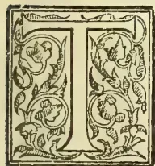

HE onion (*Allium Cepa*) is cultivated in Ceylon only to a very small extent, though it is very largely used throughout the Island in the preparation of the daily food of the people. Small selected tubers are planted in well-prepared land in well laid out beds. The plant requires much water, and the growth of an onion crop is attended with a deal of trouble and labour, as it does not thrive well in Ceylon soils. Seed is nowhere used, and the crop is always grown from tubers.

*Allium sativum*, Sing. Sudulun, is hardly grown as a crop anywhere, though a few tubers are occasionally planted in garden plots. The tuber used in Ceylon is imported from India, and is used in very small quantities as a condiment, but there is a large demand for it as a medicinal agent among *Wedarales* as well as in private households.

The roots of *Nymphaea lotus*, Sing. Olu; dug from ponds and marshy places where it grows in abundance, is used for preparing a starch. They are dug, cleaned up and sliced and dried in the sun, and then pounded. The starch obtained from them is used in the preparation of congees and cakes which are employed as a "sick diet." Olu is believed to be an excellent alternative and a demulcent. The roots of *Nymphaea stellata*, Sing. Manel, and those of *Nelumbium speciosum*, Sing. Nelun,

plants growing in marshy places and tanks are similarly used. *Asparagus falcatus*, Sin. Hatawariya which grows in jungles and uncultivated places, gives a large crop of succulent roots which are usually from a quarter to half an inch in diameter and four to eight inches in length, cylindrical in shape with tapering ends and of a creamy white in colour. The starch from the dried roots is used in medicine, and the fresh root is often pounded and prepared into congees with the addition of a little of rice. The dry root is also preserved in syrup and is a favourite article of diet. The root is believed to be very nutritious and is a demulcent and a good alternative tonic. No attempt has been made to cultivate the plant or to improve its productiveness, though it is quite evident that under proper cultivation it ought to form a very valuable article of diet.

The succulent roots of *Canna indica*, Sin. Butsarna, yield a very good starch similar to arrowroot. The plant grows abundantly in Ceylon, but its roots are never put to much use. Under proper cultivation *Canna* ought to form a very useful crop and is fully worth cultivation.

*Clinogyne virgata*, Sing. Getaoluwa, and *Phrynium zeylanicum*, Sing. Hulankiriya, though found in many parts of the Island, and though the value of their roots is well understood, do not seem to be cultivated at all. Both these plants yield tubers that contain a large percentage of starch.

Next we come to *Maranta arundinacea*, the cultivated Hulankiriya or arrowroot plant of Ceylon. This is largely grown throughout the Island but never in large or extensive areas. The villagers grow small plots of it from a few square

609------------------------------------------------

572Supplement to the "Tropical Agriculturist."[FEB. 1, 1904.

yards to about half an acre in extent in good deep loamy soils. The land is well dug and prepared into narrow beds, and small tubers or plants are placed in rows about a foot apart. The plants come up without much trouble. The beds are weeded and a little earth is thrown round the roots of the plants. Maranta yields fairly large crops, and in favourable situations about ten cwt. per acre are dug up. The tubers when well grown are from an inch to two inches in diameter, and are six to twelve inches in length, tapering at the ends and covered with a thin leathery scale. The tubers find a ready sale and are eaten boiled; a pound sells from one to four cents. The tubers when pounded and treated with water and washed several times give an abundance of white starch. The preparation of this starch is well understood in Ceylon, and as the crops are small, nothing more than the ordinary wooden pestle and mortar has been used in its preparation. The plant is of great economic value and is capable of profitable growth in a fairly large scale, as the tubers not required for immediate local consumption can be easily converted into starch.

The root which is very largely cultivated, and which in many places take the place of rice as a village food is the Sing. Batala, *Ipomea batatas*. It is extensively grown all throughout the Island, and its cultivation is well understood. There are many varieties of batala all more or less introduced to the Island at different times. I have been able to trace the following varieties grown in different places, and there ought to be many more cultivated in other parts of the Island.

The common Batala; The Maduwel Batala with long small leaves and small white tubers; Diya Batala grown in moist lands with small white tubers; Kahambilya Batala with coarse hairy leaves and white tubers; Cochin or Cochi Batala with small rounded white tubers; Kiribadu Batala with large irregularly formed white tubers without much flavour; Ratnagara Batala with tubers with a red coloured outer covering and reddish stems and leaf stalks; Lewandan Batala with small tubers with a blood-red covering; Kak Batala, fair sized tubers of a deep purple colour when cut open; three kinds of well-formed compact tubers known as Mauritius varieties, white tubers, red tubers and creamy coloured tubers; and Rata Batala a recently introduced variety with fine large tubers of a creamy colour, very starchy, and a slight sweetish taste undoubtedly a genuine "sweet potato." Though the Batalas are largely grown in Ceylon, no cultivator ever attempts to improve a good particular variety by selection or cultivation. A prolific hardy variety of a good quality can easily be propagated if sufficient attention is paid to the matter, and such an experiment is well worth a trial.\*

\* The Superintendent of School Gardens has established three introduced American varieties in the Government Stock Garden, and is distributing them through the School Gardens.—Ed. A. M.

Batala is largely grown along with other crops in new clearings, as well as in garden lands. In new clearings the cultivation is not attended with much trouble, and the yield is always a very good one, averaging about fifteen hundredweights per acre, whereas under garden cultivation it yields about ten cwts. on an average. The plant is propagated from cuttings; strong cuttings from one and a half to two feet in length are made.

In chenas shallow holes are dug about two feet apart, and two cuttings are placed in each hole; in garden lands narrow beds about three feet in breadth and nine feet long are made, well drained, and the earth heaped up about one and a half feet above the level of the land, and cuttings laid down about a foot apart. The plants come up fast and creep along the surface of the beds, covering them with a thick layer of foliage. The tubers are dug up four months after planting.

W. A. D. S.

(To be continued.)

RAINFALL TAKEN AT THE GOVERNMENT STOCK GARDEN FOR JANUARY, 1904.

<table border="1">
<tbody>
<tr>
<td>1</td>
<td>Friday</td>
<td>.. Nil</td>
<td>17</td>
<td>Sunday</td>
<td>.. Nil</td>
</tr>
<tr>
<td>2</td>
<td>Saturday</td>
<td>.. 10</td>
<td>18</td>
<td>Monday</td>
<td>.. Nil</td>
</tr>
<tr>
<td>3</td>
<td>Sunday</td>
<td>.. Nil</td>
<td>19</td>
<td>Tuesday</td>
<td>.. 36</td>
</tr>
<tr>
<td>4</td>
<td>Monday</td>
<td>.. Nil</td>
<td>20</td>
<td>Wednesday</td>
<td>.. 140</td>
</tr>
<tr>
<td>5</td>
<td>Tuesday</td>
<td>.. Nil</td>
<td>21</td>
<td>Thursday</td>
<td>.. Nil</td>
</tr>
<tr>
<td>6</td>
<td>Wednesday</td>
<td>.. Nil</td>
<td>22</td>
<td>Friday</td>
<td>.. 04</td>
</tr>
<tr>
<td>7</td>
<td>Thursday</td>
<td>.. Nil</td>
<td>23</td>
<td>Saturday</td>
<td>.. 21</td>
</tr>
<tr>
<td>8</td>
<td>Friday</td>
<td>.. Nil</td>
<td>24</td>
<td>Sunday</td>
<td>.. Nil</td>
</tr>
<tr>
<td>9</td>
<td>Saturday</td>
<td>.. 05</td>
<td>25</td>
<td>Monday</td>
<td>.. Nil</td>
</tr>
<tr>
<td>10</td>
<td>Sunday</td>
<td>.. 31</td>
<td>26</td>
<td>Tuesday</td>
<td>.. 08</td>
</tr>
<tr>
<td>11</td>
<td>Monday</td>
<td>.. 210</td>
<td>27</td>
<td>Wednesday</td>
<td>.. 08</td>
</tr>
<tr>
<td>12</td>
<td>Tuesday</td>
<td>.. Nil</td>
<td>28</td>
<td>Thursday</td>
<td>.. 12</td>
</tr>
<tr>
<td>13</td>
<td>Wednesday</td>
<td>.. Nil</td>
<td>29</td>
<td>Friday</td>
<td>.. 02</td>
</tr>
<tr>
<td>14</td>
<td>Thursday</td>
<td>.. 110</td>
<td>30</td>
<td>Saturday</td>
<td>.. Nil</td>
</tr>
<tr>
<td>15</td>
<td>Friday</td>
<td>.. 16</td>
<td>31</td>
<td>Sunday</td>
<td>.. 02</td>
</tr>
<tr>
<td>16</td>
<td>Saturday</td>
<td>.. Nil</td>
<td>1</td>
<td>Monday</td>
<td>.. Nil</td>
</tr>
</tbody>
</table>

Total in....695

Mean in.... 23

Greatest amount of rainfall in any 24 hours from 10th to 11th = 210 inches.

No. of days in which rain fell—15 days.

ALEX. PERERA.

PLANT PESTS AND REMEDIES.

Amateur gardeners as well as professionals, who concern themselves about the well-being of their plants, have continuously to contend with two classes of pests which injure their crops. The first of these is noxious insects; the second, parasitic fungi.

Insects vary greatly in their shape, size, and colour, but on broad lines they all possess three pairs of legs attached to a body divided into three definite portions—a head, a thorax, and an abdomen.

610------------------------------------------------

FEB. 1, 1904.]Supplement to the "Tropical Agriculturist."573

Some of them—indeed, the majority—undergo during their development well-marked transformation or stages: 1st, the egg; 2nd, the larvæ or caterpillar; 3rd, the pupa or chrysalis; 4th, the adult or imago stage. Moths and butterflies, amongst others, belong to this class. In two or, may be, three periods of their transformation they take no food, and are fixtures; during these periods they do no actual harm. Thus, butterflies and moths are inert in the egg as well as the pupa stages; and some of them, such as the codlin moth, for instance, do not feed. Yet it is during these periods of rest and transformation that it is often easier to attack them. These insects undergo what is called *complete transformation*, in contradistinction of others which undergo *incomplete transformation*. This second class, such as grasshoppers and locusts, have eggs which, in hatching, give forth young insects which only differ from the full-grown ones in size and in possessing no wings. Instead of changing from larva to pupa, they proceed, by a series of moulting or casting off their skin, to the mature stage, and become imago. During these successive moultings they are known as "nymphs."

Again, some insects lay eggs and are "oviparous"; while others bring forth their young alive, and are "viviparous." The majority of them, however, proceed from the egg, whether that egg is deposited cemented to the plant by means of a viscous secretion or whether they give birth to young ones. In the latter case the female insect generally carries the egg internally until the hatching period arrives.

So much for the life history of insects, considered broadly. A number of varieties depart from the pattern laid down in several minor details which cannot be touched upon in this paper, although a clear understanding of these particularities is of great assistance in combating pests. They often constitute the weak point of the armour it is meant to penetrate, and serve as a guide in directing the attack against them.

Almost as important as an understanding of the life history of pests is a knowledge of the manner they attack plants when taking their food.

In that respect noxious pests may be considered, irrespective of their classification, names, shape, or colour, into two general types: *biting and chewing insects* and *sap-sucking insects*. The former are often leaf-eaters or bark-nibblers, or, again, wood and fruit borers. They are provided with jaws by which they can gnaw the surface of the food plant, and chew it.

The latter feed on the juices of the inner tissues of the host-plant. They are armed with a pointed tube-like beak, which they thrust into the tissues of their host-plant, and suck out the sap.

Of the biting or food-chewing insects, some are:—

1. (1) Root-eaters; such as the white worm of the cockchafer, the larvæ of the cicadæ.
2. (2) Others, bark-nibblers; as certain kinds of beetles and of weevils.
3. (3) Some are leaf-eaters; as slugs, caterpillars, saw-flies' larvæ, the carpenter bee.
4. (4) Others injure the bud, the blossom, or the fruit; as the strawberry weevil, the codlin moth,

Of the sucking insects, in a like manner some are:—

1. (1) Root-sucking insects; as the woolly aphid and phylloxera of the vine.
2. (2) Others, ordinary bark-sucking insects; as the mealy bugs.
3. (3) Some leaf and bud or fruit sucking insects; as the rose and the orange aphid, the red and other scales, and plant bugs.

When fighting against biting insects, their food plant is best coated with substances which will act as internal poisons; whereas, when directing the attack against sap-sucking insects, the treatment must be such as hurts and kills by direct contact; they are external irritants, and act from the outside either closing the breathing pores or killing by irritation of the skin.

To the first category belong the various combinations of arsenic, and chief amongst them "Paris green," a chemical combination of arsenic and copper. When unadulterated it contains 55 to 60 per cent. of arsenic. It is almost insoluble in water. It is applied either—1st, dry in a state of impalpable powder, mixed in the proportion of 1 oz. of Paris green with 2 lb. flour, slaked lime, road-dust, or ashes; 2nd, or in a liquid mixture in the proportion of 1 oz. in 10 gallons of water. It should not be used in conjunction with any acid substance which would dissolve the arsenic it contains and make it caustic, but, on the contrary, it is always a good plan to add to it a handful of lime, which has the property of turning insoluble any trace of caustic arsenic it contains. Being a heavy substance, it quickly settles to the bottom of the pumping tackle, and requires agitating.

Other combinations of arsenic, such as London purple and arsenic and soda solution, are also used, but genuine and unadulterated Paris green is the best. A little glue or flour paste may be added to cause it to adhere better, especially to plants with glossy leaves.

*Hellebore*, unlike the arsenites, which are mineral poisons, is a vegetable poison, and is less dangerous. It is a powder made of the roots of the white hellebore, and kills both by contact and by being eaten. Very effective when fresh, it loses its strength by standing. In doses 1 oz. to 3 gallons of water it is much used against the pear slug and leaf-eating worms.

*Pyrethrum*, or insectibane, is also a poison, and is effective when fresh, but loses strength when exposed to the air. It is made from the powdered flowers of plants of the genus *Pyrethrum*. That light-brown powder is dusted over the plants or sprayed, in the proportion of pyrethrum one table-spoonful, boiling water two gallons. It kills by contact, and should be applied as long as the insects persist. Burnt over hot coals in the conservatories and greenhouses, it rids plants of aphid and other insect pests. Pyrethrum are easily cultivated, make pretty borders, and a supply of fresh flowers could, without trouble, be raised in every garden.

*Kerosene*, in the form of an emulsion with soapsuds, or mechanically mixed with water in the form of a misty spray, in the proportion of one of kerosene and four of water, will kill nearly all insects, and not injure the foliage.

611------------------------------------------------

574Supplement to the "Tropical Agriculturist."[FEB. 1, 1904.

**Resin Compound** is known to be very effective against scale insects. One of the best formulas is: Caustic soda, 1 lb.; resin, 5 lb.; water, 25 gallons. Two ounces of Paris green may be added to this when used.

**Sal Ammoniac** (chloride of ammonia), at the rate of  $\frac{3}{4}$  to 1 oz. per gallon of water, is a cheap and efficacious spray against red scale.

**Tobacco** is one of the safest and most valuable insecticides, and may be applied in several ways, either as a fine dry powder against slugs and aphids, or as a decoction of 3 to 4 gallons of water to 1 lb. of tobacco, or in fumes when burnt in the greenhouse.

**Carbolic Acid**, especially in its crude state, is a valuable insecticide as an emulsion made by mixing one quart soft soap, or about 1 lb. of hard soap dissolved in two gallons of boiling water, and then adding 1 lb. crude carbolic acid, and, applied with a cloth or a brush, it is efficacious in preventing the attack of tree borers. It must not in that state be applied to the foliage.

**Bi-Sulphide of Carbon**, a very volatile fluid, the fumes of which are destructive to all animal life, is used for killing insects underground; this is done when the plant is dormant, by boring a hole into the ground and pouring in a little carbon bisulphide and kerosene mixed. It is highly inflammable.

**Coal Tar** is excellent to drive insects away or entrap them.

**Hot Water**, at a temperature of about 125 degrees Fahr., is very efficacious for killing plant lice. Amongst other substances which are used against insects must also be mentioned lime and gas lime, quassia chips, kainit, fir-tree oil, sulphate of copper.

**Natural Checks.**—Although economic entomologists have already tested many valuable insecticides, and so compounded them that they kill insects but leave plants uninjured, yet there is, in keeping noxious insects in check, even more efficacious allies than the spray pump and the insecticidal mixtures.

All insects, injurious or beneficial, have many natural enemies of their own to contend with. Some are of a higher order in the scale of animal classification, such as lizards, frogs, and other reptiles; birds, moles, &c. Others, more numerous, belong to the insect world itself.

Amongst these, some which attack noxious insect pests from the outside, and either devour them or suck their vital juices are called *predaceous* insects, e.g., ladybirds, spiders, soldier bug, black ground beetle.

Others, called *parasitic* insects, differ from the predaceous ones, in so far as they live inside the bodies of their victims, and ultimately kill them. Amongst these parasitic insects the more numerous are ichneumon wasps, which entomologists classify amongst the hymenopterous, or four-wing flies. Another class of flies, with only two wings, and for that reason known as dipterous insects, contribute largely to the ranks of insect parasites.

But even those parasites are frequently subject to the attack of still smaller parasites, which prove as fatal to them as they did to their insect hosts. The first of these parasites are, for

that reason, known as primary parasites, to differentiate them from the second, called secondary parasites. When introducing parasites into an orchard or a garden, therefore, it is of the greatest importance that we should have a clear idea whether we are introducing an ally which will prove beneficial, or whether we will add to the list of our pest enemies another insect which will prove mischievous. Such a work is better left in the hands of experienced people, and may prove a dangerous tool in those of the tyro gardener.

Besides insect parasites, injurious insects are also attacked by even more minuscule foes. These are germs of contagious diseases, which, at times stop an insect plague with remarkable suddenness.

These germs are of two orders: some bacterial and inward, e.g., green potato and tomato caterpillars; others, superficial, cover their victims with silk-like threads, and belong to the mould family, e.g., the African locust fungus—the house-fly fungus.—*Journal of Agriculture West. Australia*.

## POULTRY NOTES.

### INDIAN GAME.

Indian Game are good table fowls, but as layers they are not the equal of many other breeds; their large brown eggs, however, are very good; the hens make excellent sitters, and the chicks are very hardy. So this breed is more suitable for gentlemen who do not mind feeding and breeding for the luxury of a bird that grows an abundance of choice breast meat of delicious flavor and grain, than for farmers who need strains for egg production. The Indian Game, however, is a valuable bird for crossing; the Indian Game Dorking cross being the most fancied. I have had splendid results from crossing Indian Game with Wyandottes, Langshans and light Brahmas. The last takes longer to mature, but you get a heavier bird, and a fine large breast to cut at if the birds have been mated judiciously.

#### SCHEDULE FOR JUDGING INDIAN GAME.

##### CHARACTERISTICS OF COCK.

**Head and Neck.**—Head rather long and stout, denoting strength, slightly heavy browed, but not beetleing or scowling. Skull fairly broad. Neck, nice medium length and nicely arched.

**Beak.**—Yellow striped, with horn color, extra strong and a trifle curved, stout at base, giving the head powerful appearance.

**Face.**—Smooth and fine in texture, throat and face being dotted with small feathers.

**Comb.**—If undubbed, pea or triple, small, and well set on the head.

**Ear Lobes and Wattles.**—Rather small and of a rich bright red in color.

**Eyes.**—Pearl or yellow, bright and full in expression.

**Hackle.**—Short, but sufficient to cover the base of the neck, but not flowing over the shoulders.

**General Shape.**—Body, round, muscular and stout, wide at shoulders, with wing butts showing prominent, body tapering towards the tail.

**Back.**—Broad and flat, but not hollow between the shoulder-blades.

612------------------------------------------------

FEB. 1, 1904.]Supplement to the "Tropical Agriculturist."575

**Breast.**—Wide, deep, prominent and well rounded.

**Wings.**—Short, well tucked up, and carried high in front.

**Legs.**—Strong and thick, with well rounded and muscular thighs of medium length.

**Shanks.**—Medium length and well scaled.

**Toes and Nails.**—Toes of good length, well spread, the hind toes well extended and flat on the ground, nails neat and well finished.

**Tail.**—Medium length, with plenty of side sickles and coverts, the tail carried slightly drooping and fairly close.

**Carriage.**—Upright, commanding and courageous, the back showing a good incline towards the tail.

**General Appearance.**—Powerful, sprightly, active and vigorous.

#### COLOUR.

Breast, body, thighs and tail a bright, glossy, greenish-black, with a deep crimson shaft and centre to each feather; back, shoulder coverts and wing bows, glossy green black, slightly intermixed with dark crimson; wing bars, bright, glossy, greenish black; wing secondaries, when closed, deep bag.

#### THE HEN

Is similar to the cock in all points, making allowance for difference of sex, thus appearing more cobby and compact. The ground color of the body is a lovely bright golden bay, each and every feather being laced accurately with metallic glossy, green-black, as if embossed. This lacing may be single or double, in the latter case the lacing showing a clear margin between of golden bay, the lacing following the contour of the feather, the shafts of the feathers running a trifle lighter bay towards the base, merging gradually into the ground color. The neck hackle and main feathers of the tail are as black as possible, the hackle having a brilliant greenish sheen.

**SIZE.**—9 to 12 lbs. or more, if symmetry is not sacrificed. Hens 7 to 9 lbs.

#### A HIGHLY-RECOMMENDED COTTON:

The question of a suitable variety of cotton for Ceylon is a very important one, and steps have already been taken through the Director of Royal Botanic Gardens to ascertain the best variety by means of experiments now being carried on in the North-Central Province.

In this connection the following note by Dr. David Thomatis in the *Queensland Agricultural Gazette* is interesting:—

"Owing to the modern economical and social conditions obtaining at present in Australia especially, the annual variety of cotton cannot possibly be any longer a remunerative crop for European labour, and I doubt very much whether it could be so even with cheap black labour in America and Central Africa, besides yielding such a poor quality of staple that, in competition with the long, strong, and regular fibre furnished by various varieties of tree Cotton, there is no chance for the annual variety to survive in the trade, even if it should be kept on in the fields.

"Of the several varieties of tree cotton, the one I have produced recently (*Caravonica*) has been declared by the best authorities in Europe to be the best and the most valuable. It is a native of North Queensland, so it should devolve on us Queenslanders to plant it in every corner of this State, and also in the Northern districts of South Australia and Western Australia and in New Guinea. In my opinion, it will be a most remunerative crop, and North Queensland is its very cradle, and as, in fact, are all tropical regions.

"I would now suggest that this new variety, which grows to a good-sized tree, be planted all along the railway lines, and its crops placed in charge of the lengthsman; also, in all school grounds, and the crop to be a source of income to the children, the teachers, and the School Committee; also round every county Police Station, the crop to be given to the Police Officers' family. Thus a fair amount of production would be obtained, and moreover, it would furnish a practical school of cotton culture."

Writing further on this subject Dr. Thomatis refers to Dr. Morris' statement to the effect that a special variety of Sea Island cotton possesses the longest staple, viz., 1.61 inches, whereas the ordinary Upland staple is barely .93 inches, and meets him with the fact that *Caravonica* cotton has an average length of staple over 1.5 inches, and some threads exceed 1.65, while the strength of the latter is more than double as found by actual test.

Dr. Morris refers to a variety of Peruvian cotton seed sent to the Colonial Office by Messrs. Praschkaur & Co, as "unrivalled in any part of the world." This Dr. Thomatis surmises is the same variety he utilized for crossing with a Sea Island of Mexico, and so diminishing roughness and inducing silkiness and fineness with the result that *Caravonica* should decidedly be the "champion of the world."

#### THE DAIRY

##### MILKING.

The manner of milking varies much more than is generally thought. There are four methods of holding the teat for milking.

The first is used in Brittany, mid-France, and some German provinces, and consists of holding the teat between the thumb and the first finger, the remaining fingers coming to the end of the teat, the thumb and first finger giving enough pressure to bring the milk to the opening, the other fingers remaining almost inactive.

In the second method the teat is held with the whole hand, the thumb bent on the inside and pressed against the teat; the pressure of the fingers determine the fall of the milk.

The third method is characterised by the position of the thumb, which is held upright against the udder, the milk being drawn out by the pressure of the fingers and movement of the hand.

The teat is held by the whole hand in the fourth method, the thumb and first finger encircling the teat at the base, and the pressure of the other fingers and consequent movement of the hand causing the milk to flow.

613------------------------------------------------

576Supplement to the "Tropical Agriculturist."[FEB. 1, 1904.]

Which is the best method, and to which should preference be given? A Danish veterinary surgeon named Mons. Hegelund, has made the following observations upon milking dairy cows:—"It seems evident that the mode of working should be to try and imitate as far as possible the movement of the young calf when sucking, who seizes the base of the teat between his two jaws, gradually causes a light, downward pressure, which brings the milk contained in the teat into his mouth; the teat, left to itself, is filled and emptied again on the same principle. If the teat is held with the whole hand it closes the superior opening by enclosing the base between the thumb and first finger folded together; this result obtained, successively close the second finger, the third, and then the fourth. The milk is then projected in the form of a jet by a gradual downward pressure, as when the calf is sucking; this result obtained, open the hand, grasp the teat again, and work as before. After a few trials this movement will be easily followed. Now the question is in what order the teats should be taken to be of the best advantage? Mons. Hegelund, after much studying, comes to the following conclusions: In a general way the milker opens the two lateral right quarters, of which the teats are the easiest to hold, and afterwards passing to the exterior quarters. In Switzerland good milkers work diagonally, but as a general rule the milker follows his own fancy, neglecting the teats which are the most difficult to hold, and some by so doing injure the udders of young dairy cows. After considering the various methods, the *Journal d' Agriculture Pratique* considers the Hegelund method gives more milk which is of a superior quality, the latter portion of milk often from 6 per cent. to 7 per cent., and even 8 per cent. of butter-fat.

#### THE FAT OF MILK—WHERE DOES IT COME FROM?

New York Experiment Station: Bulletin No. 132 of the New York Experiment Station affords the following conclusions of experiments:—

*First.*—A cow fed during ninety-five days on a ration from which the fat has been nearly all extracted, continued to secrete milk similar to that produced when fed on the same kinds of hay and grain in their normal condition.

*Second.*—The yield of milk fat during the ninety-five days was 62.9 pounds. The food fat eaten during this time was 11.6 pounds, 5.7 only of which was digested, consequently at least 57.2 pounds of the milk fat must have some other source than the food fat.

*Third.*—The milk fat could not have come from previously stored body fat. This assertion is supported by three considerations. (1) The cow's body could have contained scarcely more than sixty pounds of fat at the beginning of the experiment. (2) She gained forty-seven pounds in body weight during this period of time with no increase of body nitrogen, and was judged to be a much fatter cow at the end. (3) The formation of this quantity of milk fat would have caused a marked condition of emaciation which,

because of an increase in the body weight, would have required the improbable increase in the body of 104 pounds of water and intestinal contents.

*Fourth.*—During fifty-nine consecutive days 38.8 pounds of milk fat were secreted and the urine nitrogen was equivalent to 33.3 pounds of protein. According to any accepted method of interpretation not over seventeen pounds of fat could have been produced from this amount of metabolized protein.

*Fifth.*—The quantity of milk solids secreted bore a definite relation neither to the digestible protein eaten nor to the extent of the protein metabolized. In view of these facts it is suggested that the well-known favorable effect upon milk secretion of a narrow nutritive ratio is due in part to a stimulative, and not wholly to a constructive function of the protein.

*Sixth.*—The composition of the milk bore no definite relation to the amount and kind of food.

*Seventh.*—The changes in the proportion of milk solids were due almost wholly to changes in the percentage of fat.

*Query:*—Where does the fat come from?

#### WARTS.

The best and simplest remedy for warts on cow's teats (says the *Queensland Agricultural Journal*) is pine or Stockholm tar. It is best to use it when the cows are dry. Just give one or two applications, and the warts will come off.

#### THE GROUND NUT.

##### I.—ITS USES.

*For Confectionery.*—In the United States some 40,000 tons are raised annually; full three-quarter of the total crop are used in confectionery; the better grades are roasted and eaten, and the inferior kinds made into burnt almonds, &c.

*For Oil.*—The nut is very rich in oil—from 30 to 50% of the weight of the shelled nut according to published analysis. The oil is agreeable to the taste and smell, and very similar in character to olive oil and cotton-seed oil. The best grades, "cold drawn" are employed for culinary purposes. So good is the oil that it is a common substitute for, and very difficult to distinguish from olive oil. The lower grades are used to an enormous extent in soap manufacture and for bleaching. Marseilles imported in 1,900, 104,542 tons of ground nuts, principally for manufacture of soap and of the pure oil. The bulk of these came from the British and French possessions on the west coast of Africa and a small proportion from India.\*

*For Oil Cake and Meal.*—The refuse left after the expression of the oil forms an oil cake. Chemical analysis proves it to be extremely rich in carbohydrates and nitrogenous matters, with, in addition, a considerable quantity of fat. It is one of the most concentrated feeding stuffs with which we are familiar, ranking with cotton-seed meal, linseed meal, etc. and in some cases is ahead of them.

Experiments made in 1891-2 at the Woburn Experimental Farm, England, showed the ground nut to be a useful feeding material for cattle, and

\* The export from India is, we fear, not sufficiently taken to account.—Ed. A.M.

614------------------------------------------------

FEB. 1, 1904.]Supplement to the "Tropical Agriculturist."577

to have a feeding value just about equal to that of beans. A daily allowance of 4 to 6 lbs. of cake given in the form of paste and mixed with 2 or 3 lbs. bran constitutes a perfect food for milch cows.

*As Fodder.*—The vines are largely used in some parts of the world for fodder, and under the name of "peanut hay" are highly esteemed in the United States....The food value of the hay is of course higher, the greater percentage of nuts left on the vines in harvesting. The bulbs also appear to possess a considerable value as a feeding stuff, being much richer in valuable food constituents (protein, fat and carbohydrates) than cotton bulbs which are extensively used in some localities in the south of the United States as a coarse fodder and about equal to the poorer grades of hay.

In order to ascertain their value in the British market, the department awarded in 1902 two small consignments of ground nuts for valuation and report.

The samples sent consisted of nuts selected for size and general appearance.

Messrs. Leete, Son, and Co., of Liverpool, on 21st April, 1902, reported as follows:—"Having examined the sample of ground nuts, we are of opinion that same are very fine in size, and would be saleable in considerable quantities for eating purposes at a value of about £16 10s. to £17 per ton, if the outside shell could be kept clean and bright (*this is important as people buying for dessert purposes require a nice appearance*), also the nuts should be dry when shipped, as we find that inside the shell the kernels are inclined to be mouldy in the sample.

"Should it be impossible to obtain the nuts in any better condition than the sample shows, they would only be fit for crushing purposes, and the value would only be from £10 to £11 per ton, but no doubt large quantities could be sold for this purpose.

"This year there is a partial failure in the Senegal ground nut crop, while India (East) has produced a considerably larger crop than usual."

Messrs. James Philip and Co., to whom the second sample was sent, replied:—

"With reference to the ground nuts we shall be happy to try and sell any you may send over, but the brokers say they ought to be cleaner looking; much better specimens come from the States and elsewhere, and they will fetch about £3 to £4 a ton more *without* the shells. At present they are worth about £9 to £12 a ton here, perhaps more, but, like everything else, it is all a question of supply and demand."

In both reports it is to be observed that stress is laid on the importance of the nuts being clean and in good colour.

One method of improving the appearance of the nuts which suggested itself was by bleaching, as is carried out with other kinds of nuts, on a commercial scale, in some parts of the world.

In the experiment made, the method adopted was that described by Professor E. W. Hilgard as having given satisfactory results in California. The nuts were immersed in a solution made up in the proportion of 6 lb. of bleaching powder and 12 lb. of washing soda to 50 gallons of water.

After remaining in this bath for five minutes, the nuts were washed under a tap and placed in a second bath containing about 6 oz. of sulphurous acid to 2 gallons of water.

The weak solution of sulphurous acid was employed in place of bi-sulphite of lime, this chemical not being procurable in Barbados. After five minutes in this bath, they were again washed, and then spread out in the sun to dry. The whole bleaching process (exclusive of drying) took about fifteen minutes.

The results were very satisfactory. The nuts so treated had a nice, bright, clean appearance. They were free from any objectionable smell, and their flavour was not injured in any way.

One ready method of ascertaining whether the treatment had had any injurious effect on the nuts was to test the germinating power of bleached and unbleached nuts from the same original sample. This was done. The percentages in the two cases were:—Bleached, 74 per cent; unbleached 72 per cent.

The bleaching may safely be regarded as without harmful effect on the nuts.—*West Indian Bulletin*.

## THE LUCERNE TREE.

(*Medicago arborea*, Linn.)

In the *Bulletin de la Société Nationale d'Agriculture*, M. Andre refers to a plant which he strongly recommends for forage purposes in hot and dry climates, and in places where the soil is poor and stony. This is the lucerne tree (*Medicago arborea*) a rather low-growing shrub, which bears an attractive yellow flower, and must not be confounded with the so-called Tree Lucerne or Tagasaste (*Cytisus proliferus*) seeds of which were distributed in New South Wales by the Department of Agriculture several years ago, and with which many readers of the *Gazette* are no doubt quite familiar. The tree lucerne is to some extent regarded more as an ornamental than a commercially valuable plant in France; but M. Andre finds that on the Mediterranean littoral its feeding value is fully recognised, and it is extensively grown.

Chemical analysis of the lucerne tree gave the following results:—

<table>
<thead>
<tr>
<th></th>
<th>Per cent.</th>
</tr>
</thead>
<tbody>
<tr>
<td>Nitrogenous matter ... ..</td>
<td>13.12</td>
</tr>
<tr>
<td>Fatty matter ... ..</td>
<td>0.99</td>
</tr>
<tr>
<td>Non-nitrogenous matter ... ..</td>
<td>42.47</td>
</tr>
<tr>
<td>Cellulose ... ..</td>
<td>23.00</td>
</tr>
<tr>
<td>Minerals ... ..</td>
<td>5.42</td>
</tr>
<tr>
<td>Moisture ... ..</td>
<td>15.00</td>
</tr>
<tr>
<td></td>
<td>100.00</td>
</tr>
</tbody>
</table>

Thus it will be seen that although there is a rather high percentage of woody indigestible matter, the feeding value is great, and it is notably richer in nitrogenous matter than meadow hay, and is even superior in this respect to the best lucerne. Experiments have shown that it may be used successfully as food for all kinds of farm animals to their advantage. From a nutritive point of view, it is a fodder of the first order, and leaves nothing to be desired from an alimentary and hygienic point of view.

615------------------------------------------------

578Supplement to the "Tropical Agriculturist."[FEB. 1, 1904.

"It must not be forgotten," says M. Andre, "that this shrub is specially fitted to produce rich forage on very poor land." In rich soil, on cultivated land, the growth is much inferior, but on stony ground, with plenty of sunshine, it grows well if certain precautions are taken. On the embankments of railway cuttings, for instance, lines may be traced 40 inches apart, and holes made with a pickaxe 16 to 20 inches wide and about the same depth. These are filled with good soil. It would be better still to make a continuous trench partly filled with good soil, so that the roots can intertwine. If the slope is steep the soil taken out of the trenches should be heaped up below the trench, so as to form a sort of bank which will dam up the rain water to the benefit of the plant. When the ground is very stony it is best to put a little good vegetable soil around the roots. If once the roots take hold, the plants will take care of themselves.

The soil should be prepared in winter, and the planting done in spring. The winter rains will have refreshed the soil, and the spring sun will set the plants growing with rapidity. In stony ground, which has a sufficient quantity of soil, or where there are fissures between the rocks into which the roots can penetrate deeply, the plants may be placed 40 inches apart which will give about 4,000 plants to the acre. Of course in poor soils they must be put further apart.

Propagation by seed is perhaps the best way to cultivate this shrub, but the seeds are difficult to obtain in large quantities.

The *Medicago arborea* grows well on the chalky soil of the South, particularly in the neighbourhood of Nice and Monaco, but it also thrives on rocky ground.

As soon as the plantation is well established, as regards products of forage, the leafy branches should be cut in spring, immediately after the full development of the foliage, and given to the cattle which eat even the wood if it is still soft. Fresh branches will then shoot and produce a second crop.—*Agricultural Gazette of N. S. W.*

#### GENERAL ITEMS.

The main cause of sore back &c. on horses is allowing the hair to become matted or rolled by the chafing of collar or saddle into small hard knots, which when caked with sweat, dust or scurf cause friction of the outer cuticle. Chip off the hair closely from the parts of the body that come in contact with collar and saddle, and 80 per cent of such cases of sores will diminish. The next point to be observed is that saddle and collar stuffing is even and not soft, and that a saddle cloth is used that is waterproof and will not absorb sweat.

It is reported that as a result of the action of the British Cotton Growers' Association, 200 bales of West Indian grown cotton (Sea Island variety) were sold by Messrs. Hammer & Co. of Liverpool at 13½d. per lb.

According to analysis, *Paspalum dilatatum* (green odder) contains 72.84 per cent of moisture and 8.68 per cent of fibre.

Give fools their gold, and knaves their power,  
Let fortune's bubbles rise and fall,  
Who sows a field, or trains a flower,  
Or plants a tree, is more than all.  
For he who blesses most is blest,  
And God and man shall own his worth  
Who toils to leave as his bequest  
An added beauty to the earth.

According to the *Agricultural Gazette* of New South Wales, Hydrocyanic Acid is used with most satisfactory results in ridding houses of bugs. The room to be cleaned should be made as airtight as possible by plugging up all crevices. The gas is generated in an earthenware vessel and left in the closed room over night. The formula is oz. cyanide of potassium (a deadly poison) to 1½ oz. Sulphuric acid and 4 oz. of water for every 150 c. ft of space. The water is measured in the basin, the acid poured gently from the bottle held at arm's length, and then the cyanide weighed out carefully and placed in a piece of paper, is dropped into the basin and the door of the room immediately closed. The fumes of gas should in no account be inhaled, and the room should be thoroughly ventilated afterwards.

Zebrula is the name given to Professor Ewart's cross from mares of different breeds and zebra stallions of the Burchell kind. From its form and general bodily condition—especially the hardness of the hoofs—it is specially adopted for all transport work performed by mules. The Indian Government has already experimented with Zebrulas for transporting mountain artillery at Quetta. In Germany, where much interest in this animal is being manifested, the well-known Hagenbeck is taking up the matter with a view to introducing the Zebrula both into Germany and America. A full-grown specimen is 14 hands high, and the girdle circumference is about 63 inches. Experiments have so far been so successful that it is expected that before long the Zebrula will entirely supercede the mule.

To get rid of flying foxes from fruit gardens it is recommended that long strips of calico or other strong cotton cloth, dipped in hot melted sulphur be tied to the branches of each tree. Those who lose mangoes, mangosteens, rambutans and other fruits through flying foxes should try this simple remedy which is reported to be very effective.

Professor Wolff of Hohenheim found in 2,000 lbs. of fresh cowdung 6.8 lbs. nitrogen, 3.2 lbs. phosphoric acid and 8 lbs. potash. This worked give in 33 loads of 3000 lbs. each (99,000 lbs.) 336.6 lbs. nitrogen, 154.4 lbs. phosphoric acid, and 396.0 lbs. potash.

616------------------------------------------------

# \* The TROPICAL AGRICULTURIST \*

◇ MONTHLY. ◇

XXIII.

COLOMBO, MARCH 1ST, 1904.

No. 9.

## VEGETABLES ON TEA GARDENS.

### HOW TO GROW THEM.

*A Paper read before the Luskerpore Valley Society of Planters by J. Norman Ross.*

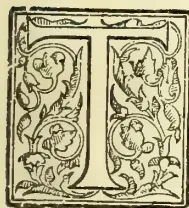

HIS paper on "Vegetables all the year and how to grow them" although not directly connected with tea, is, I consider, an important side issue from several points of view, for it is well known that good vegetables, properly cooked, are one of the best foods we can eat to

keep in good health. We should endeavour to grow the most suitable varieties to have a supply all the year round, and with a little care and supervision this is not difficult. Do not rely on your *Mali*, for however good a man he may be, unless he is carefully watched, he will be sure to do something extraordinary, and probably leave you without vegetables for a month or two at a time when they would be most acceptable! I consider a large vegetable garden should be kept on every tea garden, for after the bungalows have been supplied, the surplus vegetables are very much appreciated by the coolies as they are very keen for *tarevari*, especially towards the end of the week when their bazaar supplies are finished, and I find it causes good feeling between us to give them what there is to spare. To maintain a large garden appears at first sight very expensive, especially in the cold weather when the English varieties of vegetables are chiefly grown and large quantities of water are required, which has sometimes to be carried a long distance; but any extra expenditure under this head can often be considerably reduced in the following somewhat novel manner. Some years ago I planted a plot of sugarcane, intended for the garden ponies, but I soon found out that the coolie children were also very fond of it, and large numbers used to come almost every evening for a stick. The arrangement was: to make them bring a kulsie of water for the vegetable garden before giving them any; and afterwards I found they were

quite willing to bring two or three *heps* in return for a piece of cane, and in this manner I was able to give the whole garden a good watering every second day. Another thing I found out was that I could get the children to catch more insects for two pice and a stick of sugarcane than I could for four pice previously, so that the sugarcane *barry* not only pays for itself, but catches insects and waters the vegetable garden as well. Sugarcane is easily grown, being raised from layers; one stick cut into sections of two joints each will produce six or eight plants which, when large enough, should be planted out in rows about two feet apart, the same space being allowed between the plants. After planting, only two light hoes are required during the year, and with a dressing of old manure and lime every season, the plants will last from six to ten years before requiring renewal. The lime is necessary as the cane is very subject to white ants and borers.

### VARIETIES OF FRUITS AND VEGETABLES.

The following varieties of fruits and vegetables are those most easily grown and generally found in small gardens, but there are many others which, with a little extra attention, give good results, and are much appreciated either for their rarity or special qualities. With regard to root crops, such as beet, carrots, and turnips, it should always be remembered to sow them in drills and thin out when ready, and never transplant, for when transplanted they become stringy and are not nearly so good as when grown direct from seed. This remark also applies to onions; but leeks, I find do better when transplanted.

A space in the vegetable garden should always be reserved for pines, the best fruit we have here, for by being planted in the vegetable garden they are more easily protected from jackals. A jackal will break its way through barbed wire fences interlaced with bamboos, to obtain pineapples, and will often eat or destroy ten or twelve in a single night. To get good large fruit, the largest suckers should be selected and planted four feet by three in a well manured and deeply trenched piece of ground. They should be planted very firmly, and do not need any

617------------------------------------------------

580THE TROPICAL AGRICULTURIST.[MARCH 1, 1894.

cultivation afterwards, except a very light hoe to keep down the jungle, or even weeding is sufficient. When the plants become a fair size they throw out a number of suckers, or side shoots, and these should be taken off as soon as they appear leaving about two only on each plant for the next year's planting. Planting from suckers should be done in June. Break off the suckers carefully from the old plant and strip off the small bottom leaves until no more small roots are visible, and then plant as stated before; at least 75 per cent will fruit the following year. By leaving the old plants year after year the suckers fruit from them, but the fruits are never so large or so good as when grown on their own roots.

A few plants of Pepita should also find a place in the vegetable garden. They grow very freely in almost any soil, but a good dressing of manure should be given as soon as the fruit is set. To obtain good, large fruit quite 50 per cent. of the fruits should be taken off as soon as they set, and when the fruits are swelling, liberal supplies of manure-water add much to their size. A good manure-water is made by placing a bag, filled with either sheep or cow manure, in a large tub or barrel, and renewing it every six or eight days. If soot is obtainable, a good supply put in the same bag as the manure greatly helps the growth of most vegetables and fruits.

#### ENGLISH VEGETABLES.

English vegetables should be obtainable for six months of the year from November to April inclusive, and I propose to deal with the various kinds of these as far as possible alphabetically. I shall start with Asparagus, which is easily raised from seed and which should be sown thinly in beds four feet wide, raised four to six inches above the level of the surrounding soil. When the plants are well established, they should be thinned out to about eighteen inches apart. It takes two and a half or three years before one can expect to get good heads fit for table as plenty of manure is necessary. It is well worth the trouble; however, for what is better than a good dish of asparagus? Next come Artichokes which also take two years before being ready for the table. I have not tried Jerusalem artichokes here, but I have been successful with the globe variety. The plants are easily raised from seed and like a good rich soil, deeply trenched. They should be planted about five feet apart.

#### BEANS.

A good supply of Beans should be obtainable all the year. To get an early supply of the English varieties, sow the "Dwarf French" in boxes (empty kerosine oil cases are very suitable) in the bungalow verandah in September, and put the seedlings outside when the weather is favourable. In this way they will fruit from the middle of October onwards. Regular sowings should be made out of doors after the middle of October. Towards the end of October sow broad beans and scarlet runners. The former are rather difficult to grow as they do not set well and the latter also do not fruit freely, but as they have a much better flavour than French beans they are worth some trouble. I find that seed saved from direct European stock deteriorates rapidly. Native varieties of Beans should be sown in March in order to keep up the supply.

There are several very good native varieties which should have bamboos to cling to, as they are all climbing "jats." I might here remark that beans should be plucked when young and cooked whole so as to retain the flavour.

Beet should be sown on well manured, deep trenched ground, in drills one foot apart, and thinned to six inches when the plants are large enough. Great care should be used in lifting, as the breaking of the roots causes bleeding and loss of colour and flavour. Spinach-Beet should be grown along with the ordinary beet. The leaves are boiled the same

as spinach and make an excellent dish, much superior to the ordinary spinach.

#### BROCCOLI AND CABBAGE.

To obtain an early supply of broccoli seeds should be sown in boxes, in September, under shelter, and when the seedlings are large enough they should be transplanted into raised beds protected from the rain and kept fairly dry until the rains cease, when they can be planted out in ordinary beds. Plant them in rows one and a half by two feet apart. To get them to head quickly, the ground should not have been hoed or trenched for at least six months previously, for when grown on newly trenched land they go chiefly to leaves and often fail to head at all. On the first appearance of the flower, water well with manure-water every second day, and they will soon be fit for use.

Cabbages should be treated in the same way, but the early dwarf varieties should be planted somewhat closer. I find that treating them as above, smaller harder heads are obtained which, I think, are much nicer and keep much longer than large soft ones. After the heads are cut, the plants throw outside shoots which come on much later. A few plants of broccoli or kail should always be grown, as the young leaves are very nice in soup. Brussels Sprouts should be sown in October and the plants put out when large enough in rows two feet by two and a half. They like a strong soil, but are not ready for use until March and April, when most other greens are over. A large bed should be kept for carrots, for not only are they a most useful vegetable, but horses are very fond of them. To get a supply early, some of the dwarf kinds may be sown in boxes and treated in the same way as beans; but for the general crop, sow as soon as the heavy rains are over in drills one foot apart on well manured, deep trenched ground, and thin out the young plants gradually to six inches. A light sandy soil is most suitable, and they will keep till May. Should the rains come on early, lift them carefully and store in dry sand.

Cauliflower requires similar treatment to broccoli, and by sowing early and late varieties together, a supply may be kept up for about four months.

#### CELERY AND SALADS.

To obtain an early supply of Celery, seed should be sown in boxes in the bungalow verandah in July, and when the seedlings appear, which will be in about three weeks, water should be given sparingly. It is much better to dip the box in a bath tub and let the water soak upwards than to water overhead, for at this time of the year they are very liable to damp off. Transplant into other boxes when large enough, and plant out in the open in trenches (four feet apart) which have previously had a good supply of old manure. Allow one foot between each plant, and as they grow up wrap paper round them and earth up about every fortnight. For cooking purposes, I generally plant a quantity of seedlings nine inches apart on a bed raised six inches, and when the heavy rains come the bed is protected by a kutcha roof, and in this way they last till July. The English varieties of Cucumbers, with the exception of the gherkin, are rather difficult to grow, but there are many native kinds which are very easily grown on ordinary raised beds. The Egg Plant or brinjal fruits when most of the native vegetables are over and before the English kinds are obtainable, and if for that reason only should have a place in the vegetable garden. Sow in July or August and plant out when ready one and a half feet apart. By cutting them down in August or September to about six inches make them fruit well the second year. A few plants of Endive should be grown for salad along with lettuce, and when they are just about ready, place a board over them to blanch them. Some of the native kinds of gourds, as well as vegetable marrows, should always be grown during the rains, for they are, I consider, the best vegetable obtainable then. They

618------------------------------------------------

MARCH 1, 1904.]THE TROPICAL AGRICULTURIST.581

should be cut when young and boiled whole, in the same way as beans, to retain their flavour. They like plenty of manure, and as they are vigorous growers should be planted twelve feet apart each way, one plant in this space giving more fruit than two planted closer.

Kohl Rabi or *knol khol* is one of the earliest English vegetables to come in at the beginning of the cold weather, and like broccoli and other greens the seed should be sown in boxes early, and the seedlings protected and planted out nine inches apart when the rains cease.

Leeks should always find a small corner in the garden, for they last till May or June. They should be sown in beds and transplanted into rows one foot by nine inches in beds raised six inches, so that no water may be allowed to collect in the crowns, or otherwise they soon damp off. Maize or Indian corn is useful at all times and can be grown all the year round. A fairly poor soil is required, for if sown in rich soil the corms do not set well. It is advisable to keep only good varieties, as the ordinary kinds obtainable in the bazaar are very inferior.

Parsley is very useful for garnishing and flavoring. Sow in small beds and transplant to nine inches apart. A few rows of Parsnips should be sown along with carrots. The seeds are rather difficult to germinate, but if sown along with them, the results will be quite satisfactory.

#### PEAS.

Peas should be grown similarly to beans, and an early supply can be obtained by sowing in boxes and protecting them. They liked a rich soil, but as they are very liable to mildew towards the end of the season, I find a good supply of lime trenched in with the manure not only checks the mildew but prolongs the fruiting period. Before sowing in the open, which should be done from the middle of October onwards, the seeds should be soaked in warm water from two or three hours, for if planted dry, white ants and other insects often attack them before they germinate. If the seed is old and dry, a small piece of camphor put in the water will greatly assist their germination. Being one of the best vegetables we can grow, a little extra care should be bestowed on peas, and regular sowings should be made every fortnight, care being taken not to sow too thickly especially towards the end of the season. The dwarf varieties are most suitable for an early supply, and they should be available from the beginning of December to the end of March. Radishes are easily grown, and it is possible to have the English varieties all the year, if they are sheltered during the rains. A few of the native varieties are also worth growing.

A few Savoyas should be grown along with cabbages, but in a somewhat more liberal soil. They are very useful as they come in with Brussels Sprouts when the ordinary cabbage and broccoli are all finished. Along with them a few plants of Red Cabbage should be grown for pickling.

Always sow a few rows of Spinach—it makes an excellent dish—in drills one foot apart, and thin out the seedlings to six inches when large enough.

#### TOMATOES.

Now I come to Tomatoes, in the opinion of most people a splendid vegetable, and with care obtainable throughout the whole year. For the cold weather crop, sow a few in boxes under shelter in August, and more in September and October, and when the seedlings are large enough transplant them into well raised, protected beds until the heavy rains have ceased; then transplant into rows one foot apart in ground that has been previously prepared with old manure and well trenched. Watering should be done very sparingly for some time until the plants have set a good crop of fruit, say from 20 to 40 fruits. They should be tied to a single bamboo stake, and all side shoots removed as soon as they appear, and when the plants are from four to five feet high, the tops should also be taken off and half of the leaves cut off so as to throw all the strength of the plants into the fruits. At this stage they should be well watered with

manure water, and fine fruit will be the result. For a supply during the rains, prepare a border on the east and south sides of the bungalow under the eaves, and plant as in the open, one foot apart, and withhold water altogether during the rains, at least until a crop of fruit is set.

Turnips are a very useful and easily grown vegetable, and the early varieties sown as soon as the rains cease, will be ready in six weeks. Some of the best table swedes grown along with them make nice change. Sow in drills one and a half feet apart, and thin to nine inches for large roots or six inches for ordinary use. The young plants, which are thinned out make a good dish when cooked and served in the same way as spinach.

#### MUSHROOM BEDS.

Mushrooms, I find, are rarely grown in tea districts, but where the manure is obtainable from three or four horses, they are not difficult to grow. The manure should be carefully preserved in a covered shed and frequently turned to prevent heating. When sufficient is collected for a bed, mix with one-fifth of good loam and make a bed in a covered shed two feet deep and five feet wide, beating it very firm. When the temperature of the bed reaches 90° to 95°, put in good spawn, three inches deep and nine inches apart, and put on the top of the bed one inch of fine soil and again beat firm, and to prevent evaporation put a foot of straw on the top of all.

In about six weeks mushrooms will appear, and if the bed has become dry, water carefully with water heated to the same temperature as the bed. When the first crop is over give the bed a rest for a month; then give a good watering of salt and water, and another crop will shortly appear. Even when the bed is exhausted, if you put the manure on the vegetable garden, you will find a crop of mushrooms will invariably appear during the following year where the manure has been spread.

One other vegetable I must not forget is the Potato. Home grown ones from good seed are so much better than those obtainable in the bazaar that they are well worth a little trouble. They should be planted (one foot apart in rows two feet apart) early in October, for if planted later, white ants invariably attack them before they are ready to lift, and generally the whole crop is lost. Greens, such as cabbage, cauliflowers, etc., may be planted between the rows as those do not suffer in any way if the potatoes are carefully lifted and a double crop is thereby grown on the same ground.

All early vegetables, such as carrots, beet, turnips, and such like, should be sown every week from the beginning of October, but do not sow the main crop, until you are sure the heavy rains are over, for often a heavy shower will wash away or kill every little seedling? By sowing a few weekly, some are sure to be saved, small lots being easily protected by old leaf baskets placed over them.

To maintain a supply of vegetables during the rains, in addition to the varieties I have mentioned, sow jingas, dundul and chichingas when the rains commence, and give them a bamboo trellis to cling to? A few sown every month will best maintain the supply. Sow "Ramtori" or "Ladies' Fingers" in March or April and they will fruit until October. There are several varieties of *says* that may be grown, but the *poi say*, which much resembles spinach, is the best. It should have a trellis work to run over, or may be planted near a shed or out-house to trail over the roof. Watermelons having scarcely any flavour, are hardly worth the growing.

The abovementioned varieties of vegetables are those which I should advise growing in this district. In my endeavour to make the directions which tend to success as practical as possible, it is probable I have left out some which ought to be included in a full list, but if only these mentioned are grown successfully, I do not think that any one will ever regret the little time and little trouble he spends on the most ancient, most useful, and most healthful of all occupations—the growing of plants that are good for food.

619------------------------------------------------

582THE TROPICAL AGRICULTURIST.[MARCH 1, 1904.]

## THE CULTIVATION OF PINE-APPLES.

The following paper was read by Mr. Charles Eugene Smith to teachers of elementary schools, at the Mica Institution, Kingston, Jamaica. The paper first appeared in the *Jamaica Bulletin* (Vol. ix) in November 1902. As the subject of the proper cultivation, packing, etc., of pine-apples is one of general interest in the West Indies, it has been decided to reproduce Mr. Smith's paper in the *West Indian Bulletin*. It may be mentioned that Mr. C. E. Smith is himself an extensive grower of pine apples, and his experience and knowledge of the subject are probably as good as any in these colonies:—

The pine-apple is a decidedly exacting member of the vegetable kingdom, insisting upon having its wishes and needs respected and provided for, making no allowance whatever for our good intentions, and well illustrating what Miss Greenwood calls 'the cussedness of inanimate objects.' The soil is of first and most vital importance. The pine-apple will grow upon soil too poor for other products, but this soil must be light, loose and thoroughly drained. I quote a partial analysis of a typical pine-apple soil in South Florida:—

<table>
<tbody>
<tr>
<td>Insoluble residue .. ..</td>
<td>97.5085 per cent.</td>
</tr>
<tr>
<td>Humus .. ..</td>
<td>.24 "</td>
</tr>
<tr>
<td>Nitrogen .. ..</td>
<td>.0378 "</td>
</tr>
<tr>
<td>Total phosphoric acid ..</td>
<td>.0336 "</td>
</tr>
<tr>
<td>Total potash .. ..</td>
<td>.0086 "</td>
</tr>
<tr>
<td>Total lime .. ..</td>
<td>.2100 "</td>
</tr>
</tbody>
</table>

What portion of the phosphoric acid and potash given above is available is not stated.

In comparison I also give the analysis of the soils at Barbican and Billy Dun, St. Andrew, as recently furnished by the Island Chemist:—

### Barbican.

<table>
<tbody>
<tr>
<td>Insoluble residue .. ..</td>
<td>77.40 per cent.</td>
</tr>
<tr>
<td>Humus .. ..</td>
<td>1.765 "</td>
</tr>
<tr>
<td>Nitrogen .. ..</td>
<td>.1190 "</td>
</tr>
<tr>
<td>Total phosphoric acid ..</td>
<td>.0973 "</td>
</tr>
<tr>
<td>Available phosphoric acid ..</td>
<td>.0402 "</td>
</tr>
<tr>
<td>Total potash .. ..</td>
<td>.9887 "</td>
</tr>
<tr>
<td>Available potash .. ..</td>
<td>.0134 "</td>
</tr>
<tr>
<td>Total lime .. ..</td>
<td>.7672 "</td>
</tr>
</tbody>
</table>

### Billy Dun.

<table>
<tbody>
<tr>
<td>Insoluble residue .. ..</td>
<td>80.71 per cent.</td>
</tr>
<tr>
<td>Humus .. ..</td>
<td>1.32 "</td>
</tr>
<tr>
<td>Nitrogen .. ..</td>
<td>.0770 "</td>
</tr>
<tr>
<td>Total phosphoric acid ..</td>
<td>.0973 "</td>
</tr>
<tr>
<td>Available phosphoric acid ..</td>
<td>.0411 "</td>
</tr>
<tr>
<td>Total potash .. ..</td>
<td>.0274 "</td>
</tr>
<tr>
<td>Available potash .. ..</td>
<td>.0084 "</td>
</tr>
<tr>
<td>Total lime .. ..</td>
<td>.6506 "</td>
</tr>
</tbody>
</table>

The soils of Florida are so barren that the cane or banana planter of Jamaica would pass them by in contempt, yet these soils are made productive and profitable by the intelligent use of green manures and commercial fertilizers, as well as by scientific and up-to-date methods of cultivation. Barren as they are, they give in mechanical condition just what the pine-apple desires. Stiff, hard, lumpy soils are absolutely unsuitable. If you will strip the lower leaves from a pine sucker you will note that the rootlets are already pressed close to the butt. Now if, when planted, these rootlets encounter soil, or lumps of soil, difficult to penetrate, they continue this winding instead of spreading freely through the earth, resulting in what is known as 'tangle root' and the consequent death or stunting of the plant.

I have heard the argument used that, whereas the pinguin is allied to the pine-apple, therefore any soil upon which the pinguin thrives is suitable for pine-apple growing. This is very superficial logic, however, for it is also true that the Tillandsias and Bromelias are related to the pine, yet I do not think that anyone has advocated setting pine-apple plants

in the branches of the forest trees. Choose the lightest, sandiest soil you can find. Fertility is of secondary importance.

### PREPARATION OF THE LAND.

Very few soils exist in Jamaica naturally light enough to give the ideal conditions desirable for the pine-apple. We must therefore prepare the land we have selected with the utmost care, being thankful that this increased expense is fully offset by the greater fertility we enjoy here. The land must be thoroughly cleared of all trees and roots and the soil well worked with plough or fork until it is as fine as the seed bed of the market gardener. Drainage is of as great importance as the soil itself, no plant being more intolerant of excessive moisture. In St. Thomas-ye-Vale I find it necessary to run ditches as close as 20 feet apart. In St. Andrew 40 feet apart will answer—the ditches being 2 feet wide and 18 inches deep. The land between the ditches is divided into beds 10 to 12 feet wide with a 4 feet path separating the beds. The land should be carefully marked out for planting, and it is well to continually bear in mind the fact that we are to engage in *intensive cultivation*.

### PROPAGATION.

The pine-apple is propagated by *suckers*, *ratoons*, *slips*, *crowns*, and *seeds*. The word 'sucker' is used so indiscriminately in Jamaica, often referring indeed to young orange seedlings, tomato plants, etc., that I may be pardoned for defining these terms.

The true suckers are the offshoots, growing out from among the leaves of the parent plant. They are the best and, in a properly managed plantation, the only offshoots available for propagation.

Ratoons are also suckers but are designated ratoons when thrown out from underground. After the fruit is cut the ratoon is the offshoot allowed to remain to bear the following year, as it is more firmly attached to the stock than the higher suckers, and has, in addition, roots of its own. When two ratoons are thrown out one should be removed and planted.

Slips are the offshoots found at the base of the fruit in most varieties. Save that they are slower of growth, they answer as well as suckers for propagating, but, as I have remarked, in a properly managed plantation they are not available, as they should be broken off as soon as formed, so that all the strength of the plant may go into the fruit. The Smooth Cayenne has no slips, only suckers, and this is one of several reasons which accounts for the high price of this variety.

The crown is the tuft of leaves on top of the fruit. Crowns will make plants, but are of slow growth and, save when a fruit has been spoilt by rats or sunburn, they are naturally not available for planting, the crown being an attractive feature to the purchaser.

Seeds are rarely found. I notice they are more common in Jamaica pines than in those from Florida. They are only used, after hybridizing, for the purpose of producing new varieties.

### PLANTING.

The land being properly prepared and the suckers secured—by the way, they should be 12 or 18 inches long and selected from healthy plants which have borne or are bearing fruit—we are ready for planting. Opinions differ as to the best distance, there being arguments in favour of both wide and close setting. Four years ago I commenced planting at the usual Florida distance, 22 by 22 inches; then 24 by 24, 24 by 30, 3 by 8 feet, and even 3 by 4 feet. I have gradually been working back to shorter distances, and have just set 2,400 at 18 by 24 inches. I believe 2 by 2 feet may be considered safe, though much depends upon the location and variety. In St. Thomas-ye-Vale, where the sky is clouded a great part of the time and there is a heavy rainfall, wide planting seems desirable; but in St. Andrew I prefer close planting, so that the ground may become quickly shaded to prevent scalding of the roots.

620------------------------------------------------

MARCH 1, 1904.]THE TROPICAL AGRICULTURIST.583

Care should be taken to have the plants set in true lines each way. Many methods of accomplishing this will suggest themselves. My own way is to run a base line the width of the field at right angles to the beds; I then stretch a line along each side of the bed to be planted, staking off these lines at the distance I wish to set the suckers in the long rows I use a strip of 1 by 3 feet with notches showing where each plant should be set across the bed, and move this strip from stake to stake, planting the suckers with a small hand trowel.

The handle of the trowel may be used for pressing the earth firmly about the base of the plant. The only preparation of the sucker is to strip off the lower leaves, and cut the broken end clean that it may callus readily.

#### CULTIVATION.

The cultivation consists in keeping the plants clean all the time. Remember that the pine-apple is an aristocrat which will sulk if required to share its surroundings with more plebeian plants. In Florida, where the soil is practically barren of plant food, artificial manuring is necessary, and in the covered pineries about Orlando as much as 3 tons of highly concentrated fertilizers per acre are used. Again, the pine-apple shows its patrician tastes in that it is decidedly capricious as to its food. Such organic manures as cotton seed meal and castor pomace invariably give poor carrying fruit, though dried blood does not seem to be objectionable, as a test of 193 plots treated with different fertilizing ingredients and combinations of ingredients carried on by the Florida Agricultural Experiment Station resulted in favour of blood, bone and potash. It is also strange that, though superphosphates made of bone treated with sulphuric acid are not injurious, yet when the base is of rock phosphate (marine bone deposits) this is generally regarded as poisonous to the pine. I may remark, however, that I have never received any return from the money I have expended for phosphoric acid for this fruit. Up to the present time, Jamaica soils do not seem to require artificial fertilizers, while in some cases their use seems to have resulted in actual disaster. It stands to reason, however, that our soils cannot yield 10 to 20 tons of fruit year after year without this drain needing to be made good in time, and I am much interested in a series of experiments now being conducted by the Island Chemist, which may also show some effect on the carrying qualities of our fruit.

#### GATHERING AND PACKING.

What a sense of satisfaction the grower feels as, after months of anxiety and labour, his fruit approaches maturity and he begins to think that his woefully one-sided ledger account may begin to show a better balanced appearance! Yet beware the experience of the glass vendor in 'Arabian Nights' whose day dreams had made him Grand Vizier about to marry the Princess when a slip of the foot brought his bright visions and his fragile wares in ruin to the pavement! 'Eternal vigilance' is the price of satisfactory pine-apple sales, and all your hopes may be dashed even now by careless or improper methods. The woeful inefficiency, indifference and lack of loyalty on the part of the Jamaica labourer makes the unceasing personal attention of the employer absolutely necessary, while the fruit is being gathered and packed for shipment. It is impossible for me to explain, save in the field, just when a pine is fit for picking. It varies, indeed, with the season of the year and the distance it is expected to carry. One point is vital—the fruit *must* have attained its full size. A pine not properly matured will decay before it ripens, or if it ripen it will be a poor apology in flavour for this luscious fruit. An inch or more of the stem should be left attached to the fruit which is hung up by this to dry for 24 hours or more and is then ready for packing. A number of styles of pine-apple crates are used, the important thing being that they should

give good ventilation. Until recently I have used the 'Orlando Pine-apple Crate,' 12 by 20 by 22 inches, holding two layers of eight to fourteen Smooth Cayenne or sixteen to twenty Ripleys. Later experience, however, has assured me that a single-layer crate is more desirable, as the fruit seems to carry better. The buyer also prefers it as it enable him to inspect all the fruit at a glance.

Pines should always be wrapped in something to protect them from bruising. Some use common Manila paper but this hardly gives the desired protection. I use 'Excelsior' made pine wood shavings. Clean, dry hay or straw will answer. Banana trash well dried is also used. In the Azores, corn husks, stripped fine with a rasp like a large curry comb, is the common packing material. Pines should be packed firmly that they may not fall about, but should not be jammed into the box. In packing, the first pine is placed with the butt towards the packer in the lower left hand corner of the box, the second against it, the butt at the upper side of the box, the crowns overlapping, and so on, the butts and crowns alternating. If the box contain two layers, the first pine of the second layer goes in the *upper* left hand corner, the butt coming over the crown of the fruit below it. The two layers will be just reversed as in the method of 'breaking joints,' as it is called, in orange packing. Stencil the word 'Top' on both top and bottom sides of the crate, that when opened the fruit may be seen in layers just as packed. As far as possible the crowns should be protected from bruising as they add greatly to the appearance and selling value. Exercise every care to make the package neat and attractive, for with fruit as with people 'first impressions go a long way.'

#### INSECTS AND DISEASES.

While the pine-apple requires and repays constant attention and care, yet when compared with many other plants it cannot be said that it suffers severely from insects or disease.

The only insects which seem to affect it are—mealy bugs, red spider, and scale. The prælial thief of course comes under the head of reptiles. The red spider and scale are rarely serious. The mealy bug may become so if neglected, and will cause serious stunting of the plant and fruit. Infesting as it does the white portion of the leaves about the body of the plant the use of sprays is practically unavailing. Much good is done by dipping the base of the sucker in a decoction of tobacco stems, 1 lb. of tobacco to 2 gallons of water, before planting, but the only sure treatment is by fumigating with hydrocyanic acid gas as recently described in a Bulletin issued by the Jamaica Botanical Department. 'An ounce of prevention is worth a pound of cure.'

The diseases or maladies of the pine are—'blight,' 'sanding,' 'spike,' and 'tangle-root.' 'Blight' is a very serious trouble generally ascribed to a fungus. An acquaintance who was visiting Jamaica last winter, and who is interested in scientific research in an amateur way, kindly devoted much time to a study of this disease, making careful microscopic studies and cultural tests which demonstrated very clearly that healthy leaves can be inoculated through the spores of diseased plants. In practice we have reason to believe that a diseased stock will prove a centre of infection for surrounding plants. The best course to pursue is to dig up the plant and burn it immediately, saturating the soil where it stood with a strong solution of copperas. A plant, if taken up and the butt trimmed back to healthy tissues when the wilting is first discovered, may sometimes be saved, but, on the whole, I think it is wiser to be rid of it at once. Fortunately the disease does not spread rapidly and may easily be checked by the observant cultivator if taken in time.\*

\* According to Webber 'blight' or 'wilt' is caused by a soil-inhabiting fungus which attacks the roots. (*Yearbook, U. S. Department of Agriculture, 1895.*) Ed. W. I. B.]

621------------------------------------------------

584THE TROPICAL AGRICULTURIST. [MARCH 1, 1904.

'Sanding' is not so common in Jamaica as in Florida, where the soil is lighter and easily blown into the heart of the plants. Ants cause much trouble here, however, by carrying earth into the leaves; but this is an effect, not a cause, and is due to the presence of the mealy bugs which the ants try to protect, being fond of the sweetish secretion with which they cover the leaves.

I am but little acquainted with 'Spike,' but have regarded it as due to careless selection or non-selection of suckers rather than as a disease. Professor Rolfs, the biologist of the Florida Agricultural Experiment Station, seems to consider it as caused by improper or ill-balanced fertilizing.

I have already referred to 'Tangle-root.' Authorities differ as to its nature, but I think that in the majority of cases it is simply due to poor preparation of the land, the roots being unable to freely enter the earth and so, winding about the butt, cause strangulation as the stock expands.

#### VARIETIES.

I presume that to a majority of people in northern countries a pine-apple is a pine-apple, just as to the average Jamaican a peach is a peach, yet the different varieties vary greatly in quality, appearance and merits. I think on the whole we should be thankful that propagators have not been too ambitious in rolling up a long list of names, as has been the case with oranges. The Florida Horticultural Society tabulates a list of seventy-three different varieties of oranges and that without synonyms. Counting the synonyms, which some enterprising nurserymen in Florida insist upon considering distinct varieties, the list swells to something like 110. I am a rather old orange grower but I doubt if I could identify more than fourteen of these, and to do so should have to include four of the *Citrus nobilis* class. Of course there are many others highly desirable, but I think that the average practical orange grower will make his grove of but seven or eight standard kinds. The same authority (and none is higher) enumerates eighteen varieties of pines as follows:—

<table border="0">
<tbody>
<tr>
<td>1. Abbaka</td>
<td>10. Ripley Queen</td>
</tr>
<tr>
<td>2. Antigua, Black</td>
<td>11. Lord Carrington</td>
</tr>
<tr>
<td>3. Antigua, White</td>
<td>12. Prince Albert</td>
</tr>
<tr>
<td>4. Black Jamaica</td>
<td>13. Porto Rico</td>
</tr>
<tr>
<td>5. Black Prince</td>
<td>14. Pernambuco</td>
</tr>
<tr>
<td>6. Blood</td>
<td>15. Red Spanish</td>
</tr>
<tr>
<td>7. Crown Prince</td>
<td>16. Smooth Cayenne</td>
</tr>
<tr>
<td>8. Charlotte Rothschild</td>
<td>17. Sugar Loaf</td>
</tr>
<tr>
<td>6. Egyptian Queen</td>
<td>18. Enville</td>
</tr>
</tbody>
</table>

It is possible that some of the above may be the same under different names. On the other hand, there are some varieties not included, for example, the Trinidad of the English hot houses is not mentioned. Possibly the compilers considered it identical with the Porto Rico,—an error I think, though it may be a seedling or selection of that variety; nor does the list include a sub-variety of the Smooth Cayenne—the Variegated Smooth Cayenne bearing the same fruit but noticeable chiefly for its beautiful variegated leaves of green, white and red stripes. But one Ripley is mentioned, whereas in Jamaica we know that the Red and the Green Ripleys are very distinct. Still I mention, in this connection, the curious fact that a Green Ripley plant often throws out a red sucker or bears a fruit having a red crown, and *vice versa*.

There are several varieties in the above list with which I am not acquainted. Probably some of these are known only in hot houses and have not been successful for open air cultivation. You are probably as familiar with the Jamaican sorts as I am; perhaps more so, as my cultivation consists mostly of Smooth Cayennes and Ripleys.

The Red Spanish, I think, is identical with our Bull-Head, though I know many will differ from me. Certain it is that I have often shipped Bull-Heads under the name of 'Jamaica Pines,' and my agents in New

York have reported 'your Red Spanish have sold for etc., etc.' The Black Jamaica is desirable because of its size; it is also a very fair shipper. The Sam Clark (which, of course, is not included in the list I have quoted, and which, I believe, is not known outside of Jamaica) has always been an interesting native variety to me, as I believe it has considerable possibilities. It is of a good shape, packing out nicely, and has a most showy and attractive crown. To a cultivated taste its flavour is inferior and its acid distinctly 'raw.' If this can be modified by some generations of cultivation the variety will prove an acquisition. The Sugar Loaf, as largely grown in Cuba as here, is so badly affected with 'black heart' as to be of little value for shipping. While I believe there is a great field in the selection of our native pines, yet speaking from a purely commercial point of view, and considering the rapidity with which the planting of this fruit is being extended in other countries, I can but feel that the time must come in the near future when only the choicer varieties can find a market. The Porto Rico was at one time very popular for open air cultivation in Florida, especially along the East Coast, because of its large size. I had one in Bog Walk, in this island, weighing 14½ lb. Its size, however, is its one and only merit. It is a shy bearer, requires double the room of other sorts, and in quality is no better than our Bull-Head or Black Jamaica. I do not think it is being planted largely now, better kinds having superseded it.

The Abbaka somewhat resembles a very large Red Ripley though more conical at the base. It is much above the average size of pines and is of delicious flavour—none finer for home use. In dry weather it ships very well (though this is equally true of nearly all sorts), but during the rains it is extremely uncertain. Probably no other pine is so productive of slips.

The Charlotte Rothschild is a well rounded pine of quality resembling the Smooth Cayenne, its green crown prettily fringed with fine reddish pines.

The Enville or Enville City is of medium size and excellent quality; it is distinguished by having a mass of little crownlets instead of a single crown at the top. I have shipped so few of the Rothschild and Enville that I am unable to express an opinion as to their carrying qualities.

The Golden Queen is excellent in quality for home use; it is a poor shipper, however, and, like the Sugar Loaf, very subject to 'black heart.'

The Egyptian Queen was at one time the favourite fancy pine in Florida. It was originally the Cleopatra its present and better known name being evidently the result of a rather shaky knowledge of Egyptian history. It no longer holds the high place in the esteem of planters which it once occupied. It is in every way inferior to our Ripley.

The Smooth Cayenne, everything considered, is to my mind the pine *par excellence*. Its large size, perfect form, excellent flavour and beautiful appearance make it a king of pines. It originated, I believe, in the English hot houses, later was grown in the Azores under glass but without heat, then carried to Florida where it is the most popular and most profitable variety grown under shelter, and is now being successfully cultivated in Jamaica. I must say I have seen specimens here equal in every way to any I have ever seen elsewhere. It is specially valuable for the English markets where size and beauty of appearance count for even more than flavour.

I should be 'carrying coals to Newcastle' to describe our famous Ripley before a Jamaica audience. Strange to say it was a failure in Florida—for what reason I do not know—and I hardly recognized it when I came here. In the qualities which please the palate I consider that it ranks above the Cayenne. Surely nothing can be finer than our St. Andrew Ripley. It is also a good shipper. I have sent it to all parts of England and had excellent reports as to its condition on arrival. I rank it with the Smooth Cayenne as the first among pines. Its one

622------------------------------------------------

MARCH 1, 1904.]THE TROPICAL AGRICULTURIST.585

regrettable feature is its small crown. Its warmest admirers have to admit this one weak point. Could we but get the size, form and crown of the Cayenne, combined with the flavour of the Ripley, we should have the ideal, the perfect pine, and in this connexion I must express the deep interest I feel in the experiments in crossing these two varieties now being carried on at Hope. Seeds have been obtained from this cross and, the young seedlings were thriving when I last saw them. I sincerely trust that the hopes and expectations of the gentlemen who have devoted so much time and labour to this work may be amply rewarded in the results.

### MESSRS. LEWIS & NOYES' SPECIAL COCOA REPORT FOR 1903.

List of the most known countries of production (with quantities expressed in bags):—

<table border="1">
<thead>
<tr>
<th></th>
<th>1898.</th>
<th>1899.</th>
<th>1900.</th>
<th>1901.</th>
<th>1902.</th>
</tr>
</thead>
<tbody>
<tr>
<td>Guayaquil</td>
<td>420,000</td>
<td>496,800</td>
<td>351,000</td>
<td>451,600</td>
<td>467,000</td>
</tr>
<tr>
<td>African</td>
<td>165,755</td>
<td>219,052</td>
<td>200,149</td>
<td>267,768</td>
<td>297,504</td>
</tr>
<tr>
<td>Bahia</td>
<td>123,702</td>
<td>137,935</td>
<td>221,974</td>
<td>232,000</td>
<td>273,977</td>
</tr>
<tr>
<td>Trinidad</td>
<td>127,021</td>
<td>162,034</td>
<td>153,747</td>
<td>136,272</td>
<td>168,783</td>
</tr>
<tr>
<td>Grenada</td>
<td>53,441</td>
<td>52,141</td>
<td>53,388</td>
<td>53,387</td>
<td>61,279</td>
</tr>
<tr>
<td>Jamaica</td>
<td>8,969</td>
<td>11,766</td>
<td>11,223</td>
<td>13,132</td>
<td>17,620</td>
</tr>
<tr>
<td>St. Lucia</td>
<td>5,545</td>
<td>5,600</td>
<td>7,635</td>
<td>3,864</td>
<td>8,785</td>
</tr>
<tr>
<td>Dominica</td>
<td>6,546</td>
<td>5,090</td>
<td>6,095</td>
<td>5,747</td>
<td>7,500</td>
</tr>
<tr>
<td>Demerara</td>
<td>—</td>
<td>—</td>
<td>—</td>
<td>500</td>
<td>650</td>
</tr>
<tr>
<td>Surinam</td>
<td>26,707</td>
<td>38,460</td>
<td>24,790</td>
<td>30,600</td>
<td>21,871</td>
</tr>
<tr>
<td>Venezuela</td>
<td>168,250</td>
<td>66,500</td>
<td>177,980</td>
<td>120,820</td>
<td>166,000</td>
</tr>
<tr>
<td>Hayti, &amp;c.</td>
<td>23,750</td>
<td>23,760</td>
<td>24,850</td>
<td>23,530</td>
<td>21,650</td>
</tr>
<tr>
<td>San Domingo, &amp;c.</td>
<td>44,580</td>
<td>17,080</td>
<td>74,874</td>
<td>79,902</td>
<td>39,000</td>
</tr>
<tr>
<td>Para</td>
<td>42,610</td>
<td>90,450</td>
<td>49,360</td>
<td>32,820</td>
<td>49,840</td>
</tr>
<tr>
<td>Manaos</td>
<td>—</td>
<td>—</td>
<td>1,590</td>
<td>880</td>
<td>7,000</td>
</tr>
<tr>
<td>Cuba</td>
<td>—</td>
<td>7,920</td>
<td>20,910</td>
<td>26,520</td>
<td>35,870</td>
</tr>
<tr>
<td>Costa Rica</td>
<td>—</td>
<td>—</td>
<td>—</td>
<td>160</td>
<td>950</td>
</tr>
<tr>
<td>African (British)</td>
<td>787</td>
<td>4,787</td>
<td>9,047</td>
<td>16,170</td>
<td>47,900</td>
</tr>
<tr>
<td>Cameroons</td>
<td>2,980</td>
<td>3,510</td>
<td>3,614</td>
<td>3,728</td>
<td>7,543</td>
</tr>
<tr>
<td>Congo</td>
<td>1</td>
<td>10</td>
<td>178</td>
<td>88</td>
<td>317</td>
</tr>
<tr>
<td>Ceylon</td>
<td>36,982</td>
<td>42,745</td>
<td>33,476</td>
<td>49,459</td>
<td>60,455</td>
</tr>
<tr>
<td>Java</td>
<td>16,500</td>
<td>16,850</td>
<td>19,200</td>
<td>22,100</td>
<td>11,000</td>
</tr>
<tr>
<td>Samoa</td>
<td>—</td>
<td>—</td>
<td>30</td>
<td>145</td>
<td>200</td>
</tr>
<tr>
<td>Mexico</td>
<td>27,250</td>
<td>20,648</td>
<td>39,467</td>
<td>35,859</td>
<td>—</td>
</tr>
</tbody>
</table>

\* Estimated.

With the growing tendency of recent years of opening up new sources of supply, and the important extensions in cultivation from the old sources, this article is becoming more important every season, and, as we cannot not think that the time will arrive, if it has not already done so, when the price of one growth will have a more important influence on that of another than hitherto, we have compiled a table, as shown above, of the output of all the chief known countries of production from the year 1898 to 1902 inclusive, except Mexico, whose returns are not yet complete for the latter year, but to assist in forming a general idea of the position, we may mention that Taabco produced 13,020 bags in that year, all of which went for local consumption.

#### IMPORTANT INCREASE IN PRODUCTION.

It will be observed that the general tendency has been an important increase in production. Those otherwise have been influenced by climatic conditions or revolutions. In Surinam the decline is attributable to the serious invasions of the "Witch Broom" disease, resembling "Canker." In Java to bad climatic conditions, Hayti and San Domingo to local and general revolutionary disturbances. On the other hand the new countries of production have made considerable headway, notably that of our West African possessions, where the industry is making great strides, and the number and extent of plantations have quite doubled, and greater care is exercised in its preparation, and every encouragement and assistance is given

by the authorities for its further development. In the Congo we almost see the birth of the industry, from the year 1898, with its production of one bag, and its gradually increased output. The present year will show a very important increase. Considerable areas in this district have been planted up for some years past, which are now gradually coming into bearing, and further important extensions are being made yearly, so that, in the near future, these supplies will attain important dimensions, and become a regular and permanent source of production.

Costa Rica is another new country of production and where important developments have taken place, and the Cameroons show a yearly increased output. In Samoa the industry has been taken up by the Europeans to a large extent, and is increasing both in area and output, and the natives, who have for years past grown the article, are now taking it up more heartily.

This growth has the characteristics of Ceylon and Java. The general trend is therefore towards a continuous and abundant supply, with a yearly increase to meet any improvement in the world's consumption, and for manufacturers generally to be less dependent upon any particular growth to satisfy their requirements. The increase in production in six years, 1897 to 1902, is 50 per cent. in Guayaquil, 100 per cent. in Bahia, and 100 per cent. in African. The world's production for 1902 is estimated to be about 135,000 tons.

#### CONSUMPTION STEADILY INCREASING.

Consumption appears to be growing steadily and satisfactorily, and we see no reason why this healthy condition should not continue, when we take into consideration its many forms of manufacture from the raw state, and its growing recognition as a nutritious article of diet both in this and other countries. In six years 1897 to 1902, the increase in Germany proved to be about 33½ per cent., France about 14 per cent., England about 45 per cent., and United States about 113 per cent. The following figures of consumption, we think, will prove interesting:—

<table border="1">
<thead>
<tr>
<th></th>
<th>1898.</th>
<th>1899.</th>
<th>1900.</th>
<th>1901.</th>
<th>1902.</th>
</tr>
</thead>
<tbody>
<tr>
<td>America bags</td>
<td>140,638</td>
<td>197,200</td>
<td>226,269</td>
<td>253,382</td>
<td>296,541</td>
</tr>
<tr>
<td>Germany tons</td>
<td>15,860</td>
<td>18,272</td>
<td>19,254</td>
<td>18,517</td>
<td>20,377</td>
</tr>
<tr>
<td>France "</td>
<td>17,187</td>
<td>17,415</td>
<td>17,204</td>
<td>17,651</td>
<td>18,965</td>
</tr>
<tr>
<td>England "</td>
<td>17,222</td>
<td>17,656</td>
<td>19,964</td>
<td>22,342</td>
<td>23,984</td>
</tr>
<tr>
<td>Holland "</td>
<td>13,667</td>
<td>14,081</td>
<td>11,552</td>
<td>14,247</td>
<td>14,433</td>
</tr>
<tr>
<td>Spain "</td>
<td>5,121</td>
<td>6,393</td>
<td>4,670</td>
<td>5,841</td>
<td>5,966</td>
</tr>
<tr>
<td>Austria-Hungary "</td>
<td>1,264</td>
<td>1,445</td>
<td>1,477</td>
<td>1,661</td>
<td>1,785</td>
</tr>
</tbody>
</table>

The consumption of the world is estimated to be, for 1902, about 120,000 tons.

The following are a few comparative prices (years 1893 and 1898 omitted.—Ed.):—

<table border="1">
<thead>
<tr>
<th></th>
<th colspan="2">1900.</th>
<th colspan="2">1901.</th>
<th colspan="2">1902.</th>
<th colspan="2">1903.</th>
</tr>
<tr>
<th></th>
<th>s.</th>
<th>d.</th>
<th>s.</th>
<th>d.</th>
<th>s.</th>
<th>d.</th>
<th>s.</th>
<th>d.</th>
</tr>
</thead>
<tbody>
<tr>
<td>Guayaquil</td>
<td>70</td>
<td>80</td>
<td>0</td>
<td>72</td>
<td>82</td>
<td>63</td>
<td>82</td>
<td>65</td>
</tr>
<tr>
<td>Trinidad</td>
<td>77</td>
<td>82</td>
<td>6</td>
<td>67</td>
<td>73</td>
<td>0</td>
<td>75</td>
<td>64</td>
</tr>
<tr>
<td>Grenada</td>
<td>70</td>
<td>73</td>
<td>6</td>
<td>67</td>
<td>69</td>
<td>0</td>
<td>64</td>
<td>51</td>
</tr>
<tr>
<td>African</td>
<td>69</td>
<td>70</td>
<td>0</td>
<td>69</td>
<td>70</td>
<td>0</td>
<td>59</td>
<td>61</td>
</tr>
<tr>
<td>Bahia</td>
<td>70</td>
<td>71</td>
<td>0</td>
<td>68</td>
<td>69</td>
<td>0</td>
<td>58</td>
<td>54</td>
</tr>
<tr>
<td>Dominica</td>
<td>—</td>
<td>—</td>
<td>—</td>
<td>—</td>
<td>—</td>
<td>—</td>
<td>—</td>
<td>—</td>
</tr>
<tr>
<td>Jamaica, &amp;c.</td>
<td>63</td>
<td>72</td>
<td>0</td>
<td>65</td>
<td>67</td>
<td>0</td>
<td>54</td>
<td>58</td>
</tr>
<tr>
<td>Ceylon</td>
<td>66</td>
<td>100</td>
<td>0</td>
<td>58</td>
<td>85</td>
<td>0</td>
<td>55</td>
<td>90</td>
</tr>
</tbody>
</table>

EARLY FRUITING OF COCONUTS.—In the Colonial Report on the British Solomon Islands for 1902-31 it is stated that the area under cultivation of coconuts at the Tulagi Station has been increased from 105 to 135 acres. Many young coconut trees, of from three and a half to four years old, are showing signs of blossom and nuts, and young trees upwards of four years old are producing a return. The trees are planted 33 feet apart, giving forty to the acre. The growth has been so vigorous that in the older part of the plantation the leaves of adjoining trees overlap.

623------------------------------------------------

586THE TROPICAL AGRICULTURIST.[MARCH 1, 1904.

## THE FUNCTIONS OF RUBBER LATEX.

The nature and functions of latex in plants are difficult problems. Very different suggestions regarding the uses of latex have been defended by different investigators on the basis of studies of different plants. The first observer, according to the *India-Rubber Journal*, compared them to the blood of animals, and described the globules of gum as corpuscles, a highly fanciful notion which later writers have so zealously disavowed that they have felt it necessary to deny any circulation at all. Some have held that the milk tubes are reservoirs for the storage of elaborated food materials, while others believe that latex is an excretory or waste product, even to the proteins, starch, and sugar with which the milky juice is commonly charged. Protection against insects and snails has also been urged as the function of latex. One of the most recent writers on the subject\* reviews and dismisses all the previous suggestions apparently for the reason that none is of general validity, and, after detailing numerous observations of his own, comes to the following disappointing conclusion:—

It seems impossible to discover what is their function, or to ascertain if there is one function common to all laticiferous tubes until microchemical methods are vastly improved, or until analyses of latex in its various stages are made.”

Obviously, however, there is no reason why it must be believed that all the functions of all milk tubes are the same, or why one function should exclude another. That insects, such as leaf-cutting ants, should not be able to attack rubber trees because the gum would disable their mouth-parts might be an important advantage in Central America, but would not explain rubber in African plants not subject to the depredations of these insects. The most that can be done is to learn the uses of latex in one plant at a time, without anxiety as to whether or not a general function for latex in all plants will be discovered.

### SEASONAL INFLUENCES ON RUBBER LATEX.

No theoretical consideration need interfere with the recognition of any relation which can be proved to exist between the amount of latex or of rubber obtainable from Castilloa and the climatic conditions under which the trees are found. The most direct evidence of such climatic influence is to be found in the seasonal changes in the latex. Such differences in the rubber contents of the milk at different seasons had received little attention from recent writers, though it is not a new fact, since a detailed statement was published by Collins over thirty years ago.

### RUBBER LATEX IN DRY SEASONS.

In Nicaragua it is found that although the hule yields the juice at all seasons, the most favourable season is April, when the old leaves begin to fall and the new ones appear. During the rainy season from May to September, the richness of the juice diminishes. From that time to January the rain diminishes and the milk increases in richness, and the tree prepares to flower. The fruit appears in March, during which month and the succeeding one the milk is at its richest. The yield of caoutchouc contained in an equal quantity of milk would in April be 60 per cent more than in October.

The increased richness of the milk in the dry season seems to be recognised in all districts where the dry season is long enough to permit the effect to become appreciated, but in localities where the dry weather in which tapping can be done is short there is at once less difference and less opportunity for it to become evident. Where the dry season is long, as at La Zancalpa, the flow of milk becomes small, and tapping is deferred until some rain has fallen, when the quantity and quality of the milk are both at their best. The popular idea is that as the dry season advances

the milk becomes too thick to flow, and that during the rainy season it becomes too poor in rubber to pay for tapping. The fact that the latex becomes richer during the dry season does not prove, of course, that the additional percentage of rubber is a measure of protection against the dry weather. It may be that the rapid growth which goes on in the rainy season uses up the rubber, while the cessation of growth in the dry season permits it to accumulate. This possibility does not, however, exclude the other, but seems rather to strengthen it, since there are other reasons for believing that the possession of latex is an advantage in the struggle against drought. Several such facts were noticed during a recent visit to southern Mexico.

### WATER STORING AS A FUNCTION OF LATEX.

The recognition of a relation between latex and dry weather has been hindered rather than helped by the attempt at framing a theory of the use of latex to the plant; but a few writers have appreciated such facts as the above, and have been inclined to look upon the storage of water as the long sought general function. The following extract affords an instance:—

“If the formation of laticiferous tubes has been called forth in all plants possessing them to perform a common function, then I am inclined to think the idea of their serving as channels for holding water in reserve as one of the most plausible. Laticiferous plants are markedly characteristic of tropical regions, where transpiration is great. The development of a system of tubes running throughout the plant to be filled with water during the wet season, and then to be gradually drawn upon during times of drought, is intelligible.

“Warming, in a paper in the ‘Botanical Gazette’ for January 1899, entitled ‘Vegetation of Tropical America,’ mentions lianas and other plants of tropical forest and scrub as often laticiferous, and says ‘Most likely latex serves several purposes, and one of them, I suppose, is to supply water to the leaves in time of need when transpiration becomes too profuse.’

### HEVEA TREES IN CEYLON.

“From our experiments in Ceylon we found that the quantity of latex extractable from incisions in the trunks of Hevea trees varied considerably with the time of the year, and seemed to depend largely upon the available moisture in the soil. After heavy rain the exudation of latex is much more copious and thinner, looking as though the vessels had become surcharged with water.

“As the necessity for a reserve of water increased, the laticiferous system would tend to become more extensive and more intimately associated with the surrounding tissues. The genus *Euphorbia* chiefly inhabits dry regions and is one of the richest in latex.

“This view does not explain the protein or starch grains of latex, yet I think it is one to be borne in mind in studying the rôle of latex in plants, and hitherto it has in the main been disregarded. If latex does serve as a water reserve, then perhaps it is chiefly valuable for the growing organs.”†

### SIGNIFICANCE OF MULTIPLE TAPPING.

The latex problem acquires an interest from the recent demonstration that Hevea, at least, continues not only to yield milk by the daily renewal of the wounds, but that the quantity actually increases for several days. This might seem to favour the idea that the latex has a nutritive function, the additional quantities being assembled, as it were, to repair the injury. On the other hand, the supposition that the rubber hinders evaporation would also work equally well, and affords the additional suggestion that the greater evaporation from the wound may assist in collecting the rubber about it, the yield increasing as the widening of the wound increases the surface of evaporation until the available supply of latex has been depleted.

\* Percy Groom on the Function of Laticiferous Tubes, ‘Annals of Botany,’ III. 157. 1889.

† Parkin, ‘Ann’ XIV., 212-213, 1900

624------------------------------------------------

MARCH 1, 1904.]THE TROPICAL AGRICULTURIST.587

## HILL FORESTS OF NORTH COIMBATORE.

By A. W. LUSHINGTON.

The forest reserves of the Northern, or hill ranges of north Coimbatore have the following areas:—

Ares.

<table border="1">
<tbody>
<tr>
<td>Doddasampagai, its extension, and (Nuligi also an extension) ..</td>
<td>65,111</td>
<td rowspan="2">Acres 466,662 or sq. m. 729</td>
<td rowspan="2">Kollegal Range.</td>
</tr>
<tr>
<td>Bailur, Odayarpalayam Jadatalahalla and Dodd Induvadi (Sandal) ..</td>
<td>1,877</td>
</tr>
<tr>
<td>Chikkailur ..</td>
<td>53,760</td>
<td rowspan="3">Acres 184,661 or sq. m. 288.</td>
<td rowspan="3">Talamala Range.</td>
</tr>
<tr>
<td>Yeddaralli, Hanur, and Karudhalli ..</td>
<td>188,480</td>
</tr>
<tr>
<td>Maddeswaranmalai ..</td>
<td>157,440</td>
</tr>
<tr>
<td>Talamalai, its extension, Sirganhalli, and Akkujorai ..</td>
<td>126,421</td>
<td rowspan="2">Acres 202,637 or sq. m. 317.</td>
<td rowspan="2">Sattyamangalam Range.</td>
</tr>
<tr>
<td>Nilgiri Eastern slopes ..</td>
<td>58,240</td>
</tr>
<tr>
<td>Gutialatur, its extensions, and enclosed reserves (Gesmalam, Ullepalayam Barebetta) ..</td>
<td>191,960</td>
<td rowspan="3">Acres 223,025 or sq. m. 349.</td>
<td rowspan="3">Bhavani Range.</td>
</tr>
<tr>
<td>Vellamundi ..</td>
<td>10,677</td>
</tr>
<tr>
<td>North Bargur and Pamarakarai ..</td>
<td>127,025</td>
</tr>
<tr>
<td>South Bargur ..</td>
<td>71,680</td>
<td></td>
<td></td>
</tr>
<tr>
<td>Palamalai ..</td>
<td>24,320</td>
<td></td>
<td></td>
</tr>
</tbody>
</table>

The Palamalai reserve forms an isolated hill range on the banks of the Cauvery river, rising to 4,924 feet above sea-level, the plains at the foot being about 750 feet above sea-level. With this exception, and that some (e.g., Ullepalayam and Barebetta) have been formed within areas left originally inside others as enclosures, all the other reserves join one another in a continuous mass of forest. Talamalai joins the north of the Nilgiri eastern slopes; Gutialatur joins the east of Talamalai; Doddasampagai joins the north of Gutialatur; Yeddaralli joins the north of Gutialatur and east of Doddasampagai; Hanur joins the north of Yeddaralli; Maddeswaranmalai joins the north-east of Yeddaralli; Kavadhalli joins the west of Maddeswaranmalai and the north of Yeddaralli, Chikkailur joins the west of Maddeswaranmalai and north of Kavudhalli; North Bargur joins the south of Maddeswaranmalai and the east of Yeddaralli; South Bargur joins the south of North Bargur and the east of Gutialatur; whilst Tamarabarai lies between North and South Bargur, joining the former on the south and the latter on the north. Without enclosures the forest area of these reserves amounts to 1,673 square miles. This does not include Erode range, which consists of purely plain forest; but which belongs to North Coimbatore, and has a forest area of 21 square miles, lying in three different taluks (Erode, Karur, and Dharapuram).

### NATURE OF THE COUNTRY.

Talamalai is the westernmost, Bhavani the easternmost, and Kollegal the northernmost range; Sattyamangalam range lies east of Talamalai, south of Kollegal, and west of Bhavani Range. Talamalai range is bounded on the east and north by Nilgiri district and Mysore; Kollegal, on west and north by Mysore, and east by Salem district; Bhavani, on the east by Salem district. The hills form generally a series of plateau, ranging from 2,500 to 6,000 feet above sea level, often intersected with deep ravines, and generally with steep gradients to the plateau above, the gradients ranging from 1 in 3 to 1 in 10. Besides being broken up with ravines, the plateaux often are made still less level

by some portions being projected upwards as small hills above the general level. Almost all the hill ranges run north and south; the streams sometimes run north and south, sometimes east and west. After getting above ghats, the general slope of the country is towards the north or north-east; and the slopes towards that side are comparatively gentle, whilst towards the south they are steep. Below ghats, the general slope of the country is towards the east, all the drainage running into the Cauvery river. All the drainage above ghats also runs into the Cauvery river, which forms the north and eastern boundary of Kollegal, and eastern boundary of Bhavani taluk. The principal affluent of the Cauvery, just below ghats, is the Bhavani river, which flows at the foot of the Nilgiri eastern slopes, Gutialatur and South Bargur reserves, and flows into the Cauvery at the town of Bhavani. The Mayar flows between the Nilgiri eastern slopes and Talamalai reserves, and joins the Bhavani near Kottamangalam, 10 miles west of Sattyamangalam. The Palar forms the boundary first between Gutialatur (and Sattyamangalam taluk) and South Bargur (Bhavani taluk); then between Yeddaralli (Kollegal) and North Bargur (Bhavani); finally between Maddeswaranmalai (Kollegal) and north Bargur (Bhavani). Several fairly large streams from the Sattyamangalam and Kollegal hills flow into the Palar. The Gundila, a perennial stream, flows northward from the Doddasampagai hills into the Cauvery; and in the Hassanur valley several streams (the most important of which are the Minchigali and Mavahalla streams) flow into Mysore, and thence into the Cauvery. The Sigatti nalla forms the boundary on the west between Talamalai and Mysore, and falls into the Mayar.

### TALAMALAI RANGE.

The Nilgiri eastern slopes form a plateau about 5,000 feet above sea level, sloping to the north into the Mayar, to the east and south into the Bhavani river, forming thereby a horseshoe. The Talamalai reserve forms a central plateau of 3,000 feet, sloping northwards to Mysore gently, and steeply southwards into the Mayar, with hilly plateaux, east and west of the central one, of some 4,000 feet.

### SATTYAMANGALAM RANGE.

Adjoining the Talamalai eastern hill plateau is the small Hassanur plateau, about 4 miles square. East, south and north of this, and adjoining the Talamalai eastern hill plateau at Dimbham at the top of the ghats, is a plateau of about 4,000 feet (Aiyangiri, Doddabetta and Kotriboli, being hills of upwards of 5,000 feet projecting from it) which may be called the Geddesala plateau, and includes the Minchigali plateau; this extends northwards from Dimbham, about 20 miles, and is on the average about 6 miles broad, but the Minchiguli plateau, which adjoins this between the Hassanur plateau and Mysore, is about 7 miles long and 6 wide. East of the Geddesala plateau is the Yekkatur plateau, 10 miles from east to west by 6 miles from south to north, falling from 2,900 feet on the south-west to 1,000 feet on the north-east. East of this is the Gundri plateau, about 3,500 feet, extending about 6 miles each way, and terminating on the south and south-east in high hills of 5,000 to 5,500 feet, (Yeggari betta, Malliammadurgam, Uragamalai and Kambatrayan). South of the Geddesala, Yekkatur and Gundri plateau, the hills slope away abruptly to the plains. North of the Gundri, Yekkatur and Geddesala plateau is the Germalam plateau of about 3,500 feet, about 12 miles east and west, by 4 miles.

### KOLLEGAL RANGE.

North of the eastern end of Germalam plateau are the Yeddaralli and Hanur reserves, a very much broken up plateau of about 3,500 feet; whilst west of it is the Bailur plateau, falling from about 3,200 feet on the south to 2,000 feet on the north, about 12 miles long, north and south, and 3 miles wide. The Doddasampagai reserve comes west of this with two ranges of hills (half of the western belongs to Mysore), varying

74

625------------------------------------------------

588THE TROPICAL AGRICULTURIST.[MARCH 1, 1904.]

from 6,000 feet on the south to 4,000 on the north, with the Gundila valley between them. North of these comes the Kollegal plain, about 1,800 feet, about 24 miles east and west, by 12 miles north and south. The Chikkalur hills, about 3,000 feet, come north of this, the Karndhalli hills, about 3,000 feet east of it, and the Maddeswaranmalai hills about 3,500 rising to over 4,000 feet east of the Kamdhalli hills.

#### BHAVANI RANGE.

The North and South Bargur and Tamarakarai reserves form a plateau of 3,600 feet, deeply intersected with ravines. The Palamalai reserve, as before stated, is an isolated range.

#### COMMUNICATIONS.

Two roads were constructed in bygone years by the D. P. W. through the whole of these hills. One from Kollegal *via* Lokanhalli, Bailur, Gedderala, Hassanur, Dimbham, and Bennari to Sattyamangalam. The second from Kollegal *via* Ramapuram Girgagandi, Tattakarai, Bargur, Tamarakarai, Sellampalayam to Bhavani. The ghat portions of these roads were laid out at far too steep a gradient, some parts of the first being 1 in 11, even at places where there are zigzags. The consequence is that they are constantly being washed away, and their surface becomes thus impassable. These roads have been for some years taken over by the Forest Department, which, from reasons given above, labours under great disadvantages with them. A forest road was constructed from Kollatur, north of Talamalai reserve, just into the North Bargur hills, but does not extend into them. A bridle path was constructed from Dimbham to Talamalai (now under conversion into a rough cart track); and another was constructed from the Kollegal road up the Gundila valley. With these exceptions there is not a single cart track of any description through the reserves; and the footpaths mostly go from the hills into the deep valleys and ravines below them. It must be remarked that very frequently, within half a mile to a mile from their source, the streams often form valleys from 500 to 1,000 feet below their starting point. In these circumstances it may be readily understood that communications are practically nil, and that transport in the present circumstances is well nigh impossible.

#### NATURE OF THE FORESTS.

This division contains forests of a more heterogeneous nature than I have ever come across in such a limited area, and the number of valuable species is very numerous. The species that has received the most attention is the sandal (*Santalum album*). Besides this, however, there are teak, blackwood, vengai (*Pterocarpus marsupium*), Shorea Talura (*laccifera*), *Hardwickia binata*, *Ougeina dalbergioides*, *Gmelina arborea*, *Stereospermum xylocarpum*, *Terminalia chebula*, *Terminalia tomentosa*, *Eugenia jambolana*, *Acrocarpus fraxinifolius*, *Cedrela Toona*, *Chickrassia tabularis*, *Melia dubia*, *Melia azadirachta* (*indica*), *Anogeissus latifolia*, *Chloroxylon Swietenia*, *Bassia longifolia*, *Bassia latifolia*, *Mimusops hemandra*, *Mimusops Elengi*, *Mimusops Roxburghianus*, *Schrebera swietenoides*, *Stephagene parviflora*, *Vitex altissima*, *Briedelia retusa*, *Cassia Fistula*, *Albizia odoratissima*, *Albizia pedicellata*, *Albizia Lebbek*, *Acacia Sandra*, *Acacia leucophloea*, *Acacia Suma*, *Acacia ferruginea*, *Schleichera trijuga*, *Grewia tilicifolia*.

#### SANDAL.

The sandal seems to be a species of paradoxes. It grows luxuriantly at Markampalayam at an elevation of 1,600 feet, and at Kotadai at an elevation of over 4000. It grows on hard, dry soil between Yekkatur and Kadhatti, and on soft damp soil along perennial streams near Bailur. It grows on red loam and on black loam. It appears to grow best, when young, under cover; when older, in the open. It is found quite in the open; but it also occurs in some of the densest thickets of *Scutia*, *Zizyphus* and bamboo. It comes up fairly abundantly from seeds dropped by

birds; but stubbornly refuses to do so when sown by human beings. It is destroyed in large numbers by fires, but plants are found growing luxuriantly on fire lines, which are burnt annually. It is eaten when young by cattle, but it appears to grow most abundantly in the vicinity of villages, and especially along tracks frequented by cattle. It ordinarily dies when the bark is stripped, and yet near Talamalai there is a flourishing young growth from suckers, where the back of the semi-subterranean stems has come off from the portion above ground. It ordinarily is found on flat ground and gentle slopes, but is also found on steep gradients, provided, however, that in both cases there is sufficient depth of soil. The area which it covers in this division (which is included not only in the reserves, but also in the cultivated lands adjoining them) is worked departmentally, as the sandal has become the property of Government, and forms a kind of broken T, of which the downstroke strikes northwards from Yekkatur (*Sattyamangalam*) to Lokanhalli at the north end of the Bailur plateau (Kollegal), and the bar runs across from Palamalai on the west to Madan (east of Tamarakarai in the Bargur hills in Bhavani range). There are, however, some isolated patches in the Maddeswaranmalai reserve, and the steeper slopes within the T contain no sandal. The total area covered by the sandal in this division is roughly 130 square miles. It grows sometimes very gregariously; at other times much scattered. It is only within the last six or seven years that it has been worked in a systematic fashion. At present there are five working circles, tentatively formed, two in Kollegal and one in each of the other three ranges, called Bailur, Maddeswaranmalai, Talamalai, Gutialatur, and Tamarakarai sandalwood working circles. Each of these working circles is divided into ten coupes except Gutialatur where there are 13. Each year one of these coupes is taken in hand, and all mature, dead or dying trees (sandal) are numbered and marked with tar, and the measurements entered in a register. Trees are considered to be mature when they have a girth measurement of 12 inches; and dying when they cannot be expected to live until another rotation. To assure sufficient reproduction, all the immature trees in the coupe are likewise counted, but not marked. To facilitate enumeration, the ground covered by a coupe is gone over and a plan made, showing all the natural features—paths, streams, &c., and the coupe is then divided temporarily into sub-coupes. Enumeration has to be done in the sub-coupes in proper succession, one sub-coupe being entirely completed and worked in systematic order before the next sub-coupe is taken up. The next year the felling is done, and this, too, is conducted in the same systematic order, taking each tree in its turn and each sub-coupe in its turn; all roots over 2 inches diameter have also to be taken up, and it must be noted that reproduction from suckers is best from roots, so cut, left in the ground under 2 inches in diameter; when the larger roots are taken up, seeds are dibbled into the holes so formed. Immediately after a tree is felled, it is cut up into suitable billets, each billet and root receiving the number of the tree and a subsidiary letter, and is then registered with its dimensions in a register. The billets are then first rough-chipped, to take off the sapwood, then fine-chipped and polished to bring them to a marketable state; but the billet number is always left on, or, if necessary to remove it, painted on afresh immediately after removal. Until recently the sandalwood was sold direct to Messrs. Pierce, Leslie & Co., who have secured a good name for Coimbatore sandal, but as it was considered objectionable to give them a monopoly, they have now been appointed as agents to the department to ship the material to Europe, and sell it there on behalf of Government, receiving a commission on the proceeds. The outturn from the division annually amounts to about 8,000 to 10,000 maunds of 25 lbs., say 100 to 120 tons of cleaned wood. The local value is about Rs. 6 per maund of 25 lbs.

626------------------------------------------------

MARCH 1, 1904.]THE TROPICAL AGRICULTURIST.589TEAK.

Owing to the intensity of the fires that have occurred in this division, there are now no sound large teak trees. There are large trees in several places, e.g., Talakarat (Bhavani), Minchiguli (Sattyamangalam) and elsewhere; but they all have their bark cracked for a long distance down the bole and a stag-headed and generally unhealthy appearance. The teak mostly occurs in small gregarious patches, and even many of the young trees have been greatly damaged by fires, but there is often a fair crop of seedlings, for which it is hoped a better future is in store. Near Ponnachi in the Maddeswaranmalai hills a really fine young pole forest of teak is reported to exist. It is most abundant in the Bargur forests, and in Doddasampagai reserve; but is also found on the Geddesala plateau in Gutialatur reserve, on the east Talamai hill plateau, in ravines of the Nilgiri eastern slopes, and on the slopes to the plains from the Gundri plateau. Refuse,—it can hardly be termed otherwise,—consisting of old dead or burnt trees and stumps is taken to Kollegal depot, and fetches a ready sale at a rupee a cubic foot.

BLACKWOOD.

Large blackwood is rather scarce, but some fine trees exist near Geddesala in the Minchiguli plateau; and in the Gundli valley, and other parts of the Doddasampagai reserve. Small trees, although sporadic, are fairly abundant, and appear to come up, chiefly from suckers, along roads, demarcation lines, fire lines, &c., whenever the forest has been opened, and it is also often found on the banks of streams.

HARDWICKIA BINATA.

This occurs gregariously in the Phaddeswaranmalai reserve and Chikkailur reserve (eastern portion) along the northern and north-eastern slopes down to the Cauvery river; also in the eastern portion of the Yeddaralli reserve, and on the western, northern and eastern slopes of north Bargur reserve, and throughout the Palamalai reserve. In Maddeswaranmalai it is said to attain 16 feet in girth; but a specimen of 10 feet girth which was brought in to Kollegal proved to be quite hollow. Small quantities are also found on the southern slopes of the Gutialatur (Sattyamangalam) and Palamalai reserves, especially just above Gajalhatti. It is almost invariably accompanied by *Boswellia serrata*. The young growth looks very promising, but the species grows on the slopes where the fires would spread very easily and which are usually very dry.

TERMINALIA CHEBULA.

This is one of the most abundant trees in the forests throughout this portion of the division. Since the protection afforded by the Forest Act of 1882 the old trees have been strictly preserved, and young saplings have been able to come up all over the place, and there is a magnificent crop of young trees just coming into bearing. Gall nuts (*myrabolans*) from these form one of the principal items of minor forest produce in the division, and will be referred to under that head.

TERMINALIA TOMENTOSA.

This is not very abundant, and is chiefly confined to the higher and damper localities, especially in the Gundila valley of Doddasampagai reserve (Kollegal), in the Minchiguli and Geddesala plateau of Gutialatur reserve (Sattyamangalam) and in a few localities, chiefly near streams, in Palamalai eastern hills plateau. Mr. R. H. Morris, of Attikhan Estate (Mysore), tried to extract some sleepers from the trees growing in the Minchiguli valley but found a very large percentage heartshaken, probably owing to the fires which have devastated that forest.

EUGENIA JAMBOLANA.

Huge trees of this species, often 8 to 10 feet in girth and 60 to 80 feet in height, are found along streams and in other damp localities, notably on the edge of a long swamp between Geddesala and Bailur.

CEDRELA TOONA; CHICKRASSIA TABULARIS.

Cedrela grows in the moister localities of the Gutialatur, Doddasampagai, Talamalai and North Bargur reserves. It is very scarce in the two latter; but near Geddesala it is fairly abundant, and there is an excellent crop of seedlings coming up. Chickrassia is very scarce near Geddesala; but it is said to grow in the Minchiguli valley, and in the Gandila valley (Doddasampagai reserves).

MELIA AZADIRACHTA (INDICA) AND DUBIA (COMPOSITA).

The former is exceedingly abundant in the lower slopes adjoining the plains, and on the edges of cultivation adjoining the reserve, in patches of old cultivation and in the drier and more open portions of all reserves. Melia dubia is found occasionally scattered, there are some large trees near Bailur, some near Belimugai (in Yekkatur enclosure of Gutialatur reserve), some near Hassanur and some near Tamarabari.

CASSIA FISTULA.

This is very common, but rather sporadic, as an undergrowth in the forests in which teak, vengai, &c., grow. It is used for poles, and sometimes the bark is used for tanning.

ALBIZZIA ODRATISSIMA AND PEDICELLATA.

These are common in the hill forests, the former being exceedingly so everywhere, the latter apparently being restricted to certain localities, e.g., between Geddesala and Germalam, and near Sengulam (North Bargur). They grow very straight but seldom large.

ALBIZZIA LEBBEK.

This is a characteristic species of the plains, of the lower slopes bordering on the plains and also of the flat ground in or bordering on existing or abandoned cultivation. It also grows on the banks of streams generally where the forest has been opened out. It is much used in the plains for carts and house-beams, there being no objection locally, as exists in some parts of the presidency, to its use inside houses.

ACACIA SUNDRA.

This forms a large percentage of the crop in Chikkailur, in the south of Maddeswaranmalai, in Yeddaralli, on the lower slopes of North and South Bargur and to some extent in Gutialatur and Talamalai reserves. Cutch (market rate, £35 to £55 per ton) is obtainable from this, although it is not used locally for the purpose, but in Kistn enough to fill a half pound biscuit tin was made as a sample which fetched Rs. 26. This was the result of eleven small stunted trees. The wood is used locally for ploughs, beams, and agricultural implements. It grows on dry stony soil very gregariously.

ACACIA LEUCOPHYLLA AND SUMA.

The latter, with its white papery bark, is very local, there being fairly large quantities of it near Hassanur. The former grows on the edges of cultivation, or in patches which have previously been under cultivation, and in such places is abundant, but in the forests it generally only grows on fairly level ground where the forest is somewhat open.

ACACIA FERRUGINEA.

This grows in fair abundance, mixed with *Acacia latronum* and *Albizzia amara*, in the forests of the lower slopes adjoining the plains in Talamalai, Gutialatur, and Bargur reserves. It is esteemed locally for building and agricultural purposes.

CHLOROXYLON SWIETENIA.

This grows largely in association with *Acacia ferruginea*, *Albizzia Lebbeck*, *Melia Azadirachta*, &c., in the lower slopes, and also on the drier steeper slopes in the hills, sometimes with *Hardwickia*, sometimes with *Bridelia*. It has been much cut about and pollarded, as it is largely used for ploughs and other agricultural implements; it is mostly small, being a slow grower, and is found in dry localities and in localities very much subjected to fires.

627------------------------------------------------

590THE TROPICAL AGRICULTURIST.[MARCH 1, 1904.BAMBOOS.

The large hollow bamboo grows very well along almost all the streams in the hills; it ordinarily attains a diameter of 3 to 4 inches, but in the Maifar valley it reaches 5, 6, and even 7 inches diameter, and these are often used for milk pails. The large bamboo is not at present very much in demand, firstly, because the cost of extraction and transport precludes the sale from being large in the existing state of communications; and secondly, owing to the length of time required for transport it is difficult to get them into the best markets in a green state, the condition in which they are most readily sold. On the hills, away from streams, the bamboos are mostly of the hollow kind, but seldom more than  $1\frac{1}{2}$  to 2 inches in diameter; the solid bamboo is however also found in fairly large quantities. There is a considerable demand for both the smaller hollow and the solid bamboo; but here again the difficulties of extraction prohibit a very large sale, and a great deal of the district supply is met from the Salem district. Bamboos are extremely abundant in almost all parts of the forests; they appear to form an intermediate condition of the forests under the influence of forest fires. Where there are no fires, the high forests oust the bamboo, a condition seldom met with; where the fires have made considerable openings in the forest growth, and the soil, after having been caked, is rendered shallow, the bamboos abound; finally when the fires have created havoc among the bamboos, they die out, and their place is first of all taken by rank grass and then by dwarf dates, with a certain amount of *Zizyphus*, *Phyllanthus*, *Glochidion*, and a few other stunted trees. Bamboos do not grow on the steepest slopes from the Talamalai and Gatalatur plateau to the plains, but wherever the gradient becomes gentler and a certain sufficiency of soil exist they abound.

MINOR FOREST PRODUCE.

The chief items of minor forest produce in the division are myrobalans, beeswax, vembadam bark (*Ventilago*), avaram bark (*Cassia auriculata*), deer horns tamarind, gum, honey, soapnuts, leekoy (*Acacia concinna*). Until three or four years ago these were all leased out to contractors, but it gave room for frauds, especially in connection with sandalwood, which was illicitly taken, so that the produce had to be collected departmentally, with the exception of avaram bark—an essentially ultra-reserve produce. It has been found that the collection of all except tamarind, gum, honey and soapnuts by departmental agency is financially more profitable; those excepted are liable to go bad, or at all events, the cost of collection, clearing, storing, &c, is not paid for by the value realised. Tamarind is again leased out, and the other items are not collected. Myrobalans form a very important item, the value realised from these alone amounting to from Rs. 15,000 to Rs. 20,000 annually, and owing to the large number of young trees now coming into bearing, the realizations are likely to increase. Hitherto it has been difficult to check removals from the forests, as the collecting agents were in the habit of bringing down the produce to the Range headquarters depot unpacked, and it was there only that the removals were accounted for; but it is more than probable that a great deal of the removals did not find their way to the depots at all. Now the forests have been divided, as far as it is possible to define them without cut lines into blocks; and a certain place within each block has been selected for the forest depot. To this place the collecting agents,—mostly Sholagars, Irulas and such hill men,—bring the produce, and there it is sorted and paid for by special supervisors recently appointed for the work. The supervisors then pack it in gunnies or tins, each package containing an integral number of maunds, seal the packages with a special seal provided to them, enter

the details in the register with the depot number, marks, weight, &c. on the package and forward it in this condition to the Range depots. The supervisor pays a heavy security, and is personally responsible for the classification of the produce, which is rarely stored in the headquarter depots until the time of sale, when the seals are broken by the Range officer in the presence of the supervisor. Any produce brought out from the forest in a loose condition is therefore removed illicitly, and action can at once be taken. —*Indian Forester*.

UGANDA NATIVE PRODUCE.CULTIVATION, PREPARATION ETC.

By MR. M. T. DAWE, BOTANIC GARDENS, ENTEBBE

In Uganda many natural vegetable products occur which, until quite recently have been practically untouched by the native community; and now that opportunities occur of working these products on a commercial scale, information as to the methods of procedure regarding their cultivation, preparation, etc., seems badly needed. Many things are now brought into the local markets which lack two things especially, viz., cleanliness and carefulness in preparation. This is, in a great measure, due to inexperience and ignorance, with result that the price the product fetches locally is often below what it should be. This is not only detrimental and discouraging to the natives, but also largely affects the name and price of the produce in English and Continental markets, where it eventually finds its way. To elucidate, take for example the native coffee. It needs only a trial shipment of say a couple of tons of the coffee, as brought in by the natives in its ill-prepared state, to reach the London or Liverpool markets, to acquire a bad name, which it would probably take years to reprice at a great cost. Now a little careful treatment in clearing when picked would avert this, to the advantage of the natives, traders, and all concerned. It is therefore the object under the above head to deal more especially with commercial products which are indigenous, and other products which may be grown and prepared by the natives, without the aid of expensive machinery.

FIBRES.—Uganda is naturally very rich in fibre-yielding plants, and a local textile industry should prove remunerative. Fibres of the *Sansevieras* (*Bugogwa*) and the *Raphia-palm* *Ekiso* or (*Ekibo*) have been valued in the London market at from about £25 to £34 per ton, and of both of these there is abundance.

The *Sansevieras* are plants with long sword-shaped succulent leaves, and are found in the forests in great profusion. There are several species, which have no distinctive names among the Baganda, apart from *Bugogwa*, but the large broadleaved kinds yield the best fibre.

This kind too is much rarer, but as the plantain garden is an ideal place for its culture, and these plants can easily be propagated by pieces of the leaves, there is no reason why it should not be thus largely cultivated by the natives with great advantage.

It would take two and half to three years before they were fit for cutting if thus propagated, but at the end of that time it would be possible to get two or three cuttings per annum, which would yield from an average Uganda plantain garden, as a bye-crop, at least one-third of a ton of fibre per year, which would be a munificent income for the ordinary Muganda.

The fibre is prepared in two ways. In method No. 1 the succulent material is removed by means of a hard wooden knife, holding the knife in the right hand and drawing each individual leaf through by the left, and repeating the process until all the succulent matter is removed and the fibre only remains. This should then be washed by a second person while still wet, to avoid any of the green material adhering, it is then quite white and when dry is ready for the market.

628------------------------------------------------

MARCH 1, 1904.]THE TROPICAL AGRICULTURIST.591

Approximately by this method 45 lbs. of leaves yield about 1 lb. of clean fibre.

The second method is performed thus: large quantities of leaves are procured, and they are laid, cut, and beaten, or pressed under large logs of wood and then soaked in water to cause the succulent material to decay, after which the fibre is washed and dried.

Now when this method, which is a much quicker one, is employed, care should be taken not to allow the leaves to remain any longer than about four days.

In Buddu I learnt that large quantities of leaves were gathered and were left in the swamps for weeks. This is far too long, and the fibre, if not rotten at the end of that time, would be well advanced towards it.

Great care should also be exercised in this latter method, in the selection of suitable places for soaking. Never immerse the leaves in the black muddy swamps, for many of them contain a black vegetable dye, which would affect the colour of the fibre and greatly reduce its price; on withdrawal from the water it should be washed in clean water immediately and not allowed to dry before being washed.

*Raphia* fibre is obtained from *Raphia mumbutorum*, the palm which grows abundantly on the Lake shore regions. The raphia is prepared from the young unexpanded leaves, each individual leaflet is taken, and from the base towards the tip, the epidermis is stripped by the hand after separating it at the commencement by a knife: it requires no further preparation and when dry is ready for the market. As a test I sent out seven men to gather raphia, and they brought in for the day an average of 1 lb. per man of clean fibre, these men had no previous experience in gathering this fibre, and there seems no reason why men when they are accustomed to the work should not gather two or more pounds per day, i.e., if they can gain easy access to the palms. The cultivation of these palms may with great advantage be encouraged.—*African Standard*.

## SILK CULTURE IN SIAM.

The following statement regarding silk culture in Siam is made in the Budget Report for 1903-4:—

The efforts of Government are directed towards the establishment of an agency for the investigation of the best methods of silk production, as suited to Siam, and the scheme has outgrown the purely experimental stage at which it stood last year. The observations and experiments of the Japanese expert, engaged for this investigation, have been attended with a most satisfactory measure of success, and it is now the purpose of the Government, by the establishment of model nurseries in suitable localities and the adoption of modern methods of worm raising and silk reeling, to provide centres of instruction for the classes already engaged in this industry. Siam at present exports a fair quantity of raw silk, in addition to the large amount employed in the hand manufacture of *phanungs* and other articles of clothing, but the quality is in all classes poor owing to unskilful methods and, as a consequence the prices obtained are very low compared to those of other silk-producing countries. This defect it will now be the endeavour of the Sericultural Department to remedy, by practical demonstration of the advantages to be derived from the scientific selection and cultivation both of worms and mulberry trees, as well as from adoption of proper mechanical means for preparing the raw silk for the market. With this end in view, model stations will be established at Bangkok, Korat and Phrapathom, and a system inaugurated for the training of apprentices belonging to the cultivating classes. In the present year it is proposed to entertain 20 of these.

## THE PAPAIN INDUSTRY.

The wonderful medicinal properties of the juice of the Papaw or Papaya tree (*Carica papaya*) make the coagulated juice a valuable article of merchandise. The juice when coagulated is known as papain, and is used in various ways by chemists. The Papaw grows freely throughout the tropics, and is easily grown, being raised from seed, a large quantity of which are found in the large fruit which grow on the stem beneath the umbrella like crown of leaves on the summit of the trunk. The Agricultural Department of the West Indies has noticed the Papaw as a tree worth cultivating, and in the small Island of Montserrat the papain industry has existed for some time.

The juice is collected in calabashes in which a small quantity of water is first placed. To obtain the juice the rind of the fruit is lightly scored with a bone or wooden knife, or some similar instrument. As the juice falls into the water it thickens to the consistency of ice-cream, and in this state it is sold to the manufacturer at the rate of  $\frac{3}{4}$ d. to 1d. per oz. A plot of 120 trees, of which about 25 per cent. are males, or non-fruiting trees, was planted in May, 1902, and at the end of December 1902—a period of seven months—yielded over 10 lb. of juice.

### TWO VARIETIES UNDER CULTIVATION.

There are two varieties under cultivation—the long and the round fruited. With regard to the respective merits of these, experience has shown that the long-fruited variety bears earlier and nearer the ground, both of which are strong points in its favour. It is, however, claimed that the round variety gives the larger quantity of juice. This may be true; but, as the latter grows to a considerable height, the cost of collecting the juice is greatly increased in the case of old trees. With regard to the quantity of juice that can be collected in a given time, it is stated that one of the student-gardeners at the station, where the trees are plentiful, collected on an average 4 oz. of juice per hour. On

### THE PREPARATION OF COMMERCIAL PAPAIN

from the fruits, the Hon. F. Watts, F.I.C., F.C.S., gives the following description of the process adopted in the West Indies, and remarks at the beginning that the preparation of crude papain is a comparatively easy matter, provided that attention is paid to certain details. In collecting the juice he observes that after a time the flow diminishes from the incision, the liquid coagulating around it, and this is carefully removed with the knife and placed in the cup with the milk. The fruit is not removed from the tree, and may be subjected to the operation of tapping several times at intervals of two or three days. It is essential that no iron knife or iron utensil should be brought in contact with the milk: wood or bone should be employed, and the milk should be collected in earthenware basins or cups, or in glass vessels—not in tins, which are sure to blacken it.

After collecting, the juice soon becomes coagulated, and it should then be in the form of a snow-white curd possessing a somewhat pungent but not putrid smell. It speedily decomposes if not rapidly dried, and when decomposing it emits a most unpleasant odour; consequently, the drying should be effected as speedily as possible. When considerable quantities are being prepared, the juice or milk should be collected in the early morning, and the drying should begin before midday. This ensures that by evening the material is in a sufficiently dry condition to keep without deterioration until the following morning, when the drying can be completed.

### DRYING THE PAPAIN.

This may be effected in several ways. In dry hot weather the coagulated milk may be placed in thin layers on sheets of glass and exposed to the sun. This plan, however, is rarely satisfactory on a large scale, and it is best to adopt some form of drying-apparatus. Drying is well effected by spreading the

629------------------------------------------------

592THE TROPICAL AGRICULTURIST.[MARCH 1, 1904.

coagulated milk on drying-frames made by stretching brown linen on light wooden frames somewhat like those used for framing school slates. These frames may be of any suitable size to fit the drying-apparatus employed.

A small American fruit-dryer answers very well, or a drying-stove may be constructed by building in brick a chamber about 3 feet high, 3 feet wide, and 6 feet long. These dimensions can, however, be changed to any size in accordance with the quantity of material to be dealt with. This chamber is open at the top, and about a foot from the top it is divided horizontally into two compartments by a sheet of iron. In the lower compartment is a small fire-grate, and at the opposite end to the grate is a chimney to carry off the smoke. In order to obtain an even heat in the upper compartment it is well to spread a layer of sand one or two inches thick over the iron plate. The frames carrying the coagulated milk are placed on the top of the chamber so as to form a lid or cover to the opening, when the heat from the iron plate drives off the moisture.

#### A LOW DRYING TEMPERATURE NECESSARY.

It is important that the temperature at which drying is effected shall be as low as possible. Any overheating destroys the active principle, so that a carelessly prepared product may be useless. In practice the temperature is kept as low as is consistent with getting the substance dried before decomposition sets in. If this can be done without the temperature of the tray being raised above 100° F., so much the better. As the substance becomes dry it shrinks considerably in bulk, and the contents of several trays may be emptied into one and the drying continued.

#### PULVERISING THE DRY PAPAIN.

Drying must be continued until the substance is crisp and in such a condition that it can be reduced to a fine powder without any difficulty being experienced from stickiness. The dried material should be finely pulverised, when the resulting product should be a white or cream-coloured powder, with a characteristic but not putrid smell. The powder should be packed in tins or bottles and carefully preserved from contact with the air. Grinding is easily effected in a mill of the type commonly used for grinding coffee. When grinding it is desirable to have the papain slightly warmed.

Papain is collected by the natives in Ceylon, and dried in the sun or by smoking, but the process is very crude. A demand for good clean papain would probably be found in the London market without much difficulty.

### THE TEA TRADE IN RUSSIA.

#### REPORT OF THE GERMAN CONSUL AT MOSCOW.

The following report on the tea trade in Russia is of interest. Owing to the recent outbreak of hostilities, however, the Odessa route will probably take nearly all the tea for the Russian consumers, and it is probable that a very long period will elapse before the re-opening of the Dalmy route. As a matter of fact the tea trade *via* Eastern ports depends largely on the final result of the Russo-Japanese war, and the opening of the ports and railway to trade under the new regulations which will in all probability be enforced.

The Russian tea trade has experienced a complete revolution in the last few years. Whilst formerly tea from China, and still more so from Ceylon and India, came to Russia *via* Odessa, the greater part will, after the completion of the East Siberian and Manchurian Railways, reach Russia over the Siberian frontier.

#### THE FAR EAST ROUTE CHEAPER THAN VIA ODESSA.

The considerably lower customs duty which tea imported across the Asiatic border has to pay as

compared with that crossing the European border has very much to do with this change. Although the outlay on overland tea has risen 5 roubles per pood or kopeck  $7\frac{1}{2}$  @ lbs. since August 1902, tea imported into Moscow by Dalmy shows an outlay of kopeck 15 @ lb. cheaper than that shipped by Odessa. It has even happened that Ceylon tea destined for South Russia has been shipped to Dalmy and forwarded to its destination from there by Moscow, as the difference in duty could not be made up for by the cheaper freight between Colombo and Odessa.

#### MOSCOW, THE CENTRE OF THE RUSSIAN TRADE.

MOSCOW has become the only important place for the Russian tea trade, as all large tea firms are settled there, and there the whole trade both for overland and ocean teas is centred. Here also the largest quantities pay duty, though it is levied on considerable parcels of overland tea at the intermediate custom houses of Manchuria, Irkutsk and Ishelabinsk and on many sea imports at Odessa.

The tea trade of Nishny-Novgorod has also changed and lost considerably by the alteration in the transport route. While overland tea was formerly brought from Irkutsk by way of Tomsk and Tjumen to Perin, to be stored there in large quantities and sold into all the Russian districts at fair time it now comes direct to Moscow and the tea trade at Nishny-Novgorod, what there still is of it then at fair time resolves itself into deals from samples instead of as it used to be in the ready article on the spot.

#### THE OLD LAND ROUTE GIVEN UP.

The former land road across Mongolia or by Tientsin, Kalgan, Terga and Kiachta to Irkutsk is hardly used any more, and little is transported even on the Anner *via* Nikolajevsk, as the railway is little dearer and offers greater security for the punctual arrival of goods.

The year 1902 began with an unusually flat market for cheap teas. Very large supplies of the inferior grades remained on hand unsold from the 1900 and even the 1899 seasons. As these grades were of distinctly better quality in 1901 than in the two preceding years, and, in fine, China prices again gave way, the 1899 and 1900 stocks could only be realised in Russia at a heavy loss. This moved some importers to export large parcels of these

#### INFERIOR GRADES FROM ODESSA TO ENGLAND

where they ultimately found a purchaser. Re-exportation of this kind had not secured for a long sequence of years. What was already in Moscow could not be exported because of the heavy freight and was sold there at unprecedentedly low prices; the cheapest kinds realised 2 to 3 kopecks @ lb. over the actual amount of the duty. This state of the market also influenced the price of medium grades and lasted till the Nishni Novgorod fair.

In August an increase of  $7\frac{1}{2}$  kopeck @ lb. in the duty was declared which, however, called forth hardly any increase in the sale price. From September to October a better feeling began to make itself apparent; the lowest sorts rose 7 or 8 kopeck about August, and the tea trade gradually assumed its normal tone; but in the beginning of the year tea dealers had suffered heavy losses.

#### CEYLON AND INDIAN TEA OUSTING CHINESE.

The tea trade goes on developing itself in the direction embarked on just about 10 years ago. The large firms, which are also the largest importers, grow appreciably, while smaller dealers have daily to fight harder for existence, and disappear one after the other. As regards quality also, the good old times seem to have vanished when only beautiful pure China tea was recognised in Russia. Only a few of the old kinds can hold their place and find their circle of consumers; the mass of consumers on the other hand even in Russia demand tea with

630------------------------------------------------

MARCH 1, 1904.]THE TROPICAL AGRICULTURIST.593

as much body as possible and of a strong liquor, hence more Ceylon and Indian tea is imported every year. This refers not only to leaf tea but even to brick tea. While with this tea it used to be chiefly a question of price, the quality is now critically examined, and about 50 per cent. above China tea is the figure paid for brick tea, pressed out of Ceylon tea dust.

GREEN TEA: CHINA PREFERRED.

The green tea trade in Russian Central Asia was not unsatisfactory in 1902, even the great earthquake in Andishan in December restricting it for only a short time. Till five or six years ago only Hysons and occasionally Imperials were sold there, whereas now in some districts, chiefly Samarkhand and the neighbourhood, a good deal of Foongnee and S. wine is bought and a good business is done in even the dearest kinds: the price of these fine S. wines has in consequence been forced up to Tl. 110 in China. In the chief district of consumption, Ferghona, only Hysons are used even now. Experiments have already been made in Ceylon and Indian green teas in some parts with success, but on the whole China green tea seems to suit the palate best at present.

CORRESPONDENCE.

To the Editor "*Tropical Agriculturist*."

AN APPRECIATION FROM LAGOS, WEST AFRICA.

SIR,—I beg to thank you very sincerely for your great kindness in forwarding to this Department your very excellent Magazine which we have been receiving regularly for a long while, I am unable to say how long, as we were receiving it when I took charge of this Department.

After reading, I forward it to the Agricultural Department here, which is as yet only in embryo. I trust when it is more complete that we may be able to forward you our Agricultural Publication, which, although it will be a very poor recompense in return for your splendid publication, I trust may be of some small value.

Should you require any information which I can supply, it will give me great pleasure to do my best in that direction.

Yours faithfully,  
E. P. COTTON,  
Commissioner of Lands, &c.

PLANTING AND OTHER NOTES.

COAGULATING RUBBER IN CENTRAL AMERICA.—The method of coagulating castillo latex adopted by the native collectors in Central America is described in the *India Rubber Journal* by a set of four photographs. The collector having gathered a supply of latex gets two leaves of the *Calathea*, a plant having large leaves springing from the contracted stem near the root. On these leaves he spreads the latex, then places them one on the other face to face, and then presses them firmly together by treading on them. The latex coagulates and the leaves are easily stripped off, leaving a finished sample of rubber in a flat cake looking like a *Calathea* leaf in rubber with the impression on it of the mid rib and veins of the leaves.

SISAL FIBRE IN HAWAII.—A number of tropical products are now receiving careful attention in Hawaii, including coffee, tobacco, sisal fibre, manila hemp, vanilla beans, and pineapples. The experiments with sisal grass, begun within the past two years, have given great encouragement and lead those engaged in the experiments to the belief that Hawaii may become

an extensive producer of that valuable fibre of which the importations into the United States amount to more than \$13,000,000 (£2,600,000) per annum in value and steadily increasing. The Hawaiian fibre Company reports out of its first crop an exportation of about \$8,000 (£1,600), in value of sisal in the year 1903, this product being obtained from an area of about 120 acres. While no recent experiments have been made with manila hemp, the report states that samples of the plant from which manila hemp is produced, introduced several years ago in various parts of the Hawaiian Islands, justify by their present condition the belief that the Hawaiian Islands may become producers of manila hemp as well as sisal. Another valuable production of the Far East introduced experimentally according to a report on Hawaii issued by the American Government is Sumatra tobacco, and the experiments thus far indicate that its cultivation in the Hawaiian Islands may prove extremely successful. It may be added that the importation into the United States of sisal and manila fibre amounted in 1903, to over \$25,000,000 (£5,000,000) in value and of Sumatra tobacco to over \$4,000,000 (£800,000) of coffee.

A SOUTH WYNAD AGRICULTURAL EXPERIMENT.—A correspondent writes to the *Indian Agriculturist*:—A novel and somewhat complicated agricultural project is now being launched in South Wynad, which merits success. A block of about 250 acres, formerly covered with coffee and cinchona, is being cleared with the object of developing pepper upon two-fifths, para rubber on a similar area, and rice and ragi on the remainder, the pepper and rubber to be planted in 18 in. cube pits ten by ten feet apart, and the surface sown broadcast with the above-named grains so as to secure a catch crop towards the close of the year. One serious obstacle in the way of attaining this result lies in the fact that when this mode of cultivation is adopted, the harvest matures in September and October, during which months wet weather usually obtains; consequently a large amount of labour force is necessary to securely gather in these cereals. The pepper is to be put down through the medium of rooted cuttings—a method strongly deprecated by the Government Botanist, Mr. Barber, who entertains the belief that plants thus grown are likely to produce far less robust vines than those raised from seed, and it is to the former system that he attributes their failure and dying down on this plateau. The rubber trees in course of time are to be thinned out, and only the most healthy and vigorous retained on the land.

PLUCKING THE OSTRICH FEATHER CROP.—Ostrich feathers have their qualities referred to in the *Bazaar*, according to which, in the large camps of South Africa, a regular plucking takes place about twice a year, the great plucking being in April. Early in the morning of the day fixed on, all the available mounted Kaffirs and Hottentots ride into the camp, and drive the birds into the kraal, where they are caught one by one and quieted by passing a bag or stocking over the head. The trained Kaffirs usually clip the feathers off close, leaving the end of the quill to drop out. This is painless, and the birds so treated will produce good feathers for a longer time than when plucked. The wing feathers of the male are the best, being white and long and exquisitely soft. There are twenty-four in each wing. These are often plucked, as they can then be taken earlier by a month, and thus run less risk of damage to the tips. They are suggestively known as "blood-feathers." Three birds yield about 1 lb. of these "prime whites," which from the best bred birds are worth to the farmer from £30 to £40 a pound. The tails yield also white feathers, but of poorer quality. The rest of the "pluck" consists of black or drab feathers. A single average bird yields probably about £10 to £12 worth per year, all qualities included. The raw feathers are sold to the Jew dealers at Port Elizabeth or elsewhere, who resell at advanced prices to London, New York, etc.

631------------------------------------------------

594THE TROPICAL AGRICULTURIST.[MARCH 1, 1904.

### THE ROEBERRY TEA COMPANY OF CEYLON, LIMITED.

#### REPORT OF THE DIRECTORS.

##### ACREAGE.

<table>
<tr>
<td>Tea in bearing</td>
<td>.. 642 acres.</td>
</tr>
<tr>
<td>Cardamoms</td>
<td>.. 4 do.</td>
</tr>
</table>

646 acres in cultivation.

The Directors have now the pleasure to submit their Eighth Annual Report and Accounts being those for the year ending 31st December, 1903. The yield of tea during the period has been 313,276 lb costing 22.45, against 301,545 lb. costing 24.10 per lb. last year, and realising 39.62 cents per lb. against 36.39 for the same period. After writing off the sum of R4,928.36 for depreciation of buildings and machinery, the amount at credit of Profit and Loss Account for the year's working was R41,164.35 equal to 13½ per cent on the paid up capital of the Company, to which falls to be added the balance of R514.11 brought forward from 1902. On the 1st August an interim dividend of 4 per cent was paid, and the Directors now recommend that a final dividend of 6 per cent be paid, making 10 per cent for the year, that a sum of R10,000 be transferred to a Reserve Fund for the equalisation of dividends, and that the balance of R1,678.46 be carried to the current season's account. The crop estimated for the current year is 320,000 lb on an expenditure of R81,520, which includes the sum of R2,500 on capital account, and R5600 on manuring. During the past year the Hon. Mr S Bois resigned his seat on the Board of Directors, and Mr Percy Bois was appointed to fill the vacancy. In accordance with the Articles of Association Mr H O Hoseason retires from the Board of Directors, but is eligible for re-election. The appointment of an Auditor for the present year will rest with the meeting.—By order of the Directors,

Bois Brothers & Co., Agents and Secretaries.

### THE UDABAGE COMPANY LIMITED.

#### REPORT OF THE DIRECTORS.

##### ACREAGE.

<table>
<tr>
<td>Tea in full bearing</td>
<td>.. 500 acres.</td>
</tr>
<tr>
<td>Rubber planted 1903</td>
<td>.. 30 "</td>
</tr>
<tr>
<td>Rubber Felled 1903</td>
<td>.. "</td>
</tr>
<tr>
<td>Reserve</td>
<td>.. "</td>
</tr>
</table>

Total..1,140 acres.

The Directors beg to submit to the Shareholders a statement of the accounts duly audited for the year ending 31st December, 1903. The crop secured, all of which was manufactured into Green Tea, amounted to 214,395 lb. of made tea, as against an estimate of 250,000 lb., and realised an average of cents 34.55 per pound nett including the Green Tea Grant, as against an expenditure of R50,495.13 or cents 23.44 per pound. The heavy short fall of crop, as against the estimate, may be attributed to the unseasonable weather experienced during the last three months of the year. At the end of September the crop harvested was in excess of the previous season, and there was every prospect that under favourable climate conditions the estimate would have been realised. The gross profit on working amounted to R22,746.99, and, after providing for Interest on Debentures and Loans and usual expenses, leaves a margin of R6,041.33. This has been applied in reduction of the Company's indebtedness, but under other circumstances it would have been sufficient to pay 3 per cent on the ordinary share Capital of the Company. The capital expenditure for the year included the cost of opening 30 acres in rubber, which has been successfully accomplished. It is proposed to open up a further 57 acres during the current season, the clearing for which has already been

felled and plants provided for. *Directors.*—Mr. E J Weatherall having left the Island, Mr E R Waldock was elected a Director in his place. In terms of the Memorandum and Articles of the Association of the Company Mr. E R Waldock now retires from the Directorate, but is eligible for re-election. To fill the vacancy caused by the retirement of Mr Thomas Hudson from the Board, it is suggested that Mr. W Shakspeare should be invited to act as a Director. The appointment of an Auditor for the current year rests with the meeting.—By order of the Directors. CARSON & Co., Agents and Secretaries.

### THE KANDYAN HILLS COMPANY LTD.

#### REPORT OF THE DIRECTORS.

##### ACREAGE STATEMENT

<table>
<tr>
<td>Tea in full bearing</td>
<td>.. 410 acres</td>
</tr>
<tr>
<td>In partial bearing</td>
<td>.. 23 "</td>
</tr>
<tr>
<td>Reserve and Forest</td>
<td>.. 767 "</td>
</tr>
<tr>
<td>Cocoa</td>
<td>.. 90 "</td>
</tr>
<tr>
<td>Rubber (and Cocoa)</td>
<td>.. 20 "</td>
</tr>
</table>

Total...1,310 acres

The Directors beg to present their report for the season ending 31st December, 1903, together with a statement of accounts duly audited for the same period. The tea crop harvested amounted to 157,568 lb made tea as against an estimate of 200,000 lb, and the cocoa crop reached 179 cwt 3 qr 21 lb as against an estimate of 150 cwt. Tea made for others amounted to 30,850 lb. The total cost of production, including 112 cents spent on manuring amounted to 27.82 cts, whilst R1,960.90 was spent on the cultivation of rubber. After providing for interest on loans and debentures, depreciation, and other charges, and writing off the sum of R406.64 for coast advances irrecoverable, there remains at credit of profit and loss account a sum of R4,633. Of this amount the directors recommend that R3,750 should be appropriated in payment of a dividend of 3 per cent, leaving a balance of R883 to be carried forward. For the new season the directors are led to anticipate a crop amounting to 200,000 lb of made tea, which it is hoped will be produced at a cost of cts 23.94 per pound. The Cocoa crop is estimated at 150 cwt to be delivered in Colombo at a cost of R31.41 per cwt. Tea.—The weather conditions during the past season were generally unfavourable, and this, combined with labor difficulties, which at times retarded pruning, has resulted in a shorter crop than anticipated. The prices obtained have, however, been favourable, and the season's working shows an improved profit. Of late the labour force has been considerably augmented, and—given a normal season—the estimate of crop (both tea and cocoa) for the present year should be realised. During the past season 20 acres were opened and planted with rubber, and the whole area enclosed with barbed wire. Castilloa and para varieties were planted alternately and the lines quincunxed with cocoa. Further land adjoining is available, but until a thoroughly efficient labor force has been established, it is not thought advisable to undertake extensions. In terms of the memorandum and Articles of Association Mr A Collingwood Small retires from the Board of Directors, but is eligible for re-election. The appointment of an Auditor for the current year rests with the meeting.—By order of the Directors, CARSON & Co., Agents and Secretaries.

THE INDIAN TEA AVERAGE FOR THE SEASON—as will be seen by the figures elsewhere is higher than the past two years and considerably higher than last year. We regret to note, however, that the out-put has increased by nearly 19½ million lb.

632------------------------------------------------

MARCH 1, 1904.]THE TROPICAL AGRICULTURIST.595COCONUT PRODUCTS IN 1903.CEYLON'S OUTTURN.

Our annual review of the outturn of Coconut products exported from the Island has been unavoidably delayed, but it will have been seen from our comments on our exports generally, that 1903 was a year of exceptionally heavy shipments. Oil still continues, and will probably continue, to take the lead, as the product which absorbs the largest quantity of nuts, and which is of the greatest importance to the palm industry. Last year it secured for itself quite a unique position, having not only distanced the year of highest exports of twelve years ago, but having also stepped altogether to a higher range of figures. Since 1892, when 550,977 cwt. were sent away, we relapsed to three and four hundred thousands which had never before been exceeded, and only managed just to exceed the half million in 1902, when 512,498 cwt. was reached. Last year, however, a big stride was taken to 665 357. Whether this phenomenal outturn of oil is to be maintained, contrary to the experience of past years, when a drop immediately followed a big rise, remains to be seen; but the signs are favourable. Two successive years of abundant rainfall should enable the trees to yield a crop above the average, while the demand for oil continues active, and America, as the trade report we published last week shows, promises to be a good customer. It is not only in Europe that improvements in refineries are putting an increasing quantity of Coconut Oil, in various shapes, on the market, as food. American enterprise is developing the trade—albeit on the usual narrow and protective lines; and recently, so great was the demand, that Ceylon Oil, which generally goes into consumption for soap in America, was competing with Cochín Oil for culinary preparations, and, *mirabile dictu*, was selling at about the same price! Surely there is a call here for the clean drying of Copra so that a clean white Oil might be manufactured locally—apart from what may be wanted for soap making—so that the pre-eminence of Ceylon might be established in this product, too. The subject was discussed in our columns two or three years ago, when leading Planters complained that clean drying was thrown away, as the local mills and exporters gave no better prices for white Copra than for black, mouldy stuff of the same drage. Does the same lack of discrimination still subsist?

But to proceed, in Copra, too, as we saw in a recent article, last year has established a record—and even a more remarkable one. The year of largest outturn had been 1898 when, *per saltum*, the exports rose to 506,277 cwt. from about one-fifth that quantity which had been the highest record. Since then the figures never rose above threes and fours; but last year gave even sixes the slip, and mounted to 721,575. And for Copra too, the demand remains active and is promising for the same reasons which render

the outlook for Oil hopeful. The countries in which refineries have been established are not content with the manufactured article, but have added mills for the extraction of Oil to their industries, with a view to providing themselves with fresh Poonac on the spot for their stock. In connection with these new industries two questions arise:—(1) Why are no efforts made to manufacture the food products locally—as is done so successfully with Cocoa in the Ukuwela establishment run by the Messrs. Barber—instead of our importing Cocotine, Margarine and cooking butters from Europe? (2) Why is it that the mother-country has not followed the example of the foreigner and the cousin across the pond in establishing mills for crushing Copra and developing the connected industries? We read of languishing trades, of foreign dumping, of armies of emigrants and unemployed through obsolete fiscal regulations. But there is no let or hindrance to the free importation of Copra and Coconuts, which are chiefly grown within the Empire, and to competition with others in the manufacture of wholesome food products for man and beast. Is this not one of the ways in which Great Britain allows herself to be beaten or anticipated by the foreigner? Hostile tariffs have unquestionably prejudiced the land of free trade in many ways; but it cannot be too often repeated, that industrial and commercial supremacy is not a question of tariffs alone. Education, industry, sobriety, thrift, enterprise are all important factors; and it is in these that British Master and Servant alike have to realise the need of fresh effort.

Desiccated Coconut, too, has been sent away in larger quantities than ever before, aggregating 17,485,169 lb., against 16,227,585 which was the outturn for 1902, the previous record year; but in Coconuts in the shell, numbering 13,129,349, last year has to take a back place—the number having been exceeded on four occasions, but never by even two million nuts, as 15 millions have yet to be reached in our exports. The deficiency is easily explained and is much more than covered by the excess under other heads as will be seen when we sum up as usual, the exports reduced to nuts. We adhere to the same basis of calculation as in past years, though we admit that it is faulty in some respects. Averages are difficult to compute with Coconuts—more than, perhaps, with any other staple of ours—owing to the difference in the size of nuts according to the several varieties and in the thickness of kernel according to cultivation; while even from the same tree the weight of kernel differs according to the season, the nuts being generally heavier during the three small crops than those picked for the three big crops, between April and September. Besides, a different basis of calculation would render comparison with the output of past years impossible. We, therefore, adhere to the computation which has done service for years, of 500 nuts to one cwt. of oil, 250 nuts to a cwt. of copra, and 3 nuts to one lb. of desiccated kernel.

75

633------------------------------------------------

596THE TROPICAL AGRICULTURIST.[MARCH 1, 1904.

The exports for last year and their equivalent in nuts, then work out as follows, as compared with the five previous years, and with 1892 which had been the record year for Oil for ten years :—

<table border="1">
<thead>
<tr>
<th></th>
<th>Oil cwt.</th>
<th>Copra cwt.</th>
<th>Desiccated lb.</th>
<th>Coconuts in shell.</th>
</tr>
</thead>
<tbody>
<tr>
<td>1903</td>
<td>665,357</td>
<td>721,575</td>
<td>17,485,369</td>
<td>13,129,349</td>
</tr>
<tr>
<td>1902</td>
<td>512,498</td>
<td>374,796</td>
<td>16,227,565</td>
<td>12,588,212</td>
</tr>
<tr>
<td>1901</td>
<td>453,531</td>
<td>439,865</td>
<td>14,055,493</td>
<td>14,850,781</td>
</tr>
<tr>
<td>1900</td>
<td>443,959</td>
<td>362,467</td>
<td>13,604,913</td>
<td>14,995,909</td>
</tr>
<tr>
<td>1899</td>
<td>400,979</td>
<td>225,401</td>
<td>13,571,084</td>
<td>11,723,392</td>
</tr>
<tr>
<td>1898</td>
<td>435,933</td>
<td>506,277</td>
<td>13,040,534</td>
<td>12,027,714</td>
</tr>
<tr>
<td>1892</td>
<td>550,977</td>
<td>134,590</td>
<td>3,849,724</td>
<td>9,717,386</td>
</tr>
</tbody>
</table>

The above figures represent nuts as follows :—

<table border="1">
<thead>
<tr>
<th></th>
<th>Oil nuts.</th>
<th>Copra nuts.</th>
<th>Desiccated nuts.</th>
<th>Grand total including nuts in shell.</th>
</tr>
</thead>
<tbody>
<tr>
<td>1903</td>
<td>332,678,500</td>
<td>180,393,750</td>
<td>52,456,107</td>
<td>565,527,757</td>
</tr>
<tr>
<td>1902</td>
<td>256,249,000</td>
<td>93,699,000</td>
<td>48,682,695</td>
<td>411,218,967</td>
</tr>
<tr>
<td>1901</td>
<td>226,765,500</td>
<td>109,966,250</td>
<td>42,166,479</td>
<td>393,749,010</td>
</tr>
<tr>
<td>1900</td>
<td>221,979,500</td>
<td>90,616,750</td>
<td>40,814,713</td>
<td>364,406,893</td>
</tr>
<tr>
<td>1899</td>
<td>200,489,500</td>
<td>81,350,250</td>
<td>40,713,252</td>
<td>334,276,394</td>
</tr>
<tr>
<td>1898</td>
<td>217,966,500</td>
<td>126,569,250</td>
<td>39,121,602</td>
<td>395,635,066</td>
</tr>
<tr>
<td>1892</td>
<td>275,488,500</td>
<td>33,647,500</td>
<td>11,549,172</td>
<td>330,402,553</td>
</tr>
</tbody>
</table>

It will be seen from the foregoing how fully our observation has been justified, that last year was a phenomenal year for Coconut exports, and that Oil plays a conspicuous part in palm exports. There is no reason why this year should show less satisfactory figures.

#### CEYLON COCONUT OIL IN AMERICA.

##### INCREASING DEMAND: FIRMER PRICES IN PROSPECT.

The conditions affecting coconut oil in this market have been somewhat unusual of late and both Ceylon and Cochin oils have been sold at about the same price, whereas ordinarily there is a difference of about one-half cent per pound in favour of Cochin oil by reason of its superior quality. The causes leading to the conditions prevailing have also been unusual and may be stated briefly. The consumption of Ceylon oil in this country is mainly in the manufacture of soap, for which the Ceylon variety is utilised, while Cochin oil, although to some extent used by soapmakers, finds its principal application in the production of edible compounds. In Russia, the Netherlands and France, the consumption of Cochin oil is very large in the compounding of edible fats, and refining processes for Ceylon oil have been perfected to a degree which enables them to use large quantities for the same purpose. In this country the use of the better grade has extended considerably of late, but, as before stated, the principal use of coconut oil is for the manufacture of soap. Of late the supply of Ceylon oil has been rather light while there has been a larger quantity of Cochin oil on the market than consumptive requirements warranted, and consequently the price of the former strengthened, while the latter declined, the two grades selling at about the same price. These conditions are only temporary, states the *Oil Reporter*, New York, January 4th, and the usual difference may be expected to prevail within a short time, as the conditions are otherwise very strong and consumptive requirements increasing. Exact figures of the importation of the two oils are not available; but of the two together the imports

during the last fiscal year amounted to over 28,000,000 pounds, and during the year preceding to 27,000,000 pounds.

As the quantities do not exceed actual consumptive requirements, the supply of Ceylon oil is small, and as the use of this oil is increasing, the prospects are that prices will rule firmer. The position in the primary markets is also very strong for both grades, as the demand from Europe is increasing at an even greater rate than here, while the advance in ocean freight rates, on account of possible war between Japan and Russia, may cause an advance.

The firm tone of the market for Ceylon oil noted in our last issue has been further strengthened, with the sales of several hundred tons for January, February and early March shipment at 5½ c. up to near 5¾ c. for consumption in the West. There have been limited sales of spot oil, which is not over-plentiful at 5¾ to 6 c., but chiefly at the latter price. For January arrival 5¾ c. is named, and for January-March shipment 5¾ c. is named, with tendency to a higher range of values. There have been sales of 50 tons per month of copra for January and February shipment at 5¾ c. for consumption in the West.

#### COCONUTS AND RUBBER IN KURUNEGALA. INTERESTING FIGURES.

Mr. L. Davidson, who has been on a trip to Kurunegala, with Mr. A. Fairlie, Manager of Finlay Muir & Co., has just returned and our representative has gleaned from the former some interesting particulars of planting in that district.

##### COCONUTS.

In the new coconut district of Kurunegala, Messrs. Finlay Muir & Co. have 2,000 acres. Messrs. Jardine, Harper and Davidson on Arampolla 674; the Kurunegala Co. have 600 acres; Mr. H. W. Bailey, 250; Mr. De Silva, Delgolla Estate, 600; and Dynevor has about 450—making a total of 4,574.

The coconuts have been slow in coming on, compared with expectations, but will certainly, judging from the fields already bearing, give a large crop as soon as they are in full bearing. Most of them are not at all heavily manured; some of them are of very fine soil. An indication of the value of some of the places is the fact that Mr. De Silva will not entertain an offer of less than R30,000 for Delgolla which he bought for about a quarter of this sum 4 or 5 years ago—which is fortunate for Mr. de Silva, but unfortunate for the Shareholders in the late Delgolla Company, which had to be wound up. On some of the Kurunegala estates

##### RUBBER

is doing splendidly. Hitherto it has been planted experimentally—on nearly all the estates. The 500 7-year-old trees on one property, however, have given 1 lb. each per tree of very fine quality rubber, 250 acres are to be opened this year on this estate. The most serious feature in the industry is the tendency to plant rubber beyond the probable labour capacity in the future to tap it. One pound per tree, we may mention, means £40 sterling per acre—with 200 trees to the acre.

634------------------------------------------------

MARCH 1, 1904.]THE TROPICAL AGRICULTURIST:597

Mr Davidson awaits the return of Mr Kenneth Nicol from South India before proceeding to the Straits, after which he will make up his mind whether to go on to Australia or return to Ceylon.

### HAPUTALE PLANTERS' ASSOCIATION.

#### 28TH ANNUAL REPORT.

Your Committee has the pleasure of laying before you the 28th Annual Report and in so doing congratulates you upon the continued prosperity of your Association. The number of estates upon the register is 47, the same as last year, finances are in a satisfactory condition, and the meetings, which have been held, were exceptionally well attended.

#### OFFICIAL ESTIMATE.

<table border="1">
<thead>
<tr>
<th></th>
<th>Arees in Tea.</th>
<th>In Bearing.</th>
<th>Total Crops.</th>
<th>Green Tea.</th>
<th>Native Leaf.</th>
<th>Yield per Acre</th>
<th>Acreage Aban- doned.</th>
</tr>
</thead>
<tbody>
<tr>
<td>1904</td>
<td>19116</td>
<td>16405</td>
<td>6756500</td>
<td>351000</td>
<td>825500</td>
<td>412</td>
<td>71</td>
</tr>
<tr>
<td>1903</td>
<td>18710</td>
<td>15780½</td>
<td>6194975</td>
<td>455000</td>
<td>682000</td>
<td>392</td>
<td>173½</td>
</tr>
<tr>
<td>Decrease</td>
<td>—</td>
<td>—</td>
<td>—</td>
<td>94000</td>
<td>—</td>
<td>—</td>
<td>102½</td>
</tr>
<tr>
<td>Increase</td>
<td>406</td>
<td>624½</td>
<td>561525</td>
<td>—</td>
<td>153500</td>
<td>20</td>
<td>—</td>
</tr>
</tbody>
</table>

COFFEE.—The decrease in the acreage under this product is very marked, but a few estates are still producing small crops.

RUBBER.—A few acres have been opened; some estates are also planting it among tea.

### HEWAHETA PLANTERS' ASSOCIATION.

#### ANNUAL REPORT.

CROP ESTIMATE.—Official returns received show 9,123 acres in tea and 8,907 in bearing. The estimate crop is 3,819,000 lb of tea, including 110,000 lb of green tea. The foregoing figures do not include 470,000 lb of green leaf from native gardens, the acreage of which it is difficult to estimate.

SEASON.—The tea crop was short generally; owing to the unfavourable weather during the latter part of the year. Prices generally have been fair.

LABOUR.—The continued scarcity of labour causes the gravest concern, and your Committee trusts that the steps now being taken by the Parent Association may improve the situation.

PESTS AND BLIGHTS.—Your Committee is glad to report that the district is comparatively free from all pests.

THE INDIAN TEA CESS COMMITTEE.—The plan of campaign to be adopted by this Committee for the promotion of the consumption of Indian tea during 1904-1905 is to hand. The estimated expenditure is R362 363 for the year. A bonus of 9 pies, about 4½ cents, is to be paid on five million lbs of green tea while a new incentive is given to their manufacture by the offer of a substantial bonus of 1½ annas, about 9 cents, per lb on 100,000 lbs of Formosa Oolongs. In addition to this the Committee are willing to co-operate to the extent of R3,000 with the Indian Tea Association in sending a planter to Formosa to study the methods of Oolong manufacture, if possible, on the spot. R600,000 is to be spent in advertising in America while R5,000 is to be given in aid of the proposed commercial mission to Persia.

### MASKELIYA PLANTERS' ASSOCIATION.

#### CROP ESTIMATE.

<table border="1">
<thead>
<tr>
<th>for 1904 is</th>
<th>Black</th>
<th>Green</th>
</tr>
</thead>
<tbody>
<tr>
<td>..</td>
<td>6,917,000 lb.</td>
<td>835,000 lb.</td>
</tr>
<tr>
<td></td>
<td>Total</td>
<td>7,752,000 lb.</td>
</tr>
</tbody>
</table>

—as against a total of 7,836,000 in of which 350,000 lb. were Green Teas, so that increase of Green Teas made in the district is 2,000 lb. The acreage of tea in district is 17,80 acres, of which tea in full bearing totals 17,573 acres. The yield works out at 44 eracthereb.

#### THE SEASON

has again been a very short yielding one throughout the district generally, but prices as a whole have been better. Pests have not been very troublesome with the exception of attacks of the Tea Tortrix in certain places.

### KOTMALE PLANTERS' ASSOCIATION.

#### INAUGURAL MEETING.

At a meeting held at the Kotmale Sports Club's Pavilion, to decide whether a District Planters' Association should be formed and, if so, to elect office bearers, the following were present:—Messrs F Hunter, A Padwick, R H Henning, M S Milne, A P Godfrey, J W MacLeod, C Tarrant, A G Forbes, and by proxy—Messrs A J Austin Dickson, S Payne Gallwey, C F Winthrop, and F E Paulet.

Mr HUNTER, seconded by Mr HENNING, proposed:—"That Mr Forbes do take the chair."—Carried.

The CHAIRMAN having briefly pointed out the desirability of an Association in the District, said that he was glad to be able to inform the meeting that he had received twenty-two promises to join if such an Association was formed, and proposed the following resolution:—"That a Planters' Association for the District of Kotmale be hereby formed."—Carried unanimously.

The following office-bearers were then elected:—Chairman—Mr A Rosling of Imboolpitiya; Secretary and Treasurer—Mr A G Forbes of Kadielena; Committee—Mr A J Austin Dickson of Oonoogaloya, Mr F Hunter of Queensberry, and Mr C Hill of Westhall, Kandy Committee: Mr A J Austin Dickson the Chairman and the Secretary.

The SECRETARY pointed out that Mr Rosling was absent and that it would be necessary to elect an acting Chairman until his willingness to take office should be ascertained.

Mr HUNTER, seconded by Mr PADWICK, proposed:—"That the Secretary do act as Chairman *pro tem.*"—Carried.

The CHAIRMAN proposed:—"That this Association be affiliated to the Parent Association."—Carried.

The extension of the Telegraph Service to the upper part of the District was then discussed. This terminated the business of the meeting.—ARTHUR G. FORBES, Secretary, Kotmale Planters' Association.

### BALANGODA PLANTERS' ASSOCIATION.

MEETINGS.—Three general meetings were held during the past year, the average attendance being very poor, six against nine last year.

635------------------------------------------------

598THE TROPICAL AGRICULTURIST.[MARCH 1, 1904.]

**CROP.**—Total acreage in tea, 5,318; acreage in bearing, 4,881; total tea crop, 2,141,000; estimate of green tea to be made nil; acreage of tea land abandoned during the past year, 4; average 438 lb made tea per acre. The decrease of green tea is to be deplored. We consider that a small bonus should at any rate be offered to those who are enterprising enough to erect new machinery.

**TEA PESTS.**—We are glad to record once again that we are more or less free from tea pests. A Pest Committee was appointed, and in the absence of any report, we are glad to conclude the district free from any serious diseases.

## GALLE DISTRICT PLANTERS' ASSOCIATION.

### REPORT FOR 1903.

Your Committee has pleasure in reporting that the Association is still well supported, 16 estates, with a cultivated area of 4,547 acres of tea and coconuts, being represented by 13 members on the register. There are, however, still many estates owned by native gentlemen and others whom the Association would be glad to welcome.

**CROP.**—The 1903 season has been a short one in this as in other districts owing to the abnormal season. The crop for 1904 is estimated at 2,360,000 lb. of tea, the same as in 1903.

**COCONUTS.**—Yield and prices generally have been poor.

**RUBBER.**—Plantations are doing well, but yield is slack at present owing to the immaturity of the trees. Good returns have been obtained for the older trees, with top prices.

**CINNAMON.**—Yield good; prices poor; but extensions have been numerous.

**SUGAR CULTIVATION.**—much decreased, owing to poor prices.

**RAINFALL.**—about normal.

**LABOUR.**—Tamil labour is short of requirements, but Sinhalese village labour has been plentiful.

## A COCONUT PEST.

### NEW GENUS AND SPECIES.

At a meeting of the Linnean Society, held on November 25th, 1903, as recorded in *Nature* of January 21st, 1904, a description was read by Mr. David Sharp, F.R.S., of a new genus and species of Coleoptera (Fam. Hispidæ) from New Britain. The generic name *Brontispa*, n. gen. *Chrysomelidarum* (Hispidæ, group Cryptonychides), is proposed for this insect, which has of late done much damage in coconut plantations.

## THE CEYLON GAME PROTECTION SOCIETY.

### GENERAL MEETING AT NUWARA ELIYA.

At a General Meeting of the above Society held at the Hill Club at 1.30 p.m., Mr James R Martin presided. *Present*:—Major W L Murray-Menzies, Messrs H V Masefield, H A Beachcroft, P R Shand, H C Kennedy, W Ormiston, R Jackson, H V Hill, J C Kennedy and Thomas Farr. Notice calling the meeting was read. Minutes of a General Meeting held on the 16th September, 1903, were read and confirmed.

Mr FARR—addressing the meeting, said he did not prepare a report on the past year's work. He had not done so as the work to the end of 1902 had been fully dealt with in his exhaustive report for that year on the 20th of February, 1903. He had brought written notes which he proposed to read; if good enough a report they might adopt them as such. They were as follows:—

Gentlemen, I do not think that you will call upon me for a printed report in the usual form when you have heard what I have to say on the work done by this Society during the year 1903. My report 1902-3 was laid before you 12 months ago, but it embraced most matters of any importance that the Society had under its consideration during the early part of 1903. The meeting at which the report was read and adopted was held on February 20th and since that date only one general meeting had been held on September 16th. At this meeting a draft of proposed new rules was presented to you by the Hon. Secretary who was requested to get them published in the local papers with the view of inviting criticism. This, I regret to say, has lamentably failed in its object and the bread I have cast upon the waters has returned unto me. The question of shooting in the Hill Reserves was dealt with at some length in my last report and at the General Meeting in September, I was thanked by the Hon. Secretary of the Haputale branch for the fair and unbiased way in which the case had been submitted to Government. The outcome of the whole discussion, correspondence and debate on this much-vexed question has been the letter from the Hon. the Colonial Secretary, dated June 9th 1903, in which the conditions to be attached to game license in the future are fully and clearly set forth.

THE QUESTION OF CLOSE SEASON FOR WHISTLING TEAL (DENDRO CYGNA JAVANICA)—was taken up by the Society at the instigation of the Hon. G M Fowler, G. A., Western Province, and the Hon. secretary was requested to make enquiries from the G. A.'s of the various provinces as to the breeding seasons of these birds in different parts of the Island. The correspondence connected with these enquiries necessarily occupied much time and when I had received all the replies to my letters I forwarded them to the Hon. the Colonial Secretary who subsequently wrote, informing me that the close season for Whistling Teal in the W. P. had been fixed for July, August and September and that as regards the other provinces the action of the Government Agents concerned should be awaited. Having since heard nothing more on the subject it is to be concluded that the necessity for a close season elsewhere does not exist.

REVENUE.—In my speech at the meeting of September 20th I referred to the flagging interest in the Protection of Game in Ceylon and I foreshadowed a falling off in revenue during the current year. This, I regret to state, has been fully realised and we are now spending in excess of our income. The Society's funds have diminished during this year to the extent of some R300—our balance in December, 1902, having been about R1,800 against about R1,500 this year. This is in some measure attributable to the Branch Societies of Nawalapitiya and Haputale having alienated subscriptions which used to flow into the treasury of the Parent Society. So that although the strength of the Parent body is somewhat impaired, the falling off of expenditure on the protection of game is not so great as appears on the surface. I think I may safely put down some of the withdrawal of support to the apparently insuperable difficulties in the way of obtaining convictions in our Police Courts. Offenders against the game Laws have been repeatedly prosecuted during the past 12 months—some of them being caught almost red-handed—and yet they have been acquitted in almost every instance; and what

636------------------------------------------------

MARCH 1, 1904.]THE TROPICAL AGRICULTURIST.599

convictions have been obtained, the fines are generally so paltry as to prove no deterrent to crime. The Society pays out large sums annually to game watchers who in the execution of their duty arrest at some personal risk to themselves notorious poachers in the possession of deer meat, of hides, horns and of carcasses—having also dogs and guns with them—and yet they are unable to secure a conviction. This seriously affects prestige of the Society and is very apt to bring it into contempt amongst native poachers. Our watchers become disheartened or resign or go over secretly to the other side and accept bribes. This inefficacy of prosecutions has been the burden of our song, for some time past, and no one who has not looked at it with the eye of a critic or the spirit of an earnest Game-Protectionist can realise how galling these fruitless prosecutions are. I do not think that we can justly cavil at the Game Laws themselves as they stand at present but in the administration and interpretation of these laws we have frequently ground for complaint. Our way out of these difficulties, and away from this great stumbling block in our progress, appears to me to lie in the direction of

#### OUR FOREST DEPARTMENT

and I would propose that we approach Government earnestly on this subject. There is an old Ordinance No. 10 of 1885 in which Sub-sec. B of Section 26 is one to which we might well have recourse; but first and foremost it will be necessary that large forest areas be reserved by Government. This is, I believe, and has been for some time, under consideration; but the process of determining these reserves is slow almost to inanition. Nearly 23 years ago the views of members of the G P S, upon this Ordinance I have quoted, were obtained at the request of Government but no action has been taken subsequently. The Ordinance empowers the Government Agent of a Province by rules to make it illegal in a reserved forest to hunt, shoot, fish, poison water or set traps or snares or guns or to use explosive substances. If the Society can induce Government to bring this Ordinance, which appears now to be obsolete, into operation and the Government Agents will act upon it, the protection of game in Ceylon will become a far simpler matter.

In 1902 I ascertained by means of correspondence with the Forest Department and with the Government Agents of Uva and Sabaragamuwa that at that time there were in the Hill country adjacent to Nuwara Eliya about 1,400 acres of reserved forest and that the Pedru Kurundu Forest—consisting of 16,000 acres—was shortly to be reserved. That in Sabaragamuwa adjacent to the Hill country there were large forest reserves and that the wilderness of the Peak was shortly to be added. That in Uva there was the Namunukula reserved forest only, and that no further reserves in Uva were contemplated. This was in 1902. I am not personally aware of any further reserves having been added. In page 2 of my last report reference is made to the

#### PROHIBITION OF THE EXPORT OF CUT-HORNS OF SAMBUR AND SPOTTED DEER

for 2 years. The figures I have obtained from the Hon. the present Collector of Customs, shows a slight falling off in the export of Deer and Sambur horns during 1903, but not enough to point to any material improvement in our position.

Horns from shot Deer are undoubtedly still being exported in large quantities.

#### SANCTUARIES.

In my speech at the annual general meeting last year I introduced the subject of a private sanctuary to be acquired, watched and controlled by the G P S and suggested as a locality the Vetticatchi forest, plains in the N. Province near Trincomalee. This contrary to my expectations, drew forth very little comment from members. Mr H A Storey of the Matale District, wrote, strongly protesting against this particular locality being chosen, and Mr A H Burns wrote, approving the idea in the abstract. This suggestion of mine was, as I said at the time, thrown out as a feeler, with the hope of eliciting expressions of opinion on the subject but to very little purpose. There appears in these latter days to be too much to occupy men's minds to enable them to give due thought to the protection of game in Ceylon. The P. A. meetings are numerous. The Kennel Club, the C M I, the C P R C, the S E C A, the Lawn Tennis, the Golf, the Cricket and Football, the Gymkhanas and the Race meets—go a very long way towards filling up the spare time of a hardworking and hardworking community. Hence the G P S receives but scant attention. My object in introducing the idea of a private sanctuary was to secure the sympathy of all sportsmen by holding out to them what would eventually prove a boon. The Government Sanctuary at Yala is an unqualified success and doubtless much game has already overflowed into adjacent forests. I hear that the proposed Sanctuary in the Puttalam District is still under the consideration of Government but very little has been done. Mr Spence of the C G Forests has his eye on it and it will be not his fault if it does not become *un fait accompli* before long.

#### THE PROTECTION OF BIRDS.

Mr FARR—said the suggestion to discuss this came from the Lieut. Governor. From correspondence with the Government he was inclined to believe that there was a good deal of trade going on between India and Ceylon in skins and plumage of birds and eggs and edible Swifts' nests. When he received the Colonial Secretary's letter, he wrote to the local papers, but the information obtained was small. He then read an extract sent him by Mr C H Bagot :—

(To the Editor of the London "Times.")

SIR,—Any one who bestows even a passing glance at the milliners' windows cannot fail to notice with amazement the profusion of stuffed birds, birds' wings, and various bird trimmings which are conspicuous in so many of them, whether in Regent-street, Kensington, the suburbs, or in far provincial towns. Hats composed of feathers—some wreathed in bullfinches, some with twisted and distorted bodies of terns, others decked with dyed plumes—offend the eye at every turn. From sea-gulls and bullfinches, in fact, to the brilliant gem of the tropics, nothing appears to be sacred to the trade. Is it useless to protest yet once more against the reckless slaughter of bird-life which this barbarous fashion entails? The personal vanity which sacrifices not the life only but the very race of birds created for the beautifying of the world is unworthy of the civilisation of the 20th century. In the interest of good taste, and for the sake of bird-life, I hope I need not plead in vain. I am, yours sincerely,

WINIFRED PORTLAND,

HORTON PLAINS NEW BOUNDARY.

The following correspondence was read on the subject :—

637------------------------------------------------

600THE TROPICAL AGRICULTURIST.[MARCH 1, 1904]

Colonial Secretary's Office Colombo, Nov. 10th, 1903.  
No. 652.

Sir,—With reference to your letter No. 874 of 2nd November, 1903, and connected correspondence relative to the above subject, I am directed to inform you that it has been decided to adhere to the boundary suggested by the Government Agent Sabaragamuwa and sanctioned by my letter No. 421 of the 17th October, 1903, addressed to him. (2) The case of fishermen should be arranged departmentally between the Government Agent, Sabaragamuwa and yourself.—I am, Sir, your obedient servant, Signed

A. G. CLAYTON, for Colonial Secretary.  
The Hon. the Government Agent, Central Province.  
Kandy Kachcheri, 13th November, 1903.

Sir,—I have the honour to forward herewith my file No. 15,664 for your information also copy of Colonial Secretary's letter No. 652 of 10th November 1903, and to add that the rejection of the Southern portion of the boundary recommended by me will leave some three miles of the best trout fishing in the Bilihul oya in the Sabaragamuwa Province, also to ask what departmental arrangements you would suggest for meeting the case. (2) I have also to state that I should be glad of information from you after consultation with leading hunting and rifle stalking sportsmen, as to the restriction if any which should be enforced on deer stalkers over 4,000 feet (on the Horton Plains at least) (vide new conditions No 5 on back of game licenses) it having been suggested to me that stalking licenses should be limited to the Patanas North of the Haldummulla road (say, North of the Rest House and Haldummulla road), as fair to both hunting and shooting men by giving the latter a large area of patana in unsuitable hunting country and serving as some protection to the good hunting country South of the road in question.—I am, Sir Your obedient Servant,

(Sd) S HAUGHTON, Acting Government Agent C. P.  
(Sd) G F R BROWNING, Office Assistant.

The Assistant Government Agent, Nuwara Eliya.  
Nuwara Eliya Kachcheri, 30th November, 1903.  
No. 1374. Horton Plains Boundary.

Sir,—Referring to my letter No 1321 of 17th instant, I have the honour to state that I find on further inquiry that a good deal of feeling exists against all shooting in the Galagamuwa Valley of the Horton Plains on the ground that shooting drives away elk from the chief hunting country.

2. I think it would be well under the circumstances to ascertain the views of the Ceylon Game Protection Society in the matter.

3. If stalking is allowed and a limit fixed the one suggested by your letter 1290 is, I think, as good a one as could be found.

4. As regards fishing I would suggest that the Government Agent, Sabaragamuwa, be asked not to interfere with persons holding a Central Province license fishing in the three miles of stream which will still belong to the Sabaragamuwa Province.—I am, Sir, your obedient servant, Signed, E M DE C SHORT, A.G.A.  
The Hon. the Government Agent, C. P.

No. 3856—15664

Kandy Kachcheri, 5th and 7th Dec., 1903.  
HORTON PLAINS BOUNDARY.

Sir,—I have the honour to forward herewith copies of Col. Secretary's letter 652 of 10/11/03 to me.

My letter 1290 13/11/03, to A G A, N E.

A G A's letter 1374 of 30/11/03 to me.—I am, Sir, your obedient servant, (Signed) S. HAUGHTON, Government Agent, O P, and F. G. TYRRELL, Office Assistant.

With regard to the Sabaragamuwa and C P New boundary on the Horton Plains as affecting fishermen it was decided by the meeting that the willingness of

the Government Agent to allow holders of licenses to fish below the C P boundary without interference was all that fishermen could desire.

No. 4000—15664

Kandy Kachcheri, 17th Dec., 1903.

Sir,—I have the honour to acknowledge the receipt of your letter dated the 11th instant, and to forward a copy of letter No. 1127 of the 9th idem received from the Government Agent, Ratnapura, in which he states that there will be no interference with persons holding Central Province fishing licenses when fishing in the Sabaragamuwa Province as far as the Galagama Falls on the Bilihuloya.—I am, Sir, your obedient servant, (Signed) S. HAUGHTON, Acting Government Agent, C P, and F. G. TYRRELL, Office Assistant.

The Hon. Secretary, Game Protection Society.

(Copy referred to.)

Ratnapura Kachcheri, 9th December 1903.

No 1127

Sir,—In reply to your letter No 21—15,664 of 7th instant, I have the honor to inform you that there will be no interference on this side with persons holding a Central Province license to fish, as long as they do not fish below the Falls. I understand this is what you desire.—I am, Sir, your obedient servant,

(Sgd.) G. S. SIXTON, Govt Agent.

(Sg1.) M Stevenson, Office Assistant.

The Hon'ble the Government Agent, C P, Kandy.

Mr FARR—said that they were all doubtless aware of the project of the slicing out of a portion of the Horton Plains from the Sabaragamuwa Province to add it to the Central Province. It was his opinion that if it was done at all, it should be carried as low down as possible—for hunting as well as fishing. Instead of on the centre of the Plains, he thought the boundary should be defined as far down as the Galagama Falls. If that were done, there would be no necessity for the Government Agent of the Sabaragamuwa Province to clamber up some 2,000 feet from Ratnapura to inspect the Horton Plains.

The CHAIRMAN—said, from all his experience of Government Agents, he felt sure they must have some very good reason for defining the boundary on the centre of the plains. The fishing case was met, as one license sufficed for the two provinces.

Mr FARR:—It affects us inasmuch as we will have to take out an extra license—which would not be necessary if the boundary were carried lower down.

The CHAIRMAN:—The question is entirely an upcountry one, but I would advise the meeting not to do anything that would lay ourselves open to a snub.

Mr FARR—said he wished only to express it a desirable. The meeting resolved:—

"That a suggestion be made to Government that a more suitable boundary be considered before Government finally declared the boundary now under consideration for defining the limits of the Sabaragamuwa and Central Provinces."

#### STALKING WITH THE RIFLE ABOVE 4,000 FEET.

Mr FARR—said that after considerable agitation Uva men got the concession of being allowed to stalk with the rifle over 4,000 feet. The proposal before the meeting was to restrict a portion of the Horton Plains for hunting with the hounds and knife. The Government Agent had a right to close the Horton Plains for a sanctuary and if so he did not think that the small concession asked for by the men, who hunted with hounds and knife, would be grudged them. Uva was, he admitted, a difficult country to hunt with hounds and the concession, therefore, made to those who

638------------------------------------------------

MARCH 1, 1904.]THE TROPICAL AGRICULTURIST.601

indulged in stalking was great. The small concession for hunting men, as defined in the correspondence, he hoped would not be objected to.

Mr ORMISTON—said he objected on behalf of every member of the Haputale Branch, most strongly, to restricting any portion of the Horton Plains over 4,000 feet to stalking with the rifle. They wanted to stalk where they listed without any restraint. Uva and Haputale men did not use the Horton Plains very much; last year one shot a pig and a sambur there—so that stalking over 4,000 feet on the Horton Plains did not interfere very much with the men who hunted with the hounds and knife.

Mr H V MASEFIELD—in seconding, said it would be a pity to start a restriction at the Horton Plains for stalking over 4,000 feet. If they did that at the Horton Plains they might have to give in everywhere else. (Mr Ormiston: Quite so.) He supported Mr Ormiston free of any bias to either side, as he never hunted or stalked.

Mr H C KENNEDY—gave an instance of how one day he had lost 2 valuable bounds in the jungle after hunting on the Horton Plains and when he went there on the following day he found two Haputale men stalking. How was he to know that those dogs of his had not inadvertently been hit by a shot meant for an elk? Elk hunting with hounds and knives was the sport in Ceylon, and he thought it only fair to those who kept a pack and hunted with them they should at least have one safe place to risk their pack in. He would propose as an amendment:—

"That there be a limit fixed by the Government Agent of the Province reserving a certain portion of the Horton Plains for hunting to the knife only."

Mr THOMAS FARR—in seconding, said he was sorry for any acrimony against the concession asked for on the Horton Plains, a very small one. Mr Ormiston objected on principle to the thin end of the wedge; that thin end was being introduced by the Society. It was only a bogie as regards Government Agents; if they wanted to make a sanctuary or prohibit shooting or stalking in any area, G. A.'s would consult the Society before they acted upon it. Those who hunted with the pack kept them up at considerable expense. It cost money to keep a pack, and no hing to keep a gun. The master of the Horton Plains Pack, Mr Kennedy, as they all knew, was a great sportsman; he was ready on request made by a post-card to take anybody out for a hunt, and risk his pack anywhere for true sport, and would even entrust the pack to those with whom he could not join (owing to business calls) in a hunt. The area it was proposed to limit to hunting with the knife was only  $\frac{1}{2}$ —the stalking men had  $\frac{3}{4}$ —of the Plains.

Mr ORMISTON—said as very few shots were fired on the Horton Plains by the Haputale men, he did not see how, if stalking was free on the whole of the Hortons, it could affect those who hunted with the knife. He thought that sport should be open to all true sportsmen anywhere and everywhere and not only to those who could afford to keep a pack.

The CHAIRMAN—then put Mr Kennedy's amendment to the meeting, for which there were six votes in favour. Mr Ormiston's motion was only voted for by the proposer and seconder with three proxies. The Chairman declared the motion lost.

On a proposal of the Chairman, the New Rules published in the *Ceylon Observer* of 17th Septem-

ber were adopted with one or two alterations, no criticisms or suggestion had been received.

The meeting, for want of time, did not deal with the question of Sanctuaries or Crown Reserves notified on the Agenda. The proposed legislation (embodied in the Administration Report of 1902 on page F C re Game and Firearms) was, on the proposal of Mr H C KENNEDY, seconded by Mr HILL, referred to the Managing Committee. The meeting terminated at 3.20 p.m. (thanks to the chair being Proposed by Mr FARR, seconded by Mr KENNEDY.

#### NEW CEYLON MERCANTILE COMPANY.

J H VAVASSEUR & CO., LTD. (79,609).—Registered Dec. 31, with capital £125,000 in £1 shares (25,000 preference), to acquire the business of produce and general merchants, planters, etc., carried on by H H Vavasseur and R B Heinkey at 4, Lloyd's Avenue, E C, as J H Vavasseur and Co.

No initial public issue. H Vavasseur and R B Heinkey are permit Government directors; special qualification £1,000; remuneration £1,000 each per annum; qualification of ordinary directors, £50. Registered office, 4. Lloyd's Avenue, E C.—*Investors' Guardian*, Jan. 9.

#### RANGALA PLANTING NOTES.

##### SINHALESE COOLIES

are scarce owing to the large tobacco cultivation about Teldeniya and Udispattu; they are being paid 40 cents a day and, of course, prefer the higher wage. Natives have been making a lot of money within the last few years by this cultivation, and planters, with suitable soil and climate, should grow

##### TOBACCO

for the million (Ceylon and India) and not for cigar-wrappers, &c., there is money in it. Sell the green leaf if possible by the thousand leaves. The soil must be good, low lying and no wind. The land about Teldeniya and Udispattu runs from about 1,400 to 2,000 ft., where the tobacco is grown.

#### THE DRUG MARKET IN AMERICA IN 1903.

COCAINE.—The course of cocaine during 1903 has been a disappointing one, a steady decline having been its record, in spite of the fully maintained strength of the coca leaves. In January the quotation for cocaine was \$4.25 for bulk, but toward the middle of March competition between the manufacturers and second hands, who had supplies purchased at low prices, precipitated a fall to \$3.50. In April the strength of the crude material restored the market to a more proportionate basis at \$4. The upward tendency continued when the supply of coca leaves was cut off for an indefinite period, but the fact that outside hands still had sufficient supplies to undersell profitably prevented the advance that other conditions justified. Competition abroad and the accumulation of stocks here, following the restriction placed upon the sale of cocaine in many of the States, were the factors in a decline to \$3.75, which manufacturers announced late in August. The same causes were responsible for another reduction two weeks later, and the market remained unchanged at \$3.50 the remainder of the year.

639------------------------------------------------

602THE TROPICAL AGRICULTURIST.[MARCH 1, 1904.

**CITRONELLA**—developed considerable strength during the last few months of the year, which ended with a higher value than has obtained since 1899. For a long time cheap grades of the oil had found a market here, but of late buyers have demonstrated a greater discernment, with the result that the unsatisfactory qualities were discarded and the producers exercised more care in their treatment of the oil for this country—*Oil Reporter*.

#### SPOLIA ZEYLANICA.

Part IV. of the first volume of this interesting publication, the organ of the Colombo Museum has come to hand. The contents include a treatise on the Nematodes in the Colombo Museum collection, by Dr. von Linstow, illustrated by two large plates; and an article on the Crystalline Rocks of Ceylon by the Government Mineralogist, Mr. A. K. Coomaraswamy. Notes are also given on various subjects including the symbiosis between bees and mites.

#### INDIAN TEA ASSOCIATION.

Calcutta, Feb 2.

**SCIENTIFIC DEPARTMENT.**—The Committee noted from a letter dated York, 7th January, from Mr. H. H. Mann that he had engaged as his assistant Mr. Claude M. Hutchinson, a graduate of Cambridge University. The appointment had been made on the recommendation of Dr. J. A. Voelcker and Professor Middleton of Cambridge. Mr. Hutchinson had been, from 1898 to 1902, lecturer in Agricultural Chemistry and Geology at the Colonial College, Hollesley Bay. Since that time he had been engaged in lecturing on soils and manures in the Agricultural Department of Cambridge University. The London Committee of the Association had approved of the appointment.

H. C. BEGG, Chairman.

H. M. HAYWOOD, Assistant Secretary.

—I. T. A. Minutes.

#### THE DUMONT COFFEE COMPANY, LTD.

The following circular has been issued:—45, Leadenhall Street, London, E. C., Jan 28.

DEAR SIR (or Madam). Since the issue of our circular letter dated 28th December last, the Directors have received information from the Manager that the 1903 crop of coffee has weighed out 122,000 cwts., or an increase of 7,000 cwts over the quantity advised in December last. We are also requested to inform you that, owing to this unexpected addition to the crop, and the steady advance in the price of coffee, it may be possible (should markets remain firm) for the Directors to modify their previous views in regard to the prospect of some payment on account of arrears of preference dividend. By Order of the Board,

P. R. BUCHANAN & Co., Secretaries.

#### PLANTING AND OTHER NOTES.

**THE WHISTLING TEAL IN THE SOUTHERN PROVINCE.**—We omitted to note elsewhere the very well justified desire of the Galle Planters that the close season for Whistling Teal, the Indian *Dendroclyna Javanica*,

should be extended later than August 15th. We cannot understand the G. A.'s objection to this, as shown by the minutes (*vide* his 'letter of November 21st 1903'), for there is no greater single authority than Captain W. V. Legge, R. A., and the passage in his book, referring to this bird says:—

The Whistling-Teal is by far the commonest of the Duck tribe in Ceylon, and in some localities is very numerous at certain seasons of the year. In the west of Ceylon, where the country is devoid of artificial irrigation-waters, it frequents the rivers and paddyfields in their vicinity; on the Bentota river, the Gindurah ganga, the Nilwella ganga or Matara river, and other estuaries it is to be found, more especially in the latter part of the year, keeping to those parts which flow through a large extent of paddy-land; and on the first named river excellent Teal-shooting is to be had in September and October.

**TEA COMPANY REPORTS.**—Three more satisfactory Tea Company results have to be added to those already recorded, of work during 1903. Tabulated for 3 years they are as follows:—

1904 Forward 1903 Forward 1902 Forward

<table border="1">
<thead>
<tr>
<th>High</th>
<th>R</th>
<th>R</th>
<th>R</th>
</tr>
</thead>
<tbody>
<tr>
<td>Forests 10</td>
<td>5,561</td>
<td>6</td>
<td>21,810</td>
</tr>
<tr>
<td>Maha Uva 8</td>
<td>2,973</td>
<td>8</td>
<td>2,485</td>
</tr>
<tr>
<td>Kalutara 5</td>
<td>507</td>
<td>2½</td>
<td>3,934</td>
</tr>
<tr>
<td></td>
<td></td>
<td></td>
<td>2½</td>
</tr>
<tr>
<td></td>
<td></td>
<td></td>
<td>20,950</td>
</tr>
<tr>
<td></td>
<td></td>
<td></td>
<td>7</td>
</tr>
<tr>
<td></td>
<td></td>
<td></td>
<td>3,012</td>
</tr>
<tr>
<td></td>
<td></td>
<td></td>
<td>4,885</td>
</tr>
</tbody>
</table>

High Forests shows a big advance—the crop having fetched  $7\frac{1}{2}$  cents more per lb. than in 1902, though it is still 6 cents behind the "57" of 1900, while the crop was about 11,000 lb. over the estimate; in 1902 it was 22,945 lb. in excess of, and in 1901 about 36,000 lb. behind, the estimate. Expenditure on capital account (in 1902, R26,808) was only R11,837; R21,590 was the figure in 1901. The estate is to be connected with the Udapus-sellawa Railway—a great convenience. Crop this year is estimated at 24,000 lb. more than last. R10,000—a handsome sum—goes to the equalisation of dividends; the management, as they deserved, received a very special vote of thanks.—In the case of Maha Uva—the dividend remains the same, but R500 more is carried forward: the price was 4 cents better. The crop was 11,951 lb. in advance of 1902, but about 8,000 lb. short of the estimate.

—The Kalutara Meeting, with double the dividend of the past two years, passed off peacefully and without the extensive heckling from Mr. Alex. Stevenson of last year. The price rose remarkably—by  $10\frac{1}{2}$  cents, or 40 per cent—over the 26 cents of 1902. This year R5,000 is placed to extension account—largely for Rubber, no doubt, so that the smaller balance R507 (against R4,000, nearly, last year) carried forward lends no deduction: R8,041 is to be spent this year on new Rubber clearings and Rubber planting in tea, against R3,016 in 1903 (the estimate having been R1,888) R1,975 in 1902 and R3,143 in 1901. The prospects of the Company are very sound, with so much promise from Rubber and the prospect that tea prices will be favourable this year.—We congratulate all concerned with these results, in each case.

640------------------------------------------------

MARCH 1, 1904.]THE TROPICAL AGRICULTURIST.603OUR COMMERCE FOR 1903.EXPORTS.

In our reviews of the Export Trade of Ceylon for 1901 and 1902, favorable comparisons were noted with preceding years, so far at least as volume was concerned. Figures for the year just closed show a turn-over greatly in excess of 1902.

An exceptionally large crop of coconuts, a cinnamon crop far ahead of any former year, a continued expansion in green tea manufacture, and a decided improvement in prices of black tea, are among the most noticeable and favorable features of 1903.

**EXCHANGE.**—The following quotations give the main fluctuations during the year on London:—

<table>
<tr>
<td>1st Janry.</td>
<td>6 m/s credits 1/4 13/32</td>
<td>Banks selling d/d 1/4 1/16.</td>
</tr>
<tr>
<td>1st April</td>
<td>6 m/s credits 1/4 3/8</td>
<td>Banks selling d/d 1/4.</td>
</tr>
<tr>
<td>1st July</td>
<td>6 m/s credits 1/4 11/32</td>
<td>Banks selling d/d 1/4 1/32.</td>
</tr>
<tr>
<td>1st Octr.</td>
<td>6 m/s credits 1/4 1/2</td>
<td>Banks selling d/d 1/4 1/16.</td>
</tr>
<tr>
<td>1st Decr.</td>
<td>6 m/s credits 1/4 9/16</td>
<td>Banks selling d/d 1/4 5/32.</td>
</tr>
</table>

The lowest point reached for 6 m/s credits during the year appears to have been 1/4 9/32.

The margin between credits and D/P bills, remained through the year at 1/32d. Money was plentiful and cheap, especially so from July to November. As the year closed rates hardened considerably, large crops in Burmah and India causing money to be diverted there.

**CARDAMOMS.**—More land came into bearing during the past year, and it is stated there are now over 10,000 acres under the cultivation in Ceylon. Crop exported last year was 909,418 lbs. as against 615,922 lbs. in 1902. The sub-Committee of the Planters' Association, formed last year to consider the best means of pushing the sale of cardamoms in foreign countries, has been working hard to extend sales in new markets but with only small success so far.

**CINNAMON.**—The crop harvested last year of quills and chips is not only the largest on record, but is also far ahead of the 1902 crop. As a spice only and not a necessary article of food, we might, with an exceptional export, have looked for poor prices, but prices have been good all the year round. Usual Assortment quills averaged about 45 cents per lb. and Chips Rs. 70/- per candy in Colombo.

The great falling off in export of Cassia from China has no doubt greatly helped to keep prices of cinnamon steady. Little or no cinnamon (other than some fine estate parcels) is consigned now for public sale in London. Last year in reviewing trade for 1902, we drew attention to the steady increase of direct trade in cinnamon with foreign countries, and we have once more to record a further increase of direct foreign trade. Germany is again the largest buyer (or it may be distributor); next comes the United Kingdom, then the United States, Spain and Belgium in close succession. This increase of direct export is a most favorable feature in connection with the future of the cinnamon crops of Ceylon.

76

The following figures show the fluctuations in exports to main consuming countries:—

<table>
<thead>
<tr>
<th></th>
<th colspan="3">Quills lbs.</th>
</tr>
<tr>
<th></th>
<th>1901</th>
<th>1902</th>
<th>1903</th>
</tr>
</thead>
<tbody>
<tr>
<td>To United Kingdom</td>
<td>812,280</td>
<td>413,531</td>
<td>486,676</td>
</tr>
<tr>
<td>To Germany</td>
<td>869,932</td>
<td>895,639</td>
<td>997,494</td>
</tr>
<tr>
<td>To America</td>
<td>358,300</td>
<td>413,340</td>
<td>685,621</td>
</tr>
<tr>
<td>To Spain</td>
<td>310,162</td>
<td>324,902</td>
<td>376,620</td>
</tr>
<tr>
<td>To other countries</td>
<td>405,596</td>
<td>507,901</td>
<td>497,303</td>
</tr>
<tr>
<td><b>Total Export</b></td>
<td><b>2,756,270</b></td>
<td><b>2,555,313</b></td>
<td><b>3,043,714</b></td>
</tr>
<tr>
<th></th>
<th colspan="3">Chips lbs.</th>
</tr>
<tr>
<th></th>
<th>1901</th>
<th>1902</th>
<th>1903</th>
</tr>
<tr>
<td>To United Kingdom</td>
<td>238,658</td>
<td>190,985</td>
<td>494,924</td>
</tr>
<tr>
<td>To Germany</td>
<td>619,941</td>
<td>591,305</td>
<td>687,159</td>
</tr>
<tr>
<td>To America</td>
<td>27,837</td>
<td>28,675</td>
<td>125,101</td>
</tr>
<tr>
<td>To Spain</td>
<td>56,500</td>
<td>132,660</td>
<td>97,688</td>
</tr>
<tr>
<td>To other countries</td>
<td>543,147</td>
<td>820,054</td>
<td>848,397</td>
</tr>
<tr>
<td><b>Total export</b></td>
<td><b>1,516,083</b></td>
<td><b>1,763,679</b></td>
<td><b>2,253,269</b></td>
</tr>
</tbody>
</table>

**CINCHONA BARK** as an article of export is now so small as to be hardly worthy of remark.

**COCOA.**—Exports last year were much the same as for 1902. A serious falling off in export to the Straits has been noticed, while on the other hand direct trade with the United States and Germany has been increased. Fine bright estate parcels were worth Rs. 47.00 per cwt. in Colombo as the year closed.

<table>
<thead>
<tr>
<th></th>
<th>1901</th>
<th>1902</th>
<th>1903</th>
</tr>
<tr>
<th></th>
<th>cwt.</th>
<th>cwt.</th>
<th>cwt.</th>
</tr>
</thead>
<tbody>
<tr>
<td>United Kingdom</td>
<td>42,344</td>
<td>44,209</td>
<td>45,430</td>
</tr>
<tr>
<td>Germany</td>
<td>2,710</td>
<td>4,119</td>
<td>4,834</td>
</tr>
<tr>
<td>Straits</td>
<td>1,797</td>
<td>8,641</td>
<td>3,724</td>
</tr>
<tr>
<td>America</td>
<td>1,686</td>
<td>7</td>
<td>2,028</td>
</tr>
<tr>
<td>Other Countries</td>
<td>972</td>
<td>3,479</td>
<td>3,688</td>
</tr>
<tr>
<td><b>Total export</b></td>
<td><b>49,459</b></td>
<td><b>60,455</b></td>
<td><b>59,704</b></td>
</tr>
</tbody>
</table>

**COFFEE.**—Export is now very trifling and calls for no special remark.

**ESSENTIAL OILS.**—Citrodella again shows a shrinkage, and cinnamon oil has gone back compared with 1902.

**PRODUCTS OF THE COCONUT PALM.**—In concluding our review last year of these products for 1902 we observed, "Exceptional prices for products which are also obtained from competing colonies and foreign countries cannot be maintained indefinitely and as the year closed we observed a tendency in prices to recede to a lower level. A large yield of nuts is expected during this year."

The year 1903 shows not only an exceptionally large crop of nuts, but a crop far ahead of any other year. More land comes into bearing every year, but the demand for the products of the coconut seems to increase proportionately. Prices were not maintained at the high average of 1902, but these during 1902 were kept abnormally high through exceptional circumstances which could only last for a limited time. The average prices during 1903 were good, and especially so when we keep before us the unprecedented increase in export.

As 1903 closed, trees were not giving good crops, and it is reported that for the first half of the present year the supply of nuts will be unusually small. To this shrinkage in supply of nuts is no doubt due the sharp rise in values as this year opened,

641------------------------------------------------

604THE TROPICAL AGRICULTURIST.[MARCH 1, 1904.

A. COCONUT OIL fluctuated considerably during 1903, but considering the level which prices had reached in 1902, this is not to be surprised at. A feeling uneasiness and tension exists when an article becomes inflated in value, and the decline noticeable in 1903 only brought back prices to a more normal value. The tendency as the year closed, was for a gradual rise in values.

<table>
<thead>
<tr>
<th></th>
<th>1902.</th>
<th>1903.</th>
</tr>
<tr>
<th></th>
<th>Per ton.</th>
<th>Per ton.</th>
</tr>
</thead>
<tbody>
<tr>
<td>On 1st Jan. coconut oil was worth</td>
<td>R437.50 f.o.b.</td>
<td>&amp; R350</td>
</tr>
<tr>
<td>On 1st April " " "</td>
<td>380.00</td>
<td>"</td>
</tr>
<tr>
<td>On 1st July " " "</td>
<td>395.00</td>
<td>" 310</td>
</tr>
<tr>
<td>On 1st Octr. " " "</td>
<td>365.00</td>
<td>" 305</td>
</tr>
<tr>
<td>On 31st Dec. " " "</td>
<td>352.50</td>
<td>" 315</td>
</tr>
</tbody>
</table>

For a short spell prices went as low as Rs 290 per ton, but recovery was sharp.

Prior to 1903 the year 1892 remained the record year for export of coconut oil from Ceylon, viz:—550,977 cwts., but it has now to rank as second to 1903.

<table>
<thead>
<tr>
<th>Exports were in</th>
<th>1900</th>
<th>1901</th>
<th>1902</th>
<th>1903</th>
</tr>
<tr>
<th></th>
<th>cwts.</th>
<th>cwts.</th>
<th>cwts.</th>
<th>cwts.</th>
</tr>
</thead>
<tbody>
<tr>
<td>To United Kingdom...</td>
<td>257,655</td>
<td>236,514</td>
<td>301,647</td>
<td>422,924</td>
</tr>
<tr>
<td>To America ...</td>
<td>65,043</td>
<td>27,205</td>
<td>92,996</td>
<td>107,135</td>
</tr>
<tr>
<td>To India ..</td>
<td>88,148</td>
<td>141,139</td>
<td>64,370</td>
<td>20,327</td>
</tr>
<tr>
<td>To Other Countries ...</td>
<td>33,113</td>
<td>48,673</td>
<td>53,485</td>
<td>115,871</td>
</tr>
<tr>
<td>Total export...</td>
<td>443,959</td>
<td>453,531</td>
<td>512,498</td>
<td>665,357</td>
</tr>
</tbody>
</table>

B. COPRA.—Values remained at a fairly high average all through the past year.

<table>
<thead>
<tr>
<th></th>
<th colspan="2">Per Candy at Bridge of Boats,</th>
</tr>
<tr>
<th></th>
<th colspan="2">Same period</th>
</tr>
<tr>
<th></th>
<th colspan="2">1903.</th>
</tr>
</thead>
<tbody>
<tr>
<td>On 1st Jan. 1902 Calpentyn was worth</td>
<td>R61.00</td>
<td>R52.50</td>
</tr>
<tr>
<td>On 1st April do ..</td>
<td>do</td>
<td>56.00</td>
</tr>
<tr>
<td>On 1st July do ..</td>
<td>do</td>
<td>57.00</td>
</tr>
<tr>
<td>On 1st Oct do ..</td>
<td>do</td>
<td>56.50</td>
</tr>
<tr>
<td>On 31st Dec. do ..</td>
<td>do</td>
<td>52.50</td>
</tr>
</tbody>
</table>

  

<table>
<thead>
<tr>
<th>Exports aggregated in</th>
<th>1901</th>
<th>1902</th>
<th>1903</th>
</tr>
</thead>
<tbody>
<tr>
<td>To United Kingdom ...</td>
<td>19,816</td>
<td>12,908</td>
<td>8,202 cwt.</td>
</tr>
<tr>
<td>To France ..</td>
<td>98,944</td>
<td>110,144</td>
<td>95,863 "</td>
</tr>
<tr>
<td>To Belgium ..</td>
<td>68,859</td>
<td>22,944</td>
<td>54,533 "</td>
</tr>
<tr>
<td>To Austria ..</td>
<td>25,252</td>
<td>15,364</td>
<td>26,998 "</td>
</tr>
<tr>
<td>To Russia ..</td>
<td>66,246</td>
<td>33,136</td>
<td>223,530 "</td>
</tr>
<tr>
<td>To Germany ..</td>
<td>153,335</td>
<td>179,819</td>
<td>256,299 "</td>
</tr>
<tr>
<td>To Other Countries ..</td>
<td>7,413</td>
<td>481</td>
<td>55,150 "</td>
</tr>
<tr>
<td>Total export ...</td>
<td>439,865</td>
<td>374,796</td>
<td>720,575 "</td>
</tr>
</tbody>
</table>

The former record for Ceylon was in 1898, viz:—506,277 cwts. The export to India, which in former years was large, has practically ceased.

Exceptionally low rates of freight from Colombo to Odessa led to a large business with Russia. Freight to Odessa is still much under rates to other European ports where copra is imported.

Several new Buyers entered the local market during the year, and competition at the Bridge of Boats is keener than ever. From a grower's point of view, "the more buyers the better."

C. POONAC.—Larger shipments of poonac naturally follow a larger export of coconut oil. Prices fluctuated but little on the Continent, the many competing oils (from other than the coconut kernels) keeping prices at a

comparatively low level. Belgium and Germany continue to take practically all our export of poonac:—

<table>
<thead>
<tr>
<th>Shipped in</th>
<th>1901</th>
<th>1902</th>
<th>1903</th>
</tr>
</thead>
<tbody>
<tr>
<td>To Belgium</td>
<td>102,277</td>
<td>110,631</td>
<td>148,739 cwt.</td>
</tr>
<tr>
<td>To Germany</td>
<td>93,577</td>
<td>136,823</td>
<td>142,011 "</td>
</tr>
<tr>
<td>To Other Countries</td>
<td>8,502</td>
<td>253</td>
<td>9,222 "</td>
</tr>
</tbody>
</table>

Total export 204,356 247,697 299,972 cwt.

Locally, mill poonac in robbins ranged from R65 to R75 per ton f.o.b.

D. DESICCATED COCONUT.—This exports shows an increase of about 8% and appears to be the record year for Ceylon:—

<table>
<thead>
<tr>
<th></th>
<th>1901</th>
<th>1902</th>
<th>1903</th>
</tr>
<tr>
<th></th>
<th>lbs.</th>
<th>lbs.</th>
<th>lbs.</th>
</tr>
</thead>
<tbody>
<tr>
<td>To United Kingdom</td>
<td>10,088,226</td>
<td>9,978,170</td>
<td>11,859,475</td>
</tr>
<tr>
<td>To America</td>
<td>986,334</td>
<td>2,249,143</td>
<td>1,944,102</td>
</tr>
<tr>
<td>To Germany</td>
<td>1,330,102</td>
<td>2,067,490</td>
<td>1,542,298</td>
</tr>
<tr>
<td>To Other Countries</td>
<td>1,640,331</td>
<td>1,932,762</td>
<td>2,139,494</td>
</tr>
</tbody>
</table>

Total exports 14,055,493 16,227,565 17,485,369

E. COCONUTS.—show a small increase in export over 1902, but the figures for 1901 and 1900 show large shipments.

F. COIR ROPE YARN AND FIBRE, taken together, show an increase in export of over 10%.

G. PLUMBAGO.—When reviewing this article for 1902, it was noticed that better prices were paid, and during the past year prices remained remarkably steady. All the consuming countries are every year getting more in direct touch with local exporters, and what is shipped is practically against firm orders. Consignments are now very few indeed, and are understood to consist chiefly of very poor dusts. America is again our largest buyer of plumbago, notwithstanding frequent reports from time to time of a substitute being found. It was recently stated that artificial graphite had been manufactured at Niagara and valued at £2 ton. As the commonest plumbago dust in Ceylon is worth more than this, our industry need not take alarm from the rumours that occasionally come to hand of a substitute being found.

<table>
<thead>
<tr>
<th>Shipped in</th>
<th>1900</th>
<th>1901</th>
<th>1902</th>
<th>1903</th>
</tr>
<tr>
<th></th>
<th>cwt.</th>
<th>cwt.</th>
<th>cwt.</th>
<th>cwt.</th>
</tr>
</thead>
<tbody>
<tr>
<td>United Kingdom</td>
<td>129,516</td>
<td>197,443</td>
<td>147,020</td>
<td>114,327</td>
</tr>
<tr>
<td>America</td>
<td>162,449</td>
<td>174,063</td>
<td>255,291</td>
<td>243,582</td>
</tr>
<tr>
<td>Belgium</td>
<td>32,084</td>
<td>24,770</td>
<td>18,392</td>
<td>81,940</td>
</tr>
<tr>
<td>Germany</td>
<td>52,362</td>
<td>50,680</td>
<td>66,051</td>
<td>74,003</td>
</tr>
<tr>
<td>Other Countries</td>
<td>6,939</td>
<td>6,311</td>
<td>8,747</td>
<td>15,003</td>
</tr>
<tr>
<td>Total export</td>
<td>383,350</td>
<td>453,267</td>
<td>495,501</td>
<td>478,860</td>
</tr>
</tbody>
</table>

The following comparative figures for one standard of ordinary size lump, show that Ceylon Plumbago still commands good prices:—

<table>
<tbody>
<tr>
<td>1895 ..</td>
<td>R300</td>
<td>..</td>
<td>1899 ..</td>
<td>R750</td>
</tr>
<tr>
<td>1896 ..</td>
<td>R325</td>
<td>..</td>
<td>1900 ..</td>
<td>R900</td>
</tr>
<tr>
<td>1897 ..</td>
<td>R400</td>
<td>..</td>
<td>1901 ..</td>
<td>R375</td>
</tr>
<tr>
<td>1898 ..</td>
<td>R600</td>
<td>..</td>
<td>1902 ..</td>
<td>R475</td>
</tr>
<tr>
<td colspan="4"></td>
<td>1903 .. R500.</td>
</tr>
</tbody>
</table>

being average prices paid per ton during the respective years. The year 1899 still continues the record year for Ceylon, export being 616,385 cwt. The plumbago industry of our island still appears to be in a very sound and strong position.

TEA.—Our columns are so constantly giving figures and reports on this staple industry

642------------------------------------------------

MARCH 1, 1904.]THE TROPICAL AGRICULTURIST.605

that we may be excused if we merely record here the actual figures from the Chamber of Commerce returns.

SHIPMENTS OF BLACK TEA.

<table border="1">
<thead>
<tr>
<th>In</th>
<th>1900.</th>
<th>1901.</th>
</tr>
<tr>
<th></th>
<th>lb.</th>
<th>lb.</th>
</tr>
</thead>
<tbody>
<tr>
<td>United Kingdom ...</td>
<td>113,760,193</td>
<td>105,497,339</td>
</tr>
<tr>
<td>Russia ...</td>
<td>8,855,992</td>
<td>9,609,734</td>
</tr>
<tr>
<td>Other Continental countries ...</td>
<td>1,357,177</td>
<td>1,489,987</td>
</tr>
<tr>
<td>Australia ...</td>
<td>17,606,912</td>
<td>20,638,208</td>
</tr>
<tr>
<td>America ...</td>
<td>3,980,680</td>
<td>3,704,335</td>
</tr>
<tr>
<td>Other countries</td>
<td>2,870,685</td>
<td>4,248,641</td>
</tr>
<tr>
<td><b>Total...</b></td>
<td><b>148,431,639</b></td>
<td><b>145,188,244</b></td>
</tr>
<tr>
<th>In</th>
<th>1902.</th>
<th>1903.</th>
</tr>
<tr>
<th></th>
<th>lb.</th>
<th>lb.</th>
</tr>
<tr>
<td>United Kingdom ...</td>
<td>102,899,489</td>
<td>95,706,821</td>
</tr>
<tr>
<td>Russia ...</td>
<td>11,599,953</td>
<td>14,277,113</td>
</tr>
<tr>
<td>Other Continental countries ...</td>
<td>1,446,700</td>
<td>1,432,998</td>
</tr>
<tr>
<td>Australia ...</td>
<td>18,718,794</td>
<td>19,758,953</td>
</tr>
<tr>
<td>America ...</td>
<td>5,048,137</td>
<td>6,503,643</td>
</tr>
<tr>
<td>Other countries</td>
<td>6,481,324</td>
<td>4,792,817</td>
</tr>
<tr>
<td><b>Total ...</b></td>
<td><b>146,194,397</b></td>
<td><b>142,472,345</b></td>
</tr>
</tbody>
</table>

SHIPMENTS OF GREEN TEA

<table border="1">
<thead>
<tr>
<th>In</th>
<th>1901.</th>
<th>1902.</th>
<th>1903.</th>
</tr>
<tr>
<th></th>
<th>lb.</th>
<th>lb.</th>
<th>lb.</th>
</tr>
</thead>
<tbody>
<tr>
<td>United Kingdom ...</td>
<td>237,231</td>
<td>644,443</td>
<td>1,009,682</td>
</tr>
<tr>
<td>Russia ...</td>
<td>37,337</td>
<td>127,115</td>
<td>143,727</td>
</tr>
<tr>
<td>America ...</td>
<td>797,796</td>
<td>1,968,456</td>
<td>7,480,487</td>
</tr>
<tr>
<td>Other countries</td>
<td>38,410</td>
<td>56,830</td>
<td>63,768</td>
</tr>
<tr>
<td><b>Total export</b></td>
<td><b>1,110,774</b></td>
<td><b>2,796,844</b></td>
<td><b>8,647,664</b></td>
</tr>
</tbody>
</table>

X. During the year cess was paid on 11,090, 155 lbs.

The development of Green Tea manufacture during 1902 was again a feature last year, and the estimate of export for 1904 is about 12 millions lbs.

The year just closed will be memorable for the proposition put forward by some large blenders to have bonded warehouses at Colombo for the blending of Ceylon with Indian and China teas. A few appear to favor the proposal, but a very large majority appear to view it as detrimental to the interests of growers in Ceylon.

In Closing our review we may summarise as follows:—

CARDAMOMS dull and prices poor, owing to over-production.

CINNAMON remaining steady notwithstanding large exports, and being well distributed.

COCOA quiet owing to large supplies from competing countries.

COCONUT PRODUCTS strong in demand and still selling at high rates.

PLUMBAGO prices good with a steady export.

TEA better values obtained, and prospects of the future fair.

MINOR PRODUCTS unchanged.

CEYLON AGRICULTURAL SHOWS IN 1904.—This year promises to be a record one for Agricultural Shows. We have referred to two already and now hear of a third prepared to be held in August next. The last should have an industrial section as well, to show what can be done in the way of carpentry, for which Moratuwa is so famous.

THE COLOMBO TEA TRADERS' ASSOCIATION.

The Annual General Meeting of the Colombo Tea Traders' Association was held at the Chamber of Commerce on February 12th. The Hon. Mr W H Figg presided, and there were also present Sir W W Mitchell, Messrs F M Simpson (Secretary), H W Unwin, H G Bois, Geo. Croll, J H Adams, L O Leefe, Jas. Forbes, D M Hanna, C W Booty, F N Mackie, R W Forbes, A W Willis, H Cooper, G A Ginn, T H Tatham, H Tarrant, D Scott, A E Lubbock, A H Barber, H E Day, W E Keell and E R Waldock.

The SECRETARY—read the notice calling the meeting.

The CHAIRMAN.—Our next business is to confirm the minutes of last General Meeting and as these minutes have been published in the press I will, with your permission, take them as read. Is it your wish these minutes be confirmed? (Applause.) The minutes are confirmed.

CHAIRMAN'S SPEECH.

The CHAIRMAN said:—I now, gentlemen, have to present the accounts and report of your Committee for the period ending 31st December last. On reference to the meeting which you held about this time last year, I see you had a busy time before it, but on this occasion I shall have no necessity to detain you at any length, but will just congratulate you generally on the trade and business that has been done in Colombo during the year and to note with satisfaction that in spite of the larger quantity in aggregate of tea shipped from the Island we have not been obliged to send so much to the United Kingdom as we did in the year before. We have learned to regard the heavy exports of tea to the United Kingdom as responsible for the depressed prices and talking from that point of view it is satisfactory to note that during 1903, seven million lb less were shipped to the United Kingdom than during 1902. And whilst we are doing all that is possible to open up new markets, it is satisfactory to note that during the year there has been a slight increase of 1,000,000 lb shipped to Australia; the exports to Russia have increased by very nearly 3,000,000 lb; while to America they have increased by 7,000,000 lbs, which nearly doubled the quantity with the assistance of the shipments of green tea. I think we will all agree these figures are a subject of congratulation to the tea trade and to the producers also. (Applause.) I think we can recognise in this connection the good work done by the "Thirty Committee" in spite of the great deal that has been said about it by carping critics. (Hear, hear.) As regards green tea the figures for 1903 are decidedly satisfactory and a larger quantity was shipped as was anticipated early in the year. This year promises equally well, but I think it remains to be seen how far support is given by the payment of a bonus towards the end of the year, whether we shall see an increase this year or not. My own personal view is that until we find our green teas going into consumption in America on their own merits it would be unwise to withdraw the support from it. In that view we are not all unanimous, but I think a great many agree with me on that particular point. With these few words I move the adoption of this report before you and I would just draw your attention to the accounts which show an increased balance. Your Committee has decided that a sum of R25 a

643------------------------------------------------

606THE TROPICAL AGRICULTURIST. [MARCH 1, 1904.

month for Secretarial duties, be paid to the Chamber of Commerce to be treated as they deem advisable. You must remember that the Chamber of Commerce has practically provided your Secretary free of cost and this Association has been run very cheap indeed. We must not forget that we have a debt to pay on this building and until we are clear of that we must be careful of our funds. We can now afford this small sum and as we get on we may be able to afford a little more. I should also note that our membership is 53 as against 45 last year, I now move the adoption of the report.

Sir WM. MITCHELL—seconded and the report was passed.

#### REPORT OF THE COMMITTEE FOR THE YEAR ENDED 31ST DECEMBER, 1903.

Your Committee have now pleasure in presenting to you their Report and Accounts for the past year.

**MEETING.**—The usual Annual General Meeting, a report of which appeared in the local press, was held on 27th February last.

Your Committee have in addition met on several occasions to consider matters of importance which have been brought to their notice.

**CONDITIONS OF SALE** have been amended in accordance with the resolution passed at the Annual General Meeting held on 25th February last.

**RUBBISHY TEA.**—The question of the sale of such Teas both in the Harbour and at Public Auction has received the very careful attention of the Committee, and its recommendations for the prevention of such sales have been forwarded to the Planters' Association, which now has the matter in hand.

*Recommendations referred to:—*

1. A Government standard of quality should be fixed, and no teas failing to pass this standard should be sold either by auction or private sale, or shipped from the island—the standard fixed on to be a break of tea, and the break brought in and retailed in packets to those interested.

2. All teas or tea refuse which do not come up to the standard to be allowed to be exported in *bags or bales only* after being mixed with some chemical to prevent them being used for human consumption.

3. All persons selling tea in the Harbour or Port to be licensed.

4. All packages and packets of tea to bear the name of the Seller.

5. Prominent notices to be placed on the Jetty, in the Hotels, and at the Railway Stations cautioning passengers from purchasing packages of tea which do not bear the name of the Seller.

6. The Government to grant certificates or licenses under recommendation of the Tea Traders' Association to respectable traders, who engaged to sell only such packets or packages bearing either a banderole or seal with the name of the Packer.

We are also in favour of a Government Inspector, who should be an experienced tea expert, being attached to the Customs' staff.

**SALE OF TEA IN THE HARBOUR.**—The total quantity of Tea on which Duty has been paid for sale in the Harbour as per Customs statement during 1903, amounts to 37,351 lb.

**CONDITION OF PACKAGES.**—There is still room for great improvement in many instances, and in the interests of Sellers this question should receive their most careful attention. Packages sold on the local market have to withstand in many cases far more handling in transhipment than those shipped to London.

**GREEN TEAS.**—The increase in manufacture during the past year was very satisfactory, as anticipated, and the estimate made at the beginning of the year was exceeded. The Custom's figures do not agree with those on which the grant has been paid, and this can only be explained by the particulars furnished by

shippers in their Custom's entries not differentiated between black and green Teas.

The total exports for the year were, as per Chamber of Commerce Returns:—

<table border="1">
<thead>
<tr>
<th></th>
<th>1903. lb.</th>
<th>1902. lb.</th>
</tr>
</thead>
<tbody>
<tr>
<td>United Kingdom ..</td>
<td>96,716,503</td>
<td>103,543,932</td>
</tr>
<tr>
<td>Australia ..</td>
<td>19,759,353</td>
<td>18,718,794</td>
</tr>
<tr>
<td>Russia ..</td>
<td>14,420,840</td>
<td>11,727,068</td>
</tr>
<tr>
<td>America ..</td>
<td>13,934,130</td>
<td>7,016,593</td>
</tr>
<tr>
<td>Other Countries ..</td>
<td>6,289,183</td>
<td>7,984,854</td>
</tr>
<tr>
<td>Totals ..</td>
<td>151,120,009</td>
<td>148,991,241</td>
</tr>
</tbody>
</table>

Totals for 1901 and 1900.

<table border="1">
<tbody>
<tr>
<td>1901 ..</td>
<td>146,299,018 lb</td>
</tr>
<tr>
<td>1900 ..</td>
<td>148,431,639 lb</td>
</tr>
</tbody>
</table>

The following figures show the quantity offered locally in public sale for the last four years, the average prices obtained for complete invoices sold:—

<table border="1">
<tbody>
<tr>
<td>1900 ..</td>
<td>47,681,825 lb</td>
<td>Average 34 cents</td>
</tr>
<tr>
<td>1901 ..</td>
<td>51,044,000 do</td>
<td>do 33 do</td>
</tr>
<tr>
<td>1902 ..</td>
<td>55,835,478 do</td>
<td>do 34 do</td>
</tr>
<tr>
<td>1903 ..</td>
<td>57,363,468 do</td>
<td>do 38 do</td>
</tr>
</tbody>
</table>

**COMMITTEE.**—The following formed the Committee for 1903:—

The Chairman of the Chamber of Commerce (*ex officio*)

BUYERS. SELLERS.

<table border="1">
<tbody>
<tr>
<td>Messrs Crosfield, Lampard &amp; Co.</td>
<td>Messrs Whittall &amp; Co</td>
</tr>
<tr>
<td>Do Rodewald &amp; Heath</td>
<td>do J M Rober.</td>
</tr>
<tr>
<td>The Trading Co. (Successor to A G A K &amp; Co.)</td>
<td>son &amp; Co.</td>
</tr>
<tr>
<td>F F Street, Esq.</td>
<td>Messrs Bosanquet &amp; Co</td>
</tr>
<tr>
<td></td>
<td>do Geo. Stewart &amp; Co</td>
</tr>
</tbody>
</table>

The number of members belonging to the Association is 53, against 45 in the previous year.

The accounts for the past year made up to 31st December, 1903, and submitted to you duly audited show a credit balance of R1,900-79.

Mr J M McGillivray deserves the thanks of the Association for his voluntary audit.

#### COMMITTEE.

The CHAIRMAN:—The next business is the appointment of a general Committee. The Ballot papers have been opened and has resulted in the following names being elected:—

**BUYERS.**—Messrs Crosfield, Lampard & Co.

„ Rodewald & Heath  
Russian Trading Co.

Messrs Lipton's, Ltd.

**SELLERS.**—Messrs Bosanquet & Co.

„ J M Robertson & Co.  
Whittall & Co.  
„ Geo Stewart & Co.

#### TEA TRADERS' HOLIDAYS.

The CHAIRMAN:—As regards tea traders holiday for the present year I understand it is the custom for the Committee to mention what they intend doing and it is open to the meeting to alter their recommendations if they think it. The Easter holidays are as usual omitting the sale on 6th April. What is generally known as the Tea Tasters' holiday takes place on the last Wednesday of September and the sale on that date will be omitted. For the Christmas holidays it is proposed to omit the sale on December 23rd and catalogues to close on Thursday, December 29th, and the sale to take place on 4th January following.

Mr BARBER—stated that the Committee's recommendations seemed to give general satisfaction.

#### SALE OF RUBBISHY TEAS.

The CHAIRMAN:—The next business is a resolution to the effect:—

“That this Association approves of the recommendations contained in the Report of the Committee, and would cordially support the Ceylon

644------------------------------------------------

MARCH 1, 1904.]THE TROPICAL AGRICULTURIST.607

Chamber of Commerce and Planters' Association in approaching Government with a view to giving effect to the recommendations."

You have no doubt all read the recommendations of your Committee in this respect to the control of matters in Ceylon of tea which, it considers, to be not altogether unfit for human consumption, but undesirable to be sold in this port. The enquiry that came before your Committee was originally sent down to us from Kandy some months ago in the shape of a request to this Association as to what steps they could take to put a stop to the sale of rubbishy teas in Colombo harbour. Those who have taken an interest in matters relating to the tea trade must have been aware that an attempt was made towards this end some years ago by asking the Collector of Customs to issue licenses to vendors and other steps taken which proved absolutely ineffectual; and we have come to the conclusion that to get any really useful reform we must go to Government and ask for legislation. The Committee considered this matter very carefully and the outcome was the recommendations which went to Kandy. At a meeting of the Planters' Association Committee, generally speaking, these recommendations were approved and it was decided that at their next general meeting they would ask their Association to pass a resolution similar to the one I am now proposing. The Chamber of Commerce will do the same next week and it is hoped if the three bodies unanimously desire what I now suggest the Government would favourably consider the bringing in of some measure to Council to enable us to deal with this question.

Continuing, Mr Figg said it was very necessary to prevent the sale of some of the teas they had offered at their public auction and also to prevent the sale of some teas that took place in the harbour and which was detrimental to the name of Ceylon tea. As a sample of some tea that was brought to the public auction he produced a parcel containing heterogeneous collection of things, whole tea leaves, coir yarn, pieces of wood, picked from a break of tea sold at Colombo sales, &c. &c, and asked if that was not sufficient to justify their present action he did not know what was. He asked them to be careful of the sample as he wished to send it to Kandy when they were done with it here. The crux of the whole question was that they ask Government to allow them to fix a standard below which no tea should be sold. That meant that the sale would not be restricted to the Harbour alone, but would apply to all teas sold in the island and where the regulations were broken the vendors could be dealt with by law and that was the only way possible to deal with that question. If Government admitted their first recommendation, the whole thing would be put through. Provided sanction was given, they saw no difficulty in getting the machinery to carry out their recommendations. (Hear, hear.) He did not consider it necessary to detain them any longer. Those who went into the matter considered reform very necessary and he had no doubt the motion would be heartily supported. (Applause.)

SIR WM. MITCHELL:—I have much pleasure in seconding the motion before the meeting. First of all with regard to the sale of tea in the Harbour. The question of rubbishy tea is of much more consequence than most people imagine. In these

days when Free Trade and Protection are very hotly discussed, no one would seek to justify the Free Trade as practised in Colombo harbour. It is an abuse of freedom and all honest people agree that some measure of protection is necessary to guard the fair name of Ceylon tea. Over 37,000 lb. of tea were sold in this way in Colombo Harbour last year and the amount of damage that may be done through passengers is simply incalculable. When they get home to where they are going, they take this tea to show to their friends and instead of showing what they think is Ceylon tea they show this rubbish which gives a bad name to Ceylon tea. It is a wise thing that a Government standard of quality be set up and all teas so sold should pass that standard. All sellers in the harbour should be licensed and all funds so provided should go towards the expense of the maintenance of the staff necessary to look after and see that the packets bear the name of the person selling and the person who packed it. (Applause.) The question of the appointment of a Government Inspector to inspect the teas for every sale is another matter and I confess there is much more difficulty in this part than in the former. I do not suppose it is necessary that the Government Inspector would require to inspect every break of tea offered. I feel it would not be possible to put such an idea into practice, but if the Customs had the power to open any or all of these packages the mere fact of their having that power would act as a strong deterrent to those who were endeavouring to palm off tea which was not up to the standard. It might be sufficient if shippers gave a guarantee or made a declaration as to quality. If any of the packages opened did not come up to the standard punishment would, of course, follow. Regarding the details of the Inspector's work I do not think it is necessary for us to arrange it at this time. If Government agree to the principle that their Inspector should be appointed, that could be arranged afterwards. I do not think there is anything more to say in regard to the matter at present. I have great pleasure in seconding the motion.

The motion was put and carried unanimously.

The CHARMAN:—That, gentlemen, concludes the business.

#### TROUT-BREEDING IN CEYLON.

(A Paper read before the Ceylon Fishing Club.)

The following is the paper of Mr. Hervey Murly, of Barle Cottage, Dulverton, Somerset (who has excellent trout-fishing on the River Barle,) re trout breeding in Ceylon, read before the Ceylon Fishing Club.

Keena House Hotel, Nuwara Eliya, Feb 8 1904.

Dear sir,—I think I promised to reduce into writing the subject-matter of some of our conversations relating to your Club Fisheries. I gladly redeem my promise, only you must understand that all my remarks and suggestions go to the supposition *only* that you intend to make your present fishery with requisite alterations (until you aspire to much larger and different premises) a really productive one in income and breeding from your own stocking and to sell, and this from the Ova of your own present stock. And first as to your water-supply, I can only say it is excellent in volume and quality, free from iron sulphur and

645------------------------------------------------

608THE TROPICAL AGRICULTURIST.[MARCH 1, 1904.]

lime, the principal draw back being the long distance the stream has to travel between the falls and your hatcheries solely though the action and effect of the sun increasing the temperature of the water, on an average of at least 4 or 5 degrees (sometimes I am told rising to 8 and 9 degrees), between the two places. Acute variation of the temperature of the water being, as you know, a special disadvantage (and your Club's special disadvantage) in hatching and breeding trout ova. I have taken, about 12.30 p.m. on each occasion, the temperature of the water on three or four recent days (not for the purpose but general specimen days) and I found it as follows:—

<table>
<tr>
<td>At the falls</td>
<td>...</td>
<td>49 degrees</td>
</tr>
<tr>
<td>About <math>\frac{1}{2}</math> way between the falls and the hatchery</td>
<td>...</td>
<td>50 do.</td>
</tr>
<tr>
<td>do <math>\frac{1}{2}</math> do to hatchery</td>
<td>...</td>
<td>52 do.</td>
</tr>
<tr>
<td>do <math>\frac{1}{2}</math> do to do</td>
<td>...</td>
<td>53 do.</td>
</tr>
<tr>
<td>Just above the hatchery</td>
<td>...</td>
<td>54 do.</td>
</tr>
<tr>
<td>In the hatchery on No 4 Pond</td>
<td>...</td>
<td>48 do.</td>
</tr>
</table>

The temperature of the pond water is, however, no criterion of the temperature of the stream water. It is always day and night degrees lower than the stream just above the hatchery, but this fact forms an object lesson of the comparative lowness of the temperature of the water in these altitudes carefully secured and protected from the rays of the Nuwara Eliya sun. I am told, I think it is correct, that the rise in the temperature of your stream-water just above the hatcheries on very hot-days and periods of the year (and during the hatching periods too) will increase these figures of mine towards sundown to even some 5 or 6 degrees higher in temperature. The average temperature of water travelling over the ova of your hatchery (I am alluding alone to stream water) it is difficult exactly to calculate. It ought to be, and would be if my hereafter suggestions are followed, about 52 degrees—by no means an objectionable average temperature for hatching trout ova unless extreme variations intervene. You will observe that the next paragraphs of this letter may go materially to lessen these variations; but before I approach this subject, let me say a word as to your water filtering immediately before the stream-water enters your hatcheries. With pure spring-water, filtering for hatching trout-ova is never resorted to—pure spring water being better without filtration. With brook water (only during incubation) filtration is to a limited extent essential, but not to the extent you carry it. Your water may be described as a mixture between spring and brook water and may not require filtration, but passing it through boiled gravel alone would be amply sufficient and you would be more successful with your hatcheries—you would get stronger fry with less filtration. Of course I am supposing you use your stream-water, leaving your No 4 pond alone, unless your stream-water is from rain much discoloured, or possibly unless you are during hatching or incubation periods passing through days of extreme heat from the rays of the sun and which might raise the temperature of the water over your tray, say to 54 or 55 degree. Do not forget as an additional suggestion that all the authorities agree that occasional muddiness is not a disadvantage in brook-water for rearing trout fry after the hatching period has passed and do not forget unless you use stream water barring the exclusive positions I have referred to, you will always (and just the same with English ova as with your own) have extreme exceptional losses

in hatching ova or breeding trout. You *cannot* successfully do either if you use pond or quasi pond, or with confined water you may possibly rear or hatch your ova, but your losses will surely arise as your fry come into existence. They are weakly offspring and your loss inevitably then, or especially when they emerge from the egg, will be considerable. Strong and steady trout are those whose rearing has been as nearly as possible assimilated to a natural procedure and state. As I say, I have examined this stream from the falls. You might if you liked and at very small expense build a dam with central wooden sluice (you call it here I think a wooden board), to control and take advantage of the second stream immediately diverging from and at the falls into the valley thereunder. The sluice wholly or partially let down would give you the advantage of all or exactly what you want of the water from the falls and which I expect is ample both in summer and winter. I observe there are two or three places where your stream leaks badly into the valley below. This should at once be attended to. There is one place (if not two) where evidently the stream has been and is tapped and the water poached and used by the dwellers in the valley below, and this should at once be stopped and the usual notice boards as to the obstruction of the water be set up. Again as regards the stream you should well and carefully sow all the sides and around the sides at the proper season of the year with rough grass, nilu, nettle, fern and other seeds and thereby you may in some places almost entirely shut in the stream from the sun. The continued coldness of the water as it runs down this stream almost entirely shut out from sun is remarkable. Many parts of the stream where this rank vegetation is absent—and they are easily recognised—you should forthwith board and entirely close in the stream from the sun and including 60 yards immediately above the hatchery, and as to doing this I think there are two ways. What we call in England "scantling" could be used (you call it here the outside boarding or strip of the tree) laid transversely across the stream fixed in the soil on both sides and covered four or 5 or 6 inches with clay and earth on the tree itself—say 6 inches in diameter—cut into convenient lengths could be used laid and covered with earth the same as the scantling. The scantling of course would be the least expensive, but it would be a flimsy covering and would more constant repair and last but a short period, whereas the tree suggestion would last for years, wanting little or no repair and be the most effective and substantial. I have not the slightest hesitation in saying that you would get your water from your stream immediately above your hatcheries if my suggestions were followed at almost the same temperature, (certainly not more than one degree higher); this shows the temperature of the falls and, averaging on the hottest day, I think you will find not more than 50 or 51 degrees. As I said before my suggestions really go to make your fishery productive in income and breeding and this from the ova of your own parent stock, kept near your present hatchery until you may aspire to larger and different premises. I annex you a rough sketch (not drawn to scale) which may help you better to understand my suggestions. Your stempond should be finished where it now is nearly half-made, the side well nearly perpendicular

646------------------------------------------------

MARCH 1, 1904.]THE TROPICAL AGRICULTURIST.609

ding to the depth of at least 8 feet from your water level and at least 2 good sized (3 feet deep) wells (where indicated). There must of course be a good-sized intake and (bottom of the stew) outlet pipes, and the stew itself should be carried over with rough thatch of the same description as new covers. No. 4 pond and the thatching should be raised at least 4 feet from the top of the bank and brought out (sides and ends) at least two feet beyond the water itself. This stew pond should be kept permanently and continuously, at least 4) per cent fish. One thousand per each pound of its weight is considered an average number of eggs to be deposited by a spawning fish (trout) which does not weigh less than one pound; presuming your female stew-fish to average three pounds each this would give you 60,000 eggs per annum, really a long estimate. To attempt to hatch out such a number next season (and there is no reason why an attempt next season should not be made) would require a considerable addition to the number of your present hatching-boxes, trays, fry-boxes, etc., and possibly would entail an enlargement of your hatchery-building itself. I do not presume here, remember, to deal with your losses on hatching out this number of ova. Losses occur in the best regulated hatcheries and you must please guess or calculate them yourself, having regard to this occasion. Losses with care in hatching ova such as you would produce from vigorous chosen parent fish are not excessive; any how the losses would be nothing compared with the enormous losses you get (you have seen the figures) on ova supplied from England shipped and transported here and which cost your club large sums of money. You would of necessity have to make the filtering fry-ponds and as to the same I would suggest No. 1 pond be dug out and considerably deepened say to eight feet from the top of the fry pond bank, or 6 feet from water level and divided into 3 ponds with 2 good-sized wells where indicated and these must be of course be intake and (at bottom) outlet pipes and this pond and all the other fry ponds should be thatched over as suggested in case of the stew pond. No 2 pond should be similarly dug into, deepened and treated and divided into two, and the same remarks (except as division) apply to No 3 pond. This leaves you (to use an expression) No 4 pond. There is not the slightest reason why this pond should not be utilized in the future as in the present to supply water to the hatcheries when the stream is muddy and in addition to be used as a fry pond when dug and deepened—say 8 feet from the top of the bank or 6 feet from the surface of the water level (I do not propose a division) with at least three wells as indicated. The dug-out stuff would go to form a strong three feet wide bank round the side of this pond, and the present thatch should remain but be raised above the level of the new bank at least 3 feet, and well brought out over the water, at sides and ends. If you will by and bye kindly give me the exact dimensions (with cubic feet of water) which your above fry ponds will respectively contain I will write you hereafter from England saying how many fry you may safely put in each pond, I cannot with certainty determine and I have no authorities to guide me now, but roughly I calculate that after your 60,000 eggs are hatched out (I do not propose to deal here with hatching losses) and 60,000 fry are in your big boxes ready from the big ponds you could stock your big ponds as follows:—

<table>
<tr>
<td>No 1</td>
<td>pond (three divisions)</td>
<td>4 500</td>
</tr>
<tr>
<td>No 2</td>
<td>" two "</td>
<td>5 000</td>
</tr>
<tr>
<td>No 3</td>
<td>" no divisions "</td>
<td>4 000</td>
</tr>
<tr>
<td>No 4</td>
<td>" " "</td>
<td>6,000</td>
</tr>
</table>

and this would leave you about 40,000 fry in hand. These I understand could be sent to the various other big ponds belonging to the members of your Club, or if this the spawn itself could be sent to the higher parts of your various streams and there deposited in chosen gravel beds and subsequently watched and produced. Of course the item of the requisite outlay for the completion of all the above is one you can determine far better than I can, nearly all my suggestions involve no material cash-outlay and involves only cooly labour and wages, and broadly speaking I should think that an expenditure of two-thirds the money I understand your Club has in hand would cover everything and leave your Club in the position next season handsomely further to stock your own waters and make a considerable profit from sale of yearling fry (nearly 8 months fry) and contributions from other sources. I should especially advise your stew to be made out of hand and stocked out of hand and without delay with 40 large trout (20 male and female). There is no better time than the present month for catching your large trout in stream or lake and besides this procedure is otherwise necessary for your large fish (you have I understand a great many) will during this month take a terrible toll of your smaller fish (trout) a loss to be gravely considered. Again it takes Rainbow trout—the wildest of all trout tribes—a long time (many months) to be acclimatized or rather accustomed to a stew and to get them even fairly docile. If your put this off for till some two or three months before next breeding season you will probably fail entirely. In using the expression trout in this letter I have referred alone to Rainbow Trout. You appear to think locally Rainbow trout is the better sort of trout to propagate—better than Loch Levin or Brown Trout; but we in England, as to species, are of a totally different opinion,—Yours faithfully

(Signed.) H. E. MURLY.

The Secretary, Ceylon Fishing Club, Nuwara Eliya.

#### MR. G. B. LEECHMAN'S VISIT TO THE MALAY STATES.

Mr G B Leechman, who left some time ago on a visit to the Malay States, returned by the ss 'Sachsen' recently. In conversation with our representative Mr Leechman said he went principally to see the Malay States. On reaching Penang he found the railway was open through the Peninsula—it has now entered the Johore State and it is expected to be open to Singapore practically in two or three years time; so, instead of going by steamer to Port Swettenham as he had intended, he went through the Peninsula by rail. He found

#### A VERY FINE RAILWAY SYSTEM

running through the Peninsula, flanked by trunk roads quite equal to what we have in Ceylon. The capitals of the Malay States are very interesting. Taiping, the capital of Perak is a beautiful town, but in his opinion the most attractive town was Kuala Lumpur, the

647------------------------------------------------

610THE TROPICAL AGRICULTURIST. [MARCH 1, 1904.

capital of Selangor State, and which is now the Federal Capital of the Federated Malay States. There they have electric light, a telephone system, telegraphs and other modern requirements to an extent far in excess of anything we have in Ceylon, while as many as

#### TWENTY MOTOR CARS

are already used in this small place. The Municipal Council—there it is called the Sanitary Board—are very energetic and sanitation is carried out in the latest methods with all modern appliances. This includes the incineration daily of all town refuse. The necessary arrangements for this includes a very tall chimney which at once catches the eye of the traveller.

#### EUROPEAN CULTIVATION OF TROPICAL PRODUCTS

is making great progress, although hitherto alluvial tin mining has been the backbone of the country. The whole of the railway system has been made out of revenue, and although there is a very large mileage of railway open there is no debt. There is a great deal of planting of liberian coffee, coconuts and

#### RUBBER OF DIFFERENT KINDS.

The rubber industry is at present the rising and most prominent and from a European point of view, the most interesting cultivation. He visited many of the principal estates which looked very promising indeed. The growth was very free there, on the low lands especially; he thought it on the whole freer than in the districts of Ceylon he had seen. In the Straits they have not done so much tapping as we have done, although there was a large number of splendid trees on many of the estates. He thought that tapping there was postponed to a rather later age of the rubber trees than was the custom in Ceylon on the average. In the course of his travels Mr Leechman came across many Ceylon men, among them:—Messrs W W Bailey, E V Carey, Caulfield, Parkinson among the planters and many other friends and acquaintances. There are many Ceylon men also in high Government appointments, in the Railway, Post and Telegraph Departments. Many of the stationmasters, guards and telegraph clerks are from Ceylon and as he passed along many claimed acquaintance with him on the common ground of Colombo and Ceylon.

Mr Leechman looks as fresh and vigorous as ever after his trip.

### THE EBONIES OF CEYLON.

#### THE GENUS "DIOSPYROS" BY MR. HERBERT WRIGHT.

The first part of Mr. Herbert Wright's exhaustive paper on "The Genus *Diospyros* in Ceylon: Its Morphology, Anatomy and Taxonomy," has just been published and a copy has been received from the Director of the Royal Botanic Gardens, Peradeniya. There was little definite knowledge of the Ceylon species and of the commercial values of ebony, clamander and other valuable timbers of the Island until Mr. Wright took the matter in hand. The work gives a detailed description of the distribution, the flowers, fruits, etc., of over 20 ebonies found in Ceylon. Mr. Wright has given three whole years of

hard work to the subject, and his essay is an invaluable addition to the scientific works on Ceylon. We wish him all success with the completion of the study. The work is divided into two parts; Part I contains a general statement of the species, with account of the distribution in Ceylon, the vegetative characters, anatomy, timber, seedlings and their development, reproduction, etc. Part II, which will be published in May or June, will contain scientific descriptions and illustrations.

### KURUNEGALA PLANTERS' ASSOCIATION.

#### PRODUCTS.

**COCONUTS.**—The year 1903 shows the largest export of all products of the Coconut palm for the past ten years, except in coconuts in the shell which is about 1,866 less than in 1900 the year of largest export. All others show a marked increase; Coconut oil cwt. 665,357; copra cwt. 721,575, desiccated nuts 17,485,369 lb; nuts in shell 13,129,349; rope cwt. 24,638; yarn cwt. 92,124; fibre cwt. 132,203; our best customers have been the United Kingdom, Germany, Russia and America. The United Kingdom takes nearly two-thirds of the oil, eleven million pounds out of thirteen million of desiccated coconuts, and nine millions out of thirteen millions of coconuts in the shell, two thirds of the yarn and one half of the fibre. Germany takes cwt 256,299 of copra, followed closely by Russia with cwt 223,530; Germany and Belgium take between them almost all the poonac. As seems to be the case in Singapore has taken all but cwt 256 out of cwt 20,638 of rope. Prices have dropped somewhat from those of last year, though still higher than what they were before the high prices, caused by special conditions three years ago, which cannot be expected to continue. The severe drought of February and March did some harm to coconut trees and caused a large number of immature nuts to fall, especially on lands with stiff soil. The weather during the other months of the year was favourable, and fair crops for 1904 may be expected. Some legislation on the subject of protecting palms from the ravages of the red beetle would be desirable; but the Malay States Ordinance is far too drastic for the conditions prevailing in Ceylon. Considering the considerable increase in the output of almost all the products of the coconut palm it is satisfactory to note that prices continue remunerative. We have not heard that many are growing the sensitive plant as a nitrogen conservor; there is a great discussion at present as to which out of the many indigenous legumes is the best to cultivate for this purpose.

**COCOA**—has done well during this season and your Committee understand that good crops have been received all over the district.

**RUBBER.**—Extensions of this product are being pushed along in this district; estates which have trees old enough to tap have had very satisfactory results. The soil and elevation of a considerable area of the district being very suitable for the product, your Committee expect that a large acreage will be opened within the next few years.

**VALUE OF LAND IN GERMAN EAST AFRICA.**—An idea of the value which Germany puts upon its African colonial possessions is afforded by the statement that the Government has just sold to the Kilimajaro Agricultural and Trading Company, of German East Africa, for £500, a tract of 395,000 acres; and in addition valuable hunting and breeding concessions. The Colonial authorities criticise the action of the Government, not only in selling lands to a rich corporation at the ridiculous figure of less than a half-penny per acre, but also in compelling poor colonists to pay 2s. 6d. an acre for the same land.

648------------------------------------------------

MARCH 1, 1904.]THE TROPICAL AGRICULTURIST.611MAHA UVA ESTATE COMPANY LTD.REPORT OF THE DIRECTORS,ACREAGE.

<table>
<tr>
<td>Tea in full bearing .. .. .</td>
<td>618</td>
<td>Aeres.</td>
</tr>
<tr>
<td>Cardamoms .. .. .</td>
<td>89</td>
<td>do</td>
</tr>
<tr>
<td>Fuel .. .. .</td>
<td>20</td>
<td>do</td>
</tr>
<tr>
<td>Total Cultivated .. .. .</td>
<td>727</td>
<td>do</td>
</tr>
<tr>
<td>Jungle and Waste land, &amp;c. .. ..</td>
<td>231</td>
<td>do</td>
</tr>
<tr>
<td>Total .. .. .</td>
<td>958</td>
<td>Aeres.</td>
</tr>
</table>

The Directors now present to the Shareholders the Accounts for the past year. The Tea Crop secured amounted to 254 327 lbs. showing a very small shortfall on the estimated crop of 262,000 lbs., and being in excess of previous crop by 11,951 lb, while the net average price realised was 38 70 cents per lb. as against 34 57 cents in 1902. The Cardamom Crop amounted to about 10,308 lb. which realised for the quantity sold a net average price of only 47 cents per lb. The serious fall in the value of Cardamoms has greatly affected the profits of the Company. After allowing for Depreciation on Buildings and Machinery and writing off to that account the cost of the new Roller supplied this year, the amount at credit of Profit and Loss account on the year's working is R25,924 62 equal to 8 64 per cent on the Capital of the Company. To this falls to be added the balance brought forward from 1902 of R2,486 95, less R1,438 08 over-estimated for value of cardamoms unsold at the end of 1902. There is therefore available for distribution the sum of R26,973 49, and the Directors now recommend the payment of a final dividend of 5 per cent. making with the interim dividend of 3 per cent. paid on 31st July last, a total of 8 per cent for the year, and that the balance of R2,973 49 be carried forward to the current year's account. The crops for the present year are estimated at 275,000 lb of tea, including 20,000 lb of Tea to be manufactured for other estates, and 10,000 lb cardamoms, on an expenditure of R73,798 03. During the past year the Hon. Mr S Bois and Mr J Rolson resigned their seats on the board of Directors, and Mr P Bois and Mr W J Smith were appointed to fill the vacancies. In accordance with the articles of Association Mr W J Smith now retires from the board of Directors, but is eligible for re-election. The appointment of an Auditor for the present year will rest with the meeting.—By order of the Directors, WHITTALL & Co. Agents and Secretaries.

Colombo, 26th Jan. 1904.

THE KALUTARA COMPANY LTD.REPORT OF THE DIRECTORS.ACREAGE.

<table>
<tr>
<td>Tea in bearing .. .. .</td>
<td>682</td>
<td>Aeres</td>
</tr>
<tr>
<td>Coconuts, Grass, &amp;c. .. ..</td>
<td>11</td>
<td></td>
</tr>
<tr>
<td>Rubber .. .. .</td>
<td>77</td>
<td></td>
</tr>
<tr>
<td></td>
<td>770</td>
<td></td>
</tr>
<tr>
<td>Forest .. .. .</td>
<td>290½</td>
<td></td>
</tr>
<tr>
<td>Total .. .. .</td>
<td>1,060½</td>
<td>Aeres.</td>
</tr>
</table>

The Directors have now to present to the Shareholders the Accounts of the Company for the past year. The crop secured was 298,929 lb Tea, including 413 lb manufactured from purchased leaf; the nett average price, realised was 36 61 cents per lb against 26 19 cents cost delivered in Colombo. The shortfall on the Estimate of 24,927 lb is due to an unfavourable year for flush, an experience which was general throughout the district.

As authorised by the Shareholders at the Extraordinary General Meeting held on 17th July last the two small blocks of land belonging to St. Columkille, in extent acres 23 : 3 : 15 have been sold, and proceeds credited to Capital cost of the property. After

making provision for depreciation of Buildings and Machinery, and paying the 7 per cent dividend on the Preference Shares, the working account for the pass year shews a credit of R21,573 98 to which has to be added the balance of R3933 43 brought for ward from 1902. The Directors now recommend the payment of a dividend of 5 per cent for 1903, that R5,000 be placed to Extension Fund account and that the balance of R507 41 be carried forward to the current season's accounts. On Capital account a sum of R10,085 40 was spent, which includes R3,553 44 expended on new lines etc. R3,442 44 on additions to machinery necessary for the manufacture of green teas, and R3,016 33 on Rubber clearing. The crop estimated for the current season is 339,595 lb Tea on an expenditure on Working Account of R91,296 85, of which a sum of R13 972 70 is to be spent on manuring. On Capital Account the estimated expenditure is R10,941 25, which includes R8,941 25 on new Rubber clearings, and for the planting of Rubber throughout the Tea, at a distance of 30 ft. by 30 ft. With the completion of the clearing estimated for this year, the Company will have an area of 122 acres planted exclusively with Para Rubber. As advised in the Circular issued to the Shareholders dated 1st December last, a contract was made for the sale of the 1904 crop, to be manufactured into Green Teas, at 38 cents per lb, delivered in Colombo, the Buyers receiving any bonus granted by the Thirty Committee, during the year. During the year under review Mr G H Alston resigned his seat on the Board, and the Hon. Mr W H Figg was appointed in his place. On the departure of Mr R S Templer from the Island, Mr A J Denison was appointed a Director in his place. In accordance with the Articles of Association, Mr A J Denison now retires from the board, but is eligible for re-election. The appointment of an Auditor for the present year rests with the meeting. By order of the Directors, WHITTALL & Co., Agents & Secretaries.

Colombo, January 28th, 1904.

DONNYBROOK TEA COMPANY LIMITED.REPORT OF THE DIRECTORS.

The Directors beg to submit Statement of Accounts duly audited for the year ending December 31st, 1903.

<table>
<thead>
<tr>
<th></th>
<th>ACREAGE.</th>
<th></th>
</tr>
<tr>
<th></th>
<th>DONNYBROOK.</th>
<th>MITFORD.</th>
</tr>
</thead>
<tbody>
<tr>
<td>Tea in bearing</td>
<td>152 acres</td>
<td>145 acres</td>
</tr>
<tr>
<td>Do not in bearing</td>
<td>— „</td>
<td>7 „</td>
</tr>
<tr>
<td></td>
<td>152 acres</td>
<td>152 acres</td>
</tr>
<tr>
<td>304 acres cultivated in Tea</td>
<td></td>
<td></td>
</tr>
<tr>
<td>4 acres forest,</td>
<td></td>
<td></td>
</tr>
<tr>
<td>67 acres Chena, Patna, and Waste land.</td>
<td></td>
<td></td>
</tr>
</tbody>
</table>

Total .. 375 acres.

The Crop harvested amounted to 37,273 lb made tea, which was manufactured in Norton Factory and realised on the local market R14,735 96, or a nett average of 39 55 cts. per lb costing 36 03 cts. per lb to produce. In addition to the above, 18,341 lb of Green Leaf was sold at 7 24 cts. per lb. A total say of 41,856 lb of made tea was secured as against an estimate of 50,000 lb, and the deficit may be accounted for by the unseasonable weather experienced, especially during the last few months of the year. The balance at Credit of Working Account after providing for the usual management and other charges amounts to R336 69, which will be carried forward to Crop Season, 1904. The estimate for Crop Season 1904 is 80,000 lb, of made tea to be produced at a cost of 28 75 cts. per lb, which includes the manuring of 30 acres on Mitford. It is proposed during 1904 to erect and equip a Factory on Donnybrook Estate, provided the necessary funds are forthcoming. In terms of the Memorandum of the Articles of Association of the Company Mr. E F Fuller retires from the Directorate, but is eligible for re-election. The appointment of an Auditor for the current year rests with the Meeting. By order of the Directors, CARSON & Co., Agents & Secretaries.

76

649------------------------------------------------

612THE TROPICAL AGRICULTURIST.[MARCH 1, 1904.

CEYLON PROVINCIAL ESTATES CO., LTD.  
REPORT OF THE DIRECTORS.

DIRECTORS :—Messrs. J Paterson, Edward S Grigson, F L Clements.

The Directors have pleasure in submitting their Report for the year ended 31st December, 1903, together with a Statement of Accounts covering the same period duly audited. Owing chiefly to unfavourable weather the Tea Crop for the season fell considerably short of Estimate, the quantity secured being 412,207 lb, against an expected total of 489,000, equal to an average yield of 415 lb, per acre in place of 484 lb per acre last year. Both estates were short of Estimate, and the falling-off in returns as compared with the previous season appears to have been general in those districts. Prices fortunately shew a substantial improvement, the net average for the year being cts. 47.04 per lb against cts. 44.20 in 1902 and cts. 44.10 in 1901. The cost of production works out at cts. 27.29 as compared with cts. 24.65 the previous year; the difference is partly due to the smaller crop gathered, and manuring operations represented a heavier outlay than in 1902, the figures being cts. 2.24 per lb. of tea and cts. 1.06 respectively. Including a balance of R5,295.01 brought forward from last Season, the Profit and Loss Account shews a sum of R41,421.76 at credit after paying an Interim Dividend of 3 per cent, Interest on Mortgages, Bonus Allowances to Superintendents, and setting aside a sum of R15,500 for redeeming Loans and depreciation of Buildings and Machinery. The Directors now recommend that a Final Dividend of 6 per cent should be declared, making 9 per cent for the year; and that the balance, after paying Directors' Fees, should be carried forward to Season 1904. The Estimates for the new Season are based on a Crop of 475,000 lb of made tea from the two estates, and the expenditure, including 2 cts. a lb for manuring, works out at cts. 26.12 per lb. There has been no Capital Outlay the last two years, but it has been found necessary to provide the Brownlow Factory with an oil engine, the cost of which will come into the new Season's Accounts. The following is a definition of the properties as at 1st January, 1904:—

<table border="1">
<thead>
<tr>
<th></th>
<th>Glassaugh</th>
<th>Brownlow.</th>
</tr>
</thead>
<tbody>
<tr>
<td>Tea in full bearing ..</td>
<td>469 acres</td>
<td>503 acres.</td>
</tr>
<tr>
<td>Tea in partial bearing ..</td>
<td>21 do</td>
<td>— do</td>
</tr>
<tr>
<td>Tea not in bearing ..</td>
<td>2 do</td>
<td>— do</td>
</tr>
<tr>
<td>Total in Tea</td>
<td>492</td>
<td>503</td>
</tr>
<tr>
<td>Fuel trees ..</td>
<td>14 do</td>
<td>2 do</td>
</tr>
<tr>
<td>Forest ..</td>
<td>— do</td>
<td>33 do</td>
</tr>
<tr>
<td>Grass ..</td>
<td>— do</td>
<td>27 do</td>
</tr>
<tr>
<td>Scrub and Waste ..</td>
<td>13 do</td>
<td>20 do</td>
</tr>
<tr>
<td></td>
<td>519 acres</td>
<td>585 acres.</td>
</tr>
</tbody>
</table>

Mr E S Grigson retires from the Board in terms of the Articles of Association, but is eligible for re-election. The appointment of an Auditor for 1904 rests with the Meeting. By Order of the Directors —GEORGE STEWART & Co., Agents and Secretaries.

PITAKANDE TEA COMPANY OF CEYLON, LTD.  
REPORT OF THE DIRECTORS.

DIRECTORS :—Messrs Joseph Fraser and Robert Morison. SOLICITORS :—Messrs F J & G de Saram.

ACREAGE :

<table border="1">
<tbody>
<tr>
<td>Tea in full bearing ..</td>
<td>954 acres</td>
<td></td>
</tr>
<tr>
<td>do in partial bearing ..</td>
<td>46 do</td>
<td></td>
</tr>
<tr>
<td></td>
<td></td>
<td>1,000 acres</td>
</tr>
<tr>
<td>Cocoa and Tea ..</td>
<td></td>
<td>31 do</td>
</tr>
<tr>
<td>Cardamoms in bearing ..</td>
<td></td>
<td>44 do</td>
</tr>
<tr>
<td>do not in bearing ..</td>
<td></td>
<td>4 do</td>
</tr>
<tr>
<td>Cocoa in bearing ..</td>
<td></td>
<td>31 do</td>
</tr>
<tr>
<td>Fuel Trees ..</td>
<td></td>
<td>18 do</td>
</tr>
</tbody>
</table>

<table border="1">
<tbody>
<tr>
<td>Total cultivated area ..</td>
<td>1,128 acres</td>
</tr>
<tr>
<td>Forest and Grass Land ..</td>
<td>283 do</td>
</tr>
<tr>
<td>Waste Land, Buildings &amp;c ..</td>
<td>30 do</td>
</tr>
</tbody>
</table>

Total area of Estate .. 1,441 acres

The Directors have pleasure in submitting their Report and Accounts for 1903. The Tea Crop secured amounted to 438 869 lb, being 8 470 lb more than in the previous year. The average price realised was 38.46 cents per lb, as against 35.15 cents in the previous year. The Tea cost 30.22 cents including manure and burying prunings, or 22.90 cents exclusive of these items. The Net Profit for the year is 27,348.43, to which has to be added R629.45 brought forward from 1902. An Interim Dividend of 4 per cent was paid in June, and the Directors now recommend a final dividend of 4 per cent making 8 per cent for the year, and leaving a balance of R3,177.88, of which R2,500 might be transferred to the Reserve Account, and R677.88 carried forward to 1904. In terms of the Articles of Association the Robert Morison retires from the Board of Directors, but, being eligible, offers himself for re-election. The appointment of an Auditor rests with the Meeting. By order of the Directors —Colombo Commercial Co., Ltd. (JOHN G WARDROP Manager), Agents and Secretaries.

THE TONACOMBE ESTATES CO. OF  
CEYLON LTD.  
THE REPORT.

DIRECTORS :—Messrs A J Denison, Hon Mr W H Gigg and Hon J N Campbell. Agents and Secretaries : Messrs Cumberbatch & Co. Estate Superintendent : V Vicarese.

ACREAGE :

The Acreage of Tonacombe Group is as follows :—

<table border="1">
<tbody>
<tr>
<td>Tea in bearing ..</td>
<td>736 acres</td>
</tr>
<tr>
<td>Tea not in bearing ..</td>
<td>12 do</td>
</tr>
<tr>
<td>Tea seed bearers ..</td>
<td>3 do</td>
</tr>
<tr>
<td></td>
<td>751 acres</td>
</tr>
<tr>
<td>Cardamoms in bearing ..</td>
<td>77 do</td>
</tr>
<tr>
<td>Reserve Forest ..</td>
<td>31 do</td>
</tr>
<tr>
<td>Fuel trees ..</td>
<td>22 do</td>
</tr>
<tr>
<td>Chena and Patna ..</td>
<td>1,372 do</td>
</tr>
</tbody>
</table>

2,253 acres

The total amount of Tea secured during the year was 307,753 lb being 11,753 lb in excess of the Estimate. This was sold at an average of 38.95 cents per lb as against 35.63 cents per lb last year. The Cardamom Crop and the prices obtained were again disappointing. The quantity secured was 5,795 lb against 6,308 lb last year. The average price was 70.20 cents per lb as against R1.07 last year. The total Expenditure on Working Account amounted to R86,336.97. The Expenditure on Capital Account amounted to R1,700 being the cost of making nurseries and clearing and planting with Tea 12 acres of unproductive Cardamom land. Owing to age and poor prices the Cardamom cultivation is rapidly becoming unprofitable, and for this reason during 1904 the Directors have decided to plant up 25 acres of Cardamom land with Tea and to abandon a small unproductive field. The balance available after writing off the Expenditure on Tea Extensions during the year (R1,700 and including R8,642.45 brought forward from last Season's Account, amounts to R45,078.03. The Directors recommend the payment of a dividend at the rate of 5 per cent, on the paid up Capital of the Company absorbing R14,000, the placing of R20,000 to a Debenture Redemption Account, and the carrying forward of R11,078.03. The Directors have pleasure in stating that the Debenture Debt has been reduced by £1,000, and that notice has been given for the repayment of £1,000 on 30th June, 1904. It will be noticed that the whole of the Tea Extensions and Cart Road Accounts together with the whole cost of Extensions to Buildings and Machinery since the formation of the Company have now been written off. The whole

650------------------------------------------------

MARCH 1, 1904.]THE TROPICAL AGRICULTURIST.613

Coast Advances have been slightly decreased during the year under review and now stand at R4,525 49. The Crops for 1904 are estimated at 310,000 lb of Tea, 4,000 lb of Cardamoms, against an Expenditure of R97,601 60. The Directors with a view to maintaining the Capital Value of the property have decided that a programme of systematic manuring is advisable, and the Expenditure includes a sum of R10,447 00 to be spent on the application of artificial manure. It also includes the cost of opening 25 acres of land referred to above. Mr G H Alston and Mr R S Templer having resigned their seats on the Board, the Hon Mr W H Figg and Mr A J Denison were appointed in their places. Of the Directors Mr A J Denison retires by rotation, but is eligible for re-election. The appointment of an Auditor for the Current Year will rest with the Meeting. By order of the Directors,

CUMBERBATCH & Co., Agents and Secretaries.

### THE HORE KELLY ESTATE CO., LIMITED

#### REPORT OF THE DIRECTORS.

Managing Director: C E H Symons, Esq.; Directors: Hon F C Loos, Fred. Dornhorst, Esq., K C., F J de Saram, Esq., F W Bois, Esq., Percy Bois, Esq. Secretaries: Lewis Brown & Co.

The Directors have pleasure in submitting the accounts of the Company for the year ending 31st December, 1903, which they trust may be considered satisfactory. The sum of R5,997 23 has been written off as depreciation on buildings, plant and machinery, and the 1904 Manure Account has been reduced to R5,000 by the transfer of R1,827 03 to "1903" Estate Expenditure. The sum of R10,000 has been placed to "Reserve Fund Account," and the Shareholders will be asked to approve of same being invested upon the security of immovable property. An interim dividend of 4 per cent, absorbing R16,000 was paid on the 12th August last, and the balance now available for distribution (including R4,002 45 brought forward from 1902) is R25,830 14, from which the Directors recommend payment of a final dividend of 6 per cent, making a total distribution of 10 per cent for the year. This will leave a balance of R1,830 14 to be carried forward. The working of the Estate for the years 1901, 1902 and 1903 compares as follows:—

<table border="1">
<thead>
<tr>
<th></th>
<th>1901.</th>
<th>1902.</th>
<th>1903.</th>
</tr>
</thead>
<tbody>
<tr>
<td>Expenditure, Estate and Rs.</td>
<td>Rs.</td>
<td>Rs.</td>
<td>Rs.</td>
</tr>
<tr>
<td>Colombo office</td>
<td>39,756 93</td>
<td>43,098 52</td>
<td>43,838 64</td>
</tr>
<tr>
<td>Number Coconuts plucked</td>
<td>1,439,218</td>
<td>2,146,825</td>
<td>2,224,671</td>
</tr>
<tr>
<td>Quantity Coir Fibre made</td>
<td>Bullets 24,876</td>
<td>21,209</td>
<td>21,952</td>
</tr>
</tbody>
</table>

Two Directors—C E H Symons, Esq., and Hon F C Loos retire by rotation, and are eligible for re-election. The Shareholders have to appoint an Auditor for 1904. The current year's prospects are favourable. —By order of the Directors, Lewis Brown & Co., Secretaries.

### THE RAYIGAM CO., LTD.

#### REPORT OF THE DIRECTORS.

DIRECTORS:—The Hon. Mr Edward Rosling, and Mr Albert Rosling.

#### ACREAGE :

<table border="1">
<thead>
<tr>
<th colspan="2">RAYIGAM.</th>
<th colspan="2">ANNANDALE.</th>
</tr>
</thead>
<tbody>
<tr>
<td>Tea in bearing</td>
<td>696 acres.</td>
<td>Tea in bearing</td>
<td>250 acres.</td>
</tr>
<tr>
<td>Rubber</td>
<td>20 "</td>
<td>Forest</td>
<td>8 "</td>
</tr>
<tr>
<td>Forest</td>
<td>484 "</td>
<td>Grass</td>
<td>38 "</td>
</tr>
<tr>
<td>Total</td>
<td>1,200 acres.</td>
<td>Total</td>
<td>296 acres.</td>
</tr>
</tbody>
</table>

The Directors herewith submit their Report and Balance Sheet for 1903. After writing off R10,000 for depreciation on Buildings and Machinery, there remains at credit of Profit and Loss Account R31,526 18,

Out of this the Directors propose to pay a dividend of 5 per cent absorbing R30,000, carrying forward a balance of R1,526 18. The crop of Tea from Rayigam was 310,226 lb as against 296,725 lb in the previous year, and from Annandale 98,890 lb as against 90,606 lb. The whole of the Rayigam Crop was made into Green Tea, which inclusive of the bonus netted 37 3/4 cents per lb. The Annandale tea netted 44 9/8 cents as against 41 8/5 cents for 1902. A Contract has been made disposing of the Rayigam green tea crop for the current year at 39 cents, any bonus to go the buyer. The estimate of crop for the current year is 320,000 lb for Rayigam and 100,000 lb for Annandale.

PARA RUBBER 450 lb have been brought to market realising R3 7/8 cents per lb. for biscuit and R1 6/5 cents for scrap, the current year's estimate is 1,000 lb. There are now nearly 20,000 trees and plants of all ages on the estate, of which 1,000 are old enough to tap. Mr F M Mackwood retires from the Board of Directors by rotation, but being eligible offers himself for re-election. The election of an Auditor for 1904 rests with the meeting. By order of the Directors, MACKWOOD & Co., Agents and Secretaries.

### THE PALMERSTON TEA COMPANY OF

#### CEYLON LIMITED.

#### THE REPORT.

Directors:—Messrs G C Alston, G H Alston and Percy Bois.

#### ACREAGE OF THE ESTATES.

<table border="1">
<thead>
<tr>
<th></th>
<th>Queens- land acres</th>
<th>Palmer- ston acres</th>
<th>Total acres</th>
</tr>
</thead>
<tbody>
<tr>
<td>Tea in bearing</td>
<td>254</td>
<td>205</td>
<td>459</td>
</tr>
<tr>
<td>Young Tea</td>
<td>4</td>
<td>0</td>
<td>4</td>
</tr>
<tr>
<td>Total Tea</td>
<td>258</td>
<td>205</td>
<td>463</td>
</tr>
<tr>
<td>Jungle</td>
<td>19</td>
<td>0</td>
<td>19</td>
</tr>
<tr>
<td>Timber</td>
<td>0</td>
<td>7</td>
<td>7</td>
</tr>
<tr>
<td>Grass, &amp;c</td>
<td>4</td>
<td>0</td>
<td>4</td>
</tr>
<tr>
<td>Total Acreage</td>
<td>281</td>
<td>212</td>
<td>493</td>
</tr>
</tbody>
</table>

The Directors have pleasure in presenting to the Shareholders the accounts of the Company for the past year. The yield of tea during the period has been 204,031 lb costing cents 28 6/4 as against 199,505 lb costing cents 27 7/8 last year, the average net prices realised being cents 46 0/3 as against cents 45 3/7 for the like period. It will be noticed that the expenditure is somewhat higher than last year; but it includes the sum of R5,952 expended on manuring, which is equal to cents 2 1/1 per lb of tea; a considerable portion being done during the latter months of the year, the benefits arising therefrom, will not be apparent until this Season. After making the usual provision for depreciation of buildings and Machinery, the net profit for the year, inclusive of the sum of R1,768 05 brought forward from last account, amounted to R25,369 53 or about 6 1/2 per cent on the capital of the Company. An interim dividend of 2 1/2 per cent was paid on 11th August, absorbing R10,250 00, and the Directors now recommend the payment of a final dividend of 3 per cent making 5 1/2 per cent, for the year, leaving a sum of R2,819 53 to be carried forward to the current season's account. Mr I Cross Buchanan and Mr Stanley Bois having left the Island and resigned their seats on the Board of Directors, Mr G C Alston and Mr Percy Bois were appointed to fill the vacancies. In terms of Articles of Association, Mr Percy Bois now retires from the Board, but is eligible for re-election. The appointment of an Auditor for the current year rests with the Meeting. —By Order of the Directors, BOIS BROTHERS & Co., Agents and Secretaries.

Colombo, 3rd Feb, 1904.

651------------------------------------------------

614THE TROPICAL AGRICULTURIST.[MARCH 1, 1904.PASSARA PLANTERS' ASSOCIATION.

**TEA PESTS.**—A Sub-Committee was appointed on the subject, but fortunately there has been little for it to do. At its instance, Mr. Green, the Government Entomologist, attended a meeting of your Association and gave much valuable information as to preventing the spreading of shot-hole borer and other insect pests, when they appear. Shot-hole borer has, your Committee understands, been detected on one or two estates in the district, the Superintendents of which are acting on Mr. Green's recommendation and trust the precautions taken will prevent its spread. Your Association supported Mr Green's suggestion for legislation to prevent tea plants, &c, being sold from estates affected by Shot-hole borer, but it was not in favour of the burning or burying of prunings on affected estates being made compulsory.

**TEA ACREAGE AND CROP.**—The acreage under cultivation is as follows:—

<table>
<thead>
<tr>
<th></th>
<th>1903.</th>
<th>1902.</th>
</tr>
</thead>
<tbody>
<tr>
<td>Tea in bearing ..</td>
<td>9,786 acres</td>
<td>against 8,844</td>
</tr>
<tr>
<td>Not do ..</td>
<td>655</td>
<td>do 1,357</td>
</tr>
<tr>
<td></td>
<td>10,441</td>
<td>10,201</td>
</tr>
</tbody>
</table>

An increase of 240 acres. The estimate crop which includes 90,000 lb green tea is 4,280,800 against 4,032,500 or 437 lb per acre against 455.

**RUBBER.**—Your Committee are able to report that the planting of this product has been continued during the year, especially in the neighbourhood of Monaragala, where the growth of this tree is most encouraging; but so few trees have as yet been tapped, that it is not possible to give any reliable data of what the yield per acre is likely to be.

**CACAO.**—The cacao crop this year has not been a large one, though it blossoms freely. Your Committee hope that your Association will succeed in prevailing upon Government to send Messrs Bamber and Carruthers, to visit the estates on Monaragala to advise the planters what can be done to bring about a larger percentage of the blossoms setting, and your Committee feel hopeful from the remarks made by some of the Scientific Staff, that the result of those gentlemen's visit will prove beneficial. The cacao is looking vigorous and the attacks of canker have not been severe.

(Signed), J. B. COTTON, Chairman.

CEYLON IMPORT DUTY ON TEA.

No 021409.

Colonial Secretary's Office,  
Colombo, 27th November, 1902.

Sir,—Referring to the correspondence on the above subject ending with your letter of 9th May, 1903, I am directed by His Excellency the Lieutenant-Governor to forward to you for the views of your Chamber the enclosed copy of a further letter received from Messrs Crosfield, Lampard & Company, together with a copy of an extract from a report thereon by the Principal Collector of Customs. I am at the same time to inform you that Sir West Ridgeway was of the opinion that the proposal made by Messrs Crosfield, Lampard and Company deserves very careful consideration, as the possible solution of what may prove to be a troublesome question.—I am, Sir, your obedient servant, (Signed) A G CLAYTON, for Colonial Secretary.

The Secretary, Ceylon Chamber of Commerce, Colombo.

To His Excellency the Governor of Ceylon, SIR JOSEPH WEST RIDGEWAY, GCMG, KCB, KCSI.

RE GRANTING A CONCESSION FOR BLENDING IN BOND IN COLOMBO.

Sir,—Referring to the correspondence dated November 5th, 1902, addressed to you by our London Firm,

Messrs. Harrison and Crosfield, on the above subject, we understand that no opposition would be offered by the Planting Community to the granting of Blending facilities in Colombo, if it were known that all that we ask is to have facilities granted similar to those now in existence in London, i.e.—To be allowed to import free of Duty, Indian and other growths of tea to be blended in a Warehouse of our own under the supervision of a Customs Official, returning to the Customs Authorities particulars of the constituent portions of the Blend exactly in the same way as we now do in London. And that when these teas are re-exported, the packages should be plainly marked indicating distinctly their contents. If your Excellency can lend us your support in this matter, we are convinced the result will be to the material benefit of the Colony as a whole. It will at once go a long way towards removing the feeling of antagonism existing in the minds of Indian planters, who considered the present duty levied on their product by a Sister Colony inconsistent with the general desire for closer relationship within the Empire, and it will tend towards making Colombo the largest tea-distributing point in the world. There is another strong reason for granting Blending facilities in Colombo, which has not been previously referred to, and that is Ceylon. The large Foreign and Colonial trade which Ceylon Tea has today is much more largely due to the activity of the Thirty Committee in advertising its merits abroad, and the way its sale has been pushed by Colombo Merchants than to anything else. The merits of Indian tea are more generally acknowledged today than they have ever been in the past, and in many countries where a year or two ago the teas were practically unknown, today they are preferred to Ceylons. We ourselves still believe that as a beverage the best results are to be obtained by judiciously blending Ceylon and Indian tea together, but if the policy is continued of forcing buyers abroad to import the two growths separately, the superior keeping qualities of the Indian growths will become more generally manifest, resulting in their much increased use to the detriment of Ceylon.—We remain, &c.,

(Signed) CROSFIELD, LAMPARD & Co.

It is not possible to utilise any of the Government Warehouses for Blending operations. *Vide* my predecessor's letter No. 85 of 15th April, 1902, paragraph 3,

2. I understand, however, that Messrs Crosfield, Lampard & Co., propose to have their own Warehouse which would be a bonded Warehouse under Customs supervision.

3. From a Customs point of view, I see no objection to the proposal. The Warehouse would be on the same footing as other existing bonded Warehouses outside the Customs premises. There would be two sets of keys, one in the possession of the firm, and the other of the Customs locker, without whose presence the Warehouse could not be opened.

4. Messrs. Crosfield, Lampard & Co. would pay his salary and give security as in the case of other Proprietors of bonded Warehouses. They would be responsible for the amount of tea removed from the Customs premises. Thus, if they imported 100,000 lb of Indian tea and conveyed it to their bonded Warehouse, they would have to account for that amount. A record would have to be kept of the quantity of imported and Ceylon tea taken into the bonded Warehouse, and duty would have to be paid on any deficiency in the amount exported.

5. It might perhaps be made a condition attached to the granting of a bonded Warehouse for blending purposes, that only Indian tea should be imported for this purpose. This would meet one of the main objections of the Planters that rubbishy China teas would be imported into Ceylon to be blended with a small quantity of Ceylon tea, and thus made saleable, possibly displacing a considerable amount of pure Ceylon tea.

652------------------------------------------------

MARCH 1, 1904.]THE TROPICAL AGRICULTURIST.615

6. This objection does not apply to Indian teas. If such a condition as I have suggested were required, the grievance of the Indian planter that a prohibitive duty is levied here on Indian tea would practically be met without raising the difficult question of a preferential tariff in favour of India.

H M Customs, (Signed) H L CRAWFORD,  
Colombo, 14th Nov., 1903. Principal Collector.

Ceylon Chamber of Commerce,

Sir,—I have the honour under instructions for my Committee to acknowledge receipt of your letter No. 021409 of 27th ultimo, and at the same time to ask whether Government would have any objection to copies of the correspondence enclosed therein being printed and circulated to members of the Chamber with a view to obtaining their opinion on the question, as my Committee feel it is one of such importance that a wider opinion should be sought than that which my Committee alone might express. I have the honour to be, Sir, Your obedient servant, (Signed) F M SIMPSON, Secretary.

The Colonial Secretary, Colombo.

Colonial Secretary's Office,

No. 024109. Colombo, 10th December, 1903.

Sir,—I am directed to acknowledge the receipt of your letter of the 1st December, and I am to inform you that Government have no objection to your proposal to circulate printed copies of the correspondence on the subject of the Ceylon Import Duty on Tea forwarded to you with my letter of 27th November, in order that the opinion of individual members of the Chamber of Commerce may be obtained regarding the question.—I am, Sir, your obedient servant,

(Signed) A G CLAYTON, for Colonial Secretary.

The Secretary, Ceylon Chamber of Commerce  
Colombo.

Ceylon Chamber of Commerce, Colombo, 15th December 1903.

Sir,—I have the honour under directions from my Committee to acknowledge receipt of your No 024109 of 10th instant, and note Government have no objection to the Chamber's proposal to circulate printed copies of the correspondence on the subject of the Ceylon Import Duty on Tea enclosed with your letter of 27th ultimo.—I have the honour to be Sir, your obedient servant, (Signed) P M SIMPSON, Secretary,  
The Hon. the Colonial Secretary Colombo.

### THE ADVANCE IN CAMPHOR.

Phenomenal is the word that describes the camphor situation, which we treated with some detail editorially two weeks ago, but which deserves further consideration on account of the development since that time. Last week we noted an advance of two and one half cents and this week's progress has brought three changes, one of two cents, one of one cent, and another of three cents, putting the market on a present basis of sixty-seven cents for refined camphor in barrels and one-half cent higher for cases. That a much higher range of values is logical may be inferred from the receipt by a large operator here of a cable from London announcing a price equivalent to seventy-one and five-eighths cents to lay down here. Present holders are adverse to quote on anything but small lots. The unprecedented advance within the last month has been naturally coupled with the strained relations between Japan, which holds camphor under her monopoly, and Russia. There is no question that the possibility of war has played a determining part in the hold of the product by the Japanese Government, and the value of camphor as a possible war asset is realised by the fact that it is available for the manufacture of smokeless powder. Beneath all this talk of the enforcement of an embargo on camphor because of the war situation, there exist causes which would have

tended toward a higher level under usual market conditions. Chief of these is the uprising of natives in Formosa and the neglect of gathering. Then the Government has been uncertain as to what extent it might go with its upward tendency. As supplies have been withheld for nearly four months, all the markets of the world have been in very scant supply.

Camphor oil has come into considerable prominence since the crude camphor has responded so materially to the practical embargo placed upon it by the Japanese government. Under normal conditions this oil does not attract much attention, although its fields for consumption are large and varied. A more spirited inquiry as to the state of local supplies followed the upward course of refined camphor and disclosed light stocks. Some holders were disposed to withdraw from the market when advices from Japan announced that no more oil would be offered pending the present difficulty. It is now learned that practically all of the supply the local market can look for many months to come is *en route* on the sailing ship "Shenandoah," due late in March or early in April. The shipment consists of 15,000 cases and, as we are informed, is consigned to one house here. As already stated, camphor oil has a number of uses, the principal one of which is in dissolving gum for varnish manufacture. The oil is largely employed by soap and perfume makers and has quite a field as an adulterant. In liniments it is also quite largely used. It was in 1889 that the value of camphor oil began to advance from the low state in which it had been held. At the beginning of that year it was listed at 5c, but more active requirements kept the quotation in higher movement, closing the year at 9½c. It has since held rather firmly to this basis, which is its present one.—*New York Oil Reporter*, Jan. 18.

### KANDY PLANTERS' ASSOCIATION.

#### REPORT BY THE CARDAMOM COMMITTEE ON THE WORK DONE DURING THE YEAR 1903.

In January 1903 a sub-Committee was appointed by the Committee of the Planters' Association of Ceylon, to enquire into the best methods of pushing the sale of Cardamoms in Foreign countries. This sub Committee consisted of Messrs J A Spence, W Reeve Tatham, J Westland and W Sinclair and later on Messrs W L Strachan, H Storey and P C MacMahon were added to the number.—The sub Committee issued circulars asking all cardamom growers to subscribe 50 cents per acre and 12,059.18 have been subscribed equal to 4,117 acres out of a possible 10,000 acres. There now remain in the Committee's hands about R800. In May 155 lb of Cardamoms were sent to M. Kenton and others for distribution on the Continent and later on the Committee advertised that samples were available to any one willing to push this product. Several firms responded and a large number of samples were given which have been distributed all over the world and your Committee have pleasure in stating that the results have been very satisfactory.—Your Committee have interested themselves in getting as many Cardamom Estates as possible to send samples to the St Louis Exhibition and they have also sent samples for distribution to the trade, but the Committee regret to say that funds are quite inadequate to bring this article into prominence at this Exhibition and had more funds been available strenuous efforts would have been made to push the article not only at this Exhibition, but in England, Africa, China and Japan where, it is believed, the demand might be largely extended. A short descriptive article on Cardamoms (with

653------------------------------------------------

616THE TROPICAL AGRICULTURIST. [MARCH 1, 1904.

illustrations) has been sent for the Ceylon Handbook and it is to be hoped that it will be distributed at the Exhibition in pamphlet form and money should not be stinted for this purpose. Your Committee desire to point out that in every country Cardamoms appear to be used for different purposes:—In Sweden they are used in flavouring bread, in Russia for flavouring sweetmeats, in Germany in the manufacture of sausages and flavouring cakes, in France for flavouring liquors and in England medicinally as well as in the curing of tinned fish and meat, also as a corrective of the breath after tobacco smoking it is daily become better known, so it will be seen that there is scope for further extension.—Your Committee have from time to time published in the local papers reports of the work done, as well as reports from Mr Renton and the agent employed by him. They have also published the result of Mr J A Spence's work in Australia, which your Committee anticipated would not result in much, as it is not a manufacturing country but they considered their duty to try everywhere to push the article and in this instance it has only cost the value of the samples sent.—Your Committee have to thank Messrs Renton and J A Spence who have gratuitously done and will continue to do their best on behalf of the Cardamom growers. We have also to thank Mr Crosbie Roles for his assistance with the pamphlet on Cardamoms for St Louis Exhibition.

#### RUBBER PRODUCTION: AND PLANTERS AND MANUFACTURES.

The letters we published some time ago regarding rubber coagulation by means of acetic acid, and relations between planters and manufacturers seem to have attracted attention in the Straits, as did the quoted article on which it was based. By a recent mail we received a communication from a high authority in that quarter whose remarks will have so much interest for the increasing Company of rubber planters that we give them special prominence. They are as follows:—“With reference to the article recently published concerning the preparation of rubber, the effect of acetic acid, etc., it would doubtless be advisable to make some comparative experiments with the various coagulating agents, though this could not be done without the assistance of a thoroughly qualified chemist. One might, perhaps, get the Government Analyst at Singapore to take the question up, but even then the question might arise as to whether his opinion and that of the manufacturer would coincide with reference to which was the best sample. Personally—although I do not profess to have more than an elementary knowledge of chemistry—I do not think that acetic acid affects the rubber at all; nor, so far as I know, will it interfere with the use of other chemicals used in the manufacture of rubber goods. The case, I think, would be different if some of the mineral acids were used. I was much disappointed with the result of the samples I sent to Kew some time ago. These had been carefully prepared for the special purpose of having them submitted to a chemical examination, but the Director passed them on to

some rubber brokers who could not undertake to do this. You will remember, perhaps, that they valued the acetic acid sample at 1d per lb, less than the one naturally coagulated. One can quite understand that the merchant would prefer the rubber coagulated without the aid of chemicals—unless he knew exactly what had been used—for fear of chemical changes taking place during the manufacturing process. In any case the amount of acid contained in the rubber is extremely small, by far the greater part of it remaining behind in the water with which the latex was diluted. So far as the chemical side of the question is concerned the authorities are favourably situated at Peradeniya, having a chemist on the spot, and should be able to give an authoritative opinion.”

#### TROUT OVA FOR INDIA.

The Ooty correspondent of the *Madras Times* writes:—“A consignment of 10,000 Rainbow trout ova arrived from Wyresdale Fishery on February 10th. Major Bagnall went over to Colombo to meet them and to attend to them on the journey from there, this being the most risky part of their long journey, as they have to be kept cool by constant application of ice to the box all the way. They came by train via Tuticorin to Coonoor, and thence to Ooty by special tonga, and were taken straight up to the hatching boxes at Snowdon. They were met by Mr H P Hodgson and Mr G Oakes, who with Major Bagnall are the Committee appointed by the Nilgiri Game Association to attend to the importation of the ova. The boxes were opened, and a large percentage of the ova had hatched out on the journey, and were of course, dead, but there was a fair percentage of live ova in an advanced stage, some of which hatched out at once on being put into the boxes; and could be seen wriggling about. It is hoped that the result of this importation will be successful to a moderate extent, and another consignment is expected to arrive at Colombo in a fortnight. Rainbow trout is the only variety that has been successfully introduced into Ceylon, where they commenced breeding very early, and have increased rapidly; where as the brown trout have never bred there, the same being the experience on the Nigiris.

#### THE AGRA TEA CO. OF CEYLON LTD. REPORT OF THE DIRECTORS

DIRECTORS.—Major E F Tranchell, Messrs. John K. Symonds and Joseph Fraser.

The Directors have the pleasure of submitting their Report for the year ending 31st December, 1903. The acreage of the Company's property is as under:—

<table>
<tr>
<td>Tea in full bearing</td>
<td>..</td>
<td>321</td>
<td>acres</td>
</tr>
<tr>
<td>Do partial bearing</td>
<td>..</td>
<td>7</td>
<td>do</td>
</tr>
<tr>
<td>Do not in bearing</td>
<td>..</td>
<td>20</td>
<td>do</td>
</tr>
</table>

<table>
<tr>
<td>Total in Tea</td>
<td>..</td>
<td>348</td>
<td>do</td>
</tr>
<tr>
<td>Forest</td>
<td>..</td>
<td>8</td>
<td>do</td>
</tr>
<tr>
<td>Grass, Waste Land, &amp;c.</td>
<td>..</td>
<td>11</td>
<td>do</td>
</tr>
</table>

Total area of Estate .. 367 acres

The estimated crop for 1903 was 205,000 lb. of Tea, and the actual quantity realised was 203,798 lb., or a deficiency of 1,202 lb. This crop realised Rs2,101.62, equivalent to 45.19 cents per lb., as against 41.38 cents in 1902. The expenditure, as shown in the accompanying accounts, was Rs3,681.48, or 26.34 cents per lb., as

654------------------------------------------------

MARCH 1, 1904.]THE TROPICAL AGRICULTURIST:617

against 26.70 cents in 1902. The expenditure during the past year includes 3.24 cents per lb. for manuring. After deduction of R4.00 for Depreciation of Buildings and Machinery, the profit on working account for the year amounts to R33,847.39. The interest on loans, fees, etc., amounting to R5,609.71, reduce this profit to R28,237.68, to which has to be added the sum of R1,217.18 brought forward from 1902, thus bringing the balance at credit of Profit and Loss Account up to R29,454.86. Out of this profit the Directors propose to pay a Dividend of 4 per cent, absorbing R11,180, and to transfer R15,000 to the General Reserve Account, leaving R3,274.86 to be carried forward to next season's accounts. During the past year the sum of £1,500 has been paid to the Standard Life Assurance Company, in reduction of the mortgage which now stands at £4,000. The estimated crop for 1904 is 205,000 lb. of tea to be produced at 28 cents per lb., which allows for manuring and burying prunings. The general condition of the Estate is highly satisfactory. In terms of the Articles of Association Mr John K. Symonds retires from the Board of Directors, but is eligible for re-election. The appointment of an Auditor will rest with the meeting.

By Order of the Directors, Colombo Commercial Co., Limited, JOHN G. WARDROP (Manager), Agents and Secretaries.

### THE KIRKLEES ESTATE COMPANY, LIMITED.

#### REPORT OF THE DIRECTORS.

DIRECTORS:—JOHN GORDON, Esq., G H ALSTON, Esq., J ARMITAGE OGDEN, Esq., Estate Superintendent:—W G L POWELL, Esq. (Acting.)

<table border="1">
<thead>
<tr>
<th colspan="3">ACREAGE.</th>
</tr>
</thead>
<tbody>
<tr>
<td>Tea in bearing ..</td>
<td>435</td>
<td>acres.</td>
</tr>
<tr>
<td>Do. partial bearing...</td>
<td>13</td>
<td>"</td>
</tr>
<tr>
<td>Tea clearings ..</td>
<td>19</td>
<td>"</td>
</tr>
<tr>
<td>Timber and Cardamoms, about</td>
<td>129</td>
<td>"</td>
</tr>
<tr>
<td>Grass and uncultivated land ..</td>
<td>140</td>
<td>"</td>
</tr>
<tr>
<td>Total ..</td>
<td>727</td>
<td>acres.</td>
</tr>
</tbody>
</table>

The Directors herewith present to the Shareholders the Accounts of the Company for the past year. The Crops secured were 157,575 lb. of Tea (including 12,470 lb. manufactured from purchased leaf) and 3,939 lb. of Cardamoms. The crop of Tea was 7,425 lb. short of that estimated, which is accounted for principally by an unprecedentedly dry March and an insufficient supply of labour during the months when the bushes did finish well. The nett average price realised for the Tea was 37.73 cents per lb. against 36.34 cents in 1902, but owing to the very depressed state of the Cardamom market the price realised for that product was only 43.90 cents as against 83.10 cents per lb in 1902. After providing for depreciation of buildings and machinery and paying the 7 per cent dividend on the preference shares, the profit on the year's working amounted to R6,857.44, to which falls to be added the balance of R2,360.6 brought forward from 1902, less a sum of R738.24 short realised for produce unsold at the end of that year. The Directors now recommend the payment of a final dividend of 4 per cent making, with the interim dividend of 3 per cent paid on the 4th of August last, a total of 7 per cent for the year, which leaves a sum of R1,479.36 to be carried forward to the current season's accounts. The crops estimated for this year are 165,000 lb of Tea and 3,500 lb of Cardamoms, on an expenditure of R48,092.75. In terms of the Articles of Association Mr John Gordon now retires from the Board of Directors, but is eligible for re-election. The appointment of an Auditor for the present year will rest with the meeting.—By order of the Directors, WHITTALL & Co., Agents & Secretaries,

### THE KELANI TEA GARDEN CO., LTD.

#### REPORT OF THE DIRECTORS.

<table border="1">
<thead>
<tr>
<th colspan="2">ACREAGE</th>
</tr>
</thead>
<tbody>
<tr>
<td>408</td>
<td>acres in full bearing</td>
</tr>
<tr>
<td>14</td>
<td>do planted 1900</td>
</tr>
<tr>
<td>422</td>
<td>do</td>
</tr>
<tr>
<td>313</td>
<td>do Reserve and Forest</td>
</tr>
<tr>
<td>11</td>
<td>do Ravines, Waste, and Grass land</td>
</tr>
</tbody>
</table>

Total 746 acres

The Directors beg to submit to the Shareholders of the Company the Accounts for the year ending 31st December, 1903, duly audited. The crop harvested for the year amounted to 174,153 lb as against an estimate of 200,000 lb, and realised a nett average price of 33.90 cents per lb. In addition 148,158 lb of made tea was manufactured for others during the year, making a total amount of 322,311 lb dealt with in the Factory. The cost per lb inclusive of 2.15 cents per lb spent on manure amounted to 24.82 cents, exclusive of items on capital account R2,067.12 having been spent on a new roller. The balance at credit of Profit and Loss Account after providing for 5 per cent depreciation on buildings and machinery, interest and other charges and including the amount R8,178.36 brought forward from the preceding year is R21,987.70, which the Directors recommend should be appropriated as follows:—That a dividend at the rate of 5 per cent per annum should be declared absorbing R15,000, that the sum of R5,000 should be transferred to a Reserve Account to be set aside towards the redemption of the mortgage, and the balance, viz, R1,987.70, be carried forward. The crop results for the year although better than last were somewhat disappointing owing to the later months being unfavourable for flushing, otherwise the estimate would in all probability have been obtained. The estimate for the current season is 200,000 lb made tea to be delivered in Colombo at a cost of 23.80 cents, which includes R5,904 or the equivalent of 2.95 cents per lb to be spent on manuring. In the terms of the memorandum of the Articles of Association Mr Clements retires from the Board, but is eligible for re-election. The appointment of an Auditor for the current year rests with the meeting.—By order of the Directors, CARSON & Co., Agents and Secretaries.

### THE ESTATES COMPANY OF UVA.

#### REPORT OF THE DIRECTORS.

DIRECTORS.—Messrs. A J Denison, W D Gibbon and G H Alston. ESTATE INSPECTOR.—Mr W D Gibbon. ESTATE SUPERINTENDENTS.—Dammeria: Mr J B Cotton; Battawatte: Mr A V Ryall; and Gampaha: F J Whittall.

#### ACREAGE.

<table border="1">
<thead>
<tr>
<th></th>
<th>Tea in full bearing.</th>
<th>Tea in partial bearing.</th>
<th>Tea not in bearing.</th>
<th>Total Tea.</th>
<th>Other Products.</th>
<th>Timber, Grass, Forest and Waste Land.</th>
<th>Total.</th>
</tr>
</thead>
<tbody>
<tr>
<td>Dammeria Group</td>
<td>594</td>
<td>10</td>
<td>2</td>
<td>606</td>
<td>30</td>
<td>554</td>
<td>1,190</td>
</tr>
<tr>
<td>Battawatte and Forest Hill</td>
<td>501</td>
<td>90</td>
<td>—</td>
<td>591</td>
<td>—</td>
<td>164</td>
<td>755</td>
</tr>
<tr>
<td>Gampaha</td>
<td>454</td>
<td>120</td>
<td>46</td>
<td>620</td>
<td>45</td>
<td>201</td>
<td>866</td>
</tr>
<tr>
<td></td>
<td>1,549</td>
<td>220</td>
<td>48</td>
<td>1,817</td>
<td>75</td>
<td>919</td>
<td>2,811</td>
</tr>
</tbody>
</table>

The Directors herewith present to the Shareholders the report and accounts for the past year. The total crops secured were 719,106 lb of Tea, about 1,960 lb of Cardamoms and 71 cwt. of Cocoa; the Tea crop was 25.895 lb below that estimated, but the whole of this shortage occurred on Dammeria Estate, and was attributable to the serious shortfall of rain of 50 inches. The average price realised for the tea was 36.96 cents per lb, an

655------------------------------------------------

618THE TROPICAL AGRICULTURIST.[MARCH 1, 1904.

increase of 4.23 cents over the price realised in 1902. 103,333 lb of Tea for other Estates were manufactured on Gampaha. After writing off R11,145.46 for Depreciation on Machinery and Buildings and providing the Interest on the Mortgage, the nett profit for the year amounted to R49,202.20, equal to 6.92 per cent, on the Capital of the Company, to which falls to be added the balance of R3,025.65 brought forward from 1902, less R168.92 over estimated for Cardamoms unsold at the end of that year. The Directors have transferred to the Extension Fund a sum of R10,000, and now recommend the payment of a Dividend of 5 per cent for the year, leaving a balance of R6,333.93 to be carried forward to the current season's accounts. During the past year the sum of R7,589.58 has been expended on Capital Account, in the upkeep of Clearings and the purchase of a new Sifter on Gampaha Estate, and an extension of the factory and purchase of a new Roller on Dammeria Estate. The Estimated Crops for the current year are 741,000 lb of Tea, 1,500 lb of Cardamoms and 60 cwts of Cocoa on an expenditure of R212,146.05, which includes the cost of manufacturing 90,000 lb of Tea for other Estates. Mr R S T. Mpler having resigned his seat on the Board, Mr A J Denison was appointed to the vacancy. In term of the Articles of Association he now retires from the Board of Directors, but is eligible for re-election. The appointment of an Auditor for the current year will rest with the Meeting.—By order of the Directors, WHITTALL & Co., Agents and Secretaries.

### THE UNION ESTATES CO. OF CEYLON

#### REPORT OF THE DIRECTORS.

DIRECTORS.—F L Clements Esq., Hon. Mr W H Figg, W D Gibbon Esq., ESTATE IN FACTOR.—W D Gibbon Esq., ESTATE SUPERINTENDENTS.—Hayes Group: R J Trimen Esq., DEA ELLA.—W L Vanderslott Esq.

#### ACREAGE.

<table border="1">
<thead>
<tr>
<th></th>
<th>Tea in full bearing</th>
<th>Coconuts</th>
<th>Cocoa</th>
<th>Cardamoms</th>
<th>Total Cultivated</th>
<th>Grass, Jungle &amp; Waste Land</th>
<th>Total</th>
</tr>
</thead>
<tbody>
<tr>
<td>Hayes Group..</td>
<td>512</td>
<td>25</td>
<td>81</td>
<td>20</td>
<td>532</td>
<td>1679</td>
<td>2211</td>
</tr>
<tr>
<td>Dea Ella ..</td>
<td>233</td>
<td>25</td>
<td>81</td>
<td>20</td>
<td>339</td>
<td>147</td>
<td>486</td>
</tr>
<tr>
<td></td>
<td>745</td>
<td>25</td>
<td>81</td>
<td>20</td>
<td>871</td>
<td>1826</td>
<td>2697</td>
</tr>
</tbody>
</table>

The Directors now submit to the Shareholders the Report and Accounts for the past year. On Dea Ella the crops secured were 79,823 lb of Tea (including about 7,500 lb manufactured from purchased leaf) cwts 147.2.21 Cocoa, 30,207 Coconuts, beside a small quantity of Pepper, Rubber, Vanilla and Areca nuts. The price realised for the Tea was 33.90 cents per lb as against 30.81 cents in 1902, while there was a slight increase in the sale price of the Cocoa. On the Hayes Group 242,054 lb of Tea were secured, which realised a nett average price of 34.88 cents per lb as against 27.45 cents in 1902. 1,039 lb of Cardamoms were also secured but the prices unfortunately during the past year have been very low and the Cardamoms only realised a nett price of 58 cents per lb. The profits on Working Account for the year amounted to R22,712.75 (equal to 7.11 per cent on the Capital of the Company) from which falls to be deducted the debit balance from 1902 R2,069.21 and the amount over-estimated for stock at the end of the year, R112.93. In view of the indebtedness of the Company and of the fact that owing to adverse seasons no provision could be made for Depreciation of Buildings and Machinery in 1901 and 1902, the Directors have decided to write off to that account the sum of R16,196.48 being 15 per cent, for the above two Seasons and 1903, and now recommend the balance of R4,334.13 being carried to the current season's account. No Capital Expenditure has been incurred except the final payment of R3,291.24, the balance due on account of the construction of the

Hayes Road, referred to in the last report. A lease of Longford Estate for 3 years from the 1st of September last has been concluded for a pepper-corn rent. The estimate for the current year provides for an expenditure of R100,109.44, which includes the purchase and manufacture of 19,3000lb of Tea on Dea Ella, while the crops anticipated (including the above Tea) amount to 84,300lb of Tea, 160 cwts. of Cocoa, 40,000 Coconuts on Dea Ella, and 247,675lb of Tea, 3,000lb of Cardamoms on Hayes. There will be a small expenditure on Capital Account in extending the Rubber Cultivation on Dea Ella. In terms of the Articles of Association Mr F L Clements retires from the office of Director, but is eligible for re-election. The appointment of an Auditor for the current year will rest with the Meeting.—By order of the Directors, WHITTALL & Co., Agents and Secretaries.

### THE KNAVESMIRE ESTATES CO.

#### REPORT OF THE DIRECTORS.

DIRECTORS:—S Payne Gallway, Esq., John Paterson, Esq., A G L Dupuis, Esq., W Anderson, Esq.

The Directors have the pleasure to submit the balance sheet and profit and loss accounts duly audited for the year ended 31st December, 1903. The surplus on revenue and expenditure account is R37,686.17, to which has to be added a balance of R1,672.91 carried forward from season 1902. The profit and loss Account, after placing to extension account R3,000 and providing for depreciation, Irrecoverable coast advances, Superintendent's Commission and other charges, shows an available balance of R26,186.90, out of which the Directors propose to pay a dividend of 6 per cent. That will absorb R24,900, and leave, subject to payment of Directors' fees, a sum of R1,286.90, which it is proposed to carry to the current season's accounts. Profit earned represents a return of R77.54 per acre on the area of tea in bearing as against R48.45 in 1902. Crop secured from Estate leaf was 278,071 or 21,929 lb under estimate. Plucking area was 486 acres, and yield 572 lb of made tea per acre. The total quantity of tea dealt with amounted to 297,374 lbs, which included 19,303 lb made from bought leaf. The tea sold to end of December was 256,915 lbs the nett proceeds of which equalled cts. 32.24 per lb leaving unsold 40,430 lb which have been estimated to realise R13,045.33. Including the cost of tea made from bought leaf, the twelve months' crop was put on the market for cts 23.12 per lb, this is dearer than usual, but includes cost of new Machinery R1,590.39, Manuring R1,668, and planting Rubber R1,346.1. The Company's property on 31st December, 1903, consisted of:—

<table border="1">
<tbody>
<tr>
<td>Tea in bearing</td>
<td>..</td>
<td>486 acres:</td>
</tr>
<tr>
<td>Tea in partial bearing</td>
<td>..</td>
<td>15 "</td>
</tr>
<tr>
<td>Tea not in bearing</td>
<td>..</td>
<td>15 "</td>
</tr>
<tr>
<td>Jungle</td>
<td>..</td>
<td>73 "</td>
</tr>
<tr>
<td>Buildings and Waste Land</td>
<td>..</td>
<td>5 "</td>
</tr>
</tbody>
</table>

Total... 594 acres.

Green Tea manufacture was commenced in April and continued to end of year. It has been thought advisable to revert to making black Tea for 1904, and a contract to sell at the rate of 37 cts per lb for the year's crop has been made. Crop estimated for in 1904 is 300,000 lb of made Tea to cost cts 22.84 per lb, which allows for manuring 100 acres, and of opening a clearing of 25 acres in Rubber. The Labour question has caused the Directors great anxiety during the year, and is to some extent responsible for the short crop. There was a change of management during the year, Mr J A Hunter replacing Mr C H Williams. In terms of the Articles of Association Mr A G L Dupuis retires from the office of Director. The appointment of an Auditor for 1904 rests with the Meeting. By Order of the Directors.

GEORGE STEUART & Co., Agents & Secretaries, Colombo, 8th February, 1904.

656------------------------------------------------

MARCH 1, 1904.]THE TROPICAL AGRICULTURIST.619OUR COMMERCE FOR 1903.IMPORTS.

EXCHANGE.—Fluctuations during the year show demand remittances ranging from Rs 4 3-16d to Rs 3 31-32d; and 30 days' sight paper London on Colombo, from Rs 3 25-32d to Rs 3 15-16d. Money was again easy, more especially for the latter half of the year. Money at short call was difficult of investment from June to November. Chetties discounted as follows:—

In January at 8 per cent.

<table>
<tr>
<td>" April</td>
<td>10 "</td>
</tr>
<tr>
<td>" July</td>
<td>8 "</td>
</tr>
<tr>
<td>" October</td>
<td>6 "</td>
</tr>
<tr>
<td>" December</td>
<td>8 "</td>
</tr>
</table>

Rates firmed up quickly as the year closed, and as we write our review Chetties are discounting at 11 to 12 per cent. The year, as a whole, was an uneventful one if we put aside trade in cotton goods. Few dealers of standing, among importers, failed to meet their engagements. The growth of direct importation by the Moor and other retail dealers—without the Chetty having his profit first—continues, and seems likely to go on increasing. Continued keen competition among manufacturers at home and on the Continent, to dispose of their outturn, has led to a further increase in arrival of commercial travellers, who open sample-rooms for limited periods in the Pettah. This leads to considerable business in cotton and woollen goods, the latter especially (which in former days were imported by European houses,) coming direct to the retail trader.

COTTON GOODS.—From the Customs Returns—which are issued monthly to subscribers, we find that last year 12,694 packages of cotton goods were imported against 13,932 during the preceding year. The total value given for Cotton Goods in 1903 is Rs. 9,335,468 compared with Rs. 6,562,245 in 1902, Rs. 6,327,293 for 1901 and Rs. 8,208,817 in 1900. Locally the off-take has been comparatively small. The following are details of importations of cotton goods for the last 4 years:—

<table>
<thead>
<tr>
<th></th>
<th>1900</th>
<th>1901</th>
<th>1902</th>
<th>1903</th>
</tr>
</thead>
<tbody>
<tr>
<td>Grey Cottons Packages</td>
<td>5,396</td>
<td>4,159</td>
<td>3,039</td>
<td>2,680</td>
</tr>
<tr>
<td>White "</td>
<td>4,287</td>
<td>2,527</td>
<td>3,774</td>
<td>2,361</td>
</tr>
<tr>
<td>Printed "</td>
<td>888</td>
<td>1,404</td>
<td>989</td>
<td>1,118</td>
</tr>
<tr>
<td>Dyed "</td>
<td>2,217</td>
<td>2,780</td>
<td>3,897</td>
<td>3,657</td>
</tr>
<tr>
<td>Coloured Woven "</td>
<td>7,578</td>
<td>1,711</td>
<td>1,800</td>
<td>2,261</td>
</tr>
<tr>
<td>Sundry Cottons "</td>
<td>93</td>
<td>84</td>
<td>218</td>
<td>460</td>
</tr>
<tr>
<td>Yarn, Plain "</td>
<td>31</td>
<td>67</td>
<td>49</td>
<td>35</td>
</tr>
<tr>
<td>" Dyed "</td>
<td>102</td>
<td>173</td>
<td>166</td>
<td>122</td>
</tr>
<tr>
<td>Total</td>
<td>20,592</td>
<td>12,905</td>
<td>13,932</td>
<td>12,694</td>
</tr>
</tbody>
</table>

The action of speculators in New York upset cotton Manufacturers, and the year just closed must be looked upon as one of the most unsatisfactory of many years past. If we record the almost unprecedented rise in price of cotton and at same time the small advance obtained for cotton manufacturers, business in cotton goods cannot be described otherwise than as in a most unsatisfactory state.

Cotton prices were, in:—

<table>
<thead>
<tr>
<th>Mid Uplands at Liverpool,</th>
<th>Futures at New York, U.S. Gold</th>
<th>Standard 44" Grey Shirting at Manchester.</th>
</tr>
<tr>
<th>d.</th>
<th>d.</th>
<th>cents.</th>
</tr>
</thead>
</table>

<table>
<tbody>
<tr>
<td>1st January</td>
<td>4 18-25</td>
<td>8-78</td>
<td>6-4½</td>
</tr>
<tr>
<td>1st April</td>
<td>5 17-50</td>
<td>9-47</td>
<td>6-10½</td>
</tr>
</tbody>
</table>

<table>
<thead>
<tr>
<th></th>
<th>d.</th>
<th>cents.</th>
<th>s.</th>
</tr>
</thead>
<tbody>
<tr>
<td>1st July</td>
<td>6 37-50</td>
<td>12-86</td>
<td>7-7½</td>
</tr>
<tr>
<td>1st October</td>
<td>6 3-50</td>
<td>9-57</td>
<td>7-3</td>
</tr>
<tr>
<td>31st December</td>
<td>7 24-25</td>
<td>12-93</td>
<td>8-0</td>
</tr>
</tbody>
</table>

An increase in price of cotton by 75% and an increase only of 25% obtainable for grey shirtings, is a record that those interested in cotton goods will be only too glad to forget, and that speedily.

WOOLLEN GOODS—show a slight increase in value.

<table>
<thead>
<tr>
<th></th>
<th>1901.</th>
<th>1902.</th>
<th>1903.</th>
</tr>
</thead>
<tbody>
<tr>
<td>Flannel</td>
<td>Rs. 153,591</td>
<td>Rs. 92,687</td>
<td>Rs. 126,913</td>
</tr>
<tr>
<td>Woolen, other</td>
<td>327,142</td>
<td>230,971</td>
<td>266,567</td>
</tr>
</tbody>
</table>

It is again to be recorded as significant of the tendency of the times to get an apparently good article at a moderate price, that piece goods of mixed materials were imported last year to the value of Rs. 469,017 compared with Rs. 442,940 in 1902 and Rs. 215,265 in 1901.

FOOD STUFFS.—Importations for 1901, 1902 and 1903 were as follows:—

<table>
<thead>
<tr>
<th></th>
<th>For 1901.</th>
<th>For 1902.</th>
<th>For 1903</th>
</tr>
<tr>
<th></th>
<th>Rs.</th>
<th>Rs.</th>
<th>Rs.</th>
</tr>
</thead>
<tbody>
<tr>
<td>Flour value</td>
<td>808,254</td>
<td>1,235,963</td>
<td>1,259,109</td>
</tr>
<tr>
<td>Rice "</td>
<td>33,652,523</td>
<td>33,194,429</td>
<td>33,888,682</td>
</tr>
<tr>
<td>Paddy, Oats &amp; Gram "</td>
<td>—</td>
<td>2,327,309</td>
<td>2,566,505</td>
</tr>
</tbody>
</table>

The quantity of flour imported in 1903 was only 113,589 cwt., against 120,815 cwt. in 1902 while showing almost same value last year. Imports of gram and paddy aggregated 1,199,837 cwts. compared with 674,003 cwt. in 1902 and 725,877 in 1901. Rice was cheap throughout the year. Last year, in reviewing trade for 1902, we observed "A noticeable feature in food returns is the falling-off in importation of certain tinned foods, and the increase of the same foods frozen." The reverse is noticeable for 1903 as the following figures clearly show:—

<table>
<thead>
<tr>
<th></th>
<th colspan="3">Tinned Foods.</th>
</tr>
<tr>
<th></th>
<th>1901.</th>
<th>1902.</th>
<th>1903.</th>
</tr>
<tr>
<th></th>
<th>Rs.</th>
<th>Rs.</th>
<th>Rs.</th>
</tr>
</thead>
<tbody>
<tr>
<td>Butter</td>
<td>178,650</td>
<td>134,997</td>
<td>148,716</td>
</tr>
<tr>
<td>Beef</td>
<td>38,243</td>
<td>22,183</td>
<td>30,177</td>
</tr>
<tr>
<td>Fish</td>
<td>90,655</td>
<td>67,276</td>
<td>71,592</td>
</tr>
<tr>
<td>Mutton</td>
<td>12,962</td>
<td>7,516</td>
<td>6,491</td>
</tr>
<tr>
<td>Total</td>
<td>320,510</td>
<td>231,972</td>
<td>251,976</td>
</tr>
</tbody>
</table>

<table>
<thead>
<tr>
<th></th>
<th colspan="3">Frozen.</th>
</tr>
<tr>
<th></th>
<th>1901.</th>
<th>1902.</th>
<th>1903.</th>
</tr>
<tr>
<th></th>
<th>Rs.</th>
<th>Rs.</th>
<th>Rs.</th>
</tr>
</thead>
<tbody>
<tr>
<td>Butter</td>
<td>27,050</td>
<td>53,398</td>
<td>26,320</td>
</tr>
<tr>
<td>Beef</td>
<td>12,791</td>
<td>36,463</td>
<td>19,779</td>
</tr>
<tr>
<td>Fish</td>
<td>1,346</td>
<td>4,201</td>
<td>5,798</td>
</tr>
<tr>
<td>Mutton</td>
<td>92,340</td>
<td>127,696</td>
<td>23,449</td>
</tr>
<tr>
<td>Poultry and Game</td>
<td>10,114</td>
<td>16,371</td>
<td>12,132</td>
</tr>
<tr>
<td>Total</td>
<td>143,641</td>
<td>238,129</td>
<td>87,478</td>
</tr>
</tbody>
</table>

The decline in importation of frozen meats is probably due to two causes: the disappearance of the large Boer Colony at Diyalawa, and the effects of drought in Australia for a period of years.

SUGAR.—While the total importation for 1903 shows little change from 1902, the increase

78

657------------------------------------------------

620THE TROPICAL AGRICULTURIST.[MARCH 1, 1904.]

in import from Great Britain and British India is a favourable feature. The imports were :—

<table border="1">
<thead>
<tr>
<th>From</th>
<th>1901.</th>
<th>1902.</th>
<th>1903.</th>
</tr>
<tr>
<th></th>
<th>R</th>
<th>R</th>
<th>R</th>
</tr>
</thead>
<tbody>
<tr>
<td>U.K.</td>
<td>to value of 59,767</td>
<td>70,313</td>
<td>77,133</td>
</tr>
<tr>
<td>Hongkong</td>
<td>do 45,275</td>
<td>464,822</td>
<td>915,296</td>
</tr>
<tr>
<td>Austria</td>
<td>do 476,970</td>
<td>728,004</td>
<td>647,626</td>
</tr>
<tr>
<td>China</td>
<td>do 865,273</td>
<td>455,521</td>
<td>7,908</td>
</tr>
<tr>
<td>Germany</td>
<td>do 272,697</td>
<td>63,016</td>
<td>79,584</td>
</tr>
<tr>
<td>British India</td>
<td>do —</td>
<td>98,611</td>
<td>148,180</td>
</tr>
</tbody>
</table>

(Hongkong and China shipments should apparently be taken together for yearly comparisons.)

**GUNNY BAGS.**—Imports last year were R167,340 against R98,313 in 1902. This large increase in value was occasioned by the very exceptional export of copra.

**WINES, SPIRITS AND BEER.**—Quantities entered for home consumption were as follows for 1901, 1902 and 1903 :—

<table border="1">
<thead>
<tr>
<th></th>
<th>1901.</th>
<th>1902.</th>
<th>1903.</th>
</tr>
<tr>
<th></th>
<th>Galls.</th>
<th>Galls.</th>
<th>Galls.</th>
</tr>
</thead>
<tbody>
<tr>
<td>Malt Liquor</td>
<td>339,802</td>
<td>316,039</td>
<td>214,893</td>
</tr>
<tr>
<td>Spirits—Brandy</td>
<td>35,643</td>
<td>41,787</td>
<td>47,305</td>
</tr>
<tr>
<td>Do Gin</td>
<td>59,655</td>
<td>63,433</td>
<td>74,491</td>
</tr>
<tr>
<td>Do Whisky</td>
<td>79,607</td>
<td>79,830</td>
<td>77,458</td>
</tr>
<tr>
<td>Wines</td>
<td>57,008</td>
<td>7,925</td>
<td>77,049</td>
</tr>
<tr>
<td>Total...</td>
<td>571,715</td>
<td>559,014</td>
<td>521,196</td>
</tr>
</tbody>
</table>

A noticeable feature in connection with import of Gin is, that from Germany we received in 1902 only 618 gallons, whereas last year we received 10,298 gallons.

**NARCOTICS.**—The quantity of opium entered for home consumption shows an increase of 222 lb. in 1903, compared with 1902. Cigars show an increase of 29,530 lb. whereas all other tobaccos show a decrease of 34,765 lb.

**METALS, LEAD, &c.**—The year 1902 witnessed the completion of Ceylon's first lead-rolling mills, and pig lead was imported during that year to the extent of 11,442 cwts. Last year pig lead was imported to the extent of 36,195 cwts. Imported Tea lead on the other hand shows a decrease last year of 39,370 cwts. Prices of tea lead locally have ruled much lower and importations (with local manufacture in force) naturally declined. Galvanised iron and hoop iron both show increased import last year.

**MANURES.**—Returns show a large increase in import of manures.

<table border="1">
<tbody>
<tr>
<td>1902</td>
<td>...</td>
<td>...</td>
<td>272,795 cwts.</td>
</tr>
<tr>
<td>1903</td>
<td>...</td>
<td>...</td>
<td>409,245 "</td>
</tr>
</tbody>
</table>

British India, Germany and Switzerland have practically supplied all the increase noticeable last year.

**MATCHES.**—Imports last year were 312,909 gross or an excess of 70,388 gross over 1902, of which Austria is accountable for an increase of 55,173 gross.

**COALS.**—Last year we had occasion to notice that import of coal into Ceylon during 1902 fell off by 95,560 tons, compared with import in 1901. We regret to notice a further decline in 1903 of 16,766 tons. Indian coal can be quickly replenished from Calcutta; this may have led importers to reduce stocks. Prices of coal were exceptionally low—it is doubtful if ever so low. Bengal was sold at 18s. to 19s. per ton delivered into bunkers. The Ceylon

Railway is again reported to have purchased 32,000 tons of Indian coal for delivery during 1904.

<table border="1">
<thead>
<tr>
<th>Imports were :—</th>
<th>in 1902.</th>
<th>1903.</th>
</tr>
<tr>
<th></th>
<th>Tons.</th>
<th>Tons.</th>
</tr>
</thead>
<tbody>
<tr>
<td>From U.K.</td>
<td>288,362</td>
<td>246,507</td>
</tr>
<tr>
<td>India</td>
<td>240,045</td>
<td>231,300</td>
</tr>
<tr>
<td>Japan</td>
<td>—</td>
<td>26,370</td>
</tr>
<tr>
<td>Australia</td>
<td>3,753</td>
<td>12,161</td>
</tr>
<tr>
<td></td>
<td>532,159</td>
<td>516,338</td>
</tr>
</tbody>
</table>

Freight on coal from Cardiff to Colombo ranged from 10s. to 12s 6d. Freight on coal from Calcutta to Colombo ranged from R.425 to R4.75 per ton.

#### EXPLOSIVES.—

<table border="1">
<thead>
<tr>
<th></th>
<th>R.</th>
</tr>
</thead>
<tbody>
<tr>
<td>Dynamite 1903</td>
<td>...</td>
</tr>
<tr>
<td>1903</td>
<td>...</td>
</tr>
<tr>
<td>Increase 1903</td>
<td>...</td>
</tr>
<tr>
<td>Blasting Powder 1902</td>
<td>...</td>
</tr>
<tr>
<td>1903</td>
<td>...</td>
</tr>
<tr>
<td>Increase 1903</td>
<td>...</td>
</tr>
</tbody>
</table>

#### KEROSINE OIL AND LIQUID FUEL.—

<table border="1">
<tbody>
<tr>
<td>Bulk oil 1902</td>
<td>...</td>
<td>...</td>
<td>2,472,095 gals.</td>
</tr>
<tr>
<td>1903</td>
<td>...</td>
<td>...</td>
<td>2,448,155 "</td>
</tr>
<tr>
<td>Liquid fuel 1902</td>
<td>...</td>
<td>...</td>
<td>1,724,870 "</td>
</tr>
<tr>
<td>1903</td>
<td>...</td>
<td>...</td>
<td>1,622,180 "</td>
</tr>
<tr>
<td>Case oil 1902</td>
<td>...</td>
<td>...</td>
<td>693,944 "</td>
</tr>
<tr>
<td>1903</td>
<td>...</td>
<td>...</td>
<td>313,450 "</td>
</tr>
</tbody>
</table>

#### CEMENT.—

<table border="1">
<thead>
<tr>
<th>Imports were in</th>
<th>1902.</th>
<th>1903.</th>
</tr>
<tr>
<th></th>
<th>cwts.</th>
<th>cwts.</th>
</tr>
</thead>
<tbody>
<tr>
<td>From U.K.</td>
<td>32,703</td>
<td>42,842</td>
</tr>
<tr>
<td>Belgium</td>
<td>14,973</td>
<td>16,647</td>
</tr>
<tr>
<td>Austria</td>
<td>3,795</td>
<td>5,859</td>
</tr>
<tr>
<td>Germany</td>
<td>26,746</td>
<td>34,062</td>
</tr>
<tr>
<td>Other countries</td>
<td>5,455</td>
<td>2,595</td>
</tr>
<tr>
<td></td>
<td>83,672</td>
<td>102,005</td>
</tr>
</tbody>
</table>

Breakwater and Dock works are no doubt responsible for the increase last year.

**CASKS AND SHOOKS.**—Last year imports fell off by 50% compared with 1902 and this has doubtless led to the recent sharp advance in values. Returned oil shooks advanced Rs. 6/- per ton (capacity) since this year opened.

Considering that during last year more coconut oil was shipped from Ceylon than in any former year, it is surprising to see such a small return of shooks.

#### THE FABLE OF THE CUPS.

(Specially Contributed.)

There was a cup made in Lanka, a goodly cup and fair to look upon; but there was a flaw therein not visible to the eye, but nevertheless within the substance of the cup.

The flaw was due to the haste of them that made the cup; for they said: "Let us haste to make this cup, that we may fill it and drink and derive strength from the coffee, that we will pour therein."

They filled the cup with coffee, rich and of great strength; but such was their eagerness to taste thereof, that they poured in great quantities and waited not until it had come to a reasonable temperature,

658------------------------------------------------

MARCH 1, 1904.]THE TROPICAL AGRICULTURIST.621

Then the cup broke, for there was a flaw therein—the flaw of haste.

Then said they: "Let us not despair, for there is yet more clay, the true stiff clay of Lanka, better far than that of China. Let us therefore make yet another cup; and let there be no flaw therein."

With care, they made it and it was a goodly vessel, neither was there any flaw therein.

They filled the cup with tea, but filled it not too rapidly.

In that tea were many leaves of strength and flavour, but also many stalks.

The leaves floated in suspension for a little space and gave strength and aroma unto the liquor, and so that it gleamed with joy and was bright, saying "we will do our duty unto the leaves and stalks; and cherish them with our abundance of moisture, so that they may give yet more of their frag-rance unto us then will there be no liquorlike unto us."

The leaves were not satisfied with the liquor that supported them and gave to each its moisture. And they murmured saying "Let us federate, for in unity there is surely strength;" and so saying they sank slowly to the bottom of the cup and there united.

The stalks, in whom there was little strength, but much lightness of heart, joined not the leaves, but remained in the sunshine and breathed of the air that was without the cup, saying, "This liquor is good and supporteth us right well; let us look well out into world and see what is around us, being well satisfied with the liquor that is beneath us."

The leaves, though united in one federation, became both garrulous and garrulous, complaining one against the other and also against the liquor that was life unto them, saying "You take the liquor from me, brother leaf; give me some, I wish to rise above this liquor and control it."

But so soddened were they by the liquor that now oppressed them, that none could rise. Then the liquor stagnated for want of the help that the leaves had given it by their laroma and smelt evilly in the cup.

Then were the leaves and stalks involved in one common ruin.

And the makers of the cup ponder this matter greatly, "What shall be done that this liquor may be cleansed?"

And some said "Let us obtain leaves of a more soothing quality, with less harshness in their composition" and others "Let us filter this from its impurities or put yet another liquor into the cup." But the end of their deliberations, I know not, and the future is dark for the liquor, that was good, needeth to be purified, but cannot be owing to the dissension among the leaves and the carelessness of the stalks.

YROC WERDNA.

#### MATURATA PLANTERS' ASSOCIATION.

ACREAGE AND TEA ESTATE.—5,051 acres in tea, 4,940 acres in bearing, 1,732,500 lb. Black Tea, for 1904, equal to 355 lb. tea per acre. No Green Teas are being made. High Forest estate is not included in these figures, as it has been included in those of the Udapussellawa P.A.

CROP AND PRICES.—A few estates were short, while some exceeded the previous season's crop. Prices were better than 1903 by about one halfpenny.

#### KELANI VALLEY PLANTERS' ASSOCIATION.

##### ANNUAL REPORT.

MEETINGS.—Four Committee Meetings, and four General Meetings have been held during the year.

FINANCE.—The balance to the credit of the Association at the end of December 1903 is R262.52 as against R525.34 last year. A detailed statement of accounts is circulated among members by which will be seen that a contribution of R250 was subscribed on the occasion of the opening of the K V Railway. This item, together with the increased cost of advertising during the year accounts for the decrease in the balance at credit.

CROP.—The estimated crop for 1904 is 16,777,880 lb. including 5,530,680 lb. green tea. The acreage in bearing is 36,527 acres—459 lb. per acre, the estimated crop per acre being the same as last year. The total acreage under tea is 37,584. As compared with the crop estimate of 1903 which was 16,707,530 lb for 36,864 acres in bearing, with 37,222 acres total under tea there is a total increase of 70,330 lb *i. e.* an increase in green tea of 289,880 lb and a decrease in black tea of 219,550 lb. which your Committee venture to think satisfactory.

RUBBER.—Though but a small quantity of rubber is at present being produced in the district, the area opened in this product continues to increase rapidly and promises in future to rival the staple industry.

PESTS.—Your Committee is glad to report that the District is fairly free from pests of all kinds.

#### A CAMPHOR FACTORY IN THE UNITED STATES.

The Japanese Consul-General at New York reports that a camphor-manufacturing company, styled the Port Chester Chemical Company, has been established in the United States. It has a capital of a million dollars, and expects to turn out from next September a large quantity of camphor which will compare well with the Japanese product. The promoter of the Company is an inventor named N Zurlou (?), who four years ago hit upon a method of making camphor, and was at one time established at Niagara where he turned out camphor at the rate of a hundred pounds a day. The invention now seems to have given rise to this new enterprise.—*Japan Times*.

#### TO DESTROY OFFENSIVE WATER WEEDS.

Mr. J B Carruthers, Assistant Director of the Botanical Gardens, Peradeniya, has discovered a means of destroying the offensive weed that grows in fresh water lakes in Ceylon. The weed is most common in the beautiful lake at Kurunegala. The process is a simple one, but is said to be effective, and has the advantage of being harmless to the ornamental aquatic plants.

#### AN ABNORMAL DUCK'S EGG.

A curious freak in the form of a black duck's egg was shown to us recently by Mr. George Fernando, of Colombo. The egg is of ordinary size but in colour is peculiar, being beautifully marbled and traced all over as if wonderfully shaded with Indian ink, varying from almost white at the more pointed end to black at the other end. This egg and another like it, only lighter in shading were laid by an ordinary Ceylon duck. We have suggested to Mr Fernando that the egg if carefully blown would be acceptable to the collection in the Colombo Museum.

659------------------------------------------------

622THE TROPICAL AGRICULTURIST.[MARCH 1, 1904.PREVENTION OF THEFTS OF CACAO.THE PROPOSED ORDINANCE.

The draft of a proposed Ordinance to prevent thefts of cacao is published in the *Gazette*. We quote the main provisions in full and only headings of the other sections from which our readers will be able to gather the whole purport of the Ordinance:—

The Draft of a proposed Ordinance to prevent Thefts of Cacao. Purchase of cacao by unlicensed persons prohibited. Power of Government Agent to issue licenses to deal in cacao. Power of Government with regard to refusal to issue license &c. Duty of licensed dealers in cacao to paint words "Licensed Dealer in Cacao" on licensed premises.

(1) Two or more persons carrying on business in partnership shall not be obliged to obtain more than one license in respect of the same premises. A license to two or more persons shall not be determined by the death or retirement from business of any one or more of the partners.

(2) No license shall be assignable or shall authorise any person to deal in cacao by reason of his being executor or administrator of any person to whom such license has been granted.

(1) It shall be unlawful—

(a) For any person to offer for sale or to deliver, or for any licensed dealer to purchase or to take delivery of, any cacao except between sunrise and sunset, or at any place other than licensed premises; or

(b) For any licensed dealer to purchase or to take delivery of cacao from any person who is not personally known to him; or from any person whom he knows or has reasonable grounds for believing is under the age of twelve years; or

(c) For any licensed dealer to purchase or take delivery of wet cacao from any person whatsoever.

(2) Any person who does any act in contravention of this section shall be guilty of an offence against this Ordinance.

Any person, not being a licensed dealer, who, when offering any cacao for sale, refuses to answer or answer falsely any question which may be put to him by any licensed dealer, or by any person acting for a licensed dealer, for the purpose of ascertaining his name and place of abode and the description and situation of the land of which such cacao is the produce, shall be guilty of an offence, and shall be liable on conviction to a fine not exceeding £100 or to simple or rigorous imprisonment which may extend to two months.

(3) Every licensed dealer shall keep on the premises at which he is authorised to deal in cacao a book which shall be supplied to him by the Government Agent, and shall enter therein, immediately upon or within two hours after the delivery at his licensed premises of any cacao purchased by him in the form marked B in the schedule hereto, or in such other form as the Governor may prescribe, the following particulars, namely:

(1) The day, month, and year of such delivery.

(2) The weight of cacao delivered.

(3) The name and residence of the person from whom the cacao was purchased.

(4) The price paid for the cacao.

(5) Where the person from whom the cacao is purchased is not a licensed dealer, the description and situation of the lands of which such cacao is or is alleged to be the produce.

Whenever any cacao which has not been purchased is brought into any licensed premises, whether the same is or is not the produce of land in the possession or occupation of the licensed dealer, the licensed dealer shall forthwith enter in the said book in the form C in the schedule hereto, or in such other form as may be prescribed for the purpose the following particulars with regard to such cacao, namely:

(1) The day, month, and year when the cacao was brought into the licensed premises.

(2) The weight of such cacao.

(3) The manner in which the cacao was acquired, and, if grown on land in the possession or occupation of the licensed dealer, the description and situation of such land.

Inspection of licensed premises. Responsibilities of partners. Endorsement of conviction on license. Duty of licensed dealer to keep scales on licensed premises. Where discrepancy is between weight of cacao in licensed premises and weight according to books. Where inspecting officer is refused admittance.

Whenever the licensed dealer removes any cacao from his licensed premises, whether the same has been acquired by purchase or otherwise, the licensed dealer shall forthwith enter in the said book or books the date when the same was removed and the name and residence of the person to whom the same was delivered.

(1) Any person who is found in possession or charge of any wet cacao which is suspected to have been stolen, may be charged with being in possession of cacao which is reasonably suspected of having been stolen; and if such person does not give an account to the satisfaction of the police magistrate as to how he came by such cacao, and the police magistrate is satisfied that, having regard to all the circumstances of the case there are reasonable grounds for suspecting such cacao to have been stolen, such person may be convicted of an offence under this Ordinance.

(2) Where any police officer or peace officer finds any person in possession or charge of wet cacao which he suspects to have been stolen, he shall require him to give a full and satisfactory account of the same, and if such person refuses or is unable to give an account to the satisfaction of such officer, such cacao may be seized, and such person may be brought before a police magistrate and charged as aforesaid.

(3) Upon a conviction under this section the police magistrate may direct the cacao in respect of which the accused was convicted, if the same has been seized, to be restored to any person who he is satisfied is the lawful owner thereof, otherwise he shall order the same to be forfeited.

Any person who is convicted of an offence against this Ordinance for which no punishment is specially provided by this Ordinance shall be liable to simple or rigorous imprisonment which may extend to six months, or to a fine not exceeding two hundred rupees.

It shall be lawful for the Governor in Council from time to time to make rules and to frame forms for giving effect to the provisions of this Ordinance.

Then follow forms of license, and of entry where cacao is purchased, and where cacao which has not been purchased by licensed dealer is brought into licensed premises.

660------------------------------------------------

MARCH 1, 1904.]THE TROPICAL AGRICULTURIST.623

LT.-COLONEL KENNETH MACKENZIE FOSS  
ON PEARLING AND TIN MINING.

PROSPECTING IN BURMA; CEYLON'S PROSPECTS;  
CEYLON OYSTERS FOR THE NICOBARS.

Lt.-Colonel Kenneth Mackenzie Foss, who has been shooting and exploring on the Siamese frontier, was seen while in Colombo by a *Tropical Agriculturist* representative. Some interesting notes were gleaned from him in regard to pearls and mining. The Colonel, who has seen service in India, his last regiment being the Madras Infantry, led the way to his room and making the interviewer comfortable, passed the cigarette box and started to give his visitor an enjoyable *quart d'heure* by chatting on his experiences in Burma, Siam and the Nicobars. Colonel Foss stated that he was here partly to study the cultivation of the pearl-oyster, and that he had applied to the Government of India to lease a certain basin with a view to transplanting 10,000 Ceylon pearl oysters, as an experiment. Colonel Foss has had personal experience of pearling in the Mergui Archipelago, but latterly he has been, and now is Managing Director of the Golden Stream Syndicate, which is working gold and tin in Lower Burma.

The Company has all the funds it requires; and among the eight or nine who compose it are General Kitchener (brother of Lord Kitchener), Sir Richard Temple and Mr J D Rees, C.I.E. The mining district is near Tavoy, and North of Bangkok just inside the Burma-Siam frontier; the exact locations the Colonel carefully indicated on his map. Six engineers are already there in the mines.

CEYLON OYSTERS FOR THE NICOBARS.

The oysters purchased from the Ceylon Government will be transhipped to the Nicobars and planted in the harbour at Nankauri. These will be three-year-old oysters. Mr Hornell, the Ceylon specialist, suggested that if the sea bottom is not suitable, coral and rocks should be laid down on which the "spat" will fasten and the oysters grow and mature. Two things are essential for pearls to grow in the oysters:—(1) the water must be of the proper specific gravity; (2) the File-fish (*Balistes mitis*) in which the "oyster microbe" generates must be present. Both of these essentials are present at Nankauri, and therefore it is hoped the venture will be a success. After the purchased oysters have been down two years they should be ready for fishing and contain pearls. The water is some 10 to 15 fathoms deep and diving pumps and dress will be used. Col. Foss will go to Nankauri occasionally and an experienced man will always be there in charge of the oyster beds.

NATIVE MANILA DIVERS,

who are the best, will be employed. The oysters will be periodically examined to see what progress is being made. Mergui oysters, the Colonel explained, have shell which is far more valuable than Ceylon shell; and even if no pearls are found, the shell alone will more than pay expenses. The Mergui pearls taverage 6 times bigger than Ceylon pearls. Last year Mergui pearls were sold of

34, 30, and 24 carats respectively, about 5 times bigger than the largest Ceylon pearls of the last fishery. Col. Foss produced a Ceylon oyster shell and placed it on the crown of his panama hat. "There" he said, "the hat crown represents the Mergui shell compared to the Ceylon shell." If successful, this "pearl farm" should prove a paying concern, and the pearls will be sold either on the spot or sent to England. Col. Foss has eagerly perused the Report on the Ceylon Fishery by Prof. Herdman, a copy of which we were able to lend him, and gained some useful information from it.

COCONUTS

also will be planted in the Nicobars, and he is trying now to obtain lease for a plantation from the Government.

MINERAL RESOURCES OF CEYLON.

Colonel Foss remarked that he had only just time to glance over the report of the expert who had been investigating the mineral resources of Ceylon, but that it would not in the least surprise him to hear that tin, wolfram and alluvial gold had been found, any day, in payable quantities on this island. The expert, he said, had merely scratched the surface without examining the rocks below. "As well might a doctor examine a man's bones from the outside without the help of the Röntgen rays."

He showed our representative some samples of stream tin, got from the concession which his Syndicate is now working; this was poured out on a sheet of paper, a magnifying glass placed over it and interestedly examined. He stated that he had seen nearly as rich ore here; it was said to have been got from the neighbourhood of Hatton. The Burma ore glistened with little gold nuggets, of which some 20 ozs. went to the ton, the remainder being nearly all pure tin.

WHAT IS NEEDED IN CEYLON.

Colonel Foss observed that what appeared to be needed in Ceylon was a practical mining expert, preferably from Australia, with three or four boring machines, each one of which could be worked on behalf of Government by eight coolies, and with a fairly light "monkey," for facility of transport, but it was doubtful whether the Government of Ceylon would welcome a mining boom as it might accentuate the labour trouble, which is certainly bad enough already—according to some of the planters' remarks and the letters to the Press.

Questioned as to how he himself had fared, Colonel Foss said it was impossible to wish for more assistance and encouragement than he had received from the Government of Burma, as well as the Heads of Departments. Recently he had occasion to ask for a certain road to be made, and without any difficulty it was carried out. The Burma Government is anxious for the development of the country's resources, and does not wish to be behind the Straits; a new Lieut.-Governor and an enterprising Financial Secretary are working won-

661------------------------------------------------

624THE TROPICAL AGRICULTURIST. [MARCH 1, 1904.

ders there. It was only occasionally that lower down the official ladder one met with some narrow-minded person who was unable to grasp the fact that much of the wealth of the Empire was derived from the mining industry, and was wholly incapable of "thinking imperially." He stated that he was exceedingly fortunate in having

#### A COAL CONCESSION

under the Deputy-Commissioner of Mergui, (a brother-in-law of the Hon. Mr. Crawford, Principal Collector of Customs, Ceylon)—who takes the keenest interest in mining matters; but officials varied. When out fishing with a Deputy-Commissioner of Tavoy, Colonel Foss asked the latter if he knew what a mineral was, fragments of which were lying about; upon the Deputy-Commissioner pleading ignorance and being informed it was plumbago, he replied:—"I thought plumbago was a pain in the small of the back." Some of this plumbago Colonel Foss sent to Mr. Walter Freudenberg, who had it examined by an expert; it was declared to be deficient in carbon and therefore of little value. Some of it has, however, been sent to England to be reported upon, and there are expectations that the plumbago deeper down will be of a better quality and commercially valuable.

#### THE DEFECT IN COLONIAL CIVIL SERVANTS.

Colonel Foss expressed the opinion that every Civil Servant destined for Colonial service should go through a course of geology and mineralogy, and pass through the School of Mines, Kensington; he would be of infinitely more value to the State than if he spent a similar amount of his time over Greek and Latin. District officers, at present, may, or probably do, pass by mineral deposits of great commercial value in their daily walks abroad. Even the humble Tin, not one Civil Servant in 500 could identify if he met it in a stream, unless it were sailing down in the guise of an empty sardine box. Yet a small colony like the Straits raised £5,500,000 sterling worth of tin during the last year, and Colonel Foss holds firmly to the belief that there is equally good tin near Mergui.

"It is a wonder to me," said the Colonel, "that young men will continue to come out to Ceylon, to join the noble army of "creepers," whereas, with good health, a little money, some mining knowledge gained at South Kensington, and with a determination to succeed, there can be no more fascinating life than that led by the prospector, who is the first to explore a country. "When the heart is young," care sits lightly on his shoulders. The shooting is usually undeniable, and if the fever is supposed to be the same, it is seldom fatal, while quinine, Warburg's Tincture and Mosquito Curtains do much to mitigate it. Any day, any minute of the day, you may come on a big fortune; and if not today, why there is always the morrow. Such a life has infinitely more prizes to offer than "creeping" round an estate, whittling the Honeysuckle and the Tea. Of course, it would not suit every young man; but there are hundreds of thousands of miles of country as yet unexplored, for instance in Burma." This country Colonel Foss believes

will, before many months are over, have a special mining market of its own on the London Stock Exchange.

Asked as to who accompanied him on his travels, Colonel Foss said he had the great good fortune to come across an Australian (Mr. Alexander Gilfillan) who was the most resourceful and cheery companion possible, and whose Colonial training helped them to pull through many a tight place, where a man "who only England knew" would have been hung-up.

#### TIN DEPOSITS IN BURMA.

Colonel Foss who has been working N. of Mergui with a party of Engineers near the Siamese frontier has located large deposits of tin ore fully equal to those in the Straits Settlements, which, it is anticipated, will largely add to the tin output of the world. Coal of excellent quality has also been found in the vicinity. This is a matter of universal commercial interest and importance.

#### A LIGHT RAILWAY.

Colonel Foss is now on his way home to see about having a light railway constructed to work the coal, one of the seams being 25 feet in thickness. Asked for a few words of advice to intending prospectors, the Colonel said that the substance of some homely mottos might help a lame dog over a stile, such as: 'Do unto the other fellow as he would like to do to you, and be sure you do it first.' 'The early prospector gets the early Guinea-pig.' 'When you are an anvil be patient; when a hammer, strike!' Never bully a bull and never bare a bear. And finally, Gold is what we are all after; it spells power, and place; we want it for our wives' trinkets, or for our teeth; remember the philosophy in *Faust*—

'Nach Golde drängt—  
Am Golde hangt  
Doch Alles. Ach! Wir Armen.'

#### CEYLON COMPARED TO INDIA AND THE STRAITS.

Asked what he thought of the Island compared to India or the Straits, Colonel Foss remarked that people do not come to Ceylon to think; they come to lazy. That, and to be pulled about in a rickshaw by a 'naked negro panting on the line,' watching him grow, as each yard he covers a demnition, moist, unpleasant body, and to thank providence that we are not as he is, a hewer of wood and a drawer of flesh. Our visitor remarked that the American, who drives in a haughty manner, makes the rickshaw man go, while the English 'Miss' so overflows with the milk of kindness that she looks as if she would prefer to walk rather than be pulled by a panting tottering Tamil. The rickshaw man's favourite fare appears to be "La Belle Australienne" who pays him liberally and does not drive her hobby of an hour to death.

#### JAVA RUBBER AT HAMBURG.

##### GOOD SALES BY THE FIRST PLANTER.

Mr A Runge, of the Deli Muda Estate, who was the first planter to turn to rubber in Deli, now reaps the fruits of his enterprise. 200 pounds of his rubber have been disposed of at Hamburg at the rate of 2.56 guilders a pound. There are about 80,000 rubber trees on the estate on the point of bearing—*Straits Times*.

662------------------------------------------------

MARCH 1, 1904.] THE TROPICAL AGRICULTURIST.625CEYLON ASSOCIATION IN LONDON.THE TEA DUTY MEMORIAL.

To the Right Honourable Austen Chamberlain,  
M.P., Chancellor of the Exchequer.

London, 2nd Feb., 1904.

SIR,—We, the undersigned Associations, representing the Producers of Tea in India and Ceylon, have the honour to address you on the subject of the Import Duty on Tea. For 16 years previous to 1900 the increase in consumption averaged  $4\frac{1}{2}$  million lb per annum; but since that date (1901-1903) consumption has practically remained stationary. The figures being

<table>
<tr>
<td>1901</td>
<td>...</td>
<td>255,873,082</td>
<td>lb.</td>
</tr>
<tr>
<td>1902</td>
<td>...</td>
<td>254,440,188</td>
<td>"</td>
</tr>
<tr>
<td>1903</td>
<td>...</td>
<td>255,365,953</td>
<td>"</td>
</tr>
</table>

The natural increase in consumption due to the normal growth of the population in these last two years should be  $3\frac{3}{4}$  millions of lb so that it is evident that the people of this country are consuming less tea per head than formerly, which no doubt is in a large measure due to the raising of the duty to 6d per lb. This high rate of duty has most injuriously affected the Tea Producers of India and Ceylon in another and unexpected manner. Increased supplies of the commonest grades of China tea have been imported into this country; a not inconsiderable quantity of which had been rejected by the United States Customs authorities as being unfit for consumption. This class of tea is admitted into United Kingdom without question as there is no enactment to prevent it, and has been sold to Importers under the cost of production. Being blended here with the higher qualities of British-grown teas, it has in large measure had the effect of saving the consumer from the incidence of the extra duty and thus throwing the burden on the producer of British-grown tea. The extent to which Indian and Ceylon teas have been displaced in this country by other growths since 1900 may be seen in the following figures for "Teas entered for Home consumption":—

<table>
<thead>
<tr>
<th></th>
<th>1901</th>
<th>1902</th>
<th>1903</th>
</tr>
<tr>
<th></th>
<th>lb</th>
<th>lb</th>
<th>lb</th>
</tr>
</thead>
<tbody>
<tr>
<td>British-grown</td>
<td></td>
<td></td>
<td></td>
</tr>
<tr>
<td>Teas ...</td>
<td>238,785,254</td>
<td>234,268,716</td>
<td>229,273,614</td>
</tr>
<tr>
<td>China and other</td>
<td></td>
<td></td>
<td></td>
</tr>
<tr>
<td>Teas ...</td>
<td>17,087,828</td>
<td>20,171,472</td>
<td>26,092,339</td>
</tr>
<tr>
<td></td>
<td>255,873,082</td>
<td>254,440,188</td>
<td>255,365,953</td>
</tr>
</tbody>
</table>

Were the people of this country protected from the "dumping" of rejected teas from other countries and standards of quality enacted by Government (as in the United States and Australia) your petitioners believe that with the importation of uniformly good tea, coupled with a reduction in the duty, consumption would increase instead of remaining stationary as it is now doing under the disabilities at present burdening the enterprise. The average market price of Indian and Ceylon Teas is now about  $\frac{1}{4}$ d per lb lower than it was when we addressed your predecessor on 6th Jan., 1903, whilst the stocks were respectively 91,520,551 lb on 31st December last against 88,092,638 lb at the end of the previous year, showing clearly that if consumption had increased at the normal rate the stocks would have been diminished and the market price, instead of being lower, would have been higher today. We would again urge that in all other English-speaking countries, the tendency is to recognise the importance of encouraging the

consumption of a beneficial and wholesome beverage such as tea, and with that view the duty on tea is being generally reduced or abolished. In Canada, Australia, New Zealand and the United States tea is now duty-free, and in Germany a substantial reduction has taken place. We desire to point out that although we were aware when the duty was increased on account of the late war that its incidence would fall heavily on the industry, we made no formal protest, as we felt that our loyalty to the Empire demanded that we should in no way embarrass the Government in its scheme of taxation at such a critical time; but we now feel we are entitled to receive the fullest consideration and relief that the Government can afford.—We have the honour to be Sir, Your most obedient servants,

C C McLeod, F. A. Roberts; representing The Indian Tea Association (London).

K K Rutherford, Richard A Bosanquet; representing The Ceylon Association in London.

INDIAN TEA ASSOCIATION.ANNUAL MEETING.

The following is from the proceedings of the Annual General Meeting of members of the Association held at the rooms of the Bengal Chamber of Commerce on Tuesday the 16th February 1904, Mr. G Begg, Chairman presiding.

The CHAIRMAN—presented the Report for the year ended 31st December 1903, and addressed the meeting. He said: Gentlemen,—Last year's Report informed you that Mr Harold Mann had, with the permission of the Committee, drawn up a scheme for extending the scope of his operations. The scheme was estimated to involve the outlay of a sum of about R27,000 and in addition to the existing laboratory it provided for the formation of an experimental farm in the tea districts. You will be glad to learn that the full amount required has been subscribed and that the scheme will now be proceeded with. Mr Mann has just returned to India after a well earned six months' holiday. While in England he was successful in engaging the services of Mr Claude Hutchinson, late of Cambridge University, the gentleman who was highly recommended to him by Dr. Voelcker to assist him in the undertaking. Mr Hutchinson is expected to arrive in India in April..... 1 now turn, gentlemen, to another subject, and one which has exercised the minds of your Committee a very great deal during the past season and that is the question of the supply of labour to the tea districts and the working of Act VI of 1901. The supply of labour offering at present is not only deficient and inferior, but owing to the keen competition arising from this state of things the rates now being paid to contractors are very high, and it is hard to say when the limit will be reached. The extra expenditure entailed on the industry unfortunately benefits neither the industry itself nor the labourer, and merely swells the profit of the contractor. The question of the scarcity of labour is exercising the minds of some large tea companies at Home, and only quite recently the attention of your Committee was drawn to the system of Colonial Emigration and a suggestion put forward that Government should be asked to undertake to supply the labour required for the tea districts. This is no new suggestion, for it happened to have been put forward some five or six years ago

663------------------------------------------------

626THE TROPICAL AGRICULTURIST.[MARCH 1, 1904.

when the question of the formation of a General Recruiting Agency on the lines of the colonial system was under consideration, The reply of Government was no less emphatic than then I fancy it would be now if the inquiry was repeated. Although it is hardly reasonable to expect Government to do this, it is certainly reasonable to look for every assistance from Government in the modification of regulations under the Act which in practice are proved to interfere with recruiting operations generally. A good many of those difficulties have already, I am glad to say, on the representation of this Association and the Tea Districts Labour Supply Association, been removed, and with the linking up of the railway connection between Assam and Bengal by the extension of the lines from Dhubri to Gauhati now in progress, I am hopeful that ere long matters will to a considerable extent right themselves. Before I propose the adoption of the report I shall be glad if someone else will address the meeting.

Mr HAROLD MANN said:—Mr Chairman and Gentlemen,—My return from England is so recent that I have hardly had time as yet so to look round as to be able to grasp the present position of problems which I left in a measure behind six months ago. But certain developments have taken place, nevertheless, which it would perhaps be advisable for me to refer to here today. You have all in the first place, no doubt copies of the latest report on my experiments in dealing with the Mosquito Blight of Tea. In one case in Assam at any rate, these experiments, conducted on a fairly large scale as I there show, have been successful beyond even what I was entitled to hope. But the fact that other efforts, quite similar in design, have not attained anything like the same result in Cachar and the Terai lends extreme force to what I am about to say with regard to these methods. The successful efforts were conducted on a garden and on tea quite isolated from other seriously affected blocks, and were carried out with a devotion and attention which is beyond all praise. For I would insist on the matter that the methods I have suggested are by no means easy of application, demand a constant attention to every detail which is not always found on a tea garden, and are such that if this detailed and constant attention are omitted even for a week or two, the whole expense of the method—spraying, catching, etc.—may go for little or nothing. I have referred to this because I do not want it to be imagined that all one has to do to deal with mosquito blight is to spray the tea with the solution I suggest, and then expect the blight to disappear; such a method can only lead to disappointment and to useless expenditure of money. One other matter of tea estate work I would like to refer to. I was working, as you know on matters of manufacture during several months of last season in Assam, and in continuation of my investigations of the

#### FERMENT OF THE TEA

leaf, I have been able to obtain more results, and these on a larger scale than I was able to in my last published report. The report on these experiments will, I hope, be ready within the month. As the Chairman has indicated to you, during my stay in England I have engaged on your behalf as assistant in my department, Mr Claude M Hutchison, whom I believe you will find a great acquisition to the industry. He is a Cambridge

graduate, and has had large experience in scientific agriculture in England, having filled one or two important and responsible posts in connection with Agricultural Chemical work. It is designed that he should be stationed in the Assam Valley; the exact location is not yet decided upon. Such an arrangement will, I hope, allow me ultimately to devote a larger portion of my time to other districts with my head quarters remaining, of course, in Calcutta, and the arrangement will, I hope, result in a more rapid and thorough development of the science of tea culture without which, I am convinced, little further progress either in the improvement of the quality of tea or in the methods for dealing with some of the enemies of the tea bush, can be hoped for.

Mr ALEX TOCHER—seconded the resolution adopting the Annual Report. He said:—In reading over the Report there was only one remark which excited a critical thought in my mind, and that was in the paragraph with reference to the increased duty imposed on Indian Tea entering European Russia. It is quite true, as the Report says, that the increase is a small one; but I think that on principle it would be well to make a protest. We do not know that Russia will not presently put on a shilling a pound of differential duty instead of a penny. I think the new Committee might consider whether we should not—especially now that the Dalny route is closed—point out that China and Java teas, going say to Odessa, ought not to have any advantage over Indian. We are, I believe, entitled to most-favoured nation treatment, and ought to have it. I beg to second the adoption of the report.—Carried.

Mr LOCKHART SMITH moved:—That the rate of subscription for the current year from each garden belong to the Association be fixed at one anna per acre under tea cultivation. Mr W WARRINGTON seconded.—Carried. The rest of the business was formal.—*Indian Daily News*.

#### RAINBOW TROUT ACCLIMATISATION IN THE TRANSVAAL.

Johannesburg, Jan. 31 (Reuter)—The Transvaal Trout Acclimatisation Society have progressed steadily, and have distributed a large number of troutlets in promising rivers. Yesterday a thousand rainbow trout, which were hatched by artificial means, at the Society's headquarters, at Potchefstroom, were distributed in the Klip river, at Wilkop.—*Natal Mercury*.

#### THE STRAITS BORROWS THE CEYLON AGRICULTURAL EXPERT.

We are authorised to state that an application has been received from the High Commissioner of the Federated Malay States for the services of Mr J C Willis, Director Royal Botanic Gardens to be lent to the Government of the Federated Malay States with a view to advising them with regard to the appointment of a Director of Agriculture. Mr Willis expects to leave Colombo for Singapore about the end of March, and will be away for a period of two months, his expenses being borne by the Government of the Federated Malay States.

664------------------------------------------------

MARCH 1, 1904.]THE TROPICAL AGRICULTURIST.627TO THE PLANTING WORLD.Seeds & Plants of Commercial Products.

**Hevea Brasiliensis.**—Orders being booked for the coming crop August-September delivery 1904, booking necessary before the end of April, quantities of 100,000 and over at special low rates. Plants available all the year round, 100,000 and over at special low rates. A leading Rubber planter in Sumatra, who purchased 50,000 seeds in 1899, and 100,000 in 1900, writes us, under date 15th November, 1900:—"I received your letter of 20th October, from which I learn that you added another case of 5,000 seeds to replace the loss, &c. I am satisfied hereby, and even after this adding I am satisfied by the whole delivery of this year," Special offer, post free on application.

**Castilloa Elastica.**—Seeds from specially reserved old untapped trees. Orders booked for delivery 1904, immediate booking necessary; large quantities on special terms; Plants in Wardian cases. A foreign firm of Planters writes under date 11th October, 1901:—"We beg to enquire whether you would procure us 100,000 Castilloa seeds, in which month we might expect them, and what would be the average price." Special offer, post free on application.

**Manihot Glaziovii.**—Seeds and Plants available all the year round, 100,000 and over at special low rates. A Mexican planter in sending an order for this seed wrote on the 22nd August, 1900:—"If they arrive fresh and germinate easily I may send you larger orders, as they are for high ground where the Castilloa does not thrive."

**Ficus Elastica.**—Seeds available in May-June; booking necessary before the end of March; also plants.

**Cinnamomum Zeylanicum** (Cinnamon superior variety).—New crop of seed in April to June; booking necessary before the end of February, also plants.

**Coffee Arabica-Liberian Hybrid.**—A highly recommended leaf-disease resisting hardy new variety of Coffee (cross between Arabian and Liberian). New crop March-April; immediate booking necessary.

A foreign Agricultural Department writes dating 9th September, 1901:—"Please accept our order for 175 lbs. of Tea seed and for 2,000 Coffee beans. In regard to Coffee seed I would say that this will be the first importation made by this department, and we will leave the selection of the varieties to be sent to our judgment."

Forestry Bureau of a Foreign Government, writes under date 21st December, 1903:—"Your letter of December 1st and the six Catalogues mailed by you under separate cover have been received. Please accept our thanks for the same. You will undoubtedly receive an order for seeds for this Bureau in the near future, as we contemplate purchasing quite a large amount."

OUR DESCRIPTIVE PRICE LISTS.

The following six Descriptive Price Lists are now being forwarded with Circulars and special offer of Seeds and Plants of Rubber and other Economic Products:—

1. 1. Tropical Seeds and Plants of Commercial Products, enlarged edition for 1902-1903.
2. 2. Seeds and Plants of Shade, Timber, Wind-Belts, Fuel and Ornamental Trees, Trees for Roadsides, Parks, Open Spaces, Pasture Lands, Avenues, Hedges, and for planting among crops (Tea, Coffee, Cacao, Cardamoms, &c.)
3. 3. Seeds and Plants of Tropical Fruit Trees including Mango grafts.
4. 4. Bulbs, Tubers and Yams.
5. 5. Orchids—Ceylon and Indian.
6. 6. Seeds and Plants of Palms, Calamus, Pandanus, Cycads, Tree and other Ferns, Crotons, Roses, Dracinas, Shrubs and Creepers.

**Special Arrangements** made with foreign Governments, Botanical and Agricultural Departments, Planters and others for supplying seeds and plants of Commercial Products in larger quantities.

"SOUTH AFRICA."—The great authority on South African affairs of 25th March, 1899, says:—

"An interesting Catalogue reaches us from the East. It is issued by WILLIAM BROTHERS, Tropical Seed Merchants of Henaratgoda, Ceylon, and schedules all the useful and beautiful plants which will thrive in tropical and semi-tropical regions. We fancy Messrs. Williams should do good business, for now that the great Powers have grabbed all the waste places of the earth, they must turn to and prove that they were worth the grabbing. We recommend the great Powers and Concessionaries under them to go to William Brothers."

Agents in London:—MESSRS. P. W. WOOLLEY & Co., 90, Lower Thames Street.

Agent in Colombo, Ceylon:—E. B. CREASY, Esq.

Agent in British Central Africa:—T. H. LLOYD, Esq., Blantyre.

Telegraphic Address:

J. P. WILLIAM & BROTHERS

WILLIAM, HENARATGODA, CEYLON.

Tropical Seed Merchants,

Liber's, A.I. and A.B.C. Codes used.

HENARATGODA, CEYLON.

79

665------------------------------------------------

628THE TROPICAL AGRICULTURIST.[MARCH 1, 1904]

## Correspondence.

To the Editor.

### CEYLON PRODUCE IN LONDON.

London, E.C., Jan. 21, 1904.

DEAR SIR,—Herewith our report:—

**COPRA.**—The last information given was when the Ceylon article was practically off the market, sellers asking a prohibitive price. The last business done was at £16 7s 6d per ton with buyers today at £16 5s. We have had an enquiry today from a large crusher for 300 tons of copra for shipment during January and we think for this special shipment, £16 15s c.i.f. would be paid. Malabar Copra.—Sellers are asking £17 2s 6d with buyers at £16 18s 9d c.i.f.

**DESSICATED COCONUTS.**—Just now there are but few enquiries with the result that buyers can purchase cheaper here than on the other side. For the usual assortment of 50 per cent fine, 40 per cent medium and 10 per cent coarse offers have been cabled out at 23s c.i.f. The spot values are quite nominal: fine 22s 9d, medium 23s, coarse 22s 3d.

**CINNAMON.**—At the last sales held here, fine qualities realised steady prices, but to get on with ordinary and common grades a decline of 1d to 1½d per lb had to be taken. During the past week cinnamon has remained quiet. For arrival, the usual assortment has been done at 7¾d per lb and chips at 2 1-16th cost, freight and insurance London and Continent.

**COCOA.**—There is a very good demand for cocoa in general. The outlook, we think, is towards higher prices. Ceylon is very poorly represented; consequently little interest is shown, but as some of the leading marks begin to arrive the usual demand will set in, and as is usually the case, much higher prices will be seen. Already we have received advices from the other side of a few attractive marks. 1,793 bags were offered this week, but 910 sold. Small common to fair at 45s to 43s 6d, ordinary 56s to 59s, fair 60s 6d to 64s, good 65s 6d to 73s, native at 50s.

**CARDAMOMS.**—The larger supplies catalogued today met with fair competition. Bold cardamoms sold at full rates to an advance, good medium sold fully up to a 1d advance, but common qualities were fully 1d down.

**RUBBER.**—Business has been done this week at firm to dearer prices, including fine hard para on the spot at 4s 1d, also forward contracts at 4s 1d to 4s 1½d per lb. (Ceylon on spot fine 4s 3d per lb.)

**CINCHONA BARK.**—The first sales held in the New Year met with very fair competition and the bulk sold at steady prices. Ceylon and East India prices range as follows:—*Succirubra* 2½d, *officialis* 2½d to 3½d, *ledger* 2½d to 3½d, *hybrid* 2½d to 3½d per lb. The unit today is 1½d against 1¼d last year. At Amsterdam, the first series of Java cinchona bark sales of 1904 will open on January 28th while our next sales will be held on the 16th of February.

**TEA.**—There was a slight falling off in the supply of Ceylon for this week. Previous prices were generally maintained, commons were steady, but medium and orange pekoes seemed at times somewhat cheap, particularly a few parcels ranging in price from 7d to 9d per lb. For good cups very satisfactory prices were obtained. The quality as a whole was very middling.—Yours faithfully,

ppro. JOHN HADDON & CO.

G. S. ANDREWS.

### ACETIC ACID FOR RUBBER; PLANTERS AND MANUFACTURERS.

Klang, Selangor, Jan 25.

DEAR SIR,—In connection with this subject treated in your recent issue we very seldom use acetic acid here as coagulation invariably takes place in less than 24 hours, and there is a feeling that natural coagulation is, at any rate, safer than that induced by the addition of *any* acid.

I quite agree that it should be to the distinct advantage of both, that planters and manufacturers get into touch as much as possible, and with that object in view I hope very shortly to proceed to New York in the first instance, in response to an invitation from Mr. Pearson, the Editor of the *India Rubber World*.—Yours faithfully,

E. V. CAREY.

### PREPARATION OF PRODUCTS FOR THE MARKET.

Pelmadulla, Feb. 4.

SIR,—Were an experienced planter or other competent person to write a small hand-book on the preparation for the market only of both old and new products of the Island, I feel that it would be very useful both to the European and educated native grower, and that it would meet with a ready sale. I give this hint for what it is worth. There are many, including myself, who would like to dabble in anything out of the way if they knew how to place it on the market.—Yours faithfully,

C. M. H.

[The books published at the *Observer* office deal with a great number of products, and others are handled from time to time in the *T.A.*, but any volunteer is welcome to communicate with us on such a proposal as the above.—ED. *T.A.*]

### TROUT BREEDING IN CEYLON.

Feb. 16.

DEAR SIR,—Mr Murly's paper on the above subject, read at the recent meeting of the Fishing Club, as stated in your recent issue, is an extremely interesting document to all local anglers. It should prove most helpful to the working members of that Club and give them every encouragement to persevere in their endeavours to broadcast rainbow-trout throughout the island. I believe it was decided to at once stock a stew-pond with a couple of dozen mature fish for breeding purposes in view of the probability of an expert being got out from home to supervise operations for a year or two, and, I am told, Mr Murly kindly offered to take an interest in their capture and transference to the pond.

666------------------------------------------------

MARCH 1, 1904.]THE TROPICAL AGRICULTURIST.629

The Club is particularly fortunate in having the advice of an expert sportsman at the present juncture when they seem to hesitate between a continuation of expensively imported ova—with most lamentable losses—and striking out on their own with almost certain success at comparatively small cost. The best fish for Ceylon is undoubtedly the rainbow trout and not the brown, as the former, though introduced only some six years ago, has bred freely here, whereas the latter, though introduced quite 16 years ago, has never bred at all. The rainbow is a native of California but it has been successfully acclimatised to the South Eastern States of America; the South of England, the North Island of New Zealand and Ceylon. It is never likely to do well in the colder waters of England or New Zealand—so say writers to “Land and Water,” “The Encyclopedia of Sport” and other papers and books. Hence, no doubt, Mr Murly’s preference for brown trout. Here, however, the warmer the water the better they seem to like it: so let the Fishing Club turn them out in their thousands into every stream and river in the island, and I will swear they will surprise the natives, if no one else.—yours faithfully,— PISCATOR.

#### WHISTLING TEAL IN THE SOUTHERN PROVINCE.—I.

Ambalangoda, Feb. 21.

DEAR SIR,—I was glad to note in your paper of the 9th inst., a paragraph *re* the close season for Whistling Teal in the S. and W. Provinces. My experience is, after a good many years’ “Feather” shooting in these provinces, that August and September are the only two months when fair sport can be had with these birds, and that by “Flight Shooting” only. The plea for the closing of these months put up by the Government Agents of these provinces is, I believe, that young Teal (presumably fledglings) abound during August and September. This is erroneous as to such numbers. Though late birds are to be found in every “Feathered Species,” depending mostly on the vagaries of the nidification season. This, however, is no earthly reason why an excellent sport should be knocked on the head. Please note that the above remarks refer to the Southern and Western Provinces.—Yours faithfully,

M. J. ALDERSON.

II.

Vavoniya, N.P., 24th Feb., 1904.

DEAR SIR,—With regard to the close season for Whistling Teal in the Southern and Western Provinces I cannot pretend to the experience Mr. Alderson has of both districts; but I think it would be a pity to have the open season before at least the 1st of September.

Many of us who used to attend the Urugasmahandiya Camp, usually held towards the end of August, will remember the baskets of very young teal that were brought for sale to the Camp each year; and in 1902,

which may have been an abnormally late year, I know that they were being caught unfledged well into September, and being brought for sale into Kalutara.

In the drier districts they do not seem to keep to these months mentioned, as I have seen them in the Hambantota district with the young unfledged in mid-December, and this year, I disturbed a teal with two young “flappers” on the 9th of January in a tank in this district. But in Kalutara district, which I have known off and on now for ten years, I have always looked upon August and September as *the* months for young birds, and whether the close season is made for these months or not, it is surely against all sporting instincts to shoot the parent birds at such a time. W. FERGUSON.

#### RUBBER-PLANTING IN CEYLON.

London, E.C., Feb. 5th.

DEAR SIR,—You may be glad to have copy of the enclosed letter on the subject of Rubber Planting appearing in the present issue of “Commercial Intelligence.” I must plead guilty to sending them the extract appearing in their previous number. Regarding the Rubber Seed experiments I have embodied some further information in a letter to a Rubber journal.—I am, yours truly,

J. CORYTON ROBERTS.

[The letter appears elsewhere.—ED. T.A.]

#### RUBBER CULTIVATION AND BRITISH IMPORT TEA DUTY.

Kandy, Feb. 23rd, 1904,

SIR,—I enclose for the information of those interested copy of letters received from the Secretary of the Ceylon Association in London in reference to Rubber cultivation and British Import Duty on Tea.—Yours faithfully, A. PHILIP.

#### RUBBER PLANTING BY THE INDIAN GOVERNMENT.

Ceylon Association in London, 61 and 62, Gracechurch Street, E.C., Feb. 5th, 1904.

A. Philip Esq.

Dear Sir,—I have the pleasure to enclose copy of further correspondence with the India Office as to the planting of Rubber trees in Burma and elsewhere. I also enclose copy of reply from the Chancellor of the Exchequer to a joint letter from the Indian and Ceylon Associations on the subject of the Tea duty here. Printed copies of this letter go to you under separate cover.—Yours faithfully, (Signed) WM. MARTIN LEAKE, Secy.

Ceylon Association in London, 61 and 62 Gracechurch Street, London E.C. Jan. 25th, 1904.

Sir A Godley, K.C.B., Under Secretary of State for India in Council, Whitehall S.W.

Sir,—Referring to the previous correspondence in regard to the planting of Rubber trees by the Indian Government in Burma I am to say that the Tea and Produce Committee of this Association, having considered the explanations given in your letters (R and S 3060) of 11th ultimo, and (P and S 3196) of 18th ultimo, quite agree that these explanations in a measure modify the effect feared from the planting experiment in Burma. The Committee regret to say however that information has

667------------------------------------------------

630THE TROPICAL AGRICULTURIST.[MARCH 1, 1904.]

reached them that the planting by the Indian Government is by no means confined to Burma, but is being pushed forward in several other districts and that so great has been the demand of the Indian Forest Department for Rubber seed on the Royal Botanic Gardens of Ceylon that the requirements of the local planters can no longer be met. As long as the planting of Rubber is kept within the limits of experiment those commercially engaged in the enterprise in Ceylon cannot reasonably make objection, but the reports of the extensive character of the Government plantings in India, which seem to be confirmed by the large demand for seed are naturally arousing a strong feeling of uneasiness among Ceylon growers. I have the honour to be, Sir, your obedient servant,

(Signed) WM. MARTIN LEAKE, Secretary.

India Office, Whitehall, S.W., Jan. 28th, 1904.

Sir,—I am directed by the Secretary of State of India in Council to acknowledge the receipt of your letter of 25th January on the subject of Rubber cultivation in India.—I am, Sir, your obedient servant, (Signed) A. GODFREY.

#### RUBBER PLANTING: AND A SUITABLE ELEVATION.

Colombo, Feb. 25.

DEAR SIR,—Can you tell me if there is any authoritative or reliable opinion as to the elevation at which rubber will grow?

The general impression is that it should not be planted above 2,000 feet or thereabout. I have lately been told that this is all wrong. It would be useful to have information on the subject.—Yours faithfully,

MERCHANT.

[2,000 feet is the accepted limit. Can any of our readers give us their experience of higher elevations?—ED. T.A.]

#### PLANTING IN COSTA RICA.

Las Canas, Costa Rica, Dec. 30, 1903.

DEAR SIR,—In February last I left Sarchi to take possession of a small property I had purchased in Las Canas in the Guanacaste province and wrote you from there in June last, a long letter giving you details of the farm, its location and other matters that I thought would be of interest to you. After writing you I received the monthly numbers of the *Tropical Agriculturist* for July, August and September, that had been forwarded on to me from Sarchi, and only a few days ago I found out that the subsequent numbers had been received, but mislaid in Sarchi. I see therefore, that you did not receive my letter.\*

The property I have bought consists of 50 hectares on the right bank of the headwaters of Santa Rosa river, distant about 18 miles from the little village of Las Canas, our nearest post-office and about 30 miles from Bebedero our sea-port, at an elevation of 1,800 above sea-level. It is only two miles from the top of the divide that separates the watersheds of the two oceans, Atlantic and Pacific. Though the altitude is much less than that of Sarchi, which is about 3,300, the temperature is about the same, as the northerly winds come over

the divide in all months of the year, and give us an almost perennial rainfall, which, however, is not excessive in quantity.

#### COFFEE AND RUBBER.

Of the 50 hectares 23 are in pasture of guinea-grass and *agengibullo* in first-rate condition, giving good feed at any season of the year for 80 head of cattle. 3 hectares are planted in coffee 6 years old, now giving its third crop, which I calculate will be about 25 fanegas; the trees are at the rate of 800 to the hectare and are interspersed with rubber trees of Castillo *Elastica* of the same age as the coffee and set alternately in the rows of coffee trees, 400 to the hectare. The rubber flourishes well and the same may be said of the coffee. The diameter of the rubber trees ranges from 8 to 12 inches and affords a heavy shade for the coffee, to the extent that hardly any weeding is necessary. This cannot be called an advantage in every respect, as the coffee in the most shaded parts bears a light crop, though the tree has plenty of foliage and I should judge from this that in a few years to come, the crop of coffee will be almost nil, and by that time if the price of rubber does not fall, it will be the most remunerative of the two crops.

#### RUBBER AMONGST PLANTAINS.

There are also  $1\frac{1}{2}$  hectares of rubber that will be 3 years old next June set out alternately between plantains at the distances of 12 feet each way from tree to tree. The shade of the plantain is very heavy and for this reason, I suppose, the rubber trees look thin and are reaching upwards to the sunlight. Now they are about the same height as the plantains and in another year will outskip them.

#### CHEAP SUGAR AND ILLCIT DISTILLING.

$1\frac{1}{2}$  hectares are set out in sugar-cane, which is also in good condition. This I look upon as the most valueless of all in the property. Dulce, which is our sugar, is so abundant and so cheap in the mills, that for sometime past I have been buying the product from others rather than grind my own cane. The neighbourhood seems to live almost entirely on making clandestine *guaro*, which they distil and sell around with brazenness and impunity, despite the new liquor laws that are supposed to inflict the most terrible of punishments on offenders, including confiscation of property, fines and banishment!

10 hectares are in heavy brush or *tacotal* for the planting of corn, beans, rice and vegetables, all of which bear exceptionally good crops. The soil is a rich sandy loam, giving much better yields than in the interior of the republic. The balance of the 50 hectares is in woodland adjoining the pasture which can be increased at will: with 38 head of cattle and horses and a fair-sized two-story house measuring 42 x 30 feet. I took over the farm from its former owners, two Italian families, who started on it 7 years ago, for the sum of 2,400 colones equivalent to about £230 sterling. We struck the bargain in January last and on February the 15th, they were on the road back to Italy.

I think I have given you all the information that will be of interest to the readers of the *Tropical Agriculturist*, especially in the matter of the combined coffee and rubber plantation.

In planting cacao in the district, I know from what I have seen of a small plantation of 700 trees on one of my neighbours' property, that by choosing sheltered spots good results are obtained.

Yours faithfully,

ED. COLES.

\* The letter did not reach us.—ED. T.A.

668------------------------------------------------

MARCH 1, 1940]THE TROPICAL AGRICULTURIST.631RUBBER CULTIVATION IN CEYLON.(To the Editor, *Commercial Intelligence*.)

SIR,—Referring to the note of warning against investment in any of the new companies now being formed to extend the cultivation of rubber, appearing in your issue of the 13th inst., taken from the *Ceylon Observer*, let me say that, with others, I am interested in property which adjoins the estate of the company especially referred to, that our land having been very favourably reported upon by reliable authorities in the island, we propose to plant up an extensive acreage with Para rubber, but that the effect of the advice, given space to in your columns, has apparently already been to deter at least one intending subscriber to the capital required to open upon. I mention the above merely to show the harm that may sometimes result to capitalist and proprietor alike by putting forward a mere expression of opinion, as the writer to the *Ceylon Observer* has done, even though, as in the present instance, it may be unsupported by any figures or accompanying statement of facts. Possibly, in a future issue, "an old planter," Mr Clements, may be prepared to make public the data upon which he has been induced to air in the Press pessimistic views of the future prospects of the rubber industry, now, so far as its attempted cultivation is concerned, only in infancy. The subject is one of vast and far-reaching public importance, and the representatives of a dozen different trades today will be supremely interested to hear from him how, seven or eight years hence, they may reasonably entertain the hope of seeing rubber of a quality equal to that of shipments now coming from Ceylon, at present selling at 4s. to 5s. per lb, down to as low as, say, 1s. 6d. per lb. For to justify his advice such a lowering of price, I must venture to suggest, is a logical necessity. The

COST OF COLLECTING AND PUTTING THE RUBBER ON THE MARKET FROM A CEYLON PROPERTY

is found to be at present about 9d. per lb., but this, as was the experience with tea, will doubtless gradually be reduced down to a considerably lower figure, possibly to 4d. or 6d. per lb. as the cost of production. The cost of opening and planting an acre including expenditure to the sixth year, may be, allowing liberally, stated at £15 per acre. The average yield from matured trees may fairly be placed at 200 lb. per acre. A profit of 9d. per lb. would, therefore, realise £7 10s., or, say, 50 per cent. on the capital outlay, even should the price for high qualities of rubber fall as low as 1s. 6d. per lb. The consumption of rubber in the United States and Europe is given for 1897 in Ferguson's handbook at 137,000,000 lb. The demand increases by vast strides, year by year, and at the present time exceeds, probably 200,000,000 lb. per annum. It is difficult to speak accurately, and I say it under correction that 50,000 acres are the utmost extent of land in cultivation as yet, and likely to be in yield seven years hence. But taking this as a basis for calculation, the produce from estates then reaching maturity will, probably, not exceed one fortieth of the world's increased requirements at the time. I further venture to submit that estate produce which can be put upon the market at a cost of less than 1s. per lb. is in a sound position to displace its equivalent of rubber collected, say, in the Bolivian forests. In other words, that the supplies of rubber obtainable from natural sources will be interrupted, should the

price of fine Para be allowed at any time to fall appreciably below 2s per lb, as at a less price than this the inducement to the native collectors to go into the forest would be insufficient. As for Belgian slavery at the Congo, surely it will hardly be tolerated for many years more? If the present prices are maintained, a yield of 200 lb will realise from a Ceylon estate a profit of at least 3s per lb, or say, on a good property, £30 per acre per annum; and such a desirable and well managed company as the one I have in mind, bids fair to become, in due course, upon the basis of a five years' purchase, worth to its fortunate shareholders £150 per acre, against a capital they may be called upon to outlay not exceeding £20 per acre. This much for the position of the industry as regards the produce of rubber gum from the trees. Mr Clements, in his advice to investors to pin their faith by preference to coconuts—sound one as that enterprise is—has evidently not yet heard of the prospects that may be before the planters of Para rubber in the commercial value of the seeds, of which the tree, I believe, is found to yield a heavy crop annually. In fact, it is hardly probable at the time of writing he will have heard that the subject is being investigated officially by experts, with—so far, it would seem—very encouraging results. One word in conclusion, as Mr Clements would seem to suggest the prospect of a shortage occurring in the labour supply available in Ceylon, to point out that, so far as rubber planters are concerned, it can become at the worst merely a question, if necessary, of paying somewhat higher wages. Though if, as I conclude, this fear is the occasion of his letter, I do not think it is well founded, or, that tea planters upcountry are likely to find their supplies of labour interfered with. Certainly from the Southern province he need anticipate no unpleasant competition, unless the local Sinhalese labour has greatly diminished within recent years. The fear, not infrequently expressed, of some artificial substitute being eventually discovered that will, as necessary under every test, be able to rival rubber of a quality equal to Ceylon produce, may I think safely be discarded. I have the best authority for stating that attempts during the last thirty years have failed to produce the required results. Even if successful the cost would probably be prohibitive. Substitutes to replace low classes of rubber do not count in our case.

I fancy I can claim to subscribe myself—Yours,  
&c., *AN OLDER PLANTER*.

January, 24th 1904.

[On the points at issue Ceylon planters will no doubt quickly make up their minds; at present we have one experienced planter advising the cultivation of coconuts, which are highly profitable, and not in the least degree experimental, while our correspondent, and doubtless a good many others with him, thinks that the embarkation of capital in rubber cultivation—an industry new to Ceylon—is an excellent investment.—*Ed. C. I.*]  
—*Commercial Intelligence*, Feb. 3.

CINCHONA STORED IN OOTACAMUND RESERVOIR CATCHMENT AREAS.

Ootacamund, Feb. 14—Government have approved of the proposal of the Municipal Council to permit the Government Cinchona Department to undertake the storing of the bark of the cinchona trees in the catchment areas of the Tiger Hill and Dodabetta reservoirs.—*M. Mail*.

669------------------------------------------------

632THE TROPICAL AGRICULTURIST [MARCH 1, 1904.THE VOGAN TEA CO. OF CEYLON LTD.THE REPORT OF THE DIRECTORS.

DIRECTORS:—R W Harrison, Esq, V A Julius, Esq and E M Shattock Esq.

The Directors now beg to submit to the shareholder their report and accounts for the year ended December 31st, 1903. On Vogan and Iddagodde the crop of tea secured amounted to 407,124 lb against an estimate of 400,000 lbs, while from bought leaf 8,839 lb were manufactured, making a total of 415,963 lb, which cost to lay down in Colombo 25.22 cents per lb, and realised a nett average price of 36.05 cents. The above expenditure includes a sum of R15,999.49 spent in manure, and also R1,348.17 spent in upkeep of Rubber clearings. The results obtained from the more liberal cultivation programme, which was started in 1903, have proved entirely satisfactory, both as regards increased yield and also the improved appearance of the bushes and character of the wood over the manured area, and a similar policy will be adopted during 1904. On Stamford Hill and Barkindale the crop for the year was 100,834 lb against an estimate of 100,000 lb, the tea costing, after deduction of profit on manufacture of outside leaf, 24.56 cents in Colombo, and realising a nett average price of 43.96 cents. The following table, showing the crop, cost and average price realised for the past six years, is appended, and will no doubt be found of interest.

<table border="1">
<thead>
<tr>
<th></th>
<th>Crop.</th>
<th>Cost.</th>
<th>Price realised.</th>
</tr>
</thead>
<tbody>
<tr>
<td rowspan="3">1898</td>
<td>Vogan and Iddagodde</td>
<td>353,837</td>
<td rowspan="3">20.22 34.00</td>
</tr>
<tr>
<td>Bought leaf</td>
<td>30,929</td>
</tr>
<tr>
<td>Stamford Hill &amp; Barkindale</td>
<td>100,712</td>
</tr>
<tr>
<td rowspan="3">1899</td>
<td>Vogan and Iddagodde</td>
<td>286,609</td>
<td rowspan="3">20.15 36.81</td>
</tr>
<tr>
<td>Bought leaf</td>
<td>2,528</td>
</tr>
<tr>
<td>Stamford Hill &amp; Barkindale</td>
<td>95,286</td>
</tr>
<tr>
<td rowspan="3">1900</td>
<td>Vogan and Iddagodde</td>
<td>462,399</td>
<td rowspan="3">22.17 40.30</td>
</tr>
<tr>
<td>Bought leaf</td>
<td>20,268</td>
</tr>
<tr>
<td>Stamford Hill &amp; Barkindale</td>
<td>107,474</td>
</tr>
<tr>
<td rowspan="3">1901</td>
<td>Vogan and Iddagodde</td>
<td>334,448</td>
<td rowspan="3">23.42 39.94</td>
</tr>
<tr>
<td>Bought leaf</td>
<td>15,383</td>
</tr>
<tr>
<td>Stamford Hill &amp; Barkindale</td>
<td>82,640</td>
</tr>
<tr>
<td rowspan="3">1902</td>
<td>Vogan and Iddagodde</td>
<td>362,353</td>
<td rowspan="3">23.48 32.92</td>
</tr>
<tr>
<td>Bought leaf</td>
<td>15,231</td>
</tr>
<tr>
<td>Stamford Hill &amp; Barkindale</td>
<td>100,762</td>
</tr>
<tr>
<td rowspan="3">1903</td>
<td>Vogan and Iddagodde</td>
<td>407,124</td>
<td rowspan="3">25.22 36.05</td>
</tr>
<tr>
<td>Bought leaf</td>
<td>8,939</td>
</tr>
<tr>
<td>Stamford Hill &amp; Barkindale</td>
<td>100,834</td>
</tr>
</tbody>
</table>

After payment of interest on Debentures and all

other charges, the amount of profit earned is R56,556.65 to which must be added the balance of R154.65 brought forward from the previous year, making a total of R56,711.30, available for distribution. This amount the Directors recommend should be apportioned as follows:—

<table border="1">
<tbody>
<tr>
<td>By the payment of a Dividend of 5 per cent for the year, absorbing ...</td>
<td>R36,000 00</td>
</tr>
<tr>
<td>By the payment of a bonus to the Vogan Superintendent of ...</td>
<td>500 00</td>
</tr>
<tr>
<td>By the payment of a bonus to the Stamford Hill Superintendent of ...</td>
<td>500 00</td>
</tr>
<tr>
<td>By placing to Debenture Redemption account ..</td>
<td>10,000 00</td>
</tr>
<tr>
<td>By placing to Depreciation account</td>
<td>4,000 00</td>
</tr>
<tr>
<td>By carrying forward to next account</td>
<td>5,711 30</td>
</tr>
<tr>
<td></td>
<td>R56,711 30</td>
</tr>
</tbody>
</table>

Rubber is coming on well, and during the year some 17½ acres were cleared and planted, the cost of same having been placed to capital account. It is intended to open at least a further 100 acres during 1904. A census of trees on the two estates was taken at the end

of 1903, and proved to be as follows:—4,932 trees from 3 to 6 years old; 10,964 trees from 1 to 3 years old; 12,500 trees planted in 1903—total, 28,396.

Tapping was commenced towards the latter part of the year on 500 trees, with most satisfactory results, and it is estimated that during 1904, about 1,000 additional trees will come into the tapping round. The acreage of the Company's properties is as follows:—

<table border="1">
<thead>
<tr>
<th colspan="4">VOGAN AND IDDAGODDE.</th>
</tr>
</thead>
<tbody>
<tr>
<td>Tea in full bearing over 4 years ..</td>
<td>779</td>
<td>0</td>
<td>3</td>
</tr>
<tr>
<td>Tea under 2 years ..</td>
<td>25</td>
<td>0</td>
<td>0</td>
</tr>
<tr>
<td>Rubber ..</td>
<td>28</td>
<td>3</td>
<td>04</td>
</tr>
<tr>
<td>Reserve ..</td>
<td>497</td>
<td>3</td>
<td>15</td>
</tr>
<tr>
<td></td>
<td>1,330</td>
<td>2</td>
<td>22</td>
</tr>
<tr>
<th colspan="4">STAMFORD HILL AND BARKINDALE.</th>
</tr>
<tr>
<td>Tea in full bearing ..</td>
<td>220</td>
<td>0</td>
<td>0</td>
</tr>
<tr>
<td>Total Acreage ..</td>
<td>1,550</td>
<td>2</td>
<td>22</td>
</tr>
</tbody>
</table>

In terms of the Articles of Association, Mr E M Shattock retires from the Board of Directors, but, being eligible, offers himself for re-election. It will also be necessary to elect an Auditor for 1904. By orders of the Directors, LEE, HEDGES, & Co., Agents and Secretaries.

Colombo, February 13th, 1904.

KANAPEDIWATTE TEA COMPANY LTD.REPORT OF THE DIRECTORS.

DIRECTORS:—Messrs. W P Metcalfe and E M Shattock.

<table border="1">
<thead>
<tr>
<th colspan="4">ACREAGE:</th>
</tr>
</thead>
<tbody>
<tr>
<td>Tea in bearing over 4 years ..</td>
<td>278</td>
<td></td>
<td>Acres.</td>
</tr>
<tr>
<td>„ under 4 years ..</td>
<td>46½</td>
<td></td>
<td>„</td>
</tr>
<tr>
<td>Seed bearers ..</td>
<td>15½</td>
<td></td>
<td>„</td>
</tr>
<tr>
<td>Forest, &amp;c. ..</td>
<td>59½</td>
<td></td>
<td>„</td>
</tr>
<tr>
<td></td>
<td>399½</td>
<td></td>
<td>Acres.</td>
</tr>
</tbody>
</table>

The Directors have pleasure in laying before the Shareholders their Report and Accounts of the working for the year ended December, 31st, 1903. The crop secured from Estate leaf amounted to 165,495 lb, while from bought leaf 17,700 lb were secured, making the total crop 183,195 lb, which cost to lay down in Colombo 20.51 cents and realised a nett average price 34.06 cents. The usual table is appended below, shewing the crop, cost and average price of Tea for the past six years, viz:—

<table border="1">
<thead>
<tr>
<th></th>
<th>1898</th>
<th>1899</th>
<th>1900</th>
<th>1901</th>
<th>1902</th>
<th>1903</th>
</tr>
</thead>
<tbody>
<tr>
<td>From Es- lb</td>
<td>142,267</td>
<td>151,030</td>
<td>151,121</td>
<td>169,614</td>
<td>185,108</td>
<td>165,495</td>
</tr>
<tr>
<td>tate leaf</td>
<td>30,330</td>
<td>38,565</td>
<td>52,195</td>
<td>22,355</td>
<td>16,570</td>
<td>17,700</td>
</tr>
<tr>
<td>„ bought</td>
<td>172,597</td>
<td>189,595</td>
<td>203,316</td>
<td>191,969</td>
<td>201,678</td>
<td>183,195</td>
</tr>
<tr>
<td>Cost ..</td>
<td>23.11</td>
<td>21.92</td>
<td>24.07</td>
<td>22.18</td>
<td>19.29</td>
<td>20.51</td>
</tr>
<tr>
<td>Average ..</td>
<td>32.71</td>
<td>36.16</td>
<td>27.72</td>
<td>29.17</td>
<td>28.96</td>
<td>34.06</td>
</tr>
</tbody>
</table>

The nett profits for the year amount to R28,172.72, or about 8½ per cent on the paid up Capital of the Company. To this falls to be added the balance brought forward from the previous year, namely R1,243.22, making the total available for distribution R29,415.94. Of this amount R8,350 was absorbed by the payment of an Interim Dividend of 2½ per cent, and the Directors now recommend that a Final Dividend of 5½ per cent be paid, absorbing R18,370, that the sum of R1,500 be placed to extensions account to provide for the amount paid during the year towards the cost of the new Government cart road, and that the balance R1,195.94 be carried to next account. Mr W P Metcalfe retires from the Board in rotation, but, being eligible, offers himself for re-election. An Auditor will also have to be appointed for 1904. By order of the Directors, LEE HEDGES & Co., Agents and Secretaries.

670------------------------------------------------

MARCH 1, 1904.THE TROPICAL AGRICULTURIST.633THE CASTLEREAGH TEA CO. OF CEYLON LTDREPORT OF THE DIRECTORS.

DIRECTORS:—Mr. F. H. Wiggins, Mr. T. P. Simpson, Mr. R. A. Galton, (Managing Director,) The Eastern Produce and Estates Co., Limited, Agents & Secretaries. Mr. L. P. White, Superintendent of Estate.

The Directors submit herewith the Balance Sheet and Profit and Loss Account for the year ending 31st December, 1903, duly audited. The balance of profit (including a balance of R536.94 brought forward, is R22,017.21. Of this sum R12,000.00 has been absorbed in paying an Interim Dividend at the rate of 5 per cent. The Directors propose, after placing R537.00 to Reserve Fund, being 2½ per cent, on the Profits, as resolved on in General Meeting, to declare a further Dividend at the rate of 3 per cent., absorbing R7,200 and to carry forward to 1904 account R2,280.21. The total Tea crop was 166,410 lb against the estimate of 200,000 lb. The cost of the tea delivered to buyers was 26.52 per cents lb or 23.58 cents exclusive of manuring. The tea was sold locally realising 40.88 cents per lb leaving balance of gain 14.36 cents. Cost in 1902 was 25.21 cents and value 38.82 cents per lb. The Company's property consist of:—437 acres Tea under Leaf, Yield in 1903, 380 lb per acre. 24 acres Ravines, scrubs, roads, &c., in the 8 Tea fields of the estate. 58 acres Jungle, jungle belts and swamp. Total 519.

The estimated crop for 1904 is 200,000 lb Tea or 458 lb per acre from 437 acres. It will be seen that the property representing Capital now stands in the Balance Sheet at approximately R549.00 per acre cultivated, and that the profit per acre is R49.15 as compared with R49 in 1902 and R50.00 in 1901 the profit upon Capital being 8.95 per cent. Mr. T. P. Simpson retires from the Board by rotation and being eligible offer himself for re-election. The shareholders will be requested to elect a Director and also an Auditor for the current year.

LABOUR IN SOUTH INDIA, ASSAM AND CEYLON.ARRIVAL OF MR. ARBUTHNOT IC.S., C.I.E.

Mr. Arbuthnot, who arrived in Colombo recently from India, is the Commissioner appointed by the Assam Government to enquire into the labour question on estates and plantations in Madras and Ceylon, with a view to obtaining information on the recruiting systems in vogue there that may be of assistance to the Assam Planters.

RECRUITING IN ASSAM

differs considerably from the systems worked in Madras and Ceylon. In Madras the method is very similar to that of Ceylon, the Kangani there being dubbed a *maistri*. As in Ceylon the coolies generally belongs to him. In Assam recruiting is done by the "garden sirdars" or by contractors. The contractor, European or Eurasian, who lives in the recruiting district contracts with the estate Superintendent for so much labour; this he procures and sends the gang to the estate. The gang belongs to the estate and is no more under the contractor's control.

The sirdari recruiting is far more satisfactory, and generally results in a more satisfactory class of coolies. The garden sirdar procures his gang of coolies for the estate on an agreement, generally for a term of 4 years.

THE SCARCITY OF LABOUR.

In Assam as in Ceylon and parts of India the scarcity of labour is felt. Coolies who can obtain employment nearer home will not go far afield. The extension of the Indian railway system has taken a large amount of coolie labour; and a great number find employment in the Calcutta docks,

Naturally a coolie prefers such work, at a good wage, to going far away to work on the plantations. We believe the Assam Government are doing a good thing in practically taking up the labour question and sending Mr. Arbuthnot on his tour. The Ceylon Government and the Planters' Association will doubtless assist him in every way they can during the two or three weeks he is in the island studying the labour question. Mr. Arbuthnot we understand, leaves for home or furlough in the O.P.s "Orontes" on March 31st.

RUBBER IN EAST AFRICA.

Mr. Pinnock, who was in Zanzibar last week and has had great experience with rubber, expressed himself as being much pleased with the quality of the rubber he saw for sale while at Mombassa, and declared that if properly prepared it would be found equal to the Para rubber, reaching about £400 per ton.—*Zanzibar Gazette*.

NEW DIRECTOR OF AGRICULTURE FOR EAST AFRICA.

Mr. Powell the newly appointed assistant Director of Agriculture and Botanist to the East Africa Protectorate arrived by the outward French mail and went on to Mombassa after two days spent in seeing Zanzibar city and its surroundings. Mr. Powell was much struck by the luxuriant growth of the vegetation here in spite of the poor soil near the town and a somewhat dry year. The Protectorate is fortunate in securing the services of an expert with long practical experience of tropical planting. Mr. Powell has lived and worked many years in St. Vincent in the West Indies, and will we feel sure teach us many things worth knowing.—*Zanzibar Gazette*, Feb. 3.

TEA IN NATAL.

The Annual Report 1903 of the Natal Agricultural Department has the following note on the cultivation of tea there. An illustration is given of the tea and factory on the Kearsney estates, which look just like those of Ceylon high country. The Report says:—It is the uncontrolled ravages of insect and fungoid pests which are the chief drawbacks to crop-growing in Natal; it is not the climate, for, notwithstanding severe hailstorms here and there and so-called droughts, Natal is favoured above the average in respect of its climate. Nor is the backward condition of agriculture here due, as some suppose, to any inferiority amongst the white farmers; on the contrary, the average intelligence amongst them is above that in most of the other colonies, in fact, they are more on a level with the planters in India and Ceylon, and many of them are men of education, comparative wealth and enterprise. Some of the agricultural developments in Natal are both creditable to the country itself and of interest to outsiders. The tea industry is a progressive one, and the fine factory on the Kearsney estates, in which the latest machinery is worked by electric power, would not be easily surpassed anywhere. The sugar industry is an important one, though not as progressive as it should be. Tobacco-growing as an organised industry is yet barely in its infancy, but there are small beginnings both in cigars and pipe tobacco which are promising well,

671------------------------------------------------

634THE TROPICAL AGRICULTURIST. [MARCH 1, 1904.GAME PRESERVATION IN ASSAM.A CLOSE SEASON TO BE ESTABLISHED.

In response to a communication from the Assam branch of the Indian Tea Association, the Chief Commissioner of Assam has agreed to a proposal to establish a close season for game in the province, says the *Indian Daily Telegraph*, and has asked the Association for their views as to the time of the year which should be held to be the close season in the case of each quadruped and bird which it is considered desirable to protect. At the same time the Chief Commissioner adds that the question of legislating to establish a close season by penalising the destruction or possession of game out of season has been often considered in Assam but has hitherto been found to be impracticable. The Government, however, recognises that it is only by such legislation that the

SALE BY TEA GARDEN COOLIES OF DEER KILLED OUT OF SEASON

could be penalised. This is done in the Central Provinces, where bye-laws penalise the importation into municipal areas of animals killed out of season. Although authority to make such bye-laws is not given by the Municipal Acts in force in Assam, it could be conferred upon Municipalities without much difficulty but the amount of game sold within town limits in Assam is believed to be inconsiderable. The Assam Government has under consideration a scheme for afforesting certain tracts as game preserves with the object of protecting the rhinoceros from extermination, the area of reserved forests in Assam being small in proportion to that of jungle or to that of reserved forests in the Central Provinces. The Chief Commissioner does not think that the deterioration in sport in Assam is altogether due to the possession of guns by the village population, as animals are killed in large numbers by being snared or clubbed, and disease has worked havoc amongst them in some tracts. Still he is prepared to agree with the Association that licenses have been distributed with unusual liberality, and that these should in the majority of instances be confined to licenses for the protection of crops only. The Chief Commissioner is also willing to try the experiment of enforcing a condition in such licenses by which the gun barrels should not be allowed to exceed six inches, as they are only required for a local purpose, and is making enquiries as to the results of this experiment in other provinces where it has been tried. The establishment of a close season for game will, it is pointed out, have the result of investing the police with a great deal of power, as they will be concerned with seeing that the rules are carried out, this may not be altogether a matter for congratulation, but this decision of the Assam Government will delay the extinction of the wild fauna of the province.—*M Mail*.

PRIZE ESSAYS ON TROPICAL DISEASES.

The prizes in the gift of the *Journal of Tropical Medicine* for prize essays on subjects connected with tropical diseases have been awarded as follows:—The Belillos Prize of £10, presented by the Hon. E R Belillos, C M G, for the best article on "The System of Drainage and Sewerage (Domestic and Municipal) Best Suited for Tro-

pical Climates," has been awarded to Captain J W Cornwall, I M S, and Major F Smith, D S O, R A M C, who divide the prize between them, the papers being adjudged of equal merit. The Lady MacGregor Prize of £10, presented by Lady MacGregor, for the best article on "A Critical Examination of the Practical value of Anti-Typhoid Inoculation," has been awarded to Major F. Smith, D S O, R A M C. The Sivewright Prize of £10, presented by Sir James Sivewright, for the best essay on "Intestinal Affections in Warm Climates," was not awarded. The judges of the essays were Sir W Roe Hooper, Colonel Kenneth MacLeod, and Sir Patrick Manson.—*London Times*.

NEW INDIAN TEA COMPANY

KACHARIGATON TEA CO., LTD. (79,806).—Registered January 21, with capital £32,000 in £10 shares, to acquire the lands and tea gardens thereon known as the Kacharigaon Tea Estate, in the Durring District of Assam. The subscribers are:—

<table border="0">
<tr>
<td>G D Patton, Avonside, Barford, Warwick, gent</td>
<td>Shares, 1</td>
</tr>
<tr>
<td>G J Moore, Burton-on-the-water, Glos, gent</td>
<td>1</td>
</tr>
<tr>
<td>R B Magor, 133, Leadenhall St, E C, merchant</td>
<td>1</td>
</tr>
<tr>
<td>R Lyell, 133, Leadenhall St, E C, merchant</td>
<td>1</td>
</tr>
<tr>
<td>C P Butler, Glenaldyn, Caterham Valley, Surrey, acct.</td>
<td>1</td>
</tr>
<tr>
<td>R Magor, 133, Leadenhall St, E C, merchant</td>
<td>1</td>
</tr>
<tr>
<td>H Scutt, 2, Worcester Road, Wimbledon, acct</td>
<td>1</td>
</tr>
</table>

No initial public issue. The first directors are A Y Thomson, G F Moore, G D Patton and R B Magor; qualification £1 share; remuneration 2 guineas each per meeting attended. Registered by Sanderson, Adkin, Lee and Eddis, 46, Queen Victoria St, E C.—*Investors' Guardian*.

THE CEYLON PEARL FISHERY.

Contrary to the report made by Capt. Legge on his return from the Pearl Banks last year, a pearl fishery this month, though it may be on new lines, is now an assured fact. In connection with the working machinery to be used (Mr Dixon's), Mr Dixon himself is to return before long to put up the machinery. The exact details of the apparatus we cannot describe as yet. Mr Hornell, who is leaving for the Pearl Banks—will first make an inspection of the oysters on the West Cheval—conducting also some dredging for oysters, concurrently, Mr Edwards and his mate, working the dredger apparatus on the *Ready* under his directions. They will continue dredging all the time that fine weather continues and if a larger number of oysters be found than the steamer can lift, the Government will no doubt proclaim an open fishery on the usual lines. We understand that there is every hope of this proving to be the case. The oysters which Mr Hornell found in December proved to be very rich in pearls. The prices, therefore, should be much better than at last year's fishery. There is good hope of a windfall.

LATER DETAILS.—On going to press we learn that the fishery commences on the first favourable day after March 13th. The Government has advertised the fishery as an open one, 13,000,000 oysters being on the S. W. Cheval Paar.

672------------------------------------------------

MARCH 1, 1904.]THE TROPICAL AGRICULTURIST.635THE DISTRIBUTION OF CEYLON'S COCONUT PRODUCTS.

In view of the growing importance of the Coconut industry of the Island, both as regards the acreage under cultivation and the quantities of palm products sent out of the Island, the distribution of our exports is of interest. The increase in the quantity of Oil exported last year, was, we saw, on the 10th instant, phenomenal. Of the 665,357 cwt. sent away (against 512,498 in 1902) nearly two-thirds went to the United Kingdom; and what is significant is that this proportion is higher, with reference to the outturn, than was the case in 1902. In that year, the Mother-country took 301,647 cwt. out of the 512,498 exported, or less than three-fifths. It would be interesting to know how much of the 422,024 cwt. which found its way to England was entered for home consumption, and how much was distributed among other countries. With regard to Tea, there is no difficulty in distinguishing between the figures for home consumption and for exports—thanks to the industry and enterprise of the Tea Firms which issue their weekly Reports. If similar figures are available for Coconut products, we should like to have them from our Mercantile friends. They would be of special interest, in view of the fact that almost every country which does take our Oil had it in greater abundance last year—America's 93,000 cwt. for 1902, having run up to over 107,000 cwt., Austria's 24,000 to 31,000. Germany's 13,000 to 22,000, France's 238 to 13,262 and Italy's 5,955 cwt. to 17,201. On the other hand, Russia has been content with 42 cwt., in place of the 181 of the previous year; while India, the only other country which shows a drop, has receded from 64,370 cwt. in 1902 to 20,327. But whereas India, once a large importer of both Oil and Copra from here, has been content with 112 cwt. of Copra, Russia has taken no less than 223,530 cwt., being second only to Germany with its 256,299 cwt. What is the explanation of the decadence of the trade with India?

It is, however, the enormous increase in the demand for Copra from European countries, which demands special attention, when considering the products of the Coconut palm. It is not only that the Mother-country is vastly distanced by every European nation who takes the product save the Dutch—Sweden, the least, taking more than double—but that the quantities taken by Russia or Germany alone are far in excess of our total annual exports for any year up to 1898. It was in that year we made a giant stride to 506,000, which held the record till 1903 bounded up to 721,575 cwt.; and it is this growth in the European demand which is of interest to the statistician and the producer. The growth in the exports of both Oil and Copra is clearly connected with the increasing appreciation of Coconut Oil as an article of food. Local medical men have long since recognised its nourishing properties, and have recommended its use largely in curries, etc., to patients who cannot afford to take Cod Liver Oil, or who cannot overcome their dislike of that useful preparation. And the

natives have always been, of course, large consumers of Oil, both through the milk, which enters into almost every form of cookery, and through the home-made Oil, which is used in all frying processes, of sweets, as well as of meat and fish. But it is only recently that the European palate outside the Island has learnt to appreciate palm produce as food—in the form of Cocotine, Coconut Butter and the desiccated nut in confectionery. But, as we asked before, does the United Kingdom do as much as it can (and, surely, as it should) in preparations from Coconut Oil for the table? It seems to us that she has allowed Continental brains and energy to steal a march on her in this matter. To the question we propounded recently, why is nothing done locally to manufacture some of the food preparations which are sent back to the Island from its own Oil, Copra and Nuts?—an answer seems forthcoming in the Report of the Planters' Association, from which we learn that "the manufacture of Coconut Butter is reported to be well under way, and it is hoped the enterprise will be successful." We heartily re-echo this hope, because the growth of the Coconut Industry is scarcely less important to the progress in prosperity of the Island, than is the Tea Enterprise; and because its fullest development can best be assured by the wide enlistment of the products of the Nut, as articles of food. What the palm is to the Natives of the Island, only those who have lived among them, and studied their wants and habits, can fully realise. If it has induced in the peasantry a contentment which has inclined them to a rather listless life, there can be no doubt that it has contributed largely to their health and comfort, and even to the wealth of the more energetic and enterprising among them. It is chiefly in the inland districts, where water is scarce and the palm is unknown, that the people are sickly and emaciated, and are fallen victims to parangi. The extension of plantations is bound to exercise a very wholesome influence on these, and on the village population of the arid districts of the Island. Immense as the 566 million nuts, which we have computed as the equivalent of our exports last year, may seem, the local consumption of nuts can scarcely be less. What, then, should the consumption of the world amount to if butter and other preparations of the Coconut be popularised as they are being popularised? It is, of course, the Ceylon Tea Plantations Company, to whose experiments and enterprise the Report of the Association refers. And we cordially wish it as full a measure of success in Coco-nuts as it has already secured in Tea.

PROJECTED PEARLING FLEET FOR QUEENSLAND.

Mr T B Farquhar, a pearlshell buyer at Thursday Island, has stated in the course of an interview, that an American firm has been buying shell at Thursday Island, but being unable to secure as much as it wanted, now intends to build a large fleet of boats to start work on its own account.—*Australian paper*.

80

673------------------------------------------------

636THE TROPICAL AGRICULTURIST. [MARCH 1, 1904]

### LEGISLATION FOR THE PROTECTION OF COCONUT PLANTS.

The attitude of the Kurunegala Planters' Association on the question of legislation for the protection of coconut plants from the depredation of Beetles, calls for some remarks at our hands, which we regret we have not offered earlier; and in this connection the practical hints given by an experienced planter for combating beetles, should be carefully digested. We desire to associate ourselves with those interested in the coconut palm in the North Western Province, in their efforts to find a remedy for a grave evil, and to offer them such help as it is in our power to give in combating a pest whose power for evil is boundless. The cause for which the Kurunegala Planters are fighting is not their own only, but also of the whole coconut industry throughout the Island. This may seem an exaggeration, seeing how long the palm has flourished in the Island, and how recent is the agitation which the Batticaloa Planters started, following the example of those in the Malay States. The conditions have, however, vastly changed since the first establishment of coconuts in the Island. The trees were then planted in dwelling gardens, and were under the personal care of their owners; but the attention which can be devoted to a limited number of trees, under one's own eye, so to speak, is impossible where vast tracts are concerned. Next the opening of estates was gradual, isolated lots being planted up, with gardens and jungles intervening between them. Now, with the extension of plantations, the tracts under coconuts are more extensive and continuous, rendering easier the progress of pests from estate to estate. There is the further drawback, that the cultivation of one product over a great area exposes it to special risks as the Island found to its cost with Coffee, and as it is beginning to experience in various directions with Tea and Cacao. A pest, whether insect or fungoid, can spread with amazing rapidity, and stalk unseen from one plantation to another; and as the special danger of these pests is their rapid reproduction and quick motion, the best cared-for properties are exposed to danger from one neglected estate or garden in the neighbourhood. The principles of isolation and protection, which are enforced where human and animal life are concerned, should be equally applicable to agriculture and to vegetable life. Hence, legislation is a necessary means for purchasing security, and to the principle of legislation no serious objection can be taken.

This the Kurunegala meeting rightly recognised, under the wise guidance of its late Chairman, a veteran and observant Planter, and the energetic efforts of his youthful successor. What the exact course was that legislation should take, its advocates wisely declined to define. It was not for a district meeting like that which could not bind other districts to enter into details, even if its members were fully qualified, to present a cut-and-dried measure. It must rest with the Government to consult those

best able to advise it, and frame a Bill which would effect the object in view—the protection of young plantations against a most destructive enemy—without unduly interfering with individual liberty and discretion. In other words, all that the meeting could rightly say, it did say—and, we are bound to remark, with considerable authority—*i.e.*, that a law was necessary to compel land owners to destroy all red beetles found on their land, and to exercise reasonable diligence in finding them—if not for their own sakes, for the protection of their neighbours. How this compulsion is to be exercised, how neglect is to be ascertained and punished—are matters of detail. There are precedents to guide the legislator and the administrator, in connection with infectious and contagious diseases where precautions necessarily interfere with individual freedom to do as one likes with oneself or with one's own, for the good of the community. All that is known of the red-beetle—it is really a weevil—is against it. What good it does in the economy of nature remains to be disclosed. Armed with a stout wiry snout, it takes advantage of any wound or cut in the stem of a young coconut tree—often of the hole which the less destructive beetles proper may have made—and pierces its way inward, depositing eggs at the bases of the leaf-stalks. The footless grub completes the deadly work by burrowing into the soft cabbage and working its way into the fleshy bases of the leaf stalks. Unless its presence is detected in time, and the insects and larvæ are removed, the soft centre of the tree is hollowed out, and the tree collapses. Nothing can then be done for the tree. So the average native does nothing, with the result that the fallen tree sends out scores of winged weevils to pursue their destructive work on other trees. It is here compulsion must come in for something to be done to the tree. It must be cut up and burnt with all its colony of beetle grubs. So experienced a planter as Mr. W. H. Wright believes in cutting down all attacked trees at once and burning them lest the weevils escape during the attempt to save the trees. Mr. Price, however, has been successful in saving a larger percentage of trees than we thought possible. But it would be next to useless to carry on the work if his fields are to have accessions of the enemy from his neighbours. The fact that Mr. Wright not only preferred destruction to attempts at saving the attacked tree, and that he paid his Sinhalese neighbours, who had fallen trees, to allow his men to cut up and destroy them, rather than that they should be nurseries for fresh broods of the enemy, proves how seriously one of the oldest and most experienced of our Planters regarded the attacks of weevils. It behoves the Island to take action before drastic measures, such as have been adopted further East, be found necessary here. Young plantations are on the increase, and every tree is exposed to attack until it is eight to ten years old. While risk to young plants is great, the fact that they are practically impervious to attack after a certain age facilitates operations, and affords encouragement to organised efforts.

674------------------------------------------------

MARCH 1, 1904.]THE TROPICAL AGRICULTURIST.637COCONUT PLANTERS AND LEGISLATION.

Marawila, Feb. 26.

Paradoxical as it may appear, though planters have a wholesome honour of the Law, yet they are always hankering after fresh legislation, *vide* the proceedings of the Planters' Association. Now that coconut planting is engaging the attention of European planters in the Eastern Province, fresh legislation is called for to keep beetles in check. I am in perfect agreement with Mr. Lushington. Even the Ordinance he proposes, requires many modifications. It is very suggestive, that though coconut cultivation is one of the oldest planting industries, and was engaged in by Europeans almost from its inception, the need for legislation was not felt, till a handful of Upcountry planters engaged themselves in it. I read with much interest the proceedings of the Kurunegala Association on the life history of the red beetle. That veteran Coconut Planter, W B L., who I am glad to see by his contributions to your columns, has yet the pluck and energy to start new plantations, when others of years will feel inclined to chant the *Nunc Dimittis*, was of opinion that the red beetle sought the crevices in the trunks of growing coconut trees, to lay their eggs. Mr Price, I read, is of the same opinion. This Mr Jardine warmly combatted, and was of opinion, or rather stated as a fact, that beetles entered the trunk from between the branches. So careful and observant a planter would not have made this statement, unless he had warrant for it. I have not been a coconut planter for as long as Mr Jardine, but I can count 23 years' experience. I have not been unobservant. Whenever a young tree had its trunk injured, I invariably found red beetle on the wound at nightfall, unless the wound was dressed with tar. I noticed further, that the sap which exuded from the wound, fermented and had the acid smell of toddy, and that this seemed to attract the red beetles, which simply swarmed on the wound. On the first tree I observed this, I, the next day, dressed the wound with tar. It was too late. The eggs were evidently laid, and the insidious work had begun. Fortunately, I never had anything to do with any estate which suffered to any appreciable extent from the attacks of red beetle. But from my observation I concluded, that open pans with fermented toddy, placed at intervals whenever the attacks prevailed, would be a means of attracting and capturing the beetle. Since this idea occurred to me, I read many years ago in the Straits papers, a suggestion being made, that green mangoes pounded and mixed with water, attract beetles. The same idea as mine, but only less feasible, as mangoes are not in season all the year through, while toddy unfortunately is. Nocturnal fires, too, will attract all kinds of insects, beetle included.

I must not be misunderstood, I do not assert that beetles enter the trunks of young coconut tree *only* through the injured trunks; I have not noticed any other means of entrance. Growing coconut trees, when

growing very vigorously, always have their trunks split open, owing to the outer bark being unable to keep pace with the expansive growth of the trunk. These are the trees that are constantly attacked by beetles. I certainly think that when the discovery of an attack of beetles is made, the best thing to be done is to cut open the trunk and take out all the beetles and grubs. But I am very strongly of opinion that the usual methods of search do more harm than good. In the case of young trees that are making trunks, I once noticed on an estate that I visited, coolies removing the sheaths at the base of the branches, both to search for beetles, and not to give them a hiding place. Injury must necessarily follow, with the consequence of an attack of beetles. The land was being gradually, but surely, cleared, not of beetles, but of vigorous, young coconut trees. I strongly advised the proprietor to desist the hunt for beetles, which in my opinion invited the attack, and to watch for results. These were not communicated to me. After scooping at the trunk of a tree that was attacked by beetles, it was not possible to immediately tar inside, as it would be reeking with sap. Sand or earth—whichever is more readily available—should be well rutted on the inside, and then heated tar should be applied. After this, I have myself filled the trunk with ant-hill earth with which tar or crude carbolic had been mixed. All trees that have been killed by the red beetle, should have the trunk and the butt ends of the fronds carefully slit and all grub and cocoons removed and destroyed; after which a bonfire should be made of the remains. It is best to cut the trunks level with the ground and then cover the stump over with earth, else the stump invites the attacks of beetles.

THE INDIAN TEA SEASON, 1903-4.

The following are the total quantities from each district with the averages realised:—

<table border="1">
<thead>
<tr>
<th rowspan="3"></th>
<th colspan="3">Season 1903-1904.</th>
<th colspan="3">Season 1902-1903.</th>
</tr>
<tr>
<th rowspan="2">Packages.</th>
<th colspan="2">Average</th>
<th rowspan="2">Packages.</th>
<th colspan="2">Average</th>
</tr>
<tr>
<th>R.</th>
<th>a. p.</th>
<th>R.</th>
<th>a. p.</th>
</tr>
</thead>
<tbody>
<tr>
<td>Assam</td>
<td>131,976</td>
<td>0</td>
<td>6 5</td>
<td>117,709</td>
<td>0</td>
<td>6 1</td>
</tr>
<tr>
<td>Caochar</td>
<td>140,877</td>
<td>0</td>
<td>5 4</td>
<td>127,427</td>
<td>0</td>
<td>4 6</td>
</tr>
<tr>
<td>Sylhet</td>
<td>102,438</td>
<td>0</td>
<td>5 1</td>
<td>99,533</td>
<td>0</td>
<td>4 5</td>
</tr>
<tr>
<td>Darjeeling</td>
<td>49,975</td>
<td>0</td>
<td>8 2</td>
<td>34,550</td>
<td>0</td>
<td>7 9</td>
</tr>
<tr>
<td>Terai</td>
<td>32,079</td>
<td>0</td>
<td>5 1</td>
<td>32,960</td>
<td>0</td>
<td>4 3</td>
</tr>
<tr>
<td>Dooars</td>
<td>140,304</td>
<td>0</td>
<td>5 9</td>
<td>135,221</td>
<td>0</td>
<td>5 6</td>
</tr>
<tr>
<td>Chittagong</td>
<td>9,478</td>
<td>0</td>
<td>5 4</td>
<td>9,623</td>
<td>0</td>
<td>4 6</td>
</tr>
<tr>
<td>Kangra Valley</td>
<td>70</td>
<td>0</td>
<td>5 6</td>
<td>351</td>
<td>0</td>
<td>4 9</td>
</tr>
<tr>
<td>Kumaon</td>
<td>1,249</td>
<td>0</td>
<td>5 0</td>
<td>2,366</td>
<td>0</td>
<td>4 2</td>
</tr>
<tr>
<td>Chota Nagpore</td>
<td>855</td>
<td>0</td>
<td>4 9</td>
<td>1,435</td>
<td>0</td>
<td>4 0</td>
</tr>
<tr>
<td>Dehra Doon</td>
<td>25</td>
<td>0</td>
<td>3 4</td>
<td>46</td>
<td>0</td>
<td>4 7</td>
</tr>
<tr>
<td>Total</td>
<td>609,326</td>
<td colspan="2">packages,</td>
<td>561,271</td>
<td colspan="2">packages.</td>
</tr>
</tbody>
</table>

The average price of the 609,326 packages sold since the 22nd May last is As. 5-10 per lb., as compared with 561,271 packages sold in season 1902-1903 at an average of As. 5-3 per lb. and 534,923 packages sold in season 1901-1902 at As. 5-5 per lb.

Average Exchange.—For 6 months Documents, 1s 4 3-21d.

Average Freight.—£1-12-6 per ton of 50 c. feet.

MESSRS. INNES WATSON & Co., Brokers.

675------------------------------------------------

638THE TROPICAL AGRICULTURIST.[MARCH 1, 1904.]RAMIE FOR INDIA AND CEYLON.

Mr. Edwards Radclyffe writes me that he has hopes that the Indian Government will take up ramie. He has had an encouraging interview with one of the officials. He notes an amusing error made by the printers in my account of the last meeting I had with him. The words "*hand labour*," have been converted into "*hard labour*," which makes him voice the aspiration that the "*Sinhalese by hard labour* should extract the fibre as it is done in China," an idea which I fear would not be specially welcome to the native! Mr. Radclyffe has roused Mr. G. Herbert Brown of the Royal Ulster Works, Belfast, to come forward with his firm's experience in ramie-weaving. The results were not altogether successful, probably owing to lack of knowledge as to the properties of the fibre. The yarn though strong, was brittle, causing imperfections when woven, and there were other difficulties. But Mr. Brown is convinced notwithstanding, that ramie ought to be a commercial success, and has applied to Mr. Radclyffe Edwards for further information and suggestions. The experiments he describes, were made by his firm a good many years ago.—London *Cor.*,

THE INDIAN GEOLOGICAL SURVEY REPORT  
SOME INTERESTING DETAILS.

Particulars of two finds of coal which may not impossibly prove important are given in the records of the Geological Survey of India just issued. The first of these is in Isa Khel, a tahsil of the Mianwali District, Punjab. This has been favourably reported upon by Mr. R. Simpson, coal mining specialist to the Survey Department who estimates that there are nearly half a million tons of workable coal available near Malla Khel. The coal contains a considerable amount of moisture, but Mr. Simpson considers it undoubtedly useful with a market value which compares with Bengal coal in the ratio of 2 to 3. He estimates that some 45,000 tons could be extracted annually at about £7½ per ton, a price at which it would displace Bengal or Dandot coal over a considerable section of the North-Western Railway. The second find is at the foot of the Dinghie Hill, close to the headquarters of the Umrileng River, near Shillong, Assam. This is reported upon by Mr. W. N. Bose, who finds the seam is five feet thick and capable of yielding something less than half a million tons.

COPPER ORE NEAR DARJEELING.

In the same number of the records Mr. Hayden describes a find of copper ore near Komai, Darjeeling, which yielded, upon assay, three and half per cent of copper and 1 dwt. 8 grs. of gold per ton of ore. He considers it might possibly be profitably mined, but it requires further exploration.

MINERAL SAPPHIRINE IN VIZAGAPATAM.

Mr. Middlemiss describes a find of mineral sapphires in Vizagapatam, a mineral which has hitherto been obtained only from Greenland. There are also a number of practical notes by Mr. Holland, Director of the Geological Survey, including particulars of some interesting tin ores from Burma.—*M. Mail.*

LONDON TEA FIRMS OPENING IN JAVA.ANOTHER MOVEMENT AWAY FROM HOME.

For some time some discontent has prevailed among the tea planters in Java as to the manner in which their consignments are managed in this market and in London, and this seems to have led to measures by which another mode of sale will be introduced. The well-known tea merchants in London, Messrs. Rowley Davies and Company, who have branches at Calcutta and Colombo, have sent a representative to Batavia to open an office there also. This representative has arrived at Batavia, and at once commenced negotiations with several firms for the shipping of tea, so that the business has made a beginning and the first step for the establishment of a tea market at Batavia has been made. It is not intended to reduce the prices or to make obstacles for the tea merchants in Europe but more to meet the various complaints as to the way in which the business was managed in the European markets. The branch of the London firm mentioned buys the tea, prepares the produce for the various firms which want it, and superintends shipment, &c. The object is to avoid as much as possible the intervention of other parties. In addition to the above, it may be mentioned that the Netherlands firm, J. Van der Chys, at Delft and London, has already a representative at Batavia to open a branch there, and to do business in Java tea, as described above, and by which transactions at auctions are avoided.—*L. and U. Express.*

INFLUENCE OF THE SOIL ON THE CONSTITUTION OF THE TEA LEAF AND THE QUALITY OF THE TEA.

(Specially translated from the French.)

Dr. A. W. Naninga has just published in *Mededeelingen uit s'Lands Plantentuin* of Buitenzorg the first part of an interesting study on this subject, of which we give a general summary. On studying the different methods of tea manufacture employed in Java, and comparing the results obtained in a certain number of plantations situated at about the same elevation, under similar conditions of climate and cultivated in the same way, one is struck by the great differences which exist in the marketable value of the product. Dr. Naninga has asked if these differences are not due to the special constitution of the soil.

Two teas of different taste ought naturally to possess different chemical constitutions. This difference may be very slight and cannot be established by chemical means, it may exist in the organic constituents; but taking two teas of different taste, plucked and manufactured in the same manner, but cultivated under different conditions, the difference in taste can only be attributed to some elements drawn from the soil by the plant. The author has collected a certain number of samples of leaf from specially selected districts, at the same time as the sample specimens of the soil from the same districts were taken. Comparative analyses have been made of the samples for the different principal minerals found in the leaf and in the soil, and which are:—potash, lime, magnesia, manganese, phosphoric acid, azote, silicic acid, iron.

The amount of ash in the leaf hardly varied, but it can be concluded, from former researches, that it increases in the older leaf.

676------------------------------------------------

MARCH 1, 1904.]THE TROPICAL AGRICULTURIST.639

From a long series of analyses published by the author, and from the discussion of these, some general conclusions can be drawn—provisional perhaps, but which are worth the planter's attention.

1st. The chemical constitution of the soil, especially in regard to the quantity of substances assimilable by the tea plant, has a very evident effect on the chemical constitution of the leaf.

2nd. This influence is especially marked in the case of manganese (and of the constituents of the leaf which cannot be considered nutritive elements) of which the percentage in the leaf is more considerable when the soil contains a large proportion of this metal. The same fact is equally noticeable in the leaf in the case of phosphoric acid, lime and magnesia.

3rd. In general, a soil poor in these last three elements produces leaf containing a small average of these three simple bodies, without however exceeding a certain maximum.

4th. Chemical analysis of the soil, such as is made by a decoction in a weak solution of 5 per cent hydrochloric acid, cannot give a correct idea of the quantity of nutritive material free in the soil and able to be assimilated by the plant. This is truer for soils rich in humus and very permeable and sandy than for less permeable clays.

5th. Kjeldahl's method for the determination of azote matter in the soil cannot uniformly give an exact idea of the quantity of material assimilable by the plant. For soils containing little azote matter sometimes produce a tea very rich in azote, while one rich in azote sometimes produces leaf less rich. This is due to the fact that these azote materials are found in combinations not assimilable by the plant.

5th. As far as can be ascertained from experiments up to the present, the potash contained in the soil is always sufficient, and it would be apparent that potash manure cannot be successfully used in tea cultivation.—*Revue des Cultures Coloniales*.

### TROUT FOR OOTACAMUND.

CEYLON SUGGESTION FOR AN EXPERT: VERY

PRACTICALLY SUPPORTED.

A few days ago Messrs C M Mullay, G Oakes & H P Hodgson went up to the Hatchery at Snowdon and watched the removal of the first batch of rainbow trout consisting of 200 fry. These had to be removed to the stream in Parson's Valley 6 miles away. The removal required great care, and was most satisfactorily performed and they were turned into the stream. Other batches will be removed shortly. As there are several very keen fishermen always on the Nilgiris, if they can get good fishing, it will add another attraction to a very sporting District. A meeting of the Nilgiri Game and Fish Association was held at the Collector's Office on the 27th instant. A suggestion was read from the Ceylon Fishing Club and met with cordial approval to the effect that an expert in pisciculture should be imported so that a Trout Hatchery should be started in Ceylon. The Association decided to support the scheme by getting its trout ova from Ceylon instead of, as now, from England.—*M Mail*.

### CULTIVATION OF RUBBER IN MYSORE.

Mr Strickland, the local agent of Messrs Arbuthnot & Co., has applied to Government on behalf of that firm for land in the Shimoga District to be utilised in the cultivation of rubber.—*M. Mail*.

### CLOSE SEASON FOR TROUT.

It is hereby declared, in accordance with the provision of section 3 of Ordinance No. 6 of 1893, that until further notice the period hereinafter specified shall be deemed close season for trout in the Bilihuloya and all streams upon the Horton Plains within the boundaries of the Province of Sabaragamuwa, viz., the period from October 1, 1904, to February 28, 1905.

The notice dated March 5, 1903, published in the Ceylon Government Gazette No. 5,910 of March 13, 1903, is hereby cancelled.—*Gazette*, Feb. 26.

### PLANTING AND OTHER NOTES.

THE INFLUENCE OF SOIL ON TEA.—An important article on this subject, specially translated for us from the French, appears on page 688. Dr. Naninga's conclusions from his experiments will doubtless be read with interest.

LT.-COL. MACKENZIE FOSS—is the subject of an interesting interview elsewhere. Considerable importance must be attached to the enterprise of this gentleman, for we believe he is the first to go in for the artificial cultivation of pearl oysters; and if successful it is probable that similar fisheries will be started in other tropical seas. The indigenous Mergui oyster produces a splendid pearl, and it is quite possible that the Ceylon species in the same waters will produce a pearl greatly superior to that produced in the Manaar waters. Little as yet is known of the pearl microbe; the Nicobar microbe may differ from that here and consequently produce a much larger pearl. Colonel Foss's prospecting in Burma has resulted in considerable mineral deposits being found, and his company is interested in tin, gold, plumbago (probably), gems, and coal. He attaches great importance to the need in Civil Servants of some knowledge of mineralogy and geology. He believes that if Civil Servants had this knowledge many parts of the British colonies and possessions would be announced as offering splendid openings for mining, their resources being discovered by these officials. It was merely by accident that he himself discovered plumbago in Burma. Col. Foss has great belief in the future of mining in Ceylon. At present only the surface has been scratched, and since minerals have been found in alluvial soil here it is pretty certain that rich deposits exist lower down. Hints are given that the Government might object to mining enterprise in Ceylon owing to the labour problem on the estates. We should like to see the Colonel transferring some of his enterprise to Ceylon and showing us what really does exist here. We fear, however, that he is too content with Burma to turn away from it,

677------------------------------------------------

THE TROPICAL AGRICULTURIST.

[MARCH 1, 1904.

**SHARE LIST.**

ISSUED BY THE  
**COLOMBO SHARE BROKERS'  
ASSOCIATION.**

**CEYLON PRODUCE COMPANIES.**

<table border="1">
<thead>
<tr>
<th>Company</th>
<th>paid p. sh.</th>
<th>Buy-ers.</th>
<th>Sell-ers.</th>
<th>Trans-actions.</th>
</tr>
</thead>
<tbody>
<tr><td>Agra Ouvah Estates Co., Ltd.</td><td>500</td><td>...</td><td>1000</td><td>—</td></tr>
<tr><td>Ceylon Tea and Coconut Estates</td><td>500</td><td>...</td><td>500</td><td>—</td></tr>
<tr><td>Castlereagh Tea Co., Ltd.</td><td>100</td><td>...</td><td>100</td><td>...</td></tr>
<tr><td>Ceylon Provincial Estates Co. Ltd.</td><td>500</td><td>...</td><td>575x1</td><td>532½</td></tr>
<tr><td>Clunes Tea Co., Ltd.</td><td>100</td><td>70</td><td>75</td><td>...</td></tr>
<tr><td>Clyde Estates Co., Ltd.</td><td>100</td><td>...</td><td>75</td><td>...</td></tr>
<tr><td>Doomoo Tea Co., of Ceylon Ltd.</td><td>100</td><td>...</td><td>100</td><td>100</td></tr>
<tr><td>Drayton Estate Co., Ltd.</td><td>100</td><td>...</td><td>...</td><td>...</td></tr>
<tr><td>Eila Tea Co., of Ceylon, Ltd.</td><td>100</td><td>30</td><td>32½</td><td>—</td></tr>
<tr><td>Estates Co. of Uva, Ltd.</td><td>500</td><td>...</td><td>350</td><td>—</td></tr>
<tr><td>Fernlands Tea Co., Ltd.</td><td>500</td><td>...</td><td>—</td><td>—</td></tr>
<tr><td>Gusgow Estate Co., Ltd.</td><td>500</td><td>...</td><td>1200</td><td>—</td></tr>
<tr><td>Gingawatte Tea Co., Ltd.</td><td>100</td><td>...</td><td>—</td><td>—</td></tr>
<tr><td>Great Western Tea Co., Ltd.</td><td>500</td><td>675</td><td>695</td><td>—</td></tr>
<tr><td>Hapughahaland Tea Estate Co.</td><td>200</td><td>200</td><td>...</td><td>—</td></tr>
<tr><td>H. H. Forests Estates Co., Ltd.</td><td>500</td><td>550</td><td>560</td><td>—</td></tr>
<tr><td>Horrekelley Estates Co Ltd</td><td>100</td><td>...</td><td>110</td><td>...</td></tr>
<tr><td>Kalutara Co., Ltd.,</td><td>500</td><td>...</td><td>325</td><td>—</td></tr>
<tr><td>Kandy Hills Co., Ltd</td><td>100</td><td>...</td><td>...</td><td>...</td></tr>
<tr><td>Kanapeiwatte Ltd.</td><td>100</td><td>...</td><td>75</td><td>...</td></tr>
<tr><td>Kelani Tea Garden Co., Ltd.</td><td>100</td><td>...</td><td>40</td><td>...</td></tr>
<tr><td>Kirkless Estate Co., Ltd.</td><td>100</td><td>...</td><td>...</td><td>—</td></tr>
<tr><td>Kravemire Estates Co., Ltd.</td><td>100</td><td>...</td><td>74</td><td>...</td></tr>
<tr><td>Maha Uva Estates Co., Ltd.</td><td>500</td><td>...</td><td>...</td><td>...</td></tr>
<tr><td>Mocha Tea Co., of Ceylon, Ltd.</td><td>500</td><td>...</td><td>...</td><td>...</td></tr>
<tr><td>Nahavilla Estate Co., Ltd.</td><td>500</td><td>...</td><td>450</td><td>...</td></tr>
<tr><td>Neboda Tea Co., Ltd.</td><td>500</td><td>420</td><td>...</td><td>...</td></tr>
<tr><td>Palmerston Tea Co., Ltd.</td><td>500</td><td>275</td><td>...</td><td>...</td></tr>
<tr><td>Penrhos Estates Co., Ltd.</td><td>100</td><td>...</td><td>90</td><td>90</td></tr>
<tr><td>Pitakanda Tea Company</td><td>500</td><td>...</td><td>...</td><td>...</td></tr>
<tr><td>Pine Hill Estate Co., Ltd.</td><td>50</td><td>...</td><td>40</td><td>40</td></tr>
<tr><td>Putunaula Tea Co., Ltd.</td><td>100</td><td>100</td><td>...</td><td>...</td></tr>
<tr><td>Ratwatte Cocoa Co., Ltd.</td><td>500</td><td>...</td><td>550</td><td>...</td></tr>
<tr><td>Rayigam Tea Co., Ltd.</td><td>100</td><td>...</td><td>62½</td><td>62½</td></tr>
<tr><td>Roeberry Tea Co., Ltd.</td><td>100</td><td>...</td><td>13½</td><td>...</td></tr>
<tr><td>Ruanwella Tea Co., Ltd.</td><td>100</td><td>...</td><td>60</td><td>...</td></tr>
<tr><td>Seremban Estate Rubber Co., Ltd.</td><td>100</td><td>...</td><td>105</td><td>...</td></tr>
<tr><td>Scubie Tea Co., Ltd.</td><td>100</td><td>115</td><td>...</td><td>115</td></tr>
<tr><td>St. Heliers Tea Co., Ltd.</td><td>500</td><td>...</td><td>500</td><td>...</td></tr>
<tr><td>Talgaswela Tea Co., Ltd.</td><td>100</td><td>35</td><td>40</td><td>...</td></tr>
<tr><td>Do 7 per cent Prefs.</td><td>100</td><td>...</td><td>—</td><td>—</td></tr>
<tr><td>Tonacombe Estate Co., Ltd.</td><td>500</td><td>450</td><td>475</td><td>...</td></tr>
<tr><td>Union Estate Co., Ltd.</td><td>500</td><td>...</td><td>150</td><td>...</td></tr>
<tr><td>Upper Maskeliya Estates Co., Ltd.</td><td>500</td><td>...</td><td>700</td><td>...</td></tr>
<tr><td>Uyakellie Tea Co., of Ceylon, Ltd.</td><td>100</td><td>90</td><td>...</td><td>...</td></tr>
<tr><td>Vogan Tea Co., Ltd.</td><td>100</td><td>...</td><td>70</td><td>...</td></tr>
<tr><td>Wanarajah Tea Co., Ltd.</td><td>500</td><td>...</td><td>...</td><td>...</td></tr>
<tr><td>Vataderiya Tea Co., Ltd.</td><td>100</td><td>...</td><td>350</td><td>350</td></tr>
</tbody>
</table>

**CEYLON COMMERCIAL COMPANIES**

<table border="1">
<tbody>
<tr><td>Adam's Peak Hotel Co., Ltd.</td><td>100</td><td>...</td><td>30</td><td>...</td></tr>
<tr><td>Bristol Hotel Co., Ltd.</td><td>100</td><td>...</td><td>75</td><td>...</td></tr>
<tr><td>Ceylon Ice &amp; Cold Storage Co. Ltd.</td><td>100</td><td>...</td><td>75</td><td>...</td></tr>
<tr><td>Civilian Steam Navigation Co., Ltd.</td><td>100</td><td>25</td><td>...</td><td>...</td></tr>
<tr><td>Ceylon Superaeration Ltd.</td><td>100</td><td>...</td><td>15</td><td>...</td></tr>
<tr><td>Colombo Apothecaries' Co. Ltd.</td><td>100</td><td>...</td><td>150</td><td>...</td></tr>
<tr><td>Colombo Assembly Rooms Co., Ltd.</td><td>20</td><td>15</td><td>...</td><td>...</td></tr>
<tr><td>Do prefs.</td><td>20</td><td>...</td><td>—</td><td>—</td></tr>
<tr><td>Colombo Fort Land and Building Co., Ltd.</td><td>100</td><td>105</td><td>...</td><td>107½</td></tr>
<tr><td>Colombo Hotels Company</td><td>100</td><td>...</td><td>300</td><td>300</td></tr>
<tr><td>Galle Face Hotel Co., Ltd.</td><td>100</td><td>...</td><td>190</td><td>...</td></tr>
<tr><td>Kandy Hotels Co., Ltd.</td><td>100</td><td>125</td><td>130</td><td>127½</td></tr>
<tr><td>Mount Lavinia Hotel Co., Ltd.</td><td>500</td><td>...</td><td>250</td><td>...</td></tr>
<tr><td>New Colombo Ice Co., Ltd.</td><td>100</td><td>...</td><td>70</td><td>...</td></tr>
<tr><td>Nuwara Eliya Hotels Co., Ltd.</td><td>30</td><td>...</td><td>29</td><td>...</td></tr>
<tr><td>Do 7 per cent prefs.</td><td>100</td><td>...</td><td>110</td><td>...</td></tr>
<tr><td>Public Hall Co., Ltd.</td><td>20</td><td>...</td><td>...</td><td>...</td></tr>
</tbody>
</table>

**LONDON COMPANIES.**

<table border="1">
<tbody>
<tr><td>Alliance Tea Co., of Ceylon, Ltd.</td><td>10</td><td>8</td><td>9-10</td><td>—</td></tr>
<tr><td>Anglo-Ceylon General Estates Co.</td><td>100</td><td>...</td><td>53-56</td><td>—</td></tr>
<tr><td>Associated Estates Co., of Ceylon</td><td>10</td><td>...</td><td>1-2</td><td>—</td></tr>
<tr><td>Do 6 per cent prefs</td><td>10</td><td>...</td><td>2-4</td><td>—</td></tr>
<tr><td>Ceylon Proprietary Co.</td><td>1</td><td>...</td><td>—10</td><td>—</td></tr>
<tr><td>Ceylon Tea Plantation Co., Ltd.</td><td>10</td><td>25</td><td>—26</td><td>...</td></tr>
</tbody>
</table>

<table border="1">
<thead>
<tr>
<th>Company</th>
<th>paid p. sh.</th>
<th>Buy-ers.</th>
<th>Sell-ers.</th>
<th>Trans-actions.</th>
</tr>
</thead>
<tbody>
<tr><td>Dimbula Valley Co. Ltd</td><td>5</td><td>—</td><td>5½-6</td><td>—</td></tr>
<tr><td>Do prefs</td><td>5</td><td>—</td><td>5½-6</td><td>—</td></tr>
<tr><td>Eastern Produce &amp; Estate Co. Ltd</td><td>5</td><td>—</td><td>4½-4½</td><td>—</td></tr>
<tr><td>Ederapolla Tea Co., Ltd</td><td>10</td><td>—</td><td>8-10</td><td>...</td></tr>
<tr><td>Imperial Tea Estates Co., Ltd.</td><td>10</td><td>—</td><td>6½</td><td>6</td></tr>
<tr><td>Kelani Valley Tea Assocn., Ltd.</td><td>5</td><td>—</td><td>3-5</td><td>...</td></tr>
<tr><td>Kintyre Estates Co., Ltd.</td><td>10</td><td>—</td><td>—</td><td>—</td></tr>
<tr><td>Lanka Plantations Co., Ltd</td><td>10</td><td>—</td><td>4</td><td>—</td></tr>
<tr><td>Nahalma Estates Co., Ltd.</td><td>1</td><td>—</td><td>nom</td><td>—</td></tr>
<tr><td>New Dimbula Co., Ltd.</td><td>1</td><td>—</td><td>2½-2½</td><td>—</td></tr>
<tr><td>Nuwara Eliya Tea Estate Co., Ltd.</td><td>10</td><td>—</td><td>—</td><td>—</td></tr>
<tr><td>Ouvah Coffee Co., Ltd.</td><td>10</td><td>—</td><td>—</td><td>—</td></tr>
<tr><td>Rigalla Tea Estates Co., Ltd.</td><td>10</td><td>...</td><td>9-10</td><td>...</td></tr>
<tr><td>Scottish Ceylon Tea Co., Ltd.</td><td>10</td><td>...</td><td>9-10</td><td>...</td></tr>
<tr><td>Sering Valley Tea Co., Ltd.</td><td>10</td><td>...</td><td>4-5</td><td>...</td></tr>
<tr><td>Standard Tea Co., Ltd.</td><td>6</td><td>...</td><td>13</td><td>...</td></tr>
<tr><td>Shell Transport and Trading Company, Ltd.</td><td>1</td><td>...</td><td>—</td><td>—</td></tr>
<tr><td>Ukuwella Estates Co., Ltd.</td><td>2½</td><td>...</td><td>par</td><td>—</td></tr>
<tr><td>Vatiyantota Ceylon Tea Co., Ltd</td><td>10</td><td>6½</td><td>—</td><td>—</td></tr>
<tr><td>Do. pref. 6 o/o</td><td>10</td><td>...</td><td>9-10</td><td>—</td></tr>
</tbody>
</table>

BY ORDER OF THE COMMITTEE.

Colombo, Mar. 4th, 1904.

Latest London Prices.

**RAINFALL RETURN FOR COLOMBO**

(Supplied by the Surveyor-General.)

<table border="1">
<thead>
<tr>
<th></th>
<th>1899</th>
<th>1900</th>
<th>1901</th>
<th>1902</th>
<th>1903</th>
<th>Avg. of 4 yrs.</th>
<th>1904</th>
</tr>
<tr>
<th></th>
<th>Inch.</th>
<th>Inch.</th>
<th>Inch.</th>
<th>Inch.</th>
<th>Inch.</th>
<th>Inch.</th>
<th>Inch.</th>
</tr>
</thead>
<tbody>
<tr><td>January</td><td>98</td><td>3.72</td><td>11.91</td><td>1.95</td><td>4.16</td><td>3.57</td><td>5.74</td></tr>
<tr><td>February</td><td>2.75</td><td>0.63</td><td>3.55</td><td>4.57</td><td>3.96</td><td>2.07</td><td>2.06</td></tr>
<tr><td>March</td><td>0.88</td><td>3.71</td><td>5.12</td><td>6.85</td><td>2.53</td><td>4.75</td><td>3.04*</td></tr>
<tr><td>April</td><td>6.66</td><td>15.12</td><td>8.71</td><td>10.01</td><td>7.92</td><td>11.19</td><td>—</td></tr>
<tr><td>May</td><td>17.73</td><td>10.62</td><td>6.28</td><td>11.39</td><td>20.76</td><td>12.12</td><td>—</td></tr>
<tr><td>June</td><td>9.23</td><td>7.83</td><td>5.95</td><td>9.84</td><td>5.42</td><td>3.24</td><td>—</td></tr>
<tr><td>July</td><td>1.11</td><td>6.77</td><td>4.52</td><td>4.63</td><td>5.02</td><td>4.48</td><td>—</td></tr>
<tr><td>August</td><td>0.62</td><td>7.35</td><td>0.46</td><td>2.78</td><td>7.51</td><td>3.77</td><td>—</td></tr>
<tr><td>September</td><td>1.43</td><td>4.01</td><td>3.93</td><td>8.15</td><td>8.06</td><td>5.13</td><td>—</td></tr>
<tr><td>October</td><td>12.99</td><td>9.47</td><td>3.91</td><td>31.47</td><td>11.17</td><td>14.46</td><td>—</td></tr>
<tr><td>November</td><td>8.58</td><td>9.25</td><td>19.84</td><td>20.10</td><td>0.94</td><td>12.64</td><td>—</td></tr>
<tr><td>December</td><td>4.44</td><td>5.20</td><td>1.70</td><td>6.43</td><td>2.22</td><td>6.14</td><td>—</td></tr>
<tr><td>Total..</td><td>73.48</td><td>83.65</td><td>75.86</td><td>118.70</td><td>79.39</td><td>88.56</td><td>10.33</td></tr>
</tbody>
</table>

\* From 1st to 2nd Mar. 3.04 in., that is up to 9.30 a.m. on the 3rd Mar.—Ed. C. O.

**CEYLON TEA: MONTHLY SHIPMENTS TO UNITED KINGDOM AND ESTIMATE.**

<table border="1">
<tbody>
<tr><td>Estimate for</td><td>Feb. 1904</td><td>7 to 7½ million lb.</td></tr>
<tr><td>Total Shipments</td><td>do 1904</td><td>7,250,000 lb.</td></tr>
<tr><td>Do</td><td>do 1903</td><td>7,983,166 lb.</td></tr>
<tr><td>Do</td><td>do 1902</td><td>7,455,219 lb.</td></tr>
</tbody>
</table>

[ESTIMATE FOR MARCH 1904.—7½ to 7¾ million lb.]

**AN F. M. S. AGRICULTURAL DEPARTMENT.**

An Agricultural Department has been provided for the F M S with an officer, to be called 'Director of Agriculture' and Chairman of Agricultural Board,' in charge. The Superintendent's Experimental Plantations at Batu Tiga will be subordinate to him. The creation of such a Department has been advocated in the public press for a long time. It is expected that the appointment will be filled by an official unconnected with the States.—*Straits Times.*

678------------------------------------------------

MARCH 1, 1904.]

THE TROPICAL AGRICULTURIST.

641

**CEYLON EXPORTS AND DISTRIBUTION FOR SEASONS 1903 AND 1904.**

<table border="1">
<thead>
<tr>
<th rowspan="2">COUNTRY</th>
<th colspan="2">1903</th>
<th colspan="2">1904</th>
</tr>
<tr>
<th>lbs.</th>
<th>cwt.</th>
<th>lbs.</th>
<th>cwt.</th>
</tr>
</thead>
<tbody>
<tr>
<td>To U. K.</td>
<td>12,3271</td>
<td></td>
<td>12,303</td>
<td></td>
</tr>
<tr>
<td>Austria</td>
<td>9006</td>
<td></td>
<td>13316904</td>
<td></td>
</tr>
<tr>
<td>Belgium</td>
<td>1,597</td>
<td></td>
<td>218703</td>
<td></td>
</tr>
<tr>
<td>France</td>
<td>87945</td>
<td></td>
<td>139954</td>
<td></td>
</tr>
<tr>
<td>Germany</td>
<td>126032</td>
<td></td>
<td></td>
<td></td>
</tr>
<tr>
<td>Holland</td>
<td>5531</td>
<td></td>
<td></td>
<td></td>
</tr>
<tr>
<td>Italy</td>
<td>1663</td>
<td></td>
<td></td>
<td></td>
</tr>
<tr>
<td>Russia</td>
<td>1267883</td>
<td></td>
<td></td>
<td></td>
</tr>
<tr>
<td>Spain</td>
<td>2600</td>
<td></td>
<td></td>
<td></td>
</tr>
<tr>
<td>Sweden</td>
<td>5526</td>
<td></td>
<td></td>
<td></td>
</tr>
<tr>
<td>Turkey</td>
<td>2,875</td>
<td></td>
<td></td>
<td></td>
</tr>
<tr>
<td>India</td>
<td>39714</td>
<td></td>
<td></td>
<td></td>
</tr>
<tr>
<td>Australia</td>
<td>2926709</td>
<td></td>
<td></td>
<td></td>
</tr>
<tr>
<td>America</td>
<td>590095</td>
<td></td>
<td></td>
<td></td>
</tr>
<tr>
<td>Africa</td>
<td>52219</td>
<td></td>
<td></td>
<td></td>
</tr>
<tr>
<td>China</td>
<td>137055</td>
<td></td>
<td></td>
<td></td>
</tr>
<tr>
<td>Singapore</td>
<td>2979</td>
<td></td>
<td></td>
<td></td>
</tr>
<tr>
<td>Mauritius</td>
<td>2,900</td>
<td></td>
<td></td>
<td></td>
</tr>
<tr>
<td>Malta</td>
<td>7,350</td>
<td></td>
<td></td>
<td></td>
</tr>
<tr>
<td>Total export from 1st Jan. to 29th Feb. 1904</td>
<td>17593370</td>
<td></td>
<td>543744</td>
<td></td>
</tr>
</tbody>
</table>

  

<table border="1">
<thead>
<tr>
<th rowspan="2">COUNTRY</th>
<th colspan="2">1903</th>
<th colspan="2">1904</th>
</tr>
<tr>
<th>lbs.</th>
<th>cwt.</th>
<th>lbs.</th>
<th>cwt.</th>
</tr>
</thead>
<tbody>
<tr>
<td>Green Tea</td>
<td>13316904</td>
<td></td>
<td>218703</td>
<td></td>
</tr>
<tr>
<td>1903 lbs.</td>
<td>12,3271</td>
<td></td>
<td>13,9954</td>
<td></td>
</tr>
<tr>
<td>1904 lbs.</td>
<td>12,303</td>
<td></td>
<td>13,9954</td>
<td></td>
</tr>
<tr>
<td>Rubber</td>
<td>10975</td>
<td></td>
<td>10975</td>
<td></td>
</tr>
<tr>
<td>Plan-N'tive Cation</td>
<td>659</td>
<td></td>
<td>659</td>
<td></td>
</tr>
<tr>
<td>Coffee—Cwts.</td>
<td>56694</td>
<td></td>
<td>56694</td>
<td></td>
</tr>
<tr>
<td>Cocoa</td>
<td>15806</td>
<td></td>
<td>15806</td>
<td></td>
</tr>
<tr>
<td>Cinnamon</td>
<td>3391</td>
<td></td>
<td>3391</td>
<td></td>
</tr>
<tr>
<td>Coconut Oil</td>
<td>25919</td>
<td></td>
<td>25919</td>
<td></td>
</tr>
<tr>
<td>Desiccated Coconut</td>
<td>839450</td>
<td></td>
<td>839450</td>
<td></td>
</tr>
<tr>
<td>Coconuts</td>
<td>1059313</td>
<td></td>
<td>1059313</td>
<td></td>
</tr>
<tr>
<td>Plumbago</td>
<td>10552</td>
<td></td>
<td>10552</td>
<td></td>
</tr>
</tbody>
</table>

\* Total quantities of Green Tea for which certificates had been granted from 1st January to 27th Feb. 1904, were 1,538,743 lb.

**COLOMBO PRICE CURRENT**  
(Furnished by the Chamber of Commerce.)

**EXPORTS**

PRICES SINCE LAST REPORT.

Colombo, Feb. 29th, 1904.

**CARDAMOMS:—**

All round parcel, well bleached per lb. 65c. to 75c.  
Do. dull medium do. 40c. to 55c.  
Special assortment, 0 and 1 only do. 75c. to R1.05  
Seeds do. 50c. to 65c.

**CINCHONA BARK:—**

Per unit of Sulphate of Quinine 6c. to 7c.

**CINNAMON:—**(in bales of 100 lb. nett.)

Ordinary assortment per lb. 41½c  
Nos. 1 and 2 only per lb. 48½c  
Nos. 3 and 4 only per lb. 37½c.

**CINNAMON CHIPS:—**(in bags of 56 lb. nett. per caddy of 560 lb.)

R50.00 to R52.50

**COCOA:—**

Finest estate red unpicked per cwt R40.00 to R42.50  
Medium do do do R35.00 to R37.50  
Common do do do R30.00 to R32.50  
Native do do do R35.00

**COCONUTS:—**(husked)

Selected per thousand R55.00  
Ordinary " R47.50  
Smalls " R37.50

**COCONUT CAKE:—**

Poonac in robins f. o. b. per ton R70.00

**COCONUT (Desiccated).**

Assorted all grades per lb 17c. to 18c.

**COCONUT OIL:—**

Dealers' Oil per cwt. R16.50  
Coconut Oil in ordinary packages f. o. b. per ton R360.00

**COFFEE:—**

Plantation Estate Parchment on the spot per bus. R10.00 to R12.00  
High Grown f. o. b. per cwt. R65.00 to R70.00  
Native Coffee, f.o.b. per cwt. ..

**CITRONELLA OIL:—**

Ready do per lb. 64c. to 66c.

**COPRA:—**

Boat Copra per caddy of 560 lb. R52.00 to R52.50  
Calpentin Copra do do R52.50  
Cart do do do R50.00  
Estate do do do R52.50 to R53.00  
CROTON SEED per cwt R11.00

**EBONY:—**

Sound per ton at Govt. depot R160.00 to R185  
Sales of 30th Nov. 1903. Inferior R50.00 to R100

**FIBRES:—**

Coconut Bristle No. 1 per cwt R11.00 to R12.00  
Do " 2 8.00 to 9.00  
Do mattress " 1 2.25 to 2.75  
Do " 2 1.75 to 1.85  
Coir Yarn, Kogalla " 1 to 8 8.00 to 16.00  
Do Colombo " 1 to 8 7.50 to 12.50  
Kitool all sizes ..  
Palmyrah ..

**PEPPER:—**Black

per lb ..

**PLUMBAGO:—**

Large lumps per ton R275 to R600.00  
Ordinary lumps do R200 to R575.00  
Chips do R150 to R375.00  
Dust do R50 to R250.00  
Do (Flying) do R40 to R100.00

**SAPANWOOD:—**

do— R35.00 to R37.50

**SATINWOOD (Sound) per cubic ft.**

Do (Inferior) per cubic ft. ..  
Do (Flowered) per cubic ft. R6.00 to R7.00  
—Sales of 25th Jan. 1904.

**TEA:—**

<table border="1">
<thead>
<tr>
<th></th>
<th>High Grown Average.</th>
<th>Medium Average.</th>
<th>Low Grown Average.</th>
</tr>
</thead>
<tbody>
<tr>
<td>Broken Pekoe and Broken Pekoe</td>
<td>cts</td>
<td>cts</td>
<td>cts</td>
</tr>
<tr>
<td>Orange Pekoe per lb</td>
<td>61</td>
<td>50</td>
<td>40</td>
</tr>
<tr>
<td>Orange Pekoe do</td>
<td>54</td>
<td>43</td>
<td>38</td>
</tr>
<tr>
<td>Pekoe do</td>
<td>44</td>
<td>40</td>
<td>35</td>
</tr>
<tr>
<td>Pekoe Souchong do</td>
<td>37</td>
<td>35</td>
<td>33</td>
</tr>
<tr>
<td>Pekoe Fannings do</td>
<td>32</td>
<td>36</td>
<td>30</td>
</tr>
<tr>
<td>Broken mixed—dust, &amp;c</td>
<td>27</td>
<td>24</td>
<td>26</td>
</tr>
</tbody>
</table>

679------------------------------------------------

642

THE TROPICAL AGRICULTURIST.

[MARCH 1, 1904.

MARKET RATES FOR OLD AND NEW PRODUCTS.

(From Lewis & Peat's Fortnightly Price Current, London, 14th February, 1904.

<table border="1">
<thead>
<tr>
<th colspan="2">QUALITY.</th>
<th colspan="2">QUOTATIONS.</th>
<th colspan="2">QUALITY.</th>
<th colspan="2">QUOTATIONS.</th>
</tr>
</thead>
<tbody>
<tr>
<td colspan="2"><b>ALOES, Socotrine cwt.</b></td>
<td colspan="2">Fair to fine dry .. 36s a 70s</td>
<td colspan="2"><b>INDIARUBBER. (Contd.)</b></td>
<td colspan="2">Good to fine Fall .. 3s a 4s</td>
</tr>
<tr>
<td colspan="2">Zanzibar &amp; Hepatic "</td>
<td colspan="2">Common to good .. 40s a 63s</td>
<td colspan="2">Mozambique "</td>
<td colspan="2">Ordinary to fair Fall .. 2s a 2s 6d</td>
</tr>
<tr>
<td colspan="2"><b>ARROWROOT (Natal) lb.</b></td>
<td colspan="2">Fair to fine .. 3d a 8d</td>
<td colspan="2"></td>
<td colspan="2">Low sandy Ball .. 9d a 2s</td>
</tr>
<tr>
<td colspan="2"><b>BEE'S WAX. cwt.</b></td>
<td colspan="2"></td>
<td colspan="2"></td>
<td colspan="2">Sausage, fair to good .. 3s 2d a 3s 6d</td>
</tr>
<tr>
<td colspan="2">Zanzibar Yellow "</td>
<td colspan="2">Slight y drossy to fair .. 66 12/6 a £6 15/6</td>
<td colspan="2"></td>
<td colspan="2">Liver and Lively Fall .. 1s 9d a 3s 5d</td>
</tr>
<tr>
<td colspan="2">Bombay bleached "</td>
<td colspan="2">Good to fine .. 45 15s a £7 2s 6d</td>
<td colspan="2">Madagascar "</td>
<td colspan="2">Fr to fine inky &amp; white .. 2s a 2s 1/2d</td>
</tr>
<tr>
<td colspan="2">Madagascar "</td>
<td colspan="2">Dark to good polish .. 66 15s a £6 17s 6d</td>
<td colspan="2"></td>
<td colspan="2">Fair to good black .. 1s 1d a 2s 3/4d</td>
</tr>
<tr>
<td colspan="2"><b>CAMPHOR, Formosa "</b></td>
<td colspan="2">Crude and semi-refined .. 210s nom.</td>
<td colspan="2"></td>
<td colspan="2">Niggers, low to good .. 7d a 2s 4/4d</td>
</tr>
<tr>
<td colspan="2">Japan "</td>
<td colspan="2">Fair average quality .. 210s nom.</td>
<td colspan="2"><b>INDIGO, E.I</b></td>
<td colspan="2">Bengal--</td>
</tr>
<tr>
<td colspan="2"><b>CARDAMOMS, Malabar "</b></td>
<td colspan="2">Clipped, bold, bright, fine .. 1s 6d a 1s 7d</td>
<td colspan="2">Shipping mid to gd violet .. 3s 3d a 4s</td>
<td colspan="2">Consuming mid. to gd. .. 3s 2d a 3s 7d</td>
</tr>
<tr>
<td colspan="2">Ceylon. Mysore "</td>
<td colspan="2">Middling, stalky &amp; leaf .. 1s 1d</td>
<td colspan="2">Ordinary to mid. .. 3s 1d a 3s</td>
<td colspan="2">Oudes Middling to fine .. 2s 2d a 2s 6d</td>
</tr>
<tr>
<td colspan="2">Tellicherry "</td>
<td colspan="2">Small to fair fine plump .. 8d a 2s 6d</td>
<td colspan="2">Mid. to good Ku pah .. 9d a 2s 3d</td>
<td colspan="2">Low to ordinary .. 1s a 1s 5d</td>
</tr>
<tr>
<td colspan="2">Long "</td>
<td colspan="2">Seeds .. 11d a 1s</td>
<td colspan="2">Mid. to good Madras .. 1s 6d a 2s</td>
<td colspan="2">Pale reddish to fine .. 3s a 3s 6d</td>
</tr>
<tr>
<td colspan="2">Mangalore "</td>
<td colspan="2">Good to fine .. 1s 6d a 1s 9d</td>
<td colspan="2">Ordinary to fair .. 2s a 2s 9d</td>
<td colspan="2">Pickings .. 1s 9d a 1s 11d</td>
</tr>
<tr>
<td colspan="2">Brownish "</td>
<td colspan="2">11d a 1s 4d</td>
<td colspan="2">Pickings .. 1s 9d a 1s 11d</td>
<td colspan="2">Dark to fine pale UG .. 5s a 6s nom</td>
</tr>
<tr>
<td colspan="2">Shelly to good .. 6d a 1s 6d</td>
<td colspan="2">Med brown to fair bold .. 1s 5d a 2s 5d</td>
<td colspan="2">Fair Coast .. 4s 3d a 4s 6d</td>
<td colspan="2">Jubbapore .. 4s a 5s 6d</td>
</tr>
<tr>
<td colspan="2"><b>CASTOR OIL, Calcutta, "</b></td>
<td colspan="2">1sts and 2nds .. 2d a 2 1/2d</td>
<td colspan="2">Bhimlies .. 4s a 2s</td>
<td colspan="2">Rhajapore, &amp;c. .. 3s 6d a 5s 6d</td>
</tr>
<tr>
<td colspan="2"><b>CRUILIES, Zanzibar cwt.</b></td>
<td colspan="2">Dull to fine bright .. 47s 6d a 55s</td>
<td colspan="2">Calcutta .. 3s 6d a 5s nom</td>
<td colspan="2">2s 9d a 2s 10d</td>
</tr>
<tr>
<td colspan="2"><b>CINCHONA BARK. - lb.</b></td>
<td colspan="2">Ledgeriana Org. Stem .. 6d a 9d</td>
<td colspan="2">110's to 65's .. 1s a 2s 7d</td>
<td colspan="2">6d a 1d</td>
</tr>
<tr>
<td colspan="2">Ceylon "</td>
<td colspan="2">Crown, Renewed .. 3d a 7d</td>
<td colspan="2">160's to 115's .. 11s a 13s</td>
<td colspan="2">5s 6d a 6s</td>
</tr>
<tr>
<td colspan="2"></td>
<td colspan="2">Org. Stem .. 2 1/2d a 6d</td>
<td colspan="2">Fair to good bold fresh .. 7s a 10s</td>
<td colspan="2">5s a 6s 9d</td>
</tr>
<tr>
<td colspan="2"></td>
<td colspan="2">Org. Stem .. 2 1/2d a 4 1/2d</td>
<td colspan="2">Fair to good bold fresh .. 4s 8d</td>
<td colspan="2">2s 9d a 2s 11d</td>
</tr>
<tr>
<td colspan="2"></td>
<td colspan="2">Renewed .. 3d a 5 1/2d</td>
<td colspan="2">According to analysis .. 7d</td>
<td colspan="2">1d a 2d</td>
</tr>
<tr>
<td colspan="2"></td>
<td colspan="2">Root .. 4d a 5 1/2d</td>
<td colspan="2">Good flavour &amp; colour .. 3d a 1s</td>
<td colspan="2">Bright &amp; fair sweet .. 1s 1d a 1s 2d</td>
</tr>
<tr>
<td colspan="2"><b>CINNAMON, Ceylon 1sts</b></td>
<td colspan="2">Ordinary to fine quill .. 8 1/2d a 1s 7d</td>
<td colspan="2">Ordinary to fair .. 1s 1d a 1s 2d</td>
<td colspan="2">Mid. to fine not woody.. 10s a 12s 6d</td>
</tr>
<tr>
<td colspan="2">per lb. 2nds .. 6 1/2d a 1s 5d</td>
<td colspan="2">" " .. 6d a 1s 4d</td>
<td colspan="2">Picked clean flat leaf .. 10s a 14s</td>
<td colspan="2">wiry Mozambique .. 10s a 11s</td>
</tr>
<tr>
<td colspan="2">3rds .. 6d a 1s 4d</td>
<td colspan="2">" " .. 5 1/2d a 8 1/2d</td>
<td colspan="2">" .. 10s a 11s</td>
<td colspan="2">Fair to bold heavy .. 6d a 3d</td>
</tr>
<tr>
<td colspan="2">4ths .. 5 1/2d a 8 1/2d</td>
<td colspan="2">" " .. 9d a 1s</td>
<td colspan="2">Alleppe &amp; Tellicherry .. 6 3/4d</td>
<td colspan="2">Fair .. 5 1/2d a 5 1/2d</td>
</tr>
<tr>
<td colspan="2">Chips .. 2 1/2d a 8 1/2d</td>
<td colspan="2">Dull to fine bright bold .. 8d to 8 1/2d</td>
<td colspan="2">Singapore .. 9d a 11d</td>
<td colspan="2">Dull to fine .. 3d</td>
</tr>
<tr>
<td colspan="2"><b>CLOVES, Penang lb.</b></td>
<td colspan="2">Good to fine .. 1d a 8 9s 10d</td>
<td colspan="2">Acheen &amp; W. C. Penang .. 9s - 3d</td>
<td colspan="2">Fair to fine bright bold .. 3s a 35s</td>
</tr>
<tr>
<td colspan="2">Amboyna .. 8d to 8 1/2d</td>
<td colspan="2">Common dull to fair .. 8d a 8 1/2d</td>
<td colspan="2">(White) Singapore .. 20s a 28s</td>
<td colspan="2">Middling to good small .. 9s a 15s</td>
</tr>
<tr>
<td colspan="2">Zanzibar .. 1d a 8 9s 10d</td>
<td colspan="2">Fair .. 8d a 8 1/2d</td>
<td colspan="2">Siam .. 4s a 7s 6d</td>
<td colspan="2">Dull to fine bright .. 1s a 17s</td>
</tr>
<tr>
<td colspan="2">and Pemba .. 1d a 8 9s 10d</td>
<td colspan="2"></td>
<td colspan="2">Penang .. 11s a 13s</td>
<td colspan="2">Ordinary to fine .. 10s a 14s</td>
</tr>
<tr>
<td colspan="2">Stems .. 1d a 8 9s 10d</td>
<td colspan="2"></td>
<td colspan="2">small .. 170s a 19s</td>
<td colspan="2">Good to fine bold green .. 5d u 7d</td>
</tr>
<tr>
<td colspan="2"></td>
<td colspan="2"></td>
<td colspan="2">SEEDLAC cwt. .. 5d u 7d</td>
<td colspan="2">Fair greenish .. 3s a 4d</td>
</tr>
<tr>
<td colspan="2"></td>
<td colspan="2"></td>
<td colspan="2">SENNA, Tinnevelly lb .. 1d a 2 1/2d</td>
<td colspan="2">Common dark and small .. 1d a 2 1/2d</td>
</tr>
<tr>
<td colspan="2"><b>COFFEE</b></td>
<td colspan="2">Bold to fine bold colory .. 90s a 122s</td>
<td colspan="2"><b>SHELLS, M. O'PEARL-</b></td>
<td colspan="2">Bold and A' .. 30s a 112s 6d</td>
</tr>
<tr>
<td colspan="2">Ceylon Plantation "</td>
<td colspan="2">Middling to fine mid .. 55s a 90s</td>
<td colspan="2">Bombay cwt. .. D's and B's .. 30s a 112s 6d</td>
<td colspan="2">Small .. 17s a 55s</td>
</tr>
<tr>
<td colspan="2"></td>
<td colspan="2">Smalls .. 40s a 10s</td>
<td colspan="2">Mergui .. Small to bold .. 17s a 55s</td>
<td colspan="2">Stony and inferior .. 4s 6d a 6s</td>
</tr>
<tr>
<td colspan="2">Native .. 40s a 5s</td>
<td colspan="2">Good ordinary .. 30s a 40s</td>
<td colspan="2">Mussel .. Small to bold .. 17s a 55s</td>
<td colspan="2">Small to bold dark .. 15s 6d a 15s</td>
</tr>
<tr>
<td colspan="2">Liberian .. 6s a 9s</td>
<td colspan="2">Small to bold .. 5s a 5s</td>
<td colspan="2">TAMARINDS, Calcutta.. per cwt. .. Madras .. 15s 6d a 15s</td>
<td colspan="2">Finger fair to fine bold .. 8s a 11s</td>
</tr>
<tr>
<td colspan="2">COCO, Ceylon .. 48s a 55s</td>
<td colspan="2">Medium and fair .. 15s a 18s</td>
<td colspan="2">TORTOISESHELL-- Zanzibar &amp; Bombay lb. .. Small to bold dark .. 15s 6d a 15s</td>
<td colspan="2">Finger fair to fine bold .. 8s a 11s</td>
</tr>
<tr>
<td colspan="2">COLOMBO ROOT .. 15s a 18s</td>
<td colspan="2">Middling to good .. 15s a 18s</td>
<td colspan="2">TURMERIC, Bengalecwt. .. Madras .. 6s 6d a 7s</td>
<td colspan="2">Bulbs .. 7s</td>
</tr>
<tr>
<td colspan="2">CROTON SEEDS, sift. cwt. .. 15s a 20s</td>
<td colspan="2">Dull to fair .. 22s 6d a 30s</td>
<td colspan="2">Do. .. 6s</td>
<td colspan="2">Finger .. 6s</td>
</tr>
<tr>
<td colspan="2"><b>CUTCH</b> .. 22s 6d a 30s</td>
<td colspan="2">Fair to fine dry .. 24s</td>
<td colspan="2">VANILLOES-- lb. .. 1sts .. Gd. crystallized 3/4 a 8 1/2s .. 4s a 14s 6d</td>
<td colspan="2">Foxy &amp; reddish 3/4 a 8 .. 3s a 6s 6d</td>
</tr>
<tr>
<td colspan="2">GINGH, Bengal, rough, .. 24s</td>
<td colspan="2">Small to fine bold .. 72s a 85s</td>
<td colspan="2">Bourbon .. 2nds .. Lean and inferior .. 3s a 7s</td>
<td colspan="2">Fine, pure, bright .. 3s 1d</td>
</tr>
<tr>
<td colspan="2">Calicut, Cut a .. 41s 6d a 60s</td>
<td colspan="2">Small and medium .. 2s a 7s</td>
<td colspan="2">Seychelles .. 3rds .. VERMILION lb. .. Fine, pure, bright .. 3s 1d</td>
<td colspan="2">Good white hard .. 7s 6d</td>
</tr>
<tr>
<td colspan="2">B &amp; C .. 2s a 7s</td>
<td colspan="2">Common to fine bold .. 2s a 7s</td>
<td colspan="2">VERMILION lb. .. Fine, pure, bright .. 3s 1d</td>
<td colspan="2"></td>
</tr>
<tr>
<td colspan="2">Cochin Rough, .. 2s a 7s</td>
<td colspan="2">Small and D's .. 2s a 7s</td>
<td colspan="2">WAX, Japanese squares .. Good white hard .. 7s 6d</td>
<td colspan="2"></td>
</tr>
<tr>
<td colspan="2">Japan .. 2s a 7s</td>
<td colspan="2">Unsplit .. 25s a 2s</td>
<td colspan="2"></td>
<td colspan="2"></td>
</tr>
<tr>
<td colspan="2">GUM AMMONIACUM .. 20s a 25s</td>
<td colspan="2">Sm. blocky to fair clean .. 11 1/2 a £12 12s 6d</td>
<td colspan="2"></td>
<td colspan="2"></td>
</tr>
<tr>
<td colspan="2">ANIMI, Zanzibar .. 17 a £10</td>
<td colspan="2">Picked fr. fine pl. in sts. .. 17 a £10</td>
<td colspan="2"></td>
<td colspan="2"></td>
</tr>
<tr>
<td colspan="2">Madagascar, .. 17 a £10</td>
<td colspan="2">Part yellow and mixed .. 17 a £10</td>
<td colspan="2"></td>
<td colspan="2"></td>
</tr>
<tr>
<td colspan="2">.. 17 a £10</td>
<td colspan="2">Bean and Pea size ditto .. 17 a £10</td>
<td colspan="2"></td>
<td colspan="2"></td>
</tr>
<tr>
<td colspan="2">.. 17 a £10</td>
<td colspan="2">Amber and dk. red bold .. 17 a £10</td>
<td colspan="2"></td>
<td colspan="2"></td>
</tr>
<tr>
<td colspan="2">.. 17 a £10</td>
<td colspan="2">Med. &amp; bold glassy sorts .. 17 a £10</td>
<td colspan="2"></td>
<td colspan="2"></td>
</tr>
<tr>
<td colspan="2">.. 17 a £10</td>
<td colspan="2">Fair to good polish .. 17 a £10</td>
<td colspan="2"></td>
<td colspan="2"></td>
</tr>
<tr>
<td colspan="2">.. 17 a £10</td>
<td colspan="2">" " red .. 17 a £10</td>
<td colspan="2"></td>
<td colspan="2"></td>
</tr>
<tr>
<td colspan="2">.. 17 a £10</td>
<td colspan="2">" " .. 17 a £10</td>
<td colspan="2"></td>
<td colspan="2"></td>
</tr>
<tr>
<td colspan="2">.. 17 a £10</td>
<td colspan="2">Ordinary to good pale .. 17 a £10</td>
<td colspan="2"></td>
<td colspan="2"></td>
</tr>
<tr>
<td colspan="2">.. 17 a £10</td>
<td colspan="2">Pickings to fine pale .. 17 a £10</td>
<td colspan="2"></td>
<td colspan="2"></td>
</tr>
<tr>
<td colspan="2">.. 17 a £10</td>
<td colspan="2">Good and fine pale .. 17 a £10</td>
<td colspan="2"></td>
<td colspan="2"></td>
</tr>
<tr>
<td colspan="2">.. 17 a £10</td>
<td colspan="2">Reddish to pale selected .. 17 a £10</td>
<td colspan="2"></td>
<td colspan="2"></td>
</tr>
<tr>
<td colspan="2">.. 17 a £10</td>
<td colspan="2">Dark to fine pale .. 17 a £10</td>
<td colspan="2"></td>
<td colspan="2"></td>
</tr>
<tr>
<td colspan="2">.. 17 a £10</td>
<td colspan="2">Clean fr to gd. almonds .. 17 a £10</td>
<td colspan="2"></td>
<td colspan="2"></td>
</tr>
<tr>
<td colspan="2">.. 17 a £10</td>
<td colspan="2">Ord. stony and blocky .. 17 a £10</td>
<td colspan="2"></td>
<td colspan="2"></td>
</tr>
<tr>
<td colspan="2">.. 17 a £10</td>
<td colspan="2">F ir to fine bright .. 17 a £10</td>
<td colspan="2"></td>
<td colspan="2"></td>
</tr>
<tr>
<td colspan="2">.. 17 a £10</td>
<td colspan="2">Fair to fine pale .. 17 a £10</td>
<td colspan="2"></td>
<td colspan="2"></td>
</tr>
<tr>
<td colspan="2">.. 17 a £10</td>
<td colspan="2">Middling to good .. 17 a £10</td>
<td colspan="2"></td>
<td colspan="2"></td>
</tr>
<tr>
<td colspan="2">.. 17 a £10</td>
<td colspan="2">Good to fine white .. 17 a £10</td>
<td colspan="2"></td>
<td colspan="2"></td>
</tr>
<tr>
<td colspan="2">.. 17 a £10</td>
<td colspan="2">Middling to fair .. 17 a £10</td>
<td colspan="2"></td>
<td colspan="2"></td>
</tr>
<tr>
<td colspan="2">.. 17 a £10</td>
<td colspan="2">Low to good pale .. 17 a £10</td>
<td colspan="2"></td>
<td colspan="2"></td>
</tr>
<tr>
<td colspan="2">.. 17 a £10</td>
<td colspan="2">Slightly foul to fine .. 17 a £10</td>
<td colspan="2"></td>
<td colspan="2"></td>
</tr>
<tr>
<td colspan="2">.. 17 a £10</td>
<td colspan="2">Fine (grwn. fr. Para seed) .. 17 a £10</td>
<td colspan="2"></td>
<td colspan="2"></td>
</tr>
<tr>
<td colspan="2">.. 17 a £10</td>
<td colspan="2">Good to fine .. 17 a £10</td>
<td colspan="2"></td>
<td colspan="2"></td>
</tr>
<tr>
<td colspan="2">.. 17 a £10</td>
<td colspan="2">Common to foul &amp; mxd. .. 17 a £10</td>
<td colspan="2"></td>
<td colspan="2"></td>
</tr>
<tr>
<td colspan="2">.. 17 a £10</td>
<td colspan="2">Fair to good clean .. 17 a £10</td>
<td colspan="2"></td>
<td colspan="2"></td>
</tr>
<tr>
<td colspan="2">.. 17 a £10</td>
<td colspan="2">Common to fine .. 17 a £10</td>
<td colspan="2"></td>
<td colspan="2"></td>
</tr>
<tr>
<td colspan="2">.. 17 a £10</td>
<td colspan="2">Foul to good clean .. 17 a £10</td>
<td colspan="2"></td>
<td colspan="2"></td>
</tr>
<tr>
<td colspan="2">.. 17 a £10</td>
<td colspan="2">Fair to fine bal .. 17 a £10</td>
<td colspan="2"></td>
<td colspan="2"></td>
</tr>
</tbody>
</table>

680------------------------------------------------

THE  
**AGRICULTURAL MAGAZINE.**  
COLOMBO.

*Added as a Supplement Monthly to the "TROPICAL AGRICULTURIST"*

The following pages include the Contents of the *Agricultural Magazine* for March:—

Vol. XV.]

MARCH, 1904.

[No. 9.]

OCCASIONAL NOTES.

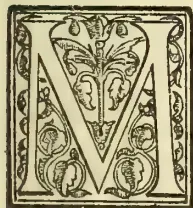

R. George Cempere, State Entomologist, Western Australia, writing to us under date 29th January from Sydney, says:—"By this mail I am sending addressed to you a package which contains the

larvae and pupae of *Cryptolaemus montrouzieri*, the lady bird which destroys the various species of mealy bug. These larvae will all have reached the beetle stage by the time they reach you, and if alive liberate them on any plants infested with mealy bug. I am now on my way to Brazil, and on my return to Australia will write you. I may return *via* London, and in that case will call upon you on reaching Colombo.

We regret to say that the consignment of lady birds was found to be quite dry on arrival, the case in which they were packed having been damaged *en route*. We shall look forward to another interesting meeting with Mr. Cempere, and hope before long to secure live specimens of the beetles destructive to the mealy bug, so troublesome a pest in our gardens.

A small lot of young silkworms sent to us by the Government Entomologist from Peradeniya about the 20th of January—in order to test how they would travel through the post—reached us in good order. At date of writing (26th February) the moths are just getting out of the cocoons. We found that the greatest precaution is necessary to protect the worms and chrysalids from rats and other enemies.

According to the new American food standards in spices, pepper is so defined as to exclude from the standard product pepper hulls, pepper dust, or other pepper by-products. The ash standard of black pepper is made a maximum of 7 per cent, and for white pepper a minimum of 4 per cent, of which not over half per cent shall be sand. Macassar and Bombay maces are not considered as standard mace. Standard mustard is given a maximum of  $2\frac{1}{2}$  per cent of starch derived from mustard. In the cocoa schedule, standard chocolate is defined as the product made by grinding kernels of the cocoa bean without removing the fat or adding other substances, the fat standard being a minimum of 45 per cent. The amount of sugar in sweet chocolate is not limited by the standards. Cocoa is prescribed as the kernel deprived of part of its fat and pulverized. The standard sweet cocoa has a maximum limit of 60 per cent of sugar, but no minimum limit of fat is fixed for either cocoa or sweet cocoa. Chocolate coatings are treated as sweet chocolate.

Two small plots of Jaffna yams taken up at the Government Stock Garden were found to have produced a total weight of yams equal to 148 lbs., 16 tubers weighing from  $\frac{1}{2}$  to  $3\frac{1}{2}$  lbs. each.

We have not heard of several potatoes being propagated from seed, but this has been done in St. Helena. The seedling vines are said to have produced large and sound tubers.

Nut grass (*Cyperus rotundus*), known by the native name of kalaanduru, has long been the subject of discussion, as to the best means of eradicating it from cultivated land. We now hear of a well-known Florida farmer asking "What do you want to get rid of nut grass for?" It is the best material forage for pigs," and this, it appears, is the actual fact.

681------------------------------------------------

644Supplement to the "Tropical Agriculturist."[MARCH 1, 1902.

In this connection it might be mentioned that old nut grass bulbs contain a good deal of resin which is quite apparent on biting through a bulb. Even in the fresh state the bulb is distinctly aromatic from the presence no doubt of resinous matter. Some time ago we unearthed a quantity of nut grass bulbs which had been buried some time in the ground, and discovered that they contained as much resin as they could well-nigh hold.

The milk, butter, and cheese yield of a cow is of course a variable quantity and depends a good deal on the class of animal, the quality and quantity of food and other causes. Some authorities say that a good cow should not produce less than 250 lbs. butter or 500 lbs. cheese. Others take as the standard of production 6,000 lbs. of milk or 260 lbs. butter or 600 lbs. cheese. In the best dairies a cow producing less than 250 lbs. butter per annum is not considered profitable enough to be retained. Mr. Mahon, Principal of Queensland Agricultural College, always expects a cow to yield 200 lbs. butter or 500 lbs. cheese, reckoning that it requires  $2\frac{1}{2}$  gallons milk to make 1 lb. butter, and one gallon milk for 1 lb. cheese.

#### RAINFALL TAKEN AT THE GOVERNMENT STOCK GARDEN FOR FEBRUARY, 1904.

<table border="0">
<tbody>
<tr>
<td>1</td><td>Monday</td><td>...</td><td>Nil</td><td>16</td><td>Tuesday</td><td>...</td><td>Nil</td></tr>
<tr>
<td>2</td><td>Tuesday</td><td>...</td><td>Nil</td><td>17</td><td>Wednesday</td><td>...</td><td>Nil</td></tr>
<tr>
<td>3</td><td>Wednesday</td><td>...</td><td>Nil</td><td>18</td><td>Thursday</td><td>...</td><td>Nil</td></tr>
<tr>
<td>4</td><td>Thursday</td><td>...</td><td>Nil</td><td>19</td><td>Friday</td><td>...</td><td>Nil</td></tr>
<tr>
<td>5</td><td>Friday</td><td>...</td><td>Nil</td><td>20</td><td>Saturday</td><td>...</td><td>Nil</td></tr>
<tr>
<td>6</td><td>Saturday</td><td>...</td><td>Nil</td><td>21</td><td>Sunday</td><td>...</td><td>Nil</td></tr>
<tr>
<td>7</td><td>Sunday</td><td>...</td><td>Nil</td><td>22</td><td>Monday</td><td>...</td><td>Nil</td></tr>
<tr>
<td>8</td><td>Monday</td><td>...</td><td>Nil</td><td>23</td><td>Tuesday</td><td>...</td><td>Nil</td></tr>
<tr>
<td>9</td><td>Tuesday</td><td>...</td><td>Nil</td><td>24</td><td>Wednesday</td><td>...</td><td>Nil</td></tr>
<tr>
<td>10</td><td>Wednesday</td><td>...</td><td>Nil</td><td>25</td><td>Thursday</td><td>...</td><td>Nil</td></tr>
<tr>
<td>11</td><td>Thursday</td><td>...</td><td>Nil</td><td>26</td><td>Friday</td><td>...</td><td>Nil</td></tr>
<tr>
<td>12</td><td>Friday</td><td>...</td><td>Nil</td><td>27</td><td>Saturday</td><td>...</td><td>Nil</td></tr>
<tr>
<td>13</td><td>Saturday</td><td>...</td><td>Nil</td><td>28</td><td>Sunday</td><td>...</td><td>1.60</td></tr>
<tr>
<td>14</td><td>Sunday</td><td>...</td><td>Nil</td><td>29</td><td>Monday</td><td>...</td><td>1.60</td></tr>
<tr>
<td>15</td><td>Monday</td><td>...</td><td>Nil</td><td>1</td><td>Tuesday</td><td>...</td><td>.44</td></tr>
</tbody>
</table>

Total in....2.26

Mean in.... .08

Greatest amount of rainfall in any 24 hours from 28th to 29th = 1.60 inches.

No. of days in which rain fell—4 days.

C. DRIEBERG.

#### THE SCIENTIST AND THE FOOD PROBLEM.

It has been said that mankind is never more than three months removed from abject starvation—an old truth that must always be new and startling. That is, if all resources of food production in the world should be suddenly cut off—the wheat fields failing to give forth their usual crops, and the pastures withering under the feet of the flocks and herds,—the existing store of food would supply mankind barely a quarter of a year, and even before that hunger would have pinched

thousands of the poor. In this day of overflowing abundance such a statement as this comes with something like a shock: it shows by how fine a thread the life of mankind is suspended.

It has been pointed out by the pessimistic philosopher that the wheat fields of the world are failing year by year,—slowly, it is true, but failing; that in many countries the land is being "cropped to death," and already we are hearing of worn-out land in Dakota—the paradise of the wheat-producer. The problem, therefore, as seen by these pessimists, is simple: The world is reaching the limits of its capacity for food production, while the population continues to increase enormously: How soon will starvation begin?

While these philosophers have been making dire predictions, however, science has been quietly but perseveringly at work to prove that mankind has only just begun to sound the world's capacity for food production, and that it is practically limitless. The mistake of the pessimists has been that they have based their arguments on the present knowledge of soil culture, forgetting that science might make discoveries which would change every condition and suggest entirely new possibilities.

Somehow, when man seems just at the limit of his resources, science and invention step in and open new fields, literally as well as figuratively. A comparatively few decades ago no one had thought of using artificial fertilisers; now a young man in Paris is putting up fertilisers in little pressed tablets, a different kind for each different plant. They are accompanied by directions indicating how often the doses must be given and at what time. This, of course, is the extreme application of a new system; but the manufacture of artificial fertilisers for supplying the soil with just the elements that it needs to produce large crops has now become a great business enterprise, and with a constantly decreasing cost of manufacturing power; the harnessing of waterfalls like Niagara, the use of the tides, and the possibility of the direct application of the energy of the sun promise still cheaper fertilisers and still smaller expense of transporting them to the farmer. All this will tend to maintain and even to increase food production. And then there is the possibility, and it is now more than a possibility, of making artificial food outright—that is, of combining the familiar chemical elements of which food is composed and producing a food substitute that will sustain life.

No one need go farther than the laboratory of Professor Berthelot of Paris to be convinced of the great possibilities in this branch of scientific activity. The work is already under way, and science stands ready, the moment the world lacks a complete dinner, to help out with wonderful new food products harvested from retorts and crucibles.

I have barely mentioned these two branches of scientific effort to lead up to the wonderful experiments of Professor Nobbe of Germany—experiments which give an insight into the unfathomed possibilities which lie at the hand of the scientific investigator.

Tharandt, in Saxony, where Professor Nobbe has carried on his investigations for over 30 years, is a little village set picturesque among the

682------------------------------------------------

MARCH 1, 1904.] *Supplement to the "Tropical Agriculturist."*645

Saxon hills, some half-hour's ride by railroad from the city of Dresden. Here is located the Forest Academy of the kingdom, with which Professor Nobbe is prominently connected, and here also is the agricultural experiment station of which he is director. He has been for more than forty years the editor of one of the most important scientific publications in Germany, he is chairman of the Imperial Society of Agricultural Station Directors, and he has been the recipient of many honours. But the greatest of all his work is his remarkable discovery of a method of inoculating the soil with bacteria to make it yield richly where it lay barren before. In times past investigators of soil and plant culture devoted their attention largely to studying the composition of various kinds of soil, to the improvement of fertilisers, and in suggesting new systems of drainage and water-supply. Professor Nobbe has gone a step farther in advance, declaring that plants will grow, under certain conditions, just as well without soil as with soil. At first glance this may seem strange enough, yet here are trees, from eight to 10 inches in circumference at the base of the trunk, growing in clean water, without a sign of soil of any description. They stand in rows just back of the Forest Academy and near Professor Nobbe's greenhouse. Each tree is suspended in a large glass jar surrounded by a green-painted case. When this case is opened one may look through the glass and see the roots of the tree hanging there in the clean water. The oldest of the trees was planted, or rather the seed was immersed in water, in 1878, and it has grown to full size without even touching soil. Leaves and blossoms have come in the spring, and in the winter the water and the roots have frozen solid all these years, and the tree still thrives. Indeed, some of its seeds were immersed in water, and the trees of the second generation have been grown to considerable size. Then their seeds were immersed, and there are now growing small trees three generations removed from the soil—certainly a clear proof of Professor Nobbe's assertion that actual contact with soil is not essential for plant growth. In order to produce such results, however, it was necessary to keep the trees supplied with artificial food. This Professor Nobbe prepared in his laboratory—a certain definite amount of chlorate of potash, sulphate of magnesium, phosphate of iron, phosphate of potassium, and a nitrate. A small quantity of this mixture was dissolved in the water of the jars every four weeks, and thus the trees have been kept flourishing all these years, showing that there was no element in the soil necessary to plant growth that man could not manufacture at will.

Nor was this all that the experiment showed. Professor Nobbe knew to the last gramme how much food he had given to the plant through the water; he also knew that the water before adding the chemicals named was absolutely pure; yet when he came to analyse some of the plants thus grown he found that they contained much greater quantities of various elements than he had supplied through the water. This constituted a proof positive that the plant drew largely upon the air for its nourishment—a fact well-known to science, but not before positively and quantitatively

demonstrated. The proportion of substance drawn from the air was found to be very large. It is said that of every one hundred pounds of wheat harvested from our fields barely one pound is actually drawn from the soil, the remainder coming from the free air and the water. And yet the effort to supply this one-one-hundredth of the plant's food has caused most of the wars and conflicts of the world, has led to the discovery and settling of new continents, and forms to-day the foundation of commerce and finance.

As soon as science had convinced itself of the great truth that plants are fed largely from substances in the air, it began at once to study the problem as to *how* the plant is able to appropriate this aerial food. The chief chemical elements in all vegetable substances are oxygen, carbon, hydrogen, and nitrogen. Added to these are small quantities of potassium, phosphorous, iron, sulphur, magnesium, and calcium. Of all these elements the only ones about which there is any difficulty are nitrogen, potassium, and phosphorous. The others the plant obtains without difficulty, but the supply of nitrogen, especially, too often runs short. When land is said to be worn out, the meaning is that the supplies of nitrogen, potassium, and phosphorous have been exhausted by too constant cropping, by taking much away from the soil and returning nothing to it.

Manure and fertilisers which are rich in these lacking elements, especially those which, like barn-yard manure, are rich in nitrogen, are thus applied to the land, thereby restoring its producing capability. Nitrogen is the all-important element. Potassium and phosphorus are usually present in abundance, or they can be easily supplied in the form of wood-ashes and other fertilisers, but nitrogen is more expensive and more difficult to restore. Nitrogen is what makes the muscles and brain of a man, it is the essential element of all elements in the growth of animals and plants; and, significantly enough, it is also the chief constituent of the gunpowder and other explosives with which the wars of the world are waged. A single discharge of a 13-inch gun liberates enough nitrogen to produce many scores of bushels of wheat. This fact may become, in the future, a greater deterrent of war than we can now imagine.

The failure of the nitrogen of the soil and the inability to supply it to sufficient quantities by artificial means has formed the basis of the predictions of coming starvation made by Sir William Crookes and others. Indeed, if the world ever starves it will be from lack of nitrogen; and yet if such starvation takes place it will be in a world full of nitrogen. For there is not one of the elements more common than nitrogen, not one present around us in larger quantities. Four-fifths of every breath of air we breathe is pure nitrogen—four-fifths of all the earth's atmosphere is nitrogen. If mankind dies of nitrogen starvation, it will die with food everywhere about it and within it.

But, unfortunately, plants and animals are unable to take up nitrogen in its pure form as it appears in the air. It must be combined with nitrogen in the form of ammonia or in some nitrate. These facts have been well known to science for

683------------------------------------------------

646Supplement to the "Tropical Agriculturist."[MARCH 1, 1904.

many years. At the same time it has been known, as a matter of experience among farmers, that when land is worn out by overcropping, with wheat or oats, for instance, both of which draw heavily on the earth's nitrogen supply, certain other crops will still grow luxuriantly upon it, and that if these crops are left and ploughed in, the fertility of the soil will be restored, and it will again produce large fields of wheat and other nitrogen-demanding plants. These restorative crops are clover, lupin, and other leguminous plants—a classification including beans and peas. Everyone who is at all familiar with farming operations has heard of seeding down an old field to clover, thereby restoring its fertility in a degree.

The great importance of this bit of the wisdom of experience was not appreciated by science for many years. Then several German experimenters began to ask why clover and lupin and beans should flourish on worn-out land when other crops failed. All of these plants are especially rich in nitrogen, and yet they grow well on soil which has been robbed of its nitrogen? Why was this so?

It was a hard problem to solve. Botanists had already discovered that the roots of the leguminous plants—that is clover, lupins, beans, peas, and so on—were usually covered with small round swellings, or tumors, to which were given the name nodules. The exact purpose of these swellings being unknown, they were set down as a condition, possibly, of disease, and no further attention was paid to them, until Professor Hellriegel of Burnburg, in Anhalt, took up the work. After much experimenting, he made the important discovery that lupins which had nodules would grow in soil devoid of nitrogen, and that lupins which had no nodules would not grow in the same soil. It was plain, therefore, that the nodules must play an important though mysterious part in enabling the plant to utilise the free nitrogen of the air. That was early in the 80's. His discovery at once started other investigators to work, and it was not long before the announcement came—and it came, curiously enough, at a time when Dr. Koch was making his greatest contributions to the world's knowledge of the germ theory of disease—that these nodules were the result of minute bacteria found in the soil. Professor Beyerinck of Munster gave the bacteria the name Radiocola.

(To be continued.)

## TREATMENT OF TOMATO AND CUCUMBER DISEASE.

One of the most disappointing experiences in vegetable gardens is the loss of the tomato crop through the fungoid disease which so commonly attacks the plant particularly in the low country. In our experience the best time for growing tomatoes in Colombo is between the months of October and March. We have also found that the plants suffer when exposed much to the sun heat but thrive under partial shade. We have for a long time used and advised the use of Bordeaux solution for tomato disease as the best remedy for the trouble, and we have not been content with merely spraying but have freely

watered the plants suffering materially with the solution. Furthermore we have also adopted the plan of pickling the seed in bluestone solution. The treatment advised by Mr. George Massee, of Kew, though not from that adopted by us, is perhaps more simple, and, in view of the successful results which have attended it, we reproduce the account of the method from the Journal of the Royal Horticultural Society for October last:—

In the case of plants growing under glass, the conditions are always highly favourable for the production of "soft" foliage; hence their extreme susceptibility to infection from fungus spores; whereas plants of the same kind grown out of doors or even under glass under more normal conditions remain free from disease.

Under the exceptional conditions of cultivation described above, not only do the well-known parasites of the tomato (*Cladosporium fulvum*, Cooke, and *Fusarium lycopersici*, Sacc.) and of the cucumber (*Cercospora melonis*, Cooke) flourish luxuriantly, but certain other fungi, normally occurring only on decaying vegetable substances in the open, now and again assume a parasitic existence when accidentally introduced into houses where the conditions are so favourable to their development.

The case of *Dendryphium comosum*, Walk., may be given as an illustration. This minute fungus is not uncommon in Britain and other countries. It grows on decaying plants, which it frequently covers with a dense, dull, olive-coloured mould.

During the present season, a market gardener brought a number of diseased cucumber plants to Kew for examination. Microscopic examination and repeated cultures and inoculation showed the blotches on the leaves to be caused by *Dendryphium comosum*. Further investigation showed the fragments of manure projecting from the soil in which the plants were growing to be covered with a copious development of *Dendryphium*, and the fungus was finally traced to the manure heap.

Previous to the present record, *Dendryphium* has never been known to act as a destructive parasite; and its becoming so in the present instance is entirely due to its accidental introduction, along with the manure, to a set of conditions which enabled it to assume a parasitic existence on plants predisposed to disease. Experiments conducted at Kew prove conclusively that *Dendryphium* cannot attack cucumber plants growing in a cool frame.

The use of fungicides in the form of sprays has not by any means produced the results desired and anticipated, and experiments extended have demonstrated that, under the conditions necessary for the rapid production of cucumbers, the daily syringing and constantly damp surface of the foliage render useless those fungicides which, when applied under more favourable conditions, have proved effective.

Under the circumstances, a series of experiments has been carried out with the object of ascertaining whether some substance taken up by the roots of cucumbers and tomatoes would not render plants thus treated immune against the attacks of fungus

684------------------------------------------------

MARCH 1, 1904.]Supplement to the "Tropical Agriculturist."647

parasites, without, at the same time, exercising any injurious or retarding effect on growth or on the production of fruit.

From among the various substances tested, sulphate of copper ( $\text{Cu SO}_4$ ) alone met all the above-mentioned requirements.

The following is an outline of the mode of treatment of plants rendered immune by the use of sulphate of copper:—

The cucumber and tomato seed was sown and the plants grown throughout in a stove, having a mean temperature of 75 degrees Fahr., the humidity varying between 79 degrees and saturation point. The potting, watering, spraying, and general treatment were left entirely to a gardener, and consequently was conducted along the lines followed in establishments where the fruit is grown for sale. . . . Three hundred cucumber seedlings and an equal number of tomato seedlings were subjected to experiment, fifty of each kind being used as check plants. When the seedlings were a fortnight old, the cucumbers were grouped round eight large cucumber plants badly attacked by *Cercospora melonis*, Cke., and *Dendryphium comosum*, and the tomato seedlings were arranged round a tomato plant bearing numerous blotches on the leaves caused by *Cladosporium fulvum*. At this period the specific course of treatment commenced, which consisted in watering the plants every third day with a solution consisting of one part of copper in 7,000 parts of water. The check plants, which were not watered with the copper solution, were indiscriminately mixed with the treated plants. The watering was done during the afternoon, and the quantity used for each plant was sufficient to soak the soil thoroughly.

After a month's treatment all the tomato plants were perfectly free from disease. On the other hand, one or both cotyledons of thirty-four cucumber plants showed blotches of the disease. At the same time, a considerable number of the untreated check plants, both cucumbers and tomatoes, were badly diseased.

At this stage both treated plants and checks were sprayed with water containing the spores causing their respective diseases, and this was continued weekly until the end of the experiments. Under this drastic treatment all the untreated check plants were badly diseased during the following two weeks. After six weeks' treatment with the solution of sulphate of copper of the strength indicated above, the strength was increased to one part of sulphate of copper in 6,000 parts of water, and the soil was soaked every fourth day until the end of the experiments, which lasted eleven weeks. At the expiration of this period, both tomato and cucumber plants were bearing a good crop of well-grown mature fruit.

Not a single one of the tomato plants treated with the sulphate of copper solution showed a trace of disease; and in the case of the treated cucumber plants the disease never extended beyond the cotyledons, and this notwithstanding the fact that badly-diseased plants were growing amongst the treated plants during the whole period. . . . It now simply remained to ascertain whether any of the copper taken up by the roots of the plants

had been deposited in the fruit. Specimens of tomatoes and cucumbers borne by the treated plants were examined in the Government Laboratory by Dr. Thorpe, C.B., F.R.S., and he reported that there was no evidence that the amounts of copper present were sensibly greater than are found in the fruits obtained from the non-treated plants. The paper concludes with

#### PRACTICAL DIRECTIONS FOR TREATMENT.

Commence watering cucumbers and tomatoes, when a fortnight old, every third day with a solution consisting of 1 oz. of sulphate of copper dissolved in 59 gallons of water. After treating for six weeks as above, commence watering every fourth day with a solution consisting of 1 oz. of sulphate of copper in 35 gallons of water. The sulphate of copper should be pure, and rain water should be used if possible.

### THE PAPAW FRUIT.

We know a good deal about the papaw or papaya (erroneously called "popoy" by some people) seeing that the fruit is so common with us, but the following article from the American Journal of Pharmacy tells us a lot that we fancy most people have never heard before:—

Quite universal is the knowledge of the unique property that has given to the papaw its world-wide fame, viz., the power of its milky juice to soften and dissolve tough meat. The statement has passed current in our journals that the emanations from this tree will dissolve and digest albumen, and that it is the custom of natives to hang meat and chickens in the branches of a tree to render them tender and edible. The natives often go further than this; they state that if male animals browse under the papaw tree, they thereby become emasculated. If we compare this statement with the alleged property of the roots as a generative tonic, we shall have a marvellous combination of an aphrodisiac and an anaphrodisiac in the same plant.

It is needless to urge that such stories are exaggerations of the pepsin like properties of the fruit.

The native uses of the papaw are numerous and varied. The bark is used in the manufacture of ropes; the fruit is edible, and according to the local conditions, may be sweet, refreshing, and agreeable, or in other localities it is sickly, sweet, and insipid. The fruit finds a large consumption by the natives, and is considered very nutritious.

At the corner of a sugar-cane field, where the ragged canes bend over in a wild green, brown, and yellow tangle, there will be standing a papaw-tree, and, if the time of the papaw tree has quite come, beneath the tree will be assembled a half-dozen negroes.

The ripe fruit is eaten as we eat melons. Salt enhances the flavour, and some users add sugar. The melons must be perfectly ripe when eaten raw, as the green fruit contains a strongly marked acrid principle. The colour of the ripe fruit is more or less that of our very yellow musk-melon. The sweetness of its resinous, pulpy juice clings to the tongue and remains prevalent for some hours.

685------------------------------------------------

648Supplement to the "Tropical Agriculturist."[MARCH 1, 1904.

The natives enjoy the flavour, while the stranger has to acquire the liking. Excellent preserves are made of the ripe fruit, which, for this purpose, is boiled down in sugar and candied (like citron).

At the sugar-houses slices of the papaw are often seen seething in hot syrup. The slices of melon combined with some acid fruit is made into native tarts, which articles correspond more or less to what we call "pies." The fruit is also stewed and served on the table. The green fruit is made into plain and spiced pickles, which are highly esteemed.

The fruit, just before ripening, is peeled and sliced, macerated in cold water, with frequent changes of water for some hours; the then macerated fruit is dropped into boiling water, boiled sharply, and then served as a vegetable.

As an article of food one finds the papaw prepared in a score of ways, making a variety of edible dishes, which, from the native standpoint, would be expressed in our language as "wondrous and nutritious delicacies."

A plant so universally distributed and possessed with such varied properties naturally takes an important place in the native *ateria medica*.

The seeds are reputed as anthelmintic and emmenagogue; they are also used as a thirst quencher, form component parts of a drink used in fevers, as well as being used as a carminative. Syrups, wines, and elixirs made from the ripe fruit are expectorant, sedative, and tonic.

A malady, which the natives call the "cocoa bag," is a troublesome tropical disease, reputed to be hereditary and contagious; at all events, it seems to lurk in the blood of persons of otherwise apparently good health and habits. Suddenly the victim becomes a mass of offensive sores, debilitated, &c. The native doctors add the papaw fruit to the diet drinks used in this disease, and succeed in moderating its violence, at least. To the sores a paste made with the papaw milk as one of the constituents is also applied.

The slight pimples accompanying the first stages of the yaws soon spread into ulcerous sores that cover the entire body. Here, too, the claim is made that a slice of the papaw rubbed over the pimples will abort them. It is also claimed that the ulcers may be cleaned in a similar fashion.

I witnessed a most striking cleansing of a black foot in which the chiga had bored and laid its eggs, producing a mass of foulness beyond description. Here a paste of the papaw milk was pushed into the seething mass and kept there for forty-eight hours. It was then flushed, curetted, and antiseptics were applied. A clean wound, which readily healed, resulted.

The green leaves or slices of the green fruit of the papaw are rubbed over soiled and spotted clothes, and, by its power of dissolving stains, papaw has acquired the name of "melon bleach." The leaves or a portion of the fruit are steeped in water, and the treated water is used in washing coloured clothing, especially black. The colours are cleaned up and held fast.

The seeds are eaten as a delicacy. They have quite an agreeable taste, something of the order of water-cress, and a piquancy slightly suggestive

of the mustard family. Macerated in vinegar they are served as a condiment.

The strange and beautiful races of the Antilles astonish the eyes of the traveller who sees them for the first time. It has been said that they have taken their black, brown, and olive, and yellow skin tints from the satiny and bright-hued rinds of the fruit which surround them. If they are to be believed, the mystery of their clear, clean complexions and exquisite pulp-like flesh arises from the use of the papaw fruit as a cosmetic. A slice of the ripe fruit is rubbed over the skin, and is said to dissolve spare flesh and remove every blemish. It is a toilet requisite in use by the young and old, producing, according to the words of a French writer, "the most beautiful specimens of the human race."

The meat in these countries is tough and tasteless, beef, mutton, pork or fowl have the same flavour, and are as tough as hickory wood; boiling until they fall to pieces does not render them any more tender, they simply change from solid wood to fine tough splinters.

One reason for this is that in this climate meat must be eaten immediately after slaughter. (It often reaches the pot in an hour after killing.) The papaw helps to overcome this. Rubbed over tough meat it will render it soft, and change a piece of apparent leather to a tender, juicy steak. It is put into the pot with meat, enters into cereals, soups, stews, and other dishes, and they are made at least more edible and digestible.

#### PADDY CULTIVATION IN THE HANBANTOTA DISTRICT.

Before the construction of the anicut across Walawe river, the people depended almost entirely on chena cultivation for their subsistence.

Except for two or three hundred acres on either bank of the river, cultivated by its backwater, there were no paddy-fields elsewhere.

Chena cultivation being entirely dependent on favourable weather conditions, the lot of the people was indeed a miserable one.

But now matters have completely changed with the construction of the anicut, and there are now over 2,000 acres cultivated regularly. Paddy cultivation being comparatively new to the majority of the cultivators here, their methods are yet very crude, and it is only due to the very rich soil that they are able to raise remunerative crops. I have introduced from the Western Province a paddy called "Murunga," which is harvested 75 days from date of sowing. This paddy gives fair crops and has adapted itself well to its new surroundings. But what pleases me most is that the local goyiya who does not like things new has a high opinion of the paddy. It has now spread far and wide in the East and West Giruwa Pattu and the Magam Pattu.

This paddy is specially suitable for Tank districts where the water supply is limited. As we generally commence sowing with Bala Suduwi or Mukalawi which takes 90 days, this paddy comes in useful as it can be sown 15 days after the above varieties, and yet come in at about the

686------------------------------------------------

MARCH 1, 1904.]Supplement to the "Tropical Agriculturist."649

same time. This is of great importance to us, as Government appoints certain dates for stopping sowing, and there is generally a lot of unsown land by that date. The goiyas have named the paddy "Colombawi" owing to the "Colomba Mahatmaya" having introduced it.

I am now growing a Rangoon paddy which takes 90 days. This variety can be cropped twice and gives splendid crops. When ripe it does not fall on its side, but keeps erect owing to the stalks being quite green when the grain is ready for reaping. In consequence, the straw is of excellent quality and much appreciated by horses and cattle.

The rice from this paddy is milky white and of excellent quality. There is no bran on the grain, a slight pounding being sufficient to separate the grain from the husk.

In a Rangoon paddy introduced some few crops previously, the grain was similar to the previously mentioned variety in having no bran, but after being sown three times the grain had bran on it as in the local paddy.

A. D.

RAINFALL TAKEN AT THE GOVERNMENT STOCK GARDEN, THURSTON ROAD, COLOMBO, DURING THE YEAR 1903.

<table border="1">
<thead>
<tr>
<th>Month.</th>
<th>Rainfall.</th>
<th>Mean.</th>
<th>Greatest Rainfall and Date of same.</th>
</tr>
</thead>
<tbody>
<tr>
<td>January</td>
<td>5.68</td>
<td>.18</td>
<td>1.60 January 28th.</td>
</tr>
<tr>
<td>February</td>
<td>2.87</td>
<td>.10</td>
<td>.81 February 26th.</td>
</tr>
<tr>
<td>March</td>
<td>.77</td>
<td>.02</td>
<td>.44 March 31st.</td>
</tr>
<tr>
<td>April</td>
<td>6.60</td>
<td>.22</td>
<td>2.15 April 7th.</td>
</tr>
<tr>
<td>May</td>
<td>26.38</td>
<td>.87</td>
<td>5.53 May 16th.</td>
</tr>
<tr>
<td>June</td>
<td>7.58</td>
<td>.25</td>
<td>1.10 June 27.</td>
</tr>
<tr>
<td>July</td>
<td>6.74</td>
<td>.22</td>
<td>1.54 July 30th.</td>
</tr>
<tr>
<td>August</td>
<td>8.27</td>
<td>.27</td>
<td>3.10 August 11th.</td>
</tr>
<tr>
<td>September</td>
<td>11.54</td>
<td>.38</td>
<td>3.40 September 5th.</td>
</tr>
<tr>
<td>October</td>
<td>13.59</td>
<td>.43</td>
<td>3.55 October 24th.</td>
</tr>
<tr>
<td>November</td>
<td>1.75</td>
<td>.06</td>
<td>.36 November 7th.</td>
</tr>
<tr>
<td>December</td>
<td>4.46</td>
<td>.14</td>
<td>1.60 December 23rd.</td>
</tr>
</tbody>
</table>

POULTRY RAISING.

BY A PRACTICAL MAN.

(Continued.)

BREEDS.

The next item is the much debated one of the best breed to keep, and it is here that I must "lightly tread," for we all swear by our particular favourites. If any of my hearers are inclined to doubt my word, I would recommend them to judge at a poultry show, where there is a prize offered for the best pen of birds on the show. If he does not hear, from disappointed exhibitors, the superior qualities of every breed over the one he has awarded the prize to, human natures must have changed since I officiated as a judge.

My statements are made from practical experience and not from what I have read, although from a very early age I have eagerly devoured poultry literature.

For laying qualities only: Leghorn, Andalusian, Wyandotte, Spanish, Minorca and Hamburg would

be hard to excel. All but the Wyandotte lay a large white egg.

For table qualities: The Dorking, Houdan, Langshan.

For table and laying qualities combined: The Orpington.

The Cochin, Brahma, Rock and Games (Indian, Old English and Modern) I prefer crossed with the Orpington, Houdan, Dorking or Langshan, both for laying and table purposes.

If your object is to breed for egg production and you cannot afford to lay out a lot of money on pure-bred fowls, I should recommend that you pen your common or barn-door fowls, and when you have picked out the best layers under two years old, procure a pure-bred cock (about 8 months old) of the Leghorn, Andalusian, Minorca, Spanish, Hamburg, or Orpington breeds, and run him with the 20 or less hens selected as good layers. Set the eggs laid by these hens so mated. When the pullets (from this cross) come on to lay put them also to a pure-bred cock of a different breed to their sire, and so on each year introducing a fresh male bird. By this means you will have a fresh cross each year, and increased egg production, and a stronger fowl. It will be necessary each year to select your best layers and only bred from them, for by continually selecting the good layers and breeding from them a good laying strain will be formed. When the pullets have been laying about a month save the eggs laid after the expiration of that period, and set them. I have found the eggs laid by a pullet if set before she has been laying a month produce small and weak chicks, and would recommend that all eggs laid up till then be used for human consumption. Do not keep a hen after she is two years old unless she is an extraordinary layer. My experience has been that after two years of age their egg-producing qualities are on the decline. If possible procure a cock (to mate with the selected pullets) the progeny of a good laying hen.

In breeding for table purposes, select the square-bodied, deep-breasted, short-legged, comfortable-looking hens with black, blue or white legs. Birds with legs of these colours usually carry white flesh. Yellow-legged birds, as a rule, have yellow skins, which is in England considered a great detriment to their fetching good prices as table birds. To these square-bodied hens introduce a Dorking, Houdan, Indian Game, Orpington, or short-legged Langshan cock. If the yellow-skin is not a detriment to good prices in your market, a Cochin, Brahma, Wyandotte or Plymouth Rock cock could be used—using a different breed each year; or if you can be certain of procuring a bird of the same variety as you have just bred from, but unrelated, and the result has been favourable, I should recommend you to continue with the same cross each year. By taking a cock of another breed each year, the danger of in-breeding will be avoided, so this will be the safest course.

One of the best crosses I have ever seen was the progeny of a Partridge Cochin cock and a Malay hen. The flesh was sweet, tender and abundant. This cross was very hardy.

687------------------------------------------------

650Supplement to the "Tropical Agriculturist."[MARCH 1, 1904.

A favourite cross of mine for egg-production was that of a White Leghorn and a Light Brahma cock. One pullet's laying record was kept, and was as follows:—

<table>
<tbody>
<tr>
<td>1893—June</td>
<td>...</td>
<td>23</td>
<td>Eggs.</td>
</tr>
<tr>
<td>" July</td>
<td>...</td>
<td>22</td>
<td>"</td>
</tr>
<tr>
<td>" August</td>
<td>...</td>
<td>22</td>
<td>"</td>
</tr>
<tr>
<td>" September</td>
<td>...</td>
<td>3</td>
<td>"</td>
</tr>
<tr>
<td>" October</td>
<td>...</td>
<td>16</td>
<td>"</td>
</tr>
<tr>
<td>" November</td>
<td>...</td>
<td>13</td>
<td>"</td>
</tr>
<tr>
<td>" December</td>
<td>...</td>
<td>15</td>
<td>"</td>
</tr>
<tr>
<td>1894—January</td>
<td>...</td>
<td>12</td>
<td>"</td>
</tr>
<tr>
<td>" February</td>
<td>...</td>
<td>0</td>
<td>"</td>
</tr>
<tr>
<td>" March</td>
<td>...</td>
<td>6</td>
<td>"</td>
</tr>
<tr>
<td>" April</td>
<td>...</td>
<td>20</td>
<td>"</td>
</tr>
<tr>
<td>" May</td>
<td>...</td>
<td>20</td>
<td>"</td>
</tr>
<tr>
<td colspan="2">Total for 12 months...</td>
<td>172</td>
<td>"</td>
</tr>
<tr>
<td>1894—June</td>
<td>...</td>
<td>16</td>
<td>Eggs.</td>
</tr>
<tr>
<td>" July</td>
<td>...</td>
<td>12</td>
<td>"</td>
</tr>
<tr>
<td>" August</td>
<td>...</td>
<td>17</td>
<td>"</td>
</tr>
<tr>
<td>" October</td>
<td>...</td>
<td>20</td>
<td>"</td>
</tr>
<tr>
<td>" November</td>
<td>...</td>
<td>6</td>
<td>"</td>
</tr>
<tr>
<td>" December</td>
<td>...</td>
<td>5</td>
<td>"</td>
</tr>
</tbody>
</table>

Grand Total for 18 months... 248 "

She then died. She was a large-bodied hen, and laid a large white egg of a peculiar shape, so there was no difficulty in distinguishing her eggs. The record was faithfully kept. In fact all eggs laid in my yards are entered in a book kept for that purpose.

The Spanish crossed with almost any other breed will give a good result. In their pure state I have found them too delicate for this country.

If a hen will contribute 150 eggs per year in this Colony, she is, in my opinion, a very good hen. This particular hen was bred from pure-bred parents on both sides. The best and quickest results are obtained when both parents are pure-bred. But the plan I have recommended, viz., running pure-bred crops with the ordinary hen and continually selecting the best layers and table fowls to breed from, will be the cheapest and will give good results.

(To be continued.)

#### GENERAL ITEMS.

Prof. Wallace of Edinburgh, who has lately returned from the Argentine, has the following reference to the Dairy industry there:—Dairying in one of the great branches of rural industry in which we may expect developments. From the Argentine were sent last year no less than 9,075,000 lbs. of butter, made by the best modern scientific methods, and the finest machinery that can be supplied from Europe. I visited one factory under the management of Argentines which turns out twenty tons of butter a day. I saw another centre where the milk of 7,000 cows was handled. A curious thing was that they did not at first know to what purpose to turn the separated milk,

and for a time it was put down the river. Now it is curdled with mineral acid, and so called "Casein." A dry mealy substance is produced, which on being worked up and pressed is made into buttons and bone-like ornaments. I came across another place where a still more novel method of disposing of the separated milk was at first resorted to. As there was no river they dug holes in the ground and put the milk into them, and the result was the milk soured, the whey escaped into the earth, and the curd was left to develop into a very "nosy" sort of soft cheese. At last the pigs were admitted from day to day to consume it in the pits!

In India, at the end of 1901, the major or productive works included an area of 10,583,115 acres, irrigated from 34,403 miles of canals. The percentage of net revenue to capital outlay was over 709, the financial success of some of the schemes is extraordinary, the Eastern Jumna for 1900-1 yielded 25.86 %; the Godaveri Delta, 17.64 %; the Cauvery Delta, 30.81 %; the Begasi Canal, 23.79 %. Including minor works the area irrigated amounted to 19,646,291 acres, and many of the less important schemes pay over 20 %, the Shapur inundation canal yielded 28.78 %, the Shatitope anicut 34.94 %, and the Ghar scheme 105.07 %. Apart from the return to Government the total value of the crops raised is estimated over £22,000,000, or nearly 98 % of the capital outlay. The effect of the Kistna and Godavery canals is said to have been so great that in one year of famine they produced crops valued at nearly £5,000,000, or four times the entire capital outlay on the works.

As instances of dams or weirs for directing running water may be mentioned the following: The masonry dam at Spanish Town, Jamaica, across the river which sometimes rises 18 to 20 ft. in a night; the famous Barrage across the Nile, south of the Delta; the weir nearly 2½ mile long across the Godavery where the floods rise 28 ft.; the dam across the Kistna 1,300 yards long, the floods rising 36 ft.; but across the Dehree, 2½ miles long, the water rising 18 ft.

The feeding ground of roots is not close to the trunk, but in a circle whose radius is never less than half the height of the tree when matured. Some American fruit-growers never irrigate within the shadow cast by the tree at noon. Only those who are ignorant of these facts will manure and water the base of a tree. A man might as well try to quench his thirst by taking a bath as to cultivate trees by watering the hard wood in the trunk. Roots have to respire. If the soil is so compact to exclude air, or if saturated with water so as to keep out air the roots must perish. Water-logged land is one of the causes of unscientific cultivation, and asphyxiation is a common cause of fruits dropping.

688------------------------------------------------

# \* The TROPICAL AGRICULTURIST \*

## ◇ MONTHLY. ◇

XXIII.

COLOMBO, APRIL 1ST, 1904.

No. 10.

### THE "T. A." PRIZE ESSAYS.

E again draw the attention of our readers to the valuable prizes which we are giving at the end of June for the three best essays summarising and embodying the information given in our pages in the volume for the current year, July 1903 to June 1904, regarding

#### NEW PRODUCTS.

The Products excluded from these essays are the staple ones: Tea, Coffee, Cacao, Cardamoms, Cinnamon, the Palms, Sugar, and Rice. Writers may add in their essays any additional and illustrative information they may consider wise, and so make the essays as comprehensive and up to date as possible.

Competitors are warned against putting useless "padding" in their essays,—practical, useful information is what is wanted; and the Editor's decision must be accepted as final. The prizes are in value as follows:—

First Prize ... Rs. 300 or £20.

Second ,, ... Rs. 200 or £13 6s. 8d.

Third ,, ... Rs. 100 or £6 13s. 4d.

When first announcing the above prizes, we made the rule that the essays must be sent in within four weeks after the issue of the June number of the *T.A.* for 1904. Not wishing, however, to handicap competitors in distant parts of the world, some of whom the *T.A.* does not reach until nearly three weeks after publication, we have pleasure in extending the time limit for such. To competitors in countries other than Ceylon and India there will be given an extra three weeks; thus their essays must reach us within seven weeks after the issue of the June number of the *T.A.* for 1904.

### THE PREPARATION OF INDIA RUBBER.

#### USEFUL INFORMATION TO PLANTERS.

VARIOUS METHODS OF COAGULATION; STRAINING AND PURIFYING THE LATEX; COAGULATING AGENTS; RUBBER WASHING AND DRYING.

By DR. C. O. WEBER.

The question of the coagulation of the rubber latex is one of great importance to rubber planters. Some hold to the opinion that no acid agent is necessary, and that the natural coagulation is the best method; others use a small amount of acetic acid which they claim is quite harmless to the resultant rubber as shown by the high prices realised in the London markets for rubber so prepared; while others again are in favour of the smoke system. Dr. C. O. Weber, a leading expert in rubber, has for some time been investigating the best methods for the treatment of the latex, and has tested the conclusions arrived at. Samples of latex were obtained in Hevea and forwarded to the doctor's laboratories; these were conveyed on the journey in cold storage and arrived in first-rate condition for experiments and tests. Dr. Weber, in an article in the "India Rubber Journal" gives the results of his investigations, and these are worth the perusal of all rubber planters.

Dr. Weber insists on the importance of planters only selling rubber in a condition approaching chemical purity; and he dwells on the necessity of thoroughly washing the rubber and ridding it of all mechanical impurities; such as sand, earth, bits of wood and other vegetable fragments, as well as resinous and albuminous matter.

Ceylon rubber has already got a good position and name in the London market; highest prices have been obtained again and again for Ceylon Para. This high standard of Ceylon rubber and these top prices must be maintained, and Ceylon rubber must keep its place at the top of the market. This can only be done if planters determine that only the best rubber shall be produced on the Ceylon estates, and that all rubber exported shall be of high quality and the utmost purity

689------------------------------------------------

652THE TROPICAL AGRICULTURIST.[APRIL 1, 1904.

obtainable. The Straits planters are a go-a-head lot, and will be keen rivals to Ceylon. We must see to it that Ceylon rubber keeps ahead of our more easterly rivals, and that our rubber, like our tea, shall be second to none.

In the interests of Ceylon rubber we give the results of Dr. Weber's investigations mentioned above, and commend them to the notice of all planters.

#### STATE OF RUBBER IN THE LATEX.

On investigating Castilloya latex with a view to determine the nature of the process of coagulation, it very soon became perfectly clear that the coagulation of the latex is not due to any specific property of the india-rubber in the latex, but is simply a matter of the coagulation of the albuminous matter contained in the latex. The India-rubber substance is not dissolved in the latex, but is emulsified or suspended in it. Now, if in a suspension of this kind we have at the same time albumen in a state of solution, anything which will coagulate—*i.e.*, render insoluble or precipitate—the albumen will at the same time result in the suspended matter being carried down by the precipitating or coagulating albumen. The capability of coagulation exhibited by all kinds of rubber latex with which I am acquainted depends, therefore, entirely upon the presence in it of coagulable albuminous substances, and the so-called coagulation of india-rubber is therefore a process exactly on a par, in both its chemical and physical aspects, with the clarification of wine or beer by means of such albuminoids as isinglass or gelatine. There is only this difference—that in the case of rubber latex to carry down the rubber suspension we need not add any albuminous matter, as it is already a regular constituent of the latex.

In the above-mentioned facts lies the explanation of the further fact that the coagulation of rubber latex can be accomplished by any one of the numerous reagents capable of coagulating albumen. The process of coagulation is neither assisted nor retarded by the presence of the suspended (emulsified) india-rubber. On the other hand, the readiness with which coagulation does take place depends very considerably upon the exact nature of the albuminous matter present in the latex, as well as upon the presence of certain inorganic salts. It is for this reason that two different kinds of latex, of different botanical origin, although both may contain the same amount of albuminous matter, cannot be coagulated neither equally easily nor even, perhaps, by the same means.

#### COAGULATION BY HEATING.

This latter point is particularly strongly marked in the case of the simplest process of coagulation—namely, coagulation by heating. Some kinds of latex can be boiled for a practically indefinite time without any coagulation taking place; others will coagulate long before they reach boiling point. But this difference disappears the more energetic the coagulating agent we employ. Thus it will be found that most kinds of latex are coagulated by the addition of small quantities of either acetic or dilute mineral acids, but the time required for the complete coagulation of different kinds of latex by any of these acids varies rather considerably. On the other hand, all kinds of latex undergo immediate coagulation on the addition to them of a solution of tannic acid, hydrocyanic acid, or mercuric chloride, or nitrate.

Of course, rubber prepared by any such process of coagulation always necessarily contains also all the albumen present in the rubber milk. This amount varies not inconsiderably in different kinds of latex, and we therefore find that some brands of rubber contain very varying amounts of coagulated albuminous matter. There is not more than from 2 to 3 per cent. of it in Para rubber, whereas coagulated Castilloya rubber contains often as much as 11 per cent.

#### PUTRESCENCE IN "HEATED" RUBBER.

Now it is just this albuminous matter in the rubber which is always at the bottom of the trouble of the

fatal appearance of "heating" in the rubber. Albumen coagulated or otherwise, as everybody knows, becomes very early putrescid, and this putrescence is a process due to the action of certain specific micro-organisms upon the albumen. These micro-organisms it is impossible to keep out of the rubber latex, and thus out of the coagulated rubber, and if the rubber be shipped wet inside we obtain all the conditions favouring the rapid spread of putrescent fermentation throughout the rubber. This process sooner or later also effects the rubber, which then exhibits an appearance much as if it had been heated to its melting temperature; hence the popular description of it as "heated." As a matter of fact, if the rubber is free from albumen, it will never undergo this change. The highest temperature possible in a ship's hold in tropical latitudes is entirely insufficient to affect the rubber.

#### COAGULATION BY THE SMOKING PROCESS.

I have above pointed out that this invidious action of albumen in the india-rubber is contingent upon the presence at the same time of water. Accordingly, we find that if rubber containing albuminous matter be shipped in a perfectly dry condition, any detrimental action of the former is prevented. Of course, the same result may be obtained, irrespective of the presence of moisture and albuminous matter in the rubber, by incorporating it, preferably in the process of coagulation, with some antiseptic material. This is what is done by the smoking process in the case of Para rubber. It is well known that the smoking process can only be carried out by means of a low fire, smouldering rather than burning. The smoke of such fires is characterised by the presence in it of acetic acid, methyl alcohol, acetone, creosot, and a number of empyreumatic substances. The smoking process consists simply in a fractional coagulation—as opposed to the usual coagulation in bulk—each of the skins or layers which is added to the previous ones at each dipping of the paddle in the rubber milk being coagulated by exposure to the above described smoke.

#### ACETIC ACID, THE AGENT IN SMOKE.

The coagulating agent in this smoke is, no doubt the acetic acid, but it is not improbable that also some of the other constituents of the smoke play some part in it, and it is quite certain that the creosot and similar phenolic bodies of the smoke act as powerful antiseptics, and thus prevent the albuminous matter of Para rubber, although the latter always contains a considerable percentage of moisture, causing the "heating" of the rubber during transit. I have, indeed, never heard of "heated" Para, not even as a very rare occurrence. On the other hand, Negrohead, although it contains the same intrinsic rubber substances as Para, is very liable to heating.

All the above considerations are of the utmost importance in regard to the question of procedure in the preparation of rubber from all kinds of rubber latex; they form, in fact, the basis of the whole question of coagulation.

#### SHRINKAGE IN CRUDE RUBBER.

One of the greatest troubles in connection with crude rubber has always been its comparative impurity, stated as "loss on washing" (shrinkage) by the manufacturer. Considerable improvements in this respect have been effected in the African grades of rubber, whereas the American, and also the Eastern, brands have been going worse and worse in recent years. Of course, the "loss on washing" entirely consists of the moisture and the mechanical impurities contained in the crude rubber, and until quiet recent years manufacturers looked upon a washed rubber as an essentially pure article of its kind. But, as a matter of fact, many grades of rubber, even after washing and drying, are a long way from a real state

690------------------------------------------------

APRIL 1, 1904.]THE TROPICAL AGRICULTURIST.653

of purity. Thus, taking washed and dried fine Para we find that it contains on an average—

<table>
<tr>
<td>Rubber</td>
<td>...</td>
<td>94.0</td>
<td>per cent.</td>
</tr>
<tr>
<td>Resinous matter</td>
<td>..</td>
<td>2.5</td>
<td>"</td>
</tr>
<tr>
<td>Albuminous matter</td>
<td>..</td>
<td>3</td>
<td>"</td>
</tr>
<tr>
<td>Mineral matter</td>
<td>...</td>
<td>0.5</td>
<td>"</td>
</tr>
</table>

A considerable number of grades of washed rubber will be found to contain still up to 18 per cent. of impurities of this kind.

#### IMPORTANT TO THE RUBBER PLANTER.

Now it is evident that the rubber planter, in approaching the question of the preparation of his rubber, should make the utmost of the opportunities he possesses of bringing upon the market only products of exceptional quality; in fact, he should sell rubber only in a condition approaching chemical purity, and the question therefore is how to produce such rubber.

#### CHIEF IMPURITIES OF RUBBER.

I have already stated that the chief impurities of rubber are, besides water, the mechanical impurities, such as sand, earth, and vegetable fragments of every description; furthermore, resinous and albuminous matter. Of these impurities all, with exception of the last two, are easily avoided—at least, in all those kinds of latex which do not coagulate spontaneously the moment they issue from the trees. This is certainly not the case with the latex produced by either Hevea or Castilloa—the only rubber trees cultivated on a large scale at the present time.

#### STRAINING THE LATEX.

To free the rubber from mechanical impurities amounts, of course, simply to removing these impurities from the latex. This is best done by straining the latex through some suitable fabric. The one known as "butter cloth," or "cheese cloth," answers this purpose very well, and it is moreover very cheap. In the case of Castilloa milk, it is absolutely essential to dilute the milk with at least four volumes of water before straining. In the case of Hevea milk there is not quite the same necessity to dilute it before straining, but the operation will prove much more expeditious after addition of about two volumes of water. Very important is it not to touch the straining surface with the hand, or to rub it with a brush or some other implement, in order to hasten the passage of the milk through the cloth, as doing this invariably results in the cloth becoming clogged with coagulating rubber. Should the diluted latex run too slowly through the strainer, the latter should be shaken by causing it to oscillate rapidly in a horizontal direction. If this is done right from the start the latex will pass through very freely. It is also perhaps scarcely necessary to point out that the strainer, when not in use, should be kept in water. A strainer which has been used and is then allowed to get dry will be found useless for further work, as it is completely covered by a fine coating of coagulated rubber.

#### TO GET RID OF THE ALBUMEN.

In preparing the rubber from this latex freed from its unavoidable mechanical impurities, we shall now have to make up our mind whether we desire to produce the rubber free from albuminous matter. This is the course I most strongly recommend. India-rubber freed from this substance may not immediately commend itself in its true merit to rubber manufacturers, but its superiority will soon become manifest and be recognised by a higher price. To produce such rubber the following procedure would have to be adopted:—

To every gallon of the rubber latex from  $\frac{1}{2}$  oz. to 1 oz. of formaldehyde (formaline, 40 per cent. solution) is added, the latex well stirred, and allowed to stand for one hour. Then to each gallon of latex a solution of 1 lb. of sodium sulphate (commercial) in one pint of boiling water is added, while still hot, and the mixture stirred for some time. Coagulation may take place immediately, or after several hours' standing, according to the condition (age) of the latex. Great

care must be taken to use a sodium sulphate of entirely neutral (not acid) reaction.

The cake of rubber thus formed is liable to contain numerous cavities, including some of the mother liquor. It should therefore be washed upon a corrugated rubber washing machine until the sheets of rubber exhibit their full strength. They should then be thoroughly dried in a dark but well-ventilated shed until absolutely dry.

Rubber prepared in this manner will be found free from every trace of albuminous matter. It is of a degree of purity greatly surpassing the finest Para rubber ever produced, and therefore contains a percentage of pure rubber exceeding that of every known rubber quality. Its only impurity consists of about 2 per cent. of a viscous resinous matter, the removal of which is scarcely worth while.

#### COLOURLESS RUBBER.

This same treatment, in like manner, is also applicable to Castilloa latex. In both cases the rubber obtained forms an almost colourless substance, which to anyone associating with rubber a colour ranging from a medium brown to black must appear startlingly unlike rubber.

#### THE PROCESS FOR NON-COAGULATED RUBBER.

Strictly speaking, this method of preparing the rubber is not coagulation at all. If it were, it is obvious that in accordance with what I said above about the nature of the coagulation process, the coagulated albumen would be contained in the rubber, whereas rubber prepared in the above-described manner is entirely free from albumen.

What actually happens in this method is this: The diluted rubber milk, freed from all its mechanical impurities by straining, is to begin with rendered non-coagulable by the addition of the formaldehyde, which combines to a readily soluble compound with the albuminous matter present. On now adding to the rubber milk the solution of sodium sulphate the rubber substance rapidly rises to the top, where at first it forms a very thick, creamy mass, the individual globules of which rapidly coalesce. The coalesced (and as a matter of fact, not coagulated) mass, on being worked upon the washing rollers, undergoes a very curious polymerisation process, and thereby rapidly acquires the great strength and toughness so characteristic of high-class india-rubber.

#### COAGULATING AGENTS.

Considering now the process of coagulation proper of the india-rubber latex, the most important point is obviously the selection of the coagulating agent, and while one would naturally be inclined to use one possessing as energetic as possible a coagulating action, it is, on the other hand, imperative not to employ any material capable of subsequently detrimentally affecting the india-rubber. The reagents capable of coagulating india-rubber, as I have above shown at some length, are exactly the reagents capable of coagulating albumen. These are formic acid, acetic acid, and a considerable number of organic acids, phosphor-tungstic acid, potassium-bismuth iodide, potassium-mercury iodide, hydroferrocyanic acid (yellow prussiate and acetic acid,) tannic acid, chloral hydrate, phenol, and picric acid. Quite a number of these reagents are of too expensive a nature to be used otherwise than on a laboratory scale. Several of them, notably the inorganic of the above named compounds, as also hydroferrocyanic acid and picric acid, would be highly undesirable compounds in india-rubber. There remain, therefore, only to be considered for practical purposes formic acid, acetic acid, tannic acid, and phenol.

#### TANNIC ACID—THE QUICKEST AGENT.

Of these tannic acid will be found to have the quickest and most energetic action. I have not so far had an opportunity of experimenting with it on a large scale. On the laboratory scale the results ob-

691------------------------------------------------

654THE TROPICAL AGRICULTURIST.[APRIL 1, 1904.

tained with *Hevea* latex are excellent; those obtained with *Castilloa* latex are much less satisfactory. The reason for this, of course, is to be found in the fact that the latex of *Castilloa* contains about three times as much albumen as that of *Hevea*, and therefore produces in this treatment a much more impure rubber than the latter. It is also worth mentioning that rubber coagulated by means of tannic acid and, while still wet, placed in an incubator at temperatures from 100 deg. F. upwards, rapidly passes into a state of putrescid fermentation, but such a change does not occur if the rubber is submitted to this test in a thoroughly dry condition.

#### FORMIC AND ACETIC ACIDS.

The action of formic acid and of acetic acid is about the same, but not so energetic as that of tannic acid. Formic acid, weight for weight, is rather more expensive than acetic acid, but this is fully counterbalanced by the fact that three parts of formic acid are quite sufficient to produce the same effect as four parts of acetic acid.\* Formic acid offers, moreover, the further advantage that it possesses not very strong but distinct antispetic properties. Whichever of these two acids may be employed, no more of it should be added to the latex than what is just sufficient to produce coagulation. Better results are obtained in this way, which is also the more economical.

The minimum quantity of either of these two acids for the complete and rapid coagulation of the latex varies, of course, considerably according to the percentage of albumen contained in the latex, and it is also influenced by the nature of the albumen contained in it. For this reason it is impossible to name any fixed proportions applicable to all kinds of latex.

#### AMOUNT OF ACID REQUIRED.

I have so far not had an opportunity of determining the amount of albumen contained in the latex of *Hevea* raised in the East. The latex of *Hevea* (brasilensis) in its native habitat contains only about 1.5 per cent, of albumen and one-third of an ounce of anhydrous formic, or one-half ounce of glacial acetic acid per gallon of the latex is quite sufficient to produce a rapid and complete coagulation. In the case of *Castilloa* latex these quantities require almost exactly doubling. In any case, the amount of full strength acid to be used for coagulation, as above stated, should for use be diluted with at least one pint of water. This solution is then added to the latex, the latter well stirred and allowed to stand. As soon as coagulation sets in, the whole is well agitated until the rubber separates out.

#### WASHING THE RUBBER.

The coagulated rubber should be at once drained under cover (avoid direct sunlight), and I strongly recommend to subject it to a thorough washing upon the same kind of rubber-washing machines as is used in rubber factories. These machines can easily be obtained in such dimensions that their transportation in any locality offers no serious difficulties. It is advisable to use as motive power an oil motor of about 4 h.p., and to drive the washer by means of a very short piece of shafting direct from the crank shaft of the engine. As an engine of the kind named makes about 180 revolutions a minute, the wheel gear of the machine must be specially adapted to this speed of the driving shaft, as these machines for ordinary factory purposes are geared for a much lower speed of the driving shaft.

In rubber districts a kind of washing machine resembling somewhat a powerful wringing machine has frequently been used. This sort of machine offers the advantage of greater lightness, but is a most inefficient makeshift which should be carefully avoided, as it produces results very greatly inferior to those obtainable with a rubber washing machine of the

normal type. This is due to the fact that the washin of the rubber upon a sufficiently powerful machine has the effect of not only freeing it from all mother liquor and soluble impurities, but also to produce a rubber of much tougher structure. Upon the lighter machines the first effect is only approximately attainable, the latter not at all.

#### DRYING RUBBER AFTER WASHING.

After the washing operation the rubber should be thoroughly dried in dark but well-aired sheds. The dry sheets, rolled up tight, should be packed in cases, and it is desirable that the inner side of the boards of these should be well planed to prevent splinters attaching themselves to the rubber.

Coagulation of the latex may also be accomplished by means of phenol, which acts very energetically. As a matter of fact, however, there is no advantage to be gained by the use of this coagulant, and therefore I do not propose to discuss it any further. But it may not be undesirable to briefly survey the question of coagulation by smoking. As is well known, this is the process practised in the Amazon district furnishing the Para rubber, and there are still those who entertain the notion that the excellence of this rubber grade is essentially due to this exceptional method of preparing it. This, as I have repeatedly shown, is a pure superstition upheld, as superstitions always are, by ignorance.

### INFLUENCE OF THE AGE OF THE TREE ON THE QUALITY OF RUBBER PRODUCED.

Samples of rubber were prepared in connection with the experimental cultivation of various rubber yielding trees in Trinidad, and were forwarded to the Scientific and Technical Department of the Imperial Institute chiefly with the object of ascertaining by chemical investigation, supplemented by commercial valuation, the influence of the age of the tree on the quality of the rubber it furnishes, and also by the same means to determine the effect of the method of coagulation employed on the quality of the rubber furnished by the latex.

#### CASTILLOA RUBBER.

Two small samples of rubber, prepared respectively from old and young trees of *Castilloa elastica*, were forwarded to the Imperial Institute for comparative chemical examination by the Superintendent of the Royal Botanic Gardens, Trinidad. In the accompanying letter, Mr. Hart stated that the rubber had been prepared from the latex by creaming and draining, and pointed out that in physical properties the rubber derived from young trees was much inferior to that yielded by the older trees of the same species.

##### (1) Rubber from young trees (4 years old).

The specimen showed very little resemblance to true rubber, and was evidently highly resinous. It was almost black, rather hard in the lump, but could be moulded by pressure, and was easily indented with the finger nail; small fragments were soft and sticky. It exhibited very little tenacity and no elasticity.

##### (2) Rubber from old trees.

This was a specimen of good rubber, almost black, only slightly sticky, very elastic and exhibiting considerable tenacity. A chemical examination of each of the two specimens gave the following results:

<table border="1">
<thead>
<tr>
<th></th>
<th>Moisture.</th>
<th>Caoutchouc.</th>
<th>Resin.</th>
<th>Dirt.</th>
<th>Ash included in Dirt.</th>
</tr>
</thead>
<tbody>
<tr>
<td>Rubber from young trees (4 years old) ...</td>
<td>0.54</td>
<td>33.6</td>
<td>64.1</td>
<td>1.7</td>
<td>0.35</td>
</tr>
<tr>
<td>Rubber from old trees ..</td>
<td>0.41</td>
<td>81.9</td>
<td>15.8</td>
<td>1.9</td>
<td>0.34</td>
</tr>
</tbody>
</table>

\* This refers respectively to anhydrous formic and glacial acetic acid.

692------------------------------------------------

APRIL 1, 1904.]THE TROPICAL AGRICULTURIST.655

The purified caoutchouc from the rubber of the young trees was very soft and sticky, whereas that furnished by the rubber from the older trees exhibited very satisfactory physical properties.

RESIN IN THE LATEX DIMINISHES WITH AGE.

These analyses amply confirm the opinion based upon the appearance of the samples, and prove that the rubber prepared from the latex of the young trees of *Castilloa elastica* is a very inferior product, consisting largely of resin. The results agree with previous analyses recorded by different investigators, who have invariably found that the amount of resin in the latex of *Castilloa elastica* is very large in the young trees, but gradually diminishes with age, until after the eighth year or so the tree yields rubber of good quality. Practical experiments in the cultivation of *Castilloa elastica* fully support this conclusion. The age of the "old trees" under notice was not stated, but the amount of resin present in the rubber, viz., 15.8 per cent., is much greater than is permissible in rubber of good quality.

Samples of *Castilloa* rubber, prepared by the Superintendent of the Royal Botanic Gardens, were forwarded to the Imperial Institute for chemical examination and commercial valuation by the Government of Trinidad. Full particulars regarding the collection and preparation of the specimens were furnished in a letter from Mr. Hart. These had been prepared by different methods, and from trees of different age.

DESCRIPTION OF THE SAMPLES.

(a) "350 c.c. *Castilloa* latex from trees 4½ years old. Added 150 c.c. alcohol. After coagulation and draining the rubber blackened quickly. Obtained 140 grams of wet rubber."

The specimen consisted of a single piece about 4 in. by 2 in. by 1 in., weighing 95 grams, and was evidently of very inferior quality. The mass was very hard, but could be indented with the finger nail and its shape altered by compression; it was almost black externally, but dark brown within, and small fragments of bark were distributed through it. Small pieces of the material were soft, and exhibited only slight elasticity and very little tenacity.

(b) "350 c.c. of *Castilloa* latex from trees 4½ years old. Added two litres of water and set to cream for 12 hours. Coagulated with alcohol and obtained 118 grams of wet rubber. This appears brittle. Creamed rubber is always cleaner and whiter than rubber from latex coagulated as gathered. It appears to wash away much proteid matter."

This was very similar to the preceding sample (a) in appearance and characters, but was a little softer and more elastic. It was a single piece about 5 in. by 2 in. by 1 in., weighing 85 grams, which was dark brown externally, but much lighter within, the freshly-cut surface having a glossy appearance.

(c) "500 c.c. *Castilloa* latex from trees 4½ years old. Poured direct on copper mesh (fine wire) and allowed to drain. Rubber coagulated by air naturally in 48 hours. Was taken off wire and doubled up."

The specimen consisted of a sheet of black rubber, about 12 in. square and ½ in. thick, which was slightly mouldy on the surface. It was of very inferior quality, being only slightly elastic, and exhibiting very little tenacity.

(d) "600 c.c. of *Castilloa* latex from trees over 12 years old. Added alcohol to coagulate. Coagulation appeared imperfect. To be compared with (a) old and young."

This specimen consisted of a single piece of black rubber weighing 200 grams. When cut open it was found to be very porous and to contain a considerable quantity of acid liquid; it was therefore cut into slices and air-dried before analysis. It also contained numerous fragments of bark and wood of rather large size, which, on removal, were found to amount to 4.6 per cent. of the total weight. The

rubber was very elastic and tenacious, and only slightly sticky.

(e) "Specimen of rubber made from washed and creamed latex of trees 12 years old and over. Coagulated with alcohol. This appears to be the best specimen of *Castilloa* sent."

The sample was a small piece of black rubber weighing 27 grams; internally it was a dark greyish colour throughout, dry, and quite free from foreign matter. The physical characters of the rubber were very satisfactory; it exhibited considerable elasticity and tenacity, and was not sticky. In appearance and character it was certainly the best specimen of *Castilloa* rubber submitted.

CHEMICAL EXAMINATION.

The following results were obtained on analysis of the various samples:—

<table border="1">
<thead>
<tr>
<th rowspan="3">No.</th>
<th rowspan="3">Variety of Rubber.</th>
<th colspan="6">SAMPLES AS RECEIVED.</th>
</tr>
<tr>
<th>Age of Trees.</th>
<th>Moisture.</th>
<th>Caoutchouc.</th>
<th>Resin.</th>
<th>Dirt.</th>
<th>Ash included in Dirt.</th>
</tr>
<tr>
<th>Years.</th>
<th>Per cent.</th>
<th>Per cent.</th>
<th>Per cent.</th>
<th>Per cent.</th>
<th>Per cent.</th>
</tr>
</thead>
<tbody>
<tr>
<td>a</td>
<td><i>Castilloa</i></td>
<td>4½</td>
<td>10.3</td>
<td>37.1</td>
<td>47.1</td>
<td>5.5</td>
<td>1.47</td>
</tr>
<tr>
<td>b</td>
<td>"</td>
<td>4½</td>
<td>4.3</td>
<td>41.1</td>
<td>53.8</td>
<td>0.8</td>
<td>0.31</td>
</tr>
<tr>
<td>c</td>
<td>"</td>
<td>4½</td>
<td>8.0</td>
<td>40.8</td>
<td>45.4</td>
<td>5.8</td>
<td>1.24</td>
</tr>
<tr>
<td></td>
<td></td>
<td>over</td>
<td></td>
<td></td>
<td></td>
<td></td>
<td></td>
</tr>
<tr>
<td>d</td>
<td>"</td>
<td>12</td>
<td>15.2*</td>
<td>70.1</td>
<td>11.7</td>
<td>3.0†</td>
<td>0.79</td>
</tr>
<tr>
<td>e</td>
<td>"</td>
<td>12 &amp; over</td>
<td>2.2</td>
<td>89.1</td>
<td>8.2</td>
<td>0.5</td>
<td>0.25</td>
</tr>
</tbody>
</table>

CALCULATED FOR DRY MATERIAL.

<table border="1">
<tbody>
<tr>
<td>a</td>
<td><i>Castilloa</i></td>
<td>4½</td>
<td>...</td>
<td>41.3</td>
<td>52.6</td>
<td>6.1</td>
<td>1.64</td>
</tr>
<tr>
<td>b</td>
<td>"</td>
<td>4½</td>
<td>...</td>
<td>43.0</td>
<td>56.2</td>
<td>0.8</td>
<td>0.32</td>
</tr>
<tr>
<td>c</td>
<td>"</td>
<td>4½</td>
<td>...</td>
<td>44.4</td>
<td>49.3</td>
<td>6.3</td>
<td>1.34</td>
</tr>
<tr>
<td></td>
<td></td>
<td>over</td>
<td></td>
<td></td>
<td></td>
<td></td>
<td></td>
</tr>
<tr>
<td>d</td>
<td>"</td>
<td>12</td>
<td>...</td>
<td>32.7</td>
<td>13.8</td>
<td>3.5†</td>
<td>0.93</td>
</tr>
<tr>
<td>e</td>
<td>"</td>
<td>12 &amp; over</td>
<td>...</td>
<td>91.2</td>
<td>8.3</td>
<td>0.5</td>
<td>0.25</td>
</tr>
</tbody>
</table>

It will be seen from these figures that the three specimens of *Castilloa* rubber, Nos. a, b and c, which were obtained from trees 4½ years old, contain very large amounts of resin, viz., 52.6, 56.2 and 49.3 per cent. respectively on the dry material, and they would, therefore, possess little value as rubbers. The results of the chemical examination confirm the opinion based upon the physical characters of the specimens, and it is clear from these results that *Castilloa* trees 4½ years old will not yield a marketable rubber. This conclusion agrees with that arrived at by previous investigators, but it must be remarked that the amount of resin present in the specimens under notice, and also in the small sample of *Castilloa* rubber from a tree four years old which is already dealt with in this report, is considerably greater than has been hitherto recorded for *Castilloa* rubber obtained from trees of the same age growing in other countries. Thus Weber in some experiments conducted at Las Cascadas on the isthmus of Columbia found that the rubber obtained from the trees of *Castilloa elastica* 4 and 5 years old contained 26.47 and 18.18 per cent. of resin respectively, which is about half the amount found in the present case. The much higher percentages of resin found in the specimens from Trinidad may possibly be due to differences of climate, soil, &c. The different methods of preparation followed in the three cases has not influenced the composition of the rubber to any appreciable extent, the only striking difference being that (b) which was prepared by creaming, contained very little foreign matter and ash as compared with the other two specimens.

The two samples of *Castilloa* rubber (d) and (e) which were obtained from trees 12 years old and

\* These specimens were air-dried before analysis.

† Exclusive of 4.6 per cent. of bark removed before analysis.

693------------------------------------------------

656THE TROPICAL AGRICULTURIST.[APRIL 1, 1904.

upwards, were of much better quality than the preceding, though the amount of resin present, 13.8 and 8.3 per cent., is still higher than is usually found in the best qualities of this variety of rubber. Specimen (e) is the best of the series both as regards chemical composition and physical characters.

#### COMMERCIAL VALUATION.

The two Castiltoa rubbers (d) and (e) were submitted to brokers, who were informed of the results which had been obtained by chemical examination. The brokers report that at the present time the rubbers would have the following values in the London market:—

<table>
<tr>
<td>(d) Castiltoa .. ..</td>
<td>2s. 4d. per pound</td>
</tr>
<tr>
<td>(e) .. ..</td>
<td>2s. 9d. ..</td>
</tr>
</table>

They observe that there has recently been a considerable scarcity of medium qualities of rubber in the London market, and that consignments of similar quality to these samples would command a ready sale at the present time.

The results furnished by the examination of the various samples of Castiltoa rubber, so carefully and systematically collected and prepared by Mr. Hart, are of considerable scientific interest, and are of obvious practical importance, especially in establishing the conditions which must be secured in order to produce rubber of first-rate quality.

#### SAMPLES OF CASTILLOA RUBBER PREPARED BY WEBER'S METHOD.

This sample of rubber of *Castiltoa elastica* was forwarded to the Imperial Institute by the Government of Trinidad, and had been prepared by the Superintendent of the Botanic Department according to the method suggested by Dr. C. O. Weber, which consists in the addition of formaldehyde to the creamed latex. The following particulars were supplied regarding the exact procedure adopted:—

"Latex from Castiltoa trees 14 to 16 years old 500 cc., creamed in four times its volume of clean water, three times in succession to remove albuminoids. Added 20 cc. of commercial formalin to latex when creamed on last lot of water. No cohesion took place until 96 hours after mixing. Rubber then lifted and pressed. Cold water was used."

The specimen was a semicircular cake, 4 in. in diameter and 1 in. in thickness, which weighed about 50 grams. Externally it was a light brown colour, but within it was quite white, perfectly dry and free from foreign matter. The rubber exhibited very satisfactory physical properties; it was not sticky, and was very elastic and tenacious.

The following results were obtained on chemical examination:—

<table>
<thead>
<tr>
<th></th>
<th>Sample as received. Per cent.</th>
<th>Calculated for Dry Material. Per cent.</th>
</tr>
</thead>
<tbody>
<tr>
<td>Moisture .. ..</td>
<td>9.5</td>
<td></td>
</tr>
<tr>
<td>Caoutchouc .. ..</td>
<td>82.6</td>
<td>91.2</td>
</tr>
<tr>
<td>Resin .. ..</td>
<td>7.4</td>
<td>8.2</td>
</tr>
<tr>
<td>Dirt .. ..</td>
<td>0.5</td>
<td>0.6</td>
</tr>
<tr>
<td>Ash (included in dirt) ..</td>
<td>0.26</td>
<td>0.29</td>
</tr>
</tbody>
</table>

These figures are practically identical with those furnished by sample (e) of the previous consignment, which was prepared by coagulating the washed and creamed latex by alcohol. The physical characters of the two specimens were also very similar, the only difference being that the sample prepared by Weber's method was much lighter in colour.

The brokers also regarded the two specimens as of equal value, and quoted for each a price of 2s. 9d. per pound.

### THE HEVEA SEED IN COMMERCE. A BY-PRODUCT ON THE RUBBER PLANTATION.

Rubber planters are well aware that the mature Hevea tree (the Para rubber tree) produces large quantities of seeds, far more than are required for raising young plants for extensions on the planta-

tion. It was known that the seed contained a certain amount of oil, and a proper and economic use for the surplus supply of seed appeared a necessity. In the Malay States experiments were tried with them, we believe, and a meal was prepared, which proved to be of a pale buff colour and possessed some of the characteristics of oil meals. Consignments of Hevea seed and meal were sent by the authorities in Malaya to the Imperial Institute, for the samples to be tested and reported upon by the Scientific and Technical Department, and the results published in the journal.

The kernels constitute about 50 per cent by weight of the whole seeds. On extraction with light petroleum they yielded 42.3 per cent. of oil (specimen A), whilst the whole seed (husk and kernel ground together), furnished 20 per cent of oil (specimen B).

#### HEVEA SEED OIL.

The oil obtained from the kernels alone is clear, of a light yellow colour, and has an odour somewhat resembling that of linseed oil. It belongs to the class of drying oils, and yields a clear, transparent film when allowed to dry by exposure to air. The husks contain a solid fat, which has a high saponification number and a low iodine value, but since the amount of this solid fat in the husks is very small, it makes but little difference to the properties of the oil obtained from kernel and husks ground together. The following table gives the constants found for both specimens of the oil, those of linseed oil being added for comparison:—

<table>
<thead>
<tr>
<th></th>
<th>Para Rubber Seed Oil, A. (from kernels only).</th>
<th>Para Rubber Seed Oil, B. (from whole seed).</th>
<th>Linseed Oil.</th>
</tr>
</thead>
<tbody>
<tr>
<td>Specific gravity at 15° C.</td>
<td>0.9302</td>
<td>0.9316</td>
<td>0.931—0.937</td>
</tr>
<tr>
<td>Free fatty acids—</td>
<td></td>
<td></td>
<td></td>
</tr>
<tr>
<td>Acid value</td>
<td>10.7</td>
<td>19.0</td>
<td>0.8—8.9</td>
</tr>
<tr>
<td>Calculated as oleic acid</td>
<td>5.4 p.c.</td>
<td>9.6 p.c.</td>
<td>0.4—5.7 p.c.</td>
</tr>
<tr>
<td>Ester value ..</td>
<td>195.4</td>
<td>190.3</td>
<td>—</td>
</tr>
<tr>
<td>Neutral oil ..</td>
<td>94.6 p.c.</td>
<td>90.4 p.c.</td>
<td>95.5—99.6 p.c.</td>
</tr>
<tr>
<td>Saponification value ..</td>
<td>206.1</td>
<td>209.3</td>
<td>187—195</td>
</tr>
<tr>
<td>Iodine value ..</td>
<td>128.3</td>
<td>121.2</td>
<td>160—181</td>
</tr>
</tbody>
</table>

#### "HEVEA SOAP."

On saponification with caustic soda, the oil furnished a rather soft soap of yellowish colour. It was found that the time required for the complete saponification of this oil is about half as much again as that required in the case of olive oil.

#### PARA RUBBER SEED MEAL.

The sample consisted of about 7 lb. of finely ground meal of a pale buff colour; it was free from husk, and possessed the pleasant odour characteristic of oil meals. On extraction with light petroleum, the meal yielded 36.1 per cent. of an oil which had a slightly acid odour, and, on standing, solidified as a soft, crystalline, yellow mass. It furnished the following constants:—

<table>
<tbody>
<tr>
<td>Specific gravity at 15° C.</td>
<td>..</td>
<td>..</td>
<td>0.911</td>
</tr>
<tr>
<td>Free fatty acids</td>
<td>Acid value ..</td>
<td>..</td>
<td>130.5</td>
</tr>
<tr>
<td></td>
<td>Free acids (calculated as oleic acid) ..</td>
<td>..</td>
<td>65.6 per cent.</td>
</tr>
<tr>
<td>Neutral oil</td>
<td>..</td>
<td>..</td>
<td>34.4 do</td>
</tr>
<tr>
<td>Ester value ..</td>
<td>..</td>
<td>..</td>
<td>65.2</td>
</tr>
<tr>
<td>Saponification value ..</td>
<td>..</td>
<td>..</td>
<td>195.7</td>
</tr>
<tr>
<td>Iodine value ..</td>
<td>..</td>
<td>..</td>
<td>136.2</td>
</tr>
</tbody>
</table>

When heated, the oil began to melt at 19 deg. C., and was a clear liquid at 28 deg. C. It had very marked drying properties, and yielded a solid, transparent film.

#### PROPERTIES OF THE OIL.

In the following table the constants and properties of the oil extracted from this sample of meal are contrasted with those of the oil obtained from the freshly-crushed decorticated seeds; the constants of linseed oil are again added for comparison.

694------------------------------------------------

APRIL 1, 1904.]THE TROPICAL AGRICULTURIST.657

<table border="1">
<thead>
<tr>
<th></th>
<th>Oil extracted from Para Rubber Seed Meal.</th>
<th>Oil extracted from decorticated Para Rubber seeds (freshly crushed).</th>
<th>Linseed Oil.</th>
</tr>
</thead>
<tbody>
<tr>
<td>Yield of oil per cent. ..</td>
<td>36.1</td>
<td>42.3</td>
<td>33-37</td>
</tr>
<tr>
<td>Physical state</td>
<td>Solid below 19° C.</td>
<td>Liquid at 15°</td>
<td>Liquid at 15°</td>
</tr>
</tbody>
</table>

<table border="1">
<tbody>
<tr>
<td>Specific gravity 15°/0</td>
<td>115° 0.911</td>
<td>0.9302</td>
<td>0.931-0.937</td>
</tr>
<tr>
<td>Free fatty acids per cent. (calculated as oleic acid)</td>
<td>65.6</td>
<td>5.4</td>
<td>0.4-5.7</td>
</tr>
<tr>
<td>Iodine value ..</td>
<td>136.2</td>
<td>128.3</td>
<td>160-181</td>
</tr>
</tbody>
</table>

It will be observed that the oil extracted from the meal was solid, whereas that obtained from the freshly ground seed was a liquid. This difference is due to the large proportion (65.6 per cent.) of free fatty acids present in the former, whilst the latter contained only 5.4 per cent. of free acids. The cause of this difference in the two oils has been investigated, and it has been found that after the seed has been crushed the oil gradually undergoes decomposition, owing to the action of a hydrolytic enzyme contained in the seed, which will be made the subject of special study:

ANALYSIS OF THE MEAL

The meal furnished the following results of analysis:—

<table border="1">
<thead>
<tr>
<th></th>
<th>Per cent.</th>
</tr>
</thead>
<tbody>
<tr>
<td>Moisture ..</td>
<td>91</td>
</tr>
<tr>
<td>Ash ..</td>
<td>3.53</td>
</tr>
<tr>
<td>Fibre ..</td>
<td>3.4</td>
</tr>
<tr>
<td>Oil ..</td>
<td>36.1</td>
</tr>
<tr>
<td>Proteids ..</td>
<td>18.2</td>
</tr>
<tr>
<td>Carbohydrates ..</td>
<td>29.67</td>
</tr>
</tbody>
</table>

The ash was found to contain 30.3 per cent. of phosphoric acid (calculated as  $P_2O_5$ ) present in the form of phosphates, which is equivalent to 1.07 per cent. of phosphoric acid in the meal.

THE MEAL USELESS AS FODDER.

The results of this examination of the Para rubber seed meal indicate that the material thus prepared could neither be used as a fodder, owing to the presence in it of large quantities of free fatty acids, nor for the expression of Para rubber seed oil since the latter has been largely decomposed. It is probable, however, that if the oil were expressed from the decorticated seeds, the residual cake could be utilised as a feeding material, as is shown by the following comparison between the calculated composition of such a cake and the compositions of some commercial feeding cakes.

<table border="1">
<thead>
<tr>
<th>Moisture, per cent.</th>
<th>Ash, per cent.</th>
<th>Proteids, per cent.</th>
<th>Fibre, per cent.</th>
<th>Fat, per cent.</th>
<th>Carbohydrates, per cent.</th>
<th>Nutrient Value.</th>
</tr>
</thead>
</table>

Calculated composition of—

<table border="1">
<tbody>
<tr>
<td>Para (rubber seed cake) ..</td>
<td>13.36</td>
<td>5.19</td>
<td>26.81</td>
<td>5.00</td>
<td>6.00</td>
<td>43.64</td>
<td>84.25</td>
</tr>
<tr>
<td>Linseed cake (new process)</td>
<td>9.4</td>
<td>5.4</td>
<td>35.6</td>
<td>7.1</td>
<td>7.5</td>
<td>35.0</td>
<td>87.85</td>
</tr>
<tr>
<td>Linseed cake (old process)</td>
<td>10.8</td>
<td>5.0</td>
<td>28.6</td>
<td>6.7</td>
<td>10.6</td>
<td>38.3</td>
<td>91.28</td>
</tr>
<tr>
<td>(Cottonseed cake new process)</td>
<td>11.12</td>
<td>6.10</td>
<td>38.47</td>
<td>9.78</td>
<td>8.78</td>
<td>25.75</td>
<td>84.4</td>
</tr>
</tbody>
</table>

These figures show that a cake prepared from Para rubber seed meal would compare favourably with other cakes as a cattle food, and that it contains a particularly low proportion of indigestible matter (fibre).

COMMERCIAL VALUATION.

Specimens of both the seeds and oil have been submitted to leading brokers. They report that the oil could probably be used as a substitute for linseed oil, and would be worth at present about £20 per ton, but that oil merchants would not take it up unless they

first had an opportunity of testing it in bulk. The brokers consider that it would be more profitable to ship the seeds themselves to this country, as is done in the case of most other oil seeds. They value the decorticated seeds at £10 to £12 per ton, and add that they would be prepared to take two or three tons at the lower price in order to introduce them into the market.

The Para rubber seed meal was not commercially valued, since in its present condition it could not be utilised in any way. Para rubber seed "cake" of the composition already given should be almost as valuable as linseed cake, which at present sells at from £5 15s. to £6 15s. per ton.

The results of this investigation says the "Imperial Institute Bulletin," lead to the conclusion that the seed of the Para rubber tree is a valuable economic product, and is likely to become of commercial importance. The oil could probably be employed for the purpose to which linseed oil is applied, whilst the residual cake would be of value as a cattle food. The oil should be expressed from the kernels before these have been ground, and for this reason the seeds should, if possible, be decorticated and the kernels reported unground.

NOTES ON LANTANA INSECTS.INTRODUCTION INTO HAWAII.

The growth and spread of the lantana shrub in the island of Hawaii seems to be as bad there as it is in Ceylon. Various methods have been tried to arrest its spread, and now the introduction of Lantana-feeding insects has been adopted. Most of these appear to have been introduced from Mexico. A paper read by Mr. R. C. L. Perkins, Assistant Superintendent Division of Entomology, before the Hawaiian Live Stock Breeders' Association on the subject will be of interest to Ceylon planters, who will watch for the result of the experiment.

In order to bring up to date the account of the insects that were imported from Mexico to check the growth or spread of lantana, I have drawn up these brief additional notes. My earlier reports on these insects have already been published in past numbers of the *Planters' Monthly*.

Excluding those species of which only a single mature specimen was obtained alive at any one time, and which consequently could not become established in the island, I find that Mr. Koebele supplied me with the following number of species:

<table border="1">
<tbody>
<tr>
<td>Butterflies and moths ..</td>
<td>14</td>
</tr>
<tr>
<td>Beetles ..</td>
<td>2</td>
</tr>
<tr>
<td>Bugs ..</td>
<td>1</td>
</tr>
<tr>
<td>Flies ..</td>
<td>2</td>
</tr>
</tbody>
</table>

Total .. 19

In addition to these, at least ten other species were sent over from Mexico, either for immediate introduction or for experimenting on with a view to introduction, if this were safe. All these, however, failed to survive the long journey or died from the attacks of parasites and fungus diseases with which they were affected. All the difficulties encountered in importing the lantana insects from Mexico to the Islands have been fully discussed in my earlier papers, and need not be referred to again on this occasion.

BUTTERFLIES AND MOTHS.

To return to the 17 imported species, of which adults were obtained alive, I find that of the 14 butterflies and moths, three species were destroyed by me as being decidedly dangerous to other vegetation; two others were not liberated because they were liable to become injurious; and one, of which only a solitary pair were obtained, failed to breed. Subtracting all these, eight species of butterflies and moths were liberated in numbers sufficient to render their establishment possible. Three of these species soon showed up in large numbers—some four months after they were liberated; two others were not seen at all

695------------------------------------------------

658THE TROPICAL AGRICULTURIST.[APRIL 1, 1904.

until nine months after they had been turned loose, but are both now in very large numbers and rapidly extending their range; while of the three others, two at least will probably prove to have established themselves, and the remaining one to have died out.

#### BEEETLES AND FLIES.

Of the two beetles neither have been seen at present, but one of these was hardly likely to increase sufficiently to become noticeable under two years; and the other, since we considered it of minor importance in its effect on lantana, has not been looked for in the spots where it was liberated.

Of the two species of flies the success of the one was instant and phenomenal; the second was also quiet successfully established, but is of comparatively small economic value.

The solitary species of true bug of which only half a dozen sickly individuals reached here, is now firmly established. Its effectiveness is not yet fully ascertained, since it has natural enemies, in the shape of certain other bugs, which have been present in the Islands for many years.

As to the

#### OTHER IMPORTANT LANTANA INSECTS,

they are at present practically free from attacks from other predaceous or parasitic insects; and it is quite certain that the parasites, which in Mexico destroy at least 90 per cent. of the individuals of the lantana-eating species, were entirely eliminated here, before the latter were liberated. To this fact is due the astonishing rapidity of increase of some of the quicker-breeding insects in these Islands, so that after three months, from two or three dozen of the berry-eating fly, originally liberated, the progeny had already run into many millions.

#### THE LANTANA CHECKED BUT NOT DESTROYED.

The imported insects enumerated above are almost all feeders on the seed, unripe berry, flower, bud or shoot. These do not in any way destroy the bush itself, but they are highly effective in checking any further spread of the plant, and render it possible for any one to clear lantana covered land once and for all, without fear of having to perform this work at intervals of every few years. Amongst these, however, are a few which have a more serious effect on the health of the plant. One of the two imported beetles lives as a larva in the tap root, and if it proves to be established and become numerous it will probably destroy many bushes. The true bug that I have specially mentioned above, is extremely injurious to lantana, and in localities where it thrives best, is quite capable of entirely killing a bush. Its effectiveness will probably vary much according to the nature of the locality, and also on the number of the predacious insects that, as I have mentioned, already attack it.

#### SHOULD LANTANA BE DESTROYED?

This finally brings up the question, whether lantana should be, if possible, entirely destroyed. Most owners of lantana-covered ranches will have but one answer. Many persons, however, who are interested in forestry and agriculture, are opposed to any such total destruction. The question appears to me one to be decided only by an expert forester, not on superficial examination, but only after having spent at least many months in fully examining all the conditions here.

The insects that have now been imported, are, I believe, sufficient to fully check any further spread of the pest, but insufficient for its destruction. That total destruction could be effected by importation of other insects can hardly be doubted, but so much care would be necessary, that it would certainly require the individual attention of several entomologists for at least two seasons to complete the work. It must be remembered that in the work already accomplished only those insects which appeared safest to introduce were handled, and even of these some were discarded as dangerous. Other species would

require the most careful and prolonged experimenting with before they could be liberated.

#### SEED-DESTROYING INSECTS.

As to the results obtained from the seed-destroying species distributed throughout the Islands, I cannot personally supply much information. Although scores of parcels of the insects have been distributed, only four or five of those interested have reported results. I can only say that in the immediate neighbourhood of Honolulu, where I distributed the insects myself, complete success was rapidly attained. Throughout the length of the Pacific Heights car line it is hardly possible to obtain a good seed, and in many places the insects are actually starving from their excessive numbers. Frequently some solitary flower on a bush contains several eggs of one or other insect, though it is quite insufficient alone to bring to maturity even one of these.

The small seed-eating fly flourishes as high as 2,000 feet in the mountains, and has been reported to me as having reached 2,500 feet. I have no doubt some of the other insects will extend to greater elevation still, or at least as high as the extreme range of the lantana itself. No doubt members of the Association can supply full information on the spread and effect of the lantana insects in many districts of the Islands. Such information is much needed by me, as it is the intention of the Entomological Division of the Board of Agriculture to prepare a bulletin giving a full account of the work that has been accomplished.

To show

THE COMPLICATED NATURE OF THE PROBLEM that presented itself to Mr. Koebele when he was at work in Mexico, I may mention that the collection of insects made by him from lantana in that country amounted to nearly four hundred distinct species, and to these must be added about one hundred more, chiefly very minute parasites, bred by me here from material forwarded from Mexico. A large number of these species I have brought with me for inspection by those interested—*H. Forester*.

#### PLANTING AND OTHER NOTES.

PARASITISM OF SANDALWOOD SEEDLINGS.—The following regarding seedlings of the sandalwood tree being parasites is written to our contemporary by Mr. W. Thompson. The sandalwood (*Santalum album*) is not a native of the Circars, of the Vizagapatam district at any rate. But having found it doing well some years ago in Ajmere, I got up four seeds of fresh seed from Mysore, in October last year, and put the seed down in beds under shade. Only some three hundred young seedlings came up, which I potted and am having put out in different places this year. The nursery was made under a clump of *Eugenia jambolana* trees. When lifting up the seedlings from the beds, I noticed that their young root fibres had already attached themselves to the roots of the *E. jambolana*, little cushions indicating the points of attachment. The connections were always made with the small root-fibres of the *Eugenia* and not with the larger roots. The soil of the seed beds being a more or less stiffish clay, I was not successful in attempting to secure specimens showing the root-attachments sufficiently clearly. However, since the observations were carefully made by me, I have no doubt about the root-connections. There is therefore one more species to be added to the list of 'hosts' of the sandalwood tree already given in the *Indian Forester*. In this connection I also noted that such of the seedlings as had not formed root-attachments always appeared sickly, with scanty yellowish leaves; whereas the others were always vigorous and healthy looking plants. Those in the pots are doing well, although they have no opportunity of forming root-connections with other species, and this I attribute to the leaf mould mixed with the soil in the pots.

696------------------------------------------------

APRIL 1, 1904.]THE TROPICAL AGRICULTURIST.659

## CAMPHOR AND THE CAMPHOR INDUSTRY.

The war in the Far East is likely to have considerable effect on the Camphor Industry, especially in Europe and America. A certain amount of unrest has been evinced in the English market, and the quotations for camphor have gone up considerably. Fortunately for the Japanese the war is not being carried on in their own territory, and destruction of crops and plantations will not take place. Also the island of Formosa, largely interested in camphor, is little effected. But there are difficulties in the successful working of the monopoly in Formosa; the labour question is cropping up, and it is difficult to get labourers for the forest-work and the distilleries. The prices paid to the native distillers are said to be unremunerative. In London there is already practically a camphor famine; prices for "bells" have gone up to 4s. 6d., and 5s. will probably be reached before long. Everything seems to point out a good opportunity for camphor planters in the future, and those who have already gone in for planting are to be congratulated. We hope to see the industry taken up more extensively in Ceylon than it is at present. Some notes on camphor in the *Gardeners' Chronicle* will prove interesting and are worth perusal.

Although camphor is obtained from several plants belonging to widely distinct natural orders such as Barus, Sumatra, or Borneo camphor, from Dryobalanops aromatica of the natural order Dipterocarpaceæ, Blumea, or Ngai camphor of China, from Blumea balsamifera, natural order Composite, and others, yet the source of commercial camphor is Cinnamomum camphora, a tall-growing tree of the order Lauraceæ, native of China, Japan, and the Malay islands. In the interior of the island of Formosa, as well as in Japan and throughout Central China, the tree is very plentiful.

### THE GOVERNMENT MONOPOLY IN JAPAN.

In Japan the manufacture of camphor is a Government monopoly, and the stringent regulations and methods adopted by the Government when taking over the industry have, no doubt, been the cause of the short supplies in the markets at the present time, as the making of it being so unremunerative to the people, small quantities only have been produced for some considerable time past. The natives of Formosa are also said to have given much trouble to the Government by their frequent attacks on the stills. The result of all this has been the holding back of supplies of crude camphor, so that European refiners for a long time have had little more than their old stocks to work upon; consequently prices have been advancing, and the quotations have already increased from about 2s. 6d. to 4s. per pound.

### DISTILLING THE CAMPHOR.

To obtain the substance it is necessary to cut the trees down\* and then further to cut up the wood into chips, which are boiled in vessels containing water; over these vessels are placed inverted earthenware pots, which are sometimes lined with straw. The steam arising from the water in the pots carries with it the camphor, which is deposited in crystals around the inside of the pots or on the straw, and is afterwards scraped off and placed in chests lined with lead or tinned iron. Formosa camphor is usually packed in this way, and is generally in a semi-liquid state from having some water mixed with it for the purpose, it is said, of preventing evaporation.

\* This is an erroneous statement. It is quite unnecessary and would be wasteful in the extreme to cut the trees down to obtain the camphor. Twigs and branches with all the leaves on are cut off for the boiling process, and it seems that the more the camphor laurel is thus pruned the stronger and better it grows, forming a beautiful shrub, a camphor plantation having a most attractive appearance.

### THE REFINING PROCESS.

Upon arrival in Europe this crude camphor finds its way into the hands of the refiners. The European process of refining, it is said, was long kept a secret, and towards the end of the seventeenth century the whole of the camphor brought to Europe was sent to Holland for sublimation. A similar monopoly also existed in Venice for some time. Camphor refining is still carried on in Holland, but it has spread into other countries and towns, as England, Hamburg, Paris, New York, and Philadelphia. The following is a brief description of the process of sublimation, which however varies slightly in different refineries.

The camphor, as imported, is broken up and mixed with from 3 to 5 per cent. of slaked lime, and 1 to 2 per cent. of iron filings. When sifted this mixture is passed through a funnel into a series of glass flasks, which are almost completely buried in a sand-bath. Instead of heating these by means of a fire, where flame might ignite the gas given off during the process of sublimation, dishes of fusible metal kept warm by a furnace below the room are used. In these flasks the camphor is kept at a high temperature for twenty-four hours. When thoroughly melted the sand is removed from the upper half of the flasks, and into the neck of each some paper is pushed. A lower temperature is thus produced, and the vapour from the camphor condenses on the inside of the exposed half of the flask, forming a solid cake of pure camphor and leaving all impurities at the bottom. Care has to be taken not to admit the air too freely, as the camphor would be rendered opaque.

### CAMPHOR "BELLS"

The entire process occupies about forty-eight hours and is completed by removing the flasks from the sand and sprinkling them with cold water; the glasses being thus broken, the refined camphor, in the form of a large bell-shaped cake is removed. Each of these bells or cakes is about 3 inches thick and 10 to 12 inches across, and weighs from 9 to 12 lb.

The whole process of refining is one that requires much attention and care, more particularly with regard to its very inflammable nature. Every precaution is taken in the refining-house against fire. Over the furnaces upon which the sand-bath is spread, and into which the flasks are plunged, are arranged iron trays full of sand, which by touching a lever could be made to discharge their contents over the heated camphor below, should any of the flasks catch fire. Besides this there are plenty of means of exit in case of need.

It is said that the use of camphor as a disinfectant has much decreased of late years—a fact that can be fully accounted for from the numerous other disinfectants that are constantly being introduced, and that are, moreover, cheaper; but another market for camphor that is continually being extended is that for the many articles to which celluloid is now applied. It is estimated that ten times more camphor is now used for this purpose than is consumed by the druggists. The consumption of the article in the United States is said to amount to 200,000 lb. a month, a very large proportion of which is used in the celluloid and patent medicine trades; further than this, it is said that as the Japanese Government look upon camphor as a valuable war asset, they are keeping back its export, more particularly as if the war is prolonged they will require all their supplies for the manufacture of smokeless gunpowder. As a proof of the money value to Japan the export of this article represents it may be said that for the ten months of last year ending in October, the quantity sent out of Japan amounted to 3,710,874 kin, of the value of 3,254,000 yen, a kin equalling 1.3 lb. avoirdupois, and a yen equalling 2s. 0½d.

### CAMPHOR FOR ASSISTING PLANT GROWTH.

"Mr. T. W. Lee, writing in the *Journal of Agriculture*, says that most seeds are greatly hastened

89

697------------------------------------------------

660THE TROPICAL AGRICULTURIST.[APRIL 1, 1904.]

in their germination by being soaked, previous to sowing, in soft water, to a pint of which a lump of camphor about the size of a large nut has been added. Mr. Lee tried this experiment on many vegetable seeds, such as Peas, Beans, &c., as well as Palms, Castor oil seeds, and various other tropical seeds, which have very hard seed coats, many of which would require soaking in water for a long time before they would otherwise show signs of germination but which with the addition of camphor sprout easily and rapidly. This same fact may be taken advantage of in stimulating cuttings of Roses or other plants sent from one country to another. Rose cuttings, for example, posted in England, carry safely to India and the stimulation caused by dipping their freshly-cut ends in camphor water, helps greatly to enable them to take root when placed in the soil."

#### SYNTHETIC CAMPHOR.

Before leaving the subject of camphor, it may be well to mention the fact that about a year ago a process was devised in America by which camphor could be made synthetically from turpentine, and though no sample has yet been seen in the London market it is now stated that the company are now preparing at their New-York works, machinery for producing 2,000,000 lb. per annum.

[We understand, however, that synthetic camphor made by the present process will have little effect on the consumption of the natural product, as it cannot be put on the market unless a price of about six shillings per lb. is ensured for it. This price is prohibitive, and synthetic camphor can therefore be left unconsidered.—Ed. T. A.]

#### MENTHOL OR PEPPERMINT CAMPHOR.

Menthol, or peppermint camphor as it is sometimes called, has become so well known as an antiseptic, stimulant, and carminative, as well as for outward application in neuralgia and toothache, that any failure or shortness of supply will be a matter of considerable importance. The substance began to attract attention in this country in 1879, and since then it has become an increasing article of trade. It is a crystalline substance resembling ordinary camphor, and is obtained by cooling the volatile oil from the fresh herb of *Mentha arvensis* var. *pipeascens* and var. *glabrata*. The best quality menthol is that brought from Japan, and known in the market as Kobayashi crystals. Up to the actual commencement of hostilities, this quality menthol had been selling in the market at 16/6 to 16/9 per lb. It has since risen to 17/6, and will probably command much higher prices. The oil, after the separation from it of the menthol is also an article of export from Japan.

#### MORE ABOUT RAMIE FIBRE.

Ramie is certainly being boomed just now, and is attracting a good deal of notice and interest in England. Two letters on the subject appear in a recent issue of "Commercial Intelligence." Mr. James Anderson, of Arbroath, has evidently had considerable experience with ramie, and speaks highly of the fibre. He has no fear about ramie cultivation paying the planter, and handsomely, but insists that the decorticating machine employed must prepare the fibre to suit existing conditions among the manufacturers. With properly prepared fibre the spun produce is excellent and superior than the finest flax.

Planters, however, want more information regarding the decorticating and degumming process; and we shall be glad to offer the medium of our columns for information that will be of practical use to planters.

Mr. Anderson writes as follows:—Having heard of Mr. D. Edwards-Radcliffe, it was with more than usual interest that I read all that he had to say in your recent issue about ramie and its possibilities. The impression deepened when I came to the manufacturers' difficulty, and read:—"The operations, too, of the company promoters, who were not slow to grasp the vast possibility of the ramie indus-

try, have tended to put ramie in bad odour." These were further increased when I came to where he describes ramie to be "not a substitute but a rival," and states that its possibilities are that it ultimately will compete with cotton, flax, hemp, jute, and other fibres. To all that he says in praise of this very fine fibre, and its extensive range of use and adaptability, I heartily agree.

#### THE CAUSE OF THE RAMIE DIFFICULTY.

That difficulties still confront the planter must be known to all who have the least knowledge of the relative qualities of other economic fibres that are prepared for manufacturing purposes either by hand or machine. The cause of the whole ramie difficulty rests here, and has not been overcome, as Mr. Radcliffe makes out. Until this is solved, ramie will make little headway for the best power-driven machine, requiring the attention of two men, can only produce about 50 lbs. of ribbon a day, and is at the same time very wasteful of fibre. To expect either capitalists, planters, or manufacturers to interest themselves under these conditions is absurd.

Neither is it the easy thing that Mr. Radcliffe supposes for manufacturers to introduce special machinery for the purpose of working what fibre can be got. It is safe to say that no manufacturer would be so foolish. Any that have done so have had occasion to regret their action. It is not a question of specially designed machinery as this is not required at all.

#### PROPER PREPARATION OF THE FIBRE WANTED.

What is really needed is the preparation of the fibre to suit existing conditions. This I have done, and got it spun over the ordinary flax and tow machinery in use here. The result was so satisfactory that the fibre merchant who supplied the ribbon wanted to buy the spun produce in the form of rove and different ply twines. To further prove the ability of ramie to meet the conditions that prevail in the flax trade, I carefully weighed some of it last week and hand dressed it the same as I do flax, with the result that I had a yield of long fibre equal to 70 lbs. per cwt. fit to make a very fine size of yarn. Any flax that can give that yield is considered exceptionally good.

#### TO PLANTER.

Planters who can and will grow ramie need have no fear of getting quit of their produce at prices that will pay them handsomely, but they must have a different machine to any that is in the market for the purpose of removing the ribbon from the stem of the plant, and until this can be had planters will not grow ramie as they have other crops that grow and pay in good land such as ramie needs. I know the plant from the stem to the highest finish of its produce, and could, by means that I have tested time and again, remove the ribbon from the stem at the rate of one ton a day by one machine attended by three men. In the preparation of the ribbon after its removal to suit any purpose for which it is intended I find no difficulty whatever, and I would rather prepare ramie than flax in any shape or form. But I am fully prepared, in order to show you what ramie should be, to send you samples of my work prepared to take the place of the finest of flax that is used in the making of the highest class of thread and the finest of linen napery.

Mr. Edwards-Radcliffe writes the second letter. It is a reply to one by Mr. H. Brown who previously wrote what Mr. Radcliffe evidently thinks was a disparaging account of ramie. He says:—Mr. Brown admits it is a "good many years ago" since he moved Ramie, and he calls attention to several, to my mind, minor defects. He makes no allowance for the fact he was then using

698------------------------------------------------

APRIL 1, 1904.]THE TROPICAL AGRICULTURIST.661A COMPARATIVELY UNKNOWN FIBRE,

making the mistake, no doubt, of treating it, as so many did, on the same lines they manipulated fibres whose qualities they had been studying for years; forgetting a fibre, such as Ramie, with a staple from 3 to 12 inches, with a formation of structure prismatic in section, and with peculiar strength, many times in excess of other textiles, fourteen times more absorbent than cotton, and other peculiarities so different from the fibres they were accustomed to, required a little study and special treatment. Is it to be branded with failure as a material because it was not properly treated? All the defects mentioned would have been overcome had Mr. Brown persevered as others have done. I am pleased to see it is admitted "it has all the gloss and appearance of the best flax." As to its not being

AS ABSORBENT AS FLAX,

I can only conclude it rests with the treatment as it is decidedly more absorbent, as is proved by its being an ideal surgical dressing.

Now as to cambric, does this not bear out the argument I advance? They tried to do impossibilities in so far as they expected to reach perfection at a rush, though their knowledge of flax had taken decades to acquire.

BLEACHING PROPERTIES OF RAMIE,

Then again they expect same bleaching results as with flax. Ramie bleaches splendidly if the proper treatment is applied. I am afraid poor Ramie is maligned because the first pioneers were in too great a hurry; as well dub a new territory useless because the explorers found no roads, &c. Every new discovery requires years of patience and perseverance before it is brought to the acme of perfection. If Ramie had only a fiftieth part the attention that has been bestowed on other fibres it would be to-day top, a position it will obtain in the near future. I am pleased to see Mr. Brown concludes with a eulogy as to its "beauty and strength."

Never had any industry or product a keener champion in its cause than ramie has in Mr. D. Edwards-Radcliffe. As he says in a letter to us elsewhere, he himself could now place 100 tons of fibre per week, so that planters need have no fear of not finding a good demand and a ready market for their product.

## PLANTING IN BRITISH CENTRAL AFRICA.

GREAT ENTERPRISE IN COTTON.

The most remarkable feature in the planting industry in British Central Africa is the energetic way the work of preparing land for cotton growing is being taken up by almost every firm and individual planter in the country. There has not been such activity shown in this way for many years, the direct cause being the advent of the railway now being constructed from the Zambesi to Blantyre, and the high prices at present prevailing for raw cotton, which offer the grower a better return for a smaller original outlay than coffee or other crops which have been grown in the past in B. C. A. The low prices realized by recent coffee crops have also been the means of inducing the planters to go in as largely as possible for cotton growing.

COTTON, THE FUTURE STAPLE INDUSTRY.

Large acreages are being opened up in different parts of the country at present, and cotton growing bids fair to be the staple industry in the future. The results from cotton may be regarded as satisfactory from most districts, although the short rainfall last season somewhat reduced the expected output. The yield will vary, of course, in the different districts, but it is believed that even the smallest yield will give a paying crop. The best returns, no doubt, will be obtained from suitable parts of the plains along the river banks—Upper and Lower Shire—where the Sea Island long

staple cotton is grown, which always commands high prices at home, whereas the cotton grown in the hills, though of good rough quality and now so high in price at home for mixing with wool, gives a somewhat smaller return. In fact, the best results could only be obtained on the river plains by using modern machinery for cultivation, and this could also be used for the purpose of irrigation in the event of rainfall being insufficient.

MACHINERY VS. LABOURERS.

Labour, though largely increasing, for working plantations has always been short during the rains, and will always remain so, as each native has his own garden to attend to this season of the year. The introduction of machinery for cultivation would be a wise step now, and will be absolutely necessary later on when larger areas are brought under cultivation.

Labourers for light work, such as harvesting crops, can always be obtained, but to develop the agricultural resources of the country to the fullest extent, labour-saving machinery must be introduced for use during the rains when labour is scarce.

LARGE AREAS FOR COTTON.

It is still too early to state, with any degree of accuracy, the area which will be put under cotton during the next few months by different planting firms or individual planters, but it is estimated that the acreage will exceed 10,000 acres. The British Central Africa Company, Limited, alone will have considerably over 2,000 acres of land opened this year under cotton, and in addition to this there will be about 1,000 acres, opened previously, also under cotton; the larger proportion of the new land is in the Luchenza district.

Large districts are still under coffee, chillies, and tobacco, but practically all energies are now devoted to opening up and preparing land for cotton. The seed to plant up this acreage is being imported from Egypt and America. This importation was rendered necessary, as local supplies were quite insufficient to meet the demand.

A large number of gins of the most modern types are being sent out, with power presses, to gin the cotton as quickly as it is gathered early next year. Steam power has become necessary, as it would be impossible to work the expected crop by hand gins.

LOCUSTS ARE TROUBLESOME.

British Central Africa is still infested with swarms of locusts, and these did considerable damage to cotton in one or two places. The question of devising means for their destruction is now engaging the attention of all, and it is hoped that the result may be satisfactory.

The resources of British Central Africa, as far as providing land for cotton growing is concerned, are practically unlimited, and the British Central Africa Company, Ltd., alone holds thousands of acres suitable for this crop awaiting development.

According to a recent announcement, produce from the country is allowed duty free into the Transvaal, and this will help planters to dispose of tobacco, coffee, and probably maize to advantage. Cotton, as far as one can judge at present, says the "African World," certainly offers better prospects than any other crop, and, with a railway to carry produce instead of the present system of porters, should prove a great success in British Central Africa.

## COTTON EXPERIMENTS IN BEHAR.

Mr. Mollison, Inspector-General of Agriculture, has prepared, at the Lieutenant-Governor's request, the following note, showing the results of recent experiments in cotton, the experiments he intends now to carry out, and the arrangements made to supply seed to planters and cultivators who are willing to co-operate with him in this important work. The Lieutenant-Governor has had the note printed for circulation, in the hope that Mr. Mollison may secure much valuable assistance from the co-operation he desires.

699------------------------------------------------

662THE TROPICAL AGRICULTURIST.[APRIL 1, 1904.

Certain experiments with exotic and indigenous varieties have been in progress in Behar during the last two years, and sufficient is known regarding the behaviour of each of the varieties which were tried, to determine, within limits, which should be most extensively cultivated. The following notes describe generally the results to date and the line of experiment which I propose for the current session. Free criticism from planters or others will be most acceptable.

THE VARIETIES WHICH HAVE BEEN TRIED ARE

- (a) Egyptian varieties;
- (b) Peruvian varieties;
- (c) American varieties of the upland type which have been acclimatized in India for a good many years;
- (d) American varieties of the same type which have been recently introduced;
- (e) A few indigenous varieties of the Broach or Surat type.

Mr. Mollison says:—I am at present of opinion that in small areas where seed can be shown with irrigation early in May, it is probable that Egyptian varieties which ripen late in India may be profitably grown; but if the sowing of these varieties is deferred until the rains in June-July, they will not grow so well as the earlier crop with irrigation, and are likely to be damaged by cold or frost in December-January before they begin to yield freely. The lint obtained from plants grown from newly-imported seed is long and fine, but generally is discoloured to a considerable extent by boll worm. The Peruvian varieties which have been tried ripen later than Egyptian, and are therefore less suitable for Behar.

(4.) The American varieties of the upland type, acclimatized, and newly imported, ripen much sooner than the Egyptian or Peruvian varieties, and many of these, if sown in India, will escape the risk of damage by cold or frost in December. About 40 of these varieties have been tried. There is clear evidence that—

(a) Acclimatized varieties in Behar are less risky in an unfavourable year than newly-imported varieties of the same class, and are probably more productive in a normal season;

(b) That the produce from acclimatized varieties is not greater, and the lint not much better than from the best indigenous varieties of the Broach type;

(c) That some newly-imported varieties come to maturity quicker than others, and some are more productive and less risky to grow in an unfavourable season;

(d) That the lint obtained this year (a bad season) from each particular variety was variable in character, this being due to irregular growth of plants. The weakly plants produced bolls which opened prematurely and gave shrivelled seed and defective lint. The damage done by boll worm was considerable as is usual in cotton crops which have not grown vigorously. Bolls which did not open prematurely gave cotton of exceptionally fine quality in the case of many varieties.

It is possible that

SUPERIOR LATE RIPENING INDIGENOUS VARIETIES,

such as the "deshi" variety of Broach, may on account of the risks of cold and frost be as unsuitable for Behar as the Egyptian and Peruvian varieties. There is some evidence, however, that these indigenous varieties are not so seriously affected in Behar by cold as exotics, and probably can, in an ordinary season, be grown without risk, and at a profit without irrigation. Certain varieties of this type have grown well in 1902-1903 and 1903-1904, and the lint which has been produced is alike suitable for Indian mills and for Manchester.

I cannot say anything very definite as regards

THE DETERIORATING EFFECT OF ACCLIMATIZATION

on newly-imported exotics. I believe that they will be improved in vigour of growth by acclimatization, and that deterioration may be arrested by cross-breeding. These are points, however, for my Department to investigate, and need not at present affect issues as far as the Behar planter or the ordinary cultivator is concerned.

Experiments have proved that we can now deal in the field with much fewer varieties than were dealt with in the experimental plots. I have watched these experiments closely, and can say that it is necessary to arrange for Behar for considerable quantities of seed of certain exotic and indigenous varieties.

It has been proved that two or three acclimatized varieties of

THE AMERICAN UPLAND TYPE

are worthy of extensive trials in Behar, and also that indigenous varieties of the Broach type are equally promising. I have therefore arranged for considerable quantities of seed, and made special arrangements to collect seed true to variety. I believe that two of the newly-imported American varieties are likely to be more successfully grown than the other varieties. These two varieties are "Allen's Hybrid" and "King's Improved," and I have ordered 2½ tons of seed. I have ordered in the aggregate 2,500 lbs. of 17 other American upland varieties, all of which have already been experimentally tried. I have also arranged for 500 lbs. of each of three Egyptian varieties (Abassi, Mutaffi, and Yanovitch), and about 3 tons of seed of acclimatized American varieties, and of indigenous varieties of the Broach type.

The seed above referred to are intended for various parts of India, but chiefly for Behar, the Punjab and Sind. It will be sufficient to sow a large area, as 7 lbs. of good seed per acre is sufficient. There is in my opinion

GREAT SCOPE FOR EXTENDING THE CULTIVATION

of superior cotton in these districts. A good deal of seed has last season been produced on Government farms and by planters in Behar and cultivators elsewhere; but it is only natural to suppose that the seed of such varieties as have been proved most successful will be used for extended local cultivation in the Provinces concerned, and only trifling quantities for small experiments will be available for general distribution by my Department.

I will arrange at Pusa in the coming season for extensive cotton experiments—

- (a) In comparing varieties,
- (b) In testing methods of cultivation,
- (c) In improving varieties by selection and cross-breeding.

I am also arranging for cotton gins (manual and power machines) which will deal effectively with indigenous as well as exotic varieties.

METHODS OF CULTIVATION.

In my opinion neither good indigenous nor good exotic varieties of cotton can be successfully grown in Behar, unless the common method of sowing cotton subordinate to makai (maize) and arhar (tuer) is modified. It is possible that superior varieties can be growing as a mixed crop with maize; but arhar, which grows into a strong, tall much branched plant in Behar, would smother any good variety of cotton. If cotton and makai are grown together, the seed of each crop should be sown in separate rows—two rows of makai alternating with one row of cotton. This can be easily done by a three-coultter drill which is commonly used in any good cotton district in India. Last year's Behar experiments indicated that the maize in the mixed crop had a protective effect in shading the young cotton plants. At Arrowah (Chapra) the maize was worth Rs. 18 per bigha, and coming soon to maturity

700------------------------------------------------

APRIL 1, 1904.]THE TROPICAL AGRICULTURIST.663

was removed sufficiently early to allow the cotton plants to branch out afterwards. The rows of cotton, when the maize was removed, were two feet apart; and I recommend this distance as suitable for the American varieties. The plants should be thinned out to 15 inches to 21 inches apart in the rows in the case of a healthy vigorous crop. It is important that the rows of mixed crop should be bullock hoed, and when the maize is removed, the space between the rows of cotton again interculturied. The ordinary indigenous implement used in a good cotton district did excellent work last year.

In 1903 I arranged for experiments in Behar in sowing and cultivation on the lines referred to in the last paragraph. It is

#### NECESSARY TO HAVE EXPERT COTTON CULTIVATORS

to do the work; also trained bullocks and the necessary implements. One pair of bullocks dealt with about 40 acres last year. I can provide this year from Pusa as a centre five pairs of bullocks, a trained man in charge of each pair, the implements required, and a field man from my office to supervise the work. I should like to deal with 5 or 10 bighas on each indigo concern within reach, provided the selected areas are grouped near to each other, so that one pair of bullocks can sow expeditiously about 30 bighas altogether. The land must be of fair average quality and as carefully prepared as for makai, but should get no special treatment in the way of manuring or otherwise.

#### THE OBJECT OF THESE TRIALS

is to determine whether cotton of superior quality can be grown profitably on extensive areas under conditions of cultivation which can be ordinarily arranged for.

I do not believe that the cultivation of cotton will extend in Behar unless planters can through their tenants arrange to grow the crop under a share system or some other system. The difficulty in the way of actual cultivation by the planters themselves is chiefly on account of losses by theft which would be considerable or great, there being 900 or more people to the square mile.

An opinion prevails that certain perennial varieties of cotton which are known to produce very fine lint can be profitably cultivated on extensive areas. I should advise caution over this scheme.

#### THE INSECT ENEMIES OF COTTON

are very numerous, and even in annual crops, where the same area is not occupied perhaps oftener than once in three years, it is extremely difficult to prevent considerable damage by boll worm, and judging by the damage done by this pest to the produce of perennial trees as ordinarily grown, I would expect very serious damage to occur in large plantations. Rotation unquestionably reduces risk of loss. Mr. Lefroy, the Entomologist of my Department, has taken up the study of insect pests affecting cotton in India, and will before next season be able to recommend practical remedial measures which will keep them in check.

### RELATIONSHIP OF WOODS TO DOMESTIC WATER SUPPLIES.

This subject has, for more than twenty years, occupied much of the attention of Forest Experimental Stations, especially in Germany, France, Austria, and Switzerland; and in view of its importance the conclusions arrived at may be usefully summarised.

It has been asserted, and theoretically the contention is doubtless correct, that

#### MASSES OF WOODLAND INCREASE THE RAINFALL.

The causes of this result are sought for in the reduction of temperature associated with forests, and in the greater absolute and relative humidity of the

air in woods. But although it may be possible to obtain experimental proof by means of elaborate and long-continued observations in a region where extensive afforestation or deforestation is taking place, it may at once be said that such tree planting as is practically possible in Britain can have no appreciable influence on the rainfall. Trees do, however, under certain conditions of the atmosphere, condense dew on their leaves and branches, and this effect may often be seen in the wet state of the ground underneath trees on a foggy morning, when the surface elsewhere is comparatively dry.

But the case is materially different where the fate of the rain and snow that fall on a tract of woodland is considered. The foliage, branches and stems of the trees intercept much of the rain and snow so that it never reaches the ground at all, the amount so intercepted usually ranging from 30 to 45 per cent. of the total, but much depends on the character of the rainfall, and on the species of the tree. In a district of heavy annual rainfall a smaller proportion of the precipitations is caught by and evaporated from the trees than when the rainfall is light. Similarly in the case of heavy and long-continued rain, as contrasted with gentle showers; in the latter case, in fact, but little of the water reaches the ground through the leafy canopy of a dense forest.

Then again much depends on the kind of tree, evergreens intercepting more water throughout a year than deciduous trees, and a large proportion of the rainfall is evaporated from the leaves and branches in summer than in winter.

#### CONSERVATION OF MOISTURE IN THE SOIL.

But although less rain-water reaches the soil of a wood than finds its way to the ground in the open country, the moisture in the soil is much better conserved in the former than in the latter case. Long-continued observations have shown that more water drains from a wooded area than from one devoid of trees. The greater abundance of water in forest soil, in spite of the trees intercepting a large proportion of the rainfall, is due partly to the reduction of evaporation owing to the exclusion of the sun's rays by the foliage, partly to the air in a forest being more humid, and thus better fitted to discourage evaporation, and partly to the absorbent and retentive character of the decaying vegetable matter that covers the ground of a dense and well-managed wood.

The lace-work of tree roots, too, that occupy the soil of a forest, offers mechanical resistance to the rapid surface-flow of water. It is also to be noted that roots penetrate to great depths, and when they die they leave holes through which water readily penetrates from the surface. The friable condition of the soil of a wood, too, permits ready percolation of water, whereas in the open country the denser character of the surface of the ground is less favourable to the entrance of water. The consequence is that

#### STREAMS IN A WOODED COUNTRY

are not so subject to rapid rises and falls, the flow being maintained more equally throughout the year. Where water supply for domestic or industrial purposes is concerned, the avoidance of violent freshets on the one hand, and scanty flow on the other, is alike desirable. Not only may the water of sudden and heavy floods be lost owing to the incapacity of the reservoir to contain it, but such floods have also the disadvantage of carrying much mud and similar material in suspension, and this gradually silts up reservoirs, besides entailing increased expenditure in filtering.

It may be pointed out that the water of a reservoir surrounded by well stocked woodland is not subjected to the same amount of violent agitation during gales as is the case when such sheltering agency is absent. The mud and silt deposited on the bottom, and especially along the margin, is consequently left comparatively undisturbed, with corresponding advantages in the matter of purity.

701------------------------------------------------

664THE TROPICAL AGRICULTURIST.[APRIL 1, 1904.

When a catchment area is covered with trees, and with the vegetable matter that accumulates on the surface of the ground, the water that reaches the soil as rain is impeded in its flow, and its evaporation is hindered, so that the general effect is equivalent to an increase in the size of the reservoir. It is also important to note that snow melts more slowly underneath trees than in the open country, so that at a time of thaw the snow-water is yielded up more gradually. Nor must the fact be overlooked that when snow in a forest melts, the ground absorbs the water to a much greater extent than happens in the open country. In the latter case the ground is probably frostbound, so that the snow-water cannot be absorbed by the soil, whereas forest soil, being protected by trees, never freezes to the same extent, and is consequently in a better position to absorb snow-water. The result is that not only does a forest mitigate the violence of floods, but the snow-water that flows from its area is less muddy than would otherwise be the case.

#### INFLUENCE OF FORESTS ON SOIL TEMPERATURE.

Forests not only effect the degree of moisture in soil, but they also exert considerable influence on the soil temperature. Although this influence is greatest at the surface of the ground, it is also perceptible to a depth of several feet. On the average of a large number of continental stations it was found that woods of various species and ages depressed the mean annual temperature at the surface of the ground by about 2.6 deg. Fahr., while even at the depth of 4 ft. the reduction of temperature was 2 deg.

This general cooling influence is due to a variety of causes. The foliage of the trees excludes the sun's rays, the decaying vegetable matter that covers the ground prevents the free exchange of air between the soil and the atmosphere, while the water in the soil absorbs much heat without its temperature being affected.

While woods have a depressing influence on the mean annual temperature, it is found that this effect is much greater in summer than in winter. On the average of eleven German stations the July temperature of the surface soil in the forest was found to be 7 deg. Fahr. lower than that in the open field, whereas in December the former was rather warmer than the latter. Forests, therefore, tend to equalise the temperature of water collected in them, the temperature being slightly raised in winter, and markedly reduced in summer. This result would appear to be of considerable practical and hygienic importance where a supply of water for domestic purposes is concerned.

To the credit of forests is also to be placed the fact that they exercise a purifying influence both on the air and on the soil-germs of all kinds being markedly scarcer in a well-wooded district than in a similar extent of treeless country.—*Board of Agriculture.*

#### TOBACCO CULTIVATION IN THE TRANSCAUCASUS.

The tobacco plant is cultivated at Kahetia, at two points, viz., the town of Signah, on the right bank of the Alazani, and in the flat country lying about Lagodeh, and the fields of the villages adjacent thereto. Of recent years the production of tobacco in the Signah region has developed and improved to such an extent that the crops have yielded better returns from the plantations in and around Lagodeh. It would appear that plantations on an extensive scale in Kahetia are few and far between, and the largest single areas under tobacco cultivation do not exceed 27 acres, the bulk of the tobacco being grown on plantations not exceeding from one to five acres.

#### THE QUALITY OF THE TOBACCO

grown in the district having any commercial value,

appears to be exclusively that known under the name of Trebizond tobacco; other qualities as, for instance, Samsoon and Dubeck, are cultivated in exceedingly insignificant quantities, and therefore are of no commercial value; the latter mentioned tobacco is sold at the same rates as the Trebizond quality. Trebizond tobacco is subdivided into two qualities, locally known under the names of Lagodeh-Trebizond and Trebizond Platana. The first-mentioned quality has been grown for a great number of years; on the other hand, owing to the distribution of seed among planters by the Department of Agriculture, the Platana quality was only introduced into the district at a comparatively recent date. The difference in the two qualities spoken of above consists in the following:—The Lagodeh-Trebizond is considerably superior to the Platana. The plant contains a considerable number of leaves, the sizes of which are larger than those of the Platana plant; they are of a round shape, whereas the leaves of the Platana are oblong. The so-called Lagodeh-Trebizond being superior in quality and colour, as a rule yields a heavier crop; planters therefore give this quality of tobacco the preference. There are but few plantations on which

#### PLATANA TOBACCO

is cultivated, but this tobacco is frequently to be seen intermingled with the Lagodeh Trebizond plant. The Platana quality, however, is gradually acquiring the favour of tobacco planters, and the demand for the seed is annually increasing. Tobacco grown in the district of Signah is considered to be of better quality than the Lagodeh tobacco, but the manipulation of the leaf is carried out with greater care in the Lagodeh district, where cultivators of tobacco are in general better acquainted with the industry than their brother planters in the Signah region.

#### TOBACCO SALES.

The difference in the price of the two tobaccos is not very great. Sales are principally effected during the winter months, but the better qualities of tobacco are generally purchased in the month of November before they are sorted. Unsold tobacco is forwarded from the plantations to the principal towns, where it is placed in depots, and is there retailed to wholesale dealers. Tobacco, according to the *Journal of the Society of Arts*, is also largely grown in many localities of the Government of Kutais, the Province of Batoum, in which the Mourgoul River valley is most celebrated for the high qualities of tobacco which it yields, and again in the district of Soukhoom and throughout the Government of Tchernomoriam.

#### THE FIBRE OF CRYPTOSTEGIA GRANDIFLORA FROM MADRAS.

This sample of fibre was forwarded to the Imperial Institute for examination by the Agri-Horticultural Society, Teynampett, Madras. It is stated that the plant occurs wild throughout the Teynampett district. The present sample of fibre is said to have been prepared by steeping the branches in water for three days; the fibre was then easily removed, and was afterwards washed with water.

The sample consisted of about three ounces of a nearly white, fine, strong fibre with a staple of average length, 16-20 inches. In its general character and appearance this fibre resembles that of *Marsdenia tenacissima*, on which a report was recently supplied by the Imperial Institute to the Government of India (Imperial Institute Bulletin, No. 3, p. 121). The results of the chemical examination by the Scientific and Technical Department of the Imperial Institute show that these fibres are also very similar in their chemical properties and behaviour. The two plants are allied botanically, both being climbing shrubs of the Natural Order *Asclepiadacee*.

702------------------------------------------------

APRIL 1, 1904.]THE TROPICAL AGRICULTURIST.665

The results alluded to are given below together with those obtained in the case of *Marsdenia tenacissima* :—

<table border="1">
<thead>
<tr>
<th colspan="2"></th>
<th colspan="2">Cryptostegia Marsdenia</th>
</tr>
<tr>
<th colspan="2"></th>
<th>Fibre.</th>
<th>Fibre.</th>
</tr>
<tr>
<th colspan="2"></th>
<th>per cent.</th>
<th>per cent.</th>
</tr>
</thead>
<tbody>
<tr>
<td>Moisture ..</td>
<td>..</td>
<td>7.9</td>
<td>7.7</td>
</tr>
<tr>
<td>Ash ..</td>
<td>..</td>
<td>0.95</td>
<td>1.5</td>
</tr>
<tr>
<td><math>\alpha</math>-Hydrolysis ..</td>
<td>Loss ..</td>
<td>5.2</td>
<td>7.8</td>
</tr>
<tr>
<td><math>\beta</math>-Hydrolysis ..</td>
<td>..</td>
<td>9.8</td>
<td>8.9</td>
</tr>
<tr>
<td>Mercerisation ..</td>
<td>..</td>
<td>4.3</td>
<td>4.9</td>
</tr>
<tr>
<td>Acid purification ..</td>
<td>..</td>
<td>1.2</td>
<td>3.5</td>
</tr>
<tr>
<td>Nitration ..</td>
<td>Gain ..</td>
<td>49.0</td>
<td>53.9</td>
</tr>
<tr>
<td>Cellulose ..</td>
<td>..</td>
<td>92.0</td>
<td>91.5</td>
</tr>
</tbody>
</table>

Length of ultimate fibre .. 10.60 mm. 10.30 mm.  
The fibre contains little or no ligno-cellulose; this is shown especially by the absence of colour in the nitration product, and by the fact that when the chlorinated product, obtained in the course of the estimation of cellulose, is treated with sodium sulphite, no red coloration is produced. It is exceptionally resistant to the action of alkali, as is indicated by the comparatively small losses sustained on hydrolysis and mercerising. The remarkable quality of the fibre is shown also by the unusually high percentage of cellulose, and by the large increase of weight on nitration. In all these particulars, the fibre of *Cryptostegia* resembles that of *Marsdenia*. The ultimate fibre, however, is of greater length than that of *Marsdenia*, its average length being about 30 mm. (1.2 inches) which is equal to that of flax.

The sample has been submitted to leading fibre brokers for commercial valuation, who report that the fibre is of good quality, and worth about 30%. per ton. They are of opinion that the fibre is likely to prove of considerable value, but that its commercial possibilities can only be arrived at by submitting it to manufacturing tests, and they ask to be supplied with two or three bales for this purpose. They point out that the fibre should be as long and even as possible, and that the long and short filaments should be kept separate; in the present sample the length is very irregular.

Specimens of the rubber furnished by *Cryptostegia grandiflora* have also been received recently from India, and have been examined in the Scientific and Technical Department of the Imperial Institute. The results of the examination of these rubbers will be published subsequently.—*Bulletin of the Imperial Institute*.

#### PLANTS UNDER CHLOROFORM.

The "Lancet" has been surprising the world in general, and particularly those interested in horticulture, by an article giving the results of experiments with ether and chloroform on plants.

The close similarity in composition and properties of animal and vegetable protoplasm is brought into strong relief by the extremely interesting and curious investigations that have been recently made on the action of the vapours of ether and chloroform in

PROMOTING THE PROCESS OF INFLORESCENCE IN PLANTS, or, in other words, in forcing them to flower at an earlier period than is natural to them. The production of early blooms in the lilac, the lily of the valley, the dentzia, and the azalea is a large and important industry in the early spring, and for any grower to obtain well-developed flowers a week or two in advance of his brother horticulturists, especially if it can be accomplished at little cost, means large receipts, and in addition the satisfaction of successful rivalry.

Many years ago Claude Bernard, desirous of recording the phenomena common to animal and plant life, submitted both to the action of anaesthetics. He placed a specimen of the sensitive plant under a bell-glass with a small sponge dipped in ether, and found that after the lapse of a few minutes the expanded leaves became insensible and ceased to

close when touched. This experiment has been the parent of much research of late years.

#### BY MEANS OF ANÆSTHETICS

an imitation of the winter sleep of the vegetable world has been accomplished in much the same way that human beings are rendered unconscious.

Dr. W. Johannsen, of Copenhagen, noticing that many plants push forth their buds after a period of repose such as occurs during the winter months, or even in unfavourable seasons, during the summer, conceived the idea that by inducing such a condition of rest by means of anaesthetics the plants would be, as it were, renovated and stimulated and rendered capable of developing their buds with greater vigour. Acting on this principle, Dr. Johannsen was able to show, at a meeting of the Copenhagen Academy of Sciences

#### LILAC BLOSSOMS FORCED BY ETHERISATION.

Lilacs, and especially the variety named Charles X., which is notably a difficult one to force, lilies of the valley, azaleas, and dentzias were subjected to the vapour of ether, and stimulant effects on the production not only of flowers but of leaf-buds and leaves were observed. M. Leblanc reported to the Société Centrale d'Horticulture de Nancy that his experiments with chloroform had been quite successful. On February 19th last he chloroformed some plants of azalea mollis, giving them about half the quantity he would have used had it been ether, and exposing them to the action of the vapour for about forty-eight hours.

The results show that the flowering of plants can be hastened by anaesthetics. There is some danger attaching to the operation, however.

They were at once removed to a greenhouse at a temperature of 65 deg. F. From March 5th the flowers began to expand a little and attained to about their full dimensions on the 8th, whereas plants grown for comparison were not expanded until March 21st. The chambers in which the vapours are set free should be of large size, and to prevent their escape should be absolutely air-tight, and all manipulation must be executed in the daytime, since the approximation of a light if air has gained access to the interior is liable to be followed by violent explosion, which may occasion great destruction of property and possibly loss of life.

#### PRODUCE AND PLANTING.

#### OUR COMMERCIAL RELATIONS WITH AFGHANISTAN AND TEA.

The "Journal of the Society of Arts" of March 11 gives a full report of the paper on our commercial relations with Afghanistan, read by Sir T. H. Holdich before the society on February 11. In the course of his paper Sir T. H. Holdich, referring to tea, said: We send to Kabul cotton goods (chiefly) with indigo, sugar, and tea (the latter mostly China leaf); and we could, no doubt, largely increase the tea trade passing through Kabul to Central Asia but for the transit duties, which are said to amount to 106 rupees per camel load of tea—say 4d per pound. In the discussion which followed Mr J. D. Rees, C.I.E., said that he wished to ask Sir Thomas Holdich a question about the tea trade. Did he mean by his statement regarding China tea that Indian tea did not penetrate into Afghanistan? The fact was that the trade over the extension of the Quetta Railway, at any rate, to which reference had been made, was chiefly in Indian tea, until the tariff was lately raised under the Russo-Persian Convention. Was there no Indian tea going into Afghanistan proper; and did the Amir's policy in any way impede the development of the tea trade? He used to hear a great deal in Moscow and other parts of Russia about the superior enterprise of the Ceylon tea planters as compared with that of the Indian tea trade. If it was a fact that no Indian tea

703------------------------------------------------

666THE TROPICAL AGRICULTURIST.[APRIL 1, 1904.]

went into Afghanistan, he should be glad to be informed of it.

The Hon John Ferguson, C M G, asked whether Sir Thomas Holdich could give the meeting some idea of what would be the result of the commercial development, especially in respect of teas, supposing that the transit duties were reduced or removed. If there was a prospect of a large trade in teas, no doubt the desire to bring pressure on the Government to raise the subsidy and to remove the transit duties would be very much increased. With regard to Mr Rees's remarks, it should be known that there was no practical rivalry between the planters of Ceylon and those of India. They were all in exactly the same boat, and they were working together to increase the taste for tea throughout the world. Russian firms had opened branches to buy tea in Colombo, and had lately added branches in Calcutta. He only wished that the Mother Country could see her way to reduce the war duty on tea even to the extent of the transit duty, which was only 4d a lb, while the Imperial duty on their staple was 6d.

Sir Thomas Holdich, in reply, said that, with regard to the question about tea, he confessed that he was speaking from the statistics of some years ago. He knew nothing of what had been happening during the last few years. Three or four years ago the only tea which found its way through Afghanistan was China tea and while in that country he never to his knowledge tasted any tea but that of China. If restrictions on import were removed Afghanistan would be a splendid country for the tea trade. He could not think of a better field. Every Afghan notable of any consequence offered tea to his visitors.

#### THE FEDERAL TEA INSPECTION ACT.

Commenting on a recent decision of the Supreme Court of the United States affirming the constitutionality of the Standard Tea Act of 1897, the "New York Tea and Coffee Trade Journal" says:—"It must be remembered that prior to 1897 this country was the dumping ground for all the tea trash of the world, and for fifty years a surplus importation from 15,000,000 to 20,000,000 lb of absolutely worthless tea was received here. This tea had two very bad effects upon the trade. It kept down the development of tea and the consumption, because anyone who received a pound of the repulsive trash, spurious or adulterated tea, never wanted to buy tea again. Consequently, in the Southern States, where little was known of tea, and especially green tea, which were, therefore, States that could be imposed upon, the article went out of consumption entirely and coffee took its place. A second detriment to the trade consisted in having always in the market a surplus quantity of tea of about 20,000,000 lb, which had to be forced into the channels of business. In order to force it, auctions were invoked, and for about twenty-five years or more there were auctions every week. These auctions injured the business in two ways; first, by depressing prices so that for many years New York prices were lower than those in China, and consequently fully fifty large houses went out of business, either through failure or closing up on account of not being able to make their expenses; secondly, the auctions fitted up all the trade, retail and wholesale, tributary to the large jobbers, and consequently houses of importance carrying from 100,000 dols. to 500,000 dols. of tea found their stocks all showing a loss on account of these auctions, where their customers were supplying themselves. The result of all this was that tea, instead of increasing in consumption from 1 lb, which was the ratio in 1865, to 7 lb ratio as in England and Australia today, absolutely declined in consumption to less than 1 lb per capita; meantime coffee was making enormous strides." In upholding the constitutionality of the law the Supreme Court has saved the tea trade from a great disaster. Arbitr of 17,500,000,000 cups of tea is the exceptional distinction and weighty responsibility of one man in New York, styled the Government Tea Examiner at the port."—*H. and C. Mail*.

#### PLANTING AND OTHER NOTES.

**ALUMINIUM CUPS FOR RUBBER TAPPING.**—The Federated Straits planters are stated to be importing aluminium cups for tapping purposes. Any metal liable to rust is harmful to rubber, the latex often being thus discoloured. Aluminium will prevent this from happening. The Straits planters are to be congratulated on the fresh proof of their progress and general up-to-dateness.

**GIANT PINEAPPLES AND NITROGEN.**—The culture of the Smooth Cayenne Pineapple in Jamaica has been attended with such extraordinary success that the plants have produced mammoth fruits weighing as much as 20 lb. each. It is said that these giant Pineapples frighten the buyers in the English markets, whose idea of a saleable Pine is limited to one of 6 lb. to 8 lb. each. In one district just reported upon it is stated that 80 per cent. of the plants will, on account of the richness of the soil, produce monstrosities in Pineapples heavier than the weight named. The soil contains six times the normal quantity of nitrogen, and to this fact the remarkable vegetable exuberance is attributable. The soil of Jamaica suits the Orange as well as the Pineapple. The Jamaica Mandarin Oranges according to the *Journal of Horticulture* as marketed lately are the finest of their class which have ever been imported into the United Kingdom.

**INTRODUCED SILK MOTH PROVES A PEST.**—Introduced as an experiment in silk raising the gypsy moth has become in a little over thirty years a terrible pest in Massachusetts as a centre, spreading slightly beyond the limits of the commonwealth into the neighbouring States. It has cost the government of the commonwealth an enormous amount of money to fight it, and yet today it stands as perhaps the most serious insect pest of that part of the country. Over one million dollars were expended. It is now proposed to introduce the natural enemies of the moth—one of the parasites that prey upon it and apparently keep it within bounds in Europe. Removed from the warfare of nature the pest has increased until quite beyond the ordinary control of man. Thus did also the San José scale and the English sparrow with us and the rabbit in Australia. In the plant world similar instances are to be found; *Anacharis canadensis*, for example, introduced to English ponds, has overrun the bounds, says the *Journal of Horticulture*, and is a most troublesome weed. The balance of nature is not to be lightly disturbed.

**THE PARA RUBBER INDUSTRY OF 1903.**—The Board of Trade have received, through the Foreign Office, copy of a despatch from H. M. Consul at Para reporting that the india-rubber industry of the Amazon district made considerable progress during the year ended 31st December, 1903. The entries amounted to 31,120 tons, being an increase of 2,497 tons over the crop of the preceding year. The shipments amounted to 31,113 tons: an increase of 2,507 tons. 15,057 tons were shipped to New York, and 13,588 tons to Liverpool, while the rest were exported to France and Germany. New York also imports indirectly through Liverpool, and the British figure is further diminished by re-exports to Hamburg and other continental ports. The United Kingdom distributes more raw material than it consumes. Manaus retains its place as the principal port of shipment: an advantage that it has gained and retained during the last three years. The shipments from Manaus, Para and Iquitos were 16,502, 12,568, and 2,043 tons respectively. The entire shipments consisted of the following qualities: 16,442 tons of fine, 2,790 tons of medium, 7,657 tons of coarse, and 4,222 tons of Caucho. Great Britain and the Continent together received more of the best grade, and Caucho, but less of the coarse grade, than the United States. The stocks reported on 31st December last amounted to 1,040 tons, there being 623 tons at Manaus and 417 tons at Para. The value of the total shipments is 9,000,000 approximately. Prospects appear to be good, but would be greatly improved by the termination of frontier disputes.

704------------------------------------------------

APRIL 1, 1904.]THE TROPICAL AGRICULTURIST.667

NOTES ON A TRIP TO KALUTARA DISTRICT,  
OLD PLANTERS—NEW IMPROVEMENTS—LOCAL  
OFFICIAL WAYS COMPARED WITH INDIAN—LAND  
SALES IN CEYLON—THE RUBBER PROSPECTS.  
(Specially Contributed.)

To revisit in after life the scenes of one's early labours is always interesting and brings back a flood of memories both serious and gay—serious in the present instance on account of the struggles and striving and wrestling with adverse conditions of soil for the cacao and coffee we originally started planting with the usual results of heavy losses and ruined hopes; and still more serious in respect of the havoc wrought by an unhealthy climate which resulted in the loss of many friends and fellow workers, both native and European, who "went under" in the struggle, or were driven away to other lands and better climes, to start life afresh when half the allotted span was run.

But for those memories, my trip—to a district now second to none in the Island in the matter of prosperity, and whose climatic conditions are vastly improved and hospitality is boundless—would have been one of unalloyed pleasure. But those "dreamland faces" keep cropping up, and I am reminded of Lindsay Gordon's fine lines on the "Sick Stock Rider"—

"In these hours when life is ebbing, how those days  
when life was young  
Come back to us; how clearly I recall  
Even the yarns Jack Hall invented, and the songs  
Jem Roper sung;  
And where are now Jem Roper and Jack Hall?  
Aye! nearly all our comrades of the old colonial  
school,  
Our ancient boon companions, Ned, are gone;  
Hard livers for the most part, somewhat reckless as  
a rule,  
It seems that you and I are left alone,  
I've had my share of pastime, and I've done my  
share of toil,  
And life is short—the longest life a span;  
I care not now to tarry for the corn or for the oil,  
Or for the wine that maketh glad the heart of man.  
For good undone and gifts misspent and resolutions  
vain,  
'Tis somewhat late to trouble. This I know—  
I should live the same life over, if I had to live again;  
And the chances are I go where most men go."  
Of the men who worked with me in one district,  
some died in harness; but a number sleep their  
last sleep in the furthest parts of His  
Majesty's dominions.

SOME OF THOSE THAT HAVE GONE,

Cosby Gray, killed by Dacoits in Burmah, left behind him a desperate story of selling his life dearly in the shape of thirty dead Burmans round his hastily improvised sagar of boxes and baggage. Tommy Bell lies in Canada—"pleurisy," I think it was; he caught a chill at an elk hunt, and had little time to bid farewell to his young wife and family. Foulkes, an Eton boy and friend of Burnand of *Punch*, tried farming in the Cape and when things went wrong, came to Ceylon to grow citronella with a paper fortune in front and a stout heart. He and Knight bore the heat and burden of the day for many years till they had again to "close down," and Foulkes for a third time started life in Australia, where, working under the great disadvantages of mature years, and having to compete with not over-scrupulous competitors, he fell a victim to that terrible malady—cancer.

I went to see Old Avery, as we called him, on my return to Colombo, in the Home for the Aged. He will be eighty next month; and although he is very kindly treated, you could see how keen he is to get back to an estate. Talking of the Japanese, he said:—"I've fought there before, D. Do you think they would take me over now?" It was splendid!—and recalled to my mind the fine words of the song:—

"I'd like to face the foe,  
Once again before I go,  
And fight beneath the dear old flag."

Avery is an old man-o'-war's man. He was the hardest-working man I ever knew, and it is sad that he should not be the guest of the Planters' Association in the last stages of the journey.

Knight, dear old Knight, is getting on in years too, but is well and happy with his relations and his pension in Somerset: long may he live. I am sure it would delight his heart to revisit Kalutara again, where the tearful enquiries of the Sinhalese showed how he was respected and how his memory is even now revered there. I think every European who started at the time I went there (1878), but Knight and Avery, is gone, and it is seemly that one should stop and lay a tribute on the graves of those Pioneers who were victims to a deathly climate, as Kalutara was in the early stages.

A TERRIBLE DEATH RATE.

I remember two black years with a death rate of between 80 and 90 coolies each year on one estate alone; and I believe there have been worse cases even than that. I was delighted to find such an improvement in respect of prospects and profits, and health and comfort—so much so that one could hardly believe it to be the same district it was 28 years ago. Roads there are fair, and one steamboat, also a telegraph which it took Government more than ten years to get laid—it is over very easy country with light wooden posts.

CEYLON GOVERNMENT BEHIND THE TIMES.

Compare this with what the Indian Postmaster-General did for us in South India. I applied for a telegraph over 33 miles of very difficult country rising from 1,300 to 6,500 feet and then going down to 4,500. We were told we could get it if put in in 6 weeks, and with heavy rails as posts the job was finished in six weeks, over quite as difficult country as from Ratnapura to Maskeliya *via* Adam's Peak. It was finished on the forty-second day, and the Kalutara line took ten years to get a vote passed for a work not one-tenth as difficult and which must pay well. When one sees sickening delays of this kind, when one knows that the same officials, who cannot see their way to providing what every civilised country has got, waste or allow the natives to waste thousands of pounds annually in cutting down valuable areca-nut trees to erect pandals to glorify those same individuals! It is in moments of reflection over matters of this kind that one thinks it might after all be advantageous to see Ceylon tacked on to India, where at less cost they do far more work. To think that it took 10 years to get a tiny telegraph wire 10 miles long laid to an important district like Kalutara is extraordinary—especially if you compare it with a country like Java where they have telephones to every bungalow and one can speak to one's neighbours, or send off a telegram by telephone at all times to any part of the world.

84

705------------------------------------------------

668THE TROPICAL AGRICULTURIST.[APRIL 1, 1904.]

I have heard of one instance in India where the telephones put up by one manager were taken down by the next and the wires used to support tea tats! In a case of this kind one need not be surprised if we next hear that these particular tats are being abandoned for others!

#### TELEPHONES IN CEYLON.

It would pay every district in Ceylon well to have a telephone service, and it would pay every estate well to have a service between the different bungalows and the factory. The saving in coolies carrying chits about between the 1,500 planters and their 3,000 conductors and tea makers; the saving of stationery and pencils; the saving of valuable time; the saving of human lives where a doctor is urgently required—all make it highly advisable that this modern means of communication should be in use in every civilised, up-to-date country and this is about the only instance in which

#### THE CEYLON PLANTER IS BADLY BEHIND THE TIMES.

In Java, where the estates are far more widely scattered, you find nearly every bungalow connected by Telephone with the Post Office, and the saving of time, the convenience and economy are duly attested by the Planters there.

Perhaps the fact that the Telephone system in Britain is about the worst in the world has operated against its introduction to Ceylon, but this abuse of a blessing at home need not retard its introduction in your Colony.

#### A RAILWAY IN THE KALUTARA DISTRICT.

Java, too, has a better service of District Railways than Ceylon; and if Kalutara were in Java, a concession would readily be granted to any syndicate who would construct a railway to that planting district. That it would pay to do so there seems little doubt, and as the Government of Ceylon makes the Railways a state monopoly and uses them as a means of raising revenue, the people are entitled in reason to expect railways to be constructed to any district where it can be shown that the traffic will be sufficient from the first to cover interest and sinking fund, especially where it is probable it will increase later on. One result of a railway in Kalutara would be that it would throw a lot of traffic presently carried to Colombo by canal on to one of the existing railways and thus increase their profits.

#### A BRIDGE AT ANGURUATOTA FERRY.

A bridge has long been wanted at Anguruatota Ferry on the Kaluganga. The fact that a high official was recently considerably delayed on the banks of that river, owing to floods, may do more to help the district in the matter of this bridge than much correspondence or many depositions!!!

I recalled when the district bridges had timber platforms laid on them on a peculiar *Macbride* system, by which the four planks were cut more than half way through to insert rail heads. Horse accidents, or rather escapes from accidents, were as common as one could have expected under the insane state of affairs.

#### HOW THE P. W. D. ACTS.

Poor "E D H" nearly had his neck broken by his horse going through one of these bridges and he wrote complaining to Government. His letter was passed on to Mr Smith, the then acting head of the P W D, and after an immense amount of red-tape and circumlocution of his letter between

various officials, he got back a strongly-worded letter from the acting head, saying that only four planks were bad and they were suffering from "dry rot" which could not be observed "from above," and demanding the withdrawal of his statements about the bridge. We went down and inspected it, and found that 20 more planks had cracked nearly through during the time of the departmental enquiry. So a letter was sent to the Director P W D stating that the only "dry rot" in the matter was Mr Smith's letter, and that there were 20 more planks in a dangerous condition and demanding their immediate repair. Till the day he retired, poor Smith never got over the shock of having

#### HIS OFFICIAL LETTER CALLED "DRY ROT"

and turned to ridicule; but he had the bridge repaired, and well would it have been for him if he had had the whole of the "Macbride" platforms removed and new ones laid, as the Government had to pay dearly for damage to life and limb later on. Mr Wise, of "Cooly Education Department," got heavy damages from the Government for an accident at one of those very bridges.

#### GOVERNMENT'S ATTITUDE TOWARDS RUBBER EXTENSIONS.

Talking of Government officials, the obstacles placed by the present Forest official in regard to the selling of Government land for Rubber-Growing seems to me to be highly reprehensible. The height of his ambition seems to be to get as much as possible for the land either from the sale of firewood or from the sale of the land. Whereas, if he would look at it from a more statesman-like point of view, he would see that it pays the Government and Colony far better to sell the land at a small price and have it in rubber than to have it bottled up in jungle and capital invested elsewhere.

#### THE WHOLE SYSTEM OF LAND SALES IN CEYLON IS ROTTEN.

Endless delays occur before one can get any Government land. The price paid is often out of all proportion to its value; and when Government gets the money instead of funding it, and spending the interest, the money is spent along with the other revenues of the Colony; and having spent the money the Government is so much poorer in respect of capital than it was before the land was sold. Then any one can buy a block of land and *not* cultivate it, holding it for a profit: this is wrong. If your present Governor would lease instead of selling the land, with a proviso that so much land had to be cultivated within a certain time, the result would be the colony would have a certain *annual* income from its lands. People would only take them up if they were *bonafide* cultivators. Those who took up land, paying say R2 an acre of rent instead of R60 per acre for the land, could open nearly double the area they could if their capital went in paying for the land. Thus the Colony would gain in every way, and much more revenue result to the Government and to the individual, than by the present system of sales by auction. These auction sales too often result in the land going too dear through undue competition, or too cheap through combinations being made not to bid, and which places the man who has worked hard in selecting a block after years of experience, entirely at the mercy of anyone who comes along and chooses to take advantage of his experience and knowledge.

706------------------------------------------------

APRIL 1, 1904.]THE TROPICAL AGRICULTURIST.669

I am writing of what I suffered from in the past, and of what others are suffering from now; and personally I have no interest in it as I have not applied for any land and do not intend to do so long as I can get equally suitable land to lease in the Straits at an annual rent, and where I have just taken up 1,000 acres of land—of which 200 acres are being opened this year.

No, Sir, I do not intend again to be the victim of A PERNICIOUS SYSTEM, administered in some cases by men whose knowledge of statesmanship is so limited that they cannot see the advantage of encouraging capital to come into the country—and who put so much red tape and obstruction in one's way that the block one can get in Java, in South India or in the Straits in at most a few months, takes several years to get in Ceylon.

#### KALUTARA IN THE EARLY DAYS.

Kalutara was first opened in Liberian coffee, cacao, and Ceara rubber, and the fortunes that were made (on paper) were immense. One coffee tree, for instance, actually gave over two bushels of clean coffee in the early days! So you will readily understand that 25 to 50 cents appeared a trifle to give for plants to put out in clearings; so the capital account, like the hopes, was very high. But in a very few years it became obvious that this Ceara rubber would not yield latex in any quantity, that the sea breezes killed the cacao, which, like the coffee, was on unsuitable soil, and that leaf disease and black bug were too much for the coffee. High prices were paid for the land, and the largest crop that I knew of being got from any coffee field was well under 10 cwt. It was also found that Liberian cherry only gave about half the amount of parchment that coffee arabica gave, and that Liberian parchment only fetched about half the price that coffee arabica did. So

#### WITH HEAVY HEARTS WE TURNED TO TEA.

There, as in every case of Pioneering, a considerable proportion of the proprietors lost all they had invested and their estates changed hands just when the turn of the tide was coming. Tea seed of inferior *jât* was, to a limited extent planted; and the proprietors of the gardens, where it was used, have paid the penalty all those years.

#### THE FIRST FIELDS OF TEA

were put out in 1879 or 1880 I think, and I saw lately some of the earliest tea looking very fine and yielding heavy crops.

Kalutara Planters were among the first to go in for rubber, to any appreciable extent, and

#### A GREAT DEAL OF CREDIT IS DUE TO

MR. EDWARD GRIGSON

for the steady extension of the rubber interest in its earlier days. But for him the area now under rubber plants in Ceylon would be very much less than it is. Personally, I was like the foolish virgin, and threw away my opportunity inasmuch as I declined an offer just 13 years ago, made by a fond relative, to plant up 50 acres for my oldest boy. I refused because I feared the money would be lost, and the offer has never been repeated. Moral: don't look a gift horse in the mouth.

Here is what we should have had today, but for my foolishness:—50 acres rubber  $\times$  200 trees = 10,000 trees, at 2 lb. per tree at least, (probably 3 lb.), but say 20,000 lb. of rubber, at a profit of R2 50 per lb.—or say R50,000 per annum. What a source of joy that boy would have been to me, instead of

being a source of anxiety in case he fails in that great exam he is working for. Indeed, if he ever learns that I was the means of his losing £3,000 a year, he may never forgive me; while I pen these lines with a heavy heart and try to console myself that the profit is only on paper and might never have been realised.

#### RUBBER IN KALUTARA TODAY.

Kalutara today has a very large number of rubber trees all over the tea and in separate clearings, one estate alone having no fewer than 150,000 trees on it. Unless something occurs, which is at present absolutely unforeseen, the proprietors there will, in a few years, reap a rich reward. On nearly all of the estates

#### THE TEA FAIRLY ASTONISHED ME,

and one little property that used to belong to me last year averaged 620 lb. all over, which is about 200 lb. per acre more than it ever gave me and is due to the treatment of the "Josephus" system. Some of the estates have gone back, but the great majority of them have improved in crops and in appearance.

The coolies are far healthier and look quite happy and well. The Planter of today is as good as (not better than) the Pioneers of the district.

There are more ladies than there used to be, and the bungalows are very excellent and well appointed. I have to thank very kindly hostesses and hosts for making my visit as pleasant as it could possibly be, and I came away fully satisfied that the tea will for long yield excellent results and that the rubber industry has found its home in Kalutara.

#### THE QUESTION OF LAND SALES.

Since writing these notes I have been discussing the question of land sales with Mr Thomas North Christie, and, to my great pleasure, found he had laid a scheme before Sir Arthur Havelock very much on the lines I advocate. If they wanted the proceeds of land sales for revenue then, when the Colony was hard-up, they can well afford to start the new system now that the Colony's finances are in a solvent state. Mr Christie says that had his recommendation been adopted, the income from land rents would have been about £60,000 per annum today, or say, one million rupees. Would this not be better statesmanship than selling the Colony's birthright for a mess of pottage?

L. D.

#### TROUT REARING ON THE NILGIRIS (To the Editor, "Madras Mail.")

SIR,—I have been watching during the few years that I have been in India with keen interest, and some amusement, the various efforts made by the Nilgiri Game Association to rear trout for the various rivers on these Hills. I have noticed two errors which appear to me to be of the most vital importance: (1) The feeding of the young fry. (2) The age and size at which they are turned out into the rivers. I may say that I myself have spawned and reared trout most successfully for years on my father's river, the Kennett in Berkshire, so claim to have a thorough practical knowledge of this art.

Ootacamund.

T. E. W.

707------------------------------------------------

670THE TROPICAL AGRICULTURIST.[APRIL 1, 1904.MR. JAMES PINNOCK ON EAST AFRICA  
AND UGANDA.

"My opinion is that this is a grand, a magnificent country," said Mr. James Pinnock, after a tour through East Africa and Uganda. "You are in your infancy yet," he continued, "but you have a great future before you. Fifty years ago I was in Australia, when land was cheap enough. Today in Melbourne land is sold by the foot, and realises almost Lombard Street prices. You are now beginning, and you have the advantage of some of the finest fertile soil to be found in the world. Coffee you can grow to perfection, you are sure of rubber in your forests, and rubber is always in demand. The peanut is a valuable commodity, and although at present the freightage is fearful, there is no earthly reason why thousands of tons should not be exported, in which case the freightage would of course be reduced.

"Your town lots will be worth ten times the money shortly. This is one of the finest ports on the East Coast, and it taps the whole of Eastern Central Africa. You have a large cattle country of many hundreds of thousands of acres of suitable land. Look at your deer and zebras—they are simply rolling in fat.

"But you haven't commenced to grow yet. You are in your swaddling clothes at present. I want to see mills erected for crushing ground nuts and copra. You might say 'why not ship the raw products home and get them treated scientifically there?' The answer is 'because the freight kills. Moreover, in times of drought your refuse comes in very useful to feed the cattle.

"Then again this must be a great cotton-growing country. The cotton will suit the country, but the seed must be the best Egyptian. With rubber in the forest, the cotton country unlimited and cheap labour, and the reduced freights which must follow the production in quantities, you are bound to succeed, and to make a great country of this. Of course I am not foolish enough to think this can be done immediately. It will take time, but it will come about. The export duties on produce are cruelly exorbitant and must be set right, otherwise it is bound to retard the great agricultural development of the country. You have the most salubrious climate in the world. In all new countries one meets with more or less fevers and sickness until the ground has been turned over several times and properly drained. There is the terrible scourge of sleeping sickness, but we shall find an antidote for that. If you weigh the chances of sickness in this country against the phthisis, influenza, pneumonia, and the hundred and one other complaints prevalent at Home, you will find the balance very much in your favor."—*African Standard*.

COTTON-GROWING IN CEYLON.

In the course of a paper on "Ceylon from 1896 to 1903," read before a crowded meeting of members of the Royal Colonial Institute and friends on Tuesday evening, Sir West Ridgeway in the chair, Mr J Ferguson, C M G, who speaks with the authority of an old resident said:—"The Northern Railway right through North Central and Northern Ceylon for 198 miles will be finished next year and will have a continuous chain of restored irrigation tanks, and channels close by the line. Our hope is that a new industry in the cultivation of cotton will be established in the

North-Central Territory, and the Ceylon Government has very wisely established an experimental plantation. English capitalists, as well as all interested in the development of our Crown Colonies and in cotton growing, should have their attention specially drawn to the great advantages appertaining to investment in this part of Ceylon as compared even with the Sudan or parts of East or West Africa. For, apart from easy railway transport and a comparatively good climate—bound to improve every year with cultivation—there are the surplus millions of India to draw on for labour. True, coolies from the old Southern India districts have not been so ready to emigrate of recent years as the Ceylon planters could wish, but, for a big industry in cotton, a special class of cotton cultivators might be drawn from the Deccan or some other cotton-growing district, more especially if the inducement of gradually securing land for themselves was offered. There is also room for growing fibre-yielding plants—ramie or rhea especially—as well as tobacco, cacao, and perhaps sugar, and some are sanguine that stock-raising could be made profitable in our North-Central regions."—*London Times*.

PINEAPPLE PRESERVATION IN CEYLON.  
A FIRST SPECIMEN.

M. Landau, the Swiss tea merchant who buys in Colombo for the Turkish tea market, and brother of M. Landau of the Straits who has done so much in pineapple preservation, has himself turned his attention to preserving pines, and has presented us with one of his first sample tins. He has put up temporary plant, both for handling the pineapples and making the tins, at his residence, pending further developments. He will not suffer for want of a continuous supply of pineapples as the local supply, he finds, has generally been greater than the demand and he has had promises of large continuous deliveries of pines on contract. At present the cost of the tins is too high for his purpose, as he has to pay R20 for what would cost R12 at the Straits and even less if imported wholesale. Pineapple growers will be glad to hear of the commencement of this new industry; at least one Colombo gentleman, who had a few acres under pineapples, has given the fruit away to his friends for want of a sufficiently remunerative market. For the present M. Landau thinks he will not need to supply more than the local market with what he preserves, as soon as turned out.

COLONIAL-GROWN COTTON.RECENT VISITOR TO CEYLON TO REPORT ON  
SOUTHERN NIGERIA.

There left Liverpool, on Saturday, by the steamer "Oron" the forerunners of an expedition which is being sent out by the British Cotton Growing Association in conjunction with the Colonial Government to Southern Nigeria. Mr P Hitchen, of the Colonial Forestry Department of West Africa, curtailed his leave of absence by four months in order to accompany Mr Freeman, a botanical and soil expert whose services have been lent by the Imperial Institute at the request of the Colonial Office, on a visit to lands in Southern Nigeria in order to report on the sections found most favourable for the cultivation of cotton. Mr Hitchen has already

708------------------------------------------------

APRIL 1, 1904.]THE TROPICAL AGRICULTURIST.671

been in Ceylon and the Malayan Archipelago, and only returned a few months ago from the West Indies, where he has been investigating soils and conditions. Should his report in regard to Southern Nigeria be favourable, it has been arranged that a larger party shall be sent out from Liverpool on April 3 in order to develop more fully the lands which may be mapped out. Mr Hitchen and Mr Freeman will be met at the mouth of the Forcados river by a steam launch and 50 carriers, who will accompany them on their various expeditions. Every arrangement that could be suggested has been made by both the British Cotton Growing Association and the Colonial Government for the comfort of the expedition and the rapid survey of the country. The association have just received 21 bales of cotton of different varieties from a planter in Barbados, and that from the Sea Island has been valued at 1s 4d to 1s 6d per lb. This cotton has received the best attention in ginning of any that has arrived from the West Indies, and possesses all of the various requirements of this long-stapled cotton. In a letter sent by the planter in question he states that he is very much interested in the growing of cotton, as he believes that when their present difficulties regarding pests are got over the crop will be a paying one. He adds that he is not only planting a fairly large quantity himself, but is trying to induce his planter friends to go in for larger quantities.—*London Times*.

---

#### PARA RUBBER SEED AS A CROP.

(To the Editor, "India Rubber Journal.")

SIR,—With regard to the interesting question as to whether or not the seed of the Para Rubber tree is likely to prove of any appreciable value to the planter as a crop, in addition to the collection of the rubber itself, possibly the information I am able to summarise to date on this certainly important subject may afford hope to some of your more despondent readers. Should the results foreshadowed by recent experimental investigations receive hereafter practical confirmation it means to the proprietor of a rubber estate, that it ultimately dependent on the seed alone, he holds an investment as round at least, and as profitable, as can be expected from the safest alternative product—namely, coconuts—such land would probably be suitable for. It places the intending grower of Para rubber, in fact, in an extremely satisfactory position, for it completely eliminates any fear that his capital will have been spent unregeneratively—should the fallacious nightmare, that seems to be at present disturbing the rest of a few writers who may not have had opportunity to look very closely into the matter, prove worse than a dyspeptic dream, as to the eventual over-production of rubber, or of an artificial substitute for the higher grades of rubber being discovered. Now we have in prospect a double string to the "elastic" bow, and it is difficult to overstate the thanks and congratulations that are unquestionably due to the curator of the museum at Parok for his insight in recognising the possible economic value of the rubber seeds, in addition to the gum, or to the authorities at the Imperial Institute for the skilful and practical way in which they have brought the subject to the present point. I take my figures as to the probable market value of the seed from the supplement to the "Board of trade Journal" for December, 1903, and for an ascertained yield from the official reports from Ceylon for 1902; Professor Henry, of the Imperial Institute Laboratories, having very kindly in my presence scaled a dozen unselected and, from their appearance,

somewhat over-dry seeds to enable me to complete the resultant calculations as follow:—The twelve seeds referred to weighed approximately  $1\frac{1}{2}$  oz—that is, 128 seeds to the lb. The crop from the Para trees at the Government Experimental Gardens at Heneratgodu for 1902 was 25,000 seeds, weight, say, 2,000 lb. The number of trees at the gardens in bearing is 427, or, at the usual distance of planting, just 2 acres. The seed has been valued by the London brokers at £10 to £12 per ton, and the gross value of the crop would therefore be £4 10s to £5 10s per acre. If, as I expect probable, £2 will cover the cost of collecting and marketing the crop, the net profit per acre is £2 10s to £3 10s, being a return of 16 per cent to 24 per cent per annum on a capital outlay of £15 as the cost of opening up the property. It is well known, however, that, though a few of the oldest trees at the gardens are very fine specimens, the majority do not compare favourably with the bulk of the trees over a large extent in some private estates in Ceylon. Moreover, the oil from the seeds, of which I have a sample, though valued with linseed oil, possesses qualities that may create for it a special demand, and so considerably enhance the demand and market price for the seed. Finally, whilst on the subject, if present prices for Para rubber should at any time suffer a serious fall, the owners of estates, if all proves true about the value of the seed, can afford to stop tapping their trees until such time as they have risen again, without incurring a total cessation of income from their properties.

J. CORYTON ROBERTS.

---

#### THE CEYLON FISHING CLUB.

##### BAD IMPORTATIONS OF TROUT OVA.

Our representative learnt from Mr. H. D. Elhart that the last consignment of 20,000 Rainbow ova, which arrived towards the end of February by the N L ss "Preussen," has proved a failure. The percentage of return is worse than the consignment of Rainbow ova which arrived by the N L ss "Roon" early in February. The last consignment was also from the Wyresdale Hatchery and arrived in dry and stinking condition at Nuwara Eliya. It is surmised that this may be due to the lack of attention on board, which may have resulted from neglect of the shippers to inform the Captains of the two vessels what had to be done to keep the ova fresh and moist while on the voyage out. Information has been received here that the shipment of ova consigned to Ootacamund by the "Preussen" also arrived there in bad condition.

##### BREEDING OPERATIONS COMMENCED AT NUWARA ELIYA.

The Managing Committee of the Fishing Club are adopting the suggestions made in the paper read by Mr. Murly at a meeting of the Fishing Club on the 13th ultimo, to put in 20 large Rainbow trout into the hatchery to secure ova. Mr. A. W. A. Plâté was deputed by the Committee to fish for the required number of trout with Mr. Murly. The trout now have been caught and are at present in the stew pond where they were put in under the supervision of Mr. Murly, after the pond had been properly prepared for them.

709------------------------------------------------

672THE TROPICAL AGRICULTURIST.[APRIL 1, 1904.

### THE CEYLON RUBBER INDUSTRY: PARA RUBBER GROWN AT 2,700 FEET.

The cultivation of para rubber and the future prospects of the industry in Ceylon continue to absorb the attention of agriculturists and capitalists. Hitherto rubber planting has been regarded as purely a lowcountry-industry and 1,700 feet has been considered as the limit of elevation at which para could be profitably cultivated. It is interesting to hear, however, and it will be encouraging to planters in the higher districts to learn, that para rubber has been successfully and profitably grown on Somerset Estate, Gam-pola, at an elevation of 2,700 feet. On enquiry from the Superintendent Mr F R Bisset, we are courteously informed that the para rubber on Somerset was planted in 1891-2 by Mr John Aymer so that the trees are now about 12 years old. The trees were tapped for the first time in 1903 and from 83 trees in bearing 40 lb. of rubber was secured which sold at R3 25 per lb. in Colombo. The Superintendent expects to tap twice during the present year and hopes to get at least one lb. per tree. This is, we suppose, the highest yielding para rubber in Ceylon, and the success with which it has been attended proves the possibility of rubber becoming a valuable asset on estates at this medium elevation where tea prices are not always of the best.

### PRODUCE AND PLANTING.

The *Pall Mall Gazette*, which prints Mr Densham's letter, to the *Englishman* [already quoted in the *T.A.*] makes the following sympathetic comment:

"Mr Densham sends us the following letter which appeared in the Calcutta *Englishman*. We are not sure however, that we can endorse his demand for the reduction of the tea duty. The consumption of tea in this country figures out at roughly 3d lb per family per week, and if the duty were put back to 4d per lb it would mean a saving of only 1d per week. Under any conceivable circumstances this gain to the consumer would be inappreciable, but in the case of tea it is less so than in any other commodity that could be named. For these reasons. In the first place, there is an enormous range of prices from which to select. You can buy tea at 1s 2d per lb—perhaps even less—or you may pay 3s 6d to 4s for it. In the second place there is, perhaps, an even greater range in the number of cups produced from a given quantity, as will be admitted by those who know the ingenuity displayed by very poor people in extracting the last vestige of colour and flavour from the leaf. Having regard to these facts, the tea duty is undoubtedly the most ideal item of indirect taxation we possess, and it is impossible to raise the same amount of money by any method that would be less felt by the consumer. From this point of view it was a great mistake ever to reduce it, and we are far from inconvenienced that its increase in 1900 has had any appreciable influence on the depression in the tea industry which has accidentally been coincident therewith."

Mr Austen Chamberlain will, no doubt, appreciate the poetry of the phrase "the most ideal item of indirect taxation we possess," if no one else does. It has been one of the golden maxims of Chancellors of the Exchequer for some time, and it should be quite comforting to Mr Chamberlain to learn that it finds an echo in one journalistic quarter.

A correspondent of the *Daily News* (W G S) writes to that paper as follows: "I am not in favour of preferences, especially when they tell against the produce of our colonists, as is the case with tea com-

pared with other articles. The tea consumed in the United Kingdom is now mainly supplied by India and Ceylon, and yet it is taken from 80 to 100 per cent of import value. The rise in duty of 2d per lb in 1900 was an effectual check to increased consumption at a time when it was most needed to absorb the larger output from an extended cultivation. British tea producers have in consequence turned to foreign countries and have spent large sums in opening new markets. Statistics show that foreign countries are taking larger quantities of British-grown tea, while the United Kingdom is taking larger quantities of teas of foreign growth—e.g., China, Java, etc. Should the petition for a reduction of tea duty be again ignored, it is not to be wondered at India and Ceylon producers follow one who promises Colonial preferences and a transfer of taxation to the produce of other countries instead of as at present—a heavy taxation of British product."

### GROCERS AND TEA.

Two letters appear in the last issue of the *Grocer* about tea. "Expert" puts in a plea for better-class tea. He says: "The modern grocer has been a little too smart in cutting his prices, producing among his fair customers a craze for economy which is now taken up as a hobby. The lady having been led to expect good tea at 1s 4d or 1s 6d, now looks upon that standard of beverage as a criterion. But the husband, as he comes home, weary, would fain be refreshed with something both grateful and comforting, instead of an insipid infusion which needs brandy to 'fetch it up' to a pitch of appreciation. I am convinced that if grocers were to recommend to their best customers high-class tea it would be resorted to gladly, as there are always lovers of the fragrant 'pick-me-up' that are willing to pay for something gratifying and satisfying. How seldom we meet with the old-fashioned names Oonfah, Foochow, Oolong and Paklin being brought into requisition! We are all patriotic enough to favour Ceylon and Indian growths, and now that the choicest plants of the world are being transplanted on almost native soil, surely we ought to procure an element of the old-fashioned tea, which is too often lacking in the blends of today. And if people were willing to pay 8s per lb for tea seventy years ago, when money was scarce surely in these days we ought not to mind paying 3s per lb for something really worth drinking.

So much was I struck with the acumen of such deductive reasoning [as *Gospil* gave lately in the *Daily Mail*.—ED. C.O.], says A Tea Traveller, that I was inspired to send the following answer:

(To the Editor of the *Daily Mail*.)

"Sir,—In reply to *Gospil*, can anyone deny the following facts; (1) Babies are very prevalent in England. (2) Sweets have been consumed in England for very many years. (3) Babies are on the increase in this country; so is sweet-eating. (4) Women are more frequently producers of babies than are men. (5) Women, in Great Britain at any rate, eat far more sweets than men do. Is it reasonable to draw any conclusion from this? And has it any physical bearing on the subtle connection between cancer and tea?

'EPISTLE.'

Perhaps, needless to add, this answer has not as yet appeared."—*H. and C. Mail*.

### TROUT IN THE NILGIRIS.

The Nilgiri Game and Fish Preservation Association have received their first consignment of trout ova for this year, and are apparently well pleased with the condition in which it has arrived and the results obtained, namely, 500 hatched out fry from 10,000 eggs. A second consignment is expected in a few days, which, if equally satisfactory, will yield the future angler good sport, since the fish thrive admirably in Nilgiri waters, though they will not breed—a fact that seems at last to be accepted as the result of experience

710------------------------------------------------

APRIL 1, 1904.]THE TROPICAL AGRICULTURIST.673

extending over many years. The Association, although they have lost the services of Colonel Grant, V. C., who was in charge of the experiment during the time he was at Ootacamund, will not miss willing or enthusiastic assistance in Major Bagnall. Mr. Hodgson and Mr. Oakes who have kindly offered to see the fry through the hatcheries at Snowdon and distributed when old enough and large enough for that to be carried out with safety. It seems the present intention is to place the fry in the upper tributaries of the Pykara River, in the Emerald Valley stream and at Avalanche, where introductions before did well. In the Emerald Valley stream, fish turning the scale at four pounds have been taken, and afforded the sportsman much amusement in his efforts to land them—but alas! not even this size was found with spawn. The weather in Ootacamund just now, though cold and frosty in the morning, is hot in the middle of the day, when it may be necessary to cool the waters of the hatcheries artificially with ice. If this is done the labours of the gentlemen above named, who have undertaken these the task, will be heavy and unremitting. They have engaged the services of an overseer who will give constant attention to the subject, and perhaps be able to prevent those accidents that heretofore dismounted the results of these experiments. I should not omit to add here that the hatcheries are entirely new ones constructed last year on plans devised and executed by Mr. Gordon Hadfield, the D F O, who is known to be a keen sportsman and one who has always taken an interest in the trout experiment of the Association. It would appear that a trial was made of the fry just hatched in a natural stream to the north of Ootacamund, where danger is said to arise from land-crabs numerous in the locality. A member of the Association has taken charge of this venture and is advised to have the crabs caught and destroyed. Whether this can be effectually done, however, is doubtful, and the chances of flood too will have to be reckoned with. The cost of the first consignment of ova already incurred is said to be R770—with R450 yet to pay. The Nilgiri Association has been asked to lend its co-operation to the Ceylon Fishing Association, which proposes to import ova under expert transport, the co-operation to consist in the Nilgiri Association obtaining future consignments from Ceylon rather than from Home. This arrangement will obviate much risk at present run, and the Nilgiri Association has accordingly consented to place an order for the current year in Ceylon to the extent of from 10,000 to 15,000.—*Pioneer*, March 5.

(To the Editor, "Madras Mail.")

Sir,—I have just seen the letter from "T E W" in your issue of Thursday last, regarding trout-rearing here. It is most annoying to think that whilst the Association has been groping in the dark there was all the time one among us, (though alas! unknown) who had only to step forward and save the lives of thousands of innocent trout fry, sacrificed by the misdirected zeal of members who, unfortunately, can never have had the wide experience afforded to "T E W" by the Berkshire trout. For instance, who (excepting an expert) could have known until too late that "Frame Food" and "Grape Nuts" were not the best food for trout fry? Surely the advertisements of the above are a sufficient guarantee of their nourishing qualities? Again, it must be admitted that mistakes have been made in the age at which trout have been turned out, but still, humanity and kindness to animals has always been a precept amongst the members of the N G A, and surely it cannot be blamed for adhering invariably to the broad principle of never turning out young trout until they were properly weaned? Is it too much to ask "T E W" to drop his *incognito* and come forward and help us?

IDIOTS, NILGIRI COLNEY HATCHERIES,  
—*M. Mail.*

\* See page 669 T.A.

## PARA RUBBER SEED PRODUCTS.

SIR—I have been very interested in the preliminary report on the Para rubber tree seeds. Several things, however, surprise me in this report, especially the remark that Para rubber meal could not be utilised in any way. Seeing that it contains over 1 per cent of phosphoric acid, besides a fair amount of nitrogen, why not use it in the place of rape meal as a dressing for grass land? Large quantities of rape meal are used in this district and throughout the Midlands and the north of England by farmers for this purpose, the farmers paying £4 10s per ton without any grumbling. Our light land on the experimental station farm responds very well to this dressing. I am also interested in the Para rubber cake. If you could arrange to send or get a ton of this cake, also a ton of meal, I would be willing to pay for the same and all carriage in order to compare the feeding value and digestive value in our experimental feeding home on sheep, and also the manurial value of the meal.

J. STEWART REMINGTON.

The Laboratories, Grange-over-Sands, Lancashire.  
[Mr Remington is a well-known expert agricultural chemist and experimenter.—ED.]—*I. R. Journal.* [See article elsewhere.—ED. T.A.]

## AGRICULTURAL EXPERIMENTAL STATIONS.

### EUROPEAN MANAGER FOR THE COTTON STATION.

Mr. C J C Mee, of Perth estate, Horana, brother of the well-known Kalutara planter and sportsman Mr. C C Mee, has been appointed by Government as Superintendent of the cotton-growing experimental station at Madawachchi which is about 80 acres in extent and situated near a new tank named Maha Illupalawa. The sum voted for the experiment is R10,000. Mr. J C Willis recently visited India and brought back several specimens of India cotton seed which he considers only grows on black soil. There are also large plots of American and Egyptian cotton.

### AGRICULTURAL GARDENS AT JAFFNA.

Government is about to establish at Jaffna an Experimental Garden for experimenting in cotton and other useful agricultural products as is done at the Anuradhapura and Badulla gardens. Mr. Mee will superintend the Jaffna Gardens, the site of which is likely to be "The Park"—the residence of the Government Agent.

## THE CACAO CROP OF BRAZIL.

The cacao season of 1903 is much later than that of 1902. Cacao is a very erratic crop, and the oldest inhabitant will not venture a prediction on it. The last of the crop of the previous year was practically all in the manufacturer's possession by this time. This year it is still coming in abundantly and will probably run far into September. The cacao season includes two crops, beginning respectively, in January and June. The summer crop is said to be a shade better (because drier) than the winter crop, though the yield should be about equal. This year more cacao came into the market in July than was received during the entire six months preceding. A few days about 2,000 tons were stored in Para and every steamer was taking away large cargoes of it. However, the demand continues strong and the price good

711------------------------------------------------

674THE TROPICAL AGRICULTURIST.[APRIL 1, 1904.PLANTING AND OTHER NOTES.

**GREEN TEA IN JAVA.**—Mr R C Wright who is on a visit here from Java says that they have a sort of green tea there also, but it is specially made to suit the taste of the Persian market, which is the only country which takes it in. The leaf is plucked at the tips only, and it is rolled by hand. It all goes to Persia—about 2,000,000 lb.

**PARA RUBBER SEED AS A CROP.**—We publish on page 671 the letter of Mr. Coryton Roberts which he referred to in his letter to us recently. The value of Para seed as a crop is of considerable interest and importance to Ceylon growers, and we shall be glad to have the opinions of planters on the subject, especially of those who have experimented at all with the seed.

**COTTON-GROWING IN CEYLON.**—We direct attention to Mr. W H Cowley's vigorous letter elsewhere and trust it will attract the notice of enterprising capitalists. The progress made by the Government experiment is noted elsewhere; it is a pity that this is not more advanced, so that the Planters' Association or local Chamber might approach the Lancashire cotton-growers for a share of the half-million, after showing what can be grown in Ceylon. Government might certainly extend its experiments, as suggested.

**RUBBER-PLANTING BY THE INDIAN GOVERNMENT**—is the subject of another strong letter to the India Office which the Tea and Produce Committee of the Ceylon Association and London have forwarded and which Mr. Philip sends us for publication. In view of the Indian demand for rubber seed, it would be well if the Acting Planting Member at the next Legislative Council meeting asked Government for a return showing the quantity of seed sold from Peradeniya to the Indian Forest (or other) Department during the last two years.

**KALUTARA REVISITED.**—Some first-class reading will be found in "L. D."s notes (page 667) on his recent trip to Kalutara district where he had been a pioneer planter. Things have progressed a bit since his day, (though the new planter is "no better" than the old!); but not nearly so fast as they should: and local officialdom is treated to some telling comparisons, which show it up badly as compared with India and Java. The P.W.D. have not done for Kalutara what the district deserves and the famous "dry rot" incident (which is recalled in the concluding instalment) provides warning as to the congestion that red tape can effect in the prompt tackling of necessary business—often matters of life and death. The Ceylon land sale system is, further, held up to severe criticism and it is to be hoped that the desired statesmanship that will obviate the sending of men who come out to open pastures new, like "L.D.", away from Ceylon in disgust—to invest not here but under a more attractive regime at the Straits—will not be a thing of the very distant hereafter. Rubber, in Kalutara, is described as having a glittering future before it and a tribute is paid to Mr. E. S Grigson, one the earliest prophets of local prosperity in his product.

X-RAYS AND PEARL FINDING IN OYSTERS.

—In connection with our London correspondent's reference to the discovery of the Lyons professor, M. Dubois, of the power of detecting pearls in pearl-oysters by means of the X rays, our readers may like to know that in the case of the present Ceylon fishery the old method of opening the oyster is to be followed; so that the element of speculation will not be decreased just yet, nor the oyster with a growing pearl scientifically replaced in the bed until the pearl has reached a more marketable size.

**THE CEYLON COTTON-GROWING EXPERIMENT.**—With so much being said about cotton-growing in the Colonies, and £500,000 being voted for the purpose by parties interested, it is of interest to hear how the Ceylon experiment progresses. At present the Peradeniya authorities have about twenty acres of Tinneveli cotton growing on black soil, and five on red, near Anuradhapura. The land for Egyptian and American is being cleared, and it is hoped to sow shortly under irrigation; but it will not be possible to sow much this season, as the crop must be gathered before the N-E rains begin. Next year it is expected to have 30 acres or so of Americans and the same of Egyptians in full swing, with smaller blocks of Peruvian and others suitable for the Lancashire market. The Tinneveli is for the local market, which is considerable, for Ceylon imports large quantities from India now. The India cotton, it may be mentioned, will bear from March to July. We regret to hear that there is no demand herenow for seed from the Northern Province or any other district.

THE FICTITIOUS HIGH PRICE OF RUBBER!

—The present high prices of Para rubber in the home markets is the subject of a paragraph by "Verax" in the *Birmingham Daily Post*. He regards the high price as forced and expects a considerable fall before long. "The high price at which rubber is now quoted seems to me altogether a fictitious one, and brought about, and kept up, by unscrupulous speculators, who are forcing prices upwards in order to dispose of their accumulated holdings, and sell forward deliveries to the rubber manufacturers at the present extremely high level of prices before a collapse may be forced upon them by the heavy weights of receipts and stocks, which are rapidly increasing. The amount of receipts of Para rubber for January was 4,350 tons, which is unprecedented, and the probabilities are that they will continue to be very large during the next few months. As present prices will undoubtedly pay handsomely for collecting rubber in large quantities, so it behoves all consumers to be very cautious in purchasing just now, and simply buy nothing but what is absolutely necessary for present requirements, so as to be enabled to benefit themselves by the considerably lower level of prices which should be reached later on—in the near future. The fall of 20 per cent. in the price of cotton this week may be a precedent for a similar fall in rubber." The above appears to us very much an *exparte* statement.

712------------------------------------------------

APRIL 1, 1904.]THE TROPICAL AGRICULTURIST.675CASTILLOA RUBBER IN THE STRAITS.

We publish elsewhere a brief but informing letter, dealing with Castilloa Rubber and its success in the Straits, which will interest Para growers, as well as their less numerous brethren in Ceylon who favour Castilloa. As he is one of the best authorities on the subject in Ceylon, we referred the matter to "W.E.G.", and he favours us with the following, which gives the information that "L.D." asks for and which other rubber planters will be glad of:—"It is rather curious your letter and the enclosure coming today just as I was reading a letter from the Director of the Buitenzorg Gardens in Java to a local planter, giving their experience of Castilloa in that Island. It may be summed up as most unsatisfactory, and assuming they have got hold of the right variety of "Castilloa"—it is evident that this species will not grow there. I have also understood that the tree never did well in the Straits, and I can only say as a grower in this island that I am glad to hear of it. It will do very well indeed here and you may assure your correspondent that there has never been a case of cutting out castilloa in this island where it is planted in suitable soil at the right elevation. This is an easy assertion to make, for there is so little of it that detailed data are easy of collection. I wish your correspondent (whose initials I recognise) had had the chance of seeing the growth in the Matale district and the way the latex runs. He would not then have had any doubt on the subject of the success of the species here, whatever it may do farther East. I may say my own idea is that they have got hold of the wrong species there, and that local planters who are getting their seed from the Straits are making a mistake. Have it from local trees of Mexican stock. There is much available in Matale. Your correspondent mentions one or two trees as giving large yields; this is nothing. I have knowledge of two in Ceylon, one in Kalutara and one in Lower Matale which gave 23 and 27 lb. in one year. They prove nothing, however. Samples of Castilloa (Matale) roughly cured were valued the other day at within 2d of Ceylon Para if the dirt were eliminated which, of course, proper curing would do."

COTTON-GROWING IN CEYLON.THE VALUE OF THE GOVERNMENT'S EXPERIMENTAL POLICY.

The interest that is being shown in Cotton as a new industry in Ceylon, through the frequent references to it in the Press, and through experiments in different parts of the Island, is a hopeful sign. Though we call it a new industry, we are not unaware of the fact that the plant has been grown in the Island from time immemorial, in chenas both in the Sinhalese and in the Tamil districts. And more, that sufficient of the lint was produced to give employment to colonies of weavers in places so far apart as Chilaw, Puttalam, Batticaloa and Jaffna, where hand-looms turned out cloths which

had a special value, though not for elegance and fineness, at any rate for hard wearing. Nor is the local race of weavers still extinct. What we mean by a new industry is the revival of the old industry on entirely new lines; and that makes it practically a new industry. In that view, we feel bound to record our dissent from a contemporary's adverse criticism of the action of the Government in carrying out the experiments it has now on hand, and will shortly be developing, in the North-Central and Northern Provinces. So far from thinking that the Government is "wasting time" in seeking to "ascertain the best variety to grow in Ceylon," we are strongly of opinion, that its procedure is calculated to place the industry on a safe and permanent footing. We do not believe that the outcome of the experiments will be a declaration in favour of the growth of any one variety. The best varieties to grow will be decided by soil and climate, and by the demand—local and foreign; and it is for this reason that the experiments are to be welcomed, which have been undertaken, and which are to be furthered by the appointment of a special Assistant (Mr. C. J. C. Mee), to help the Director of the Botanic Gardens in his investigations, by the immediate oversight of the plantations, and (when the time arrives) of the ginning and transport of the crops. To say that the best variety to grow has been "settled for all time" by experiments with many varieties in several different localities, is to show a marvellous ignorance of what has been attempted or accomplished in the past, and also of the teachings of science and agriculture.

It is a truism that there is no finality in agricultural knowledge. We have already recognised it here—thanks to the progressiveness of Sir West Ridgeway's Government—by the establishment of what may be called a Department of Agriculture as an appendage of the Royal Botanic Gardens, and this great benefit to the Island has been secured by the strenuous efforts of the upcountry planting community. Educated men, engaged in the growth and manufacture of products which Europeans, here and elsewhere, had been investing in for years, if not generations, found their efforts baffled by causes which they felt themselves helpless to overcome. They called science to their aid. Yet our cock-sure contemporary feels that he knows all about cotton; he answers for the Island, that experiments have settled for all time what is the best variety to grow. The audacity of this statement can best be realised when we remember that there has been no regular plantation of cotton ever maintained in the Island, of which there is any record. We know that cotton has been grown in chenas with other catch crops like manioc, chillies, plantains, gourds and yams; but the *goiya* can no more tell you of its yield per acre, its price and its remunerativeness, than he can distinguish between South Sea Island Cotton and Egyptian. It has also been grown in native gardens with similar lack of useful and accurate observation. About the time the Spinning and Weaving Company was

85

713------------------------------------------------

676THE TROPICAL AGRICULTURIST.[APRIL 1, 1904.

started Messrs. Grinlinton and Mitchell, since knighted, secured a great quantity of seed of different varieties and distributed it to scores, perhaps hundreds, of people whose experiments proved more or less successful, all the way from Colombo to Dolosbage, Matale, Dumbara and Anuradhapura—to mention only some of the stations from which encouraging reports were obtained. All that the experiments established was that every variety of cotton would grow here, that the varieties generally preserved their characteristics, that they all had to contend with insect enemies, and that, without gins on plantations or at convenient centres, the cost of transport would kill the industry. If the experiments had been successful in the fullest sense, even if European capital failed to be attracted to it, we should have heard of an increase in the production of cotton on chenas and in native gardens. There is nothing of that kind to report. It rested, therefore, on the Government, both as a matter of general policy and with special reference to the Northern Railway—which is being built with a view to open up waste and neglected tracts, and not, as the other lines in the country have been constructed, to meet the pressing needs of existing traffic—to demonstrate that it is an industry which will yield satisfactory returns. Since it turned its attention to experiments, Cotton-growing has come to be regarded as an imperial concern, through the gambling in Cotton in which American financiers are indulging and which has compelled the British capitalist and manufacturer to make an effort to secure from our wide-spreading Empire all the Cotton necessary to keep our great British manufactories at work. This last circumstance renders a thorough and exhaustive experiment doubly necessary. Not only can the Government spend more money on the experiment than a private individual is likely to risk, but a Report with the official *imprimatur* will appeal more readily to the intending investor than would the prospectus of a private Firm or Company. Mr. Willis' experiments ought to tell whether particular varieties affect particular soils; the extent to which they vary in liability to disease or insect attacks; which stands drought best; whether they differ materially in yield; *sine qua non*; and if so whether to all alike. Then, after the crop has been taken in and cleaned, which gives the best weight, and which the best prices. Without such information capital will not be attracted to cotton by the mere knowledge that it grows in the Island. It grows in India, and yet the returns are only such as to keep the industry in the hands of the poorer classes of cultivators. Once Mr. Willis' experiments establish a paying industry, we feel sure the enthusiasm of Revenue Officers will induce villagers to take it up, and—none the less—the enterprise of the capitalist British and local will take up land all along the Railway line.

#### MR. C. J. C. MEE'S APPOINTMENT.

In connection with the above [we may say that the following was tabled at the Secretariat lately:—In connection with the experimental

cotton-cultivation, which is being inaugurated by Government in N.W. P., we are authorised to state that Mr Charles J C Mee, of Clyde estate, Kalutara, has been appointed to superintend the work at a salary of R3,000 per annum, with free quarters, and is expected to take up duties shortly. The Director of the Botanical Gardens will exercise a general supervision of the whole work.

#### THE AGRI-HORTICULTURAL SOCIETY.

##### THIS YEAR'S SHOW TO BE AT MORATUWA.

The annual general meeting of the Ceylon Agri-Horticultural Society was held recently at the office of the Superintendent of School Gardens, Cinnamon Gardens. The Hon. Mr G M Fowler, Government Agent, W P., Vice-President presided. Present:—The Hon Mr S C Obeyesekera, Messrs S P Jeffery, J Clovis de Silva, W A de Silva, Jacob de Mel, Solomon Seneviratne, J W C De Soysa, and C Drieberg, Hon Secretary and Treasurer. After formalities, the Hon Mr OBEYESEKERA proposed and Mr S SENEVIATNE seconded, that the office-bearers be re-elected. Carried. Mr Drieberg was requested to write to H E the Governor and ask if he would be the Patron of the Society, in succession to Sir West Ridgeway. The office-bearers are:—

PRESIDENT: The Hon. the Lieut-Governor. VICE-PRESIDENT: The Hon. the Government Agent, W. P. HON. SECRETARY AND TREASURER: Mr C Drieberg. EXECUTIVE COMMITTEE: also remains unchanged.

Mr J W C DE SOYSA proposed, and Mr JACOB DE MEL seconded, that the Show be held at Moratuwa, date to be left to the decision of the Sub-Committee.—Carried.

It was decided to hold the Show at Prince of Wales' College, which Mr De Soysa promised to secure for the Society. This will mean a very considerable saving in expense.

The Sub-Committee of the Executive Committee will consist of the members of the Society present at yesterday's meeting.

##### DETAILS OF THE SHOW.

The Sub-Committee then discussed the details of the show. It was resolved to request Messrs J W C De Soysa, E L F De Soysa, Johannes de Mel, H J Pieris, H L de Mel, Dr Solomon Fernando, Mr B O Dias, Mr Godamune, and twenty-two other prominent residents of Moratuwa to act as a local Sub-Committee, and to ask them whether they could raise a fund of R2,500 to meet expenses. This was the usual method. The Secretary, it was decided, should try to secure the necessary promises by the 8th April, on which day the Sub-Committee would meet again and consider the prizes and conditions.

##### THE OVER-CROWDING TO BE OBLVIATED.

The Sub-Committee decided to throw the Show open to the general public at certain hours on each of the days. The admission will at these hours be free and the crowd will have time to exhaust themselves during open hours. Those who wish to avoid the crush will have the opportunity of getting in at other hours, when a small fee will lessen the numbers.

##### A NEW DEPARTURE CONTEMPLATED.

The sub-Committee next discussed a new departure proposed by the residents of Moratuwa, that the show ought to be an occasion for exhibiting the famous carpentry of Moratuwa people. The

714------------------------------------------------

APRIL 1, 1904.]THE TROPICAL AGRICULTURIST.677

industry is outside the scope of the Society. Nevertheless, it is practically settled that there will be an additional section of the show of this nature not perhaps strictly under the Society's auspices.

The accounts for last year showed that the Heneratgoda show cost the Society R2,303 35, of which R2,250 was contributed by the residents and R53 was paid by the Society. After the meeting most of those present inspected the stock garden from which the schools are supplied with plants and seeds for their gardens.

#### DO CEYLON GREENS SOUR? A FACT.

**AMERICAN BUYER ON THE PROWL.**—Why do Ceylon planters and merchants damage the reputation of Ceylon green tea by shipping to United States a large proportion of stuff which is more or less sour when it reaches its destination? They are ruining the prospect of future business, instead of gaining a firm footing in what might be a splendid market.

**COLOMBO INNOCENT.**—Can you explain, if your view is correct, why Colombo merchants have made contracts to purchase whole crops of estate greens, this year, at 38 cents to 40 cents averages, rates which have never hitherto been touched?

**AMERICAN BUYER.**—Yes, I guess I can explain easily.

**COLOMBO INNOCENT.**—What is the reason?

**AMERICAN BUYER.**—A set of d—d fools. Don't know their business. They will burn their fingers.—*Cor.*

#### PRODUCE AND PLANTING.

##### JAPAN TEA IN AMERICA.

"The immediate effect of the outbreak of war between Russia and Japan has been to stimulate buying in Japan," says the *Canadian Grocer* of February 12. "Offers were accepted on Monday that were scorned on Saturday. There is a general firmness here, and advancing prices in New York and Chicago. The future is causing considerable speculation. The fact, that Japans are already very high here is thought by some to preclude the possibility of any considerable further advance, and this might be regarded as conclusive were it not for the fact that Japans occupy a very considerable place in the United States. Speculation is more rife there, and considerable advances are not unlikely. It follows, therefore, that there being no duty on Japans entering the United States from Canada any advance across the line must be reflected in our market, as holders would find it profitable to sell to American buyers. The extent to which the effect of the war has already been discounted is also a factor which must be considered. Should Japan be seriously menaced by Russia there is little doubt that the United States markets would witness a very material advance in Japans, but, from the opening indications, such an outcome is not at all probable. Looking at the situation from all sides, therefore, it would not appear that conditions warranted any alarming advance in Japan tea at present. Should the war be prolonged, and workmen withdrawn from the tea gardens to such an extent as to prevent the proper care of the next crop, that would be another matter."

##### TEA TAX AND THE PLANTER.

We printed recently some remarks of the *Pall Mall Gazette* which preceded the publication of Mr J L Densham's letter to the "Englishman." These comments of the *Pall Mall Gazette* have since called forth a letter from Mr A Gordon Dickson, of 62, Grace Church Street, who writes to that journal as follows:—"The

publication of Mr J Lane Densham's letter on this subject in your yesterday's issue comes at an opportune moment. The present is undoubtedly the time to bring prominently before the heads of the Government the unsatisfactory position of this British industry, which is, in a large measure, due to the rising of the duty (as a war tax) from 4d to 6d per lb. Your remarks which preceded Mr Densham's letter are entirely from the point of view of the consumer, and the poor planter and estate proprietor does not seem to enter into your consideration of the question. You state the tea duty is undoubtedly the most ideal item of indirect taxation we possess, and it is impossible to raise the same amount of money by any method that would be less felt by the consumer. Yes; this is quite right. Every one in the tea industry is agreed that it is the importers and producers that have paid this extra tax, and not the consumer. For the sixteen years previous to 1900 the consumption of tea in this country increased at the rate of 4½ million lb each year. In the last three years consumption has been practically stationary. The following are the figures:—1901, 255,900,000 lb; 1902, 254,500,000 lb; 1903, 255,400,000 lb. The natural increase in consumption for these three years should be at the rate of 4,000,000 lb, but instead of showing an increase in 1903, the figures show a slight falling-off from 1901. Another grievance of the poor tea grower is the increasing quantity of China tea which is finding its way into this country. This has not, perhaps, any direct bearing on the question of a reduction in the present duty, but it is a very simple example of the benefits which will result to the tea-producing industry by the adoption of Mr Chamberlain's fiscal policy. In the past we have not complained of the competition of China tea in this country, but recently a large quantity of this article which was refused admittance to America by the United States Customs, on the ground that it was unfit for food, was shipped to London, where it met with a ready sale. This is not playing the game. With a preference on British-grown teas there should be brighter days in store for the industry."

In printing Mr Dickson's letter the *Pall Mall Gazette* makes the following comment: "Mr Dickson seems to ignore or confuse the difference between market fluctuations and the effect of an import duty. It is universally admitted that, whatever may be the case when an imported article enters into competition with a product of the importing country, the whole of the duty is paid by the consumer on such articles as tea which are entirely produced abroad. To say, therefore, that it is the importers and producers who have paid the extra tax is simply ridiculous. That wholesale and retail prices of duty-paid tea have not advanced exactly the amount of the extra tax has nothing to do with the question. If the market had been rising instead of falling, consumers would have had to pay not only the additional 2d, but the higher price of the tea itself as well, and the fact that the opposite process has been in force since the duty was raised has not relieved them from any portion of the burden, even if they have not paid a fraction more for their tea. The reasons for the fall in prices must be perfectly well-known to every one in the trade, and are mainly over-production and the forcing of very inferior teas on the market. Perhaps the latter accounts to some extent for the temporary inelasticity of consumption, or the hard times may be compelling people to take a little more out of their brews."

As the *Pall Mall Gazette* has already expressed the view that the duty on tea is an "ideal" form of indirect taxation its defence of the tax follows as a matter of course, and Mr Dickson's contention that the grower and tea garden proprietor are the victims of the tax is summarily dismissed. The question whether the producer or the consumer pays the tax is one of those points in economics which, if settled to the entire satisfaction of the theorists, will leave the practical man of the same opinion still, and tea growers will continue to hold their own views on the subject. The whole question how far a tea duty is a burden or a blessing in disguise may divide opinion

715------------------------------------------------

678THE TROPICAL AGRICULTURIST.[APRIL 1, 1904.

even amongst planters, for there is a section of the tea community, we believe, who hold that a small duty is not an evil. These are, however, in the minority. The general feeling amongst people interested in the tea industry is that a tax on tea is a serious handicap and a grievance, and that the retention of that portion of it imposed as a war tax is a gross injustice. Even if it were admitted that the consumer paid the whole of the duty the grievance would remain, and the grower would be justified in protesting on the ground that the consumption of tea is thereby restricted. The duty may be an "ideal" tax from the Chancellor of the Exchequer's point of view, but concern for the national revenue is a virtue which people smarting under a sense of injustice cannot be expected to cultivate.

#### TEA PLUCKING BY MACHINERY.

"Our Secretary of Agriculture, Mr Wilson, is reported as having said that he expects to see the day when tea leaves will be plucked from their bushes by a reaping machine." It seems incredible, says the *New York Tea and Coffee Trade Journal*, whose comments we quote, that a learned Secretary of Agriculture, one who, moreover, has been a professor in an agricultural college, and therefore should be especially wise, should hold so extraordinary a notion, since tea plucking is the least desirable, by a reaping machine, is inconceivable. The sentiment of the aged gentleman is probably fathered by the wish to see the United States a tea growing country of vast proportions, an ambition and achievement which is closely tethered by our inability to apply to tea growing labour as cheap as it can be got in India, China, or Japan, even our cheapest negro labour being very dear in comparison.—*H and C Mail*.

#### A PEERMAAD PLANTER GOES IN FOR RUBBER.

Peermaad.—We are shortly to lose Mr and Mrs Imray, who have both been many years on these Hills. Mr Imray, I hear, contemplates opening up a rubber plantation in the vicinity of Kanjorapilly, and every one will wish him success. They will both be much missed and their hospitable little bungalow at the Mount will know them no more. Every planter is now keen on rubber-planting and we wish all those who venture on the enterprise success. Rubber takes from five to seven years to yield a good crop, so one has a long time to wait, but if the present demand continues, a ready market will be available.—*M Mail*.

#### THE ANTI-MALARIAL EXPEDITION TO ISMAILIA.

Sir Alfred Jones entertained at lunch, in Liverpool on Monday, a company of merchants and scientists to meet Professor Boyce on his return from Egypt, and to hear his statement as to the success of the anti-malarial fever expedition to Ismailia. Sir Alfred Jones presided and welcomed Professor Boyce. Professor Boyce said that when Major Ross visited Ismailia in September, 1902, there were 2,000 cases of malaria annually in a population of 9,000 people of whom 2,000 were Europeans. The authorities at Ismailia loyally carried out Major Ross's suggestions as to filling up marsh land close to the town and cleaning out small irrigating channels and stagnant waters. That involved an expense of £4,400, and at the same time they organised a drains brigade and a petroleum brigade, as a result of whose work people could not sleep in any of the houses in the European quarter without mosquito nets. From something like 2,000 cases of malaria a year the number had been reduced, according to the latest

statistics drawn up by an independent medical officer, to 200. As a matter of fact, there were no fresh cases of malarial infection in Ismailia; there had been no deaths among Europeans during the year, and only four among natives, against something like 30 deaths the year before. Such had been the improvement that Prince D'Arenberg, President of the Suez Canal Company, informed him that he hoped before two years were out to see Ismailia regarded as the sanatorium and watering place for Cairo. Tropical medicine was bringing us to think that after all this little country of ours had been for centuries teaching medicine applicable to our own country and domestic life without thinking of our great Empire all over the world. The time had come when they must teach students a medicine applicable to the whole world. Major Ronald Ross, C B remarked that the success of the anti-malarial campaign at Ismailia had taught two things—that it was possible to rid a large town entirely of mosquitoes, and that it was equally possible to eradicate malaria. He had been asked by Mr Brodrick to draw up a report as to malaria cases in India which numbered 300,000 admissions to hospitals among the troops and the gaol prisoners. With the Ismailia figures before him he would do that with complete confidence, for he was sure that very shortly they would reduce that immense admission rate to one-third of the former number.—*London Times*.

#### A RESUME OF THE CANADIAN TEA TRADE 1903-4.

BY J LOCKHARDT WATT, TORONTO.  
(Abridged.)

There have been some interesting developments in the tea trade of the Dominion during the past year that dealers would do well to note and the consideration of which should assist them in the profitable conduct of their business in this article during the year on which we have entered. The most prominent development of the year is the very large quantity of Ceylon and Indian green tea that has been imported during the season and which is steadily going into consumption to the displacement of other green teas and particularly Japan teas. The trade in China black teas had been rapidly declining, but the past year might almost be said to have witnessed the complete extinction of this trade and the black tea trade of the Dominion is now firmly established in favour of Ceylon and India. Should the sale of Ceylon and Indian green teas continue to gain ground as in the past year, then it is not a question of a decade, but of a few seasons only, when the whole supply for the Dominion of tea, both black and green, will be taken from the British tea-growing countries—India and Ceylon.

#### EDUCATE THE BUYER.

The dealer should not fail to impress on the consumer, on all suitable opportunities that fine, flavoury, thick-liquoring tea which can easily be obtained by an intelligent buyer to retail profitably at 40c to 50c per pound is quite as economical in use and is infinitely more agreeable to the palate than inferior tea at 25c. per pound. These remarks refer particularly to black teas (Indian and Ceylon), and a point the dealer should himself bear well in mind is that the difference between a tea costing say 18c. and a tea costing say 23c. both bought on quality (not leaf) is the difference between an ordinary tea and a really fine tea, so

716------------------------------------------------

APRIL 1, 1904.]THE TROPICAL AGRICULTURIST.679

there appears to be room for the cultivation of a profitable tea trade in a 35c. grade, with benefit to the consumer also.

#### GREEN CEYLON'S.

In this grade there is a tendency already to fall into the rut and the cup quality is rather a second consideration, and though for the most part the quality is very good, the estates in Ceylon which produce fine teas that command a high price will certainly not manufacture their leaf into green teas if buyers are unwilling to pay for quality.

It is to be hoped that an effort will be made on the part of all concerned to encourage the growers in Ceylon to maintain the fine quality of their green teas and this can only be done by a willingness on the part of the trade to pay for quality where it exists, and the wholesale dealer cannot afford to do this unless he is supported by the authority of the demand of the retail trade for quality.

Make quality, not price, your motto in the tea trade for 1904.—*Canadian Grocer*.

#### MR. R. V. WEBSTER'S NEW TEA WEIGHING MACHINE. A REMARKABLE INVENTION.

A new automatic weighing machine for tea and coffee, just perfected in Paris, represents the materialisation of English ideas by French engineering and mechanical genius. In 1900, while in charge of the Ceylon tea exhibit at the Paris Exhibition, Mr R Valentine Webster conceived the idea of such a machine and turned over the commission to a French engineer whose efforts are embodied in the machine herewith represented. Packages of one-quarter, one half or one pound are made. The paper is taken off a roll to the right, cut the required length, folded into the bag and gummed. At the same time the tea is let down from a hopper above, weighed, dropped into the bag, shaken down, the package sealed and labelled, all at the rate of 40 a minute. The first machine is now working at 4 Rue Caumartin, Paris, and will be put on the market next year.—*Tea and Coffee Trade Journal*.

#### FUTURE OF COTTON-GROWING IN BORNEO.

Cotton-growing has been experimented with in the Netherlands section of Borneo with little success hitherto. One planter who had done so gave a gloomy account of his experiences the other day, and openly said that he reaped nothing but disappointment. After having sunk much money in the venture, he gave up the enterprise for good.—*Straits Times*.

#### RAINBOW TROUT IN THE NILGIRIS.

Of the Rainbow Trout imported by the Nilgiri Game Association we are glad to learn that 741 fry from the first consignment of ova have been put into the stream in Parson's Valley. They were moved very successfully, with practically no loss, and seem to be doing well in their new home. The fry from the second consignment will go into the same stream, when ready to move, but the ova of this lot did not arrive in such good condition, and there will not be so many fry.

#### THE PRODUCTS OF NORTHERN NIGERIA.

The Colonial Office has issued a report by Professor Dunstan, Director of the Imperial Institute, on various specimens of the vegetable and mineral products of Northern Nigeria which were sent home for examination by Sir F Lugard. It seems that several of these are, in Professor Dunstan's opinion, likely to prove of considerable commercial value. Amongst them are gums from Bassa and Borgu, seeds, which yield ben-oil, from Borgu, palm nuts from Kontagora, rubber from Bassa, though the quality is poor, alkali salts, yellow and red ochres from Kontagora, tin ore from Bantchi, limestone, and kaolin. The report points out the direct trade in palm kernels with this country might be increased, for large quantities of palm kernels, meal, and oil are now imported into England from Germany, where they are used for the expression of the oil and the manufacture of feeding stuffs. The tin ore is said to be of excellent quality, and the extent of the deposits and their distribution over Northern Nigeria will form an important subject for the mineral survey which is expected to be made next year.—*London Times*.

#### PLANTING AND OTHER NOTES.

TREE-PLANTING ON THE GOLDFIELDS.—Perth.—The Australian goldfields water supply administration has arranged to distribute 5,000 trees among the residents of Coolgardie, Kalgoorlie, and Boulder during the coming planting season, and is donating prizes, through the horticultural societies, for the greatest attention and culture.

CASTILLOA RUBBER.—A Colombo merchant interested in rubber cultivation informs us that he understands castilloa rubber was experimentally grown in Peradeniya Gardens or elsewhere in Ceylon some years ago. The same difficulty, however, that "L.D." has witnessed in the Straits, (see letter elsewhere) was experienced in Ceylon—the latex would not properly coagulate.

A SPECIES OF WILD COFFEE.—Grows on the Nilgiri Hills, says a correspondent of the *South India Observer*, which has white flowers and round berries like the ordinary coffee; the seeds of this are, however, flattened in shape, in which aspect they differ from the ordinary coffee. An infusion can be made from the roasted seeds, which is very palatable and similar in taste to ordinary coffee, though it does not possess the strength and fullness of that made from the ordinary coffee.

THE VALUE OF PARA RUBBER LAND IN BEARING.—The value of Para rubber plantations in Ceylon is unanimously regarded as substantial and safe, but many of the most sanguine believers in the future of the product must have read with agreeable surprise the valuation put upon cultivated Para rubber belonging to the Putupaula Tea Estates Company as announced by Mr. Shatstock at the annual meeting. Mr. Shatstock quoted the opinion of Mr. R. W. Harrison, the most experienced rubber planter in Ceylon and a recognised authority on the matter. He valued 7 acres of Para rubber in bearing at R18,220 or a little over R2,600 or £173 sterling per acre. The cost of bringing this area into bearing has probably been about £15 per acre! The figures are made more striking by comparison. Good tea in bearing is valued at from R600 to R700 per acre and coconuts at from R600 to R1,000,

717------------------------------------------------

680THE TROPICAL AGRICULTURIST.[APRIL 1, 1904.

## Correspondence.

To the Editor.

### RAMIE FIBRE IN CEYLON.

Mr D Edwards-Radclyffe, who is doing much to encourage the growing of ramie or rhea fibre in the British Colonies, writes to us from London, as follows:—

In your "London Letter" I note you say the fibre is to be got out by *hard* labour; it should be *hand* labour. I expect this will help, as the Government report has done, to choke off planters. I look upon your Colony as hopeless as far as ramie is concerned. What can be done when you have Government officials who damn the possibilities of ramie without a proper trial? If a man in authority spreads such nonsense as "it won't pay under £70 per ton," how is it the Chinese sell it at £12 to £14 and strip it by hand? Children can do the stripping. Also he says that "the flax, cotton and other spinners oppose it;" of course, they do, in their folly; they feel, if it ever gets headway, their occupation is gone. About as sensible as the gas companies' opposition to the incandescent mantles, or the former opposition to railways or Arkwright's looms. See the position in these trades today.

Cotton will have its place, but if ramie were strong today the cotton crisis would not have happened. Then again, the Ceylon Government authority says, "Mercerised cotton has ousted any chance ramie had." About as sensible a remark as to say lemonade effervesces and sparkles more than champagne; so why pay the ridiculous sum of 10s or more for "phiz" when one penny will buy lemonade? I feel cross when I see such irresponsible and incompetent reports. Happily all Colonies are not paying attention to so-called official "cold water." India has appointed a Director of Agriculture, a practical man who is giving ramie a chance. The Germans are subsidising ramie in their Colonies and the French are even approaching Indian planters. It is too absurd; for here are we, wanting ramie (see my Report to the home Government.) I would refer you to the passage in Scripture which says that even if one returned from the dead it would make no difference; they would not believe—and that's about the position of Ceylon. I could at the present moment place 100 tons per week, but it is useless telling the Ceylon planters. Refer to the Colonial Office; they know the trade that is waiting for growers.

I made up my mind not to waste more time over Ceylon, but will make another attempt, and if anything comes of it you deserve the Planters' thanks for reviving my energy to help your Colony.—Yours faithfully,

D. EDWARDS-RADCLYFFE.

West Hampstead.

### SALT IN COCONUT CULTIVATION.

March 2nd, 1904.

DEAR SIR,—The reasons I have always adduced, for the necessity of salt in coconut cultivation carried on away from the immediate sea-borde, are:—(1) That the original home of the coconut is the sea-shore; (2) that salt has a mechanical and chemical effect on the soil; and (3) that for the above reasons, it is not reasonable to measure

the necessity for salt in coconut cultivation by the results of chemical analyses.

It is very gratifying to find a confirmation of my views by a high authority, or, to be more accurate, to find that the views I hold on the subject are in accord with those of a well-known agricultural chemist.

In reading "Principles of Agricultural Practice" by Professor Wrightson, I find:—"The parent form of Mangelwurzel is a maritime plant, the *Beta Maritima*, which grows wild near the coast, in situations where chlorine, in the form of chloride of sodium, is abundant. It is well-known that, while, even in inland districts, some twenty pounds of chloride of sodium per acre is yearly brought down in rainfall nearer the coast, where sea-trets are common a very much larger quantity is yearly poured down over an acre. The Mangelwurzel being a cultivated form of *Beta Maritima*, appears from long usage to require a large quantity of common salt, and the application of this substance increases the yield by many tons an acre, especially on soils of light, loamy character. These cases seem to show that special manures are of use in a manner quite distinct from soil requirements." Again, "Additions of sulphate of potash, sulphate of magnesia and chloride of sodium (common salt) often produce a considerable increase in Mangel, but it is open to the view that the effect is a good deal owing to the common salt, rather than to the magnesia or even the potash."

Will not the Government issue salt for coconut cultivation as an experiment to begin with?—Yours truly, B.

### MINERALOGY IN CEYLON.

March 3.

DEAR SIR,—I fear Col. Foss's remarks on the Mineral Resources of Ceylon, in your recent interview with him, are too vague to be of much value, and one is not aware that he has any practical knowledge of the country. Of course, it is very interesting if he really has some tin ore of Ceylon origin; but a good many things have been reported to occur out here at one time or another without a foundation in fact, so that it is best to believe only what one knows personally.—I am, yours faithfully,

INTERESTED.

### COTTON-GROWING IN CEYLON.

DEAR SIR,—My experience of cotton growing out here, and elsewhere, points to the fact that the cotton plant will grow and bear abundantly in both reddish soils and sandy blackish soils at sea level; and judging from the analyses of many samples of the black, or cotton-growing soils of India they seem to be far inferior to many of the present tea-growing soils of Ceylon. I suppose there is no other country the world over where cotton growing, and cultivation, is carried out to such perfection as in America, and throughout the cotton-growing belt of the United States I think further enquiry will elicit the fact that the cotton plant—of which there are many varieties or perhaps forms—grows in many kinds of soil, the constant and careful cultivation of the plant, the selection of seed from acclimatised and vigorous and good bearing bushes, having produced forms of the plant which the cotton farmer swears by as being the best for

718------------------------------------------------

APRIL 1, 1904.]THE TROPICAL AGRICULTURIST.681

his particular patch of land, and district perhaps; and a previous experiment out here also seems to point to the conclusion that this plant need not necessarily be grown in black soil to do well. I feel convinced there must be some thousands of acres of other than black soil quite capable of bearing a quality of cotton quite equal to any of the best Tinnevelly. One hears very little of what is going on at Anuradhapura with regard to this product, but I hope that, should this first experiment turn out, unfortunately, to be a failure, it will not deter the Government from making further, and more exhaustive, experiments at Anuradhapura, and at three or four other stations. I think it was a pity to confine the first experiment to one district as the cotton plant is so peculiarly liable to alter its characteristics of growth, yield and quality of staple under different conditions of soil and climate that, had experiments been carried out simultaneously at other stations beside Anuradhapura, more data would have been available to work on, and seed would then have been procurable from the most vigorous and best-stapled plants grown in each district with which to carry on further experiments; and and I am inclined to suggest that the experiments be extended to other districts from the fact that the Indian and American Government (specially the latter), have been devoting a great deal of attention to the raising of varieties of the cotton plant by selection of seed, by hybridisation, and by acclimatisation in various districts in each of the countries named; but the general apathy of the Indian cultivator together with his want of knowledge of how to cultivate his land to the best advantage and extreme carelessness in the selection of seed has, I fear, so discouraged the Indian Government that less attention seemed to have been devoted to this subject of late years than was the case some several years ago. And instead of Tinnevelly cotton improving in quality, I hear it now has a tendency to become more short stapled every year almost. And can it be wondered at when the cultivator take everything possible out of the soil, and never attempts to put back even a portion of the cotton seed as manure? All new industries, especially where natives are concerned and who are not thoroughly acquainted with the mode of cultivation, require, a great deal of "pushing" to give them a start but I see no reason why, now that money is said to be forthcoming for this new enterprise, it cannot be started on a fairly large scale. There must be some thousands of acres of land, now lying waste, and in the hands of many well-to-do Sinhalese—such as Ratamahatnayas, and many a fair acre of Temple land which might be devoted to cotton-growing. Cannot Government hit on some plan by which these lands can be brought under cotton? Reasonable advances to plant up these lands, and a guarantee from the British Cotton Growers' Association to take all the cotton these lands can produce would, I believe, solve the problem if only the chiefs will assist. A board could be appointed to control the financial part of the business, and a travelling inspector appointed to see that the recipients of the advances carried out the work expected of them, and he would also have to select sites for the ginning and storing stations and show them how to cultivate the

land, Ceylon has never yet been beaten and its capabilities of introducing and obtaining the best prices for its produce, and now let it have a fling at cotton. It has cheap labour, good lands, and railways, and good roads; everything in fact likely to make cotton-growing a success, if only the opportunities now offered of giving this product a thorough good start are made the very most of. Apologising for the length of this letter.—I am, dear sir, yours faithfully, W H COWLEY.

#### RUBBER IN THE STRAITS.

##### CASTILLOA A FAILURE: CONVENIENCE OF TELEPHONE CONNECTION.

Seremban Estate, Negri Sembilan, March 1.

DEAR SIR,—I hear men in the Straits and in Java are cutting out Castilloa Rubber as they cannot get the latex to coagulate. Can you ask your readers if this is the experience in Ceylon or in South India? as, so far, I have not heard a good word for it in these parts. There are some very fine Rubber estates over here and the growth on them beats anything of the same age in Ceylon. One tree on Linsum gave 15 lb. in one year and 20 lb. another! How is that? A large number of estates are now connected by Telephone run by Government and the men find it of the greatest convenience. I spoke to a friend 25 miles off immediately on my arrival. There is a motor-car service to Pahang 83 miles over very steep roads which has been running (at 15 miles an hour) for some months and is said to be a great success. I will make further enquiries about it.—Yours faithfully, L. D.

#### RAMIE—WANTED A LOCAL MARKET.

Colombo, March 16.

DEAR SIR,—A great deal has been written from outside the island about the golden prospects before cultivators of the ramie plant, but everything must begin in a small way and grow gradually. More than one correspondent has been enquiring of me where he could sell the produce of his small plantation and what price he may expect. A native gentleman, writing to me, suggests that I should visit his ramie plot, and adds:—"I did not go in largely for ramie cultivation, as I do not know how, and for what prices, and to whom I could sell. If I knew these matters clearly, I could have a large plantation in 6 months." If a local firm would come to the rescue of the small ramie cultivators (quoting, of course, for "ribbons"), there is no reason why, if a fair price is offered, ramie-growing should not extend and soon reach respectable proportions.—Yours truly,

C. DRIEBERG, Supt., School Gardens.

#### CLOSE SEASON FOR TEAL IN THE SOUTHERN PROVINCE.

Ambalangoda, March 17th.

DEAR SIR,—I have read with interest a letter signed by Mr W. Ferguson re the subject of Close Season for Teal in your March edition. I can in no way see that he has gained a point in favour of this

719------------------------------------------------

682THE TROPICAL AGRICULTURIST.[APRIL 1, 1904.

Ordinance being passed for the simple reason of having seen a few young birds sold during August and September. If he has studied ornithology as a student of nature only, he will know that young teal are well able to look after themselves, a couple of weeks or so after knowing the sunshine of sunny Ceylon. In support of my contention I enclose a letter from Mr Henly on this subject, who is a resident of many years in these parts, and is well able to give a sound opinion upon this matter.—Yours faithfully,

M. J. ALDERSON.

(Copy.)

Neboda, Oct. 13th, 1903.—*Re* the close season for teal, my opinion is that the number of birds that are shot in this district do not necessitate any close season being proclaimed. If there is to be a close season, then it should end certainly not later than the last day of August. I have seen a young teal early in September, but it is not a common occurrence, and nearly all the birds as far as I have seen are able to look after themselves by the beginning of August. By the end of September nearly all the birds have left this part of the country, and the close season being as it is at present, practically stops all shooting near here. I am aware that on one or two occasions men have come down from Colombo and shot large bags in June and July, but I fancy this was the fault of the Mudaliyar and headmen who did not explain to them that they were shooting the birds as they got off their nests.

#### PLANTING AND OTHER NOTES.

**RUBBER IN THE STRAITS.**—Mr. North Christie has just returned from the Straits, and in another column an interesting interview is recorded.

**THE GOVERNMENT DAIRY.**—Amongst nine Sessional Papers to hand is the report of the Committee appointed to inquire into and report on the Breed, Feeding, and treatment of the cows at the Government Dairy Farm and to make suggestions as to the improvement of the quality of the Milk. The Summary is as follows:—

We are of the opinion that the main fault of the Dairy is the poverty of its soil, and that this soil cannot be improved without a very heavy expenditure, and that Government should seriously consider the advisability of moving the Dairy to some more suitable locality and of making a model dairy.—Albert J. Chalmers, G. W. Sturgess, Solomon Seneviratne, Dairy Committee, September 26, 1903.

But a very important dissent by Mr. G. W. Sturgess, Veterinary Surgeon, is appended, regarding the conclusions made in disparagement of the Dairy milk which appear to be made upon an insufficient analysis—only 8 analyses being taken in the year. The Aylesbury Dairy Company make no less than 12,914 analyses in one year! And the necessity for more to be made in Colombo has been realised in the appointment of Mr Bamber (at a substantial salary) to make numerous analyses, which, we hear, are largely of Colombo milk and will cover 12 months before any public report is made.

**BATTICALOA PLANTERS' ASSOCIATION, AGRICULTURAL PEST ORDINANCE.**—(1) This Ordinance shall apply to all agricultural pests whether insect or vegetable fungoid pests.—(2) The ordinance shall come into effect in such districts and from such date as His Excellency shall proclaim, and shall apply only to such pests and such agricultural products, as shall be named in the Proclamation. (3) Whenever the ordinance shall have been proclaimed in any district, the Government Agent shall convene a public meeting of all proprietors or their representatives of lands (exceeding 50 acres) planted with the product or products named in the proclamation, with a view to the election of a District Agricultural Board which shall be empowered to deal with the pest or pests named in the proclamation. (4) The Board shall consist of not less than (*x*) nor more than (*y*) members and the Government Agent shall be ex-officio Chairman of the Board, and the Government Mycologist and Government Entomologist shall be ex-officio members of the Board. Any owner of land cultivated with the product named in the proclamation who wishes to complain of the existence of the pest named in the proclamation shall be at liberty to apply to the Agricultural Board for assistance. The Board shall arrange that two of its members shall inspect together the land, regarding which complaint has been made and shall make a report certifying whether or not the pest exists to such an extent as to be a source of danger to the neighbouring cultivation, whether the occupant of such land whether owner or Manager has taken or is taking steps to combat the said pest, what steps are required to be taken and whether the intervention of a Court is necessary. (5) If after a second visit to the land, it is found that no steps to combat the pest have been taken, or if the said owner, whether occupant, whether owner or Manager refuses to take such steps the members of the Board shall certify these facts to the Police Magistrate and shall hand a certificate in form A of the Schedule annexed to the complainant, which certificate shall be sufficient evidence for the Police Magistrate to deal with the case summarily without requiring the attendance in Court of the certifying members. (6) The complainant shall lodge a fee of (R2.50?) with the Agricultural Board on his application to the Board for the inspection of the property complained of. (7) The Police Magistrate may sentence the respondent whether owner or Manager to pay a fine not exceeding R100, and may at the same time award such part of the fine as he thinks proper to the Agricultural Board who may defray the expenses of the inspecting members if necessary. (8) There shall be no appeal against the order of the Magistrate under this Ordinance. Proposed Mr O'GRADY (by his Proxy), seconded J W COTTON.

**A LOCAL MARKET WANTED FOR RAMIE FIBRE.**—We direct the attention of mercantile firms to Mr. C Driberg's letter on page 681. It shows that it is probable there would be much greater active interest in ramie fibre among cultivators were the local prices offered clearly made known; local firms, from the information we have published from time to time as to prices at home, ought to have no difficulty in estimating what they could offer for the product here.

720------------------------------------------------

APRIL 1, 1904.]THE TROPICAL AGRICULTURIST.683THE CEYLON PEARL FISHERIES.

Sessional paper I, 1904, a summary of the report to the Government of Ceylon on the Pearl Oyster Fisheries of the Gulf of Mannar, by W A Herdman, Esq., D.Sc., F.R.S., has come to hand. We quote only the

RECOMMENDATIONS.

The following recommendations are based upon the conclusions briefly given in the preceding pages, and also upon the detailed evidence in the "Narrative" and other sections of this Report.

1. That dredging be substituted for diving, either wholly or in part, both on inspections and also at fisheries.

2. That a steamer be provided, of the type of a modern steam-trawler, from which four dredgers could be worked simultaneously and fitted with tanks or "fish wells," in which large numbers of pearl-oysters could be transported.

3. That attention be paid not merely to inspecting the known paars, but also to traversing with the dredge at least once a year certain lines across the pearl bank plateau in order to search for new deposits of oysters.

4. That whenever young oysters are found in quantity on the Periya Paar or other localities where there is very little prospect of their ever dredged up and transplanted to more favourable arriving at maturity, they should at once be grounds, to be determined by careful examination of the bottom conditions and the stock of oysters already present.

5. That curing an inspection or a fishery when many young pearl oysters are found associated with older ones, the young should be removed, by dredging and sorting, and be saved by transplanting to other paars unoccupied at the time. Dredging can also be made use of to remove great numbers of sponges, crabs, star fish, and other enemies of the pearl oyster from the productive paars.

6. That if dredging be not wholly substituted for diving at the fisheries, at least the dredges should be kept in readiness, so that in the event of the divers failing to obtain sufficient oysters in the limited time, or in case the fishery should be unfortunately stopped prematurely by an epidemic or other unforeseen occurrence, the remaining mature oysters on the bottom may not be lost, but may by means of the dredges be brought to the surface speedily in bulk.\*

7. In order to increase the area available for the attachment and growth of young pearl oysters, large areas of the sandy bottom adjoining the more important paars, especially the Cheval Paar, should undergo artificial "culching"—that is, should have calcareous objects, such as fragments of dead coral, dead oyster shells, and lumps of calcareous rock, scattered over the bottom. Such material can be obtained in quantity close to hand on the shores and reefs of the Gulf of Mannar, and the transport and distribution could be effected easily by means of the steamer. All the oyster shells that accumulate on the shore after a fishery should be returned to the paars.

8. In order to facilitate the search for new deposits of young oysters, 'drift-bottle' experiments should be made, so as to determine the prevalent currents in the Gulf of Mannar at the breeding times of the oysters.

9. Very young 'spat,' such as is sometimes found in very great abundance attached to floating weeds, should be saved from being carried away by the currents, and may be deposited on the bottom along with suitable culch to which it can adhere.

10. That in order to determine when and how the dredges should be used, where from and where to and in what quantities the transplantations of young oysters should be made, where and how the 'culching' should be carried out and similar matters, a Marine Biologist should be appointed as a permanent official to take part in all inspections and fisheries, to advise as to the farming operations and if sanctioned, carry out the work and generally to supervise the pearl oyster banks and assist in regulating the fisheries.

11. That the Marine Biologist be charged, as his first duty, with the farming of the pearl oyster banks in such a manner as to aim at ensuring a constant supply of mature oysters. He should search at each inspection for new spat and for fresh beds of young oysters, should locate the oysters of different ages, transplant them when necessary, thin them out when overcrowded, remove young which would necessarily be killed during the fishing of the old, or would prevent their neighbours' growth; and thus he would arrange to have all the paars occupied by stocks, some in one and some in another stage of growth, and to bring on a succession of adults ready for fishing.

12. That during the time of the monsoons when it would be impossible to work in the Gulf of Mannar, the Marine Biologist should carry on his investigations at the Galle Laboratory. There would be plenty in connection with the life and growth of the pearl oyster and the formation and abundance of pearls to occupy his attention, even if he had no other work.

But, as secondary duties when not fully occupied with pearl oysters questions, I would recommend that Marine Biologist should be instructed to investigate the "window-shell" oyster fishery at Tampalakam, the pearl oyster at Trincomalee and elsewhere on the east coast, the edible oyster at various localities, the Trepang fishery, Chank diving, the possibility of establishing a commercial sponge fishery at Trincomalee, and the native fish-trawling industries. With these and other practical applications of Science, which he would discover and make known, the time and energies of the Marine Biologist would be more than fully occupied throughout the year in useful work for the Colony.

13. If these recommendations are adopted and a Marine Biologist is permanently charged with the work of conserving and promoting the pearl oyster and other fisheries, he must be given the means of carrying on his work satisfactorily. For inspecting, dredging, 'culching' and transplanting a steamer is necessary. It need not be large nor swift, but it must be fit for the work and specially fitted with tanks, winch, dredges, &c., which will be necessary. He also will require a laboratory, and the usual mechanical and clerical assistance; but I do not see that any useful purpose can be served, under the circumstances, by establishing a laboratory at Aripu or elsewhere in the Gulf of Mannar. It must be clear to any scientific man who knows the locality that any biological work on the pearl banks must be done at sea from a ship during the inspections and fisheries, and cannot be done at all during the monsoons because of the heavy sea and useless exposed shore. At

\* On 4th February, 1902, on the Periya Paar, in 15 minutes one dredge brought up 14,912 young pearl oysters.

85

721------------------------------------------------

684THE TROPICAL AGRICULTURIST.[APRIL 1, 1904.

these latter times the necessary laboratory work, supplementing the previous observations at sea could be done much better at Galle than at Aripu or Mannar.

14. Consequently, I recommend that the Marine Laboratory at Galle be regarded as the headquarters of the Marine Biologist's work, and that, in the interests both of the various fishing industries and also of scientific investigation in general, that institution be established at once on a permanent basis with a suitable equipment. The building ought, moreover, to be of sufficient size to accommodate two or three additional zoologists, such as members of the staff of the Museum the Medical College at Colombo, or scientific visitors from Europe. The work of such men would help in the investigation of the marine fauna and in the elucidation of practical problems, and the laboratory would soon become a credit and an attraction to the Colony. Such an institution at Galle would be known throughout the scientific world, and would be visited by advanced students of Science, and might reasonably be hoped that in time it would perform for the marine biology and the fishing industries of Ceylon very much the same important functions as those fulfilled by the celebrated Gardens and Laboratory at Peradeniya for the botany and associated economic problems of the land. I have &c., W A HERDMAN.

University, Liverpool, Sept. 16, 1903.

#### RUBBER GROWN AT 2,700 FEET.

FETCHES  $4\frac{1}{2}$  PER LB.

It will interest many of our readers to know that a lot of 20 lb. of Para Rubber from Somerset estate has just sold in London at  $4\frac{1}{2}$ d. per lb. and scrap at 3/, all grown at 2,700 eet.

#### RUBBER IN THE STRAITS.

MR. NORTH CHRISTIE SATISFIED WITH HIS VISIT.

Rubber-growing is now an established industry in the Straits with an ensured and prosperous future before it. The fact that level-headed and far-seeing Ceylon men have invested in rubber estates in Selangor speaks volumes for the stability of the industry. Mr. North Christie is interested in rubber estates there and has just returned from a month's visit to the Straits, where he had a good insight into the industry and visited many of the plantations. Mr. Christie landed at Penang and travelled by rail down to Selangor. From there the line has not yet been continued to Singapore, but the Government is to carry on this extension before long.

#### THE GENERAL CONDITION OF RUBBER.

Speaking generally of the rubber plantations in the Straits the conditions, said Mr. Christie, are very satisfactory, and he was quite pleased with what he saw. The trees are doing well and prospects are good.

#### VARIETIES, CULTIVATION AND TAPPING.

Two species of rubber tree are under cultivation. Para rubber (*Hevea*) is chiefly grown, but some estates are partly planted up with *Ficus Elastica*, or *Rambong* as it is always called in the Straits. Numbers of estates are yet under coffee which is still

giving a good crop, but the coffee is gradually being smothered out by rubber, which is taking its place. At present everything is in a more or less experimental stage, and Straits planters are following Ceylon's lead, being behind Ceylon in the industry. Ceylon knowledge of tapping is distinctly ahead of theirs, and they are profiting by Ceylon's ideas on it.

The rubber produced so far is almost identical with Ceylon rubber in quality, and fetches about the same prices in home markets. Large expanses of virgin forest are being cleared and planted up solely with rubber. In this respect Mr Christie thinks that proper comparison of the future rubber industries of the Straits and Ceylon cannot be made, as the conditions are different. In Ceylon we have not the vast expanses of suitable land available which they have in the Straits. Here it is a difficult matter to get 1,000 acres of good land for rubber, in the Straits it is very easy, and there are vast tracts of virgin forest with splendid soil waiting to be cleared and planted up.

#### PLANTING DISTANCES.

The distances for placing the trees apart are various, but the general consensus of opinion is in favour of wider planting. "Personally," said Mr Christie, "the more I see the more I approve of wider planting. I would not plant closer than 20 feet by 20 feet." But the average in the Straits is a little closer than that.

#### WHITE ANTS, BUT NO CANKER.

No canker was to be observed on any of the trees on the estates visited; but white ants are a pest. "Some damage is being done on many places by a variety of white ant that attacks the living tissues of the tree—the *Gestroi* variety of white ant. I have known it in Ceylon as an insignificant tea pest for 20 odd years. It attacks tea just as it does rubber, in the living tissues." Efforts are being made on all the estates to combat this pest. "But," explained Mr. Christie, "they suffer under the disadvantage that the life history of this ant has never been worked out."

"Have they then no Government entomologist to help them in their difficulty?" "No, not yet; but the Government will probably take steps in the matter."

We think that Ceylon planters have to be congratulated in having the able assistance of Mr. Green to work out the life history of such insect pests and give information and methods by which to combat them; and the sooner the Straits Government follow Ceylon's example in this matter, as in others, the better it will be for the planters there and Ceylon men with capital invested in the younger states. From Selangor Mr. North Christie proceeded to Singapore, spending 3 days there; he then came on to Colombo by French steamer. He expressed himself as well pleased with the his visit.

DEPARTMENT OF AGRICULTURE MADRAS PRESIDENCY.  
—The Report of the operations of the department for the year 1902-03 are to hand, and show that good work was done and satisfactory results obtained during the period under consideration.

722------------------------------------------------

APRIL 1, 1904.]THE TROPICAL AGRICULTURIST.685THE CEYLON CACAO THEFT COMMISSION.THE REPORT.

We the undersigned were appointed a Commission for the purpose of inquiring into and reporting (1) whether since the publication of the Prædial Products Thefts Commission Report in 1895 there has been any material increase in the number of cacao thefts; (2) whether such increase if any, could have been prevented by the exercise of greater diligence and care on the part of growers, or by more rigid enforcement of the existing law by Government officials; (3) whether the system of rural police has been sufficiently utilised, and whether, when utilised, it afforded adequate and satisfactory means of protecting produce from thefts; and (4) whether special legislation is necessary or desirable, and if so what form it should take. Your Excellency was subsequently pleased to direct us to inquire and report whether any description of fencing would be of service in protecting cacao from thefts. In pursuance of these inquiries we issued question papers to the Superintendents of the principal cacao estates. The form of question paper and the answers to the more important questions will be found in a tabulated form in Appendix A to this report. Replies were received in nearly every case. Your Commissioners also held five meetings at Kandy, one in Matale, and two in Colombo. At these meetings twenty-four witnesses, some of whom had previously given written replies to the question forms, were examined, and their evidence will be found recorded in the printed Minute of Evidence. In inquiring whether there has been any material increase in the number of thefts of cacao since the Report of the Prædial Products Thefts Commission in 1895, your Commissioners were met by the difficulty that no one of the witnesses whom we examined was in a position to quote figures as to the amount or proportion of the crop which was stolen.

THE DIFFICULTY OF ESTIMATING THE LOSSES by theft is due to the circumstance that thefts of small quantities of cacao are in many cases unnoticed, or if noticed by the watchmen are not reported to the Superintendent. The representatives of 45 estates replied in writing to our question whether thefts had increased or decreased. Of these, 6 replied that thefts increased or decreased from time to time with the rise or fall of the price of cacao, 9 reported that they were unable to give a definite answer or that there had been no change, 12 that thefts had decreased, 9 that they had increased, and 9 that there had been little or no stealing on the estates in their charge. Of the witnesses whom we orally examined, but one complained that there had been any material increase in thefts. Your Commissioners have no hesitation in reporting that in their opinion

THEFTS OF CACAO HAVE NOT INCREASED, BUT HAVE DECREASED SINCE 1895.

How far this is to be attributed to the fall in the market price of cacao, which may be a temporary cause, we are unable to say. In the district of Matale the witnesses whom we have examined are disposed to attribute the improvement to the activity of Mr Alexander, the Assistant Government Agent, which they suggest may also be only a temporary cause. While it is clear that from one cause or another thefts of cacao have decreased rather than increased in recent years, we are not disposed to deny the existence or to minimise the gravity of the mischief. On the contrary, we are satisfied that on the whole

THE COMPLAINTS OF CACAO GROWERS ARE WELL FOUNDED.

That cacao stealing still prevails to a considerable extent in the District of Kandy is proved by information recently received from the Police Magistrate of Kandy to the effect that in the present season up to 1st December there have been 47 charges of cacao-stealing in the Police Court of Kandy, 30 of which have resulted in convictions. Beside the pilfering which in some districts seems to be of constant occurrence, cases have been brought to our notice in which large quantities of cacao, 400,500 or 600 pods, have been stolen at a time. The question "whether such increase, if any, could have been prevented by the exercise of greater diligence and care on the part of growers, or by more rigid enforcement of the existing law by Government officials," does not strictly arise, but, in view of the opinion which we have expressed with regard to the prevalence of cacao stealing, we are of opinion that this point should not be passed over. Cacao growers, in our opinion, must be acquitted of any want of diligence and care in protecting their property. Watchmen are almost universally employed, and in some cases at very heavy cost. Mr G J Murray, for example, who is in charge of the Pallekelle group of estates of 3,100 acres, *beside having the rural police*, employs as many as 30 watchmen at a cost of R3,600 per annum. Mr James Martin, in charge of 1,137 acres, spent R3,600 in watching his crop, and even went to the expense of importing Mohammedans from the Punjab to serve as watchers. This experiment was successful at first, but we learn from Mr Martin that the efficiency of these watchmen was short-lived. On another estate, that in charge of Mr Holloway, Afghan watchers were employed at a cost of R20 each per month. The evidence with regard to the efficiency of estate watchmen is to the effect that on the whole they do their duty fairly well, but they are necessarily recruited from a class from which a high standard of honesty or efficiency cannot be expected. The evidence which we have collected does not disclose any failure on

THE PART OF GOVERNMENT OFFICIALS IN ENFORCING THE EXISTING LAW.

It is generally admitted that during the last two or three years great activity has been shown, especially in the Matale District, in suppressing cacao thefts, and that this activity has been followed by excellent results. In the course of our inquiry cases were brought to our notice in which it was complained that persons charged with cacao stealing had been acquitted when the evidence warranted their conviction. It is not, we conceive, part of our duty to sit in appeal on the decisions of Police Magistrates, but we may record our opinion that the complaint is not wholly unfounded. Mr Borrett attributes these

FAILURES OF JUSTICE

to the non-appreciation on the part of some Magistrates of the probative value of evidence; he states that Magistrates in some cases will not convict without direct evidence of theft, and that they hesitate to draw the legitimate inference when a theft has been proved and the accused is found in possession of freshly cut pods. The complainant's proper remedy in such cases is to obtain the sanction of the Attorney-General to appeal to the Supreme Court. We would here recommend the adoption of a suggestion which has been made that

723------------------------------------------------

686THE TROPICAL AGRICULTURIST.[APRIL 1, 1904.SPECIAL MAGISTRATE SHOULD BE APPOINTED TO ITINERATE

in the cacao districts during the cacao harvest. We agree that the personality of the Magistrate who has to deal with cases of cacao thefts is an important factor in the problem. We are of opinion that the presence of an active and experienced Magistrate in the cacao districts will be followed by good results. Of the fifty-two estates from which we have received replies, it appears that in ten cases only were the rural police employed. In four cases the police are reported as more or less inefficient, in four as satisfactory, whilst in two cases the replies are silent as to the efficiency of the police. The conclusion to which we have arrived on this head is that when the rural police is placed under strict supervision, and is worked in conjunction with the village headmen, the result has been satisfactory, but that without strict supervision and co-operation with the headmen the epithets "useless" and "worse than useiess," which have been applied to the rural police, are not wholly out of place.

THE EMPLOYMENT OF RURAL POLICE

in practice imposes upon the Government a far heavier burden than the moiety of the cost of the force which Ordinance No 16 of 1885 contemplated should be borne by Government. We publish in the Appendix (No 4) a statement by Assistant Superintendent Dowbiggin of the cost of the maintenance of a force of rural police during the cacao season in two groups of estates in the Dumbara district. It will be seen that the total cost amounted to R3,271.50, or about R1.47 on the acreage of cacao protected. Of the total of R3,271.50 no less than R2,491.50 is represented by items towards which the Proprietors of the estates are not called upon to contribute. The actual cost of the police, half of which is borne by the Proprietors, amounted to only R780. The Government therefore paid, of the total amount of R3,271.50, R2,881.50, and the Proprietors only half of R780, or R390. The amount of R2,491.50 which is wholly paid by the Government is made up of the following items:—

Cost of oil, R4.50; Batta to policemen on both groups, R494; Batta to seventeen headmen, R998; Rewards to headmen, R995.—Total, R2,491.50.

It is true that the last two items, which account for R1,993 out of the R2,491.50, represent payments to headmen rather than the actual cost of rural police. But if the co-operation of the village headmen is essential to the efficiency of the rural police, and the amount paid to the headmen is proper, the fact remains that the employment of rural police for the protection of cacao estates imposes an unduly heavy burden on the Public Treasury. If the present system of protecting cacao by means of rural police working in conjunction with the village headmen is extended, it will be necessary to take steps to secure a more equal division of the cost between the Government and the Proprietors. If the Proprietor, in addition to paying the cost of his own watchmen and half the cost of the rural police, were called upon to pay half, or indeed any considerable proportion of the batta and rewards to village headmen, we doubt whether there would be many applications for the services of the rural police. Moreover, if the demand for the services of the rural police should become general, it seems certain that the police authorities would find themselves unable to provide a

sufficient number of trustworthy men and to furnish the requisite supervision. The result seems to be that the system of protecting cacao estates by means of rural police is

ONLY EFFECTIVE WHEN THE CO-OPERATION OF VILLAGE HEADMEN IS SECURED,

and that when the remuneration of the village headmen is added to the cost of the rural police the total cost, in whatever proportion it may be divided between the Government and the Proprietor, is prohibitive. The evidence before us shows that in some villages, such as that of Katugastota, cacao-stealing is systematically carried on, whilst in other villages it is of comparatively rare occurrence. We recommend that in cases where it is proved that cacao-stealing is generally and systematically carried on the experiment should be tried of quartering punitive police during the cacao season. We now proceed to consider the

QUESTION WHETHER ANY SPECIAL LEGISLATION IS NECESSARY,

and in this connection it is desirable to state briefly the present condition of the law with regard to cacao-stealing, and the particulars in which it is urged that the present law is inadequate. Under section 3 of Ordinance No 9 of 1885, as amended by Ordinance No. 22 of 1886, the possession of the unripe fruit of the cacao tree is an offence unless the possessor gives a satisfactory account of his possession. So far as we have been able to learn the protection given by this provision to the cacao grower is worthless, for the simple reason that unripe cacao, being of inferior value, is not stolen unless by accident. Section 4 of the same Ordinance prohibits the purchase of produce, including the fruit of the cacao tree, from estate labourers; this provision in theory is sound, but owing to the difficulty of proving the circumstance of any sale the protection given by this section is illusory. Under section 2 of the same Ordinance persons found loitering or lurking about any plantation are guilty of an offence unless they give a satisfactory account of themselves. Prosecutions under this section have been infrequent. With these exceptions, the offence of stealing or receiving cacao is on the same footing as the theft of other things which are the subject of larceny.

THE OBSTACLES

which stand in the way of the successful prosecution of persons for stealing cacao or receiving it knowing it to have been stolen may be summarised as follows:—

(a) Owing to the facilities for concealment which are offered by a cacao plantation, it is not often possible to detect the thief red-handed in the act of stealing. (b) When the offender is caught with freshly-gathered cacao in his possession in the immediate neighbourhood of a plantation, a prosecution often fails because it cannot be shown that cacao has in fact been stolen, and even if this is proved it is impossible to establish the identity of the cacao stolen with that found in the possession of the accused. (c) The facilities for disposing of stolen cacao are very great. Beside the owners of small gardens, itinerant Moorish traders, boutique-keepers, and others are always ready to buy cacao without asking questions.

We have carefully considered the provisions of various Colonial Statutes, notably those of Grenada, for the suppression of thefts of practical produce, with the view of ascertaining whether their pro-

724------------------------------------------------

APRIL 1, 1904.]THE TROPICAL AGRICULTURIST:687

visions are applicable to the local circumstances of Ceylon. We are of opinion that the provisions of the Grenada Ordinance with regard to the regulation of sales of cacao might be adopted in Ceylon with advantage to the cacao grower and without hardship to the general public. We recommend legislation on the following lines:—

(1) The Ordinance to apply only to districts proclaimed for the purpose. (2) The purchase of cacao prohibited except by licensed dealers. (3) Sales only to take place in licensed premises. (4) Licenses to purchase cacao to be issued by the Government Agent or Assistant Government Agent, who may refuse to issue licenses, or cancel licenses already granted, subject to an appeal to the Governor in Executive Council. (5) Sale of delivery of cacao only to take place between sunrise and sunset and at the licensed premises. (6) Licensed dealers to buy only from persons known to them personally. (7) Purchase from children prohibited. (8) Licensed dealers to keep books in prescribed form showing details of delivery and disposal and other particulars. (9) Power of police officers to inspect licensed premises. (10) Licensed dealers prohibited from buying "wet cacao," *i.e.*, cacao in the pod, or cacao beans covered or partly covered with pulp.

While we believe that legislation on the lines we have sketched will go some way towards checking cacao-stealing by preventing the purchase of cacao by irresponsible persons, it is necessary to consider the

#### MORE DRASTIC REMEDIES WHICH HAVE BEEN SUGGESTED.

Mr Alexander strongly advocated a system of which the prominent features are the registration of all cacao gardens and the prohibition of the removal of cacao without a "tundu" or pass from the headman. This scheme is practically the same as that which is elaborated in the schedule to the report of the Prädial Thefts Commission in 1895. The Commissioners, however, did not recommend the adoption of the system. They state in paragraph 23 of their report: "They (*i.e.*, the Commissioners) do not, however, recommend its adoption at present, as the evidence does not establish that thefts of these products are so general or of such a magnitude at the present time as to justify the introduction of a measure of such stringency, involving as it does considerable interference with the ordinary course of trade." The reasons which induce the Commissioners to reject this scheme are now at least as strong as they were in 1895, and we do not think that present circumstances would justify the introduction of this scheme. The views of the Matale Planters' Association are expressed in the following resolution which was unanimously passed by the Association: "We the undersigned are of opinion that the law as it now stands is not sufficient for the protection of cacao proprietors. We would therefore respectfully suggest some amendment of the Prädial Products Ordinance, which, while continuing to make possession of *green* cacao without a satisfactory account of such possession an offence, might also provide against the dishonest possession of *ripe* and *cured* cacao. We should also be grateful for any provision against receivers which the Government may be disposed to grant." We are at one with the Association in believing that when a person

is found in possession of cacao which may reasonably be supposed to be stolen there is nothing unfair in calling upon him to show that he came by it lawfully. But when may cacao reasonably be supposed to be stolen? We cannot however, go the length of agreeing with the Association that any person having cacao in his possession, whether ripe or unripe, cured or uncured, fresh or stale, could fairly be called upon to account for his possession. To enact such a provision would be to place a very wide power of harassing the public in the hands of those charged with the execution of the measure. The practical difficulty is to define the circumstances in which cacao may reasonably be presumed to be stolen. It was suggested to us that the word "uncured" should be substituted for the word "unripe" in section 3 of Ordinance No. 9 of 1885. The section would then run: "Whenever the uncured fruit of the ..... cacao tree ..... shall be found in the possession of any person who is unable to give a satisfactory account of his possession thereof such person shall be deemed and adjudged guilty of an offence." We are satisfied that this suggestion is impracticable, and the adoption of the word "uncured" in the section would give rise to much uncertainty and difficulty.

In the Grenada Ordinance the term "wet" cacao is used to denote recently gathered cacao, and the term is defined to mean "cacao in the pod or cacao beans covered or partly covered with pulp." We have come to the conclusion that the

#### BEST MEANS OF SECURING THE PUNISHMENT OF CACAO THIEVES AND RECEIVERS OF STOLEN CACAO

would be to enact a section to the following effect: "Where any person is found in the possession of wet cacao which may reasonably be supposed to have been stolen he shall be guilty of an offence, unless he proves to the satisfaction of the Magistrate that he came by the same lawfully." It is true that we have not attempted to define the circumstances under which cacao may reasonably be supposed to be stolen. We doubt whether it is possible to do so, but in the majority of cases we believe that no difficulty will arise. In the case which is of frequent occurrence, where a villager is caught on or coming from the direction of a plantation carrying wet cacao, there is no hardship in calling upon him to account for his possession of cacao, and if he fails to do so the inference that he stole it is irresistible. The efficacy of the measure which we have recommended will largely depend upon the interpretation which Magistrates and the Supreme Court put upon the word 'reasonably supposed to have been stolen.' It Magistrates construe the words with moderation and good sense, and take action only in case where the circumstances fairly give rise to the presumption of theft, we have no doubt that they will receive the support of the Supreme Court.

With reference to the inquiry whether any description of fencing would be of service in protecting cacao from thieves, we are of opinion that no description of fencing will have this effect to any useful extent. There is no fence which can be grown or constructed at reasonable cost which a human being cannot penetrate or surmount.

ALFRED G. LASCELLES, Chairman. SAMUEL HAUGHTON, Government Agent, Central Province. A. C. KINGSFORD, T. C. BUXLEY, PETER DE SARAM.

December 31st, 1903.

725------------------------------------------------

688THE TROPICAL AGRICULTURIST.[APRIL 1, 1904.

### THE GOVERNMENT DAIRY COMMITTEE. THEIR CONCLUSIONS.

(Extract from the Committee's Report.)

From the evidence before us we conclude that the Aden breed of cattle should be tried, if they can be obtained; that for the present the Sind breed of cattle is the best which can be easily obtained; that with the present condition of the Dairy it is cheaper and better to import and keep on importing than to try to rear Sind cattle; that under the existing circumstances it is not advisable to waste time and money in trying cross breeding; that a drier diet as set forth in the rations should be tried, and that experiments should be made with various rations to see which produces the best milk; that a large number of improvements are required at the present Dairy; that we do not think it is possible to very markedly improve the quantity or the quality of the milk in the present Dairy owing to the poverty of the soil. We conclude that there are three possibilities before Government:—(a) To do nothing and let matters go on as they are going on at present, except that the Model Farm should not be considered part of the Dairy. (b) To improve the present Dairy. (c) To move the Dairy. That after careful consideration a piece of available land near the main line of the railway be selected and experiments made and the following points investigated:—1 Analyses of the soils, 2 Experiments with good grasses, 3 Investigation of water supply, 4 Trial of Sind cattle on the selected patch, 5 The production of a pasture and the growth of fodder grasses, 6 Again, the trial of some of the cattle on the pasture and the fodder produced, 7 The erection of a model dairy on modern lines, 8 The milk to be sterilised and sent by rail to destination, 9 The whole institution to be put under the supervision of an agriculturally trained man, 10 To try to improve Sinhalese cattle, as in such an institution it would possibly be cheaper to rear than to import cattle.

We have carefully considered these points, and we are of the opinion that the Government of Ceylon should possess a dairy which should be a model to the inhabitants of the island, and that to let matters alone is not to be advised. We consider possibility (b) as too expensive. We are of the opinion that possibility (c) done after due consideration with care is the best and cheapest, for the whole cost of the experiment, the new buildings, the removal, and even if necessary the purchase of land, though we would rather advise that available Government land be used, could be met by selling portions of the Model Farm and of the Dairy land, both of which are extremely valuable and increasing yearly in value as building lots.

### A NEW PLANTING CO. FOR THE STRAITS.

MR J E A DICK-LAUDER A DIRECTOR.

We have received a prospectus of a new Company being brought out by Messrs Taylor, Noble, and Co., London, called the Wellesley (Penang) Estates Company, Ltd. The Company has been formed with a share capital of £160,000 for the purpose of acquiring and developing the three important properties known as the Alma Estate the Pyre Estate, and the Batu-Kawan Estate in the Wellesley Province, Straits Settlement. The total area is 13,159 acres, 7,260 acres

of which is cultivated and 5,899 uncultivated. The chief products are Sugar, Tapioca, Coconut and Citronella. The soil and climate are well suited to the cultivation of cotton and India-rubber, and it is intended to devote increased attention to these crops. It is suggested that considerable additional profits can be derived by the erection of a Coconut Oil and Fibre Factory, a Desiccated Coconut Mill, Citronella Oil Distillery, Brick Kiln, &c. Portions of the land are suitable for sale as building lots, and it is also intended that small lots be sold to natives at remunerative prices. Among the Directors is Mr John E A Dick-Lauder, retired planter, Managing Director of the New Dimbula Co Ltd, while the names of the Local Committee of Management in Penang will be familiar to many:—Messrs J M Vermont, C.M.G., Planter, Penang, late Member of the Legislative Council. Henry Aylesbury Walker Aylesbury, of Tepah, Perak, Gentleman. F O Hallifax, Representative of Paterson, Simons & Co, Penang. Leopold Es-Chasseriau, Alma Estate, Province Wellesley, Penang, Planter and Emile Es-Chasseriau, Alma Estate, Province Wellesley, Penang, Planter.

### DEATH OF AN OLD CEYLON COFFEE PLANTER.

SON OF THE LATE SIR ED. BARNES.

Mr Richard Hawksworth Barnes, who died on Feb. 27 at his residence, Heatherlands House, Parkstone, Dorset, in his 74th year, was the youngest son of the late Lieut.-Gen Edward Barnes, who was at various times Governor of Ceylon, Commander-in-Chief in India, and also Adjutant-General at Waterloo, his mother being a daughter of Mr Fawkes, of Farnley Hall, Yorkshire. He was educated at Eton and Cambridge, where he took high honours. As a young man he spent much of his time at Farnley Hall, where he met many celebrated men of the time, among others Mr Ruskin, whose personality greatly influenced him. In 1852 he went out to Ceylon as a coffee planter. While there he formed large botanical and natural history collections, and also set up a meteorological observatory. In 1865 he was able to warn the Madras Observatory by telegram that a severe cyclone would reach their coasts in three days, by which means all vessels there were enabled to reach safe waters, and many lives were saved. Since returning to England in 1867, Mr Barnes spent the greater part of his time in the study and practice of meteorology.—O. Mail.

### INDIAN COTTON-GROWING EXPERIMENTS.

A very useful report has been prepared by Mr. Mollison, Inspector-General of Agriculture, on the results of recent experiments in cotton-growing in Behar, with a forecast of the further experiments it is intended to carry out. The experiments have been in progress for a couple of years, and the conclusions so far reached may be briefly summarised. Where seed can be shown in small plots with irrigation early in May, it is probable that Egyptian cotton can be profitably grown; such seed sown later is likely to be damaged by cold and frost. Peruvian varieties which have been tried ripen later than Egyptian, and are therefore, less suitable for Behar. American varieties of the upland type acclimatised, ripen much earlier than Egyptian or Peruvian, and as a result of the trial of about forty kinds of seed it appears that acclimatised varieties are less risky in a bad year than newly,

726------------------------------------------------

APRIL 1, 1904.]THE TROPICAL AGRICULTURIST.689

imported seed of the same class, and are probably more productive in a normal year; that the produce from acclimatised varieties is not greater, and the lint not much better, than that from the best indigenous varieties of the Broach type. It is, however, possible that superior late ripening varieties of Broach cotton may be as unsuitable as the Egyptian or Peruvian varieties, owing to the risk of cold and frost, but there is some evidence that these indigenous varieties are not so seriously affected by cold as are the exotics, and they may, in an ordinary season, be grown at a profit without irrigation. Mr Mollison believes that newly-imported exotics will be improved in vigour of growth by acclimatisation, and that deterioration may be arrested by cross-breeding but this subject requires further investigation by the Department, and need not concern the planter or the ordinary cultivator who obtains his seed-supply through the department. It has been proved that two or three acclimatised varieties of American upland types are worthy of extensive trial in Behar and that some indigenous varieties of Broach type are equally promising. Mr Mollison has, therefore, arranged for considerable quantities of seed of these varieties which can be supplied to cotton-growers in various parts of India though the seed is intended chiefly for Behar the Panjab and Sind. There is, in the opinion of the Director-General, scope for a wide extension of superior cotton-growing in these districts.

Mr Mollison closes his note with some practical advice to planters and others who wish to undertake cotton-growing. He considers that neither good indigenous nor good exotic cotton can be grown in Behar unless the common method of sowing it as subordinate to maize and 'arhar' is modified. Superior varieties of cotton may be grown as a mixed crop with maize, but the strong branched 'arhar' will smother any good variety of cotton. Where cotton is grown with maize there should be two rows of maize to one of cotton plant. Mr Mollison says he does not believe that cotton cultivation can be greatly extended in Behar unless planters can arrange for their tenants to grow the crop on one kind of share system, if the planters try to grow it themselves there is such considerable risk of loss by theft that the crop would probably prove unprofitable. Mr Mollison combats the idea that perennial cotton-growing on extensive areas is likely to prove profitable. There are numerous insect enemies of cotton and even where it is only grown once in three years it is difficult to prevent extensive damage by bollworm. He would anticipate very serious damage from this pest in large plantations of perennial trees. Rotation unquestionably reduces the risk of loss. The subject of insect pests of cotton in India has been taken up by Mr Lefroy, the entomologist of the Department, and he may shortly be able to recommend practical measures to keep the pests in check.—*Pioneer*

#### COTTON CULTIVATION IN CEYLON.

Since writing on this subject recently we have received much valuable information from Sir William Mitchell, whose name we mentioned as one of those who had endeavoured to re start the Cotton Industry in Ceylon, concurrently with the establishment of the Spinning and Weaving Company's Mills at Wellawatta. That was about 15 or 16 years ago; and the information then collected should be of use at the present time, to supplement the results of the experiments now being carried out under the auspices of the Government—or at least to throw light on them, and to go hand in hand with them. While, as we indicated, the official experiment will be chiefly useful in enabling outside capitalists to come to a decision about investing their money here, those already on the spot need not wait

till then. It is the early bird who picks up the worm; and those who have suitable land, or can acquire land now for starting work, would do well to make a beginning with the information already available. Clearings and plantations need not be attempted at once on a large scale. A beginning just now, before there is a rush for land or for labour will enable one to profit by the lessons of the experiments of the later eighties and by one's own observations—willingly aided, we feel sure, by the authorities of the Royal Botanic Gardens. And when Mr. Willis is able to issue an authentic Report and to point to ascertained results, the early worker will not feel strange to his task, but will be able to assimilate all the information available from the experiments now in progress at Anuradhapura and beyond. To the Sinhalese capitalist there is the *brochure* compiled by Mr. W. A. de Silva in 1889, with the approval of Sir W. W. Mitchell and Mr. C. Driberg, available—or a reprint might be arranged for, if the edition has been exhausted; while those to whom English is familiar may profit by the following "Hints for Cultivation:—

#### I.—HINTS FOR CULTIVATION.

(Applicable to American and Egyptian Cotton)

1. The richer the soil the better. Avoid shade, Chena land, even though steep and rocky, is suitable.

2. The seed being very oily loses its vitality quickly. Do not allow it to become damp, but keep it spread out in a cool place. Sow as soon as possible after its receipt, but wait for a wet day.

3. It is of primary importance to sow at such a time as will result in the crop being ready for picking in dry weather; secondarily, the seed must be planted on a showery day.

4. Two pounds of seed are sufficient to sow one acre.

5. Plant the seed in places 3 ft. by 3 ft. or 3 ft. by 4 ft. apart. Before planting break up each place with a fork or mamoti, 4 to 5 in. deep and 6 to 8 in. square. Plant two seeds, 3 to 4 in. apart, in each place at a depth of not more than 1 in.

6. If one out of every two seeds grows, there will then be 4,800 plants to an acre if planted 3 ft. by 3 ft.; 3,600 plants to an acre if planted 3 ft. by 4 ft.

7. In those parts of the Island affected by the south-west monsoon the season for sowing is approximately from July 1 to August 15, but in those other parts depending on the north-east monsoon for agricultural operations the proper season for sowing will be when those rains set in. The crop will be ready from January 1 onwards. The American variety ripens two to three weeks earlier than the Egyptian.

8. Pick the cotton when the capsules burst, leaving the capsules on the tree.

9. Thoroughly dry the cotton in the sun, clean it, and separate it from the seed.

10. The cotton should be separated from the seed by a gin, which is easily worked, and very cheap.

11. Be very careful not to break up the seeds in the cotton.

#### II.—RESULTS.

1. Uncleaned cotton of 612 pods (American variety) weighed 3 lb. 8 oz. It was then separated from the seed; the weight of the seed was 2 lb. 12

727------------------------------------------------

690THE TROPICAL AGRICULTURIST.[APRIL 1, 1904.

oz., while the weight of the cotton was 12 oz.; therefore (deducting 12 pods for wastage) 50 pods produce 1 oz. clean cotton.

2. 4,433 seeds (American variety) weighed 1 lb. One acre, planted 3 ft. by 4 ft., two seeds in each place, requires 7,200 seeds; therefore two pounds of seed are sufficient to plant one acre.

3. The largest number of pods counted on one tree was 130. The largest number of pods counted on two trees planted in one hole was  $128 + 104 = 232$ .

4. Thirty pods are a very low and safe estimate of the average produce of each tree. Assuming that on one acre planted 3 ft. by 4 ft., two seeds in each hole, only one out of every two seeds grows, we have 3,600 plants  $\times$  30 pods = 108,000 pods = 2,160 oz. = 135 lb. clean cotton.

Sir William Mitchell informs us that the experiments of 16 years ago established that the American (New Orleans) and Egyptian varieties were the best suited for the Island. A start might safely be made with these.

#### THE COCCIDÆ OF CEYLON.

The exhaustive work, by Mr E. Ernest Green, F.E.S., on the Coccidæ of Ceylon has now reached Part III, which has just been published. This part deals exclusively with Lecaniinae, and no less than thirty-three species are thoroughly dealt with. Mr Green has evidently put in a tremendous amount of labour, working out the life histories of these plant pests and scale insects, and his publication will be an authoritative standard work of reference on the subject. Mr Green has illustrated his publication with plates showing the various life stages and portions, etc. of the insects. The plates are excellently drawn by the author himself, most of them being coloured, and a word of praise for the perfect manner in which these are got up should be given both to Mr Ernest Green and the publishers Messrs Dulau & Co., London.

#### COTTON-GROWING FOR SOMALILAND.

Asked by Mr Brigg if he would instruct the Consul at Berbera to report as speedily as possible on the adaptability of the district around Tokar for growing cotton, and the method he would suggest for inducing the inhabitants to take up its culture, and also report on the best means for its transit to England, Earl Percy replies that the question is engaging the attention of Lord Cromer. —*London Times*.

#### A SINGAPORE PLANTER TO VISIT CEYLON.

TO LEARN BEST METHOD OF MANUFACTURE OF COIR.

Mr Ho Yang Peng, who not long ago acquired the extensive and well-known coconut plantation Siglap Estate, formerly the property of Mr Robert Little, contemplates starting a coir factory on the Estate, and with this view intends visiting Ceylon early in May, in order to gain an insight into the business. He is taking with him an engineer to obtain a knowledge of the machinery used in the turning out of coir, which is said to be largely carried out in the Island, especially at Point de Galle, from where a large quantity of coir ropes, rugs, and matting, is exported, including to Singapore. There is a large amount of husk to be

obtained in Mr Yang Peng's Estate, and as it is said that it is immaterial as to the quality of water used for soaking, sea water, answering just as well as fresh water, and with the sea almost surrounding the Estate, every facility is afforded for a successful issue of the project. —*S. F. Press*.

#### PLANTING AND OTHER NOTES.

A NEW WEST INDIAN MARKET FOR TEA. — Tea to the amount of 1,777 pounds, valued at \$546, was shipped last year from the U. S. to Porto Rico. This has no precedent heretofore.

RUBBER TREES ON THE SIMUL BARIE TEA CO., LD. ESTATE — produced only 97 lb of rubber. It seems that the rubber trees are not raised from seed hence the yield is not anything like the quantity we expected. We are making arrangements to plant out a few acres with para rubber trees. —*Englishman*.

THE LOCAL TEA SALE AVERAGES for 1904 are given elsewhere. High Forest, we are glad to see, has once more regained the proud position it held in 1900, though the average (52) is 7 cents less. Its output, too, is the biggest recorded for black tea. Talgaswela and Clunes top the averages for low-grown.

CLOSE SEASON FOR WHISTLING TEAL IN THE SOUTHERN PROVINCE. — Sportsmen will be interested in the further expression of opinion on this matter contained in Mr. Alderson's and another letter in our correspondence columns. Both the gentlemen are of opinion that an extension of the close season beyond August 31st is unnecessary. We shall be glad to have the opinion of other sportsmen in the matter.

WILD ELEPHANT IN MADRAS. — The Government of Madras is considering the possibility of starting Kheddah operations in the Presidency for the capture of wild elephants, and Mr. S. Cox, Deputy Conservator of Forests, has been appointed on special duty for that purpose. The Mysore Government, until a few years ago, had a regular Kheddah Department organised originally by the late Mr. Sanderson, but beyond providing amusement for touring Viceroy's and Royalties it never paid, and the Department was abolished. The present system of catching elephants in Mysore is by the Bengal system of surrounding them.

AUTOMATIC TEA PACKING IN CEYLON. — Mr. Valentine Webster to whom the Ceylon tea trade already owes much, is about to supply a long felt want. He is to erect in Colombo a large factory equipped with machinery of his own invention for the purpose of packing tea automatically in various sizes of packets and at the rate of 30 packets per minute. A considerable amount of packing is done at present in Ceylon but all by hand, and the process is laboriously tedious and unsatisfactory. The new venture of which we give full particulars will, we have no doubt, be welcomed and supported by Merchants and Planters in Ceylon, and will, of course, greatly stimulate the trade in packet teas. As an advertising medium the packet tea is unparalleled, and it will be remembered that in the Indian Tea Association minutes recently Ceylon's success in Australia as compared with India was attributed to the trade done by Ceylon in packet teas. We offer Mr. Webster our best wishes for the success of his undertaking.

728------------------------------------------------

APRIL 1, 1904.]THE TROPICAL AGRICULTURIST.691COLOMBO TEA SALE AVERAGES

FOR 1903.

(From the "Times of Ceylon".)

TEA SALE AVERAGES FOR 1903.BLACK TEA.

<table border="1">
<thead>
<tr>
<th></th>
<th>lbs.</th>
<th>av.</th>
<th></th>
<th>lbs.</th>
<th>av.</th>
</tr>
</thead>
<tbody>
<tr>
<td>Tommagong</td>
<td>54400</td>
<td>55</td>
<td>Belgravia</td>
<td>83000</td>
<td>44</td>
</tr>
<tr>
<td>Glenorchy</td>
<td>13800</td>
<td>54</td>
<td>Mount Everest</td>
<td>109800</td>
<td>44</td>
</tr>
<tr>
<td>Glassaugh</td>
<td>190500</td>
<td>54</td>
<td>Munukettia</td>
<td>92900</td>
<td>44</td>
</tr>
<tr>
<td>Roehampton</td>
<td>18900</td>
<td>52</td>
<td>Ladbroke</td>
<td>20500</td>
<td>44</td>
</tr>
<tr>
<td>High Forest</td>
<td>456000</td>
<td>52</td>
<td>Pingarawa</td>
<td>50100</td>
<td>44</td>
</tr>
<tr>
<td>Palmerston</td>
<td>87300</td>
<td>52</td>
<td>Avon</td>
<td>25200</td>
<td>43</td>
</tr>
<tr>
<td>Middleton</td>
<td>268300</td>
<td>51</td>
<td>New Market</td>
<td>198000</td>
<td>43</td>
</tr>
<tr>
<td>Inverness</td>
<td>213500</td>
<td>51</td>
<td>Kahagalla</td>
<td>46100</td>
<td>43</td>
</tr>
<tr>
<td>Gonakelle</td>
<td>18100</td>
<td>51</td>
<td>Bittacy</td>
<td>57000</td>
<td>43</td>
</tr>
<tr>
<td>North Cove</td>
<td>92800</td>
<td>51</td>
<td>Waganilu</td>
<td>27500</td>
<td>43</td>
</tr>
<tr>
<td>Monkswood</td>
<td>178200</td>
<td>51</td>
<td>Logie</td>
<td>38900</td>
<td>43</td>
</tr>
<tr>
<td>Agra Ouvah</td>
<td>292800</td>
<td>50</td>
<td>Scarborough</td>
<td>103000</td>
<td>43</td>
</tr>
<tr>
<td>Devonford</td>
<td>47400</td>
<td>50</td>
<td>Robgill</td>
<td>86,600</td>
<td>43</td>
</tr>
<tr>
<td>Rookatenne</td>
<td>35600</td>
<td>50</td>
<td>Coreen</td>
<td>105300</td>
<td>43</td>
</tr>
<tr>
<td>Seenagolla</td>
<td>44400</td>
<td>49</td>
<td>Stockholm</td>
<td>104000</td>
<td>43</td>
</tr>
<tr>
<td>Mocha</td>
<td>235700</td>
<td>49</td>
<td>Ravenswood</td>
<td>48100</td>
<td>43</td>
</tr>
<tr>
<td>Marigold</td>
<td>87700</td>
<td>49</td>
<td>Dunbar</td>
<td>101800</td>
<td>43</td>
</tr>
<tr>
<td>Glasgow</td>
<td>42500</td>
<td>48</td>
<td>Callander</td>
<td>59100</td>
<td>43</td>
</tr>
<tr>
<td>Blink Bonnie</td>
<td>85100</td>
<td>48</td>
<td>Templestowe</td>
<td>163700</td>
<td>43</td>
</tr>
<tr>
<td>Glenanore</td>
<td>99900</td>
<td>48</td>
<td>Bunyan and</td>
<td></td>
<td></td>
</tr>
<tr>
<td>Glentilt</td>
<td>223100</td>
<td>48</td>
<td>Ovoca</td>
<td>233300</td>
<td>43</td>
</tr>
<tr>
<td>New Galway</td>
<td>15000</td>
<td>48</td>
<td>Agrakande</td>
<td>35400</td>
<td>43</td>
</tr>
<tr>
<td>Harrington</td>
<td>82400</td>
<td>48</td>
<td>Brownlow</td>
<td>227500</td>
<td>43</td>
</tr>
<tr>
<td>Attampettia</td>
<td>106400</td>
<td>48</td>
<td>Hornsey</td>
<td>155200</td>
<td>43</td>
</tr>
<tr>
<td>Pungetty</td>
<td>50200</td>
<td>48</td>
<td>Kolapatana</td>
<td>70500</td>
<td>43</td>
</tr>
<tr>
<td>Preston</td>
<td>99900</td>
<td>48</td>
<td>Lindupatana</td>
<td>76800</td>
<td>43</td>
</tr>
<tr>
<td>Ireby</td>
<td>93400</td>
<td>48</td>
<td>Ben Nevis</td>
<td>47000</td>
<td>43</td>
</tr>
<tr>
<td>Rilpolla</td>
<td>21000</td>
<td>47</td>
<td>Allacollawewa</td>
<td>58200</td>
<td>42</td>
</tr>
<tr>
<td>Ormidale</td>
<td>97600</td>
<td>47</td>
<td>Fairlawn</td>
<td>128900</td>
<td>42</td>
</tr>
<tr>
<td>Fairfield</td>
<td>46800</td>
<td>47</td>
<td>Mincing Lane</td>
<td>30900</td>
<td>42</td>
</tr>
<tr>
<td>Ardlaw and Wish-</td>
<td></td>
<td></td>
<td>Osborre</td>
<td>36400</td>
<td>42</td>
</tr>
<tr>
<td>ford</td>
<td>195000</td>
<td>47</td>
<td>Oakwell</td>
<td>39400</td>
<td>42</td>
</tr>
<tr>
<td>Florence</td>
<td>225300</td>
<td>47</td>
<td>Elemane</td>
<td>77000</td>
<td>42</td>
</tr>
<tr>
<td>St. John's</td>
<td>151000</td>
<td>47</td>
<td>Ohiya</td>
<td>111000</td>
<td>42</td>
</tr>
<tr>
<td>Court Lodge</td>
<td>14600</td>
<td>47</td>
<td>Gingran-Oya</td>
<td>75500</td>
<td>42</td>
</tr>
<tr>
<td>Killarney</td>
<td>115000</td>
<td>47</td>
<td>Veralapatna</td>
<td>67200</td>
<td>42</td>
</tr>
<tr>
<td>Stafford</td>
<td>33300</td>
<td>47</td>
<td>Kurunegala</td>
<td>101200</td>
<td>42</td>
</tr>
<tr>
<td>Cleveland</td>
<td>62800</td>
<td>46</td>
<td>Wattagolle</td>
<td>25500</td>
<td>42</td>
</tr>
<tr>
<td>Agra Elbedde</td>
<td>84500</td>
<td>46</td>
<td>Marlborough</td>
<td>418500</td>
<td>42</td>
</tr>
<tr>
<td>Mossend</td>
<td>40900</td>
<td>46</td>
<td>Carfax</td>
<td>56200</td>
<td>42</td>
</tr>
<tr>
<td>Erismere</td>
<td>103800</td>
<td>46</td>
<td>Kincora</td>
<td>81900</td>
<td>42</td>
</tr>
<tr>
<td>Mansfield</td>
<td>112900</td>
<td>46</td>
<td>Mahanilu</td>
<td>91700</td>
<td>42</td>
</tr>
<tr>
<td>Devon</td>
<td>84100</td>
<td>46</td>
<td>Monte Christo</td>
<td>92200</td>
<td>42</td>
</tr>
<tr>
<td>Poonagalla</td>
<td>445200</td>
<td>46</td>
<td>Warleigh</td>
<td>75700</td>
<td>42</td>
</tr>
<tr>
<td>Maha Eliya</td>
<td>124200</td>
<td>46</td>
<td>Castlereagh</td>
<td>162800</td>
<td>42</td>
</tr>
<tr>
<td>Tymawr</td>
<td>117500</td>
<td>46</td>
<td>Theresia</td>
<td>139100</td>
<td>42</td>
</tr>
<tr>
<td>Templehurst</td>
<td>64000</td>
<td>46</td>
<td>Drayton</td>
<td>139500</td>
<td>42</td>
</tr>
<tr>
<td>Stamford Hill</td>
<td>97360</td>
<td>46</td>
<td>Blairavon</td>
<td>18100</td>
<td>42</td>
</tr>
<tr>
<td>Annandale</td>
<td>93200</td>
<td>46</td>
<td>Kandahena</td>
<td>42500</td>
<td>42</td>
</tr>
<tr>
<td>Queensland</td>
<td>106000</td>
<td>45</td>
<td>Yellapatty</td>
<td>29000</td>
<td>41</td>
</tr>
<tr>
<td>Waidemar</td>
<td>60700</td>
<td>45</td>
<td>Dunkeld</td>
<td>170400</td>
<td>41</td>
</tr>
<tr>
<td>Broughton</td>
<td>60800</td>
<td>45</td>
<td>Gampaha</td>
<td>244300</td>
<td>41</td>
</tr>
<tr>
<td>St. Vigeans</td>
<td>78000</td>
<td>45</td>
<td>Agra Oya</td>
<td>74200</td>
<td>41</td>
</tr>
<tr>
<td>Summer Hill</td>
<td>167200</td>
<td>45</td>
<td>Choisy</td>
<td>155600</td>
<td>41</td>
</tr>
<tr>
<td>Gonapatiya</td>
<td>161000</td>
<td>45</td>
<td>Coldstream</td>
<td></td>
<td></td>
</tr>
<tr>
<td>Dunblane</td>
<td>109500</td>
<td>45</td>
<td>Group</td>
<td>112500</td>
<td>41</td>
</tr>
<tr>
<td>Faithlie</td>
<td>19000</td>
<td>45</td>
<td>Harrow</td>
<td>149000</td>
<td>41</td>
</tr>
<tr>
<td>Walla Valley</td>
<td>285000</td>
<td>45</td>
<td>Dambagas-</td>
<td></td>
<td></td>
</tr>
<tr>
<td>Hatton</td>
<td>76000</td>
<td>45</td>
<td>talawa</td>
<td>69600</td>
<td>41</td>
</tr>
<tr>
<td>Nahavilla</td>
<td>136500</td>
<td>45</td>
<td>Bandara Eliya</td>
<td>425700</td>
<td>41</td>
</tr>
<tr>
<td>Eilawattie</td>
<td>28300</td>
<td>45</td>
<td>St. Helier's</td>
<td>89400</td>
<td>41</td>
</tr>
<tr>
<td>Udaveria</td>
<td>89500</td>
<td>45</td>
<td>Moray</td>
<td>247300</td>
<td>41</td>
</tr>
<tr>
<td>Dotala</td>
<td>33000</td>
<td>44</td>
<td>Bramley</td>
<td>107200</td>
<td>41</td>
</tr>
<tr>
<td>Invery</td>
<td>92400</td>
<td>44</td>
<td>Galleheria</td>
<td>95600</td>
<td>41</td>
</tr>
<tr>
<td>Forest Creek</td>
<td>268000</td>
<td>44</td>
<td>Rickarton</td>
<td>174000</td>
<td>41</td>
</tr>
<tr>
<td>Helbrook</td>
<td>31700</td>
<td>44</td>
<td>Luckyland</td>
<td>94600</td>
<td>41</td>
</tr>
<tr>
<td>Donnybrook</td>
<td>33,900</td>
<td>44</td>
<td>Clarendon</td>
<td>92400</td>
<td>41</td>
</tr>
</tbody>
</table>

87

<table border="1">
<thead>
<tr>
<th></th>
<th>lb.</th>
<th>av.</th>
<th></th>
<th>lb.</th>
<th>av.</th>
</tr>
</thead>
<tbody>
<tr>
<td>Eastland</td>
<td>60500</td>
<td>41</td>
<td>Ardross</td>
<td>35600</td>
<td>39</td>
</tr>
<tr>
<td>Avoca</td>
<td>78700</td>
<td>41</td>
<td>Erroll</td>
<td>18300</td>
<td>39</td>
</tr>
<tr>
<td>Strathmore</td>
<td>82500</td>
<td>41</td>
<td>KnucklesGroup</td>
<td>2010</td>
<td>39</td>
</tr>
<tr>
<td>Darrawella</td>
<td>260400</td>
<td>41</td>
<td>Kinross</td>
<td>82200</td>
<td>39</td>
</tr>
<tr>
<td>Roeberry</td>
<td>315000</td>
<td>41</td>
<td>Richlands</td>
<td>52900</td>
<td>39</td>
</tr>
<tr>
<td>Rahatungoda</td>
<td>169000</td>
<td>41</td>
<td>Battalgalla</td>
<td>165000</td>
<td>39</td>
</tr>
<tr>
<td>Meeriatenne</td>
<td>61800</td>
<td>41</td>
<td>Yuillefield</td>
<td>80000</td>
<td>39</td>
</tr>
<tr>
<td>New Valley</td>
<td>165300</td>
<td>41</td>
<td>Lamiliere</td>
<td>231800</td>
<td>39</td>
</tr>
<tr>
<td>Gangawatte</td>
<td>171700</td>
<td>41</td>
<td>Mount Vernon</td>
<td>105600</td>
<td>39</td>
</tr>
<tr>
<td>St. Clair</td>
<td>35800</td>
<td>41</td>
<td>Meath</td>
<td>21,600</td>
<td>39</td>
</tr>
<tr>
<td>Doonhinda</td>
<td>53200</td>
<td>41</td>
<td>Agratenne</td>
<td>32600</td>
<td>39</td>
</tr>
<tr>
<td>Ottery</td>
<td>125200</td>
<td>41</td>
<td>Wahagapittia</td>
<td>22800</td>
<td>39</td>
</tr>
<tr>
<td>Kelaniya and</td>
<td></td>
<td></td>
<td>Galphele</td>
<td>89000</td>
<td>39</td>
</tr>
<tr>
<td>Braemar</td>
<td>125700</td>
<td>41</td>
<td>Kallebokka</td>
<td>142600</td>
<td>39</td>
</tr>
<tr>
<td>New Peacock</td>
<td>44000</td>
<td>41</td>
<td>Wahagapitiya</td>
<td>22800</td>
<td>39</td>
</tr>
<tr>
<td>Madulkelle</td>
<td>72100</td>
<td>41</td>
<td>Dawatakelle</td>
<td>187900</td>
<td>39</td>
</tr>
<tr>
<td>Dunnottar</td>
<td>80200</td>
<td>41</td>
<td>Asbburton</td>
<td>62000</td>
<td>39</td>
</tr>
<tr>
<td>Craigingilt</td>
<td>21700</td>
<td>41</td>
<td>Myraganga</td>
<td>394700</td>
<td>39</td>
</tr>
<tr>
<td>St. Clair</td>
<td>35800</td>
<td>41</td>
<td>Bargany</td>
<td>31500</td>
<td>39</td>
</tr>
<tr>
<td>Acrawatte</td>
<td>26400</td>
<td>41</td>
<td>Koslande</td>
<td>78600</td>
<td>39</td>
</tr>
<tr>
<td>Strathdon</td>
<td>37200</td>
<td>40</td>
<td>Scawfell</td>
<td>33800</td>
<td>39</td>
</tr>
<tr>
<td>Abergeldie</td>
<td>40100</td>
<td>40</td>
<td>Kinchin</td>
<td>31700</td>
<td>39</td>
</tr>
<tr>
<td>Simla</td>
<td>15200</td>
<td>40</td>
<td>Coslanda</td>
<td>30000</td>
<td>39</td>
</tr>
<tr>
<td>Minna</td>
<td>90200</td>
<td>40</td>
<td>Baddegama</td>
<td>56000</td>
<td>38</td>
</tr>
<tr>
<td>Mousa</td>
<td>20200</td>
<td>40</td>
<td>Waitalawa</td>
<td>124000</td>
<td>38</td>
</tr>
<tr>
<td>Ellerslie</td>
<td>127100</td>
<td>40</td>
<td>Lyeegrove</td>
<td>32800</td>
<td>38</td>
</tr>
<tr>
<td>Old Meddegama</td>
<td>64000</td>
<td>40</td>
<td>Great Valley</td>
<td>249000</td>
<td>38</td>
</tr>
<tr>
<td>Ravenscraig</td>
<td>70000</td>
<td>40</td>
<td>Beverley</td>
<td>70400</td>
<td>38</td>
</tr>
<tr>
<td>Kandahar</td>
<td>54100</td>
<td>40</td>
<td>Yelverton</td>
<td>85600</td>
<td>38</td>
</tr>
<tr>
<td>Weygalla</td>
<td>74400</td>
<td>40</td>
<td>Holton</td>
<td>67400</td>
<td>38</td>
</tr>
<tr>
<td>Highfields</td>
<td>225500</td>
<td>40</td>
<td>Natuwakelle</td>
<td>159800</td>
<td>38</td>
</tr>
<tr>
<td>Mahagalle</td>
<td>36000</td>
<td>40</td>
<td>Rajawatte</td>
<td>10000</td>
<td>38</td>
</tr>
<tr>
<td>Panilkande</td>
<td>172200</td>
<td>40</td>
<td>Norton</td>
<td>19800</td>
<td>38</td>
</tr>
<tr>
<td>Grange Gardens</td>
<td>77900</td>
<td>40</td>
<td>Bickley</td>
<td>81700</td>
<td>38</td>
</tr>
<tr>
<td>Columbia</td>
<td>77100</td>
<td>40</td>
<td>Theydon Bois</td>
<td>13400</td>
<td>38</td>
</tr>
<tr>
<td>Hyde</td>
<td>120000</td>
<td>40</td>
<td>Ederapolla</td>
<td>20000</td>
<td>38</td>
</tr>
<tr>
<td>Alma</td>
<td>12300</td>
<td>40</td>
<td>Rambodde</td>
<td>81700</td>
<td>38</td>
</tr>
<tr>
<td>Nyanza</td>
<td>87000</td>
<td>40</td>
<td>Ferndale</td>
<td>81200</td>
<td>38</td>
</tr>
<tr>
<td>Hapugastenne</td>
<td>114600</td>
<td>40</td>
<td>Yahalateune</td>
<td>170100</td>
<td>38</td>
</tr>
<tr>
<td>Panmure</td>
<td>79400</td>
<td>40</td>
<td>Rothes</td>
<td>18400</td>
<td>38</td>
</tr>
<tr>
<td>Mousakelle</td>
<td>714000</td>
<td>40</td>
<td>Nellicollay-</td>
<td></td>
<td></td>
</tr>
<tr>
<td>Algooltenne</td>
<td>113300</td>
<td>40</td>
<td>watte</td>
<td>34800</td>
<td>38</td>
</tr>
<tr>
<td>Detenagalla</td>
<td>38700</td>
<td>40</td>
<td>Dalhousie</td>
<td>41600</td>
<td>38</td>
</tr>
<tr>
<td>Strathspey</td>
<td>16500</td>
<td>40</td>
<td>Bowhill</td>
<td>39400</td>
<td>38</td>
</tr>
<tr>
<td>Cabin Ella</td>
<td>79100</td>
<td>40</td>
<td>Peru</td>
<td>30000</td>
<td>38</td>
</tr>
<tr>
<td>Winwood</td>
<td>134000</td>
<td>40</td>
<td>Oonanagalla</td>
<td>150300</td>
<td>38</td>
</tr>
<tr>
<td>Bowlana</td>
<td>175300</td>
<td>40</td>
<td>Talgaswela</td>
<td>177800</td>
<td>38</td>
</tr>
<tr>
<td>Galoola</td>
<td>155200</td>
<td>40</td>
<td>Yelatenne</td>
<td>37300</td>
<td>38</td>
</tr>
<tr>
<td>Nonpareil</td>
<td>53000</td>
<td>40</td>
<td>Waragalande</td>
<td>70400</td>
<td>38</td>
</tr>
<tr>
<td>Battawatte</td>
<td>204300</td>
<td>40</td>
<td>Delta</td>
<td>235700</td>
<td>38</td>
</tr>
<tr>
<td>Bulgolla</td>
<td>95200</td>
<td>40</td>
<td>Neboda</td>
<td>209000</td>
<td>38</td>
</tr>
<tr>
<td>Sylvakandy</td>
<td>245000</td>
<td>40</td>
<td>LebanonGroup</td>
<td>142000</td>
<td>38</td>
</tr>
<tr>
<td>Maha Uva</td>
<td>247000</td>
<td>40</td>
<td>Deaculla</td>
<td>139400</td>
<td>38</td>
</tr>
<tr>
<td>Galapitakande</td>
<td>114100</td>
<td>40</td>
<td>Stonyhurst</td>
<td>61400</td>
<td>38</td>
</tr>
<tr>
<td>Oonoogaloya</td>
<td>166100</td>
<td>40</td>
<td>Demoderawatte</td>
<td>20800</td>
<td>38</td>
</tr>
<tr>
<td>Gonavy</td>
<td>132700</td>
<td>39</td>
<td>Hopewell</td>
<td>74600</td>
<td>38</td>
</tr>
<tr>
<td>Rookwood</td>
<td>188000</td>
<td>39</td>
<td>Uralindetenne</td>
<td>42700</td>
<td>38</td>
</tr>
<tr>
<td>Dawatakelle</td>
<td>23 500</td>
<td>39</td>
<td>Dikmukalane</td>
<td>45200</td>
<td>38</td>
</tr>
<tr>
<td>Glengariffe</td>
<td>87800</td>
<td>39</td>
<td>Carriglea</td>
<td>23900</td>
<td>38</td>
</tr>
<tr>
<td>Blarneywatte</td>
<td>13500</td>
<td>39</td>
<td>Carshalton</td>
<td>58000</td>
<td>38</td>
</tr>
<tr>
<td>Passara Group</td>
<td>236300</td>
<td>39</td>
<td>Lonach</td>
<td>102000</td>
<td>37</td>
</tr>
<tr>
<td>Karagaha</td>
<td>49500</td>
<td>39</td>
<td>Goodnestone</td>
<td>13900</td>
<td>37</td>
</tr>
<tr>
<td>Tonacombe</td>
<td>346000</td>
<td>39</td>
<td>Evalgolla</td>
<td>35000</td>
<td>37</td>
</tr>
<tr>
<td>New burgh</td>
<td>17000</td>
<td>39</td>
<td>Choughleigh</td>
<td>56300</td>
<td>37</td>
</tr>
<tr>
<td>Macaldenia</td>
<td>84000</td>
<td>39</td>
<td>Bopitiya</td>
<td>102400</td>
<td>37</td>
</tr>
<tr>
<td>Nillomally</td>
<td>210000</td>
<td>39</td>
<td>Birnam</td>
<td>24300</td>
<td>37</td>
</tr>
<tr>
<td>Kirklees</td>
<td>157700</td>
<td>39</td>
<td>Avisawella</td>
<td>268500</td>
<td>37</td>
</tr>
<tr>
<td>Ingrogalla</td>
<td>57000</td>
<td>39</td>
<td>Vogan</td>
<td>403000</td>
<td>37</td>
</tr>
<tr>
<td>Pine Hill</td>
<td>33300</td>
<td>39</td>
<td>Amblangoda</td>
<td>66700</td>
<td>37</td>
</tr>
<tr>
<td>Dromoland</td>
<td>55800</td>
<td>39</td>
<td>Swinton</td>
<td>83800</td>
<td>37</td>
</tr>
<tr>
<td>St. Helen's</td>
<td>28000</td>
<td>39</td>
<td>Sindumally</td>
<td>218000</td>
<td>37</td>
</tr>
<tr>
<td>Patiagama</td>
<td>25000</td>
<td>39</td>
<td>Gapapalla</td>
<td>215100</td>
<td>37</td>
</tr>
</tbody>
</table>

729------------------------------------------------

692THE TROPICAL AGRICULTURIST.[APRIL 1, 1904.

<table border="1">
<thead>
<tr>
<th></th>
<th>lbs. av.</th>
<th></th>
<th>lbs. av.</th>
<th></th>
<th>lb. av.</th>
<th></th>
<th>lb. av.</th>
</tr>
</thead>
<tbody>
<tr>
<td>Kandaloya</td>
<td>116200 37</td>
<td>Mahavilla</td>
<td>61700 36</td>
<td>Katugastota</td>
<td>53600 34</td>
<td>Udapolla</td>
<td>26400 33</td>
</tr>
<tr>
<td>Burnside Group</td>
<td>14400 37</td>
<td>Mahattenne</td>
<td>75000 36</td>
<td>Eladawa</td>
<td>430.0 34</td>
<td>Eliakanda</td>
<td>108200 33</td>
</tr>
<tr>
<td>Welia</td>
<td>51400 37</td>
<td>Hangran Oya</td>
<td>141700 36</td>
<td>Heeloya</td>
<td>14400 34</td>
<td>Greenbank</td>
<td>3000 33</td>
</tr>
<tr>
<td>Kandaloya</td>
<td>116200 37</td>
<td>Wattumulle</td>
<td>24800 36</td>
<td>Kurugalla</td>
<td>27300 34</td>
<td>Modampe</td>
<td>40000 33</td>
</tr>
<tr>
<td>Moneragalla</td>
<td>67200 37</td>
<td>Higham</td>
<td>111100 36</td>
<td>Bulado</td>
<td>41600 34</td>
<td>Cocoawatte</td>
<td>21500 33</td>
</tr>
<tr>
<td>Ridgmount</td>
<td>20300 37</td>
<td>Anuingkande</td>
<td>67100 36</td>
<td>Edmonton</td>
<td>190.0 34</td>
<td>Cyd</td>
<td>6100 33</td>
</tr>
<tr>
<td>Parsloes</td>
<td>7140. 37</td>
<td>Glenaimond</td>
<td>63700 36</td>
<td>Mount Temple</td>
<td>2409.0 34</td>
<td>Ernan</td>
<td>27200 33</td>
</tr>
<tr>
<td>Penrhos</td>
<td>208900 37</td>
<td>Timoda</td>
<td>195000 36</td>
<td>Bowella</td>
<td>97300 34</td>
<td>Tarawera</td>
<td>182870 33</td>
</tr>
<tr>
<td>Nugagalla</td>
<td>585.0 37</td>
<td>Orwell</td>
<td>79800 36</td>
<td>Wiharagama</td>
<td>280.0 34</td>
<td>Pallugodda</td>
<td>40500 33</td>
</tr>
<tr>
<td>Siriwatte</td>
<td>35800 37</td>
<td>Kelani</td>
<td>170300 36</td>
<td>Salawa</td>
<td>41500 34</td>
<td>Ruanwella</td>
<td>33000 33</td>
</tr>
<tr>
<td>Pannawatte</td>
<td>24000 37</td>
<td>Bollagolla</td>
<td>85400 36</td>
<td>Millewa</td>
<td>37700 34</td>
<td>Digdola</td>
<td>82500 33</td>
</tr>
<tr>
<td>Tembiligalle</td>
<td>143500 37</td>
<td>Stubton</td>
<td>37200 36</td>
<td>Harrangalla</td>
<td>185000 34</td>
<td>Ingeriya</td>
<td>103200 33</td>
</tr>
<tr>
<td>Glencorse</td>
<td>139800 37</td>
<td>Carney</td>
<td>44400 36</td>
<td>Kituldeniya</td>
<td>759.0 34</td>
<td>Halbarawa</td>
<td>60200 33</td>
</tr>
<tr>
<td>Tunigalla</td>
<td>120500 37</td>
<td>Dalveen</td>
<td>39400 35</td>
<td>Sirikandure</td>
<td>92600 34</td>
<td>Horagaskelle</td>
<td>13100 33</td>
</tr>
<tr>
<td>Mora Ella</td>
<td>84600 37</td>
<td>Ferriby</td>
<td>86400 35</td>
<td>Lindoola</td>
<td>11500 34</td>
<td>Morankande</td>
<td>96200 33</td>
</tr>
<tr>
<td>St John's Wood</td>
<td>28000 37</td>
<td>Mary Hill</td>
<td>59000 35</td>
<td>Hobart</td>
<td>80100 34</td>
<td>Monrovia</td>
<td>11630 33</td>
</tr>
<tr>
<td>Dalukoya</td>
<td>53300 37</td>
<td>Jack Tree Hill</td>
<td>98100 35</td>
<td>Citrus</td>
<td>103300 34</td>
<td>Warakamure</td>
<td>252000 33</td>
</tr>
<tr>
<td>Gwernet</td>
<td>34500 37</td>
<td>Charlie Hill</td>
<td>28500 35</td>
<td>Siriniwasa</td>
<td>126300 34</td>
<td>Ratwatte</td>
<td>78600 33</td>
</tr>
<tr>
<td>Taunton</td>
<td>35500 37</td>
<td>Lyndhurst</td>
<td>57600 35</td>
<td>Navangama</td>
<td>34300 34</td>
<td>Gampai</td>
<td>133400 33</td>
</tr>
<tr>
<td>Longville</td>
<td>65000 37</td>
<td>Dickapitiya</td>
<td>108000 35</td>
<td>Mapitigama</td>
<td>46400 34</td>
<td>Ossington</td>
<td>10400 33</td>
</tr>
<tr>
<td>Mowbray</td>
<td>36300 37</td>
<td>Kehelwatte</td>
<td>41200 35</td>
<td>Maldeniya</td>
<td>64200 34</td>
<td>Paradise</td>
<td>31500 33</td>
</tr>
<tr>
<td>Torbay</td>
<td>25500 37</td>
<td>Orion</td>
<td>52300 35</td>
<td>Dambagolla</td>
<td>40700 34</td>
<td>Pindenoya</td>
<td>86600 33</td>
</tr>
<tr>
<td>Taprobana</td>
<td>54300 37</td>
<td>Paniyakanda</td>
<td>42000 35</td>
<td>Woodend</td>
<td>249000 34</td>
<td>Pannapitiya</td>
<td>11300 33</td>
</tr>
<tr>
<td>Marie Land</td>
<td>134800 37</td>
<td>Glenfern</td>
<td>28600 35</td>
<td>Labugama</td>
<td>31000 34</td>
<td>Depedene</td>
<td>90400 33</td>
</tr>
<tr>
<td>Glaslyn</td>
<td>29500 37</td>
<td>Galla</td>
<td>45900 35</td>
<td>Farnham</td>
<td>19300 34</td>
<td>Poilakande</td>
<td>190500 33</td>
</tr>
<tr>
<td>Mousa Eliya</td>
<td>97600 37</td>
<td>Alpha</td>
<td>39700 35</td>
<td>Coroondoo-</td>
<td></td>
<td>Owilikande</td>
<td>129200 33</td>
</tr>
<tr>
<td>Yarrow</td>
<td>108100 37</td>
<td>Galkande</td>
<td>42200 35</td>
<td>watte</td>
<td>135900 34</td>
<td>Hanagama</td>
<td>196800 33</td>
</tr>
<tr>
<td>Geragama</td>
<td>48200 37</td>
<td>Dambalagalla</td>
<td>81400 35</td>
<td>Morton</td>
<td>70000 34</td>
<td>Oodoowerre</td>
<td>33400 33</td>
</tr>
<tr>
<td>Looloowatte</td>
<td>18100 37</td>
<td>Deniyaya</td>
<td>170300 35</td>
<td>Avington</td>
<td>16300 34</td>
<td>Horagalla</td>
<td>24200 33</td>
</tr>
<tr>
<td>Laukka</td>
<td>27500 37</td>
<td>Hatherleigh</td>
<td>46100 35</td>
<td>Coodoogalla</td>
<td>26100 34</td>
<td>Kudaganga</td>
<td>27000 33</td>
</tr>
<tr>
<td>Morahela</td>
<td>148800 37</td>
<td>Norfolk</td>
<td>26000 35</td>
<td>Hiralouvah</td>
<td>40800 34</td>
<td>Harrisland</td>
<td>24400 33</td>
</tr>
<tr>
<td>Degalessa</td>
<td>53500 37</td>
<td>Maragalla</td>
<td>96100 35</td>
<td>Leyton</td>
<td>23000 34</td>
<td>Selvawatte</td>
<td>29100 33</td>
</tr>
<tr>
<td>Mapitigama</td>
<td>166000 37</td>
<td>St. Catherine</td>
<td>36400 35</td>
<td>New Anga-</td>
<td></td>
<td>Salem</td>
<td>29500 33</td>
</tr>
<tr>
<td>Nakiadenia</td>
<td>74200 36</td>
<td>Laxapana-</td>
<td></td>
<td>mana</td>
<td>170800 34</td>
<td>Hatdowa</td>
<td>32700 33</td>
</tr>
<tr>
<td>Ettrick</td>
<td>23000 36</td>
<td>gaalla</td>
<td>115660 35</td>
<td>Ambalawa</td>
<td>38600 34</td>
<td>Elston</td>
<td>215800 33</td>
</tr>
<tr>
<td>Cocoawatte</td>
<td>30900 36</td>
<td>Mahakande</td>
<td>10300 35</td>
<td>Narangoda</td>
<td>85400 34</td>
<td>Twickenham</td>
<td>33200 33</td>
</tr>
<tr>
<td>Mossville</td>
<td>19000 36</td>
<td>Nahalma</td>
<td>108700 35</td>
<td>Beau Sejour</td>
<td>74900 34</td>
<td>West Hall</td>
<td>21400 33</td>
</tr>
<tr>
<td>Siward</td>
<td>73300 36</td>
<td>Weoya</td>
<td>62000 35</td>
<td>Deville</td>
<td>19700 34</td>
<td>Nilambe</td>
<td>5660 33</td>
</tr>
<tr>
<td>Parusella</td>
<td>28100 36</td>
<td>Aberdeen</td>
<td>91100 35</td>
<td>Roseneath</td>
<td>31700 34</td>
<td>Eriacola</td>
<td>26400 33</td>
</tr>
<tr>
<td>Walahanduwa</td>
<td>47800 36</td>
<td>Knavesmire</td>
<td>106400 35</td>
<td>Unugalla</td>
<td>20100 34</td>
<td>Yogama</td>
<td>9400 33</td>
</tr>
<tr>
<td>Yapame</td>
<td>18500 36</td>
<td>Ambragalla</td>
<td>121500 35</td>
<td>Kurulugalla</td>
<td>83200 34</td>
<td>Farnham</td>
<td>63500 33</td>
</tr>
<tr>
<td>Meddegodde</td>
<td>71700 36</td>
<td>Wewawatte</td>
<td>16300 35</td>
<td>Weyunga-</td>
<td></td>
<td>Eila</td>
<td>106700 33</td>
</tr>
<tr>
<td>Hayes</td>
<td>246200 36</td>
<td>Dammeria</td>
<td>232700 35</td>
<td>watte</td>
<td>42800 34</td>
<td>Ingoya</td>
<td>10000 33</td>
</tr>
<tr>
<td>Yapame</td>
<td>18500 36</td>
<td>Clunes</td>
<td>183800 35</td>
<td>Bogahagoda-</td>
<td></td>
<td>Heatherley</td>
<td>79300 33</td>
</tr>
<tr>
<td>Edward Hill</td>
<td>68900 36</td>
<td>Tempo</td>
<td>185000 35</td>
<td>watte</td>
<td>42200 34</td>
<td>Ismalle</td>
<td>13700 32</td>
</tr>
<tr>
<td>Polatagama</td>
<td>399000 36</td>
<td>Freds Ruhe</td>
<td>98700 35</td>
<td>Perth</td>
<td>34700 34</td>
<td>Eadella</td>
<td>18300 32</td>
</tr>
<tr>
<td>Massena</td>
<td>68400 36</td>
<td>Good Hope</td>
<td>152000 35</td>
<td>Eton</td>
<td>21200 34</td>
<td>Hibank</td>
<td>3100 32</td>
</tr>
<tr>
<td>Cloyne</td>
<td>102000 36</td>
<td>Laurawatte</td>
<td>111300 35</td>
<td>Amblakande</td>
<td>60000 34</td>
<td>Rayigam</td>
<td>14200 32</td>
</tr>
<tr>
<td>Wyamita</td>
<td>30600 36</td>
<td>Kotagaloya</td>
<td>77500 35</td>
<td>St. Martin's</td>
<td>33800 34</td>
<td>Carolina</td>
<td>23500 32</td>
</tr>
<tr>
<td>Puspone</td>
<td>165000 36</td>
<td>Karangalla</td>
<td>60300 35</td>
<td>Southwark</td>
<td>74000 34</td>
<td>Avington</td>
<td>75300 32</td>
</tr>
<tr>
<td>K P W</td>
<td>179000 36</td>
<td>Merrow</td>
<td>10500 35</td>
<td>Walpita</td>
<td>110400 34</td>
<td>Citrus</td>
<td>12000 32</td>
</tr>
<tr>
<td>Pansalattenne</td>
<td>77000 36</td>
<td>Galkande</td>
<td>42200 35</td>
<td>Mawiliganga-</td>
<td></td>
<td>Orklands</td>
<td>26500 32</td>
</tr>
<tr>
<td>Kitulgalla</td>
<td>85000 36</td>
<td>Bandarapola</td>
<td>324000 35</td>
<td>watte</td>
<td>130000 34</td>
<td>Perth</td>
<td>46400 32</td>
</tr>
<tr>
<td>Neuchatel</td>
<td>216000 36</td>
<td>Theberton</td>
<td>90800 35</td>
<td>Morankande</td>
<td>18800 34</td>
<td>Kempitiya</td>
<td>15300 32</td>
</tr>
<tr>
<td>Dea Ella</td>
<td>90000 36</td>
<td>Polgahakande</td>
<td>87000 35</td>
<td>Chennitz</td>
<td>58500 34</td>
<td>Bulugolla</td>
<td>82400 32</td>
</tr>
<tr>
<td>Rondura</td>
<td>87800 36</td>
<td>Gampolawatte</td>
<td>56900 35</td>
<td>Monerakande</td>
<td>36600 34</td>
<td>Knavesmire</td>
<td>101300 32</td>
</tr>
<tr>
<td>Glendon</td>
<td>193800 36</td>
<td>Mahawale</td>
<td>255300 35</td>
<td>Culloden</td>
<td>4,400 34</td>
<td>Sunnycroft</td>
<td>240100 32</td>
</tr>
<tr>
<td>Shrubs Hill</td>
<td>176000 36</td>
<td>Gona</td>
<td>66900 35</td>
<td>Heeloya</td>
<td>9500 34</td>
<td>Dewalakande</td>
<td>4200 32</td>
</tr>
<tr>
<td>Handford</td>
<td>61900 36</td>
<td>Dryburg</td>
<td>28600 35</td>
<td>Kandaloya</td>
<td>60600 34</td>
<td>Maddegedere</td>
<td>48000 32</td>
</tr>
<tr>
<td>Walton</td>
<td>54600 36</td>
<td>Morantenne</td>
<td>11200 35</td>
<td>Moneragala</td>
<td>6900 34</td>
<td>Rock Cave</td>
<td>45800 32</td>
</tr>
<tr>
<td>Purana</td>
<td>49700 36</td>
<td>Gansarapola</td>
<td>93100 35</td>
<td>Yarrow</td>
<td>20300 34</td>
<td>Raven Oya</td>
<td>8500 32</td>
</tr>
<tr>
<td>Errollwood</td>
<td>31400 36</td>
<td>Horagoda</td>
<td>19000 35</td>
<td>Ninfield</td>
<td>57000 34</td>
<td>Patulpana</td>
<td>14800 32</td>
</tr>
<tr>
<td>Dehiowita</td>
<td>33600 36</td>
<td>Munangalla</td>
<td>52000 35</td>
<td>Erracht</td>
<td>216500 34</td>
<td>Dubena</td>
<td>30300 32</td>
</tr>
<tr>
<td>Grotto</td>
<td>132200 36</td>
<td>Elia Oya</td>
<td>7200 35</td>
<td>Hentleys</td>
<td>43300 34</td>
<td>Welgampola</td>
<td>29900 32</td>
</tr>
<tr>
<td>Forest Hill</td>
<td>51100 36</td>
<td>Yataderia</td>
<td>21900 35</td>
<td>Torwood</td>
<td>152600 34</td>
<td>Bellongalla</td>
<td>119500 32</td>
</tr>
<tr>
<td>Elchico</td>
<td>66100 36</td>
<td>Dunedin</td>
<td>29600 35</td>
<td>Heatherley</td>
<td>79000 33</td>
<td>L Kananka</td>
<td>19500 32</td>
</tr>
<tr>
<td>Putupaula</td>
<td>171600 36</td>
<td>Mabopitia</td>
<td>30300 35</td>
<td>Kor</td>
<td>4500 33</td>
<td>Labuduwa</td>
<td>22700 32</td>
</tr>
<tr>
<td>Matale</td>
<td>91000 36</td>
<td>Pitakande</td>
<td></td>
<td>Comar</td>
<td>14500 33</td>
<td>Onankande</td>
<td>63600 32</td>
</tr>
<tr>
<td>Irex</td>
<td>89600 36</td>
<td>Group</td>
<td>16600 35</td>
<td>Troy</td>
<td>9800 33</td>
<td>Yataderia</td>
<td>53000 32</td>
</tr>
<tr>
<td>Carlabeck</td>
<td>32500 36</td>
<td>Ayr</td>
<td>58600 35</td>
<td>Dooroomadella</td>
<td>44200 33</td>
<td>Dickhena</td>
<td>49600 32</td>
</tr>
<tr>
<td>Valana</td>
<td>29000 36</td>
<td>North Pundu-</td>
<td></td>
<td>Haviland</td>
<td>82600 33</td>
<td>Kannattota</td>
<td>17000 32</td>
</tr>
<tr>
<td>Broomhill</td>
<td>13000 36</td>
<td>loya</td>
<td>26200 35</td>
<td>Maldeniya</td>
<td>40000 33</td>
<td>Galgediyoa</td>
<td>95300 32</td>
</tr>
<tr>
<td>Murraythwaite</td>
<td>63600 36</td>
<td>Glenwood</td>
<td>52200 34</td>
<td>Hanwella</td>
<td>133500 33</td>
<td>Dodantella</td>
<td>36000 32</td>
</tr>
</tbody>
</table>

730------------------------------------------------

APRIL 1, 1904.]

THE TROPICAL AGRICULTURIST.

693

<table border="1">
<thead>
<tr>
<th></th>
<th>lbs. av.</th>
<th></th>
<th>lbs. av.</th>
</tr>
</thead>
<tbody>
<tr>
<td>Moragalla</td>
<td>29200 32</td>
<td>Dolahena</td>
<td>24800 31</td>
</tr>
<tr>
<td>Bodava</td>
<td>102200 32</td>
<td>Vilgoda</td>
<td>21500 30</td>
</tr>
<tr>
<td>Melville</td>
<td>19400 32</td>
<td>Kitcolpatna</td>
<td>14400 30</td>
</tr>
<tr>
<td>Yahalakella</td>
<td>80800 32</td>
<td>Kelupahana</td>
<td>21300 30</td>
</tr>
<tr>
<td>California</td>
<td>26500 31</td>
<td>Katukurundu-</td>
<td></td>
</tr>
<tr>
<td>Capt.'s Garden</td>
<td>38700 31</td>
<td>goda</td>
<td>21300 30</td>
</tr>
<tr>
<td>Eilandhu</td>
<td>22000 31</td>
<td></td>
<td></td>
</tr>
<tr>
<td>Kitulakande</td>
<td>49300 31</td>
<td>Kerenvilla</td>
<td>14700 30</td>
</tr>
<tr>
<td>Eila</td>
<td>52300 31</td>
<td>Rookwood</td>
<td>25000 30</td>
</tr>
<tr>
<td>Arnaimallai</td>
<td>15800 31</td>
<td>Hillside</td>
<td>2300 30</td>
</tr>
<tr>
<td>Trewardena</td>
<td>17800 31</td>
<td>Galatura</td>
<td>6900 30</td>
</tr>
<tr>
<td>Raglan</td>
<td>10600 31</td>
<td>Rutherford</td>
<td>50500 29</td>
</tr>
<tr>
<td>Yatiana</td>
<td>30500 31</td>
<td>Wilpita</td>
<td>18000 29</td>
</tr>
<tr>
<td>Castle Hill</td>
<td>60800 31</td>
<td>Romania</td>
<td>24700 29</td>
</tr>
<tr>
<td>Florida</td>
<td>52400 31</td>
<td>Wavalakande</td>
<td>9600 29</td>
</tr>
<tr>
<td>Hegalla</td>
<td>25700 31</td>
<td>Lancefield</td>
<td>22500 28</td>
</tr>
<tr>
<td>Kosgalla</td>
<td>23100 31</td>
<td>Wilpita</td>
<td>18000 28</td>
</tr>
<tr>
<td>Tintern</td>
<td>27800 31</td>
<td>Killin</td>
<td>19100 28</td>
</tr>
<tr>
<td>Vincit</td>
<td>41400 31</td>
<td>Mudamana</td>
<td>20000 28</td>
</tr>
<tr>
<td>Chesterford</td>
<td>70000 31</td>
<td>Manangoda</td>
<td>18200 27</td>
</tr>
<tr>
<td>Debatgama</td>
<td>3100 31</td>
<td>Patnagalla</td>
<td>17500 26</td>
</tr>
<tr>
<td>Kirimettia</td>
<td>18500 31</td>
<td>Paddington</td>
<td>11700 26</td>
</tr>
<tr>
<td>Glenalla</td>
<td>31800 31</td>
<td>Hurstpierpoint</td>
<td>11300 26</td>
</tr>
<tr>
<td>Gallawatte</td>
<td>7800 31</td>
<td>Kenilstone</td>
<td>45000 26</td>
</tr>
</tbody>
</table>

FORMER AVERAGES COMPARED.

HIGH GROWN.

<table border="1">
<thead>
<tr>
<th></th>
<th>'96</th>
<th>'97</th>
<th>'98</th>
<th>'99</th>
<th>'00</th>
<th>'01</th>
<th>'02</th>
<th>'03</th>
</tr>
<tr>
<th></th>
<th>c</th>
<th>c</th>
<th>c</th>
<th>c</th>
<th>c</th>
<th>c</th>
<th>c</th>
<th>c</th>
</tr>
</thead>
<tbody>
<tr>
<td>Naseby</td>
<td>65</td>
<td>71</td>
<td>58</td>
<td>51</td>
<td>52</td>
<td>59</td>
<td>56</td>
<td>—</td>
</tr>
<tr>
<td>Monkswood</td>
<td>66</td>
<td>57</td>
<td>52</td>
<td>51</td>
<td>55</td>
<td>54</td>
<td>54</td>
<td>51</td>
</tr>
<tr>
<td>St. John's</td>
<td>81</td>
<td>74</td>
<td>55</td>
<td>57</td>
<td>53</td>
<td>51</td>
<td>47</td>
<td>47</td>
</tr>
<tr>
<td>Agra Ouvah</td>
<td>61</td>
<td>55</td>
<td>52</td>
<td>51</td>
<td>48</td>
<td>47</td>
<td>48</td>
<td>50</td>
</tr>
<tr>
<td>High Forest</td>
<td>56</td>
<td>47</td>
<td>49</td>
<td>50</td>
<td>59</td>
<td>46</td>
<td>43</td>
<td>52</td>
</tr>
<tr>
<td>Glasgow</td>
<td>58</td>
<td>51</td>
<td>50</td>
<td>51</td>
<td>45</td>
<td>46</td>
<td>45</td>
<td>48</td>
</tr>
<tr>
<td>Mocha</td>
<td>57</td>
<td>48</td>
<td>46</td>
<td>50</td>
<td>52</td>
<td>45</td>
<td>45</td>
<td>49</td>
</tr>
<tr>
<td>Dunbar</td>
<td>47</td>
<td>52</td>
<td>42</td>
<td>49</td>
<td>47</td>
<td>45</td>
<td>42</td>
<td>43</td>
</tr>
<tr>
<td>Middleton</td>
<td>52</td>
<td>55</td>
<td>47</td>
<td>51</td>
<td>45</td>
<td>44</td>
<td>42</td>
<td>51</td>
</tr>
<tr>
<td>Queensland</td>
<td>44</td>
<td>53</td>
<td>43</td>
<td>42</td>
<td>42</td>
<td>40</td>
<td>44</td>
<td>45</td>
</tr>
<tr>
<td>Glentilt</td>
<td>49</td>
<td>45</td>
<td>47</td>
<td>45</td>
<td>41</td>
<td>40</td>
<td>43</td>
<td>48</td>
</tr>
<tr>
<td>Templestowe</td>
<td>47</td>
<td>40</td>
<td>38</td>
<td>42</td>
<td>40</td>
<td>36</td>
<td>40</td>
<td>43</td>
</tr>
<tr>
<td>Castlereagh</td>
<td>46</td>
<td>40</td>
<td>40</td>
<td>42</td>
<td>39</td>
<td>39</td>
<td>39</td>
<td>42</td>
</tr>
<tr>
<td>Tonacombe</td>
<td>53</td>
<td>45</td>
<td>43</td>
<td>44</td>
<td>40</td>
<td>38</td>
<td>36</td>
<td>39</td>
</tr>
<tr>
<td>Dunkeld</td>
<td>50</td>
<td>42</td>
<td>40</td>
<td>43</td>
<td>39</td>
<td>37</td>
<td>36</td>
<td>41</td>
</tr>
<tr>
<td>Malvern</td>
<td>37</td>
<td>30</td>
<td>30</td>
<td>43</td>
<td>33</td>
<td>37</td>
<td>36</td>
<td>—</td>
</tr>
<tr>
<td>Great Valley</td>
<td>42</td>
<td>40</td>
<td>34</td>
<td>42</td>
<td>36</td>
<td>36</td>
<td>34</td>
<td>38</td>
</tr>
<tr>
<td>Maha Uva</td>
<td>47</td>
<td>45</td>
<td>43</td>
<td>43</td>
<td>38</td>
<td>35</td>
<td>36</td>
<td>40</td>
</tr>
<tr>
<td>Deaculla</td>
<td>52</td>
<td>42</td>
<td>40</td>
<td>43</td>
<td>37</td>
<td>35</td>
<td>35</td>
<td>38</td>
</tr>
<tr>
<td>Dammeria</td>
<td>49</td>
<td>44</td>
<td>38</td>
<td>42</td>
<td>35</td>
<td>35</td>
<td>34</td>
<td>35</td>
</tr>
<tr>
<td>St. Helier's</td>
<td>45</td>
<td>39</td>
<td>36</td>
<td>39</td>
<td>37</td>
<td>34</td>
<td>38</td>
<td>41</td>
</tr>
<tr>
<td>Macaldeniya</td>
<td>52</td>
<td>40</td>
<td>38</td>
<td>39</td>
<td>34</td>
<td>34</td>
<td>36</td>
<td>39</td>
</tr>
<tr>
<td>Patiagama</td>
<td>49</td>
<td>41</td>
<td>33</td>
<td>40</td>
<td>35</td>
<td>32</td>
<td>—</td>
<td>39</td>
</tr>
<tr>
<td>Dickapitiya</td>
<td>47</td>
<td>41</td>
<td>37</td>
<td>40</td>
<td>35</td>
<td>32</td>
<td>34</td>
<td>35</td>
</tr>
<tr>
<td>Harrangalla</td>
<td>42</td>
<td>33</td>
<td>34</td>
<td>37</td>
<td>30</td>
<td>30</td>
<td>30</td>
<td>34</td>
</tr>
</tbody>
</table>

LOW GROWN.

<table border="1">
<thead>
<tr>
<th></th>
<th>'96</th>
<th>'97</th>
<th>'98</th>
<th>'99</th>
<th>'00</th>
<th>'01</th>
<th>'02</th>
<th>'03</th>
</tr>
</thead>
<tbody>
<tr>
<td>Weoya</td>
<td>38</td>
<td>32</td>
<td>30</td>
<td>34</td>
<td>30</td>
<td>34</td>
<td>30</td>
<td>35</td>
</tr>
<tr>
<td>Glencorse</td>
<td>42</td>
<td>40</td>
<td>32</td>
<td>38</td>
<td>32</td>
<td>33</td>
<td>32</td>
<td>37</td>
</tr>
<tr>
<td>Vogan</td>
<td>46</td>
<td>40</td>
<td>34</td>
<td>38</td>
<td>32</td>
<td>32</td>
<td>34</td>
<td>37</td>
</tr>
<tr>
<td>Cyde</td>
<td>44</td>
<td>37</td>
<td>33</td>
<td>36</td>
<td>34</td>
<td>31</td>
<td>33</td>
<td>—</td>
</tr>
<tr>
<td>Chesterford</td>
<td>43</td>
<td>39</td>
<td>34</td>
<td>37</td>
<td>32</td>
<td>31</td>
<td>—</td>
<td>—</td>
</tr>
<tr>
<td>Kelani</td>
<td>39</td>
<td>36</td>
<td>37</td>
<td>37</td>
<td>31</td>
<td>31</td>
<td>33</td>
<td>36</td>
</tr>
<tr>
<td>Farnham</td>
<td>43</td>
<td>40</td>
<td>38</td>
<td>37</td>
<td>32</td>
<td>30</td>
<td>31</td>
<td>34</td>
</tr>
<tr>
<td>Knavesmire</td>
<td>34</td>
<td>32</td>
<td>32</td>
<td>38</td>
<td>30</td>
<td>30</td>
<td>29</td>
<td>35</td>
</tr>
<tr>
<td>Pilatagama</td>
<td>39</td>
<td>34</td>
<td>32</td>
<td>37</td>
<td>28</td>
<td>30</td>
<td>31</td>
<td>36</td>
</tr>
<tr>
<td>Ganapalla</td>
<td>36</td>
<td>33</td>
<td>30</td>
<td>36</td>
<td>31</td>
<td>29</td>
<td>30</td>
<td>37</td>
</tr>
<tr>
<td>Torwood</td>
<td>40</td>
<td>38</td>
<td>32</td>
<td>38</td>
<td>31</td>
<td>29</td>
<td>28</td>
<td>34</td>
</tr>
<tr>
<td>Talgaswella</td>
<td>41</td>
<td>38</td>
<td>35</td>
<td>55</td>
<td>31</td>
<td>29</td>
<td>31</td>
<td>38</td>
</tr>
<tr>
<td>Arapolakande</td>
<td>45</td>
<td>37</td>
<td>39</td>
<td>41</td>
<td>34</td>
<td>23</td>
<td>—</td>
<td>—</td>
</tr>
<tr>
<td>Clunes</td>
<td>39</td>
<td>34</td>
<td>33</td>
<td>36</td>
<td>29</td>
<td>28</td>
<td>29</td>
<td>38</td>
</tr>
<tr>
<td>Hatdowa</td>
<td>33</td>
<td>34</td>
<td>31</td>
<td>34</td>
<td>29</td>
<td>26</td>
<td>27</td>
<td>33</td>
</tr>
<tr>
<td>Eila</td>
<td>40</td>
<td>33</td>
<td>32</td>
<td>36</td>
<td>28</td>
<td>25</td>
<td>29</td>
<td>31</td>
</tr>
</tbody>
</table>

TOTAL YEARLY AVERAGES.

<table border="1">
<thead>
<tr>
<th>1896.</th>
<th>1897.</th>
<th>1898.</th>
<th>1899.</th>
<th>1900.</th>
<th>1901.</th>
<th>1902.</th>
<th>1903.</th>
</tr>
</thead>
<tbody>
<tr>
<td>41</td>
<td>36½</td>
<td>35</td>
<td>33</td>
<td>38½</td>
<td>34½</td>
<td>34</td>
<td>38</td>
</tr>
</tbody>
</table>

THE PUTUPAULA TEA ESTATE CO., LTD.

REPORT OF THE DIRECTORS.

The acreage of the Estate is as follows:—

<table border="1">
<tr>
<td>Tea in full bearing</td>
<td>461 acres</td>
</tr>
<tr>
<td>Amongst which 25,500 Rubber trees are planted and are 2/3 years old...</td>
<td></td>
</tr>
<tr>
<td>Para Rubber 2/11 years old</td>
<td>66 "</td>
</tr>
<tr>
<td>Jungle Grass Waste land</td>
<td>180 "</td>
</tr>
</table>

707

The Directors beg to submit to the Shareholders the accounts for 18 months ending 31st December 1903. In future these will be closed at 31st December instead of at 30th June as hitherto. The Tea crop secured was 243,397 lb against estimate of 250,000 lb. costing 25.27 cents netting 34.35 cents per lb up to date. For 12 months to 30th June 167,857 lb cost 25.07 netted 33.73. 6 months to 31st December 75,540 lb cost 25.74 netted 36.12 up to date. Account Sale of the last invoice of 15,540 lb shipped to London has still to be received. Included in the above costs are R5,900/- spent on manure and burying prunings with Basic Slag, with which 224 acres were treated. During the current year it is intended to manure 150 acres and to initiate a still more systematic and higher cultivation. 2,072 lb of cured para rubber were secured and out of which 1,148 lb have been sold up to date and realised nett in London the equivalent of R2.98 per lb. The quality of this is reported by the London Brokers to be excellent. The cultivation of rubber has passed out of the experimental stage and has proved to be a great success. Shareholders will note with satisfaction the valuable addition to the assets they have in the possession of approximately 40,000 trees 2 years and upwards in age. The profit and loss account shows after payment of Directors, Agents, Auditor's fees, Interests, Bonus to Superintendent, and Depreciation on Buildings and Machinery, a credit of R14,869.81. At 30th June an interim dividend of 2 per cent was paid, absorbing R4,000/- and the Directors now recommend that the balance be appointed as follows:—To be added to reserve account R2,500. In payment of a final dividend of 4 per cent R8,000. To be carried forward to next year R369.81.—Total R10,869.81.

The tea estimate for 1904 is 200,000 lb made tea or 430 lb per acre, to cost 25.39 cents, inclusive of the cost of manuring 150 acres and burying prunings with Basic Slag in 200 acres. The Rubber estimate is 2,240 lb to cost 90.17 cents per lb and it is expected about R2,380 will be realised from sale of seeds and plants. In terms of the Articles of Association Mr. Gordon Spence retires from the Board, but is eligible for re-election. The appointment of an Auditor for the ensuing year rests with the Meeting.

THE NAHAVILLA ESTATE CO., LTD.

THE ANNUAL REPORT.

DIRECTORS: E S Grigson, Esq., Gordon Pyper, Esq  
AGENTS AND SECRETARIES: Messrs George Stewart & Co.

The Directors beg to present their Report and Accounts for the year ended 31st December, 1903. According to a general wish expressed at the last Annual Meeting of Shareholders, a Mortgage Redemption Account has been opened, and R14,000 placed on credit from this year's profits. The usual R7,500, has also been placed to Depreciation Account; and after payment of interest on Mortgages, Superintendents' Bonuses, and other charges, there remains a balance of R25,440.46 at credit of Profit and Loss Account. The Directors propose to pay a Dividend at the rate of six per cent on the paid-up Capital of the Company. This will absorb R23,790.00, and the balance, after payment of Directors' Fees, they propose to carry forward to next Season. The Working Account shows to advantage this year compared with last, the surplus of revenue over expenditure being R61,447.89 against R45,440.59 last year. The amount of the Tea Crop was about the same, namely,

731------------------------------------------------

694THE TROPICAL AGRICULTURIST.[APRIL 1, 1904.]

514,483 lb, but prices were better, the average being 40.26 cents as compared with 35.43 cents last year. Cost of production was a little higher at 29.60 cents against 28.11 cents. Coffee is a gradually diminishing quantity—R6,739.40 was realised for this product last year, but now only R4,792.30. Fans have been erected in the Ury Factory since last Report, which, it is hoped, will prove of great benefit. The purchase of a small property called "Newburgh Clearing" adjoining and lying into Nahavilla has to be recorded as shown in the accounts. It consists of 62 acres; of which 60 acres are in bearing and the price is R16,000, the money for which was obtained from the present Mortgagees of Nahavilla. Its position with respect to Nahavilla made it a very desirable acquisition. The Estimates for next year are on much the same lines as last. Much will depend on the supply of labour. A small clearing of 16 acres was opened for Tea on Ury last year, and 15 acres is proposed to be planted this coming year. This helps to give work to some coolies in the slack season. Manuring operations are estimated to cost about 1.45 cents per lb of Tea out of a total cost of production of 27.43 cents. The acreage of the Estates is now as follows, the "Newburgh Clearing" being included with Nahavilla:—

<table border="1">
<thead>
<tr>
<th></th>
<th>Nahavilla</th>
<th>Ury</th>
<th>M.P.G.</th>
<th>Galella</th>
<th>Total</th>
</tr>
</thead>
<tbody>
<tr>
<td>Tea in full bearing</td>
<td>422</td>
<td>521</td>
<td>252</td>
<td>287</td>
<td>1,482</td>
</tr>
<tr>
<td>, in particular bearing</td>
<td>42</td>
<td>—</td>
<td>—</td>
<td>—</td>
<td>42</td>
</tr>
<tr>
<td>, not in bearing</td>
<td>53</td>
<td>16</td>
<td>—</td>
<td>—</td>
<td>69</td>
</tr>
<tr>
<td>Coffee ..</td>
<td>27</td>
<td>41</td>
<td>—</td>
<td>—</td>
<td>68</td>
</tr>
<tr>
<td>Cardamoms ..</td>
<td>—</td>
<td>—</td>
<td>5</td>
<td>—</td>
<td>5</td>
</tr>
<tr>
<td>Forest ..</td>
<td>45</td>
<td>41</td>
<td>—</td>
<td>71</td>
<td>158</td>
</tr>
<tr>
<td>Grass, Fuel trees, Patana, &amp;c.</td>
<td>74</td>
<td>147</td>
<td>84</td>
<td>254</td>
<td>550</td>
</tr>
</tbody>
</table>

Total..663 766 341 613 2,383

Mr W Anderson retires from the Board by rotation, and is eligible for re-election. The appointment of an Auditor for the ensuing year rests with the Meeting,—By order of the Directors, GEORGE STEUART & Co., Agents and Secretaries.

### THE TALGASWELA TEA CO. OF CEYLON LIMITED.

#### REPORT OF THE DIRECTORS ACREAGE.

<table border="1">
<tbody>
<tr>
<td>Tea in full bearing ..</td>
<td>..</td>
<td>395 acres</td>
</tr>
<tr>
<td>Abandoned ..</td>
<td>..</td>
<td>195 do</td>
</tr>
<tr>
<td>Cinnamon and Tea abandoned ..</td>
<td>..</td>
<td>43 do</td>
</tr>
<tr>
<td>Ravines ..</td>
<td>..</td>
<td>113 do</td>
</tr>
<tr>
<td>Forest boundary belts ..</td>
<td>..</td>
<td>53 do</td>
</tr>
<tr>
<td>New clearing ..</td>
<td>..</td>
<td>14 do</td>
</tr>
<tr>
<td>Forest ..</td>
<td>..</td>
<td>1,215 do</td>
</tr>
</tbody>
</table>

Total ... 2,028 acreage.

The Directors beg to place before the Shareholders their Sixteenth Annual Report with a duly audited statement of the Company's affairs to 31st December, 1903. During the past season 141,541 lb of tea have been secured against 143,131 last year, 44,447 lb tea were manufactured and sold on behalf of the Gallinda Estate. The cost of the tea laid down in Colombo is cents 25.55 per lb and same has realised cents 36.50 nett against cents 30.68 last year, all tea having been sold in the local market. Profit and Loss account shows a profit on the year's working after writing off R2,294.17 to Depreciation, of R12,819.78, to this has to be added R313.10 brought forward from last year, and after payment of interest to preference shareholders viz. R2,100, there remains the sum of R11,032.88. The Directors have set aside R12,500 in respect of debts due by Agents and Secretaries, and this results in profit and Loss Account showing a debit balance of R1,467.12. The Shareholders will be asked to consider a proposal made by the Agents and Secretaries of a composition of Re 1.50 in rupees ten payable within 3 months, together with any further balance there may

result from realization of the assets shown in their balance sheet. Mr W MacGregor retires from the Directorate and does not seek re-election. The appointment of an Auditor rests with the Meeting.

By order of the Directors, BAKER & HALL,  
Agents and Secretaries.  
Colombo, 29th February, 1904.

### YATADERIYA TEA CO. OF CEYLON, LTD.

#### THE REPORT.

The Directors have pleasure in submitting the Balance Sheet and Profit Loss account for the year ending 31st December, 1903. The profit for the year is R74,928.37 equal to 39.43 per cent on the Capital of the Company, to which must be added R6,025.11 balance from 1902. The Directors recommend that a Dividend of 25 per cent, absorbing R47,500 be declared, R25,000 reserved for Working Capital, and the balance R8,453.48 carried forward. It will be seen that the Property representing Capital stands in the Balance Sheet at approximately R194 per acre of tea, the same figure as in the previous year's accounts, and that the Profit is R76.38 per acre in bearing. The total Tea Crop secured, originally estimated at 541,512 lb was 537,100 lb Green Tea, which was sold on Contract at 35 cents per lb the Thirty Committee bonus accruing to the Company. The nett average price (including bonus) realised for 545,039 lb tea sold was 37.02 cents per lb of this quantity 7,939 lb was from purchased leaf. The season on the whole was an unfavourable one for crop, the shortage on Estimate being attributed to lack of sunny flushing weather. The cost of Tea per Superintendent's Estate Report was 20.80 cents per lb, and the total cost delivered to buyers including all charges was 22.96 cents per lb; or exclusive of Depreciation 21.05 cents per lb. The 1904 Tea crop estimated at 580,000 lb. Green Tea has been sold on Contract at 38½ cents per lb, the Thirty Committee bonus accruing to the buyers. The share-holders were informed of this on completion of the Contract. The general condition of the Estates is satisfactory and the labor supply sufficient, Coast advances standing at R5.37 per head. Manuring was undertaken over some 237½ acres at an outlay of R9,100 or 1.68 cents, per lb tea, the beneficial result being already noticeable in the healthy appearance of the bushes. It is proposed to spend R10,000 or 1.72 cents per lb tea on manuring operations in 1904. Estate Buildings, Factory and Machinery are all in good order. The installation of a New Engine and Boiler referred to in the last report was duly carried out; and these with the addition of a Hydro-Extractor have brought power and equipment up to present requirements. The re-arrangement of shafting and machinery and the renewal of Dryers, etc., with the above mentioned new machinery cost R15,815.36, and it may be mentioned that with the exception of the Hydro Extractor (and Green Tea Steamer installed in 1902) the whole outlay was necessary to enable the crop to be properly manufactured as either black tea or green tea. The actual extra outlay solely for green tea making was therefore inconsiderable. A small extension to Factory and addition to shafting is contemplated in 1904, beyond which there is no further outlay on Buildings and Machinery Capital account in view.

PARA RUBBER.—At the close of 1902 the growing plants and trees on the Estate were estimated at 55,000 and a census is now being taken of all trees over one inch in circumference; in 1903 the tea was planted through with Rubber seed at stakes 30' x 30'. The mature trees have been only lightly tapped so as not to affect seed crop—of which 404,000 seeds realised R2,459.14, the balance being put into nurseries for use in 1904. 183 lb rubber was collected and sold for R512.12.

PESTS.—Helopeltis and Shot hole Borer have been noticed on a small acreage and steps taken to keep them under.

732------------------------------------------------

APRIL 1, 1904.]THE TROPICAL AGRICULTURIST.695

**SHADE TREES.**—Albizzias have been planted 30' into 30' through all the tea.

**CLEARINGS.**—It is not intended to have a tea clearing in 1904.

**FINANCE.**—To provide working capital, R28,500 was reserved out of 1901-2 profits. The recent heavy outlay on Buildings and Machinery has been met out of this fund. This, however, has absorbed a large part of the amount so reserved, and it will be advisable to set aside further sums in order to increase the funds available for working expenses and developing the Estate and the Directors recommend that R25,000 be set aside out of the profit for the past year for this purpose. The necessary funds for working expenses should thus be shortly provided now that there is no heavy outlay on Buildings and Machinery to be incurred in the immediate future. The Directors consider that during the next three or four years it would be advisable, after providing for a dividend of 25 per cent, to set aside a considerable portion of the balance profit, partly to augment working capital, but principally to extend Rubber cultivation and to purchase and open up, in Rubber land in the neighbourhood of the Company's property if procurable at a reasonable price, also to open some 30 acres in tea in 1905. Such a course is consistent with the policy adopted by the shareholders at the first Annual General Meeting of the Company in 1889, since which date the Company's properties have been developed and Factory and Machinery for the large crop provided entirely out of profit, and during which period an average annual distribution of dividends equal to 24.34 per cent on the Capital has been steadily maintained. The Company's Property consisted on the 31st Dec., 1903 of:—

<table border="1">
<thead>
<tr>
<th colspan="2">Tea planted</th>
<th colspan="2">yielded in</th>
<th>compared</th>
</tr>
<tr>
<th>Acre</th>
<th>years</th>
<th>1903 per acre</th>
<th>in 1902</th>
<th></th>
</tr>
</thead>
<tbody>
<tr><td>172</td><td>1885</td><td>537</td><td>610</td><td></td></tr>
<tr><td>208</td><td>1887</td><td>465</td><td>552</td><td></td></tr>
<tr><td>100</td><td>1888</td><td>495</td><td>587</td><td></td></tr>
<tr><td>42</td><td>1889</td><td>617</td><td>642</td><td></td></tr>
<tr><td>6</td><td>1890</td><td>853</td><td>832</td><td></td></tr>
<tr><td>52</td><td>1891</td><td>853</td><td>1,107</td><td></td></tr>
<tr><td>120</td><td>1892</td><td>706</td><td>831</td><td></td></tr>
<tr><td>68</td><td>1894</td><td>458</td><td>936</td><td></td></tr>
<tr><td>37</td><td>1895</td><td>677</td><td>625</td><td></td></tr>
<tr><td>75</td><td>1896</td><td>585</td><td>851</td><td></td></tr>
<tr><td>33</td><td>1897</td><td>327</td><td>617</td><td></td></tr>
<tr><td>29</td><td>1898</td><td>524</td><td>610</td><td></td></tr>
<tr><td>24</td><td>1899</td><td>383</td><td>277</td><td></td></tr>
<tr><td>1</td><td>1900</td><td>383</td><td>—</td><td></td></tr>
<tr><td>14</td><td>1901</td><td>196</td><td>680</td><td>aver-</td></tr>
<tr><td colspan="2"></td><td colspan="2">age on 966 acres.</td><td></td></tr>
<tr><td>981</td><td></td><td>547 lbs</td><td>average yield</td><td></td></tr>
<tr><td colspan="2"></td><td colspan="2">on 981 acres.</td><td></td></tr>
<tr><td colspan="2">22 Acres, 1,311 Coconuts</td><td colspan="2">planted in 1896, and</td><td></td></tr>
<tr><td colspan="2">Para Rubber</td><td colspan="2">planted in 1898, and</td><td></td></tr>
<tr><td colspan="2">Factory site.</td><td colspan="2"></td><td></td></tr>
<tr><td>10</td><td>„ Cardamoms.</td><td colspan="2"></td><td></td></tr>
<tr><td>255</td><td>„ Forest, etc.</td><td colspan="2"></td><td></td></tr>
</tbody>
</table>

Total 1268 Acres

### PORTMORE TEA COMPANY OF CEYLON, LIMITED.

#### REPORT OF THE DIRECTORS

Submitted at the Seventh Annual Ordinary General Meeting of Shareholders, held at 24, Rood Lane, London, E.C., on Tuesday, 15th March 1904.

The Directors have the pleasure to submit the General Balance Sheet and Profit and Loss Account for the year ending 31st December, 1903, duly audited. The net amount at credit of Profit and Loss after providing for General Expenses, Income Tax, &c. £4,214 11s 1d. To which should be added Balance brought forward from last year £190 12s 8d. Total—£4,405 3s 9d.

An Interim Dividend of 5 per cent was paid October 14th, 1903, amounting to £2,000 0s 0d. It is proposed to pay a final dividend of 5 per cent (making 10 per cent in all, free of Income Tax) which will absorb £2,000 0s 0d. And to carry forward to next year £405 3s 9d. Total £4,405 3s 9d. In presenting their Seventh Annual Report, the Directors have pleasure in recommending a dividend of 10 per cent for the year ending December 31st 1903. The tea crop from the Estates has been 222,917 lb, being at the rate of 475 lb per acre, which might have been increased considerably had it not been that the policy of resting, by leaving some fields unplucked, has been continued. The cost of production has been £4,115 9s 0d, being at the rate of 4.43d per pound, and the crop has netted £8,675 12s 7d, being 9.34 per pound. The average rate of exchange has been 1s 4½d, against 1s 4.16d last year. Mr R C Bowie retires from the Board by rotation, and being eligible, offers himself for re-election. The latest reports from the Manager in Ceylon show that Estates, Buildings and Machinery are in good order, and the estimates of crop and expenditure give promise of continued good results. The Directors feel that great credit is due to Mr R C Grant, the Manager and Mr H A Guigg, the Superintendent in Ceylon, for the way in which they have cultivated the Estates and maintained the high quality of the Tea during the past year. By Order of the Board.

SHAND, HALDANE & Co., Secretaries.

### CLYDE TEA ESTATES COMPANY, LTD.

#### REPORT OF THE DIRECTORS.

DIRECTORS:—Messrs. F M Laurie, R W Harrison R Davidson and P S Palmer.

AGENTS AND SECRETARIES:—Messrs. Lewis Brown & Co.

#### ACREAGE:

<table border="1">
<thead>
<tr>
<th></th>
<th>A.</th>
<th>R.</th>
<th>P.</th>
</tr>
</thead>
<tbody>
<tr>
<td>Tea above 4 years old</td>
<td>525</td>
<td>0</td>
<td>0</td>
</tr>
<tr>
<td>Jungle, &amp;c...</td>
<td>192</td>
<td>3</td>
<td>16</td>
</tr>
<tr>
<td>Total</td>
<td>717</td>
<td>3</td>
<td>16</td>
</tr>
</tbody>
</table>

Your Directors beg to submit their report and accounts for the year 1903. The quantity of tea made from estate leaf was 187,556 lb, and from bought leaf 5550 lb against original estimates of 190,000 lb and 10,000 lb respectively. The weather during the closing months of the year was unfavourable for flush, otherwise crop would have been larger. The expenditure on manuring during the year was R4,702.89, exclusive of which the estate tea cost delivered and sold in Colombo R50,331.40, equal to 26.84 cents per lb. Including the bonus from the Thirty Committee, the total crop of 192,106 lb. Green tea realised an average of 37.24 cents per lb. It will be noted with interest, that 424 lb of rubber netting R1,220.79 were harvested during the year.

The Capital Expenditure for the same period was as follows:—

<table border="1">
<tbody>
<tr>
<td>On additions to Buildings</td>
<td>..</td>
<td>R 743.70</td>
</tr>
<tr>
<td>do Machinery</td>
<td>..</td>
<td>401.74</td>
</tr>
<tr>
<td>On purchase of 2a. 3r. 16p. Rubber land</td>
<td>..</td>
<td></td>
</tr>
<tr>
<td>and on Rubber extensions</td>
<td>..</td>
<td>3,096.23</td>
</tr>
</tbody>
</table>

Total R4,241.67

After allowing a safe margin for possible failures, the Superintendent estimates that over 63,000 rubber trees of the following ages were established throughout the Company's properties on 31st December last:—

<table border="1">
<tbody>
<tr>
<td>Tapped trees</td>
<td>..</td>
<td>500</td>
</tr>
<tr>
<td>To be tapped in 1904</td>
<td>..</td>
<td>300</td>
</tr>
<tr>
<td>Planted prior to 1902</td>
<td>..</td>
<td>471</td>
</tr>
<tr>
<td>do during 1902</td>
<td>..</td>
<td>12,000</td>
</tr>
<tr>
<td>do do 1903 say</td>
<td>..</td>
<td>50,000</td>
</tr>
</tbody>
</table>

Total .. R63,271

Two blocks of swampy land, in extent about 22 acres adjoining Clyde Estate, have recently been purchased

733------------------------------------------------

696THE TROPICAL AGRICULTURIST.[APRIL 1, 1904.

from Government on reasonable terms and it is intended to plant same up in Rubber during the current year as well as 90 acres of the Company's reserve jungle already felled and cleared for that purpose. On completion of these clearings the acreage under Rubber alone will approximate 135 acres, a detailed survey of which will be made in due course. The sum of R256.02 being irrecoverable Coast Advances has been written off "Doubtful Debt Reserve," and R3,000 has been set aside for depreciation on Buildings and Machinery. The Balance of Profit then remaining (including R684.61 brought forward from 1902) is R11,258.20, from which the Directors recommend payment of a dividend of 3 per cent. This will absorb R8,100, and leave R3,158.20 to be carried forward. The Directors record with deep regret the death in September last of Mr E D Harrison, who as a Director and as Visiting Agent had rendered the Company valuable services for several years. Mr R W Harrison was appointed to the positions thus rendered vacant, and Mr Prior S Palmer, who returned to Ceylon towards the end of the year, has been re-appointed a Director. In terms of the Articles of Association, Mr R W Harrison retires from the Board, but is eligible for re-election. The Shareholders have to appoint an Auditor for 1904.—By order of the Directors. LEWIS BROWN & Co., Agents and Secretaries.

### THE SOLUBLE TEA SYNDICATE, LTD.

#### FIRST ANNUAL MEETING.

The first annual general meeting of the Soluble Tea Syndicate, Ltd., was held at the office of the Company, Messrs. Crosfield, Lampard & Co., Baillie Street. Mr. A Mansfield Forbes in the chair. In moving the adoption of the report, the CHAIRMAN pointed out that of the soluble tea in stock at 31st December, 1903, the bulk of it had since been disposed of at rates above the value estimated in the report. Mr. M KELWAY BAMBER then made some remarks concerning the initial difficulties of manufacture, which have now been overcome. Estimates for current year were been submitted and considered satisfactory. Reports from Australia and Europe as to the prospects of soluble tea are very encouraging. The meeting then elected Directors and Auditor for the current year, and the proceedings terminated with a vote of thanks to the Chairman.

#### THE REPORT.

The following is the report which was adopted:—

The Directors herewith submit their report and a statement of accounts to 31st December, 1903. Work was commenced in the factory at the end of May, and from then till the 31st December, 192,748 lb of green leaf has been manufactured into 36,737 lb of black tea; 2,363 15.16 lb of soluble tea. The black tea has all been realized and is embodied in the accounts. Of the soluble tea; 181 8.16 lb were sold outright. 182 12.16 lb distributed as samples; 1,999 11.16 lb were in stock at 31st December, 1903. Against the balance at debit of profit and loss account may be put the stock of soluble tea in hand at 31st December, which, based on rates at which sales have since been made, may be valued, approximately, at R10,000. Loss on working account is chiefly attributable to the policy adopted by the directors of not manufacturing more soluble tea than was necessary until a demand for it had been established. The alternative was to manufacture black tea, which, being easily marketable, served to keep the assets of the

Company liquid. At the same time it was not possible to manufacture it profitably on account of the high cost of green leaf, salaries, &c. Further expenses were incurred in alterations and adjustment of the soluble tea machinery, and in experiments with a view to improving and cheapening cost of production. In accordance with the Articles of Association all the Directors now retire from office but are eligible for re-election.

### BADULLA PLANTERS' ASSOCIATION.

Crops.—Estimates throughout the District have generally been realised. The season has been favourable as regards weather, there having been no prolonged drought, and no unmanageable rushes of leaf in September and October. It is satisfactory to note the appreciation in prices obtained for teas shewing the characteristic flavour of Uva.

The tea crop for 1904 is estimated at 78,929,950 lb. and 89,220 lb. from native gardens against 7,080,975 lb. and 91,000 lb. from native gardens in the previous year. The total acreage under tea is 18,206 of which 16,564 is in bearing against 17,458 in (15,829 in bearing) the previous year. The yield per acre on tea in bearing is estimated at 476 lb.

SHOT-HOLE BORER.—These districts have up to date happily enjoyed comparative immunity from this pest. But your Committee though viewing with diffidence the current proposals for legislation would strongly urge members to take every precaution to prevent its securing a firm hold in the district.

### THE RAMIE FIBRE MARKET.

A manufacturer of Ramie fibre decorticating machines writes to us as follows:—"I have exported a considerable number of decorticating machines, but I am sorry to say the planters seem rather wanting in courage and perseverance, probably because their first efforts have not been successful. The fact that the demand for Ramie fibre is increasing enormously and that new works for spinning it are being erected, will doubtless cause planters to take courage and persevere.

#### HIGH PRICES OBTAINED IN LONDON.

"Another matter that is having an influence on this question is the fact that the price of Ramie or Rhea has risen very much within the last six months. £37 10s per ton c.i.f. London has been paid for first class Ramie. The price has since gone down a little. Today's quotation is £34 per ton, and, in my opinion, it will remain somewhere near that price for some time.

#### ONE SPINNER CLEARS THE MARKET.

"Last year one of the large spinners cleared the market of the best fibres in consequence of his large requirements, having more than doubled his work, and it is reported that at the end of 1903 he had 600 tons of raw material in stock."

CLOSE SEASON FOR WHISTLING TEAL.—This subject continues to excite considerable interest among our sportsmen-readers, as regards the Southern Province. Mr G U Scott in his letter advocates the termination of the close season as early as the 15th August and the evidence he adduces (partly drawn from Urugas Camp) is certainly such as deserves attention.

734------------------------------------------------

APRIL 1, 1904.]THE TROPICAL AGRICULTURIST.697AN AMERICAN DELIVERANCE ON TEA.

A new book on Tea, published in Denver City, Colorado, is unique in many ways. It is entitled "Tea Hints for Retailers," is well got up, profusely illustrated but its table of contents is meagre, and an index is sadly needed. The author, Mr. John H. Blake, has been—we gather from the introductory remarks—a wholesale tea-dealer for twenty years, has a reputation on the road as a pushing "live" man, and also as a business manager; to both of which he confidently appeals. The aim of his book is to give expert advice to the retail grocer in his handling of tea, "one of the most important items," he says, "in the retail grocer's stock, and one of the few articles remaining to him upon which a really good profit may be made." Unlike the famous American pill for which its proprietor claimed "that it did not fool around, but went straight to business," Mr. Blake has divided his book into two parts, and it is not until the second part is rendered that he "stands upon his native heath," and speaks from the fulness of a long experience. The first part—which is the longer one—treats on "The Tea Garden of the World," "Tea from Seed to Leaf," "Tea from Leaf to Cup" and "The Tea Marts of the Orient." These chapters are more or less compilations, well written, full of information, and, on the whole, astonishingly well up-to-date; but here and there there is evidence of a want of judicial judgment, and of a credulity which is hardly to be expected in the smart American business man. The author does not attempt to disguise his preference for China black teas, and he unhesitatingly declares that if the American market is to be won for British-grown teas, it will be by means of the Greens. Still, Ceylon and Indian black teas are gradually getting into use, and those who push them have been making much of the cleanly process of their manufacture, as compared to the hand and feet manipulation to which the China leaf is subjected. This appeal to cleanliness is evidently telling, for Mr. Blake champions the purity of the China leaf against what he calls "the reports of interested parties to the contrary." He gives this ideal picture of tea-plucking in China:—"Gloves are worn during the pickings, and the pickers are forced to bathe several times daily during the picking season. Women and children only are employed, and it is said that they are forced to abstain from eating strong-flavoured or uncleanly food during the entire picking season!" "It is said"—is a poor authority for this wonderful statement. On a par with the gloved coolies of China is the author's deliverance on the longevity of the tea tree. Beginning to produce at four years, it reaches its maximum at the tenth or twelfth year, declines from that until its fifteenth or eighteenth when it has out-lived its usefulness and is rooted out, to make place for new plants! The author has clearly got out of his depth; but then, of course, it is not for the practical planter he is writing: his constituency is the U. S. retail grocer. The chapters on "The Tea Gardens of the World" cover China,

Japan, India, Ceylon, Java, S. Africa, Formosa and—The United States of America! We presume that it is pure patriotism which has influenced the author when he gives *thirteen* pages to the description of the S. Carolina—"Pinehurst"—experiment, while India and Ceylon have to be contented with *eight* pages each. But admirable as the motive may be, there does seem a lack of proportion and due perspective in this apportionment of printed space. It is true that "Pinehurst" is an American institution, around which from time to time much "high-falutin" has been indulged in; it has been the theme of numberless sensational articles embellished with pictures and rendered startling by scare-heads, and the subject-matter of much national prophecy; but after all, and without the slightest feeling of jealousy, we would ask if a few lines would not have sufficed to indicate the existence of the industry, and the feverish hopes of its supporters? Mr. Blake records with pride that the "Pinehurst" factory has a daily capacity of 125 lb. of tea!—and that in 1902 the total output of the garden was estimated at between 8,500 and 9,000 lb.! He calculates that the profit on American tea growing—which is extending, will be between \$40 and \$50 an acre, and with that handsome return assured, his prophetic soul takes fire, and blazes into a "purple patch." "We may," he says, his eye rolling in a fine frenzy—"look expectantly forward to the time when thousands of Southern acres will gleam with the delightful green of waving tea bushes, and the countryside resound with the happy laughter of busy leaf-pickers." There is something touchingly winning in this sweet idyllic sketch! The second portion of the book treats of "How to Test Teas," "How to Buy Teas," "Is it Wise to Place an Importation Order?", "Bulk *versus* Package Teas," "How to Establish a Tea Trade" and "Tea Blending." These chapters, which must have a higher value for the retail grocer for whose benefit they are penned, are full of cute hints, and tabulate in a practical way the fruits of the long business experience of the writer. The aim of the book is to make the retail grocer an intelligent buyer of tea, which is one of the few articles left him to handle where a really good profit can be got. That Mr. Blake leans to the China black tea in preference to those of British growth does not mean that he has a prejudice against the other, but simply that the China variety suits the American taste better. As to Ceylon greens, he is very hopeful, admires the energy which our planters have displayed in endeavouring to win the American market for them, and he has this encouraging message to send:—"The tea-men of sunny Ceylon may depend on a fair and impartial treatment, for in the selection of articles of consumption, quality comes first with an American, favour next, whoever it may hurt or benefit." In spite of our adverse criticisms of special sections, we may sum up by saying that Mr. Blake's book is a good one, and is sure to take a prominent place in the literature of the tea trade.

735------------------------------------------------

698.THE TROPICAL AGRICULTURIST. [APRIL 1, 1904.MR. JAS. SINCLAIR ON CEYLON PLANTING PROSPECTS.GOOD FUTURE FOR TEA.

The first of four important figures in the Ceylon planting world—the others being Messrs T. North Christie, G A Talbot and C E Strachan—to leave Ceylon last month, was Mr. James Sinclair who has recently sailed by the Bibby ss. "Warwickshire", while the rest proceeded home together by the "Australia." Mr. James Sinclair's views on the local tea industry have always a special weight, and we were glad to learn from him in a conversation that he considers Tea to have still many a kick in her: and to be in fact in better heart everywhere, but especially in the lowcountry, than at the time he saw it three years ago when he held very much more gloomy views upon the whole industry. As Mr. Sinclair has achieved most extensive travelling throughout the planting districts since his arrival by the "Moldavia" on Jan. 3rd, the value of his opinion will be the more clearly seen he had not, in fact, (as it was put to us), had two clear hours to himself till his last week owing to the quantity of visiting and other business he had undertaken to do while in Ceylon. Liberal cultivation had, of course, had a great deal to do with the prosperous look of tea in a good many parts; but what he noticed especially was that on properties that had reduced their manuring, cutting down expenses for a year or two past, the tea bush did not seem to have suffered in the least—but, if anything, to have improved. This observation was after all due allowance had been made for the continued effect of previous seasons of costly attention to the soil. He recalled especially former prophecies that tea would before long be snuffed out of the Kelani Valley; but places that he would have expected to show a decline in healthiness looked better than ever, perhaps partly because they had not been made to yield so heavily in the past year, but also because of the not yet entirely realised hardness of the tea bush and its adaptability to local conditions.

CEYLON'S FUTURE IS IN RUBBER.

On the other hand, while he foresaw many years of prosperity for tea—the late Mr. Williamson's (Williamson, Magor & Co., Calcutta) tea-bushes planted in Assam (better climate though it be, with its winter rests) 60 years ago, by the way, are still thriving!—Mr Sinclair holds that *the* product of Ceylon in the future is Rubber. He would not be surprised if in thirty years' time the whole of Dimbula were covered with rubber. He was no believer in the theory that rubber of all three kinds could not grow at almost any local elevation. The latest information from the Amazon in Brazil was to the effect that, although very fine trees had been found—and these usually tapped—on the low-lying banks, magnificent rubber-bearing trees had also been found higher up the mountains and, for all we knew, similar trees might be grown in the higher districts of Ceylon. The capacity for bearing latex, too, had to be tested in each tree; and it was by no means always the case that the healthiest-

looking tree always bore the most rubber. Hence—as an important extract we publish elsewhere from a Madras paper shows—it is of the utmost importance to plant seed that is selected from trees that are known to be rich in latex. So far for the European planter. And as usual, Mr Sinclair thought, it would not be till his success became obvious and a matter of common notoriety, that the natives would take up the product. As regards Government's want of enterprise in not making sufficiently large blocks of land available for rubber investors, Mr Sinclair was less emphatic. Perhaps the Government realised—as he for his part did—that rubber was just the product to suit the native of Ceylon. He would plant it on every bit of chena that he could lay his hands on. It would grow while he slept and grow quicker, too, than coconuts. When the time came for tapping, he would awake and pierce the tree (with a cup to catch the latex) and sleep again; and when the cup was full he would awake once more and remove his takings and get his price for them. But, for the European who handled the product, there was a great deal yet to be learnt about rubber; and the sooner the latest American information were made known in Ceylon the better for the rubber-growing portion of the planting community.—We hope to be able to meet this want before very long.

GREEN 'TEA' PROSPECTS.—The representatives of American tea firms who have been in Calcutta taking samples of green tea have been criticising the samples obtained and giving some valuable information as to their requirements. According to "Indian Planting and Gardening" they have expressed themselves in unqualified terms as to the necessity of producing pale liquor, which is held in the highest esteem in America. "Given this characteristic, green teas of all sorts will be found useful to the American dealers. Good neat leaf is also a desideratum; but pale cup stands easily first. Pale cup, as we have continually assured our readers, is easy to ensure, provided a few simple precautions are taken, and it is the whole battle in green tea. New York advices state that green teas in the American market have already advanced two cents with prospect of touching still higher figures. This is a rise of a full anna in our coinage and opens up a fair prospect for prices in the coming season which, combined with the 9 pie *bonus*, should put green tea on a good footing." The American tea men were also strong upon the advisability of offering thoroughly clean leaf teas and on striving after good packing. "It is a delicate article and will not stand faulty packages," they say. The American trade has, according to these gentlemen a predilection for a particular kind of chest, containing some 70 to 80 lb. From our Indian contemporary we note that the keeping quality of their teas have been called in question—we presume by these Americans—and they mention the Central Finishing Factory in Calcutta as prepared to turn out teas in a method that will compare favourably with Japan.

736------------------------------------------------

APRIL 1, 1904.]THE TROPICAL AGRICULTURIST.699TO THE PLANTING WORLD.

# Seeds & Plants of Commercial Products.

**Hevea Brasiliensis.**—Orders being booked for the coming crop August-September delivery 1904, booking necessary before the end of April, quantities of 100,000 and over at special low rates. Plants available all the year round, 100,000 and over at special low rates. A leading Rubber planter in Sumatra, who purchased 50,000 seeds in 1899, and 100,000 in 1900, writes us, under date 15th November, 1900:—"I received your letter of 27th October, from which I learn that you added another case of 5,000 seeds to replace the loss, &c. I am satisfied hereby, and even after this adding I am satisfied by the whole delivery of this year." Special offer, post free on application.

**Castilloa Elastica.**—Seeds from specially reserved old untapped trees. Orders booked for delivery 1904, immediate booking necessary; large quantities on special terms; Plants in Wardian cases.

A foreign firm of Planters writes under date 11th October, 1901:—"We beg to enquire whether you would procure us 100,000 Castilloa seeds, in which month we might expect them, and what would be the average price." Special offer, post free on application.

**Manihot Glaziovii.**—Seeds and Plants available all the year round, 100,000 and over at special low rates. A Mexican planter in sending an order for this seed wrote on the 22nd August, 1900:—"If they arrive fresh and germinate easily I may send you larger orders, as they are for high ground where the Castilloa does not thrive."

**Ficus Elastica.**—Seeds available in May-June; booking necessary before the end of March also plants.

**Cinnamomum Zeylanicum** (Cinnamon superior variety).—New crop of seed in April to June; booking necessary before the end of February, also plants.

**Coffee Arabica-Liberian Hybrid.**—A highly recommended leaf-disease resisting hardy new variety of Coffee (cross between Arabian and Liberian). New crop March-April; immediate booking necessary.

A foreign Agricultural Department writes dating 9th September, 1901:—"Please accept our order for 175 lbs. of Tea seed and for 2,000 Coffee beans. In regard to Coffee seed I would say that this will be the first importation made by this department, and we will leave the selection of the varieties to be sent to our judgment."

Forestry Bureau of a Foreign Government, writes under date 21st December, 1903:—"Your letter of December 1st and the six Catalogues mailed by you under separate cover have been received. Please accept our thanks for the same. You will undoubtedly receive an order for seeds for this Bureau in the near future, as we contemplate purchasing quite a large amount."

## OUR DESCRIPTIVE PRICE LISTS.

The following six Descriptive Price Lists are now being forwarded with Circulars and special offer of Seeds and Plants of Rubber and other Economic Products:—

1. 1. Tropical Seeds and Plants of Commercial Products, enlarged edition for 1902-1903.
2. 2. Seeds and Plants of Shade, Timber, Wind-Belts, Fuel and Ornamental Trees, Trees for Roadsides, Parks, Open Spaces, Pasture Lands, Avenues, Hedges, and for planting among crops (Tea, Coffee, Cacao, Cardamoms, &c.)
3. 3. Seeds and Plants of Tropical Fruit Trees including Mango grafts.
4. 4. Bulbs, Tubers and Yams.
5. 5. Orchids—Ceylon and Indian.
6. 6. Seeds and Plants of Palms, Calamus, Pandanus, Cycads, Tree and other Ferns, Crotons, Roses, Dracinas, Shrubs and Creepers.

**Special Arrangements** made with foreign Governments, Botanical and Agricultural Departments, Planters and others for supplying seeds and plants of Commercial Products in larger quantities.

"SOUTH AFRICA."—The great authority on South African affairs of 25th March, 1899, says:—"An interesting Catalogue reaches us from the East. It is issued by WILLIAM BROTHERS, Tropical Seed Merchants of Henaratgoda, Ceylon, and schedules all the useful and beautiful plants which will thrive in tropical and semi-tropical regions. We fancy Messrs. Williams should do good business, for now that the great Powers have grabbed all the waste places of the earth, they must turn to and prove that they were worth the grabbing. We recommend the great Powers and Concessionaries under them to go to William Brothers."

*Agents in London*;—MESSRS. P. W. WOOLLEY & Co., 90, Lower Thames Street.

*Agent in Colombo, Ceylon*;—E. B. CREASY, Esq.

*Agent in British Central Africa*;—T. H. LLOYD, Esq., Blantyre.

*Telegraphic Address*:

J. P. WILLIAM & BROTHERS

WILLIAM, HENARATGODA, CEYLON.  
Liber's, A.I. and A.B.C. Codes used.

Tropical Seed Merchants,  
HENARATGODA, CEYLON.

88

737------------------------------------------------

700THE TROPICAL AGRICULTURIST.[APRIL 1, 1904.]RUBBER AND THE MYSORE PLANTERS.

(From a Special Correspondent.)

The number of instances of successful rubber plantations in various parts of the world is so great that rubber planting may now be said to have emerged from the stage of a mere commercial experiment. South and Central America, Mexico, the Malay Peninsula, Ceylon and Java are a few of the countries where considerable areas are under cultivation and are already producing rubber, and the aggregate yield from these may be expected to attain large dimensions within the next few years. On the other hand a great part of the world's total supply of rubber now comes from East and West Africa and the Congo Free State, where it is harvested in such a way as to lead to the probable extermination of the rubber forests at no very distant date. Of the total production of the world computed in 1900 at 57,500 tons, 24,000 tons were put down as coming from Africa; and of the 54,000 tons said to be the amount of the world's rubber harvests in 1902, 20,000 tons were described as African. It will thus be seen that there will be much scope for rubber cultivation in the world if the African supply is going to gradually diminish. The relation between supply and demand, or the statistical position as it is called, may therefore, be considered likely to remain favourable to the grower for some years. The Mysore Government, who have ever been considerate to the planting industry in the State, are among the first to encourage the enterprise. They recently issued an Order granting land, limited to about 50 acres in each case, to applicants for experimental cultivation on the following liberal terms:—

(1) That the land should be held free of assessment for the first five years, (2) That full assessment to be fixed by the Survey and Settlement Commissioner, should be paid from the sixth year. (3) That the work of planting should be commenced within one year from the date of the grant of the lands. (4) That the Forest Department will have no objection to the actual plots chosen. (5) That the trees existing in the lands granted will not be cut down in stocking the area with rubber plants without the permission of the Revenue or Forest Department. (6) That the Forest or Revenue Department should be allowed to cut and remove valuable timber trees which are not required for purposes of shade. (7) That the grant shall be liable to summary resumption on failure of the guarantee to comply with any of the above mentioned conditions.

The result as might be expected, has been that several applications have been sent in, and that, so far from being contented with 50-acre grants, some planters have applied for 1,000 acres and more. It will not perhaps be inopportune at this point to offer a word of warning. One of my acquaintances said the other day:—'I am going to plant 1,000 acres and I am going to plant three kinds, Para, Castilloa and Ceara.' Asked whether it would not be wiser to first experiment or make enquiries as to whether one of these kinds would not be very much more suited to the particular part of Mysore in which he proposed to operate than the other two, he said:—'Oh, I am certain they will all do; I have read any amount about them during the last three months.' Now allowance must also be made for the different predilections of the three genera as regards climate. The soil in Mysore, is rich, it is true, and the water abundant, but it would seem to be beyond doubt that Ceara, Para and Castilloa will require to be grown at different elevations. Mr Cameron, Superintendent of the Mysore Government Botani-

cal Gardens, after experimenting for some years with different varieties of rubber-yielding trees in Bangalore, and other places in the Province, found the *Castilloa elastica* of Central America, do so well at Bangalore, where it seeded, that he recommended that abandoned coffee estates throughout Mysore should be planted with it, and he concluded that it should do for the Malnad what Ceara is expected to do for the Maidan country.

Ceara, of course, is known to thrive in Mysore under most conditions. Indeed, it may be called the rubber *par excellence* of Mysore. Mr Cameron recommends it being planted on the Maidan and it has certainly been found to grow like a weed and come up spontaneously in the Malnad. But it has two great drawbacks. One is that its produce is not nearly so valuable as that of Castilloa, and in a still less degree as that of Para. The other is the great uncertainty as regards its yield. Mr Cameron came to the conclusion from his experiments at Bangalore that there was no doubt that some trees under any circumstances are physically more productive than others; and the same conclusion has been corroborated by many other planters both in India and elsewhere. Better results have been found to be obtainable certainly at some seasons than others and by different methods of tapping; but, allowing for this, some trees remain extraordinarily productive while others are practically barren; and it has not yet been ascertained for certain whether the good qualities of the former are hereditary or not. The best result obtained by Mr Cameron was a yield from one tree of 3 lb of India rubber, obtained by regular tapping in six months.

Mr R L Proudlock, Curator of the Government Botanical Gardens, Ootacamund, whose experiments with various rubbers are especially valuable, also observed the remarkable difference in the yield of rubber from Ceara trees of the same size and age, and he considers that by selection of the best latex-yielding trees, and by propagating from them a variety yielding a really paying percentage of rubber might be evolved. He has accordingly propagated a large number of plants from the best variety of Ceara trees, and these can be obtained, I believe, from the Botanical Gardens at Ootacamund. He has also carried out some valuable experiments with Para and Castilloa, as well as half a dozen other less generally known genera which, however, want of space forbids my discussing in the course of this article. The results of Mr Proudlock's exertions were to be seen at the recent Madras Industrial Exhibition in a very fine collection of 50 exhibits excluding a valuable series of photographs. If experiments are necessary in Ceylon, where rubbers have been experimented with for many years, it is much more necessary in the jungles of Mysore.—*M. Mail*,

RUBBER PLANTING AND THE R. B. GARDENS.THE STOCK OF PARA RUBBER SEED.

The following letter from the Director of the Royal Botanic Gardens to the Secretary, Ceylon Planters' Association as to the right of India over the seed at the Gardens was tabled at the Secretariat:—

Royal Botanic Gardens, Peradeniya, 26th February, 1904.

Sir,—With reference to correspondence on the subject of Rubber Planting in India, it may save

738------------------------------------------------

APRIL 1, 1904.]THE TROPICAL AGRICULTURE ST.701

a lot of correspondence if I point out to you that the Government of India naturally has at least as good a claim to the Para Rubber seed from our gardens as any local one. That para rubber is now growing in Ceylon in large quantity and that Ceylon has got the start of all other countries in this matter is entirely due to the action of the Indian Government aided by the Royal Botanic Gardens of Kew. The Indian Government bore the entire cost of introducing seed to the East from Para amounting to no less than £1,505 4s 2d, and Ceylon planters are now reaping the benefit of this large expenditure which would have been quite impracticable for this Colony. Owing to the want of any accessible and properly constituted Botanic garden in any part of India suitable for growth of this completely tropical species the plants were sent to Ceylon to be cultivated and propagated for subsequent distribution to Burma and other hot and moist parts of the Indian Empire (on page 9 of Report of the New Products Commission, Sessional Paper XXIII of 1881). That Ceylon has any claim to seed at all is due to the fact that the cost of cultivation has been borne by the Department of the Royal Botanic Gardens, but this cost is less even than the interest on the expenditure made by India. It was decided in 1898 that India should have a prior right to one-half of the supply of seed available and in recent years, this right has been exercised. The total amount of seed available in the Gardens is negligible in comparison to that now sold from private sources amounting to only 180,000 seeds a year.—I am &c.—(Sgd.) John C. Willis, Director, R. B. G.

The Secretary, Ceylon Planters' Association, Kandy.

### TEA PACKET PACKING IN CEYLON. BY MEANS OF AN AUTOMATIC MACHINE A NEW DEPARTURE IN THE TEA TRADE.

#### A NEW COMPANY TO BE FLOATED.

Mr. R. Valentine Webster, so well known in Ceylon, where he has his largest interests, arrived in the Island about two months ago, and during that time he was busy in perfecting all arrangements for floating a new Company in the Island, whose business will consist mainly in

#### PACKING TEA IN PACKETS BY AN AUTOMATIC WEIGHING MACHINE.

Our representative called on Mr. Webster with a view to gaining full particulars of his scheme, and was given some information which will be of special interest to all merchants. Asked whether the machine was entirely his own idea, Mr. Webster said "Yes, while I was at the Paris Exhibition in 1900 I saw the necessity of a machine—an automatic machine for the packing of teas, as the present method of packing even at home, by the hand, was found to be very primitive and incurring loss of time and money. I set to work and devised a machine to meet the present requirements, and took a patent for the same. Not being a practical engineer I had to put the matter into the hands of an experienced mechanic, and knowing that the French Engineers were more patient in working out the intricacies of the machinery, I placed it into the hands of a French Engineer. Later on Mr. Van Allen, my manager in Paris, supervised the construction of the machine during my absence in August of last year.

#### THE FIRST MACHINE WAS BUILT.

This is now working at my place in 4, Rue Caumartin, Paris. This machine has been constructed only for packing  $\frac{1}{2}$  lb. packets of tea, and now we have constructed machines for packing 1 lb,  $\frac{1}{2}$  lb and 2 oz. packets of lead or paper."

Our reporter asked "Would not the tea lose its flavour if packed in paper?" "Well, you know, it is only for home consumption, and is sure to be snapped up readily. We are confident that packet tea packed in paper will be sold before the month is out, and there is no fear of its running dry."

#### THE METHOD OF PACKING.

"Can you give an account of the process by which the tea is packed up into packets, and how the packets are formed?"—"The machine takes the paper or lead—whatever packets are going to be made of—from a roller which is drawn through a cylinder which gums the edges by a specially prepared quick-drying mucilage. The paper is then cut to the required length and folded on a block making the packet complete. The tea passes through a pipe which leads out into the automatic tea wares at the top of the packer of the machine. It then passes into the package which has automatically been placed in a receiver. It is then shaken down (not rammed). This is a great advantage as it

#### DOES NOT BREAK THE LEAF.

The packets containing the tea move on a circular table. After that the top of the bag is gummed and folded closing the package. The labels, which are placed in a receiver at the side of the machine, are automatically gummed and pasted on to the packages which are then dropped on to a moving belt. This conveys the packages to the boxes in which they are placed by the hand, and during the whole process this is the first and only time the hand is brought into operation."

"How many packets are turned out in a minute by the latest machines?"—"The new machines now being completed turn out

#### AT THE RATE OF 30 PACKETS PER MINUTE."

"It is worked by steam I suppose?" queried our reporter. "Yes, it takes three horse-power to drive the machine, and only one man to look after it. It has the advantage also of being stopped instantaneously. It is a very reliable machine, and simple in its construction."

"Have you selected a spot for your factory?"—"Yes, I have secured 3 acres of land close to the Maradana Junction, and plans have been completed for erecting a three-storied building where all the packing will be done."

"How do you propose to fit up the factory?"—"My intention is that teas should be worked on American lines, taking every advantage of the

#### FORCE OF GRAVITATION.

On the top story will be the tea cutters, siroccos and blenders; from there the tea will flow into cylinders on the second floor. Pipes will lead from the cylinders to the various tea packing machines, and, of course, the flow into the packing machines will be through the force of gravitation."

"Will a large staff be required for this purpose?"—"It will entirely do away with the necessity of hand labour, and very few workmen will be required."

"What are the dimensions of the building?"—"The building will be 60 by 120 feet, and will be very substantially built and have hydraulic lifts."

#### DESIGNATION OF THE COMPANY.

"Is it going to be a Company, and if so, what is to be its title?"—"Yes, it is my intention to make it a Limited Liability Company, and it will be known as "The Automatic Tea Packers, Ltd. It is not intended to amalgamate this with my present business, the Co-Operative Tea Gardens, of which I am the Managing Director."

739------------------------------------------------

702THE TROPICAL AGRICULTURIST.[APRIL 1, 1904.

"How do you propose to sell this tea--will it be exported?"—"No, it will all be sold locally. The business of the Company is intended to be confined to the treating, bulking and packing of teas for various firms and estates in the island."

"Do you intend to sell these machines?"—"No, I will not do that, at last for some time. My intention is to float another Company in Paris beside this Company, and to rent and control these machines throughout Europe. Later, I will proceed to New York, where I will float another Company and rent and control machines in America and Canada."

"Are these machines useful for packing any other articles?"—"Besides tea, they will pack any cereals."

ITS EFFECT ON THE MARKET.

"What effect will it have on the market?"—"It will considerably reduce the cost of packing, and will, of course, cheapen the market to a great extent. Its great advantage will be in enabling us to compete with China and Japan, where they can pack so much cheaper than we can with our native labour, and I can say that it will quite

REVOLUTIONISE THE TEA TRADE."

"You think the machine is sure to grow in popularity?"—"Quite, I have had from several firms in Europe applications for machines to pack various products, such as oats, rice and other cereals. The Americans have shown the greatest interest so far, and there is a great future for the machines in America."

"When will a commencement be made with the building operations?"—"Tenders for the buildings will be called for within the next month."

Mr. Webster goes direct to Paris, from there he proceeds to London, and later on will visit New York and St. Louis.

THE VITALITY OF SEEDS.

(From the "Standard" Feb. 22nd and 25th, 1904)

SIR,—With reference to the recent correspondence, which has been appearing in *The Standard* on the 'Vitality of Seeds,' I feel sure the following will be of interest to your readers. During last year a collection of vegetable and flower seeds, specially packed in a sealed tin box, came into my possession at Dawson, Yukon Territory. The box and its contents, which had been given to a missionary in 1895, had been left unopened by him on leaving the Klondike in 1900, and for years these seeds lay amongst a lot of rubbish subjected to a Winter temperature ranging as low as 68deg. Fahrenheit below zero, followed by as much as 90deg. Fahrenheit each summer. Planted by me 1903, these seeds grew perfectly well, a circumstance which not only throws light on the vitality controversy, but testifies to the fact not generally, I believe, realised by people in this country, that Dawson, situated as it is in a portion of Canada almost within the Arctic Circle, is yet not entirely a barren waste from a horticultural point of view.

I am, Sir, your obedient Servant,  
C C CHATAWAY.

Reading, Feb. 23.

SIR,—Will you allow me to supplement Mr Chataway's letter appearing in *The Standard*, of yesterday's date? It seems important that it should be understood that the seeds he mentions as having lain exposed from 1895 to 1903 to temperature ranging between 68deg. Fahrenheit below zero each Winter to 90deg. Fahrenheit each

Summer, and which he found to germinate freely last year on opening the tin box containing them, only endured those vicissitudes in consequence of special treatment. Some five-and-twenty years since I read a Report, written early in the Nineteenth Century, from an Indian Government official, calling attention to the fact that he had seeds raised by his gardener in his English country home for his use in India; that while some of these seeds had proved excellent, others were absolutely worthless. On enquiry he found that in the one case the pods containing the seeds had been hung up in the chimney corner of the kitchen of the English mansion for some time and the seeds placed (while warm) in bottles and sealed. The seeds that had failed, although dried in a similar way, had not been bottled for a considerable time afterwards. This hint was sufficient to start me on a long series of experiments, having for their object the safe elimination of the excess of moisture which all seeds contain as harvested in the English climate, however dry they appear when handled. This moisture has been a cause of very great trouble when English seeds, packed in hermetically sealed boxes, passed through the tropics, where the heat in the ship's hold caused the seeds to sweat and become mouldy. Naturally, I found there was a very great diversity in the amount of such moisture contained in the different varieties of seeds, and that, while some seeds could safely lose an amount of moisture equal to ten per cent of their weight, others could not part with more than five per cent without injury; consequently, the degree of dry heat to which seeds could be safely exposed, and the proper duration of such exposure before packing, varied very much, while some seeds required much more gradual desiccation than others. But before the experiments were completed, knowledge on these details was acquired, with the result that there seems hardly any limit to the period during which the germination of seeds may be conserved if they are properly prepared by drying in a suitable high temperature, and hermetically sealed in that temperature. For many years past, seeds thus packed by my firm have been successfully used in all climates, and the box Mr Chataway mentions was one of those which every agent of the Church Missionary Society, the London Missionary Society, and the Baptist Missionary Society receives annually, containing seeds for his personal use in Mission Gardens from the Tropics to the Arctic Circle.

I am, Sir, your obedient servant,  
MARTIN J. SUTTON.

MR. L. DAVIDSON ON RUBBER IN THE STRAITS.

Mr L Davidson who has just returned from the Straits, to a contemporary's reporter, said that the growth of rubber in the Straits is considerably better than it is in Ceylon. The trees attain a larger growth at the same age and although he cannot speak from definite knowledge, he would say that, owing to their larger size, they will give more rubber than in Ceylon. Ceylon has an advantage in that it can make more profit from tea while planting the same land with rubber also. With their rubber planted in the tea, Ceylon planters can get a better profit than the Straits planter can with his rubber planted in the Liberian coffee. Land is cheap and easy to get. There is no difficulty and none of the delays people have in

740------------------------------------------------

APRIL 1, 1904.]THE TROPICAL AGRICULTURIST.703

Ceylon, in procuring land. You go to the Government and ask for land. The Government either give it to you or refuse it. But whichever they decide to do, they do it quickly. They don't keep you in suspense for years as they do in Ceylon. Land is to be had on lease generally at one shilling to a rupee an acre per annum with the result that instead of a man having to lock up most of his capital in buying land outright he has it in hand to spend in opening the land up. That is far more profitable to the Government, because they give waste land and get it back cultivated. It is convenient to the planter, as well as more beneficial to the country. So far as Ceylon is concerned, he considers it of nothing short a calamity to the island that so much capital is diverted from the island and locked up permanently, though there was no proof that it might not be profitably invested in the Straits. Mr Davidson knows of trees 30 years old which are still in production, and continue to pay well. He has come to the conclusion that the trees should not be planted closer than twenty feet. It is a grave mistake to plant them closer than 20 feet, and he is quite sure that those who have planted them closer than that will regret it. They are going in very largely for rubber in the Straits and are planting much wider than they did formerly. The natives—Chinese—are just beginning to open their eyes to it, and when they do begin to take to rubber it is thought they will plant a great deal of it. Some of the Chinese have millions of pounds, made in running gambling houses and in other ways, and they will put much of it into rubber—Mr Davidson said.

#### CHINESE FISCICULTURE IN THE MALAY STATES.

We hear a Chinaman is starting Pisciculture in Tupai on a large scale. Several large ponds are being got ready. He also intends bringing some specimens of fish from China.—*Perak Pioneer*.

#### NEW TEA AND PRODUCE COMPANY.

CEYLOWATTEE TEA COMPANY, LTD. (80,211). Registered March 2. Capital, £10,000 in £1 shares (5,000 preference). Objects, to acquire the business carried on by the Ceylowattee Tea Company at 15, Bishopsgate-avenue, E.C., to adopt an agreement with A. Digby, and to carry on the business of tea, coffee, cocoa, and other produce merchants, tea planters, cultivators of and dealers in any vegetable, mineral, or other produce, &c. No initial public issue. The first directors (to number not less than two nor more than seven) are J C Stredder, A Digby, J Aldridge, and G S Thomas. Qualification, £100. Registered office: 15, Bishopsgate-avenue, E.C.—*Home & Colonial Mail*.

#### PRODUCE AND PLANTING.

##### JAVA TEA AND THE MARKETS FOR IT.

According to a review of the tea trade of Java issued by Messrs Mees and Moens, of Rotterdam, a notable feature in the first sales of this year was the large quantity of buying orders from London blending firms. Many preferred to cover, if even a small part of their demand in Holland in order not to affect the London market, prices being about the same in London as in Holland for Java tea at that time; but the contrary was the case in the second part of the year, when home consumers who had postponed

buying as long as possible, were forced at the end to start purchasing. Prices rose above those of India and Ceylon, with the practical result that export orders were scarce, home consumption buying the greatest part of the tea offered in the public sales. The total quantity of Java tea thus offered during 1903 was 102,255 packages, against 91,197 packages in 1902, and 93,000 packages in 1901. The importations of Java and Java Assam tea into Holland for the last three years have been equal to 102,200 chests, as contrasted with 89,200 chests in 1902, and 92,800 chests in 1901. Prior to 1903, the quantity of Java tea retained for home use in Holland always exceeded that required for exportation, but last year it fell 10,670 chests below the amount shipped thence, owing principally to the greater attention the article is receiving from other countries through its quality being rendered more attractive by the extra care bestowed upon it by many producing estates. The crop of tea in the island of Java in 1903 yielded in the aggregate 19,152,000 lb, as against 17,370,000 lb in 1902, 16,731,000 lb 1901, and 9,000,000 lb in 1897. The separate portion of the outturn last season sent direct to Holland was 106,000 chests, or 9,540,000 lb, whilst that exported from Java to England and the Channel for orders equalled 91,000 chests, or 8,190,000 lb, and the proportion shipped to Australia, Persia, and the Continent was only 15,500 chests, or 1,422,000 lb. The average price of Java tea for the year 1903 varied from 5½d to 7¾d per lb. for all descriptions and estates. Java tea pays 1d per lb less import duty into Russia than British-grown sorts, and it therefore becomes worth while for the tea planters in Java to try to produce such teas as will suit the Russian demand, conditions being that the leaf should be well twisted, thoroughly fermented, and free from dust. It is reckoned that the consumption of all kinds of tea in Russia is 125,000,000 lb per annum and is worth 60,000,000 roubles, or £5,000,000 sterling.

#### THE ROYAL HORTICULTURAL SOCIETY AND TEA.

The Royal Horticultural Society celebrated its centenary on Monday last, and apropos that event the "Daily Express" had the following: "Two of the most successful enterprises of the society were the introduction of the great tea industry into India and the production by hybridising of the famous Shirley poppies. It was in 1843 that Robert Fortune was sent out to India as a collector. He not only brought back many valuable plants, but he took the tea plant into India from China. This caused an industrial revolution in Eastern Asia. To the enormous advantage of our Indian Empire, Fortune's enterprise led to the bulk of the tea trade being transferred from China to India and Ceylon." "St. Louis," referring to the statement about the Indian tea industry, writes: "Far be it for me to detract from the reputation of Mr Robert Fortune, but the claim that the present India and Ceylon tea industry owes its present position to his introduction of China tea into India, as stated in the 'Express' of Monday, cannot be sustained. It was the discovery of Assam indigenous tea in 1820 which is the main cause. China tea is only grown on the higher altitudes, and, compared with the Assam variety, is an unproductive plant. The cultivation of the China variety in Ceylon sixty years ago was a commercial failure, and in India it could never have been grown on the same scale as Assam."—*Ibid.*

LONDON COMPANY DIVIDEND.—The Craig-head Tea Company Ltd. has declared a final dividend of 4 per cent making with an interim dividend of 4 per cent at the close of the first half of the year, 8 per cent for the year. This is a distinct improvement on last year and a return to the higher dividends paid in 1891 and previously. Last year the Company distributed 6 per cent and carried forward £683 1s 11d.

741------------------------------------------------

704THE TROPICAL AGRICULTURIST.[APRIL 1, 1904.CEYLON PEARL FISHERIES.PROFESSOR HERDMAN'S REPORT AND RECOMMENDATIONS.

The fact that the receipts of the Pearl Fishery of 1904 for the first eleven days amount to within R4,000 of half-a-million rupees, whereas last year the takings for the same period of eleven days (March 3rd to 13th) was little more than one-third of this—R187,878, lends an added interest to the first sessional paper of 1904: Summary of Dr. Herdman's Report to the Ceylon Government on the Pearl Oyster Fisheries of the Gulf of Mannar. The Professor's important recommendations we have quoted in full elsewhere. The remainder of this summarised report, which it is most satisfactory to have at once, in view of the great size and highly scientific nature of the more elaborate work to come, is, however, of such interest that our readers will be glad to have the bulk of it given following. The successful results of Prof. Herdman's mission are evident almost every step of the way. The knowledge of the pearl oyster and its habits, absolutely as well as with special reference to our shores, has been added to in no small measure—to the gain of science in the world at large. But, with special regard to Ceylon, the causes of the shifting of oysters from place to place have been made more clear; the safety of transport and the benefit to be derived from it are emphasized, especially from the results obtained at Galle; and the kind of bed that the oysters prefer to lie upon, a very important item in the delicate life of this mussel and if farming operations are to be carried on successfully, has been studied to most fruitful purpose. With the portion of the report dealing with pearl formation (to appear later), we shall have reproduced the Summary completely. In that portion the advantage of dredging is fully emphasized, numbers of oysters having been thereby found on places not known as "paars." The Recommendations urge the substitution of dredging for diving "either wholly on in part"; and no doubt the cost of dredging will be carefully compared at the present fishery with that of diving (allowing for the oysters paid to the boatmen) and the future method—or methods—duly settled. By the artificial "culching" of sandy bottoms, proposed, near important paars, large areas may be brought under pearl oyster cultivation that will make the "pearl" revenue of the Colony a permanent yearly section amounting to about one million rupees, at least. We understand that the present fishery is likely to last till April 20th; one-tenth of the yield generally covers expenses. The chief duty of the Marine Biologist (now Mr. Hornell), is, in fact, laid down as the farming of the oysters-banks in such a way as to ensure a constant supply of mature oysters; how far this will succeed, remains to be seen. But so exhaustive have been the experiments, and so fully drawn up are the scientific conclusions, that we feel assured that success is in store and that the fame and lustre of

Dr. Herdman's splendid work, in which Mr. Hornell has had so distinguished a share, will only become greater and more brilliant as the decades come and go and as Governor succeeds Governor in the favoured island of Ceylon.

PEARL OYSSER FISHDRIER OF THE  
GULF OF MANNAR.  
SUMMARY OF RESULTS.

(Extracts from a Report by W. A. Herdman, Esq.,  
D.Sc., F.R.S.)

As a result of the observations and experiments given in the preceding pages, or still to be detailed in the Special Reports which will be published by the Royal Society, I have arrived at certain conclusions upon which the recommendations that follow are based. I do not claim that all these conclusions are new. Some are merely corroborations and extensions of the discoveries and views of my predecessors; in other cases we have been able to ascertain new facts and so correct former opinions, or settle points that were in dispute. I believe that we are now in a position to give a sufficiently complete and continuous account of the life history and habits of the Ceylon pearl oyster to serve for practical purposes, and to enable us to picture with fair accuracy the details of its life-economics, its feeding and breeding, its struggles with enemies and competitors, with sand and with storms, and finally its association with Cestode parasites, and the consequent process of pearl formation.

THE CONCLUSIONS

may be stated briefly as follows:—

The PEARL OYSTER, or rather "mussel," of the Ceylon fisheries lives in very pure and clear sea water in the Gulf of Mannar on certain patches of hard ground known as "paars." The PAARS are, for the most part, at depths of 6 to 9 fathoms, and those that are best known lie at a considerable distance from land, the Cheval Paar at 9 to 14 miles, the Periya Paar Kerrai at 12 miles, and the Modragama at about 3 miles from the nearest coast. The Muttuvaratu, at about 4 miles off Karativu Island, is the only one where important fisheries have been held—that is, near the shore. The hard bottom of the paars is to some extent formed of corals and shells, but to a much larger extent by a modern "rock" now forming *in situ*. This may be called a "calcrete," as it is composed of the sand and neighbouring organic remains cemented into a continuous hard mass by carbonate of lime. We have shown that the cementing, although no doubt in part a chemical process, is in places largely due to living Nullopores and Polyzoa, especially the latter. Where the bottom on the pearl banks is not calcrete, it is formed of a coarse sand in some parts almost wholly inorganic, with large quartz grains, and derived from the waste of the granitoid rocks of central Ceylon brought down by the rivers. Elsewhere the sand is of organic origin being formed by the shells of large bottom-living Foraminifera, such as *Heterostegina depressa* and *Orbitolites complanata* and of the calcareous remains of many other kinds of animals. The divers distinguish between a hard bottom ("paar") suitable for pearl oysters and a sandy one which is more or less useless. The sand, how-

742------------------------------------------------

APRIL 1, 1904.]THE TROPICAL AGRICULTURIST.705

ever, in the neighbourhood of paars often bears oysters in clumps adhering to a fragment of dead coral, an old Mollusc shell, or more frequently a Nullipore nodule (*Lithothamnion*). Such pieces of natural "culch" are of enormous importance to the prosperity of the fisheries, and the area covered by them might be largely increased by artificial "culching." The TEMPERATURE of the sea water in which the pearl oysters live in the Gulf of Mannar is high. In our experience it ranges from about 77° F. in January to close on 90° F. in April. Probably the normal range during the greater part of the year is from 82° to 86° F. The SPECIFIC GRAVITY we found to be fairly constant at 1.023 on the pearl banks; at Galle it was slightly lower averaging 1.022; at Trincomalee in the inner bay and specially in Tampalakam, it was distinctly lower (1.015 to 1.019). At exceptional spots and seasons in the Gulf of Mannar we found the specific gravity lower than the normal. Off Chilaw in November, 1902, it was a little above 1.019, and on the Muttuvaratu paar in the same month it varied about 1.020. No doubt on occasions of great floods on the land it may be lower still on those paars that are near the mouths of the rivers. There is no reason to think (as has been suggested) that some admixture of fresh water is necessary for the prosperity of the oyster or for pearl formation. On the contrary exceptional floods are probably harmful to any paars they may reach. There is a general drift of the water over the banks from south to north from April to September and from north to south during the height of the north-east monsoon, with intermediate periods of calms and variable winds from February to April, and usually again in November. But we are still in want of more definite information (such as can only be obtained by some years of observation and experiment with "drifters") in regard to usual surface drift during the periods of variable winds between the monsoons before we can be certain of the source of "spat" supply to particular banks, or of the destiny of larvæ produced from our adult oysters. "Drift-bottle" experiments, such as have been recently made for fisheries purposes in several European seas, should be instituted in the Gulf of Mannar. It is only after such work has been carried on systematically for two or three years at least that it will be possible to determine the

COURSE TAKEN BY THE LARVAL PEARL OYSTERS between the time of hatching and the deposit of spat, and again between the attachment to floating Algae and the appearance of young oysters on a paar. These are details which it was impossible for us to settle in the time at our disposal in 1902, but which will naturally in the future form an important part of the work of a Marine Biologist resident in Ceylon. The

FAUNA AND FLORA OF THE GULF OF MANNAR, comprising the whole assemblage of plants and other animals large and small, which surround the pearl oyster, has a profound effect upon the well-being of the oyster and of the pearl fisheries. We took every opportunity of investigating this fauna and flora and the results are being reported upon in detail. It will suffice to point out here that the microscopic forms floating in the water and captured by our fine silk tow-nets included (1) the pearl oyster itself in its youngest free-swimming stages, (2) its food, not merely when young, but throughout life and (3) the young stages of the

parasitic worm which causes pearl formation; and that the larger forms at the bottom—sponges, corals, star-fish, molluscs and fishes—are the all-important enemies or fellow competitors of the oyster (for food and attachment-areas and growing room) which may ruin a bed either by their direct aggressive action or indirectly in the struggle for existence. We find that the

#### CEYLON PEARL OYSTER IS DICECIOUS,

or has the sexes separate, not only at any one period, but throughout the life of the animal. Our experiments at Galle have shown that definitely; and there are no traces of the hermaphroditism. Emission of the generative products takes place directly into the surrounding water, where the ova are fertilised and consequently there is no retention of eggs or embryos within the body of the female. The male is stimulated to emit spermatozoa by the presence of ova in the surrounding water. There is no marked disproportion in numbers between the sexes: out of a couple of hundred collected together, 87 were males, 71 females, and the remainder immature or indeterminate. Reproduction appears to take place to some extent throughout the year, and stray individuals sexually ripe may be found at any time; but there are two maxima when the majority of the mature oysters reproduce, viz, in March to May and in October to November. Larval development takes place in the surface waters of the sea, and from our observations we draw the conclusion that the young animal may settle down as "spat" within five days of the fertilisation of the egg. At the same time, from the size of some of the larvæ we have found, we consider it probable that the free-swimming period may on occasions be considerably prolonged. We were able to rear young larval stages in the Galle Marine Biological Station, and we caught the later ones in the tow-nets on the pearl banks. We found the youngest fixed spat on Zoophytes and Algae early in November and early in March. All fixed stages from one similar to the latest of the free stages up to young oysters having the adult characteristics of shell were found during March and April attached to both rooted and floating Algae in various parts of the Gulf of Mannar. The so-called "false spat" (other smaller species of *Avicula*) also occur on Zoophytes and Algae; but during the times of our investigations there was undoubtedly abundance of the true pearl oyster spat both on filamentous Algae from the bottom and also on floating *Sargassum* weed. The spat is actively locomotive. We have many observations showing the rapidity with which it can detach and re-attach itself, and the rate at which it can travel. There is no doubt that in this young stage the pearl oyster can leave the weed to which it first fixes and transfer to a coral or Nullipore fragment on the paar, or can move from an unsuitable spot in search of a better. Its tendency to climb upwards whenever shaken on to the floor of an aquarium is probably an indication of an instinct to ascend any solid objects on the sea bottom, which must often save it from being smothered in the loose sand.

OUR EXPERIMENTS AT THE GALLE LABORATORY have shown us that not only the young, but also the adult pearl-oyster is able to cast off its old attachment, move to a new place, and there spin a new byssus, and this not once or twice, but repeatedly, up to 7 times in 14 days, as our records show. We do not mean to assert that the oysters have

743------------------------------------------------

706THE TROPICAL AGRICULTURIST.[APRIL 1, 1904.

a power of locomotion that would enable them to migrate to any great distance; but our observations have convinced us that they have powers of freeing themselves from sand, of moving to a better situation, of re-attaching themselves when torn off from their mooring, and of repairing injuries to shell and mantle, with which they are not usually credited. All these matters have an important bearing upon some of the recommendations that follow. We have also shown that transportation of oysters, both old and young, even for considerable distances, such as from the Gulf of Mannar to Galle, a matter of four or five days, at the hottest season of the year, is comparatively easy, if ordinary precautions be taken to keep the water in the vessels as cool as possible and to prevent any decomposition. Transplanted specimens, moreover, flourished in our hands; both at Galle and in the Gulf of Mannar (where some were moved from the Muttuvaratu to the Cheval) the oysters improved in health and grew rapidly in size when moved to a new locality. We have given the details of growth for both old and young oysters in preceding pages. These experiments also were undertaken because of their bearing upon that transplantation, from overcrowded and unreliable paars to more suitable ground, which we advocate. Some of our experiments give us a very clear indication, which however we could also obtain by observation on the Pearl banks, of the kind of

#### FOREIGN OBJECTS BEST SUITED FOR YOUNG PEARL OYSTERS.

to settle down upon. And this leads us to recognise the value of natural "culch" or suitable hard objects, such as coral fragments, shells, and Nullipores, upon the bottom, and the importance of increasing the available area by the artificial "culching" of the more sandy parts. We must not try to be too precise in regard to the position, sizes, and outlines of the paars. Our work in the "Lady Havelock" showed us that some spots around and between them are more or less hard-bottomed, and even in some cases bore oysters and are evidently capable of becoming paars. On the other hand, it is clear from the records of the inspections that many parts of the known paars may be temporarily, and possibly some parts even permanently, unsuitable for the attachment or rearing of oysters. We may consider then the whole pearl bank plateau of the Gulf of Mannar as potentially "paar" ground, some parts of it better suited for one purpose and some for another, some parts more constantly covered by the shifting sands, others more regularly bare and hard. It is this that renders possible the farming operations, such as "culching" and transplanting, which we refer to in our "Recommendations." The history of the pearl fisheries in the past, especially during the nineteenth century, has shown that—

1st.—A number of the smaller paars, which are hard patches of limited extent largely covered with living corals, are practically worthless from an economic point of view.

2nd.—Some, such as the Periya Paar, might be used as most valuable sources of supply of young brood oysters for transplantation, but cannot be relied upon to produce an adult stock suitable for fishing.

3rd.—Others again, such as the great Cheval Paar with its various subdivisions, and the North and South Modragams, the Periya Paar Kerra, and the Muttuvaratu Paar are very valuable and reliable grounds, upon which most of the successful fisheries of the past

century have taken place. Others, such as Chilaw Dutch Modragam, Alantura, and Karativu, are less, reliable, but may be valuable on occasions.

It became clear to us during our work on the "Lady Havelock," when we began to understand why it is that the Periya Paar is unreliable and the Cheval Paar so much more satisfactory, that the main hope of introducing constancy of result and a regular succession of fisheries must rest upon a system of transplanting young strikes or broods of oysters when they make their appearance upon useless or unreliable paars to wherever there is room for them at the time upon ground where it is known they will have a better chance of living and growing to maturity. This raises the whole question of the causes of death of the pearl oyster, the reasons of the intermittence in the history of the fisheries, and the conditions which render some paars more reliable than others. The following statement gives a summary of our results.

#### I.—The most important agent in causing

##### WIDESPREAD DEATH OF PEARL OYSTERS

both young and old—in the Gulf of Mannar is the shifting of sand due to the strong currents, to the south-west monsoon, and no doubt occasionally to exceptional storms. We obtained a good deal of evidence as to the manner in which the sand is carried about and piled up by the currents, and is churned up in places by the strong south-west monsoon, and we made observations as to the effect of burying oysters of different sizes in various amounts of sand. The successive broods which have appeared and as regularly disappeared upon the Periya Paar during the last quarter century have, there can be no doubt, been overwhelmed by the bottom currents caused by the south-west monsoon upon the bank which faces the deep water of the Indian Ocean.

II.—Next in importance come, we consider, the ravages of natural enemies, the most important of which are—

(a) Voracious fishes, chiefly rays (*Trygon uranak*) and file fishes (*Balistes mitis* and *B. stellatus*). (b) Boring mollusca, chiefly *Sistrum spectrum* and *Pinaxia coronata*, along with species of *Nassa Murex*, *Parmva*, and *Turbinella*. (c) The boring sponge (*Clione indica*). (d) Boring worms (*Leucodore*). (e) Star fishes, chiefly *Pentaceros* and *Luidia*. (f) Smothering mollusca, such as *Modiola barbata*, the "Suran," which weaves nests and other entanglements around masses of young oysters, and may, when present in quantity, cause serious mortality.

In regard to the fishes mentioned under (a), it is necessary to bear in mind, however, that from the pearl fisheries point of view their influence is not wholly evil, as their ravages are closely associated with pearl production in the oyster. The plectognathid fishes, specially, which doubtless devour many of the oysters, at the same time receive and pass on the parasite which leads to the production of pearl in others. The loss of some individuals is in that case a toll that we very willingly pay, and no one could advocate the extermination of that particular enemy.

III.—There are still three other causes of death that require mention and may on occasions be serious, perhaps disastrous, viz:—

(a) OVERCROWDING.—The older are sometimes buried in masses of younger ones. The young are often piled together in such profusion as to interfere with each other's nutrition and growth. Thinning out must and does take place. If it were done artificially, all or nearly all might be preserved; if we leave it to be effected naturally

744------------------------------------------------

APRIL 1, 1904.]THE TROPICAL AGRICULTURIST.707

by survival of the fittest, the survivors may be very few indeed.

(b) DISEASE, due to the invasion of parasites, either (1) worm parasites, which are moderately large and usually not very numerous, and which unless abnormally abundant do little harm; or (2) the more minute protozoan parasites which may be present in enormous quantities and probably cause epidemic diseases.

(c) OVER-FISHING.—That is, the exhaustion of the breeding stock of the district at a time when no further supply of young in the larval stages were being brought by currents from neighbouring grounds. This will comparatively rarely happen, and is only likely to be serious during the last year of a series of fisheries. So long as there are three- and four-year-old oysters on adjoining paars which will be fished in the two succeeding years, it is safe to take every older oyster that can be got from the ground, as those coming on, although not yet ready to fish, are sexually mature and may be relied upon to supply spat; but in the final year of a series, when no further mature oysters remain for future years, it is important to leave sufficient stock for breeding purposes.—In the future, however, if transplanting is adopted, it may be expected that such a state of affairs as the last fishery of a series, with no younger oysters growing up in the neighbourhood, will be very unlikely to recur.

#### NEBODA ESTATE COMPANY.

##### REPORT OF THE DIRECTORS.

DIRECTORS:—Joseph Fraser, Esq., Chairman; Robert Morison, Esq.; Solicitors to the Company: Messrs F J & G de Saram; Agents and Secretaries: Messrs. Somerville & Co.

##### ACREAGE :

<table>
<tr>
<td>Tea in full bearing</td>
<td>..</td>
<td>495 acres.</td>
</tr>
<tr>
<td>Rubber one year old</td>
<td>..</td>
<td>35 "</td>
</tr>
<tr>
<td>Rubber new clearing 1904</td>
<td>..</td>
<td>77 "</td>
</tr>
<tr>
<td>Forest, &amp;c.</td>
<td>..</td>
<td>148 "</td>
</tr>
</table>

755 acres.

The Directors beg to submit their Report and Accounts for the year 1903. The crop secured for the year was 227,502 lb made Tea, which was sold in Colombo at an average rate of cts 36.8 per lb. Including manuring the cost of production was cts. 24.69 per lb, or without manuring cts 21.36. Expenditure on Rubber of which there are now 35 acres, beside a large number of trees of various ages in ravines and open spaces throughout the estate brings the total outlay per pound of Tea up to cts 26.19. After payment of R660.40 on account of land purchase, profit and loss account shows a balance on the year's working of R12,959.07, a 3 per cent interim dividend was paid in July last, and a further payment of 3 per cent is now proposed to be made, absorbing .. R7,950.00 And it is proposed to place in reserve and for the completion of land purchases a sum of ... 3,250.00 Leaving, to be carried forward to next year 1,759.07

Total R12,959.07

In terms of the articles of Association Mr Robert Morison retires from the Board, but is eligible for re-election. The Meeting will appoint an Auditor for 1904—By order of the Directors. SOMERVILLE & Co., Agents and Secretaries.

#### THE UVAKELLIE TEA COMPANY OF CEYLON LTD.

##### REPORT OF THE DIRECTORS.

DIRECTORS.—Hon. Mr. W. D. Gibbon, Messrs. H. G. Bois and W. Anderson.

59

The Directors have now the pleasure to submit their Report and Accounts for the year ending 31st December, 1903. The Crop realised came to 191,955 lb against an estimate of 173,000 lb and 174,201 lb for the previous season a result which is satisfactory. The cost of the tea was 23.25 cents per lb (exclusive of Capital expenditure) against 24.44 cents in 1902 and netted 38.33 cents per lb against 36.58 cents for that year, which reflects well on the management. Including R521.20 brought forward from last season the amount of profit on the year's working after writing off 5 per cent for depreciation on buildings, and 10 per cent on the machinery is R25,455.61. Out of this an interim dividend of 3 per cent was paid absorbing R7,200.00 leaving R18,255.61 to be dealt with. This sum the Directors recommend being disposed of as follows:—

By the payment of a Final Dividend of 7 per cent (making 10 per cent for the year)

<table>
<tr>
<td>absorbing</td>
<td>R16,800.00</td>
</tr>
<tr>
<td>By payment of a bonus to the Supdt. of ..</td>
<td>500.00</td>
</tr>
<tr>
<td>By carrying forward ..</td>
<td>955.61</td>
</tr>
</table>

R18,255.61

The Estate consists of:—

<table>
<tr>
<td>460 Acres</td>
<td>Tea 5 years old and upward</td>
</tr>
<tr>
<td>5 do</td>
<td>4 do do</td>
</tr>
<tr>
<td>16 do</td>
<td>3 do do</td>
</tr>
<tr>
<td>2 do</td>
<td>2 do do</td>
</tr>
<tr>
<td>9 do</td>
<td>under 2 years.</td>
</tr>
<tr>
<td>69 do</td>
<td>Chena, Patna, &amp;c.</td>
</tr>
</table>

561 Acres.

The estimate for 1904 provides for a crop of 180,000 lb to cost R48,843.10 including R2,622.80 for manure. During the year Mr H G Bois left the Island and Mr F W Bois was appointed in his place. Mr F W Bois having also left and Mr H G Bois having returned the latter was appointed to the vacant seat. In accordance with the articles of Association Mr W Anderson now retires, but being eligible offers himself for re-election. It will be necessary to appoint an Auditor or 1904.—By order of the Board of Directors, J. M. ROBERTSON & Co., Agents and Secretaries.

#### KELANI VALLEY TEA ASSOCIATION, LTD.

##### REPORT OF THE DIRECTORS,

presented to the Shareholders at their Eighteenth Ordinary General Meeting, held at the Office of the Company, on Tuesday, 22nd March, 1904, at 2.30 p.m. The Directors have the pleasure to submit to the Shareholders the Report and Accounts of the Company, duly audited, for the year ending 31st December, 1903, and trust that the improved results shown will be considered satisfactory. Owing to unfavourable weather, the crop secured was considerably less than in 1902, the comparative figures being 547,683 lb., against 570,163 lb. The average price realised for the tea sold in London was 6.696d, against 5.812d in 1902, and in Ceylon, 34½ cents, against 28 cents. The average rate of exchange was 1/4 27-64ths, while that for the previous year was 1/4 11-32nds. During the year a sum of £305.16s 1d has been received as compensation for land at Degalessa estate, acquired by the Railway, and this amount, as will be seen from the accounts, has been written-off the estate's account. Debentures for £5,850 have matured and been renewed—£3,950 for three years, and £1,900 for five years—all at 5 per cent per annum. In the last report it was mentioned that the Board had sanctioned the making of Green Teas at Wereagalla Factory, but in consequence of the rise in the value of Black Teas, the anticipated advantage to be obtained disappeared, and nothing has been done in the matter so far. The net profit for the year, after paying Debenture Interest and other charges, amounts to £1,773 7s 8d, which, with £432 0s 9d brought forward from last account, gives the sum of £2,205 8s 5d to be now dealt with,

745------------------------------------------------

708THE TROPICAL AGRICULTURIST.[APRIL 1, 1904]

and this it is proposed to appropriate as follows :—  
 Amount as above £2,205, 8s 5d, Dividend at 5 per cent for the year (free of Income Tax) on £18,765—£938 5s, to write off Buildings and Machinery, £800.—£1,738 5s. Leaving a balance to carry forward of £467 3s 5d. In accordance with the Articles of Association Mr R Porter retires from the Board, and, being eligible, offers himself for re-election. Mr J B Laurie, C.A., also offers himself for re-election as Auditor. G. W. PAINE, Chairman.  
 16, Philpot Lane, London, E.C., 9th March, 1904.

### THE NYASSALAND COFFEE CO., LTD.

(In Liquidation.)

A meeting of the Shareholders was held at the registered office of the Company, Australia Buildings, York Street, Colombo recently for the following business, viz :—1. To authorise the Liquidators to transfer to Messrs Carson & Co. or their assigns the Company's estate situated at Mlanje, British Central Africa, consisting of 3,500 acres more or less, together with any balance of cash available after payment of all expenses incurred on account of the liquidation in satisfaction of their claim of R44,606.90 against the Company. 2. To fix the remuneration payable to the Liquidators. 3. To appoint an Auditor.

The Liquidators have made the following statement which was issued to the Shareholders :—In reference to the above notice, the Liquidators beg to intimate that they are now in a position to render a final statement of account which will be placed before a meeting of the Shareholders to be specially called for that purpose. They regret that such an extended period has elapsed before they have been able to lay before the Shareholders particulars of the liquidation, but this has been unavoidable owing to the time taken in communicating with British Central Africa, and also to the fact that the gentleman, (Mr C Metcalfe of Messrs The British Central Africa Company, Limited,) who was appointed to represent them in that locality was summoned to England by his principals before he was in a position to render final accounts showing the result of the realisation of the Company's assets there. After payment of all outstanding debts and realisation of the Company's assets in British Central Africa, a balance remained at the Company's credit of £52 16s 6d., which has been remitted to the Liquidators, and they now have a sum of R860.64 at credit in the National Bank of India, Ltd., out of which will have to be paid the final expenses on account of the liquidation. On the other hand, Messrs Carson & Co. have a claim of R44,606.90 against the Company, and it is proposed that any cash balance in hand after providing for the liquidation expenses should be handed over to them, and that the Liquidators should also transfer to them the Company's Estate in British Central Africa. Efforts have been made to dispose of the Estate both in the country itself and in London, but owing to the failure of Coffee cultivation, land in this part of the world is at such a discount, that no reasonable offer has been forthcoming. E R WILLIAMS, W SHAKESPEARE, Liquidators.  
 —Colombo, 14th March, 1904.

There were present at the meeting Messrs W Shakespeare, E R Waldock, Carson & Co., (through Mr W Shakespeare), and G J Jameson by his attorney Mr E R Waldock.

The notice of the meeting was read and the first and second resolutions were then moved by Mr E R Waldock and respectively seconded by

Mr G J Jameson's attorney and carried—the renumeration of the Liquidators being fixed at R250. On the motion of Mr Shakespeare, seconded by Mr Jameson's attorney, Mr F W Waldock was appointed to Audit the Liquidator's final statement of accounts.

### MOUNT VERNON CEYLON TEA COMPANY LIMITED.

#### REPORT OF THE BOARD OF DIRECTORS.

Presented to the Shareholders at their Second Annual Ordinary Meeting, held at the Office of the Company, 16, Philpot Lane, London, E.C., on Monday, 28th March, 1904, at 11-30 a.m.

The Directors have pleasure in submitting to the Shareholders the Report and Accounts of the Company for the year ending 31st December, 1903. The net profits for the year amount to £3,207 13s 8d to which has to be added £200 1s 6d brought forward from the previous accounts, thus giving a total to be dealt with of £3,407 15s 2d. An Interim Dividend of 4 per cent, free of Income Tax, paid in September, 1903, absorbed £1,600. It is now proposed to pay a final Dividend of 3 per cent, free of Income Tax (making 7 per cent, for the year) £1,200. To add to Reserve Account £400. And to carry forward to next Season's Accounts £207 15s 2d.—Total £3,407 15s 2d.

It is a matter for regret that the profits for the Season now closed have fallen short of those for the previous year, and that consequently the distribution to Shareholders has had to be reduced by one per cent. The estimate of crop for 1903 was 380,000lb, but owing to very unfavourable weather during the greater part of the year the total out-turn secured only amounted to 327,191 lb of tea equal to a return of 433 lb per cultivated acre, as against 466 lb per acre for the previous season. Estimate for the new year have been carefully prepared by Mr J C Dunbar, under whose able management Mount Vernon Estate is maintained in a high state of efficiency so that it may at once respond to more favourable climatic conditions, and it is hoped that 1904 will prove a more satisfactory and profitable season than its predecessor has been. The Mount Vernon mark continues to hold a leading position in both the London and Colombo markets. In accordance with the Articles of Association, Messrs J G Chrystal and R F Barclay retire from the Board at this time, and these gentlemen being eligible offer themselves for re-election. Messrs Cape and Dalgleish, C A, also offer themselves for re-election as Auditors. By Order of the Board, JAS. F. ANDERSON, Secretary.

### THE JAPAN TEA SUBSIDY. END OF A WASTEFUL POLICY.

The Government tea subsidy not having been renewed, owing partly to the sudden dissolution of the Diet last year, and also to the protests of foreign firms, members of the Japan Central Tea Traders' Association will probably apply for the renewal of the subsidy through the next Diet if it is not considered that the opening of war is an inopportune time to make application for such assistance. It is worth while at the present moment to consider the actual results of the subsidy. The subsidy enabled Japanese tea exporters to consign tea to the care of their fellow-countrymen in America, but it is very doubtful if it would not have been far better for exporters to have dealt with foreigners, the latter having more practical experience and enjoying greater confidence in the trade. In forming a connection with foreign tea merchants in the American market, Japanese exporters would have found to good and lasting medium through which they would have disposed of their consignments a

746------------------------------------------------

APRIL 1, 1904.]THE TROPICAL AGRICULTURIST.709

advantage. By the abolition of this subsidy the representation of the Japan Central Tea Traders' Association in New York, Chicago, and Montreal will probably be abolished. As the public are aware, the representatives were allowed to handle consignments, and were

INDIVIDUALLY IN AN EXCEPTIONALLY  
FAVOURABLE POSITION

as against unassisted undertakings, being in receipt of handsome salaries, with house and office expenses paid by the Association. They also had commissions on sales. It is now probable that they will establish themselves independently, and invite Japanese tea exporters to contribute capital to their undertakings. The work these representatives have hitherto been engaged in cannot be described as "business," in the ordinary competitive sense, because, apart from their lack of experience, the easy life induced by an ample salary with almost everything supplied out of the subsidy was not one to lead to an increase of business, and the experience they gained must consequently be of a skin-deep character. It will be from the moment they establish themselves that their true experience will begin, and it is worth while warning them not to repeat the practices alleged against them while representing a subsidised association, particularly observing the old proverb "Honesty is the best policy"; and to refrain from such advertisement inaccuracies as their statement, for instance, that "every pound of tea exported is carefully inspected by Government official," when not an ounce was so inspected. They, as well as all others connected with the business, must also carefully refrain in the future from such practices as the alleged declaring less weight or measurement than is actually the case. If the shipments made by Japanese exporting companies during the many years that have passed could be correctly estimated it would probably be found that tens of thousands of yen have been lost to shipping companies. This abuse was hinted at some time ago in your columns, and it is one that the Japan Central Tea Traders' Association should seriously consider with the object of correcting an abuse which is alleged to exist.

However, it is probable that the representatives connected with the Association will establish themselves as tea importers in America, dealing in the article in connection with Japanese refiners and exporters. Whether such a step is advantageous or not time will show, but it is believed that the co-operation of Japanese with foreign firms would be of greater benefit to the Japan tea trade.

It is surprising how the Japan Central Tea Traders' Association, which, according to a practical Kobe tea merchant, has made little progress since its organisation, could have persuaded the Government to allow the subsidy. There seems to have been no return for the outlay of 350,000 yen of Government money expended during five years. It has disappeared like smoke.

Since the receipt of the above communication, we learn that the subsidy is to be discontinued after next month. The Central Board of Tea Guilds is about to consider the future course to be taken. It is stated that the representatives in America will be recalled and that Mr Mizutani, in charge of the Chicago branch, will arrive by the next mail to consult with the Association as to the course to be taken.—*Japanese Weekly Chronicle*.

RICE-GROWING IN EAST AFRICA.

Rice of fine quality is being grown around the Lake and has already found a sale at Mombassa. There is a very large market at the Coast for rice equal to and cheaper than the Indian and Burmah rice we are now so dependent upon. Zanzibar and Pemba it must not be forgotten are rice-growing places, but the price commanded by these fine varieties, grown on a small and expensive scale, is prohibitive.—*Zanzibar Gazette*.

AN INDIAN TEA PLANTER IN  
AUSTRALIA.

NOTES ON TEA TOPICS.

TEA PRUNING.—I see in recent issues of your paper that methods of Tea Pruning still continue to exercise the minds of Planters as of old. "Kalam Wallah's" letter is very good, and his contention that only the best tools should be placed in the hands of the coolie is of primary importance. My practice used to be to commence pruning operations with only a small number of coolies who had been well trained during previous pruning seasons, and instruct them thoroughly in the manner I wished the pruning to be done in various plots for that year. Then I put on small bodies or gangs from time to time, drafting some of the old and experienced coolies into each gang. In this manner I gradually had my gangs fairly well instructed, and as a rule got decent work done. In my opinion it is a mistake to have large gangs of pruners working together.

THE DISPOSAL OF PRUNINGS—is still, I observe, a vexed question. Destruction by fire is, in my mind, the best, but it is expensive and at times difficult to carry out. The views of Mr John Hughes *re* destruction by decomposition are doubtless, worthy of consideration, but like the burning method difficult and expensive to carry out thoroughly in many gardens. Where the gardens are situated on plateaux, or fairly flat ground with good cart roads running through the cultivation, the method of destruction by fire or decomposition may be carried out, but on "tilah" land and in old gardens where the roads are often both narrow and steep it is expensive and well-nigh impossible to get rid of the prunings by either of the aforesaid plans. It is a difficulty to be overcome which can only be left to the good judgment of the planter, who will of course avail himself of the most thorough method at his command.

SALT AS A MANURE.—I have read your excerpt from the *Madras Mail* on this subject in your issue of the 23rd January last, and can thoroughly endorse every word that is said *re* the use of salt as a manure for coconuts. While in Fiji I planted some hundreds of coconuts and in every case placed a handful of salt in the bottom of each hole made for the seed with most satisfactory results. It is a practice which is almost universally followed in Fiji. I have used salt in the same manner in planting coconuts in Sydney with equally efficacious results. Dr Leather's investigations *re* the presence of carbonate and chloride of sodium in the soil are very interesting and worthy of further investigation by agriculturalists and dissemination among all interested in the growth of cereals and vegetables.—J S MICHAEL, Sydney, N.S.W.—*Indian Planting and Gardening*.

747------------------------------------------------

710THE TROPICAL AGRICULTURIST.[APRIL 1, 1904.]CINNAMON SALES IN LONDON.

The telegraphic information we published a month ago, indicated a slackened demand for cinnamon at the first Quarterly Sales of the year held in London. The information to hand by the mail last week, confirms the contents of the brief wire, and to some extent explains it. We have for years past been directing attention to the steadily increasing output of the spice, and been warning growers that the inevitable result must be a fall in price. The day of a weakening market has come, but it has been long delayed—chiefly, we fancy, owing to the new uses to which cinnamon is being put in medical and surgical practice, in combination with a growing appreciation of it for flavouring purposes and as a condiment in the preparation of food for stock. These circumstances have helped both to prevent a sudden fall, and to render the fall in price comparatively light. We should have felt no surprise if the drop had been heavier, considering the unprecedented quantities of cinnamon which had been exported hence. As we saw, when reviewing, early in the year, the volume and destination of our principal products during 1903, the Continents of Europe and America had absorbed an unusually large quantity of the spice; and although the United Kingdom had by no means kept pace with foreign competitors behind whom it had been lagging for several years past, its own moderate supplies from here could hardly be expected to help up prices. It is chiefly for export that the old London houses buy at the Quarterly Sales, and their orders are necessarily smaller, in correspondence with the larger direct trade which the Continental ports do with Colombo shippers. It thus came about that, in face of the unusually small supply of 499 bales which were catalogued in February, the demand was slow, and nearly three-fourths of the quantity were withdrawn for lack of bidders. The principal dealers have we believe for the first time, given public expression to an explanation of the situation which had been matter of outside observation for years, and notably in these columns. The Suez Canal has affected direct shipments to London enormously, and the growing quantities which find their way to the Continent necessarily reduce the orders from there. Of the 3,043,714 lb. exported from Ceylon in 1903 only 486,676 lb. found their way to the United Kingdom—Germany having taken 997,494 lb. quills, and among the countries which had more than Great Britain was America with 685,621 lb., while Spain had no less than 376,620. It will at once be seen how unimportant London must now be as a distributing centre for Cinnamon. But it remains the destination for our best spice.

The pre-eminent Kadirana marks of Golua Pokuna, Wester-Seaton, Kimbulapitiya, &c. still find their way to London, and realise prices ranging from 1s to 1s 6d—whereas local prices this year have seldom exceeded 50 cents a lb. Two-thirds of the small quantity, which these brands represented,

found buyers at a decline of 1d; and that the decline was not heavier is due to the fact that their out-turn does not keep pace with the general out-turn of the island. Indeed, we believe that the quantities which go under the fine marks are steadily diminishing. The older estates naturally yield less, and their wealthy proprietors have no desire to extend their acreage. Coconuts yield better returns, and cinnamon-peelers—practically restricted to a caste—are a difficult race to manage; while the difficulty is enhanced by the growth of the system of advances, which is not less troublesome than the upcountry system of advances for unskilled labour. The extension of cinnamon cultivation has ceased for years in the Negombo district—the district *par excellence* for fine spice—but it is going on apace in the Southern Province, which produces coarse bark. The falling-off, in colour and quilling, of which our usual report below from Messrs. Forbes, Forbes & Co., Ltd., speaks, is probably explained by the abnormal weather of the last half of 1903, in which unusually heavy and persistent rains were followed by a few weeks of severe drought:—

9, King William Street, 1st March, 1904.

CINNAMON—The first quarterly auctions of the year were held yesterday, the unusually small supply of 499 bales being presented; but the sluggish demand was unprecedented, about 160 bales only passing the hammer and 340 bales being withdrawn for lack of competition.

Leading dealers in this Spice complain that last year's purchases have not yet been disposed of while their distributing business is much interfered with by direct shipments from Ceylon to the consuming Ports.

The Fine and Superior "worked" brands were represented by 95 bales, of which 61 bales were cleared at, and immediately after the sales at about 1d per lb. decline. Some of these marks showed a considerable falling-off in colour and quilling on the usual grading of quality. Firsts, 1s 2d and 1s 6d; Seconds, 1s 1d and 1s 4d; Thirds, 1s 1d to 1s 3d; Fourths, 5¾d to 6d per lb. The bought-in lots were mostly passed without bids of any kind.

Of ordinary to good "unworked" quill 404 bales offered and 104 bales sold irregularly at fully ¾d per lb. cheaper. Firsts, 10d; Seconds, 7¾d to 9¾d; Thirds, 7d to 8¾d; Fourths, 5¾d to 6d per lb.

Broken and clippings brought 6d to 9d per lb. No chips offered.

<table>
<thead>
<tr>
<th></th>
<th>1903.</th>
<th>1902.</th>
<th>1901.</th>
</tr>
</thead>
<tbody>
<tr>
<td>Stocks of Ceylon 2,037 bales ..</td>
<td>2,819</td>
<td>3,477</td>
<td>4,749 bales</td>
</tr>
<tr>
<td>do Wild 942 do ..</td>
<td>1,817</td>
<td>2,282</td>
<td>2,314 do</td>
</tr>
<tr>
<td>do Chips 1,581 do ..</td>
<td>1,801</td>
<td>2,193</td>
<td>4,435 do</td>
</tr>
<tr>
<td>do Wild Bark 3,120 do ..</td>
<td>5,542</td>
<td>7,640</td>
<td>7,371 do</td>
</tr>
<tr>
<td>Next sales 30.h May.</td>
<td></td>
<td></td>
<td></td>
</tr>
</tbody>
</table>

Up to date the quantity of quilled cinnamon sent away is 388,488 lb., which is considerably less than was exported during the corresponding period of 1901 and 1903, though much more than appears against 1902. Of chips—564,722 lb.—a little less was sent away than last year, but the quantity is quite double that for 1902, and nearly as much as for 1901 and 1902 combined. What wonder then that prices have receded? But of these quantities, the mother country has had less than one-sixth of quilled bark, and less than one-tenth of quills! Whether the out-turn of cinnamon this year will come up to that of last year may be doubled—at any rate in quills which, for the first time—and may it be for the last!—exceeded three million lb. in 1903.

748------------------------------------------------

APRIL 1, 1904.]THE TROPICAL AGRICULTURIST.711Monthly Shipments of Ceylon Black Tea to all Ports in 1903-1904.

(Compiled from Chamber of Commerce Circular.)

<table border="1">
<thead>
<tr>
<th rowspan="2"></th>
<th colspan="2">UNITED KINGDOM.</th>
<th colspan="2">RUSSIA.</th>
<th colspan="2">CONTINENT OF EUROPE.</th>
<th colspan="2">AUSTRALIA.</th>
</tr>
<tr>
<th>1903. lb.</th>
<th>1904. lb.</th>
<th>1903. lb.</th>
<th>1904. lb.</th>
<th>1903. lb.</th>
<th>1904. lb.</th>
<th>1903. lb.</th>
<th>1904. lb.</th>
</tr>
</thead>
<tbody>
<tr>
<td>January ..</td>
<td>7720436</td>
<td>6964952</td>
<td>323101</td>
<td>966221</td>
<td>127883</td>
<td>144009</td>
<td>1738760</td>
<td>2062539</td>
</tr>
<tr>
<td>February</td>
<td>793166</td>
<td>7173212</td>
<td>372474</td>
<td>301667</td>
<td>150846</td>
<td>260489</td>
<td>1337353</td>
<td>1679120</td>
</tr>
<tr>
<td>March ..</td>
<td>7192958</td>
<td></td>
<td>568942</td>
<td></td>
<td>138065</td>
<td></td>
<td>737977</td>
<td></td>
</tr>
<tr>
<td>April ..</td>
<td>8411101</td>
<td></td>
<td>936633</td>
<td></td>
<td>142852</td>
<td></td>
<td>1510067</td>
<td></td>
</tr>
<tr>
<td>May ..</td>
<td>10023181</td>
<td></td>
<td>480774</td>
<td></td>
<td>193804</td>
<td></td>
<td>1456987</td>
<td></td>
</tr>
<tr>
<td>June ..</td>
<td>11204634</td>
<td></td>
<td>1330431</td>
<td></td>
<td>147245</td>
<td></td>
<td>1526555</td>
<td></td>
</tr>
<tr>
<td>July ..</td>
<td>9362321</td>
<td></td>
<td>460757</td>
<td></td>
<td>158007</td>
<td></td>
<td>1938567</td>
<td></td>
</tr>
<tr>
<td>August ..</td>
<td>6454565</td>
<td></td>
<td>969325</td>
<td></td>
<td>164500</td>
<td></td>
<td>2492924</td>
<td></td>
</tr>
<tr>
<td>September</td>
<td>5305610</td>
<td></td>
<td>882356</td>
<td></td>
<td>171263</td>
<td></td>
<td>1362494</td>
<td></td>
</tr>
<tr>
<td>October ..</td>
<td>6827027</td>
<td></td>
<td>470845</td>
<td></td>
<td>158272</td>
<td></td>
<td>2013007</td>
<td></td>
</tr>
<tr>
<td>November</td>
<td>6602882</td>
<td></td>
<td>1621146</td>
<td></td>
<td>187714</td>
<td></td>
<td>798551</td>
<td></td>
</tr>
<tr>
<td>December</td>
<td>8618940</td>
<td></td>
<td>2745298</td>
<td></td>
<td>95822</td>
<td></td>
<td>1850711</td>
<td></td>
</tr>
<tr>
<td>TOTAL ..</td>
<td>95706821</td>
<td></td>
<td>14277113</td>
<td></td>
<td>1432998</td>
<td></td>
<td>19758953</td>
<td></td>
</tr>
<tr>
<th rowspan="2"></th>
<th colspan="2">AMERICA.</th>
<th colspan="2">ALL OTHER PORTS.</th>
<th colspan="2">TOTAL.</th>
<th colspan="2"></th>
</tr>
<tr>
<th>1903. lb.</th>
<th>1904. lb.</th>
<th>1903. lb.</th>
<th>1904. lb.</th>
<th>1903. lb.</th>
<th>1904. lb.</th>
<th colspan="2"></th>
</tr>
<tr>
<td>January ..</td>
<td>538166</td>
<td>536793</td>
<td>584321</td>
<td>236687</td>
<td>11032667</td>
<td>10911201</td>
<td colspan="2"></td>
</tr>
<tr>
<td>February ..</td>
<td>743733</td>
<td>342288</td>
<td>615790</td>
<td>224280</td>
<td>11203362</td>
<td>9981056</td>
<td colspan="2"></td>
</tr>
<tr>
<td>March ..</td>
<td>417750</td>
<td></td>
<td>270198</td>
<td></td>
<td>10625890</td>
<td></td>
<td colspan="2"></td>
</tr>
<tr>
<td>April ..</td>
<td>363652</td>
<td></td>
<td>531685</td>
<td></td>
<td>11895390</td>
<td></td>
<td colspan="2"></td>
</tr>
<tr>
<td>May ..</td>
<td>538007</td>
<td></td>
<td>979191</td>
<td></td>
<td>13671944</td>
<td></td>
<td colspan="2"></td>
</tr>
<tr>
<td>June ..</td>
<td>410820</td>
<td></td>
<td>977991</td>
<td></td>
<td>15597676</td>
<td></td>
<td colspan="2"></td>
</tr>
<tr>
<td>July ..</td>
<td>652273</td>
<td></td>
<td>1048151</td>
<td></td>
<td>13615076</td>
<td></td>
<td colspan="2"></td>
</tr>
<tr>
<td>August ..</td>
<td>735131</td>
<td></td>
<td>499192</td>
<td></td>
<td>11315637</td>
<td></td>
<td colspan="2"></td>
</tr>
<tr>
<td>September ..</td>
<td>245323</td>
<td></td>
<td>739124</td>
<td></td>
<td>8706170</td>
<td></td>
<td colspan="2"></td>
</tr>
<tr>
<td>October ..</td>
<td>704780</td>
<td></td>
<td>428861</td>
<td></td>
<td>10602792</td>
<td></td>
<td colspan="2"></td>
</tr>
<tr>
<td>November ..</td>
<td>463103</td>
<td></td>
<td>206301</td>
<td></td>
<td>9884997</td>
<td></td>
<td colspan="2"></td>
</tr>
<tr>
<td>December ..</td>
<td>771796</td>
<td></td>
<td>253594</td>
<td></td>
<td>14336161</td>
<td></td>
<td colspan="2"></td>
</tr>
<tr>
<td>Total ..</td>
<td>6503643</td>
<td></td>
<td>4792817</td>
<td></td>
<td>142472345</td>
<td></td>
<td colspan="2"></td>
</tr>
</tbody>
</table>

Monthly Shipments of Ceylon Green Tea to all Ports in 1903-1904.

<table border="1">
<thead>
<tr>
<th rowspan="2"></th>
<th colspan="2">UNITED KINGDOM.</th>
<th colspan="2">RUSSIA.</th>
<th colspan="2">CONTINENT OF EUROPE.</th>
<th colspan="2">AUSTRALIA.</th>
</tr>
<tr>
<th>1903. lb.</th>
<th>1904. lb.</th>
<th>1903. lb.</th>
<th>1904. lb.</th>
<th>1903. lb.</th>
<th>1904. lb.</th>
<th>1903. lb.</th>
<th>1904. lb.</th>
</tr>
</thead>
<tbody>
<tr>
<td>January ..</td>
<td>95535</td>
<td>82158</td>
<td>...</td>
<td>18399</td>
<td>3000</td>
<td>..</td>
<td>...</td>
<td>..</td>
</tr>
<tr>
<td>February ..</td>
<td>52407</td>
<td>144900</td>
<td>..</td>
<td>360</td>
<td>1430</td>
<td>..</td>
<td>...</td>
<td>..</td>
</tr>
<tr>
<td>March ..</td>
<td>59458</td>
<td></td>
<td>...</td>
<td></td>
<td>..</td>
<td>..</td>
<td>...</td>
<td>..</td>
</tr>
<tr>
<td>April ..</td>
<td>94220</td>
<td></td>
<td>10411</td>
<td></td>
<td>...</td>
<td>...</td>
<td>...</td>
<td>...</td>
</tr>
<tr>
<td>May ..</td>
<td>197662</td>
<td></td>
<td>..</td>
<td></td>
<td>600</td>
<td>..</td>
<td>...</td>
<td>...</td>
</tr>
<tr>
<td>June ..</td>
<td>64863</td>
<td></td>
<td>20640</td>
<td></td>
<td>..</td>
<td>..</td>
<td>...</td>
<td>...</td>
</tr>
<tr>
<td>July ..</td>
<td>54235</td>
<td></td>
<td>...</td>
<td></td>
<td>7688</td>
<td>..</td>
<td>...</td>
<td>...</td>
</tr>
<tr>
<td>August ..</td>
<td>41730</td>
<td></td>
<td>..</td>
<td></td>
<td>..</td>
<td>..</td>
<td>...</td>
<td>...</td>
</tr>
<tr>
<td>September ..</td>
<td>107145</td>
<td></td>
<td>43866</td>
<td></td>
<td>4832</td>
<td>..</td>
<td>...</td>
<td>...</td>
</tr>
<tr>
<td>October ..</td>
<td>70885</td>
<td></td>
<td>46410</td>
<td></td>
<td>13599</td>
<td>..</td>
<td>400</td>
<td>..</td>
</tr>
<tr>
<td>November ..</td>
<td>95159</td>
<td></td>
<td>23200</td>
<td></td>
<td>..</td>
<td>..</td>
<td>...</td>
<td>...</td>
</tr>
<tr>
<td>December ..</td>
<td>76378</td>
<td></td>
<td>..</td>
<td></td>
<td>..</td>
<td>..</td>
<td>...</td>
<td>...</td>
</tr>
<tr>
<td>TOTAL ..</td>
<td>1009682</td>
<td></td>
<td>143727</td>
<td></td>
<td>31149</td>
<td></td>
<td>400</td>
<td></td>
</tr>
<tr>
<th rowspan="2"></th>
<th colspan="2">AMERICA.</th>
<th colspan="2">ALL OTHER PORTS.</th>
<th colspan="2">TOTAL.</th>
<th colspan="2"></th>
</tr>
<tr>
<th>1903. lb.</th>
<th>1904. lb.</th>
<th>1903. lb.</th>
<th>1904. lb.</th>
<th>1903. lb.</th>
<th>1904. lb.</th>
<th colspan="2"></th>
</tr>
<tr>
<td>January ..</td>
<td>265348</td>
<td>297807</td>
<td>..</td>
<td>..</td>
<td>363883</td>
<td>398364</td>
<td colspan="2"></td>
</tr>
<tr>
<td>February ..</td>
<td>567474</td>
<td>82811</td>
<td>..</td>
<td>800</td>
<td>621616</td>
<td>232111</td>
<td colspan="2"></td>
</tr>
<tr>
<td>March ..</td>
<td>551016</td>
<td></td>
<td>..</td>
<td></td>
<td>610474</td>
<td></td>
<td colspan="2"></td>
</tr>
<tr>
<td>April ..</td>
<td>343963</td>
<td></td>
<td>..</td>
<td></td>
<td>448594</td>
<td></td>
<td colspan="2"></td>
</tr>
<tr>
<td>May ..</td>
<td>569016</td>
<td></td>
<td>..</td>
<td></td>
<td>771848</td>
<td></td>
<td colspan="2"></td>
</tr>
<tr>
<td>June ..</td>
<td>773332</td>
<td></td>
<td>..</td>
<td></td>
<td>858840</td>
<td></td>
<td colspan="2"></td>
</tr>
<tr>
<td>July ..</td>
<td>666316</td>
<td></td>
<td>..</td>
<td></td>
<td>738853</td>
<td></td>
<td colspan="2"></td>
</tr>
<tr>
<td>August ..</td>
<td>756126</td>
<td></td>
<td>..</td>
<td></td>
<td>801636</td>
<td></td>
<td colspan="2"></td>
</tr>
<tr>
<td>September ..</td>
<td>430290</td>
<td></td>
<td>..</td>
<td></td>
<td>588373</td>
<td></td>
<td colspan="2"></td>
</tr>
<tr>
<td>October ..</td>
<td>1390027</td>
<td></td>
<td>..</td>
<td></td>
<td>1529031</td>
<td></td>
<td colspan="2"></td>
</tr>
<tr>
<td>November ..</td>
<td>371217</td>
<td></td>
<td>..</td>
<td></td>
<td>491156</td>
<td></td>
<td colspan="2"></td>
</tr>
<tr>
<td>December ..</td>
<td>746362</td>
<td></td>
<td>..</td>
<td></td>
<td>825360</td>
<td></td>
<td colspan="2"></td>
</tr>
<tr>
<td>Total ..</td>
<td>7490487</td>
<td></td>
<td>32924</td>
<td></td>
<td>8647664</td>
<td></td>
<td colspan="2"></td>
</tr>
</tbody>
</table>

It is impossible to get the figures for the last month in time for publication; but see pages 712, 713 for certain information.

749------------------------------------------------

712

THE TROPICAL AGRICULTURIST.

**SHARE LIST.**

**ISSUED BY THE  
COLOMBO SHARE BROKERS  
ASSOCIATION.**

**CEYLON PRODUCE COMPANIES.**

<table border="1">
<thead>
<tr>
<th>Company</th>
<th>paid p. sh.</th>
<th>Buy- ers.</th>
<th>Sell- ers.</th>
<th>Trans- actions.</th>
</tr>
</thead>
<tbody>
<tr><td>Agga Onvah Estates Co., Ltd.</td><td>500</td><td>..</td><td>950</td><td>..</td></tr>
<tr><td>Ceylon Planters Rubber Syndicate</td><td>50</td><td>..</td><td>600</td><td>..</td></tr>
<tr><td>Ceylon Tea and Coconut Estates</td><td>500</td><td>..</td><td>500</td><td>..</td></tr>
<tr><td>Castlereagh Tea Co., Ltd.</td><td>100</td><td>..</td><td>95</td><td>..</td></tr>
<tr><td>Ceylon Provincial Estates Co. Ltd.</td><td>500</td><td>..</td><td>562½</td><td>565</td></tr>
<tr><td>Clunes Tea Co., Ltd.</td><td>100</td><td>75</td><td>..</td><td>..</td></tr>
<tr><td>Clyde Estates Co., Ltd.</td><td>100</td><td>..</td><td>70</td><td>..</td></tr>
<tr><td>Doomoo Tea Co., of Ceylon Ltd.</td><td>100</td><td>..</td><td>100</td><td>..</td></tr>
<tr><td>Drayton Estate Co., Ltd.</td><td>100</td><td>..</td><td>..</td><td>..</td></tr>
<tr><td>Ella Tea Co., of Ceylon, Ltd.</td><td>100</td><td>..</td><td>32½</td><td>..</td></tr>
<tr><td>Estates Co of Uva, Ltd.</td><td>500</td><td>..</td><td>..</td><td>..</td></tr>
<tr><td>Fernlands Tea Co., Ltd.</td><td>500</td><td>..</td><td>..</td><td>..</td></tr>
<tr><td>Glasgow Estate Co., Ltd.</td><td>500</td><td>..</td><td>1200</td><td>..</td></tr>
<tr><td>Gangawatte Tea Co., Ltd.</td><td>100</td><td>..</td><td>..</td><td>..</td></tr>
<tr><td>Great Western Tea Co., Ltd.</td><td>500</td><td>..</td><td>765</td><td>..</td></tr>
<tr><td>Hapugahaland Tea Estate Co.</td><td>200</td><td>200</td><td>..</td><td>..</td></tr>
<tr><td>Hugh Forests Estates Co., Ltd</td><td>500</td><td>..</td><td>..</td><td>..</td></tr>
<tr><td>Horrekelley Estates Co Ltd</td><td>100</td><td>105</td><td>..</td><td>105</td></tr>
<tr><td>Kalutara Co., Ltd.,</td><td>500</td><td>..</td><td>325</td><td>..</td></tr>
<tr><td>Kandyan Hills Co., Ltd.</td><td>100</td><td>..</td><td>..</td><td>..</td></tr>
<tr><td>Kanapediwatte Ltd.</td><td>100</td><td>..</td><td>70</td><td>..</td></tr>
<tr><td>Kelani Tea Garden Co., Ltd.</td><td>100</td><td>..</td><td>40</td><td>..</td></tr>
<tr><td>Kirkless Estate Co., Ltd.</td><td>100</td><td>..</td><td>..</td><td>..</td></tr>
<tr><td>Knavesmire Estates Co., Ltd.</td><td>100</td><td>70</td><td>74</td><td>..</td></tr>
<tr><td>Maha Uva Estates Co., Ltd.</td><td>500</td><td>..</td><td>450</td><td>..</td></tr>
<tr><td>Mocha Tea Co., of Ceylon, Ltd.</td><td>500</td><td>..</td><td>..</td><td>..</td></tr>
<tr><td>Nahavilla Estate Co., Ltd.</td><td>500</td><td>..</td><td>..</td><td>..</td></tr>
<tr><td>Neboda Tea Co., Ltd.</td><td>500</td><td>420</td><td>600</td><td>..</td></tr>
<tr><td>Palmerston Tea Co., Ltd.</td><td>500</td><td>275</td><td>..</td><td>..</td></tr>
<tr><td>Penrhos Estates Co., Ltd.</td><td>100</td><td>..</td><td>..</td><td>95</td></tr>
<tr><td>Pitakanda Tea Company</td><td>500</td><td>..</td><td>..</td><td>..</td></tr>
<tr><td>Pine Hill Estate Co., Ltd.</td><td>60</td><td>39</td><td>40</td><td>..</td></tr>
<tr><td>Putupula Tea Co. Ltd.</td><td>100</td><td>100</td><td>..</td><td>..</td></tr>
<tr><td>Ratwatte Cocoa Co., Ltd</td><td>500</td><td>..</td><td>550</td><td>..</td></tr>
<tr><td>Rayigam Tea Co., Ltd.</td><td>100</td><td>..</td><td>62½</td><td>..</td></tr>
<tr><td>Roeberry Tea Co., Ltd.</td><td>100</td><td>..</td><td>125</td><td>..</td></tr>
<tr><td>Ruanwella Tea Co., Ltd.</td><td>100</td><td>..</td><td>60</td><td>..</td></tr>
<tr><td>Seremban Estate Rubber Co., Ltd.</td><td>100</td><td>..</td><td>95</td><td>95</td></tr>
<tr><td>Soluble Tea Co., Ltd.</td><td>100</td><td>..</td><td>100</td><td>..</td></tr>
<tr><td>St. Heliers Tea Co., Ltd.</td><td>500</td><td>..</td><td>400</td><td>..</td></tr>
<tr><td>Talgawela Tea Co., Ltd.</td><td>100</td><td>..</td><td>45</td><td>..</td></tr>
<tr><td>Do 7 per cent Prefs.</td><td>100</td><td>..</td><td>..</td><td>..</td></tr>
<tr><td>Tonacombe Estate Co., Ltd.</td><td>500</td><td>450</td><td>..</td><td>..</td></tr>
<tr><td>Union Estate Co., Ltd.</td><td>500</td><td>..</td><td>145</td><td>..</td></tr>
<tr><td>Upper Maskeliya Estates Co. Ltd.</td><td>500</td><td>..</td><td>700</td><td>..</td></tr>
<tr><td>Uvakellie Tea Co. of Ceylon, Ltd</td><td>100</td><td>90</td><td>100</td><td>..</td></tr>
<tr><td>Vogan Tea Co., Ltd.</td><td>100</td><td>69</td><td>62½</td><td>62½</td></tr>
<tr><td>Wanarajah Tea Co., Ltd.</td><td>500</td><td>..</td><td>1010</td><td>..</td></tr>
<tr><td>Vataderiya Tea Co. Ltd.</td><td>100</td><td>..</td><td>..</td><td>..</td></tr>
</tbody>
</table>

**CEYLON COMMERCIAL COMPANIES.**

<table border="1">
<tbody>
<tr><td>Adam's Peak Hotel Co., Ltd.</td><td>100</td><td>..</td><td>80</td><td>..</td></tr>
<tr><td>Bristol Hotel Co., Ltd.</td><td>100</td><td>..</td><td>70</td><td>70</td></tr>
<tr><td>Ceylon Ice &amp; Cold Storage Co. Ltd.</td><td>100</td><td>..</td><td>70</td><td>..</td></tr>
<tr><td>Ceylon Gen. Steam Navigation Co., Ltd</td><td>100</td><td>..</td><td>..</td><td>275</td></tr>
<tr><td>Ceylon Superaeration Ltd.</td><td>100</td><td>..</td><td>15</td><td>..</td></tr>
<tr><td>Colombo Apothecaries Co. Ltd.</td><td>100</td><td>..</td><td>..</td><td>..</td></tr>
<tr><td>Colombo Assembly Rooms Co., Ltd.</td><td>20</td><td>15</td><td>..</td><td>..</td></tr>
<tr><td>Do pref.</td><td>20</td><td>..</td><td>..</td><td>..</td></tr>
<tr><td>Colombo Fort Land and Building Co., Ltd.</td><td>100</td><td>105</td><td>..</td><td>107.50</td></tr>
<tr><td>Colombo Hotels Company</td><td>100</td><td>..</td><td>300</td><td>300</td></tr>
<tr><td>Galle Face Hotel Co., Ltd.</td><td>100</td><td>..</td><td>185</td><td>185</td></tr>
<tr><td>Kandy Hotels Co., Ltd.</td><td>100</td><td>..</td><td>130</td><td>..</td></tr>
<tr><td>Mount Lavinia Hotel Co., Ltd.</td><td>500</td><td>..</td><td>250</td><td>..</td></tr>
<tr><td>New Colombo Ice Co., Ltd.</td><td>100</td><td>67½</td><td>..</td><td>..</td></tr>
<tr><td>Nuwara Eliya Hotels Co., Ltd.</td><td>80</td><td>..</td><td>29</td><td>..</td></tr>
<tr><td>Do 7 per cent prefs.</td><td>100</td><td>..</td><td>110</td><td>..</td></tr>
<tr><td>Public Hall Co., Ltd.</td><td>20</td><td>..</td><td>..</td><td>10</td></tr>
</tbody>
</table>

**LONDON COMPANIES.**

<table border="1">
<tbody>
<tr><td>Alliance Tea Co., of Ceylon, Ltd.</td><td>10</td><td>8</td><td>9-10</td><td>..</td></tr>
<tr><td>Anglo-Ceylon General Estates Co</td><td>100</td><td>..</td><td>53-56</td><td>..</td></tr>
<tr><td>Associated Estates Co., of Ceylon</td><td>10</td><td>..</td><td>1-2</td><td>..</td></tr>
<tr><td>Do, 6 per cent prefs</td><td>10</td><td>..</td><td>2-4</td><td>..</td></tr>
<tr><td>Ceylon Proprietary Co.</td><td>1</td><td>..</td><td>..</td><td>10</td></tr>
<tr><td>Ceylon Tea Plantation Co., Ltd.</td><td>10</td><td>25</td><td>-26</td><td>..</td></tr>
</tbody>
</table>

<table border="1">
<thead>
<tr>
<th>Company</th>
<th>paid p. sh.</th>
<th>Buy- ers.</th>
<th>Sell- ers.</th>
<th>Trans- actions.</th>
</tr>
</thead>
<tbody>
<tr><td>Dimbula Valley Co. Ltd</td><td>5</td><td>..</td><td>5½-6</td><td>..</td></tr>
<tr><td>Do pref</td><td>5</td><td>..</td><td>6½-6</td><td>..</td></tr>
<tr><td>Eastern Produce &amp; Estate Co. Ltd</td><td>5</td><td>..</td><td>4½-4½</td><td>..</td></tr>
<tr><td>Ederapolla Tea Co., Ltd</td><td>10</td><td>..</td><td>8-10</td><td>..</td></tr>
<tr><td>Imperial Tea Estates Co., Ltd.</td><td>10</td><td>..</td><td>6½</td><td>6</td></tr>
<tr><td>Kelani Valley Tea Ascen., Ltd.</td><td>5</td><td>..</td><td>3-5</td><td>..</td></tr>
<tr><td>Kintyre Estates Co., Ltd.</td><td>10</td><td>..</td><td>..</td><td>..</td></tr>
<tr><td>Lanka Plantations Co., Ltd</td><td>10</td><td>..</td><td>2½</td><td>..</td></tr>
<tr><td>Nahalma Estates Co., Ltd.</td><td>1</td><td>..</td><td>nom</td><td>..</td></tr>
<tr><td>New Dimbula Co., Ltd.</td><td>1</td><td>..</td><td>2½-2½</td><td>..</td></tr>
<tr><td>Nuwara Eliya Tea Estate Co., Ltd.</td><td>10</td><td>..</td><td>..</td><td>..</td></tr>
<tr><td>Ouvah Coffee Co., Ltd.</td><td>10</td><td>..</td><td>..</td><td>..</td></tr>
<tr><td>Ragalla Tea Estates Co., Ltd.</td><td>10</td><td>..</td><td>9-10</td><td>..</td></tr>
<tr><td>Scottish Ceylon Tea Co., Ltd.</td><td>10</td><td>..</td><td>9-10</td><td>..</td></tr>
<tr><td>Spring Valley Tea Co., Ltd.</td><td>10</td><td>..</td><td>4-5</td><td>..</td></tr>
<tr><td>Standard Tea Co., Ltd.</td><td>6</td><td>..</td><td>13</td><td>..</td></tr>
<tr><td>Shell Transport and Trading Company, Ltd.</td><td>1</td><td>..</td><td>..</td><td>..</td></tr>
<tr><td>Ukuwella Estates Co., Ltd.</td><td>2f</td><td>..</td><td>par</td><td>..</td></tr>
<tr><td>Vatyantota Ceylon Tea Co., Ltd</td><td>10</td><td>6½</td><td>..</td><td>8½xd.</td></tr>
<tr><td>Do. pref. 6 o/o</td><td>10</td><td>..</td><td>9-10</td><td>..</td></tr>
</tbody>
</table>

BY ORDER OF THE COMMITTEE.

Colombo, Apr. 8th, 1904.

Latest London Prices.

**RAINFALL RETURN FOR COLOMB**

(Supplied by the Surveyor-General.)

<table border="1">
<thead>
<tr>
<th></th>
<th>1899</th>
<th>1900</th>
<th>1901</th>
<th>1902</th>
<th>1903</th>
<th>Av. of 34 yrs.</th>
<th>1904</th>
</tr>
<tr>
<th></th>
<th>Inch.</th>
<th>Inch.</th>
<th>Inch.</th>
<th>Inch.</th>
<th>Inch.</th>
<th>Inch.</th>
<th>Inch.</th>
</tr>
</thead>
<tbody>
<tr><td>January ..</td><td>.98</td><td>3.72</td><td>11.91</td><td>1.95</td><td>4.16</td><td>3.67</td><td>5.74</td></tr>
<tr><td>February ..</td><td>2.78</td><td>0.63</td><td>3.55</td><td>4.57</td><td>3.95</td><td>2.07</td><td>2.05</td></tr>
<tr><td>March ..</td><td>0.88</td><td>3.71</td><td>5.12</td><td>6.55</td><td>2.53</td><td>4.75</td><td>6.70</td></tr>
<tr><td>April ..</td><td>6.66</td><td>15.12</td><td>8.71</td><td>10.01</td><td>7.62</td><td>11.19</td><td>10.07</td></tr>
<tr><td>May ..</td><td>17.73</td><td>10.63</td><td>6.28</td><td>11.89</td><td>20.76</td><td>12.12</td><td>..</td></tr>
<tr><td>June ..</td><td>9.23</td><td>7.83</td><td>5.93</td><td>9.84</td><td>5.42</td><td>8.24</td><td>..</td></tr>
<tr><td>July ..</td><td>1.11</td><td>6.77</td><td>4.52</td><td>4.63</td><td>5.02</td><td>4.43</td><td>..</td></tr>
<tr><td>August ..</td><td>0.62</td><td>7.35</td><td>0.46</td><td>2.73</td><td>7.54</td><td>3.77</td><td>..</td></tr>
<tr><td>September ..</td><td>1.48</td><td>4.01</td><td>3.93</td><td>8.18</td><td>8.06</td><td>5.13</td><td>..</td></tr>
<tr><td>October ..</td><td>12.39</td><td>9.47</td><td>3.91</td><td>31.47</td><td>11.17</td><td>14.46</td><td>..</td></tr>
<tr><td>November ..</td><td>8.58</td><td>9.25</td><td>19.84</td><td>20.10</td><td>0.94</td><td>12.64</td><td>..</td></tr>
<tr><td>December ..</td><td>4.44</td><td>5.20</td><td>1.70</td><td>6.43</td><td>2.22</td><td>6.14</td><td>..</td></tr>
<tr><td>Total..</td><td>73.48</td><td>83.68</td><td>75.86</td><td>118.70</td><td>79.39</td><td>88.56</td><td>14.56</td></tr>
</tbody>
</table>

\* From 1st to 6th April 0.07 in., that is up to 9.30 a.m. on the 7th April.—ED. C. O.

**CEYLON TEA: MONTHLY SHIP-  
MENTS TO UNITED KINGDOM  
AND ESTIMATE.**

<table border="1">
<tbody>
<tr><td>Estimate for</td><td>March 1904</td><td>7½ to 7¾ million lb</td></tr>
<tr><td>Total Shipments</td><td>do 1904</td><td>8,000,000 lb.</td></tr>
<tr><td>Do</td><td>do do 1903</td><td>7,192,958 lb.</td></tr>
<tr><td>Do</td><td>do do 1902</td><td>8,198,179 lb.</td></tr>
</tbody>
</table>

[ESTIMATE FOR APRIL 1904.—8 to 8½ million lb.]

A NEW RUBBER TREE?—It is announced that a planter in the State of Vera Cruz has discovered a tree which produces a greater quantity of juice than the rubber tree now being cultivated. This tree, it is said, has been tapped monthly producing in the neighbourhood of twenty pounds of juice. The discoverer was so much impressed with the value of the discovery that he is now about to establish a plantation on the Catemaco River, a region well adapted to the growth of the rubber tree, with the view of more thoroughly exploiting it.—*Modern Mexico.*

750------------------------------------------------

APRIL 1, 1904.]

THE TROPICAL AGRICULTURIST.

713

**CEYLON EXPORTS AND DISTRIBUTION FOR SEASONS 1903 AND 1904.**

<table border="1">
<thead>
<tr>
<th rowspan="2">COUNTRIES</th>
<th colspan="2">1903</th>
<th colspan="2">1904</th>
</tr>
<tr>
<th>lbs.</th>
<th>cts.</th>
<th>lbs.</th>
<th>cts.</th>
</tr>
</thead>
<tbody>
<tr>
<td>To U K</td>
<td>18413043</td>
<td>..</td>
<td>16917</td>
<td>..</td>
</tr>
<tr>
<td>" Austria</td>
<td>15880</td>
<td>..</td>
<td>..</td>
<td>..</td>
</tr>
<tr>
<td>" Belgium</td>
<td>48662</td>
<td>..</td>
<td>..</td>
<td>..</td>
</tr>
<tr>
<td>" France</td>
<td>131145</td>
<td>..</td>
<td>..</td>
<td>..</td>
</tr>
<tr>
<td>" Germany</td>
<td>195949</td>
<td>..</td>
<td>..</td>
<td>..</td>
</tr>
<tr>
<td>" Holland</td>
<td>9181</td>
<td>..</td>
<td>..</td>
<td>..</td>
</tr>
<tr>
<td>" Italy</td>
<td>4393</td>
<td>..</td>
<td>..</td>
<td>..</td>
</tr>
<tr>
<td>" Russia</td>
<td>315647</td>
<td>..</td>
<td>..</td>
<td>..</td>
</tr>
<tr>
<td>" Spain</td>
<td>6504</td>
<td>..</td>
<td>..</td>
<td>..</td>
</tr>
<tr>
<td>" Sweden</td>
<td>2475</td>
<td>..</td>
<td>..</td>
<td>..</td>
</tr>
<tr>
<td>" Turkey</td>
<td>30265</td>
<td>..</td>
<td>..</td>
<td>..</td>
</tr>
<tr>
<td>" India</td>
<td>173980</td>
<td>..</td>
<td>..</td>
<td>..</td>
</tr>
<tr>
<td>" Australia</td>
<td>4636990</td>
<td>..</td>
<td>..</td>
<td>..</td>
</tr>
<tr>
<td>" America</td>
<td>128031</td>
<td>..</td>
<td>..</td>
<td>..</td>
</tr>
<tr>
<td>" Africa</td>
<td>93847</td>
<td>..</td>
<td>..</td>
<td>..</td>
</tr>
<tr>
<td>" China</td>
<td>255870</td>
<td>..</td>
<td>..</td>
<td>..</td>
</tr>
<tr>
<td>" Singapore</td>
<td>61896</td>
<td>..</td>
<td>..</td>
<td>..</td>
</tr>
<tr>
<td>" Mauritius</td>
<td>24800</td>
<td>..</td>
<td>..</td>
<td>..</td>
</tr>
<tr>
<td>" Malta</td>
<td>75800</td>
<td>..</td>
<td>..</td>
<td>..</td>
</tr>
<tr>
<td>Total export from 1st Jan. to 26th Mar. 1904.</td>
<td>2857404</td>
<td></td>
<td>17550</td>
<td></td>
</tr>
</tbody>
</table>

  

<table border="1">
<thead>
<tr>
<th rowspan="2">COUNTRIES</th>
<th colspan="2">1903</th>
<th colspan="2">1904</th>
</tr>
<tr>
<th>lbs.</th>
<th>cts.</th>
<th>lbs.</th>
<th>cts.</th>
</tr>
</thead>
<tbody>
<tr>
<td>Green Tea 1903</td>
<td>164079</td>
<td>..</td>
<td>16917</td>
<td>..</td>
</tr>
<tr>
<td>Green Tea 1904</td>
<td>475760</td>
<td>..</td>
<td>..</td>
<td>..</td>
</tr>
<tr>
<td>Rubber 1903</td>
<td>..</td>
<td>..</td>
<td>..</td>
<td>..</td>
</tr>
<tr>
<td>Rubber 1904</td>
<td>..</td>
<td>..</td>
<td>..</td>
<td>..</td>
</tr>
<tr>
<td>Coffee—Natives Total</td>
<td>..</td>
<td>..</td>
<td>..</td>
<td>..</td>
</tr>
<tr>
<td>Coffee—Plantation</td>
<td>..</td>
<td>..</td>
<td>..</td>
<td>..</td>
</tr>
<tr>
<td>Cocoa</td>
<td>..</td>
<td>..</td>
<td>..</td>
<td>..</td>
</tr>
<tr>
<td>Cinnamon</td>
<td>..</td>
<td>..</td>
<td>..</td>
<td>..</td>
</tr>
<tr>
<td>Coconut Oil</td>
<td>..</td>
<td>..</td>
<td>..</td>
<td>..</td>
</tr>
<tr>
<td>Desiccated Coconut</td>
<td>..</td>
<td>..</td>
<td>..</td>
<td>..</td>
</tr>
<tr>
<td>Coconuts</td>
<td>..</td>
<td>..</td>
<td>..</td>
<td>..</td>
</tr>
<tr>
<td>Plumbago</td>
<td>..</td>
<td>..</td>
<td>..</td>
<td>..</td>
</tr>
</tbody>
</table>

† Total quantities of Green Tea for which certificates had been granted from 1st January to 26th Mar. 1904, were 2,209,391 lbs.

**COLOMBO PRICE CURRENT**

(Furnished by the Chamber of Commerce.)

**EXPORTS**

PRICES SINCE LAST REPORT.

Colombo, March 23th, 1904.

<table border="0">
<tr>
<td colspan="4"><b>CARDAMOMS:—</b></td>
</tr>
<tr>
<td>All round parcel, well bleached per lb.</td>
<td>55c.</td>
<td>to</td>
<td>85c.</td>
</tr>
<tr>
<td>Do. dull medium do.</td>
<td>40c.</td>
<td>to</td>
<td>65c.</td>
</tr>
<tr>
<td>Special assortment, 0 and 1 only do.</td>
<td>80c.</td>
<td>to</td>
<td>R1.05</td>
</tr>
<tr>
<td>Seeds do.</td>
<td>50c.</td>
<td>to</td>
<td>65c.</td>
</tr>
<tr>
<td colspan="4"><b>CINCHONA BARK:—</b></td>
</tr>
<tr>
<td>Per unit of Sulphates of Quinine</td>
<td>6c.</td>
<td>7c.</td>
<td></td>
</tr>
<tr>
<td colspan="4"><b>INNAMON:—(in bales of 100 lb. nett.)</b></td>
</tr>
<tr>
<td>Ordinary assortment per lb.</td>
<td>43c.</td>
<td>to</td>
<td>44c.</td>
</tr>
<tr>
<td>Nos. 1 and 2 only per lb.</td>
<td>48c.</td>
<td>to</td>
<td>51c.</td>
</tr>
<tr>
<td>Nos. 3 and 4 only per lb.</td>
<td>38c.</td>
<td>to</td>
<td>40c.</td>
</tr>
<tr>
<td colspan="4"><b>CINNAMON CHIPS:—(in bags of 56 lb. nett. per candy of 560 lb.)</b></td>
</tr>
<tr>
<td></td>
<td>R52</td>
<td>50</td>
<td>to R55</td>
</tr>
<tr>
<td colspan="4"><b>COCOA:—</b></td>
</tr>
<tr>
<td>Finest estate red unpicked per cwt</td>
<td>R37.50</td>
<td>to</td>
<td>R42.00</td>
</tr>
<tr>
<td>Medium do do do</td>
<td>R34.00</td>
<td>to</td>
<td>R36.00</td>
</tr>
<tr>
<td>Common do do do</td>
<td>R30.00</td>
<td>to</td>
<td>R33.50</td>
</tr>
<tr>
<td>Native do do do</td>
<td></td>
<td></td>
<td>R35.00</td>
</tr>
<tr>
<td colspan="4"><b>COCONUTS:—(husked)</b></td>
</tr>
<tr>
<td>Selected per thousand</td>
<td></td>
<td></td>
<td>R53.00</td>
</tr>
<tr>
<td>Ordinary "</td>
<td></td>
<td></td>
<td>R45.00</td>
</tr>
<tr>
<td>Smalls "</td>
<td></td>
<td></td>
<td>R32.00</td>
</tr>
<tr>
<td colspan="4"><b>COCONUT CAKE:—</b></td>
</tr>
<tr>
<td>Poonac in robins f. o. b. per ton</td>
<td></td>
<td></td>
<td>R70.00</td>
</tr>
<tr>
<td colspan="4"><b>COCONUT (Desiccated).</b></td>
</tr>
<tr>
<td>Assorted all grades per lb</td>
<td></td>
<td></td>
<td>17c. to 18c.</td>
</tr>
<tr>
<td colspan="4"><b>COCONUT OIL:—</b></td>
</tr>
<tr>
<td>Dealers' Oil per cwt.</td>
<td>R15.75</td>
<td>to</td>
<td>R16.00</td>
</tr>
<tr>
<td>Coconut Oil in ordinary packages f. o. b. per ton:—</td>
<td>R360.00</td>
<td>to</td>
<td>R365.00</td>
</tr>
<tr>
<td>Nominal:—No business.</td>
<td></td>
<td></td>
<td></td>
</tr>
<tr>
<td colspan="4"><b>COFFEE:—</b></td>
</tr>
<tr>
<td>Plantation Estate Parchment on the spot per bus.</td>
<td>R10.00</td>
<td>to</td>
<td>R12.50</td>
</tr>
<tr>
<td>High Grown f. o. b. per cwt:—</td>
<td>R55.00</td>
<td>to</td>
<td>R60.00</td>
</tr>
<tr>
<td>Native Coffee, f.o.b per cwt:—</td>
<td>..</td>
<td>..</td>
<td>..</td>
</tr>
<tr>
<td colspan="4"><b>LITRONELLA OIL:—</b></td>
</tr>
<tr>
<td>Ready do per lb:—</td>
<td>65c.</td>
<td>to</td>
<td>68c.</td>
</tr>
<tr>
<td colspan="4"><b>COPRA:—</b></td>
</tr>
<tr>
<td>Boat Copra per candy of 560 lb.</td>
<td>R47.00</td>
<td>to</td>
<td>R47.75</td>
</tr>
<tr>
<td>Calpenty Copra do do</td>
<td>R48.00</td>
<td>to</td>
<td>R48.25</td>
</tr>
<tr>
<td>Cart do do do</td>
<td>R45.00</td>
<td>to</td>
<td>R46.00</td>
</tr>
<tr>
<td>Estate do do do</td>
<td></td>
<td></td>
<td>R48.00</td>
</tr>
<tr>
<td>CHOTON SEED per cwt:—</td>
<td></td>
<td></td>
<td>R12.00</td>
</tr>
<tr>
<td colspan="4"><b>EBONY:—</b></td>
</tr>
<tr>
<td>Sound per ton at Govt. depot</td>
<td>R140.00</td>
<td>to</td>
<td>R190</td>
</tr>
<tr>
<td>Sales of 14th March. Inferior</td>
<td>R100.00</td>
<td>to</td>
<td>R135</td>
</tr>
<tr>
<td colspan="4"><b>FIBRES:—</b></td>
</tr>
<tr>
<td>Coconut Bristle No 1 per cwt</td>
<td>R11.00</td>
<td>to</td>
<td>R12.00</td>
</tr>
<tr>
<td>Do "</td>
<td>8.00</td>
<td>to</td>
<td>9.00</td>
</tr>
<tr>
<td>Do mattress "</td>
<td>2.25</td>
<td>to</td>
<td>2.75</td>
</tr>
<tr>
<td>Do "</td>
<td>1.75</td>
<td>to</td>
<td>1.85</td>
</tr>
<tr>
<td>Colr Yarn, Kogalla "</td>
<td>8.00</td>
<td>to</td>
<td>16.00</td>
</tr>
<tr>
<td>Do Colombo "</td>
<td>7.50</td>
<td>to</td>
<td>12.00</td>
</tr>
<tr>
<td>Kitool all sizes</td>
<td>..</td>
<td>..</td>
<td>..</td>
</tr>
<tr>
<td>Palmyrah</td>
<td>..</td>
<td>..</td>
<td>..</td>
</tr>
<tr>
<td>PEPPER:—White per lb</td>
<td>..</td>
<td>..</td>
<td>35c.</td>
</tr>
<tr>
<td>Black do</td>
<td>..</td>
<td>..</td>
<td>..</td>
</tr>
<tr>
<td colspan="4"><b>PLUMBAGO:—</b></td>
</tr>
<tr>
<td>Large lumps per ton</td>
<td>R300</td>
<td>to</td>
<td>R575.00</td>
</tr>
<tr>
<td>Ordinary lumps do</td>
<td>R225</td>
<td>to</td>
<td>R550.00</td>
</tr>
<tr>
<td>Chips do</td>
<td>R150</td>
<td>to</td>
<td>R350.00</td>
</tr>
<tr>
<td>Dust do</td>
<td>R50</td>
<td>to</td>
<td>R230.00</td>
</tr>
<tr>
<td>Do (Flying) do</td>
<td>R40</td>
<td>to</td>
<td>R100.00</td>
</tr>
<tr>
<td colspan="4"><b>SAPANWOOD:—</b></td>
</tr>
<tr>
<td>Satinwood (Sound) per cubic ft</td>
<td>R35.00</td>
<td>to</td>
<td>R40.00</td>
</tr>
<tr>
<td>Do (Inferior) per cubic ft.</td>
<td>R3.30</td>
<td>to</td>
<td>R4.10</td>
</tr>
<tr>
<td>Do (Flowered) per cubic ft</td>
<td>..</td>
<td>..</td>
<td>R6.00</td>
</tr>
<tr>
<td colspan="4">—Sales of 21st March.</td>
</tr>
<tr>
<td colspan="4">High Grown Medium Low Grown</td>
</tr>
<tr>
<td colspan="4">Average Average. Average.</td>
</tr>
<tr>
<td>Broken Pekoe and Broken</td>
<td>cts</td>
<td>cts</td>
<td>cts</td>
</tr>
<tr>
<td>Orange Pekoe per lb</td>
<td>56</td>
<td>50</td>
<td>40</td>
</tr>
<tr>
<td>Orange Pekoe do</td>
<td>49</td>
<td>46</td>
<td>37</td>
</tr>
<tr>
<td>Pekoe do</td>
<td>46</td>
<td>40</td>
<td>36</td>
</tr>
<tr>
<td>Pekoe Souchong do</td>
<td>42</td>
<td>36</td>
<td>32</td>
</tr>
<tr>
<td>Pekoe Fannings do</td>
<td>33</td>
<td>31</td>
<td>29</td>
</tr>
<tr>
<td>Broken mixed—dust, &amp;c</td>
<td>29</td>
<td>28</td>
<td>26</td>
</tr>
</table>

751------------------------------------------------

714

THE TROPICAL AGRICULTURIST.

[APRIL 1, 1904.

MARKET RATES FOR OLD AND NEW PRODUCTS.

(From Lewis & Peat's Fortnightly Price Current, London, 9th March, 1904.

<table border="1">
<thead>
<tr>
<th></th>
<th>QUALITY.</th>
<th>QUOTATIONS.</th>
<th></th>
<th>QUALITY.</th>
<th>QUOTATIONS</th>
</tr>
</thead>
<tbody>
<tr>
<td><b>ALCOES, Socotrine cwt.</b></td>
<td>Fair to fine dry</td>
<td>30s a 70s</td>
<td><b>INDIARUBBER (Contd.)</b></td>
<td>Good to fine Ball</td>
<td>3s a 4s</td>
</tr>
<tr>
<td><b>Zanzibar &amp; Hepatic</b></td>
<td>Common to good</td>
<td>20s a 63s</td>
<td><b>Mozambique</b></td>
<td>Ordinary to fair ball</td>
<td>2s a 2s 6d</td>
</tr>
<tr>
<td><b>ARROWROOT (Natal) lb.</b></td>
<td>Fair to fine</td>
<td>2d a 6d</td>
<td></td>
<td>Low sandy Ball</td>
<td>9d a 2s</td>
</tr>
<tr>
<td><b>BEE'S WAX, cwt.</b></td>
<td></td>
<td></td>
<td></td>
<td>Sausage, fair to good</td>
<td>3s 2d a 3s 11½d</td>
</tr>
<tr>
<td><b>Zanzibar Yellow</b></td>
<td>Slight y drossy to fir</td>
<td>£6 12/6 a £6 17/6</td>
<td></td>
<td>Liver and Livery Ball</td>
<td>1s 9d a 3s 6½d</td>
</tr>
<tr>
<td><b>Bombay bleached</b></td>
<td>Fir to good</td>
<td>£3 15/- a £7 7s 6d</td>
<td></td>
<td>Fir to fine, lanky &amp; white</td>
<td>2s a 3s</td>
</tr>
<tr>
<td><b>Madagascar</b></td>
<td>Dark to good palish</td>
<td>£6 15s a £6 17s 6d</td>
<td></td>
<td>Fair to good black</td>
<td>1s 1d a 2s 4d</td>
</tr>
<tr>
<td><b>CAMPHOR, P. rmosa</b></td>
<td>Crude and semi-refined</td>
<td>nom.</td>
<td></td>
<td>Niggers, low to good</td>
<td>7d a 2s 4d</td>
</tr>
<tr>
<td><b>Japan</b></td>
<td>Fair average quality</td>
<td>nom.</td>
<td></td>
<td>Bengal--</td>
<td></td>
</tr>
<tr>
<td><b>CARDAMOMS, Malabar</b></td>
<td>Clipped, bold, bright, fine</td>
<td>1s 6d a 1s 7d</td>
<td><b>INDIGO, R.I.</b></td>
<td>Shipping mid to gd violet</td>
<td>3s 3d a 4s</td>
</tr>
<tr>
<td><b>Ceylon - Mysore</b></td>
<td>Middling, stalky &amp; leaf</td>
<td>1½d a 1s 1d</td>
<td></td>
<td>Consuming mid. to gd.</td>
<td>3s 2d a 3s 7d</td>
</tr>
<tr>
<td></td>
<td>Small to fair fine plump</td>
<td>3d a 2s 6d</td>
<td></td>
<td>Ordinary to mid.</td>
<td>2s 1d a 3s</td>
</tr>
<tr>
<td></td>
<td>Seeds</td>
<td>1d a 1s</td>
<td></td>
<td>Ondes Middling to fine</td>
<td>2s 2d a 2s 6d</td>
</tr>
<tr>
<td><b>Tellicherry</b></td>
<td>Good to fine</td>
<td>1s 6d a 1s 9d</td>
<td></td>
<td>Mid. to good Kumpah</td>
<td>3s 9d a 2s 3d</td>
</tr>
<tr>
<td></td>
<td>Brownish</td>
<td>1d a 1s 4d</td>
<td></td>
<td>Low to ordinary</td>
<td>1s a 1s 6d</td>
</tr>
<tr>
<td><b>Long</b></td>
<td>Shelly to good</td>
<td>6d a 1s 6d</td>
<td></td>
<td>Mid. to good Madras</td>
<td>1s 6d a 2s</td>
</tr>
<tr>
<td><b>Mangalore</b></td>
<td>Med brown to fair bold</td>
<td>1s 5d a 2s 7d</td>
<td><b>MACE, Bombay &amp; Penang</b></td>
<td>Pale reddish to fine</td>
<td>3s a 3s 6d</td>
</tr>
<tr>
<td><b>CASTOR OIL, Calcutta</b></td>
<td>1sts and 2nds</td>
<td>2d a 2½d</td>
<td>per lb.</td>
<td>Ordinary to fair</td>
<td>2s a 2s 9d</td>
</tr>
<tr>
<td><b>CHILIES, Zanzibar cwt.</b></td>
<td>Dull to fine bright</td>
<td>47s 6d a 55s</td>
<td></td>
<td>Pickings</td>
<td>1s 9d a 1s 11d</td>
</tr>
<tr>
<td><b>CINCHONA BARK - lb.</b></td>
<td>Ledgeriana Orig. Stem</td>
<td>6d a 9d</td>
<td><b>MYRABOLANS, } cwt</b></td>
<td>Dark to fine pale UG</td>
<td>5s a 6s nom</td>
</tr>
<tr>
<td><b>Ceylon</b></td>
<td>Crown, Renewed</td>
<td>3d a 7d</td>
<td><b>Madras, } cwt</b></td>
<td>Fair Coast</td>
<td>4s 3d a 4s 6d</td>
</tr>
<tr>
<td></td>
<td>Org. Stem</td>
<td>2½d a 6d</td>
<td><b>Bombay, }</b></td>
<td>Jubbepore</td>
<td>4s a 6s 3d</td>
</tr>
<tr>
<td></td>
<td>Red, Org. Stem</td>
<td>2d a 4½d</td>
<td></td>
<td>Bhimies</td>
<td>4s a 7s</td>
</tr>
<tr>
<td></td>
<td>Renewed</td>
<td>3d a 5½d</td>
<td></td>
<td>Rhajepore, &amp;c.</td>
<td>3s 6d a 5s 6d</td>
</tr>
<tr>
<td></td>
<td>Root</td>
<td>1d a 5½d</td>
<td></td>
<td>Calcutta</td>
<td>3s 6d a 5s nom</td>
</tr>
<tr>
<td><b>CINNAMON, Ceylon 1sts</b></td>
<td>Ordinary to fine quill</td>
<td>3½d a 1s 7d</td>
<td><b>NUTMEGS - lb.</b></td>
<td>64's to 57's</td>
<td>2s 9d a 2s 10d</td>
</tr>
<tr>
<td><b>per lb. 2nds</b></td>
<td>" "</td>
<td>4½d a 1s 5d</td>
<td><b>Bombay &amp; Penang</b></td>
<td>110's to 65's</td>
<td>1s a s 7d</td>
</tr>
<tr>
<td><b>3rds</b></td>
<td>" "</td>
<td>3d a 1s 4d</td>
<td></td>
<td>160's to 115's</td>
<td>6d a 11d</td>
</tr>
<tr>
<td><b>4ths</b></td>
<td>" "</td>
<td>5½d a 5½d</td>
<td><b>NUTS, ARECA cwt.</b></td>
<td>Ordinary to fair fresh</td>
<td>11s a 13s</td>
</tr>
<tr>
<td><b>Chips</b></td>
<td>" "</td>
<td>2½d a 3½d</td>
<td><b>NUX VOMICA, Bombay</b></td>
<td>Ordinary to middling</td>
<td>5s 6d a 6s</td>
</tr>
<tr>
<td><b>CLOVES, Penang lb.</b></td>
<td>Dull to fine bright bold</td>
<td>9d a 1s</td>
<td>per cwt. Madras</td>
<td>Fair to good bold fresh</td>
<td>7s a 10s</td>
</tr>
<tr>
<td><b>Anboyne</b></td>
<td>Dull to fine</td>
<td>3d a 8½d</td>
<td></td>
<td>Small ordinary and fair</td>
<td>5s a 6s 9d</td>
</tr>
<tr>
<td><b>Zanzibar</b></td>
<td>Good and fine bright</td>
<td>4d a 8 9-1d</td>
<td><b>OIL OF ANISEED</b></td>
<td>Fair merchantable</td>
<td>5d</td>
</tr>
<tr>
<td><b>and Pemba</b></td>
<td>Common dull to fair</td>
<td>3d a 8½d</td>
<td><b>CASSIA</b></td>
<td>According to analysis</td>
<td>2s 9d a 3s 2 1</td>
</tr>
<tr>
<td><b>Stems</b></td>
<td>Fair</td>
<td>nom.</td>
<td><b>LEMONGRASS</b></td>
<td>Good flavour &amp; colour</td>
<td>2d a 2½d</td>
</tr>
<tr>
<td><b>COFFEE</b></td>
<td></td>
<td></td>
<td><b>NUTMEG</b></td>
<td>Dingy to white</td>
<td>1d a 2d</td>
</tr>
<tr>
<td><b>Ceylon Plantation</b></td>
<td>Bold to fine bold colony</td>
<td>90s a 180s 6d</td>
<td><b>CINNAMON</b></td>
<td>Ordinary to fair sweet</td>
<td>1½d a 1s</td>
</tr>
<tr>
<td></td>
<td>Middling to fine mid</td>
<td>55s a 66s</td>
<td><b>CITRONELLE</b></td>
<td>Bright &amp; good flavour</td>
<td>1s 1d a 1s 2d</td>
</tr>
<tr>
<td></td>
<td>Smalls</td>
<td>10s a 10s</td>
<td><b>ORCHELLA WEED - cwt</b></td>
<td></td>
<td></td>
</tr>
<tr>
<td><b>Native</b></td>
<td>Good ordinary</td>
<td>40s a 5s</td>
<td><b>Ceylon</b></td>
<td>Mid. to fine not woody</td>
<td>10s a 12s 6d</td>
</tr>
<tr>
<td><b>Liberian</b></td>
<td>Small to bold</td>
<td>37s a 4s</td>
<td><b>Zanzibar</b></td>
<td>Picked clean flat leaf</td>
<td>10s a 14s</td>
</tr>
<tr>
<td><b>COCOA, Ceylon</b></td>
<td>Bold to fine bold</td>
<td>60s a 91s</td>
<td></td>
<td>wiry Mozambique</td>
<td>10s a 11s</td>
</tr>
<tr>
<td></td>
<td>Medium and fair</td>
<td>5s a 5s</td>
<td><b>PEPPER - (Black) lb.</b></td>
<td></td>
<td></td>
</tr>
<tr>
<td></td>
<td>Native</td>
<td>50s a 5s</td>
<td><b>Alleppe &amp; Tellicherry</b></td>
<td>Fair to bold heavy</td>
<td>6d a 6½d</td>
</tr>
<tr>
<td><b>COLOMBO ROOT</b></td>
<td>Middling to good</td>
<td>15s a 18s</td>
<td><b>Singapore</b></td>
<td>Fair</td>
<td>6½d</td>
</tr>
<tr>
<td><b>CHUTCH</b></td>
<td>Dull to fair</td>
<td>17s a 20s</td>
<td><b>Acheen &amp; W. C. Penang</b></td>
<td>Dull to fine</td>
<td>5½d a 5½d</td>
</tr>
<tr>
<td><b>B &amp; C</b></td>
<td>Fair to fine dry</td>
<td>22s 6d a 30s</td>
<td><b>(White) Singapore</b></td>
<td>Fair to fine</td>
<td>9½d a 11d</td>
</tr>
<tr>
<td><b>GINGKO, Bengal, rough</b></td>
<td>Fair</td>
<td>4s</td>
<td><b>Siam</b></td>
<td>Fair</td>
<td>3d</td>
</tr>
<tr>
<td><b>Calicut, Cut A</b></td>
<td>Small to fine bold</td>
<td>72s a 85s</td>
<td><b>Penang</b></td>
<td>Fair</td>
<td>9s - 3d</td>
</tr>
<tr>
<td><b>Cochin Rough</b></td>
<td>Small and medium</td>
<td>41s 6d a 60s</td>
<td><b>PLUMBAGO, lump cwt.</b></td>
<td>Fair to fine bright bold</td>
<td>3s a 35s</td>
</tr>
<tr>
<td><b>Japan</b></td>
<td>Common to fine bold</td>
<td>5s a 28s</td>
<td></td>
<td>Middling to good small</td>
<td>20s a 28s</td>
</tr>
<tr>
<td><b>GUM AMMONIACUM</b></td>
<td>Small and D's</td>
<td>24s a 15s</td>
<td></td>
<td>Dull to fine bright</td>
<td>1s a 16s</td>
</tr>
<tr>
<td><b>ANIMI, Zanzibar</b></td>
<td>Unsplit</td>
<td>25s a 2s</td>
<td></td>
<td>Ordinary to fine bright</td>
<td>6s a 1s</td>
</tr>
<tr>
<td></td>
<td>Sm. blocky to fair clean</td>
<td>20s a 5s</td>
<td><b>SAGO, Pearl, large</b></td>
<td>Dull to fine</td>
<td>13s a 17s</td>
</tr>
<tr>
<td></td>
<td>Picked fr. fine pl. in sts.</td>
<td>£11 a £12 12s 6d</td>
<td><b>medium</b></td>
<td>" "</td>
<td>11s a 13s</td>
</tr>
<tr>
<td></td>
<td>Part yellow and mixed</td>
<td>£7 a £10</td>
<td><b>small</b></td>
<td>" "</td>
<td>10s a 14s</td>
</tr>
<tr>
<td></td>
<td>Bean and Pea size ditto</td>
<td>8s a £8 1s</td>
<td><b>SEEDLAC cwt.</b></td>
<td>Ordinary to gd. soluble</td>
<td>170s a 190s</td>
</tr>
<tr>
<td></td>
<td>Amber and dk. red bold</td>
<td>£5 15s a £7 17/6</td>
<td><b>SENNA, Tinnevelly lb</b></td>
<td>Good to fine bold green</td>
<td>5d a 7d</td>
</tr>
<tr>
<td></td>
<td>Med. &amp; bold glassy sorts</td>
<td>9s a £6 15s</td>
<td></td>
<td>Fair greenish</td>
<td>4s a 4d</td>
</tr>
<tr>
<td><b>Madagascar</b></td>
<td>Fair to good palish</td>
<td>£4 a £3</td>
<td></td>
<td>Common dark and small</td>
<td>1½d a 2½d</td>
</tr>
<tr>
<td></td>
<td>red</td>
<td>£4 5s a £7 10s</td>
<td><b>SHELLS, M. o'PEARL -</b></td>
<td></td>
<td></td>
</tr>
<tr>
<td><b>ARABIC E. I. &amp; Aden</b></td>
<td>Ordinary to good pale</td>
<td>2s 6d a 30s</td>
<td><b>Bombay cwt.</b></td>
<td>Bold and A'</td>
<td rowspan="2">30s a 112s 6d</td>
</tr>
<tr>
<td><b>Turkey sorts</b></td>
<td>Pickings to fine pale</td>
<td>16s a 23s</td>
<td></td>
<td>D's and B's</td>
</tr>
<tr>
<td><b>Ghatti</b></td>
<td>Good and fine pale</td>
<td>24s a 27s</td>
<td></td>
<td>Small</td>
<td>66 a 2s</td>
</tr>
<tr>
<td><b>Kurrachee</b></td>
<td>Reddish to pale selected</td>
<td>10s a 23s</td>
<td><b>Mergui</b></td>
<td>Small to bold</td>
<td>17s a 55s</td>
</tr>
<tr>
<td><b>Madras</b></td>
<td>Dark to fine pale</td>
<td>15s a 20s</td>
<td><b>Mussel</b></td>
<td>Mid. to fine blk not stony</td>
<td>8s a 10s</td>
</tr>
<tr>
<td><b>ASSAFETIDA</b></td>
<td>Clean fr. to gd. almonds</td>
<td>50s a 105s</td>
<td><b>TAMARINDS, Calcutta</b></td>
<td>Stony and inferior</td>
<td>4s 6d a 6s</td>
</tr>
<tr>
<td></td>
<td>Ord. stony and blocky</td>
<td>5s a 45s</td>
<td>per cwt. Madras</td>
<td></td>
<td></td>
</tr>
<tr>
<td><b>KING</b></td>
<td>Fir to fine bright</td>
<td>4d a 6d</td>
<td><b>TORTOISESHELL -</b></td>
<td></td>
<td></td>
</tr>
<tr>
<td><b>MARKH, picked</b></td>
<td>Fair to fine pale</td>
<td>100s a 120s</td>
<td><b>Zanzibar &amp; Bombay lb.</b></td>
<td>Small to bold dark</td>
<td rowspan="2">15s 6d a 1s 8s</td>
</tr>
<tr>
<td><b>Aden sorts</b></td>
<td>Middling to good</td>
<td>35s a 9s</td>
<td></td>
<td>mottle part heavy</td>
</tr>
<tr>
<td><b>OLIBANUM, drop</b></td>
<td>Good to fine white</td>
<td>42s 6d a 47s 6d</td>
<td><b>TURMERIC, Bengal cwt.</b></td>
<td>Fair</td>
<td>9s 6d</td>
</tr>
<tr>
<td></td>
<td>Middling to fair</td>
<td>3s a 42s</td>
<td><b>Madras</b></td>
<td>Finger fair to fine bold</td>
<td>10s a 11s</td>
</tr>
<tr>
<td><b>pickings</b></td>
<td>Low to good pale</td>
<td>21s 6d a 30s</td>
<td><b>Do.</b></td>
<td>Bulbs</td>
<td>6s 6d a 7s</td>
</tr>
<tr>
<td><b>sifttings</b></td>
<td>Slightly foul to fine</td>
<td>15s a 23s</td>
<td><b>Cochin</b></td>
<td>Finger</td>
<td>9s a 10s</td>
</tr>
<tr>
<td><b>INDIARUBBER, Ceylon</b></td>
<td>Fine (grwn. fr. Para seed)</td>
<td>3s a 4s 1½d</td>
<td></td>
<td>Bulbs</td>
<td>6s</td>
</tr>
<tr>
<td><b>Assam lb.</b></td>
<td>Good to fine</td>
<td>2s 3d a 3s 7d</td>
<td><b>VANILLOES - lb.</b></td>
<td></td>
<td></td>
</tr>
<tr>
<td></td>
<td>Common to foul &amp; mxd.</td>
<td>1s a 2s</td>
<td><b>Mauritius</b></td>
<td>Gd. cry sallized ¾ a 8½</td>
<td>4s a 14s 6d</td>
</tr>
<tr>
<td><b>Rangoon</b></td>
<td>Fair to good clean</td>
<td>2s a 3s 3d</td>
<td><b>Bourbon</b></td>
<td>Foxy &amp; reddish ¼ a 8</td>
<td>3s a 6s 6d</td>
</tr>
<tr>
<td><b>Borneo</b></td>
<td>Common to fine</td>
<td>6d a 2s 4d</td>
<td><b>Seychelles</b></td>
<td>Lean and inferior</td>
<td>3s a 7s</td>
</tr>
<tr>
<td><b>Java, Sirg. &amp; Penang</b></td>
<td>Foul to good clean</td>
<td>8d a 3s 3d</td>
<td><b>VERMILION lb.</b></td>
<td>Fine, pure, bright</td>
<td>3s 1d</td>
</tr>
<tr>
<td><b>Nyassaland</b></td>
<td>Fair to fine bal</td>
<td>2s 3d a 3s 11d</td>
<td><b>WAX, Japanese squares</b></td>
<td>Good white hard</td>
<td>70s</td>
</tr>
</tbody>
</table>

752------------------------------------------------

# THE AGRICULTURAL MAGAZINE. COLOMBO.

*Added as a Supplement Monthly to the "TROPICAL AGRICULTURIST"*

The following pages include the Contents of the *Agricultural Magazine* for April:—

Vol. XV.]

APRIL, 1904.

[No. 10.

## CARAVONICA COTTON

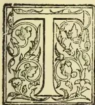

HE most important point to be settled in regard to the cultivation of cotton is what variety to select.

The *Ceylon Observer* of the 21st March quotes Sir William Mitchell as stating that the

American (New Orleans) and Egyptian varieties were proved, by experiments carried out 16 years ago, to be the best suited to the Island. If this is the case, very valuable information has been secured. But we doubt whether the experiments were sufficiently exhaustive to finally settle the important question of what varieties we should select for cultivation. Of late the experiment of evolving a variety possessing specially desired properties has been tried by means of hybridisation, and the tests have in many cases been attended with remarkable success. Not the least noteworthy of such experiments have been those of Dr. D. Thomatis, of Queensland, who has undoubtedly secured excellent results.

Dr. Thomatis got his special cotton by crossing two of the favourite Sea Island varieties—one from Mexico (a true *Gossypium barbadense*), the other from the valley of the Upper Amazon near the Peruvian boundary: the Mexican variety being selected for its length, fineness and gloss and the Amazonian for strength and length.

From a letter written by the Dr. Thomatis we learn that the experts of the new "British Cotton Growing Association" pronounced Caravonica to be of "long, strong and regular staple, though rather lacking in fineness," and of all the cottons collected from all parts of the Empire, it was adjudged the most valuable, surpassing even a special variety crossed by Dr. Morris, and called by him "Sandy Lane," whose value was fully 25% less than Caravonica, the price of which is said to be 9d. per lb. ginned. Messrs. Allison & Co., of Liverpool, have expressed the opinion that the new variety is "really excellent, and opens a grand future in cotton culture." The Agricultural Minister of France declared it "equal to wool, and therefore,

most valuable." The Associated Cottonspinners of Italy are quoted as saying that it was "excellent in every respect, and better than the best of American cottons," and backing their order by giving Dr. Thomatis an order for 6,000 bales at 8½d. per lb., or if that was not sufficiently good, allowing him to submit his own price delivered at Genoa. The Ministers of Agriculture in Germany and Hungary are reported to be enthusiastic on the new variety, and are prepared to take all the cotton they can get. Even the Brazilians, from whence the parents of the new variety came, are eager to embark on its cultivation. In the Colony of Queensland itself the Governor has given much sympathy and encouragement to Dr. Thomatis.

So much for the favourable opinions which, according to the "creator" of the new variety, have been passed on "Caravonica" cotton. But our readers will no doubt be anxious to know something of the character of the plant itself. The cotton is described as the product of big trees, very prolific, with large bolls (70 to the pound), of which 28½ per cent is clean lint and 71½ per cent seeds, which are black and perfectly clear of floss. Each tree, when two years old, is said to bear about 400 bolls on an average, and there are about 800 trees to the acre (7½ feet apart), so that an acre will give over half a ton of ginned cotton. Dr. Thomatis is sanguine that he can sell this cotton at 9d. per lb., or even higher, besides the value of the oil from the seed. He reckons on an average a gross income of £40 and a net income of £30 per acre.

It is said that while the crop in Queensland is about 400 lbs. lint per acre (at 6d.), the Caravonica will give over 1,200 lbs. and at a higher price.

All this is certainly very "rosy," and is calculated to create some stir among those who are thinking of embarking on cotton culture, but the new plant must receive a thorough trial before its suitability for local cultivation can be assured; and it is with this object that we have secured a small lot of seeds for trial. From the character of the plant and the quality of its produce as described by Dr. Thomatis, we are inclined to think that it is likely to suit us, and, therefore, that it is well worth our time and trouble to test the plant under local conditions and environments,

753------------------------------------------------

716Supplement to the "Tropical Agriculturist."[APRIL 1, 1904.OCCASIONAL NOTES.

We have received through the kindness of the Under-Secretary of the Queensland Department of Agriculture a small stock seed maize. The seed was imported to Queensland from America, and the varieties which are the very best grown there are named (White) Forsythe's Favourite, Hickory King and Snowflake, (Yellow) Kansas Sunflower and Golden Beauty. We distributed Australian Maize seeds in the latter part of last year for trial in most parts of the Island, and reports as to results are now coming in. The varieties referred to above are, as already mentioned, the finest that can be procured, and as the quantity received is very small, we must perforce be niggardly in our distribution, and must also request those who get the seed to give their best attention to the raising of their first plants and save all their seed for future use.

Enquiries have been received by us as to the market and value of local ramie ribbons. It is not generally known that a number of landowners have been growing ramie on a small scale, and a the plant thrives and the preparation of ribbons is a comparatively simple process, there is naturally a desire to find a market for the stuff. In response to our request that a local firm should come to the rescue of small ramie growers, we have had a reply from a well-known mercantile house asking for fairly large samples to be submitted for quotations in London. We have called for such samples, and shall be pleased to find eventually that we have been the means of fostering the much-discussed ramie industry to some purpose.

The Report of the Commission on the Government Dairy submits many suggestions for the improvement of that institution, and, among other recommendations, has the following under the head of "The Dairy Staff":—"We feel that the Dairy requires constant supervision, and if we had not felt that it was imperative, if the Dairy was to be a real success, to move it from its present unsuitable site, we would have suggested that the Superintendent of the Dairy should be given suitable quarters on the Dairy grounds. As it is, we shall suggest in our final conclusions that if the Dairy is moved, it be placed under the resident supervision of a man as highly trained in agriculture as, for example, Mr. Drieberg." We feel flattered at the high compliment that has been paid us, but apart from all personal considerations, we entirely agree with the Commissioners as to the need of a resident Superintendent.

That there has been deterioration of the cattle imported from Sind is not to be denied, and one of the chief aims of the Commissioners has been (and the efforts of the management should be directed to the same end), to find out the reason of this, so that the cause (whether soil, food or other factor) may be discovered and the remedy applied. But one thing is certain, and that is that the introduction of the Sind breed of cattle (for which we must take the entire credit) has been the chief

element of success in the Government Dairy, and has proved a very potent factor in the improvement of the local breeds. Anyone who is inclined to observe the fact can see the Sind strain spreading fast through existing breeds, whether among estate herds or the ordinary draught cattle plying about town.

We have just received a letter from a friend in India asking for a few pounds of coffee seed for experiment in Orissa. We are only too anxious to oblige our friend, but there is the danger of sending coffee disease with coffee seed, the same reason which has prevented our getting sugarcane seed from Australia.

RAINFALL TAKEN AT THE GOVERNMENT STOCK GARDEN FOR MARCH, 1904.

<table border="1">
<tbody>
<tr>
<td>1</td>
<td>Tuesday</td>
<td>...</td>
<td>44</td>
<td>17</td>
<td>Thursday</td>
<td>...</td>
<td>Nil</td>
</tr>
<tr>
<td>2</td>
<td>Wednesday</td>
<td>...</td>
<td>72</td>
<td>18</td>
<td>Friday</td>
<td>...</td>
<td>Nil</td>
</tr>
<tr>
<td>3</td>
<td>Thursday</td>
<td>...</td>
<td>Nil</td>
<td>19</td>
<td>Saturday</td>
<td>...</td>
<td>Nil</td>
</tr>
<tr>
<td>4</td>
<td>Friday</td>
<td>...</td>
<td>Nil</td>
<td>20</td>
<td>Sunday</td>
<td>...</td>
<td>Nil</td>
</tr>
<tr>
<td>5</td>
<td>Saturday</td>
<td>...</td>
<td>9</td>
<td>21</td>
<td>Monday</td>
<td>...</td>
<td>Nil</td>
</tr>
<tr>
<td>6</td>
<td>Sunday</td>
<td>...</td>
<td>Nil</td>
<td>22</td>
<td>Tuesday</td>
<td>...</td>
<td>Nil</td>
</tr>
<tr>
<td>7</td>
<td>Monday</td>
<td>...</td>
<td>Nil</td>
<td>23</td>
<td>Wednesday</td>
<td>...</td>
<td>Nil</td>
</tr>
<tr>
<td>8</td>
<td>Tuesday</td>
<td>...</td>
<td>Nil</td>
<td>24</td>
<td>Thursday</td>
<td>...</td>
<td>Nil</td>
</tr>
<tr>
<td>9</td>
<td>Wednesday</td>
<td>...</td>
<td>Nil</td>
<td>25</td>
<td>Friday</td>
<td>...</td>
<td>Nil</td>
</tr>
<tr>
<td>10</td>
<td>Thursday</td>
<td>...</td>
<td>Nil</td>
<td>26</td>
<td>Saturday</td>
<td>...</td>
<td>Nil</td>
</tr>
<tr>
<td>11</td>
<td>Friday</td>
<td>...</td>
<td>4</td>
<td>27</td>
<td>Sunday</td>
<td>...</td>
<td>Nil</td>
</tr>
<tr>
<td>12</td>
<td>Saturday</td>
<td>...</td>
<td>Nil</td>
<td>28</td>
<td>Monday</td>
<td>...</td>
<td>Nil</td>
</tr>
<tr>
<td>13</td>
<td>Sunday</td>
<td>...</td>
<td>63</td>
<td>29</td>
<td>Tuesday</td>
<td>...</td>
<td>Nil</td>
</tr>
<tr>
<td>14</td>
<td>Monday</td>
<td>...</td>
<td>Nil</td>
<td>30</td>
<td>Wednesday</td>
<td>...</td>
<td>Nil</td>
</tr>
<tr>
<td>15</td>
<td>Tuesday</td>
<td>...</td>
<td>Nil</td>
<td>31</td>
<td>Thursday</td>
<td>...</td>
<td>02</td>
</tr>
<tr>
<td>16</td>
<td>Wednesday</td>
<td>...</td>
<td>Nil</td>
<td>1</td>
<td>Friday</td>
<td>...</td>
<td>Nil</td>
</tr>
</tbody>
</table>

Total in....311

Mean in....10

Greatest amount of rainfall in any 24 hours from 4th to 5th = 9 inches.

No. of days in which rain fell—6 days.

C. DRIEBERG.

THE EDIBLE "ROOT CROPS" OF CEYLON.

Innala (*Plectranthus tuberosus*) is a favourite tuber grown throughout the Island, but never on a large scale, for Innala thrives only in good soils. In poor soils it is extremely unproductive, and may sometimes never yield a single tuber, though the plant itself may grow and thrive. The small round corms that are produced vary in size from a quarter of an inch to an inch in diameter, and are covered with a few root hairs. They contain a large percentage of starch. The tubers are much superior to potatoes in flavour, and always fetch a higher price than most of the other 'roots' produced in the Island. Innala is planted out in beds about 3 feet by 6 feet, well raised over the ground and manured. The plant is propagated from cuttings. The cuttings are usually obtained from plants raised by putting down a few tubers early in the season. They are planted with their leaves on, about a foot apart, and the surface

754------------------------------------------------

APRIL 1, 1904.]Supplement to the "Tropical Agriculturist."717

of the bed covered over with old straw or leaf mould. Within a few weeks the cuttings branch out and grow up luxuriantly, when the beds are weeded and dressed with manure and soil. In six months the crop is dug out. Even in the best of lands not more than four or five hundredweights of tubers are obtained from an acre of land. There is a second way of growing Innala, where the soil is fairly good: instead of making beds and plauting out cuttings, holes about a foot square are dug two feet apart, manured, and two tubers planted out in each of the holes thus prepared. After the plants come up and give out branches, the branches are covered with a layer of fresh soil thinly placed over them. The produce obtained by this method of planting is not so satisfactory as that obtained by planting out cuttings. No attempt has ever been made to improve Innala, though judging from its flavour and the large percentage of starch found in the tubers, it is a product that can be greatly improved by a little attention. With careful selection a superior quality could be produced, and the matter is fully worth the attention of those entrusted with agricultural experiments here.

Manioc (*Manihot utilisima*).—A good deal has been written on this plant. It is at present grown largely in the Island, and its value is well understood. The plant is said to have been introduced into Ceylon by the Dutch in 1787. There are two distinct varieties of Manioc, one the bitter and the other the sweet Manioc. In Ceylon about seven different varieties are found growing in different places, these being slight variations from the two distinct types. The bitter Manioc contains a poisonous property in its roots due to the presence of Hydrocyanic acid, and there are many instances where people have been poisoned by the use of the roots. Under cultivation the plant loses its poisonous qualities. The bitter Manioc is a more prolific producer than the sweet variety, hence this type in its various forms is largely grown. The leaves of the bitter Manioc have seven divisions, and their under veins are of a reddish colour. Sweet Manioc has paler leaves with five segments. Manioc is grown in chena lands, as well as in new clearings, as a subsidiary product. It is propagated from cuttings of the stem, which, when placed on the ground, give out buds from almost every node. The land for Manioc cultivation is prepared by hoeing and burning, and the cuttings, about two feet in length, are planted in shallow holes about four feet apart. Two cuttings are usually placed in a hole. A bush comes up rapidly and grows eight to ten feet in height. The crop is ready in about ten months from planting. Under moderately favourable circumstances a bush will yield, on an average, about 15 lbs of roots.

W. A. DE SILVA,

#### THE CONCLUSIONS OF THE DAIRY COMMISSION REPORT.

We have been favoured with a copy of the Report of the Commission appointed to sit on the

Ceylon Government Dairy. It occupies no less than 31 pages of foolscap size, and contains a large amount of statistics, analyses, and figures generally in support of the conclusions arrived at.

A special report on a typical Colombo pasture is quoted by us elsewhere.

We are aware that the Commissioners met frequently, carried on a good many experiments and exercised much observation, besides taking the evidence of a number of persons qualified to speak on the points on which they were examined. So that it is to be inferred that the conclusions are sound and worthy of being acted upon:—

From the evidence before us we conclude that the Aden breed of cattle should be tried, if they can be obtained; that for the present the Sind breed of cattle is the best which can be easily obtained; that with the present condition of the Dairy it is cheaper and better to import and keep on importing than to try to rear Sind cattle; that under the existing circumstances it is not advisable to waste time and money in trying cross breeding; that a drier diet as set forth in the rations should be tried, and that experiments should be made with various rations to see which produces the best milk; that a large number of improvements are required at the present Dairy; that we do not think it is possible to very marvellously improve the quantity or the quality of the milk in the present Dairy owing to the poverty of the soil.

We conclude that there are three possibilities before Government:—

(a) To do nothing and let matters go on as they are going on at present, except that the Model Farm should not be considered part of the Dairy.

(b) To improve the present Dairy. This will require—

1. (1) To improve the soil: (a) the Mauritius grass soil; (b) the sandy soil; (c) the Racecourse soil.
2. (2) To increase the grass area by adding the plot suggested to the Dairy.
3. (3) To try experiments on grasses: (1) whether better grass than Mauritius can be grown for fodder; (2) whether a pasture can be made. We do not think it will ever be possible, even after a great outlay, to make hay on the present site.
4. (4) To try different rations; to attempt by giving different and calculated rations to get, if possible, to a less artificial method of feeding, and if possible to obtain better results.
5. (5) To improve the buildings:—
   1. (1) Provide a milk room.
   2. (2) Separate the Manager's house from the Dairy.
   3. (3) Build a house for the Superintendent, so that supervision may be improved.
   4. (4) Cement the courtyards and cover them with sand.
   5. (5) Provide more water taps.
   6. (6) Make a proper storeroom.
   7. (7) Provide a drinking trough.
   8. (8) Provide manure receptacle.

755------------------------------------------------

718Supplement to the "Tropical Agriculturist."[APRIL 1, 1904]

- (9) Provide a pump capable of emptying the sewage tank.
- (10) Repair the present buildings.
- (11) The Public Works Department to be put in charge of the buildings.
- (6) To improve the apparatus :—
  - (1) Provide new cans.
  - (2) Provide a better milk cart.
  - (3) Provide a sterilizer for the milk.
  - (4) Provide a chaffing machine.
  - (5) Provide a machine for crushing the cotton seed if it can be obtained.
  - (6) Provide a boiler for producing boiling water to scald the cans.
- (7) To study the milk carefully :—
  - (1) A cream and specific gravity register should be kept and observations on bulk milk made daily and on individual cows from time to time.
  - (2) Simple analysis of the bulk milk to be made at least twice a month from the morning and the evening milk for at least a year, so that the variations of the milk may be known.
  - (3) That a few analyses be made of the (a) salts, (b) cream, in order to see whether the present analyses represented the average milk.
- (c) To move the Dairy. That after careful consideration a piece of available land near the main line of the railway be selected and experiments made and the following points investigated :—
  - (1) Analyses of the soils.
  - (2) Experiments with good grasses.
  - (3) Investigation of water supply.
  - (4) Trial of Sind cattle on the selected patch.
  - (5) The production of a pasture and the growth of fodder grasses.
  - (6) Again, the trial of some of the cattle on the pasture and the fodder produced.
  - (7) The erection of a model dairy on modern lines.
  - (8) The milk to be sterilized and sent by rail to destination.
  - (9) The whole institution to be put under the supervision of an agriculturally trained man.
  - (10) To try to improve Sinhalese cattle, as in such an institution it would possibly be cheaper to rear than to import cattle.

We have carefully considered these points, and we are of the opinion that the Government of Ceylon should possess a dairy which should be a model to the inhabitants of the Island, and that to let matters alone is not to be advised. We consider possibility (b) as too expensive. We are of the opinion that possibility (c) done after due consideration and with care is the best and cheapest, for the whole cost of the experiment, the new buildings, the removal, and even if necessary the purchase of land, though we would rather advise that available Government land be used, could be met by selling portions of the Model Farm and of the Dairy land, both of which are extremely valuable and increasing yearly in value as building lots.

We consider that the suggestions contained in

this report should be subjected to the experimental tests indicated therein, in order to see whether they work satisfactorily in practice, and we feel that upon these, or upon such lines as the experiments may finally indicate, the Dairy should progress year by year.

We are of the opinion that the main fault of the Dairy is the poverty of its soil, and that this soil cannot be improved without a very heavy expenditure, and that Government should seriously consider the advisability of moving the Dairy to some more suitable locally and of making a model dairy.

ALBERT J. CHALMERS,  
G. W. STURGES,  
SOLOMON SENEVIRATNE,  
*Dairy Committee.*

September 26, 1903.

#### VETERINARY ITEMS.

Prof. Taylor says that our views as to the actual cause of contagious pneumonia must be modified since Liguieres' researches. The diplococcus of Schutz, which was given as the organism responsible (and which has been shown to be identical with the sheptococcus of strangles) intervenes only secondarily. The Pasteurella organism prepares the lung tissue, and the diplococcus of Schutz which is present, without causing any lesion, in the healthy becomes parthogenic. It invades the lung and produces its characteristic effects. It is a secondary infection; then on top of this secondary infection we have a tertiary one in the shape of gangrene.

The connection between contagious pneumonia and strangles in the way referred to above has hardly been recognised. Whether an attack of strangles protects a horse against pneumonia, Prof. Taylor is not prepared to say; but certain interesting facts showing the relation of the two diseases cannot be overlooked. For instance, as a horse gets older he becomes more immune to strangles, and similarly he seems to become less liable to be attacked with the same organism causing pneumonia.

A paper read before the Veterinary Medical Society, London, treats of the effects of Sewage upon animals, producing what may be called "Sewage poisoning," which shows itself in many types of disorders that either remain untraced or are attributed to other causes. The moral of the paper is that care should be taken to prevent the occurrence of stagnant water or putrid effluent matter on farms, especially where milch cattle are kept. It is suggested that treatment in such cases should extend to the system, and in addition to an oleaginous purgative and a little creosote, stimulants and quinine or salycine should also be administered.

Capt. Lean in the *British Medical Journal* remarks that it is interesting to follow the development of the ancient prejudice against flies

756------------------------------------------------

APRIL 1, 1904.]Supplement to the "Tropical Agriculturist."719

(dating to the fourth plague of Moses in 1491 B.C.) with the definite knowledge of the present day, when the researches of the entomologist and the pathologist are showing the importance of the part played by winged insects in the etiology of human diseases. Interesting examples are furnished from ancient to modern times, and reference made to the curious gusano worm described by Dr. Folker of Guatemala and *Glossina palpalis*, which plays so important a rôle (as demonstrated by Col. David Bruce) in sleeping sickness; while the writer submits the case of a human ecto-parasitic larva which he himself brought to light, and was identified by Mr. Ernest Austin of the British Museum as *Auchmeromyia lutesla*.

It has been customary to class all epizootic and highly fatal poultry diseases as "fowl cholera," but what is now distinguished as Bird Plague (Peste Aviaria) has been demonstrated by Prof. Centauni de Ferrara and Gavonuzzi to be quite distinct under careful microscopic examination and tests which need not be referred to here. From a practical point of view, however, there would seem to be little satisfaction to be gained by the discovery of a new disease, or rather the imposing of a new name to a fatal malady which differs little in its virulence and amenability from fowl cholera. Indeed this would seem to be a case of a distinction without very much of a difference.

The treatment for Mycotic Gastro-Enterites, caused by damaged food or drinks, as the result of the action of mould, fungus, and micro-organisms, is thus set forth by Mm. Dechambre et Curot:—The suspected food must be at once stopped. The fermentation in the intestines counteracted with 15 to 20 grammes Naphthol, and got rid of by enemas and purgatives, and bicarbonate of soda given. Alasonniere recommends 500 grammes of white mustard seed in an electuary.

#### PASTURE LAND ABOUT COLOMBO.

The following interesting report by Mr. J. B. Carruthers, Assistant Director of the Royal Botanic Gardens, Peradeniya, is interesting as indicating (in a general way, as Mr. Carruthers admits) the character of pasture land in the so-called "Cinnamon Gardens" of Colombo, and therefore of the bulk of the pasture available to Colombo cattle. The report is also interesting as affording a means of comparison of the composition of pastures here and abroad:—

At the request of the Dairy Committee I visited the Dairy Farm and pastures on September 14 and examined the racecourse from a feeding value point of view. The soil is practically pure sand, with almost an absence of humus. The herbage is very mixed; nearly all the plants are stunted and growing much less vigorously than they would do even on poor soil. The feeding value either for milking purposes or beef is almost nil, and I should imagine that the gentle exercise the animals get in search of food has more effect on them than the food they obtain.

Very few plants seem to have risen from seed recently; most of the grasses and other plants

have spread vegetatively, i.e., by means of running stems or spreading roots. The poorness of the soil offers little chance for seedlings to grow successfully. This gives a patchiness to the character of herbage. Most of the common plants in the field are not of good feeding value, but the following are the grasses and other plants that form the food in the pasture:—

*Ischimum aristatum*, L., gives probably the most food of any plant in the pasture, and is consequently the most eaten. I observed more signs of this grass being nibbled than in the case of any other. The comparative absence of flourishing heads of this plant also shows that it is eaten down.

The grass: *Eragrostis stenophylla*, Hochst., is next in point of view of abundance, but is not sufficiently leafy to give much food. Another grass of the same family, *Eragrostis amabilis*, Wright, is fairly abundant; it is a very small plant, giving hardly any food, and is not eaten much, if at all. Its flowering stalks are common over the whole area.

*Panicum repens*, L., "Etora" of the Sinhalese, is a valuable food grass, and though it is not common in the field, it gives a good bite, and is eaten down whenever it occurs.

*Paspalum longiflorum*, Retz., a very small-leaved and diminutive grass, is one of the most abundant, but even when growing luxuriantly it has no feeding value, as it grows only about 8 inches high, and in the racecourse it is dwarfed to a smaller height than this. An *Anthistiria*—the species of which I have not yet had time to examine—probably a dwarfed form of *Anthistiria tremula*, Nees, the Sinhalese "pinbarutana," gives a certain amount of food, and for its size is of higher value in the pasture than most of the grasses.

*Eremochloa zeylanica*, Hochst., is fairly abundant, but has little, if any, nutritive value.

*Andropogon aciculatus*, Retz., "tuttari" of Sinhalese, is a good feeding grass, but in the racecourse field forms less than 5 per cent. of the whole, so cannot be said to take much part in the pasture.

*Paotis latifolia*, Ait., the grass with a bottle brush-like flower of a metallic hue, is fairly common, but gives no food and is rarely eaten.

Of the plants other than grasses, the most important from a feeding point of view is *Desmodium triflorum*, D.C., the "hin-undu-piyali" of Sinhalese, but in the field in question, owing to the poorness of the soil, this plant, which has a creeping habit, seldom gets more than  $\frac{1}{2}$  an inch high, and consequently does not afford a "bite." I could not find signs of its being eaten.

The sedgy plants belonging to the families *Cyperus* and *Fimbristylis* are abundant, especially in the damper parts, forming about 20 to 25 per cent. of the herbage on the whole pasture. I noticed that these had been pretty generally eaten, and this fact is alone a sign of the poverty of the pasture, as these are as a rule the last to be eaten by stock.

The herbage on the racecourse proper is considerably better than that in the centre. This is due to the fact that road scrapings are applied, and also that weeding goes on. One plant, how-

757------------------------------------------------

720Supplement to the "Tropical Agriculturist."[APRIL 1, 1904.]

ever, of good feeding value, a grass, *Cynodon dactylon*, Nees, is treated as a weed owing to the tufted habit it possesses, which makes it unsuitable when a flat turf is required.

I observed in several places that the dung of the cattle, instead of being of help to the plants of the pasture, was carried off by ants.

It seems to me that it is hardly possible to find a site with less advantages for a Dairy Farm, the only point in favour being its proximity to the consumer.

The soil both on the farm and racecourse pasture gives no help to the feeding of the stock, and is little more than a mechanical holder for the manure and water which nourish the Mauritius grass, *Panicum muticum*, Forsk, on which the cattle are fed. Excellent crops of this are produced at the farm, some six or eight in the year. From an economic point of view, the land, which probably has some value from its situation, is wasted as dairy pasture.

I append a list of the plants growing on the racecourse enclosure with an approximate estimate of the relative abundance of those forming the bulk of the herbage. Those in *italics* have a feeding value, though not necessarily at all of a high order.

The whole question of the relative values of forage plants in the low-country is one upon which our knowledge is of the scantiest, and would well repay experiment and investigation. Experiments with a view to determining the most profitable food plants for stock could be carried out on the Government Dairy Farm without any appreciable loss in the return the land gives in milk or beef.

It is probable that an inspection at another time of year would give a different estimate of the relative percentages. I have found in judging the relative quantities of the plants forming celebrated pastures in England (an inquiry into which I took part in) that at different times the more vigorous growth of some grasses and other plants makes them bulk larger to the eye than at other times.

*Cyprus stolonifera*, Retz. 8 per cent. sedge.  
*Desmodium triflorum*, D.C. 8 per cent. "Hindu-piyali," S.

*Cyperus castaneus*. 7 per cent. sedge.

*Ischaemum aristatum*, L. 7 per cent.

*Eragrostis stenophylla*, Hochst. 7 per cent.

*Paspalum longiflorum*, Retz. 6 per cent.

*Eragrostis amabilis*, Wright. 5 per cent.

*Fimbristylis nigrobrunnea*, Thud. 5 per cent. sedge.

*Fimbristylis monticola*, Steud. 5 per cent. sedge.

*Andropogon ariculatus*, Retz. 4 per cent. "Tuttari," S.

*Fimbristylis acumuriata*, Vahl. 3 per cent. sedge.

*Eremochloa zeylanica*, Hochst. 3 per cent.

*Anthistiria*, sp. 3 per cent.

*Perotis latifolia*, Ait. 3 per cent.

*Xyris anceps*, Lam. 3 per cent.

*Panicum repens*, L. 3 per cent. "Etora," S.

*Panicum indicum*, L. 2 per cent.

The other plants, forming about 20 per cent. of the herbage, occur in too small quantities to be

estimated. They are:—

*Paspalum scrobiculatum*, L.

*Ischaemum ciliare*, Retz. "Rat-tana," S.

*Eleusine Egyptiaca*, Desp.

*Eleusine indica*, Gaist.

*Eragrostis tenella* var. *Viscosa*, Stapf.

*Wrightia zeylanica*, Br. "Sudu-idda" or "Wal-idda," S.

*Commelina nudiflora*, L. "Girapala," S.

*Mollugo disticha*, Sa.

*Vernonia cinera*, Less. "Monarakudimbiya," S.; "Chilivyarchenkainia," T.

*Emilia rondifolia*, D.C. "Kadupara," S.

*Pedaliium murax*, L. "Eknerenchi," S.

*Aneilema vaginatum*, Br.

*Crotolaria striata*, D.C. This is a valuable forage plant of the order Leguminosæ, and enriches the soil by its nitrogen forming nodules on the roots. I saw these in fairly large numbers on the few plants in the field. *Genoisporum prostratum*, Benth.

*Genoisporum prostratum*, var. *gracile*, Thud.

*Bonnaya tenuifolia*, Spreng.

*Spennacoce hispida*, L. "Hingetacoln," S.;

"Nattaichuri," T.

*Adenosina capitatum*, Benth. "Nitgonakola," S.

*Vandellia cristacea*, Benth.

*Drosera buimannii*, Vahl. "Wattaresa," S. This sundew was growing in places where only white silver sand was to be seen.

*Polycarpaea corymbosa*, Lane.

*Centrathera numifusa*, Wall.

*Scoparia dulcis*, L. A tropical American plant common by roadsides in the south of the Island, noticed first by Ferguson in 1871.

*Mimosa pudica*, L. The sensitive plant (also introduced) occurs at the edges of the field, but does not spread over any distance. It grows freely in the surrounding ditches and hedgerows, and runs in from there.

This list is not absolutely exhaustive; it was made after only a visit of a few hours, and it is probable that some plants which do not occur commonly, and were not in flower at the time of my inspection, may have escaped my notice. The plants marked with an asterisk are grasses.

#### THE FEEDING AND MANAGEMENT OF DAIRY CATTLE.

Mr. John Speir is acknowledged to be one of the foremost authorities on dairy questions. Being both a practical and scientific student of the subject, his opinion on any matter connected with milch cattle is of the greatest value, and many are the doubtful points in the feeding and management of farm stock which Mr. Speir has helped to elucidate as the result of patient research.

The conditions under which dairying is carried on in Europe are naturally very different from those obtaining in the East, still the main principles of both feeding and general management do not differ.

In an address on this subject, Mr. Speir after referring to the importance of the dairy industry, went on to say:—

758------------------------------------------------

APRIL 1, 1904.]Supplement to the "Tropical Agriculturist."721

If milch cows of a good type are selected and properly treated they will give a good return, but if they are not properly kept the result will be disappointing. Farmers cannot be too particular in the selection of cows for the production of milk, particularly when milk is to be manufactured into butter; and it is much more profitable to pay a full price for a good milking cow than have an indifferent one for nothing. If heifer calves intended for milking purposes were kept only from the best milking cows, four gallons of milk might be produced at the cost of every three now yielded of most herds. In that respect a valuable lesson was learnt from their keenest competitors the Danes, who 25 years ago were not dairy farmers at all but grain producers and stock feeders.

Subsequently they were advised by their experts to weigh the milk of every cow night and morning, and to keep a record of it; also to keep heifer calves only from what were known to be the heaviest milking cows. This expert advice was right and prevailed, though some thought it unnecessary, and at the present time there were few Danish farmers who could not give the annual yield in their herds for several generations back. The result of it all was that probably no cow in any country had such a high average yield as those in Denmark. The time occupied in the labour of weighing the milk was very trifling, and in the end he was sure it would prove of the utmost value.

As an example of what had been done by selection and breeding, the late Mr. E. C. Tisdall told him that when he was purchasing the best heifers he could get, their average yield was 426 gallons per annum for the first ten years of his experience. Heifer calves were kept from the best of these, and in a short time the average of the heifers was 600 gallons in the year, and in 1896, the end of the third period of ten years, he had ten heifers which averaged 800 gallons in one year. Mr. Tisdall also told him that the system of feeding was practically the same all the time.

The selection of the sire to mate with the cows kept was also a point of first importance. This was specially so because of the fact that the bull would regulate not the milk of one cow only, but would influence for good or bad that of every animal bred from him. It was, therefore, most important that every stock bull kept for service in a dairy herd should be out of the very best milking cow procurable.

Their attention should also be directed to keeping cows only whose milk contained a high percentage of butter-fat. They should not delude themselves with the idea that if they had cows giving plenty of milk, that all they required to do to get plenty of butter-fat was to feed them well. By all means feed them well; but they might rest assured that no amount of feeding would raise the percentage of fat in the milk of a cow which was naturally low to equal the milk of a cow whose produce was naturally rich. Two cows could quite easily produce the same quantity of milk in the year, yet when that milk was turned into butter, the one cow might have produced 100 lbs. more butter than the other.

That was not all, for the cow which had the 100 lbs. extra of butter had not probably cost any more to keep than the other. When the cow came to within a fortnight of calving, she should be brought into the house and kept there till she calved. This was particularly necessary if food was abundant, and especially so after midsummer, and during early autumn. After being brought into the house, the cow should receive two or three meshes of bran and treacle daily, with a little hay, and what water she cared to drink. After the cow calved she should not be milked completely dry for several days.

A little milk could be taken away as often as one liked, but only just a little to relieve the udder. Until a week after calving the udder should never be completely emptied—the object of this was to prevent milk fever. In winter when in calf, cows should be put out every day for a little exercise, fresh air, and what green food could be picked up on the pastures. If any grass was to be had, plenty of good hay was all that was required. If no grass was available, a few turnips, potatoes, or cabbage served in keeping the bowels in good order.

Mr. Speir impressed on his listeners the importance of keeping cows at this period in good condition, for by spending money to attain this end they would be but saving it, and would be more than repaid by the butter produced later on. The cow should not be put out for several days after calving, and even then only a short time. This was to be particularly attended to during the autumn and winter, and cows calving during this period were better kept in the house for some time, feeding sparingly for the first ten days, and using bran and hay as the principal foods. Having spoken on the desirability of giving dry food to cows on pasture when inclined to scour, he went on to deal with the effect of food on milk, and how to improve the quality of poor milk, and pointed out the high percentage of fat in milk was to be got by breeding, and not by feeding.

If, however, the cow is thin in flesh, it may not give its normal quantity of milk on pasture alone, because it may be unable to find sufficient materials in the food to produce butter and supply the craving of the body for more fat. Under feeding would not only reduce the live weight of the animal and the total butter production, but it might reduce the percentage of butter-fat in the milk also. On the other hand, there was very little evidence to prove that extra feeding would materially increase the percentage of butter-fat in the milk more than average or moderate feeding.

As to the relative merits of crushed or ground and whole grain, Mr. Speir said that if grains were merely crushed they would be found to give as good feeding results as if finer, and that at the same time they would not run into dough, in which condition they were sometimes dangerous. Tests made at various times had shown that when grain was thoroughly soaked in water before being used it gave better results, and was much safer than when such was not done.

759------------------------------------------------

722Supplement to the "Tropical Agriculturist."[APRIL 1, 1904.BAMBOO CULTIVATION IN JAPAN.DAVID G. FAIRCHILD, AGRICULTURAL EXPLORER,  
U.S.A.

One of the best posted bamboo growers in Japan informed the writer that twenty years ago he did not know that his groves, which were then in a neglected state, had any money value, but that to-day those parts of his farm on which the groves are situated are its most valuable portions. The attention which he bestows upon them now is very inexpensive, but almost as careful as that given to any other of his crops. The following forest methods are largely those which Mr. Tsuboi described as, from his experience, the best. These are applicable with slight variations to the three principal timber bamboos in Japan, and pertain in a general way to the culture of the ornamental species.

The land chosen for a bamboo grove should be dug over to a depth of  $1\frac{1}{2}$  feet the autumn previous to being planted, and, if a heavy soil, should have worked into it a good quantity of trash from the stable. The plants should be set out at an equal distance from each other at the rate of about 300 to an acre, or 12 feet apart each way. If the soil is a dry one, the ball of earth and roots should be planted below the surface of the soil, but if a wet one a mound should be made and the plants set in the upper portion of it. After planting it is important, as already remarked, that the soil between the plants should be given a heavy mulch of straw, under which is a layer of cow manure. This mulch should be maintained during the entire year. In the beginning the roots should be supplied with an abundance of water and in the autumn should be given plenty of rotted manure. If some of the plants die, they should be replaced by others so as to maintain as complete a stand as possible. It is essential as the new shoots spring up that the ground at their bases should be shaded by the foliage. The semi-obscurity of a Japanese grove is not only its greatest charm, but one of the necessary factors of its growth. The sooner the ground can be shaded by the plants the better.

For the first three years at least all the shoots that appear should be allowed to mature, but after the grove is once well established only the largest shoots should be permitted to grow, the others being cut out as soon as they appear above the ground. This thinning process throws the strength of the plants into a comparatively few large culms, and gradually increases the height and strength of the forest.

In regions where the snows are so heavy that they break down the plants, the practice of bringing the tops of several culms together and fastening them with rope is sometimes followed. The wigwam-like masses formed in this way are able to support without injury the weight of snow.

No culm should be cut for timber purposes until it is at least four years old, as before this time the wood is not mature. On the other hand, if left standing too long the wood becomes too brittle and loses in value, and the forest besides is benefited by the cutting out of the four-year-old stems. The crop of new shoots is larger. This thinning-out process should be so done that as few gaps as

possible are made in the forest and the semi-obscurity below the mass of foliage is maintained.

The crop of new shoots varies in size every alternate year. A poor crop would mean 6 to 7 per cent of new shoots and a good crop 12 to 14 per cent. As there are commonly 10,000 culms in a hectare\* (or 4,545 in an acre) of properly planted grove ten to fifteen years old, this would mean the production of 600 to 700 culms per hectare for a light crop and 1,200 to 1,400 for a heavy one. These figures were very kindly furnished the writer by Dr. T. Shiga, chief of the imperial forest management in Tokyo.

The experience of Mr. Tsuboi has been that some kinds of forest trees if standing in a grove prevent the growth of the bamboos near them. Oaks and chestnuts, he declares, are especially objectionable in this respect, while pessimmons do not seem to affect in the least the production of new bamboo shoots. The effect of weeds in a forest is undesirable, and although comparatively few species are able to live in such a deep shade these should be dug out as from any cultivated field. Attention to these various details makes a great difference in the amount and quality of timber produced. A grove is not to be looked upon as merely a thicket and left to take care of itself, but as a plant culture which requires attention.

One important element in the culture of this peculiar timber plant is the fact that a whole forest may bloom and die in a single season, and that it is not possible—as yet—to tell beforehand when this blooming will take place. The intervals between these periods are, however, so long that they are not taken into consideration by the Japanese farmer when he buys a bamboo grove. Little accurate information is obtainable regarding the length of life of the various Japanese species, but *Phyllostachys henonis* has the reputation in Japan of blooming oftener than either *P. quiloï*, *P. mitis*, or *P. nigra*, the other three important timber species. A small grove near Kawasaki which bloomed this season (1902) was reported by the owner to have once bloomed about sixty years before. As there always remain in the field a number of living rhizomes, after the death of the forest, these renew the latter in a few years, so that the actual loss to the owner does not include the cost of replanting. This is the case at least with the Japanese bamboos. As culms which have bloomed are poor in quality, the practice is followed of cutting them as soon as possible after they show signs of blooming.

In Japan, where bamboos and rice are often grown in adjoining plots of ground, some trouble is experienced from the underground stems spreading into the neighbouring field. To prevent this a ditch 2 feet wide and as many feet deep is dug about the grove and kept open by several re-diggings during the year. This method is said to be a satisfactory one. It is a difficult matter, however, after a field has once been planted in bamboos, to clear it satisfactorily for other crops, for there is a mass of these tough rhizomes that are very difficult to dig out.

\*About  $2\frac{1}{2}$  acres.

760------------------------------------------------

APRIL 1, 1904.]Supplement to the "Tropical Agriculturist."723

The harvesting of bamboo poles is not done before August, as culms cut earlier than this date are likely to be attacked by insects, not having had time to sufficiently harden. A Kyoto grower of black bamboos remarked that the Kobe exporters, by insisting on having their bamboos for export cut earlier than this date, had seriously injured the foreign demand, as the quality of the wood was much injured by this early harvest.

A saw is often used in cutting the shoots, by making cuts on opposite sides of it near the base. When cut, the poles are classified, tied into bundles, and stacked like hop or bean poles to dry. In the lumber yards of Japan these stacked poles of bamboo form a prominent feature.

Dr. Shiga, chief of the bureau of forest management of Japan, when asked whether bamboo growing was profitable or not, said promptly that it was the best paying plant culture in the country, yielding a net return of 250 yen per hectare, which is the equivalent of about \$50 gold per acre. The species referred to by Mr. Shiga in this case was the edible one. Twenty per cent of this amount represents the profits from the sale of edible shoots. Mr. Tsuboi's profits on his groves of *Phyllostachys quiloï*, a strictly timber species, averaged \$20 an acre, while those of one of his friends near Kyoto were \$40. The profits of a good grove of edible bamboo are evidently greater than those from one grown for timber only, and the author was informed by one of the best bamboo growers near Kyoto that his profits per acre were about \$90 on land which, cleared of bamboo, would not bring more than \$80, while good rice land sold for \$200. A second grower of bamboos near Kyoto, who ships for the export trade from Kobe, informed the writer that the culture in his province of *Phyllostachys quiloï* yields a net income of about \$40 per acre, while *P. henonis* brings in only about \$30. Five years ago the black bamboo brought in a profit of \$200 per acre, but now scarcely nets \$50. Rice culture in this region, according to Mr. Tsuboi, barely pays more than for the cost of labor and manure, the former reckoned at 35 to 40 sen, or 17½ to 20 cents gold, a day. All of these figures, however, have no practical bearing on the profits of bamboo growing in America, where a market for the culms can only be made after a constant reasonable supply has been assured.

The cost of the attention which is necessary in order to grow bamboos is so much less than that required for rice growing, suitable land is so much cheaper, and so much less risk is run from bad weather, that the statement that it is the best paying culture in Japan seems correct, and such inquiries tend to confirm it.

#### THE MANURING OF GRASS-LAND.

The necessity for manuring land is only now beginning to be recognised by the more intelligent section of the agricultural community, European and Ceylonese. The "upcountry products" (Tea, Cacao, &c.) get the best attention in the way of manuring. Coconuts may be said to come next, while paddy is being treated in a haphazard sort

of way—getting a little bonedust or fish manure in some parts—without any guidance from the Agricultural Chemist, as in the case of the crops before mentioned. But the necessity for manuring grass-land in an intelligent manner has never occurred to stock owners as being a desirable practice. True, Mauritius or water grass (*Panicum maximum*) is allowed to get what benefit it can from all sorts of town refuse, but pasture land is not considered deserving of any fertilizers to make up for the exhaustion that is bound to follow upon the grazing of cattle. What wonder then that the best breeds of imported cattle—whether Sind or other—deteriorate after a few years!

The Dairy Commissioners—whose report is referred to elsewhere—make special mention of the poverty of the pasture land about Colombo, and the necessity for a series of experiments calculated to improve the quality of cattle fodder.

In this connection the effect and importance of the judicious manuring of grass are well illustrated by the results of the practical experiments of Mr. Ernest Parke on his farm at Kineton, in Warwickshire, conducted in co-operation with Mr. Bernard Dyer.

The grass experiments are carried out in two separate fields of naturally poor pasture, which had for a long time been "under-farmed"—land typical of much in many parts of the country.

In these two fields the unmanured yield of the land, even in this season of abundance, has been respectively only 7 cwt. and 10 cwt. of hay per acre. In the one field 3 cwt. of superphosphate per acre has raised the crop to 1¼ tons, and 2 cwt. of nitrate of soda per acre has produced a similar increase.

The two fertilisers combined have given a crop of 2¼ tons of hay per acre. In the other field, where Dr. Dyer advised that basic slag was more suitable to the soil than superphosphate, 5 cwt. slag raised the crop from half a ton per acre to nearly 2 tons, and 2 cwt. nitrate of soda per acre raised it to nearly 1¾ tons.

When both dressings were combined the yield was increased to 2½ tons per acre. Thus, in the two fields, an average increase of nearly 2 tons of hay per acre has been obtained by an expenditure of, roughly speaking, 30s. per acre in manure.

The quality of the herbage after two years of this treatment, has also, in both fields, undergone a great change for the better, good succulent grasses and clovers growing in rich abundance; while the still neglected portions of the fields, preserved for comparison, give but a poor, wiry produce, full of weeds.

The *Field* in pointing out the importance of manuring grass land, remarks that potash may be applied to pastures in the form of kainit or sulphate of potash; generally the dressing should consist of from 4 cwt. to 6 cwt. of kainit per acre.

This material contains about 12 per cent. of potash, or from 2 cwt. to 3 cwt. of sulphate of potash per acre, which will contain 50 per cent. of potash.

To this should be added about 5 cwt. of basic slag or 3 cwt. of superphosphate of 30 per cent

761------------------------------------------------

724Supplement to the "Tropical Agriculturist."[APRIL 1, 1904.]

phosphate made soluble. It is important that these manures, both the potash and the phosphate, should be applied as early in January as the weather permits, in order that they may be well washed into the soil after the growth of the herbage begins in the spring.

If it is desired to cut the produce for hay a dressing of about half to three-quarters of a cwt. of nitrate of soda per acre may be applied early in March.

It is not advisable to apply very heavy dressings of nitrogenous manures to pasture lands, as they are very apt to stimulate the coarser-growing grasses, to the exclusion of the finer and more nutritive kinds. Under the influence of a large quantity of nitrogen the clovers will also for the most part disappear.

With the old rich pastures of Leicestershire it is said the more white clover the more beef, and there is no manure to compare with basic slag and potash for the production of white clover in a pasture.

To those who are going in for cattle breeding, the question of improving pasture land is of the utmost importance. The manuring of the land could be done in sections without interfering with the grazing. The result will be soon apparent in a better development of muscle and bone among the animals, and ultimately the evolution of altogether a better life of beast.

---

#### GENERAL ITEMS,

---

To test the freshness of eggs, says the *Transvaal Agricultural Journal*, take about six ounces of common salt, put it into a large glass, and fill with water. When the salt is in solution an egg is dropped into the glass. If it is only one day old, it immediately sinks to the bottom; if any older it does not reach the bottom of the glass. If three days old it sinks only just below the surface, and from five days upwards it floats.

*Poultry* has the following on the subject of using a pure-bred cock with common hens and the increase in the egg-production of the progeny:— In the autumn of 1893 the Countess of Aberdeen made a tour through Ireland, accompanied by Mr. Ed. Brown, F.L.S., a poultry expert. Mr. Brown delivered lectures and gave practical advice in several of the localities visited. The Countess sent pure-bred cocks to run with the native fowls, and in 1897 a Mrs. Gibson reports as follows on the experiment:— 'The facts which I mentioned are that within the last twelve months the increased money value of the eggs produced in this district—i.e., within a radius of 35 miles from Limerick—is fully 30 per cent. That industry used to have a turnover of £12,000 to £13,000 a year (the actual payments by the merchants for the eggs). Last twelve months their payments have exceeded £16,000. The immense stimulus given to this, essentially a cottage industry, by the action of the Countess will be better understood when I tell you the price of eggs has fallen fully 20 per cent.; so to have the increased money return of 30 per cent., there must have been an increase in the production of 50 per cent. One man largely engaged in the trade puts the actual increase in production at fully 100 per cent. He produced his books and let me have the figures for month after month to compare. Three years ago the price of 3 and 4 month old chickens ranged from 1/- to 1/2 each, the greater number being sold at 8d. and 9d., and they were dear at the money. Now 1/3 is a low price, and 1/6 and 2/- quite common, and they are cheap at the increased price. I am understating the case when I say that, in this district, the action of the Countess, in helping this one branch of cottage industry, has brought into the homes of the cottagers and small farmers at least £20,000 sterling more money during the past twelve months than they ever earned by it any other year within my memory.'

762------------------------------------------------

# \* The TROPICAL AGRICULTURIST \*

◁ MONTHLY. ▷

XXIII.

COLOMBO, MAY 2ND, 1904.

No. 11.

## NOTES ON CASTILLOA AND PARA RUBBER.

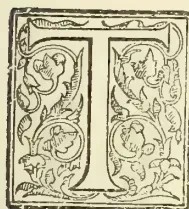

THE United States Department of Agriculture has shown itself to be one of the most practical, active, and wide-awake of these national departments instituted to encourage and assist the agricultural industry of the various nations. Somewhat recently the American Bureau published "The Culture of the Central American Rubber Tree," an exhaustive work on the Castilloa Rubber tree (*Castilloa elastica*) by Mr. O. F. Cook. This is the best work of the subject that has yet appeared, and should be in the hands of all planters interested in Castilloa.

In Ceylon, however, it is the Para rubber tree (*Hevea braziliensis*) in which planters are chiefly interested, and we give some extracts from the book just mentioned dealing especially with this tree, and also the Concluding Summary of the book. There is an appendix of 18 good plates, two of which shows a peculiar habit of the Castilloa tree, that of self-pruning. When young the tree branches prolificly from the main trunk, when older these stems die off and fall out leaving a pitted scar on the trunk where they were first attached. In rubber culture the object is to produce a large tapping surface on the main trunk, and the following is an important extract.

### EFFECT OF SHADE ON THE FORM OF THE TREE.

There are great and persistent differences of shape or 'habit' among trees. The Lombardy poplar and the weeping willow are not distant relatives. It is a general fact, however, that forest trees are taller and more slender than those of the same species grown in the open. The low spreading habit, which is desired and encouraged among fruit trees, is not desirable in rubber-producing species, where a large expanse of trunk is needed to supply the milk and to give opportunity for tapping without the necessity of wounding the same place too often. Castilloa trees growing alone in the open often send out permanent branches 8 or 10 feet from the ground,

while those in the forest may have from 20 to 40 feet of smooth trunk before the permanent branches are reached. Open-grown trees may have large spreading branches, while in the forest or under close planting the main axis of the tree continues to grow upward and the lateral branches are relatively small. The problems of rubber culture may prove in this respect to be directly opposite to those of coffee, where the formation of much wood in proportion to leafage is a sign of unfavourable conditions or of bad plantation management. It does not follow, however, as some have seemed to suppose, that forest shade is necessary to grow long-trunked trees.

In coffee culture it is plain that the most wood is formed not by shade culture, but by planting close in the open, and the older planted trees of Castilloa at La Zacualpa, if not as slender and as smooth-trunked as those of the forest, are certainly tall and slender enough to furnish ample evidence that open culture does not cause a low, spreading growth, if the trees stand close enough together. The Zacualpa experiment is of further significance in this connection, because it shows that a harmful degree of crowding was by no means reached. In numerous instances where from three to five trees grew in a cluster their trunks were each equal in size to those of many of their neighbors which stood alone.

Coffee trees which stand too close together lose the use of their lower branches, which become interlaced and shade one another, and ultimately only the top of each tree continues to grow and produce fruit. The planter must choose a middle course between the injury of his bearing trees by crowding and the waste of capital and labour in keeping clean unused land between trees planted too far apart. With the rubber tree the seed is a consideration entirely secondary to the growth of the trunk. In comparison with coffee it may be said that the crowding of rubber trees is desirable, and that it finds its limit, not in the discouragement of lateral branches, nor even in the lessening of the size of the individual trees, but in the decrease in the amount of rubber which can be produced on a given area of land.

763------------------------------------------------

726THE TROPICAL AGRICULTURIST.[MAY 2, 1904.METHODS OF CLEARING LAND FOR RUBBER PLANTING.

The question of shade is also involved with that of the method of clearing the land. It is an almost universal custom in tropical countries to clear land by burning the dried forest growth which has been cut down. In fact, the primitive agriculture of the natives of tropical regions could scarcely be conducted on any other basis. There is much loss of fertility by the destruction of vegetable matter and humus, but the amount of labor required to thoroughly clear a piece of forest land in the Tropics is prohibitively great. The fire not only removes the tangled mass of brush, but it performs an even more useful service in killing the stumps and roots which would otherwise reoccupy the land with new growth in a few weeks, and would remain indefinitely to dispute possession with anything which might be planted. To grow a herbaceous crop on unburned land under such conditions would be extremely difficult, but a tree culture is much more feasible, though whether the method of partial clearing is to be generally advised is not so certain. The gain, if any, is more likely to be found in the sustained fertility of the soil than in any saving of labor in clearing and cleaning the land; for although there may be a saving at first which will permit an enterprise to reach a paying basis sooner, yet there is in prospect a long and expensive struggle with the persistent natural vegetation rooted in the soil. Moreover, it should be recognized that the conditions under which a plantation is set out in a partially cleared forest are of necessity only temporary. Many of the forest trees will not long survive the unwanted exposure to greater dryness and heat and to the attacks of parasites. The thinning of the forest greatly increases the force of the wind against the remaining tall trees, and in falling these will injure the rubber trees and will often require to be cut away not merely at one point, but at several points. Whatever the merits of the case from the standpoint of the stockholder, the plantation manager of the future is very likely to wish that his predecessors had adopted clean culture. The overhead shade which discourages the undergrowth will also discourage the rubber, and the decrease of such shade will increase the competition of the undergrowth with the rubber.

THE IDEAL OF RUBBER CULTURE

does not require a roof of shade over the rubber trees nor a dense growth of bushes and vines under them. The roof should be of *Castilloa* foliage, and the ground should be covered by a mulch of dead leaves and branches, which enrich the soil and assist in the retention of moisture.

THE TRUE CLIMATE OF HEVEA.

The results of the writer's observations on *Castilloa* were so much at variance with prevalent opinions concerning climatic requirements that the possibility of a similar error having been made with reference to *Hevea* naturally suggested itself, and various indications like the preceding were found in the literature of the subject suggesting that this might prove to be the case. Shortly afterwards there appeared the following quotation from a paper written by Mr. H. A. Wickham, who made the original introduction of *Hevea* seeds from Brazil to British India, and whose testimony is so direct and conclusive that we need wonder only that so important a point should have been so long overlooked:

But as all the stock of plants or seed available for the planting and cultivation of this tree in the Eastern Tropics are and will be derived from direct lineal descendants of some or other of those 7,000-odd originally introduced by me at the instance of the government of India in 1876-77, it may be well if it be recollected that their exact place of origin was in 3° of south latitude, and to remember their natural conditions there. This the more so since a very general error seems to have obtained that swampy or wet lands are the fitting locality for the *Hevea*. This would seem to have arisen in that the "explorer" of a few

years' experience would have some of these trees pointed out to him (naturally in answer to inquiries) growing scattered along in the wet margins in going up the lower Amazon or tributaries, whereas

THE TRUE FORESTS OF THE PARA INDIAN RUBBER TREES lie back on the highlands, and those commonly seen by the inquiring traveller are but ill-grown trees which have sprung up from seeds brought down by freshets from the interior.

As a matter of fact, the whole of the *Hevea* which I procured for the government of India were the produce of large grown trees in the forest covering the broad plateaus dividing the Tapajos from the Madeira River. The soil of these well-drained, wide-extending forest-covered table-lands is stiff, not remarkably rich, but deep and uniform in character. The *Hevea* found growing in these unbroken forests rivals all but the largest of the trees therein, attaining to a circumference of 10 feet to 12 feet in the bole. These forest plains having all the character of wide-spread table-lands occupy the space betwixt the great arterial river systems of the Amazon, and present an escarpment face, which follows at greater or less distance and abuts steeply on the igapó or bagas, i.e., the marginal river plains subject to inundation by the annual rise of the great river. So thorough is the drainage of this highland that the people who annually penetrate into these forests for the season's working of the rubber have to utilize certain lianas (water-bearing vines) for their water supply, since none is to be obtained by surface-well sinking, in spite of the heavy rainfall during a great part of the year.

CONCLUDING SUMMARY OF THE BOOK.

The culture of the Central American rubber tree has passed the experimental stage in the sense that the practicability of the agricultural production of rubber has been demonstrated, but on the other hand it has been ascertained that the tree may thrive where it will yield little or no rubber. Under favourable natural conditions the culture of *Castilloa elastica* bids fair to become very profitable, but the experimental determination of the factors which influence the production of rubber has scarcely begun.

In southern Mexico and Central America the regions well adapted to the culture of *Castilloa* are much more limited than has been supposed. The presence of wild *Castilloa* trees is not a sufficient evidence that a locality is suited to commercial rubber culture.

Differences in the yield of rubber are not due merely to the existence of different species and varieties of *Castilloa*, but are also controlled by external conditions.

The functions of the rubber milk in the economy of the plant are not well understood or agreed upon by botanists, but there are numerous reasons for holding that in *Castilloa* and many other plants it aids in resisting drought.

A continuously humid climate is not necessary to the growth and productiveness of *Castilloa*; the indications are rather that the quantity of milk and the percentage of rubber are both increased by an alternation of wet and dry seasons.

In its wild state *Castilloa* does not flourish in the denser forests, but requires more open situations. It is confined to forest regions only by the perishability of its seeds.

*Castilloa* thrives better when planted in the open than in the dense forest; even young seedlings are not injured by full exposure to the sun, providing that the ground does not become too dry.

The planting of *Castilloa* under shade or in partially cleared forests is to be advised only on account of special conditions or as a means of saving labor and expense.

The loss of the leaves in the dry season may be explained as a protection against drought, and does not indicate conditions unfavourable to the tree or to the production of rubber.

764------------------------------------------------

MAY 2, 1904.]THE TROPICAL AGRICULTURIST.727

The falling of the leaves of *Castilloa elastica* in the dry season renders it unsuitable as a shade tree for coffee or cocoa. In continuously humid localities where the leaves are retained shade trees are superfluous and the yield of rubber declines.

The desirable features of shade culture, the shading of the soil, and the encouragement of tall upright trunks, are to be secured by planting the rubber trees closer together rather than by the use of special shade trees. Planting closer than 10 feet, however, is of very doubtful expediency.

The percentage of rubber increases during the dry season and diminishes during the wet. The flow of milk is lessened in dry situations by inadequate water supply, but at the beginning of the rains such trees yield milk much more freely than those of continuously humid localities. The claim that more rubber is produced in the forest or by shaded trees seems to rest on tapping experiments made in the dry season.

Continuous humidity being unnecessary, the culture of *Castilloa* may be undertaken in more salubrious regions than those to which rubber production has been thought to be confined; the experimental planting of *Castilloa* in Porto Rico and the Philippines becomes advisable, but extensive planting in untried conditions is hazardous.

No satisfactory implement for the tapping of *Castilloa* trees has come into use. Boring and suction devices are excluded by the fact that the milk is contained in fine vertical tubes in the bark, which must be cut to permit the milk to escape.

In British India it has been ascertained that the Para rubber tree may be repeatedly tapped on several successive or alternate days by renewing the wounds at the edges. The yield of milk increases for several tappings and the total is unexpectedly large. It is not yet known whether multiple tapping is practicable with *Castilloa*, or whether this new plan may not give the Para rubber tree a distinct cultural advantage over *Castilloa*.

The gathering of rubber from trees less than eight years old is not likely to be advantageous; the expense of collecting will be relatively large, and the quality of such rubber is inferior, owing to the large percentage of resin.

The rubber of *Castilloa* is scarcely inferior to that of *Hevea*. The supposed inferiority is due to substances which can be removed from the milk by heat and by oilition with water.

## SISAL OR MAGUEY FIBRE.

(*Agave Rigida Sisalana*.)

AN INDUSTRY RECOMMENDED BY THE AMERICAN BUREAU OF AGRICULTURE,

The American Bureau of Agriculture is convinced that the cultivation and production of Sisal fibre or Maguey can be made one of the most important agricultural industries of the Islands. Land which is unsuited to almost any other crop can be cropped with *Agave sisalana*. Other tropical and sub-tropical countries besides the Philippines will produce the agave well, and the fibre is said to be in good demand in the New York markets and fetches very fair prices.

Mr. H. T. Edwards, a Fibre expert, has written an article on Maguey or Sisal. This has been forwarded to us by Prof. F. Lamson-Scribner, chief of the Bureau of Agriculture, and we give some extracts below.

Maguey and sisal are the common names of two closely allied species of the genus *Agave*. There has been some confusion in the use of the name maguey, it being sometimes applied to all of the species of agave. Strictly speaking, however, the maguey of Mexico and Central America is the plant of *Agave americana* which produces the fibre known as "pita," while sisal is the fibre produced by the plant hencequin, *Agave rigida sisalana*. In the Philippine Islands both the plant and the fibre are generally known

as maguey, and have been classified as belonging to *Agave Americana*. It is probable, however, that the greater part of the so-called maguey fibre of the Philippines is produced by the species *Agave rigida sisalana* and should, therefore, more properly be termed "sisal." The fibre known as ixtile, or Tampico fibre, is produced by *Agave heteracantha*.

The agaves are natives of Central America, but are now widely distributed throughout the world. They are found in Mexico, Central America, the West Indies, southern Europe, India, and other countries. The plants are often used for ornamental purposes, the juice has medicinal properties and when distilled has a wide use as an intoxicating beverage known as pulque or mescal, the pith furnishes a good substitute for soap, and the fibres have a great variety of use viz., for cordage, fishing lines, nets, hammocks, saddle blankets, brushes, laces, and both fine and coarse fabrics.

### THE MAGUEY PLANT AND FIBRE.

The maguey, or "century plant" is largely used in the United States for ornamental purposes. In many parts of the Philippine Islands it may be seen growing by the roadside, in gardens, and in neglected fence corners.

The plant consists of a short heavy stem which bears an aloe-like cluster, or rosette, of from 20 to 40 thick, fleshy leaves. These leaves are from 3 to 7 feet long and from 2 to 4 inches wide. They are light green in color, are covered with a whitish powdery substance, bear sharp lateral teeth and a terminal spine. The leaf is composed of pulpy material interspersed with vascular bundles which furnish the fibre. When the plant matures, which is in from seven to fifteen years, a central stalk, or "pole," grows to a height of from 15 to 20 feet. This stalk first bears flowers and afterwards a large number of small bulbs which, when mature, fall to the ground. After flowering once the plant dies.

The fibre of the maguey, belonging to the class known as structural fibres, is produced by the leaves. It is obtained by separating the pulpy portion of the leaf from the fine filaments, or fibro-vascular bundles, which run through this pulp. The fibre, if carefully separated and dried, is quite white and brilliant. It is 4 to 5 feet long, is fine and soft, and is more wavy or fluffy than Manila hemp. Another marked quality is its elasticity, which gives it great value when used for cordage that is liable to be subjected to any sudden strain. "Its main faults are the stiffness, shortness, and thinness of wall of the individual fibres and a liability to rot."

### STRENGTH OF THE FIBRE.

Its strength, as compared with certain other fibres, is shown by the following data. "In a trial of strength near Calcutta, the tests were made with ropes one fathom long and three inches in circumference, with the following results: The agave or pita broke in a strain of 2,519½ pounds; coir, 2,175 pounds; jute, 2,456½ pounds; and sunn hemp, 2,269½ pounds. In an experiment with Russian hemp and pita, the first-named broke with 160 pounds weight, and the latter with 270 pounds." These tests are sufficient to show that, in the important quality of strength, maguey compares favourably with other well-known commercial fibers.

### CLIMATE REQUIRED.

Almost any tropical or subtropical climate appears to be favourable for the growth of maguey. Owing to its thick, fleshy leaves it will not suffer during a prolonged drought, while it also flourishes in the humid climate and during the rainy season of the Philippines. It is stated that in a humid climate a longer and more elastic fibre is obtained. The only injury which the plant suffers in the Philippine Islands, from climatic conditions, is from the heavy winds which sometimes tear and lacerate the leaves.

765------------------------------------------------

728THE TROPICAL AGRICULTURIST.[MAY 2, 1904.SOIL CONDITIONS.

The most important feature of a soil suitable for maguey is that it shall be well drained. The plant is very sensitive to water at the roots, and without good drainage will make but a poor growth or will die outright. Maguey will grow well either on a heavy, or a light, soil and under very adverse conditions, but the impression that it will do well in any soil is a mistaken one. Plantings are sometimes made close to the seashore in dry sand. Under these conditions even this hardy plant cannot be expected to thrive. Undulating land or hilly slopes are the most suitable locations, as in such places there is usually excellent drainage. On the plantations in the Ilocos Provinces, the lowlands are used for rice and corn, the small hills, together with any sandy or stony pieces of ground, being reserved for maguey. The planters in these provinces will always state that "Only cheap land should be devoted to maguey." While this may be true with the present slow and expensive method of fibre extraction, with the introduction of fibre-extracting machinery, it is very probable that much of the land now used for other crops, which are considered of greater value, might well be planted to maguey. This plant will grow and yield a certain amount of fibre upon almost any soil and with no care; under more favourable conditions, however, the yield of fibre may be greatly increased.

ESTABLISHING A PLANTATION.

The practical question which faces any prospective planter of maguey is "Where, and under what conditions, can a maguey plantation be established in the Philippine Islands?" Suitable climatic and soil conditions can be found in almost any province in the Islands. If the fibre is to be extracted by water retting, the location must be near the mouth of some river where the tide water can be utilized. This method cannot be recommended. It is slow and expensive, and requires the use of a great amount of labor. If fibre-extracting machines are to be used, the location can be made at any point where there is a sufficient amount of well-drained land, heavy clays and very light sands being avoided if possible. Due consideration should also be given to the facilities for transportation, the amount of available labor, and a good water supply at some central point.

The general methods of plantation management, as described in the bulletin entitled "The cultivation of sisal in Hawaii" may be advantageously followed in these Islands. Owing to the difficulties and slowness of transportation, the first step to take, after having secured the land for the plantation, should be to order the suckers for planting. These can usually be bought in sufficient quantities from the maguey planters either of Ilocos Norte or Ilocos Sur, and cost from \$3 to \$6, local currency, per 1,000. The plantation should then be mapped out, the land cleared, and the sites selected for buildings and a nursery.

PLANTING.

The maguey produces both seed and suckers, the former, however, only in small quantities. In starting a new plantation, seed is seldom or never used. When the maguey plant reaches maturity suckers grow out from the axils of the lower leaves and small bulbs are borne upon the flower stalk or "pole." Either these suckers or the bulbs may be used for the new plantation. If it is possible to secure well-developed suckers, these may be planted at once in the field. When bulbs or pole plants are used, they should be first set in the nursery in rows one foot apart and six inches in the row. In about a year these nursery plants will be ready for transplanting.

The system of planting followed in the Philippines differs materially from that of Mexico and Hawaii. In the latter countries the plants are set from 6 to 8 feet apart, while in these Islands they are usually given but 3 or 4 feet. The reason for this close

planting is said to be that, if given a greater distance, the plants will be torn and lacerated during the heavy "baguios" or windstorms. This matter is one to be largely determined by local conditions, the nature of the soil, the climate, and the frequency of heavy winds. In a locality subject to typhoons, close planting may be necessary; otherwise, the number of plants should not exceed 800 to 1,000 to the acre. The time for planting is during the rainy season, from June to November.

CULTIVATION.

In the nursery the plants should be kept well cultivated. In the field no cultivation is necessary except to keep down the grass and weeds. Owing to the sharp teeth and spines which are borne on the leaves, the use of animals for cultivating soon becomes impossible. When the plants are fully developed, even hand cultivation becomes impracticable. Great care should be taken when doing any cultivating not to injure the leaves, as such injury will lower the quality of the fibre.

INSECTS AND DISEASES.

The hardness of the maguey plant with regard to soil and climatic conditions seems to be equally true as regards insect enemies and fungous diseases. The sisal of the Bahamas was at one time attacked by a fungus on the leaves, and a mealy bug has been reported as having done some damage. In these Islands, however, the plant does not appear to be troubled either by insects or diseases. It is stated that the only enemy of the maguey in the Philippine Islands, is the typhoon.

EXTRACTION OF THE FIBRE.

The first crop of leaves can be cut in about three years from the time of planting. It is customary to harvest once a year during the dry season, from January to May. Each plant should then bear from 15 to 20 leaves. The fibre-extraction process should commence within twenty-four hours after cutting, as otherwise the fibre will be stained at the end. There are several different methods used in the Philippine Islands for the extraction of the fibre:

1. 1. The abaca stripping process.
2. 2. The split-bamboo stripping process.
3. 3. The pina scraping process.
4. 4. The maceration and retting process.

The methods of extracting, by which the fibre is separated from the pulp without the use of water for retting, give a product of very superior quality. These methods, however, are slow and laborious and are not in any general use.

THE RETTING PROCESS.

The retting process has for its object the dissolution of the gummy, resinous substance which envelops the filaments. This substance, being very adhesive, prevents the free separation of the fibres. If the leaf is not sufficiently retted, the fibres will still adhere to each other; if the process is carried too far, the product is seriously injured or rendered utterly worthless.

Two distinct methods of retting are in use. In the former the leaves are cut, crushed, or beaten, gathered in bundles, and allowed to ferment. When fermentation has ceased, the bundles are placed in water until the pulpy material has further deteriorated. If this process is properly carried out, the leaves may be removed from the water after two days of retting. By this process one-third or more of the product is converted into tow. By the latter method after the leaves are cut and the thorns removed, they are split into four or five pieces and made into bundles, these bundles being immediately placed in water for retting. It is advisable to have the bundles small and of uniform size. The coarser leaves should be separated from the more tender ones, as the latter ferment more quickly.

766------------------------------------------------

MAY 2, 1904.]THE TROPICAL AGRICULTURIST.729

A great deal depends upon the nature of the water used for retting. This may be stagnant or running, fresh or salt, warm or cool. A high temperature and saline properties increase the rapidity of the process. Stagnant water has the advantage of being warmer and the disadvantage of easily becoming foul. Salt water is preferable to fresh. The tide waters of the rivers are most generally used.

TO PREVENT OVERRETTING.

For the retting process the bundles of leaves are placed one upon another in the water. They should be turned every three or four days, as those on the bottom will ferment more rapidly. Even when the greatest care is used, by the time the coarser part of the leaf is ready to be removed the finer part is overretted and more or less weakened. This difficulty may be overcome by setting upright sticks in the water, fastening the bundles to them, and first retting for three or four days, only the coarse part of the leaf. This method is more expensive, but will produce a better product. After the seventh day the leaves should be inspected daily. They may be removed in from seven to fourteen days, depending upon the condition of the water.

AFTER TREATMENT OF FIBRE.

When the retting process is complete, the fibre should be removed from the water and dried in the sun. This drying will ordinarily take from two to three days. Care should be taken that the fibre be not exposed to rain or heavy dew during the process of drying, as these elements will injure its appearance and quality. After being thoroughly dried a shaking and brushing is necessary in order to remove whatever extraneous matter may still adhere to the fibre. The finished product is now ready for the baling press. During whatever handling is necessary, and in the process of baling, great care should be taken that the fibre be kept perfectly dry, and that the different strands and hanks do not become tangled or dirty.

THE YIELD PER ACRE.

Owing to the fact that this Bureau has not, as yet done any experimental work with maguey, the only available figures as to the yield of fibre per leaf, per plant, and per acre are those furnished by our correspondents. Unfortunately, these figures show a remarkable variation, so that only a general estimate can be made. In Ilocos Sur the yield of fibre is estimated at 1 picul of 137½ pounds for every 6,000 leaves. Plantings made 4 by 4 feet would give, approximately 2,700 plants to the acre. With an average yield of 15 leaves to the plant we would have a total yearly yield of 40,500 leaves, producing 6½ piculs or 9.8 pounds of fibre per acre. The estimated yield of fibre in this province is 4 per cent of the weight of the leaves. This is the same as the sisal of Yucatan and somewhat higher than that of Hawaii. The total amount of maguey fibre exported from the Philippine Islands for the year 1901 was 875 tons. For the first six months of the year 1902, 867 tons were exported indicating a considerable increase in the annual production.

VALUE AND USES OF FIBRE.

The current prices paid by commercial houses in Manila for maguey fibre are as follows: For the first grade, \$15, local currency, per picul; for the second grade, \$12 per picul; for the third grade, \$9 per picul. It is stated by fibre growers that the average relative amount of the different grades obtained from a given amount of fibre is, for 1,000 pounds of fibre: First grade, 920 pounds; second grade, 50 pounds; third grade, 30 pounds.

The fibre is produced both for local use and for export. In the Visayas, maguey is extracted by the same method as that used for pima. By this process a very fine and soft fibre is secured, which is suitable for use in making delicate handkerchiefs, laces and cloth. When used for these purposes the young and tender leaves should be selected, as these yield a finer quality of fibre. In northern Luzon, where extraction is by water retting, the fibre is coarser and is more suitable for cordage.

Maguey fibre has a variety of uses in nearly all civilized countries of the world. In the United States it is used principally for binder twine, also for ships' ropes and cables, and for small cordage; in Mexico and South America for lines, nets, hammocks and saddlecloths; in European countries for various classes of cordage.

FIBRE-EXTRACTING MACHINERY.

The essential principle of the fibre-extracting machine is that the pulpy material of the leaf is scraped from the fibre without any preliminary maceration or fermentation, thus saving all of the expense and labor of the slow retting process. The use of fibre-extracting machines is a question which has received much attention, and is a matter of general interest in the Philippine Islands. In the case of abaca no machine has yet been introduced which has met with any considerable degree of success. With maguey, however, several different machines are in general use in Mexico and the West Indies. Descriptions of the simple "raspador" and of the machine used at Sisal are given in the bulletin entitled "The cultivation of sisal in Hawaii." There is no reason why such machinery should not be used in the Philippine Islands. The quantity of fibre produced is amply sufficient to justify its introduction. With suitable climatic and soil conditions, it only requires machinery to make the production of maguey an important industry in these islands. Without such machinery, however, this industry can never become a very profitable one. The competition between different fibres is now such that only those possessing the most desirable qualities and which are produced at a minimum cost can be expected to hold their place in the commercial world.

EAST AFRICA AS A COTTON-GROWING COLONY.

Mr. Arthur Marsden, who has returned from a tour through the principal towns of South Africa, which he undertook under the direction of the Secretary of State for Foreign Affairs, with a view of promoting trade in produce between the Protectorates of East Africa and Uganda on the one hand and South Africa on the other, has drawn up a report for the Government, which will shortly be made public. His aim has been especially to ascertain the possibilities of trade which exist now that the Uganda Railway has been completed, and what are the inducements offered to white settlers, and what is

THE OUTLOOK FOR RAISING COTTON CROPS ON A LARGE SCALE.

Mr. Marsden holds the position of Chief of Customs of East Africa and that of Vice-Consul of Mombasa. He has been good enough to communicate to a representative of the *Manchester Guardian* some particulars of the report. This is submitted by him through Sir C. Eliot, Commissioner for the East Africa Protectorate.

The cultivation of cotton-growing in West Africa, in which this commercial community is greatly concerned, has already received much attention, and Sir Clement Hill, the Superintendent of the African Protectorates administered by the Foreign Office, who is personally acquainted with East Africa, is desirous that what may be called the new estate of England shall not be overlooked as a possible source of supply. It may be premised that in Mr. Marsden's view the East African coast is as

WELL SUITED FOR THE GROWING OF COTTON

as West Africa. At the same time his mission was rather to inquire how far commercial relations may be promoted between the southern and eastern parts of the continent. The completion of the Uganda Railway, which has cost the Government some six millions of money, was a convenient time for him to set out upon his journey.

Starting from Mombasa for Nairobi on July 25 last, he spent some time in that place, and then went on to Entebbe, where he ascertained the local

767------------------------------------------------

730THE TROPICAL AGRICULTURIST.[MAY 2, 1904.]

prices in rupees for the different articles produced in Uganda. The Government Commissioner for Uganda (Colonel Sadler) purposes opening up for cultivation different districts throughout the Protectorate, to the extent of employing 300 labourers in each, working under the supervision of a headman. The Government will consequently have a considerable quantity of produce to dispose of, as to which Mr. Marsden makes recommendations. He speaks favourably of the quality of rubber produced, and mentions that both Protectorates are full of the castor-oil plant, which grows in profusion and requires no cultivation.

#### THE CULTIVATION OF COTTON.

The country of the two Protectorates, he says, is well adapted for the cultivation of cotton, and if the Government can provide Egyptian seed it is capable of producing enormous quantities at a good margin of profit, particularly in those districts where access can be had to water, which cotton requires at one period of its growth. He adds: "There can be no question of the enormous injury which has been done to the Lancashire textile industries by the periodical 'corner' which take place in American cotton, which is occasionally run up to a price at which it is impossible to ship the manufactured article to India. It is not apparently known even to dealers in the cotton market that when the fibre passes a certain price it goes out of consumption for several purposes. Material for the clothes of the natives of India cannot be sold at all when the price exceeds the equivalent of 6d. per lb. for raw cotton. Indian peasants and coolies simply do without the fabric and use any kind of temporary substitute until the price comes down again. It is with them not choice but necessity, as they have not the money to spare beyond their normal daily requirements. As there are many millions of them, an advance in cotton over 6d. per lb. means an enormous reduction in the manufacture of this particular material.

If Uganda and East Africa can supply Lancashire with the right kind of cotton in quantity—and experiments have hitherto shown that the quality is suitable for Lancashire requirements—these periodical 'corners' will be to a large extent checkmated, and the Empire as a whole will benefit more than by the discovery of new gold reefs."

#### THE EAST AFRICAN HIGHLANDS.

Many of the products of the East Africa and Uganda Protectorates ought, we are told, to have a ready market in South Africa. Having visited Delagoa Bay and Durban, Mr. Marsden arrived last October in Johannesburg and proceeded to Pretoria, the Orange River Colony, and the Cape Colony. Most people in this country appear to know very little about British East Africa beyond the frequent mention of it as a possible source of supply of native labour for the Transvaal. One of the facts which the report will make clear is that a great portion of the enormous territory of the Protectorate, although situate within the tropical zone, is well suited for white settlers. The region in question, known as the Highlands, corresponds with the highveld of the Transvaal and has a climate similar to the Scottish Highlands. As a sign of its salubrity and a test of its suitability for settlement, the fact is stated that European children born in this part of the country thrive extremely well. The East Africa Protectorate may be looked upon as

#### A NEW COUNTRY

which is destined to be developed by the Uganda Railway. A very few years ago all the region which lies between the towns on the eastern coast and the kingdom of Uganda was considered little better than a desert. Now that the railway line, 584 miles in length, has been thrown across it, the vast intervening country has been found to be different from what

was presupposed, and indeed to consist of great tracts of healthy country promising in its fertility and only needing settlers to grow in importance with great rapidity.

#### MARKETS AND FREIGHTS.

An equally pressing need for the development of the country has been access to markets for the settlers' products. Now that the railway is completed the authorities are doing all they can to induce British settlers to come in. Already there are one or two hundred white settlers in the Highlands, whose success is expected to be a great deal advanced by the new conditions. In considering the trade between East Africa and South Africa, it is to be noted that South Africa imports annually, in the main from Australia, the United States, and the Argentine, about 100,000 tons of mealies alone. Now

#### THE CHIEF PRODUCTS OF EAST AFRICA

for which a market is possible are mealies, potatoes, wheat, and other cereals. To supply South Africa is a question of cost. There is no reason why the producer in East Africa should not get his share of the trade, with a railway which will bring his produce to the coast at the rate of a penny per ton per mile, a rate, which, low as it is, would, it is thought, possibly be reduced. At present, however, steamship freights to the South African ports are by no means favourable. Steamers belonging to the British India, German East Africa, and Austrian Lloyd lines which on their way to southern ports call at Mombasa carry little cargo from the east coast to the south, and such reduction as is suggested might obviously prove to their advantage. It is suggested that at Nairobi, the headquarters of the Uganda Railway, which is in the vicinity of most of the settlers' farms and some 350 miles from the coast, agents might establish themselves, and would, indeed, be necessary for the promotion of the trade.

#### SETTLERS WANTED, FREE LAND GIVEN.

As for the kind of settler desired, it appears it is considered that he ought to be a practical farmer having a capital of not less than £500, and that the inducements ought to be sufficient to attract a large proportion of the people now finding their way to South Africa. Each *bona fide* settler is offered a square mile of land free, only paying for the survey charges, which cost about £20. Additional land may be bought outright at prices varying, according to position, from 8d. to 1s. 4d. an acre, or rented at 3d. to 1d. an acre. It is important, of course, to know something of the productiveness of the soil. Mr. Marsden is of opinion that corn and vegetables may be produced in profitable quantities for the South African market. In Nairobi potatoes are sold for a shilling a load of 60 lb., or five pounds for a penny, while the latter quantity in the leading towns of the Transvaal brings a shilling. In the Highlands referred to, Mr. Marsden says, the soil and climate are so favourable that

#### THREE CROPS OF POTATOES MAY BE RAISED IN THE YEAR,

while the pasturage is sufficient to feed five sheep to the acre. This healthy country is situated at a level of from 7,000 to 9,000 feet above the sea. In his report, which in the course of a little time will be available for public use, Mr. Marsden specifies the prices realised of different commodities. During his visit through South Africa he was overwhelmed by inquiries, and the Commissioner has since informed him that emigrants are pouring into the country from South Africa. Many are Australians who went to South Africa during the war, and who, liking the country, settled there. They have, it appears, been somewhat disappointed owing to the effects of drought during the year after the war, and now a great many are flocking into East Africa.

768------------------------------------------------

MAY 2, 1904.]THE TROPICAL AGRICULTURIST.731SOME RECOMMENDATIONS FOR PLANTERS IN NAIROBI.

If the points which he submits can be met in whole or in part, Mr. Marsden considers the planters in Nairobi will have a market in South Africa. First, East Africa and Uganda ought to be admitted into the Customs and Railway Union of South Africa, and if this cannot be done in its entirety, he would suggest that East Africa should at least be placed on the same level as the Portuguese possessions in East Africa—namely, pay the Customs duty on importation, which equals 10 per cent., but afterwards let East African produce rank with colonial produce so far as regards railway rates, and not be charged the additional rate for imported produce, which equals about 10 per cent. These rates, equalling 20 per cent., may, as he observes, make all the difference between profit and loss to the exporter. In the second place, he says that steamship rates must come down to £1 per ton for Durban and intermediate ports, and until this is done it will be of very little use for East Africa to try to compete with America and Australia. Still, as already suggested, British steamship owners might, by meeting the planters with reasonable rates, find a way to filling the holds of ships which are now empty.

ADVICE TO SETTLERS AND PEANTERS.

He strongly urges settlers and planters in East Africa, when such arrangements are made, to concentrate their efforts on Delagoa Bay, Johannesburg, and Durban as their markets, and to disregard other towns until they have familiarised themselves with the trade conditions of those markets and have established a name for East African produce. It may be added that Mr. Atkins, Secretary of the British Cotton-growing Association, Manchester, who is in touch with Mr. Marsden, will communicate to those interested further information regarding cotton-growing in East Africa. As for intending settlers, they will gain all the particulars they desire from the Emigrants' Information Office at Westminster.

THE RAMIE FIBRE INDUSTRY.A NOTE OF WARNING.

The following letter from Mr. A. C. Carpenter Secretary to the Ramie Fibre Spinning Syndicate, Ltd., is worthy of attention. Mr. Carpenter sounds a warning note. He cautions planters not to be hasty in taking up the product; and advises them to start first in a small way and cultivate scientifically, making full notes on everything; to be sure of getting the right plant, and have the resulting fibre tested. He says:—

Sir,—Our attention has been called to certain articles appearing in various Colonial papers urging upon planters the desirability of cultivating Ramie with a view to selling the product in London and the Continental market. We are taking a considerable interest in the cultivation of this fibre, especially in India, and would ask leave to call the attention of your readers to the somewhat serious position which might be brought about were the suggestions which are now being put forward carried out in the Colonies without due thought.

The text on which the writer whom we have in our mind bases his arguments is "produce all you can and manufacture without delay," and he further states that "Ramie is a nettle easily grown and easily worked." We have gone most carefully into this subject, and so far as India is concerned (and doubtless this applies to the Colonies too), we can assure you that though perhaps from a botanical point of view Ramie can be easily grown, yet practically nothing is known about the best methods of cultivating it, and we can also assure you that so far as the manufacture is concerned though most difficulties have been overcome, yet much has still to be done; and it is inconceivable that the fibre can ever do all that is claimed for it, namely, stout cotton, hemp, flax, jute, silk and the like. It is fables of this sort that did so much to set back this new industry many years ago.

So far as cultivation is concerned, a fairly considerable weight of fibrous strips have been sent to us from India, and some have proved satisfactory, but in the majority of cases when they come to be put to a practical test, it has been found that the actual fibre possesses certain disadvantages as compared with the China Grass of Commerce. These difficulties can doubtless be overcome by cultivation, and in fact they are being overcome, but to advise Colonists to-day to produce all they can is in our opinion most dangerous.

We can only give to Colonial planters the same advice we have given to those in India—"Do not waste your money in planting large acreage until you know that you can produce a fibre fit to compete with China Grass and suitable for manufacturing purposes. To prove this the planting of a quarter an acre would be sufficient. See that you get the right plant and be as scientific as possible in your cultivation and as careful as possible in keeping full notes of the times of cutting. Do not go to the cost of buying a decorticating machine, but first strip by hand and slightly scrape with some fairly blunt instrument. Dry these strips and carefully bale them and then send them home in numbered bundles of about 1 cwt. apiece to be reported upon by the manufacturers."

Mr. John Phillipson, Manager of our Works at Romford, Essex, will be prepared to report on any fibre sent to him. He has had many years' practical experience in manufacturing Ramie threads and yarns, and handles some tons of raw materials every month.

We can only add that if the suggestions concerning which we are warning planters were carried out, we fear that the market would be flooded with a product for which no purchasers would be found, and that another check would be given to the real advance made in this industry in the United Kingdom the last three years.

Your obedient servants,  
For the Ramie Fibre Spinning Synd. Ltd.,  
ARTHUR C. CARPENTER,  
Secretary

PREPARATION OF RAW OPIUM.

The preparation of "raw" opium in North India is carried out as follows:—In February, as a rule, the juice is gathered, the poppy plant being then in full flower and of a height of three or four feet, each stem having from two to five capsules of the size of a duck's egg. Before the capsules are pierced the fallen petals of the flowers are carefully gathered and sorted according to condition, in three grades, and then are heated over a slow fire and formed into thin cakes, to be used for the covering of the drug when collected.

THE PIERCING OF THE PODS

requires great skill, and upon it largely depends the yield. The opium farmer and his assistants each carry a small lance-like tool, which has three or four short, sharp prongs, and with this a half dozen perpendicular cuts are made in each capsule or seed pod of the poppy. The juice begins to flow at once, but quickly congeals. The day after, the thickened juice is carefully gathered, being scraped off with a small iron trowel and the mass thus gathered is put into an earthen vessel and kept carefully stirred for a month or more, great care being taken to have it well aired, but not exposed to the sun.

WORKING THE CONGEALED JUICE.

The material is now examined by expert testers, who determine its grade or quality, and then the whole is put into a large box, where it is worked very much in the same fashion as baker's dough, to give it the required consistency. The opium is now made into balls for export; the natives wade about in the large vats containing the paste-like drug, and hand it out to hundreds of ball-makers sitting around the room,

769------------------------------------------------

732THE TROPICAL AGRICULTURIST.[MAY 2, 1904.MAKING THE OPIUM BALLS.

Every man has a spherical brass cup, lined with the poppy-flower petals, before him. Into this is pressed the regulation quantity of opium. From this brass cup, when properly pressed, the opium ball is transferred to another man, who gives it a coating of clay. This gives the drug, when ready for shipment, the appearance of a fair-sized cannon-ball. When well prepared in this manner, opium will keep its properties according to *Work* for fifteen years or more. Before it can be used, the opium balls have to be broken up and further treated.

AN INSECTICIDE FOR THE TROPICS.CARBON BISULPHIDE.

The remarkable insecticide properties of carbon bisulphide make it a most valuable chemical, especially in the tropics. In Jamaica the Government has lately taken an unusual, but perhaps a necessary, step to make it more available. Consequent in some degree on the unreasonable conditions made as to its freight, bisulphide was not to be bought retail in the island at less than 3s. 6d. per lb. By the intervention of the Department of Agriculture, arrangements have been made to import it economically, and the Government laboratory is now supplying it in quantities of 5 lbs. and upwards at cost-price, which is only 4d. per lb. The Government chemist, Mr. H. H. Cousins, M.A., gives in the "Bulletin of the Department of Agriculture" for January some useful advice on the application of carbon bisulphide, and this should be serviceable in India and Ceylon and throughout the tropics as well as in Jamaica.

CARE IN STORING AND HANDLING.

First, great care must be taken in storing and handling the stuff, as its vapour is highly inflammable and its inhalation dangerous. The bisulphide must be kept in tightly stoppered bottles or in iron drums, in a cool place, and no light of any kind must be near when it is poured out. Breathing its vapour too must be carefully avoided.

KILLS ALL INSECT-LIFE.

It will kill all insect-life in soils. One ounce mixed with a bushel of soil which is to be used for potting will ensure its sterilisation, without affecting its fertility. It will kill roots if the liquid is applied to them, but its vapour is harmless to vegetable life. The method, therefore, of applying bisulphide to

EARTH INFESTED WITH LARVÆ

or other pests is to bore holes about 12 inches deep in the ground, not nearer than 18 inches to the tree trunks, and  $\frac{1}{4}$  oz. of bisulphide is poured into each hole, which is then trampled over with earth. Four holes to the square yard are required. In granaries the vapour is of great value for destroying weevils and insects which feed on the stored corn. Evaporating-pans, 1 square foot each in surface, one for every 25 square feet of floor space, are placed in the granaries on supports 4 feet from the ground. The granary is made as air-tight as possible, and then men pour 1 lb. of bisulphide into each dish and come out quickly. The doors are then fastened and left so for forty-eight hours. The corn is in no way injured, and all insects are destroyed. Similar treatment will free a room, from cockroaches, bugs, fleas, or other insects.

CURE FOR WHITE ANTS.

White ants and ant-hills may be destroyed by boring one or two holes through them about 18 inches deep, pouring 2 oz. of bisulphide down each, and closing up with earth. Clothes, woollens, or furs may be rid of moths (which are very troublesome in the tropics), and their larvæ (which are the things that do the mischief), if they are packed in a tin trunk, covered well with newspapers, and tightly fastened, half a wineglassful of bisulphide being first poured on the articles. The clothing will not be injured in any respect nor stained.

THE HEVEA SEED IN COMMERCE.

In our April issue (page 656) we gave an account of the chemical investigation of the seed of the Para Rubber tree (*Hevea braziliensis*) carried out by the Imperial Institute Scientific Department. In the Bulletin of that Institute further information concerning this by-product on the rubber plantation is given.

PARA RUBBER SEED OIL.

This material possesses properties very similar to those of linseed oil, and should therefore be suitable for the preparation of paints and oil varnishes, and for the manufacture of rubber substitutes, linoleum and water-proofing materials. It could probably also be used like linseed oil for the manufacture of soft soap, but its colour would preclude its employment for the preparation of hard soaps except in cases where there is a scarcity of cotton-seed and similar light-coloured, non-drying oils. It is intended to make further experiments regarding its applicability for manufacturing purposes.

PARA RUBBER SEED CAKE.

As stated in the previous report, the cake left after expressing the oil from the decorticated seeds would probably be of value as a cattle food, since its calculated composition compares very favourably with the various cakes at present in use, and it is stated that animals readily eat the kernels in the Straits Settlements. The suitability of the material for this purpose is being fully investigated at the Imperial Institute.

A large consignment of the seeds has been already despatched from the Straits Settlements in order that technical trials upon a commercial scale may be conducted to determine the properties of the expressed oil, and at the same time to ascertain the value and suitability of the cake as a cattle food by analysis and by feeding trials.

A SAMPLE OF PARA RUBBER SEED MEAL

prepared in the Straits Settlements from the seeds without separation of the oil, was also forwarded to the Imperial Institute for examination, but this material, in the form in which it was sent, was found to be unsuitable for use either as a source of the oil, which had suffered change, or as a feeding stuff. Since the meal was found to contain over 1 per cent. of phosphoric acid it might be used as a dressing for grass land, in a similar manner to rape meal, for which 4s. 10s. per ton is paid in this country. The sample of meal sent for examination contained, in a decomposed state, the whole of the oil originally present in the seeds, and as the valuations indicate that the probable value of the seeds as a source of oil would be at least from 10s. to 12s. per ton, their utilisation for the preparation of meal similar to the sample could not be recommended. The cake left after expression of the oil might be utilised for manurial purposes, and it was, of course, with this object in view that the amount of phosphoric acid in the meal was determined, but here again it may be found that Para seed cake will be suitable for use as a cattle food, in which case it will probably be too valuable to be used as a manure.

"TROPICAL LIFE"—is to be the title of a new high-class illustrated monthly magazine, the first number of which is to be shortly published. The magazine will contain social news and illustrated articles on tropical fauna and flora, sports and customs, industries, market reports and prospects, etc. Well-known writers will be among the contributors, such as Mrs. Flora Annie Steele, Rudyard Kipling, Sir H. H. Johnstone, R. Hedger Wallace, Dr. Nicholls, C.M.G., and Hugh Clifford, etc. The magazine will be published at 6d. per copy, and Mr. Harold Hamel Smith is the organiser.

770------------------------------------------------

MAY 2, 1904.]THE TROPICAL AGRICULTURIST.793

## Wilson, Smithett & Co.'s Ceylon Tea Memoranda for 1903.

LONDON, MARCH, 1904.

It is a great pleasure in our review this year to record a steady improvement in the position and prospects of the CEYLON tea industry, a commencement of which we were able to note in our "Annual Memoranda" a year ago. Our highest hopes have doubtless fallen considerably short of fulfilment, but a due appreciation of the tendencies of the times, and of the developments taking place in other tea-producing countries, as well as careful attention to the requirements of the various markets of the world should, we think, tend to increase yet more our confidence in the future prosperity of the Island's staple industry.

**The average Price of all Ceylon Tea sold on Garden Account in 1903 was 7.55d. per lb., against 6.85d. in 1902 and 6.80d. in 1901.**

Whereas in INDIA, during the past season, the elements combined to produce a prolific yield of ordinary and common tea, which benefited considerably by the curtailment of the supply of the corresponding class of CEYLON Black tea, CEYLON producers had generally to lament an unfavourable season for flushing, and although it is extremely encouraging to report an advance of 70d. in the average price realised for all CEYLON tea sold in LONDON on estate account, our satisfaction is less complete, when it is recognised that this result was concurrent with unrealised expectations regarding yields. Another cause for legitimate disappointment was the inability of the Chancellor of the Exchequer to satisfy the hopes entertained of a reduction of the sixpenny duty, a disappointment which we fear will have to be borne with equanimity once more in the ensuing season.

The principal feature in the market conditions during 1903 was the comparatively high quotation maintained for tea "for price," which averaged quite 1d. per lb. higher than in 1902. In the early months of the year the statistical position was so strong that despite the most careful hand-to-mouth operations of buyers, the quotation for common Souchong steadily rose from 5½d. per lb. in the earliest sales in JANUARY, and at one period in APRIL touched a quotation of 6¾d. per lb. About this date any further advance was arrested not so much by heavier shipments of inferior quality, as by the importation of common CHINA leaf from AMERICA and the CONTINENT, which eventually amounted to some 6,000,000 lbs. During the latter months of the year when the compe-

tition of heavy supplies of common INDIAN leaf, might, under ordinary circumstances, have caused a more marked decline, the decision of INDIAN importers to regulate their sales had a steady effect, and the year closed with the satisfactory quotation of 6d. per lb. for fair common Souchong. Thus in all the districts which supply the common and ordinary qualities we are able to show advances of 70d. to 90d. in the value realised for their output. In NILAMBE and HANTANE the average price realised was 6.90d. against 5.80d. in 1902. Medium descriptions almost throughout the year also experienced a decidedly more satisfactory market, but towards the close suffered considerably from the competition set up by the low prices ruling for the corresponding class of INDIAN, which besides being in heavy supply was conspicuous for a somewhat dull monotony of character. As is usual when common tea stands at a comparatively high figure, the superior qualities enjoyed a less buoyant market, and taking into consideration the moderate yield obtained on so many up-country estates, results may be said to have generally disappointed the expectations formed. The climatic conditions which prevented the realisation of estimates, would seem also to have been generally unfavourable for manufacture, or for the production of the best quality and flavour, for with but comparatively few exceptions the quality of most of the favourite up-country marks fell distinctly short of the previous season's. Notwithstanding this, reference to the results obtained in the various districts will show that, with the exception of NUWARA ELIYA, which realised the same figure as in 1902, prices compare very favourably with the moderate values realised in the two previous years.

There can be no doubt that one of the principal factors, if not the principal factor, in the amelioration of present conditions and future prospects is to be found in the devotion last year of a large proportion of the out-put of low-grown CEYLON leaf to the manufacture of GREEN tea. At present, the lower rates ruling for this description, and the enhanced value of "good common" BLACK offer considerable temptation to revert to the latter manufacture. On the other hand, the War now proceeding in the Far East is calculated, in view of the drain upon the labour supply in JAPAN, and the consequent increased cost of production, to cause a higher range of prices for GREEN tea, and CEYLON producers may probably be induced to extend rather than curtail their enterprise in this direction. Any doubt as to the relative quantities of BLACK and GREEN tea likely to be manufactured, affecting possibly some millions of pounds, must constitute a menace to the stability of the market, and we trust therefore that it will be found possible to avoid a sudden change from one policy to the other.

33

771------------------------------------------------

734THE TROPICAL AGRICULTURIST.[MAY 2, 1904.

When all the dangers attending the future prosperity of tea-cultivation, however, are recognised, the indubitable fact remains that the enterprise is in a far more healthy position than has been the case for some years. With practically no invisible duty-paid stocks in the United Kingdom, and no reason for any fears regarding over-production, except those due to climatic conditions, the outlook appears very hopeful, while the fact that supplies now approximately equal the demand should give merchants every encouragement to regulate their sales in dull periods.

HOME CONSUMPTION of CEYLON tea during 1903 has shewn a further marked decline. The increased quantity of GREEN tea manufactured, mainly in the low-country districts, deprived the market of a large quantity of good common qualities, and the deficiency was supplied, not merely by a greater weight of INDIAN leaf, but by a notable expansion in the use of CHINA and JAVA teas. The actual quantity of CEYLON taken for HOME CONSUMPTION last year amounted to only 78,493,000 lbs. or 30.75 per cent. of the total of all growths, against 85,541,000 lbs. (33.60 per cent.) in 1902. FIVE YEARS ago the quantity of CEYLON tea consumed in the UNITED KINGDOM was 82,450,000 lbs. or 85 per cent. of all tea used, and we have to go back TEN YEARS before we find the proportion of CEYLON tea devoted to HOME CONSUMPTION as low as it was last year.

FOREIGN TRADE.—The contraction in the supply last year had the natural effect of diminishing the actual quantity re-exported, but the proportion of CEYLON TEA thus disposed of shewed a further expansion, from 38.15 per cent. of all growths in 1902, to 39.23 per cent. last year. In FIVE YEARS the proportion re-exported has risen 8.16 per cent., and in TEN YEARS has

increased 27.23 per cent. This feature, so satisfactory when contrasted with the decline in HOME CONSUMPTION, is accounted for by the fact that the demand from abroad has been largely attracted to the better qualities. The demands of FOREIGN and COLONIAL COUNTRIES upon the COLOMBO market shewed a further expansion in 1903, and afford welcome proof of the firm position now secured by the CEYLON leaf in all the tea-consuming countries of the World. The quantity exported to RUSSIA direct marked an increase of about 1,500,000 lbs. while AUSTRALIA took 1,000,000 lbs. more than during the previous year. It is, however, to AMERICA and CANADA that the shipments shewed most important development. Stocks in AMERICA had been considerably reduced in the spring of last year, in consequence of the advance in common tea on this side, which attracted some quantity of CHINA tea from NEW YORK to London; partly owing to this fact 2,200,000 lbs. more BLACK tea were exported from COLOMBO to the transatlantic markets than in 1902, while the shipments of GREEN tea rose from under 2,000,000 lbs. in 1902 to over 7,000,000 lbs. last year.

PACKAGES.—We are glad to be able to notice some improvement in the quality of the chests used during the past season, and there were fewer instances of "cheesy" wood to note; we would, however, impress upon planters the necessity of watchfulness in this respect in the current season, in view of the probable difficulty in obtaining a sufficiency of JAPAN packages owing to the war. We would also draw attention to the undesirability of shipping dusts in CHESTS; such packages contain too great a weight of tea to stand the strain imposed upon them in transit inland, and buyers frequently complain of the state in which they reach their customers.

Estimated relative YIELD and AVERAGE PRICE realised for the different CEYLON Tea Districts, compiled from the Public Auctions held in LONDON between JANUARY 1st and DECEMBER 31st, 1903:—

<table border="1">
<thead>
<tr>
<th></th>
<th>1903. lbs. about.</th>
<th>Av. Price per lb. about 1903.</th>
<th>1902. lbs. about.</th>
<th>Av. Price per lb. about 1902.</th>
<th>1901. lbs. about.</th>
<th>Av. Price per lb. about 1901.</th>
</tr>
</thead>
<tbody>
<tr>
<td>UDA PUSSELLAWA...</td>
<td>2,450,000</td>
<td>8.80d.</td>
<td>2,500,000</td>
<td>8.55d.</td>
<td>2,200,000</td>
<td>8.90d.</td>
</tr>
<tr>
<td>DIMBULA ...</td>
<td>15,450,000</td>
<td>8.60</td>
<td>16,000,000</td>
<td>8.25</td>
<td>19,825,000</td>
<td>8.25</td>
</tr>
<tr>
<td>DIKOYA ...</td>
<td>3,950,000</td>
<td>8.30</td>
<td>5,000,000</td>
<td>7.50</td>
<td>5,930,000</td>
<td>7.50</td>
</tr>
<tr>
<td>BOGAWANTALAWA ...</td>
<td>3,050,000</td>
<td>7.95</td>
<td>3,650,000</td>
<td>7.15</td>
<td>4,250,000</td>
<td>7.15</td>
</tr>
<tr>
<td>NUWARA ELIYA and MATURATA ...</td>
<td>2,550,000</td>
<td>7.85</td>
<td>2,215,000</td>
<td>7.85</td>
<td>2,350,000</td>
<td>8.00</td>
</tr>
<tr>
<td>HAPUTALE and NEW GALWAY ...</td>
<td>3,050,000</td>
<td>7.80</td>
<td>3,000,000</td>
<td>7.20</td>
<td>3,450,000</td>
<td>7.00</td>
</tr>
<tr>
<td>UVA ...</td>
<td>8,050,000</td>
<td>7.50</td>
<td>9,100,000</td>
<td>6.90</td>
<td>6,750,000</td>
<td>6.00</td>
</tr>
<tr>
<td>MASKELIYA ...</td>
<td>3,050,000</td>
<td>7.45</td>
<td>3,500,000</td>
<td>6.95</td>
<td>4,100,000</td>
<td>6.50</td>
</tr>
<tr>
<td>HEWAHETA ..</td>
<td>1,700,000</td>
<td>7.35</td>
<td>1,950,000</td>
<td>6.65</td>
<td>2,350,000</td>
<td>6.50</td>
</tr>
<tr>
<td>PUSSELLAWA, KOTMALE, PUNDALUOYA and RAMBODA...</td>
<td>8,350,000</td>
<td>7.20</td>
<td>8,750,000</td>
<td>6.50</td>
<td>8,300,000</td>
<td>6.75</td>
</tr>
<tr>
<td>AMBEGAMUWA and LOWER DIKOYA ..</td>
<td>2,450,000</td>
<td>7.15</td>
<td>2,700,000</td>
<td>6.35</td>
<td>2,900,000</td>
<td>6.25</td>
</tr>
<tr>
<td>DOLOSAGE and YAKDESSA ...</td>
<td>4,000,000</td>
<td>6.95</td>
<td>4,150,000</td>
<td>6.05</td>
<td>4,700,000</td>
<td>5.75</td>
</tr>
<tr>
<td>KNUCKLES, KALLEBOKKA &amp; RANGALA...</td>
<td>3,250,000</td>
<td>6.95</td>
<td>2,950,000</td>
<td>6.30</td>
<td>3,950,000</td>
<td>6.15</td>
</tr>
<tr>
<td>NILAMBE and HANTANE ...</td>
<td>2,800,000</td>
<td>6.90</td>
<td>3,750,000</td>
<td>5.80</td>
<td>3,350,000</td>
<td>6.25</td>
</tr>
<tr>
<td>MATALE and HUNASGERIYA ...</td>
<td>5,250,000</td>
<td>6.85</td>
<td>5,900,000</td>
<td>6.05</td>
<td>5,700,000</td>
<td>6.25</td>
</tr>
<tr>
<td>SABARAGAMUWA ...</td>
<td>1,250,000</td>
<td>6.85</td>
<td>1,850,000</td>
<td>5.90</td>
<td>1,550,000</td>
<td>6.00</td>
</tr>
<tr>
<td>KELANI VALLEY ...</td>
<td>6,600,000</td>
<td>6.75</td>
<td>8,500,000</td>
<td>5.90</td>
<td>1,550,000</td>
<td>6.00</td>
</tr>
<tr>
<td>KADUGANNAWA, ALAGALA and KURU- NEGALLA ...</td>
<td>1,900,000</td>
<td>6.70</td>
<td>2,150,000</td>
<td>6.00</td>
<td>2,000,000</td>
<td>5.90</td>
</tr>
<tr>
<td>KALUTARA, AMBLANGODA &amp; UDAGAMA...</td>
<td>1,650,000</td>
<td>6.65</td>
<td>2,550,595</td>
<td>5.95</td>
<td>3,250,000</td>
<td>6.25</td>
</tr>
</tbody>
</table>

772------------------------------------------------

MAY 2, 1904.]THE TROPICAL AGRICULTURIST.735

SUMMARY of CEYLON TEA sold at public auction in London between January 1st and December 31st, 1903, estimated quantity in lbs. and average prices realised:—

**Average Price for the Year was 7 55d. per lb., against 6 85d. in 1902, and 6 80d. in 1901:**

The initial letters following the estate names refer to the mean elevation, as follows:—

L (low) sea level up to 1,000 feet. HM (high medium) 2,500 to 3,500 feet. HH (highest) above 5,000 feet.  
M (medium) 1,000 to 2,500 feet. H (high) 3,500 to 5,000 feet.

**Over 750,000 lbs.**

<table border="1">
<thead>
<tr>
<th rowspan="2"></th>
<th rowspan="2"></th>
<th colspan="2">1903 Av.</th>
<th colspan="2">1902 Av.</th>
</tr>
<tr>
<th>About lbs.</th>
<th>price per lb.</th>
<th>About lbs.</th>
<th>price per lb.</th>
</tr>
</thead>
<tbody>
<tr>
<td>Diyagama .....</td>
<td>H</td>
<td>1,005,500</td>
<td>9½d</td>
<td>1,084,000</td>
<td>8½d</td>
</tr>
<tr>
<td>Demodera .....</td>
<td>H</td>
<td>973,500</td>
<td>7½d</td>
<td>909,500</td>
<td>7d</td>
</tr>
<tr>
<td>Meddecombra .....</td>
<td>H</td>
<td>762,000</td>
<td>7½d</td>
<td>791,000</td>
<td>6½d</td>
</tr>
</tbody>
</table>

**500,000 lbs. to 750,000 lbs.**

<table border="1">
<tbody>
<tr>
<td>Hauteville .....</td>
<td>H</td>
<td>503,400</td>
<td>8½d</td>
<td>560,000</td>
<td>8½d</td>
</tr>
<tr>
<td>Hapugasteune .....</td>
<td>M</td>
<td>565,000</td>
<td>6½d</td>
<td>143,000</td>
<td>6½d</td>
</tr>
<tr>
<td>IMP .....</td>
<td>M</td>
<td>588,500</td>
<td>7d</td>
<td>490,500</td>
<td>6½d</td>
</tr>
<tr>
<td>Kurugama .....</td>
<td>L</td>
<td>588,000</td>
<td>6½d</td>
<td>527,000</td>
<td>6d</td>
</tr>
<tr>
<td>Mattakelly .....</td>
<td>H</td>
<td>590,500</td>
<td>7½d</td>
<td>584,500</td>
<td>7½d</td>
</tr>
<tr>
<td>St. Leonards .....</td>
<td>HH</td>
<td>540,500</td>
<td>8½d</td>
<td>578,000</td>
<td>8½d</td>
</tr>
<tr>
<td>Spring Valley .....</td>
<td>H</td>
<td>533,500</td>
<td>7½d</td>
<td>438,000</td>
<td>7½d</td>
</tr>
</tbody>
</table>

**350,000 lbs. to 500,000 lbs.**

<table border="1">
<tbody>
<tr>
<td>Badulia .....</td>
<td>H</td>
<td>490,000</td>
<td>7½d</td>
<td>531,500</td>
<td>6½d</td>
</tr>
<tr>
<td>Campden Hill .....</td>
<td>M</td>
<td>447,000</td>
<td>6½d</td>
<td>496,000</td>
<td>5½d</td>
</tr>
<tr>
<td>Cannavarella .....</td>
<td>H</td>
<td>427,000</td>
<td>8½d</td>
<td>357,000</td>
<td>8½d</td>
</tr>
<tr>
<td>Craighead .....</td>
<td>M</td>
<td>487,500</td>
<td>7½d</td>
<td>469,000</td>
<td>6½d</td>
</tr>
<tr>
<td>Culloden .....</td>
<td>L</td>
<td>378,000</td>
<td>6½d</td>
<td>446,000</td>
<td>5½d</td>
</tr>
<tr>
<td>Degalessa .....</td>
<td>L</td>
<td>356,500</td>
<td>6½d</td>
<td>327,500</td>
<td>5½d</td>
</tr>
<tr>
<td>Delmar .....</td>
<td>H</td>
<td>418,000</td>
<td>8½d</td>
<td>384,500</td>
<td>8½d</td>
</tr>
<tr>
<td>Dunshane .....</td>
<td>H</td>
<td>384,000</td>
<td>8½d</td>
<td>498,500</td>
<td>7½d</td>
</tr>
<tr>
<td>Gikiyanakanda .....</td>
<td>L</td>
<td>362,500</td>
<td>6½d</td>
<td>355,000</td>
<td>6½d</td>
</tr>
<tr>
<td>Gonakelle .....</td>
<td>HM</td>
<td>497,500</td>
<td>7½d</td>
<td>412,000</td>
<td>6½d</td>
</tr>
<tr>
<td>Kirkoswald .....</td>
<td>H</td>
<td>363,000</td>
<td>8½d</td>
<td>426,000</td>
<td>7½d</td>
</tr>
<tr>
<td>Le Vallon .....</td>
<td>HM</td>
<td>395,000</td>
<td>7½d</td>
<td>473,500</td>
<td>6½d</td>
</tr>
<tr>
<td>Looleconda .....</td>
<td>H</td>
<td>364,500</td>
<td>8½d</td>
<td>320,000</td>
<td>7½d</td>
</tr>
<tr>
<td>Mahadonda .....</td>
<td>H</td>
<td>429,500</td>
<td>7½d</td>
<td>403,000</td>
<td>6½d</td>
</tr>
<tr>
<td>New Peradeniya .....</td>
<td>M</td>
<td>419,000</td>
<td>6½d</td>
<td>444,500</td>
<td>5½d</td>
</tr>
<tr>
<td>Penrith .....</td>
<td>L</td>
<td>335,500</td>
<td>6½d</td>
<td>317,000</td>
<td>5½d</td>
</tr>
<tr>
<td>Ragalla .....</td>
<td>H</td>
<td>477,500</td>
<td>8½d</td>
<td>407,500</td>
<td>8½d</td>
</tr>
<tr>
<td>Rangbodde .....</td>
<td>H</td>
<td>434,000</td>
<td>6½d</td>
<td>467,500</td>
<td>6d</td>
</tr>
<tr>
<td>Rothschild .....</td>
<td>H</td>
<td>379,500</td>
<td>7½d</td>
<td>399,500</td>
<td>6½d</td>
</tr>
<tr>
<td>St. Clair .....</td>
<td>H</td>
<td>352,000</td>
<td>8½d</td>
<td>240,000</td>
<td>8½d</td>
</tr>
<tr>
<td>Talawakelle .....</td>
<td>H</td>
<td>364,000</td>
<td>9½d</td>
<td>427,500</td>
<td>10½d</td>
</tr>
<tr>
<td>Tillicoultry .....</td>
<td>H</td>
<td>367,000</td>
<td>9½d</td>
<td>371,500</td>
<td>9½d</td>
</tr>
<tr>
<td>Walpola .....</td>
<td>L</td>
<td>465,500</td>
<td>6½d</td>
<td>459,000</td>
<td>6d</td>
</tr>
<tr>
<td>Waverley .....</td>
<td>H</td>
<td>353,000</td>
<td>10½d</td>
<td>338,000</td>
<td>9½d</td>
</tr>
</tbody>
</table>

**200,000 to 350,000 lbs.**

<table border="1">
<tbody>
<tr>
<td>Abamalla .....</td>
<td>L</td>
<td>315,000</td>
<td>6½d</td>
<td>167,500</td>
<td>6d</td>
</tr>
<tr>
<td>Adam's Peak .....</td>
<td>H</td>
<td>213,000</td>
<td>7½d</td>
<td>229,000</td>
<td>5½d</td>
</tr>
<tr>
<td>Ambatenne .....</td>
<td>L</td>
<td>248,500</td>
<td>6½d</td>
<td>253,000</td>
<td>5½d</td>
</tr>
<tr>
<td>Ambanpitiya .....</td>
<td>L</td>
<td>201,000</td>
<td>6½d</td>
<td>198,000</td>
<td>5½d</td>
</tr>
<tr>
<td>Antony Malle .....</td>
<td>H</td>
<td>315,000</td>
<td>6½d</td>
<td>298,000</td>
<td>6d</td>
</tr>
<tr>
<td>Bandarapola .....</td>
<td>HM</td>
<td>310,500</td>
<td>6½d</td>
<td>400,000</td>
<td>6d</td>
</tr>
<tr>
<td>Barnagalla .....</td>
<td>M</td>
<td>204,000</td>
<td>7½d</td>
<td>202,000</td>
<td>6½d</td>
</tr>
<tr>
<td>Bearwell .....</td>
<td>H</td>
<td>242,500</td>
<td>8½d</td>
<td>171,500</td>
<td>8½d</td>
</tr>
<tr>
<td>Beaumont .....</td>
<td>M</td>
<td>308,500</td>
<td>7d</td>
<td>311,500</td>
<td>5½d</td>
</tr>
<tr>
<td>Binoya .....</td>
<td>HM</td>
<td>211,000</td>
<td>7d</td>
<td>187,500</td>
<td>6½d</td>
</tr>
<tr>
<td>Bogawantalawa .....</td>
<td>H</td>
<td>311,000</td>
<td>8½d</td>
<td>316,500</td>
<td>7½d</td>
</tr>
<tr>
<td>Brae .....</td>
<td>HM</td>
<td>221,000</td>
<td>6½d</td>
<td>210,000</td>
<td>6d</td>
</tr>
<tr>
<td>Burnside Group .....</td>
<td>M</td>
<td>268,000</td>
<td>6½d</td>
<td>174,500</td>
<td>6d</td>
</tr>
<tr>
<td>Campion .....</td>
<td>H</td>
<td>326,000</td>
<td>8½d</td>
<td>313,000</td>
<td>8½d</td>
</tr>
<tr>
<td>Castlemilk .....</td>
<td>M</td>
<td>337,500</td>
<td>6½d</td>
<td>341,500</td>
<td>5½d</td>
</tr>
<tr>
<td>Chapelton .....</td>
<td>H</td>
<td>246,000</td>
<td>8½d</td>
<td>294,000</td>
<td>6½d</td>
</tr>
<tr>
<td>Clydesdale .....</td>
<td>H</td>
<td>268,000</td>
<td>9½d</td>
<td>235,500</td>
<td>9½d</td>
</tr>
<tr>
<td>Concordia .....</td>
<td>H</td>
<td>231,500</td>
<td>9½d</td>
<td>225,500</td>
<td>9½d</td>
</tr>
<tr>
<td>Cocagalla .....</td>
<td>HM</td>
<td>243,000</td>
<td>7½d</td>
<td>333,500</td>
<td>7d</td>
</tr>
<tr>
<td>Cranley .....</td>
<td>H</td>
<td>276,500</td>
<td>9½d</td>
<td>275,500</td>
<td>8½d</td>
</tr>
</tbody>
</table>

**1903 Av. 1902 Av.**  
About price About price  
lbs. per lb. lbs. per lb.

<table border="1">
<tbody>
<tr>
<td>Cullen .....</td>
<td>L</td>
<td>246,500</td>
<td>8½d</td>
<td>129,000</td>
<td>6½d</td>
</tr>
<tr>
<td>Dartry .....</td>
<td>M</td>
<td>269,500</td>
<td>6½d</td>
<td>310,000</td>
<td>6d</td>
</tr>
<tr>
<td>Dessford .....</td>
<td>H</td>
<td>209,000</td>
<td>8d</td>
<td>172,500</td>
<td>8½d</td>
</tr>
<tr>
<td>Digalla .....</td>
<td>L</td>
<td>250,000</td>
<td>6½d</td>
<td>248,500</td>
<td>5½d</td>
</tr>
<tr>
<td>Doragalla .....</td>
<td>HM</td>
<td>230,500</td>
<td>7d</td>
<td>209,500</td>
<td>6d</td>
</tr>
<tr>
<td>Dawatakelle .....</td>
<td>H</td>
<td>205,000</td>
<td>6½d</td>
<td>66,500</td>
<td>6½d</td>
</tr>
<tr>
<td>Ederapolla .....</td>
<td>L</td>
<td>232,000</td>
<td>6½d</td>
<td>218,000</td>
<td>5½d</td>
</tr>
<tr>
<td>Elbedde .....</td>
<td>H</td>
<td>239,000</td>
<td>8d</td>
<td>324,500</td>
<td>7½d</td>
</tr>
<tr>
<td>Elston .....</td>
<td>L</td>
<td>340,500</td>
<td>8½d</td>
<td>364,500</td>
<td>8½d</td>
</tr>
<tr>
<td>El Teb .....</td>
<td>M</td>
<td>218,000</td>
<td>7½d</td>
<td>152,500</td>
<td>7d</td>
</tr>
<tr>
<td>Elrdyce .....</td>
<td>H</td>
<td>347,000</td>
<td>7½d</td>
<td>366,500</td>
<td>7½d</td>
</tr>
<tr>
<td>Galatura .....</td>
<td>L</td>
<td>295,000</td>
<td>6½d</td>
<td>143,500</td>
<td>5½d</td>
</tr>
<tr>
<td>Gallamudina .....</td>
<td>M</td>
<td>346,500</td>
<td>7d</td>
<td>306,000</td>
<td>6½d</td>
</tr>
<tr>
<td>Gallebodde .....</td>
<td>M</td>
<td>216,000</td>
<td>8d</td>
<td>294,000</td>
<td>6½d</td>
</tr>
<tr>
<td>Glanrhos .....</td>
<td>L</td>
<td>230,000</td>
<td>6½d</td>
<td>130,500</td>
<td>6½d</td>
</tr>
<tr>
<td>Glenugie .....</td>
<td>H</td>
<td>211,500</td>
<td>8½d</td>
<td>243,500</td>
<td>7½d</td>
</tr>
<tr>
<td>Glenlyon .....</td>
<td>H</td>
<td>251,000</td>
<td>8½d</td>
<td>295,000</td>
<td>8½d</td>
</tr>
<tr>
<td>Goorookoya .....</td>
<td>M</td>
<td>278,500</td>
<td>7d</td>
<td>329,500</td>
<td>5½d</td>
</tr>
<tr>
<td>Gordon .....</td>
<td>H</td>
<td>251,500</td>
<td>8½d</td>
<td>292,500</td>
<td>7½d</td>
</tr>
<tr>
<td>Gouravilla .....</td>
<td>H</td>
<td>236,000</td>
<td>8d</td>
<td>312,000</td>
<td>7½d</td>
</tr>
<tr>
<td>Glen Alpin .....</td>
<td>H</td>
<td>285,000</td>
<td>7½d</td>
<td>307,500</td>
<td>7½d</td>
</tr>
<tr>
<td>Great Western .....</td>
<td>H</td>
<td>324,000</td>
<td>8½d</td>
<td>413,000</td>
<td>8½d</td>
</tr>
<tr>
<td>Hemingford .....</td>
<td>L</td>
<td>242,500</td>
<td>6½d</td>
<td>274,000</td>
<td>5½d</td>
</tr>
<tr>
<td>Henfold .....</td>
<td>H</td>
<td>246,000</td>
<td>10½d</td>
<td>233,000</td>
<td>10½d</td>
</tr>
<tr>
<td>Hope .....</td>
<td>H</td>
<td>239,500</td>
<td>7½d</td>
<td>207,000</td>
<td>6½d</td>
</tr>
<tr>
<td>Hopewell .....</td>
<td>HM</td>
<td>206,500</td>
<td>7d</td>
<td>222,500</td>
<td>6½d</td>
</tr>
<tr>
<td>Holyrood East .....</td>
<td>H</td>
<td>259,000</td>
<td>8½d</td>
<td>304,000</td>
<td>9½d</td>
</tr>
<tr>
<td>Hoonoocotua .....</td>
<td>H</td>
<td>274,500</td>
<td>6½d</td>
<td>240,500</td>
<td>6d</td>
</tr>
<tr>
<td>Imboolpittia .....</td>
<td>M</td>
<td>226,000</td>
<td>7½d</td>
<td>267,000</td>
<td>7½d</td>
</tr>
<tr>
<td>Ingestre .....</td>
<td>H</td>
<td>246,000</td>
<td>8½d</td>
<td>199,500</td>
<td>9½d</td>
</tr>
<tr>
<td>Kadien Lena .....</td>
<td>M</td>
<td>210,500</td>
<td>7½d</td>
<td>252,000</td>
<td>6½d</td>
</tr>
<tr>
<td>Kandanewera .....</td>
<td>HM</td>
<td>227,500</td>
<td>6½d</td>
<td>222,000</td>
<td>6½d</td>
</tr>
<tr>
<td>K. A. W .....</td>
<td>HM</td>
<td>313,000</td>
<td>6½d</td>
<td>394,500</td>
<td>6d</td>
</tr>
<tr>
<td>Kehelwatte .....</td>
<td>M</td>
<td>232,000</td>
<td>7½d</td>
<td>309,500</td>
<td>6½d</td>
</tr>
<tr>
<td>Kelburne .....</td>
<td>H</td>
<td>263,500</td>
<td>7½d</td>
<td>275,500</td>
<td>6½d</td>
</tr>
<tr>
<td>Kelliebedde .....</td>
<td>H</td>
<td>245,000</td>
<td>8d</td>
<td>244,500</td>
<td>8½d</td>
</tr>
<tr>
<td>Kotiyagalla .....</td>
<td>H</td>
<td>321,000</td>
<td>8½d</td>
<td>295,000</td>
<td>8½d</td>
</tr>
<tr>
<td>Kottagodde .....</td>
<td>H</td>
<td>322,000</td>
<td>7½d</td>
<td>332,000</td>
<td>6½d</td>
</tr>
<tr>
<td>Ledgerwatte .....</td>
<td>M</td>
<td>349,000</td>
<td>8d</td>
<td>378,500</td>
<td>7½d</td>
</tr>
<tr>
<td>Labukelle .....</td>
<td>H</td>
<td>243,000</td>
<td>7½d</td>
<td>245,000</td>
<td>7d</td>
</tr>
<tr>
<td>Laxapana .....</td>
<td>H</td>
<td>300,500</td>
<td>7½d</td>
<td>316,000</td>
<td>6½p</td>
</tr>
<tr>
<td>Malvern .....</td>
<td>H</td>
<td>238,500</td>
<td>6½d</td>
<td>147,500</td>
<td>6d</td>
</tr>
<tr>
<td>Mahaousa .....</td>
<td>M</td>
<td>206,000</td>
<td>6½d</td>
<td>216,500</td>
<td>6d</td>
</tr>
<tr>
<td>Maha Oya .....</td>
<td>HM</td>
<td>232,000</td>
<td>6½d</td>
<td>235,500</td>
<td>5½d</td>
</tr>
<tr>
<td>Mariawatte .....</td>
<td>H</td>
<td>281,000</td>
<td>7d</td>
<td>298,500</td>
<td>5½d</td>
</tr>
<tr>
<td>Mayfield .....</td>
<td>H</td>
<td>220,500</td>
<td>8d</td>
<td>176,500</td>
<td>7½d</td>
</tr>
<tr>
<td>Meeriabedde .....</td>
<td>H</td>
<td>323,000</td>
<td>7½d</td>
<td>125,500</td>
<td>6½d</td>
</tr>
<tr>
<td>Mooloya .....</td>
<td>H</td>
<td>318,000</td>
<td>8½d</td>
<td>372,000</td>
<td>7½d</td>
</tr>
<tr>
<td>Moosville .....</td>
<td>M</td>
<td>316,500</td>
<td>6½d</td>
<td>290,000</td>
<td>6½d</td>
</tr>
<tr>
<td>Nilambe .....</td>
<td>HM</td>
<td>327,500</td>
<td>6½d</td>
<td>357,000</td>
<td>5½d</td>
</tr>
<tr>
<td>Nayabedde .....</td>
<td>H</td>
<td>215,000</td>
<td>8½d</td>
<td>220,500</td>
<td>8½d</td>
</tr>
<tr>
<td>Needwood .....</td>
<td>H</td>
<td>309,000</td>
<td>7½d</td>
<td>243,500</td>
<td>7d</td>
</tr>
<tr>
<td>New Peacock .....</td>
<td>H</td>
<td>314,500</td>
<td>7½d</td>
<td>301,000</td>
<td>6½d</td>
</tr>
<tr>
<td>North Matale .....</td>
<td>M</td>
<td>247,000</td>
<td>6½d</td>
<td>205,000</td>
<td>5½d</td>
</tr>
<tr>
<td>Norwood .....</td>
<td>H</td>
<td>250,000</td>
<td>9½d</td>
<td>323,000</td>
<td>7½d</td>
</tr>
<tr>
<td>Nynangodde .....</td>
<td>M</td>
<td>201,500</td>
<td>6½d</td>
<td>206,500</td>
<td>6d</td>
</tr>
<tr>
<td>Orion .....</td>
<td>M</td>
<td>200,000</td>
<td>6½d</td>
<td>265,000</td>
<td>5½d</td>
</tr>
<tr>
<td>Parragalla .....</td>
<td>HM</td>
<td>249,500</td>
<td>7½d</td>
<td>182,500</td>
<td>6½d</td>
</tr>
<tr>
<td>Portmore .....</td>
<td>H</td>
<td>220,000</td>
<td>10½d</td>
<td>279,000</td>
<td>10d</td>
</tr>
</tbody>
</table>

773------------------------------------------------

736

THE TROPICAL AGRICULTURIST.

[MAY 2, 1904.

200,000 to 350,000 lbs.

<table border="1">
<thead>
<tr>
<th></th>
<th>1903</th>
<th>Av.</th>
<th>1902</th>
<th>Av.</th>
</tr>
<tr>
<th></th>
<th>About price</th>
<th>per lb.</th>
<th>About price</th>
<th>per lb.</th>
</tr>
<tr>
<th></th>
<th>lbs.</th>
<th></th>
<th>lbs.</th>
<th></th>
</tr>
</thead>
<tbody>
<tr><td>Pussettenne .....</td><td>321,000</td><td>6 3/4d</td><td>299,000</td><td>6d</td></tr>
<tr><td>Queensberry ... ..</td><td>249,000</td><td>7 3/4d</td><td>285,000</td><td>7 3/4d</td></tr>
<tr><td>Rangalla .....</td><td>239,000</td><td>7 3/4d</td><td>262,000</td><td>6 3/4d</td></tr>
<tr><td>Rosita .....</td><td>229,000</td><td>7 3/4d</td><td>206,500</td><td>7d</td></tr>
<tr><td>Rugby .....</td><td>211,000</td><td>7 3/4d</td><td>197,500</td><td>6 3/4d</td></tr>
<tr><td>Rutland .....</td><td>221,500</td><td>7 3/4d</td><td>166,000</td><td>6 3/4d</td></tr>
<tr><td>Sandringham .....</td><td>285,000</td><td>9 3/4d</td><td>320,000</td><td>8 3/4d</td></tr>
<tr><td>Sanquhar .....</td><td>228,500</td><td>7 3/4d</td><td>255,500</td><td>6 3/4d</td></tr>
<tr><td>Sarnia .....</td><td>217,500</td><td>7 3/4d</td><td>202,500</td><td>7d</td></tr>
<tr><td>Sheen .....</td><td>247,500</td><td>8 3/4d</td><td>230,000</td><td>9 3/4d</td></tr>
<tr><td>Sogama .....</td><td>289,000</td><td>7d</td><td>247,500</td><td>6d</td></tr>
<tr><td>Sorana .....</td><td>263,500</td><td>6 3/4d</td><td>308,500</td><td>5 3/4d</td></tr>
<tr><td>St. John del Rey ..</td><td>289,500</td><td>8d</td><td>352,500</td><td>7 3/4d</td></tr>
<tr><td>Stonycliff .....</td><td>236,000</td><td>7 3/4d</td><td>226,000</td><td>6 3/4d</td></tr>
<tr><td>Sunnycroft .....</td><td>232,000</td><td>6 3/4d</td><td>650,000</td><td>6 3/4d</td></tr>
<tr><td>Tallagalla .....</td><td>223,000</td><td>7d</td><td>251,000</td><td>6 3/4d</td></tr>
<tr><td>Tangakelly .....</td><td>317,000</td><td>8 3/4d</td><td>414,000</td><td>8 3/4d</td></tr>
<tr><td>Thornfield .....</td><td>242,500</td><td>8 3/4d</td><td>226,000</td><td>8 3/4d</td></tr>
<tr><td>Tyspane .....</td><td>231,500</td><td>7 3/4d</td><td>227,000</td><td>6 3/4d</td></tr>
<tr><td>Ukuwella .....</td><td>325,000</td><td>6 3/4d</td><td>293,500</td><td>6d</td></tr>
<tr><td>Ury .....</td><td>319,000</td><td>7 3/4d</td><td>323,000</td><td>6 3/4d</td></tr>
<tr><td>Vellai-oya .....</td><td>318,000</td><td>7 3/4d</td><td>370,000</td><td>6 3/4d</td></tr>
<tr><td>Verelapatna .....</td><td>281,500</td><td>7 3/4d</td><td>320,000</td><td>7d</td></tr>
<tr><td>Wanarajah .....</td><td>331,500</td><td>10 3/4d</td><td>423,500</td><td>8 3/4d</td></tr>
<tr><td>Warriagalla .....</td><td>251,500</td><td>7 3/4d</td><td>294,000</td><td>6 3/4d</td></tr>
<tr><td>Wattegodde .....</td><td>346,000</td><td>8d</td><td>438,500</td><td>7 3/4d</td></tr>
<tr><td>Westhall .....</td><td>287,500</td><td>6 3/4d</td><td>232,500</td><td>6d</td></tr>
<tr><td>Whiragalla .....</td><td>232,500</td><td>7 3/4d</td><td>207,000</td><td>7 3/4d</td></tr>
</tbody>
</table>

100,000 to 200,000 lbs.

<table border="1">
<tbody>
<tr><td>Abbotsford .....</td><td>157,000</td><td>8 3/4d</td><td>153,500</td><td>7 3/4d</td></tr>
<tr><td>Albion .....</td><td>116,500</td><td>8 3/4d</td><td>140,500</td><td>8 3/4d</td></tr>
<tr><td>Allakolla .....</td><td>187,000</td><td>6 3/4d</td><td>197,500</td><td>5 3/4d</td></tr>
<tr><td>Allagalla .....</td><td>119,500</td><td>7 3/4d</td><td>181,000</td><td>6 3/4d</td></tr>
<tr><td>Aldie .....</td><td>165,000</td><td>8 3/4d</td><td>195,000</td><td>8 3/4d</td></tr>
<tr><td>Alton .....</td><td>155,000</td><td>8d</td><td>114,000</td><td>8d</td></tr>
<tr><td>Alnwick .....</td><td>144,500</td><td>8d</td><td>124,500</td><td>7 3/4d</td></tr>
<tr><td>Amherst .....</td><td>148,000</td><td>8 3/4d</td><td>196,000</td><td>8 3/4d</td></tr>
<tr><td>Ampittiakande .....</td><td>121,500</td><td>7d</td><td>84,500</td><td>6 3/4d</td></tr>
<tr><td>Ardross .....</td><td>105,000</td><td>6 3/4d</td><td>132,000</td><td>5 3/4d</td></tr>
<tr><td>Atherfield .....</td><td>139,000</td><td>6 3/4d</td><td>116,000</td><td>5 3/4d</td></tr>
<tr><td>Atgalla .....</td><td>180,500</td><td>7 3/4d</td><td>207,500</td><td>6 3/4d</td></tr>
<tr><td>Attabagie .....</td><td>148,000</td><td>7d</td><td>140,000</td><td>5 3/4d</td></tr>
<tr><td>Appachy Totam ..</td><td>139,500</td><td>8 3/4d</td><td>132,000</td><td>7 3/4d</td></tr>
<tr><td>Avondale .....</td><td>164,500</td><td>7 3/4d</td><td></td><td></td></tr>
<tr><td>Augusta T E. Co.</td><td>118,000</td><td>6 3/4d</td><td>121,000</td><td>6 3/4d</td></tr>
<tr><td>Balado .....</td><td>162,500</td><td>7 3/4d</td><td>163,000</td><td>6 3/4d</td></tr>
<tr><td>Ballacadua .....</td><td>101,500</td><td>6 3/4d</td><td>110,000</td><td>5 3/4d</td></tr>
<tr><td>Berat .....</td><td>106,500</td><td>7 3/4d</td><td>107,000</td><td>7 3/4d</td></tr>
<tr><td>Beddegama .....</td><td>158,000</td><td>7 3/4d</td><td>152,500</td><td>6 3/4d</td></tr>
<tr><td>Berrawella .....</td><td>194,500</td><td>7d</td><td>65,000</td><td>6 3/4d</td></tr>
<tr><td>Bellwood .....</td><td>118,500</td><td>7 3/4d</td><td>138,000</td><td>6 3/4d</td></tr>
<tr><td>Berragalla .....</td><td>100,500</td><td>7 3/4d</td><td>116,000</td><td>7 3/4d</td></tr>
<tr><td>Blackstone .....</td><td>126,000</td><td>7d</td><td></td><td></td></tr>
<tr><td>Bogahawatte .....</td><td>154,500</td><td>7 3/4d</td><td>195,500</td><td>7 3/4d</td></tr>
<tr><td>Bogawana .....</td><td>173,000</td><td>8d</td><td>201,500</td><td>7 3/4d</td></tr>
<tr><td>Brookside .....</td><td>121,000</td><td>9d</td><td>124,000</td><td>8 3/4d</td></tr>
<tr><td>Broughton .....</td><td>101,000</td><td>7 3/4d</td><td>62,000</td><td>6 3/4d</td></tr>
<tr><td>Braemore .....</td><td>178,000</td><td>7 3/4d</td><td>178,000</td><td>7 3/4d</td></tr>
<tr><td>Bridwell .....</td><td>187,500</td><td>8d</td><td>225,500</td><td>7d</td></tr>
<tr><td>Broadlands .....</td><td>154,000</td><td>6 3/4d</td><td></td><td></td></tr>
<tr><td>Cairn-mon-earn</td><td>174,000</td><td>6 3/4d</td><td>167,500</td><td>5 3/4d</td></tr>
<tr><td>Calsay .....</td><td>162,500</td><td>8 3/4d</td><td>179,000</td><td>7 3/4d</td></tr>
<tr><td>Caledonia .....</td><td>115,500</td><td>9 3/4d</td><td>122,000</td><td>9d</td></tr>
<tr><td>Cattaratenne ..</td><td>127,500</td><td>7d</td><td>92,500</td><td>6d</td></tr>
<tr><td>Condegalle .....</td><td>132,000</td><td>7 3/4d</td><td>169,500</td><td>6 3/4d</td></tr>
<tr><td>Cottaganga .....</td><td>144,000</td><td>7 3/4d</td><td>147,000</td><td>6 3/4d</td></tr>
<tr><td>Craig .....</td><td>100,500</td><td>8 3/4d</td><td>97,500</td><td>8 3/4d</td></tr>
<tr><td>Dalleagles .....</td><td>184,500</td><td>6 3/4d</td><td>158,000</td><td>5 3/4d</td></tr>
</tbody>
</table>

1903 Av. 1902 Av.  
About price About price  
lbs. per lb. lbs. per lb.

<table border="1">
<tbody>
<tr><td>Deeside .....</td><td>147,500</td><td>7 3/4d</td><td>157,000</td><td>7 3/4d</td></tr>
<tr><td>Deltotte .....</td><td>192,500</td><td>7 3/4d</td><td>231,500</td><td>5 3/4d</td></tr>
<tr><td>Denegama .....</td><td>141,500</td><td>7d</td><td>145,500</td><td>5 3/4d</td></tr>
<tr><td>Densworth .....</td><td>118,000</td><td>6 3/4d</td><td>123,000</td><td>6 3/4d</td></tr>
<tr><td>Derryclare .....</td><td>113,500</td><td>7 3/4d</td><td>125,500</td><td>7 3/4d</td></tr>
<tr><td>Deviturai .....</td><td>151,000</td><td>7 3/4d</td><td>230,500</td><td>6 3/4d</td></tr>
<tr><td>Dimbula .....</td><td>162,000</td><td>8 3/4d</td><td>166,000</td><td>7 3/4d</td></tr>
<tr><td>Diyanilakelle .....</td><td>116,000</td><td>10 3/4d</td><td>94,500</td><td>10 3/4d</td></tr>
<tr><td>Donside .....</td><td>109,500</td><td>6 3/4d</td><td>122,000</td><td>5 3/4d</td></tr>
<tr><td>Doombagastalawa</td><td>117,000</td><td>6 3/4d</td><td>121,000</td><td>6 3/4d</td></tr>
<tr><td>Doteloya .....</td><td>134,500</td><td>6 3/4d</td><td>148,500</td><td>5 3/4d</td></tr>
<tr><td>Drayton .....</td><td>163,000</td><td>9 3/4d</td><td>129,500</td><td>9 3/4d</td></tr>
<tr><td>Duckwari .....</td><td>173,500</td><td>6 3/4d</td><td>213,500</td><td>6 3/4d</td></tr>
<tr><td>Eildon Hall .....</td><td>134,000</td><td>9 3/4d</td><td>161,500</td><td>8 3/4d</td></tr>
<tr><td>Ellawatte .....</td><td>141,000</td><td>7 3/4d</td><td>176,500</td><td>6 3/4d</td></tr>
<tr><td>Elkadua .....</td><td>132,500</td><td>7d</td><td>143,000</td><td>5 3/4d</td></tr>
<tr><td>Ellagalla .....</td><td>113,500</td><td>6 3/4d</td><td>96,000</td><td>5 3/4d</td></tr>
<tr><td>Eltofts .....</td><td>112,000</td><td>8d</td><td>138,500</td><td>7 3/4d</td></tr>
<tr><td>Emelina .....</td><td>106,000</td><td>7 3/4d</td><td>113,500</td><td>7 3/4d</td></tr>
<tr><td>Ellamalle .....</td><td>141,500</td><td>7 3/4d</td><td>151,000</td><td>6 3/4d</td></tr>
<tr><td>Ernan .....</td><td>138,500</td><td>6 3/4d</td><td>250,500</td><td>5 3/4d</td></tr>
<tr><td>Excelsior .....</td><td>120,500</td><td>8 3/4d</td><td>124,500</td><td>9 3/4d</td></tr>
<tr><td>Farm .....</td><td>125,500</td><td>7 3/4d</td><td>127,000</td><td>6d</td></tr>
<tr><td>Fernlands .....</td><td>140,500</td><td>9d</td><td>156,500</td><td>8 3/4d</td></tr>
<tr><td>Fetteresso .....</td><td>181,000</td><td>8d</td><td>164,000</td><td>7 3/4d</td></tr>
<tr><td>Ferham .....</td><td>123,000</td><td>10 3/4d</td><td>129,500</td><td>10 3/4d</td></tr>
<tr><td>Forres .....</td><td>173,500</td><td>8d</td><td>147,000</td><td>7 3/4d</td></tr>
<tr><td>Galkandewatte .....</td><td>160,000</td><td>7 3/4d</td><td>162,000</td><td>8d</td></tr>
<tr><td>Gammadua .....</td><td>105,500</td><td>6 3/4d</td><td>189,500</td><td>5 3/4d</td></tr>
<tr><td>Gangwarily .....</td><td>111,500</td><td>6 3/4d</td><td></td><td></td></tr>
<tr><td>Gartmore .....</td><td>137,000</td><td>8d</td><td>213,000</td><td>7 3/4d</td></tr>
<tr><td>Galata .....</td><td>105,500</td><td>6 3/4d</td><td>119,500</td><td>5 3/4d</td></tr>
<tr><td>Glencairn .....</td><td>132,000</td><td>7d</td><td>110,500</td><td>6 3/4d</td></tr>
<tr><td>Glenloch .....</td><td>105,500</td><td>6 3/4d</td><td>133,500</td><td>5 3/4d</td></tr>
<tr><td>Goatfell .....</td><td>128,500</td><td>11 3/4d</td><td>124,500</td><td>10 3/4d</td></tr>
<tr><td>Gonamatava .....</td><td>121,500</td><td>7 3/4d</td><td>154,500</td><td>7 3/4d</td></tr>
<tr><td>Gorthie .....</td><td>141,500</td><td>8 3/4d</td><td>147,000</td><td>7 3/4d</td></tr>
<tr><td>Goonambil .....</td><td>177,000</td><td>6 3/4d</td><td>174,000</td><td>6 3/4d</td></tr>
<tr><td>Gowerakelle .....</td><td>153,000</td><td>8d</td><td>161,000</td><td>6 3/4d</td></tr>
<tr><td>Hantane .....</td><td>171,000</td><td>6 3/4d</td><td>187,000</td><td>5 3/4d</td></tr>
<tr><td>Hatale .....</td><td>141,000</td><td>6 3/4d</td><td>140,500</td><td>5 3/4d</td></tr>
<tr><td>Hindagalla .....</td><td>148,000</td><td>7 3/4d</td><td>170,000</td><td>7 3/4d</td></tr>
<tr><td>Hethersett .....</td><td>180,000</td><td>8 3/4d</td><td>151,000</td><td>7 3/4d</td></tr>
<tr><td>Holmwood .....</td><td>138,000</td><td>9 3/4d</td><td>140,000</td><td>9 3/4d</td></tr>
<tr><td>Holyrood West .....</td><td>173,500</td><td>8 3/4d</td><td>201,500</td><td>9d</td></tr>
<tr><td>Hunasgeriya .....</td><td>152,000</td><td>6 3/4d</td><td>164,000</td><td>5 3/4d</td></tr>
<tr><td>Indurana .....</td><td>138,500</td><td>6 3/4d</td><td>162,500</td><td>6d</td></tr>
<tr><td>Invery .....</td><td>115,500</td><td>7 3/4d</td><td>221,500</td><td>7 3/4d</td></tr>
<tr><td>Iona .....</td><td>142,000</td><td>8 3/4d</td><td>98,500</td><td>8 3/4d</td></tr>
<tr><td>Kabragalla .....</td><td>175,500</td><td>6 3/4d</td><td>159,500</td><td>5 3/4d</td></tr>
<tr><td>Kaipooqalla .....</td><td>113,500</td><td>7 3/4d</td><td>107,000</td><td>6 3/4d</td></tr>
<tr><td>Kalupahani .....</td><td>117,500</td><td>7 3/4d</td><td>137,000</td><td>6 3/4d</td></tr>
<tr><td>Kataboola .....</td><td>198,000</td><td>7 3/4d</td><td>196,000</td><td>6 3/4d</td></tr>
<tr><td>Katooloya .....</td><td>194,500</td><td>7 3/4d</td><td>195,500</td><td>6 3/4d</td></tr>
<tr><td>Keenakelle .....</td><td>167,500</td><td>7 3/4d</td><td>189,500</td><td>6 3/4d</td></tr>
<tr><td>Kellie .....</td><td>116,500</td><td>7d</td><td>217,000</td><td>5 3/4d</td></tr>
<tr><td>Kelliewatie .....</td><td>100,000</td><td>7 3/4d</td><td>112,000</td><td>6 3/4d</td></tr>
<tr><td>Kew .....</td><td>129,000</td><td>7 3/4d</td><td>111,500</td><td>7d</td></tr>
<tr><td>Kintyre .....</td><td>120,000</td><td>7 3/4d</td><td>119,500</td><td>6 3/4d</td></tr>
<tr><td>Kinrara .....</td><td>140,500</td><td>6 3/4d</td><td></td><td></td></tr>
<tr><td>Kowlahena .....</td><td>115,000</td><td>7 3/4d</td><td>115,000</td><td>8d</td></tr>
<tr><td>Kuda Oya .....</td><td>155,500</td><td>7 3/4d</td><td>176,000</td><td>6 3/4d</td></tr>
<tr><td>Lavant .....</td><td>195,500</td><td>6 3/4d</td><td>179,000</td><td>5 3/4d</td></tr>
<tr><td>Lawrence .....</td><td>161,500</td><td>7 3/4d</td><td>214,500</td><td>6 3/4d</td></tr>
<tr><td>Leangawella .....</td><td>145,500</td><td>7 3/4d</td><td>142,500</td><td>7 3/4d</td></tr>
<tr><td>Lippakelle .....</td><td>175,500</td><td>9 3/4d</td><td>234,500</td><td>8 3/4d</td></tr>
<tr><td>Lindoola .....</td><td>146,500</td><td>8 3/4d</td><td>182,000</td><td>7 3/4d</td></tr>
<tr><td>Logie .....</td><td>116,500</td><td>7 3/4d</td><td>115,000</td><td>7 3/4d</td></tr>
<tr><td>Lochnagar .....</td><td>119,500</td><td>6 3/4d</td><td>102,000</td><td>6 3/4d</td></tr>
<tr><td>Lovers' Leap .....</td><td>143,000</td><td>8 3/4d</td><td>95,000</td><td>8 3/4d</td></tr>
</tbody>
</table>

774------------------------------------------------

MAY 2, 1904.]

THE TROPICAL AGRICULTURIST.

737

100,000 to 200,000 lbs.

<table border="1">
<thead>
<tr>
<th></th>
<th>1903</th>
<th>Av.</th>
<th>1902</th>
<th>Av.</th>
</tr>
<tr>
<th></th>
<th>About</th>
<th>price</th>
<th>About</th>
<th>price</th>
</tr>
<tr>
<th></th>
<th>lbs.</th>
<th>per lb.</th>
<th>lbs.</th>
<th>per lb.</th>
</tr>
</thead>
<tbody>
<tr><td>Lynford .. .. .H</td><td>104,500</td><td>83d</td><td>131,000</td><td>62d</td></tr>
<tr><td>Mahagastotte.....H</td><td>174,000</td><td>83d</td><td>168,000</td><td>73d</td></tr>
<tr><td>Maratenne .. .. .H</td><td>149,000</td><td>73d</td><td>137,000</td><td>74d</td></tr>
<tr><td>Melfort .. .. .M</td><td>173,000</td><td>7d</td><td>260,500</td><td>64d</td></tr>
<tr><td>Meria Cotta .. .. .H</td><td>144,500</td><td>83d</td><td>194,500</td><td>73d</td></tr>
<tr><td>Memorakande .. .. .H</td><td>124,500</td><td>74d</td><td>136,500</td><td>63d</td></tr>
<tr><td>Midlands .. .. .HM</td><td>125,500</td><td>7d</td><td>155,000</td><td>54d</td></tr>
<tr><td>Mipitiakande .. .. .L</td><td>184,500</td><td>63d</td><td>155,500</td><td>53d</td></tr>
<tr><td>Morar .. .. .H</td><td>163,000</td><td>73d</td><td>179,500</td><td>63d</td></tr>
<tr><td>Moolgama .. .. .M</td><td>127,000</td><td>74d</td><td>111,000</td><td>63d</td></tr>
<tr><td>Moralioya .. .. .L</td><td>126,000</td><td>63d</td><td>111,000</td><td>53d</td></tr>
<tr><td>Mount Pleasant...HM</td><td>139,500</td><td>7d</td><td>104,500</td><td>64d</td></tr>
<tr><td>Napier .. .. .M</td><td>185,500</td><td>74d</td><td>225,000</td><td>63d</td></tr>
<tr><td>Nayapane .. .. .HM</td><td>182,500</td><td>63d</td><td>211,000</td><td>53d</td></tr>
<tr><td>New Forest .. .. .H</td><td>117,500</td><td>74d</td><td>134,500</td><td>63d</td></tr>
<tr><td>Newton .. .. .H</td><td>100,500</td><td>8d</td><td>140,500</td><td>63d</td></tr>
<tr><td>Nicholaoya.....HM</td><td>150,500</td><td>7d</td><td>146,000</td><td>63d</td></tr>
<tr><td>Nikakotua .. .. .L</td><td>157,500</td><td>63d</td><td>166,500</td><td>53d</td></tr>
<tr><td>Opalgalla.....HM</td><td>129,000</td><td>7d</td><td>87,500</td><td>63d</td></tr>
<tr><td>Osborne .. .. .H</td><td>108,000</td><td>83d</td><td>158,000</td><td>64d</td></tr>
<tr><td>Ouvahkellie .. .. .H</td><td>169,000</td><td>9d</td><td>225,000</td><td>73d</td></tr>
<tr><td>Panawatte .. .. .L</td><td>161,500</td><td>63d</td><td></td><td></td></tr>
<tr><td>Park .. .. .HH</td><td>130,000</td><td>73d</td><td>130,500</td><td>83d</td></tr>
<tr><td>Palangie .. .. .H</td><td>147,000</td><td>83d</td><td>102,000</td><td>63d</td></tr>
<tr><td>Pedro .. .. .HH</td><td>125,000</td><td>83d</td><td>76,500</td><td>83d</td></tr>
<tr><td>Pen-y-lan .. .. .M</td><td>181,000</td><td>7d</td><td>221,000</td><td>53d</td></tr>
<tr><td>Peradenia .. .. .H</td><td>170,500</td><td>63d</td><td>248,500</td><td>63d</td></tr>
<tr><td>Pingarawe .. .. .HM</td><td>169,000</td><td>73d</td><td>215,500</td><td>73d</td></tr>
<tr><td>Pita Ratmalie .. .. .H</td><td>179,500</td><td>83d</td><td>157,500</td><td>73d</td></tr>
<tr><td>Portree... .. .H</td><td>141,500</td><td>74d</td><td>157,000</td><td>63d</td></tr>
<tr><td>Portwood .. .. .HH</td><td>174,000</td><td>83d</td><td>108,500</td><td>83d</td></tr>
<tr><td>Pundaloya .. .. .H</td><td>187,500</td><td>83d</td><td>205,000</td><td>83d</td></tr>
<tr><td>Parkfield .. .. .H</td><td>104,000</td><td>73d</td><td>96,000</td><td>73d</td></tr>
<tr><td>Radella .. .. .H</td><td>145,000</td><td>83d</td><td>127,500</td><td>63d</td></tr>
<tr><td>Rappahannock .. .. .H</td><td>136,000</td><td>73d</td><td>140,500</td><td>73d</td></tr>
<tr><td>Relugas .. .. .HM</td><td>153,500</td><td>73d</td><td>169,000</td><td>63d</td></tr>
<tr><td>Riverside .. .. .M</td><td>121,000</td><td>63d</td><td>151,500</td><td>53d</td></tr>
<tr><td>Sapumalkande .. .. .L</td><td>166,500</td><td>63d</td><td>174,000</td><td>53d</td></tr>
<tr><td>Shawlands .. .. .H</td><td>170,000</td><td>7d</td><td>167,500</td><td>63d</td></tr>
<tr><td>Sirisanda .. .. .L</td><td>102,000</td><td>63d</td><td>79,500</td><td>6d</td></tr>
<tr><td>Somerset .. .. .H</td><td>127,500</td><td>83d</td><td>160,000</td><td>73d</td></tr>
<tr><td>Springwood .. .. .M</td><td>108,000</td><td>63d</td><td>119,500</td><td>53d</td></tr>
<tr><td>Stinsford .. .. .L</td><td>108,500</td><td>63d</td><td>91,500</td><td>53d</td></tr>
<tr><td>St. Andrew's (Mask)H</td><td>159,000</td><td>73d</td><td>152,500</td><td>63d</td></tr>
<tr><td>Sutton .. .. .H</td><td>153,500</td><td>103d</td><td>87,500</td><td>103d</td></tr>
<tr><td>Sumtravalle .. .. .H</td><td>106,000</td><td>83d</td><td>152,500</td><td>73d</td></tr>
<tr><td>Strathisla .. .. .M</td><td>187,000</td><td>63d</td><td>70,500</td><td>63d</td></tr>
<tr><td>Syston .. .. .HM</td><td>156,000</td><td>73d</td><td>128,500</td><td>63d</td></tr>
<tr><td>Taurus .. .. .H</td><td>133,000</td><td>83d</td><td>110,000</td><td>83d</td></tr>
<tr><td>Telbedde .. .. .HM</td><td>169,000</td><td>73d</td><td>141,500</td><td>73d</td></tr>
<tr><td>Tientsin .. .. .H</td><td>115,500</td><td>83d</td><td>80,500</td><td>73d</td></tr>
<tr><td>Tillyrie .. .. .H</td><td>171,000</td><td>73d</td><td>250,000</td><td>63d</td></tr>
<tr><td>Troup .. .. .H</td><td>163,000</td><td>93d</td><td>163,500</td><td>83d</td></tr>
<tr><td>Thotulagalla .. .. .H</td><td>123,500</td><td>83d</td><td>101,500</td><td>73d</td></tr>
<tr><td>Theydon Bois .. .. .M</td><td>103,000</td><td>7d</td><td>70,000</td><td>53d</td></tr>
<tr><td>Udaradella .. .. .HH</td><td>174,500</td><td>93d</td><td>197,500</td><td>93d</td></tr>
<tr><td>Ugiside .. .. .M</td><td>135,000</td><td>63d</td><td>147,000</td><td>53d</td></tr>
<tr><td>Uralindatenne .. .AM</td><td>169,500</td><td>63d</td><td>159,500</td><td>53d</td></tr>
<tr><td>Uva .. .. .H</td><td>167,000</td><td>63d</td><td>161,500</td><td>63d</td></tr>
<tr><td>Uvakellie .. .. .H</td><td>160,500</td><td>73d</td><td>165,500</td><td>73d</td></tr>
<tr><td>Venture .. .. .H</td><td>142,000</td><td>73d</td><td>175,500</td><td>7d</td></tr>
<tr><td>Verulupitiya .. .. .L</td><td>183,500</td><td>63d</td><td>150,000</td><td>53d</td></tr>
<tr><td>Wavena .. .. .HM</td><td>139,000</td><td>63d</td><td>147,000</td><td>53d</td></tr>
<tr><td>Waldemar .. .. .H</td><td>152,000</td><td>8d</td><td>127,000</td><td>73d</td></tr>
<tr><td>Wallaha .. .. .H</td><td>120,500</td><td>73d</td><td>118,000</td><td>73d</td></tr>
<tr><td>Waltrim .. .. .H</td><td>123,000</td><td>93d</td><td>152,500</td><td>73d</td></tr>
<tr><td>Wangie Oya .. .. .H</td><td>149,000</td><td>83d</td><td>185,500</td><td>73d</td></tr>
<tr><td>Wattakelly .. .. .H</td><td>139,500</td><td>73d</td><td>125,000</td><td>63d</td></tr>
<tr><td>Wevelkelly .. .. .M</td><td>191,500</td><td>63d</td><td>231,000</td><td>53d</td></tr>
</tbody>
</table>

1903 Av. 1902 Av.  
About price About price  
lbs. per lb. lbs. per lb.

<table border="1">
<tbody>
<tr><td>Welkandala .. .. .L</td><td>174,000</td><td>63d</td><td>98,000</td><td>53d</td></tr>
<tr><td>Wereagalla .. .. .L</td><td>174,500</td><td>63d</td><td>190,000</td><td>53d</td></tr>
<tr><td>Wewesse .. .. .HM</td><td>170,000</td><td>74d</td><td>127,000</td><td>63d</td></tr>
<tr><td>Wevekellie .. .. .M</td><td>118,500</td><td>7d</td><td>125,000</td><td>63d</td></tr>
<tr><td>Wigton .. .. .H</td><td>125,500</td><td>63d</td><td>84,500</td><td>63d</td></tr>
<tr><td>Winsdor Forest.....H</td><td>195,500</td><td>7d</td><td>211,500</td><td>6d</td></tr>
<tr><td>Wootton .. .. .H</td><td>126,000</td><td>83d</td><td>160,000</td><td>83d</td></tr>
<tr><td>Yapame .. .. .HM</td><td>116,500</td><td>73d</td><td>129,500</td><td>63d</td></tr>
<tr><td>Yoxford .. .. .H</td><td>136,500</td><td>83d</td><td>124,000</td><td>8d</td></tr>
<tr><td>Ythanside .. .. .H</td><td>180,500</td><td>73d</td><td>209,500</td><td>63d</td></tr>
<tr><td>Yellangowry .. .. .HM</td><td>113,000</td><td>63d</td><td>152,500</td><td>53d</td></tr>
</tbody>
</table>

50,000 to 100,000 lbs.

<table border="1">
<tbody>
<tr><td>Agrakande .. .. .H</td><td>99,000</td><td>8d</td><td>75,000</td><td>83d</td></tr>
<tr><td>Aigburth .. .. .HM</td><td>91,000</td><td>63d</td><td></td><td></td></tr>
<tr><td>Allerton .. .. .M</td><td>73,000</td><td>63d</td><td>83,000</td><td>53d</td></tr>
<tr><td>Ambawella .. .. .H</td><td>51,000</td><td>93d</td><td>80,500</td><td>63d</td></tr>
<tr><td>Ankande .. .. .M</td><td>59,500</td><td>63d</td><td>61,000</td><td>53d</td></tr>
<tr><td>Annfield .. .. .H</td><td>73,500</td><td>8d</td><td>184,500</td><td>73d</td></tr>
<tr><td>Arslena .. .. .HM</td><td>91,500</td><td>63d</td><td>115,500</td><td>53d</td></tr>
<tr><td>Asgeria .. .. .M</td><td>86,500</td><td>73d</td><td>89,500</td><td>63d</td></tr>
<tr><td>Atherton .. .. .M</td><td>82,500</td><td>63d</td><td>46,500</td><td>53d</td></tr>
<tr><td>Ayr .. .. .L</td><td>66,500</td><td>63d</td><td>223,500</td><td>53d</td></tr>
<tr><td>Bathford .. .. .H</td><td>89,500</td><td>8d</td><td>100,500</td><td>73d</td></tr>
<tr><td>Batgodde .. .. .H</td><td>67,500</td><td>8d</td><td>55,000</td><td>73d</td></tr>
<tr><td>Beaconsfield .. .. .H</td><td>52,500</td><td>73d</td><td>67,500</td><td>8d</td></tr>
<tr><td>Belgravia .. .. .H</td><td>71,000</td><td>83d</td><td>175,500</td><td>83d</td></tr>
<tr><td>Beverley .. .. .L</td><td>67,500</td><td>63d</td><td>25,000</td><td>63d</td></tr>
<tr><td>Blackwood .. .. .H</td><td>85,500</td><td>73d</td><td>85,500</td><td>6d</td></tr>
<tr><td>Blair Avon .. .. .H</td><td>56,000</td><td>73d</td><td>63,500</td><td>63d</td></tr>
<tr><td>Bon Accord .. .. .H</td><td>66,500</td><td>73d</td><td>76,500</td><td>63d</td></tr>
<tr><td>Blackwater .. .. .M</td><td>53,000</td><td>63d</td><td>62,000</td><td>6d</td></tr>
<tr><td>Carlabeck.....H</td><td>85,500</td><td>83d</td><td>99,000</td><td>8d</td></tr>
<tr><td>C'Galla .. .. .M</td><td>72,500</td><td>73d</td><td>75,500</td><td>7d</td></tr>
<tr><td>Chesterford .. .. .L</td><td>86,000</td><td>63d</td><td>251,000</td><td>53d</td></tr>
<tr><td>Clontarf .. .. .L</td><td>78,500</td><td>63d</td><td>92,500</td><td>53d</td></tr>
<tr><td>Coolbawn .. .. .M</td><td>98,500</td><td>73d</td><td>110,000</td><td>63d</td></tr>
<tr><td>Dangkande.....HM</td><td>87,000</td><td>7d</td><td>109,000</td><td>6d</td></tr>
<tr><td>Deanstone .. .. .H</td><td>86,000</td><td>73d</td><td>85,000</td><td>63d</td></tr>
<tr><td>Dehiowita .. .. .M</td><td>97,500</td><td>63d</td><td>100,000</td><td>53d</td></tr>
<tr><td>Delpotonoya .. .. .H</td><td>71,000</td><td>73d</td><td>66,500</td><td>63d</td></tr>
<tr><td>Detenagalla .. .. .H</td><td>61,500</td><td>83d</td><td>106,000</td><td>73d</td></tr>
<tr><td>Denmark .. .. .M</td><td>56,000</td><td>63d</td><td></td><td></td></tr>
<tr><td>Deyanella .. .. .HM</td><td>82,500</td><td>73d</td><td>89,500</td><td>63d</td></tr>
<tr><td>Elfindale .. .. .H</td><td>96,000</td><td>63d</td><td>139,000</td><td>53d</td></tr>
<tr><td>Ellakande .. .. .L</td><td>98,500</td><td>63d</td><td>305,500</td><td>53d</td></tr>
<tr><td>Ettie .. .. .L</td><td>78,000</td><td>63d</td><td>101,500</td><td>53d</td></tr>
<tr><td>Fairfield .. .. .H</td><td>90,500</td><td>83d</td><td>96,500</td><td>83d</td></tr>
<tr><td>Fathlie .. .. .H</td><td>63,000</td><td>73d</td><td>81,000</td><td>73d</td></tr>
<tr><td>Fruit Hill .. .. .H</td><td>77,500</td><td>73d</td><td>88,500</td><td>63d</td></tr>
<tr><td>Galgawatte .. .. .M</td><td>76,000</td><td>63d</td><td>86,500</td><td>6d</td></tr>
<tr><td>Ganapalla .. .. .L</td><td>62,000</td><td>63d</td><td>59,000</td><td>53d</td></tr>
<tr><td>Gavatenne .. .. .HM</td><td>53,500</td><td>73d</td><td>63,000</td><td>73d</td></tr>
<tr><td>Glenorchy .. .. .H</td><td>58,000</td><td>83d</td><td></td><td></td></tr>
<tr><td>Glentaaffie .. .. .H</td><td>75,000</td><td>83d</td><td>66,500</td><td>7d</td></tr>
<tr><td>Gona Adika .. .. .M</td><td>56,500</td><td>63d</td><td>135,500</td><td>53d</td></tr>
<tr><td>Harmony .. .. .M</td><td>52,000</td><td>63d</td><td>55,500</td><td>53d</td></tr>
<tr><td>Holbrook .. .. .H</td><td>62,500</td><td>83d</td><td></td><td></td></tr>
<tr><td>Hunugalla .. .. .H</td><td>58,500</td><td>63d</td><td>82,000</td><td>53d</td></tr>
<tr><td>Hyndford .. .. .M</td><td>78,500</td><td>73d</td><td>92,000</td><td>7d</td></tr>
<tr><td>Igalkande .. .. .HM</td><td>89,000</td><td>63d</td><td>90,000</td><td>53d</td></tr>
<tr><td>Indian Walk .. .. .L</td><td>51,000</td><td>63d</td><td>48,000</td><td>53d</td></tr>
<tr><td>Ivies .. .. .L</td><td>75,000</td><td>63d</td><td>63,500</td><td>53d</td></tr>
<tr><td>Kaloogalla .. .. .M</td><td>93,000</td><td>73d</td><td>97,000</td><td>63d</td></tr>
<tr><td>Karandupona .. .. .L</td><td>78,500</td><td>63d</td><td>71,500</td><td>53d</td></tr>
<tr><td>Kelvin .. .. .M</td><td>98,500</td><td>73d</td><td>122,500</td><td>63d</td></tr>
<tr><td>Kirrimittia.....M</td><td>65,000</td><td>63d</td><td>145,000</td><td>63d</td></tr>
<tr><td>Kottagalla .. .. .H</td><td>75,000</td><td>8d</td><td>90,000</td><td>73d</td></tr>
<tr><td>Lagalla .. .. .HM</td><td>69,000</td><td>63d</td><td>109,500</td><td>53d</td></tr>
<tr><td>Lauderdale.....HM</td><td>77,500</td><td>63d</td><td>98,500</td><td>53d</td></tr>
</tbody>
</table>

775------------------------------------------------

738

THE TROPICAL AGRICULTURIST.

[MAY 2, 1904.

<table border="1">
<thead>
<tr>
<th></th>
<th colspan="2">1903</th>
<th colspan="2">Av.</th>
<th colspan="2">1902</th>
<th colspan="2">Av.</th>
<th></th>
<th colspan="2">1903</th>
<th colspan="2">Av.</th>
<th colspan="2">1902</th>
<th colspan="2">Av.</th>
</tr>
<tr>
<th></th>
<th>About</th>
<th>price</th>
<th></th>
<th>price</th>
<th>About</th>
<th>price</th>
<th></th>
<th>price</th>
<th></th>
<th>About</th>
<th>price</th>
<th></th>
<th>price</th>
<th></th>
<th>About</th>
<th>price</th>
<th></th>
</tr>
<tr>
<th></th>
<th>lbs.</th>
<th>per lb.</th>
<th></th>
<th>per lb.</th>
<th>lbs.</th>
<th>per lb.</th>
<th></th>
<th>per lb.</th>
<th></th>
<th>lbs.</th>
<th>per lb.</th>
<th></th>
<th>per lb.</th>
<th></th>
<th>lbs.</th>
<th>per lb.</th>
<th></th>
</tr>
</thead>
<tbody>
<tr>
<td>Leangapella .....</td>
<td>56,000</td>
<td>6½d</td>
<td>84,500</td>
<td>5½d</td>
<td>West Haputale .....</td>
<td>M</td>
<td>65,000</td>
<td>7½d</td>
<td>97,000</td>
<td>6½d</td>
</tr>
<tr>
<td>Loinorn .....</td>
<td>87,000</td>
<td>9d</td>
<td>101,500</td>
<td>8½d</td>
<td>Wewelmadde .....</td>
<td>M</td>
<td>93,500</td>
<td>6½d</td>
<td>120,000</td>
<td>6d</td>
</tr>
<tr>
<td>Lonach .....</td>
<td>80,500</td>
<td>6½d</td>
<td>116,500</td>
<td>5½d</td>
<td>Weywetalawa .....</td>
<td>M</td>
<td>87,000</td>
<td>7½d</td>
<td>103,500</td>
<td>6½d</td>
</tr>
<tr>
<td>Luccombe .....</td>
<td>79,500</td>
<td>7d</td>
<td>185,500</td>
<td>6½d</td>
<td>Weymouth .....</td>
<td>L</td>
<td>71,500</td>
<td>6½d</td>
<td>63,000</td>
<td>5½d</td>
</tr>
<tr>
<td>Macduff .....</td>
<td>85,500</td>
<td>8½d</td>
<td>80,500</td>
<td>7½d</td>
<td>Wewebedde .....</td>
<td>H</td>
<td>55,500</td>
<td>7½d</td>
<td>41,000</td>
<td>7d</td>
</tr>
<tr>
<td>Madampe .....</td>
<td>92,000</td>
<td>6½d</td>
<td>199,500</td>
<td>5½d</td>
<td>Yahalakela .....</td>
<td>L</td>
<td>85,000</td>
<td>6½d</td>
<td>111,500</td>
<td>5½d</td>
</tr>
<tr>
<td>Mahacoodagalla ..</td>
<td>61,500</td>
<td>8½d</td>
<td>77,000</td>
<td>7½d</td>
<td>Yogama .....</td>
<td>L</td>
<td>97,500</td>
<td>6½d</td>
<td></td>
<td></td>
</tr>
<tr>
<td>Mahagalla .....</td>
<td>73,500</td>
<td>7½d</td>
<td>131,000</td>
<td>6½d</td>
<td></td>
<td></td>
<td></td>
<td></td>
<td></td>
<td></td>
</tr>
<tr>
<td>Marakona .....</td>
<td>76,000</td>
<td>6½d</td>
<td>83,000</td>
<td>5½d</td>
<td></td>
<td></td>
<td></td>
<td></td>
<td></td>
<td></td>
</tr>
<tr>
<td>Meddakande .....</td>
<td>74,000</td>
<td>7½d</td>
<td>161,500</td>
<td>6½d</td>
<td></td>
<td></td>
<td></td>
<td></td>
<td></td>
<td></td>
</tr>
<tr>
<td>Meddetenne .....</td>
<td>92,000</td>
<td>6½d</td>
<td>74,500</td>
<td>5½d</td>
<td></td>
<td></td>
<td></td>
<td></td>
<td></td>
<td></td>
</tr>
<tr>
<td>Mount Vernon .....</td>
<td>86,500</td>
<td>10½d</td>
<td>185,000</td>
<td>10d</td>
<td></td>
<td></td>
<td></td>
<td></td>
<td></td>
<td></td>
</tr>
<tr>
<td>Millewa .....</td>
<td>83,500</td>
<td>6½d</td>
<td></td>
<td></td>
<td></td>
<td></td>
<td></td>
<td></td>
<td></td>
<td></td>
</tr>
<tr>
<td>Mottingham .....</td>
<td>56,500</td>
<td>7½d</td>
<td>96,500</td>
<td>6½d</td>
<td></td>
<td></td>
<td></td>
<td></td>
<td></td>
<td></td>
</tr>
<tr>
<td>Nahaveena .....</td>
<td>61,500</td>
<td>6½d</td>
<td>53,000</td>
<td>5½d</td>
<td></td>
<td></td>
<td></td>
<td></td>
<td></td>
<td></td>
</tr>
<tr>
<td>Nahalma .....</td>
<td>76,000</td>
<td>6½d</td>
<td>73,000</td>
<td>5½d</td>
<td></td>
<td></td>
<td></td>
<td></td>
<td></td>
<td></td>
</tr>
<tr>
<td>Narangalla .....</td>
<td>89,500</td>
<td>6½d</td>
<td>84,000</td>
<td>5½d</td>
<td></td>
<td></td>
<td></td>
<td></td>
<td></td>
<td></td>
</tr>
<tr>
<td>New Rasagalla ..</td>
<td>85,000</td>
<td>7½d</td>
<td>122,000</td>
<td>6½d</td>
<td></td>
<td></td>
<td></td>
<td></td>
<td></td>
<td></td>
</tr>
<tr>
<td>North Pundaloya ..</td>
<td>80,500</td>
<td>7½d</td>
<td>46,500</td>
<td>6½d</td>
<td></td>
<td></td>
<td></td>
<td></td>
<td></td>
<td></td>
</tr>
<tr>
<td>Nugahena .....</td>
<td>68,500</td>
<td>6½d</td>
<td>67,500</td>
<td>5½d</td>
<td></td>
<td></td>
<td></td>
<td></td>
<td></td>
<td></td>
</tr>
<tr>
<td>Nutbourne .....</td>
<td>79,500</td>
<td>10d</td>
<td>68,500</td>
<td>10½d</td>
<td></td>
<td></td>
<td></td>
<td></td>
<td></td>
<td></td>
</tr>
<tr>
<td>Overton .....</td>
<td>79,500</td>
<td>7½d</td>
<td></td>
<td></td>
<td></td>
<td></td>
<td></td>
<td></td>
<td></td>
<td></td>
</tr>
<tr>
<td>Pansalattenne .....</td>
<td>91,000</td>
<td>6½d</td>
<td>134,000</td>
<td>6d</td>
<td></td>
<td></td>
<td></td>
<td></td>
<td></td>
<td></td>
</tr>
<tr>
<td>Pati Rajah .....</td>
<td>88,500</td>
<td>6½d</td>
<td>91,500</td>
<td>5½d</td>
<td></td>
<td></td>
<td></td>
<td></td>
<td></td>
<td></td>
</tr>
<tr>
<td>Peacock Hill .....</td>
<td>84,500</td>
<td>7d</td>
<td>89,000</td>
<td>5½d</td>
<td></td>
<td></td>
<td></td>
<td></td>
<td></td>
<td></td>
</tr>
<tr>
<td>Poengalla .....</td>
<td>95,000</td>
<td>7d</td>
<td>134,500</td>
<td>6½d</td>
<td></td>
<td></td>
<td></td>
<td></td>
<td></td>
<td></td>
</tr>
<tr>
<td>Poolbank .....</td>
<td>82,000</td>
<td>7½d</td>
<td>64,500</td>
<td>7½d</td>
<td></td>
<td></td>
<td></td>
<td></td>
<td></td>
<td></td>
</tr>
<tr>
<td>Rahanwatte .....</td>
<td>94,000</td>
<td>7½d</td>
<td>91,500</td>
<td>6½d</td>
<td></td>
<td></td>
<td></td>
<td></td>
<td></td>
<td></td>
</tr>
<tr>
<td>Rassagalla .....</td>
<td>69,000</td>
<td>6½d</td>
<td>71,500</td>
<td>6½d</td>
<td></td>
<td></td>
<td></td>
<td></td>
<td></td>
<td></td>
</tr>
<tr>
<td>Raxawa .....</td>
<td>96,000</td>
<td>7d</td>
<td>91,000</td>
<td>6d</td>
<td></td>
<td></td>
<td></td>
<td></td>
<td></td>
<td></td>
</tr>
<tr>
<td>Rillamulle .....</td>
<td>82,000</td>
<td>8½d</td>
<td>109,000</td>
<td>7½d</td>
<td></td>
<td></td>
<td></td>
<td></td>
<td></td>
<td></td>
</tr>
<tr>
<td>Ritnageria .....</td>
<td>78,000</td>
<td>8½d</td>
<td>84,000</td>
<td>8½d</td>
<td></td>
<td></td>
<td></td>
<td></td>
<td></td>
<td></td>
</tr>
<tr>
<td>Rookatenne .....</td>
<td>85,000</td>
<td>7½d</td>
<td>176,000</td>
<td>6½d</td>
<td></td>
<td></td>
<td></td>
<td></td>
<td></td>
<td></td>
</tr>
<tr>
<td>St. Helens .....</td>
<td>98,000</td>
<td>6½d</td>
<td></td>
<td></td>
<td></td>
<td></td>
<td></td>
<td></td>
<td></td>
<td></td>
</tr>
<tr>
<td>St. Andrew's (Dimb)</td>
<td>76,000</td>
<td>10d</td>
<td>98,500</td>
<td>8½d</td>
<td></td>
<td></td>
<td></td>
<td></td>
<td></td>
<td></td>
</tr>
<tr>
<td>St. Margarets .....</td>
<td>54,500</td>
<td>8d</td>
<td>62,500</td>
<td>8½d</td>
<td></td>
<td></td>
<td></td>
<td></td>
<td></td>
<td></td>
</tr>
<tr>
<td>Shannon .....</td>
<td>59,000</td>
<td>7½d</td>
<td>69,000</td>
<td>6½d</td>
<td></td>
<td></td>
<td></td>
<td></td>
<td></td>
<td></td>
</tr>
<tr>
<td>Silver Kandy .....</td>
<td>93,000</td>
<td>8½d</td>
<td>102,500</td>
<td>8½d</td>
<td></td>
<td></td>
<td></td>
<td></td>
<td></td>
<td></td>
</tr>
<tr>
<td>South Wana Rajah</td>
<td>83,000</td>
<td>7½d</td>
<td>97,000</td>
<td>6½d</td>
<td></td>
<td></td>
<td></td>
<td></td>
<td></td>
<td></td>
</tr>
<tr>
<td>Stockholm .....</td>
<td>79,000</td>
<td>7½d</td>
<td>186,500</td>
<td>6½d</td>
<td></td>
<td></td>
<td></td>
<td></td>
<td></td>
<td></td>
</tr>
<tr>
<td>Strathdon .....</td>
<td>59,500</td>
<td>7d</td>
<td>108,000</td>
<td>6½d</td>
<td></td>
<td></td>
<td></td>
<td></td>
<td></td>
<td></td>
</tr>
<tr>
<td>Stisted .....</td>
<td>91,500</td>
<td>7d</td>
<td>96,500</td>
<td>6½d</td>
<td></td>
<td></td>
<td></td>
<td></td>
<td></td>
<td></td>
</tr>
<tr>
<td>Summerville .....</td>
<td>55,000</td>
<td>7½d</td>
<td>44,500</td>
<td>6½d</td>
<td></td>
<td></td>
<td></td>
<td></td>
<td></td>
<td></td>
</tr>
<tr>
<td>Taunton .....</td>
<td>77,000</td>
<td>6½d</td>
<td>84,500</td>
<td>6d</td>
<td></td>
<td></td>
<td></td>
<td></td>
<td></td>
<td></td>
</tr>
<tr>
<td>Taldua .....</td>
<td>94,000</td>
<td>6½d</td>
<td>74,000</td>
<td>5½d</td>
<td></td>
<td></td>
<td></td>
<td></td>
<td></td>
<td></td>
</tr>
<tr>
<td>Tebuwana .....</td>
<td>74,500</td>
<td>6½d</td>
<td>73,000</td>
<td>5½d</td>
<td></td>
<td></td>
<td></td>
<td></td>
<td></td>
<td></td>
</tr>
<tr>
<td>Uma Oya .....</td>
<td>72,500</td>
<td>7½d</td>
<td>69,000</td>
<td>6½d</td>
<td></td>
<td></td>
<td></td>
<td></td>
<td></td>
<td></td>
</tr>
<tr>
<td>Valamaly .....</td>
<td>88,500</td>
<td>8½d</td>
<td>114,500</td>
<td>6½d</td>
<td></td>
<td></td>
<td></td>
<td></td>
<td></td>
<td></td>
</tr>
<tr>
<td>Vicartons .....</td>
<td>53,000</td>
<td>6½d</td>
<td>48,500</td>
<td>5½d</td>
<td></td>
<td></td>
<td></td>
<td></td>
<td></td>
<td></td>
</tr>
<tr>
<td>Warriapolla .....</td>
<td>60,500</td>
<td>6½d</td>
<td>50,000</td>
<td>6½d</td>
<td></td>
<td></td>
<td></td>
<td></td>
<td></td>
<td></td>
</tr>
<tr>
<td>Wattawella .....</td>
<td>83,500</td>
<td>7d</td>
<td>87,000</td>
<td>6½d</td>
<td></td>
<td></td>
<td></td>
<td></td>
<td></td>
<td></td>
</tr>
<tr>
<td>Weddemulle .....</td>
<td>75,000</td>
<td>7d</td>
<td>103,000</td>
<td>6½d</td>
<td></td>
<td></td>
<td></td>
<td></td>
<td></td>
<td></td>
</tr>
<tr>
<td>Wellington .....</td>
<td>55,500</td>
<td>8d</td>
<td>61,000</td>
<td>7½d</td>
<td></td>
<td></td>
<td></td>
<td></td>
<td></td>
<td></td>
</tr>
<tr>
<td>West Fassifern .....</td>
<td>68,500</td>
<td>8½d</td>
<td>90,500</td>
<td>7½d</td>
<td></td>
<td></td>
<td></td>
<td></td>
<td></td>
<td></td>
</tr>
</tbody>
</table>

20,000 to 50,000 lbs.

<table border="1">
<tbody>
<tr>
<td>Abergeldie .....</td>
<td>HM</td>
<td>22,000</td>
<td>7d</td>
<td>63,000</td>
<td>6½d</td>
</tr>
<tr>
<td>Battalgalla Est. Co.</td>
<td>H</td>
<td>35,000</td>
<td>10d</td>
<td>122,000</td>
<td>7½d</td>
</tr>
<tr>
<td>Beauvais .....</td>
<td>H</td>
<td>33,500</td>
<td>7½d</td>
<td>37,500</td>
<td>6½d</td>
</tr>
<tr>
<td>Blackburn .....</td>
<td>M</td>
<td>42,000</td>
<td>6½d</td>
<td>90,500</td>
<td>6d</td>
</tr>
<tr>
<td>Blackheath .....</td>
<td></td>
<td>32,500</td>
<td>6½d</td>
<td>44,500</td>
<td>5½d</td>
</tr>
<tr>
<td>Belton .....</td>
<td>H</td>
<td>34,000</td>
<td>7½d</td>
<td>19,500</td>
<td>6d</td>
</tr>
<tr>
<td>Carriglea .....</td>
<td></td>
<td>35,000</td>
<td>7½d</td>
<td>54,500</td>
<td>6½d</td>
</tr>
<tr>
<td>Evalgolla .....</td>
<td>HM</td>
<td>42,000</td>
<td>6½d</td>
<td>75,500</td>
<td>5½d</td>
</tr>
<tr>
<td>Elhena .....</td>
<td></td>
<td>42,000</td>
<td>7d</td>
<td></td>
<td></td>
</tr>
<tr>
<td>Fassifern .....</td>
<td>H</td>
<td>40,000</td>
<td>7½d</td>
<td>80,500</td>
<td>7½d</td>
</tr>
<tr>
<td>Gansarapolla .....</td>
<td></td>
<td>22,000</td>
<td>6½d</td>
<td>26,500</td>
<td>5½d</td>
</tr>
<tr>
<td>Glensesk .....</td>
<td>L</td>
<td>38,500</td>
<td>6½d</td>
<td>50,000</td>
<td>5½d</td>
</tr>
<tr>
<td>Harrington .....</td>
<td>H</td>
<td>30,000</td>
<td>8½d</td>
<td>112,500</td>
<td>7½d</td>
</tr>
<tr>
<td>Heatherton .....</td>
<td>HM</td>
<td>48,500</td>
<td>6½d</td>
<td>59,000</td>
<td>6½d</td>
</tr>
<tr>
<td>Hittuwellattenne</td>
<td>HM</td>
<td>37,500</td>
<td>7½d</td>
<td>27,000</td>
<td>6½d</td>
</tr>
<tr>
<td>Kallugalla .....</td>
<td>HM</td>
<td>38,000</td>
<td>6½d</td>
<td>38,500</td>
<td>5½d</td>
</tr>
<tr>
<td>Kumaradola .....</td>
<td>M</td>
<td>36,000</td>
<td>6½d</td>
<td>28,500</td>
<td>6½d</td>
</tr>
<tr>
<td>Lauriston .....</td>
<td>HH</td>
<td>34,000</td>
<td>7½d</td>
<td>42,500</td>
<td>6½d</td>
</tr>
<tr>
<td>Ladbroke .....</td>
<td>HM</td>
<td>36,000</td>
<td>8d</td>
<td>65,500</td>
<td>7½d</td>
</tr>
<tr>
<td>Maryland .....</td>
<td>HM</td>
<td>40,000</td>
<td>6½d</td>
<td>48,000</td>
<td>5½d</td>
</tr>
<tr>
<td>Medenpennakande</td>
<td>L</td>
<td>29,000</td>
<td>6½d</td>
<td>105,500</td>
<td>5½d</td>
</tr>
<tr>
<td>Manickwatte .....</td>
<td>H</td>
<td>26,500</td>
<td>7½d</td>
<td>39,500</td>
<td>6½d</td>
</tr>
<tr>
<td>Maymolly .....</td>
<td>H</td>
<td>47,000</td>
<td>7½d</td>
<td>115,500</td>
<td>7d</td>
</tr>
<tr>
<td>Mincing Lane .....</td>
<td>H</td>
<td>39,000</td>
<td>7½d</td>
<td>72,000</td>
<td>7½d</td>
</tr>
<tr>
<td>Meda .....</td>
<td></td>
<td>26,000</td>
<td>6½d</td>
<td></td>
<td></td>
</tr>
<tr>
<td>Norton .....</td>
<td>HM</td>
<td>43,500</td>
<td>6½d</td>
<td>47,500</td>
<td>6½d</td>
</tr>
<tr>
<td>Oolapane .....</td>
<td>M</td>
<td>46,500</td>
<td>6½d</td>
<td></td>
<td></td>
</tr>
<tr>
<td>Oaklands .....</td>
<td>L</td>
<td>32,000</td>
<td>6½d</td>
<td>103,500</td>
<td>5½d</td>
</tr>
<tr>
<td>Oakwell .....</td>
<td>H</td>
<td>39,000</td>
<td>7½d</td>
<td>24,500</td>
<td>6½d</td>
</tr>
<tr>
<td>Old Haloya .....</td>
<td>M</td>
<td>23,000</td>
<td>6½d</td>
<td>30,000</td>
<td>5½d</td>
</tr>
<tr>
<td>Pannure .....</td>
<td>L</td>
<td>25,000</td>
<td>7½d</td>
<td>60,000</td>
<td>6½d</td>
</tr>
<tr>
<td>Pambagama .....</td>
<td>L</td>
<td>39,000</td>
<td>6½d</td>
<td>350,500</td>
<td>5½d</td>
</tr>
<tr>
<td>Pondappe .....</td>
<td>HM</td>
<td>26,000</td>
<td>6½d</td>
<td>29,000</td>
<td>5½d</td>
</tr>
<tr>
<td>Poyston .....</td>
<td>H</td>
<td>40,000</td>
<td>7½d</td>
<td>102,000</td>
<td>6½d</td>
</tr>
<tr>
<td>Poonagalla .....</td>
<td>HM</td>
<td>29,500</td>
<td>7½d</td>
<td>76,500</td>
<td>7½d</td>
</tr>
<tr>
<td>Pathregalla .....</td>
<td>M</td>
<td>20,000</td>
<td>6½d</td>
<td>27,000</td>
<td>5½d</td>
</tr>
<tr>
<td>Rajawella .....</td>
<td>L</td>
<td>40,500</td>
<td>6½d</td>
<td>32,000</td>
<td>6½d</td>
</tr>
<tr>
<td>Rangwelltenne</td>
<td>HM</td>
<td>25,000</td>
<td>6½d</td>
<td>26,000</td>
<td>5½d</td>
</tr>
<tr>
<td>Shamrock .....</td>
<td>M</td>
<td>24,500</td>
<td>6½d</td>
<td>176,500</td>
<td>5½d</td>
</tr>
<tr>
<td>Stonyhurst .....</td>
<td>HM</td>
<td>25,500</td>
<td>7½d</td>
<td>58,500</td>
<td>6½d</td>
</tr>
<tr>
<td>St. Leys .....</td>
<td>H</td>
<td>46,000</td>
<td>7½d</td>
<td>58,000</td>
<td>6½d</td>
</tr>
<tr>
<td>Suduganga .....</td>
<td>M</td>
<td>47,000</td>
<td>6½d</td>
<td>42,000</td>
<td>5½d</td>
</tr>
<tr>
<td>Udaveria .....</td>
<td>H</td>
<td>43,000</td>
<td>9½d</td>
<td></td>
<td></td>
</tr>
<tr>
<td>Warwick .....</td>
<td>H</td>
<td>22,500</td>
<td>7½d</td>
<td></td>
<td></td>
</tr>
</tbody>
</table>

DISTRIBUTION OF CEYLON TEA.—The total Exports from COLOMBO in 1903 amounted to 151,000,000 lbs. against 149,000,000 lbs. in 1902, and 145,726,000 lbs. in 1901; of this total 97,232,000 lbs. were shipped to the UNITED KINGDOM against 103,656,000 lbs. in 1902, and 106,912,000 lbs. in 1901. The following table, taken from Messrs. Forbes and Walker's compilations, shews the distribution from COLOMBO for the past four years.

<table border="1">
<thead>
<tr>
<th>Year.</th>
<th>United Kingdom.</th>
<th>Russia.</th>
<th>Other Countries in Europe.</th>
<th>America and Canada.</th>
<th>Africa and Mauritius.</th>
<th>Australia.</th>
<th>India.</th>
<th>China and Singapore.</th>
</tr>
<tr>
<th></th>
<th>lbs.</th>
<th>lbs.</th>
<th>lbs.</th>
<th>lbs.</th>
<th>lbs.</th>
<th>lbs.</th>
<th>lbs.</th>
<th>lbs.</th>
</tr>
</thead>
<tbody>
<tr>
<td>BLACK 1903</td>
<td>96,222,793</td>
<td>13,897,277</td>
<td>1,773,197</td>
<td>6,318,959</td>
<td>667,873</td>
<td>19,826,469</td>
<td>464,777</td>
<td>3,538,570</td>
</tr>
<tr>
<td>GREEN "</td>
<td>1,009,726</td>
<td>148,573</td>
<td>8,922</td>
<td>7,101,319</td>
<td>—</td>
<td>1,250</td>
<td>8,495</td>
<td>23,254</td>
</tr>
<tr>
<td>BLACK 1902</td>
<td>103,017,958</td>
<td>12,423,741</td>
<td>1,531,953</td>
<td>4,364,558</td>
<td>710,066</td>
<td>18,907,720</td>
<td>824,826</td>
<td>4,492,304</td>
</tr>
<tr>
<td>GREEN "</td>
<td>638,330</td>
<td>127,115</td>
<td>—</td>
<td>1,963,892</td>
<td>2,535</td>
<td>75</td>
<td>35,635</td>
<td>6,340</td>
</tr>
<tr>
<td>1901</td>
<td>106,911,506</td>
<td>9,498,801</td>
<td>1,480,124</td>
<td>3,654,105</td>
<td>412,225</td>
<td>20,696,995</td>
<td>1,108,043</td>
<td>2,963,967</td>
</tr>
<tr>
<td>1900</td>
<td>114,229,649</td>
<td>8,959,784</td>
<td>1,319,667</td>
<td>4,112,208</td>
<td>384,991</td>
<td>17,434,374</td>
<td>1,126,949</td>
<td>1,001,855</td>
</tr>
</tbody>
</table>

776------------------------------------------------

MAY 2, 1904.]THE TROPICAL AGRICULTURIST.739

Distribution of BRITISH IMPORTS of CEYLON Tea during the past four years, taken from the BOARD OF TRADE RETURNS:

<table border="1">
<thead>
<tr>
<th>Year.</th>
<th>Home Consumption.</th>
<th>To Countries in Europe (chiefly Russia).</th>
<th>To U.S. of America.</th>
<th>To British N. America.</th>
<th>To Other Countries.</th>
</tr>
</thead>
<tbody>
<tr>
<td>1903 .....</td>
<td>78,492,959 lbs.</td>
<td>7,195,642 lbs.</td>
<td>2,765,054 lbs.</td>
<td>2,700,648 lbs.</td>
<td>3,090,283 lbs.</td>
</tr>
<tr>
<td>1902 .....</td>
<td>85,540,877 "</td>
<td>8,242,341 "</td>
<td>2,398,478 "</td>
<td>3,120,456 "</td>
<td>3,591,179 "</td>
</tr>
<tr>
<td>1901 .....</td>
<td>90,825,521 "</td>
<td>10,023,370 "</td>
<td>2,504,299 "</td>
<td>2,390,894 "</td>
<td>3,154,105 "</td>
</tr>
<tr>
<td>1900 .....</td>
<td>92,470,019 "</td>
<td>8,487,963 "</td>
<td>987,500 "</td>
<td>2,131,367 "</td>
<td>2,168,585 "</td>
</tr>
</tbody>
</table>

Weekly Public Auction of CEYLON TEA during 1903 with average price realised:—

<table border="1">
<thead>
<tr>
<th>Week ending.</th>
<th>Number of Pkgs. offered in auction.</th>
<th>Av. price per lb.</th>
<th>Av. price per lb. for corresponding week 1902.</th>
<th>Week ending.</th>
<th>Number of Pkgs. offered in auction.</th>
<th>Av. price per lb.</th>
<th>Av. price per lb. for corresponding week 1902.</th>
<th>Week ending.</th>
<th>Number of Pkgs. offered in auction.</th>
<th>Av. price per lb.</th>
<th>Av. price per lb. for corresponding week 1902.</th>
</tr>
</thead>
<tbody>
<tr>
<td>Jan. 3</td>
<td>no sales</td>
<td>—</td>
<td>7.60</td>
<td>May 2</td>
<td>27,400</td>
<td>7.70</td>
<td>6.55</td>
<td>Aug. 29th</td>
<td>31,150</td>
<td>7.10</td>
<td>6.50</td>
</tr>
<tr>
<td>" 10</td>
<td>26,130</td>
<td>7.80</td>
<td>7.50</td>
<td>" 9</td>
<td>22,800</td>
<td>7.75</td>
<td>6.50</td>
<td>Sept. 5th</td>
<td>28,200</td>
<td>7.30</td>
<td>6.50</td>
</tr>
<tr>
<td>" 17</td>
<td>26,600</td>
<td>7.60</td>
<td>7.40</td>
<td>" 16</td>
<td>22,000</td>
<td>7.75</td>
<td>6.60</td>
<td>" 12th</td>
<td>28,900</td>
<td>7.30</td>
<td>6.50</td>
</tr>
<tr>
<td>" 24</td>
<td>21,300</td>
<td>7.50</td>
<td>7.50</td>
<td>" 23</td>
<td>26,850</td>
<td>7.75</td>
<td>no sales</td>
<td>" 19th</td>
<td>23,150</td>
<td>7.35</td>
<td>6.40</td>
</tr>
<tr>
<td>" 31</td>
<td>16,600</td>
<td>7.50</td>
<td>7.30</td>
<td>" 30</td>
<td>28,350</td>
<td>7.65</td>
<td>6.75</td>
<td>" 26th</td>
<td>20,000</td>
<td>7.40</td>
<td>6.75</td>
</tr>
<tr>
<td>Feb. 7</td>
<td>22,700</td>
<td>7.40</td>
<td>7.10</td>
<td>June 6</td>
<td>no sales</td>
<td>—</td>
<td>6.70</td>
<td>Oct. 3rd</td>
<td>13,450</td>
<td>7.60</td>
<td>6.65</td>
</tr>
<tr>
<td>" 14</td>
<td>17,700</td>
<td>7.65</td>
<td>7.10</td>
<td>" 13</td>
<td>26,250</td>
<td>7.65</td>
<td>6.65</td>
<td>" 10th</td>
<td>18,000</td>
<td>7.70</td>
<td>6.80</td>
</tr>
<tr>
<td>" 21</td>
<td>19,900</td>
<td>7.75</td>
<td>6.90</td>
<td>" 20</td>
<td>35,550</td>
<td>7.50</td>
<td>6.55</td>
<td>" 17th</td>
<td>15,090</td>
<td>8.00</td>
<td>7.25</td>
</tr>
<tr>
<td>" 28</td>
<td>20,900</td>
<td>7.80</td>
<td>7.15</td>
<td>" 27</td>
<td>22,200</td>
<td>7.40</td>
<td>—</td>
<td>" 24th</td>
<td>15,190</td>
<td>8.00</td>
<td>7.40</td>
</tr>
<tr>
<td>March 7</td>
<td>21,500</td>
<td>7.85</td>
<td>7.15</td>
<td>July 4</td>
<td>31,250</td>
<td>7.25</td>
<td>6.20</td>
<td>" 31st</td>
<td>16,050</td>
<td>8.25</td>
<td>7.20</td>
</tr>
<tr>
<td>" 14</td>
<td>23,250</td>
<td>7.60</td>
<td>7.15</td>
<td>" 11</td>
<td>20,900</td>
<td>7.10</td>
<td>6.00</td>
<td>Nov. 7th</td>
<td>12,600</td>
<td>8.40</td>
<td>7.25</td>
</tr>
<tr>
<td>" 21</td>
<td>20,500</td>
<td>7.70</td>
<td>7.10</td>
<td>" 18</td>
<td>23,600</td>
<td>6.90</td>
<td>6.05</td>
<td>" 14th</td>
<td>18,400</td>
<td>8.25</td>
<td>7.80</td>
</tr>
<tr>
<td>" 28</td>
<td>17,500</td>
<td>7.95</td>
<td>7.00</td>
<td>" 25</td>
<td>22,600</td>
<td>7.00</td>
<td>6.10</td>
<td>" 21st</td>
<td>15,800</td>
<td>8.00</td>
<td>7.80</td>
</tr>
<tr>
<td>April 4</td>
<td>25,000</td>
<td>7.80</td>
<td>no sales</td>
<td>Aug 1</td>
<td>31,250</td>
<td>6.95</td>
<td>6.30</td>
<td>" 28th</td>
<td>18,900</td>
<td>7.75</td>
<td>8.15</td>
</tr>
<tr>
<td>" 11</td>
<td>17,950</td>
<td>7.80</td>
<td>6.90</td>
<td>" 8</td>
<td>no sales</td>
<td>—</td>
<td>—</td>
<td>Dec. 5th</td>
<td>18,000</td>
<td>7.65</td>
<td>7.60</td>
</tr>
<tr>
<td>" 18</td>
<td>no sales</td>
<td>—</td>
<td>6.85</td>
<td>" 15</td>
<td>31,000</td>
<td>7.00</td>
<td>6.30</td>
<td>" 12th</td>
<td>15,600</td>
<td>7.60</td>
<td>7.80</td>
</tr>
<tr>
<td>" 25</td>
<td>26,000</td>
<td>7.75</td>
<td>6.65</td>
<td>" 22</td>
<td>24,750</td>
<td>7.10</td>
<td>6.50</td>
<td>" 19th</td>
<td>16,860</td>
<td>7.55</td>
<td>7.80</td>
</tr>
</tbody>
</table>

HOME CONSUMPTION of INDIA and CEYLON Tea compared with that of CHINA and OTHER COUNTRIES last year, five years, and ten years previously taken from the BOARD OF TRADE RETURNS:—

<table border="1">
<thead>
<tr>
<th></th>
<th colspan="2">1903.</th>
<th colspan="2">1898.</th>
<th colspan="2">1893.</th>
</tr>
<tr>
<th></th>
<th colspan="2">Percentage of total.</th>
<th colspan="2">Percentage of total.</th>
<th colspan="2">Percentage of total.</th>
</tr>
</thead>
<tbody>
<tr>
<td>INDIAN .....</td>
<td>150,781,000 lbs.</td>
<td>59.00</td>
<td>133,450,000 lbs.</td>
<td>56.68</td>
<td>108,000,000 lbs.</td>
<td>51.94</td>
</tr>
<tr>
<td>CEYLON .....</td>
<td>78,493,000 "</td>
<td>30.75</td>
<td>82,450,000 "</td>
<td>35.03</td>
<td>64,000,000 "</td>
<td>30.84</td>
</tr>
<tr>
<td>CHINA, &amp;c. ....</td>
<td>26,092,000 "</td>
<td>10.25</td>
<td>19,500,000 "</td>
<td>8.29</td>
<td>35,500,000 "</td>
<td>17.22</td>
</tr>
<tr>
<td>Total .....</td>
<td>255,366,000 lbs.</td>
<td></td>
<td>235,400,000 lbs.</td>
<td></td>
<td>207,500,000 lbs.</td>
<td></td>
</tr>
</tbody>
</table>

RE-EXPORTS of INDIAN and CEYLON Tea compared with that of CHINA and OTHER COUNTRIES last year, five years and ten years ago taken from the BOARD OF TRADE RETURNS:—

<table border="1">
<thead>
<tr>
<th></th>
<th colspan="2">1903.</th>
<th colspan="2">1898.</th>
<th colspan="2">1893.</th>
</tr>
<tr>
<th></th>
<th colspan="2">Per centage of total.</th>
<th colspan="2">Per centage of total.</th>
<th colspan="2">Per centage of total.</th>
</tr>
</thead>
<tbody>
<tr>
<td>INDIAN .....</td>
<td>10,870,000 lbs.</td>
<td>27.10</td>
<td>7,855,000 lbs.</td>
<td>21.6</td>
<td>3,423,000 lbs.</td>
<td>10.00</td>
</tr>
<tr>
<td>CEYLON .....</td>
<td>15,752,000 "</td>
<td>39.23</td>
<td>11,522,000 "</td>
<td>31.7</td>
<td>4,112,000 "</td>
<td>12.00</td>
</tr>
<tr>
<td>CHINA &amp;c. ....</td>
<td>13,515,000 "</td>
<td>33.67</td>
<td>16,965,500 "</td>
<td>46.7</td>
<td>26,641,000 "</td>
<td>78.00</td>
</tr>
<tr>
<td>Total .....</td>
<td>40,137,000 lbs.</td>
<td></td>
<td>36,342,500 lbs.</td>
<td></td>
<td>34,176,000</td>
<td></td>
</tr>
</tbody>
</table>

777------------------------------------------------

740THE TROPICAL AGRICULTURIST.[MAY 2, 1904.PLANTING AND OTHER NOTES.

**RAMIE FIBRE.**—An interesting letter appears in our columns elsewhere from Mr. H. C. Bluntschli on the subject of ramie. Mr. Bluntschli speaks from experience, as he has for some time been engaged in planting ramie. It will be noticed that he wisely recommends planters about to start ramie growing to start in a small way and be content with little profits at first. Mr. Bluntschli gives some interesting information re decortication and degumming, and his letter will be appreciated as coming from one who knows.

**WASHES FOR CACAO THRIPS.**—The following useful washes for thrips on cacao bushes are to be recommended. They are suggested by the Entomologist of the Imperial Department of Agriculture, W.I., "I would suggest two washes which might give good results and which seem at least worthy of fair trial. The first is Lounsbury's Lime and Sulphur formula used at the Cape of Good Hope. This is made by boiling 10 lb. lime with 20 lb. sulphur in a large kettle, in sufficient water to dissolve them. Good quicklime should be used and any additional water should be added gradually. This is sufficient for from 100 to 300 gallons of wash. I would recommend a trial of this on a very few trees to see whether it would give good results with the thrips, and whether it would injure the foliage fruit or branches of the cacao. The second wash that might be worth trial is Lefroy's mixture—whole oil soap, 10 lb.; crude Barbados oil, 5½ pints; naphthalene 4 oz. This should be dissolved in water at the rate of 1 lb. to 4 gallons water and 1 lb. to 2 gallons water. Care must be taken to get it thoroughly dissolved."

**FIBRE DECORTICATION.**—The process of fibre decortication is explained as follows by a writer in "Commercial Intelligence":—"The interior of the green stems consists of, in a great measure, woody pith called in the trade 'shieve.' This has to be removed by decortication, and also the outer skin of the stems, generally termed 'pelicule.' This skin must be removed in the green state from the underlying fibres, because if allowed to dry it becomes brown and sticks to the fibres with extraordinary tenacity by means of a special gum. Ramie fibre partially or imperfectly decorticated needs not only a longer, but also a stronger process of degumming, involving extra cost, extra loss of weight in degumming and a deterioration in the quality of the filasse. A good decortication machine must, therefore, do its work efficiently give a good production, and be capable of working by means of native labour. Fibre of good quality when decorticated contains about 30 per cent. of its weight in gum, to be afterwards removed in the degumming process. The cultivation of ramie has been undoubtedly seriously retarded for many years past through the defective construction of the decortication machines on the market and their unpractical working." Now, however, several good decortication machines have been placed on the market.

**ARTIFICIAL CAMPHOR OR BORNEOL.**—In making borneol or artificial camphor, which has a composition identical with that of the natural product, oil of turpentine weighing at least 2,000 lb. is placed in the steam-jacketed reaction tanks, together with a hydropyroxalic acid, the result of this reaction being pinyl oxalate and pinyl formate. The liquid obtained by this process is pumped into a set of stills, where it is distilled with live steam in the presence of an alkali, the result being the formation of ordinary camphor and burned camphor dissolved in the oily products of the reaction. These oils are fractionally distilled to extract the camphor and borneol further. After the pleasant-smelling oils have passed over, the camphor and borneol distil in the steam and are precipitated in the condenser in a white mass somewhat resembling boiled rice. The crude product is then forced by compressed air through a filter press, and thoroughly washed to free it from all traces of oil, when it is dropped into an oxidising tank, where the borneol oxidises into ordinary camphor

The mass is again transferred to a rapidly-revolving centrifugal machine, where the oxidising liquors are thrown out, and the camphor, being heavier, remains behind comparatively pure, but stained from the oxidising compound, so that it resembles light-brown sugar. After removal from the separator it is placed in a large steam-jacketed sublimer. In this vessel a slow heat frees it from any water it may contain, and the temperature is then raised to the boiling point of camphor, and a rapid current of air projected over the surface of the pan blowing the camphor into a condensing chamber, where it settles in the form of snow flake-like crystals.

**THE SPORT INDIAN SHELLAC INDUSTRY.**—Shellac has lately been at famine prices in the London market, in fact there has been a famine in it, for no shellac; supply has been available for some time. The prices in the London market have been steadily growing up, from the normal 60s. to 100s. per cwt. to 120s., then to 160s., and at last to 240s. per cwt., when the supply practically ceased, for there was no free shellac left to sell. The beginnings of the trouble were small and far back. There is no forcing a crop of shellac. Nature must take its course. Although there is such a thing as seedlac, from which all forms of lac are derived, it is not a seed, but a resinous exudation on the bark of the lac trees manufactured from the sap by certain insects in the process of depositing their eggs upon the branches. Suitable trees and suitable insects abound only in certain districts of India, one of the largest of which was devastated some two years back by a series of bush fires. Not to be done out of his crop the mild Hindoo proceeded to cut every remaining twig with every remaining atom of seedlac, including the twigs that should have been left to produce the next crop of insects who would, in turn, have produced the following crop of seedlac. No insects, no eggs; no seedlac, no shellac—240 shillings per hundredweight. The sequence is perfect. Just as in the early days of the gutta-percha trade the loss of a single cargo caused a price convulsion from which the market is joyously said to have never yet recovered, so, with a steadily expanding demand, shellac is feeling the effects of those unconsidered bush fires of two years ago. Things will, no doubt, right themselves, though how is not so obvious.

**THE HEMP-FIBRE PLANT.**—The hemp plant (*Cannabis sativa*) is an annual belonging to the nettle-family. It grows to a height of from 5 to 15 ft., and when cultivated for fibre produces only a few small branches near the top of the slender stalk. Its rich, dark-green leaves are composed of five to nine lanceolate, serrate, pointed leaflets, 2 in. to 5 in. long, and about one-sixth as wide. The staminate or pollen-bearing flowers, and the pistillate or seed-producing flowers, are on separate plants, both plants being nearly alike; but the staminate plants mature earlier. The stems are hollow, and in the best varieties rather prominently fluted. The fibre consists of numerous series of long cells in the inner bark, firmly knitted together, which, when cleared from the surrounding tissues, form tough strands nearly as long as the entire plant. This is a bast fibre, and is classed commercially among the soft fibres with flax, ramie, and jute. The hemp plant originated in Central Asia; but it is now widely distributed, especially in the north temperate zone, growing spontaneously where it has been accidentally introduced with bird seed, or cultivated for the fibre. The name "hemp" was first applied to the plant above described; but, unfortunately, in recent years, says *Work*, it has been used to designate the sisal plant, or henequen, a species of agave producing a leaf fibre, and the manila fibre plant, or abaca, a kind of banana plant producing structural fibres in the leaf petioles. *Sansevieria*, a tropical genus belonging to the lily family, includes three or four fibre-producing species, often called bowstring hemp, and an East Indian species, *Crotalaria juncea*, is commonly known as Sunn hemp. The name is also applied to several other species of less importance.

778------------------------------------------------

MAY 2, 1904.]THE TROPICAL AGRICULTURIST.741CEYLON TEA ON THE CONTINENT.  
THE REPORT FOR 1903.

Mr. J. H. Renton's Annual Report of his Tea campaign on the Continent is year by year looked forward to with interest and a desire to see how far the "Commissioner" policy is meeting with results commensurate with the money spent. We do not suppose any one more suited for his office could be found than Mr. Renton himself, or one who would devote himself with equal care and earnestness to the tasks that fall to his lot. But we must say, looking at the figures he has to show us elsewhere today, that the increases in the quantity of tea taken from Ceylon all round have not been very high: in Germany, in fact, distinctly disappointing. In North Germany Mr. Renton's efforts were frustrated by the local men in various towns, whom he had induced to handle Ceylon tea, being beaten out by Hamburg competitors coming in with tea—so-called "Ceylon"—apparently composed of blends with a good deal more Indian than Ceylon, where British tea was used at all. In South Germany a good year was witnessed and with several fresh tea rooms in busy Stuttgart especially (where the well-known Colombo firm Messrs. C. and A. Böhringer, by the way, are particularly active) considerable advance has been made. In Germany altogether the tea imported had decreased by about 320,000 kilograms, the Ceylon decrease being 12,100 lb. and the only increase noticeable that of "British India" by 140,140 lb. Better results have been seen in Austria, where the Colombo firm Mr. G. A. Marinitsch (in Vienna especially) is also doing much to push the Ceylon article, and a total increase of 9,000 lb., however much we might like to see it bettered, is not to be despised. The verdict on Scandinavia, where Mr. Renton made several trips during 1903, is favourable, if not as a whole, at any rate with special regard to Ceylon—our island tea being now taken where other tea was preferred before. The remarkable extent of the field Mr. Renton has to deal with will be seen from the fact that he has gone as far South as Naples and (though he is unable here to give details) no doubt a sufficient start has been made there and at other Italian centres. In Switzerland, tea is already well liked in French centres, *e.g.* thanks to Messrs. Rogivue & Co. at Geneva; hence it is especially satisfactory to note that among the German Cantons something is being done now, by one who has been for 8 years handling Ceylon tea. In France most marked activity has been shown and it is pleasing to observe the variety and vigour of the means and efforts put into operation; Mr. Renton makes special comment on the increase in tea taken from "French Colonies," but it is scarcely all produced there—perhaps? "Russia" is handled in the last paragraph—a shadow of its former self, as far as shedding lustre on a Commissioner's work can be concerned: but note is duly taken of the latest events and while the desire to increase traffic on the Siberian Railway is emphasized, as regards the recent increase in tea duty, it

is usefully pointed out that Java and China still have the advantage of British tea by 1d per lb. Mr. Renton's report was too late for the annual Kandy meetings this year; and there is little sign at other times of the Planting authorities comparing results with expenditure on their "Commissioner Policy," and discussing its value as a whole. But within a year or two, shall we say, this policy ought not to be held as traditional and a law of the Medes and Persians, but be squarely faced from a business point of view. Mr. Renton himself is a model Commissioner; and with such excellent weapons the unresponsiveness of the field to faithful cultivation, on the present lines, can therefore be the better judged.

CEYLON TEA COMMISSIONER  
EUROPE.REPORT FOR 1903.

In 1903 the work and grants have been confined mainly to Germany, Austria, Scandinavia and France. A very small sum has been spent in Switzerland and Italy. The greatest care has been taken to spend as little money as possible, and only when we were in hopes of obtaining good results. I have this year made two trips through Germany, two in France, but have visited only the centre and south of the latter country, besides Paris and Havre. I have also visited Prague and Vienna, and have been again through Norway, Sweden and Denmark. I have spent a good deal of time in Bremen, Berlin and Paris. I am pleased with the results in all the countries except Germany.

GERMANY.

I have to confess that I am disappointed with the progress in Germany. In the south, that is in the beer-drinking countries, more particularly Wurtemberg and Bavaria, we have made distinct and good progress and those who are working for us report an increase of 30 to 40 per cent in their sales. But in the north, in Holstein, Pomerania, etc., there has been a falling off. The firms there attribute this to the efforts of Hamburg houses, who have offered Ceylon tea much cheaper than they were able to. The firms on the spot complain that they have spent their money and time in opening numerous depts, and inducing the retailers to stock Ceylon tea. On this becoming known through the advertisements in the local papers, and through window placards in shops, their Hamburg competitors have stepped in and supplanted them. Although I am extremely sorry that our friends have not been able to retain their clients, it is quite immaterial to us through whom the tea is supplied, as long it gets into circulation. But I fear

WHAT HAMBURG SUPPLIES IS IN SOME CASES

INDIAN OR JAVA, OR BLENDS WITH CHINA, in which Indian tea played a greater part than Ceylon. But Hamburg is not alone in this respect. Packets of blended tea from London are freely sold by the retailers as pure Ceylon, simply because an English name, and the names of some Ceylon estates are on the labels. The German law as regards the sale of any article of consumption under a false description is very strict, the onus of proof of origin lying with the vendor, and my Solicitor in Berlin advised me, that I should have no difficulty in obtaining a conviction on several purchases

94

779------------------------------------------------

742THE TROPICAL AGRICULTURIST.[MAY 2, 1904.

submitted to him with the valuations and descriptions of Bremen and London merchants, and brokers attached to them. But as a matter of policy I did not think it wise to do so, as I felt sure the grocers erred through ignorance, and I had no wish to provide any retailer with a cause for a grudge against Ceylon tea. If, however, I can at any time obtain proof, that the retailer has bought the tea as pure Ceylon, I shall certainly institute a prosecution against the wholesale vendor or his agent. On all invoices that I have seen the vendors are careful to leave the word Ceylon out. In Scandinavia the packets are most clearly described as blends of the best China, Indian and Ceylon. If the same course was followed in Germany, no one could object. Although the tea firms in the south have had a good year, the others generally speaking have not done so well, and attribute it to the following: 1st, bad business generally, as witness the falling off in the income tax returns, of the Imperial revenue, as well as those of the Federal States, and of consumption of beer, though the friends of temperance assert that this last is the result of their campaign, 2ndly, the rise in prices and the uncertainty as to when the new duty will come into force. I hear that a large quantity of old stocks of China, on hand for years, has been cleared out. It is quite certain that retailers have been living from hand to mouth, and have bought no more tea than they could possibly help. The Customs returns bear this out, as the consumption of all tea in 1903 is less even than it was in 1901 and only slightly over 1900. The imports or quantity cleared for Home consumption in 1903 show a decrease compared with 1902 of 315,000 kilos or 694,320 lb. The following are the figures:

<table>
<thead>
<tr>
<th>From</th>
<th>1903.</th>
<th>1902.</th>
</tr>
</thead>
<tbody>
<tr>
<td>Great Britain</td>
<td>209500 kilos</td>
<td>396000 kilos</td>
</tr>
<tr>
<td>British India</td>
<td>339400 "</td>
<td>275700 "</td>
</tr>
<tr>
<td>Ceylon</td>
<td>228300 "</td>
<td>233800 "</td>
</tr>
<tr>
<td>China</td>
<td>1825700 "</td>
<td>1937600 "</td>
</tr>
<tr>
<td>Java</td>
<td>399900 "</td>
<td>408200 "</td>
</tr>
<tr>
<td>Other Countries</td>
<td>84300 "</td>
<td>101400 "</td>
</tr>
</tbody>
</table>

3087100 kilos 3402700 kilos

The decreases are therefore in English weights as follows: From Great Britain 410,300 lb from Ceylon 12,106 lb from China 356,180 lb from Java 18,280 lb from other countries 37620 lb. The increase from British India is 140,140 lb. The direct shipments from India to Germany do not support the above figures. Either direct shipments to Germany *via* London must be entered in the Indian returns as shipped to the U K., or Ceylons are cleared as Indian. The direct Exports from Ceylon to Germany including those *via* Antwerp, (Belgium) and Rotterdam (Holland) show a decrease of 39,899 lb. as compared with 1902.

#### THE PROPAGANDA IN GERMANY.

has been mainly conducted by extensive newspaper advertising, circulars and letter cards. The regular newspaper advertisements made on behalf of all the local vendors in all parts of the Empire have been a special feature of this year's work. I have seen myself how the advertisements made by one grocer in some small towns have forced others to obtain Ceylon tea and advertise it. Many of our supporters have persevered with their regular issue of circulars, and others again having ascertained from their clients previously by circulars how many closed letter cards they in turn would undertake to post to their customers, have

supplied the retail clients with the desired number. This is a most effective way of advertising; a circular or price list is apt to be thrown away unread, whereas a letter card arriving by post is sure to be opened and read at any rate. I have not been able to accomplish much in the way of demonstration. Two tea stalls,—where tea in cup and glass has been on sale, were held at the winter and spring exhibitions in Berlin, one was the Confectioners and Pastrycooks, the other the Life and Health Exhibition. Every effort has been made to increase the sale by the Cafes. In Berlin while one of last year's Cafes has discontinued the sale of the tea, four new Cafes and four new confectioners have been found willing to take up the sale in cup, and in Bremen four Cafes, and one Coffee and Cocoa Room, in Dortmund one Cafe, in Chemnitz one Cafe have been added to the list of vendors of pure Ceylon cup. In Stuttgart the example of the little Ceylon Tea Room has been followed by no less than six others, who unfortunately do not all dispense Ceylon tea. The Ceylon Room has also suffered from the competition of a grand Café in its immediate neighbourhood which has made tea a specialty.

#### A MOST INTERESTING FEATURE OF THE CAMPAIGN

is the way in which our Friends in Stuttgart have succeeded in getting the tea into the Home for Factory Girls. In this Home Ceylon tea has taken the place of beer at the evening meal. In most of the large towns there are similar Homes where factory girls are boarded and lodged. If we could get our tea to take the place of beer in all of these a good beginning would be made amongst the working class.

I am able to report the accession of two new agencies, one in Bremen to work the provinces of Hanover, Oldenburg and the two Lippes, and one in Dresden for Saxony. The Dresden agency is run by a Ceylon tea estate proprietor, who has spent some years in the island. While I welcome the help of any and all the firms, who are willing to aid in establishing depots for the sale of Ceylon tea throughout the country, I must own that the shops or agencies run by men who have been in Ceylon, or by those with interests in Ceylon, such as those in Stuttgart, Munich, Dresden and Vienna are by far the best advertisements we have. The owners have a most uphill fight; Stuttgart and Munich are only now beginning to make their business pay, and I fear Dresden and Vienna must look forward to a loss for one or two years, but so far as we are concerned, the fact that there are places where Ceylon tea and Ceylon tea only can be purchased at reasonable rates is greatly to our advantage. Other vendors are compelled not only to stock Ceylon but to advertise it, and what is more to sell a fair tea at a reasonable rate. Arrangements are now in progress for two fresh agencies, and a little Tea Room in Unter den Linden, Berlin will be opened in the beginning of February. My grants for advertising expenditure excluding that for the Tea Room in Berlin have amounted to £1,024 6s 11d against an expenditure of £2,955 10s 7d.

#### AUSTRIA.

In Austria, at any rate in the German-speaking part of it, particularly in Vienna, Ceylon tea is now well-known. The difference between the condition of affairs in 1900 and now is most marked. Every dealer and retailer keeps it, and several

780------------------------------------------------

MAY 2, 1904.]THE TROPICAL AGRICULTURIST.743

advertise it. They have been forced to do this by our propaganda; the most efficacious part of which has been the establishing of the attractive retail depot in the Kohlmarkt Vienna. I fear our friends there will be a long time in reaping any benefit from their enterprise, but I trust they will persevere and not be compelled to close the shop, and that in course of time the business will repay their efforts. With every shop now selling Ceylon tea, it is hard work for them to make much profit. Though the Customs returns show a slight increase in the consumption of all the tea in Austria for 1903 yet apparently the consumption of Indian and Ceylon has decreased by 10,100 kilos or 22,220 lb. The figures are as under, but as the whole total of imports are entered as 66,808 lb., I repeat what I have formerly written, that I fear the classification of countries of origin is not strictly adhered to in Austria.

<table border="1">
<thead>
<tr>
<th>From</th>
<th>1903.</th>
<th>1902.</th>
</tr>
</thead>
<tbody>
<tr>
<td>Germany</td>
<td>19,600 Kilos</td>
<td>19,400 Kilos</td>
</tr>
<tr>
<td>Switzerland</td>
<td>300 do</td>
<td>200 do</td>
</tr>
<tr>
<td>Italy</td>
<td>200 do</td>
<td>200 do</td>
</tr>
<tr>
<td>France</td>
<td>600 do</td>
<td>600 do</td>
</tr>
<tr>
<td>Great Britain</td>
<td>24,800 do</td>
<td>28,200 do</td>
</tr>
<tr>
<td>Russia</td>
<td>36,400 do</td>
<td>35,100 do</td>
</tr>
<tr>
<td>Trieste</td>
<td>100 do</td>
<td>900 do</td>
</tr>
<tr>
<td>Belgium</td>
<td>900 do</td>
<td>500 do</td>
</tr>
<tr>
<td>Holland</td>
<td>3,800 do</td>
<td>2,900 do</td>
</tr>
<tr>
<td>China</td>
<td>946,200 do</td>
<td>889,900 do</td>
</tr>
<tr>
<td>Br. India &amp; Ceylon</td>
<td>30,430 do</td>
<td>40,500 do</td>
</tr>
<tr>
<td>Java</td>
<td>400 do</td>
<td>1,600 do</td>
</tr>
<tr>
<td>Annam</td>
<td>100 do</td>
<td></td>
</tr>
<tr>
<td>Egypt</td>
<td>900 do</td>
<td></td>
</tr>
<tr>
<td>Brazil</td>
<td>2,600 do</td>
<td>1,800 do</td>
</tr>
<tr>
<td>Turkey</td>
<td>5,200 do</td>
<td>900 do</td>
</tr>
<tr>
<td>Roumania</td>
<td></td>
<td>200 do</td>
</tr>
<tr>
<td></td>
<td>1,072,500 Kilos</td>
<td>1,022,900 Kilos</td>
</tr>
</tbody>
</table>

The direct exports from Ceylon show an increase only of some 9,000 lb. We have four firms at work in Austria, or one more than last year. The new firm has been granted the subvention solely for work in Hungary. They have a very extensive connection in that country and I only hope they will not trench on the sphere of those older friends in the German-speaking provinces, who have been at work for three years now. The number of depots established throughout the Empire shows an increase of 473. Here as in Germany the campaign has been mainly carried on by advertisements on behalf of the retailers in the local papers of Upper and Lower Austria, Hungary, and Bohemia. Circulars, cards, calendars, posters have also been distributed largely, and one large electric flashlight transparency has been on view through the winter months at the offices of "Die Zeit" in the Kärnther Strasse Vienna. In the spring a very good demonstration was made in the Prater at Mr. Hagenbeck's Indian Show, where the tea was on sale in cup and packet for three months. My grants have amounted to £610-3-6 against a total expenditure of £1,387-16-11.

#### FRANCE.

In France we have made distinct progress this year. The Ceylon exports show an increase of 203,470 lb. The French figures for the year will not be published till the autumn. But as in former years I give the comparison for the two preceding years of the Imports into France. The figures are as follow: cleared for Home consumption,

<table border="1">
<thead>
<tr>
<th>Countries of Origin</th>
<th>1902.</th>
<th>1901.</th>
</tr>
</thead>
<tbody>
<tr>
<td>Great Britain</td>
<td>134,645 kilos</td>
<td>133,814 kilos</td>
</tr>
<tr>
<td>Belgium</td>
<td>586 do</td>
<td>1,262 do</td>
</tr>
<tr>
<td>British India</td>
<td>159,658 do</td>
<td>152,943 do</td>
</tr>
<tr>
<td>China</td>
<td>439,468 do</td>
<td>456,092 do</td>
</tr>
<tr>
<td>Japan</td>
<td>1,689 do</td>
<td>3,592 do</td>
</tr>
<tr>
<td>Other Countries</td>
<td>12,147 do</td>
<td>12,352 do</td>
</tr>
<tr>
<td>Indo China</td>
<td>145,288 do</td>
<td>102,008 do</td>
</tr>
<tr>
<td>Other Colonies</td>
<td>2,122 do</td>
<td>255 do</td>
</tr>
<tr>
<td></td>
<td>945,553 kilos</td>
<td>861,818 kilos</td>
</tr>
</tbody>
</table>

It will be seen that there is an increase in 1902, of teas from the "Indes Anglaises" of 6,715 kilos or say 14,600 lb. and I hope the figures for 1903 will show much better results. I am aware that the deductions I made on the figures for 1901, have been called in question. I dealt with this matter in detail in my letter of 26th November, so I need not further refer to it now, except to say that a reference to my very first report for 1900 will show, that in dealing with imports into a country, I referred only to the quantities cleared for Home consumption, and further that I have no reason to doubt the correct compilation of these figures by the French Customs authorities, and that the quantities entered as cleared from Bond as coming from the Indes Anglaises are the actual produce of the Indes Anglaises, viz., India and Ceylon, and not China tea shipped at Hongkong and Singapore. The export of tea to France from the Indes Anglaises, though amounting in 1901 to 728,815 kilos fell in 1902 to 280,239 kilos. The percentage of tea cleared for Home consumption compared with the quantity exported from the Indes Anglaises is 38 per cent for the two years, whereas the percentage of China tea cleared for consumption compared with the total export from China is 36 per cent for the same period.

#### THE LARGE INCREASE FROM THE FRENCH COLONIES

is noteworthy, I have not been as yet successful in finding out what these colonies are. Not much has been done in newspaper advertising in the Capital beyond advertisements in the *Matin*, *Figaro*, *Le Journal*, *Petit Parisien* and *Gaulois*, but in the Provinces where the demonstrations have been held, the teas have been largely advertised. Otherwise advertising has been confined to several monthly periodicals, to wall-posters in the provincial towns, to posters along the Railway lines in the south, to advertisements in the Railway carriages of the Ouest, and to newspaper articles. One firm has made a speciality of its Insurance policies against death issued to every purchaser of a packet of its tea, and obtained in this way a series of leading articles—advertisements in the *Journal*, which were paid for in tea, which was distributed by "Le Journal" to its regular subscribers. The demonstrator has continued his work in a somewhat unpromising field, viz., the centre and south of France, leaving out the Riviera and not going east of Marseilles. He has had very much better results in Lyons and Marseilles than I anticipated. Demonstrations have been given in fifteen towns at twenty seven different places on eighty-four different days. Some demonstrations have also been given in Paris and will be continued in the winter months. Seventy towns have been visited where 10,000 "Invitations" and 240,000 Circulars have been distributed, and 57 new clients obtained for the sale of the tea. Grants amounting £894-10-5. have been made to six firms against an expenditure of £3,782-18-9.

781------------------------------------------------

744THE TROPICAL AGRICULTURIST.[MAY 2, 1904.SCANDINAVIA.

In Norway, Sweden and Denmark we continue to make quiet but steady progress, and although these countries are not drinking more tea they are taking more Indian and Ceylon, though I fear that here as in Germany, India is reaping the benefit of our campaign. The bulk of the Ceylon imported was obtained from London, and even more has come this year than formerly through Hamburg. The reason alleged is that London and Hamburg prices have been much lower than Colombo, and the terms of payment are more suitable to Scandinavia, where long credit seems essential. The direct exports from Ceylon exceed those of last year by some 7,000 lb only. While three of our friends in Stockholm and Copenhagen have advertised considerably in the local papers as well as in many provincial ones and seem satisfied with results, the others do not put much faith in this method and prefer advertisements on behalf of the grocers by means of sign boards, placards, price lists, fancy tins and canisters. In the past year the number of agents receiving subsidies has been the same as in 1902; but next year I hope to add to the number. Grants have amounted to £266-9-6 against an expenditure of £1276-14-10.

ITALY AND SWITZERLAND.

It will be seen from appendix E that I have spent £27 3 11 in the former country, and £16 0 0 in the latter against an expenditure of £81 11 10 and £45 11 10 respectively. I mentioned in my report of last year that a firm in Naples had been promised a subsidy but as the accounts had yet to come in, the amount would be paid this year. This work has been carried on principally in Sorrento and Naples, and part of the expenditure has been devoted to the distribution of Ceylon tea in cup, but the bulk of the expenditure consisted of advertisements in 17 newspapers and in distribution of hand bills. Though I consider our tea is now sufficiently known in Switzerland to require no help at any rate in the large towns, I granted one gentleman a small subsidy to push it specially amongst the Swiss in the German Cantons. The recipient is an old friend of Ceylon, who has been dealing in our tea for years, and who has spent money on advertising and introducing it for over 8 years,

RUSSIA.

As it has been found impossible to go on with the projected Tea Room in St. Petersburg, the money paid last year has been returned to me and will be found credited in the accounts. On receipt of the news that an extra duty would be levied on Ceylon and Indian teas entering Russia *via* Europe I at once communicated with Mr Leake and was able to give him some information to be embodied in the letter he sent to the Secretary of the State. I also communicated with Russian firms on the subject; their unanimous opinion is that the sole reason for the increase of duty is the wish of the Russian Government to obtain traffic for the Siberian Railway. This is also my own view, though I cannot explain why the same duty should not be imposed on China and Java teas. I am also sorry to see that an extra duty of one rouble per case is to be imposed on all teas landed at Asiatic ports from non-Russian vessels.

I much regret the delay in sending in this report and accounts. I have had great difficulty in getting in all the accounts promptly

at the end of the year. I knew that for part of the work in Germany I should not receive closed accounts prior to March, so I made arrangements to close these accounts to a point in October. The delay has been caused by one of the Paris firms promising me completed accounts by 10th January, but delivering them after 1st February.

(Signed) J. H. RENTON.

Buckeburg, 2nd Feb. 1904.

TOBACCO GROWING IN IRELAND.

In answer to Mr. FLAVIN (Kerry, N.), Mr. Wyndham said,—The Department of Agriculture has arranged for the cultivation of tobacco on a commercial scale in the County of Meath during the present year. No expert has been employed to advise on the cultivation of the crop, but one will be employed to advise on the treatment of the leaf when grown.—*London Times*.

"THE FOOD OF THE GODS."

As the title suggests this is an interesting little dissertation on *Cucuo Theobroma*, the "Food of the Gods" as Linæus happily named it. The work contains nothing new and is of no use to the planter, but as a book to be popularly read and to help to boom cacao it is attractive and well-adapted. The contents are in chapters under the headings: Its Nature, Growth and Cultivation, Manufacture, History, Sources and Varieties, with appendices on the ancient manufacture of cacao, the Bourneville Works Suggestion Scheme, and the Early Cocoa Houses. The author, Mr Brandon Head, knows most about the Trinidad plantations and he describes the work there, mentioning Ceylon, however, on frequent occasions. Photographic illustrations are many and very good, several Ceylon views being included. The coloured plates will attract popular attention, but are not exactly true to nature. Altogether it is an attractive little book and may do some good by encouraging cocoa-drinking; but we fear the publisher, Mr R Brimley Johnson, 4, Adam St, Adelphi, WC, has priced the work too high at 3s 6d.

TEA IN WYNAD.

WYNAD, March 28.—Some seven or eight years ago when the local tea industry was still in its infancy, a well-known authority, who had made the staple extremely profitable in another District, was credited with having stated that from his own observation of the soil generally throughout the Wynad plateau he had come to the conclusion that the yield from tea estates situated thereon, which had been properly planted, was likely to be limited only by the amount of labour available for plucking, and the facilities for manufacture. This somewhat optimistic forecast has, so far, been scarcely fulfilled, in fact, on one group of estates the resident manager committed himself to an estimate (*re* past years qualities) which has been proved by actual returns, to have been 50,000 lb. in excess. That the future of this product is viewed with ultra-sanguine sentiments is also demonstrated by the fact that one planter here has raised the Canarese cooly and maistry pay, by from 25 to 200 per cent, and is at the present time engaging such labour at 5 as. for men and 3½ as. for women a day, the enlisting maistry being also remunerated at 1 as., commission for each cooly hired. Hitherto, the scale of wages payable to Mysoreans has ruled at 4 as. per man and 2½ as. per woman daily, the maistry supplying

782------------------------------------------------

MAY 2, 1904.]THE TROPICAL AGRICULTURIST.745

such people being paid at the rate of 10 per cent on the gross monthly earnings of this gang. Assuming, therefore, that 40 represents the strength of the latter, their pay sheet would probably touch R200, which would give him a salary of R20; but with men receiving 5 as, and women 2 as, 8 ps. daily, the pay list, with such a number, would be augmented by some 33 per cent, and his *quid pro quo* (at 1a. a day per diem commission) works out to about R60 a month! If the cost of placing tea in Mincing Lane has hitherto (when the normal rates of pay obtained) represented 5 as. per lb, it is quite obvious that the expense will henceforth be materially enhanced under the scale of increased wages, and the future of the tea markets will necessarily have to rule at something above 7d per pound if the Wynaad grower is to receive a satisfactory margin of profit. Viewing the question from an abstract standpoint, this increment in the outlay incidental to its production appears much to be deprecated, and such a change, when introduced by a planter whose popularity is indisputable, is likely to be of advantage to none but the coolies themselves.—*M. Mail.*

---

#### NEW RUBBER COMPANY FOR CEYLON.

Mr. L. Davidson recently advertised in the *Ceylon Observer* particulars of two new Rubber Companies which he intends to float—one in Ceylon and the other in the Straits. He is quite sanguine of success, and as regards the Ceylon concern has already the offer of 2,000 acres excellent land in the Ratnapura District, in two blocks of 1,500 acres and 500 acres forest land. A Capital of about £35,000 is required and he is offering Ceylon people the chance of participation, as he is quite confident of getting the money at home. He says that he has already secured a very capable planter as Superintendent and hopes to begin operations at the end of the year. The Straits concern requires a capital of from £15,000 to £20,000 and Liberian coffee is to be introduced between the rubber there.

---

#### ENGLISH TROUT OVA IN CEYLON.

#### LATEST CONSIGNMENTS DISAPPOINTING.

The 20,000 Rainbow Trout Ova, which arrived in Ceylon on the 18th instant by the N. L. ss. "Prinz Heinrich" from the Earl of Denbigh's Hatcheries, like the two consignments each of 20,000 Rainbow Ova which came by previous German steamers from the Wyresdale Hatcheries, have proved a failure. In fact the percentage of return from the last consignment is likely to give the smallest out-turn. The two other consignments proved a failure owing to bad packing and the omission to instruct the Captains of the two vessels to look after the ova on the voyage out. The packing of the last consignment was bad, and this notwithstanding written instructions to use gauze wire trays for placing the ice on, while on the voyage to Ceylon. Instead of following out the views of the Committee with regard to the packing, the exporters used a plank for the ice receptacle in which they drilled twelve holes 1/8 of an inch in diameter, round which did not serve the purpose at all. Mr. Elhart was of opinion that with such a receptacle the ice put

on the box was an actual waste as the only ova, which came in contact with the holes, remained fresh as was noticed when the case was opened and the washing operations taken in hand. The ova lying in the squares, where there were no holes, were all dry and dead as they did not get any moisture. Had the gauge wire been used as instructed then the whole of the top surface of the ova would have had a drip running right down into the bottom of the box. To add to this unfortunate negligence, the exporters shipped the ova on board the steamship on its voyage to Germany. As is usual these boats go to Germany from England, then return to England after 4 or 5 days and sail for the East. The same thing was done last year. As a result the Ova had to remain packed for a larger number of days. Non-attention to instructions from Ceylon has been the chief cause of all the failures of hatching out fry from imported Ova. The fry from the last shipment, it is stated, are far from strong and will want a lot of care before they can be put out in the various streams. As a result of this the Club funds suffer; but this will not be for long, as the Club will soon be maturing ova of its own. The trout placed in the stempond on the suggestion of Mr Murly are getting on well and when the breeding season commences should spawn freely. Meanwhile the engaging of an expert to see to the fertilising of the locally-preserved ova is receiving the attention of the Managing Committee of the Club.

---

#### RAMIE FIBRE AND ITS USES.

The following letter from Mr Hart, of the Bunbeg Spinning Mills, is sent to the Editor of *Commercial Intelligence*, and bears out the testimony already given to the excellent qualities of the fibre:—

SIR,—We have pleasure in contributing to the correspondence in your columns on the subject of the uses of ramie, or rhea, as a textile.

For the past twelve years we have continuously woven ramie goods, and have succeeded in overcoming all the difficulties of manufacture, and in making and placing on the market delicate dress goods, splendid damasks, and heavy tapestries, as well as hard-wear materials for riding-breeches and tropical use. The waistcoat mentioned so often by Mr Edwards-Radclyffe was woven by us for him ten or twelve years ago, as well as the patterns of dress goods which he has placed in your hands.

The difficulties mentioned by Mr. Herbert Brown are very real ones. They must be met and overcome. We have done so, and have now no difficulties, given reasonably well-made yarn. This is in fact now our only difficulty, namely the impossibility of at present obtaining a sufficient supply of well-made yarns. Ramie-weaving-yarns are not spun satisfactorily anywhere in Great Britain, and until English, Scotch, and Irish spinners bestir themselves to meet the demand which is rapidly arising for ramie yarns, an industry which is immense in its potential possibilities cannot make a fair start. The ramie spinning mills of the Continent are full of orders, for foreigners are as quick to recognise a new market as the British are slow. Business acumen and intelligent perception would do more to stimulate British trade than all the tariffs ever conceived.

783------------------------------------------------

746THE TROPICAL AGRICULTURIST.[MAY 2, 1904]

The ramie industry should be essentially a British one, as the raw material can be grown to any extent in India and our own Colonies; but foreigners are taking up the produce of India, and are asking us to export them the raw material, in order to spin, while the British manufacturers are doing scarcely anything and are letting this industry with its vast possibilities go by, just as they let the dyeing industry and the silk industry leave these shores for ever, for the want of business grip and technical knowledge.

It will be said:—"Oh, we tried ramie eight or ten years ago, and two millions of money were lost in the attempt." Yes, it was tried, but not as a solid industrial enterprise based on sound knowledge and patient experiment, but as a Stock Exchange boom based on extravagant promises, which it was found impossible to fulfil. When with full knowledge of the whole subject we read the prospectuses of the Ramie Companies and Syndicates of those days, we do not wonder that that South Sea Bubble burst. We ourselves and the foreign mills have gone on another tack; we have based our industries on patient laborious investigation and on practical and technical experiment, and we have succeeded in manipulating ramie fibre to meet all our requirements.

If any British manufacturer, willing to take up the spinning of ramie yarns, so that we need not go abroad for our supply, will communicate with us, we shall be pleased to give information as to supplies of raw material, the methods to be adopted to prepare the fibre, and the machines to be used in combing and spinning.

After years of experiment and experience we are quite confident that ramie, owing to its great strength, its resistance of water, and its lustre, is capable of being used largely with advantage for a number of purposes for which cotton, silk and hemp are now used with less good results, and that its cultivation would be an immense boon to the people of India and our Colonies in the tropics, but that unless British manufacturers bestir themselves to use this valuable staple, the whole industry will pass into the hands of foreigners.—  
Yours faithfully,  
A. M. HART.

#### CEYLON TEA IN 1904.

(Extracts from Messrs. Geo. White & Co.'s annual India, Ceylon and Java Tea Report.)  
London, March 1904.

As is our custom we have pleasure in offering a *resumé* of the tea trade for the past twelve months, together with general remarks on the present position and prospects. Owing entirely to the abnormally prolific crop in Northern India, the unusually good market prospects which obtained when we issued our last annual report have fallen somewhat short of anticipations. It is difficult to say to what extent a coarser system of plucking, induced by the remunerative and steady value of common consuming descriptions, has contributed to this result, but it may safely be said that climatic causes have been by far the most important factor. To the latter may be ascribed the dead level in quality which has been a very noticeable and baneful feature throughout the season, one which more or less accompanies a year of free and rapid growth.

CEYLON.—Has experienced a steady market throughout, differences in quality during varying climatic periods mostly accounting for any great irregularity in quotations. Supplies being natu-

rally more evenly distributed over the year than in the case of India, and seldom at any time exceeding current requirements, no action has been necessary to regulate the offerings. *Green Tea*.—This branch of the industry assumed considerable proportions in the past year, production having reached 11 millions. By far the greater proportion is manufactured on the low country estates and consequently prices for common Black Leaf are most directly affected. The bonus of 3 cents is to be given on 5 million lb. of this year's output and it remains to be seen whether the outturn will be curtailed should a reduction be decided upon when the quantity is completed. In this connection, however, it may be mentioned that many estates are under contract to produce Green Tea for the whole of this year, which would check any sudden return to Black. Quality has on the whole been less desirable than in the two preceding seasons, especially from the higher elevations. This was perhaps mostly noticeable in the August-September outturn, which was with few exceptions disappointing in the standard reached, and the smaller number of invoices of fine quality afforded by the various estates. A considerable proportion of the crop was of ordinary medium character, and the supplies of such being abnormally heavy from India, values were affected accordingly.

STATISTICAL POSITION.—Considered in relation to the reduction in the imports during 1903 of some 8 million lb. compared with the previous season, and 10 millions less than in 1901, deliveries were satisfactory, and the stock at the close of the year stood at the moderate total of 19½ millions. The smaller supplies, although of course forcing a reduction in the use of tea from this quarter, have not conduced to raise the price above the parity of other growths, the deficiency having been supplied from other sources; monopoly in an article can alone in any appreciable measure attain this end. The following are the quantities on Estate Account sold in Mincing Lane during the last three years, with their respective averages:—

<table>
<thead>
<tr>
<th>1903.</th>
<th>1902.</th>
<th>1901.</th>
</tr>
</thead>
<tbody>
<tr>
<td>packages. 909,400 (Av. 7½d. per lb.)</td>
<td>packages. 1,012,100 (Av. 6¾d. per lb.)</td>
<td>packages. 1,059,800 (Av. 7d. per lb.)</td>
</tr>
<tr>
<td colspan="3">while Colombo sales during the same period amounted to</td>
</tr>
<tr>
<td>1903. packages. 716,600 (Av. 7¾d. per lb.)</td>
<td>1902. packages. 699,800 (Av. 6¾d. per lb.)</td>
<td>1901. packages. 642,700 (Av. 6½d. per lb.)</td>
</tr>
</tbody>
</table>

GENERAL.—An interesting feature in the handling of the crop has been the regulating of the weekly offerings from India on a more complete system than hitherto. Doubts have been thrown on this policy at various periods, the success, however, that attended its adoption in the previous season determined the majority of the large owners to persevere and the result appears to have fully justified their action. To insure thorough success more cohesion amongst growers is needful, and it is to be hoped that an increased number will fall into line for the common weal. With the assured prospect of a crop turning out much in excess of trade requirements a haste to get out first and "Dei'll take the hindmost" is not unnatural, but when the exact reverse conditions prevail sellers are bound to protect themselves from the slump in prices caused by any attempt to realise as tea comes forward during the heavy months. Someone *must*

784------------------------------------------------

MAY 2, 1904.]THE TROPICAL AGRICULTURIST.747

hold the stock, and it has been conclusively proved that the trade will not do so, no matter how promising the outlook, except at a ruinous discount, far in excess of what it costs the owners to finance their holdings. It has been said that "regulating" has favoured common tea at the expense of medium, especially in the case of Assams. This is a difficult if not impossible point on which to arrive at a definite conclusion. It is, however, conceded that had large quantities been thrown on the market from last autumn onwards, prices for common tea would have fallen heavily. The probability is that the large crop of medium Assams would have followed suit, but at the best we may conjecture they would have remained unaffected by the fall below. How then would the seller of such have been in a better position? True he might have seen a wider gulf between his produce and most of that from Cachar, Sylhet, &c., but this would have been a purely sentimental advantage. We are disposed to think that the relatively low value of medium grades is the result of a variety of causes, chief amongst them being (1) the admittedly heavy proportion of unattractive tea from Assam, much of it being little, if at all, more useful than so-called common; (2) the alteration in the proportionate demand for the different grades, brought about partly by the offtake for foreign markets, now amounting to some 120 millions of Indian and Ceylon tea the bulk of which is fair common leaf. An increased business has been done in Calcutta for foreign markets, chiefly due to the deflection of trade on Russian account owing to the opening of the Siberian Railway, the approximate quantity being some 35 millions, against 29½ last year. The total offerings on that market were, say 65 millions, and there consequently remained out of the sales of 30 millions over and above requirements for markets other than United Kingdom, which has to come to London. Under new conditions a considerable proportion of this heavy balance finds its way home, not as in past years through merchants whose object was to support the market, but now in many cases through hands whose interest it is, and very naturally, to keep down prices. It is needless to say that the considerable quantity available for this purpose constitutes a weak spot and tends to nullify the policy of those who control supplies. It is therefore to be hoped that the foreign demand in Calcutta will grow and prosper, and further reduce the quantity of bought tea to be included in the shipments to United Kingdom. Anything calculated to cause depression in London reflects back again on Calcutta and elsewhere, and all markets eventually suffer alike. At the same time it goes without saying that Calcutta should have an ample supply for her most valuable foreign trade, and that if larger supplies become warranted they should be freely forthcoming.

**PROSPECTS.**—With the disappearance of the cloud of excessive supply which has for so long overhung the industry, in the shape of the continuous coming into bearing of large extensions, the trade appears to be entering into a new era and the future is more than ever in the hands of the producers. It is to be earnestly hoped, therefore, that a policy of moderation will prevail, so that the long-awaited for harvest, which at last would appear to be within measurable distance of realisation may be gathered. With the results of the closing season before us we are not without the dread of a system of coarse and unrestricted pluck-

ing being a great temptation, and would venture to warn producers from adopting such a course. There is a vast difference in handling a crop of low scaly leaf common tea and one of useful character. A good supply of the latter enhances the prospect of a large offtake for foreign markets, and should be easily moved, but given a market overweighted with really low-class tea, the situation might be entirely altered for the worse, as was the case in 1900-1. Scarcity of labour has been held out as a reliable safeguard against over production, but in view of the large increase in last year's crop, it seems to be a somewhat doubtful factor.

**MANUFACTURE.**—We would repeat what we wrote a year ago to the effect that an indiscriminate rush to turn out a tea to meet a special but perhaps passing phase of the market is to be deprecated. Gardens capable of producing a paying quantity per acre of useful well-made common tea should aim accordingly, while those which can turn out a really high-grade article should try to make a crop better than ever. Assam, as a rule, will find quality pay best in the long run, as be assured there can only be one result if every district turns its attention to quantity alone. It may suit a few Assam Gardens which are incapable of producing anything but low medium, to endeavour to reduce the cost of production by plucking somewhat freer, but the number of such is limited.

**PACKING.**—In view of the growing trade with external markets, transit to which often entails extra handling and transhipments, care should be taken that only strong suitable boxes be used. Russian buyers are as a rule partial to the best kinds of veneer chests, finding that they can be used over again in their distributing trade, while most other foreign markets appear still to like ordinary well made wooden packages.

---

#### THE CHARDUAR RUBBER PLANTATION. ENTERPRISE OF THE ASSAM GOVERNMENT.

The time may come when the invention of some artificial substitute will depreciate the value of rubber; but despite years of experimental labour by the chemists the natural product continues to hold the field and the demand is now keener than ever. It is impossible to enumerate the uses to which rubber is put, but while needed for the manufacture of balls for purposes of sport, golf, tennis, etc., and especially while cycling and motoring remain in vogue, and rubber-tyred vehicles are needed there is no fear of rubber becoming a drug on the market. To maintain the supply of rubber the tropical forests of many lands have been laid under toll, but for some years past the decline of natural sources of the raw material has led to the cultivation of rubber yielding plants, especially *Para* and *Ceara* trees, in different parts of the world. There are about 60 distinct species of the rubber yielding genera and botanists and foresters have thus had a fairly wide field of experiment.

**FICUS ELASTICA.**—In India quite a number of plants are to be found that give varying quantities and qualities of caouchoouc, but the chief indigenous tree of commercial value is that known as *Ficus Elastica* which grows freely in the damp forests at the base of the Sikkim Himalaya and eastward to Assam, Chittagong and Burma. For ages the natives of Assam are said to have been

785------------------------------------------------

748THE TROPICAL AGRICULTURIST.[MAY 2, 1904.

acquainted with the properties of gum elastic using it to waterproof their baskets, etc., and since about the year 1810 the attention of Europeans has been from time to time directed to Assam as a source of rubber supply. At first a spirit of reckless extermination of all accessible trees was in vogue, but gradually there sprang up a desire to establish the rubber industry on a commercial footing, and the Government sought to conserve and extend the sources of supplies. Little control appears, however, to have been had over the persons engaged in tapping the forest trees, and the collection of the rubber was carried on with an utter disregard to the future, valuable trees being destroyed wholesale or permanently damaged. The difficulties of exercising any useful supervision over the forest trees to prevent the wild tribesmen from following their wasteful practices for gathering the rubber are obvious, and it soon became clear that the only direction likely to lead to permanent and practical results was that of cultivating rubber trees in plantations that could be looked after and protected in localities suitable as to soil and climate for this purpose.

**GOVERNMENT ACTION.**—Accordingly in 1873-4 a clearing was made in the forest at Charduar in the Darrang district some 18 miles from Tezpur. A number of cuttings were planted out and a nursery for cuttings established. Little was known at the time as to the best methods of propagation and cultivation, and the forest department had to feel their way by slow and cautious experiment. Readers must be fairly familiar with the *Ficus Elastica* inasmuch as it is often to be met with even at home, its bright large evergreen leaves making it a favourite ornamental foliage plant.

"In its natural state the Indian rubber fig or caoutchouc tree," to quote from an interesting article written by Mr D P Copeland in 1899, "starts in the forks of other trees often 20 or 30 feet or even more from the ground, from seed contained in the droppings of birds that have fed on the rubber figs, where the seed germinates and the young plant remains an epiphyte for years until its aerial roots touch the ground; as soon as this takes place the little epiphyte changes rapidly into a vigorous tree throwing out numerous aerial roots which gradually envelope the tree on which it first began life and often kill it. Having started life so high up, it soon throws out branches which overtop the surrounding trees, and the numerous aerial roots which fall from these and establish connection with the ground in a few years enable it to dominate the forest growth around it."

**EXPERIMENTS.**—In practice it was found unprofitable to plant the young seedlings in the forks of trees and the best plan experience proved was to plant them on mounds after keeping the seedlings in stockaded nurseries in the forest for about three years after germination, by which time they had grown to a height of 10 or 12 feet. The young rubber plants are regarded as a special delicacy by animals, and the attentions of deer and wild elephants have to be warded off if the plantation is to stand any chance of establishing itself. The system of planting on mounds to an extent thwarts the attacks of elephants and game and gives the rubber an advantage at the start. At Charduar lines were cut through the forest 20 feet wide and 70 feet apart from centre to centre; in these lines 35 feet stakes were put up 35 feet apart. Round each stake a mound was thrown up four feet high,

The base of the mounds was about 10 feet in diameter and tapered to four feet on the top. The plants were put in on top of the mounds and to prevent animals pulling or the wind blowing them down, they were tied to the stakes. This system of planting out strong young trees was adopted in 1881-2 in preference to the fencing of seedlings. Matters were proceeding very satisfactorily when a sensational incident served to attract general attention to the rubber experiments of the Assam Government. I refer to the raid by the Akas, a tribe from the hills north of the plantation who sought to capture the forest officer, Mr Campbell. Fortunately he was absent at Tezpur. But the tribesmen carried off the forest ranger and the head clerk, and the expedition and disturbances that followed had the effect of delaying the extension of the plantation.

**PROGRESS.**—It was not until 1896 that the work was again taken up with much zeal, and since that time the plantation has been well looked after and on the occasion of my visit recently there was every indication of an active spirit of development and industry being abroad. Accompanied by Mr F S Barker, the forest officer, I enjoyed an interesting ride of some five or six miles along the road that skirts the plantation. The trees have been planted out in some 21 compartments, the more recent ones being placed in lines 66 feet apart or ten plants to the acre. In the earlier experiments the plants were put in too closely and it has since been found necessary to thin them out. Save for the characteristic leaves, the appearance of the rubber trees resembles that of the banyan, particularly in the matter of the aerial roots that they throw out. The various compartments having been started at different times, there are, of course, considerable variations of size. One is at once struck by the curious scars that appear on the stems and branches of the rubber trees caused by the rubber tappers.

**TAPPING.**—Years ago rough and ready methods seem to have been in vogue to collect the rubber and the "dao" was the chief instrument used to cut the bark in order that the caoutchouc might exude. But careless tapping led to serious injury to the trees, the wounds healing slowly, and oftentimes causing the trees to rot and decay. Nowadays the tapping is done by means of V-shaped gouges, the stems and branches being all encircled by horizontal cuts in the bark on alternative sides eighteen inches apart. The cut made is of a size that one could lay a finger in and little trouble is now experienced in getting the trees to heal as it were by first intention. The tapping is done as a rule by men from the Garo hills who get four annas a lb for collecting.

It was a Sunday when I visited a plantation and the tappers were taking a holiday but I saw several trees on which they had recently been at work. To climb the trees some rising to a height of 50 or 60 ft. could have been a task of no small difficulty or danger. Curious ladders formed of roughly cut wood the steps being laced on by strips of cane were resting against some of the trees. On others the straight aerial roots were used as a centre support to which crosspieces of sticks were tied at intervals of a couple of feet or so as a foot hold to the tappers ascending and descending the trees. It was necessary to make at least two ascents, once

786------------------------------------------------

MAY 2, 1904.]THE TROPICAL AGRICULTURIST.749

to gouge the cuts in the bark and again to strip off the rubber that had exuded therefrom.

**COLLECTING.**—After an incision is made in the bark two or three days elapse before the gum dries and can be pulled off. In addition to the rubber that actually fills up the cut some trickles over the edge and more again falls on the ground where bamboo mats are spread to receive the drippings. Curiously enough considerable importance attaches to these apparently minor details inasmuch as the rubber taken from the cuts fetches on the market a higher price than that which has dried on the trunk or fallen on to the ground. That which fills up the cut made by the tappers takes on a reddish tint while the rubber that flows over the edges is either white or discoloured. I do not pose as an expert and there may be more in it than meets the eye, but it seems to me that the test of colour has no real bearing on the question of quality. The bark after it is cut by the gouge turns red and bits immersed in water give off an infusion. It seems pretty clear, therefore, that the reddish rubber regarded as of a superior quality is simply stained by coming in contact with the exposed wound in the bark and has nothing more to commend itself over the portion that goes over the edge. The mat rubber, of course, being subject to admixture with dirt and leaves is to some extent inferior but when freed from foreign matter its quality ought to be equal to that collected direct from the trees. In the Chandpur plantation some 2,730 acres are under rubber, and extensions of 400 or 500 acres are in progress. It must not be imagined that rubber is a crop that can be collected like jute, sugar or indigo, in a season.

**YIELD.**—A rubber tree takes years to mature. Twenty years is none too long a time to leave a tree before commencing to tap. Some, of course, have been tapped a few years earlier but 16 to 18 years seems to have been the earliest age on which it has been thought expedient to start tapping operations. A tree having been once tapped is given a respite for a year or two. It has not yet been accurately determined what degree of tapping gives the best results. Care, of course, has to be exercised not to injure the tree by too frequent tapings and on the other hand, it is desirable to know the maximum yield that can be obtained without irreparably damaging the source of supply. Experiments designed to provide data on this and other important points are being carried out by the Forest Department. Last year for example 298 acres were tapped between November and April, the dry season in Assam, this area containing 4,466 rubber trees. These yielded 6,462 lb of clean rubber giving an average of 1.44 lb per tree or 21.6 lb per acre. The age of the trees was 22 years. The same area tapped in 1898-99 yielded 1,042 lb or an average of .97 lb per tree. This yield does not of course represent the maximum possibilities of the rubber plantation in its prime. As time goes on the results should be even more satisfactory.

**A MONARCH OF THE FOREST.**—The Government department have done well to preserve a magnificent specimen of the natural rubber tree, a veritable monarch of the forest which towers to a height of some 120 feet or more above the nursery of seedlings that has been located around it at the entrance to the plantation. One tapping of this tree gave some 80 lb of rubber but it has since enjoyed a deservedly long rest. The plantation trees are healthy and vigorous but the survivor of the days of

old is double the height of the best of them. I was glad to observe that the small rubber tree which Lord Curzon planted a few years ago during his tour in Assam is doing excellently and gives every promise of becoming a worthy memorial of the Viceregal visit.

**PACKING.**—The tapping and collecting of the rubber has to be done during the dry season as rain discolours and depreciates its value. I had an opportunity of seeing a quantity being packed for export. When it comes from the forest it is sorted by hand into the three descriptions before alluded to, namely, 'A' that taken direct from the cuts in the trees; 'B' that which runs out and dries on the trunk, and 'C' the droppings that fall on to mats and form thin sheets. A considerable quantity of rubber had come in from the plantation and a lot of it was lying on racks around the room looking like heaps of butcher's scraps. Some of the rubber was being packed in acme tea boxes, 168 lb in each chest, weights on top compressing the pieces into a solid mass.

**PRICES.**—At the outset the Government plantation had a great difficulty to contend with in obtaining a fair price for their rubber. For a great many years "Assam rubber" has been known on the market and has not enjoyed a very enviable reputation. It was generally collected by the native hill men, the Akas and Dufflas, who made the rubber up into balls, and the Bhutias who shaped it into a sort of pancake. Far from being pure rubber it usually contained a big proportion of dirt, stones, leaves, twigs and other rubbish. Carelessness and cupidity combined to bring about this result and it is also said that the tappers resorted to these practices of mixing the rubber with bark, sand, stones, etc., to get even with the buyers who cheated them in the matter of weight. However, that may be, when the Forest Department put the produce of their plantation on the market they had to convince intending purchasers that there was Assam rubber and Assam rubber. It is gratifying to know that the efforts of the Department, headed by the energetic conservator Mr Carr, are having the desired effect and the mark "Assam Government Plantation Rubber" is now being accepted as a guarantee of purity and good quality. Last year packages of the rubber fetched as high as 3s 7d a lb, and I hear that an offer from Antwerp this season has advanced the price to 4s 2d a lb. This is approaching the market quotations for Para rubber and there seems little reason to doubt that as the plantation yields larger and more regular supplies there will be no difficulty in disposing of the output at extremely remunerative prices. R. N. G.

—*Englishman*, March 31.

#### CEYLON GOVERNMENT RUBBER PLANTATIONS AT YATIPAUWA AND IDANGODA.

The following letter was laid on the Press table at the Colombo Secretariat recently :—  
Royal Botanic Gardens, Peradeniya, Mar. 28,  
The Hon. the Colonial Secretary, Colombo.

SIR,—In reference to statements which have appeared in the Press relating to the Government Para Rubber Plantations at Yatipauwa and Idangoda, I have the honour to state that during October last year I made an official tour of Kalutara

95

787------------------------------------------------

750THE TROPICAL AGRICULTURIST.[MAY 2, 1904.]

and Ratnapura Rubber Districts and after observing and investigating the disease on the Government Plantations, I recommended to Government that steps should be taken to eradicate the disease at these places. The lease expired on 29th February last and Government having decided to take the place into their own hands until freed from disease, I went down on March 1st and began operations against the canker. This work will be carried on until the canker is eradicated, considerable progress having already been made.—I am, &c.

(Signed) J B CARRUTHERS.

Govt. Mycologist and Asst. Director, R. B. G.

#### MR. STAREY IN JAVA.

##### VISITING THE WANGIE WATTIE ESTATES.

In a letter to a Ceylon shareholder dated March 19th, Mr. R N G Bingley, Managing Director of the Wangie Wattie Planting Co., says he was expecting Mr. Starey at Tji Wangie that day for a few days' visit on his way back from his East Java Coffee Estates. Mr. R C Wright, the well-known Ceylon planter, reported on the estates of the Company on January 25th this year, having last visited them four years ago, and states that the general all-round improvement made between those dates is simply wonderful, not only in the condition of the tea bushes but also in the all-round cultivation of the estate. A yield of from 800 to 1,000 lb. per bouw can be looked forward to with confidence, costing 20 cts. per lb.

#### VANILLA VS. ARTIFICIAL VANILLIN.

##### MEMORANDUM FROM THE IMPERIAL INSTITUTE.

The following letter and a memorandum was laid on the Press Table at the Colombo Secretariat:—

Board of Trade, Commercial Department No. 7, Whitehall Gardens, London, S.W., January 2nd, 1904.

Sir,—I am directed by the Board of Trade to acknowledge the receipt of your letter of the first ultimo asking for information with regard to Vanillin. In reply, I am to transmit to you herewith copy of a memorandum on the subject which has been prepared at the Imperial Institute at South Kensington. I am to suggest for Mr. Secretary Lyttleton's consideration that it might be advisable to send copies of this memorandum to Mauritius and any other Colonies which are largely interested in Vanilla, as well as the Seychelles.—I have the honour, &c.,

(Signed) H. LLEWELYN SMITH.

The Under Secretary of State, Colonial Office.

The memorandum gives an exhaustive account of the discovery in 1858 by Gobley and the subsequent investigations into 4 artificial preparations of Vanillin which is the constituent to which vanilla owes its aroma and flavour. It states that in November last good qualities of vanilla were saleable at 17s. to 19s. 6d. per lb. while the price of the artificial substitute, Vanillin, has fallen from £9 in 1890 per lb. to £1 1s. 4d. in November last. A statement is given of the

imports of vanilla into the United States of America showing that in 1894 the figures were 171,556 lb. valued at \$727,853, at an average per lb. of \$4 2c., and in 1902 the figures were 361,739 lb. valued at \$859,399 at an average of \$2. 3c.—indicating that "although there has been no falling off in the demand for vanilla there has been a great decline in value. In London the prices obtained in February ranged from 22s. 6d. to 14s. 6d. per lb. short chocolate coloured beans and 7s. 6d. to 11s. 6d. per lb. "toxy brown" beans. In conclusion, Professor Wyndham R Dunstan of the Imperial Institute, who has drawn up the above memorandum, says "it is not possible to encourage proposals to prevent the sale of Vanillin as a 'substitute' for vanilla."

#### CEYLON PEARL OYSTER FISHERIES.

##### PROFESSOR HERDMAN'S REPORT.

The following is the remainder of the report by Professor Herdman (as summarised by him) on the Pearl Oyster Fisheries of the Gulf of Mannar, of which the first and last portions were quoted in last month's *T. A.*:—

Turning to the pearl-formation which is an unhealthy or abnormal process, we find that in the Ceylon oyster there are several distinct causes which lead to the production of pearls. Some pearls or pearly excrescences on the interior of the shell are due to the irritation caused by boring sponges and burrowing worms. Minute grains of sand and other foreign particles gaining access to the body inside the shell, which are popularly supposed to form the nuclei of pearls, only do so, in our experience, under exceptional circumstances. In the whole of our observations we have only records of three cases in which a grain of sand undoubtedly formed the nucleus of a pearl. Pearls of another class are found in the muscular tissue of the animal, most frequently in the levators, in the palpar region, and in the pallial insertions. These muscle pearls have no foreign bodies as nuclei. They form around minute calcareous concretions—the colcospherules—which are sometimes very abundant in the tissues. The best pearls, however, the "fine" or "Orient" pearls, lie in the pallial connective tissue at the sides of the body or in the tissues around the liver and kidney, or, when large, they may be free in any cavity of the body. The majority of these fine pearls contain as their nuclei the more or less easily recognisable remains of certain Platyhelminthian parasites, \* which we identify as the larval condition of a Cestode belonging to the genus *Tetrarhynchus*, probably new to Science. We propose to describe it under the name *Tetrarhynchus unionifactor*, in allusion to its connection with pearl\* formation. We have traced most stages in the life-history of this pearl-producing *Tetrarhynchus*, and find that it passes from the body of the pearl-oyster into that of the file-fishes (*Balistes mitis* and *B. Stellatus*), which certainly eat oysters, and from these into some larger animal—possibly the large Trygon or Ray—which preys upon the file-fishes. The adult parasitic worm in its last host must then set free its numerous young embryos. These we have found in the sea, and also enclosed in small cysts in the

\* Unio was used by classical writers for the best of oriental pearls.

788------------------------------------------------

MAY 2, 1904.]THE TROPICAL AGRICULTURIST.751

gills, liver, and mantle of the pearl oyster; and have traced later stages through the body of the oyster and in the peritoneal membrane of the Balistes. But it is not sufficient for the oyster to be infected by the *Tetrarhynchus* larva. It must also live, retaining its parasite, until such time as it can produce sufficient deposit of the calcareous secretion to entomb the living source of irritation, which thus becomes the nucleus of a pearl. This history is discussed more fully on some preceding pages, and the *Cestode* parasite will be described, along with the other parasites of the pearl oyster, in a special section of the report. The cysticercoid cysts of the *Tetrarhynchus* larvæ are frequently very abundant in the liver of the pearl oyster. In the case of some paars, the *Muttuvaratu* especially, scarcely any of the individuals examined are free; we have counted eleven encysted larvæ in a single liver. In the gill filaments and in their membranous bases also they are common, while in many cases the mantle is infested. The gonads, the foot, and the palps all occasionally harbour the parasite. The muscles are the only large organs where the cysts are rarely found. In one individual oyster Mr Hornell made out a total of forty-five cysts for all the tissues. It may be well to repeat here that the *Cestode* parasites are not only common, but are also apparently very widespread and generally distributed; that Balistes with its parasite occurs both at Trincomalee and at Galle as well as in the Gulf of Mannar; and that, in short, there can be no doubt as to the probable infection of pearl oysters grown at these or any other suitable localities around Ceylon.

The results of our cruises in the "Lady Havelock," detailed in the "Narrative," showed clearly the advantages of dredging both as a method of exploring and surveying the banks and also for the purpose of raising large quantities of oysters from the bottom in a short time. Worked from a handy sea-worthy vessel, of the type of a large tug, or a modern steam trawler with a steam winch near the stern, the dredge becomes in practised hands an instrument of precision, and will bring up a fair sample of everything on the ground, including the bottom deposit. Moreover the operation is a speedy one. A line of soundings and dredgings can be run over a very considerable area in one day's work, and a much larger and more continuous, and therefore more representative, sample obtained than would be possible by diving. From such a steamer, on the occasion of a fishery, four dredges at least could be worked simultaneously, as in the case of the steamer "Pyefleet" employed by the Corporation of Colchester in dredging "native" oysters in the estuary of Colne. There need be no fear that dredging operations would be destructive to any young oysters that may be mixed with the old, or would in any way damage the ground as an oyster paar. Dredging is the usual practice on oyster beds in Europe and America.

Our results on the "Lady Havelock" showed that neither young nor old brought up by the dredge are injured, and it would be a simple matter on the steamer to separate the young and return them to the water or transport them to other ground; while it would be very difficult, if not impossible, to get this done in the divers' boats under present conditions.

On several occasions, as shown in the "Narrative," we found by dredging considerable numbers of pearl oysters on spots not recognised as known

"paars." I feel confident, from the nature of the ground and our knowledge of their conditions (such as currents and the free-swimming stage of the young pearl oyster), that new deposits of spat must make their appearance from time to time at new localities, and may appear any time on some grounds outside the recognised paars, and all such new beds will probably remain unknown unless discovered by dredging traverses across the whole oyster-bearing plateau of the Gulf of Mannar. At several localities we examined the ground outside the known paars down to the 100 fathom line, with the view of ascertaining whether there is any evidence in support of statements which have sometimes been made to the effect that there were probably unknown beds of pearl oysters further out and in deeper water, from which spat was produced for the supply of the inshore paars. No such evidence was obtained. All fresh spat which has appeared in the past, after grounds have been cleared by fishing, must then have come from other beds of adult oysters upon the plateau within the 10-fathom line—beds which have remained unknown and unfished.

In addition to beds of adult oysters which may in this way be found by dredging traverses, it must be remembered that newly-established deposits of young oysters upon unsuitable ground where they cannot mature will be certainly made known from time to time, and this will give the material for re-planting the paars recently cleared by a fishery. Our experiments showed that young oysters are more easily transported than older ones, and more readily re-establish themselves on new ground.

In regard to the fish-trawling operations, I have to report that the greater part of the Palk Bay presents a large open expanse with a uniform soft bottom suitable for trawling. Our hauls in both the north and the south parts of the area showed that there are plenty of fish, and apparently this shallow sea serves as a very valuable nursery for young sea-fish. We also found off Galle, to the east of the Callehogalle bank, at a depth of 25 to 30 fathoms, an area which may be regarded as a fish-nursery. Here it is evident that the young of both flat and round fish, belonging to about ten species, and including such valuable forms as 'Soles,' 'Turbot' and 'Plaice,' congregate in large numbers.

It would naturally be part of the duty of a Marine Biologist to the Colony to make himself acquainted with the conditions of the native fisheries, and be prepared to advise as to whether facilities should be given for introducing trawling in suitable localities, or whether any regulations are required for the protection of the fish-nurseries.

As an example of an accessory investigation such as would be undertaken by the Marine Biologist, I may note that during our visit in February, 1902, to Trincomalee we found the commercial sponge living in the bay. I asked Mr Hornell to return later in the year and look into the matter. He did so in October, and was very successful in determining the localities and mode of growth of the sponge, which is the true *Euspongia officinalis*, and very similar to the Mediterranean form. Professor Dendy, the sponge specialist, who has examined samples for me, thinks well of the quality, and says "the possibility of establishing a sponge-fishery is worth consideration."

For the proper carrying out of work in Ceylon it was found necessary to fit up the

789------------------------------------------------

752THE TROPICAL AGRICULTURIST.[MAY 2, 1904.

scientific man's workshop—a small laboratory on the edge of the sea, with experimental tanks, a circulation of sea water, and facilities for microscopic and other work. For several reasons, which have been given fully in the "Narrative" above, we chose Galle at the southern end of Ceylon, and we have every reason to be satisfied with the choice. With its large bay, its rich fauna, and the sheltered collecting ground of the lagoon with the coral reef, it is probably one of the best possible spots for marine biological work in Eastern tropical seas.

It is clear to me (1) that there is still a great deal of biological work that can be done in connection with all the marine fishing industries; and (2) that the laboratory at Galle, enlarged if necessary and more fully equipped, is the best place in which to carry on all such investigations.

#### BRITISH COTTON-GROWING ASSOCIATION.

At a meeting of the Egypt, Soudan, and East Africa Committee of the British Cotton-growing Association held in Manchester, an important letter was read from the Soudan Government stating that they were taking a very great interest in the cotton-growing movement, and were preparing a scheme to present to the association for the furtherance of this object. A correspondent at Alexandria also wrote to say that by the time the Suakim-Berber Railway was completed there would be a good deal of cotton ready for shipment. Sir Alfred Sharpe, High Commissioner in British Central Africa, wrote that he thought it not unlikely that in August next they might send 800 tons of cotton. It was reported that over 12,000 acres had been planted at Blantyre and the crop was looking remarkably well. With regard to the labour difficulty in British Central Africa and the decision of the Government to deport 5,000 natives from the Shire highlands to the Transvaal, the Secretary was instructed to write to His Majesty's Government protesting against this course, as it would be detrimental to the development of this new industry of cotton-growing. The secretary reported that a consignment of cotton from the Zambezi Industrial Mission, Blantyre, had just been sold in Liverpool at 8½s. per lb.—*London Times*.

#### PARA RUBBER IN COCHIN.

Cochin, April 6.—Messrs. Arbuthnot & Co. are now conducting a series of experiments in connection with the cultivation of Para rubber on the Nelliampathy Hills. It is the opinion of certain experts that the experiment cannot be successful, as it is impossible to grow this rubber at a high elevation.—*M. Mail*.

CEYLON TEA IN 1904.—As in former years we quote from Messrs. George White & Co.'s annual report. It will be seen on page 746 that this firm regards the future of tea as more than ever in the hands of producers. Ceylon planters should particularly note their remarks on that point especially at present when flush seems so free all over the island and the tendency "to make hay while the sun shines" consequently increased.

#### THE PANAWAL TEA COMPANY, LIMITED

##### REPORT OF THE DIRECTORS.

The following report was presented to the shareholders at the twelfth annual ordinary general meeting, held on the 15th April, at the office of the Company, 39, Victoria Street, Westminster, S.W.:

The directors beg to submit the general balance sheet and profit and loss account for the year ending 31st December, 1903, duly audited.

<table>
<thead>
<tr>
<th></th>
<th>£.</th>
<th>s.</th>
<th>d.</th>
<th>£.</th>
<th>s.</th>
<th>d.</th>
</tr>
</thead>
<tbody>
<tr>
<td>The net amount at credit of profit and loss account, including balance brought forward at 31st December, 1902, after providing for general expenses, directors' fees and income tax ..</td>
<td></td>
<td></td>
<td></td>
<td>1,369</td>
<td>12</td>
<td>4</td>
</tr>
<tr>
<td>Dividends on the 7 per cent. cumulative preference shares were paid for 1903, in full, amounting to ..</td>
<td>371</td>
<td>0</td>
<td>0</td>
<td></td>
<td></td>
<td></td>
</tr>
<tr>
<td>An interim dividend at the rate of 2 per cent., less income tax, on the Ordinary Shares was paid, requiring ..</td>
<td>321</td>
<td>11</td>
<td>8</td>
<td></td>
<td></td>
<td></td>
</tr>
<tr>
<td>It is proposed to pay a dividend of 4 per cent. on the ordinary shares for the year ending 31st December, 1903, which will absorb (£660 0s. 0d. less income tax at 11d. in £31 3s. 4d.)</td>
<td>648</td>
<td>16</td>
<td>8</td>
<td></td>
<td></td>
<td></td>
</tr>
<tr>
<td>Leaving a balance to be carried forward to next season of ..</td>
<td>28</td>
<td>4</td>
<td>0</td>
<td></td>
<td></td>
<td></td>
</tr>
<tr>
<td></td>
<td>1,369</td>
<td>12</td>
<td>4</td>
<td>1,369</td>
<td>12</td>
<td>4</td>
</tr>
</tbody>
</table>

The directors recommended the distribution of a final dividend at the rate of 4 per cent. (less income tax at 11d. in the £) making a total distribution of 6 per cent. on the ordinary shares of the Company for the year ending 31st December, 1903.

The acreage of the Company's properties remains unaltered.

<table>
<tbody>
<tr>
<td>Tea in full bearing ..</td>
<td>590</td>
<td>acres.</td>
</tr>
<tr>
<td>Jungle, &amp;c. ..</td>
<td>341½</td>
<td>"</td>
</tr>
<tr>
<td></td>
<td>931½</td>
<td></td>
</tr>
</tbody>
</table>

The crop realised for 1903 was 246,996 lb.

The Visiting Agent (Mr F J Clements) in his last report on the properties states that the cultivation of the estate and the condition of the machinery, &c., are generally very satisfactory.

Mr. Henry Wallace Hornby, the Director retiring by rotation, being eligible, offers himself for re-election.

Messrs. Fox, Sissons & Co., Auditors to the Company, offer themselves for re-election.

#### THE MAZAWATTEE TEA COMPANY, LTD.

The following report was presented to the shareholders at the eighth ordinary general meeting of the Company at the Cannon Street Hotel, Cannon Street, E.C., on 22nd April:—

The Directors herewith submit to the shareholders the Company's balance sheet and profit and loss account, and the Auditors report thereon for the year 1903. During that year the volume of the Company's business has been fully maintained, but there has been a falling off in the amount of profit realised. That falling off is due largely to the increased demand for low-priced teas coupled with increased market cost of purchases, but the Directors are satisfied that certain reforms they propose shortly to carry out will bring about a marked saving in working expenses and add largely to the Company's profit.

The Chairman of the Board Mr John Lane Densham, retired some time ago from his position as managing Director solely because of ill-health. He still, however, remains Chairman and takes an active interest in the Company's business. While compelled to travel

790------------------------------------------------

MAY 2, 1904.]THE TROPICAL AGRICULTURIST.753

abroad he has taken the opportunity of visiting Ceylon and India in the interests of the Company, and has opened offices in Colombo and Calcutta, and his suggestions based on those visits are now being worked out by the Board. At the unanimous request of the Directors, Mr Benjamin Densham has rejoined the Board and will be proposed for re-election at this meeting. Mr John Huddleston McClean has been appointed managing Director jointly with Mr Robert Atkinson McQuitty.

Notwithstanding the diminution in the amount of the profit the Directors propose to raise the reserve fund to £50,000 instead of recommending the payment of any further dividend for the year on the ordinary shares.

<table>
<thead>
<tr>
<th></th>
<th>£.</th>
<th>s.</th>
<th>d.</th>
<th>£.</th>
<th>s.</th>
<th>d.</th>
</tr>
</thead>
<tbody>
<tr>
<td>The balance brought forward from the profit and loss account of 1902 was ..</td>
<td></td>
<td></td>
<td></td>
<td>29,676</td>
<td>16</td>
<td>8</td>
</tr>
<tr>
<td>Out of which there have been paid, pursuant to the resolutions passed at the last annual meeting, the following sums:—</td>
<td></td>
<td></td>
<td></td>
<td></td>
<td></td>
<td></td>
</tr>
<tr>
<td>Dividend on preference shares</td>
<td>9,374</td>
<td>19</td>
<td>5</td>
<td></td>
<td></td>
<td></td>
</tr>
<tr>
<td>Dividend and Bonus on ordinary shares</td>
<td>16,406</td>
<td>3</td>
<td>11</td>
<td></td>
<td></td>
<td></td>
</tr>
<tr>
<td>Commission to Directors (1902)</td>
<td>686</td>
<td>12</td>
<td>0</td>
<td></td>
<td></td>
<td></td>
</tr>
<tr>
<td></td>
<td></td>
<td></td>
<td></td>
<td>26,467</td>
<td>15</td>
<td>4</td>
</tr>
<tr>
<td>Leaving a balance of ..</td>
<td></td>
<td></td>
<td></td>
<td>3,209</td>
<td>1</td>
<td>4</td>
</tr>
<tr>
<td>which, with profit on trading ..</td>
<td></td>
<td></td>
<td></td>
<td>58,971</td>
<td>18</td>
<td>7</td>
</tr>
<tr>
<td>amounts to the sum of ..</td>
<td></td>
<td></td>
<td></td>
<td>62,180</td>
<td>19</td>
<td>11</td>
</tr>
<tr>
<td>Out of this an interim dividend for the half-year ending 21st June, 1903, has already been paid on the preference shares at £5 per cent. per annum, and on the ordinary shares at £4 per cent. per annum, amounting to ..</td>
<td>22,666</td>
<td>8</td>
<td>11</td>
<td></td>
<td></td>
<td></td>
</tr>
<tr>
<td>The balance the Directors propose to deal with as follows:—</td>
<td></td>
<td></td>
<td></td>
<td></td>
<td></td>
<td></td>
</tr>
<tr>
<td>Pay managing Directors' remuneration, Directors' fees, and remuneration of Trustees for debenture stock holders ..</td>
<td>4,393</td>
<td>6</td>
<td>8</td>
<td></td>
<td></td>
<td></td>
</tr>
<tr>
<td>Pay for debenture interest, office expenses, depreciation and other charges ..</td>
<td>19,623</td>
<td>8</td>
<td>10</td>
<td></td>
<td></td>
<td></td>
</tr>
<tr>
<td>Place to reserve, pursuant to article 126 of Articles of the Association ..</td>
<td>4,552</td>
<td>9</td>
<td>3</td>
<td></td>
<td></td>
<td></td>
</tr>
<tr>
<td>Pay a dividend at £5 per cent. per annum on the preference shares for the half-year ending 31st Dec. 1903 ..</td>
<td>9,541</td>
<td>13</td>
<td>4</td>
<td></td>
<td></td>
<td></td>
</tr>
<tr>
<td></td>
<td></td>
<td></td>
<td></td>
<td>60,777</td>
<td>7</td>
<td>0</td>
</tr>
<tr>
<td>The sum of ..</td>
<td></td>
<td></td>
<td></td>
<td>£1,403</td>
<td>12</td>
<td>11</td>
</tr>
</tbody>
</table>

will then remain, and this sum the Directors propose to carry forward to the next account.

The Directors retiring on this occasion are Mr Benjamin Densham and Mr Algernon Charles Oswald, and they offer themselves for re-election.

The Auditors, Messrs Whinney Smith & Whinney, retire, and offer themselves for re-election.

### NAHALMA TEA ESTATE CO., LTD.

#### REPORT OF THE DIRECTORS.

The following report was presented to the shareholders at the tenth annual ordinary general meeting on the 28th April, at the office

of the Company, 39, Victoria Street, Westminster:—

The directors beg to submit their report, together with the general balance sheet and profit and loss account, for the twelve months ending 31st December, 1903, duly audited.

<table>
<thead>
<tr>
<th></th>
<th>£.</th>
<th>s.</th>
<th>d.</th>
<th>£.</th>
<th>s.</th>
<th>d.</th>
</tr>
</thead>
<tbody>
<tr>
<td>The profit on the year's working of the estate in Ceylon is</td>
<td></td>
<td></td>
<td></td>
<td>1,691</td>
<td>9</td>
<td>5</td>
</tr>
<tr>
<td>Out of which has been paid—</td>
<td></td>
<td></td>
<td></td>
<td></td>
<td></td>
<td></td>
</tr>
<tr>
<td>Interest on Prior Lien debentures ..</td>
<td>107</td>
<td>1</td>
<td>7</td>
<td></td>
<td></td>
<td></td>
</tr>
<tr>
<td>Two year's interest on account of arrears of debenture interest to 31st Dec. 1902 ..</td>
<td>1,080</td>
<td>0</td>
<td>0</td>
<td></td>
<td></td>
<td></td>
</tr>
<tr>
<td>London office expenses, &amp;c. ..</td>
<td>123</td>
<td>13</td>
<td>7</td>
<td></td>
<td></td>
<td></td>
</tr>
<tr>
<td>Directors' fees ..</td>
<td>50</td>
<td>0</td>
<td>0</td>
<td></td>
<td></td>
<td></td>
</tr>
<tr>
<td>Balance at debit from 1902 (£1,197 1s. 11d. less two years' debenture interest paid as above, £1,080) ..</td>
<td>117</td>
<td>1</td>
<td>11</td>
<td></td>
<td></td>
<td></td>
</tr>
<tr>
<td>Interest to 31st Dec., 1903, on £9,000 six per cent. debentures (not paid) ..</td>
<td>540</td>
<td>0</td>
<td>0</td>
<td></td>
<td></td>
<td></td>
</tr>
<tr>
<td>Interest on interest deposits (not paid) ..</td>
<td>24</td>
<td>2</td>
<td>10</td>
<td></td>
<td></td>
<td></td>
</tr>
<tr>
<td>Balance at debit of profit and loss account to be carried forward to next year, made up as follows:—One year's interest to 31st Dec., 1903, on £9,000 six per cent. debentures; unpaid, £540; interest on interest deposits, unpaid, £75 5s. 8d.—£615 5s. 8d.; less credit balance in general account ..</td>
<td>264</td>
<td>4</td>
<td>2</td>
<td>351</td>
<td>1</td>
<td>6</td>
</tr>
<tr>
<td></td>
<td></td>
<td></td>
<td></td>
<td>£2,042</td>
<td>10</td>
<td>11</td>
</tr>
</tbody>
</table>

The crop obtained was 201,417 lb as against an estimate of 223,000. The average cost was 3.90d per lb. the selling price 5.56d.—as against a crop of 215,000 lb in 1902, costing 4d per lb and realising 4.41d.

The acreage of the Company's properties on 31st December last remained unaltered.

<table>
<tbody>
<tr>
<td>Tea in full bearing ..</td>
<td>446</td>
<td>acres</td>
</tr>
<tr>
<td>Jungle ..</td>
<td>246</td>
<td>„</td>
</tr>
<tr>
<td>Total ..</td>
<td>692</td>
<td>„</td>
</tr>
</tbody>
</table>

Mr W J Smith, the visiting agent, in his last report, dated 20th October, 1903, speaks very favourably of the present conditions and prospects of the property. The directors regret he was unable to make his quarterly visit to the estate in January last owing to a very serious illness. The latest advices state that he is on the road to recovery, and an early report may be expected.

Labour during the year has been a matter of considerable anxiety; had more labour been available, the manuring programme would have been extended.

In July and August last year the Prior Lien debenture debt was reduced from £2,000 to £1,500, by the redemption of debentures to the amount of £500 the directors finding they had more funds in hand than they required.

As a result of the year's working the Company has been able to discharge two year's arrears of interest on the 1894 issue of first mortgage debentures.

The crop for the season 1904, is estimated at 223,000 lb to cost 23.33 cents per lb f.o.b. Colombo.

Mr John Abernethy, the director retiring by rotation, being eligible, offers himself for re-election.

Messrs Fox, Sissons & Co., auditors to the Company offer themselves for re-election.

791------------------------------------------------

754

THE TROPICAL AGRICULTURIST.

[MAY 2, 1904.

**THE CRAIGHEAD TEA COMPANY, LTD.**  
REPORT.

The Directors have the pleasure to submit the Balance Sheet and Accounts of the Company for the year ending 31st December, 1903, duly audited. The mortgage was reduced to £2,250 by the payment of the fifth instalment of £450 on the 31st December last. This sum is debited to Profit and Loss Account, and is an ample charge for depreciation. The total yield, excluding 14,144 lb made from purchased leaf, was 411,271 lb. Tea, which cost 27½ cents F O B Colombo, and the gross average price obtained in London was 7.32 per lb. The crop of the previous year was 426,091 lb Tea, and the gross average was 6.66 per lb.

The Net Profit for the year amounted to £3,004 18s 7d, and the Balance from the previous year to £683 1s 11d. Total—£3,688 0s 6d.

Interest on the Mortgage has been paid £135, The Fifth Instalment of the Mortgage £4,500 has been paid £450, Dividend on the Six per Cent. Preference Shares for the year has been paid £481 16s 0d, An Interim Dividend of 4 per cent on the Ordinary Shares, Free of Income Tax, has been paid £916 8s 0d, Income Tax £147 15s 9d, It is proposed—to pay a final Dividend of 4 per cent, free of Income Tax, no the Ordinary Shares, which will require £916 8s 0d, And to carry forward the Balance of £640 12s 9d. Total—£3 688 0s 6d.

The Directors desire to place on record their appreciation of the efficient management of the Estates by Mr Ernest Hamilton and his staff, Colonel Robert Hugh Wallace, the Director who retires on this occasion, being eligible, offers himself for re-election. Mr J Hamilton Alston, the Auditor, also retires, and offers himself for re-election. By Order of the Board,

ROBERTSON BOIS & Co.,  
Agents and Secretaries.

London 21st March, 1904.

The approximate acreages are as follows per recent survey:—Tea.—In bearing 834 acres, Tea.—In partial bearing 53 acres, Tea.—Not in bearing 9 acres, Ravines and Waste 62 acres, Timber Clearings 53 acres, Jungle and Patana 31 acres. Total—1,042 acres.

**THE BATTALGALLA ESTATE CO. LTD.**  
FOURTEENTH ANNUAL REPORT, 1903.

The Directors beg to submit their Report and Audited Accounts for the year closing the 31st December, 1903. Owing to unfavourable weather conditions the yield has been smaller than the previous year, and the profit has been consequently less by £488 13s 11d. The quantity of tea manufactured has been 221,017 lb, against last year 254,692 lb. The average selling price in London has been 9.46d gross, against 8.07d in 1902; and in Colombo 38.27 cents gross, against 34.82 cents. The average sale price for the whole crop is equivalent to 7.43d per lb London gross, against 7.16d in 1902. London sales amount to 34,640 lb, realising net £1,188 13s, 3d, and Colombo sales 184,115 lb, realising net £68,586.10, and 2,262 lb were sold on the Estate. This compares with 119,853 lb, realising net £3,471 0s 4d, and Colombo sales 134,755 lb, realising net £45,544.77.

An interim dividend of 3 per cent was paid in October last, and the Directors now propose to pay a further 3 per cent, free of Income Tax, making 6 per cent for the year, to also write off £158 16s 1d from Machinery and Factory Account, and to carry forward £68 7s 1d to next Account. The best thanks of the Shareholders are due to the Superintendent, Mr G C R Norman, as well as to the Colombo Agents, Messrs E Benham and Company, for valuable services rendered to the Company during the year. In accordance with the Articles of Association, Mr Charles A Reiss retires from the Board, and, being eligible, offers himself for re-election.

[A. B. Tomkins, Secretary.]

51 Lime Street, London, E C,—March 9th, 1904.

**PUNDALUOYA TEA CO. OF CEYLON, LTD.**  
REPORT.

The Directors now submit their report for the year ending the 31st December, 1903, together with the Balance Sheet and Accounts of the Company made up to that date, and duly audited. The crop amounted to 377,027 lb of which the old tea contributed 701,190 lb and the young clearings 35,837 lb. The net average price obtained was about ¾d per lb less than in the previous year, which is attributed partly to some falling off in quality, probably only temporary, and partly to market conditions, the comparatively high price of common tea consequent upon a diminished supply having caused a fall in the value of the better kinds. On the other hand the cost of production per lb. Tea has again been reduced which, in view of the smaller crop reflects credit on the Ceylon management. The following statement gives details which may be of interest:—

<table border="1">
<thead>
<tr>
<th>Season</th>
<th>Acreage Plucked acres</th>
<th>Total Tea Crop lb</th>
<th>Yield per acre lb</th>
<th>Cost of Crop per lb f.o.b. Colombo</th>
<th>Gross Average price obtained per lb Tea s d</th>
<th>Average rate of Ex- change per Rupee</th>
<th>Dividend on ordinary Shares free of In- come Tax</th>
</tr>
</thead>
<tbody>
<tr>
<td>1903</td>
<td>1,814</td>
<td>737,027</td>
<td>406</td>
<td>4.71</td>
<td>8.16</td>
<td>1 4</td>
<td>5.16 5</td>
</tr>
<tr>
<td>1902</td>
<td>1,800</td>
<td>749,445</td>
<td>416</td>
<td>4.87</td>
<td>8.45</td>
<td>1 4½</td>
<td></td>
</tr>
<tr>
<td>1901</td>
<td>1,777</td>
<td>692,579</td>
<td>390</td>
<td>5.29</td>
<td>8.37</td>
<td>1 4</td>
<td>3.16</td>
</tr>
<tr>
<td>1900</td>
<td>1,640</td>
<td>697,359</td>
<td>425</td>
<td>4.86</td>
<td>8.68</td>
<td>1 4</td>
<td>17.64</td>
</tr>
<tr>
<td>1899</td>
<td>1,640</td>
<td>644,565</td>
<td>393</td>
<td>4.81</td>
<td>9.28</td>
<td>1 4</td>
<td>9.32</td>
</tr>
<tr>
<td>1898</td>
<td>1,640</td>
<td>627,886</td>
<td>383</td>
<td>5.29</td>
<td>9.27</td>
<td>1 4</td>
<td>3.16</td>
</tr>
<tr>
<td>1897</td>
<td>1,640</td>
<td>623,699</td>
<td>380</td>
<td>5.22</td>
<td>9.52</td>
<td>1 3</td>
<td>3.8 6 do</td>
</tr>
</tbody>
</table>

The profit for the year amounted to £7,323 17s 5d, to which has to be added interest £134 15s 11d, and the balance from last year of £225 15s 1d, making a Total of £7,684 8s 5d.

The Directors have already paid out of this, interest for the year upon the mortgage, less Income Tax £228, Dividend for the year upon the 6 per cent Preference Shares, less Income Tax £1,181, Income Tax £432 16s 3d, and they propose to deal with the balance as follows:—To pay a dividend of 5 per cent free of Income Tax, on the ordinary shares requiring £3,300, To transfer to reserve for depreciation and general purposes (increasing this account to £10,500) £1,500, And to carry forward the balance of £342 12s 2½.—Total £7,684 8s 5d.

The Director retiring on this occasion is Mr Edward Christian, who being eligible offers himself for re-election. The Auditors, Messrs Whinney, Smith and Whinney, retire and offer themselves for re-election.—By order of the Board, ROBERTSON, BOIS & Co., Agents and Secretaries.

12, Fenchurch Street, London, E.C., 22nd March, 1904.

SCHEDULE OF THE COMPANY'S ESTATES ON THE 31st DECEMBER, 1903.

<table border="1">
<thead>
<tr>
<th>Estate</th>
<th>Tea in full and par- tial bearing</th>
<th>Tea not in bearing</th>
<th>Forest and Patna Land.</th>
<th>Fuel and Timber Plantations</th>
<th>Grass Land, Build- ings, and Waste</th>
<th>Total</th>
</tr>
</thead>
<tbody>
<tr>
<td>Sheen</td>
<td>609</td>
<td>77</td>
<td>111</td>
<td>46</td>
<td>52</td>
<td>895 acres</td>
</tr>
<tr>
<td>Pundaloya</td>
<td>495</td>
<td>—</td>
<td>15</td>
<td>29</td>
<td>95</td>
<td>634 do</td>
</tr>
<tr>
<td>Wootton</td>
<td>310</td>
<td>4</td>
<td>—</td>
<td>39</td>
<td>25</td>
<td>378 do</td>
</tr>
<tr>
<td>Deeside</td>
<td>400</td>
<td>—</td>
<td>10</td>
<td>—</td>
<td>26</td>
<td>436 do</td>
</tr>
<tr>
<td><b>Total</b></td>
<td><b>1,814</b></td>
<td><b>81</b></td>
<td><b>136</b></td>
<td><b>114</b></td>
<td><b>198</b></td>
<td><b>2,342a</b></td>
</tr>
</tbody>
</table>

792------------------------------------------------

MAY 2, 1904.]THE TROPICAL AGRICULTURIST.755

### THE VELLIKELLIE TEA COMPANY OF CEYLON, LIMITED.

REPORT.

Your Directors beg to submit their Report and Balance Sheet for the year ending 31st December, duly audited. The yield of tea fell short of the estimated quantity by 56,813 lb the shortfall being attributed to the unfavourable weather during the greater part of the year. The total yield was 193,187 lb tea, plucked off 540 acres, being at the rate of 357 lb tea per acre, costing (free on board at Colombo) 36.44 cents per lb. The gross average price of the 191,671 lb sold in London was 8.76 per lb. Last year the crop amounted to 207,818 lb, costing 33.86 cents per lb f.o.b., and the average price for the 195,350 lb sold in London was 8.19 per lb. The crop anticipated for the current season is estimated at 243,000 lb tea. The rate at which Drafts were negotiated was 1s. 4.9 32d. per Rupee, against 1s. 4.3-16d. last year. The Net Profit for the year amounts to £1,217 2s. And the Balance from last year to £244 4s. 6d. Making a total of £1,461 6s. 6d.

The Directors have already paid out of this, Dividends on the 6 per cent Preference Shares for the year ending 31st December, 1903 £285. Interim Dividend on the Ordinary Shares of 1s per cent free of Income Tax £328 15s. Income Tax £134 11s. 4d.

And it is proposed:—To pay a Final Dividend of 1 per cent free of Income Tax on the Ordinary Shares, making 2s per cent for the year £352 10s. And to carry forward the Balance of £160 10s. 2d.—Total £1,461 6s. 6d.

The Director retiring on this occasion is Mr Percy Lawrence Johnson, and, being eligible, he offers himself for re-election. The Auditor, Mr J Hamilton Alston, also offers himself for re-election. By Order of the Board, ROBERTSON, BOIS & CO., Agents and Secretaries.

London, 22nd March, 1904.

### THE AUGUSTA TEA ESTATES COMPANY, LIMITED.

SEVENTH ANNUAL REPORT, YEAR 1903.

The Directors beg to submit their Report and Audited Accounts for the year ending the 31st December, 1903. The quantity of tea manufactured has been 128,050 lb., which has sold at an average price of 6.47d per lb. gross. The cost of production for the same works out at 25.82 cents, equivalent to 5d per lb. in London. The Profit on Working Account is £738 5s 2d, and, with the balance of £41 4s 3d from last year brought forward, the amount at credit of Profit and Loss Account is £779 9s 5d. Debenture Interest, Preference Dividend and all fixed charges have been paid, and the Directors propose to write off £192 10s from Machinery and Factory Account, and to carry forward £83 8s 6d to the credit of the new season. By the Articles of Association Mr T J Lawrence retires from the Board, and being eligible, offers himself for re-election. The Auditors, Messrs. Singleton, Fabian & Co., offer themselves for re-election.

CHARLES A. REISS, } Directors.  
THOMAS J. LAWRENCE,  
ALBIN B. TOMKINS. Secretary.

51 Lime Street, E C, 9th March, 1904.

### THE TALAWAKELLE ESTATES CO., LTD. REPORT.

The Directors have the pleasure to submit the Balance Sheet and Accounts of the Company for the year ending 31st December, 1903, duly audited. The Mortgage has been reduced to £12,500, by the payment of the sixth instalment of £1,500 on the 31st December last, which has been charged to Profit and Loss Account. The diminution of profit is due to the shortage in yield and consequent higher cost of production per lb., and to the falling off in the price obtained for the tea. Climatic conditions were unfavourable throughout the greater portion of the year, and with more normal seasons

it is fully expected that the crops yielded in former years will again be secured. The young clearings are coming on well, and 42 acres will be lightly plucked in the current year.

### STATEMENT SHOWING RESULTS OF WORKING FOR THE SIX YEARS ENDING 31st DECEMBER, 1903.

<table border="1">
<thead>
<tr>
<th>Season.</th>
<th>Acreage Plucked.</th>
<th>Total Tea Crop.</th>
<th>Yield per Acre.</th>
<th>Sold in London.</th>
<th>Gross Average per lb. Tea Sold in London.</th>
<th>Cost of Crop per lb. f. o. b. Colombo.</th>
<th>Average Rate of Ex- change per Rupee.</th>
</tr>
<tr>
<th></th>
<th>Acres.</th>
<th>lb.</th>
<th>lb.</th>
<th>lb.</th>
<th>d.</th>
<th>Cents.</th>
<th>s. d.</th>
</tr>
</thead>
<tbody>
<tr>
<td>1898</td>
<td>802</td>
<td>421,284</td>
<td>525</td>
<td>418,565</td>
<td>10.57</td>
<td>27½</td>
<td>1 4 3-16</td>
</tr>
<tr>
<td>1899</td>
<td>802</td>
<td>419,544</td>
<td>523</td>
<td>417,164</td>
<td>10.23</td>
<td>27</td>
<td>1 4 5-16</td>
</tr>
<tr>
<td>1900</td>
<td>802</td>
<td>419,632</td>
<td>523</td>
<td>417,978</td>
<td>11.21</td>
<td>27½</td>
<td>1 4 9 32</td>
</tr>
<tr>
<td>1901</td>
<td>802</td>
<td>422,038</td>
<td>526</td>
<td>420,599</td>
<td>10.23</td>
<td>27½</td>
<td>1 4 3 16</td>
</tr>
<tr>
<td>1902</td>
<td>802</td>
<td>431,492</td>
<td>541</td>
<td>432,907</td>
<td>10.10</td>
<td>27</td>
<td>1 4 ¼</td>
</tr>
<tr>
<td>1903</td>
<td>802</td>
<td>384,559</td>
<td>478</td>
<td>383,196</td>
<td>9.62</td>
<td>28½</td>
<td>1 4 5-16</td>
</tr>
</tbody>
</table>

The profit for the year amounted to £3,587 14s 11d, to which has to be added Interest £63 10s 9d, and the Balance from last year of £512 17s 4d. Total £6,164 3s.

Interest on the Mortgage for the year has been paid amounting to £700, the sixth instalment of the Mortgage of £21,500 has been paid, viz. £1,500, Dividend on the 6 per cent Preference Shares for the year less Income Tax, has been paid £313 10s, an Interim Dividend of 4 per cent free of Income Tax, on the Ordinary Shares was paid on 24th Sept £1,482 16s, Income Tax £449 15s.

It is PROPOSED—To pay a Final Dividend of 4 per cent on the Ordinary Shares, free of Income Tax, making 8 per cent for the year, which will require £1,482 16s, and to carry forward the balance of £235 6s. Total £6,164 3s.

The Directors desire to place on record their appreciation of the efficient management of the estates by their Superintendent, Mr H St. C Bowle Evans, and his Staff. Mr Charles Murray Robertson, the retiring Director, offers himself for re-election. The Auditors, Messrs. Whinney, Smith and Whinney, retire and offer themselves for re-election.—By Order of the Board,

ROBERTSON, BOIS & CO., Agents and Secretaries.  
12, Finchurch Street, London, E.C., 22nd March, 1904

SCHEDULE OF THE COMPANY'S ESTATES.

<table border="1">
<thead>
<tr>
<th>Estates.</th>
<th>Tea in bearing.</th>
<th>Tea not in bearing.</th>
<th>Forest and Timber.</th>
<th>Grass, Lands, Buildings, &amp;c.</th>
<th>Approximate Total.</th>
</tr>
</thead>
<tbody>
<tr>
<td>Talawakelle</td>
<td>(a) 302</td>
<td>74</td>
<td>7</td>
<td>(b) 22</td>
<td>405</td>
</tr>
<tr>
<td>Nannoya</td>
<td>250</td>
<td>—</td>
<td>1</td>
<td>11</td>
<td>262</td>
</tr>
<tr>
<td>Katookella</td>
<td>250</td>
<td>30</td>
<td>—</td>
<td>8</td>
<td>283</td>
</tr>
<tr>
<td>Totals</td>
<td>802</td>
<td>104</td>
<td>8</td>
<td>41</td>
<td>955</td>
</tr>
</tbody>
</table>

(a) 3 acres leased from the Proprietor of the boutiques.

(b) 2 acres leased to Messrs. Davidson and Browne.

### THE NAHAWALE TEA ESTATE COMPANY LIMITED.

MANAGING AGENT'S REPORT.

(For the Year ended 31st December, 1903.)

The area of land held by the Company remains as formerly, 940 acres, but the cultivation of three acres of Tea previously abandoned has been resumed, making a total area of 650 acres, all practically mature Tea. The irregular planting of rubber trees alongside the Tea cultivation has proved unsuccessful, there being

793------------------------------------------------

756THE TROPICAL AGRICULTURIST.[MAY 2, 1904.]

only some 2,000 of these doing well. A special clearing of 15 acres to be planted solely with Para Rubber has been sanctioned, to be proceeded with at once, and the area will be fenced to keep off the cattle which have been so destructive among the earlier plantings. The Visiting Agent's Reports on the Estate continue to be more favourable, and Mr Joseph Fraser, on 31st December, 1903, wrote: "The general appearance of the Estate has greatly improved since my last visit, especially the Tea planted in jungle soil and where it has been manured. Gray blight and fall of leaf are much less, and the bushes are more vigorous with a greatly improved leaf-carrying capacity." The estimated crop of 244,000 lb. was exceeded by 30,629 lb., and the whole was realised in Colombo at an average of 34.82 cents, equal to 6.56d. on the London basis. This compares with an average in 1902 of 5.50d. The improvement of 1.06d. is attributable partly to an enhanced general level in the value of all Tea and partly to better quality. In the original estimate given in the prospectus of the Company 500 lb. of Tea per acre was considered a probable yield, and the price of realisation was assumed as 34 cents. The yield has actually been 424 lb. per acre on the average over all, certain individual fields having given 549, 570 and 639 lb. The cost of production was 26.07 cents, against an estimate in the prospectus of 19 cents, but the former included much not originally expected to be payable, representing 6.53 cents, reducing the actual comparative figure to 19.54 cents. On reference to the accompanying accounts it will be seen that a Profit and Loss Account is now submitted for the completed Block Account, and that to this has been transferred the sum of £1,010 13s 2d, the profit made during the year. From this has been paid £510 of debenture interest, and it is proposed to pay on 31st March, 1904, a dividend of 2½ per cent, which will absorb £352 11s 4d, carrying forward the balance. A resolution sanctioning this dividend will be submitted to the General Meeting. The Managing Agents propose to pay on 30th September in each year an interim dividend of 2½ per cent, and on the 31st March a final dividend at the same rate, so long as the results of the working of the Estate permit of this being done. Should the revenue of the Company continue to come in as satisfactorily as of late, it may be found practicable at 30th June of this year to make some reduction in the amount of the Debentures.

The estimate for 1904 is for a crop of 300,000 lb at a cost of 25.41 cents, which includes the cost of manuring one-third of the Estate and of burying with basic slag the prunings from 200 acres. The upkeep of the Estate, buildings and machinery is in every way fully provided for. The estimated yield seems a reasonable one, and should this be secured and sold at the same average price as in 1903 the Debenture interest and dividend of 5 per cent will be fully covered. The general conditions of all the principal Tea markets continue to be more favourable than of recent years, especially for such classes of Tea as are produced on this Company's Estate. The accounts for the year, duly audited, are now submitted for approval. An Auditor falls to be appointed by the Shareholders at the General Meeting.

McMEEKIN & Co., Managing Agents.

10, Lime Street, E. C. London, March, 1904.

#### GREAT WESTERN TEA CO. OF CEYLON, LIMITED. REPORT.

DIRECTORS.—Messrs. Joseph C Dunbar, Giles F Walker and J Anderson.

The Directors have now the pleasure to submit their report and accounts for season 1903. The yield for the season was 360,674 lb tea against an estimate of 480,000 lb, showing a shortage of 69,326 lb which is attributable mainly if not entirely to the exceptionally unfavourable season. The average of the tea sold in London was 45.01 cents per lb against 44.84 cents for the nine months season 1902. The cost was 52.48 cents

per lb including 3 cents for manure against 32.13 cents and 3.20 cents for season 1902. The profits on cart and dairy establishment have in each season been deducted from the cost of manure. The exceptionally heavy cost of firewood and fuel on this estate amounting to 2.97 cents per lb adds very considerably to the cost of production. The Directors have under consideration the introduction of liquid fuel for tea drying, but so far the figures obtained have not been quite satisfactory. The past season includes an extra amount under the head of superintendence owing to the absence on leave of Mr Bowie. The profit on the year's working including last year's balance of R174.24 and surplus on account of season 1902 is R42,743.29. Out of this an interim dividend has been paid absorbing R17,520 leaving R25,223.29 to be dealt with. This the Directors recommend being disposed of as follows:—

<table>
<tbody>
<tr>
<td>com payment of a dividend of 3 per cent (making 6 per cent for the year) absorbing</td>
<td>..</td>
<td>..</td>
<td>R17,520.00</td>
</tr>
<tr>
<td>By transferring to depreciation account—10 per cent for depreciation on machinery..</td>
<td>..</td>
<td>..</td>
<td>4,082.65</td>
</tr>
<tr>
<td>5 per cent for depreciation on buildings</td>
<td>..</td>
<td>..</td>
<td>3,204.93</td>
</tr>
<tr>
<td>By carrying forward</td>
<td>..</td>
<td>..</td>
<td>415.71</td>
</tr>
<tr>
<td></td>
<td></td>
<td></td>
<td>R25,223.29</td>
</tr>
</tbody>
</table>

The Estimate of crop for 1904 is 400,000 lbs. and this with a moderately good season should be a safe estimate.

The average of the Estate is:—

<table>
<thead>
<tr>
<th>A</th>
<th>R</th>
<th>P</th>
<th></th>
</tr>
</thead>
<tbody>
<tr>
<td>921</td>
<td>2</td>
<td>12</td>
<td>Tea</td>
</tr>
<tr>
<td>39</td>
<td>0</td>
<td>0</td>
<td>Fuel</td>
</tr>
<tr>
<td>38</td>
<td>2</td>
<td>4</td>
<td>Ravines</td>
</tr>
<tr>
<td>17</td>
<td>1</td>
<td>12</td>
<td>Grass Field</td>
</tr>
<tr>
<td>11</td>
<td>3</td>
<td>13</td>
<td>Buildings and Garden</td>
</tr>
<tr>
<td>30</td>
<td>0</td>
<td>14</td>
<td>Cart Road and Roads</td>
</tr>
<tr>
<td>23</td>
<td>2</td>
<td>25</td>
<td>Railways</td>
</tr>
</tbody>
</table>

Total 1,082 0 0

During the year Mr F W Bois left the Island, and Mr G F Walker was appointed in his place. Mr R Davidson has also been appointed a Director. In terms of the Articles of Association Mr J Anderson retires by rotation, but being eligible offers himself for re-election. It will also be necessary to appoint an Auditor for season 1904.

By order of the Directors,

J M ROBERTSON & Co.,

Agents & Secretaries.

Colombo, 24th March, 1904.

RUBBER IN BURMA: EXPERIMENTAL GARDENS WANTED.—Mr. Gerald M. Watson has a letter in a recent issue of the *Rangoon Gazette* on the Government's remissness in the matter of experimental gardens, roads and railways. Ceylon is several times held up as an example of enterprise. In the course of his letter Mr. Watson says:—

The 10,000 acres Para rubber Government scheme is already tottering, and the Kambe plantation is for sale to the highest bidder; who would likely do well by irrigating, and supplying vacancies with strong thick stumps and growing catch crops, such as dahl. (Para Rubber should not be grown under shade). Where is there a country so well suited for camphor as, say, Hanthawaddy? It is to be hoped that at least four Government experimental gardens will be started without further loss of time. The investing public are hardly to be so much blamed for want of enterprise as are the Government for not guiding them to fortune, and the greatest benefit of all countries, agriculture,

794------------------------------------------------

MAY 2, 1904.]THE TROPICAL AGRICULTURIST.757RUBBER IN KALUTARA DISTRICT.

Those who know most concerning rubber production in Ceylon and its future prospects are those who should be most optimistic or otherwise concerning the industry; and Mr. R. W. Harrison is one of the most experienced rubber authorities in the island and also one of the more optimistic ones. His recent tapping experiments on some of the oldest and best-established Para trees in Ceylon would go to show that this confidence is not misplaced. Mr. Harrison's detailed letter on page 764 gives some exceedingly interesting information, and his letter will be read with considerable interest. A careful description of each of the trees under experiment is given, and a full account of the method of tapping the same. Concerning the trees tapped, D, which gives the largest yield by 12 oz., divides in 3 main stems at 2 feet from the ground level; we should like to know if this division of the main trunk is natural or the result of very early pruning, for—if the latter—it is an important item in the cultivation. Mr. Harrison's calculation of 100 trees to the acre, *i.e.*, planting at 20 ft. by 20 ft. (really 109 per acre) gives each tree 400 square feet of room, which permits of two or more main stems per tree, and if these duplicate stems can be assured by early "topping" and will increase the average yield per tree, the matter is worthy of attention. The tapping operation is a more or less severe tax on the tree in healing up the cuts made by the tapping tool; and the wider the cut, the severer is the repairing strain on the tree. Mr. Harrison's new tapping tool for finer paring will, therefore, be of value and should command a ready sale when placed on the market, as we understand is soon to be done. We shall look forward with interest to the results of the next tapping, in August-September, and shall have pleasure in giving Mr. Harrison's reports then for comparison. We shall be glad to have the tapping results of other rubber planters for comparison with these, and also any remarks Mr. Harrison's interesting letter may bring forth, for the benefit of all Ceylon planters interested in what is doubtless to be one of Ceylon's future staple products.

TOPPING PARA RUBBER TREES.A SUGGESTED METHOD FOR INCREASING THE TAPPING SURFACE.

In connection with the recent important tapping experiments on Culloden Estate we have raised the question in the above paragraph as to whether early topping of rubber trees would increase the yield of rubber by increasing the tapping surface of the tree. We have now referred the matter to Mr. R. W. Harrison, and he says that the question is one of considerable interest and importance. The special tree referred to No. D in Mr. Harrison's letter, has three main stems, which we suggested might have been produced by topping the tree when quite young; however, in this case the three stems were quite natural. Mr. Harrison says that the early topping would certainly increase the tapping surface of the maturer tree,

AN IMPORTANT SUGGESTION.

Our suggestion is that the young Hevea should be once topped, say when first removed from the nursery and put out in the plantation. After this operation two or at most three of the strongest shoots should be kept and grown as leaders, which would develop in after years to large main stems, and instead of one stem there would be three offering a much increased surface for tapping. This principle is largely carried out in horticulture. In all bush fruits, wall or espalier-trained fruit trees, grape vines etc, the stem of the young plant is topped and then several main stems developed for increasing its fruit-bearing branches. We do not think this process has yet been at all attempted in the case of the para rubber tree, and Mr. Harrison says he does not know of it being tried anywhere. But we should like to hear of an experiment in this direction being started, for we believe there is a good deal to recommend the topping process. Our columns are open to opinions on the subject, and we shall be glad to have the matter discussed.

RUBBER ON CULLODEN ESTATE.

The rubber trees on Culloden Estate are just now in splendid condition, Mr. Harrison informs us, and the oldest trees, the subject of the recent experiment, are in an excellent state. The trees are planted out among tea, but gradually as the rubber grows the tea will be killed out. At present 8,000 trees are being tapped. Up to the present, tapping has been carried on throughout the year; but in future none will be done during the months of January and February while the trees are resting. After a rainy spell the flow of latex is most liberal, but then it is somewhat watery and does not contain quite so great a percentage of rubber.

RECORD PRICES IN LONDON.

For purposes of coagulation a little acetic acid is used, without any resulting harm to the rubber.

In fact, up to the present Culloden rubber is the finest that has ever appeared on the London market; recently Culloden para biscuits fetched the top price of 5s 3 $\frac{1}{2}$ d, while at the same sales rubber bearing the mark of Heathley Estate, Kalutara, fetched the next highest price of 5s 2 $\frac{1}{2}$ d. May Ceylon rubber in the home market ever have the position of "top dog!"

THE EXTENSION OF THE JAFFNA TOBACCO TRADE.

It is a matter of surprise to us, that the Jaffna tobacco trader, who is generally shrewd and far sighted has so far neglected to extend his business beyond the Island. We are aware that a trade in tobacco is carried on with India, but at present it is of a limited character. From the condition and habits of the people of South India, we are inclined to think that the present trade may be considerably developed and that a brisk business may also be done in Jaffna cigars. In South India, there are millions whose habits and tastes are similar to those of the coolies on the Ceylon tea estate, who use our tobacco. Why should not our traders, instead of making fruitless efforts in the Island endeavour to introduce the Jaffna tobacco and cigars among them. An equally attractive field exists both in Burmah and in the Straits. In these countries, not only are the natives addicted to tobacco, but there is a large colony of Jaffna Tamils, who will not grudge to pay anything for the fragrant weed from their native land.—Jaffna "Patriot."

96

795------------------------------------------------

758THE TROPICAL AGRICULTURIST.[MAY 2, 1904.

### RUBBER PLANTING IN THE MALAY STATES.

Regarding rubber planting in the Federated Malay States and in Ceylon Mr. Sidney Parry, of Selangor, writes as follows to the *I. R. Journal*:—

In these days, when one hears so much of the backwardness of English enterprise, it is particularly encouraging to find an intelligent effort being made to bring the preparation of rubber to its highest possible state of perfection. Those of us planters who range ourselves with the forward movement will in time reap the benefit of our efforts. It would be to the benefit of planters in the Federated Malay States if we could secure the services of such a practical chemist as Dr Weber to demonstrate to us the benefit of treating our rubber in the method he suggests. The chemical analysis of rubber and Dr Weber's methods of destroying the albuminous matter have already been brought to our notice by article in the "Agricultural Bulletin," written by Mr Burgess, the Government analyst to the Straits Settlements Government, who has done some interesting experiments and, I believe, is continuing his investigations. It remains to be seen whether planters, as a whole, will take advantage of these experiments. There are some leading planters who are content to say: "We are getting the highest price with our present methods, why trouble further?" I venture to contend that this is not the true English spirit, which should always seek to attain the highest level. The Dutch indigo planters in Java have set our Indian indigo planters a very good example. To my certain knowledge, finding that they, like the Indian planters, were being beaten by the chemical dyes, they engaged a renowned chemist to teach them how to treat their indigo. They engaged his services for four years at a salary, I believe of £1,000 a year, and as a result are now growing indigo at a profit. The time will come sooner or later when the present high prices of crude rubber will decline, and then the best and purest rubber must come out on top.

#### PROPER PREPARATION OF THE RUBBER.

The chief question seems to be how to properly prepare the rubber economically and on a commercial basis. I understand that even now some rubber manufacturers are buying on chemical analysis (taking into consideration, of course, the strength of the rubber), and it is to be hoped that others will soon do so too. The Straits and Malay Peninsula have been admitted by Ceylon planters to be even more adapted than Ceylon for the growth of Para rubber—in that the girth growth per year exceeds that of Ceylon. According to official reports there are 16,000 acres under rubber in the Malay States, and in Ceylon some 11,000. I understand that Ceylon is ahead slightly in age, and it is from Ceylon planters that we Malay States planters have to learn much as to tapping, etc.

#### DISTANCE FOR PLANTING.

Opinions are still divided with us in the Malay States as to the distance most suitable for planting Para rubber, some favouring close planting 10 by 10, others choosing 20 by 20, others 30 by 30. Those who are fortunate enough to have trees of sixteen years (there being a few trees on three estates) may possibly wonder what room there will be for trees that have been closely

planted. Time, however, will alone prove this disputed point, as well as the relative merits of upcountry or low-country soils. Though there are a considerable number of estates under rubber upcountry—not necessarily high lands or steep lands—but far removed from the sea, the largest acreage is at Klang, which has rich, peaty soil, and has a well deserved reputation for its coffee-bearing capabilities.

In the main, the Para rubber estates were

#### COFFEE ESTATES ORIGINALLY,

and on coffee proving an uncommercial success, the planters started planting up rubber through them. A certain number of estates have been opened up as purely rubber estates,—coffee, however, being planted as a catch-crop, with the intention of eventually cutting it out. The climate is, on the whole, healthy, the chief drawback to health being the even temperature, a mean of about 82 deg. F, so that there is little chance of recruiting after serious illness. The nights are providentially very cool.

I understand that a considerable additional area has been opened up this year, and more land is likely to be developed. There seems from all figures to hand, however, to be

#### LITTLE FEAR OF OVER-PRODUCTION,

and if it is true that the lower the price the more the consumption, prices will steady themselves automatically. He would be a rash man who undertook to say what it will cost to lay down a ton of rubber in London, for at present none of us in the Malay States have sufficient experience to judge of the cost of tapping, curing, etc., on a large scale; but a recently-floated company takes the cost (including cultivation) at 1 rupee=67 cents per lb on a basis of a 2s dollar.

We can only hope that the cultivation of rubber in the Malay States will prove the gold-mine that is expected, and that our hopes may not, as in so many other instances, be dashed to the ground. Those who went through the cinchona and coffee boom in Ceylon and the Malay States may well hesitate to count their chickens. All we can do is to help each other to produce the finest rubber in the market, and it seems to me that the International Rubber Planters' Association will do nothing but good in helping us to become easily acquainted with the latest expert information. M. SIDNEY PARRY.

#### TROUT IN THE NILGIRIS.

It is many years since trout were first introduced into the streams and lakes in the neighbourhood of Ootacamund. Sportsmen spent much money in putting down fry, and ova also were placed in various rivers. It does not, however, appear that any definite system of hatching the ova was attempted until the time of the late Mr Rhodes Morgan, who established a hatchery near Snowdon House, and was very successful in the number of fry which he turned out. Later on, Major Grant VC, went in enthusiastically for hatching, and turned out thousands of fry, which were placed, it is believed, in every river, stream, lake, reservoir or pond within a radius of a dozen miles of Ootacamund. Although Major Grant reported the existence of many fry in various streams, it will suffice to say that at the present time no one can

796------------------------------------------------

MAY 2, 1904.]THE TROPICAL AGRICULTURIST.759

confidently affirm that he has seen a young trout. The cause for this curious and regrettable fact is not known; it has not been conclusively proved whether the adult trout spawn at all, or if they do, why the whole of the spawn proves unproductive. Some time ago a letter, signed "G. E. W." appeared in the columns of the *Madras Mail*, and it would be interesting to know whether the writer can give any reason for *Salmo fario* not breeding, for all the fry turned out by Major Grant were either *Salmo fario* or *Salmo teverensis*. Many large trout still exist. Very large ones are known to be in some of the smaller streams, but as regards the Pykara River no sign of them is ever seen; and yet it is an ideal river for trout. It is possible that large trout exist in the Ootacamund Lake, for large fish are occasionally seen rolling over; but it has never been possible to ascertain for certain what these fish are. So far as Burnfoot Lake is concerned, it is to be feared that all the fish it contained were killed by the dirty water coming down into the lake during the construction of the Tiger Hill reservoir; but Snowdon pond contains some melancholy trout of 31 or 41 lb weight which are of no use to anyone where they are, and cannot be got out owing to the depth of the water. In the years 1899, 1900 and 1901 *Salmo irridens* ova were imported, but in the first two years the whole of the consignments arrived putrid, owing to want of care on the voyage. In 1901, some 300 fry only were saved, and these were put into a "stew" pond near the Pykara River, the idea being to allow them to increase in size before turning them out to face the numerous enemies which exist for them in a stream. Bad luck followed this experiment, and gave its success or failure no chance of being tested, for an unprecedentedly heavy flood burst the dam of the pond, and the trout disappeared; some may now exist in the Pykara River, but nothing definite is known on the subject. This incident was mentioned in the *Madras Mail* in the autumn of 1902, when a correspondent from Ootacamund stated that traces of the trout having gone up stream had been found; but such traces, if they ever existed, have, apparently, entirely vanished since. During the past season, two consignments, each consisting of 10,000 *Salmo irridens* ova, were received at an interval of a fortnight.

#### THEY CAME *via* CEYLON,

and this route is, for many reasons, the most convenient for Ootacamund; but it is open to the objection that there is no steamer running from Colombo on Sundays, and on both occasions this necessitated the ova being stored in Colombo from Saturday to Monday evening. This naturally means both risk and expense. Many of the ova were hatching out when the boxes were opened, and it is believed that all of them died moreover, there was an initial loss of quite 50 per cent, owing to faulty packing, two layers of ova having been packed in each tray, divided by a heavy piece of canvas, which, having become sodden with iced water, pressed down on the lower layer, entirely destroying it. The *Alevins* developed very quickly, and were mostly "fry" after about a fortnight. But it is almost impossible to keep the fry long after they are developed, for they jump out of the breeding troughs in the most surprising manner notwithstanding every possible precaution

to prevent them doing so. The fry of *Salmo irridens* are darker, and have larger heads than *Salmo fario*; they also seem larger at first, and then decrease in size before finally growing. Altogether, some

#### 900 FRY HAVE NOW BEEN PLACED

where it is hoped that they may be safe; and can already be seen jumping at minute particles on the surface of the water. The chief reason for the selection of rainbow trout is that they will breed in the tropics. Ceylon has done right well with them, and is already able to charge a substantial sum for a fishing licence, and, so far as can be seen, there is no reason why the Nilgiris should not do equally well. There is one difficulty in connection with the introduction of rainbow trout, and that is that, other things being equal, there is no doubt that the

#### OVA TRAVEL WORSE THAN THOSE OF THE BROWN TROUT.

But rainbow trout are grand fish, they grow quickly, are free risers at a fly, fight well and are excellent for the table. There are few sights more pleasing to a fisherman than a pond stocked with good-sized "rainbows." Their unceasing activity as they roll over the top of the water, with every possible colour reflected from them proves how well they deserve their name and makes a man who loves his rod spoil to "be at 'em." One extraordinary development of *Salmo irridens* may be mentioned. In certain places in New Zealand they have adopted the habits of salmon, and may be seen ploughing about in the tide-way at the mouths of the rivers they were bred in.—B. A. B.

#### THE INDIAN GREEN TEA BONUS,

##### CIRCULAR TO ENCOURAGE MANUFACTURE.

The Indian Tea Cess Committee have issued the following circular on the subject of a bonus to encourage the manufacture of Indian Green Teas—

At the half-yearly meeting of the Indian Tea Cess Committee held on the 29th January, 1904, it was resolved that a bonus of nine pies per pound be offered on five million pounds of green tea to be manufactured on Indian estates and to be exported by sea during the year ending 31st March 1905.—In accordance with this resolution the Executive Committee framed the following rules:—

(1) The bonus will be paid on green teas made in India and exported by sea to foreign countries, including any part of the British Empire outside of India.

(2) The Committee reserve the right to refuse payment of the bonus in any case where (after examination of the samples drawn under Rule 4) they consider the tea unsuitable from coarseness of leaf, error in manufacture or unsound consideration. No bonus will be paid on dust.

(3) The Committee recommend those making green tea for the first time to submit samples of their early manufacture for examination. The leaf to be used for the manufacture of green tea should not be coarser than that ordinarily plucked for black tea manufacture.

(4) When teas upon which bonus is claimed have arrived at port of shipment, samples must be drawn, and sent to the Committee; and on approval of these, and on proof of shipment, the bonus will be paid.

(5) Proprietors or Agents of Gardens who are prepared to manufacture green tea during the season 1904, should fill up a form, and return it to the Secretary not later than 30th April. Should offers be received for more than five million lb, they will be accepted in full from those who fulfilled their under

797------------------------------------------------

760THE TROPICAL AGRICULTURIST.[MAY 2, 1904.

takings for 1903, the balance of the funds available being allotted, proportionately, to the remaining offers received.

(6) Any dispute arising as to the interpretation or working of the foregoing, rules shall be referred to the tribunal of Arbitration of the Bengal Chamber of Commerce to be determined in accordance with the rules for the time being of the tribunal.

### THE CEYLON PEARL FISHERIES AND THEIR ADMINISTRATION.\*

A very remarkable feature of the Ceylon pearl fisheries has been their uncertainty and intermittent character. Thus only thirty-six fisheries took place during the nineteenth century, or, put in another way, for just half a century the fishery banks lay barren. These blank years sometimes followed one another in dreary succession, as may be seen from the fact that for seventeen years—from 1837 to 1854—and again for nine years—from 1864 to 1873—practically no fishing was done.

#### THE FAT AND LEAN SEASONS.

For a decade before the investigation embodied in this report was begun the beds lay tenantless. Occasional breaks of five years or less account for the remainder of these years of famine. But this apparently inexplicable state of affairs is by no means of modern date; for centuries these fat and lean seasons have been the despair of those interested in the collection of these gems. All kinds of theories, or rather speculations, have been promulgated, but the mystery remained, until now, as impenetrable as ever. Undoubtedly, then, the immense importance and value of these fisheries called for some effort on the part of the Government not only to attempt a solution, but also to find a remedy for these years of failure. To this end the Colonial Office, acting on the advice of Prof. E. Ray Lankester, invited Prof. Herdman to examine the records on this subject and to report to them. As a result of this report Prof. Herdman was induced by the Government to make a personal inspection of the pearl banks. Taking with him Mr. Hornell as his scientific assistant, he accordingly set out for Ceylon, and instituted a thorough examination of the whole question, the results of which are set out in part, in the volume before us.

#### A COMPLETE SURVEY OF THE SEA BOTTOM.

Without doubt the task that lay before these investigators was no light one, and it is equally certain that it has been admirably fulfilled. As the pages of this volume show, the expedition has not only been abundantly fruitful in scientific results, but it has achieved the purpose for which it was dispatched. A complete survey of the whole sea bottom of the pearl fisheries area has now been made, partly by sounding and dredging and partly by the aid of divers. In some cases even Mr. Hornell himself descended in a European diving dress. By this survey a thorough knowledge has been gained, not only of the nature of the ground best suited for the growth of the pearl oyster, but also of the dangers by which this animal is beset.

#### NUMEROUS ENEMIES OF THE OYSTER.

Flourishing beds may be depleted by the ravages of boring sponges, boring molluscs, starfishes, inter-

nal parasites, and fishes, though the destruction wrought by these is generally slight compared with the wholesale destruction caused by shifting sands due to currents, or churned up by the south-west monsoon. By way of illustrating the vast scale of catastrophes of this kind, an instance—one of several—may be selected here. One bed examined in March, extending over an area of sixteen square miles, was covered with enormous quantities of young oysters "so closely packed that the bank must have held not less than about a hundred thousand million." Early in November of the same year this spot was revisited, when this vast host was found to have vanished, having been buried in the sand or swept down the deep declivity outside the bed. The loss which results from overcrowding is, on some beds, almost as wholesale.

#### NATURE TO BE ASSISTED.

If, however, Prof. Herdman's suggestions are carried out, this enormous waste will in future be prevented by the simple expedient of transplanting to sheltered spots affording suitable conditions for growth and infection. Nature has often to be assisted in the preparation of these spots by the process known as "culching," that is, scattering the floor of the bed with rock, loose coral, and so on, to afford the necessary anchorage for the byssus of the young oyster. What havoc may be caused by starfishes can be gathered from the fact that a bank examined in March, 1902, lodged a crop of oysters estimated at 5½ millions; by March, 1903, they had nearly gone!

#### NO DANGER OF OVERFISHING.

Over-fishing is another source of danger, though in future, if Professor Herdman's plan of transplanting is judiciously carried out, this need not be feared. In many places, it has been discovered, fishing may be carried on by dredging instead of by diving, though there are many places where the nature of the bottom will still compel the services of the native diver.

#### THE FORMATION OF PEARLS.

On the question of the formation of pearls this book contains much of great interest, and yet fuller details are promised in the next volume. Only in extremely rare cases did these investigators find that the nucleus of a pearl is formed by a grain of sand. Boring sponges and burrowing worms cause the formation of pearls or pearly excrescences on the inner surface of the shell by the irritation which they set up. Pearls of a peculiar kind are found in the muscular tissues, usually the levators of the foot. These also have no organic nuclei, but seem to start as minute calcareous concretions, and may be extraordinarily abundant. Thus, at the insertion of one of the levator muscles 23 small pearls were detected with the naked eye, whilst under the microscope 170 more tiny spherules were found. But the best "orient" or "cyst" pearls are those which occur in the mantle "or in the thick white lateral part over the stomach and liver, or even, secondarily, free in a cavity of the body." Caused by the secretion of concentric layers of nacre around the dead body of a parasite—generally that of a platy-helminth larva—these pearls attain their greatest size in oysters of from three and a half to five years of age.

#### HISTORY OF THE PARASITE.

This parasite has an interesting history. Commencing life as a free swimming embryo,

\* "Report to the Government of Ceylon on the Pearl Oyster Fisheries of the Gulf of Mannar." By W. A. Herdman, D.Sc., F.R.S., &c. Part Pp. xii plus 307. (London: Royal Society, 1903.)

798------------------------------------------------

MAY 2, 1904.]THE TROPICAL AGRICULTURIST.761

it in favourable circumstances finds an entrance between the open valves of the oyster shell, or is drawn in by inhalent currents. The entry once gained, the next step is to bore into the tissues of the host, and here it undergoes the early stages of its growth. If the fates are propitious the host is eaten, and the developing worm escapes uninjured from the body of its first into that of its second host—a file fish (Balistes). If the life-history is to be completed, the file-fish must in turn be swallowed by one of the large elasmobranchs within the body of which the final adult stage is reached, and from thence escape the free-swimming embryos to renew the cycle. In these cases, however, where all runs smoothly—for the parasite—no pearls are formed. On the other hand, when the oyster escapes the file-fish, the larval parasite, unable to complete its development, dies, and becomes encapsuled by the pearly nacre deposited by the living tissues of the oyster upon the source of irritation.

SPLENDID WORK BY MR. HORNELL.

Throughout his report Prof. Herdman bestows unsited praise on the work of his assistant, Mr. Hornell, and there can be no doubt but that is most thoroughly deserved, for much work of the highest importance was entrusted to him, and he in every case proved worthy of the trust. We are therefore glad that Prof. Herdman's wish has been fulfilled—that Mr. Hornell should be asked to continue his observations as marine biologist at the Galle Laboratory—for he will now be able to render "signal service to the pearl, sponge, trepang and other marine fisheries of the Colony." In concluding this notice we must not omit to mention that a series of separate reports has been prepared by various specialists on material collected during this investigation. Seven of these reports are included in the present volume, and others are to follow. The first of these deals with the geology of the seabottom, and describes the formation of the peculiar bottom essential to the presence and well being of the pearl oyster. Mrs Gepp, in an account of the algæ collected, describes the hitherto unknown fructification of a species of Halimeda. The remaining reports are zoological, and describe the Gephyrea, Chitons, Holothurians, Cephalochorda, and Copepoda. Mr Tattersall's report on Amphipods will be read with great interest. No less than seven of the eleven species known occur around Ceylon. "The tables at the end of the report show how extremely variable the species of the group are, and the more extended our knowledge of this group becomes the less do the species appear to be separated." The report on the Copepoda, by Messrs Thomson and Scott, is by far the largest of these supplementary reports and embraces descriptions of no less than 283 species, of which 76 are new to science. Further description of this most valuable book we cannot give. It must be read to be appreciated. The vast wealth of information contained in Prof. Herdman's report on the pearl oyster alone demanded far more space than we have been enabled to afford it. Enough, however, has probably been said to show that the commission was not only completely-justified, but has resulted in a rich harvest of facts which appeal not merely to those interested in the pearl fisheries or to students of mollusca, but to the biologist the world over. The volume is well bound, well printed, and profusely illustrated.

W. P. P.

—Nature.

PLANTING AND OTHER NOTES.

MR HAROLD H MANN, M Sc.—the Scientific officer of the Indian Tea Association—has been touring round the Dooras districts, enquiring into the damage done to tea bushes by the various insect pests and blights, which, like the poor, are ever with the industry. Despite all the remedies hitherto tried, and the manifold experiments of all kinds made, there appears to be no possibility of getting wholly rid of either the red spider or the mosquito blight. If some plant inimical to insect life could be discovered and sown broadcast amongst the tea, it might help to ward off the evils. The only thing that appears to have any really efficacious effect on red spider, at present, is sulphur, and it is being freely applied by the ton.—*Indian Planters' Gazette*, April 9.

THE CHESTNUT IN INDIA.—Mr. W. Gollan, Superintendent, Government Botanic Garden, Saharanpur, reports to the Asiatic Society of Bengal that the chestnut has taken kindly to the Dehra Dun valley, and it also exists on a small scale in the Kulu Valley, but nowhere else. The nuts now found at Dehra Dun and those which appear in the Bhamo bazaar every season from China are identical in general appearance. Both are like the sweet chestnut of Europe, but are not so well-filled and do not keep so long. Mr. Gollan has tried both plants and seeds of chestnuts from Europe, and in the course of over 25 years has only established one plant. He believes that the European strain of sweet chestnut has failed everywhere in Northern India. What success has been obtained is through seeds or trees of Chinese origin introduced by Fortune and established by Jameson.—*M Mail*.

CEYLON GREEN TEA AND THE RAISING OF THE STANDARD OF MANUFACTURE.—*Apropos* our remarks on this subject elsewhere, Mr. C. R. Banks, a well-known American tea man has an article in a recent issue of the *American Grocer* in which he makes some important statements on the subject. The writer says "It seems wise to buy better stock which is well-cured. Green teas of desirable selections are limited and held at firm prices." This as to the general situation. Speaking more particularly of British teas it is encouraging to find Mr. Banks declare that "Ceylons and Assams have grown in public favor, the basis being a fair value to merchants and consumers. Green Ceylons, natural and colored leaf, are taken freely in sections where Japans and B. F. Japans are mostly used. Some possess excellent drinking qualities, while many are bitter in the cup and destroy anything they are blended with, while alone they are decidedly objectionable." This shows clearly that Ceylon can make, and is making two kinds of green tea, one bad and one good—one worthy of bonus and the other not. This latter class of tea Ceylon must discourage, and although we readily admit there are difficulties to be overcome, we trust the "Thirty Committee" will give the matter their best consideration and devise some method whereby teas designated as "decidedly objectionable" will be kept off the American market. Paying bonus on teas like these is simply throwing away public money and at the same time giving Ceylon green teas a bad name.

799------------------------------------------------

762THE TROPICAL AGRICULTURIST.[MAY 2, 1904.

## Correspondence.

*To the Editor.*

### THE CLOSE SEASON FOR WHISTLING TEAL.

Nilambe Estate, Galaha, March 21.

DEAR SIR,—I read with interest Mr. W. Ferguson's letter *re* closing time for Teal shooting in your last issue. I cannot say I agree with him. My experience is, that whistling teal breed during the months of June and July. Mr. Ferguson says that he has seen unfledged teal being offered for sale in September at the camp. You cannot go on this, as in the most carefully preserved sport in the world, partridge shooting, you can see young squeakers in November. There are always some late birds that are hatched out after the others. In my opinion the season ought to open in the Southern Province not later than the 15th of August, as after September the birds all go into the interior for the tanks. Another thing is that owing to the difficult nature of the ground nearly all teal-shooting is by flight and if a teal is big enough to join in the flight he is certainly old enough to be shot. If he is not he gets into the middle of the big swamps when it is impossible to get him. A few but very few birds may have been captured by the natives when there was a sale for them at the Camp, but now as that sale has ceased I doubt very much if any are ever caught and sold now.—Yours etc.,

GEO. COX SCOTT.

### THE STRAITS AND CEYLON : RUBBER AND OTHER PROSPECTS COMPARED.

Kandy, March 21st.

SIR,—Your interview with Mr. North Christie, I am afraid, points to the fact that Ceylon will not be in the position with other countries as regards rubber cultivation it has enjoyed in regard to tea. Ceylon will waken up in two or three years to the fact that there are millions of acres elsewhere where they have maiden soil to grow rubber on, by which time we shall have done for a lot of our tea area by planting rubber amongst the tea bushes. The Straits Government, Mr. Christie need never fear, will soon have a scientific experimental station like Gangaruwa with mycologists, agricultural chemists and entomologists, probably better and more complete than our own. They do not know what to do with their surplus revenue in the Protected States. Tin miners, especially Chinese, are splendid tax-payers. I see January and February immigration returns land us with 6,000 coolies deficiency :—

<table>
<tr>
<td>Immigrants</td>
<td>...</td>
<td>3,979</td>
</tr>
<tr>
<td>Emigrants</td>
<td>...</td>
<td>10,172</td>
</tr>
</table>

Loss of hands to Ceylon ... 6,153

—Yours sincerely, CAUTIOUS

### RAMIE AND THE COTTON CRISIS.

March 10th, 25, Birchington Road, Kilburn, London N.W.

SIR,—Cotton is attracting the attention of the whole world particularly England. "The death

knell" has been sounded, unless immediate steps are taken, to Lancashire. It even figures in the King's speech, Parliament is called upon to legislate. Millions in wages alone have been lost and the pinch of privation is upon many households. The poor operatives are the first to feel the effects, but unable to prevent them. Why does this all come about? Simply because our own want of foresight has allowed one country to monopolise the world's production, 80 per cent at least is grown by America, who dictates the price we shall pay and to such a tune do we dance, that we are screaming out to be rescued. What from? The folly of neglecting to utilise the grand opportunities we have at our command. We have millions of miles of land that wants cultivation and much could grow cotton, but more could grow Ramie. Here is a fibre acknowledged to be the finest in the world and easily cultivated, easily worked, known to us for decades, yet neglected though admitted superior to cotton and which if it had been fostered would have prevented the present crisis. Even the waste of Ramie is superior to cotton. There are but few Colonies that could not grow it. I have grown it even here. If the Government and our manufacturers had done their duty, this grand fibre would have received the attention it deserves and repaid the effort by bringing untold wealth to the Empire. I do not say exclude cotton; on the contrary, grow it, as it will have its uses, but alongside grow Ramie, the one will protect the other. Vast sums are being spent in experimental cotton-growing, much time and thought given to devise means to upset cotton-cornering. If a tenth part of this energy were bestowed on Ramie the *solution of the difficulty* would be found and another industry added to the Empire and an asset of vast importance secured to the National Ledger. Let our Chambers of Commerce, Technical Colleges, our Colonial and Home Boards of Agriculture take up Ramie, make exhaustive trials, and set about the enquiry in earnest. It is knocking at our doors. Admit it, or others will secure the trade, as the Americans have done with cotton. Germany, fully alive to the merits of Ramie, is subsidising its Colonies to encourage Ramie cultivation. The French are courting our Indigo planters whom the Germans have ruined, and Ramie is being grown to find its way to enrich the French, so it goes on all the world over : an open door to all who avail themselves of our hospitality to impoverish their hosts. We allow the French, Germans, Danes, all and sundry to establish lucrative trades, all of which we could do ourselves. Take another instance, Dairy Produce. Ireland is an ideal country and could supply what we get from nations that are not so well favoured both geographically and climatically. We allow our railways to set rates that encourage the foreigner. Foreign produce is carried at rates in many instances one-third of what our home produce is carried for. We have an Empire that can produce everything we want—without, I believe, a single exception. We have stores of minerals, agricultural and other produce and would be independent of the foreigner for supplies of every description, and we could produce cheaper; yet we prefer to enrich the foreigner, who is not even thankful for our custom but ready to abuse us at every opportunity. Yet we still offer him our money. How is this brought about? By our own apathy and the want of education in our people especially the working classes. Here is an illustration : a carpenter out

800------------------------------------------------

MAY 2, 1904.]THE TROPICAL AGRICULTURIST.763

of work, his family reduced, seeks work, complains—when he gets it—it is soon finished, because of ‘them there Americans and Swedes sending sashes, frames, and joinery, even coffins, ready-made. He is only required to fix. Well, why do you admit them: you have your remedy, tax them. Oh!—I dare say he says—and put up the price of bread, so he actually wants the employment, but would let the foreigner confiscate wages he could earn to keep bread cheap which he cannot buy. A mason tells me tombstones even are imported with no distinctive mark as to the place of production or origin. I believe the present cotton famine is the outcome of our folly and I hope it will stir us up. Why are we English so backward? If we are to compete with go-a-head nations, we must not let “I dare not” wait upon “I would.” We cling to old methods till others step in before and then at the last moment for self-preservation we adopt examples others set us. We should take the initiative, if we are to progress as of old. It is high time we seriously investigated the possibilities of placing Ramie on a sound basis, and relegate cotton gambling to a nightmare of the past. We should depend on no foreign country for our requirements. Everything can be produced by our numerous Colonies. Buckle to, John Bull, and make ours a grand self-contained Empire.—Yours faithfully,  
D. EDWARDS-RADCLYFFE.

#### A PLANTER ON RAMIE FIBRE.

Sumatra, Ned. Indies, March 22.

DEAR SIR,—I have pleasure in sending you the following notes on ramie fibre as you are interested in the treatment of this textile, and of which I have practical experience. It is well-known that the excellent qualities of this fibre are the best security in its interests; and in spite of disadvantages and considerable financial sacrifices on the part of planters and the dark consequences which the victims have had to face this textile cannot be dropped. Today, however, we have no universal treatment for the plant and fibre, and it is still a matter of difficulty to say which variety of ramie is the best for permanent cultivation in different countries and which the best method of treatment and preparation. These questions of general utility can only be practically classified and solved by a commission of botanists, planters and spinners, &c.

A good time ago I told you that spinners in England, after certain unfortunate experiences, refused to touch ramie any more, and that in other countries there were only a few spinners who were properly working with Ramie. Today these circumstances have changed for the better; we have now a number of ramie spinners with many thousands of spindles in Europe and in the United States; and there are several planters earning their living by going in for ramie cultivation. It is, certainly, a fact that Ramie fibre is beginning slowly but surely to beat out a path for itself through all the difficulties in its way. Where formerly the question of machinery was the difficulty, now the difficulty is more on the side of the cultivation. The question now is to grow and produce a more or less prepared ramie fibre as cheaply as hemp can be produced. The modern state of the textile industry and technics is far enough advanced, so that the main question is really only to get big quantities of

ramie properly prepared. The future of ramie lies entirely in the hands of the planters.

The main points in the preparation of the fibre which the planter must observe are:—

(1.) The *delignation*, or the removal of the pith from the stem so that the fibres, which are glued on the epidermis by vegetable gum, remain. For this preparation no machine is necessary. The stem has to be cut by a knife and split as the lower end into two or more ribands, to that the bark can easily be drawn off and the pith falls to the ground. Then this bark must be very carefully dried, pressed and baled. The colour of this dry produce is brown on the outside and greenish on the inside. This stuff is known as “Ribbons,” and is mostly produced in India. It finds buyers in the United Kingdom, France and recently also in Holland. The prices paid are according to the quality and length of the fibre and the state of drying, and may vary between £3 and £15 per ton c. i. f. Europe.

(2.) The *decortication* or the removal of the pith and the bark so that only the fibre remains with the vegetable gum. This work can be done by hand or by machine. For bringing the produce into this form decorticating machines have been wanted for many years, and some very good inventions, mechanical and chemical, have been made. The produce is also the same form in which it is made in China by hand and known under the name of “Chinagrass”. The colour of the stuff thus prepared is straw yellow to light brown. This produce always commands a market in France, Germany and England. The price is about £25 to £35 a ton c. i. f. Europe.

(3.) The *decortication* and *degumming* or the removal of the pith, the bark and the vegetable gum; for this preparation machines with steam-power are necessary. The produce is a more or less pure fibre in a white or greyish colour and, properly dried and packed, finds the readiest sale, as every small spinner can immediately make use of this stuff. The former difficulty, whereby the strength of the fibre was weakened by the chemical process of degumming, is now overcome, since a couple of years. The price for this produce is, at minimum, £50 a ton c. i. f. Europe.

The further states of treatment are bleaching, combing, spinning, dyeing, &c, treatments which are completed out of the planter’s sphere.

If a planter is willing to start with ramie he will do well, after being certain that he can grow a good permanent crop of ramie, to “cut his coat according to his cloth”; and in the beginning, produce and sell ribbons prepared by hand. As ramie wants at least as much experience as any other crop, he has at the beginning enough to do, and after a relatively short period he will find his own way through the various makes of machines and preparations offered; and also he may be nearly certain that his buyer in Europe will give him assistance and advice as to how to go farther. I think that if a planter has a good sort of ramie he will easily find a buyer for “ribbons,” and if this work does not leave enough profit, provided the cultivation answers well, the planter runs no risks if he then proceeds to go a step further and makes “Chinagrass” or later, degummed fibre. The chances for the planter of making money out of ramie do not lie only in a decorticating machine, but in a great measure in a permanent good cultivation with the effective

801------------------------------------------------

764THE TROPICAL AGRICULTURIST.[MAY 2, 1904.

possibility of completing the whole treatment necessary to a degummed fibre in the best, easiest and quickest way by working the green stems locally, and then further by working, baling and shipping of a big quantity of bark, gum, etc. This latter alone is important enough if we remember that green Ramie stem in the field contains only about one per cent of fibre.—I remain, yours very truly,  
H. C. BLUNTSCHLI.

THE YATIYANTOTA CEYLON TEA COMPANY LIMITED.

Colombo, March 28.

DEAR SIR,—We are advised by telegram from London that, at the Annual General Meeting of this Company, the Directors will recommend that a final dividend of 6 per cent be paid, making 9 per cent for the year, that £1,000 be written off for depreciation, and £2,941 10s carried forward to the current year's account.—Yours faithfully,  
WHITTALL & CO., Managing Agents.

TEA COMPANIES AND RUBBER.

March 28.

DEAR SIR,—It is very interesting and encouraging to see how one Tea Company after another is disclosing its interest in Rubber in its yearly or half-yearly meetings. It may be pleasant to the Shareholders to discover suddenly that they have "struck ile," but it is not easy to approve the policy which kept dark from them their proximity to the luminant—or is it lubricant? Surely, it ought to be the A B C of Joint Stock Companies that the Shareholders should know all about their property. In that view, it is difficult to approve the fencing with a Shareholder who wished to know how far apart the rubber was planted. But about the most amusing feature in the rubber situation, is the way your contemporary, the "Times of Ceylon," has been turning round. First, there was the cold douche; on its failure, a guarantee of dividends for eternity was claimed, without any response from mortal capitalists; next, there was a blowing hot and cold, without disturbing any one's equanimity; and now, behold, it's all for rubber, with a close hug of "L D."

TEMPORA MUTANTUR.

RUBBER TAPPING ON CULLODEN ESTATE, KALUTARA.

IMPORTANT EXPERIMENTS.

Culloden, Neboda, 10th April, 1904.

SIR,—The results obtained from tapping four of the oldest Para Rubber trees on this estate will no doubt be of interest to you and your readers, and I propose to give you briefly all particulars as regards the conditions under which the trees are grown, method of tapping adopted, &c. The first rubber planting on this estate consisted of 12 plants—place of origin is somewhat obscure—which were planted in bamboo pots in 1884 in flat, rather gravelly land which had been planted with tea the previous year. Out of these 12 plants, 7 survived the attacks of the numerous enemies to which the young plant is liable, and have grown into magnificent trees. They were planted originally in

a row 26 feet apart, but in subsequent years all the surrounding land has been planted with rubber. These 7 trees have been tapped regularly since 1891, every known method of tapping having been tried on them at some time or another. The circumferences of the 4 trees selected for my recent experiment, which for reference I have distinguished by alphabetical letters, are as follows:—

<table border="1">
<thead>
<tr>
<th></th>
<th>Ground Level</th>
<th>(3) Feet up stem</th>
</tr>
</thead>
<tbody>
<tr>
<td>A</td>
<td>10 ft.</td>
<td>8 ft.</td>
</tr>
<tr>
<td>B</td>
<td>10 ft.</td>
<td>7 ft. 6 in.</td>
</tr>
<tr>
<td>C</td>
<td>8 ft. 3 in.</td>
<td>5 ft. 11 in.</td>
</tr>
<tr>
<td>D</td>
<td>11 ft. 5 in.</td>
<td>4 ft. 8 in., 4 ft. 4 in., 6 ft. 4 in.</td>
</tr>
</tbody>
</table>

D tree divides into 3 main stems at 2 ft. from ground-level and the measurements given are of each stem at 3 ft. from the ground. This tree in 1895 gave very nearly 7 lb. dry rubber. A divides into 2 main stems at 3 ft. 6 in. from the ground, and B. and C. are single stemmed trees branching at 7 ft. 10 in. and 18 ft. from the ground respectively.

Tapping was commenced on January 5th from ground level to 6 ft. up the stem and continued for 30 days. The method adopted, which was decided on after a long series of experiments carried out by Mr C O Macadam on Heatherley estate, was as follows:—On the first day single oblique cuts were made about 6 in. apart all over the stem with the ordinary V-shaped knife, in common use in this district; the lower edge of the cut thus made was lightly pared with a 3-in. carpenter's gouge every alternate day, until 14 parings had been made, the trees sometime previously having been cleaned up and the rough outside bark shaved off. When the operation was finished, the cuts averaged about 2 inches in width. With an improved tool for this part of the work, which I hope shortly to place on the market, very much finer paring can be done, and at the end of a tapping the cuts should be little more than one inch in width, and any risk of permanent injury to the tree should be reduced to a minimum. At the end of this tapping the trees were full of latex. When the tapping of the lower section was finished, the same method was continued for another month from the 6 ft. level to 12 ft. up the stem. The second operation was somewhat disappointing, as the weather had turned very dry and the trees had commenced to winter, and possibly better results might have been obtained if the tapping of the upper section had been delayed a month or six weeks.

The results obtained so far are as follows:—

<table border="1">
<thead>
<tr>
<th></th>
<th>Lower Section</th>
<th>Upper Section</th>
<th>Total</th>
</tr>
</thead>
<tbody>
<tr>
<td>A</td>
<td>9 lb. 4 oz.</td>
<td>5 lb.</td>
<td>14 lb. 4 oz.</td>
</tr>
<tr>
<td>B</td>
<td>11 ,,</td>
<td>4 ,, 12 oz.</td>
<td>15 ,, 12 ,,</td>
</tr>
<tr>
<td>C</td>
<td>5 ,, 8 ,,</td>
<td>1 ,, 12 ,,</td>
<td>7 ,, 4 ,,</td>
</tr>
<tr>
<td>D</td>
<td>12 ,, 8 ,,</td>
<td>4 ,,</td>
<td>16 ,, 8 ,,</td>
</tr>
</tbody>
</table>

53 lb. 12 oz.

Average per tree 13 lb. 7 oz.

It is my intention to tap these same trees again in a similar manner in August—September, and the results of the second tapping will be communicated to you in due

802------------------------------------------------

MAY 2, 1904.]THE TROPICAL AGRICULTURIST.765

course. At 100 trees to the acre and rubber selling at recent high prices, it would be interesting to get some ideas as to the Capital value per acre!!!—I am, sir, yours faithfully.

R. W. HARRISON.

“AGERATUM.”

April 12.

SIR—May I point out (if not already done) that the plant referred to recently as white weed (or goat weed) is “Ageratum” and not “Aujuratum.” It is known in Sinhalese as *Hulantala*, no doubt owing to its easy propagation by wind. “Mitikalai” I do not know, at any rate by that name. If it is a good green manure I would like to make its acquaintance. Can your correspondent not give its botanical name, or even the Sinhalese name which might serve to identify the plant? D.

STALKING IN THE CEYLON HILLS.

IS THERE A MONOPOLY?

SIR,—I enclose some correspondence with the Hon. Secretary, C. G. P. S. The stalking dispute has been going on for some years, some members of the C. G. P. S., who prefer shooting stags with a rifle to butchering hinds and fawns with dogs, making an effort to have stalking allowed, and the dog owners opposing them tooth and nail. However, at the last September meeting, some Government suggestions that stalking should be allowed at over 4,000 feet elevation under certain conditions, were laid before the meeting and unanimously accepted, and at the February meeting the Hon. Secretary congratulated the Society in his report on this bone of contention having been buried for good, and all then assisted in digging it up again on the strength of the remarks of the anonymous informants whom I refer to in my letter. I am surely right in contending that, instead of backing up the anonymous informants of Messrs. Haughton and Short, the Honorary Secretary's proper course would have been to tell them that this subject had been finally settled to the satisfaction of the Society at their September meeting, and he might very naturally have asked who these informants were. However, as the Hon. Secretary burks enquiry, the only course open is to bring forward a resolution asking Government to withdraw the monopoly that they have given to the owners of two or three packs to kill game, as the privilege has been terribly abused and is not a fair one. As far as Upcountry is concerned, the C. G. P. S. is run entirely for the benefit of the registered packs. Government provide watchers who are never sent below 4,000 feet elevation unless they are sent to look for lost hounds. The packs are quite uncontrolled, no return of game slaughtered is called for by Government, and their masters are not even obliged to take out butchers' licenses, though they regularly sell the meat of the sambur they kill. I know that in the 1901 season one pack slaughtered over 200 sambur, another pack about 140, and the average slaughter is over 100 sambur of sorts to each pack each season, of which

quite 75 per cent are hinds and fawns. As many as 5, 6 and 7 have been killed in one day, and it is the men who have the monopoly of this terrible slaughter who grudge a real sportsman a shot at a stag. I say it is time this sort of thing was put a stop to. Perhaps Messrs. Haughton and Short's anonymous informants will now come forward and, writing above their own names, give us some sound reasons why Government should allow half-a-dozen men to slaughter and sell the meat of hundreds of sambur every year, when anyone not owning a large registered pack is not allowed to shoot one stag. I challenge anyone to bring forward a sound argument in favour of the present monopoly.—Yours, &c.,

NORTH C. DAVIDSON.

Amherst, Udapussellawa, April 8th.

P.S.—I may add that the masters of two registered packs are in the habit of shooting deer (hinds included) over their packs, below 4,000 ft.

(Correspondence referred to.)

The Hon. Secretary, C G P S, North Cove.

Dear Sir,—I enclose copy of a letter that I sent to the Press on the 13th ultimo, which I presume has escaped your notice. Would you kindly publish all the correspondence anent the alteration of stalking area, as I wish to bring the matter up at the next general meeting. I should be much obliged if you would also try and obtain the names of Mr Haughton's and Mr Short's informants, as it would be interesting to know whether they attended the general meeting in September last. Why I ask you to publish the correspondence is that members may have time to read and digest it before the meeting, there being no time as a rule to do so at the meeting.—Yours, &c.,

NORTH C. DAVIDSON.

Amherst, Udapussellawa, March 21st.

North C Davidson, Esq, Udapussellawa.

Dear sir,—With reference to your letter of the 21st, your letter to the Press of February 13th, did not escape my notice, but I am not in the habit of replying to such communications. All the correspondence with Government, in connection with stalking in the hills, was published with the minutes of last meeting. My position as Hon. Secretary, G P S, does not compel me to take upon myself the rôle of private detective, and that kind of work, if you want it done, had better be performed by anyone who might find the task congenial. I may add that I personally do not know who are or were the “informants” as you term them (though to me the word seems misapplied), nor do I intend to “try and obtain their names.”—Yours, &c, THOS. FARR, Hon. Secretary, G P S. North Cove, March 25th.

PLANTING IN BRITISH EAST AFRICA.—Land in the immediate vicinity of Nairobi, the railway headquarters, is at a premium, and almost unobtainable. New and handsome residences are springing up all round the town, and these are being built, not for the use of officials, but by energetic settlers. One settler near Nairobi has laid out and planted his estate with ramie, a valuable fibre; another is laying out a coffee plantation for Lady Delamere, and quite a large number of settlers are experimenting with cotton and coffee. Another settler has imported some fine pigs and cattle, and is about to erect a bacon-curing factory.—H. & C. Mail.

97

803------------------------------------------------

766THE TROPICAL AGRICULTURIST.[MAY 2, 1904.]PLANTING AND OTHER NOTES.

**RUBBER IN MYSORE.**—It appears that the offer of the Mysore Durbar to grant 50 acre plots free of assessment for five years for the purpose of rubber cultivation, has been responded to in a remarkable manner. Planters have applied for 1,000 acre plots.

**CANKER IN GOVERNMENT PARA RUBBER PLANTATIONS.**—The letter of the Government Mycologist, Mr. J. B. Carruthers, elsewhere regarding the steps taken to eradicate the rubber canker at the Government plantations is eminently satisfactory. We trust early success will attend his endeavours.

**RUBBER PLANTING IN THE STRAITS.**—Mr. Parry's letter, quoted on page 758, adds further to our information on this topic. As regards Ceylon, we have been able to supplement Mr. R. W. Harrison's interesting results, which have already attracted wide attention—by personal reference to him on one or two points, as shown elsewhere.

**"FOOD FOR THE TROPICS."**—In this useful little book, Mr. T. M. Macknight explains the various food products of different tropical countries with their local names and special properties, and the best ways for preparing them for food. The book should prove of great use to those who have to arrange the daily meals for a family or otherwise in the tropics, for numerous ways of cooking foods not generally known are given. Messrs. W. Thacker & Co, publish the book at 3s 6d net.

**THE STRAITS AND CEYLON COMPARED.**—In spite of what "Cautious" says, in his letter elsewhere, we contend that the Ceylon Government has only to become alive to the necessity for enterprise on their part for this colony in many parts of the low country to offer very fair competition for its size with other lands where the facilities for extensive planting, especially of rubber, are so much more inviting. The mineral wealth of the Straits is certainly a tremendous support to all success in the development of the country—success like which nothing succeeds so well, in attracting further (including planting) capital to itself.

**OUR 1904 COCONUT YIELD: AND EXPORT OF "DESICCATED."**—The letter we publish elsewhere, signed "Miller" should be of great interest to all coconut-growers and traders in copra. The writer amplifies our reference to the matter last night and shows how the recent phenomenal rise in the price of copra, up to Rs3, followed by the sudden and serious drop, has done no lasting good to any one. It is satisfactory however, to learn that exports this year are not likely to show any extraordinary increase and that business is hoped to be put on a sounder footing. Prices have been—and still are—miserable; but our correspondent only had to shut down one month, starting work early in February. Thousands of cases of copra were refused in his case as buyers seemed to expect the "millers" to work at a loss. The demand this year has been good, but the prices offered were quite unworkable as a rule so far. Even now large contracts are offered at low rates for forward delivery; but forward contracts these days are highly dangerous and all that is wanted is a fair price for a good article.

**ASSAM RUBBER—GOVERNMENT PLANTATION AT CHARDUAR.**—An interesting special article, which we take over from the *Englishman* elsewhere, gives full particulars regarding the establishment of this plantation by the Assam Government. We reproduce it in full because, we believe a knowledge of the methods employed and the results obtained by this Assam estate, if not a source of profit, will at least be of interest to Ceylon cultivators. The Assam Forest Department has planted out several thousand acres of indigenous trees, *Ficus elastica*. Experiments were also made in para and ceara, but both proved a complete failure. Several lakhs of rupees were expended on the work.

**CACAO IN MEXICO.**—Cacao-tree cultivation is now receiving more than ordinary attention at the hands of the Mexican plantation-owner. On the isthmus of Tehuantepec and in the States of Tabasco and Chiapas the tree grows wild in the forests, and produces even in its wild state large pods filled with a fine quality of bean. Cultivation, while it does not improve the quality greatly increases the yield of the tree. The Aztecs, long before the discovery of America, devoted themselves to its cultivation, and among them it had such a stable value that the beans were used as a medium of exchange. The exportation to the United States has grown from 9,000,000 lb in 1883 to 62,000,000 lb in 1903. The greatest producing section is the Soconusco district, in the State of Chiapas.—*Chemist and Druggist*.

**FRESH WATER PEARLS IN SCOTLAND.**—An interesting article on "Our Native Pearl Fisheries" appears in a recent number of the *Scotsman*. The pearl seekers of the north are as a rule of the gypsy class or ne'er-do-weels who have no liking for game-keepers and bailiffs. The pearl-bearing mussel is found in all the rivers of the North of Scotland where the bottom provides suitable harbourage; and streams flowing out of a loch, or from one loch to another, are the most favoured. Evidently the Scottish pearl has no need of a "Platyhelminthian parasite" or a "Tetrarhynchus unionifactor" for its formation, for certainly in these Highland burns are no file-fishes, igrigons or Rays; can it be that minnows, trout and salmon take their place? The writer in the *Scotsman* suggests an investigation of the Scottish fisheries as a new remedy for the crofter occupations difficulty—a new field, possibly, for Professor Herdman to win fresh laurels! The writer made friends with one, Sandy, a pearl fisher and invested his finds—"most of the contents of his bottles were pearllets of the size of large millet seed, with a few as large as swan shot. The most valuable of his prizes he kept to the last, and, unrolling one of his paper wads, produced a really beautiful gem, about the size of a large marrow-fat pea, perfectly round, and of a lustre quite unusual for a Scottish native pearl. This he expected to sell for at least £4. In a good season Sandy expected to make as much as £4 to £5 per week by the united labours of himself and his wife, whose duty it was to open the mussels." (Unselfish Sandy!).

804------------------------------------------------

MAY 2, 1904.]THE TROPICAL AGRICULTURIST:767

### THE CEYLON PEARL FISHERY OF 1901. ALL MODERN RECORDS BROKEN.

An official telegram received at the Secretariat from Marichchikadde, giving the result of yesterday's fishing, announces that the record fishing of 1891 and all modern records have been beaten. Over thirty and-a-half million oysters, out of an estimated thirty-five millions, have been fished so far, bringing in as the Government share of money nearly ten lakhs of rupees, so that the oysters yet remaining to be fished should bring in another lakh of rupees. At the fishery last year 21,900,000 oysters were left unfished. This was stated to be due to the divers having made as much money as they wanted for their one-third share and they did not desire to go on; also they could not continue at their work for physical reasons as the fishery was a larger one than usual. It lasted from the 3rd March to the 15th April, both days inclusive, or 43 days in all. The present fishery has already lasted 25 days, and; if the weather keeps fine, it should be over before Sunday. The first 25 days in last year's fishery yielded 32,036,353 oysters, which brought in as Government share of money R652,703 30. It will be seen from the figures we give below that while the total number of oysters fished this year as compared with the corresponding number of days last year is less by some two millions, the earnings are very much higher. Previous successful fisheries are included in the following:—

<table border="1">
<thead>
<tr>
<th rowspan="2"></th>
<th rowspan="2">Total oysters fished.</th>
<th colspan="2">Govt. share in money.</th>
</tr>
<tr>
<th>Rs.</th>
<th>c.</th>
</tr>
</thead>
<tbody>
<tr>
<td>1887 (Sir A H Gordon)</td>
<td>30,947,905</td>
<td>396,626</td>
<td>07</td>
</tr>
<tr>
<td>1891 (Sir A E Havelock)</td>
<td>44,111,193</td>
<td>963,748</td>
<td>86</td>
</tr>
<tr>
<td>1903 (Sir J W Ridgeway)</td>
<td>41,169,637</td>
<td>816,475</td>
<td>75</td>
</tr>
<tr>
<td>1904 (Sir Henry Blake)</td>
<td>30,753,138</td>
<td>986,040</td>
<td>43</td>
</tr>
</tbody>
</table>

---

### PROPOSED ZOOLOGICAL GARDEN FOR COLOMBO.

Messrs. Julius and Creasy.

Colonial Secretary's Office,  
No. 05689. Colombo, April, 1904.

Gentlemen,—With reference to the negotiations which have taken place on the subject of the proposed Zoological Gardens for Colombo, I am directed to inform you that after a careful consideration of all the circumstances of the case, His Excellency the Governor has come to the conclusion that Government aid, on the lines asked for by the promoters of the scheme, cannot properly be given in view of the somewhat speculative character of the undertaking as shown by the absence of any reliable estimates of the probable amount of capital forthcoming, the income from gate money and other sources, and the initial and annual expenditure.

His Excellency has arrived at this decision with some reluctance and in order that the attitude of Government in this matter may be clearly understood, I am to take this opportunity of reviewing briefly the stages of the negotiations since their inception.

It was in June 1899 that you first approached Government on behalf of certain of your clients

with a view to the establishment of Zoological Gardens in Colombo. You then pointed out that such gardens could be established by a public Company on a self-supporting basis if Government would lease to the Company a suitable plot of land of 20 to 30 acres in extent on a nominal rental for the first five years only, until the Company was fairly established.

The Government in reply expressed willingness to assist such a scheme in the interests of natural science and popular recreation, and after some correspondence as to a suitable site it was decided to lease for the proposed garden 20 acres of land on the West side of Buller's Road, excluding a strip throughout the length of the block to be reserved for residential buildings.

Although Government was advised that a rental of R3,000 per annum would be fair the following favourable terms were offered:—Rent free for the first two years, R500 for the third year payable in advance and an additional R500 each year until a maximum of R3,000 a year should be reached.

These terms were admitted by the Directors to be fair and reasonable, but it was represented that as security for the money invested, the Company should be allowed the option, during the lease, of purchasing the land at 20 years purchase and in view of the probable large cost of maintenance enquiry was made whether Government would assist the Company with a subsidy in return for the benefit which would be conferred on the Colony by the establishment of the gardens.

On 18th February 1901 you were informed in reply to the above communication that Government declined to entertain the proposal to subsidise the Company, but that they were prepared to lease the land to the Company for a term of 30 years on the terms already stated with right of preemption during the term of the lease for R60,000, being 20 years' purchase based on the maximum rent of R3,000 a year, provided that the land would not be used for any other purpose than that of a Zoological Garden and that no buildings would be erected thereon without the permission of Government, and provided further that if the Company thereafter desired to divest themselves of the land, the Government would have the first option of purchase at the price paid by the Company to the Government therefor.

To the letter conveying these terms no reply appears to have been received and the subject dropped until March 1902 when the Hon. Mr F C Loos brought forward a motion in the Legislative Council that Government should assist the undertaking with a substantial annual subsidy.

The Government were not prepared to accede to such a motion, but a representative Committee was appointed by Sir West Ridgeway to consider on what lines Government assistance might be given. This Committee appears to have been satisfied that a direct Government subsidy was justifiable under certain conditions and it was left to the promoters of the scheme to formulate definite proposals on certain lines which the

805------------------------------------------------

768THE TROPICAL AGRICULTURIST.[MAY 2, 1904.

Committee laid down. A scheme for a Zoological Gardens Limited Company with a capital of R200,000, was ultimately submitted for the approval of Government, the main points of the proposal being that the necessary land should be leased to the Company on a nominal rental and that Government should subsidise the Company to the extent of R12,000 per annum. After prolonged consideration of the details by Government, it was agreed that an interview between the Lieutenant-Governor, the Director of the Museum and Mr. Julius that the following terms appeared to offer a fair solution of the problem:—

(a) The land (20 acres in extent) to be leased to the Company for 75 years with power of renewal. The original term, together with the term of renewal, not to exceed 99 years.

(b) The rent to be R50 a year.

(c) A clause to be inserted in the lease providing that if the Company goes into liquidation the land will revert to the Crown and that the land will not be liable to be sold for the benefit of the creditors.

(d) Five of the nine members of the Board of Directors to be nominated by Government.

(e) For the first two or three years a Government subsidy of R12,000 a year be paid in full provided that a capital of not less than R50,000 is first raised and that after the third year the Government subsidy be paid only in proportion to the actual capital subscribed (the nominal capital to be R100,000.)

His Excellency the Governor was prepared to approve generally of these terms, but it was recognised that before pledging Government assistance of this substantial nature, it was imperative that there should be some guarantee that the undertaking possessed the elements of stability.

His Excellency, therefore, desired to be furnished with an estimate of the initial cost and cost of working the scheme and of the probable revenue anticipated from gate money, etc. Satisfactory estimates have, however, His Excellency regrets to learn, not been forthcoming. The promoters of the scheme point out that the gate money will be supplemented by the sale of animals born in the gardens; but they do not appear able to form even an approximate estimate of the total receipts. The necessary staff is expected to cost R7,560 per annum, but no estimate has been received of the other expenses of maintenance including the feeding of the animals. The initial expenditure necessary to start the undertaking is roughly calculated at R54,600, but it appears that this sum does not include the cost of an approach road from Buller's Road—which Government are asked to construct—and the cost of providing the necessary water-supply.

His Excellency also regrets to find that the promoters of the scheme are apparently unable to give a closer estimate of the amount of capital which the public are expected to subscribe than that it *may* be R50,000 and even this is said to be largely dependent on the Government being willing, at any rate for the first few years, to contribute R12,000 per annum irrespective of what the public may contribute above R50,000.

His Excellency agrees with the Executive Council that the above very indefinite estimates cannot be accepted as affording reasonable grounds for anticipating the financial success of the venture and he does not feel justified in committing the Government to support a scheme which, according to his present information, runs no inconsiderable risk of being foredoomed to failure through insufficient capital.

In conclusion His Excellency desires me to say that if the financial stability of the scheme can be more reasonably assured, he will be pleased to reconsider the matter; but I am to add for your information that a protest has recently been received from the owners of residential property in the neighbourhood of the projected gardens, and in any further deliberations on the proposal due weight will have to be given to their representation.

A copy of this letter will be communicated to the press.—I am, Gentlemen, your obedient servant,

[No signature.—ED., T.A.]  
for Colonial Secretary

#### THE DISCOVERY OF PURE INDIGO. ACHIEVEMENT OF MR. W. P. BLOXAM.

Amongst the recent arrivals from Calcutta on his way back to England is Professor W. P. Bloxam, research chemist to the Dulsing Serai Indigo Research Station (Bengal Government), which was established years ago to assist Indigo planters. It is at this Institute that Mr. Hugh Martin Leake, son of the Secretary of the Ceylon Association, who is referred to elsewhere, was biologist—working under Professor Bloxam, who was recommended to the Secretary of State for the appointment of chemist-in-chief by Sir William Ramsay. The departure of Messrs. W. P. Bloxam and H. M. Leake sees the termination of the Institute for the time being, since, though an attempt has been made to secure the services of Mr. Rawson, the former's predecessor, to come back to the Institute, it is understood that this has not been successful: for when Mr. Rawson left India, it was with a general declaration that Chemistry could do nothing further for indigo. In the person of Mr. Bloxam, however, who was sent out to India as the best man available as a Research Chemist.

##### AN INDIGO STANDARD OF PURITY.

After serving as a Professor of Chemistry in Madras, he took up the special work of studying indigo, analysing it and establishing a standard of purity at the various stages of its manufacture which had never so far been fixed, science has—we are glad to learn—done for indigo, what indigo planters have so long desired it should. Mr. Bloxam has been hampered in his work by planters' desire—too often unscientific—that side issues should be studied, *e.g.* the manuring of indigo: 150 experimental plots were started, though Mr. Bloxam was of opinion that the constituents of indigo should be studied first and a standard established, so as to know what was to be aimed at in dealing with growth and manufacture,

806------------------------------------------------

MAY 2, 1904.]THE TROPICAL AGRICULTURIST.769

and about twelve months were wasted, with no adequate result.

#### THE "RED" IN NATURAL INDIGO.

Similarly, it was requested that the "red" in natural indigo, as well as the blue, should be studied, in view of the value attached to this property in the synthetic indigo—with the result that the "red" in natural indigo was found to be an extraneous item having no connection with the synthetic "red."

#### PURE INDIGO FOUND.

In spite, however, of these side studies, distractions from the main work, Mr. Bloxam was able at length to arrive at "pure indigo," after long and patient research with only one European assistant, Mr. R. Finlow. The discovery is not yet, we hear, available to the planters, owing to differences between Mr. Bloxam and the Indian authorities. These differences will no doubt be the subject of official investigation at home and cannot therefore be detailed; but it may be mentioned that the general results of the discoveries have been communicated by Mr. Bloxam to the Government of Bengal. The process, which—indigo planters (who had long spent so much money, just as the Government has for them—to such little result) will be glad to learn—is not an expensive one, will not become public property till Mr. Bloxam, who is hurrying home now before the spring sessions of the Chemical Society close, reads a paper on the subject, detailing the processes—simple ones, we understand, like many discoveries of importance—and establishing them as his own addition to the existing scientific knowledge of the product. After this discovery is made known, no doubt the Indian Government will be better able to appreciate the work that Mr. Bloxam has done; but whether they will be able to obtain his services again at Dulsing Serai, for a further period, and afterwards at the bigger Research Institute at Pusa, depends very much on the future status of such an appointment. The return of Mr. Bloxam to England and the enquiry into his case will probably be followed by the opening up of the whole question of scientific appointments in the Scientific and Educational branches of the Indian service, and—we trust—their establishment on a better footing. Sir William Ramsay, the great chemist, is one of those, we believe, who hold very strong views on this subject. Our own scientific staff at Peradeniya and the way they are treated officially and by the planters, though none of the present skilled staff can be said to be overpaid, form a model for India in many respects. We shall look forward to the publication of Mr. Bloxam's Chemical Society paper with much interest, and follow the stages of the revolution in indigo-planting that it seems about to herald.

#### RUBBER IN THE N. C. P. CEYLON.

In addition to the cotton experimental growing at the Maha Illuppalama gardens near Anuradhapura, now in charge of Mr. O. J. Cowper Mee it is stated that rubber will also be planted and grown under irrigation, and the expert opinion is that there is no doubt that rubber under irrigation will do very well and attain a healthy growth.

#### CEYLON OPENINGS FOR BRITISH TRADE.

*("Commercial Intelligence" travelling correspondent in the Far East)*

Colombo, Feb. 19.—Ceylon is a fine market for cement, and very large quantities are being imported. There is room for a good deal of enterprise on the part of British manufacturers of cement, as a very large proportion of the importations consist of Belgian and German makes. Corrugated and galvanised sheets are a fine market here, and the importations appear to be equally divided between British and German manufacturers. Here again there is great room for improvement on the part of British firms. A very large business is done in nails (wire and cut), bolts, screws and rivets—galvanised and black. The wire nails come from Germany. The demand for nails is so great that representatives of British firms would get a good deal of business. The business in barbed wire is going up by leaps and bounds, as this wire is being taken up by the natives for fencing purposes. At one time only the European estate owners would use barbed wire. Wire netting also finds a ready sale. An enormous business is done in Belgian bar iron. Cannot British ironmasters make an effort to get this trade? A good deal of steel is used in mining, but the quality is rather low, the price averaging from 12s. to 16s. per cwt., f.o.b. English port. A good business is done in estate tools—mamoties, picks, rakes, bill-hooks, and hatches—but the qualities are poor. There is room here for more oil mills and oil mill machinery. Owners of coconut estates are realising that it is better to ship the oil rather than the copra. A live representative, who would call on the estate owners and give estimates, would get a good deal of business. The erection of saw mills also is on the increase, and there is an inquiry just gone home for a very large sawing machine for a new mill. Galvanised buckets have a very large sale and all seem to come from Wolverhampton. In enamelled ware, however, the Germans appear to be gaining ground. There is a good demand for crockery of the cheaper qualities. Hanging and wall lamps, for kerosine, are in good demand. There is a fair demand for constructional steel in the lighter sections. Window glass finds a steady sale, but Continental manufacturers are capturing this business. Nottingham laces sell in very large quantities, and the same applies to dress goods generally. Strange to say, Ceylon does not appear to receive the attention of the big drapery houses at home, and I am told that travellers with a good range of drapery samples are seldom seen here. For this class of business the best time in Ceylon is about June, when the Christmas orders are given out. There is a good market for boots, and the favourite make here appears to be that of Messrs. Dawson, but there is room for more. Cheap toilet soaps, put in fancy boxes, have a good sale. A good business is being opened up amongst the native dealers in a cheap line of German biscuits. These are put up in very highly decorated tins. It is difficult to say which are the more valuable, the tins or the biscuits. The tins have hinged lids, and can be used for other purposes when emptied of the biscuits. Being useful and ornamental, they are meeting with a ready sale. A French company in Pondicherry is putting on the market an oil or fat obtained from the coconut, called "Cocotine." This is used, I understand, for culinary purposes, and the sale is spreading rapidly. To the best of my knowledge the coconu

807------------------------------------------------

770THE TROPICAL AGRICULTURIST.[MAY 2, 1904,

palm is not as plentiful in Pondicherry as it is in Ceylon, and I cannot understand why this oil cannot be manufactured here.

Ceylon is a large and growing market, and there is much to attract the British manufacturer and merchant, but I find the same apathy here as I have found throughout the East. To every British commercial traveller I have seen there are at least ten Germans. More than half the British travellers are what are known as "commission men," men who represent a whole heap of manufacturers, and have not a working acquaintance with any single line of goods they sell. Granting that the sending out of travellers to the East is expensive, is it not better to incur the expense to improve the trade than to lose the trade altogether by abandoning the field to the German? A good many manufacturers want their work done on commission, as I have seen from the accounts of men out here, but this must be a most unsatisfactory way of working. What I would suggest is that a number of manufacturers in kindred but non-competing lines should combine, get a really good man, equip him with a complete set of samples, pay him a reasonable salary and expenses, and put him on the road. To do his work thoroughly a man would require at least eighteen months or two years in which to cover the whole of the East—India, Burma, Ceylon, Straits, China, Japan, &c. Metals and engineering requisites could be worked together; drapery and fancy goods, crockery, lamps, and house-hold necessities, &c. The East does not offer scope enough for the "one line" man, except it be drapery. Then, again, it would be almost next to useless for such a man to be sent out just for one trip. The same man must be kept as long as possible on the ground, so that he gets to know his customers. Most men are lost during the first trip, and some of the towns take a deal of learning. I offer these suggestions because I see that we are losing ground everywhere in the East, solely because our merchants and manufacturers are not cultivating these markets in the manner the Germans are doing. It is true there are exceptions, and I know of some British firms doing an enormous trade in the Orient, but they cultivate it, by having a representative regularly visiting their customers. Such firms, for instance, as Crosse and Blackwell, Huntley and Palmer, Nettelfold, Burgoyne, Burbidge, and a few others I could name, have men on the Eastern ground who are personally known to every dealer. What is the result? Their goods are everywhere, and Germans, Americans or even Britishers cannot make any impression on their business.

In one respect Ceylon offers a very striking contrast to Singapore, Hongkong or Shanghai. One does not find here the pessimism that is so prevalent farther East. The British—or should I say Scotch?—planters and merchants appear to be made of sterner stuff in Ceylon. In support of this one has only to look at the way the island recovered after the coffee blight. Farther East foreign competition seems to have frightened our nationals; but here the foreigner, though welcomed, is not allowed to monopolise everything. One is never in doubt here as to whether he is in a British colony or not, as is the case in Singapore. Perhaps it is that the Britisher in Ceylon pays more attention to his business than his countryman farther East, and sticks more to his office and less to the club. Another cause may be that the Englishman—or, rather, Scotchman—in Ceylon more often makes the island his home. It is quite a common occur-

rence to meet men who have been in Ceylon twenty and thirty years, men whose fortunes are tied up with the Colony, who give their best years and their best efforts to bring out the best of the country. A man is said to be blessed who makes two blades of grass grow where one grew before. The Britisher in Ceylon must be blessed many times over for establishing so many industries in the island where none existed before. So far as I can see, there are only two things that don't agree with the digestion of the Ceylon planter and the Ceylon merchant—the tea duty and the tea "bosses" of Mincing Lane. In conclusion, I would say to all who want to know what Ceylon is and what she produces, "Go and visit the Ceylon section at the St Louis Exhibition."

### YATIYANTOTA CEYLON TEA CO., LTD.

Directors:—Messrs. A. Thomson (Chairman), Charles Young and J. M. Skinner.

#### REPORT OF THE DIRECTORS.

The Directors have now the pleasure to submit the duly audited accounts of the Company for the year ended 31st December, 1903. Owing to unfavourable weather, the crops secured fell short, to some extent, of expectations formed at the commencement of the season, but in consequence of a heavier yield from the younger fields the total crops were slightly in excess of those of 1902. From the 2,990 acres plucked last year, crops amounting to 1,462,888 lb were secured, irrespective of 3,500 lb made from purchased green leaf. Of the total 423,178 lb were sold in Colombo, and 1,043,210 lb were shipped to London, the whole realising a net average of 5.64d per lb. The average rate of exchange for the year was 1s 4.5-32d per rupee, and the sterling cost of the crops f.o.b. (or delivered to buyers in Colombo) was 3.46d per lb.

The following is a comparative statement of the past three years' working:

<table border="1">
<thead>
<tr>
<th>Year.</th>
<th>Acreage Plucked, Ma ture and in partial bearing</th>
<th>Crop secured from Co's Estates. lb</th>
<th>Average yield per acre plucked. lb</th>
<th>Average rate of Exchange per rupee. s d</th>
<th>Cost of crop per lb d</th>
<th>Net Average Sale Price per lb. d</th>
</tr>
</thead>
<tbody>
<tr>
<td>1901</td>
<td>2,970</td>
<td>1,261,484</td>
<td>425</td>
<td>1 4 7-32</td>
<td>3-83</td>
<td>5-10</td>
</tr>
<tr>
<td>1902</td>
<td>2,982</td>
<td>1,434,496</td>
<td>481</td>
<td>1 4 3-16</td>
<td>3-37</td>
<td>4-84</td>
</tr>
<tr>
<td>1903</td>
<td>2,990</td>
<td>1,462,888</td>
<td>489</td>
<td>1 4 5-32</td>
<td>3-46</td>
<td>5-64</td>
</tr>
</tbody>
</table>

An interesting though small, item of revenue in the accounts now submitted, is the proceeds of 143 lb of RUBBER, the result of a first tapping of about 650 trees. On the Company's estates there are in all about 5,000 well established rubber trees, the remainder of which are expected, during the next two years, to gradually add to the number yielding produce. The extension of this cultivation has been receiving attention during the past two years, but the planting has only been partially successful. The improved returns of the past year are due almost entirely to the better market for tea.

The net profit for the year amounts to £12,712 1s 11d, to which has to be added balance from 1902 account £2,029 8s 6d, together £14,741 10s 5d.

Dividends have been paid as follows:—On the Preference Shares at 6 per cent per annum—on 1st July 1903, and 1st January, 1904 £2,700, on the ordinary shares on 12th October, 1903 an interim dividend of 3 per cent £2,700.—Total £5,400; Leaving now to be dealt with £9,341 10s 5d.

This the Directors propose to appropriate as follows:—(1) In payment of a final dividend on the ordinary capital of 6 per cent, making in all 9 per cent for the year, free of Income Tax £5,400, (2) In writing off

808------------------------------------------------

MAY 2, 1904.]THE TROPICAL AGRICULTURIST.771

cost of properties, including depreciation of machinery and buildings £1,000, (3) In carrying forward to 1904 the balance of £2,941 10s 5d.—Total £9,341 10s 5d.

The following are details of the acreage of the different properties as on 1st January 1904:—

<table border="1">
<thead>
<tr>
<th rowspan="2">Estate.</th>
<th colspan="3">ACREAGE UNDER TEA.</th>
<th rowspan="2">Forest Reserves, &amp;c.</th>
<th rowspan="2">Total Acr.</th>
</tr>
<tr>
<th>Bearing.</th>
<th>Partial Bearing.</th>
<th>Total.</th>
</tr>
</thead>
<tbody>
<tr>
<td>Polatagama</td>
<td>791</td>
<td>50</td>
<td>841</td>
<td>201</td>
<td>1,042</td>
</tr>
<tr>
<td>Weoya and New Polatagama</td>
<td>727</td>
<td>..</td>
<td>727</td>
<td>345</td>
<td>1,072</td>
</tr>
<tr>
<td>Walpola</td>
<td>871</td>
<td>..</td>
<td>871</td>
<td>145</td>
<td>1,016</td>
</tr>
<tr>
<td>Rondura</td>
<td>581</td>
<td>20</td>
<td>601</td>
<td>629</td>
<td>1,230</td>
</tr>
<tr>
<td></td>
<td>2,970</td>
<td>70</td>
<td>3,040</td>
<td>1,320</td>
<td>4,360</td>
</tr>
</tbody>
</table>

The Directors continue to receive satisfactory accounts as to the condition of the company's Estates and they again desire to express their appreciation of the careful attention devoted to the management of the properties. In terms of the Articles of Association, Mr J M Skinner retires from the Board, and being eligible, offers himself for re-election. Messrs. Cape and Dalgleish, C A offer themselves for re-election as Auditors of the Company.—By Order of the Board,

T A WILLIAMS, *Secy.*

27, Mincing Lane, London E C, 26th March 1904.

#### A BELGIAN RUBBER EXPERT IN CEYLON.

We have to welcome on arrival from Belgium by the N. L. "Bayern" on a second tour of the East, M. Octave Collet, who passed through Colombo in September last after a thorough study of Rubber in the Malay States. The result of his last tour in the East, which extended over several months, has appeared—in December last—in a volume, finely illustrated with first-hand photographs, the work of the writer, entitled "Hevea Asiatique." It has been widely noticed: in the rubber periodicals and M. Vilbouchevitch's French journal. Immediately on its publication in Belgium, the French Government ordered 1,000 copies—for distribution, no doubt, throughout the French Colonies. M. Collet, who hopes to spend a fortnight in Ceylon, visiting as much of our rubber districts as possible, will proceed from here to Deli, Sumatra; thence to the Malay States again, and to Singapore—which will, in fact, be his headquarters for one year; and from there to the Philippines where there is a large rubber plantation he is especially anxious to visit. After the tour a second volume of the work above referred to will be produced, which—referring, as it will do, to Ceylon in some detail—will be of special interest to local readers. M. Collet, we may mention, has some experience of rubber in the Congo, and from him we learnt that there are no less than three leading places in Congo State where Rubber is growing under the auspices of Government and can be seen at its best; at Buma, the capital, there are about 75 to 80 trees, few in number, but of magnificent girth. At Maiwamba, further inland, there are some 35,000 trees, and again further up the river, at an elevation of 2,000 feet, is another good-sized plantation; the difference in extreme temperatures at this place, however, is as much as some 60 degrees Fahrenheit. We trust M. Collet's visit to Ceylon will be an instructive one. He hopes to visit Kalutara district, where he looks forward to making

experiments, if opportunity offers, with a new tapping knife which has been patented on the Continent, and of which he is the inventor, and also Matale and other districts. We understand that agents for the knife will be appointed in Colombo, and as soon as results are available, our readers may count on seeing them in our pages.

#### GUTTA RAMBONG IN CEYLON.

Mr. H. W. Bailey informs us that on Moorock Estate, Kurunegala, he has 13 acres of "gutta rambong" rubber. "I believe," he says, "this is the only estate in Ceylon with Gutta Rambong over 5 years old. In the Straits I hear they are now giving 20 lb, each of dry rubber, and it has been valued at 4s 6d per lb. Do you know of any other estate in Ceylon?" We are not certain in what other districts there are old plantations of this Ficus, but think there may be some in Matale. Perhaps some Matale planter can give us further information on the subject?

#### THE GOVERNMENT STOCK GARDEN EXPERIMENTS. NEW COTTON SEED FROM THE SOUDAN.

##### AND A NEW VARIETY "CARAVONICA."

Experiments in cotton-growing have been going on in the Government Stock Garden under the supervision of Mr. C. Driberg (Superintendent, School Gardens) for the past two years. Among the first varieties tried (procured through the Madras Agri-Horticultural Society) were the Louisiana and Louisiana Prolific, New Orleans, Goro Hill and Nankin. Samples of the lute were forwarded to us and referred to in our columns, while we understand that, at the request of Mr. Willis, larger samples were sent to him to be submitted to the British Cotton Growers' Association for expert opinion. Though some of the varieties referred to did well, they are not considered (as was pointed out by a local expert in these columns) the best for cultivation here. Seeds were distributed to a large number of schools for growing in the Government School Gardens, which are now to be found in all but the Northern and Eastern Provinces, but favourable reports and good samples came only from the N.C.P. and N.W.P. Schools.

The next lot of seed was from the stock procured from India by Mr. Willis. This is now being tried, and a good deal of it has gone to well-known land owners in the Western and N.W. Province.

With the object of securing a hardy perennial variety as most suitable to local conditions, Mr. Driberg placed himself in communication with the most likely parties abroad, and not long ago secured a small quantity of a new variety, called Caravonica. This is the "highly recommended cotton" referred to in the "Agricultural Magazine" for February last. It has been evolved by hybridisation from a Peruvian and Sea Island variety by Dr. Thomatis. Unfortunately the quantity of seed secured only suffices for trial in the Stock Garden and perhaps one or two of the most suitable schools, and not for distribution.

809------------------------------------------------

772THE TROPICAL AGRICULTURIST.[MAY 2, 1904.]

Among those to whom Mr. Drieberg applied for cotton seed was Mr. A. F. Broun, late Conservator of Forests in Ceylon, and now of the Soudan Forest Department. After a long interval the seed has come through the local Government, and this will furnish further opportunities for finding by practical tests the variety or varieties that are likely to prove most suitable to local conditions. Between the experimental plantation in charge of the Botanical Department, the Government Stock Garden experiments, there would seem to be a fair prospect of this being done within the next year or two. We understand that the only difficulty in the Stock Garden at present is the need for more room, as the existing area is far too limited for the large number of crops being grown, but this difficulty will no doubt be overcome soon.

### SYNTHETIC RUBBER.

#### PRACTICALLY AN IMPOSSIBILITY.

A well known rubber expert, who has considerable experience of rubber commercially, informs us that Ceylon planters and investors need have no fear that synthetic rubber will soon be placed on the market and thus greatly reduce the value of investments. Synthetic rubber is practically an impossibility. Camphor can be manufactured synthetically but the cost is very prohibitive and growers need have no fear in that direction; but the manufacture of rubber by synthesis is still more remote.

As an example of the unlikelihood of this process ever becoming accomplished we may instance the action of the Belgian Government in the Congo. A large portion of the revenue of the Congo State is derived from its rubber exports and the Government has, therefore, to keep a close watch on the present and future prospects of the market. The Government insists on a large number of *Landolphia* trees being planted each year by the exporters and those engaged in the industry, and are maintaining, if not increasing, the number of trees in cultivation. If synthetic rubber were probable, the Belgian Government would be one of the first authorities to be aware of it, and would certainly not go on planting if the industry were in any danger. For 20 years, at least, rubber in the East may be looked upon as one of the soundest investments going, and this opinion of an expert is backed up by the fact that he has himself invested in Eastern rubber estates.

### A REMARKABLE RUBY.

#### FOUND AT NAKIADENIA PLUMBAGO PIT, S. P.

The ruby found on the 25th ultimo at the Nakiadenia plumbago pit at a depth of eight fathoms amongst the plumbago illama is considered to be a wonderful find, though no mention of the same is made in the English papers. It seems that plumbago was being washed and put to dry, when the ruby dazzled the eye of a boy-worker who picked it up and attempted to break it. At once W. Mendis de Silva of Dodanduwa (clerk and manager at the pit) came to the rescue and snatched the gem from the boy's

hands, who afterwards presented it to the right party. The lessees and shareholders of the pit seem to be Messrs A M Fernando of Alutgama, Constable Aratchy of Walawe, E L F de Soysa of Colombo, J W Weerasuriya of Dodanduwa, and Thomas of Bataduwa, who hold a lease on the land for two years from Government on a rental of R1,505. Whether Government gave the lessees the sole mining right for minerals and gems, or the mining right for plumbago alone, has yet to be seen. The gem weighs one and a-half to two ozs, avoirdupois, and is round as a pendulum, with concave sides, of pigeon-blood hue and of excellent water. It is rumoured that an offer of R50,000 has been made for it. This sensational gem, found soon after the floating of Southern Ceylon Tea and Rubber Company, Limited, is said to be a good omen. Mr J Parsons, who came to the district on official duty, paid a visit to the very plumbago pit a few weeks before the finding of this gem; his opinion and report after scrutiny will be worthy of note, if he has forwarded same to Government prior to finding of this remarkable gem.

### PLANTING AND OTHER NOTES.

CORNER IN COCONUTS.—There is now a "corner" in coconuts in America, and prices are bounding upwards. The yearly consumption is estimated at 2,000,000, and the price as a rule averages from £4 to £6 per 1,000.—*Daily Express*.

CAMPHOR IN MEXICO.—Camphor is produced in the territory of Tepic, where a company has been recently formed for its cultivation on a large scale. A camphor-tree will produce in Mexico from 2 to 3 lb of gum every summer, and 350 trees can be planted to the acre. The company referred to, says the *Chemist and Druggist*, is confidently expectant of realising handsomely in its camphor-tree investments.

TEA CROPS IN THE FIRST QUARTER, 1904.—Tea crops up country generally for the first quarter of 1904 appear to be ahead of last year. Some companies are to be commended for issuing a quarterly crop statement, "for the information of shareholders," which enables the latter to judge of what dividend may be expected in the course of the year. In the case of one company whose estates are in one of the highest districts, while the price is only 01 cent behind that of the first quarter of 1903, the crop this year is just 20 per cent more.

RUBBER IN TRAVANCORE.—From a gentleman lately in Travancore, we learn that a good deal of speculation in land is going on there, not so much by proprietors in planting up rubber for their own use, as in buying blocks of land and—after planting with rubber—selling them again at a profit. 3,000-acre blocks of land have been purchased in many cases and a substantial proportion cleared and planted with the product—the rubber clearings costing comparatively little, but adding appreciably to the value of the land and making it find a ready market. Travancore gets most of its rain in 6 months of the year, and is not quite as dry (for Rubber) as planters might like. Pepper is found to do very well in Travancore and it is probable that a revival in attention to this product will be seen there before long.

810------------------------------------------------

May 2, 1904]

THE TROPICAL AGRICULTURIST.

773

TO THE PLANTING WORLD.

# Seeds & Plants of Commercial Products.

**Hevea Brasiliensis.**—Orders being booked for the coming crop August-September delivery 1904, booking necessary before the end of April, quantities of 100,000 and over at special low rates. Plant available all the year round, 100,000 and over at special low rates. A leading Rubber planter in Sumatra, who purchased 50,000 seeds in 1899, and 100,000 in 1900, writes us, under date 15th November, 1900:—"I received your letter of 20th October, from which I learn that you added another case of 5,000 seeds to replace the loss, &c. I am satisfied hereby, and even after this adding I am satisfied by the whole delivery of this year." Special offer, post free on application.

**Castilloa Elastica.**—Seeds from specially reserved old untapped trees. Orders booked for delivery 1904, immediate booking necessary; large quantities on special terms; Plants in Wardian cases.

A foreign firm of Planters writes under date 11th October, 1901:—"We beg to enquire whether you would procure us 100,000 *Castilloa* seeds, in which month we might expect them, and what would be the average price." Special offer, post free on application.

**Manihot Glaziovii.**—Seeds and Plants available all the year round, 100,000 and over at special low rates. A Mexican planter in sending an order for this seed wrote on the 22nd August, 1900:—"If they arrive fresh and germinate easily I may send you larger orders, as they are for high ground where the *Castilloa* does not thrive."

**Ficus Elastica.**—Seeds available in May-June; booking necessary before the end of March, also plants.

**Cinnamomum Zeylanicum** (Cinnamon superior variety).—New crop of seed in April to June; booking necessary before the end of February, also plants.

**Coffee Arabica-Liberian Hybrid.**—A highly recommended leaf-disease resisting hardy new variety of Coffee (cross between Arabian and Liberian). New crop March-April; immediate booking necessary

A foreign Agricultural Department writes dating 9th September, 1901:—"Please accept our order for 175 lbs. of Tea seed and for 2,000 Coffee beans. In regard to Coffee seed I would say that this will be the first importation made by this department, and we will leave the selection of the varieties to be sent to our judgment."

Forestry Bureau of a Foreign Government, writes under date 21st December, 1903:—"Your letter of December 1st and the six Catalogues mailed by you under separate cover have been received. Please accept our thanks for the same. You will undoubtedly receive an order for seeds for this Bureau in the near future, as we contemplate purchasing quite a large amount."

## OUR DESCRIPTIVE PRICE LISTS.

The following six Descriptive Price Lists are now being forwarded with Circulars and special offer of Seeds and Plants of Rubber and other Economic Products:—

1. 1. Tropical Seeds and Plants of Commercial Products, enlarged edition for 1902-1903.
2. 2. Seeds and Plants of Shade, Timber, Wind-Belts, Fuel and Ornamental Trees, Trees for Roadsides, Parks, Open Spaces, Pasture Lands, Avenues, Hedges, and for planting among crops (Tea, Coffee, Cacao, Cardamoms, &c.)
3. 3. Seeds and Plants of Tropical Fruit Trees including Mango grafts.
4. 4. Bulbs, Tubers and Yams.
5. 5. Orchids—Ceylon and Indian.
6. 6. Seeds and Plants of Palms, Calamus, Pandanus, Cycads, Tree and other Ferns, Crotons, Roses, Dracinas, Shrubs and Creepers.

**Special Arrangements** made with foreign Governments, Botanical and Agricultural Departments, Planters and others for supplying seeds and plants of Commercial Products in larger quantities.

"SOUTH AFRICA."—The great authority on South African affairs of 25th March, 1899, says:—

"An interesting Catalogue reaches us from the East. It is issued by WILLIAM BROTHERS, Tropical Seed Merchants of Henaratgoda, Ceylon, and schedules all the useful and beautiful plants which will thrive in tropical and semi-tropical regions. We fancy Messrs. Williams should do good business, for now that the great Powers have grabbed all the waste places of the earth, they must turn to and prove that they were worth the grabbing. We recommend the great Powers and Concessionaries under them to go to William Brothers."

*Agents in London*:—MESSRS. P. W. WOOLLEY & Co., 90, Lower Thames Street.

*Agent in Colombo, Ceylon*:—E. B. CREASY, Esq.

*Agent in British Central Africa*:—T. H. LLOYD, Esq., Blantyre.

*Telegraphic Address*:

**J. P. WILLIAM & BROTHERS**

*Tropical Seed Merchants,*

**WILLIAM, HENARATGODA, CEYLON.**

**HENARATGODA, CEYLON.**

Liber's, A.I. and A.B.C. Codes used.

98

811------------------------------------------------

774THE TROPICAL AGRICULTURIST.[MAY 2, 1904.]THE "T. A." PRIZE ESSAYS.

We again draw the attention of our readers to the valuable prizes which we are giving at the end of June for the three best essays summarising and embodying the information given in our pages in the volume for the current year, July 1903 to June 1904, regarding

NEW PRODUCTS.

The Products excluded from these essays are the staple ones: Tea, Coffee, Cacao, Cardamoms, Cinnamon, the Palms, Sugar, and Rice. Writers may add in their essays any additional and illustrative information they may consider wise, and so make the essays as comprehensive and up-to-date as possible.

Competitors are warned against putting useless "padding" in their essays,—practical, useful information is what is wanted; and the Editor's decision must be accepted as final. The prizes are in value as follows:—

<table>
<tr>
<td>First Prize</td>
<td>... Rs. 300 or £20.</td>
</tr>
<tr>
<td>Second "</td>
<td>... Rs. 200 or £13 6s. 8d.</td>
</tr>
<tr>
<td>Third "</td>
<td>... Rs. 100 or £ 6 13s. 4d.</td>
</tr>
</table>

When first announcing the above prizes, we made the rule that the essays must be sent in within four weeks after the issue of the June number of *T.A.* for 1904. Not wishing, however, to handicap competitors in distant parts of the world, some of whom the *T.A.* does not reach until nearly three weeks after publication, we have pleasure in extending the time limit for such. To competitors in countries other than Ceylon and India there will be given an extra three weeks; thus their essays must reach us within seven weeks after the issue of the June number of the *T.A.* for 1904.

RUBBER EXPERIMENTS IN SINGAPORE BOTANIC GARDENS.

We have received the Annual Report of the Botanic Gardens, Singapore. The difficulty of obtaining and maintaining sufficient labour was severely felt and considerable loss was sustained by cooly crimping. The Library has been much enlarged and is of great service. In the Economic Gardens experiments have been made with rubber trees:—

The experiments in manuring Para Rubber were continued, the plants being planted out in beds manured with different kinds of manure. The experiments confirmed those made on pot plants in the previous year—those manured with cow-dung making the greatest growth and those with burnt earth and leaves came next, while lime appeared to injure the plant. A number of plants of Para Rubber were manured also with different kinds of phosphate manures, but no very apparent result has yet appeared. The most important experiments were those made by tapping the adult Para rubber trees. Experiments were made as to the best method of cutting the tree with the least injury, in the flow of latex as taken from different heights on the tree, at different times and under different weathers, also as to preparing the rubber from the latex. A quantity of rubber prepared in the Gardens, 143 lb was sold to various buyers at home who spoke highly of it, and gave an average price of 4 shillings a pound for biscuit and 3 shillings for scrap. Samples of well prepared rubber were given to various planters and others interested in the business and some specimens were sent to the Imperial Institute and to Kew. Latex was supplied to the Government Analyst for examination and analysis. Experiments were also made in the acidity or alkalinity

of all laticiferous trees in the Gardens, by which it was shown that Para rubber latex was unique in possessing a distinctly alkaline latex.

Experiments made with *Ocinum viride* proved its complete uselessness in driving away Mosquitoes.

COFFEE AND TEA IN JAVA.CHEAP COST OF TEA PRODUCTION.

Mr. Starey who has been visiting his East Java Coffee estates passed through Colombo recently on his way to England. Mr. Starey found coffee prospects were rather better in Java. Crops however are going to be short this year owing to a bad season for blossom, and owing to the collapse of speculation in New York the prices were going to be lower. Large areas are being opened in tea in Java and it looked as if they would be able to produce tea at a cheap rate—say, cost of production about as low as Kalutara or Kelani Valley districts in Ceylon. Mr Starey confirms most of what has already been written regarding the prospects of rubber in the Straits. In Ceylon Mr. Starey has 6,500 rubber trees in bearing in Kalutara which last year gave him 1.65 lb. per tree of cured rubber.

RUBBER IN THE SOUDAN.THE LANDOLPHIA CREEPER.

Formerly one of the chief sources of revenue in certain districts of the Soudan was rubber, especially in the Bahr-el-Ghazal, and a revival of the trade was anticipated as soon as the internal condition of the country permitted. Colonel Sparkes, Commander of the Bahr-el-Ghazal occupation expedition of 1900-1901, reported that rubber plants were abundant in many districts visited by him. He collected samples during the expedition and these were forwarded to the Imperial Institute for a report. The tree from which the latex was obtained is

A RUBBER-PRODUCING CREEPER

growing nearly all over the Bahr-el-Ghazal, and known to the natives as 'Idala,' 'Odiloh,' 'Ngeleh' and 'Atilob.' Mr Broun, formerly Conservator of Forests in Ceylon, and now Director of Woods and Forests in the Soudan, was despatched to the Bahr-el-Ghazal later to report on the possibilities of opening up the rubber-trade. His investigations show that the creeper is *Landolphia owariensis*, var. *tomentella*, a well-known rubber-producer of tropical Africa.

The samples forwarded by Col Sparkes were examined by the Scientific and Technical Department of the Imperial Institute, and were reported to be of good quality, and a firm of brokers predicted a good price for such rubber in the London market. A firm of rubber manufacturers requested a quantity for practical trials, and a consignment of 100 lb was forwarded by the Soudan Government.

THIS RUBBER WAS OF GOOD QUALITY,

not sticky, rather hard in the mass, and small pieces exhibited very good elasticity and tenacity. The composition of the rubber is more fully detailed in the 'Imperial Institute Bulletin,' and the consignment was sold by a firm of brokers. The price obtained was 3s 5½d per lb when Para rubber was at 4s 4d per lb; that is equal to the quotations for best samples of second-grade rubber.

812------------------------------------------------

MAY 2, 1904.]THE TROPICAL AGRICULTURIST.775

The Bahr-el-Ghazal rubber, if carefully collected and cleanly prepared, will command a good price in London, and the Soudan Government has already taken action to prevent the destruction of the rubber trees by reckless methods of collection, and the rubber forests of the Soudan have been placed under official management.

### GREEN TEA MANUFACTURE AND SOURING.

#### INTERVIEW WITH MR. CHARLES JUDGE.

Mr. Charles Judge, well-known in connection with Deane-Judge green tea machinery, arrived in Colombo recently on a short visit to Ceylon, which he would be glad to extend were it not that he has to get back to business connected with his machinery at Calcutta, though the work of green tea making at the factory is not now in progress—a cessation occurring between December and May. The factory at present in use has only been up some 7 or 8 months and it has been found too small for the purpose; hence extensions are now in progress and almost completed. On our questioning Mr. Judge as to the sourness in green teas, reported from America, he was loth to say anything that might reflect on the manufacture of greens in Ceylon; but he would attribute it to careless handling, either in not cleaning the pans in which they were fired or to allowing the leaf to wither before it was steamed. In the case of Calcutta factories he knew of green leaf having to be brought as much as 5 or 6 miles before it was treated and the leaf had then begun to wither. Careless packing and air getting into the teas also often accounted for the sourness. Asked whether he employed colouring matter to make green teas suitable for the American market, Mr. Judge said the "colouring" occurred in the course of firing, but that he employed colouring matter to fix the colour thus obtained. He said the cry for pure green tea was now as dead in India as it no doubt is in Ceylon, and as the Ceylon and Indian Green teas are only taken in America to blend with Japanese, it is essential they should be of the same attractive appearance. In referring to green leaf kept too long before treatment, Mr. Judge said that the green tea made from this often resulted in a dirty brownish liquor.

Mr. Judge has also introduced improvements in the sorting of green teas. The machine which he has only used himself has answered very well and he hopes to place it on the Ceylon market, if patented, even before it is made available in India. By other machinery he has now in use he is able to produce about 2,400 lb. of green tea per day on an area of 6 feet by 4 feet—an important matter where factory space is of such value. Mr. Judge goes up to Hatton to see something of tea manufacture on some Ceylon estates. He had several interviews with merchants in Colombo interested in green tea, Sir William Mitchell amongst them.

#### THE INCREASED TEA DUTY.

Mr. Judge is of opinion that the extra 2d on tea, if passed, would probably increase the

tendency to make green teas both in Ceylon and India for the American, in preference to blacks for the home market.

### THORIANITE, THE NEW MINERAL, IN CEYLON.

In connection with the Mineral Survey now proceeding in Ceylon in conjunction with the Scientific and Technical Department of the Imperial Institute, specimens of minerals supposed to be monazite and uraninite have been sent recently to the Imperial Institute for investigation. The first of these has proved on analysis not to be monazite but thorite, which is a silicate of thorium, containing over 66 per cent. of thorium oxide. The supposed uraninite has proved to be a new mineral which it is proposed to name *thorianite*. It contains 75 per cent. of thorium oxide (thoria) in addition to small quantities of the oxides of cerium, uranium and lead. Thorianite is therefore richer in thorium than any mineral at present known. These discoveries in Ceylon of minerals containing thorium may be of great importance to the Colony if the deposits prove to be extensive, since thoria is largely employed in the manufacture of incandescent gas-mantles. Additional interest attaches to the mineral thorianite, which is strongly radio-active, and may prove to be a source of radium. The Imperial Institute expects shortly to receive further specimens and information as to the occurrence of these minerals in Ceylon.—*Imperial Institute Bulletin*.

#### FUTHER PARTICULARS.

The Government of Ceylon determined last year to carry out a systematic survey of the economic minerals of Ceylon and to despatch specimens of the minerals found to the Imperial Institute for chemical examination and commercial valuation. Among the specimens thus received were those of a mineral existing in small black cubical crystals, and supposed to be uraninite or pitchblende. The specific gravity of the mineral was found to be 9.32, and analysis showed that it is clearly not pitchblende, since the percentage of oxide of uranium is only about 12 per cent, whilst the principal constituent is oxide of thorium (thoria), which is present to the extent of over 75 per cent, an amount far higher than that contained in any mineral hitherto examined. This mineral appears to be new, and Professor Dunstan has suggested for it the name of thorianite. Since it is radio-active it may prove an important source of radium or radioactive earths. A second mineral less rich in thorium has also been found, and careful explorations are now being made as to the extent of the occurrence of both in Ceylon. The discovery of two minerals rich in thoria, now so largely employed for the manufacture of incandescent gas mantles, may be of considerable commercial importance should they prove abundant.—*London Times*.

#### DISCOVERED BY MR. A. K. COOMARASWAMY.

The discovery of thorium in Ceylon has aroused considerable interest in this product—the finding of which by Mr. A. K. Coomaraswamy, our Mineralogist, (who was, by the way, recently a Fellow of University College, London), is likely to prove of much service to the Colony in view of its commercial value.

813------------------------------------------------

776THE TROPICAL AGRICULTURIST.[MAY 2, 1904.]RADIUM IN THE THORIANITE.

We quote elsewhere Professor Dunstan's letter to *Nature* on the subject; and we may also add, on the best local authority, that the thorianite has been found to contain a trace, though a mere trace only, of radium. This alone is a fact to excite interest, whether radium itself is ultimately to be located or not. Professor Dunstan appears to expect great things from this last-named property; but we fear it is improbable any sensational discoveries of radium will be made—through thorianite—in Ceylon.

PRODUCE AND PLANTING.GOOD AND BAD TEA, AND THEIR EFFECTS.

In the course of his address at the annual meeting of the Mazawatee Tea Company, Mr Benjamin Densham expressed regret that there was a quantity of rubbish on the tea market. 'Bad tea,' he said, 'vitiated the taste and drove people to bad spirits, and temperance people should grasp the full importance of a supply of good tea.' The curious temperance argument of Mr Densham has, according to the "St. James's Gazette," created considerable amusement among tea experts, while his allegations against other teas are indignantly repudiated. 'Low-priced teas must obviously be rubbish,' explained Messrs Twinings' manager. 'But it is harmless rubbish. There is no doctoring carried on in the tea trade; even the cheapest article is pure tea. So that in its weakness lies its safety. It is really absurd to argue that drinking such stuff drives people to spirits. Besides, the public are not driven to use cheap teas. This war is having a serious effect on the tea trade, and there is every justification for a rise in prices, but we dare not. Does Mr Densham propose to compel people to pay higher prices at the bidding of temperance advocates, or how is he going to bring about that 'supply of good tea'? So long as there is a 'cheapest' the public will always rush for it, and it has no bearing on the temperance question.' A wholesale tea agent in Mincing Lane, in the course of an interview, practically confirmed this view, and said there was no reason to complain of the cheap teas on the market. 'The import of tea is suffering greatly by the war, and I anticipate a rise in prices, but the public need fear no dangers from the use of teas, however cheap. Rubbish they are, of course, but perfectly harmless, often producing little more than coloured water.' 'There is no doctoring?' 'I have never heard of any, and I don't see what could be gained if there was any method of adulteration. Tricks there are in the trade, as in all businesses, and a dealer may sometimes put a good one-and-threepenny or eighteen penny line into a higher-price bin. A good deal of conjuring also goes on in canister teas, where fancy boxes are given away. But most grocers live by their reputation as tea merchants, and they are very jealous of it. It is rubbish to talk about bad teas as an incentive to drunkenness. There is really less harm in them than in the strong blends. In no other trade is there such a universal standard of purity from the cheapest to the best article.'

THE TIBET MONASTRIES AND TEA.

The correspondent of the *Times*, writing from Chumbi on February 6 with reference to the Tibetan impasse, says, in the course of his letter: "Refusal of allegiance to China may cause them annual subsidy. This, in part, takes the shape of a large supply of tea for the three great monasteries outside Lhasa. The trouble is that these three great monasteries actually govern the kingdom through the Tzung-du or Great Assembly. Apart wholly from the unwillingness of the Lamaseries to lose what is to them a very large bounty, the withdrawal of the official sanction enjoyed by these monasteries—the source of the supremacy of Lhasa—would raise in an acute form an old but ever present question, the rival claims of the Grand Lama of Tashe-Lhumpo. This is a question of such importance both to the Tibetans and ourselves, and it is not too much to suggest that herein the solution of the present difficulty may eventually be found to lie."

CANADIAN TEA IMPORTATIONS.

Mr T H Estabrooks, tea importer and blender, St. John N.B., is, in the *Canadian Grocer*, the authority for the statement that St. John is the natural port for the distribution of Ceylon and Indian teas in Canada, having imported 3,377,165 lb of black and green tea direct from Ceylon and India during the year ending June 30, 1903. Direct importations of tea from the country of growth and growing more and more in favour, Russia playing a leading part in importing direct in large quantities via the Siberian Railway from China, &c., instead of buying indirectly through the London market as heretofore. Large quantities of tea are imported by Canada indirectly through London and other intermediate centres, however, Mr Estabrooks also places the port of St. John very near the top of the list of Canadian cities importing the largest amounts of tea from all sources, giving it third place, Montreal and Toronto coming first and second respectively with the largest total imports of tea from all sources, and are closely followed by St. John with a total of 4,448,942 lb for the year ending June 30, 1903. The Salada Tea Company, Toronto with reference to this subject writes to a contemporary the following:—It is well-known in the trade that large quantities of tea are imported on through bills of lading to Toronto and other points west in Canada, but convenience are given by the carrying companies for entering these teas at the St. John custom house, and storing them there to await final orders as to their destination, so that a Western merchant or agent of a foreign shipper bringing teas out from India or Ceylon does not need to declare to the carrying companies the destination of the goods until he has actually sold the teas. The Customs returns from St. John would, of course include all this vast quantity of tea in its returns of tea entered at that point and would not mean that the merchants of St. John had anything to do with the handling of this tea. Beside this fact the figures given are direct importations from Ceylon and India and as vast quantities of Ceylon and India tea are imported from London, and as nearly all the finer grades are imported from London (that being well-known as the large market for fine teas) the figures given in the advertisement last week do not at all represent the respective tea trades of the cities named in the advertisement.

—*H. and C. Mail.*

814------------------------------------------------

MAY 2, 1904.]THE TROPICAL AGRICULTURIST.777INDIAN TEA MARKET REVIEW, SEASON 1903-04.

(By Messrs Carritt Moran & Co.)

Calcutta, April 1904.

Season, 1903-04 has closed with an actual crop through Calcutta, and Chittagong of 198 millions, 160 millions of which have been shipped to London. Last year's figures were 175 and 145½ millions respectively. The Calcutta market has handled about 50 millions compared with 47½ millions last season.

THE CHARACTER OF THE CROP,

generally speaking has been only fair, and although not greatly inferior, has differed materially in some respects to that of the preceding year. As invariably is the case, some really good tea came from Assam and Darjeeling in the early months, but the supply was small and in August quality fell away more rapidly than usual; by that time the best teas of the whole season had passed the local market. Cachars and Sylhets, as a rule, have been quite up to average; Terais with few exceptions have been plain and inferior to last year, and supplies from there have seldom gone beyond the plane of ordinary standard. The autumn crop was disappointing, more particularly from the Dooars. The season has been singular in producing a heavy weight of very ordinary tea which has had much to do with the movements of markets and comparative values, and the trade, certainly in Calcutta, has seldom handled a crop more consistently on

A DEAD LEVEL OF UNATTRACTIVE QUALITY

than that which came forward between September and the close. The unusually large proportion of plain tea may be attributed to exceptionally favourable weather for yield in Assam during the latter part of the season, which was reflected in full outturns of indifferent tea. The crop has been a full and plain one, but it cannot be asserted that free-plucking has been resorted to generally; at times, flushes have been exceptionally prolific, and have perhaps got out of hand. A few Southern India teas have again been placed on the market, but supplies have been erratic, and with one exception only, uncertain and spontaneous. The Calcutta market has room for more tea from these districts, but the supply must be regular and consistent throughout a season to get the real benefit of it, and to ensure a true test being made of its possibilities. Where this has been followed results have been satisfactory. The year has been one of unusual interest, growers and distributors having been confronted with

NEW AND SOMEWHAT UNEXPECTED FEATURES, which are, doubtless, more or less of a problem to both. Results to producers have not been uniformly good or even satisfactory; the inflated value of common grades has immensely benefited quantity-producing gardens, but it has reacted on medium kinds in London to a serious degree, and Assam concerns more especially have felt the brunt of the movement which has been accentuated by the character of their crops. Distributors have had to face the difficulties attending an unduly high and unnatural level of value of common tea which lower prices in recent years have compelled them (with temporary benefit to the industry) to force into consumption; they have in some measure foreseen the probable course of events and have endeavoured to create an improved demand for better tea, but consumers, as a rule, are not disposed to respond at once to any advance in price, which at the moment is apparently of more importance than quality. The above has been the chief market feature during the past twelve months, it has been confined to London and it is inferred to be the result of over-regulation of supplies on that market. It would appear that restriction has cramped the home trade, forcing it into a groove of price consideration rather than of quality, and influencing a natural though unforeseen retaliation in the unprecedentedly depressed position and low prices for all medium tea. Unfortunately the season has

NOT OFFERED A FAVOURABLE OPPORTUNITY TO ADOPT A POLICY OF STRICT REGULATION;

a heavy crop and an abnormally large proportion of Plain tea have been no help but have tended to aggravate the course of events. That a careful handling of supplies in London should have a steady effect on prices is a reasonable anticipation, and had the crop been a normal one, particularly in respect of quality, a more correct range of value might have eventuated; at the same time the comparative position of good as against common tea may be chiefly attributed by many to undue restriction. A fair supply for purposes of trade generally is necessary to ensure a proper range of prices which must otherwise be disturbed, and it may be considered possible to reach a more accurate ratio of value with partial regulation, judiciously arranged during the most needed periods. For a really healthy and sound trade,

COMMON TEA HAS BEEN TOO DEAR;

apart from the adverse re-action seen in the value of the better kinds, large supplies of cheapest low class stuff have been attracted from various parts where they were probably unsaleable, or even rejected, and a partial resuscitation of trade in common Chinas has also been seen.

THE AVERAGE PRICE OF ALL TEA

sold in London to latest date is 7 6/4 d. which shows an advance on the previous year of 1/8 of a penny per lb.

IN CALCUTTA,

the market has not exhibited the adverse conditions of London; the value of common tea has been similarly inflated, but the better grades have not suffered in consequence, and a more correct range of price has existed. The market has not only shown remarkable activity and steadiness throughout the season, but it has worked more on its own lines, which have plainly indicated an increasing independence of London. Generally speaking, sellers, of medium kinds particularly, who on the local market are able to dispose of their entire crop and close their season by January, have reason to congratulate themselves, and it is a sign of the times to see that several of the largest companies, especially of Assam, have been induced to sell portions of their crops in Calcutta; these teas have been much appreciated, and without exception all the offerings have been purchased for shipment to markets outside the United Kingdom. The continued strength and expansion of trade between Calcutta and most of the important centres of the world have once more been emphasised during the past twelve months, and this market is quite capable of keeping pace with any reasonable increase in supply without adversely affecting prices. Not only have values been sustained practically throughout the season but the advance on last year's prices has in no way checked demands, their accumulated off take now reaches the substantial total of about 38 millions, and their worth is now recognised by producers generally. The average of all tea sold in Calcutta was 5/10 which shows an advance on the previous year of 7 pie per lb. The

PROGRESS MADE IN BUSINESS WITH OUTSIDE MARKETS

during the past eight years is shown by the following figures:—

<table border="1">
<thead>
<tr>
<th></th>
<th>Total Crop</th>
<th>Offered in Local Markets.</th>
<th>Shipped to outside Markets.</th>
</tr>
</thead>
<tbody>
<tr>
<td>1903</td>
<td>198 millions</td>
<td>58 millions</td>
<td>38 millions</td>
</tr>
<tr>
<td>1902</td>
<td>175 do</td>
<td>47½ do</td>
<td>29½ do</td>
</tr>
<tr>
<td>1901</td>
<td>174½ do</td>
<td>40½ do</td>
<td>20½ do</td>
</tr>
<tr>
<td>1900</td>
<td>187½ do</td>
<td>50 do</td>
<td>25 do</td>
</tr>
<tr>
<td>1899</td>
<td>174½ do</td>
<td>50 do</td>
<td>22 do</td>
</tr>
<tr>
<td>1898</td>
<td>153 do</td>
<td>49 do</td>
<td>17½ do</td>
</tr>
<tr>
<td>1897</td>
<td>148½ do</td>
<td>46 do</td>
<td>13 do</td>
</tr>
<tr>
<td>1896</td>
<td>13½ do</td>
<td>47½ do</td>
<td>13 do</td>
</tr>
</tbody>
</table>

815------------------------------------------------

778THE TROPICAL AGRICULTURIST.[MAY 2, 1904.]

The above again serves to show that shipments to outside markets have expanded rapidly with increased local offerings, and it is tolerably certain that they will continue to respond. The following figures show the

**DISTRIBUTION OF ALL TEA THROUGH CALCUTTA AND CHITTAGONG.**

for the past five years.

<table border="1">
<thead>
<tr>
<th></th>
<th>1903-4</th>
<th>1902-3</th>
<th>1901-2</th>
<th>1900-1</th>
<th>1899-00</th>
</tr>
<tr>
<th></th>
<th>mills.</th>
<th>mills.</th>
<th>mills.</th>
<th>mills.</th>
<th>mills.</th>
</tr>
</thead>
<tbody>
<tr>
<td>To United Kingdom</td>
<td>160</td>
<td>145½</td>
<td>153</td>
<td>161</td>
<td>149½</td>
</tr>
<tr>
<td>To Colonies</td>
<td>7½</td>
<td>5½</td>
<td>8½</td>
<td>10½</td>
<td>8½</td>
</tr>
<tr>
<td>To America</td>
<td>10½</td>
<td>9½</td>
<td>2½</td>
<td>4½</td>
<td>6</td>
</tr>
<tr>
<td>To Other outside markets</td>
<td>20½</td>
<td>14½</td>
<td>10</td>
<td>10</td>
<td>7½</td>
</tr>
</tbody>
</table>

The above figures include shipments on garden account, but almost the entire quantity shipped to places other than the United Kingdom is represented by purchases made in Calcutta auctions; both buying and selling interests may be well satisfied with the year's work, resulting in an increase of 8½ millions to outside markets.

A slight, though nevertheless welcome improvement is seen in shipments to the Colonies and America, but the

**EXTRAORDINARY INCREASE IN THE QUANTITY TAKEN BY RUSSIA,**

from Calcutta sales exclusively, is phenomenal; she has again been a steady and consistent buyer, and has accounted for 10½ millions, or 153 per cent increase on her previous season's purchases, a far better result than the most sanguine anticipated. Many obstacles tending to hamper this trade have at time been discouraging to those engaged in it, but a persistent drawing of supplies from Calcutta has been too imperative to allow anything more than a very temporary interference. Our export to Persia and kindred outlets continue satisfactory, and the increased import levied in Persia has not checked trade to any appreciable extent. More attention has been given to

**GREEN TEA,**

bonus has been paid on 2½ million pounds which may be regarded as the total outturn. Supplies have come forward consistently from some well-known concerns and they have realised very fair, though somewhat irregular prices, which is explained by the fact that Green tea is practically a new commodity and buyers cannot be expected to operate in them with the same freedom as in blacks; the trade is in embryo and the past season has been one of initiation more or less, mainly devoted to finding outlets and introducing suitable types; the market has consequently been erratic, but nevertheless encouraging, and much useful information has been ascertained. In respect of manufacture the season has offered many opportunities for improving the general character of Green tea and considerable progress has been made, but the chief drawback has been the great variation in style, colour and finish of the dry leaf, and buyers have experienced much difficulty in working on selected standards and following purchases. A finishing Factory has been at work in Calcutta throughout the season and has been of much assistance to buyers and sellers; the above drawback, and other less important details, are, we understand receiving careful attention and means will be found to overcome any difficulties that exist. The quantity of Green Tea made was not as large as anticipated, owing to the advance in the value of low grade black tea, but further inducements in the shape of an increased bonus allowed by the Association and the prospect of a disorganised trade and short supply in Japan types, should influence a sensibly larger crop during the ensuing season. Last year, Ceylon exported about 8½ millions of Green Tea.

**THE DUTY QUESTION**

has again been exercising the attention of the trade

and an appeal has been made by the London Association to the Home Government for a reduction, but the Chancellor of the Exchequer regrets his inability to making any remission; on the other hand latest advices seem to indicate that it may possibly be increased and, it behoves all interested in the industry to strongly protest against such an unfair imposition.

**BOXES AND PACKING: CEYLON, THE RIVAL.**

The subject of boxes and packing has been brought prominently before the trade, and it is certainly time that these important details receive greater care and attention for a large proportion of the crop now comes forward in inferior packages and complaints and disputes have been numerous. Our great competitor in many valuable markets is Ceylon, and it is affirmed in some of these centres that she is leading us by reason of the superior condition in which her teas arrive, and not by virtue of any special merit in them. Her packages are stronger and better made, have a neater and more attractive appearance and carry their contents in good order in respect of both condition and weight. Our connection with many far distant foreign outlets is now the most important factor in the local market, it is rapidly developing and will continue to expand from year to year, but our packages must be at least equal to those of Ceylon; the numerous rough handlings to which they are subjected between centre of production and ultimate destination make it imperative that packing should receive as much consideration as any process connected with manufacture. Really good and sound packing costs an infinitesimally extra cost per pound above that for indifferent packing, and the additional expense on an entire crop is soon recovered on a small proportion of it, as more liberal competition will at once be extended to teas which are known to be packed in reliable boxes; on the other hand, the attitude of buyers next season will undoubtedly be directed towards avoiding teas with a consistently bad reputation. Even tare nett and gross weights require much more attention than hitherto; they are also most important details which have escaped notice.

**SERIOUS WANT OF LABOUR.**

We regret we are unable to report any improvement in the supply of labour, and the want of it is being felt in many of the Tea producing districts. In fact, we inclined to think that the labour question is assuming a serious aspect for the industry generally. The foregoing remarks deal with the more important features of the past twelve months, and in anticipation of

**THE FUTURE FROM THE PRODUCER'S POINT OF VIEW**

the recent movements in prices may tend to create adverse or conflicting impressions regarding the policy to pursue. The trade is undergoing many changes, making a forecast of market probabilities impossible, but although supply and demand statistics are indicative of strength, the markets are not in a position to successfully deal with any heavy increase in outturn, a prospect which however, does not seem at all probable unless a general and set tendency towards freer plucking is ascertained to, the results of which are still fresh in the memories of all engaged in the industry. Apart from this and taking a general view of existing conditions and their bearing on production, a heavier crop than last year, even with unusually favourable weather is not suggested; the plucking area will remain practically the same scarcity of labour and reduced cultivation must tend to check yield and greater inducements will promote freer manufacture of green tea. These are the chief factors to be kept in view in forming an estimate of the crop; with a moderate supply of average quality the already strengthened position in which the industry as a whole now finds itself will, doubtless, be further improved and the ensuing season may be anticipated with a good measure of confidence and prosperity.

816------------------------------------------------

MAY 2, 1904.]THE TROPICAL AGRICULTURIST:779

A REMARKABLE PEARL.  
HOW A BALL OF BEESWAX WAS CONVERTED INTO  
A GEM.

The Smithsonian Institute at Washington has recently come into possession of one of the most remarkable artificial pearls in existence. It is the more curious and valuable in that its origin is of a very lowly and humble character—it has resulted from a ball of beeswax being introduced into the shell of a living fresh-water mussel! The pearl is about an inch and a half in length, oval in form, and pink in colour. A period of two years was occupied in its formation. A small ball of wax was fixed near the hinge of the bivalve, which was placed in a tank of fresh water and carefully watched. The irritation of the wax caused the mollusc to protect itself by covering the foreign object with a smooth coating of pearl—the same material as that which is used in lining the inner surface of its shell. The result was a pearl of enormous size. In consequence of pressure the small wax ball lost its globular shape and became oval in form. At the end of two years the mussel was taken out of the tank and the pearl removed. Owing to dryness the wax in the interior contracted, and this, unfortunately caused the pearl to crack. This accident has made it possible to observe the nacreous covering, which is somewhat thicker than that of an ordinary sheet of note paper. If it were not for the flow this extraordinary pearl says the "Daily Express," would be worth an enormous sum of money; but even so, it is priceless as a curiosity.

RUBBER PLANTATIONS IN TRAVANCORE.

The experiments in the cultivation of rubber tried by the local Forest Department having shown that Para rubber (*Hevea Braziliensis*) grows well in the low valleys of the jungles in North Travancore, an English planter, Mr Hunter, has planted a fairly large area with rubber plants. Some planters from the High Range are launching into a similar undertaking, and are negotiating for the purchase of land. The three varieties *Hevea*, *Castilloa* and *Ficus elastica* will grow well in Travancore in the fertile valleys of the Periyar and in the lower basin of Kolathupuzha. These tracts are considered admirably fitted for the cultivation of rubber-yielding plants from the fact that climbers of caoutchouc-yielding plants grow spontaneously in these favoured regions of Travancore?—*M. Mail*.

RUBBER IN BENGAL.

From the Report of the Forest Administration in Bengal for the year 1902-03, we learn that in the Tista Division (Darjeeling) the rubber plantation was extended by 15 acres with very promising results. In the Darjeeling Division rubber (*Ficus elastica*) transplants have done well in Mangwa block since the crop of sal which stood over them was opened out. In Kurseong, of 1,831 transplants of Para rubber (*Hevea Brasiliensis*) put out near Sukna in previous years 1,609 survived and did well. In Jalpaiguri transplants and nursery seedlings in Ramsaihāt have generally survived, but their growth has been very indifferent, and a similar remark applies to transplants on two acres in Buxa, although the shade covering the latter was opened out more freely. Few of the seedlings of *Kickxia Africana* and *Castilloa elastica* rubber trees in the Sukna nursery survived and a fresh

supply of 50 *Kickxia* seeds failed to germinate. Two maunds of rubber, collected in the Tista Division in the previous year, were sold for R309, or at a profit of R229.

TEA GROWING IN JAMAICA.

Mr H E Cox Ramble, Jamaica, the "one tea planter" of that Colony, writes to the *Journal of the Jamaica Agricultural Society* for March "The tea grown here is certainly a strong tea, and I venture to think that its special qualities will enable it to stand unblended on its own merits. I confess that I have no faith in blends; I cannot help thinking that the mission in life of a blender is to pass off a low-class product by the admixture of a smaller quantity of high-class product. It is the need of maintaining a constant standard of quality which has caused me, to refrain from importing seed, which has necessitated my waiting a long time for a return, and materially increased the cost of the establishment of my plantation."

THE AMERICAN TEA MARKET.

JAPANS RISE 15 PER CENT: PRICES MAINTAINED  
BECAUSE OF SMALL STOCKS ON HAND.

The tea trade locally cannot help but feel rather satisfied with the past week's market. The market was well maintained. First hands are holding for higher prices. The war effect in the far East has elevated prices of Japan teas fully 15 per cent. The probable scarcity of labour in Japan may be accountable in part for the advance, but in the event of an open market, prices would decline, then the effort to maintain the present level would have to come from this market rather than from producing centres. In sympathy with the higher price for Japans, India and Ceylon teas have also advanced. Distributing business continues good on a steady basis of values. In Canadian markets, as in London there is plenteous inquiry for medium qualities of tea. Ceylon and Indias are stronger and prices have ruled firm each day. Flavoury qualities are generally scarce. A despatch from Ottawa says that the Russo-Japanese war has caused an increase in the importation of teas into Canada. The reason assigned is that merchants in Canada feel that the war may cause a shortage, and are replenishing their stocks with that idea in mind. The apprehension that the Japan field may be closed is also causing an increased demand for the India and Ceylon varieties. So far the Russo-Jap war has scarcely affected the market, beyond the heavy importations of tea mentioned. The fact that the Japanese control the sea means cheap tea for the people of the United States and Canada. If Russia had control of the Pacific she would blockade the Japanese ports and tea prices would soar skyward in America. Later on it may be found if the war assumes large proportions, that Japan requires many men to serve in the army, whose places on the tea plantations will be very hard to fill, and thus a scarcity of labour may furnish a sufficient reason for the raising of the prices of tea. As a matter of fact, however, the Pacific Ocean and all Japanese ports are wide open, and as there is plenty of tea in Japan, it is hardly likely that even speculative attempts to increase the price will be crowned with success.—*Tea and Coffee Trade Journal*.

817------------------------------------------------

780THE TROPICAL AGRICULTURIST.[MAY 2, 1904.NEW PLANTING COMPANY.

Central America Coffee Importers Ltd. (80,342—Registered Mar. 15, with capital £1,000, in £1 shares to acquire and turn to account land in any part of the world, to plant, cultivate and deal, in coffee, tea, cocoa and other crops and food products, etc., No initial public issue. The first Directors are H C Emery (Managing Director) and A E Etzensberger, Registered office. 407. Moor-gate Station Chambers, E C.—*Investors' Guardian*.

PLANTING AND OTHER NOTES.

TO OWNERS OF PLANTATIONS—who are troubled with white ANTS I commend an interesting article in the February number of the "Tropical Agriculturist" which deals exhaustively with the subject and throws out three methods of coping with them.—*Cor. in Penang Gazette*.

INDIGO-GROWING IN JAVA—is steadily on the down grade. Prices have dropped to a serious extent and planters find it hard to sell at any profit. The growing crops have been stricken with disease and the worst is feared. Planters are now so hard pushed that they are almost driven to despair.—*Straits Times*.

A LONDON BROKER ON CEYLON TEA.—Mr. Oscar Thompson of the well-known London tea firm has completed a long round of visits to Ceylon Estates. He predicts a period of 4 or 5 years' great prosperity for Ceylon tea, as the consumption is steadily increasing, and there is practically no more land in Ceylon and very little in India to come into bearing in tea. The quality of Ceylon tea for the last two or three years has not been very satisfactory, but that is not due to faulty manufacture. The impression he carries away is that the whole of the island is looking uncommonly well. Mr. Thompson thinks highly of the manner in which Ceylon tea is prepared, but thinks that there might be an improvement with regard to the firing of teas, it being a question of whether perfection has been reached in this matter. With great stress of work machines have to be made to treat a larger quantity of leaf. A radical change must therefore take place before the improvement can be effected; the old fashioned Chula method used in firing China teas by which more fragrance is retained in the tea was preferable. There is not the same stage of perfection in Ceylon as compared with the slower method in China.

THE INDIAN SILK INDUSTRY.—Endeavours continue to be made to stimulate and revive the tassar silk industry in the Central Provinces, by devoting suitable areas of Government forest to the production of the cocoons, the shortage of which is hampering the industry. The native methods of reeling in the Central Provinces are extremely primitive. So far the introduction of improved French and Italian methods of reeling in other parts of India is believed not to have been attended with success, but Mr Hewett says he has in formation that attempts have recently been made elsewhere to introduce Japanese artificers and methods. The matter is to be inquired into.—*Pioneer*.

THORIUM IN CEYLON.—An important announcement, from the Imperial Institute, of one result of our Mineralogist's work appears elsewhere, and deserves attention.

A NEW MANUFACTURE OF THE GOVERNMENT CINCHONA PLANTATIONS—at Dajeling, says a contemporary is that of sulphate of cinchonidine, which ought perhaps to find a ready market in India.

QUALITIES OF COPRA.—Writing to *Work*, (Feb.) a correspondent asks how to distinguish good copra quality from inferior quality. The answer given is:—The quality of copra depends on the amount of oil that it contains, and also on its freshness. The more oil copra yields, and the whiter and fresher the oil, the better the quality of the copra. The determination of the oil is made by weighing off a sample of the powdered material and treating with ether in a Soxhlet tube, then distilling off the ether, drying the fat, and weighing. On the large scale, a ton or less would be put through the press, and the oil obtained weighed.

THE DRAYTON (CEYLON) ESTATES COMPANY, LTD.—At the annual meeting of this Company a dividend of 8 per cent for the year—the same amount as has been distributed for the last three years—was declared. Provision was made for depreciation, &c., while R11,413 was carried forward. The crop was short of estimate by 17,793 lb. as was the case on almost every estate at the same elevation. Manuring has not been neglected and last year R12,372.19 was expended in this way the benefits of which should be soon apparent. The Directors and Manager are to be congratulated on the continued prosperity of the Company.

BRITISH TEA IN RUSSIA.—It is specially a interesting to note, in connection with the war and the fiscal question, that Sir Edward Sassoon was to ask in the House the quantity and value of British tea sent to Russia in 19013; but it is surprising that Reuter has telegraphed nothing about the matter. In regard to Ceylon tea for Russia M. Ishgarisheff (of the local Russian firm, Messrs Stcherbatchoff, Tchokoff & Co.) said to a contemporary:—

It is cheaper to send tea through St. Petersburg to Moscow. From Odessa to Moscow it costs one rouble and 23 kopeks as against 53 kopeks from St. Petersburg to Moscow, per pound. We prefer China teas, of course; but since the amount of China tea has fallen off of late, we take in tea from India and Ceylon. I must say Ceylon tea is not so good now in fermentation as it used to be. It is very much poorer and that is the reason why Russian firms are beginning to look to India rather than to Ceylon. We never see that nice copper colour in the infused leaf we used to get from Ceylon; it is always poor and green. Consequently, the Russians are turning to the stronger tea from India. The last year's figures are significant, showing the increase of the Indian export to Russia—a rise from 4 millions to 11 millions. The poor fermentation does a lot of harm to Ceylon and the outlook for Ceylon planters is serious as far as the Russian market is concerned.

It is also worth notice, in a Java tea trade report that Java planters are increasing their care in tea production and that they are 1d per lb. better off as regards tea duty in Russia,

818------------------------------------------------

MAY 2, 1904.]THE TROPICAL AGRICULTURIST.781

### SUNNYGAMA (CEYLON) TEA ESTATES COMPANY, LIMITED.

The Directors beg to submit the Annual Statement of Accounts for the year ended 31st December last.

CROP.—The outturn on both Divisions showed a satisfactory increase on the previous year's figures. The total yield, including leaf purchased, amounted 1,037,996 lb., against 977,227 lb. produced in 1902. The following particulars show the proportions of Black and Green Tea manufactured, and the average prices realised, exclusive of bonus, which averaged 3.24c. per lb. :—

<table border="1">
<thead>
<tr>
<th></th>
<th>Black Tea.</th>
<th>Green Tea</th>
<th>Total.</th>
</tr>
</thead>
<tbody>
<tr>
<td>Sunnycroft Division— lb.</td>
<td>lb.</td>
<td>lb.</td>
<td>lb.</td>
</tr>
<tr>
<td>Sold in London..118,022 at 6.71d.</td>
<td></td>
<td></td>
<td>118,022</td>
</tr>
<tr>
<td>Sold in Ceylon ..38,371 at 33.36 c.</td>
<td></td>
<td></td>
<td>582,460</td>
</tr>
<tr>
<td>Pambagama Division—Sold in Ceylon ..337,514 at 33.32c.</td>
<td></td>
<td></td>
<td>337,514</td>
</tr>
</tbody>
</table>

A liberal programme of cultivation and manuring was maintained throughout the year, and the gardens are reported by Mr Forsythe to be in good heart and likely to give satisfactory results, provided climatic conditions are at all favourable during the current year. The local cost per lb. works out at 27.11 cents, or including London expenditure, 4.58d per lb. The following is a summary of the Crop Account :—

#### REVENUE.

<table border="1">
<tbody>
<tr>
<td>Proceeds of Tea and bonus ...</td>
<td>£25,641 0 5</td>
</tr>
<tr>
<td>Expenditure, including all outlay, as detailed in Accounts ...</td>
<td>19,773 17 11</td>
</tr>
</tbody>
</table>

<table border="1">
<tbody>
<tr>
<td>Surplus ...</td>
<td>£5,867 2 6</td>
</tr>
</tbody>
</table>

which has been transferred to Revenue Account. After providing for interest on Debentures and the payment of an ad-interim dividend of 3 per cent on the Preference Shares and 4 per cent on the Ordinary Shares in October last, and transferring to Reserve £1,000, the balance at credit of Revenue Account amounts to £2,539 6s 8d., which it is proposed to deal with as follows :—

<table border="1">
<tbody>
<tr>
<td>Final Dividend of 3 per cent on Preference Capital making 6 per cent for the year ...</td>
<td>£450 0 0</td>
</tr>
<tr>
<td>Final Dividend of 4 per cent on Ordinary Capital, making 8 per cent for the year ...</td>
<td>2,000 0 0</td>
</tr>
<tr>
<td>To carry forward ...</td>
<td>89 6 8</td>
</tr>
<tr>
<td></td>
<td>£2,539 6 8</td>
</tr>
</tbody>
</table>

RUBBER.—The rubber trees at Sunnycroft have made satisfactory growth during the year, but the reports from Pambagama are not quite so favourable. Mr. Forsythe hopes to be able to commence tapping some of the older trees at Sunnycroft this year.

ESTIMATES for the current year are as follows :—

<table border="1">
<thead>
<tr>
<th>Crop.</th>
<th>Expenditure. Per lb.</th>
</tr>
</thead>
<tbody>
<tr>
<td>Sunnycroft 700,000 lb. R 180,806.94</td>
<td>25.82c.</td>
</tr>
<tr>
<td>Pambagama 335,000 lb. R 85,520.36</td>
<td>25.52c.</td>
</tr>
</tbody>
</table>

<table border="1">
<tbody>
<tr>
<td>Total 1,035,000 lb. R 266,327.30</td>
<td>25.73c.</td>
</tr>
</tbody>
</table>

Taking the average exchange for the year at 1s 4½d per Rupee, the total cost, including London expenditure, would not exceed 4.26d per lb.]

SALE OF CROP.—Your Directors have the pleasure to inform you that they have concluded a contract for the sale of the entire crop of each Division for the current season at the satisfactory rate of 38 cents per lb. the purchaser receiving the bounty, which will ensure a fair margin of profit on the estimated cost.

LONDON AGENCY.—As you were duly advised, the London Agency has again been entrusted to Messrs Geo. Williamson & Co., the alteration taking place as, from the close of season 1902.

99

DIRECTORATE.—Mr W H Savill, one of your Directors, retires by rotation, and, being eligible, offers himself for re-election.

AUDIT.—Messrs Drury, Thurgood & Co., the Auditors of the Company, also retire, and again offer their services.—By order of the Board,

GEO. WILLIAMSON & Co.,  
Secretaries.

London 30th March, 1904.

#### SYNOPSIS OF CROP, 1903.

<table border="1">
<thead>
<tr>
<th></th>
<th>Sunnycroft Pamba Division.</th>
<th>Pambagama Division.</th>
</tr>
</thead>
<tbody>
<tr>
<td>Sold in Ceylon</td>
<td>582,460lb</td>
<td>337,514lb</td>
</tr>
<tr>
<td>Sold in London</td>
<td>116,808lb</td>
<td></td>
</tr>
<tr>
<td>Loss by Taring, Draft, &amp;c.</td>
<td>1,214 ,,</td>
<td></td>
</tr>
<tr>
<td>Used at Factory</td>
<td>118,022 ,,</td>
<td>154 ,,</td>
</tr>
<tr>
<td>Total Manufactured</td>
<td>700,636lb</td>
<td>337,514lb</td>
</tr>
</tbody>
</table>

#### AREA OF CULTIVATION.

<table border="1">
<thead>
<tr>
<th rowspan="2">Divisions.</th>
<th rowspan="2">Acres, Old Tea.</th>
<th colspan="6">Planted.</th>
<th rowspan="2">Total Acres.</th>
</tr>
<tr>
<th>Planted in 1893.</th>
<th>Planted in 1894.</th>
<th>Planted in 1895.</th>
<th>Planted in 1897.</th>
<th>Planted in 1898.</th>
<th>Planted in 1899.</th>
</tr>
</thead>
<tbody>
<tr>
<td>Sunnycroft</td>
<td>548</td>
<td>156</td>
<td>150</td>
<td>12</td>
<td>154</td>
<td>125</td>
<td>1,145</td>
<td></td>
</tr>
<tr>
<td>Pambagama</td>
<td>467</td>
<td>...</td>
<td>...</td>
<td>...</td>
<td>80</td>
<td>60</td>
<td>607</td>
<td></td>
</tr>
<tr>
<td>Total</td>
<td>1,015</td>
<td>156</td>
<td>150</td>
<td>12</td>
<td>234</td>
<td>185</td>
<td>1,752</td>
<td></td>
</tr>
</tbody>
</table>

### THE BALMORAL (CEYLON) ESTATES COMPANY, LIMITED.

DIRECTORS :—Messrs R C Lawrance, N M Lawrance, J R Bowden-Smith and E Bowden-Smith.

#### REPORT.

The Directors have the pleasure to submit the balance sheet and accounts of the Company for the year ending 31st December, 1903, duly audited. The total yield of tea was 566,764 lb, against 540,057 lb last year, being at the rate of 586 lb per acre all round ; the cost of production was 27 cents per lb, free on board at Colombo, against 26 cents last year, and the gross average price obtained was 9.52d per lb against 9.22d per lb in the previous year—Sandringham Teas averaging 9.46d and Clydesdale 9.59d per lb. Exchange has averaged throughout the year 1s 4.9-32d against 1s 4.7-32d last year. The net profit for the year amounts to £7,471 16s 5d, and the balance from last year to £766 8s 3d, making a total of £8,238 3s 8d.

The Directors have already paid out of this, dividends on the 6 per cent preference shares for the year ending 31st December, 1903 £1,800, Interim Dividend on the Ordinary Shares of 5 per cent of Income Tax £2,601 15s, Income Tax £429 18s 11d.

AND IT IS PROPOSED :—To pay a dividend of 5 per cent free of Income Tax on the Ordinary shares, making 10 per cent for the year £2,601 15s, and to carry forward the balance of £804 14s 9d—Total £8,238 3s 8d. The Auditor, Mr J Hamilton Alston, offers himself for re-election.—By order of the Board, C G Bois, Joint Secy. London, March 28th, 1904.

#### SCHEDULE OF THE COMPANY'S ESTATES.

<table border="1">
<thead>
<tr>
<th rowspan="2"></th>
<th colspan="3">Tea,</th>
<th>Grass,</th>
<th rowspan="2">Total,</th>
</tr>
<tr>
<th>Full bearing.</th>
<th>Partial bearing.</th>
<th>Not in bearing.</th>
<th>Patna, &amp;c.</th>
</tr>
</thead>
<tbody>
<tr>
<td>Sandringham &amp; Yarravale</td>
<td>527</td>
<td>—</td>
<td>4</td>
<td>12</td>
<td>543</td>
</tr>
<tr>
<td>Balmoral and Clydesdale</td>
<td>492</td>
<td>38</td>
<td>26</td>
<td>160</td>
<td>626</td>
</tr>
<tr>
<td>Acrees</td>
<td>929</td>
<td>37</td>
<td>31</td>
<td>172</td>
<td>1,169</td>
</tr>
</tbody>
</table>

819------------------------------------------------

782THE TROPICAL AGRICULTURIST.[MAY 2, 1904.

### HIGHLAND TEA COMPANY OF CEYLON, LIMITED.

#### REPORT OF THE BOARD OF DIRECTORS.

The Directors have pleasure in submitting to the Shareholders the Report and Accounts of the Company for the year ending 31st December, 1903, duly certified by the Auditors. The net profit shewn by these Accounts amount to £2,299 9s 6d, to which has to be added £122 15s 1d brought forward from previous year giving a total to be dealt with of £2,422 4s 7d.

An Interim Dividend of 2 per cent (free of Income Tax) paid in September, 1903, absorbed £640. It is now proposed to pay a Final Dividend of 4 per cent (free of Income Tax), making 6 per cent for the year and amounting to £1,180. To write off Estate Account £350. And to carry forward to next Accounts £252 4s 7d. Total £2,422 4s 7d.

The above profits shew an increase of £401 8s 2d over 1902 and of £800 6s over 1901 figures, and given favourable weather in Ceylon it is hoped that the current year will shew a still further improvement.

The estimated crops from the Company's Estates for the year were put down at 260,000 lb but owing to unfavourable conditions of weather throughout the season, this was not realised, the total secured being 245,353 lb of made Tea, equal to about 418 lb per bearing acre, as against 413 lb per acre for 1902. The prices realised shew an advance of about  $\frac{1}{2}$ d per lb over the previous season, being an average of 8d per lb in London and 4 $\frac{1}{2}$ d cents in Ceylon, as compared with 7 $\frac{1}{2}$ d and 42 cents respectively for the 1902 crop. It will be noted that the sum of £472 0s 10d has been written off Estates Account in accompanying Balance Sheet, this being assessed amount recovered from the Ceylon Government for land taken over by them under the 'Land Acquisition Ordinance of 1876,' and for spoil sustained on Glenorchy and Mount Olive Estates in connection with the new road to Ambawela Station. The periodical reports from the Company's Properties continue to be of a satisfactory character. In accordance with the Articles of Association, Sir George A. Pilkington retires from the Board at this time and being eligible, offers himself for re-election. Messrs. Cape & Dalgleish, C A, also offer themselves for re-election as Auditors. By order of the Board,

LYALL, ANDERSON & Co.,  
Agents and Secretaries.

16, Philpot Lane, London, E C, 31st March, 1904.

### POONAGALLA VALLEY CEYLON CO., LTD.

DIRECTORS:—Sir George A. Pilkington, Bellevue, Southport (Chairman); Messrs. George G. Anderson, 16, Philpot Lane, London, E.C.; and Robert Porter, 37, Chalmers Street, Edinburgh (Managing Director).

#### REPORT OF THE BOARD OF DIRECTORS.

The Directors have pleasure in submitting to the Shareholders the Report and Accounts of the Company, duly certified by the Auditors, for the year ending 31st December, 1903.

The net profit for the year, after allowing for Debenture Interest and all other charges, amounts to £2,099 9s, to which has to be added £632 7s 2d, brought forward from last account, giving a total to be dealt with of £2,731 16s 2d.

An Interim Dividend of 2 $\frac{1}{2}$  per cent, free of Income Tax, paid in September, 1903, absorbed £562 10s, it is now proposed to pay a Final Dividend at the same rate, making 5 per cent for the year £562 10s, to write off Estates Account £1,000, and to carry forward to next accounts £606, 16s 2d. Total £2,731 16s 2d.

The above profits show an increase of £449 4s 7d over those for the previous year, and the Directors are glad the results have enabled them to make a total distribution of 5 per cent to the Shareholders, and, in addition, to write £1,000 off estates Account. The estimate of tea for the year was 485,000 lb, but the actual crop secured fell short of this by

18,568 lb., the total being 466,432 lb., or 363 lb. per bearing acre, as against 417,376 lb., or 344 lb. per acre in 1902. As will be seen from the accounts, the bulk of the crop has been sold in the Colombo market, the average price realised there being about 44 $\frac{1}{2}$  cents per lb., while the small proportion sold in London realised an average of 7 $\frac{1}{2}$ d per lb. These prices compare with 45 $\frac{1}{2}$  cents and 7 $\frac{1}{2}$ d per lb. for the previous season's produce. The acreages of the different divisions have all been carefully revised recently, and the following are full details of the Company's holdings according to latest advices:—

<table border="1">
<thead>
<tr>
<th></th>
<th>Acreage</th>
<th>Roods</th>
<th>Poles</th>
</tr>
</thead>
<tbody>
<tr>
<td>Tea in bearing</td>
<td>1,263</td>
<td>2</td>
<td>34</td>
</tr>
<tr>
<td>Tea and Coffee</td>
<td>9</td>
<td>0</td>
<td>0</td>
</tr>
<tr>
<td>Cardamoms</td>
<td>46</td>
<td>0</td>
<td>33</td>
</tr>
<tr>
<td>Rubber</td>
<td>15</td>
<td>0</td>
<td>0</td>
</tr>
<tr>
<td>Timber</td>
<td>285</td>
<td>0</td>
<td>6</td>
</tr>
<tr>
<td>Patna, Forest, &amp;c.</td>
<td>1,203</td>
<td>0</td>
<td>21</td>
</tr>
<tr>
<td>Ravines and Grass</td>
<td>48</td>
<td>2</td>
<td>2</td>
</tr>
<tr>
<td>Buildings</td>
<td>13</td>
<td>1</td>
<td>36</td>
</tr>
<tr>
<td>Total Acreage</td>
<td>2,827</td>
<td>0</td>
<td>22</td>
</tr>
</tbody>
</table>

The periodical Reports from the Company's Visiting Agent, Mr R Morison, continue to be of a satisfactory character, and the Board take this opportunity of expressing their appreciation of the efficient manner in which the management of the estates is being carried on by Mr R G Coombe and his assistants. Debentures amounting to £9,200 matured for payment on 1st January, 1904, of which £7,000 were renewed for three years, and £2,200 for five years at the previous rate of interest—six per cent per annum. In accordance with the Articles of Association, Mr George Gray Anderson retires from the Board at this time, and, being eligible, offers himself for re-election. Messrs. Cape and Dalgleish, C.A., also offer themselves for re-election as Auditors.—By Order of the Board,

LYALL, ANDERSON & Co., Agents and Secretaries,  
16, Philpot Lane, London, E.C., 31st March, 1904.

### BANDARAPOLLA CEYLON COMPANY, LIMITED.

#### REPORT OF THE BOARD OF DIRECTORS.

The Directors have pleasure in submitting to the Shareholders the Report and Accounts of the Company, duly certified by the Auditor, for the year ending 31st December, 1903. The Board have recently contracted with the Executors of the late Mr Hugh Fraser for the purchase from them of Gansarapola Estate for £4,500. The Estate consists of about 676 acres, of which about 301 acres are under Tea. It is situated within easy reach of Bandarapola, and can be worked under the same management, and, at the above figure, it is expected the property will prove a valuable addition to the Company's holdings. It has not been thought advisable to issue any new capital, as easy terms of payment have been arranged with the Vendors, and the Directors are glad the very satisfactory returns from Bandarapola for the past year will enable them to set aside the substantial sum of £2,000 towards the cost of the new property. The profits for 1903, as shown by the accompanying accounts, amount to £4,524 11s 1d., after providing for Debenture Interest and all other charges. To this has to be added £158 1s 10d. brought forward from last accounts, giving a total to be dealt with of £4,682 12s 11d.

An Interim Dividend of 2 $\frac{1}{2}$  per cent. (free of Income Tax), paid in September, 1903, absorbed £525. It is now proposed to pay a final Dividend of 7 $\frac{1}{2}$  per cent. (free of Income Tax), making 10 per cent. for the year £1,575. To write 10 per cent. off Buildings and Machinery Account £426 10s. To set aside £2,000 towards purchase of Gansarapola Estate as explained above £2,000. And to carry forward to next accounts £156 2s 11d. Total £4,682 12s 11d.

820------------------------------------------------

MAY 2, 1904.]THE TROPICAL AGRICULTURIST.783

The Board think these figures very gratifying showing, as they do, the best results yet attained by the Company.

The crops secured during last season amounted to 590,729 lb. Tea (including 22,107 lb. from purchased leaf) and 450 cwts. 1 qr. 15 lb. Cocoa, against 509,185 lb. Tea and 372 cwts. 2 qrs. 24 lb. Cocoa during the previous year. The average yield of Tea per acre was 722 lb. against 626 lb. for 1902. The prices realised for the Company's Tea compare favourably with last season, being 6 $\frac{1}{2}$ d per lb in London and 3 $\frac{1}{2}$ d cents in Ceylon, against 6d. and 29 $\frac{1}{2}$  cents per lb. respectively, while an increased income has also again been derived from Cocoa. The average rate of exchange for the year was 1/49.32nds per rupee. The Board have sanctioned the clearing of about 50 acres of land to be planted up in Rubber, which is now being proceeded with, and the cost of which is included in the estimates for the current year. The periodical reports from the Company's Visiting Agent, Mr Joseph Fraser, continue to be of a satisfactory character, and the Board take this opportunity of expressing their appreciation of the good work done in the Company's interests by their Ceylon Manager, Mr James Anderson. Some holders of the part-paid Shares having expressed the desire to have the opportunity given them of paying up the uncalled balance of £5 per share, the Board decided last December to give Shareholders this option, the money received to be utilised in reduction of the Debenture Loan, against which the uncalled liability stands as security. In response to the circular issued on the subject, replies were received from the holders of 634 Shares accepting the option, and £3,170 has been paid up in respect of these Shares. Out of this amount £1,500 Debentures were paid off on 1st January, and the balance, £1,670, has in the meantime been deposited in the names of Trustees to be similarly utilised on the 1st July next. In accordance with the Articles of Association, Mr G W Paine retires from the Board at this time, and, being eligible, offers himself for re-election. Mr John Dalgleish, C.A., also offers himself for re-election as Auditor.—

G W PAINE, Chairman.

16, Philpot Lane, London, E.C., 31st March, 1904

## THE DRAYTON (CEYLON) ESTATES

### COMPANY, LIMITED.

#### DIRECTORS' REPORT.

The Directors have pleasure in submitting to the Shareholders their annual report and duly audited statement of the Company's accounts for the year ended 31st December, 1903. The tea crop secured was 405,717 lb against an estimate of 423,510 lb, the shortfall of 17,793 lb being attributable to unfavourable flushing weather throughout most of the year. The average net price realised was 42.43 cts per lb whilst the cost of production amounted to 27.56 cts per lb which included a sum of R12,372.19 spent on manure equal to about 3 cts per lb made tea. After making provision for irrecoverable Cost Advances, Depreciation of Buildings and Machinery, the amount at the credit of the Profit and Loss Account is R51,731.27 equal to 9.06 per cent on the paid up capital of the Company. To this has to be added the sum of R5,384 being the balance brought forward from last year less a sum of R52.79 for over-estimated stock, and R533.50 expenses incurred in connection with the Company's share in the Yuillefield Cart Road. The amount available for distribution is therefore R57,173.27 and the Directors recommend the payment of a dividend of 8 per cent which will absorb R45,760, and that the balance R11,413.27 be carried forward to current year's account. In terms of the Articles of Association the Director to retire in rotation is the Hon. Mr W H Figg who is eligible for re-election. The

appointment of an Auditor for the current year rests with the meeting.—By order of the Directors, JULIUS & CREASY, Secretaries.

Colombo, 11th April, 1904.

## THE OCCURRENCE OF THORIUM IN CEYLON.

(To the Editor, "Nature.")

Dear Sir,—The Government of Ceylon determined last year to carry out, with the cooperation of the scientific and technical department of the Imperial Institute, a systematic survey of the economic minerals of Ceylon. Mr A K Coomaraswamy and Mr H G Parsons were selected to conduct the survey in Ceylon, and to despatch specimens of the minerals found to the Imperial Institute for chemical examination and commercial valuation. Among the specimens thus received were those of a mineral existing in small black cubical crystals found in the refuse from gem washings near Balangoda, in the Sabaragamuwa Province, which had been identified by Mr Holland, a resident in Ceylon, as probably uraninite or pitchblende. The same mineral has been since observed by Mr Coomaraswamy in a vein of pegmatite at Gampola, in the Central Province of Ceylon. The specific gravity of the mineral was found to be 9.32, and an analysis by Mr G S Blake, of the scientific staff of the Imperial Institute, furnished the following results:—

<table border="1">
<thead>
<tr>
<th></th>
<th>Per cent.</th>
</tr>
</thead>
<tbody>
<tr>
<td>Thorium oxide ..</td>
<td>ThO2 76.22</td>
</tr>
<tr>
<td>Cerium oxide ..</td>
<td>CeO2 6.39</td>
</tr>
<tr>
<td>Lanthanum and didymium oxide</td>
<td>La2O3Di2O3 } 8.04</td>
</tr>
<tr>
<td>Zirconium oxide ..</td>
<td>ZrO2 trace</td>
</tr>
<tr>
<td>Uranium oxide ..</td>
<td>UO3 12.33</td>
</tr>
<tr>
<td>Ferric oxide ..</td>
<td>Fe2O3 0.35</td>
</tr>
<tr>
<td>Lead oxide ..</td>
<td>PbO 2.87</td>
</tr>
<tr>
<td>Silica ..</td>
<td>SiO2 0.12</td>
</tr>
<tr>
<td></td>
<td>99.93</td>
</tr>
</tbody>
</table>

The mineral is clearly not pitchblende, since the percentage of oxide of uranium is only about 12 per cent. whilst the principal constituent is oxide of thorium (thoria), which is present to the extent of more than 75 per cent, an amount far higher than that contained in any mineral hitherto examined. This mineral appears to be new and I suggest for it the name of *thorianite*. Since it is radio active, it will no doubt be found to be an important source of radium or radio-active earths, and will probably furnish helium, points which will be investigated as soon as more material has been obtained. A second part of the same specimen furnished the following results on analysis:—

<table border="1">
<thead>
<tr>
<th></th>
<th>Per cent.</th>
</tr>
</thead>
<tbody>
<tr>
<td>Thorium oxide ..</td>
<td>ThO2 72.24</td>
</tr>
<tr>
<td>Cerium oxide ..</td>
<td>CeO2 6.39</td>
</tr>
<tr>
<td>Lanthanum and didymium oxide</td>
<td>La2O3Di2O3 0.51</td>
</tr>
<tr>
<td>Zirconium oxide ..</td>
<td>ZrO2 3.68</td>
</tr>
<tr>
<td>Uranium oxide ..</td>
<td>UO3 11.19</td>
</tr>
<tr>
<td>Ferric oxide ..</td>
<td>Fe2O3 1.92</td>
</tr>
<tr>
<td>Lead oxide ..</td>
<td>PbO 2.25</td>
</tr>
<tr>
<td>Silica ..</td>
<td>SiO2 1.34</td>
</tr>
<tr>
<td>Insoluble residue ..</td>
<td>0.41</td>
</tr>
</tbody>
</table>

Specific gravity .. 99.93

The two sets of analytical data prove that the material has essentially a uniform composition, the differences observed being apparently due to inclusions of zircon in the second portion analysed. In the meantime Sir William Crookes has received a specimen of the supposed pitchblende from Ceylon, and has found it to be radio-active to

821------------------------------------------------

784THE TROPICAL AGRICULTURIST.[MAY 2, 1904.

about the same extent as Cornish pitchblende, Sir William Crookes was good enough to give me a part of his specimen, which is being analysed. The second mineral examined was found by Mr Holland in the same gem washings at Balangoda, and was identified as probably monazite. This mineral was pale brown, and when fractured exhibited a purple brown interior with a resinous lustre. The specific gravity was 4.98. An analysis by Mr Blake furnished the following results:

<table border="1">
<thead>
<tr>
<th></th>
<th></th>
<th>Per cent.</th>
</tr>
</thead>
<tbody>
<tr>
<td>Thorium oxide</td>
<td>.. ThO2</td>
<td>66.26</td>
</tr>
<tr>
<td>Cerium oxide (and Cerium earths)</td>
<td>CeO2</td>
<td>7.18</td>
</tr>
<tr>
<td>Zirconium oxide</td>
<td>.. ZrO2</td>
<td>2.23</td>
</tr>
<tr>
<td>Uranium oxide</td>
<td>.. UO3</td>
<td>0.46</td>
</tr>
<tr>
<td>Ferric oxide</td>
<td>.. Fe2O3</td>
<td>1.71</td>
</tr>
<tr>
<td>Calcium oxide</td>
<td>.. CaO</td>
<td>0.35</td>
</tr>
<tr>
<td>Phosphoric oxide</td>
<td>.. P2O5</td>
<td>1.20</td>
</tr>
<tr>
<td>Silica</td>
<td>.. SiO2</td>
<td>14.10</td>
</tr>
<tr>
<td>Water</td>
<td>.. H2O</td>
<td>6.40</td>
</tr>
<tr>
<td></td>
<td></td>
<td>99.89</td>
</tr>
</tbody>
</table>

This mineral is therefore thorite, consisting chiefly of thorium silicate. Both these minerals are under further investigation at the Imperial Institute. Careful explorations are now being made as to the extent of their occurrence in Ceylon.

It is obvious that apart from the scientific interest attaching to the determination of their composition, the discovery in Ceylon of two minerals rich in thorium, now so largely employed for the manufacture of incandescent gas mantles, may be of considerable commercial importance.

WYNDHAM DUNSTAN.

Imperial Institute.

#### ARTIFICIAL SILK.

Currency has been given in the newspapers to a wonderful report said to be circulating in Galveston, Texas, to the effect that one of the many 'mechanical geniuses' there has invented a mechanical silkworm, which 'will perform all the work of a silkworm at small cost.' This wonderful machine, it is said, 'maculates mulberry leaves, such as the silkworm lives on, and with the aid of a chemical similar to the juices secreted by the worm, digests the leaves. The machine then spins the silk, a viscous substance resulting.' It is claimed that by this machine silk can be produced as cheaply as cotton. It also is reported that a Stockholm engineer has succeeded in producing an artificial silk out of acetate of cellulose, free from the deficiencies which have marred the results of previous experiments. This new silk is as strong as natural silk, does not lose anything of its strength in water, is easily coloured, soluble only in a few substances, as chloroform, phenol, and nitro-benzole, and shows a marvellous power of resistance against electricity, surpassing even vulcanised gum in this respect. The new artificial silk will, it is believed, be of enormous importance, especially for the northern countries, where at present all experiments to produce artificial silk have been abandoned.

#### 300 ELEPHANTS IN BURMA IN ONE SEASON.

The Kheddah Department has had a very successful season in Upper Burma and has captured about 300 elephants. Although the season only opened in February, two of the captures are now dragging timber in the Katha District, and a native,

who has started buying and selling, has made about 75 per cent over his first transaction. At the sale held on the 15th instant, Mr McGuffie, of Messrs MacGregor and Company, purchased some 50 of the new captures and both he and the Department are mutually pleased at the prices given. It is, apparently, the intention of the Superintendent to try and break the present prohibitive market prices, and he is likely to succeed, for about 130 animals have already been sold at the Katha Camp.

#### THE CAMPHOR INDUSTRY OF JAPAN.

AN EXPERT IN COLOMBO.

Mr. T Masuzawa, of the Monopoly Bureau under the Japanese Government, was lately in Ceylon on his way to Europe. He intends studying the question of camphor consumption. Mr. Masuzawa, whose mission is to make an official report to his Government, arrived here from Bombay, where he made an inquiry into the consumption of camphor, which expensive product is chiefly exported from Japan and Formosa. He is of opinion that camphor trees would grow well in Ceylon as the climate is well suited for the cultivation of that plant, and with a view of studying the subject he visited Peradeniya Gardens and inspected the experimental trees there.

#### THE AUSTRALIAN TEA MARKET.

Since the opening of the current season the Sydney tea market has taken on distinctly improved conditions. British teamen would scarcely credit the fact that very heavy stocks, not only of China, but also of Indian and Ceylon tea, have been held by conservative importers and speculators for years, says a correspondent of the "Grocier." Indeed, there are large quantities of tea stored in Sydney which were brought in previous to the present tariff under which no duty is paid, but at the time—four years ago—1d per lb was being collected. As might be expected, much of this tea has become perfectly useless, and although repeated efforts have been made to place it on the market, on nearly every occasion it has fallen back in the hands of importers. Now however, with a general uplifting in the world's markets for British-grown, something akin to a resurrection has taken place in this market, and catalogues representing about 2,000 packages per week are being placed under the hammer. Sellers adopt the time-honoured custom of designating every line "new season's"; indeed, they give the name of the ship, but they do not say when she arrived, as the same vessels have been coming here for years. Those on the inside of the market, of course, know a great deal about the condition of stocks and their intrinsic value, but the great majority of vendors do not, and as their ideal commodity is invariably the cheapest, it is convenient to have a market well supplied with "stuff for price" when values are in the ascendant.

#### PARA RUBBER AT 3,500 FEET.

THRIVING WELL.

We hear of a branch of a Para rubber tree, in blossom, being sent by a Watagoda planter to the Peradeniya Gardens, with an enquiry as to what the tree was. The intimation that it was Para rubber came as a great surprise to the applicant; for the tree was thriving well at an elevation of 3,500 feet—the highest instance of the kind of which we have yet heard in Ceylon. We hope to have further particulars shortly.

822------------------------------------------------

MAY 2, 1904.]THE TROPICAL AGRICULTURIST.785Monthly Shipments of Ceylon Black Tea to all Ports in 1903-1904.

(Compiled from Chamber of Commerce Circular.)

<table border="1">
<thead>
<tr>
<th rowspan="2"></th>
<th colspan="2">UNITED KINGDOM.</th>
<th colspan="2">RUSSIA.</th>
<th colspan="2">CONTINENT OF EUROPE.</th>
<th colspan="2">AUSTRALIA.</th>
</tr>
<tr>
<th>1903. lb.</th>
<th>1904. lb.</th>
<th>1903. lb.</th>
<th>1904. lb.</th>
<th>1903. lb.</th>
<th>1904. lb.</th>
<th>1903. lb.</th>
<th>1904. lb.</th>
</tr>
</thead>
<tbody>
<tr>
<td>January ..</td>
<td>7720436</td>
<td>6964952</td>
<td>323101</td>
<td>966221</td>
<td>12783</td>
<td>144009</td>
<td>1738760</td>
<td>2062539</td>
</tr>
<tr>
<td>February</td>
<td>7983166</td>
<td>7173212</td>
<td>372474</td>
<td>301667</td>
<td>150846</td>
<td>260489</td>
<td>1337353</td>
<td>1679120</td>
</tr>
<tr>
<td>March ..</td>
<td>7192958</td>
<td>7778460</td>
<td>568942</td>
<td>1939418</td>
<td>138065</td>
<td>224629</td>
<td>737977</td>
<td>1169482</td>
</tr>
<tr>
<td>April ..</td>
<td>8411101</td>
<td></td>
<td>936633</td>
<td></td>
<td>142852</td>
<td></td>
<td>1510067</td>
<td></td>
</tr>
<tr>
<td>May ..</td>
<td>10023181</td>
<td></td>
<td>480774</td>
<td></td>
<td>193804</td>
<td></td>
<td>1456987</td>
<td></td>
</tr>
<tr>
<td>June ..</td>
<td>11204634</td>
<td></td>
<td>1330431</td>
<td></td>
<td>147245</td>
<td></td>
<td>1526555</td>
<td></td>
</tr>
<tr>
<td>July ..</td>
<td>9362321</td>
<td></td>
<td>460757</td>
<td></td>
<td>158907</td>
<td></td>
<td>1933567</td>
<td></td>
</tr>
<tr>
<td>August ..</td>
<td>6454565</td>
<td></td>
<td>969325</td>
<td></td>
<td>164500</td>
<td></td>
<td>2492924</td>
<td></td>
</tr>
<tr>
<td>Sept'mber</td>
<td>5305610</td>
<td></td>
<td>882356</td>
<td></td>
<td>171263</td>
<td></td>
<td>1362494</td>
<td></td>
</tr>
<tr>
<td>October ..</td>
<td>6827027</td>
<td></td>
<td>470845</td>
<td></td>
<td>158272</td>
<td></td>
<td>2013007</td>
<td></td>
</tr>
<tr>
<td>November</td>
<td>6602882</td>
<td></td>
<td>1621146</td>
<td></td>
<td>187714</td>
<td></td>
<td>798551</td>
<td></td>
</tr>
<tr>
<td>December</td>
<td>8618940</td>
<td></td>
<td>2745298</td>
<td></td>
<td>95822</td>
<td></td>
<td>1850711</td>
<td></td>
</tr>
<tr>
<td><b>TOTAL ..</b></td>
<td><b>95706821</b></td>
<td></td>
<td><b>14277113</b></td>
<td></td>
<td><b>1432998</b></td>
<td></td>
<td><b>19758953</b></td>
<td></td>
</tr>
</tbody>
</table>

  

<table border="1">
<thead>
<tr>
<th rowspan="2"></th>
<th colspan="2">AMERICA.</th>
<th colspan="2">ALL OTHER PORTS.</th>
<th colspan="2">TOTAL.</th>
</tr>
<tr>
<th>1903. lb.</th>
<th>1904. lb.</th>
<th>1903. lb.</th>
<th>1904. lb.</th>
<th>1903. lb.</th>
<th>1904. lb.</th>
</tr>
</thead>
<tbody>
<tr>
<td>January ..</td>
<td>538166</td>
<td>536793</td>
<td>584321</td>
<td>236687</td>
<td>11032667</td>
<td>10911201</td>
</tr>
<tr>
<td>February</td>
<td>743733</td>
<td>342288</td>
<td>615790</td>
<td>224280</td>
<td>11203362</td>
<td>9981056</td>
</tr>
<tr>
<td>March ..</td>
<td>417750</td>
<td>418950</td>
<td>270198</td>
<td>181212</td>
<td>10625890</td>
<td>11742151</td>
</tr>
<tr>
<td>April ..</td>
<td>363052</td>
<td></td>
<td>531685</td>
<td></td>
<td>11895390</td>
<td></td>
</tr>
<tr>
<td>May ..</td>
<td>538007</td>
<td></td>
<td>979191</td>
<td></td>
<td>13671944</td>
<td></td>
</tr>
<tr>
<td>June ..</td>
<td>410826</td>
<td></td>
<td>977991</td>
<td></td>
<td>15597676</td>
<td></td>
</tr>
<tr>
<td>July ..</td>
<td>652273</td>
<td></td>
<td>1048151</td>
<td></td>
<td>13615076</td>
<td></td>
</tr>
<tr>
<td>August ..</td>
<td>735131</td>
<td></td>
<td>499192</td>
<td></td>
<td>11315637</td>
<td></td>
</tr>
<tr>
<td>September ..</td>
<td>245323</td>
<td></td>
<td>739124</td>
<td></td>
<td>8706170</td>
<td></td>
</tr>
<tr>
<td>October ..</td>
<td>704780</td>
<td></td>
<td>428861</td>
<td></td>
<td>10602792</td>
<td></td>
</tr>
<tr>
<td>November ..</td>
<td>468403</td>
<td></td>
<td>206301</td>
<td></td>
<td>9884997</td>
<td></td>
</tr>
<tr>
<td>December ..</td>
<td>771796</td>
<td></td>
<td>253594</td>
<td></td>
<td>14336161</td>
<td></td>
</tr>
<tr>
<td><b>Total ..</b></td>
<td><b>6503643</b></td>
<td></td>
<td><b>4792817</b></td>
<td></td>
<td><b>142472345</b></td>
<td></td>
</tr>
</tbody>
</table>

Monthly Shipments of Ceylon Green Tea to all Ports in 1903-1904.

<table border="1">
<thead>
<tr>
<th rowspan="2"></th>
<th colspan="2">UNITED KINGDOM.</th>
<th colspan="2">RUSSIA.</th>
<th colspan="2">CONTINENT OF EUROPE.</th>
<th colspan="2">AUSTRALIA.</th>
</tr>
<tr>
<th>1903. lb.</th>
<th>1904. lb.</th>
<th>1903. lb.</th>
<th>1904. lb.</th>
<th>1903. lb.</th>
<th>1904. lb.</th>
<th>1903. lb.</th>
<th>1904. lb.</th>
</tr>
</thead>
<tbody>
<tr>
<td>January ..</td>
<td>95535</td>
<td>82158</td>
<td>...</td>
<td>18399</td>
<td>3000</td>
<td>..</td>
<td>...</td>
<td>...</td>
</tr>
<tr>
<td>February</td>
<td>52407</td>
<td>144900</td>
<td>...</td>
<td>3600</td>
<td>1430</td>
<td>..</td>
<td>...</td>
<td>...</td>
</tr>
<tr>
<td>March ..</td>
<td>59458</td>
<td>336829</td>
<td>...</td>
<td>38996</td>
<td>..</td>
<td>...</td>
<td>...</td>
<td>...</td>
</tr>
<tr>
<td>April ..</td>
<td>94220</td>
<td></td>
<td>10411</td>
<td></td>
<td>..</td>
<td>...</td>
<td>...</td>
<td>...</td>
</tr>
<tr>
<td>May ..</td>
<td>197662</td>
<td></td>
<td>..</td>
<td></td>
<td>600</td>
<td>..</td>
<td>...</td>
<td>...</td>
</tr>
<tr>
<td>June ..</td>
<td>64868</td>
<td></td>
<td>20640</td>
<td></td>
<td>..</td>
<td>...</td>
<td>...</td>
<td>...</td>
</tr>
<tr>
<td>July ..</td>
<td>54235</td>
<td></td>
<td>...</td>
<td></td>
<td>7688</td>
<td>..</td>
<td>...</td>
<td>...</td>
</tr>
<tr>
<td>August ..</td>
<td>41730</td>
<td></td>
<td>..</td>
<td></td>
<td>..</td>
<td>...</td>
<td>...</td>
<td>...</td>
</tr>
<tr>
<td>Sept'mber</td>
<td>107145</td>
<td></td>
<td>43866</td>
<td></td>
<td>4832</td>
<td>..</td>
<td>...</td>
<td>...</td>
</tr>
<tr>
<td>October ..</td>
<td>70885</td>
<td></td>
<td>46410</td>
<td></td>
<td>13599</td>
<td>400</td>
<td>...</td>
<td>...</td>
</tr>
<tr>
<td>November</td>
<td>95159</td>
<td></td>
<td>23200</td>
<td></td>
<td>..</td>
<td>...</td>
<td>...</td>
<td>...</td>
</tr>
<tr>
<td>December</td>
<td>76378</td>
<td></td>
<td>...</td>
<td></td>
<td>..</td>
<td>...</td>
<td>...</td>
<td>...</td>
</tr>
<tr>
<td><b>TOTAL ..</b></td>
<td><b>1009682</b></td>
<td></td>
<td><b>143727</b></td>
<td></td>
<td><b>31149</b></td>
<td></td>
<td><b>400</b></td>
<td></td>
</tr>
</tbody>
</table>

  

<table border="1">
<thead>
<tr>
<th rowspan="2"></th>
<th colspan="2">AMERICA.</th>
<th colspan="2">ALL OTHER PORTS.</th>
<th colspan="2">TOTAL.</th>
</tr>
<tr>
<th>1903. lb.</th>
<th>1904. lb.</th>
<th>1903. lb.</th>
<th>1904. lb.</th>
<th>1903. lb.</th>
<th>1904. lb.</th>
</tr>
</thead>
<tbody>
<tr>
<td>January ..</td>
<td>265348</td>
<td>297807</td>
<td>..</td>
<td>..</td>
<td>363883</td>
<td>398364</td>
</tr>
<tr>
<td>February</td>
<td>567474</td>
<td>82811</td>
<td>..</td>
<td>800</td>
<td>621616</td>
<td>232111</td>
</tr>
<tr>
<td>March ..</td>
<td>551016</td>
<td>346447</td>
<td>..</td>
<td>35510</td>
<td>610474</td>
<td>757782</td>
</tr>
<tr>
<td>April ..</td>
<td>348963</td>
<td></td>
<td>..</td>
<td></td>
<td>448594</td>
<td></td>
</tr>
<tr>
<td>May ..</td>
<td>569016</td>
<td></td>
<td>4570</td>
<td></td>
<td>771848</td>
<td></td>
</tr>
<tr>
<td>June ..</td>
<td>773332</td>
<td></td>
<td>...</td>
<td></td>
<td>858840</td>
<td></td>
</tr>
<tr>
<td>July ..</td>
<td>666316</td>
<td></td>
<td>8614</td>
<td></td>
<td>736853</td>
<td></td>
</tr>
<tr>
<td>August ..</td>
<td>756126</td>
<td></td>
<td>3780</td>
<td></td>
<td>801636</td>
<td></td>
</tr>
<tr>
<td>September ..</td>
<td>430290</td>
<td></td>
<td>3050</td>
<td></td>
<td>588373</td>
<td></td>
</tr>
<tr>
<td>October ..</td>
<td>1390027</td>
<td></td>
<td>7710</td>
<td></td>
<td>1529031</td>
<td></td>
</tr>
<tr>
<td>November ..</td>
<td>371217</td>
<td></td>
<td>1580</td>
<td></td>
<td>491156</td>
<td></td>
</tr>
<tr>
<td>December ..</td>
<td>746362</td>
<td></td>
<td>2620</td>
<td></td>
<td>825360</td>
<td></td>
</tr>
<tr>
<td><b>Total ..</b></td>
<td><b>7430487</b></td>
<td></td>
<td><b>32924</b></td>
<td></td>
<td><b>8647664</b></td>
<td></td>
</tr>
</tbody>
</table>

It is impossible to get the figures for the last month in time for publication; but see pages 786, 787 for certain information.

823------------------------------------------------

786

THE TROPICAL AGRICULTURIST.

[May 2, 1904.

**SHARE LIST.**

ISSUED BY THE  
**COLOMBO SHARE BROKERS  
ASSOCIATION,  
CEYLON PRODUCE COMPANIES.**

<table border="1">
<thead>
<tr>
<th>Company</th>
<th>paid p. sh.</th>
<th>Buy- ers. ers.</th>
<th>Sell- ers. ers.</th>
<th>Trans- actions.</th>
</tr>
</thead>
<tbody>
<tr><td>Agra Onvah Estates Co., Ltd.</td><td>500</td><td>...</td><td>950</td><td>—</td></tr>
<tr><td>Ceylon Planters Rubber Syndicate</td><td>5 0</td><td>..</td><td>575</td><td>..</td></tr>
<tr><td>Ceylon Tea and Coconut Estates</td><td>500</td><td>..</td><td>500</td><td>..</td></tr>
<tr><td>Castlereagh Tea Co., Ltd.</td><td>100</td><td>..</td><td>95</td><td>..</td></tr>
<tr><td>Ceylon Provincial Estates Co. Ltd.</td><td>500</td><td>..</td><td>562½</td><td>..</td></tr>
<tr><td>Cluness Tea Co., Ltd.</td><td>100</td><td>75</td><td>80</td><td>..</td></tr>
<tr><td>Clyde Estates Co., Ltd.</td><td>100</td><td>..</td><td>70</td><td>..</td></tr>
<tr><td>Doomoo Tea Co., of Ceylon Ltd.</td><td>100</td><td>..</td><td>100</td><td>100</td></tr>
<tr><td>Drayton Estate Co., Ltd.</td><td>100</td><td>..</td><td>..</td><td>..</td></tr>
<tr><td>Eila Tea Co., of Ceylon, Ltd.</td><td>100</td><td>30</td><td>—</td><td>..</td></tr>
<tr><td>Estates Co. of Uva, Ltd.</td><td>500</td><td>..</td><td>..</td><td>..</td></tr>
<tr><td>Fernlands Tea Co., Ltd.</td><td>500</td><td>..</td><td>..</td><td>..</td></tr>
<tr><td>Glasgow Estate Co., Ltd.</td><td>500</td><td>..</td><td>1200</td><td>..</td></tr>
<tr><td>Gangawatte Tea Co., Ltd.</td><td>100</td><td>..</td><td>..</td><td>..</td></tr>
<tr><td>Great Western Tea Co., Ltd.</td><td>500</td><td>..</td><td>640</td><td>..</td></tr>
<tr><td>Hapugahaland Tea Estate Co.</td><td>200</td><td>220</td><td>..</td><td>..</td></tr>
<tr><td>H. Ch. Forests Estates Co., Ltd.</td><td>500</td><td>..</td><td>..</td><td>555</td></tr>
<tr><td>Horrekelly Estates Co Ltd</td><td>100</td><td>105</td><td>107½</td><td>..</td></tr>
<tr><td>Kalutara Co., Ltd.,</td><td>500</td><td>..</td><td>310</td><td>..</td></tr>
<tr><td>Kandyan Hills Co., Ltd.</td><td>100</td><td>..</td><td>..</td><td>..</td></tr>
<tr><td>Kanapediwatte Ltd.</td><td>100</td><td>..</td><td>70</td><td>..</td></tr>
<tr><td>Kelani Tea Garden Co., Ltd.</td><td>100</td><td>..</td><td>40</td><td>..</td></tr>
<tr><td>Kirkless Estate Co., Ltd.</td><td>100</td><td>..</td><td>..</td><td>..</td></tr>
<tr><td>Knavesmere Estates Co., Ltd.</td><td>100</td><td>67½</td><td>..</td><td>72½</td></tr>
<tr><td>Maha Uva Estates Co., Ltd.</td><td>500</td><td>400</td><td>450</td><td>..</td></tr>
<tr><td>Mocha Tea Co., of Ceylon, Ltd.</td><td>500</td><td>..</td><td>900</td><td>..</td></tr>
<tr><td>Nahavilla Estate Co., Ltd.</td><td>500</td><td>400</td><td>425</td><td>..</td></tr>
<tr><td>Neboda Tea Co., Ltd.</td><td>500</td><td>420</td><td>500</td><td>..</td></tr>
<tr><td>Palmerston Tea Co., Ltd.</td><td>500</td><td>275</td><td>..</td><td>300</td></tr>
<tr><td>Penrhos Estates Co., Ltd.</td><td>100</td><td>..</td><td>95</td><td>..</td></tr>
<tr><td>Pitakanda Tea Company</td><td>500</td><td>..</td><td>..</td><td>..</td></tr>
<tr><td>Pine Hill Estate Co., Ltd.</td><td>60</td><td>..</td><td>40</td><td>..</td></tr>
<tr><td>Putupaula Tea Co. Ltd.</td><td>100</td><td>100</td><td>125</td><td>..</td></tr>
<tr><td>Ratwatte Cocoa Co., Ltd.</td><td>500</td><td>..</td><td>550</td><td>..</td></tr>
<tr><td>Rayigam Tea Co., Ltd.</td><td>100</td><td>..</td><td>62½</td><td>..</td></tr>
<tr><td>Roeberry Tea Co., Ltd.</td><td>100</td><td>..</td><td>125</td><td>..</td></tr>
<tr><td>Ruanwella Tea Co., Ltd.</td><td>100</td><td>..</td><td>60</td><td>..</td></tr>
<tr><td>Seremban Estate Rubber Co., Ltd.</td><td>100</td><td>..</td><td>..</td><td>..</td></tr>
<tr><td>Soluble Tea Co., Ltd.</td><td>100</td><td>..</td><td>100</td><td>..</td></tr>
<tr><td>St. Heliers Tea Co., Ltd.</td><td>500</td><td>..</td><td>400</td><td>300</td></tr>
<tr><td>Talgaswela Tea Co., Ltd.</td><td>100</td><td>..</td><td>45</td><td>..</td></tr>
<tr><td>Do 7 per cent Prefs.</td><td>100</td><td>..</td><td>..</td><td>..</td></tr>
<tr><td>Tonacombe Estate Co., Ltd.,</td><td>500</td><td>450</td><td>..</td><td>..</td></tr>
<tr><td>Union Estate Co., Ltd.</td><td>500</td><td>110</td><td>125</td><td>..</td></tr>
<tr><td>Upper Maskeliya Estates Co. Ltd.</td><td>500</td><td>..</td><td>700</td><td>..</td></tr>
<tr><td>Uvakellie Tea Co. of Ceylon, Ltd.</td><td>100</td><td>..</td><td>97½</td><td>100</td></tr>
<tr><td>Vogan Tea Co., Ltd.</td><td>100</td><td>60</td><td>..</td><td>..</td></tr>
<tr><td>Wanarajah Tea Co., Ltd.</td><td>500</td><td>..</td><td>1010</td><td>..</td></tr>
<tr><td>Yataderiya Tea Co. Ltd.</td><td>100</td><td>..</td><td>..</td><td>..</td></tr>
</tbody>
</table>

**CEYLON COMMERCIAL COMPANIES.**

<table border="1">
<tbody>
<tr><td>Adam's Peak Hotel Co., Ltd.</td><td>100</td><td>..</td><td>30</td><td>..</td></tr>
<tr><td>Bristol Hotel Co., Ltd.</td><td>100</td><td>70</td><td>..</td><td>..</td></tr>
<tr><td>Ceylon Ice &amp; Cold Storage Co. Ltd.</td><td>100</td><td>..</td><td>70</td><td>..</td></tr>
<tr><td>Ceylon Gen. Steam Navigation Co., Ltd.</td><td>100</td><td>..</td><td>280</td><td>..</td></tr>
<tr><td>Ceylon Superaeration Ltd.</td><td>100</td><td>..</td><td>15</td><td>..</td></tr>
<tr><td>Colombo Apothecaries Co. Ltd.</td><td>100</td><td>..</td><td>..</td><td>140 x 1.</td></tr>
<tr><td>Colombo Assembly Rooms Co., Ltd.</td><td>20</td><td>15</td><td>..</td><td>..</td></tr>
<tr><td>Do prefs.</td><td>20</td><td>..</td><td>..</td><td>..</td></tr>
<tr><td>Colombo Fort Land and Building Co., Ltd.</td><td>100</td><td>..</td><td>107½</td><td>107½</td></tr>
<tr><td>Colombo Hotels Company</td><td>100</td><td>..</td><td>30</td><td>300</td></tr>
<tr><td>Galle Face Hotel Co., Ltd.</td><td>100</td><td>..</td><td>185</td><td>..</td></tr>
<tr><td>Kandy Hotels Co., Ltd.</td><td>100</td><td>127½</td><td>130</td><td>..</td></tr>
<tr><td>Mount Lavinia Hotel Co., Ltd.</td><td>500</td><td>..</td><td>250</td><td>..</td></tr>
<tr><td>New Colombo Ice Co., Ltd.</td><td>100</td><td>67½</td><td>..</td><td>..</td></tr>
<tr><td>Nuwara Eliya Hotels Co., Ltd.</td><td>30</td><td>..</td><td>29</td><td>..</td></tr>
<tr><td>Do 7 per cent prefs.</td><td>100</td><td>..</td><td>110</td><td>..</td></tr>
<tr><td>Public Hall Co., Ltd.</td><td>20</td><td>..</td><td>..</td><td>..</td></tr>
</tbody>
</table>

**LONDON COMPANIES**

<table border="1">
<tbody>
<tr><td>Alliance Tea Co., of Ceylon, Ltd.</td><td>10</td><td>8</td><td>9—10</td><td>..</td></tr>
<tr><td>Anglo-Ceylon General Estates Co</td><td>100</td><td>..</td><td>53—56</td><td>..</td></tr>
<tr><td>Associated Estates Co., of Ceylon</td><td>10</td><td>..</td><td>1—2</td><td>..</td></tr>
<tr><td>Do. 6 per cent prefs</td><td>10</td><td>..</td><td>2—4</td><td>..</td></tr>
<tr><td>Ceylon Proprietary Co.</td><td>1</td><td>..</td><td>..</td><td>10</td></tr>
<tr><td>Ceylon Tea Plantation Co., Ltd.</td><td>10</td><td>..</td><td>..</td><td>28</td></tr>
</tbody>
</table>

<table border="1">
<thead>
<tr>
<th>Company</th>
<th>paid p. sh.</th>
<th>Buy- ers.</th>
<th>Sell- ers.</th>
<th>Trans- actions.</th>
</tr>
</thead>
<tbody>
<tr><td>Dimbula Valley Co., Ltd</td><td>5</td><td>—</td><td>5½—6</td><td>—</td></tr>
<tr><td>Do prefs</td><td>5</td><td>—</td><td>5½—6</td><td>—</td></tr>
<tr><td>Eastern Produce &amp; Estate Co. Ltd</td><td>5</td><td>—</td><td>4½—4½</td><td>—</td></tr>
<tr><td>Ederapolla Tea Co., Ltd</td><td>10</td><td>—</td><td>8—10</td><td>..</td></tr>
<tr><td>Imperial Tea Estates Co., Ltd.</td><td>10</td><td>—</td><td>6½</td><td>6</td></tr>
<tr><td>Kelani Valley Tea Asscn., Ltd.</td><td>5</td><td>—</td><td>3—5</td><td>..</td></tr>
<tr><td>Kintyre Estates Co., Ltd.</td><td>10</td><td>..</td><td>..</td><td>..</td></tr>
<tr><td>Lanka Plantations Co., Ltd.</td><td>10</td><td>..</td><td>3½</td><td>..</td></tr>
<tr><td>Nahalma Estates Co., Ltd.</td><td>1</td><td>..</td><td>nom</td><td>..</td></tr>
<tr><td>New Dimbula Co., Ltd.</td><td>10</td><td>..</td><td>2½—3½</td><td>..</td></tr>
<tr><td>Nuwara Eliya Tea Estate Co., Ltd.</td><td>1</td><td>..</td><td>..</td><td>..</td></tr>
<tr><td>Ouvah Coffee Co., Ltd.</td><td>10</td><td>..</td><td>..</td><td>..</td></tr>
<tr><td>Ragalla Tea Estates Co., Ltd.</td><td>10</td><td>..</td><td>9—10</td><td>..</td></tr>
<tr><td>Scottish Ceylon Tea Co., Ltd.</td><td>10</td><td>..</td><td>9—10</td><td>..</td></tr>
<tr><td>Spring Valley Tea Co., Ltd.</td><td>10</td><td>..</td><td>4—5</td><td>..</td></tr>
<tr><td>Standard Tea Co., Ltd.</td><td>6</td><td>..</td><td>..</td><td>..</td></tr>
<tr><td>Shell Transport and Trading Company, Ltd.</td><td>1</td><td>..</td><td>..</td><td>..</td></tr>
<tr><td>Ukuwella Estates Co., Ltd.</td><td>2F</td><td>..</td><td>par</td><td>..</td></tr>
<tr><td>Yatiyantota Ceylon Tea Co., Lt.</td><td>10</td><td>8½</td><td>..</td><td>..</td></tr>
<tr><td>Do. pref. 6 o/o</td><td>10</td><td>..</td><td>9—10</td><td>..</td></tr>
</tbody>
</table>

BY ORDER OF THE COMMITTEE.  
Colombo, Apr. 29th, 1904.  
Latest London Prices.

**RAINFALL RETURN FOR COLOMBO**

(Supplied by the Surveyor-General.)

<table border="1">
<thead>
<tr>
<th></th>
<th>1899</th>
<th>1900</th>
<th>1901</th>
<th>1902</th>
<th>1903</th>
<th>Av. of 34 yrs.</th>
<th>1904.</th>
</tr>
<tr>
<th></th>
<th>Inch.</th>
<th>Inch.</th>
<th>Inch.</th>
<th>Inch.</th>
<th>Inch.</th>
<th>Inch.</th>
<th>Inch.</th>
</tr>
</thead>
<tbody>
<tr><td>January ..</td><td>2.78</td><td>3.72</td><td>11.91</td><td>1.95</td><td>4.16</td><td>3.67</td><td>5.74</td></tr>
<tr><td>February ..</td><td>0.63</td><td>3.55</td><td>4.67</td><td>3.95</td><td>2.07</td><td>2.05</td><td>6.70</td></tr>
<tr><td>March ..</td><td>0.88</td><td>3.71</td><td>5.12</td><td>6.85</td><td>2.53</td><td>4.75</td><td>6.70</td></tr>
<tr><td>April ..</td><td>6.66</td><td>15.12</td><td>8.71</td><td>10.01</td><td>7.62</td><td>11.19</td><td>2.44*</td></tr>
<tr><td>May ..</td><td>17.73</td><td>10.63</td><td>6.28</td><td>11.89</td><td>20.76</td><td>12.12</td><td>..</td></tr>
<tr><td>June ..</td><td>9.23</td><td>7.83</td><td>5.93</td><td>9.84</td><td>5.42</td><td>8.24</td><td>..</td></tr>
<tr><td>July ..</td><td>1.11</td><td>6.77</td><td>4.52</td><td>4.63</td><td>6.02</td><td>4.48</td><td>..</td></tr>
<tr><td>August ..</td><td>0.02</td><td>7.35</td><td>0.46</td><td>2.78</td><td>7.54</td><td>3.77</td><td>..</td></tr>
<tr><td>September ..</td><td>1.43</td><td>4.0</td><td>3.93</td><td>8.18</td><td>8.06</td><td>5.13</td><td>..</td></tr>
<tr><td>October ..</td><td>12.99</td><td>9.47</td><td>3.91</td><td>31.47</td><td>11.17</td><td>14.46</td><td>..</td></tr>
<tr><td>November ..</td><td>8.58</td><td>9.25</td><td>19.84</td><td>20.10</td><td>0.94</td><td>12.64</td><td>..</td></tr>
<tr><td>December ..</td><td>4.44</td><td>5.20</td><td>1.70</td><td>6.43</td><td>2.22</td><td>6.74</td><td>..</td></tr>
<tr><td>Total..</td><td>73.48</td><td>83.68</td><td>75.86</td><td>118.70</td><td>79.39</td><td>88.56</td><td>16.93</td></tr>
</tbody>
</table>

\* From 1st to 27th April 2.44 in., that is up to 9.30 a.m. on the 28th April.—ED. C. O.

**CEYLON TEA: MONTHLY SHIP-  
MENTS TO UNITED KINGDOM  
AND ESTIMATE.**

<table border="1">
<tbody>
<tr><td>Estimate for</td><td>April 1904—8 to 8½ million lb.</td></tr>
<tr><td>Total Shipments</td><td>do 1904— 9,500,000 lb.</td></tr>
<tr><td>Do do</td><td>do 1903— 8,411,101 lb.</td></tr>
<tr><td>Do do</td><td>do 1902— 8,521,388 lb.</td></tr>
</tbody>
</table>

[ESTIMATE FOR MAY 1904.—10 to 10½ million lb.]

**CLOSE SEASON FOR GAME IN THE  
EASTERN PROVINCE.**

In terms of section 13 (1) of the Ordinance No. 10 of 1891, I, Charles Morant Lushington, Government Agent for the Eastern Province, do hereby declare that the close season for game in the Eastern Province shall be from June 1 to September 30 annually, until further notice,—  
*Cazette.*

824------------------------------------------------

MAY 2, 1904.]

THE TROPICAL AGRICULTURIST.

787

**CEYLON EXPORTS AND DISTRIBUTION  
FOR SEASONS 1903 AND 1904.**

<table border="1">
<thead>
<tr>
<th rowspan="2">COUNTRIES</th>
<th colspan="2">Black Tea</th>
<th colspan="2">Green Tea</th>
<th colspan="2">Rubber</th>
<th colspan="2">Coffee—cwt.</th>
<th colspan="2">Cocoa</th>
<th colspan="2">Cinnamon</th>
<th colspan="2">Coconut Oil</th>
<th colspan="2">Desiccated Coconut</th>
<th colspan="2">Coconuts.</th>
<th colspan="2">Plumbago.</th>
</tr>
<tr>
<th>1903 lbs.</th>
<th>1904 lbs.</th>
<th>1903 lbs.</th>
<th>1904 lbs.</th>
<th>Ibs.</th>
<th>Ibs.</th>
<th>Plan-</th>
<th>N'tive</th>
<th>Total</th>
<th>cwt.</th>
<th>Ibs.</th>
<th>Bales.</th>
<th>1903 cwt.</th>
<th>1904 cwt.</th>
<th>Ibs.</th>
<th>No</th>
<th>1904 cwt.</th>
<th>1903 cwt.</th>
<th>Ibs.</th>
</tr>
</thead>
<tbody>
<tr>
<td>To U. K.</td>
<td>2607438</td>
<td>2668310</td>
<td>538312</td>
<td>249216</td>
<td>23329</td>
<td>1477</td>
<td>1477</td>
<td>1477</td>
<td>1477</td>
<td>26652</td>
<td>17272</td>
<td>88390</td>
<td>93199</td>
<td>48354</td>
<td>1471641</td>
<td>No</td>
<td>51694</td>
<td>30608</td>
<td>51694</td>
</tr>
<tr>
<td>Austria</td>
<td>43204</td>
<td>22568</td>
<td>...</td>
<td>...</td>
<td>...</td>
<td>...</td>
<td>...</td>
<td>...</td>
<td>...</td>
<td>50</td>
<td>...</td>
<td>5000</td>
<td>12379</td>
<td>20856</td>
<td>106191</td>
<td>...</td>
<td>...</td>
<td>...</td>
<td>6341</td>
</tr>
<tr>
<td>Belgium</td>
<td>43204</td>
<td>34056</td>
<td>...</td>
<td>4430</td>
<td>100</td>
<td>126</td>
<td>126</td>
<td>126</td>
<td>126</td>
<td>859</td>
<td>2835</td>
<td>20160</td>
<td>3340</td>
<td>709</td>
<td>96370</td>
<td>...</td>
<td>...</td>
<td>...</td>
<td>14199</td>
</tr>
<tr>
<td>France</td>
<td>21987</td>
<td>13981</td>
<td>...</td>
<td>...</td>
<td>...</td>
<td>...</td>
<td>...</td>
<td>...</td>
<td>...</td>
<td>677</td>
<td>2199</td>
<td>98400</td>
<td>6914</td>
<td>505</td>
<td>23250</td>
<td>...</td>
<td>...</td>
<td>...</td>
<td>1321</td>
</tr>
<tr>
<td>Germany</td>
<td>223851</td>
<td>174651</td>
<td>...</td>
<td>...</td>
<td>2758</td>
<td>174</td>
<td>174</td>
<td>174</td>
<td>174</td>
<td>1</td>
<td>...</td>
<td>119520</td>
<td>2160</td>
<td>6853</td>
<td>463760</td>
<td>...</td>
<td>...</td>
<td>...</td>
<td>20150</td>
</tr>
<tr>
<td>Holland</td>
<td>9181</td>
<td>9181</td>
<td>...</td>
<td>...</td>
<td>...</td>
<td>...</td>
<td>...</td>
<td>...</td>
<td>...</td>
<td>...</td>
<td>1120</td>
<td>67900</td>
<td>629</td>
<td>1609</td>
<td>93076</td>
<td>...</td>
<td>...</td>
<td>...</td>
<td>102</td>
</tr>
<tr>
<td>Italy</td>
<td>5483</td>
<td>181841</td>
<td>60895</td>
<td>10411</td>
<td>...</td>
<td>...</td>
<td>...</td>
<td>...</td>
<td>...</td>
<td>38</td>
<td>...</td>
<td>10300</td>
<td>...</td>
<td>...</td>
<td>...</td>
<td>...</td>
<td>2000</td>
<td>...</td>
<td>...</td>
<td>112</td>
</tr>
<tr>
<td>Russia</td>
<td>9754</td>
<td>800</td>
<td>...</td>
<td>...</td>
<td>...</td>
<td>...</td>
<td>...</td>
<td>...</td>
<td>...</td>
<td>160</td>
<td>6720</td>
<td>...</td>
<td>...</td>
<td>407</td>
<td>54835</td>
<td>...</td>
<td>...</td>
<td>...</td>
<td>...</td>
</tr>
<tr>
<td>Spain</td>
<td>21675</td>
<td>32959</td>
<td>...</td>
<td>...</td>
<td>...</td>
<td>...</td>
<td>...</td>
<td>...</td>
<td>...</td>
<td>600</td>
<td>1047</td>
<td>...</td>
<td>...</td>
<td>...</td>
<td>19175</td>
<td>...</td>
<td>...</td>
<td>...</td>
<td>...</td>
</tr>
<tr>
<td>Sweden</td>
<td>31285</td>
<td>7492</td>
<td>...</td>
<td>...</td>
<td>...</td>
<td>...</td>
<td>...</td>
<td>...</td>
<td>...</td>
<td>9</td>
<td>93546</td>
<td>...</td>
<td>...</td>
<td>...</td>
<td>...</td>
<td>...</td>
<td>...</td>
<td>...</td>
<td>...</td>
</tr>
<tr>
<td>Turkey</td>
<td>907682</td>
<td>195009</td>
<td>...</td>
<td>305</td>
<td>...</td>
<td>...</td>
<td>...</td>
<td>...</td>
<td>224</td>
<td>529</td>
<td>...</td>
<td>1300</td>
<td>...</td>
<td>...</td>
<td>...</td>
<td>...</td>
<td>...</td>
<td>...</td>
<td>...</td>
</tr>
<tr>
<td>India</td>
<td>6855540</td>
<td>6727094</td>
<td>...</td>
<td>...</td>
<td>...</td>
<td>...</td>
<td>...</td>
<td>...</td>
<td>763</td>
<td>532</td>
<td>...</td>
<td>72907</td>
<td>...</td>
<td>...</td>
<td>...</td>
<td>...</td>
<td>...</td>
<td>...</td>
<td>217</td>
</tr>
<tr>
<td>Australia</td>
<td>1584759</td>
<td>1748796</td>
<td>953839</td>
<td>1293778</td>
<td>...</td>
<td>...</td>
<td>...</td>
<td>...</td>
<td>...</td>
<td>...</td>
<td>...</td>
<td>...</td>
<td>...</td>
<td>...</td>
<td>...</td>
<td>...</td>
<td>...</td>
<td>...</td>
<td>300</td>
</tr>
<tr>
<td>America</td>
<td>...</td>
<td>...</td>
<td>...</td>
<td>...</td>
<td>63</td>
<td>...</td>
<td>...</td>
<td>...</td>
<td>...</td>
<td>...</td>
<td>...</td>
<td>...</td>
<td>...</td>
<td>...</td>
<td>...</td>
<td>...</td>
<td>...</td>
<td>...</td>
<td>58248</td>
</tr>
<tr>
<td>Africa</td>
<td>...</td>
<td>...</td>
<td>...</td>
<td>...</td>
<td>...</td>
<td>...</td>
<td>...</td>
<td>...</td>
<td>...</td>
<td>...</td>
<td>...</td>
<td>...</td>
<td>...</td>
<td>...</td>
<td>...</td>
<td>...</td>
<td>...</td>
<td>...</td>
<td>73173</td>
</tr>
<tr>
<td>China</td>
<td>36031</td>
<td>160093</td>
<td>36310</td>
<td>...</td>
<td>...</td>
<td>...</td>
<td>...</td>
<td>...</td>
<td>...</td>
<td>...</td>
<td>...</td>
<td>...</td>
<td>...</td>
<td>...</td>
<td>...</td>
<td>...</td>
<td>...</td>
<td>...</td>
<td>...</td>
</tr>
<tr>
<td>Singapore</td>
<td>34653</td>
<td>34438</td>
<td>...</td>
<td>...</td>
<td>...</td>
<td>...</td>
<td>...</td>
<td>...</td>
<td>...</td>
<td>...</td>
<td>...</td>
<td>...</td>
<td>...</td>
<td>...</td>
<td>...</td>
<td>...</td>
<td>...</td>
<td>...</td>
<td>...</td>
</tr>
<tr>
<td>Madagascar</td>
<td>33250</td>
<td>20082</td>
<td>...</td>
<td>...</td>
<td>...</td>
<td>...</td>
<td>...</td>
<td>...</td>
<td>...</td>
<td>1</td>
<td>...</td>
<td>...</td>
<td>...</td>
<td>...</td>
<td>...</td>
<td>...</td>
<td>...</td>
<td>...</td>
<td>...</td>
</tr>
<tr>
<td>Malta</td>
<td>101500</td>
<td>87414</td>
<td>...</td>
<td>...</td>
<td>...</td>
<td>...</td>
<td>...</td>
<td>...</td>
<td>...</td>
<td>...</td>
<td>...</td>
<td>...</td>
<td>...</td>
<td>...</td>
<td>...</td>
<td>...</td>
<td>...</td>
<td>...</td>
<td>...</td>
</tr>
<tr>
<td>Total export from 1st Jan. to 25th Apr. 1904.</td>
<td>39329356</td>
<td>40448074</td>
<td>1731456</td>
<td>1558140</td>
<td>26248</td>
<td>2311</td>
<td>2311</td>
<td>2311</td>
<td>2311</td>
<td>41244</td>
<td>347750</td>
<td>597697</td>
<td>814129</td>
<td>107631</td>
<td>2379355</td>
<td>2787396</td>
<td>148321</td>
<td>134041</td>
<td>134041</td>
</tr>
</tbody>
</table>

\* Total quantities of Green Tea for which certificates had been granted from 1st January to 23rd April 1904 were 9,321,562 lbs.

**COLOMBO PRICE CURRENT.**

(Furnished by the Chamber of Commerce.)

**EXPORTS**

PRICES SINCE LAST REPORT.

Colombo, April 25th, 1904.

<table border="0">
<tr>
<td colspan="4"><b>CARDAMOMS:—</b></td>
</tr>
<tr>
<td>All round parcel, well bleached per lb.</td>
<td>60c.</td>
<td>to</td>
<td>80c.</td>
</tr>
<tr>
<td>Do. dull medium do.</td>
<td>50c.</td>
<td>to</td>
<td>60c.</td>
</tr>
<tr>
<td>Special assortment, 0 and 1 only do.</td>
<td>80c.</td>
<td>to</td>
<td>R1.05</td>
</tr>
<tr>
<td>Seeds do.</td>
<td>50c.</td>
<td>to</td>
<td>65c.</td>
</tr>
<tr>
<td colspan="4"><b>CINCHONA BARK:—</b></td>
</tr>
<tr>
<td>Per unit of Sulphate of Quinine</td>
<td>6c.</td>
<td>7c.</td>
<td></td>
</tr>
<tr>
<td colspan="4"><b>CINNAMON:—(in bales of 100 lb. nett.)</b></td>
</tr>
<tr>
<td>Ordinary assortment per lb.</td>
<td>44½c.</td>
<td></td>
<td></td>
</tr>
<tr>
<td>Nos. 1 and 2 only per lb.</td>
<td>49½c.</td>
<td>to</td>
<td>52c.</td>
</tr>
<tr>
<td>Nos. 3 and 4 only per lb.</td>
<td>40c.</td>
<td>to</td>
<td>42c.</td>
</tr>
<tr>
<td colspan="4"><b>CINNAMON CHIPS:—(in bags of 56 lb. nett. per candy of 560 lb.)</b></td>
</tr>
<tr>
<td></td>
<td></td>
<td></td>
<td>R55.0</td>
</tr>
<tr>
<td colspan="4"><b>COCOA:—</b></td>
</tr>
<tr>
<td>Finest estate red unpicked per cwt</td>
<td>R37.50</td>
<td>to</td>
<td>R42.50</td>
</tr>
<tr>
<td>Medium do do do</td>
<td>R35.00</td>
<td>to</td>
<td>R37.50</td>
</tr>
<tr>
<td>Common do do do</td>
<td>R30.00</td>
<td>to</td>
<td>R32.00</td>
</tr>
<tr>
<td>Native do do do</td>
<td></td>
<td></td>
<td>R35.00</td>
</tr>
<tr>
<td colspan="4"><b>COCONUTS—(husked)</b></td>
</tr>
<tr>
<td>Selected per thousand</td>
<td></td>
<td></td>
<td>R53.00</td>
</tr>
<tr>
<td>Ordinary "</td>
<td></td>
<td></td>
<td>R45.00</td>
</tr>
<tr>
<td>Smalls "</td>
<td></td>
<td></td>
<td>R34.00</td>
</tr>
<tr>
<td colspan="4"><b>COCONUT CAKE—</b></td>
</tr>
<tr>
<td>Poonac in robins f. o. b. per ton</td>
<td></td>
<td></td>
<td>R70.00</td>
</tr>
<tr>
<td colspan="4"><b>COCONUT (Desiccated).</b></td>
</tr>
<tr>
<td>Assorted all grades per lb</td>
<td></td>
<td></td>
<td>16c. to 18c.</td>
</tr>
<tr>
<td colspan="4"><b>COCONUT OIL:—</b></td>
</tr>
<tr>
<td>Dealers' Oil per cwt.</td>
<td></td>
<td></td>
<td>R15.00</td>
</tr>
<tr>
<td>Coconut Oil in ordinary packages f. o. b. per ton—</td>
<td></td>
<td></td>
<td>R337.50 to R340.00</td>
</tr>
<tr>
<td colspan="4"><b>COFFEE:—</b></td>
</tr>
<tr>
<td>Plantation Estate Parchment on the spot per bus.</td>
<td></td>
<td></td>
<td>R11.00</td>
</tr>
<tr>
<td>High Grown f. o. b. per cwt.—</td>
<td></td>
<td></td>
<td>R55.00 to R60.00</td>
</tr>
<tr>
<td>Native Coffee, f. o. b per cwt.—</td>
<td></td>
<td></td>
<td>...</td>
</tr>
<tr>
<td colspan="4"><b>JITRONELLA OIL:—</b></td>
</tr>
<tr>
<td>Ready do per lb.—</td>
<td>slightly easier,</td>
<td></td>
<td>62c. to 65c.</td>
</tr>
<tr>
<td colspan="4"><b>COUPRA:—</b></td>
</tr>
<tr>
<td>Boat Copra per candy of 560 lb.</td>
<td>R47.12</td>
<td>to</td>
<td>R49.50</td>
</tr>
<tr>
<td>Calpentina Copra do</td>
<td>R49.50</td>
<td>to</td>
<td>R50.00</td>
</tr>
<tr>
<td>Cart do do do</td>
<td>R46.00</td>
<td>to</td>
<td>R47.00</td>
</tr>
<tr>
<td>Estate do do do</td>
<td></td>
<td></td>
<td>R50.00</td>
</tr>
<tr>
<td colspan="4"><b>CRONTON SEED per cwt:—</b></td>
</tr>
<tr>
<td></td>
<td></td>
<td></td>
<td>R12.00</td>
</tr>
<tr>
<td colspan="4"><b>EBONY:—</b></td>
</tr>
<tr>
<td>Sound per ton at Govt. depot</td>
<td>R140.00</td>
<td>to</td>
<td>R190</td>
</tr>
<tr>
<td>Sales of 14th March. Inferior</td>
<td>R100.00</td>
<td>to</td>
<td>R135</td>
</tr>
<tr>
<td colspan="4"><b>FIBRES:—</b></td>
</tr>
<tr>
<td>Coconut Bristle No 1 per cwt</td>
<td>R11.00</td>
<td>to</td>
<td>R12.00</td>
</tr>
<tr>
<td>Do " 2</td>
<td>8.00</td>
<td>to</td>
<td>9.00</td>
</tr>
<tr>
<td>Do mattress " 1</td>
<td>2.25</td>
<td>to</td>
<td>2.75</td>
</tr>
<tr>
<td>Do " 2</td>
<td>1.75</td>
<td>to</td>
<td>1.85</td>
</tr>
<tr>
<td>Colr Yarn, Kogalle " 1 to 8</td>
<td>8.00</td>
<td>to</td>
<td>16.00</td>
</tr>
<tr>
<td>Do Colombo " 1 to 8</td>
<td>7.50</td>
<td>to</td>
<td>12.00</td>
</tr>
<tr>
<td>Kitool all sizes</td>
<td>...</td>
<td></td>
<td>...</td>
</tr>
<tr>
<td>Palmyrah</td>
<td>...</td>
<td></td>
<td>...</td>
</tr>
<tr>
<td>PEPPER—White per lb</td>
<td>..</td>
<td></td>
<td>35c.</td>
</tr>
<tr>
<td>Black do</td>
<td>..</td>
<td></td>
<td>..</td>
</tr>
<tr>
<td colspan="4"><b>PLUMBAGO:—</b></td>
</tr>
<tr>
<td>Large lumps per ton</td>
<td>R300</td>
<td>to</td>
<td>R575.00</td>
</tr>
<tr>
<td>Ordinary lumps do</td>
<td>R225</td>
<td>to</td>
<td>R550.00</td>
</tr>
<tr>
<td>Chips do</td>
<td>R150</td>
<td>to</td>
<td>R350.00</td>
</tr>
<tr>
<td>Dust do</td>
<td>R50</td>
<td>to</td>
<td>R230.00</td>
</tr>
<tr>
<td>Do (Flying) do</td>
<td>R40</td>
<td>to</td>
<td>R100.00</td>
</tr>
<tr>
<td>SAPANWOOD— do—</td>
<td>R35.00</td>
<td>to</td>
<td>R40.00</td>
</tr>
<tr>
<td>SATINWOOD (Sound) per cubic ft</td>
<td>R3.30</td>
<td>to</td>
<td>R4.10</td>
</tr>
<tr>
<td>Do (Inferior) per cubic ft.</td>
<td>...</td>
<td></td>
<td>..</td>
</tr>
<tr>
<td>Do (Flowered) per cubic ft</td>
<td>...</td>
<td></td>
<td>R6.00</td>
</tr>
<tr>
<td colspan="4">—Sales of 21st March.</td>
</tr>
<tr>
<td colspan="4">High Grown Medium Low Grown</td>
</tr>
<tr>
<td colspan="4">Average Average Average.</td>
</tr>
<tr>
<td colspan="4"><b>TEA:—</b></td>
</tr>
<tr>
<td>Broken Pekoe and Broken</td>
<td>cts</td>
<td>cts</td>
<td>cts</td>
</tr>
<tr>
<td>Orange Pekoe per lb</td>
<td>51</td>
<td>44</td>
<td>37</td>
</tr>
<tr>
<td>Orange Pekoe do</td>
<td>46</td>
<td>43</td>
<td>37</td>
</tr>
<tr>
<td>Pekoe do</td>
<td>41</td>
<td>40</td>
<td>35</td>
</tr>
<tr>
<td>Pekoe Souchong do</td>
<td>39</td>
<td>34</td>
<td>33</td>
</tr>
<tr>
<td>Pekoe Fannings do</td>
<td>34</td>
<td>28</td>
<td>28</td>
</tr>
<tr>
<td>Broken mixed do</td>
<td>27</td>
<td>27</td>
<td>26</td>
</tr>
</table>

825------------------------------------------------

788

THE TROPICAL AGRICULTURIST.

[MAY 2, 1904.

MARKET RATES FOR OLD AND NEW PRODUCTS.

(From Lewis & Peat's Fortnightly Price Current, London, 6th April, 1904.

<table border="1">
<thead>
<tr>
<th></th>
<th>QUALITY.</th>
<th>QUOTATIONS.</th>
<th></th>
<th>QUALITY.</th>
<th>QUOTATIONS</th>
</tr>
</thead>
<tbody>
<tr>
<td><b>ALOES</b>, Soccotrine cwt.</td>
<td>Fair to fine dry ..</td>
<td>36s a 70s</td>
<td><b>INDIARUBBER</b>, (Contd.)</td>
<td>Good to fine Ball ..</td>
<td>3s a 4s</td>
</tr>
<tr>
<td>Zanzibar &amp; Hepatic ..</td>
<td>Common to good ..</td>
<td>20s a 63s</td>
<td></td>
<td>Ordinary to fair Ball ..</td>
<td>2s a 2s 9d</td>
</tr>
<tr>
<td><b>ARROWROOT</b> (Natal) lb.</td>
<td>Fair to fine ..</td>
<td>2d a 6d</td>
<td><b>Mozambique</b> ..</td>
<td>Low sandy Ball ..</td>
<td>9d a 2s</td>
</tr>
<tr>
<td><b>BEES' WAX</b>, cwt.</td>
<td></td>
<td></td>
<td></td>
<td>Sausage, fair to good ..</td>
<td>3s 2d a 4s</td>
</tr>
<tr>
<td>Zanzibar Yellow ..</td>
<td>Slight'y drossy to fair</td>
<td>£7 a £6 17/6</td>
<td></td>
<td>Liver and Livery Ball ..</td>
<td>1s 9d a 3s 7d</td>
</tr>
<tr>
<td>Bombay bleached ..</td>
<td>Fair to good ..</td>
<td>£6 15s a £7 2s 6d</td>
<td><b>Madagascar</b> ..</td>
<td>Fr to fine pinky &amp; white ..</td>
<td>2s a 3s 3d</td>
</tr>
<tr>
<td>Madagascar ..</td>
<td>Dark to good palish</td>
<td>£7 a £6 17s 6d</td>
<td></td>
<td>Fair to good black ..</td>
<td>1s 1d a 2s 4d</td>
</tr>
<tr>
<td><b>CAMPHOR</b>, Formosa ..</td>
<td>Crude and semi-refined</td>
<td>nom.</td>
<td></td>
<td>Niggers, low to good ..</td>
<td>7d a 2s 10d</td>
</tr>
<tr>
<td>Japan ..</td>
<td>Fair average quality ..</td>
<td>nom.</td>
<td><b>INDIGO</b>, E.I</td>
<td>Bengal--</td>
<td></td>
</tr>
<tr>
<td><b>CARDAMOMS</b>, Malabar lb</td>
<td>Clipped, bold, bright, fine</td>
<td>1s 6d a 1s 7d</td>
<td></td>
<td>Shipping mid to gd violet</td>
<td>3s 8d a 4s</td>
</tr>
<tr>
<td>Ceylon.-Mysore ..</td>
<td>Middling, stalky &amp; lean</td>
<td>2d a 1s 1d</td>
<td></td>
<td>Consuming mid. to gd.</td>
<td>3s 2d a 3s 7d</td>
</tr>
<tr>
<td></td>
<td>Small fair to fine plump</td>
<td>3d a 2s 7d</td>
<td></td>
<td>Ordinary to mid.</td>
<td>2s 10d a 3s</td>
</tr>
<tr>
<td></td>
<td>Seeds ..</td>
<td>11d a 1s</td>
<td></td>
<td>Oudes Middling to fine</td>
<td>2s 2d a 2s 6d</td>
</tr>
<tr>
<td>Tellicherry ..</td>
<td>Good to fine ..</td>
<td>1s 6d a 1s 9d</td>
<td></td>
<td>Mid. to good Kurpah</td>
<td>1s 9d a 2s 3d</td>
</tr>
<tr>
<td></td>
<td>Brownish ..</td>
<td>11d a 1s 4d</td>
<td><b>MACE</b>, Bombay &amp; Penang</td>
<td>Low to ordinary ..</td>
<td>1s a 1s 6d</td>
</tr>
<tr>
<td>Long ..</td>
<td>Shelly to good ..</td>
<td>6d a 1s 6d</td>
<td>per lb.</td>
<td>Mid. to good Madras</td>
<td>1s 6d a 2s</td>
</tr>
<tr>
<td>Mangalore ..</td>
<td>Med brown to fair bold</td>
<td>1s 5d a 2s 7d</td>
<td></td>
<td>Pale reddish to fine</td>
<td>2s 6d a 3s</td>
</tr>
<tr>
<td><b>CASTOR OIL</b>, Calcutta..</td>
<td>1sts and 2nds ..</td>
<td>2d a 2d</td>
<td></td>
<td>Ordinary to fair</td>
<td>1s 10d a 2s 2d</td>
</tr>
<tr>
<td><b>CHILLIES</b>, Zanzibar cwt.</td>
<td>Dull to fine bright ..</td>
<td>47s 6d a 50s</td>
<td></td>
<td>Pickings</td>
<td>1s 9d a 1s 11d</td>
</tr>
<tr>
<td><b>CINCHONA BARK</b>.-lb.</td>
<td>Ledgeriana Orig. Stem</td>
<td>6d a 9d</td>
<td><b>MYRABOLANS</b>, cwt</td>
<td>Dark to fine pale UG</td>
<td>5s a 6s nom</td>
</tr>
<tr>
<td>Ceylon</td>
<td>Crown, Renewed</td>
<td>3d a 7d</td>
<td>Madras } ..</td>
<td>Fair Coast</td>
<td>4s 3d a 4s 6d</td>
</tr>
<tr>
<td></td>
<td>Red, Org. Stem</td>
<td>2d a 6d</td>
<td>Bombay } ..</td>
<td>Jubbapore</td>
<td>4s a 6s 3d</td>
</tr>
<tr>
<td></td>
<td>Org. Stem</td>
<td>2d a 4d</td>
<td></td>
<td>Bhimlies</td>
<td>4s a 7s</td>
</tr>
<tr>
<td></td>
<td>Red, Renewed</td>
<td>3d a 5d</td>
<td></td>
<td>Rhajpore, &amp;c.</td>
<td>3s 6d a 5s 6d</td>
</tr>
<tr>
<td></td>
<td>Root</td>
<td>4d a 5d</td>
<td>Bengal ..</td>
<td>Calcutta</td>
<td>3s 6d a 5s nom</td>
</tr>
<tr>
<td><b>CINNAMON</b>, Ceylon 1sts</td>
<td>Ordinary to fine quill</td>
<td>3d a 1s 7d</td>
<td>lb.</td>
<td>64's to 57's</td>
<td>2s 8d a 2s 10d</td>
</tr>
<tr>
<td>per lb. 2nds</td>
<td>" ..</td>
<td>6d a 1s 5d</td>
<td>Bombay &amp; Penang ..</td>
<td>110's to 65's</td>
<td>1s a 2s 7d</td>
</tr>
<tr>
<td>3rds</td>
<td>" ..</td>
<td>6d a 1s 4d</td>
<td></td>
<td>160's to 115's</td>
<td>6d a 11d</td>
</tr>
<tr>
<td>4ths</td>
<td>" ..</td>
<td>5d a 8d</td>
<td></td>
<td></td>
<td>12s 6d a 15s</td>
</tr>
<tr>
<td>Chips</td>
<td>" ..</td>
<td>2d a 8d</td>
<td><b>NUTMEGS</b>—</td>
<td>Ordinary to fair fresh</td>
<td>8s a 10s 6d</td>
</tr>
<tr>
<td><b>CLOVES</b>, Penang lb.</td>
<td>Dull to fine bright bold</td>
<td>8d a 10d</td>
<td>Bombay &amp; Penang ..</td>
<td>Ordinary to good</td>
<td>6s 6d a 8s 6d</td>
</tr>
<tr>
<td>Amboyna ..</td>
<td>Dull to fine ..</td>
<td>8d a 8d</td>
<td></td>
<td>Small ordinary and fair</td>
<td>5s a 6s 9d</td>
</tr>
<tr>
<td>Zanzibar }</td>
<td>Good and fine bright</td>
<td>7d a 7d</td>
<td><b>NUTS</b>, ARECA cwt.</td>
<td>Fair merchantable</td>
<td>5s 2d</td>
</tr>
<tr>
<td>and Pemba }</td>
<td>Common dull to fair</td>
<td>6 7-5d a 7d</td>
<td>Cochin</td>
<td>According to analysis</td>
<td>2d a 3s 5d</td>
</tr>
<tr>
<td>Stems ..</td>
<td>Fair</td>
<td>nom.</td>
<td>per cwt. Bengal</td>
<td>Good flavour &amp; colour</td>
<td>2d a 2d</td>
</tr>
<tr>
<td><b>COFFEE</b></td>
<td></td>
<td></td>
<td></td>
<td>Dingy to white</td>
<td>1d a 2d</td>
</tr>
<tr>
<td>Ceylon Plantation ..</td>
<td>Bold to fine bold colory</td>
<td>90s a 130s 6d</td>
<td><b>OIL OF ANISEED</b> ..</td>
<td>Ordinary to fair sweet</td>
<td>1d a 1s</td>
</tr>
<tr>
<td></td>
<td>Middling to fine mid ..</td>
<td>55s a 96s</td>
<td>CASSIA ..</td>
<td>Bright &amp; good flavour</td>
<td>1s 2d</td>
</tr>
<tr>
<td></td>
<td>Smalls ..</td>
<td>40s a 60s</td>
<td>LEMONGRASS ..</td>
<td></td>
<td></td>
</tr>
<tr>
<td>Native</td>
<td>Good ordinary ..</td>
<td>40s a 50s</td>
<td>NUTMEG ..</td>
<td></td>
<td></td>
</tr>
<tr>
<td>Liberian ..</td>
<td>Small to bold ..</td>
<td>36s a 46s</td>
<td>CINNAMON ..</td>
<td></td>
<td></td>
</tr>
<tr>
<td>COCO, Ceylon ..</td>
<td>Bold to fine bold</td>
<td>58s a 82s 6d</td>
<td>CITRONELLE ..</td>
<td></td>
<td></td>
</tr>
<tr>
<td></td>
<td>Medium and fair</td>
<td>5s a 58s</td>
<td><b>ORCHELLA WEED</b>—cwt</td>
<td></td>
<td></td>
</tr>
<tr>
<td></td>
<td>Native</td>
<td>50s a 58s</td>
<td>Ceylon ..</td>
<td>Mid. to fine not woody..</td>
<td>10s a 12s 6d</td>
</tr>
<tr>
<td><b>COLOMBO ROOT</b></td>
<td>Middling to good</td>
<td>15s a 18s</td>
<td>Zanzibar. ..</td>
<td>Picked clean flat leaf</td>
<td>10s a 14s</td>
</tr>
<tr>
<td><b>CROTON SEEDS</b>, sift. cwt.</td>
<td>Dull to fair</td>
<td>70s a 22s</td>
<td></td>
<td>wiry Mozambique</td>
<td>10s a 11s</td>
</tr>
<tr>
<td><b>CUTCH</b></td>
<td>Fair to fine dry</td>
<td>22s 6d a 30s</td>
<td><b>PEPPER</b>—(Black) lb.</td>
<td></td>
<td></td>
</tr>
<tr>
<td>GINGER, Bengal, rough..</td>
<td>Fair</td>
<td>24s</td>
<td>Alleppe &amp; Tellicherry</td>
<td>Fair to bold heavy ..</td>
<td>6d a 6d</td>
</tr>
<tr>
<td>Calicut, Cut A ..</td>
<td>Small to fine bold</td>
<td>62s a 70s</td>
<td>Singapore ..</td>
<td>Fair ..</td>
<td>6d</td>
</tr>
<tr>
<td>B &amp; C ..</td>
<td>Small and medium</td>
<td>41s 6d a 60s</td>
<td>Acheen &amp; W. C. Penang</td>
<td>Dull to fine ..</td>
<td>5d a 5d</td>
</tr>
<tr>
<td>Cochin Rough ..</td>
<td>Common to fine bold</td>
<td>25s a 28s</td>
<td>(White) Singapore ..</td>
<td>Fair to fine ..</td>
<td>9d a 1d</td>
</tr>
<tr>
<td>Japan ..</td>
<td>Small and D's</td>
<td>21s 6d a 24s</td>
<td>Siam ..</td>
<td>Fair ..</td>
<td>2d</td>
</tr>
<tr>
<td>ANIMI, Zanzibar ..</td>
<td>Unsplit</td>
<td>24s</td>
<td>Penang ..</td>
<td>Fair ..</td>
<td>9d</td>
</tr>
<tr>
<td></td>
<td>Sm. blocky to fair clean</td>
<td>20s a 55s</td>
<td></td>
<td>Fair to fine bright bold</td>
<td>3s a 35s</td>
</tr>
<tr>
<td></td>
<td>Pale and amber, str. strts.</td>
<td>£10 a £11</td>
<td><b>PLUMBAGO</b>, lump cwt.</td>
<td>Middling to good small</td>
<td>20s a 28s</td>
</tr>
<tr>
<td></td>
<td>" little red</td>
<td>£7 10s a £9 10s</td>
<td></td>
<td>Dull to fine bright ..</td>
<td>12s a 16s</td>
</tr>
<tr>
<td>Madagascar,</td>
<td>Bean and Pea size ditto</td>
<td>72s 6d a £3 5s</td>
<td>SAGO, Pearl, large</td>
<td>Ordinary to fine bright</td>
<td>6s a 10s</td>
</tr>
<tr>
<td></td>
<td>Fair to good red sorts</td>
<td>£7 a £8 5s</td>
<td>medium ..</td>
<td>Dull to fine</td>
<td>13s a 17s</td>
</tr>
<tr>
<td></td>
<td>Med. &amp; bold glassy sorts</td>
<td>95s a £6 10s</td>
<td>small ..</td>
<td></td>
<td>11s a 13s</td>
</tr>
<tr>
<td></td>
<td>Fair to good palish ..</td>
<td>£4 a £3</td>
<td></td>
<td></td>
<td>10s a 14s</td>
</tr>
<tr>
<td></td>
<td>" red ..</td>
<td>£4 5s a £7 10s</td>
<td><b>SEEDLAC</b> cwt.</td>
<td>Ordinary to gd. soluble</td>
<td>170s a 190s</td>
</tr>
<tr>
<td>ARABIC E.I. &amp; Aden ..</td>
<td>Ordinary to good pale</td>
<td>22s 6d a 30s</td>
<td>SENNA, Tinnevelly lb</td>
<td>Good to fine bold green</td>
<td>5d a 7d</td>
</tr>
<tr>
<td>Turkey sorts ..</td>
<td>Pickings to fine pale ..</td>
<td>16s a 23s</td>
<td></td>
<td>Fair greenish</td>
<td>3s a 4d</td>
</tr>
<tr>
<td>Ghatti ..</td>
<td>Good and fine pale ..</td>
<td>24s a 27s</td>
<td>SHELLS, M. o'PEARL—</td>
<td>Common dark and small</td>
<td>1d a 2d</td>
</tr>
<tr>
<td>Kurrachee ..</td>
<td>Reddish to pale selected</td>
<td>10s a 23s</td>
<td>Bombay cwt.</td>
<td></td>
<td></td>
</tr>
<tr>
<td>Madras ..</td>
<td>Dark to fine pale ..</td>
<td>15s a 20s</td>
<td></td>
<td>Bold and A'</td>
<td></td>
</tr>
<tr>
<td><b>ASSAFETIDA</b></td>
<td>Clean fr. to gd. almonds</td>
<td>50s a 105s</td>
<td></td>
<td>D's and B's</td>
<td>30s a 11s</td>
</tr>
<tr>
<td></td>
<td>Ord. stony and blocky</td>
<td>5s a 45s</td>
<td></td>
<td>Small ..</td>
<td></td>
</tr>
<tr>
<td><b>KINO</b></td>
<td>Fair to fine bright</td>
<td>4d a 6d</td>
<td></td>
<td>Small to bold ..</td>
<td>6510s a £7 12s 6d</td>
</tr>
<tr>
<td>MIRRH, picked ..</td>
<td>Fair to fine pale</td>
<td>100s a 120s</td>
<td></td>
<td>Mussel</td>
<td>17s a 55s</td>
</tr>
<tr>
<td>Aden sorts ..</td>
<td>Middling to good</td>
<td>90s a 95s</td>
<td>TAMARINDS, Calcutta..</td>
<td>Mid. to fine bl'k not stony</td>
<td>8s a 10s</td>
</tr>
<tr>
<td><b>OLIBANUM</b>, drop ..</td>
<td>Good to fine white</td>
<td>42s 6d a 47s 6d</td>
<td>per cwt. Madras</td>
<td>Stony and inferior ..</td>
<td>4s 6d a 6s</td>
</tr>
<tr>
<td></td>
<td>Middling to fair</td>
<td>38s a 42s</td>
<td><b>TORTOISESHELL</b>—</td>
<td></td>
<td></td>
</tr>
<tr>
<td></td>
<td>Low to good pale</td>
<td>21s 6d a 30s</td>
<td>Zanzibar &amp; Bombay lb.</td>
<td>Small to bold dark</td>
<td></td>
</tr>
<tr>
<td></td>
<td>Slightly foul to fine</td>
<td>15s a 23s</td>
<td></td>
<td>mottle part heavy</td>
<td>15s 6d a 27s</td>
</tr>
<tr>
<td><b>INDIARUBBER</b>, Ceylon</td>
<td>Fine (grwn. fr. Para seed)</td>
<td>3s a 5s 3d</td>
<td><b>TURMERIC</b>, Bengal cwt.</td>
<td>Fair [bright]</td>
<td>9s 6d</td>
</tr>
<tr>
<td>Assam lb.</td>
<td>Good to fine</td>
<td>2s 3d a 3s 7d</td>
<td>Madras ..</td>
<td>Finger fair to fine bold</td>
<td>10s a 11s</td>
</tr>
<tr>
<td></td>
<td>Common to foul &amp; mxd.</td>
<td>1s a 2s</td>
<td>Do. ..</td>
<td>Bulbs ..</td>
<td>6s 6d a 7s</td>
</tr>
<tr>
<td>Rangoon</td>
<td>Fair to good clean ..</td>
<td>2s a 3s 7d</td>
<td>Cochin ..</td>
<td>Finger ..</td>
<td>9s a 10s</td>
</tr>
<tr>
<td>Borneo</td>
<td>Common to fine</td>
<td>6d a 2s 6d</td>
<td></td>
<td>Bulbs ..</td>
<td>6s</td>
</tr>
<tr>
<td>Java, Sing. &amp; Penang</td>
<td>Foul to good clean ..</td>
<td>8d a 3s 5d</td>
<td><b>VANILLOES</b>—lb.</td>
<td>Gd crystallized 3/4 a 2 1/2 in</td>
<td>4s a 14s 6d</td>
</tr>
<tr>
<td>Nyassaland</td>
<td>Fair to fine ball ..</td>
<td>2s 6d a 4s 1d</td>
<td>Mauritius .. } 1sts</td>
<td>Foxy &amp; reddish 3/4 a 8 ..</td>
<td>3s a 6s 6d</td>
</tr>
<tr>
<td></td>
<td></td>
<td></td>
<td>Bourbon .. } 2nds</td>
<td>Lean and inferior ..</td>
<td>3s a 7s</td>
</tr>
<tr>
<td></td>
<td></td>
<td></td>
<td>Seychelles 3rds</td>
<td>Fine, pure, bright ..</td>
<td>3s 1d</td>
</tr>
<tr>
<td></td>
<td></td>
<td></td>
<td><b>VERMILION</b> lb.</td>
<td>Good white hard ..</td>
<td>70s</td>
</tr>
</tbody>
</table>

826------------------------------------------------

# THE AGRICULTURAL MAGAZINE. COLOMBO.

Added as a Supplement Monthly to the "TROPICAL AGRICULTURIST"

The following pages include the Contents of the *Agricultural Magazine* for May:—

Vol. XV.]

MAY, 1904.

[No. 11.

## OCCASIONAL NOTES.

OME months ago we applied to our late Conservator of Forests, now serving in the Soudan, for seed of the best varieties of Egyptian cotton for trial in Ceylon. Mr. Broun was probably on a long tour at the time our letter reached Egypt, and attended to our request on his return to Cairo. Last week we received through the Ceylon Government three packages of cotton seed which will receive a fair trial together with the Caravonica and other varieties we are growing in the Government Stock Garden.

In this connection we may mention that we have received applications for cotton seed from three leading Sinhalese gentlemen for trial on their estates. We are pleased to observe the interest in cotton culture reviving in this way, and are glad of offers to experimentally grow the varieties we are introducing in view of the present limited area of the Government Stock Garden. Before long, however, we hope to have additional land at our disposal for more extensive experiments, as there is the prospect of an additional grant from Government, while Mr. J. W. C. de Soysa, with his wonted interest in agricultural matters, has expressed his willingness to place some of the land attached to "Alfred House" grounds, and in close proximity to the Stock Garden, at our disposal—for the trial of newly-introduced plants.

Among the fodders which are being given a trial in the Government Stock Garden is

the seeds of which came to us from Mr. J. W. Sturgess, Colonial Veterinary Surgeon, and referred to by him as "New Zealand Grass." Mr. J. P. Carruthers, acting Director of the Royal Botanic Gardens, to whom we referred for the correct name of the grass, writes:—"The grass, if it is the same as that grown by Mr. Martin, of Yatawatte, is *Anthistiria ciliata* (Kangaroo grass), and introduced for some time past into the tropics." We understand that the grass is the same as that grown by Mr. Martin in the Matale district.

Mr. N. G. Mukerji, the well-known Indian expert in Sericulture, and author of the "Hand-book of Sericulture," is back again in the Indian Agricultural Department as Assistant Director, Calcutta. Writing under date of 17th March, Mr. Mukerji asks if we could send him 5 lbs. of fresh coffee seed for trial in Mourbhanj, Orissa. Another Ceylon product he wishes to try in North India is Bread-fruit. This is usually propagated from root-cuttings containing buds or "eyes," and plants have been successfully raised from such cuttings, sent by us carefully packed, in the Bombay Presidency.

With reference to the request for Coffee seed from an area notoriously infected with the leaf disease (*Hemileia vastatrix*), we consulted the acting Director of Botanic Gardens on the expediency of sending seed out of the Colony. Mr. Carruthers writes in reply to our enquiry: "If the coffee seed is carefully washed in a dilute solution of copper sulphate (bluestone), there is no danger of carrying *Hemileia* spores, and the fungus itself does not penetrate to the fruit."

827------------------------------------------------

790Supplement to the "Tropical Agriculturist."[MAY 2, 1904.

Mr. D. S. Blazé, of Perak, who is one of our oldest subscribers, writes:—"Will you let me know if you can supply plants and seeds mentioned in the Magazine from time to time, and also any others not known in these States, I am willing to pay cost of procuring, freight, &c. If I can be of any service to you on this side it would give me great pleasure to aid you in your interest for agriculture."

We are always willing to meet such a request, as that of Mr. Blazé, from abroad, but our department is such a small one, and there are so many School Gardens whose wants have to be supplied, that we are very reluctantly obliged to plead our inability to meet demands from outside the island, though whenever there is a possibility of sending even a few seeds of a new plant we never miss the opportunity of meeting the wishes of foreign correspondents.

Mr. C. W. Meaden, Manager of the Government Farm, Trinidad, writing to us in reply to an enquiry as to the fate of the Sinhalese cattle sent to that colony some years ago, says: "There is not much to say about them. One cow proved barren; the other two produced three calves each, two of which have been sold and one is working. The bull had his leg broken, and is therefore not of much use. They are interesting little cattle, and are kept practically for show at Government House grounds. For practical service they are of little value in Trinidad, as we have any number of donkeys, mules and ponies, which are to be had cheaply from neighbouring islands, and therefore cattle breeding is not much in favour here."

We are greatly obliged to Mr. Meaden for his interesting report, which goes to show that our cattle are not wanted—at any rate in the West Indies, and had better be kept in Ceylon where there are no donkeys, neither mules nor ponies to be had cheaply. With us the hardy Sinhalese breed is invaluable, and Prof. Van Drathen of Saxony questioned the advisability of attempting to cross-breed them of larger size.

We regret to say that the distribution of Australian "90 day" and "120 day" Maize has not been attended with very satisfactory results, and, in fact, the reports are in most cases disappointing. We are therefore more than glad that we have secured seeds of the finest American varieties, (which we referred to in our last issue), that are being introduced even into Australia to improve the stock there.

We omitted in our last issue to acknowledge receipt of a packet of seed, kindly forwarded by the Curator of the Botanic Gardens, Port Darwin, Northern Territory of South Australia.

The tree which we have often referred to in these columns as "madre de cacao," and was first erroneously named *Millettia atropurpurea*,

and later *Lonchocarpus sp.* has undergone a third naming, as it will in future be known as *Gliricidia maculata*, which we are informed by the Curator of the Royal Botanic Gardens is the correct name.

The common name "Madre de cacao" is only a general term for cacao shade trees, and is perhaps most commonly associated with *Erythrina umbrosa*, but the seeds of the plant in question came out to Ceylon under this name which has stuck to it ever since. It is interesting to note that the first trees were grown in the grounds of the late School of Agriculture, from whence we have helped to spread it to almost all parts of the Island. The tree is easily distinguishable by its peculiar foliage and handsome blossoms.

#### RAINFALL TAKEN AT THE GOVERNMENT STOCK GARDEN FOR APRIL, 1904.

<table border="1">
<tbody>
<tr>
<td>1</td>
<td>Friday</td>
<td>...</td>
<td>Nil</td>
<td>17</td>
<td>Sunday</td>
<td>...</td>
<td>Nil</td>
</tr>
<tr>
<td>2</td>
<td>Saturday</td>
<td>...</td>
<td>.46</td>
<td>18</td>
<td>Monday</td>
<td>...</td>
<td>Nil</td>
</tr>
<tr>
<td>3</td>
<td>Sunday</td>
<td>...</td>
<td>Nil</td>
<td>19</td>
<td>Tuesday</td>
<td>...</td>
<td>Nil</td>
</tr>
<tr>
<td>4</td>
<td>Monday</td>
<td>..</td>
<td>Nil</td>
<td>20</td>
<td>Wednesday</td>
<td>...</td>
<td>.18</td>
</tr>
<tr>
<td>5</td>
<td>Tuesday</td>
<td>...</td>
<td>Nil</td>
<td>21</td>
<td>Thursday</td>
<td>...</td>
<td>Nil</td>
</tr>
<tr>
<td>6</td>
<td>Wednesday</td>
<td>...</td>
<td>Nil</td>
<td>22</td>
<td>Friday</td>
<td>...</td>
<td>Nil</td>
</tr>
<tr>
<td>7</td>
<td>Thursday</td>
<td>...</td>
<td>Nil</td>
<td>23</td>
<td>Saturday</td>
<td>...</td>
<td>.03</td>
</tr>
<tr>
<td>8</td>
<td>Friday</td>
<td>...</td>
<td>Nil</td>
<td>24</td>
<td>Sunday</td>
<td>...</td>
<td>Nil</td>
</tr>
<tr>
<td>9</td>
<td>Saturday</td>
<td>...</td>
<td>.21</td>
<td>25</td>
<td>Monday</td>
<td>...</td>
<td>Nil</td>
</tr>
<tr>
<td>10</td>
<td>Sunday</td>
<td>...</td>
<td>.11</td>
<td>26</td>
<td>Tuesday</td>
<td>...</td>
<td>Nil</td>
</tr>
<tr>
<td>11</td>
<td>Monday</td>
<td>...</td>
<td>Nil</td>
<td>27</td>
<td>Wednesday</td>
<td>...</td>
<td>Nil</td>
</tr>
<tr>
<td>12</td>
<td>Tuesday</td>
<td>...</td>
<td>.10</td>
<td>28</td>
<td>Thursday</td>
<td>...</td>
<td>.76</td>
</tr>
<tr>
<td>13</td>
<td>Wednesday</td>
<td>...</td>
<td>.05</td>
<td>29</td>
<td>Friday</td>
<td>...</td>
<td>1.93</td>
</tr>
<tr>
<td>14</td>
<td>Thursday</td>
<td>...</td>
<td>.43</td>
<td>30</td>
<td>Saturday</td>
<td>...</td>
<td>1.05</td>
</tr>
<tr>
<td>15</td>
<td>Friday</td>
<td>..</td>
<td>1.15</td>
<td>1</td>
<td>Sunday</td>
<td>...</td>
<td>.07</td>
</tr>
<tr>
<td>16</td>
<td>Saturday</td>
<td>...</td>
<td>.17</td>
<td></td>
<td></td>
<td></td>
<td></td>
</tr>
</tbody>
</table>

Total in....6.70

Mean in.... .22

Greatest amount of rainfall in any 24 hours from 28th to 29th = 1.93 inches.

No. of days in which rain fell—14 days.

ALEX. PERERA.

#### IMPORTANCE OF POTASH AS PLANT FOOD.

The element of potash is now known to be one of the most important ingredients of all plant foods. Large quantities of it are required by all crops, whether grown on the farm or in the gardens.

Professor Loew estimates that the amount required annually per acre of pine forest is 6.11 lb., for the same area of wheat field 30.7 lb., a clover field 83.4 lb., and a potato field 102.3 lb., while an acre of fruit trees in full bearing will require in leaves and fruit, and for the storing up in the fabric of the trees, about 150 lb. of potash annually.

A considerable part of the ash of most plants consists of potash, and though closely related to the element soda in its chemical properties the latter cannot replace it in the plant.

Recent research has demonstrated the fact that plants growing in soils containing more soda than potash in their composition will nevertheless absorb much more of the potash.

828------------------------------------------------

MAY 2, 1904.]Supplement to the "Tropical Agriculturist."791

One of the first signs of a lack of potash in the soil is a decided cessation in plant growth, without other apparent cause of trouble. The plants of such soils will often have their normal green colour, but will make very little starch or sugar, and almost no protein or nitrogenous matter.

In one of the plots of grass at the Rothamsted experimental station, plot 10, half-an-acre area, has received for 47 years (1856-1903) 400 lb. per acre of ammonia salts. It also received during the first six of the 47 years a mineral manure, containing phosphates, soda and potash. But during the remaining 41 years the potash has been omitted from the manurial mixture, and an increased amount of soda was applied instead.

The effect of the exclusion of the potash from the manure was greatly to reduce the amount of produce and to lessen the number of plant species developed. Further, there has been a great reduction in the tendency to stem formation, the herbage being more leafy and dark green in colour, and remaining backward and unripe, while the adjoining plot (9), with the potash supply, would be fit to cut.

With the less amount, and more leafy and consequent unripened condition of the produce, the percentage of nitrogen in the dry substance of the hay is much higher; that is to say, the nitrogen of the manure was taken up, and the green chlorophyll of the plant was formed, but the assimilation of carbon and starch and sugar formation were restricted in defect of sufficient potash. The change in the composition of the ash of the hay is more striking still.

Thus, during the six years of the application of the potash, the ash when submitted to chemical analysis contained 29.5 per cent of potash, but over the remaining years of the exclusion of the ingredient potash from the manure, the ash contained only 17 per cent, a reduction of 12.5 per cent.

On the other hand, during the six weeks of the potash supply, the ash contained only 5.8 per cent of soda, but during the remaining years it contained 15 per cent., or about twice and a half as much. Still, however, the soda did not attain to the proportion of the potash.

With the deficiency of potash supply there were somewhat higher percentages of both lime and magnesia in the ash of the hay.

The interest of the variations in the percentages of the ash, and in the amount of constituents found in the produce per acre due to the variation in the supply, is, of course, in the fact that the differences are associated with differences in the botanical character and in the organic composition of the produce—that is, in the description of plants encouraged and in the character of their development, whilst upon these depends the value of the produce for stock-feeding purposes.

The cessation of the application of potash was not only followed by less amounts of total hay, as already stated, but the produce became almost exclusively grassy, to the exclusion of clovers, and at the same time the better class or grasses died out, and some of the inferior kinds became very prominent.

But, independently of the description of plants encouraged, the produce from the want of potash showed a leafy dark green and immature condition, to which the deterioration of the hay was characteristically due—in fact, in defect of sufficient supply of potash the merely vegetative as distinguished from the reproductive and maturing tendencies of growth predominated, the result being a relatively deficient production of starch and sugar. —*The Field*.

---

## BACTERIA AND THE NITROGEN PROBLEM.

---

By GEORGE T. MOORE,

*Physiologist, Bureau of Plant Industry, U.S.A.*

There is probably no fact in plant physiology which has been more firmly established than that all plants must have nitrogen in order to thrive, and that under normal conditions this nitrogen must be obtained through the roots in some highly-organised form. It is not necessary to discuss this point, for practical experience demonstrates its truth every time a soil is exhausted by any crop, and the farmer testifies to his belief in this fact when he tries to re-establish the fertility of his ground by adding some fertilizer rich in nitrogenous matter. While there are certain other substances, such as phosphoric acid, potash, iron, etc., which plants must have and can only obtain through the soil, the demand for nitrogen is so much greater and in one sense so much more important, that the question of the available nitrogen supply in the world has come to be looked upon as lying at the very foundation of agriculture and demanding the most careful consideration. Since the conditions of life in the civilized quarters of the globe are such as to cause a constant loss of nitrogen, there have been some who have predicted what has been termed a "nitrogen famine," which is to occur within the next forty or fifty years, and the possibility of such a catastrophe has been very graphically portrayed. On the other hand, there are investigators who feel that the possibility of such a condition has been much exaggerated, and that the amount of nitrogen in the soil can never be exhausted to such an extent as to affect the crop-producing power of the earth. In order that we may be able to form a more definite opinion upon the subject, it may be well to look at some of the ways in which nitrogen is lost, and then see how it may be reclaimed.

In the first place, the conditions of life on the ordinary farm are such as to cause the constant loss of this valuable element through the removal of the crops taken from the soil. If every crop that grew on the land could be returned to it, nature has made provision for getting it back in suitable form for plant food. In the case of nitrogen neither plants nor animals are able to produce this substance directly in an available form. It is necessary that certain bacteria take hold of plant and animal products, and by means of peculiar changes produce nitrates from their fats, sugars, starches, etc. With-

829------------------------------------------------

792Supplement to the "Tropical Agriculturist."[MAY 2, 1904.

out these bacteria everything would have come to a standstill long ago, for unless decay takes place and the decomposed elements are rearranged into definite nitrogenous salts no plant is able to use them. Thus it will be seen that certain bacteria in the soil play as important a part in the food supply of the earth as do the animals and larger plants upon which we think we are so dependent.

It is hardly necessary to refer to the vast waste of nitrogenous material that is involved in modern sewerage methods. Millions of dollars' worth of nitrogen which would naturally return to the soil under the action of nitrifying bacteria is every year carried off in various waterways and ultimately reaches the ocean, where, of course, it is of no benefit to man. More than fifty years ago Liebig said on this subject:—

"Nothing will more certainly consummate the ruin of England than the scarcity of fertilizers. It means the scarcity of food. It is impossible that such a sinful violation of the divine laws of nature should forever remain unpunished, and the time will probably come for England, sooner than for any other country, when with all of her wealth in gold, iron, and coal she will be unable to buy the one-thousandth part of the food which she has during hundreds of years thrown recklessly away."

A third great source of nitrogen loss is through the action of a group of bacteria which have the power of breaking down nitrates, depriving them of oxygen, and reducing them to ammonia or nitrogen gas, when they are, of course, unavailable for plant food. This process of denitrification, while very useful in the septic tank, which is the most sanitary method of sewage disposal, is the source of considerable loss to the farmer, and manures may often be rendered practically worthless by the action of these bacteria.

Other means by which nitrogen is lost so far as plant foods are concerned, are the washing out of nitrogen salts from the soil and the burning of explosives which are largely composed of some nitric salt that would be directly valuable to the vegetable kingdom. The action of nitrate of soda, or saltpeter, has been studied experimentally, and it is known that up to a certain maximum about 23 pounds of nitrate of soda will yield an increase of one bushel of wheat per acre. Thus, when hundreds of thousands of tons of explosives are used in waging war, every battle liberating nitrogen which, if applied to the soil, would increase the yield of wheat by thousands of bushels, the actual cost of war should be estimated at considerably more than is usually calculated; and if there is soon to be a nitrogen famine, war becomes more serious than ever before.

With all of these destructive forces at work and nitrogen being liberated on every hand, it is no wonder that thinking men have become alarmed at the prospect, and have endeavoured in every way possible to discover some means of increasing the world's supply of this most necessary element.

The most valuable compound containing sufficient fixed nitrogen to be used in any quantity as a nitrogenous fertilizer is the nitrate of soda, already referred to as the basis of so many explosives. This salt occurs naturally in certain regions of Chili and Peru, where for countless centuries the continuous fixation of atmospheric nitrogen has been carried on by bacteria. Unfortunately, however, like any other mineral supply in the earth, the quantity is limited, and although it is difficult to get accurate estimates of the amount of nitrate remaining in the beds, authorities seem to agree that at the present rate of export the raw material will all be exhausted within from forty to fifty years. To show how much more rapidly this supply is being exhausted than was thought possible forty years ago, it is only necessary to state that in 1860 all estimates showed that the amount of nitrate of soda then known would last for nearly fifteen hundred years. The demand has rapidly increased, however, and although the output is controlled, there is annually consumed in the world's markets nearly  $1\frac{1}{2}$  million tons of nitrate of soda, representing a value of about \$100,000,000. Of this amount, the United States requires about 15 per cent., and it is by far the most expensive fertilizer that is in use by the farmer.

In addition to the nitrate of soda beds there have also been large deposits of guano, which have served as one of the principal sources of nitrogen. The greater part of the guano beds are now completely exhausted, however, and although new deposits are occasionally discovered, they are of such limited area, or of such a low percentage of nitrogen, as to have practically no effect upon the available nitrate supply.

There are certain other chemical salts which furnish a limited amount of nitrogen, such as the product which remains from the distillation of coal in the process of gas making, but all of them are obtained in such comparatively small quantities that they are not worth taking into consideration when one realizes the enormous amount of nitrogenous fertilizer necessary to replace the combined nitrogen which is annually removed from the soil in one way or another.

Ever since the importance of increasing the combined nitrogen supply has been realised, men of science have naturally turned to the atmosphere as being the most promising field for experiment and the one most likely to eventually solve the whole problem. When it is remembered that nearly eight-tenths of the air about us is nitrogen, and the plants are able to obtain their entire source of carbon from a gas which is present in the comparatively small production of one-tenth of one per cent., it seems almost incredible that there should be any more difficulty about a plant's nitrogenous food than about its supply of carbon dioxide. Since it seemed so well settled, however, that plants could not use nitrogen as a gas, the chemists and physicists have made every effort to devise some mechanical means of making this element available in a combined form. It

830------------------------------------------------

MAY 2, 1904.]Supplement to the "Tropical Agriculturist."793

has been known that discharges of lightning passing through the air are able to fix free nitrogen, and beginning with this as a basis, some very satisfactory results have been obtained by the use of electricity. With a power sufficiently cheap and with perfect machinery, there seems good reason to believe that in the near future it will be possible to place upon the market a manufactured nitrate of soda or nitrate of potash that will be superior in quality to the deposits found in South America, and that will also be reasonable enough in price to compete with the natural product.

Fortunately, there are still other means by which nitrogen gas may be made available for plant food, and that, too, without requiring the introduction of a commercial product, which must always be rather expensive, whatever degree of perfection may be reached in the mechanical operation of the process. Ever since the earliest days of agricultural science it has been noticed that certain land, if allowed to stand fallow for a considerable length of time, would gain in nitrates without any visible addition having been made. It is now known that one of the principal means of this increase in nitrogen content is due to a few forms of soil bacteria which have the power of fixing the free nitrogen from the air and rendering it available for plant food. These organisms have been isolated and cultivated artificially, and great hopes were held at one time that it would be possible to inoculate land with these cultures and thus bring about a large increase in the nitrogenous salts without the aid of any manure or mineral fertilizer. Under certain conditions these bacteria seemed able to do a large amount of work, and there are experiments on record where the crops raised from plots inoculated with nitrogen-fixing organisms were much greater than crops from uninoculated land. Unfortunately, these results were not always constant, and such a large percentage of failures had to be reported, that from a practical standpoint the use of such cultures is now considered worthless. A matter of such vast importance to agriculture, however, should not be neglected simply because of first failures. It is quite possible that as we become better acquainted with the habits of these bacteria and learn the conditions which are most favorable to fixing nitrogen, and the causes which prevent this operation from going on at all times, we shall be able to discover some means of using these nitrogen gatherers in practical farming.

—*Year Book V.S. Department of Agriculture.*

(To be continued.)

## THE FOOD OF CROPS.

H. W. POTTS, HAWKESBURY COLLEGE.

The main object in a farmer's avocation is to convert soil and atmosphere into suitable food for man and domestic animals. The boundless stores of fertility in earth and air have to be intelligently utilised in producing wheat or oats from his paddock, fruit from his orchard, milk, butter, and cheese from his cow, beef or mutton for his butcher, wool for his clothier, and labour from his

farm animals. Chemistry has not yet reached that point at which the elements can be adroitly combined to artificially manufacture food. We still, as in the days of yore, depend on nature's inscrutable laboratory, combined with man's guidance and intelligence, to bring forth our vast food supplies. Nature is our good chemist, and life or organic movement is the mainspring of all development in plants or animals. Plant life and animal life contribute in the most perplexing unions to provide us with our daily bread. But many of nature's hitherto inviolable secrets have of late years been disclosed, and we are beginning to recognise that it is an essential factor to success in farming to utilise the information given to us by the researches of our chemists and bacteriologists. A great part of the material from which food is produced is obtained from the vast supplies of nitrogen and other nourishing gases in the air we breathe, but the important part of it is derived directly from the soil. Whilst the atmosphere provides adequate supplies this is not the case with the soil. The soil, when analysed, will be found to furnish a supply of plant-food, which has lain, in many instances, dormant since creation. This, however, is limited. Examples are numerous also to show that plant-life has pursued an unbroken course of growth for centuries without loss of health and vigour. A prominent writer states: "The processes of nature are such that the same material can be used over and over again as food, passing from plant to animal and from animal to plant in an endless cycle, and as long as the energy of sunlight falls upon the surface of the earth to keep food supply in motion through this cycle, so long is it possible for the fertility of the soil to continue undiminished. It is upon the continuance of this food circulation that agriculture is dependent." The fertility of soil depends on its containing all the organic and inorganic substances needed for the nutrition of plants in soluble or available form. The most vital factors in soil are bacteria. With every crop a portion of plant food is removed. A part is returned from the air; another part, however, is lost for ever if not returned by man. If all the ingredients of the crop are given back to the land its fertility remains undiminished. Such restitution is effected by bacteria, cultivation, manure and favourable climatic conditions. We cannot escape the law of restitution. To disregard this means failure of crops. The study of the cycle of nature's food is important. We find the chemical constituents of the soil and the atmosphere are the predominating ingredients of man, animals and plants. The decay or rotting of all animals and plants returns to the soil those elements which go to fertilise it and provide food for future plant growth. In this change the study of the functions of bacteria is involved. The soil is full of living organisms, bacteria and fungi. Where warmth, moisture and ample food supplies prevail they are more prolific and more active. The very superficial layers of the earth are extremely rich in bacteria, the number varying according to conditions—10,000 to many millions per gramme. In sandy soil the number is small,

831------------------------------------------------

794Supplement to the "Tropical Agriculturist."[MAY 2, 1904.

The greater the amount of humus, mould or vegetable matter the greater the number of bacteria and growth. As we pass below the surface the number rapidly diminishes. In 3 feet or 4 feet the numbers are few, and at 6 feet they have disappeared altogether. To the activity of these organisms in soil we are indebted for the continuous releasing of plant-food, and without which we now know that this earth's surface would be absolutely uninhabitable. We have now transferred the application of bacteriology from the academic arena of science to every day life on the farm. It is known that the soil, animals and crops contain certain essential elements such as nitrogen, potash, phosphorous, magnesium, sulphur, sodium, iron, chlorine, silicon, and lime. Those subject to most rapid exhaustion in the soil are nitrogen, phosphoric acid and potash. They must be in proper proportions suitable for plant-food. Soils may contain them in full quantity, but may be sterile through absence of water or warmth. The physical nature of the soil is also a factor. Practical fertility, it will be noted, depends on many conditions. One acre of maize of fifty bushels removes approximately 96.2 lb. nitrogen, 32 lb. phosphoric acid, 56 lb. potash. One acre of wheat of thirty bushels removes about 29½ lb. nitrogen, 9½ lb. phosphoric acid, 13½ lb. potash. Nitrogen is the most expensive constituent of all fertilisers. We know that every crop removed from the land, such as grain, milk, roots and flesh, takes with it certain plant-food in varying proportions, and whilst the soil contains vast stores of plant-food, our business is to release it. An axiom every farmer should have in mind is: "That all sources of manures or fertility from the farm and its surroundings should be fully utilised before resort is had to purchased plant-food." A manure is a substance necessary to the growth of a crop, and not contained in the soil in sufficient quantity or in proper form for immediate consumption. There are bulk manures and soil dressings available in New South Wales to the farmer from which he can secure in an economic way fertilisers—such as farmyard and animal manures, also bird manures of all kinds. Refuse from wool-sheds, abattoirs, digestors, blood, hair, horn, &c.; refuse from boiling-down works, cattle-yards, glue, starch, jam factories, canning works, rabbit-preserving works, tanneries, gas-work retorts, brick and tile yards, market shops, the refuse from fires, turf skimmings (the most abundant and valuable dressings); deposits of soil and humus on flats, in gorges, dry beds of creeks, streams, lagoons, rivers, dredgings from rivers, lakes, and billabongs; nightsoil, road scrapings, street sweepings, drainage from sewers and cess-pits, malt dust, rotted hay and straw, maize stalks, swamp grass, leaves and bush-rakings (when fermented and decomposed); peat and rich fibrous soil from old bog lands; guano existing in caves inland (bats) or by the sea shore on islands; fish refuse, coal-dust, coal-ashes, sea-weed, sea-shells and shell drift (which occurs even inland); lime, marl, gypsum, ashes, and sand. Green manures—peas, beans, cowpeas, vetches, lupins, soy-beans,

velvet beans, tangier peas, clover, lucerne, rye, barley, rape, mustard, dandelion, weeds, &c. One of the main features of manuring is to return humus to the soil either in the form of stubbles, the roots of crops, green manures, the dung of grazing animals or farm-yard manures. Humus increases the water-holding and retaining capacity of the land. It improves its physical and mechanical condition, renders the soil more easily aerated, adds bacteria to the soil, and provides food for their growth and propagation. Deep and thorough cultivation means enhanced profits, and is the first consideration of every skilled farmer, combined with suitable drainage. The stores of plant-food lying latent and sterile at a depth need the reviving influences of sunlight, air, moisture and bacteria. These agencies release and render soluble and available the chemical constituents essential to the growth of plant life. The first consideration is the fixing of nitrogen from the atmosphere in which soil bacteria render great service. This is effected in a metabolic sense by the products of bacteria nitrifying the soil or chemically changing the insoluble nitrates to soluble nitrates. Food that has lain for centuries is thus brought into requisition. Bacteria require food, which they obtain from organic matter, and which they decompose or cause to decay; they need oxygen from the air, and further need moisture to stimulate their growth and functions. Green manure is produced by any crop that is grown primarily for the purpose of improving the soil and not for its harvested product. It is found in sound farming practice to grow these between ordinary crops to either plough them in or feed them off with any of the domestic animals, preferably sheep. (1) The chief aim of green manuring or by turning in green crops is to increase the supply of humus, organic matter or mould in the soil. The term is applied to some quickly-growing crop which is ploughed in green; and that is best conducted when the crop is young and during warm weather, so that it may decay, rot, or decompose rapidly. (2) Not only does this form of manure add humus to the soil, but improves its physical condition or texture. The soil is made more friable and looser, and more easily aerated. Moreover, in our warm climate it increases the moisture-holding capacity of the soil and makes it more retentive. Two classes of plants are used for the purpose of green manuring: (1) Rape, rye, buckwheat, cape barley, dandelion, mustard, and weeds. (2) The leguminous crops—peas, beans, soy-beans, lupins, cow-peas, clovers, vetches, pea-nuts, lucerne, &c. With the leguminous crops is secured the dual advantage of not only adding humus to the soil, but also transmitting stores of nitrogen from the atmosphere to the soil, but indirectly releasing plant-food and by rendering it available. Cow-peas, soy-beans, tangier pea, can be grown in summer; clovers, peas, vetches or tares, &c., in winter. Crimson clover and black vetches are both valuable fodder plants in this district\*. Experiments showed that a crop of clover 18 inches

\* Hawkesbury District.

832------------------------------------------------

MAY 2, 1904.]Supplement to the "Tropical Agriculturist."795

high on one acre produced 168 lb. nitrogen, equal to £5 worth of nitrogenous manures. Catch crops or cover crops are also a distinct gain to exhausted soils. Take such a crop as rape, which can be grown during the winter instead of allowing the ground to lie idle or growing weeds. It breaks up the subsoil and admits air. It brings up from below stores of potash and phosphoric acid, and leaves them on the surface for the next crop. The green herbage can be fed off with sheep, the most useful of domestic animals in returning nitrogen and other valuable constituents to the soil in their excreta. Such a crop prevents winter rains washing or leaching away into drains, gullies, creeks and rivers, large stores of soluble plant-food. The roots turned in add to the humus of the soil, and act as a mulch. "Never let the soil lie idle" is a sound axiom. Loose soils are made firmer, and more retentive, sandy soils are built up and made more fertile, clay soils become lighter and more friable. Feed off catch crops with sheep, pigs, or cows, and return to the soil a large proportion of the manure. Every crop sold off the farm means a dead loss of fertility. The mechanical, bacterial, and fertile condition of the soil is always benefited by catch, cover, or green manure crops—for the growth of which we have a suitable climate. In leguminous crops we have absolute evidence of the presence of myriads of bacteria in the nodules or warty excrescences on the roots of the various plants—their functions being to throw off certain compounds which combine with others to release the surrounding insoluble plant-food. Any crop or weeds will act as a green manure. The aim is to keep some kind of crops on your land all the time, and to change it from crops that rob the land of fertility to those which are soil renovators, and increase its plant food. You may be in a position to economically supply the requisite manure, or the soil may be rich enough to stand cropping for years; in such cases a rotation is not indicated. The main object is to arrange a series of crops in rotation to maintain fertility. The law of rotation, or the class of crop, is determined largely by climatic conditions and soils. Cowpea is a good crop, to be followed by maize, and this followed by a root crop. Wheat sown after turnips or potatoes is always likely to yield more heavily. The object throughout is never to allow two crops following each other which require the same ingredients or fertilisers. Follow a deep-rooted crop with a surface-feeding plant. Alternating the crops on such lines ends in augmented fertility. A Dutch farmer's wealth is estimated by the number of windmills he owns, but the wealth of a German farmer is assessed by the size of his manure heap. Farmyard manure is the basis of all effective fertility. It is lasting in character, provides nitrogen, phosphoric acid, potash and organic matter, retains moisture, and conveys innumerable bacteria to the soil. There is nothing on the farm with a more varied value, which is often determined by the class of animal housed, the feed, the litter used, and the methods adopted in collecting and conserving the manure. In

every instance chemical analysis has shown that the liquid manures are more than double the value of the solids from a manurial point of view; they are more rapid in action, and contain more soluble plant-food. Since better knowledge of the fermentative processes has been acquired it is now known that the best practice is to combine the liquids with the solids. All manures should be placed in a covered shed with a solid floor, stiff clay or cement, the solids to be intimately associated with the liquids. All refuse or manure from stables, cow bails, and pig styes to be collected as rapidly as possible, especially horse manure. If there be no suitable means of protecting it from the weather until the fermentative changes have been secured, then the sooner it is put on to the land the better. One ton of farmyard manure contains approximately: 8 lb. nitrogen, 6 lb. potash, 6 lb. phosphoric acid. A ton of ordinary farm-yard manure will contain fertilising elements equal to from 12s. to 15s. worth of artificial fertilisers. The old Scotch system of conserving farm-yard manure would do well in cold countries where the cattle are housed. Here, however, with our warm climate and need for sanitary conditions, the manure is best conserved in a sheltered place or placed quickly on the land. The nitrogen in farm-yard manure does not supply all that is needed, and this may be balanced or supplied in artificial form. In this rapid and cursory review of the Food of Crops I am unable to include the question of the use and abuse of chemical or artificial or commercial manures; it would require a separate lecture to deal with a subject of such vast importance. Further, the question of the application of bacteria to every day use on the farm needs further elucidation, and if thought desirable I will gladly take up these subjects on future occasions. The subject of Food for Crops in our warm and exhausting climate is one that demands serious consideration. The wondrous power in the hands of our agriculturists, if intelligently applied, must add to the sum of our food products, raise the general tone of agricultural life, increase the attractiveness of rural occupation, and make farmers wiser and wealthier men.—*Agricultural Gazette, N.S.W.*

#### DISEASES OF FARM STOCK AND THEIR PREVENTION.

By D. HUTCHEON, M.R.C.V.S.,  
Colonial Veterinary Surgeon, Cape Colony.

South Africa has acquired an unenviable reputation with respect to the number and virulence of the diseases which affect its farm stock. It is some consolation, however, to reflect that a very large percentage of these diseases are not indigenous to the country, but have been introduced either from Europe or from North-East Africa. There is very little doubt that glanders, strangles, epizootic lymphangitis—and even influenza—of the horse have been imported into South Africa, and did not originate from any local conditions existing here. It is the same with respect to the following diseases of

833------------------------------------------------

796Supplement to the "Tropical Agriculturist."[MAY 2, 1904.

cattle, viz., lung-sickness, rinderpest, foot and mouth disease, and even those more recent plagues of red-water, and the Rhodesia cattle disease, which have come in from the north-east coast, are all imported, and although the climatic and other conditions are unfortunately favourable for their propagation and spread when once introduced, none of them, as far as we know, could have originated here, hence it is not necessary that they should remain here. As an illustration of a disease which was introduced into this Colony, and evidently found a suitable soil for its propagation and spread, I need only refer you to the infectious lung-sickness of Angora goats. But, notwithstanding these favouring conditions, by the self-sacrificing co-operation of a large number of the Angora farmers, the disease was entirely eradicated, and is not likely to recur unless it is re-introduced. Even that fatal disease of sheep and goats known by the name of heart-water, and which has within living memory decimated the flocks of the north-eastern districts of the Cape Colony to such an extent, is not a disease which is indigenous to the British South African Colonies, but comes with the bont tick from farther east.

You may reasonably reply, however, that although these diseases did not originate here, they are now as firmly established as if they had, and will be just as difficult to control or eradicate. It is a great point gained, however, when the originating cause of a disease is known; it is the first step towards discovering a preventive, and the principal object of my present paper is to direct your attention to a number of the specific infective diseases of farm stock, the originating causes of which have been discovered and preventive remedies provided. It would be impossible to give anything like a full description of these diseases in an address like the present, and it would be useless to attempt it. I simply want to deal with the subject in a brief, practical manner, directing the attention of the stock farmers to the best known methods of combating such diseases. I will take first those diseases which are indigenous to the country, and the causal organisms of which exist in the soil, such as anthrax or melt-ziekte, quarter-evil or sponsziekte, and tetanus or lock-jaw.

Anthrax or melt-ziekte occurs amongst farm stock in many districts of the Colony, and in some of these districts it causes serious losses annually. It is a malignant infective blood disease, capable of being communicated to nearly all mammalian animals, including man. Its originating cause is a little rod-shaped micro-organism called the bacillus anthracis, a vegetable organism regarded as one of the class of the lower fungi. When a number of these organisms or their eggs, which are called spores, enter the blood of a susceptible animal, they multiply there with marvellous rapidity until they become so numerous as to cause serious disorganisation of that fluid, enlargement of the capillary blood-vessels, and enlargement of the spleen, which is one of the most characteristic features of the disease, generally ending in the death of the animal.

These bacilli or their spores may gain an entrance into the blood through any wound or abrasion of

the skin or through any abrasion of the mucous membrane of the mouth, or any part of the digestive canal, or they may become mingled with the dust in the stable or byre, and be inhaled with the inspired air and gain an entrance to the blood through the delicate mucous membrane lining the bronchial tubes and air-cells. Such lesions or abrasions of the mucous membrane of the mouth by which these bacilli can enter the blood are very liable to be produced when animals are grazing on vegetation of a rough and spiny character. But I want you to observe that although these bacilli of anthrax are capable of multiplying and producing spores in soil which are rich in organic matter, the principal source of supply of these germs if undoubtedly the carcasses of animals which die of the disease, and which from the want of proper care in their disposal by burial or burning have contaminated the pastures. Every carcase left exposed on the ground or improperly buried becomes a fresh centre of infection. Every care should therefore be taken to bury deeply under the soil the carcase of every animal which dies of anthrax, and to see that the house, kraal, or portion of veld on which the animal died is properly cleaned and disinfected. The same remarks apply with equal force to the carcasses of animals which die of quarter-evil or sponsziekte.

This disease is also caused by a rod-shaped bacillus, similar to but distinct from the anthrax bacillus. In appearance it is stouter and rounder at its extremities, and has other distinctions. For example, the anthrax bacillus requires oxygen for the manifestation of his vital phenomena, whereas oxygen arrests the vital action of the bacillus of quarter-evil. Again, when viewed under the microscope, the anthrax bacillus is motionless, while the quarter-evil bacillus exhibits free movement. Further, the anthrax bacillus grows and multiplies in the blood principally, whereas the quarter-evil bacillus is rarely found in the blood, but is found chiefly in the cellular tissues and muscles of the affected part. Both diseases are inoculable, anthrax by a small quantity of blood, and quarter-evil by a little serous fluid from the swollen part. The organisms of both diseases are capable of living and multiplying in the soil of infected pastures, hence the importance of the proper burial of all such carcasses and the disinfection of the places where the animal died. Not less than 10 per cent. of carbolic acid, Jeyes' fluid or similar disinfectants should be used, and that should be used freely. A good dressing of quicklime is one of the best means of disinfecting a kraal or portion of veld.

So much for the disposal of diseased carcasses. I want to direct your attention to the fact that a fairly reliable means of preventive inoculation for both these diseases has been discovered, and has been largely practised for a number of years in the majority of stock countries where these diseases prevail. I am sorry to have to add, however, that this means of preventive inoculation is not nearly so largely practised for either of these diseases in this Colony as it ought to be. There may be some excuse in districts

834------------------------------------------------

MAY 2, 1904.]Supplement to the "Tropical Agriculturist."797

where individual cases only occur, but the losses in some districts from anthrax or quarter-evil are often very heavy and are becoming increasingly so every year. (Hear, hear.) I know that there are many vaunted preventive remedies which are used by the farmers, but with the exception of a complete change of kraals and pasture—which is rarely practicable—there is no reliable remedy against either disease except vaccination. With respect to tetanus or lockjaw this is fortunately not a very common disease in this Colony; still there are a considerable number of valuable animals lost by this disease in some localities. Tetanus is a disease, as most of you are aware, which is characterised by the gradual onset of severe and painful spasmodic contraction of the voluntary muscles. Its originating cause is the absorption of a soluble poison, the product of a drum-stick-shaped micro-organism called the bacillus tetani, which exists in garden soil, and enters the system by any wound or abrasion of the skin. Either the wound has been made by some object soiled with earth or dung, containing these bacilli, or the wound has subsequently become contaminated by these substances. The wound may be a very small one, simply an abrasion of the skin. The disease has followed the introduction of a splinter of wood under the nail in the human subject.

Now what is the lesson that we should learn from this fact. It is that care should be taken to clean out all foreign matter from any wound as soon as possible after it has been inflicted, and to dress it thoroughly with some anti-septic such as a solution of carbolic acid, Jeyes' fluid or corrosive sublimate. Pricks or injuries to the feet of horses should be carefully attended to in this matter, as soil or filth containing the organisms are sure to get into wounds about the feet.

Where tetanus is prevalent and the losses from it severe, in all cases of suspicious wounds the practice is to inject a dose of anti-tetanic serum as soon after the infliction of the wound as possible, which acts as an effective preventive. But under any circumstances, it is good practice to thoroughly clean and disinfect every wound, and to keep it clean as far as possible. It is highly necessary to bury the carcase of an animal which has died of tetanus, and to clean and disinfect the stable.

We now come to the consideration of a group of diseases which are due to infective organisms which enter the system through some of the natural openings of the body. One of these is "acute disease of the joints of young animals." Affections of the joints of foals, calves, lambs, and kids, accompanied by swelling, pain and stiffness, are very common, where breeding operations are conducted on a large scale. It usually occurs a short time after birth, from seven to twenty-seven days. It may appear in isolated cases only, or it may spread rapidly, affecting a large percentage of young animals in a herd or flock. This affection of the joints of young animals has received a number of names, and has been

attributed to a variety of causes. It has been called rheumatic inflammation of the joints, scrofulous disease of the joints, navel-ill, pyæmia, etc. It has been conclusively proved, however, to be due to a special infective organism which usually settles at the navel before it is closed, and grows and multiplies in the blood clot in the broken end of the vessel of the navel cord. It is then carried away by the blood stream and distributed to various parts of the system, amongst other places particularly selecting the joints, but the liver and other internal organs are often involved. In the capillaries of the organ or tissue in which the microbe is arrested, it sets up inflammation which results in the collection of quantities of matter of a peculiar character. In addition to the local effect there is the production of a debilitating fever.

When this disease appears in a flock or herd, therefore, all the affected young animals should be at once removed from the others; the kraals, cow sheds, or loose boxes should be thoroughly cleaned and disinfected—in the case of kraals the healthy unaffected stock should be removed to a new kraal. Every foal, calf, lamb, or kid, as soon after birth as possible should be caught, and have its navel disinfected and tied up with a cord which should also be disinfected.

You must clearly understand that this is not merely a theory; it is a fact which has been clearly established by direct experiment. Infectious diarrhoea in calves has also been discovered to be due to the same cause, absorption of the specific infective organism through the open navel cord. And the same method of treatment, viz., isolation of the affected, thorough disinfection, and the prompt closure of the cord immediately after birth, has been adopted with success.

Infectious abortion in mares, cows, and even sheep and goat ewes, has been proved to be due to the entrance of the infective organism into the uterus of the female, either at the time or shortly after pregnancy. In many European countries it has been causing serious losses, more especially to breeders of high-class cattle, and every effort has been made and various methods tried to arrest its propagation through a herd. The practice found most successful is to carefully remove a cow which has aborted from the other cows of the herd, properly bury or burn the fetus and its membranes, as soon as discharged, and thoroughly clean and disinfect the shed, kraal, or portion of veld where the abortion took place. But in addition to all this, the cow's uterus should be thoroughly syringed out several days in succession, and she should be prevented from being served for at least three months. The danger in this is not alone that the cow may abort again if served before the uterus has become perfectly healthy, but that the bull may become the medium of conveying infection from an infected to a clean cow. When there is any danger of this, due to the prevalence of the infection in the herd, it becomes necessary to disinfect the organ of the bull after each service. If you recognise, therefore, that all these infectious diseases are due to the entrance of living organisms into certain organs of the animal body, and that they multiply and grow there under favouring conditions, you will equally

835------------------------------------------------

798Supplement to the "Tropical Agriculturist."[MAY 2, 1904.]

recognise the necessity for the prompt and effective isolation of the isolated animal, and the thorough disinfection of everything likely to be contaminated with the infective material.—*Cape Agricultural Journal*.

(To be concluded.)

### THE INDIAN BUFFALO.

REPORT BY MAJOR H. T. PEASE,  
*Inspector-General, Civil Veterinary Department, India.*

The Indian buffalo (*Bos bubalus*) is a semi-aquatic animal and thrives best in those parts of the country where water or marshes are abundant, a daily bath in a cool pool being necessary to keep the animal in health during the hot weather. They also thrive during the rainy season at considerable altitudes in the Himalayas, where they are driven by herdsmen often to a height of 8,000 feet.

They are very powerful beasts; good specimens measuring 52 inches at the shoulder and having a chest girth of 75 to 80 inches and belly girth of 90 to 100 inches, whilst the shank measures 8 or 9 inches. They are therefore much more powerful than the ordinary bullocks of this country, and are capable of performing slow work requiring greater strength than is possessed by the cattle. They are, however, unable to work hard in the great heat of the Punjab hot weather, and I do not think they would stand severe cold. I am not acquainted with Cape Colony, and do not know what the conditions there are, but if the Indian buffalo has thrived well in Hungary and Italy, it will probably do so in Cape Colony if it is not too cold.

As a milk producer, the buffalo compares very favourably with Indian cattle, and as it lives on the coarse sedgy grass which grows in marshy land, it is much appreciated by the people. The yield of milk varies of course with the quality of the animal and the care and feeding it gets. I should say that the poor village buffalo averages 10 lbs. the medium 16 to 20 lbs., and the best 25 to 50 lbs. of milk daily, when in full milk. The milk differs from that of the cow in its chemical composition as well as in appearance, taste, colour and the quantity of butter it contains. It has a very white colour and insipid taste, and the butter made from it is also white. The fat too differs somewhat from that found in cows' milk, by containing small quantities of sulphur and phosphorus. The cows are milked usually once a day but occasionally twice. They remain in milk for ten months to a year average.

The following is Dr. Leather's analysis of cows' and buffaloes' milk:

<table border="1">
<thead>
<tr>
<th></th>
<th colspan="2">Cows' Milk.</th>
<th colspan="2">Buffaloes' Milk.</th>
</tr>
<tr>
<th></th>
<th>4 a.m.</th>
<th>2 p.m.</th>
<th>4 a.m.</th>
<th>2 p.m.</th>
</tr>
</thead>
<tbody>
<tr>
<td>Water</td>
<td>86.66</td>
<td>85.53</td>
<td>82.14</td>
<td>82.13</td>
</tr>
<tr>
<td>Butter fat</td>
<td>4.19</td>
<td>5.43</td>
<td>7.93</td>
<td>7.73</td>
</tr>
<tr>
<td>Casein</td>
<td>3.13</td>
<td>2.35</td>
<td>4.09</td>
<td>4.03</td>
</tr>
<tr>
<td>Sugar</td>
<td>5.31</td>
<td>5.40</td>
<td>5.05</td>
<td>5.31</td>
</tr>
<tr>
<td>Mineral matter</td>
<td>0.71</td>
<td>0.69</td>
<td>0.79</td>
<td>0.80</td>
</tr>
<tr>
<td></td>
<td>100.00</td>
<td>100.00</td>
<td>100.00</td>
<td>100.00</td>
</tr>
</tbody>
</table>

Prices vary according to the quality and yield of milk. The good buffalo cows are expensive, probably worth 150 to 200 rupees or more (equalling say 1 rupee = 1/4, £10 to £13 6s. 8d.) Herd bulls are not kept for sale but can be bought young. The young male stock is cheap and the best of it could doubtless be purchased at Rs. 100 (say about £6 13s. 4d.) Male calves of ordinary quality only fetch four or five rupees when six months old.

I fancy it would be a good deal of trouble getting a good herd together near a port of embarkation, but if the Cape Government are anxious to have the animals, no doubt arrangements could be made to do so, but it would probably be expensive.

I do not know how the animals would stand the voyage or a long railway journey.

### GENERAL ITEMS.

A correspondent to the *N. S. W. Agricultural Gazette* states that having found cowdung and lime fail after a time to keep away hares from barking young fruit trees, tried a mixture of equal parts of boiled linseed oil and Stockholm tar. This was used for painting the trees to about 3 ft. from the ground. At first the hares are said to have taken out a small piece of bark from several trees, but after that left them alone. The dressing is reported to have done the trees good. Trees over half inches in diameter can be thus treated without damage.

The following is the treatment recommended by the Veterinary Editor of the *Cape Agricultural Journal* for getting an old horse into condition:—If he is an aged animal, and may have been well cared for, he may be suffering from some chronic disease of the liver which may interfere with the proper digestion and assimilation of the food. I would try the following powders: Bi-carbonate of soda 6 oz.; calomel 2 drachms, powdered gentian root 2 oz. Mix and divide into six powders, one to be given every morning mixed in a bran mash. If he will not eat it in a mash, mix the powder in a bottle of gruel and pour it carefully down his throat before his food in the morning. Give soft, nourishing, laxative food.

Lewis Wright, author of the new work on poultry, says with regard to the fertility of the Muscovy strain:—"The progeny of the Muscovy when crossed with other varieties appear to be real hybrids, being decidedly sterile *inter se*, though fertile more or less with either parent strain." This is an interesting point settled for amateur poultry fanciers who are always making enquiry as to the laws which govern the breeding of Muscovy ducks.

To water-proof canvas, take one gallon of rain water, stir 1 oz. of sugar of lead and 1 oz. of powdered alum until they are quite dissolved; let the sediment settle; pour off the solution and steep the sheet of canvas in it for 24 hours. This solution will render ordinary cloth rain-proof. If an oil-sheet is no longer water-proof, give it a good rubbing made by melting one part of mutton suet and two parts bees-wax. When these are thoroughly mixed, apply with a piece of wax.

836------------------------------------------------

# \* The TROPICAL AGRICULTURIST \*

∞ MONTHLY. ∞

XXIII.

COLOMBO, JUNE 1ST, 1904.

No. 12.

## TO OUR READERS.

### TWENTY-THREE YEARS' WORK.

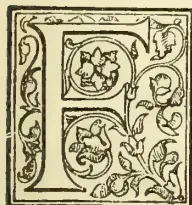

FOR twenty-three years the *Tropical Agriculturist* has been carrying on its mission and doing much useful work in the interests of planters and agriculturists, merchants, traders and manufacturers throughout the world. During all these

years we have, at no little trouble and expense, done all in our power to render the Magazine as complete and efficient an organ as possible for the dissemination of useful knowledge and reliable information concerning every product suited for cultivation in the tropics. It has not always been work of the easiest nature, but we have ever been encouraged by the knowledge that the "*T.A.*" is a useful power for good, and that our labours are appreciated by a very wide circle of readers. We are gratified by the receipt of letters of appreciation and thanks constantly being received from all quarters of the globe, and the circulation of the "*T.A.*" may indeed be said to be world-wide.

Improvements have taken place in our pages during this 23rd year of publication, and still further improvements are planned for the near future, not the least important among which is the contemplated publication of useful illustrations from photographs, which will be of service and interest to readers.

It will have been noticed that we have placed the advertising arrangements entirely in the very capable hands of

REUTER'S TELEGRAM CO., LTD.

We believe that by this arrangement our advertising clients' and our general readers' interests will be better served. Reuter's Co. is well-known throughout the world, having agencies everywhere, so that firms and private advertisers can easily be placed in direct communication with us and have their business attended to and transacted with the least possible trouble. General readers like to see advertisements; they then easily find what they want and where to buy, and our wide circulation and greatly diversified classes of readers make the "*T.A.*" a most useful and excellent medium. We are frequently asked by readers

in different parts of the world for help in matters of purchase, etc. We are always ready to place our knowledge at their disposal, and, of course, our own advertising clients have first favour. A word now as to

#### THE "*T.A.*" PRIZE ESSAYS.

We have been calling special attention during the past months to the valuable prizes we are awarding to the three best essays on new products. We want useful information in these essays, and no "padding" nor useless verbiage should be included. Be concise and to the point.

The prizes are in value as follows:—

First prize ... .. Rs. 300 or £20

Second ,, ... .. ,, 200 or £13 6s. 8d.

Third ,, ... .. ,, 100 or £ 6 13s. 4d.

Competitors in Ceylon and India must send in their essays within four weeks after the issue of this number, and competitors in other countries within seven weeks. We hope a large number of essays will be sent in, and look forward with pleasure to awarding the above handsome prizes. The Editor's decision must in every case be accepted as final, and he reserves the right to use any of the essays sent in, whether prize-winning or not, as he may think fit. The results of the competition will be announced as early as possible.

We should like to remark in closing that the "*T.A.*" is published in the interests of our readers whom we are always glad to assist whenever possible. When in doubt about any matter in planting, agriculture, fruit-farming, etc., etc., write to your Editor, and he will do his best to assist you. Agriculture is to a great extent learnt by experience, and one man's experience may be of great value and help to another; so readers in all parts of the world may help each other by giving their experiences, their views and opinions in our columns on all sorts of planting and agricultural matters. The West can help the East, the North the South, and *vice versa*. Are you a Rubber planter in America, the Straits or elsewhere?—give Ceylon men your views and experiences in exchange for what we tell you about Ceylon. Are you growing Tea in a fresh Colony?—we can possibly advise you, tell us how you have already done. Are you a West Indian or African cotton grower?—we want information in Ceylon and for other Colonies. Are you a South Sea Island planter?—we know much about coconuts and cacao; tell us what you are doing. In fact, whatever branch of agriculture you are engaged in, pioneer or man of established experience, be it tea, cacao, rubber, cotton, tobacco, camphor or fibre plants, etc., write and exchange your knowledge for that of your brother planters in other lands. You will thus find added interest in your work, you will gain useful information and assistance, and you will help to brighten the pages of

Your Magazine,  
The Tropical Agriculturist.

837------------------------------------------------

800THE TROPICAL AGRICULTURIST.[JUNE 1, 1904.]

## THE RUBBER INDUSTRY IN CEYLON.

PARA RUBBER CULTIVATION—TAPPING—AND THE

MANUFACTURE OF CRUDE RUBBER.

INTERESTING NOTES AND OBSERVATIONS.

On another page this month I have given an account of the Para Rubber tree (*Hevea brasiliensis*) in Ceylon as seen and observed during a trip to the Kalutara district. I now make some further observations on the cultivation of this tree, the tapping methods in use, and the collecting and manufacture of the crude rubber in the estate factories. Some of these observations and remarks appear for the first time in print, and will, no doubt, arouse interest beyond the confines of this island; planters in other lands will be interested in the methods adopted by planters here, and the means by which they produce such rubber as easily commands the highest prices in the world's markets. The Editor will be glad to hear from all such any remarks they may have to make on Ceylon methods, and the opinions expressed in these paragraphs. At the same time Ceylon men will be glad to have further particulars and the experiences of rubber planters in other lands, and this exchange of ideas and experiences can only result in mutual benefit, and the columns of the *Tropical Agriculturist* are always open to such. Agriculturists ever learn by experience, and no class of men should be readier to give and exchange opinions; and in a comparatively new product of cultivation where planters are more or less just groping their way out of the darkness, the free exchange of experiences will be of the greatest value. With these preliminary remarks I will start straightaway with my subject.

### THE HEVEA IN CEYLON.

It has sometimes been stated that the rubber industry in Ceylon is hindered and handicapped by the limited area of land available for its cultivation. True, we have not in this island the vast areas which can be cleared and planted up in the Federated Malay States, but at the same time the statements referred to have probably been made by those who do not know the conditions under which the hevea will grow and flourish. True, also, that the hevea in the F. M. S. is somewhat ahead of the Ceylon tree in girth, age for age; but compared with heveas in Brazil, both Ceylon and the Straits trees are far ahead. A Ceylon or Straits tree of 20 years is greater in girth than a Brazil tree 60 years old. In the Straits at 20 years the tree will have a circumference at base of 15 feet, this is attained by a Brazil tree at 50 to 70 years. The hevea will do well in the Western Province and the Southern Province; in Kurunegala, in the North-Western Province, it flourishes. There are fine yielding estates in the Central Province in the Matale districts, and also in Kegalle; it may also be found to do well in Uva and possibly the Eastern Province, while I believe there was formerly a Government plantation in the Trincomalee district. Then again it has been found to grow at a profit as high up as 2,700 feet in Gampola, and we do not yet know that this is the limit. So that it seems probable that there are many thousands of acres in Ceylon where heveas could be grown. If the Government experiments, now being carried on in the North-Central Province, and others soon to be commenced in the Northern Province, prove that Para rubber can be profitably grown under irrigation, still further possibilities are opened up, and far greater areas will then be available for rubber growing.

### CULTIVATION.

The hevea certainly dislikes wind and flourishes best in sheltered positions. It seems to grow in the roughest, rockiest situations, and to be quite at home among rocks and boulders in the old beds of mountain torrents. The plants are raised from seed

which freely germinates, sown in beds in the nurseries raised about 3 ft., and about 4 to 6 ft. wide. The plants are generally put out in holes, dug in lines amongst the tea or in special rubber plantations when about a year old, and are known as "stumps." The coolies while plucking the tea often break off the tops of the young stumps, thereby retarding the growth a good deal; and for this and other reasons the stumps planted among growing tea should be placed in the lines of the tea and not between the lines.

### TENACITY OF LIFE.

That the hevea is a fairly hardy tree, tenacious of life and well able to stand and recover from severe shock was instanced by a plantation on Putupana estate. In burning off the jungle for a further rubber clearing close to a plantation of trees already being tapped, sufficient care was not taken by the coolies, and trees along the edge of the plantations were badly burned and scorched. They seemed to suffer badly at first, but when I saw them some time after they appeared to have quite recovered from the shock; on the side immediately facing the fire the lower branches had been damaged, but on the other side and above the trees were again covered with plentiful green foliage. I was told of another estate where this had occurred, and the trees there also were recovering well. So that once the trees are established they appear to be able to stand a lot of rough usage.

### THE TAPPING OPERATION.

The age at which tapping should be commenced is now generally considered to be 7 years. Rubber-producing latex is yielded some time before this, but the strain on the young tree, coupled with the fact that the maturer trees' latex is far richer in rubber, makes the older age preferable. The bark of the tree is rough and thick, and before tapping is commenced the outer bark must be shaved off. There are several reasons for this preparatory

### SHAVING OF THE TRUNK.

With the rough bark on it is more difficult to make a proper incision for tapping and harder to fix the cups. If tapping were carried out on unshaved trees much latex would be lost on the rough bark or only result in "Dirty Scrap." But the main reason for shaving is that it increases the flow of latex. The exact use of the latex to the tree is not yet known, but this result of shaving indicates that one of its uses is to heal up wounds and renew bark. For some reason or other the shaving greatly increases the quantity of latex in the tissues immediately below the shaved portion, and this result is found even if only a small portion of the trunk is shaved. Shaving seems to have an irritating influence on the latex, drawing a great quantity of it into the laticiferous cells immediately above the shaved portion. The tree to be tapped is shaved over the tapping surface about two weeks before tapping is to commence. On some estates the whole trunk, from base to some 6 ft. up, is shaved; other planters hold that it is better to shave just those parts where the incisions are to be made; but this, of course, depends to some extent upon the system of tapping to be adopted, and is a subject for much experiment.

### VARIOUS TAPPING METHODS.

Various tapping methods are in use on different estates. On Kepytigalla estate a system of large V shaped cuts is in favour, as D in the figure. The cuts are about 8 to 10 inches in length, and this method is highly recommended by Mons. Collet. The herring-bone system seems not to be in favour in Ceylon, a series of small V cuts being given the preference (see B in fig.). Another kind of cut seen on one estate is a twisted cut starting at a point and half encircling the tree, being in all about 24 inches long (as C in fig.); but this plan of tapping is not continued. On two leading rubber estates the method adopted is what, for want of a better name I will term the "zig-zag" system. (E in fig.) It consists of a cut 6 in. long at an angle of 45° with

838------------------------------------------------

JUNE 1, 1904.]THE TROPICAL AGRICULTURIST.801

the perpendicular, then a vertical cut of 2 inches, and then another 6 inches cut parallel to the first. A series of these cuts is made down the tree, the initial point of each cut being on a level with the

DIAGRAM SHOWING METHODS OF TAPPING  
HEVEA BRAZILIENSIS.

final point of the cut above. For the second day's tapping a fresh cut is not made but the lower side of each 6 inch cut, is simply pared with a gouge. By those who use this method is greatly recommended, and the results obtained certainly seem good. This paring of the lower side of the cut, instead of a new incision, might well be extended to other methods of tapping also, and seems to be economical in taxing the bark-renewing resources of the tree, while the flow of latex from the pared portion is first-rate. On the accompanying diagram (which is not exactly drawn to scale), the various methods of tapping referred to are represented; and also a system highly recommended by Mons Collet. This is a series of cuts in four, each about 4 inches long; the first set is cut one day, the next a little distance below, followed by more series until the base of the tapping area is reached, then another series of forms is begun parallel to the first one, and so on (see A in fig.). For this method the new "C.C." tapping tool is specially useful (referred to elsewhere),

#### COLLECTING THE LATEX.

The tapping of the trees and collecting the latex is carried out each morning and evening; early in the morning before the sun's rays are at all fierce, and in the late afternoon when the sun is low down on the horizon, as the latex flows very slowly during the heat of the day. The coolies go out to the plantations in couples; one man carries a large tin to hold the latex when collected and the tapping cups, and the second man does the tapping. Each pair of coolies does about forty trees, and by the time the last tree is tapped and the cups placed the first tree has almost run dry and the cups are ready to be collected. The coolies then go through the plantation again taking out the cups and pouring the latex all together into the large receiver. All the latex having been poured into this, a bunch of hevea leaves is stuffed into the top to prevent the latex being jerked out as the coolies walk, and he returns to the factory with the morning's or evening's collection, as the case may be. The flow of latex differs in different aged trees and varies according to the season of the year both in quantity and quality. In the rainy season the latex is more watery, and from this watery latex the resulting biscuits are not so clear and have a dirtier, somewhat mottled appearance.

From more recent information I think it would be to the planters' advantage to carefully separate the latex of various aged trees, and not let the milk from young trees just come into tapping be mixed with that from maturer trees. Manufacturers certainly recommend this; they say that indiscriminate mixing of the latex leads to irregularity of quality in the rubber, and a downfall in price is sure to result if this is the case. Even if more labour and trouble is necessitated it is worth it to keep up the standard of the rubber.

#### STRAINING THE LATEX.

The latex having arrived at the factory it is carefully strained through a fine hair-sieve or strainer, and then placed in shallow pans to coagulate. The straining is important and should be thoroughly done to remove all foreign particles which would mar the translucent appearance of the biscuits. The milk having been strained, the coagulating agent is added, if any coagulant is being used. To a large pan of milk holding several quarts two spoonfuls, about 2 fluid oz. of acetic, are added and stirred in. I already stated that I think the use of a little acid is to be recommended, it is time-saving and gives a better appearance to the rubber which coagulates quicker than if left to do so naturally. The quicker coagulated rubber has a paler, clearer appearance, and I notice in the weekly London Sales, reported in the *Ceylon Observer*, that pale biscuits almost invariably get from  $\frac{3}{4}$ d. to 1 $\frac{1}{2}$ d. per lb. more than dark biscuits. So far as I can see everything points in favour of the moderate use of acetic acid. Of smoked Para I have seen little, so cannot speak from experience, but the process seems more troublesome, longer, and not nearly so clean a method as the use of acid. When the acid has been stirred into the latex the latter is poured out into the coagulating pans, shallow enamelled pans, about 7 or 8 inches across and 2 inches in depth. By the time the morning's collection of latex is put out in pans to coagulate the previous evening's gathering is coagulated, and the next process can be carried out.

#### ROLLING THE BISCUITS.

The coagulated biscuit in the pan looks like a mass of pure white curd, and is soft and impressionable to the touch. It floats in the pan in the surplus water left after coagulation; if this remaining water has a somewhat milky appearance the contents of the pans may be put together and treated with a little extra acid when the remaining rubber globules will coagulate; if thoroughly coagulated, however, the water left in the pans will be quite clear and free of any rubber.

839------------------------------------------------

802THE TROPICAL AGRICULTURIST.[JUNE 1, 1904.

The soft cake of rubber, about half an inch in thickness in the middle and getting much thinner at the edges is then placed on a sloping table covered with sheet lead and all the "mother latex" or superfluous water is rolled out by a heavy roller manipulated by hand. The cake has then assumed a round flat shape, about quarter inch in thickness, and of fair consistency and is ready to go to the drying room.

#### THE FIRST DRYING PROCESS.

The first drying is by artificial heat. On many Ceylon estates where as yet no special rubber factory has been erected, the first drying is done by the tea factory boiler; the thick white biscuits are placed on cloths over or near the boiler, and remain there for about an hour. On Culloden estate, where the manager has a fine factory specially for rubber, the drying is done on wire netting racks over a charcoal fire. As the fresh damp biscuits dry they gradually darken and assume a dirty colour, which on further drying turns to deep brown and then a fine clear amber colour, the proper colour of the finished and dried biscuit ready for the market.

#### THE DRYING RACKS.

After the quick drying by artificial means the biscuits are allowed to dry gradually. For this purpose several methods are in vogue. Some planters hang the biscuits over strings or stretched wires. I have noticed in biscuits dried in this way dark marks on the rubber where the strings touched it, and a biscuit with several of these marks, will, I think, fetch a lower market price. Another method is to have layers or shelves of hessian cloths stretched in the factory, about 8 inches, or a foot above one another; the biscuits dry on these very well. But the best arrangement I have come across, the neatest, most durable and the one to be recommended is a series of wire-netting shelves. These can be easily and cheaply erected, and the mesh of the wire need not be small. The air freely circulates amongst the biscuits on these wire shelves and they soon dry, and if required small portable charcoal-burning stoves can be placed under the range of shelves to hasten the drying still more. During the drying process the biscuit shrinks somewhat, and when quite dry measures about 10 inches in diameter and about  $\frac{1}{2}$  inch in thickness.

#### A CEYLON PARA RUBBER BISCUIT,

when made with latex from mature trees, properly dried, should be quite clean and semi-transparent when held up against the light; it should be free from dark patches and not be mottled or pitted. It is found that biscuits made from latex collected in rainy weather are often inclined to be of a bad colour, less transparent, and are sometimes mottled or have curious little pits over them. The cause of this I have not yet been able to ascertain. Probably it does not affect the commercial value of the rubber much; still, the more attractive in appearance the biscuits are the better. According to the state of the atmosphere the biscuits take from 10 days to nearly three weeks to completely dry. When a quantity sufficiently large is ready the biscuits are packed in tea-chests and despatched to England.

#### SCRAP RUBBER.

The scrap rubber, which is picked out of the inclinations on the trees and on the bark, is dried thoroughly in the factory, but of course needs no coagulation or artificial drying. It is picked as clear and free from chips of bark etc., as possible, and when dried is packed in chests either loose or made up into loosely compressed cakes or slabs. Good Ceylon scrap sold in the London market during the month of April at 3s. 7d. to 3s. 10 $\frac{1}{2}$ d. per lb., and this at a time when best Para rubber got 4s. 6 $\frac{1}{2}$ d. per lb.

## COTTON GROWING IN THE BRITISH EMPIRE.

BY ALFRED EMMOTT, M.P.

FROM A PAPER READ BEFORE THE SOCIETY OF ARTS.

The question of the growth of cotton in the British Empire has recently attracted the attention of all those who watch the development of our industries in general, and who recognise the importance of the cotton trade in particular. The interest attracted by the subject is emphasised by these words in the gracious speech from the Throne at the opening of this season:—

"The insufficiency of the supply of the raw material upon which the great cotton industry of this country depends, has inspired me with deep concern. I trust that the efforts which are being made in various parts of my Empire to increase the area under cultivation may be attended with a large measure of success."

The obvious fact is, that the demand for the raw material of the cotton industry has, in recent years, exceeded the supply, and that this relative shortness of supply has helped speculators to enhance the price of cotton to figures which have seriously interfered, not only with the profits but also with the amount of employment in the trade.

Last autumn, £2,000,000 was lost in wages in this country by cotton operatives alone, owing to short time and stoppages. At the present time the great majority of mills using American cotton are only working 40 hours a week instead of the normal 55 $\frac{1}{2}$  hours, mills which, were cotton cheap and abundant, would all be fully employed.

During the last few months cotton has varied from 7d. to 9d. per lb. in price, and it is nearly 30 years since such prices were known.

It will be of interest at this point to show the variations in the price of middling American cotton from 1870, in five year periods.

#### AVERAGE PRICE PER LB. MIDDLING AMERICAN COTTON ON THE LIVERPOOL MARKET FOR QUINQUENNAL PERIODS.

<table>
<tbody>
<tr>
<td>1870-74</td>
<td>(five years)</td>
<td>..</td>
<td>9.21</td>
</tr>
<tr>
<td>1875-79</td>
<td>"</td>
<td>..</td>
<td>6.56</td>
</tr>
<tr>
<td>1880-84</td>
<td>"</td>
<td>..</td>
<td>6.35</td>
</tr>
<tr>
<td>1885-89</td>
<td>"</td>
<td>..</td>
<td>5.52</td>
</tr>
<tr>
<td>1890-94</td>
<td>"</td>
<td>..</td>
<td>4.66</td>
</tr>
<tr>
<td>1895-99</td>
<td>"</td>
<td>..</td>
<td>3.85</td>
</tr>
<tr>
<td>1900-03</td>
<td>(four years)</td>
<td>..</td>
<td>5.47</td>
</tr>
</tbody>
</table>

It will be noted that the quinquennial average price fell regularly and persistently until the period 1795-99. The lowest year was 1898, when the average price was 3.31d. It rose to 3.56d. in 1899, and 5.47d. in 1900. Afterwards there was a fall, and the average price of each of the years, 1901 and 1902, was about 4.3d. In 1903, it rose again to an average price of 6.03d., commencing the year at 4.68d., and ending it at 7.24d., and in the first week of February, 1904, the culminating price of the great speculative movement was reached, when the price stood about 9d. Since then the price has been lower, but there have been wide fluctuations and much disorganisation in the industry.

There are two elements discernible in the increased prices of the last few years. The first may be called a legitimate rise of price due to an increased demand. The second is due to a singularly daring speculative movement on the part of a group of American speculators. It is quite impossible satisfactorily to separate the effect of these two causes.

The world's crop returns for the past 25 years, given in annual averages, is as follows:—

#### ANNUAL AVERAGE OF THE WORLD'S CROP OF COTTON IN BALES, IN QUINQUENNAL PERIODS.

<table>
<tbody>
<tr>
<td>1879-83</td>
<td>...</td>
<td>...</td>
<td>..</td>
<td>8,680,000</td>
<td>bales.</td>
</tr>
<tr>
<td>1884-88</td>
<td>...</td>
<td>...</td>
<td>..</td>
<td>9,600,900</td>
<td>"</td>
</tr>
<tr>
<td>1889-93</td>
<td>...</td>
<td>...</td>
<td>..</td>
<td>11,540,000</td>
<td>"</td>
</tr>
<tr>
<td>1894-98</td>
<td>...</td>
<td>...</td>
<td>..</td>
<td>13,360,000</td>
<td>"</td>
</tr>
<tr>
<td>1899-03</td>
<td>...</td>
<td>..</td>
<td>..</td>
<td>15,680,000</td>
<td>"</td>
</tr>
</tbody>
</table>

840------------------------------------------------

JUNE 1, 1904.]THE TROPICAL AGRICULTURIST.803

These figures must be taken as approximations. I am not sure whether the cotton grown in China and Asiatic Russia is accurately accounted for in the earlier years. It must be remembered, too, that the bales vary in weight, both according to localities and even in the same locality. For instance, in 1879, the American crop was 5,074,000 bales of 434 lb. each, whilst in 1903 it was 10,758,000 bales of 495 lb. each. Egyptian bales contain about 700 lb. of cotton each, and the crop increased from 254,000 bales in 1879 to 825,000 bales in 1903. Bales of East Indian cotton weigh about 400 lb. each, and the crop increased from 1,543,000 bales in 1879 to over 3,000,000 in 1903, whilst the production of cotton in the rest of the world, composed of many different varieties, increased from 167,000 bales in 1879, to 1,500,000 in 1903. Mr. Hutton reduced the present crop of the world to bales of 500 lb. each, and gives the number as follows:—

<table>
<tr>
<td>United States</td>
<td>...</td>
<td>...</td>
<td>11,000,000</td>
</tr>
<tr>
<td>India</td>
<td>...</td>
<td>...</td>
<td>3,000,000</td>
</tr>
<tr>
<td>Egypt</td>
<td>...</td>
<td>...</td>
<td>1,000,000</td>
</tr>
<tr>
<td>Rest of the world</td>
<td>...</td>
<td>...</td>
<td>1,000,000</td>
</tr>
</table>

These figures are for an average crop, and are in substantial agreement with the other figures I have given. They show that the present annual production of cotton is about 8,000,000,000 lb. It is abundantly evident that the tendency towards an increased demand for cotton is still growing, and it is calculated that in five years' time, 19,000,000 bales of cotton will be wanted, and in 10 years, 23,000,000 bales against a present production of only 16,000,000. The question of whence this increased supply of cotton is to come is of importance to the world at large; but it is of greater and more vital importance to Great Britain than to any other country. Our total production of cotton goods is estimated at £90,000,000 to £100,000,000. Of this amount, some £72,000,000 worth is sent abroad, and constitutes the greatest manufactured export trade of any kind of any country in the world. It is obvious that if this trade is to be curtailed by a short supply of cotton, the results to us will be very serious.

There is yet a further consideration in relation to

#### OUR VAST EXPORT TRADE IN COTTON

manufactures. A sudden rise in price hinders trade in every country, but its effect is much greater in countries in a lower state of civilization. Much of our trade is done with Oriental or barbarous races who do not take kindly to increased demands on their slender means, whilst the export of cotton manufactures to such races on the part of our competitors is comparatively small. It is of the utmost importance, therefore, on account of the magnitude of the trade itself, on account of its great usefulness in helping to pay some of our bills by roundabout methods, and on account of our great export to uncivilized or semi-civilized races, that we should strain every nerve to increase supplies of the raw material, and so keep its price at a reasonable figure.

The question now arises as to how this is to be done. So far as our troubles arise from unbridled speculation, the best remedy that can be applied is to smother the speculators in cotton. I have never seen any feasible plan for stopping speculation by legislation. Few speculators in raw material have died rich men, and paper bargains in cotton are as useful to the cotton spinner as to the speculator. The remedy for the short supply of cotton is the same as that for the speculator. We want more cotton grown.

This brings us to the consideration of what are the prospects of larger supplies from existing cotton fields, but, if I am not wearying you with figures, I want, first of all to put before you some details of the growth and distribution of the American crop. You will remember that out of 16,000,000 bales, America produces 11,000,000, or approximately 70 per

cent. There has been a great change in the distribution of this crop in recent years, as well as a great increase in the growth. The total distribution of the American crop for 1876-80 was 4,947,000 bales; for 1886-90, 6,878,000 bales; for 1896-1900, 9,664,000 bales; and for 1901-3, 10,762,000. The distribution was as follows:—

#### DISTRIBUTION IN PERIODS OF THOUSANDS OF BALES.

<table>
<thead>
<tr>
<th></th>
<th>Great Britain.</th>
<th>European and other ports.</th>
<th>U.S.A.</th>
<th>Total.</th>
</tr>
</thead>
<tbody>
<tr>
<td>1876-80..</td>
<td>2,151</td>
<td>1,245</td>
<td>1,551</td>
<td>4,947</td>
</tr>
<tr>
<td>1886-90..</td>
<td>2,836</td>
<td>1,784</td>
<td>2,258</td>
<td>6,878</td>
</tr>
<tr>
<td>1896-1900</td>
<td>2,944</td>
<td>3,310</td>
<td>3,410</td>
<td>9,664</td>
</tr>
<tr>
<td>1910-03..</td>
<td>2,978</td>
<td>3,600</td>
<td>4,184</td>
<td>10,762</td>
</tr>
</tbody>
</table>

The above Table shows that England is using a much smaller portion of the American crop than was the case years ago.

The tendency on the part of the United Kingdom to use a small proportion of the American crop is due not only to the increase of spindles in the Southern States of America and on the Continent of Europe, as well as in Japan, Canada, and Mexico, but also to the fact that we now spin much finer yarns than we did some years ago, and use a good deal more Egyptian cotton. The American spindle spins about 90 lb. of cotton per annum, the spindle of the European continent 70 lb., and that of Great Britain 34 lb. Perhaps I may give at this point the number of spindles running in Great Britain, the Continent, United States of America, India, and other countries in 1895, 1899, and 1903:—

<table>
<thead>
<tr>
<th></th>
<th>1895.</th>
<th>1899.</th>
<th>1903.</th>
</tr>
</thead>
<tbody>
<tr>
<td>Gt. Britain..</td>
<td>45,400,000</td>
<td>45,500,000</td>
<td>48,000,000</td>
</tr>
<tr>
<td>Continent ..</td>
<td>28,200,000</td>
<td>32,500,000</td>
<td>34,000,000</td>
</tr>
<tr>
<td>U.S.A...</td>
<td>16,100,000</td>
<td>18,300,000</td>
<td>22,000,000</td>
</tr>
<tr>
<td>India ...</td>
<td>3,800,000</td>
<td>4,700,000</td>
<td>5,000,000</td>
</tr>
<tr>
<td>Others</td>
<td>—</td>
<td>—</td>
<td>3,600,000</td>
</tr>
<tr>
<td>Total.....</td>
<td>93,500,000</td>
<td>101,000,000</td>
<td>112,000,000</td>
</tr>
</tbody>
</table>

There are three observations to be made on this Table. First, the spindles of "other" countries were not all started between 1899 and 1903, but I have not accurate details of the earlier period. In the second place, the growth of spindles in India has been materially checked during recent years; and in the third place the growth of spindles in Great Britain has shown a greater increase in the last period than those on the Continent. It should be added that the increase in the United States of America is mostly in the Southern mills.

The danger of our dependence on American sources of supply is twofold. In the first place, if the increase in the Southern mills is to continue, a point which is somewhat in doubt, and about which I cannot speak with certainty, the demand for the market of the United Kingdom must become a more and more negligible factor. In the second place, unless the supply of American cotton is greatly augmented, we shall continue to be more or less in the hands of speculators.

I come now to the possibility of

#### INCREASED SUPPLY FROM EXISTING SOURCES.

In reference to the United States of America, I am quite unable to forecast what may be done in the future, either in the direction of the increase of the total production, or of the proportion of that production which will be available for our use. There are two considerations to be borne in mind as regards the increase of production, firstly, whether the acreage of the crops is likely to be greatly augmented, and, secondly, whether the growth per acre will show any material change. My opinion on the question of acreage must be taken for what it is worth, for reports are very contradictory. Judging by the past, I am inclined to believe that the acreage will be increased.

841------------------------------------------------

804THE TROPICAL AGRICULTURIST.[JUNE 1, 1904.

It is unnecessary to allude at length to the question of the yield per acre. There is a general impression that the yield in America is decreasing, but having looked somewhat closely at the figures, I cannot, at present, find any justification for it.

Our next chief source of supply is

#### EGYPT.

This cotton is longer, finer, and more silky than the American variety; it is more suitable for our finer manufactures, and lends itself to the newly discovered mercerising process which makes it look almost like silk. We are the largest consumers of Egyptian cotton, and obtain one-sixth of our total supply from that country. The Asouan Dam will, no doubt, do something to increase the acreage under cotton. I understand, however, that Lord Cromer estimates that it will only increase the total cultivable area by 15 per cent., half of which is suitable for growing cotton. It will be seen, therefore, that no great addition can be made to the amount of cotton grown in Egypt.

We obtain a certain amount of cotton from Brazil and Peru. The quality is somewhat harsh, and although for many purposes these varieties can be used instead of American, our consumption of them has very materially decreased since 1870. There has also been a great decrease in the amount of East Indian cotton we consume. The length of the staple is very short, and it is quite unsuitable to the manufacture of any of our finer goods. I shall deal with the possibility of further supplies from India when I reach the question of the work of the British Cotton-Growing Association.

This list exhausts our principal sources of supply, but we get small quantities of cotton from Chili, Venezuela, Columbia, the British West India Islands and British Guiana, European and Asiatic Turkey and a ton or two even from Australia and New Zealand. From none of these countries, however, has the supply of cotton suitable for our purposes been increasing of late years. I come now to the efforts that are being made to extricate the cotton trade from the dilemma in which it finds itself placed. This is not a small problem, it is a large one.

There are, at present, probably 45,000,000 to 50,000,000 acres growing cotton, or say, 75,000 square miles, or nearly two-thirds of the area of the United Kingdom. In ten years' time, we want to have a further area, half as large again, planted with cotton. Let me put it in another way. Take a length of railway, about 30 miles. To keep one good modern mill running on ordinary medium counts would require a plantation extending for half a mile on each side of the line for the whole of that distance. In addition to the present area, the world will want at least another thousand such plantations within the next ten years. The value of the cotton produced on this extra acreage, at an average of 5d. per lb., would be £70,000,000, or, at present prices, over £100,000,000. What a stimulus to the trade of the Empire if we can grow even half of it in our own possessions!

We have in the British Empire almost endless territory suitable for the growth of cotton. It would be a clear Imperial gain that we should grow it there, for whilst the extra cotton would supply our mills and discourage speculators, the people who grow it would become excellent customers for our manufactures.

The British Cotton-Growing Association has been formed to try to achieve this desirable end. Its inception was due to the Oldham Chamber of Commerce and to Sir Alfred Jones. At the annual dinner of the Chamber in January, 1901, a discussion took place on the important question of increasing the world's supply of cotton. Subsequently a committee was appointed to make inquiries, other Lancashire Chambers of Commerce were approached, and a

meeting was held on February 18th, 1902, at the Manchester Chamber of Commerce, of those interested in the question. Sir Alfred Jones had meanwhile been dealing with the question with his usual energy. In May, 1901, he sent out ten tons of seed to our West African Colonies; he impressed on the Governors of those colonies the importance of increasing the growth of cotton there, and, with a generosity no less real because it may eventually prove to have been far-sighted, he offered special facilities for the shipping of the first thousand bales of cotton that may be sent to this country.

On June 12th, the Association was publicly inaugurated, and it was decided to raise a guarantee fund of £50,000 for the purpose of making the necessary preliminary inquiries and of undertaking experiments and providing machinery wherever it seemed advisable. Instead, however, of a guarantee fund of £50,000, it is now intended to raise half-a-million; instead of isolated experiments, expert advice and presents of solitary gins, one or two considerable plantations and large advance to cultivators are under consideration. Great encouragement has been received from Government officials of all kinds. The drawbacks have been, firstly, the lack of response on the part of the bulk of the cotton trade, but I hope this will now be altered; and secondly, the fact that the Association has been so over-whelmed with correspondence and appeals from all tropical and subtropical parts of the Empire, that it has been difficult to concentrate its attention, or even decide wisely on what seems best worth doing. I will now take the different parts of the Empire in which cotton can be grown, and state very briefly what has been done, and what it is hoped to do.

#### COTTON IN INDIA.

India was the original home of the cotton trade. Even the word "calico" comes from India, and the finest muslins have been made there from time immemorial. So far, little has been done by the British Cotton-Growing Association for India beyond holding many interviews with officials and conducting a large correspondence. The Indian sub-committee of the Association believes that much may be done there. On February 27th, Mr. Brodrick, the Secretary of State, kindly granted an interview to a deputation. He made the interesting suggestion that the British Cotton-Growing Association should start a plantation in Burma and try to produce a better quality of cotton there. Several earnest attempts have been made in the past in this direction in other parts of India.

All the various kinds of cotton grown in India at present are, however, too short for general use here. In the old days we used them largely for coarse counts and coarse cloths, which were sent to the East; but India can now make these more cheaply for herself.

Three things stand in the way of any great growth of cotton in India suitable for our purposes. The first is that exotic seed has never yet been successfully cultivated there for any long period. It seems as if in regard to cotton, the soil forces the product of the seed into some primeval type of its own choosing rather than gives it fair play to reproduce its own prototype. The two other difficulties are removable. One is that sufficient care is not exercised in the selection of seed, and this is vital for growing good cotton. The other is the primitive methods of cultivation used by the Indian ryot. How long it will take to remove them, I leave to those who know India better than I do to judge.

#### THE WEST INDIES.

In 1786 to 1790 we received from the British West Indies, British Guiana and British Honduras, 45,000 bales a year out of a total consumption of 63,000 bales, whereas of late years we have not imported more than 1,000 bales of the same size. In these

842------------------------------------------------

JUNE 1, 1904.]THE TROPICAL AGRICULTURIST.805

Islands can be grown the very finest kind of cotton which is used, commonly known as the Sea Island variety. I am glad to say the movement for an increased growth of cotton has been taken up with great enthusiasm, many thousand acres are planted, and next year the acreage will be still greater. Sir. D. Morris, the Imperial Director of Agriculture, is taking the deepest interest in the question, as is also Sir Gerald Strickland, the Governor of the Leeward Islands. The impoverished condition of landowners has made many of them unable to undertake the growing of cotton without financial assistance, but by the aid of the Colonial Office it has been arranged that grants shall be made to respectable planters, under the joint guarantee of the local authorities and the British Cotton-Growing Association.

Correspondence is being carried on with Australasia, Ceylon, Burma, Borneo, and Fiji, and some experiments are being made in Ceylon. In reference to Australia, where there are great areas of land suitable for growing cotton, the difficulty lies in the great cost of the production of cotton by means of white labour.

#### COTTON IN AFRICA.

I have already dealt with Egypt, but have not mentioned the Egyptian Soudan, the ownership of which we share with Egypt. Dr. Hagberg Wright wrote to the *Times* on January 5th, enclosing a letter from a friend of his in which this extract occurs:—

"The inverted alluvial delta of the Egyptian Soudan, which is situated between the White and the Blue Niles, is even more favourable to the growth of cotton than the lower parts of the Nile Valley, and affords ten times the area for the plantation of cotton of that available in Egypt proper."

It seems quite certain that when the Suakim-Berber Railway is open, cotton can be grown and sent to Europe at very reasonable rates. The Association has constantly pressed upon Lord Cromer, through the Government, the necessity for building this railway with as little delay as possible, and he has promised that this shall be done. The principal difficulty one foresees is the question of labour; but in these days of wholesale immigration from other countries, is it too much to hope that it may be possible to attract some of our Indian fellow-subjects to settle there?

A new field of cotton has also been opened in the neighbourhood of Tokar, on the Red Sea. From 20,000 to 30,000 acres are already under cultivation, and it is said that this area will be greatly increased in the future. It is also stated, that if the Khor Baraka were dammed, some 2,000,000 acres of land would be cultivable between Tokar and Kassala. On the whole, the Egyptian Soudan is one of the most hopeful fields for the growth of cotton for the United Kingdom, because it is capable of producing, apparently at reasonable price, cotton which is long in staple and fine and silky in quality.

Going further south in Africa, we come to Uganda and British East Africa. The Foreign Office has sent an expert there, and Sir Charles Eliot reports that there is plenty of good cotton land, and a supply of cheap labour. It has also been shown that cotton can be grown there from Egyptian seed quite as good as that grown in Egypt proper, but the cost of growing on a commercial scale has not yet been proved.

Again, going south, British Central Africa is the next available field. Here there is a wild cotton plant (*Gossypium anomalum*), and a plant introduced by the Arabs (*Gossypium herbaceum*), which has been cultivated intermittently for centuries, but the best cotton in this district is grown from recently imported Egyptian seed. It is nearly fifty years since Livingstone was despatched to the Zambezi and Lake Nyasa, to open up the country to cotton growing, for a cotton famine was threatened in the fifties, and, as the world knows, actually took place in the sixties. The chief

obstacles to Livingstone's schemes lay in transport difficulties. During only six weeks in the year is the Zambezi-Shire navigable to the verge of the Shire Highlands. The railway which is being built from a point on the navigable Shire through British Central Africa to lake Nyasa is meant to meet the difficulty.

The present situation is this. Cotton is being grown successfully, and can now be put on the Liverpool market at 4½d. to 5d. a pound. On the table are samples of two kinds of cotton grown from Egyptian seed, which have been sold recently in Liverpool at 7¾d. and 8¾d. per lb. respectively. These samples were sent to the Society of Arts by the African Lakes Corporation, Limited, who imported the cotton. Labour, however, is not too plentiful, and that "Imperial" policy which is depriving this district of its labour in order to work a few more stamps in South African gold mines, is going to make it less plentiful than ever. This policy seems likely to delay even the completion of the railway which is a necessity of the first importance. When the railway is built there is an enormous territory waiting for development. Even under present circumstances some advances have been made to cultivators, and if sufficient funds are forthcoming, it is in contemplation to advance £100,000 or £150,000, in order that 100,000 acres may be put under cultivation.

It is important to remember that men like Sir Harry Johnston, who knows this district well, and who recently sent a letter to the *Times* from which I have largely borrowed, are the most keen and enthusiastic about cotton growing in this territory.

The only other British possession on this side of Africa which I need name is Rhodesia, in which experiments are being made by the British South Africa Company, with considerable hope of success.

Turning now from East to West, it is unnecessary that I should tell you cotton can be grown in Gambia, Sierra Leone, Lagos, Southern and Northern Nigeria, as well as in the French and German possessions in that region, in the Cameroons and Congo region. The only question is the extent to which it can be grown, and the price at which it can be put upon the English market.

In Gambia an experimental farm is being started, but it is not an easy matter to induce the natives to take up anything new. Some very fair samples of cotton have been grown. Gambia possesses an excellent waterway, and it is important for this colony to cease to be so dependent as it is on ground nuts.

There is a larger field in Sierra Leone. Experiments have been made with American seed, but the result is still doubtful. The best cotton sent home so far has been a native variety. The British Cotton-Growing Association has been fortunate in securing the services of Mr. Shelby Neely, an able young American from the Mississippi Valley; three expert black farmers have also been sent out, and every effort is being made to ensure progress.

We now come to the Gold Coast Colony. In part of the colony, labour is so fully employed in gold-mining, that the supply is short and the cost is high.

Passing by Togoland, where the Germans, with their usual scientific thoroughness, are trying to establish cotton cultivation, and the French colony of Dahomey, we arrive at Lagos, a most hopeful field. Here is a large and intelligent population, already interested in agriculture and acquainted with cotton cultivation, if only by primitive methods; there are large tracts of undulating land in the Hinterland; there is a railway slowly, if most expensively, wending its way into the interior; there is a Governor (Sir William MacGregor) who takes a great interest in the question, and there are experts who are very sanguine about the future.

Unfortunately, a good deal of ill-feeling has been caused by the revival of the old custom of levying octroi dues in Abeokuta and Ibadan. I state this as a fact; but express no opinion on the merits of the case. Much of the seed recently sent out was not

843------------------------------------------------

806THE TROPICAL AGRICULTURIST.[JUNE 1, 1904.

sown, and progress has not been so quick as was hoped. There was also a deficient rainfall in 1903. The needs of the future are the extension of the railway beyond Ibadan towards Ilorin, and if the colony cannot afford to carry out this work, it is distinctly a case where Imperial assistance, either by funds or guarantee, should be given.

Cotton has been grown here for export in the past, but, owing to the fall in the price of American cotton, the trade ceased to be profitable. Mr. Hoffman, one of the experts to whom I have alluded, reports most favourably of the care given to the cultivation of the plant in the Ekiti country in Yorubaland, but he insists on the want of means of transport in the interior, and on the consideration that the price paid to the native for cotton must not fluctuate, "as the people are not in a condition to meet such changes."

Adjacent to Lagos is Southern Nigeria. An expert, Mr. Prince, was sent out there, and he cleared and cultivated a plantation of 50 acres close to Onitsha on the Niger river. A large sample of this cotton has been sent home, and is said to be exactly what is wanted in Lancashire. It is in contemplation to make a large plantation on the Sobo plains in Southern Nigeria. The Government has offered to defray the cost of making a scientific analysis of the soil, and has also placed at the disposal of the British Cotton-Growing Association the services of Mr. Hitchens, who has had a large experience of the agricultural possibilities of the colony.

I may perhaps explain at this point, that it is not the intention of the Association to develop cotton-growing by a system of large plantations. It is obvious that it is impossible to supply the huge quantities of cotton that are required by any such method. As soon as slavery was abolished in the United States cotton ceased to be grown in large plantations even there, and in Africa a system of native farmers on small plots is desirable if such a system is feasible. This suggested large plantation in Southern Nigeria must be regarded rather as an object-lesson and a technical school than the beginning of an attempt to supply by this method the deficiency from which we suffer.

#### NORTHERN NIGERIA.

I now come to the last, but by no means the least, of the British possessions in which there is great expectation of an increased yield of cotton. I allude to Northern Nigeria, of which Lady Lugard gave us such a graphic account three weeks ago. It is not too much to say that our greatest asset there is the Governor, Sir Frederick Lugard, who has shown such a splendid combination of energy and pluck, of patience and endurance, of firmness and fairmindedness in that country, qualities which have quickly achieved a remarkable success.

Northern Nigeria has a territory of 320,000 square miles, and a population of perhaps 10,000,000. That population is much less than it was, and much less than the country will support, and is composed principally of Hausas, the most intelligent and among the most civilised of the inhabitants of West Africa. By nature, peaceful and industrious, by inclination, keen and businesslike, it is impossible to over-estimate the commercial possibilities of this interesting race. As regards cotton it is indigenous in the country, and has been cultivated and manufactured there for a thousand years or more. It is a long way, however, from any part of Northern Nigeria to the coast, and the first imperative necessity is the building of a railway into the interior and the making of roads. A light railway can be built from a suitable place on the Niger to Kano for from half-a-million to a million pounds, and seeing that the British taxpayer is already paying a subvention of £400,000 per annum, it is surely worth while to advance a little more to

develop the country, and it will, probably, quickly pay for itself. If no railway is built, it is impossible to carry cotton down to the Niger at a rate which would leave any reward to the cultivator at all, and it will be useless to expect any large increase of trade with the interior. If a broad gauge railway is attempted it will take many years to build and cost millions of money. A light railway can be quickly constructed, and would soon test, in a practical way, the commercial possibilities of the country.

I may now sum up the general considerations which arise from the work already done by the British Cotton-Growing Association. In the first place, it is proved that there is a vast territory in many different portions of our possessions where cotton can be successfully grown. Secondly, whilst it is too soon to be certain in which of these possessions suitable cotton can be grown at a price to compete with the American and Egyptian supplies on which we now depend, there is every reason to suppose that when the Suakim-Berber and the Shire-Nyassa railways are completed, cotton can be grown cheaply enough in the Soudan and British Central Africa to make it a commercial success, and there are strong hopes that this may be done in other parts of the Empire. Thirdly, the chief difficulties in the way are

#### LABOUR, TRANSPORT, AND FLUCTUATIONS OF PRICE.

As to labour, it is a very doubtful policy to draft native labour from British Central Africa (where 12,000 acres are said to be already under cotton, and where labour is always short in the wet season) to the mines of South Africa. But there, as elsewhere, labour difficulties can only be met by patience and by just and reasonable treatment of all who can be induced to work. As to transport, our Governments must be more ready than they have been in the past, to make railways and roads where necessary. As to fluctuations of price, the British Cotton-Growing Association must minimise the effect to the native as much as possible. Fourthly, it is obvious that the increased growth of cotton in Africa will be best achieved in the long run, not by native labour in large plantations, but by native farmers. No system of large plantations can possibly meet the case nearly so well as a system of small farms cultivated by native owners. The problem is vast and, if the native can be induced to undertake cotton culture on his own account, his interest will be stimulated much more than it can be by an offer of wages. I am aware this is a disputable point, and I ought not to treat it dogmatically. Africa is large and one type of native varies from another much more than one European from another. Fortunately the native African is for the most part a born trader and, in many cases, willing to work if he is sure of a satisfactory market for his produce.

In spite, therefore, of the partial failures of the past, the new movement may be said to have every reasonable prospect of success. The most hopeful fields of the future are now possessions or protectorates of the Empire, which could not have been exploited before, because of lack of transport facilities. We have got beyond the old ideas of *laissez-faire* run mad, which argued that it was never the business of a Government to make a railway which private individuals would not undertake. All this is to the good, and a sound combination of private enterprise and Government assistance should carry us far on the road to achieve the ends we have in view.

That there are great difficulties to surmount, no one will deny; that progress may be slower than some ardent souls desire is probable; but we must never forget the urgency of our needs, and we must not lose sight of the consideration that the Soudan and British Central Africa, and Nigeria, have each sufficient territory to grow, and a soil and climate suitable for growing millions of bales of cotton every year.

844------------------------------------------------

JUNE 1, 1904.]THE TROPICAL AGRICULTURIST.807

## THE MAKING OF FORMOSA OOLONGS.

### DESCRIPTION OF THE PROCESS.

#### THE TEA CEYLON WANTS TO TURN OUT.

It has been constantly stated that Ceylon should turn out a class of green tea similar to the oolongs manufactured in Formosa, but hitherto all attempts in this direction have failed. Ceylon manufacturers can turn out a tea exactly similar to oolongs in appearance and in liquor but not in flavour; and it is this flavour that baffles them. The flavour of Ceylon oolongs is bitter and disagreeable. One manufacturer stated that he could make oolongs perfect in appearance of the leaf, exactly similar to Formosas in liquor, but the flavour he described as "beastly." The special Formosa flavour is probably procured by the admixture of a special leaf, what the leaf is, and from what plant it is obtained, and how it is used, etc., are questions yet to be answered. Some authorities state that Formosa oolongs will never be produced in Ceylon, as the secret of the flavour is in the soil. Ceylon, however, has sent Messrs. A. C. Kingsford and Kelway Bamber on a mission to Formosa to study the manufacture there, and find out, if possible, what the secret of their oolongs is, and after their return we shall probably know definitely whether Ceylon can hope to produce this special tea or not. One thing is certain, if real oolongs can be produced here it will mean a splendid market for Ceylon tea in America and Canada. Meanwhile, the following account of the process of manufacturing Formosa oolongs, which Sir John Keane, Private Secretary to Sir Henry Blake, has contributed to the "Times of Ceylon," will prove of interest.

#### ENERGY AND ENTERPRISE OF CEYLON PLANTERS.

The business methods of British manufacturers have been much criticised of late, and the increasing trade in foreign-made goods has been attributed to their disinclination to produce the class of articles that will satisfy the wants and tempt the fancy of various customers. Happily, no such charge can be made against the planters of Ceylon. With characteristic energy and business instinct they have realised that commercial success depends, not upon educating the taste, but upon meeting the demands of the consumer, and with this object they have, of late years, made rapid strides in the manufacture of green teas, while, quite recently, Messrs. Kingsford and Kelway Bamber have been deputed to proceed to Formosa to study and report upon a special class of teas known as oolongs, and grown in that island.

During the month of July last it was my good fortune, during a short visit, to see something of

#### THE LOCAL INDUSTRIES IN FORMOSA,

and I now propose, briefly, and necessarily very generally to describe the manner in which the tea trade in that island is conducted. I do not for a moment claim that my remarks will be of any practical value to the planting community; all I hope is that they may be of interest to general readers and convey some idea on a subject which at a later date will be fully treated in a detailed and expert report.

#### THE PROCESS OF MANUFACTURE.

In many, indeed in most, respects the local conditions in the two islands differ very widely. In Formosa the best teas are grown in a hot damp climate, and the growers are entirely Chinese proprietors cultivating small gardens, many not more than 5, the largest 15 to 20 acres in extent. The methods of culture are primitive according to the approved ideas of tea planting. Picking is roughly and very carelessly done; pruning is little, if ever, resorted to; the use of fertilisers is almost unknown, and, to maintain a good quality of leaf, fresh virgin soil is continually being brought under cultivation,

#### PLUCKING THE LEAF.

The leaves are picked four times a year in the spring, summer, autumn, and winter; but the first and last pickings give a very small yield, and far the largest crop is that obtained in the summer. The trade is so regulated that almost the entirety of the packing and exportation takes place between the months of May and September in each year. The process of preparation is simple, and no machinery whatever is used. The leaf, when brought in by the pickers, is spread in the sunshine. Here it is stirred for a short time until a slight evaporation of moisture has taken place and slight fermentation has commenced. The leaf is then placed in bamboo trays in large ventilated buildings and stirred every fifteen minutes or so, until the edge of the leaf assumes a reddish brown colour.

#### THE FIRST FIRING PROCESS.

The next process is the first firing, when the leaf is placed in large metal trays over a wood fire, subjected to considerable heat and stirred by hand. When the leaf has commenced to curl up it is removed from the fire, placed in trays, and subjected to hand-rolling, which is followed by a further firing. There is no hard-and-fast rule for this process, the object being to remove sufficient moisture from the leaf to admit of its transportation to the factories of the exporters, distant sometimes a journey of three days. In this semi-prepared state the tea finds its way into the hands of foreign exporting firms or native packers, who arrange for its final preparation—sorting, packing and consignment to the consuming countries. At Twatatie, the capital of the island, there are some twelve European firms, of which the two largest are British. Some have their principal offices at Amoy on the mainland of China and export by way of this port. Others export direct, while the native firms export almost entirely through their principals on the mainland.

#### CLEANING AND PICKING OVER THE LEAF.

The tea, when it reaches the central factories—or "hongs" as they are called in China—is in a very dirty condition. It is accordingly picked over very carefully in order to remove impurities, pieces of stalk, coarse leaves and other foreign matter; and the characteristic sight in the streets of Twatatie during the summer season is to see the verandahs of the factories packed with women and children, dressed in their brightest clothes, and busily engaged picking over piles of tea in large bamboo trays before them. They work with marvellous rapidity, especially the girls, but their wages are not high. A fast worker may earn 16 cents a day, but the average wage will not probably exceed 10 cents of the Mexican dollar.

#### THE FINAL FIRING.

After this final picking, the tea is subjected to its last firing, to prepare it for the long voyage to Europe or the United States. The firing takes place in large rooms situated round a central hall, where the sorting, packing, etc., is done. Each fire-place—and there are several hundreds in each room—consists of a small hole about 2 feet in diameter, and the same depth, the top on a level with a built-up brick platform about 2' 6" high. The fireplaces themselves are about 3 feet apart. Before introducing the tea, all the charcoal is allowed to burn down to a state of redheat, when it is banked up with ashes, and the heat thus retained for a considerable time. During firing the tea is placed in baskets, each containing about 7 lbs., shaped somewhat like a dice-box with a perforated partition at the centre or waist.

#### A NINE HOURS' FIRING.

A basket is placed over each fire-place, and after being first introduced, the tea is allowed to remain for about three hours undisturbed. After this, the contents of each basket is turned over every three hours or so, and in about nine hours from the commencement of

102

845------------------------------------------------

808THE TROPICAL AGRICULTURIST.[JUNE 1, 1904.

the operation the process of firing is completed, though, of course, the quality of the tea itself and the requirements of some special market will regulate the exact amount of firing in each case. The tea is then packed in lead-lined cases containing, as a rule, 40 lbs. each, and is ready for export. This is a brief and very general description of the manufacture of oolongs.

FLOWER-SCENTED "POUCHONG."

Another class of tea known as "pouchong" is also made in Formosa. It is a coarser tea than oolongs and is highly flavoured with the scent of jasmin, gardenia, and other sweet-smelling flowers. Only a small quantity is produced, and hitherto its consumption has been entirely confined to the Chinese.

EXPORT OF FORMOSA TEAS.

I am unable to obtain the latest figures showing the exports of Formosa teas. In the year 1902 the estimated output amounted to 22,000,000 lbs., and from 1893 to 1902 the average annual export approximated to 20,000,000 lbs., valued at £700,000, or 84 pence per lb. The large bulk of oolongs find a market in the United States; and of the total exports from Formosa pouchong teas only account for about 6 per cent. The local taxation, which has been considerably reduced by the Japanese, is still high, amounting to 63 penny per lb. Since the arrival of the Japanese some attempt has been made to improve and organise the industry.

TEA ASSOCIATIONS FORMED.

After a manner somewhat characteristic of their Government in the island, they have ordered the formation among the growers of Associations for the prevention of adulteration and the introduction of better methods of cultivation. The Japanese themselves have not entered the field as growers or exporters, and there is nothing to show that these Associations have done anything to effect the object for which they were established.

AVERAGE PRICE OF OOLONGS.

Whether the production of oolong teas would be profitable in Ceylon is a matter upon which, in the absence of practical experience, I am reluctant to offer any opinion. The large prices these teas at present command is certainly an attraction. At Twataie I myself saw a sample of semi-prepared tea purchased at \$250 per pical of 133 lbs., and the average price of oolongs stands at 84d. compared with 62d. in Ceylon. But then there are other considerations, possibly of more importance, than present-day prices which should not be lost sight of.

OOLONGS IN CEYLON.

Supposing that teas equal in quality to Formosa oolongs can be produced in Ceylon at slightly cheaper rates, it still seems to be a matter for careful consideration whether their manufacture should supersede in any way that of the present green and black teas.

Unfortunately, I have no papers giving particulars of the various kinds and quantities of tea consumed in America, but the Formosa dealers I met were of the opinion that the demand in America for oolongs was not an increasing one, and they deprecated, in consequence, any tendency towards increased production. On the other hand, the Ceylon trade with America for the past year is eminently satisfactory—showing exports, green and black combined, of 6,926,010 lbs. as compared with 3,729,806 lbs. in 1902.

TEA TRADE EXTENSION IN AMERICA.

In view of the increased duty on imports to the United Kingdom, the extension of trade with the United States becomes a matter of very great importance; but whether it will be more profitable to produce oolongs or to push them at present increasing trade in green and black teas is a doubtful point, and one which the report of Messrs. Kingsford and Kelway Bamber, together with an accurate knowledge of the American market, will be of great assistance in deciding.

Nuwara Eliya.

J. KEANE.

**COCOA PLANTING IN SAMOA.**

A GROWING INDUSTRY STARTED FROM CEYLON.

The introduction of the cocoa-growing industry into Samoa dates from 1883, when 100 trees were procured from Ceylon, and were followed in 1884 by 383 trees obtained from Java. The industry has not yet attained any great magnitude, but there are great expectations of its ultimate success, and much attention is being paid to it. In 1899 the area under cocoa was estimated at 300 acres, planted by foreign residents and an unknown area on native lands. The Apia Customs Returns show 4000. worth of cocoa exported in 1901 and 6250. worth in 1902. In 1903 Prof. F. Wohltmann visited Samoa on behalf of the German Colonial Economic Committee and of the German Trading and Planting Company of the South Sea Islands to investigate the condition of the cocoa planting there, and of other cultivations suited to the Samoan Islands. An account of his visit and recommendations is published as a Supplement to the January number of the "Tropenpflanzer" 1904, and from it the following points which may be of interest to planters in British Colonies are summarised.

THE ISLANDS OF SAMOA.

The Samoan Islands, of which the two largest, Upolu and Savaii, belong to Germany, lie only 14° south of the equator, and possess a tropical but very equable climate. The usual range of temperature is from 68° to 88° F., but extremes of 66° to 94° F. have been recorded. Violent winds and thunderstorms are not of frequent occurrence, but severe hurricanes sometimes sweep over the Islands, though only in every seven to nine years. The dampness of the air is not so great as would be expected in tropical islands, but it is high enough to meet the requirements of all moisture-loving tropical plants. In the rainy season, which lasts from November to March, the air is usually almost saturated with water vapour. In the dry season, lasting from April to the end of October, the hygrometer shows in the morning and evening about 90 per cent. and over of complete saturation, but at 2 p.m. about 65 to 75 per cent. is observed; this circumstance is very favourable for the drying of cocoa and of copra.

THE RAINFALL.

As regards rainfall, the record kept at Apia extends from 1890 onwards, and as evidence of prior conditions it is noted that only once since 1857 has the food supply fallen short and occasioned a famine. The mean annual rainfall for the 13 years, 1890 to 1902, is 115 in., and the extremes in that period are a minimum of 89 in. and a maximum of 163 in. As far as quantity is concerned, this minimum fall is sufficient for cocoa and plants needing much water, but on the Samoan coast the rain is not well distributed in the course of the year, and there are years when periods of drought last too long, and are too intense to suit the needs of the cocoa plant. If for two or three months in succession the fall is only 0.8 in. per month, the yield is very seriously threatened; for this reason suitable localities at higher altitudes should be sought when selecting land for cocoa planting, as the rainfall is heavier in such situations. It must be remembered, however, that at higher altitudes the coast variety of cocoa may not grow so well, and that above 1,600 ft. the plant is likely to fall a victim to parasitic growths and other vegetable enemies.

THE SOIL FOR COCOA.

As the land in Samoa is very variable in its nature, before purchasing a plot, it should be thoroughly tested by digging numerous holes to examine the soil, and subsoil. The cocoa tree is deep-rooted, and the most important point consequently is the existence of a considerable depth of suitable soil. The tap root usually penetrates to a depth of 4½ to 6 ft., and its course must be unimpeded if the tree

846------------------------------------------------

JUNE 1, 1904.]THE TROPICAL AGRICULTURIST.809

is to grow to a height and maintain a thriving condition, and in times of drought a deep tap root enables the tree to draw on the stores of underground moisture. Failure has been observed to happen when the root, after traversing a layer of loam, reached a sandy layer affording only a poor supply of moisture; the disease-resisting power of the tree was diminished, and it fell a victim to a fungus which attacked its bark. The existence of standing water at a depth of 2 ft. has also caused the death of the tree. Soil extending to a depth of  $4\frac{1}{2}$  to 6 ft. is the best; the presence of stones is immaterial provided that they do not exceed 50 per cent. of the whole soil, and provided that the tap root does not strike against one of them in its descent, the obstruction caused by a large stone would be fatal. On this account the spot where a tree is to be planted should first be examined with the aid of an iron bar, and any stones likely to interfere with the root should be removed. Healthy trees will live for 35 years and more, and if properly treated will be serviceable for 20 years. If this preliminary testing is omitted the tree may grow luxuriously for four or five years, and then fail owing to the root reaching a sandy layer or striking on a stone. Thus for a safe system of cultivation the preparation of holes for the plants is absolutely necessary.

CARE REQUIRED IN PLANTING OUT.

Owing to the looseness of the Samoan soil, when planting cocoa, either as seed or as young plants, it must be well compressed by treading to prevent any subsequent sinking in of the soil, which would be injurious to the young plant. Holes should be dug about 2 ft. deep, and the subsoil should then be further explored with an iron rod of  $1\frac{1}{2}$  in. to 2 in. thickness. In planting out the young trees from the nursery, care must be taken that the tap root is not bent or cracked. But little care has been bestowed on this in Samoa, and thousands of trees can be seen which have suffered in consequence, the roots having been pressed into the planting hole, and the tap root, instead of going straight down, has been bent into a curling shape or at right angles. This has happened when the planting has been left to unskilled natives with inadequate supervision. Plants thus crippled grow well at first, but never make healthy trees or reach full age, and they only yield 40 or 50 per cent. of a full crop.

CHOICE OF SEED FOR PLANTING.

The choice of seed for planting is of the greatest importance; the pods selected should not be over-ripe, and should not come from too young trees nor from diseased ones. Only seed of the best class and free from every fault should be sown. The best variety of cocoa bean to plant is one descended from the trees imported by the German Trading and Planting Company in 1883 and 1884; it is always known in Samoa as "Criollo," but is quite unlike the "Criollo" of Trinidad, surpassing it in quality; it is also unlike the "Forastero" cocoa. In fruit, nibs and form of tree it most nearly resembles the cocoa of Guatemala and Colombia; the beans are said to be as good as the best South American, and to fetch at Hamburg 50 per cent. more than the best cocoa from the Cameroons. The pod is of a dark red colour and about  $6\frac{3}{4}$  in. long and  $3\frac{1}{4}$  in. thick; a smaller form of pod is of a bright red colour, with orange furrows, and is 6, in long and  $2\frac{1}{4}$  in. thick.

NECESSITY OF PRUNING.

As the tree increases in growth pruning is very necessary, and suckers should be removed as soon as possible. When branching has developed and it is possible to see how the young tree is inclined to grow, it should be pruned into a proper shape, and only three or four main branches should be allowed to develop. The best shape for the tree is still a matter of opinion, but in any case it should be prevented from growing too thickly or too high.

WIND BELTS AND SHADE TREES.

Wherever the cocoa is grown in an exposed position, trees to keep off the wind are necessary. For this purpose a strip of the original forest may be left, and is one of the best protections; it must be fairly wide, or it will not last; a width of 45 yards should generally be sufficient, but if the land is available 110 yards may be kept and rubber trees can be planted in this strip. In the Samoan coast lands shade trees are necessary as the dry season often lasts for six months, and is very intense; they are probably advisable, too, at the higher altitudes. Forest trees should never be left standing to act as shade trees, but for this purpose *Albizia stipulata* may be planted; *A. moluccana* grows more quickly, it is true, but it is too easily broken by the wind, and is apt to grow excessively, requiring a liberal removal of its branches. There should be from 10 to 20 shade trees per acre, but on this point observation should be made in each locality, as no fixed rule can be made to meet the varying conditions of soil and climate. In Trinidad in many places it is the custom to have as many shade trees as cocoa trees, the trees being planted alternately. Quite recently indiarubber trees, especially *Hevea brasiliensis*, have been recommended for affording shade.

THE SOIL OF THE COCOA FIELDS

must always be kept clean, that is, round about the cocoa tree; in Samoa the long, dry season is very opportune for this work, and the expense involved is scarcely a third of that in the Cameroons. Cleaning the land must be seen to from the very first, and it is most important that the jungle should be completely and properly cut down and burnt at the right time, avoiding large and deeply-burnt patches. The stems of large trees can be left to moulder away.

When the ground is cleared the planting can begin, and papaya trees which will grow nearly everywhere can be used as the first shade trees. As in the cultivation of fruit trees in Germany, the provision of well-cleaned land and of shade must be seen to for each individual, newly-planted tree. The planter must be on the look out for the attacks both of animals and of disease, and their causes must be discovered; they are often due to excessive shading, deficiency of light or air, or excessive moisture in the soil, and frequently can be easily remedied.

FERMENTING AND DRYING.

The best methods of fermenting and drying the cocoa, and also the length of time to be allowed for the fermentation process are still undecided questions. The produce of small plantations is most conveniently treated along with that of other planters, and this makes it advisable to have the same variety of cocoa grown by all, as different varieties require different treatment in the final preparation.

MANURES FOR COCOA.

The question of manuring is a most important one; it is true that in the higher lands where the burning of the jungle has afforded a rich supply of ashes to the soil, manuring may not be needed at first; but in the lower localities, and especially on those fields which have been used recently by the natives or reclaimed from jungle of no great age, the need for manure requires to be considered. The soils of Samoa are remarkably rich in nitrogen and phosphorous, and the addition of these elements may be set aside as not requiring much attention, but the question of supplying lime and potash to the soil and crop has to be carefully inquired into. Whether their application is necessary or profitable in a given place can only be determined by experiments; the results of soil analyses can only furnish hints as to the manure to be applied. Experiments have already been made by the German Trading and Planting Company, and are again to be undertaken.

847------------------------------------------------

810THE TROPICAL AGRICULTURIST.[JUNE 1, 1904.

The coral sand of the islands, which is abundant and cheap, can be used to supply lime; the wood ashes, too, which can sometimes be obtained, contain about 30 per cent. of lime, in addition to the more valuable potash. When the cocoa is harvested and prepared, the husks and pulp can be returned to the soil, but the beans are completely removed, so that potash they contain is lost to land.

#### ANALYSIS OF THE COCOA BEANS.

Cocoa beans, like all fruits rich in carbohydrates, are rich also in potash. 100 Samoan cocoa beans were found to weigh 66.4 grams, of which 7.2 grams (10.8 per cent.) were shells and the remaining 59.2 grams (89.2 per cent.) were kernels. The shells contained 5.8 per cent. of ash, in 100 parts of which there were 41.6 parts of potash ( $K_2O$ ), 8.0 parts of ( $CaO$ ), and 19.8 parts of phosphorus pentoxide ( $P_2O_5$ ). The kernels contained 2.8 per cent. of ash, in 100 parts of which there were 34.8 parts of potash, 5.2 parts of lime, and 37.5 parts of phosphorus pentoxide. From this it follows that 100 lbs. of cocoa beans contain 0.88 lbs. of potash in the kernels and 0.26 lbs. of potash in the shells, making a total of 1.14 lbs. of potash. Allowing

#### 200 COCOA TREES PER ACRE,

and assuming that they yielded the exceptionally good harvest of  $4\frac{1}{2}$  lb. per tree, there would be 900 lb. of beans removed per acre, taking with them  $10\frac{1}{4}$  lbs. of potash. This would be the loss if all the husks and refuse were returned to the soil, which, however, does not always happen, and besides this a certain amount of potash is used in producing the annual increase in size of the tree, and is consequently stored away in the wood. This estimate points to about 20 lb. of potash as the amount that should be supplied per acre in the manure. It could be given by applying about 40 lb. per acre of commercial potassium chloride manure, costing about 7.10s. at Stassfurt, in Germany, the place of manufacture; in addition to this, the cost of freight would have to be allowed for. If good wood ashes were procurable, about 200 lbs. of them would give the requisite 20 lbs. of potash; but if they had been exposed to rain or wet, the valuable potash in them would have been washed out, as it is present in a soluble state.

#### MANURING TO IMPROVE THE SOIL.

This manuring may be expected not only to supply food to the tree, but also to improve the physical condition of the soil and increase its power of retaining moisture in dry weather. It should be applied in the dry weather when the weeding of the plantation is undertaken, and should be hoed into the surface of the soil extending to a distance of about 3 ft. from the stem all round, and this area should be covered with a layer of dead weeds to protect the soil from drying. As the upper portion of the tap root is surrounded by a thick web of crown roots which lie close under the surface, any hoeing must always be done very superficially and with great care to avoid injuring the roots.

It is hoped that the experiments which are now being carried on in Samoa according to Prof. Wohltman's directions will yield results of great value for the guidance of cocoa planters.—*Imperial Institute Bulletin*.

### CARDAMOM CULTIVATION.

#### THE INDUSTRY IN INDIA.

The growing of cardamoms is one of the minor planting industries of some considerable importance in Ceylon, and the pushing of the sale of this excellent spice has lately been carried out somewhat extensively in Australia, in Europe especially in Germany, France and Sweden. In America as yet little has been done with cardamoms, but the special display of the spice in the Ceylon Court at

the St. Louis Exposition and also in the Indian Exhibit will doubtless result in making the product better known among the American salesmen, and helped and encouraged by judicious booming, further and larger imports will follow. The proposed Cardamom Cess, presently under discussion by a Special Cardamom Committee appointed by the Ceylon P. A., if approved finally by Government, will do much to push on the sale.

In India where the cardamom is indigenous planters do not seem, according to a writer in "Capital," to take so much trouble over the cultivation as in Ceylon.

Greater attention ought to be paid in India to the systematic cultivation of cardamoms, which the Hindus valued so highly recently, that they have named the seeds "grains of paradise." In India and Burmah alone, the use of the spice is very considerable, and has been computed to reach nearly one million lbs. annually. But as the market is extending producers ought to be on the alert, and planters in India should endeavour to emulate the enterprise of Ceylon, in which Island the area under cardamoms is very steadily increasing.

#### THE MYSORE VARIETY.

It is noteworthy that the variety now entirely cultivated in Ceylon is what is known as "Mysore." It is distinguished from some of the others by a more robust habit, smooth glossy leaves, tall and erect inflorescence, unfurrowed and slightly elongate capsules. The plant is of a bulbous nature, and two of the bulbs with their stems are planted in holes, at a distance of 7 ft. by 7 ft., the stems being allowed to lie flat on the ground.

#### CULTIVATION AND PREPARATION OF THE CROPS.

It has been found that only the richest loam of the primeval forest will grow this product. The forest trees must be thinned out to afford sufficient light, but at the same time the direct rays of the sun must be excluded. After two months shoots come up, and as they grow they throw out further shoots, until at the end of three years a large clump is formed. The racemes are now covered for the whole length with bracts from which spring the flowers. In three or four months the fruit buds change into ripe capsules, and then picking begins. Labourers collect the capsules in bags and carry them to the factory, where, after being washed, they are bleached and dried in the sun for several days, precautions being taken against discoloration by rain or damp. On the other hand, over exposure tends to burst the capsules. After this drying and bleaching, the dried stems of the capsules are clipped off with small scissors by women clippers. Then follows another process of bleaching and drying, after which the cardamoms are sorted and packed in paper-lined boxes for exportation.

#### METHODS IN COORG.

Cardamom cultivation, as carried out by the natives of Coorg, is deeply interesting in several respects. To begin with, the Coorgs say that the plant will only grow in places where the ground has been shaken and opened up by the fall of large trees. The first thing, however, in laying out a garden in the jungle is to select certain particular trees to be felled. Superstition decrees that this must be undertaken only on certain days of the week, the felling to be completed within a forenoon. Moreover, the presence of certain plants, such as ebony, nutmeg and pepper near the felled monarchs of the forests, is taken as an indication that the site is highly suitable for a garden. Felling operations begin in February or March, and within three months, by which time the monsoon has set in,

#### YOUNG CARDAMOM PLANTS

spring up spontaneously on all sides, mostly round the fallen trunks. By the beginning of the second year, when they have attained a height of about 2 feet, weeding operations are started, each plant being

848------------------------------------------------

JUNE 1, 1904.]THE TROPICAL AGRICULTURIST.811

allowed 6 feet of cleared ground around it and all weaklings being removed. Early in the third year long shoots or stems bearing the cardamom pods spring out of the ground. By September or October the capsules ripen and the first crop is gathered and a portion of it is ceremoniously offered to the deity. In the following year a full harvest is reaped, after which the plants continue to yield for about six or seven years, when they decay.

#### THE HARVESTING OPERATIONS

involve a protracted stay in the jungle on the part of the cultivators. They put up little huts, digging a large pit in the centre of the floor and covering the sides with leaves, besides arranging a circle of stones at the top to keep any dirt from falling in. The harvesters proceed betimes to the garden, and having cleared the undergrowth of weeds, begin picking off the racemes very close to the stems and throwing them into leaf baskets. The crop is conveyed to the huts at sundown, when the capsules are picked off one by one and thrown into the pit. The following day the women come and remove the cardamoms in bags to the drying ground. Four days' good sunning on mats turns the cardamoms into a yellowish white colour. Now the fruit stalks and all impurities are carefully removed and the cardamoms are packed in close baskets for conveyance to the market. Among the Coorgs, if the sun-drying process is interrupted by rain, as is by no means unlikely in September or October, wood fires are kindled and the smoke is used to dry the cardamoms. But this process gives very unsatisfactory results, the capsules turning to a darkish colour.

#### CARDAMOMS IN TRAVANCORE.

In the Travancore State the cardamom plant grows spontaneously in the deep shade of the hill forests, and the cultivation is almost entirely in the hands of natives, most of whom belong to the adjoining districts. Very little care is bestowed on cultivation, almost all that is done being a rush to the jungles just before the monsoon begins in order to cut and burn the brushwood and thereby clear the ground for the free growth of the plant. Before the rains come the cultivators hurry down and do not trouble to go up again until crop time. There is something like 14,000 acres which are supposed to be under cardamom cultivation in Travancore, and the State receipts from this source of cultivation last year were about Rs. 87,000, while the value of cardamom exports was slightly over Rs. 74,000. Cardamoms were once a State monopoly in Travancore, but this was abolished in favour of a land tax system which has proved a larger source of revenue. In the Cochin State also there is some cardamom cultivation, but it does not amount to much, as may be judged from the fact that last year the right of collecting minor forest produce, including cardamoms, lemon grass and gum kino, was sold for no more than Rs. 2,938.

In North Canara, South Canara, and Anamalais, the Pulneys, Malabar and the Wynad, there is considerable cultivation, but it is for the most part in native hands and is of an indifferent character. The cost of cultivation is comparatively trifling, but with a little more outlay and the adoption of up-to-date methods, a largely increased outturn and great improvement in quality could safely be reckoned upon.

### ARTIFICIAL VANILLIN AS A SUBSTITUTE FOR VANILLA.

The cultivation of vanilla has never taken any great hold in Ceylon, though on a few European-owned estates small acreages are grown. This is just as well considering that the use of vanilla seems to be losing favour in place of the artificially produced substitute vanillin. From Ceylon exports of vanilla were in 1885, 284 lbs., worth Rs. 3,370 (£224 odd); in 1888, 1,300 lbs., worth Rs. 4,710; since then the quantity

has greatly diminished, and in 1900 only 494 lbs. were exported, 224 lbs., in 1901, and 784 lbs., in 1902. The effect of the introduction of vanillin will probably be felt chiefly in the big vanilla-producing countries, Mexico, the West Indies, Bourbon, Mauritius, Tahiti, the Seychelles, etc. An account of artificial vanillin, prepared by the scientific staff of the Imperial Institute, give some useful information on the subject.

#### WHAT IS VANILLIN ?

Vanillin is the constituent to which vanilla owes its aroma and flavour. It was discovered in 1858 by Goble, and was subsequently investigated by a number of chemists, notably by Tiemann, who first prepared it artificially from conifer, a glucoside found in certain coniferous plants. Since that time a number of processes for the artificial preparation of vanillin on a commercial scale have been devised. The first of these to meet with commercial success was that of De Laire who used as a starting point *eugenol*, the substance to which oil of cloves owes its characteristic odour. De Laire's process, either in its original form or slightly modified, was worked commercially in France and in Germany during the period 1891-1896, without producing any material change in the price of vanillin. About 1897, however,

#### A PERIOD OF COMPETITION SET IN

between the various makers, which was further accentuated by additions in France, Germany and Switzerland to the number of firms manufacturing vanillin. The result has been that the price of this product which was 9*l.* per lb. in 1890, has steadily fallen until in November last it was quoted at 1*l.* 1*s.* 4*d.* per lb.

#### OIL OF CLOVES THE NEW PRODUCT.

It is probable that all the vanillin so far placed on the market has been made from eugenol, and its price has therefore been governed by that of oil of cloves as the raw product. In 1901, however, a patent (No. 310,983) was taken out in France by Vigne, in which an electrolytic method for the preparation of vanillin from sugar was described. If the claims of the inventor are borne out by practical trials on an industrial scale, it is probable that a further reduction in price may be expected, owing to the great difference in cost of the two raw products, eugenol and sugar.

There is no trustworthy information as to the extent to which artificial vanillin is manufactured and used at the present time, but to judge from the number of firms engaged in its production the amount must be considerable.

#### THE EFFECT ON REAL VANILLA.

As regards the effect of the manufacture and sale of "artificial vanillin" upon the demand for vanilla, it is remarkable that this has up to the present been comparatively slight. When it is considered that vanilla is employed principally as a flavouring agent, and that its value in this respect depends upon the amount of vanillin it contains, it is curious that so recently as November last good qualities of vanilla should be saleable at 1*7*s.** to 19*s.* 6*d.* per lb., whilst the equivalent amount of artificial vanilla for flavouring purposes could be obtained for about one-thirtieth of this cost. It is probable that this preference for vanilla over artificial vanillin is due partly to conservatism on the part of the consumers, and partly also to a somewhat widespread belief that vanillin does not wholly represent the flavour of vanilla, which, it is alleged, is partly due to minute quantities of other aromatic substances present in the pods. Some evidence in favour of this view is furnished by the statements made at various times by chemists who have examined particular varieties of vanilla, and have isolated, in addition to vanillin, small quantities of heliotropin, benzoic acid, &c. These substances are, however, both cheap and readily obtainable, and if necessity arose it would be a very easy matter to mix them in a proper

849------------------------------------------------

812THE TROPICAL AGRICULTURIST.[JUNE 1, 1904.

proportion with vanillin in order to modify the flavour of the latter in the required direction.

#### VANILLA POSSIBLY TO BE REPLACED.

The foregoing statement of the present condition of vanillin manufacture indicates clearly the possibility in the near future of the replacement of vanilla as a flavouring agent by vanillin.

It is difficult to obtain reliable statistics of the production of vanilla since the cultivation of this product is so widely distributed in tropical countries, and the imports of it into the principal consuming countries are comparatively of so little value that they are rarely separately given. The United States Trade Returns for 1902, however, give a table of the imports of vanilla into that country for the decennial period ending in 1902, of which an abstract is given below:—

#### IMPORTS OF VANILLA INTO THE UNITED STATES OF AMERICA.

<table border="1">
<thead>
<tr>
<th rowspan="2">Year.</th>
<th>Weight.</th>
<th>Value.</th>
<th>Average value</th>
</tr>
<tr>
<th>Lbs.</th>
<th>Dollars.</th>
<th>per lb. Dollars.</th>
</tr>
</thead>
<tbody>
<tr>
<td>1894</td>
<td>171,656</td>
<td>727,853</td>
<td>4.2</td>
</tr>
<tr>
<td>1896</td>
<td>335,763</td>
<td>1,013,608</td>
<td>4.2</td>
</tr>
<tr>
<td>1899</td>
<td>272,174</td>
<td>1,235,412</td>
<td>4.5</td>
</tr>
<tr>
<td>1900</td>
<td>255,966</td>
<td>1,209,334</td>
<td>4.7</td>
</tr>
<tr>
<td>1901</td>
<td>248,988</td>
<td>875,229</td>
<td>3.5</td>
</tr>
<tr>
<td>1902</td>
<td>361,739</td>
<td>359,399</td>
<td>2.3</td>
</tr>
</tbody>
</table>

These figures show that, although there is at present no falling off in the demand for vanilla in the United States, there has been a great decline in value.

The same state of things is shown by the results of the two auctions held in London in February and November of last year. At the former 2,800 tins were sold, and at the latter 1,410 tins. These quantities are in excess of those of former years. The prices obtained in February ranged from 22s. 6d. per lb. for best qualities, to 14s. 6d. for somewhat short, chocolate-coloured beans, and 7s. 6d. to 11s. 6d. for "foxy brown" beans. In November the best qualities realised only 17s. to 19s. 6d. per lb., short beans from 8s. 6d. to 11s., and poor qualities 4s. to 7s.

#### TOTAL ANNUAL PRODUCTION OF VANILLA.

It is almost impossible to give accurately the total annual production of vanilla at the present time, but it may be estimated at about 350 tons, of which about 150 tons are produced in the British Colonies and Bourbon, and the remainder in Mexico. Such statistics as are available indicate that the total production has remained almost stationary during the last few years, the increased output from Seychelles and Mexico being compensated by smaller exports from Mauritius and Bourbon. This being the case it is evident that the depreciation in value of vanilla must be ascribed almost entirely to the competition of vanillin as a flavouring agent. In this connection it is desirable that it should be known that the so-called "artificial vanillin" is identical in every respect with the vanillin contained in vanilla, and to which the flavour of the plant is chiefly if not entirely due.

### "BLACK GRUB" OR "CUTWORM."

The following useful information is issued as a pamphlet by the Ceylon Royal Botanic Gardens:—

*Black Grubs*,—as they are called in Ceylon, or Cutworms,—by which apt name they are recognized in America, are the caterpillars of several different kinds of night flying moths. The grub is itself nocturnal in its habits. During the daytime it buries itself in the soil, usually lying curled up about two inches below the surface. At night it sallies forth and works havoc amongst the tender plants in its neighbourhood. It is particularly destructive to seed-

ling plants of all kinds, biting through the stems just above ground level, eating a short piece of the stalk and either leaving the remainder to wither on the ground or dragging it into its burrow to consume at leisure during its diurnal retreat. The stem is eaten through as cleanly as if cut with a knife: whence the popular name of "Cutworm."

#### IN TEA AND VEGETABLE GARDENS.

"Black Grub" is very generally present in tea nurseries and vegetable gardens throughout the Island. But it is in Nuwara Eliya—the headquarters of vegetable gardening—that the pest is particularly rampant and aggravating. Nightly toll is taken of young peas and cabbages, often 75 per cent. of the seedlings being laid low in a single night. It is said to be almost impossible to raise vegetables there without enclosing each individual plant in a tin cylinder until it has passed the susceptible stage.

There are several distinct species of grubs having this same evil habit; but the commonest and worst offenders are the larvæ of *Agrotis segetis*, Schiff., and *Agrotipsilon*, Rott.

#### MECHANICAL MEANS OF PREVENTION

are the surest, but the most troublesome and expensive. These consist of placing small tin cylinders round each young plant until it has outgrown its liability to attack. A cheaper plan is to tie a roll of stout paper loosely round the stem of each plant before placing it in the soil. Tarred paper is more lasting, but ordinary newspaper is quite effective.

#### PARIS GREEN AND POISONED BRAN.

In America, where cutworms are very destructive, poisoned baits are employed. Small bunches of green clover are dipped in a solution of Paris-green and placed at intervals amongst the plants to be protected. Each bait should be covered with a tile, to keep it fresh for a longer period. The baits are examined each morning, when many cutworms will be found sheltering beneath the clover; others will have crawled away or buried themselves, but if they have eaten the poison they will sicken and die within a few hours.

Poisoned bran has also been found most effective. Paris-green is well mixed with bran, in the proportion of 1 lb. to a bushel; the bran is then moistened with water and small handfuls placed amongst the plants. It has been found that the cutworms often prefer the bran to the growing plants. This plan is said to have successfully destroyed all the cutworms in a vineyard of 30 acres before any damage was done.

Poisoned leaves of "Mullein" (*Verbascum*) are said to be attractive in America, but the attractiveness will depend upon the species of cutworm concerned. Of green baits, clover will be the most generally useful.

The digging in of "Buckwheat" (*Polygonum*, sp.) has been recommended as a deterrent. A marked patch, into which buckwheat had been ploughed, remained markedly free from cutworms, while the rest of the field was badly damaged.

#### KAINIT AND NITRATE OF SODA.

A heavy top dressing of Kainit or other alkaline manures—such as nitrate of soda—is a recognized deterrent against all subterranean grubs.

Smooth conical holes sunk in the beds have sometimes been found successful as traps. The caterpillars, wandering about at night, fall into these pits and are unable to climb out. The pits may be formed with a smoothly pointed stake, pressed into the moist earth and rotated until the sides of the hole are firm and polished. Empty jam tins, sunk level with the soil, will form effective pitfalls.

E. ERNEST GREEN.

Peradeniya.

850------------------------------------------------

JUNE 1, 1904.]THE TROPICAL AGRICULTURIST.813CORRESPONDENCE.

(To the Editor.)

CEYLON RAINY SEASON—MUSHROOM SPAWN.

DEAR SIR,—I am writing to ask you how the seasons in Ceylon and Java correspond. For instance, a book I got from Ceylon may advise planting out rubber at the start of the rainy season; what month does the rainy season begin in Ceylon?

Sometime ago I read in the "*Tropical Agriculturist*" the article on Gardening in which mushroom spawn was mentioned. What is mushroom spawn, and how is it obtained? At present I am in the southern hills of Java and have no near neighbours of whom I can enquire.

Yours sincerely,

Kesamben Blitai, Java.

A. ALLEN.

[The rainy season in Ceylon starts about the middle of May and lasts till middle of July, planting being done in June. There is another more evenly-scattered rainfall towards the end of the year; but it is during the above months that the heavy falls come. Mushrooms are propagated by spores, which are in the form of fine black dust and are produced in the mature mushrooms. When these spores fall on suitable soil, especially dung or some similar substance, they begin to grow and develop into what is called mycelium. This mycelium consists of whitish threads which permeate the dry dung and is then called "spawn." Spawn, when planted in suitable conditions, such as a made-up hot mushroom bed, produces mushrooms. Spawn is found in old pastures where cattle have grazed and in decayed mushroom beds. The spawn is made up into the form of bricks and sold by nurserymen as mushroom bricks or mushroom spawn. This spawn will keep indefinitely. To grow mushroom from spawn, a prepared bed is made of layers of earth and horse manure, and broken pieces of the spawn about the size of walnuts placed in the bed which is kept well watered. The heat of the fermenting manure induces the spawn to grow and produce mushrooms. Any large nurserymen and horticulturists in England will supply mushroom spawn, but we do not know of any eastern firm supplying it.—*Ed. T. A.*]

NEW PLANTS FROM THE CONGO.THE LAURENT EXPEDITION.

The botanical treasures collected in the Belgian Congo by the late Prof. Emile Laurent and his nephew, M. Marcel Laurent, have arrived at the Brussels Botanic Garden. They are contained in some fifty cases. Twelve of these are devoted to a herbarium of about 3,000 specimens. The others contain various fruits preserved in spirit, or bulky objects, such as complete racemes of many species of *Raphia* measuring about 5 feet long. There are also samples of soils, waters, rubber of divers kinds, Lianas, seeds, and so on. M. De Wildeman has begun to arrange the herbarium specimens, among which he has already found a remarkable set of varieties of Coffee, *Kickxias*, and especially a great number of myrmecophytes and of acarophytes.

MYRMECOPHYTIC PLANTS.

After his second expedition in 1895-1896, M. E. Laurent devoted attention to these curious plants, which in their stems or the folds of their leaves provide shelter for numerous ants. He had gathered some whose "myrmecophytic" characters were already known. His new expedition has furnished some six or seven of these plants, some of which are probably new.

From a scientific point of view this discovery is the more interesting, as for a long time it has been surmised that America was richer in "myrmecophytes" and "acarophytes" than is Africa.

Acarophytic plants, which harbour mites in the folds and even in the tissues of the leaves and at the angles of the veins, are fairly common in Africa. One of the best examples of acarophytism is

THE LIBERIAN COFFEE PLANT.

as in its "pockets" they can plainly be seen forming on the upper surface of the leaves at the junction of the midrib and side veins small semi-globular swellings. Among acarophytic plants may be mentioned also the well-known *Funtunia elastica*, one of the most important rubber-trees of the Free State.

ANTS IN AFRICA.

There are numerous species of ants in Africa, and of all sizes, from those as small as a pin's head to those as large as a big beetle. They inhabit certain trees, and we can here only briefly observe that in the clearings a myrmecophytic tree is spared by the natives owing to the dangerous ants it harbours. The sting of these ants is piercing; repeated, it is mortal to some animals and dangerous even to men. The natives are so well aware of this that to punish a criminal they tie him to one of these trees whereupon the stings of the ants inflict severe injuries upon him. No parasites are observable on such trees.

It is to be hoped, writes Mons. L. Gentil in the "Gardeners' Chronicle," that the results of the Laurent expedition will not be lost to science, and that a detailed report of them will be published, making public the services rendered by the African traveller and botanist whose recent death is so deplored in Belgium.

NUMBER OF PLANTS TO THE ACRE.

The following table, showing the number of plants to the acre when planted at various distances, and the area, in square feet, available for each plant will be useful for reference:—

<table border="1">
<thead>
<tr>
<th>Feet apart.</th>
<th>Square feet to each plant.</th>
<th>Number of plants to the acre.</th>
<th>Feet apart.</th>
<th>Square feet to each plant.</th>
<th>Number of plants to the acre.</th>
</tr>
</thead>
<tbody>
<tr>
<td>1</td>
<td>1</td>
<td>43,560</td>
<td>7</td>
<td>49</td>
<td>889</td>
</tr>
<tr>
<td>2</td>
<td>1</td>
<td>21,780</td>
<td>7</td>
<td>56</td>
<td>778</td>
</tr>
<tr>
<td>2</td>
<td>2</td>
<td>10,190</td>
<td>8</td>
<td>64</td>
<td>681</td>
</tr>
<tr>
<td>2</td>
<td>3</td>
<td>7,260</td>
<td>9</td>
<td>81</td>
<td>538</td>
</tr>
<tr>
<td>3</td>
<td>3</td>
<td>4,840</td>
<td>10</td>
<td>100</td>
<td>435</td>
</tr>
<tr>
<td>3</td>
<td>4</td>
<td>3,630</td>
<td>12</td>
<td>144</td>
<td>302</td>
</tr>
<tr>
<td>4</td>
<td>4</td>
<td>2,722</td>
<td>15</td>
<td>225</td>
<td>193</td>
</tr>
<tr>
<td>4</td>
<td>5</td>
<td>2,178</td>
<td>16</td>
<td>256</td>
<td>170</td>
</tr>
<tr>
<td>5</td>
<td>5</td>
<td>1,742</td>
<td>17</td>
<td>289</td>
<td>151</td>
</tr>
<tr>
<td>5</td>
<td>6</td>
<td>1,452</td>
<td>18</td>
<td>324</td>
<td>134</td>
</tr>
<tr>
<td>6</td>
<td>6</td>
<td>1,210</td>
<td>20</td>
<td>400</td>
<td>109</td>
</tr>
<tr>
<td>6</td>
<td>7</td>
<td>1,037</td>
<td>25</td>
<td>625</td>
<td>69</td>
</tr>
</tbody>
</table>

COCA PRODUCTION IN BOLIVIA.

The Belgian Consul-General in Bolivia has published a report containing some interesting information concerning the coca industry of that country. The inhabitants of the province of Yungas devote themselves almost exclusively to the cultivation of the coca shrub: coffee, cocoa, sugar, oranges, bananas, &c. are also numbered among the products of the country, but these are only grown in sufficient quantity to suffice for home consumption. These products are cultivated throughout Yungas, but only on a very limited scale. Of coffee-plantations, it may be said that there are hardly any worthy of the name. Coffee-trees form the hedges bordering the coca plantations. The cacao tree is seen in the valleys and near rivers, but is never cultivated in any systematic fashion.

CINCHONA OUSTED BY CEYLON AND JAVA.

Cinchona was formerly grown; but now that the

851------------------------------------------------

814THE TROPICAL AGRICULTURIST.[JUNE 1, 1904.

cultivation of this bark on an extensive scale in Java and Ceylon has sensibly diminished the price of quinine, this has been abandoned in favour of the shrub which produces the more expensive drug known as cocaine. There are still many cinchona plantations which might be exploited, but their proprietors neglect them entirely; with reason, as the cost of transport to the coast would be greater than the present actual price of the product.

#### THE COCA SHRUB,

from the leaves of which cocaine is extracted, grows only in the districts of Colombia, Peru, and Bolivia bordering the Andes. In Bolivia, the shrub is cultivated mainly in the provinces of North and South Yungas, and on a much more limited scale in the province of Caupolican. The province of North Yungas produces annually about 34,000 tons of coca, the greater quantity being consumed in Bolivia where the natives chew it, and find in it most invigorating qualities.

According to Bolivian official figures the quantity of the coca exported during 1901 was 251 tons. It is not sent to Europe in such large quantities as the Peruvian variety, although richer in alkaloid than this latter.

Coroico, Coripata, and Chulumani form the centre of the coca culture of Bolivia. The plantations extend from the summit to the base of the mountains. Coroico is situated 6,500 feet above the level of the sea; this is the highest point in the country where coca is cultivated. All the harvest, with the exception of the portion retained for local consumption is taken to La Paz. The only method of conveyance is by mules; carriage costs from 4s. to 5s. per quintal. Labour is scarce, the whole population of the two provinces being 27,000. In spite of the difficulties of transport and labour, the cultivation of coca proves lucrative; a good plantation, bought at a normal price, should produce from 10 to 15 per cent on the capital invested.

#### THE LABOUR QUESTION.

The labour problem is most difficult to solve. For white colonists to establish themselves in the country, it would be necessary to constitute a plantation worked entirely by whites, as these latter would never work with Indians. A trial on these lines might perhaps prove successful, but only on a small scale.

The great need of these provinces is good means of communication. A railway would increase enormously the wealth of the country. At the present time half the population is employed in transport. A railway would release the major portion of these; they could be employed on plantations, and the production would soon be doubled. Other tropical products, besides - coca, could then receive due attention.

#### PLANTING AND OTHER NOTES.

**COTTON IN BRITISH HONDURAS.**—About half a ton of cotton seed—Sea Island, Egyptian and Peruvian varieties—presented by the British Cotton Growing Association, has been distributed free to persons expressing their willingness to plant cotton in British Honduras. Several planters have carried out experiments on a small scale, that is, on plots varying from one acre to seven acres. On the whole, these experiments have been successful, the cotton bearing well. Some trouble was experienced with the cotton worm, there being no Paris green at hand to use as a remedy. Experiments to test the suitability of different varieties of cotton, carried out at the Corozal and Stann Creek Botanic Stations, do not appear to have furnished any very definite results. The results of the whole experiments are, however, sufficiently promising to give encouragement to the planters, and it is anticipated that cotton will be planted somewhat extensively during the next planting season especially in the northern district of the colony.

**TOBACCO CULTIVATION IN ANNAM.**—The trials made in Annam for the acclimatisation of tobacco, have not produced any results at Phu-yen, Thank-hoa, or Quang-binh: but this want of success must be attributed to the tardy season at which the planters received the seeds. Very good samples of this tobacco have been sent by the Provinces of Quang-nam and Quang-tri, by the planters of Hue and the surrounding districts, and from Tourane; these samples have been submitted to the inspection of the Department of Agriculture, and some have been placed upon the German market. This tobacco is noticeable according to information in the French "Feuille de Renseignements" for its excellent aroma, great suppleness and perfect combustibility. An Annam planter, of the Province of Quang-tri, has obtained, by means of a new manure, a product which appears to possess all the characteristics of a super-excellent tobacco. The natives willingly use the new tobacco, which they consider superior to their own. In order that the plantation trials might be as full as possible, the head of the Province of Quang-tri had promised to indemnify the planters in case of failure, or to buy the crop, if it could not be disposed of in the ordinary way; no indemnity has been claimed, and about 20 quintals of Asiatic tobacco, obtained in the province, have been purchased by Chinese.

**THE INDIAN MANGO TRADE WITH ENGLAND.**—For some years Sir George Birdwood, late of the India Office, persistently sought to get regular supplies of these fine fruits upon the London markets. As early as 1864 he was Sheriff of Bombay, and therefore in a position to know something of the capacity of the mango trees of the Presidency. Yet despite the influence of this gentleman, the result of his efforts to ensure large and regular imports was disappointing. Still, the industry is in abeyance, because it is risky work to attempt to export choice Bombay mangoes in quantity by ordinary steamer. On the voyage the fruit is generally placed too near the engine, and ripens before it reaches its destination. The Bombay mango is the finest fruit of its class that the world can produce. It is eagerly sought after in India, and commands good prices. Care, therefore, is needed in transit, especially when the journey is a long one. If fruit ships with cool chambers were available, we should at once ensure a free supply of Bombay mangoes in England. One of our Bombay correspondents, says a home paper, not only agrees with our suggestion for the establishment of a fleet of boats engaged in fruit distribution alone, but is confident that it would do more than anything that can be proposed to bring about the cultivation of the best of the native fruits on scientific lines. Efficient distribution is the forerunner of efficient production.

**COFFEE IN COLOMBIA.**—The value of Colombian coffee has been and is steadily on the decrease in the markets of Europe and the United States. Coffee can be grown in almost all parts of the country, where the temperature varies from 59° to 77° Fahr. A tree from four to eight years old will yield in small and well-cultivated plantations about one pound of coffee annually. In large and less cared-for plantations the yield is about one-half that amount. Of all the coffee produced annually only about 25,000 bags remain in the country for home consumption. Owing to the revolution, exportation has until lately been impossible. Colombian coffee will, therefore, lose favour, as some of that which is now being exported is three years old. On the other hand Brazilian coffee is gaining ground, and the Brazilians are cultivating more scientifically every year. The shade tree most used for coffee plantations in Colombia is the "Guamo" of the "Inga" species. There are, however, many different variations of this species, and the only one approved by the coffee planters is that known as "Guamo Rabo di Mico," so called from the resemblance of the pulp, which contains the seed, to a monkey's tail. This tree owes its widespread popularity to its adaptability as regards both elevation and climate. The Jack tree of Ceylon is not used in the interior of Colombia, being too delicate to stand a long journey.

852------------------------------------------------

JUNE 1, 1904.]THE TROPICAL AGRICULTURIST.815SULPHATE OF COPPER FOR KILLING WEEDS.

A correspondent writes:—"With reference to the recent proposals and recommendations (in a contemporary) to kill the weeds on tea estates by a solution of sulphate of copper, is there not a risk of somebody getting copper poisoning by Ceylon tea (a very nasty disease) by leaf contamination."

In reply we should certainly say there is the possibility, though—we learn on inquiry—it is not very decided, for the solution of copper would be of a very weak kind, Mr. Baur, we hear, has been written to on the subject and asked to supply the required chemical for certain estates; but we understand that he does not advise its use. It is more than probable that, in using the solution to kill weeds, it will injure the tea bush, too. It is doubtful, further, if it will kill the roots of weeds. Experiments made on the Continent by a great European chemist, with poppy weeds, showed that leaves, treated with the solution on the under side only, were killed; while those treated on the uppersurface alone were uninjured. It is not generally known whether the application of the solution to the soil would destroy all weed-roots reached by it.

NILGIRI P. A. ANNUAL MEETING.THE REPORT.

The Secretary read the Report, from which we extract as follows:—The year opened with 52 members, six resigned, but five new members have joined, so the number now stands at 51. The accounts are as follows:—Receipts, etc., R1,937-15-5, and expenditure R1,734-9-5; leaving a balance in hand of R203-6-0. This is comprised as follows: Exhibition Fund, R175; General Account, R28 6-0. On the 31st December last arrears of subscriptions amounted to R120. Of this, up to date I have received only R12, and so R108 still remain due on back years' subscriptions. I may add that, of this year's subscriptions, which fell due on the 1st January, R240 have not yet been paid in. For the first time in the history of the District we have had visits from a fully qualified Entomologist. I refer to Mr H Maxwell Lefroy. He came first on a flying visit in September last to have a look at the scale pests which have caused so much damage on tea and coffee estates in various parts of the District. He has again visited us this month and made a tour round to a few estates, and it is to be hoped that the results of his experiments and advice will prove to be beneficial in the nearfuture.

The most important point in regard to coffee is the scheme formulated by U. P. A. S. I. for backing up the St. Louis Exhibition with supplies to meet any demand arising from it. Members of this Association subscribed R815 and four tons of coffee, and it is to be hoped that the scheme will prove to be the success which it promises to be. A matter that has been one of constant anxiety, the French Import tariff, seems now to be satisfactorily settled. The late Convention between England and France has secured India against any preferential treatment in favour of Brazilian or other coffee. With reference to the endeavour to obtain satisfactory accounts of the state of the coffee industry in Brazil, the Government of India, in accordance with the request of the U. P. A. S. I., have expressed their readiness to assist us in the matter of obtaining the special services of His Majesty's Con-

suls in Brazil to conduct an enquiry into the condition of the coffee industry in that country.

The Report was adopted.

BUSINESS AT THE MEETING.

The SECRETARY—gave an account of the visit of Mr Lefroy to the district and quoted figures as to the cost of spraying tea and coffee per acre for the cure of certain pests that Mr Lefroy had been investigating.—A vote of thanks was passed to Mr Lefroy for his services and the Secretary was asked to write to Government asking that Mr. Buller might be allowed to investigate diseases that affected tea in the district.

The CHAIRMAN—stated that last year the Association had proposed to approach Government on the matter of remission of assessment on coffee estates. The Central Association had supported them and Government had been approached, but no reply had yet been received. In the meantime the assessment was being rigorously exacted. It was surprising to see how year by year the exaction of assessment became more rigorous.

A REMISSION ON RUBBER.

Mr. L W GREY—asked if Government gave them a remission on coffee, would they do so upon rubber. They were very much inclined to grant a remission on rubber now.

A Resolution regretting that Government had not seen fit to do anything towards granting the reasonable request of the Association was passed.

THE INDIAN TEA MARKETS EXPANSION COMMISSION.

That the career of the Indian Tea Markets Expansion Commission has not been the success that was anticipated is now very obvious. The defects of the Commission were inherent. Sound business counsel and the well thought-out practical proposals that emanated from men who had already to certain extent exploited the country were all unceremoniously brushed aside; and Calcutta in the pride of its parochial knowledge determined to play the game off its own bat without concerning itself much about the rest of the team scattered over the country.

As the pioneer in this direction, and originator of the scheme for a systematic exploitation of the Indian and trans-frontier markets, I feel I have some right to speak out on behalf of the Indian Tea producers, in whose interests I originally put forward my ideas. A certain artificial impetus has now been given to the consumption of tea among the natives, but the staunchest supporters of the Commission can hardly maintain that any permanent demand has been created that will henceforth absorb any appreciable proportion of our out-turn.

Let it be understood that I do not imply neglect of work on the part of the Expansion Commission. On the contrary I frankly admit that it showed extraordinary energy and zeal on behalf of its supporters; but I maintain that as constituted, the Commission was not qualified to give full effect to the mandate given it by the Indian tea industry. The chief causes of failure are as follow:—(a) The exploiting of the Indian and trans-frontier markets should not have been entrusted to any one local Calcutta firm, as no such private firm could possess the necessary experience and qualifications for work, which could only be successfully conducted by a composite association of planters, proprietors,

103

853------------------------------------------------

816.THE TROPICAL AGRICULTURIST.[JUNE 1, 1904.]

traders and merchants, with an intimate knowledge of the tea requirements of the races in their respective parts of the country. Such an association would naturally have worked through an experienced committee, and nominated an expert in this work as its executive head. (b) Secondly the Expansion Commission has to the best of my information been carrying on the tea campaign on far too independent lines of its own, instead of utilising the recognised channels of business such as the already established tea traders, and more especially the ubiquitous *buniahs*, who are the real food purveyors of the vast bulk of the people. (c) The Commission started by getting hold of the wrong end of the stick in beginning work where it did. Instead of wasting initial time in trying to convert non-tea drinking people in Bengal, it should have at first concentrated all its energies in the North-West of India where there are whole races of actual or potential tea consumers, who would cheerfully buy up any quantity of good cheap tea judiciously brought to their doors. Had this course been followed, we would by this time have created a real and permanent demand for some millions of pounds of our yearly out-turn.

Other reasons could also be easily adduced, but the above-mentioned are the three principal causes that have militated against the success of the present Commission. The great danger of over-production still looms gloomily over the industry; and it would be a deplorable and culpable blunder should the tea community now adopt a *laissez faire* policy, and neglect to secure to itself once for all the potentially unlimited markets at its very doors.

J. B. LESLIE ROGERS.

—Indian Planting and Gardening.

### "SPOLIA ZEYLANICA."

We have just received the April number of this publication. Dr. Arthur Willey has some interesting notes on Leaf-mimicing animals. He writes—

"I was very pleased indeed to have the opportunity of seeing for myself the peculiar movements of a *Platax vespertilio* under perfectly normal conditions inside the reef at Beruwala in February of this year. I was walking along the reef in the company of a fi-herman carrying a net when he espied a small fish, which he attempted to catch for me. I could not see what it was at first, but noticed that the man failed to bag it after several ineffectual attempts. The fish did not swim far away from the spot, but dodged about baffling its pursuer. I approached and seized the net, whereupon I saw a yellow jak leaf gently and inertly sinking to the bottom. This is surely no unusual sight close in shore, and I was about to turn away, when to my astonishment the leaf righted itself and darted away. Efforts were then redoubled and the fish secured and subsequently I sketched it alive to show as far as possible its natural contour. When a fish has a leaf-shaped and leaf-coloured body and in addition has the unique habit of toppling over and feigning death when pursued, it seems natural to conclude that it is a genuine example of protective resemblance."

Other articles are Gregarious Crustacea from Ceylon, by Rev. T. R. Stebbing, Tiger beetles of Ceylon by Dr. W. Horn, and an account by Dr. Chalmers of *Ascaris lumbricoides* in the liver and pancreas of man.

## LIME AND ITS APPLICATION IN AGRICULTURE.

ESPECIALLY WITH REGARD TO CEYLON  
TEA SOILS.

The following paper of Mr. Baur, read before the Dimbula P.A. meeting is of the highest interest to members of the tea community. The use of lime—what it effects and how it should be applied—is most clearly and carefully described; and planters, employing science for their aid in any degree, cannot fail to benefit. The great value of lime is in setting free for the tea plant's consumption, the available nitrogen in the soil, and thus ensuring continuous flushes as nearly as possible. It is interesting to note that the scattering of lime broadcast is now advocated in preference to burying it with prunings; but, as coolies suffer from this method, a hand-machine for the purpose is wanting.

Mr. Baur's paper is as follows:—

LIME—occurs in two forms in Ceylon, viz., as Coral-lime and Dolomite. The former is practically a pure carbonate of lime containing traces of organic matter resulting from the decay of the minute animals which produced it. The latter is a mixture of Carbonate of lime and magnesia with varying proportions of quartz or silica and is to be seen out cropping in various parts of the tea districts.

CORAL LIME—is what is usually employed for manurial purposes in Ceylon either in the burned or unburned condition and it is this kind of lime referred to in the following remarks:—  
"As imported from India or the Maldives, it occurs in hard lumps of irregular shape and size, and in this form is practically useless for agricultural purposes. To render it useful, it is either ground to a fine state of division, and sold as ground Coral, or more commonly it is burned in special kilns with the aid of wood fuel, when it is sold as burnt or quick lime." In burning, pure Coral loses about 44 per cent of its weight as carbonic acid gas, one hundred parts of the coral yielding fifty-six parts of quicklime. This quicklime has a strong affinity for water and if exposed to the air will absorb about thirty per cent of its weight of water when it falls to an extremely finely divided *dry* powder, known as slaked lime. Quicklime can be slaked immediately by pouring over it the above quantity of water, great heat being developed by the chemical combination, the rise in temperature being sometimes sufficient to cause ignition of any organic matter in contact with it. As in slaking the bulk as well as the weight is considerably increased, it is advisable for planters to buy the freshly burned quicklime and to slake it on the estate, thus economising in freight to extent of thirty per cent. When still further exposed to the air for some weeks, the slaked lime absorbs carbonic acid gas and is re-converted into carbonate of lime, the same chemical compound as the original Coral, but in a more perfect state of division than any grinding machinery could effect. The above changes produced by burning, slaking and recarbonating can be simply expressed as follows:—

#### BURNING.

<table border="1">
<thead>
<tr>
<th>Coral lime or Calcium carbonate.</th>
<th>Quick lime or Calcium oxide.</th>
<th>Carbonic acid gas.</th>
</tr>
</thead>
<tbody>
<tr>
<td>Ca CO3</td>
<td>=</td>
<td>Ca O</td>
</tr>
<tr>
<td>100</td>
<td>=</td>
<td>66</td>
</tr>
<tr>
<td></td>
<td></td>
<td>CO2</td>
</tr>
<tr>
<td></td>
<td></td>
<td>44</td>
</tr>
</tbody>
</table>

854------------------------------------------------

JUNE 1, 1904.]THE TROPICAL AGRICULTURIST.817

<table border="0">
<thead>
<tr>
<th colspan="3">SLAKING.</th>
</tr>
</thead>
<tbody>
<tr>
<td>Quicklime.</td>
<td>Water.</td>
<td>Slaking lime.</td>
</tr>
<tr>
<td><math>\text{CaO}</math></td>
<td><math>\text{H}_2\text{O}</math></td>
<td><math>= \text{CaH}_2\text{O}_2</math></td>
</tr>
<tr>
<td>56</td>
<td>18</td>
<td><math>= 74</math></td>
</tr>
</tbody>
</table>

RE CARBONATING.

<table border="0">
<thead>
<tr>
<th>Slaked lime.</th>
<th>Carbonic acid.</th>
<th>Mid lime.</th>
<th>Water.</th>
</tr>
</thead>
<tbody>
<tr>
<td><math>\text{CaH}_2\text{O}_2</math></td>
<td><math>\text{CO}_2</math></td>
<td><math>= \text{CaCO}_3</math></td>
<td><math>\text{H}_2\text{O}</math></td>
</tr>
</tbody>
</table>

As recarbonating goes on simultaneously with slaking when Quicklime is merely exposed to the air, slaked lime usually consists of a mixture of mild carbonate of lime and hydrate of lime, represented by the formula,

$$\text{CaCO}_3 \text{ CaH}_2\text{O}_2$$

Lime, either as carbonate or quicklime, has many uses in agriculture, its effect on soils being both mechanical and chemical; it also acts to some extent as a plant food.

THE FORM IN WHICH IT SHOULD BE EMPLOYED depends on both the physical and chemical composition of the soil. For light, free, sandy soils poor in humus, carbonate of lime is preferable; while for stiff clayey soils, or soils rich in organic matter with an undue amount of acidity, quicklime is better. On free soils lime acts as a cementing material to bind the loose particles together, this effect being produced by the solution of the lime as bi-carbonate in the soil water and its deposition over the particles, as the excess of carbonic acid holding it in solution, evaporates. On clay soils, however, it has a contrary effect, especially when applied as quicklime, which dissolves in water to form an alkaline hydrate and which has the property of coagulating clayey particles and forming small aggregates of the finer particles, between which moisture and air can readily pass. On peaty soils, the lime immediately combines with any of the free humic acids, forming neutral humates and thus renders the soil more suitable for plant growth and bacterial development.

ONE OF THE MOST IMPORTANT USES OF LIME IN SOILS.

is to supply a base in connection with the nitrification of the reserve organic nitrogen in the soil, or of the various forms of organic nitrogen supplied in manures. This nitrification is brought about entirely through the agency of certain soil bacteria which require a neutral or slightly alkaline reaction in the surrounding soil. Most Ceylon tea soils are somewhat deficient in lime and consequently show a slightly acid reaction in which case nitrification can only take place slowly, if at all; consequently the necessity for an application of lime is indicated; first to neutralise the free humic acids in the soil, and secondly to supply a base to combine with and neutralise the nitrates and nitric acids as they are produced. It is in the form of nitrate of lime, which is a very soluble salt, that almost all the nitrogen required passes into the plant; hence the necessity of lime in the soil, if continuous flushes are to be obtained, is obvious. Lime also acts as a base for the double decomposition which occurs when sulphates of ammonia or potash are applied to the soil—the lime combining with the sulphuric acid of the salts to form sulphate of lime, thus liberating the bases, ammonia and potash, which are retained by some of the constituents of the soil for the use of the plant. It also has a very marked effect on the liberation of the insoluble mineral constituents of the soil especially potash. This potash occurs in Ceylon soils in combination as double silicates of alumina and potash and these are decomposed by the lime with the liberation of the potash.

As lime itself supplies no additional food to the plant, but only sets in action the dormant constituents of the soil, its continued application in large quantities without manuring would soon result in exhaustion of the land, at least as regards its fairly easily available plant food. But the applications recommended in Ceylon, of 2 to 3 cwts per acre every second or third year after pruning, are not likely to do harm in this respect, especially as the additional food that would be liberated for the tea bush by its use is more than replaced by the manuring that follows the liming process. In temperate climates the usual application of lime is from 2 to 4 tons per acre every 8 or 10 years, but in Ceylon heavier applications than 4 to 5 cwts per acre are rarely necessary. As a rule lime has usually been

APPLIED TO BURIED PRUNINGS TO HASTEN THEIR DECOMPOSITION

and destroy any fungus growth; but now broadcasting over the stems of the pruned bushes to destroy lichen, and over the surrounding soil, is becoming more general, as the lime is better distributed through the soil for nitrification purposes. Experiments in other countries have shown that where lime is used in conjunction with artificial manures, the effect of the latter is increased by 10 to 20 per cent. One drawback to the application of quicklime or slaked lime is its effect on the coolies' hands and feet, especially when the weather is wet or the bushes damp with dew. A suitable hand-machine for broadcasting lime would be of much service. The effect of the lime on the skin can be minimised by rubbing with coconut oil after the day's work.

Finely-ground Coral or stale slaked lime has the advantage over quicklime in that it does not injure the hands, but its slower action on most soils renders its use limited. It is also of no use for broadcasting over the stems of bushes to destroy lichen and mosses, but on some very light soils poor in humus it might be employed with advantage.

CEYLON LIMESTONES OR DOLOMITES.—As mentioned before, these are mainly mixtures of carbonates of lime and magnesia with varying quantities of quartz. As a rule they are not generally regarded as suitable for manurial purposes, and in some cases they have proved injurious rather than beneficial, this being probably due to the magnesia present, as it has been found that many plants require a much larger proportion of lime in the soil than magnesia. For cocoa, however, which does well in the soils containing a good proportion of dolomitic lime-stone, its application might be of service. From numerous analyses of Ceylon soils that have been under cultivation for varying periods, it would appear that the available lime originally present in the virgin soils has more or less disappeared, which is only to be expected as lime is the chief base removed in the drainage water. It is possible that this may to some extent account for the loss in the quality of the tea, which is said to be taking place in Ceylon, and would be a further argument in favour of an occasional application of lime to the soil. Analyses of the ash of tea leaves and prunings show that lime is present in considerable quantities, so that there is undoubted proof that a certain amount of it is necessary for healthy growth, and it is shown in practice by the healthy appearance of the bushes grown under grevilleas, which bring up large quantities of lime from the subsoil and leave it on the surface on the fall of their leaves.

855------------------------------------------------

818THE TROPICAL AGRICULTURIST.[JUNE 1, 1904.MONS. OCTAVE COLLET ON CEYLON RUBBER.CEYLON RUBBER PRAISED AND PLANTERS CONGRATULATED.

We feel sure that Ceylon's new product—India rubber—needs no higher praise than that bestowed on it by the present visitor to the island, M. Octave Collet, and certainly no more worthy or able critic. [M. Collet had returned from a trip upcountry in the Kandy district where he has been visiting several of the rubber-growing estates and Peradeniya Gardens when a representative of the *Tropical Agriculturist* saw him.

THE ROYAL BOTANIC GARDENS.

greatly charmed M Collet, and he was much pleased with the splendid, healthy condition of the Para trees there, some of the finest specimens he has seen in Ceylon. Of course, he said, these trees are not grown in great number in the gardens and are cultivated as botanical specimens and not commercially. One thing at Peradeniya was of special interest to him, a collection of rubber fungi and canker which Mr Carruthers showed him. It was the first time he had seen these rubber diseases and fungoids, and he would pay great attention during his forthcoming visit to the Straits, to notice if there was any canker there and if there was danger of its spreading much.

ON KEPITIGALLA ESTATE

the growth of the rubber trees was excellent. Trees were growing there at elevations from 500 ft. to 1600 ft. above sea-level, and he was convinced that the Hevea tree will grow in Ceylon at very varied altitudes. The tapping methods on Kepitigalla were different from those seen on Culloden, which estate M Collet previously visited. The principal mode of tapping was the V-shaped incision on a large scale, the cut at each successive tapping being some 10 inches in length. This system is an excellent one, though on the whole M. Collet recommends a series of 4 cuts, 4 to 6 inches in length at an angle of 45 degrees. These series can be continued each day, round and down the tapping surface of the trunk until the entire surface is tapped or the tree is dry. In this system, and also in the large V system, the wound heals up well.

FINE STRAIGHT TRUNKS IN CEYLON.

Commenting on the general appearance of Para rubber trees in Ceylon, M Collet said, "I find the Ceylon trees have more the appearance of the trees in the Amazon region—the home of the Hevea braziliensis—than the Straits trees have. Here the trunks grow tall and straight, and in the Straits, it seems to me, the trees have a tendency to branch out from the main trunk. In Ceylon I notice about 90 per cent are straight trees." This is, of course, a great consideration, the unbranched trees giving better and larger tapping surfaces.

NATIVE GROWERS AND CEYLON'S GOOD NAME.

Our visitor expresses the opinion that natives will before long take up rubber-planting, and in this he is afraid there will be some danger to the industry, in that the good name of Ceylon rubber may be harmed. The natives will not take the same trouble in producing a clean good rubber that Europeans, backed with capital, do. If this eventually happens, the inferior native

produced rubber should not be allowed to go on the market as "Ceylon Rubber." It should be distinctively marked. "Like your tea," said M Collet, "so your Ceylon Rubber must be the best on the market. It is very hard to make a good name, but very easy to lose it. You have got a good name on the market for Ceylon rubber, but don't let it be spoilt."

"Ceylon has certainly the

BEST RUBBER IN THE WORLD

but don't lose that; keep up the best rubber and the highest standard." A great point, added the expert, was to prepare the rubber carefully and well so that it should not lose its elasticity. That the Straits trees are ahead of Ceylon Heveas in growth, age for age, is also M Collet's opinion. He thinks it is due to a relatively poorer soil in Ceylon and more prolonged periods of drought than are experienced in the Straits. At the same time the Hevea does not like a too rich soil. It seems to like a granite, sandy soil, and does not appear to do so well in the rich alluvial soil of Deli in Sumatra.

RUBBER ONLY A SUBORDINATE CROP.

The great difference between Ceylon and the Straits, he remarked, was that in Ceylon rubber has been grown as a secondary, subordinate crop amongst tea or cacao; in the Straits rubber is the crop, and the land is planted with Hevea and nothing else. This, of course, tells against Ceylon, although M Collet is pleased to see that new clearings are being opened in rubber only.

CEYLON RUBBER AND HIGH PRICES.

M Collet is in every way very satisfied with what he has seen in Ceylon, both upcountry and at Culloden, and he said the Culloden rubber factory was a splendid one. Ceylon planters cannot do better than they are at present doing, and—provided they keep up the standard of their produce—it will be all right. A fall in price must come; and the present very high prices are not perhaps altogether for the best, but Para rubber will be the least to fall and will feel the drop least. That is one reason why M Collet advises the planting of Hevea braziliensis in preference to *Ficus elastica*, the gutta rambong, and other species.

In conclusion M Collet asked us to express his sincere thanks to all who had so cordially assisted him in his work in Ceylon; everywhere he had been welcomed and helped in every possible way; and we assured our visitor that he would always find Ceylon men, both planters and officials etc., thus hospitable and ready with advice and help.

We may add that within about six months M Collet hopes to publish his second work on the Hevea in the East when Ceylon will receive her fair share of notice.

**RHEA CULTIVATION IN TIRHOOT.**—Dulsing Serai is increasing its rhea cultivation and is putting down some five hundred bigahs more this year. A separate factory is being built by the Syndicate at an expense of some £30,000, Messrs Arthur Butler & Co, being the contractors. Mr Whitehead is in charge of it.—*Indian Planters' Gazette*.

856------------------------------------------------

JUNE 1, 1904.]THE TROPICAL AGRICULTURIST.819CEYLON FIELDS FOR PLANTING  
ENTERPRISE.IN THE NORTH-CENTRAL PROVINCE.

Of several applications received from Europeans, one for the lease of 600 odd acres for a coconut and fruit plantation in Tamarakaduwa has practically been settled, and others are being negotiated. Fresh inquiries are being made by people desirous to try the cultivation of rubber and cotton, in one case a tract of any extent up to 5,000 acres suitable for the latter having been asked for. It is known that cotton will grow in the Province, but it remains to be proved whether it can be grown of sufficiently good quality and staple to render its cultivation commercially profitable. For this purpose the Government is about to start an experimental garden on land under the recently restored Maha Iluppallama tank, about 11 miles from Talawa railway station. The experiment will be conducted under European supervision, and will be under the control of the Director of the Royal Botanic Gardens. Other new products, such as rubber, cacao, fruits, and fodders, will also be tried. Should the experiment with cotton be successful, it may confidently be expected that the example will largely be followed. There should be many other openings for the investment of capital in the Province. The soil is rich, and the climate, though now unhealthy, will improve rapidly with the development of permanent cultivation. That it was once healthy we know, or it could not have supported the teeming population which inhabited it in ancient times. The virgin soil of the irrigable lands under the restored reservoirs will yield paddy forty or fifty fold, while enough has already been accomplished in the cultivation of coconuts, arecanuts, oranges, pineapples, and fruits and vegetables and many kinds to show that they will thrive under proper methods of husbandry. While cotton, rubber, cacao, and many other products should find a congenial home on the richer and more low-lying lands, Indian corn and fine grains of all sorts will yield enormous returns on the higher lands. Pasturage being abundant, it is probable that cattle breeding might be made to pay, and the dry climate during nine months of the year should be favourable for poultry-rearing. Indications of plumbago have been found in several parts of the Province, though no attempt has yet been made to work it systematically. It will not be surprising to find that the country is rich in this mineral and perhaps in others.—*Mr L W Booth's Administration Report for 1903.*

INDIAN TEA FOR AUSTRALIA.  
HOW TO RIVAL CEYLON.

We have recently referred to the prospects of Indian tea in the great Australasian Colonies; and we make no apology for returning to the subject. Ceylon has got a certain hold on that market, and we must follow with energy. We make the following suggestions for the consideration of the Indian Tea Association and Tea Cess Committee. Firstly, consignments of good class teas of certain character must be sent forward. If possible, some gardens might be induced to manufacture Standard Indian

teas which, at the beginning, should bear a distinctive name for blending purposes; at the same time to make another type which could be put into the hands of retailers direct for consumption as imported, without any blending. The most satisfactory method for the latter would be to pack the teas in 1 lb. packets on the factory. An effort should then be made to open restaurants or tea shops in Sydney and other large towns, where only Indian teas would be served, in the cup, while the tea from which the beverage was made would be on sale in the shops. Next would follow the export, on a large scale, of packet teas, done up in attractive packets bearing the legend 'Pure Indian Teas.' The next step would be the appointment of a properly qualified gentleman, who should push Indian teas only, by advertisement and personal influence. He would be in constant communication with the Indian Tea Association. We understand, says the *I.P.G.* one gentleman, now residing in New South Wales, has already addressed the I T A on the subject, and as he is well acquainted with Indian tea affairs would prove to be the very man we require there. The freight question should not be a bar to the development of our tea trade with Australia. The I T A have dropped a good bit of money in the endeavour to capture the Indian market with the help of the Indian Tea Expansion Commission. Had this money been spent to develop the Australian market, those who paid in specie and kind would now be reaping a harvest.

CEYLON AT ST LOUIS EXHIBITION,

March 26—Russel Stanhope, who has been our representative here, still takes the greatest possible interest in the Ceylon Court. He is always on the *qui vive* to advance its interests. The "boys" are quartered in a comfortable and snug cottage, very near the Fair grounds. It was Mr. Stanhope who selected this desirable residence for them—away from the back alleys, and the "boys" have a charming place to themselves and they are living practically in a Ceylon at St. Louis! The two clerks have also their quarters separately in another section of this cottage. One of them has not arrived as yet. Mr. Huyahe Elliot arrived here on the 24th instant and on the same day he reported himself to our Commissioner Mr. Bois, and he has now assumed duties as Chief Assistant Commissioner of the staff. With Mr Peter de Abrew they may be seen busily engaged either at their desks or on the grounds pushing forward the work connected with the Ceylon Court.

With this I am sending you a ground plan of the World's Fair. On it you will note how advantageously we are located—thanks to Hon. Mr. Figg for his sense and good judgment in securing this excellent site for the Ceylon Court, and also to Mr Stanhope for helping Mr Figg in this matter. Visitors to the ground must necessarily pass our Court if they really will visit the World's Fair! To enter that most important building—the Agricultural—from its main entrance the visitor must pass our Court! Another attractive feature of our pavilion is, that in its architecture it is unique—there is no other building on the grounds which has a style peculiar to its own except our Ceylon Court, and the streams of visitors will necessarily take home with them an idea of the Ceylon Court, owing to its unique style of architecture, and we will thus help them to promote the interests of our island in the world.

FRENCH CULTIVATORS OF RAMIE FIBRE—are coming to Ceylon, to take up this product, our London Correspondent reports. We wish them all success: local anxiety to grow Ramie is not excessive!

857------------------------------------------------

820THE TROPICAL AGRICULTURIST:[JUNE 1, 1904.

## PARA RUBBER IN CEYLON.

### A VISIT TO KALUTARA ESTATES.

(Special to the "Tropical Agriculturist.")

The present interest in rubber-growing in Ceylon is no doubt due to the high prices which rubber has been fetching lately on the London market and the possibility of its becoming one of Ceylon's most important products, seriously rivaling, if not even eventually ousting tea in many of the low-country districts. Indeed, it is not beyond the range of possibility that in the future rubber planting may quite take the place of tea in the low-country and Ceylon become the country of high-priced high-grown teas only, leaving the producing of cheap teas entirely to other lands. Be that as it may, my present subject is rubber; and it is now an established fact that Ceylon can produce this wonderful vegetable product in quality second to none; and we are assured by both scientific experts and business men in all branches of the trade that there is not the slightest fear of over-production. That supply creates demand, is in many cases an axiom; but in regard to India-rubber the demand, an ever-increasing one too, is there and it is the supply of material that the manufacturers want. The more rubber available and the greater the supply, the more numerous, doubtless, will be the demands for it and the usages to which it will be put.

The interest in rubber, especially the production of it in its natural state, being a personal one, I resolved to pay a visit to the estates myself at the earliest opportunity, and had planned my recent visit to Kalutara when most opportunely Mons. Octave Collet again arrived in Ceylon and I was greatly pleased when he suggested our going together. Hence the following visit. Mr. Collet is an expert in rubber and this gave additional interest to the trip; and it must be acknowledged that a considerable amount of "shop" was talked, although he had plenty to say on a host of other matters, being a travelled man in the East. But space is valuable; I will plunge *in medias res*.

Leaving Colombo by the morning train three of us M. Collet, M. E. Lippens, his private secretary, and myself, armed with cameras, went down to Kalutara South. At the station we were fortunate in at once securing the services of a pony and trap, and thus were spared the pains of travelling some dozen or so miles in bullock hackeries, although our "muttu" proved himself a thorough ass! I learnt much *en route* concerning rubber production in other parts, but this will keep for another time. The road passed between cinnamon plantations, the properties of native growers, also a few small native-owned tea estates; but as soon as we were passing Clyde estate we noticed the first rubber trees, *Hevea Braziliensis*, planted amongst the pruned tea, and these were the first signs that we were entering the rubber region. Yearling trees planted among the tea were numerous but our attention was suddenly drawn to

#### A SPLENDID GROUP OF HEVEAS

in a sheltered grove below the road on the left. These were fine, well-developed trees and the first tapped ones to be seen. This plantation was Arapolakande, and we halted and paid a brief visit to the manager, Mr. H. V. Bagot, who welcomed us at his bungalow and supplied very appreciated "drinks." There is a good deal of Para (under which name I allude to *Hevea braziliensis*) on the estate and a clearing, which we had

noted in passing, of some 43 acres is being planted with rubber only; Mr. Bagot showed us a first-rate sample biscuit of his rubber. Further along the main road, as we enter Culloden, were some good nurseries where the seedling Heveas looked A 1, planted thickly in raised beds some 6 feet wide. Porcupines do a deal of damage to the nursery plants, walking through the beds and cutting down the plants as they pass, with their sharp teeth. They also do considerable harm among planted out stumps, cutting them through cleanly as it were with a knife; and at certain seasons of the year they appear to take a liking to the bark of the older trees, chipping it off from the ground upwards as far as they can reach, possibly liking the latex. On some estates Rs 5 per head is offered for porcupines to the natives. Knowing the conditions under which Para rubber trees grow in Amazonia, it was very surprising to see clearings on precipitous rocky hillsides with scattered boulders all over them planted up with young Para. I must say that even in the rockiest situations all the young trees looked in good condition and flourishing—indeed, if anything, they seemed on the whole better than some of the plantations in alluvial surface soil in the valleys.

#### ROCKY CLEARINGS AND STONY WATERCOURSES.

The trees planted in these rocky clearings and in stony watercourses astonished M. Collet and he took several photos of them. Passing Culloden factory we were soon at Mr. R. W. Harrison's bungalow where during breakfast a considerable amount of "shop" was talked.

#### THE NEW "C. C." TAPPING-KNIFE.

Mr. Collet's new tapping-knife was examined and aroused interest, and Mr. Macadam, of Heatherley estate, quickly suggested an improvement for making the knife self-adjusting. Let me here explain the knife. It is entirely of metal; running down the handle, and coming out at the base, is a bluntly-pointed piece which is inserted in the bark of a tree to be tapped and by this means the depth of the bark is measured; the blade of the knife, which is like a sharp, curved gouge, has on it a brass support which is set at an angle with the blade and—before cutting—is adjusted at an angle, so that when the knife is in use and the brass support resting against the bark, the cut can only go as deep as it is set for, which is the depth of the bark measured at first; by this means the laticiferous cells are reached, but the cambium of the tree is not cut. For the first time since invented, M. Collet used the knife on a fresh untapped tree; it gave clean, straight cuts just reaching the latex-bearing cells, and the inventor's expectations were evidently fully satisfied. A little further down amongst the tea we came to the four big trees,

#### CEYLON'S OLDEST HEVEAS,

the subjects of Mr. Harrison's recent experiments. These huge trees were well scarred all over with the marks of former tappings and we could see where different methods of tapping had been tried—the "herring-bone" system, the V-shaped incisions, and the oblique cut with its pared side at present in vogue. Scaffolding surrounded each tree to enable the coolies to reach the higher tapping surfaces of the trunks. These old trees in splendid bearing prove conclusively that the fine flourishing condition of Para rubber trees in Ceylon is not only during the early age of the plants but that they will grow here to maturity and

858------------------------------------------------

JUNE 1, 1904.]THE TROPICAL AGRICULTURIST.821

give a good yield. Heveas were to be seen everywhere throughout the estate and everywhere they seemed in splendid condition, from yearling stumps recently planted out to 7 and 8 years old trees "on tap." It is evident that the greater part of the tea on Culloden at any rate, will eventually give place to rubber.

#### WHAT IS THE CEYLON HEVEA?

A number of the trees were in blossom, masses of small yellow flowers having a rather sweet fragrance. Several sprays of blossom were gathered and these M Collet has despatched to Europe to be botanically examined by experts and the exact variety of Hevea determined. There seems to be some doubt as to the Ceylon Hevea being the *true* Para rubber tree; and this doubt M Collet will get settled in Europe and has promised to let Ceylon planters know exactly what they are growing. There is certainly more than one variety of Hevea grown on Culloden, and two distinct varieties were to be seen growing side by side having quite a different leaf. These are probably "sports"; and in consequence of this sporting proclivity seed from the best latex-yielders only should be used. On some of the estates the blossom on the 2nd class yielders is pruned off.

Going across to a further plantation, we passed the coolies where we found a school in full swing, possibly 30 youngsters being instructed, sitting on the ground or on benches, and at one side a black board well covered with figures. Mr Harrison informed me that the kangani started the school on his own account, and now receives a grant. He is doing very well, and his results are certainly in evidence; the children are all very well-behaved and the kangani teaches them to be extremely respectful. Such schools, it seems to me, cannot but be a good thing on estates.

#### A 10 × 10 FT. CLEARING.

Crossing the paddy fields we entered a fine clearing of Para trees; planted 10 × 10 ft. This plantation was the first land in Ceylon to be planted entirely in rubber, and was planted up in June-July, 1898, and is now in tapping. While taking photos in the clearing the coolies were tapping, paring the oblique cuts afresh and placing the cups. Where the sun was still on the tree trunks, the latex flowed slowly until the sun was below the crest of the hill to the west. The trees in this grove are yielding well and are of good girth, but Mr Harrison is in doubt as to whether the trees are not too close. If left as they are, 10 × 10 ft., the yield of latex may possibly diminish, and the trees may even eventually die out. But as rubber-growing is as yet only experimental, it is hard to tell. Mr Harrison thinks he will probably cut out alternate rows, leaving them either 10 × 20 ft. or 20 × 20 ft.

#### CASTILLOAS ON CULLODEN.

Passing from this plantation we found the road lined with Castilloas (*Castilloa elastica*), the Central American rubber tree. A number of paths in Culloden are so lined and there are some 12,000 trees on the estate. None of these are tapped; an experimental tapping has been tried, but was not satisfactory. The self-pruning habit of the castilloa was noticed; the lower branches of the tree gradually lose the leaves and the stem dries up and drops from its socket in the trunk.

#### CULLODEN RUBBER FACTORY.

The rubber factory on Culloden is of considerable interest, and is about the best equipped one in Ceylon. It is a special building situated not far from the tea factory, and on entering it one immediately noticed the genuine crude "rubber smell." The cool cement floor and the appearance of rows of the small basins of rubber milk set out to coagulate gave quite the suggestion of a dairy. A special account of the working of the crude rubber and coagulating and drying process will be found on another page. In the middle of the building was a pile of dried biscuits ready for packing and shipment. We examined some of this and it was indeed satisfactory to note Mons. Collet's pleasure in handling such

#### FIRST-CLASS CEYLON RUBBER.

These biscuits were of a clear amber colour, and had a sweet, fresh smell. Taking a biscuit in one's hands and stretching it as much as possible, like a crude Sandow developer, it was impossible to make the sheet tear; on our releasing it, it immediately resumed its original shape showing its elasticity to be at perfection point. "It was the finest rubber he had seen," declared Mr Collet, and in his estimation could not be improved upon. The scrap rubber was also noticed, in cakes which might readily be examined by buyers on the market.

Mr Collet took several sample Culloden biscuits, which have been despatched to Belgium for expert examination and report. The report by the Belgian experts Mr Collet has promised to send me, and planters will no doubt be glad to have its translation published.

Unfortunately Mr Collet had to return to Colombo that evening, as the fortnight he is giving to Ceylon is barely enough for even a hurried tour of the places he wishes to visit. He left Culloden well satisfied with his visit to the chief rubber district of Ceylon.

#### HEATHERLEY, NARTHUPANE AND PUTUPAULA.

On the following day accompanied by Mr C O Macadam, the manager, I went over to Heatherley estate. As we passed through the gap, the rocky defile with Heveas growing everywhere among the rocks—practically growing out of the rock—was quite remarkable and worth a photograph, although the light was not of the best. Castilloas here also were planted along the sides of the paths. Heatherley relies, of course, on tea as its main product and "greens" are the order of the day in the factory which is, if I rightly recollect, the only one in the district turning out green tea; but rubber is steadily advancing and from what I saw in passing through the estate the tea, after a certain number of years, will be killed out on large acreages by the rubber which, instead of being the subordinate crop it now is, will take the place of tea. The rubber factory on Heatherley is in part of the tea factory, and as on several other estates the heat of the boiler is used for the first drying of the biscuits. The factory and the process is much on the same lines as Culloden and the appearance of the crude rubber quite as good—in fact, I may say without diverging from the narrow path of truth, that the Heatherley biscuits were even better in colour than Culloden (if that is possible.)

#### SPLENDID HEATHERLEY SCRAP RUBBER.

I was greatly struck by the first-class appearance of the scrap rubber. It was exceptionally clean

859------------------------------------------------

822THE TROPICAL AGRICULTURIST.[JUNE 1, 1904.

and free from dirt and made up into nice loose cakes about 9 by 6 by 2 inches, that had an attractive look about them. Mr Macadam showed me a quantity of what he called 'very dirty scrap,' and said he was afraid to ship it, lest it might do harm to the good name Ceylon Rubber has at home. Now, that's just the right spirit in which planters must continue to regard Ceylon rubber; don't on any account spoil Ceylon's reputation, and so send only the best produce. But this 'very dirty scrap,' (which is obtained on every estate, and is the droppings from the incisions on the bark and on the soil at the foot of the tree) need on no account be wasted. Tons of rubber as bad or even worse than this are shipped to the markets every year, and this scrap will also find a ready sale. Mons. Collet advises that it should not be sent as Ceylon Rubber, or even 'Ceylon dirty scrap,' have it marked simply "x x," for instance, and then no harm will result to the Ceylon rubber industry.

#### ST. LOUIS SAMPLES.

Mr Macadam showed me several special samples, part of a lot of biscuits and scrap cakes he made specially to send to the St. Louis Exposition and show there as Pure Ceylon Para Rubber. The fluctuations of the market are curious; why should Heatherley mark not get as high prices as Culloden, seeing there was no difference in the rubber? The only explanation it seems is that Heatherley was at the top of the list at the late sales when the record prices were obtained (5/3¾ per lb.), and there was slightly more competition afterwards when Culloden cases came under the hammer. Leaving Heatherley I made my way to Narthupane, where Mr R Morison was my host. Several new clearings for rubber were noticed *en route*. One that arrested particular attention was a clearing on a hill above the tea on Glanrhos.

#### THE ROCKY BROW OF THE HILL

—at a distance it seemed nothing more than a steep mass of stones and boulders and the last place in the world for a rubber plantation—had been cleared of the jungle and young hevea stumps planted throughout. These stumps certainly looked very well, and from what I have seen of older heveas in somewhat similar situations I have no doubt they will do well, and that Mr. J P Dove will never regret having made this clearing. I may mention that on the previous day *en route* to Culloden we noticed this particular clearing in the distance, and Mons. Collet remarked, "It would certainly not be an investment for me. It seems quite a paradox." But M. Collet did not then realise the qualities of Ceylon soil in such situations, and since then he has told me that it seems to him that Hevea will grow under almost any conditions. The trees on Narthupane looked splendid. By the roadside is a clearing and nurseries on what looks like very sandy soil, probably washed down there and on a yellow clay substratum. The rubber trees are planted on mounds with drains between. A kangani on Narthupane, who seems to be of an observant turn of mind, informed Mr Morison that rubber liked that "sandy soil" and would do well in this plantation; and this seems borne out by the trees there. On Narthupane Mr Morison has a splendid lot of albizzias; this is certainly a handsome tree when full grown, and there they are to perfection. On this estate there are also a few trees of

#### FICUS ELASTICA, THE GUTTA RAMBONG,

but not being tapped at all. I see by a recent account in the *Ceylon Observer* that there are one or two plantations of gutta rambong in Ceylon, at Moorock and Elston etc. I don't think the tree will be planted much, however. Less is known about it in Ceylon and when planters know they have a good thing in Para they are pretty sure to stick to that. Besides, it is probable that where gutta rambong will grow hevea will also, and as the latter fetches higher prices it is the better tree for planting. I believe gutta rambong does well in the Straits. Baron Krausskopf is largely interested in a huge gutta rambong plantation of 800,000 trees in Laut-Tador, near Deli. On another Deli plantation Mr Runge has been getting 4s per lb for the rubber. *Ficus elastica* may be reproduced by seeds which quickly germinate, by cuttings, or by layering. Dr. Van Romburgh in his work on caoutchouc and gutta-percha trees says *ficus elastica* is often planted (in Sumatra) at a height of 4 metres on forest trees, in a bamboo receptacle containing soil. The roots grow very quickly down to the ground and firmly fix themselves there, this taking about three years. They then grow very rapidly, and at the time of tapping one of these roots, of the thickness of a man's thigh, would yield 9 kilos or even more.

But rambong is a digression; *Revenons à nos moutons!* My next visit was to Putupaula, where I was welcomed by Mr. H A Tipple, and met Mr. R J Booth of Glendon, who also has some fine para rubber. On Putupaula methods are some different from what I had already seen.

#### NATURAL COAGULATION OF THE LATEX

is adopted on Putupaula, and if I remember rightly on Glendon also. Planters are divided in opinion on this matter of coagulation, and an important rubber trade journal recently had something to say on the subject. Of course it is necessary to keep the rubber as pure as possible and if the use of a little acetic acid were proved to be injurious to the rubber I should certainly say go in for natural coagulation. But is it injurious? The fact that the rubber which has obtained record prices on the market was coagulated with a small quantity of acid goes to prove that no harm results from its use. Trials show that the quicker (up to a certain point), the latex is coagulated the clearer and better coloured is the rubber; this is with the use of a small quantity of acetic, just enough to hasten the coagulation. Too much acid spoils the elasticity and tenacity of the rubber particles. If a biscuit is picked with the finger nails or between the teeth and the small piece held is drawn out, the piece will either tear off from the biscuit or rebound on being let go. In the former case too much acid has been used. But

#### THE USE OF ACETIC ACID

is economical, being time-saving, and is to be recommended for coagulation—that is, used in a small quantity. Putupaula biscuits averaged considerably larger than those on other estates, but the size of the biscuits is merely a manager's fancy, for on March 21st last "Putupaula purest para" fetched the top prices on the London market—4/10½. I believe. After rolling the biscuits they are dried by the factory boiler for 8 hours and then on hessian cloths ranged as shelves in the rubber-drying room. Mr Tipple showed me his scrap

860------------------------------------------------

JUNE 1, 1904.]THE TROPICAL AGRICULTURIST.823

rubber which was very clean and of a good colour. The scraps are picked out loose and the shreds laid on the hessian drying cloths; when ready for shipment it is packed quite loose in bulk in tea chests, so that a buyer can easily pick up a lot in his hand and examine it. Both this quite loose scrap and the fine scrap cakes I saw at Heatherly looked so well that I am undecided as to which method is preferable; in fact, I think it is merely a matter of choice, for I see no advantage in one method over the other.

#### A FINE HEVEA BRAZILIENSIS.

Going down to see the para trees we first passed along the Kaluganga bank and here was a good acreage of planted out stumps and nurseries with both rubber and albizzias. A great deal of this land is inundated when the river is in flood; sometimes for days during heavy monsoon weather. The recent breach in the sand-bank at Kalutara South ought to make some difference in these floods, giving the river an extra and wide outlet for its flood waters. Strangely enough these periodic floodings don't seem to have harmed the older heveas to any extent. There was one especially fine tree, which was duly photographed, branching into four main stems just above the ground, thus giving an immensely increased tapping area. A large number of mature trees were planted almost indiscriminately by coolies on the ground below the tea; some of these seem to grow sheer out of solid rock, probably having been originally planted in holes and increasing in girth each year have grown against the surrounding rock. These trees 8 to 9 years old were looking fine, and one of the older ones measured over 5 feet in circumference at the base. Passing through the tea we came to

#### A FINE GROVE

planted throughout with Heveas 10×10 ft. All these trees have been tapped, and a number of coolies were going round tapping and placing the cups as we passed through. Mr Tipple is going to have this plantation manured, with castor cake, phosphate of ammonia and wood ashes forked in. Going round the estate along the path on the hill side and looking down over a fine expanse of tea—which last year gave a yield of 800 lbs made tea per acre—we had a fine view of four different rubber plantations. The first one, about 23 acres, is planted level with good drains cut to carry off any surplus water; on another plantation the hevea stumps are on mounds raised some 4 ft. with drains between. On all these plantations the young trees look well, though personally I did not like the idea of their being subject to floods at intervals.

This brief visit to some of the Kalutara estates has afforded me proof positive that para rubber will not only grow well in Ceylon and give a good and paying yield, but that there is

#### A BIG FUTURE FOR THE INDUSTRY.

This year alone some 1,500 acres in the Kalutara district are being opened up in para rubber. Some of these will no doubt be planted close and some at a greater distance so that an exact estimate of the total number of trees to be put out, on rubber land only, is difficult. I incline to rather close planting from what I have seen. When the trees are in tapping condition and prove to be too close, the alternate rows of trees can be cut

out or killed out by over-tapping. At 10×10 ft, apart we get just over 430 trees per acre, at 15×15 ft we can plant over 190 trees per acre and at 20×20 ft, 109 trees go to the acre. So, taking the mean of 190 trees per acre, 1,500 acres will take 285,000 trees. I am aware that this is a very low estimate; but far better err on that side. So it is evident that the Ceylon rubber industry is a growing one. As long as Ceylon planters maintain the present high standard of their rubber and are content to be nowhere but in the front place on the market the industry will flourish and prosper, and prove to be about the best product introduced into Ceylon since the coming of the tea.

#### DIRECTOR OF AGRICULTURE FOR THE FEDERATED MALAY STATES.

MR. J. B. CARRUTHERS A LIKELY NOMINEE.

Mr. W Turing Mackenzie, writing from London on March 25th, to the *Pinang Gazette* of April 19th, makes the following announcement of special interest to Ceylon:—"The London and China Telegraph" recently stated that Mr Willis was to visit the Federated Malay States to advise as to the appointment of a Director of Agriculture. From a private source I hear that Mr Carruthers, the Cryptogamist from Ceylon, is mentioned as a likely nominee for the appointment. This gentleman has acted for three or four years in Ceylon with great acceptance, and has been of very material assistance to the planters in aiding them with practical advice to enable them to treat, modify and in the case of cacao, almost eradicate some of their most troublesome pests.

The publication of Mr. Willis's report on the proposed appointment will be looked forward to with interest, as also the news of the salary to be given.

#### DIMBULA FISHING CLUB.?

The following are the minutes of a meeting held recently at the Agras Cricket Club Pavilion to consider the preservation of trout in the Dimbula streams:—

*Present*:—Mr Payne Gallwey, Colonel Farquharson, Messrs Wilson Smith, Dunsmure, A L Scott, Grigg, Orchard, Graham Clark, Boucher Masefield, Kerr, and C M Buckworth.

Mr PAYNE GALLWEY told the meeting what he had done with regard to getting fish from Nuwara Eliya for stocking the Bopatalawoya, and that the rivers having been stocked no one could fish without a license from the Government.

It was then proposed by Colonel FARQUHARSON and seconded by Mr BUCKWORTH:—"that the meeting form itself into a local club."

Proposed by Mr DUNSMURE, and seconded by Mr WILSON SMITH:—"that Mr Payne Gallwey be elected Chairman and Secretary of the club."

The CHAIRMAN, on asking for a managing Committee, Messrs Wilson Smith, Dunsmure, A L Scott, and Masefield were appointed.

Proposed by Mr MASEFIELD and seconded by Mr BUCKWORTH:—"that circulars be sent to all Superintendents of estates which are on the rivers down which fish are likely to come, asking them for their kind co-operation to prevent fish being netted and poached by coolies and kaddy people, also that the Maskeliya Club be asked to kindly supply copy of their fishing rules, &c."

104

861------------------------------------------------

824THE TROPICAL AGRICULTURIST.[JUNE 1, 1904.CEYLON PARA RUBBER.OPINIONS OF BRITISH MANUFACTURERS.

Mr. Henry C. Pearson, the wide-awake editor of the "India Rubber World," who recently visited Ceylon and an interview with whom we published, is writing an account of rubber planting in Ceylon and the Malay States as seen by him, in his journal, the first letter appearing in the April number just to hand. Mr. Pearson gives an interesting account of his voyage out and his experiences in Ceylon, with 8 Ceylon views from photographs taken here. While in England Mr. Pearson obtained the views of several rubber manufacturers on Ceylon rubber and these are of sufficient interest and value to be reproduced.

CEYLON PARA "PERFECTLY SATISFACTORY."

My stop in England was only long enough to allow me to see a few of the leading rubber manufacturers, and get their ideas as to the value of the new Para rubber that Ceylon planters are sending to that market.

One who has probably used as much of this rubber, or more than any other, summarised his experience as follows:—"It shrinks on an average about 1.4 per cent. I use it successfully in all grades of fine work, including cut sheet, but do not like it for cements. It stands all tests after vulcanisation—compression, stretch and return, oils, etc., just as well as fine Para and is perfectly satisfactory."

Another detailed the results of his own experiments thus: "This is a general summing up of the practical results, obtained from approximately 2 tons from about 20 different plantations."

THE IRREGULARITY IN QUALITY

is very great, varying from tough elastic gum, apparently equal to Manaos Para, to soft sticky short rubber, with little more elasticity than recovered rubber. This irregularity I find in all the forms of pancakes, whether thick or thin, translucent or opaque, except so far those which have been smoked; which, whether owing to the smoke or some other reason, have in the lots (from 3 separate plantations) which I have tested, proved even in quality throughout. I have been favoured by one plantation with unsmoked samples (separately treated and marked) from 18-year-old trees, and from young 5 year old trees.

MIXED LATEX FROM OLD AND YOUNG TREES

Each of these samples proved regular throughout, but the quality was very different, that from the old trees being tough and very elastic, while that from the young trees was soft and green. It appears to me, therefore, probable that the irregularity I have noted in the quality of shipments may arise from the varying ages of the trees, and that until the trees have reached absolute maturity, the latex of one season's planting should not be mixed with that of younger or older trees, but that each year should stand on its own merits to attain regularity in quality. The smoked samples may have come from old trees only, and the smoke perhaps had nothing to do with the quality.

WANT OF REGULARITY SPOILS CEYLON RUBBER.

This want of regularity utterly shuts out Ceylon rubber from fine work, such as thread, cut sheet, bladders, etc., and as the strength of a chain is but that of its weakest link, it cannot at present for general work be classed higher than the good mediums. For the special purpose of making cement, however, it has found a place for itself on account of

ITS EXTREME CLEANLINESS

and the very convenient form of the pancakes in which it is shipped, practically ready for the naphtha bath, I believe in a great future for rubber planting, properly carried out. It might be done by the government forest department, and the trees rented when old enough."

IMMATURE RUBBER, THE ONLY FAULT.

Thus the only "out" about the rubber from the

viewpoint of the user seemed to be the presence of immature, or partly cured gum, something to be expected when the fact is remembered that the plantations are young and the planters without long experience in gathering or preparing for market. The added fact that about 40,000 pounds are expected from the East this year, and that it readily brings the highest price in the market, led me to believe that I had before me a most interesting series of plantation visits once I should reach Ceylon and the Federated Malay States.

TEA GROWING: WEEDS AND MANURES

MR. R. C. WRIGHT ON SOIL WASH AND OVERPRUNING.

Mr. R. C. Wright has been over high country and low-country estates, from Kalutara to Monaragala, and his first remark is that we are letting our soil—such as it is—wash down the hill sides. To his mind the drains do not stop all the wash. He would terrace the land, where not too steep, and keep every particle of soil round the roots of the tree. *Crotalaria* he would grow in lines instead of sowing it broadcast so as to make the plants hold up the soil, and he is fully convinced that clean weeding is a huge mistake. "Cover the soil," he says, "from the burning rays of the sun and protect it from the beat of heavy rain. We in Ceylon prided ourselves on our clean estates and laughed at the coffee in Coorg and Mysore and South India, where weeds were allowed to grow, and were only cut down with a sickle. South India still exports 250,000 cwts. of coffee, and our industry in Ceylon has died out! And so will the tea, if you don't take care to keep the soil you've got, instead of letting it be washed away. Why you're manuring tea six years old and on virgin soil—to build up your trees, you say. And then, when you've built them up, you proceed to prune them down to a few poor twigs. Anything more terrible than the pruning I have seen I don't want to see again. It's awful and can't go on for ever. And it bares the soil to the burning sun, especially in the low-country. That is not natural, and you will suffer for it." However Mr Wright is full of enthusiasm for the fine fields of tea he has seen in the Agras, in Bogawantalawa, and elsewhere, and wishes he had more shares in Ceylon Companies owning estates in Uva districts. "Then, again, are you certain you prune at the right time of year here he asks? A friend of mine in Java pruned a field of 20 acres right down just before a scorching drought of 115 days—not a cloudy drought but when the sun was burning and the sky like brass all day long. The result was that that field stood the drought better than any other. It had no deaths. There was no shade amongst it, but, if I were still planting here, I would plant up the whole of my estate with shade, dadap for choice, and—where this would not grow—with albizzias. The difference in tea, where these shade trees are grown, is enormous. It's better for the tea than any manure."

SHEEP MANURE FOR CACAO.—Mr. William M. Smith, Acting Agricultural Instructor at Grenada, writes to the *Agricultural News* that sheep manure is being used in large quantities for cacao this year. It is brought in schooners from Venezuela, Bonaire and St. Martins. Artificial manures are also being applied. It is gratifying to observe that the value of high-class culture is being recognised by large and small cacao cultivators in Grenada.

862------------------------------------------------

JUNE 1, 1904.]THE TROPICAL AGRICULTURIST.825COPRA IN SAMOA.

The report on the trade of Samoa for the year 1903 by the Acting Vice-Consul has been issued from the Foreign Office.

Mr Trood says the native population of the whole group, East and West Samoa, may be stated as from 88,000 to 39,000. The white population numbers from 400 to 500; the half-castes 600 to 700. Copra, at present the only important Samoan export, was subject to a serious decline in price at the beginning of the year, and as the value of this article at the date of the report was only £9 15s per ton of 2,241 lb f o b steamer, when, last year, it was eagerly sought for at £14, trade suffered accordingly. The Samoans, too, were holding for higher rates, they being professedly ignorant that prices are subject to downward fluctuations. Rates would have been much lower, were it not for the Sydney market, which ordinarily absorbed Samoan copra to the extent of 3,000 to 4,000 tons yearly. The excitement about cacao cultivation has, Mr Trood says, much subsided in the last 12 months, small capitalists having satisfied themselves that although this industry can be very advantageously carried on by large capitalists, it may not necessarily be the same in their case. Mr Trood adds:—"The Labour Question is of more importance than any other, imported labour being an absolute necessity. Kanakas from other islands are much preferred for plantation work. Their average wage at present is £2 per month with board. A few months since nearly 300 Chinese coolies were brought here from Swatan, where Governor Solf during his journey to Europe last year called and arranged the matter with the Chinese authorities. They cost the planter £2 10s per month. This includes board and their passage money to and from China. So far, it is said, they have given satisfaction.

DISCOVERY OF THORIUM IN CEYLON.  
A LEADING EXPERT'S OPINION.

Sir, In the beginning of February I bought from Mr Holland 5 cwt. of the mineral described by Prof. Dunstan in last week's *Nature*. It crystallises in cubes, and the density is substantially that found by him. Mr Tyrer, of the Sterling Chemical Works, Stratford, was so kind as to promise to work it up for me, and the process is still being carried on.

I had hoped to have positive and definite results to communicate before describing its constituents, but the publication by Prof. Dunstan of an analysis, and his statement that he is still engaged in its investigation, makes it necessary to write this letter.

The mineral, when heated alone, gives off 3.5 cubic centimetres of helium per gram; fused with hydrogen potassium sulphate, the amount is increased to 9.5 cubic centimetres. From this source I have already stored about 12 cubic feet of pure helium extracted in Mr Tyrer's works.

It was at first believed that the mineral was rich in uranium, but different specimens contain only from 8 to 12 per cent of that element, agreeing in this respect with the analyses published by Prof. Dunstan. Next, the other main constituent was believed to be zirconium, but the high density of the mineral rendered this improbable. An analyst of high standing, whose daily business it is to analyse minerals of this kind, returned 82 per cent of zirconia as a constituent; the percentage of thorium was trifling—under 1 per cent. The mineral contains practically no thorium; this has been repeatedly confirmed in my laboratory. Nor does it contain any appreciable amount of serium, anthanum and didymium. The oxalate is almost

completely soluble in excess of ammonium oxalate—a reaction which excludes thorium and the cerium group, but which points to zirconium. The equivalent of the elements of the oxalate group, which I at first took for zirconium, excludes the presence of any large quantity of zirconium, although that element is undoubtedly present. Fractionation shows that the oxalate precipitate (the portion soluble in ammonium oxalate) gives equivalents between 25.0 (the most insoluble portion of the double sulphate) and 44.7 (the most soluble portion); by far the major part of the element has the last-mentioned equivalent. The separation of this portion is now being carried out with large quantities of material; several hundred-weights are being worked up.

Assuming that the element is a tetrad which is probable from its behaviour, it undoubtedly possesses an equivalent approaching the highest number (44.7), and for this there is a gap in the periodic table between cerium and thorium; one at least of the elements present (supposing that there is more than one present) will probably have an atomic weight of about 177, preceding tantalum (182.5) in the horizontal row of the periodic table.

I am at present engaged in mapping the spectrum of this new body or bodies.

As for the radio-activity, the mineral was brought in the hope that it would have a high content of radium. There is a trace of radium present—due, no doubt, to the spontaneous change of the uranium which the mineral contains. But the radio-activity due to this source is certainly not 5 per cent of the total.

The period of decay of the emanation appears to point to the presence of a radio-active element closely resembling thorium X. The half value is 50 or 51 seconds, and while this is not quite the time for the decay of thorium emanation, it very nearly approaches it; at present the balance of evidence appears to point to the presence of an element closely resembling thorium, but not identical with it. The total radio-activity, moreover, is much greater than can be accounted for by the supposition that the one consists of pure thoria. Within the limits of a letter I am obliged to omit many more characteristics of this curious ore which have been ascertained, but I hope soon to be able to publish more definite results: as it is, I regret to have been obliged to tell an imperfect story.

I should like to conclude by acknowledging the great assistance given me in this work by Mr Tyrer and by my students, Messrs Gimingham and Le Rossignol.

WILLIAM RAMSAY.

*Nature*.

LANDOLPHIA RUBBER: ITS COLLECTION  
AND PREPARATION.

[BY MR. M. T. DAWE, BOTANIC GARDENS, ENTEBEE.

The Landolphiias, which yield the best rubbers of commerce, belong to an important order of plants, viz. *Apocynaceae*. Several species occur in Uganda; they are found chiefly in the forest belt that borders the Lake, or in forests near swamps and rivers; forests disconnected from well-watered districts as a rule contain less rubber vines, and in some cases none at all. All the species are climbers and are dependent on trees for their support. *L. florida* (Mulimu) seems less particular than the other species, and is often found on low

863------------------------------------------------

826THE TROPICAL AGRICULTURIST.[JUNE 1, 1904.

bush land, and rambling on the ground, it is easily distinguished from its congeners by its coarser appearance, larger leaves, larger and fragrant flowers, and large round edible fruits. The latex is difficult to coagulate and is at present little dealt with. The best and most easily manipulated rubber is that obtained from *L. owariensis*, or variety known colloquially as "Kapa." The latex is prepared by the hot water process. This species is very distinct, its small wrinkled yellow fruit is its distinguishing character. Another good rubber is obtained from a vine common in Buddu etc. known as "Nansali," this is probably *L. Heudelotii*; it is readily distinguished from the others by its large pear-shaped fruits, has somewhat longer leaves than *L. florida*, and are more acuminated. There is yet another species, which has however but little value, it is known in Budu and Sesse Islands as "Kakopa." The vine is very small, flowers are produced terminally and are of a sickly yellow, the fruits are quite round and have brown spots. The

FORESTS OF UGANDA ARE VERY RICH IN RUBBER, especially in well watered districts, and if the vines are carefully tapped, and the necessary planting be yearly kept up, according to the "Rubber Regulations," Uganda should be in a position to supply, for an indefinite period, no small portion of the quantity which annually finds its way to the European markets. The collection of the latex is a most important process. The knives used for making the incisions should be of the size of a farrier's knife, curved outwards at the end. The cuts should not penetrate beyond the bark, for it is in the middle layer of the bark only that the laticiferous vessels abound. The great mistake that the natives make is deep cutting; this injures the wood, and causes the wood-sap to flow, which is of a viscous nature, and is accountable for causing fermentation if the rubber is stored in a close atmosphere, or packed before quite dry. The wound too is less inclined to heal when deep cutting is practised, and is therefore not in a condition to be tapped so frequently as it otherwise may be. Bad tapping therefore causes two most serious consequences to the European holding the concession, which to persons of business instinct is very evident viz:

1st. The longevity and health of vines being at stake, the yield of rubber per year is greatly reduced.

2nd. The latex being mixed with wood-sap yields an inferior rubber, with which there is more risk of fermentation, should conditions be rendered favourable. Tapping is therefore most important in the interests of all concerned.

Coagulation is effected in different ways. It is essential that the milk be first strained to remove grit, pieces of bark, etc. Kapa milk is treated by the hot water method, on boiling it readily coagulates; this is best done in an enamel vessel placed within another, the water in the outer being maintained at boiling point. On coagulation it should be subjected to pressure and when dry is ready for the market. Nansali is usually treated by coagulants, such as salts and acids, acetic acid being one of the best and apparently the more permissible. It can also be coagulated by allowing it to stand for a few days without any treatment whatever, and a very good rubber is produced in this way, which if found practicable on a large scale would be the preferable method. These latter processes yield what is termed in com-

merce a wet rubber and a screw or hydraulic press is almost an indispensable requisite, in order to get rid of superfluous moisture immediately after coagulation has been effected. The natives often adulterate the latex with the milk of *Alafia lucida*, (Luganda Butunga), a climber usually growing in association with rubber vines. The *Alafia* is distinguished by its black-green leaves, and yellow flowers with a dark centre; it has bifid fruits like a *Strophanthus*. It spoils the rubber when mixed with it and should always be avoided.

#### CLEANLINESS

is most important in dealing with the latex, and a rubber claim should always be selected, if possible, near a running stream, or a plentiful supply of clean water. Propagation is easily effected by seeds; as, however, the plants are somewhat averse to transplanting, the seeds should be sown where the vines are intended to grow, *i. e.* at the base of a tree; they should be sown as early after being procured as possible, for they do not retain their vitality for any lengthy period. The seeds should always be selected from the best rubber-yielding species, such as Kapa, Kapa Gambwa, and Nansali. Planting may be carried out in the rainy months; for the trees being covered with moisture the collection of rubber is rendered more difficult, and the collectors having nothing to do might utilise their time with great advantage in this way.—*African Standard*.

#### THE INDIGENOUS RUBBERS OF INDIA.

The indigenous rubber producing trees of India is the subject of an article in the *Madras Mail* in which four widely different natural orders are discussed, Apocynaceæ, Asclepiadaceæ, Euphorbiaceæ and Urticaceæ. As some of these yield gutta percha and other rubber or caoutchouc, it is necessary to distinguish between these two substances.

#### GUTTA PERCHA AND CAOUTCHOUÇ.

The most distinguishing property of gutta percha is that it becomes soft and plastic on immersion in hot water (or, for that matter, in hot air, the effect being purely one of temperature) retaining any shape then given to it on cooling, whereupon it becomes hard, but not brittle like other gums. Caoutchouc, on the other hand, does not soften in hot water, but retains its original elasticity and strength almost unimpaired. The term caoutchouc, often used synonymously with that of India rubber, is really the pure hydrocarbon isolated from the other materials with which it forms the impure rubber of commerce. Chemically, Sir George Watt says in his Dictionary of the Economic Products of India, India-rubber may be said to approximately consist of two substances, an elastic material on which its merit depends and a viscoid, resinous, readily oxidisable principal to which it owes its depreciation. The property of the elastic substance varies in a marked degree between, that obtained from one genus and another, for every gradation exists between the non-elastic hydrocarbon known as gutta percha and the finer qualities of gum elastic such as the Para and Ceara rubbers, which contain the smallest amount of resinous matters.

#### THE FICUS ELASTICA IN ASSAM

—was found to attain a height of from 30 to 40 feet in 10 years some 30 years ago, when the plantations were first started, but this could not be taken as the average since everything to do with its cultivation at that time was experimental. The first trees were raised from cuttings, but this method was given up as trees raised from seed proved hardier and faster growing,

864------------------------------------------------

JUNE 1, 1904.]THE TROPICAL AGRICULTURIST.827

Planting rubber seedlings in the forks of other trees has also been abandoned, because such trees did not make more than a few leaves in a year and would take a century to grow large enough for tapping. On the other hand, it was found that trees planted on small mounds of earth 3 to 4 feet high grew very much better than if planted on ordinary level ground. As regards

THE AGE AT WHICH TAPPING SHOULD COMMENCE, Mr Mann, writing many years ago, seemed to think that trees should not be tapped until they had reached the age of 50 years. He says:—"Assuming that a tree reaches its full size at 50 years without tapping, and would after that yield every year one maund of rubber which would be collected manufactured and delivered in Calcutta at R15 per maund, it would have a net profit of R20 every third year." If these statistics were considered attractive 30 years ago, what is to be said of those of the present day, when *Ficus elastica* rubber fetches a price almost as good as that of Para, i.e., over 4s per lb. Moreover, nowadays a tree is considered ready to tap at 20 years of age or even a year or two earlier.

The trees at Charduar are now being planted in lines 66 ft. apart or 10 to the acre, the early plantings at 35 ft. being found to be too close.

#### THE ALL IMPORTANT QUESTION OF YIELD

has not yet been accurately determined, but experiments are being carried out by the Forest Department in Assam. Last year, for example, 298 acres were tapped between November and April, the dry season in Assam, this area containing 4,466 rubber trees. These yielded 6,462 lb. of clean rubber giving an average of 1.44 lb. per tree, or 21.6 lb. per acre. The age of the trees was 22 years. The same area tapped in 1898-99 yielded 4,042 lb. or an average of .97 lb. per tree. On the other hand, from one old tree, a veritable monarch of the forest, 80 lb. of rubber were collected at one tapping. Enticing as these figures are, it will be readily understood that the planting of *Ficus elastica* becomes the province of Governments and their Forest Departments rather than of private individuals, unless, of course, it can be grown as a bye product, for instance as a shade tree on coffee estates or a wind-belt on exposed plantations.

#### GAME SANCTUARY IN NORTH-CENTRAL PROVINCE CEYLON.

A notification has appeared in the *Gazette* making it unlawful for any person within the limits of the reserved forest at Wilpattu in Nuwara-gampalata of the North Central Province boundaries of which are specified.—(a) To shoot at or kill or to capture or to attempt to kill or capture or pursue any elephant, buffalo, sambur, spotted deer, red deer, pea-fowl, or other game. (b) To lay poison or to set or use any snare, trap, or pitfall or similar contrivance. (c) To collect shed horns, wax, honey, or any other forest produce. No person shall pasture or suffer any cattle or domesticated buffaloes to stray within the said reserved forest. The Governor may at his discretion, from time to time, appoint fit and proper persons to destroy leopards, bears, crocodiles, and pigs within the Sanctuary.

A DIMBULA FISHING CLUB—see page 823—has been duly formed, and the gradual improvement of the streams in the district, for anglers, will no doubt be the satisfactory result, if the movement is taken up heartily. Mr. Payne Gallwey has been suitably chosen the first Chairman and Secretary.

#### THE TRADE OF BRITISH INDIA AND CEYLON.

FOR THE 12 MONTHS, 1ST APRIL, 1903 TO 31ST MARCH, 1904.  
TEA EXPORTED AND IMPORTED; RUBBER; BARK; COFFEE; SPICES; TEA SEED.

We have received from the Government of India, its full Customs Accounts covering the whole Continent and Burma for the year ended March 31. This is very expeditious work.

<table>
<tr>
<td>The grand total for the Import</td>
<td></td>
<td></td>
</tr>
<tr>
<td>trade in 1903-4 was</td>
<td>...</td>
<td>R1,139,526,539</td>
</tr>
<tr>
<td>and Export trade ...</td>
<td>...</td>
<td>R1,591,371,858</td>
</tr>
<tr>
<td>Grand total</td>
<td>...</td>
<td>R2,730,898,397</td>
</tr>
</table>

But the above includes gold and silver imported (over R291,443,702) and exported (over R59,798,447)—and, deducting these, the total of "Merchandise" was as follows:—

<table>
<tr>
<td>Imports</td>
<td>...</td>
<td>...</td>
<td>R 848,082,837</td>
</tr>
<tr>
<td>Export</td>
<td>...</td>
<td>...</td>
<td>R1,498,317,939</td>
</tr>
<tr>
<td>Total</td>
<td>...</td>
<td>...</td>
<td>R2,346,400,776</td>
</tr>
</table>

It is interesting to compare our Ceylon figures with the above:—

<table>
<tr>
<td>Imports (without specie) 1903</td>
<td>...</td>
<td>R102,277,852</td>
</tr>
<tr>
<td>Exports</td>
<td>"</td>
<td>...</td>
<td>R113,520,963</td>
</tr>
<tr>
<td>Total</td>
<td>...</td>
<td>...</td>
<td>R215,798,815</td>
</tr>
</table>

So that our annual Ceylon trade is less than one-tenth that of India.

This is a wonderfully good comparison however, when the population and size of this little island are contrasted with that of the big continent. One curious point is the great preponderance of value in Exports in the case of India, while in Ceylon, too, the exports last year were considerably in excess of imports, though in years previous to 1902 they had often been much less, in the values given. We suspect the Customs valuations for Exports are more liberal in India than here; for, as a rule, the rates applied here are nominal and below real values. At the same time, Ceylon is still, to some extent, though slightly now, a distributor of imports, and therefore gets more than she consumes.

Among interesting details is the fact that India imported over 16 millions Coconuts last "year" against 10½ in 1902-3. Of Betel-nuts she took over 12 million lb. in 1903-4 from Ceylon, valued at R1,501,585. The Straits gave India nearly six times this quantity; but the value is less than three times. Can the Ceylon Betel-nut be worth nearly twice that of the Straits, although the very name "Penang" means the home of the Betel-nut? Who will clear up the mystery?—Of Cloves (nearly 7 million lb), Nutmegs (570,820 lb), Pepper (748,637 lb) and other Spices (nearly 2,700,000 lb) India also imported in 1903-4, the grand total being over 95½ million lb. valued at 8½ lakhs of rupees. But the imports of pepper and ginger are only as a fraction to her exports. Here is a grand show in this department (as regards pepper, ginger and

865------------------------------------------------

828THE TROPICAL AGRICULTURIST.[MAY 2, 1904.

chillies, (in which Ceylon is far behind, even in supplying its own wants):—

EXPORTS FROM ALL INDIA OF SPICES, 1903-04.

<table border="1">
<thead>
<tr>
<th></th>
<th>Quantity.</th>
<th>Value.</th>
</tr>
</thead>
<tbody>
<tr>
<td>Cardamoms</td>
<td>lb. 287,434</td>
<td>R 337,613</td>
</tr>
<tr>
<td>Chillies</td>
<td>12,377,155</td>
<td>1,269,603</td>
</tr>
<tr>
<td>Ginger</td>
<td>12,061,517</td>
<td>2,491,055</td>
</tr>
<tr>
<td>Pepper</td>
<td>14,348,983</td>
<td>5,071,541</td>
</tr>
<tr>
<td>Other sorts</td>
<td>530,205</td>
<td>110,948</td>
</tr>
<tr>
<td>Total lb</td>
<td>39,605,294</td>
<td>R9,280,760</td>
</tr>
</tbody>
</table>

We may as well also give the full official return for Tea Exports in 1903-04:—

<table border="1">
<thead>
<tr>
<th></th>
<th>Quantity.</th>
<th>Value.</th>
</tr>
</thead>
<tbody>
<tr>
<td>TEA—To U. K.</td>
<td>lb. 176,781,070</td>
<td>R73,347,892</td>
</tr>
<tr>
<td>„ Russia</td>
<td>4,558,982</td>
<td>1,760,798</td>
</tr>
<tr>
<td>„ Canada</td>
<td>7,579,323</td>
<td>3,050,472</td>
</tr>
<tr>
<td>„ U. S. A.</td>
<td>1,526,920</td>
<td>624,800</td>
</tr>
<tr>
<td>„ China—</td>
<td></td>
<td></td>
</tr>
<tr>
<td>  Hongkong</td>
<td>1,211,670</td>
<td>456,649</td>
</tr>
<tr>
<td>  Treaty Ports</td>
<td>5,703,778</td>
<td>2,070,455</td>
</tr>
<tr>
<td>„ Persia</td>
<td>2,171,252</td>
<td>1,033,543</td>
</tr>
<tr>
<td>„ Turkey in Asia</td>
<td>2,829,562</td>
<td>1,213,276</td>
</tr>
<tr>
<td>„ Australia</td>
<td>7,269,468</td>
<td>2,707,937</td>
</tr>
<tr>
<td>„ Other Countries</td>
<td>4,135,237</td>
<td>1,802,025</td>
</tr>
<tr>
<td>Total</td>
<td>lb. 213,767,271</td>
<td>R88,067,875</td>
</tr>
</tbody>
</table>

Bombay shows 3,217,801 lb. tea exported; Madras Presidency 8,744,706 lb.; Burma 74,575 lb.; Sindh 14,802 lb.—the rest is from Bengal. Tea showed 175,038,127 lb. exported in 1899-1900; 190,305,490 lb. in 1900-01; 179,684,932, lb. in 1901-02; 181,423,518 in 1902-3.

The imports of Tea into India in 1903 are thus given:—

<table border="1">
<thead>
<tr>
<th></th>
<th>Quantity</th>
<th>Value</th>
</tr>
</thead>
<tbody>
<tr>
<td>TEA—From Ceylon</td>
<td>lb. 433,365</td>
<td>R 180,035</td>
</tr>
<tr>
<td>„ China</td>
<td>2,346,432</td>
<td>1,471,542</td>
</tr>
<tr>
<td>„ Other Countries</td>
<td>895,756</td>
<td>431,647</td>
</tr>
<tr>
<td>Total lb.</td>
<td>3,675,553</td>
<td>R2,083,224</td>
</tr>
</tbody>
</table>

It is interesting to note how wonderfully well the export of Coffee keeps up:—291,254 cwt. in 1903-4 (of which, curiously enough, 104,615 cwt. went to France) against 269,165 in 1902-3; 255,042 cwt. in 1901-2; 246,431 in 1900-01; and 281,533 in 1899-1900. Cinchona Bark, Caoutchouc (Rubber) and Tea Seed have been going steadily down, in exports; but, however, there has been a very slight in increase in the latter two products in 1903-4:—

<table border="1">
<thead>
<tr>
<th></th>
<th>1899-1900.</th>
<th>1900-01</th>
</tr>
</thead>
<tbody>
<tr>
<td>Cinchona Bark</td>
<td>lb. 3,290,236</td>
<td>2,753,858</td>
</tr>
<tr>
<td>Rubber</td>
<td>cwt. 8,169</td>
<td>7,698</td>
</tr>
<tr>
<td>Tea Seed</td>
<td>cwt. 1,659</td>
<td>1,121</td>
</tr>
<tr>
<td></td>
<td>1901-02.</td>
<td>1902-03.</td>
</tr>
<tr>
<td>Cinchona Bark</td>
<td>lb. 1,917,025</td>
<td>1,579,498</td>
</tr>
<tr>
<td>Rubber</td>
<td>cwt. 4,136</td>
<td>1,035</td>
</tr>
<tr>
<td>Tea Seed</td>
<td>cwt. 647</td>
<td>601</td>
</tr>
<tr>
<td></td>
<td></td>
<td>1903-04</td>
</tr>
<tr>
<td></td>
<td></td>
<td>1,108,527</td>
</tr>
<tr>
<td></td>
<td></td>
<td>1,792</td>
</tr>
<tr>
<td></td>
<td></td>
<td>754</td>
</tr>
</tbody>
</table>

We may add that Cardamoms, which were shipped last year to 287,434 lb., gave 302,940 lb. in 1902-3; 144,792 in 1901-2; and 191,120 lb. in exports in 1899-1900; but only 123,254 lb. in 1900-1901. The fact is that the Presidency towns offer a splendid consuming market for Cardamoms and all Spices, and it is a wonder any are shipped to Europe.

COCONUTS IN THE FEDERATED MALAY STATES.

(From the Report of the Inspector, for 1903).

I have the honour to submit for your information my Annual Report for the year 1903, which, although my second Annual Report, is the first that comprises the full term of 12 months. The area under coconuts at the end of 1903 in the Federated Malay States may be estimated approximately at about 77,500 acres, made up as follows:—

Perak 39,500 acres, Selangor 13,000, Negri Sembilan 13,000, Pahang, 12,000 Total 77,500 acres.

This is far in excess of that put down for 1902, even allowing for the increase in the cultivation during the year under review; at the same time, taking it all round, I believe my estimate is rather within than about the actual area, which may be valued roughly at anything between 12 to 15 million dollars, and of course in a few years' time, as the younger plantations come into bearing, of which there are a very great number, the value will be very much increased.

The following table shows the expenditure during the year:—

<table border="1">
<thead>
<tr>
<th></th>
<th>Estimate 1903.</th>
<th>Actual 1903.</th>
</tr>
</thead>
<tbody>
<tr>
<td>Federal</td>
<td>.. $7,016</td>
<td>.. $7,790</td>
</tr>
<tr>
<td>Selangor</td>
<td>.. 5,000</td>
<td>.. 5,296</td>
</tr>
<tr>
<td>Perak</td>
<td>.. 2,920</td>
<td>.. 4,004</td>
</tr>
<tr>
<td>Negri Sembilan</td>
<td>.. 1,700</td>
<td>.. 1,501</td>
</tr>
<tr>
<td>Pahang</td>
<td>.. 1,269</td>
<td>.. 754</td>
</tr>
</tbody>
</table>

Total ... \$17,905 .. \$19,345

The only revenue collected was \$41.91, derived from sale of coconuts from the trees belonging to Government at Kuala Lumpur, unless the fines amounting to about \$1,600, be taken into account.

SELANGOR.—I already made some start here during the last three months of 1902. My staff, which remains the same, consists of one State Inspector and two Sub-Inspectors, one of the latter being stationed at Kuala Lumpur and the other at Klang. I have also received considerable assistance from the District Officer, Kuala Selangor, who has allowed me the services of the Sanitary Inspector in his district. The progress made has, taking everything into account, been quite satisfactory and the trouble from the beetle pest, if not altogether suppressed, is at least thoroughly checked and kept well in hand, and I have no fear of any further serious harm spreading unless the evil break out in Kuala Langat or Bernam districts, where I am short-handed. How easily this may happen was evinced at Golconda Estate, 10th mile Kapar Road, during the autumn of the year. This estate is planted practically entirely with Para rubber; but a portion about 50 acres in extent was intermixed with coconuts and it was decided by the owners to remove the latter. Unfortunately this was done without sufficient precaution being taken to see each tree as cut down was thoroughly destroyed, the consequence being that in very short space of time the red beetles and grub were simply swarming in the stumps and stems lying about. Some idea of the enormous number may be gathered from the fact that as many as 20,000 beetles and grub were killed in one day, and before the pests could be got rid of, and which was done at considerable expense in about two months' time, over 170,000 of them were collected and destroyed. They spread also to the neighbouring estate known as "Kapar," and several thousands of the beetles were caught in the coconut trees here, but the Manager at once put on several extra hands to deal with the evil, which I am glad to say is now eradicated. Seeing there is a large area under coconut cultivation in these parts, very serious harm would I think certainly have come about unless these exceptional measures had been taken.

PERAK.—The Government made provision for four Sub-Inspectors for the State early in the year, and they were placed at Lower Perak, Kuala Kangsar, Matang and Krian districts, respectively. Lower Perak hav-

866------------------------------------------------

JUNE 1, 1904.]THE TROPICAL AGRICULTURIST.829

ing a far larger area under coconuts than any other district throughout the Federated Malay States naturally commands a very prominent position in this cultivation. The area at the end of the year was estimated at 18,263 acres, an increase of 2,000 acres over 1902. The principal mukims contributing towards this being Bagan Datu, Likir, Utan Melentang and Teluk Bahru. I found a good deal of trouble from beetles in the vicinity of Teluk Anson itself, but this has been quite checked, and I think no further harm is likely to come about with present supervision. The only large European coconut plantation, where there are about 800 acres planted up, is known as Bagan Datu Estate. Curiously enough although I found on my first visit much harm had been done by rats, etc., the trees were practically quite free from the beetles, but towards August the place became suddenly and severely infested both with the beetles and grubs which were found in large numbers in the decayed stumps lying about all over the estate and also imbedded in the top soil itself which is of loose black loam. Fortunately very few of the trees were lost or suffered much owing to the energetic steps taken to check the evil. The pests were ultimately stamped out by keeping the place flooded and quite under water for a considerable time. The native holdings which are very extensive in the Bagan Datu, Runkup and Utan Melentang mukims are very free from beetles. There is a very fair export of copra from these places, which must increase very considerably as the trees mature. To give some idea how valuable coconut land is becoming in these parts, I may mention a lot of 30 acres hardly five years old, was sold for \$300 per acre, and I am given to understand this is nominally the value the natives about here as a whole put on their plantations. Krian district is particularly interesting. Some time back coconuts were in great abundance in this district, but unfortunately a few years ago the beetles made such desperate ravages that nearly all the trees previously planted had in consequence been destroyed. A new start has now been made which promises in every way to prove quite a success. Previously it was hardly credited that coconuts could grow alongside of sugar cane owing to attack by beetles; but, with proper precautions, I contend there was really no good ground for this presumption. There are now some 3,600 to 4,000 acres under cultivation, but of the above perhaps not more than 200 or 300 in bearing, the young trees are healthy, and notwithstanding that the greater part of them are amongst and in close proximity to the sugar cane, the beetles are not doing any serious harm now that proper measures to check their inroads are taken.

NEGRI SEMBILAN.—Sub-Inspectors were appointed for each of the five districts—Seremban, Jelebu, Kuala Pilah, Tampin and the Coast—and commenced their duties early in the year. Very good progress as a whole has been made under their supervision generally, with the exception perhaps of Tampin, where the natives do very little to cultivate their plantations, although at Remban there are some very fine trees in many of the kompongs.

PAHANG.—It was not till the middle of the year that I found time to make a visit to this State. The output of copra is decidedly small, the only plantations where the product is manufactured being near Pekan; the usual price for the nuts down the river varies from 2 to 2½ cents, which certainly ought to pay the owners very well. At Kuala Lipis they command often as high a price as 7 cents and a good many are forwarded there; the internal consumption itself is very considerable. Of course there are a great many very neglected compounds, but as a whole they compare favourably with the native holdings in the other States; but this is chiefly due to the number of buffaloes in these parts, which keep down the undergrowth, rather than to any particular attention given to the plantations by the owners. Attacks by beetles are noticeable every now and again, but, until nearing Pekan, have so far done no serious harm. The trees are mostly in bearing and mostly of considerable age

and it seems a pity that no trouble is taken by the natives to have vacancies filled up where trees die off or have to be cut down and destroyed from other causes. I am glad to say the area under coconut cultivation in the Kuantan district is being considerably increased. The great trouble practically every, where, but especially in the holdings on both sides of the Pahang river, comes from

#### SQUIRRELS,

which are in great numbers and do immense harm. Formerly the natives used to employ the Sakei to destroy them with their "blowpipes," but owners complain they cannot get this done any longer. The matter is, however, receiving my attention.

GENERAL.—I find from the experience I have had here that the coconut trees between eight to ten years, or even older, that have been attacked by the beetles easily become recoverable with ordinary care in a very short space of time; on the other hand, young trees between the age of three and six years require continual and particular attention and always give considerable trouble, and this may also be said of the very old trees, which take even longer to come round. The frayed appearance of the coconut leaves so much seen about is quite as much due to the stag beetle as anything else, and this insect, beyond making this despoilment, does absolutely no harm to the tree as far as its growth and produce are concerned. There have, of course, been a great number of prosecutions, but this was mostly earlier in the year, and during the remaining months I am pleased to say there has been a considerable decrease. The copra exported last year was considerably more than in 1902, notwithstanding the fact that the Oil Mills at Kuala Selangor are again working, and also that an unusually large quantity of nuts was used for seed owing to the increase of new areas opened and vacancies to be filled up. Quite apart from the progress that has been made in combating the damage done from the ravages of the beetles, I am pleased to say that much as a whole has been effected in getting the natives to take better care of their holdings, although there is still room for much more to be done in this direction, which, beside improving the yield from the trees, is of itself a certain safeguard against attack, not only from beetles, but from other pests which cause great damage. As regards the

#### PROSPECTS OF THE COCONUT CULTIVATION,

now that the Para and other rubbers have assumed and command so favourable a position, especially by the Ceylon planters, who are mostly interested in agriculture in the States, I do not anticipate, at least in the near future, any further large European estates being opened out under coconuts; in fact, the acreage—about 7,000 acres altogether owned by them at present—may at the end of 1904 be even slightly less, as I understand the coconut trees previously planted up amongst rubber will probably be all cut down to give the latter more room. I do not think this necessary, at least for some two or three years, when it will be time enough, and the future of rubber must by then be thoroughly assured one way or the other; it seems a pity to sacrifice the trees just at present, many of which are just coming into bearing. While, therefore, the cultivation may remain, so far as the Europeans are concerned, practically at a standstill for some time, it is satisfactory to note that amongst the natives it is very much on the increase. I still have the greatest faith in coconuts as far as the natives themselves are concerned, for I know of no other cultivation except perhaps padi, that suits them so well, and in my opinion everything possible should be done to encourage this industry among them. I have no objection at all, in fact I favour, fruit trees and other productive catch crops being planted between the trees, as this yields a better return and there is less vacant land to keep clean, which suits the natives, and I would like to see a great deal more of this planting done.

867------------------------------------------------

830THE TROPICAL AGRICULTURIST.[JUNE 1, 1904.YIELD COULD BE IMPROVED.

When I say, and I do not think I by any means exaggerate, that the yield from the trees in a vast majority of native holdings and plantations could still be improved by at least 50 per cent with proper care and attention, it may easily be gathered what an important difference and return this would make over so large an area. Looking at the many uses to which the coconut is put, the enormously increased consumption all over the world of oil and copra, under such altered circumstances as I have mentioned, which I am endeavouring to bring about, and taking into account the very favourable conditions existing—i.e., suitability of soil, the rapid growth and maturity of the trees and the exceptionally heavy crops they are capable of yielding—the future outlook of the industry in the Federated Malay States would indeed be hopeful and significant.

In conclusion, I would record my special thanks to the District Officers; the progress reported, which I trust may be considered satisfactory from more points than one, is in no small measure due to the assistance and the co-operation I have received at their hands.

L. C. BROWN, Inspector of Coconut Trees, F M S. Kuala Lumpur.

BEETLE PEST AND COCONUT PALMS.

SIR,—There are several kinds of beetles which lay their eggs or larva in certain kinds of palms. I, with others, believe that the adult beetles do not live in the palms, but that they deposit their eggs, or larva, and fly away, and that it is in the course of the transformations that take place from larva into perfect beetle (as described below) that the palms are injured. The kinds of beetles I know are:—(1) *Calandra palmarum*, or coconut weevil and *Butocera rubus*, and *Oryctis rhinocera*. I have not captured the first beetle, but the late Surgeon-General Shortt describes and figures it in his book on Agriculture as nearly two inches long with a long nose terminating in a fine point. He says it deposits its eggs on the plant. When the eggs are hatched, the grub works its way into the heart, or leaf-bud of the coconut palm, where it begins to form its cocoon, in which its transformation into chrysalis takes place and subsequently it emerges into a perfect beetle. To make its escape from the centre of the palm it eats its way through the tender leaf-bud to the top of the palm and flies away. All the beetles, as far as I can find out, do the same, or nearly the same, and it is in passing through the pith of the palm they either destroy, or stop its growth for years.

The *Butocera rubus* penetrates the trunk of the palm near the ground and deposits its eggs; the grub works its way upwards, and escapes as above. This beetle is also about two inches long with a flat nose and two long feelers. The *Oryctis rhinocera*, or rhinoceros beetle deposits its larva in the inner portion of the base of the leaf-stock. They work into the centre of the palm and escape through the sides or top. This is a smaller but more formidable-looking beetle than the *Butocera*, and has a hook on its nose, hence its name. It will be interesting to learn whether the beetle to which Mr Vasudeva Row refers (as having its being in cowdung and when able to fly takes "shelter in the trees and nips them in the bud") is a new kind, or one of the three described above; also whether any of the beetles captured in the pots of *muttakottai* sediment are like those I describe. I do not claim any great accuracy for my observations with reference to these beetles, but their attacks on my coconut and ornamental palms have induced me to believe that the grubs of these

insects required the special kind of fibre which they obtained by gnawing the trunks of palms, for the formation of their cocoons, and that was why they used the palms for their nursery. I am therefore surprised, but glad, to hear that they have descended into cowdung.

H. E. HOUGHTON.

M. Mail, May 2.

PLANTING AND OTHER NOTES.

THE FRUIT-BEARING PAPAW.—According to a French writer the sex of the papaw tree (*Carica papaya*) can be changed. If the male tree be topped as soon as its sex is ascertainable it will become a female or fruit-bearing tree. This, if correct, is worth carrying out, and we shall be glad to hear if Ceylon cultivators have found it to be so.

A NEW "TENNENT'S CEYLON."—The letter we publish elsewhere on this subject takes up a suggestion made in our columns some time ago that a literary Committee might be appointed by Government to bring "Tennent," on Ceylon, up to date. As he is well versed in Tennent as in other authors' of Ceylon history, the writer's opinion—as to the work being unfeasible—deserves due attention. But it is just because of the immense new material, that there is need for a work like Tennent's—giving so substantial a foundation of information, and being arranged on such excellent lines—to be brought thoroughly up to date: care being always taken to avoid not only the greater author's errors, but the fresh ones of his corrective successors. A *magnum opus* on the history of Ceylon, to the dawn of the 20th century, has still to be written.

GUTTA RAMBONG TREES IN CEYLON.—We referred recently to the Gutta Rambong (*Ficus elastica*) plantation on Moorock estate. On enquiry we learn that Mr. H. W. Bailey has gutta rambong also on Elston. "Mine has planted," he says, "30 by 30 feet, which is quite close enough in good soil. In the Straits they plant them 40 by 40 feet, and the trees give 20 lb. dry rubber each. It was valued at home at 4s 6d per pound." The *Ficus elastica* is planted at a distance because of its habit of sending down adventitious roots from the upper branches, these on reaching the soil, increase enormously in girth and become new trunks; an example of which is seen in the banyan tree (*Ficus indica*). In Deli, Sumatra is a large plantation of gutta rambong at Laut-Tador, owned by the American Russian Rubber Co. The estate has 800,000 trees. These are planted 15 by 15 feet, and on each tree only two or three adventitious roots are allowed to grow down to become new trunks. In Java there is a large plantation at Poerwakarta with trees 25 years old. These are planted very close, 6 by 6 feet; all lateral branches and aerial roots are cut off and clean straight trunks kept. These trees also are giving a good yield of rubber. The Sumatra rubber is evidently not as good as the Straits, for the average of the Deli product is 4s per lb. But as para rubber obtains the highest price on the London market and is proved to flourish excellently in Ceylon it is not likely that Gutta rambong will be planted to any very great extent.

868------------------------------------------------

JUNE 1, 1904.]THE TROPICAL AGRICULTURIST.831TEA COMPANY DIVIDENDS.

The results of the year's working of a number of sterling tea companies have reached us from London. The Galaha Company paid no dividend last year but this year it distributes 6 per cent. The Ragalla Company gave  $4\frac{1}{2}$  per cent last year and carried forward £79. This year it goes one and a-half better and pays 6 per cent—a figure it has not reached since 1900. Last year the Rangalla Company paid 3 per cent and carried forward £119. This year it improves this by 1 per cent., paying 2 final after 2 interim. South Wanarajah shows a distinct advance of 2 per cent. Last year 5 per cent was declared and £37 carried forward. This year 7 per cent is distributed. The Scottish Ceylon last year paid 5 per cent—three per cent interim and a final of 2 per cent and carried forward £258. This year a final of 3 per cent is paid, which as an interim dividend of 3 per cent was already declared, makes 6 for the year. The Dimbula Valley Tea Company pays 8 per cent for the year, in addition places £1,000 to Reserve account and carries forward £1,000. Last year 8 per cent was paid and £1,680 carried forward. Between them these 6 companies paid 37 per cent dividend as against  $25\frac{1}{2}$  in the preceding year. We give a table of dividends of these six companies with that of last year for comparison, and on the whole a decided improvement is to be noticed.

<table>
<thead>
<tr>
<th></th>
<th>1902-3</th>
<th>1903-4.</th>
</tr>
</thead>
<tbody>
<tr>
<td>Galaha Tea Estate &amp; Agency Co., Ltd.</td>
<td>0</td>
<td>6</td>
</tr>
<tr>
<td>Ragalla Tea Estates Co., Ltd.</td>
<td><math>4\frac{1}{2}</math></td>
<td>6</td>
</tr>
<tr>
<td>Rangalla Tea Estates Co., Ltd.</td>
<td>3</td>
<td>4</td>
</tr>
<tr>
<td>South Wanarajah Tea Estates Co.</td>
<td>5</td>
<td>7</td>
</tr>
<tr>
<td>Scottish Ceylon Tea Co., Ltd.</td>
<td>5</td>
<td>6</td>
</tr>
<tr>
<td>Dimbula Valley Tea Estates Co., Ltd.</td>
<td>8</td>
<td>8</td>
</tr>
<tr>
<td></td>
<td>—</td>
<td>—</td>
</tr>
<tr>
<td></td>
<td><math>25\frac{1}{2}</math></td>
<td>37</td>
</tr>
</tbody>
</table>

The Nuwara Eliya result shows a decided advance on 1902—the three estates (Portwood, Park and Pedro) keeping up their big yield with 639, 633 and 633 lb. per acre respectively; while Pedro (315,984 lb) and Concordia (231,385) top the yield. The seven per cent of 1903 might even be passed in 1904.—The Standard Tea Company is one of Ceylon's half-a-dozen best, and pays its 15 per cent as usual, with strong balances besides, though the crop was almost 70,000 lb. short. The Tea Cess cost the Company £230 and its Secretary would no doubt like to see it abolished. Nearly £53 was received for railway land compensation.—The Haputale and Madulsuma Companies do not speak of "Ordinary" Dividend, but of arrears of preference dividend, in each case, are reduced to fifteen per cent! The former get four, and the latter get ten per cent this time.

RELUGAS TEA ESTATES, LIMITED.SIXTH ANNUAL REPORT.

DIRECTORS.—Edward H. Hancock (Chairman), Those T. Coles, John F. Kempson, Harris Scott Hancock.

The Directors present herewith the Sixth Annual Report and Audited Accounts of the Company for the year ending 31st December, 1903. The improvement in the Tea Market and in future prospects,

noticed in the last Report, was justified as shown by the results of the produce of the Company's Estates during the past year. The produce of the year has amounted to 160,069 lb. of made tea, costing 25.86 cents per lb., being, in consequence of unfavourable weather, a somewhat smaller yield, but only exceeding very slightly the cost per lb. of the previous year. The quantity sold in London amounted to 148,970 lb. at an average of 6.95d per lb, against 6.12d per lb for the previous year; and 10,851 lb in Colombo, at an average of 28 cents per lb. The profit on the working of the Estates, as shown by the Accounts herewith, after writing down Capital Account to the extent of £120 and including the balance brought forward from last year, is £1,157 4s 10d. The Preference Dividend to 30th June, 1903, has been paid, and after paying all London Charges, Interest, &c., and paying and reserving Debenture Interest to 31st December last, there is left to deal with a balance of £555 9s 10d. Since the Accounts were made up and audited, the Preference Dividend to 31st December, 1903, due 1st April 1904, has been duly paid, which reduces the balance to £457 19s 10d. The Directors propose to pay a Dividend of 10 per cent on the Ordinary Shares, and carry forward a balance of £132 19s 10d. Some of the produce of the new year has already been sold at favourable prices, and there is every prospect of the Tea Market remaining at about its present level. The Director retiring by rotation is Mr. Harris Scott Hancock, who, being eligible, offers himself for re-election. The Auditors, Messrs. Arthur Goddard & Co., also retire, and offer themselves for re-election.—E. H. HANCOCK, Chairman.—D. B. Crane, Secretary, 28, Mincing Lane, London, E C, 5th April, 1904.

EDERAPOLLA TEA CO. OF CEYLON, LTD.REPORT OF THE BOARD OF DIRECTORS.

DIRECTORS:—Messrs George W. Paine, Cotewold, Upper Norwood (Chairman); J. M. MacMartin, Willesley Pound, Cranbrook, Kent; R. Porter, 37, Chalmers Street, Edinburgh.

The Directors have pleasure in submitting to the Shareholders the Report and Accounts of the Company duly audited, for the year ending 31st December, 1903. Inclusive 9,133 lb made from bought leaf, the total, outturn of Tea from the three Factories was 521,710 lb., showing a shortfall, compared with last season, of 11,339 lb, a result due to the unfortunate weather experienced from July to the end of the year. The average price realised for the Tea sold in London was 6.604d per lb against 5.873d for the previous year, and that obtained for the portion of the crop sold in the Island was 34.86 cents per lb. The average rate of Exchange was 1/4t 15/32ds, against 1/4 23/64ths for 1902. The net profit, on the year's working amounts to £2,799 3s 11d, which with £264 18s 13d brought forward from last accounts, gives £3,044 2s 7d to be now dealt with, and this it is proposed to apportion as follows:—

Amount as above £3,044 2s 7d, Interim Dividend of 3 per cent (free of Income Tax) paid in September absorbed £765. It is now proposed to pay a Final Dividend of 5 per cent (free of Income Tax), making 8 per cent for the year, absorbing £1,275. To write off Estates Account £600 6s.—Total £2,640 6s, Leaving a balance to carry forward of £403 16s 7d.

In last year's Report it was mentioned that your Directors had decided to make Green Tea at St Helens, continuing Black Tea at Ederapolla and Ardross, but, owing to various reasons, it was deemed advisable to postpone the step decided upon, and beyond making some Tippings into Green Tea, the manufacture of Black Tea has been continued at St Helens. All three Estates are reported by the Visiting Agent to be in excellent order and condition, and, given better and more reasonable weather than was experienced last year, there is every hope of the current season showing

869------------------------------------------------

832THE TROPICAL AGRICULTURIST.[JUNE 1, 1904.

satisfactory results. The total acreage of the Company is now as follows:—

<table border="1">
<thead>
<tr>
<th>Estate.</th>
<th>Tea in full bearing.</th>
<th>Cardamoms.</th>
<th>Jungle.</th>
<th>Patna &amp; Total Scrub.</th>
<th>Acres.</th>
</tr>
</thead>
<tbody>
<tr>
<td>Ederapolla ..</td>
<td>529</td>
<td>—</td>
<td>68</td>
<td>51</td>
<td>648</td>
</tr>
<tr>
<td>Ardross ..</td>
<td>273</td>
<td>—</td>
<td>42½</td>
<td>8½</td>
<td>324</td>
</tr>
<tr>
<td>St Helens ..</td>
<td>255</td>
<td>13½</td>
<td>—</td>
<td>34½</td>
<td>303</td>
</tr>
<tr>
<td>Totals ..</td>
<td>1,057</td>
<td>13½</td>
<td>110½</td>
<td>94</td>
<td>1,275</td>
</tr>
</tbody>
</table>

In accordance with the Articles of Association, Mr George W Paine retires from the Board at this time, and, being eligible, offers himself for re-election, Messrs Cape and Dalgleish, CA, also offers themselves for re-election as Auditors.—G. W. Paine, Chairman, 6, Philpot Lane, London, E C 6th April, 1904.

### THE TYSPANE TEA COMPANY, LTD.

#### REPORT.

DIRECTORS:—Messrs. Edward Dumaresq Thomas, John Philip Herringham, Walter Cross-Buchanan, Col. E D Newnham-Smith.

The Directors have the pleasure to submit the Balance Sheet and Accounts of the Company for the year ending 31st December, 1903, duly audited. The total yield was 278,569 lb tea against 290,000 lb, estimated and 261,878 lb obtained last year, and the average price realised per lb tea was 6'05d nett against 5'59d nett last year. The cost of production, exclusive of expenditure on new clearing, was 24 cents per lb free on board at Colombo, or about 4d, against 26 cents per lb, or about 4'1-3d, last year. The present season's crop is estimated at 280,000 lb tea. Exchange average 1/4 5-16th per rupee against 1/4½ last year.

The nett profit for the year £2,151 18s 7d, to which has to be added the balance brought forward from last year of £139 5s 10d.—Total £2,291 4s 5d.

The Directors have already paid out of this an interim dividend of 4 per cent, free of income tax £720, interest on debentures £90, income tax £73 6s 3d. And it is proposed:—To pay a final dividend of 4 per cent free of income tax, making 8 per cent for the year £720, to transfer to reserve for depreciation £250, and to carry forward £437 18s 2d.—Total £2,291 4s 5d.

The acreage of the estates is as follows:—Tea in bearing 750 acres, tea in bearing 1898 28 acres, tea in bearing 1899 4 acres, tea in bearing 1901 18 acres, Jungle, Timber Waste, &c. 168 acres.—Total 968.

Col. E D Newnham-Smith the retiring Director, offers himself for re-election. The Auditor, Mr J Hamilton Alston, also offers himself for re-election.—By order of the Board, Robertson, Bois & Co., Agents and Secretaries. London, 6th April, 1904.

### THE EASTERN PRODUCE AND ESTATES CO., LTD.

#### REPORT.

DIRECTORS.—Ralph A. Cameron, Chairman and Managing Director, Norman W. Grieve, David Beid, Christopher B. Smith, G A Talbot, Edward Wahab.

The Directors submit Report and Balance Sheet for the year ending 31st December, 1903.

The profit for the year is £22,504 3s. 10d., which, added to £6,620 19s 1d., balance from last account, amounts to £29,125 2s 11d.

From this has to be deducted:—Interest on Debentures £2,925, Debentures for £7,500 drawn and paid off, with bonus of 5 per cent on 31st December, 1903 £7,875, Dividend of 5 per cent on the Preference Share Capital £278, Interim dividend of 1½ per cent. on the Ordinary Share Capital paid 4th November, 1903 £4,473 15s, Total £15,551 15s, leaving a balance of £13,573 7s 11d which it is proposed to apportion as follows:—Final Dividend on the Ordinary Shares of 2½ per cent, making 4 per cent, for the year £7,456 5s, Balance to be carried forward as provision for retirement of Debentures in the current year £6,117 2s 11d, £13,573 7s 11d.

The Debenture debt has been reduced by the usual

annual payment of £7,500 out of profits, and now stands at £57,500. Those Debenture-holders whose Bonds were prawn for payment on 31st December, 1903, were given the opportunity of re-investing the amount in Preference Shares, and 280 fully-paid £5 Shares were applied for and allotted at par as of 1st January, 1904. As shown in the schedule below, the Company on 31st December last had 10,981 acres under Tea cultivation of which 10,887 were over four years old. The yield of Tea in 1903 was 3,804,208 lb, the average gross sale price being 7-18d as compared with 6-39d in 1902. Unfavourable weather prevailed generally throughout the year, especially in those districts where some of the Company's most important estates are situated, and to this cause is to be attributed the deficiency of 200,000 lb in yield as compared with the previous season. The average rate of exchange was 1s 4 13-32d as compared with 1s 4 5-16d in 1902. In accordance with the Articles of Association, two of the Directors, Mr David Reid and Mr Norman W Grieve, retire from office, and, being eligible, offer themselves for re-election. The retiring Auditors, Messrs Welton, Jones & Co., offer themselves for re-election.

RALPH A. CAMERON

Chairman and Managing Director.

41, Eastcheap, E.C. 6th April, 1904.

SCHEDULE OF THE COMPANY'S ESTATES AT 31ST DECEMBER, 1903.—Arapolakande, Asgeria and Bulat-watte, Colonna, Condegalla, Doombagastalawa, Dromoland, Hope, Ingurugalla and Berewella, Kिर्रimitiia, Kumaradola, Kumbukkan, Labookellie, Meddecoombra, Norwood, Rothschell, Sogama, Vellai Oya and Dandukelawa and Wevakkellie.

Under Tea 19,981 acres, under Cocoa 593 acres, under Cardamoms, Rubber, and Sundrys 506 acres, under Forest, Grass, and uncultivated Land 4,711 acres.—Total 16,791.

### THE LINDOOLA TEA CO., LIMITED.

#### REPORT.

DIRECTORS.—Edward Dumaresq Thomas, Esq., Walter Cross Buchanan, Esq., Charles Murray Robertson, Esq.

The Directors have the pleasure to submit the Balance Sheet and Accounts of the Company for the year ending 31st December, 1903, duly audited. The total crop was 147,070 lb tea, against 175,000 lb, estimated, and 180,375 lb obtained last season. The crop was at the rate of 459 lb per acre, and cost 27-62 cents per lb, free on board at Colombo, and the gross average price of the 134,960 lb sold in London was 8-19d against 7d last year. The reduction in yield is attributable to the unfavourable weather that prevailed during the greater portion of the year. Drafts were negotiated at an average rate of 1s 4 5-16d per rupee, against 1s 4½ last year.

The Net Profit for the year amounts to £1 496 3s 8d. And the Balance from last year to £41 9s 2d. Making a total of £1,537 12s 10d.

The Directors have already paid out of this Dividends on the 6 per cent Preference Shares for the year ending 31st December, 1903, £780. Income Tax £92 1s 3d.

And it is Proposed:—To pay a Final Dividend of 2 per cent free of Income Tax on the Ordinary Shares £520. And to carry forward the balance of £145 11s 7d.—Total £1,537 12s 10d.

The Director retiring on this occasion is Mr Walter Cross Buchanan, and, being eligible, he offers himself for re-election. The Auditor, Mr J Hamilton Alston, also offers himself for re-election.—By Order of the Board, Robertson, Bois & Co., Agents and Secretaries. London, 6th April, 1904.

### BURNSIDE TEA CO. OF CEYLON, LTD.

#### REPORT OF THE BOARD OF DIRECTORS.

DIRECTORS.—Mr. George W Paine, Cotswald, Upper Norwood (Chairman); Sir George A Pilkington, Belle Vue, Southport; Mr Robert Porter, 37, Chalmers Street, Edinburgh (Managing Director); and Mr George G Anderson, 16, Philpot Lane, E.C.

870------------------------------------------------

JUNE 1, 1904]THE TROPICAL AGRICULTURIST.833

The total from the four estates was 406,338 lb., of which 332,796 lb. were produced by the Burnside Group, and 73,542 lb. by Midlothian, the former showing a decrease of 14,979 lb., and the latter of 4,745 lb. in all, reduced output of 19,724 lb. compared with last year's crop.

Of Burnside crop, 103,546 lb. Green Tea were made, and the average prices realised for the total crops were as follows:—

Sold in London. Sold in London.

<table>
<tbody>
<tr>
<td colspan="3">BURNSIDE GROUP—</td>
</tr>
<tr>
<td>Green Tea ...</td>
<td>—</td>
<td>Cts. 37.03 (with Cess)</td>
</tr>
<tr>
<td>Black Tea ...</td>
<td>6.686d per lb.</td>
<td>„ 34.09</td>
</tr>
<tr>
<td colspan="3">MIDLOTHIAN—</td>
</tr>
<tr>
<td>Black Tea ..</td>
<td>7.961d „</td>
<td>„ —</td>
</tr>
</tbody>
</table>

The severe drought experienced during the first half of the year, and too much rain with a lack of sunshine in the second, half accounts for the shortage of crop, a position of affairs which was pretty general all over the Tea Districts. After payment Debenture Interest and all other charges, the result of the year's working is a net profit of £186 18s 10d, which reduces the debit standing at Profit and Loss Account to £696 11s 7d. This debit would have been further reduced had the Board not deemed it advisable to charge to Revenue Account the cost of a Liquid Fuel Installation and of planting a clearing of fuel trees amounting in all to £4,118.24, which might properly be charged to Capital Account, and had a breakdown not occurred in the Factory during the busiest time, the out-turn of Green Tea, in fulfilment of a contract made at 36 cents plus the Cess, would have been about 180,000 lb. instead of 103,546 lb. and the profit earned should have been larger than it was. The results of the year's working must be as disappointing to the Shareholders as they are to the Board, but your Directors are hopeful that the money which has been, and is being spent in manuring will enable them to show more satisfactory results during the current year than have been experienced during the past few years, and their hopes are justified by the Reports of their Visiting Agent on the Company's properties. In accordance with the Articles of Association, Mr Robert Porter retires from the Board at this time, and, being eligible, offers himself for re-election. Messrs. Cape and Dalgleish, C.A., also offer themselves for re-election as Auditors—By order of the Board, LYALL ANDERSON & Co., Agents and Secretaries, 19, Philpot Lane, London, E.C. 6th April, 1904.

### THE STANDARD TEA COMPANY OF CEYLON, LIMITED.

DIRECTORS.—Alex. Brooke, 25, Fenchurch Street, London (Chairman), Robt. Kay-Shuttleworth, Slough Place, Cuckfield, Sussex. Norman W. Grieve, Ivy Chimneys, Tunbridge Wells, Kent. Thos. S. Grigson, Cozleigh, Groombridge, Sussex.

#### THIRTEENTH REPORT OF THE DIRECTORS.

The Directors submit Statement of Accounts to 31st December, 1903. The Profit and Loss Account shows a profit on the working of the Estates in Ceylon of £12,393 7s 8d, which with the amount brought forward from last year, less interest and home charges, shows a sum of £11,765 17s 6d available for division. In August, 1903, the Directors, under the powers entrusted to them, distributed an interim dividend for the six months ending 30th June, 1903, of 5 per cent. (10 per cent per annum), absorbing £2,975. They now recommend a dividend at the rate of 10 per cent. (making 15 per cent for the year) absorbing £5,950; the placing £500 against reserve and £1,100 against

depreciation; and the carrying forward to the next year £1,240 17s 6d. The coffee crop was 21 cwt; it realised about £54. The tea crop was 1,115,326 lb, against 1,183,972 lb in 1902.

The Ceylon Export Tax, the "Tea Cess," cost the Company R3.350, or £230, calculated at 30 cents per 100 lb, to which it was raised in June, 1902, against R3,000, or £200 for crop 1902, half at 20 cents, half at 30 cents. The average Exchange for the Company as drawers in Colombo was 1/4½, against 1/4 3/16 in 1902 and 1/4 5/32 in 1901. Prices for the Company's Teas produced during 1903: at the St. Leonard's factory realised about same as crop 1902; those produced at Gordon, 1d per lb higher; those at Gouravilla, at about 3-8d per lb higher. The Uda Pussellawa Railway passing through Liddesdale, the Company received during the year £52 17s 8d for land taken. The small amount has been credited in reduction of the cost of the estate.

The Company's Properties at the close of 1903 were 3,466 acres, with 2,381 acres of Tea considered in full bearing, viz:—

In Uda Pussellawa—St. Leonards and Coneygar 902 acres, 530 acres tea bearing. Liddesdale 814 acres, 390 acres tea bearing. Eskdale 240 acres, 227 acres tea bearing. Gordon 386 acres, 307 acres tea bearing. Tullos 419 acres, 275 acres tea bearing.

In Up. Maskeliya—Gouravilla and Up. Cruden 705 acres, 652 acres tea bearing.

There are also 103 acres tea in partial bearing, and some 25 acres in addition planted with tea. The Directors have to report, with deep regret, the death in June last of their esteemed colleague, Mr William Rollo. To succeed him, Mr Thos. S. Grigson was appointed in accordance with the Articles of Association. Mr Alexander Brooke, the Director who retires by rotation, being eligible, offers himself for re-election.—By Order, A. TRAFFORD BROOKE, Secretary, 25, Fenchurch Street, London, 14th April, 1904.

### NUWARA ELIYA TEA ESTATES CO., LTD.

DIRECTORS.—Messrs C. A. W. Cameron, H. St. J. Oscar Thompson, Alexander Thomson and Wharram Megginson.

#### REPORT OF THE DIRECTORS.

The Directors beg to submit the Accounts of the Company for the year ended 31st December, 1903, together with the Auditors' Report thereon. The Crop Account shows a profit from the working of the Estates of £18,937 18s 7d. The Profit and Loss Account, including £3,592 1s 1d brought forward from 1902, and the payment of Debenture Interest, Income Tax, &c., shows a credit of £19,398 12s 3d, from which £2,000 has been written off for Depreciation, leaving available for distribution £17,398 12s 3d.

An Interim Dividend of 3 per cent, free of Income Tax, was paid on 21st October, 1903, absorbing £6,000 0s 0d. It is now proposed to pay a Final Dividend of 4 per cent, free of Income Tax, making 7 per cent for the year, which will absorb a further £8,000 0 0, Total—£14,000 0s 0d. And to carry forward the Balance of £3,398 12s 3d.

For the greater part of the year, in the Nuwara Eliya District, the weather favoured quantity rather than quality, with the result that the Tea Crop shows an increase of 109,817 lb over that of 1902; while on the other hand, owing to the quality being rather below the standard of the previous year and to the fact that the improvement in market values has been confined to the lower price Teas, the Directors regret that the crop realised a general average price of only 7.37d per lb nett, against 8.28d in 1902. The average rate of Exchange for the year was 1s 4 9/32d per Rupee, and the cost of the Crop, free on board steamer or delivered to buyers in Colombo, was 4.71d per lb,

871------------------------------------------------

834THE TROPICAL AGRICULTURIST.[JUNE 1, 1904.

The following Table shows the results of the working of the individual Estates for the past year:—

<table border="1">
<thead>
<tr>
<th rowspan="2">Estates.</th>
<th colspan="2">Acreage in</th>
<th rowspan="2">Tea Crop.</th>
<th colspan="2">Average yield per</th>
<th rowspan="2">Profit per acre.</th>
</tr>
<tr>
<th>bearing in 1903.</th>
<th>Full. Partial.</th>
<th>acre.</th>
<th>acre.</th>
</tr>
</thead>
<tbody>
<tr>
<td>Park</td>
<td>241</td>
<td>22</td>
<td>166,589</td>
<td>633</td>
<td>9</td>
<td>4 3</td>
</tr>
<tr>
<td>Portswood</td>
<td>333</td>
<td>19</td>
<td>225,015</td>
<td>639</td>
<td>9</td>
<td>18 3</td>
</tr>
<tr>
<td>Naseby</td>
<td>196</td>
<td>—</td>
<td>95,897</td>
<td>489</td>
<td>6</td>
<td>16 4</td>
</tr>
<tr>
<td>Pedro</td>
<td>447</td>
<td>51</td>
<td>315,394</td>
<td>633</td>
<td>7</td>
<td>15 10</td>
</tr>
<tr>
<td>Concordia</td>
<td>334</td>
<td>146</td>
<td>231,385</td>
<td>482</td>
<td>6</td>
<td>16 8</td>
</tr>
<tr>
<td>Court Lodge</td>
<td>366</td>
<td>—</td>
<td>179,107</td>
<td>489</td>
<td>7</td>
<td>16 4</td>
</tr>
<tr>
<td>Hethersett</td>
<td>400</td>
<td>20</td>
<td>196,756</td>
<td>468</td>
<td>3</td>
<td>16 11</td>
</tr>
<tr>
<td></td>
<td>2,317</td>
<td>258</td>
<td>1,410,143</td>
<td>547</td>
<td>£7</td>
<td>7 1</td>
</tr>
</tbody>
</table>

The yield from Tea in full bearing was 559 lb per acre, and that from Tea in partial bearing 439 lb per acre, as compared with 522 lb and 386 lb respectively in the previous year.

As on 1st January, 1904, the acreages of the Company's properties stand as under:—Tea in full bearing 2,335 acres, Tea in full bearing leased lands 98 acres, Tea in partial bearing 146 acres, Tea not yet in bearing 18 acres. Total land under cultivation with Tea 2,597 acres, Timber Trees in Clearings and Belts 51 acres, Forest 124 acres, Patna, Scrub, Building Sites, and Waste 265 acres. Grand Total—3,037 acres.

All the Estates are reported upon as being in good condition and the Tea in excellent health. With a view to maintaining the vigour of the bushes and improving the quality of the Tea, the requirements of each field, in the matter of cultivation, are receiving close attention under experienced advice. The Directors acknowledge with satisfaction the good services rendered by the staff in Ceylon. The retiring Directors are Mr C A W Cameron and Mr H St, J Oscar Thompson, who, being eligible, offer themselves for re-election. Messrs Cooper Brothers & Co., Chartered Accountants, offer themselves for re-election as Auditors of the Company.—By order of the Directors FRITH, SANDS & Co., Secretaries. London, 8th April, 1904.

### THE HAPUTALE COMPANY, LIMITED.

DIRECTORS:—Messrs Hugh B Crum, J H Davidson, W G Lang, J S Pitman, Alexander Wallace.

#### REPORT.

There is submitted herewith the Crop Account for season ending 30th June 1903, together with a Statement of Profit and Loss Account, and the Balance Sheet showing the financial position of the Company at 31st December 1903. It will be seen that the Crop Account shows a surplus of £3,418 6s 7d. After crediting Profit and Loss Account with this sum, and with rents, &c., received, and after applying the sum of £700 in reduction of the value at which the Estates appear in the Balance sheet, there remains at the credit of Profit and Loss Account the sum of £3,531 8s 3d. Out of this sum the Directors recommend the payment of a Dividend on the Preference Shares at the rate of four per cent, subject to deduction of income-tax. This Dividend will absorb £2,308 10s 10d, leaving £1,222 17s 5d to be carried forward. After payment of this Dividend, the arrears of Dividend on the Preference Shares will amount to fifteen per cent as at 31st December 1903. The Tea Crop amounted to 383,000 lb, averaging 7½ lb per lb gross as compared with 8 9-32d for 1902 and 8 9-16d for 1901. For the current season the estimate is about 390,000 lb. The average rate of Exchange was 1s 4 7-64 per rupee, as compared with 1s 4 5-64d for 1902 and 1s 4 3-32d for 1901. The Company has now about 1,400 acres under Tea, of which 1,027 acres are in bearing, Mr Crum, in order of rotation, retires from the Board at this Meeting and is eligible for re-election. An Auditor for the current year falls to be appointed. Mr Findlay B Anderson, the present Auditor, offers himself for re-election.—By Order, E A DAVIDSON, Secretary.

### THE MADULSEEMA COFFEE AND CINCHONA COMPANY, LIMITED.

DIRECTORS:—Messrs Hugh B Crum, J H Davidson, W G Lang, J S Pitman, Alexander Wallace.

#### REPORT.

There is submitted herewith the Crop Account for season 1902-1903, together with a Statement of Profit and Loss Account, and the Balance Sheet showing the financial position of the Company at 31st December 1903. It will be seen that the Crop Account shows a surplus of £6,094, 12s 2d. After crediting Profit and Loss Account with this sum, providing for Interest and Home Charges for 1903, and applying the sum of £1,000 in reduction of the value at which the Company's Estates appear in the Balance sheet, there remains at the credit of Profit and Loss Account the sum of £5,602, 3s 11d. Out of this sum the Directors recommend the payment of a Dividend on the Preference Shares at the rate of ten per cent, subject to deduction of income-tax. This Dividend will absorb £2,870, leaving £2,732, 3s 11d to be carried forward. After payment of this Dividend the arrears of Preference Dividend will be reduced to fifteen per cent, as at 31st December 1903. The Tea Crop amounted to about 638,000 lb, averaging 7 7-16d per lb, gross, as compared with 632,000 lb., averaging 6 15-16d for the preceding year. For the current season it is estimated that the crop will amount to 623,000 lb. The average rate of exchange was 1s 4 3-32d per rupee, as compared with same rate for 1902 and 1s 4½d for 1901. The Company has now 1,455 acres of Tea in bearing, and 43 acres of young Tea, making a total of 1,528 acres under Tea. Mr Crum, in order of rotation, retires from the Board at this Meeting, and is eligible for re-election. An Auditor for the current year falls to be appointed. Mr Findlay B Anderson, the present Auditor, offers himself for re-election.—By Order,

E. A. DAVIDSON, Secretary.

### CEYLON TEA PLANTATIONS CO., LTD.

#### REPORT OF THE DIRECTORS

DIRECTORS:—Mr H K Rutherford, Chairman and Managing Director, Messrs David Reid, G A Talbot and W Herbert Anderson.

The Directors have the pleasure to submit the General Balance Sheet and Profit and Loss Account for the year ending 31st December, 1903, duly audited.

The net amount at credit of Profit and Loss Account, including Balance brought forward at 31st December, 1902, and after providing for General Expenses, Directors' Fees, Income Tax, &c., is £43,009 14s 4d.

Dividends on the 7 per cent Preference Shares were paid for 1903 (less Income Tax) amounting to £5,415 9s 6d, an Interim Dividend of 7d per cent on the Ordinary Shares was paid 29th October, 1903, amounting to £11,716 12s, it is proposed to pay a final Dividend of 8 per cent on the Ordinary Shares (making 15 per cent in all, free of Income Tax) which will absorb £13,390 8s, to write off for Depreciation £5,000, and to carry forward to next year a balance of £7,487 4s 10d. Total £43,009 14s 4d.

Owing to adverse climatic conditions the yield of tea from the Company's estates fell considerably short of the estimated quantity, and was 6 per cent under that of the previous year. The average price realised for the crop was, however, 40d above that of 1902, but this advance was not sufficient to compensate for the diminished yield and the consequently increased cost of production per lb. The Directors are pleased, notwithstanding this deficiency, to be in a position to recommend the usual dividend of 15 per cent, free of income tax, on the Ordinary Shares, this being the seventeenth consecutive year of a like distribution. It is proposed to write off the sum of £5,000 for depreciation, and to carry forward a balance of £7,487 4s 10d. The following shows the quantity of tea accounted for in the profit and loss statement:—Estate tea 3,656,599 lb. Bought leaf tea 253,666 lb. Tea manufactured for others 289,326 lb. Total 4,299,591 lb.

872------------------------------------------------

JUNE 1, 1904.]THE TROPICAL AGRICULTURIST.835

The average gross price for the TEA sold in London and elsewhere, including bought leaf was 7.64d, compared with 7.24d the previous year, and the rate of exchange is 4.9-32d against 1s 4.15 64d in 1902. The manufacture of GREEN TEA was again carried on during the year, resulting in an output of 758,534 lb., or 245,045 lb. in excess of 1902. The yield of COCONUTS was 1,514,992 nuts, as compared with 1,740,968 nuts the previous year, the shortage being attributed to an unfavourable season. Continued attention is being given to the planting up of RUBBER on all suitable lands belonging to the Company. Under Clause No. 69 of the Articles of Association, Mr W Herbert Anderson retires on this occasion from the Board, and being eligible offers himself for re-election. The Auditors, Messrs. Harper Brothers, Chartered Accountants, also retire from office, and offer themselves for re-election.—By order of the Board, Wm. JOHNSTON, Secretary. London, 18th April, 1904.

### THE KANDAPOLLA TEA COMPANY, LIMITED.

#### SEVENTH REPORT OF THE DIRECTORS.

DIRECTORS.—Mr R A Bosanquet, 2, Fenchurch Avenue, London (Chairman); Mr E F Bosanquet, 49, Lime Hill Road, Tunbridge Wells; Mr F C Gubbins, Nonington, near Dover; Mr G F Traill, Colombo, Ceylon (Managing Director).

The Directors submit the Statement of Accounts to 31st December, 1903.

The Profit and Loss Account shows a profit on the working of the Estates of £2,930 9s 7d. Transfer fees 15s. Exchange £4 17s 4d. Brought forward from last year £681 8s 3d.—Total £3,617 10s 2d.

The Directors have paid the Interest on the Debentures, viz: £1,545; Dividend on the Preference Shares to the 30th June, 1901, £939; Home Charges, as per Account £167 9s; leaving a balance to be disposed of £966 1s 2d.—Total £3,617 10s 2d.

The Directors propose to place to the Depreciation of Machinery Account £250; carrying forward the Balance £716 1s 2d.—Total £966 1s 2d.

Though the estimates for the year were framed on a more conservative basis, namely 465,000 lb., the actual results fell short of this total by 36,727 lb, but as compared with the preceding year there is an increase of 14,709 lb. During the year 340 acres have been treated with Chemical manures or Basic Slag. The cost of production averaged 35.61 cents per lb of made Tea. The Teas sold at an average of 45.83 cents, the gross profit being 10.22 as compared with 11.30 cents per lb in 1902 and 9.15 in 1901. A new turbine and roller have been erected upon Devonford, and on Frotoft a new roller, and some alterations in the Factory have been added. The Directors have sanctioned an addition on the Frotoft Factory, as the withering accommodation was found to be insufficient, and on Devonford a considerable outlay has been sanctioned for manuring. The Oil Engine on Frotoft gives grave trouble, and the Board have under consideration a scheme for making another dam so as to enable the Turbine to be worked during the driest months. The Hon F C Loos having advised the Board that a mortgage should be granted over the Company's properties in favour of Trustees so as to secure the holders of the Company's Debenture, a meeting of the Debenture holders was convened on 9th February, 1904, at which Messrs R A Bosanquet and G F Traill were appointed the Trustees. The necessary steps are now being taken to complete the matter in proper form. The difficulty as regards labour still continues, and, if anything, is more accentuated. Sufficient labour has been available to carry out all the works on the Estates in a satisfactory manner, but at the moment the supply on Kandapolla is not

sufficient to cope with any rush of leaf such as may be expected about this time. The following is the total acreage of Teas, &c., and crops secured for 1903:—

<table border="1">
<thead>
<tr>
<th>Name of Estates.</th>
<th>Tea Acres</th>
<th>Forest Acres</th>
<th>Tea Crop Acres</th>
</tr>
</thead>
<tbody>
<tr>
<td></td>
<td>Acreage.</td>
<td>Waste, &amp;c.</td>
<td>lb.</td>
</tr>
<tr>
<td>Kandapolla (Group).....</td>
<td>369</td>
<td>17</td>
<td>183,126</td>
</tr>
<tr>
<td>Frotoft (Group).....</td>
<td>472</td>
<td>177</td>
<td>124,267</td>
</tr>
<tr>
<td>Erroll ..</td>
<td>215</td>
<td>24</td>
<td>71,653</td>
</tr>
<tr>
<td>Devonford ..</td>
<td>245</td>
<td>42</td>
<td>49,227</td>
</tr>
<tr>
<td></td>
<td>1,301 acres</td>
<td>260 acres</td>
<td>428,273 lb</td>
</tr>
</tbody>
</table>

The General Manager, Mr M A Mooyart Denison is at home on furlough, and during his absence Mr J Robson is taking charge of Kandapolla, whilst Mr T Gidden is visiting for the Company. Mr G F Traill, the Director who retires by rotation, being eligible, offers himself for re-election. The appointment of Auditors rests with the Shareholders. By order,

R A BOSANQUET & Co., Agents and Secretaries.  
2, Fenchurch Avenue, 19th April, 1904.

### THE UDAFOLLA RUBBER COMPANY, LIMITED.

The report was as follows:—

The Directors herewith submit their Report and Balance Sheet for 1903. It has been considered advisable, though the Company only commenced operations as from the 1st July, 1903, that the Company's financial year should commence on the first of January; therefore the accounts now submitted cover only a period of six months. At date, 150 acres have been felled and cleared, 30 of which are planted and the trees show good growth, with a very small percentage of vacancies. Progress is being made with the planting and draining of the balance of the felled area for which sufficient plants are now in the nurseries. A further 150 acres of good land is available for planting, and it is considered desirable that this should be taken in hand as soon as possible, and seed sufficient for doing so has been booked. If this policy meet with the approval of the meeting, a further issue of shares will be necessary. There are at present 250 shares unissued. The whole of the Directors retire but being eligible offer themselves for re-election. The appointment of an Auditor rests with the meeting:

By order of the Directors, GORDON FRAZER & Co., Agents and Secretaries.

### THE ALLIANCE TEA CO. OF CEYLON, LTD.

#### REPORT OF THE DIRECTORS.

DIRECTORS.—Mr John Bell-Irving, Chairman, Messrs E J Young and R S Corbett.

The Directors have pleasure in submitting the Balance Sheet and Profit and Loss Account for the year ended 31st December, 1903.

The Nett Profit, after payment of Debenture and other Interest for the year, amounts to £4,407 12s 2d, to which has to be added the balance brought forward from 1902 £1,238 12s 8d. Total £5,646 4s 10s.

An Interim Dividend of 3 per cent was paid on the 30th September, 1903, absorbing £1,957 16s. And the Directors now propose to deal with the balance as follows:—(1) In writing off from Cost of Properties as Depreciation of Machinery, &c. £1,000. (2) In payment of a final Dividend (free of Income Tax) of 3 per cent (making 6 per cent for the year) £1,957 16s. (3) In carrying forward to next year the balance of £730 12s 10d, Total £5,646 4s 10d.

873------------------------------------------------

836

THE TROPICAL AGRICULTURIST.

[JUNE 1, 1904.

The following Table gives the Acreages and Results for the year:—

<table border="1">
<thead>
<tr>
<th>Estate.</th>
<th>Acreage in full and partial bearing.</th>
<th>Tea Crop, lb.</th>
<th>Yield per Acre.</th>
<th>Cost of Crop per lb. in cents.</th>
<th>Net price realised per lb. in pence.</th>
<th>Working Profit.</th>
</tr>
</thead>
<tbody>
<tr>
<td>Aberdeen</td>
<td>361</td>
<td>91,943</td>
<td>255</td>
<td>31.05</td>
<td>5.41</td>
<td>142 1 11</td>
</tr>
<tr>
<td>Calsay</td>
<td>365</td>
<td>162,449</td>
<td>445</td>
<td>31.54</td>
<td>7.40</td>
<td>1,551 14 11</td>
</tr>
<tr>
<td>Dunkeld</td>
<td>517</td>
<td>173,189</td>
<td>335</td>
<td>30.77</td>
<td>6.38</td>
<td>1,087 0 2</td>
</tr>
<tr>
<td>Lucombe</td>
<td>542</td>
<td>146,802</td>
<td>271</td>
<td>34.72</td>
<td>6.07</td>
<td>292 18 4</td>
</tr>
<tr>
<td>Thornfield.</td>
<td></td>
<td></td>
<td></td>
<td></td>
<td></td>
<td></td>
</tr>
<tr>
<td>Gleneagles</td>
<td>464</td>
<td>239,147</td>
<td>515</td>
<td>28.10</td>
<td>7.50</td>
<td>2,933 16 4</td>
</tr>
<tr>
<td>Uda Radella</td>
<td>462</td>
<td>170,752</td>
<td>370</td>
<td>31.66</td>
<td>7.82</td>
<td>1,916 9 11</td>
</tr>
<tr>
<td></td>
<td>2,711</td>
<td>984,282</td>
<td>363</td>
<td>30.90</td>
<td>6.93</td>
<td>£7,924 1 7</td>
</tr>
</tbody>
</table>

The Working Profits have been adversely affected by the serious shortage in crops on some of the Estates, due to unfavourable weather in the latter part of the year, Uda Radella being the chief sufferer.

The total Acreage of the Estates on 1st January, 1904, was as follows:—

<table border="1">
<thead>
<tr>
<th rowspan="2">Estate.</th>
<th colspan="5">Acreage under Tea.</th>
<th rowspan="2">Total Acreage.</th>
</tr>
<tr>
<th>In full bearing.</th>
<th>In partial bearing.</th>
<th>Not in bearing.</th>
<th>Total.</th>
<th>Forest Reserves, &amp;c.</th>
</tr>
</thead>
<tbody>
<tr>
<td>Aberdeen</td>
<td>361</td>
<td>—</td>
<td>—</td>
<td>361</td>
<td>119</td>
<td>480</td>
</tr>
<tr>
<td>Calsay</td>
<td>365</td>
<td>—</td>
<td>10</td>
<td>375</td>
<td>12</td>
<td>387</td>
</tr>
<tr>
<td>Dunkeld</td>
<td>517</td>
<td>—</td>
<td>—</td>
<td>517</td>
<td>79</td>
<td>596</td>
</tr>
<tr>
<td>Lucombe</td>
<td>542</td>
<td>—</td>
<td>—</td>
<td>542</td>
<td>208</td>
<td>750</td>
</tr>
<tr>
<td>Thornfield</td>
<td>464</td>
<td>—</td>
<td>—</td>
<td>464</td>
<td>48</td>
<td>512</td>
</tr>
<tr>
<td>Gleneagles</td>
<td>405</td>
<td>57</td>
<td>13</td>
<td>475</td>
<td>80</td>
<td>555</td>
</tr>
<tr>
<td>Uda Radella</td>
<td>—</td>
<td>—</td>
<td>—</td>
<td>—</td>
<td>322</td>
<td>322</td>
</tr>
<tr>
<td>Kehelgama</td>
<td>—</td>
<td>—</td>
<td>—</td>
<td>—</td>
<td>—</td>
<td>—</td>
</tr>
<tr>
<td></td>
<td>2,654</td>
<td>57</td>
<td>23</td>
<td>2,734</td>
<td>868</td>
<td>3,602</td>
</tr>
</tbody>
</table>

In accordance with the Articles of Association, Mr E J Young retires from the Board at this Meeting, and being eligible, offers himself for re-election. Messrs. W B Peat & Co. also offer themselves for re-appointment as Auditors to the Company.— By order of the Board, W. H. BARTLETT, Secretary. London, 19th April, 1904.

THE IMPERIAL CEYLON TEA ESTATES LIMITED.

REPORT OF THE DIRECTORS.

DIRECTORS.—John Bell-Irving, Esq., Chairman; R S Corbett Esq., Alex. Thomson Esq., and W Megginson Esq.

The Directors now beg to submit the Balance Sheet and Profit and Loss Account for the year ending 31st December, 1903.

The Nett Profit, after payment of Debenture and other Interest for the year, amounts to £4,851 4s 9d. To which has to be added the balance brought forward from 1902 £767 13s 11d. Total £5,618 18s 8d.

This the Directors propose to deal with as follows:— (1) In writing off from cost of Properties, as Depreciation of Machinery, &c. £1,000. (2) In payment of a Dividend of 4 per cent (free of Income tax) on the paid-up share capital of the Company £3,600. (3) In carrying forward to next year the balance of £1,018 18s 8d. Total £5,618 18 8d.

The following Table gives the Acreages, and Results for the year.

<table border="1">
<thead>
<tr>
<th>Estate</th>
<th>Acreage in full &amp; partial bearing</th>
<th>Tea Crop lb.</th>
<th>Yield per acre</th>
<th>Cost of Crop per lb. in cts.</th>
<th>Net price realised per lb. in pence</th>
<th>Working profit.</th>
</tr>
</thead>
<tbody>
<tr>
<td>Binoya ..</td>
<td>526</td>
<td>203212</td>
<td>386</td>
<td>26.22</td>
<td>7.53</td>
<td>1464 0 9</td>
</tr>
<tr>
<td>Edinburgh</td>
<td>398</td>
<td>221236</td>
<td>556</td>
<td>27.90</td>
<td>7.55</td>
<td>3423 11 10</td>
</tr>
<tr>
<td>St. Vigeans &amp; Friedland</td>
<td>346</td>
<td>128562</td>
<td>372</td>
<td>34.42</td>
<td>7.19</td>
<td>870 10 10</td>
</tr>
<tr>
<td>Mottingham</td>
<td>221</td>
<td>91169</td>
<td>413</td>
<td>30.67</td>
<td>6.07</td>
<td>423 0 0</td>
</tr>
<tr>
<td>Nonpareil</td>
<td>291</td>
<td>51595</td>
<td>177</td>
<td>47.52</td>
<td>6.28</td>
<td></td>
</tr>
<tr>
<td></td>
<td>1782</td>
<td>695774</td>
<td>390</td>
<td>30.43</td>
<td>6.69</td>
<td>£6181 3 5</td>
</tr>
<tr>
<td></td>
<td></td>
<td></td>
<td></td>
<td></td>
<td></td>
<td>310 3 4</td>
</tr>
<tr>
<td></td>
<td></td>
<td></td>
<td></td>
<td></td>
<td></td>
<td>£5871 0 1</td>
</tr>
</tbody>
</table>

All the Coffee on Nonpareil having been cut out, there was no revenue from that source last year, whilst the Tea in its immature stage was insufficient to meet the ordinary working expenditure. It is estimated that this Estate will show a profit for 1904, and yield steadily increasing profits in the future.

The total Acreage of the Estates as on 1st January, 1904, was as follows:—

<table border="1">
<thead>
<tr>
<th rowspan="2">Estate</th>
<th colspan="5">Acreage under Tea.</th>
<th rowspan="2">Total Acreage</th>
</tr>
<tr>
<th>Tea in full bearing</th>
<th>Tea in partial bearing</th>
<th>Tea not in bearing</th>
<th>Total</th>
<th>Cardamoms</th>
</tr>
</thead>
<tbody>
<tr>
<td>Binoya ..</td>
<td>441</td>
<td>85</td>
<td>..</td>
<td>526</td>
<td>..</td>
<td>929</td>
</tr>
<tr>
<td>Edinburgh ..</td>
<td>350</td>
<td>48</td>
<td>..</td>
<td>398</td>
<td>..</td>
<td>437</td>
</tr>
<tr>
<td>St. Vigeans &amp; Friedland</td>
<td>346</td>
<td>..</td>
<td>..</td>
<td>346</td>
<td>..</td>
<td>346</td>
</tr>
<tr>
<td>Mottingham</td>
<td>212</td>
<td>9</td>
<td>..</td>
<td>221</td>
<td>..</td>
<td>258</td>
</tr>
<tr>
<td>Nonpareil ..</td>
<td>93</td>
<td>198</td>
<td>..</td>
<td>291</td>
<td>54</td>
<td>549</td>
</tr>
<tr>
<td></td>
<td>1442</td>
<td>340</td>
<td>..</td>
<td>1782</td>
<td>54</td>
<td>2521</td>
</tr>
</tbody>
</table>

In accordance with the Articles of Association, Mr J Bell-Irving retires from the Board at this Meeting, and, being eligible, offers himself for re-election. Messrs. W B Peat & Co. also offer themselves for re-appointment as Auditors to the Company.

By Order of the Board,  
W. H. Bartlett,  
London, 18th April, 1904. Secretary.

EXPERIMENTAL PLANTATIONS IN THE F. M. STATES.

A report on the experimental plantations in the Federated Malay States is issued as a supplement to the Negri Sembilan Government Gazette, Labour has been scarce, it is stated, throughout the year, and the plantations have been chiefly dependent on Javanese, who, although excellent coolies for certain works—such as draining and roading, especially when employed on contracts—are far more independent than the Tamil coolies. Endeavours have been made to recruit a batch of Tamil coolies from India. We quote:—

CROPS UNDER CULTIVATION.—The *Kickxia elastica* (LAGOS SILK RUBBER), referred to in the last report, has continued to make very good growth, and is apparently well suited to the conditions obtaining in this country; but, unfortunately, it is so persistently attacked by caterpillars of a moth (*Caprinia cochynalis*), that it is very doubtful if it can be cultivated successfully. Up to a height of 5-6 feet this pest can be kept in check by systematic hand-picking, but as the trees get taller this method becomes more or less impracticable. So far, I have been unable to find any other food plant of this caterpillar, nor

874------------------------------------------------

JUNE 1, 1904.]THE TROPICAL AGRICULTURIST.837

have I found a single specimen on the coffee bushes planted between the rubber trees. Endeavours have been made to obtain a fresh supply of seed and, if successful, these will be planted in lines cut through the jungle. It is hoped that here they will be less subject to attack, owing to the increased difficulty the moths will experience in singling out the particular food plants, when depositing their eggs.

**COFFEE.**—An acre of Maragogapie hybrid coffee, planted in the previous year, has made satisfactory growth, and so far is entirely free from disease. The heavy soil in which it is planted does not, however, seem to be best suited to its needs, as, owing to the lack of roots which it makes, it does not seem to obtain sufficient purchase in the soil and suffers from strong winds in consequence. Another piece of land on the hill, about a quarter of an acre in extent, has therefore been planted with this same variety. Half an acre of hill land has also been planted with Coffea stenophylla, 10 by 10, and this appears to be doing well.

**SAGO PALM.**—The banks of the river have been planted with small plants of the sago palm (*Sagus laevis*). If they grow successfully they will be useful in helping to prevent the banks from washing away, while the ataps which they will furnish will prove valuable for many purposes. It is a pity this plant is not cultivated more generally by the natives, for in addition to the sago procurable from the stem, the leaves furnish the best of ataps, and these at the present time are almost unprocurable. Any waste swampy land would suffice, for, unlike the nipah palm (*Nipa fruticans*), which furnishes the ataps most generally used, it is not necessary to plant it within the influence of the tide. The length of time which it takes the plant to come to maturity—10 to 12 years—is the great drawback, and I am of opinion that Government might with advantage come to the assistance of the native agriculturist—say, by offering him a bonus on each acre planted, with probably a further bonus for the first four to five years, conditional upon the plantation being kept in good order. A plantation once established being perpetual, this might be recovered by degrees, when the plants reach maturity. At the present time, the cultivation of this palm would appear to be restricted to a few plants stuck in the corner of the padi fields up and down the country; and this is perhaps as much as we can reasonably expect, for the native cannot afford to make this cultivation a special subject.

**SANSEVIERA ROXBURGHIANA.**—As a 'catch crop,' or perhaps more correctly a permanent subsidiary crop, for growing beneath the shade of Para rubber trees, this sansevieria promises to do well. The conditions generally suit it well and it increases in vigour as the shade becomes more dense, although beyond a certain limit the shade may injure the quality of the fibre. A sample of the fibre obtained from the leaves of this plant, which is known as 'Murva fibre,' was valued in London at £35 per ton, Sisal hemp being then £37 per ton. Half an acre of this plant has been planted with the object of obtaining reliable data regarding the expense of cultivation and preparation of the fibre, and the yield per acre.

**COTTON.**—In view of the existing state of the cotton market, suggestions have been made that cotton might prove a remunerative "catch crop", though personally I am of opinion, that so much depends upon the state of the weather at the time

the crop is ready for harvesting, that the uncertainty of our seasons makes its success too problematical to warrant anyone embarking in this cultivation. Experiments, however, were initiated during the year under review, and will be carried on as seeds of the various varieties are obtainable. Through the kind agency of Messrs Pritchard and Co. seeds of the Egyptian variety were obtained and planted; one acre being planted on undulating land, in soil of a very sandy nature, and about a quarter of an acre in stiff loamy soil, on the flat. The seeds were planted in holes  $1\frac{1}{2}$  in. by  $1\frac{1}{2}$  in. previously dug and filled with good surface soil, 4 feet apart and 3 feet apart in the rows, being at the rate of over 5,000 holes per acre—a very expensive method of cultivation; but of course ploughing, as is generally practised, is out of the question on land newly cleared of heavy jungle. At least 90 per cent of the seed germinated and grew well for a few weeks, when—owing to the excessive moisture, I believe—they began to look sickly and were attacked by a mite (presumably a species of the family Tetranychidae), and the large majority gradually perished. The fact that both the plants on the hill, and those growing in totally different soil on the flat, behaved in precisely the same way, leads me to the conclusion that this particular variety is quite unsuitable to the climatical conditions obtaining here.

**PARA RUBBER SEED OIL.**—An interesting report from the Imperial Institute, on a consignment of the seed of *Hevea brasiliensis* (the Para rubber tree) forwarded to that Institution [has already appeared in the *Tropical Agriculturist*.]

**NGAI CAMPHOR.**—A report on *Blumea balsamifera* was also kindly furnished by Prof. Dunstan. This plant is widely distributed throughout the Malay Peninsula and elsewhere, and yields a variety of camphor used largely by the Chinese under the name of 'Ngai Camphor.' The report, however, was not very encouraging, as only a minute quantity of the essential constituent (laevo-borneol) was found to be present; though, as pointed out in the report, 'some of the volatile camphor may have escaped from the consignment during its transit': it is intended to forward a further consignment in hermetically closed vessels.

**RAINFALL.**—The total rainfall for the year ending 31st December was 103.79 inches. December was the wettest month and September the driest, though the rainfall was fairly evenly distributed throughout the year. The monthly returns are as follows:—

January 12.72 in. February 9.17 in. March 5.61 in. April 9.85 in. May 10.20 in. June 6.98 in. July 3.85 in. August 10.30 in. September 3.56 in. October 8.72 in. November 9.57 in. December 13.26 in.—Total 103.79.

STANLEY ARDEN,  
Superintendent, Experimental Plantations.

---

#### COTTON-GROWING IN THE SOUDAN.

##### MR. LEIGH HUNT'S SCHEME.

The Soudan Government and Mr Leigh Hunt have signed an agreement in virtue of which Mr Leigh Hunt is about to begin experiments in cotton-growing in the Soudan in order to learn if it can be conducted there on a sound commercial basis. The question of cotton-growing in the Bah el-Ghazal province, on lands well watered by rain, is being examined. But even when the Suakim railway is finished, it is doubtful whether the cost

875------------------------------------------------

838THE TROPICAL AGRICULTURIST.[JUNE 1, 1904.

of transport from that remote part of the Soudan will not be prohibitive. In regard to the possibility of developing cotton cultivation in the Tokar Plain, which is watered by the flood from the Khor Baraka, Mr Dupuis considers that, at most, an additional area of some 10,000 acres would result from any storage works carried out on the Baraka River. The supply of water is insignificant in amount, and extremely irregular. Manifestly it is not worth while to undertake any costly works in this locality. Mr Dupuis concludes his preliminary Report in the following words:—"There is apparently no other place in the Suakim Moudirieh where the cultivation of cotton is even possible, but the not very distant tract of country on the Gash, near Kassala, is remarkably similar to the Baraka Delta, and is well worth attention in this connection. The Gash is an altogether larger and more dependable stream than the Baraka, and the only material difference between the two tracts is, possibly, in the climate. In the absence of experimental demonstration, it is doubtful whether cotton would thrive and mature in the drier climate of Kassala, in the same way that it does at Tokar; but it is at least probable that it would do fairly well, and the cost of transport to the coast, though heavy, should not be prohibitive."

A preliminary study of the Gash has already been made by an irrigation officer. Next winter the subject will be more thoroughly examined.—*Egyptian Gazette*.

#### PLANTING AND OTHER NOTES.

**CLEARING FOREST FOR RUBBER.**—We draw attention to Mr. H. Drummond Deane's letter elsewhere regarding the question of clearing virgin forest for rubber planting. Presumably *Hevea brasiliensis* is what Mr. Deane intends to plant. The matter is of interest to rubber planters and we hope several replies will be sent in response to Mr. Deane's request.

**COTTON GROWING IN INDIA.**—As stated in Prof. Dunstan's report, one of the reasons of the cotton famine in England is the shortage of British-grown cotton, India, formerly a large supplier of cotton, now no longer exports on account of the deterioration of its cotton. The West Indies gave up cotton for sugar cane and banana growing, and until quite recently no cotton was produced. Now measures are being taken and experiments made with a view to making cotton one of the staple productions of the West Indies. In connection with Indian cotton, we are glad to see a movement on foot for the improvement and enlargement of the cotton-growing industry of North Gujarat. Thousands of acres of waste land there could be cleared and profitably cultivated under cotton. Mr. T. F. King has taken the matter up and has issued a circular to various mill-owners and others interested in the cotton-trade, appealing for funds to carry out a cotton-growing trial. £5,000 is required to enable Mr. King to make a fair trial; and he has men ready to do the work. Best kinds of seed have been imported, and Mr. Fletcher, Deputy-Director of Agriculture, Bombay Presidency, is to be asked to supervise the scheme. A seed bureau to supply local farmers with improved cotton seed is part of the scheme. The trial farm is situated in the Sanand Taluk of the Ahmedabad district.

**CEYLON RUBBER SALES IN LONDON.**—We give elsewhere our detailed report of the sales of Ceylon rubber in London specially sent to us by Messrs. Lewis and Peat, which will prove of great use to planters as details of each mark are given. Although prices at this sale did not reach the recently obtained ones it will be noticed that they compare extremely well with S. American fine Para, which fetched 4s 6½d per lb. Three Ceylon marks got five shillings for best biscuits, Talagalla, Culloden and Tudugalle; Dolahena was only a farthing below, and Putupaula and Glencorse only a half-penny below; while a number of other estates got very little less.

**PINEAPPLE GROWING IN THE WEST INDIES.**—We have an interesting article this month on the cultivation of the pineapple from Mr. Loutrel Lucas, a Jamaica authority on the subject. These excellent fruit are very easy to grow and it is surprising that so few fine pines are to be purchased in Colombo. With a little care in selecting a good variety and in the cultivation, first rate fruit might be produced which we feel sure would find a ready sale in Colombo, instead of the miserable small specimens generally on sale. Planters in the West Indies evidently believe in a certain amount of exercise and recreation which we would not refuse them, but Mr. Lucas puts the backward state of the West Indian Islands partly down to this; he certainly has a good word when he says planters should wear out their agricultural implements instead of letting them rust out.

**COCONUTS AND COCONUT PESTS.**—The report of Mr. L. C. Brown, Coconut Inspector for the F. M. S., is a document, to the publication of which we have begun to look forward with peculiar interest in Ceylon, having no such official as the writer, here. We do not quote the whole of the report—certain portions giving but a repetition of experiences at various places; but the bulk is printed, and it shows how much Mr. Brown has been able to accomplish by way of stamping out the beetle pest. Local coconut planters, whose aim is to see their estates as clean and free from pests as possible, will no doubt be encouraged to hear of these results—though the drastic method of keeping one's estate flooded for a certain time, to prevent the beetle spreading, may not find favour with them. During his inspection, Mr. Brown has been able to draw numerous lessons and his conviction—that the yield might in many cases be increased 50 per cent by the exercise of reasonable care and increased cultivation—should be an incentive to the native as well as to any European owners. The number of the latter is not expected to increase in view of the strides rubber is making, even young coconuts—coming into bearing amongst rubber—being prematurely cut out!—In this connection we reproduce an interesting letter elsewhere, from the *Madras Mail* from a South Indian coconut planter, dealing with the various coconut beetles and their methods, and questioning the existence of a coconut-injuring beetle that does not have its existence solely in or on the palm. Have the habits described been observed in Ceylon?

876------------------------------------------------

JUNE 1, 1904.]THE TROPICAL AGRICULTURIST.839PERADENIYA EXPERIMENT STATION.

A meeting of the Committee was held on the 6th May, but many of the members were unable to attend owing to the P.A. Committee Meeting in Kandy.

Our representative learnt that it had been resolved to add

ANOTHER ESTATE FOR TEA MANURIÁL EXPERIMENTS, preferably one with 150 to 200 inches of rainfall, and that Mr. Herbert Wright is to select suitable plots. The manurial experiments in tea are now being carried out at Igalkande, Peradeniya, Haputale, Portswood, Dessford and Galaha, and the proposed addition will make the list complete.

The members of the Committee were conducted over the

CACAO PLOTS UNDER EXPERIMENTS.

The following manurial work was in hand :— Separate plots are treated with manures containing nitrogen only, some with phosphoric acid only, and others with potash only. In addition plots are being treated with a combination of any two or all of these essential ingredients and experiments in forking, lining and trenching are also being carried out.

GREEN MANURES

are being cultivated on a very large scale under tea, cacao and coconuts. There are plots to show the effect of excess of nitrogen, potash and phosphoric acid, and others to determine the relative value of soluble as against insoluble nitrates, phosphates and potassic compounds.

THE CACAO MANURES

used include all those known in Ceylon and India, and no less than thirty kinds are being dealt with, which, together with the 72 plots of tea under manures, should lay the foundation for scientific cultivation in Ceylon generally.

OTHER PRODUCTS.

Indian corn, castor, citronella, lemon grass, numerous varieties of ground-nuts, cinchona, para, ceara and castilloa rubber, and various fibres are being experimented with.

COFFEE-GROWING IN INDIA.BETTER PRICES HOPED FOR THIS YEAR.

Mr A F Vans Agnew, who is in charge of a large coffee plantation in the Nilgiris, has been on a visit to Ceylon. He says that coffee is just commencing to obtain better prices. The last year was a miserable one for the coffee industry. The prices realised were very poor, and this was all due to the over-production in Brazil. The quality of South Indian, it is true, was not so good as it had been, but better than Brazilian coffee. Speaking of Ceylon coffee, he said that though there was hardly anything of an export, it was of very superior quality and fetched high prices.

SHOOTING IN NEPAUL.

The following are particulars of a recent shooting expedition in the Nepal Terai. The party consisted of six guns, General Sir Bindon Blood, Colonel Ellis, R E, Mr J S Campbell, I C S, Captain Morris, A D C, Khan Bahadur Mangal Khan and Khan Bahadur Bala Khan, the two last named

being well-known sporting brothers of Sherpur, in Pilibhit. The bag was eight tigers, a bear, a few deer and a great number of quail. One of the tigers was of the remarkable length of 10 ft 8 in. The measurement was made four times with great care, and can be fully attested by all the members of the party. It was taken immediately after the animal's death, with a new 50 foot tape, in the usual manner, from tip of nose to tip of tail, following all curves. Some other dimensions of this tiger were : length of body 7 ft 2 in ; length of tail 3 ft 6 in ; girth 4 ft 3 in ; from wither to toe 4 ft 4 in. A tigress 9 ft 1 in long, probably the mate of the big tiger, was also shot.

PRODUCE AND PLANTING.THE CONSUMPTION OF TEA, COFFEE, ANDALCOHOL IN AMERICA.

The United States' drink bill for 1903 is estimated at 1,461,633,379 dols, which gives an average yearly expenditure per head of the population of £12 8s, and a consumption of twenty gallons of alcoholic liquors. In 1880 the consumption per head was only ten and a half gallons. Taking all kinds of beverages, coffee heads the list, with beer second. The consumption of the latter for the year 1903 is estimated at 1,449,579,752 gallons. Tea comes third with a total consumption of £90,000,000, equivalent to 225,000,000 gallons.

THE BANANA "BOOM."

There has been something like "boom" of late in the banana as a food product. Banana flour, the use of which has been vigorously recommended by vegetarian enthusiasts, has now been followed by "banana coffee." This latest imitation of coffee is made of dried Mexican and South American bananas, the process of preparation being similar to that of the coffee bean. In flavour it has little resemblance to coffee, and although its use is being promoted in the United States by a stock company, no trade effect whatever need be anticipated.—*H and C Mail*.

THE NEW CEYLON MINERAL.FURTHER PARTICULARS.

Since writing last week, I have made further experiments on the cubical mineral, and have myself carefully examined the earth constituents. The statement made last week, that there is only an insignificant amount of thorium present, must be modified. On re-determining the equivalent of the crude oxalate, prepared after the yttrium metals had been separated by treatment with potassium sulphate, it has come out higher than I expected ; indeed, assuming the metal present to be a tetrad, its atomic weight is even higher than that of thorium—about 240, as the mean of two closely concordant determinations. The lower equivalents mentioned in the previous letter were determined as fractions of the double potassium sulphate, prepared on a large scale. This high atomic weight points to the presence of unknown elements of higher atomic weight than thorium ; indeed, the mineral appears to be of very complex composition. It may be incidentally remarked that the crude oxalate mentioned above must have contained all the cerium group, and if any considerable proportion of the elements of this group is

106

877------------------------------------------------

840THE TROPICAL AGRICULTURIST.[JUNE 1, 1904.

present, the amount of the element with higher atomic weight than that of thorium would have to be proportionately increased. The high radio-activity would point to the presence of the elements obtained from thorium residues mentioned by Prof. Baskerville, which he states to be radio-active. The equivalent was determined by comparing the weight of oxide from a known weight of oxalate with the percentage of oxalic acid, as determined by titration of another sample of the same preparation.

WILLIAM RAMSAY.

The letter dealing with the composition of a new mineral from Ceylon contributed by Sir W Ramsay to *Nature* of April 7, reveals certain discrepancies between the analytical results obtained with this material at University College and those of the Scientific and Technical Department of the Imperial Institute recorded in Prof. Dunstan's letter on this subject (March 31.) Sir W Ramsay's results indicate that this mineral is practically free from thoria, whereas those recorded by Prof. Dunstan show that it is particularly rich in this oxide. As Prof. Dunstan is at present abroad, and therefore unable at the moment to comment on Sir W Ramsay's letter, I may be permitted to direct attention to two observations mentioned by Sir W Ramsay, which appear to be open to question. He states that the oxalate obtained from a solution of the mineral is soluble in excess of a solution of ammonium oxalate, and that this reaction excludes the presence of thorium or metals of the cerium group, and points to the presence of zirconium. This inference is not in harmony with the observation recorded by Bahr (*Annalen*, 1864, 132, 231), that thorium oxalate is soluble in excess of ammonium oxalate, a fact since confirmed by Bunsen and by Brauner (*Journ. Chem. Soc.*, 1898, 73, 951). Further, the solubility of the thorium salt in excess of ammonium oxalate has been used by Hintz and Weber (*Zeit. Anal. Chem.*, 1897, 36, 27) and by Glaser (*ibid.*, p. 213) as a method of separating thoria from monazite and similar minerals. It would appear, therefore, that the principal evidence brought forward by Sir W Ramsay in support of his conclusion that the mineral contains no thoria in reality supports Prof. Dunstan's statement that it is rich in this oxide. It may be added that the solubility of the oxalate obtained from the mineral in ammonium oxalate had already been observed in this Department. Sir W Ramsay appears to be of opinion that the principal constituent of the mineral is the oxide of a new tetravalent element with an equivalent of about 44.7. If this were the case the specific gravity of the mineral would probably be less than 8.2, whereas the determinations of this constant made here and at University College indicate that its specific gravity is about 9, and this figure agrees fairly well with that required for a mineral containing 75 per cent. of thoria. —T A HENRY, Scientific and Technical Department, Imperial Institute, S.W.—*Nature*

#### COTTON-GROWING IN EGYPT.

A CIRCULAR FROM MR. A. F. BROWN.

A circular was placed on the Press table at the Secretariat from Mr A F Brown, Acting Director of Agriculture and Lands, Soudan Government, being a report on proper cultivation of cotton by Mr G H Neville, Deputy Inspector of Agriculture in Egypt and Soudan. The report is practically a brief paper intended to guide native growers in Egypt and the Soudan in the proper method of cultivating and cleaning their cotton and suggests how these small growers might dispose of them, but it also sounds a warning note against exporting inferior qualities and thus spoiling the country's reputation for good cotton. The opening paragraph is as follows:—Experiments so far made tend to show that cotton of Egyptian qualities will succeed in the Soudan and will bring higher prices per centar than indigenous species. Arrangements are being made to assist cultivators by establishing agencies for the purchase of Egyptian qualities where the prices they are able to offer are attractive to cultivators of indigenous cotton. Messrs. Carver's representatives are prepared this year to take the latter and export them, but it is considered very undesirable that large quantities of this inferior cotton shall be exported as it will become known on the world's markets as 'Sudan cotton' and buyers will be prejudiced against the superior cottons grown from other varieties classing them all together as 'Sudan cotton.' Cultivators should, therefore, be notified that they will receive no further assistance in the disposal of indigenous cotton on the part of Government in subsequent years.

#### NEW STRAITS RUBBER COMPANIES.

St George and Sungei Puloh Estates on the Kampar Road managed respectively by Mr Irving and Mr Bell, have been bought by the newly formed Bukit Rajah Rubber Company, Limited. —*Perals Pioneer*.

Vallambrosa, Marshalsea and Harvieston rubber estates in the F M S are said to be amalgamating under the name of the Vallambrosa Co., Ltd. There is no public issue, nor are any shares available for outsiders. The capital is £45,000 and for this the proprietors have over 1,000 acres well established rubber (besides reserve), a good deal of which will be tapped in 1905. The prospectus states that the Directors do not care to commit themselves to definite estimates of returns, but, assuming a moderate yield and a price of 3s a lb., the profit per acre should be not less than £30.—*Straits Times*.

THE EXPERIMENT STATION AT GANGA-ROOWA—according to the information we publish on page 839—is growing in importance. The number and variety of manurial experiments with cacao and tea alone are formidable; but it will be seen that other minor products, beside Rubber—which is rapidly passing into a "leading" product, have not escaped attention. Mr. Herbert Wright's portion should be among the most interesting in the Peradeniya Administration Report, which we hope to receive very shortly. The foundations of scientific cultivation in Ceylon are indeed being well and truly laid.

878------------------------------------------------

JUNE 1, 1904.]THE TROPICAL AGRICULTURIST.841

### PINEAPPLE GROWING IN JAMAICA. THE METHODS OF AN EXPERT.

Pineapple-growing in Jamaica and in the West Indies in general has never been made a regular business and, strange to say, little enthusiasm has ever been taken in the growing of this delicious fruit. A few during the past years have undertaken the business, but whether from ignorance or other reasons such attempts have invariably resulted in complete failure. The unwise selection of varieties of pineapples has been one reason why failures have resulted, and the much-lauded "Smooth Cayenne" has been the cause of much financial loss.

#### THE SMOOTH CAYENNE VARIETY.

The "Smooth Cayenne" pineapple is an utter failure in Jamaica, being susceptible to "wilt" though from what cause no one has ever been able to find out. And whether planted in well-drained heavy or loose soil the same disease affects it. I have nearly 100,000 pineapple plants of different varieties under cultivation and but 1,500 of them are "Smooth Cayenne," all I want! It is difficult to give any general method of cultivation as practised in Jamaica because no one in the entire Island is growing this fruit as a specialty but myself, and I venture to make the statement that I am the only grower in Jamaica depending wholly on pineapple-growing for a living!

#### METHODS OF CULTIVATION.

My system, which has proved successful after an experience of 21 years, is as follows:—Any good loamy and well-drained soil, provided the rainfall is not more than 75 inches per year and the elevation not more than 1,500 feet, will be suitable for pineapple-growing. First, have the land cleared completely and thoroughly ploughed, cross-ploughed and well-harrowed with a wheel or disc harrow until the soil is free of all lumps and perfectly mellow to the depth of at least 12 inches, the deeper the better. Then stake off with a line trenches 18 inches wide and 12 inches deep, dug perfectly straight conforming to the fall of the land, having the soil dug from the ditches thrown upon each side to assist in elevating the bed. Beds are 18 feet wide with trenches between, and the beds should be graded making them higher in the centre and gently sloping on each side towards the trenches, enabling all surplus water to drain away into the trenches. Beds can be made as long as practicable. After the beds are smoothed and graded carefully with a steel rake; they are then ready for receiving the suckers or slips.

#### MARKING OUT THE LAND FOR PINES.

My mode of marking for pines is with a rough wooden 5-toothed marker, drawing it first length-ways of the bed (after first starting a base line for guidance), and afterwards pulling it across, forming checks 18 inches square. My favourite distance for planting pineapple suckers is 18 and 20 inches and I really find no difference or advantage in either distance. I have been told many times that I planted my pineapple suckers too close, but my long practical experience has taught me which is most advantageous, and I now adhere to 18 inches apart for all varieties.

#### PLANTING THE SUCKERS.

After the beds are marked out (which I always do myself), a man comes along and drops a sucker at the intersection of every cross mark, whilst two

and sometimes three men come behind with trowels who dig deep holes (I insist upon deep holes) setting the sucker as deep as possible so as not to get the heart of the plant smothered with dirt. I also insist that after each plant is set, the planters press the soil firmly about it with their feet which, after a little experience, is quickly done. As I pay my labourers by the day, I usually get my planting quickly done by offering a certain price per 1,000 plants for every thousand planted from Monday to Saturday evening beside their regular wages, which—unnecessary to state—proves the means of hurrying through an otherwise tedious job.

#### HOEING AFTER PLANTING.

After the suckers are planted, which should be strictly in true rows and perfectly straight, they are hoed at once, using a single or double tang Dutch or push hoe 8 inches wide using a handle sawn from  $1\frac{1}{4}$  inch board and rounded 12 feet long. This enables the hoer to stand in the trenches and hoe between the suckers without trampling on the beds, remembering always to hoe out the trenches, keeping them free and clear of soil and weeds. In fact, a pineapple field, if expected to bring good results, must be frequently hoed; indeed, hoed after every rain so that the soil is always kept mellow and never a weed allowed to grow, and never permitting the land to take or form a crust.

#### TOBACCO-DUSTING THE PLANTS.

About four to five weeks after my plants are set out, I apply tobacco-dust, having a man with a bucket of the dust go carefully over each bed and dropping about two teaspoonfuls of the dust directly in the centre or heart of each plant, repeating this operation *three times* during the first nine or ten months, after which the plants become too large and thick so that it becomes near an impossibility. Besides the tobacco dust has effected all the benefit necessary. Good tobacco dust (which is sold by the American Tobacco Company in the United States) contains about 6 per cent potash, 3 per cent nitrogen and 1 per cent phosphoric acid beside being sure death to *mealy bug* and *red spider*, stimulating the plants and freeing them of insects.

In 10 to 12 months after the suckers are planted, marketable fruit should be ready to ship and if the fields have been properly cared for, 90 per cent at least should be the yield of fruit—in fact 98 per cent is not uncommon.

#### GATHERING THE FRUIT.

In gathering the fruit experienced hands go into the fields, wearing canvas gloves, and *break* from the stalk each *full* pineapple, handing it to a man standing in the trenches who carefully places it in a large basket, who, after filling his basket, carries it away to a *spring* cart where the fruit is hauled to the packing house, where it is assorted and carefully laid in three tiers to cool overnight before packing in crates. I never have a pineapple *cut* from the plant but insist that each fruit be snapped, leaving the stalk with all slips on the plant. These slips in three to four weeks grow to a good size when they can be removed and are preferable for planting to suckers, although they require two to three months longer to come into fruit; the extra wait compensates for the more vigorous plant in the future and a plant that will produce a larger pineapple. My reason for snapping the pineapple from the

879------------------------------------------------

842THE TROPICAL AGRICULTURIST.[JUNE 1, 1904.

stalk at the juncture where the slips grow I will give at a later day. It is not alone because I save the slips, but for other reasons of a most vital importance to the grower. The usual custom amongst growers is to cut stalk, slips and pineapple from the plant, and after removing the slips, ship the pineapple with two to three inches of stalk remaining attached to the pineapple; *this system is wrong.*

#### CRATES PACKED FOR SHIPPING.

After pineapples have been allowed to cool overnight they are then each wrapped in a strong quality paper and packed in crates, size 6" x 15" x 36" with middle, (one layer) holding each crate 12 pineapples, the fruit being packed head and bottom snugly to prevent them moving, the slats nailed on and the crate neatly marked, when it is ready for shipment and if pineapples are gathered in proper condition, carefully handled and pains taken in crating them, they will carry three weeks safely!

#### REMOVING THE SLIPS.

Many growers remove the slips from around the pineapple where the fruit is  $\frac{1}{4}$  grown, arguing that by removing the slips more strength of the plant goes into the fruit. I have never discovered any advantage in removing the slips. Beside, I claim that the slips protect the fruit from the hot sun, giving me a cleaner pineapple, besides saving my slips for planting and avoiding a great amount of trouble necessary to remove them.

#### THE BACKWARD STATE OF THE WEST INDIES.

Pineapple-growing is no secret, no more so than growing oranges or other fruit trees. Everlasting attention must be given to growing *anything* successfully; and if planters would *wear out* instead of *rust out* more agricultural tools—allowing golf, cricket, polo, tennis and other so-called recreative games to be played by the office clerks who need outdoor exercise, and look to the exercise of proper cultivating their crops, the West India Islands today would not be in such a backward state. It is not the fault of these beautiful islands—but the inhabitants thereof and Jamaica, the Queen of all, is not much better off today than the worst of them! Should you, or the readers of the *Tropical Agriculturist* at any time desire any questions answered in regard to pineapple, or citrus-growing, what little advice I can give, I am only too glad to impart for the betterment of my fellow-planters of the Western and Eastern Tropics.

GEORGE LOUTREL LUCAS.

#### GUTTA RAMBONG TREES ON MOOROCK.

We have already referred to the plantation of gutta rambong trees (*ficus elastica*) on Moorock estate, we now have some further particulars concerning them from Mr H W Bailey. He says, "I believe 30' x 30' to be the correct distance apart to plant gutta rambong trees, and they should be planted on mounds of earth 18" high and not in holes. My trees are nearly 5 years old and the largest is 26 inches in circumference at 3 feet above the ground; and about 30 feet in height. They were planted under old coconuts in heavy shade and

never got a chance of growing or they would be twice the size they are now." In Sumatra gutta rambong trees are tapped at 10 years old. In a former report by Mr Hill, officiating Inspector-General of Forests, we read that young well developed trees, aged 18 to 20 years, gave respectively 1.35, 1.35, 0.68, and 2.70 kilos of rubber, estimated worth 2 francs per kilo at Calcutta. Commenting on this Dr. Van Romburgh, in his work on the gutta rambong, says this a poor yield and low price for the rambong grows excellently in Assam. In Sumatra the yield of various trees seems to differ considerably, and in the work just referred to we notice that six trees, 12 years old, on Poerwakarta gave a yield of 112 grammes per tree, a satisfactory return; on another plantation at Tjiheber, at an elevation of 1,500 feet, 4 trees planted in January 1893 gave 3½ kilos (7 lb.) of rubber in April 1901, while on yet another estate six 6 year old trees gave respectively 85, 60, 45, 72, 120 and 85 grammes of dry rubber. The returns from Ceylon rambong trees when tapping is eventually started will therefore be looked forward to with interest.

#### GREEN TEA IN THE KANGRA VALLEY.

A contemporary writes:—"Green tea for the American market is the rage in the Kangra Valley this year, and all the big gardens are going in for it. There is a rising demand for this class of manufacture, and the Tea Association is paying a bonus of nine pie per pound to every maker who exports it out of India. It is to be hoped that the planters' expectations regarding this trade with the American market may be realised, for with indifferent crops, low prices and war taxation, they have been having hard times of late years.

#### PLANTING AND OTHER NOTES.

CEYLON PARA RUBBER IN LONDON.—Our special letter elsewhere shows, that four Ceylon estates obtained five shillings and over, per lb., for Para Rubber at the recent London sales. One Kurunegala estate and three in Kalutara district had produce on the market, and it will be noticed with satisfaction that Ceylon Para fetch 3½d per lb. more than best South American rubber.

TEA FIRING AND FINE QUALITY.—The letter elsewhere signed "The Chulu," is a very seasonable one, drawing attention to Mr. Oscar Thompson's emphatic remarks as (given on the page) to tea firing and modern methods being responsible for a decline in quality. If there is a time of need to improve fine teas produced in Ceylon, up to the hilt, it is now that the extra 2d duty has been imposed; so that the best-priced teas may become better-priced and so stand the extra duce with greater ease than those which would fetch a lower figure. We shall be glad to hear of any cases of return to direct firing, the drying by air currents having been relinquished in favour of the old "chulu" method.

880------------------------------------------------

JUNE 1, 1904.]THE TROPICAL AGRICULTURIST.843IRRIGATION FOR THE GAMBIA.

REPORT FOR THE WEST AFRICAN COLONY BY A CEYLON OFFICER.

The Colonial Office were well advised when they selected one of the most widely and thoroughly experienced of Ceylon Irrigation Officers, (utilising his period of leave to send him on the special mission) to report on Irrigation for the Gambia—with a view to the growing of cotton, rice and other crops. The report of Mr. Henry Parker is the second of its kind, is dated Colombo, November 23rd, 1903, and covers  $4\frac{1}{2}$  foolscap pages. Before he made this report, Mr. Parker also paid a visit to Egypt where he spent some time on his way back to Ceylon. In Egypt he went straight to see the great Assiout dam, the famed work of Sir Wm. Willcocks, and the landserved thence. He found that pumps had been abandoned by the Egyptian Irrigation Department owing to expense: that the crops cultivated were cotton, Indian corn, sugar-cane in Lower—and millet, sugar-cane and cotton in Upper—Egypt. Cotton was bearing there in land covered ankle-deep with water. Mr. Parker says:—

I mention this as I observed that at the Gambia the long drought during the latter part of the growth of cotton affects the bushes very injuriously. In many fields there the leaves were falling off the trees while still green and before the pods had burst, and it was evident that such cotton could never come to maturity. This was especially the case where the Foreign cotton was sown by way of experiment. The indigenous "mandinka" cotton being a much hardier plant, which has been bred from the survivors of the drought that occurs each year during the last months of cultivation, did not suffer to the same extent, but nevertheless was everywhere stunted in its growth and bearing very few pods per bush. The usual height of the bushes at the Gambia was not over 3 feet, and commonly 2 feet 6 inches; while in Egypt the average height is some 4 feet, and in limited patches fully 6 feet.

The Gambia soil in which millet and groundnuts grow, Mr. Parker thinks suitable for cotton, it being similar to the cotton soil in Egypt—if only sufficient water is supplied. The Gambia soil most suitable for cotton is, however, too high and difficult to irrigate: if it will grow in the dark loam near the river Gambia, which is subject to floods, it ought, he thinks, to pay well—provided that showers are not experienced when the cotton pods are forming. Various comparisons are then drawn between South India, Egypt and the Gambia. The crops in Egypt are valued at a much higher figure per acre than in South India, but then high rates of rent are paid to the Egyptian Government while the richer land-owners find considerable expense over steam-pumping engines well worth their while. Mr. Parker calculates, from statements by Sir Wm. Willcocks applying to Upper Egypt, that a 10-inch centrifugal pump would, working 11 hours per diem, suffice for 160 acres of cotton and therefore for 100 acres

under rice—all due economy being available in an engine burning liquid fuel. He quotes figures from Messrs. Walker, Sons & Co. and Messrs. Brown & Co. in Ceylon, showing the total cost of engine and pump and an iron pontoon to be £362 $\frac{1}{2}$ . Four months are allowed for the irrigation of rice, this being the time the crops take to ripen, the water ceasing about a fortnight before the rice is to be cut. Cotton requires water for 7 months. In the former the cost of irrigation works out at about 15s 7d per acre and for cotton at 14s 2d. Mr. Parker then makes some remarks which are of even more interest to those who study the progress of a colony than mere figure estimates, as follows:—

So far as the calculation has gone, only the actual cost of the irrigation has been shown, and it may well be asked. Where is the financial benefit to the Government? It is evident that Government must either be satisfied with the general increase of trade which will follow increased production, or must make a charge for the irrigation which will leave a sufficient profit on the operation. It is clear that in the latter case it would be necessary to charge fully £1 per acre. The great aim of the first experiment in pumping water for irrigation must, therefore, be to make it evident to the cultivators that by means of systematically applied irrigation their crops, whether cotton or rice, will derive such benefit that they will be able to pay this high rate while gaining additional profit themselves. Although the total cost per acre according to these calculations is higher than the rate which I formerly estimated might be charged for water if supplied for rice land by other means, there are obvious reasons for not accepting these estimates as final. In the first place, it is not yet known whether a large area cannot be irrigated by means of such a pump. If any kind of success is to be attained, it will be essential to complete all the preliminary operations before making any attempt at irrigation. The land should be carefully selected, special attention being devoted to finding some over which the water will flow without much expenditure of labour in forming ridges for retaining it, or in levelling the ground, or opening channels. It should thus be nearly free from large trees, and should be in other respects, such as height above the river or quality of soil, well fitted for being irrigated by means of pumping. As regards the height of the land above the water of the river, the first experiment should be limited to a low lift, say 6 or 8 feet, if suitable ground can be met with at that height, as this will simplify the delivery of the water and nearly obviate the need of channels for conveying it to the land.

The experience of the Irrigation Assistant in Ceylon and his acquaintance with villagers' ways prevents him, however, from being over-sanguine as to results in which human (and especially *native*) inclinations have to be taken into account. He points out that though the Gambia villagers may be good agriculturists, it does not stand to reason that they will take up the cultivation as soon as the pump is ready: and their readiness to do so must first be found out. While he advises places being selected where a labour supply is handy, he also urges that the people of the neighbourhood should them-

881------------------------------------------------

844THE TROPICAL AGRICULTURIST.[JUNE 1, 1904.

selves undertake the Irrigation work so that they might acquire a knowledge of its profits and spread this throughout the villages. Liberal terms, including the bearing of the cost of preparing the land for Irrigation, are suggested; and the wise counsel given, that a successful experiment at first, is of far more importance to the Colony, for future guidance, than an early money profit. It is finally proposed that equal areas for rice and cotton should be watered, independently, at the beginning—an exact account of expenses, yield and profits being kept. The thoroughness with which this report has been drawn up, and the plainly exceptional knowledge that has been brought to bear on the subject, leads us in this connection to congratulate the local Department, on possessing so able an Irrigation Assistant as Mr Henry Parker must continue to be found—in the execution of the Irrigation Policy of the Ceylon Government.

#### A NEW FOOD: "NUFARINA."

The Ceylon Desiccating Company, Hunnitiya Mills, Negombo, have lately placed on the market a new food, made from desiccated coconut and the finest Indian white rice. It is a highly nutritious food, and may be used for making tea cakes, puddings, scones, short bread, ratabia, etc. It may be purchased in bulk and also in 1, 2, and 3 lb. packets, lead and paper-lined. With each small packet are supplied two or three excellent recipes. A Colombo lady, one of the first to try it, writes:—"Nufarina," makes delicious little biscuits, macaroons and other choice delicacies for afternoon-tea. No butter is required; with a few ounces of "Nufarina," a little sugar, and a couple of eggs, my "boy" makes nicer cakes than I have been able to purchase anywhere in Colombo." The new food is sure to find a ready market at home as well as in Ceylon.

#### "IMPERIAL" TEA CHESTS.

Mr Stuart Brown proposes to save the Ceylon tea planters  $\frac{1}{2}$  a cent per pound of tea by the use of his patent Imperial Momi Chest.

Mr Stuart Brown does not claim to be an expert in tea further than in the carrying of it, but he has been studying this subject closely for 13 years and has gradually arrived at a chest that will suit any market. Colombo is destined from its position to become very soon the chief centre of distribution for tea to all parts of the world; and if the Ceylon planters can get a chest at a low price that will be suitable for Russia, Australia, America or Britain, clearly it must enhance the value of their teas at sale on the local market, if all the trouble and expense of packing into special chests for special markets can thus be avoided.

CULTIVATION OF MAIZE IN CEYLON.—Sometime ago Mr. C. Drieberg received from the Under-Secretary of the Queensland Department of Agriculture a small stock of maize seed. The seed was distributed in December last year for trial and he is now receiving reports as to results, which seem to be extremely satisfactory on the whole.

#### TEA SEED OIL.

#### THE LATEST EFFORT TO ESTABLISH THE PRODUCT.

The correspondence of Mr. H. Drummond Deane, to which we understand Mr. J. Coryton Roberts to refer in the letter published elsewhere, under cover of letters from the Secretaries of the Ceylon and Ceylon Planters' Association, was dated June 16th 1901 and appeared in the *Tropical Agriculturist* for August of that year. Mr. Drummond Deane was then in correspondence with his London Agents about the matter. His experiments showed that 1 lb. of clean seed gave 20 lb. of clean oil, which he expected would be increased to 25 lb. if the poonac were boiled and oil taken out. He intended, the following season, to gather off a field of low-jât tea systematically with the object of fully testing the cost of production. But we can trace nothing since, from Mr. Drummond Deane's pen, as to the results obtained. In view of Mr. Coryton Roberts' valuation and reports, it would be of interest if Mr. Deane were willing to tell us something further as to his own experiments and the quotations he obtained in London. Mr. Deane's letter, we may recall, was followed by one from the late Mr. Oliver Collett who had himself in 1896 experimented and extracted tea seed oil in two different ways. His results are worth quoting again. The methods were:—

(1) By pressing the seed in a "chekku" and (2) by boiling the seed, when the oil was removed by skimming the surface of the liquor. The first kind was like fine olive oil in appearance: and, according to the City Analyst, to whom I submitted samples, it was possessed of many of the latter's properties. It made an excellent illuminant, being in that respect equal to coconut oil; and was also very useful as a lubricant for machinery, being equal to the best vegetable oils used for that purpose. I used it in the tea factory for some time, and gave samples to my neighbours, who spoke well of it. Tea seed oil has been used for centuries by the Chinese and Japanese for lighting and cooking, and varnishing purposes. Our estate coolies use it for lighting and cooking and also for anointing their bodies. The boiled oil gives a good stain and polish to wood work of all kinds, and would make a very fair varnish; and the poonac after the oil has been extracted from it would most probably make an excellent fertiliser for tea. The raw oil is specially well suited for purposes of soap manufacture, and would in this respect undoubtedly rival coconut-oil, if it could be produced at the same cost. But here is the rub!—and I came to the conclusion, after going carefully into the question of production, etc, that, excepting perhaps upon land already abandoned (i.e. unweeded and uncultivated), it would not be harvested with profit. And even then the seed would inevitably deteriorate in quantity and quality as the bushes become gradually enveloped in new jungle growth. In South India the conditions may perhaps be different.

Mr. Drummond Deane's samples went to Mr. Mann at Calcutta, who, receiving them on June 27th, 1901, reported on them on August 12th. [His report appeared in the October

882------------------------------------------------

JUNE 1, 1904.]THE TROPICAL AGRICULTURIST.845

*T.A.* of that year.] After exhaustive analyses, &c., he concludes with regard to the oil and the cake :—

On the whole, therefore, while I think there would be a market for the oil if it could be obtained in quantity and fairly cheaply, it must, for the present, be a local one, and the material could hardly compete with oils already in general commerce, unless it be for the production of superior soaps. As a lamp oil it has distinct advantages which recommend it for local consumption. The press cake is useless for feeding, and forms an inferior manure, though one quite good enough to apply to the land and also to cart for some distance, provided the cost on the garden does not exceed 8 to 12 annas per maund. It would probably be useful as an insecticide—both as cake against certain caterpillars, and as decoction which might replace that of a wild fern now used in Dibrugarh against Red Spider.

#### MORE INFORMATION WANTED.

At present therefore the matter seems at a standstill for want of knowledge of cost of production of tea seed oil in quantity. As it is not only superior to coconut oil, but has been—according to Mr. Coryton Roberts—ranked at home “above the best olive oil” it seems to us that there is a distinct need for immediate further experiment—especially in view of the possible relief the new industry might afford to non-paying tea fields. As the matter is to come up at the next meeting of the Planters Association Committee we trust that careful consideration will be given to the whole matter and a favourable answer returned to the request for a few hundredweight of seed for experiment by the firm now reported to be offering its services.

#### CEYLON RAMIE RIBBONS.

It is not generally known that a number of landowners have been growing ramie on a small scale and the plant thrives and the preparation of ribbons is a comparatively simple process. There is naturally a desire to find a market for the stuff. Enquiries have been made from Mr C Drieger of the Stock Gardens as to the market and value of local ramie ribbons. In response to his request that a local firm should come to the rescue of small ramie-growers he has received a reply from a well-known mercantile house asking for large samples to be submitted for quotations in London.

#### TOLL ON MANURE IN COCHIN.

The Dewan of Cochin lately introduced a system of toll on the Nelliampathy Ghant Roads. Each pack bullock, taking manure to the coffee estates, has to pay a toll of 6 pies, and 3 pies on its return from the Hills. The introduction of this toll has raised the price of bone manure by 2 per cent. The planters contend that such tolls are objectionable, as they are incompatible with the otherwise generous attitude of the Sircar towards the planting community.

#### BUFFALOS IN ZANZIBAR.

We congratulate Dr. Andrade on the introduction into these islands of a new factor in agriculture: the Indian tame buffalo. Three yoke of these splendid animals have lately arrived from Goa and are now being used for weeding in Dr. Andrade's shamba at Sheriff Moosa. It is a real

pleasure to watch them at work, pulling a small plough which turns up the sod to about a foot depth and getting over uneven ground and dodging round trees without any apparent effort, followed by Goanese farm hands whose uncouth shouts and guttural exclamations they seem to thoroughly understand. Three Goanese farm labourers have also arrived, in charge of these buffalo, and as they are skilled and energetic, Dr Andrade calculates that with the aid of their animals they will do as much work as 40 or 50 ordinary Swahili labourers, turning up the ground and weeding it. Having shown what they can do at Sheriff Moosa, they will now be sent to Dr Andrade's plantation at Koani, where they will be set to work in real earnest. This is a very interesting innovation and Arab planters who are always complaining that they cannot get labour would do well to turn their attention to this new departure.—*Zanzibar Gazette*.

#### SIR HARRY JOHNSTON ON COTTON-GROWING IN WEST AFRICA.

(Before the Society of Arts.)

Sir Harry H. Johnston, G.C.M.G., K.C.B., said he could add a little information respecting the districts of Africa which the reader [Mr. Alfred Emmott, M.P.] of the paper [on Cotton-Growing within the Empire] singled out as being possibly suited to the cultivation of cotton. With other gentlemen he had recently been instrumental in sending out to the little negro republic of Liberia an eminent botanist, Mr. Alexander Whyte, to examine into the interesting flora of Liberia; and amongst other discoveries that gentleman thought he had lighted upon was the important one of cotton, showing a long staple. It might or might not be a development of the wild *Gossypium anomalum*, which seemed to be the only truly wild species of the cotton tribe in the continent indigenous to Africa, or it might be like the coffee of Liberia, a new species peculiar to that remarkable little region, which had so much that was strange and confined to itself in its fauna and flora. The specimens had not yet arrived, but they were now on their way to Kew, and he hoped they might reveal a fresh ground on which cotton of valuable quality could be cultivated with great success close to the sea. In reviewing the various parts of Africa to which their energies should be devoted in the matter of cotton cultivation, he thought they should endeavour to be practical, and to select in preference the coast regions first if they were suited in climate, soil, and labouring population for the cultivation of cotton. Undoubtedly, Northern Nigeria might be a magnificent field for cotton cultivation. Much of the soil was what would be called in India cotton soil, but as it was far away from the Niger and Benue it meant that the means of transport were absolutely deficient. Even the Niger and the Benue near the cotton-growing regions were obstructed by rapids, and were navigable only during a very short period of the year. He wished to say how thoroughly he agreed with the author in enunciating the principle that so far as possible they should grow cotton in Africa in partnership with the African, and should not attempt, unless it was absolutely necessary, to import foreign labourers if the business could be done by the African himself, under slight tuition at the hands of the European.

883------------------------------------------------

846THE TROPICAL AGRICULTURIST.[JUNE 1, 1904.SIR G. WATT ON COTTON IMPROVEMENT.

At the rooms of the West India Committee, Seething-lane, Sir George Watt (Reporter on Economic Products to the Government of India) delivered a lecture on "Cotton Improvement." SIR HUBERT E H JERNINGHAM presided, and among those present were Sir Alfred Moloney (Governor of Trinidad), Lady Moloney, Sir Nevile and Lady Lubbock, Sir H K Davson, Sir Charles Bruce, Sir Frederick Young, Sir Francis Fleming, Sir G. Birdwood and Mr A E Aspinall (secretary).

SIR GEORGE WATT briefly sketched the history of cotton, and of the Indian agricultural and manufacturing interests in the fibre. He stated that the Government of India had tried improvement of cotton by acclimatisation of the triumphs of other countries for nearly a century. But the practical results of a century of acclimatisation had been remarkably little. On three different occasions experiments on a large scale were conducted, but, if anything, the quality of the Indian staple fell back rather than improved. On many occasions he had upheld the opinion that by far the most rational and hopeful course would be to attempt improvement by natural selection in direct adaptation to local climatic and soil conditions. For this purpose the indigenous or long-acclimatised plants should be used preferably to freshly-imported stock. The poverty, however, of the Indian cultivators threw on the Government the entire responsibility of the requisite experiments, which, to be a success, would have to be simultaneously performed in each important cotton-growing centre, and conducted by trained experts. One of the foremost contentions which he desired to urge was the necessity for more accurate study of the cultivated and wild species of the *Gossypium*. We should not only be able to identify every form of cotton met with, but be in a position to say whether cottons proposed to be experimented upon in this or that country stood a reasonable chance of success. At present a gross ignorance of the most ordinary particulars regarding the botany and history of the cottons prevailed. This state of affairs could not be remedied by herbarium work. A survey of the cotton area of the world would have to be personally conducted by one or two experts, followed by searching practical experiments, before we could be in a position to say that we knew anything of value regarding the cottons of the world. It seemed, however, fairly certain that *Gossypium barbadense* proper, the Sea Island cotton, if it were not an indigenous species of the West Indies, was at least a cultivated plant that, so far as we knew, came into existence there. It was the plant before all others, therefore, that should receive the attention of the West Indian planters.—London *Times*.

PLANTING AND OTHER NOTES.

CEYLON PARA RUBBER PRICES. — Best Ceylon para rubber is being highly valued by the brokers at home. We learn that a lot of fine biscuits from Putupaula estate were valued before the recent sales as high as 5s 5d per lb. The sale, however, was a slack one and the top price offered was 4s 11d, at which the brokers let the rubber go; other lots, valued at lower figures, were held back and in private sales later were disposed of at over the 5s. This speaks well for natural coagulation.

THE TEA AND OTHER INDIAN TRADE— is summarised in our usual compilation from the Indian trade returns, which are to hand. We direct special attention to this not only as the products referred to are of high interest to Ceylon growers, but also in view of the smartness of the issue of these figures, Tea, it will be seen, has increased from 181,423,518 lb. in 1902 3 to 213,767,271 lb. in 1903-4 an increase of 32,343,753 lb. of which 24 millions have gone to the U.K!—5½ to China, 1½ to Australia and 2 to Canada. From Ceylon the imports have decreased from 780,078 lb. to 433,365 lb.

THE INDIAN TEA ASSOCIATION'S REPORT. —The portions of this report which are of interest to our planting readers appear elsewhere. It will be seen that the Scheme for Scientific Work in the Tea Districts cost R27,000, of which the creditably small deficit of only R5,700 had to be made up by the Association—the rest coming from District and other contributions. The cess of ¼ pie per lb. has worked well and the Association is justly proud of its bonus of at first ½ an-anna and now 9 pies, which is benefiting the industry to an appreciable extent. The Indian Association shows an extension of the acreage subscribing, by close on 10,000 acres: actually 9,323½, the total now being 368,530½ a very satisfactory advance. The income was R23,000, and there was a balance of over R4,000 at the close of the year.

CEYLON TEA IN 1903.—Messrs. Wilson Smithett & Co.'s Ceylon Tea Memoranda for 1903 contains many points—and more figures!—of interest to our planting readers. The unique fact that seven million lb. less Ceylon tea was drunk at home last year than in 1902 would be discouraging, but for the increased hold Ceylon is securing upon foreign markets. No doubt the home "Ceylon" proprietors would even prefer to see this reduced and their advice "to avoid large crops" was actually cabled out, not long ago. But it is probable that the increase in the duty will secure this result without any definite crop-reducing participation in it, from Ceylon As to the district averages—Udapussellawa (8·80d) and Dimbula (8·60d) are 1st and 2nd, as last year, with 25d and 35d advance, respectively. Dikoya (8·30d) comes 3rd as against last 4t year (7·50d)—a fine improvement; while Bogawantalawa, 4th, (7·95d) was 6th in 1902 (7·15d), Nuwara Eliya and Matu-rata, with figure (7·85d) unchanged, have sunk from 3rd to 5th, and Haputale with 60d advance is 6th—instead of 5th as in 1902. Of big estates Diyagama is easily first with 9½d (an advance of ½d); Hauteville (first) and St. Leonard's (second) have changed places, the former rising ¾d. In other groups, according to output—the following are magnificent, for whole-year averages:—Waverley, 10½d; Henfold, 10½d; Portmore, 10½d; Wanarajah, 10½d; Diyanilakelle, 10½d; Ferham, 10½d; Goatfell, 11½d; Sutton, 10½d; Mount Vernon, 10½d; Nutbourne, 10d; St. Andrew's, 10d; Battalgalla, 10d. Diyagama heads the output with 1,005,500 lb—the only estate with over one million.

884------------------------------------------------

JUNE 1, 1904.]THE TROPICAL AGRICULTURIST.847TO THE PLANTING WORLD.

# Seeds & Plants of Commercial Products.

PARA RUBBER (*Hevea Brasiliensis*) and PANAMA RUBBER (*Castilloa Elastica*) Stumps for immediate planting.—Now being forwarded to India, Burma, Straits, Borneo, Sumatra, &c., carefully packed to stand the transit well in a special mode in closed cases cost 60 per cent less than in Wardian cases. Orders booked for Hevea Seeds for August-September shipments, and Castilloa from May to August, 1904. Special offers of Stumps and Seeds, post free on application. A veteran Planter now in Travancore, who was twenty years in Ceylon, in ordering 10,000 Para and Castilloa Rubber Stumps, writes under date 22nd April, 1904:—"I enclose cheque on account for Rs. 300, balance will be sent on receipt of plants unless you insist otherwise."

## OUR DESCRIPTIVE PRICE LISTS.

The following six Descriptive Price Lists are now being forwarded with Circulars and special offer of Seeds and Plants of Rubber and other Economic Products:—

1. 1. Tropical Seeds and Plants of Commercial Products, enlarged edition for 1902-1903.
2. 2. Seeds and Plants of Shade, Timber, Wind-Belts, Fuel and Ornamental Trees, Trees for Roadsides, Parks, Open Spaces, Pasture Lands, Avenues, Hedges, and for planting among crops (Tea, Coffee, Cacao, Cardamoms, &c.)
3. 3. Seeds and Plants of Tropical Fruit Trees including Mango grafts.
4. 4. Bulbs, Tubers, and Yams.
5. 5. Orchids—Ceylon and Indian.
6. 6. Seeds and Plants of Palms, Calamus, Pandanus, Cycads, Tree and other Ferns, Crotons, Roses, Dracinas, Shrubs and Creepers.

**Special Arrangements** made with foreign Governments, Botanical and Agricultural Departments, Planters and others for supplying seeds and plants of Commercial Products in larger quantities.

"SOUTH AFRICA."—The great authority on South African affairs of 25th March, 1899, says:—"An interesting Catalogue reaches us from the East. It is issued by WILLIAM BROTHERS, Tropical Seed Merchants of Henaratgoda, Ceylon, and schedules all the useful and beautiful plants which will thrive in tropical and semi-tropical regions. We fancy Messrs. Williams should do good business, for now that the great Powers have grabbed all the waste places of the earth, they must turn to and prove that they were worth the grabbing. We recommend the great Powers and Concessionaries under them to go to William Brothers."

*Agents in London*;—MESSRS. P. W. WOOLLEY & Co., 90, Lower Thames Street.

*Agent in Colombo, Ceylon*;—E. B. CREASY, Esq.

*Agent in British Central Africa*;—T. H. LLOYD, Esq., Blantyre.

*Telegraphic Address*:

J. P. WILLIAM & BROTHERS,

WILLIAM, HENARATGODA, CEYLON.

*Tropical Seed Merchants.*

Liber's, A.I. and A.B.C. Codes used.

HENARATGODA, CEYLON.

107

885------------------------------------------------

848THE TROPICAL AGRICULTURIST.[JUNE 1, 1904.

## Correspondence.

*To the Editor.*

### STALKING IN THE HILLS.

A REPLY TO MR. N. C. DAVIDSON.

North Cove, Bogawantalawa, April 14th.

SIR,—In dealing with Mr. N C Davidson's letter it would be well to give you as near as may be the whole history of this bone of contention that he says has been dug up again. Some five or six years ago it was becoming very apparent to all observant frequenters of the chief hunting centres of the uplands of Ceylon that sambur were being killed off to an alarming extent. Licenses to shoot were being issued broadcast to coolies, kanganiés and native squatters in and around Nuwara Eliya, and gangs of coolies were to be seen weekly on the Bopatalawa patanas driving the jungles with dogs and guns. The inevitable result of this was the threatened extinction of the time-honoured and glorious sport of "elk hunting." Action was, fortunately, promptly taken and, I believe, a few keen sportsmen approached H E Sir West Ridgeway on the subject. The Game Protection Society also took the matter up, and on the representations of this latter body the Governor made a rule prohibiting the shooting of sambur and deer in the Hill Reserves above 4,000 feet. This was during my absence from Ceylon and whilst Mr. N C Davidson was Hon. Secretary of the G P S. When I returned and relieved that gentleman of the Secretaryship I found feeling on the subject running very high amongst a small section of the community. Certain sportsmen in Uva had been in the habit of shooting above 4,000 feet, where registered packs were not being hunted, and this new rule put a stop to it. It was a great oversight on the part of these gentlemen that they had not opposed the rule before it became law or had not, as members of the C G P Society, assisted in the framing of it. However, in my capacity of Hon. Secretary I took the matter in hand at once, called meetings of the Society at which the subject was well discussed and eventually thoroughly threshed out, and a resolution was ultimately passed asking Government to permit the stalking of sambur with the rifle above 4,000 feet. This appeared to satisfy everyone and the C G P S was instructed by Government to draw up a set of conditions to be attached to future game licenses that would be acceptable to the members of the Society. In due course a copy of the conditions proposed by the Society was submitted to Government and duly approved of, subject to certain alterations by the Governor himself. The condition ultimately read as follows and at a general meeting held on September 16th, 1903, received the full approval of the C G P S :—

This license does not authorise the holder to shoot or attempt to shoot sambur or spotted deer at any place where registered packs are hunted otherwise than by stalking with the rifle and when the holder has obtained permission in writing from the Government Agent for that purpose.

It thus appeared to the members of the Society and to all concerned that the matter had now been settled to the satisfaction of all parties, but it will be noted that the 'condition' above-quoted contains the following clause, 'and when the holder has obtained permission,' &c, This appears to me

to point to a tacit reservation by Government of its right to refuse in certain cases a stalking license altogether. And I would ask does it follow because Government permits the use of the rifle to kill game above 4,000 feet that *all* the Hill Reserves above that elevation are to be immediately thrown open to promiscuous shooting? To my mind it would have been madness to have no restrictions, and Government was, I consider, more than justified in reserving to itself the right to say 'thus far shalt thou go and no farther.' Then comes the final stage of this business. It appears to have been pointed out to the A.G.A., Nuwara Eliya, and very properly too, in my estimation, that a small portion of the Horton Plains should be protected from the rifleman and reserved for hunting with knife and hound. Accordingly, at a general meeting of the G. P. S. held in Nuwara Eliya on the 10th, the business of which was duly published 10 days beforehand in four daily papers, a resolution was carried as follows :—

"That it is desirable that the G. A. C. P. shall fix a limit to the stalking area on the Horton Plains reserving a certain portion for hunting to the knife only."

I may add here that license to shoot sambur on the Horton Plains had been refused for many years prior to the agitation referred to in the commencement of this letter. The Naboth's Vineyard that Mr Davidson seems so anxious to wrest from his "butchers" and "slaughterers" is a tiny bit of patana land infinitesimal in area compared with the vast open plains scattered over the length and breadth of this Island where the rifleman may roam and shoot to his heart's content, but where the good old hound and the trusty knife are of no more use than a butterfly net. "Live and let live" seems to be an unknown quantity in Mr Davidson's philosophy and yet in his younger days he used to be reckoned a sportsman. He says he wants to *stalk* sambur in the Gallagamuwa Valley of the Horton Plains, but any one who knows that pretty little valley must know that it is nowhere near being a stalking country. It should be borne in mind that I no longer keep a pack of "elk hounds" myself, but, having enjoyed this finest and manliest of all sport in Ceylon for the past 26 years with such good sportsmen as Messrs Downall, Murray-Menzies, Geo. Wighton, Bagot, Roper, Lutyens, the Jacksons, Beck, Catheart, Leaf, and others, I am strongly in sympathy with all those who will go to the expense of keeping a pack of hounds whereby the younger generation of sportsmen may have their opportunities of seeing and tackling a gallant stag at bay.—Yours, &c.,

T. FARR,

#### II.

Amherst, Udapussellawa, April 19.

SIR,—I challenged any one to give us sound reasons why the masters of elk packs should have a monopoly from Government to kill game in the Hill Reserves above 4,000 ft., and Mr. Farr and Mr. J. C. Kennedy have taken up the cudgels in defence of the monopoly. Mr. Farr says that he found feeling running high against this monopoly on his return from England and he at once set about righting it, the result being that at the last September meeting a resolution permitting of stalking under certain con-

886------------------------------------------------

JUNE 1, 1904.]THE TROPICAL AGRICULTURIST.849

ditions in all the Hill Reserves above 4,000 ft. was *unanimously* adopted to the satisfaction of all parties. After this some one, who chooses to be nameless, suggested that this resolution should be upset and the dispute re-opened by suggesting to the A. G. A. that a portion of the Hill Reserves should be kept for the elk packs only. Mr. Farr calls this a very proper suggestion. Now considering it meant digging up the hatchet again and re-starting a dispute that had been, according to Mr. Farr himself, satisfactorily settled, I think everyone will agree with me in thinking it was a most improper suggestion. This is all that Mr. Farr can say in defence of the monopoly. Mr. Kennedy brings forward the following reasons:—

1. 1. That his son's pack has cost a lot of money and consists mostly of drafts from the Pytchley.
2. 2. That stalking would endanger the lives of fishermen.
3. 3. That I and my brother stalkers, hiding behind bushes, might shoot stags as they come down to drink or when dead beat and staggering along with the hounds after them.
4. 4. That they have as many as seventeen people out, sometimes, including ladies.

5. That the country is not adapted for stalking. Nos. (1), (2) and (3) are too absurd to dwell on. As for No. (4), I remember a registered pack being hunted for some time in Nuwara Eliya, off and on, during the illness of the master, by two gentlemen who were not only not members of the Game Protection Society but had not even taken out game licenses. I am afraid that several who enjoy a run with hounds, are equally lax. No. 5 is of course an argument in my favour.

Both Messrs. Farr and Kennedy say that this Naboth's vineyard (I didn't know before that Naboth had a monopoly of vineyards from Ahab) is not fit for stalking. Then why alter the resolution that had given such general satisfaction? I myself am perfectly ready to promise never to fire a rifle on the Plains, but there are others who may wish to do so and I contend they ought to have the right to do so under certain conditions. I have hunted and stalked on the Plains years before Mr Farr ever put foot on them and I know, and so does he, that the original concession was an empty one as the sum total of the bag of all stalkers in one year could be counted on one hand. He also knows that running hounds through a country destroys it for stalking, but stalking does no harm to hunting. I know nothing of the Horton Plain bag, but my figures for the packs I mentioned, were obtained from the Masters. The percentage (75 per cent), of hinds, fawns and immature stags, I received at from different days' totals and I fancy is fairly close to the mark. This season stalkers, I hear, have killed 2 stags and 2 pigs up in the Plains. I don't think Messrs Farr and Kennedy have made out a case.—Yours, &c.,

NORTH C DAVIDSON.

III.

April 22.

DEAR SIR,—In his last letter Mr. Davidson uses the word "monopoly" very frequently. If hunting to the knife being allowed and shooting being disallowed over a few acres of land in Ceylon can be called a monopoly,

Mr. Davidson is justified in his use of the word. Government for some time past has reserved to itself the right to withhold shooting licenses in certain forests and patanas, but they have never made this reservation with regard to

LEGITIMATE HUNTING.

IV.

Fairlawn, Norwood, April 23.

SIR,—I must ask for a little space to show your readers what a poor show Mr North Davidson makes in his reply on the above subject. He says we have not made out a case. Really we cannot allow him to act first as prosecutor, and afterwards as both judge and jury; so I put the case before your readers:—

(1) I showed that the cost of buying and keeping up a pack of hounds was considerable, and that an owner of hounds who tried to provide sport for a large number of persons deserved some consideration.

(2) I contended that promiscuous shooting in a narrow valley was dangerous to hounds, hunters, and fishermen, and would be to the detriment of hunting to a knife.

(3) I contended that fair stalking was practically useless in such a country, and that a form of waterhole shooting was the only alternative, a very low form of sport as regards sambhur.

(4) I claimed that hunting to a knife provided sport for a large number of people, more than could possibly profit by stalking, especially in a country quite unfit for stalking.

(5) I pointed out that 75% of Ceylon was open to stalkers who could obtain a license, and that this reservation of 75% was no injury to them, as it was useless for stalking, but was the choicest country for a knife.

(6) I claimed that the Hortons were properly and fairly hunted and that Mr North Davidson's accusations of unfair slaughter were utterly without foundation as regards the Horton Plains Pack.

(7) I pointed out that as the only matter in question was the reservation of the portion of the Hortons, what was done in a totally different part of the Island did not affect the issue, any more than if done in the moon.

(1) Mr North Davidson merely says my contention is absurd: he gives no reasons.

(2) Mr North Davidson merely says this is absurd: no reasons are given.

(3) Mr North Davidson again says absurd, but later on in his letter he confesses that the concession (of stalking) is a valueless one in the Hortons.

(4) Mr North Davidson's only reply is a query as to whether all these people hold licenses. I believe lookers-on not carrying a knife don't require licenses.

(5) Mr North Davidson makes no answer at all to the first part, but says the latter part is an argument in his favour! I am afraid he never learnt logic.

(6) Mr North Davidson says he knows nothing about the Horton Plains bag; hardly a sportsman-like way of apologising for an unfounded accusation.

(7) Mr North Davidson makes no reply. He maintains his figures as to "other packs," but gives no names, dates, or places

887------------------------------------------------

850THE TROPICAL AGRICULTURIST.[JUNE 1, 1904.]

On this point I may say I disbelieve the accuracy of Mr North Davidson's figures; and I may point out that the owners of two of the principal packs are out of the Island, and cannot speak for themselves. Of this Mr North Davidson is probably aware: I personally know nothing of their bags.

One other point, as to Mr North Davidson's talk about "monopoly." How does he think a man would be received who shot stags in Devonshire; lots of proprietors and others could do so. I could have done it myself some years ago when I had a shooting in that county! One would as soon shoot a fox in Leicestershire, and if Mr North Davidson is the good sportsman he used to be thought, he will feel the same about shooting sambur in the Galagamuwa valley, the "Leicester shire" of hunting to a knife.—Yours, &c.

J. C. KENNEDY.

V.

Udapussellawa, May 2.

DEAR SIR,—In his letter of the 23rd April, Mr Kennedy says it is selfish of the stalkers to refuse him the monopoly of 1—1,000th part when they have 999—1,000ths. Mr Kennedy apparently overlooks the fact that he and his fellow "knifers" also have this 999—1,000ths to kill game in; so why give them a monopoly of the 1—1,000th? I don't see his logic. In November 1902 two Masters of Registered packs, for whom Government reserve and preserve Crown forest at about 4,000 feet elevation, took their packs to Wellanwittia, a plateau in the Haputale District at about 1,500 feet elevation—which is about the best *stalking* country in the Island, and shot about 12 deer, including hinds, over their dogs. Having mopped up this country and spoilt it for stalking, they proceeded to kill sambur in their own reservation. How is this for Naboth's vineyard? Mr Kennedy doubts the accuracy of my figures. I said a fair average estimate would be 100 sambur per season per Registered pack. Mr Bagot, on selling his Registered pack early in March, advertised them in his sale list as having killed *this season*, to end of February, 64 head of sambur and pig; as this was in the worst half of the season he would doubtless have doubled this amount or have killed my estimate of 100. I am ignorant of what the Horton Plains pack kills, but Mr Kennedy can easily publish a detailed list of the slain and enlighten us all, if he thinks fit. The best-bred pack need not be the most killing.—Yours faithfully,

NORTH C. DAVIDSON.

VI.

Fairlawn, May 9.

SIR,—As I am leaving the Island in a few days, and as Mr. North Davidson's last letter did not appear to touch the point at issue (viz., the recommendation by the Game Protection Society that a stated portion of the Horton Plains be reserved for hunting to a knife and elk shooting be prohibited there), I had no intention of continuing this discussion. It seems to me, however, that there is a way of conciliating all interests, which may be worth consideration.

Mr. North Davidson complains that a pack of hounds was taken down to Wellanwittia a good many sambhur, &c., being shot, and injury done to the best stalking country in the Island. This sounds a most just grievance. (I may say, however, the Horton Plains pack were not the offenders.) Supposing that, instead of fighting for the *shadow*, i.e., the right to stalk in the Galagamuwa Valley which is ill adapted for stalking, Mr. North Davidson should contend for the *substance*, i.e., bring forward a resolution at the next meeting of the G.P.S. asking Government to forbid hunting with packs of hounds, or gangs of men driving, in the Wellanwittia district, and to reserve it for legitimate stalking; would not this be a fair and reasonable adjustment of the difficulty? If the Wellanwittia district be the choice stalking country he claims that it is, I cannot but believe that he would have a large number of supporters, even among those who like best hunting to a knife.—Yours, &c., J. C. KENNEDY.

#### COTTON-GROWING AND COTTON SOIL.

London, April 15.

GENTLEMEN,—The enclosed cutting from the *Times* of the 11th inst. will be interesting to those who are thinking of planting cotton:—

#### COTTON IN THE WEST INDIES.

*To the Editor of the "Times."*

Sir,—We shall be glad if you will kindly publish the following, as it is most interesting matter for people interested in cotton-growing within the Empire:—

"We are now busy shipping cotton from the West Indies on a moderately large scale. I propose to issue quarterly returns of the cotton shipped from these Colonies which will be published in the *Agricultural News*. If you happen to come across a young man with command of a capital of £1,500 or £2,000 he might find a fair opening for cotton-growing at St. Vincent and the small islands in its immediate neighbourhood. The localities I have in view are entirely beyond the reach of the Soufriere so that there would be no risk from that source."

This is an extract from a letter from Sir Daniel Morris, of the Imperial Department of Agriculture, Barbados.—Yours faithfully,

ELDER, DEMPSTER, & Co.

African-house, Water-street, Liverpool, April 8.  
—*The Times*, April 11th.

The West Indian Bulletin, price 6d, vol. iv. No. 3, 1903, published by the Imperial Agricultural Department for the West Indies contains much useful information respecting the growth, manuring and soils suitable for cotton. No doubt extracts from the Magazine will in due time appear in the *Tropical Agriculturist*. Cotton as a crop is not an exhausting one, if the seed, after the extraction of the Oil, in the form of ground meal be returned to the land. It flourishes best on medium soils, neither too light and sandy nor too stiff and clayey. On light sandy soils the yield is small while on clay lands especially in wet seasons the plants attain a large size; but yield only a small amount of lint. Even in favourable seasons Cotton on heavy land is liable to disease and the attacks of insect pests. Judging from cotton-growing experiments now being carried on in various countries, the best

888------------------------------------------------

JUNE 1, 1904.]THE TROPICAL AGRICULTURIST.851

soil for cotton appears to be a *medium loam*. Sir Alfred Jones, who takes a great interest in the development of Cotton production in West Africa, has promised to send me samples of the soil upon which Cotton is now being profitably produced in the neighbourhood of Lagos.—Yours faithfully,

JOHN HUGHES.

### THE RUBBER BOOM: AND THE FORCE TO MEET IT.

April 18.

DEAR SIR,—I see the big gooseberry is being trotted out *re* Rubber production. If Rubber costs so much to produce per lb. as they say it does, and one tree gives as much rubber as the one mentioned by Mr. Harrison, where are the coolies to harvest such yields? It is reported that some of the Straits rubber plantations have not enough coolies to harvest the rubber when only a small portion of their planted area is in bearing. Where on earth are they to get coolies when all the land now laid down or to be laid down in rubber is in bearing?—Yours faithfully,

ANTI-RUBBER.

### RUBBER-COLLECTING IN CEYLON AND S. AMERICA.

Colombo, May 4.

SIR,—A series of questions and replies concerning rubber in South America given by Mr. R. W. Wickham appeared in the "Times of Ceylon" last evening. Question 3 of these cannot pass without remark. "Do the collectors tap the trees *as we do* and collect latex *as best they can*, *scraping it up from the ground*, or do they cut the tree down and destroy it?" (The italics are mine). Now, Sir, who ever heard of Ceylon planters collecting latex "*as best they can*, *scraping it up from the ground*"? Surely even the veriest tyro knows that Ceylon planters are not such absolute idiots as that makes them out to be. The latex certainly is collected *as best they can*, which is by very careful collection in collecting cups, and what is scraped up from the ground is the poorest stuff and only shipped as "very dirty scrap."

Ceylon is now paving the way for a future big industry; we don't want the difficulties in our way at all increased, and such published statements can only result in injuring the good name of our rubber.

Mr. Wickham says no rubber is being planted in South America, but it must be remembered that in Central America and Southern Mexico there are large plantations.—Estates with 195,000 trees, 1,175,000 trees, and 140,000 trees on each; other estates of 20,000, and even 100,000 acres to be grown under castilloa rubber.—Yours, &c.,

THE TAPPER.

### CLEARING VIRGIN FOREST FOR RUBBER.

Stagbrook, Peermad, May 5.

DEAR SIR,—Will you through your paper ask for information on the following:—RUBBER CULTIVATION. Given virgin forest at an elevation of 900 feet, with very large timber scattered through it, is it advisable to cut

down the large timber, or is it more advisable to merely clear small timber and undergrowth and plant under natural shade? Most of the timber is "Cotton Wood" of exceptional size.

Of course, if all the timber is felled the land will become parched for two to two and-a-half months on the surface, though as a river runs through it, I suppose the moisture would extend for some 5 chains from its banks.—Yours faithfully,

H. DRUMMOND DEANE.

### II.

Gikiyanakanda, May 12.

SIR,—In reply to Mr. Drummond Deane's query with regard to planting rubber under natural shade, as far as "Para" (*Hevea Brasiliensis*) is concerned, shade is undesirable. A reasonable drought does good, especially so, provided the sun's rays can get at the tree. Canker has been known to completely disappear from affected trees during an ordinary drought and undoubtedly other undesirable affections are checked in the same way. Supposing shade remained for a time it is well to remember in cutting out later, if the trees were any size, I refer to the shade, damage to the plantation must necessarily result. In no case should any growth, shade or otherwise, be allowed to remain which takes for it's food the same as the *Hevea*. The *Hevea* requires all it can get and does not grow freely with any opposition.—Yours faithfully,

G. H. GOLLEDGE.

### III.

Queen's Hotel, Kandy, May 12.

DEAR SIR,—In reply to Mr Deane's query, I should not care myself to try the experiment of planting rubber in virgin jungle with the undergrowth only cleared away, at any rate in the low-country.—Yours faithfully,

C. C. MEE.

### THE FIRING OF TEA.

April 18th.

DEAR SIR,—It is indeed a privilege to have the opinion of such an authority as Mr. Oscar Thomson, of London, as recorded recently by you on any question affecting our present system of manufacture of tea, and I venture to state that he could not have touched on a more important branch of our mode of manufacture than the *Firing of our Teas*. He only corroborates in practice what our Scientific Authority, Mr. Kelway Bamber, so clearly puts before us, *i.e.*, that our strong currents of heated *vaporised* air, generated by our present type of stoves for the purpose of drying, by means of our modern driers, differs so entirely from that of the only recognised system of firing this delicate vegetable product—namely, by the very dry and therefore evaporative heated fumes of charcoal from chulu fires. The late Dr Barry moreover contended "that flavour in tea was better attained by direct heat from charcoal than by any other hot air or other means of 'curing'." It is only in further corroboration of Mr. Thomson's keen com-

889------------------------------------------------

852THE TROPICAL AGRICULTURIST.[JUNE 1, 1904.

mercial instincts that during his short visit to Ceylon, he should be able to put his finger on this, our weakest point, in manufacture. Nor is liquid fuel, as applied to our stoves, going to remedy matters—even presuming that the cast-iron mechanism of these will permit of its employment for long. As after all we still have this high temperatured vaporised air to contend with, which, with the excessive blast currents it is absolutely necessary to employ to accomplish our work, we only dispel any, and all, quality from our teas. The radical change, Mr Thomson anticipates, must come in this scientific age, but we must retrace our steps in search of appliances which will embody the principle of our oldest system,

"THE CHULU."

#### COCONUT-PLANTING QUERIES.

Trincomalee, April 19th.

DEAR SIR,—I have read with much interest Mr. Ferguson's book on Coconut Planting. Could you give me information on the following points:—

1. (1) The best fence to put up to keep out porcupine as well as pig.
2. (2) The best manure (artificial) for a sandy loam.
3. (3) Is salt water useful in forcing on plants, or is it detrimental?—Thanking you in anticipation,—Yours faithfully,

A. H. S.

[A Coconut Planter says:—(1) No fence can help; poison, lead, and saw or coir dust with tar round each plant. (2) Analysis must decide—various planters adopt various mixtures. (3) A little salt (a handful) round a plant to keep off white ants, rather helps, and an occasional quart of sea water may not hurt, but standing water must do harm if within reach of roots.—Ed. T.A.]

#### CEYLON TEA AND THE COMMISSIONER ON THE CONTINENT.

MR. MARCEL CRITICISES FIGURES.

Havre, April 22nd, 1904.

SIR,—Your readers may perhaps have forgotten that last year I called attention to two mistakes which Mr Renton made in his report for 1902 when he dealt with the French Official statistics relating to tea. Those mistakes were—

1. 1.—Confounding the quantities of tea taken into consumption with those imported.
2. 2.—Putting a false interpretation upon the term "Indes Anglaises" which he took to mean British India and Ceylon only, where as in reality it comprises all the British Possessions in Asia, including Hongkong and Singapore.

In order to refresh their memory let me quote the remarks with which I introduced the subject in my letter of 13th March 1903.

"Mr. Renton's method of dealing with figures is as fantastic as that which he employs when describing the sayings and doings of Ambassadors whom he has never seen. In his report of 31st December 1902 he gives a table of the Imports of tea into France per French returns, from which he makes it appear that the imports from British India and Ceylon were:—

<table>
<thead>
<tr>
<th>1899</th>
<th>1900</th>
<th>1901</th>
</tr>
</thead>
<tbody>
<tr>
<td>124,698</td>
<td>144,002</td>
<td>152,943 Kilos.</td>
</tr>
</tbody>
</table>

He makes two egregious mistakes. The first is that the figures quoted are not the quantities imported but the quantities *mises en consommation*—taken into consumption—i.e. the quantities upon which duty has been paid. The quantities imported are very different—viz.

<table>
<thead>
<tr>
<th>1899</th>
<th>1900</th>
<th>1901</th>
</tr>
</thead>
<tbody>
<tr>
<td>Indes Anglaises 317,855</td>
<td>336,629</td>
<td>728,815 Kilos."</td>
</tr>
</tbody>
</table>

Mr Renton in his report for 1903 attempts to reply to my charge. He refers to a letter of 26th November in which he dealt with the matter in detail. That letter, so far as I am aware, has not been published. I can therefore only deal with what I find in the report itself. Let me first remark that he is silent on my statement that he never saw the British Ambassador in Paris. He takes it lying down. Regarding the first mistake, confusing imports with consumption, he would have us believe that there was no mistake; he says that he only dealt with the quantities cleared for home consumption and it seems to him the most natural thing in the world to explain that when he spoke of Imports he meant Consumption. That won't wash. Imports and Consumption are two totally distinct and different terms, as distinct as Births and Deaths. There is nothing far-fetched in this comparison. Imports increase the stock of Tea and Consumption diminishes it, just as Births increase, and Deaths diminish the stock of humanity, if I may employ such an expression. No man would think of using the term Imports when he meant Consumption any more than he would speak of Births when he meant Deaths. No, Sir, the fact is, and no amount of sophistication can conceal it, that owing to imperfect comprehension of the French Tables on his own part or on that of his advisers, Mr Renton has blundered badly.

And see how inconsistent he is. While professing to deal only with the quantities cleared for home consumption—which of course is the only criterion of the progress that tea is making in France—he seizes upon the fact that there has been an increase in the exports from Ceylon in 1903, compared with 1902, as a proof of the success of his propaganda. I should be sorry to deprive Mr Renton of the satisfaction he derives from this increase, but I would point out that bounties were given on the teas imported in 1900 and 1901. This had the effect of stimulating exports from Ceylon in those years, over and above actual requirements, and, as a consequence the exports in 1902 fell off considerably. May not this in some measures explain the improvement in 1903?

I now come to mistake No. 2. Mr Renton says that he has no reason to doubt the correct compilation of the French figures and that the quantities entered as cleared from bond as coming from Les Indes Anglaises are the actual produce of India and Ceylon and not China tea shipped at Hongkong and Singapore. If the term has that restricted meaning in regard to the clearances from bond, it must necessarily have the same meaning all through the French Tables, and, notably, in the figures of Imports. We should in that case expect a correlation between the quantities France professes to have received from India and Ceylon and those which were actually exported to France from those countries. There is no such correlation. The French figures are invariably very much larger. Take for example the two years referred

890------------------------------------------------

JUNE 1, 1904.]THE TROPICAL AGRICULTURIST.853

<table>
<tr>
<td>to in Mr Renton's report, viz., 1901-1902. quantities received as per French Returns were</td>
<td></td>
</tr>
<tr>
<td>in 1901</td>
<td>.. 728,815 Kilos</td>
</tr>
<tr>
<td>in 1902</td>
<td>.. 280,239 do</td>
</tr>
<tr>
<td></td>
<td>1,009,054 Kilos</td>
</tr>
</table>

equal to about 2,200,000 lb.

I do not happen to have by me as I write the Indian and Ceylon statistics, but the following figures taken from Messrs Gow, Wilson & Stanton's Tea report of 31st March last, will serve my purpose equally well. They represent the quantities of Indian and Ceylon teas sent to France from all sources, i.e., from Great Britain as well as from the countries of production

<table>
<tr>
<td>in 1901</td>
<td>India 99,364 Ceylon 422,104</td>
<td>=521,468 lb.</td>
</tr>
<tr>
<td>in 1902</td>
<td>India 82,403 Ceylon 330,129</td>
<td>=412,532 lb.</td>
</tr>
</table>

934,000 lb.

being considerably less than half. As these figures include what was sent from Great Britain, the quantities exported direct from India and Ceylon must be smaller still. If Mr Renton had given this aspect of the question a moment's reflection he should have seen that his contention was wrong and that *Indes Anglaises* must mean something more than India and Ceylon. However there is no need to further discuss the question. I was so much struck with these enormous discrepancies that I requested the British Chamber of Commerce in Paris to elicit an explanation from the Director-General of French Customs. The answer was that "*Indes Anglaises*" comprised all the British Possessions in Asia and that all teas imported from Hongkong and Singapore were included in that denomination. If Mr Renton is still incredulous, let him consult the courteous Secretary of the Chamber who will confirm what I say.

In conclusion, therefore, I repeat most emphatically that the French statistics offer no indication whatever of the progress of Indian and Ceylon teas one way or the other and that it is absolutely misleading to refer to them in that connection.

How much longer are the Ceylon Planters going to tolerate that £5,000 of their money should every year be squandered by a gentleman who has so little to show for it and who makes such colossal mistakes?—Yours truly,

J. J. MARCEL.

#### SULPHATE OF COPPER AND TEA.

April 25.

SIR,—Much discussion has gone on recently regarding the advisability of spraying weeds among tea by using a solution of sulphate of copper. I cannot but think that such a practice would prove very detrimental to the interests of planters and Ceylon tea if taken up to any extent indeed. I think a few practical experiments would soon show that the use of sulphate of copper with a "strawsonizer" or other spraying machine is quite useless for weed-killing among tea. Mr. Strawson invented his knapsack sprayer for the purpose of spraying and thus killing charlock weed among cereal crops in Britain, and by experimenting it was found that a certain strength solution of copper would kill the charlock without damaging the other crop. In tea we have a crop very

different from cereals. It is the young and tender tea leaf we wish to encourage, and a solution of copper which would effectively destroy the strong-growing tropical weeds in Ceylon would also, I feel sure, seriously check your tea growth, unless you arrange to spray the weed only when the field is pruned, which won't answer here, I fancy.

I think it's pretty certain that a solution of copper that will not damage the tea foliage will not affect the weeds, and certainly will not penetrate and kill the roots.

There is also the question of arsenical poisoning, which I will not touch upon now,—Yours, AGRICOLA.

#### THORIANITE IN CEYLON.

April 27.

DEAR SIR,—The occurrence of a new mineral in Ceylon has been recorded in two letters which have recently appeared in *Nature*, over the names of Prof. Dunstan and Prof. Ramsay respectively. Prof. Ramsay's letter is of exceptional interest; it appears that Thoria is present only in minute quantities, and that the element supposed by Prof. Dunstan to be Thorium, consists of one, or possibly more, *new elements*.

Under these circumstance no certainty can be felt as to the commercial value of the mineral, which may not exceed that of the small percentage of uranium contained in it, i.e. some £20 to £30 per ton. Only a limited quantity of the mineral has been found. The discovery is nevertheless of the highest interest and importance from a scientific point of view, and may prove to be of considerable commercial importance as well.

A. K. COOMARASWAMY.

#### CEYLON RUBBER SALES IN LONDON.

April 29th, 1904.

DEAR SIR,—We beg to advise that at sale today the following lots of Plantation grown Para Rubber were offered and sold:—

<table>
<thead>
<tr>
<th>Ceylon Mark.</th>
<th>Pkgs.</th>
<th>Description.</th>
<th>Price per lb.</th>
</tr>
</thead>
<tbody>
<tr>
<td>Delwita</td>
<td>2 cases</td>
<td>Fine pale biscuits</td>
<td>5s 0¼d</td>
</tr>
<tr>
<td>Do</td>
<td>1 do</td>
<td>Fair scrap</td>
<td>3s 8d</td>
</tr>
<tr>
<td>Halwatura</td>
<td>1 do</td>
<td>Fine pale and few dark biscuits</td>
<td>5s 0¼d</td>
</tr>
<tr>
<td>Do</td>
<td>1 do</td>
<td>Good scrap</td>
<td>3s 7¼d</td>
</tr>
<tr>
<td>Maddegdera</td>
<td>2 do</td>
<td>Fine pale and dark biscuits</td>
<td>5s 0¼d</td>
</tr>
<tr>
<td>Do</td>
<td>1 bag</td>
<td>Fair scrap (a few lb.)</td>
<td>2s 10d</td>
</tr>
<tr>
<td>Langsland</td>
<td>6 cases</td>
<td>Fine darkish biscuits</td>
<td>5s</td>
</tr>
<tr>
<td>Straits FS &amp; Co.</td>
<td>1 do</td>
<td>Fine dark biscuits</td>
<td>4s 10d</td>
</tr>
<tr>
<td>JB</td>
<td>4 do</td>
<td>Fine dark sheets rather thick</td>
<td>B'ght, in.</td>
</tr>
<tr>
<td>Do</td>
<td>1 bag</td>
<td>Good scrap</td>
<td>do</td>
</tr>
</tbody>
</table>

Fine Para 4s 8¼d per lb.—Yours faithfully

LEWIS & PEAR.

#### THE JUDAS TREE.

May 3.

DEAR SIR,—With reference to C. D.'s letter on the above subject in a recent issue, I may mention that the tree generally known in Europe by the name of "Judas

891------------------------------------------------

854THE TROPICAL AGRICULTURIST.[JUNE 1, 1904.

tree" is *Cercis Siliquastrum*. This is a small leguminous tree with pinnate leaves and pretty pink flowers. It is a native of Southern Europe and Western Asia, and is popularly supposed to be the tree upon which Judas hanged himself. Being a small tree, with low branches, it would no doubt answer that purpose as well as either the "Baobab tree" or Palmyra palm. It is not known, however, what object the traitor had chosen for the rash act—much less that it was a particular kind of tree.

The name "Judas tree" is doubtless another instance of the fallacy of English names of plants. Curiously enough, however, the same name, or different equivalents, is used more or less throughout Europe for the same kind of tree. In Germany it is *Judasbaum*; in France, *Arbre de Judée*, —Yours faithfully, BOTANIC.

#### PLANTING AND OTHER NOTES.

THE "PERIDOTE" IN CEYLON.—The *Daily Telegraph* states that an attempt has been made to revive the lustre of the "peridote" of Egypt (the "topazion" of the ancients) but also found on the continent, and in Peru, Brazil and Ceylon. Specimens from the Khedivial mines were shown in Regent Street on April 25th being of a pistachio or leek—never emerald—green. The value is a little below that of the emerald. The journal adds:—The name peridote has long been the cause of struggling among philologists. Some pin their faith to the derivative peridotos—a wager; others swear by peridotos—banded. The Goldsmiths' and Silversmiths' philologist dogmatically states that the word is derived from "Peridot," a precious stone. Under any name, the stone shines. Can anyone tell us of recent finds of the peridote in Ceylon? Perhaps the Government Mineralogist has come across it.

CEYLON RUBBER AND MANUFACTURERS.—We publish elsewhere an interesting extract from one of Mr. Henry Pearson's letters on Ceylon rubber, giving the opinions of leading manufactures on this product; these opinions will be of considerable interest to Ceylon planters. The general opinion on the rubber is very good, and such terms as "perfectly satisfactory" and "extreme cleanliness" speak volumes for the Ceylon article. The amount of shrinkage is satisfactory, only about 1.4 per cent, and we fancy that if the biscuits, or "pancakes" as the manufacturer advisedly terms them, were more thoroughly dried, even this percentage could be lowered. Curiously enough two manufacturers, with plenty of experience of Ceylon rubber, hold exactly opposite views on it in regard to its use for cements. And when doctors disagree, who should decide? On the Continent Ceylon para is used chiefly for inflating work; but in England evidently for all sorts of fine grade work. We are glad to learn that the "pancakes," in which form it is exported, are so highly spoken of; and its good quality after the vulcanis-

ing process is greatly in its favour. The one and only fault found with Ceylon rubber is its irregularity in quality. This is put down to the mixing of the latex of young and old trees. It is a difficult matter to avoid this mixing when the coolies are tapping a series of trees of different ages, but extra trouble, extra labour if necessary, will be found to be worth while in order to keep latex from mature trees separate from the rest. The soft sticky rubber spoken of is possibly from younger trees, or collected during rainy weather, or very slowly dried caoutchouc. The smoked samples, it is seen, are commended for their regular quality, and it is added that these may have come from old trees only, which we think very probable. If irregularity of quality were really going to shut out Ceylon rubber from fine work, the matter would be a very serious one for Ceylon; but we do not think this is at all likely to be the case.

INDIA RUBBER IN CEYLON.—With our interview elsewhere with Mons. Octave Collet, the Belgian India rubber expert, and the contributed articles on this subject we give considerable space to this comparatively new Ceylon product, but not more than such an important subject deserves. Rubber is destined to become one of the staple planting products of the East, especially in the Straits, but Ceylon also is to have a fair share of the coming great industry. M. Collet, in the interview sounds a note of warning as regards native rubber planting. No one will object to the native planting rubber, but by indifferent work he must not be allowed to put an inferior product on the market as "Ceylon Rubber" and spoil the good name and reputation built up by European work and enterprise. Canker is another thing that must be most vigorously guarded against. At present very little, hardly any indeed, is to be found on private estates, but the irony of it is that on the Government plantations at Yatipauwa canker is to be found, and in quantity sufficient to be serious, and considerable cutting out is going on there in consequence. Who is responsible? For someone must have blundered not to have put down the canker long ago. We all know from hard experience the danger of neglecting such diseases among crops. It would not indeed be surprising if the little canker that has been found on Kalutara rubber trees could not be traced to Yatipauwa as its source, germs brought down by wind or flood. Mons. Collet has promised us some interesting information in the near future regarding Ceylon rubber and the rubber trees which will be received with interest by all connected with rubber planting. In our account this month of a trip through the Kalutara district and a visit to Culloden Estate taken by Mons. Collet, his private secretary, Mons. E. Lippens, and our correspondent, the conditions of the trees and the prospects of the Ceylon rubber industry are highly spoken of. We learn that some excellent photos of Ceylon rubber trees were taken during this trip.

892------------------------------------------------

JUNE 1, 1904.]THE TROPICAL AGRICULTURIST.855

CEYLON TEA IN FRANCE.  
MR. MARCEL'S LETTER.

The letter we publish elsewhere does not mince matters, as regards figures for Ceylon tea imported into France, and appears to deal with a subject which has already been much discussed. But, as the cause for a fresh letter is the Report for 1903 of the Commissioner on the Continent, and the writer insists that he has detected some serious discrepancies in the figures (and thereby the claims) of that official, it is as well that it should see the light of day. We cannot, however, comment fully on the case until we have Mr. Renton's reply to the criticism offered. It must, nevertheless, be remarked that the figures representing the tea in France, "upon which duty has been paid," are surely the most interesting ones to Ceylon. For the rest it may be a matter more of academic than practical enquiry whether certain French figures include China tea shipped from Hongkong. If they do, the fact to be noted is that French figures are not much to be relied on! It is difficult to see why in a clear-thinking commercial country like France, China tea, if shipped from Hongkong, should be wrongly classed in France as from "Les Indes Anglaises." But if this is the case, Mr. Marcel might well devote some of the energy and evident pleasure with which he criticises Mr. Renton to getting these mistaken entries officially corrected? On the other hand it is scarcely good policy on the part of the "Thirty Committee" not to publish Mr. Renton's letter of November 26th, 1903, in which Mr. Marcel's letter of March, 1903, was answered. Now that this further letter from Mr. Marcel has appeared, it is only fair—seeing that its Commissioners, as we understand, are now precluded from writing direct to the press—that the "Thirty" should publish Mr. Renton's defence, as he gave it last year. No doubt Mr. Renton will reply, to the "Thirty Committee," to these further criticisms from Mr. Marcel, on his Report which we published on March 30th this year; and if neither letter is to appear in print, it will result in only the one side of the question being heard for a considerable time to come. Mr. Marcel's figures must undoubtedly prove somewhat difficult to answer, and in spite of the advice we have given Mr. Marcel above, we must say it is of serious import to Ceylon to know exactly what is being gained by the "marked activity" (of which we spoke on March 30th) that had been displayed in France; and it is satisfactory that there is some one on the spot ready to test everything in the way of statistics that go to feed the Ceylon appetite for knowledge as to results of our Commissioner's work. We trust the "Thirty Committee" will give this matter their attention soon, with a view to meeting these criticisms with a published reply at the earliest possible opportunity.

108SOUDAN COTTON GROWING.

MR. LEIGH HUNT'S PLANS.  
IMPORTATION OF NEGRO LABOUR.

In regard to the agreement between Mr Leigh Hunt and the Soudan Government, we understand that the work has been commenced and is expected to have very great influence in the development of the Soudan and on the cotton industry of the world. For some time past Mr Leigh Hunt has been in the Soudan perfecting his scheme for cotton-growing on an extensive scale, and the work has been initiated in charge of a European staff, which is now on the ground. This staff will be augmented as the developments of the scheme may require, and it is intended to employ educated negroes from the United States. In connection with this last part of his plan Mr Leigh Hunt will shortly visit America. Preparations are now in progress for the construction of the necessary houses and works for cotton-growing, and the ground is being prepared, so that planting will actually begin in June. Mr Leigh Hunt already has ample labour for the immediate needs of the project, but his staff will be reinforced by expert negro planters later in the season. Mr Leigh Hunt does not regard this as an experiment, as he is convinced from extensive personal observation that cotton-growing on a commercial basis in the Soudan cannot but have the most satisfactory results. He says that the day is not far distant when England will obtain the bulk of her cotton from the Soudan, and expresses his conviction that cotton can be grown in that country as cheaply, if not more cheaply, than in any place in the world. In addition to the cotton growing project, Mr Leigh Hunt has, according to the "Egyptian Gazette," by special arrangement with the Soudan Government, undertaken to make such agricultural experiments in the Soudan as they may require.

COTTON IN EAST AFRICA.

A report on the prospects of growing cotton in the East Africa Protectorate, by Mr E Brand, assistant in the Agricultural Department of the Protectorate, has been published as No. 606 of the Miscellaneous Series of Diplomatic and Consular Reports [Cd. 1767—10]. After describing the special characteristics of land and climate suitable for cotton-growing Mr Brand says:—

The soils of the coast districts of East Africa may be roughly classified under four divisions:—

1. Coast sands.—These are not adapted for cotton cultivation, except where there is a sufficiently regular subsoil of clay, or loam, to hold up necessary water, in which case they are easy of tillage, and produce excellent crops.

2. Coral formation.—This invariably supports an overlying red soil of a retentive nature. When this is shallow, or the rock appears in places on the surface, crops are liable to suffer from drought in the dry season; but, when deep, this forms some of the most productive soil in the whole Protectorate.

3. Redhill Soil.—Instance, for example, the Sekoki Hills, near Malindi, on the south side of the Sabaki, consisting for the most part of a deep friable clay of a distinctive red colour, compressed into soft red rock below. This material, which produces very fine timber and fruit trees, furnishes the conditions under which are obtained the finest crops without the aid of irrigation. In places where the red particles are coarser at the surface the soil is more susceptible to drought, and less suitable for cotton.

4. Bottom Lands.—These are supplied in the alluvial flats of the Sabaki, Tana and Juba rivers, and will

893------------------------------------------------

856THE TROPICAL AGRICULTURIST.[JUNE 1, 1904.

I venture to predict, with the aid of careful drainage and irrigation works, become most important cotton areas in the near future. In addition to these broad divisions there are the numerous grades of loam usually, if not invariably, occurring in countries where the vegetation is similarly luxuriant and tropical, and where the water supply is considerable, resulting in a continual accumulation, removal, and redistribution of humus or organic products. I do not purpose to enumerate these, important though the amount of organic constituents may be in a soil's productiveness, as this would serve only to render more complex the distinction between the physical properties of sand and clay, which determine the amount and regulation of the contained moisture.

It is this contained moisture which permits of the growing of cotton without irrigation by the natives in the sandy loams of the coast north of Lamu and Patta Islands, between the 1st and 2nd degrees south of the Equator. A sandy soil with water-bearing clay subsoil forms a good proportion of those luxuriant mango tree shambas which abound in many parts of the coast districts. The same tree occurs in numerous large groves on the flats of the Tana river in Makeri district. As regards actual results so far obtained, he says—

Cotton is grown by natives along the banks of the Juba river and on the Bajoon Coast to the north of the Lamu Archipelago. From the latter district some 8,000lb. of lint were brought into Lamu (the nearest shipping port) in the year 1902.

The quality is, unfortunately, poor owing to the variety of plant cultivated, the lint being sold at some thing under 3d. per lb. locally, after being ginned in the most primitive implement imaginable consisting merely of two sticks placed close together and turned by a winch. This is sufficient, however, taken in conjunction with the fact that cotton grows wild in many places, to show that the plant will grow and mature its lint even with such careless cultivation as the undirected native gives to it. It is amply shown however, that long staple cotton of excellent quality will grow equally well. I have several times seen the two varieties growing almost side by side. . . . . Samples have been obtained from all parts of the Protectorate and submitted to Liverpool the brokers' reports having been in many cases quite satisfactory; and tests are now in progress to show which month is most suitable for planting, the yield per acre, proportion of lint, &c. Only within the last month I have received samples grown near the coast and hand picked which compare in length of staple and lustre favourably with many of the best varieties of Egyptian cotton.

He concludes as follows :—

The coast provinces cover a vast area including the whole of Tanaland and Seyidie, part of Ukamba, and the Gosha district of Jubaland. If we take, however, the coast line, roughly 350 miles direct in length and the actual width—some 120 miles inland—which I have traversed, this gives us an area of some 42,000 square miles and, taking the United States proportion of only 5 per cent. of the cotton-growing region being planted in cotton, we have upwards of 1,250,000 acres. There is no doubt, moreover, that many other places in the Protectorate not yet sufficiently, examined and therefore not included in this report which is intended to refer to the coast regions only, will and do, yield excellent cotton.

#### NOTICE.

The next issue of the "T. A." commences a new volume, and subscribers are particularly requested to send in their subscriptions for the next year at an early date. Our new volume will be better than any that have gone before, and special features are contemplated, so send your subscriptions and get your friends to subscribe also. A special engraving of His Excellency Sir Henry Blake, Governor of Ceylon, will be presented with the July number.

#### THE DISCOVERED CURE FOR LEPROSY.

BY CAPTAIN ROST, RANGOON.

RANGOON, May 16.—Capt. Rost, Resident Medical Officer, Rangoon General Hospital and Government Bacteriologist, has discovered a cure for that terrible disease, leprosy. He has had, it is said, 29 cases under treatment in the past seven months and has apparently effected full and permanent cures in every instance. Captain Rost will probably go home this year and attend the Medical Conference held annually in Europe. The discovery has created most intense interest and the warmest admiration in medical circles.

The above special telegram containing startling news led us to get some expert local medical opinion on this subject. Our reporter saw two medical men who have made it almost a special study of their own.

DR. SINNETAMBY'S VIEWS.

Dr. Sinnetamby, the officer in charge of the parangi and other wards in the General Hospital, and who disagreed with Dr Hutchinson's view on leprosy—seen on the subject of its cure—said that in the first place the telegram did not mention what the cure was and it was not wise to say much until this was got. He, however, thought the cure was probably an Antitoxic serum or Finsen's light—that is to say, the ultraviolet rays of the spectrum whose rays had a very destructive influence on Perfringent microbes. It might also be radium or the Röntgen rays. The above experiments had just been started for the cure of leprosy, and at the very start there was a bright future for its treatment. It is a disease which attacks the skin and "light treatment" has always proved effective in such cases and Finsen's light is the most likely cure. Seven months, however, was not long enough a time to judge finally, and the disease may re-appear. In all microbic diseases an antitoxic serum is by far the best and most promising. There have been many cases cured by natural means; in others by drugs. The percentage, of course, is very low. The disease may be apparently cured and the germs may be hidden but show themselves again under favourable circumstances.

VIEWS OF A LEADING MEDICAL AUTHORITY.

A leading medical authority in Ceylon who does not wish his name mentioned, on reading the telegram said that the whole thing was very sensational no doubt and more remarkable than one would like to believe. As far as leprosy was concerned, he said that a certain number of cases could be cured by ordinary treatment. Dr. Hutchinson was even surprised to learn and see that a number of cases at the Hendela Asylum were cured. The X rays treatment was most probably the cure as from what they knew of the use of Finsen's light &c. in other diseases of an allied nature, it was possible that such rays would cure the disease.

Asked whether seven months was sufficient time to show the permanency of the cure, he said that if marked results had appeared it was not likely that the germs would show themselves again. If every vestige of the disease had disappeared, then the cure ought to be permanent. Unless details were given and the cases confirmed by an independent man it was not possible to believe that it was a permanent cure. Such men were always apt to take an optimistic view and were generally prejudiced men, but the profession could not accept it unless it was corroborated.

894------------------------------------------------

JUNE 1, 1904.]THE TROPICAL AGRICULTURIST.857THE CEYLON ZOOLOGICAL GARDENS.THE REPLY TO GOVERNMENT.

We are requested to publish the following letter to Government on the subject of the proposed Zoological Gardens for Colombo, and to give the same publicity to it that was given to the communication from Government dated 12th April:—

Colombo, May 12.

The Hon. the Colonial Secretary.

Sir,—In reply to your letter of 12th April on the subject of a proposed Zoological Garden for Colombo, we would offer the following remarks:—

2. The scheme proposed by Dr. Willey was that the Zoological Garden should be run entirely by Government as a Society, the alternative being a public Company, and His Excellency the Governor expressed his preference for a Company, and asked for a draft prospectus to be furnished. It was not projected as a money-making concern, but in the interests of science and for the instruction and entertainment of the public.

3. An estimate of expenditure was asked for, and one was given on the supposition that Rs50,000 was the amount of money to be expended. It is palpably impossible to give a detailed estimate of receipts and expenditure until the amount of subscribed capital is ascertained, and that cannot be ascertained or a prospectus issued until the amount of Government subsidy is fixed.

4. Without a subsidy from Government a Zoological Garden run by a public Company would not be a financial success. We do not know of any Zoological Garden in England or its Colonies carried on without Government aid, and we may mention that the Government subsidy to the Calcutta Zoological Garden is Rs20,000 per annum.

5. An estimate of the cost of feeding the animals has not been given because it is naturally impossible to give this, unless it is known what the stock of animals will be; and this, of course, depends on the money available for purchase of animals. On the other hand, no estimate is given of the gate money to be received, as this will largely depend on the attractions offered.

6. The cost of feeding animals in the Calcutta Zoo for the year 1899-1900 was Rs11,765, and the gate receipts were Rs11,927; and there is no reason to doubt that, with the large number of passengers passing through Colombo, with few local objects to attract them, the receipts for entrance to the Colombo Zoo should equal those of Calcutta.

7. With reference to para. 15 in your letter, residential property in the neighbourhood of such Gardens would be more likely to appreciate than otherwise, and the only recent erections that we are aware of on land in the vicinity are plumbing sheds.

8. The letter under reply seems fatal to the scheme proposed, and any further initiative with a view to the establishment of Zoological Gardens must be started by Government. If any reasonable scheme is set out, there are men at present in the community who would be willing to give money, time and knowledge for the furtherance of such an object without any desire for a financial return for themselves.—We are, Sir, your obedient servants,

(Signed). V A JULIUS, W HENRY FIGG,  
W W MITCHELL, JOHN HAGENBECK,

THE KHEDIVE'S PERIDOTES.A RUMOURED CEYLON STONE.

A brave attempt has been made to revive the lustre of the peridote. The Crusaders knew the precious stone well, and in the reign of Edward I. even, there is mention of it in the Royal Wardrobe Book among the jewels escheated from the Bishop of Bath and Wells. "Unus annulus cum pereditis" runs the note. It was known to the ancients as "topazion" and as a mineral product of Egypt. The royal mines of the Khedive, in fact, turn out the finest specimens of the stone, although it can be found at Talisker in Skye, at Haalival in Rum, at Unkel on the Rhine, near Vesuvius, in Ceylon, in Peru, and in Brazil. The lapidary prefers, however, the Egyptian or Esneh stone. In colour it is pistachio or leek-green; never the emerald green. To the Goldsmiths' and Silversmiths' Company in Regent-street has been the given opportunity of reviving an interest in the gem. The Khedive has lately granted a concession to this company and yesterday the first fruits were on view. The stone has been made the dominant note of many ingenious settings. Fendants, bracelets, brooches, ear-rings, and necklaces of beautiful craftsmanship have been used to set off the delicately-transparent green of the peridote. As mineralogists inform us, the stone's one drawback is its native softness, its hardness being estimated at only 6.5, or a little above that of glass. In consequence, the greatest care has to be exercised in the polishing. The final touch is given on a copper wheel moistened with sulphuric acid. The sheen of the polished surface is surprising, and it is not a matter for wonder that the stone has many admirers, including it is stated, His Majesty King Edward VII. Naturally the intrinsic value of the stone is much below that of the emerald, and although the Goldsmiths' and Silversmiths' Company have secured the Egyptian monopoly, they do not purpose increasing the price in the usual manner of monopolists. A charming brilliant cluster necklace, with a peridote pendant in a circlet of pearls especially appealed to the eye.—*Daily Telegraph*.

THORIUM IN CEYLON.—We are indebted to the Government Mineralogist for an interesting statement on page 853 upon the discovery he recently made in Balangoda district. The letter of Sir William Ramsay, which we have already published to which he alludes, is of additional interest, showing that the great University College chemist had had as much as 3 cwt of the ore from Mr. W. D. Holland here, and had already made some considerable study of the mineral. Mr. Coomaraswamy does not go so far yet as to pronounce on the commercial value of the discovery; though he does record the obvious fact that scientifically it ranks very high in interest. We much look forward to any further home reports on the subject. Our Government Mineralogist, were he to make no other discovery, has earned lasting *kudos* for the present one. His reference to the indication of new elements was, it will be noted, written before the announcement in our Thursday's issue that Professor Charles Baskerville of New York had found out that the mineral thorium dissolved into two new elements, both illuminative—namely, Carolinium and Barzelion.

895------------------------------------------------

858THE TROPICAL AGRICULTURIST.[JUNE 1, 1904.]NOTES FROM THE COCONUT DISTRICT,  
NORTH-WESTERN PROVINCE.COCONUT BEETLES—SOIL-COVERINGS, AND  
MANURES.

Marawila, May 17th.

COCONUT PLANTERS—seem to be much concerned about means to capture the red beetle. From India comes the fermented castor cake suggestion. There is no special virtue in castor cake. A *chatty* of the fermented stuff under each tree over a large area, will be rather a tall order. If coconut planters are observant, they will find the red beetle to be nocturnal in its habits. It makes its appearance at night-fall. Fires at intervals will attract the beetles to their destruction. Another habit of the beetle is its being attracted by any stuff that is fermenting, not necessarily castor cake. Wide-mouthed *chatties* at intervals over an affected area with toddy, will attract and capture beetles. From the Straits came the suggestion many years ago, to use green mangoes pounded and mixed with water and placed out in the field in any vessels. Planters can suit themselves by observing for a short time what fermented stuff most easily procurable will attract beetles. Coconut-water, too, ought to answer. In rainy weather the vessels will have to be protected from the rain. When an affected tree is cut down, personal attention will have to be given to see that the affected parts, whether trunk or branches, are carefully split open, and all beetles, grubs and cocoons are destroyed, and a large bonfire made of the remains.

The last number of the "Agricultural Magazine" contains a very interesting and valuable paper by Mr. Carruthers on the pasture land about Colombo. His remarks are confined almost entirely to the pasture available on the Race-course and the Dairy Farm for the cattle at the Government Dairy. The special qualification of Mr. Carruthers for the task to which he was appointed at the instance of the Dairy Committee, was that he acted in a similar capacity in England. He gives a list, unfortunately without the Vernacular equivalent, of the grasses and other plants that form the herbage of these plots of pasture.

By a strange coincidence, just before reading this paper, I was thinking of asking through your columns whether the authorities at the Botanical Gardens or of the Stock Gardens, could not suggest any kind of grass that could be made to grow on the silver, white sand that occurs in some of the coconut-planting districts. A covering of grasses would not only protect the soil, but would afford pasture for cattle. I will thank you much on my behalf and on that of my brother planters who are similarly situated, to obtain advice from the authorities I have named, as to what could be made to grow on white sand so as to give it a green covering. Will it be necessary to first cover the soil over with some vegetable matter such as decayed fibre dust?

MANURING GRASS LAND.

The magazine has another article of much interest to coconut planters, "The manuring of grass land." It refers, of course, to pasture land on English farms, but should be followed on coconut estates with light soils and from pastures such as Mr Carruthers reported on. There

are many estates with a breed of cattle other than the hardy Sinhalese variety which seems to thrive best where there is least pasture available. The late Mr Chas. De Soysa was the largest and most successful breeder of Indian and English cattle. These are yet to be seen in carts transporting produce from the many estates he owned. Other rich land-owners, such as the de Mels, Pierises, Sir Harry Dias, Bandaranayaka Mudaliyar and others, also successfully bred large varieties of Indian cattle.

On estates with a heavy and rich soil, the necessity for manuring the pasture, which is usually good, may not be an absolute necessity, but on estates with soil and pasture such as Mr Carruthers describes, if cattle are to be kept in good condition and without deterioration, the manuring of the pasture becomes absolutely necessary. Not a particle of the manure applied will be wasted, as what is not taken up by the grasses will be quickly appropriated by the roots of the coconut tree. My observation on an estate where the pasture was very scanty, was that since the systematic application to it of artificial manures, the pasture has increased and covered the ground. This is owing to the finer particles of the manure being blown over the soil in the process of application to the coconut trees. The manures suggested are superphosphate and nitrate of soda, or basic slag and nitrate of soda; kainit, too, is recommended either with basic slag or superphosphate. Heavy dressings of nitrogenous manures should be avoided as they induce the growth of coarse grasses and kill out the clovers.

PLANTING AND OTHER NOTES.

COCONUT BEETLES.—Coconut planters will be interested in our correspondent's notes from the N.-W. Province. Various suggestions are made for exterminating the red beetle, and opinions of planters on these and any other likely remedies will be gladly received. Our correspondent also asks for information regarding suitable grasses for growing on the silver sand common in certain districts. There are very few grasses, we believe, that will take kindly to this dry, porous soil; certain weeds, however, we have noticed flourishing in it and it is probably that there are one or two grasses which will grow in such localities. Even if such grasses are not good enough for fodder, the green covering for the soil is beneficial. We shall be pleased to publish planters' opinions on the matter.

ALBIZZIAS ATTACKED BY A PEST.—It was recently reported from the Kelani Valley that Albizzias were being stripped of their leaves by an insect pest, which (when the leaves fell) next proceeded to attack the tea beneath. On enquiry of a leading Kelani Valley planter, we learn that the only pest known to go for albizzias is a small green caterpillar, which is very plentiful at some seasons of the year and almost denudes the young trees of their leaves. It is very bad at some times; at other seasons it is not found at all. It is said to be the small yellow butterfly that lays the eggs. Our correspondent does not think they do any harm at all and, as they disappear in a short time, it is not worth worrying about.

896------------------------------------------------

JUNE 1, 1904.]THE TROPICAL AGRICULTURIST.859Monthly Shipments of Ceylon Black Tea to all Ports in 1903-1904.

(Compiled from Chamber of Commerce Circular.)

<table border="1">
<thead>
<tr>
<th rowspan="2"></th>
<th colspan="2">UNITED KINGDOM.</th>
<th colspan="2">RUSSIA.</th>
<th colspan="2">CONTINENT OF EUROPE.</th>
<th colspan="2">AUSTRALIA.</th>
</tr>
<tr>
<th>1903. lb.</th>
<th>1904. lb.</th>
<th>1903. lb.</th>
<th>1904. lb.</th>
<th>1903. lb.</th>
<th>1904. lb.</th>
<th>1903. lb.</th>
<th>1904. lb.</th>
</tr>
</thead>
<tbody>
<tr>
<td>January..</td>
<td>7720436</td>
<td>6964952</td>
<td>323101</td>
<td>966221</td>
<td>127883</td>
<td>144009</td>
<td>1738760</td>
<td>2062539</td>
</tr>
<tr>
<td>February</td>
<td>7983166</td>
<td>7173212</td>
<td>372474</td>
<td>301667</td>
<td>150846</td>
<td>260489</td>
<td>1337353</td>
<td>1679120</td>
</tr>
<tr>
<td>March ...</td>
<td>7192958</td>
<td>7778460</td>
<td>568942</td>
<td>1969418</td>
<td>138065</td>
<td>224629</td>
<td>737977</td>
<td>1169482</td>
</tr>
<tr>
<td>April ...</td>
<td>8411101</td>
<td>9254250</td>
<td>936633</td>
<td>1317721</td>
<td>142852</td>
<td>221920</td>
<td>1510067</td>
<td>2192929</td>
</tr>
<tr>
<td>May ..</td>
<td>10023181</td>
<td></td>
<td>480774</td>
<td></td>
<td>193804</td>
<td></td>
<td>1456987</td>
<td></td>
</tr>
<tr>
<td>June ...</td>
<td>11204634</td>
<td></td>
<td>1330431</td>
<td></td>
<td>147245</td>
<td></td>
<td>1526555</td>
<td></td>
</tr>
<tr>
<td>July ..</td>
<td>9362321</td>
<td></td>
<td>460757</td>
<td></td>
<td>158007</td>
<td></td>
<td>1933567</td>
<td></td>
</tr>
<tr>
<td>August ...</td>
<td>6454565</td>
<td></td>
<td>969325</td>
<td></td>
<td>164500</td>
<td></td>
<td>2492924</td>
<td></td>
</tr>
<tr>
<td>Sept'mber</td>
<td>5305610</td>
<td></td>
<td>882356</td>
<td></td>
<td>171263</td>
<td></td>
<td>1362494</td>
<td></td>
</tr>
<tr>
<td>October ..</td>
<td>6827027</td>
<td></td>
<td>470845</td>
<td></td>
<td>158272</td>
<td></td>
<td>2013007</td>
<td></td>
</tr>
<tr>
<td>November</td>
<td>6602882</td>
<td></td>
<td>1621146</td>
<td></td>
<td>187714</td>
<td></td>
<td>798551</td>
<td></td>
</tr>
<tr>
<td>December</td>
<td>8618940</td>
<td></td>
<td>2745298</td>
<td></td>
<td>95822</td>
<td></td>
<td>1850711</td>
<td></td>
</tr>
<tr>
<td>TOTAL ..</td>
<td>95706821</td>
<td></td>
<td>14277113</td>
<td></td>
<td>1432998</td>
<td></td>
<td>19759953</td>
<td></td>
</tr>
<tr>
<th rowspan="2"></th>
<th colspan="2"></th>
<th colspan="2">AMERICA.</th>
<th colspan="2">ALL OTHER PORTS.</th>
<th colspan="2">TOTAL.</th>
</tr>
<tr>
<th>1903. lb.</th>
<th>1904. lb.</th>
<th>1903. lb.</th>
<th>1904. lb.</th>
<th>1903. lb.</th>
<th>1904. lb.</th>
<th>1903. lb.</th>
<th>1904. lb.</th>
</tr>
<tr>
<td>January ..</td>
<td>..</td>
<td>..</td>
<td>538166</td>
<td>536793</td>
<td>584321</td>
<td>236687</td>
<td>11032667</td>
<td>10911201</td>
</tr>
<tr>
<td>February</td>
<td>..</td>
<td>..</td>
<td>743733</td>
<td>342288</td>
<td>615790</td>
<td>224280</td>
<td>11203362</td>
<td>9981056</td>
</tr>
<tr>
<td>March</td>
<td>..</td>
<td>..</td>
<td>417750</td>
<td>418950</td>
<td>270198</td>
<td>181212</td>
<td>10625890</td>
<td>11742151</td>
</tr>
<tr>
<td>April</td>
<td>..</td>
<td>..</td>
<td>363052</td>
<td>598288</td>
<td>531685</td>
<td>362112</td>
<td>11895390</td>
<td>13947220</td>
</tr>
<tr>
<td>May</td>
<td>..</td>
<td>..</td>
<td>538007</td>
<td></td>
<td>979191</td>
<td></td>
<td>13671944</td>
<td></td>
</tr>
<tr>
<td>June</td>
<td>..</td>
<td>..</td>
<td>410820</td>
<td></td>
<td>977991</td>
<td></td>
<td>15597676</td>
<td></td>
</tr>
<tr>
<td>July</td>
<td>..</td>
<td>..</td>
<td>652273</td>
<td></td>
<td>1048151</td>
<td></td>
<td>13615076</td>
<td></td>
</tr>
<tr>
<td>August</td>
<td>..</td>
<td>..</td>
<td>735131</td>
<td></td>
<td>499192</td>
<td></td>
<td>11315637</td>
<td></td>
</tr>
<tr>
<td>September</td>
<td>..</td>
<td>..</td>
<td>245323</td>
<td></td>
<td>739124</td>
<td></td>
<td>8706170</td>
<td></td>
</tr>
<tr>
<td>October</td>
<td>..</td>
<td>..</td>
<td>704780</td>
<td></td>
<td>428861</td>
<td></td>
<td>10602792</td>
<td></td>
</tr>
<tr>
<td>November</td>
<td>..</td>
<td>..</td>
<td>468103</td>
<td></td>
<td>206301</td>
<td></td>
<td>9884997</td>
<td></td>
</tr>
<tr>
<td>December</td>
<td>..</td>
<td>..</td>
<td>771796</td>
<td></td>
<td>253594</td>
<td></td>
<td>14336161</td>
<td></td>
</tr>
<tr>
<td>Total ...</td>
<td></td>
<td></td>
<td>6503643</td>
<td></td>
<td>4792817</td>
<td></td>
<td>142472345</td>
<td></td>
</tr>
</tbody>
</table>

Monthly Shipments of Ceylon Green Tea to all Ports in 1903-1904.

<table border="1">
<thead>
<tr>
<th rowspan="2"></th>
<th colspan="2">UNITED KINGDOM.</th>
<th colspan="2">RUSSIA.</th>
<th colspan="2">CONTINENT OF EUROPE.</th>
<th colspan="2">AUSTRALIA.</th>
</tr>
<tr>
<th>1903. lb.</th>
<th>1904. lb.</th>
<th>1903. lb.</th>
<th>1904. lb.</th>
<th>1903. lb.</th>
<th>1904. lb.</th>
<th>1903. lb.</th>
<th>1904. lb.</th>
</tr>
</thead>
<tbody>
<tr>
<td>January..</td>
<td>95535</td>
<td>82158</td>
<td>..</td>
<td>18399</td>
<td>3000</td>
<td>..</td>
<td>..</td>
<td>..</td>
</tr>
<tr>
<td>February</td>
<td>52407</td>
<td>144900</td>
<td>..</td>
<td>3600</td>
<td>1430</td>
<td>..</td>
<td>..</td>
<td>..</td>
</tr>
<tr>
<td>March ..</td>
<td>59458</td>
<td>336829</td>
<td>..</td>
<td>38996</td>
<td>..</td>
<td>..</td>
<td>..</td>
<td>..</td>
</tr>
<tr>
<td>April ..</td>
<td>94220</td>
<td>106244</td>
<td>10411</td>
<td>..</td>
<td>..</td>
<td>..</td>
<td>..</td>
<td>..</td>
</tr>
<tr>
<td>May ..</td>
<td>197662</td>
<td></td>
<td>..</td>
<td></td>
<td>600</td>
<td></td>
<td>..</td>
<td></td>
</tr>
<tr>
<td>June ..</td>
<td>64868</td>
<td></td>
<td>20640</td>
<td></td>
<td>..</td>
<td></td>
<td>..</td>
<td></td>
</tr>
<tr>
<td>July ..</td>
<td>54235</td>
<td></td>
<td>..</td>
<td></td>
<td>7688</td>
<td></td>
<td>..</td>
<td></td>
</tr>
<tr>
<td>August ...</td>
<td>41730</td>
<td></td>
<td>..</td>
<td></td>
<td>..</td>
<td></td>
<td>..</td>
<td></td>
</tr>
<tr>
<td>Sept'mber</td>
<td>107145</td>
<td></td>
<td>43866</td>
<td></td>
<td>4832</td>
<td></td>
<td>..</td>
<td></td>
</tr>
<tr>
<td>October...</td>
<td>70885</td>
<td></td>
<td>46410</td>
<td></td>
<td>13599</td>
<td></td>
<td>400</td>
<td></td>
</tr>
<tr>
<td>November</td>
<td>95159</td>
<td></td>
<td>23200</td>
<td></td>
<td>..</td>
<td></td>
<td>..</td>
<td></td>
</tr>
<tr>
<td>December</td>
<td>76378</td>
<td></td>
<td>..</td>
<td></td>
<td>..</td>
<td></td>
<td>..</td>
<td></td>
</tr>
<tr>
<td>TOTAL ..</td>
<td>1009682</td>
<td></td>
<td>143727</td>
<td></td>
<td>31149</td>
<td></td>
<td>400</td>
<td></td>
</tr>
<tr>
<th rowspan="2"></th>
<th colspan="2"></th>
<th colspan="2">AMERICA.</th>
<th colspan="2">ALL OTHER PORTS.</th>
<th colspan="2">TOTAL.</th>
</tr>
<tr>
<th>1903. lb.</th>
<th>1904. lb.</th>
<th>1903. lb.</th>
<th>1904. lb.</th>
<th>1903. lb.</th>
<th>1904. lb.</th>
<th>1903. lb.</th>
<th>1904. lb.</th>
</tr>
<tr>
<td>January</td>
<td>..</td>
<td>..</td>
<td>265348</td>
<td>297807</td>
<td>..</td>
<td>..</td>
<td>363883</td>
<td>398364</td>
</tr>
<tr>
<td>February</td>
<td>..</td>
<td>..</td>
<td>567474</td>
<td>82811</td>
<td>..</td>
<td>800</td>
<td>621616</td>
<td>232111</td>
</tr>
<tr>
<td>March</td>
<td>..</td>
<td>..</td>
<td>551016</td>
<td>346447</td>
<td>..</td>
<td>35510</td>
<td>610474</td>
<td>757782</td>
</tr>
<tr>
<td>April</td>
<td>..</td>
<td>..</td>
<td>343963</td>
<td>404534</td>
<td>..</td>
<td>7650</td>
<td>448594</td>
<td>518428</td>
</tr>
<tr>
<td>May</td>
<td>..</td>
<td>..</td>
<td>569016</td>
<td></td>
<td>4570</td>
<td></td>
<td>771848</td>
<td></td>
</tr>
<tr>
<td>June</td>
<td>..</td>
<td>..</td>
<td>773392</td>
<td></td>
<td>..</td>
<td></td>
<td>858840</td>
<td></td>
</tr>
<tr>
<td>July</td>
<td>..</td>
<td>..</td>
<td>666316</td>
<td></td>
<td>8614</td>
<td></td>
<td>736853</td>
<td></td>
</tr>
<tr>
<td>August</td>
<td>..</td>
<td>..</td>
<td>756126</td>
<td></td>
<td>3780</td>
<td></td>
<td>801636</td>
<td></td>
</tr>
<tr>
<td>September</td>
<td>..</td>
<td>..</td>
<td>430290</td>
<td></td>
<td>3050</td>
<td></td>
<td>588373</td>
<td></td>
</tr>
<tr>
<td>October</td>
<td>..</td>
<td>..</td>
<td>1390027</td>
<td></td>
<td>7710</td>
<td></td>
<td>1529031</td>
<td></td>
</tr>
<tr>
<td>November</td>
<td>..</td>
<td>..</td>
<td>371217</td>
<td></td>
<td>1530</td>
<td></td>
<td>491156</td>
<td></td>
</tr>
<tr>
<td>December</td>
<td>..</td>
<td>..</td>
<td>746362</td>
<td></td>
<td>2620</td>
<td></td>
<td>825360</td>
<td></td>
</tr>
<tr>
<td>Tota</td>
<td>1 ...</td>
<td></td>
<td>7430487</td>
<td></td>
<td>32924</td>
<td></td>
<td>8647664</td>
<td></td>
</tr>
</tbody>
</table>

It is impossible to get the figures for the last month in time for publication; but see pages 860, 861 for certain information.

897------------------------------------------------

860

THE TROPICAL AGRICULTURIST.

[JUNE 1, 1904.

**SHARE LIST.**

ISSUED BY THE  
**COLOMBO BROKERS ASSOCIATION.**  
**CEYLON PRODUCE COMPANIES.**

<table border="1">
<thead>
<tr>
<th>Company</th>
<th>paid p. sh.</th>
<th>Buy. ers.</th>
<th>Sell. ers.</th>
<th>Trans. actions.</th>
</tr>
</thead>
<tbody>
<tr><td>Agar Onwah Estates Co., Ltd.</td><td>500</td><td>...</td><td>900</td><td>—</td></tr>
<tr><td>Ceylon Planters Rubber Syndicate</td><td>5 0</td><td>...</td><td>575</td><td>...</td></tr>
<tr><td>Ceylon Tea and Coconut Estates</td><td>500</td><td>...</td><td>500</td><td>...</td></tr>
<tr><td>Castlercaagh Tea Co., Ltd.</td><td>100</td><td>...</td><td>95</td><td>...</td></tr>
<tr><td>Ceylon Provincial Estates Co. Ltd.</td><td>500</td><td>...</td><td>565</td><td>...</td></tr>
<tr><td>Clunes Tea Co., Ltd.</td><td>100</td><td>...</td><td>80</td><td>...</td></tr>
<tr><td>Clyde Estates Co., Ltd.</td><td>100</td><td>...</td><td>70</td><td>...</td></tr>
<tr><td>Doomoo Tea Co., of Ceylon Ltd.</td><td>100</td><td>...</td><td>100</td><td>...</td></tr>
<tr><td>Drayton Estate Co., Ltd.</td><td>100</td><td>...</td><td>...</td><td>...</td></tr>
<tr><td>Eila Tea Co., of Ceylon, Ltd.</td><td>100</td><td>50</td><td>—</td><td>30</td></tr>
<tr><td>Estates Co. of Uva, Ltd.</td><td>500</td><td>—</td><td>—</td><td>—</td></tr>
<tr><td>Fernlands Tea Co., Ltd.</td><td>500</td><td>—</td><td>—</td><td>—</td></tr>
<tr><td>Glasgow Estate Co., Ltd.</td><td>500</td><td>—</td><td>1200</td><td>...</td></tr>
<tr><td>Gangawatte Tea Co., Ltd.</td><td>100</td><td>—</td><td>—</td><td>...</td></tr>
<tr><td>Great Western Tea Co., Ltd.</td><td>500</td><td>—</td><td>640</td><td>...</td></tr>
<tr><td>Hapugahalande Tea Estate Co.</td><td>200</td><td>—</td><td>...</td><td>...</td></tr>
<tr><td>High Forests Estates Co., Ltd</td><td>500</td><td>...</td><td>...</td><td>...</td></tr>
<tr><td>Horrekelleey Estates Co Ltd</td><td>100</td><td>—</td><td>107½</td><td>105</td></tr>
<tr><td>Kalutara Co., Ltd.,</td><td>500</td><td>...</td><td>300</td><td>—</td></tr>
<tr><td>Kandyana Hills Co., Ltd</td><td>100</td><td>30</td><td>...</td><td>...</td></tr>
<tr><td>Kanapediwatte Ltd.</td><td>100</td><td>...</td><td>70</td><td>...</td></tr>
<tr><td>Kelani Tea Garden Co., Ltd.</td><td>100</td><td>...</td><td>40</td><td>...</td></tr>
<tr><td>Kirklees Estate Co., Ltd.</td><td>100</td><td>...</td><td>...</td><td>...</td></tr>
<tr><td>Knavesmere Estates Co., Ltd.</td><td>100</td><td>...</td><td>72½</td><td>...</td></tr>
<tr><td>Maha Uva Estates Co., Ltd.</td><td>500</td><td>400</td><td>...</td><td>...</td></tr>
<tr><td>Mocha Tea Co., of Ceylon, Ltd.</td><td>500</td><td>...</td><td>900</td><td>900</td></tr>
<tr><td>Nahavilla Estate Co., Ltd.</td><td>500</td><td>...</td><td>410</td><td>...</td></tr>
<tr><td>Neboda Tea Co., Ltd.</td><td>500</td><td>420</td><td>500</td><td>...</td></tr>
<tr><td>Palmerston Tea Co., Ltd.</td><td>500</td><td>...</td><td>...</td><td>...</td></tr>
<tr><td>Penrhos Estates Co., Ltd.</td><td>100</td><td>...</td><td>97½</td><td>...</td></tr>
<tr><td>Pitakanda Tea Company</td><td>500</td><td>...</td><td>...</td><td>...</td></tr>
<tr><td>Pine Hill Estate Co., Ltd.</td><td>60</td><td>...</td><td>39</td><td>...</td></tr>
<tr><td>Putupaula Tea Co. Ltd.</td><td>100</td><td>100</td><td>125</td><td>...</td></tr>
<tr><td>Ratwatte Cocoa Co., Ltd.</td><td>500</td><td>...</td><td>550</td><td>...</td></tr>
<tr><td>Rayigam Tea Co., Ltd.</td><td>100</td><td>...</td><td>60</td><td>...</td></tr>
<tr><td>Roeberry Tea Co., Ltd.</td><td>100</td><td>...</td><td>120</td><td>...</td></tr>
<tr><td>Ruanwella Tea Co., Ltd.</td><td>100</td><td>...</td><td>60</td><td>...</td></tr>
<tr><td>Seremban Estate Rubber Co., Ltd.</td><td>100</td><td>...</td><td>...</td><td>...</td></tr>
<tr><td>Soluble Tea Co., Ltd.</td><td>100</td><td>...</td><td>90</td><td>...</td></tr>
<tr><td>St. Heliers Tea Co., Ltd.</td><td>500</td><td>...</td><td>400</td><td>...</td></tr>
<tr><td>Talgaswela Tea Co., Ltd.</td><td>100</td><td>...</td><td>42½</td><td>...</td></tr>
<tr><td>Do 7 per cent Prefis.</td><td>100</td><td>...</td><td>...</td><td>...</td></tr>
<tr><td>Tonacombe Estate Co., Ltd.</td><td>500</td><td>450</td><td>—</td><td>...</td></tr>
<tr><td>Union Estate Co., Ltd.</td><td>500</td><td>117½</td><td>...</td><td>...</td></tr>
<tr><td>Upper Maskeliya Estates Co. Ltd.</td><td>500</td><td>700</td><td>...</td><td>...</td></tr>
<tr><td>Uyakellie Tea Co. of Ceylon, Ltd</td><td>100</td><td>95</td><td>100</td><td>97½</td></tr>
<tr><td>Vogan Tea Co., Ltd.</td><td>100</td><td>65</td><td>...</td><td>...</td></tr>
<tr><td>Wanarajah Tea Co., Ltd.</td><td>500</td><td>...</td><td>1010</td><td>—</td></tr>
<tr><td>Yataderiya Tea Co. Ltd.</td><td>100</td><td>—</td><td>325</td><td>—</td></tr>
</tbody>
</table>

**CEYLON COMMERCIAL COMPANIES.**

<table border="1">
<tbody>
<tr><td>Adam's Peak Hotel Co., Ltd.</td><td>100</td><td>...</td><td>30</td><td>...</td></tr>
<tr><td>Brown and Co., Ltd.</td><td>1000</td><td>...</td><td>1200</td><td>...</td></tr>
<tr><td>Bristol Hotel Co., Ltd.</td><td>100</td><td>70</td><td>—</td><td>...</td></tr>
<tr><td>Ceylon Ice &amp; Cold Storage Co. Ltd.</td><td>100</td><td>...</td><td>70</td><td>...</td></tr>
<tr><td>Ceylon Gen. Steam Navigation Co., Ltd</td><td>100</td><td>—</td><td>230</td><td>...</td></tr>
<tr><td>Ceylon Superaeration Ltd.</td><td>100</td><td>...</td><td>15</td><td>...</td></tr>
<tr><td>Colombo Apothecaries' Co. Ltd.</td><td>100</td><td>...</td><td>140</td><td>137½</td></tr>
<tr><td>Colombo Assembly Rooms Co., Ltd.</td><td>20</td><td>15</td><td>—</td><td>...</td></tr>
<tr><td>Do prefis.</td><td>20</td><td>...</td><td>—</td><td>...</td></tr>
<tr><td>Colombo Fort Land and Building Co., Ltd.</td><td>100</td><td>...</td><td>...</td><td>...</td></tr>
<tr><td>Colombo Hotels Company</td><td>100</td><td>300</td><td>...</td><td>...</td></tr>
<tr><td>Galle Face Hotel Co., Ltd.</td><td>100</td><td>...</td><td>185</td><td>...</td></tr>
<tr><td>Kandy Hotels Co., Ltd.</td><td>100</td><td>127½</td><td>...</td><td>...</td></tr>
<tr><td>Mount Lavinia Hotel Co., Ltd.</td><td>500</td><td>—</td><td>250</td><td>...</td></tr>
<tr><td>New Colombo Ice Co., Ltd.</td><td>100</td><td>67½</td><td>...</td><td>...</td></tr>
<tr><td>Nuwara Eliya Hotels Co., Ltd.</td><td>30</td><td>29</td><td>...</td><td>...</td></tr>
<tr><td>Do 7 per cent prefis.</td><td>100</td><td>...</td><td>110</td><td>...</td></tr>
<tr><td>Public Hall Co., Ltd.</td><td>20</td><td>—</td><td>...</td><td>...</td></tr>
</tbody>
</table>

**LONDON COMPANIES.**

<table border="1">
<tbody>
<tr><td>Alliance Tea Co., of Ceylon, Ltd.</td><td>10</td><td>8</td><td>9-10</td><td>—</td></tr>
<tr><td>Anglo-Ceylon General Estates Co</td><td>100</td><td>—</td><td>53-56</td><td>—</td></tr>
<tr><td>Associated Estates Co., of Ceylon</td><td>10</td><td>...</td><td>1-2</td><td>—</td></tr>
<tr><td>Do. 6 per cent prefis</td><td>10</td><td>...</td><td>2-4</td><td>—</td></tr>
<tr><td>Ceylon Proprietary Co.</td><td>1</td><td>—</td><td>10</td><td>8-</td></tr>
<tr><td>Ceylon Tea Plantation Co., Ltd.</td><td>10</td><td>—</td><td>24½-25½</td><td>—</td></tr>
</tbody>
</table>

<table border="1">
<thead>
<tr>
<th>Company</th>
<th>paid p. sh.</th>
<th>Buy. ers.</th>
<th>Sell. ers.</th>
<th>Trans. actions.</th>
</tr>
</thead>
<tbody>
<tr><td>Dimbula Valley Co. Ltd</td><td>5</td><td>—</td><td>5½-6</td><td>—</td></tr>
<tr><td>Do prefis</td><td>5</td><td>—</td><td>6½-6</td><td>—</td></tr>
<tr><td>Eastern Produce &amp; Estate Co. Ltd</td><td>5</td><td>...</td><td>4½-4½</td><td>—</td></tr>
<tr><td>Ederapolla Tea Co., Ltd</td><td>10</td><td>...</td><td>8-10</td><td>...</td></tr>
<tr><td>Imperial Tea Estates Co., Ltd.</td><td>10</td><td>...</td><td>6½</td><td>...</td></tr>
<tr><td>Kelani Valley Tea Asscn., Ltd.</td><td>5</td><td>...</td><td>3-5</td><td>...</td></tr>
<tr><td>Kintyre Estates Co., Ltd.</td><td>10</td><td>...</td><td>—</td><td>—</td></tr>
<tr><td>Lanka Plantations Co., Ltd</td><td>10</td><td>...</td><td>4</td><td>—</td></tr>
<tr><td>Nahalma Estates Co., Ltd.</td><td>1</td><td>—</td><td>nom</td><td>—</td></tr>
<tr><td>New Dimbula Co., Ltd.</td><td>1</td><td>—</td><td>2½-3½</td><td>—</td></tr>
<tr><td>Nuwara Eliya Tea Estate Co., Ltd.</td><td>10</td><td>...</td><td>9-10</td><td>—</td></tr>
<tr><td>Ouvah Coffee Co., Ltd.</td><td>10</td><td>...</td><td>9½-10</td><td>—</td></tr>
<tr><td>Ragalla Tea Estates Co., Ltd.</td><td>10</td><td>...</td><td>9-10</td><td>...</td></tr>
<tr><td>Scottish Ceylon Tea Co., Ltd.</td><td>10</td><td>...</td><td>9-10</td><td>...</td></tr>
<tr><td>Spring Valley Tea Co., Ltd.</td><td>10</td><td>...</td><td>5</td><td>5</td></tr>
<tr><td>Standard Tea Co., Ltd.</td><td>6</td><td>...</td><td>—</td><td>...</td></tr>
<tr><td>Shell Transport and Trading Company, Ltd.</td><td>1</td><td>...</td><td>—</td><td>...</td></tr>
<tr><td>Ukuwella Estates Co., Ltd.</td><td>25</td><td>...</td><td>par</td><td>...</td></tr>
<tr><td>Yatiyantota Ceylon Tea Co., Lt</td><td>10</td><td>2½</td><td>9½</td><td>...</td></tr>
<tr><td>Do. pref. 6 o/o</td><td>10</td><td>...</td><td>10-11</td><td>—</td></tr>
</tbody>
</table>

BY ORDER OF THE COMMITTEE.  
Colombo, June 3rd, 1904.  
Latest London Prices.

**RAINFALL RETURN FOR COLOMBO**

(Supplied by the Surveyor-General.)

<table border="1">
<thead>
<tr>
<th></th>
<th>1899</th>
<th>1900</th>
<th>1901</th>
<th>1902</th>
<th>1903</th>
<th>Av. of 54yrs.</th>
<th>1904.</th>
</tr>
<tr>
<th></th>
<th>Inch.</th>
<th>Inch.</th>
<th>Inch.</th>
<th>Inch.</th>
<th>Inch.</th>
<th>Inch.</th>
<th>Inch.</th>
</tr>
</thead>
<tbody>
<tr><td>January</td><td>98</td><td>3.72</td><td>11.91</td><td>1.95</td><td>4.16</td><td>3.67</td><td>5.74</td></tr>
<tr><td>February</td><td>2.78</td><td>0.63</td><td>3.55</td><td>4.67</td><td>3.95</td><td>2.07</td><td>2.05</td></tr>
<tr><td>March</td><td>0.88</td><td>3.71</td><td>5.12</td><td>6.85</td><td>2.53</td><td>4.75</td><td>6.70</td></tr>
<tr><td>April</td><td>6.66</td><td>15.12</td><td>8.71</td><td>10.01</td><td>7.62</td><td>11.19</td><td>5.40</td></tr>
<tr><td>May</td><td>17.73</td><td>10.63</td><td>6.28</td><td>11.89</td><td>20.76</td><td>12.12</td><td>9.27</td></tr>
<tr><td>June</td><td>9.23</td><td>7.83</td><td>5.93</td><td>9.84</td><td>5.42</td><td>8.24</td><td>0.20*</td></tr>
<tr><td>July</td><td>1.11</td><td>6.77</td><td>4.52</td><td>4.63</td><td>5.02</td><td>4.48</td><td>—</td></tr>
<tr><td>August</td><td>0.62</td><td>7.35</td><td>0.46</td><td>2.78</td><td>7.54</td><td>3.77</td><td>—</td></tr>
<tr><td>September</td><td>1.43</td><td>4.03</td><td>3.93</td><td>8.18</td><td>8.06</td><td>5.13</td><td>—</td></tr>
<tr><td>October</td><td>12.99</td><td>9.47</td><td>3.91</td><td>31.47</td><td>11.17</td><td>14.46</td><td>—</td></tr>
<tr><td>November</td><td>8.58</td><td>9.25</td><td>19.84</td><td>20.10</td><td>0.94</td><td>12.64</td><td>—</td></tr>
<tr><td>December</td><td>4.44</td><td>5.20</td><td>1.70</td><td>6.43</td><td>2.22</td><td>6.14</td><td>—</td></tr>
<tr><td>Total..</td><td>73.43</td><td>83.68</td><td>75.86</td><td>118.70</td><td>79.39</td><td>88.56</td><td>29.36</td></tr>
</tbody>
</table>

\* On 1st June 0.30 in., that is up to 9.30 a.m. on the 2nd June.—ED. C.O.

**CEYLON TEA: MONTHLY SHIPMENTS TO UNITED KINGDOM AND ESTIMATE,**

<table border="1">
<tbody>
<tr><td>Estimate for</td><td>May 1904—10 to 10½ million lb.</td></tr>
<tr><td>Total Shipments</td><td>do 1904—13,000,000 lb.</td></tr>
<tr><td>Do</td><td>do do 1903—10,023,181 lb.</td></tr>
<tr><td>Do</td><td>do do 1902—9,638,555 lb.</td></tr>
</tbody>
</table>

ESTIMATE FOR June 1904.—11 to 11½ million lb.]

COTTON GROWING IN ITALY.—At the time of the cotton famine caused by the American Civil War cotton was grown in Italy. At the present time 1,300,000 metric quintals (metric quintal = 220.4 lbs.) are annually imported. From statistics gathered by Professor Todaro on Italian cotton cultivation during the years 1864 to 1873, it appears that the average produce was 3 metric quintals per hectare. Several agricultural experts, including Professor Cerlitti, are of opinion that it costs slightly more to grow cotton than to grow wheat; the former product, however, sells at a higher price. At the present time cotton is extremely dear; but, making allowance for a probable fall in price, and taking into account the inferior quality of Italian cotton, its cultivation should prove remunerative.

898------------------------------------------------

JUNE 1, 1904.]

THE TROPICAL AGRICULTURIST.

861

**CEYLON EXPORTS AND DISTRIBUTION FOR SEASONS 1903 AND 1904.**

<table border="1">
<thead>
<tr>
<th rowspan="2">COUNTRIES</th>
<th colspan="2">Black Tea</th>
<th colspan="2">Green Tea</th>
<th colspan="2">Rubber</th>
<th colspan="2">Coffee-cwts.</th>
<th>Cocoa</th>
<th>Carac-mouns.</th>
<th>Cinnamon</th>
<th>Coconut Oil.</th>
<th>Desiccated Coconut</th>
<th>Cocoanuts.</th>
<th>Plumbago.</th>
</tr>
<tr>
<th>1903 lbs.</th>
<th>1904 lbs.</th>
<th>1903 lbs.</th>
<th>1904 lbs.</th>
<th>lbs.</th>
<th>Plan-tation</th>
<th>Net-tive</th>
<th>Total</th>
<th>cwts.</th>
<th>lbs.</th>
<th>Bales. lbs.</th>
<th>Chips. lbs.</th>
<th>1903 cwts.</th>
<th>1904 cwts.</th>
<th>1903 cwts.</th>
</tr>
</thead>
<tbody>
<tr>
<td>To U K.</td>
<td>393,901</td>
<td>393,901</td>
<td>736,396</td>
<td>490,023</td>
<td>26,489</td>
<td>1641</td>
<td>..</td>
<td>1641</td>
<td>29,806</td>
<td>223,703</td>
<td>89,420</td>
<td>111,636</td>
<td>65,644</td>
<td>147,267</td>
<td>235,661</td>
<td>40,083</td>
</tr>
<tr>
<td>" Austria</td>
<td>40,204</td>
<td>17,808</td>
<td>..</td>
<td>..</td>
<td>..</td>
<td>..</td>
<td>..</td>
<td>..</td>
<td>50</td>
<td>..</td>
<td>50,000</td>
<td>62,720</td>
<td>20,896</td>
<td>16,695</td>
<td>10,619</td>
<td>..</td>
</tr>
<tr>
<td>" Belgium</td>
<td>67,046</td>
<td>51,843</td>
<td>..</td>
<td>..</td>
<td>..</td>
<td>126</td>
<td>..</td>
<td>126</td>
<td>869</td>
<td>26,225</td>
<td>30,100</td>
<td>137,918</td>
<td>809</td>
<td>4,027</td>
<td>34,250</td>
<td>9,918</td>
</tr>
<tr>
<td>" France</td>
<td>26,517</td>
<td>15,951</td>
<td>..</td>
<td>4430</td>
<td>..</td>
<td>..</td>
<td>..</td>
<td>..</td>
<td>761</td>
<td>2,499</td>
<td>36,400</td>
<td>7,540</td>
<td>503</td>
<td>23,200</td>
<td>22,200</td>
<td>1,321</td>
</tr>
<tr>
<td>" Germany</td>
<td>34,712</td>
<td>30,140</td>
<td>..</td>
<td>..</td>
<td>2116</td>
<td>174</td>
<td>..</td>
<td>174</td>
<td>10,713</td>
<td>88,216</td>
<td>16,670</td>
<td>34,916</td>
<td>7,439</td>
<td>4,709</td>
<td>28,466</td>
<td>1,079</td>
</tr>
<tr>
<td>" Holland</td>
<td>..</td>
<td>..</td>
<td>..</td>
<td>..</td>
<td>..</td>
<td>..</td>
<td>..</td>
<td>..</td>
<td>..</td>
<td>..</td>
<td>5,790</td>
<td>16,228</td>
<td>936</td>
<td>614</td>
<td>14,350</td>
<td>39,444</td>
</tr>
<tr>
<td>" Italy</td>
<td>..</td>
<td>..</td>
<td>..</td>
<td>..</td>
<td>..</td>
<td>..</td>
<td>..</td>
<td>..</td>
<td>..</td>
<td>..</td>
<td>8,000</td>
<td>26,000</td>
<td>1,609</td>
<td>434</td>
<td>..</td>
<td>249</td>
</tr>
<tr>
<td>" Russia</td>
<td>52,506</td>
<td>26,192</td>
<td>60,995</td>
<td>10,411</td>
<td>..</td>
<td>..</td>
<td>..</td>
<td>..</td>
<td>..</td>
<td>..</td>
<td>15,300</td>
<td>7,6310</td>
<td>..</td>
<td>..</td>
<td>58,085</td>
<td>38</td>
</tr>
<tr>
<td>" Spain</td>
<td>..</td>
<td>9,914</td>
<td>..</td>
<td>..</td>
<td>..</td>
<td>..</td>
<td>..</td>
<td>..</td>
<td>241</td>
<td>..</td>
<td>..</td>
<td>..</td>
<td>..</td>
<td>..</td>
<td>..</td>
<td>2064</td>
</tr>
<tr>
<td>" Sweden</td>
<td>..</td>
<td>4,231</td>
<td>..</td>
<td>600</td>
<td>..</td>
<td>..</td>
<td>..</td>
<td>..</td>
<td>640</td>
<td>..</td>
<td>..</td>
<td>..</td>
<td>..</td>
<td>..</td>
<td>..</td>
<td>..</td>
</tr>
<tr>
<td>" Turkey</td>
<td>..</td>
<td>10,865</td>
<td>..</td>
<td>..</td>
<td>..</td>
<td>..</td>
<td>..</td>
<td>..</td>
<td>..</td>
<td>..</td>
<td>..</td>
<td>..</td>
<td>..</td>
<td>..</td>
<td>..</td>
<td>..</td>
</tr>
<tr>
<td>" India</td>
<td>2,955,18</td>
<td>2,220,72</td>
<td>..</td>
<td>955</td>
<td>..</td>
<td>..</td>
<td>..</td>
<td>..</td>
<td>2</td>
<td>..</td>
<td>..</td>
<td>..</td>
<td>..</td>
<td>..</td>
<td>..</td>
<td>..</td>
</tr>
<tr>
<td>" Australia</td>
<td>98,226</td>
<td>74,799</td>
<td>..</td>
<td>..</td>
<td>..</td>
<td>..</td>
<td>..</td>
<td>..</td>
<td>661</td>
<td>5</td>
<td>2,900</td>
<td>26,572</td>
<td>..</td>
<td>6103</td>
<td>12,5974</td>
<td>617</td>
</tr>
<tr>
<td>" Africa</td>
<td>280,383</td>
<td>254,608</td>
<td>136,733</td>
<td>20,699</td>
<td>63</td>
<td>2139</td>
<td>..</td>
<td>2139</td>
<td>409</td>
<td>59,606</td>
<td>110,037</td>
<td>56,747</td>
<td>36,430</td>
<td>32,345</td>
<td>87,1370</td>
<td>677</td>
</tr>
<tr>
<td>" China</td>
<td>..</td>
<td>20,061</td>
<td>..</td>
<td>..</td>
<td>..</td>
<td>..</td>
<td>..</td>
<td>..</td>
<td>..</td>
<td>..</td>
<td>..</td>
<td>..</td>
<td>210</td>
<td>328</td>
<td>23,000</td>
<td>78,960</td>
</tr>
<tr>
<td>" Singapore</td>
<td>..</td>
<td>5,4721</td>
<td>..</td>
<td>3,920</td>
<td>..</td>
<td>..</td>
<td>..</td>
<td>..</td>
<td>49</td>
<td>..</td>
<td>800</td>
<td>..</td>
<td>..</td>
<td>1,631</td>
<td>11,925</td>
<td>2,903</td>
</tr>
<tr>
<td>" Mauritius</td>
<td>..</td>
<td>9,098</td>
<td>..</td>
<td>..</td>
<td>..</td>
<td>..</td>
<td>..</td>
<td>..</td>
<td>1,982</td>
<td>1,200</td>
<td>3,800</td>
<td>..</td>
<td>..</td>
<td>..</td>
<td>..</td>
<td>..</td>
</tr>
<tr>
<td>" Malta</td>
<td>..</td>
<td>4,430</td>
<td>..</td>
<td>..</td>
<td>..</td>
<td>..</td>
<td>..</td>
<td>..</td>
<td>..</td>
<td>..</td>
<td>..</td>
<td>..</td>
<td>..</td>
<td>..</td>
<td>..</td>
<td>..</td>
</tr>
<tr>
<td>" Malta</td>
<td>..</td>
<td>13,380</td>
<td>..</td>
<td>..</td>
<td>..</td>
<td>..</td>
<td>..</td>
<td>..</td>
<td>..</td>
<td>..</td>
<td>..</td>
<td>..</td>
<td>..</td>
<td>..</td>
<td>..</td>
<td>..</td>
</tr>
<tr>
<td>Total export from 1st Jan. to 30th May 1904.</td>
<td>5,537,059</td>
<td>5,638,846</td>
<td>2,209,384</td>
<td>2,580,293</td>
<td>2,3779</td>
<td>4,367</td>
<td>..</td>
<td>4,367</td>
<td>4,6142</td>
<td>4,67,820</td>
<td>7,62,437</td>
<td>10,11,972</td>
<td>13,56,92</td>
<td>2,29,148</td>
<td>4,681,533</td>
<td>20,61,20</td>
<td>19,4815</td>
</tr>
</tbody>
</table>

\* Total quantities of Green Tea from 1st January to 28th May 1904, were 8,394,058 lbs.

**COLOMBO PRICE CURRENT.**

(Furnished by the Chamber of Commerce.)  
EXPORTS

PRICES SINCE LAST REPORT.

Colombo, May 30th, 1904.

<table border="1">
<tbody>
<tr>
<td colspan="4"><b>CARDAMOMS:—</b></td>
</tr>
<tr>
<td>All round parcel, well bleached per lb.</td>
<td>65c.</td>
<td>to</td>
<td>75c.</td>
</tr>
<tr>
<td>Do. dull medium do.</td>
<td>50c.</td>
<td>to</td>
<td>60c.</td>
</tr>
<tr>
<td>Special assortment, 0 and 1 only</td>
<td>80c.</td>
<td>to</td>
<td>R1.05</td>
</tr>
<tr>
<td>Seeds do.</td>
<td>50c.</td>
<td>to</td>
<td>65c.</td>
</tr>
<tr>
<td colspan="4"><b>CINCHONA BARK:—</b></td>
</tr>
<tr>
<td>Per unit of Sulphate of Quinine</td>
<td>64c.</td>
<td></td>
<td></td>
</tr>
<tr>
<td colspan="4"><b>CINNAMON:—(in bales of 100 lb. nett.)</b></td>
</tr>
<tr>
<td>Ordinary assortment per lb.</td>
<td>424c.</td>
<td></td>
<td></td>
</tr>
<tr>
<td>Nos. 1 and 2 only per lb.</td>
<td>48c.</td>
<td>to</td>
<td>484c.</td>
</tr>
<tr>
<td>Nos. 3 and 4 only per lb.</td>
<td>38c.</td>
<td>to</td>
<td>39c.</td>
</tr>
<tr>
<td colspan="4"><b>CINNAMON CHIPS:—(in bags of 56 lb. nett. per candy of 560 lb.)</b></td>
</tr>
<tr>
<td></td>
<td>R52.50</td>
<td></td>
<td></td>
</tr>
<tr>
<td colspan="4"><b>COCOA:—</b></td>
</tr>
<tr>
<td>Finest estate red unpicked per cwt</td>
<td>R40.00</td>
<td>to</td>
<td>R42.50</td>
</tr>
<tr>
<td>Medium do do do</td>
<td>R36.00</td>
<td>to</td>
<td>R37.50</td>
</tr>
<tr>
<td>Common do do do</td>
<td>R30.00</td>
<td>to</td>
<td>R32.50</td>
</tr>
<tr>
<td>Native do do do</td>
<td>R35.00</td>
<td></td>
<td></td>
</tr>
<tr>
<td colspan="4"><b>COCONUTS:—(husked)</b></td>
</tr>
<tr>
<td>Selected per thousand</td>
<td>R50.00</td>
<td></td>
<td></td>
</tr>
<tr>
<td>Ordinary "</td>
<td>R43.00</td>
<td></td>
<td></td>
</tr>
<tr>
<td>Smalls "</td>
<td>R34.00</td>
<td></td>
<td></td>
</tr>
<tr>
<td colspan="4"><b>COCONUT CAKE:—</b></td>
</tr>
<tr>
<td>Poonac in robins f. o. b. per ton</td>
<td>R70.00</td>
<td></td>
<td></td>
</tr>
<tr>
<td colspan="4"><b>COCONUT (Desiccated).</b></td>
</tr>
<tr>
<td>Assorted all grades per lb</td>
<td>16c.</td>
<td>to</td>
<td>18c.</td>
</tr>
<tr>
<td colspan="4"><b>COCONUT OIL:—</b></td>
</tr>
<tr>
<td>Dealers' Oil per cwt.</td>
<td>R15.00</td>
<td></td>
<td></td>
</tr>
<tr>
<td>Coconut Oil in ordinary packages f. o. b. per ton—</td>
<td>R335.00</td>
<td></td>
<td></td>
</tr>
<tr>
<td colspan="4">Business done.</td>
</tr>
<tr>
<td colspan="4"><b>COFFEE:—</b></td>
</tr>
<tr>
<td>Plantation Estate Parchment on the spot per bus.</td>
<td>R10.00</td>
<td>to</td>
<td>R12.50</td>
</tr>
<tr>
<td>High Grown f. o. b. per cwt.—</td>
<td>R55.00</td>
<td>to</td>
<td>R60.00</td>
</tr>
<tr>
<td>Native Coffee, f.o.b per cwt.—</td>
<td>..</td>
<td>..</td>
<td>..</td>
</tr>
<tr>
<td colspan="4"><b>CITRONELLA OIL:—</b></td>
</tr>
<tr>
<td>Do per lb.—</td>
<td>Easier.</td>
<td>58c.</td>
<td>to 60c.</td>
</tr>
<tr>
<td colspan="4"><b>COPRA:—</b></td>
</tr>
<tr>
<td>Boat Copra per candy of 560 lb.</td>
<td>R49.25</td>
<td>to</td>
<td>R51.00</td>
</tr>
<tr>
<td>Calpenty Copra do do</td>
<td>R51.00</td>
<td>to</td>
<td>R51.50</td>
</tr>
<tr>
<td>Cart do do do</td>
<td>R47.00</td>
<td>to</td>
<td>R48.00</td>
</tr>
<tr>
<td>Estate do do do</td>
<td>..</td>
<td>..</td>
<td>..</td>
</tr>
<tr>
<td>CRON SEED per cwt.—</td>
<td>R12.00</td>
<td></td>
<td></td>
</tr>
<tr>
<td colspan="4"><b>EBONY:—</b></td>
</tr>
<tr>
<td>Sound per ton at Govt. depot</td>
<td>R140.00</td>
<td>to</td>
<td>R190</td>
</tr>
<tr>
<td>Sales of 14th March. Inferior</td>
<td>R100.00</td>
<td>to</td>
<td>R135</td>
</tr>
<tr>
<td colspan="4"><b>FIBRES:—</b></td>
</tr>
<tr>
<td>Coconut Bristle No. 1 per cwt.</td>
<td>R11.00</td>
<td>to</td>
<td>R12.00</td>
</tr>
<tr>
<td>Do " 2</td>
<td>8.00</td>
<td>to</td>
<td>9.00</td>
</tr>
<tr>
<td>Do mattress " 1</td>
<td>2.25</td>
<td>to</td>
<td>2.75</td>
</tr>
<tr>
<td>Do " 2</td>
<td>1.75</td>
<td>to</td>
<td>1.85</td>
</tr>
<tr>
<td>Colr Yarn, Kogalla " 1 to 6</td>
<td>8.50</td>
<td>to</td>
<td>16.50</td>
</tr>
<tr>
<td>Do Colombo " 1 to 6</td>
<td>8.00</td>
<td>to</td>
<td>12.50</td>
</tr>
<tr>
<td colspan="4">Supplies Moderate.</td>
</tr>
<tr>
<td>Kitool all sizes</td>
<td>..</td>
<td>..</td>
<td>..</td>
</tr>
<tr>
<td>Palmyrah</td>
<td>..</td>
<td>..</td>
<td>..</td>
</tr>
<tr>
<td colspan="4"><b>PEPPER:—White</b></td>
</tr>
<tr>
<td>Black per lb</td>
<td>..</td>
<td>..</td>
<td>35c.</td>
</tr>
<tr>
<td>do do</td>
<td>..</td>
<td>..</td>
<td>..</td>
</tr>
<tr>
<td colspan="4"><b>PLUMBAGO:—</b></td>
</tr>
<tr>
<td>Large lumps per ton</td>
<td>R300</td>
<td>to</td>
<td>R575.00</td>
</tr>
<tr>
<td>Ordinary lumps do</td>
<td>R225</td>
<td>to</td>
<td>R350.00</td>
</tr>
<tr>
<td>Chips do</td>
<td>R150</td>
<td>to</td>
<td>R350.00</td>
</tr>
<tr>
<td>Dust do</td>
<td>R50</td>
<td>to</td>
<td>R230.00</td>
</tr>
<tr>
<td>Do (Flying) do</td>
<td>R40</td>
<td>to</td>
<td>R100.00</td>
</tr>
<tr>
<td colspan="4"><b>SAPANWOOD:—</b></td>
</tr>
<tr>
<td>do—</td>
<td>R35.00</td>
<td>to</td>
<td>R40.00</td>
</tr>
<tr>
<td colspan="4"><b>SATINWOOD (Sound) per cubic ft</b></td>
</tr>
<tr>
<td>Do (Inferior) per cubic ft.</td>
<td>R3.30</td>
<td>to</td>
<td>R4.10</td>
</tr>
<tr>
<td>Do (Flowered) per cubic ft</td>
<td>..</td>
<td>..</td>
<td>..</td>
</tr>
<tr>
<td colspan="4">—Sales of 21st March.</td>
</tr>
<tr>
<td colspan="4"><b>TEA:—</b></td>
</tr>
<tr>
<td></td>
<td>High Grown Average.</td>
<td>Medium Average.</td>
<td>Low Grown Average.</td>
</tr>
<tr>
<td>Broken Pekoe and Broken Pekoe</td>
<td>cts</td>
<td>cts</td>
<td>cts</td>
</tr>
<tr>
<td>Orange Pekoe per lb</td>
<td>46</td>
<td>41</td>
<td>36</td>
</tr>
<tr>
<td>Orange Pekoe do</td>
<td>45</td>
<td>42</td>
<td>36</td>
</tr>
<tr>
<td>Pekoe do</td>
<td>39</td>
<td>36</td>
<td>33</td>
</tr>
<tr>
<td>Pekoe Souchong do</td>
<td>35</td>
<td>33</td>
<td>32</td>
</tr>
<tr>
<td>Pekoe Fannings do</td>
<td>31</td>
<td>31</td>
<td>30</td>
</tr>
<tr>
<td>Broken mixed—dust, &amp;c</td>
<td>27</td>
<td>27</td>
<td>26</td>
</tr>
</tbody>
</table>

899------------------------------------------------

862

THE TROPICAL AGRICULTURIST.

[JUNE 1, 1904.

**MARKET RATES FOR OLD AND NEW PRODUCTS.**

(From Lewis & Peat's Fortnightly Price Current, London, 4th May, 1904.

<table border="1">
<thead>
<tr>
<th colspan="2">QUALITY.</th>
<th>QUOTATIONS.</th>
<th colspan="2">QUALITY.</th>
<th>QUOTATIONS</th>
</tr>
</thead>
<tbody>
<tr>
<td colspan="2"><b>ALOES, Socotrine cwt.</b></td>
<td>Fair to fine .. 36s a 70s</td>
<td colspan="2"><b>INDIARUBBER (Contd.)</b></td>
<td>Good to fine Ball .. 3s a 4s</td>
</tr>
<tr>
<td colspan="2">Zanzibar &amp; Hepatic ..</td>
<td>Common to good .. 20s a 63s</td>
<td colspan="2">Mozambique ..</td>
<td>Ordinary to fair Ball .. 2s a 2s 9d</td>
</tr>
<tr>
<td colspan="2"><b>ARROWROOT (Natal) lb.</b></td>
<td>Fair to fine .. 8d a 6d</td>
<td colspan="2">Madagascar ..</td>
<td>Low sandy Ball .. 1s a 2s</td>
</tr>
<tr>
<td colspan="2"><b>BEE'S WAX, cwt.</b></td>
<td></td>
<td colspan="2">INDIGO, E.I</td>
<td>Sausage, fair to good .. 3s 2d a 4s</td>
</tr>
<tr>
<td colspan="2">Zanzibar Yellow ..</td>
<td>Slightly drossy to fair £6 17/6 a £7</td>
<td colspan="2">MACE, Bombay &amp; Penang per lb.</td>
<td>Liver and Livery Ball .. 1s 9d a 3s 7½d</td>
</tr>
<tr>
<td colspan="2">Bombay bleached ..</td>
<td>Fair to good .. £6 15s a £7 2s 6d</td>
<td colspan="2">MYRABOLANS, } cwt</td>
<td>Er to fine pinky &amp; white .. 2s a 3s 3½d</td>
</tr>
<tr>
<td colspan="2">Madagascar ..</td>
<td>Dark to good palish £6 15s £7 5s</td>
<td colspan="2">Madras } cwt</td>
<td>Fair to good black .. 1s 1d a 2s 4d</td>
</tr>
<tr>
<td colspan="2"><b>CAMPHOR, Formosa ..</b></td>
<td>Crude and semi-refined nom.</td>
<td colspan="2">Bombay ..</td>
<td>Niggers, low to good .. 7d a 2s 10½d</td>
</tr>
<tr>
<td colspan="2">Japan ..</td>
<td>Fair average quality .. nom.</td>
<td colspan="2">Bengal--</td>
<td></td>
</tr>
<tr>
<td colspan="2"><b>CARDAMOMS, Malabar lb.</b></td>
<td>Clipped, bold, bright, fine 1s 6d a 1 7d</td>
<td colspan="2">Shipping mid to gd violet 3s 4d a 3s 8d</td>
<td></td>
</tr>
<tr>
<td colspan="2">Ceylon.-Mysore ..</td>
<td>Middling, stalky &amp; lean ¾d a 1s 1d</td>
<td colspan="2">Consuming mid. to gd. 2s 10d a 3s 2d</td>
<td></td>
</tr>
<tr>
<td colspan="2">Tellicherry ..</td>
<td>Small fair to fine plump ¾d a 2s 7d</td>
<td colspan="2">Ordinary to mid. 2s 6d a 2s 9d</td>
<td></td>
</tr>
<tr>
<td colspan="2">Long ..</td>
<td>Seeds .. 1¼d a 1s</td>
<td colspan="2">Ondes Mid ling to fine 1s 10d a 2s 4d</td>
<td></td>
</tr>
<tr>
<td colspan="2">Mangalore ..</td>
<td>Good to fine .. 1s 6d a 1s 9d</td>
<td colspan="2">Mid. to good Kurpah 1s 5d a 2s</td>
<td></td>
</tr>
<tr>
<td colspan="2">Castor Oil, Calcutta ..</td>
<td>Brownish .. 11d a 1s 4d</td>
<td colspan="2">Low to ordinary 1s 2d a 1s 6d</td>
<td></td>
</tr>
<tr>
<td colspan="2">Chillies, Zanzibar cwt.</td>
<td>Shelly to good 6d a 1s 6d</td>
<td colspan="2">Mid. to good Madras 1s 5d a 1s 10d</td>
<td></td>
</tr>
<tr>
<td colspan="2">Cinchona Bark.-lb.</td>
<td>Med brown to fair bold 1s 5d a 2s 7d</td>
<td colspan="2">Pale reddish to fine 2s 6d a 3s</td>
<td></td>
</tr>
<tr>
<td colspan="2">Ceylon ..</td>
<td>1sts and 2nds 2d a 2½d</td>
<td colspan="2">Ordinary to fair 1s 10d a 2s 2d</td>
<td></td>
</tr>
<tr>
<td colspan="2">Cinnamon, Ceylon 1sts per lb.</td>
<td>Dull to fine bright 47s 6d a 50s</td>
<td colspan="2">Pickings 1s 9d a 1s 11d</td>
<td></td>
</tr>
<tr>
<td colspan="2">2nds ..</td>
<td>Ledgeriana Orig. Stem 6d a 9d</td>
<td colspan="2">Dark to fine pale UG 5s a 6s nom.</td>
<td></td>
</tr>
<tr>
<td colspan="2">3rds ..</td>
<td>Crown, Renewed 3½d a 7d</td>
<td colspan="2">Fair Coast 4s 3d a 4s 6d</td>
<td></td>
</tr>
<tr>
<td colspan="2">4ths ..</td>
<td>Red Org. Stem 2½d a 6d</td>
<td colspan="2">Jubbepore 4s a 6s 3d</td>
<td></td>
</tr>
<tr>
<td colspan="2">Chips ..</td>
<td>Red Org. Stem 2½d a 4½d</td>
<td colspan="2">Bhimies 4s a 7s 6d</td>
<td></td>
</tr>
<tr>
<td colspan="2">Cloves, Penang lb.</td>
<td>Root Renewed 3d a 5½d</td>
<td colspan="2">Rhajapore, &amp;c. 3s 6d a 5s 6d</td>
<td></td>
</tr>
<tr>
<td colspan="2">Amboyna ..</td>
<td>Ordinary to fine quill 4d a 5½d</td>
<td colspan="2">Calcutta 3s 6d a 5s nom.</td>
<td></td>
</tr>
<tr>
<td colspan="2">Zanzibar ..</td>
<td>" " " ½d a 1s 7d</td>
<td colspan="2">Nutmegs-- Bengal lb. 64's to 57's</td>
<td></td>
</tr>
<tr>
<td colspan="2">Stems ..</td>
<td>" " " ½d a 1s 5d</td>
<td colspan="2">Bombay &amp; Penang .. 110's to 65's</td>
<td></td>
</tr>
<tr>
<td colspan="2">Coffee, Ceylon Plantation ..</td>
<td>" " " ½d a 1s 4d</td>
<td colspan="2">Nuts, Areca cwt. Ordinary to fair fresh</td>
<td></td>
</tr>
<tr>
<td colspan="2">Native ..</td>
<td>" " " ½d a 1s 5d</td>
<td colspan="2">Nux Vomica, Cochin per cwt. Bengal .. Ordinary to good</td>
<td></td>
</tr>
<tr>
<td colspan="2">Liberian ..</td>
<td>Good ordinary 40s a 60s</td>
<td colspan="2">Oil of Aniseed ..</td>
<td></td>
</tr>
<tr>
<td colspan="2">Cocoa, Ceylon ..</td>
<td>Small to bold 40s a 50s</td>
<td colspan="2">Cassia ..</td>
<td></td>
</tr>
<tr>
<td colspan="2">Colombo Root ..</td>
<td>Bold to fine bold 35s a 45s</td>
<td colspan="2">Lemongrass ..</td>
<td></td>
</tr>
<tr>
<td colspan="2">Croton Seeds, sift. cwt.</td>
<td>Medium and fair 55s a 85s 6d</td>
<td colspan="2">Nutmeg ..</td>
<td></td>
</tr>
<tr>
<td colspan="2">Cutch ..</td>
<td>Native 50s a 55s</td>
<td colspan="2">Cinnamon ..</td>
<td></td>
</tr>
<tr>
<td colspan="2">Ginger, Bengal, rough ..</td>
<td>Middling to good 15s a 18s</td>
<td colspan="2">Citronelle ..</td>
<td></td>
</tr>
<tr>
<td colspan="2">Calicut, Cut A, B &amp; C ..</td>
<td>Dull to fair 70s a 22s 6d</td>
<td colspan="2">Orchella Weed--cwt</td>
<td></td>
</tr>
<tr>
<td colspan="2">Cochin Rough ..</td>
<td>Fair to fine dry 22s 6d a 30s</td>
<td colspan="2">Ceylon ..</td>
<td></td>
</tr>
<tr>
<td colspan="2">Japan ..</td>
<td>Fair 24s</td>
<td colspan="2">Zanzibar ..</td>
<td></td>
</tr>
<tr>
<td colspan="2">Gum Ammoniacum ..</td>
<td>Small to fine bold 5s a 70s</td>
<td colspan="2">Pepper--(Black) lb.</td>
<td></td>
</tr>
<tr>
<td colspan="2">Animi, Zanzibar ..</td>
<td>Small and medium 41s 6d a 60s</td>
<td colspan="2">Alleppe &amp; Tellicherry ..</td>
<td></td>
</tr>
<tr>
<td colspan="2">Madagascar ..</td>
<td>Common to fine bold 26s a 28s</td>
<td colspan="2">Singapore ..</td>
<td></td>
</tr>
<tr>
<td colspan="2">Arabia E. I. &amp; Aden ..</td>
<td>Small and D's 20s a 24s</td>
<td colspan="2">Acheen &amp; W. C. Penang ..</td>
<td></td>
</tr>
<tr>
<td colspan="2">Turkey sorts ..</td>
<td>Unsplit 21s</td>
<td colspan="2">(White) Singapore ..</td>
<td></td>
</tr>
<tr>
<td colspan="2">Ghatti ..</td>
<td>Sm. blocky to fair clean 40s a 60s</td>
<td colspan="2">Siam ..</td>
<td></td>
</tr>
<tr>
<td colspan="2">Kurrachee ..</td>
<td>Pale and amber, str. s.t.s. £10 a £11</td>
<td colspan="2">Penang ..</td>
<td></td>
</tr>
<tr>
<td colspan="2">Kino ..</td>
<td>Little red 7s 10s a £9 10s</td>
<td colspan="2">Plumbago, lump cwt.</td>
<td></td>
</tr>
<tr>
<td colspan="2">Murrh, picked ..</td>
<td>Bean and Pea size ditto 72s 6d a £8 5s</td>
<td colspan="2">chips ..</td>
<td></td>
</tr>
<tr>
<td colspan="2">Aden sorts ..</td>
<td>Fair to good red sorts £7 a £8 5s</td>
<td colspan="2">dust ..</td>
<td></td>
</tr>
<tr>
<td colspan="2">Olibanum, drop ..</td>
<td>Med. &amp; bold glassy sorts 95s a £6 10s</td>
<td colspan="2">Sago, Pearl, large ..</td>
<td></td>
</tr>
<tr>
<td colspan="2">Indiarubber, Ceylon ..</td>
<td>Fair to good palish £4 a £8</td>
<td colspan="2">medium ..</td>
<td></td>
</tr>
<tr>
<td colspan="2">Assam lb.</td>
<td>" " red £4 5s a £7 10s</td>
<td colspan="2">small ..</td>
<td></td>
</tr>
<tr>
<td colspan="2">Rangoon ..</td>
<td>Ordinary to good pale 22s 6d a 30s</td>
<td colspan="2">Seedlac cwt.</td>
<td></td>
</tr>
<tr>
<td colspan="2">Borneo ..</td>
<td>Pickings to fine pale 16s a 23s</td>
<td colspan="2">Senna, Tinnevelly lb.</td>
<td></td>
</tr>
<tr>
<td colspan="2">Java, Sing. &amp; Penang ..</td>
<td>Good and fine pale 24s a 35s</td>
<td colspan="2">Shells, M. o'Pearl--</td>
<td></td>
</tr>
<tr>
<td colspan="2">Nyassaland ..</td>
<td>Reddish to pale selected 10s a 23s</td>
<td colspan="2">Bombay cwt.</td>
<td></td>
</tr>
<tr>
<td colspan="2"></td>
<td>Dark to fine pale 15s a 20s</td>
<td colspan="2">Mergui ..</td>
<td></td>
</tr>
<tr>
<td colspan="2"></td>
<td>Clean fr. to gd. almonds 50s a 105s</td>
<td colspan="2">Mussel ..</td>
<td></td>
</tr>
<tr>
<td colspan="2"></td>
<td>Ord. stony and blocky 5s a 45s</td>
<td colspan="2">Tamarinds, Calcutta..</td>
<td></td>
</tr>
<tr>
<td colspan="2"></td>
<td>Fair to fine bright 3½d a 5d</td>
<td colspan="2">per cwt. Madras ..</td>
<td></td>
</tr>
<tr>
<td colspan="2"></td>
<td>Fair to fine pale 100s a 120s</td>
<td colspan="2">Tortoiseshell--</td>
<td></td>
</tr>
<tr>
<td colspan="2"></td>
<td>Middling to good 90s a 95s</td>
<td colspan="2">Zanzibar &amp; Bombay lb.</td>
<td></td>
</tr>
<tr>
<td colspan="2"></td>
<td>Good to fine white 42s 6d a 47s 6d</td>
<td colspan="2">Turmeric, Bengal cwt.</td>
<td></td>
</tr>
<tr>
<td colspan="2"></td>
<td>Middling to fair 33s a 42s</td>
<td colspan="2">Madras ..</td>
<td></td>
</tr>
<tr>
<td colspan="2"></td>
<td>Low to good pale 21s 6d a 30s</td>
<td colspan="2">Do. ..</td>
<td></td>
</tr>
<tr>
<td colspan="2"></td>
<td>Slightly foul to fine 45s a 23s</td>
<td colspan="2">Cochin ..</td>
<td></td>
</tr>
<tr>
<td colspan="2"></td>
<td>Fine (grwn. fr. Para seed) 3s 7d a 5s ¼d</td>
<td colspan="2">Vanilloes-- lb.</td>
<td></td>
</tr>
<tr>
<td colspan="2"></td>
<td>Good to fine 2s 3d a 3s 7½d</td>
<td colspan="2">Mauritius .. } 1sts</td>
<td></td>
</tr>
<tr>
<td colspan="2"></td>
<td>Common to foul &amp; mxd. 1s 3s a 2s</td>
<td colspan="2">Bourbon .. } 2nds</td>
<td></td>
</tr>
<tr>
<td colspan="2"></td>
<td>Fair to good clean 2s a 3s 7d</td>
<td colspan="2">Seychelles .. } 3rds</td>
<td></td>
</tr>
<tr>
<td colspan="2"></td>
<td>Commen to fine 6d a 2s 6d</td>
<td colspan="2">Vermilion lb.</td>
<td></td>
</tr>
<tr>
<td colspan="2"></td>
<td>Foul to good clean 8d a 3s 5d</td>
<td colspan="2">Fine, pure, bright ..</td>
<td></td>
</tr>
<tr>
<td colspan="2"></td>
<td>Fair to fine ball 2s 6d a 4s 1d</td>
<td colspan="2">Good white hard ..</td>
<td></td>
</tr>
</tbody>
</table>

900------------------------------------------------

# THE AGRICULTURAL MAGAZINE.

COLOMBO.

*Added as a Supplement Monthly to the "TROPICAL AGRICULTURIST"*

The following pages include the Contents of the *Agricultural Magazine* for June:—

Vol. XV.]

JUNE, 1904.

[No. 12.

## WATTLE BARK.

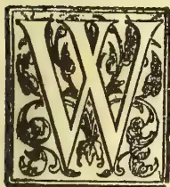

RITING from Natal a correspondent asks, "How has *Acacia decurrens*, var. *mollissima* done in the lower hill zone in Ceylon? Though rather sensitive to frost in the early stages of growth,

it is a great success and a very remunerative industry in the Midlands of Natal today. Wattle-bark ranks third among the staple exports of the Colony. Several companies are investing capital in it—planting out large areas. Figures taken from the *Natal Agricultural Journal* for January of this year show that though the industry is only 20 years old at present, there are over 25,000 acres under black Wattle in Natal, and new companies are laying down plantations at the rate of 1,000 acres a year each. In 1902, 15,537 tons of bark valued at £74,554 were exported. I venture to think that black wattle culture should pay as an industry in the lower moist hill zone of Ceylon, on the patanas for instance, if the soil is not too shallow."

We referred our correspondent's remarks to Mr. W. Nock, late Superintendent of Hakgala Gardens, who was just about to leave the Island, and he wrote in reply:—"Mr. A. J. Kellow of Albion can tell you all that is known about it. He has supplied large quantities, and I believe he got Rs. 140 per ton. There is no question about its growing well in the upper hills, say from 3,500 ft. upwards. The difficulty is the

transport, and unfortunately the local demand is not great; though with such a price as is quoted above there is a good margin of profit."

Mr. A. J. Kellow, to whom we next applied, is good enough to permit us to reproduce the following estimate prepared by him a couple of years ago. He writes:—

The accompanying Estimate for planting up and bringing to the eighth year of 100 acres of *Acacia decurrens* provides for harvesting the whole plantation in one year; if, however, it was found advisable to secure a crop earlier, it could be done, either by thinning out, or by stripping 20 or 25 acres at five years old; if the latter course was adopted the same ground could be replanted with the same product, at less cost, and with the soil very much improved.

*Harvesting.*—This item, *i.e.*, Rs. 20 per ton, is what it actually cost me here for stripping, chopping, and dryiag. I cut it into half inch lengths to suit the local market, but I believe it is not the custom in other bark-producing countries to chop so small, and probably a saving might be effected by using a mill or machine instead of chopping by coolies.

*Railway Freight* is very high, being the rate fixed for Cinchona Bark, and Government might be induced to lower it to foster a new industry.

*Value of Bark.*—I have put down at £6 per ton in Colombo for export; the present rate in Durban, South Africa, is, I am informed, £6 10s.; locally, I have realised Rs. 140=£9-6-8 per ton (in Colombo).

901------------------------------------------------

864Supplement to the "Tropical Agriculturist."[JUNE 1, 1904.

*Average Yield* per tree I have taken at 28 lbs. as a safe estimate, individual trees here at eight years having yielded more than double that quantity.

*Cost of Land* has not been taken into consideration, as it is hoped that the Government will see its way to give a free grant of say 1,000 acres to encourage a new product for the hill country, and which would eventually bring a large traffic to the Railway in the shape of bark and firewood. Failing a free grant, a lease might be obtained for say 10 or 15 years. The Australian rate for Crown Lands leased for Wattle cultivation was in 1891 four pence (4d.) per acre. At that rate, the rent for 100 acres for eight years would amount to Rs. 200.

*Locality.*—In order that the experiment should have a fair chance of success, the locality chosen should be between the Ambawella and Nanuoya Stations in one block, above the railway line for facility of transport, and should include a proportion of jungle land for the supply of fencing posts, etc.

*Funds.*—A Syndicate with a nominal capital of (Rs. 100,000) One Hundred Thousand Rupees, with a paid-up working capital of (Rs. 20,000) Twenty Thousand Rupees, would be required to start the enterprise, say in one thousand shares of (Rs. 100) One Hundred Rupees each.

A. J. KELLOW.

Albion, Nuwara Eliya,  
17th March, 1902.

*Estimate* for clearing and planting with *Acacia decurrens* 100 acres, each acre carrying 1,200 trees six feet apart—120,000 trees, weeding for two years, probable yield and cost of harvesting.

<table>
<thead>
<tr>
<th>To Clearing 100 acres at Rs. 20.</th>
<th>Rs.</th>
</tr>
</thead>
<tbody>
<tr>
<td>per acre</td>
<td>2,000</td>
</tr>
<tr>
<td>„ Lining 6 x 6, holing, planting and shading at Rs. 10</td>
<td>1,000</td>
</tr>
<tr>
<td>„ Nursery including cost of 20 lbs. seed</td>
<td>500</td>
</tr>
<tr>
<td>„ Weeding 1st year at Rs. 1.50</td>
<td>1,800</td>
</tr>
<tr>
<td>„ Tools Rs. 200, Lines Rs. 200, Roding Rs. 160, Fencing say Rs. 1,000</td>
<td>1,560</td>
</tr>
<tr>
<td>„ Supervision 1st year</td>
<td>2,000</td>
</tr>
<tr>
<td>„ 2nd year's Weeding at Rs. 1.25 = Rs. 1,500, Supervision and Manuring Rs. 1,000</td>
<td>2,500</td>
</tr>
<tr>
<td>„ 2nd supplying vacancies at Rs. 3</td>
<td>300</td>
</tr>
<tr>
<td>„ Supervision and Watchers for 5 years at Rs. 1,000</td>
<td>5,000</td>
</tr>
<tr>
<td>„ Unforeseen expenses, repairing Lines, Fence, &amp;c.</td>
<td>1,340</td>
</tr>
</tbody>
</table>

<table>
<tbody>
<tr>
<td>Showing an expenditure to end of 7th year of</td>
<td>Rs. 18,000</td>
</tr>
<tr>
<td>To 8th year temporary Lines, Bark Shed, &amp;c.</td>
<td>2,500</td>
</tr>
<tr>
<td>„ Stripping, Chopping and Curing 1,500 T. Bark (=28 lbs. per tree from 120,000 trees) at Rs. 20 per ton</td>
<td>30,000</td>
</tr>
<tr>
<td>„ Cartage to Railway Station at Rs. 2</td>
<td>3,000</td>
</tr>
<tr>
<td>„ Railway Freight on 1,500 tons Nanuoya to Colombo at Rs. 25</td>
<td>37,500</td>
</tr>
<tr>
<td>Rs...</td>
<td>91,000</td>
</tr>
</tbody>
</table>

Cr.

<table>
<tbody>
<tr>
<td>By 1,500 tons Bark at £6 per ton in Colombo £9,000 at Rs. 15</td>
<td>135,00</td>
</tr>
<tr>
<td>„ Value of 120,000 trees for Fuel at 50 cts. each</td>
<td>60,000</td>
</tr>
<tr>
<td>Balance profit</td>
<td>104,000</td>
</tr>
<tr>
<td>Total... Rs</td>
<td>195,000</td>
</tr>
<tr>
<td></td>
<td>195,000</td>
</tr>
</tbody>
</table>

A. J. KELLOW.

#### OCCASIONAL NOTES.

A country gentleman, who has had considerable experience in the rearing of cattle, recommends the following as an unfailing remedy for unthriftiness, arising chiefly from worms in calves:—Pound five or six leaves of the Papaw (*Carica papaya*) and mix with about half a cup of water to enable the juice of the leaves to be expressed; scrape the kernel of half a coconut and squeeze out the milk; take one-third of the mixture of the papaw juice and coconut milk together with a table spoonful of gingelly (*Sesamum indicum*) oil for one dose; dose at intervals of about 12 hours or so. The antilemmitic properties of the papaw are well known, and we are assured that they will be here proved by the speedy expulsion of the worms, with the result that the calves will soon be found thriving well and putting on flesh rapidly.

Of all evil-smelling vegetable products, perhaps the most intolerable is the oil of Margosa (*Azadirachta indica*). The antiseptic properties of the oil are well known locally, and it is largely used in cases of sores and ulcers and such inflammatory diseases as "foot and mouth" disease; but it may not be commonly known that Margosa, (also called Kohamba) oil is a protective against white ants, though there are many people who will hesitate, before employing the remedy, in doubt as to which is the lesser evil! A good story has just reached us of how Margosa timber was found to be proof against white ants. It was Prof. Drummond, we think, who said that if a man with a wooden leg fell asleep in Central Africa, he would on awakening find his artificial limb a heap of saw dust. But apparently that eminent traveller and divine did not know the Margosa tree which is now so largely grown in India (along the railway line between Madras and Bombay) and in Ceylon (e.g., the Chilaw district) both for its excellent timber and also for its supposed anti-malarial properties, so proving a rival to the Eucalyptus. In a town not far from Colombo, says the story, there lived a usurious individual who stowed away all his mortgage deeds and bonds in a box made of Margosa wood. One morning the owner of the chest, who had not been able to examine it for some time owing to absence from home, found to his horror that the assiduous termite had erected his dome-like edifice over the said box, which was thus almost hidden from view. Much did the usurer weep and gnash his teeth over his impend-

902------------------------------------------------

JUNE 1, 1904.]Supplement to the "Tropical Agriculturist."365

ing ruin, till a practical friend proposed that they should try to discover the extent of the damage, with the result (so says the practical friend who was the purveyor of the tale) that the contents were found intact, for the very good reason that the white ant was unable, either owing to the hardness or unpleasant flavour of the wood, or for some other reason, to make any impression on the timber, which, it is related, showed a smooth surface when cleaned and examined. Who can give us further (not better) testimony of the fact that Margosa wood is proof against the white ant?

The following notes refer to operations in the Government Stock Garden:—

The guava trees raised from Trinidad seed are just beginning to form fruit. The guava is very highly spoken of, and we trust we shall find the fruit as good in the East as it is reported to be in the West Indies.

Pineapples have been fruiting well during April and May, and Kew pines, of over 13 lb. weight with fine flavour, have been a great success.

The Kangaroo grass (*Anthistiria ciliata*), of which we shall have more to say later, has grown up to gigantic proportions and is now in flower. *Paspalum dilatatum* is also slowly spreading by self-sowing.

Mushroom culture is about to be begun in the Government Stock Garden. The storing of seed is now carried on on new lines. Special air-tight tins made by Messrs. W. H. Davies & Co. are being used.

A Reference Library and Reading Room has just been started in the office of the Superintendent of School Gardens. A beginning will soon be made with the Agricultural Museum.

Tobacco has produced a good crop, and experiments in the curing of the leaves are in progress.

Kiu-siu paddy has been sown again in our small experimental paddy-field.

We are glad to hear of the interest which Mr. Peter de Abrew, Commercial Assistant Commissioner for Ceylon is taking, while at St. Louis, in matters agricultural. We understand that he is studying the American method of cultivating rice and tobacco, and knowing Mr. de Abrew as we do, we have little doubt that he will return to Ceylon well primed with a mass of useful information of a practical nature.

Provision has been made for the awarding of ten prizes of Rs. 25 each for the best School Gardens in the various groups into which they have been classified, and the gardens will be judged between July and November according to a programme circulated among the teachers.

The Agri-Horticultural and Industrial Exhibition to be held in Moratuwa, under the auspices of the Colombo Agri-Horticultural Society, promises to be a great success. The inhabitants of Moratuwa are determined to put their best foot forward, and shew His Excellency the Governor, who has kindly consented to open the Show

on the 18th of August, what they are capable of producing from an agricultural and manufacturing point of view, and we have no doubt that even many persons long resident in the Island will be astonished at the products of the Moratuwa district.

Mr. A. E. Rajapakse, Planter, of Kadirane Estate, Katunayake, an alumnus of the late School of Agriculture has, with his usual liberality, repeated his offer of Rs. 50 for the best School Garden in the Western Province. The gardens will be judged prior to the Moratuwa Show, where the prize will be awarded.

We are obliged to Mr. H. F. MacMillan, Curator of the Royal Botanic Gardens, for a photograph of the Government Stock Garden. Mr. MacMillan is a successful photo-artist, and in addition to his numerous duties in the Botanic Department, takes the photographs for the records of the Department. He has made an excellent collection of Agricultural and Horticultural subjects which will be shown in special frames at the St. Louis Exhibition.

#### RAINFALL TAKEN AT THE GOVERNMENT STOCK GARDEN FOR MAY, 1904.

<table border="1">
<tbody>
<tr>
<td>1</td>
<td>Sunday</td>
<td>...</td>
<td>·07</td>
<td>17</td>
<td>Tuesday</td>
<td>...</td>
<td>Nil</td>
</tr>
<tr>
<td>2</td>
<td>Monday</td>
<td>..</td>
<td>Nil</td>
<td>18</td>
<td>Wednesday</td>
<td>...</td>
<td>·07</td>
</tr>
<tr>
<td>3</td>
<td>Tuesday</td>
<td>...</td>
<td>Nil</td>
<td>19</td>
<td>Thursday</td>
<td>...</td>
<td>·16</td>
</tr>
<tr>
<td>4</td>
<td>Wednesday</td>
<td>...</td>
<td>Nil</td>
<td>20</td>
<td>Friday</td>
<td>...</td>
<td>·07</td>
</tr>
<tr>
<td>5</td>
<td>Thursday</td>
<td>...</td>
<td>Nil</td>
<td>21</td>
<td>Saturday</td>
<td>...</td>
<td>·04</td>
</tr>
<tr>
<td>6</td>
<td>Friday</td>
<td>...</td>
<td>Nil</td>
<td>22</td>
<td>Sunday</td>
<td>...</td>
<td>·11</td>
</tr>
<tr>
<td>7</td>
<td>Saturday</td>
<td>...</td>
<td>Nil</td>
<td>23</td>
<td>Monday</td>
<td>...</td>
<td>4·91</td>
</tr>
<tr>
<td>8</td>
<td>Sunday</td>
<td>...</td>
<td>Nil</td>
<td>24</td>
<td>Tuesday</td>
<td>...</td>
<td>·16</td>
</tr>
<tr>
<td>9</td>
<td>Monday</td>
<td>...</td>
<td>1·35</td>
<td>25</td>
<td>Wednesday</td>
<td>...</td>
<td>·11</td>
</tr>
<tr>
<td>10</td>
<td>Tuesday</td>
<td>...</td>
<td>·92</td>
<td>26</td>
<td>Thursday</td>
<td>...</td>
<td>·33</td>
</tr>
<tr>
<td>11</td>
<td>Wednesday</td>
<td>...</td>
<td>Nil</td>
<td>27</td>
<td>Friday</td>
<td>...</td>
<td>·24</td>
</tr>
<tr>
<td>12</td>
<td>Thursday</td>
<td>...</td>
<td>·94</td>
<td>28</td>
<td>Saturday</td>
<td>...</td>
<td>Nil</td>
</tr>
<tr>
<td>13</td>
<td>Friday</td>
<td>..</td>
<td>·34</td>
<td>29</td>
<td>Sunday</td>
<td>...</td>
<td>Nil</td>
</tr>
<tr>
<td>14</td>
<td>Saturday</td>
<td>...</td>
<td>·40</td>
<td>30</td>
<td>Monday</td>
<td>...</td>
<td>·17</td>
</tr>
<tr>
<td>15</td>
<td>Sunday</td>
<td>...</td>
<td>Nil</td>
<td>31</td>
<td>Tuesday</td>
<td>...</td>
<td>1·04</td>
</tr>
<tr>
<td>16</td>
<td>Monday</td>
<td>...</td>
<td>Nil</td>
<td>1</td>
<td>Wednesday</td>
<td>...</td>
<td>·03</td>
</tr>
</tbody>
</table>

Total in....11·39

Mean in.... ·37

Greatest amount of rainfall in any 24 hours from 22nd to 23rd May, being=1·93 inches.

No. of days in which rain fell—18 days.

ALEX. PERERA.

#### DEATH BY POISONING AMONG CATTLE.

There is little doubt that a large number of deaths among cattle is caused by the consumption of poisonous vegetation, and it is a pity that the properties of our poisonous plants are not studied by those best qualified to do so.

In the *Veterinary Journal* is just now appearing a serial paper entitled "Veterinary Toxicology" by Lieut.-Colonel J. A. Nunn, which when complete will prove a most valuable contribution to the subject, and, as it is intended to publish it in book

903------------------------------------------------

866Supplement to the "Tropical Agriculturist."[JUNE 1, 1904.

form later on, also a most useful reference volume. It is only under special conditions that cases of poisoning come to light, and the occurrence of such cases only goes to prove that the same causes must be at work under ordinary conditions as well.

Some years ago there were cases of sudden death in the slaughter-house at Dematagoda, and the then Veterinary Surgeon and the Superintendent of the School of Agriculture traced the cause to the presence of the leaves of the Datura plant, Sinhalese *Attana* (*Datura fatuosa*).

Another notable case which occurred quite lately is the poisoning of horses on the Island of Delft. Here the cause of death, which was enquired into by some of the scientific experts on the Botanical Staff, the Colonial Veterinary Surgeon and the Director of the Colombo Museum, was naturally traced to the consumption of a particular kind of sea weed, either noxious in itself or owing to certain objectionable qualities induced by drought.

It is cases like these that go to indicate the likelihood of a considerable number of deaths among cattle which, in this country (except on estates) wander far and wide in search of fodder, are to be attributed to the action of vegetable poisons, the nature and properties of which are little, if at all, known to the medical or veterinary profession.

We constantly read in foreign Journals the descriptions of plants poisonous to stock, but no attempt has yet been made to collate information about or even to compile a list of plants reputed as stock poisons.

The last received number of the *Cape Agricultural Journal* refers at length to the poisonous effects on cattle of the creeping milky plant known as *Cynoctonum capense*, belonging to the order Asclepiadaceæ, a family which as Professor MacOwan remarks, are all of a more or less poisonous nature. Our nearest ally to this plant is the Kan-Kumbala (*Cynanchum (cynoctonum) panceiflorum*) used in native medicine, though Watt quotes the *Enumeratio Plantarum Zeylanica* to the effect that the "Sinhalese eat the young leaves of this and many other plants of this natural family in their curries."

The *Australian Agricultural Journal* has frequently described plants poisonous to stock. In the *Transvaal Agricultural Journal* for October last appears a paper on the Cattle Poisons of the Transvaal by Joseph Burtt Davy, F.L.S., and among the poisons mentioned are two common ornamental garden plants, viz., the Oleander (*Nerium oleander*) and the Indian Bead Tree or Persian Lilac (*Melia areddrach*). The leaves of the former are said to be used in India by miscreant servants for chopping and mixing with forage in order to poison animals belonging to those on whom they wish to be avenged! The danger of feeding cattle on Sorghum under certain circumstances need only be mentioned.

We shall be glad to compile a series of notes with reference to local cattle poisons, if our readers will contribute any information they are possessed of to help us in the work.

#### CULTURE OF THE EDIBLE BAMBOO.

In our April number we published an article on Bamboo Cultivation in Japan, to show how much is being made of this giant grass by systematic cultivation. In Ceylon the bamboo cannot

be said to be truly cultivated, though the "sticks" are pretty largely produced and extensively used in temporary structures and scaffolding.

Writing us under date the 31st March last Mr. David Fairchild, Agricultural Explorer, U. S. A., says, that he is convinced there is much to be done in Porto Rico and Hawaii with these tropical forms, and concludes with the remark, "I think it highly probable that the edible bamboo will do well at Nuwara Eliya."

The question is, who is the enterprising man that will give a trial to the new species? For the information of those who would like to know all about it, we give below an account of the culture of the edible or tender bamboo in Japan from the pen of Mr. Fairchild.

Only one species of bamboo is commonly grown in Japan for food, and this is the largest one (*Phyllostachys mitis*), known as "Moso." It was introduced from China, where its value as a food plant has been known for centuries, and its common name indicates its origin.\* One other sort, *P. aurea*, is also said to have edible shoots, but those of the remaining kinds are understood to be too bitter to be eaten.

The method of cultivating this species differs from that described for the timber sorts. The best soil is a more friable one, and if not naturally with a good admixture of sand it must be top dressed every year with one inch of light sandy loam and a mulching of straw or grass and weeds cut from the meadow. The young plants are set out more sparsely than if designed for timber, not more than 120 to the acre. Liquid manure is given freely to the newly set out plants, and as long as they are grown for their edible shoots large amounts of rich fertilizer containing much soluble nitrogen must be supplied them. In Japan the cost of the fertilizer is the principal expense of cultivation. In five years, if the transplanted mother plants are of good size, they should yield shoots large enough for sale, but ten years are required to bring the plantation into a profitable bearing condition. Weeding is done more carefully than in timber groves, though for the first five or six years all the shoots which come up are allowed to stand; but later, when the plantation is established, all small-sized ones are promptly removed as soon as they appear above ground. In order to obtain a supply of fresh culms a regular system in cutting out the old ones is followed. A definite number of selected stems, as soon as they are fully grown, are marked with the year of their production, and nine years later all of those bearing the same date are cut out. Each

\* Moso is the name of one of the twenty-four paragons of Chinese filial piety. The story is the case of a boy whose widowed mother fell ill and longed for broth made of young bamboo shoots. The shoots not being procurable in winter, his devotion was such that he went out in the snow to dig for them. The gods rewarded his devotion by causing the shoots to grow suddenly to an unheard of size. Japanese artists are fond of illustrating their works of art with drawings of the boy Moso.

904------------------------------------------------

JUNE 1, 1904.]Supplement to the "Tropical Agriculturist."867

spring the same number (about 80 per acre) of new culms are spared from being dug out when small for market, and each autumn a similar number of 9-year-old stems are cut and sold for timber. These are only a small proportion of the total number of bamboos on an acre, for this ranges from 640 to 680. If this system of thinning out is followed a plantation may be kept in bearing almost indefinitely. Near Kyoto the practice is followed of cutting off the top of every shoot left standing, before it is fully mature, to a height of from 12 to 14 feet. This prevents the wind from moving the culms too much and induces the formation of a bushy mass of luxuriant foliage and a great number of medium-sized shoots, which are more profitable than the few larger-sized ones that result if the mother plants are not topped.

The tenderest shoots and those which bring the highest prices are the ones dug up before their tips have pierced the surface of the soil. These bring, early in the season, as much as one yen per "kwan" (about 6 cents gold per pound), while the later product must sometimes be disposed of for a tenth of this price. The market season in Tokyo begins in December and closes in June. Although bamboo shoots are very nutritious, they are not easily digested, and many Americans do not like them for this reason. Old residents in Japan, however, often grow very fond of them and have adapted them to their Western menu.

Miss Fanny Eldredge, of Yokohama, has very kindly furnished the following recipes for cooking bamboo shoots:—

1. *Bamboo sprouts with cream sauce.*—These sprouts are cut when about a foot above the ground, by digging down to the rhizomes which bear them. After being gathered, the outside sheaths are removed and the shoots are soaked for half an hour in cold water. They are then cut in thin slices, about 3 inches long by one inch square, and thrown into boiling water containing a small teaspoonful of salt, and are boiled from an hour to an hour and a half, or until tender. The pieces are then drained and a white sauce is poured over them; which is made in the following way: To a half pint of cream or milk add a teaspoonful of butter, season with salt and black pepper. Allow this to boil up and serve at once. If desired, this sauce may be thickened with flour.

2. *Bamboo shoots in butter.*—Slice and cook as in the previous recipe, until tender. Into a saucepan put three tablespoonfuls of butter, seasoned with pepper, salt, and a little chopped parsley. When heated, put in the bamboo. Shake and turn until the mixture boils; then lay the bamboo on a hot platter, pour the butter over it, and serve at once.

3. *Bamboo shoots, Japanese style.*—Slice and cook the bamboo until tender, as in recipe No. 1, then put into a sauce made as follows: Take one coffee cup full of soy sauce (this is the basis of Worcestershire sauce and obtained only at Chinese or Japanese grocers or at some of the largest groceries in our large cities), one-fourth cupful of water, one heaping teaspoonful of sugar; let boil for half an hour in this sauce, and serve.

#### VETERINARY NOTES.

Adrenalene is an alkaloid obtained in 1901 by Dr. Tokichi Takamine being the active principle of the suprarenal and adrenal gland, and its physiological effect is to cause a contraction of the arterioles, rendering the part it affects bloodless. It is a white crystalline powder with a slightly bitter taste. Messrs. Dupuis and Vanden Eckhart of the Brussels Veterinary School have contributed an account of the new drug, and Capt. Sullivan of the Poona Veterinary College also writes a short note—both appearing in the Veterinary Journal. The latter mentions the value of the chloride in conjunctivitis, enabling the operator to detect foreign bodies in the eye as the result of the blanching it induces. Internally it is said to exert the same influence on the muscles of the heart as digitalis, but is non-irritating and non-cumulative.

Professor Owen Williams, Principal of the New Veterinary College, Edinburgh, proposes to remove that establishment to Liverpool from the University of which he has received an invitation to establish the College there. Professor Williams thinks the change of *venue* will be to the advantage of the college and the students, most of whom come from the North of England. It appears to us to be a good idea and likely to advance the interests of the college, though we shall always think of it as the Leith Walk institution presided over by Principal William Williams, who while he lived was the Old Man of the profession.

Experiments on the presence of a toxin in internal parasites have been made by Professor Perroncito, Mingarrini, and Messrs. Messinio and Culamida, with the result that the truth of the old theory has been proved, viz., that the noxious effects of tapeworms are due to a toxin produced by the parasite itself, not to mechanical irritation or structural alteration, that their presence causes in the intestinal mucous membrane of the host.

Nocard has experimentally proved that Nagana and Dourine are in reality different diseases. Major H. T. Pease of the Indian Veterinary Department, in a contribution to the Veterinary Journal for May, states that his own experiments have gone to prove that Surra and Dourine are entirely different diseases.

#### A CHEMICAL MANURE FOR THE BANANA.

In the article on manuring the banana, translated from the French of M. A. Couturier, of Paris, it was stated that M. Teissonnier had promised a formula. M. Teissonnier is Director of the Experimental Garden at Conakry, in French Guinea, and his official report has been published in the official journal of the colony, from which the following has been extracted:—

The banana is a plant which requires a large quantity of potassic salts; according to Muntz and Marcano, the ashes of the stems contain 55 per cent of potash.

905------------------------------------------------

868Supplement to the "Tropical Agriculturist."[JUNE 1, 1904.

From the cultural point of view the banana is characterised by its requirements for potash, its necessities for phosphoric acid and nitrogen being less important. It became of great importance for us to try and obtain a good formula to apply to the banana. We know that the soil of Guinea, in a general manner, is wanting in potash and phosphoric acid, and that the cultivation of the banana cannot be carried on without having recourse to the employment of mineral manures, these two elements playing an important part in its fructification.

It goes without saying that the exclusive employment of chemical manures is to be rejected, for we ought not to lose sight of the fact that a bananery ought to contain a notable quantity of humus, which could be furnished by farmyard manure or by composts; the latter could be made every year on the place with little expense and in large quantities.

The formula of chemical manure employed at the Experimental Garden, which has been definitely settled upon after two years of experiments, is following:—

<table>
<tr>
<td>Nitrogen</td>
<td>...</td>
<td>5.47 per cent.</td>
</tr>
<tr>
<td>Potash</td>
<td>...</td>
<td>11.02 "</td>
</tr>
<tr>
<td>Phosphoric acid</td>
<td>...</td>
<td>11.20 "</td>
</tr>
<tr>
<td>Lime</td>
<td>...</td>
<td>8.17 "</td>
</tr>
</table>

Each clump of banana receives per annum 6 kilogrammes of this mixture, (about 13 pounds). The banana being a plant with widely spreading roots, and the watering being frequent during the dry season, this manure will be applied in small doses in order that the plants may use the greater part of the fertilizing elements. Also, the employment of chemical manures ought to be suspended during the rainy season. The clumps of bananas should receive during the whole of the dry season, 1 kilogramme (about 2 lbs.) of the mixture mentioned every month, in three or four applications.

Besides this manure, the plants should receive, twice yearly, composts or barnyard manure, in order to furnish the humus indispensably necessary for the vegetation.

In this colony it is necessary to reckon on one franc, 50c. of manure for each clump per year; (about 1s. 3d.) with this expense one can obtain from the second year of planting bunches of perfect regularity, bearing 10 to 12 hands. At the rate of about 1,000 clumps of bananas per hectare ( $2\frac{1}{2}$  acres) it will be seen from what has been stated that the expense of manure is 1,500 francs per year and per hectare. The cultivation of the banana ought to be an intensive cultivation, and it would be imprudent to operate on great areas of land.

On the other hand, if we reckon on the average return of 4,000 bunches to the hectare, it is easy to see that the cultivation of the banana in Guinea is susceptible of giving good profits.

(The translator wishes to point out to the general reader that the formula herein given is a typical example of a "complete manure," that is to say, it contains all the important chemical matters that are necessary for the nutrition of plants. It is especially important

to notice the introduction of lime into the manure. French agronomes attach much importance to the value of lime in a soil, and their authorities assert that an arable soil should contain as much as 5 per cent., or 50 per mille. It is important also to observe the importance which he attributes to the influence of humus, agreeing in this regard with the views of Mr. Barclay. The necessity for potash in liberal allowance is also dwelt upon, and nitrogenous materials are shown to be necessary. Finally, it is to be noted that under proper manuring an inferior soil can be made to produce bunches of ten and twelve hands. The paper is full of material for thought on the part of the intelligent reader.—*Journal of the Jamaica Agricultural Society.*

## DISEASES OF FARM STOCK AND THEIR PREVENTION.

By D. HUTCHEON, M.R.C.V.S.,  
Colonial Veterinary Surgeon, Cape Colony.  
(Concluded from page 97.)

In connection with this group of infective diseases, I would like to refer to that suppurative,

### INFLAMMATION OF THE EYES

of cattle and sheep, which is often so prevalent in the Colony, more particularly during the summer months. The inflammation is mainly confined to the cornea or eyeball. It first becomes cloudy and opaque, followed by a circumscribed swelling, usually about the centre. This swelling gradually increases in size, and acquires a pale yellow colour indicating the presence of pus or matter. An abscess has really formed which becomes diffused through the corneal tissue which it destroys. The abscess ultimately bursts, and discharges its contents, the aqueous humour of the eye frequently escaping with the purulent matter, and the sight is lost. Now the formation of an abscess in the cornea of the eye is usually the result of infection of the cornea with pyogenic organisms which reach it either from without, through the surface of the cornea, or from within through the blood. It is necessary to explain here, perhaps, that the formation of pus in any tissue or organ of the body is always due to the entrance of pyogenic or pus-forming organisms into the part. Matter does not form in a part merely by the introduction of a foreign body into that part, so long as such a foreign body is clean and free from septic or infective organisms. To give a familiar example, a man may receive a bullet from a rifle which may lodge deeply in some of his tissues, or he may receive a charge of shot from a gun; but, although the bullet and shot are both foreign bodies and cause acute pain and irritation in the organ or tissue where they become lodged, an abscess does not usually form as a result of the presence of these pieces of metal in the man's flesh, simply because these missiles carry

### NO SEPTIC OR PYOGENIC ORGANISMS

into the tissues along with them. But, if, on the other hand, the same individual should receive the point of a thorn or a thistle, or a splinter of wood, into his hand, and he could not get it extracted at once and the wound cleaned, an abscess

906------------------------------------------------

JUNE 1, 1904.]Supplement to the "Tropical Agriculturist."869

would almost certainly form around the foreign body, and ultimately burst, discharging the foreign body with its contents. The difference between the thorn, the thistle, or the splinter of wood, and the bullet or charge of buck-shot is, that the former carry septic organisms into the tissues along with them, while the discharge of the latter missiles from the rifle or gun and their rapid friction through the air clears them of all septic organisms. Should, however, a piece of the man's clothing be carried into the wound along with the bullet, the results might be very different, as the clothing would be full of organisms. You will notice, therefore, that septic or purulent matter does not form in any tissues, or in a wound, unless the septic or pyogenic organisms gain an entrance into the part. It is the same as we have seen with internal abscesses, or those which form in the joints, due to the entrance of the organisms through the open navel cord. In the same way the abscesses of strangles or *nieuwziekte* form between the branches of the lower jaw. These are due, in the first instance, to the infective organisms entering the nostrils of the horse and becoming lodged in the glands about the throat, where they cause the development of the characteristic abscesses. But we often get cases of irregular or bastard strangles. There are cases in which some of the matter from the original abscess is carried by the blood stream to the small capillaries of some internal organ where they lodge and give rise to the formation of other abscesses. We may in such cases find abscesses in many different organs of the body, internally and externally. But in no case can we get such abscesses formed unless the special pyogenic organisms have been introduced into the part either from without through an abrasion of the skin or from within through the circulating blood. Now this is a somewhat round-about way of trying to show that the cause of this somewhat purulent inflammation which takes place in the eyes of cattle and sheep is caused by the entrance of pyogenic or pus-forming organisms into the substance of the cornea, through some slight injury to the thin delicate transparent epithelial membrane which covers the cornea or eyeball. This disease of the eyes occurs principally during the summer. It has been considered probable, therefore, that the pollen of certain plants may enter the eye and injure the epithelium of the cornea, and thus make an opening for the entrance of these organisms, or perhaps carry the organisms along with them. But whether the opening in the cornea is made by the pollen of flowering plants or the infective material is carried by flies and inoculated by them into the surface of the cornea, one thing is certain, the matter is specific and infectious. Consequently, I consider that every affected animal should be removed from the herd or flock, and the eyes cleaned and dressed regularly with an anti-septic lotion. As a preventive, a good plan would be to dress the eyes of the whole herd or flock with an anti-septic lotion.

There is another disease connected with this group which has been very prevalent since the war, I refer to what is called

EPIZOOTIC LYMPHANGITIS

of the horse. That is a form of suppurative inflammation of the superficial lymphatic vessels and glands. It closely resembles farcy, and, like that disease, it is readily inoculable from one animal to another, through any wound or slight abrasion on the skin, and unless it is attended to and heroically treated in the early stages, it is a most difficult disease to combat. Of course, as it is so easily communicated from one animal to another by inoculation, that complete isolation is absolutely necessary to prevent its spread.

Now what I want to direct your special attention to is that all these different varieties of purulent inflammation are not due to one kind of septic or pyogenic matter. There may be very little difference apparent to the naked eye between the pus that forms in the abscesses of strangles and the purulent matter that forms in the lymphatics and their glands, in the infectious lymphangitis above referred to, but the organisms which cause the formation of these different purulent materials are quite distinct in their microscopic appearance, and in their physiological action and effects. It is the same with the purulent inflammation of the eyes of cattle; the purulent inflammation of navel-ill, the infectious diarrhoea in calves, and the infectious condition of the uterus in pregnant animals which gives rise to abortion. It is not by mere accident that one animal is affected in one way and the other in another. Each of these separate forms of purulent and septic diseases is due to a special and specific infective material, which originates its own particular form of disease only and acts on certain particular organs or tissues, and on no other. This shows how careful one should be to thoroughly isolate every case of infectious disease, and endeavour to destroy all sources of infection at once. We all recognise the necessity of isolating cases of diseases, such as glanders or farcy in the horse, lung-sickness and rinderpest in cattle, but it is just as important from an economic point of view to take the same precautions with respect to the diseases which we have been discussing. Depend upon it, unless some effort is made to overcome these diseases when they commence, the stock and their surroundings become so saturated with the infective material, that losses arising from what at first appeared a comparatively simple matter may become very serious.

We will now consider that large group of diseases of stock, which may be considered malarial in their character, and which are unfortunately increasing in number in South Africa. They are a class of diseases which are caused by numbers of microscopic parasites which live and propagate themselves in the blood; these parasites are carried from affected to healthy animals by means of ticks or other skin parasites. Red-water, or Texas fever, is one of the best known in this country, the carrier of the blood parasite being the common blue tick. Heart-water in sheep and goats is also known to be propagated and spread by the bont-tick, although the infective organism has not yet been discovered in the blood. The malarial catarrhal fever of sheep is also caused by

907------------------------------------------------

870Supplement to the "Tropical Agriculturist."[JUNE 1, 1904,

a blood parasite, but the carrier of the infection has not been discovered. It is inoculable by the injection of a small quantity of blood from an infected sheep, and I am glad to say that a method of inoculation has been discovered which is both safe and simple.

The disease of the horse which I formerly described as Biliary fever is also due to a blood parasite of the malarial type, and is doubtless carried and communicated by a tick or some biting insect, such as a mosquito. The evidence is also accumulating that the dreaded horse-sickness is also communicated by a biting flying insect, such as a mosquito, but no organism has as yet been discovered in the blood. It is true that Dr. Edington has reported that he has discovered a malarial parasite in the blood of some cases of horse-sickness, but at present the general opinion is that these cases had been complicated with equine malaria or "Biliary fever." A tick has been convicted of being the carrier of the blood-parasite which causes that very fatal form of malignant malarial fever of our domestic friend the dog, and Mr. Lounsbury has shown that this new disease of cattle which Dr. Koch has called "African Coast Fever" is also communicated by a tick. There is as yet some doubt whether more than one species of tick carries and communicates the organism of this last and most dreaded plague. Dr. Koch is of opinion that the common blue tick is also a transmitter of the organism of this disease. If the blue tick alone were the only carrier of the parasite, it would be much easier to check the spread of the disease, as like ordinary red-water, it could only be spread by cattle. It will be much more difficult to control, however, if the infected ticks can be carried by other animals than cattle. At the present time, the duty of this Colony is to use every endeavour to keep the disease out of our territory as long as possible, in the hope that we may be able to obtain a clearer knowledge of the nature of the disease, and how it is spread, and we may also at the same time acquire some practical experience of the value of the present method of inoculation discovered by Dr. Koch.

It is of interest to mention that the principal measures which the Transvaal and Natal Colonies are taking for arresting the spread of this disease are fencing and dipping. I strongly recommend the farmers of the Cape Colony to copy this example. I would also like to add that at the intercolonial Veterinary Conference which was held recently at Bloemfontein a motion was unanimously carried recommending the respective Governments of the British S.A. Colonies to take into serious consideration, the practicability of completely eradicating the ticks which affect farm stock from the country. I commend that resolution also to your consideration.

#### BACTERIA AND THE NITROGEN PROBLEM.

BY GEORGE T. MOORE,  
Physiologist, Bureau of Plant Industry, U.S.A.  
(Concluded from page 95.)

In the meantime there is still one other means at hand which can be used and has been used for countless centuries as a most efficient method of

conserving the world's nitrogen supply. Ever since the time of Pliny and other early writers upon agricultural topics, it has been known that certain leguminous crops, such as clover, beans, peas, etc., did not require the same amount of fertilizer as other plants, and indeed it seemed as though they actually benefited the soil instead of being a detriment. Various theories have been advanced to account for this effect, perhaps the most widespread opinion being that members of this family, owing to the unusual length and strength of their root system, were able to draw upon a store of food that was not available to wheat and corn and other crops not belonging to the pod-bearing group. It is only within a comparatively recent time that the real cause of the beneficial effect of these legumes has been fully understood, and it seems that here again the bacteria are responsible for the nitrogen-gathering power; for it is because these plants are able to fix and use the free nitrogen of the air that they are of such benefit in rotation and in reviving poor and exhausted land. The immense yields of wheat following alfalfa or clover are easily understood when it is realized that there has actually been added to the soil a certain definite amount of nitrogen in such form that the wheat can be benefited by it. Such efficient users of the atmospheric nitrogen are clover and peas and similar crops that they can actually live and thrive in a soil that has not the first trace of combined nitrogen within it. If quartz sand be ignited to red heat, thus burning out all the nitrates, and then be planted with peas or beans, it is possible to bring these plants to full maturity without in any way allowing a particle of fixed nitrogen to find its way into the soil. On the other hand, wheat or potatoes, or crops not legumes, will die as soon as the small amount of nitrogen available from the seed is exhausted. What is the reason for this? It can not be merely a difference in the length or extent of the root system, because plants flourish where it is certain there are no available nitrates whatever. For a long time the presence of certain peculiar nodules or tubercles upon the legumes has been noted and speculated upon. These formations are always present upon the roots of leguminous plants grown under proper conditions, and may vary in size from that of the smallest pin head, in some clovers, to a cluster as large as a potato. They have been thought to be due to the bites of worms or insects, or to be caused by conditions of the soil and various abnormal climatic effects, and only within very recent years has it been learned that these formations are due to the presence of innumerable bacteria, and that unless these tubercle-producing bacteria exist the plant is no more able to use the nitrogen from the air than wheat or any of the other crops which do not have such nodules on their roots.

Just where the nitrogen is fixed and how it is used by the plant have been debated questions. Some have supposed that the presence of the bacteria in the roots simply acted as a stimulus, and that the leaves of the plant were thus able to take in nitrogen as a gas and to elaborate nitrates from it in some such way as carbon is formed from carbon dioxide. It seems much more probable, however,

908------------------------------------------------

JUNE 1, 1904.]Supplement to the "Tropical Agriculturist."871

that the bacteria themselves fix the nitrogen in the roots of the plant, and that it is then used as nitrates would be used from the soil. It is certain that these tubercle organisms can fix free nitrogen in cultures, and there is no reason to suppose that this power is lost when within the roots of a legume. Furthermore, it seems as though the plant actually uses the contents of these tubercles, for at the end of the season the tubercles are found to be much softer and shrunken, and are practically emptied of their mass of bacteria.

It is a well-established fact, and has been shown by a number of independent investigators in various parts of the country, that the leguminous crops which bears tubercles will exceed a similar crop without tubercles by from 100 to 1,000 per cent; that is, a field of clover grown on such soil that it would only yield 200 pounds to the acre would be so invigorated by the presence of tubercle-forming bacteria that on exactly similar soil it would produce from 400 to 2,000 pounds to the acre, and this without any cost whatever for fertilizers and with very little more labor. In addition to the increase of the actual weight of the crop, tubercles also cause the plants to flower and fruit earlier, and the number of seeds produced is very much greater.

Thus it will be seen that it is worse than useless to attempt to grow any leguminous crops without being certain of the presence of the bacteria which enable the plant to fix free nitrogen. It would be much better to fertilize heavily and attempt to raise some more profitable crop than to introduce clover or beans or some other legume for the purpose of enriching the soil. It can not be too strongly emphasized that unless the tubercles are present the leguminous crop is of absolutely no more benefit to a soil than wheat or potatoes.

While these organisms are pretty generally distributed throughout the earth, and it is quite possible in many parts of the country to grow almost any leguminous crop and secure these tubercles, it is also true that certain regions are practically devoid of the right kind of bacteria, and that unless some artificial means of introducing the germs be resorted to the crop will be a failure.

In the past there have been two methods used in attempting to bring about artificial inoculation. Naturally where a certain leguminous crop has been grown successfully for a number of years the soil will become filled with tubercle organisms, and by transporting this earth to new fields the organisms will thus become available for forming the nodules in localities where they previously had not existed. This was the means by which the soy-bean organisms were brought from Japan, and there are very few places in this country where soy is now grown that did not receive their inoculation, indirectly at least, from the Japanese soil.

There are two serious objections to soil inoculations, however. One is the expense, for it requires anywhere from 500 to 1,500 pounds of earth per acre to produce a satisfactory growth of tubercles, and if this has to be transported for a large farm, the cost is almost prohibitive. There is still another and more serious objection, however, and that is the danger of transmitting plant diseases

by this method. Several of the more serious diseases which attack crops are readily conveyed in the soil, and there are numerous cases on record where diseases of leguminous and other crops have been introduced into regions previously entirely free from them through an effort to bring about a soil inoculation of the tubercle-forming organism. Consequently, if any safer and cheaper method could be devised for making these germs available, it would be most desirable.

A few years ago certain German investigators put upon the market a product known as nitragin, which purported to be a pure culture of the root-tubercle organisms. These cultures were only adapted to specific crops, for it has been held that each kind of leguminous plant had a special germ better adapted to produce tubercles upon it than any other form, and for this reason it was necessary to use one organism for clover, another for peas, and so on. This preparation, nitragin, has been used with varying success abroad. Some experiments seemed to show that it was of the greatest value, while others were complete failures in demonstrating its worth. The failures so far outnumbered the successes, however, that its manufacture has been abandoned, and it can no longer be obtained. A few attempts have been made to use these cultures in this country, and while some very satisfactory results were obtained, the number of failures was even greater than abroad, the varying conditions involved in transportation and the length of time which elapsed before the germs could be used being fatal to about 80 per cent. of the material imported.\*

A little more than a year ago the investigation of these nitrogen-fixing bacteria was begun in the laboratory of plant physiology of the Bureau of Plant Industry, with the hope of discovering some method of artificially inoculating soils which were devoid of the proper organisms, and of insuring their producing the desired result. It was soon found that the method in use by the German investigators was not adapted to the life of the organism; that is to say, the use of rich nitrogenous food material, such as decoctions of the host plant, were not calculated to produce an organism which would fix free nitrogen from the air. It was found that while the bacteria grew luxuriantly upon such media, they became less and less active, until eventually they lost completely this nitrogen-fixing power. It seemed as though the large amount of nitrates in the media upon which they were grown made it no longer necessary to draw nitrogen from the air, and consequently they deteriorated until they became of no more value than the common soil forms. It has been found, however, that by gradually reducing the amount of nitrogen in the culture medium it is possible to greatly increase the nitrogen-fixing power of these germs, and that by proper manipulation their activity may be increased from five to ten times that which usually occurs in nature. Practical field experiments have shown that of two cultures, one grown on nitrogen-free media and the other on a medium

\* We ourselves have made trials with Nitragin, but without success.—Ed. A.M.

909------------------------------------------------

872Supplement to the "Tropical Agriculturist."[JUNE 1, 1904]

rich in nitrates, the first will produce abundant tubercles, while the latter will be absolutely worthless and fail to produce a single nodule.

Having secured an organism which was able to fix such a large amount of nitrogen, it was necessary to devise some means of preventing this property from being lost, as well as to enable the cultures to be distributed in sufficient quantity to be of some practical use. It is now known that the bacteria, when grown upon nitrogen-free media, will retain their high activity if they are carefully dried out and then revived in a liquid medium at the end of varying lengths of time. By using some absorbent which will soak up millions of the tubercle-forming organisms and then by allowing these cultures to become dry the bacteria can be sent to any part of the United States, or the world for that matter, and yet arrive in perfect condition. Of course, it is necessary to revive the dry germs by immersion in water, and with the addition of certain nutrient salts the original number of bacteria is greatly increased if allowed to stand for a short time. Frequently twenty-four hours are sufficient to cause the water in a pail to turn milky white with the number of organisms formed in that time. Thus, by sending out a dry culture, similar to a yeast cake and no larger in size, the original number of nitrogen-fixing bacteria may be multiplied sufficiently to inoculate at least an acre of land. The amount of material thus obtained is limited only by the quantity of the nutrient water solution used in increasing the germs. It is evident, therefore, that the cost of inoculating land is very small. The principal cost is in obtaining the organisms, but the methods perfected by the Department of Agriculture now make it possible to produce these at a comparatively small cost. Special facilities for increasing the culture on a large scale are being provided.

The way in which this liquid culture may be introduced into the soil varies somewhat with the character of the seed to be used and the area of the field to be treated. With large seeds it is often more convenient to simply soak them in the fluid and then after they are sufficiently dry to sow them in the ordinary way. In other cases it is frequently more feasible to introduce the liquid culture directly into the soil. This may be done by spraying, or perhaps a simpler method is to mix the culture thoroughly with a wagonload of earth and then to distribute and harrow this in just as a fertilizer would be handled. Inoculations of this character have been tried on a large scale in practical field experiments, and the results have been so satisfactory that the Department of Agriculture will probably soon be able to begin the introduction of cultures into such localities as are now deficient in tubercle-forming germs. It should be borne in mind that such inoculations are usually not necessary in soil that is already producing tubercles. While the introduction of fresh organisms will generally considerably increase the number of nodules, the effect upon the crop is not appreciable, and it is hardly worth the expenditure of time and labor necessary to make the inocula-

tion. Wherever legumes that fail to produce tubercles are being grown, however, or in those localities where the soil is so poor that legumes will not grow and because of the lack of the proper organisms they cannot make a start, every effort should be made to get the bacteria into the soil.—[*Year Book of U.S. Department of Agriculture, 1902*].

## GENERAL ITEMS.

Says the *Indian Agriculturist* with reference to the topic of the hour: Two things are necessary for the production of raw cotton—suitable climate and a suitable labour supply. Both exist to perfection in the Southern States of the North American Union, and no where else have equally favourable conditions yet been discovered on such a large scale. The other great fields of cotton supply are Egypt and India. The Egyptian supply is, however, limited in quantity, and the Indian supply is poor in quality.

The remedy recommended so far as India is concerned, is improvement in the methods of cultivation and the introduction of a more up-to-date system in all details, this to be brought about through model plantations. In short, what is desired for India is improved and selected seed (not the introduction of exotic varieties) and some modern machinery.

Reference is made to the Soudan where experiments are said to be hopeful, as well as to the West Indies which are reported to have made a good deal of real progress in cotton culture, but there is no mention of little Ceylon, which, in spite of its insignificance in the cotton world at the present moment, may yet prove that its produce is as important a factor in the cotton as it has been in the tea, cocoa and rubber markets.

Prof. Dunstan, who has been very much before the public eye of late in connection with his reports made for the Imperial Institute, and has lately been writing on cotton growing in Egypt and the British Empire, was for some time in India studying the Coal Supply and other technical questions. He was previously lecturer on Chemistry at Oxford and Professor of Chemistry to the Pharmaceutical Society.

It is gratifying to hear of a prosperous year for India. The *Indian Agriculturist* in its issue for May reports that "the agricultural outlook throughout India has seldom been more favourable than at present. There is not a single individual in receipt of famine relief, and the latest crop telegrams from all the provinces are almost unanimous in recording a prosperous outlook."

Mr. Bernard Coventry has been appointed Director of the Agricultural Research Institute, and Principal of the Agricultural College at Pusa.

910------------------------------------------------

Supplement to the "Tropical Agriculturist."

# CEYLON TEA PLANTATIONS CO., LTD.

Statement Shewing Results of Working for the 17 years ending 31st December, 1903.

<table border="1">
<thead>
<tr>
<th rowspan="3">Year.</th>
<th rowspan="2">Acre age of Tea in bearing.</th>
<th rowspan="2">Yield per Acre.</th>
<th rowspan="2">Rate of Ex change per Rs.</th>
<th rowspan="2">Sale Price of Tea (Lon-don.)</th>
<th rowspan="2">Estate Tea.</th>
<th rowspan="2">Bought Leaf Tea</th>
<th rowspan="2">Tea manu-factured for others.</th>
<th rowspan="2">Total.</th>
<th colspan="2">Capital issued :</th>
<th rowspan="2">Net Profits.</th>
<th colspan="3">Additions to Reserve.</th>
<th colspan="6">DEPRECIATION.</th>
<th colspan="3">Dividends.</th>
</tr>
<tr>
<th>Ordin-ary.</th>
<th>Pre-ference.</th>
<th colspan="3">From Profits.</th>
<th colspan="3">From Premiums on Shares issued.</th>
<th colspan="3">Total.</th>
<th>Ordin-ary.</th>
<th>Prefer-ency.</th>
</tr>
<tr>
<th>Acre.</th>
<th>lbs.</th>
<th>d.</th>
<th>d.</th>
<th>lbs.</th>
<th>lbs.</th>
<th>lbs.</th>
<th>lbs.</th>
<th>£</th>
<th>£</th>
<th>£</th>
<th>s.</th>
<th>d.</th>
<th>£</th>
<th>s.</th>
<th>d.</th>
<th>£</th>
<th>s.</th>
<th>d.</th>
<th>£</th>
<th>s.</th>
<th>d.</th>
<th>£</th>
<th>s.</th>
<th>d.</th>
<th>£</th>
<th>s.</th>
<th>d.</th>
</tr>
</thead>
<tbody>
<tr>
<td>1887</td>
<td>1,251</td>
<td>403</td>
<td>1 5 1/2</td>
<td>13-00</td>
<td>504,380</td>
<td>84,208</td>
<td>10,131</td>
<td>598,779</td>
<td>75,000</td>
<td>...</td>
<td>13,257</td>
<td>18</td>
<td>3</td>
<td>...</td>
<td>...</td>
<td>...</td>
<td>...</td>
<td>...</td>
<td>...</td>
<td>...</td>
<td>...</td>
<td>...</td>
<td>...</td>
<td>...</td>
<td>...</td>
<td>15</td>
<td></td>
</tr>
<tr>
<td>1888</td>
<td>1,405</td>
<td>394</td>
<td>1/4 5/5</td>
<td>10-50</td>
<td>551,355</td>
<td>193,208</td>
<td>102,009</td>
<td>850,352</td>
<td>70,100</td>
<td>...</td>
<td>10,258</td>
<td>1</td>
<td>10</td>
<td>...</td>
<td>...</td>
<td>12</td>
<td>9</td>
<td>3</td>
<td>...</td>
<td>...</td>
<td>...</td>
<td>...</td>
<td>...</td>
<td>...</td>
<td>...</td>
<td>15</td>
<td></td>
</tr>
<tr>
<td>1889</td>
<td>2,773</td>
<td>338</td>
<td>1/4 5/5</td>
<td>11-00</td>
<td>937,407</td>
<td>799,779</td>
<td>277,148</td>
<td>2,014,334</td>
<td>122,040</td>
<td>...</td>
<td>23,370</td>
<td>14</td>
<td>8</td>
<td>3,000</td>
<td>0</td>
<td>0</td>
<td>1,867</td>
<td>2</td>
<td>3</td>
<td>...</td>
<td>...</td>
<td>...</td>
<td>...</td>
<td>...</td>
<td>...</td>
<td>15</td>
<td></td>
</tr>
<tr>
<td>1890</td>
<td>3,947</td>
<td>387</td>
<td>1/6 4/4</td>
<td>11-00</td>
<td>1,503,102</td>
<td>508,427</td>
<td>838,237</td>
<td>2,939,766</td>
<td>143,970</td>
<td>30,000</td>
<td>31,002</td>
<td>3</td>
<td>6</td>
<td>5,725</td>
<td>0</td>
<td>0</td>
<td>4,010</td>
<td>15</td>
<td>9</td>
<td>...</td>
<td>...</td>
<td>...</td>
<td>...</td>
<td>...</td>
<td>...</td>
<td>15</td>
<td></td>
</tr>
<tr>
<td>1891</td>
<td>5,168</td>
<td>414</td>
<td>1/5 4/4</td>
<td>9-27</td>
<td>2,086,291</td>
<td>886,505</td>
<td>1,318,735</td>
<td>4,291,591</td>
<td>146,500</td>
<td>70,000</td>
<td>31,233</td>
<td>3</td>
<td>9</td>
<td>5,493</td>
<td>8</td>
<td>0</td>
<td>...</td>
<td>...</td>
<td>...</td>
<td>...</td>
<td>...</td>
<td>...</td>
<td>...</td>
<td>...</td>
<td>...</td>
<td>15</td>
<td>7</td>
</tr>
<tr>
<td>1892</td>
<td>6,584</td>
<td>376</td>
<td>1/3 2/2</td>
<td>9-38</td>
<td>2,481,038</td>
<td>796,700</td>
<td>1,387,995</td>
<td>4,666,699</td>
<td>147,140</td>
<td>73,440</td>
<td>37,146</td>
<td>1</td>
<td>11</td>
<td>10,781</td>
<td>12</td>
<td>0</td>
<td>...</td>
<td>...</td>
<td>...</td>
<td>6,275</td>
<td>7</td>
<td>3</td>
<td>...</td>
<td>...</td>
<td>...</td>
<td>15</td>
<td>7</td>
</tr>
<tr>
<td>1893</td>
<td>7,167</td>
<td>419</td>
<td>1/3 5/2</td>
<td>8-85</td>
<td>3,009,055</td>
<td>530,015</td>
<td>1,418,258</td>
<td>4,966,928</td>
<td>167,380</td>
<td>81,080</td>
<td>43,086</td>
<td>12</td>
<td>7</td>
<td>10,000</td>
<td>0</td>
<td>0</td>
<td>2,500</td>
<td>0</td>
<td>0</td>
<td>4,984</td>
<td>6</td>
<td>11</td>
<td>...</td>
<td>...</td>
<td>...</td>
<td>15</td>
<td>7</td>
</tr>
<tr>
<td>1894</td>
<td>7,879</td>
<td>372</td>
<td>1/1 1/2</td>
<td>8-84</td>
<td>2,971,987</td>
<td>616,692</td>
<td>1,236,819</td>
<td>4,825,498</td>
<td>167,380</td>
<td>81,080</td>
<td>48,603</td>
<td>1</td>
<td>4</td>
<td>15,000</td>
<td>0</td>
<td>0</td>
<td>3,500</td>
<td>0</td>
<td>0</td>
<td>...</td>
<td>...</td>
<td>...</td>
<td>...</td>
<td>...</td>
<td>...</td>
<td>15</td>
<td>7</td>
</tr>
<tr>
<td>1895</td>
<td>8,073</td>
<td>437</td>
<td>1/1 1/2</td>
<td>8-09</td>
<td>3,530,737</td>
<td>665,603</td>
<td>1,110,564</td>
<td>5,306,904</td>
<td>167,380</td>
<td>81,080</td>
<td>51,926</td>
<td>10</td>
<td>10</td>
<td>20,000</td>
<td>0</td>
<td>0</td>
<td>2,000</td>
<td>0</td>
<td>0</td>
<td>...</td>
<td>...</td>
<td>...</td>
<td>...</td>
<td>...</td>
<td>...</td>
<td>15</td>
<td>7</td>
</tr>
<tr>
<td>1896</td>
<td>7,998</td>
<td>470</td>
<td>1/2 3/4</td>
<td>8-14</td>
<td>3,763,167</td>
<td>505,586</td>
<td>1,214,843</td>
<td>5,483,596</td>
<td>167,380</td>
<td>81,080</td>
<td>48,986</td>
<td>10</td>
<td>8</td>
<td>15,000</td>
<td>0</td>
<td>0</td>
<td>4,000</td>
<td>0</td>
<td>0</td>
<td>...</td>
<td>...</td>
<td>...</td>
<td>...</td>
<td>...</td>
<td>...</td>
<td>15</td>
<td>7</td>
</tr>
<tr>
<td>1897</td>
<td>8,067</td>
<td>495</td>
<td>1/3 3/4</td>
<td>7-85</td>
<td>4,000,516</td>
<td>503,810</td>
<td>1,019,789</td>
<td>5,524,145</td>
<td>167,380</td>
<td>81,080</td>
<td>42,199</td>
<td>3</td>
<td>0</td>
<td>5,000</td>
<td>0</td>
<td>0</td>
<td>5,000</td>
<td>0</td>
<td>0</td>
<td>...</td>
<td>...</td>
<td>...</td>
<td>...</td>
<td>...</td>
<td>...</td>
<td>15</td>
<td>7</td>
</tr>
<tr>
<td>1898</td>
<td>8,067</td>
<td>460</td>
<td>1 1/4 7/8</td>
<td>7-97*</td>
<td>3,714,316</td>
<td>355,571</td>
<td>1,005,294</td>
<td>5,075,181</td>
<td>167,380</td>
<td>81,080</td>
<td>41,881</td>
<td>4</td>
<td>4</td>
<td>5,000</td>
<td>0</td>
<td>0</td>
<td>5,000</td>
<td>0</td>
<td>0</td>
<td>...</td>
<td>...</td>
<td>...</td>
<td>...</td>
<td>...</td>
<td>...</td>
<td>15</td>
<td>7</td>
</tr>
<tr>
<td>1899</td>
<td>8,199</td>
<td>485</td>
<td>1 4/4 1/2</td>
<td>7-86</td>
<td>3,973,820</td>
<td>566,664</td>
<td>517,063</td>
<td>5,058,147</td>
<td>167,380</td>
<td>81,080</td>
<td>48,062</td>
<td>17</td>
<td>1</td>
<td>5,000</td>
<td>0</td>
<td>0</td>
<td>5,000</td>
<td>0</td>
<td>0</td>
<td>...</td>
<td>...</td>
<td>...</td>
<td>...</td>
<td>...</td>
<td>...</td>
<td>15</td>
<td>7</td>
</tr>
<tr>
<td>1900</td>
<td>8,412</td>
<td>528</td>
<td>1 4 1/2</td>
<td>7-15</td>
<td>4,432,132</td>
<td>481,656</td>
<td>449,104</td>
<td>5,362,892</td>
<td>167,380</td>
<td>81,080</td>
<td>41,011</td>
<td>0</td>
<td>9</td>
<td>...</td>
<td>...</td>
<td>...</td>
<td>10,000</td>
<td>0</td>
<td>0</td>
<td>...</td>
<td>...</td>
<td>...</td>
<td>...</td>
<td>...</td>
<td>...</td>
<td>15</td>
<td>7</td>
</tr>
<tr>
<td>1901</td>
<td>8,461</td>
<td>467</td>
<td>1 4 1/2</td>
<td>7-41</td>
<td>3,957,335</td>
<td>421,960</td>
<td>301,445</td>
<td>4,680,740</td>
<td>167,380</td>
<td>81,080</td>
<td>37,109</td>
<td>2</td>
<td>0</td>
<td>...</td>
<td>...</td>
<td>...</td>
<td>5,000</td>
<td>0</td>
<td>0</td>
<td>...</td>
<td>...</td>
<td>...</td>
<td>...</td>
<td>...</td>
<td>...</td>
<td>15</td>
<td>7</td>
</tr>
<tr>
<td>1902</td>
<td>8,380</td>
<td>463</td>
<td>1 4 1/2</td>
<td>7-24</td>
<td>3,885,821</td>
<td>369,683</td>
<td>304,477</td>
<td>4,559,981</td>
<td>167,380</td>
<td>81,080</td>
<td>37,073</td>
<td>12</td>
<td>6</td>
<td>...</td>
<td>...</td>
<td>...</td>
<td>10,000</td>
<td>0</td>
<td>0</td>
<td>...</td>
<td>...</td>
<td>...</td>
<td>...</td>
<td>...</td>
<td>...</td>
<td>15</td>
<td>7</td>
</tr>
<tr>
<td>1903</td>
<td>8,396</td>
<td>436</td>
<td>1 1 1/2</td>
<td>7-64</td>
<td>3,656,509</td>
<td>253,666</td>
<td>380,326</td>
<td>4,290,501</td>
<td>167,380</td>
<td>81,080</td>
<td>36,882</td>
<td>14</td>
<td>0</td>
<td>...</td>
<td>...</td>
<td>...</td>
<td>5,000</td>
<td>0</td>
<td>0</td>
<td>...</td>
<td>...</td>
<td>...</td>
<td>...</td>
<td>...</td>
<td>...</td>
<td>15</td>
<td>7</td>
</tr>
</tbody>
</table>

\* From this date the figures represent the average price of the teas sold in London and elsewhere.

† And a Bonus of 3%.

### ACREAGES OF TEA ESTATES AT 31st DECEMBER, 1903.

<table border="1">
<thead>
<tr>
<th>ESTATES.</th>
<th>DISTRICTS.</th>
<th>Tea in bearing 1903.</th>
<th>Tea not in bearing.</th>
<th>Other Products.</th>
<th>Jungle &amp; Timber Clearings</th>
<th>Patana and Waste.</th>
<th>Total Acreages.</th>
</tr>
</thead>
<tbody>
<tr>
<td>Mariawatte</td>
<td>Gampola</td>
<td>458</td>
<td>...</td>
<td>...</td>
<td>101</td>
<td>23</td>
<td>582</td>
</tr>
<tr>
<td>Atgalla</td>
<td>do</td>
<td>450</td>
<td>4</td>
<td>...</td>
<td>50</td>
<td>27</td>
<td>531</td>
</tr>
<tr>
<td>Dunedin</td>
<td>Kelani Valley</td>
<td>474</td>
<td>...</td>
<td>...</td>
<td>58</td>
<td>...</td>
<td>532</td>
</tr>
<tr>
<td>Dewalakande</td>
<td>do</td>
<td>552</td>
<td>...</td>
<td>...</td>
<td>92</td>
<td>...</td>
<td>644</td>
</tr>
<tr>
<td>Sembawatte</td>
<td>Yakdessa</td>
<td>150</td>
<td>...</td>
<td>...</td>
<td>274</td>
<td>251</td>
<td>675</td>
</tr>
<tr>
<td>Mudamana</td>
<td>Kelani Valley</td>
<td>391</td>
<td>...</td>
<td>...</td>
<td>83</td>
<td>...</td>
<td>474</td>
</tr>
<tr>
<td>Ingoya</td>
<td>do</td>
<td>522</td>
<td>...</td>
<td>54</td>
<td>283</td>
<td>...</td>
<td>859</td>
</tr>
<tr>
<td>Wallaha</td>
<td>Dimbula</td>
<td>247</td>
<td>...</td>
<td>...</td>
<td>23</td>
<td>20</td>
<td>290</td>
</tr>
<tr>
<td>Tillyrie</td>
<td>Bogawantalawa</td>
<td>617</td>
<td>...</td>
<td>...</td>
<td>137</td>
<td>2</td>
<td>756</td>
</tr>
<tr>
<td>Scrubs</td>
<td>Nuwara Eliya</td>
<td>111</td>
<td>...</td>
<td>...</td>
<td>30</td>
<td>10</td>
<td>151</td>
</tr>
<tr>
<td>Alton</td>
<td>Maskeliya</td>
<td>423</td>
<td>...</td>
<td>...</td>
<td>23</td>
<td>12</td>
<td>458</td>
</tr>
<tr>
<td>Tangakelly</td>
<td>Dimbula</td>
<td>823</td>
<td>...</td>
<td>...</td>
<td>50</td>
<td>37</td>
<td>910</td>
</tr>
<tr>
<td>Waverley</td>
<td>do</td>
<td>364</td>
<td>...</td>
<td>...</td>
<td>...</td>
<td>4</td>
<td>368</td>
</tr>
<tr>
<td>East Holyrood</td>
<td>do</td>
<td>687</td>
<td>...</td>
<td>...</td>
<td>...</td>
<td>46</td>
<td>733</td>
</tr>
<tr>
<td>Rosita and Lochiel</td>
<td>do</td>
<td>640</td>
<td>...</td>
<td>...</td>
<td>83</td>
<td>65</td>
<td>788</td>
</tr>
<tr>
<td>West Holyrood</td>
<td>do</td>
<td>480</td>
<td>...</td>
<td>...</td>
<td>16</td>
<td>21</td>
<td>517</td>
</tr>
<tr>
<td>Yoxford</td>
<td>do</td>
<td>304</td>
<td>...</td>
<td>10</td>
<td>...</td>
<td>69</td>
<td>473</td>
</tr>
<tr>
<td>Glenlyon and Polmont</td>
<td>do</td>
<td>613</td>
<td>...</td>
<td>9</td>
<td>51</td>
<td>10</td>
<td>683</td>
</tr>
<tr>
<td></td>
<td></td>
<td>8,306</td>
<td></td>
<td></td>
<td></td>
<td></td>
<td></td>
</tr>
<tr>
<td>Pitaratmalie</td>
<td>Haputale</td>
<td>684</td>
<td>228</td>
<td>10</td>
<td>578</td>
<td>105</td>
<td>1,605</td>
</tr>
<tr>
<td></td>
<td>Total Acreages...</td>
<td>9,080</td>
<td>232</td>
<td>83</td>
<td>1,932</td>
<td>702</td>
<td>12,020</td>
</tr>
</tbody>
</table>

### ACREAGES OF COCONUT ESTATES.

<table border="1">
<thead>
<tr>
<th rowspan="2">ESTATES.</th>
<th rowspan="2">PROVINCES.</th>
<th colspan="2">COCONUTS.</th>
<th rowspan="2">Other Products.</th>
<th rowspan="2">Jungle.</th>
<th rowspan="2">Patana and Waste.</th>
<th rowspan="2">Total Acreages.</th>
</tr>
<tr>
<th>In bearing.</th>
<th>Not in bearing.</th>
</tr>
</thead>
<tbody>
<tr>
<td>Andigama</td>
<td>North-Western</td>
<td>72</td>
<td>900</td>
<td>...</td>
<td>120</td>
<td>42</td>
<td>1,143</td>
</tr>
<tr>
<td>Mawatte</td>
<td>do</td>
<td>133</td>
<td>340</td>
<td>...</td>
<td>29</td>
<td>2</td>
<td>504</td>
</tr>
<tr>
<td>Jakwila</td>
<td>do</td>
<td>20</td>
<td>315</td>
<td>...</td>
<td>...</td>
<td>4</td>
<td>348</td>
</tr>
<tr>
<td>Sirangapathe</td>
<td>Western</td>
<td>343</td>
<td>148</td>
<td>28</td>
<td>...</td>
<td>2</td>
<td>521</td>
</tr>
<tr>
<td></td>
<td>Total Acreages...</td>
<td>577</td>
<td>1,703</td>
<td>28</td>
<td>158</td>
<td>50</td>
<td>2,516</td>
</tr>
</tbody>
</table>

911------------------------------------------------

<!-- stage4: FAINT old-images-only -->

[Faint page: no legible print of its own could be verified; text withheld (stage 4 review list)]

912------------------------------------------------

SUPPLEMENT TO THIS DAY'S ISSUE.

(From the Chamber of Commerce Price Current.)

## Exports of Ceylon Produce from Colombo and Galle during the Past Ten Years.

COMPILED AS FROM 1ST JANUARY TO 31ST DECEMBER IN EACH YEAR.

<table border="1">
<thead>
<tr>
<th rowspan="2"></th>
<th rowspan="2">BLACK TEA. lb.</th>
<th rowspan="2">GREEN TEA. lb.</th>
<th rowspan="2">Rubber lb.</th>
<th colspan="3">COFFEE, CWT.</th>
<th colspan="2">CINCHONA.</th>
<th rowspan="2">Cocoa lb.</th>
<th rowspan="2">Card- moms. lb.</th>
<th colspan="2">CINNAMON.</th>
<th rowspan="2">Coconut Oil Cwt.</th>
<th rowspan="2">Copra. Cwt.</th>
<th rowspan="2">Desiccated Coconut. lb.</th>
<th rowspan="2">Coconut Poonac. Cwt.</th>
<th rowspan="2">Coconuts. No.</th>
<th rowspan="2">Plumbago. Cwt.</th>
<th colspan="3">COLR.</th>
<th rowspan="2">Ebony. Cwt.</th>
<th rowspan="2">Deer Horns Cwt.</th>
<th rowspan="2">Sapan- wood. Cwt.</th>
<th rowspan="2">Palmyra Fibre. Cwt.</th>
<th rowspan="2">Kitul Fibre. Cwt.</th>
<th rowspan="2">Citronella Oil. lb.</th>
<th rowspan="2">Cinnamon Oil. oz.</th>
</tr>
<tr>
<th>Plan- tation.</th>
<th>Nat- ive.</th>
<th>Total.</th>
<th>Branch &amp; Trunk. lb.</th>
<th>Cwt.</th>
<th>Bales lb.</th>
<th>Chips lb.</th>
<th>Rope. Cwt.</th>
<th>Yarn. Cwt.</th>
<th>Fibre. Cwt.</th>
</tr>
</thead>
<tbody>
<tr>
<td>Total Exports from 1st January to 31st December, 1901 ..</td>
<td>14247345</td>
<td>647681</td>
<td>4178</td>
<td>982</td>
<td>40</td>
<td>982</td>
<td>170565</td>
<td>59701</td>
<td>909418</td>
<td>3043714</td>
<td>225869</td>
<td>665357</td>
<td>512498</td>
<td>721575</td>
<td>17485360</td>
<td>209979</td>
<td>13129349</td>
<td>478860</td>
<td>2098</td>
<td>92124</td>
<td>132203</td>
<td>4982</td>
<td>..</td>
<td>8613</td>
<td>2659</td>
<td>3031</td>
<td>106394</td>
<td>80982</td>
</tr>
<tr>
<td>Do ..</td>
<td>146104397</td>
<td>70654</td>
<td>†</td>
<td>1112</td>
<td>14</td>
<td>1112</td>
<td>40701</td>
<td>60456</td>
<td>616972</td>
<td>2665413</td>
<td>1701679</td>
<td>512108</td>
<td>371700</td>
<td>16927665</td>
<td>247697</td>
<td>1258212</td>
<td>496504</td>
<td>16831</td>
<td>77167</td>
<td>116000</td>
<td>12175</td>
<td>..</td>
<td>934</td>
<td>24035</td>
<td>2061</td>
<td>120470</td>
<td>103773</td>
</tr>
<tr>
<td>Do ..</td>
<td>155158214</td>
<td>1110774</td>
<td>..</td>
<td>9891</td>
<td>01</td>
<td>9722</td>
<td>601050</td>
<td>49159</td>
<td>669704</td>
<td>2759270</td>
<td>1610053</td>
<td>463531</td>
<td>433065</td>
<td>14055193</td>
<td>204756</td>
<td>14850781</td>
<td>453267</td>
<td>13030</td>
<td>76788</td>
<td>12829</td>
<td>10250</td>
<td>..</td>
<td>7180</td>
<td>12853</td>
<td>2541</td>
<td>1470108</td>
<td>73103</td>
</tr>
<tr>
<td>Do ..</td>
<td>148431039</td>
<td>..</td>
<td>..</td>
<td>10773</td>
<td>4</td>
<td>10777</td>
<td>510162</td>
<td>33478</td>
<td>637465</td>
<td>2678111</td>
<td>1803400</td>
<td>414959</td>
<td>362467</td>
<td>1743913</td>
<td>185692</td>
<td>14995949</td>
<td>353350</td>
<td>12572</td>
<td>57415</td>
<td>115090</td>
<td>3149</td>
<td>..</td>
<td>14399</td>
<td>21585</td>
<td>3478</td>
<td>1409058</td>
<td>72964</td>
</tr>
<tr>
<td>Do ..</td>
<td>128991158</td>
<td>..</td>
<td>..</td>
<td>18512</td>
<td>..</td>
<td>18542</td>
<td>618721</td>
<td>42745</td>
<td>499950</td>
<td>2516031</td>
<td>1824127</td>
<td>400079</td>
<td>325161</td>
<td>1357184</td>
<td>174788</td>
<td>1173392</td>
<td>616185</td>
<td>12090</td>
<td>7521</td>
<td>91588</td>
<td>11683</td>
<td>..</td>
<td>8501</td>
<td>16539</td>
<td>2030</td>
<td>1478760</td>
<td>116778</td>
</tr>
<tr>
<td>Do ..</td>
<td>118769071</td>
<td>..</td>
<td>..</td>
<td>13173</td>
<td>140</td>
<td>13313</td>
<td>976784</td>
<td>36982</td>
<td>531479</td>
<td>2534056</td>
<td>1414105</td>
<td>435033</td>
<td>516277</td>
<td>1349534</td>
<td>215621</td>
<td>1242714</td>
<td>473075</td>
<td>12333</td>
<td>75819</td>
<td>9779</td>
<td>3575</td>
<td>..</td>
<td>5258</td>
<td>4522</td>
<td>3794</td>
<td>1305917</td>
<td>183112</td>
</tr>
<tr>
<td>Do ..</td>
<td>116051667</td>
<td>..</td>
<td>..</td>
<td>19102</td>
<td>371</td>
<td>19381</td>
<td>633340</td>
<td>31503</td>
<td>632830</td>
<td>1674637</td>
<td>1067051</td>
<td>409690</td>
<td>176901</td>
<td>1714152</td>
<td>172470</td>
<td>1501598</td>
<td>567267</td>
<td>11733</td>
<td>91150</td>
<td>74750</td>
<td>3350</td>
<td>..</td>
<td>5742</td>
<td>10703</td>
<td>1851</td>
<td>1182567</td>
<td>181536</td>
</tr>
<tr>
<td>Do ..</td>
<td>108141412</td>
<td>..</td>
<td>..</td>
<td>21869</td>
<td>865</td>
<td>22747</td>
<td>1309590</td>
<td>91966</td>
<td>452595</td>
<td>2223865</td>
<td>808509</td>
<td>943707</td>
<td>50419</td>
<td>1604398</td>
<td>18408</td>
<td>135891</td>
<td>340491</td>
<td>10143</td>
<td>68326</td>
<td>66516</td>
<td>6664</td>
<td>..</td>
<td>9560</td>
<td>18757</td>
<td>2971</td>
<td>1132141</td>
<td>142617</td>
</tr>
<tr>
<td>Do ..</td>
<td>97939871</td>
<td>..</td>
<td>..</td>
<td>60070</td>
<td>3901</td>
<td>63920</td>
<td>921085</td>
<td>27420</td>
<td>374835</td>
<td>2169527</td>
<td>920196</td>
<td>381140</td>
<td>30785</td>
<td>555193</td>
<td>171175</td>
<td>10909712</td>
<td>34041</td>
<td>12082</td>
<td>90119</td>
<td>77240</td>
<td>7240</td>
<td>..</td>
<td>8327</td>
<td>26505</td>
<td>3530</td>
<td>1189255</td>
<td>78597</td>
</tr>
<tr>
<td>Do ..</td>
<td>64591714</td>
<td>..</td>
<td>..</td>
<td>15551</td>
<td>652</td>
<td>22205</td>
<td>2487618</td>
<td>31110</td>
<td>30617</td>
<td>1969905</td>
<td>657728</td>
<td>487571</td>
<td>30445</td>
<td>572202</td>
<td>165186</td>
<td>84069</td>
<td>33041</td>
<td>14110</td>
<td>91140</td>
<td>67734</td>
<td>8393</td>
<td>457</td>
<td>5191</td>
<td>2457</td>
<td>3277</td>
<td>938471</td>
<td>89150</td>
</tr>
<tr>
<td>Do ..</td>
<td>1893</td>
<td>..</td>
<td>..</td>
<td>52359</td>
<td>2631</td>
<td>55190</td>
<td>3571325</td>
<td>30658</td>
<td>429210</td>
<td>1985247</td>
<td>687116</td>
<td>389719</td>
<td>44953</td>
<td>641408</td>
<td>185535</td>
<td>1107908</td>
<td>337603</td>
<td>7519</td>
<td>81431</td>
<td>50104</td>
<td>6381</td>
<td>349</td>
<td>6678</td>
<td>35094</td>
<td>2417</td>
<td>665550</td>
<td>104334</td>
</tr>
</tbody>
</table>

\* No records previous to 1901. † No records previous to 1903. ‡ No records from 1895.

## Distribution of Ceylon Coffee, Tea, Cocoa, and Cinchona for Years 1902 and 1903.

<table border="1">
<thead>
<tr>
<th rowspan="2">COUNTRIES.</th>
<th colspan="2">Black Tea</th>
<th colspan="2">Green Tea</th>
<th rowspan="2">Rubber lb.</th>
<th colspan="3">Coffee: Cwt.</th>
<th colspan="2">Cinchona.</th>
<th rowspan="2">Cocoa Cwt.</th>
<th rowspan="2">Card- moms. lb.</th>
<th colspan="2">Cinnamon.</th>
<th colspan="2">Coconut Oil.</th>
<th rowspan="2">Copra. Cwt.</th>
<th rowspan="2">Desiccated Coconut lb.</th>
<th rowspan="2">Poonac. Cwt.</th>
<th rowspan="2">Coconuts No.</th>
<th colspan="2">Plumbago.</th>
<th colspan="3">COLR.</th>
<th rowspan="2">Ebony Cwt.</th>
<th rowspan="2">Sapan- wood. Cwt.</th>
<th rowspan="2">Palmyra Fibre. Cwt.</th>
<th rowspan="2">Kitul Fibre. Cwt.</th>
<th rowspan="2">Citron- ella Oil lb.</th>
<th rowspan="2">Cinna- mon Oil oz.</th>
</tr>
<tr>
<th>1902 lb.</th>
<th>1903 lb.</th>
<th>1902 lb.</th>
<th>1903 lb.</th>
<th>Plant- ation</th>
<th>Nat- ive.</th>
<th>Total.</th>
<th>1902 Branch &amp; Trunk lb.</th>
<th>1903 Branch &amp; Trunk lb.</th>
<th>Bales lb.</th>
<th>Chips lb.</th>
<th>1902 Cwt.</th>
<th>1903 Cwt.</th>
<th>1902 Cwt.</th>
<th>1903 Cwt.</th>
<th>Rope. Cwt.</th>
<th>Yarn. Cwt.</th>
<th>Fibre. Cwt.</th>
</tr>
</thead>
<tbody>
<tr>
<td>To United Kingdom ..</td>
<td>95706821</td>
<td>102899489</td>
<td>1009682</td>
<td>614443</td>
<td>39570</td>
<td>7765</td>
<td>7765</td>
<td>138102</td>
<td>325771</td>
<td>45430</td>
<td>530385</td>
<td>1866676</td>
<td>491924</td>
<td>122021</td>
<td>301647</td>
<td>8202</td>
<td>11859475</td>
<td>3099</td>
<td>9023987</td>
<td>114327</td>
<td>147020</td>
<td>45</td>
<td>60725</td>
<td>64419</td>
<td>200</td>
<td>3146</td>
<td>8800</td>
<td>3031</td>
<td>348029</td>
<td>55738</td>
</tr>
<tr>
<td>„ Austria ..</td>
<td>69635</td>
<td>58392</td>
<td>..</td>
<td>..</td>
<td>..</td>
<td>..</td>
<td>..</td>
<td>..</td>
<td>..</td>
<td>207</td>
<td>9</td>
<td>9874</td>
<td>79470</td>
<td>81895</td>
<td>24774</td>
<td>26998</td>
<td>112045</td>
<td>..</td>
<td>19915</td>
<td>..</td>
<td>..</td>
<td>..</td>
<td>315</td>
<td>..</td>
<td>..</td>
<td>..</td>
<td>..</td>
<td>..</td>
<td>..</td>
<td>..</td>
<td>..</td>
</tr>
<tr>
<td>„ Belgium ..</td>
<td>152839</td>
<td>93076</td>
<td>2572</td>
<td>..</td>
<td>156</td>
<td>52</td>
<td>..</td>
<td>52</td>
<td>..</td>
<td>805</td>
<td>1000</td>
<td>180630</td>
<td>225176</td>
<td>12679</td>
<td>5853</td>
<td>54533</td>
<td>441402</td>
<td>142011</td>
<td>138780</td>
<td>81940</td>
<td>18392</td>
<td>..</td>
<td>2679</td>
<td>26517</td>
<td>1425</td>
<td>..</td>
<td>4212</td>
<td>..</td>
<td>..</td>
<td>..</td>
<td>..</td>
</tr>
<tr>
<td>„ France ..</td>
<td>451237</td>
<td>233220</td>
<td>5750</td>
<td>..</td>
<td>..</td>
<td>..</td>
<td>..</td>
<td>1904</td>
<td>..</td>
<td>1854</td>
<td>738</td>
<td>90100</td>
<td>55584</td>
<td>13262</td>
<td>238</td>
<td>95863</td>
<td>65120</td>
<td>4102</td>
<td>..</td>
<td>2124</td>
<td>1613</td>
<td>..</td>
<td>1306</td>
<td>823</td>
<td>..</td>
<td>203</td>
<td>..</td>
<td>..</td>
<td>..</td>
<td>..</td>
<td>..</td>
</tr>
<tr>
<td>„ Germany ..</td>
<td>551886</td>
<td>661818</td>
<td>6365</td>
<td>..</td>
<td>1672</td>
<td>2</td>
<td>..</td>
<td>2</td>
<td>12219</td>
<td>4854</td>
<td>90148</td>
<td>937491</td>
<td>687159</td>
<td>22711</td>
<td>18253</td>
<td>256299</td>
<td>1542298</td>
<td>14739</td>
<td>1368276</td>
<td>74003</td>
<td>66051</td>
<td>..</td>
<td>13397</td>
<td>18067</td>
<td>3020</td>
<td>3054</td>
<td>11884</td>
<td>..</td>
<td>96422</td>
<td>..</td>
<td>..</td>
</tr>
<tr>
<td>„ Holland ..</td>
<td>23361</td>
<td>5064</td>
<td>..</td>
<td>..</td>
<td>..</td>
<td>..</td>
<td>..</td>
<td>..</td>
<td>..</td>
<td>..</td>
<td>..</td>
<td>..</td>
<td>..</td>
<td>..</td>
<td>..</td>
<td>1001</td>
<td>339745</td>
<td>..</td>
<td>80775</td>
<td>658</td>
<td>1155</td>
<td>..</td>
<td>465</td>
<td>2236</td>
<td>..</td>
<td>..</td>
<td>870</td>
<td>..</td>
<td>..</td>
<td>..</td>
<td>..</td>
</tr>
<tr>
<td>„ Italy ..</td>
<td>20027</td>
<td>29307</td>
<td>..</td>
<td>..</td>
<td>..</td>
<td>..</td>
<td>..</td>
<td>..</td>
<td>..</td>
<td>..</td>
<td>..</td>
<td>..</td>
<td>..</td>
<td>..</td>
<td>..</td>
<td>..</td>
<td>..</td>
<td>..</td>
<td>..</td>
<td>..</td>
<td>..</td>
<td>..</td>
<td>..</td>
<td>..</td>
<td>..</td>
<td>..</td>
<td>..</td>
<td>..</td>
<td>..</td>
<td>..</td>
<td>..</td>
<td>..</td>
</tr>
<tr>
<td>„ Russia ..</td>
<td>14277113</td>
<td>11599959</td>
<td>143727</td>
<td>127115</td>
<td>..</td>
<td>..</td>
<td>..</td>
<td>..</td>
<td>..</td>
<td>..</td>
<td>..</td>
<td>..</td>
<td>..</td>
<td>..</td>
<td>..</td>
<td>..</td>
<td>..</td>
<td>..</td>
<td>..</td>
<td>..</td>
<td>..</td>
<td>..</td>
<td>..</td>
<td>..</td>
<td>..</td>
<td>..</td>
<td>..</td>
<td>..</td>
<td>..</td>
<td>..</td>
<td>..</td>
<td>..</td>
</tr>
<tr>
<td>„ Spain ..</td>
<td>9360</td>
<td>3293</td>
<td>..</td>
<td>..</td>
<td>..</td>
<td>..</td>
<td>..</td>
<td>..</td>
<td>..</td>
<td>..</td>
<td>..</td>
<td>..</td>
<td>..</td>
<td>..</td>
<td>..</td>
<td>..</td>
<td>..</td>
<td>..</td>
<td>..</td>
<td>..</td>
<td>..</td>
<td>..</td>
<td>..</td>
<td>..</td>
<td>..</td>
<td>..</td>
<td>..</td>
<td>..</td>
<td>..</td>
<td>..</td>
<td>..</td>
<td>..</td>
</tr>
<tr>
<td>„ Sweden ..</td>
<td>98203</td>
<td>90107</td>
<td>2850</td>
<td>..</td>
<td>..</td>
<td>..</td>
<td>..</td>
<td>..</td>
<td>..</td>
<td>402</td>
<td>2300</td>
<td>5000</td>
<td>..</td>
<td>1918</td>
<td>1129</td>
<td>19099</td>
<td>71545</td>
<td>..</td>
<td>27305</td>
<td>..</td>
<td>433</td>
<td>..</td>
<td>75</td>
<td>102</td>
<td>..</td>
<td>..</td>
<td>211</td>
<td>..</td>
<td>..</td>
<td>..</td>
<td>..</td>
</tr>
<tr>
<td>„ Turkey ..</td>
<td>56430</td>
<td>40663</td>
<td>..</td>
<td>..</td>
<td>..</td>
<td>..</td>
<td>..</td>
<td>..</td>
<td>..</td>
<td>..</td>
<td>..</td>
<td>..</td>
<td>..</td>
<td>..</td>
<td>..</td>
<td>..</td>
<td>..</td>
<td>..</td>
<td>..</td>
<td>..</td>
<td>..</td>
<td>..</td>
<td>..</td>
<td>..</td>
<td>..</td>
<td>..</td>
<td>..</td>
<td>..</td>
<td>..</td>
<td>..</td>
<td>..</td>
<td>..</td>
</tr>
<tr>
<td>„ India ..</td>
<td>481222</td>
<td>870140</td>
<td>8475</td>
<td>29210</td>
<td>..</td>
<td>34</td>
<td>..</td>
<td>84</td>
<td>..</td>
<td>..</td>
<td>..</td>
<td>..</td>
<td>..</td>
<td>..</td>
<td>..</td>
<td>..</td>
<td>..</td>
<td>..</td>
<td>..</td>
<td>..</td>
<td>..</td>
<td>..</td>
<td>..</td>
<td>..</td>
<td>..</td>
<td>..</td>
<td>..</td>
<td>..</td>
<td>..</td>
<td>..</td>
<td>..</td>
<td>..</td>
</tr>
<tr>
<td>„ Australia ..</td>
<td>19758953</td>
<td>18718794</td>
<td>400</td>
<td>..</td>
<td>..</td>
<td>1700</td>
<td>40</td>
<td>1740</td>
<td>..</td>
<td>838</td>
<td>..</td>
<td>7300</td>
<td>61581</td>
<td>55</td>
<td>9</td>
<td>..</td>
<td>..</td>
<td>..</td>
<td>..</td>
<td>..</td>
<td>..</td>
<td>..</td>
<td>..</td>
<td>..</td>
<td>..</td>
<td>..</td>
<td>..</td>
<td>..</td>
<td>..</td>
<td>..</td>
<td>..</td>
<td>..</td>
</tr>
<tr>
<td>„ America ..</td>
<td>6503643</td>
<td>5048157</td>
<td>7430187</td>
<td>1968456</td>
<td>400</td>
<td>113</td>
<td>..</td>
<td>113</td>
<td>120</td>
<td>3313</td>
<td>2028</td>
<td>1521</td>
<td>685621</td>
<td>125101</td>
<td>107155</td>
<td>92990</td>
<td>..</td>
<td>1944102</td>
<td>..</td>
<td>11010</td>
<td>213582</td>
<td>255291</td>
<td>..</td>
<td>2738</td>
<td>7851</td>
<td>..</td>
<td>..</td>
<td>116</td>
<td>..</td>
<td>..</td>
<td>..</td>
<td>..</td>
</tr>
<tr>
<td>„ Africa ..</td>
<td>601084</td>
<td>564278</td>
<td>..</td>
<td>1200</td>
<td>..</td>
<td>4</td>
<td>..</td>
<td>4</td>
<td>..</td>
<td>20687</td>
<td>1000</td>
<td>112</td>
<td>1197</td>
<td>218</td>
<td>..</td>
<td>..</td>
<td>..</td>
<td>..</td>
<td>..</td>
<td>..</td>
<td>..</td>
<td>..</td>
<td>..</td>
<td>..</td>
<td>..</td>
<td>..</td>
<td>..</td>
<td>..</td>
<td>..</td>
<td>..</td>
<td>..</td>
<td>..</td>
</tr>
<tr>
<td>„ China ..</td>
<td>3036704</td>
<td>4603908</td>
<td>23754</td>
<td>26429</td>
<td>..</td>
<td>62</td>
<td>..</td>
<td>62</td>
<td>17920</td>
<td>42560</td>
<td>..</td>
<td>25672</td>
<td>10000</td>
<td>2124</td>
<td>846</td>
<td>60</td>
<td>1232</td>
<td>..</td>
<td>..</td>
<td>..</td>
<td>..</td>
<td>..</td>
<td>..</td>
<td>..</td>
<td>..</td>
<td>..</td>
<td>..</td>
<td>..</td>
<td>..</td>
<td>..</td>
<td>..</td>
<td>..</td>
</tr>
<tr>
<td>„ Singapore ..</td>
<td>216001</td>
<td>218161</td>
<td>..</td>
<td>..</td>
<td>..</td>
<td>2</td>
<td>..</td>
<td>2</td>
<td>..</td>
<td>3724</td>
<td>2701</td>
<td>..</td>
<td>..</td>
<td>..</td>
<td>..</td>
<td>..</td>
<td>..</td>
<td>..</td>
<td>..</td>
<td>..</td>
<td>..</td>
<td>..</td>
<td>..</td>
<td>..</td>
<td>..</td>
<td>..</td>
<td>..</td>
<td>..</td>
<td>..</td>
<td>..</td>
<td>..</td>
<td>..</td>
<td>..</td>
</tr>
<tr>
<td>„ Mauritius ..</td>
<td>77782</td>
<td>72659</td>
<td>..</td>
<td>..</td>
<td>..</td>
<td>88</td>
<td>..</td>
<td>88</td>
<td>..</td>
<td>..</td>
<td>..</td>
<td>..</td>
<td>..</td>
<td>..</td>
<td>..</td>
<td>..</td>
<td>..</td>
<td>..</td>
<td>..</td>
<td>..</td>
<td>..</td>
<td>..</td>
<td>..</td>
<td>..</td>
<td>..</td>
<td>..</td>
<td>..</td>
<td>..</td>
<td>..</td>
<td>..</td>
<td>..</td>
<td>..</td>
<td>..</td>
</tr>
<tr>
<td>„ Malta ..</td>
<td>380020</td>
<td>333636</td>
<td>13599</td>
<td>..</td>
<td>..</td>
<td>..</td>
<td>..</td>
<td>..</td>
<td>..</td>
<td>..</td>
<td>..</td>
<td>..</td>
<td>..</td>
<td>..</td>
<td>..</td>
<td>..</td>
<td>..</td>
<td>..</td>
<td>..</td>
<td>..</td>
<td>..</td>
<td>..</td>
<td>..</td>
<td>..</td>
<td>..</td>
<td>..</td>
<td>..</td>
<td>..</td>
<td>..</td>
<td>..</td>
<td>..</td>
<td>..</td>
<td>..</td>
</tr>
<tr>
<td>Total exports from 1st Jan. to 31st Dec. 1903.</td>
<td>142172345</td>
<td>146194397</td>
<td>8647664</td>
<td>2796944</td>
<td>41708</td>
<td>9822</td>
<td>40</td>
<td>9862</td>
<td>170565</td>
<td>407201</td>
<td>59704</td>
<td>909418</td>
<td>3043714</td>
<td>225869</td>
<td>665357</td>
<td>512498</td>
<td>721575</td>
<td>17485360</td>
<td>209979</td>
<td>13129349</td>
<td>478860</td>
<td>195501</td>
<td>20638</td>
<td>92124</td>
<td>132203</td>
<td>4982</td>
<td>8613</td>
<td>26529</td>
<td>3031</td>
<td>1062594</td>
<td>80982</td>
</tr>
</tbody>
</table>

Total quantities of Green Tea for which certificates had been granted from 1st January to 31st December, 1903, 11,090,155 lbs.

## Monthly Shipments of Ceylon Black Tea to All Ports—1902 and 1903 and Green Tea in 1903.

<table border="1">
<thead>
<tr>
<th rowspan="3"></th>
<th colspan="2">UNITED KINGDOM.</th>
<th colspan="2">RUSSIA.</th>
<th colspan="2">CONTINENT OF EUROPE.</th>
<th colspan="2">AUSTRALIA.</th>
<th colspan="2">AMERICA.</th>
<th colspan="2">ALL OTHER PORTS</th>
<th colspan="2">TOTAL.</th>
<th colspan="6">GREEN TEA IN 1903.</th>
</tr>
<tr>
<th>1902</th>
<th>1903</th>
<th>1902</th>
<th>1903</th>
<th>1902</th>
<th>1903</th>
<th>1902</th>
<th>1903</th>
<th>1902</th>
<th>1903</th>
<th>1902</th>
<th>1903</th>
<th>1902</th>
<th>1903</th>
<th>U. Kingdom</th>
<th>Russia</th>
<th>Australia</th>
<th>America</th>
<th>All other Ports</th>
<th>TOTAL.</th>
</tr>
<tr>
<th>lb.</th>
<th>lb.</th>
<th>lb.</th>
<th>lb.</th>
<th>lb.</th>
<th>lb.</th>
<th>lb.</th>
<th>lb.</th>
<th>lb.</th>
<th>lb.</th>
<th>lb.</th>
<th>lb.</th>
<th>lb.</th>
<th>lb.</th>
<th>lb.</th>
<th>lb.</th>
<th>lb.</th>
<th>lb.</th>
<th>lb.</th>
<th>lb.</th>
</tr>
</thead>
<tbody>
<tr>
<td>January ..</td>
<td>9056013</td>
<td>7720436</td>
<td>612958</td>
<td>323101</td>
<td>157981</td>
<td>127881</td>
<td>711217</td>
<td>1738760</td>
<td>125795</td>
<td>538166</td>
<td>369215</td>
<td>584321</td>
<td>11050912</td>
<td>1108267</td>
<td>9555</td>
<td>..</td>
<td>..</td>
<td>265548</td>
<td>3000</td>
<td>363883</td>
</tr>
<tr>
<td>February ..</td>
<td>7455219</td>
<td>7983169</td>
<td>919701</td>
<td>372471</td>
<td>121158</td>
<td>150846</td>
<td>1026948</td>
<td>1937853</td>
<td>116392</td>
<td>743738</td>
<td>385705</td>
<td>615790</td>
<td>1001871</td>
<td>11203302</td>
<td>52407</td>
<td>..</td>
<td>..</td>
<td>567474</td>
<td>1430</td>
<td>621616</td>
</tr>
<tr>
<td>March ..</td>
<td>8198179</td>
<td>7192058</td>
<td>896113</td>
<td>58912</td>
<td>91081</td>
<td>138065</td>
<td>1713910</td>
<td>797977</td>
<td>560263</td>
<td>417750</td>
<td>311191</td>
<td>270198</td>
<td>11771143</td>
<td>10625899</td>
<td>59158</td>
<td>..</td>
<td>..</td>
<td>551016</td>
<td>..</td>
<td>610474</td>
</tr>
<tr>
<td>April ..</td>
<td>8541389</td>
<td>8411101</td>
<td>988638</td>
<td>936893</td>
<td>53198</td>
<td>112852</td>
<td>2081904</td>
<td>1510067</td>
<td>807890</td>
<td>869052</td>
<td>290187</td>
<td>531685</td>
<td>12782715</td>
<td>11895390</td>
<td>94220</td>
<td>..</td>
<td>..</td>
<td>343963</td>
<td>..</td>
<td>448504</td>
</tr>
<tr>
<td>May ..</td>
<td>9638555</td>
<td>10023181</td>
<td>238249</td>
<td>160774</td>
<td>81669</td>
<td>103601</td>
<td>2000522</td>
<td>1456987</td>
<td>212651</td>
<td>638807</td>
<td>496110</td>
<td>979191</td>
<td>12697016</td>
<td>13671914</td>
<td>197662</td>
<td>..</td>
<td>..</td>
<td>569016</td>
<td>5170</td>
<td>771848</td>
</tr>
<tr>
<td>June ..</td>
<td>12562050</td>
<td>11291631</td>
<td>1044976</td>
<td>1330131</td>
<td>160479</td>
<td>147215</td>
<td>1828615</td>
<td>152555</td>
<td>403905</td>
<td>410820</td>
<td>714471</td>
<td>977991</td>
<td>17660676</td>
<td>15597676</td>
<td>64808</td>
<td>20040</td>
<td>..</td>
<td>..</td>
<td>666316</td>
<td>16302</td>
<td>858840</td>
</tr>
<tr>
<td>July ..</td>
<td>10724781</td>
<td>9462321</td>
<td>1779011</td>
<td>160757</td>
<td>108785</td>
<td>158907</td>
<td>1747960</td>
<td>1933567</td>
<td>404538</td>
<td>659278</td>
<td>846036</td>
<td>469192</td>
<td>11384923</td>
<td>11316637</td>
<td>41749</td>
<td>..</td>
<td>..</td>
<td>756126</td>
<td>3780</td>
<td>736853</td>
</tr>
<tr>
<td>August ..</td>
<td>7396614</td>
<td>6451565</td>
<td>1665500</td>
<td>959325</td>
<td>208401</td>
<td>161600</td>
<td>1674498</td>
<td>2402924</td>
<td>461229</td>
<td>785131</td>
<td>676015</td>
<td>469192</td>
<td>11384923</td>
<td>11316637</td>
<td>41749</td>
<td>..</td>
<td>..</td>
<td>43866</td>
<td>..</td>
<td>801636</td>
</tr>
<tr>
<td>September ..</td>
<td>6652262</td>
<td>5305610</td>
<td>795315</td>
<td>882336</td>
<td>70262</td>
<td>171263</td>
<td>1857897</td>
<td>1362494</td>
<td>563981</td>
<td>245329</td>
<td>688790</td>
<td>739121</td>
<td>10628487</td>
<td>8704170</td>
<td>107115</td>
<td>..</td>
<td>..</td>
<td>480290</td>
<td>7683</td>
<td>688373</td>
</tr>
<tr>
<td>October ..</td>
<td>6759765</td>
<td>6327027</td>
<td>360944</td>
<td>470915</td>
<td>79918</td>
<td>152272</td>
<td>1607790</td>
<td>2013007</td>
<td>489085</td>
<td>704789</td>
<td>655827</td>
<td>428861</td>
<td>9707200</td>
<td>10602792</td>
<td>107115</td>
<td>..</td>
<td>..</td>
<td>46110</td>
<td>21309</td>
<td>1529031</td>
</tr>
<tr>
<td>November ..</td>
<td>6386229</td>
<td>6302582</td>
<td>937757</td>
<td>1621116</td>
<td>213619</td>
<td>187714</td>
<td>1033030</td>
<td>798551</td>
<td>232791</td>
<td>46813</td>
<td>547508</td>
<td>206391</td>
<td>9400936</td>
<td>9884997</td>
<td>95159</td>
<td>25200</td>
<td>..</td>
<td>..</td>
<td>371217</td>
<td>1580</td>
<td>491156</td>
</tr>
<tr>
<td>December ..</td>
<td>9072552</td>
<td>8189410</td>
<td>295785</td>
<td>2745298</td>
<td>60628</td>
<td>95822</td>
<td>1577381</td>
<td>1860711</td>
<td>558861</td>
<td>771798</td>
<td>623319</td>
<td>253594</td>
<td>12181529</td>
<td>11436161</td>
<td>76378</td>
<td>..</td>
<td>..</td>
<td>..</td>
<td>2620</td>
<td>825360</td>
</tr>
<tr>
<td><b>TOTAL</b> ..</td>
<td><b>102,899,419</b></td>
<td><b>95,704,841</b></td>
<td><b>11,599,953</b></td>
<td><b>11,277,113</b></td>
<td><b>1,206,140</b></td>
<td><b>1,132,998</b></td>
<td><b>18,718,794</b></td>
<td><b>19,768,953</b></td>
<td><b>5,048,187</b></td>
<td><b>6,508,613</b></td>
<td><b>6,569,614</b></td>
<td><b>4,792,817</b></td>
<td><b>116,114,397</b></td>
<td><b>112,472,315</b></td>
<td><b>1,009,362</b></td>
<td><b>143,727</b></td>
<td><b>400</b></td>
<td><b>7,430,437</b></td>
<td><b>63,768</b></td>
<td><b>8,647,664</b></td>
</tr>
</tbody>
</table>

913------------------------------------------------

<!-- stage4: FAINT old-images-only -->

[Faint page: no legible print of its own could be verified; text withheld (stage 4 review list)]

914------------------------------------------------

# LITERARY REGISTER SUPPLEMENT:

AND CEYLON

## "NOTES AND QUERIES."

[Under this heading, in future, we mean to give a small "Supplement" with our *Tropical Agriculture* from quarter to quarter, according as there is matter of sufficient value so to be preserved.]

AUGUST, 1901.

### "HALF HOURS OF THE AUTHORS" (U. S. LIBRARY CATALOGUE NO. 4215.)

(Communicated.)

We have some unique works of literature in the Kandy United Service Library. Here are the names of some of them taken from the latest catalogue (1901), where they appear in the boldest of print and the blackest of ink.

"**The Competition Wallop**" which possibly refers to a cadet of the house of Portsmouth.

"**Glaums**" by C Kingsley. This may be a west of England variant of the word "gleams," but it is hardly likely, as what is apparently the same book is entered elsewhere as "Glaucus," A Seaside Book. This is the compiler's improvement on the original sub-title which in other catalogues is given as the "*The Wonders of the Shore*."

"*An Editor of the Line*"—no doubt the composition of some military journalist.

"*The Tribe on my Frontiers*" probably by some pioneer who has planted an outpost of civilization in the vicinity of some savage tribe. His name is given elsewhere as "Phil Robinson." We did not know before that that was E H A's *non-de-plume*.

"*On the Bonterards*" by Blanchard Jerrold. We regret that we cannot for the moment recall the exact location of this mountain range; but from the form of the word and from the fact that the same author (who appears rather careless of his spelling of French), has another work in the Library with a different number called "*On the Boulevards*," we have no doubt that it is somewhere in France. The author is even careless about the spelling of his own name—under another number he is Blanchord.

"**A Romance of Two Works**" by Marie Corelli. We knew she had written many works of romance but were unaware that she had also written a romance of works (two). She evidently has a fecund pen.

"**Sartor Resortus**" by T Carlyle showing what sort of patch work he resorted to, to make ends meet. "**Bayard Taylor Words and Places**" again entered (under a new number) as "*Words and Places* by B Taylor." "**Robert Balanstions Adventure**" apparently by E B Browning as it is not entered under the heading "**Browning, Robert**" just below. We do not think either that the question whether Robert Balanstion was a historical personage

or not has yet occupied the attention of the Browning Society, which would seem to show that that learned body consider it to be definitely settled that the poem in question is to be attributed, not to the poet but to the poet's wife. We would, with some diffidence make the further suggestion that "Robert Balanstion" is none other than Robert Browning "*A Woman's Thought about Wen*." About when did she think it? It was doubtless the same author who wrote "*Madam How and Lady Why*" "**The Hunting of the Shark**," by Lewis Carroll, a companion volume to "*The Cruise of the Cachelot*" by Bulieu (and Leake) in which the hunting of the whale is so graphically described; also to "*Marooned*" by Captain Legge—a thrilling yarn of the Pearl Fisheries off the coast of Ceylon.

"*The Nestorians or the Last Tribes*"—a sequel to "*The Last of the Tribunes*" by Bulwer Lytton.

"*Essays Sceptical and Anisceptical*" by De Quincey (compare "seed" and "aniseed")

"*Nugie Critice*" an account of the critic Nugie by one who was himself both critic and novelist 'Shirley'. The latter author's Scottish romance called "**Crofokit Meg**" is also in the Library. (Compare "Kit Kelly"—no doubt Kit is a diminutive form of the same name.)

We are strong in poetry, we have the "**Bon Goultier Ballads**," "**Festus**" by John P Robinson—no by James P Bailey; "**Hielda** among the Broken Gods" "**St. Abbe** and his seven wives" (no capitals for them please), Miss **Mullock's** "**Poems**" and Mr **Mullock's** Ditto; "**Prince Hohenstiel Schwangan**," "**Lays of Ind**" by Aliph **Chem**, as well as a miscellaneous collection by George Gilpian and a translation of Tasso by E Fairpax. As for the classics we have the works of **Sallust** and **Heradatus**, the latter translated by G Rawlinson, and the "*Cholophoral and Eumemdes*" of Aeschylus, Translated by R Pottler. The latter is apparently a medical treatise but it is entered under Section D "History and Biography" as well as under Section C "Poetry and Classics" A. Swamvick translates the "**Aagmemen**."

In the former section we also find memoirs or lives of Cellini **Benevento** or **Benevendito**, a cousin of Bentrovato, and of rulers and statesmen like **Haroun Alrasched**, the Emperor **Maximilion, De Coliquy, Edmund Bruk Talleyron**, **Prince Metternick**, **Lord Dalhousie** (which strange to say omits all reference

915------------------------------------------------

( 94 )

to the Turf) and Lord Mayow. As for ecclesiasties we have Archbishops **Crannur** and **Land**, Bishops **Bloomfield**, **Thirwall** and **Harrington** possibly a relative of the Irish Nationalist Lord Mayor of Dublin and Deans **Kowson** and **Lowsan**, probably distinguished Chinese converts. Sir George **Trivelyan** is represented by his lives and Lord **Curszon** by some cursory remarks on Russia. **D'Arbigne** vindicates the Protector and F T Briffault tells us about "*The Prisoner of Ham*" under one number and about **The Prisoner of Hum**" under another. In a limited library like this he might have devoted the second number to Shem (or Suam). Talking of Hams a somewhat obscure person called **William Wickham** gives us the correspondence of **Whickham W**, and **J C Marsham** contributes lives of **Carey** and **Havelock**. What claim &c. of **Whickham W**, What claim did the additional letter *h* give Mr Wickham to have his letters published? Also Sir S W Wraxall published "*Posthumous Memoirs* of his own Times and **Sir Seymonds D'Ewes**" wrote about "*College Life in the time of James I.*" This is perhaps, to give the compilers their dues, why when he subsequently and under another number wrote about "*Life in the reign of James I.*", he is called in very black letters, "**Sir College d'Ewes.**"

To come to persons in rather different walks of life we have biographies of **Karoline Baner** **Rudolf de Lisk** otherwise "**Lisle Lieut Rudolph de Memoir**" and **Margaret Lonsdale**. The latter might have given her superfluous *d* to Winward Reade to complete his new and somewhat breezy title, or he might have got it out of the Ceylon **Handsard**. **Clandia** writes about Consecrated Women and apparently Consecrated Women do the same for **Clondia**, Dr. Bence Jones in small print compiled a Life of Faraday but when he attained to large print he changed his name to **Brye Jones**. **Linnens** the botanist has his story, told by a lady. Another favourite fabric-Wool-lens is represented by **Woolby**, who prints certain "Lectures delivered in Australia"—no doubt on the sheep-runs. From runs we get to rounds, Thackeray gives us a "**Round** about papers," and T. **Walround** about Lord Elgin. Mrs. Gashell confines hers to "the Sofa" but Mrs. Gakell goes "North and South." Another traveller, G. Parker spent—like a house, ay, "*Days and Nights in (not over) the Desert*" and Viscount Kirwall put in "Four years in the Ionian (not the Andaman) Islands." **Jessee** describes Windsor and Philippo, Jamaica, which enabled each of them to double his final vowel Others penetrated to new countries like **Howai**. Bayard Taylor, having finished Words and Places, devoted himself, like a magnified Superintendent of Minor Roads, to the "Byeways of Europe." Why did he not leave them to his namesake Isaac—so as to give him a look in? John Horne took "A year in Fiji" and wrote about it (Is this a "winged word"?) Vol. C Princep (not of the C P R C) did his drills in "Imperial India."

Sir Arthur Helps was indiscreet enough to reveal to the public "**Government Thoughts.**" W Blade—evidently a pen (knife) name—describes the enemies of books, amongst which he classes librarians, white ants and fish insects. He had not seen the catalogue of the Kandy U S Library. **R. A. Potger** determines our

place among the Infinites." We were not aware before that the author was a Ceylonese as his name would seem to show. There is also a book by R Jeffries on the "**Amateur Poocher.**" Is a poocher one who catches poochies—"a matcher"? Possibly this book may have some connection with another one in the same library called "*A Manual of Infurious Insects*," which may be a treatise on peaceable poochies.

Under "Miscellaneous" we have Herbert Spencer's "**Sociology.**" His "Sociology" appears under "Art and Science," "The Laws of Racing" by **Admiral Rons** is among "Works of Reference." Mr Oliver Yorke pays a delicate compliment to his author by hibernicising his own name to O'Gorke in his edition of Father Print's "Reliques." Elizabeth Fry contributes **The Listner** and the stage has its representatives in **Charles Kern** and **Francis Ann Kemble**.

There are several works on Ceylon—" **Pra-dromus Fairnae Zeylanicae**," **Eastern Monarchism**, with details no doubt of the different Indian and Sinhalese dynasties, **Silker** "Recollections" and Sir Samuel Baker's "Natural History of Ceylon." We miss Sir Emerson's Tennent's "Rifle and Hound in Ceylon."

There are plenty of theological, gastronomical and religious books, from Colenso on **The Pentateuch** to Reville or **Revilla's** "History of the Doctrine of the Deity" and **Clariss Calendoria**—possibly about a kind of clear soup; the "Koran translated by the Rev J M Radwell" and the "Monks of the West" by **Mortalembert**, in which he describes how they mortified themselves.

We have omitted to mention our late diocesan, Bishop **Coplestone** whose name appears under three numbers. This must be the correct spelling, as he certainly never signed himself "R S Copleston" while here.

But the most interesting book in the whole library is a treatise on "Fortification" (No 4464) by St Paul. The great apostle has told us, it is true, that he had fought a good fight, but we were unaware until we joined the Kandy Library that he had been a military engineer. This may account for the large number of Bibles found in the Boer trenches during the late war. No such incident is mentioned by Sandwich in the "Seige of Kars" (library.)

---

## TENNYSON AND SOME OF HIS FRIENDS.

MR. AND MRS. C. H. CAMERON.

A delightful little book, in its contents and in its getting-up, has just been published by Williams and Norgate, entitled "Glimpses of Tennyson and of some of his relatives and friends" by Agnes Grace Weld (a niece) with an appendix by the late Bertram Tennyson—son of the Poet's youngest brother, Horatio, to whose surviving three daughters—Cecilia, Maud and Violet—this little work is dedicated. There are some attractive reproductions of painted portraits and every sentence of the letter-press is of interest; but the part which naturally attracts our attention in Ceylon begins with references to the Camerons in the Isle of Wight. For

916------------------------------------------------

( 95 )

instance Miss Weld describes the Laureate's morning walk with her:—

My uncle donned his large, soft felt hat, and we passed out of the breakfast-room on to the broad lawn, across which Tennyson strode with rapid steps into the winding shrubby path that had been bordered all through the spring with primroses of many hues, self-sown for the most part. Opening the little wicket-gate to which the path led, we passed into the bowery lane and turned down it to the left towards Freshwater Bay, if our first halting-place was to be the picturesque ivy-clad "Dimbola," garlanded to its very roof with roses, where dwelt that unique personality Julia Margaret Cameron, who seemed to be all the famous women of the French salons of the 18th century rolled into one, with an added charm of her own beside. As Sir John Simeon and his eldest daughter were Tennyson's dearest man and girl friends of the Isle of Wight circle so was Mrs Cameron, whose nature was fully as noble a one as theirs, his dearest woman friend; almost the only woman outside his relations whom he called by her Christian name and who called him in turn by his. She was a woman of earnest piety and rare intellectual powers, and especially was she the very incarnation of friendship; no trouble was ever too great for her to take to serve or give pleasure to the many she folded to her motherly heart, and when with Mrs Cameron she made each feel that he or she was the only being in the whole universe for whom this Queen of Friends lived. This rare power was only attained by an utter and exhausting sacrifice of self—a sacrifice which, while it undoubtedly shortened Mrs Cameron's life, made it infinitely better worth living. However busy she might be, if her business was one which could possibly be postponed, she would put it aside if a friend came to her for advice in difficulty, or congratulation in joy, or solace in sorrow. There was no looking past that friend to something or somebody else beyond, but an absolute concentration of mind on to each personal detail, however minute, that might be related. A boundless enthusiasm and an unquenchable optimism enabled her to see and seize upon the best side of people and force them to act up to it, and influence the world for good to a degree of which they had not hitherto thought themselves capable.

She refused to be bound by any of the artificialities of modern society life and her complete freedom from affectation was a great refreshment to Tennyson, and even made him bear patiently the many scoldings she gave him for refusing to waste (as he considered) the precious hours of lovely summer mornings in sitting to her for his photograph. Unfortunately for my uncle she had discovered what an immense source of pleasure to her friends her photographs of him were; and still more unfortunately from his point of view she had made the further discovery that this pleasure was greatly enhanced when the said photographs were signed with the poet's own autograph. The more he signed the more she wanted him to sign; and I have really pitied my uncle when she has come flying up to Farringford with such a huge sheaf of her photographs of him that she has had to hire a carriage to bring them, and has plumped them down before him, with a selection of new pens so that he might not have the excuse of not having a pen handy to sign them with.

Some of Mrs Cameron's photographs of Tennyson were as successful as were those of her husband, who used to look very patriarchal in his purple caftan, over which flowed his long snowy locks and beard. He had done much active and important work in India, but now led a reposeful existence, absorbed in the classics, of which he had such a thorough mastery that Tennyson loved to discuss them with him.

The Camerons' sons being about the same age as the young Alfred Tennysons were their constant companions, and such was the intimacy between the two families that an introduction from Mrs Cameron was generally an open sesame to the charmed circle of Farringford. I remember witnessing this with a young girl who was paying a short visit to Dimbola, and happened to be looking out of an upper window with Mrs Cameron at the view of the sea which it commanded when the latter espied a tall figure, in a flowing mantle-like cloak, approaching with rapid strides, and smiling up to her. Instantly she flew out into the garden with both her arms outstretched to meet and greet her honoured guests to whom she proudly exhibited the good results she was getting from that last negative of him which occupied a large printing frame on the lawn. Tennyson, who remembered what long sittings it involved shrugged his shoulders at her suggestions of a new pose, in which she declared she could make a quite Rembrandt-like picture of him that very morning on which the strongly actinic rays of the spring sunshine would be sure to bring out the very best effects of light and shade. Tennyson was not to be moved by her pleadings eagerly emphasised by gesticulations with those expressive hands of hers, deeply stained by the chemicals in which she was continually soaking them for she did every part of the process herself, even to the making of those wet plates of the messiness of which modern photographers with the dry plate have so little idea.

She next urged that if the wayward poet would insist on preferring a walk in the sunshine to making the far better use of it by letting it immortalise her through him to future ages, he would at all events congratulate her on a capital illustration to one of his poems she had found in a young lady visitor to Freshwater. She picked up a second printing-frame from the lawn, and releasing the catch disclosed the face of the girl who had been leaning with her out of the window, which Tennyson pronounced to be that of a winsome maiden, but not exactly his conception of the particular character to which Mrs Cameron has fitted her. "Well, if you won't sit to me today, you must take that girl for a walk," said Julia Margaret in the imperative mood tone, and the poet, glad to grant her a small favour after refusing her a large one, consented at once, and the maiden was beckoned up to at the window out of which she was still leaning. She blushed with awe and shyness as her hostess dragged her forward, and told her she was to put on her hat quickly for a walk with one whom she had hitherto regarded as a being to be almost worshipped for his genius. Before the walk was half over, her fear of him had vanished, but her reverence was intensified. She was amazed at the vast depth of his learning; amazed too, at the way he managed to make subjects she had hitherto thought far too abstruse and difficult for her quite easy of comprehension.

917------------------------------------------------

( 96 )

He gave her his hand to help her down the steep path into Watcombe Bay, which, as I have said, was his own especial bay of which he was extremely proud, and he showed her all the wealth of minute animal and vegetable life that fills its limpid rock-pools. As they gained the summit of the Beacon Down he brought to her mind's eye a graphic picture of the geological changes that have taken place in the extensive landscape upon which they looked, and then brought her back to the life-history of the tiny mollusc, half-hidden in the short turf upon which they were treading. When after lunch at Farringford she returned to Dimbola, that young girl echoed the remark made to me by the late Dean Wellesley of Windsor, "I honoured Tennyson so highly for his writings that I feared to know him lest I might be disappointed in him; but now that I have seen and known your uncle, I can truly say that he himself is higher and greater than the greatest of all the poems he has written."

I am indebted to Mr Hardinge Cameron,\* the Camerons' eldest surviving son, for writing the following notes on his parents for this chapter; beginning with his father's verses—

"The English Channel famed in war,  
The Solent sea and winding Yar  
Have cut an islet, yet not quite  
An islet, from the Isle of Wight,  
For 'twist the Channel famed in war  
And silent sources of the Yar,  
Dry land the twentieth of a mile  
Unites it to the parent isle.†  
There dwell I, fronting Ashton Down,  
With little Yarmouth for my nearest town,  
The little Yarmouth where the Yar  
Though hindered by its gathering bar  
After four miles of winding reach  
At length divides the yellow beach,  
And meets in Solent's brine the rills  
That southward flow from Hampshire's hills.  
There dwell I, nowise unreprieved,  
By those who, loving and beloved,  
Think that to them I ought to give  
The remnant I have yet to live.  
Nor can they cease to wonder why  
I let the gusty Solent lie  
'Twist me and them, 'twist me and all  
That men 'The World and Life' do call.  
No idle motive hath my will inclined,  
But such as well might sway an earnest mind,  
Such as to all may gladly be confessed  
To dwell united near the chosen nest,  
And hear the Nightingale that sings unseen  
In the dark ilex, on the flow'r'y green  
That carpets Farringford's muse-haunted scene.

\* Who has had a distinguished career in Ceylon.

† In old maps this strip of dry land is absent, and a channel with big ships sailing on it runs all the way from the Solent to Freshwater Bay.

"These were the graceful words in which dear old Mr Cameron apologised to his relations and friends for leaving the neighbourhood of London where his friends for the most part were settled, accepting with sweet unconscious acquiescence the entire responsibility for a step concerning which, to tell the truth he had hardly been consulted for it was during his absence on a visit to Ceylon, that the purchase of his picturesque little home at Freshwater had been planned and concluded by his impulsive spirit that with generous love and resistible determination administered his household affairs.

## MR AND MRS C. H. CAMERON.

"Charles Hay Cameron was a philosopher, a scholar, and a distinguished lawyer, who had done good service to the crown as a Royal Commissioner in Ceylon and as legal Member of the Supreme Council in Calcutta. For the control of domestic details he had neither aptitude nor inclination, and gladly left their management to his accomplished wife, who, little though either of them knew it, was perhaps the least business-like of the two. Whatever she undertook, however, she accomplished; and as all her undertakings were inspired by love and carried out with ungrudging generosity, whether they concerned her nearest and dearest, or whether they had in view the health, comfort, or convenience of perfect strangers, it is not to be wondered at that she was generally beloved—as her husband also was for the placid grandeur of his character, as well as for his wisdom and his knowledge. It was a charming sight to see Mr Cameron on a summer morning pacing up and down his lawn—that lawn which his wife (deaf to his asseverations that the little kitchen-garden was quite good enough for his perambulations, and that the expense of making a lawn was not to be thought of) had, with the magic wand of £ s. d., wielded by the hand of energy, caused in one single night to take the places of cabbages and scarlet-runners. It was, I say, a charming sight to see him pacing up and down sporting Homer or Theocritus to one of his boys. And if the sight was charming there was amusement also to be found in the announcement we heard him make in perfect good faith soon after the turf had been laid down, that he had at last induced his wife to sacrifice her kitchen garden, and carry out his long projected plan of constructing a lawn in its place.

"Tennyson's presence, as I have already indicated, was the attraction which brought the Camerons to Freshwater; as well it might, for to all who knew him the charm of the Laureate's personality was irresistible. One of the Cameron boys (now holding high office in an Eastern Colony) recited one day to the poet the lines of his father's which I have quoted. 'Does he mean me by the Nightingale?' asked the bard in his deep tones; 'that's very good of him.' It was not lightly that Tennyson valued Mr Cameron's criticism and praise, for he would bring his new poems and plays down to 'Dimbola Lodge' before they were published, and read them aloud, sitting on the end of the bed (for my father, being rather an invalid, got up late), whilst Mrs Cameron listened from her own arm chair, and the boys were seated in reverential silence on the floor.

"To estimate the depth of friendship and affection that subsisted between the Tennysons and the Camerons we must turn from these scenes of everyday life when the poet invaded by the irrepressible photographer in search of autograph signatures for a bundle of her portraits of him, would say, 'Julia Cameron, Julia Cameron, you are a dreadful woman'; or when his friend on obtaining some less cordial reception than she desired for some American acquaintance who had gone to Farringford 'to see the lion,' would say, 'Alfred, you are a bear.' We must turn, I say from these scenes to the picture of the great poet with large tears in his eyes, gently patting the

918------------------------------------------------

( 97 )

hand and comforting the heart of her whose husband was reported sick unto death in distant Ceylon and not expected to reach home alive."

Here Hardinge Cameron lays down his pen, and I take up mine again with the remark that one reason for Mrs Cameron's immense admiration for Tennyson's character was that she could see for herself how noble his nature was in its utter freedom from literary jealousy and frank delight in the greatness of other men; and in this particular he and Browning ran each other close, for I shall never forget how, when my mother introduced Maud Tennyson and myself to Browning (at our Oxford Masonic *fête*) as Tennyson's nieces, he seized our hands in his, and burst into language of highest praise and deepest affection about his friend who was so dear to him that all that friend's relations must ever be dear to him too. Browning was one of the many famous men who sat successfully to Mrs Cameron, but she did not disdain sitters unknown to fame, if she thought they would make picturesque pictures. For instance, she was one day talking on an interesting subject with the friend who relates that she suddenly broke off the conversation, and rushing away at full speed with extended arms, called out, "Stop him, stop him; there goes Time." She succeeded in getting the peasant captured and after a very necessary washing, the shirtless old man was dressed in her best shawls and duly photographed by her as "Time."

She once saw her ideal of an ancient Egyptian descending into an Oxford kitchen and calling on her mistress, who was quite a stranger, persuaded her to spare her cook for several days, in the course of which Mrs Cameron took a truly magnificent photograph of this superb re-incarnation of the Greco-Egyptian type. A whole volume might be written about Mrs Cameron's own beautiful servants who frequently sat for their portraits. One of them, who had a saintly face, was known in Freshwater as "The Madonna," so frequently did she appear in photographs of the Holy Family taken by Mrs Cameron on the lines of the old masters. In the romantic marriage of another, brought about through the gentleman's seeing Mrs Cameron's photograph of her, the Tennysons were keenly interested, and she drove from church to Farringford in their carriage as a lovely bride, with her wealth of golden hair hanging down her back.

Mrs Cameron is linked with the Simeons by her fine photograph of Sir John, and by the following passage, written by his daughter concerning Mrs Cameron. "The autumn and winter of 1871-72 my eldest brother [Sir Barrington Simeon] and I spent together at Freshwater. We rented Mrs Cameron's little house, which opens by a door of communication into the large hall of Dimbola, the house in which she lived. The evening we arrived she suddenly appeared in our drawing-room, saying 'When strangers take this house, I keep the door between us locked—with friends never'; and locked it never was. We lived almost as part of the family, and it was a real enjoyment to be in such close intimacy with one of the most original and at the same time tender-hearted and generous women I have ever known."

Concerning Mrs Cameron's generosity I may ruly endorse Mrs Ward's commendation, and

say that all her friends were quite afraid of ever admiring anything belonging to her, for the moment they did so she insisted on making a present of it to them there and then.

Of her tender-heartedness I may adduce as proof that she did all she could to persuade my mother to let her come and nurse me through a severe attack of typhoid fever.

For the sake of the love Mrs Cameron bore the Alfred Tennysons and my mother, when "Julia Margaret" went on her last journey to join her sons in Ceylon, she commended to us all for a double portion of the love we had already bestowed upon them, her beautiful and charming sister Sara, and the latter's husband, Thoby Prinsep. Tennyson had stayed with the Prinseps years before at their picturesque countryfied London abode, "Little Holland House," long since swept away by the advancing tide of bricks and mortar. It was a rambling house with a thatched porch opening on to smooth green lawns where witty women and learned men held contest of intellect on summer Sunday afternoons, under Mrs Prinsep's skilled and gentle guidance. With them dwelt then Mr Watts, the famous painter, but though the Freshwater home also was his as much as theirs, I will not dilate on his friendship with Tennyson, as I am confining myself, to writing of his Isle of Wight friends who are dead.

Our way to the Prinseps' led in exactly the opposite direction to that which took us to the Camerons. We first turned into the walled kitchen-garden made beautiful nearly all the year round by the wealth of old-fashioned flowers, glorious in colouring and rich in fragrance that bordered its paths, and by the great rosemary bushes that Tennyson would rub through his fingers as he passed, quoting to me one day as he did so, the old folks' saying that "Where rosemary flourishes, there the woman of the house bears rule," and adding, that if all women bore rule as his wife did, he could wish every garden in the land to be filled with rosemary. We generally went round to look up the horses and dogs, and often lingered in the farm-yard to watch the poultry. As an irate turkey-cock charged down upon us in full sail, my uncle exclaimed, "There, now, Agnes, don't you see what I meant yesterday afternoon, when I told you I could hear your proud wing-feathers grating along the ground. It was that bird I had in my mind."

Passing between the well-grown trees that had apparently once formed the avenue of approach to a former Farringford, the summer breezes wafted to us the scent of the hedges of sweet-brier from which the Prinseps' Freshwater abode of "The Briery" took its name. At "The Briery" Tennyson was ever the thrice-welcome guest, and almost daily did he go for a chat with "Uncle Thoby," as we all called grand old Thoby Prinsep, who had all the mien and manner befitting the post of Director of the East India Company, which he held so long.

Though the eyesight had failed which had enabled Mr Prinsep when he first went to India to gain a prize for learning Persian in five months, yet his mind was full of vigour and he could converse by the hour with my uncle on politics, literature, science or theology, for his ready grasp of almost every imaginable subject was only less wonderful than his marvellous memory.

t

919------------------------------------------------

( 98 )

Tennyson took delight in reading aloud to him the interesting letters which every mail brought him from his artist son, Val Prinsep, whilst the latter was engaged on his large painting of the "Proclamation of the Queen as Empress of India."

## DAYS OF OLD IN CEYLON.

(By a retired Medico.)

### REMINISCENCES OF MR. AND MRS. C. H. CAMERON AND DR. JACKSON.

We have received a long and interesting letter from Dr James Loos, one of the ablest and most esteemed medical officers who ever served the Ceylon Government and public, and who writes with wonderful clearness and vigour, though now (like his confrère and friend Dr. P. D. Anthonisz, C.M.G.) over four-score years. We venture to quote from Dr. Loos's letter as follows:—

"I have often read with interest references in the *Ceylon Observer* to the late Mr. and Mrs. C H Cameron; but I was more deeply touched by what was said in a foot-note appended to your article 'Dimbula and the Agras revisited,' published in the issue of the 16th of this month. I made up my mind to write to you at once, but my infirm condition and the trying weather, which has been prevailing, prevented me from readily putting pen to paper. I have no wish, however, to omit the task; for I can express my own feelings and state matters which may interest you. You commence by observing that while at Dimbula you were asked how it came about that the remains of the late Mr. C H Cameron were interred in Bogawantalawa. The Hon. Mr. H H Cameron solved the difficulty by explaining that the remains were brought to Bogawantalawa to be interred by the side of the dead body of Mrs. C H Cameron. I was present at the death of Mrs. Cameron and was near her bedside at the time. I am now in a very weak state of health and for many months have been confined to the house. I have not seen or visited the Hon. H H Cameron for a considerable time now; but I have not forgotten his kindly feelings towards me and I trust and believe on his part they are unchanged.

"The way I became known to the late Mr. and Mrs. C H Cameron is a long story; but my acquaintance with them is a noteworthy part of my life. In 1838 (a little more than sixty years ago) I was one of the first batch of students sent by the Ceylon Government for education in the newly-established Medical College of Calcutta. There were at first five students, all selected from the Colombo Academy, but four afterwards joined us, two from Galle and two from Jaffna, and two more were again added. So that there were eleven of us, and all of us, after passing through the curriculum of four years, were examined and granted licenses for medical practice. All the eleven returned to Ceylon in January, 1843, and received appointments in the Civil Medical Department. The only survivors of the eleven are my dear friend Peter Daniel Anthonisz and myself. We were not long in Calcutta when one of our professors (Dr. O'Shaughnessy, afterwards Sir William Brooke O'Shaughnessy) who introduced the electric telegraph system into India told us that a high functionary had expressed some interest in the students from Ceylon and that he would

visit us. He came, and this was the Hon. C H Cameron one of the Law Commissioners. He not only spoke kindly, but said he would give us an annual prize.

"You refer to Mr. Cameron as having been the proprietor of a coffee estate in the 'days of old.' This was, perhaps, the reason for his coming to Ceylon towards the close of 'the forties' or the beginning of 'the fifties.' (I have no note of the year, although long in the habit of journalising.) No sooner did we hear of Mr. Cameron being in Ceylon, than four of the eleven stationed in Colombo—Anthonisz, Dickinson, Wambeck and myself—wrote to him that we were anxious to wait upon him and pay our respects. Mr. Cameron was at the time the guest of Sir Anthony Oliphant (to whom we were not entirely unknown as we had given medical evidence before him) and an invitation came to us to breakfast. We were received kindly both by Mr. Cameron and Sir Anthony Oliphant. Lady Oliphant was gracious and the soul of the party. My seat was next to that of Mr. Lawrence Oliphant.

"The interest shown by Mr. Cameron in the Ceylon students (as we were termed in the College) was no doubt a stimulus to exertion; but a more direct and constant influence was exercised upon us when some time afterwards, Dr. John Jackson, the brother-in-law of Mr. Cameron, became the Professor of Medicine in the College and one of the Physicians of the Hospital. Mr. Pattle, the Nestor of the East India Co.'s Covenantal Service, had daughters who were greatly admired, and the leaders of Society in Calcutta. The eldest married Mr. C H Cameron. Another married Mr H T Prinsep (whose name is in my diploma as Principal of the Council of Education), and one married Dr. John Jackson, an eminent Physician, practising in Calcutta and a profound scholar. All our Professors were men of high culture, not only distinguished for their medical skill and attainments, but more than one was noted for literary contributions. The only graduate of an English University was Dr Jackson, whose medical degree was from Cambridge. I was on a visit to Calcutta in 1890, and met with much kindness from Dr. Coates, then Principal and Professor of Medicine in the College. He accompanied me round the College and Hospital and all the connected buildings. We had a talk about the state of the old College, the site of the few buildings, and the names of the Professors. Dr. Coates remarked that it was said that Dr Jackson was fond of quoting Latin. The remark struck me at the time, and in reading Sir George Trevelyan's 'Life and Letters of Lord Macaulay,' I came upon a passage in which Sir George says that Lord Macaulay, writing to his mother, mentioned that a clever Physician came to him and that he must have quoted Horace and Virgil six times at least *à propos* of his medical inquiries. The remark of Dr. Coates came to my mind. Anyhow there was no tincture of pedantry in Dr. Jackson, and he would not have 'cast his pearls before swine.' He had gauged my slight knowledge of Latin shortly after he joined the College and as I was for a long time his clerical clerk, his apt quotations impressed many important lessons upon me.

"The interest felt in the Ceylon students by Dr Jackson showed itself in a practical way. One of the questions he asked us was whether we were in the habit of attending Church. We were all sadly

920------------------------------------------------

( 99 )

neglectful of religious observance. I had gone on a few occasions to the old or Mission Church and a few said that they had gone to St. James's Church, not far off. Dr Jackson gave us letters to the clergymen of both places of worship. It was not long before I was confirmed. Another signal benefit he rendered was to present us with two copies of Dr Abercrombie's work on the Intellectual Powers, then newly published, with a recommendation that we should study the work. A copy of Dr. Abercrombie's book is still on my shelf; but I fear it is a book almost unknown at the present day. It was highly valued at one time and may still be studied with great advantage by young medical men for whose benefit there is a special part—'Application of the Rules of Philosophical Investigation to Medical Science.' Not long after we had seen Mr. Cameron in Colombo, we welcomed Dr. Jackson on a visit to Ceylon, possibly from his having also an interest in coffee-planting. On learning that Dr Jackson was in Colombo, I called upon him and it was arranged that in the morning he should go round with me and see the hospitals and jails, of which we were in medical charge, and that he should afterwards breakfast with me. I invited to breakfast his other pupils stationed in Colombo—Anthonisz, Dickman and Wambeck.

"In 1865, I went to England, having obtained leave of absence, both for the improvement of my health which had been for a considerable time greatly impaired and also with a view, if possible, to obtain British Diplomas, which would improve my status in the profession and in the Department. In London, it was my endeavour to meet Dr. Jackson, both on account of my high regard for him, and also in order to obtain help and guidance for accomplishing my design. I found that Dr. Jackson was living at Hendon, not many miles distant from London, and that in London he had consultation rooms, in 28, George Street, Hanover Square; but that Dr. Jackson was abroad in Switzerland. I then left for Scotland and for many months lived in Edinburgh, attending classes in the University and preparing for Medical Examinations. In April, 1866, I obtained a Medical Degree at St. Andrew's. When back in London in November, 1866, I called at George Street, Hanover Square to inquire after Dr Jackson, and left my address. He very kindly wrote me a letter, in which he said that owing to Mrs. Jackson's ill-health, he had taken a residence near Tunbridge Wells; that the distance prevented him from coming up to London as often as he used to do, and consequently ran the chance of losing the sight of friends; but that he would be very sorry not to see me before I left for Ceylon. He added:—'If, however, you like to come down and see me in my own house on Wednesday, the 14th of the month (November), I would be very glad of the opportunity of giving you some return for the kind hospitality you showed me, together with your friends, when I paid a visit to Ceylon.' The record in my diary is:—'Wednesday, Nov. 14th. went to Tunbridge Wells to see Dr. Jackson at Luxemburg Lodge, Frant. The train took me there in two hours. After luncheon and a short conversation, we went round the gardens. The situation was beautiful, and Dr Jackson told me he was reminded of the beauty of Ceylon scenery. Walked from Frant to Tunbridge Wells Railway Station, and visited on my way the

shops in the Parade and the Chalybeate Spring.

"In 1875, I was appointed Colonial Surgeon of Kandy and took charge of my duties there in November. I soon became aware that Mr and Mrs Cameron were residing at Kandy and I called to pay my respects to them. The conversation turned upon the old days in Calcutta and the kind encouragement which, as medical students, we had received from Mr Cameron, then Law Commissioner in Calcutta, and I also mentioned the high respect and esteem I entertained for my teacher, Dr John Jackson. Mrs Cameron began to suffer from an acute attack of dysentery in December and was under the care of Dr Coghill. I was called in consultation and paid her several visits. Under date January 2nd, 1876, in my diary, I find stated that 'Mrs Cameron, my patient, is nearly recovered and evidently appreciates highly my services.' I was afterwards consulted on some occasions by her respecting the health of her sons—Mr Hardinge Hay Cameron and Mr Henry Cameron—about whom she was very anxious. In January, 1879, I received letters from Mr Hardinge Hay Cameron that his mother was very ill at Glencairn in Dikoya and he wished me to come and see her. I went there on the 24th January and found her suffering from enteritis (inflammation of the small intestines) following an attack of colic. Dr Renny, the District Surgeon of Dikoya, was in attendance. Mr and Mrs Cameron and Mr Hardinge Hay Cameron had come to Glencairn Dikoya, about a fortnight before, having newly purchased the estate. Dr Renny and myself were in constant attendance upon her, and she died on Sunday evening, the 28th January. I left Dikoya on the morning of Monday while the corpse was still in the house, and in a letter which Mr Hardinge Hay Cameron afterwards wrote to me and which I have before me, he informs me that his beloved mother's coffin had been placed at half-past ten of that day in the little churchyard at Bogawantalawa. He adds:—'Her blessed memory will never grow dim to us, or, indeed, I think, to any who knew her. The recollection of your devoted kindness will always be with us.'

"A medical man must be callous indeed if his feelings are not touched by the death of a patient, especially of one whom he had known and on whom he had been long in attendance. The death of Mrs. Cameron was to me no ordinary occurrence of this nature. In her I lost a kind friend as well as a patient of noted eminence. Ever since I had attended upon her three years before her death, she had much confidence in me and testified her good opinion of me by some valuable gifts which I prize as mementos, especially 'Illustrations of Tennyson's Idylls of the Kings' in which there is her autograph, as well as that of her husband, Mr. Cameron."

---

#### AN HISTORIC TREE.

April 14.

SIR,—I presume on first reading, that the historic tree was an ironwood—*Mesua farrea*—the *Na* or *Na-gaha* of the Sinhalese and *Naka* of the Tamils. A "Nuga" tree I had never heard of before; but, fortunately, for my ignorance, I referred to Trimen's "Flora" and I find that "Nuga" is the Sinhalese name of "*Ficus Altissima*" variety "*Fergusonii*" (called after the late W.

921------------------------------------------------

( 100. )

Ferguson, F.L.S.) Trimen refers to the trees in the Peradeniya Gardens and adds "I think I have seen it by the Mahaweli below Kandy." But strange to say he has no reference to the "historic tree." "Ficus Banghalensis" (the banyan) is "Maha-nuga" of the Sinhalese. Does Sir A. C. Lawrie say anything about the historic tree in his "Gazetteer"?—Yours truly,

OLD RESIDENT.

[The only reference Sir A. C. Lawrie's book contains, to Kandy, is as follows:—

I omit the materials I have collected on Kandy and its temples. I hope that I shall be able to carry out my intention, to write a volume which will include my notes on Kandy, on the history and constitution of the Kandyan Kingdom, and on Kandyan law.

—ED. T.A.]

### THE LENGTH OF THE EARTH'S SHADOW.

April 30.

SIR,—Can any of your readers kindly inform me as to the *the length of the shadow*

which the earth throws into space?

ENQUIRER.

[Referring to our scientific correspondent, we have this reply:—

"The length of the earth's shadow is not a fixed quantity, but varies with the position of the earth in its orbit, or rather with its distance from the sun. Taking the most generally-adopted value for its mean distance from the sun as 92,573,000 miles, the apex of the geometrical shadow will fall at the following distances from the centre of the earth:—

<table>
<tr>
<td>In July</td>
<td>869,200 miles.</td>
</tr>
<tr>
<td>In April and September</td>
<td>355,400 "</td>
</tr>
<tr>
<td>In December</td>
<td>841,000 "</td>
</tr>
</table>

The presence of a dense atmosphere round the earth, however, which causes the tangential rays from the sun to converge more quickly, beyond the earth, reduces these distance by an amount which varies from 4 per cent to 5 per cent, according to the amount of cloud which there may happen to be above the earth at the points where the rays graze it. It would require a great deal of space to go further into this interesting question."

—ED. T.A.]

922------------------------------------------------

# LITERARY REGISTER SUPPLEMENT:

AND CEYLON

## “NOTES AND QUERIES.”

[Under this heading, in future, we mean to give a small “Supplement” with our *Tropical Agriculturist* from quarter to quarter, according as there is matter of sufficient value so to be preserved.]

### SEPTEMBER, 1903.

#### THE ALLEGED POLLUTION OF THE COLOMBO LAKE.

#### THE OLD LAKE AND THE NEW. PLANT AND BIRD LIFE—THE LAKE FLY AND FISH.

(Communicated.)

A perusal of the report on the condition of the Colombo Lake, recently published, would lead one to the belief that the state of things is very deplorable. It is true that the lake is polluted with sewage, but the conditions which now exist are not so bad as represented. In his report the Municipal Engineer draws the following conclusions:—

1879. A pure lake in which many water plants could thrive.

1891. A polluted lake in which only one sewage feeding water plant “*Hydrilla*” could hold its own.

1901. A cess pool, wherein plant life degenerated to the species “*algae*,” which alone could live under the conditions of sewage contamination.

If the lake in a particular month of 1901 was so polluted it must be worse now at the same time of the year; but how is it that hundreds of natives bathe in it daily without any ill effects? They bathe near the Racquet Court, near the Masonic Temple, at Hunupitiya Lake Road, Wekande (two places), and off the Rifle Green—places where the impurity, or otherwise, of the water must vary considerably. There are no figures to show the public that the water of the lake is now very much worse than before—no records of analyses of water made 30, 20, 10 and 5 years ago to compare with the analyses recently made. The theory that the lake is a “cess pool” is evolved from the assumption of the disappearance of aquatic plants and the degeneration of plant life to the species *algae*, etc., etc. One has not got to go far to find out the cause of the disappearance of plant life in the lake. It is the result of the ruthless removal of everything found growing in it. The Municipal coolies, who constantly hover round the lake with pitch-fork and hook, drag out any unfortunate plant that makes its appearance. This work of extermination is carried on through a mistaken idea that good is being done. The assumption that the many water plants, which flourished in 1879, disappeared owing to water pollution is entirely wrong. Their disappearance was effected through human agency.

#### THE OLD LAKE PLANTS.

In this connection it is interesting to note the gradual changes that have been brought about in the condition of the lake within the last thirty years. Thirty years ago we find the same main basin with its different *embouchures* in the direction of Captain’s Garden, Slave Island, Kollupitiya, etc., etc., in which places the water was as muddy as it now is. Then the great sheet of water was covered in many places with the beautiful water lily (*Nymphaea lotus*). Its pretty dark-green leaves with pliant stalks, spread out on the water—quite different from the coarse *Nelumbium* which grew in the lotus pond—and the pink and white fragrant flowers bloomed all through the year. In the shallow water, by the edge of the banks, at the promontory-like end of Captain’s Garden, and on Dhoby Island, tall reeds, a species of *Cyperaceæ*, sprung up, standing from three to four feet high. The lilies spread in all directions—towards the Pettah, the Fort, Slave Island, Darley road, and Galle Face, but showed a very luxuriant growth off the bank where the Pettah railway station now stands. At that spot the St. John’s Canal connected with the lake, and, passing through Kayman’s Gate, entered the sea at Bankshall, off St. John’s warehouse. Another canal, which ran through the Fort into the sea near the present passenger Jetty, was connected with the lake near the Fort railway station. Along the banks of the lake, between Maradana and the Fort, masses of the “water lettuce” (*Pistia stratiotes*) floated on the surface, presenting the appearance of a fine green bank, and the plants were carried hither and thither by wind and current, and, lodging in nooks and corners, multiplied. Beside these various reeds and sedges grew luxuriantly on the banks

#### LIFE IN THE LAKE.

The conditions of life in the lake were also then totally different from what they are now. Its waters then teemed with fish. Fishing was carried on then, but not to such an extent as at present. The lilies, reeds, and other water plants did not permit the free use of nets. Aquatic birds, too, were in plenty. Walking about on the leaves of the lilies were to be seen the pretty little black and white bittern (*Ardetta sinensis*). The calling of waterfowls was heard in every direction.

923------------------------------------------------

( 102 )

The little grebe, or dabchick, which has taken up its permanent abode in the lake, was then in larger numbers than now, and flocks of whistling teal, a bird common in the Western Province, visited the place. Pond herons were also to be seen, and kingfishers were not uncommon. Among the leaves of the lotus were green and yellow water frogs, of the kind found in low country swamps—this species is now extinct in the lake—which lived on insects and occasional little fishes. In and out among the lotus plants swam water snakes (the common *Drya bariya* of the Sinhalese) which kept the frogs from increasing. The lake fly was not then absent. It bred as now in the lake, but the pest was kept down by the fish. The balance of nature was maintained. The lake—the main basin—was then, of course, purer and cleaner than it now is.

The gradual and complete destruction of plant life was not in any way due to the pollution of the water. A more radical agency than the gentle action of sewage contamination was at work. The natives dug up the rhizomes of the lotus, which they boiled and devoured with avidity, and the clumps of reeds were pulled out to be woven into mats by the native women. The lily plants were dug up indiscriminately, and in course of time they grew fewer in number, until they entirely disappeared. An effort was made by the late Dr. J. W. Van Geyzel, who was the first Municipal Councillor for the Pettah ward, and the late Mr. Cowasjee, to stop the wanton destruction of these beautiful water plants, which had always been regarded with admiration; but when action was at last taken by the Municipal Council it was too late. The whole sheet of water had been cleared of them, and there was not a single lotus plant or reed left. With this spoliation a complete change came over the lake.

#### SCAVENGERS OF THE DEEP.—INTRODUCTION OF HYDRILLA.

The lily plants, it was recognised, helped in a way to keep the water pure, absorbing organic matter; and the shoals of fish and the mud tortoises—which were also most effectual in keeping the water clean—deprived of the protection they had had among the lotus plants, were quickly reduced in number, as the fine nets of the fishermen now swept the whole lake. Immense quantities of fish were netted and sold year by year, till now there are hardly any decent sized fish left. Most of those now netted are undersized, the young fish not having a chance to grow up before they are captured. The lake being deprived of its cleansing agencies could not dispel the foreign matter introduced into it from a large city.

Spores of *Hydrilla Wighti*—which is not altogether a sewage feeding plant, as it is found growing in clear-water wells in the low-country—were introduced during rains or at flood time, and found plenty of room to grow and spread in the lake, from which all plant life had been eradicated by various vandals. It thrived luxuriantly, flowering and scattering spores in all directions, till the weed floated thick in masses, chiefly in the main basin and the Galle Face section of the lake. As it was spreading in all directions it was considered to be a nuisance. It became dangerous, and practically impossible,

for the members of the Rowing Club to continue their pastime, and a systematic campaign was accordingly instituted against it. Gangs of coolies waded out daily into the shallow parts and scooped the weeds up, while others, on rafts, attacked the masses in deep water. Hundreds of cart-loads were removed weekly. The *Hydrilla* flowers annually, when the buds get detached and distribute the spores. It was, therefore, only natural that the plant should have been completely destroyed in the same way as *Nymphaea lotus* and the water reeds in the old days. Plant life, therefore, it must be admitted, has not degenerated to the species algæ through pollution of the lake. If given the chance, water plants should grow and flourish now as of old; and it would be an excellent thing if the Municipality were to introduce the water lily into the lake—but not the Nelun which grows to the exclusion of all other water plants. Navigation would not be interfered with in any way, as the frail plants do not grow thick, and only the flower stalks stand out of the water. Of the old lake plants the *Pistia stratiotes* is still to be found in various corners; masses used to collect along the railway embankment off the Rifle Green. Dr Willey is credited with having taken *Spirogyra* from the lake. He required the plant to demonstrate a lecture on Botany, and, going down to Hunupitiya road, he saw coolies pulling out masses of this clear-water plant. It was a plant that did not grow in foul water, and he thought it was a pity to take it out of the lake.

#### THE FLY PEST.

The statement that "in 1901 the lake developed a great capacity for breeding flies, because, according to Dr Chalmers, 'there is plenty of algæ for the voracious larvæ to live upon'" is altogether illogical. The fly, it is contended did not increase owing to the increase of algæ, but owing to the lake being denuded of fish. It is a well-known fact that the larvæ of *Chironomus*, the genus to which the Colombo lake fly belongs is a favourite morsel with the carp tribe. This is an important factor in the question of fisheries in other countries. There are several species of the carp tribe in our lake and it is this fish that is especially taken in the nets as, unlike mud fish, they do not take refuge in the mud and escape. When plant life flourished in the old lake the lake fly existed, but the fish kept the pest down. The appearance of the Colombo lake fly in large numbers on certain evenings, and its absence on other evenings, has been the subject of some enquiry. Prop. Miall, F.R.S., (Yorkshire College), says in connection with the *Chironomus* :—

On summer evenings the male flies gather in great swarms, often containing several thousands of individuals, in the neighbourhood of the streams or pools in which the larval stage is passed. Here they perform an aerial dance rising continually to the top of the swarm, and then slowly subsiding. Females are rarely seen in the swarms, and the purpose of these singular gyrations was long obscure. But it has been recently observed, . . . that on windy evenings when the swarm is blown hither and thither, a certain proportion of females may be found among the males. A female fly, immediately after emerging from the water joins the nearest swarm, and in still weather is mated at once. Then she flies off to lay her eggs, while the male rejoins his comrades. . . . But when the swarm is much agitated by wind, pairing becomes difficult, and a number of females may be forced to remain unmated.

924------------------------------------------------

( 103 )THE RECENT DEATH OF FISH.

The recent death of fish in the lake is attributed, in the report, to a discharge of water from the Suduwella ditch. There is nothing at all to support such a statement. It has been conclusively pointed out before that the silurus and eels, which were among those killed in the lake, live in the foulest water as in the cleanest. In the old days the blood and washings from the slaughter house at Borella were discharged into a swamp at the rear of the building. The putrescent water, black and thick with decomposing vegetation and the matter from the slaughter house, teemed with *siluridae*. Every little stinking, foul pool in the lowcountry swamps has its finny inhabitants. Beside all this, as a matter of fact, there are fish—the silurus, anabas and one or two other kinds—in the Suduwella ditch. Street boys fish in it, and anyone watching could not fail to notice the fish rising. With the sweeping out of fish from the lake, the mud tortoises have considerably increased in number, as they are left perfectly alone. There are thousands of them now in the lake and they are useful scavengers. Visit any part of the lake and you will notice close to the bank the pointed head of the *Testudo* resting on the water.

BIOLOGICAL INVESTIGATION.

The recommendation that a searching enquiry into the chemical and biological condition of the lake should be undertaken is a very sound one, and should be carried out. This, it is believed, is also the opinion of Dr. Willey. The first thing required would, of course, be a specially prepared chart of the lake showing all its tributaries—the canals, ditches, and drains which discharged into the lake. "You have to deal with this lake in a special manner, as a particular case," says Dr. Willey. "You cannot deal with it on general grounds; and, for this purpose, a special commission should be appointed. A biological inquiry, however, requires much time. It cannot be done in a hurry."—Local "Times."

BUDDHIST RELICS IN CENTRAL INDIA.

An interesting article appears in a recent issue of the *Times of India* on the Topes at Sanchi, in the Native State of Bhopal. These topes are perhaps the most ancient Buddhist relics in Central India and form the centre of the great group described as 'The Bhilsa Topes' by General Cunningham. The present village of Sanchi is situated on the left bank of Betwa river, about 5½ miles south-west of Bhilsa and 20 miles north-east of Bhopal city. The hill, which is about 300 feet in height, on a low ridge of which the village stands, is flat-topped, and the principal buildings which now remain occupy only the middle part of this level summit and a narrow belt leading down the hill in a westward direction. They consist of one great 'stupa' or tope, with its railing and other adjuncts, about 10 smaller 'stupas,' some now showing nothing more than the foundations, a stone bowl 4½ feet in diameter and 2½ feet deep, supposed to have once contained Buddha's holy nettle, and other objects of archaeological interest. The light red sandstone of the hill has been used for all the topes and other buildings where hardness and durability were essential, but for the colonnades

and sculptured gateways a fine grained white sandstone was brought from the Udayagiri Hill, 3½ miles to the northward.

The principal of this group of remains is known as the Great Tope at Sanchi. Notwithstanding all that has been written about these relics, we know very little that is certain regarding their object and their history. Fergusson says, 'The Mahawansa, it is true, helps us a little in our difficulties. It is there narrated that Asoka when on his way to Ujjain, of which place he had been nominated governor, tarried some time at Chetyagiri, or, as it is elsewhere called, Wessanagara, the modern Bisnagar, close to Sanchi. He there married Devi, the daughter of the chief, and by her had twin sons, Ujjeno and Mahindo, and afterwards a daughter, Sanghamitta. The two last-named entered the priesthood, and played a most important part in the introduction of Buddhism into Ceylon. Before setting out on this mission, Mahindo visited his royal mother at Chetyagiri, and was lodged in a superb 'vihara,' which had been erected by herself. In all this there is no mention of the Great Tope, which may have existed before that time; but till some building is found in India which can be proved to have existed before that age, it will be safe to assume that this is one of the 84,000 topes said to have been erected by Asoka. Had Sanchi been one of the eight cities which obtained relics of Buddha at the funeral pyre, the case might have been different; but it has been dug into, and found to be a 'stupa,' and not a 'dagoba.' It consequently was erected to make some sacred spot or commemorate some event, and we have no reason to believe that this was done anywhere before Asoka's time.'

'On the other hand, two smaller topes on the same platform contained relics of an undoubted historical character. That called No. 2 Tope contained those of ten Buddhist teachers who took part in the third great convocation held under Asoka, and some of whom were sent on missions to foreign countries, to disseminate the doctrines then settled; and No. 3 Tope contained two caskets. One of these enclosed relics of Maha Moggalana, the other of Sariputra, friends and companions of Buddha himself, and usually called his right and left hand disciples. It does not of course follow that this 'dagoba' is as old as the time of Buddha; on the contrary, some centuries must elapse before a bone or rag belonging to any mortal became so precious that a dome is erected to enshrine it. The great probability seems to be that these relics were deposited there by Asoka himself, in close proximity to the sacred spot which the Great Tope was erected to commemorate. The tope containing relics of his contemporaries must of course be much more modern, probably contemporary with the gateways, which are subsequent to the Christian era.'

The huge stone railway which encircles the base of the Great Tope has one entrance at each of the four cardinal points. The four lofty gates of this railing reach a height of 34 feet from the ground. Two massive square pillars, fourteen feet high, form the gate-posts and support an ornamental superstructure of three slightly arched stone beams or architraves, placed horizontally one above the other with spaces between them. The topmost beam of each gate was once surmounted by the sacred wheel flanked by the 'trisula' emblem. The faces on both sides of

925------------------------------------------------

( 104 )

the beams and pillars are crowded with panels of sculpture in bas relief, representing scenes in the life of Buddha, processions, sieges, tree worship and groups of animals, including winged bulls, Persepolitan lions and horned animals with human faces. Twenty-three years ago the whole place was in a neglected and ruinous condition, and two of the gateways, the southern and western, were lying upon the ground in fragments. In 1883 these fallen gateways were re-erected, together with one of a smaller tope close by.

Standing beside the northern and southern gateways were great tall columns, the southern one surmounted by four lions back to back, while the northern one, General Cunningham says, held a standing statue which he supposed represented King Asoka. The original "stupa" was a plain brick mound without adornment. The railing was erected at a later date, and the great ornamental gateways later still.

The conservation of archaeological remains so unique as the topes at Sanchi is a matter of the greatest importance to all who are interested in the history of ancient India, and it is much to be regretted that more care has not been bestowed on their preservation. Ancient monuments like these require minute and frequent inspection to counteract climatic effects and general structural decay. Last year, however, Her Highness the Begum of Bhopal sanctioned an expenditure of nearly Rs. 5,000 for repairs to the tope, to be carried out according to the proposals of Mr Cousins, who visited the place in 1900. Many acts of vandalism have been perpetrated on the ruins at Sanchi, which might have been prevented had there been a suitable enclosure and a resident chowkidar. There is a dak bungalow at Sanchi which enables the tourist to make himself comfortable during his stay at the place.—*Pioneer*.

## DIOCESE OF COLOMBO.

### ORDINATION AT TUTICORIN ON JULY 5TH.

In accordance with a notice sent round to the clergy last week by the Metropolitan's Commissary, the Revs. W. Shorten and T. S. Johnson, Deacons of the C. M. S. in this Diocese, were admitted to the Holy Order of Priesthood on Sunday, the 5th instaut, by the Bishop in Tinnevelly and Madura (Dr. Samuel Morley), acting under Letters Dismissory from the Bishop of Calcutta, Metropolitan, in the English Church at Tuticorin.

The Bishop was attended by the Rev. A. J. Godden, Missionary, S. P. G. of the District of which Sawyerparam is the centre, and which includes Tuticorin. Mr. Godden acted as Bishop's Chaplain, and carried the Pastoral Staff. The candidates were presented by the Ven. F. H. de Winton, Archdeacon of Colombo and Commissary to the Bishop of Calcutta during the vacancy in that See. The Sermon was preached by the Rev. J. Kember, senior Missionary C. M. S. at Palamcottah, and was an earnest and practical discourse, based on 2 Timothy iv. 5: "Do the work of an Evangelist, make full proof of thy ministry." Beside the clergy mentioned, the Rev. A. Gnanakan, Principal of the Caldwell High School, Tuticorin, took part in the laying on of hands. Archdeacon de Winton also assisted the Bishop in the administration of Holy Communion.

The Service was mainly choral, including the Litany, and was sung to Marbecke's setting, with the aid of the surpliced Choir of the Caldwell School Chapel, the Litany being sung by Mr. Godden. The service began at 7.30 a.m., and concluded a little before 9.30, the Church being filled by a congregation composed of English, Eurasians and Tamils.

The English Church at Tuticorin is an old Dutch building—built as appears from an inscription—in A. D. 1750, and now used regularly for Church of England Services. It stands close to the landing jetty on the Beach Road.

The two newly-ordained Priests have been staying for two months at Ootacamund, where also they underwent the examination for Priests' Orders, which was kindly supervised by the Rev. W. G. Barry, Chaplain of S. Stephens' Church, at the request of the Archdeacon of Colombo. The Bishop in Tinnevelly has also been staying there for some time on account of Mrs. Morley's health, but kindly came down to Tuticorin to hold this Ordination. The Archdeacon with the two newly-ordained Clergy returned to Colombo on Monday, the 6th.

The Rev. A. J. Godden hospitably entertained the Archdeacon during his stay, and the two candidates were also kindly received, one by Mr. Walthew, Agent for Messrs. Dymes & Co., the other by Mr. Stranack, of the Bank of Madras at Tuticorin.

## LAND ACQUISITION IN COLOMBO.

(*Mr Fowler's Administration Report on W. P. for 1902.*)

In Colombo District the acquisitions cover an extent of about 44 acres, divided into 119 lots, classified as follows:—

<table>
<tbody>
<tr>
<td>Compensation accepted</td>
<td>..</td>
<td>65</td>
</tr>
<tr>
<td>Compensation refused</td>
<td>..</td>
<td>11</td>
</tr>
<tr>
<td>Disputed ownership</td>
<td>..</td>
<td>1</td>
</tr>
<tr>
<td>Crown lands</td>
<td>..</td>
<td>8</td>
</tr>
<tr>
<td>Acquisition abandoned</td>
<td>..</td>
<td>7</td>
</tr>
<tr>
<td>Pending</td>
<td>..</td>
<td>27</td>
</tr>
<tr>
<td></td>
<td>..</td>
<td>119</td>
</tr>
</tbody>
</table>

The average cost of the land acquired was over Rs. 17,500 per acre, but most of the lots were situated in thickly populated localities, and many very valuable residential properties were included in them. Among the latter, Elie House, Mutwal, was acquired for a service reservoir at a cost of Rs. 150,000. I am indebted to Mr J. S. Driberg for the following interesting notes on the subject:—This is the largest amount that has yet been paid for the acquisition of a single property. With its demolition will pass away a building of historical interest, and one of the handsomest in the island. It was built by Mr Philip Anstruther, a former Colonial Secretary, but it is best known as the residence of that eminent Ceylonese, the late Charles Ambrose Lorenz. The annexure gives the title of the property in chronological order, and is of interest, as showing the rise in the value of land. There is a slab in the floor of one of the entrances to the house with the inscription—

STADS WAGT.  
AO. 1702.

Mr. R. G. Anthonisz, the Government Archivist, has reported on it as follows:—

"Stads Wagt" ('wacht' in modern Dutch means city guard). The stone had evidently been

926------------------------------------------------

( 105 )

placed over some gateway of the guard-room. It had no connection with the present building, which was put up about 1830-40 as a private residence by Mr Philip Anstruther, then Colonial Secretary. The name 'Elie House' was derived no doubt from the old family seat of the Anstruthers, Mr Philip Anstruther having been a grandson of the Third Baronet of Elie House in County Fife. At a subsequent period Elie House at Mutwal was the residence of Mr C A Lorenz, the unofficial leader of the Burgher Community and Member of Council. The stone has some historical value, as it no doubt marks the site of the old Dutch guard-house put up by Governor Gerrit de Heire. It formed the northern limit of the city, which was composed at that time of the Kasteel or Castle and the Onde and Nieuwe Steden (old and new city). The Town or City Council (Stads Road) had its jurisdiction within these Municipal limits, while the rural districts, extending as far as Chilaw and Puttalam, were under the authority of the Dessawa of Colombo. It would seem that at the time of the building of Elie House some old structure bearing the stone slab had to be demolished, and the builder, not to destroy an interesting landmark, had the stone placed on the floor of the new building to mark the spot."

Another distinguished occupant of Elie House, not mentioned by Mr Drieberg, was Sir Emerson Tennent, Colonial Secretary, and author of the well-known work on Ceylon.

**Y.—Titles of Elie House in Chronological Order.**

<table border="1">
<thead>
<tr>
<th>Year of purchase.</th>
<th>Extent purchased.</th>
<th>Name of Purchaser.</th>
<th>Amount paid.</th>
</tr>
</thead>
<tbody>
<tr>
<td>1829 1 0 15 3-5</td>
<td></td>
<td>Dharmakirti Biloch-choru Perera, Arachchi</td>
<td>£4, or 600 rixdollars</td>
</tr>
<tr>
<td>1829 1 0 15 3-5</td>
<td></td>
<td>Philip Anstruther, Esq</td>
<td>£43, 2s 6d, or 575 rixdollars</td>
</tr>
<tr>
<td>1829 0 1 1</td>
<td></td>
<td>Dharmakirti Biloch-choru Perera, Arachchi</td>
<td>£7 10s, or 100 rixdollars</td>
</tr>
<tr>
<td>1829 0 1 1</td>
<td></td>
<td>Philip Anstruther, Esq.</td>
<td>£8 5s or 110 rixdollars</td>
</tr>
<tr>
<td>1810 10½ lansimiti in length, 8 laneimiti in breadth of ½ share</td>
<td></td>
<td>Wisentige Francina Fernando</td>
<td>30 dollars</td>
</tr>
<tr>
<td>1829 do</td>
<td></td>
<td>Philip Anstruther, Esq.</td>
<td>£15 15s or 210 rixdollars</td>
</tr>
<tr>
<td>1829 0 1 23-22</td>
<td></td>
<td>do</td>
<td>£4 17s 6d or 65 rixdollars</td>
</tr>
<tr>
<td>1829 0 0 23 11-50</td>
<td></td>
<td>do</td>
<td>£2 12s 6d or 35 rixdollars</td>
</tr>
<tr>
<td>1829 0 1 27 1-5</td>
<td></td>
<td>do</td>
<td>£11 5s or 150 do</td>
</tr>
<tr>
<td>1829 0 1 3-56</td>
<td></td>
<td>do</td>
<td>£6 or 80 rixdollars</td>
</tr>
<tr>
<td>1816 0 1 1-96</td>
<td></td>
<td>Hondamuni Simon de Soysa</td>
<td>25 dollars</td>
</tr>
<tr>
<td>1819 0 1 1-96</td>
<td></td>
<td>Dedimuni Christian Fernando</td>
<td>35 dollars</td>
</tr>
<tr>
<td>1829 0 1 1-96</td>
<td></td>
<td>Philip Anstruther, Esq</td>
<td>£9 15s or 130 rixdollars</td>
</tr>
<tr>
<td>1830 0 1 4</td>
<td></td>
<td>do</td>
<td>£26 5s or 350 do</td>
</tr>
<tr>
<td>1829 0 1 18 1-5 &amp; house</td>
<td></td>
<td>Dharmakirti Bilochchoru Perera Arachchi</td>
<td>£11 5s or 150 do</td>
</tr>
<tr>
<td>1830 0 1 18 1-5 &amp; house</td>
<td></td>
<td>Philip Anstruther, Esq</td>
<td>£15 or 200 do</td>
</tr>
<tr>
<td>1830 0 0 35½</td>
<td></td>
<td>do</td>
<td>£6 or 80 rixdollars</td>
</tr>
<tr>
<td>1830 0 1 28 3-5</td>
<td></td>
<td>do</td>
<td>£22 10s or 300 rixdollars</td>
</tr>
<tr>
<td>1830 0 0 16-56</td>
<td></td>
<td>do</td>
<td>£6 or 80 do</td>
</tr>
<tr>
<td>1830 0 0 39-98</td>
<td></td>
<td>do</td>
<td>£5 5s or 70 do</td>
</tr>
<tr>
<td>1830 0 0 34 1-5</td>
<td></td>
<td>do</td>
<td>£14 5s or 190 do</td>
</tr>
<tr>
<td>1829 0 2 23-72</td>
<td></td>
<td>Welanage Hendrick Fernando</td>
<td>£18 15s or 250 do</td>
</tr>
<tr>
<td>1830 0 0 28-67</td>
<td></td>
<td>Philip Anstruther, Esq</td>
<td>£4 17s 6d or 65 do</td>
</tr>
<tr>
<td>1816 0 0 29 2-5</td>
<td></td>
<td>1, Mamma Lebbe Uduma Lebbe; 2, Mamma Lebbe Cader Natcha; and 3, Sinna Tamby Cayle Marcan</td>
<td>120 rixdollars</td>
</tr>
<tr>
<td>1831 0 0 29 2-5</td>
<td></td>
<td>Philip Anstruther, Esq</td>
<td>£3 or 40 do</td>
</tr>
<tr>
<td>1831 1 0 13-13</td>
<td></td>
<td>do</td>
<td>£15 or 200 rixdollars</td>
</tr>
<tr>
<td>1833 0 0 37-37</td>
<td></td>
<td>do</td>
<td>£11 5s</td>
</tr>
<tr>
<td>1814 1 0 14-30</td>
<td></td>
<td>Pakir Pulle Hadji Marikar</td>
<td>325 rixdollars</td>
</tr>
<tr>
<td>1835 0 0 38 4-5</td>
<td></td>
<td>Philip Anstruther Esq</td>
<td>£22 10s</td>
</tr>
<tr>
<td></td>
<td></td>
<td>The twenty-seven lots, in extent 14a. Or, 11½ sq. perches, purchased by Philip Anstruther, Esq., from different owners amount to</td>
<td>R3 8 17-50 or £38 15s</td>
</tr>
<tr>
<td>1837 1 0 11½</td>
<td></td>
<td>Mrs Angela Eliza Emily Brown</td>
<td>£2,000</td>
</tr>
</tbody>
</table>

927------------------------------------------------

( 106 )

<table border="1">
<thead>
<tr>
<th>Year of purchase.</th>
<th>Extent purchased.</th>
<th>Name of Purchaser.</th>
<th>Amount paid.</th>
</tr>
</thead>
<tbody>
<tr>
<td>1858 14 0 11<math>\frac{1}{2}</math></td>
<td></td>
<td>Charles Ambrose Lorenz, Esq.</td>
<td>£2,500</td>
</tr>
<tr>
<td>1874 14 0 11<math>\frac{1}{2}</math></td>
<td></td>
<td>Sampson de Abrew Wijegooneratne Rajapaksa Esq.</td>
<td>R33,000</td>
</tr>
<tr>
<td>1889 14 0 11<math>\frac{1}{2}</math></td>
<td></td>
<td>Tudor Rajapaksa, Esq.</td>
<td>R30,000 (deed of gift)</td>
</tr>
<tr>
<td>1902 14 0 11<math>\frac{1}{2}</math></td>
<td></td>
<td>Ceylon Government</td>
<td>R150,000</td>
</tr>
</tbody>
</table>

## ARE INDIAN MISSIONS A FAILURE ?

(By Hon. and Rev. Dr. Miller, C.I.E.)

The first point in any profitable discussion of such a subject is to determine what is meant by *failure*. Dr Oldfield appears to think that, if it were not for the faults of Missions and of Missionaries, 'the Master Jesus would at once be followed by His millions' in India, and that 'the Missionary saint of the Gentiles would be as powerful to transform men's minds in the East as he was to sway the thought of the Western world in his day.' Now, if everything that falls short of this standard of success is to be reckoned failure, it must be admitted that Missions to India, as well as to other countries which possess an ancient civilisation and ancient faiths, have failed. Dr Oldfield's article, or the visit to the East which has produced it, was hardly needed to bring home the failure of Missions *in this sense* to those who take any interest in them. But this is hardly the sense in which the word is ordinarily used. Most people understand by it that either absolutely nothing, or nothing at all commensurate with the efforts put forth, is being done towards the end in view, and that such effort ought at once to be given up. Dr Oldfield appears to accept this meaning when he urges, in summing up, that in place of the varied instrumentalities used at present by the different churches and societies, 'it would be better to send a dozen spiritual men, who would, living at one place, emulate the saintly lives and ascetic practices of the early fathers of the Christian Church.'

It is only in this ordinary meaning of the words that I undertake to show that Indian Missions have not failed. That Indian Missions, in spite of errors and imperfections, have effected much—and much that tend to the attainment of their object—that they ought neither to be given up nor continued in some wholly revolutionised fashion, but ought to be increasingly sympathised with and upheld by every one who is in any sense a Christian—this it will not be difficult to show.

It deserves to be remarked at the outset that the standard of success set up by Dr Oldfield is not warranted by anything in the history of the Christian Church, certainly not by its earliest and most rapid triumphs. It is admitted on all hands that there was special preparation for those triumphs in the condition of the Roman world when Christian Missionaries were first sent out from Antioch. In spite of this there is nothing to show, but much to disprove, that the Master was in those days 'followed by His millions.' The evidence is ample that Paul's letters were addressed to but small companies of believing men and women in Corinth or Philippi, in Thessalonica or Ephesus, and that the general life, even of those cities, where the Gospel had taken firmest hold was going on, when the Apostle wrote, very much as

it had done before his visits. In the main, it was upon what Dr Oldfield would regard as most unpromising materials, that Paul and his fellow-missionaries laid the foundations of the Church. Moreover, the Apocalypse is a proof that the lapse of a generation had not brought unqualified success even within the limits of those small companies.

It is true, no doubt, that Paul 'swayed the thought of the Western world'; but the question is pertinent whether he did so, as Dr Oldfield thinks, in his own day. Paul's missionary life began, one may roughly say, in A.D. 50. Half a century thereafter the slight acquaintance of Tacitus with what he regarded as a new sect among the Jews shows how little the thought of Rome was swayed at that date by the message which the Apostle had long before sealed by his blood. And if Pliny, writing a few years later, shows a better acquaintance with the workings of Christianity in Bithynia, still to him, as plainly as to Tacitus, it would have appeared a mere absurdity that Western thought would ever be influenced by what any Christian might speak or write. It took full two centuries and more after Paul began the work of Foreign Missions before he could be said in any real sense 'to sway the thought of the Western world.'

Now, what are the corresponding facts in India? Missions have been at work there for about a century. I refer to Protestant Missions only, because it is these alone that Dr Oldfield has in view and because they were not based upon and did not in any sense arise out of the work of the Roman Church, which dates from the fifteenth century, or that of the Syrian Church which dates at latest from the sixth. Now the number of avowed Christians connected with those Missions, according to the Census taken two years ago, is 964,000; and the number is steadily increasing. While the growth of the population of India in the last ten years has been at the rate of 1.52 per cent, that of the Christians connected with Protestant Missions has been at the rate of between 50 and 51 per cent. To my mind it is not without deep significance that 964,000 of the people of India are now within the Protestant churches, whereas a hundred years ago there was practically not even one, and that the change has been effected through the efforts of men who, at the beginning, had everything to learn, and who accordingly made blunder after blunder in their methods. Now that experience has brought more wisdom to the workers, there is reason to hope that the work will go on at an accelerated pace. But even as things stand, the result is in every way encouraging. If all the circumstances be taken fairly into account, I doubt whether anything more encouraging has taken place on so large a scale in the history of the Christian Church. It would be hard to prove that the number of avowed Christians bore a greater proportion to the inhabitants of the Roman world in A.D. 150—that is, a century after missionary work began—than the fruits of Protestant Missions do to the inhabitants of India today. If the signs of the times are not wholly deceptive, the fifty years immediately ahead will see a numerical development of the Indian Church, at least as great as that of the Church in the Roman Empire in the time that elapsed between Justin and Tertullian

928------------------------------------------------

( 107 )

Those who insist that the work of Missions is a failure, will call the modern expansion an artificial and the ancient a natural process. They will point to what they will term the immense outlay of money on organisation in the one case, and their absence of organisation and payment in the other. The reply to this is—Other ages, other manners, whether for good or evil, organised effort, and the use of money which it necessarily involves is as much a characteristic, as much an instinctive tendency of this age, as effort more individual, more spontaneous, more sporadic was of that. Not only in regard to endeavour to extend the Kingdom of Heaven, but in regard to everything that men set themselves to do, it is natural in our age to form associations, to trust to “division of labour,” to set men apart for doing definitely and consciously the things which in other ages were done, less definitely and less exclusively, by every one who cared for the object aimed at.

Another thing which is certain to be said is that those 964,000 persons alive at present, who are the visible outcome of the labours of Protestant Missions, are drawn from outcast races, or from poor wretches who have nothing to lose and perhaps a little to gain by becoming Christians.” Dr Oldfield goes so far as to hint, by no means obscurely, that it would be better if not one of them had been won over. The sweeping statement on which his opinion rests is far from true. In not a few regions a very appreciable proportion of the native Christians belong to classes which both by birth and intellect stand high in the social scale. It is granted that the great majority of them originally belonged to the lower classes, and not a few to the lowest of the low—to classes as low comparatively as the slaves who bulked so largely in the Churches of the earliest days.

I shall not either affirm or deny that the churches and societies have given an excessive share of their attention to the lower section of the Indian community. That question can be decided by those alone who are qualified by personal contact with all classes and by deep thought and long experience. But that forty millions of people should be totally uncared for—they being the very ones whose need of every kind of elevating help is greatest, and to whom access is at the same time easiest—is a proposal which no Christian with the plain facts before him will entertain.

This is but a sample of Dr Oldfield’s imperfect knowledge of the condition of India as a whole. Another may be found in the stress he lays on the division of Christian workers into sects and denominations. Certainly this division is to be regretted, but no cultured race is better prepared than the Hindus to make full allowance for subordinate divisions within a great society. As regards both number and violence of opposition, the sects and parties of Christendom are less than those of Hinduism.

At the same time though their basal principal be wrong not a few of Dr. Oldfield’s strictures deserve attention. That their is need of a higher spiritual standard among all workers for Christ in India—need for a greater number of “saintly men of high intellectual capacity and child-like charitable faith”—few missionaries will deny. And many will grant that much harm has been done “by arrogant denunciation of Hinduism,” and by forgetfulness “that the sacred books of the East

are full of sublime teaching.” This, however, is an error of the past rather than the present, though the need for dwelling on it has not entirely passed away.

Once more, Dr. Oldfield is, at least partly right in what he says as to the line of social demarcation being so deep and sharp, one “can hardly be a social comrade of the Indian people and retain social intercourse with the English official class.” This difficulty is seldom sufficiently emphasised. To get into close touch with the “conservative Hindu” is hard for anyone, but particularly hard for the “missionary,” who is “in touch with Anglo-Indian official life, . . . and therefore at once comes on to the other side of the road.” There is a regrettable amount of the truth in the remark that “there is the strongest belief throughout India that Indians, who are independent thinkers, will sooner or later become marked men, and will be made to suffer in some way or other, on the plea that their loyalty is doubted.” The actual warrant for this widespread belief is immensely less than the excessive sensitiveness of our Hindu friends leads them to suppose, but that facts give *some* warrant for it cannot be denied.

This leads to consideration of the question about missionaries sharing in the asmusements of their countrymen, of which so much is made in Dr Oldfield’s article. For myself, I sympathise with the views propounded. As a rule—though a rule with very numerous exceptions—missionaries, in places which are Anglo-Indian centres, tend to become merged in ordinary society more than is expedient, if not more than is right—at all events, to an extent which does something to accentuate their being Foreigners rather than of one blood with those for whose benefit they labour. Thus it happens that, unintentionally and to a large extent unconsciously, missionaries seldom bear themselves towards Hindus of good social position as in my opinion they ought to do. Here again, however, the sensitiveness of the Hindu and the extreme suavity of his own manners make him reckon the evil as more than double what it actually is. The whole question is replete with difficulty. Beside dangers which I have not space to mention, too rigid a separation of missionaries from their natural associates would involve the danger of their being regarded as—and by and by of their becoming—a mere official class, saying and doing not what their hearts dictated, but what routine prescribed. A priestly caste, isolated from ordinary life, has rarely exerted much of really beneficial power.

The native church of Southern India has more than enough of defects and faults. At the proper time I am willing to join in giving them all due emphasis. Nevertheless there is something at work in it of that life which gave power to the churches of the early centuries, in spite of faults which in their case also, were not few or small. I am ready to use Dr Oldfield’s own words in this case. Hindus of all classes are beginning to think, if not yet very often to say “these Christians are better, are gentler, are more honest, are more truthful, are more self-sacrificing” (I would insert “more purposeful and strenuous”), “and live in all things at a higher level than we do.” The Native Church is visibly growing in vigour and purity, and cohesion.

929------------------------------------------------

( 108 )

It is some proof of how Christianity has wrought on them, that already in point of education and of all the influence which education brings, even more in India than elsewhere, Christians have begun to take a foremost place. In proportion to the population from which they come, Christian graduates of the University are far more numerous than in any other section of the people except Brahmins; and if the progress of recent years be maintained, they will soon equal or surpass even them. In other educational lines they are equally or even more progressive.

Or to take another sign of the times, one may point to the rapidly increasing measure in which the native churches are becoming self-sustaining and self-propagating. Those connected with a single mission in a single one of the twenty-two districts of this Presidency contributed last year Rs. 53,340. This does not include a single gift from any European, or any gift by which the giver profited. School fees, for example are excluded. It is the contribution of purely native churches to purely religious objects. In 1892 the corresponding sum, was Rs. 29,586, Christians have indeed, increased during the ten years, but not very greatly in this particular district. The number in those churches has risen in ten years by 5 per cent., but their contribution, as shown by the figures, by 80 per cent.

The condition of Indian Missions in our generation is like that of the army of Wellington after his second or his third retreat to Portugal. Great things have been done—great in the judgment of those who are able to estimate moral forces rightly. Errors are being corrected. Experience has been gained. No small preparation for the final advance has manifestly been made. No doubt, if counsels like those of the articles before me should prevail, the whole attempt may prove a failure still. But if there be even such moderate amount of steady perseverance and support as was given to the forces in the Peninsula, the time of full success may not be distant—not distant, that is to say, if the reckoning accord with what all history shows to be the method by which divine purposes are gained and the rate of speed at which they are wrought out. When the full fruit of what has been done in the bygone century is gathered, not only will India acknowledge Christ, but it will be found that the thoughts which have been strong in her for millennia will be as important a contribution to the health and vigour of the Christian Church as that which has been made by the gathered thought and long preparatory training of Greek, Roman and Teuton, and of every other race whom that Church has been the instrument of bringing into living contact with the God who is 'the Saviour of all men, specially of them that believe.'

Shevaroy Hills, India, WILLIAM MILLER.  
—*Indian Daily News*, July 25.

---

## SANNAS, OR ROYAL GRANTS.

Topavewa, June 28.

SIR,—The Honourable the Kandyan Member, in speaking to his motion regarding village communal rights, is thus reported :—  
"The issue of sannas would seem to have

been introduced very recently; at least during the last 500 years. Sannas were issued by the Tamil Kings. As far as I have been able to trace, no sannas were issued before that time. When the Sinhalese Royal Dynasty ceased to exist, the Tamil Kings who succeeded, issued sannas to distinguished persons for conspicuous acts of loyalty to the state. These sannas conferred the right to the grantee of lands that were at the time either at the disposal of the King himself or lands previously belonging to private persons that had been confiscated for treasonable acts." Perhaps the Honourable Member will permit me to put him right as regards the period since which *sannas*, or royal grants, were issued by Sinhalese Sovereigns.

Incidentally I should point out that there is some confusion in the Honourable Member's statements :—"The Sinhalese Royal dynasty ceased to exist with the accession in A.D. 1734 of Sri Vijaya Raja Sinha, a Tamil, and brother-in-law of the last purely Sinhalese King, Sri Vira Parakrama Narendra Sinha. But "the last 500 years" carry us back to the turbulent days of Vijaya Bahu VI. and the Chinese invasion of Ceylon, which ushered in the Kotta dynasty in the person of Sri Parakrama Bahu VI. (A.D. 1415-67).

*Ola sannas* (royal grants on palm leaves) were in vogue certainly as far back as the 12th century. For, is it not written in the stone chronicles of the Sinhalese Kings at Polonnaruwa :—

"He [Siri Sangā Bo Vira-Raja Nissanaka Malla] ordained, in order that the record of whatever is given to those who do skillful service for any King may last as long as sun and moon endure, that it should not be made perishable, like a line drawn on water, by inscribing it on a leaf which may be eaten by termites and rats; but that it may continue to their posterity for many days, and that the names of the grantees, and the names of the royal grantors may exist for five thousand years, he introduced in Lanka [the practice of issuing] grants on copper [plates] to those who had exhibited skillful service."

So far no genuine copper *sannasa* has come to light of a date earlier than the reign of Bhuvaneka Bahu V. (A.D. 1371 accession).—  
Yours faithfully,

H. C. P. BELL.

---

## OTTER HUNTING.

An ex-Ceylon resident and wellknown sportsman writing from Ayrshire in July, reports :—

Otter Hunting—this sport was not a success the last time we had the hounds in this district, owing to the low state of the rivers from long drought.

The first and opening meet they had in May at Stair Bridge (my old home) and the pack had quite a brilliant day—finding and hunting three otters—and they succeeded in accounting for two of them after a long and magnificent run. It was described by a writer and witness of the sport as the best bit of work ever seen on the Ayr. Like my usual bad luck I could not be there.

930------------------------------------------------

109 )

## WHO FIRST INTRODUCED OPIUM INTO CEYLON ?

MUHAMMADANS AND PORTUGUESE PROBABLY.

Samanala, 20, Beech House Road, Croydon,  
July 1st.

SIR,—Though I have no direct proof to offer, I feel certain that the narcotics derived from the poppy and hemp were introduced into Ceylon by the Muhammadan traders long before Europeans set foot in the island. But that they were common in Ceylon (in the coast towns, at any rate) in Portuguese times, I can prove.

Writing to the Viceroy of India on 6th February, 1589, the King of Spain and Portugal says:—"Dom Filipa, Prince of Candea, sent to beg me in a letter of his that I would grant him the favour of commanding him to be given as allowance the two thousand five hundred pardaos that Dom João, Prince of Ceylon, received as income each year from the revenues from opium and soap," etc. I cannot find any record of the grant to D. João; nor am I at all certain that Ceylon enters into this question, as both the princes resided in Goa, and it is likely that it is the revenues of that city that are referred to. (From the *Tombo do Estado da India* we learn that in Goa and Chaul, in the middle of the sixteenth century, opium, bhang and soap were rented together—a curious combination!)

But about my next quotation there is no uncertainty. In the bill of indictment brought in 1615 against the former general of Ceylon, D. Francisco de Meneses, the first two charges read as follows:—

"1. That the said general is more occupied with trafficking and merchandize than with what concerns the conquest which the viceroy Dom Jeronymo intrusted to him.

"2. That so much so is this the case, that he is the first who has ordered to be taken to a certain district of the villages adjacent to Candea opium, cloths, hoes, axes and other things, in exchange for areca, pepper, ginger and other articles of merchandize that come from Candea, and by his example causes the same to be done in the roads of the Seven and Four Corlas by one of the four captains of the Dissavas [*i.e.*, *disávanis*], Luiz Pinto by name a Portuguese, with whom the said captain general is in partnership and divides the profits."

The gravemen of the charge, you will notice, is not the demoralization of the Kandyan by supplying them with opium, but the fact that Dom Francisco preferred trading with them to torturing and massacring them, as his predecessor Dom Jeronymo had done during eighteen long years.

As to bhang, we know from the veracious Robert Knox that it was in common use in Ceylon in his time, he himself having used it with benefit as an antidote to bad water.—Yours truly,

DONALD FERGUSON.

[Our correspondent has had access to Portuguese authorities beyond our ken: he admits his first quotation may refer to Goa; but the second passage is certainly conclusive that opium was introduced and sold to the Sinhalese before British times; but evidently, in, comparatively, small quantities and very likely the trafficking died down after Portuguese times; for there is no sign of "opium" being imported in the first

half of the past century beyond the requirements of hospitals, apothecaries and the Malays of the Ceylon Rifles. And as we said, so keen an observer as Dr. John Davy says nothing about opium being used by the Sinhalese in is day. But for all practical purposes, we need not go farther back than 1850, when the total import was only 800 lb., a quantity required for the hospitals and apothecaries while any over would be for the Malays of the Rifle Regiment. The development of the import trade from 800 lb. to 20,000 lb. is the melancholy distinction of the past half-century of British rule.—Ed. L.R.]

## HOW TO CATCH ALLIGATORS.

The following account is taken from the *Amrita Bazaar Patrika*:—"Though crocodiles and alligators, both man-eating and fish-eating, are often to be found in the northern parts of the province, even so far northwards as Gour, they are not so common up there as they are in the Sunderbuns or the regions within their zone. The Ichhamati, in Nadia, Jessore, and the 24 Pergunnas, and the Roopnarin in Midnapur are two inland rivers which are notorious for their crocodiles, but however much they may be infested by these monsters, people living in Calcutta and other cities have scarcely any idea as to the number ferocity and proportions of the alligators which are to be found in and on the outskirts of the Sunderbuns. The writer was once, for several days together, on a visit to the interior of the Sunderbuns and all day long gazed his eyes on almost numberless crocodiles of all sizes, some black, some white. At one place he found a monster which was so big as almost to strike him with wonder. It was basking in the sun, and only the upper portion of it was on *terra firma*. From the tip of the nose to the hind legs it was not less than 10 or 11 cubits. When the writer sent a shot after it, it plunged into the *khal* with a violence which rocked the steam launch he was in, with almost the force of a hurricane. Arbelia is a village in the Basirhat Sub-division of the 24-Pergunnas, where usually alligators or crocodiles do not appear to trouble the villagers and destroy their property. During the last rainy season, an alligator somehow or other found its way into a pond in this populous village, and fixed its quarters in the tank of the late Babu Peasanna Chunder Bhattacharjee. Quite unaccountably the fish in that and some neighbouring tanks began to diminish and for some time the villagers were at a loss to find out the cause of this destruction of fish, till at last the truth came out and the presence of the monster was divined. The villagers laid their heads together but for some time they could not find the way as to how to account for the unwelcome visitor. At last the other day, Master Jitendra Nath Basu, a grandson of Babu Upendra Chandra Basu, the well-known Vakil of the Calcutta High Court,—a youth of sixteen but quite robust for his years,—undertook to capture the brute. The time was fixed and the neighbourhood of the tank was packed with an eager and

931------------------------------------------------

( 110 )

anxious crowd of villagers of all ranks and ages. He dived into the water and after a good deal of difficulty managed to lassô the alligator round the middle part of its body and of its legs. The line he brought up to land and a large number of men began to pull out the monster from its element up on to the bank. This was done after no mean effort and struggle on the part of the alligator. When brought to land it was found to measure six feet in length. Master Jitendra Nath received the thanks and congratulations of the whole village. The alligator was kept for show in the compound of Bose Babus' house for four days and then killed, for fear lest it managed to snap the rope which held it a prisoner and escape into the water again to prey on the fish.—*Pioneer*.

### THE COLOMBO LAKE.

UP TO 1879, "A THING OF BEAUTY  
AND A JOY FOREVER."  
HAS IT DEGENERATED IN 24 YEARS  
FROM A PURE EXPANSE OF WATER  
TO A CESS-POOL?

Such is the conclusion arrived at by Mr. Robert Skelton, Municipal Engineer, and his gradations are:—1879—"a pure lake"; 1891—"a polluted lake"; 1901 (and more so in 1903) "a cess-pool." He bases these condemnatory descriptions apparently on the information furnished by Dr. Trimen in regard to a change in plant-life and on the reason given by Dr. Chalmers for the recent great capacity of the lake for breeding flies, because "there are plenty of algae for the voracious larvae to feed upon." But it seems to us that Mr. Skelton goes too far altogether in his inferences or deductions from the language of both the Botanist and the Medical Officer, and we should be much surprised if Dr. Trimen (or his successor Mr. Willis) and Dr. Chalmers were to agree in the description of the Colombo Lake at the present time of day, or in 1901, as "a cess-pool." This is a very serious assertion and should not be lightly made; and we think old residents round the borders of the lake will agree with us that the plague of flies from the Colombo Lake was often very bad long previous to 1879, and that the lake in place of being always a pure sheet of water before that date, was often in a very dangerous and polluted state. We have never seen any part of the lake so bad of recent years as we can recall certain portions in the neighbourhood of Slave Island and the Fort in the early years of the Municipality (or between 1867 and 1879). The improvement of the lake was first energetically taken in hand by Sir Wm. Gregory and an immense deal was done by that Governor to stop sewage nuisances both on the Pettah, the Fort and Slave Island shores and for the building of a revetment wall round a considerable portion of the shore near the Galle Face. This was in

the "seventies" and certainly the Lake was anything but "a pure sheet of water" in the early part of that decade. As for "flies," we must ask old Mr. Charles Shand (Major Symons might know) what his experience was during his long residence in Wavertree House; and there was the tradition of Mr. George Christian of Messrs. J. M. Robertson & Co., resident in St. James's or the next bungalow, having, at certain seasons, to let down mosquito curtains round his dining table, to keep out the flies buzzing in from the lake. "The olden days were better than these" is an assertion very common in the mouths of many people; but it seldom bears investigation with better result than Dr. Donald Fraser of Marylebone, found to be the case when he pressed the matter home on his old verger in Inverness, and found that all he could say, by way of corroboration or evidence, was:—"The Gaelic preaching is no what it wass, and the whiskey is no what it wass!" We can assure Mr. Skelton that the Colombo Lake was by no means an idyllic sheet of water previous to 1879,—that in many respects there is a great improvement now, to our unprofessional idea, on what the condition was a quarter of a century ago, and that we should consider the charge of "a cesspool," judging by ordinary appearances, much more applicable before Governor Gregory's day than at the present time.

But, of course, the matter cannot be allowed to rest as it is in Mr. Skelton's Report. Further and explicit investigation is imperatively called for. The foul charge is directed apparently against the whole lake with its area of over 400 acres; while the only remedy seemingly proposed is to fill up and reclaim about 66 acres. What guarantee is there that if matters are so bad as they are described, reclamation will do more than mitigate the evil? We should be among the last to advocate the entire filling-up of our lake,—indeed we have always protested against any such thought; but the time has evidently arrived when a policy must be determined on, and we think the Governor ought to appoint, in the first place, a scientific Commission to report on the actual condition of the lake:—Dr. Willey, F. R. S., Mr. Willis, F. L. S., Dr. Chalmers, Mr. Kelway-Bamber, F. C. S., and Dr. Marshall-Philip, Sanitary Expert, have the full confidence of the public and their investigation and report would at once show whether the Colombo Lake—"a pure sheet of water in 1879"—has now been converted into a cess-pool.

Among others, our correspondent "Old Colonist" will be inclined to crow over us at this juncture. Last year he advocated the complete abandonment of the lake,—not so much its filling-up as its emptying of water, and its drainage, so that it might be planted up as a garden, and utilised as a park and public promenade. We then quoted the unanimous testimony borne to the healthfulness and beauty of our lake for the past century. How Miss

932------------------------------------------------

( 111 )

Martineau sixty years ago wrote :—“The blue Lake of Colombo, whether gleaming in the sunrise or darkening in the storms of the monsoon never loses its charm ;” while Edward Carpenter when he looked in upon us twelve years ago, found nothing in Ceylon or India that attracted or interested him more than the Colombo Lake :—

I don't know any more delightful view of its kind—all the more delightful because so unexpected—than that which greets the eye on entering the Fort Railway Station at Colombo. You pass through the booking-office and find yourself on a platform, which except for the line of rails between, might be a terrace on the lake itself ; a large expanse of water with wooded shores and islands, interspersed with villas, cottages and cabins, lies before you ; white-sailed boats are going to and fro ; groups of dark figures, waist-deep in water, are washing clothes ; children are playing and swimming in the water ; and when, as I saw it once, the evening sun is shining through the transparent green fringe of banana palms which occupies the immediate foreground, and the calm lake beyond, reflects like a mirror the gorgeous hues of sky and cloud, the scene is one which for effects of color can hardly be surpassed. Is all this to be lost to us ? Is the policy of the future to be the gradual filling up of the Lake which, has in the past, added so much to the attractions and, as we maintain, to the health of Colombo ? We trust not. Surely means can be found to stop any sewage from passing into the Lake, especially when the Drainage Scheme, already sanctioned, takes effect. Then with the duplication of our Water Supply, now in progress towards completion, there should be an abundance of surplus water to keep the Lake fairly full in our driest weather. Of certain further reclamations—such as at Captain's Garden, at corners round Slave Island and at other points,—we are strong advocates, even though the total area be equal to the 66 acres estimated by Mr. Skelton. But to less than 320 acres (or half-a square mile) we trust it will never be necessary to contract our Lake. Meantime, however, let us know on indisputable authority as to its actual condition. Let its waters be analysed by Mr. Kelway-Bamber ; its vegetation examined by Mr. Willis ; the flies and other animal life investigated by Dr. Willey ; and let Dr. Chalmers and Mr. Marshall-Philip tell us what the effect, as a whole, at this time, is likely to be on public health,—with any suggestions which such learned and expert Commissioners may have to make as to the future policy that should be adopted in dealing with the Lake.

#### CROWS ON AND FROM ABBOTSFORD.

July 29.

DEAR SIR,—When “Common Sense” opened his mouth and said “The crows, which frequent Abbotsford, are not Colombo crows” he put his foot in it and clearly demonstrated to me he was writing on a subject he knew nothing whatever about.

Here is another yarn. No (I'll not call it that this time as he doesn't understand the modern meaning of the word) I'll say story.

In the spring of 1887 a crow settled himself on the top of the upper Abbotsford Bungalow, and he croaked for all he was worth. I thought it something unusual, so I went out and heaved a rock at him not being then the proud possessor of a catapult. Soon after the Conductor came rushing to the Bungalow to inquire if I had seen the crow as all the coolies said such a bird had never been seen here before and that they felt quite certain I must be a very unlucky man as something dreadful was bound to happen.

I was then acting for their beloved master and was, by no means, a “*persona grata*” with them, so I had some pleasure in saying I am merely a lodger here, so this ill omen cannot possibly have any reference to me.

Imagine my astonishment when I opened my paper next morning to see a telegram stating that the “Goorkha,” in which the proprietor of Abbotsford, with his family, was then journeying out, had been in collision in the Red Sea and that as the sea was perfectly calm she was just able to safely scramble into Suakim !

That is the only crow which has ever been seen on Abbotsford and I have often wondered, was it a high caste crow, a Colombo crow, or a devil incarnate in the guise of a crow. Perhaps “Common Sense” can tell me.—Yours truly,

JOHN FRASER.

CAPT. JAMES STEUART—Master Attendant of Colombo from 1817 to 1855 when he retired on pension,—was in many respects, a very remarkable man, as his “Notes on Ceylon” show. He was like his brother George, Commander of a Commercial vessel, which indeed he owned, running between London and the East ; and in it he brought out no fewer than three Governors of Ceylon before he accepted the appointment ashore in Colombo. Then he became agent for Messrs. Arbuthnott & Co. of Madras, one of the leading Banking and Mercantile Houses in India, and as such he in reality laid the foundations of the Firm of Messrs. Geo. Stewart & Co. in April 1835 when he began buying merchants' drafts and shipping produce in connection with the Madras House. On the Government issuing a prohibition against public servants engaging in trade, Captain James was granted a year's time to wind up ; but rather than allow the business he had worked up go to the only other local merchant of note at the time (Mr Boyd), he resolved to settle his brother George at the head of a local Firm, and so the oldest of existing Colombo Mercantile and Agency Houses took its start about 1843. It is rather a curious fact that two of the earliest of Ceylon Merchants should be Master Attendants : Mr W C Gibson (father of the Colonial Secretary of the same name) at Galle from 1814 or so, and Captain Jas. Stewart at Colombo.

933------------------------------------------------

( 112 )

UNFAIR TO COLOMBO—is the following “answer to correspondents” in *Travel* received by this mail:—

“RANGOON AND CALCUTTA FOR RESIDENCE.—‘H.R.H.’—In reply to your query, the climate of Rangoon makes it inferior as a place of residence to Calcutta. I should put Rangoon and Colombo at the bottom of the list of places you sent as regards climate; then Bombay, then Calcutta, which is the healthiest for Europeans. There are some good clubs at Rangoon, fair hotels equal to those of Calcutta, if not better, and a residential European quarter. Rents are lower than in Calcutta, but on the other hand the expense of servants is higher, as the Burmese do not make good servants, and most of the servants are Madrassees.”

Now, the Editor of *Travel* should know (and our paper will be sent to him) that (1) Colombo has by far the finest and most comfortable hotels in the East; (2) a hot, but most equable climate, average temperature 80.7 degrees, tempered by sea-breeze, with the great advantage that if a change is wanted from the lowcountry and sea-air, it can be taken by first-class railway with the utmost facility and economy to (1) Kandy, 1,630 feet above sea, 74 miles from Colombo, —a uniquely beautiful little town, average temperature 75.40; (2) or to Hatton, 4,140 feet, 108 miles from Colombo, average temperature 68; (3) to Nuwara Eliya 134 miles from Colombo, 6,200 feet, average temperature 58.1°; or (4) on to Bandarawella, 161 miles from Colombo, terminus of Railway,

4,000 feet, delightfully dry bracing climate for most of the year, average temperature about 66 degrees. And first-class hotels exist at, 1, 2 and 3; with fair accommodation at No. 4.

SIR HUDSON LOWE CLEARED.—Here is a passage from a review in the London *Times* of “Notes and Reminiscences of a Staff Officer; Chiefly relating to the Waterloo Campaign and to St. Helena Matters during the Captivity of Napoleon, By Lieut.-Colonel Basil Jackson”:—“The information here given about Sir Hudson Lowe will surprise those who have pictured him as a hard, remorseless man, intent on multiplying pin-pricks for his captive. Basil Jackson had learnt to appreciate Lowe’s good qualities in the spring of 1815; and his favourable impressions were deepened during his stay at St. Helena. Quiet and reserved he was; but under that reserve lay a fund of genuine kindness and gentlemanly consideration for his great captive. So Gourgaud found out when, before leaving the island, he experienced the Governor’s generosity and his forbearance from putting any private questions about Napoleon’s affairs at Longwood. This delicate reserve caused Gourgaud great surprise—“Je ne reviens pas de mon étonnement, non, je n’en reviens pas,” he said to Basil Jackson. The evidence later on given by Montholon to Jackson as to the “politique de Longwood,” and its aim of blackening Lowe’s character by every possible means, throws the searchlight of truth on a subject that has too long been confused by partisan malice and occasional inroads of sentimentalism. The malice stands exposed in this interesting little work; and in course of time, perhaps, even Bonapartist sentimentalism will rock itself to rest.”

934------------------------------------------------

# LITERARY REGISTER SUPPLEMENT:

AND CEYLON

## "NOTES AND QUERIES."

[Under this heading, in future, we mean to give a small "Supplement" with our *Tropical Agriculturist* monthly, according as there is matter of sufficient value so to be preserved.]

OCTOBER, 1903.

### MONSIEUR BURNARD'S MEMOIR ON CEYLON.

THE MEMOIR OF THE LATE MONSIEUR BURNARD  
DRAWN UP BY HIM FOR THE INFORMATION  
OF SIR ALEXANDER JOHNSTONE IN THE  
YEAR 1809.

When the Governor and Council of Ceylon requested Sir Alex. Johnstone to go to England officially in 1809 for the purpose of explaining to the late Lord Londonderry, the then Secretary of State for the Colonies, the real state of Ceylon, and the nature of the different alterations and improvements which were deemed necessary by General Maitland (the then Governor) and himself, (he being one of the members of Council) in every Department of Government, Sir Alexander after making them acquainted with the objects for which he was going to England, requested all the Dutch and Native inhabitants of the Island candidly to give him their detailed opinions upon those subjects with which they were respectively conversant. In consequence of this request Mons. Burnard, a Swiss by birth, but one of the oldest and most distinguished of the Dutch Civil servants, who had been constantly employed in the most confidential situations by the Dutch Governor Vandergraf, particularly in that chief [district?] of Batacualoe, and who by his great ability and knowledge of the people had improved that province in a very remarkable manner, gave this memoir to Sir Alexander, in which he, Monsieur Burnard, takes a general view of the different systems of Government introduced to Ceylon by the Portuguese, the Dutch, and the English, and enters very much into detail upon the subject of descriptions of services, which every native of Ceylon had been from time immemorial bound to perform to Government, and point out the manner in which he thinks the Government ought to allow the people to commute those services for money payments to Government. Sir Alexander Johnstone at the request of the late Lord Londonderry, made a translation into English of this Memoir, and gave it to his lordship, as one of the most useful documents he could read upon the subject of—

Fragments of the ancient and modern state of the Island of Ceylon and its agricultures; on the liabilities to service of its inhabitants; its revenue in general; and some considerations on the establishment of the permanent system of taxation and administration for the interior of the Island.

History, tradition, and more especially the number of antiquities existing in the Island of Ceylon, leave no doubt as to its great population and its very careful cultivation in ancient times.

It may be deduced from this, that these advantages assisted to an abundance of valuable productions, great fertility, and the extraordinary vegetation which every observer will remark there, must have formerly rendered it a flourishing country. Unfortunate events have no doubt gradually brought about the depopulation and wild state, into which this Island has been in modern time reduced. It is not improbable that the princes of the interior, having rendered themselves masters of the places on the coasts, devastated and depopulated them, from the timid policy which the conquests of the Pataus and Moguls in the peninsula of India, had induced them to follow, they thought to secure their safety by surrounding themselves with forests. It may be remarked on this head that, notwithstanding its proximity to the continent, Ceylon was never subjected in historical times, the fabulous periods alone give traces of an event of that nature.

The Island is 90 leagues in length from the point of Deonara in the south, to that of Pedro in the North, those two extremities being nearly under the same parallel.\* Its breadth from Calpentyn, in the west to the bay of Vandeloo, in the east, is about 62 leagues, although most maps reckon 58 leagues. Major Kennel in his excellent work states that it stretches itself out further to the west than the maps represent, and the proof which he gives to support his opinion appear reasonable. The general maps which we have of Ceylon are in every respect defective; some more, some less than others. Among the maps of particular parts of the Island, those which represent the north and east are the best, the limits of Kandy and the coasts having been measured.

Tradition asserts that this Island was formerly much more extensive than it now is; that it was separated from the continent in its northern parts, and that it has lost a considerable extent of country in the S. E. where the low grounds (Basses) are situated.

These events, which may have been occasioned by a tempest or some violation of nature, must have taken place in very remote times as the Vedam make mention of Ceylon (Sirindipe) as an Island.

The coast of Ceylon from Tangalle to Chilaw, as well as a great part of the interior, has the same climate and change of seasons as the coast of Malabar, whilst the rest of the Island is of the same tem-

\* Deonara head and Point Pedro are nearly under the same meridian, not on the same parallel; the parallels are nearly 4 degrees distance from each other. We say a meridian of Longitude and a parallel of Latitude.  
—ED. C. MRS.

935------------------------------------------------

(114 )

perature as the coast of Coromandel, this worthy of remark, that it may not be attempted, as has in past time occurred, to introduce unsuccessfully objects for cultivation, which are not suited to the climate; as for example, pepper and coffee in the dry soil of the east and cotton in the moist ground on the west. Very high mountains occupy all the interior of the Island towards the south, these approach on the west, very near to the coast, which is generally unequal; but in bending from the south to the east they have extensive plains between themselves and the sea. In the north of the Island, from the river Mahaweliganga which flows to the east and that of Chilaw to the west excepting the mountains near Trincomalie, no elevation more than one hundred yards exists. The country is notwithstanding generally high, and without extensive marshes, except the salt works of Putlam and some parts of the district of Jafnapatam. A great number of rivers, having their sources in the mountains, irrigate and fertilize the country, but some are only navigable 6 or 8 leagues from their mouths in the sea. The Mahaweliganga alone has a very extensive and considerable current, but it is rapid from its source in the mountains so that it is not navigable against the stream, before its separation into three branches in the districts of Tamanakaduwa.

The inhabitants of Ceylon consist of four tribes who are very distinct in origin, religion and manners. In the district dependant on Kandy the mass of population is composed of Sinhalese. They occupy a portion of the southern and western parts, to the boundaries between Chilaw and Putlam. The Malabars or Hindoos all the north and east of the Island, the Moors who are the most laborious, are spread everywhere, Veddas or Beddas, who according to every appearance are the only indigenous tribe, live in a wild state and in small numbers in the forests which extend throughout the whole length of the Island from south to north in the east.

The brevity of this document will not permit further details of these people, except that the Sinhalese profess the Buddhist religion, and that the Malabars are the same as Hindoos who inhabit the peninsula of India.

The Portuguese established themselves at Ceylon more than three centuries ago, but occupied with the wars which their ambitious projects gave rise to, and with spirit of proselytism they contributed to further depopulate the Island wherever they went, without however experiencing any inconvenience from it, as they were provided with everything by their establishments on the continent.

The Dutch who expelled the Portuguese 150 years subsequently made a slow progress towards the better state of things which their peaceable character and the mild and economical nature of their Government would naturally bring about. It is to be remarked that those two nations carefully preserved the ancient forms and usages for the Government of the interior of the country, not considering it prudent to govern on a foreign plan.

The Dutch first turned their attention to the Cinnamon alone and to some other products which they subjected to an exclusive monopoly, although they were the fruits of the cultivation and the labour of the inhabitants, who should therefore have their part of the trade. The flourishing state of the company caused them to pay less attention to cultivations of the first necessity; unless these are re-established, no terri-

torial revenue of any consequence can be expected. They have introduced, it is true, and with some success the cultivation of Pepper, Coffee and Cardamom; other trials have been less successful. That of the mulberry and vine entirely failed. The Colony was only in consideration for the Cinnamon and for the facility which it gave the Directors and generally the members of Government to enrich some of their relations and creatures.

The petty interest of functionaries, the egotism, folly and especially the want of energy of the general Government have formed almost continual obstacles to a settled plan of amelioration, and Governor-General Van Goens and Baron Van Imhoff are the only ones, who in former periods have had such a plan for their object; the others occupying themselves with the details, lost sight of the main purpose. Peaceable possession permitted strict economy in expense, yet they always exceeded the revenue which in the former state of things amounted to 6 or 700,000 florins.

The deficit was taken from the profit on Cinnamon. Towards the middle of the last century appeared what was called the economical Memoir of Governor-General Mossel, to fix the ordinary expenses of each establishment.

This Memoir within the bounds of which it was impossible to keep, had no other effect than to introduce into the books of the company an account of the extraordinary expenses which were liable yearly to be scrutinized and questioned by the General Government.

In 1761 the violent measures of the Governor Schreuder caused troubles in the western parts of Ceylon, and the Kandians by animating and supporting the revolted, gave rise to the war which lasted many years. It was at first unsuccessful on the part of the company, but it changed character, when Governor Schreuder was recalled and superseded by Governor Van Eek, who took Kandy and occupied all the frontier provinces. At last the Kandians were so harassed and circumscribed in their mountains in the interior, that not being able for three years to sow or reap, the chiefs of the country were on the point of giving up their king on the condition that each should be independent in his own province, when Governor Van Eek died. The event did great injury to affairs till Governor Falck arrived in 1765. Then the war and negotiation commenced with success and peace was concluded in Feb. 14th, 1766, by a treaty which ensured to the company the sovereignty of the whole circumference of the Island, or of an extent of the country three times as considerable as that they previously held. The new Governor was persuaded of the propriety of contending himself with that advantage, and even avoiding the acquisition of territory in the interior of the Island which far from giving produce at a lower price would augment its value.

The advantages obtained by this treaty were rather dearly bought. The war had cost them ten millions of florins, some thousands of soldiers, and it had considerably retarded the progress of cultivation. The Kandians were so much humiliated by the treaty, that they did not dare to stir for the 20 years during the Government of Falck lasted.

Agriculture made some progress under so long an administration; the probity and order introduced into the different departments augmented the revenue of Ceylon; but averse from produce to

936------------------------------------------------

(115)

every innovation which might have created troubles in the country, Mounr. Falck was the first who more especially busied himself with the cultivation of Cinchona and carried it so far that he almost freed the company from dependence on the Kandians for supplies.

N. B.—At that period and perhaps at present also nineteen-twentieths of the lands susceptible of cultivation are covered with forests, and the lands which are cleared from them, at most a tenth part are very badly cultivated.

The political state of the public at the beginning of the American war required protection for its colonies, but the Charter of the Indian Company required that they would themselves defend their settlements; three regiments and some companies of auxiliary troops (foreigners) were raised successively from 1780 onwards and sent into the Island. This augmented the expenses and induced the directors to insist in all their despatches on every point which might increase the revenue, and then was felt in Ceylon the fault which had from the beginning been committed by neglecting agriculture, while so many opportunities had existed of rendering it flourishing. Under these circumstances Mounr. Van de Graaff became in 1785 Governor of Ceylon, and a long experience of the affairs of the Island, joined to true patriotism and an enterprising genius, made him undertake to maintain two of those regiments and 800 Indian troops more than before, without the assistance of the company. He had only for his resources the encouragement of agriculture, simplification and regularity in the collection of the revenue, the repression of proflusion among the functionaries, and finally the creation of a paper currency to which his predecessors never had been willing to listen. In the progress of his views Mounr. Van de Graaff naturally made himself enemies among the lower orders and even among those who, although they knew the utility of his plan, sought advancement by opposing his operation at Batavia, where it was known that he had long been destined by the prince and directors as Governor-General, on the refusal of Mounr. Falck in 1782, and where he consequently met with opposition from those whose views of elevation he had counteracted.

In spite of the hostility he met with, even in his most useful plan, he augmented the revenue by more than one-half, and cultivation of every kind made greater advances under his Government than they had for more than a century.

The Government of Mounr. Van Angelbeck was too short and too troubled to allow agriculture to advance under his administration, but it is to be believed that so enlightened a man would have protected it.

Ceylon having changed its masters in the years 1795 and 1796, experienced a total subversion of the system of Government, and that changes, in spite of the many advantages which the English Company had in every respect, had a deplorable effect on agriculture, and, consequently on the situation of the mass of the people which revolted in 1797, in the western side of the Island. Tranquility was only restored when General de Meuron was sent from Madras, that officer by his experience and prudence calmed the mind of the people, he promised and effected the removal of strangers who had been placed by the Collector-General in lucrative situations from the interior to the coasts.

(To be continued.)

## THE LATE MR. JAMES ALLAN.—I.

Upcountry, Sept. 13.

DEAR SIR,—Please permit me to correct an error in your paper with reference to the late Mr. James Allan. He, Mr. Allan, was the late Sir Graeme Elphinstone's (then Mr.) Managing Assistant on Belgravia for some years before he was sent down to take over the management of Gailamudena from the Mr. J. Robertson whom Ceylon can never forget. So far as I remember Mr. Allan came to Dolosbage in 1874 or 1875, so that he had a career of very nearly 30 years on that estate. He was about 26 or 27 years of age when he relieved the redoubtable Johnny R. He, Mr. Allan, seemed very fit on his return from his last visit to the said country; but latterly his health began to fail from contracting a chill on the liver and from which he never rallied. He was of an athletic build, took part in a great many sports and was an enthusiastic C. M. I. man. He was one of those few who never had an enemy. "Requiescat in pace."—Yours truly,

ONE WHO KNEW HIM.

## II.

Woodside, Sept. 13.

SIR,—I was much grieved to learn in the "Times" of the 11th the death of my old friend and fellow-passenger to Ceylon in 1871—this being, I need hardly say, the first time since of us had touched or sighted its palm-fringed shores. Our voyage was an eventful one. We left Liverpool on or about the 30th of December, 1870, in a Baltic trader called the "Petersburg"—famous, we soon learned, for its ice-cutting exploits in that sea. Her build and passenger accommodation were not exactly suited for a trip to the East, and to aggravate matters she was, I suspect, loaded—below where the Pimsoli Mark ought to be—with heavy cargo—primarily building materials for one of the Galle lighthouses. After seven or eight hours' steaming the first day no actual progress was made, for we were compelled to put back again into port, the sea "outside" being too heavy for our craft to make any headway against. Next day we did a little better and on the 3rd reached Holy-head harbour, where under the shelter of its break-water we let go our anchors. Here the skipper reported progress to his employers, and many of us posted letters to our friends, mine going to Ireland. Grea was my surprise next day to be sailing close along its shores. Some days after we were ploughing the billows of the bay which knocked us about rather roughly, and about a fortnight from the time of our leaving Liverpool we distinguished ourselves by going aground in the Bitter Lake and staying there a whole week—all the tugs of the Company not being able to pull us off, till we had discharged a large portion of our cargo, which we took in again at Suez. With the exception of light feasting and fried flying-fish in the Red Sea and watching for the first time the gamols of waves in the Indian Ocean, nothing very wonderful happened till we entered Colombo harbour on 23rd February, eight weeks and four or five days after first leaving Liverpool. The Ceylon passengers were, Allan, E R Walker,

937------------------------------------------------

( 116 )

A Atkinson, (brother-in-law of the late Captain Bayley), Robt. Atkin and myself. Blyth, the then manager of the Galle Face Hotel, boarded the steamer and took most of us off to his hotel, which I need hardly add was a different style of building to the present. Next day after breakfast Allan and I walked into the Fort. My head-gear was a cloth "sun-hat" purchased at Malta; Allan's was a thick Scotch bonnet with two ribbons dangling from its tail end over his shoulders. Luckily, I had a covered umbrella, and with the help of this keeping close together we managed, well soaked in perspiration, to reach Maitland's shop, where my companion had some letters to present. John Maitland and his Assistants were highly amused at our walk in this the hottest time of the day, rigged out as we were in head covering. He strongly advised us to go in for more suitable "topees" in his shop which we promptly did. From there we drove with Mr Sloreeh to his Mills where we tiffed, after which he delivered us over to the charge of a trustworthy "muttu" with oft repeated directions to drive us back to our hotel, where we arrived in the early part of the evening feeling much bigger men in our new head gears. Next day Allan and Walker went upcountry, the former to work under Wm. Smith at Mattakelle. In June following I was S. D. on Bellongala under Charles F. Forsyth and in August of same year was resident superintendent of Henawelle under his brother "Sandy," of whose then geniality, kind heartedness and hospitality I cherish the warmest reminiscences. Hearing from Allan that he was on Kottagaloya estate opening clearings for Wm. Smith and R V Dunlop, the proprietors, and from Forsythe's of its whereabouts I started one Sunday morning from Henawelle and got to Allan's bungalow about 9 a.m. walking all the way. After telling him I must get back the same evening he proposed that we go and breakfast with our other fellow planter passenger, Walker—then on Nanu Oya estate, the bungalow being somewhere across the river from Logie. Both estate and bungalow were even then looking old, I have a distinct recollection of the grey bleached weather boarding of the latter. I stayed there till 2 or 3 p.m. Allan accompanied me back as far as Craigie Lea and I managed to reach Forsythe's bungalow at Hoonocotua about 8 p.m.—somewhat tired after

my long walk. A plunge in his spacious cold water bath, a good rub down and the better dinner on, put me alright and, after early tea next morning I got back to my own "totum." Strange it is that Allan and I did not meet again till 20 years after when both of us were much changed. It was at Nuwara Eliya where I think he had come up as Chairman of Dolosbage district to attend a P A meeting. The only other occasions we did meet after were two or three times in Kandy. He always pressed me to go and see him. I promised to do so, on the first opportunity, but somehow the difficulty of getting to his place and the want of a suitable 'ghee' when I had the opportunity prevented me from affording myself this pleasure which I now regret very much. From Kottagaloya, I think he must have gone on to Rakwana, and that his next billet was Windsor Forest, and last and longest Gallamudena. He therefore would have had but very few berths, and was never, I suspect, a day "on the staff." He was a great favorite of "Elphinstone" and I remember how he once extolled him to me as a steady, hard-working planter, who managed admirably for him in the dark days of coffee. All his neighbours of whom I made enquiries, spoke of him in the kindest terms dwelling much on the profuse hospitality at his bungalow at Gallamudena. With all he seems to have been a great favourite, as he was on board ship, and I don't suppose he has left an enemy in the island. Indeed, his quiet unassuming manner would have made it difficult for him to make one even if he tried. Of the other Ceylon passengers none are now remaining in Ceylon. Walker and Atkins left after a short term at coffee planting, and Atkins has retired as a Government Railway pensioner. I am the only one left, and in consequence—particularly as Allan "has gone over"—I feel that I have overstayed my time in Ceylon, but the present is not exactly the one for a cardamom proprietor to retire on a large annual income. Allan married the youngest daughter of Mrs. Robertson, then of Mount Temple estate, Gampola. The issue of his marriage is, I think, only one little girl to whom and to her mother I tender my heartiest sympathy on the death of my oldest and one of my kindest and dearest Ceylon friends. R. I. P.—Yours, etc.

P. C. MACMAHON.

938------------------------------------------------

# LITERARY REGISTER SUPPLEMENT :

AND CEYLON

## “NOTES AND QUERIES.”

[Under this heading, in future, we mean to give a small “Supplement” with our *Tropical Agriculturist* monthly, according as there is matter of sufficient value so to be preserved.]

---

NOVEMBER, 1903.

---

### MONSIEUR BURNARD'S MEMOIR ON CEYLON.

(Continued from page 115.)

That part of the west had, however, suffered much less than the rest of the Island from the change of Government in the interior, and that on account of the great fault in the Government of the Dutch, namely, that the lands or gardens planted with coconut trees or other fruit trees paid no tax, and that the privileged costs of the Velales, which possess the major part of those lands was subject to no personal service, of consequence, the fields capable of shewing in the west of Ceylon being of little consequence for the maintenance of the inhabitants, who live in a great manner on the fruits and other productions of their gardens or plantations (called *chenas*), whilst in the rest of Ceylon, with the exception of the fine provinces near Jaffna few fruit trees are found in comparison with the western parts, but many considerable plains, where the cultivation of rice composes the only recourse of the inhabitants, who in the change of Government alluded to, for the greater part, successively abandoned that cultivation, and having no fruit gardens were obliged to disperse, or they fell into the greatest misery. This is so true that a district in the east of Ceylon, which in 1794 had furnished at least 2,000 loads of Nelie (paddy) for exportation was obliged to be provisioned with grain from the Coast of Coromandel a few years subsequently, and they were even obliged to send there ten oxen monthly as rations of meat for the soldiers of the small garrison, although that same place had supplied in the year 1792-3-4-5 and 6 from 4 to 5,000 head of cattle for the garrison of Trincomalee and for friendly squadrons of ships. This state of misery arose gradually and was occasioned by the bad Government of the interior, by the extortions of money from the people and its chiefs, and lastly by the total neglect of causing annually the dams of rivers, ponds, and lakes to be repaired, without which the water requisite for their cultivation of rice is not to be had. This neglect during two or three years suffices to ruin the labours of ten other years, and reduces to the greatest indigence the labourer whose only recourse is his field. This complete state of misery is that which the *Colombo Gazette* naively called in 1802 the improvements of Lieut. Jewell. Other districts in the north and east of the Island, equally bare of fruit gardens, participated in the miserable state of things. The Collector General above mentioned, had well remarked the defect of the Dutch régime which had left the fruit garden exempt from taxes, and

to remedy this, he wished in 1797 to tax them generally throughout the whole Island in money and every where at a like rate; but that plan which was as well imagined as the rest of his operations, could not be carried into effect.

In 1798 the King's Government superseded that of the Company, and very far from remedying the evil, it almost completed the entire subversion of proceeding institutions as well in the interior of the country as in the chief places of the Island.

It suffered that any measure was any usage of the former Government for it to be abrogated and destroyed and for it to be afterwards recreated, to speak the truth, in less advantageous and more burthensome manner. Public works as expensive as they were useless—the destruction, deterioration and mis-application of very solid buildings, the most complete restoration of which would not have cost half the sums expended for new acquisitions and useless rents, were among other operations, which characterized the first six years of this Government, which perhaps with the best intentions was too much influenced by prejudice to individual character. The new order of things called for an immense expense, which absorbed and exceeded the annual revenue of the Island, without that money returning, except in a very small proportion, to the mass of population, from which it had been raised, as it was almost entirely withdrawn from the colony. Truth demands our saying here that the only new establishment which was really useful to Ceylon was the Supreme Court of Justice, which although but imperfectly adapted to the local situation, the indigence and the previous usages of the colony rescued it from military despotism, and administered justice to the general satisfaction of the public, which would have still more benefited by it, if the charter of the Court had established a jury in criminal matters, as exist in the continental presidencies. It is however certain, that that Court of Justice by re-establishing the confidence of the people, and in acquiring its respects, in some manner reconciled it to the acts of the Government.

The inhabitants of the four chief places of the Island and of the other less considerable places, without being opulent, lived in great ease—under the Dutch Government, but after the surrender by them in 1796 they successively fell off, and contrary to their expectation, were in great part reduced to indigence, there being only some individuals who exercised professions—those employed in Government officers or by private persons—the native servants who in a manner have a share of the affluence of their masters—with these few exceptions all were exposed to misery—and the reason are self-evident.

939------------------------------------------------

( 118 )

I. They have with few exceptions, no longer any branch of commerce, that trade of arrack, which was formerly in the hands of the inhabitants of Colombo and of Galle, has so much changed its nature that it is ruinous to them now and only advantageous for those proprietors of coconut trees, who are precisely the men who pay no taxes, and for other natives of the same caste who carry on this trade.

II. The greater part of the inhabitants, who in all conditions and professions were employed and paid monthly by the Dutch Company, had, after the surrender of Colombo, no longer that source of subsistence, there being only the military who were employed, so that excepting a small number who found occupation the others having spent all they had, fell into indigence.

Mr. Jervis, who died as Collector of Jaffnapatam, reckoned at the end of 1796 32,000 individuals from the coast, who had gone to Ceylon since the surrender of Colombo, to seek their fortune, and that multitude got possession of all the trade, amongst them were many of the suite of the Collector General who had come to govern the country.

III. Every object of consumption or dress brought into the Island, was, after taking of it, paid in specie either gold or silver or in produce, which in the most favourable years is barely sufficient to pay for the rice required.

Under the Dutch Government, the provisioning of the Colony took no ready money from Ceylon, four or five vessels from 800 to 1,000 tons each brought annually from Batavia or from Europe, all that was necessary as well for the Company's account as for that of the officers, or of private individuals who imported merchandise on vessels freighted by themselves, and for those five cargoes not a rupee was exported from the Island in specie, everything paid in Bills, which the Government furnished on the payment of an advance of  $10\frac{2}{3}$  per cent of currency being made to the chest or a like value in manufactures of Tutucoryn or of the coast. Those vessels brought specie and gold for the coining of pagodas, all which has been wanting since 1795 (one thousand seven hundred and ninety-five).

IV. This comparative account of the state of the country before and after the surrender of Ceylon shews that the always increasing scarcity of gold and silver specie in proportion to the copper and paper currency, must necessarily have created a like scarcity of foreign importations, and by reaction of the produce of the Island itself. The interest of money which was in 1795 from  $\frac{3}{4}$  to  $\frac{1}{2}$  per cent per month, is now from  $\frac{3}{4}$  to 1 per cent. The star pagoda which in 1795 was according to circumstances, worth about 129 sous, was at the beginning of 1808 worth 264 sous, and the rupee of Surat had risen from 36 to 72 sous.

It is easy to comprehend from this that those who had not a sufficient capital, or who were not in Government employment must have fallen into penury. Those even who receive from the Government 100 rupees monthly are worse off than they were with 30 florins and the allowances under the Dutch régime, because their luxury has increased, and there is nothing which has not at least become four times as high in price as it was.

V. Lastly the augmentation of old farming contracts in a degree difficult of comprehension, the creation of new objects for forming out, the collecting of very considerable new taxes in a great measure sustained by the inhabitants of the chief places of the Island, all these things have

united to hasten their ruin so that it is not probable that those revenues can be supported.

The three last years have however been distinguished by constant efforts to restore agriculture, and they have been attended with success in many districts, notwithstanding the obstacles occasioned by the system of farming the tithes. It must be an object of surprize that no capitalists or merchants have come to settle in Ceylon, on this account the circulation of specie has been suspended and the trade of the natives has almost wholly ceased.

Formerly the employés of the Dutch Company who were able to do it, lent their capital for  $\frac{3}{4}$  or  $\frac{1}{2}$  per cent per month, and any inhabitant who had a reputation for probity and competency on going into the Fort, might have immediately against his mere signature the sum of money requisite to pay the cargo of any vessel, which on his way he might have seen entering the roadstead. This ceased after the surrender of Colombo, all the Government employés invest their money at Madras, at the risk of losing it there by failure; or since the ingenious invention of debentures which make the Governments pay about 10 per cent interest on the pay which their employés have received, the latter prefer investing their money in that manner, and it is shut up in the chest and does not re-enter into circulation among those who supplied it. It may be added that a great part of the Dutch have sent their money in neutral vessels either to Europe or to Batavia.

It is no longer a problem for solution whether the Island has gained or lost by the change of the ancient order of things. It might perhaps be a matter of policy to act as they have acted with regard to the chief places from which much has been withdrawn by indirect taxation without anything having been again sent in circulation, but the interior of the country which they appeared willing to favour has equally suffered without the Government having had the knowledge how to draw from it that revenue which it is competent to give. The cultivation of rice although it has gained ground during the last three years no longer produces more than two-third of what it did during the last years of the Dutch Government. That of coffee, pepper, arrack, and others which Mr. Vande Graff had protected with so much care and activity obliging the inhabitants to follow it up in all their lands, which were susceptible of it, has almost entirely ceased, and the plantations of grain have been destroyed.

Freed from the obligation of the old personal services, the inhabitants have not made a good use of the ideal liberty which they have acquired—instead of being more laborious, they are more lazy now than they were—those who had a degree of honest industry, have taken to commerce, or hired farms which little suited their habits; others have given themselves up to all kinds of disorders—uniting in gangs to rob, in a word more crimes have been committed in one year than were formerly in twenty; this has given rise to the good, but insufficient institution of Vidahn Police. Deprived of their schools and of their ecclesiastical superintendence, they have suffered by the loss of this union of opinion, which gave them at least the name and exterior of Christians—and above all, deprived of the vigilance of the Dessave, who formerly united in his person all the powers of the State, and finally, of the institution of the landraads of which the Dessave was the president,

940------------------------------------------------

( 119 )

the powerful scoundrel has now a chance, which he had not before, of oppressing the weak man by litigious suits, which it is impossible that a single man like the Collector, who has also the responsibility of the revenue, can examine into and decide upon. In a word the inhabitant of this country has retrograded in the path of civilization and dependence on society which may have deplorable results and develope the true character of the Sinhalese.

It is evident from this state of things that the changes which have taken place in the administration of the interior, have been greatly disadvantageous to the Government as far as the revenue is concerned, and also to all the agricultural and other inhabitants with the single exception of the proprietors of gardens and coconut trees—who have been more or less enriched, as the tax on land does not reach their possessions.

The liberation of the castes subject to the Carvee-service and the withdrawal of the lands which from the most remote times were given as an accommodation to the inhabitants who were liable to various services and to the native chiefs are two operations, one of the Collector General, the other of the King's Government at Ceylon on which we propose hereafter to give an opinion.

It must not be inferred from the preceding remarks that the author is of opinion that the Island of Ceylon is not able to give the revenue now derived from it—the contrary of this is the truth—he thinks that the revenue may be sensibly increased if success is attained, by gradually supporting cultivation of every kind, in receiving the land tax on an equal footing throughout the whole Island, and if personal services being equally divided among all the inhabitants be redeemed or commuted by them at an equal rate. This might be done with justice in consideration of the old services to which land was liable, and which the inhabitants were bound to perform under the native princes.

Lastly let the taxes, contracts and imposts, which constitute the indirect taxation be just and weigh alike on all.

To explain this subject, we must here make a digression, and we shall afterwards give a plan which we look upon as likely to effect the restoration of the country and to render it flourishing if the Government follow it up with the requisite perseverance for it alone is able to oblige subordinate functionaries to follow up any plan which has once being decided upon:—

1. From the most remote periods it has been recognised as principe at Ceylon.

"That all landed possessions belong to the lord of the country, and is liable to some service for that lord."

These two principles are imprinted on the mind of every inhabitant and the Portuguese and Dutch, at the time of their respective conquests, tacitly adopted these principles in their Government, wisely regulating themselves by the customs which they found prevalent.

They only diverged from the former of these principles to assign the feudal and perpetual property of some lands under different tenures to individuals who solicited for them. These grants for full possession differ essentially from those made by the former masters of the Island who conferred "on an individual" any particular land, to enjoy the same in consequence of any

employment which he possessed, or on a caste, in consequence of any service to which it was liable towards the prince,

The former of these grants was for life, and was ended by the death or forfeiture of the incumbent, the second had the same term as the service for which it was granted, which, however, was at the prince's pleasure.

The chief authority must necessarily have had at that time coercive means at his disposal at present unknown, as that means of forcing the cultivation of the lands seems insufficient to have rendered the country so flourishing as it is apparence it was, notwithstanding the grants "in perpetus" made by the Europeans on condition of the payments of a tenth of the produce, and notwithstanding that the Portuguese and Dutch continued the ancient tenure of the lands in accommodacions and Parvenies, it is apparent that cultivation has not improved, which shews how much the Abbe Raynal was deceived, and that in Ceylon land was not wanting to the inhabitants but the inhabitants to lands.

(To be Continued.)

## WAYSIDE JOTTINGS, N.-W.P.

THE PLUMEAGO INDUSTRY IN THE KURUNEGALA DISTRICT—MR. WILLIAM SHEDLOCK, J. P.—A NEW AMBALAM AT GOKARELLA—A MUNIFICENT GIFT TO POOR TRAVELLERS BY MR JACOB DE MEL.

Gokarella is a thriving village in the Kurunegala district, 12 miles from the town of Kurunegala, on the road to Dambulla, *en route* to the chief plumbago mines, which are receiving additional attention and in which more than ordinary interest is at present centred from the fact that European supervision is being exercised in connection with one of the mines, and is likely to encourage an important industry by the introduction of new and modern methods in mining operations, hitherto carried on according to primitive and crude modes and styles. To the impetus thus given to the mining of the only mineral of present commercial value and importance in the island, and it is due to Mr. William Shedlock, whose untiring energy and indefatigable efforts to place the working of these pits according to "wise saws and modern instances," cannot be over-rated. His good work and unostentatious labours have already received recognition at the hands of the authorities for that gentleman, a noble type of the true Britisher and deserving of the name in every sense of the term, has been dubbed a Justice of the Peace—an office to which he has proved himself eminently entitled, and an Unofficial Police Magistrate—the functions of which he will, we hope as much as he desires, have seldom occasion to perform, for they are inconsistent with the tranquillity he has been so successful in establishing among a population in the plumbago pits, that is more inclined to be criminal than otherwise! Long may William Shedlock, the squire of Hetahaya Korale, live to enjoy the blushing honours of his office, and to interest himself in the supply of a mineral "so useful in the industries and elegancies of life, the appliances of peace and war, and the pursuits of the artist and the literary man, not only to countries in the Eastern Hemisphere, but to the regions of the far Western world!"

941------------------------------------------------

( 120 )

There is a comfortable and well-equipped Rest-house at Gokarella under the supervision and control of the District Road Committee, built on a slightly rising ground, and commanding a glorious view of the surrounding country with the plumbago hills in the middle distance, while the Matale range of mist-clad cliffs tower above and beyond them. It is a deliciously breezy spot, and to adopt the remark made in the "Visitor's Book," by some facetious traveller "I'd be blowed, if I write more" on the charms of this picturesque and fascinating inn and its environments. Gokarella is also known as Katumetiyawa. The inn-keeper, who like the majority of his ilk, professes temperance, is all attention, and can turn out an excellent meal; but on the principle that prevention is better than cure, one should be careful to lock up one's canteen, when he leaves the premises for a little sight-seeing.

At Wetakeyapota, 4 miles from Gokarella, up to which it is enjoyable driving, though it might be more so, if the Public Works Department, regardless of the safety of the travelling public, had not maliciously encroached on the road with heaps of metal, pass low-wooded country teaming with small game and through pleasant scenery, you turn to the right, two miles whence brings you to the scene of the mining operations at Ragedara—"Pot-house," as some wit translated it. This branch road to the mines is a *cul de sac*, and was opened and is maintained by the pit-owners.

Of the present working of the pits I shall write on a future occasion when time permits.

#### UTURUPAHUWA,

This is said to be the site of an ancient *wihare* concealed in underwood at the back of the Rest-house at Gokarella, to which the name *Uturupahuwa* is applied. A pansala stands close to the alleged site which is approached by a path, leading on the right of the Resthouse premises past a venerable jack tree, and across a small tract of paddy land. The pansala grounds are planted with coconut. A little distance off, over a rock up which some rude steps have been cut, and then along a path which strikes off to the right, is a dagoba, the sole structural remnant of the sacred buildings, as also some remains of a foundation and walls—signs of spasmodic and abortive attempts to construct a *wihara*. The original *wihara* is alleged to have been built by King Dewanipetissa, who with characteristic generosity liberally endowed it. The appurtenances of the temple are said to cover over 12 ammunams of paddy land and as many pelas of high land. To what purpose the income derived from these glebe lands has been devoted all these many years will be a matter for the careful enquiry of the authorities under the Buddhist Temporalities Ordinance, considering that no *wihare* has yet been built. There are a few unfinished and abandoned *budu gewal* under the projecting ledges of rock, a short distance from the dagoba, with images of Buddha, done in clay but not completed. Altogether the incumbent seems to be grossly negligent of his charge, and might well be superseded by one who could pay more attention to the work of building and expend the income of the temple in a more judicious manner. The priest in charge, during our visit, who was only recently ordained and had come here for instruction from the incumbent, said that the right name of this sacred spot *Uturupahuwa*, the *wihare* having been constructed from the "remains" left after the palatial temples at Anu-

radhapura, were constructed. This derivation seems as far-fetched as the alleged building materials are said to have been.

Under the head of "inscriptions between the fifth and ninth centuries," Müller in his *Ancient Inscriptions of Ceylon* p. 53. has the following note:—"Uturupahuwa *wihara*, 13 miles from Kurunegala, on the road to Dambulla, and on far from the high road. There are the remains of a dagoba and several fragments of inscriptions."

#### AMBALAMS OR NATIVE RESTHOUSES.

Mr Jacob de Mel of Colombo, who has large proprietary interests in the Kurunegala District, chiefly in the plumbago industry, fully alive to the benefit it would confer on the poor travellers along this well-frequented road who cannot afford the luxury of accommodation in the Government Resthouse, has with commendable generosity and praiseworthy munificence built an *ambalam* or native inn close to the Resthouse. The building is 50 ft. by 25 ft., with a room at each end, two verandahs and a hall. It was constructed under the supervision of Mr H Simon de Zylva, the intelligent and experienced agent of Mr de Mel, at the sole cost and expense of the latter. The *ambalam* was opened to the public on July 17th, 1903, and is in charge of a keeper paid by Mr de Mel. No charge is made for occupation. This institution will supply a felt want to those for whom it is intended who, no doubt, will cherish the name and memory of Mr de Mel for his considerate thoughtful, and well-intentioned boon. Would that others similarly stationed in life and blessed as Mr de Mel is with the good things of this world, follow the example of this gracious donor, in thinking as he has done of the welfare of the poor who are always with us!

### THE STORY OF THE BIBLE TRANSLATION SOCIETY'S WORK IN CEYLON.

The speech delivered by the Rev H A Lapham, at the Annual Meeting of the Society in April last, is worthy of permanent record, and so we have thought well to insert it in these pages.

I have been asked (said Mr Lapham) to tell this evening the story of the Bible Translation Society's work in Ceylon, and I gladly accede to the request.

That story is largely the story of one man and the greater part of his life-work. In 1854 there landed in Ceylon the Rev Charles Carter, a name strangely little known in England, but well known among the Baptists of New Zealand and revered as few other names are revered among our native Christians in Ceylon. Dr Underhill, who was no mean judge of men and of scholarship, used to rank Mr Carter with the foremost missionary translators in India and elsewhere, and I have heard fellow-students of his at old Horton College, Bradford, say that it was the unanimous opinion of the men of his day that Mr Carter went out equipped for special and important service. His attainments in Hebrew and Greek, his familiarity with the methods and results of textual criticism, his passion for Biblical studies, his delight in exposition, and not least his accurate knowledge and fluent use of the German language, were qualifications of no mean order.

The Sinhalese language is placed by Max Muller as second only to the Chinese in the difficulties it presents to the European student; yet

942------------------------------------------------

( 121 )

Mr Carter accomplished the astonishing feat of preaching his first sermon in the vernacular exactly four months after his landing in the Island. I have often heard Mr John Ferguson, the well-known editor of the *Ceylon Observer*, relate, how, in the early days of his residence in Colombo, he used often to accompany Mr Carter on his visits to village congregations and to mark the looks of astonishment and admiration on the faces of the people as they heard this foreigner use their own language as fluently as themselves, and with a force and pointedness which they could not rival.

A number of more or less imperfect translations of the Scriptures into Sinhalese had been made before Mr Carter's time; the one then in general use had been produced by an inter-denominational committee under the auspices of the British and Foreign Bible Society. Mr Carter's criticisms of this work were at first hotly resented by some, but later its many imperfections were pretty generally admitted. But Mr Carter did not rush into translation work. It was only, I believe, at the end of his first long term of service in the field and at the urgent request of a large number of our native Christians, who had had many obscure passages of Scripture made intelligible to them by his pulpit expositions, that he made his first essay in this direction, and then only to the modest extent of producing a translation of the Book of Psalms. Later, when under the auspices of the Bible Translation Society he was preparing to translate the whole Bible, overtures were made to him with a view to get him to associate with him self some other missionaries and some native Pundits, and Mr Carter was not averse to this; but in the end it was not found practicable. They wanted the English Bible to be taken as the basis instead of translating from the Hebrew and Greek; they were not prepared to embody to the extent that Mr Carter was the settled results of textual criticism; and various other difficulties appeared in which the native Pundits played a conspicuous part.

There are three distinct strata in the Sinhalese language. Lowest down is the home vernacular, the bazaar Sinhalese—this is racy and very idiomatic, but slangy and ungrammatical. Above this is the grammatical colloquial, the everyday speech of educated people, the language in which most of the newspapers were written twenty-five years ago, the language in which our preaching and all public speaking is carried on. Highest of all is the classical Sinhalese, highly Sanskritised and fully inflected, which nobody uses or can use for any length of time in conversation or public speaking—the language of the old Buddhist books. The British and Foreign Bible Society have always used this highest style for their Bible. By so doing they have secured for the Bible a place in literature, but that doubtful advantage has been purchased at a great cost, for their Bible is largely unintelligible to the common and illiterate people. Mr Carter, with the approval of all our Baptist missionaries on the spot, and in consultation with Dr Benjamin Davies, Dr Underhill, and, I believe, Mr (now Dr) Rouse, decided to adopt the middle style. The result is that you can put our Bible into the hands of any villager who can read and he finds no difficulty whatever with it, for it is in a style of speech that all understand perfectly.

It cannot be stated too plainly that Mr Carter's object was not to produce a "Baptist Bible." This charge has been at times freely made against him. At one time an itinerant revivalist found

his way to the town of Kandy, and in one of his addresses said that he had heard of a missionary who had spent seven years of his life in changing the word "baptise" in the Sinhalese Bible into "dip"; but there were many influential men who knew the work Mr Carter was doing and appreciated it highly, and the evangelist was compelled to retract the statement as publicly as it had been made. "You are very keen about translating the Greek word 'baptize,'" said an irate Presbyterian one day, "why don't you translate 'phylactery' and 'Sabbath,' too?" "That is just what I am doing," quietly replied Mr Carter. From which you will see that he was thorough, if not radical, in his adherence to the idea embodied in the title of our Society.

In 1881 Mr Carter in broken health had to leave for New Zealand. For months the doctors had been begging him to leave Ceylon before it was too late, and about February, 1881, I was urged by his doctor in Kandy to press upon him as insistently as I possibly could the necessity for his immediate departure, but the only reply I got was that he had given into every previous representation, "Oh, yes, I am going as soon as my New Testament is through the press." At times it seemed as though he would never get away, and I was often reminded during the succeeding months of the old story of the venerable Bede dictating the last verses of John with his last gasp, and then echoing his Scribe's triumphant words, "It is finished," lying back to speak no more. But his indomitable courage was rewarded, and before he sailed the complete New Testament was put into his hands. This was a revision, and was produced in 1881 before the English revised version had reached Ceylon, but when that did come, it was found that Mr Carter had anticipated its alterations in the text, and that his Sinhalese version read almost like a translation of it, except that here and there the Sinhalese possessed a more radical flavour, which was certainly no defect.

When about 1895 this revision ran out of print Mr Carter re-revised it and brought it up abreast of the scholarship of that time. Since then he has been engaged in revising the Old Testament. When that has been completed we shall have a Sinhalese Bible that will be able to challenge comparison with the best translations everywhere; a Bible that is not a mere translation of a translation, but possessing the distinction (in Ceylon) of having been translated direct from the Hebrew and Greek; a Bible that gives to the Sinhalese a vernacular equivalent for a large number of Hebrew and Greek words not translated in any other Sinhalese version; a Bible that embodies the results of the best critical scholarship; a Bible that tells its Divine message in a dialect at once correct and dignified but understood by the people everywhere. The Bible will never be the Bible of the native Pundits, for to these gentlemen intelligibility is but as the small dust of the balance in comparison with conformity to antique literary standards. But I am quite certain that it will remain for a long time the Student's Bible, the Preacher's Bible and the People's Bible.—*Missionary Herald*, September, 1903.

## THE ORIGIN OF JEWELLERY.

BY PROFESSOR W. RIDGEWAY.

The following is an abstract from a very interesting and instructive paper read by Professor W.

943------------------------------------------------

( 122 )

Ridgeway, before the Anthropological Section of the British Association, at the recent meeting at Southport:—

#### MAGIC CONSIDERATIONS.

Personal ornaments in civilised countries consist of precious metals, stones, or imitations of stones, pearls (which are the products of shells), or shells themselves, amber, jet, and occasionally various other objects, such as tiger's claws, etc. It has hitherto been held that men and women were led by purely æsthetic considerations to adorn themselves with such objects; but a little research into the history of such ornaments leads to a different conclusion. The fact is that mankind was led to wear such objects by magic rather than by æsthetic considerations. The jewellery of primitive peoples consists of small stones with natural perforations, *e.g.*, silicified spores or joints of coniferæ or of substances easily perforated, such as amber, the seeds of plants, shells, the teeth and claws of animals, bones, or pieces of bones, pieces of wood of popular kinds. Later on they learned to bore hard stones, such as rock crystal, hematite, agate, garnet, etc., and to obtain the metals.

#### CRYSTALS AND BEADS.

All peoples value for magical purposes small stones of peculiar form or colour long before they can wear them as ornaments; *e.g.*, Australians and tribes of New Guinea use crystals for rain-making, although they cannot bore them, and crystal is a powerful amulet in Uganda fastened into leather. Sorcerers in Africa carry a small bag of pebbles as an important part of their equipment. So was it in Greece. The crystal was used to light sacrificial fire, and was so employed in the Church down to the fifteenth century. The Egyptian under the twelfth dynasty used it largely, piercing it along its axis after rubbing off the pyramidal points of the crystal, sometimes leaving the natural six sides or else grinding it into a complete cylinder. From this bead came the artificial cylindrical beads made later by the Egyptians, from which modern cylindrical glass beads are descended.

The beryl, a natural hexagonal prism, lent itself still more readily to the same form, *e.g.*, the cylindrical beryl beads found in Rhodian tombs. BABYLONIAN CYLINDERS AND EGYPTIAN SCARABS. The Babylonian cylinders found without any engraving on them on the wrists of the dead in early Babylonian graves had a similar origin. It has been universally held that Babylonian cylinders, Egyptian scarabs and Mycenean gems were primarily signets; but as the cylinders are found unengraved, and as many as five hundred scarabs are found on one mummy, and as Mycenean stones are often found without any engraving, it is clear that the primary use was not for signets but for amulets. The Orphic Lithica gives a clear account of special the virtue of each stone, and it is plain that they acted chiefly by sympathetic magic; *e.g.*, green jasper and tree agates make the vegetation grow, etc. The Greeks and Asiatics used stones primarily as amulets, *e.g.*, Mithridates had a whole cabinet of gems as antidotes to poison. To enhance the natural power of the stone a device was cut on it, *e.g.* the Abraxas cut on a green jasper, the special amulet of the Gnostics. The use of the stone for sealing was simply secondary and may have arisen first for sacred purposes. Shells are worn as amulets by modern savages *e.g.* cowries

in Africa, where these or some other kind of shell were worn in Strabo's time to keep off the evil eye.

Red coral was a potent amulet worn by travellers by sea, as at the present day in Mediterranean lands, and if pounded up it kept red rust from corn. Pearls are a potent medicine in modern China. Seeds of plants are medicine everywhere; for example, the ratti (*Abrus precatoria*) is used in India for rosaries, and also in Africa. The seed of wild banana is especially valued in Uganda, &c. The claws of lions are worn as amulets all through Africa, and are "great medicine," and imitations of them are made. So with teeth of jackals, which are imitated in wood if the real ones are not to be had, and boars' tusks in New Guinea.

#### GOLD AND IRON.

When gold becomes first known it is regarded exactly like the stones mentioned. Thus the Debæ, an Arab tribe, who did not work gold, but had abundance in their land, used only the nuggets, stringing them for necklaces alternately with perforated stones. Magnetic iron and hematite were especially prized, the power of attraction in magnetic iron, as in the case of amber, causing a belief that there was a living spirit within. Hence iron in general was regarded with peculiar veneration, and not because it was a newer metal, as is commonly stated.

It is still clear that the use of all the objects still employed in modern jewellery has primarily arisen from the magical powers attributed to them, by which they were thought to protect the wearer. —*Journal of the Society of Arts*, Sept. 25.

### THE PERADENIYA SATINWOOD BRIDGE.

#### AN OMINOUS PROPHECY

Now that our redoubtable Lieut.-Col. E. C. Davies of the Ceylon Light Infantry Volunteers, in his civil capacity as Engineer of the Government Factory, has undertaken the demolition or rather removal of this historic bridge—and we hope his work may be completed as successfully as we hope it will be expeditiously accomplished—the following interesting tradition is *apropos* and will no doubt be read with interest:—

"The Kandian pretender [of 1848] worked upon the superstitious and religious feelings of his countrymen, causing himself to be Crowned King of Kandy by a priest, who stated to the Pretender's followers that they were fighting for the preservation of their religion; and the first interrogatory put was, 'Are you for the Buddhist religion, or for the Government?' If any hesitated, the priest would refer to the Kandian prophecy, or tradition, which is, that when a bridge should be built across the Mahaweliganga, Kandy should fall into the hands of foreigners, and the people of Ceylon be totally subdued; but, when the bridge should begin to decay, then the Kandians would throw off the foreign Yoke, and Lanka-diva's sons be restored to their native monarchs, and pristine laws, driving the usurpers from their beloved shores!"

The above extract is from a work entitled "Ceylon and the Ceylonese" published in 1850, by Henry Charles Sirr, M.A., of

944------------------------------------------------

( 123 )

Lincoln's Inn, Barrister at-law, who was in the later "forties" late Deputy Queen's Advocate for the Southern Circuit in the island of Ceylon, The author commenting on this curious and unique prophesy observed in 1850:—"The bridge at Peradeniya, over the Mahaweliganga, having been built entirely of satinwood, has shewn symptoms of decay; but we trust, for the love we bear our fellowmen—blacks, browns or whites—Christians or heathens—and the horrors we have, in common with philanthropic men, of bloodshed and war, that the prophetic tradition may be false. For ever may the Cinnamon Isle flourish, and be the brightest gem, in Great Britain's diadem, is our heartfelt desire!"

Although over half-a-century has passed since the first signs of decay were discovered, yet this historical bridge has proudly and picturesquely stood its ground, believing the false prophesy, and as a monument to the loyalty and steadfastness of the Kandian people to the British Crown. Nevertheless, it is not a day too early that steps have been taken to supplant a dangerous, though antiquarian fossil—by a more useful and substantial structure.

---

#### CORUNDUM IN CEYLON.

Sept. 29.

SIR,—With reference to my paper on corundum (describing its occurrence in a rock composed essentially of felspar) which you were good enough to reprint a few days ago (21st inst.), I might add that any further discoveries of corundum (which includes ruby, sapphire, star-stone, &c.) in the matrix, would be of the greatest interest. In Southern India it has been quarried in the solid rock and sold for use as emery, which is really a variety of corundum valueless for ornamental purposes; the same might be done in Ceylon, could the localities be discovered.

Other Ceylonese gem minerals not yet known *in situ* in Ceylon include chrysoberyl (with cats-eye and alexandrite) tourmaline (except the dark varieties), cinnamon stone (a variety of garnet), aquamarine, topaz (including a quite colourless variety erroneously known as water-sapphire), and Matara diamond (a colourless variety of zircon). Any information as to the occurrence of any of these minerals *in situ* would be welcomed. Yours faithfully,

A. K. COOMARASWAMY.

---

#### HIMALAYAN MOUNTAINEERING.

##### RECORD ASCENTS.

During the month of August Dr and Mrs Bullock Workman and their guides made some notable ascents in the Mustagh range, says the *Pioneer*, (Sept. 28th.) After the exploration of the Hoh Lmaba and Sosbon glaciers in July, they returned to the Chogo Loongma glacier which was first ascended by them last summer. At the junction of the upper Chogo Loongama with the Haramosh branch which descends from the north slopes of Mount Haramosh, a large base camp was made at somewhat over 14,000 feet. They were imprisoned here nearly the whole of July by con-

tinuous snow-storms, and report that never in their four summers of Himalayan travel have they met with such abnormal weather conditions.

During a short break in the prolonged storms the ascent of a new glacier beginning at over 16,000 feet was made under great difficulty owing to the two feet of new snow. The chief members of the party wore snow shoes which were of the greatest assistance in getting through the deep wet snow, but the coolies sank in to above the knees by 9 a.m., when the slightly frozen outer crust gave way under a powerful sun and camp had to be pitched by 10 a.m., further progress becoming impossible.

In August the weather conditions improved greatly. The traverse of a difficult rock peak of between 15,000, and 16,000 feet was accomplished by Mrs Bullock Workman and guides, the ascent being made over arêtes and through rock chimneys on the west side and the descent down the southern rock face.

On the 9th August, taking advantage of clear settled weather, Dr. and Mrs Bullock Workman and guides, with only high climbing on it and 18 coolies left the main camp, and ascending Basin glacier, an upper branch of the Chogo Loongma, camped at the base of a high snow peak in the range separating this glacier from the Chogo Loongma. The next day the ascent of its snow slopes was begun and camp brought to 18,400 feet on a small plateau. The third day in spite of much opposition from the coolies, a last camp was pushed to another snow slope at the base of the final high cone of the peak, at the great altitude of 19,355 feet. More than half the coolies were prostrated by mountain sickness. Late in the afternoon steps were cut for upwards of a thousand feet on the ice slopes by the guides, and on the fourth day at 3 p.m., leaving camp by moonlight, the ascent was begun. The whole of this part of the climb was made in zig-zags over slants rising at angles of between 60 and 70, and the summit 21,770 feet high, was reached at 7 a.m. This ascent broke Mrs Bullock Workman's mountain record on Koser Gunge in 1899 by 770 feet.

A narrow ridge connects this peak below its summit to the north, with an elevated plateau from which ascend two higher snow mountains. After a half hour's rest the climbers descended a few hundred feet, crossed the ridge and began the ascent of the second peak, the summit of which was attained in three hours. The weather was cloudless and the view of the North-West Himalayas unspassed. The temperature was 15 deg. Fah., and there being little wind it was possible to take careful hypsometric readings, which compared since with a mercurial standard at a lower station, fixes the height of this peak at 22,563 feet. Mrs. Bullock Workman has thus broken her former world record on Koser Gunge twice on the same day, the second time by 1,568 feet.

While two of the party remained on this summit Dr Workman and the two head guides crossed the plateau and ascended to 23,394 feet, on fixed peak 24,486 feet, which gives him the world mountaineering record for men, the greatest height hitherto attained being the summit of Aconcagua 23,083 feet, the highest of the Andes. The last camp was reached again between 6 and 7 p.m. after an absence of over 15 hours.

After the 16th of August the whole camp was carried up the Bolucho glacier running east from the Chogo Loongma, where after two high camps

945------------------------------------------------

( 124 )

a new and difficult snow pass of 17,250 feet was ascended by the entire caravan. The very difficult descent on the other side was also accomplished after much argument with the coolies, and the expedition found itself on the third night at the junction of a side glacier with the Kero Nullan and opposite the Ding Bransa where the ascent of the Nushik La begins. This is the first time that a passage over the range separating the Kero and Chogo Loongma glaciers has been effected. The party next marched to the beginning of the Hucho Alchori glacier where they were joined by the surveyor. This glacier was explored for the first time, and a snow col of over 18,000 feet at its head ascended by Mrs. Bullock Workman and guides. It was hoped that a new passage might be found here to Hispar, but the summit proved to be a snow cornice overhanging a sheer precipice. Four very high snow cols at the heads of the Hoh Lumba, Sosbon, Alchori glaciers and of another glacier north of it, have been investigated by the expedition this season, all of which overlook glaciers connecting with the Hispar, but these cols while accessible to Alpinists on the south culminate in snow cornices overtopping abrupt precipices, and offer no access to the Hispar. Thus it would appear that the only available passage along the ranges bordering the Southern Hispar is the Nushik La at the head of Kero Loongma.

This season of climbing on new ground adds much valuable material to last year's important work, and the two seasons' combined work constitute one of the most important exploring and climbing expeditions yet carried out in the North-West Himalayas.—*M. Mail.*

#### “CEYLON—ANCIENT AND MODERN.”

18th Sept., 1903.

DEAR SIR.—In your issue of 27th August “Inquirer” asks who was the author of “Ceylon

—Ancient and Modern.” You will find in Vol. I. of the *Monthly Literary Register*, pp. 216 and 288, two notes by me on the subject; and in the latter part of 1897 I sent you an account of an interview that I had with Mr. Horatio Suckling who presented me with a copy of the curious little book, “Anti-Darwin,” to which your correspondent refers.—Yours, &c.,

DONALD FERGUSON.

[We quote from the 2nd footnote above referred to, adding the fact that the work was published in London in 1876:—

Capt. H. Suckling.—With reference to the query I may say that I find from the British Museum catalogue of books that the “officer, late of the Ceylon Rifles,” who concealed his identity under the initials H.S., is the author of another work entitled “Anti-Darwin; or some reasons for not accepting his Hypothesis.” This little book, of 212 pages, was issued in 1884, having been “printed by and for the proprietor (privately)” at Twickenham. On the little page the book is said to be “by the author of ‘Ceylon, Ancient and Modern,’” which is not the exact title of the work on the island by H.S.; but no doubt the writer is the same. I cannot find the name “Suckling,” in the list of “retired” officers in the Army List.—D. W. F.—ED. L.R.]

---

#### DEPAVALY!—WHAT IS IT?

Oct. 17.

SIR.—This festival is celebrated in commemoration of the death of a Rauchuden (giant), Naragasuren by name, who, in ancient times, had committed a great deal of mischief in the world. The people—Hindus—rejoice, visit, and congratulate each other.—Yours, &c.

HOLIDAY.

946------------------------------------------------

# LITERARY REGISTER SUPPLEMENT:

AND CEYLON

## “NOTES AND QUERIES.”

[Under this heading, in future, we mean to give a small “Supplement” with our *Tropical Agriculturist* monthly, according as there is matter of sufficient value so to be preserved.]

DECEMBER, 1903.

### MONSIEUR BURNARD'S MEMOIR ON CEYLON.

(Continued from page 119.)

The ancient mode of tenure of lands has given rise to so many different denominations in the Sinhalese districts of the South and West, to point out the circumstances under which the tenure existed in the lands of the usufructures that the comprehension of those terms required a complicated study which frequently increased chicanery. Parvenies is the generic or indigenous term for lands granted by the Prince, and the term accommodecens has probably a Portuguese origin, or rather a Latin one for census, cene in the French and Roman signifies the liability of lands granted on a certain tenure by the Lords, as well in France, as in the countries which formerly composed the two kingdoms of Burgundy.

The tenure of land in that part of Ceylon, which is inhabited by the Malays, is quite different from that of the West, though the principle that all lands belonging to the Lord is recognised there also, it is as much less positive sense. The reason of this is that the princes of those parts having been subjugated by the Kings of Kandy, the country was portioned out and given to powerful chieftains, as Vanias, Ratterales, Vidaans, Adigars, &c., &c., under the tenure of a yearly tribute, as is the case still with the Vanias of Minery and others. All those tributary chiefs in the districts of the circumference of the Island, which are submitted to the Europeans, were maintained, when they conducted themselves well, and they were in the contrary case deprived of their authority as in Vannies in 1799, but the lands remained for the greater part as a property to the families which cultivated them; which changed the nature of the tenure into a kind of property which the Dutch Government respected; this was not always the case with the Dessaves of the King of Kandy when those places were under his dominion, for several of them withdrew those lands and gave them several times in the year to the highest bidders, but for this they were punished with heavy fines, when those extortions became known to the King or the Adigar, his minister.

The personal service to which the inhabitants of Ceylon are bound will perhaps present an idea, repugnant to the philanthropy of an European; who judges according to the notions and prejudices of his country and education, that is to say wrongly and without knowledge of circumstances.

We have no room here to dive into the origin of this ancient institution, and we will therefore only say that, notwithstanding the assertion of a Colombo Gazette, which charitably casts the blame of this on the Dutch, truth warrants our assertion that when equally adhered to, this institution is not only moderate, but far less onerous than many customs of countries in Europe, where the Corvees of men, horses and cattle, are still in practice, leaving aside impressment, conscription, &c. Besides this it would be highly ridiculous to wish to govern the nation in India after the laws, usages and customs of the most civilised people of Europe instead of after their own.

These personal services of all kinds were originally the result of convention, and are an essential part of the constitution, is perhaps 20 centuries date, and was established probably less for advantage of the King, than as a measure necessary to hold the people within the bounds of duty, dependence and habits of labour, which the climate, and the natural apathy of their character would have soon deprived them of. We will even add that good morals are encouraged, and crimes prevented by the people of Ceylon being bound to employ those services to which they consider themselves from their birth indispensably liable; to give them other nations by exempting them from those services, is to lose everything and lead them back to their wild state. The inhabitant of Ceylon bound to these services will be docile, active and industrious, he must constantly think himself under the eye of Government and subject to its power by this obligation to work for it, or to purchase an exemption. This can only be effected by a general enregistration of all the inhabitants, this is one of the secrets by which the restoration of agriculture may be effected, and the Island rendered flourishing. To attain this desirable object it is above all indispensable that the views and plans of Government should be settled, which can never be without positive orders from home fixing the general principles according to which all the details of the administration in Ceylon are to be regulated. We will return afterwards to this important subject.

It is not so indifferent a point as is commonly thought by whom and how the revenues are to be collected, which has an influence on produce, as that part of the revenue which relate the inhabitant and proceed from the employment or redemption of his services. This point is not less important than the regulation itself of the taxes.

947------------------------------------------------

( 126 )

All the revenues of the country should be collected (without the native chiefs being otherwise allowed to interfere than to keep an exact account) by persons receiving from Government a salary for that duty.

In this alone consists the grand secret of amelioration, and on a contrary course being pursued, all idea of improvement must be given up. These black employees receiving wages from Government must be under the direct control of the Dessave or Collector; under the superintendence they must be severely punished on the least malversation; even put into irons and kept to hard work for a longer or shorter period, as the nature of the case may require; with some such severe examples, they will in one or two years be with ease retained in the limits of their duty. It is requisite to say that they should be well paid, and a partial trial made in one district will prove that this, far from being expensive, will be very advantageous. This is no theory with the compiler of these observations; he has proved its happy effort by experience after having tried, during a space of five years, every other method with the most indocile and independent chiefs of the Island.

The usage of farming out the land tax at Ceylon (with a few exceptions) will always be not only the most defective, but at once the most disadvantageous for Government, burthensome for the inhabitant and labourer, and impolitic in itself.

The exceptions of these three assertions are so very few, that a convincing dissertation on the subject might easily be made here, had we room for it, but it will suffice to say in moderate terms, that the system of farming out taxes is a system of laziness or of those who are indifferent to the public welfare.

The reverse of this system is, that Government should regulate the collection of the taxes by black employees known by the names of Wiebadas, Kannekapulles, Cangans and Lascoreens, who are to be dependent on and accountable to the Collector alone, but then duplicates must be kept of all accounts relating to the revenues of the Island as has already been practised with success in an extensive district of the Island and without any inconvenience. This mode of collecting the revenue is so advantageous to Government, that it will give an advance of 10 per cent the first year; profitable and equitable for the labourer and inhabitant, and singularly politic in every regard to diminish or entirely annul the dangerous influence of the chiefs of the country who are the greatest obstacle to every change for the better. It is also useful for the obtaining of an exact knowledge of the lands in question.

It may perhaps be urged that the immense detail which this collection of tithes and other revenues of the country requires, renders measure impossible. To this objection we will reply that this labour which seems impossible from the minute details it requires is very easy, that order and fixed regulations are alone requisite, and that it has been effected with the greatest success several years consecutively in a very extensive district of the Island.

Experience will certainly shew that it will be the same everywhere, where the same caution and severity are from the commencement displayed with respect to the subaltern employees.

What are we to do with all the grains received in gross will next be asked, what was formerly done with it, or sell it with profit and carry the amount in diminution of the considerable purchases of foreign grain, which the Government is annually obliged to make. The balance of this account would thus in time become the touchstone of a good interior administration, as we can only attain a state of improvement by forming a comparison of the present with the past. We shall hereafter point out the method of easily introducing this system of collection of the land-tax either to establish it in all the land, or for trial in any particular district. This collection never allows of any arrears in the revenue.

We must now speak of the Thombos or registers of lands and of the inhabitants of Island. They are divided into two kinds. The land Thombo or register of lands in cultivation marking their extent measured by a surveyor, their boundaries, qualities, owner or owners (either in union or in separation) &c. The best model is that which the Government of Ceylon had decided on about thirty years ago, and which was provisionally begun for the province of Jafnapatam by Captain Nagel, afterwards continued by Lieut. Hopker, to whom Government gave 1,500 Rupees per annum as an extra allowance and two assistants. This became a surveying school for young persons. It was reckoned that the drawing up of the land Thombo of Jafna would be finished to 20 years, which would cause an expense of 30,000 R.Ds., which the Government have regained in four or five years. The advantages resulting from such an enregistration are very great for the revenue, for good order and to prevent lawsuits between owners of lands. The two renewals of the land Thombo instituted within the last ten years at Jafna do not come under this head. They have had no other result than an expense of 30,000 R.Ds. to the people, and again of that sum to the pockets of two employees.

If the land Thombo on plan prescribed in the time of Governor Falck would have had the happiest results for the prosperity of Ceylon, a Hoofd Thombo or general register of the inhabitants would not have been less useful for their welfare, and to fix exactly the amount of services to which every caste and every individual of that caste was liable, or value in commutation of those services. This work has only been partially done, and yet it is of great use for the general benefit.

We are authorised by experience to believe that this enregistration in a Hoofd Thombo, besides the good which would thence result to the natives liable to service, and the great revenue which would accrue from it to the Government, would be of material good in a few years, for these reasons, that several thousand inhabitants who in all the districts are now satisfied with sowing only the few parras of nelie which are necessary for their yearly consumption, would sow one or two amunams each, if forced to choose between the state of labourer or that of a man forced to the Corvee. A still greater number of latter would become agriculturist from the very first year of the general enregistration of the castes and of individuals subject to service; the option should be allowed to every man, namely, whether he would perform the service to which he was liable, pay the redemption value of it, or exempt himself from it by becoming a labourer; that the latter

948------------------------------------------------

( - 127 )

qualification would only be given to those who annually sowed an amunam or ten parras which might be verified by the comparison of the roll of the labourers with the Hoofd Thombo.

It is proper to remark here that the permission to be exempted from the Corvee by becoming a labourer is at the option of the Government and to be granted as an encroachment to agriculture, otherwise the obligation to service remains, as it is immutably the duty of the individual, this encouragement must however be extended for many years till the time when the population by being doubled will have cleared the land in the most favourable places.

Attention must be given that the districts on the coasts of Ceylon which most abound in grain are not favourably situated for the supply of Colombo, which lies under the wind in the very season in which the small craft can navigate. This consideration should induce Government to employ its first efforts in the encouragement of agriculture in the district dependent on Negombo, Chilaw, Putlam, and above all the district of Mantotie which is now merely waste, though it furnished three or four centuries ago an immense quantity of grain under the dynasty of the Brahman Kings of Jafnapatam.

(To be continued.)

## CONTRIBUTIONS TO CEYLON GEOLOGY:

### OCCURRENCE OF CORUNDUM IN SITU NEAR KANDY, CEYLON.

(By A K Coomaraswamy B Sc., F.L.S., F.G.S.,  
Director of the Mineral Survey of Ceylon.)

[Extracted from the GEOLOGICAL MAGAZINE, Decade IV, Vol. X, No. 470, August, 1903.]

The present notes are based on field observations made in 1900. The section described is now obscured.

Corundum is abundant in the gem-bearing gravels of Ceylon, but with the exception of the case here described no localities are known where it occurs *in situ*; the present occurrence is therefore of considerable interest, although not very satisfactory in itself. Crystals of corundum were found in the surface soil on a piece of land known as Tenna Hena, and situated east of Kandy, and three quarters of a mile north-east of Talatnoya bridge. The exact spot is shown in a map accompanying a paper on the crystalline limestones of Ceylon (Quart. Journ. Geol. Soc., 1903, vol. lviii. pl. xiii). A small excavation had been made, and a few pounds of corundum extracted and sold for use as emery, before my visit to the spot. All the rock exposed was decomposed, and crumbled in the fingers, being in a condition resembling sand.\* I therefore carried on an excavation for two months, hoping to reach hard rock suitable for microscopic examination, but although a depth of about 30 feet was reached, no sufficiently hard rock was found.

\* It is very useful for the granulitic rocks of Ceylon to be found in this friable, sandy condition, to a considerable depth. This mode of alteration is totally distinct from the formation of laterite, nor does it appear to be due to the kaolinisation of the feldspars, as these are translucent, and the analysis shows that but little water is present. The change partakes perhaps rather of the nature of a physical di integration.

At the corundum pit the 'beds' of granulite dip northwards at a high angle. A conspicuous soft yellow micaceous band 7-3½ inches wide marks the position of the sapphire-bearing zone. The sapphires occur in fair abundance in a less decomposed felspathic rock occupying a few inches on either side of this yellow micaceous band in the upper part of the shaft, but on the south side only in the lower part. The associated types of granulite are chiefly acid leptynite. The corundiferous band is about three yards from the northern boundary of a band of crystalline limestone about seven yards wide (in the lower part of the pit the distance was apparently less). There is nothing to suggest any connection between the occurrences of corundum and limestone. It is a little strange that corundum has not so far been found in the crystalline limestones of Ceylon, although so characteristic of similar rocks in Burmah.

The sapphires are of fair size, the largest about three quarters of an inch in diameter, and, though of a bright blue colour, are useless as gems owing to their opacity and well-developed cleavage, and often weathered, bleached, and hydrated condition. Rhombohedral cleavage and a basal parting are alike well displayed. Combinations of the hexagonal prism and basal plane are most usual, giving a columnar aspect; the forms observed include  $c$  (0001),  $a$  (1120),  $r$  (1011),  $n$  (2243); some double crystals with basal planes inclined at a little over 90° resemble twins, but the basal planes ( $cc$ ) are not quite in the zone  $cr$ , so that this resemblance appears to be deceptive. I am indebted to Mr L J Spencer, M.A., for these crystallographic details.

The soft, yellow, micaceous band consists of biotite, plagioclase (quite fresh and glassy), greenish-yellow, soft, serpentine-like decomposition-products after pyroxene (?), and minute quantities of garnet and iron ore. An analysis (No. I) by Mr W C Hancock, B.A., shows that this yellow micaceous band contains a relatively slightly larger proportion of alumina than the corundiferous rock itself.

The corundiferous felspathic rock consists mainly of orthoclase-microperthite, with also plagioclase, biotite, corundum, and small quantities of garnet, green spinel, and zircon. It is not possible to make quite certain of the total absence of quartz; a consideration of the amount of alkali, which is according to the analysis, available would indicate the presence of a small percentage of free quartz; I have not, however, been able to detect any.

The microperthite is in a very fresh condition, the plagioclase still more so. The corundum in the rock has usually a 'court' of feldspar free from biotite, separating it from the remainder of the rock, consisting of feldspar with scattered biotite.

Professor Sollas, F R S., has very kindly made a mineral analysis of the crumbled rock, with the following results:—

<table>
<tbody>
<tr>
<td>Heavy minerals over 3.34 (chiefly corundum)...</td>
<td>7.6</td>
</tr>
<tr>
<td>Orthoclase, s.gr. 2.56</td>
<td>64.2</td>
</tr>
<tr>
<td>Oligoclase, (with possibly a little quartz), s.gr. 2.65</td>
<td>23.5</td>
</tr>
<tr>
<td>Biotite, s.gr. 2.8-2.92</td>
<td>4.7</td>
</tr>
</tbody>
</table>

100.9

Mr Hancock has chemically analysed the same material (No. II); No. III shows the same with water removed and ratios calculated to 100; No. IV, the molecular ratios.

949------------------------------------------------

( 128 )

<table border="1">
<thead>
<tr>
<th></th>
<th>I.</th>
<th>II.</th>
<th>III.</th>
<th>IV.</th>
</tr>
</thead>
<tbody>
<tr>
<td>Si O2</td>
<td>47.09</td>
<td>58.44</td>
<td>59.02</td>
<td>.983</td>
</tr>
<tr>
<td>Al2 O3</td>
<td>20.24</td>
<td>20.79</td>
<td>21.00</td>
<td rowspan="2">.210</td>
</tr>
<tr>
<td>Fe O</td>
<td>9.45</td>
<td>.58</td>
<td>.59</td>
</tr>
<tr>
<td>Mg O</td>
<td>3.04</td>
<td>3.85</td>
<td>3.89</td>
<td rowspan="2">.065</td>
</tr>
<tr>
<td>Ca O</td>
<td>2.04</td>
<td>.43</td>
<td>.43</td>
</tr>
<tr>
<td>Na2 O</td>
<td>3.41</td>
<td>2.24</td>
<td>2.26</td>
<td rowspan="2">.192</td>
</tr>
<tr>
<td>K2 O</td>
<td>1.74</td>
<td>2.85</td>
<td>2.88</td>
</tr>
<tr>
<td>H2 O</td>
<td>4.67</td>
<td>9.83</td>
<td>9.93</td>
<td></td>
</tr>
<tr>
<td></td>
<td>9.49</td>
<td>1.36</td>
<td>—</td>
<td></td>
</tr>
<tr>
<td></td>
<td>101.17</td>
<td>100.37</td>
<td>100.00</td>
<td></td>
</tr>
</tbody>
</table>

Calculations based on the analysis show that there is a small excess of alumina (above that required for the feldspars and biotite) which might be expected to have crystallised as corundum; this excess, however, is smaller than the mineral analysis would lead one to expect.\*

We have, however, in this occurrence a clear case of the occurrence of corundum (and spinel, in a member of the 'Charnockite Series' in Ceylon) in a thin zone interbedded with normal varieties of granulite. It seems more likely that in this case the presence of corundum has resulted from a local variation in the constitution of the consolidating magma than that the magma should have absorbed some rock reach in alumina of which no trace remains here or elsewhere.

The additional alumina can hardly have been obtained from the yellow micaceous band, for in that case the accompanying iron and magnesia would probably have prevented the formation of corundum; this band seems rather to have consolidated from a 'magmatic streak' which, though (like the corundiferous band) rich in alumina, contained too much iron and magnesia to allow of the formation of corundum.

[A note with reference to this article (unavoidably held over) appeared on page 123 in our November issue.—ED L.R.]

#### MR. GEO. STEUART'S PRINTED WORKS.

Samana, 20, Beech House Road, Croydon, Oct. 9.

SIR,—At the end of the very interesting biographical notice of Messrs. James and George Stewart appearing in the September number of the *Tropical Agriculturist*, the writer says:—'His [Capt. James Stewart's] only printed book—a thin octavo of 180 pages published in 1862, entitled 'Notes on Ceylon and its affairs during a period of 38 years ending in 1855' is marked Part I, so that it was evidently intended to be followed by another volume.' To this is appended the following footnote:—"We have since heard from Mr. Reginald John that there is a Part II. printed, also printed books by the same author on 'Nearachus on British Seamen', Vols 1 and 2, and 'The Church and the Poor.' There is a curious mistake here with regard to the "Notes on Ceylon": as a matter of fact the "thin octavo of 180 pages" contains *three* parts, and not "Part I" only, Part II being "Observations on Sir James Emerson Tennent's 'Account of Ceylon,'" and Part III "A Brief Notice of the Pearl Fishery on the Coast of Ceylon."

\* The presence of free quartz would raise the amount of available excess alumina, as indicated by the chemical analysis. After careful microscopic examination, however, I feel that there can hardly be any appreciable quantity of free quartz present if any.

Besides a copy of the above work I have in my library "An Account of the Pearl Fisheries of Ceylon, by James Stewart, Master-Attendant at Colombo, Commissioner of the Loan Board, and formerly Inspector of Pearl Banks. With an Appendix. Ceylon: Cotta:—Church Mission Press. 1843." This is a thin quarto of 112 pages, having two large folding maps—one showing the position of the pearl banks of Ceylon and Tuticorin, and the other being a chart of the pearl fisheries of Ceylon in the Gulf of Mannar from 1828 to 1837. The British Museum Library possesses two copies of this work, one of which contains cuttings from journals and MS. additions by the author. The copy of the "Notes on Ceylon" in the same Library also contains MS. notes by the author. Other printed works by Mr. James Stewart in the B M Library are the following:—1. A letter to Sir R J W Horton on steam navigation from the Red Sea to Madras and Bengal (Colombo [1837]); 2. "Notes on the Monetary System, and Cinnamon Revenue of Ceylon, To which are appended some observations on the change of policy in 1833. Chiefly written in 1841 to 1845." 6 parts. Privately printed: Colombo, 1850. 8vo; 3. "Observations on Colonel Forbes' Pamphlet on the Recent Rebellion in Ceylon. In a letter" &c. (Appendix on the British Protection of Buddhism in 1844) 28 pp. MS. note. Privately printed: Colombo, 1850. 8 vo. Of the other two works mentioned by Mr. R John, viz., "Nearachus on British Seamen," and "The Church and the Poor," the B M Library does not appear to have copies: at any rate, I cannot find them in the Catalogue.

DONALD FERGUSON.

#### THE COPLESTON FAMILY IN THE CHURCH.

There are no fewer than six Coplestons now serving the Church of England as clergymen. Their names as they appear in "Crockford's Clerical Directory" for the present year are as follows:—

Copleston, Dr. R S (Bishop of Calcutta and Metropolitan of India.)

Copleston, E G, Whitchford Rectory, Shepston on-Stone, brother of the first.

Copleston, E A, St. Paul's, Kandy (Bishop of Colombo now.)

Copleston, F W, Lower Brixham, Devon, son of the last one given below.

Copleston, J H, Ottwell Rectory, Hendon, first cousin of our Bishop.

Copleston, W C, Raleigh Terrace, Exmouth, formerly rector of Willand, Devon, first cousin.

Can any other family show a similar record, especially when it is remembered that previous generations have contributed so largely to the active work of the Church of England? Mr. Leslie Stephen has included in that valuable work—the "Dictionary of National Biography," a book that extends to over fifty volumes—a deeply interesting biography of Dr. Edwd. Copleston, Bishop of Llandaff, who died in 1849, and who did so much to reawaken the interests of the Church in the North of Wales. It occupies nearly four columns, and is from the pen of Mr. T E Kebb.

950------------------------------------------------

# LITERARY REGISTER SUPPLEMENT :

AND CEYLON

## “NOTES AND QUERIES.”

[Under this heading, in future, we mean to give a small “Supplement” with our *Tropical Agriculturist* monthly, according as there is matter of sufficient value so to be preserved.]

---

JANUARY, 1904.

---

### MONSIEUR BURNARD’S MEMOIR ON CEYLON.

(Continued from page 127.)

On that account M. Van de Graaf had proposed to re-establish the tank of Giants, at first at the Company’s expence, but that had been disapproved of at Batavia, it was intended to raise a subscription for the purpose. This failed also though the project, if effected, might have reimbursed the subscribers with profit in ten years, if Government had furnished labourers from the superabundant population of the Island of Jaffna. To ensure success to this project it might perhaps be necessary to entrust its execution to an engineer officer, who might be chief and Collector of Mannar and interested in the success of the plan, by a certainty that it would procure him a fortune. The produce of the drawing up of the two land Thombos of Jafnapatam was surely worse applied than this would be.

To give to the grains of the growth of Ceylon an advantage in price over those which are imported from abroad, and thereby to encourage the agriculturists, it would be proper to place a tax of 2 per cent on *nelie*, and 3 on rice imported, nor is there any fear of preventing importation by that tax, as it would always fall on the consumer. When agriculture was once re-established, it would then be advisable to still further augment this tax on the imported grain.

Iron for implements of agriculture has increased astonishingly in price since the taking of Tranquebar. That of mature is too rough and brittle, and not adopted for this object, and it becomes too dear when transported in the rough. Government should therefore import it from Europe, and it might be portioned out among the labourers with good advantage.

The native chiefs of the interior are, generally speaking, the greatest obstacle to the establishment of agriculture, because it is more or less adverse to their interests. They and their families are in possession of the best fields, which their dependants cultivate for them at a low rate; it is for their interest that grain should be dear, and consequently that the whole of the lands should not be cultivated, nor so well as they might be. They are not less concerned in the maintenance of the old order of things, which preserves their influence over the people. Descended from ancient families, in which employments have always been perpetuated, the respect borne them carries a degree of fear with it, and this made them about

50 years ago really lords in their provinces. The greater part of them have their patrons in Kandy, who protect their families from father to son, and give them an asylum in adverse times, that is, that their bad conduct obliges them to seek safety in flight.

These chiefs having had from the very commencement the keeping of the revenues, have become rich, and the Dutch who, as we have already said, only thought of cinnamon and other objects of monopoly, only began to attend 50 or 60 years ago to this internal branch of administration. These Dessaves and Commanders were suffered to enrich themselves, and therefore did not give themselves the trouble to learn the affairs of the country. They knew, on the whole, that the Mudlyar of Corle, or some other chief had long been guilty of malversation, and that he could therefore pay a heavy fine. They then investigated the conduct and made him to pay. On being named to any employment, the person so appointed paid a sum of money called *Carojse*, and under this term the native chiefs paid also money when the Dessaves or Governors made the tour of the provinces. The chiefs lost nothing of those donations, for they took from the people the double of what they had given. This shameful custom prevailed till the appointment of Governor Falck. That virtuous and enlightened man proscribed it by his example as well as by his words, and never accepted the smallest trifle, as was proved of by his dying twenty years afterwards and leaving patrimony diminished by a fourth. If this example had any effect on the Company’s servants it had none on the native chiefs, who only make their bad practices more secret. M. Van de Graaf, who with similar views succeeded the Government nearly rooted out the evil by two severe proclamations, and the resolution passed on this head by the Council was approved of at Batavia. The happiest effect of the administration of the interior followed those arrangements, and the chiefs were kept within due bounds, but they still preserved their influence over the natives, because they retained their authority and the right to collect the revenue. M. Van de Graaf thought their assistance necessary for the new plantations and encouragement to agriculture which he was projecting. His Maha Mudlyar Abeyasinha is suspected of having misled him on several occasions as well on internal affairs as on those of Kandy. In the present state of things the power which the chiefs still have in the country is too great to allow us to imagine, we can effect, without either open or secret opposition, the

951------------------------------------------------

( 130 )

changes necessary for the restoration of agriculture and render the mass of the populations able to give a greater revenue.

The chiefs are interested in the preservation of the present system of Government, particularly in the farming out of lands. Their collection with the contractors being evident, the oppression of the people and arrears in the revenue must result from it without any fear of disorder, this prejudicial influence may be removed.

1st. By executing the plan of placing magistrates in the Corles or subdivisions of the country, in proportion to the number of the inhabitants.

2nd. Especially by collecting the revenues through means of native servants, paid monthly without interference of the chiefs; except to keep the accounts which they must deliver to the Collector General, to serve as a check to the person who receives the revenue and to the notes of the land revenue which the Magistrate should be obliged to keep for the safety of the owner of the land.

3rd. By naming no useless chief, and by avoiding immediate filling up of any vacant post, rather allowing the second in degree to exercise the vacant office, that the employ of a Mudlyar of a Corle should be carried on by the Muhandiran or by the chief of the neighbouring province. This plan would keep everyone to his duty in the hopes of such an appointment, and would afford an opportunity of gradually transferring the offices to the other families, as equity and policy making expedient—in this manner those pretensions to inheritance of employment which some families arrogate themselves, would be effectually done away.

4th. Lastly by following the plan of M. Van de Graaf and inserting in the certificates of appointments of any chief that its validity is for four years. This clause is better than the term at will to keep everyone to his duty.

The abolition of Corvees and exemption of castes who had been liable to it from that direct service, was one of the first acts of the Collector General in 1796. He thereby deprived Government of the labourers requisite in several districts of the Island, and without any means of replacing it, of a considerable revenue derived from the redemption of the Corvee by individuals subject to it, and who had both the will and means of performing it. This was a double loss for Government which was obliged to pay excessively high for that work which was previously done for nothing; perhaps the Collector wished to indemnify those castes for the loss which they had sustained, by his introducing into the island a multitude of strangers, who took from them their means of subsisting and their retail commerce. To judge of this operation, we need only know what passed subsequently.

The withdrawal of lands granted under the tenure of service (Parvenies) to the naides\* who are by birth liable to service for Government account as well as the lands granted as accomodacens by Government to all its servants, natives of the country as a means of support, was an act of the King's Government which the Dutch had already mediated, at least in part. To judge of its merit we must enter into a few details—we begin with

\* This term *Naides* which is unknown in Kandy may have been invented by the Wellala caste, which reckons itself privileged, after the arrival of the Portuguese, to mark its distinction from the other castes, the more so as the Portuguese intermarried with them.

The accomodacens—the withdrawal of the lands granted to all the great and petty chiefs as accomodacens was not only a political act but one of good service, and we shall only remark on this head.

1st. That the application of lands so withdrawn has not been advantageous to Government.

2nd. That the salaries given as an equivalent to the principal chiefs have been doubly too high, as it was not at all necessary that they should fit up their houses in the European style and burn wax candles in silver candlesticks, instead of the lamp which served them before.

The accomodacens called Aratchies, Cangaans and Lascoreens should have been continued, because the pay given to those useful men is higher than the revenue of the lands taken from them. They should only have been reduced to a proper number, but as that withdrawal has taken place it would be useless to retract what had been done.

It is different from the serviceable Provinces or lands granted to the low castes, whose services might be made infinitely more valuable than the revenue of those lands. An examination into this would show what would be done, besides this the real poverty of those castes should have induced the Government to give them the whole property of those lands under payment of a tenth of the produce (ottoo) and a service of 30 days in the year which might be redeemable for life and 30 fanams, on an individual agreement, and afterwards by common consent of the caste. This would have classified them with the inhabitants of some parts of Ceylon who pay the Hoofd-geld or capitation tax, and are at the same time labourers, a class which gives most profit to Government for besides two Rixdollars capitation tax, each male pays \$ or 10 Parras of Nelie as his tenth. If it were then possible to place all the inhabitants of Ceylon on this footing the revenue would be immense and the collection of it most easy. It would be very useful if the castes would resume their parvenies on these conditions to give them back to them, without at first mentioning the redemption of service, but only for performance of it and payments of the tenths. It would be prudent that every concession of lands made henceforth to the lower castes should be on those conditions. The land should be measured, portioned out and reduced to maps at the expense of Government, which would place bounds to the greediness of those who ask for more than they can cultivate. The best lands should always be given to those castes, and lands bordering thereon should always be kept to be granted afterwards if the population increased; these should be free from the payment of tenths the three first years after the clearing of them.

The 30 days of labour of the castes replaced in their Parvenies might be advantageously applied to clear away and give value to the lands which belong to Government, who might have them cultivated for half the harvest, as *ande weldew* were formerly under the Dutch Government. No better manner of applying the services of these castes can be devised if the work be undertaken and superintended by honest and experienced persons. Attention must be paid to clear away at the same time good high lands in the vicinity which might be good for the plantation of coconut trees, because the Sinhalese desire always to have gardens near their fields, and because arrack of collove seems to have become an article in great request in India. The Portuguese, and the Dutch still more so, granted

952------------------------------------------------

( 131 )

and sold formerly with too little caution the entire property of the lands which the natives solicited, and notwithstanding the clauses inserted in the grants, it often happened those lands were either not at all cultivated, or only a small part of them, from the negligence of greedy individuals. A great portion of the best lands in the interior of the country were also cultivated without any grant from the Government and taken possession of for several generations before it was found out. That lands granted, when they become profitable, were for a third part the property of the Government and those cultivated, without any grant for a half, according to a regulation on this head. But the holders almost all found means to avoid giving up any part of the produce. Governor Schreder after having made the requisite investigations, thought the realization in money of the property of the Company in those lands would yield a very considerable amount, and he wanted the possessors either to pay the value, or to sell the lands to those who offered most—a general opposition having taken place, he sent troops into the provinces to cut down by force the coconut trees of the garden in dispute. This was the origin of the troubles which occasioned the war in Kandy in 1761. This clause in the grants of land stipulating the payment of  $\frac{1}{2}$  or  $\frac{1}{3}$  on their becoming profitable seems neither just nor politic, and we think it would have been more advisable to have required a tenth of the produce either of coconut gardens or grain fields. This tenth of the produce of gardens (which must be the tax payable in the west of Ceylon instead of the former dues (*Tuyn-geregtigheid*), if equity is introduced into the land tax, is difficult of collection, because the trees, and especially the cocoa, which here formed a forest from Negombo to Deondura, give fruit all the year round. This is a solitary instance in which the land tax might be formed out, and it is not to be expected that the revenue will be very considerable during the first two years, because the contractor or a number of sub contractors must receive the tenth of the fruit itself, if they cannot agree with the owners of the gardens to give money instead of it. But they must not be rebutted, they must persevere in receiving the tenth in fruit however little the contract may give the Government in the first years the proprietors will at last agree to give money to the contractors for their tenth of the fruit, which is easily done, for the natives on only inspecting the quantity and quality of trees in the garden, will at once tell nearly the precise quantity of cocoas, which they will produce in a year; then best way is to let competition or rather greediness have its course, and this tax will arrive at its proper value, that is to say it will furnish considerable sums\* in the West and North of the Island; with respect to the other districts of Ceylon, where plantation of fruit trees, on account of the climate are more difficult of establishment, and at once so necessary, it would

be better for a great length of time not to tax them at all, but to encourage the growth as much as possible. It is now time to speak of the cultivation which it is in every respect essential to improve. That of coffee is without doubt first after rice it succeeds well in the West, and in land fit for nothing else, its equality is superior to the coffee of Java or Bourbon, and approaches nearly to that of Arabia, whence the first plants were brought. Singhalese do not attend to its culture, and only pick up the fruit as it fall from the tree in its wild state, when it only produces half the quantity of the coffee tree cultivated in the American Colonies.

We do not think that Ceylon yields more than 250,000 pounds, but it is certain that it might produce ten times as much and even more, it wants only the superintendence of experienced persons.

Pepper is next in consideration, is of the same quality as that of the Coast Malabar, and the pepper plants would have greatly increased had the orders of the Governor Van de Graaf remained invigour.

Cardamoms, though inferior to that of Malabar, are still in request in Europe, where they are sold with great profit, since beer-brewers use them in their preparation of that beverage.

Cotton, which for its great use to the natives should perhaps have been first mentioned, is cultivated with success to the North and East of Ceylon. It is of very good quality, but as the natives do not know how to spin it, they only make coarse cloth of it, but if even that manufacture were encouraged large sums of money might remain in the country.

## DUTCH OCCUPATION OF CEYLON.

### AN INTERESTING MUSEUM EXHIBIT.

An interesting exhibit of photographs of old paintings of Ceylon subjects has recently been added to the Colombo Museum, and form a valuable collection. The original paintings by one C. Steiger, were painted about 1760, and are in the possession of the Rijks Museum, Amsterdam. Mr. G. A. Joseph, of the Colombo Museum has been in correspondence with the curator at Amsterdam for sometime, and has now had these photographs specially prepared for the local Museum.

The twelve pictures are of the highest value for the topography of Ceylon during the period of the Dutch occupation. Of some of the subjects depicted there is now no trace, but others are easily traceable and of considerable local interest. The exhibit is in the central hall of the Museum opposite the entrance. The largest photograph is a platinotype enlargement which has been in the Library sometime. It represents the Grand Audience granted by the Dutch Governor to the Embassy from the King of Kandy at Colombo in 1772. The Dutch Governor was Juan Willem Falck, and others shown in the picture are Chief Administrator Bartholomeus Jacobus Rachet, Arnoldus Frankena Lieut.-Col., and Godfried Leonhard de Coste, Dissave,

#### THE DUTCH GOVERNOR'S RESIDENCE.

The illustration of the Governor's residence is of much interest. It was a large winding building with many windows, and surrounded by the formal Dutch gardens of many squares and oblongs, gravel paths and symmetrical flower beds. In the Administration Report on the Museum, information

\* Supposing that from the river Kaymelle to the Bay of Tangalle, the gardens of the inhabitants of the interior possess only 10 millions of coconut trees, and that every tree only gives 10 coconuts (though a good tree gives 50 or 80, or 100) you would have 109 millions of cocoas, each worth 3 ounces of rice at least—the tenth of 10 millions in fruit would be at least worth 203,333 $\frac{1}{2}$  rixdollars, for 10 cocoas give a medinde of oil, which we will reckon 10 sous—we shall after this moderate cultivation only add that a tree from which toddy is taken, gives the double of one from which the fruit alone is taken.

953------------------------------------------------

(132)

is given from Valentyn's "Ceylon" showing that the house close by Wolfendahl Church was a Government House. Sir Alexander Swettenham K.C.M.G., Governor of British Guiana writes, "The scene of the picture is I believe, in the centre of the Fort Church, Colombo, which prior to its dedication (1818-1824) was the Dutch Governor's House, in which all Council meetings took place. You will see in Valentyn that the old Government House was where the Fort Church is."

The other pictures are:—

"Castle, Colombo, as seen from the Bear." It is not quite clear what the "Bear" was. Could there have been a "bar" at the entrance to the harbour; or possibly some sluice gate to a canal, for in picture No. 3 the sluice gate is marked in stone "De Beer."

"Fortress, Caliture as seen from the River-side." This of course is Kalutara.

"Colombo as seen from the Company's Roadstead"—a typical Dutch scene with canal and sluices. The only Eastern thing in it is the distant palms; we have no clue, as to the locality represented.

Punto Gate as seen from the Land road"—this is a considerable fort and signal station with high coast hills near.

"Fortress Hammenhiel, as seen from Kays," and another of the same fort seen from the sea,—is it possibly Kays? It represents a fort to all appearance on a small islet near a lowlying palm clad coast.

"Fortress Mannar seen from the river," all trace of which has now gone.

"View of Castle of Jaffnapatam seen from the warehouse"; a long, low building with a large church on the right. "View of the Citadel of Jaffnapatam seen from the Land-side," all showing the church—of which the next is a picture of the interior; a fine large building, extremely bare with smooth stone flooring.

There is also another picture, date 1656, in Mr. Joseph's private office supposed to be the Port of Colombo, but it is such an evidently exaggerated and misrepresented picture that it is most probably a bogus one, though there is no doubt of the genuine date of the picture.

These pictures will be of great interest to any studying or interested in the history of the island, and topographically are of considerable value.

## THE OLD DUTCH FORTS.

Dec. 28th, 1903.

DEAR SIR,—When giving particulars recently of a series of photographs of pictures of Ceylon in Dutch times, recently obtained by the Colombo Museum you remarked *apropos* of the picture of the 'Fortress Mannar seen from the river,' 'all trace of which has now gone.' This is incorrect; the Mannar Fort still exists in a very good state of preservation, and is the most conspicuous object in approaching Mannar by the causeway over the so-called river. The date over the main gateway is 1686, and that on the quaint-belfry of the fort, 1757; so that the latter most probably appears in Steiger's sketch, which your article says, was painted about 1760.

You ask with regard to 'Fortress Hammenhiel as seen from Kays,' 'Is it possibly Kays?' There is no doubt about the matter. Fort Hammenhiel still guards the entrance to Kays Harbour—not from smugglers or a hostile expedition, but from the advances of plague or cholera, for it is now a quarantine preventive station and very spick and span.

J. P. L.

## REMINISCENCES—LEGAL AND CLERICAL.

(Communicated.)

The announcement by Sir Henry Blake, in his first public utterance in the Island, that his interest in its affairs dated from the time he had heard of it from one of Ceylon's greatest and most sympathetic Rulers, has struck a chord which will find an echo in many grateful hearts. In that view, no apology is needed for correcting a statement connected with Sir William Gregory's name which has obtained publicity within two days of Sir Henry's assumption of the reins of Government. The reference to Sir William Gregory and Sir Henry Dias, in the (communicated?) article on the Dissawaship of the North-Western Province, in Saturday's *Observer*, is not quite correct. Sir William was Governor of the Island from 1872 (when he was Mr. Gregory) to 1877 (the year after he got his knighthood.) Sir Henry Dias was not appointed a Judge of the Supreme Court till 1879; so it could not be Mr. Gregory's inference that a good seat on his horse promised fitness for a seat on the Bench, which secured Mr. Dias' elevation to the Supreme Court. And if "the next *Gazette*" after the Governor's expressed admiration of the horsey Barrister, contained the appointment of the latter as a Puisne Justice, it was not a *Gazette* issued during Sir William's rule; and the Governor was not the genial sporting Irishman who shared with the Sinhalese Lawyer both a love of horses and a good seat. The story told in Saturday's *Observer* needs revision, therefore; and the facts as I heard them 31 years ago are as follows:—

Mr. Gregory, a few days after his arrival in Ceylon, rode out one morning to Victoria Park, then known as the Circular, with his Aide-de-Camp, and seeing a handsome dark man giving his horse a canter, followed by a pack of dogs, sent his A D C to him when he had moderated his pace, to say that the Governor of the Island wished to make his acquaintance. Mr. Dias rode up to His Excellency, and then followed an introduction which resulted in friendship and mutual admiration. Shortly after his assumption of the Government, Mr. Gregory recommended a countryman of his, Mr. H. W. Gillman, one of the ablest and most "judicial" members of the Civil Service, who was acting as District Judge of Kandy, for confirmation in that office. The Lawyers were up in arms against the appointment, and, led by Mr. (afterwards Sir) Richard Morgan, the official leader of the Bar, and Mr. Dias, the unofficial leader, sent a strong protest, claiming the District Judgeship as a professional prize with the Colombo District Judgeship. The

954------------------------------------------------

( 133 )

Secretary of State upheld the Lawyer's Memorial, and Mr. Gillman's appointment was cancelled. Mr. Gregory accepted his defeat with characteristic good grace, and wrote a very cordial letter to Mr. Dias, which I saw, offering him the Kandy Bench, and assuring them that he would find as pleasant exercise for his horses and his hounds about the Central Capital as in Colombo. That, I believe, is the origin of the fanciful story retailed in connection with the Dissawaship of the N.-W. Province. But the judicial tait did not take. The practice of the Unofficial Leader of the Bar, even at that time, was worth much more than the Judgeship; and he had interests in Colombo which he did not care to leave. So he thankfully declined the offer, much to the annoyance of the Queen's Advocate who feared the imputation that the bar wanted Judgeships for its briefless ones. Mr. Cayley, then Deputy Queen's Advocate, was pressed by Mr. Morgan, not to refuse the offer which would be next made to him; and he accepted Kandy at a great pecuniary sacrifice, as he had a splendid chamber practice, and also in the Appeal Court. He soon had his reward, for in 1873 he was raised to the Supreme Court Bench, came down in 1876 on the urgent entreaty of the Governor to be the Chief Crown Law Adviser, and was appointed Chief Justice in 1879, with Mr. Dias as his Junior Puisne! The retirement of Sir Richard Cayley, in broken health three years after, was a great loss to the Island, as few ever equalled him as a keen lawyer, a laborious worker, and an upright Judge. Sir William Gregory used to say that Sir Richard's break down sat heavily on his conscience, as he was afraid he had put too much work on his shoulders when he asked him to come down from the Bench as acting Queen's Advocate, and had him confirmed in that office when he lost his trusty old adviser, Sir Richard Morgan. The local "Hansard" will bear out the statement that, for grasp and lucidity, Sir Richard Cayley's speeches in introducing Ordinances were never excelled, if they were ever equalled in our Legislature. It is one of the ironies of Fate, that the civilian son-in-law of Sir Richard Morgan, the doughty champion of Professional Judges, is now District Judge of Kandy! When it is his turn to retire, full of years and of honours, it is to be hoped the next Professional Judge will be a worthy successor of Richard Cayley. It is worthy of remark that three generations of eminent Ceylonese Lawyers enjoyed the friendship and confidence of Sir William Gregory—Sir Richard Morgan, Sir Samuel Grenier, and the present leader of the Unofficial Bar, whose acumen Sir William early recognised.

The death announced, in the same *Observer*, of the Rev. W. F. Kelly, Rector of Charcombe, carries the mind farther back to the days of boyhood—to the episcopate of the first Bishop of Colombo, when Warden Baly—the father-in-law of Field-Marshall Sir George White—was assisted in the administration of St. Thomas' College, not many years old in the 'fifties, by a large staff of European Masters. When I made the

acquaintance of the yet flourishing institution—*Esto perpetua!*—at the mature age of nine—Messrs. Bamforth and Phillips had already been ordained to the Ministry, and Messrs. Ellis, Dart, Kelly and Bluett were the lay Masters, among whom was the veteran retired Secretary of the Colombo Municipality, Mr. Edwin Ludovici. Rev. J. W. Bamforth—then thin and sallow—was the strict and much-feared Head Master of the School. He left for India some time after, but returned to the Island, rotund and rubicund, in the 'seventies as Colonial Chaplain of St. Paul's, Kandy, whence he was transferred to Galle, retiring on pension after the edict of Disestablishment went forth. Rev. T. Phillips married a sister of Mr. S. T. Richmond, the well-known Merchant, and left Ceylon for good shortly after. Mr. Ellis died as Incumbent of Holy Trinity Church, Nuwara Eliya, in the later eighties. Mr. Dart left the Island after his ordination for a degree at Oxford, and is now the Bishop of New Westminster. Mr. Kelly preceded Mr. Ellis as the Nuwara Eliya Chaplain, and was transferred to St. Peter's, Colombo, where he did good work—especially among the soldiers—before his retirement, after service under the fourth Bishop of Colombo, who esteemed him highly for his work's sake. Mr. J. V. Bluett was the only layman imported for the teaching work of St. Thomas' by the Venerated Dr. Chapman, who did not take Holy Orders. I recall him, a smooth-faced, thin man, with clear blue eyes, who stood over six feet in his stockings, and delighted to stretch his long limbs in long walks during vacation. His destination on one occasion on foot was Hambantota! He turned Coffee Planter, and, when on a Matale estate, had the clear skin of his face badly pitted with gunpowder and his thumb blown off when superintending some rock-blasting. Unless he is still alive in the wilds of Australia, whither he went when Coffee was sore-smitten, Dr. Dart is the only survivor of the youthful band I knew as a mite. Mr. Kelly visited the Island five or six years ago—having had some remnant of interest in Coffee through his wife—and was welcomed by his old friends; and he loved Ceylon so well that the Bishop (Copleston Primus) thought he need only be offered a cure, to consent to stay. *Requiescat in pace!* F. B.

---

## THE COLOMBO MUSEUM AND THE PROPOSED ZOO.

(SPECIALLY CONTRIBUTED BY A NATURALIST.)

It is needless at this time of day to enlarge on the utility and pleasure of museums in general, or even of our local one in particular; but a visit to the Colombo Museum is always one of interest to the cursory "Globe-trotter," and it should be even more so to the residents of this Isle.

Yet I doubt if it is patronised as much as it might be by any class of the community, although it would be impossible to find anyone who could discover no object in it of

955------------------------------------------------

( 134 )

deep interest in his or her particular bent or hobby. The arts, manufactures and agricultural implements of the present, the arms of an older and the archaeological remains of a still older, but perhaps less *primitive* day, bear witness to a history in peace and war not inferior to those of Greece and Rome. To those who are interested in exhibits showing modern local industries in their various branches there is scope for an hour or two of special study.

#### THE NATURAL HISTORY SECTION.

Leaving aside all these evidences of human development (or decadence) there is one kind of exhibit that never fails to interest the ordinary visitor. I allude to the Natural History section, for, although the "noblest study of mankind" may be man and his works of art, weapons of war and implements of peace, there is a sentiment which attracts even the most practical to this interesting section of all museums, even when it amounts to seeing animals stuffed, generally badly and in a stiff attitude, with the classical name attached!

The Natural History specimens in the Colombo Museum, with the exception of the fishes, have up till lately been simply put in cases without any attempt at grouping. Now, a change has been made for the better.

The present Director is a lover of animals in a live state, concerning which more anon, and his love for living animals has led him to try and show them as they are in a state of nature, with the result that already an improvement is perceptible in the Museum, and four separate groups of animals bear evidence to his artistic sense of the fitness of things.

#### A JUNGLE TRAGEDY.

Between the two stairs as one mounts to the upper floor a group of three animals shows a tragedy too common in the jungle, a spotted deer attacked by a leopard, while her fawn stands petrified with fear beside her. This group is still unfinished.

Opposite, in the centre of the hall, is a group of animals which to the casual visitor might seem startlingly crowded together, owing to the limited space available; but to those who know the lowcountry jungles of Ceylon, it would be nothing extraordinary to see in the bed of a waterhole as many animals together in as small an area.

Three elk, a boar, a crocodile and various birds common in the jungle, here represented, are so carefully and artistically placed and postured, that when your gaze, attracted first by the bigger animals, leaves them, it is with almost the pleasure of a first discoverer that you suddenly find bird after bird concealed and yet apparent.

Branches of "Cockspur Thorn," tufts of the coarse grass peculiar to the dry district, and glass on the ground representing water, show that Dr. Willey is no mere collector of Natural History specimens; but that the scenes he has witnessed have been viewed with the eye of a true artist, lover of animals and sportsman.

The effect is enhanced by the fact that instead of being stuffed, the animals'

shapes are moulded in cement to fit the skin, and all their natural curves most scrupulously adhered to.

This means that there will be none of those lumps and hollows attendant on the shrinking of the skins, so conspicuous in ordinary and stuffed specimens as time goes on.

#### TWO FINE GROUPS OF BIRDS.

There are two more groups which have been set up under Dr. Willey's Directorship, one of peafowl and one of birds of prey. Both are artistically mounted; but it is not alone in his artistic grouping of dead animals that Dr. Willey shows his sentiments.

He is not simply a scientific naturalist of world-wide repute; but—what appeals to all of us in a greater or less degree—a lover of animals in the flesh.

#### THE NUCLEUS OF A ZOO,

Scientist he may be; but not of the sort described by Tennyson. Far from it. I had the privilege of inspecting in his company the animals he has collected in hopes of forming a nucleus for the proposed zoo, and it was pleasant to see the personal interest he took in all of them.

From the two little panther cubs that for ten days he had himself brought up by hand and are now allowed to run about the museum grounds for a short period each day for exercise, to the stag hog-deer that had broken through its fencing of wire-netting and escaped, to be brought back safe three days later, he had interesting anecdotes of all.

What he deplores in the Museum is the cramped space for his specimens; but much more does he deplore his limitations in the housing of the live animals.

The collection of these last, small as it is, has already borne a result interesting to science, as a hedgehog has been brought to Dr. Willey which he has been unable to identify with any described species.

#### THE PROPOSED ZOO.

The proposed zoo ought to be a great success for, as Mr Julius points out, Colombo is one of the most central ports of call for Australia, Asia and Africa, so that animals can be easily obtained and transported to any of these countries in exchange for theirs.

That a zoo will be well patronised, there is not the slightest doubt, for, apart from the passenger element always ready to see new sights, the native of all classes dearly loves to look at the animals of the wilds.

It is all very well to know that Sir E Tennant, Kelaart, Jordan and others have written and described the animals of Ceylon. The passenger and the ordinary native have not these authors at their fingers' ends, and as a means of instruction there can be no more simple and pleasant way of acquiring knowledge of animals and birds than by a museum or, better still, a zoo. For the latter no better Committee could be appointed than the one proposed in the scheme which Mr Julius has kindly placed at the disposal of the public

956------------------------------------------------

( 135 )OUR INTERESTED LIEUT.-GOVERNOR.

It is fortunate that we have at the initiation of such a scheme a Lieutenant-Governor whose career has testified to the great interest he has always taken in Natural History as well as in the other branches of science which he has added to by his researches. With the coming Governor interested and the influential men named on the Committee the success of the starting of the scheme is assured.

THE UPKEEP EXPENSES.

The only doubt is whether, in a small island like Ceylon, the expenses necessary for the keeping up of a zoo could be adequately supported without a larger proportion of Government help as time goes on.

AN APPEAL TO THE WEALTHY.

Here, although we have a few men of means, the rich Rajahs to whom many of the Indian zoos are indebted for large portions of their income, are wanting. It therefore behoves all who are interested in the matter, both European and native, to realise their responsibilities and come forward with such help as will assure to the Colombo Zoological Gardens a permanent and lasting success. The Committee will have at disposal the knowledge and experience gained in other zoos, all over the world, and even now they hold some documents, notably a report on the Calcutta Zoo of 1898-99, full of the most valuable information to any Society which intends starting a zoo on a successful basis.

Let us hope that by this time next year the Colombo Zoological Gardens will be one of the sights of the East.

THE DISSAWASHIP OF THE NORTH-WESTERN PROVINCE.REMINISCENCES OF DAYS THAT ARE NO MORE.—KANDYAN COSTUME.

During the time of the Kandyan Kings, the Seven Korales had always a Dissawa, having been one of eleven principal divisions or diswonies, into which the ancient Kingdom was divided. The first Dissawa, after the British occupation, was Kambuwatawana, the elder. Both he and his brother were Ratemahatmayas. After their death, the name is extinct. Kambuwatawana was, in addition to Dissawa, the first Kandyan Justice of the Peace of the Seven Korales, and the first President of the Village Tribunal, when Gansabbawas were introduced to the district. He was a fine old Kandyan gentleman, and when a youth of seventeen was in the Court of the last King of Kandy, Sri Wickrema Raja Sinha. He was a personal friend of the late Mr A M Ferguson, C.M.G., to whom he communicated the information in 1866, when both these veterans were present at the kraal at Nelugolla, the former as one of the chief organisers, and the latter as reporter to the "Ceylon Observer," that the grand old Kandyan Chieftain had taken part in twenty-one kraals under the British Government—twenty-one successful and one blank. Mr. Ferguson wrote:—"The Kandyan Monarch—greater than Mahomet (who went to the mountain, because the mountain would not come to him)—did not take the trouble of 'going to the kraal,' as the English Rajjurnwos do. The elephants were actually driven on the esplanade and captured under the eye of the Monarch, as he sat surrounded by his court in the octagon; and mine ancient friend (who insisted on pledging me in a glass of London bottled stout!) states that the same custom was pursued in the time of Bishop Heber's school-fellow, the semi-Buddhistical Sir John D'Oyly.

The old Ratemahatmaya quite agreed with me that the presence of the Governor and his friends, however pleasant and interesting to them, was an impediment to the kraaling of the elephants; and he added that Lord Torrington's kraal (the one described by Sir J E Tennent) did not succeed until his lordship's platform was removed." The Dissawa was in the Court of the Kandyan King at the period of Mr. Ferguson's birth!

After a long interregnum, Halpe, during the closing years of his official career, was appointed Dissawa, and he did not live very long to enjoy the honour and dignity of the much-coveted title. Another pause ensued; then came the present appointment which is unique. After representing his brethren in the Legislative Council the rank has been conferred on him, and he has been appointed not Dissawa of the Seven Korales only, as his predecessors were, but Dissawa of the North-Western Province. This may appear an anomaly, for the N.-W. Province includes two divisions, Chilaw and Puttalam, which are not Kandyan, except a portion of the latter, namely Demalahatpattu, and in respect of these districts which are presided over by Mudaliyars and Muhandirams, Hulugalla Dissawa may strictly speaking, to adopt a Biblical phrase, be not known in his country! However, the honour seems to be greater than that enjoyed by his illustrious predecessors, in that the territorial limits of his *Dissawoni* is made to cover a whole province, which it never did before, and we congratulate him on his extended jurisdiction, and may he live long in health, happiness and prosperity to enjoy the well-merited rank.

By a strange coincidence all the Dissawas of the Seven Korales were reputed "kraalers."

Hulugala's appointment was recommended by Mr Burrows, and the selection is not only a good one but one that would meet with universal favour in the eyes of all Kandyan outside the Province. It is said, perhaps facetiously, of Sir Harry Dias, that when Sir William Gregory saw him riding he was so struck with the splendid seat which the Sinhalese Knight kept, that he remarked "Well, if he could sit so well on horseback, I have no doubt he would be able to keep as excellent a seat on the bench of the Supreme Court," and the next *Gazette* saw the appointment of Barrister Dias as a Puisne Justice. Could the same sort of feeling have actuated Mr Burrows in his recommendation of his *protégé*? Here's the Government Agent's description of the present Dissawa in 1886, when he never expected to act in his present office, much less to be instrumental in securing the honour in question for Hulugala:—"We are not long in finding ourselves in the presence of the captain of the hunt. He is a fine brawny specimen of a Sinhalese gentleman, and on great occasions, when he is attending a Government *levée* for instance or welcoming a new revenue officer, is a very smart bedizened personage indeed. At present his costume is rather adapted to circumstances than remarkable for abundance. A handkerchief round his head, the suspicions of a cloth round his loins, sandals on his feet, and the rest—as nature made it, with the exception of a huge meerschaum pipe, from which he is enjoying a few final puffs; while near him stands a trusty henchman with his Winchester repeater and his double-barreled express."

Be it said to the credit of Hulugala, he wears his Kandyan dress at all times, and this brings me to the very apposite remarks made by Sir West Ridgeway on the necessity of the Kandyan adhering to their national costume. As pointed out by a local writer in a recent work:—

"But it is really pitiful to behold a transformation scene which is of frequent occurrence in the Kandyan districts. At one moment there appears a highlander in all time panoply of Kandyan state; in the finest embroidered muslin swelled out by a number of *tuppoti* put on one over the other; his shoulders widened in appearance by a jacket stuffed and puffed out into

957------------------------------------------------

( 136 )

gigotsleeves the whole surrounded by a large pin-cushion hat, which Tennent likens to a goffred Vandyke—the *tout ensemble* comprising a striking national costume.

“Five minutes elapse and in steps an apologetic-looking individual in a doubtful array of miscellaneous European clothes, showing off his dignified muslin circumference, his pin-cushion hat, his radiant jacket and his state jewels, his face hidden by the depressed ruin of an ancient Elwood,—a veritable jackdaw without his plumes, in this case *not* borrowed!”

“Some officials in our opinion very properly refuse to give audience to such ill-clad Kandyans, while others do not mind it, with the result that the bad example, set by those who ought to know better, is widely followed by all ranks of society and breeds slovenliness and an indifference for elegance of dress and the donning of the national costume on necessary occasions, a circumstance which is much to be regretted.”

## AN IMPRESSION OF THE VEDDAH.

By Miss L M HALL, B.A.

I had been looking forward to a visit to the Veddah Mission for more than a year, and was very delighted when it was really arranged for us to go, and we were actually at the Resthouse nearest to the “Place of Grace” (Kirupeistanam). We started out early one morning and walked along the main road a little way, then we suddenly branched aside, and seemed to dive right into the jungle; for some time we walked along this jungle path, sometimes coming across little gassy dells with glimpses of the hills beyond, until at last we came to the Bund, that is the dam of the new tank which is being formed. Here we found the Veddah men at work. They are smaller than the average Tamil, and have quite a different type of face; it was quite an easy thing to pick out a Sinhalese man who was working amongst them. However, the Bund was by no means our destination, and after resting a few minutes we started off again and as we went the path grew rougher, and we had to cross the beds of dried up streams. We tried to imagine them torrents of water, and rejoiced that they were not so that day. At last we heard the welcome news that we had reached Kirupeistanam, but never a sign of a place could we see until we had clambered over a huge flat slab of rock, and before us nestling at the foot of a precipitous and jungle-covered hill was a cluster of small huts around a well for that indeed was their market square and town hall. The Catechist took us to the nearest hut—a rough kind of hovel which one shudders to think of in the rainy season; the walls were formed of upright sticks with strips of bark intertwined and plenty of holes left for ventilation. We were greeted outside the hut by some of the inmates, an old man and a young woman, the latter looking like a child herself rather than the mother of the baby clinging to her garment, she received us with smiles, and willingly showed us over her house to enter which even the shortest of us had to stoop. Inside the one room there seemed absolutely nothing but a few cooking vessels, adjoining this was a kind of verandah with low walls around it—and that was a Veddah home and a fair type of all, though they say that these are an advance upon the habitations of the jungle proper. They might have better homes if it were not for the custom of abandoning their huts when a death occurs.

Having seen as much as there was to be seen there, we went on to the Catechist’s house, and I had a feeling of pity for the man living surrounded by those who could in no sense be companions for him, and cut off from his relatives and friends.

Word was sent to the women to come to the compound to see us, and with few exceptions they soon arrived. I believe there were about fourteen of them and a few children. Some of them did attempt a little civilisation—in the shape of a jacket. It was amusing to see one who was evidently in a state of transition, with a jacket slung in front of her, the

sleeves hanging over shoulders at the back. They had not attempted to do anything with their hair, except one Sinhalese woman who no doubt had set the fashion in jackets. They crouched in a row and really took very little notice of us, although they had probably never seen more than one white woman before. We could not talk with them freely, as they speak only a corrupt form of Sinhalese. The woman seemed to have no ideas outside their little world, and the only thing that really roused them was the small gifts of money which they received. Then they tramped away to their homes, and we left Kirupeistanam wondering whether more primitive specimens of humanity could be found upon the earth. But the fact that the men will now work regularly is a step in the right direction, as at one time they would do no work at all. Their faces seem to show good humour, but there are no apparent signs of strength of character. Neither do they look physically strong, but Mr. Restarick says they are looking much better than they used.

We found the journey back in the heat of the sun rather trying, but we felt well repaid for our six miles’ tramp through the tropical forest.

L. M. H.

## THE EMBASSY OF MR. ANDREWS TO KANDY IN 1796.

Croydon, Nov. 13.

Sir,—In your issue of 9th Oct., is the report of a committee meeting of the Ceylon Asiatic Society at which there was laid on the table a manuscript that had been bought for the Colombo Museum from Mr Francis Edwards, the well-known London book-seller, (not *publisher*, as your report calls him). I was glad to learn that the manuscript would probably be bought by the Ceylon Asiatic Society (who will, doubtless, print it in their Journal): for when I saw this item in Mr Edwards’ catalogue I went to his shop to inspect the manuscript, intending to recommend the Ceylon Asiatic Society to purchase it; but it had already gone to Ceylon, as I now know. The extracts you give from the work what one’s appetite for the enjoyment of the whole. But you have some strange blunders. In the first place, the Ms. is intitled “Journal of a Tour from Colombo to Candia in the year 1796”—not to *Canada*, as you have it! Then you say that the author “is apparently Mr Andrews,” while Edwards’ catalogue states that the journal was “apparently written by Lieut. Mahony,” who “accompanied Mr Andrews privately,” and who, I may point out, afterwards wrote several papers on Ceylon history, &c, in the *Asiatic Researches*. Lord “Hobbart” is, I suppose, Lord Hobart. But it is when I come to the end of the report that I rub my eyes in amazement. I read there: “It will be interesting to find out who Mr Andrews was exactly.” “Who Mr Andrews was!” Have the members of the CAS committee forgotten their Ceylon history? I would refer any who want to know “who Mr Andrews was” to Tennent’s *Ceylon*, Vol. ii. pp. 72–73. It had been well for Ceylon had she never known “who Mr Andrews was”!

In this connection I may draw attention to the fact that among the Government records at Madras is the report of an embassy to Kandy by Sir Robert Chambers in 1795, which, as far as I know, has never been published (see *Monthly Lit. Reg.*, Vol. iii. pp. 189–190). Could the Ceylon Asiatic Society not get a copy of this from Madras, and print it together with the journal of Mr Andrews’ embassy? Yours &c,

DONALD FERGUSON.

958------------------------------------------------

# LITERARY REGISTER SUPPLEMENT :

AND CEYLON

## “NOTES AND QUERIES.”

[Under this heading we mean to give a small “Supplement” with our *Tropical Agriculturist* monthly, according as there is matter of sufficient value so to be preserved.]

FEBRUARY, 1904.

### MONSIEUR BURNARD'S MEMOIR ON LON.

(Continued from page 131.)

Plantation of Sappan and Jackwood, which flourish very well, should also be encouraged. It would therefore be requisite that Government for the advance of these cultivations should not impede them in the commencement by taking the tenth. They must encourage the improvements and not take with one hand what they give with the other. To give a better understanding of what has been already said, as well as what we have yet to say, we think necessary to define what we mean by the term tax or imposts in the different signification. Imposts are in general all that the agents of the king desire from the people, and which the people pay with services, or their commutation into money, and from the arbitrary will of Government which the people submit from obedience. This definition shews a division into a direct and an indirect tax. The first may be subdivided into the land tax, derived from the produce of the land, and personal tax charged upon the individual, and which arises from his old liability to service for the account of the price—the latter may be commuted either for a capitation tax for life, according to the agreement made collectively by the whole caste, or for a certain redemption from the corvee (*cœlium*) which should be early agreed upon with every individual from 16 to 60 years of age, of those castes, which are reputed foreign, and which were subject to those taxes, when the last Hoofd Thombos were drawn up. The indirect tax bears upon articles produced or used in industrial labour; it derived from imposts on imposts in transets or transported from one part of the Island to another. From papper stamps from the taxes in fisheries, arrack, tobacco, betle, chaay, pearls, basoars,

What has already been said will lead us to conclude, that the land tax is regulated and collected in a manner unfavourable to the Government and to the general interest that—that it be received as uniformly as possible and in the most advantageous manner both for the Government and the cultivator.

That the second should be equally divided among the inhabitants according to their ancient services, and that this operation, which is useful to the mass of population, and to the public chest should be conducted with address, so as to induce the castes liable to service themselves to offer to redeem those liables for a payment in money.

That the third be so conducted as to equalise the weight of the other two. To attain the first two ends, it will first be requisite the tenth of the produce of the gardens planted with fruit trees should be raised with exactitude in the western parts of the island, from the River of Kaynelle to Deondura in the South, and that the tenth of the fields sown with paddy should be collected and not farmed out. These two changes which are favourable to the public interest would give an impetus to agriculture and afterwards produce great revenue. Secondly the services due should be inquired into and enforced according to equity and policy so as to induce an offer of communication for value. As an example of the advantage which this investigation and this redemption would be productive of we will not adduce what has been executed in a district in the east of the island some years ago, but we will refer to the services of the castes employed in the west for the elephant hunt and in the Dessavonies of Colombo and Matura hunt which are at present burdensome to the Government, ruinous to the people, and only profitable to the native chiefs of those castes. The trade derived from elephants was in the former time advantageous to the Dutch Company, and in 1700-1 it produced a profit of 63,345 Pagodas, but since that period it has gradually decreased, and now only occasions loss. If then the exact enregistration of the individuals of those castes in the two Dessavonies were made, and it is said they amount to 3,000 or 4,000, it will not be difficult to induce them to offer a redemption price for their services in order to purge the provinces from these animals. From the produce of that revenue, a few rupees and a pound of powder might be the reward of any man who killed an elephant; by that means the country would be freed from them, and the Government would obtain a sensible increase of Revenue and an augmentation of agriculturists, for those must also occupy its attention. The changes to be made in the two branches of revenue should be so united as to mutually assist each other, the introduction of a tenth on the produce of fruit trees is of as much importance for the effecting of a re-establishment of agriculture, as the investigation into liabilities to service.

If the revenue were not concerned, justice would be nothing, the owners of land in the west of Ceylon, who hitherto have paid neither a land or personal tax, on account of their being a privileged caste, contribute to the expenses of Government, by whose weakness or abuse they have hitherto been exempted, although they have been gradually enriching

959------------------------------------------------

( 138 )

themselves for the last 50 years, and more especially since 1780, since when the number of distilleries of arrack has increased. These same persons wanting nothing from abroad but the coarse linen of Tuticorin contribute in hardly any manner to the indirect taxes and are thus free from three taxes. They possess besides this source of welfare the advantage of daily supplying the chief places which are the most populous, with the necessary commodities, and those places contribute the most to the indirect taxes. They derive from that commerce the money of the country which does not again return from them, but is multiplied in the person of native chiefs or their families who are the greatest proprietors of gardens. This also the case of the five provinces of Jaffna, where however the gardens pay land rents, which if properly cultivated will be found not to be equal to the tenth. It is not to be concealed that one of the greatest obstacles at present to a general reform in the administration of the interior is that little local knowledge of the civil servants of Government, and it is certain that the constant changes which take place are highly injudicious and preventive of that knowledge being acquired.

The Dutch Government with all its defects and the imperfections of the primitive constitution of the country, had at least the advantage of being settled in its projects and strict in the execution of them. The employees remained very long in the same appointments, had time to obtain information on every head, and with knowledge to follow up the place of improvement, which had received the sanction of Government. The author of these notes was, as junior merchant, for six years a member of the Court of Landraad or Provincial Court of Ceylon at Colombo, and after that long practice he obtained an employment in which he remained eleven years. We must not flatter ourselves that any man can obtain in six months or a year extensive knowledge and still less that tact which is requisite to govern a country of a certain extent which requires amelioration, because the changes if they be made, should be for the better. If any servant of the present Government shews an aptitude in acquiring knowledge of the Malay provinces, he is, at the end of a year, or at most two years, transferred to the Sinhalese provinces, where all his acquired knowledge is useless, and where he must begin the task of studying again. This constant change of chief produces the effect of destroying the respect of the people for them; and the only example we have of a person who has remained in great knowledge of the provinces which he governed.

It is not sufficient at first for Government to direct any change to be adopted, its agent must put into effect those changes with the skill necessary to prevent commotion of discontent among the people. This requires at least an exact knowledge of all the circumstances of place and persons, which gives a facility of foreseeing the effect of any measure.

The four following things are also necessary, to the success of any permanent plan of improvement and for the maintenance of good order in the interior:—

1. The establishment of Magistrates in the corries, provinces or subdivisions of the country which seem to require them, not only to administer justice, as is now the case, but also to keep a check on all the revenues of the province, for the yearly

use of the Collector, who must fix the period of the year when this examination and comparison of accounts is to take place with those of the Aribades, Kanikapullies, Cangaans and Laseoreens to whom he may have entrusted the receipt of the revenues, and also with those which the native chiefs or chiefs of the district will be obliged to keep of the same revenues.

2. The establishment of 8 or 9 Landraads, according to the ancient institution, in the circumference of the island, in the manner and for the purposes hereafter narrated.

3. The establishment of a general roll, which we will call the land Thombo, of all lands of value in the island of Ceylon, which every Collector will be obliged to draw up, and to send the duplicate legalized and signed to Colombo, for the purpose which we will mention hereafter. These rolls shall point out the names of the owners of land, its situation, quality, extent, and the nature of its tenure, whether it be acquired property, or not acquired, parvenies or accomodacens, &c.

4. Lastly, a roll or general enregistration of all the inhabitants of the interior of the island, which we will call the Head Thombo, and which every Collector should be obliged to draw up in every province, village and hamlet. These rolls drawn up according to given place, should shew the males of each caste, their ancient and present services, their age as nearly as possible; of this also a duplicate should be sent to Colombo for an object hereafter specified.

It may be objected that these establishments will be very expensive. We reply that those expenses must be defrayed from the abolition of useless changes or prejudicial ones, but even without this, it is certain that the Government will be amply indemnified by the results in the revenue, and, besides, the changes may be gradually introduced as prudence may admit of them.

If it were possible that the Secretary of State in England, who has Ceylon in his department, could have a local and profound knowledge of this island, and wished to draw up and settle a regular plan for the administration of the interior, one which based on ancient customs would without fear of commotion conduce to the establishment of good system of taxation, of good order, improvement in agriculture of all kinds, and lastly, the encouragement of the necessary commerce, we should obtain from the requisite authorities positive and general orders to serve as a principle, on which the Government of this island should regulate its measures without being permitted to deviate from it in the effecting of the changes at the due times and in the proper places. The Secretary of State might firstly fix, as a general rule, that the interior of the country shall be henceforth governed after the ancient forms, usages and customs, as long as they do not militate against the happiness of the people, the interests of Government, or against the plans adopted of rendering the land tax uniform in the whole island, of portioning out the old services among the inhabitants in a more equal manner than hitherto, and finally of regulating the indirect taxes in such a manner that it shall be alike supported by the people of all parts of Ceylon.

(To be continued.)

960------------------------------------------------

( 139 )THE EAST INDIA COMPANY.

A complete history of the English East India Company—that famous body which ran a vicissitudinous career for more than two centuries and a half—has hitherto been a desideratum. John Bruce's *Annals*, in three quarto volumes, published in 1810, valuable as they are and always will be, close with the year 1708, when the old London Company was amalgamated with its new rival, the so-called English Company, and formed the United Company; while Peter Anber's more modest work, *The Rise of the British Power in India*, is on somewhat different lines, and covers the ground only between 1711 and 1834. Sir William Hunter's *History of British India*, though naturally it dealt largely with the Company's transactions, covered both a wider and a more limited field, and, moreover, owing to the writer's lamented death, terminated with the same date as Bruce's book. Other works, especially those published of recent years, contain valuable details in connection with the East India Company; but a history of the body from first to last was much wanted. This want has now been supplied by Mr. Beckles Willson, who, in two handsome volumes\*, has given a most interesting and readable account of the beginning, progress, struggles, rise, expansion and ultimate dissolution of the East India Company. In his preface Mr. Willson explains as follows the purpose of the book and the meaning of its title:—

When one bears in mind that Jehan Kompani was never in India, that he was a purely English magnate, with a throne, council chamber and exchequer, not at Surat or Calcutta but in Leadenhall Street, the task of tracing a career of two-and-three-quarter centuries within the compass of one book can hardly be deemed supererogatory. To assume that a history of British India can ever consistently be made to serve as a history of the East India Company is like supposing that the history of the wars and foreign relations of the British Empire from 1760 to 1820 will serve us for a biography of George III. The Company's identity is largely obscured by the exploits of 'Clive' and Hastings, and Wellesley, who very often disobeyed their master, and acted on their own initiative without any reference to the policy and prejudices of Leadenhall Street. In which disobedient conduct, however striking and romantic, there is little or nothing of what (borrowing the phrase from Adam Smith) I may call the Ledger aspect: too much, withal, of the Sword.

As for India, it was but a portion of the field worked by the Company. Its operations in Persia, China, in the Far East, in the Red Sea, in St. Helena, are interesting and even vital, but we should not look for a narration of them in a history of India. Such an episode as the Boston Tea Party of 1773, and its connection with the Company, might well be, although it is not, in all the English and American popular histories; but how unreasonable it would be to expect to find it in Mill, Thornton, Gleig, and Malcolm.

As a trading body the East India Company began, and a trading body it continued for over two centuries, the wars undertaken by its servants and the annexations of territory in India being, as Mr. Willson shows, often in direct opposition to the Company's orders. But, unfortunately for the

fair fame of the Company, Mr. Willson also demonstrates that the directors and shareholders were always ready to salve their consciences and share in the plunder. I see that the late Mr. Herbert Spencer had been for some years desirous that "a work should be got up giving an account of the ways in which we have acquired our possessions of all kinds." Mr. Willson's second volume tells to a great extent how we came by India, and a very unpleasant story it is—of bogus grievances against native rulers, followed by aggressive wars and annexations, or of other potentates being *persuaded* to part with their territories for a monetary consideration, which, in some cases, they never got. Or, again, as Mr. Willson puts it, "as a result of the war with Holland, in her miserable character of forced ally of revolutionary France, several important conquests were effected [in 1795] over her Eastern settlements by expeditions fitted out from Madras." Among these settlements was Ceylon, for which, with its cinnamon, the Company had sighed so long; and Mr. Willson adds that "the Company considered that it was to derive the same advantages in Ceylon as it enjoyed in India. But Pitt placed the Ceylon settlements under the direct administration of the Crown, and appointed a Governor who was to be altogether independent of the authority of the Company." The reason for Pitt's action was, of course, the rising of the Sinhalese against the extortions and oppressions of the Company's agent, Mr. Andrews, and his dubashes.

That the Company's servants in the East, from the highest to the lowest, thought no shame of "shaking the pagoda-tree" for their own benefit, no matter at whose expense, is abundantly clear from this book; though there was this palliation, that the salaries they received were utterly inadequate, they being allowed private trade to augment their incomes. Can we wonder, therefore, that peculation was common, that the moral tone was low, and that quarrels were constant? I think Mr. Willson lays too much stress on the concern, exhibited at intervals by the Company, for the evangelization of the natives of India. Some, also of the chaplains sent out to preach to the "heathen" were a disgrace to the country from which they came.

From what I have said above, it will be seen that Mr. Willson does not spare his own countrymen in relating their doings in England or in the East; but I must add that he is equally unsparring of the Dutch and the French, though, in the case of these he often fails to produce evidence for his accusations, which appear to be drawn almost entirely from English sources. The first volume, in fact, teems with vituperation and sneers at the expense of the people who happened to be, in the seventeenth century, the great rivals in trade of the English in the East. To the miserable "Amboyna massacre" Sir William Hunter, in my opinion, devoted too much space in his *History of British India*; but, at any rate, he treated it in a judicial manner. Mr. Willson, on the other hand, spoils what may be a good case, by exaggerated, unjust language. Another fault of Mr. Willson's, which, however, seems to be confined to the first volume, is a tendency to draw on his imagination when describing incidents. This, though it adds to the picturesqueness of the narrative, is apt to create a doubt regarding the truth of what may be accurate statements. Thus, we are told, on page 14, that "the hopeful merchants went down to the docks to bid Wood farewell; he waved

\* *Ledger and Sword*; or, *The Honourable Company of Merchants of England trading to the East Indies* (1509-1874). By Beckles Willson. With 2 Frontispieces by Maurice Greiffenhagen. 16 Portraits and Illustrations and 1 Map. 2 vols, 8vo. (Vol. I. pp. xii + 452, Vol. II. pp. iv + 438), price 21s. net.—Longmans, Green & Co., London.

961------------------------------------------------

( 140 )

his kerchief to them as he sailed away"; on page 70, that Keeling "sailed away to Jaccatra, while the Dutch agents and factors stood menacingly on the Banda shore shaking their fists"; on page 82, that "the exultant Portuguese lined the shore hailing the English 'pirates' with a chorus of derisive laughter"; and on page 142, that Coen "ground his heel [sic] and gave full vent to his wrath." In some cases Mr. Willson has been led, by careless reading of his authorities or by erroneous deductions, to pen statements that are absurdities. For example, on page 11, he says that Lancaster's ships having (in 1593) reached the Malay peninsula, "contrived, probably at a sacrifice, to secure a cargo of pepper, cloves and cinnamon"; whereas in fact she obtained a cargo of pepper and cloths by stealing it from Portuguese ships which she waylaid! The account of the fate of Wood's ships, which I have shown in my introduction to the Hakluyt Society's edition of Teixeira's travels to be entirely erroneous, is once more repeated (for the last time, I hope) by Mr. Willson on page 15. In his description of Lancaster's second voyage in 1601-02, Mr. Willson again blunders over the pepper cargo. He tells us of Lancaster's sailing out from Achin on the chance of meeting a Spanish or Portuguese vessel, of his sighting a Portuguese ship bound from São Thomé, which he attacked and boarded, "and hailed triumphantly forth the cloves and pepper from her bulging hold." Now, had Mr. Willson read the narrative of Lancaster's voyage with ordinary care, and, better still, if he had in addition consulted the journal of Spilbergen's voyage, he would have found that the coming of the Portuguese ship from São Thomé was known to the English and Dutch captains at Achin, who agreed to make a combined attack upon her, which they did (six to one!); and that after her capture they divided her cargo of cloths, arms, rice, anise, etc.—not "cloves and pepper" which do not grow on the Coromandel Coast!

In his references to Ceylon Mr. Willson has more than once fallen into error. On page 244 of the first volume he states that "Van Dieman [sic], the Dutch Governor-General of Batavia, at this time [1643] attempted to come to a pacific arrangement with the Portuguese at Goa, the basis of which was the cession by the latter of the Island of Ceylon. But as the Dutch had recently been defeated there, the Viceroy very properly rejected these overtures to a treaty." Of course, Van Dieman never made such a monstrous demand; it was simply the lands around Galle that formed the bone of contention. Mr. Willson is rather more accurate when he goes on to say: "Van Dieman [sic], however, persisted, and the following year (1644) a treaty was concluded, by which the prizes taken by either were to be given up and half of the cinnamon ceded to the Dutch." On page 320 we are told that (in 1672) Admiral de la Haye "succeeded in establishing his factors in Ceylon,"—a version of the French occupation of Trincomalee Bay as remarkable for its inaccuracy as for its brevity.

Mr. Willson makes no reference to the underhand and deservedly unsuccessful embassy of Mr Pybus to the King of Kandy in 1762; nor does he mention the still more unfortunate mission of Hugh Boyd twenty years later, though he records the capture of Trincomalee by the British, its recapture by the French, and the naval engagements off that port.

I have noted other errors, but none of them very serious. Of misprints there are creditably few. On page 379 of the first volume we read of "a flagman carrying St George, his colours swallow-tailed in silk." Here the wrong insertion of a comma has altered the sense in a comical way. On page 215 of the same volume, by a most amusing blunder (it can hardly be a printer's error), John Cappua, the company's "remembrancer," appears as "copper remembrancer."

These two volumes contain so much that is interesting, that it is difficult to make a selection for special reference. I may, however, for the benefit of Ceylon readers, quote the passages in which are recorded the

#### RISE AND EXPANSION OF THE COMPANY'S TEA TRADE.

From its very commencement the Company had attempted to open up communications with China, its captains being armed with letters from Queen Elizabeth to "the Emperors of China and Cathay"; but all their attempts were unsuccessful. When the fourth voyage was undertaken, in 1608, Captain Sharpeigh was given special orders to try and induce the Chinese who came to Bantam to bring silks to exchange for English cloths. On this Mr Willson comments that the merchant adventurers had very erroneous ideas regarding the Chinese; and he adds:—"The Chinese trade was to expand, nevertheless, but in a direction hardly anticipated by any merchant then driving hard bargains on the Royal Exchange, The Company's servants reported to their masters faithfully the custom of the Chinese in partaking of an infusion of an aromatic plant called 'tay,' but that the dried leaves of this plant would ever become a staple in Europe and the importation bring millions sterling to the Company's coffers and to the revenue of England, was an idea which would have been laughed at as absurd." Through the intervention of William Adams, the Company succeeded in 1613 in inaugurating a direct trade with Japan; but this lasted only ten years, and all their agents' endeavours to obtain a footing in China failed. At length, in 1664 the Company resolved, to make fresh attempts to open up a commerce with China and Japan, and the project was taken up with ardour by their agent at Bantam, Quarles Browne, who, however, did not live to carry it out. "Browne of Bantam," says Mr Willson, "first perceived a future for 'tea' if it would once be made fashionable in Europe"; and in a foot-note he quotes the well known entry by Pepys in his Diary under the date 25 September 1660, recording how "I did send for a cup of tea (a China drink), of which I had never drunk before." To this Mr Willson adds, on the authority of Sir George Birdwood, that "This Company in 1664 purchased and presented 2 lb. of tea to the King, and 23½ lb. in 1666. Its first received consignment was from Bantam three years later." The Anglo-Japanese commercial project fell through; but "as for tea," says Mr Willson, "it grew gradually in European favour, but not till 1715 was a regular Anglo-Chinese trade established at Canton." Further on we read:—"We have already noted the appearance of a new Eastern product on the scene. In 1666 a small parcel of tea arrived in England by a Company's ship and in the following year its agent at Bantam is ordered to send home by

962------------------------------------------------

( 141 )

these ships 100 lb. weight of the best tey that you can gett.' This same 'tey' was, as we shall see, at a later day the principal export from China and a most valuable branch of the Company's commerce. It was the tea of China which was to furnish the means of governing India." (It has been said, though not quite accurately, that the English East India Company owed its birth to pepper; we may now add, that its amazing growth was largely due to tea.)

Under the year 1685 Mr Willson cites the testimony of the young German traveller Mandelslo as to the habitual drinking of tea by the English at Surat, and in a foot-note he says:—"As the popularity of tea increased, we find the Company writing to Surat in 1687 that very good Thea might be put up in tutinneague potts, and well and closely packed in chests or boxes, as it will always turn to accont here now it is made the Compas commodity; whereas, before there were so many sellers of that commodity that it would hardly yield half its cost, and some trash Thea from Bantam was fore't to be thrown away or sold for 4d. or 6d. per pound." (Compare the extracts copied by me from the Company's records and printed on page 188 of vol. iii. of the *Monthly Literary Register*.) About 1690, Mr Willson tells us, a duty of 5s was laid on tea in England. We need not wonder, therefore, that when the rival New Company began its operations it made an attempt (in 1699) to capture part of the tea trade, nor that the Old Company checkmated this move by sending three ships with supercargoes to China to initiate a direct China trade. Not until 1715, however, after the two Companies had been amalgamated, was a regular trade established with Canton; and "In 1716 green tea first began to be used in England, before which period Bohea was used in polite circles." Thus writes Mr Willson, and quotes Pope, who in 1712 sang:—

"Oh, had I rather unadmired remained  
In some lone Isle or distant northern land;  
Where the gilt chariot never marks the way,  
Where none learn ombre, none e'er taste Bohea!"

(Note the pronunciation of the last word: "tea" also was in Pope's time and long afterwards called "tay.") "But," adds Mr Willson, "whatever the variety of the leaf, the growing popularity of 'the cup that cheers but not inebriates' could only enrich the Company's coffers."

The events in India calling for detailed notice, China is not mentioned in the next hundred pages, and then we read:—

The importation of tea from Canton continued on a huge and profitable scale, although it was subjected from time to time to much exasperating native interference and huge duties in England, which, however, the public cheerfully paid. From time to time we hear of disputes running high between the Company and the English tea dealers. "These gentlemen loudly called out for what they termed a redress of grievance, insisting on the Company's altering a new method they began at sale of putting up a single chest of tea in a lot, and that, to prevent some people from being customers, the lots should be as large as formerly. They presented a memorial to the Court of Directors, which was taken into consideration and deputies admitted to speak in support of it. After which the Court declared, they would proceed in this sale on the plan before concerted and they would have another sale in November next, and immediately continued the sale without interruption" (*Gentleman's Magazine*, 1748).

On the next page we read that "In 1766 four of the Company's ships had arrived from China with no less than 1,707,000 lb. weight of tea, the duty on which at 4s. per lb. amounted to £341,000 lb. sterling. Anderson estimates that one-third of this tea was exported, and, therefore, involved Customs drawbacks, but there would still remain a net duty of £227,600. 'What an immense sum is this,' he exclaims, 'to be paid to the public for one single commodity?' What is still more surprising is that there was anybody in England to consume tea with a duty upon that article of 4s. a lb.!" In 1772 the Company was in troubled waters, and, on the appointment by the House of Commons of a Select Committee of inquiry, it was found that, "To add to its financial troubles, the Company had been making an attempt, by means of an indemnity upon tea, to destroy the foreign East India Companies. This did not meet with all the success it deserved [!], and caused the Company a loss of close upon a million."

In the extract from the Preface quoted at the beginning of this review the "Boston Tea Party" is referred to. The following is Mr Willson's account of this episode and its connection with the Company:—

We now turn to an affair in which the Company was closely concerned which was happening not in the East, but in the West. In 1769 the British Government had imposed a duty on all tea entering the ports of the American Colonies. There was no logical reason why this tax should not have been imposed; a tax was necessary, tea was a luxury, and the money was intended to support the administration of the Colonies, then becoming a burden on the mother country. But perhaps owing to the manner in which the measure was passed and applied, the tea duty became obnoxious, and the Americans only waited for an opportunity of forcibly displaying their repugnance.

In 1773 some 17,000,000 lb. of tea lay unsold in the Company's warehouses.\* Money, as we have seen, was urgently needed to resume the company from extreme embarrassment bordering on bankruptcy, and the happy plan was adopted of securing a license from the Treasury to export this tea to America on the Company's own account, instead of having, as formerly, to dispose of it to middlemen. The Company, therefore, selected its own Agents in the different Colonies as consignees, the latter being persons friendly to the British connection.

If the tea could be once landed it would, owing to its low price—lower than in England (the export duty having been withdrawn)—doubtless find purchasers, in spite of the resolve of the more rampant colonists not to receive any tea whatsoever until the duty was repealed. In the meantime they consumed tea smuggled by their own compatriots, who were amassing large fortunes in this business. Fearing that the Company would be able to undersell them, these smugglers entered warmly into a conspiracy to prevent the landing of the tea, or, if they were defeated in this, to boycott all those concerned in its handling and sale. In 1773 three ships freighted with tea reached Boston Harbour, on the 16th December some half-hundred of the so called "Sons of Liberty," in the guise of Mohawk Indians, led by Samuel Adams, Hancock (whose uncle was a wealthy tea smuggler) and other malcontents, boarded the

\* A report was made in December, 1772, to the effect that the Company had in their warehouses in London 16,000,000 lb of tea. At the same time the Company's home assets were valued by a surveyor, when it was estimated that their India House and warehouses were worth £214,000.

963------------------------------------------------

( 142 )

vessels and flung the entire cargo of 342 chests into the sea. The lawless mob then retired with impunity, the King's Government being unable to cope with the growing spirit of insurrection. The ship which arrived at Charleston landed the cargo, but the persecuted consignee disappeared, and the tea was abandoned to perish. Elsewhere, at New York and Philadelphia, the patriots compelled the Company's ships to sail back with their tea to England.\* This incident is commonly spoken of as being one of the chief brands which kindled the American Revolution.

Mr. Willson, it will be noticed, writes with a strong bias against the American colonists, and his version of the incident cannot, therefore, be accepted as an impartial one. It is, however, a noteworthy fact, that tea had an influence in the birth of the great American nation.

THE REMAINING REFERENCES TO TEA  
in this work are brief. In 1784, we are told, "The Company still enjoyed a monopoly of the importation of tea. But a huge duty of 50 per cent., added to wholesale smuggling, sadly interfered with its profits." Then in 1786, we read, "combinations were formed among the Hong merchants, who, to cover themselves, laid higher prices on the teas and lower prices on the Company's imports. This had an injurious effect upon the Company's trade, and the loss was considerable." Again, on the next page, it is recorded that "Tea being the Company's great staple, from tea coming its chief profit, with China and the East trade was pushed vigorously. Coming to the first decade of last century, we are informed the Company's "monopoly of trade was fast slipping from its hands in India. It could not hope to hold it much longer. Yet to China and the tea trade it was to cling passionately for another generation. It has even been said, but with infinite exaggeration, that the corner-stone of the Company's first greatness was tea. Certainly it was now freely admitted that tea was the financial prop of the Company." In 1830, when the affairs of the Company were once more the subject of parliamentary inquiry, its opponents attempted to show that it "had acted illegally, in fixing the upset price of tea at its sales, and thereby forfeited its exclusive privilege and rendered itself liable to penalties for a breach of the law." But, says Mr Willson, "The evidence adduced by the Company on these points proved beyond doubt that in regard to the upset price of tea it had acted in strict accordance with the law; that the calculations in support of an opposite view were utterly fallacious"; and he adds that "It was the care and influence of the Company that secured for Britain the benefits of the tea trade." As an instance of the Company's bounty in connection with this trade, he refers to the compilation by Dr Morrison of his Chinese and English Dictionary, which was published by the Company at a cost of over £9,000. Under 1831 we are told that "the Company's adversaries had promised to prove... that it was in a conspiracy to advance arbitrarily the price of tea so that it became a grievous tax upon the nation. They had signally failed to redeem this promise." This is the last reference to the Company's tea trade.

In spite of its defects, Mr Willson's book is an exceedingly interesting and valuable one, and he has arranged his material most lucidly. Not the least interesting of the chapters is the last, headed "The Muse in Leadenhall Street," in which sketches are given of some of the noted men of letters who occupied posts in India House,

such as the two Mills, Charles Lamb, &c. The volumes are rendered more attractive by a number of excellent portraits and two characteristic frontispieces by Mr Maurice Greiffenhagen.

A very great want of this work is an index. It certainly ought to have had one, and a full one too. This would have added considerably to the practical value of the book. D. F.

## RIVAL STALKERS IN CEYLON.

BY MAJOR J. S. EDYSE.

The scene [a thrilling drawing covering two pages of the *Graphic*.—ED. L.R.] depicts a true incident in buffalo-shooting in the south-east part of Ceylon. Leaving camp almost before daylight, I travelled some four miles along footpaths made by the wild elephants through the forest, to a large open patch I knew of, something like a mile square, and with some water and swampy ground and reeds towards its centre. On reaching its edge I saw the herd of buffalo whose tracks I had noted the day previous, and they were well out from the forest. By the aid of rough ground and small patches of reeds, I managed to get within some 300 to 400 yards of them, and they then must have got my wind, for, throwing up their heads and gazing round, they, without further delay, trotted off to the edge of the forest. I retraced my steps as carefully as possible, so that I should not be seen, and then hurried through the forest in the direction they were travelling, and frequently heard them close in front; but the wind was very shifty, and they were, more or less, travelling with it, and were evidently disturbed by the presence of man. Moreover, owing to the density of the forest, I had to get very close to them—fifty or sixty yards—before I could see them. At last the trees and undergrowth became thinner, and I caught several glimpses of their hind-quarters, and after giving them a rest, to get over their alarm, I tracked on, and found they had moved out on to the edge of another open patch and were skirting the edge of the forest. Making a slight but rapid *détour*, which also placed me more favourably, on account of the wind, I brought myself abreast of them, when I found I was not alone. Someone else thought a juicy young buffalo calf, lagging behind a rapidly travelling herd, would be an easy prey, and supply refreshment for two or three days. For there, standing on her hind legs, so as to gaze over the scrub, was a leopard, between the buffalo and myself, and apparently so taken up with circumventing a small calf that was finding the pace and thick grass rather too much for its powers, allowed me to have come up unheard. I had to decide quickly whether it should be a leopard or a buffalo, and selected the former, and dropped her with a bullet in the nape of the neck. I carried her well into the shade of the forest, and had about half skinned her, when a majestic elephant, stalking slowly along, feeding here and there and breaking off branches, nearly came right up to me. I had no licence just then to shoot an elephant, so, after keeping still to watch him awhile,

964------------------------------------------------

( 143 )

I gently made my presence known, to prevent too close an acquaintance, and he shuffled off at a fairly quick walk, apparently not much disturbed. This seems often the case when you do not want to shoot an animal, they seem to exhibit little fear, but when fairly creeping up to them and meaning business they often appear most wary, watchful, and suspicious, galloping or trotting off a mile or so, and keeping on moving at a fairly fast walk for several miles before they settle down to feed or rest again. "Can a crow smell powder?" It seems so.—*The Graphic*.

### THE REGIMENT DE MEURON AND THE ACQUISITION OF CEYLON.

Lieutenant-Colonel A Sprot, Commanding the Carabineers, writes to us as follows:—In your leading article of the 21st instant you allude to the services of the "Regiment de Meuron" under the British Crown. The following particulars as to the transfer of this Regiment of Swiss mercenaries from the Dutch to the British Service may be interesting to some of your readers. At the time of the French Revolution, my great grandfather, Mr Hugh Cleghorn, of Stravithie, Fife, Scotland, was travelling on the Continent; and at Neuchâtel he made the acquaintance of the Count de Meuron, Colonel of the above Regiment, who had come Home from Ceylon for the purpose of raising recruits. His brother had remained in Ceylon to command the Regiment in his absence. The Regiment was at that time in the Dutch Service, but Mr Cleghorn ascertained from the Count that the men's pay was in arrear, and that they were dissatisfied. The French had just invaded Holland, and had overturned the existing Government and had proclaimed a Batavian Republic, and this also was distasteful to the Count and his men. Mr Cleghorn put himself into communication with Mr Dundas, Secretary for the Colonies in Pitt's Government, and he received from him a Commission authorising him to act in the matter, and a letter for the Governor of Madras.

Accompanied by the Count de Meuron, he proceeded across Europe, thence across the Isthmus of Suez on camels—the overland route had not been opened at that time—thence down the Red Sea in a pilgrim boat, and finished the voyage in an Arab barque to Bombay, whence the pair proceeded by land to Madras. Lord Hobart was at that time Governor, and he sent on the travellers to Ceylon along with an expedition which was being fitted out for that island. By adopting the route indicated the news of the change of Government in Holland was brought to Madras long before any instructions could reach the Dutch Governor of Ceylon by the Cape route. In the sequel the Count de Meuron placed himself in communication with his brother; and the Regiment, refusing to fight for the Dutch Republic, transferred its services to the King of Great Britain and Ireland. In consequence of these transactions the island of Ceylon fell into the hands of the British; with hardly any

bloodshed, Mr Cleghorn was rewarded for his services, and returned to end his days at Stravithie in Fife. His two sons both served in Madras. One of them, Colonel Cleghorn, of the Madras Engineers, served with "the Regiment de Meuron" at the siege of Seringapatam and many other engagements. The other son was for some time Secretary to Government at Madras, and succeeded his father as Laird of Stravithie. The only son of the last mentioned, Mr Hugh Cleghorn, was well known in Madras and in India as one of the founders of the Indian Forest Conservancy. He also became Laird of Stravithie and died there.

The above particulars are given from memory, but I think are correct. The year of the rather remarkable journey above referred to was, I think 1796. We have at Home at Stravithie a very interesting journal in manuscript by my great grandfather of his voyage and of the whole transactions leading up to the acquisition of Ceylon.—*Madras Mail*.

### THE DUTCH OCCUPATION OF CEYLON.

Croydon, Dec. 23.

SIR,—The details given in your recent issue under the above heading, of the photographs in the Colombo Museum of paintings of places in Ceylon in Dutch times are interesting. Had I known of the originals when I was at Amsterdam a few years ago I should have asked to see them. The writer of the notice in your columns seems to have confused the Governor's residence in the Fort with the Dissawe's, which was at Hultsdorp. He is also very wide of the mark as to the meaning of "the Bear." The Dutch word *beer* (not *bear*) means pier or jetty; and the Colombo jetty has been from Portuguese times in pretty much the same place as it now is, that is, in the most sheltered part of the bay. Without seeing the pictures themselves I can give no opinion regarding the points raised by the writer of the description.—Yours truly,

DONALD FERGUSON.

### LEGAL REMINISCENCES.

Kayts, Dec. 15th.

DEAR SIR,—In 1884, when Sir W. Gregory paid a visit to Ceylon, he was entertained by Sir H. Dias to a dinner at the latter's residence. Lord Ronald Gower was one of the guests. In his speech on that occasion Sir William said that having seen Mr Dias riding one day, he thought that one who could ride a horse so well could ride equally well on the Bench and he thus offered to him a seat on the Supreme Court Bench.

In the North, Sir W. appointed Mr Advocate Wyman Oathiravulu pillaia to the Kayts' magistracy, Lord Stanmore confirming him in that office. Sir R. Morgan and Sir Coomaraswamy were knighted during the administration of Sir W. Gregory and Sir Samuel Grenier during that of Lord Stanmore. The ideals of these two pre-eminent Governors were far loftier and nobler than that of the best flattered Governor of Ceylon.—Yours truly,

M. TISAINAYAGAM.

965------------------------------------------------

( 144 )LIFE IN THE DEAD SEA.

Kollupitiya,

SIR,—Your Kandy correspondent "Ignoramus" is anxious to know if there is any kind of life in the waters of this Sea; or as it has been also called The Lake or Sea of London. Canon Tristram, F.R.S., says:—"Though no life, animal or vegetable, can possibly continue in the lake, there is, wherever, as on the whole North-East shore and in various spots on the West side, fresh water flows into the Lake, a positive exuberance of life to the waters edge." Josephus, the Jewish historian, calls it the lake Asphaltites, from the abundance of bitumen found in it; also the Dead Sea, from ancient traditions that no living creature can exist in its stagnant waters, which are in the highest degree salt, bitter, and nauseous, and of such a degree of specific gravity as will enable a man to float on their surface without motion. The acrid saltness of its waters is much greater, than that of the Mediterranean on the West, and the Red Sea on the South, or any other sea. The saline particles in the water of the Ocean are 4 per cent, that of the Dead Sea contains 26 $\frac{1}{2}$  per cent. Therefore, no fish can live or marine plants grow in it. But Moritz Wagner, in his travels in Persia, says:—"That the salt and iodine of the waters—of the lake Urumiah—far surpasses those of the Dead Sea." He also describes the fact that while fish is not found in the Urumiah, there are crustaceous animalcula, such as *madrepores*, which are said to have been in the Dead Sea. The birds, which pass over the Dead Sea without injury, have long ago destroyed the belief

that no living creature could survive the baneful atmosphere which hung upon its waters. Viewed merely from a scientific point of view, the Dead Sea is one of the most remarkable spots of the world. It is thirteen-hundred feet below the level of the Mediterranean and Red Sea, and thus the most depressed sheet of water in the world; as the Lake Sir-c-kol, where the Oxus rises—

"In his high mountain cradle in Pamere"

—is the most elevated. The Lake Sir-c-kol is 15,000 feet above the level of the sea—that is, nearly as high as Mont Blanc—and is a sheet of water fourteen miles long and one mile broad, on the high table-land called by the natives "Bam-i-duniah," "the roof of the world"—a name not unfitly applied to the water-shed of the Indus and Oxus.—Yours truly,

CHARLES A. KOCH.

---

"MACMILLAN'S CEYLON STORY.—The "Place of the Great Dead: A legend of Adam's Peak" narrated by T. S. describes a visit paid by the Whites to the place where elephants die, the said place being situated some two miles from the Peak and there he and his Sinhalese guide (Podosinho) witnessed the death of the huge animal. So great was the effect of the tragic scene and its surroundings on them, that on leaving it they both swore that they would never show to any one the place they had discovered. The story is not a very probable one, though serves to accentuate the mystery that for so long had surrounded the death of our huge islanders.

966------------------------------------------------

# LITERARY REGISTER SUPPLEMENT:

AND CEYLON

## "NOTES AND QUERIES."

[Under this heading we mean to give a small "Supplement" with our *Tropical Agriculturist* monthly, according as there is matter of sufficient value so to be preserved.]

MARCH, 1904.

### MONSIEUR BURNARD'S MEMOIR ON CEYLON.

(Continued from page 138.)

To effect this he should order for the time being,  
1. That all the produce of lands in cultivation should pay a tenth, as well sown lands, as gardens planted with fruit trees, excepting only the lands included in the gravet of the chief places, according to the ancient privilege but with the restrictions to be mentioned hereafter.

2. That the services to which the natives of every class are liable should be enquired into, and that it should be explained how they have been changed by the course of time, or commuted for payment in money. This for the purpose of their being equitably modified and thus that they may lay weigh alike on all the natives, exemption being only extended to the Brahmins and Sinhalese priests.

3. Lastly, that an annexed table of the indirect taxes, shewing their amount, utility and aim without reference to profit for the Government be transmitted to Europe, that the minister at home may always be able to judge of the justice and expediency of their continuance, for the principle should always be that these taxes are only an auxiliary means to equally share the weight of the tax among the people according to each man's respectable ability.

4. The re-establishments of Courts of Landraads, to render justice to the natives according to their ancient customs. The composition of these Courts shall be hereunder specified as well as the introduction of magistrates in all the Corles and Provinces, the population of which will admit them.

5. That the land Thombo or general registry of lands in state of culture be drawn up first by the Collectors, each in his own district, in the space of a twelve months, on a given plan of which an exact copy shall be furnished by each of them to the Collector-General, who from the union of all, will be able to judge almost correctly of the tenures, quantity, quality and revenue of lands in the Island. This may serve till the Government is able to have a general survey made of the lands in the way which had been ordered by the Dutch Government and partly executed in Jafnapatam.

6. That the list or head Thombo of all the inhabitants of the island be forwarded by the same collectors, in the space of a year or fifteen months, on a given plan, shewing the name, age, caste, service (old and new) of every individual of each village, hamlet and hut, of which an exact copy is to be sent to the Collector-General, that Govern-

ment may know the population of every district as well as services to which the inhabitants are liable; and this with a view to enforce the performance, modification or redemption of services in a manner the most useful for the public and beneficial for the increase of agriculture. For the explanation of the measures recommended by the six above regulations, the Secretary of State might add the following restrictions and conditions:—

Exemption from a tenth of the produce which the inhabitants of the Gravets may claim will only be extended to those possessions themselves and not to any which may elsewhere have.

The Government will fix in a permanent manner the limits of the Gravets of Colombo, Jafnapatam, Galle, Matara, Batacaloe, Manaar, Calpentyn, Chilaw, and Negombo, and will allow Europeans or their descendants to acquire and sell their landed estates: not permitting that they or the natives be exempt from Indirect Taxes or that the latter should be free from the liabilities to service which their caste imposes on them, in those gravets themselves, and granting to the inhabitants of places not in the gravets, for each a portion of land near his house free from the payment of the tenth where he may cultivate vegetables for his own use. The tenth of the land sown with nelie or paddy must be received by the Government in produce through the means of Arbades, Kanikapulles, Cangaans and Lascoreens, paid monthly, sent for that purpose into the country at the time of the harvest. They must choose in each field, where the harvest is got in their presence a good ear, and the owner must choose another, and the grain falling from the two ears, when rubbed together, must be measured in a stamped meditte of that year. (These medittes must be stamped by the Collector and sent by him to the sitting Magistrates, who will distribute them where required.) An account must be taken on the field itself of the quantity of medittes of grain proceeding from those two ears, of the total number of ears reaped in the field, on this account must be kept by the Government servant for the use of the Collector, while another must be kept by the owner, who in the space of 24 hours must have it registered at the office of the sitting Magistrate of the District; a third copy must be kept by the Modliyar, a native chief who is to have a general account of all the fields in his province. The confrontation of these accounts must take place at the Catchery, province by province on a day fixed by the Collector, after the tenth having been regulated according to those accounts.

967------------------------------------------------

( 146 )

The object which we have in view in recommending a strict enquiry into the old and present services of the caste, which compose the population of the island being solely to render the weight of them more equal, by placing the performance of them at a fixed scale, which with time must bring about a desire of redeeming them in every district of the Sinhalese country, or in the Malay provinces, there should be made a list of all castes, shewing their rate of old and present services, or the rate of redemption in money, collecting for each caste, and separately for each individual according to any agreement which may have taken place as well as of the Provinces which they possess or have possessed in consequence of those services.

These lists collected by the Collector-General will enable him to present to Government an approximative table of those castes, and Government will decide on the measures to be taken to forward the object in view, beginning by refreshing the abuse which has raised so many individuals and families from the low into privileged caste. The Landraads which are to be re-established in the circumference of Ceylon must be six (greater), namely, at Colombo, Galle, Matara, Baticaloe, Jafnapatam and Trincomalee, and six (smaller) at Negombo, Chilaw, Calpentyn, and Mansar. The greater Landraads will have six members each, and the smaller four without comprising the Collector of the District, who is always to be the President, and to have a casting voice in the case of an equal division of votes. The members must be, as much as possible, natives of the place itself when they exercise the office.

The Secretary must not have a vote in the greater Landraads. The sitting Magistrates of the district where the Landraads meet must be by virtue of office members of it, but without an additional pay on that account and only sitting and voting personally. The same with the sworn Surveyor, the Maha Mudliyar, and his deputy, and the Mudliyar of Atapattu. These, however, should give an opinion but not concluding vote.

Two of the paid members of the Landraads with the Secretary will hold their sittings five days of the week as Commissioner of Inquiry, which the Council may institute in causes of litigation to make a written report on the subject; and the Secretary must keep a commissarial list of those enquiries.

The employment of Secretary requires not only a competent man, but an active and laborious one; he keeps an account of the sittings of Council, and is responsible for all that is done. His salary should at least be by half larger than that of the members, and he should have a clerk to assist him; if he wants an extra clerk or two, he should pay them as well as for paper and pen, for an yearly allowance for that purpose.

Two sworn interpreters, a messenger and two Lascoreens should be attached to the service of the Court of a landlord. It would be right to fix the pay of the landlord of the four chief places of the Island, at one-fourth higher than that of the members of others on account of the higher rate of the price of provisions, and Government will get the expediency of increasing the pay by a fourth more after four or five years good service.

It will be necessary to stipulate by a Government order the manner of proceeding in those courts, and the expenses of suits, and when experience would have pointed out the justice of the

order, it might be printed and published in four languages. The order of Governor Vande Graa, might serve as a model.

The institution of Magistrates to supply the place of Dissaves in the administration of justice, will have henceforth as a further object the keeping of the receipts of the revenues by registering the accounts presented by each owner of what he has paid that year. The Collector may fix after harvest season the work in which they will make a general comparison of all the accounts given in of the revenue, as well of the landed interest as of every other nature on which checks may have been kept.

1st. By the paid servants who have received the revenues for Government.

2nd. By the sitting Magistrates as has just been said on the part of the land-owners, whose protectors they must be against injustice and extortion.

3rd By the Mudliyars or native chiefs.

The Collector must immediately after having made this comparison of accounts draw up the annual report of revenue to present it to Government, and they must give a duplicate to the Collector-General that he may preserve a regular suit of those reports from year to year, and thereby have a means of comparison which may be useful to the revenue and to the public in general.

One of the things which will most contribute to the projects of agriculture will be the repairing of the old dykes which contain the water necessary for the growth of rice, and the constructing of new works of that kind.

It is not in the Government that the expense of those works will fall—the agricultural part of the community, which has nine-tenths of the harvest should do all the labour of those constructions; the Government must only direct them. For this purpose, the Collectors in the country, more especially in the north, east, and south, must inspect those dykes and have them closely examined to repair at once what requires it, and they must draw up a report to Government of the state of those works, and their views on the construction of new ones; the Government will enquire into the feasibility of their projects by means of an Engineer, as the Dutch Government did.

A sketch of this kind will have repetitions, and perhaps they are desirable that it may be well understood; we shall make no apologies therefore for repeating, before we conclude, the essential resume of this sketch in a few words.

1. Under the Dutch Government the country was but partially cultivated; its revenue was badly administered, not from want of knowledge but from the reasons above given—that the Government was as good as the circumstances would allow.

2. That under the present Government after the total subversion of all ancient customs and usages, the evil has gained ground in every regard; which has deprived Government of a very great source of revenue, which might have been derived from the country if their principles had been followed, with the facility which it had to institute everything on the best footing; this must be attributed to the want of local knowledge.

3. That we are convinced that by the adoption of the above measures the good of the people will be forwarded and the revenue of the country doubted even without its present population being increased; that the prosperity will increase in

968------------------------------------------------

( 147 )

proportion to the Government favouring the population the agriculture, and clearing of the lands. This needs no expedience foreign to the customs and old institutions of the country to which the people are very much attached.

4. That these means of restoration and of amelioration depend on the Government, ordering that previous to every other charge a tenth must be raised on the produce of all lands in value.

That of rice, the tenth will be received, without its ever being formed out, but that it shall be received by native employees paid monthly in the manner above indicated.

That the rest of the revenues of the country which it may be absolutely requisite to form out, will be received also by native employees.

That land Thombo will be formed by the different Collectors within the space of a year of all lands in a state of cultivation and cleared off, in the manner mentioned above, or in that followed by the Dutch Government and begun in the province of Jafnapatam.

That a head Thombo of all the inhabitants shall be drawn up, on a given plan in the space of one year and a half.

That the services, to which the castes were liable in the time of the native princes, will be inquired into and modified in a just and equitable manner, so as to bring about the redemption of them collectively by a whole caste for capitation tax, if it cultivates rice, but this redemption must be dependent on the progressive restoration of agriculture, which may render the revenue derived from it of as much importance as the land tax in toto.

That the abuses, by which individuals of families of low castes have passed or pass into privileged ones, and so become exempted from service, be inquired into and prevented for the future. That the inhabitants, belonging to a caste subject to a corvée, will be free from it, in the year that he shall have sown and cultivated a piece of rice ground of 10 parras produce.

That the Landraads be established on the old plan to judge the causes of the inhabitants after the regulations instituted for that purpose; as well as to be the guardians of the land Thombos of their districts, and for every other purpose which Government may require.

That sitting Magistrates be established in every Corle where the number of inhabitants will allow.

That the dangerous influence of the chiefs of the country be as much as possible diminished by mild means, and chiefly by withdrawing from them the keeping of the revenues which will prevent their annoying or favouring any individual in the collection of them.

That, on account of the utility of repairing the old dykes or tanks necessary for the cultivation of rice, as well as of constructing new ones, the Collectors and Sub-Collectors of each province be ordered to make a report to Government of their actual state and of the best projects respecting them.

As all the plan of restorations and improvements are subservient to, and dependent on each other, each project must have its time of execution and be followed up with that tact which is acquired by experience. We again repeat that we have here advanced no ideal theory, but the fruit of many years' experience. The greater part of the improvements we suggest have been tried in a considerable district of Ceylon, where the state

of population was most deplorable in 1784, and where after 11 years' application Agriculture became flourishing, manufactures of first necessity were reproduced, the population augmented, and the revenue quadrupled.

The compiler of these detached remarks on Ceylon knows well that a good or more improved measure is seldom effected by Government when trouble is imposed by so doing—because man's natural fault is to be idle, frivolous, and avaricious. He also knows that Government besieged by want of the moment do not willingly apply themselves improvements which offer only prospective advantages, and also that under perverted Government projects of improvement only conceal snares for fresh extortions. He would not refuse complying with the request of a distinguished individual, to place his ideas on paper, and he will esteem himself fortunate if any one of them in its execution tends to increase the prosperity of the Island of Ceylon.

Colombo, July 6, 1509.

---

## IN MEMORIAM.

(Communicated.)

The death of Sir William Raymond Kynsey will be very widely regretted throughout the Island to which he had given the best years of his life. His connection with Ceylon dated from the 'sixties, when he was a young Army Surgeon. A senior Colonial Surgeon, who had aspired to the Principal Civil Medical Officership on the retirement of Dr. Charsley, held himself responsible for the appointment of the successful candidate. Captain Keith Jolly was his patient upcountry, and he had sent him to Mount Lavinia to recruit, with a letter commending him to the care of Dr. Kynsey, then in charge of a detachment of troops at the Mount. The handsome young Doctor did not confine his attentions to the veteran Planter, who was accompanied by his two daughters. It was his wife's interests in the Island which made the Doctor covet the post which Dr. Charsley vacated in 1874, and the disappointed Colonial Surgeon felt he had "nursed the pinion."

Without claims to any special eminence in his profession, Dr. Kynsey proved himself an excellent administrator, and did not in any wise spare himself either in the organisation or the development of the Civil Medical Department. Apart from the natural growth of the Department through the increase of population, he had to provide for the absorption of the Estates Medical Branch, and for the extension of the benevolent policy, first systematically carried out during the *régime* of Sir Arthur Gordon, which provided Field Hospitals and outdoor Dispensaries in outlying districts and villages into which Western science had never before penetrated. The duties which devolved on him were very far from light, and at the outset there was considerable friction in connection with the Estates Medical Branch; but by a combination of tact and firmness he overcame all difficulties, and was as widely respected by the Planters as by the general community when he retired after 22 years' service. The

969------------------------------------------------

( 148 )

Department had trebled or quadrupled between 1875 and 1897; and, being a corpulent full-blooded man, he latterly felt the weight of inspection duties in a tropical climate, but for which he might have remained longer at his post. Another reason why he retired in the year he did, was that the Office of Physician and Medical Adviser to the Colonial Office was then going to be vacant; but Sir Patrick Manson proved the successful candidate.

There was a very remarkable demonstration in his honour on his retirement, when the Department entertained him at a splendid luncheon in the Medical College premises, to which the principal Officials of the Colony from the Lieut. Governor downwards, and many prominent Unofficials, were invited. There was much speech making and hilarity; but specially notable were the tokens of good-will which the occasion called forth from the various nationalities of which the Department consists. Notwithstanding the immense addition to his duties which he had willingly undertaken, Dr. Kynsey never received an increase of salary, having never applied for any. He thought it inconsistent with the dignity of his office to be a suppliant for "more pay," and he expected the Government, which imposed additional work, to make the necessary provision. The Rs. 3,000 he received as personal allowance was in lieu of the fees which the holder of the office had drawn in connection with Bills of Health to the shipping. In relinquishing these fees—now, I believe, credited to revenue—he gave up much more than the lump sum allowed him; and he took advice about an application for an enhanced pension on his account, as well as in consideration of the extra duties he had undertaken without remuneration. The annual pension of Rs. 7,500 which he was allowed was, I believe, in excess of that which his salary of Rs. 12,000 entitled him to, even with the personal allowance of Rs. 3,000 added. But he lived only six years to enjoy it, though on his retirement he had hopes of a longer life, with his vigorous constitution. "I think it a great mistake," he said, "for a man to stick on to his post until he feels he is breaking down. His pension is then scarcely a benefit to him." His idea of retirement was not a life of idleness. He showed himself a learner in his profession to the end, and took a keen interest in the discussion of medical questions in London, where he also proved a sympathetic friend to young Ceylonese needing counsel and guidance. As an Irishman he was rather impulsive at times, but he had a warm Irish heart, and always sought the welfare of his subordinates. The last time I met him, discussing his probable successor, I named a Military Doctor who was said to be anxious to get the post. "He would be a fool if he took it," he said bluntly, "as he would soon be better off, with his allowances. But he is a good man, though too fond of talking, and rather hasty—just like an Irishman." And he joined heartily in the laugh which the last remark provoked. Much sympathy will

be felt with the family in their sudden bereavement by a wide circle, to whom Lady Kynsey was known for her unobtrusive benevolence.

#### REV. JOHN IRELAND JONES.

The Church of Ireland has just lost an old and universally respected representative in the Mission Field in the death of Rev John Ireland Jones, M.A., of the Ceylon Mission. Born in Dublin, the son of an honoured father, Milward Jones, Esq. of Rathfarnham, a distinguished graduate of Dublin University, Mr. Jones joined the C.M.S. staff in Ceylon, so long ago as 1857. He was one of a band of able and devoted missionaries which our *Alma Mater* gave to the C.M.S. about the middle of the Nineteenth Century, such as Bishop Russell, Bishop Stuart, Dr Robert Bruce and J. Welland. Mr. Jones was a powerful factor in the re-organisation of the Church in Ceylon after its disestablishment, and also in guiding, and bringing to a peaceable conclusion, the difficult and delicate controversy between the Society and Bishop Copleston. For a period of thirty years Mr. Jones was practically the head of the Ceylon Mission. It was he who founded at Kandy the school which has since become Trinity College. The accounts of his itinerating tours amongst the Sinhalese population were always full of interest. Some eighteen years ago he and his wife had a very narrow escape from poisoning, and it is probable that the effects of this illness considerably undermined the constitution of both Mr and Mrs Jones, and led at length to their withdrawal from the Mission field, owing to ill-health in 1891. Returning to this country he took up work in the Church at home, for some time assisting his old friend, Rev John Lynch, at St John's, Monkstown. After Mrs Jones was called to her rest, Mr Jones, whose heart was centred in the scene of his life's work, volunteered again (like Bishop Stuart) for the Mission Field, and returned to Ceylon in 1900, where the Master has used him for his own glory, for the past three years. Genial, loving, venerable, and eminently single-minded, our revered brother, after thirty-seven years of faithful service, has entered into the joy of his Lord. "Well done, good, and faithful servant."—*Hibernian Church Missionary Gleaner*. F. W. M.

#### J. DUFF DAWSON.

##### OLD KANDY AND THE OLD O. B. C.

A correspondent writes:—"Another interesting link with the past has been severed by the death of J. Duff Dawson, of whom you rightly say in your paper, that he was a very popular resident of Kandy in the seventies. He was for several years the representative in the Central Capital of the Oriental Bank, which had been synonymous in the Island for several decades with stability and good management, and had contributed in no small degree to the progress and prosperity of the Island, while benefiting its shareholders by a large and judicious business. Kandy was then a far more important place from a business point of view than now, as it was the centre of the Coffee Enterprise, where great Agency Houses did

970------------------------------------------------

( 149 )

a flourishing business, and special emissaries of Colombo Firms had their stores for the purchase and storage of Coffee, by a system of advances against crop which brought even distant villagers into touch with large exporters. It also led to much litigation; and the Kandy Courts during crop time bristled with applications for Writs of Sequestration and Injunctions, and other legal devices for securing advances and preventing the alienation, under the incitement of better prices, of crops already sold or mortgaged. The Ceylon Merchant and Planter then looked down rather contemptuously on Tea; and the files of the *Observer* and "Times" of those years testify to the benevolent, but happily unsuccessful, zeal with which the Editors sought to convert a Tea-drinking world to the superior charms and sustenance of Coffee—barring its grounds! Not a few of the giant apostles of old have lived to recant the old creed, but despite their *volte face*, the Lawyers remain true to their old love. Whatever the merits of the cup that does not inebriate, it is not to be compared to the darker brew in the cheer that it brought to the legal mind (and pocket), in disputed leases and mortgages, advances against crop and short deliveries, cash credits and coffee-stealing. The opening of the Main Line to Kandy had not yet diverted almost all the commercial and banking business to Colombo; the ancient house of Keir, Dundas & Co. was yet alive in Harrison and Leake; George Wall & Co. had a Kandy branch managed by John Munton; the Ceylon Company, Ltd. (now the Eastern Produce Estates Co.) was represented by William Rollo; Sandy Brown struggled against adversity in a tottering two-storied house in Trincomalee Street; Lee, Hedges & Co. were represented in the same quarter by low-voiced Gibbs; William Proctor, now silent in the grave, was fluent in speech and bustled about town, though marked by an insidious disease; Russell Grant, in his more leisurely stride, was not less keen in business; Joseph Holloway and George Edley did a roaring trade in Native Coffee for Colombo principals; and d'Esterre's was the Whiteley of the day, and combined banking and trading with conspicuous keenness and success.

It was in those days that dark, burly Dawson was a commanding figure and an influential personality in Kandy, holding the purse-strings of the O. B. C. in the finely-situated upstairs building facing the Lake at the junction of Ward Street with the Victoria Drive as it is now called. The building has now been absorbed into the Queen's Hotel, after having served as the Club for some time; but then it was one of the finest residences in Kandy, the front of the upper story bright and fragrant with flowers, while the ground floor jungled with rupees as crowds pressed in and out from 10 a.m. to almost 4 p.m. And Duff Dawson had the reputation of being one of the shrewdest of the O. B. C. staff, his serious face and beetling brows relaxing into a genial smile, only when he found the business to be put through safe. His cheery little sister, as different from him in stature,

in colour and in looks, as two members of a family could be, kept house for him, and helped him to dispense the lavish hospitality which Bankers were then noted for.

Dawson loved his Mareschal Neil as fondly as Chamberlain does his Orchids, and it was seldom that the yellow button-hole was not conspicuous in his clockwork evening drives, and especially at Mattins at St. Paul's. But there was a fussy old Colonist in Kandy whom he did not love; and it was brought home to me in a curious way. Dawson was leaving the Island for good, his belongings (including flowers) were advertised for sale, and a day or two before the auction, I had a note to call over. Would I like any cuttings—roses &c.; (I, too, sported a button-hole pretty regularly in those days!) from the heavy bowers at the back of the house? I had most of the varieties. "But here is this pot; it is not to be sold. I mean it for you. It is the only plant in Kandy. They have got only one at the Peradeniya Gardens." It was a Madame Assa, then very rare, And as I thankfully accepted it, and it dawned on me why I was chosen for this special favour. I laughed and though he said nothing he joined in the laugh. He felt sure "the Count" would get no slip out of that plant from me! Else, I fancy, the rose would have been sold, or would have gone to Judge Lawrie who was intimate with the Dawsons. "J. D. D." has followed his uncle, G. Smytton Duff, within a short time, though probably twenty years divided them. Peace to his ashes!

---

#### DISCOVERY OF AN OLD DUTCH TOMBSTONE IN GALLE.

---

In Vol. II *Ceylon Literary Register* p 116 reference is made to an old tombstone as follows:—"Galle. An Old Dutch tombstone has recently been discovered in Pedlar Street bearing date 1673. Herenthals is a town in the Province of Antwerp, Belgium. The Coat-of-Arms at the head of the inscription is a very elaborate one:—

Coat-of-Arms

HIER RUST JOHANNA MARIA BAX GEN. V.

HERENTAL STERF, 28 AUG, 1673 OUWT 10

MAANEN EN 5 DAGEN.

Here rests *Johanna Maria Bax*, born at Herenthals died on the 28 Aug, 1673, aged 10 months and 5 days." His tombstone afterwards disappeared but was discovered a few days ago built into a drain close to the stair case leading to the District Court. Those to whom the care of the public drains of the Galle Fort were formerly entrusted seem to have had a playful way of covering these drains with old tombstones, for many such stones have been, from time to time, fished out from such places. That the tombstone of the infant daughter of Major *Johan Bax*, afterwards Governor of the Cape, should have been used as a cover to a public sewer will no doubt be pleasant news to the members of the *Bax* family of which there were various branches viz., *Bax van Herenthal*, *Bax van Orsmalen*, *Bax de Hertoge*. "Born in Herenthal" should of course be "called of Herenthal" because *Johanna Maria Bax* was

971------------------------------------------------

( 150 )

born in Colombo, her mother being *Aletta van Hinloopen* the daughter of *Jacob van Hinloopen* Mayor of Amsterdam (Ao 1652) and *Maria Huydecoper van Maarsseveen*. Members of the *van Hiloopen* family are still to be found in Holland. As regards the Coat-of-Arms on the stone it consists of the arms of the family *Bax van Herenthxl* quartered with those of *Bax de Hertoge*, with a shield of pretence or inescutcheon of the latter family. No colours are indicated. The water-bottles or gourds are rudely depicted in the 1st and 4th quarterings but the lion-leopard passant in the other quarterings is well done and evidently the work of a European stone-cutter.—Cor., Galle,

## DUTCH ARCHITECTURE IN CEYLON.

[BY MR J P LEWIS.]

### CHURCH BELFRIES.

A characteristic of the Dutch in Ceylon, which is also found at the Cape, was their liking for detached belfries as an adjunct to their churches. The church at Kalpitiya has one. There is another at Galle (which we illustrate) belonging to the church there, but on the opposite side of the street. At Colombo the belfry stands in a street at a considerable distance from the church, which resembles that at Vredenburg, South Africa. There are belfries on the walls of the forts at Jaffna and Mannar, and there was one on the Galle Fort, but it was demolished twenty years ago. They consist either of four walls with a dome-shaped roof, as at Galle and Mannar, or with a tiled roof, as at Jaffna, or of two columns supporting an arch, as at Colombo and Kalpitiya. The church belfry still remaining at Galle is very picturesque, and had originally an ornamental vane of wrought iron, which has disappeared since the writer first saw the structure.

### AS IN SOUTH AFRICA.

The windows and doorways of the houses are generally of large size, as is fitting in a tropical climate, and the former are glazed with small square panes, and have shutters attached to them as in the Cape examples shown in the *Architectural Review* for October, 1900. The house at Tokai (shown on page 149) or Morgenstein (on page 147), or Oude Pastorie at Paarl (November, 1900), might be found any day in the Colombo, Pettah, with the omission, perhaps, of the centre gables, and with the addition of a roof on the brick plastered pillars forming a verandah. The door, windows, and general appearance of these houses are Ceylon-Dutch all over. The description of the old Cape houses given in these pages (149, 152) would apply, with every slight alteration, to the Dutch houses of Ceylon. Locally made tiles were used for the roof instead of thatch, and flat tiles for the floors, also of local manufacture, and the timbers of the country, jak and satinwood, as well as teak, for the wood-work. For the furniture the most highly-priced wood was the local calamander, which has a beautiful grain, and the supply of which has become exhausted since the Dutch left the island. Ebony, satinwood, jack, teak, and another local wood called *nadun* were also used.

### ORNAMENTAL DOORWAYS.

The "immense proportions" of the doorways are features of these buildings that strike one at once. The doorway, Galle Fort, gives a good idea

of the entrance and stoep of one of these houses. In this instance the roof has an ornamental weather-boarding of carved wood running along the eaves. The gate of the railing that fences the stoep off from the street is arched in a way that the Dutch were fond of. This form of arch is often seen in the panels of a door or window-shutter. A screen stands before the door. Though the present example is a very plain one, these screens have often a good deal of carved work about them. It was about the doorways and doors that the Dutch craftsmen exercised most of their ingenuity. They are usually, next to the gables, the most ornamental features of the house. The doors always had a square window or fanlight over them, not for ventilation, but for the purpose of admitting light. Judging from the construction of their houses and streets, and the habits of their descendants in the island, the Dutch did not care for fresh air, and could stand any amount of heat. In the commoner form of fanlight the frame was of wood. It was sometimes of wrought-iron work, and when this was used considerable variety was shown in the design. A fine example of wrought-iron work is shown in the illustration representing the fanlight of a house in the Jaffna pettah. Sometimes the official who built the house had his own initials worked into the design, as in this example. The Galle examples all have an ornamental lintel supported by carved scroll work, all slight variations of the same design. The scallop shell was a favourite ornament both for this kind of work and on furniture, as well as in stone and plaster. Applied mouldings to the panels were, as at the Cape, unknown. One cannot help feeling how much superior both as regards picturesqueness and durability are these old doorways to similar work of a later day. It is to be feared, however, that they will not long survive the inroads of modern civilisation, as the buildings to which they belong as well as the quarters of the towns in which they are situated, have decidedly gone down in the world. Formerly these houses were the private residences of Dutch officials; now they are occupied by small traders or serve as shops or warehouses for business firms. In no instance would there be the slightest hesitation in demolishing them if such demolition were supposed to afford the least material advantage or convenience.

### MODE OF STRUCTURE.

The Dutch love of wavy lines is to be seen even in the boundary walls of the gardens of houses in the suburbs, which are to be found sometimes even when the houses themselves have fallen into shapeless ruin. In Colombo the houses and walls are largely built of cabook, a product of disintegrated gneiss, a material which does very well for the purpose as long as it is plastered or cemented over and so not exposed to the air, but falls rapidly to decay when the plaster comes off. Stone, bricks, or coral were used at Galle and Jaffna, and the walls of buildings constructed of these materials last better. Dutch cement and brick work was very good. The bricks are of the small yellow kind that were used also at the Cape, and were, I believe, imported from Holland, as they are much superior to any bricks made in Ceylon at the present day.

### STONE-CUTTER'S ART.

A few stones sculptured with coats of arms, monograms, names or dates of buildings, and on

972------------------------------------------------

( 151 )

or two moulded capitals of gate pillars belonging to the forts, are the only specimens of the stone-cutter's art that I have seen in the island, with the exception of the tombstones, and the only ornamental tiles a number of blue tiles with pictorial representations of scriptural and classical subjects which were found some years ago in a house at Galle.

#### LEGACY OF THE DUTCH BUILDERS.

Dutch architecture, however, has left its mark on the native house-building and furniture making of the island, and this is to be seen even at the present day. When the wealthier natives—chiefs and traders—began to build houses in what they considered to be the European style, they and their workmen naturally copied what they had been for many years accustomed to see in the houses of their Dutch masters, especially such features as the pillared and railed verandah or stoep with its scroll-shaped end walls and seats built of masonry, the large doorways with square fanlights, and many-paned windows with shutter painted in bright colours. The doors and shutters were panelled in the Dutch style, and the large fanlights have also been adopted from the Dutch, and are to be seen in houses built after they left the island, filled in some cases with the floriated woodwork designs which the Sinhalese carpenters seem to have themselves developed. The Dutch boundary-wall, with its square pillars and pedestal and series of chain-like divisions, still remains a favourite. So it has come about that many houses belonging to well-to-do natives have a suggestion of the Dutch about them, though the Dutch never built them or inhabited them. Even the small detached belfry is often to be found as an adjunct of English churches built in recent years in Ceylon, though one never finds it in England. The heavy wardrobes and settees found in most native houses, as well as the door screens, are also a legacy from the Dutch if not now in every detail, at least in their general idea.—*Architectural Review*, Jan.

(To the Editor, *Ceylon Observer*.)

Dear Sir,—In the paper on 'Dutch Architecture in Ceylon' in *Architectural Review* of January, the following are *errata*, for which I am not responsible.

1. (1) 'Hon' on title page before name of contributor.
2. (2) Galle spelt Galle, with accent on last syllable throughout.
3. (3) 'Doorway Galle Hospital' should be 'Doorway, Hospital Street, Galle'.
4. (4) The note '*Diospyros quesita*' (misspelt *Diopyros*) should come under 'calamander' in text.
5. (5) Similarly '*Pericopsis moonara*' should be under '*nadun*' and not where placed on wrong page.
6. (6) 'Which resembles that at Vredenburg' should be 'and resembles &c.'

Twenty-three photographs out of 75 photographs and sketches, which accompanied the article, were reproduced. Some of the most characteristic illustrations were omitted. One of those omitted is referred to in the second paper as if it had been reproduced, viz., that 'representing the fanlight of a house in the Jaffna Pettah'. It is apparently cheaper to reproduce photographs than sketches, but this one was a photograph.

Two excellent photographs by Mr H W Cave, of the pulpit in the Wolvendahl Church and the belfry at Kayman's Gate, were omitted—possibly because they were sent in later than the others.

I understood that the names of the photographers would be printed under the photographs, but this has not been done. Lest I should be credited with what is not my due, may I give the names here?

Photographs of gateways at Galle and Matara and belfry at Galle by Mr H E H Hayes, late of the PWD.

Organ gallery, doorways of Dutch Church at Galle and gate of Dutch Cemetery there, by the late Mr F W Burleigh Campbell of the Survey Department.

Gateway, Trincomalee Fort, Dutch Church, Galle, (exterior and interior) Wolvendahl Church and Dutch Church, Jaffna by Messrs W L H Skeen, late of Colombo and Kandy.

Photographs of details of Jaffna Dutch Church and other Jaffna views by Messrs S K Lawton & Co., of Jaffna. J. P. L.

### MR. W. NOCKS' APPROACHING RETIREMENT.

#### AN INTERESTING AND MERITORIOUS CAREER.

New Galway, Feb. 23rd, 1904.—The Hon. Mr John Ferguson,—one of the first to offer a welcome to Mr Nock on his arrival in the Colony in 1882,—before leaving on his present tour, requested me to obtain for publication in the *Tropical Agriculturist* a few particulars re the Hakgala Gardens, and Mr Nock's work generally in Ceylon, and as the latter gentleman's innate modesty will not allow him to publish a "Review of his Administration," I send you herewith a short resume, which, though very incomplete, will give a general idea of the changes he has brought about.

#### THE HAKGALA GARDENS;

it may not be generally known, were started in the sixties, for the propagation of the cinchona plant under the supervision of W MacNicol, followed by E J Thwaites, but beyond planting out a few exotics, very little was done in the shape of practical Horticulture, and when Mr Nock took charge in 1882, there were less than 600 varieties of plants represented in the Gardens, whereas there are now catalogued, over 4,000 species and varieties representing 145 natural orders and 1,180 genera. Among them are a great many useful and ornamental trees, shrubs and economic plants, but space will permit mention of only a few. For instance, in

**FRUIT TREES.**—The Cherrimoya, Japanese Plum, Tree-tomato, mountain papaw, the Loose skinned Nagpur Orange and English blackberry.

**TREES.**—Cedrela Odorata, Soap bark tree, Cork and other oaks, Casuarina montana and several varieties of Pinus, Cupressus and Eucalyptus.

**SHRUBS.**—English Laurel, Lauristunus, Choisya, Tree daisy, Streptosolen, Holly, etc.

**ECONOMIC PLANTS.**—Cho-cho, Arracacha, Camphor, Lucerne, and Paspalum.

**CREEPERS.**—Ficus Pumila, Wistaria, White Passion Flower, Solanum Jasminoides, Schmidtia, and Variegated Periwinkle.

**HERBACEOUS PLANTS.**—Australian Daisy, African Violet, Chrysanthemums, Thalictrum, Salvia, Nemesia, etc.

**BULBS.**—Cyrtanthus (or African Bride), Antropodium Authericum Variegata, Star of Bethlehem, etc.,

**EDGING PLANTS.**—Echeveria, Sedums, Santalina, Selaginellas. Altenantheras, etc. In

#### GENERAL IMPROVEMENTS.

I will first mention the carriage drive, which originally only led up to the Bungalow and was about  $\frac{1}{4}$  of a mile in length and of various gradients. This has been practically re-made, and connected with a new and longer drive around and

973------------------------------------------------

( 152 )

through the lower portion of the Gardens where a large permanent carriage and horse shelter has been erected for the convenience of visitors; and there are, besides, over 3 miles of paths winding through the Gardens, opening up at each turn a new vista of beauty and interest, which is considerably enhanced when the visitor has the privilege of the instructive guidance of the genial Superintendent; a bridle path nearly a mile long has also been made through the Patnas as far as the Hakgala boundary, opening up a grand panoramic view of the Uplands of Uva and constituting a short cut to the Ambawella Railway Station and the New Galway Estates. In 1882, all the Turf in the Gardens consisted of little strips not more than 6 inches wide at intervals along the sides of the drive; whereas now I find there are nearly 2 miles of turf verges 12 inches in width, and nearly an acre of turf in banks and well-kept lawns.

#### OF ROSES

there were in 1882 only 16 varieties scattered about as compared with the present stock of over 300 varieties, planted in a scientifically-made Rose garden, and in Rose borders: while the *fernery* has become one of the main features of the Gardens, containing some very fine specimens of the beautiful native tree ferns, thousands of plants of indigenous and foreign origins, orchids, begonias, etc., etc.; and a beautiful corner with a dozen or so of choice Camellias, while further down the "Herbaceous Garden" is as an open book.

For a number of years a great many drawbacks had to be faced, as elephants, sambhur, and other wild animals of an inquisitive and destructive nature had the uninterrupted range of even the cultivated portion of the gardens. But the Superintendent persevered until he obtained from a reluctant Government a fence of barbed wire to protect his precious plants, and a constant supply of good water to nourish them in the dry weather, (for both of which the thanks of the community are due to Sir West Ridgeway.) To any one meteorologically inclined, the complete 2) years record of temperature, rainfall, sunshine and cloud, force of wind, etc. will be interesting; and yearly reports of work done have been instructive reading to many in the past.

#### CORRESPONDENCE

in connection with the Gardens, in answering questions from Planters and others, and in giving advice on Horticultural and Agricultural subjects, etc., has increased from about 359 letters in 1882 to 2,175 in 1903.

#### THE NUMBER OF VISITORS

increased from 370 in 1882 to 2,419 in 1903; the aggregate for the 22 years being 30,167; while the plants distributed (by sale, gratis, or in exchange) numbered 291,495; and 1,450,134 were planted out in the Garden during that period. A propagating house and pits, potting and plant sheds, laboratory, summer arbors, gardener's rooms, coolie lines, etc. etc., have been added in the course of years, all tending to make the Hakgala Gardens as up-to-date as possible with the available funds. Several native young men have been trained to carry on the work here and at other stations. Next in importance comes

#### NUWARA ELIYA

and there Mr Nock's handiwork is apparent from one end of the Plains to the other. On my first visit to the Park a few days ago, I could not help saying. "What a pity this was not commenced 10 years before!" The change from coarse dry Patna intersected by treacherous swamps, and studded with stunted Rhododendrons, as I remember it 40 years ago, is really wonderful; and though very great credit is due to Mr Nock for the planning and practical part of the work, he could not have accomplished so much without the efficient aid of the present A.G.A.; while before Mr Short's time, Mr Burrows greatly assisted and forwarded his efforts: (—e.g. the Cricket pitch, etc. etc.) I spent a pleasant hour in going round Queen's Cottage Garden and grounds, and what a change from a small scraggy enclosure, to a beautiful garden which would be a credit to a nobleman's grounds in the old country. The grounds around the pretty little Church, too, present evidence of his presiding genius; while for a record of his services in connection with that sacred edifice, see Rev. Mr. Reynolds' Year Book for 1904:—

There is one event written down for 1904 to which we look forward with feelings of deep regret and that is the impending departure of Mr Nock from Ceylon. Already he has resigned his Trusteeship held since 1884 and his post as Hon. Secretary and Treasurer of the Stipend Fund, which he has held since its inception in the following year. While we shall all accord him our best wishes for long enjoyment of his well-earned rest, (though personally, I cannot imagine Mr Nock anything but an active worker wherever he may be) we shall still always cherish a hope that he will some day return to the place that knows and loves him so well and which he has done more perhaps than anyone else to make.

Many of the gardens in the vicinity of Nuwara Eliya are all the more beautiful for his good advice, unostentatiously and freely given to one and all. Of the

#### BADULLA GARDENS

I cannot say very much, having only seen them once,—many years ago; but I well remember the site as an old paddy-field in the early seventies and was very much struck with the change a few years had made. At other places, i.e., Kurunegala, Diyatalawa and Bandarawela, Mr. Nock has been called upon to give his advice in laying out Parks, etc.; and at the various Horticultural Shows, which have been held in Ceylon who worked harder, or did more to ensure a good effect than he? In Colombo, the Gordon Gardens were laid out under his directions and a special tank constructed for the reception of the Victoria Regia Lily, which he succeeded in getting to blossom there. I can only touch lightly on Mr. Nock's work at outstations and have no doubt others will come forward to testify to its thoroughness in every detail.

#### THE SOUVENIR TO MR. AND MRS. NOCK.

That the movement which has been started to present Mr. and Mrs. Nock with a suitable souvenir of their stay and work in Ceylon will be a success goes without saying: but what form is it to take? One suggestion is a well got up Diploma signed by a Committee on behalf of all subscribers, together with a substantial purse of sovereigns.

A. J. KELLOW.

974------------------------------------------------

# LITERARY REGISTER SUPPLEMENT:

AND CEYLON

## "NOTES AND QUERIES."

[Under this heading we mean to give a small "Supplement" with our *Tropical Agriculturist* monthly according as there is matter of sufficient value so to be preserved.]

ARPIL, 1904.

### MONSIEUR BURNARDS MEMOIR ON CEYLON.

THE NAMES OF THE NATIVE OFFICERS BELONGING  
TO THE VILLAGES OF CEYLON.

(Continued from page 147.)

**CORALL.**—A Corall is a superintendent of a Corle or Province, who has under his command two, three, four Attoo Coralls according to the extent and division of the Korle, and there are sometimes three or four Pattoos or Divisions in a Corle. He has also under him six or eight Lascoreens, Pamideas or Messengers; and the Attoo Coralls are to perform the orders issued to them by the Corall.

**CARIECORANNO OR THE MAYORALLS.**—These are the subordinate headmen of a village; in some there are one or two and sometimes six or more according to the extent and improved state of the cultivation of the village, and the number of inhabitants it contains. They are to pay their *Deccums* annually, and the Mayoralls ought also to be careful that the village is cultivated and sown in due season, and be mindful of the other resources which may be derived from the village or to the possessors of such lands annually; and if the chief of the village visits it, they must provide him with a good lodging, in an appropriate place, and take care that such lodging is decorated with white cloths; and his chairs and bedding ornamented with the same, and they are to provide him twice a day with *adookoos* or dressed victuals, as well as to bring him peyndoos or undressed provisions according to the choice of the chief of the village, and to perform this service for as many days as is usual in the village, such as three, four or six days for one of the chiefs according to the size and resources of the village. There are five degrees of these Mayoralls, the one having precedence or rank of the other, such as Hellihamis, Japamis, Pata Rannearoe, Gammeralearoe, and Vitarannearoe.

**LIANNO** is the writer of a village who keeps a register of the crops and the quantity of corn reaped and collected, of which he is obliged to render an account to the possessor.

**CANGANEME.**—He presses and assembles the people together if any manner of work is required to be performed in the village.

**MANANA.**—A measurer of grain, whose duty is to divide the same after it has been gathered in case there are different persons entitled to it as partners. He must also measure out separately the share of Tax or Duty.

**GAMHEWAYO.**—A Lascoreen of the village, who assembles the people by order of the subordinate chiefs or the Vidan of the village, and intimates from house to house, when and on what day they are to assemble. He also carries messages.

**HAINDES.**—He must preform such work as is ordered to be done in a village, and also work by turns for the King or the Government of the country.

**COOLIES.**—Bearers of every kind of burden, goods and andols or palankeens. The coolies are of the caste or descendants of the Bellalles, which have arisen since the turn of the Portuguese. Previous to that period there were no coolies amongst the Bellala caste, but in that of the lower castes only.

**THE KING SOORIYAVANKSE.**—This signifies that they are descendants of the sun or from Vigia Raja, the first king of Ceylon, who allowed the undermentioned castes the privilege of bathing and so forth, according to the following specific description given of each of those castes, and which is consequently in use from that period until the present beginning with two particular castes, and in the first place with the Carreas or the Fisher's caste and the Chandoos of the Carrea caste there are nine descriptions, to wit:—

1, Carawo; 2, Baroodel Carawo; 3, Dandoo Carawo; 4, Moroo Carawo; 5, KespeCarawo; 6, Cadool Carawo; 7, Tok Keulo; 8, Goda Keulo; 9, Indimal Keulo.

These nine sorts of Carreas have each of them their peculiar kind of implements for fishing to which they must respectively strictly adhere in the same manner as was anciently imposed upon them as it shall be shown hereafter.

**CARAWO.**—These are the principal fishermen from whom their chiefs are appointed, according to the activity displayed by them in war. They have Moodeliars, Mohandirams, Aratchys, Cangans, and other respectable employments amongst them. They are allowed to sail with their dories or vessels deep into the sea with their implements for fishing, but they are prohibited the use of hooks and lines.

**BAROODEL CARAWO.**—These may only use the casting net, termed by them Baroodel or Wisoodel, both in the sea and rivers.

**DANDOO CARAWO.**—These may only fish at sea with the angling rod, which they make of small bamboos, and with which they fish in the deep sea.

**MOROO CARAWO.**—These have nets made of hemp, and go to sea to catch sharks with which they make oil for sale, and are not allowed to catch any other fish.

975------------------------------------------------

( 154 )

**KESPE CARAWO.**—These go into the sea with large nets for catching turtle, by which they are to earn their livelihood.

**CADOOI CARAWO.**—They make a paint of a reddish brown colour from the bark of the Cadool tree with which they paint the sails of their dohies, and are accustomed to fish in the rivers.

**TOK KEULO.**—These may not go to fish at sea, but merely in salt water canals or in the mouths of rivers. They have another kind of net to which two long ropes are tied, and young palmira leaves (called *Talgas* in the Sinhalese language) are fastened at one end, and the other end hangs down into the water; these ropes are stretched on either side of the net, and the dohey is placed between the opening of these ropes, they then keep knocking with a stick upon the planks of the dohey, and go forwards until the net is drawn. They are not allowed to catch fish in any other manner than this.

**GODDE KEULO.**—These are not allowed to go to sea, but are to fish in the rivers and at the mouth of the same, and in salt water canals. They have also a peculiar kind of implement for fishing, as a square net, which they stretch on the ground under the water with four stones; there are also four wooden supporters standing at the four corners of the net, at the end of which four persons are stationed, each of them with a towing rope in their hands, fastened to the four supporters which are stretched wider as they move along, and to which young olas or leaves of cocoanut trees are fastened, and sometimes people are placed at the end of the towing ropes to drive the fish in, and sometimes not as occasion requires, and should the four persons just mentioned find that the net contains fish, they draw it up immediately.

**INDIMAL KEULO.**—They make coir rope of the bark of the cocoanut as well as nets, and sell them to the fishermen. They also catch fish with baskets and small nets in the rivers, and are not allowed to use any flowers or *mayanj* (the first shooting out of the fruit) of the cocoanut tree at their festivals, but merely the flower of the *Dadooloo* tree, which they call *Indimal*.

These three last mentioned castes are the lowest amongst the fishermen, with whom the rest will not eat or form connections.

The principal amongst them are entitled to the half of the honours paid to the *Bellalles*, to wit, the washermen are obliged to wash for them for wages, and are to decorate two-thirds of their *mandooas* with white cloth at their marriages and to spread the same at the place appointed for eating, as well as upon their beds, and round the same, and also to tie white cloth upon the *Adookoos*, and use the *Tooke* or a *Flambeau* (called by them *Dawalpandam*). They also use a white flag with the emblem of a fish in the middle, which they call *Maghiere*; which honors are not allowed by the higher to the lower classes amongst them, and they are also permitted to cause chank shells to be blown.

The following castes may eat at their festivals, such as the *Hinnewas*, *Raddewas*, *Berreways*, *Halys*, *Hangeneme Olios*, *Kinnereras*, *Pallis*, and some more of the lower castes, but the *Smiths* or *Navadannayos*, *Annalios*, *Taylors*, *Pannickers* or *Barbers* are not allowed to eat with the fishermen.

The fishermen may use *talipots* or *Satys*, provided that the borders of the *satys* be red. They may also have white cloths spread to walk upon within the fences of their premises.

They have also Military titles amongst them, such as *Modeliars*, *Mohandirams*, *Aratchies*, *Canganes*, and *Lascoryns*, and there are also at present amongst them such as have the situation of an *Adigar*, in consequence of their having merited the same by their activity. They are also dignified with titles by the King or the Government of the country, according to their employments, and carried in *Palankeens* (but without crooked bamboos to them) with the best of tom-toms, and use the double or *Irette Talpot*, a coloured Shield, a *Dawalpandam* or Torch lighted by day, and have elephants as well as other distinctions according to their respective deserts.

Besides these there are other chiefs and persons of dignity amongst the fishermen and persons liable to service, to wit :

**Pattabendas**, **Tottehewayas**, **Nanayankarayas**, **Hannedas**, **Baddaloovas**, **Coolies**.

**PATTABENDA** signifies a person that bears a title, such as the chiefs of the fishermen are, because if one does not bear a title, they are denominated **Baddas**.

**TOTTEHEWAYA** is a messenger, but the word itself signifies the *Lascoreen* of a Pass.

**NANAYANCARAYO** are persons of respectability, who are liable to no service whatever, with the exception of some honourable employment, which are to be performed by them as well as some others of a very trifling nature, which they must be specially ordered to perform.

**HINNEAS** are persons that go to sea in dohies.

**BADDALOOVA.**—These ought to procure fish for the Governor as well as for the chiefs of the other people twice in a day.

**COOLIES OR NILECARIAS.**—They are subject to carry burthens of every kind, the principal persons do not eat or form connections with them, although at *Matura* and its Dependencies, there is little difference between them. There are also *Deccumcareas* or those that pay the capitation-tax amongst the fisherman.

**THE CHANDO CASTE OR TODDY-DRAWERS.**—These are called the *Doorawo* in the Sinhalese language, and consist of ten sorts, termed *Dahadoolawas*, who live by tapping the trees, although there is a difference in each of those classes, as well as in their customs, and a distinction in their ranks. Their names are as follows :—

1. **MAGOOL DOORAWO.**—These are the principal, and are used for catching and taming elephants, as well as *Lascoreens*, and other respectable services, as well as *cortedoors*, and they tap the cocoanut trees.

2. **NATTANBOWO.**—These are of a degree lower than the first, and there is little difference betwixt these two classes, in the same manner as the following diminish in rank from one another.

3. **NIELLO.**—These tap the *palmira*-trees, and are not allowed to use the wooden hook for the purpose of suspending their *Mayang*-knife, but are obliged to tie the same with a string in the middle of their waist, as well as their hollow pumpkins, which contains their *toddy* (or the juice of the tree) and the wooden hook just mentioned is worn by the foregoing castes. This class must also wear a little bell in the middle of their waist to distinguish their castes, and to be remarked by those of the *Bellalle* caste whilst they are passing under the trees, when these men are upon them, in order to avoid them.

4. **OOSANNO.**—They are also *toddy* drawers and tap the *palmira*-trees, and are not to wear any

976------------------------------------------------

( 155 )

other kind of implement than those worn by the Niellos, and are also to wear a small bell like them, and perform the labours of a cooly, besides to carry whatever kind of burden they may be ordered.

5. WEIDY.—These are also toddy-drawers of a degree lower than the last class, but they are no longer to be found in the Island.

6. CALLOO.—These are a degree still lower than the last, but they are not at present to be found on the Island.

7. COOLANG-WOLLE-ELLO.—These are dancers at the Pagodas, both men and women, as well as at other places, to which they are ordered, being of a degree lower than the last mentioned class.

8. ARAMBOO.—These are also dancers of the Temple or Iswarredewe Cowille, and will never dance at any other place, but they are of a degree lower than the above mentioned dancers.

9. ACKERRAMO.—These make coir (or cocoanutropes) and are also liable to work at the smith's bellow and to beat with the hammer, and to bore holes in timbers with the auger, and to do other works, being of a degree lower than the last.

10. AGOONMADY.—This is the last and lowest caste in the Island, with whom none of the rest will either eat or form connections, although the others practice toddy-drawing like these. They do not also receive the same honors as the foregoing, and have a peculiar kind of musical instruments, as an earthen pot, quite round, which has a hole on one side, which they stop with their hand, and on the other side a neck originally open, and covered with the skin of a guana, upon which they play with their hands.

The two first classes of these enjoy so much of the privilege of white cloth, and of their cloths being washed by washermen, as the careas, but they are not permitted to have the chanks blown. They have also an adealcandy or a flag with a red lion painted in the middle upon a white ground, and the principal amongst them will not suffer the others to assume such honors as they please, diminishing the same from one class to another, and these castes are entitled to eat with careas or fishermen. There are amongst them Aratchys, Cangans, Lascoreens, Writers, Dooreas, Panickeas, Cournaireas, Decumcareas, Annickeas, Gombadoocareas, Uluwadeas, Willananes, Cammelcareas and Nilecare.

The Chandos of this caste belong partly to the temple of Dander, partly to the Matura Ettele and partly to the Etbandannes, and are obliged to draw toddy at the villages where they reside, and some of them to serve at the smith's shops, and other vidanes.

Those belonging to the Dewale (or Pagoda) of Dander are the

DOOREAS or Superintedents, as under the Cortadoors Decumcareas, or those liable to the Poll Tax.

GOMBADOOCANREAS.—The drivers of beasts of burden amongst whom they have their Dooreas.

ANNICKEAS.—Those that furnish people to labour at the smith's shop.

CAMMELCAREAS or those that work at the bellow, and with the great hammer.

CATTOENNO are cortadoors or fellers that fell down and cut wood.

ZINGARAN-CAREAS, or drum and tom-tom beaters and others, that are called Mackedor Mohan-dirams.

KORNECARES, or those that play the haut-boys,

CANBOOCAREA S, or the blowers of horns.

Those appertaining to Matura Ettele, or the elephant's stable at Matura are

ARATCHYS, or he that takes care at the stable, that leaves are always given to the animals, that they are duly supplied with water and everything necessary in the stable.

LIANNO.—The writer that writes down the names of the servants at the stable, and of the animals, and the quantity of leaves that ought to be brought by the bringer of grass.

CANGANY, or one that has also the care at the stable.

PANNICKEAS, or those that tame the elephants.

COURNAKEAS or servants of the Panickeas, whose duty it is to tie the elephants as well as to untie and to take them to water.

LASCOREENS, Pannimedis or messengers.

WITVERANNAS.—The collectors of the Decum.

DECUMCAREAS.—That pay the Poll-tax.

ANNICKEAS.—Those that furnish people to work at the smith's shops.

CAMMELCAREAS.—Those that labour at the smith's shop.

HOODOOHAKOORAS.—That ought to provide white sugar for the head of the village.

(To be continued.)

## ROYAL ASIATIC SOCIETY.

### ANNUAL REPORT FOR 1903.

(Extracted.)

MEMBERS.—During the past year 13 new members were selected, viz:—Pandit Savari Rayan, J Samaradivakara, Professor C. Duroiselle, Rev. Doa W J Wijesinha, Dharmakirti Sri Dharmarama, J Still, A Anson, A Van der Poorten, J B Carruthers, F L S, F Lushington, A K Coomaraswamy B. sc., &c., A J Wickramasinha and H R Dobree. One member resigned, viz: A de A Beneviratna. Sir J A Swettenham C M G., and Advocate J C Walter Pereira have become Life-members. The Society now has on its roll 198 members including 26 Life-members and 10 Honorary members. The Council record with regret the death of the following members of the Society, viz:—Dr. P D Anthouisz M. D., M. A., C. M. G. &c., Mudaliyar K J A Pohath and Mr N Balasubramaniam, M. A. of Madras. Mudaliyar Pohath joined the Society in 1892. A note by him on Sirwardhanapura was published in the Society's Proceedings for 1890. Mr pohath contributed some valuable notes to a Paper entitled "The Identification of the Sirwardhanapura of the Mahawansa, Chapter LXXX" by the Right. Rev. R S Copleston, D D late President of the Society.

LIBRARY.—The additions to the Library during the year, including parts of periodicals, numbered 422. The Library is indebted for donations to the following:—The Secretary of State for India, the Colonial Secretary, Mr Francisco L Pule, the Plague Commission of India, Dr A Carroll, Messrs. A K Coomaraswamy, Professor W Geiger, P Arunachalam C. C. S., Bhikha Ananda Maitriya, the Oberlin College, Ohio, Dr C Von Drathen, the University of Colorado, the American Museum of Natural History, the Director of Public Instruction, the Philosophical Society of Liverpool, the Academy of Natural Sciences, Philadelphia John Hopkins University, India Office Library, L'Ecole Francaise d'Extreme Orient, Revue Philologique &c., Iowa Geological Survey, the Archaeological Survey of Burma, and the Library of Congress-Washington.

ACCOMMODATION.—In 1898 the Council invited the attention of Government to the congested state of the Library and referred to the subject touched upon in the Annual Reports from 1888. His Excellency the Governor in reply then stated that he "shares the

977------------------------------------------------

( 156 )

regret of the Council that other more urgent claims on public moneys have prevented the provision of funds for the extension of the Museum." The Council hope that the extension of the Museum will shortly be undertaken and by this means the necessary relief will be afforded. Want of room for shelf accommodation is proving a serious hindrance to the development and extension of the Library.

#### ARCHÆOLOGICAL.

The Council has, as usual, been favoured with a brief summary of the work done by the Archaeological Survey in 1903. Operations were steadily prosecuted during the past year at Anuradhapura, Sigiriya, and Polonnaruva.

**Anuradhapura.—Mirisavetiya area.**—Excavations in the Mirisavetiya area were systematically continued. The unearthing of the ruins (Vihares, Pirivenas, etc.) clustered round the dagaba is a comparatively easy task, from the similarity and simple character of the buildings. But the excavation of the porticos and walls of the inner and outer quadrangle is proving very heavy digging, owing to the masses of *dëbris* thoughtlessly piled outside the *maluva* of the dagaba when it was cleared in 1886. Consequently, progress towards the completion of the area has been slower than was anticipated, and is likely to be retarded until the enclosing walls and four *mandapas* of the dagaba are laid bare. The excavation of the handsome north *mandapa*, or portico, and of the north walls, inner and outer, of the dagaba quadrangle, were finished last year; and have repaid the time spent upon them. The stone-built portico is in excellent preservation. It is connected to a stone-revetted basement wall which served as a wide gangway outside the regular slab wall of the paved *maluva*. The gangway and upper encircling wall have been carefully reset, as far as practicable, along the entire North face of the quadrangle. When the other three sides are similarly treated the approaches to the dagaba, and its general appearance, will be greatly improved.

**Vihare in Ravaneli Thuparama Area.**—One of the finest of the ancient Vihares of Anuradhapura lies a little South of the Thuparama Dagaba. It stands out pre-eminent from the generality of the ruins of this area, in the massiveness of its moulded basement slabs, and specially, for the fine moonstone and quaintly ornamented balustrades of the entrance stairs. The chaos of its slabs testified to the mighty convulsive power of the forest trees which formerly covered the site. In 1891 this Vihare was taken in hand for restoration, gutted to its foundations, and all slabs and broken pillars laid outside ready to be replaced. Last year the ruin was partially rebuilt on the old lines; and the restoration will be completed gradually.

**Clearing Jungle.**—The share of the vote of R4,000 for clearing jungle in and around Anuradhapura, allotted to the Archaeological Commissioner, was expended in clearing undergrowth at Vessagiriya, in the Abhayagiriya Area, and at a few other points. But the main expenditure of 1903 was incurred in the roofing-out of jungle on the Arippu Road, near Mirisaveti Dagaba. It is in this direction that official residences will most advantageously be built as the town grows in importance.

**Sigiriya.**—The citadel on the summit of the rock, the terraces at its base, and the caves and islands within the ancient city, were weeded and cleaned, as in previous years. Undergrowth not cleared for two seasons was cut and burnt over most of the city area, and on the Mapagala Rocks to the South. The restoration of the ancient gallery has now reached the foot of the limestone steps of the head of the gallery staircase leading to the highest terrace on the North front of the rock. The wide gap in the gallery between the iron bridge and these steps had to be built up and stepped almost from the bottom. The steps at this point, owing to the rock conformation are awkwardly cramped and tortuous, but terminate in a wide straight staircase above

The work on the remaining portion of the staircase and flanking wall will be finished this season. Attention can then be given to the "Lion-staircase-house" at the foot of the ladders and rail to the summit, which needs strengthening in places. All difficulties have, at length, been overcome in the case of the larger of the two united fresco pockets. At the edge of the cave a concrete bed has been laid with a handrail, iron standard let into the rock floor and roof, and suitable wire-netting stretched across. The smaller pocket is less accessible. It will be somewhat similarly protected, but the fixing of the iron frame-work and netting involves even greater difficulty and danger than already experienced. By the end of the present season it is hoped that the unique paintings of Sigiriya will have been for ever guarded against the invasion of swallows, *bambaru*, and mason bees.

**Polonnaruva.**—The Archaeological Commissioner annually takes personal charge of the operations at Polonnaruva during the dry months, whilst his Assistant carries on work at Anuradhapura. From May till September of last year—the fourth season—good work was done at one of the more important groups of ruins. This cluster is situated east of Topavewa lake, and directly north of the citadel and miscalled "Dalada Maligava" ruin. All the buildings stand upon a highly raised quadrangle entered through porches on the west and east sides. This group of ruins was thoroughly excavated in 1903.

**Thuparama.**—Large masses of hard brick and mortar *dëbris* had to be removed from the front of the building and within its vestibule and sanctum. This magnificent building—the sole known example in the Island with arched roof still nearly intact—though now quite accessible, is in a critical condition, roof and walls exhibiting gaping cracks ominous of imminent collapse.\* The Vihare once contained a large sedent image of Buddha (brick built), besides many smaller figures.

**Watadage.**—This circular structure is unrivalled in Ceylon. The central dagaba surrounded by rows of slender stone pillars (recalling Lankarama Dagaba at Anuradhapura) and a high brick and an ornamental slab wall, standing on a moulded basement, figured with lions and dwarfs, above a spacious lower platform. Much of this ruin was buried under earth and *dëbris*. Excavation round the dagaba revealed many broken pillars and remains of four *Asana* placed at its cardinal points, besides portions of the images which once rested upon them. The whole ruin has been freed of *dëbris*, its slab wall partially reset and one of the four broken images laboriously pieced together and replaced *in situ*. A colossal standing image of Buddha unearthed at Vihare No 2 was also set upon its pedestal; and a statue of a King (perhaps *Nissanka Malla*), found near the west porch, erected in the central building of the group.

No Moor villagers were employed in 1903 to cut jungle. The Sinhalese gang cleared the undergrowth over the western half of the walled city besides tracing ancient roads, etc.

It is proposed to commence a detailed topographical survey of the ruins of "Pulastipura" (Polonnaruva) this year.

**Epigraphy.**—The first number (Vol I, Part I) of the "Epigraphia Zeylanica" has been issued, in a neat and scholarly form, by Mr D M De Z Wickremesinghe.

**FINANCES.**—The receipts during the past year amounted to R2,316.88, compared with R1,562.25 in 1902. The year began with an overdraft of R359.42, but R1,000 was on fixed deposit. The nett amount to the credit of the Society was thus R1,140.58. The closing balance is R931.77.

A special report for the preservation of the building, with full drawings, has been submitted to the Government by Mr L M Acland, Provincial Engineer of the N O P.

978------------------------------------------------

# LITERARY REGISTER SUPPLEMENT :

AND CEYLON

## "NOTES AND QUERIES."

[Under this heading we mean to give a small "Supplement" with our *Tropical Agriculturist* monthly according as there is matter of sufficient value so to be preserved.]

MAY, 1904.

### MONSIEUR BURNARD'S MEMOIR ON CEYLON.

(Continued from page 155.)

Those that belong to the Etbandewe or Elephant hunt are

ARATCHY.—The sergeant amongst them.

LASCORYNS, or PANNIMEDAS, being messengers.

DOOREAS, Superintendents, also called Manguedans.

COURNAKEAS.—That stable and take care of the new-caught elephants.

DECCUM-CAREAS.—That pay the Poll-tax annually.

After which there follow eighteen low castes called Dahate Negarama, beginning with the principles the

NAVANDANAYO, or mechanics, who although performing different kinds of trades, are of one caste and rank. The half of them may cover their mandoo with white cloth at their festivals, spread it upon the ground, use it on the place they eat upon, have a flag with an ape, called the Anoomante, or Bavian painted thereupon, they also have torches lighted during day, and are honored by titles from the King according to their castes, but the fishermen do not eat with this caste, nor go to their feasts or otherwise. They give them white cloths, but will not tie the same, and no other of the lower castes but the Olias and Kinneas will eat with them.

ACHIARYS.—Smith.

BADALLO.—Silversmith.

WADDOOWO.—Carpenters.

LIANO WADDOOWO.—Turners.

RIDICETE ANCARAO, or TABYDOORS.—That mount silver and gold.

ADATKETTEUNCARAO.—Cabinet makers and those that work in ivory.

GALWADDOOWO.—Engravers.

RATNUNDERICARAO.—Lapidaries.

IWADDOOWO.—Pike stick makers and Japanners.

SITTERO.—Japanners and Painters.

LOOCOOROOWO.—Brassfounders.

These mechanics eat together, and form connections with each other. They are under the Dewale, Cuttal and Andebadde.

HANNALEO.—Tailors who are obliged to work for the Government of the country. The washermen wash, but do not eat with them. They are also not entitled to honors of the white cloth, unless it is granted to them by the King.

HOMMAROO.—Shoemakers. They are at another place than in Kandy. The washermen will wash

for them, but they do not receive the honors of the white cloth.

AMBETTEO.—Barbers. One of them must accompany the Governor wherever he goes. The washermen wash but do not eat with them, although they enjoy the honors of the white cloth.

COOBELLO.—Potters. They are obliged to make earthen pots for the village temples and for the Government. They have also their Dooreas and pay the Deccum the Capitation tax. They wash but do not eat with them, and they do not enjoy the honors of the white cloth.

WEINAMO are the class of Baddanas or Elephant catchers. They track them, drive them into the krall, and if there is any defect in the elephant they kill them with their great lances. The washermen wash, but do not eat with them, and they do not enjoy the honors of the white cloth.

HALY or CHALIAS.—Cinnamon Peelers. These are obliged to peel cinnamon for Government and thus discharge their tax. They have two Vidannas, being Mahabadde on the side of Bellitotte, and Roonebadde under the district of Matura. This caste has also their Military men, such as Mohandirams, who are chiefs of one or two Ranches of Lascoreens. They also have their Aratchys or Sergeants, Canganis or Corporals, and Lascoreens or Soldiers.

The Vidane has the superintendence of a portion of the people in the appointed villages, and have also their Dooreas who act as Manguedans, or Impressers of the people, Liannas or Writers, Deccum-careas or payers of the capitation tax, and Nilecarios, coolies or bearers. The washermen do not wash for them, but they have others called Hinaway, who do this business for them. They do not enjoy the honors of the white cloth.

HANGAREMA, or the toddy-drawers of the Palmira trees, by them called Kitalgas, from which they make sugar. There are persons amongst them who smelt iron, and are called Imano. They provide rattans for fastening the elephant kralls. They stand under two Vidanies of their caste, the one being Malidoowepitegawe, and the other Canoomaal dimpitigawa, where there are Dooreas, Canganis, Lascoreens, Deccum-careas and coolies as amongst the Chalias. They do not enjoy the privilege of washing except from the Hinaways, nor that of the white cloth.

HOONNO or CHINAMBEROS.—Chunam-burners under whom there are different sorts of services, as the Hoonoodewe, their chief, who is accustomed to plaster the walls and give orders to the people.

979------------------------------------------------

( 158 )

**DUNEAS**, being like their Manequedams, whose duty it is to go with the Cortadoors into the forests to cut down trees. He must also white-wash the house of the Governor once or twice in a week, for which purpose he has under his orders particular persons; he or the Doorea ought also to furnish white and refined chunam for the purpose of its being eaten with betel.

**DECCUM-CAREO**.—These pay the Capitation tax annually. They must also make kilns for burning chunam, set fire to the same and attend it until the work is finished. They do not enjoy the honors of the white cloth nor the privilege of washing, but the Pally caste wash for them.

**HOONOO, KATTANO**, are Cortadoors, whose duty it is to fell all kinds of trees in the jungle and purchase coconut trees for the use of the chunam kilns, and who carry gunpowder in time of war.

**HOONOOGAMBADOO** are Bojeros, who carry and manage the beasts of burden and have a special Dooral.

There are coolies under this caste who live in the villages, and some that perform the services of Baddanas in the elephant hunt, but they are not to be found in this part.

**RADAENO** are washermen that are obliged to wash for people of the highest caste as well as for the Careas and Chandoos, with whom they may eat, and to no others; they nevertheless also wash for mechanics, tailors, potters and barbers, but do not eat with them nor go to their feasts. They do not enjoy the honors of the white cloth, nor that of being washed for. There are also amongst the washermen Seyecarias or Dyers, that pay the Decum, besides their Military service.

**BARREWAYS** or Tom-tom beaters, amongst whom are dancers, charcoal burners, grass-cutters, and Decum-careas; they have their Manguedans, whom they call Olewalia; they do not either like the washermen eat with the lower castes, and are divided under the Vidannies. They do not enjoy the honors of the white cloth nor that of washing, which is done for them by the Pallys.

**HIERI** are Cortadoors.—These have their Vidane, and are obliged to fell all kinds of trees, to carry powder in time of war, and to clear the roads. This caste is not to be found in the lowcountry, but in Kandy. They do not enjoy the honors of the white cloth nor of washing, and are washed for by those called Gangaro.

**OLIAS** are dancers who provide oil for the Governor for burning, sweep his house and premises daily, and have the care of the elephants' stables as well as to apply remedies for their sores when necessary. There are Doorias amongst this caste who act in the situation of Mayoralls in the villages, and belong to the Vidannies of Gattere. These castes have no privilege of the white cloth, the Gangaros wash for them.

**PALLY**.—They are washermen to the chunam burners and the Berrevais. They are not in this part of the country, but in Kandy. These as well as the four following castes enjoy no sort of honour whatever.

**HINNEWO** are washermen of the aforesaid Chalia caste, must furnish leaves for the elephants' stables and are under the Vidannies of Gattere.

**GANGAWO**.—These are washermen to the Heiri and Olia castes.

**PADOOWO**.—There are Doorias or Nancuedans, Decum careas, Lascoreens and coolies amongst this caste who are under the Vidanes.

**PALLEROO** are rangers of woods, who inhabit them living under the ground. These four castes last mentioned do not enjoy any honours whatever.

**THE HEENE JATY AND ANTERE JATY** are two castes held in no kind of estimation, and are not accounted amongst the other castes, being the most despicable of the whole.

The two first of these, otherwise named Hinnas, are under the Vidane and weave their mats, or ballaes, by which they pay their Decum.

The two last sorts of these, otherwise named Rodeas, are of the lowest rank, have no Vidanes or Headmen, and live in the Caipayeme, being a sort of houses that have no walls nor supporters around the corners, and the roof touches the ground on both sides and have merely a veranda, so that the one end rests upon the ground, and they are not permitted to dwell in any other than in such houses. The tablives or small drums are only permitted to be covered at one end. They eat dead animals, they makes snares of the skins of cows and buffaloes for catching elephants &c. They are not allowed to have any white cloth upon their heads, and must tie up their hair on the middle of the head.

**MANTRIS, COUNSELLORS**.—These give their council and advice in matters of importance, and otherwise they are next in authority to the King, at whose death the Mantri is the person entitled to exercise the Government for the heir apparent should he be a minor, and in case of there being no son, he governs with the rest of the councillors until another King is again appointed.

The Priests are appointed from amongst them, as well as the servants of the Pagodas or Temples, Physicians, Surgeons, Schoolmasters or Rajagooroo, Soothsayers, Astronomers, Pilgrims, and Hermits.

**WELINDE or CHITTYS** are merchants, and when anything is to be transacted, a Paale Chitty is called in and is obliged to traffic on behalf of the King, but there are four different castes amongst these merchants, each of which live by trading in different species of articles, viz. :—

1. **THE CHITTYS**.—These trade in all kinds of medicine, cloths, shipping and also trade each according to his means.

2. **THE CARVERGE CHITTYS**.—These trade in gold and silver as well as ascertain the value of the same.

3. **THE COMETY CHITTYS**.—These trade in all kinds of fruits, grain, vegetables and dressed victuals.

4. **THE WALIGE CHITTYS**.—These trade in all kinds of Corals, Finger and Arm rings made of Chank Shells, Glass, Earthenware, Lead, Tin, Copper, or any other metal.

These four sorts of merchants use the same characters in writing and the same language, and are not the original natives of Ceylon, but came over from the coast, and multiplied in the course of time.

These four classes of Chitties do not indiscriminately eat or form connections with each other, that is to say, the higher with the lower castes, unless as it sometimes happens on account of the latter being rich those of the lower caste will eat with the higher and may marry his daughter.

**GOYAS or BELLALIES**.—These are two words which are of one and the same signification, that is to say, husbandman or cultivator of the soil. The first word implies it in the Cingalese language.

980------------------------------------------------

( 159 )

and the other in the Malabar. The word *Handasroovo* signifying honorable or pure is also added to it. There are several kinds of this caste, each of which understand the nature of his work amongst whom the four following are the principal:—

1. **BANDAROO** or **ADAPING**, being those that are Dukes or Counts at Court or even Princes of the King's House.

2. **MANTRIOONOO**.—Those that serve next to the King as chief councillors at Court and have precedence next to him.

3. **MANDELLYPEROO**.—These are Modeliars, Adigars and Dessaves, although such titles are mostly applicable to military men.

4. **GOYPEROO**.—This appellation is applicable to the military as well as the husbandmen.

Besides these there are now nine other sorts of Bellalles, who are not until the present period bound to perform any other services to the King, when at Court or in the Gabaddas (being the provision villages) and called Battgame by them.

1. **WANNEWEDDAS**, being hunters, being in the woods and having their own Prince, as on the Island of Ceylon in the Wanny country. Although they were formerly subject to the King, and now to the Company, but not farther than that they are bound according to agreement annually to contribute and to appear with toothed elephants, of which class are there two kinds of Weddas, the one that wear leaves on their body, and the other called Ritiptatte or the hunters of the tree, because they wear the bark of trees beaten soft on their bodies, and have their houses covered with the leaves of trees. Both men and women eat nothing but the flesh of elks and deer &c. which they preserve in honey in the hollows of trees. Their weapons consist in bows and arrows, and if they are in want of arrows they fetch as much iron as is necessary for the purpose with the leg of an elk or that of a deer, together with the forms of the arrows they want, and lay it during night at the door of a blacksmith, where having waited three or four days, if they conjecture it not finished they come with another piece of venison, and if they find the arrow lying finished they lay down the other leg also that night and depart silently without speaking to any body, but if the blacksmith neglects the same they will do him every possible mischief.

2. **DIEGARANNO** are those that search for precious stones in rivers and channels and wherever they are to be found.

3. **MALACCARAO**.—Their duty is to provide flowers for the use of the Court.

4. **DOLOE MOORECAREO** are betel or pinang bringers.

5. **HOONKIRIKAREO**.—These are bringers of milk, with which they must provide the Court daily.

6. **DODDEWEDDAS** are hunters.

7. **GODDEGARANNO**.—That search in the ground for precious stones.

8. **BATAGMWELLE ETTO** are sowers of the King's gabaddas or provision villages.

9. **GAMEDOOCAREO** are Bojers who take care of the cows and provide them with grain and other necessaries on account of the King.

Although they are divided into so many classes, they form one sole caste of Bellalles, but the principal among, and those that are but of one degree higher than the other, will not eat at a

feast or otherwise with his inferior, nor give their daughters to them in marriage, but an inferior will accept the same from his superior. They sow and plough, and all their difference consists in the situations they hold from the King at Court, although they are sometimes influenced by riches in their marriages.

If a King is crowned, the four principal castes must be present being Raja, Bronne, Welende and Goya, and the crown is taken and set upon the head of the King by four persons belonging to these several castes.

After they become rich and qualified for the same, the two foregoing castes may enjoy regal honours, excepting the spreading of white cloth, the white sambriero or kittersol called by them *Mootookanda*, and the decoration of white cloth under and above either in a catapanel, or otherwise which solely appertains to the King, and to those that he chooses to allow at their feasts.

Besides these there are Bellalles that are liable to five or six different services, as low as coolies, who are of a poor and needy origin, but the rich and principal persons are entitled to every kind of high situations at Court, in proportion to their good conduct, and the faithful services rendered by their forefathers to the Prince.

The officers belonging to the Dessaveship of Matura are the following:—

1. **ADIGAR**.—This is next in rank to the Dessave, who executes every thing ordered by him and reports to him upon all matters. He pays attention to the welfare of the country and takes care the people suffer no oppression from the inferior headmen, which the Dessave is himself obliged to enquire into as well as of the conduct of the Adigar in all respects. The Adigar must also provide the wants of the Lord of the country, and he receives orders to that effect.

2. **MODELLIAR**.—He is a captain, and has under him three or four Rantchies, or bands of Lascoreens, each of which Rantchies consist of one Aratchy, two Canganies, and twenty-four Lascoreens, or native soldiers, who must always be prepared for fighting and succeed each other on duty every fourteen or thirty days.

3. **MOHATTIRALS**, or **MOHATTIARS** are certain writers of the Court, of which there are at present four under the Dessave of Matura, amongst whom the *Attepattoo Mohattiar* must be constantly near the Dessave, to write all kinds of olas, or papers, acts, letters, placards and orders which occur for which he receives payment. The other Mohattiar must also be continually present, although every one of them has his own peculiar services to perform, and what the nature of their respective services are will appear hereunder, such as the

**ATTEPATTOO MOHATTIAR**, who has under him the Roll of the allowances to all the headmen and the lascoreens, as well as that of the mechanics in the district of Matura, and what they respectively enjoy from the Lord of the country together with their free Parvenies, which they possess hereditarily. This Mohattiar must also be always ready to prepare such olas as shall be required in the district of Matura.

One of the remaining Mohattiar besides being obliged to collect certain taxes called *Mahanadapoo*, and *Maralls*, and the other the *Madapoo* and *Faios*, and the third the *arrack*, all of them being Duties due to the State, there are special

981------------------------------------------------

( 160 )

Mohattians chosen by the Dessave annually for the purpose, to find out the exact difference between one year and another, as much trust cannot be reposed in them.

4. TOPAIRATE or the Interpreter of the Dessave of Maura who interprets to him the complaints and all other matters of the natives.

5. APPOOHAMYS.—This is strictly speaking subject to no service; they are the sons of native headmen, who are called by that title. They frequent the Court; some amongst them have two Rantchie or bands of Lascoreens under their orders who are considered as Mohandirams, and must mount guard.

6. MOHANDIRAMS.—These are chiefs that have two Rantchie of Lascoreens under them, who also mount guard, and in war are bound to go to every place they are commanded.

7. BADDECARENE or CORNERALE.—This situation is similar to that of a Cangan of the Adigar, under whose directions he is. He has two Rantchie of Lascoreens who must mount guard. He is to perform the orders of the Adigar and must be ready to depart at a moment's warning with his men wherever he is ordered.

8. ARATCHY is similar to the situation of a sergeant, each of them having Rantchy of Lascoreens under him, they are subordinate to their own chiefs.

9. CANGANYS or CORPORALS being under the Aratchy.

10. LASCOREENS or RUNNERS, being native soldiers, who are in possession of lands, on account of which they are always bound to be prepared for orders.

---

#### THE LATE MR. R. H. BARNES.

Guildford, March 10.

DEAR SIR,—There must be many in Ceylon who remember Mr. Richard Hawksworth Barnes, of Gangarooa, Peradeniya, and who will regret to hear of his death at Parkstone on the 27th February. I send you enclosed

notices of his death in the "London Times" and "Parkstone Reminder" which will interest his friends in Ceylon. Mr. Barnes was a most interesting and kind gentleman and much sympathy is felt with Mrs. Barnes and the family in their great loss.—I remain, yours very truly,

ARTHUR DAVIDSON.

The death of Mr. Richard Hawksworth Barnes, of *Heatherlands House*, which took place last Saturday, will be felt as a personal loss by a large circle of friends at Parkstone. His father, Lieut.-General Sir Edward Barnes, G C B, was a very distinguished officer, having served through the Peninsular War, taking a prominent and successful part in many engagements, and at Waterloo was Adjutant-General on the Staff of the Duke of Wellington. He was afterwards Governor of Ceylon for many years, and ended his active career as Commander-in-Chief in India. Mr. R H Barnes was born in 1831, and was educated at Eton and Cambridge, where he took honours in mathematics. From 1854 to 1866 he lived in Ceylon, where he developed his favourite pursuit of meteorology, and gained the *soubriquet* of 'the Admiral Fitzroy of the East.' He came to Parkstone in 1879, and for many years was good enough to furnish the *Reminder* with an interesting record of his observations of the weather, as well as with other occasional contributions. He was also keenly interested in Architecture. He was a kind and warm-hearted friend, and the large number who attended his funeral on Tuesday afternoon testified to the widespread affectionate esteem which was felt for him and the sympathy with Mrs Barnes and others of his family. The Vicar, assisted by Canon Inman, officiated in St. Peter's Church and at the grave, which, on account of his long residence as a parishioner, was in the Churchyard, and several others of the clergy were present. The chief mourners were General Bromhead, Captain Freckleton and Lieutenant-Colonel Montagu Fawkes.—*Parkstone Reminder*, March 5.

982------------------------------------------------

# LITERARY REGISTER SUPPLEMENT :

AND CEYLON

## “NOTES AND QUERIES.”

[Under this heading we mean to give a small “Supplement” with our *Tropical Agriculturist* monthly according as there is matter of sufficient value so to be preserved.]

JUNE, 1904.

### MONSIEUR BURNARD’S MEMOIR ON CEYLON.

(Continued from page 160.)

Duties that the Cingalese are liable to, and their different names, to wit:—

MAHANADAPOO, that is the great Revenue of the country as that of Dolosdas Corle, so called.

NADAPPOO.—Another kind of Duty collected in the same manner as the foregoing, and is derived from the custom of the Belligam and Murna Corles.

MARALE.—This is a duty due to the Lord of the country by virtue of which the one-third share of the property of the deceased is appropriated for his use, on the principle of the deceased’s having possessed lands from the Prince or the Lord of the country, which the Company now cause to be recovered for themselves from all such as inhabit the District of Matura, the Christian inhabitants are however excepted.

BAISNAICKE.—The orator of the temple. He is called Canganem in the Cingalese language. Some of the Baisnaicke are liable to service, and some are not. A Baisnaicke is the head of the Pagoda at Dondera called Dewinanera, signifying God’s-town. The people under him of all descriptions, excepting those who are in the service of the Pagoda, annually pay the poll-tax as at Matura, which duty is called Dewallebadde in the Cingalese language. Besides these duties and services, there are eighteen Vidanies under this head who from ancient times are placed in the same footing as those of Matura, and which will appear in the sequel in the description of the subordinate castes.

SABANDOO, or the Sjahbandaar, as that of Belligam, who is the chief of the place, having under him three writers, who deliver in monthly at Matura accounts of the estates under their charge; the Sabandoo must appear personally every month and the inhabitants of Matura are subject to his control.

GAGINAICKE.—The head of the Elephants’ stable at Matura, who has the charge of those animals, taking care that they are provided with a sufficient quantity of food, that they are attended to by the persons appointed for that purpose, and who are under the Vidanies of Matura. The Gaginaicke must also take care of the elephants that are in the stables at Dickwelle and other places, besides which he must deliver annually an account of the Revenue arising from elephants.

ETBANDENNE.—He is in the situation of Wedderale, or the elephants’ children, meaning the elephant catchers. These appertain to the elephant hunt, to which all such persons belong, as in the other Vidanies, and Deccumareas together with those paying the poll-tax, all of whom are bound to train up a certain number of elephants.

The following are the additional great and lesser Vidanies, the Revenue of the country, as well as of the villages and their names.

KATTALBADD, or Andebadde, are the Vidanies of the smiths, which situation is now performed by one Vidan, under whom the whole of the iron-smiths are placed, who are bound to work for the Lord of the country, and amongst whom there are Deccumareas also.

DEWALLE-BADDO, a Vidane that is called Wes in the Pagoda of Dewandera, but ought to be called Dewalebadde in Cingalese language after Dewale, which means a temple. There are under his authority not only such of the mechanics as are liable to service, but all of them of the high as well as of the low castes and Deccumareas.

ROONEBADD.—That is those that are liable to the duty of the interior, such as the Chalia caste, or the cinnamon peeler have not a fixed residence but move from one village to another.

WELLALLESAROO, ADIGARSAROO, MATERE MAGISAROO, REYGANBANDEGESAROO, UNOONCHIVULESAROO, GANGBADESAROO.—These are also the Revenues of the country which the inhabitants are to pay annually.

VIDANES are the Superintendents of the village, whose duty it is to take care that the inhabitants are not in any way oppressed, that the land is cultivated in its due season, and that the whole is collected, an account of which they must render to the Lord of the country.

PATTICAREA-DECKME.—These are herdmen who milk the cows; the Portuguese call them Bojeros. These pay the Deccum or Poll-tax annually, and if the Lord of the country requires milk in lieu thereof they are obliged to furnish the same.

CARAEN DECKMA.—This is a duty arising from the Beetel gardens at Matura, which is paid annually.

POLEWALLE PIEDIE.—This is a duty on the coconut gardens of Matura within the four Gravets, being a stiven upon every ten coconut trees.

MALLIDOOWEPIITEGAY.—Being the tax due from a particularly low caste, named Hangereme, who draw toddy from the jaggery or mijsera tree,

983------------------------------------------------

( 162 )

but they do not reside in one place, and are scattered here and there in the villages and corles.

CANOOMOOLDENIE PILAGAWA, being a revenue of the country the same as the foregoing.

RADEBADDE.—Being a duty paid annually by the washermen.

SAJAKARABADDE.—These are also washermen but they dye and paint cloth, and some of them wash and pay the Deccum annually.

UDUGANGATTERE and WELLIGAMGATTERE.—These are two Vidanies, under whom certain persons are placed, who also pay the Poll-tax annually.

KINNEREBADDE.—This is one of the lowest and meanest caste, who pay their Deccum in fine mats or caleles weaved by themselves or pay a certain sum of money annually.

From the whole of which the principal services in the district of Matura clearly appear.

#### GOVERNMENTS AND DIRECTIONS IN INDIA.

India is divided into Governments and Directions after the following manner:—I. Batavia is the chief and capital, where reside the Governor-General and Council Ordinary of India, to whom also the Governments and Directions are subordinate, sending their accounts to them, the balance whereof is entered into the Accounts-General of India, kept there; besides which, there are several places immediately under the Government and Direction of the Governor and Council of Batavia, viz., Japan a chief-ship, Tonquin a chief-ship, Macassar a Commandant, Siam a chief-ship, Bantam a factory, Japara a factory, Jambee a chief-ship, Pallambam a chief-ship, Arrakan a chief-ship. II. Amboyna a Government, under which are several Islands, where they pay a yearly pension to the inhabitants, not to suffer Cloves or other spices to grow. III. Banda is a Government, and under it are several Islands, to the Natives of which they likewise pay money yearly to destroy the Spice. IV. Ternate is a Government. V. Malacca is a Government. VI. Zelon, or Ceylon, is a Government, where they have many factories, and all their accounts are sent to Colombo, the principal place. VII. Cochin is a Government, and under it lies all the Malabar Coast. VIII. Policat is a Government, under which are the Coasts of Coromandel and Pegu. IX. Bengal is a Direction, and under it all the factories in that Bay. Hughly is the chief from whence they send their accounts to Batavia. X. Surat, another Direction, under which are many factories. XI. Persia, a Direction the chief Residence Gombroom, and under it are Ispahan and Bassora. XII. Cape of Good Hope a Government, and under it the Mauritius, or Island of Prince Maurice.

To understand this perfectly, it must be observed that Governments are when the places are their own, Directions when they are under a foreign prince, and have no garrisous. Batavia excepted, no Government, Direction or Command hath precedence of place; but the persons in those places, and all other degrees and qualities take place according to their seniority in standing.

This account sufficiently explains the general scheme of their Government, from whence we shall descend into particulars, that it may appear with how much wisdom, justice and prudence, all things are regulated by this Company to

prevent either corruption or confusion, which though it is very probable they may not absolutely do, yet it is very certain they must do it in a great measure; for otherwise the Company's affairs must have fallen long ago into a very distracted state, whereas we see them at this day in as good a condition as ever.

This I conceive to be especially owing to that nicety of judgment shewn in adjusting all their salaries, and allowances for diet, to the several qualities and degrees of their servants, so that none has either so little as to be pinched by necessity, nor any so much as to set them above the performance of their duty, which is, generally speaking, the ruin of such Governments as pursue a contrary conduct; for the more easy understanding of this point, we shall take their inferior officers first, and so ascend gradually to the Governor-General of the Indies. The under-assistant, scribe or writer is the lowest degree, and is chiefly supplied with soldiers, taken out of the guards from nine to fourteen guilders per mensem. Next is the Assistant at twenty guilders per mensem salary, and four Rix-dollars diet. After him the upper-Assistant Book-keeper, or Secretary, from twenty-eight to thirty-six guilders per mensem salary, and four Rix-dollars diet. In the fourth place, the under-Copeman from thirty-six to forty-five guilders per mensem salary, and eight Rix-dollars diet. Then the Copeman from fifty to fifty-five guilders per mensem salary, and eight Rix-dollars diet. Next to him, upper-Copeman from eighty to one hundred and twenty guilders per mensem salary, and twelve Rix-dollars diet. Some from the lesser Chambers are sent out at seventy-two guilders per mensem salary.

(To be continued.)

### THE COLOMBO MUSEUM.

#### REPORT OF THE DIRECTOR FOR 1903, VISITORS.

The total number of visitors as recorded by the counting of heads by the watchers on duty in the entrance hall was 100,775, an increase of 18,218 on last year. The number of signatures in the Visitors' Book was 2,614.

#### COMMITTEE.

The Committee of Management has been increased by the addition of Dr A J Chalmers, F R C S., Registrar of the Medical College, and Mr E E Green, Government Entomologist. Not many meetings have been held, owing to the inconvenience of the hour appointed for them and the consequent difficulty of making a quorum. Members of the Committee from distant stations are apt to come to Colombo for the special purpose of attending an announced meeting, which cannot be held after all. It would probably be advantageous to call a general meeting of the Committee once or twice during the year, or in order to inspect any alterations which may have been introduced in the exhibition galleries and to consider suggestions for the betterment of the Museum. The ordinary routine work of the Committee has been satisfactorily accomplished by the circulation of documents.

#### BUILDINGS.

A small though handsome two-storied office for the Director has been erected in the grounds of the Museum by the Public Works Department. There

984------------------------------------------------

( 163 )

can be no doubt that the increase of accommodation thus afforded was urgently required. The building was completed within the year, but was not ready for occupation during 1903. Far from prejudicing the beauty of the surroundings of the Museum, it produces a new and, I think, by no means unpleasing scenic effect, when viewed in conjunction with the picturesque foliage of the background,

#### PUBLICATIONS.

The Moth Catalogue referred to last year has been completed and published, comprising a list of moths recorded from Ceylon up to the end of the year 1902. It was commenced by Mr. A. Haly, and brought up to date by Mr. F. M. Mackwood. It makes a stout pamphlet of 299 pages containing the names of more than 2,000 species. A quarterly periodical called "Spolia Zeylanica," designed for the purpose of publishing in a form convenient for reference reports and notes on the natural resources of the Island and of the surrounding seas, exclusive of those subjects which are covered by the publications of the Royal Botanic Gardens at Peradeniya, has been inaugurated with the authority of Government. The first volume has been printed; and, the first part of the second volume will appear early in 1904. The journal is issued by the Colombo Museum, but its pages are open to contributions dealing with the subjects which it embraces from all sources. A considerable amount of local interest has been evinced in the experiment. There is probably room for such a publication in Ceylon, the principal expense of which is due to the illustrations, without which such a journal would be of no use. Arrangements have been made to print a new Guide to the Collections in the Museum during 1904.

#### GROUND.

The Head Gardener, a capable man named N. P. Peduru Appu, unfortunately died suddenly on 8th October. The senior garden coolie has since been acting, and under his care the beauty of the grounds has been maintained. The lawn in front of the Museum is and, I suppose, always has been bare of trees, but it is regarded as an admirable sward in itself worthy of being preserved intact. A small collection of live animals has been exhibited in the fernery at the back of the Museum. This has attracted a good deal of attention and criticism both favourable and unfavourable. The animals which have been on exhibition included leopards, palm cats, civet cats, mongoose, porcupines, rock squirrels, mouse-deer, loris, monkeys, hog-deer, &c. The animals which are hardest and easiest to keep in captivity are deer, monkeys and rodents, and next to these carnivora. The most difficult animals to rear are insectivorous creatures, such as the pangolin or scaly ant-eater.

#### NATURAL HISTORY GALLERIES.

The appearance of the natural history galleries has been transformed by moving the tall bird cases away from the walls into the middle of the main gallery, and transferring most of the table cases from the middle to the sides of the room. This alteration has had the effect of relieving the monotony of the gallery, and at the same time has set free a considerable amount of space in the centre, which has been filled up by a jungle scene. Two of the large bird cases have been re-stocked, one with peacocks and the other with flamingoes and other wading birds. The group referred to in

last year's report, representing a spotted deer being attacked by a young leopard, has been completed by the addition of monkeys on the trees overhead. This group is of a somewhat sensational character, and is perhaps suggestive of more action than is desirable. Moreover, the size of the leopard and the method of attack are subjects for criticism. It can, of course, be abolished whenever it may be thought desirable to do so, as it is not confined in a specially constructed case, but is left open. A larger group of sambur deer and a wild boar in the jungle has been put up in the centre of the gallery, and does credit to the work of the Museum Taxidermist, Mr. H. F. Fernando. This group has received reserved approbation from exacting and competent critics. The moulding of the figures of the three deer and of the wild boar will stand close scrutiny, and the setting in which they are mounted lends picturesqueness to these coarsely furred pachyderms, which nobody had been bold enough to exhibit in the Museum before. In addition to the large game some characteristic birds, bee-eaters, kingfishers, lapwings, &c., have been scattered about the thorn bushes and in the grass. The material for this group, as well as the peacocks and flamingoes for the bird cases mentioned above and the monkeys for the spotted deer and leopard group, was obtained during an expedition to the Southern Province (Weligatta, Tissa, Palatupana, and Buttuwa) in March, 1903. I was accompanied by the taxidermist, and enjoyed the services of an excellent tracker, who, I regret to learn, was subsequently trampled upon by a wounded elephant and killed. The work of preparing the groups occupied the taxidermist for several months, and required space for his operations. The necessary space was secured by moving the whale skeleton out of the large store room at the back of the Museum and placing it outside under a cadjan shed. It is hoped that the whale skeleton will eventually be mounted in a proper manner.

#### COLLECTION OF INSECTS.

The Museum collection of Homoptera, which was sent to Dr. L. Melichar of Vienna last year, has been returned, enriched by the addition of further specimens. The collection comprises about ninety named species, which are recorded in Dr. Melichar's recently published Monograph on the Homoptera of Ceylon. A representative collection of tiger beetles (*Cicindelidae*) and some *Elateridae*, *Chrysomelidae*, and *Coccinellidae* were sent to Dr. W. Horn of Berlin, and have also been returned. The *Cicindelidae* were named by Dr. Horn, and the *Elateridae* by Herr Schwarz, the *Chrysomelidae* and *Coccinellidae* by Herr Wiese. A few specimens were kindly added to the collection by the gentlemen named. An illustrated report on the *Cicindelidae* by Dr. Horn will appear in "Spolia Zeylanica." The collection of butterflies has been undergoing re-arrangement by Mr. E. E. Green, the Government Entomologist. A colony of living leaf insects (*Phyllium scythe*) fed upon guava leaves has been shown in a vivarium at the foot of the main staircase, and has proved a great attraction.

#### MORTALITY AMONG HORSES ON IRANATIVU.

I paid two visits to Iranativu during the year and took the opportunity of looking into the matter of the mortality among the horses on Iranativu referred to in the Administration Report of the Government Agent, Northern Province, for 1901, where it is stated that a mysterious ailment carried off 25 per cent of the animals

985------------------------------------------------

( 164 )

during the months of Aug., Sept. and Oct. In 1902 the Malay Stock Inspector announced that he found a certain kind of seaweed, called *mukkarapasi* in Tamil, in the mouth of a sick horse. This filamentous seaweed is thrown upon the shore in great quantities during heavy south-west weather. When dried it somewhat resembles horse hair in appearance and consistency. The Stock Inspector said that the horses habitually eat seaweed which has drifted ashore, and the inference was that the injurious weed is sometimes ingested accidentally, together with the edible kinds with which it is in fact often entangled. After making personal observations and hearing the most contradictory accounts from the natives concerning the properties of *mukkarapasi*, I decided to test the matter by wrapping some of the weed in a wisp of fresh grass and offering the mixture to an old mare, who swallowed three mouthfuls. Within forty-eight hours the mare betrayed the distressing symptoms of the malady, but was cured within the next two days by a drench of castor oil and laudanum administered by the Stock Inspector. A full report of my experiences was duly forwarded to Government, and a copy was sent to the Government Agent of the Northern Province. Since writing it I have been informed by Dr. Fritsch, an expert algologist, who recently visited Ceylon, that the *mukkarapasi* is a filamentous alga belonging to the genus *Lyngbya*.

MINERAL GALLERY.

A room in the block behind the main building has been cleared, painted, and furnished on special estimate, with wall cases and table cases for the exhibition of rocks, minerals and gems of Ceylon, arranged and classified by the Director of the Mineral Survey, Mr A K Coomaraswamy, assisted by Mr J A Parsons. The cases were neither free from the carpenter's hands nor fully stocked with specimens by the end of the year, and the gallery will not be ready for the admission of the public for some time to come, although visitors who are specially interested can be admitted to a private view on application. Two wall cases in the natural history gallery which contained minerals were emptied and subsequently re-stocked with zoological specimens.

ANTIQUITIES.

An ancient carved pillar from the Medagoka Dewale, Kegalla, which was lying in the outer verandah, has been mounted in an upright position behind the famous lion of Polonnaruwa. A set of ancient relics, including a large number of fragments of pottery, many with inscriptions, discovered by Mr H Parker at Tissamaharama, has been mounted on a specially constructed stand and placed on exhibition in the Stone Gallery. Occasionally some valuable pieces of old native jewellery are brought for sale, antique necklaces of the value of £300 and even more. Some of these are of fine workmanship, superior to anything of the kind which the Museum possesses. I am told that they have gone out of fashion and are not likely to be repeated. Their probable destination is abroad unless purchased for the Museum on special estimate.

THE COLOMBO MUSEUM AND THE ST. LOUIS EXHIBITION.

Collections of Maldivian lacquered articles, Sinhalese jewellery, elephants skull and tusks, and small plaster casts of Ceylon racial types have been lent to the St. Louis Commissioner with Government sanction. A very handsome spindle-shaped lacquered box from the Maldive Islands, used as a holder for a lace-making pillow, was included in the Maldivian collection, and was specially fitted up with a complete set of new bobbins by the kindness of Mr. Ibrahim Didi. The services of the Assistant Librarian, Mr. H. M. Gunasekara, were retained for the supply of old manuscripts and masks; and the Taxidermist, Mr. H. F. Fernando, was instrumental in procuring a set of bird skins, deer and monkey skins, butterflies, &c. The Commissioner, the Hon. Mr. Stanley Bois, desired to obtain paper moulds of moonstones at the Museum, and sent a bale of paper to be used for this purpose together with directions. The work was entrusted to the Clerk and Draughtsman, Mr. F. P. Candappa, and has been carried out satisfactorily, so far as can be judged at this end. The Fishery Exhibit prepared for St. Louis by Mr. James Hornell and the model of the Colombo Harbour Works constructed by Mr. F. W. Steyn under the direction of the Resident Engineer were exhibited temporarily in the Entrance Hall of the Museum.

EXCHANGE OF SPECIMENS.

Applications from other Museums for the exchange of specimens are received from time to time and afford a certain amount of embarrassment because the scope of the Colombo Museum is restricted by regulation to objects found in Ceylon and its dependencies. However interesting and valuable may be the exchanges offered from abroad, they are not acceptable here, as they do not fall within the present scope of the establishment. Moreover, the difficulty of procuring specimens in response to special requests is greater than is usually supposed. A box containing bones of the remarkable extinct bird, the Dodo, has been received during the year from the Museum at Mauritius, accompanied by a list of desiderata for the Mauritius Museum.

EXPENDITURE.

The cost of the Colombo Museum in 1903 was as follows:—Personal Emoluments R13,006 80, Other Charges—Purchase of Books R1,812 44, Binding Books R189 25, Petty Expenses\* R1,527 83, Stationery R105 27, Maintenance of Grounds R881 96, For Specimens R1,883 10, Preparing, Preserving, and Mounting Specimens R2,635 34, Pay of Collectors R672 7, Conservancy of Latrines R96, Travelling Allowance to Staff R1,354 82, and Furniture R986 98. Total R12,145 6. Grand Total R25,151 86.

Receipts. By subscriptions and sale of "Spolia Zeylanica" R301 25, Sale of other Museum Publications R12 37. Total R313 62.

ARTHUR WILLEY,

February 1, 1904.

Director.

\*Includes cost of "Spolia Zeylanica."

986------------------------------------------------

# SPORT IN CEYLON.

## CRICKET, FOOTBALL, HOCKEY, RACES, &c.

### RUGBY FOOTBALL IN CEYLON.

#### THE PAST RUGGER SEASON.

The Ceylon Rugger Season is now at an end, and a brief summary of the matches played between the various clubs will no doubt prove useful and of interest. We also give an account of this year's Colombo—Upcountry match, and a list of previous matches with details as to scores etc., which will be useful for reference. We have no doubt that looking over the results of these past great matches many a planter Upcountry will be pleasantly reminded of former victories lost and won on the Rugger field, and we shall be pleased to hear from any such of noteworthy and interesting facts, in connection with these bygone historic games, which may be worth recording in the *T. A. Sporting Supplement*.

#### COLOMBO VS. UPCOUNTRY:

UP-COUNTRY WON BY 2 GOALS (10 POINTS) TO

COLOMBO'S 1 GOAL (5 POINTS).

This annual match between Colombo and a team representative of all Upcountry districts was played on the Havelock Racecourse on August 10th. The teams were very evenly matched, and a most exciting and well fought-out game was witnessed by the usual large crowd. There was little to choose between the teams, and it was more a matter of good luck that gave the victory by two goals to one to Upcountry. It may be recorded here that Colombo crossed their opponents' line twice, but the referee disallowed the first try; and a "no charge" being ruled when Colombo were kicking their goal, Paterson placed the ball himself for his kick, there being some discussion as to the legality of such a proceeding. We understand the matter has been referred to the English Rugby Union.

The respective teams were as follows:—

COLOMBO.—*Back*, Capt. Lister, R.W.K.; *three-quarters*, Lieut. L. Larmour, R.A., Lieut. A. S. Hewitt, R.W.K., W. E. M. Paterson (Captain), F. Balkwill; *halves*, A. D. Skrine, Lieut. E. H. Rooke, R.E.; *forwards*, W. S. Thornton, H. G. Hall, Lieut. W. S. Mackenzie, A. F. West, T. H. Tatham, J. Scott, O. S. Wickwar, T. L. Brown.

UPCOUNTRY.—*Back*, A. S. Bell (Dikoya); *three-quarters*, W. R. F. Brock (Kandy), J. MacTier (Kandy), J. Tilly (Dimbula), W. Lloyd (Dikoya, Captain); *halves*, B. C. N. Knight (Dikoya), Ian Forbes (Dimbula), A. E. Ogilvy (Kandy), H. D. MacMillan (Dikoya), H. L. Dowbiggin (Kandy), W. R. Baird (Kandy), P. Healing (Dimbula), E. H. Cantrell (Dikoya).

The following is reprinted from the *Ceylon Observer* Illustrated August Souvenir for 1903:—

A FINE WIN BY UP-COUNTRY.

PLAY SPOILT BY BAD WEATHER: NOTES ON

THE PLAY.

If the imprecations of mere mortals have any effect upon that terrible personage, the Clerk of the Weather, the gentleman in question must be in a bad state at present. The whole of Colombo

—and "Colombo" in August week means half Ceylon—was disappointed yesterday when it became evident that the rain was no passing shower but had set in for a continuous fall. Bitter indeed was the disappointment of the numerous ladies, the majority of whom had reluctantly to leave beautiful *toilettes* at home and don some garment slightly less beautiful but more suitable to the dreadful weather conditions prevailing. The costumes of the fair sex worn at this the most attractive and interesting meeting probably of the week could be easily described, for waterproofs and raincoats were the order of the day. A record crowd was on the Havelock Racecourse to watch this annual "battle of the giants," the picked rugger warriors of Ceylon.

Never has more interest been displayed in the match, never have players been keener in their efforts to get a place in the team, and never were Colombo nearer turning the tide of Upcountry wins than this season. Colombo's proverbial ill-luck seemed happily to have deserted them, and Fortune appeared to be smiling on the seaside men, for not one of the picked team had to cry off, while on the other hand Upcountry had to call out A. S. Bell of Dikoya who most ably took H. B. T. Bouchers' place at full-back, and were also without Moir's services.

#### THE CHARACTER OF THE GAME.

It was a matter of general opinion that given a dry fast ground, as the previous weeks promised; Colombo with her first-class line of three-quarters would in all probability make a win yesterday; on a wet ground, where it was heavy going and the game naturally of a forward character, Colombo's advantage in the open would not be so great and a very even, contest between the forwards would ensue. This is precisely what happened; the whole day's rain made the turf sodden and wet and very slippery, and although the outs were able to play a good game when they did get the opportunity it was essentially a forward game, a fast forward game. Scrimmages were frequent and sometimes of long duration, the advantage being sometimes with Colombo and as often with the visitors. As they marched on to the field, punctual to time, one could not help being struck by the appearance of this fine set of thirty athletes; weight for weight there seemed little to choose between the two teams, and their even weight in the scrimmages was very apparent. In the last part of the game, however, the better general fitness and hardness of the Hill-men was evident and told more in the way they worked in the scrums, and the somewhat better dash they carried out to the end of the game. The steady downfall of rain in which Thornton started play, made the ball greasy and difficult to handle, and accurate passing was no easy matter.

#### THE COLOMBO FORWARDS

went off with fine dash and speedily had the visitors on the defensive. Their scrimmaging was better than any form they have displayed this season; they showed combined play,

987------------------------------------------------

( 2 )

packed finely and well, and their heeling-out was excellent. During the first half, at any rate, they showed superior form to the Up-country pack, and got possession of the ball in the majority of the scrimmages. In the home ground the Up-country pack were evidently not satisfying the demands of their halves, and frequently the spectators heard a stentorian voice loudly demanding the forwards to get ball out. Robertson, Ian Forbes, Dowbiggin and Baird were playing a hard game for Up-country and made desperate efforts to get the better of the Colombo set. Thornton, the leader of the home forwards, ably backed up by his men, among whom Tatham, Wickwar and Hall were conspicuous, though every man was working his hardest, was doing grand work and used his weight with telling effort in some dangerous rushes. Up-country's claim to have a heavier pack must now be abolished; in spite of the heavy, slippery state of the turf, Colombo more than held their own in the scrums, and must be credited with having made the better display. The loud applause of the spectators who crowded the lines showed how pleased they were with the Colombo forwards.

#### THE PLAY OF THE HALVES.

On a heavy ground, with a greasy ball, difficult to handle, and in a fast forward game the work of the halves is no joke. It requires considerable nerve to drop on the ball at the feet of eight men and so stop a rush! The position at half-back is no sinecure; in fact he is the pivot of the game, and on no individual player does the result of a game so much depend as on the half. The veteran player B C N Knight was, of course, the most conspicuous half on the field yesterday, but neither he nor his companion Dakeyne had opportunities of specially distinguishing themselves. For one thing, Rooke had been well impressed with the idea that Knight had to be marked, and he did his work well. Skrine played a faultless game, his passing was neat and his tackling sure, and he put in some useful punts which more than once gained considerable ground. Rooke played a safe game and was first rate in saving some dangerous rushes, but on some occasions hung on to the ball too long and was thus held before he could pass, while at times he attempted to do "too much on his own" when a pass out to his three-quarters would have been far better, and might possibly have led to further scoring, though this, in such weather, is merely a "what might have been."

#### THE THREE-QUARTERS ON BOTH SIDES

had few opportunities, it was no day for them. MacTier played a very fine defensive game, while Tilly and Lloyd made good use of their few chances. One or two fine passing bouts were effected, and one in the second half when Knight Dakeyne, Tilly, and Brock successively handled the ball was particularly fine, taking into consideration the state of the ball. Paterson played his usual steady game. His manner of picking up the ball in the loose and dashing through with it is very fine, and on more than one occasion he was dangerously near getting over the line. Balkwill on the right wing seemed very smart in getting in long kicks, but had little chance for sprinting. Larmour had fewer opportunities than anyone, and yet succeeded in making himself conspicuous several times, calling forth applause. Hewitt did some very good bits of work, but he did not seem up to his usual smart form. Lister and Bell had both plenty of work, and frequently cleared in a smart neat manner.

#### THE SCORING.

Upcountry's first try was scored just after a quarter-of-an hour's play. A combined rush among the Hillmen in which the ball was well footed by the pack and then nicely handled by the outs brought the ball quickly across the ground towards Colombo's right corner. It was one of those sudden inspired bits of play which are sometimes seen, and to everyone's astonishment nearly resulted in a try. But the ball was carried into touch, and from a scrum just after, almost on the goal-line, Tilly plunged through and scored. Colombo's equalising score was obtained after a very pretty bit of determined play, Paterson received the ball and his dash drew the defence towards him, he then threw back to Balkwill who received neatly and broke over the line—needless to say amid unbounded enthusiasm among Colombo supporters. Upcountry quickly assumed the aggressive after the kick-off, and it seemed that they travelled like a flash to the Colombo ground; Tilly's kick seemed to spectators a little distance from the Colombo line to have gone beyond the dead-line, and it was a surprise to see just after that Robertson had succeeded in obtaining a second try. Knight's converting kick was an excellent one, and few expected it to be successful with a greasy ball at a difficult angle. Concerning Wickwar's try which was disallowed by the referee there seems to have been a difference of opinion among spectators and also players, and several appeared to be disappointed that the try was not allowed. As an impartial critic and one who watched it very closely I may say a word, and state what appeared to me to be the facts of the case. Wickwar charged down the Upcountry back, and getting possession of the ball went over the line together with two of the visiting defenders. The ball was exceedingly slippery, Wickwar fell over it to touch down, and though he *may* have successfully touched it on the ground, it immediately appeared between his legs and was at once dropped on by an Upcountry player and saved. To have allowed the try would have laid the Referee open to severe criticism as favouring Colombo in a doubtful point, but I feel sure, that in spite of that, Mr. McBean would have awarded the try had he thought it was really scored. It must also be remembered that in any case of doubt the Referee is bound to award in favor of the defending side, and no Referee who had any claims to impartiality could have done otherwise than disallow the try. I might here say that in Mr. McBean Ceylon footballers have an excellent Referee, one who uses his whistle wisely and well, and I am sure that the visiting team and their supporters could not wish for a more impartial, fairer, and excellent Referee than the gentleman who placed his services at their disposal yesterday.

Colombo started the game with grand spirit, had they been able to keep up the initial pace right through the result had been very different. Criticism never harms a Sportsman, and a little here may not be out of place. Colombo had not that energetic dash characteristic of the Hillmen, especially just in their opponents "25" and towards the close of the game; and frequently, too frequently, the tackling was too high. Ian Forbes's splendid rush right through the thick of the flight in front of his own goal was so effective, mainly, because his would-be tacklers went for him high, and were beaten off: one man tackling round the knees is more effective than three round the neck, when a man can fight on and often gain much ground. The Rugger season is at an end, and one and all will look forward to next year's matches, and may there then be as great a contest for supremacy between Colombo and Upcountry as in 1903, and may the best team win!

CROSS BAR.

988------------------------------------------------

( 3 )RESULT OF PREVIOUS MATCHES.

<table border="1">
<thead>
<tr>
<th>Date.</th>
<th>Place.</th>
<th>Won by</th>
<th></th>
</tr>
</thead>
<tbody>
<tr>
<td>1892</td>
<td>Rifle Green</td>
<td>Upcountry</td>
<td>25 points to nil.</td>
</tr>
<tr>
<td>1893</td>
<td>Do</td>
<td>Do</td>
<td>6 do to 5</td>
</tr>
<tr>
<td>1894</td>
<td>Galle Face</td>
<td>Colombo</td>
<td>7 do to 6</td>
</tr>
<tr>
<td>1895</td>
<td>Havelock Race-course</td>
<td>Upcountry</td>
<td>27 do to nil.</td>
</tr>
<tr>
<td>1896</td>
<td>Do</td>
<td>Do</td>
<td>5 do to 3</td>
</tr>
<tr>
<td>1897</td>
<td>Do</td>
<td>Do</td>
<td>6 do to nil.</td>
</tr>
<tr>
<td>1898</td>
<td>Do</td>
<td>Do</td>
<td>27 do to do</td>
</tr>
<tr>
<td>1899</td>
<td>Do</td>
<td>Do</td>
<td>13 do to do</td>
</tr>
<tr>
<td>1900</td>
<td>Do</td>
<td>Do</td>
<td>9 do to do</td>
</tr>
<tr>
<td>1901</td>
<td>Do</td>
<td>Do</td>
<td>14 do to do</td>
</tr>
<tr>
<td>1902</td>
<td>Do</td>
<td>Do</td>
<td>8 do to do</td>
</tr>
</tbody>
</table>

It is thus seen that out of twelve matches Upcountry have won eleven, and Colombo one; in the years '92, '95 and '98 the game was a romp over for the Hillmen, and no fewer than eight times have they won without a single point scored against them. In all the matches Upcountry have scored 157 points to Colombo's 19 points.

DIKOYA VS. MASKELIYA.

Played at Darrawella May 30th, Dikoya won by 3 goals 2 tries (21 points) to 2 goals (1 drop) 1 try (11 points). Play was mostly of a forward nature, and during the first half, doing good footwork, Maskeliya had the best of the game, Dikoya outclassed the visitors in the "outs"; and in the latter part of the game got over the line no less than five times. Teams were as follows:—

DIKOYA:—Bryett; Farrer, Paterson, Popham; Lloyd and Buckle; Moir, Robertson, Ireson, Cantrell, Templer, Paterson, and another.

MASKELIYA:—Jones; Grey, Armstrong, Knight, Bent; Bell and Holland; Fraser, MacMillan, Macrae, Durrant, Grigg, Ian Forbes, Rochfort.

DIKOYA VS. DIMBULA.

Played at Radella on June 13th. An interesting game produced a hard fight for the supremacy, and resulted in a draw of one try each.

DIMBULA:—Boucher; Daniell, Lumsden, Tilly, Bremner; Shelley and King; Healing, Bailie-Hamilton, Cantlay, Dunn, Ian Forbes, Wright, Bartlett and Souter.

DIKOYA:—Bell; Grigg, Farrer, Lloyd, Thompson; Knight, and Buckle; MacMillan, Paterson, Cantrell, Macrae, Moir, Templer, Ireson, and Robertson.

COLOMBO VS. KANDY.

Played on the Havelock Racecourse on June 20th, and resulted in an easy win for Colombo by 2 goals 4 tries (22 points) to nil. Play throughout was almost entirely in Kandy territory. It took Colombo some time to start the scoring, and in the second half they beat the Kandy men easily. Teams:—

COLOMBO:—Lester; Balkwill, Paterson, Hewitt, Larmour; Waldock and Skrine; Hall, Thornton, Murray, West, J. Scott, Hanna, R. I. Scott, and Bois.

KANDY:—Goodman; Emerson, MacTier, Boyd, Brock; Dakeyne and Harries; Kingsford, Baird, Kennaway, Ogilvy, Rochfort, Hibbert, Scott and Wood.

DIKOYA VS. MASKELIYA.

Played at Darawella on June 27. Play was even at first, but the Dikoya men fell off considerably during the latter part of the game, and Maskeliya playing a fine game won by 1 goal 1 try (8 points) to Dikoya's 1 goal (5 points). Teams were as follows:—

MASKELIYA:—Bell; Hamilton, Greig, Bremner, Vowler; Knight and Holland; Fraser, Macrae, Jones, Durrant, Grigg, Baillie, MacMillan and another.

DIKOYA:—Armstrong; Farrer, Bryett, Lloyd, Moir; Anderson and Buckle; Robertson, Cantrell, Popham, Philips, Farr, Preston and two others.

KANDY VS. DIMBULA.

Played at Kandy, June 27th, and proved an evenly fought-out game. Kandy won by 1 goal 2 tries (11 points) to Dimbula's 2 goals (1 penalty) 8 points; but Dimbula made desperate efforts during the last portion of the game to gain at least an equalising try. Teams were as follows:—

KANDY:—Wernham; Emerson, MacTier, Brock, Boyd; Dakeyne and Williams; Kingsford, Kennaway, Rochfort, MacMillan, Ogilvy, Garvin, Scott, Baird.

DIMBULA:—Boucher; Palmer, Lumsden, Tilly, Bremner; Shelley and King; Ian Forbes, Wright, Healing, Bailie-Hamilton, Cantlay, Wyse, Bartlett, O. Dunn.

COLOMBO VS. DIKOYA.

This match was played at Darawella on July 11th. It was won by Dikoya by 1 goal to nil. It was a very fine fast game, and evenly contested. Dikoya had great luck in getting a soft try through Moir, and Colombo though pressing were unable to cross the line. Teams:—

COLOMBO:—Lester; Larmour, Hewitt, Paterson, Balkwill; Skrine and Etherington; Hall, West, Murray, Bois, Scott, Tatham, Mackie, Rooke.

DIKOYA:—Bell; Farrer, Moir, Lloyd, Greig; Knight and Anderson; Robertson, Fraser, MacMillan, Cantrell, Templer, Ireson, Paterson and Grigg.

KANDY VS. DIMBULA.

Played at Radella, July 11th. Dimbula won by 2 goals to 1 try. The game was loose and scrambling in the first half, but in the latter part of the match Dimbula forced the pace and the Kandy forwards were outplayed. Teams were:—

DIMBULA:—Boucher; Palmer, Bremner, Lumsden, Daniell; Shelley and King; Healing, Souter, Wright, Bartlett, Bailie-Hamilton, Gibson, Dunn, and Ian Forbes.

KANDY:—Wernham; Brock, MacTier, Emerson, Boyd; Dakeyne and Williams; Kingsford, Goodfellow, Kennaway, MacMillan, Fraser, Baird, Scott and Rochfort.

DIKOYA VS. KANDY.

Played on the Kandy ground on July 18th. Won by Kandy by 1 drop goal (3 points) to nil. An evenly contested and exceptionally fast game, and was one of the finest matches ever played at Kandy. Boyd's drop goal was a splendid and fortunate shot securing victory for his side. Teams:—

KANDY:—Wright; Brock, MacTier, Boyd, Hewitt; Dakeyne and Williams; Kingsford, Goodfellow, Ogilvy, Fraser, Wernham, Johnstone, Baird and Dowbiggin.

DIKOYA:—Bell; Farrer, Lloyd, Moir, Greig; Knight and Anderson; Robertson, MacMillan, Cantrell, Bremner, Grigg, Templer, Paterson and Ireson.

DIKOYA VS. DIMBULA.

Played at Darawella on August 22nd. In this the return match, Dikoya had to be on the defensive in the first half, but opened out well in the remaining part of the game and made a fine win. The teams were:—

DIKOYA:—Bell; Lloyd, Grey, Farrer, Vowler; Knight and Anderson; Cantrell, Robertson, Templer, Ireson, Paterson, MacMillan, Macrae, Greig.

DIMBULA:—King; Palmer, Daniell, Lumsden, Bremner; Shelley and Ross; Healing, Cantlay, Thomas, Souter, Bartlett, Grant, Peterkin, Bailie-Hamilton and Dunn.

989------------------------------------------------

( 4 )COLOMBO VS. KANDY.

This return match was played at Kandy on August 22nd, Colombo were without several of their best men, and Kandy were not fully representative. Colombo had the best of the game forward and won by 3 tries (9 points) to nil. Teams:—

COLOMBO:—Mackie; Down, Larmour, Balkwill, Hanna; Skrine and Rooko; Hall, West, Mackenzie, Tatham, Scott, Brown, Wickwar and Young.

KANDY:—Emerson; Brock, MacTier, Boyd, Jackson; Dakeyne and Williams; Kingsford, Ogilvy, Baird, Rochford, Dowbiggin, Watson, Johnstone and Kenion.

THE NUWARA ELIYA GOLF CLUB.COMPETITION FOR THE GOVERNOR'S PRIZE.

A prize has been offered by His Excellency the Governor for a joint competition amongst members of the Colombo and Nuwara Eliya Golf Clubs (the prize to become the absolute property of the winner). *Qualifications*—Medal play, finals match play. One qualifying round of 18 holes medal play under handicap to be played by the competing members of each Club on their respective links. The four best scores nett for the round returned by the members of each Club to qualify the players for the further match play competition, which will take place over Nuwara Eliya Links in September. The eight players left in will play matches of 18 holes except the final which will be a match of two rounds of 18 holes to be played off in one day. The qualifying round under the auspices of the Nuwara Eliya Golf Club which was played on August 29th, conjointly with the 5th Nomination of the Captain's Cup are as follows:—

<table border="1">
<thead>
<tr>
<th></th>
<th>Score.</th>
<th>H'cap.</th>
<th>Nett.</th>
</tr>
</thead>
<tbody>
<tr>
<td>W P Spurway</td>
<td>109</td>
<td>18</td>
<td>91</td>
</tr>
<tr>
<td>Hon J N Campbell</td>
<td>98</td>
<td>8</td>
<td>90</td>
</tr>
<tr>
<td>G W Goodeve</td>
<td>103</td>
<td>3</td>
<td>100</td>
</tr>
<tr>
<td>H T S Ward</td>
<td>89</td>
<td>6</td>
<td>83</td>
</tr>
<tr>
<td>F J Healing</td>
<td>86</td>
<td>9</td>
<td>83</td>
</tr>
<tr>
<td>John Fraser</td>
<td>103</td>
<td>15</td>
<td>88</td>
</tr>
<tr>
<td>W A Mooyart-Denison</td>
<td>107</td>
<td>8</td>
<td>99</td>
</tr>
<tr>
<td>J E Baillie-Hamilton</td>
<td>96</td>
<td>6</td>
<td>90</td>
</tr>
<tr>
<td>Neil G Campbell</td>
<td>103</td>
<td>3</td>
<td>100</td>
</tr>
</tbody>
</table>

Of the others who competed for the two above events were: R Hood Wright (12), H H Help (6), C S Wright (3), W Dowine Smith (12), N A Hampton (16), Frank Stewart (18), J S Patterson (14), L T Boustead (12), A C W Clarke (10), G G Ross Clarke (12), and John Robson (8).

The first three who in this competition were qualified to enter for the further match play competition for the Governor's prize were Messrs F J Healing, H T S Ward and John Fraser. Messrs Healing and Ward tied with nett scores of 83, to these fell the first and second place. Mr. John Fraser got third with nett score of 86. Hon Mr J N Campbell and J E Baillie-Hamilton tied with a nett score of 90 for the fourth place. These gentlemen played off a second round of 18 holes, when Mr Baillie-Hamilton got placed fourth with a score as follows: 90, 6, 84.

THE FIFTH NOMINATION OF THE CAPTAIN'S CUP has fallen to Mr F J Healing who also gets the usual box of presentation Golf balls going with the nomination,

THE GOLF COMPETITION FOR THE GOVERNOR'S PRIZE.COLOMBO GOLF CLUB'S COMPETITORS.

The qualifying round amongst members of the above Club, for the prize offered by H.E. the Governor for competition at Nuwara Eliya this month amongst Members of the N.E. G. C. and C. G. C. took place on the Ridgeway Links, at Borella on August 29th, and resulted as follows:—

<table border="1">
<thead>
<tr>
<th></th>
<th>Gross.</th>
<th>H'cap.</th>
<th>Nett.</th>
</tr>
</thead>
<tbody>
<tr>
<td>F W Bois</td>
<td>94</td>
<td>18</td>
<td>76</td>
</tr>
<tr>
<td>A R Linton</td>
<td>82</td>
<td>6</td>
<td>76</td>
</tr>
<tr>
<td>A W J Watt</td>
<td>89</td>
<td>9</td>
<td>80</td>
</tr>
<tr>
<td>E Human</td>
<td>89</td>
<td>9</td>
<td>80</td>
</tr>
<tr>
<td>T S Clark</td>
<td>95</td>
<td>14</td>
<td>81</td>
</tr>
<tr>
<td>H Goodwyn</td>
<td>91</td>
<td>10</td>
<td>81</td>
</tr>
<tr>
<td>N J G Robertson</td>
<td>99</td>
<td>18</td>
<td>81</td>
</tr>
<tr>
<td>H Creasy</td>
<td>94</td>
<td>13</td>
<td>82</td>
</tr>
<tr>
<td>W P Ampenoff</td>
<td>87</td>
<td>4</td>
<td>83</td>
</tr>
<tr>
<td>A E Gardner</td>
<td>85</td>
<td>2</td>
<td>83</td>
</tr>
<tr>
<td>C T Young</td>
<td>93</td>
<td>9</td>
<td>84</td>
</tr>
<tr>
<td>R Davidson</td>
<td>88</td>
<td>4</td>
<td>84</td>
</tr>
<tr>
<td>H W Cave</td>
<td>83</td>
<td>8</td>
<td>85</td>
</tr>
<tr>
<td>J Harward</td>
<td>104</td>
<td>18</td>
<td>86</td>
</tr>
<tr>
<td>J G Melrose</td>
<td>83</td>
<td>plus 8</td>
<td>86</td>
</tr>
<tr>
<td>J Mackie</td>
<td>93</td>
<td>8</td>
<td>87</td>
</tr>
<tr>
<td>W B Cooke</td>
<td>91</td>
<td>4</td>
<td>87</td>
</tr>
<tr>
<td>S Cave</td>
<td>92</td>
<td>4</td>
<td>88</td>
</tr>
<tr>
<td>D Kydd</td>
<td>98</td>
<td>10</td>
<td>88</td>
</tr>
<tr>
<td>G H Alston</td>
<td>99</td>
<td>10</td>
<td>89</td>
</tr>
<tr>
<td>Robt. Steuart</td>
<td>105</td>
<td>16</td>
<td>89</td>
</tr>
<tr>
<td>W Duncan</td>
<td>92</td>
<td>2</td>
<td>90</td>
</tr>
<tr>
<td>G A Ginn</td>
<td>102</td>
<td>12</td>
<td>90</td>
</tr>
<tr>
<td>E J Hayward</td>
<td>101</td>
<td>10</td>
<td>91</td>
</tr>
<tr>
<td>W Somerville</td>
<td>93</td>
<td>scr.</td>
<td>93</td>
</tr>
<tr>
<td>Fred. Walker</td>
<td>101</td>
<td>8</td>
<td>93</td>
</tr>
<tr>
<td>F West</td>
<td>111</td>
<td>13</td>
<td>93</td>
</tr>
<tr>
<td>S Mitchell</td>
<td>104</td>
<td>10</td>
<td>94</td>
</tr>
</tbody>
</table>

As the best four returns of each side entitle the competitors to take part in the final competition, the following will play:—

COLOMBO GOLF CLUB.—F W Bois, E Human, A W J Watt and A R Linton.

NUWARA ELIYA GOLF CLUB.—H T S Ward, F J Healing, John Fraser and J E Baillie-Hamilton. The above players are handicapped by a Committee composed of two members of each Club, with the Hon. Mr. J N Campbell as Chairman.

THE SEMI-FINALS.

Nuwara Eliya, Sept. 23.—The semi-finals in the above competition were played off at 2.30 p.m. in wet weather. The following are results:—F J Healing (scr.) beat F W Bois (12) 3 up and 2 to play; J Baillie-Hamilton (5) beat E Human (7) 5 up and 3 to play. F J Healing meets J Baillie-Hamilton in the final.

BAILLIE-HAMILTON WINS THE CUP.

Baillie-Hamilton beat Healing, 7 up and 5 to play in the second round of the final.

H.E. the Governor, Sir Francis Burdett and Capt. Gooch were present. The Governor presented the Cup at the Hill Club to the winner,

990------------------------------------------------

# SPORT IN CEYLON.

## CRICKET, FOOTBALL, HOCKEY, RACES, &c.

We continue this month our special Sport Supplement, commenced in our October number. The following account of Ceylon Sports will be found by Upcountry readers especially, to be a convenient and handy record of recent events in the Ceylon world of Sport, and the compilation will be of great use for future reference to past Athletic events, especially to Secretaries and Club officials.

### AMATEUR ATHLETIC ASSOCIATION OF CEYLON: AT DARRAWELLA.

(By our Special Representative.)

Dikoya, Nov. 6.

The last meet, under the auspices of the Association, was held in 1900 at Kandy, since which time the interest in the Association flagged to such an extent, that it was thought that a Meet under the auspices of the Association would never be organised again, and that notwithstanding former successes. The meets, it was said, would pass into history and exist only as a memory. So strong was this opinion among athletes generally with regard to its down-fall that the Championship events were during 1901 and 1902 divided into twos and threes and included for competition in the four Annual Athletic Sport fixtures of the Colombo, Dimbula, Agras and Dikoya Clubs. Mr O S Wickwar, the Honorary Secretary of the Association, however, undertook to rouse interest in the Association and right well has he done so and with so much dogged persistence and indefatigable energy that he soon succeeded in adding new life to the smouldering embers and resuscitated a forlorn hope beyond all expectations. His efforts to advance the standard of athletics in Ceylon was stoutly supported upcountry. Challenge cups have been secured and offered for each Championship event to arouse interests in the competitions—while the meets of the Association will be held every year on the different grounds of the four Clubs with a view to popularising the meets in Colombo and Upcountry. It was to further this new endeavour that the Meet was fixed to take place at Darrawella this year and next year will, it is reported, be held at Radella.

The ground was heavy yesterday. Consequently no previous Ceylon records were broken.

The arrangements for the day were in the hands of Mr. Norman Rowsell, Ceylon's, most ardent athlete and sportsman; consequently nothing was left undone to ensure general satisfaction. The most fastidious could not suggest any improvement on the carefully schemed details.

The attendance present indicated the popularity of the meet upcountry—which was ruled over by such well-known officials as Lieut. Col. Farquharson, Mr. W S T Saunders and Mr. P H

Papillon as Judges, Mr. Norman Rowsell as starter, and Mr J B Carruthers who was to act as Timekeeper. He was, however, unfortunately unable to attend. Mr. W B Bartlett performed this duty for the 100 yards event, after he went, the watch was entrusted to Mr. R Leonard. All of these did their duties to nicety.

#### THE SPORTS: RESULTS AND TIMES.

100 YARDS.—*First Heat*.—Time 10½ seconds. 1st E R Porteous, 2nd F C Smith and 0 W E Vowler. Porteous ran home easily yards ahead of Smith. *Second Heat*.—Time 11 1-5 seconds. 1st W H M Davies, 2nd R Leonard, 0 Lieut C B Down and 0 R Picton Warlow. Davies ran a hard race and breasted the tape with Leonard at his heels. *Finals*.—Time 10 4-5 seconds. 1st E R Porteous, 2nd W H M Davies, 3rd F C Smith, and 0 R Leonard. Leonard led half way through and suddenly came to a second's halt, and Porteous, putting in aspart, leapt ahead of Davies who was following. Davies was divided from him by a yard—and Smith third was 2 yards away from second place. Leonard was noticed to have a limp after this heat and on enquiring our representative learnt that he had sprained a tendon in his left thigh which has given him trouble previously at home. The event left Col Savage's Lang's, F J P Roberts' and S Moorhouse's, times—all of whom previously covered this distance in 10 1-5 seconds—unchanged.

HIGH JUMP.—1st, W E Vowler, 5 feet 1½ inches, 2nd, A M Cooper, 5 feet ¼ inches.

F C Smith was knocked out when 4 feet 11½ inches was jumped. E R Porteous could not exceed 4 feet 10 inches. The performances of the entrants for this event was very disappointing. Vowler made two attempts to clear 5 feet 2 in and failed, and on the 16th of November last year at the annual athletic meet of the D M C C, he jumped 5 ft 2½ in. The ground was heavy, and no spring was obtainable. S P Wood's fine record of 5 ft 5½ in at Colombo in 1899 could not be broken.

#### HALF-MILE.

Time: 2 min 22 1-5 sec.—H Brown, M Johnstone and C Templer, the three entered competitors, started. After the half round of the first lap was completed, Brown displaced Templer who led from the start, when three-quarters of the first lap was covered. Johnstone started to lead; in this position the first one-and-a-half laps was run when Templer dropped out. Johnstone, running without the slightest exertion, got home 10 yards ahead of Brown, who was completely done up at the finish. Johnstone certainly had all his wind in

991------------------------------------------------

( 6 )

reserve for a spurt if there was going to be a race at the finish. The time is creditable; it is just possible that G D Brebner's stand-out performance of 1895 when he ran home in 2 min 13.35 sec would have been beaten had C Shelley or H B Kirk entered, and forced Johnstone to pace in a stronger fashion than he did.

LONG JUMP.

1st A M Cooper 19ft 5 $\frac{1}{2}$ in, 2nd F C Smith 19ft 3 $\frac{1}{2}$ in 3rd Lieut C B Down 18ft 6in, 0 W E Vowler 18ft 3in. The jumps were poor. True, the ground was heavy, and hard going; but it was hoped Vowler would make some show. At the D A C C Sports at Radella last year, he jumped 20 feet and was placed second at the D M C C Annual Sports. Later he was far and away behind his Radella performance with a jump of 19 feet 1 inch. Cooper, on the other hand, has won the event for the first time in Ceylon and may yet touch H B Kirk's record of 20 feet 8 $\frac{3}{4}$  at the Agras in January last year.

120 YARDS HURDLES.

Time 19.1.5 secs. Six competitors were entered for this event and they were to have run in two preliminary heats. But H G Moir and A M Cooper scratching, the event was run off in one heat. Smith led up to the eleventh hurdle Vowler ran in at the last and breast the tape 20 inches from Smith. Lieutenant Down, who was left badly at the start, got home third. R Picton Warlow tailed off. The best time for this event in Ceylon is that of L E Dolman who is said to have done it in 17.2.5 secs.

PUTTING THE SHOT, 16LB.

N G Bonaparte-Wyse, 37 ft. 8 in. 1st; Wernham 35 ft. 11 in. 2nd; H E Greig, 32 ft. 5 in., 0; A M Cooper, 26 ft. 7 in., 0.

N G Wyse failed to repeat his fine performance of January at the Agras this year when he put 38 ft. 9 in.; Wernham, too, was not up to his 1898 Gampola A. A. A form when he put 38 ft. 2 in. H A Greig, from whom much was expected after the form he displayed at the Agras Annual Athletic Meet this year, failed to come off.

QUARTER MILE.

Time: 58.1.5 secs.—Of the six entered, R Leonard, owing to his mishap in the 100 yards event, was unable to compete. Cooper also scratched; this left Porteous, Brown and Davies in ahead of the starter. Porteous 50 yards from starting point, outstripped Templer who had the best of the start, and got first unchallenged, yards ahead of Templer. Davies got home a poor third. Brown fell out at the very start of the race. This event terminated the day's sports.

### D. M. C. C. ANNUAL ATHLETIC SPORTS AT DARRAWELLA.

NOVEMBER 7TH.

(By Our Special Representative.)

These sports at Darrawella passed off with the success which is characteristic of the two planting centres of Ceylon. At Darrawella the D. M. C. C. do things well. The Sports Committee included:—Messrs. W S T Saunders, N Rowsell and P H Papillon, V. A. s and planters of prominence on whose shoulders the conducting of the integral welfare of the districts also rests. And yet, with all the pressure on their time for advancing the best interests of the districts, they are foremost in the field of sport and greatly help with their assistance the perfecting of the

most minute details for the day's events. With such material available, the order which prevailed and the fine points enforced were not to be wondered at. That no records were broken was owing to the heavy condition of the ground. The nearest approach to beat a present record was made by F Wernham in the Putting the Shot event, when, with an excellent put, he shot 38ft. 8 $\frac{1}{2}$  in. or  $\frac{1}{2}$  inch less than N G B Wyse's performance at the Agras Sports in January this year. The put is also 6 $\frac{1}{2}$  in. over this very performer's put made in January 1898 at Gampola viz., 38ft. 2 ins. with which he held the record of the Island for very nearly five years. Wernham promises to do better next time. He has still not got over the accident to his right ankle. The second heat of the Hundred Yards event was timed at 11 seconds which was considered very good for the condition of the ground. The other flat events were done in creditable time. The 120 yards Hurdles at the A A A meet on Friday was done in 19.1.5 seconds. On Saturday the final event took 2.5ths of a second more—which should not have been as the ground was in better condition than on Friday. The competitors were no doubt at this advanced hour of the afternoon feeling the effects of the two days' exertions, and that of Thursday night's dance. At 10 a.m., ominous clouds banked up on the South-Western horizon over the Maskeliya group of hills. The majority of the veterans present, and the younger planters—all of whom may be looked up to as weather prophets—foretold heavy rain as certain any time after 1 p.m., but beyond a sprinkling drizzle no rain fell. The sun, on the contrary, shone brilliantly.

GOLF.

Lowest Score of 2 holes:—Twelve competed for this event. F C Smith was first with score of 12 from scratch; Robertson, Grant and Craib tied for second place from scratch with a score of 13. In the knock off Grant was placed second with a score of 11. Other competitors were John Anderson (scr.), R C Fowler (scr.), C A Hartley (plus 1), E F Fuller (plus 2), A N Cantlay (plus 2), C E Shuttleworth (plus 2), G B De Mowbray (plus 1), and W B Bartlett (plus 1). This event was won last year by H Creasy with a handicap of plus one. Grant, handicap plus one, was second.

QUOTTS.

*First Round*—G B De Mowbray and R Cotesworth beat W E Vowler and T Cantrell 11/5, G H Moir and H C T Mackay beat C Shuttleworth and Roy Anderson 11/8, J H Spedding and Norman Rowsell beat J Ireson and A C Wilson 11/8. *Second Round with Byes*—J MacRae and G H Kirby beat D Robertson and A N Cantlay 11/4, R C Grant and A Craib beat De Mowbray and Cotesworth 11/2, O C Edwards and C J Acton beat J E Biddell and E F Fuller 11/9. *Semi final*—Grant and Craib beat MacRae and Kirby 11/4, Moir and Mackay beat Edwards and Acton 11/3. *Finals*—R C Grant and A Craib beat H G Moir and H C T Mackay 10/11.

A great game was witnessed in the final struggle. Moir and Mackay, with lots of luck, lead off with 3 points to love. Craib and Grant, with much determination, equalised their opponents' score and essayed to lead by a point. In the next rounds Mackay played badly, but Moir added a point to the score and made it 4 all. Mackay again failed to score, but Moir equalised the lead of his opponents and made it five all. Then Craib threw in both his quoits and raised the lead

992------------------------------------------------

( 7 )

to 9/7. At this stage Moir collapsed and Mackay came to the rescue with two splendid quoits; as a result the score was made to read 9 all. Craib and his partner failed to add to their score in the following rounds. Mackay, getting in a good quoit, lead with Moir 10/9, but in the next round Craib with a "Bonnie Shottie" made it 10 all. Moir missed again and Grant, with a pretty quoit, won an exciting game which was watched by nearly everybody present at the Sports before the breakfast interval, which followed soon after the game was concluded. In the finals last year Keith, Rollo and G A Wyatt beat J R Neale and E M Wyatt 11/1.

FOOTBALL: PLACE AND DROP KICKING.

R Borough scratched. Ten out of eleven competed for this event which was won by A C Wilson with four points. D Robertson and F C Smith tied with three points each. In the next round Robertson scored a point, but Smith failed. Robertson was placed second. Other competitors were:—W E Vowler, T Cantrell, H G Moir, J E Biddell, N Rowsell, S P Bell, and E F Fuller.

Special mention must be made of Moir's brilliant kicking. He, however, had bad luck, and twice failed to get between the posts owing to a gust of wind which came up as soon as ever he had put in his kick. By a singular coincidence Wilson and Robertson carried the first and second prizes respectively last year.

PUTTING THE SHOT.

N Bonaparte Wyse was not present to defend his unbeaten record put of 38 feet 9 inches, although he was entered to compete for this event. His forthcoming departure from Ceylon on furlough no doubt prevented his attending the sports last Saturday. Wernham, as was expected, carried off the event handsomely. It was rough luck on him not to have put on an extra half-inch to his put of 38 feet 8½ inches, which would have placed him level, if not over Bonaparte Wyse, who brought him down from his honored pedestal as Ceylon's best shot putting man—which he was from 1898 till January 3rd of this year. The performance last Saturday in this event was much better than that of the Amateur Athletic Association records of the previous day. Greig was second with a 33 feet 9 inch put to which his handicap of 4 feet made 37 feet 9 inches. W B Bartlett—the veteran from Dimbulla—was third with a put of 28 feet 2 inches. His 9 feet handicap brought him on to 37—2. Cooper retired after his first put. This event was not held last year.

THROWING THE CRICKET BALL.

*First.*—W B Bartlett, 86 yards 5 feet plus 18 yards, equal to 104 yards 5 feet; *Second*—A M yooper, 102 yards 9 feet, scratch, equal 102 yards 9 feet; *Third*—W E Vowler, 87 yards 1 foot 5 inches, plus 12 yards, equal 99 yards 1 foot 5 inches. N F MacRae, S P Bell, and R C Fowler also competed for this event, which last year was won by W R F Brock with a throw of 101 yards 1 foot 10 inches from scratch.

100 YARDS HANDICAP—*First heat*—Time 11 1-5th seconds.—1st E R Porteous from scratch, 2nd W A Wilson, plus 5 yards, 0 R C Fowler, plus 3 yards. R Picton-Warlow (plus 2 yards) and C W Jones (plus 4 yards), scratched. Porteous beat Wilson who was leading from the start 10 yards from home, by 1½ yards. *Second heat*—Time 11 seconds.—1st A Greig plus 3 yards, 2nd W E Vowler, plus 2 yards, 0 J Fraser Gordon, plus 4 yards. Greig led all the way and won. Vowler put in a strong spurt 15 yards from home, but lost by

1 yd. Fraser Gordon was a good third. R Brough, plus 4 yards and F C Smith, plus 2 yards, scratched. *Third heat*—Time 11 1-5 seconds. C Bruce 2 yards and A M Cooper, plus 2 yards, scratched. 1st W H M Davies, 2nd G Templer, 0 M Johnstone, 0 T Cantrell. A great race. The quartette came up in a lump. Davies was home from Templer by half a yard. Johnstone and Cantrell were at Templer's heels. *Finals*—Time 11 1-5. Porteous got left badly at the start. Greig took the lead and maintained it: on the tape Porteous won by a foot. Porteous and Greig seemed to have got in a dead heat. Davies was 2 feet behind Greig. This event was won last year as follows:—*Finals*.—1st, Brock, 2nd, Porteous, 3rd Brown; also ran Palmer, Greig and Smith.

HIGH JUMP.

Of the six entered for this event, G Templer, plus 2 inches, did not compete. G H Baird, plus 4 inches, failed to clear 4 feet 8½ inches. Porteous, plus 1 inch, was knocked out after 11½ inches. Smith at 5 feet. Vowler was knocked out at 5 feet 1 inch. Cooper was left in alone. He stopped after jumping 5 feet 2½ inches. This left Smith, who had plus 1 inch to tie with Vowler for second prize. They made three other bids to jump over the last performances, but failed, so the judges decided to divide the second prize between them. Vowler won this event last year with owe 2 inches by 5 feet 2½ inches. W R Brock, owe 2 inches, was second with 5 feet 1½.

HALF-MILE HANOICAP.

Time 2 minutes 13 2-5 seconds.—Of the 10 entered competitors, N F Macrae, plus 35 yards, and R Brough, plus 35 yards, scratched. The other eight started with the following result:—1st Farr, jur. 30 yards, 2nd W B Bartlett 35 yds. Also ran G Templer, plus 30 yards, M Johnstone scratch, and G H Sparkes, plus 35 yards. H A Brown 5 yards, W A Wilson 45 yards, G H Baird 45 yards. Wilson, who was leading, dropped out after the half of the first lap was covered, and Bartlett now led. 1½ laps were covered when Baird, Johnstone and Brown dropped out Bartlett was still ahead and was the fancied winner when Farr 100 yards from home came on with a great spurt and breasted the tape 12 yards away from Bartlett from whom Templer was divided by 5 yards. This event was won last year by H A L Brown who ran from scratch.

120 YARDS HURDLES.—*1st Heat*—Time 20 1-5th seconds.—S P Bell was entered for this heat as there were to be two non-starters in the second heat. Consequently only three of the four entered starters competed, viz., G H Moir minus 4 yards, who came in an easy first, F C Smith minus 4 yards was second, while A Alger minus 2 yards came in a very good third. *2nd Heat*—Time 19 3-5th seconds. A M Cooper minus 2 yards and R Picton-Warlow minus 2 yards scratched and left three, viz., S P Bell scratch, W E Vowler minus 5 yards and C Bruce minus 3 yards. Vowler, with beautiful jumping, was first to breast the tape. Bell came in a yard behind. Bruce, who was hurt at the sixth hurdle dropped out. *Final heat*—Time 19 3-5th seconds. 1st S P Bell and 2nd F C Smith. Bell led all the way, and just won from Smith by a foot. Last year's result was *Final*—Time 19 seconds—Palmer and Brock ran in a dead heat, and, in a second run, Palmer won from Brock by 2 feet.

993------------------------------------------------

( 8 )QUARTER-MILE.

Time 55½ seconds. Fifteen were entered for this event out of which no less than nine, scratched and the following started:—W A Greig plus 20 yards, T Cantrell plus 30 yards, M Johnstone plus 7 yards, E R Porteous scratched, W A Wilson plus 20 yards. Farr jun. plus 15 yards. Cantrell lead all the way round the lap, and was beaten just from home by Greig who ran a great race, and won amid cries of "Well run, Maskeliya." Porteous beat Cantrell by a foot on the tape for second place. Wilson dropped out when half the distance was covered. Winners last year were F J Marshall, plus 10 yards, first. H D Goldsmith plus 20 yards, second. Time 57 1.5 seconds.

LONG JUMP.

Eleven were entered for this event; five scratched:—

<table border="1">
<thead>
<tr>
<th rowspan="2"></th>
<th colspan="2">Actual jump.</th>
<th>H'cap.</th>
<th colspan="2">Total.</th>
</tr>
<tr>
<th>ft.</th>
<th>ins.</th>
<th>ins.</th>
<th>ft.</th>
<th>ins.</th>
</tr>
</thead>
<tbody>
<tr>
<td>1st G Templer</td>
<td>17</td>
<td>2</td>
<td>plus 24</td>
<td>equal to</td>
<td>19 2</td>
</tr>
<tr>
<td>1st "C Bruce"</td>
<td>18</td>
<td>4</td>
<td>" 10 "</td>
<td>" "</td>
<td>19 2</td>
</tr>
<tr>
<td>1st W E Vowler</td>
<td>18</td>
<td>11</td>
<td>" 3 "</td>
<td>" "</td>
<td>19 2</td>
</tr>
</tbody>
</table>

Templer, Bruce and Vowler made a second trial to work off tie with following results:—

<table border="1">
<thead>
<tr>
<th rowspan="2"></th>
<th colspan="2">Actual jump.</th>
<th>H'cap.</th>
<th colspan="2">Total.</th>
</tr>
<tr>
<th>ft.</th>
<th>ins.</th>
<th>ins.</th>
<th>ft.</th>
<th>ins.</th>
</tr>
</thead>
<tbody>
<tr>
<td>1st "C Bruce"</td>
<td>18</td>
<td>10</td>
<td>plus 10</td>
<td>equal to</td>
<td>19 8</td>
</tr>
<tr>
<td>2nd G Templer</td>
<td>17</td>
<td>4½</td>
<td>" 24 "</td>
<td>" "</td>
<td>19 4½</td>
</tr>
<tr>
<td>3rd W E Vowler</td>
<td>19</td>
<td>"</td>
<td>" 3 "</td>
<td>" "</td>
<td>19 3</td>
</tr>
</tbody>
</table>

Winners last year were

<table border="1">
<thead>
<tr>
<th rowspan="2"></th>
<th colspan="2">Actual jump.</th>
<th>H'cap.</th>
<th colspan="2">Total.</th>
</tr>
<tr>
<th>ft.</th>
<th>ins.</th>
<th>ins.</th>
<th>ft.</th>
<th>ins.</th>
</tr>
</thead>
<tbody>
<tr>
<td>1st D Robertson</td>
<td>18</td>
<td>6</td>
<td>plus 24</td>
<td>equal to</td>
<td>20 6</td>
</tr>
<tr>
<td>2nd F C Smith</td>
<td>18</td>
<td>9</td>
<td>" 12 "</td>
<td>" "</td>
<td>19 9</td>
</tr>
</tbody>
</table>

H B Kirk of the Agras holds Ceylon's record for this event with 20 feet 8¾ at the Agras in 1902.

220 YARDS.

Time 24 seconds—Nineteen entered for this event, of whom no less than eight scratched.

Eleven started with the following result:—

<table border="1">
<tbody>
<tr>
<td>1st W B Bartlett</td>
<td>plus</td>
<td>25 yards.</td>
</tr>
<tr>
<td>2nd S P Bell</td>
<td>"</td>
<td>25 "</td>
</tr>
<tr>
<td>3rd T Cantrell</td>
<td>"</td>
<td>20 "</td>
</tr>
</tbody>
</table>

G B de Mowbray was the first to drop out of the running. He was immediately followed by G H Moir and W E Vowler. The rest of the starters got home in a bunch. Bartlett landed himself a winner by a foot from Bell, from whom Cantrell was divided by two feet. Time and winners last year—Time 24 1.5 seconds—1st E R Porteous, scratch 2nd F J Marshall, plus 5; 3rd J Paterson plus 20. ;

CONSOLATION RACE.

Another, an additional event in the form of 120 yards scratch Consolation race was included. Only three started: time 13 4.5:—1st W H M Davies, 2nd H A L Brown, and O G H Baird. Brown, who was left at the start by 2 seconds ran a hard race but could not touch Davies who was home yards ahead of him. Brown was a great performer at last year's D A C C and D M C C Annual Athletic Sports also at the Agras this year where he won the 100 yards event in the very creditable time of 10 1.4 seconds. He was also first in the quarter mile. The riding accident he met with last September when he dislocated both bones of his right elbow, still gives him trouble. He is bound to do well at the Agras next January.

PRESENTATION OF THE PRIZES.

After the termination of the day's sports Mrs

Norman Rowsell gave away the prizes amid loud cheering and much enthusiasm.

THE A. A. A. MEET PRIZES.

Challenge cups for only two events were given away, viz:—Quarter mile and Half-mile as follows:—

Quarter-mile.—Friday's winner E R Porteous. Half-mile.—Friday's winner M Johnstone who was re-given the cup which he has held since the 1900 meet. 100 Yards.—Friday's winner E R Porteous, Colonel Savage now holds the cup which he won in 1900; when the same is returned from England, the Committee will forward it to E R Porteous. 120 Yards Hurdles.—Friday's winner W E Vowler. The Cup is at present with L E Dolman who won the event in 1900; when the same is received from England the Committee will forward it to W E Vowler. The cups for the High Jump, Long Jump and Putting the Shot will shortly be imported from England, and presented to the respective winners, viz., W E Vowler, A M Cooper, and N G Bonaparte-Wyse.

THE D.M.C.C. PRIZE LIST.

Golf.—1st F C Smith—Amber cigar holder in silver case. Presented by Mr. John Anderson, 2nd R C Grant. Bridge set in handsome Morocco leather case. Quoits.—1st Prizes E P. mugs. Presented by Mr. R H S Scott, Messrs. A Craib and R C Grant. 2nd Silver Toast Racks. Messrs. H G Moir and H C T Mackay. Football.—Place and Drop-kicking.—1st prize presented by Mr W C Lloyd, 1st.—A C Wilson, sugar basin, Doulton ware tea pot and cream jug, and 2nd D Robertson, leather cigar case. Throwing the Cricket Ball.—1st prize, E P Cup, presented by Mr P H Papillon, winner: W B Bartlett, and 2nd A M Cooper, photo frame. 100 Yards: 1st prize, Cup, presented by Mr Keith Rollo, winner: E R Porteous, and 2nd A Greig, handsome leather cigar case. High Jump:—1st prize silver Ramikin service presented by Mr Reginald Fenwick, A M Cooper, and 2nd F C Smith and W E Vowler—a tie; prizes will be purchased and sent them. Putting the Shot:—1st prize presented by Mr Norman Rowsell, Fred Wernham, and 2nd A Greig. Half-Mile:—1st prize silver entree dishes, presented by Mr J H Spedding, winner: Farr, jr., and 2nd, butter dish, W B Bartlett. 120 Yards Hurdles:—1st prize, a silver tea pot, presented by Mr W S T Saunders, winner: S P Bell, and 2nd a silver cream jug. Quarter-Mile:—1st prize, Doulton ware loving cup E P mounted, presented by Mr R Cotesworth, winner: A Greig, and 2nd E R Porteous, handsome English leather tie case. Long Jump.—1st prize, carriage clock, presented by Mr R Huyshe Elliot, winner: C Bruce; 2nd, G Templer, leather cigarette case silver-mounted, 220 yards.—1st prize, pair silver candle sticks, presented by Mr C L Davis, winner: W B Bartlett; 2nd, S P Bell, pair salt cellars and spoons in leather case; Consolation Race.—1st prize, silver mustard box, presented by Mr F L Clements, winner: W H M Davies; 2nd, H A Brown, date box.

A word of praise must be given to Messrs W S T Saunders, Col A J Farquharson, P H Papillon, R Leonard and Norman Rowsell. The officials for the day, who had difficult work to perform, and did it with exactness and fairness, won the lavish eulogies of the competitors.

994------------------------------------------------

# TEA, COFFEE, CINCHONA, COCOA, AND CARDAMOM SALES.

No. 21.

COLOMBO, June 3rd, 1903.

PRICE:—12½ cents each, 3 copies  
30 cents; 6 copies ¾ rupee.

## COLOMBO SALES OF TEA.

### LARGE LOTS.

#### Messrs. E. Benham & Co.

[34,842 lb.]

<table border="1">
<thead>
<tr>
<th></th>
<th>Pkgs.</th>
<th>Name</th>
<th>lb.</th>
<th>c.</th>
</tr>
</thead>
<tbody>
<tr>
<td rowspan="5">Kinchin</td>
<td>24</td>
<td>hf ch bro pek</td>
<td>1440</td>
<td>38</td>
</tr>
<tr>
<td>20</td>
<td>do or pek No 1</td>
<td>1000</td>
<td>33 bid</td>
</tr>
<tr>
<td>14</td>
<td>ch or pek</td>
<td>1120</td>
<td>34 bid</td>
</tr>
<tr>
<td>14</td>
<td>do pek</td>
<td>1260</td>
<td>33 bid</td>
</tr>
<tr>
<td>13</td>
<td>ch sou</td>
<td>1300</td>
<td>24</td>
</tr>
<tr>
<td rowspan="5">nds</td>
<td>15</td>
<td>hf ch pek dust</td>
<td>1275</td>
<td>29</td>
</tr>
<tr>
<td>30</td>
<td>hf ch bro pek</td>
<td>1500</td>
<td>34</td>
</tr>
<tr>
<td>34</td>
<td>hf ch bro pek</td>
<td>2040</td>
<td>42 bid</td>
</tr>
<tr>
<td>24</td>
<td>do pek</td>
<td>2160</td>
<td>36 bid</td>
</tr>
<tr>
<td>13</td>
<td>hf ch dust</td>
<td>1105</td>
<td>33</td>
</tr>
<tr>
<td>Choughleigh</td>
<td>13</td>
<td>ch pek</td>
<td>1127</td>
<td>33</td>
</tr>
<tr>
<td>Dartry</td>
<td>22</td>
<td>ch fans</td>
<td>1672</td>
<td>30 bid</td>
</tr>
<tr>
<td rowspan="3">Battalgalla</td>
<td>23</td>
<td>ch bro pek</td>
<td>2300</td>
<td>27</td>
</tr>
<tr>
<td>18</td>
<td>do or pek</td>
<td>1580</td>
<td>36 bid</td>
</tr>
<tr>
<td>12</td>
<td>do pek sou</td>
<td>1020</td>
<td>31 bid</td>
</tr>
<tr>
<td>Kenilstone</td>
<td>23</td>
<td>ch young hyson</td>
<td>2200</td>
<td>out</td>
</tr>
<tr>
<td rowspan="3">Mapitigama</td>
<td>20</td>
<td>do hyson</td>
<td>2000</td>
<td>out</td>
</tr>
<tr>
<td>18</td>
<td>ch young hyson</td>
<td>1800</td>
<td>33</td>
</tr>
<tr>
<td>25</td>
<td>do hyson No 1</td>
<td>2375</td>
<td>30 bid</td>
</tr>
</tbody>
</table>

#### Messrs. Forbes & Walker.

[651,736 lb.]

<table border="1">
<thead>
<tr>
<th></th>
<th>Pkgs.</th>
<th>Name</th>
<th>lb.</th>
<th>c.</th>
</tr>
</thead>
<tbody>
<tr>
<td>Yatiana</td>
<td>15</td>
<td>ch or pek</td>
<td>1605</td>
<td>34</td>
</tr>
<tr>
<td rowspan="3">Coldstream Groud</td>
<td>35</td>
<td>hf ch bro pek</td>
<td>1925</td>
<td>36 bid</td>
</tr>
<tr>
<td>21</td>
<td>do or pek</td>
<td>1050</td>
<td>36 bid</td>
</tr>
<tr>
<td>27</td>
<td>ch pek</td>
<td>2160</td>
<td>34</td>
</tr>
<tr>
<td rowspan="3">Chisry</td>
<td>19</td>
<td>ch bro or pek</td>
<td>1935</td>
<td>52</td>
</tr>
<tr>
<td>40</td>
<td>do or pek</td>
<td>3690</td>
<td>38 bid</td>
</tr>
<tr>
<td>33</td>
<td>do pek</td>
<td>3610</td>
<td>36 bid</td>
</tr>
<tr>
<td rowspan="4">Glencorse</td>
<td>13</td>
<td>do bro pek</td>
<td>1365</td>
<td>37</td>
</tr>
<tr>
<td>13</td>
<td>do or pek</td>
<td>1105</td>
<td>37</td>
</tr>
<tr>
<td>14</td>
<td>do pek</td>
<td>1190</td>
<td>34</td>
</tr>
<tr>
<td>15</td>
<td>do pek sou</td>
<td>1125</td>
<td>30</td>
</tr>
<tr>
<td rowspan="4">Maha Eliya</td>
<td>20</td>
<td>hf ch bro or pek</td>
<td>1200</td>
<td>56 bid</td>
</tr>
<tr>
<td>21</td>
<td>do bro pek</td>
<td>1260</td>
<td>40 bid</td>
</tr>
<tr>
<td>12</td>
<td>ch or pek</td>
<td>1080</td>
<td>46 bid</td>
</tr>
<tr>
<td>24</td>
<td>do pek</td>
<td>2160</td>
<td>38 bid</td>
</tr>
<tr>
<td rowspan="4">Glengariff</td>
<td>37</td>
<td>ch bro or pek</td>
<td>2035</td>
<td>40 bid</td>
</tr>
<tr>
<td>34</td>
<td>do bro pek</td>
<td>3400</td>
<td>36 bid</td>
</tr>
<tr>
<td>13</td>
<td>do pek</td>
<td>1105</td>
<td>36</td>
</tr>
<tr>
<td>13</td>
<td>do dust</td>
<td>1040</td>
<td>33</td>
</tr>
<tr>
<td rowspan="3">Matale</td>
<td>42</td>
<td>hf ch bro pek</td>
<td>2520</td>
<td>38</td>
</tr>
<tr>
<td>18</td>
<td>ch pek</td>
<td>1620</td>
<td>31</td>
</tr>
<tr>
<td>12</td>
<td>do pek sou</td>
<td>1020</td>
<td>31</td>
</tr>
<tr>
<td>E H</td>
<td>17</td>
<td>hf ch dust</td>
<td>1649</td>
<td>31</td>
</tr>
<tr>
<td rowspan="2">New Peradeniya</td>
<td>16</td>
<td>hf ch dust</td>
<td>1440</td>
<td>26</td>
</tr>
<tr>
<td>20</td>
<td>ch bro pek</td>
<td>2000</td>
<td>29</td>
</tr>
<tr>
<td rowspan="3">Arnaimalai</td>
<td>11</td>
<td>do pek</td>
<td>1100</td>
<td>23</td>
</tr>
<tr>
<td>45</td>
<td>hf ch bro or pek</td>
<td>2475</td>
<td>63 bid</td>
</tr>
<tr>
<td>23</td>
<td>ch or pek</td>
<td>2185</td>
<td>55</td>
</tr>
<tr>
<td rowspan="2">Florence</td>
<td>50</td>
<td>do pek</td>
<td>4400</td>
<td>41</td>
</tr>
<tr>
<td>14</td>
<td>do bro or pek</td>
<td>1400</td>
<td>40 bid</td>
</tr>
<tr>
<td rowspan="2">Mousakellie</td>
<td>14</td>
<td>do pek</td>
<td>1260</td>
<td>35</td>
</tr>
<tr>
<td>28</td>
<td>ch bro or pek</td>
<td>1736</td>
<td>39 bid</td>
</tr>
<tr>
<td>Eastland</td>
<td>58</td>
<td>do or pek</td>
<td>2812</td>
<td>37</td>
</tr>
<tr>
<td>Dolahena</td>
<td>39</td>
<td>hf ch hyson</td>
<td>1950</td>
<td>33</td>
</tr>
<tr>
<td rowspan="2">Freds Rube</td>
<td>14</td>
<td>ch bro pek</td>
<td>1490</td>
<td>35</td>
</tr>
<tr>
<td>18</td>
<td>do pek</td>
<td>1520</td>
<td>32</td>
</tr>
<tr>
<td rowspan="3">Walten</td>
<td>30</td>
<td>ch bro pek</td>
<td>3000</td>
<td>37</td>
</tr>
<tr>
<td>16</td>
<td>do or pek</td>
<td>1440</td>
<td>34</td>
</tr>
<tr>
<td>12</td>
<td>do pek</td>
<td>1030</td>
<td>32</td>
</tr>
<tr>
<td rowspan="4">Great Valley Ceylon, in est mark</td>
<td>53</td>
<td>hf ch bro or pek</td>
<td>3180</td>
<td>44 bid</td>
</tr>
<tr>
<td>12</td>
<td>ch or pek</td>
<td>1176</td>
<td>37 bid</td>
</tr>
<tr>
<td>52</td>
<td>do pek</td>
<td>4630</td>
<td>35</td>
</tr>
<tr>
<td>20</td>
<td>do pek sou</td>
<td>1600</td>
<td>32</td>
</tr>
<tr>
<td rowspan="4">Munukettia in estate mark</td>
<td>12</td>
<td>ch or pek</td>
<td>1030</td>
<td>38</td>
</tr>
<tr>
<td>29</td>
<td>do bro pek</td>
<td>1740</td>
<td>44</td>
</tr>
<tr>
<td>20</td>
<td>do pek</td>
<td>1700</td>
<td>36</td>
</tr>
<tr>
<td>13</td>
<td>hf ch dust</td>
<td>1105</td>
<td>35</td>
</tr>
<tr>
<td rowspan="2">Lindola</td>
<td>19</td>
<td>hf ch bro or pek</td>
<td>1045</td>
<td>61</td>
</tr>
<tr>
<td>24</td>
<td>ch bro pek</td>
<td>2000</td>
<td>40</td>
</tr>
<tr>
<td rowspan="2">Queensland</td>
<td>18</td>
<td>do pek</td>
<td>1170</td>
<td>37</td>
</tr>
<tr>
<td>23</td>
<td>hf ch bro or pek</td>
<td>1334</td>
<td>63</td>
</tr>
<tr>
<td rowspan="4">Stamford Hill</td>
<td>35</td>
<td>do bro pek</td>
<td>2100</td>
<td>40</td>
</tr>
<tr>
<td>31</td>
<td>ch or pek</td>
<td>1550</td>
<td>46</td>
</tr>
<tr>
<td>31</td>
<td>do pek</td>
<td>2790</td>
<td>39</td>
</tr>
<tr>
<td>75</td>
<td>hf ch bro or pek</td>
<td>4125</td>
<td>36</td>
</tr>
<tr>
<td>K P W</td>
<td>51</td>
<td>do pek</td>
<td>2550</td>
<td>34</td>
</tr>
</tbody>
</table>

<table border="1">
<thead>
<tr>
<th></th>
<th>Name.</th>
<th>Pkgs.</th>
<th>lb.</th>
<th>c.</th>
</tr>
</thead>
<tbody>
<tr>
<td rowspan="4">Penrhos</td>
<td rowspan="4"></td>
<td>51</td>
<td>hf ch bro or pek</td>
<td>2505 39</td>
</tr>
<tr>
<td>27</td>
<td>do or pek</td>
<td>1286 37</td>
</tr>
<tr>
<td>36</td>
<td>ch pek No 1</td>
<td>2700 35</td>
</tr>
<tr>
<td>36</td>
<td>do pek No 2</td>
<td>2808 32</td>
</tr>
<tr>
<td rowspan="3">Nugagalla</td>
<td rowspan="3"></td>
<td>41</td>
<td>hf ch bro pek</td>
<td>3000 39</td>
</tr>
<tr>
<td>67</td>
<td>do pek</td>
<td>3550 32</td>
</tr>
<tr>
<td>22</td>
<td>hf ch bro pek</td>
<td>1100 37</td>
</tr>
<tr>
<td rowspan="2">Looloowatte</td>
<td rowspan="2"></td>
<td>39</td>
<td>do pek</td>
<td>1950 32</td>
</tr>
<tr>
<td>23</td>
<td>ch or pek</td>
<td>2070 41 bid</td>
</tr>
<tr>
<td rowspan="2">Drayton</td>
<td rowspan="2"></td>
<td>31</td>
<td>do pek</td>
<td>2635 33</td>
</tr>
<tr>
<td>16</td>
<td>do pek sou</td>
<td>1360 36</td>
</tr>
<tr>
<td rowspan="4">O B E C est mark, Sindamally</td>
<td rowspan="4"></td>
<td>14</td>
<td>ch bro or pek</td>
<td>1400 38</td>
</tr>
<tr>
<td>12</td>
<td>do bro or pek</td>
<td></td>
</tr>
<tr>
<td></td>
<td></td>
<td>No 2</td>
<td>1320 36</td>
</tr>
<tr>
<td>20</td>
<td>do or pek</td>
<td>1800 35</td>
</tr>
<tr>
<td rowspan="3">Ardlaw and Wish- ford</td>
<td rowspan="3"></td>
<td>30</td>
<td>do pek</td>
<td>2400 31 bid</td>
</tr>
<tr>
<td>14</td>
<td>do pek sou</td>
<td>1003 30</td>
</tr>
<tr>
<td>22</td>
<td>hf ch bro or pek</td>
<td>1320 56</td>
</tr>
<tr>
<td rowspan="4">O B E C in est mark, Forest Creek</td>
<td rowspan="4"></td>
<td>33</td>
<td>do bro pek</td>
<td>1403 44</td>
</tr>
<tr>
<td>12</td>
<td>ch or pek</td>
<td>1030 42</td>
</tr>
<tr>
<td>14</td>
<td>do pek</td>
<td>1175 37 bid</td>
</tr>
<tr>
<td>14</td>
<td>ch bro or pek</td>
<td>1428 60</td>
</tr>
<tr>
<td rowspan="6">Yelverton</td>
<td rowspan="6"></td>
<td>40</td>
<td>do bro pek</td>
<td>4050 39</td>
</tr>
<tr>
<td>12</td>
<td>do or pek</td>
<td>1224 38</td>
</tr>
<tr>
<td>21</td>
<td>do pek</td>
<td>1890 36</td>
</tr>
<tr>
<td>16</td>
<td>ch bro or pek</td>
<td>1040 37 bid</td>
</tr>
<tr>
<td>12</td>
<td>do or pek</td>
<td>1044 36 bid</td>
</tr>
<tr>
<td>18</td>
<td>do pek</td>
<td>1692 34</td>
</tr>
<tr>
<td rowspan="4">Glaslyn</td>
<td rowspan="4"></td>
<td>14</td>
<td>do pek sou</td>
<td>1190 31</td>
</tr>
<tr>
<td>16</td>
<td>hf ch bro pek fans</td>
<td>1120 34</td>
</tr>
<tr>
<td>17</td>
<td>ch bro or pek</td>
<td>1700 37 bid</td>
</tr>
<tr>
<td>19</td>
<td>do bro pek</td>
<td>1900 35 bid</td>
</tr>
<tr>
<td rowspan="4">Marlborough</td>
<td rowspan="4"></td>
<td>52</td>
<td>hf ch bro or pek</td>
<td>3704 48</td>
</tr>
<tr>
<td>32</td>
<td>ch bro pek</td>
<td>3200 39</td>
</tr>
<tr>
<td>40</td>
<td>do pek</td>
<td>3800 36</td>
</tr>
<tr>
<td>16</td>
<td>ch bro pek</td>
<td>1600 36</td>
</tr>
<tr>
<td rowspan="4">Glencorse</td>
<td rowspan="4"></td>
<td>16</td>
<td>do or pek</td>
<td>1230 36</td>
</tr>
<tr>
<td>16</td>
<td>do pek</td>
<td>1230 31 bid</td>
</tr>
<tr>
<td>20</td>
<td>do pek No 2</td>
<td>1400 30</td>
</tr>
<tr>
<td>16</td>
<td>do pek sou</td>
<td>1120 30</td>
</tr>
<tr>
<td rowspan="4">Middleston, Invoice No 8</td>
<td rowspan="4"></td>
<td>17</td>
<td>ch bro pek</td>
<td>1700 45</td>
</tr>
<tr>
<td>15</td>
<td>do or pek</td>
<td>1350 42</td>
</tr>
<tr>
<td>15</td>
<td>do pek</td>
<td>1350 38</td>
</tr>
<tr>
<td>14</td>
<td>ch bro pek</td>
<td>1490 45 bid</td>
</tr>
<tr>
<td rowspan="3">Middleton</td>
<td rowspan="3"></td>
<td>12</td>
<td>do pek</td>
<td>1080 28 bid</td>
</tr>
<tr>
<td>20</td>
<td>ch or pek</td>
<td>1800 35</td>
</tr>
<tr>
<td>17</td>
<td>do bro pek</td>
<td>1700 35</td>
</tr>
<tr>
<td rowspan="4">Memorakande</td>
<td rowspan="4"></td>
<td>12</td>
<td>do pek</td>
<td>1030 31</td>
</tr>
<tr>
<td>19</td>
<td>hf ch bro or pek</td>
<td>1015 61</td>
</tr>
<tr>
<td>12</td>
<td>ch bro pek</td>
<td>1260 45</td>
</tr>
<tr>
<td>11</td>
<td>do or pek</td>
<td>1045 45</td>
</tr>
<tr>
<td rowspan="3">Dummeria</td>
<td rowspan="3"></td>
<td>12</td>
<td>do pek</td>
<td>1140 39</td>
</tr>
<tr>
<td>18</td>
<td>hf ch bro or pek</td>
<td>1259 35 bid</td>
</tr>
<tr>
<td>43</td>
<td>do bro or pek</td>
<td>2494 36 bid</td>
</tr>
<tr>
<td rowspan="2">St. Heliers</td>
<td rowspan="2"></td>
<td>12</td>
<td>ch pek</td>
<td>1176 32</td>
</tr>
<tr>
<td>19</td>
<td>ch bro or pek</td>
<td></td>
</tr>
<tr>
<td rowspan="4">Sylvakandy</td>
<td rowspan="4"></td>
<td>26</td>
<td>do No 1</td>
<td>1900 39</td>
</tr>
<tr>
<td></td>
<td></td>
<td>No 2</td>
<td>2600 37</td>
</tr>
<tr>
<td>15</td>
<td>do bro pek</td>
<td>1500 35</td>
</tr>
<tr>
<td>14</td>
<td>do or pek</td>
<td>1400 36</td>
</tr>
<tr>
<td rowspan="4">Edward Hill</td>
<td rowspan="4"></td>
<td>19</td>
<td>ch pek</td>
<td>1900 34</td>
</tr>
<tr>
<td>28</td>
<td>ch bro pek</td>
<td>2500 33 bid</td>
</tr>
<tr>
<td>16</td>
<td>do or pek</td>
<td>1312 34</td>
</tr>
<tr>
<td>13</td>
<td>do pek</td>
<td>1092 31</td>
</tr>
<tr>
<td rowspan="4">Mousa Ella</td>
<td rowspan="4"></td>
<td>19</td>
<td>ch bro pek</td>
<td>1900 35 bid</td>
</tr>
<tr>
<td>32</td>
<td>ch bro or pek</td>
<td>3200 41 bid</td>
</tr>
<tr>
<td>52</td>
<td>do or pek</td>
<td>4420 36</td>
</tr>
<tr>
<td>64</td>
<td>do pek</td>
<td>6440 32 bid</td>
</tr>
<tr>
<td rowspan="4">Passara Group</td>
<td rowspan="4"></td>
<td>20</td>
<td>do pek No 2</td>
<td>1700 31</td>
</tr>
<tr>
<td>16</td>
<td>do bro or pek</td>
<td>1600 38</td>
</tr>
<tr>
<td>37</td>
<td>ch or pek</td>
<td>3138 37</td>
</tr>
<tr>
<td>11</td>
<td>do bro pek No 1</td>
<td>1100 41 bid</td>
</tr>
<tr>
<td rowspan="4">Tonacombe</td>
<td rowspan="4"></td>
<td>30</td>
<td>do No 2</td>
<td>3000 38</td>
</tr>
<tr>
<td>62</td>
<td>do pek</td>
<td>6270 37</td>
</tr>
<tr>
<td>56</td>
<td>do pek sou</td>
<td>2930 31</td>
</tr>
<tr>
<td>18</td>
<td>hf ch dust</td>
<td>1530 35</td>
</tr>
<tr>
<td rowspan="4">Ambangoda</td>
<td rowspan="4"></td>
<td>22</td>
<td>ch bro or pek</td>
<td>2200 37 bid</td>
</tr>
<tr>
<td>19</td>
<td>do or pek</td>
<td>1900 37 bid</td>
</tr>
<tr>
<td>21</td>
<td>do pek</td>
<td>1830 32 bid</td>
</tr>
<tr>
<td>13</td>
<td>ch bro pek</td>
<td>1430 41</td>
</tr>
<tr>
<td rowspan="4">Attampettia</td>
<td rowspan="4"></td>
<td>16</td>
<td>do or pek</td>
<td>1536 40</td>
</tr>
<tr>
<td>15</td>
<td>do pek</td>
<td>1405 36</td>
</tr>
<tr>
<td>27</td>
<td>ch bro or pek</td>
<td>2700 37 bid</td>
</tr>
<tr>
<td>22</td>
<td>do or pek</td>
<td>2200 35 bid</td>
</tr>
<tr>
<td rowspan="3">Swinton</td>
<td rowspan="3"></td>
<td>26</td>
<td>do pek</td>
<td>2340 31 bid</td>
</tr>
<tr>
<td>56</td>
<td>ch bro pek</td>
<td>5500 35 bid</td>
</tr>
<tr>
<td>40</td>
<td>do pek sou</td>
<td>3800 31 bid</td>
</tr>
<tr>
<td rowspan="2">Mawilligangawatte</td>
<td rowspan="2"></td>
<td>26</td>
<td>ch bro pek</td>
<td>5500 35 bid</td>
</tr>
<tr>
<td>40</td>
<td>do pek sou</td>
<td>3800 31 bid</td>
</tr>
</tbody>
</table>

995------------------------------------------------

2 CEYLON PRODUCE SALES LIST

<table border="1">
<thead>
<tr>
<th></th>
<th>Pkgs.</th>
<th>Name.</th>
<th>lb.</th>
<th>c.</th>
<th></th>
<th>Pkgs.</th>
<th>Name.</th>
<th>lb.</th>
<th>c.</th>
</tr>
</thead>
<tbody>
<tr>
<td>Torwood</td>
<td>32 ch</td>
<td>bro or pek</td>
<td>3040</td>
<td>25 bid</td>
<td>Talgaswela</td>
<td>16 ch</td>
<td>bro or pek</td>
<td>1470</td>
<td>9</td>
</tr>
<tr>
<td></td>
<td>29 do</td>
<td>or pek</td>
<td>2465</td>
<td>32 bid</td>
<td></td>
<td>16 do</td>
<td>or pek</td>
<td>1260</td>
<td>37</td>
</tr>
<tr>
<td></td>
<td>18 do</td>
<td>pek</td>
<td>1440</td>
<td>30 bid</td>
<td></td>
<td>20 do</td>
<td>pek</td>
<td>1600</td>
<td>35</td>
</tr>
<tr>
<td>Inverness</td>
<td>10 ch</td>
<td>bro or pek</td>
<td>1600</td>
<td>45 bid</td>
<td></td>
<td>18 do</td>
<td>pek sou</td>
<td>1350</td>
<td>31</td>
</tr>
<tr>
<td></td>
<td>33 do</td>
<td>or pek</td>
<td>3420</td>
<td>46 bid</td>
<td>Deaculla</td>
<td>19 hf ch</td>
<td>bro or pek</td>
<td>1140</td>
<td>41</td>
</tr>
<tr>
<td></td>
<td>32 do</td>
<td>or pek</td>
<td>2580</td>
<td>49</td>
<td></td>
<td>41 ch</td>
<td>pek</td>
<td>2870</td>
<td>34</td>
</tr>
<tr>
<td></td>
<td>27 do</td>
<td>pek</td>
<td>2295</td>
<td>39</td>
<td>Vincit</td>
<td>12 ch</td>
<td>hyson No 2</td>
<td>1020</td>
<td>32</td>
</tr>
<tr>
<td>Dea Ella</td>
<td>42 hf ch</td>
<td>bro or pek</td>
<td>2310</td>
<td>35 bid</td>
<td>Bogahagcdawatte</td>
<td>11 ch</td>
<td>bro pek</td>
<td>1160</td>
<td>37</td>
</tr>
<tr>
<td></td>
<td>43 do</td>
<td>or pek</td>
<td>2550</td>
<td>35</td>
<td></td>
<td>12 do</td>
<td>pek</td>
<td>1201</td>
<td>31</td>
</tr>
<tr>
<td></td>
<td>45 do</td>
<td>pek</td>
<td>2250</td>
<td>31</td>
<td>Leanguwatte</td>
<td>10 ch</td>
<td>bro pek</td>
<td>1000</td>
<td>33 bid</td>
</tr>
<tr>
<td>Massena</td>
<td>20 do</td>
<td>bro or pek</td>
<td>1000</td>
<td>38</td>
<td></td>
<td>10 do</td>
<td>pek</td>
<td>1000</td>
<td>30 bid</td>
</tr>
<tr>
<td></td>
<td>23 do</td>
<td>bro pek</td>
<td>1150</td>
<td>39</td>
<td>Newmarket</td>
<td>9 ch</td>
<td>fans</td>
<td>1125</td>
<td>36</td>
</tr>
<tr>
<td></td>
<td>25 do</td>
<td>pek</td>
<td>1250</td>
<td>31</td>
<td>A</td>
<td>16 hf ch</td>
<td>bro or pek</td>
<td>1350</td>
<td>33</td>
</tr>
<tr>
<td></td>
<td>24 do</td>
<td>pek sou</td>
<td>1200</td>
<td>29</td>
<td>St Helens</td>
<td>14 ch</td>
<td>hyson</td>
<td>1380</td>
<td>27 bid</td>
</tr>
<tr>
<td>St. Vigeans</td>
<td>23 hf ch</td>
<td>bro or pek</td>
<td>1764</td>
<td>46</td>
<td>Elfinvale</td>
<td>16 ch</td>
<td>bro pek fans</td>
<td>1600</td>
<td>32</td>
</tr>
<tr>
<td></td>
<td>24 ch</td>
<td>pek</td>
<td>2185</td>
<td>39</td>
<td>H G M</td>
<td>20 hf ch</td>
<td>or pek</td>
<td>1000</td>
<td>41 bid</td>
</tr>
<tr>
<td>Macaldeniya</td>
<td>17 hf ch</td>
<td>bro pek</td>
<td>1105</td>
<td>38</td>
<td></td>
<td>24 do</td>
<td>bro or pek</td>
<td>1440</td>
<td>39 bid</td>
</tr>
<tr>
<td></td>
<td>19 do</td>
<td>or pek</td>
<td>1255</td>
<td>36</td>
<td></td>
<td>10 ch</td>
<td>bro pek</td>
<td>1000</td>
<td>35 bid</td>
</tr>
<tr>
<td></td>
<td>31 ch</td>
<td>pek</td>
<td>1860</td>
<td>32</td>
<td></td>
<td>31 do</td>
<td>pek</td>
<td>2700</td>
<td>33 bid</td>
</tr>
<tr>
<td>Roeberry J</td>
<td>10 ch</td>
<td>bro or pek</td>
<td>1000</td>
<td>45</td>
<td></td>
<td>17 hf ch</td>
<td>dust</td>
<td>1445</td>
<td>34</td>
</tr>
<tr>
<td></td>
<td>27 do</td>
<td>bro pek</td>
<td>2565</td>
<td>37 bid</td>
<td>El Teb</td>
<td></td>
<td></td>
<td></td>
<td></td>
</tr>
<tr>
<td></td>
<td>26 do</td>
<td>pek</td>
<td>2340</td>
<td>36</td>
<td>Ernan</td>
<td>61 ch</td>
<td>young hyson</td>
<td>6100</td>
<td>38</td>
</tr>
<tr>
<td>Roberry K</td>
<td>21 ch</td>
<td>bro pek</td>
<td>1995</td>
<td>37 bid</td>
<td></td>
<td>37 do</td>
<td>hyson No 1</td>
<td>3330</td>
<td>bid</td>
</tr>
<tr>
<td></td>
<td>19 do</td>
<td>pek</td>
<td>1710</td>
<td>36</td>
<td>Pungetty</td>
<td>38 hf ch</td>
<td>bro or pek</td>
<td>2350</td>
<td>40 bid</td>
</tr>
<tr>
<td>Bandara Eliya</td>
<td>23 hf ch</td>
<td>or pek</td>
<td>1035</td>
<td>41</td>
<td></td>
<td>32 do</td>
<td>or pek</td>
<td>1600</td>
<td>40 bid</td>
</tr>
<tr>
<td></td>
<td>33 do</td>
<td>br or pek No 1</td>
<td>1716</td>
<td>33 bid</td>
<td>Attampettia</td>
<td>13 ch</td>
<td>bro pek</td>
<td>1430</td>
<td>37 bid</td>
</tr>
<tr>
<td></td>
<td>50 do</td>
<td>br or pek No 2</td>
<td>3000</td>
<td>36 bid</td>
<td></td>
<td>14 do</td>
<td>or pek</td>
<td>1316</td>
<td>38</td>
</tr>
<tr>
<td></td>
<td>57 do</td>
<td>pek</td>
<td>2622</td>
<td>36</td>
<td></td>
<td>14 do</td>
<td>pek</td>
<td>1330</td>
<td>36</td>
</tr>
<tr>
<td>Delta</td>
<td>36 hf ch</td>
<td>bro or pek</td>
<td>2376</td>
<td>38 bid</td>
<td>Coreen</td>
<td>52 hf ch</td>
<td>bro pek</td>
<td>3120</td>
<td>41</td>
</tr>
<tr>
<td></td>
<td>31 ch</td>
<td>bro pek No 1</td>
<td>3162</td>
<td>33 bid</td>
<td>Preston</td>
<td>27 hf ch</td>
<td>or pek</td>
<td>1238</td>
<td>46 bid</td>
</tr>
<tr>
<td></td>
<td>11 do</td>
<td>bro pek No 2</td>
<td>1309</td>
<td>32 bid</td>
<td>O B E C Sindamallay,</td>
<td></td>
<td></td>
<td></td>
<td></td>
</tr>
<tr>
<td></td>
<td>18 do</td>
<td>pek</td>
<td>1692</td>
<td>33</td>
<td>in est mark</td>
<td>11 ch</td>
<td>bro or pek</td>
<td>1096</td>
<td>33 bid</td>
</tr>
<tr>
<td></td>
<td>12 do</td>
<td>pek sou</td>
<td>1032</td>
<td>31</td>
<td></td>
<td>13 do</td>
<td>bro pek</td>
<td>1426</td>
<td>35 bid</td>
</tr>
<tr>
<td>Gonapatiya</td>
<td>29 hf ch</td>
<td>or pek</td>
<td>1508</td>
<td>44</td>
<td></td>
<td>34 do</td>
<td>pek</td>
<td>2866</td>
<td>32 bid</td>
</tr>
<tr>
<td></td>
<td>32 do</td>
<td>bro or pek</td>
<td>1952</td>
<td>47</td>
<td>Gonapatiya</td>
<td>35 hf ch</td>
<td>pek</td>
<td>1820</td>
<td>38 bid</td>
</tr>
<tr>
<td></td>
<td>32 do</td>
<td>pek</td>
<td>1600</td>
<td>39</td>
<td>Kirklees</td>
<td>10 hf ch</td>
<td>bro or pek</td>
<td>2900</td>
<td>35</td>
</tr>
<tr>
<td>Montswood</td>
<td>21 hf ch</td>
<td>bro or pek</td>
<td>1360</td>
<td>61</td>
<td></td>
<td>15 ch</td>
<td>pek sou</td>
<td>1260</td>
<td>32</td>
</tr>
<tr>
<td></td>
<td>44 do</td>
<td>or pek</td>
<td>2420</td>
<td>48</td>
<td>Dunkeld</td>
<td>47 hf ch</td>
<td>bro or pek</td>
<td>2820</td>
<td>40 bid</td>
</tr>
<tr>
<td></td>
<td>42 ch</td>
<td>pek</td>
<td>3990</td>
<td>45</td>
<td></td>
<td>18 ch</td>
<td>or pek</td>
<td>1584</td>
<td>39</td>
</tr>
<tr>
<td></td>
<td>14 do</td>
<td>pek sou</td>
<td>1120</td>
<td>37</td>
<td>Morankande</td>
<td>22 do</td>
<td>pek</td>
<td>1980</td>
<td>37</td>
</tr>
<tr>
<td></td>
<td>14 hf ch</td>
<td>fans</td>
<td>1050</td>
<td>39</td>
<td></td>
<td>18 hf ch</td>
<td>bro or pek</td>
<td>1608</td>
<td>34</td>
</tr>
<tr>
<td>Hanwella</td>
<td>24 ch</td>
<td>young hyson</td>
<td>2400</td>
<td>35</td>
<td></td>
<td>17 ch</td>
<td>or pek</td>
<td>1445</td>
<td>36</td>
</tr>
<tr>
<td>Handford</td>
<td>25 ch</td>
<td>bro pek</td>
<td>2510</td>
<td>37</td>
<td>B W D</td>
<td>27 do</td>
<td>pek</td>
<td>2430</td>
<td>31</td>
</tr>
<tr>
<td></td>
<td>14 do</td>
<td>pek</td>
<td>1260</td>
<td>34</td>
<td>High Forest</td>
<td>16 do</td>
<td>pek sou</td>
<td>1120</td>
<td>29</td>
</tr>
<tr>
<td>Avoca</td>
<td>22 ch</td>
<td>bro or pek</td>
<td>2332</td>
<td>47 bid</td>
<td>Harrow</td>
<td>14 ch</td>
<td>pek sou</td>
<td>1050</td>
<td>30</td>
</tr>
<tr>
<td></td>
<td>36 do</td>
<td>or pek</td>
<td>3744</td>
<td>36 bid</td>
<td>Tempo</td>
<td>22 hf ch</td>
<td>bro pek</td>
<td>1316</td>
<td>42 bid</td>
</tr>
<tr>
<td></td>
<td>20 do</td>
<td>pek</td>
<td>1800</td>
<td>36</td>
<td></td>
<td>20 hf ch</td>
<td>bro or pek</td>
<td>1196</td>
<td>41 bid</td>
</tr>
<tr>
<td>Bellongalla</td>
<td>22 ch</td>
<td>bro pek</td>
<td>2200</td>
<td>32</td>
<td></td>
<td>11 ch</td>
<td>bro pek</td>
<td>1160</td>
<td>34 bid</td>
</tr>
<tr>
<td></td>
<td>30 do</td>
<td>pek sou</td>
<td>2550</td>
<td>29</td>
<td></td>
<td>14 do</td>
<td>or pek</td>
<td>1220</td>
<td>35</td>
</tr>
<tr>
<td></td>
<td>14 do</td>
<td>bro or pek fans</td>
<td>1540</td>
<td>59</td>
<td></td>
<td>12 do</td>
<td>pek No 1</td>
<td>1020</td>
<td>31 bid</td>
</tr>
<tr>
<td>Moray</td>
<td>26 hf ch</td>
<td>or pek</td>
<td>1170</td>
<td>43</td>
<td></td>
<td>32 do</td>
<td>pek No 2</td>
<td>2624</td>
<td>31</td>
</tr>
<tr>
<td></td>
<td>23 do</td>
<td>bro or pek</td>
<td>1242</td>
<td>54</td>
<td>Shrubs Hill</td>
<td>15 do</td>
<td>pek sou</td>
<td>1050</td>
<td>29</td>
</tr>
<tr>
<td></td>
<td>28 ch</td>
<td>bro pek</td>
<td>2940</td>
<td>35</td>
<td></td>
<td>55 ch</td>
<td>bro pek</td>
<td>5500</td>
<td>34 bid</td>
</tr>
<tr>
<td></td>
<td>30 do</td>
<td>pek</td>
<td>2700</td>
<td>37</td>
<td></td>
<td>40 do</td>
<td>pek</td>
<td>3600</td>
<td>32</td>
</tr>
<tr>
<td>Shrubs Hill</td>
<td>13 hf ch</td>
<td>dust</td>
<td>1040</td>
<td>32</td>
<td>Bowlan</td>
<td>18 ch</td>
<td>bro or pek</td>
<td>1930</td>
<td>39 bid</td>
</tr>
<tr>
<td></td>
<td>62 ch</td>
<td>bro pek</td>
<td>6196</td>
<td>36 bid</td>
<td></td>
<td>25 do</td>
<td>or pek</td>
<td>2375</td>
<td>33</td>
</tr>
<tr>
<td></td>
<td>41 do</td>
<td>pek</td>
<td>309</td>
<td>32 bid</td>
<td></td>
<td>24 do</td>
<td>pek</td>
<td>2160</td>
<td>35 bid</td>
</tr>
<tr>
<td>Irex</td>
<td>20 ch</td>
<td>bro or pek</td>
<td>200</td>
<td>26</td>
<td>Donnybrook</td>
<td>13 do</td>
<td>pek sou</td>
<td>1105</td>
<td>33</td>
</tr>
<tr>
<td></td>
<td>13 do</td>
<td>or pek</td>
<td>1040</td>
<td>34</td>
<td></td>
<td>15 ch</td>
<td>bro or pek</td>
<td>1575</td>
<td>40</td>
</tr>
<tr>
<td></td>
<td>20 do</td>
<td>pek</td>
<td>1600</td>
<td>31</td>
<td></td>
<td>17 do</td>
<td>pek</td>
<td>1581</td>
<td>38</td>
</tr>
<tr>
<td>Galkande</td>
<td>16 ch</td>
<td>or pek</td>
<td>150</td>
<td>39</td>
<td></td>
<td>12 do</td>
<td>or pek</td>
<td>1152</td>
<td>42</td>
</tr>
<tr>
<td></td>
<td>26 do</td>
<td>pek</td>
<td>2340</td>
<td>37</td>
<td>Palmerston</td>
<td>18 ch</td>
<td>bro pek</td>
<td>1010</td>
<td>40 bid</td>
</tr>
<tr>
<td>Robgill</td>
<td>29 ch</td>
<td>bro pek</td>
<td>2603</td>
<td>45</td>
<td></td>
<td></td>
<td></td>
<td></td>
<td></td>
</tr>
<tr>
<td></td>
<td>21 do</td>
<td>pek</td>
<td>1676</td>
<td>39</td>
<td></td>
<td></td>
<td></td>
<td></td>
<td></td>
</tr>
<tr>
<td>Bloomhill</td>
<td>20 hf ch</td>
<td>bro or pek</td>
<td>1000</td>
<td>38 bid</td>
<td></td>
<td></td>
<td></td>
<td></td>
<td></td>
</tr>
<tr>
<td></td>
<td>22 hf ch</td>
<td>pek</td>
<td>1056</td>
<td>34 bid</td>
<td></td>
<td></td>
<td></td>
<td></td>
<td></td>
</tr>
<tr>
<td>St Martins</td>
<td>25 hf ch</td>
<td>bro pek</td>
<td>1000</td>
<td>32 bid</td>
<td></td>
<td></td>
<td></td>
<td></td>
<td></td>
</tr>
<tr>
<td></td>
<td>28 do</td>
<td>or pek</td>
<td>1120</td>
<td>32 bid</td>
<td></td>
<td></td>
<td></td>
<td></td>
<td></td>
</tr>
<tr>
<td></td>
<td>45 do</td>
<td>pek</td>
<td>1800</td>
<td>31</td>
<td></td>
<td></td>
<td></td>
<td></td>
<td></td>
</tr>
<tr>
<td>Strathmore</td>
<td>32 hf ch</td>
<td>bro or pek</td>
<td>1920</td>
<td>38 bid</td>
<td></td>
<td></td>
<td></td>
<td></td>
<td></td>
</tr>
<tr>
<td></td>
<td>24 ch</td>
<td>or pek</td>
<td>2280</td>
<td>37</td>
<td></td>
<td></td>
<td></td>
<td></td>
<td></td>
</tr>
<tr>
<td></td>
<td>24 do</td>
<td>pek</td>
<td>2280</td>
<td>34</td>
<td></td>
<td></td>
<td></td>
<td></td>
<td></td>
</tr>
<tr>
<td></td>
<td>12 do</td>
<td>pek sou</td>
<td>1020</td>
<td>32</td>
<td></td>
<td></td>
<td></td>
<td></td>
<td></td>
</tr>
<tr>
<td>Castlereagh</td>
<td>60 hf ch</td>
<td>bro or pek</td>
<td>3000</td>
<td>44</td>
<td></td>
<td></td>
<td></td>
<td></td>
<td></td>
</tr>
<tr>
<td></td>
<td>10 ch</td>
<td>bro pek</td>
<td>1000</td>
<td>37</td>
<td></td>
<td></td>
<td></td>
<td></td>
<td></td>
</tr>
<tr>
<td></td>
<td>13 do</td>
<td>or pek</td>
<td>1040</td>
<td>37 bid</td>
<td></td>
<td></td>
<td></td>
<td></td>
<td></td>
</tr>
<tr>
<td></td>
<td>12 do</td>
<td>pek</td>
<td>1020</td>
<td>36</td>
<td></td>
<td></td>
<td></td>
<td></td>
<td></td>
</tr>
<tr>
<td>Sennycroft</td>
<td>82 ch</td>
<td>young hyson</td>
<td>7790</td>
<td>30</td>
<td></td>
<td></td>
<td></td>
<td></td>
<td></td>
</tr>
<tr>
<td></td>
<td>62 do</td>
<td>hyson</td>
<td>5550</td>
<td>28 bid</td>
<td></td>
<td></td>
<td></td>
<td></td>
<td></td>
</tr>
<tr>
<td></td>
<td>41 do</td>
<td>hyson No 2</td>
<td>3690</td>
<td>26 bid</td>
<td></td>
<td></td>
<td></td>
<td></td>
<td></td>
</tr>
<tr>
<td></td>
<td>26 do</td>
<td>gun powder</td>
<td>2340</td>
<td>26 bid</td>
<td></td>
<td></td>
<td></td>
<td></td>
<td></td>
</tr>
<tr>
<td></td>
<td>30 do</td>
<td>siftings</td>
<td>3300</td>
<td>14</td>
<td></td>
<td></td>
<td></td>
<td></td>
<td></td>
</tr>
<tr>
<td>Ayr</td>
<td>34 ch</td>
<td>young hyson</td>
<td>3740</td>
<td>37</td>
<td></td>
<td></td>
<td></td>
<td></td>
<td></td>
</tr>
<tr>
<td></td>
<td>18 do</td>
<td>hyson</td>
<td>1800</td>
<td>34</td>
<td></td>
<td></td>
<td></td>
<td></td>
<td></td>
</tr>
<tr>
<td>Passara Group</td>
<td>22 ch</td>
<td>bro or pek</td>
<td>2200</td>
<td>38 bid</td>
<td></td>
<td></td>
<td></td>
<td></td>
<td></td>
</tr>
<tr>
<td></td>
<td>46 do</td>
<td>pek</td>
<td>4600</td>
<td>36</td>
<td></td>
<td></td>
<td></td>
<td></td>
<td></td>
</tr>
<tr>
<td></td>
<td>12 do</td>
<td>pek sou</td>
<td>1200</td>
<td>33</td>
<td></td>
<td></td>
<td></td>
<td></td>
<td></td>
</tr>
<tr>
<td>Bickley</td>
<td>26 hf ch</td>
<td>bro or pek</td>
<td>1430</td>
<td>42 bid</td>
<td></td>
<td></td>
<td></td>
<td></td>
<td></td>
</tr>
<tr>
<td></td>
<td>32 ch</td>
<td>or pek</td>
<td>2240</td>
<td>39</td>
<td></td>
<td></td>
<td></td>
<td></td>
<td></td>
</tr>
<tr>
<td></td>
<td>26 do</td>
<td>pek</td>
<td>1560</td>
<td>38 bid</td>
<td></td>
<td></td>
<td></td>
<td></td>
<td></td>
</tr>
<tr>
<td>Madampe</td>
<td>20 ch</td>
<td>young hyson</td>
<td>2040</td>
<td>37</td>
<td></td>
<td></td>
<td></td>
<td></td>
<td></td>
</tr>
<tr>
<td></td>
<td>28 do</td>
<td>hyson</td>
<td>2464</td>
<td>34</td>
<td></td>
<td></td>
<td></td>
<td></td>
<td></td>
</tr>
<tr>
<td></td>
<td>32 do</td>
<td>hyson No 2</td>
<td>3136</td>
<td>32</td>
<td></td>
<td></td>
<td></td>
<td></td>
<td></td>
</tr>
<tr>
<td>Tenbiligalla</td>
<td>32 ch</td>
<td>bro or pek</td>
<td>3643</td>
<td>35</td>
<td></td>
<td></td>
<td></td>
<td></td>
<td></td>
</tr>
<tr>
<td></td>
<td>31 do</td>
<td>pek</td>
<td>2790</td>
<td>35</td>
<td></td>
<td></td>
<td></td>
<td></td>
<td></td>
</tr>
</tbody>
</table>

Messrs. E. John & Co.

[262,231 lb.]

<table border="1">
<thead>
<tr>
<th></th>
<th>Pkgs.</th>
<th>Name.</th>
<th>lb.</th>
<th>c.</th>
</tr>
</thead>
<tbody>
<tr>
<td>Galkande</td>
<td>10 ch</td>
<td>bro or pek</td>
<td>1050</td>
<td>34 bid</td>
</tr>
<tr>
<td></td>
<td>12 do</td>
<td>pek</td>
<td>1030</td>
<td>30</td>
</tr>
<tr>
<td>Killin</td>
<td>13 hf ch</td>
<td>hyson</td>
<td>1444</td>
<td>34</td>
</tr>
<tr>
<td>St. Andrew's</td>
<td>10 hf ch</td>
<td>dust</td>
<td>1360</td>
<td>31</td>
</tr>
<tr>
<td>Castle Hill</td>
<td>10 ch</td>
<td>bro or pek</td>
<td>1600</td>
<td>35</td>
</tr>
<tr>
<td></td>
<td>13 do</td>
<td>or pek</td>
<td>1300</td>
<td>32 bid</td>
</tr>
<tr>
<td>Perth</td>
<td>35 ch</td>
<td>young hyson</td>
<td>3500</td>
<td>35</td>
</tr>
<tr>
<td></td>
<td>14 do</td>
<td>hyson</td>
<td>1190</td>
<td>33</td>
</tr>
<tr>
<td>Gonavy</td>
<td>15 ch</td>
<td>or pek</td>
<td>1275</td>
<td>39</td>
</tr>
<tr>
<td></td>
<td>35 hf ch</td>
<td>bro or pek</td>
<td>2030</td>
<td>36 bid</td>
</tr>
<tr>
<td></td>
<td>33 ch</td>
<td>pek</td>
<td>3344</td>
<td>36</td>
</tr>
<tr>
<td>Kelanciya &amp; Braemar</td>
<td>16 ch</td>
<td>bro or pek</td>
<td>1610</td>
<td>45</td>
</tr>
<tr>
<td></td>
<td>12 do</td>
<td>bro pek</td>
<td>1200</td>
<td>35</td>
</tr>
<tr>
<td></td>
<td>25 do</td>
<td>pek</td>
<td>2875</td>
<td>36</td>
</tr>
<tr>
<td>Melville</td>
<td>25 hf ch</td>
<td>bro pek</td>
<td>1250</td>
<td>34</td>
</tr>
<tr>
<td></td>
<td>44 do</td>
<td>pek</td>
<td>2200</td>
<td>30</td>
</tr>
<tr>
<td>Pullakande</td>
<td>46 ch</td>
<td>bro or pek</td>
<td>4140</td>
<td>28</td>
</tr>
<tr>
<td></td>
<td>23 do</td>
<td>bro pek</td>
<td>2520</td>
<td>27</td>
</tr>
<tr>
<td></td>
<td>44 do</td>
<td>pek</td>
<td>3520</td>
<td>28</td>
</tr>
<tr>
<td>Onocgaloya</td>
<td>25 ch</td>
<td>or pek</td>
<td>2125</td>
<td>37 bid</td>
</tr>
<tr>
<td></td>
<td>23 do</td>
<td>bro or pek</td>
<td>2800</td>
<td>37 bid</td>
</tr>
<tr>
<td></td>
<td>22 do</td>
<td>pek</td>
<td>1980</td>
<td>35</td>
</tr>
<tr>
<td>Ashburton</td>
<td>13 ch</td>
<td>bro or pek</td>
<td>1366</td>
<td>42 bid</td>
</tr>
<tr>
<td></td>
<td>23 do</td>
<td>bro pek</td>
<td>2438</td>
<td>36</td>
</tr>
<tr>
<td></td>
<td>15 do</td>
<td>pek</td>
<td>1390</td>
<td>35</td>
</tr>
<tr>
<td></td>
<td>14 ch</td>
<td>pek sou</td>
<td>1800</td>
<td>38</td>
</tr>
</tbody>
</table>

996------------------------------------------------

CEYLON PRODUCE SALES LIST.

3

<table border="1">
<thead>
<tr>
<th></th>
<th>Pkgs.</th>
<th>Name.</th>
<th>lb.</th>
<th>c.</th>
</tr>
</thead>
<tbody>
<tr>
<td rowspan="6">Templestowe</td>
<td>30 hf ch</td>
<td>bro or pek</td>
<td>1680</td>
<td>46 bid</td>
</tr>
<tr>
<td>28 do</td>
<td>bro pek</td>
<td>1624</td>
<td>41 bid</td>
</tr>
<tr>
<td>33 do</td>
<td>or pek</td>
<td>1452</td>
<td>42 bid</td>
</tr>
<tr>
<td>13 ch</td>
<td>pek</td>
<td>1105</td>
<td>38</td>
</tr>
<tr>
<td>14 hf ch</td>
<td>dust</td>
<td>1120</td>
<td>35</td>
</tr>
<tr>
<td>42 ch</td>
<td>or pek</td>
<td>3780</td>
<td>37</td>
</tr>
<tr>
<td rowspan="6">Myraganga</td>
<td>18 do</td>
<td>bro or pek No 1</td>
<td>1800</td>
<td>39 bid</td>
</tr>
<tr>
<td>49 do</td>
<td>bro or pek No 2</td>
<td>4900</td>
<td>47 bid</td>
</tr>
<tr>
<td>19 do</td>
<td>pek</td>
<td>1615</td>
<td>34</td>
</tr>
<tr>
<td>9 do</td>
<td>bro or pek fans</td>
<td>1125</td>
<td>37</td>
</tr>
<tr>
<td>29 ch</td>
<td>bro pek</td>
<td>2900</td>
<td>35</td>
</tr>
<tr>
<td>14 do</td>
<td>pek</td>
<td>1330</td>
<td>32 bid</td>
</tr>
<tr>
<td rowspan="6">Higham</td>
<td>12 do</td>
<td>pek sou</td>
<td>1080</td>
<td>30</td>
</tr>
<tr>
<td>33 hf ch</td>
<td>bro or pek fans</td>
<td>2475</td>
<td>29 bid</td>
</tr>
<tr>
<td>10 ch</td>
<td>bro or pek</td>
<td>1000</td>
<td>37 bid</td>
</tr>
<tr>
<td>36 do</td>
<td>bro pek</td>
<td>3600</td>
<td>34 bid</td>
</tr>
<tr>
<td>36 do</td>
<td>pek</td>
<td>3240</td>
<td>33</td>
</tr>
<tr>
<td>12 ch</td>
<td>pek</td>
<td>1080</td>
<td>34</td>
</tr>
<tr>
<td rowspan="6">Balado</td>
<td>14 do</td>
<td>pek sou</td>
<td>1120</td>
<td>30</td>
</tr>
<tr>
<td>13 hf ch</td>
<td>dust</td>
<td>1040</td>
<td>32</td>
</tr>
<tr>
<td>12 hf ch</td>
<td>dust</td>
<td>1080</td>
<td>35</td>
</tr>
<tr>
<td>18 ch</td>
<td>pek sou</td>
<td>1200</td>
<td>39 bid</td>
</tr>
<tr>
<td>18 hf ch</td>
<td>dust</td>
<td>1635</td>
<td>34</td>
</tr>
<tr>
<td>25 do</td>
<td>fans</td>
<td>1750</td>
<td>38</td>
</tr>
<tr>
<td rowspan="4">Tarawera</td>
<td>66 ch</td>
<td>young hyson</td>
<td>5000</td>
<td>34 bid</td>
</tr>
<tr>
<td>44 do</td>
<td>hyson</td>
<td>3860</td>
<td>32 bid</td>
</tr>
<tr>
<td>27 do</td>
<td>hyson No 2</td>
<td>2322</td>
<td>29 bid</td>
</tr>
<tr>
<td>56 hf ch</td>
<td>bro pek</td>
<td>2800</td>
<td>33</td>
</tr>
<tr>
<td rowspan="4">Bowella</td>
<td>14 ch</td>
<td>or pek</td>
<td>1260</td>
<td>38</td>
</tr>
<tr>
<td>14 do</td>
<td>pek</td>
<td>1260</td>
<td>37</td>
</tr>
<tr>
<td>14 ch</td>
<td>bro pek</td>
<td>1400</td>
<td>37 bid</td>
</tr>
<tr>
<td>26 hf ch</td>
<td>bro or pek</td>
<td>1456</td>
<td>43</td>
</tr>
<tr>
<td rowspan="4">Kandahar</td>
<td>32 do</td>
<td>or pek</td>
<td>1696</td>
<td>37 bid</td>
</tr>
<tr>
<td>21 hf ch</td>
<td>bro or pek</td>
<td>1155</td>
<td>46</td>
</tr>
<tr>
<td>12 ch</td>
<td>or pek</td>
<td>1080</td>
<td>46</td>
</tr>
<tr>
<td>12 do</td>
<td>pek</td>
<td>1080</td>
<td>39</td>
</tr>
<tr>
<td rowspan="4">Waragalande</td>
<td>21 do</td>
<td>pek No 2</td>
<td>1755</td>
<td>37</td>
</tr>
<tr>
<td>10 ch</td>
<td>or pek</td>
<td>1000</td>
<td>38</td>
</tr>
<tr>
<td>13 do</td>
<td>pek</td>
<td>1235</td>
<td>34</td>
</tr>
<tr>
<td>33 ch</td>
<td>bro pek</td>
<td>3300</td>
<td>38</td>
</tr>
<tr>
<td rowspan="4">Elemane</td>
<td>36 do</td>
<td>pek</td>
<td>3240</td>
<td>38</td>
</tr>
<tr>
<td>13 do</td>
<td>pek sou</td>
<td>1170</td>
<td>35</td>
</tr>
<tr>
<td>23 ch</td>
<td>pek sou</td>
<td>1955</td>
<td>39</td>
</tr>
<tr>
<td>18 hf ch</td>
<td>pek</td>
<td>1524</td>
<td>33</td>
</tr>
<tr>
<td rowspan="4">Hiralouvah</td>
<td>19 do</td>
<td>pek sou</td>
<td>1520</td>
<td>30</td>
</tr>
<tr>
<td>29 ch</td>
<td>pek</td>
<td>2552</td>
<td>37 bid</td>
</tr>
<tr>
<td>27 do</td>
<td>pek</td>
<td>2376</td>
<td>37 bid</td>
</tr>
<tr>
<td>21 do</td>
<td>pek sou</td>
<td>1755</td>
<td>36</td>
</tr>
<tr>
<td rowspan="4">Elemane</td>
<td>24 ch</td>
<td>bro pek</td>
<td>2400</td>
<td>39</td>
</tr>
<tr>
<td>25 do</td>
<td>pek</td>
<td>2250</td>
<td>38</td>
</tr>
<tr>
<td>12 do</td>
<td>pek sou</td>
<td>1050</td>
<td>32 bid</td>
</tr>
<tr>
<td>52 hf ch</td>
<td>bro or pek</td>
<td>3120</td>
<td>46</td>
</tr>
<tr>
<td rowspan="4">Agra Ouvah</td>
<td>34 do</td>
<td>or pek</td>
<td>1836</td>
<td>40</td>
</tr>
<tr>
<td>13 ch</td>
<td>pek</td>
<td>1196</td>
<td>39</td>
</tr>
<tr>
<td>12 ch</td>
<td>bro or pek</td>
<td>1200</td>
<td>34</td>
</tr>
<tr>
<td>29 hf ch</td>
<td>br or pek</td>
<td>1739</td>
<td>39 bid</td>
</tr>
<tr>
<td rowspan="4">Navangama</td>
<td>25 ch</td>
<td>or pek</td>
<td>2500</td>
<td>39 bid</td>
</tr>
<tr>
<td>11 do</td>
<td>or pek</td>
<td>1078</td>
<td>36 bid</td>
</tr>
<tr>
<td>14 ch</td>
<td>bro or pek</td>
<td>1330</td>
<td>36</td>
</tr>
<tr>
<td>23 do</td>
<td>bro pek</td>
<td>2600</td>
<td>34</td>
</tr>
<tr>
<td rowspan="4">Tismoda</td>
<td>27 do</td>
<td>pek</td>
<td>2295</td>
<td>32 bid</td>
</tr>
<tr>
<td>15 ch</td>
<td>sou</td>
<td>1395</td>
<td>24 bid</td>
</tr>
<tr>
<td>38 hf ch</td>
<td>bro or pek</td>
<td>2000</td>
<td>55</td>
</tr>
<tr>
<td>23 ch</td>
<td>or pek</td>
<td>2070</td>
<td>39 bid</td>
</tr>
<tr>
<td rowspan="4">Glentilt</td>
<td>20 do</td>
<td>pek</td>
<td>1800</td>
<td>37 bid</td>
</tr>
<tr>
<td>40 hf ch</td>
<td>bro or pek</td>
<td>2240</td>
<td>56</td>
</tr>
<tr>
<td>27 ch</td>
<td>or pek</td>
<td>2565</td>
<td>35 bid</td>
</tr>
<tr>
<td>26 do</td>
<td>pek</td>
<td>2392</td>
<td>37</td>
</tr>
<tr>
<td rowspan="4">Kahagulla</td>
<td>18 hf ch</td>
<td>bro pek</td>
<td>1008</td>
<td>38 bid</td>
</tr>
<tr>
<td>44 hf ch</td>
<td>or pek</td>
<td>2376</td>
<td>56 bid</td>
</tr>
<tr>
<td>34 do</td>
<td>bro or pek</td>
<td>2244</td>
<td>43 bid</td>
</tr>
<tr>
<td>21 do</td>
<td>pek</td>
<td>2205</td>
<td>42 bid</td>
</tr>
<tr>
<td rowspan="4">Elston</td>
<td>23 ch</td>
<td>pek</td>
<td>1725</td>
<td>32</td>
</tr>
<tr>
<td>41 do</td>
<td>pek sou</td>
<td>3075</td>
<td>30</td>
</tr>
<tr>
<td>23 hf ch</td>
<td>bro mix</td>
<td>1610</td>
<td>23</td>
</tr>
<tr>
<td>21 ch</td>
<td>bro or pek</td>
<td>2100</td>
<td>47</td>
</tr>
<tr>
<td rowspan="4">Gangawatte</td>
<td>16 do</td>
<td>bro pek</td>
<td>1600</td>
<td>38</td>
</tr>
<tr>
<td>29 do</td>
<td>pek</td>
<td>2755</td>
<td>36</td>
</tr>
<tr>
<td>39 hf ch</td>
<td>bro or pek</td>
<td>2340</td>
<td>53 bid</td>
</tr>
<tr>
<td>27 ch</td>
<td>or pek</td>
<td>2565</td>
<td>39 bid</td>
</tr>
<tr>
<td rowspan="4">Mocha</td>
<td>37 do</td>
<td>pek</td>
<td>3515</td>
<td>38 bid</td>
</tr>
<tr>
<td>24 hf ch</td>
<td>fans</td>
<td>2040</td>
<td>36</td>
</tr>
</tbody>
</table>

<table border="1">
<thead>
<tr>
<th></th>
<th>Pkgs.</th>
<th>Name.</th>
<th>lb.</th>
<th>c.</th>
</tr>
</thead>
<tbody>
<tr>
<td rowspan="6">Elehico</td>
<td>13 ch</td>
<td>bro or pek</td>
<td>1500</td>
<td>37</td>
</tr>
<tr>
<td>15 do</td>
<td>or pek</td>
<td>1350</td>
<td>34</td>
</tr>
<tr>
<td>15 do</td>
<td>pek</td>
<td>1425</td>
<td>31 bid</td>
</tr>
<tr>
<td>12 do</td>
<td>pek sou</td>
<td>1050</td>
<td>29 bid</td>
</tr>
<tr>
<td>14 ch</td>
<td>br pek</td>
<td>1400</td>
<td>34</td>
</tr>
<tr>
<td>10 ch</td>
<td>bro or pek</td>
<td>1050</td>
<td>38</td>
</tr>
<tr>
<td rowspan="6">Kaduganga</td>
<td>20 do</td>
<td>bro pek</td>
<td>2000</td>
<td>35</td>
</tr>
<tr>
<td>25 do</td>
<td>pek</td>
<td>2125</td>
<td>32</td>
</tr>
<tr>
<td>31 hf ch</td>
<td>or pek</td>
<td>1550</td>
<td>33 bid</td>
</tr>
<tr>
<td>29 ch</td>
<td>pek</td>
<td>2610</td>
<td>34</td>
</tr>
<tr>
<td>25 do</td>
<td>pek sou</td>
<td>2500</td>
<td>30</td>
</tr>
<tr>
<td>31 ch</td>
<td>bro or pek</td>
<td>3100</td>
<td>32 bid</td>
</tr>
<tr>
<td rowspan="6">Cooroondowatte</td>
<td>27 do</td>
<td>or pek</td>
<td>2160</td>
<td>31</td>
</tr>
<tr>
<td>22 do</td>
<td>pek</td>
<td>1870</td>
<td>30</td>
</tr>
<tr>
<td>44 hf ch</td>
<td>bro or pek</td>
<td>2420</td>
<td>38</td>
</tr>
<tr>
<td>17 ch</td>
<td>or pek</td>
<td>1520</td>
<td>37</td>
</tr>
<tr>
<td>17 do</td>
<td>pek</td>
<td>1445</td>
<td>34</td>
</tr>
<tr>
<td>17 ch</td>
<td>bro pek</td>
<td>1700</td>
<td>35</td>
</tr>
<tr>
<td rowspan="6">Walvaen</td>
<td>5 do</td>
<td>pek</td>
<td>1045</td>
<td>32</td>
</tr>
<tr>
<td>23 hf ch</td>
<td>bro or pek</td>
<td>1265</td>
<td>46</td>
</tr>
<tr>
<td>25 ch</td>
<td>or pek</td>
<td>2250</td>
<td>40 bid</td>
</tr>
<tr>
<td>32 do</td>
<td>pek</td>
<td>2830</td>
<td>37</td>
</tr>
<tr>
<td>36 ch</td>
<td>pek</td>
<td>3240</td>
<td>31</td>
</tr>
<tr>
<td>28 hf ch</td>
<td>pek sou</td>
<td>1120</td>
<td>30 bid</td>
</tr>
<tr>
<td rowspan="4">Pindeni Oya</td>
<td>21 hf ch</td>
<td>bro or pek</td>
<td>1155</td>
<td>40</td>
</tr>
<tr>
<td>13 ch</td>
<td>or pek</td>
<td>1300</td>
<td>39</td>
</tr>
<tr>
<td>18 do</td>
<td>pek</td>
<td>1764</td>
<td>36</td>
</tr>
<tr>
<td>43 hf ch</td>
<td>bro pek</td>
<td>2265</td>
<td>34 bid</td>
</tr>
<tr>
<td rowspan="4">Torbay</td>
<td>10 ch</td>
<td>pek</td>
<td>1000</td>
<td>30 bid</td>
</tr>
<tr>
<td>15 ch</td>
<td>bro pek</td>
<td>1425</td>
<td>35 bid</td>
</tr>
<tr>
<td>14 do</td>
<td>or pek</td>
<td>1190</td>
<td>34</td>
</tr>
<tr>
<td>24 hf ch</td>
<td>bro or pek</td>
<td>1200</td>
<td>71</td>
</tr>
<tr>
<td rowspan="4">Selawatte</td>
<td>20 ch</td>
<td>or pek</td>
<td>1700</td>
<td>46</td>
</tr>
<tr>
<td>22 do</td>
<td>bro pk No 1</td>
<td>2200</td>
<td>46</td>
</tr>
<tr>
<td>12 do</td>
<td>bro pk No 2</td>
<td>1140</td>
<td>42</td>
</tr>
<tr>
<td>22 do</td>
<td>pek No 1</td>
<td>2050</td>
<td>43</td>
</tr>
<tr>
<td rowspan="4">Theberton</td>
<td>20 do</td>
<td>pek sou</td>
<td>1600</td>
<td>37 bid</td>
</tr>
<tr>
<td>22 ch</td>
<td>bro pek</td>
<td>2200</td>
<td>34</td>
</tr>
<tr>
<td>18 do</td>
<td>pek</td>
<td>1800</td>
<td>31</td>
</tr>
<tr>
<td>26 ch</td>
<td>bro pek</td>
<td>2600</td>
<td>35 bid</td>
</tr>
<tr>
<td rowspan="4">Fairfield</td>
<td>14 do</td>
<td>or pek</td>
<td>1250</td>
<td>31 bid</td>
</tr>
<tr>
<td>13 do</td>
<td>pek</td>
<td>1080</td>
<td>30 bid</td>
</tr>
<tr>
<td>13 ch</td>
<td>flo. or pek</td>
<td>1300</td>
<td>36</td>
</tr>
<tr>
<td>22 do</td>
<td>pek</td>
<td>1930</td>
<td>32</td>
</tr>
<tr>
<td rowspan="4">Kelan Tea Garden</td>
<td>14 do</td>
<td>or pek</td>
<td>1190</td>
<td>35 bid</td>
</tr>
<tr>
<td>30 do</td>
<td>pek sou</td>
<td>2400</td>
<td>31</td>
</tr>
<tr>
<td>10 ch</td>
<td>bro or pek</td>
<td>1000</td>
<td>41</td>
</tr>
<tr>
<td>25 do</td>
<td>pek</td>
<td>2200</td>
<td>33</td>
</tr>
<tr>
<td rowspan="4">Ferndale</td>
<td>15 do</td>
<td>pek sou</td>
<td>1425</td>
<td>31</td>
</tr>
<tr>
<td>23 ch</td>
<td>bro pek</td>
<td>2185</td>
<td>31 bid</td>
</tr>
<tr>
<td>34 do</td>
<td>pek</td>
<td>2550</td>
<td>30 bid</td>
</tr>
<tr>
<td>35 do</td>
<td>bro or pek</td>
<td>3500</td>
<td>32</td>
</tr>
<tr>
<td rowspan="4">Mount Temple</td>
<td>27 ch</td>
<td>bro or pek</td>
<td>2700</td>
<td>35 bid</td>
</tr>
<tr>
<td>17 do</td>
<td>or pek</td>
<td>1520</td>
<td>34 bid</td>
</tr>
<tr>
<td>37 do</td>
<td>pek</td>
<td>3330</td>
<td>31 bid</td>
</tr>
<tr>
<td>13 do</td>
<td>pek sou</td>
<td>1040</td>
<td>29 bid</td>
</tr>
<tr>
<td rowspan="4">New Angamana</td>
<td>33 ch</td>
<td>bro or pek</td>
<td>3300</td>
<td>33</td>
</tr>
<tr>
<td>13 do</td>
<td>or pek</td>
<td>1105</td>
<td>32 bid</td>
</tr>
<tr>
<td>32 do</td>
<td>pek</td>
<td>2880</td>
<td>31</td>
</tr>
<tr>
<td>12 do</td>
<td>pek sou</td>
<td>1080</td>
<td>29 bid</td>
</tr>
<tr>
<td rowspan="4">Owlikande</td>
<td>18 hf ch</td>
<td>br pek</td>
<td>1076</td>
<td>35</td>
</tr>
<tr>
<td>24 hf ch</td>
<td>bro or pek</td>
<td>1320</td>
<td>48 bid</td>
</tr>
<tr>
<td>11 ch</td>
<td>or pek</td>
<td>1012</td>
<td>40 bid</td>
</tr>
<tr>
<td>16 do</td>
<td>pek</td>
<td>1532</td>
<td>28 bid</td>
</tr>
<tr>
<td rowspan="4">Damblagolla</td>
<td>68 hf ch</td>
<td>bro or pek</td>
<td>3740</td>
<td>41</td>
</tr>
<tr>
<td>14 do</td>
<td>or pek</td>
<td>1300</td>
<td>39</td>
</tr>
<tr>
<td>21 do</td>
<td>pek</td>
<td>1935</td>
<td>35 bid</td>
</tr>
<tr>
<td>25 ch</td>
<td>bro pek</td>
<td>2500</td>
<td>34 bid</td>
</tr>
<tr>
<td rowspan="4">Scarborough</td>
<td>24 do</td>
<td>pek</td>
<td>2160</td>
<td>34 bid</td>
</tr>
<tr>
<td>15 do</td>
<td>pek sou</td>
<td>1250</td>
<td>32 bid</td>
</tr>
<tr>
<td>17 ch</td>
<td>or pek</td>
<td>1530</td>
<td>37 bid</td>
</tr>
<tr>
<td>29 hf ch</td>
<td>br pek</td>
<td>1740</td>
<td>35 bid</td>
</tr>
<tr>
<td rowspan="4">New Valley</td>
<td>33 ch</td>
<td>pek</td>
<td>1955</td>
<td>32 bid</td>
</tr>
<tr>
<td>15 do</td>
<td>pek sou</td>
<td>1200</td>
<td>30 bid</td>
</tr>
<tr>
<td>39 ch</td>
<td>br pek</td>
<td>3705</td>
<td>32 bid</td>
</tr>
<tr>
<td>25 do</td>
<td>pek</td>
<td>2250</td>
<td>30</td>
</tr>
<tr>
<td rowspan="4">Monte Christo</td>
<td>13 do</td>
<td>pek sou</td>
<td>1105</td>
<td>29</td>
</tr>
<tr>
<td>14 do</td>
<td>pek fans</td>
<td>1050</td>
<td>28</td>
</tr>
<tr>
<td>24 ch</td>
<td>bro or pek</td>
<td>2460</td>
<td>35 bid</td>
</tr>
<tr>
<td>23 do</td>
<td>pek sou</td>
<td>1875</td>
<td>28 bid</td>
</tr>
<tr>
<td rowspan="4">Damblagolla</td>
<td>16 ch</td>
<td>or pek</td>
<td>1360</td>
<td>32 bid</td>
</tr>
<tr>
<td>16 ch</td>
<td>bro or pek</td>
<td>1600</td>
<td>37 bid</td>
</tr>
<tr>
<td>45 do</td>
<td>or pek</td>
<td>1500</td>
<td>33</td>
</tr>
<tr>
<td>20 do</td>
<td>pek</td>
<td>1900</td>
<td>31</td>
</tr>
<tr>
<td rowspan="4">Monrovia</td>
<td>10 ch</td>
<td>bro or pek</td>
<td>1020</td>
<td>39</td>
</tr>
<tr>
<td>36 do</td>
<td>bro pek</td>
<td>3600</td>
<td>36</td>
</tr>
<tr>
<td>23 do</td>
<td>pek</td>
<td>2185</td>
<td>35</td>
</tr>
<tr>
<td>31 ch</td>
<td>bro or pek</td>
<td>3100</td>
<td>33 bid</td>
</tr>
<tr>
<td rowspan="4">Gona</td>
<td>31 do</td>
<td>bro pek</td>
<td>3100</td>
<td>33 bid</td>
</tr>
<tr>
<td>18 do</td>
<td>or pek</td>
<td>1710</td>
<td>35 bid</td>
</tr>
<tr>
<td>25 do</td>
<td>pek</td>
<td>2375</td>
<td>34</td>
</tr>
<tr>
<td>38 hf ch</td>
<td>bro pek</td>
<td>2128</td>
<td>31 bid</td>
</tr>
<tr>
<td rowspan="4">Ambalawa</td>
<td>34 do</td>
<td>pek</td>
<td>1700</td>
<td>31</td>
</tr>
<tr>
<td>16 ch</td>
<td>br or pek</td>
<td>1425</td>
<td>31 bid</td>
</tr>
<tr>
<td>16 ch</td>
<td>or pek</td>
<td>1800</td>
<td>34</td>
</tr>
<tr>
<td>45 do</td>
<td>or pek</td>
<td>1600</td>
<td>37 bid</td>
</tr>
<tr>
<td rowspan="4">Mahattenne</td>
<td>20 do</td>
<td>pek</td>
<td>1500</td>
<td>33</td>
</tr>
<tr>
<td>10 ch</td>
<td>bro or pek</td>
<td>1020</td>
<td>39</td>
</tr>
<tr>
<td>36 do</td>
<td>bro pek</td>
<td>3600</td>
<td>36</td>
</tr>
<tr>
<td>23 do</td>
<td>pek</td>
<td>2185</td>
<td>35</td>
</tr>
<tr>
<td rowspan="4">Marie Land</td>
<td>31 ch</td>
<td>bro or pek</td>
<td>3100</td>
<td>33 bid</td>
</tr>
<tr>
<td>31 do</td>
<td>bro pek</td>
<td>3100</td>
<td>33 bid</td>
</tr>
<tr>
<td>18 do</td>
<td>or pek</td>
<td>1710</td>
<td>35 bid</td>
</tr>
<tr>
<td>25 do</td>
<td>pek</td>
<td>2375</td>
<td>34</td>
</tr>
<tr>
<td rowspan="4">Kallebokka</td>
<td>38 hf ch</td>
<td>bro pek</td>
<td>2128</td>
<td>31 bid</td>
</tr>
<tr>
<td>34 do</td>
<td>pek</td>
<td>1700</td>
<td>31</td>
</tr>
<tr>
<td>15 ch</td>
<td>br or pek</td>
<td>1425</td>
<td>31 bid</td>
</tr>
<tr>
<td>20 do</td>
<td>or pek</td>
<td>1800</td>
<td>34</td>
</tr>
<tr>
<td rowspan="4">Mary Hill</td>
<td>10 ch</td>
<td>bro or pek</td>
<td>1020</td>
<td>39</td>
</tr>
<tr>
<td>36 do</td>
<td>bro pek</td>
<td>3600</td>
<td>36</td>
</tr>
<tr>
<td>23 do</td>
<td>pek</td>
<td>2185</td>
<td>35</td>
</tr>
<tr>
<td>31 ch</td>
<td>bro or pek</td>
<td>3100</td>
<td>33 bid</td>
</tr>
<tr>
<td rowspan="4">Pindeni Oya</td>
<td>31 do</td>
<td>bro pek</td>
<td>3100</td>
<td>33 bid</td>
</tr>
<tr>
<td>18 do</td>
<td>or pek</td>
<td>1710</td>
<td>35 bid</td>
</tr>
<tr>
<td>25 do</td>
<td>pek</td>
<td>2375</td>
<td>34</td>
</tr>
<tr>
<td>38 hf ch</td>
<td>bro pek</td>
<td>2128</td>
<td>31 bid</td>
</tr>
</tbody>
</table>

Messrs. Somerville & Co.

[326,012 lb.]

<table border="1">
<thead>
<tr>
<th></th>
<th>Pkg</th>
<th>Name.</th>
<th>lb.</th>
<th>c.</th>
</tr>
</thead>
<tbody>
<tr>
<td rowspan="5">Avisawella</td>
<td>30 hf ch</td>
<td>bro or pek</td>
<td>1500</td>
<td>33</td>
</tr>
<tr>
<td>23 ch</td>
<td>or pek</td>
<td>2125</td>
<td>34 bid</td>
</tr>
<tr>
<td>24 do</td>
<td>pek</td>
<td>2040</td>
<td>31</td>
</tr>
<tr>
<td>15 do</td>
<td>pek sou</td>
<td>1200</td>
<td>20 bid</td>
</tr>
<tr>
<td>14 ch</td>
<td>or pek</td>
<td>1190</td>
<td>28</td>
</tr>
<tr>
<td rowspan="2">Nyama</td>
<td>28 hf ch</td>
<td>bro or pek</td>
<td>1540</td>
<td>43</td>
</tr>
<tr>
<td>1 ch</td>
<td>pek</td>
<td>1615</td>
<td>35</td>
</tr>
</tbody>
</table>

997------------------------------------------------

4CEYLON PRODUCE SALES LIST.

<table border="1">
<thead>
<tr>
<th></th>
<th>Pkgs.</th>
<th>Name.</th>
<th>lb.</th>
<th>c.</th>
</tr>
</thead>
<tbody>
<tr>
<td rowspan="3">Hobart</td>
<td>23 ch</td>
<td>bro or pek</td>
<td>2185</td>
<td>33 bid</td>
</tr>
<tr>
<td>16 do</td>
<td>bro pek</td>
<td>1490</td>
<td>32 bid</td>
</tr>
<tr>
<td>17 do</td>
<td>pek sou</td>
<td>1190</td>
<td>30</td>
</tr>
<tr>
<td rowspan="2">Murraythwaite</td>
<td>23 ch</td>
<td>bro pek</td>
<td>2185</td>
<td>35 bid</td>
</tr>
<tr>
<td>16 do</td>
<td>pek</td>
<td>1860</td>
<td>33 bid</td>
</tr>
<tr>
<td>Beausejour</td>
<td>21 ch</td>
<td>pek</td>
<td>1785</td>
<td>32 bid</td>
</tr>
<tr>
<td>G W F</td>
<td>12 ch</td>
<td>pek sou</td>
<td>1020</td>
<td>30 bid</td>
</tr>
<tr>
<td rowspan="4">Bodawa</td>
<td>46 hf ch</td>
<td>bro pek</td>
<td>2300</td>
<td>31 bid</td>
</tr>
<tr>
<td>12 ch</td>
<td>pek</td>
<td>1080</td>
<td>28 bid</td>
</tr>
<tr>
<td>28 hf ch</td>
<td>bro or pek</td>
<td>1680</td>
<td>46 bid</td>
</tr>
<tr>
<td>34 ch</td>
<td>bro pek</td>
<td>3740</td>
<td>36 bid</td>
</tr>
<tr>
<td rowspan="2">S R K</td>
<td>26 do</td>
<td>pek No 1</td>
<td>2392</td>
<td>36</td>
</tr>
<tr>
<td>13 do</td>
<td>pek No 2</td>
<td>1300</td>
<td>35</td>
</tr>
<tr>
<td rowspan="3">Neboda Tea Co. of Ceylon, Limited, Neboda</td>
<td>36 ch</td>
<td>bro or pek</td>
<td>3600</td>
<td>36</td>
</tr>
<tr>
<td>25 do</td>
<td>or pek</td>
<td>2210</td>
<td>34</td>
</tr>
<tr>
<td>48 do</td>
<td>pek</td>
<td>4800</td>
<td>31</td>
</tr>
<tr>
<td rowspan="2">Carshalton</td>
<td>17 ch</td>
<td>bro pek</td>
<td>1700</td>
<td>36 bid</td>
</tr>
<tr>
<td>17 do</td>
<td>pek</td>
<td>1495</td>
<td>36 bid</td>
</tr>
<tr>
<td rowspan="4">Neuchatel</td>
<td>17 ch</td>
<td>bro or pek</td>
<td>1615</td>
<td>34 bid</td>
</tr>
<tr>
<td>33 do</td>
<td>bro pek</td>
<td>3465</td>
<td>33</td>
</tr>
<tr>
<td>48 do</td>
<td>or pek</td>
<td>4050</td>
<td>30 bid</td>
</tr>
<tr>
<td>33 do</td>
<td>or pek</td>
<td>2505</td>
<td>32 bid</td>
</tr>
<tr>
<td rowspan="2">S in est mark</td>
<td>27 do</td>
<td>pek</td>
<td>2160</td>
<td>29 bid</td>
</tr>
<tr>
<td>11 ch</td>
<td>bro pek</td>
<td>1096</td>
<td>withd'n</td>
</tr>
<tr>
<td>D in est mark</td>
<td>19 hf ch</td>
<td>bro pek</td>
<td>1031</td>
<td>37 "</td>
</tr>
<tr>
<td>Mora Eila</td>
<td>21 hf ch</td>
<td>bro or pek</td>
<td>1050</td>
<td>37 "</td>
</tr>
<tr>
<td rowspan="2">Mahavilla</td>
<td>19 ch</td>
<td>pek</td>
<td>1710</td>
<td>32</td>
</tr>
<tr>
<td>15 ch</td>
<td>bro pek</td>
<td>1560</td>
<td>36</td>
</tr>
<tr>
<td rowspan="3">Hobart</td>
<td>19 do</td>
<td>pekoe</td>
<td>1900</td>
<td>31 bid</td>
</tr>
<tr>
<td>35 ch</td>
<td>bro or pek</td>
<td>2496</td>
<td>33 bid</td>
</tr>
<tr>
<td>30 do</td>
<td>bro pek</td>
<td>2696</td>
<td>32 bid</td>
</tr>
<tr>
<td rowspan="2">Highfields</td>
<td>23 do</td>
<td>pek</td>
<td>2096</td>
<td>withd'n</td>
</tr>
<tr>
<td>27 hf ch</td>
<td>bro or pek</td>
<td>1566</td>
<td>40</td>
</tr>
<tr>
<td rowspan="2">Mahagoda</td>
<td>45 do</td>
<td>bro pek</td>
<td>2250</td>
<td>37</td>
</tr>
<tr>
<td>78 do</td>
<td>pek</td>
<td>3906</td>
<td>36</td>
</tr>
<tr>
<td>Munangalla</td>
<td>10 ch</td>
<td>fans</td>
<td>1000</td>
<td>20 bid</td>
</tr>
<tr>
<td rowspan="2">Yahalatenne</td>
<td>29 hf ch</td>
<td>bro pek</td>
<td>1450</td>
<td>39</td>
</tr>
<tr>
<td>32 do</td>
<td>pek sou</td>
<td>1600</td>
<td>32 bid</td>
</tr>
<tr>
<td rowspan="2">East Matale Co. Ltd., Forest Hill</td>
<td>36 ch</td>
<td>bro pek</td>
<td>3596</td>
<td>36 bid</td>
</tr>
<tr>
<td>20 do</td>
<td>pek</td>
<td>1836</td>
<td>34</td>
</tr>
<tr>
<td rowspan="3">Dooremadella</td>
<td>16 ch</td>
<td>pek</td>
<td>1344</td>
<td>34</td>
</tr>
<tr>
<td>14 do</td>
<td>pek sou</td>
<td>1120</td>
<td>32</td>
</tr>
<tr>
<td>16 hf ch</td>
<td>fans</td>
<td>1152</td>
<td>35</td>
</tr>
<tr>
<td></td>
<td>16 ch</td>
<td>young hyson</td>
<td>1520</td>
<td>36</td>
</tr>
<tr>
<td></td>
<td>28 do</td>
<td>hyson</td>
<td>2380</td>
<td>33</td>
</tr>
</tbody>
</table>

Messrs. Keell and Waldock.

[77,992 lb.]

<table border="1">
<thead>
<tr>
<th></th>
<th>Pkgs.</th>
<th>Name.</th>
<th>lb.</th>
<th>c.</th>
</tr>
</thead>
<tbody>
<tr>
<td rowspan="4">Morahela</td>
<td>15 ch</td>
<td>bro or pek</td>
<td>1710</td>
<td>33 bid</td>
</tr>
<tr>
<td>33 do</td>
<td>bro pek</td>
<td>3300</td>
<td>36 bid</td>
</tr>
<tr>
<td>22 do</td>
<td>or pek</td>
<td>2046</td>
<td>34 bid</td>
</tr>
<tr>
<td>26 do</td>
<td>pek</td>
<td>2340</td>
<td>34</td>
</tr>
<tr>
<td rowspan="2">Fairlawn</td>
<td>31 hf ch</td>
<td>bro or pek</td>
<td>1705</td>
<td>44</td>
</tr>
<tr>
<td>14 ch</td>
<td>pek</td>
<td>1190</td>
<td>37</td>
</tr>
<tr>
<td rowspan="2">G K in est mark</td>
<td>17 ch</td>
<td>bro pek</td>
<td>1768</td>
<td>39 bid</td>
</tr>
<tr>
<td>15 do</td>
<td>pek</td>
<td>1425</td>
<td>38</td>
</tr>
<tr>
<td rowspan="2">Woodend</td>
<td>13 do</td>
<td>pek sou</td>
<td>1236</td>
<td>35</td>
</tr>
<tr>
<td>19 ch</td>
<td>bro or pek</td>
<td>2090</td>
<td>34 bid</td>
</tr>
<tr>
<td rowspan="2">Aljha</td>
<td>30 do</td>
<td>bro pek</td>
<td>2940</td>
<td>35</td>
</tr>
<tr>
<td>39 do</td>
<td>pek</td>
<td>3510</td>
<td>31 bid</td>
</tr>
<tr>
<td rowspan="2">Pandikande</td>
<td>16 do</td>
<td>pek sou</td>
<td>1280</td>
<td>30</td>
</tr>
<tr>
<td>18 ch</td>
<td>bro pek</td>
<td>1800</td>
<td>35 bid</td>
</tr>
<tr>
<td rowspan="4">Paniyakande</td>
<td>17 do</td>
<td>pekoe</td>
<td>1360</td>
<td>32 bid</td>
</tr>
<tr>
<td>39 hf ch</td>
<td>br or pk No 1</td>
<td>1950</td>
<td>38 bid</td>
</tr>
<tr>
<td>23 ch</td>
<td>br or pek No 2</td>
<td>2210</td>
<td>36 bid</td>
</tr>
<tr>
<td>36 do</td>
<td>br or pk No 2</td>
<td>3690</td>
<td>34 bid</td>
</tr>
<tr>
<td rowspan="2">Hangranoya</td>
<td>14 do</td>
<td>or pek</td>
<td>1260</td>
<td>36</td>
</tr>
<tr>
<td>17 do</td>
<td>pek sou</td>
<td>1530</td>
<td>32 bid</td>
</tr>
<tr>
<td rowspan="2">Taprobana</td>
<td>20 hf ch</td>
<td>dust</td>
<td>1600</td>
<td>32</td>
</tr>
<tr>
<td>30 ch</td>
<td>bro pek</td>
<td>3000</td>
<td>34 bid</td>
</tr>
<tr>
<td rowspan="2">Amolakande</td>
<td>22 do</td>
<td>pek</td>
<td>1765</td>
<td>32 bid</td>
</tr>
<tr>
<td>17 ch</td>
<td>pek</td>
<td>1360</td>
<td>31 bid</td>
</tr>
<tr>
<td rowspan="2">Moneragalla</td>
<td>14 ch</td>
<td>br pek</td>
<td>1400</td>
<td>35 bid</td>
</tr>
<tr>
<td>21 do</td>
<td>pek</td>
<td>1785</td>
<td>32</td>
</tr>
<tr>
<td rowspan="2">A F</td>
<td>42 hf ch</td>
<td>bro or pek</td>
<td>2142</td>
<td>36 bid</td>
</tr>
<tr>
<td>37 do</td>
<td>or pek</td>
<td>1815</td>
<td>38</td>
</tr>
<tr>
<td rowspan="2">Taprobana</td>
<td>43 do</td>
<td>pek</td>
<td>2400</td>
<td>34</td>
</tr>
<tr>
<td>15 ch</td>
<td>pek</td>
<td>1200</td>
<td>26 bid</td>
</tr>
<tr>
<td rowspan="2">C</td>
<td>32 hf ch</td>
<td>bro or pek</td>
<td>1600</td>
<td>35 bid</td>
</tr>
<tr>
<td>20 ch</td>
<td>pekoe</td>
<td>1600</td>
<td>31 bid</td>
</tr>
<tr>
<td rowspan="2">Hangranoya</td>
<td>24 hf ch</td>
<td>dust</td>
<td>1920</td>
<td>30 bid</td>
</tr>
<tr>
<td>23 hf ch</td>
<td>pek dust</td>
<td>1810</td>
<td>33</td>
</tr>
</tbody>
</table>

SMALL LOTS.Messrs. E. Benham & Co.

<table border="1">
<thead>
<tr>
<th>Pkgs.</th>
<th>Name.</th>
<th>lb.</th>
<th>c.</th>
</tr>
</thead>
<tbody>
<tr>
<td>1 hf ch</td>
<td>fans</td>
<td>65</td>
<td>30</td>
</tr>
</tbody>
</table>

<table border="1">
<thead>
<tr>
<th></th>
<th>Pkgs.</th>
<th>Name.</th>
<th>lb.</th>
<th>c.</th>
</tr>
</thead>
<tbody>
<tr>
<td rowspan="2">Nayalakande</td>
<td>7 hf ch</td>
<td>pek fans</td>
<td>455</td>
<td>33</td>
</tr>
<tr>
<td>1 ch</td>
<td>bro mix</td>
<td>110</td>
<td>18</td>
</tr>
<tr>
<td rowspan="2">Coodoogalla</td>
<td>8 hf ch</td>
<td>pek</td>
<td>400</td>
<td>28</td>
</tr>
<tr>
<td>5 do</td>
<td>dust</td>
<td>400</td>
<td>31</td>
</tr>
<tr>
<td>Dartry</td>
<td>5 ch</td>
<td>dust</td>
<td>490</td>
<td>27</td>
</tr>
<tr>
<td>Kenilstone</td>
<td>9 ch</td>
<td>hyson No 2</td>
<td>900</td>
<td>41</td>
</tr>
<tr>
<td rowspan="3">Mapitigama</td>
<td>5 do</td>
<td>hyson No 2</td>
<td>600</td>
<td>30 bid</td>
</tr>
<tr>
<td>3 do</td>
<td>fans</td>
<td>300</td>
<td>21</td>
</tr>
<tr>
<td>2 do</td>
<td>dust</td>
<td>248</td>
<td>13</td>
</tr>
<tr>
<td>K</td>
<td>5 hf ch</td>
<td>hyson No 2</td>
<td>250</td>
<td>29 bid</td>
</tr>
</tbody>
</table>

Messrs Forbes & Walker.

<table border="1">
<thead>
<tr>
<th></th>
<th>Pkgs.</th>
<th>Name.</th>
<th>lb.</th>
<th>c.</th>
</tr>
</thead>
<tbody>
<tr>
<td rowspan="5">W F in est mark</td>
<td>2 ch</td>
<td>bro pek</td>
<td>166</td>
<td>34</td>
</tr>
<tr>
<td>2 do</td>
<td>pek</td>
<td>160</td>
<td>32</td>
</tr>
<tr>
<td>1 do</td>
<td>pek sou</td>
<td>110</td>
<td>28</td>
</tr>
<tr>
<td>1 do</td>
<td>dust</td>
<td>75</td>
<td>30</td>
</tr>
<tr>
<td>2 do</td>
<td>bro tea</td>
<td>192</td>
<td>22</td>
</tr>
<tr>
<td rowspan="5">Yatiana</td>
<td>1 do</td>
<td>hyson</td>
<td>97</td>
<td>22</td>
</tr>
<tr>
<td>1 hf ch</td>
<td>green tea dust</td>
<td>39</td>
<td>12</td>
</tr>
<tr>
<td>10 ch</td>
<td>bro pek No 1</td>
<td>910</td>
<td>29</td>
</tr>
<tr>
<td>2 do</td>
<td>pek No 1</td>
<td>183</td>
<td>29</td>
</tr>
<tr>
<td>4 do</td>
<td>pek</td>
<td>388</td>
<td>27</td>
</tr>
<tr>
<td rowspan="5">Coldstream Group</td>
<td>1 do</td>
<td>dust</td>
<td>50</td>
<td>26</td>
</tr>
<tr>
<td>1 do</td>
<td>pe sou</td>
<td>85</td>
<td>23</td>
</tr>
<tr>
<td>2 ch</td>
<td>pek sou</td>
<td>160</td>
<td>30</td>
</tr>
<tr>
<td>3 hf ch</td>
<td>fans</td>
<td>225</td>
<td>32</td>
</tr>
<tr>
<td>2 do</td>
<td>dust</td>
<td>160</td>
<td>32</td>
</tr>
<tr>
<td rowspan="2">O B E C, in est mark Watawella</td>
<td>5 ch</td>
<td>pek sou</td>
<td>450</td>
<td>28</td>
</tr>
<tr>
<td>7 hf ch</td>
<td>bro pek fans</td>
<td>480</td>
<td>36</td>
</tr>
<tr>
<td rowspan="3">Matale</td>
<td>8 do</td>
<td>dust</td>
<td>630</td>
<td>31</td>
</tr>
<tr>
<td>3 hf ch</td>
<td>fans</td>
<td>210</td>
<td>34</td>
</tr>
<tr>
<td>3 do</td>
<td>dust</td>
<td>240</td>
<td>30</td>
</tr>
<tr>
<td rowspan="2">Dehiowita</td>
<td>3 ch</td>
<td>sou</td>
<td>270</td>
<td>28</td>
</tr>
<tr>
<td>4 ch</td>
<td>dust</td>
<td>600</td>
<td>29</td>
</tr>
<tr>
<td rowspan="2">Tennehena</td>
<td>1 ch</td>
<td>bro pek</td>
<td>110</td>
<td>32</td>
</tr>
<tr>
<td>1 do</td>
<td>pek</td>
<td>155</td>
<td>23</td>
</tr>
<tr>
<td>Kelburne</td>
<td>6 hf ch</td>
<td>dust</td>
<td>480</td>
<td>29</td>
</tr>
<tr>
<td rowspan="2">Ritnageria</td>
<td>11 hf ch</td>
<td>bro pek</td>
<td>660</td>
<td>43 bid</td>
</tr>
<tr>
<td>9 do</td>
<td>pek</td>
<td>475</td>
<td>39</td>
</tr>
<tr>
<td rowspan="2">New Peradeniya</td>
<td>1 hf ch</td>
<td>red leaf</td>
<td>30</td>
<td>22</td>
</tr>
<tr>
<td>9 hf ch</td>
<td>dust</td>
<td>720</td>
<td>30</td>
</tr>
<tr>
<td rowspan="2">North Matale</td>
<td>7 ch</td>
<td>pek sou</td>
<td>700</td>
<td>24</td>
</tr>
<tr>
<td>2 hf ch</td>
<td>dust</td>
<td>170</td>
<td>26</td>
</tr>
<tr>
<td rowspan="2">Arnaimallai</td>
<td>2 ch</td>
<td>bro pe fans</td>
<td>130</td>
<td>38</td>
</tr>
<tr>
<td>4 do</td>
<td>dust</td>
<td>300</td>
<td>32</td>
</tr>
<tr>
<td rowspan="2">Mousatellie</td>
<td>6 ch</td>
<td>pek</td>
<td>336</td>
<td>32</td>
</tr>
<tr>
<td>6 do</td>
<td>dust</td>
<td>552</td>
<td>33</td>
</tr>
<tr>
<td>Eastland</td>
<td>2 hf ch</td>
<td>dust</td>
<td>150</td>
<td>32</td>
</tr>
<tr>
<td rowspan="2">North Matale</td>
<td>13 hf ch</td>
<td>young hyson</td>
<td>715</td>
<td>34</td>
</tr>
<tr>
<td>4 do</td>
<td>hyson No 2</td>
<td>200</td>
<td>28</td>
</tr>
<tr>
<td rowspan="2">Dolabena</td>
<td>2 do</td>
<td>siftings</td>
<td>140</td>
<td>12</td>
</tr>
<tr>
<td>5 ch</td>
<td>pek sou</td>
<td>500</td>
<td>29</td>
</tr>
<tr>
<td rowspan="2">Freds Ruhe</td>
<td>4 ch</td>
<td>pek</td>
<td>350</td>
<td>23</td>
</tr>
<tr>
<td>4 do</td>
<td>pe sou</td>
<td>95</td>
<td>36</td>
</tr>
<tr>
<td rowspan="2">Walton</td>
<td>7 ch</td>
<td>sou</td>
<td>490</td>
<td>29</td>
</tr>
<tr>
<td>1 do</td>
<td>dust</td>
<td>150</td>
<td>26</td>
</tr>
<tr>
<td rowspan="2">Lindoola</td>
<td>4 ch</td>
<td>bro pek</td>
<td>449</td>
<td>38</td>
</tr>
<tr>
<td>4 do</td>
<td>pek</td>
<td>380</td>
<td>35</td>
</tr>
<tr>
<td rowspan="2">Queensland</td>
<td>7 do</td>
<td>pek sou</td>
<td>560</td>
<td>32</td>
</tr>
<tr>
<td>2 ch</td>
<td>pek sou</td>
<td>160</td>
<td>34</td>
</tr>
<tr>
<td rowspan="2">Stamford Hill</td>
<td>1 do</td>
<td>bro mix</td>
<td>50</td>
<td>23</td>
</tr>
<tr>
<td>3 hf ch</td>
<td>bro pek dust</td>
<td>240</td>
<td>35</td>
</tr>
<tr>
<td rowspan="2">K P W</td>
<td>8 ch</td>
<td>pek sou</td>
<td>720</td>
<td>38</td>
</tr>
<tr>
<td>4 hf ch</td>
<td>dust</td>
<td>360</td>
<td>35</td>
</tr>
<tr>
<td rowspan="2">Penrhos</td>
<td>16 do</td>
<td>bro pek No 2</td>
<td>660</td>
<td>32</td>
</tr>
<tr>
<td>3 hf ch</td>
<td>pek sou</td>
<td>810</td>
<td>29</td>
</tr>
<tr>
<td rowspan="2">Nugagalla</td>
<td>7 do</td>
<td>pek sou</td>
<td>138</td>
<td>25</td>
</tr>
<tr>
<td>2 do</td>
<td>fans</td>
<td>525</td>
<td>34</td>
</tr>
<tr>
<td rowspan="2">Loolooowatte</td>
<td>2 do</td>
<td>pek dust</td>
<td>192</td>
<td>27</td>
</tr>
<tr>
<td>5 hf ch</td>
<td>dust</td>
<td>450</td>
<td>29</td>
</tr>
<tr>
<td rowspan="2">O B E C, in est mark Sindamally</td>
<td>2 do</td>
<td>dust</td>
<td>180</td>
<td>27</td>
</tr>
<tr>
<td>2 ch</td>
<td>fans</td>
<td>240</td>
<td>33</td>
</tr>
<tr>
<td rowspan="2">Ardlaw and Wishford</td>
<td>2 do</td>
<td>dust</td>
<td>300</td>
<td>27</td>
</tr>
<tr>
<td>1 do</td>
<td>sou</td>
<td>90</td>
<td>22</td>
</tr>
<tr>
<td rowspan="2">V O A</td>
<td>9 ch</td>
<td>bro pek No 2</td>
<td>990</td>
<td>41</td>
</tr>
<tr>
<td>3 hf ch</td>
<td>dust</td>
<td>270</td>
<td>31</td>
</tr>
<tr>
<td rowspan="2">Asgeria</td>
<td>1 ch</td>
<td>bro tea</td>
<td>120</td>
<td>20</td>
</tr>
<tr>
<td>2 ch</td>
<td>bro tea</td>
<td>210</td>
<td>25</td>
</tr>
<tr>
<td rowspan="2">Yelverton</td>
<td>1 ch</td>
<td>dust</td>
<td>105</td>
<td>28</td>
</tr>
<tr>
<td>1 hf ch</td>
<td>dust</td>
<td>95</td>
<td>27</td>
</tr>
<tr>
<td rowspan="2">Kabragalla</td>
<td>6 ch</td>
<td>dust</td>
<td>510</td>
<td>38</td>
</tr>
<tr>
<td>6 ch</td>
<td>pek</td>
<td>588</td>
<td>35 bid</td>
</tr>
<tr>
<td rowspan="2">Glaslyn</td>
<td>2 do</td>
<td>pek sou</td>
<td>200</td>
<td>29 bid</td>
</tr>
<tr>
<td>3 hf ch</td>
<td>bro or pe fans</td>
<td>255</td>
<td>33</td>
</tr>
<tr>
<td rowspan="2">Poengalla</td>
<td>3 ch</td>
<td>dust</td>
<td>270</td>
<td>26</td>
</tr>
<tr>
<td>6 do</td>
<td>fans</td>
<td>450</td>
<td>34</td>
</tr>
<tr>
<td>Memorakande</td>
<td>11 ch</td>
<td>pek sou</td>
<td>935</td>
<td>28</td>
</tr>
<tr>
<td rowspan="2">Harrington, Invoice No 8</td>
<td>3 hf ch</td>
<td>bro pek fans</td>
<td>240</td>
<td>33</td>
</tr>
<tr>
<td>2 do</td>
<td>dust</td>
<td>200</td>
<td>37</td>
</tr>
</tbody>
</table>

998------------------------------------------------

CEYLON PRODUCE SALES LIST.

5

<table border="1">
<thead>
<tr>
<th></th>
<th>Pkgs.</th>
<th>Name.</th>
<th>lbs.</th>
<th>c.</th>
</tr>
</thead>
<tbody>
<tr>
<td>Sylvakandy</td>
<td>4 ch</td>
<td>dust</td>
<td>400</td>
<td>28</td>
</tr>
<tr>
<td>Vogan</td>
<td>10 ch</td>
<td>pek sou</td>
<td>850</td>
<td>28 bid</td>
</tr>
<tr>
<td></td>
<td>6 do</td>
<td>pek fans</td>
<td>720</td>
<td>33</td>
</tr>
<tr>
<td></td>
<td>12 hf ch</td>
<td>dust</td>
<td>900</td>
<td>26</td>
</tr>
<tr>
<td>Amblangoda</td>
<td>8 ch</td>
<td>pek sou</td>
<td>720</td>
<td>30</td>
</tr>
<tr>
<td></td>
<td>4 do</td>
<td>fans</td>
<td>400</td>
<td>33</td>
</tr>
<tr>
<td></td>
<td>4 do</td>
<td>dust</td>
<td>440</td>
<td>28</td>
</tr>
<tr>
<td>Attampettia</td>
<td>3 ch</td>
<td>pek sou</td>
<td>285</td>
<td>33</td>
</tr>
<tr>
<td></td>
<td>4 ch</td>
<td>fans</td>
<td>532</td>
<td>33</td>
</tr>
<tr>
<td></td>
<td>5 hf ch</td>
<td>dust</td>
<td>600</td>
<td>32</td>
</tr>
<tr>
<td>Swinton</td>
<td>10 ch</td>
<td>pek sou</td>
<td>900</td>
<td>29 bid</td>
</tr>
<tr>
<td></td>
<td>5 do</td>
<td>fans</td>
<td>500</td>
<td>32</td>
</tr>
<tr>
<td></td>
<td>5 do</td>
<td>dust</td>
<td>550</td>
<td>27</td>
</tr>
<tr>
<td>Mawilligangawatte</td>
<td>6 ch</td>
<td>dust</td>
<td>600</td>
<td>32</td>
</tr>
<tr>
<td>Massena</td>
<td>11 hf ch</td>
<td>dust</td>
<td>880</td>
<td>28</td>
</tr>
<tr>
<td>Macaldenia</td>
<td>2 do</td>
<td>pek sou</td>
<td>110</td>
<td>29</td>
</tr>
<tr>
<td>Roberry J</td>
<td>6 ch</td>
<td>pek sou</td>
<td>540</td>
<td>32</td>
</tr>
<tr>
<td></td>
<td>3 hf ch</td>
<td>dust</td>
<td>255</td>
<td>33</td>
</tr>
<tr>
<td></td>
<td>6 do</td>
<td>fans</td>
<td>390</td>
<td>36</td>
</tr>
<tr>
<td>Roberry K</td>
<td>8 ch</td>
<td>bro or pek</td>
<td>860</td>
<td>45</td>
</tr>
<tr>
<td></td>
<td>5 do</td>
<td>pek sou</td>
<td>410</td>
<td>33</td>
</tr>
<tr>
<td></td>
<td>2 hf ch</td>
<td>dust</td>
<td>170</td>
<td>33</td>
</tr>
<tr>
<td></td>
<td>4 do</td>
<td>fans</td>
<td>260</td>
<td>35</td>
</tr>
<tr>
<td>Darrawella</td>
<td>6 hf ch</td>
<td>bro or pek</td>
<td>336</td>
<td>46</td>
</tr>
<tr>
<td>Agraoya</td>
<td>4 hf ch</td>
<td>fans</td>
<td>300</td>
<td>35</td>
</tr>
<tr>
<td></td>
<td>3 do</td>
<td>dust</td>
<td>285</td>
<td>34</td>
</tr>
<tr>
<td>Gonapatiya</td>
<td>6 hf ch</td>
<td>pek sou</td>
<td>294</td>
<td>35</td>
</tr>
<tr>
<td>H M</td>
<td>1 ch</td>
<td>bro mixed</td>
<td>100</td>
<td>20</td>
</tr>
<tr>
<td>Monkswood</td>
<td>6 hf ch</td>
<td>dust</td>
<td>540</td>
<td>33</td>
</tr>
<tr>
<td>Manwella</td>
<td>7 ch</td>
<td>hyson No 1</td>
<td>630</td>
<td>33</td>
</tr>
<tr>
<td></td>
<td>7 hf ch</td>
<td>hyson No 2</td>
<td>250</td>
<td>32</td>
</tr>
<tr>
<td></td>
<td>3 do</td>
<td>hyson siftings</td>
<td>240</td>
<td>12</td>
</tr>
<tr>
<td>Handford</td>
<td>1 hf ch</td>
<td>pek</td>
<td>60</td>
<td>30</td>
</tr>
<tr>
<td></td>
<td>2 ch</td>
<td>pek sou</td>
<td>170</td>
<td>28</td>
</tr>
<tr>
<td></td>
<td>3 hf ch</td>
<td>bro pek fans</td>
<td>255</td>
<td>35</td>
</tr>
<tr>
<td></td>
<td>3 do</td>
<td>dust</td>
<td>255</td>
<td>31</td>
</tr>
<tr>
<td>M M W</td>
<td>5 hf ch</td>
<td>young hyson dust</td>
<td>425</td>
<td>8 bid</td>
</tr>
<tr>
<td></td>
<td>6 ch</td>
<td>green tea</td>
<td>660</td>
<td>14</td>
</tr>
<tr>
<td>Irex</td>
<td>4 ch</td>
<td>pek sou</td>
<td>320</td>
<td>28</td>
</tr>
<tr>
<td></td>
<td>3 do</td>
<td>fans</td>
<td>330</td>
<td>28</td>
</tr>
<tr>
<td></td>
<td>2 hf ch</td>
<td>dust</td>
<td>170</td>
<td>27</td>
</tr>
<tr>
<td>Broomhill</td>
<td>7 hf ch</td>
<td>pek sou</td>
<td>315</td>
<td>30 bid</td>
</tr>
<tr>
<td></td>
<td>2 do</td>
<td>dust</td>
<td>160</td>
<td>31</td>
</tr>
<tr>
<td>St Martins</td>
<td>5 hf ch</td>
<td>pek sou</td>
<td>200</td>
<td>27</td>
</tr>
<tr>
<td></td>
<td>6 do</td>
<td>fans</td>
<td>360</td>
<td>23</td>
</tr>
<tr>
<td></td>
<td>1 do</td>
<td>sou</td>
<td>40</td>
<td>24</td>
</tr>
<tr>
<td>Ayr</td>
<td>7 ch</td>
<td>hyson No 2</td>
<td>505</td>
<td>38</td>
</tr>
<tr>
<td></td>
<td>9 hf ch</td>
<td>siftings</td>
<td>535</td>
<td>18</td>
</tr>
<tr>
<td>Madampe</td>
<td>6 ch</td>
<td>gun powder</td>
<td>540</td>
<td>30</td>
</tr>
<tr>
<td></td>
<td>10 hf ch</td>
<td>siftings</td>
<td>720</td>
<td>18</td>
</tr>
<tr>
<td>Tembiligalla</td>
<td>4 ch</td>
<td>pek sou</td>
<td>400</td>
<td>30</td>
</tr>
<tr>
<td></td>
<td>2 do</td>
<td>dust</td>
<td>300</td>
<td>31</td>
</tr>
<tr>
<td>Talgaswela</td>
<td>12 hf ch</td>
<td>bro pek No 2</td>
<td>720</td>
<td>31</td>
</tr>
<tr>
<td>Deaculla</td>
<td>13 hf ch</td>
<td>bro pek</td>
<td>624</td>
<td>44</td>
</tr>
<tr>
<td></td>
<td>2 do</td>
<td>red leaf</td>
<td>140</td>
<td>22</td>
</tr>
<tr>
<td>Vincit</td>
<td>8 ch</td>
<td>young hyson</td>
<td>760</td>
<td>35</td>
</tr>
<tr>
<td></td>
<td>6 do</td>
<td>hyson</td>
<td>540</td>
<td>34</td>
</tr>
<tr>
<td></td>
<td>1 do</td>
<td>gun powder</td>
<td>90</td>
<td>31</td>
</tr>
<tr>
<td></td>
<td>1 do</td>
<td>siftings</td>
<td>125</td>
<td>17</td>
</tr>
<tr>
<td></td>
<td>4 hf ch</td>
<td>fans</td>
<td>260</td>
<td>19</td>
</tr>
<tr>
<td>Bogahagodawatte</td>
<td>7 ch</td>
<td>pek sou</td>
<td>700</td>
<td>28</td>
</tr>
<tr>
<td></td>
<td>1 do</td>
<td>fans</td>
<td>120</td>
<td>26</td>
</tr>
<tr>
<td>St Helens</td>
<td>13 hf ch</td>
<td>young hyson</td>
<td>767</td>
<td>32</td>
</tr>
<tr>
<td></td>
<td>1 ch</td>
<td>hyson No 2</td>
<td>82</td>
<td>28</td>
</tr>
<tr>
<td></td>
<td>4 hf ch</td>
<td>fans</td>
<td>220</td>
<td>17</td>
</tr>
<tr>
<td>Elmdale</td>
<td>11 ch</td>
<td>fans</td>
<td>990</td>
<td>23</td>
</tr>
<tr>
<td></td>
<td>7 ch</td>
<td>dust</td>
<td>700</td>
<td>28</td>
</tr>
<tr>
<td>H G M</td>
<td>7 hf ch</td>
<td>fans</td>
<td>490</td>
<td>34</td>
</tr>
<tr>
<td></td>
<td>6 ch</td>
<td>pek sou</td>
<td>540</td>
<td>30</td>
</tr>
<tr>
<td>Roeberry J I</td>
<td>4 ch</td>
<td>bro pek</td>
<td>372</td>
<td>36</td>
</tr>
<tr>
<td></td>
<td>2 do</td>
<td>pek</td>
<td>178</td>
<td>34</td>
</tr>
<tr>
<td>Roeberry K I</td>
<td>2 ch</td>
<td>bro or pek</td>
<td>192</td>
<td>49</td>
</tr>
<tr>
<td></td>
<td>4 do</td>
<td>bro pek</td>
<td>372</td>
<td>35</td>
</tr>
<tr>
<td></td>
<td>4 do</td>
<td>pek</td>
<td>356</td>
<td>34</td>
</tr>
<tr>
<td></td>
<td>1 do</td>
<td>pek sou</td>
<td>89</td>
<td>32</td>
</tr>
<tr>
<td>El Teb</td>
<td>3 ch</td>
<td>pek sou</td>
<td>270</td>
<td>29</td>
</tr>
<tr>
<td>Ernan</td>
<td>10 ch</td>
<td>hyson No 2</td>
<td>850</td>
<td>35</td>
</tr>
<tr>
<td></td>
<td>3 do</td>
<td>fans</td>
<td>345</td>
<td>14</td>
</tr>
<tr>
<td></td>
<td>4 do</td>
<td>dust</td>
<td>560</td>
<td>9</td>
</tr>
<tr>
<td>Pungetty</td>
<td>11 ch</td>
<td>pek</td>
<td>990</td>
<td>36 bid</td>
</tr>
<tr>
<td></td>
<td>3 do</td>
<td></td>
<td></td>
<td></td>
</tr>
<tr>
<td></td>
<td>1 hf ch</td>
<td>pek sou</td>
<td>315</td>
<td>35</td>
</tr>
<tr>
<td></td>
<td>2 do</td>
<td>dust</td>
<td>154</td>
<td>32</td>
</tr>
<tr>
<td></td>
<td>1 do</td>
<td>fans</td>
<td>60</td>
<td>33</td>
</tr>
<tr>
<td>Attampettia</td>
<td>4 ch</td>
<td>pek sou</td>
<td>360</td>
<td>31</td>
</tr>
<tr>
<td>Augusta</td>
<td>1 ch</td>
<td>fans</td>
<td>140</td>
<td>28</td>
</tr>
<tr>
<td></td>
<td>3 do</td>
<td>dust</td>
<td>450</td>
<td>26</td>
</tr>
<tr>
<td>Kirklees</td>
<td>6 ch</td>
<td>pek fans</td>
<td>618</td>
<td>34</td>
</tr>
<tr>
<td></td>
<td>10 hf ch</td>
<td>dust</td>
<td>850</td>
<td>33</td>
</tr>
<tr>
<td>W W</td>
<td>1 hf ch</td>
<td>bro or pek</td>
<td>55</td>
<td>50</td>
</tr>
<tr>
<td>Morankande</td>
<td>3 hf ch</td>
<td>bro or pek fans</td>
<td>210</td>
<td>32</td>
</tr>
<tr>
<td></td>
<td>1 do</td>
<td>dust</td>
<td>90</td>
<td>31</td>
</tr>
<tr>
<td>B W D</td>
<td>6 hf ch</td>
<td>dust</td>
<td>420</td>
<td>34</td>
</tr>
</tbody>
</table>

Messrs. Somerville & Co.

<table border="1">
<thead>
<tr>
<th></th>
<th>Pkgs.</th>
<th>Name.</th>
<th>lb.</th>
<th>c.</th>
</tr>
</thead>
<tbody>
<tr>
<td>Avisawella</td>
<td>8 hf ch</td>
<td>fans</td>
<td>520</td>
<td>30</td>
</tr>
<tr>
<td></td>
<td>4 ch</td>
<td>sou</td>
<td>320</td>
<td>23</td>
</tr>
<tr>
<td>Nyanza</td>
<td>2 ch</td>
<td>pek sou</td>
<td>180</td>
<td>32</td>
</tr>
<tr>
<td></td>
<td>5 hf ch</td>
<td>fans</td>
<td>350</td>
<td>34</td>
</tr>
<tr>
<td></td>
<td>1 do</td>
<td>dust</td>
<td>90</td>
<td>31</td>
</tr>
<tr>
<td>Kudaganga</td>
<td>11 ch</td>
<td>pek</td>
<td>990</td>
<td>33</td>
</tr>
<tr>
<td></td>
<td>5 do</td>
<td>peke sou</td>
<td>425</td>
<td>30</td>
</tr>
<tr>
<td></td>
<td>2 do</td>
<td>fans</td>
<td>190</td>
<td>3</td>
</tr>
<tr>
<td></td>
<td>2 do</td>
<td>pek dust</td>
<td>280</td>
<td>29</td>
</tr>
<tr>
<td>Dalveen</td>
<td>7 ch</td>
<td>pek sou</td>
<td>560</td>
<td>29 bid</td>
</tr>
<tr>
<td></td>
<td>2 do</td>
<td>bro pek fans</td>
<td>230</td>
<td>33</td>
</tr>
<tr>
<td></td>
<td>1 do</td>
<td>pek dust</td>
<td>180</td>
<td>29</td>
</tr>
<tr>
<td>Dikmukalana</td>
<td>2 hf ch</td>
<td>pek</td>
<td>100</td>
<td>30</td>
</tr>
<tr>
<td></td>
<td>14 do</td>
<td>dust</td>
<td>812</td>
<td>20</td>
</tr>
<tr>
<td>Warakamure</td>
<td>12 ch</td>
<td>pek sou</td>
<td>960</td>
<td>27</td>
</tr>
<tr>
<td></td>
<td>2 hf ch</td>
<td>dust</td>
<td>150</td>
<td>22</td>
</tr>
<tr>
<td>Edmonton</td>
<td>1 ch</td>
<td>pek sou</td>
<td>72</td>
<td>23</td>
</tr>
<tr>
<td></td>
<td>5 hf ch</td>
<td>dust</td>
<td>400</td>
<td>23</td>
</tr>
<tr>
<td></td>
<td>4 do</td>
<td>fans</td>
<td>300</td>
<td>31</td>
</tr>
<tr>
<td>Pindeni Oya</td>
<td>4 ch</td>
<td>fans</td>
<td>500</td>
<td>31</td>
</tr>
<tr>
<td>Torbay</td>
<td>20 hf ch</td>
<td>fans</td>
<td>720</td>
<td>35</td>
</tr>
<tr>
<td></td>
<td>3 do</td>
<td>dust</td>
<td>285</td>
<td>31</td>
</tr>
<tr>
<td>Rahatungoda</td>
<td>12 hf ch</td>
<td>bro pek</td>
<td>818</td>
<td>35</td>
</tr>
<tr>
<td></td>
<td>4 do</td>
<td>pk dust</td>
<td>340</td>
<td>24</td>
</tr>
<tr>
<td>Selvawatte</td>
<td>2 ch</td>
<td>pek sou</td>
<td>200</td>
<td>27</td>
</tr>
<tr>
<td></td>
<td>2 hf ch</td>
<td>fans</td>
<td>160</td>
<td>27</td>
</tr>
<tr>
<td>Theberton</td>
<td>1 ch</td>
<td>pek sou</td>
<td>85</td>
<td>29</td>
</tr>
<tr>
<td></td>
<td>2 hf ch</td>
<td>fans</td>
<td>200</td>
<td>31</td>
</tr>
<tr>
<td>Fairfield</td>
<td>10 ch</td>
<td>pek No. 2</td>
<td>750</td>
<td>39</td>
</tr>
<tr>
<td>F F</td>
<td>4 hf ch</td>
<td>dust</td>
<td>310</td>
<td>34</td>
</tr>
<tr>
<td></td>
<td>3 ch</td>
<td>pek sou.</td>
<td>288</td>
<td>30</td>
</tr>
<tr>
<td>Maragalla</td>
<td>6 ch</td>
<td>pek sou</td>
<td>420</td>
<td>29 bid</td>
</tr>
<tr>
<td></td>
<td>2 do</td>
<td>dust</td>
<td>300</td>
<td>29 bid</td>
</tr>
<tr>
<td>Kelani Tea Garden</td>
<td>3 ch</td>
<td>dust</td>
<td>300</td>
<td>23</td>
</tr>
<tr>
<td>Co. Ltd, Kelani</td>
<td>10 ch</td>
<td>pek sou</td>
<td>700</td>
<td>29 bid</td>
</tr>
<tr>
<td>Mount Temple</td>
<td>14 hf ch</td>
<td>bro pek fans</td>
<td>840</td>
<td>33</td>
</tr>
<tr>
<td>Carriglea</td>
<td>11 ch</td>
<td>pek</td>
<td>990</td>
<td>23 bid</td>
</tr>
<tr>
<td></td>
<td>4 hf ch</td>
<td>dust</td>
<td>340</td>
<td>31</td>
</tr>
<tr>
<td>Owiltande</td>
<td>5 hf ch</td>
<td>dust</td>
<td>425</td>
<td>out</td>
</tr>
<tr>
<td>Scarborough</td>
<td>3 ch</td>
<td>pek sou</td>
<td>300</td>
<td>33 bid</td>
</tr>
<tr>
<td>New Valley</td>
<td>7 ch</td>
<td>bro pek</td>
<td>630</td>
<td>31 bid</td>
</tr>
<tr>
<td>F in est mark</td>
<td>1 hf ch</td>
<td>dust</td>
<td>90</td>
<td>33</td>
</tr>
<tr>
<td>D B G</td>
<td>4 hf ch</td>
<td>dust</td>
<td>312</td>
<td>33</td>
</tr>
<tr>
<td></td>
<td>1 ch</td>
<td>bro mixed</td>
<td>90</td>
<td>20 bid</td>
</tr>
<tr>
<td></td>
<td>5 hf ch</td>
<td>dust</td>
<td>400</td>
<td>26 bid</td>
</tr>
<tr>
<td></td>
<td>3 ch</td>
<td>fans</td>
<td>300</td>
<td>30 bid</td>
</tr>
<tr>
<td>G B</td>
<td>10 hf ch</td>
<td>dust</td>
<td>800</td>
<td>36</td>
</tr>
<tr>
<td>Monrovia</td>
<td>7 ch</td>
<td>bro pek fans</td>
<td>710</td>
<td>31</td>
</tr>
<tr>
<td></td>
<td>2 do</td>
<td>pek dust</td>
<td>284</td>
<td>26</td>
</tr>
<tr>
<td>Marieland</td>
<td>2 ch</td>
<td>pek sou</td>
<td>194</td>
<td>31</td>
</tr>
<tr>
<td></td>
<td>1 do</td>
<td>souchong</td>
<td>100</td>
<td>29</td>
</tr>
<tr>
<td></td>
<td>3 hf ch</td>
<td>fans</td>
<td>225</td>
<td>34</td>
</tr>
<tr>
<td></td>
<td>1 do</td>
<td>dust</td>
<td>84</td>
<td>29</td>
</tr>
<tr>
<td>Kallebokka</td>
<td>2 ch</td>
<td>fans</td>
<td>220</td>
<td>30</td>
</tr>
<tr>
<td></td>
<td>2 do</td>
<td>pek sou</td>
<td>220</td>
<td>29</td>
</tr>
<tr>
<td>Mary Hill</td>
<td>11 hf ch</td>
<td>bro or pek</td>
<td>605</td>
<td>43</td>
</tr>
<tr>
<td></td>
<td>16 do</td>
<td>pek sou</td>
<td>768</td>
<td>29 bid</td>
</tr>
<tr>
<td></td>
<td>6 do</td>
<td>bro pek fans</td>
<td>420</td>
<td>34</td>
</tr>
<tr>
<td></td>
<td>3 do</td>
<td>dust</td>
<td>278</td>
<td>31</td>
</tr>
<tr>
<td>Hangama</td>
<td>4 ch</td>
<td>dust</td>
<td>500</td>
<td>24 bid</td>
</tr>
<tr>
<td>H R</td>
<td>2 ch</td>
<td>bro pek</td>
<td>186</td>
<td>32</td>
</tr>
<tr>
<td></td>
<td>2 do</td>
<td>pek</td>
<td>202</td>
<td>28</td>
</tr>
<tr>
<td></td>
<td>1 do</td>
<td>dust</td>
<td>132</td>
<td>27</td>
</tr>
<tr>
<td></td>
<td>1 do</td>
<td>hyson</td>
<td>63</td>
<td>20 bid</td>
</tr>
<tr>
<td>Pindeni Oya</td>
<td>10 ch</td>
<td>peke</td>
<td>900</td>
<td>30 bid</td>
</tr>
<tr>
<td>Hegalla</td>
<td>9 hf ch</td>
<td>bro pek</td>
<td>495</td>
<td>35</td>
</tr>
<tr>
<td></td>
<td>9 do</td>
<td>pek</td>
<td>450</td>
<td>28</td>
</tr>
<tr>
<td></td>
<td>4 do</td>
<td>pek sou</td>
<td>700</td>
<td>27</td>
</tr>
<tr>
<td></td>
<td>1 do</td>
<td>dust</td>
<td>80</td>
<td>out</td>
</tr>
<tr>
<td>E P</td>
<td>1 hf ch</td>
<td>bro pek</td>
<td>55</td>
<td>31</td>
</tr>
<tr>
<td>Hobart</td>
<td>2 ch</td>
<td>souchong</td>
<td>140</td>
<td>37</td>
</tr>
<tr>
<td></td>
<td>14 hf ch</td>
<td>pek dust</td>
<td>950</td>
<td>37</td>
</tr>
<tr>
<td>Beausejour</td>
<td>9 ch</td>
<td>bro pek</td>
<td>855</td>
<td>33 bid</td>
</tr>
<tr>
<td></td>
<td>8 do</td>
<td>pek sou</td>
<td>600</td>
<td>27 bid</td>
</tr>
<tr>
<td>S in est mark</td>
<td>2 ch</td>
<td>bro pek</td>
<td>176</td>
<td>33</td>
</tr>
<tr>
<td></td>
<td>1 do</td>
<td></td>
<td></td>
<td></td>
</tr>
<tr>
<td></td>
<td>1 hf ch</td>
<td>peke</td>
<td>153</td>
<td>30</td>
</tr>
<tr>
<td></td>
<td>1 ch</td>
<td></td>
<td></td>
<td></td>
</tr>
<tr>
<td></td>
<td>1 hf ch</td>
<td>pek sou</td>
<td>157</td>
<td>27</td>
</tr>
<tr>
<td></td>
<td>2 do</td>
<td>dust</td>
<td>106</td>
<td>24</td>
</tr>
<tr>
<td></td>
<td>1 do</td>
<td>green tea</td>
<td>43</td>
<td>13</td>
</tr>
<tr>
<td>Bodawa</td>
<td>8 ch</td>
<td>pek sou</td>
<td>650</td>
<td>25 bid</td>
</tr>
<tr>
<td></td>
<td>4 hf ch</td>
<td>pek fans</td>
<td>300</td>
<td>24</td>
</tr>
<tr>
<td>Neboda Tea Company</td>
<td></td>
<td></td>
<td></td>
<td></td>
</tr>
<tr>
<td>of Ceylon, Ltd.,</td>
<td></td>
<td></td>
<td></td>
<td></td>
</tr>
<tr>
<td>Neboda</td>
<td>4 ch</td>
<td>pek sou</td>
<td>390</td>
<td>29</td>
</tr>
<tr>
<td></td>
<td>9 hf ch</td>
<td>dust</td>
<td>765</td>
<td>29</td>
</tr>
<tr>
<td>Carshalton</td>
<td>8 hf ch</td>
<td>bro or pek</td>
<td>400</td>
<td>53</td>
</tr>
<tr>
<td></td>
<td>3 ch</td>
<td>pek sou</td>
<td>270</td>
<td>33 bid</td>
</tr>
<tr>
<td></td>
<td>6 hf ch</td>
<td>fans</td>
<td>390</td>
<td>33</td>
</tr>
<tr>
<td></td>
<td>1 do</td>
<td>dust</td>
<td>80</td>
<td>23</td>
</tr>
<tr>
<td>Neuchatel</td>
<td>3 ch</td>
<td>dust</td>
<td>480</td>
<td>26</td>
</tr>
<tr>
<td>Mora Ella</td>
<td>13 hf ch</td>
<td>bro pek</td>
<td>715</td>
<td>25 bid</td>
</tr>
<tr>
<td></td>
<td>7 ch</td>
<td>pek sou</td>
<td>595</td>
<td>29 bid</td>
</tr>
<tr>
<td></td>
<td>7 hf ch</td>
<td>bro or pek fans</td>
<td>420</td>
<td>34</td>
</tr>
<tr>
<td></td>
<td>1 do</td>
<td>dust</td>
<td>75</td>
<td>30</td>
</tr>
</tbody>
</table>

999------------------------------------------------

6

CEYLON PRODUCE SALES LIST.

<table border="1">
<thead>
<tr>
<th></th>
<th>Pkgs.</th>
<th>Name.</th>
<th>lb.</th>
<th>c.</th>
</tr>
</thead>
<tbody>
<tr>
<td>Mahavilla</td>
<td>7 hf ch</td>
<td>dust</td>
<td>560</td>
<td>24</td>
</tr>
<tr>
<td>Torbay</td>
<td>21 hf ch</td>
<td>pek sou</td>
<td>882</td>
<td>38 bid</td>
</tr>
<tr>
<td></td>
<td>7 do</td>
<td>fans</td>
<td>518</td>
<td>36</td>
</tr>
<tr>
<td></td>
<td>2 do</td>
<td>dust</td>
<td>184</td>
<td>29</td>
</tr>
<tr>
<td>Mahagoda</td>
<td>4 ch</td>
<td>bro pek</td>
<td>440</td>
<td>30</td>
</tr>
<tr>
<td>H</td>
<td>10 ch</td>
<td>hyson No 2</td>
<td>897</td>
<td>28 bid</td>
</tr>
<tr>
<td>Hurstpierpoint</td>
<td>20 hf ch</td>
<td>bro pek</td>
<td>986</td>
<td>withd'n</td>
</tr>
<tr>
<td></td>
<td>2 do</td>
<td>red leaf</td>
<td>87</td>
<td>18 bid</td>
</tr>
<tr>
<td>Kiriskande</td>
<td>5 ch</td>
<td>bro pek</td>
<td>497</td>
<td>28 bid</td>
</tr>
<tr>
<td></td>
<td>5 do</td>
<td>peko</td>
<td>447</td>
<td>26 bid</td>
</tr>
<tr>
<td></td>
<td>1 do</td>
<td>sou</td>
<td>87</td>
<td>out</td>
</tr>
<tr>
<td>Munangalla</td>
<td>19 hf ch</td>
<td>pek</td>
<td>950</td>
<td>32</td>
</tr>
<tr>
<td></td>
<td>12 do</td>
<td>fans</td>
<td>600</td>
<td>33</td>
</tr>
<tr>
<td></td>
<td>8 do</td>
<td>dust</td>
<td>560</td>
<td>29</td>
</tr>
<tr>
<td>Deniyaya</td>
<td>13 hf ch</td>
<td>bro or pek</td>
<td>777</td>
<td>46 bid</td>
</tr>
<tr>
<td>Dooroomadella</td>
<td>5 hf ch</td>
<td>siftings</td>
<td>375</td>
<td>12</td>
</tr>
<tr>
<td>R in est mark</td>
<td>1 hf ch</td>
<td>bro or pek</td>
<td>47</td>
<td>33</td>
</tr>
<tr>
<td></td>
<td>1 ch</td>
<td>pek</td>
<td>85</td>
<td>29</td>
</tr>
<tr>
<td></td>
<td>1 hf ch</td>
<td>dust</td>
<td>87</td>
<td>22 bid</td>
</tr>
<tr>
<td></td>
<td>1 box</td>
<td>green tea</td>
<td>17</td>
<td>13</td>
</tr>
</tbody>
</table>

**Messrs. Keell and Waldock.**

<table border="1">
<thead>
<tr>
<th></th>
<th>Pkgs.</th>
<th>Name.</th>
<th>lb.</th>
<th>c.</th>
</tr>
</thead>
<tbody>
<tr>
<td>L</td>
<td>3 ch</td>
<td>hyson</td>
<td>203</td>
<td>28</td>
</tr>
<tr>
<td>Kitulakanda</td>
<td>14 hf ch</td>
<td>br pek</td>
<td>784</td>
<td>32</td>
</tr>
<tr>
<td></td>
<td>12 do</td>
<td>pek</td>
<td>600</td>
<td>29</td>
</tr>
<tr>
<td></td>
<td>18 do</td>
<td>pek sou</td>
<td>810</td>
<td>28</td>
</tr>
<tr>
<td></td>
<td>3 do</td>
<td>bro pek fans</td>
<td>180</td>
<td>24</td>
</tr>
<tr>
<td></td>
<td>2 do</td>
<td>pek fans</td>
<td>90</td>
<td>23</td>
</tr>
<tr>
<td></td>
<td>2 do</td>
<td>dust</td>
<td>156</td>
<td>22</td>
</tr>
<tr>
<td>Morahela</td>
<td>1 ch</td>
<td>sou</td>
<td>88</td>
<td>26</td>
</tr>
<tr>
<td></td>
<td>3 hf ch</td>
<td>dust</td>
<td>273</td>
<td>28</td>
</tr>
<tr>
<td>Fairlawn</td>
<td>12 do</td>
<td>br pek</td>
<td>660</td>
<td>40</td>
</tr>
<tr>
<td></td>
<td>10 do</td>
<td>or pek</td>
<td>550</td>
<td>33</td>
</tr>
<tr>
<td></td>
<td>6 ch</td>
<td>pek sou</td>
<td>510</td>
<td>31 bid</td>
</tr>
<tr>
<td></td>
<td>5 hf ch</td>
<td>dust</td>
<td>490</td>
<td>33</td>
</tr>
<tr>
<td>G K in est mark</td>
<td>4 hf ch</td>
<td>fans</td>
<td>320</td>
<td>32</td>
</tr>
<tr>
<td>Woodend</td>
<td>3 ch</td>
<td>dust</td>
<td>420</td>
<td>29</td>
</tr>
<tr>
<td>Kitulakande</td>
<td>5 hf ch</td>
<td>red leaf</td>
<td>225</td>
<td>22</td>
</tr>
<tr>
<td>Alpha</td>
<td>9 ch</td>
<td>pek sou</td>
<td>765</td>
<td>29 bid</td>
</tr>
<tr>
<td></td>
<td>3 hf ch</td>
<td>fans</td>
<td>240</td>
<td>28 bid</td>
</tr>
<tr>
<td></td>
<td>1 do</td>
<td>dust</td>
<td>95</td>
<td>29</td>
</tr>
<tr>
<td>K</td>
<td>2 ch</td>
<td>bro pek</td>
<td>175</td>
<td>26</td>
</tr>
<tr>
<td>Taprobana</td>
<td>18 hf ch</td>
<td>bro or pek</td>
<td>900</td>
<td>25 bid</td>
</tr>
<tr>
<td></td>
<td>3 ch</td>
<td>pek sou</td>
<td>240</td>
<td>25 bid</td>
</tr>
<tr>
<td></td>
<td>4 hf ch</td>
<td>dust</td>
<td>280</td>
<td>28</td>
</tr>
<tr>
<td></td>
<td>5 do</td>
<td>or pek fans</td>
<td>300</td>
<td>36</td>
</tr>
<tr>
<td>A</td>
<td>5 ch</td>
<td>pek</td>
<td>487</td>
<td>26</td>
</tr>
<tr>
<td>A F</td>
<td>7 hf ch</td>
<td>bro pek</td>
<td>385</td>
<td>34</td>
</tr>
<tr>
<td>C</td>
<td>8 ch</td>
<td>pek sou</td>
<td>707</td>
<td>out</td>
</tr>
<tr>
<td>Hangranoya</td>
<td>10 ch</td>
<td>sou</td>
<td>800</td>
<td>26 bid</td>
</tr>
<tr>
<td></td>
<td>8 hf ch</td>
<td>bro tea</td>
<td>640</td>
<td>24</td>
</tr>
</tbody>
</table>

**[Messrs. E. John & Co.]**

<table border="1">
<thead>
<tr>
<th></th>
<th>Pkgs.</th>
<th>Name.</th>
<th>lb.</th>
<th>c.</th>
</tr>
</thead>
<tbody>
<tr>
<td>A T</td>
<td>7 ch</td>
<td>pek sou</td>
<td>630</td>
<td>27</td>
</tr>
<tr>
<td></td>
<td>4 do</td>
<td>congou</td>
<td>340</td>
<td>24</td>
</tr>
<tr>
<td></td>
<td>7 do</td>
<td>bro pek dust</td>
<td>840</td>
<td>26</td>
</tr>
<tr>
<td>Galkande</td>
<td>8 ch</td>
<td>or pek</td>
<td>680</td>
<td>32</td>
</tr>
<tr>
<td></td>
<td>6 do</td>
<td>pek sou</td>
<td>540</td>
<td>28</td>
</tr>
<tr>
<td></td>
<td>1 do</td>
<td>congou</td>
<td>90</td>
<td>24</td>
</tr>
<tr>
<td></td>
<td>1 do</td>
<td>bro pek dust</td>
<td>120</td>
<td>28</td>
</tr>
<tr>
<td>Horagalla</td>
<td>6 ch</td>
<td>bro pek</td>
<td>600</td>
<td>31</td>
</tr>
<tr>
<td></td>
<td>7 do</td>
<td>pek</td>
<td>665</td>
<td>30</td>
</tr>
<tr>
<td></td>
<td>1 do</td>
<td>bro pek dust</td>
<td>105</td>
<td>29</td>
</tr>
<tr>
<td>Killin</td>
<td>12 hf ch</td>
<td>young hyson</td>
<td>600</td>
<td>35</td>
</tr>
<tr>
<td></td>
<td>7 do</td>
<td>hyson No 2</td>
<td>560</td>
<td>32</td>
</tr>
<tr>
<td></td>
<td>5 do</td>
<td>siftings</td>
<td>300</td>
<td>19</td>
</tr>
<tr>
<td></td>
<td>1 do</td>
<td>twanky</td>
<td>82</td>
<td>16</td>
</tr>
<tr>
<td>St. Andrew's</td>
<td>9 ch</td>
<td>pek sou</td>
<td>720</td>
<td>33</td>
</tr>
<tr>
<td>Castle Hill</td>
<td>10 ch</td>
<td>pek</td>
<td>900</td>
<td>30</td>
</tr>
<tr>
<td></td>
<td>5 do</td>
<td>pek sou</td>
<td>450</td>
<td>27</td>
</tr>
<tr>
<td></td>
<td>8 do</td>
<td>congou</td>
<td>680</td>
<td>22</td>
</tr>
<tr>
<td></td>
<td>8 do</td>
<td>dust</td>
<td>300</td>
<td>30</td>
</tr>
<tr>
<td>Perth</td>
<td>2 ch</td>
<td>hyson No 2</td>
<td>158</td>
<td>32</td>
</tr>
<tr>
<td></td>
<td>3 do</td>
<td>fana</td>
<td>360</td>
<td>17</td>
</tr>
<tr>
<td></td>
<td>2 do</td>
<td>dust</td>
<td>300</td>
<td>11</td>
</tr>
<tr>
<td>Melvilla</td>
<td>7 hf ch</td>
<td>pek sou</td>
<td>350</td>
<td>27</td>
</tr>
<tr>
<td></td>
<td>1 do</td>
<td>bro pek dust</td>
<td>84</td>
<td>25</td>
</tr>
<tr>
<td>Oonoagaloya</td>
<td>10 hf ch</td>
<td>bro or pek fans</td>
<td>700</td>
<td>37</td>
</tr>
<tr>
<td>Ashburton</td>
<td>11 ch</td>
<td>or pek</td>
<td>935</td>
<td>38 bid</td>
</tr>
<tr>
<td></td>
<td>3 do</td>
<td>fans</td>
<td>375</td>
<td>35</td>
</tr>
<tr>
<td></td>
<td>2 do</td>
<td>dust</td>
<td>312</td>
<td>30</td>
</tr>
<tr>
<td>Myraganga</td>
<td>5 ch</td>
<td>dust</td>
<td>800</td>
<td>29 bid</td>
</tr>
<tr>
<td>Dickapitiya</td>
<td>3 hf ch</td>
<td>dust</td>
<td>225</td>
<td>29</td>
</tr>
<tr>
<td></td>
<td>6 do</td>
<td>fans</td>
<td>420</td>
<td>34</td>
</tr>
<tr>
<td>Yapama</td>
<td>5 hf ch</td>
<td>dust</td>
<td>475</td>
<td>31</td>
</tr>
<tr>
<td></td>
<td>6 do</td>
<td>fans</td>
<td>570</td>
<td>33</td>
</tr>
<tr>
<td>Tarawera</td>
<td>6 ch</td>
<td>hyson fans</td>
<td>660</td>
<td>16</td>
</tr>
<tr>
<td></td>
<td>9 hf ch</td>
<td>hyson siftings</td>
<td>657</td>
<td>16</td>
</tr>
<tr>
<td>Bowella</td>
<td>9 ch</td>
<td>pek</td>
<td>765</td>
<td>28</td>
</tr>
<tr>
<td></td>
<td>5 hf ch</td>
<td>dust</td>
<td>375</td>
<td>27 bid</td>
</tr>
<tr>
<td>Osborne</td>
<td>16 hf ch</td>
<td>bro or pek (3 oz lead)</td>
<td>98</td>
<td>53</td>
</tr>
</tbody>
</table>

<table border="1">
<thead>
<tr>
<th></th>
<th>Pkgs.</th>
<th>Name.</th>
<th>lb.</th>
<th>c.</th>
</tr>
</thead>
<tbody>
<tr>
<td>Handungalle</td>
<td>5 ch</td>
<td>pek</td>
<td>500</td>
<td>26</td>
</tr>
<tr>
<td></td>
<td>9 do</td>
<td>pek sou</td>
<td>900</td>
<td>25</td>
</tr>
<tr>
<td></td>
<td>2 do</td>
<td>dust</td>
<td>260</td>
<td>24</td>
</tr>
<tr>
<td>Kandahar</td>
<td>4 hf ch</td>
<td>dust</td>
<td>240</td>
<td>33</td>
</tr>
<tr>
<td>Theresia</td>
<td>7 ch</td>
<td>bro pek fans</td>
<td>700</td>
<td>26</td>
</tr>
<tr>
<td></td>
<td>4 do</td>
<td>sou</td>
<td>360</td>
<td>31</td>
</tr>
<tr>
<td></td>
<td>8 hf ch</td>
<td>dust</td>
<td>640</td>
<td>34</td>
</tr>
<tr>
<td>Waragalande</td>
<td>9 ch</td>
<td>bro or pek</td>
<td>900</td>
<td>40</td>
</tr>
<tr>
<td></td>
<td>7 do</td>
<td>pek sou</td>
<td>630</td>
<td>29 bid</td>
</tr>
<tr>
<td></td>
<td>2 do</td>
<td>fans</td>
<td>200</td>
<td>30</td>
</tr>
<tr>
<td>Elemane</td>
<td>4 ch</td>
<td>fans</td>
<td>400</td>
<td>33</td>
</tr>
<tr>
<td>Taunton</td>
<td>3 ch</td>
<td>fans</td>
<td>360</td>
<td>32</td>
</tr>
<tr>
<td></td>
<td>4 hf ch</td>
<td>dust</td>
<td>360</td>
<td>31</td>
</tr>
<tr>
<td>Hiralouvah</td>
<td>8 hf ch</td>
<td>bro pek</td>
<td>768</td>
<td>36</td>
</tr>
<tr>
<td></td>
<td>9 do</td>
<td>bro pek A</td>
<td>664</td>
<td>34 bid</td>
</tr>
<tr>
<td></td>
<td>6 do</td>
<td>dust</td>
<td>450</td>
<td>28</td>
</tr>
<tr>
<td>O F E</td>
<td>6 ch</td>
<td>bro or pek</td>
<td>600</td>
<td>34 bid</td>
</tr>
<tr>
<td></td>
<td>8 do</td>
<td>bro pek</td>
<td>750</td>
<td>30 bid</td>
</tr>
<tr>
<td></td>
<td>7 do</td>
<td>pek</td>
<td>700</td>
<td>28 bid</td>
</tr>
<tr>
<td></td>
<td>8 do</td>
<td>pek sou</td>
<td>500</td>
<td>27 bid</td>
</tr>
<tr>
<td></td>
<td>7 do</td>
<td>sou</td>
<td>700</td>
<td>26</td>
</tr>
<tr>
<td></td>
<td>1 do</td>
<td>bro or pek fans</td>
<td>100</td>
<td>25</td>
</tr>
<tr>
<td>Elemane.</td>
<td>3 ch</td>
<td>fans</td>
<td>300</td>
<td>34</td>
</tr>
<tr>
<td>Ullandapitiya</td>
<td>2 ch</td>
<td></td>
<td></td>
<td></td>
</tr>
<tr>
<td></td>
<td>1 hf ch</td>
<td>bro or pek</td>
<td>145</td>
<td>34</td>
</tr>
<tr>
<td></td>
<td>3 do</td>
<td>bro pek</td>
<td>120</td>
<td>32</td>
</tr>
<tr>
<td></td>
<td>3 do</td>
<td>pek</td>
<td>120</td>
<td>30</td>
</tr>
<tr>
<td></td>
<td>2 do</td>
<td>sou</td>
<td>80</td>
<td>28</td>
</tr>
<tr>
<td></td>
<td>1 do</td>
<td>bro mix</td>
<td>40</td>
<td>27</td>
</tr>
<tr>
<td>Navangama</td>
<td>7 ch</td>
<td>pek</td>
<td>630</td>
<td>29 bid</td>
</tr>
<tr>
<td></td>
<td>4 do</td>
<td>pek sou</td>
<td>360</td>
<td>27</td>
</tr>
<tr>
<td></td>
<td>3 do</td>
<td>dust</td>
<td>300</td>
<td>28</td>
</tr>
<tr>
<td>Tismeda</td>
<td>4 hf ch</td>
<td>fans</td>
<td>280</td>
<td>33</td>
</tr>
<tr>
<td></td>
<td>4 do</td>
<td>dust</td>
<td>360</td>
<td>29</td>
</tr>
<tr>
<td>R, in estate mark</td>
<td>4 ch</td>
<td>pek sou</td>
<td>380</td>
<td>29 bid</td>
</tr>
<tr>
<td></td>
<td>10 hf ch</td>
<td>pek fans</td>
<td>700</td>
<td>32</td>
</tr>
<tr>
<td>Brownlow</td>
<td>9 ch</td>
<td>pek sou</td>
<td>855</td>
<td>35</td>
</tr>
<tr>
<td>Kahagalla</td>
<td>7 ch</td>
<td>pek</td>
<td>630</td>
<td>36</td>
</tr>
<tr>
<td></td>
<td>4 do</td>
<td>pek sou</td>
<td>320</td>
<td>31</td>
</tr>
<tr>
<td></td>
<td>2 hf ch</td>
<td>dust</td>
<td>160</td>
<td>36</td>
</tr>
<tr>
<td>Glassaugh</td>
<td>6 ch</td>
<td>pek sou</td>
<td>612</td>
<td>39</td>
</tr>
<tr>
<td></td>
<td>7 hf ch</td>
<td>dust</td>
<td>658</td>
<td>38</td>
</tr>
<tr>
<td></td>
<td>5 do</td>
<td>fans</td>
<td>390</td>
<td>39</td>
</tr>
<tr>
<td>Gangawatte</td>
<td>7 ch</td>
<td>pek sou</td>
<td>680</td>
<td>32</td>
</tr>
<tr>
<td></td>
<td>10 hf ch</td>
<td>fans</td>
<td>650</td>
<td>27</td>
</tr>
<tr>
<td>Aalawewa</td>
<td>5 ch</td>
<td>congou</td>
<td>422</td>
<td>18</td>
</tr>
<tr>
<td></td>
<td>5 do</td>
<td>unas</td>
<td>515</td>
<td>12</td>
</tr>
<tr>
<td>W D S</td>
<td>5 ch</td>
<td>bro pek</td>
<td>450</td>
<td>28 bid</td>
</tr>
<tr>
<td></td>
<td>5 do</td>
<td>pek</td>
<td>530</td>
<td>withd'n</td>
</tr>
<tr>
<td></td>
<td>1 do</td>
<td>pek sou</td>
<td>117</td>
<td>23</td>
</tr>
<tr>
<td></td>
<td>3 do</td>
<td>sou</td>
<td>270</td>
<td>15</td>
</tr>
<tr>
<td></td>
<td>3 do</td>
<td>fans</td>
<td>381</td>
<td>26</td>
</tr>
<tr>
<td></td>
<td>9 hf ch</td>
<td>dust</td>
<td>720</td>
<td>25</td>
</tr>
<tr>
<td>Woodside</td>
<td>6 ch</td>
<td>bro pek</td>
<td>576</td>
<td>28 bid</td>
</tr>
<tr>
<td></td>
<td>5 do</td>
<td>pek</td>
<td>445</td>
<td>23 bid</td>
</tr>
<tr>
<td></td>
<td>4 do</td>
<td>fans</td>
<td>500</td>
<td>29</td>
</tr>
<tr>
<td></td>
<td>4 do</td>
<td>sou</td>
<td>452</td>
<td>16</td>
</tr>
<tr>
<td></td>
<td>5 do</td>
<td>dust</td>
<td>690</td>
<td>25</td>
</tr>
<tr>
<td>M N</td>
<td>8 ch</td>
<td>sou</td>
<td>800</td>
<td>23 bid</td>
</tr>
<tr>
<td></td>
<td>3 do</td>
<td>red leaf</td>
<td>273</td>
<td>15</td>
</tr>
</tbody>
</table>

**CEYLON COFFEE SALES IN LONDON.**

MINCING LANE 15th MAY.

"Sanuki Maru."—Nayabedda F, 1 barrel sold at 87s; ditto 1, 1 tierce sold at 87s; ditto 2, 3 casks and 1 barrel out; ditto S, 1 tierce sold at 40s; ditto PB, 1 barrel sold at 78s; NB T in estate mark, 1 barrel and 1 bag out; Wiharagalla F, 1 barrel and 1 cask sold at 104s; ditto 2, 1 cask and 1 tierce sold at 87s 6d; ditto S, 1 barrel sold at 40s; ditto PB, 1 barrel sold at 78s; WHG T in estate mark, 1 cask out; WHG in estate mark, 3 barrels out; Gowerakellie F, 1 tierce sold at 122s; ditto 1, 1 cask sold at 116s; ditto 2, 1 cask and 1 barrel sold at 108s 6d; ditto PB, 1 barrel sold at 90s; GKL in estate mark, 2 barrels out; Nayabedda, 2 bags out.

"City of Corinth."—Gowerakellie S, 1 bag out.

"Yorkshire."—NB T in estate mark, 1 cask out; Nayabedda S, 6 bags out.

No public sales of Cocoa and Plumbago this week.

**CEYLON CARDAMOMS SALES IN LONDON.**

"Glengyle."—Mahanva O, 2 cases sold at 1s 7d; ditto 1, 4 sold at 1s 2d; ditto 2, 2 sold at 11d; ditto 3, 1 sold at 10d; ditto B, 1 sold at 11d; ditto S, 1 sold at 10d; ditto Seed, 4 cases out at 1s 1d; Hayes O, 2 cases

1000------------------------------------------------

CEYLON PRODUCE SALES LIST.7

sold at 1s 7d ; ditto 1, 2 sold at 1s 3d ; ditto 2, 1 sold at 11d ; ditto B, 1 sold at 10d ; 1 sold at 1s 1d ; ditto S, 1 sold at 1s.

"Orizaba."—Mahauva O, 2 cases sold at 1s 8d ; ditto 1, 4 sold at 1s 3d ; ditto 2, 2 sold at 11d ; ditto 3, 2 sold at 10d ; ditto S, 1 sold at 9d ; ditto Seed, 1 sold at 10½d.

"Egypt."—BM in estate mark, 9 cases out at 3s.

"Hakata Maru."—Duckwari Cardamoms A 1, 2 cases sold at 3s ; ditto B 1, 6 sold at 2s ; ditto C 1, 2 sold at 1s 5d ; 4 sold at 1s 4d ; ditto D 1, 2 sold at 10½d ; ditto A Splits, 2 sold at 2s 2d ; ditto B Splits, 6 sold at 1s 6d ; ditto C Splits, 6 sold at 1s 1d ; ditto D Splits, 2 sold at 10d ; ditto E Splits, 2 sold at 11d ; ditto F Splits, 3 sold at 11½d ; Kellie Cardamoms A, 2 cases sold at 2s ; ditto B, 4 sold at 1s 5d ; ditto C, 4 sold at 1s 1d ; ditto D, 1 sold at 10d ; ditto A B & S, 2 cases sold at 1s ; ditto B B & S, 3 sold at 11d ; ditto C B & S, 5 sold at 10½d ; ditto D B & S, 1 sold at 10d ; ditto Seed, 1 sold at 1s 3d ; Vicarton A, 4 cases sold at 1s 6d ; ditto B, 7 sold at 11½d ; ditto C, 1 sold at 10d ; ditto D, 1 sold at 10d.

"Banca."—Yellam Mullai O, 1 case sold at 2s 8d ; ditto 1, 4 sold at 1s 8d ; ditto 2, 4 sold at 1s 4d ; ditto 3, 2 sold at 1s 2d ; 6 sold at 1s ; ditto Seed 1, 1 sold at 1s 2d.

"Maniton."—S F C, 7 cases sold at 10d ; Duckwari 1 case sold at 1s 2d.

"Arabia."—S R P in estate mark FFCS, 6 cases out at 1s 4d ; S R D in estate mark FFC, 2 cases out at 1s 2d.

"Palawan."—Wariagala Mysore A, 8 cases sold at 1s 6d ; ditto B, 4 sold at 1s 2d ; ditto O, 1 sold at 10d ; ditto D, 4 sold at 9½d.

"Banca."—Nargalla O, 2 cases sold at 1s 10d ; ditto 1, 3 sold at 1s 2d ; ditto 2, 1 sold at 10½d ; ditto B and S, 2 sold at 9½d ; Gallantenne Cardamoms AA, 1 sold at 3s 1d ; ditto A, 2 sold at 1s 10d ; ditto B, 4 sold at 1s 3d ; 1 sold at 1s 2d ; ditto C, 1 sold at 1s 4d ; ditto D, 2 sold at 10½d ; ditto E, 4 sold at 1s 3d ; Altwood Cardamoms Grade 1/3, 11 cases out at 1s 7d ; ditto Grade No. 4, 1 case sold at 9d ; ditto Grade No. 5, 1 sold at 1s 2d.

"Hakata Maru."—Kandaloya Cardamoms A, 18 cases out at 1s 5d ; ditto A2, 8 sold at 1s ; 3 sold at 1s 1d ; ditto A 3, 9 sold at 10d ; ditto B, 2 sold at 11d ; ditto Splits, 11 sold at 9½d ; ditto Seed A, 2 sold at 1s 3d ; ditto Seed B, 1 sold at 1s 3d ; Kandahena Cardamoms No. 1, 7 sold at 1s 6d ; ditto No. 2, 3 sold at 1s 2d ; ditto No. 3, 1 sold at 9d ; ditto Splits, 2 sold at 10d ; ditto Seeds, 2 sold at 1s 2d ; Pingarawa Cardamoms No. OO, 26 cases out ; Katooloya Cardamoms FX, 12 cases out ; ditto A, 4 sold at 1s ; ditto B, 17 sold at 10d ; ditto C, 5 sold at 9½d ; ditto D, 4 sold at 1s 3d ; Ambalama Cardamoms AA, 2 sold at 1s 5d ; ditto A, 1 sold at 11d ; ditto B, 2 sold at 9½d ; ditto B, 1 sold at 9d ; ditto C, 1 sold at 7d ; ditto D, 1 sold at 1s 3d.

"Orizaba."—Kobo O, 9 cases sold at 1s 10d ; ditto 1, 13 sold at 1s 6d ; ditto 2, 4 sold at 11½d ; ditto B, 3 sold at 10d ; ditto S, 1 sold at 9d ; Seed, 1 bag sold at 1s 3d.

"Glengyle."—Kobo O, 8 cases sold at 1s 10d ; ditto 1, 19 cases out ; ditto 2, 6 sold at 11d ; ditto 3, 5 sold at 10d ; ditto B, 3 sold at 10½d ; ditto seed 1 bag sold at 1s 3d.

"Hakata Maru."—O B E C in estate mark, Nilloomally OOO, 2 cases sold at 1s 8d ; ditto OO, 4 cases out ; ditto O, 2 cases sold at 10d ; Splits 1 case sold at 9d ; ditto O, 2 sold at 1s 5d ; ditto 1, 3 sold at 1s 2d ; ditto 2, 1 sold at 10d ; B & S, 3 sold at 9½d ; ditto B & S seed, 1 case sold at 1s 3d ; ditto 3, 1 bag sold at 9d. O B E C in estate mark, Dangkande No. 1, 23 cases out ; ditto No. 2, 18 cases sold at 10d ; ditto seed, 1 bag sold at 11d. Yoxford, 2 cases sold at 1s 8d.

"India."—Midlands O, 3 cases sold at 1s 7d ; ditto 1, 8 sold at 1s 2d ; ditto 2, 1 sold at 10d ; ditto B & S, 1 sold at 9d.

"Banca."—Midlands O, 3 cases sold at 1s 8d ; ditto 1, 4 sold at 1s 2d ; ditto 2, 1 sold at 9½d ; B & S, 2 sold at 10d ; Elkadna O, 2 cases sold at 1s 10d ; ditto 1, 3 sold at 1s 1d ; B & S, 2 sold at 1s.

"Ellora."—MMM in estate mark, 9 cases out at 2s 10d ; ditto 15 out at 2s 6d ; C T in estate mark, 16 cases out at 3s ; ditto 15 out at 2s 8d.

"Clan Macaulay."—S Para Cardamom seed 12 cases out at 1s 6d.

## CEYLON INDIA RUBBER SALES IN LONDON.

FOR WEEK ENDING 15TH MAY, 1903.

"Historian."—Para Rubber, Ceylon, 1 case sold at 4s 3½d ; ditto 3 cases at 4s 3½d ; ditto 1 sold at 3s 3½d.

"Lancashire."—Tudugalla, 3 cases sold at 4s 2½d.

### Ceylon Produce for week ending 15th May.

CEYLON COFFEE—in good demand. Santos March is 28s and the bulls talk it up ; the bears seem less confident of much lower prices.

CEYLON COCOA—slow ; good to fine sold at 70s to 85s.

SUGAR—slow, quiet.

SILVER—steady ; may hang about these prices or go up a bit.

COTTON.—Tinnivellys dearer. American Cotton excited, but looks toppy.

CEYLON COCONUT OIL—quiet.

CEYLON COCOA.—No public sales, but about 800 bags sold, ordinary to fair 57s to 62s, low 47s to 49s 6d.

COTTON.—From Ceylon and Tuticorin 1,020 bales at sea for Liverpool F G F c i f Tinnevellys 4 11-16. Spot 5 1-16. Overland samples in of Tinnevellys look nice white cotton.

## RESULT OF THIS DAY'S COIR SALES 14TH MAY, 1903.

YARN.—745 bales sold, 1,520 bales offered ; 31 tons ballots sold, 43 tons ballots offered ; 59 tons dholls sold, 59 tons dholls offered. The auctions attracted a fair attendance of buyers and the bulk of goods exposed for sale changed hands. Cochins.—Allapat and Anjingo marked no change, soft weaving and mat bales met good competition realising fully last prices. Mat dholls sold slightly in buyers' favour. Hard twisted and roping dholls in demand and sold at improved rates. *Ceylons mostly withdrawn.* Ballots irregular.

FIBRE.—73 bales sold, 73 bales offered. Only common quality offered and sold without change. 74 tons ballots sold, 126 tons ballots offered. All sold at last prices to a small decline.

COIR ROPE.—7 tons coils sold, 8 tons coils offered. Combined good competition and sold at fully last prices.

YARN.—Fine to extra fine £21 to £26 per ton ; Good £17 10s to £20 per ton ; Medium £14 to £16 15s per ton ; Common £6 15s to £13 15s per ton ; Roping £12 to £14 10s per ton.

FIBRE.—Good to fine, none up ; Common to medium £13 10s per ton ; Ceylon mattress £5 5s to £6 10s per ton.

ROPE.—Coils 2½, 2¾ £18 ; 2½ £18 10s ; 1¾ £19.

COCHIN YARN.—Bales: G in estate mark, Fine Anjingo 2, £15 15s ; ditto 3, £15 10s ; A & C in estate mark D 2, £16 5s ; C & S in estate mark M 6, £17 ; M H G in estate mark Anjingo SSSS (in red) £16 15s ; ditto SSS ditto, £16 15s. In green C R & Co. PCY £10 5s ; PK in estate mark, weaving C, £19 5s. Dholls: GM G, £13 ; LV 2, £11 ; AV 5, £11 7s 6d ; NR, £11 5s ; PKLRD, £13 10s ; X Black, £14 ; CC, £16 5s.

COCHIN FIBRE.—JE in estate mark SF F \* 1, £13, 10s ; ditto F X 3, £13 10s.

CEYLON YARN.—Ballots T S W1, £19 5s ; S S S £14 4 ; T S W2, £16 15s ; ditto W 3, £15,

1001------------------------------------------------

<!-- stage4: SHOWTHROUGH tess-mirror:53/8/rot4 -->

1002------------------------------------------------

# TEA, COFFEE, CINCHONA, COCOA, AND CARDAMOM SALES.

**No. 22.**

COLOMBO, June 10th, 1903.

PRICE:—12½ cents each, 3 copies  
30 cents; 6 copies ¾ rupee.

## COLOMBO SALES OF TEA.

### LARGE LOTS.

#### Messrs. E. Benham & Co.

[35,639 lb.]

<table border="1">
<thead>
<tr>
<th></th>
<th>Pkgs.</th>
<th>Name</th>
<th>lb.</th>
<th>c.</th>
</tr>
</thead>
<tbody>
<tr>
<td rowspan="4">Hornsey</td>
<td>34 hf ch</td>
<td>bro pek</td>
<td>2040</td>
<td>38 bid</td>
</tr>
<tr>
<td>24 do</td>
<td>bro pek</td>
<td>1436</td>
<td>40 bid</td>
</tr>
<tr>
<td>12 ch</td>
<td>or pek</td>
<td>1030</td>
<td>40</td>
</tr>
<tr>
<td>24 do</td>
<td>pek</td>
<td>2160</td>
<td>37</td>
</tr>
<tr>
<td rowspan="4">Goodnestone Ynillefield</td>
<td>22 hf ch</td>
<td>bro or pek</td>
<td>1642</td>
<td>37 bid</td>
</tr>
<tr>
<td>14 ch</td>
<td>or pek</td>
<td>1400</td>
<td>38</td>
</tr>
<tr>
<td>20 do</td>
<td>pek</td>
<td>1900</td>
<td>35</td>
</tr>
<tr>
<td>42 hf ch</td>
<td>bro or pek</td>
<td>2520</td>
<td>57</td>
</tr>
<tr>
<td rowspan="6">Bunyan and Ovoca</td>
<td>56 do</td>
<td>or pek</td>
<td>2800</td>
<td>42</td>
</tr>
<tr>
<td>23 do</td>
<td>pek</td>
<td>2185</td>
<td>37</td>
</tr>
<tr>
<td>12 do</td>
<td>pek No 2</td>
<td>1140</td>
<td>42</td>
</tr>
<tr>
<td>18 do</td>
<td>pek sou</td>
<td>1620</td>
<td>34</td>
</tr>
<tr>
<td>31 bag</td>
<td>tea fluff</td>
<td>2.75</td>
<td>7 bid</td>
</tr>
<tr>
<td>B G</td>
<td></td>
<td></td>
<td></td>
</tr>
<tr>
<td rowspan="6">Battalgalla</td>
<td>21 ch</td>
<td>bro pek</td>
<td>1995</td>
<td rowspan="6">} withdn.</td>
</tr>
<tr>
<td>18 do</td>
<td>or pek</td>
<td>1530</td>
</tr>
<tr>
<td>17 do</td>
<td>pek</td>
<td>1360</td>
</tr>
<tr>
<td>26 ch</td>
<td>bro or pek</td>
<td>2600</td>
</tr>
<tr>
<td>13 do</td>
<td>bro pek</td>
<td>1500</td>
</tr>
<tr>
<td>11 do</td>
<td>pek</td>
<td>1100</td>
</tr>
</tbody>
</table>

#### Messrs. Forbes & Walker.

[761,827 lb.]

<table border="1">
<thead>
<tr>
<th></th>
<th>Pkgs.</th>
<th>Name,</th>
<th>lb.</th>
<th>c.</th>
</tr>
</thead>
<tbody>
<tr>
<td rowspan="2">Alver</td>
<td>15 ch</td>
<td>sou</td>
<td>1425</td>
<td>28</td>
</tr>
<tr>
<td>17 hf ch</td>
<td>bro pek fans</td>
<td>1360</td>
<td>33</td>
</tr>
<tr>
<td rowspan="4">Sirikandure</td>
<td>17 ch</td>
<td>bro pek</td>
<td>1700</td>
<td>34</td>
</tr>
<tr>
<td>14 do</td>
<td>pek</td>
<td>1330</td>
<td>31</td>
</tr>
<tr>
<td>14 do</td>
<td>pek sou</td>
<td>1190</td>
<td>29</td>
</tr>
<tr>
<td>O B E C est mark, Darrawella</td>
<td>38 hf ch</td>
<td>bro or pek</td>
<td>1424</td>
<td>52</td>
</tr>
<tr>
<td rowspan="5">O B E C, in est mark Summerhill</td>
<td>19 ch</td>
<td>bro pek</td>
<td>1813</td>
<td>38</td>
</tr>
<tr>
<td>16 do</td>
<td>or pek</td>
<td>1376</td>
<td>39</td>
</tr>
<tr>
<td>42 do</td>
<td>pek</td>
<td>3570</td>
<td>35</td>
</tr>
<tr>
<td>18 do</td>
<td>pek sou</td>
<td>1350</td>
<td>31</td>
</tr>
<tr>
<td>30 ch</td>
<td>bro or pek</td>
<td>1740</td>
<td>54 bid</td>
</tr>
<tr>
<td rowspan="5">O B E C, in est mark Newmarket</td>
<td>25 do</td>
<td>or pek</td>
<td>2175</td>
<td>44</td>
</tr>
<tr>
<td>20 do</td>
<td>pek</td>
<td>1800</td>
<td>39</td>
</tr>
<tr>
<td>45 do</td>
<td>pek sou</td>
<td>3420</td>
<td>34 bid</td>
</tr>
<tr>
<td>57 hf ch</td>
<td>bro or pek</td>
<td>2135</td>
<td>43 bid</td>
</tr>
<tr>
<td>48 ch</td>
<td>bro pek</td>
<td>4038</td>
<td>38</td>
</tr>
<tr>
<td rowspan="4">Ingrogalla</td>
<td>18 do</td>
<td>or pek</td>
<td>1530</td>
<td>38</td>
</tr>
<tr>
<td>26 do</td>
<td>pek</td>
<td>2392</td>
<td>36</td>
</tr>
<tr>
<td>15 ch</td>
<td>bro pek</td>
<td>1700</td>
<td>37</td>
</tr>
<tr>
<td>14 do</td>
<td>pek</td>
<td>1260</td>
<td>33</td>
</tr>
<tr>
<td rowspan="2">C K</td>
<td>17 ch</td>
<td>pek sou</td>
<td>1190</td>
<td>29</td>
</tr>
<tr>
<td>28 hf ch</td>
<td>dust</td>
<td>2240</td>
<td>51</td>
</tr>
<tr>
<td rowspan="2">Halbarawa</td>
<td>17 ch</td>
<td>bro pek</td>
<td>1653</td>
<td>34</td>
</tr>
<tr>
<td>22 do</td>
<td>pek</td>
<td>1870</td>
<td>30</td>
</tr>
<tr>
<td rowspan="2">Holton</td>
<td>37 ch</td>
<td>bro pek</td>
<td>3700</td>
<td>36</td>
</tr>
<tr>
<td>19 do</td>
<td>pek</td>
<td>1710</td>
<td>34</td>
</tr>
<tr>
<td rowspan="2">Rutherford</td>
<td>72 hf ch</td>
<td>young hyson</td>
<td>4032</td>
<td>33</td>
</tr>
<tr>
<td>32 ch</td>
<td>hyson</td>
<td>3560</td>
<td>35</td>
</tr>
<tr>
<td>Nona Totam</td>
<td>8 ch</td>
<td>fans</td>
<td>1080</td>
<td>36</td>
</tr>
<tr>
<td>Atgalla</td>
<td>15 ch</td>
<td>pek dust</td>
<td>1500</td>
<td>31</td>
</tr>
<tr>
<td>El Oya</td>
<td>15 ch</td>
<td>pek sou</td>
<td>1500</td>
<td>27 bid</td>
</tr>
<tr>
<td rowspan="4">Tunisgalla</td>
<td>26 hf ch</td>
<td>bro pek</td>
<td>1560</td>
<td>35</td>
</tr>
<tr>
<td>24 do</td>
<td>or pek</td>
<td>1220</td>
<td>35</td>
</tr>
<tr>
<td>13 ch</td>
<td>pek</td>
<td>1170</td>
<td>34</td>
</tr>
<tr>
<td>55 hf ch</td>
<td>bro pek</td>
<td>5300</td>
<td>42 bid</td>
</tr>
<tr>
<td rowspan="2">reby</td>
<td>26 ch</td>
<td>pek</td>
<td>2340</td>
<td>42 bid</td>
</tr>
<tr>
<td>12 do</td>
<td>pek sou</td>
<td>1060</td>
<td>34 bid</td>
</tr>
<tr>
<td rowspan="2">Bramley</td>
<td>110 hf ch</td>
<td>pek</td>
<td>5230</td>
<td>35</td>
</tr>
<tr>
<td>61 ch</td>
<td>young hyson</td>
<td>5100</td>
<td>35</td>
</tr>
<tr>
<td>Eynan</td>
<td>33 do</td>
<td>hyson No 1</td>
<td>2970</td>
<td>33</td>
</tr>
<tr>
<td rowspan="4">Velana</td>
<td>17 ch</td>
<td>bro pek</td>
<td>1530</td>
<td>35</td>
</tr>
<tr>
<td>14 do</td>
<td>pek</td>
<td>1190</td>
<td>33</td>
</tr>
<tr>
<td>18 ch</td>
<td>bro pek</td>
<td>1620</td>
<td>29</td>
</tr>
<tr>
<td>Norfolk</td>
<td>70 hf ch</td>
<td>bro pek</td>
<td>4200</td>
<td>42 bid</td>
</tr>
<tr>
<td>Mansfield</td>
<td>22 ch</td>
<td>pek</td>
<td>2200</td>
<td>39</td>
</tr>
<tr>
<td rowspan="6">O B E C, in est mark Nillmally</td>
<td>39 ch</td>
<td>bro pek</td>
<td>2000</td>
<td>37</td>
</tr>
<tr>
<td>18 do</td>
<td>pek sou</td>
<td>1040</td>
<td>36</td>
</tr>
<tr>
<td>10 do</td>
<td>bro or pek</td>
<td>1000</td>
<td>47</td>
</tr>
<tr>
<td>50 do</td>
<td>pek</td>
<td>2640</td>
<td>36</td>
</tr>
<tr>
<td>17 do</td>
<td>or pek</td>
<td>1292</td>
<td>41</td>
</tr>
<tr>
<td>20 ch</td>
<td>or pek</td>
<td>1800</td>
<td>42</td>
</tr>
<tr>
<td rowspan="3">Drayton</td>
<td>33 do</td>
<td>pek</td>
<td>2605</td>
<td>37</td>
</tr>
<tr>
<td>18 do</td>
<td>pek sou</td>
<td>1105</td>
<td>33</td>
</tr>
</tbody>
</table>

<table border="1">
<thead>
<tr>
<th></th>
<th>Pkgs.</th>
<th>Name.</th>
<th>lb.</th>
<th>c.</th>
</tr>
</thead>
<tbody>
<tr>
<td rowspan="3">Nahiadenia</td>
<td>32 ch</td>
<td>young hyson</td>
<td>1984</td>
<td>38</td>
</tr>
<tr>
<td>49 do</td>
<td>hyson</td>
<td>2450</td>
<td>35</td>
</tr>
<tr>
<td>28 do</td>
<td>hyson No 2</td>
<td>1260</td>
<td>35 bid</td>
</tr>
<tr>
<td rowspan="5">O B E C, in est mark Forest Creek</td>
<td>12 ch</td>
<td>bro or pek</td>
<td>1224</td>
<td>57</td>
</tr>
<tr>
<td>39 do</td>
<td>bro pek</td>
<td>3978</td>
<td>36</td>
</tr>
<tr>
<td>18 do</td>
<td>or pek</td>
<td>1300</td>
<td>40</td>
</tr>
<tr>
<td>22 do</td>
<td>pek</td>
<td>1880</td>
<td>36</td>
</tr>
<tr>
<td>29 ch</td>
<td>or pek</td>
<td>2610</td>
<td>39</td>
</tr>
<tr>
<td rowspan="4">Tenaccmbe</td>
<td>14 ch</td>
<td>bro pek No 1</td>
<td>1400</td>
<td>42</td>
</tr>
<tr>
<td>22 do</td>
<td>do No 2</td>
<td>2200</td>
<td>39</td>
</tr>
<tr>
<td>44 do</td>
<td>pek</td>
<td>3740</td>
<td>36</td>
</tr>
<tr>
<td>21 ch</td>
<td>or pek</td>
<td>2058</td>
<td>40</td>
</tr>
<tr>
<td rowspan="2">Poonagalla</td>
<td>103 hf ch</td>
<td>bro pek</td>
<td>6.86</td>
<td>45</td>
</tr>
<tr>
<td>31 ch</td>
<td>pek</td>
<td>3038</td>
<td>38</td>
</tr>
<tr>
<td rowspan="2">Laurawatte</td>
<td>59 ch</td>
<td>bro pek</td>
<td>5900</td>
<td>33 bid</td>
</tr>
<tr>
<td>24 do</td>
<td>pek</td>
<td>2038</td>
<td>32</td>
</tr>
<tr>
<td rowspan="3">Bramley</td>
<td>29 ch</td>
<td>bro or pek</td>
<td></td>
<td></td>
</tr>
<tr>
<td></td>
<td>No 1</td>
<td>1450</td>
<td>46 bid</td>
</tr>
<tr>
<td>26 do</td>
<td>or pek No 1</td>
<td>1243</td>
<td>50</td>
</tr>
<tr>
<td rowspan="3">Hentleys</td>
<td>30 do</td>
<td>bro pek No 1</td>
<td>1680</td>
<td>59</td>
</tr>
<tr>
<td>39 hf ch</td>
<td>bro pek</td>
<td>2067</td>
<td>32</td>
</tr>
<tr>
<td>37 do</td>
<td>pek</td>
<td>2590</td>
<td>29</td>
</tr>
<tr>
<td rowspan="2">K P W</td>
<td>61 hf ch</td>
<td>bro or pek</td>
<td>3355</td>
<td>33</td>
</tr>
<tr>
<td>43 do</td>
<td>pek</td>
<td>1935</td>
<td>33</td>
</tr>
<tr>
<td rowspan="2">Poonagalla</td>
<td>97 hf ch</td>
<td>bro pek</td>
<td>6014</td>
<td>42 bid</td>
</tr>
<tr>
<td>33 ch</td>
<td>pek</td>
<td>3234</td>
<td>38</td>
</tr>
<tr>
<td rowspan="5">Puspone</td>
<td>26 ch</td>
<td>or pek</td>
<td>2600</td>
<td>35</td>
</tr>
<tr>
<td>39 do</td>
<td>bro pek</td>
<td>4290</td>
<td>34 bid</td>
</tr>
<tr>
<td>25 do</td>
<td>pek</td>
<td>2250</td>
<td>34</td>
</tr>
<tr>
<td>15 do</td>
<td>pek sou</td>
<td>1200</td>
<td>23</td>
</tr>
<tr>
<td>24 hf ch</td>
<td>bro or pek</td>
<td>1440</td>
<td>41 bid</td>
</tr>
<tr>
<td rowspan="5">Harrow</td>
<td>16 ch</td>
<td>or pek</td>
<td>160</td>
<td>38</td>
</tr>
<tr>
<td>19 do</td>
<td>pek</td>
<td>1900</td>
<td>36</td>
</tr>
<tr>
<td>20 ch</td>
<td>bro or pek</td>
<td>3000</td>
<td>39 bid</td>
</tr>
<tr>
<td>37 do</td>
<td>pek</td>
<td>3700</td>
<td>37</td>
</tr>
<tr>
<td>24 hf ch</td>
<td>fans</td>
<td>1800</td>
<td>33</td>
</tr>
<tr>
<td rowspan="5">Knavesmire</td>
<td>10 ch</td>
<td>bro pek</td>
<td>1050</td>
<td>36</td>
</tr>
<tr>
<td>48 do</td>
<td>pek</td>
<td>4080</td>
<td>31 bid</td>
</tr>
<tr>
<td>44 do</td>
<td>pek sou</td>
<td>5520</td>
<td>29</td>
</tr>
<tr>
<td>30 hf ch</td>
<td>bro pek No 2</td>
<td>1500</td>
<td>33</td>
</tr>
<tr>
<td>39 ch</td>
<td>young hyson</td>
<td>3510</td>
<td>36</td>
</tr>
<tr>
<td rowspan="4">Klrrimitia</td>
<td>59 do</td>
<td>hyson No 1</td>
<td>5310</td>
<td>33</td>
</tr>
<tr>
<td>20 do</td>
<td>hyson No 2</td>
<td>1700</td>
<td>31</td>
</tr>
<tr>
<td>23 hf ch</td>
<td>stiftings</td>
<td>1610</td>
<td>15</td>
</tr>
<tr>
<td>10 hf ch</td>
<td>bro or pek</td>
<td>3000</td>
<td>44</td>
</tr>
<tr>
<td rowspan="3">Castlereagh</td>
<td>10 ch</td>
<td>bro pek</td>
<td>1000</td>
<td>35</td>
</tr>
<tr>
<td>13 do</td>
<td>or pek</td>
<td>1010</td>
<td>37</td>
</tr>
<tr>
<td>12 do</td>
<td>pek</td>
<td>1020</td>
<td>36</td>
</tr>
<tr>
<td rowspan="3">Yellatenne, Invoice No 4</td>
<td>19 hf ch</td>
<td>bro pek</td>
<td>1045</td>
<td>39</td>
</tr>
<tr>
<td>32 do</td>
<td>or pek</td>
<td>1760</td>
<td>37</td>
</tr>
<tr>
<td>17 ch</td>
<td>pek</td>
<td>1700</td>
<td>35</td>
</tr>
<tr>
<td>C R D, Inv. No 15 Gonapatiya, Invoice No 10</td>
<td>14 ch</td>
<td>dust</td>
<td>1400</td>
<td>31</td>
</tr>
<tr>
<td rowspan="2">Handford, Invoice No 6</td>
<td>23 hf ch</td>
<td>pek fans</td>
<td>1702</td>
<td>38</td>
</tr>
<tr>
<td>20 ch</td>
<td>bro pek</td>
<td>2000</td>
<td>37</td>
</tr>
<tr>
<td rowspan="4">Nahalma, Invoice No 12</td>
<td>12 do</td>
<td>pek</td>
<td>1080</td>
<td>35</td>
</tr>
<tr>
<td>13 ch</td>
<td>or pek</td>
<td>1243</td>
<td>24</td>
</tr>
<tr>
<td>12 do</td>
<td>bro pek</td>
<td>1200</td>
<td>32</td>
</tr>
<tr>
<td>18 do</td>
<td>pek</td>
<td>1723</td>
<td>39</td>
</tr>
<tr>
<td rowspan="3">Good Hope, Invoice No 8</td>
<td>15 do</td>
<td>bro or pek</td>
<td>1600</td>
<td>35</td>
</tr>
<tr>
<td>33 hf ch</td>
<td>bro or pek</td>
<td>1976</td>
<td>33</td>
</tr>
<tr>
<td>15 ch</td>
<td>or pek</td>
<td>175</td>
<td>33</td>
</tr>
<tr>
<td rowspan="4">Palmerston</td>
<td>12 do</td>
<td>pek</td>
<td>1020</td>
<td>31</td>
</tr>
<tr>
<td>18 hf ch</td>
<td>bro or pek</td>
<td>1044</td>
<td>59</td>
</tr>
<tr>
<td>12 ch</td>
<td>pek</td>
<td>1068</td>
<td>39</td>
</tr>
<tr>
<td>12 hf ch</td>
<td>dust</td>
<td>1020</td>
<td>36</td>
</tr>
<tr>
<td rowspan="3">St. Heliers</td>
<td>23 hf ch</td>
<td>bro or pek</td>
<td>1624</td>
<td>41</td>
</tr>
<tr>
<td>11 ch</td>
<td>bro pek</td>
<td>1045</td>
<td>32</td>
</tr>
<tr>
<td>15 do</td>
<td>bro pek</td>
<td>1425</td>
<td>35</td>
</tr>
<tr>
<td rowspan="2">Glencorse</td>
<td>13 do</td>
<td>or pek</td>
<td>1040</td>
<td>38</td>
</tr>
<tr>
<td></td>
<td></td>
<td></td>
<td></td>
</tr>
<tr>
<td rowspan="6">Richarton, Invoice No 22 (Vensta packages)</td>
<td>19 ch</td>
<td>bro or pek</td>
<td>5020</td>
<td>40 bid</td>
</tr>
<tr>
<td>30 do</td>
<td>or pek No 1</td>
<td>2000</td>
<td>42</td>
</tr>
<tr>
<td>22 do</td>
<td>or pek No 2</td>
<td>2200</td>
<td>40</td>
</tr>
<tr>
<td>16 do</td>
<td>pek</td>
<td>1680</td>
<td>37</td>
</tr>
<tr>
<td>12 do</td>
<td>bro pek</td>
<td>1300</td>
<td>35</td>
</tr>
<tr>
<td>O B E C, in est mark Sindamally</td>
<td>13 ch</td>
<td>bro or pek</td>
<td>1300</td>
<td>36</td>
</tr>
<tr>
<td rowspan="7">Bellongalla</td>
<td>10 do</td>
<td>bro or pek</td>
<td></td>
<td></td>
</tr>
<tr>
<td></td>
<td>No 2</td>
<td>1110</td>
<td>33</td>
</tr>
<tr>
<td>13 do</td>
<td>or pek</td>
<td>1620</td>
<td>32 bid</td>
</tr>
<tr>
<td>27 do</td>
<td>pek</td>
<td>2160</td>
<td>31</td>
</tr>
<tr>
<td>14 do</td>
<td>pek sou</td>
<td>1065</td>
<td>28</td>
</tr>
<tr>
<td>14 ch</td>
<td>bro pek</td>
<td>1400</td>
<td>31</td>
</tr>
<tr>
<td>25 do</td>
<td>pek sou</td>
<td>2000</td>
<td>37</td>
</tr>
<tr>
<td></td>
<td>11 do</td>
<td>bro or pek</td>
<td></td>
<td></td>
</tr>
</tbody>
</table>

1003------------------------------------------------

2

CEYLON PRODUCE SALES LIST.

<table border="1">
<thead>
<tr>
<th></th>
<th>Pkgs.</th>
<th>Name.</th>
<th>lb.</th>
<th>c.</th>
</tr>
</thead>
<tbody>
<tr>
<td>Dunbar</td>
<td>21 hf ch</td>
<td>fans</td>
<td>1155</td>
<td>26</td>
</tr>
<tr>
<td></td>
<td>21 ch</td>
<td>bro or pek</td>
<td>1115</td>
<td>47</td>
</tr>
<tr>
<td></td>
<td>21 do</td>
<td>bro pek</td>
<td>1155</td>
<td>38</td>
</tr>
<tr>
<td></td>
<td>20 ch</td>
<td>pek</td>
<td>1160</td>
<td>37</td>
</tr>
<tr>
<td></td>
<td>20 hf ch</td>
<td>bro pek fans</td>
<td>1440</td>
<td>37</td>
</tr>
<tr>
<td>Kotagaloya</td>
<td>37 hf ch</td>
<td>bro pek</td>
<td>2035</td>
<td>31 bid</td>
</tr>
<tr>
<td></td>
<td>43 do</td>
<td>pek</td>
<td>2150</td>
<td>32</td>
</tr>
<tr>
<td></td>
<td>14 do</td>
<td>dust</td>
<td>1120</td>
<td>33</td>
</tr>
<tr>
<td>Mahawale, Invoice No 10</td>
<td>19 ch</td>
<td>bro pek</td>
<td>1900</td>
<td>34</td>
</tr>
<tr>
<td></td>
<td>20 do</td>
<td>or pek</td>
<td>1800</td>
<td>34</td>
</tr>
<tr>
<td></td>
<td>33 ch</td>
<td>pek</td>
<td>2970</td>
<td>32</td>
</tr>
<tr>
<td></td>
<td>12 do</td>
<td>pek sou</td>
<td>1080</td>
<td>29</td>
</tr>
<tr>
<td>Kandalooya</td>
<td>90 hf ch</td>
<td>young hyson</td>
<td>4000</td>
<td>36</td>
</tr>
<tr>
<td></td>
<td>75 do</td>
<td>hyson</td>
<td>3000</td>
<td>35</td>
</tr>
<tr>
<td>Erracht</td>
<td>26 ch</td>
<td>bro or pek</td>
<td>1900</td>
<td>34</td>
</tr>
<tr>
<td></td>
<td>28 do</td>
<td>or pek</td>
<td>2350</td>
<td>36</td>
</tr>
<tr>
<td></td>
<td>37 do</td>
<td>pek</td>
<td>2190</td>
<td>28 bid</td>
</tr>
<tr>
<td></td>
<td>19 do</td>
<td>pek sou</td>
<td>1620</td>
<td>28</td>
</tr>
<tr>
<td></td>
<td>10 do</td>
<td>dust</td>
<td>1270</td>
<td>28</td>
</tr>
<tr>
<td>Polatagama</td>
<td>26 ch</td>
<td>bro or pek</td>
<td>1600</td>
<td>28 bid</td>
</tr>
<tr>
<td></td>
<td>49 do</td>
<td>bro pek</td>
<td>4900</td>
<td>36 bid</td>
</tr>
<tr>
<td></td>
<td>23 do</td>
<td>or pek</td>
<td>2185</td>
<td>35</td>
</tr>
<tr>
<td></td>
<td>36 do</td>
<td>pek</td>
<td>7740</td>
<td>33</td>
</tr>
<tr>
<td></td>
<td>25 do</td>
<td>pek sou</td>
<td>2375</td>
<td>29 bid</td>
</tr>
<tr>
<td>Erracht</td>
<td>14 ch</td>
<td>bro or pek</td>
<td>1490</td>
<td>36</td>
</tr>
<tr>
<td></td>
<td>41 ch</td>
<td>pek</td>
<td>3230</td>
<td>38</td>
</tr>
<tr>
<td>Mahauva</td>
<td>35 hf ch</td>
<td>bro or pek</td>
<td>6100</td>
<td>38</td>
</tr>
<tr>
<td></td>
<td>21 ch</td>
<td>or pek</td>
<td>2100</td>
<td>39</td>
</tr>
<tr>
<td></td>
<td>46 do</td>
<td>pek</td>
<td>4140</td>
<td>37</td>
</tr>
<tr>
<td></td>
<td>17 do</td>
<td>pek sou</td>
<td>1445</td>
<td>31</td>
</tr>
<tr>
<td></td>
<td>13 hf ch</td>
<td>dust</td>
<td>1105</td>
<td>35</td>
</tr>
<tr>
<td>Clunes</td>
<td>11 ch</td>
<td>bro or pek</td>
<td>1110</td>
<td>38</td>
</tr>
<tr>
<td></td>
<td>13 do</td>
<td>or pek</td>
<td>1235</td>
<td>35</td>
</tr>
<tr>
<td></td>
<td>26 do</td>
<td>pek</td>
<td>1800</td>
<td>31</td>
</tr>
<tr>
<td>B W</td>
<td>30 hf ch</td>
<td>twankey</td>
<td>1650</td>
<td>19</td>
</tr>
<tr>
<td>I V</td>
<td>13 ch</td>
<td>bro or pek</td>
<td>1300</td>
<td>40</td>
</tr>
<tr>
<td></td>
<td>27 do</td>
<td>pek</td>
<td>2430</td>
<td>36</td>
</tr>
<tr>
<td></td>
<td>17 do</td>
<td>dust</td>
<td>1360</td>
<td>35</td>
</tr>
<tr>
<td>B P C</td>
<td>31 ch</td>
<td>pek sou</td>
<td>2108</td>
<td>26</td>
</tr>
<tr>
<td>Koslande</td>
<td>20 hf ch</td>
<td>bro pek</td>
<td>1200</td>
<td>with'd'n</td>
</tr>
<tr>
<td></td>
<td>12 ch</td>
<td>pek</td>
<td>1200</td>
<td></td>
</tr>
<tr>
<td>Seenagalla</td>
<td>17 hf ch</td>
<td>bro or pek</td>
<td>1020</td>
<td>61</td>
</tr>
<tr>
<td></td>
<td>20 do</td>
<td>pek</td>
<td>1000</td>
<td>43</td>
</tr>
<tr>
<td>Bandarapolla</td>
<td>68 hf ch</td>
<td>br or pek No 1</td>
<td>3463</td>
<td>31 bid</td>
</tr>
<tr>
<td></td>
<td>75 do</td>
<td>br or pek No 2</td>
<td>3375</td>
<td>28 bid</td>
</tr>
<tr>
<td></td>
<td>57 do</td>
<td>bro pek</td>
<td>2907</td>
<td>27 bid</td>
</tr>
<tr>
<td></td>
<td>45 do</td>
<td>pek</td>
<td>1815</td>
<td>28 bid</td>
</tr>
<tr>
<td>Dambagastalawa</td>
<td>14 ch</td>
<td>bro or pek</td>
<td>1423</td>
<td>46 bid</td>
</tr>
<tr>
<td></td>
<td>29 do</td>
<td>or pek</td>
<td>2958</td>
<td>39</td>
</tr>
<tr>
<td></td>
<td>18 do</td>
<td>pek</td>
<td>1548</td>
<td>35</td>
</tr>
<tr>
<td>B in est mark</td>
<td>20 hf ch</td>
<td>bro or pek</td>
<td>1231</td>
<td>33 bid</td>
</tr>
<tr>
<td>Middleton</td>
<td>24 hf ch</td>
<td>bro or pek</td>
<td>1440</td>
<td>65</td>
</tr>
<tr>
<td></td>
<td>29 ch</td>
<td>bro pek</td>
<td>2900</td>
<td>43 bid</td>
</tr>
<tr>
<td></td>
<td>27 do</td>
<td>or pek</td>
<td>2430</td>
<td>41 bid</td>
</tr>
<tr>
<td></td>
<td>25 do</td>
<td>pek</td>
<td>2250</td>
<td>39</td>
</tr>
<tr>
<td>C N N</td>
<td>12 ch</td>
<td>pek sou</td>
<td>1008</td>
<td>32</td>
</tr>
<tr>
<td>Florence</td>
<td>29 hf ch</td>
<td>bro pek</td>
<td>1595</td>
<td>62</td>
</tr>
<tr>
<td></td>
<td>17 ch</td>
<td>or pek</td>
<td>1547</td>
<td>54</td>
</tr>
<tr>
<td></td>
<td>44 do</td>
<td>pek</td>
<td>3872</td>
<td>38 bid</td>
</tr>
<tr>
<td></td>
<td>17 do</td>
<td>pek sou</td>
<td>1496</td>
<td>38</td>
</tr>
<tr>
<td></td>
<td>22 hf ch</td>
<td>dust</td>
<td>1870</td>
<td>35</td>
</tr>
<tr>
<td></td>
<td>33 do</td>
<td>bro or pek fans</td>
<td>2145</td>
<td>41</td>
</tr>
<tr>
<td>Mousa Eliya</td>
<td>11 ch</td>
<td>bro or pek</td>
<td>1100</td>
<td>38</td>
</tr>
<tr>
<td></td>
<td>23 do</td>
<td>bro pek</td>
<td>2284</td>
<td>36 bid</td>
</tr>
<tr>
<td></td>
<td>17 do</td>
<td>pek</td>
<td>1615</td>
<td>34</td>
</tr>
<tr>
<td>New Peradeniya</td>
<td>14 hf ch</td>
<td>dust</td>
<td>1260</td>
<td>23</td>
</tr>
<tr>
<td>Hatton</td>
<td>44 ch</td>
<td>bro pek</td>
<td>4400</td>
<td>44 bid</td>
</tr>
<tr>
<td></td>
<td>38 do</td>
<td>pek</td>
<td>3230</td>
<td>38</td>
</tr>
<tr>
<td>Great Valley, Ceylon in est mark</td>
<td>33 hf ch</td>
<td>bro or pek</td>
<td>1980</td>
<td>41</td>
</tr>
<tr>
<td></td>
<td>11 ch</td>
<td>or pek</td>
<td>1073</td>
<td>38</td>
</tr>
<tr>
<td></td>
<td>25 do</td>
<td>pek</td>
<td>2200</td>
<td>35</td>
</tr>
<tr>
<td></td>
<td>13 do</td>
<td>pek sou</td>
<td>1040</td>
<td>32</td>
</tr>
<tr>
<td>Mawigangawatte</td>
<td>55 ch</td>
<td>bro pek</td>
<td>5493</td>
<td>32 bid</td>
</tr>
<tr>
<td>X</td>
<td>13 ch</td>
<td>unassorted</td>
<td>1300</td>
<td>22</td>
</tr>
<tr>
<td>Forwood</td>
<td>32 ch</td>
<td>bro or pek</td>
<td>3036</td>
<td>33 bid</td>
</tr>
<tr>
<td></td>
<td>29 do</td>
<td>or pek</td>
<td>2461</td>
<td>31 bid</td>
</tr>
<tr>
<td></td>
<td>18 do</td>
<td>pek</td>
<td>1436</td>
<td>31</td>
</tr>
<tr>
<td>Baddegama</td>
<td>17 ch</td>
<td>bro or pek</td>
<td>1700</td>
<td>38</td>
</tr>
<tr>
<td></td>
<td>14 do</td>
<td>or pek</td>
<td>1260</td>
<td>38</td>
</tr>
<tr>
<td></td>
<td>12 do</td>
<td>pek</td>
<td>1020</td>
<td>34</td>
</tr>
<tr>
<td>Court Lodge</td>
<td>9 ch</td>
<td>bro or pek</td>
<td>1026</td>
<td>45 bid</td>
</tr>
<tr>
<td>Chisay</td>
<td>16 ch</td>
<td>bro or pek</td>
<td>1616</td>
<td>46</td>
</tr>
<tr>
<td></td>
<td>24 do</td>
<td>or pek</td>
<td>2160</td>
<td>39</td>
</tr>
<tr>
<td></td>
<td>40 do</td>
<td>pek</td>
<td>3500</td>
<td>35</td>
</tr>
<tr>
<td>Leverley</td>
<td>29 hf ch</td>
<td>bro or pek</td>
<td>1595</td>
<td>41</td>
</tr>
<tr>
<td></td>
<td>33 do</td>
<td>or pek</td>
<td>1815</td>
<td>37</td>
</tr>
<tr>
<td></td>
<td>44 do</td>
<td>pek</td>
<td>2200</td>
<td>34</td>
</tr>
<tr>
<td></td>
<td>12 do</td>
<td>dust</td>
<td>1000</td>
<td>33</td>
</tr>
<tr>
<td>Penrhos</td>
<td>51 hf ch</td>
<td>bro or pek</td>
<td>2754</td>
<td>37</td>
</tr>
<tr>
<td></td>
<td>32 hf ch</td>
<td>or pek</td>
<td>1472</td>
<td>37</td>
</tr>
<tr>
<td></td>
<td>38 ch</td>
<td>pek No 1</td>
<td>2926</td>
<td>31</td>
</tr>
<tr>
<td></td>
<td>38 do</td>
<td>pek No 2</td>
<td>2850</td>
<td>29</td>
</tr>
<tr>
<td>Robgill</td>
<td>24 hf ch</td>
<td>bro or pek</td>
<td>1200</td>
<td>62</td>
</tr>
<tr>
<td></td>
<td>20 ch</td>
<td>bro pek</td>
<td>2610</td>
<td>43 bid</td>
</tr>
<tr>
<td></td>
<td>32 do</td>
<td>pek</td>
<td>1760</td>
<td>39</td>
</tr>
</tbody>
</table>

<table border="1">
<thead>
<tr>
<th></th>
<th>Pkgs.</th>
<th>Name.</th>
<th>lb.</th>
<th>c.</th>
</tr>
</thead>
<tbody>
<tr>
<td>Vogan</td>
<td>18 ch</td>
<td>bro or pek</td>
<td>1800</td>
<td>41</td>
</tr>
<tr>
<td></td>
<td>31 ch</td>
<td>or pek</td>
<td>2615</td>
<td>35</td>
</tr>
<tr>
<td></td>
<td>39 do</td>
<td>pek</td>
<td>3315</td>
<td>32</td>
</tr>
<tr>
<td></td>
<td>12 do</td>
<td>pek No 2</td>
<td>1600</td>
<td>29</td>
</tr>
<tr>
<td>N W D</td>
<td>27 ch</td>
<td>pek</td>
<td>2265</td>
<td>33</td>
</tr>
<tr>
<td>Marlborough</td>
<td>48 hf ch</td>
<td>bro or pek</td>
<td>2192</td>
<td>47</td>
</tr>
<tr>
<td></td>
<td>34 ch</td>
<td>bro pek</td>
<td>3400</td>
<td>37 bid</td>
</tr>
<tr>
<td></td>
<td>46 do</td>
<td>pek</td>
<td>4508</td>
<td>37</td>
</tr>
<tr>
<td></td>
<td>15 do</td>
<td>pek sou</td>
<td>1275</td>
<td>31</td>
</tr>
<tr>
<td>Hanwella</td>
<td>24 ch</td>
<td>young hyson</td>
<td>2120</td>
<td>34</td>
</tr>
<tr>
<td></td>
<td>16 do</td>
<td>hyson No 1</td>
<td>1360</td>
<td>32</td>
</tr>
<tr>
<td>Tymawr</td>
<td>32 hf ch</td>
<td>or pek</td>
<td>1760</td>
<td>46</td>
</tr>
<tr>
<td></td>
<td>19 do</td>
<td>bro pek</td>
<td>1140</td>
<td>48 bid</td>
</tr>
<tr>
<td></td>
<td>57 do</td>
<td>pek</td>
<td>3135</td>
<td>39</td>
</tr>
<tr>
<td></td>
<td>26 do</td>
<td>pek sou</td>
<td>1300</td>
<td>32 bid</td>
</tr>
<tr>
<td>Kitulgalla</td>
<td>12 ch</td>
<td>bro or pek</td>
<td>1400</td>
<td>33</td>
</tr>
<tr>
<td></td>
<td>13 do</td>
<td>or pek</td>
<td>1105</td>
<td>33</td>
</tr>
<tr>
<td></td>
<td>13 do</td>
<td>pek</td>
<td>1040</td>
<td>29</td>
</tr>
<tr>
<td>Delta</td>
<td>55 hf ch</td>
<td>bro or pek</td>
<td>3630</td>
<td>37</td>
</tr>
<tr>
<td></td>
<td>47 ch</td>
<td>bro pek No 1</td>
<td>4794</td>
<td>32 bid</td>
</tr>
<tr>
<td></td>
<td>14 do</td>
<td>bro pek No 2</td>
<td>1624</td>
<td>32</td>
</tr>
<tr>
<td></td>
<td>23 do</td>
<td>pek</td>
<td>2024</td>
<td>32</td>
</tr>
<tr>
<td></td>
<td>14 do</td>
<td>pek sou</td>
<td>1204</td>
<td>30</td>
</tr>
<tr>
<td>Walpita</td>
<td>37 ch</td>
<td>bro pek</td>
<td>3700</td>
<td>33</td>
</tr>
<tr>
<td></td>
<td>29 do</td>
<td>or pek</td>
<td>2610</td>
<td>31</td>
</tr>
<tr>
<td></td>
<td>17 do</td>
<td>pek</td>
<td>1530</td>
<td>30</td>
</tr>
<tr>
<td></td>
<td>16 do</td>
<td>pek sou</td>
<td>1280</td>
<td>28</td>
</tr>
<tr>
<td>Cloveland</td>
<td>16 ch</td>
<td>bro pek</td>
<td>1008</td>
<td>26</td>
</tr>
<tr>
<td></td>
<td>10 do</td>
<td>pek</td>
<td>1000</td>
<td>24</td>
</tr>
<tr>
<td>Panmure</td>
<td>25 hf ch</td>
<td>bro or pek</td>
<td>1260</td>
<td>48</td>
</tr>
<tr>
<td></td>
<td>46 do</td>
<td>or pek</td>
<td>2300</td>
<td>38 bid</td>
</tr>
<tr>
<td></td>
<td>24 ch</td>
<td>pek</td>
<td>2200</td>
<td>35</td>
</tr>
<tr>
<td>Stockholm</td>
<td>56 sh</td>
<td>bro pek</td>
<td>5320</td>
<td>40 bid</td>
</tr>
<tr>
<td></td>
<td>46 do</td>
<td>pek</td>
<td>3680</td>
<td>38</td>
</tr>
<tr>
<td>High Forest</td>
<td>53 hf ch</td>
<td>or pek No 1</td>
<td>4316</td>
<td>51</td>
</tr>
<tr>
<td></td>
<td>49 do</td>
<td>bro pek</td>
<td>2940</td>
<td>42</td>
</tr>
<tr>
<td></td>
<td>48 do</td>
<td>or pek</td>
<td>2150</td>
<td>42</td>
</tr>
<tr>
<td></td>
<td>53 do</td>
<td>pek</td>
<td>2191</td>
<td>38</td>
</tr>
<tr>
<td></td>
<td>93 do</td>
<td>or pek No 1</td>
<td>4333</td>
<td>49</td>
</tr>
<tr>
<td></td>
<td>63 do</td>
<td>bro pek</td>
<td>3780</td>
<td>45</td>
</tr>
<tr>
<td></td>
<td>52 do</td>
<td>or pek</td>
<td>2600</td>
<td>41</td>
</tr>
<tr>
<td></td>
<td>40 do</td>
<td>pek</td>
<td>1850</td>
<td>37</td>
</tr>
<tr>
<td>Dunkeld</td>
<td>39 hf ch</td>
<td>bro or pek</td>
<td>2340</td>
<td>40</td>
</tr>
<tr>
<td></td>
<td>15 ch</td>
<td>or pek</td>
<td>1320</td>
<td>38</td>
</tr>
<tr>
<td></td>
<td>22 do</td>
<td>pek</td>
<td>1914</td>
<td>36</td>
</tr>
<tr>
<td>St Vigeans</td>
<td>21 hf ch</td>
<td>bro or pek</td>
<td>1302</td>
<td>47 bid</td>
</tr>
<tr>
<td></td>
<td>15 ch</td>
<td>or pek</td>
<td>1275</td>
<td>41</td>
</tr>
<tr>
<td></td>
<td>15 do</td>
<td>pek</td>
<td>1425</td>
<td>38</td>
</tr>
<tr>
<td>Aberdeen</td>
<td>37 ch</td>
<td>bro pek</td>
<td>3367</td>
<td>34 bid</td>
</tr>
<tr>
<td></td>
<td>37 do</td>
<td>pek</td>
<td>2849</td>
<td>31</td>
</tr>
<tr>
<td>Inverness</td>
<td>36 hf ch</td>
<td>bro or pek</td>
<td>2160</td>
<td>43 bid</td>
</tr>
<tr>
<td></td>
<td>47 ch</td>
<td>or pek</td>
<td>4230</td>
<td>47 bid</td>
</tr>
<tr>
<td></td>
<td>34 do</td>
<td>pek</td>
<td>2590</td>
<td>39</td>
</tr>
<tr>
<td>Ugiersile</td>
<td>14 ch</td>
<td>fans</td>
<td>1330</td>
<td>26</td>
</tr>
<tr>
<td>Bullagolla</td>
<td>39 ch</td>
<td>young hyson</td>
<td>3900</td>
<td>38 bid</td>
</tr>
<tr>
<td></td>
<td>92 do</td>
<td>hyson</td>
<td>3200</td>
<td>31 bid</td>
</tr>
<tr>
<td></td>
<td>131 do</td>
<td>hyson No 2</td>
<td>11135</td>
<td>32</td>
</tr>
<tr>
<td></td>
<td>25 do</td>
<td>green siftings</td>
<td>2750</td>
<td>10</td>
</tr>
<tr>
<td>Kincora</td>
<td>13 ch</td>
<td>or pek</td>
<td>1176</td>
<td>36</td>
</tr>
<tr>
<td></td>
<td>18 do</td>
<td>pek</td>
<td>1530</td>
<td>30</td>
</tr>
<tr>
<td>Cloyne</td>
<td>12 ch</td>
<td>pek</td>
<td>1076</td>
<td>30</td>
</tr>
<tr>
<td>Pungetty</td>
<td>38 hf ch</td>
<td>bro pek</td>
<td>2280</td>
<td>40 bid</td>
</tr>
<tr>
<td>Cloyne</td>
<td>17 ch</td>
<td>bro or pek</td>
<td>1700</td>
<td>37 bid</td>
</tr>
<tr>
<td></td>
<td>10 do</td>
<td>bro pek</td>
<td>1050</td>
<td>35</td>
</tr>
<tr>
<td></td>
<td>20 do</td>
<td>or pek</td>
<td>2050</td>
<td>34 bid</td>
</tr>
<tr>
<td></td>
<td>26 do</td>
<td>pek</td>
<td>2340</td>
<td>39 bid</td>
</tr>
<tr>
<td>Bandara Eliya</td>
<td>31 hf ch</td>
<td>bro or pek No 2</td>
<td>1795</td>
<td>36 bid</td>
</tr>
<tr>
<td></td>
<td>32 do</td>
<td>pek</td>
<td>1440</td>
<td>36 bid</td>
</tr>
<tr>
<td></td>
<td>26 do</td>
<td>or pek</td>
<td>1170</td>
<td>40</td>
</tr>
<tr>
<td></td>
<td>34 do</td>
<td>bro or pek</td>
<td>1790</td>
<td>39</td>
</tr>
<tr>
<td></td>
<td>58 do</td>
<td>br or pek No 2</td>
<td>3480</td>
<td>38</td>
</tr>
<tr>
<td></td>
<td>66 do</td>
<td>pek</td>
<td>3196</td>
<td>36</td>
</tr>
<tr>
<td>Chemnitz</td>
<td>46 ch</td>
<td>young hyson</td>
<td>4140</td>
<td>27 bid</td>
</tr>
<tr>
<td></td>
<td>35 do</td>
<td>hyson</td>
<td>2975</td>
<td>26 bid</td>
</tr>
<tr>
<td></td>
<td>30 do</td>
<td>hyson No 2</td>
<td>2550</td>
<td>30</td>
</tr>
<tr>
<td></td>
<td>17 do</td>
<td>gun powder</td>
<td>1445</td>
<td>30</td>
</tr>
<tr>
<td></td>
<td>20 do</td>
<td>siftings</td>
<td>2260</td>
<td>18</td>
</tr>
<tr>
<td>Udaveria</td>
<td>23 hf ch</td>
<td>bro or pek</td>
<td>1330</td>
<td>59 bid</td>
</tr>
<tr>
<td></td>
<td>23 ch</td>
<td>bro or pek No 1</td>
<td>2940</td>
<td>39 bid</td>
</tr>
<tr>
<td></td>
<td>10 do</td>
<td>or pek</td>
<td>1000</td>
<td>40</td>
</tr>
<tr>
<td>Harrow</td>
<td>25 hf ch</td>
<td>bro or pek</td>
<td>1500</td>
<td>43</td>
</tr>
<tr>
<td></td>
<td>18 ch</td>
<td>or pek</td>
<td>1500</td>
<td>37</td>
</tr>
<tr>
<td></td>
<td>25 do</td>
<td>pek</td>
<td>2450</td>
<td>35</td>
</tr>
</tbody>
</table>

Messrs. Somerville & Co.

[294,177 lb.]

<table border="1">
<thead>
<tr>
<th></th>
<th>Pkg</th>
<th>Name.</th>
<th>lb.</th>
<th>c.</th>
</tr>
</thead>
<tbody>
<tr>
<td>Siriniwasa</td>
<td>17 ch</td>
<td>or pek</td>
<td>1700</td>
<td>36 bid</td>
</tr>
<tr>
<td></td>
<td>14 do</td>
<td>bro or pek</td>
<td>1470</td>
<td>35</td>
</tr>
<tr>
<td></td>
<td>46 do</td>
<td>pek</td>
<td>3910</td>
<td>33</td>
</tr>
<tr>
<td></td>
<td>18 do</td>
<td>pek sou</td>
<td>1440</td>
<td>30</td>
</tr>
<tr>
<td></td>
<td>18 do</td>
<td>ians</td>
<td>1800</td>
<td>28 bid</td>
</tr>
<tr>
<td>S in est mark</td>
<td>11 ch</td>
<td>bro pek</td>
<td>1096</td>
<td>30</td>
</tr>
<tr>
<td>D in est mark</td>
<td>19 hf ch</td>
<td>bro pek</td>
<td>1931</td>
<td>30</td>
</tr>
</tbody>
</table>

1004------------------------------------------------

CEYLON PRODUCE SALES LIST.

3

<table border="1">
<thead>
<tr>
<th></th>
<th>Pkgs.</th>
<th>Name.</th>
<th>lb.</th>
<th>c.</th>
</tr>
</thead>
<tbody>
<tr>
<td rowspan="4">Avisawella</td>
<td>24 hf ch</td>
<td>bro or pek</td>
<td>1200</td>
<td>38</td>
</tr>
<tr>
<td>18 ch</td>
<td>or pek</td>
<td>1710</td>
<td>34</td>
</tr>
<tr>
<td>22 do</td>
<td>pek</td>
<td>1930</td>
<td>30 bid</td>
</tr>
<tr>
<td>16 do</td>
<td>pek sou</td>
<td>1280</td>
<td>29</td>
</tr>
<tr>
<td rowspan="4">Hanagama</td>
<td>10 ch</td>
<td>bro or pek</td>
<td>1050</td>
<td>35</td>
</tr>
<tr>
<td>30 do</td>
<td>or pek</td>
<td>3090</td>
<td>33</td>
</tr>
<tr>
<td>44 do</td>
<td>pek</td>
<td>4400</td>
<td>30</td>
</tr>
<tr>
<td>20 do</td>
<td>pek sou</td>
<td>1840</td>
<td>28</td>
</tr>
<tr>
<td rowspan="4">Marigold</td>
<td>40 hf ch</td>
<td>bro or pek</td>
<td>2120</td>
<td>41</td>
</tr>
<tr>
<td>34 do</td>
<td>or pek</td>
<td>1632</td>
<td>43</td>
</tr>
<tr>
<td>36 do</td>
<td>pek</td>
<td>1800</td>
<td>37</td>
</tr>
<tr>
<td>30 hf ch</td>
<td>bro or pek</td>
<td>1690</td>
<td>40 bid</td>
</tr>
<tr>
<td rowspan="4">Allakollawewa</td>
<td>24 do</td>
<td>or pek</td>
<td>1152</td>
<td>43</td>
</tr>
<tr>
<td>28 do</td>
<td>pek</td>
<td>1400</td>
<td>37</td>
</tr>
<tr>
<td>19 ch</td>
<td>bro pek</td>
<td>1900</td>
<td>31</td>
</tr>
<tr>
<td>12 do</td>
<td>pek</td>
<td>1200</td>
<td>29 bid</td>
</tr>
<tr>
<td rowspan="4">Moragalla</td>
<td>31 do</td>
<td>pek sou</td>
<td>2780</td>
<td>27</td>
</tr>
<tr>
<td>102 hf ch</td>
<td>br pek</td>
<td>6170</td>
<td>33</td>
</tr>
<tr>
<td>31 do</td>
<td>pek</td>
<td>1860</td>
<td>29 bid</td>
</tr>
<tr>
<td>14 do</td>
<td>rust</td>
<td>1120</td>
<td>27</td>
</tr>
<tr>
<td rowspan="3">Hatdowa</td>
<td>10 ch</td>
<td>bro pek</td>
<td>1100</td>
<td>32 bid</td>
</tr>
<tr>
<td>14 do</td>
<td>pek sou</td>
<td>1260</td>
<td>29</td>
</tr>
<tr>
<td>22 ch</td>
<td>bro or pek</td>
<td>2090</td>
<td>37</td>
</tr>
<tr>
<td rowspan="3">Laxapanagalla</td>
<td>11 do</td>
<td>bro or pek</td>
<td>1100</td>
<td>35</td>
</tr>
<tr>
<td>27 hf ch</td>
<td>bro or pek</td>
<td>1620</td>
<td>33 bid</td>
</tr>
<tr>
<td>28 do</td>
<td>br pek</td>
<td>1400</td>
<td>35 bid</td>
</tr>
<tr>
<td rowspan="3">Highfields</td>
<td>69 do</td>
<td>pek</td>
<td>2950</td>
<td>36</td>
</tr>
<tr>
<td>36 hf ch</td>
<td>bro or pek</td>
<td>2160</td>
<td>40</td>
</tr>
<tr>
<td>14 ch</td>
<td>or pek</td>
<td>1160</td>
<td>44</td>
</tr>
<tr>
<td rowspan="3">Blinkbonnie</td>
<td>19 do</td>
<td>pek</td>
<td>1767</td>
<td>39</td>
</tr>
<tr>
<td>17 ch</td>
<td>bro or pek</td>
<td>1496</td>
<td>46</td>
</tr>
<tr>
<td>11 do</td>
<td>br pek</td>
<td>1067</td>
<td>38</td>
</tr>
<tr>
<td rowspan="3">Glenanore</td>
<td>20 do</td>
<td>or pek</td>
<td>1940</td>
<td>39</td>
</tr>
<tr>
<td>24 ch</td>
<td>bro pek</td>
<td>2410</td>
<td>35</td>
</tr>
<tr>
<td>35 do</td>
<td>pek</td>
<td>2975</td>
<td>36</td>
</tr>
<tr>
<td rowspan="3">Lyndhurst</td>
<td>30 hf ch</td>
<td>br pek</td>
<td>1650</td>
<td>33 bid</td>
</tr>
<tr>
<td>31 do</td>
<td>pek</td>
<td>1550</td>
<td>31</td>
</tr>
<tr>
<td>31 do</td>
<td>pek sou</td>
<td>1395</td>
<td>28</td>
</tr>
<tr>
<td rowspan="3">R K P</td>
<td>13 ch</td>
<td>flo. or pek</td>
<td>1300</td>
<td>34 bid</td>
</tr>
<tr>
<td>13 do</td>
<td>or pek</td>
<td>1105</td>
<td>34 bid</td>
</tr>
<tr>
<td>22 do</td>
<td>pek</td>
<td>1930</td>
<td>32 bid</td>
</tr>
<tr>
<td rowspan="3">Walla Valley</td>
<td>30 do</td>
<td>pek sou</td>
<td>2400</td>
<td>28 bid</td>
</tr>
<tr>
<td>34 hf ch</td>
<td>bro or pek</td>
<td>1870</td>
<td>40 bid</td>
</tr>
<tr>
<td>19 ch</td>
<td>or pek</td>
<td>1710</td>
<td>39 bid</td>
</tr>
<tr>
<td rowspan="3">Paradise</td>
<td>38 do</td>
<td>pek</td>
<td>2420</td>
<td>37</td>
</tr>
<tr>
<td>24 ch</td>
<td>bro pek</td>
<td>2520</td>
<td>30 bid</td>
</tr>
<tr>
<td>12 do</td>
<td>pek</td>
<td>1140</td>
<td>29</td>
</tr>
<tr>
<td rowspan="3">Bcdawa</td>
<td>44 hf ch</td>
<td>bro pek</td>
<td>2210</td>
<td>36 bid</td>
</tr>
<tr>
<td>21 ch</td>
<td>pek</td>
<td>1890</td>
<td>32 bid</td>
</tr>
<tr>
<td>25 ch</td>
<td>pekoe</td>
<td>2000</td>
<td>28</td>
</tr>
<tr>
<td rowspan="3">Findeni oya</td>
<td>22 do</td>
<td>pek sou</td>
<td>1760</td>
<td>27 bid</td>
</tr>
<tr>
<td>30 hf ch</td>
<td>bro or pek</td>
<td>1650</td>
<td>38</td>
</tr>
<tr>
<td>13 ch</td>
<td>or pek</td>
<td>1170</td>
<td>36</td>
</tr>
<tr>
<td rowspan="3">Ravensraig</td>
<td>14 do</td>
<td>pek</td>
<td>1260</td>
<td>31</td>
</tr>
<tr>
<td>18 hf ch</td>
<td>bro pek</td>
<td>1080</td>
<td>36 bid</td>
</tr>
<tr>
<td>12 ch</td>
<td>pek</td>
<td>1020</td>
<td>32 bid</td>
</tr>
<tr>
<td rowspan="3">Dambilagolla</td>
<td>13 do</td>
<td>pek sou</td>
<td>1010</td>
<td>29 bid</td>
</tr>
<tr>
<td>44 hf ch</td>
<td>bro pek</td>
<td>2532</td>
<td>36 bid</td>
</tr>
<tr>
<td>13 ch</td>
<td>or pek</td>
<td>1079</td>
<td>35 bid</td>
</tr>
<tr>
<td rowspan="3">R A W</td>
<td>16 do</td>
<td>pek</td>
<td>1376</td>
<td>33 bid</td>
</tr>
<tr>
<td>30 ch</td>
<td>bro or pek</td>
<td>3000</td>
<td>31 bid</td>
</tr>
<tr>
<td>23 do</td>
<td>or pek</td>
<td>1816</td>
<td>29 bid</td>
</tr>
<tr>
<td rowspan="3">Warakamure</td>
<td>30 do</td>
<td>pek</td>
<td>2550</td>
<td>28 bid</td>
</tr>
<tr>
<td>17 do</td>
<td>pek sou</td>
<td>1360</td>
<td>27</td>
</tr>
<tr>
<td>32 hf ch</td>
<td>bro pek</td>
<td>2304</td>
<td>32 bid</td>
</tr>
<tr>
<td rowspan="3">Kurunegalla</td>
<td>16 ch</td>
<td>or pek</td>
<td>1040</td>
<td>32</td>
</tr>
<tr>
<td>19 do</td>
<td>pek</td>
<td>1615</td>
<td>30</td>
</tr>
<tr>
<td>25 ch</td>
<td>pek</td>
<td>2200</td>
<td>30</td>
</tr>
<tr>
<td>Dodantella</td>
<td></td>
<td></td>
<td></td>
<td></td>
</tr>
<tr>
<td rowspan="3">Rayigan Co., Ltd., Annandale</td>
<td>13 3/4 ch</td>
<td>bro or pek</td>
<td>1040</td>
<td>37</td>
</tr>
<tr>
<td>22 do</td>
<td>or pek</td>
<td>1581</td>
<td>41</td>
</tr>
<tr>
<td>21 do</td>
<td>pek</td>
<td>1575</td>
<td>38</td>
</tr>
<tr>
<td rowspan="4">D M G in est mark</td>
<td>23 hf ch</td>
<td>bro pek</td>
<td>1265</td>
<td>37</td>
</tr>
<tr>
<td>20 do</td>
<td>or pek</td>
<td>1000</td>
<td>37</td>
</tr>
<tr>
<td>23 do</td>
<td>pek</td>
<td>1840</td>
<td>35</td>
</tr>
<tr>
<td>18 do</td>
<td>pek sou</td>
<td>1350</td>
<td>30</td>
</tr>
<tr>
<td>Gangwarily Est. Co. of Ceylon, Ltd., Haviland</td>
<td></td>
<td></td>
<td></td>
<td></td>
</tr>
<tr>
<td rowspan="3">Oonankande</td>
<td>53 ch</td>
<td>young hyson</td>
<td>5300</td>
<td>34 bid</td>
</tr>
<tr>
<td>56 do</td>
<td>hyson</td>
<td>6040</td>
<td>32 bid</td>
</tr>
<tr>
<td>11 ch</td>
<td>siftings</td>
<td>1210</td>
<td>16</td>
</tr>
<tr>
<td rowspan="3">Hobart</td>
<td>28 ch</td>
<td>pek</td>
<td>1510</td>
<td>32</td>
</tr>
<tr>
<td>31 do</td>
<td>bro pek</td>
<td>1550</td>
<td>36 bid</td>
</tr>
<tr>
<td>23 ch</td>
<td>bro or pek</td>
<td>2150</td>
<td>32</td>
</tr>
<tr>
<td rowspan="3">Mount Temple</td>
<td>28 do</td>
<td>pek</td>
<td>2100</td>
<td>29</td>
</tr>
<tr>
<td>18 ch</td>
<td>bro pek</td>
<td>1274</td>
<td>32 bid</td>
</tr>
<tr>
<td>30 do</td>
<td>pekoe</td>
<td>250</td>
<td>29</td>
</tr>
<tr>
<td rowspan="3">Mamangoda</td>
<td>25 do</td>
<td>bro or pek</td>
<td>2375</td>
<td>31 bid</td>
</tr>
<tr>
<td>11 ch</td>
<td>pek</td>
<td>1103</td>
<td>27</td>
</tr>
<tr>
<td>21 hf ch</td>
<td>bro pek</td>
<td>1134</td>
<td>27 bid</td>
</tr>
<tr>
<td rowspan="3">Wevalakande</td>
<td>21 ch</td>
<td>bro pek</td>
<td>2100</td>
<td>35 bid</td>
</tr>
<tr>
<td>47 do</td>
<td>pek</td>
<td>430</td>
<td>30 bid</td>
</tr>
<tr>
<td>17 ch</td>
<td>bro pek</td>
<td>1700</td>
<td>28</td>
</tr>
<tr>
<td rowspan="3">Cocroondoowatte</td>
<td>19 do</td>
<td>pek</td>
<td>1895</td>
<td>27</td>
</tr>
<tr>
<td>10 hf ch</td>
<td>br or pek</td>
<td>1120</td>
<td>44</td>
</tr>
<tr>
<td>24 do</td>
<td>or pek</td>
<td>1108</td>
<td>43</td>
</tr>
<tr>
<td rowspan="3">Meeriatenne</td>
<td>18 do</td>
<td>bro pek</td>
<td>1926</td>
<td>38</td>
</tr>
</tbody>
</table>

<table border="1">
<thead>
<tr>
<th></th>
<th>Pkgs.</th>
<th>Name.</th>
<th>lb.</th>
<th>c.</th>
</tr>
</thead>
<tbody>
<tr>
<td rowspan="3">Weygalle</td>
<td>37 do</td>
<td>pek No 1</td>
<td>1730</td>
<td>38</td>
</tr>
<tr>
<td>33 ch</td>
<td>pek sou</td>
<td>1410</td>
<td>35</td>
</tr>
<tr>
<td>24 hf ch</td>
<td>bro or pek</td>
<td>1700</td>
<td>70</td>
</tr>
<tr>
<td rowspan="3">Yahalatenne</td>
<td>10 ch</td>
<td>bro pek</td>
<td>1000</td>
<td>36</td>
</tr>
<tr>
<td>14 do</td>
<td>pek</td>
<td>1190</td>
<td>31 bid</td>
</tr>
<tr>
<td>39 ch</td>
<td>bro pek</td>
<td>3900</td>
<td>34</td>
</tr>
<tr>
<td rowspan="3">Kallebokka</td>
<td>22 do</td>
<td>pek sou</td>
<td>1980</td>
<td>29</td>
</tr>
<tr>
<td>31 ch</td>
<td>bro or pek</td>
<td>3096</td>
<td>39 bid</td>
</tr>
<tr>
<td>31 do</td>
<td>bro pek</td>
<td>3026</td>
<td>33 bid</td>
</tr>
<tr>
<td rowspan="3">Ferriby</td>
<td>18 do</td>
<td>or pek</td>
<td>1705</td>
<td>34 bid</td>
</tr>
<tr>
<td>21 hf ch</td>
<td>bro or pek</td>
<td>1050</td>
<td>41</td>
</tr>
<tr>
<td>24 ch</td>
<td>or pek</td>
<td>2160</td>
<td>35</td>
</tr>
<tr>
<td rowspan="3">Charlie Hill</td>
<td>27 do</td>
<td>pek</td>
<td>2130</td>
<td>30</td>
</tr>
<tr>
<td>16 do</td>
<td>pek sou</td>
<td>1360</td>
<td>30</td>
</tr>
<tr>
<td>24 hf ch</td>
<td>bro pek</td>
<td>1155</td>
<td>33</td>
</tr>
<tr>
<td rowspan="3">Bodawa</td>
<td>46 hf ch</td>
<td>bro pek</td>
<td>2296</td>
<td>30</td>
</tr>
<tr>
<td>37 ch</td>
<td>bro pek</td>
<td>3700</td>
<td>33</td>
</tr>
<tr>
<td>25 do</td>
<td>pek</td>
<td>3150</td>
<td>36</td>
</tr>
<tr>
<td rowspan="3">Harrangalla</td>
<td>29 ch</td>
<td>bro or pek</td>
<td>2610</td>
<td>34 bid</td>
</tr>
<tr>
<td>14 ch</td>
<td>bro pek</td>
<td>1400</td>
<td>32 bid</td>
</tr>
<tr>
<td>58 do</td>
<td>pek</td>
<td>4640</td>
<td>31</td>
</tr>
<tr>
<td rowspan="3">Vilgoda</td>
<td>17 do</td>
<td>pek sou</td>
<td>1445</td>
<td>29</td>
</tr>
<tr>
<td>12 ch</td>
<td>bro pek</td>
<td>1194</td>
<td>28</td>
</tr>
<tr>
<td>12 ch</td>
<td>or pek</td>
<td>1020</td>
<td>37 bid</td>
</tr>
<tr>
<td rowspan="3">Oonangalla</td>
<td>12 do</td>
<td>bro or pek</td>
<td>1200</td>
<td>47 bid</td>
</tr>
<tr>
<td>33 do</td>
<td>pek No 2</td>
<td>3300</td>
<td>35 bid</td>
</tr>
<tr>
<td>35 ch</td>
<td>br pek</td>
<td>3990</td>
<td>31 bid</td>
</tr>
<tr>
<td rowspan="3">A E L</td>
<td>22 do</td>
<td>pek</td>
<td>2200</td>
<td>29 bid</td>
</tr>
<tr>
<td>21 hf ch</td>
<td>bro or pek</td>
<td>1155</td>
<td>40</td>
</tr>
<tr>
<td>23 ch</td>
<td>pekoe</td>
<td>1955</td>
<td>35</td>
</tr>
<tr>
<td rowspan="3">Old Madagama</td>
<td></td>
<td></td>
<td></td>
<td></td>
</tr>
</tbody>
</table>

Messrs. Keell and Waldock.

[73,393 lb.]

<table border="1">
<thead>
<tr>
<th></th>
<th>Pkgs.</th>
<th>Name.</th>
<th>lb.</th>
<th>c.</th>
</tr>
</thead>
<tbody>
<tr>
<td rowspan="2">Maldeniya</td>
<td>52 ch</td>
<td>young hyson</td>
<td>5000</td>
<td>35</td>
</tr>
<tr>
<td>30 do</td>
<td>hyson</td>
<td>2700</td>
<td>33 bid</td>
</tr>
<tr>
<td rowspan="2">Bargany</td>
<td>28 hf ch</td>
<td>bro or pek</td>
<td>1190</td>
<td>40</td>
</tr>
<tr>
<td>12 ch</td>
<td>pek</td>
<td>1020</td>
<td>34 bid</td>
</tr>
<tr>
<td rowspan="3">Hangranoya</td>
<td>15 ch</td>
<td>bro or pek</td>
<td>1425</td>
<td>38 bid</td>
</tr>
<tr>
<td>13 do</td>
<td>or pek</td>
<td>1940</td>
<td>34 bid</td>
</tr>
<tr>
<td>30 do</td>
<td>bro pek</td>
<td>2850</td>
<td>33 bid</td>
</tr>
<tr>
<td rowspan="3">Hyde</td>
<td>22 do</td>
<td>pek</td>
<td>1760</td>
<td>29 bid</td>
</tr>
<tr>
<td>14 ch</td>
<td>or pek</td>
<td>1260</td>
<td>38</td>
</tr>
<tr>
<td>52 hf ch</td>
<td>bro or pek</td>
<td>2951</td>
<td>40</td>
</tr>
<tr>
<td rowspan="3">Belgravia</td>
<td>26 ch</td>
<td>pek</td>
<td>2418</td>
<td>37</td>
</tr>
<tr>
<td>25 ch</td>
<td>bro pek</td>
<td>2750</td>
<td>33 bid</td>
</tr>
<tr>
<td>18 do</td>
<td>bro or pek</td>
<td>1890</td>
<td>40 bid</td>
</tr>
<tr>
<td rowspan="3">Galgedioya</td>
<td>15 do</td>
<td>or pek</td>
<td>1620</td>
<td>40 bid</td>
</tr>
<tr>
<td>25 do</td>
<td>pek</td>
<td>2375</td>
<td>38</td>
</tr>
<tr>
<td>12 ch</td>
<td>bro pek</td>
<td>1200</td>
<td>32 bid</td>
</tr>
<tr>
<td rowspan="3">Woodend</td>
<td>25 do</td>
<td>pekoe</td>
<td>3375</td>
<td>29</td>
</tr>
<tr>
<td>22 ch</td>
<td>bro or pek</td>
<td>2200</td>
<td>33 bid</td>
</tr>
<tr>
<td>19 do</td>
<td>bro pek</td>
<td>1710</td>
<td>32 bid</td>
</tr>
<tr>
<td rowspan="3">D W</td>
<td>29 do</td>
<td>pek</td>
<td>2552</td>
<td>29 bid</td>
</tr>
<tr>
<td>13 do</td>
<td>pek sou</td>
<td>1040</td>
<td>28</td>
</tr>
<tr>
<td>11 ch</td>
<td>pek No 2</td>
<td>1045</td>
<td>29 bid</td>
</tr>
<tr>
<td rowspan="3">Dunnottar</td>
<td>23 hf ch</td>
<td>bro or pek</td>
<td>1142</td>
<td>40 bid</td>
</tr>
<tr>
<td>19 do</td>
<td>bro pek</td>
<td>1016</td>
<td>35 bid</td>
</tr>
<tr>
<td>12 ch</td>
<td>pekoe</td>
<td>1104</td>
<td>34</td>
</tr>
<tr>
<td rowspan="3">Fassifern</td>
<td>12 ch</td>
<td>br pek</td>
<td>1134</td>
<td>32 bid</td>
</tr>
<tr>
<td>1 hf ch</td>
<td>br pek</td>
<td>1395</td>
<td>35 bid</td>
</tr>
<tr>
<td>14 ch</td>
<td>br pek</td>
<td>1395</td>
<td>35 bid</td>
</tr>
<tr>
<td rowspan="3">Amblakande</td>
<td>30 ch</td>
<td>br pek</td>
<td>3045</td>
<td>36 bid</td>
</tr>
<tr>
<td>1 hf ch</td>
<td>br pek</td>
<td>1800</td>
<td>30 bid</td>
</tr>
<tr>
<td>20 ch</td>
<td>br pek</td>
<td>1316</td>
<td>28 bid</td>
</tr>
<tr>
<td rowspan="3">P</td>
<td>21 do</td>
<td>br pek fans</td>
<td>2333</td>
<td>33</td>
</tr>
<tr>
<td>22 hf ch</td>
<td>hyson</td>
<td>1210</td>
<td>33</td>
</tr>
<tr>
<td></td>
<td></td>
<td></td>
<td></td>
<td></td>
</tr>
</tbody>
</table>

Messrs. E. John & Co.

[237,134 lb.]

<table border="1">
<thead>
<tr>
<th></th>
<th>Pkgs.</th>
<th>Name.</th>
<th>lb.</th>
<th>c.</th>
</tr>
</thead>
<tbody>
<tr>
<td rowspan="3">Dubena</td>
<td>17 ch</td>
<td>pek</td>
<td>1700</td>
<td>31</td>
</tr>
<tr>
<td>17 ch</td>
<td>bro or pek</td>
<td>1530</td>
<td>29</td>
</tr>
<tr>
<td>27 do</td>
<td>bro pek</td>
<td>2430</td>
<td>28</td>
</tr>
<tr>
<td rowspan="3">Pillakande</td>
<td>24 do</td>
<td>pek</td>
<td>2720</td>
<td>28</td>
</tr>
<tr>
<td>13 ch</td>
<td>pek sou</td>
<td>1040</td>
<td>28</td>
</tr>
<tr>
<td>18 ch</td>
<td>or pek</td>
<td>1530</td>
<td>37</td>
</tr>
<tr>
<td rowspan="3">P K T</td>
<td>21 ch</td>
<td>bro or pek</td>
<td>2100</td>
<td>33 bid</td>
</tr>
<tr>
<td>14 do</td>
<td>pek</td>
<td>1260</td>
<td>34</td>
</tr>
<tr>
<td>52 hf ch</td>
<td>young hyson</td>
<td>1729</td>
<td rowspan="2">} withheld</td>
</tr>
<tr>
<td rowspan="3">Oonoogaloya</td>
<td>14 ch</td>
<td>hyson</td>
<td>1360</td>
</tr>
<tr>
<td>26 hf ch</td>
<td>bro or pek</td>
<td>1375</td>
<td>46</td>
</tr>
<tr>
<td rowspan="3">Comar</td>
<td>19 ch</td>
<td>or pek</td>
<td>1900</td>
<td>38</td>
</tr>
<tr>
<td>28 do</td>
<td>pes</td>
<td>2520</td>
<td>35</td>
</tr>
<tr>
<td rowspan="3">Winwood</td>
<td>23 ch</td>
<td>young hyson</td>
<td>2300</td>
<td>34 bid</td>
</tr>
<tr>
<td>20 do</td>
<td>hyson</td>
<td>2000</td>
<td>33 bid</td>
</tr>
<tr>
<td rowspan="3">Cocoawatte</td>
<td>24 ch</td>
<td>or pek</td>
<td>2400</td>
<td>38</td>
</tr>
<tr>
<td>55 hf ch</td>
<td>bro pek</td>
<td>3300</td>
<td>42</td>
</tr>
<tr>
<td rowspan="3">Nahavilla</td>
<td>25 ch</td>
<td>pek</td>
<td>2500</td>
<td>35</td>
</tr>
<tr>
<td>13 hf ch</td>
<td>dust</td>
<td>1010</td>
<td>35</td>
</tr>
<tr>
<td>15 do</td>
<td>pek fans</td>
<td>1050</td>
<td>39</td>
</tr>
</tbody>
</table>

1005------------------------------------------------

4CEYLON PRODUCE SALES LIST.

<table border="1">
<thead>
<tr>
<th></th>
<th>Pkgs.</th>
<th>Name.</th>
<th>lb.</th>
<th>c.</th>
<th></th>
<th>Pkgs.</th>
<th>Name.</th>
<th>lb.</th>
<th>c.</th>
</tr>
</thead>
<tbody>
<tr>
<td>G T</td>
<td>16 ch</td>
<td>pek</td>
<td>1440</td>
<td>30</td>
<td>Choughleigh</td>
<td>1 ch</td>
<td>sou</td>
<td>60</td>
<td rowspan="3">} withdn.</td>
</tr>
<tr>
<td>Tarawera</td>
<td>58 ch</td>
<td>young hyson</td>
<td>5600</td>
<td>33 bid</td>
<td></td>
<td>4 do</td>
<td>bro pe fans</td>
<td>408</td>
</tr>
<tr>
<td></td>
<td>44 do</td>
<td>hyson</td>
<td>3960</td>
<td>32</td>
<td></td>
<td>3 do</td>
<td>dust</td>
<td>450</td>
</tr>
<tr>
<td></td>
<td>20 do</td>
<td>hyson No 2</td>
<td>17:0</td>
<td>31</td>
<td></td>
<td></td>
<td></td>
<td></td>
<td></td>
</tr>
<tr>
<td>St. Clair</td>
<td>34 ch</td>
<td>or pek</td>
<td>3996</td>
<td>38 bid</td>
<td></td>
<td></td>
<td></td>
<td></td>
<td></td>
</tr>
<tr>
<td></td>
<td>12 do</td>
<td>pek</td>
<td>1076</td>
<td>36 bid</td>
<td></td>
<td></td>
<td></td>
<td></td>
<td></td>
</tr>
<tr>
<td>Gansarapolla</td>
<td>47 hf ch</td>
<td>bro or pek No 1</td>
<td>2632</td>
<td>34 bid</td>
<td></td>
<td></td>
<td></td>
<td></td>
<td></td>
</tr>
<tr>
<td></td>
<td>47 do</td>
<td>bro or pek No 2</td>
<td>2397</td>
<td>31 bid</td>
<td></td>
<td></td>
<td></td>
<td></td>
<td></td>
</tr>
<tr>
<td></td>
<td>44 do</td>
<td>bro pek</td>
<td>2376</td>
<td>29 bid</td>
<td></td>
<td></td>
<td></td>
<td></td>
<td></td>
</tr>
<tr>
<td></td>
<td>27 do</td>
<td>pek</td>
<td>1215</td>
<td>28 bid</td>
<td></td>
<td></td>
<td></td>
<td></td>
<td></td>
</tr>
<tr>
<td>Ratwatte</td>
<td>37 ch</td>
<td>bro pek</td>
<td>3700</td>
<td>31 bid</td>
<td></td>
<td></td>
<td></td>
<td></td>
<td></td>
</tr>
<tr>
<td></td>
<td>23 do</td>
<td>pek</td>
<td>2070</td>
<td>29</td>
<td></td>
<td></td>
<td></td>
<td></td>
<td></td>
</tr>
<tr>
<td>Ohiya</td>
<td>16 ch</td>
<td>pek</td>
<td>1276</td>
<td>33 bid</td>
<td></td>
<td></td>
<td></td>
<td></td>
<td></td>
</tr>
<tr>
<td>Koslande</td>
<td>20 hf ch</td>
<td>bro pek</td>
<td>1200</td>
<td>41</td>
<td></td>
<td></td>
<td></td>
<td></td>
<td></td>
</tr>
<tr>
<td></td>
<td>12 ch</td>
<td>pek</td>
<td>1260</td>
<td>34</td>
<td></td>
<td></td>
<td></td>
<td></td>
<td></td>
</tr>
<tr>
<td>Gonavy</td>
<td>14 ch</td>
<td>or pek</td>
<td>1190</td>
<td>37</td>
<td></td>
<td></td>
<td></td>
<td></td>
<td></td>
</tr>
<tr>
<td></td>
<td>26 hf ch</td>
<td>bro or pek</td>
<td>1456</td>
<td>40</td>
<td></td>
<td></td>
<td></td>
<td></td>
<td></td>
</tr>
<tr>
<td></td>
<td>33 ch</td>
<td>pek</td>
<td>3420</td>
<td>35</td>
<td></td>
<td></td>
<td></td>
<td></td>
<td></td>
</tr>
<tr>
<td>Mossend</td>
<td>20 hf ch</td>
<td>bro or pek</td>
<td>1200</td>
<td>56</td>
<td></td>
<td></td>
<td></td>
<td></td>
<td></td>
</tr>
<tr>
<td></td>
<td>23 do</td>
<td>bro pek</td>
<td>1495</td>
<td>45</td>
<td></td>
<td></td>
<td></td>
<td></td>
<td></td>
</tr>
<tr>
<td></td>
<td>20 do</td>
<td>or pek</td>
<td>1100</td>
<td>46</td>
<td></td>
<td></td>
<td></td>
<td></td>
<td></td>
</tr>
<tr>
<td></td>
<td>19 do</td>
<td>pek</td>
<td>1015</td>
<td>42</td>
<td></td>
<td></td>
<td></td>
<td></td>
<td></td>
</tr>
<tr>
<td>Bowella</td>
<td>43 hf ch</td>
<td>bro pek</td>
<td>2110</td>
<td>31</td>
<td></td>
<td></td>
<td></td>
<td></td>
<td></td>
</tr>
<tr>
<td></td>
<td>14 ch</td>
<td>pek</td>
<td>1190</td>
<td>30</td>
<td></td>
<td></td>
<td></td>
<td></td>
<td></td>
</tr>
<tr>
<td>Tismoda</td>
<td>20 hf ch</td>
<td>bro or pek</td>
<td>1010</td>
<td>36</td>
<td></td>
<td></td>
<td></td>
<td></td>
<td></td>
</tr>
<tr>
<td></td>
<td>19 ch</td>
<td>bro pek</td>
<td>1900</td>
<td>34</td>
<td></td>
<td></td>
<td></td>
<td></td>
<td></td>
</tr>
<tr>
<td></td>
<td>24 do</td>
<td>pek</td>
<td>1920</td>
<td>33</td>
<td></td>
<td></td>
<td></td>
<td></td>
<td></td>
</tr>
<tr>
<td></td>
<td>13 do</td>
<td>pek sou</td>
<td>1105</td>
<td>30</td>
<td></td>
<td></td>
<td></td>
<td></td>
<td></td>
</tr>
<tr>
<td>Agra Ouvah</td>
<td>43 hf ch</td>
<td>bro or pek</td>
<td>2880</td>
<td>45</td>
<td></td>
<td></td>
<td></td>
<td></td>
<td></td>
</tr>
<tr>
<td></td>
<td>34 do</td>
<td>or pek</td>
<td>1836</td>
<td>41</td>
<td></td>
<td></td>
<td></td>
<td></td>
<td></td>
</tr>
<tr>
<td></td>
<td>15 ch</td>
<td>pek</td>
<td>1830</td>
<td>39</td>
<td></td>
<td></td>
<td></td>
<td></td>
<td></td>
</tr>
<tr>
<td></td>
<td>41 hf ch</td>
<td>bro or pek</td>
<td>2460</td>
<td>46</td>
<td></td>
<td></td>
<td></td>
<td></td>
<td></td>
</tr>
<tr>
<td></td>
<td>27 do</td>
<td>or pek</td>
<td>1458</td>
<td>41</td>
<td></td>
<td></td>
<td></td>
<td></td>
<td></td>
</tr>
<tr>
<td></td>
<td>12 ch</td>
<td>pek</td>
<td>1104</td>
<td>39</td>
<td></td>
<td></td>
<td></td>
<td></td>
<td></td>
</tr>
<tr>
<td>Glentilt</td>
<td>29 hf ch</td>
<td>bro or pek</td>
<td>1595</td>
<td>54</td>
<td></td>
<td></td>
<td></td>
<td></td>
<td></td>
</tr>
<tr>
<td></td>
<td>16 ch</td>
<td>or pek</td>
<td>1440</td>
<td>42</td>
<td></td>
<td></td>
<td></td>
<td></td>
<td></td>
</tr>
<tr>
<td></td>
<td>20 do</td>
<td>pek</td>
<td>1810</td>
<td>39</td>
<td></td>
<td></td>
<td></td>
<td></td>
<td></td>
</tr>
<tr>
<td>Mt. Vernon</td>
<td>31 ch</td>
<td>pek</td>
<td>2790</td>
<td>38</td>
<td></td>
<td></td>
<td></td>
<td></td>
<td></td>
</tr>
<tr>
<td></td>
<td>28 do</td>
<td>pek</td>
<td>2520</td>
<td>33</td>
<td></td>
<td></td>
<td></td>
<td></td>
<td></td>
</tr>
<tr>
<td>Captains Garden</td>
<td>10 ch</td>
<td>bro pek</td>
<td>1000</td>
<td>30</td>
<td></td>
<td></td>
<td></td>
<td></td>
<td></td>
</tr>
<tr>
<td></td>
<td>23 do</td>
<td>pek</td>
<td>2070</td>
<td>29</td>
<td></td>
<td></td>
<td></td>
<td></td>
<td></td>
</tr>
<tr>
<td>Devon</td>
<td>27 hf ch</td>
<td>bro or pek</td>
<td>1620</td>
<td>42</td>
<td></td>
<td></td>
<td></td>
<td></td>
<td></td>
</tr>
<tr>
<td></td>
<td>23 ch</td>
<td>or pek</td>
<td>2100</td>
<td>41</td>
<td></td>
<td></td>
<td></td>
<td></td>
<td></td>
</tr>
<tr>
<td></td>
<td>12 do</td>
<td>pek</td>
<td>1164</td>
<td>37</td>
<td></td>
<td></td>
<td></td>
<td></td>
<td></td>
</tr>
<tr>
<td>Dutale</td>
<td>24 hf ch</td>
<td>or pek</td>
<td>1080</td>
<td>41</td>
<td></td>
<td></td>
<td></td>
<td></td>
<td></td>
</tr>
<tr>
<td></td>
<td>20 do</td>
<td>bro or pek</td>
<td>1100</td>
<td>44</td>
<td></td>
<td></td>
<td></td>
<td></td>
<td></td>
</tr>
<tr>
<td></td>
<td>12 ch</td>
<td>pek</td>
<td>1080</td>
<td>38</td>
<td></td>
<td></td>
<td></td>
<td></td>
<td></td>
</tr>
<tr>
<td>Ormidale</td>
<td>47 hf ch</td>
<td>bro pek</td>
<td>2520</td>
<td>39</td>
<td></td>
<td></td>
<td></td>
<td></td>
<td></td>
</tr>
<tr>
<td></td>
<td>23 ch</td>
<td>pek</td>
<td>2116</td>
<td>35</td>
<td></td>
<td></td>
<td></td>
<td></td>
<td></td>
</tr>
<tr>
<td>Perth</td>
<td>35 ch</td>
<td>young hyson</td>
<td>3325</td>
<td>35</td>
<td></td>
<td></td>
<td></td>
<td></td>
<td></td>
</tr>
<tr>
<td></td>
<td>41 do</td>
<td>hyson</td>
<td>3280</td>
<td>33</td>
<td></td>
<td></td>
<td></td>
<td></td>
<td></td>
</tr>
<tr>
<td>M N</td>
<td>16 hf ch</td>
<td>bro pek fans</td>
<td>1068</td>
<td>24</td>
<td></td>
<td></td>
<td></td>
<td></td>
<td></td>
</tr>
<tr>
<td>Koslande</td>
<td>20 hf ch</td>
<td>bro pek</td>
<td>1200</td>
<td>40 bid</td>
<td></td>
<td></td>
<td></td>
<td></td>
<td></td>
</tr>
<tr>
<td></td>
<td>12 ch</td>
<td>pek</td>
<td>1200</td>
<td>34</td>
<td></td>
<td></td>
<td></td>
<td></td>
<td></td>
</tr>
<tr>
<td>Elston</td>
<td>21 ch</td>
<td>pek</td>
<td>1620</td>
<td>33</td>
<td></td>
<td></td>
<td></td>
<td></td>
<td></td>
</tr>
<tr>
<td></td>
<td>30 do</td>
<td>pek sou</td>
<td>2250</td>
<td>30</td>
<td></td>
<td></td>
<td></td>
<td></td>
<td></td>
</tr>
<tr>
<td></td>
<td>19 hf ch</td>
<td>dust</td>
<td>1615</td>
<td>33</td>
<td></td>
<td></td>
<td></td>
<td></td>
<td></td>
</tr>
<tr>
<td>Cabin Ella</td>
<td>56 ch</td>
<td>bro pek</td>
<td>5600</td>
<td>39</td>
<td></td>
<td></td>
<td></td>
<td></td>
<td></td>
</tr>
<tr>
<td></td>
<td>43 do</td>
<td>pek</td>
<td>3570</td>
<td>33</td>
<td></td>
<td></td>
<td></td>
<td></td>
<td></td>
</tr>
<tr>
<td>Balado</td>
<td>18 ch</td>
<td>pek sou</td>
<td>1350</td>
<td>29</td>
<td></td>
<td></td>
<td></td>
<td></td>
<td></td>
</tr>
<tr>
<td>Westhall</td>
<td>13 ch</td>
<td>pek fans</td>
<td>1440</td>
<td>29 bid</td>
<td></td>
<td></td>
<td></td>
<td></td>
<td></td>
</tr>
<tr>
<td></td>
<td>15 do</td>
<td>pek sou</td>
<td>1200</td>
<td>28</td>
<td></td>
<td></td>
<td></td>
<td></td>
<td></td>
</tr>
<tr>
<td></td>
<td>11 do</td>
<td>dust</td>
<td>1540</td>
<td>29 bid</td>
<td></td>
<td></td>
<td></td>
<td></td>
<td></td>
</tr>
<tr>
<td></td>
<td>13 do</td>
<td>bro pek fans</td>
<td>1265</td>
<td>35</td>
<td></td>
<td></td>
<td></td>
<td></td>
<td></td>
</tr>
<tr>
<td>Avington</td>
<td>40 ch</td>
<td>young hyson</td>
<td>4100</td>
<td>36</td>
<td></td>
<td></td>
<td></td>
<td></td>
<td></td>
</tr>
<tr>
<td></td>
<td>30 do</td>
<td>hyson</td>
<td>2550</td>
<td>33</td>
<td></td>
<td></td>
<td></td>
<td></td>
<td></td>
</tr>
<tr>
<td>Brownlow</td>
<td>25 hf ch</td>
<td>bro or pek</td>
<td>1400</td>
<td>55</td>
<td></td>
<td></td>
<td></td>
<td></td>
<td></td>
</tr>
<tr>
<td></td>
<td>20 ch</td>
<td>or pek</td>
<td>1800</td>
<td>41</td>
<td></td>
<td></td>
<td></td>
<td></td>
<td></td>
</tr>
<tr>
<td></td>
<td>20 do</td>
<td>pek</td>
<td>1840</td>
<td>37</td>
<td></td>
<td></td>
<td></td>
<td></td>
<td></td>
</tr>
<tr>
<td>G B</td>
<td>20 hf ch</td>
<td>fans</td>
<td>1750</td>
<td>37</td>
<td></td>
<td></td>
<td></td>
<td></td>
<td></td>
</tr>
<tr>
<td>Dickapitiya</td>
<td>10 do</td>
<td>bro or pek</td>
<td>1000</td>
<td>35 bid</td>
<td></td>
<td></td>
<td></td>
<td></td>
<td></td>
</tr>
<tr>
<td></td>
<td>18 do</td>
<td>bro pek</td>
<td>1800</td>
<td>33 bid</td>
<td></td>
<td></td>
<td></td>
<td></td>
<td></td>
</tr>
<tr>
<td></td>
<td>18 do</td>
<td>pek</td>
<td>1710</td>
<td>30 bid</td>
<td></td>
<td></td>
<td></td>
<td></td>
<td></td>
</tr>
<tr>
<td></td>
<td>18 do</td>
<td>pek sou</td>
<td>1620</td>
<td>29</td>
<td></td>
<td></td>
<td></td>
<td></td>
<td></td>
</tr>
<tr>
<td>O W</td>
<td>20 ch</td>
<td>bro pek</td>
<td>1700</td>
<td>29 bid</td>
<td></td>
<td></td>
<td></td>
<td></td>
<td></td>
</tr>
<tr>
<td>Myraganga</td>
<td>20 ch</td>
<td>or pek</td>
<td>1800</td>
<td>37</td>
<td></td>
<td></td>
<td></td>
<td></td>
<td></td>
</tr>
<tr>
<td></td>
<td>17 do</td>
<td>bro or pek No 1</td>
<td>1700</td>
<td>59</td>
<td></td>
<td></td>
<td></td>
<td></td>
<td></td>
</tr>
<tr>
<td></td>
<td>31 do</td>
<td>bro or pek No 2</td>
<td>3100</td>
<td>57</td>
<td></td>
<td></td>
<td></td>
<td></td>
<td></td>
</tr>
<tr>
<td></td>
<td>14 do</td>
<td>pek</td>
<td>1190</td>
<td>35</td>
<td></td>
<td></td>
<td></td>
<td></td>
<td></td>
</tr>
<tr>
<td></td>
<td>28 do</td>
<td>or pek</td>
<td>2520</td>
<td>37</td>
<td></td>
<td></td>
<td></td>
<td></td>
<td></td>
</tr>
<tr>
<td></td>
<td>18 do</td>
<td>bro or pek No 1</td>
<td>1500</td>
<td>39 bid</td>
<td></td>
<td></td>
<td></td>
<td></td>
<td></td>
</tr>
<tr>
<td></td>
<td>19 do</td>
<td>pek</td>
<td>1615</td>
<td>35</td>
<td></td>
<td></td>
<td></td>
<td></td>
<td></td>
</tr>
<tr>
<td>Mocha</td>
<td>42 hf ch</td>
<td>bro or pek</td>
<td>2520</td>
<td>52 bid</td>
<td></td>
<td></td>
<td></td>
<td></td>
<td></td>
</tr>
<tr>
<td></td>
<td>21 ch</td>
<td>or pek</td>
<td>2037</td>
<td>43</td>
<td></td>
<td></td>
<td></td>
<td></td>
<td></td>
</tr>
<tr>
<td></td>
<td>16 do</td>
<td>pek</td>
<td>3600</td>
<td>39</td>
<td></td>
<td></td>
<td></td>
<td></td>
<td></td>
</tr>
<tr>
<td></td>
<td>22 hf ch</td>
<td>hy or pek</td>
<td>1100</td>
<td>56</td>
<td></td>
<td></td>
<td></td>
<td></td>
<td></td>
</tr>
<tr>
<td>Great Western</td>
<td>25 hf ch</td>
<td>fans</td>
<td>1875</td>
<td>37</td>
<td></td>
<td></td>
<td></td>
<td></td>
<td></td>
</tr>
</tbody>
</table>

SMALL LOTS.Messrs. E. Benham & Co.

<table border="1">
<thead>
<tr>
<th></th>
<th>Pkgs.</th>
<th>Name.</th>
<th>lb.</th>
<th>c.</th>
</tr>
</thead>
<tbody>
<tr>
<td>B G</td>
<td>21 bag</td>
<td>red leaf</td>
<td>917</td>
<td>17</td>
</tr>
</tbody>
</table>

Messrs Forbes & Walker.

<table border="1">
<thead>
<tr>
<th></th>
<th>Pkgs.</th>
<th>Name.</th>
<th>lb.</th>
<th>c.</th>
</tr>
</thead>
<tbody>
<tr>
<td>Alver</td>
<td>9 hf ch</td>
<td>dust</td>
<td>900</td>
<td>22</td>
</tr>
<tr>
<td>Siribandure</td>
<td>3 ch</td>
<td>bro pe fans</td>
<td>252</td>
<td>28</td>
</tr>
<tr>
<td></td>
<td>3 do</td>
<td>fans</td>
<td>250</td>
<td>24</td>
</tr>
<tr>
<td></td>
<td>3 do</td>
<td>dust</td>
<td>495</td>
<td>24</td>
</tr>
<tr>
<td>D</td>
<td>5 ch</td>
<td>bro tea</td>
<td>431</td>
<td>22</td>
</tr>
<tr>
<td>Ingrogalla</td>
<td>3 ch</td>
<td>pe fans</td>
<td>300</td>
<td>34</td>
</tr>
<tr>
<td>I N O, in est mark</td>
<td>3 ch</td>
<td>bro pek dust</td>
<td>420</td>
<td>33</td>
</tr>
<tr>
<td>G K</td>
<td>3 ch</td>
<td>sou</td>
<td>195</td>
<td>28</td>
</tr>
<tr>
<td></td>
<td>9 do</td>
<td>fans</td>
<td>855</td>
<td>26</td>
</tr>
<tr>
<td>Halbarawa</td>
<td>6 do</td>
<td>pe sou</td>
<td>428</td>
<td>28</td>
</tr>
<tr>
<td></td>
<td>6 do</td>
<td>bro pe sou</td>
<td>660</td>
<td>28</td>
</tr>
<tr>
<td></td>
<td>2 do</td>
<td>dust</td>
<td>280</td>
<td>26</td>
</tr>
<tr>
<td></td>
<td>6 hf ch</td>
<td>bro pek</td>
<td>330</td>
<td>33</td>
</tr>
<tr>
<td></td>
<td>2 ch</td>
<td>pe sou</td>
<td>180</td>
<td>28</td>
</tr>
<tr>
<td></td>
<td>5 do</td>
<td>bro pe fans</td>
<td>500</td>
<td>29</td>
</tr>
<tr>
<td></td>
<td>3 hf ch</td>
<td>dust</td>
<td>255</td>
<td>31</td>
</tr>
<tr>
<td>Rutherford</td>
<td>8 hf ch</td>
<td>hyson No 2</td>
<td>544</td>
<td>40</td>
</tr>
<tr>
<td></td>
<td>9 do</td>
<td>twankey</td>
<td>531</td>
<td>18</td>
</tr>
<tr>
<td></td>
<td>4 do</td>
<td>green tea dust</td>
<td>352</td>
<td>13</td>
</tr>
<tr>
<td>Nona Totam</td>
<td>2 hf ch</td>
<td>or pek</td>
<td>100</td>
<td>43</td>
</tr>
<tr>
<td></td>
<td>4 ch</td>
<td>pek</td>
<td>360</td>
<td>34</td>
</tr>
<tr>
<td></td>
<td>1 do</td>
<td>pe sou</td>
<td>75</td>
<td>30</td>
</tr>
<tr>
<td></td>
<td>2 hf ch</td>
<td>dust</td>
<td>190</td>
<td>25</td>
</tr>
<tr>
<td>Welkandala</td>
<td>8 do</td>
<td>fans</td>
<td>560</td>
<td>35</td>
</tr>
<tr>
<td>Pingarawa</td>
<td>5 do</td>
<td>dust</td>
<td>450</td>
<td>32</td>
</tr>
<tr>
<td>Tunisgalla</td>
<td>12 hf ch</td>
<td>bro or pek</td>
<td>720</td>
<td>49</td>
</tr>
<tr>
<td></td>
<td>5 ch</td>
<td>pek sou</td>
<td>425</td>
<td>28</td>
</tr>
<tr>
<td></td>
<td>5 hf ch</td>
<td>dust</td>
<td>475</td>
<td>30</td>
</tr>
<tr>
<td>Ireby</td>
<td>4 do</td>
<td>fans</td>
<td>280</td>
<td>37</td>
</tr>
<tr>
<td></td>
<td>6 do</td>
<td>dust</td>
<td>510</td>
<td>35</td>
</tr>
<tr>
<td>Ernan</td>
<td>2 ch</td>
<td>hyson No 2</td>
<td>184</td>
<td>35</td>
</tr>
<tr>
<td></td>
<td>2 do</td>
<td>fans</td>
<td>230</td>
<td>14</td>
</tr>
<tr>
<td></td>
<td>3 do</td>
<td>dust</td>
<td>414</td>
<td>11</td>
</tr>
<tr>
<td>Velana</td>
<td>9 ch</td>
<td>pek sou</td>
<td>765</td>
<td>28</td>
</tr>
<tr>
<td></td>
<td>1 do</td>
<td>dust</td>
<td>160</td>
<td>29</td>
</tr>
<tr>
<td>P</td>
<td>4 ch</td>
<td>fans</td>
<td>440</td>
<td>26</td>
</tr>
<tr>
<td>Norfolk</td>
<td>8 do</td>
<td>pek</td>
<td>680</td>
<td>23</td>
</tr>
<tr>
<td></td>
<td>5 hf ch</td>
<td>pek sou</td>
<td>425</td>
<td>24</td>
</tr>
<tr>
<td>Mansfield</td>
<td>10 ch</td>
<td>pek sou</td>
<td>960</td>
<td>23</td>
</tr>
<tr>
<td>Nillimally</td>
<td>6 hf ch</td>
<td>dust</td>
<td>540</td>
<td>32</td>
</tr>
<tr>
<td>Narayanan</td>
<td>3 ch</td>
<td>siftings</td>
<td>255</td>
<td>16</td>
</tr>
<tr>
<td>Tonacombe</td>
<td>12 do</td>
<td>pek sou</td>
<td>960</td>
<td>39</td>
</tr>
<tr>
<td>Ravenswood</td>
<td>5 ch</td>
<td>pek sou</td>
<td>425</td>
<td>31</td>
</tr>
<tr>
<td></td>
<td>3 do</td>
<td>fans</td>
<td>240</td>
<td>34</td>
</tr>
<tr>
<td>errewella</td>
<td>8 do</td>
<td>pek sou</td>
<td>720</td>
<td>29</td>
</tr>
<tr>
<td></td>
<td>8 hf ch</td>
<td>bro tea</td>
<td>680</td>
<td>26</td>
</tr>
<tr>
<td>Laurawatte</td>
<td>10 ch</td>
<td>pek sou</td>
<td>950</td>
<td>28 bid</td>
</tr>
<tr>
<td>Ambanpitiya</td>
<td>2 ch</td>
<td>bro tea</td>
<td>240</td>
<td>21</td>
</tr>
<tr>
<td></td>
<td>2 do</td>
<td>dust</td>
<td>332</td>
<td>22</td>
</tr>
<tr>
<td>Hentleys</td>
<td>2 hf ch</td>
<td>pe sou</td>
<td>86</td>
<td>26</td>
</tr>
<tr>
<td></td>
<td>7 do</td>
<td>fans</td>
<td>490</td>
<td>33</td>
</tr>
<tr>
<td></td>
<td>2 do</td>
<td>pek dust</td>
<td>150</td>
<td>24</td>
</tr>
<tr>
<td>K P W</td>
<td>6 hf ch</td>
<td>bro pek No 2</td>
<td>420</td>
<td>31</td>
</tr>
<tr>
<td></td>
<td>18 do</td>
<td>pek sou</td>
<td>900</td>
<td>28</td>
</tr>
<tr>
<td></td>
<td>6 do</td>
<td>dust</td>
<td>540</td>
<td>31</td>
</tr>
<tr>
<td>Poonagalla</td>
<td>11 ch</td>
<td>fans</td>
<td>990</td>
<td>36</td>
</tr>
<tr>
<td>Puspone</td>
<td>6 hf ch</td>
<td>dust</td>
<td>510</td>
<td>30</td>
</tr>
<tr>
<td>Harrow</td>
<td>4 do</td>
<td>fans</td>
<td>320</td>
<td>34</td>
</tr>
<tr>
<td>Passara Group</td>
<td>9 ch</td>
<td>pek sou</td>
<td>100</td>
<td>34</td>
</tr>
<tr>
<td></td>
<td>11 hf ch</td>
<td>dust</td>
<td>990</td>
<td>33</td>
</tr>
<tr>
<td>Knavesmire</td>
<td>10 do</td>
<td>bro pek fans</td>
<td>850</td>
<td>32</td>
</tr>
<tr>
<td></td>
<td>1 ch</td>
<td>bro mix</td>
<td>100</td>
<td>28</td>
</tr>
<tr>
<td>Galattenne</td>
<td>8 hf ch</td>
<td>pek sou</td>
<td>400</td>
<td>30</td>
</tr>
<tr>
<td></td>
<td>3 do</td>
<td>fans</td>
<td>210</td>
<td>32</td>
</tr>
<tr>
<td></td>
<td>2 do</td>
<td>dust</td>
<td>180</td>
<td>32</td>
</tr>
<tr>
<td>Oockowatte, Invoice</td>
<td></td>
<td></td>
<td></td>
<td></td>
</tr>
<tr>
<td>No 7</td>
<td>1 ch</td>
<td>pek fans</td>
<td>120</td>
<td>27</td>
</tr>
<tr>
<td></td>
<td>2 do</td>
<td>pe sou</td>
<td>150</td>
<td>28</td>
</tr>
<tr>
<td></td>
<td>1 hf ch</td>
<td>dust</td>
<td>100</td>
<td>22 bid</td>
</tr>
<tr>
<td>C R D, Inv No 15</td>
<td>4 ch</td>
<td>pek</td>
<td>360</td>
<td>31</td>
</tr>
<tr>
<td>Gonapitiya, Inv</td>
<td></td>
<td></td>
<td></td>
<td></td>
</tr>
<tr>
<td>No 10</td>
<td>6 hf ch</td>
<td>dust</td>
<td>564</td>
<td>35</td>
</tr>
<tr>
<td>North Cove, Invoice</td>
<td></td>
<td></td>
<td></td>
<td></td>
</tr>
<tr>
<td>No 14</td>
<td>1 ch</td>
<td>pek sou</td>
<td>105</td>
<td>33</td>
</tr>
<tr>
<td></td>
<td>8 hf ch</td>
<td>dust</td>
<td>720</td>
<td>36</td>
</tr>
<tr>
<td></td>
<td>3 do</td>
<td>bro mix</td>
<td>195</td>
<td>35</td>
</tr>
<tr>
<td></td>
<td>2 ch</td>
<td>sou</td>
<td>200</td>
<td>33</td>
</tr>
<tr>
<td></td>
<td>4 hf ch</td>
<td>fans</td>
<td>320</td>
<td>36</td>
</tr>
<tr>
<td>Nahalma, Inv No 12</td>
<td>5 do</td>
<td>fans</td>
<td>480</td>
<td>33</td>
</tr>
<tr>
<td></td>
<td>6 do</td>
<td>dust</td>
<td>460</td>
<td>31</td>
</tr>
<tr>
<td>Good Hope, invoice</td>
<td></td>
<td></td>
<td></td>
<td></td>
</tr>
<tr>
<td>No 8</td>
<td>9 ch</td>
<td>pek sou</td>
<td>810</td>
<td>28</td>
</tr>
<tr>
<td></td>
<td>3 hf ch</td>
<td>pek fans</td>
<td>186</td>
<td>26</td>
</tr>
<tr>
<td>C W W</td>
<td>1 do</td>
<td>bro or pek</td>
<td>53</td>
<td>63</td>
</tr>
<tr>
<td>St. Heliers</td>
<td>6 do</td>
<td>bro or pe fans</td>
<td>504</td>
<td>34</td>
</tr>
<tr>
<td>Rickarson, Invoice</td>
<td></td>
<td></td>
<td></td>
<td></td>
</tr>
<tr>
<td>No 22</td>
<td>5 ch</td>
<td>fans</td>
<td>710</td>
<td>34</td>
</tr>
<tr>
<td>Dunbar</td>
<td>10 do</td>
<td>pek sou</td>
<td>900</td>
<td>35</td>
</tr>
</tbody>
</table>

1006------------------------------------------------

CEYLON PRODUCE SALES LIST.

5

<table border="1">
<thead>
<tr>
<th></th>
<th>Pkgs.</th>
<th>Name.</th>
<th>lb.</th>
<th>c.</th>
</tr>
</thead>
<tbody>
<tr>
<td rowspan="5">ahawale</td>
<td>4 ch</td>
<td>bro mix</td>
<td>400</td>
<td>24</td>
</tr>
<tr>
<td>2 hf ch</td>
<td>do No 2</td>
<td>100</td>
<td>28</td>
</tr>
<tr>
<td>4 do</td>
<td>fans</td>
<td>220</td>
<td>27</td>
</tr>
<tr>
<td>2 do</td>
<td>fans No 2</td>
<td>130</td>
<td>24</td>
</tr>
<tr>
<td>5 do</td>
<td>dust</td>
<td>400</td>
<td>25</td>
</tr>
<tr>
<td rowspan="7">Kandaloya</td>
<td>14 hf ch</td>
<td>hyson No 1</td>
<td>700</td>
<td>35</td>
</tr>
<tr>
<td>19 do</td>
<td>gunpowder</td>
<td>950</td>
<td>39</td>
</tr>
<tr>
<td>6 do</td>
<td>green tea</td>
<td>300</td>
<td>25</td>
</tr>
<tr>
<td>4 do</td>
<td>fans</td>
<td>200</td>
<td>15</td>
</tr>
<tr>
<td>7 do</td>
<td>fans No 2</td>
<td>250</td>
<td>18</td>
</tr>
<tr>
<td>8 do</td>
<td>dust</td>
<td>400</td>
<td>11</td>
</tr>
<tr>
<td>5 ch</td>
<td>fans</td>
<td>400</td>
<td>20</td>
</tr>
<tr>
<td>Erracht</td>
<td>3 ch</td>
<td>dust</td>
<td>450</td>
<td>26</td>
</tr>
<tr>
<td>Polatagama</td>
<td>3 hf ch</td>
<td>pek fans</td>
<td>210</td>
<td>84</td>
</tr>
<tr>
<td>Mahauva</td>
<td>9 ch</td>
<td>bro pek</td>
<td>900</td>
<td>32</td>
</tr>
<tr>
<td rowspan="4">Clunes</td>
<td>3 do</td>
<td>pek sou</td>
<td>255</td>
<td>18</td>
</tr>
<tr>
<td>4 do</td>
<td>fans</td>
<td>400</td>
<td>32</td>
</tr>
<tr>
<td>4 do</td>
<td>dust</td>
<td>540</td>
<td>32</td>
</tr>
<tr>
<td>4 ch</td>
<td>pek sou</td>
<td>400</td>
<td>withd'n</td>
</tr>
<tr>
<td>Koslenle</td>
<td>6 hf ch</td>
<td>pek sou</td>
<td>348</td>
<td>38</td>
</tr>
<tr>
<td>Seenagolla</td>
<td>10 ch</td>
<td>pek sou</td>
<td>940</td>
<td>32</td>
</tr>
<tr>
<td>Dambagastalawa</td>
<td>6 do</td>
<td>bro pek fans</td>
<td>816</td>
<td>35</td>
</tr>
<tr>
<td rowspan="2">Mousa Eliya</td>
<td>2 ch</td>
<td>pek sou</td>
<td>190</td>
<td>20</td>
</tr>
<tr>
<td>2 do</td>
<td>dust</td>
<td>200</td>
<td>29</td>
</tr>
<tr>
<td>Rithageria</td>
<td>11 hf ch</td>
<td>bro pek</td>
<td>657</td>
<td>40 bid</td>
</tr>
<tr>
<td rowspan="7">Ettapolla</td>
<td>10 hf ch</td>
<td>or pek</td>
<td>500</td>
<td>33</td>
</tr>
<tr>
<td>18 do</td>
<td>pek</td>
<td>753</td>
<td>28</td>
</tr>
<tr>
<td>11 do</td>
<td>pek sou</td>
<td>495</td>
<td>26</td>
</tr>
<tr>
<td>5 do</td>
<td>bro tea</td>
<td>210</td>
<td>22</td>
</tr>
<tr>
<td>1 do</td>
<td>dust</td>
<td>56</td>
<td>23</td>
</tr>
<tr>
<td>7 do</td>
<td>congou</td>
<td>392</td>
<td>21</td>
</tr>
<tr>
<td>5 ch</td>
<td>pek sou</td>
<td>400</td>
<td>34</td>
</tr>
<tr>
<td rowspan="2">Hatton</td>
<td>2 do</td>
<td>dust</td>
<td>300</td>
<td>33</td>
</tr>
<tr>
<td>11 hf ch</td>
<td>dust</td>
<td>850</td>
<td>32</td>
</tr>
<tr>
<td>Great Valley, Ceylon</td>
<td>1 hf ch</td>
<td>dust</td>
<td>150</td>
<td>35</td>
</tr>
<tr>
<td>in est mark</td>
<td>5 ch</td>
<td>pek sou</td>
<td>400</td>
<td>31</td>
</tr>
<tr>
<td>Hatton</td>
<td>3 do</td>
<td>fans</td>
<td>330</td>
<td>33</td>
</tr>
<tr>
<td>Baddegama</td>
<td>2 ch</td>
<td>bro pek</td>
<td>250</td>
<td>19</td>
</tr>
<tr>
<td rowspan="3">A in est mark</td>
<td>9 do</td>
<td>pek</td>
<td>782</td>
<td>26</td>
</tr>
<tr>
<td>9 hf ch</td>
<td>pek dust</td>
<td>720</td>
<td>24</td>
</tr>
<tr>
<td>3 ch</td>
<td>red leaf</td>
<td>720</td>
<td>15</td>
</tr>
<tr>
<td rowspan="2">Penrhis</td>
<td>4 ch</td>
<td>pek sou</td>
<td>320</td>
<td>27</td>
</tr>
<tr>
<td>11 hf ch</td>
<td>fans</td>
<td>770</td>
<td>24</td>
</tr>
<tr>
<td rowspan="4">Vegan</td>
<td>2 do</td>
<td>pek dust</td>
<td>180</td>
<td>29</td>
</tr>
<tr>
<td>6 ch</td>
<td>pek sou</td>
<td>510</td>
<td>27</td>
</tr>
<tr>
<td>3 do</td>
<td>pek fans</td>
<td>360</td>
<td>32</td>
</tr>
<tr>
<td>6 hf ch</td>
<td>dust</td>
<td>450</td>
<td>29</td>
</tr>
<tr>
<td rowspan="3">N W D</td>
<td>12 hf ch</td>
<td>or pek</td>
<td>606</td>
<td>36</td>
</tr>
<tr>
<td>9 do</td>
<td>fans</td>
<td>613</td>
<td>37</td>
</tr>
<tr>
<td>11 do</td>
<td>dust</td>
<td>990</td>
<td>35</td>
</tr>
<tr>
<td>Hanwella</td>
<td>3 hf ch</td>
<td>hyson No 2</td>
<td>150</td>
<td>33</td>
</tr>
<tr>
<td rowspan="2">Tynawr</td>
<td>5 ao</td>
<td>siftings</td>
<td>375</td>
<td>12</td>
</tr>
<tr>
<td>14 hf ch</td>
<td>fans</td>
<td>910</td>
<td>37</td>
</tr>
<tr>
<td rowspan="2">Kitulgalla</td>
<td>2 ch</td>
<td>pek sou</td>
<td>140</td>
<td>26</td>
</tr>
<tr>
<td>2 hf ch</td>
<td>dust</td>
<td>250</td>
<td>30</td>
</tr>
<tr>
<td rowspan="3">Walpitu</td>
<td>3 ch</td>
<td>bro or pek fans</td>
<td>345</td>
<td>31</td>
</tr>
<tr>
<td>6 ch</td>
<td>sou</td>
<td>430</td>
<td>25</td>
</tr>
<tr>
<td>3 do</td>
<td>dust</td>
<td>435</td>
<td>30</td>
</tr>
<tr>
<td rowspan="2">Lower Kananle</td>
<td>7 ch</td>
<td>bro pek</td>
<td>710</td>
<td>32</td>
</tr>
<tr>
<td>do</td>
<td>pek</td>
<td>700</td>
<td>29</td>
</tr>
<tr>
<td rowspan="2">Cloveland</td>
<td>4 do</td>
<td>pek sou</td>
<td>400</td>
<td>25</td>
</tr>
<tr>
<td>4 ch</td>
<td>bro pek fans</td>
<td>420</td>
<td>10</td>
</tr>
<tr>
<td>Panmure</td>
<td>11 hf ch</td>
<td>bro or pek fans</td>
<td>325</td>
<td>38</td>
</tr>
<tr>
<td rowspan="2">Stockholm</td>
<td>4 ch</td>
<td>pek sou</td>
<td>380</td>
<td>29</td>
</tr>
<tr>
<td>5 hf ch</td>
<td>dust</td>
<td>400</td>
<td>35</td>
</tr>
<tr>
<td rowspan="2">V</td>
<td>4 ch</td>
<td>fans</td>
<td>400</td>
<td>36</td>
</tr>
<tr>
<td>9 hf ch</td>
<td>siftings</td>
<td>675</td>
<td>15</td>
</tr>
<tr>
<td>St Vigeans</td>
<td>5 hf ch</td>
<td>dust</td>
<td>410</td>
<td>35</td>
</tr>
<tr>
<td>Aberdeen</td>
<td>10 hf ch</td>
<td>bro pek fans</td>
<td>700</td>
<td>26</td>
</tr>
<tr>
<td>Relugas</td>
<td>5 ch</td>
<td>dust</td>
<td>875</td>
<td>31</td>
</tr>
<tr>
<td>Ugieside</td>
<td>8 ch</td>
<td>bro tea</td>
<td>610</td>
<td>24</td>
</tr>
<tr>
<td rowspan="2">Bullugolla</td>
<td>6 ch</td>
<td>green dust</td>
<td>850</td>
<td>10</td>
</tr>
<tr>
<td>2 do</td>
<td>green unassorted</td>
<td>306</td>
<td>19</td>
</tr>
<tr>
<td rowspan="3">C E</td>
<td>1 ch</td>
<td>pek sou</td>
<td>72</td>
<td>26</td>
</tr>
<tr>
<td>1 do</td>
<td>broken tea</td>
<td>127</td>
<td>24 bid</td>
</tr>
<tr>
<td>1 do</td>
<td>dust</td>
<td>159</td>
<td>21</td>
</tr>
<tr>
<td rowspan="2">Bandara Eliya</td>
<td>16 hf ch</td>
<td>or pek</td>
<td>720</td>
<td>42</td>
</tr>
<tr>
<td>16 do</td>
<td>bro or pek No 1</td>
<td>832</td>
<td>40</td>
</tr>
<tr>
<td rowspan="3">Udaveria</td>
<td>3 ch</td>
<td>pek</td>
<td>285</td>
<td>58</td>
</tr>
<tr>
<td>7 hf ch</td>
<td>bro or pek fans</td>
<td>490</td>
<td>36</td>
</tr>
<tr>
<td>1 do</td>
<td>dust</td>
<td>93</td>
<td>23</td>
</tr>
<tr>
<td rowspan="2">Harrow</td>
<td>9 hf ch</td>
<td>pek sou</td>
<td>515</td>
<td>31</td>
</tr>
<tr>
<td>8 do</td>
<td>dust</td>
<td>225</td>
<td>32</td>
</tr>
</tbody>
</table>

<table border="1">
<thead>
<tr>
<th></th>
<th>Pkgs.</th>
<th>Name.</th>
<th>lb.</th>
<th>c.</th>
</tr>
</thead>
<tbody>
<tr>
<td rowspan="4">Horagoda</td>
<td>3 ch</td>
<td>bro or pek</td>
<td>336</td>
<td>35</td>
</tr>
<tr>
<td>4 do</td>
<td>or pek</td>
<td>396</td>
<td>33</td>
</tr>
<tr>
<td>10 do</td>
<td>pek</td>
<td>910</td>
<td>32</td>
</tr>
<tr>
<td>2 do</td>
<td>pek sou</td>
<td>172</td>
<td>28</td>
</tr>
<tr>
<td rowspan="3">Moragalla</td>
<td>5 ch</td>
<td>fans</td>
<td>450</td>
<td>30</td>
</tr>
<tr>
<td>3 do</td>
<td>dust</td>
<td>340</td>
<td>22</td>
</tr>
<tr>
<td>5 bags</td>
<td>red leaf</td>
<td>251</td>
<td>17</td>
</tr>
<tr>
<td>Depedene</td>
<td>11 hf ch</td>
<td>pek sou</td>
<td>660</td>
<td>27</td>
</tr>
<tr>
<td rowspan="2">Hatdowa</td>
<td>5 ch</td>
<td>pek</td>
<td>475</td>
<td>31</td>
</tr>
<tr>
<td>3 hf ch</td>
<td>dust</td>
<td>225</td>
<td>20</td>
</tr>
<tr>
<td rowspan="4">Laxayanagalla</td>
<td>10 ch</td>
<td>or pek</td>
<td>950</td>
<td>34</td>
</tr>
<tr>
<td>4 do</td>
<td>pek</td>
<td>360</td>
<td>29</td>
</tr>
<tr>
<td>3 do</td>
<td>fans</td>
<td>260</td>
<td>31</td>
</tr>
<tr>
<td>1 do</td>
<td>dust</td>
<td>100</td>
<td>50</td>
</tr>
<tr>
<td>G</td>
<td>1 ch</td>
<td>bro tea</td>
<td>50</td>
<td>18 bid</td>
</tr>
<tr>
<td>Blinkbonnie</td>
<td>3 ch</td>
<td>pek sou</td>
<td>610</td>
<td>36</td>
</tr>
<tr>
<td>Glenanore</td>
<td>6 hf ch</td>
<td>pek dust</td>
<td>510</td>
<td>35</td>
</tr>
<tr>
<td>Agra Tenne</td>
<td>6 ch</td>
<td>pek fans</td>
<td>480</td>
<td>35</td>
</tr>
<tr>
<td>R K P</td>
<td>3 ch</td>
<td>dust</td>
<td>300</td>
<td>19</td>
</tr>
<tr>
<td>B and D</td>
<td>10 ch</td>
<td>unast</td>
<td>950</td>
<td>27</td>
</tr>
<tr>
<td>Abbetsford</td>
<td>18 hf ch</td>
<td>bro mixed</td>
<td>800</td>
<td>30</td>
</tr>
<tr>
<td rowspan="4">Paradise</td>
<td>7 do</td>
<td>dust</td>
<td>665</td>
<td>31</td>
</tr>
<tr>
<td>9 ch</td>
<td>pek sou</td>
<td>855</td>
<td>37</td>
</tr>
<tr>
<td>2 do</td>
<td>bro tea</td>
<td>136</td>
<td>28</td>
</tr>
<tr>
<td>2 do</td>
<td>dust</td>
<td>300</td>
<td>28</td>
</tr>
<tr>
<td rowspan="2">Bodawa</td>
<td>9 ch</td>
<td>pek sou</td>
<td>765</td>
<td>18 bid</td>
</tr>
<tr>
<td>2 do</td>
<td>bro mix</td>
<td>150</td>
<td>16</td>
</tr>
<tr>
<td rowspan="4">Pindeni Oya</td>
<td>8 hf ch</td>
<td>bro pek fans</td>
<td>600</td>
<td>20 bid</td>
</tr>
<tr>
<td>5 ch</td>
<td>fans</td>
<td>375</td>
<td>36</td>
</tr>
<tr>
<td>4 hf ch</td>
<td>dust</td>
<td>320</td>
<td>21</td>
</tr>
<tr>
<td>6 hf ch</td>
<td>dust</td>
<td>534</td>
<td>21 bid</td>
</tr>
<tr>
<td>N S G in est mark</td>
<td>6 ch</td>
<td>pek sou</td>
<td>480</td>
<td>30 bid</td>
</tr>
<tr>
<td>B F</td>
<td>4 hf ch</td>
<td>fans</td>
<td>272</td>
<td>35</td>
</tr>
<tr>
<td rowspan="2">R A W</td>
<td>2 do</td>
<td>dust</td>
<td>170</td>
<td>32</td>
</tr>
<tr>
<td>1 hf ch</td>
<td>dust</td>
<td>90</td>
<td>20 bid</td>
</tr>
<tr>
<td>Warakamure</td>
<td>3 ch</td>
<td>bro pek</td>
<td>500</td>
<td>39</td>
</tr>
<tr>
<td rowspan="5">Parahakande</td>
<td>6 do</td>
<td>pek</td>
<td>540</td>
<td>21 bid</td>
</tr>
<tr>
<td>2 do</td>
<td>pek sou</td>
<td>154</td>
<td>22 bid</td>
</tr>
<tr>
<td>2 do</td>
<td>fans</td>
<td>148</td>
<td>18 bid</td>
</tr>
<tr>
<td>1 do</td>
<td>congou</td>
<td>89</td>
<td>19 bid</td>
</tr>
<tr>
<td>1 do</td>
<td>red leaf</td>
<td>71</td>
<td>14 bid</td>
</tr>
<tr>
<td>Kurunegalla</td>
<td>2 hf ch</td>
<td>dust</td>
<td>200</td>
<td>23</td>
</tr>
<tr>
<td rowspan="3">Dodantella</td>
<td>9 ch</td>
<td>bro pek</td>
<td>918</td>
<td>35</td>
</tr>
<tr>
<td>6 do</td>
<td>pek sou</td>
<td>523</td>
<td>26</td>
</tr>
<tr>
<td>1 hf ch</td>
<td>dust</td>
<td>85</td>
<td>26</td>
</tr>
<tr>
<td rowspan="2">Aanandale</td>
<td>1 ch</td>
<td>red leaf</td>
<td>81</td>
<td>20</td>
</tr>
<tr>
<td>11 hf ch</td>
<td>fans</td>
<td>715</td>
<td>35</td>
</tr>
<tr>
<td rowspan="2">F A in est mark</td>
<td>7 do</td>
<td>dust</td>
<td>595</td>
<td>34</td>
</tr>
<tr>
<td>1 hf ch</td>
<td>pek sou</td>
<td>62</td>
<td>30 bid</td>
</tr>
<tr>
<td rowspan="3">D M O G in est mark</td>
<td>1 do</td>
<td>dust</td>
<td>38</td>
<td>23 bid</td>
</tr>
<tr>
<td>6 hf ch</td>
<td>dust</td>
<td>510</td>
<td>20</td>
</tr>
<tr>
<td>15 do</td>
<td>fans</td>
<td>900</td>
<td>30</td>
</tr>
<tr>
<td rowspan="2">Gonakande</td>
<td>3 do</td>
<td>bro mixed</td>
<td>255</td>
<td>19 bid</td>
</tr>
<tr>
<td>7 ch</td>
<td>pek sou</td>
<td>490</td>
<td>27 bid</td>
</tr>
<tr>
<td rowspan="2">D in est mark</td>
<td>6 do</td>
<td>dust</td>
<td>396</td>
<td>31</td>
</tr>
<tr>
<td>2 hf ch</td>
<td>dust</td>
<td>167</td>
<td>22</td>
</tr>
<tr>
<td>K P C</td>
<td>3 ch</td>
<td>bro pek</td>
<td>235</td>
<td>29</td>
</tr>
<tr>
<td rowspan="2">Mount Temple</td>
<td>9 do</td>
<td>pek</td>
<td>774</td>
<td>24 bid</td>
</tr>
<tr>
<td>9 ch</td>
<td>pek sou</td>
<td>630</td>
<td>27</td>
</tr>
<tr>
<td rowspan="2">Manangoda</td>
<td>6 do</td>
<td>souchong</td>
<td>380</td>
<td>25</td>
</tr>
<tr>
<td>5 ch</td>
<td>bro pek</td>
<td>593</td>
<td>36</td>
</tr>
<tr>
<td rowspan="5">Charlie Hill</td>
<td>4 do</td>
<td>pek sou</td>
<td>403</td>
<td>22</td>
</tr>
<tr>
<td>2 do</td>
<td>fans</td>
<td>133</td>
<td>21 bid</td>
</tr>
<tr>
<td>1 do</td>
<td>dust</td>
<td>140</td>
<td>32</td>
</tr>
<tr>
<td>5 do</td>
<td>mixed</td>
<td>477</td>
<td>16</td>
</tr>
<tr>
<td>9 hf ch</td>
<td>pek</td>
<td>450</td>
<td>27</td>
</tr>
<tr>
<td rowspan="2">Wevalakande</td>
<td>4 do</td>
<td>pek sou</td>
<td>290</td>
<td>25</td>
</tr>
<tr>
<td>10 ch</td>
<td>pek sou</td>
<td>900</td>
<td>27</td>
</tr>
<tr>
<td>Cooroondoowatte</td>
<td>5 do</td>
<td>pek fans</td>
<td>625</td>
<td>25 bid</td>
</tr>
<tr>
<td rowspan="2">Reglan</td>
<td>1 ch</td>
<td>fans</td>
<td>104</td>
<td>25</td>
</tr>
<tr>
<td>1 do</td>
<td>dust</td>
<td>140</td>
<td>22</td>
</tr>
<tr>
<td rowspan="2">Weygalle</td>
<td>9 ch</td>
<td>pek sou</td>
<td>500</td>
<td>23</td>
</tr>
<tr>
<td>3 do</td>
<td>dust</td>
<td>240</td>
<td>25</td>
</tr>
<tr>
<td rowspan="2">Citrus</td>
<td>14 hf ch</td>
<td>pek</td>
<td>700</td>
<td>30</td>
</tr>
<tr>
<td>4 do</td>
<td>pek sou</td>
<td>200</td>
<td>23</td>
</tr>
<tr>
<td rowspan="2">M</td>
<td>1 do</td>
<td>dust</td>
<td>80</td>
<td>29</td>
</tr>
<tr>
<td>11 ch</td>
<td>pek sou</td>
<td>990</td>
<td>27</td>
</tr>
<tr>
<td rowspan="2">Mahagoda</td>
<td>8 do</td>
<td>fans</td>
<td>810</td>
<td>26 bid</td>
</tr>
<tr>
<td>2 do</td>
<td>pek dust</td>
<td>292</td>
<td>24</td>
</tr>
<tr>
<td rowspan="10">Vilgoda</td>
<td>10 ch</td>
<td>pek</td>
<td>986</td>
<td>25</td>
</tr>
<tr>
<td>4 ch</td>
<td>bro pek</td>
<td>400</td>
<td>29 bid</td>
</tr>
<tr>
<td>5 do</td>
<td>pekoe</td>
<td>400</td>
<td>28</td>
</tr>
<tr>
<td>1 do</td>
<td>sou</td>
<td>76</td>
<td>25 bid</td>
</tr>
<tr>
<td>1 do</td>
<td>dust</td>
<td>74</td>
<td>26 bid</td>
</tr>
<tr>
<td>7 ch</td>
<td>pek</td>
<td>660</td>
<td>26 bid</td>
</tr>
<tr>
<td>2 do</td>
<td>pek sou</td>
<td>110</td>
<td>25</td>
</tr>
<tr>
<td>1 do</td>
<td>congou</td>
<td>82</td>
<td>20 bid</td>
</tr>
<tr>
<td>2 ch</td>
<td>pek sou</td>
<td>193</td>
<td>21 bid</td>
</tr>
<tr>
<td>12 hf ch</td>
<td>bro pek</td>
<td>720</td>
<td>29 bid</td>
</tr>
<tr>
<td rowspan="2">F in est mark</td>
<td>4 do</td>
<td>pek sou</td>
<td>240</td>
<td>26 bid</td>
</tr>
<tr>
<td>2 ch</td>
<td>pek sou</td>
<td>200</td>
<td>26</td>
</tr>
<tr>
<td rowspan="2">H J S</td>
<td>1 do</td>
<td>fans</td>
<td>125</td>
<td>withd'n</td>
</tr>
<tr>
<td>2 do</td>
<td>dust</td>
<td>320</td>
<td>..</td>
</tr>
<tr>
<td rowspan="2">A E L</td>
<td>6 ch</td>
<td>or pek</td>
<td>450</td>
<td>30</td>
</tr>
<tr>
<td>6 do</td>
<td>pek sou</td>
<td>480</td>
<td>32</td>
</tr>
<tr>
<td rowspan="2">Old Madegama</td>
<td>7 hf ch</td>
<td>bro or pek fans</td>
<td>490</td>
<td>36</td>
</tr>
</tbody>
</table>

Messrs. Somerville & Co.

<table border="1">
<thead>
<tr>
<th></th>
<th>Pkgs.</th>
<th>Name.</th>
<th>lb.</th>
<th>c.</th>
</tr>
</thead>
<tbody>
<tr>
<td rowspan="2">H E W</td>
<td>1 hf ch</td>
<td>fans No 1</td>
<td>87</td>
<td>15 bid</td>
</tr>
<tr>
<td>1 do</td>
<td>fans</td>
<td>73</td>
<td>15</td>
</tr>
<tr>
<td rowspan="2">Siriniwasa</td>
<td>2 ch</td>
<td>sou</td>
<td>160</td>
<td>25 bid</td>
</tr>
<tr>
<td>4 do</td>
<td>dust</td>
<td>620</td>
<td>25</td>
</tr>
<tr>
<td>Avisawella</td>
<td>8 hf ch</td>
<td>dust</td>
<td>600</td>
<td>26</td>
</tr>
<tr>
<td rowspan="3">Ferriby</td>
<td>5 ch</td>
<td>souchong</td>
<td>425</td>
<td>27</td>
</tr>
<tr>
<td>18 hf ch</td>
<td>fans</td>
<td>830</td>
<td>32</td>
</tr>
<tr>
<td>6 do</td>
<td>dust</td>
<td>450</td>
<td>29</td>
</tr>
</tbody>
</table>

1007------------------------------------------------

6

CEYLON PRODUCE SALES LIST.

**Messrs. Keell and Waldock.**

<table border="1">
<thead>
<tr>
<th></th>
<th>Pkgs.</th>
<th>Name.</th>
<th>lt.</th>
<th>c.</th>
</tr>
</thead>
<tbody>
<tr>
<td>Danawkande</td>
<td>2 ch</td>
<td>or pek</td>
<td>220</td>
<td>38</td>
</tr>
<tr>
<td>J in est mark</td>
<td>1 ch</td>
<td>red leaf</td>
<td>70</td>
<td>15</td>
</tr>
<tr>
<td>A W A</td>
<td>2 ch</td>
<td>bro pek</td>
<td>200</td>
<td>withd'n</td>
</tr>
<tr>
<td></td>
<td>3 do</td>
<td>pek</td>
<td>246</td>
<td></td>
</tr>
<tr>
<td>Maldeniya</td>
<td>10 ch</td>
<td>hyson No 1</td>
<td>350</td>
<td>32</td>
</tr>
<tr>
<td></td>
<td>5 do</td>
<td>fans</td>
<td>550</td>
<td>12</td>
</tr>
<tr>
<td></td>
<td>2 do</td>
<td>dust</td>
<td>200</td>
<td>10</td>
</tr>
<tr>
<td>Bargany</td>
<td>8 hf ch</td>
<td>bro pek</td>
<td>440</td>
<td>35</td>
</tr>
<tr>
<td></td>
<td>5 ch</td>
<td>pek sou</td>
<td>425</td>
<td>30</td>
</tr>
<tr>
<td>Hyde</td>
<td>5 ch</td>
<td>pek souchong</td>
<td>480</td>
<td>32</td>
</tr>
<tr>
<td></td>
<td>7 hf ch</td>
<td>bro or pek fans</td>
<td>497</td>
<td>35</td>
</tr>
<tr>
<td></td>
<td>4 do</td>
<td>pek dust</td>
<td>344</td>
<td>33</td>
</tr>
<tr>
<td>A K</td>
<td>2 ch</td>
<td></td>
<td></td>
<td></td>
</tr>
<tr>
<td></td>
<td>1 hf ch</td>
<td>pekee</td>
<td>245</td>
<td>27 bid</td>
</tr>
<tr>
<td></td>
<td>7 ch</td>
<td>pek sou</td>
<td>574</td>
<td>26 bid</td>
</tr>
<tr>
<td></td>
<td>2 do</td>
<td>fans</td>
<td>217</td>
<td>out</td>
</tr>
<tr>
<td></td>
<td>1 hf ch</td>
<td>dust</td>
<td>60</td>
<td></td>
</tr>
<tr>
<td>Belgravis</td>
<td>6 ch</td>
<td>fans</td>
<td>420</td>
<td>39</td>
</tr>
<tr>
<td>Galgediyya</td>
<td>10 hf ch</td>
<td>dust</td>
<td>80</td>
<td>23 bid</td>
</tr>
<tr>
<td></td>
<td>2 do</td>
<td>bro mixed</td>
<td>190</td>
<td>16</td>
</tr>
<tr>
<td>Graceland</td>
<td>13 hf ch</td>
<td>bro pek</td>
<td>715</td>
<td>30</td>
</tr>
<tr>
<td></td>
<td>10 do</td>
<td>pek</td>
<td>500</td>
<td>20 bid</td>
</tr>
<tr>
<td></td>
<td>1 do</td>
<td>pek souchong</td>
<td>500</td>
<td>22 bid</td>
</tr>
<tr>
<td>Woodend</td>
<td>1 do</td>
<td>dust</td>
<td>75</td>
<td>20</td>
</tr>
<tr>
<td>Dunnottar</td>
<td>2 ch</td>
<td>dust</td>
<td>280</td>
<td>29</td>
</tr>
<tr>
<td></td>
<td>7 ch</td>
<td>pek sou</td>
<td>588</td>
<td>20</td>
</tr>
<tr>
<td></td>
<td>2 hf ch</td>
<td>bro or pek fans</td>
<td>146</td>
<td>36</td>
</tr>
<tr>
<td>Peak Shadow</td>
<td>2 ch</td>
<td>bro pek</td>
<td>197</td>
<td>30</td>
</tr>
<tr>
<td></td>
<td>2 do</td>
<td>pekee</td>
<td>186</td>
<td>28</td>
</tr>
<tr>
<td></td>
<td>2 do</td>
<td>bro mixed</td>
<td>208</td>
<td>16</td>
</tr>
<tr>
<td>L</td>
<td>7 ch</td>
<td>fans</td>
<td>983</td>
<td>33</td>
</tr>
<tr>
<td></td>
<td>5 do</td>
<td></td>
<td></td>
<td></td>
</tr>
<tr>
<td></td>
<td>1 hf ch</td>
<td>dust</td>
<td>160</td>
<td>32</td>
</tr>
<tr>
<td>Anningkande</td>
<td>3 ch</td>
<td>pek sou</td>
<td>255</td>
<td>29</td>
</tr>
<tr>
<td></td>
<td>2 do</td>
<td>bro pek fans</td>
<td>200</td>
<td>39</td>
</tr>
<tr>
<td></td>
<td>2 do</td>
<td>dust</td>
<td>200</td>
<td>31</td>
</tr>
<tr>
<td>V</td>
<td>7 ch</td>
<td>hyson No 1</td>
<td>638</td>
<td>17</td>
</tr>
</tbody>
</table>

**[Messrs. E. John & Co.]**

<table border="1">
<thead>
<tr>
<th></th>
<th>Pkgs.</th>
<th>Name.</th>
<th>lb.</th>
<th>c.</th>
</tr>
</thead>
<tbody>
<tr>
<td>Katukurandugoda</td>
<td>6 ch</td>
<td>or pek</td>
<td>531</td>
<td>34</td>
</tr>
<tr>
<td></td>
<td>6 do</td>
<td>bro pek</td>
<td>530</td>
<td>27 bid</td>
</tr>
<tr>
<td></td>
<td>6 do</td>
<td>pek</td>
<td>528</td>
<td>24 bid</td>
</tr>
<tr>
<td></td>
<td>2 do</td>
<td>pek dust</td>
<td>250</td>
<td>22</td>
</tr>
<tr>
<td></td>
<td>2 do</td>
<td>pek fans</td>
<td>180</td>
<td>23</td>
</tr>
<tr>
<td>Dubena</td>
<td>4 ch</td>
<td>bro or pek</td>
<td>432</td>
<td>34</td>
</tr>
<tr>
<td></td>
<td>7 do</td>
<td>or pek</td>
<td>710</td>
<td>33</td>
</tr>
<tr>
<td></td>
<td>2 do</td>
<td>fans</td>
<td>168</td>
<td>36</td>
</tr>
<tr>
<td></td>
<td>1 do</td>
<td>dust</td>
<td>110</td>
<td>25</td>
</tr>
<tr>
<td></td>
<td>2 do</td>
<td>red leaf</td>
<td>132</td>
<td>16</td>
</tr>
<tr>
<td>Oonoogaleya</td>
<td>9 hf ch</td>
<td>dust</td>
<td>765</td>
<td>30</td>
</tr>
<tr>
<td>Comar</td>
<td>6 ch</td>
<td>hyson No 2</td>
<td>570</td>
<td>withd'n</td>
</tr>
<tr>
<td></td>
<td>4 do</td>
<td>siftings</td>
<td>400</td>
<td></td>
</tr>
<tr>
<td>Winwood</td>
<td>10 ch</td>
<td>sou</td>
<td>900</td>
<td>28 bid</td>
</tr>
<tr>
<td>G T</td>
<td>6 ch</td>
<td>bro pek</td>
<td>630</td>
<td>32</td>
</tr>
<tr>
<td></td>
<td>7 hf ch</td>
<td>dust</td>
<td>665</td>
<td>28</td>
</tr>
<tr>
<td>Kehelwatte</td>
<td>8 hf ch</td>
<td>dust</td>
<td>680</td>
<td>28</td>
</tr>
<tr>
<td></td>
<td>4 do</td>
<td>fans</td>
<td>440</td>
<td>35</td>
</tr>
<tr>
<td>Tarawera</td>
<td>6 ch</td>
<td>hyson fans</td>
<td>660</td>
<td>18</td>
</tr>
<tr>
<td></td>
<td>3 hf ch</td>
<td>hyson siftings</td>
<td>534</td>
<td>13</td>
</tr>
<tr>
<td>Kehelwatte</td>
<td>11 hf ch</td>
<td>dust</td>
<td>935</td>
<td>33</td>
</tr>
<tr>
<td></td>
<td>5 do</td>
<td>fans</td>
<td>550</td>
<td>35</td>
</tr>
<tr>
<td>W, in estate mark</td>
<td>5 hf ch</td>
<td>dust</td>
<td>420</td>
<td>34</td>
</tr>
<tr>
<td>Ratwatte</td>
<td>4 ch</td>
<td>pek sou</td>
<td>260</td>
<td>27</td>
</tr>
<tr>
<td></td>
<td>5 hf ch</td>
<td>dust</td>
<td>400</td>
<td>26</td>
</tr>
<tr>
<td>A B D</td>
<td>5 ch</td>
<td>bro pek</td>
<td>515</td>
<td>34</td>
</tr>
<tr>
<td></td>
<td>7 do</td>
<td>pek</td>
<td>616</td>
<td>29</td>
</tr>
<tr>
<td>B K</td>
<td>3 hf ch</td>
<td>bro pek</td>
<td>195</td>
<td>40</td>
</tr>
<tr>
<td></td>
<td>7 hf ch</td>
<td>bro tea</td>
<td>714</td>
<td>18</td>
</tr>
<tr>
<td>Koslande</td>
<td>4 ch</td>
<td>pek sou</td>
<td>400</td>
<td>29</td>
</tr>
<tr>
<td>Mossend</td>
<td>4 hf ch</td>
<td>pek sou</td>
<td>200</td>
<td>37</td>
</tr>
<tr>
<td></td>
<td>2 do</td>
<td>bro or pek fans</td>
<td>195</td>
<td>26</td>
</tr>
<tr>
<td>Bowella</td>
<td>4 hf ch</td>
<td>dust</td>
<td>300</td>
<td>28</td>
</tr>
<tr>
<td>Eladuwa</td>
<td>9 ch</td>
<td>bro pek</td>
<td>940</td>
<td>33</td>
</tr>
<tr>
<td></td>
<td>8 do</td>
<td>pek No 2</td>
<td>720</td>
<td>24</td>
</tr>
<tr>
<td>Oakwell</td>
<td>6 ch</td>
<td>pek sou</td>
<td>540</td>
<td>30</td>
</tr>
<tr>
<td></td>
<td>7 do</td>
<td>fans</td>
<td>434</td>
<td>35</td>
</tr>
<tr>
<td></td>
<td>4 do</td>
<td>dust</td>
<td>343</td>
<td>33</td>
</tr>
<tr>
<td>Captains Garden</td>
<td>3 ch</td>
<td>pek sou</td>
<td>270</td>
<td>19</td>
</tr>
<tr>
<td></td>
<td>3 do</td>
<td>pek dust</td>
<td>405</td>
<td>21</td>
</tr>
<tr>
<td>Devon</td>
<td>4 hf ch</td>
<td>fans</td>
<td>340</td>
<td>36</td>
</tr>
<tr>
<td>Ormidale</td>
<td>15 hf ch</td>
<td>bro or pek</td>
<td>750</td>
<td>32</td>
</tr>
<tr>
<td></td>
<td>5 do</td>
<td>bro pek fans</td>
<td>375</td>
<td>33</td>
</tr>
<tr>
<td>Perth</td>
<td>6 ch</td>
<td>hyson No 2</td>
<td>540</td>
<td>32</td>
</tr>
<tr>
<td></td>
<td>4 do</td>
<td>fans</td>
<td>424</td>
<td>16</td>
</tr>
<tr>
<td></td>
<td>2 do</td>
<td>dust</td>
<td>300</td>
<td>11</td>
</tr>
</tbody>
</table>

<table border="1">
<thead>
<tr>
<th></th>
<th>Pkgs.</th>
<th>Name.</th>
<th>lb.</th>
<th>c.</th>
</tr>
</thead>
<tbody>
<tr>
<td>A</td>
<td>1 hf ch</td>
<td>young hyson</td>
<td>57</td>
<td>28</td>
</tr>
<tr>
<td>M</td>
<td>5 ch</td>
<td>red leaf</td>
<td>320</td>
<td>15</td>
</tr>
<tr>
<td>M N</td>
<td>3 ch</td>
<td>sou</td>
<td>300</td>
<td>19</td>
</tr>
<tr>
<td>Koslapde</td>
<td>4 ch</td>
<td>pek sou</td>
<td>400</td>
<td>29</td>
</tr>
<tr>
<td>W</td>
<td>5 ch</td>
<td>young hyson</td>
<td>575</td>
<td>23 bid</td>
</tr>
<tr>
<td>Cabin Ella</td>
<td>6 hf ch</td>
<td>bro pek fans</td>
<td>420</td>
<td>33</td>
</tr>
<tr>
<td></td>
<td>5 do</td>
<td>pek dust</td>
<td>450</td>
<td>34</td>
</tr>
<tr>
<td>Avington</td>
<td>7 ch</td>
<td>hyson No 2</td>
<td>560</td>
<td>32</td>
</tr>
<tr>
<td></td>
<td>3 do</td>
<td>green fans</td>
<td>300</td>
<td>16</td>
</tr>
<tr>
<td></td>
<td>3 do</td>
<td>green dust</td>
<td>300</td>
<td>11</td>
</tr>
<tr>
<td>Brownlow</td>
<td>10 hf ch</td>
<td>bro pek fans</td>
<td>750</td>
<td>40</td>
</tr>
<tr>
<td>G B</td>
<td>9 hf ch</td>
<td>dust</td>
<td>810</td>
<td>36</td>
</tr>
<tr>
<td>W K</td>
<td>3 ch</td>
<td>pek</td>
<td>180</td>
<td>27</td>
</tr>
<tr>
<td></td>
<td>4 do</td>
<td>pek sou</td>
<td>200</td>
<td>26</td>
</tr>
<tr>
<td>Dickapitiya</td>
<td>3 hf ch</td>
<td>dust</td>
<td>225</td>
<td>29</td>
</tr>
<tr>
<td></td>
<td>5 do</td>
<td>fans</td>
<td>325</td>
<td>33</td>
</tr>
<tr>
<td>Bowella</td>
<td>5 hf ch</td>
<td>dust</td>
<td>372</td>
<td>23</td>
</tr>
</tbody>
</table>

CEYLON COFFEE SALES IN LONDON.

MINCING LANE MAY 22nd.

"Hakata Maru."—Size 1 Ampittiakande, 2 tierces sold at 85s; Size 2 ditto, 2 tierces sold at 70s; Size 3 ditto, 3 barrels out.

CEYLON COCOA SALES IN LONDON.

"Glengyle."—Marakona, 75 bags out; 14 sold at 53s 6d; 90 bags out; 20 sold at 45s; 13 sold at 47s.

"Yangtsze."—Marakona, 51 bags out.

"Awa Maru."—Batagolla A, 4 bags out; B, 8 sold at 54s 6d; C, 2 sold at 49s 6d; D, 3 sold at 20s.

"Duke of Devonshire."—Glen Almond, 3 bags out; Jack Tree Hill I, 5 bags sold at 59s; II, 7 sold at 59s 6d; III, 5 sold at 55s.

"Malta."—A Elmshurst, 19 bags sold at 55s 6d; B ditto, 10 sold at 36s.

"Machaon."—Dammeria, 6 bags sold at 67s; Hentimalie, 17 bags sold at 55s 6d.

"Historian."—Rookhill AA, 97 bags out; C, 4 sold at 44s; Maousava AA, 24 bags sold at 64s; A, 2 sold at 57s; B, 3 bags out; C, 1 sold at 44s.

"Orizaba."—Bandarapola I, 5 bags sold at 57s; T, 1 sold at 43s.

"Awa Maru."—Ross No. 1, 35 bags out; No. 2, 6 sold at 55s; Broken, 2 sold at 53s.

"Tactitian."—Allagalla, 41 bags out.

"Hardwicke Hall."—Dynevor D, 33 bags sold at 53s 6d.

"Land Carriage."—A, 1 bag sold at 62s.

"Banca."—Wiharagama I, 22 bags out; ditto T, 5 sold at 50s.

"Oroya."—Polwatte A, 21 bags sold at 69s 6d; ditto B, 4 sold at 50s.

No public sales of Cardamom, Rubber and Plumbago this week.

CEYLON PRODUCE FOR WEEK ENDING.

22nd May.

BANK RATE—4 per cent tone easier. Ceylon markets are steady.

CEYLON DAMARLOW—greenish fluted good 43s 6d; Pickings 30s.

CEYLON PEPPER—6½d spot. White Ceylon Pepper fine 10½d.

CEYLON COCOA—quiet. Privately sales about 310 bags 53s 6d to 59s. Mixed to red good 64s to 70s.

CEYLON COFFEE—firm; prospects better. Santos March 28s, and at 27s 9d looked on as cheap, bears less confident.

COTTON excited—F G F Ceylon Tinnevellys 5½d spot. This American crop 11,200,000 lb; next 10½ to 12½ millions. Weather good. General trade in America now looks on the decline for next 2 to 3 years. Manchester bad—short time about.

CEYLON COCONUT OIL—slow and dullish. £23 c i f, spot £2 16s 0d more.

OBSERVER PRINTING WORKS.

1008------------------------------------------------

# TEA, COFFEE, CINCHONA, COCOA, AND CARDAMOM SALES.

No. 23.

COLOMBO, June 17th, 1903.

PRICE:—12½ cents each, 3 copies  
30 cents; 6 copies ¾ rupee.

## COLOMBO SALES OF TEA.

### LARGE LOTS.

#### Messrs. E. Benham & Co.

[22,944 lb.]

<table border="1">
<thead>
<tr>
<th></th>
<th>Pkgs.</th>
<th>Name</th>
<th>lb.</th>
<th>c.</th>
</tr>
</thead>
<tbody>
<tr>
<td rowspan="3">Choughleigh</td>
<td>26 ch</td>
<td>bro or pek</td>
<td>2600</td>
<td>34 bid</td>
</tr>
<tr>
<td>13 do</td>
<td>bro pek</td>
<td>1300</td>
<td>30 bid</td>
</tr>
<tr>
<td>11 do</td>
<td>pek</td>
<td>1001</td>
<td>30</td>
</tr>
<tr>
<td rowspan="3">Yuffelfield</td>
<td>21 hf ch</td>
<td>bro or pek</td>
<td>1280</td>
<td>37 bid</td>
</tr>
<tr>
<td>12 ch</td>
<td>or pek</td>
<td>1209</td>
<td>37</td>
</tr>
<tr>
<td>22 do</td>
<td>pek</td>
<td>2090</td>
<td>34</td>
</tr>
<tr>
<td rowspan="3">Battalgalla</td>
<td>21 ch</td>
<td>bro pek</td>
<td>1995</td>
<td>36 bid</td>
</tr>
<tr>
<td>18 do</td>
<td>or pek</td>
<td>1530</td>
<td>36 bid</td>
</tr>
<tr>
<td>17 do</td>
<td>pek</td>
<td>1360</td>
<td>35</td>
</tr>
<tr>
<td rowspan="5">Hornsey</td>
<td>16 hf ch</td>
<td>dust</td>
<td>1280</td>
<td>33</td>
</tr>
<tr>
<td>24 hf ch</td>
<td>bro pek</td>
<td>1440</td>
<td>39 bid</td>
</tr>
<tr>
<td>20 ch</td>
<td>pek</td>
<td>1800</td>
<td>35 bid</td>
</tr>
<tr>
<td>13 do</td>
<td>pek son</td>
<td>1040</td>
<td>33 bid</td>
</tr>
<tr>
<td>15 hf ch</td>
<td>br p k fans</td>
<td>1050</td>
<td>37</td>
</tr>
</tbody>
</table>

#### Messrs. Forbes & Walker.

[582,412 lb.]

<table border="1">
<thead>
<tr>
<th></th>
<th>Pkgs.</th>
<th>Name</th>
<th>lb.</th>
<th>c.</th>
</tr>
</thead>
<tbody>
<tr>
<td rowspan="2">Dickde-liya</td>
<td>13 ch</td>
<td>pek</td>
<td>1170</td>
<td>29</td>
</tr>
<tr>
<td>20 do</td>
<td>pek son</td>
<td>1600</td>
<td>28</td>
</tr>
<tr>
<td rowspan="4">Galleheria</td>
<td>16 ch</td>
<td>bro or pek</td>
<td>1600</td>
<td>49</td>
</tr>
<tr>
<td>17 do</td>
<td>or pek</td>
<td>1600</td>
<td>37</td>
</tr>
<tr>
<td>27 do</td>
<td>pek</td>
<td>2205</td>
<td>36</td>
</tr>
<tr>
<td>15 do</td>
<td>pek son</td>
<td>1425</td>
<td>30 bid</td>
</tr>
<tr>
<td>Margary</td>
<td>16 ch</td>
<td>bro pek</td>
<td>1600</td>
<td>33</td>
</tr>
<tr>
<td>Detenagalla</td>
<td>14 do</td>
<td>pek son</td>
<td>1400</td>
<td>32</td>
</tr>
<tr>
<td rowspan="2">New Peacock</td>
<td>43 hf ch</td>
<td>bro pek</td>
<td>2150</td>
<td>36 bid</td>
</tr>
<tr>
<td>59 do</td>
<td>pek fans</td>
<td>2925</td>
<td>35</td>
</tr>
<tr>
<td>Wilpita</td>
<td>11 ch</td>
<td>bro or pek</td>
<td>1155</td>
<td>31</td>
</tr>
<tr>
<td rowspan="2">Wyamita</td>
<td>14 ch</td>
<td>bro pek</td>
<td>1400</td>
<td>35</td>
</tr>
<tr>
<td>18 do</td>
<td>pek</td>
<td>1620</td>
<td>35</td>
</tr>
<tr>
<td rowspan="5">Glendon</td>
<td>15 ch</td>
<td>bro pek</td>
<td>1350</td>
<td>46</td>
</tr>
<tr>
<td>52 do</td>
<td>cr pek</td>
<td>4680</td>
<td>37</td>
</tr>
<tr>
<td>45 do</td>
<td>pek</td>
<td>4675</td>
<td>33</td>
</tr>
<tr>
<td>20 do</td>
<td>nek son</td>
<td>1700</td>
<td>30</td>
</tr>
<tr>
<td>17 hf ch</td>
<td>fans</td>
<td>1360</td>
<td>24</td>
</tr>
<tr>
<td rowspan="4">Avondale Roberry L.</td>
<td>14 ch</td>
<td>bro or pek</td>
<td>1400</td>
<td>50</td>
</tr>
<tr>
<td>52 do</td>
<td>bro pek</td>
<td>4940</td>
<td>39</td>
</tr>
<tr>
<td>50 do</td>
<td>pek</td>
<td>4500</td>
<td>36</td>
</tr>
<tr>
<td>21 ch</td>
<td>bro or pek</td>
<td>2205</td>
<td>45</td>
</tr>
<tr>
<td rowspan="2">Errell</td>
<td>12 do</td>
<td>bro pek</td>
<td>1200</td>
<td>40</td>
</tr>
<tr>
<td>81 hf ch</td>
<td>bro pek</td>
<td>5022</td>
<td>43 bid</td>
</tr>
<tr>
<td>Poonagalla</td>
<td>30 ch</td>
<td>pek</td>
<td>2940</td>
<td>39</td>
</tr>
<tr>
<td rowspan="4">S V, in est. mark Lamawatte</td>
<td>14 do</td>
<td>pek son</td>
<td>1330</td>
<td>30</td>
</tr>
<tr>
<td>40 hf ch</td>
<td>fans</td>
<td>3360</td>
<td>33</td>
</tr>
<tr>
<td>29 ch</td>
<td>bro pek</td>
<td>3045</td>
<td>34</td>
</tr>
<tr>
<td>19 do</td>
<td>pek</td>
<td>1786</td>
<td>33</td>
</tr>
<tr>
<td rowspan="4">Marlborough</td>
<td>13 hf ch</td>
<td>fans</td>
<td>1092</td>
<td>32</td>
</tr>
<tr>
<td>35 hf ch</td>
<td>bro or pek</td>
<td>1820</td>
<td>49</td>
</tr>
<tr>
<td>20 ch</td>
<td>bro pek</td>
<td>2000</td>
<td>37 bid</td>
</tr>
<tr>
<td>34 do</td>
<td>pek</td>
<td>3264</td>
<td>36</td>
</tr>
<tr>
<td rowspan="3">Dromoland</td>
<td>19 hf ch</td>
<td>bro pek fans</td>
<td>1330</td>
<td>34</td>
</tr>
<tr>
<td>50 hf ch</td>
<td>bro or pek</td>
<td>1080</td>
<td>53</td>
</tr>
<tr>
<td>21 do</td>
<td>bro pek</td>
<td>1050</td>
<td>38</td>
</tr>
<tr>
<td rowspan="3">Kerenvilla</td>
<td>14 ch</td>
<td>pek</td>
<td>1260</td>
<td>35</td>
</tr>
<tr>
<td>14 ch</td>
<td>bro pek</td>
<td>1400</td>
<td>30</td>
</tr>
<tr>
<td>13 do</td>
<td>pek</td>
<td>1300</td>
<td>27</td>
</tr>
<tr>
<td>Tillyrie</td>
<td>16 ch</td>
<td>dust</td>
<td>2400</td>
<td>31</td>
</tr>
<tr>
<td rowspan="2">Palmerston</td>
<td>18 hf ch</td>
<td>bro or pek</td>
<td>1044</td>
<td>56</td>
</tr>
<tr>
<td>18 do</td>
<td>bro pek</td>
<td>1044</td>
<td>44</td>
</tr>
<tr>
<td rowspan="4">Digola</td>
<td>15 ch</td>
<td>pek</td>
<td>1260</td>
<td>45</td>
</tr>
<tr>
<td>13 ch</td>
<td>bro pek</td>
<td>1175</td>
<td>33</td>
</tr>
<tr>
<td>25 do</td>
<td>pek</td>
<td>2000</td>
<td>30</td>
</tr>
<tr>
<td>22 do</td>
<td>pek son</td>
<td>1650</td>
<td>28</td>
</tr>
<tr>
<td>K P W</td>
<td>30 hf ch</td>
<td>bro or pek</td>
<td>1650</td>
<td>35</td>
</tr>
<tr>
<td rowspan="2">Parsloes</td>
<td>29 hf ch</td>
<td>bro or pek</td>
<td>1595</td>
<td>40</td>
</tr>
<tr>
<td>21 ch</td>
<td>bro pek</td>
<td>2310</td>
<td>37</td>
</tr>
<tr>
<td rowspan="3">Parsloes Knavesmire</td>
<td>18 do</td>
<td>pek</td>
<td>1710</td>
<td>35</td>
</tr>
<tr>
<td>20 ch</td>
<td>pek</td>
<td>1900</td>
<td>35</td>
</tr>
<tr>
<td>45 ch</td>
<td>young hyson</td>
<td>4275</td>
<td>35</td>
</tr>
<tr>
<td rowspan="2">Sunnycroft</td>
<td>57 do</td>
<td>hyson</td>
<td>4845</td>
<td>33</td>
</tr>
<tr>
<td>46 do</td>
<td>hyson No 2</td>
<td>3150</td>
<td>31</td>
</tr>
<tr>
<td rowspan="5">Erismere</td>
<td>42 ch</td>
<td>young hyson</td>
<td>3930</td>
<td>34</td>
</tr>
<tr>
<td>44 do</td>
<td>hyson</td>
<td>3740</td>
<td>32</td>
</tr>
<tr>
<td>32 do</td>
<td>hyson No 2</td>
<td>2720</td>
<td>30</td>
</tr>
<tr>
<td>14 do</td>
<td>gunpowder</td>
<td>1190</td>
<td>31</td>
</tr>
<tr>
<td>15 do</td>
<td>siftings</td>
<td>1059</td>
<td>18</td>
</tr>
<tr>
<td rowspan="3">Rocks side</td>
<td>39 hf ch</td>
<td>bro or pek</td>
<td>2106</td>
<td>51</td>
</tr>
<tr>
<td>23 ch</td>
<td>bro pek</td>
<td>2185</td>
<td>39</td>
</tr>
<tr>
<td>17 do</td>
<td>pek</td>
<td>1496</td>
<td>39</td>
</tr>
</tbody>
</table>

<table border="1">
<thead>
<tr>
<th></th>
<th>Pkgs.</th>
<th>Name</th>
<th>lb.</th>
<th>c.</th>
</tr>
</thead>
<tbody>
<tr>
<td rowspan="3">Choisy</td>
<td>16 ch</td>
<td>bro or pek</td>
<td>1680</td>
<td>44 bid</td>
</tr>
<tr>
<td>23 do</td>
<td>or pek</td>
<td>2070</td>
<td>39</td>
</tr>
<tr>
<td>40 do</td>
<td>pek</td>
<td>3300</td>
<td>36</td>
</tr>
<tr>
<td rowspan="2">Mousatellie</td>
<td>18 ch</td>
<td>bro or pek</td>
<td>1800</td>
<td>42</td>
</tr>
<tr>
<td>13 do</td>
<td>pek</td>
<td>1620</td>
<td>35</td>
</tr>
<tr>
<td colspan="5">B D W P, Invoice No 8</td>
</tr>
<tr>
<td></td>
<td>11 ch</td>
<td>bro or pek</td>
<td>1210</td>
<td>35</td>
</tr>
<tr>
<td colspan="5">B D W P, Invoice No 9</td>
</tr>
<tr>
<td rowspan="2">Templehurst</td>
<td>11 ch</td>
<td>bro or pek</td>
<td>1210</td>
<td>35</td>
</tr>
<tr>
<td>35 do</td>
<td>bro pek</td>
<td>3600</td>
<td>43</td>
</tr>
<tr>
<td></td>
<td>17 do</td>
<td>pek</td>
<td>1530</td>
<td>36</td>
</tr>
<tr>
<td colspan="5">O B E C, in est mark</td>
</tr>
<tr>
<td rowspan="3">Forest Creek</td>
<td>13 ch</td>
<td>bro or pek</td>
<td>1326</td>
<td>52</td>
</tr>
<tr>
<td>48 do</td>
<td>bro pek</td>
<td>4596</td>
<td>36</td>
</tr>
<tr>
<td>16 do</td>
<td>or pek</td>
<td>1600</td>
<td>38</td>
</tr>
<tr>
<td></td>
<td>37 do</td>
<td>pek</td>
<td>2430</td>
<td>35</td>
</tr>
<tr>
<td colspan="5">Great Valley Ceylon, in est. mark</td>
</tr>
<tr>
<td rowspan="3"></td>
<td>36 hf ch</td>
<td>bro or pek</td>
<td>2058</td>
<td>40 bid</td>
</tr>
<tr>
<td>48 ch</td>
<td>pek</td>
<td>4224</td>
<td>35</td>
</tr>
<tr>
<td>35 do</td>
<td>pek son</td>
<td>2300</td>
<td>30 bid</td>
</tr>
<tr>
<td rowspan="5">Harrington</td>
<td>23 hf ch</td>
<td>bro or pek</td>
<td>1265</td>
<td>65</td>
</tr>
<tr>
<td>15 ch</td>
<td>bro pek</td>
<td>1575</td>
<td>45</td>
</tr>
<tr>
<td>13 do</td>
<td>or pek</td>
<td>1235</td>
<td>44</td>
</tr>
<tr>
<td>18 do</td>
<td>pek</td>
<td>1710</td>
<td>40</td>
</tr>
<tr>
<td>30 hf ch</td>
<td>bro pek</td>
<td>1500</td>
<td>41 bid</td>
</tr>
<tr>
<td rowspan="2">Kandaloya</td>
<td>27 do</td>
<td>or pek</td>
<td>1680</td>
<td>36 bid</td>
</tr>
<tr>
<td>78 do</td>
<td>pek</td>
<td>3120</td>
<td>32 bid</td>
</tr>
<tr>
<td rowspan="3">Poonagalla</td>
<td>25 do</td>
<td>pek son</td>
<td>1000</td>
<td>24 bid</td>
</tr>
<tr>
<td>28 ch</td>
<td>or pek</td>
<td>2744</td>
<td>39 bid</td>
</tr>
<tr>
<td>89 do</td>
<td>bro pek</td>
<td>5307</td>
<td>45</td>
</tr>
<tr>
<td rowspan="5">Erracht</td>
<td>30 do</td>
<td>pek</td>
<td>2940</td>
<td>33</td>
</tr>
<tr>
<td>13 do</td>
<td>fans</td>
<td>1170</td>
<td>36</td>
</tr>
<tr>
<td>15 ch</td>
<td>bro or pek</td>
<td>1710</td>
<td>33</td>
</tr>
<tr>
<td>15 do</td>
<td>or pek</td>
<td>1200</td>
<td>32</td>
</tr>
<tr>
<td>25 do</td>
<td>pek</td>
<td>1750</td>
<td>31</td>
</tr>
<tr>
<td rowspan="3">Polatagama</td>
<td>21 do</td>
<td>pek son</td>
<td>1365</td>
<td>28</td>
</tr>
<tr>
<td>26 ch</td>
<td>bro or pek</td>
<td>2000</td>
<td>38 bid</td>
</tr>
<tr>
<td>44 do</td>
<td>bro pek</td>
<td>4180</td>
<td>35 bid</td>
</tr>
<tr>
<td rowspan="5">High Forest Hayes</td>
<td>14 do</td>
<td>or pek</td>
<td>1330</td>
<td>34</td>
</tr>
<tr>
<td>83 do</td>
<td>pek</td>
<td>7055</td>
<td>33</td>
</tr>
<tr>
<td>39 do</td>
<td>pek son</td>
<td>3315</td>
<td>29</td>
</tr>
<tr>
<td>13 do</td>
<td>fans</td>
<td>1300</td>
<td>31</td>
</tr>
<tr>
<td>37 hf ch</td>
<td>pek son</td>
<td>1655</td>
<td>37</td>
</tr>
<tr>
<td rowspan="4">Dammeria</td>
<td>30 ch</td>
<td>bro pek</td>
<td>3000</td>
<td>37</td>
</tr>
<tr>
<td>20 do</td>
<td>or pek</td>
<td>1700</td>
<td>39</td>
</tr>
<tr>
<td>60 do</td>
<td>pek</td>
<td>6270</td>
<td>33</td>
</tr>
<tr>
<td>20 do</td>
<td>pek son</td>
<td>1700</td>
<td>29</td>
</tr>
<tr>
<td rowspan="5">Ganapalla</td>
<td>23 ch</td>
<td>bro pek</td>
<td>2300</td>
<td>36</td>
</tr>
<tr>
<td>49 do</td>
<td>or pek</td>
<td>4105</td>
<td>35</td>
</tr>
<tr>
<td>46 do</td>
<td>or pek</td>
<td>4140</td>
<td>33 bid</td>
</tr>
<tr>
<td>46 ch</td>
<td>pek</td>
<td>4140</td>
<td>32</td>
</tr>
<tr>
<td>25 do</td>
<td>pek son</td>
<td>2250</td>
<td>29</td>
</tr>
<tr>
<td rowspan="7">B P C Luck Land</td>
<td>31 ch</td>
<td>bro or pek</td>
<td>3100</td>
<td>35</td>
</tr>
<tr>
<td>18 do</td>
<td>bro pek</td>
<td>1079</td>
<td>36</td>
</tr>
<tr>
<td>22 do</td>
<td>or pek</td>
<td>1782</td>
<td>35</td>
</tr>
<tr>
<td>44 do</td>
<td>pek</td>
<td>3008</td>
<td>34</td>
</tr>
<tr>
<td>12 do</td>
<td>bro pek fans</td>
<td>1308</td>
<td>32</td>
</tr>
<tr>
<td>17 hf ch</td>
<td>dust</td>
<td>1428</td>
<td>30</td>
</tr>
<tr>
<td>25 do</td>
<td>dust</td>
<td>1875</td>
<td>26</td>
</tr>
<tr>
<td rowspan="5">Killarney</td>
<td>43 hf ch</td>
<td>bro or pek</td>
<td>2636</td>
<td>41</td>
</tr>
<tr>
<td>33 do</td>
<td>bro pek</td>
<td>1650</td>
<td>40</td>
</tr>
<tr>
<td>14 ch</td>
<td>or pek</td>
<td>1344</td>
<td>41</td>
</tr>
<tr>
<td>28 do</td>
<td>pek</td>
<td>2380</td>
<td>37</td>
</tr>
<tr>
<td>12 do</td>
<td>pek son</td>
<td>1030</td>
<td>33</td>
</tr>
<tr>
<td rowspan="3">Monkswood, Invoice No 8</td>
<td>21 hf ch</td>
<td>bro or pek</td>
<td>1260</td>
<td>59</td>
</tr>
<tr>
<td>29 do</td>
<td>bro pek</td>
<td>1740</td>
<td>43</td>
</tr>
<tr>
<td>14 ch</td>
<td>or pek</td>
<td>1143</td>
<td>42</td>
</tr>
<tr>
<td></td>
<td>20 do</td>
<td>pek</td>
<td>1700</td>
<td>33</td>
</tr>
<tr>
<td colspan="5">Algoollenne, Invoice No 23</td>
</tr>
<tr>
<td rowspan="5">Bandara Eliya</td>
<td>27 hf ch</td>
<td>bro or pek</td>
<td>1512</td>
<td>50</td>
</tr>
<tr>
<td>20 ch</td>
<td>bro pek No 1</td>
<td>1800</td>
<td>41</td>
</tr>
<tr>
<td>22 do</td>
<td>bro pek</td>
<td>2269</td>
<td>34 bid</td>
</tr>
<tr>
<td>29 do</td>
<td>pek No 1</td>
<td>2510</td>
<td>33</td>
</tr>
<tr>
<td>30 do</td>
<td>pek</td>
<td>2700</td>
<td>31</td>
</tr>
<tr>
<td rowspan="3">Aunbragalla</td>
<td>29 hf ch</td>
<td>or pek</td>
<td>2320</td>
<td>34</td>
</tr>
<tr>
<td>65 hf ch</td>
<td>or pek</td>
<td>3250</td>
<td>40</td>
</tr>
<tr>
<td>53 do</td>
<td>bro or pek</td>
<td>2915</td>
<td>41 bid</td>
</tr>
<tr>
<td rowspan="4">Purana</td>
<td>58 do</td>
<td>pek</td>
<td>4400</td>
<td>35 bid</td>
</tr>
<tr>
<td>44 do</td>
<td>or pek</td>
<td>2063</td>
<td>35</td>
</tr>
<tr>
<td>66 do</td>
<td>bro or pek</td>
<td>3564</td>
<td>36 bid</td>
</tr>
<tr>
<td>36 ch</td>
<td>pek</td>
<td>2830</td>
<td>32</td>
</tr>
<tr>
<td rowspan="4"></td>
<td>30 do</td>
<td>pek son</td>
<td>2340</td>
<td>29</td>
</tr>
<tr>
<td>16 ch</td>
<td>bro pek</td>
<td>1600</td>
<td>35</td>
</tr>
<tr>
<td>35 do</td>
<td>pek</td>
<td>2500</td>
<td>33</td>
</tr>
<tr>
<td>15 do</td>
<td>pek son</td>
<td>1030</td>
<td>30</td>
</tr>
</tbody>
</table>

1009------------------------------------------------

2CEYLON PRODUCE SALES LIST.

<table border="1">
<thead>
<tr>
<th></th>
<th>Pkgs.</th>
<th>Name.</th>
<th>lb.</th>
<th>c.</th>
</tr>
</thead>
<tbody>
<tr>
<td><b>O B E C Sindamallay</b> in est mark</td>
<td>11 ch</td>
<td>bro or pek</td>
<td>1100</td>
<td>38</td>
</tr>
<tr>
<td></td>
<td>13 do</td>
<td>br or pek No 2</td>
<td>1430</td>
<td>34</td>
</tr>
<tr>
<td></td>
<td>19 do</td>
<td>or pek</td>
<td>1710</td>
<td>35</td>
</tr>
<tr>
<td></td>
<td>20 do</td>
<td>pek</td>
<td>2400</td>
<td>32</td>
</tr>
<tr>
<td></td>
<td>14 do</td>
<td>pek sou</td>
<td>1050</td>
<td>29</td>
</tr>
<tr>
<td><b>O B E C Darrawella</b> in est mark</td>
<td>81 hf ch</td>
<td>bro or pek</td>
<td>1674</td>
<td>49</td>
</tr>
<tr>
<td></td>
<td>25 ch</td>
<td>bro pek</td>
<td>2425</td>
<td>37</td>
</tr>
<tr>
<td></td>
<td>18 do</td>
<td>or pek</td>
<td>1548</td>
<td>39</td>
</tr>
<tr>
<td></td>
<td>38 do</td>
<td>pek</td>
<td>3230</td>
<td>35</td>
</tr>
<tr>
<td></td>
<td>22 do</td>
<td>pek sou</td>
<td>1650</td>
<td>31</td>
</tr>
<tr>
<td></td>
<td>26 hf ch</td>
<td>fans</td>
<td>1690</td>
<td>37</td>
</tr>
<tr>
<td></td>
<td>14 do</td>
<td>dust</td>
<td>1190</td>
<td>33</td>
</tr>
<tr>
<td><b>Galkande</b></td>
<td>13 ch</td>
<td>or pek</td>
<td>1170</td>
<td>38</td>
</tr>
<tr>
<td></td>
<td>23 do</td>
<td>pek</td>
<td>2070</td>
<td>36</td>
</tr>
<tr>
<td><b>Drayton</b></td>
<td>22 ch</td>
<td>or pek</td>
<td>1980</td>
<td>41</td>
</tr>
<tr>
<td></td>
<td>32 do</td>
<td>pek</td>
<td>2720</td>
<td>37</td>
</tr>
<tr>
<td></td>
<td>15 do</td>
<td>pek sou</td>
<td>1275</td>
<td>33</td>
</tr>
<tr>
<td><b>Ardlaw &amp; Wishford</b></td>
<td>40 hf ch</td>
<td>bro or pek</td>
<td>2440</td>
<td>52 bid</td>
</tr>
<tr>
<td></td>
<td>25 ch</td>
<td>bro pek No 1</td>
<td>2500</td>
<td>46</td>
</tr>
<tr>
<td></td>
<td>18 do</td>
<td>bro pek No 2</td>
<td>1854</td>
<td>39</td>
</tr>
<tr>
<td></td>
<td>22 do</td>
<td>or pek</td>
<td>1900</td>
<td>43</td>
</tr>
<tr>
<td></td>
<td>28 do</td>
<td>pek</td>
<td>2352</td>
<td>38</td>
</tr>
<tr>
<td><b>Middleton</b></td>
<td>29 hf ch</td>
<td>bro or pek</td>
<td>1740</td>
<td>56</td>
</tr>
<tr>
<td></td>
<td>36 ch</td>
<td>bro pek</td>
<td>3600</td>
<td>43</td>
</tr>
<tr>
<td></td>
<td>31 do</td>
<td>or pek</td>
<td>2700</td>
<td>40</td>
</tr>
<tr>
<td></td>
<td>28 do</td>
<td>pek</td>
<td>2520</td>
<td>38</td>
</tr>
<tr>
<td></td>
<td>13 hf ch</td>
<td>dust</td>
<td>1040</td>
<td>36</td>
</tr>
<tr>
<td><b>F B</b></td>
<td>19 ch</td>
<td>young hyson</td>
<td>1900</td>
<td>37</td>
</tr>
<tr>
<td></td>
<td>20 do</td>
<td>hyson</td>
<td>1800</td>
<td>35</td>
</tr>
<tr>
<td><b>B W</b></td>
<td>15 ch</td>
<td>young hyson</td>
<td>1500</td>
<td>37</td>
</tr>
<tr>
<td></td>
<td>16 do</td>
<td>hyson</td>
<td>1440</td>
<td>35</td>
</tr>
<tr>
<td><b>Preston</b></td>
<td>52 hf ch</td>
<td>bro or pek</td>
<td>2860</td>
<td>48</td>
</tr>
<tr>
<td></td>
<td>15 ch</td>
<td>pek</td>
<td>1200</td>
<td>39</td>
</tr>
<tr>
<td><b>Fitakande Group</b></td>
<td>17 ch</td>
<td>young hyson</td>
<td>1530</td>
<td>36</td>
</tr>
<tr>
<td></td>
<td>12 do</td>
<td>hyson No 2</td>
<td>1140</td>
<td>32</td>
</tr>
<tr>
<td><b>Dea Ella</b></td>
<td>34 hf ch</td>
<td>bro or pek</td>
<td>1870</td>
<td>33</td>
</tr>
<tr>
<td></td>
<td>37 do</td>
<td>or pek</td>
<td>1850</td>
<td>30</td>
</tr>
<tr>
<td></td>
<td>27 do</td>
<td>pek</td>
<td>1360</td>
<td>31</td>
</tr>
<tr>
<td></td>
<td>15 do</td>
<td>fans</td>
<td>1050</td>
<td>28 bid</td>
</tr>
<tr>
<td><b>Clanes</b></td>
<td>16 ch</td>
<td>or pek</td>
<td>1620</td>
<td>36</td>
</tr>
<tr>
<td></td>
<td>17 do</td>
<td>bro pek</td>
<td>1700</td>
<td>35</td>
</tr>
<tr>
<td></td>
<td>20 do</td>
<td>pek</td>
<td>2700</td>
<td>32</td>
</tr>
<tr>
<td><b>High Forest</b></td>
<td>54 hf ch</td>
<td>or pek No 1</td>
<td>2808</td>
<td>53 bid</td>
</tr>
<tr>
<td></td>
<td>42 do</td>
<td>bro pek</td>
<td>2520</td>
<td>50</td>
</tr>
<tr>
<td></td>
<td>34 do</td>
<td>or pek</td>
<td>1700</td>
<td>45</td>
</tr>
<tr>
<td></td>
<td>27 do</td>
<td>pek</td>
<td>1242</td>
<td>43</td>
</tr>
<tr>
<td><b>Non Pariel</b></td>
<td>55 hf ch</td>
<td>bro or pek</td>
<td>3080</td>
<td>35</td>
</tr>
<tr>
<td></td>
<td>27 do</td>
<td>or pek</td>
<td>1350</td>
<td>34</td>
</tr>
<tr>
<td></td>
<td>20 do</td>
<td>pek</td>
<td>1000</td>
<td>31</td>
</tr>
<tr>
<td><b>Kitoolpatna</b></td>
<td>19 ch</td>
<td>bro pek</td>
<td>1710</td>
<td>33</td>
</tr>
<tr>
<td></td>
<td>17 do</td>
<td>pek</td>
<td>1360</td>
<td>30</td>
</tr>
<tr>
<td></td>
<td>22 do</td>
<td>bro pek</td>
<td>1980</td>
<td>28</td>
</tr>
<tr>
<td></td>
<td>18 do</td>
<td>pek</td>
<td>1440</td>
<td>29</td>
</tr>
<tr>
<td><b>Attampettia</b></td>
<td>11 ch</td>
<td>bro pek</td>
<td>1210</td>
<td>46 bid</td>
</tr>
<tr>
<td></td>
<td>12 do</td>
<td>or pek</td>
<td>1140</td>
<td>40 bid</td>
</tr>
<tr>
<td></td>
<td>12 do</td>
<td>pek</td>
<td>1140</td>
<td>37 bid</td>
</tr>
<tr>
<td><b>Coreen</b></td>
<td>88 hf ch</td>
<td>bro pek</td>
<td>5280</td>
<td>42</td>
</tr>
<tr>
<td></td>
<td>32 ch</td>
<td>or pek</td>
<td>2880</td>
<td>40</td>
</tr>
<tr>
<td></td>
<td>36 do</td>
<td>pek</td>
<td>3660</td>
<td>37</td>
</tr>
<tr>
<td><b>H G M</b></td>
<td>29 hf ch</td>
<td>bro or pek</td>
<td>1740</td>
<td>33</td>
</tr>
<tr>
<td></td>
<td>20 do</td>
<td>or pek</td>
<td>1000</td>
<td>42</td>
</tr>
<tr>
<td></td>
<td>19 ch</td>
<td>bro pek</td>
<td>1900</td>
<td>35</td>
</tr>
<tr>
<td></td>
<td>40 do</td>
<td>pek</td>
<td>3400</td>
<td>33</td>
</tr>
<tr>
<td><b>Eriacolla</b></td>
<td>16 ch</td>
<td>young hyson</td>
<td>1000</td>
<td>37</td>
</tr>
<tr>
<td></td>
<td>19 do</td>
<td>hyson</td>
<td>1710</td>
<td>32 bid</td>
</tr>
<tr>
<td><b>Mariawatte</b></td>
<td>22 hf ch</td>
<td>dust</td>
<td>1870</td>
<td>with'd'n</td>
</tr>
<tr>
<td><b>Weyungawatte</b></td>
<td>44 ch</td>
<td>bro pek</td>
<td>4620</td>
<td>with'd'n</td>
</tr>
<tr>
<td></td>
<td>28 do</td>
<td>pek sou</td>
<td>2380</td>
<td>with'd'n</td>
</tr>
<tr>
<td><b>Mawiligangawatte</b></td>
<td>32 ch</td>
<td>pek sou</td>
<td>2560</td>
<td>28</td>
</tr>
<tr>
<td></td>
<td>43 do</td>
<td>bro pek</td>
<td>4300</td>
<td>33</td>
</tr>
<tr>
<td><b>Lochiel</b></td>
<td>8 ch</td>
<td>dust</td>
<td>1200</td>
<td>with'd'n</td>
</tr>
<tr>
<td><b>H</b></td>
<td>24 ch</td>
<td>green tea dust</td>
<td>2040</td>
<td>15</td>
</tr>
<tr>
<td><b>Queensland</b></td>
<td>19 hf ch</td>
<td>bro or pek</td>
<td>1045</td>
<td>61</td>
</tr>
<tr>
<td></td>
<td>23 ch</td>
<td>bro pek</td>
<td>2800</td>
<td>42</td>
</tr>
<tr>
<td></td>
<td>20 do</td>
<td>pek</td>
<td>1800</td>
<td>36 bid</td>
</tr>
<tr>
<td><b>St Heliers</b></td>
<td>18 hf ch</td>
<td>br or pek No 1</td>
<td>1908</td>
<td>46 bid</td>
</tr>
<tr>
<td></td>
<td>18 do</td>
<td>bro or pek</td>
<td>1044</td>
<td>39</td>
</tr>
<tr>
<td></td>
<td>11 ch</td>
<td>pek</td>
<td>1078</td>
<td>34</td>
</tr>
<tr>
<td><b>Macaldenia</b></td>
<td>24 hf ch</td>
<td>bro pek</td>
<td>1660</td>
<td>38</td>
</tr>
<tr>
<td></td>
<td>23 do</td>
<td>or pek</td>
<td>1495</td>
<td>34 bid</td>
</tr>
<tr>
<td></td>
<td>28 do</td>
<td>pek</td>
<td>1650</td>
<td>33</td>
</tr>
<tr>
<td><b>W N</b></td>
<td>19 ch</td>
<td>bro pek sou</td>
<td>1000</td>
<td>28</td>
</tr>
<tr>
<td></td>
<td>14 hf ch</td>
<td>dust</td>
<td>1120</td>
<td>32</td>
</tr>
<tr>
<td><b>Dunblane</b></td>
<td>21 hf ch</td>
<td>bro or pek</td>
<td>1320</td>
<td>51</td>
</tr>
<tr>
<td></td>
<td>16 ch</td>
<td>bro pek</td>
<td>1600</td>
<td>with'd'n</td>
</tr>
<tr>
<td></td>
<td>11 do</td>
<td>pek</td>
<td>1045</td>
<td>36 bid</td>
</tr>
<tr>
<td><b>N E T in est mark</b></td>
<td>18 hf ch</td>
<td>bro or pek</td>
<td>1050</td>
<td>40 bid</td>
</tr>
<tr>
<td><b>Nawalapitiya</b></td>
<td>17 ch</td>
<td>bro mixed</td>
<td>1530</td>
<td>20 bid</td>
</tr>
<tr>
<td><b>H E L</b></td>
<td>22 hf ch</td>
<td>bro pek</td>
<td>1210</td>
<td>31</td>
</tr>
<tr>
<td></td>
<td>13 ch</td>
<td>pek</td>
<td>1181</td>
<td>31</td>
</tr>
</tbody>
</table>

<table border="1">
<thead>
<tr>
<th></th>
<th>Pkgs.</th>
<th>Name.</th>
<th>lb.</th>
<th>c.</th>
</tr>
</thead>
<tbody>
<tr>
<td><b>Elfindale</b></td>
<td>10 ch</td>
<td>bro pek fans</td>
<td>1000</td>
<td>31</td>
</tr>
<tr>
<td><b>Ireby</b></td>
<td>55 hf ch</td>
<td>bro pek</td>
<td>3293</td>
<td>42 bid</td>
</tr>
<tr>
<td></td>
<td>12 ch</td>
<td>pek sou</td>
<td>1076</td>
<td>35 bid</td>
</tr>
<tr>
<td><b>Tonacombe</b></td>
<td>30 ch</td>
<td>or pek</td>
<td>2700</td>
<td>39</td>
</tr>
<tr>
<td></td>
<td>13 do</td>
<td>bro pek No 1</td>
<td>1300</td>
<td>43</td>
</tr>
<tr>
<td></td>
<td>29 do</td>
<td>bro pek No 2</td>
<td>9900</td>
<td>39</td>
</tr>
<tr>
<td></td>
<td>57 do</td>
<td>pek</td>
<td>445</td>
<td>35</td>
</tr>
<tr>
<td></td>
<td>15 do</td>
<td>pek sou</td>
<td>1200</td>
<td>29</td>
</tr>
<tr>
<td></td>
<td>13 hf ch</td>
<td>dust</td>
<td>1105</td>
<td>35</td>
</tr>
</tbody>
</table>

Messrs. E. John & Co.

[262,196 lb.]

<table border="1">
<thead>
<tr>
<th></th>
<th>Pkgs.</th>
<th>Name.</th>
<th>lb.</th>
<th>c.</th>
</tr>
</thead>
<tbody>
<tr>
<td><b>Maid Stone</b></td>
<td>10 ch</td>
<td>young hyson</td>
<td>1000</td>
<td>20 bid</td>
</tr>
<tr>
<td><b>Stubten</b></td>
<td>20 ch</td>
<td>bro pek</td>
<td>2000</td>
<td>36</td>
</tr>
<tr>
<td></td>
<td>13 do</td>
<td>pek</td>
<td>1300</td>
<td>32</td>
</tr>
<tr>
<td><b>Nera</b></td>
<td>30 hf ch</td>
<td>No. 2 Sou Mee (unfinished)</td>
<td>2100</td>
<td>20 bid</td>
</tr>
<tr>
<td><b>Poilakande</b></td>
<td>23 ch</td>
<td>bro pek</td>
<td>2070</td>
<td>37</td>
</tr>
<tr>
<td></td>
<td>28 do</td>
<td>pek</td>
<td>2240</td>
<td>27</td>
</tr>
<tr>
<td><b>P K T</b></td>
<td>13 ch</td>
<td>pek sou</td>
<td>1040</td>
<td>27</td>
</tr>
<tr>
<td></td>
<td>21 hf ch</td>
<td>dust</td>
<td>1650</td>
<td>24</td>
</tr>
<tr>
<td><b>Oonoogaloya</b></td>
<td>27 ch</td>
<td>or pek</td>
<td>2295</td>
<td>36</td>
</tr>
<tr>
<td></td>
<td>30 do</td>
<td>bro or pek</td>
<td>3000</td>
<td>37</td>
</tr>
<tr>
<td></td>
<td>30 do</td>
<td>pek</td>
<td>2700</td>
<td>34</td>
</tr>
<tr>
<td><b>Natuwakell</b></td>
<td>23 ch</td>
<td>bro or pek</td>
<td>2300</td>
<td>38</td>
</tr>
<tr>
<td></td>
<td>30 do</td>
<td>or pek</td>
<td>2760</td>
<td>34 bid</td>
</tr>
<tr>
<td></td>
<td>24 do</td>
<td>pek</td>
<td>2160</td>
<td>33</td>
</tr>
<tr>
<td></td>
<td>16 do</td>
<td>pek sou</td>
<td>1440</td>
<td>30</td>
</tr>
<tr>
<td><b>Kolapatna</b></td>
<td>21 hf ch</td>
<td>bro or pek</td>
<td>1176</td>
<td>53 bid</td>
</tr>
<tr>
<td></td>
<td>20 do</td>
<td>bro pek</td>
<td>1220</td>
<td>37 bid</td>
</tr>
<tr>
<td></td>
<td>23 do</td>
<td>or pek</td>
<td>1150</td>
<td>38 bid</td>
</tr>
<tr>
<td></td>
<td>12 ch</td>
<td>pek</td>
<td>1104</td>
<td>36 bid</td>
</tr>
<tr>
<td><b>Kandahar</b></td>
<td>28 hf ch</td>
<td>pek</td>
<td>1540</td>
<td>34 bid</td>
</tr>
<tr>
<td><b>Gingranoya</b></td>
<td>10 ch</td>
<td>fly bro or pek</td>
<td>1000</td>
<td>50</td>
</tr>
<tr>
<td></td>
<td>24 do</td>
<td>bro or pek</td>
<td>2400</td>
<td>37 bid</td>
</tr>
<tr>
<td></td>
<td>31 do</td>
<td>or pek</td>
<td>1960</td>
<td>38</td>
</tr>
<tr>
<td></td>
<td>31 do</td>
<td>pek</td>
<td>2790</td>
<td>35</td>
</tr>
<tr>
<td><b>Kandahar</b></td>
<td>24 hf ch</td>
<td>pek</td>
<td>1320</td>
<td>34</td>
</tr>
<tr>
<td><b>Glassaugh</b></td>
<td>28 hf ch</td>
<td>or pek</td>
<td>1540</td>
<td>54 bid</td>
</tr>
<tr>
<td></td>
<td>21 do</td>
<td>bro or pek</td>
<td>1386</td>
<td>46</td>
</tr>
<tr>
<td></td>
<td>14 ch</td>
<td>pek</td>
<td>1498</td>
<td>42</td>
</tr>
<tr>
<td><b>Balado</b></td>
<td>15 ch</td>
<td>pek</td>
<td>1275</td>
<td>32</td>
</tr>
<tr>
<td><b>Ettrick</b></td>
<td>17 ch</td>
<td>bro pek</td>
<td>1734</td>
<td>36</td>
</tr>
<tr>
<td></td>
<td>25 do</td>
<td>pek</td>
<td>2250</td>
<td>34</td>
</tr>
<tr>
<td><b>O W</b></td>
<td>41 ch</td>
<td>bro pek</td>
<td>3403</td>
<td>28</td>
</tr>
<tr>
<td><b>Longville</b></td>
<td>41 ch</td>
<td>bro pek</td>
<td>4100</td>
<td>35</td>
</tr>
<tr>
<td></td>
<td>17 do</td>
<td>pek</td>
<td>1700</td>
<td>32</td>
</tr>
<tr>
<td><b>Birnam</b></td>
<td>26 ch</td>
<td>pek sou</td>
<td>1768</td>
<td>39</td>
</tr>
<tr>
<td></td>
<td>13 hf ch</td>
<td>dust</td>
<td>1183</td>
<td>33</td>
</tr>
<tr>
<td></td>
<td>45 do</td>
<td>fans</td>
<td>3150</td>
<td>38</td>
</tr>
<tr>
<td><b>Avington</b></td>
<td>30 ch</td>
<td>young hyson</td>
<td>3000</td>
<td>35</td>
</tr>
<tr>
<td></td>
<td>22 do</td>
<td>hyson</td>
<td>1870</td>
<td>33</td>
</tr>
<tr>
<td><b>Higham</b></td>
<td>20 ch</td>
<td>bro pek</td>
<td>2000</td>
<td>34</td>
</tr>
<tr>
<td></td>
<td>11 do</td>
<td>pek</td>
<td>1045</td>
<td>31</td>
</tr>
<tr>
<td><b>Ohiya</b></td>
<td>24 hf ch</td>
<td>bro or pek</td>
<td>1248</td>
<td>48</td>
</tr>
<tr>
<td></td>
<td>35 do</td>
<td>bro pek</td>
<td>1320</td>
<td>36 bid</td>
</tr>
<tr>
<td></td>
<td>24 ch</td>
<td>pek</td>
<td>1968</td>
<td>33 bid</td>
</tr>
<tr>
<td></td>
<td>23 hf ch</td>
<td>fans</td>
<td>1518</td>
<td>36</td>
</tr>
<tr>
<td><b>St. John's</b></td>
<td>40 hf ch</td>
<td>bro or pek</td>
<td>2240</td>
<td>47</td>
</tr>
<tr>
<td></td>
<td>25 ch</td>
<td>or pek</td>
<td>2250</td>
<td>52 bid</td>
</tr>
<tr>
<td></td>
<td>40 do</td>
<td>pek</td>
<td>3840</td>
<td>40 bid</td>
</tr>
<tr>
<td></td>
<td>22 hf ch</td>
<td>pek fans</td>
<td>1452</td>
<td>37</td>
</tr>
<tr>
<td><b>Templestowe</b></td>
<td>30 hf ch</td>
<td>bro or p</td>
<td>1680</td>
<td>47 bid</td>
</tr>
<tr>
<td></td>
<td>29 do</td>
<td>bro pek</td>
<td>1682</td>
<td>40 bid</td>
</tr>
<tr>
<td></td>
<td>29 do</td>
<td>or pek</td>
<td>1682</td>
<td>43</td>
</tr>
<tr>
<td></td>
<td>17 ch</td>
<td>pek</td>
<td>1445</td>
<td>38</td>
</tr>
<tr>
<td></td>
<td>15 do</td>
<td>unas</td>
<td>1575</td>
<td>35</td>
</tr>
<tr>
<td><b>Osborne</b></td>
<td>15 hf ch</td>
<td>fans</td>
<td>1020</td>
<td>39</td>
</tr>
<tr>
<td></td>
<td>32 hf ch</td>
<td>bro or pek</td>
<td>1920</td>
<td>49 bid</td>
</tr>
<tr>
<td></td>
<td>17 ch</td>
<td>or pek</td>
<td>1530</td>
<td>38</td>
</tr>
<tr>
<td></td>
<td>16 do</td>
<td>pek</td>
<td>1440</td>
<td>36</td>
</tr>
<tr>
<td><b>Kelaneiya &amp; Braemar</b></td>
<td>19 ch</td>
<td>bro or pek</td>
<td>1900</td>
<td>48</td>
</tr>
<tr>
<td></td>
<td>12 do</td>
<td>bro pek</td>
<td>1200</td>
<td>35 bid</td>
</tr>
<tr>
<td></td>
<td>21 do</td>
<td>or pek</td>
<td>1595</td>
<td>35</td>
</tr>
<tr>
<td><b>Ottery</b></td>
<td>29 ch</td>
<td>bro or pek</td>
<td>2900</td>
<td>44</td>
</tr>
<tr>
<td></td>
<td>16 do</td>
<td>or pek</td>
<td>1360</td>
<td>45</td>
</tr>
<tr>
<td></td>
<td>59 do</td>
<td>pek</td>
<td>5310</td>
<td>35</td>
</tr>
<tr>
<td><b>Bittacy</b></td>
<td>15 ch</td>
<td>or pek</td>
<td>1350</td>
<td>42 bid</td>
</tr>
<tr>
<td></td>
<td>16 do</td>
<td>pek</td>
<td>1520</td>
<td>39 bid</td>
</tr>
<tr>
<td><b>Ben Nevis</b></td>
<td>32 hf ch</td>
<td>bro pek</td>
<td>1920</td>
<td>37 bid</td>
</tr>
<tr>
<td></td>
<td>31 do</td>
<td>or pek</td>
<td>1550</td>
<td>47</td>
</tr>
<tr>
<td></td>
<td>33 ch</td>
<td>pek</td>
<td>2970</td>
<td>38</td>
</tr>
<tr>
<td><b>Callander</b></td>
<td>30 hf ch</td>
<td>bro or pek</td>
<td>1500</td>
<td>46</td>
</tr>
<tr>
<td></td>
<td>40 do</td>
<td>bro pek</td>
<td>2320</td>
<td>38</td>
</tr>
<tr>
<td></td>
<td>15 do</td>
<td>bro pek fans</td>
<td>1200</td>
<td>36</td>
</tr>
<tr>
<td><b>Cleveland</b></td>
<td>37 hf ch</td>
<td>fly or pek</td>
<td>2109</td>
<td>48</td>
</tr>
<tr>
<td></td>
<td>61 do</td>
<td>pek</td>
<td>3477</td>
<td>37</td>
</tr>
<tr>
<td><b>Bowella</b></td>
<td>28 hf ch</td>
<td>bro pek</td>
<td>1400</td>
<td>32</td>
</tr>
<tr>
<td><b>Bowhill</b></td>
<td>12 ch</td>
<td>bro or pek</td>
<td>1200</td>
<td>37</td>
</tr>
<tr>
<td></td>
<td>10 do</td>
<td>bro pek</td>
<td>1000</td>
<td>35</td>
</tr>
<tr>
<td></td>
<td>16 do</td>
<td>pek</td>
<td>1520</td>
<td>33</td>
</tr>
</tbody>
</table>

1010------------------------------------------------

CEYLON PRODUCE SALES LIST.

3

<table border="1">
<thead>
<tr>
<th></th>
<th>Pkgs.</th>
<th>Name.</th>
<th>lb.</th>
<th>c.</th>
</tr>
</thead>
<tbody>
<tr>
<td rowspan="10">Myraganga</td>
<td>38 ch</td>
<td>or pek</td>
<td>3420</td>
<td>37</td>
</tr>
<tr>
<td>24 ch</td>
<td>or or pek No 1</td>
<td>2400</td>
<td>40</td>
</tr>
<tr>
<td>47 do</td>
<td>br or pek No 2</td>
<td>4700</td>
<td>35</td>
</tr>
<tr>
<td>19 do</td>
<td>pek</td>
<td>1500</td>
<td>34</td>
</tr>
<tr>
<td>40 do</td>
<td>or pek</td>
<td>3600</td>
<td>37</td>
</tr>
<tr>
<td>18 do</td>
<td>br or pek No 1</td>
<td>1800</td>
<td>40</td>
</tr>
<tr>
<td>45 do</td>
<td>br or pek No 2</td>
<td>4500</td>
<td>36 bid</td>
</tr>
<tr>
<td>16 do</td>
<td>pek</td>
<td>1280</td>
<td>33 bid</td>
</tr>
<tr>
<td>11 ch</td>
<td>unas</td>
<td>1045</td>
<td>26 bid</td>
</tr>
<tr>
<td>10 do</td>
<td>dust</td>
<td>1220</td>
<td>31</td>
</tr>
<tr>
<td rowspan="3">M, in estate mark</td>
<td>7 ch</td>
<td>dust</td>
<td>1050</td>
<td>24 bid</td>
</tr>
<tr>
<td>20 hf ch</td>
<td>bro pek fans</td>
<td>1540</td>
<td>36</td>
</tr>
<tr>
<td>27 ch</td>
<td>pek</td>
<td>3330</td>
<td>37 bid</td>
</tr>
<tr>
<td rowspan="3">Mt. Vernon</td>
<td>32 do</td>
<td>pek sou</td>
<td>2720</td>
<td>34 bid</td>
</tr>
<tr>
<td>16 hf ch</td>
<td>fans</td>
<td>1120</td>
<td>36</td>
</tr>
<tr>
<td>24 do</td>
<td>dust</td>
<td>2040</td>
<td>35</td>
</tr>
<tr>
<td rowspan="2">Navangama</td>
<td>28 ch</td>
<td>bro or pek</td>
<td>2800</td>
<td>34</td>
</tr>
<tr>
<td>17 do</td>
<td>pek</td>
<td>1530</td>
<td>31</td>
</tr>
<tr>
<td rowspan="7">Agra Ouvah</td>
<td>45 hf ch</td>
<td>bro or pek</td>
<td>2700</td>
<td>50</td>
</tr>
<tr>
<td>30 do</td>
<td>or pek</td>
<td>1620</td>
<td>39 bid</td>
</tr>
<tr>
<td>14 ch</td>
<td>pek</td>
<td>1288</td>
<td>39</td>
</tr>
<tr>
<td>18 do</td>
<td>pek sou</td>
<td>1620</td>
<td>37</td>
</tr>
<tr>
<td>37 hf ch</td>
<td>nek fans</td>
<td>2960</td>
<td>35</td>
</tr>
<tr>
<td>19 ch</td>
<td>or pek</td>
<td>1064</td>
<td>29</td>
</tr>
<tr>
<td>37 do</td>
<td>bro pek</td>
<td>2220</td>
<td>45</td>
</tr>
<tr>
<td rowspan="4">Nahavilla</td>
<td>30 do</td>
<td>pek</td>
<td>1500</td>
<td>36</td>
</tr>
<tr>
<td>35 do</td>
<td>pek sou</td>
<td>1575</td>
<td>33</td>
</tr>
<tr>
<td>33 hf ch</td>
<td>bro or pek</td>
<td>1288</td>
<td>56</td>
</tr>
<tr>
<td>22 ch</td>
<td>or pek</td>
<td>2090</td>
<td>43</td>
</tr>
<tr>
<td rowspan="2">Westhall</td>
<td>20 do</td>
<td>nek</td>
<td>1840</td>
<td>38</td>
</tr>
<tr>
<td>11 ch</td>
<td>dust</td>
<td>1536</td>
<td>31</td>
</tr>
<tr>
<td rowspan="2">Elston</td>
<td>18 ch</td>
<td>pek</td>
<td>1530</td>
<td>33</td>
</tr>
<tr>
<td>27 do</td>
<td>pek sou</td>
<td>2125</td>
<td>30</td>
</tr>
<tr>
<td>N</td>
<td>26 hf ch</td>
<td>dust</td>
<td>2210</td>
<td>32</td>
</tr>
</tbody>
</table>

**Messrs. Keall and Waldock.**

[32,475 lb.]

<table border="1">
<thead>
<tr>
<th></th>
<th>Pkgs.</th>
<th>Name.</th>
<th>lb.</th>
<th>c.</th>
</tr>
</thead>
<tbody>
<tr>
<td rowspan="5">Morahela</td>
<td>15 ch</td>
<td>bro or pek</td>
<td>1710</td>
<td>37</td>
</tr>
<tr>
<td>34 ch</td>
<td>bro pek</td>
<td>3400</td>
<td>37 bid</td>
</tr>
<tr>
<td>22 do</td>
<td>or pek</td>
<td>2046</td>
<td>34 bid</td>
</tr>
<tr>
<td>25 do</td>
<td>pek</td>
<td>2250</td>
<td>31 bid</td>
</tr>
<tr>
<td>23 ch</td>
<td>bro pek</td>
<td>2300</td>
<td>30 bid</td>
</tr>
<tr>
<td rowspan="2">Galgedioya</td>
<td>12 do</td>
<td>pek sou</td>
<td>1080</td>
<td>28</td>
</tr>
<tr>
<td>17 ch</td>
<td>pek</td>
<td>1360</td>
<td>31</td>
</tr>
<tr>
<td rowspan="2">Taprobana</td>
<td>20 do</td>
<td>pek</td>
<td>1000</td>
<td>31</td>
</tr>
<tr>
<td>28 ch</td>
<td>br pek</td>
<td>2600</td>
<td>31</td>
</tr>
<tr>
<td rowspan="2">Rock Cave</td>
<td>14 do</td>
<td>br pek</td>
<td>3060</td>
<td>29</td>
</tr>
<tr>
<td>12 do</td>
<td>pek sou</td>
<td>1134</td>
<td>28</td>
</tr>
<tr>
<td>Hangranoya</td>
<td>30 ch</td>
<td>br pek</td>
<td>2996</td>
<td>33 bid</td>
</tr>
</tbody>
</table>

**Messrs. Somerville & Co.**

[330,388 lb.]

<table border="1">
<thead>
<tr>
<th></th>
<th>Pkg</th>
<th>Name.</th>
<th>lb.</th>
<th>c.</th>
</tr>
</thead>
<tbody>
<tr>
<td rowspan="2">Dikbedde</td>
<td>13 ch</td>
<td>pek</td>
<td>1300</td>
<td>26</td>
</tr>
<tr>
<td>20 ch</td>
<td>souchong</td>
<td>1400</td>
<td>26</td>
</tr>
<tr>
<td rowspan="2">G A</td>
<td>14 ch</td>
<td>bro or pek</td>
<td>1400</td>
<td>52</td>
</tr>
<tr>
<td>12 do</td>
<td>bro pek</td>
<td>1116</td>
<td>42</td>
</tr>
<tr>
<td rowspan="2">Glenanore</td>
<td>19 do</td>
<td>or pek</td>
<td>1748</td>
<td>41</td>
</tr>
<tr>
<td>17 do</td>
<td>pek</td>
<td>1479</td>
<td>40</td>
</tr>
<tr>
<td rowspan="4">Marie Land</td>
<td>17 do</td>
<td>pek sou</td>
<td>1530</td>
<td>37</td>
</tr>
<tr>
<td>18 ch</td>
<td>bro or pek</td>
<td>1826</td>
<td>37 bid</td>
</tr>
<tr>
<td>55 do</td>
<td>bro pek</td>
<td>5500</td>
<td>34</td>
</tr>
<tr>
<td>28 do</td>
<td>pek</td>
<td>2520</td>
<td>32</td>
</tr>
<tr>
<td rowspan="2">Columbia</td>
<td>20 hf ch</td>
<td>or pk No 1</td>
<td>1160</td>
<td>42 bid</td>
</tr>
<tr>
<td>18 ch</td>
<td>or pek</td>
<td>1710</td>
<td>39</td>
</tr>
<tr>
<td rowspan="3">Hanagama</td>
<td>22 do</td>
<td>pek</td>
<td>1950</td>
<td>36</td>
</tr>
<tr>
<td>10 ch</td>
<td>or pek</td>
<td>1000</td>
<td>32</td>
</tr>
<tr>
<td>19 do</td>
<td>pek</td>
<td>1900</td>
<td>29</td>
</tr>
<tr>
<td>St Cateerine</td>
<td>30 hf ch</td>
<td>bro pek</td>
<td>1503</td>
<td>38</td>
</tr>
<tr>
<td rowspan="2">Rahatungoda</td>
<td>31 hf ch</td>
<td>bro or pek</td>
<td>1765</td>
<td>45</td>
</tr>
<tr>
<td>19 ch</td>
<td>or pek</td>
<td>1900</td>
<td>38</td>
</tr>
<tr>
<td rowspan="2">Karangalla</td>
<td>28 do</td>
<td>pek</td>
<td>2744</td>
<td>36</td>
</tr>
<tr>
<td>30 ch</td>
<td>bro pek</td>
<td>2100</td>
<td>35</td>
</tr>
<tr>
<td rowspan="4">Owilikande</td>
<td>20 do</td>
<td>pek</td>
<td>1615</td>
<td>32</td>
</tr>
<tr>
<td>34 ch</td>
<td>bro or pek</td>
<td>3400</td>
<td>32</td>
</tr>
<tr>
<td>15 do</td>
<td>or pek</td>
<td>1275</td>
<td>31</td>
</tr>
<tr>
<td>30 do</td>
<td>pek</td>
<td>2700</td>
<td>31</td>
</tr>
<tr>
<td rowspan="2">Mowbray</td>
<td>12 do</td>
<td>pek sou</td>
<td>1050</td>
<td>29</td>
</tr>
<tr>
<td>19 ch</td>
<td>br pek</td>
<td>1900</td>
<td>36 bid</td>
</tr>
<tr>
<td rowspan="2">Oaklands</td>
<td>25 do</td>
<td>pek</td>
<td>2000</td>
<td>34</td>
</tr>
<tr>
<td>22 ch</td>
<td>young hyson</td>
<td>2310</td>
<td>35</td>
</tr>
<tr>
<td rowspan="2">Mousa</td>
<td>13 do</td>
<td>hyson</td>
<td>1170</td>
<td>33</td>
</tr>
<tr>
<td>26 hf ch</td>
<td>bro pek</td>
<td>1430</td>
<td>38</td>
</tr>
<tr>
<td rowspan="2">Mossville</td>
<td>12 ch</td>
<td>pek</td>
<td>1140</td>
<td>36</td>
</tr>
<tr>
<td>39 hf ch</td>
<td>dust</td>
<td>2560</td>
<td>30</td>
</tr>
<tr>
<td rowspan="4">Walla Valley</td>
<td>48 hf ch</td>
<td>bro or pek</td>
<td>2640</td>
<td>47</td>
</tr>
<tr>
<td>20 ch</td>
<td>or pek</td>
<td>1800</td>
<td>39 bid</td>
</tr>
<tr>
<td>47 do</td>
<td>pek</td>
<td>4230</td>
<td>36</td>
</tr>
<tr>
<td>15 hf ch</td>
<td>dust</td>
<td>1220</td>
<td>36</td>
</tr>
<tr>
<td rowspan="2">B and D</td>
<td>14 ch</td>
<td>pek</td>
<td>1260</td>
<td>31</td>
</tr>
<tr>
<td>11 ch</td>
<td>bro pek</td>
<td>1045</td>
<td>32</td>
</tr>
<tr>
<td>Cooroondoowatte</td>
<td></td>
<td></td>
<td></td>
<td></td>
</tr>
<tr>
<td>N D</td>
<td></td>
<td></td>
<td></td>
<td></td>
</tr>
</tbody>
</table>

<table border="1">
<thead>
<tr>
<th></th>
<th>Pkgs.</th>
<th>Name.</th>
<th>lb.</th>
<th>c.</th>
</tr>
</thead>
<tbody>
<tr>
<td rowspan="2">Harrangalla</td>
<td>63 ch</td>
<td>pek</td>
<td>5870</td>
<td>31</td>
</tr>
<tr>
<td>21 do</td>
<td>pek sou</td>
<td>1785</td>
<td>29</td>
</tr>
<tr>
<td rowspan="2">Dalukoya</td>
<td>26 hf ch</td>
<td>pek</td>
<td>1375</td>
<td>33</td>
</tr>
<tr>
<td>25 do</td>
<td>pek sou</td>
<td>1375</td>
<td>30</td>
</tr>
<tr>
<td rowspan="2">Hobart</td>
<td>18 ch</td>
<td>bro pek</td>
<td>1620</td>
<td>30 bid</td>
</tr>
<tr>
<td>20 do</td>
<td>pek</td>
<td>1500</td>
<td>30</td>
</tr>
<tr>
<td rowspan="4">Ingeriya</td>
<td>18 ch</td>
<td>bro or pek</td>
<td>1710</td>
<td>34</td>
</tr>
<tr>
<td>17 do</td>
<td>or pek</td>
<td>1530</td>
<td>32</td>
</tr>
<tr>
<td>18 do</td>
<td>pekoe</td>
<td>1620</td>
<td>31</td>
</tr>
<tr>
<td>13 do</td>
<td>pek sou</td>
<td>1170</td>
<td>29</td>
</tr>
<tr>
<td rowspan="2">Koorcoloogalla</td>
<td>26 ch</td>
<td>bro pek</td>
<td>2600</td>
<td>38</td>
</tr>
<tr>
<td>23 do</td>
<td>pek</td>
<td>2185</td>
<td>30</td>
</tr>
<tr>
<td rowspan="2">Salem</td>
<td>12 ch</td>
<td>bro or pek</td>
<td>1200</td>
<td>32 bid</td>
</tr>
<tr>
<td>26 hf ch</td>
<td>br pek</td>
<td>1300</td>
<td>27</td>
</tr>
<tr>
<td rowspan="2">Bodawa</td>
<td>12 ch</td>
<td>pek</td>
<td>1080</td>
<td>24</td>
</tr>
<tr>
<td>30 do</td>
<td>pek sou</td>
<td>2550</td>
<td>20</td>
</tr>
<tr>
<td rowspan="2">New Valley</td>
<td>68 hf ch</td>
<td>bro or pek</td>
<td>3740</td>
<td>39 bid</td>
</tr>
<tr>
<td>20 ch</td>
<td>or pek</td>
<td>1900</td>
<td>38</td>
</tr>
<tr>
<td rowspan="2">Monte Christo</td>
<td>31 do</td>
<td>pek</td>
<td>2945</td>
<td>35</td>
</tr>
<tr>
<td>30 ch</td>
<td>br pek</td>
<td>3000</td>
<td>40</td>
</tr>
<tr>
<td rowspan="2">Mora Elle</td>
<td>24 do</td>
<td>pek</td>
<td>2160</td>
<td>34</td>
</tr>
<tr>
<td>27 hf ch</td>
<td>bro or pek</td>
<td>1330</td>
<td>37</td>
</tr>
<tr>
<td rowspan="2">St. John's Wood</td>
<td>22 ch</td>
<td>pek</td>
<td>1980</td>
<td>33</td>
</tr>
<tr>
<td>23 hf ch</td>
<td>or pek</td>
<td>1012</td>
<td>40</td>
</tr>
<tr>
<td rowspan="2">New Angamana</td>
<td>30 hf ch</td>
<td>bro pek</td>
<td>1530</td>
<td>37 bid</td>
</tr>
<tr>
<td>14 ch</td>
<td>pek</td>
<td>1260</td>
<td>24</td>
</tr>
<tr>
<td rowspan="2">Mount Temple</td>
<td>30 ch</td>
<td>bro or pek</td>
<td>3000</td>
<td>33 bid</td>
</tr>
<tr>
<td>12 do</td>
<td>or pek</td>
<td>1050</td>
<td>33</td>
</tr>
<tr>
<td rowspan="2">Fairfield</td>
<td>37 do</td>
<td>pek</td>
<td>3330</td>
<td>31</td>
</tr>
<tr>
<td>9 do</td>
<td>pek sou</td>
<td>1260</td>
<td>29</td>
</tr>
<tr>
<td rowspan="2">Kituuldeniya</td>
<td>16 ch</td>
<td>br pek</td>
<td>1568</td>
<td>35</td>
</tr>
<tr>
<td>31 do</td>
<td>pek</td>
<td>2325</td>
<td>31</td>
</tr>
<tr>
<td rowspan="2">California</td>
<td>31 do</td>
<td>flo. or pek</td>
<td>2945</td>
<td>32</td>
</tr>
<tr>
<td>20 ch</td>
<td>bro pek</td>
<td>1900</td>
<td>35</td>
</tr>
<tr>
<td rowspan="2">Grange Gardens</td>
<td>20 do</td>
<td>pek</td>
<td>1900</td>
<td>38 bid</td>
</tr>
<tr>
<td>25 ch</td>
<td>bro pek</td>
<td>2500</td>
<td>34</td>
</tr>
<tr>
<td rowspan="2">Deniyaya</td>
<td>24 do</td>
<td>or pek</td>
<td>2180</td>
<td>34</td>
</tr>
<tr>
<td>15 do</td>
<td>pek</td>
<td>4400</td>
<td>30</td>
</tr>
<tr>
<td rowspan="2">Kinross</td>
<td>18 do</td>
<td>pek sou</td>
<td>1440</td>
<td>28</td>
</tr>
<tr>
<td>11 ch</td>
<td>nek</td>
<td>1095</td>
<td>29</td>
</tr>
<tr>
<td rowspan="2">Dodantella</td>
<td>21 ch</td>
<td>bro or pek</td>
<td>2100</td>
<td>40 bid</td>
</tr>
<tr>
<td>14 do</td>
<td>or pek</td>
<td>1400</td>
<td>28</td>
</tr>
<tr>
<td rowspan="2">Mahavilla</td>
<td>20 do</td>
<td>pek</td>
<td>1900</td>
<td>35</td>
</tr>
<tr>
<td>16 ch</td>
<td>bro or pek</td>
<td>1200</td>
<td>38</td>
</tr>
<tr>
<td rowspan="2">Walla Valley O</td>
<td>27 do</td>
<td>pek</td>
<td>1520</td>
<td>34</td>
</tr>
<tr>
<td>13 ch</td>
<td>pek sou</td>
<td>1260</td>
<td>31</td>
</tr>
<tr>
<td rowspan="2">Dik mukalane</td>
<td>17 do</td>
<td>souchong</td>
<td>1170</td>
<td>29</td>
</tr>
<tr>
<td>30 hf ch</td>
<td>or pek</td>
<td>1045</td>
<td>37</td>
</tr>
<tr>
<td rowspan="2">Ambalawa</td>
<td>10 do</td>
<td>br or p No 2</td>
<td>1000</td>
<td>36 bid</td>
</tr>
<tr>
<td>14 do</td>
<td>pek</td>
<td>1330</td>
<td>34</td>
</tr>
<tr>
<td rowspan="2">Theberton</td>
<td>26 ch</td>
<td>bro or pek</td>
<td>2860</td>
<td>39</td>
</tr>
<tr>
<td>45 do</td>
<td>or pek</td>
<td>4500</td>
<td>35</td>
</tr>
<tr>
<td rowspan="2">Murraythwaite</td>
<td>20 do</td>
<td>pek</td>
<td>1920</td>
<td>33</td>
</tr>
<tr>
<td>16 ch</td>
<td>bro pek</td>
<td>1536</td>
<td>28 bid</td>
</tr>
<tr>
<td rowspan="2">Galphele</td>
<td>27 do</td>
<td>pek</td>
<td>2214</td>
<td>27</td>
</tr>
<tr>
<td>13 ch</td>
<td>bro pek</td>
<td>1352</td>
<td>35</td>
</tr>
<tr>
<td rowspan="2">Ravenoya</td>
<td>17 do</td>
<td>pekoe</td>
<td>1700</td>
<td>33</td>
</tr>
<tr>
<td>30 hf ch</td>
<td>br or pek</td>
<td>1650</td>
<td>47</td>
</tr>
<tr>
<td rowspan="2">Ferndale</td>
<td>17 ch</td>
<td>or pek</td>
<td>1530</td>
<td>39 bid</td>
</tr>
<tr>
<td>32 do</td>
<td>pek</td>
<td>2850</td>
<td>35 bid</td>
</tr>
<tr>
<td rowspan="2">Yahalatenne</td>
<td>40 hf ch</td>
<td>pek sou</td>
<td>1920</td>
<td>30</td>
</tr>
<tr>
<td>11 ch</td>
<td>bro or pek</td>
<td>1100</td>
<td>34</td>
</tr>
<tr>
<td rowspan="2">Ramboda</td>
<td>13 do</td>
<td>pek</td>
<td>1105</td>
<td>33</td>
</tr>
<tr>
<td>13 do</td>
<td>pek sou</td>
<td>1000</td>
<td>30</td>
</tr>
<tr>
<td rowspan="2">Dik mukalane</td>
<td>23 ch</td>
<td>bro pek</td>
<td>2300</td>
<td>35</td>
</tr>
<tr>
<td>22 do</td>
<td>or pek</td>
<td>1570</td>
<td>33</td>
</tr>
<tr>
<td rowspan="2">Scarborough</td>
<td>14 ch</td>
<td>bro pek</td>
<td>1400</td>
<td>36</td>
</tr>
<tr>
<td>15 ch</td>
<td>bro or pek</td>
<td>1350</td>
<td>47</td>
</tr>
<tr>
<td rowspan="2">Avisawella</td>
<td>25 do</td>
<td>or pek</td>
<td>2250</td>
<td>39</td>
</tr>
<tr>
<td>33 do</td>
<td>bro pek</td>
<td>3300</td>
<td>34</td>
</tr>
<tr>
<td rowspan="2">L</td>
<td>50 do</td>
<td>pekoe</td>
<td>4500</td>
<td>34</td>
</tr>
<tr>
<td>10 ch</td>
<td>pek sou</td>
<td>1100</td>
<td>30</td>
</tr>
<tr>
<td rowspan="2">Yarrow</td>
<td>10 ch</td>
<td>bro or pek</td>
<td>1000</td>
<td>46</td>
</tr>
<tr>
<td>25 do</td>
<td>pek</td>
<td>2500</td>
<td>35</td>
</tr>
<tr>
<td rowspan="2">Highfields</td>
<td>38 ch</td>
<td>bro pek</td>
<td>3800</td>
<td>35</td>
</tr>
<tr>
<td>30 do</td>
<td>pekoe</td>
<td>2760</td>
<td>33</td>
</tr>
<tr>
<td rowspan="2">Dambagalla</td>
<td>21 hf ch</td>
<td>bro or pek</td>
<td>1050</td>
<td>47</td>
</tr>
<tr>
<td>36 do</td>
<td>bro pek</td>
<td>2016</td>
<td>36</td>
</tr>
<tr>
<td rowspan="2">R A W</td>
<td>49 do</td>
<td>pek</td>
<td>2352</td>
<td>34</td>
</tr>
<tr>
<td>46 hf ch</td>
<td>bro or pek</td>
<td>2530</td>
<td>32</td>
</tr>
<tr>
<td rowspan="2">Mousa</td>
<td>20 hf ch</td>
<td>bro or pek</td>
<td>1060</td>
<td>52</td>
</tr>
<tr>
<td>17 ch</td>
<td>pek</td>
<td>1615</td>
<td>37</td>
</tr>
<tr>
<td rowspan="2">Mossville</td>
<td>22 hf ch</td>
<td>fans</td>
<td>1518</td>
<td>34</td>
</tr>
<tr>
<td>20 hf ch</td>
<td>bro or pek</td>
<td>1000</td>
<td>42</td>
</tr>
<tr>
<td rowspan="2">Walla Valley</td>
<td>23 ch</td>
<td>or pek</td>
<td>2125</td>
<td>36</td>
</tr>
<tr>
<td>23 do</td>
<td>pek</td>
<td>2070</td>
<td>30</td>
</tr>
<tr>
<td rowspan="2">B and D</td>
<td>23 do</td>
<td>pek sou</td>
<td>1840</td>
<td>30</td>
</tr>
<tr>
<td>13 hf ch</td>
<td>dust</td>
<td>1040</td>
<td>34</td>
</tr>
<tr>
<td rowspan="2">Cooroondoowatte</td>
<td>31 hf ch</td>
<td>bro pek</td>
<td>455</td>
<td>35 bid</td>
</tr>
<tr>
<td>25 do</td>
<td>or pek</td>
<td>1050</td>
<td>36</td>
</tr>
<tr>
<td rowspan="2">N D</td>
<td>75 do</td>
<td>pek</td>
<td>3450</td>
<td>33</td>
</tr>
<tr>
<td>24 do</td>
<td>pek sou</td>
<td>1056</td>
<td>30</td>
</tr>
<tr>
<td></td>
<td>28 hf ch</td>
<td>bro pek</td>
<td>1396</td>
<td>40</td>
</tr>
<tr>
<td></td>
<td>16 hf ch</td>
<td>or pek</td>
<td>1170</td>
<td>35</td>
</tr>
<tr>
<td></td>
<td>44 hf ch</td>
<td>bro pek</td>
<td>2547</td>
<td>38</td>
</tr>
</tbody>
</table>

1011------------------------------------------------

4

CEYLON PRODUCE SALES LIST.

<table border="1">
<thead>
<tr>
<th></th>
<th>Pkgs.</th>
<th>Name.</th>
<th>lb.</th>
<th>c.</th>
</tr>
</thead>
<tbody>
<tr>
<td>East Matale Co., Ltd, Forest Hill</td>
<td>13 ch</td>
<td>bro pek</td>
<td>1209</td>
<td>36</td>
</tr>
<tr>
<td></td>
<td>14 do</td>
<td>pek</td>
<td>1162</td>
<td>33</td>
</tr>
<tr>
<td>Oonankande</td>
<td>35 hf ch</td>
<td>pekoe</td>
<td>1925</td>
<td>32</td>
</tr>
<tr>
<td>Yahalatenne</td>
<td>39 ch</td>
<td>bro pek</td>
<td>3896</td>
<td>35</td>
</tr>
<tr>
<td>L in est mark</td>
<td>10 ch</td>
<td></td>
<td></td>
<td></td>
</tr>
<tr>
<td></td>
<td>1 hf ch</td>
<td>bro pek</td>
<td>1253</td>
<td>28</td>
</tr>
<tr>
<td>Oonagalla</td>
<td>19 ch</td>
<td>pek No 1</td>
<td>1615</td>
<td>37</td>
</tr>
<tr>
<td></td>
<td>20 do</td>
<td>bro or pek</td>
<td>2000</td>
<td>41</td>
</tr>
<tr>
<td></td>
<td>23 do</td>
<td>pek</td>
<td>2070</td>
<td>34</td>
</tr>
<tr>
<td></td>
<td>19 do</td>
<td>pek sou</td>
<td>1719</td>
<td>30</td>
</tr>
<tr>
<td>Aluthena</td>
<td>11 ch</td>
<td>bro pek</td>
<td>1100</td>
<td>27 bid</td>
</tr>
</tbody>
</table>

**SMALL LOTS.**

**Messrs. E. Benham & Co.**

<table border="1">
<thead>
<tr>
<th></th>
<th>Pkgs.</th>
<th>Name.</th>
<th>lb.</th>
<th>c.</th>
</tr>
</thead>
<tbody>
<tr>
<td>Choughleigh</td>
<td>1 ch</td>
<td>sou</td>
<td>80</td>
<td>28</td>
</tr>
<tr>
<td></td>
<td>4 do</td>
<td>bro or pek fans</td>
<td>403</td>
<td>35</td>
</tr>
<tr>
<td></td>
<td>3 do</td>
<td>dust</td>
<td>450</td>
<td>30</td>
</tr>
<tr>
<td>Yulliefield</td>
<td>6 hf ch</td>
<td>bro pek</td>
<td>370</td>
<td>39</td>
</tr>
<tr>
<td></td>
<td>1 ch</td>
<td>pek sou</td>
<td>95</td>
<td>30</td>
</tr>
<tr>
<td></td>
<td>7 hf ch</td>
<td>fans</td>
<td>455</td>
<td>37</td>
</tr>
<tr>
<td></td>
<td>2 do</td>
<td>dust</td>
<td>183</td>
<td>33</td>
</tr>
</tbody>
</table>

**Messrs Forbes & Walker.**

<table border="1">
<thead>
<tr>
<th></th>
<th>Pkgs.</th>
<th>Name.</th>
<th>lb.</th>
<th>c.</th>
</tr>
</thead>
<tbody>
<tr>
<td>I K V</td>
<td>3 ch</td>
<td>sou</td>
<td>300</td>
<td>27</td>
</tr>
<tr>
<td></td>
<td>8 do</td>
<td>dust</td>
<td>960</td>
<td>29</td>
</tr>
<tr>
<td></td>
<td>7 do</td>
<td>bro pek fans</td>
<td>805</td>
<td>34</td>
</tr>
<tr>
<td>Dickdeliy</td>
<td>6 ch</td>
<td>or pek</td>
<td>600</td>
<td>33</td>
</tr>
<tr>
<td></td>
<td>7 do</td>
<td>bro pek</td>
<td>665</td>
<td>32</td>
</tr>
<tr>
<td>Galagoda</td>
<td>3 ch</td>
<td>unas</td>
<td>300</td>
<td>22</td>
</tr>
<tr>
<td></td>
<td>1 do</td>
<td>unas</td>
<td>80</td>
<td>21</td>
</tr>
<tr>
<td>Kenpitiya</td>
<td>15 fb ch</td>
<td>young hyson</td>
<td>900</td>
<td>36</td>
</tr>
<tr>
<td></td>
<td>17 do</td>
<td>hyson</td>
<td>935</td>
<td>33</td>
</tr>
<tr>
<td></td>
<td>6 do</td>
<td>hyson No 2</td>
<td>300</td>
<td>33</td>
</tr>
<tr>
<td></td>
<td>2 do</td>
<td>fane</td>
<td>112</td>
<td>19</td>
</tr>
<tr>
<td>Galleheria</td>
<td>1 ch</td>
<td>dust</td>
<td>100</td>
<td>32</td>
</tr>
<tr>
<td>Margary</td>
<td>10 ch</td>
<td>pek</td>
<td>800</td>
<td>30</td>
</tr>
<tr>
<td></td>
<td>3 do</td>
<td>pe sou</td>
<td>225</td>
<td>28</td>
</tr>
<tr>
<td></td>
<td>1 do</td>
<td>dust</td>
<td>150</td>
<td>29</td>
</tr>
<tr>
<td>Detenagalla</td>
<td>4 ch</td>
<td>pe fans</td>
<td>320</td>
<td>36</td>
</tr>
<tr>
<td>Wilpita</td>
<td>10 ch</td>
<td>or pek</td>
<td>900</td>
<td>29</td>
</tr>
<tr>
<td></td>
<td>10 do</td>
<td>pek</td>
<td>900</td>
<td>27</td>
</tr>
<tr>
<td></td>
<td>3 do</td>
<td>bro or pe fans</td>
<td>315</td>
<td>24</td>
</tr>
<tr>
<td></td>
<td>1 do</td>
<td>sou</td>
<td>90</td>
<td>28</td>
</tr>
<tr>
<td></td>
<td>2 do</td>
<td>bro mix</td>
<td>180</td>
<td>20</td>
</tr>
<tr>
<td>Wyamita</td>
<td>10 ch</td>
<td>pek sou</td>
<td>600</td>
<td>29</td>
</tr>
<tr>
<td></td>
<td>1 hf ch</td>
<td>bro pek fans</td>
<td>74</td>
<td>33</td>
</tr>
<tr>
<td>Glendon</td>
<td>5 ch</td>
<td>dust</td>
<td>775</td>
<td>31</td>
</tr>
<tr>
<td>Deniowita</td>
<td>2 ch</td>
<td>dust</td>
<td>300</td>
<td>26</td>
</tr>
<tr>
<td>Roberry L</td>
<td>7 ch</td>
<td>pe sou</td>
<td>630</td>
<td>32</td>
</tr>
<tr>
<td></td>
<td>2 hf ch</td>
<td>dust</td>
<td>170</td>
<td>32</td>
</tr>
<tr>
<td></td>
<td>5 do</td>
<td>fans</td>
<td>325</td>
<td>35</td>
</tr>
<tr>
<td>V O D A</td>
<td>7 ch</td>
<td>dust</td>
<td>360</td>
<td>33</td>
</tr>
<tr>
<td>V V in est. mar</td>
<td>7 do</td>
<td>dust</td>
<td>630</td>
<td>28</td>
</tr>
<tr>
<td></td>
<td>11 do</td>
<td>pek fans</td>
<td>737</td>
<td>35</td>
</tr>
<tr>
<td>Laurawatte</td>
<td>9 ch</td>
<td>pek sou</td>
<td>900</td>
<td>29</td>
</tr>
<tr>
<td>Dromoland</td>
<td>4 ch</td>
<td>pek sou</td>
<td>320</td>
<td>29</td>
</tr>
<tr>
<td></td>
<td>3 hf ch</td>
<td>fans</td>
<td>156</td>
<td>35</td>
</tr>
<tr>
<td></td>
<td>3 do</td>
<td>dust</td>
<td>240</td>
<td>32</td>
</tr>
<tr>
<td>Kereavilla</td>
<td>6 ch</td>
<td>pek sou</td>
<td>590</td>
<td>24</td>
</tr>
<tr>
<td></td>
<td>2 do</td>
<td>fans</td>
<td>260</td>
<td>32</td>
</tr>
<tr>
<td>Kelburne</td>
<td>5 hf ch</td>
<td>dust</td>
<td>410</td>
<td>30</td>
</tr>
<tr>
<td>Tillyrie</td>
<td>3 ch</td>
<td>fans</td>
<td>348</td>
<td>33</td>
</tr>
<tr>
<td>Nynang add</td>
<td>5 hf ch</td>
<td>dust</td>
<td>450</td>
<td>21</td>
</tr>
<tr>
<td>Palmerston</td>
<td>9 ch</td>
<td>pek sou</td>
<td>675</td>
<td>38</td>
</tr>
<tr>
<td>Digdala</td>
<td>4 ch</td>
<td>bro or pek</td>
<td>330</td>
<td>33</td>
</tr>
<tr>
<td></td>
<td>8 hf ch</td>
<td>bro pe fans</td>
<td>530</td>
<td>34</td>
</tr>
<tr>
<td></td>
<td>5 do</td>
<td>dust</td>
<td>425</td>
<td>30</td>
</tr>
<tr>
<td>K P W</td>
<td>4 hf ch</td>
<td>bro pek No 2</td>
<td>230</td>
<td>31</td>
</tr>
<tr>
<td></td>
<td>13 do</td>
<td>pek</td>
<td>800</td>
<td>33</td>
</tr>
<tr>
<td>Parsoles</td>
<td>7 hf ch</td>
<td>fans</td>
<td>561</td>
<td>34</td>
</tr>
<tr>
<td>M</td>
<td>2 ch</td>
<td>unas</td>
<td>193</td>
<td>27</td>
</tr>
<tr>
<td>Knavesmire</td>
<td>4 hf ch</td>
<td>green tea dust</td>
<td>380</td>
<td>11</td>
</tr>
<tr>
<td></td>
<td>12 do</td>
<td>green tea fans</td>
<td>840</td>
<td>19</td>
</tr>
<tr>
<td>Erismere</td>
<td>3 ch</td>
<td>pe sou</td>
<td>258</td>
<td>33</td>
</tr>
<tr>
<td></td>
<td>2 hf ch</td>
<td>dust No 1</td>
<td>160</td>
<td>35</td>
</tr>
<tr>
<td></td>
<td>2 do</td>
<td>dust No 2</td>
<td>152</td>
<td>36</td>
</tr>
<tr>
<td>Rockside</td>
<td>7 ch</td>
<td>bro pe fans</td>
<td>810</td>
<td>34</td>
</tr>
<tr>
<td></td>
<td>5 do</td>
<td>dust</td>
<td>675</td>
<td>29</td>
</tr>
<tr>
<td>Bogahagodawatte</td>
<td>15 ch</td>
<td>bro pek</td>
<td>503</td>
<td>35</td>
</tr>
<tr>
<td></td>
<td>4 do</td>
<td>pek</td>
<td>400</td>
<td>30</td>
</tr>
<tr>
<td></td>
<td>3 do</td>
<td>pek sou</td>
<td>300</td>
<td>27</td>
</tr>
<tr>
<td>Mouakellie</td>
<td>1 ch</td>
<td>pek sou</td>
<td>85</td>
<td>30</td>
</tr>
<tr>
<td></td>
<td>2 do</td>
<td>bro pe fans</td>
<td>130</td>
<td>37</td>
</tr>
<tr>
<td></td>
<td>3 hf ch</td>
<td>dust</td>
<td>225</td>
<td>31</td>
</tr>
<tr>
<td>Ellaoya Inv No 6</td>
<td>10 hf ch</td>
<td>siftings</td>
<td>700</td>
<td>16</td>
</tr>
<tr>
<td>B D W P, Invoice No 8</td>
<td>2e pk ch</td>
<td>fans No 1</td>
<td>200</td>
<td>33</td>
</tr>
</tbody>
</table>

<table border="1">
<thead>
<tr>
<th></th>
<th>Pkgs.</th>
<th>Name.</th>
<th>lb.</th>
<th>c.</th>
</tr>
</thead>
<tbody>
<tr>
<td>B D W P, Invoice No 9</td>
<td>2 ch</td>
<td>pek fans No 1</td>
<td>200</td>
<td>32</td>
</tr>
<tr>
<td></td>
<td>6 hf ch</td>
<td>dust</td>
<td>570</td>
<td>29</td>
</tr>
<tr>
<td>Templehurst</td>
<td>2 do</td>
<td>fans</td>
<td>140</td>
<td>33</td>
</tr>
<tr>
<td>Great Valley Ceylon, est mark</td>
<td>9 ch</td>
<td>or pek</td>
<td>864</td>
<td>38</td>
</tr>
<tr>
<td></td>
<td>4 hf ch</td>
<td>dust</td>
<td>320</td>
<td>31</td>
</tr>
<tr>
<td>Harrington</td>
<td>2 do</td>
<td>bro pek fans</td>
<td>160</td>
<td>36</td>
</tr>
<tr>
<td></td>
<td>1 do</td>
<td>dust</td>
<td>109</td>
<td>31</td>
</tr>
<tr>
<td>Kandaloya</td>
<td>7 hf ch</td>
<td>fans</td>
<td>350</td>
<td>34</td>
</tr>
<tr>
<td></td>
<td>5 do</td>
<td>dust</td>
<td>250</td>
<td>30</td>
</tr>
<tr>
<td>Poonagalla</td>
<td>4 ch</td>
<td>pek sou</td>
<td>360</td>
<td>34 bid</td>
</tr>
<tr>
<td>Erracht</td>
<td>6 ch</td>
<td>bro mix</td>
<td>360</td>
<td>22</td>
</tr>
<tr>
<td></td>
<td>2 do</td>
<td>dust</td>
<td>300</td>
<td>27</td>
</tr>
<tr>
<td>Polatagama</td>
<td>3 ch</td>
<td>dust</td>
<td>420</td>
<td>30</td>
</tr>
<tr>
<td>Dammeria</td>
<td>10 hf ch</td>
<td>bro or pek</td>
<td>700</td>
<td>37</td>
</tr>
<tr>
<td></td>
<td>3 do</td>
<td>bro pek fans</td>
<td>240</td>
<td>35</td>
</tr>
<tr>
<td></td>
<td>2 do</td>
<td>dust</td>
<td>200</td>
<td>26</td>
</tr>
<tr>
<td>B W C</td>
<td>3 ch</td>
<td>bro pek</td>
<td>300</td>
<td>30</td>
</tr>
<tr>
<td></td>
<td>8 do</td>
<td>pek</td>
<td>560</td>
<td>26</td>
</tr>
<tr>
<td>Killarney</td>
<td>6 hf ch</td>
<td>dust</td>
<td>510</td>
<td>36</td>
</tr>
<tr>
<td>Algooltenne, Invoice No 23</td>
<td>11 box</td>
<td>bro or pek No 1</td>
<td>275</td>
<td>67 bid</td>
</tr>
<tr>
<td></td>
<td>9 hf ch</td>
<td>fans</td>
<td>585</td>
<td>30 bid</td>
</tr>
<tr>
<td></td>
<td>9 do</td>
<td>dust</td>
<td>720</td>
<td>29</td>
</tr>
<tr>
<td>Kalupahana</td>
<td>7 ch</td>
<td>bro pek</td>
<td>700</td>
<td>32</td>
</tr>
<tr>
<td></td>
<td>5 do</td>
<td>pek</td>
<td>450</td>
<td>27</td>
</tr>
<tr>
<td></td>
<td>3 ch</td>
<td>bro pek sou</td>
<td>300</td>
<td>27</td>
</tr>
<tr>
<td></td>
<td>3 do</td>
<td>pek sou</td>
<td>255</td>
<td>27</td>
</tr>
<tr>
<td></td>
<td>1 do</td>
<td>bro mix</td>
<td>115</td>
<td>22</td>
</tr>
<tr>
<td></td>
<td>1 do</td>
<td></td>
<td></td>
<td></td>
</tr>
<tr>
<td></td>
<td>1 hf ch</td>
<td>dust</td>
<td>245</td>
<td>22</td>
</tr>
<tr>
<td>Ambragalla</td>
<td>9 ch</td>
<td>dust</td>
<td>540</td>
<td>29</td>
</tr>
<tr>
<td>Purana</td>
<td>3 hf ch</td>
<td>dust</td>
<td>240</td>
<td>29</td>
</tr>
<tr>
<td></td>
<td>3 ch</td>
<td>fans</td>
<td>270</td>
<td>33</td>
</tr>
<tr>
<td>Sedawatte</td>
<td>1 ch</td>
<td>pek sou</td>
<td>84</td>
<td>19</td>
</tr>
<tr>
<td></td>
<td>9 hf ch</td>
<td>dust</td>
<td>747</td>
<td>27</td>
</tr>
<tr>
<td>Ardlaw &amp; Wishford</td>
<td>7 ch</td>
<td>fans</td>
<td>915</td>
<td>34</td>
</tr>
<tr>
<td></td>
<td>1 do</td>
<td>dust</td>
<td>163</td>
<td>30</td>
</tr>
<tr>
<td>F B</td>
<td>9 ch</td>
<td>hyson No 2</td>
<td>810</td>
<td>33</td>
</tr>
<tr>
<td>B W</td>
<td>7 ch</td>
<td>hyson No</td>
<td>630</td>
<td>33</td>
</tr>
<tr>
<td>Rosebury</td>
<td>17 hf ch</td>
<td>or pek</td>
<td>985</td>
<td>29 bid</td>
</tr>
<tr>
<td></td>
<td>1 do</td>
<td>pek sou</td>
<td>65</td>
<td>26</td>
</tr>
<tr>
<td></td>
<td>3 do</td>
<td>pek fans</td>
<td>180</td>
<td>28</td>
</tr>
<tr>
<td></td>
<td>1 do</td>
<td>dust</td>
<td>78</td>
<td>24</td>
</tr>
<tr>
<td>Augusta</td>
<td>3 ch</td>
<td>pek fans</td>
<td>420</td>
<td>30</td>
</tr>
<tr>
<td></td>
<td>4 do</td>
<td>dust</td>
<td>600</td>
<td>29</td>
</tr>
<tr>
<td>Preston</td>
<td>19 hf ch</td>
<td>or pek</td>
<td>912</td>
<td>49</td>
</tr>
<tr>
<td></td>
<td>7 do</td>
<td>pek fans</td>
<td>476</td>
<td>37</td>
</tr>
<tr>
<td>Pitakande Group</td>
<td>7 ch</td>
<td>hyson No 1</td>
<td>595</td>
<td>33</td>
</tr>
<tr>
<td></td>
<td>3 do</td>
<td>gun powder</td>
<td>235</td>
<td>35</td>
</tr>
<tr>
<td></td>
<td>4 do</td>
<td>fans</td>
<td>380</td>
<td>22</td>
</tr>
<tr>
<td></td>
<td>2 do</td>
<td>dust</td>
<td>180</td>
<td>11</td>
</tr>
<tr>
<td>Dea Ella</td>
<td>14 hf ch</td>
<td>pek sou</td>
<td>700</td>
<td>27</td>
</tr>
<tr>
<td>Clunes</td>
<td>6 ch</td>
<td>pek sou</td>
<td>425</td>
<td>29</td>
</tr>
<tr>
<td>Non Pariel</td>
<td>11 hf ch</td>
<td>pek sou</td>
<td>560</td>
<td>49</td>
</tr>
<tr>
<td>S</td>
<td>2 hf ch</td>
<td>dust No 2</td>
<td>212</td>
<td>30</td>
</tr>
<tr>
<td>Kitoolpatna</td>
<td>7 ch</td>
<td>pek sou</td>
<td>560</td>
<td>27</td>
</tr>
<tr>
<td></td>
<td>7 do</td>
<td>pek sou</td>
<td>560</td>
<td>22 bid</td>
</tr>
<tr>
<td></td>
<td>10 hf ch</td>
<td>pek dust</td>
<td>650</td>
<td>out</td>
</tr>
<tr>
<td>Coreen</td>
<td>7 hf ch</td>
<td>pek fans</td>
<td>490</td>
<td>36</td>
</tr>
<tr>
<td></td>
<td>5 do</td>
<td>dust</td>
<td>450</td>
<td>34</td>
</tr>
<tr>
<td>H G M</td>
<td>5 hf ch</td>
<td>dust</td>
<td>450</td>
<td>38</td>
</tr>
<tr>
<td>Eriacolla</td>
<td>4 ch</td>
<td>hyson No</td>
<td>360</td>
<td>33</td>
</tr>
<tr>
<td></td>
<td>4 hf ch</td>
<td>siftings</td>
<td>240</td>
<td>18</td>
</tr>
<tr>
<td></td>
<td>2 do</td>
<td>green dust</td>
<td>160</td>
<td>11</td>
</tr>
<tr>
<td>Mariawatte</td>
<td>6 ch</td>
<td>sou</td>
<td>630</td>
<td>withd'n</td>
</tr>
<tr>
<td>Weyungawatte</td>
<td>4 hf ch</td>
<td>dust</td>
<td>320</td>
<td>withd'n</td>
</tr>
<tr>
<td>Mawiligangawatte</td>
<td>4 ch</td>
<td>dust</td>
<td>440</td>
<td>30</td>
</tr>
<tr>
<td>Brunswick</td>
<td>11 hf ch</td>
<td>green tea fans</td>
<td>814</td>
<td>18</td>
</tr>
<tr>
<td></td>
<td>12 do</td>
<td>green tea</td>
<td>921</td>
<td>18</td>
</tr>
<tr>
<td></td>
<td>8 do</td>
<td>green tea</td>
<td>584</td>
<td>17</td>
</tr>
<tr>
<td>Queensland</td>
<td>4 ch</td>
<td>pek sou</td>
<td>320</td>
<td>33</td>
</tr>
<tr>
<td></td>
<td>4 hf ch</td>
<td>bro pek dust</td>
<td>300</td>
<td>34</td>
</tr>
<tr>
<td></td>
<td>1 ch</td>
<td>sou</td>
<td>95</td>
<td>21</td>
</tr>
<tr>
<td></td>
<td>1 do</td>
<td>bro mixed</td>
<td>95</td>
<td>14</td>
</tr>
<tr>
<td>St Heliers</td>
<td>1 ch</td>
<td>fans</td>
<td>98</td>
<td>25</td>
</tr>
<tr>
<td>Macaldenia</td>
<td>3 hf ch</td>
<td>pek sou</td>
<td>165</td>
<td>29</td>
</tr>
<tr>
<td></td>
<td>2 do</td>
<td>dust</td>
<td>160</td>
<td>28</td>
</tr>
<tr>
<td>Dumblane</td>
<td>2 ch</td>
<td>pek sou</td>
<td>180</td>
<td>32</td>
</tr>
<tr>
<td>H B L</td>
<td>14 hf ch</td>
<td>bro or pek</td>
<td>826</td>
<td>34</td>
</tr>
<tr>
<td></td>
<td>9 ch</td>
<td>pek sou</td>
<td>702</td>
<td>28</td>
</tr>
<tr>
<td></td>
<td>2 hf ch</td>
<td>dust</td>
<td>170</td>
<td>34</td>
</tr>
<tr>
<td></td>
<td>3 do</td>
<td>bro fans</td>
<td>225</td>
<td>35</td>
</tr>
<tr>
<td>Elandale</td>
<td>5 ch</td>
<td>fans</td>
<td>450</td>
<td>22</td>
</tr>
<tr>
<td></td>
<td>4 do</td>
<td>dust</td>
<td>400</td>
<td>24</td>
</tr>
</tbody>
</table>

**Messrs. Keell and Waldock.**

<table border="1">
<thead>
<tr>
<th></th>
<th>Pkgs.</th>
<th>Name.</th>
<th>lb.</th>
<th>c.</th>
</tr>
</thead>
<tbody>
<tr>
<td>A W A</td>
<td>2 ch</td>
<td>bro pek</td>
<td>200</td>
<td>24</td>
</tr>
<tr>
<td></td>
<td>3 do</td>
<td>pek</td>
<td>210</td>
<td>22 bid</td>
</tr>
<tr>
<td>Meath</td>
<td>16 hf ch</td>
<td>bro or pek</td>
<td>680</td>
<td>34 bid</td>
</tr>
<tr>
<td></td>
<td>9 ch</td>
<td>or pek</td>
<td>909</td>
<td>38</td>
</tr>
<tr>
<td></td>
<td>10 do</td>
<td>pek</td>
<td>930</td>
<td>35</td>
</tr>
<tr>
<td></td>
<td>8 hf ch</td>
<td>bro pek</td>
<td>204</td>
<td>33</td>
</tr>
<tr>
<td></td>
<td>2 do</td>
<td>pek dust</td>
<td>170</td>
<td></td>
</tr>
</tbody>
</table>

1012------------------------------------------------

CEYLON PRODUCE SALES LIST.

5

<table border="1">
<thead>
<tr>
<th></th>
<th>Pkgs.</th>
<th>Name.</th>
<th>lb.</th>
<th>c.</th>
</tr>
</thead>
<tbody>
<tr>
<td>Morahela</td>
<td>2 hf ch</td>
<td>dust</td>
<td>174</td>
<td>31</td>
</tr>
<tr>
<td>Galgediyoa</td>
<td>5 ch</td>
<td>fans</td>
<td>500</td>
<td>28</td>
</tr>
<tr>
<td>Kitulakande</td>
<td>12 hf ch</td>
<td>bro pek</td>
<td>672</td>
<td>32 bid</td>
</tr>
<tr>
<td></td>
<td>12 do</td>
<td>pek</td>
<td>600</td>
<td>29</td>
</tr>
<tr>
<td></td>
<td>20 do</td>
<td>pek sou</td>
<td>900</td>
<td>27</td>
</tr>
<tr>
<td>Rock Cave</td>
<td>3 ch</td>
<td>dust</td>
<td>450</td>
<td>28</td>
</tr>
</tbody>
</table>

**[Messrs. E. John & Co.]**

<table border="1">
<thead>
<tr>
<th></th>
<th>Pkgs.</th>
<th>Name.</th>
<th>lb.</th>
<th>c.</th>
</tr>
</thead>
<tbody>
<tr>
<td>PPP</td>
<td>6 ch</td>
<td>bro pek</td>
<td>660</td>
<td>30</td>
</tr>
<tr>
<td></td>
<td>4 do</td>
<td>pek</td>
<td>340</td>
<td>29</td>
</tr>
<tr>
<td></td>
<td>4 do</td>
<td>pek sou</td>
<td>320</td>
<td>27</td>
</tr>
<tr>
<td></td>
<td>1 do</td>
<td>fans</td>
<td>115</td>
<td>27</td>
</tr>
<tr>
<td></td>
<td>2 bags</td>
<td>red leaf</td>
<td>129</td>
<td>16</td>
</tr>
<tr>
<td>Stubton</td>
<td>5 ch</td>
<td>pek sou</td>
<td>475</td>
<td>29</td>
</tr>
<tr>
<td></td>
<td>4 do</td>
<td>dust</td>
<td>600</td>
<td>28</td>
</tr>
<tr>
<td>MB, in estate mark</td>
<td>2 ch</td>
<td>sou No 1</td>
<td>180</td>
<td>18</td>
</tr>
<tr>
<td></td>
<td>4 do</td>
<td>fans No 1</td>
<td>400</td>
<td>16</td>
</tr>
<tr>
<td>Poilakande</td>
<td>7 ch</td>
<td>bro or pek</td>
<td>630</td>
<td>30</td>
</tr>
<tr>
<td>Oonoogaloya</td>
<td>9 ch</td>
<td>pek sou</td>
<td>765</td>
<td>30</td>
</tr>
<tr>
<td></td>
<td>9 hf ch</td>
<td>bro or pek No 2</td>
<td>630</td>
<td>35</td>
</tr>
<tr>
<td>Natuwakelle</td>
<td>4 ch</td>
<td>dust</td>
<td>400</td>
<td>33</td>
</tr>
<tr>
<td>Kolapatna</td>
<td>2 ch</td>
<td>pek sou</td>
<td>184</td>
<td>33</td>
</tr>
<tr>
<td></td>
<td>6 hf ch</td>
<td>bro pek fans</td>
<td>403</td>
<td>37</td>
</tr>
<tr>
<td></td>
<td>5 do</td>
<td>pek fans</td>
<td>415</td>
<td>31</td>
</tr>
<tr>
<td>Ettrick</td>
<td>9 ch</td>
<td>pek sou</td>
<td>766</td>
<td>29</td>
</tr>
<tr>
<td></td>
<td>7 hf ch</td>
<td>dust</td>
<td>490</td>
<td>33</td>
</tr>
<tr>
<td>Gansarapolla</td>
<td>6 hf ch</td>
<td>dust</td>
<td>450</td>
<td>30</td>
</tr>
<tr>
<td>Avington</td>
<td>6 ch</td>
<td>hyson No 2</td>
<td>480</td>
<td>32</td>
</tr>
<tr>
<td></td>
<td>2 do</td>
<td>green fans</td>
<td>200</td>
<td>16</td>
</tr>
<tr>
<td></td>
<td>2 do</td>
<td>green dust</td>
<td>200</td>
<td>11</td>
</tr>
<tr>
<td></td>
<td>1 hf ch</td>
<td>young hyson</td>
<td>10</td>
<td>32</td>
</tr>
<tr>
<td>Higham</td>
<td>15 hf ch</td>
<td>bro or pek</td>
<td>875</td>
<td>37</td>
</tr>
<tr>
<td></td>
<td>10 ch</td>
<td>pek sou</td>
<td>950</td>
<td>29</td>
</tr>
<tr>
<td></td>
<td>1 hf ch</td>
<td>dust</td>
<td>95</td>
<td>28</td>
</tr>
<tr>
<td></td>
<td>5 do</td>
<td>bro pek fans</td>
<td>400</td>
<td>35</td>
</tr>
<tr>
<td></td>
<td>1 ch</td>
<td>sou</td>
<td>100</td>
<td>26</td>
</tr>
<tr>
<td>Kehelwatte</td>
<td>8 hf ch</td>
<td>dust</td>
<td>650</td>
<td>32</td>
</tr>
<tr>
<td></td>
<td>4 ch</td>
<td>fans</td>
<td>440</td>
<td>36</td>
</tr>
<tr>
<td>Osborne</td>
<td>10 hf ch</td>
<td>fans</td>
<td>850</td>
<td>35</td>
</tr>
<tr>
<td>Kelaneiya &amp; Braemar</td>
<td>5 ch</td>
<td>pek sou</td>
<td>475</td>
<td>31</td>
</tr>
<tr>
<td></td>
<td>8 do</td>
<td>fans</td>
<td>800</td>
<td>37</td>
</tr>
<tr>
<td></td>
<td>4 hf ch</td>
<td>dust</td>
<td>320</td>
<td>33</td>
</tr>
<tr>
<td>Ottery</td>
<td>5 hf ch</td>
<td>dust</td>
<td>425</td>
<td>30</td>
</tr>
<tr>
<td></td>
<td>5 do</td>
<td>fans</td>
<td>325</td>
<td>35</td>
</tr>
<tr>
<td>Bittacy</td>
<td>16 hf ch</td>
<td>bro pek</td>
<td>960</td>
<td>38 bid</td>
</tr>
<tr>
<td></td>
<td>10 do</td>
<td>bro or pek</td>
<td>500</td>
<td>55</td>
</tr>
<tr>
<td></td>
<td>7 do</td>
<td>fans</td>
<td>455</td>
<td>36</td>
</tr>
<tr>
<td></td>
<td>1 ch</td>
<td>pek sou</td>
<td>90</td>
<td>31</td>
</tr>
<tr>
<td></td>
<td>3 hf ch</td>
<td>dust</td>
<td>252</td>
<td>35</td>
</tr>
<tr>
<td>Ben Nevis</td>
<td>15 hf ch</td>
<td>bro or pek</td>
<td>870</td>
<td>37</td>
</tr>
<tr>
<td></td>
<td>11 ch</td>
<td>pek sou</td>
<td>990</td>
<td>34 bid</td>
</tr>
<tr>
<td></td>
<td>9 hf ch</td>
<td>dust</td>
<td>352</td>
<td>36</td>
</tr>
<tr>
<td>Callander</td>
<td>19 hf ch</td>
<td>or pek</td>
<td>874</td>
<td>38 bid</td>
</tr>
<tr>
<td></td>
<td>10 do</td>
<td>pek</td>
<td>520</td>
<td>35</td>
</tr>
<tr>
<td></td>
<td>3 do</td>
<td>pek sou</td>
<td>150</td>
<td>31</td>
</tr>
<tr>
<td>Cleveland</td>
<td>14 hf ch</td>
<td>bro or pek</td>
<td>784</td>
<td>66</td>
</tr>
<tr>
<td></td>
<td>5 do</td>
<td>fans</td>
<td>410</td>
<td>34</td>
</tr>
<tr>
<td>Bowella</td>
<td>8 ch</td>
<td>pek</td>
<td>780</td>
<td>29</td>
</tr>
<tr>
<td></td>
<td>3 hf ch</td>
<td>dust</td>
<td>225</td>
<td>28</td>
</tr>
<tr>
<td></td>
<td>1 do</td>
<td>bro mix</td>
<td>65</td>
<td>18</td>
</tr>
<tr>
<td>G B</td>
<td>4 hf ch</td>
<td>bro pek</td>
<td>240</td>
<td>27</td>
</tr>
<tr>
<td></td>
<td>4 do</td>
<td>fans</td>
<td>260</td>
<td>30</td>
</tr>
<tr>
<td></td>
<td>2 do</td>
<td>dust</td>
<td>130</td>
<td>29</td>
</tr>
<tr>
<td>Bowhill</td>
<td>2 ch</td>
<td>dust</td>
<td>200</td>
<td>32</td>
</tr>
<tr>
<td>M, in estate mark</td>
<td>4 ch</td>
<td>sou</td>
<td>240</td>
<td>22</td>
</tr>
<tr>
<td></td>
<td>6 do</td>
<td>fans</td>
<td>630</td>
<td>24</td>
</tr>
<tr>
<td>Wanarajah</td>
<td>7 hf ch</td>
<td>dust</td>
<td>644</td>
<td>38</td>
</tr>
<tr>
<td>Mt. Vernon</td>
<td>7 ch</td>
<td>bro mix</td>
<td>240</td>
<td>22</td>
</tr>
<tr>
<td>Nayanagama</td>
<td>9 ch</td>
<td>pek sou</td>
<td>810</td>
<td>28</td>
</tr>
<tr>
<td></td>
<td>2 do</td>
<td>dust</td>
<td>200</td>
<td>31</td>
</tr>
<tr>
<td>Et in</td>
<td>2 ch</td>
<td>bro or pek</td>
<td>260</td>
<td>37</td>
</tr>
<tr>
<td></td>
<td>5 do</td>
<td>or pek</td>
<td>550</td>
<td>32</td>
</tr>
<tr>
<td></td>
<td>3 do</td>
<td>pek sou</td>
<td>309</td>
<td>30</td>
</tr>
<tr>
<td></td>
<td>6 do</td>
<td>sou</td>
<td>600</td>
<td>28 bid</td>
</tr>
<tr>
<td></td>
<td>3 do</td>
<td>dust</td>
<td>270</td>
<td>31</td>
</tr>
<tr>
<td>M V</td>
<td>3 ch</td>
<td>sou</td>
<td>240</td>
<td>14 bid</td>
</tr>
<tr>
<td></td>
<td>5 do</td>
<td>dust</td>
<td>830</td>
<td>27</td>
</tr>
<tr>
<td></td>
<td>1 do</td>
<td>pek dust</td>
<td>131</td>
<td>27</td>
</tr>
<tr>
<td>Y H Y</td>
<td>10 ch</td>
<td>green tea</td>
<td>900</td>
<td>12</td>
</tr>
<tr>
<td>W D S</td>
<td>10 ch</td>
<td>red leaf</td>
<td>420</td>
<td>14</td>
</tr>
<tr>
<td>R Berry</td>
<td>3 ch</td>
<td>bro or pek</td>
<td>345</td>
<td>36 bid</td>
</tr>
<tr>
<td>Paddington</td>
<td>2 ch</td>
<td></td>
<td></td>
<td></td>
</tr>
<tr>
<td></td>
<td>1 hf ch</td>
<td>or pek</td>
<td>257</td>
<td>33</td>
</tr>
<tr>
<td>Nabavilla</td>
<td>8 hf ch</td>
<td>fans</td>
<td>640</td>
<td>36</td>
</tr>
<tr>
<td>Alplakande</td>
<td>7 ch</td>
<td>sou</td>
<td>609</td>
<td>22</td>
</tr>
<tr>
<td>S T V</td>
<td>2 ch</td>
<td>bro pek</td>
<td>224</td>
<td>27</td>
</tr>
<tr>
<td></td>
<td>1 do</td>
<td>pek</td>
<td>55</td>
<td>26</td>
</tr>
</tbody>
</table>

**Messrs. Somerville & Co.**

<table border="1">
<thead>
<tr>
<th></th>
<th>Pkgs.</th>
<th>Name.</th>
<th>lb.</th>
<th>c.</th>
</tr>
</thead>
<tbody>
<tr>
<td>Onanagalla</td>
<td>6 hf ch</td>
<td>dust</td>
<td>450</td>
<td>32</td>
</tr>
<tr>
<td></td>
<td>10 do</td>
<td>fans</td>
<td>700</td>
<td>35</td>
</tr>
</tbody>
</table>

<table border="1">
<thead>
<tr>
<th></th>
<th>Pkgs.</th>
<th>Name.</th>
<th>lb.</th>
<th>c.</th>
</tr>
</thead>
<tbody>
<tr>
<td>Dikbedde</td>
<td>7 ch</td>
<td>bro pek</td>
<td>709</td>
<td>28</td>
</tr>
<tr>
<td></td>
<td>2 do</td>
<td>pek sou</td>
<td>200</td>
<td>23</td>
</tr>
<tr>
<td></td>
<td>4 do</td>
<td>bro pek fans</td>
<td>436</td>
<td>23</td>
</tr>
<tr>
<td></td>
<td>2 do</td>
<td>red leaf</td>
<td>204</td>
<td>18</td>
</tr>
<tr>
<td>Marie Land</td>
<td>5 ch</td>
<td>pek sou</td>
<td>465</td>
<td>30</td>
</tr>
<tr>
<td></td>
<td>1 do</td>
<td>souchong</td>
<td>100</td>
<td>26</td>
</tr>
<tr>
<td></td>
<td>4 hf ch</td>
<td>fans</td>
<td>300</td>
<td>36</td>
</tr>
<tr>
<td></td>
<td>1 ch</td>
<td>dust</td>
<td>160</td>
<td>32</td>
</tr>
<tr>
<td>Hanagama</td>
<td>5 ch</td>
<td>bro or pek</td>
<td>510</td>
<td>36</td>
</tr>
<tr>
<td></td>
<td>3 do</td>
<td>pek sou</td>
<td>760</td>
<td>27</td>
</tr>
<tr>
<td></td>
<td>5 do</td>
<td>fans</td>
<td>525</td>
<td>25</td>
</tr>
<tr>
<td></td>
<td>4 do</td>
<td>dust</td>
<td>472</td>
<td>24</td>
</tr>
<tr>
<td>Galata</td>
<td>9 hf ch</td>
<td>bro pek fans</td>
<td>720</td>
<td>30</td>
</tr>
<tr>
<td></td>
<td>3 ch</td>
<td>pek sou</td>
<td>285</td>
<td>27</td>
</tr>
<tr>
<td>St Catherine</td>
<td>3 hf ch</td>
<td>fans</td>
<td>213</td>
<td>31</td>
</tr>
<tr>
<td>Rahatungoda</td>
<td>9 hf ch</td>
<td>bro pek</td>
<td>621</td>
<td>35</td>
</tr>
<tr>
<td></td>
<td>4 do</td>
<td>pk dust</td>
<td>340</td>
<td>30</td>
</tr>
<tr>
<td>Karangalla</td>
<td>7 ch</td>
<td>pek sou</td>
<td>665</td>
<td>28</td>
</tr>
<tr>
<td></td>
<td>2 do</td>
<td>dust</td>
<td>160</td>
<td>31</td>
</tr>
<tr>
<td>Owilikande</td>
<td>5 hf ch</td>
<td>dust</td>
<td>425</td>
<td>50</td>
</tr>
<tr>
<td>A E L</td>
<td>1 ch</td>
<td>fans</td>
<td>125</td>
<td>29</td>
</tr>
<tr>
<td></td>
<td>2 do</td>
<td>dust</td>
<td>320</td>
<td>24</td>
</tr>
<tr>
<td>S W</td>
<td>3 hf ch</td>
<td>bro or pek</td>
<td>151</td>
<td>28</td>
</tr>
<tr>
<td></td>
<td>2 do</td>
<td>pek</td>
<td>86</td>
<td>26</td>
</tr>
<tr>
<td>Mowbray</td>
<td>8 ch</td>
<td>nek sou</td>
<td>840</td>
<td>29</td>
</tr>
<tr>
<td>Oaklands</td>
<td>7 ch</td>
<td>hyson No 1</td>
<td>616</td>
<td>32</td>
</tr>
<tr>
<td></td>
<td>1 do</td>
<td>hyson No 2</td>
<td>88</td>
<td>32</td>
</tr>
<tr>
<td>Mousa</td>
<td>4 hf ch</td>
<td>fans</td>
<td>320</td>
<td>35</td>
</tr>
<tr>
<td>B and D</td>
<td>11 hf ch</td>
<td>fans</td>
<td>715</td>
<td>36</td>
</tr>
<tr>
<td></td>
<td>3 ch</td>
<td>unast</td>
<td>285</td>
<td>28</td>
</tr>
<tr>
<td>Coorocdoowatte</td>
<td>5 ch</td>
<td>dust</td>
<td>780</td>
<td>24</td>
</tr>
<tr>
<td>N D</td>
<td>8 ch</td>
<td>pek</td>
<td>720</td>
<td>29</td>
</tr>
<tr>
<td></td>
<td>10 do</td>
<td>pek sou</td>
<td>950</td>
<td>27</td>
</tr>
<tr>
<td></td>
<td>2 do</td>
<td>fans</td>
<td>280</td>
<td>32</td>
</tr>
<tr>
<td>Dalukoya</td>
<td>13 hf ch</td>
<td>bro pek fans</td>
<td>780</td>
<td>36</td>
</tr>
<tr>
<td></td>
<td>6 do</td>
<td>pek fans</td>
<td>360</td>
<td>30</td>
</tr>
<tr>
<td></td>
<td>6 do</td>
<td>dust</td>
<td>360</td>
<td>32</td>
</tr>
<tr>
<td>Koorooloogalla</td>
<td>5 ch</td>
<td>pehoe sou</td>
<td>500</td>
<td>26</td>
</tr>
<tr>
<td></td>
<td>2 do</td>
<td>pek dust</td>
<td>300</td>
<td>27</td>
</tr>
<tr>
<td></td>
<td>4 do</td>
<td>bro pek fans</td>
<td>400</td>
<td>28</td>
</tr>
<tr>
<td>Beausejour</td>
<td>9 ch</td>
<td>pekoe</td>
<td>720</td>
<td>32</td>
</tr>
<tr>
<td></td>
<td>4 hf ch</td>
<td>fans</td>
<td>260</td>
<td>32</td>
</tr>
<tr>
<td></td>
<td>2 do</td>
<td>dust</td>
<td>170</td>
<td>30</td>
</tr>
<tr>
<td>G B</td>
<td>10 hf ch</td>
<td>dust</td>
<td>800</td>
<td>34 bid</td>
</tr>
<tr>
<td></td>
<td>2 do</td>
<td>bro tea</td>
<td>100</td>
<td>24 bid</td>
</tr>
<tr>
<td>Salem</td>
<td>5 ch</td>
<td>pek</td>
<td>475</td>
<td>31</td>
</tr>
<tr>
<td></td>
<td>10 do</td>
<td>pek sou</td>
<td>900</td>
<td>29 bid</td>
</tr>
<tr>
<td></td>
<td>2 do</td>
<td>dust</td>
<td>270</td>
<td>32</td>
</tr>
<tr>
<td>Bodawa</td>
<td>4 ch</td>
<td></td>
<td></td>
<td></td>
</tr>
<tr>
<td></td>
<td>1 hf ch</td>
<td>bro mixed</td>
<td>437</td>
<td>14</td>
</tr>
<tr>
<td></td>
<td>1 do</td>
<td>bro pek fans</td>
<td>75</td>
<td>16</td>
</tr>
<tr>
<td>New Valley</td>
<td>2 hf ch</td>
<td>dust</td>
<td>180</td>
<td>35</td>
</tr>
<tr>
<td>Monte Christo</td>
<td>5 ch</td>
<td>fans</td>
<td>500</td>
<td>34</td>
</tr>
<tr>
<td></td>
<td>9 hf ch</td>
<td>dust</td>
<td>765</td>
<td>32</td>
</tr>
<tr>
<td>Mora Ella</td>
<td>8 ch</td>
<td>pek sou</td>
<td>720</td>
<td>30</td>
</tr>
<tr>
<td></td>
<td>2 hf ch</td>
<td>dust</td>
<td>140</td>
<td>28</td>
</tr>
<tr>
<td></td>
<td>6 do</td>
<td>bro or pek fans</td>
<td>390</td>
<td>35</td>
</tr>
<tr>
<td>St John's Wood</td>
<td>5 ch</td>
<td>pek sou</td>
<td>405</td>
<td>31</td>
</tr>
<tr>
<td></td>
<td>4 hf ch</td>
<td>bro or pek fans</td>
<td>280</td>
<td>34</td>
</tr>
<tr>
<td></td>
<td>1 do</td>
<td>dust</td>
<td>63</td>
<td>29</td>
</tr>
<tr>
<td>New Angamana</td>
<td>3 ch</td>
<td>dust</td>
<td>459</td>
<td>26</td>
</tr>
<tr>
<td>Mount Tempie</td>
<td>3 ch</td>
<td>pek sou</td>
<td>560</td>
<td>38</td>
</tr>
<tr>
<td></td>
<td>4 do</td>
<td>souchong</td>
<td>260</td>
<td>26</td>
</tr>
<tr>
<td>F F</td>
<td>6 hf ch</td>
<td>dust</td>
<td>520</td>
<td>36</td>
</tr>
<tr>
<td></td>
<td>8 ch</td>
<td>pek</td>
<td>775</td>
<td>28</td>
</tr>
<tr>
<td>Kitoldeniya</td>
<td>9 ch</td>
<td>sou</td>
<td>684</td>
<td>26</td>
</tr>
<tr>
<td></td>
<td>4 hf ch</td>
<td>dust</td>
<td>283</td>
<td>24</td>
</tr>
<tr>
<td>California</td>
<td>8 ch</td>
<td>bro pek</td>
<td>800</td>
<td>32</td>
</tr>
<tr>
<td></td>
<td>8 do</td>
<td>pek sou</td>
<td>800</td>
<td>20 bid</td>
</tr>
<tr>
<td></td>
<td>1 do</td>
<td>dust</td>
<td>134</td>
<td>21</td>
</tr>
<tr>
<td>Alawewa</td>
<td>5 ch</td>
<td>cengou</td>
<td>422</td>
<td>with'd'n</td>
</tr>
<tr>
<td>Grange Gardens</td>
<td>4 ch</td>
<td>pek sou</td>
<td>380</td>
<td>33</td>
</tr>
<tr>
<td></td>
<td>4 do</td>
<td>fans</td>
<td>400</td>
<td>37</td>
</tr>
<tr>
<td></td>
<td>2 hf ch</td>
<td>dust</td>
<td>170</td>
<td>35</td>
</tr>
<tr>
<td>New Peradeniya</td>
<td>1 ch</td>
<td>red leaf</td>
<td>80</td>
<td>17</td>
</tr>
<tr>
<td>Deniyaya</td>
<td>3 ch</td>
<td>dust</td>
<td>285</td>
<td>31</td>
</tr>
<tr>
<td></td>
<td>5 do</td>
<td>unast</td>
<td>500</td>
<td>32</td>
</tr>
<tr>
<td></td>
<td>9 hf ch</td>
<td>bro or pek No 1</td>
<td>510</td>
<td>39</td>
</tr>
<tr>
<td></td>
<td>7 do</td>
<td>pek fans</td>
<td>525</td>
<td>34</td>
</tr>
<tr>
<td>C R D</td>
<td>2 ch</td>
<td>red leaf</td>
<td>150</td>
<td>16</td>
</tr>
<tr>
<td>Kinross</td>
<td>6 ch</td>
<td>bro tea</td>
<td>780</td>
<td>28</td>
</tr>
<tr>
<td></td>
<td>3 do</td>
<td>dust</td>
<td>480</td>
<td>29</td>
</tr>
<tr>
<td>Dodantella</td>
<td>6 ch</td>
<td>pek sou</td>
<td>504</td>
<td>25</td>
</tr>
<tr>
<td></td>
<td>4 hf ch</td>
<td>dust</td>
<td>312</td>
<td>22</td>
</tr>
<tr>
<td></td>
<td>5 do</td>
<td>red leaf</td>
<td>425</td>
<td>19</td>
</tr>
<tr>
<td>Koorooloogalla</td>
<td>1 ch</td>
<td>bro pek</td>
<td>100</td>
<td>32 bid</td>
</tr>
<tr>
<td>Mahavilla</td>
<td>2 ch</td>
<td>sou</td>
<td>196</td>
<td>28</td>
</tr>
<tr>
<td></td>
<td>4 do</td>
<td>dust</td>
<td>329</td>
<td>31</td>
</tr>
<tr>
<td>B and D O</td>
<td>4 hf ch</td>
<td>fans</td>
<td>260</td>
<td>36</td>
</tr>
<tr>
<td></td>
<td>6 do</td>
<td>dust</td>
<td>492</td>
<td>33</td>
</tr>
<tr>
<td></td>
<td>2 ch</td>
<td>unast</td>
<td>190</td>
<td>30</td>
</tr>
<tr>
<td>Coorocdoowatte</td>
<td>8 ch</td>
<td>bro pek</td>
<td>800</td>
<td>35</td>
</tr>
<tr>
<td></td>
<td>8 do</td>
<td>pek</td>
<td>500</td>
<td>29 bid</td>
</tr>
<tr>
<td></td>
<td>1 ch</td>
<td>pek sou</td>
<td>500</td>
<td>27</td>
</tr>
<tr>
<td>Theberton</td>
<td>4 do</td>
<td>fans</td>
<td>85</td>
<td>25</td>
</tr>
<tr>
<td></td>
<td>4 do</td>
<td>dust</td>
<td>400</td>
<td>35</td>
</tr>
<tr>
<td></td>
<td>2 do</td>
<td>dust</td>
<td>200</td>
<td>31</td>
</tr>
</tbody>
</table>

1013------------------------------------------------

6CEYLON PRODUCE SALES LIST.

<table border="1">
<thead>
<tr>
<th></th>
<th>Pkgs.</th>
<th>Name.</th>
<th>lb.</th>
<th>c.</th>
</tr>
</thead>
<tbody>
<tr>
<td rowspan="4">Murraythwa</td>
<td>9 ch</td>
<td>pekoe</td>
<td>720</td>
<td>30</td>
</tr>
<tr>
<td>3 do</td>
<td>pek sou</td>
<td>240</td>
<td>28</td>
</tr>
<tr>
<td>2 do</td>
<td>bro pek fans</td>
<td>270</td>
<td>33</td>
</tr>
<tr>
<td>1 do</td>
<td>dust</td>
<td>175</td>
<td>30</td>
</tr>
<tr>
<td>Ravenyaya</td>
<td>6 ch</td>
<td>fans</td>
<td>900</td>
<td>33</td>
</tr>
<tr>
<td>Yahalutenne</td>
<td>9 hf ch</td>
<td>dust</td>
<td>720</td>
<td>31</td>
</tr>
<tr>
<td>Ramboda</td>
<td>16 hf ch</td>
<td>pek sou</td>
<td>720</td>
<td>30</td>
</tr>
<tr>
<td rowspan="4">Scurborough</td>
<td>4 do</td>
<td>dust</td>
<td>320</td>
<td>31</td>
</tr>
<tr>
<td>10 ch</td>
<td>or pek</td>
<td>920</td>
<td>48</td>
</tr>
<tr>
<td>5 hf ch</td>
<td>dust</td>
<td>440</td>
<td>30</td>
</tr>
<tr>
<td>5 hf ch</td>
<td>fans</td>
<td>325</td>
<td>31</td>
</tr>
<tr>
<td>L</td>
<td>7 ch</td>
<td>br mixed</td>
<td>595</td>
<td>18 bid</td>
</tr>
<tr>
<td rowspan="4">Labaduwa</td>
<td>8 ch</td>
<td>bro pek</td>
<td>800</td>
<td>29</td>
</tr>
<tr>
<td>4 do</td>
<td>pekoe</td>
<td>400</td>
<td>29</td>
</tr>
<tr>
<td>7 do</td>
<td>pek sou</td>
<td>710</td>
<td>27</td>
</tr>
<tr>
<td>4 hf ch</td>
<td>dust</td>
<td>360</td>
<td>32</td>
</tr>
<tr>
<td>Yarrow</td>
<td>5 ch</td>
<td>pek sou</td>
<td>622</td>
<td>30</td>
</tr>
<tr>
<td rowspan="4">Cooroondoowatte</td>
<td>8 ch</td>
<td>sou</td>
<td>720</td>
<td>25</td>
</tr>
<tr>
<td>3 hf ch</td>
<td>fans</td>
<td>185</td>
<td>31</td>
</tr>
<tr>
<td>4 do</td>
<td>dust</td>
<td>340</td>
<td>23</td>
</tr>
<tr>
<td>7 ch</td>
<td>pek</td>
<td>630</td>
<td>26</td>
</tr>
</tbody>
</table>

CEYLON COCOA SALES IN LONDON.

MINCING LANE MAY 29th

"Kamakura Maru."—Allooviharie Ceylon Cocoa A, 22 bags out.

"Patrician."—Bandarapola, 14 bags sold at 57s.

"Historian."—Bandarapola, 16 bags out.

"Redstart."—RP, 16 bags out; ditto 2, 16 sold at 51s.

"Lancashire."—Yattawatte Broken, 21 bags sold at 51s.

"Tennyson."—Mt. Nesbit, 1 bag sold at 52s 6d; N/M in estate mark, 1 bag sold at 52s 6d.

"Clan Maclachlan."—M MMM in estate mark, 13 bags out.

"City of Venice."—MM in estate mark, 60 bags sold at 47s 6d.

"Historian."—Palli A London 1, 28 bags out; ditto 2, 4 sold at 48s 6d; ditto T, 1 sold at 55s; Palli F London, 80 bags out; ditto London 2, 11 sold at 48s 6s; ditto London T, 3 sold at 55s; Hampshire London F, 100 bags sold at 62s 6d; 20 sold at 63s; 48 sold at 62s 6d; ditto 2, 13 sold at 48s 6d; ditto T, 5 sold at 53s 6d.

"Kawachi Maru."—Palli London 1, 116 bags out; Hylton No. 1, 28 bags out.

"Oizaba."—KMA in estate mark, 37 bags out.

"Duke of Devonshire."—KMA in estate mark, 89 bags out; 1 MAK in estate mark, 60 bags sold at 49s; MM in estate mark, 4 bags sold at 39s.

"Clan Maclachlan."—KM in estate mark, 48 bags out.

"City of Madrid."—1 MM in estate mark Estate Cocoa, 20 bags out.

"Java."—D Rosebury Estate Cocoa, 32 bags out.

"Warwickshire."—Mayland London A, 6 bags out.

"Clan MacArthur."—JJV & CKT in estate mark, 94 bags out; ditto V in estate mark N, 7 bags sold at 44s.

"Clan Robertson."—JJV & CKW in estate mark, 23 bags out.

"Yeoman."—JJV & CP in estate mark, 71 bags sold at 49s 6d; 2 sold at 40s 6d; JJV & CK in estate mark, 48 bags sold at 44s 6d; 1 sold at 35s.

"Telemachus."—JJV & CF in estate mark, 24 bags out; 1 sold at 38s.

CEYLON CARDAMOMS SALES IN LONDON.

"Malta."—Nargalla 1, 3 cases out at 2s; ditto 2, 3 sold at 1s 1d; ditto 3, 1 sold at 9d; ditto Red, 1 sold at 9d; ditto Split, 1 sold at 7d; ditto Seeds, 1 sold at 1s.

"Britannia."—BM in estate mark D Mysore, 5 bags out.

"Clau Macaulay."—Gudempara Cardamoms White No. 1, 7 cases sold at 1s 4d; 14 sold at 1s 2d; ditto White No. 2, 9 sold at 1s; 10 sold at 11d; ditto Seeds, 22 out.

"Historian."—Kelvin Cardamoms FX, 1 case out; ditto AA, 6 sold at 1s 3d; 1 sold at 1s 4d; ditto A, 3

sold at 11d; ditto B, 6 sold at 10d; ditto C, 2 sold at 9d; ditto D, 3 out; Cotaganga Cardamoms FX, 4 cases sold at 1s 4d; ditto AA, 5 sold at 1s 3d; ditto A, 19 out.

"Malta."—Ratnatenna Cardamoms Ex., 1 case out; ditto AA, 3 sold at 1s 3d; ditto A, 1 sold at 10d; ditto B, 2 sold at 9d; ditto C, 1 sold at 8d; ditto D, 1 out.

"Candia."—Gammadna 1, 2 cases out at 2s 2d; ditto 2, 4 out at 1s 7d; ditto 3, 6 out at 1s 1d; ditto 1 Seed, 2 out at 1s 3d.

"Kamakura Maru."—Nawanagalla 1, 8 cases sold at 1s 9d; ditto 2, 27 out at 1s 8d; ditto 3, 1 sold at 9d; ditto 4, 2 sold at 10 1/2d; ditto 5, 2 sold at 9 1/2d; 6 sold at 10d; ditto Seed, 1 sold at 1s 2d; Riverdale A OOO, 4 sold at 2s 6d; ditto A OOO, 7 sold at 1s 8d; ditto A O, 4 sold at 1s 2d; ditto B, 1 sold at 1s 1d.

"Telemachus."—Dehigolla A1, 16 cases out; Looloo-watte A1, 2 cases sold at 1s 8 1/2d.

"Hakata Maru."—Loolooowatte 1, 8 cases sold at 1s 4d; Dehigolla A1, 2 cases sold at 1s 6d.

"Jumna."—Forest Hill 3, 3 cases out.

"Benmohr."—W D S, 7 cases out at 1s 2d.

"Ulysses."—N J D S in estate mark, 5 cases out at 1s 1d.

"Historian."—W D S, 4 cases out at 1s 3d.

"Benlawers."—AL OOO, 3 cases out at 1s 9d.

"Yorkshire."—Yellangowry Grade 3, 2 cases sold at 1s 2d; ditto Grade No. 5, 2 sold at 9d.

"Clan MacArthur."—Vicarton B, 7 cases out.

"Clau Ogilvy."—MLM in estate mark, 8 cases out.

"Patroclus."—No. 1 L in estate mark, 2 cases out.

"Calchas."—D in estate mark, 18 cases out.

"Kawachi Maru."—SS in estate mark, 1 case out.

"Shinano Maru."—B in estate mark, 2 cases out.

"Virginia."—FF & Co, 12 cases out.

"Duke of Devonshire."—St. Martins, 3 cases sold at 1s 7d; 4 sold at 1s 3d; 2 sold at 11d; 4 out.

"Malta."—Woodside 1 A, 11 cases sold at 1s 4d; ditto 1, 2 sold at 1s 5d; ditto 2, 3 sold at 1s; ditto 3, 12 sold at 9d.

"Oroya."—Eton O, 1 case out; ditto OO, 2 sold at 2s 1d; ditto 1, 6 sold at 1s 10d; 4 sold at 2s; ditto 2, 4 sold at 1s 6d; 4 sold at 1s 7d; 11 sold at 1s 8d; ditto 3, 9 sold at 1s 1d; ditto Splits, 4 out; ditto Seeds, 1 sold at 1s 2d.

"Batavia."—W W, 1 case out at 1s.

"Clan Maclachlan."—Gonawella Cardamoms O, 3 cases sold at 1s 7d; ditto 1, 7 sold at 1s 5d; ditto 2, 3 sold at 11 1/2d; 1 sold at 9d; 1 sold at 10d; 3 sold at 9 1/2d; 1 sold at 1s 2d; 1 sold at 9 1/2d.

"Oroya."—Kobo O, 2 cases sold at 1s 8d; 6 sold at 1s 9d; ditto 1, 13 out at 1s 3d; ditto 2, 4 sold at 11d; ditto 3, 2 sold at 9d; ditto B, 2 sold at 11 1/2d, ditto Seed, 1 bag out.

"Glengyle."—Kobo 1, 15 cases out at 1s 3d.

"Historian."—OBEC, Nilomally O No. 1 in estate mark, 8 cases out; ditto 2, 11 cases sold at 9 1/2d; ditto O No. 2, 12 cases out; ditto 2, 7 cases sold at 9 1/2d; ditto Seed, 1 case sold at 1s 2d; 1 bag out.

"Australia."—Midlands O, 6 cases sold at 1s 9d; 1 sold at 1s 10d; ditto 1, 14 sold at 1s 2d; ditto 2, 5 sold at 9 1/2d.

"Yangtze."—Gallaheria 1, 5 cases out.

"Candia."—Elkadua O, 1 case sold at 1s 8d; 1 sold at 1s; ditto 1, 3 sold at 1s 5d; 1 sold at 1s 2d; ditto 2, 1 sold at 9 1/2d; ditto B and S, 1 sold at 9d; ditto Seed, 1 sold at 1s 1d.

"Malta."—Upper Haloya Ex I, 2 cases sold at 2s 1d; ditto AA, 9 cases out; ditto A, 5 cases out; ditto B, 9 cases sold at 10d; ditto C, 6 sold 9d; ditto D, 1 sold at 1s 1d.

CEYLON CINNAMON SALES IN LONDON.

"Prometheus."—G in estate mark, Ekella Plantation 4, 139 bags out.

"Matiana."—M in estate mark, Mahawatte Plantation 1, 1 bale sold at 7 1/2d; ditto 2, 2 sold at 6 1/2d; ditto 3, 6 sold at 4 1/2d.

"Duke of Devonshire."—D B & Co, 664 in estate mark, 60 bags chips sold at 2d; 80 sold at 17s 8d; 40 sold at 2d; 220 sold at 17s 8d.

1014------------------------------------------------

CEYLON PRODUCE SALES LIST.7

"Clan Ogilvy."—JL in estate mark, 1 bale wild sold at  $\frac{1}{2}$ d.

"Java."—A in estate mark, 3 bags sold at  $\frac{3}{4}$ d.

"Clan McLean."—JL in estate mark, 11 bales sold at  $\frac{1}{4}$ d.

"Awa Maru."—ASGP Kaderane, 6 bales sold at 1s 8d; 2 sold at 1s 7d; 12 sold at 1s 6d; 14 sold at 1s 4d; 3 sold at 1s 2d; 6 sold at 1d; 6 sold at 9 $\frac{1}{2}$ d; 3 bales and 1 parcel sold at 7d; 1 box and 1 bag sold at 9 $\frac{1}{2}$ d; 3 bags sold at 9d.

"Japan."—FSK Kaderane 12 bales sold at 1s 9d; 1 sold at 9d; 1 sold at 8d; 1 sold at 9 $\frac{1}{2}$ d; 1 sold at 9d.

"Malta."—FSWS Kaderane, 15 bags sold at 2 $\frac{1}{2}$ d; FSWS North Kaderane, 28 sold at 2 $\frac{1}{2}$ d; 2 sold at 2d.

"Historian."—FSWS North Kaderane, 13 bales sold at 1s 5s; 6 sold at 1s 1d; 2 sold at 10 $\frac{1}{2}$ d; 1 sold at 9d; 1 parcel sold at 5 $\frac{1}{2}$ d; 1 box sold at 9 $\frac{1}{2}$ d; 1 bag sold at 9d; FSWS Kaderane, 10 bales out; 5 sold at 1s 1d; 1 sold at 9 $\frac{1}{2}$ d; 2 bales and 1 parcel sold at 7d; 1 box and 2 bags sold at 9 $\frac{1}{2}$ d; RSKW in estate mark, Jacla, 2 bales sold at 1s 4d; 4 bales out; 3 sold at 1s 1d; 1 bale and 1 box sold at 9 $\frac{1}{2}$ d; 2 bales sold at 8d; 1 bag sold at 9d.

"Shropshire."—HSGP Kaderane, 10 bales sold at 10 $\frac{1}{2}$ d.

"Hakata Maru."—CAC, Ekelle Plantation, 2 bales sold at 1s; 5 sold at 10 $\frac{1}{2}$ d; 6 sold at 8 $\frac{1}{2}$ d; 2 sold at 7d; 1 sold at 6d.

"Glenloch."—HDMA G, in estate mark, 1 bale sold at 11 $\frac{1}{2}$ d; 10 sold at 10 $\frac{1}{2}$ d; 9 sold at 9d; 5 sold at 8 $\frac{1}{2}$ d; 1 sold at 7 $\frac{1}{2}$ d; HDMA R, in estate mark, 4 bales sold at 9d; 2 sold at 8d; 1 sold at 7d; 1 sold at 5 $\frac{1}{2}$ d.

"Sado Maru."—ABC, in estate mark, 100 bags Chips out.

"City of Benares."—SUDS, in estate mark, Ekelle Plantation, 3 bales out at 10d; 18 out at 9d; 14 bales sold at 7 $\frac{1}{2}$ d; 14 bales out at 7d.

"Hardwicke Hall."—R in estate mark, Ekelle Plantation, 50 bales out.

"Prometheus."—MAK in estate mark, 2, 2 bales sold at 6d; ditto 3, 1 sold at 5d; ditto 4, 2 sold at 4d; ditto B, 4 sold at 3d.

"Salazie."—DBM 1, 2 bales sold at 9d; ditto 2, 3 sold at 7 $\frac{1}{2}$ d.

"Agamemnon."—DBM, Ekelle Plantation 1902 2, 4 bales out at 9d.

"Salazie."—DBM, Ekelle Plantation, 68 bags Chips out at 2 $\frac{1}{2}$ d.

"Clan McArthnr."—CA & Co. in estate mark, 200 bags Chips out.

"Clan Robertson."—R & Co. in estate mark, London, 190 bags Chips out.

"Bavaria."—NJDS in estate mark, Ekelle Plantation, 9 bales sold at 7 $\frac{1}{2}$ d; 12 sold at 7 $\frac{1}{2}$ d; 7 sold at 6 $\frac{1}{2}$ d; 2 sold at 5 $\frac{1}{2}$ d; ditto DBM, 3 bales sold at 8d; 6 sold at 7 $\frac{1}{2}$ d; 3 sold at 6 $\frac{1}{2}$ d.

"Ulysses."—NJDS in estate mark, Ekelle Plantation, 13 bales sold at 7 $\frac{1}{2}$ d; 7 sold at 6 $\frac{1}{2}$ d; CG, in estate mark, ditto, 4 bales sold at 8d; 3 sold at 7 $\frac{1}{2}$ d; 1 sold at 5 $\frac{1}{2}$ d.

"Benmohr."—GDS in estate mark, Ekelle Plantation, 2 bales sold at 6 $\frac{1}{2}$ d; 1 sold at 5d.

"Japan."—NJDS in estate mark, Ekelle Plantation, 1 bale out at 6d.

"Pelens."—M in estate mark, Plantation, 1 bale sold at 5 $\frac{1}{2}$ d; 4 sold at 5d; 5 sold at 4 $\frac{1}{2}$ d; BM in estate mark, 5 sold at 1 $\frac{1}{2}$ d; (\*) NAK in estate mark, London, 13 bags out.

"City of Benares."—NJP & Co., in estate mark, London, Ekelle Plantation, 50 bags out.

"Hitachi Maru."—M in estate mark, Ekelle Plantation, 50 bags out.

"Bavaria."—NJDS in estate mark, Ekelle Plantation, 9 bags out.

"Hakata Maru."—CH de S, DKW in estate mark, 1 bale sold at 11 $\frac{1}{2}$ d; 8 sold at 10 $\frac{1}{2}$ d; 4 sold at 9 $\frac{1}{2}$ d; 2 sold at 7 $\frac{1}{2}$ d.

"Hardwicke Hall."—KMA in estate mark, Plantation 1903 1, 3 bales sold at 9d; ditto 2, 2 sold at 7d; ditto 3, 2 sold at 5 $\frac{1}{2}$ d; ditto 4, 1 sold at 5d.

"Hakata Maru."—MAK in estate mark, Ekelle Plantation 1903 1, 5 bales out at 1s; ditto 2, 5 sold at 8d; ditto 3, 2 sold at 6 $\frac{1}{2}$ d.

"Ulysses."—KM in estate mark 1, 2 bales sold at 9 $\frac{1}{2}$ d; ditto 2, 4 sold at 8d; ditto 3, 2 sold at 6d.

"Hitachi Maru."—M in estate mark, Plantation 1, 1 bale sold at 8 $\frac{1}{2}$ d; ditto 2, 2 sold at 7 $\frac{1}{2}$ d.

"Persia."—DBM, Ekelle Plantation 2, 7 bales sold at 8d.

"Stentor."—DBM Ekelle Plantation, 1902 2, 6 bales sold at 8 $\frac{1}{2}$ d; 5 out at 8 $\frac{1}{2}$ d; ditto 3, 6 sold at 8 $\frac{1}{2}$ d; ditto 4, 4 out at 6 $\frac{1}{2}$ d.

"Sanuki Maru."—E in estate mark, Ekelle Plantation, 4 bags out (chips); 4 bales out at 8d.

"Malta."—TS in estate mark, Ekelle Plantation, 33 bags chips out at 2 $\frac{1}{2}$ d; C in estate mark, 160 bags chips out.

"Hakata Maru."—MAK in estate mark, 27 bags chips out at 2 $\frac{1}{2}$ d; M, 100 bags chips out.

"Granton."—M in estate mark, 47 bags chips out.

"Agamemnon." (\*) MAK in estate mark, 40 bags chips out.

No Public sales of Coffee, Rubber and Plumbago this week.

OBSERVER PRINTING WORKS.

1015------------------------------------------------

<!-- stage4: FAINT old-images-only -->

[Faint page: no legible print of its own could be verified; text withheld (stage 4 review list)]

1016------------------------------------------------

# TEA, COFFEE, CINCHONA, COCOA, AND CARDAMOM SALES.

No. 24.

COLOMBO, June 24th, 1903.

PRICE:—12½ cents each, 3 copies  
30 cents; 6 copies ¾ rupee.

## COLOMBO SALES OF TEA.

### LARGE LOTS.

#### Messrs. E. Benham & Co.

[43,220 lb.]

<table border="1">
<thead>
<tr>
<th></th>
<th>Pkgs.</th>
<th>Name.</th>
<th>lb.</th>
<th>c.</th>
</tr>
</thead>
<tbody>
<tr>
<td rowspan="3">Battalgalla</td>
<td>11 ch</td>
<td>bro pek</td>
<td>1045</td>
<td>37</td>
</tr>
<tr>
<td>19 do</td>
<td>or pek</td>
<td>1615</td>
<td>37</td>
</tr>
<tr>
<td>17 do</td>
<td>pek</td>
<td>1360</td>
<td>35</td>
</tr>
<tr>
<td rowspan="3">Choughleigh</td>
<td>13 ch</td>
<td>bro or pek</td>
<td>1300</td>
<td>36</td>
</tr>
<tr>
<td>14 do</td>
<td>pek</td>
<td>1408</td>
<td>35</td>
</tr>
<tr>
<td>21 hf ch</td>
<td>bro or pek</td>
<td>1575</td>
<td>36 bid</td>
</tr>
<tr>
<td rowspan="3">Goodnestone</td>
<td>12 ch</td>
<td>pek</td>
<td>1038</td>
<td>34 bid</td>
</tr>
<tr>
<td>12 ch</td>
<td><i>young hyson</i></td>
<td>1200</td>
<td>out</td>
</tr>
<tr>
<td>30 do</td>
<td><i>hyson</i></td>
<td>1908</td>
<td>24 bid</td>
</tr>
<tr>
<td rowspan="3">Kenistone</td>
<td>11 do</td>
<td><i>truankey</i></td>
<td>1100</td>
<td>17</td>
</tr>
<tr>
<td>21 hf ch</td>
<td>bro pek</td>
<td>1280</td>
<td>39 bid</td>
</tr>
<tr>
<td>16 ch</td>
<td>or pek</td>
<td>1440</td>
<td>40</td>
</tr>
<tr>
<td rowspan="3">Hornsey</td>
<td>30 do</td>
<td>pek</td>
<td>1740</td>
<td>37</td>
</tr>
<tr>
<td>13 hf ch</td>
<td>dust</td>
<td>1105</td>
<td>34</td>
</tr>
<tr>
<td>23 hf ch</td>
<td>bro pek</td>
<td>1150</td>
<td>34 bid</td>
</tr>
<tr>
<td rowspan="3">Coodorgalla</td>
<td>51 hf ch</td>
<td>bro or pek</td>
<td>3050</td>
<td>49</td>
</tr>
<tr>
<td>70 do</td>
<td>or pek</td>
<td>3500</td>
<td>42</td>
</tr>
<tr>
<td>32 ch</td>
<td>pek</td>
<td>3040</td>
<td>37</td>
</tr>
<tr>
<td rowspan="3">Bunyan and Avoca</td>
<td>16 do</td>
<td>pek No 2</td>
<td>1520</td>
<td>40 bid</td>
</tr>
<tr>
<td>27 do</td>
<td>pek sou</td>
<td>2400</td>
<td>34 bid</td>
</tr>
<tr>
<td>30 hf ch</td>
<td>pek fans</td>
<td>1900</td>
<td>36</td>
</tr>
<tr>
<td rowspan="2">Blackburn</td>
<td>14 ch</td>
<td>dust</td>
<td>1180</td>
<td>32</td>
</tr>
<tr>
<td>17 ch</td>
<td>pek sou</td>
<td>1275</td>
<td>26</td>
</tr>
</tbody>
</table>

#### Messrs. Forbes & Walker.

[861,403 lb.]

<table border="1">
<thead>
<tr>
<th></th>
<th>Pkgs.</th>
<th>Name.</th>
<th>lb.</th>
<th>c.</th>
</tr>
</thead>
<tbody>
<tr>
<td rowspan="2">O B E C, in est mark Newmarket</td>
<td>15 ch</td>
<td>fans</td>
<td>1575</td>
<td>36</td>
</tr>
<tr>
<td>9 do</td>
<td>dust</td>
<td>1404</td>
<td>32</td>
</tr>
<tr>
<td rowspan="5">O B E C in est mark Summerhill</td>
<td>60 hf ch</td>
<td>bro or pek</td>
<td>2470</td>
<td>43 bid</td>
</tr>
<tr>
<td>30 ch</td>
<td>cr pek</td>
<td>2358</td>
<td>44</td>
</tr>
<tr>
<td>75 hf ch</td>
<td>bro pek</td>
<td>4500</td>
<td>41 bid</td>
</tr>
<tr>
<td>15 ch</td>
<td>pek</td>
<td>1350</td>
<td>40</td>
</tr>
<tr>
<td>27 do</td>
<td>or pek</td>
<td>2700</td>
<td>36</td>
</tr>
<tr>
<td rowspan="3">Irex</td>
<td>14 do</td>
<td>do</td>
<td>1120</td>
<td>34</td>
</tr>
<tr>
<td>29 do</td>
<td>pek</td>
<td>2320</td>
<td>33</td>
</tr>
<tr>
<td>19 ch</td>
<td>fai s</td>
<td>1900</td>
<td>29</td>
</tr>
<tr>
<td rowspan="3">Strathisla Florence</td>
<td>41 hf ch</td>
<td>bro or pek</td>
<td>2255</td>
<td>63</td>
</tr>
<tr>
<td>18 ch</td>
<td>or pek</td>
<td>1633</td>
<td>53</td>
</tr>
<tr>
<td>42 do</td>
<td>pek</td>
<td>3595</td>
<td>40 bid</td>
</tr>
<tr>
<td rowspan="3">Norfolk</td>
<td>30 do</td>
<td>pek sou</td>
<td>1760</td>
<td>38</td>
</tr>
<tr>
<td>15 do</td>
<td>sou</td>
<td>1320</td>
<td>35</td>
</tr>
<tr>
<td>12 ch</td>
<td>bro pek</td>
<td>1200</td>
<td>35</td>
</tr>
<tr>
<td rowspan="3">Belmont</td>
<td>14 do</td>
<td>pek</td>
<td>1190</td>
<td>30</td>
</tr>
<tr>
<td>17 ch</td>
<td>bro or pek</td>
<td>1700</td>
<td>35</td>
</tr>
<tr>
<td>18 do</td>
<td>bro pek</td>
<td>1710</td>
<td>33</td>
</tr>
<tr>
<td rowspan="3">Moray</td>
<td>33 hf ch</td>
<td>or pek</td>
<td>1485</td>
<td>44</td>
</tr>
<tr>
<td>25 do</td>
<td>bro or pek</td>
<td>1350</td>
<td>36</td>
</tr>
<tr>
<td>33 ch</td>
<td>bro pek</td>
<td>2465</td>
<td>40</td>
</tr>
<tr>
<td rowspan="3">Ingrogalla</td>
<td>46 do</td>
<td>pek</td>
<td>3955</td>
<td>37</td>
</tr>
<tr>
<td>15 ch</td>
<td>bro pek</td>
<td>1500</td>
<td>40</td>
</tr>
<tr>
<td>14 do</td>
<td>pek</td>
<td>1280</td>
<td>35</td>
</tr>
<tr>
<td rowspan="3">Maba Eliya</td>
<td>36 hf ch</td>
<td>bro or pek</td>
<td>2160</td>
<td>53 bid</td>
</tr>
<tr>
<td>43 do</td>
<td>bro pek</td>
<td>2580</td>
<td>44</td>
</tr>
<tr>
<td>43 ch</td>
<td>pek</td>
<td>3741</td>
<td>40</td>
</tr>
<tr>
<td rowspan="3">Glengariff</td>
<td>57 ch</td>
<td>bro pek</td>
<td>3135</td>
<td>36</td>
</tr>
<tr>
<td>26 hf ch</td>
<td>bro or pek</td>
<td>1300</td>
<td>41</td>
</tr>
<tr>
<td>16 do</td>
<td>pek</td>
<td>1312</td>
<td>34</td>
</tr>
<tr>
<td rowspan="3">Matale</td>
<td>41 ch</td>
<td>bro pek</td>
<td>2460</td>
<td>36</td>
</tr>
<tr>
<td>19 do</td>
<td>pek</td>
<td>1710</td>
<td>34</td>
</tr>
<tr>
<td>12 do</td>
<td>pek sou</td>
<td>1080</td>
<td>31</td>
</tr>
<tr>
<td rowspan="3">Bowiana</td>
<td>16 ch</td>
<td>bro or pek</td>
<td>1760</td>
<td>39</td>
</tr>
<tr>
<td>26 do</td>
<td>pek</td>
<td>2340</td>
<td>35</td>
</tr>
<tr>
<td>25 do</td>
<td>or pek</td>
<td>2250</td>
<td>38</td>
</tr>
<tr>
<td rowspan="3">Yelverton</td>
<td>12 do</td>
<td>pek sou</td>
<td>1020</td>
<td>32</td>
</tr>
<tr>
<td>18 ch</td>
<td>bro or pek</td>
<td>1813</td>
<td>33</td>
</tr>
<tr>
<td>27 do</td>
<td>or pek</td>
<td>2484</td>
<td>37</td>
</tr>
<tr>
<td rowspan="3">Castlereagh</td>
<td>32 do</td>
<td>pek</td>
<td>2560</td>
<td>34</td>
</tr>
<tr>
<td>60 hf ch</td>
<td>bro or pek</td>
<td>3000</td>
<td>41 bid</td>
</tr>
<tr>
<td>10 ch</td>
<td>bro pek</td>
<td>1650</td>
<td>36</td>
</tr>
<tr>
<td rowspan="3">Marlborough</td>
<td>13 do</td>
<td>or pek</td>
<td>1040</td>
<td>37</td>
</tr>
<tr>
<td>12 do</td>
<td>pek</td>
<td>1020</td>
<td>35</td>
</tr>
<tr>
<td>39 hf ch</td>
<td>bro or pek</td>
<td>2025</td>
<td>40 bid</td>
</tr>
<tr>
<td rowspan="2"></td>
<td>25 ch</td>
<td>bro pek</td>
<td>2500</td>
<td>40</td>
</tr>
<tr>
<td>39 do</td>
<td>pek</td>
<td>3705</td>
<td>36</td>
</tr>
</tbody>
</table>

<table border="1">
<thead>
<tr>
<th></th>
<th>Pkgs.</th>
<th>Name.</th>
<th>lb.</th>
<th>c.</th>
</tr>
</thead>
<tbody>
<tr>
<td rowspan="5">O B E C, in est mark Nillomally</td>
<td>39 ch</td>
<td>pek</td>
<td>3432</td>
<td>36</td>
</tr>
<tr>
<td>19 do</td>
<td>or pek</td>
<td>1444</td>
<td>43</td>
</tr>
<tr>
<td>10 do</td>
<td>bro or pek</td>
<td>1000</td>
<td>49</td>
</tr>
<tr>
<td>12 do</td>
<td>bro pek</td>
<td>1200</td>
<td>38</td>
</tr>
<tr>
<td>13 do</td>
<td>pek sou</td>
<td>1040</td>
<td>32</td>
</tr>
<tr>
<td rowspan="3">Coldstream Group</td>
<td>10 do</td>
<td>fans</td>
<td>1000</td>
<td>35</td>
</tr>
<tr>
<td>39 hf ch</td>
<td>bro pek</td>
<td>2145</td>
<td>37</td>
</tr>
<tr>
<td>36 do</td>
<td>or pek</td>
<td>1300</td>
<td>37</td>
</tr>
<tr>
<td rowspan="3">Sirikandura</td>
<td>39 ch</td>
<td>pek</td>
<td>3120</td>
<td>34</td>
</tr>
<tr>
<td>14 ch</td>
<td>bro pek</td>
<td>1400</td>
<td>36</td>
</tr>
<tr>
<td>15 do</td>
<td>pek</td>
<td>1425</td>
<td>31</td>
</tr>
<tr>
<td rowspan="3">Mansfield</td>
<td>17 do</td>
<td>pek sou</td>
<td>1445</td>
<td>29</td>
</tr>
<tr>
<td>58 hf ch</td>
<td>bro pek</td>
<td>3480</td>
<td>43 bid</td>
</tr>
<tr>
<td>18 ch</td>
<td>pek</td>
<td>1800</td>
<td>33</td>
</tr>
<tr>
<td rowspan="3">Erroll</td>
<td>15 ch</td>
<td>or pek</td>
<td>1500</td>
<td>37 bid</td>
</tr>
<tr>
<td>24 do</td>
<td>bro pek</td>
<td>2410</td>
<td>36 bid</td>
</tr>
<tr>
<td>15 ch</td>
<td>or pek</td>
<td>1350</td>
<td>40</td>
</tr>
<tr>
<td rowspan="3">Ravenswood</td>
<td>24 do</td>
<td>bro pek</td>
<td>2400</td>
<td>44</td>
</tr>
<tr>
<td>19 do</td>
<td>pek</td>
<td>1515</td>
<td>35</td>
</tr>
<tr>
<td>22 hf ch</td>
<td>dust</td>
<td>1870</td>
<td>31</td>
</tr>
<tr>
<td rowspan="3">Mariawatte Weyungawatte</td>
<td>44 ch</td>
<td>bro pek</td>
<td>4630</td>
<td>32</td>
</tr>
<tr>
<td>28 do</td>
<td>pek sou</td>
<td>2380</td>
<td>30</td>
</tr>
<tr>
<td>8 ch</td>
<td>dust</td>
<td>1200</td>
<td>34</td>
</tr>
<tr>
<td rowspan="3">Lochiel Carlabeck</td>
<td>28 ch</td>
<td>pek</td>
<td>2520</td>
<td>34</td>
</tr>
<tr>
<td>19 do</td>
<td>pek sou</td>
<td>1824</td>
<td>32</td>
</tr>
<tr>
<td>12 do</td>
<td>bro pek fans</td>
<td>1600</td>
<td>35</td>
</tr>
<tr>
<td rowspan="3">Ragalla Stafford</td>
<td>13 hf ch</td>
<td>dust</td>
<td>1170</td>
<td>34</td>
</tr>
<tr>
<td>13 ch</td>
<td>bro or pek</td>
<td>1560</td>
<td>42 bid</td>
</tr>
<tr>
<td>17 do</td>
<td>or pek</td>
<td>1615</td>
<td>41 bid</td>
</tr>
<tr>
<td rowspan="3">Freds Ruhe</td>
<td>16 do</td>
<td>pek</td>
<td>1360</td>
<td>39 bid</td>
</tr>
<tr>
<td>27 ch</td>
<td>bro pek</td>
<td>2700</td>
<td>34</td>
</tr>
<tr>
<td>15 do</td>
<td>pek</td>
<td>1425</td>
<td>31</td>
</tr>
<tr>
<td rowspan="3">Edward Hill</td>
<td>30 do</td>
<td>bro pek</td>
<td>3000</td>
<td>36</td>
</tr>
<tr>
<td>21 do</td>
<td>or pek</td>
<td>1680</td>
<td>33</td>
</tr>
<tr>
<td>22 do</td>
<td>pek</td>
<td>1892</td>
<td>32</td>
</tr>
<tr>
<td rowspan="3">Tembiligalla Gonapitiya, Invoice</td>
<td>19 ch</td>
<td>bro pek</td>
<td>1900</td>
<td>36</td>
</tr>
<tr>
<td>No 11</td>
<td>48 hf ch</td>
<td>or pek</td>
<td>2438</td>
<td>49</td>
</tr>
<tr>
<td></td>
<td>47 do</td>
<td>bro or pek</td>
<td>2567</td>
<td>49 bid</td>
</tr>
<tr>
<td rowspan="3">Agraoya, Inv. No 9</td>
<td>61 do</td>
<td>pek</td>
<td>3111</td>
<td>59</td>
</tr>
<tr>
<td>17 hf ch</td>
<td>bro or pek</td>
<td>1020</td>
<td>53 bid</td>
</tr>
<tr>
<td>53 do</td>
<td>bro pek</td>
<td>3286</td>
<td>41</td>
</tr>
<tr>
<td rowspan="3">Good Hope, Invoice</td>
<td>41 do</td>
<td>or pek</td>
<td>2214</td>
<td>39</td>
</tr>
<tr>
<td>15 ch</td>
<td>pek</td>
<td>1410</td>
<td>36</td>
</tr>
<tr>
<td>No 9</td>
<td>62 hf ch</td>
<td>bro or pek</td>
<td>3343</td>
<td>34</td>
</tr>
<tr>
<td rowspan="3"></td>
<td>34 ch</td>
<td>or pek</td>
<td>3060</td>
<td>32</td>
</tr>
<tr>
<td>44 do</td>
<td>pek</td>
<td>4180</td>
<td>30</td>
</tr>
<tr>
<td>39 do</td>
<td>pek sou</td>
<td>3510</td>
<td>29</td>
</tr>
<tr>
<td rowspan="3">Hanwells, Invoice</td>
<td>13 hf ch</td>
<td>dust</td>
<td>1170</td>
<td>26</td>
</tr>
<tr>
<td>No 13</td>
<td>32 ch</td>
<td><i>young hyson</i></td>
<td>2380</td>
<td>34</td>
</tr>
<tr>
<td></td>
<td>18 do</td>
<td><i>hyson No 1</i></td>
<td>1440</td>
<td>34</td>
</tr>
<tr>
<td rowspan="3">W V R, Inv. No 5, A</td>
<td>30 hf ch</td>
<td>bro or pek</td>
<td>1650</td>
<td>51</td>
</tr>
<tr>
<td>Karagaha, Inv. No 8</td>
<td>65 ch</td>
<td>pek</td>
<td>4355</td>
<td>33</td>
</tr>
<tr>
<td>Teaculla, Inv. No 18</td>
<td>40 do</td>
<td>pek</td>
<td>2650</td>
<td>34</td>
</tr>
<tr>
<td rowspan="3">Nahalma, Inv. No 14</td>
<td>13 ch</td>
<td>or pek</td>
<td>1144</td>
<td>33</td>
</tr>
<tr>
<td>15 do</td>
<td>bro pek</td>
<td>1410</td>
<td>36</td>
</tr>
<tr>
<td>17 do</td>
<td>pek</td>
<td>1495</td>
<td>30</td>
</tr>
<tr>
<td rowspan="3">Nal iadeniya</td>
<td>14 do</td>
<td>bro or pek</td>
<td>1344</td>
<td>37</td>
</tr>
<tr>
<td>20 ch</td>
<td><i>young hyson</i></td>
<td>1200</td>
<td rowspan="2">} withdn.</td>
</tr>
<tr>
<td>20 hf ch</td>
<td><i>hyson</i></td>
<td>1000</td>
</tr>
<tr>
<td rowspan="3">Lindupatna</td>
<td>18 ch</td>
<td>bro or pek</td>
<td>1336</td>
<td>54</td>
</tr>
<tr>
<td>40 do</td>
<td>or pek</td>
<td>4030</td>
<td>39</td>
</tr>
<tr>
<td>25 do</td>
<td>pek</td>
<td>2150</td>
<td>36</td>
</tr>
<tr>
<td rowspan="3">Clarendon, Dimbula</td>
<td>51 hf ch</td>
<td>bro pek</td>
<td>3060</td>
<td>44 bid</td>
</tr>
<tr>
<td>45 ch</td>
<td>pek</td>
<td>4140</td>
<td>37 bid</td>
</tr>
<tr>
<td>44 do</td>
<td>pek sou</td>
<td>3740</td>
<td>36</td>
</tr>
<tr>
<td rowspan="3">Putupaula</td>
<td>11 ch</td>
<td>bro or pek</td>
<td>1100</td>
<td>42</td>
</tr>
<tr>
<td>55 do</td>
<td>or pek</td>
<td>4400</td>
<td>35</td>
</tr>
<tr>
<td>55 do</td>
<td>pek</td>
<td>4125</td>
<td>32</td>
</tr>
<tr>
<td rowspan="3">Y S P A</td>
<td>8 do</td>
<td>bro pek fans</td>
<td>1000</td>
<td>33</td>
</tr>
<tr>
<td>16 ch</td>
<td>pek</td>
<td>1410</td>
<td>31</td>
</tr>
<tr>
<td>12 hf ch</td>
<td>pek dust</td>
<td>1104</td>
<td>31</td>
</tr>
<tr>
<td rowspan="3">Mahawale, Invoice</td>
<td>25 do</td>
<td>bro pek fans</td>
<td>1750</td>
<td>33</td>
</tr>
<tr>
<td>No 11</td>
<td>27 ch</td>
<td>bro pek</td>
<td>2700</td>
<td>34</td>
</tr>
<tr>
<td></td>
<td>24 do</td>
<td>or pek</td>
<td>2160</td>
<td>33</td>
</tr>
<tr>
<td rowspan="3">Mahawale, Invoice</td>
<td>40 do</td>
<td>pek</td>
<td>3600</td>
<td>33</td>
</tr>
<tr>
<td>16 do</td>
<td>pek sou</td>
<td>1440</td>
<td>29</td>
</tr>
<tr>
<td>No 12</td>
<td>16 ch</td>
<td>bro pek</td>
<td>1600</td>
<td>34</td>
</tr>
<tr>
<td rowspan="3">Aununattenne, Invoice</td>
<td>22 do</td>
<td>or pek</td>
<td>1980</td>
<td>33</td>
</tr>
<tr>
<td>35 do</td>
<td>pek</td>
<td>3150</td>
<td>32</td>
</tr>
<tr>
<td>No 1 *</td>
<td>12 do</td>
<td>pek sou</td>
<td>1080</td>
<td>29</td>
</tr>
<tr>
<td rowspan="5"></td>
<td>18 ch</td>
<td>bro or pek</td>
<td>1854</td>
<td>37</td>
</tr>
<tr>
<td>19 do</td>
<td>or pek</td>
<td>1710</td>
<td>37</td>
</tr>
<tr>
<td>27 do</td>
<td>pek</td>
<td>3330</td>
<td>33</td>
</tr>
<tr>
<td>31 do</td>
<td>pek sou</td>
<td>2450</td>
<td>31</td>
</tr>
<tr>
<td>13 hf ch</td>
<td>fans</td>
<td>1170</td>
<td>34</td>
</tr>
</tbody>
</table>

1017------------------------------------------------

2

CEYLON PRODUCE SALES LIST.

<table border="1">
<thead>
<tr>
<th></th>
<th>Pkgs.</th>
<th>Name.</th>
<th>lb.</th>
<th>c.</th>
<th></th>
<th>Pkgs.</th>
<th>Name.</th>
<th>lb.</th>
<th>c.</th>
</tr>
</thead>
<tbody>
<tr>
<td rowspan="4">Poonagalla</td>
<td>12 ch</td>
<td>or pek</td>
<td>1200</td>
<td>47</td>
<td rowspan="4">Paspone</td>
<td>24 ch</td>
<td>or pek</td>
<td>2400</td>
<td>26</td>
</tr>
<tr>
<td>37 hf ch</td>
<td>bro pek</td>
<td>2465</td>
<td>49</td>
<td>26 do</td>
<td>bro pek</td>
<td>3360</td>
<td>37</td>
</tr>
<tr>
<td>15 ch</td>
<td>pek</td>
<td>1425</td>
<td>49</td>
<td>21 do</td>
<td>pek</td>
<td>1890</td>
<td>33</td>
</tr>
<tr>
<td>16 do</td>
<td>pek sou</td>
<td>1645</td>
<td>38</td>
<td>15 do</td>
<td>pek sou</td>
<td>1200</td>
<td>30</td>
</tr>
<tr>
<td rowspan="3">Panmure</td>
<td>26 hf ch</td>
<td>bro or pek</td>
<td>1250</td>
<td>42 bid</td>
<td rowspan="2">Ayr</td>
<td>29 ch</td>
<td>young hyson</td>
<td>8045</td>
<td>37</td>
</tr>
<tr>
<td>43 do</td>
<td>or pek</td>
<td>2400</td>
<td>37 bid</td>
<td>21 do</td>
<td>hyson</td>
<td>2205</td>
<td>36</td>
</tr>
<tr>
<td>26 ch</td>
<td>pek</td>
<td>2250</td>
<td>35 bid</td>
<td>Battawatte</td>
<td>36 hf ch</td>
<td>bro or pek</td>
<td>2340</td>
<td>39</td>
</tr>
<tr>
<td rowspan="5">O B E C, in est. mark Forest Creek</td>
<td>12 ch</td>
<td>bro or pek</td>
<td>1224</td>
<td>56</td>
<td>57 ch</td>
<td>bro pek</td>
<td>5700</td>
<td>38</td>
</tr>
<tr>
<td>40 do</td>
<td>bro pek</td>
<td>4632</td>
<td>37</td>
<td>38 do</td>
<td>pek</td>
<td>3300</td>
<td>38</td>
</tr>
<tr>
<td>11 do</td>
<td>or pek</td>
<td>1100</td>
<td>38</td>
<td>18 do</td>
<td>pek sou</td>
<td>1620</td>
<td>34</td>
</tr>
<tr>
<td>20 do</td>
<td>pek</td>
<td>1800</td>
<td>35</td>
<td>Gampaha</td>
<td>50 hf ch</td>
<td>bro or pek</td>
<td>3100</td>
<td>42</td>
</tr>
<tr>
<td>26 ch</td>
<td>bro or pek</td>
<td>2470</td>
<td>35</td>
<td>24 do</td>
<td>bro pek</td>
<td>1700</td>
<td>41</td>
</tr>
<tr>
<td rowspan="5">Torwood</td>
<td>24 do</td>
<td>or pek</td>
<td>1920</td>
<td>31</td>
<td>15 ch</td>
<td>or pek</td>
<td>1440</td>
<td>43</td>
</tr>
<tr>
<td>18 do</td>
<td>pek</td>
<td>1440</td>
<td>29</td>
<td>29 do</td>
<td>pek</td>
<td>2435</td>
<td>37</td>
</tr>
<tr>
<td>18 do</td>
<td>pek sou</td>
<td>1440</td>
<td>28</td>
<td>Dammeria</td>
<td>27 ch</td>
<td>bro pek</td>
<td>2700</td>
<td>37</td>
</tr>
<tr>
<td>25 ch</td>
<td>bro or pek</td>
<td>2500</td>
<td>33</td>
<td>60 do</td>
<td>or pek</td>
<td>5400</td>
<td>35</td>
</tr>
<tr>
<td>22 do</td>
<td>or pek</td>
<td>1870</td>
<td>31</td>
<td>32 do</td>
<td>pek</td>
<td>2880</td>
<td>32</td>
</tr>
<tr>
<td rowspan="3">Ninfield</td>
<td>25 do</td>
<td>pek</td>
<td>2000</td>
<td>31</td>
<td>41 do</td>
<td>pek sou</td>
<td>3690</td>
<td>30</td>
</tr>
<tr>
<td>32 hf ch</td>
<td>bro or pek</td>
<td>1693</td>
<td>withdn.</td>
<td>Mahauva</td>
<td>76 hf ch</td>
<td>bro or pek</td>
<td>4560</td>
<td>33</td>
</tr>
<tr>
<td>29 ch</td>
<td>bro pek</td>
<td>2900</td>
<td>44</td>
<td>20 ch</td>
<td>or pek</td>
<td>2000</td>
<td>43</td>
</tr>
<tr>
<td rowspan="3">Middleton</td>
<td>27 do</td>
<td>or pek</td>
<td>2439</td>
<td>40</td>
<td>40 do</td>
<td>pek</td>
<td>3600</td>
<td>36</td>
</tr>
<tr>
<td>68 hf ch</td>
<td>bro pek</td>
<td>3190</td>
<td>37</td>
<td>26 ch</td>
<td>bro or pek</td>
<td>2470</td>
<td>34</td>
</tr>
<tr>
<td>21 do</td>
<td>pek</td>
<td>1050</td>
<td>34</td>
<td>19 do</td>
<td>or pek</td>
<td>1520</td>
<td>32 bid</td>
</tr>
<tr>
<td rowspan="3">Wella, Inv. No 6</td>
<td>23 hf ch</td>
<td>bro or pek</td>
<td>1265</td>
<td>67 bid</td>
<td>37 do</td>
<td>pek</td>
<td>2586</td>
<td>29</td>
</tr>
<tr>
<td>66 do</td>
<td>bro pek</td>
<td>3900</td>
<td>46 bid</td>
<td>42 do</td>
<td>pek</td>
<td>3150</td>
<td>30</td>
</tr>
<tr>
<td>28 ch</td>
<td>pek</td>
<td>2185</td>
<td>45</td>
<td>27 do</td>
<td>pek sou</td>
<td>2025</td>
<td>28</td>
</tr>
<tr>
<td rowspan="5">Middleton, Invoice No 21</td>
<td>24 hf ch</td>
<td>bro pek</td>
<td>1920</td>
<td>53</td>
<td>High Forest</td>
<td>53 hf ch</td>
<td>pek fans</td>
<td>4293</td>
<td>38</td>
</tr>
<tr>
<td>23 ch</td>
<td>do</td>
<td>2300</td>
<td>43</td>
<td>St Vigeans</td>
<td>18 hf ch</td>
<td>bro or pek</td>
<td>1116</td>
<td>45 bid</td>
</tr>
<tr>
<td>22 do</td>
<td>or pek</td>
<td>1920</td>
<td>40</td>
<td>12 ch</td>
<td>or pek</td>
<td>1020</td>
<td>42</td>
</tr>
<tr>
<td>25 do</td>
<td>pek</td>
<td>2200</td>
<td>39</td>
<td>21 do</td>
<td>nek</td>
<td>2016</td>
<td>38</td>
</tr>
<tr>
<td>19 hf ch</td>
<td>dust</td>
<td>1520</td>
<td>32</td>
<td>Morantande</td>
<td>33 hf ch</td>
<td>bro or pek</td>
<td>1848</td>
<td>33</td>
</tr>
<tr>
<td rowspan="5">Opalgalla Shrubs Hill</td>
<td>23 ch</td>
<td>bro pek</td>
<td>2300</td>
<td>35</td>
<td>20 ch</td>
<td>or pek</td>
<td>1600</td>
<td>33</td>
</tr>
<tr>
<td>19 do</td>
<td>pek</td>
<td>1710</td>
<td>31</td>
<td>30 do</td>
<td>pek</td>
<td>2550</td>
<td>29</td>
</tr>
<tr>
<td>35 do</td>
<td>or pek</td>
<td>5325</td>
<td>34</td>
<td>17 do</td>
<td>pek sou</td>
<td>1190</td>
<td>28</td>
</tr>
<tr>
<td>11 do</td>
<td>pek sou</td>
<td>1061</td>
<td>29</td>
<td>Tunigalla</td>
<td>96 hf ch</td>
<td>bro pek</td>
<td>2160</td>
<td>37</td>
</tr>
<tr>
<td>13 do</td>
<td>bro pek fans</td>
<td>1014</td>
<td>32</td>
<td>28 do</td>
<td>or pek</td>
<td>1540</td>
<td>35</td>
</tr>
<tr>
<td rowspan="5">Montswood</td>
<td>35 hf ch</td>
<td>bro or pek</td>
<td>2100</td>
<td>66</td>
<td>21 ch</td>
<td>pek</td>
<td>1890</td>
<td>32</td>
</tr>
<tr>
<td>65 do</td>
<td>or pek</td>
<td>3630</td>
<td>50</td>
<td>26 ch</td>
<td>bro or pek</td>
<td>2860</td>
<td>37</td>
</tr>
<tr>
<td>53 ch</td>
<td>pek</td>
<td>5510</td>
<td>41 bid</td>
<td>25 do</td>
<td>pek</td>
<td>2225</td>
<td>35</td>
</tr>
<tr>
<td>14 do</td>
<td>pek sou</td>
<td>1120</td>
<td>38</td>
<td>55 hf ch</td>
<td>bro pek</td>
<td>3300</td>
<td>43</td>
</tr>
<tr>
<td>22 hf ch</td>
<td>fans</td>
<td>1610</td>
<td>40</td>
<td>26 ch</td>
<td>pek</td>
<td>2340</td>
<td>38 bid</td>
</tr>
<tr>
<td rowspan="2">Yatiana</td>
<td>14 ch</td>
<td>or pek No 1</td>
<td>1442</td>
<td>31</td>
<td>12 do</td>
<td>pek fans</td>
<td>1080</td>
<td>37</td>
</tr>
<tr>
<td>11 ch</td>
<td>or pek</td>
<td>1001</td>
<td>43</td>
<td>21 hf ch</td>
<td>bro pek</td>
<td>1470</td>
<td>34</td>
</tr>
<tr>
<td rowspan="5">Munul ettia, Ceylon in est mark</td>
<td>26 do</td>
<td>bro pek</td>
<td>1612</td>
<td>41</td>
<td>13 do</td>
<td>dust</td>
<td>1105</td>
<td>29</td>
</tr>
<tr>
<td>26 do</td>
<td>pek</td>
<td>2288</td>
<td>35</td>
<td>43 hf ch</td>
<td>bro or pek</td>
<td>2365</td>
<td>42</td>
</tr>
<tr>
<td>17 do</td>
<td>bro or pek</td>
<td>1020</td>
<td>56</td>
<td>24 do</td>
<td>or pek</td>
<td>1152</td>
<td>43</td>
</tr>
<tr>
<td>10 ch</td>
<td>bro pek</td>
<td>1050</td>
<td>32</td>
<td>45 do</td>
<td>pek</td>
<td>2250</td>
<td>37</td>
</tr>
<tr>
<td>19 do</td>
<td>pek sou</td>
<td>1710</td>
<td>29</td>
<td>54 do</td>
<td>bro or pek</td>
<td>2916</td>
<td>43</td>
</tr>
<tr>
<td rowspan="3">Pellongalla</td>
<td>10 do</td>
<td>bro or pek fans</td>
<td>1000</td>
<td>33</td>
<td>22 do</td>
<td>or pek</td>
<td>1056</td>
<td>43</td>
</tr>
<tr>
<td>36 ch</td>
<td>bro pek sou</td>
<td>2880</td>
<td>27</td>
<td>43 do</td>
<td>pek</td>
<td>2150</td>
<td>37</td>
</tr>
<tr>
<td>35 hf ch</td>
<td>bro pek</td>
<td>1925</td>
<td>36</td>
<td>13 ch</td>
<td>bro or pek</td>
<td>1235</td>
<td>37</td>
</tr>
<tr>
<td rowspan="3">Kotagaloya</td>
<td>44 do</td>
<td>pek</td>
<td>2200</td>
<td>32</td>
<td>14 do</td>
<td>bro pek</td>
<td>1400</td>
<td>34</td>
</tr>
<tr>
<td>29 do</td>
<td>pek sou</td>
<td>1450</td>
<td>30</td>
<td>21 do</td>
<td>or pek</td>
<td>1890</td>
<td>35</td>
</tr>
<tr>
<td>20 hf ch</td>
<td>bro or pek</td>
<td>1100</td>
<td>38</td>
<td>42 do</td>
<td>pek</td>
<td>3570</td>
<td>31</td>
</tr>
<tr>
<td rowspan="3">H G M</td>
<td>20 ch</td>
<td>bro pek</td>
<td>2000</td>
<td>35</td>
<td>16 do</td>
<td>pek sou</td>
<td>1250</td>
<td>30</td>
</tr>
<tr>
<td>26 do</td>
<td>pek</td>
<td>2080</td>
<td>32 bid</td>
<td>10 do</td>
<td>dust</td>
<td>1100</td>
<td>30</td>
</tr>
<tr>
<td>30 ch</td>
<td>bro pek</td>
<td>3000</td>
<td>41</td>
<td>10 do</td>
<td>bro or pek</td>
<td>1900</td>
<td>38</td>
</tr>
<tr>
<td rowspan="3">Stockholm</td>
<td>32 hf ch</td>
<td>bro or pek</td>
<td>1760</td>
<td>48</td>
<td>12 do</td>
<td>or pek</td>
<td>1030</td>
<td>36</td>
</tr>
<tr>
<td>43 ch</td>
<td>pek</td>
<td>3655</td>
<td>38</td>
<td>12 do</td>
<td>pek</td>
<td>1030</td>
<td>32</td>
</tr>
<tr>
<td>9 ch</td>
<td>bro or pek</td>
<td>1022</td>
<td>44 bid</td>
<td>O B E C Newmarket, in est mark</td>
<td>43 hf ch</td>
<td>bro or pek</td>
<td>2855</td>
<td>45</td>
</tr>
<tr>
<td rowspan="3">Court Lodge</td>
<td>13 ch</td>
<td>pek</td>
<td>1234</td>
<td>29</td>
<td>50 ch</td>
<td>pek</td>
<td>5300</td>
<td>38</td>
</tr>
<tr>
<td>1 hf ch</td>
<td>bro, or pek</td>
<td>1845</td>
<td>42</td>
<td>19 do</td>
<td>or pek</td>
<td>1615</td>
<td>41</td>
</tr>
<tr>
<td>19 ch</td>
<td>or pek</td>
<td>1470</td>
<td>33</td>
<td>25 do</td>
<td>pek</td>
<td>2330</td>
<td>37</td>
</tr>
<tr>
<td rowspan="3">Talgaswela</td>
<td>19 do</td>
<td>pek</td>
<td>2100</td>
<td>34</td>
<td>40 hf ch</td>
<td>hyson</td>
<td>2000</td>
<td>32</td>
</tr>
<tr>
<td>25 do</td>
<td>pek sou</td>
<td>1875</td>
<td>31</td>
<td>15 ch</td>
<td>young hyson</td>
<td>1425</td>
<td>35</td>
</tr>
<tr>
<td>18 ch</td>
<td>bro pek</td>
<td>1798</td>
<td>36</td>
<td>16 hf ch</td>
<td>dust</td>
<td>1230</td>
<td>32 bid</td>
</tr>
<tr>
<td rowspan="3">Glenalm'nd</td>
<td>14 ch</td>
<td>pek</td>
<td>1256</td>
<td>35</td>
<td>North Panduloya</td>
<td>27 hf ch</td>
<td>young hyson</td>
<td>1629</td>
<td>38</td>
</tr>
<tr>
<td>18 hf ch</td>
<td>bro or pek</td>
<td>1080</td>
<td>55</td>
<td>16 ch</td>
<td>hyson</td>
<td>1600</td>
<td>38</td>
</tr>
<tr>
<td>13 ch</td>
<td>pek</td>
<td>1235</td>
<td>40</td>
<td>Sunnycroft</td>
<td>22 ch</td>
<td>bro pek</td>
<td>2290</td>
<td>39</td>
</tr>
<tr>
<td rowspan="3">Mousakellie</td>
<td>31 hf ch</td>
<td>bro pek</td>
<td>1922</td>
<td>39</td>
<td>16 do</td>
<td>or pek</td>
<td>1440</td>
<td>31</td>
</tr>
<tr>
<td>23 do</td>
<td>or pek</td>
<td>1242</td>
<td>41</td>
<td>34 do</td>
<td>pek</td>
<td>2720</td>
<td>29</td>
</tr>
<tr>
<td>11 ch</td>
<td>pek</td>
<td>1034</td>
<td>38</td>
<td>23 do</td>
<td>pek sou</td>
<td>1840</td>
<td>28</td>
</tr>
<tr>
<td rowspan="3">Delta</td>
<td>79 hf ch</td>
<td>bro or pek</td>
<td>5056</td>
<td>38</td>
<td>18 hf ch</td>
<td>dust</td>
<td>1170</td>
<td>29</td>
</tr>
<tr>
<td>63 ch</td>
<td>bro pek No 1</td>
<td>6936</td>
<td>35</td>
<td>32 ch</td>
<td>bro or pek</td>
<td>3200</td>
<td>42</td>
</tr>
<tr>
<td>19 do</td>
<td>bro pek No 2</td>
<td>2261</td>
<td>32</td>
<td>64 do</td>
<td>pek</td>
<td>6400</td>
<td>37</td>
</tr>
<tr>
<td rowspan="3">Madulkelle</td>
<td>33 do</td>
<td>pek</td>
<td>3162</td>
<td>31</td>
<td>17 do</td>
<td>pek sou</td>
<td>1700</td>
<td>34</td>
</tr>
<tr>
<td>24 do</td>
<td>pek sou</td>
<td>1930</td>
<td>32</td>
<td>27 hf ch</td>
<td>bro or pek</td>
<td>1458</td>
<td>44 bid</td>
</tr>
<tr>
<td>20 hf ch</td>
<td>dust</td>
<td>1760</td>
<td>31</td>
<td>31 ch</td>
<td>or pek</td>
<td>2179</td>
<td>39</td>
</tr>
<tr>
<td rowspan="3">Tonacombe</td>
<td>37 hf ch</td>
<td>bro or pek</td>
<td>1961</td>
<td>39</td>
<td>30 do</td>
<td>pek</td>
<td>1800</td>
<td>36</td>
</tr>
<tr>
<td>26 ch</td>
<td>pek</td>
<td>2340</td>
<td>34</td>
<td>27 do</td>
<td>pek sou</td>
<td>1647</td>
<td>33</td>
</tr>
<tr>
<td>25 do</td>
<td>pek sou</td>
<td>1750</td>
<td>31 bid</td>
<td>14 hf ch</td>
<td>dust</td>
<td>1050</td>
<td>27</td>
</tr>
<tr>
<td rowspan="5">Sunnycroft</td>
<td>27 ch</td>
<td>or pek</td>
<td>2430</td>
<td>40</td>
<td>56 ch</td>
<td>young hyson</td>
<td>5600</td>
<td>36</td>
</tr>
<tr>
<td>11 do</td>
<td>bro pek No 1</td>
<td>1109</td>
<td>44 bid</td>
<td>33 do</td>
<td>hyson</td>
<td>2970</td>
<td>34</td>
</tr>
<tr>
<td>15 do</td>
<td>bro pek No 2</td>
<td>1500</td>
<td>40</td>
<td>61 do</td>
<td>hyson No 2</td>
<td>4880</td>
<td>31</td>
</tr>
<tr>
<td>43 do</td>
<td>pek</td>
<td>2655</td>
<td>35</td>
<td>11 ch</td>
<td>bro or pek</td>
<td>1100</td>
<td>38 bid</td>
</tr>
<tr>
<td>58 ch</td>
<td>young hyson</td>
<td>5510</td>
<td>35</td>
<td>12 do</td>
<td>or pek</td>
<td>1200</td>
<td>35</td>
</tr>
<tr>
<td rowspan="5">C C</td>
<td>49 do</td>
<td>hyson</td>
<td>4165</td>
<td>32</td>
<td>18 do</td>
<td>pek</td>
<td>1620</td>
<td>31</td>
</tr>
<tr>
<td>29 do</td>
<td>hyson No 2</td>
<td>2465</td>
<td>31</td>
<td>St Heilers</td>
<td>37 hf ch</td>
<td>bro or pek</td>
<td>2146</td>
<td>39</td>
</tr>
<tr>
<td>13 do</td>
<td>gun powder</td>
<td>1195</td>
<td>33</td>
<td>11 ch</td>
<td>pek No 1</td>
<td>1056</td>
<td>33</td>
</tr>
<tr>
<td>11 do</td>
<td>siftings</td>
<td>1210</td>
<td>18</td>
<td>30 hf ch</td>
<td>bro or pek</td>
<td>1800</td>
<td>38</td>
</tr>
<tr>
<td></td>
<td></td>
<td></td>
<td></td>
<td>29 do</td>
<td>pek</td>
<td>2610</td>
<td>34</td>
</tr>
<tr>
<td rowspan="3">Kincora</td>
<td></td>
<td></td>
<td></td>
<td></td>
<td>24 do</td>
<td>or pek</td>
<td>2230</td>
<td>38</td>
</tr>
<tr>
<td></td>
<td></td>
<td></td>
<td></td>
<td>16 hf ch</td>
<td>bro pek fans</td>
<td>1120</td>
<td>31</td>
</tr>
<tr>
<td></td>
<td></td>
<td></td>
<td></td>
<td>25 ch</td>
<td>bro or pek</td>
<td>2500</td>
<td>44</td>
</tr>
<tr>
<td rowspan="2">Pungetty</td>
<td></td>
<td></td>
<td></td>
<td></td>
<td>30 hf ch</td>
<td>bro or pek</td>
<td>1680</td>
<td>41</td>
</tr>
<tr>
<td></td>
<td></td>
<td></td>
<td></td>
<td>22 ch</td>
<td>or pek</td>
<td>1592</td>
<td>33</td>
</tr>
</tbody>
</table>

1018------------------------------------------------

CEYLON PRODUCE SALES LIST.

3

<table border="1">
<thead>
<tr>
<th></th>
<th>Pkgs.</th>
<th>Name.</th>
<th>lb.</th>
<th>c.</th>
</tr>
</thead>
<tbody>
<tr>
<td rowspan="3">Attampettia</td>
<td>11 ch</td>
<td>bro pek</td>
<td>1210</td>
<td>44 bid</td>
</tr>
<tr>
<td>12 do</td>
<td>or pek</td>
<td>1140</td>
<td>40</td>
</tr>
<tr>
<td>13 do</td>
<td>pek</td>
<td>1235</td>
<td>37</td>
</tr>
<tr>
<td rowspan="5">Galapitakande</td>
<td>13 ch</td>
<td>or pek</td>
<td>1800</td>
<td>38</td>
</tr>
<tr>
<td>31 do</td>
<td>bro pek</td>
<td>3100</td>
<td>37 bid</td>
</tr>
<tr>
<td>36 do</td>
<td>pek</td>
<td>3420</td>
<td>34</td>
</tr>
<tr>
<td>11 do</td>
<td>pek sou</td>
<td>1100</td>
<td>32</td>
</tr>
<tr>
<td>15 do</td>
<td>bro pek No 1</td>
<td>1100</td>
<td>46</td>
</tr>
<tr>
<td rowspan="2">Attampettia</td>
<td>11 ch</td>
<td>bro pek</td>
<td>1206</td>
<td>47</td>
</tr>
<tr>
<td>12 do</td>
<td>pek</td>
<td>1136</td>
<td>37</td>
</tr>
<tr>
<td rowspan="3">Pungetty</td>
<td>38 hf ch</td>
<td>bro or pek</td>
<td>2276</td>
<td>41</td>
</tr>
<tr>
<td>10 ch</td>
<td>or pek</td>
<td>1060</td>
<td>35</td>
</tr>
<tr>
<td>12 do</td>
<td>pek</td>
<td>1080</td>
<td>32</td>
</tr>
<tr>
<td rowspan="4">Bullugolla</td>
<td>40 eh</td>
<td>bro or pek</td>
<td>4690</td>
<td>37 bid</td>
</tr>
<tr>
<td>44 do</td>
<td>or pek</td>
<td>3960</td>
<td>26</td>
</tr>
<tr>
<td>44 do</td>
<td>pek</td>
<td>3960</td>
<td>33</td>
</tr>
<tr>
<td>30 do</td>
<td>pek sou</td>
<td>2550</td>
<td>30</td>
</tr>
<tr>
<td rowspan="2">Rutherford</td>
<td>64 hf ch</td>
<td>young hyson</td>
<td>3618</td>
<td>45</td>
</tr>
<tr>
<td>40 ch</td>
<td>twanty</td>
<td>4200</td>
<td>38</td>
</tr>
<tr>
<td rowspan="4">Aberdeen</td>
<td>29 ch</td>
<td>bro pek</td>
<td>2610</td>
<td>35</td>
</tr>
<tr>
<td>17 do</td>
<td>or pek</td>
<td>1275</td>
<td>37</td>
</tr>
<tr>
<td>28 do</td>
<td>pek</td>
<td>2184</td>
<td>31</td>
</tr>
<tr>
<td>16 do</td>
<td>pek sou</td>
<td>1200</td>
<td>28</td>
</tr>
<tr>
<td rowspan="2">Dun'eld</td>
<td>54 hf ch</td>
<td>bro or pek</td>
<td>3188</td>
<td>40</td>
</tr>
<tr>
<td>21 ch</td>
<td>or pek</td>
<td>1890</td>
<td>38</td>
</tr>
<tr>
<td rowspan="7">Ganapallu</td>
<td>28 do</td>
<td>pek</td>
<td>2464</td>
<td>36</td>
</tr>
<tr>
<td>27 ch</td>
<td>or pek</td>
<td>2160</td>
<td>36</td>
</tr>
<tr>
<td>40 do</td>
<td>bro or pek</td>
<td>4000</td>
<td>35</td>
</tr>
<tr>
<td>20 ch</td>
<td>bro pek</td>
<td>1640</td>
<td>34</td>
</tr>
<tr>
<td>47 do</td>
<td>pek</td>
<td>3525</td>
<td>31</td>
</tr>
<tr>
<td>13 do</td>
<td>bro pek fans</td>
<td>1417</td>
<td>33</td>
</tr>
<tr>
<td>19 hf ch</td>
<td>dust</td>
<td>1596</td>
<td>28</td>
</tr>
</tbody>
</table>

**Messrs. E. John & Co.**

[327,728 lb.]

<table border="1">
<thead>
<tr>
<th></th>
<th>Pkgs.</th>
<th>Name.</th>
<th>lb.</th>
<th>c.</th>
</tr>
</thead>
<tbody>
<tr>
<td rowspan="2">M L K</td>
<td>13 ch</td>
<td>bro pek</td>
<td>1222</td>
<td>30</td>
</tr>
<tr>
<td>39 ch</td>
<td>bro pek</td>
<td>3510</td>
<td>36</td>
</tr>
<tr>
<td rowspan="2">P K T</td>
<td>20 ch</td>
<td>bro pek</td>
<td>2000</td>
<td>35</td>
</tr>
<tr>
<td>20 do</td>
<td>pek</td>
<td>1700</td>
<td>33</td>
</tr>
<tr>
<td rowspan="5">Tismoda</td>
<td>20 ch</td>
<td>bro or pek</td>
<td>2000</td>
<td>34</td>
</tr>
<tr>
<td>13 do</td>
<td>or pek</td>
<td>1300</td>
<td>32</td>
</tr>
<tr>
<td>16 do</td>
<td>pek</td>
<td>1440</td>
<td>30</td>
</tr>
<tr>
<td>31 do</td>
<td>pek sou</td>
<td>2790</td>
<td>29</td>
</tr>
<tr>
<td>14 do</td>
<td>dust</td>
<td>1400</td>
<td>32</td>
</tr>
<tr>
<td rowspan="2">Castle Hill</td>
<td>60 hf ch</td>
<td>bro or pek</td>
<td>3300</td>
<td>54</td>
</tr>
<tr>
<td>41 do</td>
<td>or pek</td>
<td>2050</td>
<td>48</td>
</tr>
<tr>
<td rowspan="3">Mt. Everest</td>
<td>51 ch</td>
<td>pek</td>
<td>5100</td>
<td>37 bid</td>
</tr>
<tr>
<td>18 hf ch</td>
<td>bro or pek</td>
<td>1008</td>
<td>59</td>
</tr>
<tr>
<td>17 ch</td>
<td>or pek</td>
<td>1615</td>
<td>40 bid</td>
</tr>
<tr>
<td rowspan="3">Warleigh</td>
<td>30 do</td>
<td>pek</td>
<td>2550</td>
<td>38</td>
</tr>
<tr>
<td>50 ch</td>
<td>bro or pek</td>
<td>5000</td>
<td>40 bid</td>
</tr>
<tr>
<td>33 do</td>
<td>or pek</td>
<td>2970</td>
<td>36 bid</td>
</tr>
<tr>
<td rowspan="3">Glentilt</td>
<td>45 do</td>
<td>pek</td>
<td>3825</td>
<td>33 bid</td>
</tr>
<tr>
<td>33 hf ch</td>
<td>bro or pek</td>
<td>1815</td>
<td>51 bid</td>
</tr>
<tr>
<td>17 do</td>
<td>or pek</td>
<td>1530</td>
<td>42</td>
</tr>
<tr>
<td rowspan="3">Coslande</td>
<td>16 ch</td>
<td>pek</td>
<td>1440</td>
<td>39</td>
</tr>
<tr>
<td>23 do</td>
<td>fans</td>
<td>1840</td>
<td>37</td>
</tr>
<tr>
<td>24 hf ch</td>
<td>bro pek</td>
<td>1440</td>
<td>40</td>
</tr>
<tr>
<td rowspan="3">Gonavy</td>
<td>17 ch</td>
<td>pek</td>
<td>1530</td>
<td>32</td>
</tr>
<tr>
<td>17 ch</td>
<td>pek sou</td>
<td>1275</td>
<td>30</td>
</tr>
<tr>
<td>19 hf ch</td>
<td>bro or pek</td>
<td>1045</td>
<td>44</td>
</tr>
<tr>
<td rowspan="2">Craigingilt</td>
<td>11 ch</td>
<td>or pek</td>
<td>1045</td>
<td>40</td>
</tr>
<tr>
<td>24 do</td>
<td>pek No 1</td>
<td>2040</td>
<td>36</td>
</tr>
<tr>
<td rowspan="2">St. John's</td>
<td>36 ch</td>
<td>pek</td>
<td>2320</td>
<td>39 bid</td>
</tr>
<tr>
<td>14 do</td>
<td>pek sou</td>
<td>1148</td>
<td>36</td>
</tr>
<tr>
<td rowspan="2">Ratwatte</td>
<td>12 hf ch</td>
<td>dust</td>
<td>1056</td>
<td>37</td>
</tr>
<tr>
<td>34 ch</td>
<td>bro pek</td>
<td>3400</td>
<td>34</td>
</tr>
<tr>
<td rowspan="3">Mahanilu</td>
<td>17 do</td>
<td>pek</td>
<td>1550</td>
<td>31</td>
</tr>
<tr>
<td>17 ch</td>
<td>or pek</td>
<td>1615</td>
<td>45</td>
</tr>
<tr>
<td>35 hf ch</td>
<td>bro or pek</td>
<td>1890</td>
<td>51</td>
</tr>
<tr>
<td rowspan="5">Orwell</td>
<td>24 ch</td>
<td>pek</td>
<td>2400</td>
<td>36</td>
</tr>
<tr>
<td>16 ch</td>
<td>or pek</td>
<td>1360</td>
<td>34</td>
</tr>
<tr>
<td>25 do</td>
<td>pek</td>
<td>2125</td>
<td>30</td>
</tr>
<tr>
<td>46 hf ch</td>
<td>bro or pek</td>
<td>2208</td>
<td>36</td>
</tr>
<tr>
<td>17 do</td>
<td>pek fans</td>
<td>1038</td>
<td>32 bid</td>
</tr>
<tr>
<td rowspan="5">Kadienlena</td>
<td>18 ch</td>
<td>or pek</td>
<td>1530</td>
<td>34</td>
</tr>
<tr>
<td>23 do</td>
<td>pek</td>
<td>1955</td>
<td>30</td>
</tr>
<tr>
<td>14 ch</td>
<td>sou</td>
<td>1060</td>
<td>27</td>
</tr>
<tr>
<td>12 ch</td>
<td>dust</td>
<td>1680</td>
<td>out</td>
</tr>
<tr>
<td>43 hf ch</td>
<td>bro pek</td>
<td>2408</td>
<td>40</td>
</tr>
<tr>
<td rowspan="5">Westhall</td>
<td>16 ch</td>
<td>pek</td>
<td>1440</td>
<td>37</td>
</tr>
<tr>
<td>25 ch</td>
<td>bro or pek</td>
<td>2500</td>
<td>50</td>
</tr>
<tr>
<td>22 do</td>
<td>bro pek</td>
<td>2200</td>
<td>40</td>
</tr>
<tr>
<td>37 do</td>
<td>pek</td>
<td>3515</td>
<td>30</td>
</tr>
<tr>
<td>16 hf ch</td>
<td>fans</td>
<td>1040</td>
<td>36</td>
</tr>
<tr>
<td rowspan="3">Elston</td>
<td>14 ch</td>
<td>pek</td>
<td>1120</td>
<td>34</td>
</tr>
<tr>
<td>25 do</td>
<td>pek sou</td>
<td>2000</td>
<td>31</td>
</tr>
<tr>
<td>13 ch</td>
<td>bro pek</td>
<td>1001</td>
<td>28</td>
</tr>
<tr>
<td rowspan="2">O W</td>
<td>38 do</td>
<td>pek</td>
<td>2888</td>
<td>28</td>
</tr>
<tr>
<td>36 ch</td>
<td>pek sou</td>
<td>2700</td>
<td>31</td>
</tr>
<tr>
<td rowspan="2">Belado</td>
<td>13 hf ch</td>
<td>dust</td>
<td>1040</td>
<td>32</td>
</tr>
<tr>
<td>33 hf ch</td>
<td>br or pek fans</td>
<td>2145</td>
<td>37 bid</td>
</tr>
</tbody>
</table>

<table border="1">
<thead>
<tr>
<th></th>
<th>Pkgs.</th>
<th>Name.</th>
<th>lb.</th>
<th>c.</th>
</tr>
</thead>
<tbody>
<tr>
<td rowspan="2">Agra Ouvah</td>
<td>55 hf ch</td>
<td>bro or pek</td>
<td>3300</td>
<td>47</td>
</tr>
<tr>
<td>37 do</td>
<td>or pek</td>
<td>1993</td>
<td>42</td>
</tr>
<tr>
<td rowspan="2">Heeloya</td>
<td>15 ch</td>
<td>pek</td>
<td>1350</td>
<td>38</td>
</tr>
<tr>
<td>10 ch</td>
<td>young hyson</td>
<td>1090</td>
<td>38</td>
</tr>
<tr>
<td rowspan="2">Dalhousie</td>
<td>12 do</td>
<td>hyson</td>
<td>1140</td>
<td>39</td>
</tr>
<tr>
<td>19 hf ch</td>
<td>bro pek</td>
<td>1045</td>
<td>41</td>
</tr>
<tr>
<td rowspan="2">Koslande</td>
<td>29 do</td>
<td>pek</td>
<td>1305</td>
<td>34</td>
</tr>
<tr>
<td>24 hf ch</td>
<td>bro pek</td>
<td>1440</td>
<td>39 bid</td>
</tr>
<tr>
<td rowspan="2">Myraganga</td>
<td>17 ch</td>
<td>pek</td>
<td>1530</td>
<td>33</td>
</tr>
<tr>
<td>50 ch</td>
<td>or pek</td>
<td>4500</td>
<td>37</td>
</tr>
<tr>
<td rowspan="2"></td>
<td>20 do</td>
<td>br or pek No 1</td>
<td>2000</td>
<td>41</td>
</tr>
<tr>
<td>47 do</td>
<td>br or pek No 2</td>
<td>4700</td>
<td>36 bid</td>
</tr>
<tr>
<td rowspan="2"></td>
<td>22 do</td>
<td>pek</td>
<td>1760</td>
<td>34</td>
</tr>
<tr>
<td>17 do</td>
<td>bro mix</td>
<td>1565</td>
<td>28 bid</td>
</tr>
<tr>
<td rowspan="2"></td>
<td>10 do</td>
<td>dust</td>
<td>1140</td>
<td>31</td>
</tr>
<tr>
<td>17 do</td>
<td>br or pek fans</td>
<td>2125</td>
<td>35 bid</td>
</tr>
<tr>
<td>P K T</td>
<td>26 bags</td>
<td>unas</td>
<td>1600</td>
<td>20</td>
</tr>
<tr>
<td rowspan="2">Poilakande</td>
<td>19 ch</td>
<td>bro or pek</td>
<td>1710</td>
<td>35</td>
</tr>
<tr>
<td>26 do</td>
<td>bro pek</td>
<td>2340</td>
<td>32</td>
</tr>
<tr>
<td rowspan="2"></td>
<td>27 do</td>
<td>pek</td>
<td>2160</td>
<td>30</td>
</tr>
<tr>
<td>29 hf ch</td>
<td>bro pek</td>
<td>1450</td>
<td>33</td>
</tr>
<tr>
<td rowspan="2">Bowella</td>
<td>33 hf ch</td>
<td>bro or pek</td>
<td>1815</td>
<td>49 bid</td>
</tr>
<tr>
<td>16 do</td>
<td>or pek</td>
<td>1440</td>
<td>45</td>
</tr>
<tr>
<td rowspan="2">Glentilt</td>
<td>16 do</td>
<td>pek</td>
<td>1440</td>
<td>39</td>
</tr>
<tr>
<td>21 hf ch</td>
<td>dust</td>
<td>1785</td>
<td>23</td>
</tr>
<tr>
<td>Assaduawatte</td>
<td>12 ch</td>
<td>pek</td>
<td>1065</td>
<td>33 bid</td>
</tr>
<tr>
<td rowspan="2">Keston</td>
<td>13 do</td>
<td>pek sou</td>
<td>1250</td>
<td>31 bid</td>
</tr>
<tr>
<td>17 ch</td>
<td>bro or pek</td>
<td>1815</td>
<td>38</td>
</tr>
<tr>
<td rowspan="2">Tismoda</td>
<td>18 do</td>
<td>bro pek</td>
<td>1800</td>
<td>36</td>
</tr>
<tr>
<td>16 do</td>
<td>pek</td>
<td>1250</td>
<td>33</td>
</tr>
<tr>
<td rowspan="2">Winwood</td>
<td>27 hf ch</td>
<td>bro or pek</td>
<td>1455</td>
<td>45 bid</td>
</tr>
<tr>
<td>23 do</td>
<td>or pek</td>
<td>2800</td>
<td>40</td>
</tr>
<tr>
<td rowspan="2"></td>
<td>36 do</td>
<td>pek</td>
<td>3246</td>
<td>36</td>
</tr>
<tr>
<td>50 ch</td>
<td>bro or pek</td>
<td>5000</td>
<td>36 bid</td>
</tr>
<tr>
<td rowspan="2">Lameliere</td>
<td>33 do</td>
<td>or pek</td>
<td>2970</td>
<td>36</td>
</tr>
<tr>
<td>45 do</td>
<td>pek</td>
<td>3825</td>
<td>32 bid</td>
</tr>
<tr>
<td rowspan="2">Mt. Vernon</td>
<td>26 ch</td>
<td>pek</td>
<td>2340</td>
<td>38 bid</td>
</tr>
<tr>
<td>42 hf ch</td>
<td>bro or pek</td>
<td>2520</td>
<td>51 bid</td>
</tr>
<tr>
<td rowspan="2">Mocha</td>
<td>14 ch</td>
<td>or pek</td>
<td>1400</td>
<td>46</td>
</tr>
<tr>
<td>20 do</td>
<td>pek</td>
<td>2000</td>
<td>40</td>
</tr>
<tr>
<td rowspan="2">Waragalande</td>
<td>16 ch</td>
<td>bro or pek</td>
<td>1600</td>
<td>38</td>
</tr>
<tr>
<td>15 do</td>
<td>or pek</td>
<td>1470</td>
<td>38</td>
</tr>
<tr>
<td rowspan="2"></td>
<td>18 do</td>
<td>pek</td>
<td>1710</td>
<td>32 bid</td>
</tr>
<tr>
<td>27 ch</td>
<td>bro pek</td>
<td>2700</td>
<td>41 bid</td>
</tr>
<tr>
<td rowspan="2">Galloola</td>
<td>40 do</td>
<td>pek</td>
<td>3600</td>
<td>36</td>
</tr>
<tr>
<td>27 do</td>
<td>pek sou</td>
<td>2450</td>
<td>33</td>
</tr>
<tr>
<td rowspan="2">Theresia</td>
<td>41 hf ch</td>
<td>bro or pek</td>
<td>2255</td>
<td>46</td>
</tr>
<tr>
<td>17 ch</td>
<td>pek</td>
<td>1530</td>
<td>39</td>
</tr>
<tr>
<td rowspan="2"></td>
<td>28 do</td>
<td>pek sou</td>
<td>2380</td>
<td>36</td>
</tr>
<tr>
<td>17 hf ch</td>
<td>bro pek fans</td>
<td>1190</td>
<td>32</td>
</tr>
<tr>
<td rowspan="2">Marakona</td>
<td>14 ch</td>
<td>pek sou</td>
<td>1260</td>
<td>29</td>
</tr>
<tr>
<td>47 ch</td>
<td>young hyson</td>
<td>4485</td>
<td>36</td>
</tr>
<tr>
<td rowspan="2">Eila</td>
<td>36 ch</td>
<td>hyson</td>
<td>2350</td>
<td>33 bid</td>
</tr>
<tr>
<td>42 hf ch</td>
<td>bro or pek</td>
<td>2520</td>
<td>52</td>
</tr>
<tr>
<td rowspan="2">Mocha</td>
<td>13 ch</td>
<td>or pek</td>
<td>1300</td>
<td>45</td>
</tr>
<tr>
<td>18 do</td>
<td>pek</td>
<td>1800</td>
<td>41</td>
</tr>
<tr>
<td rowspan="2">Brownlow</td>
<td>23 hf ch</td>
<td>bro or pek</td>
<td>1288</td>
<td>56</td>
</tr>
<tr>
<td>18 ch</td>
<td>or pek</td>
<td>1710</td>
<td>45</td>
</tr>
<tr>
<td rowspan="2"></td>
<td>18 do</td>
<td>pek</td>
<td>1658</td>
<td>39</td>
</tr>
<tr>
<td>12 ch</td>
<td>or pek</td>
<td>1030</td>
<td>35</td>
</tr>
<tr>
<td rowspan="2">Stonyhurst</td>
<td>12 do</td>
<td>pek</td>
<td>1920</td>
<td>31</td>
</tr>
<tr>
<td>25 ch</td>
<td>pek</td>
<td>2000</td>
<td>29</td>
</tr>
<tr>
<td rowspan="2">O W</td>
<td>47 hf ch</td>
<td>or pek</td>
<td>2632</td>
<td>53</td>
</tr>
<tr>
<td>40 do</td>
<td>bro or pek</td>
<td>2650</td>
<td>49</td>
</tr>
<tr>
<td rowspan="2">Glassaugh</td>
<td>24 ch</td>
<td>pek</td>
<td>2472</td>
<td>43</td>
</tr>
<tr>
<td>35 hf ch</td>
<td>br or pek No 1</td>
<td>1960</td>
<td>34</td>
</tr>
<tr>
<td rowspan="2">Gansarapolla</td>
<td>35 do</td>
<td>br or pek No 2</td>
<td>1750</td>
<td>38</td>
</tr>
<tr>
<td>29 do</td>
<td>bro pek</td>
<td>1665</td>
<td>30</td>
</tr>
<tr>
<td rowspan="2"></td>
<td>24 do</td>
<td>pek</td>
<td>1128</td>
<td>29</td>
</tr>
<tr>
<td>45 ch</td>
<td>young hyson</td>
<td>4500</td>
<td>36</td>
</tr>
<tr>
<td rowspan="2">Tarawera</td>
<td>37 do</td>
<td>hyson</td>
<td>5330</td>
<td>33</td>
</tr>
<tr>
<td>14 do</td>
<td>hyson No 2</td>
<td>1260</td>
<td>33</td>
</tr>
<tr>
<td rowspan="2"></td>
<td>52 do</td>
<td>young hyson</td>
<td>5200</td>
<td>36</td>
</tr>
<tr>
<td>41 do</td>
<td>hyson</td>
<td>3690</td>
<td>33</td>
</tr>
<tr>
<td rowspan="2">Myraganga</td>
<td>15 do</td>
<td>hyson No 2</td>
<td>1350</td>
<td>32</td>
</tr>
<tr>
<td>27 ch</td>
<td>or pek</td>
<td>2430</td>
<td>37</td>
</tr>
<tr>
<td rowspan="2"></td>
<td>21 do</td>
<td>br or pek No 1</td>
<td>2100</td>
<td>40</td>
</tr>
<tr>
<td>34 do</td>
<td>br or pek No 2</td>
<td>3400</td>
<td>36 bid</td>
</tr>
<tr>
<td></td>
<td>17 do</td>
<td>pek</td>
<td>1360</td>
<td>34</td>
</tr>
</tbody>
</table>

**Messrs. Somerville & Co.**

[321,619 lb.]

<table border="1">
<thead>
<tr>
<th></th>
<th>Pkg</th>
<th>Name.</th>
<th>lb.</th>
<th>c.</th>
</tr>
</thead>
<tbody>
<tr>
<td rowspan="2">S E K</td>
<td>16 ch</td>
<td>pek</td>
<td>1600</td>
<td>35</td>
</tr>
<tr>
<td>17 ch</td>
<td>bro or pek</td>
<td>1870</td>
<td>35 bid</td>
</tr>
<tr>
<td rowspan="2">Hatherleigh</td>
<td>25 do</td>
<td>or pek</td>
<td>2250</td>
<td>59</td>
</tr>
<tr>
<td>31 do</td>
<td>pek</td>
<td>2635</td>
<td>33</td>
</tr>
<tr>
<td rowspan="2"></td>
<td>13 do</td>
<td>pek sou</td>
<td>1040</td>
<td>39</td>
</tr>
<tr>
<td>35 hf ch</td>
<td>bro pek</td>
<td>1750</td>
<td>37</td>
</tr>
<tr>
<td rowspan="2">Car ey</td>
<td>34 do</td>
<td>pek No 1</td>
<td>1700</td>
<td>34</td>
</tr>
<tr>
<td>32 do</td>
<td>pek No 2</td>
<td>1600</td>
<td>31</td>
</tr>
<tr>
<td rowspan="2">Gwenet</td>
<td>17 ch</td>
<td>bro pek</td>
<td>1700</td>
<td>41</td>
</tr>
<tr>
<td>22 do</td>
<td>pek</td>
<td>1370</td>
<td>34</td>
</tr>
</tbody>
</table>

1019------------------------------------------------

4

CEYLON PRODUCE SALES LIST.

<table border="1">
<thead>
<tr>
<th></th>
<th>Pkgs.</th>
<th>Name.</th>
<th>lb.</th>
<th>c.</th>
</tr>
</thead>
<tbody>
<tr>
<td>Dryburgh</td>
<td>25 hf ch</td>
<td>bro or pek</td>
<td>1400</td>
<td>37</td>
</tr>
<tr>
<td></td>
<td>14 do</td>
<td>or pek</td>
<td>1200</td>
<td>39</td>
</tr>
<tr>
<td>Laxapanagalla</td>
<td>24 ch</td>
<td>bro or pek</td>
<td>2400</td>
<td>36</td>
</tr>
<tr>
<td></td>
<td>14 do</td>
<td>or pek</td>
<td>1350</td>
<td>33</td>
</tr>
<tr>
<td>St Catherine</td>
<td>24 ch</td>
<td>pek</td>
<td>2283</td>
<td>31</td>
</tr>
<tr>
<td>Nyanza</td>
<td>13 hf ch</td>
<td>or pek</td>
<td>1040</td>
<td>38</td>
</tr>
<tr>
<td></td>
<td>22 ch</td>
<td>bro or pek</td>
<td>1200</td>
<td>43</td>
</tr>
<tr>
<td></td>
<td>16 do</td>
<td>pek</td>
<td>1520</td>
<td>34</td>
</tr>
<tr>
<td>Scafwell</td>
<td>18 ch</td>
<td>br or pek</td>
<td>1800</td>
<td>withd'n</td>
</tr>
<tr>
<td></td>
<td>28 do</td>
<td>bro pek</td>
<td>2660</td>
<td></td>
</tr>
<tr>
<td>Highfields</td>
<td>24 hf ch</td>
<td>bro or pek</td>
<td>1392</td>
<td>39 bid</td>
</tr>
<tr>
<td></td>
<td>35 do</td>
<td>bro pek</td>
<td>1750</td>
<td>37 bid</td>
</tr>
<tr>
<td></td>
<td>60 do</td>
<td>pek</td>
<td>3000</td>
<td>36</td>
</tr>
<tr>
<td>Ambalawa</td>
<td>10 ch</td>
<td>bro pek</td>
<td>1000</td>
<td>32</td>
</tr>
<tr>
<td></td>
<td>12 do</td>
<td>or pek</td>
<td>1020</td>
<td>35</td>
</tr>
<tr>
<td>Kelani Tea Garden</td>
<td>13 ch</td>
<td>bro or pek</td>
<td>1300</td>
<td>36</td>
</tr>
<tr>
<td>Co., Ltd., Kelani</td>
<td>22 do</td>
<td>pekoe</td>
<td>1980</td>
<td>32</td>
</tr>
<tr>
<td></td>
<td>12 do</td>
<td>or pek</td>
<td>1020</td>
<td>36</td>
</tr>
<tr>
<td></td>
<td>30 do</td>
<td>pek sou</td>
<td>2400</td>
<td>29</td>
</tr>
<tr>
<td>Maskeloya</td>
<td>35 ch</td>
<td>young hyson</td>
<td>3500</td>
<td>34</td>
</tr>
<tr>
<td></td>
<td>38 do</td>
<td>hyson</td>
<td>3420</td>
<td>33</td>
</tr>
<tr>
<td>Hobart</td>
<td>23 ch</td>
<td>pek sou</td>
<td>1610</td>
<td>28</td>
</tr>
<tr>
<td>Agra Elbedde</td>
<td>66 hf ch</td>
<td>bro or pek</td>
<td>3693</td>
<td>48</td>
</tr>
<tr>
<td></td>
<td>30 ch</td>
<td>or pek</td>
<td>3150</td>
<td>40</td>
</tr>
<tr>
<td></td>
<td>29 do</td>
<td>pek</td>
<td>2610</td>
<td>39</td>
</tr>
<tr>
<td>Mahattenne</td>
<td>15 ch</td>
<td>bro or pek</td>
<td>1500</td>
<td>34</td>
</tr>
<tr>
<td></td>
<td>21 do</td>
<td>or pek</td>
<td>2100</td>
<td>33</td>
</tr>
<tr>
<td></td>
<td>17 do</td>
<td>pek</td>
<td>1615</td>
<td>32</td>
</tr>
<tr>
<td>Ellerslie</td>
<td>21 hf ch</td>
<td>bro or pek</td>
<td>1155</td>
<td>40 bid</td>
</tr>
<tr>
<td></td>
<td>16 ch</td>
<td>or pek</td>
<td>1440</td>
<td>38</td>
</tr>
<tr>
<td></td>
<td>25 do</td>
<td>pek</td>
<td>2000</td>
<td>34</td>
</tr>
<tr>
<td></td>
<td>13 do</td>
<td>bro pek</td>
<td>1235</td>
<td>37</td>
</tr>
<tr>
<td>R K P</td>
<td>11 ch</td>
<td>bro or pek</td>
<td>1100</td>
<td>36</td>
</tr>
<tr>
<td></td>
<td>22 do</td>
<td>pek</td>
<td>1980</td>
<td>32</td>
</tr>
<tr>
<td></td>
<td>26 do</td>
<td>pek sou</td>
<td>2080</td>
<td>30</td>
</tr>
<tr>
<td>Neboda Tea Co. of</td>
<td>25 ch</td>
<td>bro or pek</td>
<td>2500</td>
<td>38 bid</td>
</tr>
<tr>
<td>Ceylon, Limited</td>
<td>22 do</td>
<td>or pek</td>
<td>1980</td>
<td>36</td>
</tr>
<tr>
<td>Neboda</td>
<td>33 do</td>
<td>pek</td>
<td>3300</td>
<td>33</td>
</tr>
<tr>
<td>Neuchatel</td>
<td>13 ch</td>
<td>bro or pek</td>
<td>1235</td>
<td>41</td>
</tr>
<tr>
<td></td>
<td>16 do</td>
<td>bro pek</td>
<td>1680</td>
<td>35</td>
</tr>
<tr>
<td></td>
<td>40 do</td>
<td>or pek</td>
<td>3400</td>
<td>32</td>
</tr>
<tr>
<td></td>
<td>15 do</td>
<td>pek</td>
<td>1200</td>
<td>31</td>
</tr>
<tr>
<td>Mary Hill</td>
<td>48 hf ch</td>
<td>br pek</td>
<td>2493</td>
<td>36</td>
</tr>
<tr>
<td></td>
<td>33 do</td>
<td>pek</td>
<td>1650</td>
<td>32</td>
</tr>
<tr>
<td>Warakamure</td>
<td>27 ch</td>
<td>bro or pek</td>
<td>2700</td>
<td>31</td>
</tr>
<tr>
<td></td>
<td>19 ch</td>
<td>or pek</td>
<td>1620</td>
<td>33</td>
</tr>
<tr>
<td></td>
<td>23 do</td>
<td>pek</td>
<td>1955</td>
<td>31</td>
</tr>
<tr>
<td></td>
<td>15 do</td>
<td>pek sou</td>
<td>1200</td>
<td>26</td>
</tr>
<tr>
<td>Avisawella</td>
<td>24 hf ch</td>
<td>bro or pek</td>
<td>1200</td>
<td>43</td>
</tr>
<tr>
<td></td>
<td>16 ch</td>
<td>or pek</td>
<td>1520</td>
<td>36</td>
</tr>
<tr>
<td></td>
<td>15 do</td>
<td>pek</td>
<td>1350</td>
<td>32</td>
</tr>
<tr>
<td></td>
<td>18 do</td>
<td>pek sou</td>
<td>1230</td>
<td>30</td>
</tr>
<tr>
<td>Old Maddegama</td>
<td>18 ch</td>
<td>pek</td>
<td>1440</td>
<td>38</td>
</tr>
<tr>
<td>Bodawa</td>
<td>39 hf ch</td>
<td>bro pek</td>
<td>1950</td>
<td>31</td>
</tr>
<tr>
<td></td>
<td>14 ch</td>
<td>pek</td>
<td>1260</td>
<td>28</td>
</tr>
<tr>
<td></td>
<td>15 do</td>
<td>pek sou</td>
<td>1275</td>
<td>26</td>
</tr>
<tr>
<td>W K P</td>
<td>18 ch</td>
<td>bro pek</td>
<td>1800</td>
<td>39</td>
</tr>
<tr>
<td></td>
<td>44 do</td>
<td>pek</td>
<td>3520</td>
<td>32</td>
</tr>
<tr>
<td>Berry Hill</td>
<td>12 ch</td>
<td>pek</td>
<td>1020</td>
<td>33</td>
</tr>
<tr>
<td></td>
<td>13 ch</td>
<td>pek sou</td>
<td>1040</td>
<td>29</td>
</tr>
<tr>
<td>Highfields</td>
<td>13 hf ch</td>
<td>bro or pek</td>
<td>1080</td>
<td>40</td>
</tr>
<tr>
<td></td>
<td>28 do</td>
<td>br pek</td>
<td>1400</td>
<td>38</td>
</tr>
<tr>
<td></td>
<td>55 do</td>
<td>pek</td>
<td>2900</td>
<td>35</td>
</tr>
<tr>
<td>Beansejour</td>
<td>22 ch</td>
<td>pek sou</td>
<td>1650</td>
<td>29 bid</td>
</tr>
<tr>
<td>I P</td>
<td>12 hf ch</td>
<td>dust</td>
<td>1080</td>
<td>33</td>
</tr>
<tr>
<td>R A W</td>
<td>36 hf ch</td>
<td>bro pek</td>
<td>2016</td>
<td>38 bid</td>
</tr>
<tr>
<td></td>
<td>13 ch</td>
<td>or pek</td>
<td>1070</td>
<td>37 bid</td>
</tr>
<tr>
<td></td>
<td>12 do</td>
<td>pekoe</td>
<td>1920</td>
<td>33 bid</td>
</tr>
<tr>
<td>Roseneath</td>
<td>24 ch</td>
<td>br pek</td>
<td>2400</td>
<td>34 bid</td>
</tr>
<tr>
<td></td>
<td>15 do</td>
<td>pek</td>
<td>1350</td>
<td>32</td>
</tr>
<tr>
<td>Harrangalla</td>
<td>26 ch</td>
<td>or pek</td>
<td>2340</td>
<td>34</td>
</tr>
<tr>
<td></td>
<td>25 do</td>
<td>bro or pek</td>
<td>2500</td>
<td>37</td>
</tr>
<tr>
<td>Gampolawatte</td>
<td>18 ch</td>
<td>pek</td>
<td>1620</td>
<td>31 bid</td>
</tr>
<tr>
<td>Rayigam Co., Ltd.,</td>
<td>13 1/2 ch</td>
<td>bro or pek</td>
<td>1066</td>
<td>65</td>
</tr>
<tr>
<td>Annandale</td>
<td>19 do</td>
<td>or pek</td>
<td>1425</td>
<td>45</td>
</tr>
<tr>
<td></td>
<td>24 do</td>
<td>pek</td>
<td>1848</td>
<td>39</td>
</tr>
<tr>
<td>Cooroondoowatte</td>
<td>11 ch</td>
<td>bro pek</td>
<td>1100</td>
<td>38</td>
</tr>
<tr>
<td></td>
<td>16 do</td>
<td>pekoe</td>
<td>1440</td>
<td>32</td>
</tr>
<tr>
<td>St Andrews K</td>
<td>21 hf ch</td>
<td>bro pek</td>
<td>1260</td>
<td>35</td>
</tr>
<tr>
<td>Walla Valley</td>
<td>36 hf ch</td>
<td>bro or pek</td>
<td>1930</td>
<td>50</td>
</tr>
<tr>
<td></td>
<td>15 ch</td>
<td>or pek</td>
<td>1350</td>
<td>41</td>
</tr>
<tr>
<td></td>
<td>37 do</td>
<td>pek</td>
<td>3330</td>
<td>37</td>
</tr>
<tr>
<td>Hobart</td>
<td>15 ch</td>
<td>bro or pek</td>
<td>1500</td>
<td>34</td>
</tr>
<tr>
<td>Mount Temple</td>
<td>13 ch</td>
<td>bro pek</td>
<td>1235</td>
<td>34</td>
</tr>
<tr>
<td></td>
<td>26 do</td>
<td>bro or pek</td>
<td>2600</td>
<td>38</td>
</tr>
<tr>
<td></td>
<td>28 do</td>
<td>pek</td>
<td>2100</td>
<td>31</td>
</tr>
<tr>
<td>Ferndale</td>
<td>10 ch</td>
<td>bro or pek</td>
<td>1000</td>
<td>47</td>
</tr>
<tr>
<td></td>
<td>22 do</td>
<td>pek</td>
<td>2890</td>
<td>33</td>
</tr>
<tr>
<td></td>
<td>15 do</td>
<td>pek sou</td>
<td>1710</td>
<td>39</td>
</tr>
<tr>
<td>Weygalla</td>
<td>16 ch</td>
<td>pek</td>
<td>1600</td>
<td>32</td>
</tr>
<tr>
<td>Lyndhurst</td>
<td>27 hf ch</td>
<td>bro pek</td>
<td>1455</td>
<td>36</td>
</tr>
<tr>
<td></td>
<td>24 do</td>
<td>pek sou</td>
<td>1980</td>
<td>29</td>
</tr>
</tbody>
</table>

<table border="1">
<thead>
<tr>
<th></th>
<th>Pkgs.</th>
<th>Name.</th>
<th>lb.</th>
<th>c.</th>
</tr>
</thead>
<tbody>
<tr>
<td>Kurunegalle</td>
<td>16 hf ch</td>
<td>bro pek</td>
<td>1152</td>
<td></td>
</tr>
<tr>
<td></td>
<td>17 do</td>
<td>or pek</td>
<td>1105</td>
<td></td>
</tr>
<tr>
<td></td>
<td>21 ch</td>
<td>pek</td>
<td>2040</td>
<td>29</td>
</tr>
<tr>
<td>Wagnila</td>
<td>18 ch</td>
<td>bro pek</td>
<td>1800</td>
<td>41</td>
</tr>
<tr>
<td></td>
<td>21 do</td>
<td>pek</td>
<td>2100</td>
<td>35</td>
</tr>
<tr>
<td>Highfields</td>
<td>20 hf ch</td>
<td>bro pek</td>
<td>1552</td>
<td>38</td>
</tr>
<tr>
<td></td>
<td>45 do</td>
<td>bro pek</td>
<td>2248</td>
<td>39</td>
</tr>
<tr>
<td>Torbay</td>
<td>25 hf ch</td>
<td>pek sou</td>
<td>1000</td>
<td>30 bid</td>
</tr>
<tr>
<td>Bahatungoda</td>
<td>35 hf ch</td>
<td>bro or pek</td>
<td>1925</td>
<td>40 bid</td>
</tr>
<tr>
<td></td>
<td>36 ch</td>
<td>or pek</td>
<td>2600</td>
<td>38</td>
</tr>
<tr>
<td></td>
<td>32 do</td>
<td>pek</td>
<td>3200</td>
<td>36</td>
</tr>
<tr>
<td>Labugama</td>
<td>7 do</td>
<td></td>
<td></td>
<td></td>
</tr>
<tr>
<td></td>
<td>14 hf ch</td>
<td>bro pek</td>
<td>1400</td>
<td>34</td>
</tr>
<tr>
<td></td>
<td>19 ch</td>
<td>pek</td>
<td>1615</td>
<td>20</td>
</tr>
<tr>
<td>K B</td>
<td>20 ch</td>
<td>bro pek</td>
<td>2000</td>
<td>32</td>
</tr>
<tr>
<td></td>
<td>14 do</td>
<td>bro or pek</td>
<td>1400</td>
<td>37</td>
</tr>
<tr>
<td></td>
<td>13 do</td>
<td>pek</td>
<td>1170</td>
<td>30</td>
</tr>
<tr>
<td>Surrey</td>
<td>19 ch</td>
<td>pek sou</td>
<td>1520</td>
<td>29 bid</td>
</tr>
<tr>
<td>Richlands</td>
<td>17 ch</td>
<td>bro or pek</td>
<td>1700</td>
<td>40</td>
</tr>
<tr>
<td></td>
<td>19 do</td>
<td>pek</td>
<td>1900</td>
<td>34</td>
</tr>
<tr>
<td></td>
<td>23 do</td>
<td>pek No 2</td>
<td>2070</td>
<td>33</td>
</tr>
<tr>
<td>Deville</td>
<td>18 ch</td>
<td>br pek</td>
<td>1800</td>
<td>35</td>
</tr>
<tr>
<td></td>
<td>12 do</td>
<td>pek</td>
<td>1080</td>
<td>30</td>
</tr>
<tr>
<td>Ellattenne</td>
<td>22 ch</td>
<td>bro pek</td>
<td>1920</td>
<td>28 bid</td>
</tr>
<tr>
<td>Narangoda</td>
<td>22 ch</td>
<td>bro pek</td>
<td>2690</td>
<td>35</td>
</tr>
<tr>
<td></td>
<td>19 do</td>
<td>pek</td>
<td>1710</td>
<td>31</td>
</tr>
<tr>
<td></td>
<td>16 do</td>
<td>pek sou</td>
<td>1440</td>
<td>29</td>
</tr>
<tr>
<td>Cumbawella</td>
<td>15 ch</td>
<td>bro or pek</td>
<td>1500</td>
<td>32</td>
</tr>
<tr>
<td></td>
<td>16 do</td>
<td>pek</td>
<td>1440</td>
<td>30</td>
</tr>
<tr>
<td>Dryburgh</td>
<td>30 ch</td>
<td>pek</td>
<td>2520</td>
<td>32</td>
</tr>
<tr>
<td>Blinkbonnie</td>
<td>36 hf ch</td>
<td>bro or pek</td>
<td>2160</td>
<td>47</td>
</tr>
<tr>
<td></td>
<td>14 ch</td>
<td>or pek</td>
<td>1760</td>
<td>43</td>
</tr>
<tr>
<td></td>
<td>21 do</td>
<td>pek</td>
<td>1953</td>
<td>39</td>
</tr>
<tr>
<td>Feriby</td>
<td>17 ch</td>
<td>or pek</td>
<td>1530</td>
<td>35</td>
</tr>
<tr>
<td></td>
<td>15 do</td>
<td>pek</td>
<td>1350</td>
<td>31</td>
</tr>
<tr>
<td>Scottish Ceylon Tea</td>
<td>50 hf ch</td>
<td>br pek</td>
<td>3000</td>
<td>44</td>
</tr>
<tr>
<td>Co, Ltd., Aber-</td>
<td>32 ch</td>
<td>pek</td>
<td>2880</td>
<td>35</td>
</tr>
<tr>
<td>geldie</td>
<td>17 do</td>
<td>pek sou</td>
<td>1445</td>
<td>33</td>
</tr>
<tr>
<td>Harrangalla</td>
<td>10 ch</td>
<td>or pek</td>
<td>1000</td>
<td>35</td>
</tr>
<tr>
<td></td>
<td>19 do</td>
<td>bro pek</td>
<td>2090</td>
<td>35</td>
</tr>
<tr>
<td></td>
<td>19 do</td>
<td>pek</td>
<td>1710</td>
<td>31</td>
</tr>
<tr>
<td>Marie Land</td>
<td>16 hf ch</td>
<td>dust</td>
<td>1360</td>
<td>30</td>
</tr>
<tr>
<td>Pindeni oya</td>
<td>13 ch</td>
<td>bro or pek</td>
<td>1322</td>
<td>37</td>
</tr>
<tr>
<td></td>
<td>15 ch</td>
<td>pek</td>
<td>1350</td>
<td>29</td>
</tr>
<tr>
<td></td>
<td>17 do</td>
<td>pek sou</td>
<td>1360</td>
<td>23</td>
</tr>
</tbody>
</table>

Messrs. Keell and Waldock.

[136,235 lb.]

<table border="1">
<thead>
<tr>
<th></th>
<th>Pkgs.</th>
<th>Name.</th>
<th>lb.</th>
<th>c.</th>
</tr>
</thead>
<tbody>
<tr>
<td>Rothes</td>
<td>32 hf ch</td>
<td>bro pek</td>
<td>1760</td>
<td>37 bid</td>
</tr>
<tr>
<td>Moneragalla</td>
<td>17 ch</td>
<td>pek sou</td>
<td>1054</td>
<td>30</td>
</tr>
<tr>
<td></td>
<td>27 hf ch</td>
<td>fans</td>
<td>1890</td>
<td>35</td>
</tr>
<tr>
<td>H</td>
<td>13 ch</td>
<td>hyson</td>
<td>1025</td>
<td>out</td>
</tr>
<tr>
<td>Fairlawn</td>
<td>28 hf ch</td>
<td>bro or pek</td>
<td>1540</td>
<td>45</td>
</tr>
<tr>
<td></td>
<td>17 ch</td>
<td>pek</td>
<td>1445</td>
<td>38</td>
</tr>
<tr>
<td>Katugastota</td>
<td>19 ch</td>
<td>bro pek</td>
<td>1900</td>
<td>36 bid</td>
</tr>
<tr>
<td></td>
<td>43 do</td>
<td>pek</td>
<td>3840</td>
<td>31</td>
</tr>
<tr>
<td></td>
<td>22 do</td>
<td>pek sou</td>
<td>1760</td>
<td>29</td>
</tr>
<tr>
<td>Hangranoya</td>
<td>36 ch</td>
<td>bro pek</td>
<td>3420</td>
<td>32 bid</td>
</tr>
<tr>
<td></td>
<td>19 do</td>
<td>pek</td>
<td>1520</td>
<td>30</td>
</tr>
<tr>
<td>Minna</td>
<td>59 hf ch</td>
<td>bro or pek</td>
<td>3540</td>
<td>44</td>
</tr>
<tr>
<td></td>
<td>21 ch</td>
<td>or pek</td>
<td>1890</td>
<td>38</td>
</tr>
<tr>
<td></td>
<td>29 do</td>
<td>pek</td>
<td>2610</td>
<td>37</td>
</tr>
<tr>
<td>Gampai</td>
<td>54 hf ch</td>
<td>or pek</td>
<td>2538</td>
<td>35 bid</td>
</tr>
<tr>
<td></td>
<td>67 do</td>
<td>bro or pek</td>
<td>3618</td>
<td>35 bid</td>
</tr>
<tr>
<td></td>
<td>42 ch</td>
<td>pek</td>
<td>3276</td>
<td>31 bid</td>
</tr>
<tr>
<td></td>
<td>43 do</td>
<td>pek sou</td>
<td>3268</td>
<td>30 bid</td>
</tr>
<tr>
<td>Hyd.</td>
<td>36 hf ch</td>
<td>bro or pek</td>
<td>1980</td>
<td>40</td>
</tr>
<tr>
<td></td>
<td>22 ch</td>
<td>or pek</td>
<td>1348</td>
<td>39</td>
</tr>
<tr>
<td></td>
<td>24 do</td>
<td>pek</td>
<td>2160</td>
<td>36</td>
</tr>
<tr>
<td></td>
<td>11 do</td>
<td>pek sou</td>
<td>1056</td>
<td>32</td>
</tr>
<tr>
<td>Taprobana</td>
<td>30 hf ch</td>
<td>bro or pek</td>
<td>1500</td>
<td>35 bid</td>
</tr>
<tr>
<td></td>
<td>20 ch</td>
<td>pek</td>
<td>1600</td>
<td>31</td>
</tr>
<tr>
<td>Anningkande</td>
<td>33 ch</td>
<td>bro pek</td>
<td>3300</td>
<td>37 bid</td>
</tr>
<tr>
<td></td>
<td>23 do</td>
<td></td>
<td></td>
<td></td>
</tr>
<tr>
<td></td>
<td>1 hf ch</td>
<td>pek</td>
<td>2120</td>
<td>31 bid</td>
</tr>
<tr>
<td>Panilkande</td>
<td>17 ch</td>
<td>br pek</td>
<td>1709</td>
<td>37</td>
</tr>
<tr>
<td>Galla</td>
<td>40 ch</td>
<td>br pek</td>
<td>4290</td>
<td>34</td>
</tr>
<tr>
<td></td>
<td>29 do</td>
<td>pek</td>
<td>2610</td>
<td>31</td>
</tr>
<tr>
<td>Dunnottar</td>
<td>21 hf ch</td>
<td>bro or pek</td>
<td>1155</td>
<td>45</td>
</tr>
<tr>
<td></td>
<td>18 ch</td>
<td>pek</td>
<td>1440</td>
<td>36</td>
</tr>
<tr>
<td>G K in est mark</td>
<td>17 ch</td>
<td>bro pek</td>
<td>1764</td>
<td>39 bid</td>
</tr>
<tr>
<td></td>
<td>20 do</td>
<td>bro pek</td>
<td>2900</td>
<td>38 bid</td>
</tr>
<tr>
<td></td>
<td>17 do</td>
<td>pek</td>
<td>1630</td>
<td>34</td>
</tr>
<tr>
<td>Shidaw</td>
<td>29 ch</td>
<td>br or pk</td>
<td>2884</td>
<td>38 bid</td>
</tr>
<tr>
<td>T'Kello</td>
<td>15 ch</td>
<td>pek souchong</td>
<td>1496</td>
<td>27</td>
</tr>
<tr>
<td>Maldeniya</td>
<td>90 ch</td>
<td>young hyson</td>
<td>9000</td>
<td>37</td>
</tr>
<tr>
<td></td>
<td>26 do</td>
<td>hyson</td>
<td>2340</td>
<td>35</td>
</tr>
<tr>
<td>B in est mark</td>
<td>20 hf ch</td>
<td>br or pk</td>
<td>1230</td>
<td>out</td>
</tr>
<tr>
<td>Ambiakande</td>
<td>18 ch</td>
<td>bro pek</td>
<td>1800</td>
<td>33 bid</td>
</tr>
<tr>
<td></td>
<td>23 do</td>
<td>pek</td>
<td>2060</td>
<td>30 bid</td>
</tr>
</tbody>
</table>

1020------------------------------------------------

CEYLON PRODUCE SALES LIST.

5

<table border="1">
<thead>
<tr>
<th></th>
<th>Pkgs.</th>
<th>Name.</th>
<th>lb.</th>
<th>c.</th>
</tr>
</thead>
<tbody>
<tr>
<td rowspan="5">Panilkande</td>
<td>20 hf ch</td>
<td>fl. or pek</td>
<td>1000</td>
<td>46 bid</td>
</tr>
<tr>
<td>57 do</td>
<td>bro pek</td>
<td>5700</td>
<td>37 bid</td>
</tr>
<tr>
<td>27 hf ch</td>
<td>br or pek</td>
<td>1350</td>
<td>39 bid</td>
</tr>
<tr>
<td>31 ch</td>
<td>or pek</td>
<td>2700</td>
<td>35</td>
</tr>
<tr>
<td>20 ch</td>
<td>coarse leaf</td>
<td>1220</td>
<td>6 bid</td>
</tr>
<tr>
<td rowspan="4">G Woodend</td>
<td>28 ch</td>
<td>br or pk</td>
<td>2940</td>
<td>38</td>
</tr>
<tr>
<td>23 do</td>
<td>bro pek</td>
<td>2185</td>
<td>35</td>
</tr>
<tr>
<td>43 do</td>
<td>pek</td>
<td>3870</td>
<td>31</td>
</tr>
<tr>
<td>16 do</td>
<td>pek souchong</td>
<td>1230</td>
<td>20</td>
</tr>
</tbody>
</table>

**SMALL LOTS.**

**Messrs. E. Benham & Co.**

<table border="1">
<thead>
<tr>
<th></th>
<th>Pkgs.</th>
<th>Name.</th>
<th>lb.</th>
<th>c.</th>
</tr>
</thead>
<tbody>
<tr>
<td rowspan="2">Choughleigh</td>
<td>8 ch</td>
<td>pek</td>
<td>680</td>
<td>33</td>
</tr>
<tr>
<td>3 do</td>
<td>fans</td>
<td>315</td>
<td>34</td>
</tr>
<tr>
<td rowspan="3">Goodnestone</td>
<td>5 hf ch</td>
<td>bro pek fans</td>
<td>350</td>
<td>34</td>
</tr>
<tr>
<td>6 ch</td>
<td>hyson No 2</td>
<td>570</td>
<td>39</td>
</tr>
<tr>
<td>6 do</td>
<td>dust</td>
<td>600</td>
<td>9 bid</td>
</tr>
<tr>
<td rowspan="2">Coodoogalla</td>
<td>5 do</td>
<td>siftings</td>
<td>500</td>
<td>10 bid</td>
</tr>
<tr>
<td>3 hf ch</td>
<td>pek</td>
<td>150</td>
<td>29</td>
</tr>
<tr>
<td rowspan="2">Blackburn</td>
<td>15 hf ch</td>
<td>fans</td>
<td>900</td>
<td>32</td>
</tr>
<tr>
<td>12 do</td>
<td>dust</td>
<td>960</td>
<td>30</td>
</tr>
</tbody>
</table>

**Messrs. Keell and Waldock.**

<table border="1">
<thead>
<tr>
<th></th>
<th>Pkgs.</th>
<th>Name.</th>
<th>ft.</th>
<th>c.</th>
</tr>
</thead>
<tbody>
<tr>
<td rowspan="5">Belgodde</td>
<td>8 hf ch</td>
<td>young hyson</td>
<td>400</td>
<td>30</td>
</tr>
<tr>
<td>6 do</td>
<td>hyson No 1</td>
<td>270</td>
<td>30</td>
</tr>
<tr>
<td>7 do</td>
<td>hyson</td>
<td>280</td>
<td>29</td>
</tr>
<tr>
<td>2 do</td>
<td>hyson No 2</td>
<td>92</td>
<td>29</td>
</tr>
<tr>
<td>3 do</td>
<td>hyson dust</td>
<td>180</td>
<td>12</td>
</tr>
<tr>
<td rowspan="5">Kotuagodde</td>
<td>5 hf ch</td>
<td>young hyson</td>
<td>250</td>
<td>32</td>
</tr>
<tr>
<td>4 do</td>
<td>hyson No 1</td>
<td>200</td>
<td>32</td>
</tr>
<tr>
<td>6 do</td>
<td>hyson</td>
<td>300</td>
<td>50</td>
</tr>
<tr>
<td>1 do</td>
<td>young hyson fans</td>
<td>40</td>
<td>11</td>
</tr>
<tr>
<td>2 do</td>
<td>gun powder tea</td>
<td>80</td>
<td>20</td>
</tr>
<tr>
<td>Bargany</td>
<td>1 ch</td>
<td>peko</td>
<td>82</td>
<td>30</td>
</tr>
<tr>
<td>H</td>
<td>3 ch</td>
<td>young hyson</td>
<td>258</td>
<td>out</td>
</tr>
<tr>
<td>K S</td>
<td>24 bags</td>
<td>red leaf</td>
<td>924</td>
<td>8</td>
</tr>
<tr>
<td rowspan="5">Fatrlawn</td>
<td>10 hf ch</td>
<td>or pek</td>
<td>550</td>
<td>46</td>
</tr>
<tr>
<td>16 do</td>
<td>bro pek</td>
<td>380</td>
<td>59</td>
</tr>
<tr>
<td>5 ch</td>
<td>pek sou</td>
<td>425</td>
<td>35</td>
</tr>
<tr>
<td>5 hf ch</td>
<td>dust</td>
<td>425</td>
<td>33</td>
</tr>
<tr>
<td>11 ch</td>
<td>or pek</td>
<td>990</td>
<td>35</td>
</tr>
<tr>
<td rowspan="3">Katugastota</td>
<td>10 do</td>
<td>sou</td>
<td>760</td>
<td>26</td>
</tr>
<tr>
<td>3 hf ch</td>
<td>dust</td>
<td>210</td>
<td>21</td>
</tr>
<tr>
<td>9 hf ch</td>
<td>dust</td>
<td>810</td>
<td>18</td>
</tr>
<tr>
<td>S in est mark</td>
<td>9 ch</td>
<td>pek sou</td>
<td>810</td>
<td>33</td>
</tr>
<tr>
<td>Minna</td>
<td>5 ch</td>
<td>dust</td>
<td>555</td>
<td>31</td>
</tr>
<tr>
<td>Gampai</td>
<td>6 ch</td>
<td>peko</td>
<td>540</td>
<td>29 bid</td>
</tr>
<tr>
<td>O N</td>
<td>3 do</td>
<td>pek sou</td>
<td>270</td>
<td>28</td>
</tr>
<tr>
<td rowspan="2">Hyde</td>
<td>10 hf ch</td>
<td>bro or pek fans</td>
<td>670</td>
<td>36</td>
</tr>
<tr>
<td>3 ch</td>
<td>pek dust</td>
<td>255</td>
<td>34</td>
</tr>
<tr>
<td rowspan="2">Taprobana</td>
<td>4 ch</td>
<td>pek sou</td>
<td>370</td>
<td>28</td>
</tr>
<tr>
<td>10 hf ch</td>
<td>or pek fans</td>
<td>600</td>
<td>34</td>
</tr>
<tr>
<td rowspan="2">Panilkande</td>
<td>6 ch</td>
<td>or pek</td>
<td>510</td>
<td>34</td>
</tr>
<tr>
<td>7 do</td>
<td>pek sou</td>
<td>630</td>
<td>31</td>
</tr>
<tr>
<td rowspan="2">Galla</td>
<td>4 ch</td>
<td>bro pek fans</td>
<td>450</td>
<td>34</td>
</tr>
<tr>
<td>1 do</td>
<td>dust</td>
<td>140</td>
<td>30</td>
</tr>
<tr>
<td rowspan="2">Peak Shadow</td>
<td>2 ch</td>
<td>bro pek</td>
<td>224</td>
<td>32</td>
</tr>
<tr>
<td>2 do</td>
<td>pek</td>
<td>190</td>
<td>28</td>
</tr>
<tr>
<td>Dunnottar</td>
<td>2 hf ch</td>
<td>bro or pek fans</td>
<td>160</td>
<td>37</td>
</tr>
<tr>
<td rowspan="2">G K in est mark</td>
<td>8 ch</td>
<td>pek sou</td>
<td>700</td>
<td>31</td>
</tr>
<tr>
<td>5 do</td>
<td>fans</td>
<td>400</td>
<td>34</td>
</tr>
<tr>
<td rowspan="2">Maldeniya</td>
<td>3 ch</td>
<td>hyson No 1</td>
<td>727</td>
<td>33</td>
</tr>
<tr>
<td>6 do</td>
<td>fans</td>
<td>690</td>
<td>16</td>
</tr>
<tr>
<td rowspan="2">Amblakande</td>
<td>5 do</td>
<td>dust</td>
<td>666</td>
<td>10</td>
</tr>
<tr>
<td>8 ch</td>
<td>pek sou</td>
<td>680</td>
<td>27</td>
</tr>
<tr>
<td>Woodend</td>
<td>3 ch</td>
<td>dust</td>
<td>420</td>
<td>29</td>
</tr>
</tbody>
</table>

**Messrs Forbes & Walker.**

<table border="1">
<thead>
<tr>
<th></th>
<th>Pkgs.</th>
<th>Name.</th>
<th>lb.</th>
<th>c.</th>
</tr>
</thead>
<tbody>
<tr>
<td rowspan="5">Ridg Mount</td>
<td>12 hf ch</td>
<td>bro or pek</td>
<td>600</td>
<td>38</td>
</tr>
<tr>
<td>9 ch</td>
<td>bro pek</td>
<td>990</td>
<td>35</td>
</tr>
<tr>
<td>8 ch</td>
<td>or pek</td>
<td>800</td>
<td>37</td>
</tr>
<tr>
<td>7 do</td>
<td>pek</td>
<td>630</td>
<td>32</td>
</tr>
<tr>
<td>10 ch</td>
<td>pek sou</td>
<td>800</td>
<td>31</td>
</tr>
<tr>
<td rowspan="2">Irex</td>
<td>5 do</td>
<td>fans</td>
<td>500</td>
<td>31</td>
</tr>
<tr>
<td>2 hf ch</td>
<td>dust</td>
<td>166</td>
<td>27</td>
</tr>
<tr>
<td>Strathisle</td>
<td>8 ch</td>
<td>dust</td>
<td>664</td>
<td>56</td>
</tr>
<tr>
<td rowspan="7">Vincit, Inv. No 8</td>
<td>6 ch</td>
<td>young hyson</td>
<td>475</td>
<td>37</td>
</tr>
<tr>
<td>5 do</td>
<td>hyson</td>
<td>450</td>
<td>33</td>
</tr>
<tr>
<td>9 do</td>
<td>hyson No 2</td>
<td>765</td>
<td>32</td>
</tr>
<tr>
<td>2 do</td>
<td>gunpowder</td>
<td>182</td>
<td>32</td>
</tr>
<tr>
<td>3 hf ch</td>
<td>fans</td>
<td>195</td>
<td>18</td>
</tr>
<tr>
<td>2 do</td>
<td>siftings</td>
<td>150</td>
<td>17</td>
</tr>
<tr>
<td>3 ch</td>
<td>hyson No 2</td>
<td>285</td>
<td>30</td>
</tr>
<tr>
<td>H V T</td>
<td>1 hf ch</td>
<td>siftings</td>
<td>83</td>
<td>16</td>
</tr>
<tr>
<td>Florence</td>
<td>9 hf ch</td>
<td>bro or pek fans</td>
<td>555</td>
<td>40</td>
</tr>
</tbody>
</table>

<table border="1">
<thead>
<tr>
<th></th>
<th>Pkgs.</th>
<th>Name.</th>
<th>lb.</th>
<th>c.</th>
</tr>
</thead>
<tbody>
<tr>
<td rowspan="3">Norfolk</td>
<td>10 hf ch</td>
<td>pek sou</td>
<td>850</td>
<td>29</td>
</tr>
<tr>
<td>7 ch</td>
<td>fans</td>
<td>604</td>
<td>31</td>
</tr>
<tr>
<td>7 hf ch</td>
<td>dust</td>
<td>595</td>
<td>29</td>
</tr>
<tr>
<td>Belmont</td>
<td>2 ch</td>
<td>bro or pek fans</td>
<td>276</td>
<td>31</td>
</tr>
<tr>
<td rowspan="3">Gabbela</td>
<td>9 hf ch</td>
<td>bro pek</td>
<td>540</td>
<td>34</td>
</tr>
<tr>
<td>13 do</td>
<td>pek</td>
<td>715</td>
<td>30</td>
</tr>
<tr>
<td>10 do</td>
<td>pek sou</td>
<td>600</td>
<td>28</td>
</tr>
<tr>
<td rowspan="2">Stinsford</td>
<td>1 ch</td>
<td>fans</td>
<td>147</td>
<td>18</td>
</tr>
<tr>
<td>2 do</td>
<td>sou</td>
<td>180</td>
<td>28</td>
</tr>
<tr>
<td rowspan="2">Matale</td>
<td>2 do</td>
<td>fans</td>
<td>140</td>
<td>24</td>
</tr>
<tr>
<td>3 hf ch</td>
<td>dust</td>
<td>240</td>
<td>32</td>
</tr>
<tr>
<td rowspan="2">Asgeria</td>
<td>1 ch</td>
<td>bro tea</td>
<td>105</td>
<td>25</td>
</tr>
<tr>
<td>1 do</td>
<td>dust</td>
<td>165</td>
<td>31</td>
</tr>
<tr>
<td>VOA D</td>
<td>1 do</td>
<td>bro tea</td>
<td>105</td>
<td>21</td>
</tr>
<tr>
<td rowspan="2">VOA</td>
<td>3 hf ch</td>
<td>bro or pek fans</td>
<td>216</td>
<td>36</td>
</tr>
<tr>
<td>5 ch</td>
<td>dust</td>
<td>450</td>
<td>31</td>
</tr>
<tr>
<td rowspan="2">Yelverton</td>
<td>9 do</td>
<td>pek sou</td>
<td>774</td>
<td>31</td>
</tr>
<tr>
<td>12 hf ch</td>
<td>fans</td>
<td>840</td>
<td>36</td>
</tr>
<tr>
<td rowspan="3">C R S</td>
<td>2 do</td>
<td>dust</td>
<td>160</td>
<td>33</td>
</tr>
<tr>
<td>8 do</td>
<td>bro pek</td>
<td>400</td>
<td>30</td>
</tr>
<tr>
<td>1 ch</td>
<td>dust</td>
<td>65</td>
<td>3</td>
</tr>
<tr>
<td rowspan="2">Marlborough</td>
<td>1 do</td>
<td>pek sou</td>
<td>40</td>
<td>20</td>
</tr>
<tr>
<td>5 ch</td>
<td>pek sou</td>
<td>425</td>
<td>32</td>
</tr>
<tr>
<td rowspan="2">Pansalattenne</td>
<td>5 hf ch</td>
<td>bro pek fans</td>
<td>350</td>
<td>37</td>
</tr>
<tr>
<td>1 ch</td>
<td>bro pek fans</td>
<td>130</td>
<td>32</td>
</tr>
<tr>
<td rowspan="2">Coldstream Group</td>
<td>2 do</td>
<td>dust</td>
<td>300</td>
<td>30</td>
</tr>
<tr>
<td>5 do</td>
<td>pek sou</td>
<td>400</td>
<td>30</td>
</tr>
<tr>
<td rowspan="5">Srikanagara</td>
<td>2 hf ch</td>
<td>fans</td>
<td>140</td>
<td>35</td>
</tr>
<tr>
<td>1 do</td>
<td>dust</td>
<td>80</td>
<td>32</td>
</tr>
<tr>
<td>1 ch</td>
<td>bro pek fans</td>
<td>57</td>
<td>26</td>
</tr>
<tr>
<td>1 do</td>
<td>fans</td>
<td>83</td>
<td>24</td>
</tr>
<tr>
<td>4 do</td>
<td>bro pek dust</td>
<td>510</td>
<td>33</td>
</tr>
<tr>
<td rowspan="2">D Mansfield</td>
<td>1 do</td>
<td>dust</td>
<td>133</td>
<td>30</td>
</tr>
<tr>
<td>2 ch</td>
<td>sou</td>
<td>169</td>
<td>26</td>
</tr>
<tr>
<td rowspan="5">Trewardena</td>
<td>7 ch</td>
<td>pek sou</td>
<td>630</td>
<td>35</td>
</tr>
<tr>
<td>7 hf ch</td>
<td>dust</td>
<td>630</td>
<td>36</td>
</tr>
<tr>
<td>8 ch</td>
<td>bro or pek</td>
<td>600</td>
<td>33</td>
</tr>
<tr>
<td>6 do</td>
<td>or pek</td>
<td>600</td>
<td>50</td>
</tr>
<tr>
<td>8 do</td>
<td>pek</td>
<td>800</td>
<td>29</td>
</tr>
<tr>
<td rowspan="5">S G</td>
<td>6 do</td>
<td>pek sou</td>
<td>600</td>
<td>27</td>
</tr>
<tr>
<td>1 do</td>
<td>fans</td>
<td>100</td>
<td>26</td>
</tr>
<tr>
<td>1 do</td>
<td>dust</td>
<td>107</td>
<td>26</td>
</tr>
<tr>
<td>8 ch</td>
<td>pek</td>
<td>760</td>
<td>32</td>
</tr>
<tr>
<td>1 do</td>
<td>pek sou</td>
<td>85</td>
<td>28</td>
</tr>
<tr>
<td>Meriawatte</td>
<td>6 ch</td>
<td>sou</td>
<td>630</td>
<td>28</td>
</tr>
<tr>
<td>Weyungawatte</td>
<td>4 hf ch</td>
<td>dust</td>
<td>320</td>
<td>36</td>
</tr>
<tr>
<td rowspan="2">Stafford</td>
<td>2 ch</td>
<td>fans</td>
<td>240</td>
<td>26</td>
</tr>
<tr>
<td>1 do</td>
<td>dust</td>
<td>155</td>
<td>32</td>
</tr>
<tr>
<td>St. Helen's</td>
<td>3 hf ch</td>
<td>dust</td>
<td>255</td>
<td>26</td>
</tr>
<tr>
<td rowspan="2">Freds Ruhe</td>
<td>8 ch</td>
<td>pek sou</td>
<td>800</td>
<td>28</td>
</tr>
<tr>
<td>1 ch</td>
<td>bro mix</td>
<td>100</td>
<td>24</td>
</tr>
<tr>
<td rowspan="2">W A</td>
<td>2 do</td>
<td>dust</td>
<td>290</td>
<td>30</td>
</tr>
<tr>
<td>1 ch</td>
<td>or pek</td>
<td>87</td>
<td>40</td>
</tr>
<tr>
<td>Middleton</td>
<td>1 hf ch</td>
<td>bro pek</td>
<td>57</td>
<td>41</td>
</tr>
<tr>
<td>Mansfield</td>
<td>8 do</td>
<td>dust</td>
<td>636</td>
<td>29</td>
</tr>
<tr>
<td>Edward Hill</td>
<td>9 ch</td>
<td>pek</td>
<td>738</td>
<td>33</td>
</tr>
<tr>
<td rowspan="2">Tembiligalla</td>
<td>12 do</td>
<td>pek sou</td>
<td>960</td>
<td>30</td>
</tr>
<tr>
<td>2 do</td>
<td>dust</td>
<td>152</td>
<td>30</td>
</tr>
<tr>
<td>Gonapatiya, Invoice No 11</td>
<td>13 hf ch</td>
<td>pek sou</td>
<td>637</td>
<td>38</td>
</tr>
<tr>
<td>Good Hope, Invoice No 9</td>
<td>9 hf ch</td>
<td>pek fans</td>
<td>594</td>
<td>29</td>
</tr>
<tr>
<td rowspan="2">Hanwella, Inv. No 13</td>
<td>3 do</td>
<td>bro pek fans</td>
<td>216</td>
<td>34</td>
</tr>
<tr>
<td>2 do</td>
<td>hyson No 2</td>
<td>100</td>
<td>36</td>
</tr>
<tr>
<td rowspan="2">C R, Inv. No 16, D</td>
<td>5 do</td>
<td>hyson siftings</td>
<td>375</td>
<td>18</td>
</tr>
<tr>
<td>7 ch</td>
<td>sou</td>
<td>525</td>
<td>27</td>
</tr>
<tr>
<td rowspan="2">Karagaha, Inv No 8</td>
<td>3 do</td>
<td>red leaf</td>
<td>210</td>
<td>18</td>
</tr>
<tr>
<td>4 do</td>
<td>pek</td>
<td>360</td>
<td>28</td>
</tr>
<tr>
<td rowspan="2">Deaculla</td>
<td>12 hf ch</td>
<td>bro or pek</td>
<td>720</td>
<td>45</td>
</tr>
<tr>
<td>10 do</td>
<td>or pek</td>
<td>480</td>
<td>42</td>
</tr>
<tr>
<td rowspan="5">Nahalma, Inv. No 14</td>
<td>8 do</td>
<td>dust</td>
<td>640</td>
<td>23</td>
</tr>
<tr>
<td>1 do</td>
<td>red leaf</td>
<td>52</td>
<td>22</td>
</tr>
<tr>
<td>15 hf ch</td>
<td>bro or pek</td>
<td>800</td>
<td>45</td>
</tr>
<tr>
<td>8 do</td>
<td>or pek</td>
<td>384</td>
<td>42</td>
</tr>
<tr>
<td>5 do</td>
<td>dust</td>
<td>400</td>
<td>28</td>
</tr>
<tr>
<td rowspan="2">Nahiadeniya</td>
<td>2 ch</td>
<td>red leaf</td>
<td>160</td>
<td>23</td>
</tr>
<tr>
<td>4 ch</td>
<td>fans</td>
<td>352</td>
<td>28</td>
</tr>
<tr>
<td rowspan="2">Nakiadeniya</td>
<td>5 hf ch</td>
<td>dust</td>
<td>350</td>
<td>29</td>
</tr>
<tr>
<td>7 ch</td>
<td>bro pek</td>
<td>420</td>
<td>38</td>
</tr>
<tr>
<td rowspan="2">Lindupatna</td>
<td>7 hf ch</td>
<td>pek</td>
<td>315</td>
<td>32</td>
</tr>
<tr>
<td>3 do</td>
<td>pek sou</td>
<td>114</td>
<td>29</td>
</tr>
<tr>
<td rowspan="2">Cleveland</td>
<td>3 hf ch</td>
<td>siftings</td>
<td>255</td>
<td>withdn.</td>
</tr>
<tr>
<td>10 ch</td>
<td>pek sou</td>
<td>900</td>
<td>34</td>
</tr>
<tr>
<td rowspan="5">Clarendon, Dumbula</td>
<td>7 do</td>
<td>bro pek fans</td>
<td>662</td>
<td>35</td>
</tr>
<tr>
<td>7 ch</td>
<td>bro pek</td>
<td>700</td>
<td rowspan="5">withdn.</td>
</tr>
<tr>
<td>7 do</td>
<td>pek</td>
<td>400</td>
</tr>
<tr>
<td>4 do</td>
<td>pek sou</td>
<td>400</td>
</tr>
<tr>
<td>2 do</td>
<td>red leaf</td>
<td>200</td>
</tr>
<tr>
<td>2 do</td>
<td>fans</td>
<td>204</td>
</tr>
<tr>
<td rowspan="2">Putupaula</td>
<td>1 ch</td>
<td>sou</td>
<td>85</td>
<td>30</td>
</tr>
<tr>
<td>2 hf ch</td>
<td>pek dust</td>
<td>174</td>
<td>35</td>
</tr>
<tr>
<td rowspan="2">B B in est. mark</td>
<td>3 ch</td>
<td>pek sou</td>
<td>240</td>
<td>27</td>
</tr>
<tr>
<td>1 do</td>
<td>dust</td>
<td>140</td>
<td>27</td>
</tr>
<tr>
<td rowspan="2"></td>
<td>1 do</td>
<td>sou</td>
<td>76</td>
<td>19</td>
</tr>
<tr>
<td>3 ch</td>
<td>bro pek</td>
<td>300</td>
<td>27</td>
</tr>
<tr>
<td></td>
<td>4 do</td>
<td>pek</td>
<td>340</td>
<td>26</td>
</tr>
</tbody>
</table>

1021------------------------------------------------

6

CEYLON PRODUCE SALES LIST.

<table border="1">
<thead>
<tr>
<th></th>
<th>Pkgs.</th>
<th>Name.</th>
<th>lb.</th>
<th>c.</th>
</tr>
</thead>
<tbody>
<tr>
<td>Beaumont</td>
<td>2 ch</td>
<td>bro pek</td>
<td>208</td>
<td>31</td>
</tr>
<tr>
<td>Y S P A</td>
<td>1 hf ch</td>
<td>pek sou</td>
<td>60</td>
<td>28</td>
</tr>
<tr>
<td>Kelburne</td>
<td>7 ch</td>
<td>or pek</td>
<td>637</td>
<td>40</td>
</tr>
<tr>
<td></td>
<td>2 do</td>
<td>pek</td>
<td>182</td>
<td>34</td>
</tr>
<tr>
<td></td>
<td>5 do</td>
<td>pek sou</td>
<td>405</td>
<td>31</td>
</tr>
<tr>
<td>Katooloya</td>
<td>8 ch</td>
<td>bro or pek</td>
<td>891</td>
<td>38</td>
</tr>
<tr>
<td></td>
<td>3 do</td>
<td>pek</td>
<td>274</td>
<td>32</td>
</tr>
<tr>
<td>Mahawale, Invoice</td>
<td>3 ch</td>
<td>bro mix</td>
<td>300</td>
<td>24</td>
</tr>
<tr>
<td>No 12</td>
<td>12 hf ch</td>
<td>fans</td>
<td>660</td>
<td>32</td>
</tr>
<tr>
<td></td>
<td>3 do</td>
<td>fans No 2</td>
<td>165</td>
<td>23</td>
</tr>
<tr>
<td></td>
<td>11 do</td>
<td>dust</td>
<td>880</td>
<td>27</td>
</tr>
<tr>
<td>Amunattenne, Invoice</td>
<td>3 hf ch</td>
<td>dust</td>
<td>210</td>
<td>29</td>
</tr>
<tr>
<td>No 1</td>
<td>13 do</td>
<td>bro or pek fans</td>
<td>845</td>
<td>33</td>
</tr>
<tr>
<td>Panmure</td>
<td>4 ch</td>
<td>pek sou</td>
<td>360</td>
<td>31</td>
</tr>
<tr>
<td>Torwood</td>
<td>3 ch</td>
<td>fans</td>
<td>360</td>
<td>30</td>
</tr>
<tr>
<td>Ninfield</td>
<td>8 ch</td>
<td>pek sou</td>
<td>690</td>
<td>23</td>
</tr>
<tr>
<td></td>
<td>4 hf ch</td>
<td>dust</td>
<td>320</td>
<td>23</td>
</tr>
<tr>
<td>Madulkelle</td>
<td>10 ch</td>
<td>pek</td>
<td>910</td>
<td rowspan="4">} withdn.</td>
</tr>
<tr>
<td></td>
<td>13 do</td>
<td>pek</td>
<td>910</td>
</tr>
<tr>
<td></td>
<td>3 hf ch</td>
<td>fans</td>
<td>225</td>
</tr>
<tr>
<td></td>
<td>1 do</td>
<td>dust</td>
<td>35</td>
</tr>
<tr>
<td>Wella, Inv No 6</td>
<td>4 hf ch</td>
<td>dust</td>
<td>343</td>
<td>31</td>
</tr>
<tr>
<td>Monkswood</td>
<td>6 do</td>
<td>dust</td>
<td>540</td>
<td>36</td>
</tr>
<tr>
<td>Yatiana</td>
<td>5 ch</td>
<td>bro pek No 1</td>
<td>475</td>
<td>23</td>
</tr>
<tr>
<td></td>
<td>5 do</td>
<td>pek No 1</td>
<td>475</td>
<td>26</td>
</tr>
<tr>
<td></td>
<td>4 do</td>
<td>pek</td>
<td>383</td>
<td>24</td>
</tr>
<tr>
<td></td>
<td>1 do</td>
<td>dust</td>
<td>131</td>
<td>20</td>
</tr>
<tr>
<td>Bellongalla</td>
<td>3 ch</td>
<td>dust</td>
<td>405</td>
<td>20</td>
</tr>
<tr>
<td>A B</td>
<td>10 ch</td>
<td>pek</td>
<td>800</td>
<td rowspan="2">} withdn</td>
</tr>
<tr>
<td>H G M</td>
<td>8 ch</td>
<td>pek sou</td>
<td>640</td>
</tr>
<tr>
<td>Stockholm</td>
<td>4 hf ch</td>
<td>dust</td>
<td>320</td>
<td>31</td>
</tr>
<tr>
<td></td>
<td>4 ch</td>
<td>fans</td>
<td>400</td>
<td>36</td>
</tr>
<tr>
<td>Talgaswela</td>
<td>4 hf ch</td>
<td>dust</td>
<td>340</td>
<td>26</td>
</tr>
<tr>
<td>Berrewella</td>
<td>9 ch</td>
<td>pek sou</td>
<td>810</td>
<td>30</td>
</tr>
<tr>
<td></td>
<td>3 hf ch</td>
<td>bro tea</td>
<td>680</td>
<td>26</td>
</tr>
<tr>
<td>Devenford</td>
<td>8 ch</td>
<td>or pek</td>
<td>760</td>
<td>45</td>
</tr>
<tr>
<td></td>
<td>6 do</td>
<td>pek sou</td>
<td>609</td>
<td>33</td>
</tr>
<tr>
<td>Delta</td>
<td>8 ch</td>
<td>fans</td>
<td>960</td>
<td>32</td>
</tr>
<tr>
<td>Madulkelle</td>
<td>3 hf ch</td>
<td>fans</td>
<td>225</td>
<td>34</td>
</tr>
<tr>
<td></td>
<td>2 do</td>
<td>dust</td>
<td>170</td>
<td>31</td>
</tr>
<tr>
<td>Tcnacombe</td>
<td>12 ch</td>
<td>pek sou</td>
<td>960</td>
<td>31</td>
</tr>
<tr>
<td></td>
<td>5 hf ch</td>
<td>dust</td>
<td>425</td>
<td>31</td>
</tr>
<tr>
<td>Puspone</td>
<td>4 hf ch</td>
<td>dust</td>
<td>340</td>
<td>28 bid</td>
</tr>
<tr>
<td>Ayr</td>
<td>8 ch</td>
<td>hyson No 2</td>
<td>920</td>
<td>46</td>
</tr>
<tr>
<td></td>
<td>8 hf ch</td>
<td>siftings</td>
<td>680</td>
<td>16</td>
</tr>
<tr>
<td>Battawatte</td>
<td>6 hf ch</td>
<td>dust</td>
<td>480</td>
<td>35</td>
</tr>
<tr>
<td>Gampaha</td>
<td>11 ch</td>
<td>pek sou</td>
<td>990</td>
<td>32</td>
</tr>
<tr>
<td>Mahauva</td>
<td>2 hf ch</td>
<td>pek fans</td>
<td>140</td>
<td>34</td>
</tr>
<tr>
<td></td>
<td>5 do</td>
<td>dust</td>
<td>425</td>
<td>34</td>
</tr>
<tr>
<td>Morankande</td>
<td>4 hf ch</td>
<td>bro or pek fans</td>
<td>230</td>
<td>29</td>
</tr>
<tr>
<td></td>
<td>4 do</td>
<td>dust</td>
<td>360</td>
<td>27</td>
</tr>
<tr>
<td>Tunigalla</td>
<td>6 ch</td>
<td>pek sou</td>
<td>510</td>
<td>30</td>
</tr>
<tr>
<td></td>
<td>12 hf ch</td>
<td>bro or pek</td>
<td>720</td>
<td>57</td>
</tr>
<tr>
<td></td>
<td>4 do</td>
<td>dust</td>
<td>350</td>
<td>32</td>
</tr>
<tr>
<td>Wewekellie</td>
<td>6 ch</td>
<td>bro tea</td>
<td>600</td>
<td>27</td>
</tr>
<tr>
<td></td>
<td>6 hf ch</td>
<td>dust</td>
<td>510</td>
<td>33</td>
</tr>
<tr>
<td>W F in est mark</td>
<td>1 ch</td>
<td>bro pek</td>
<td>78</td>
<td>34</td>
</tr>
<tr>
<td></td>
<td>2 hf ch</td>
<td>pek</td>
<td>122</td>
<td>30</td>
</tr>
<tr>
<td></td>
<td>2 do</td>
<td>pek sou</td>
<td>110</td>
<td>23</td>
</tr>
<tr>
<td></td>
<td>2 ch</td>
<td>bro tea</td>
<td>203</td>
<td>23</td>
</tr>
<tr>
<td></td>
<td>1 hf ch</td>
<td>dust</td>
<td>28</td>
<td>28</td>
</tr>
<tr>
<td></td>
<td>1 ch</td>
<td>hyson</td>
<td>91</td>
<td>out</td>
</tr>
<tr>
<td></td>
<td>1 hf ch</td>
<td>green tea dust</td>
<td>38</td>
<td>11</td>
</tr>
<tr>
<td>Tembiligalla</td>
<td>3 ch</td>
<td>pek sou</td>
<td>258</td>
<td>30</td>
</tr>
<tr>
<td></td>
<td>1 do</td>
<td>pek dust</td>
<td>147</td>
<td>30</td>
</tr>
<tr>
<td>L L</td>
<td>7 hf ch</td>
<td>bro mixed</td>
<td>630</td>
<td>23</td>
</tr>
<tr>
<td></td>
<td>8 do</td>
<td>pek fans</td>
<td>560</td>
<td>32</td>
</tr>
<tr>
<td>Tempo</td>
<td>3 ch</td>
<td>dust</td>
<td>330</td>
<td>30</td>
</tr>
<tr>
<td>R</td>
<td>3 ch</td>
<td>sou</td>
<td>240</td>
<td>26</td>
</tr>
<tr>
<td></td>
<td>4 do</td>
<td>pek dust</td>
<td>480</td>
<td>27</td>
</tr>
<tr>
<td></td>
<td>1 do</td>
<td>pek sou</td>
<td>75</td>
<td>26</td>
</tr>
<tr>
<td>B B B in est mark</td>
<td>11 hf ch</td>
<td>dust</td>
<td>830</td>
<td>33</td>
</tr>
<tr>
<td>Dolahena</td>
<td>12 hf ch</td>
<td>young hyson</td>
<td>660</td>
<td>34</td>
</tr>
<tr>
<td></td>
<td>5 do</td>
<td>hyson No 2</td>
<td>250</td>
<td>32</td>
</tr>
<tr>
<td></td>
<td>2 do</td>
<td>fans</td>
<td>130</td>
<td>18</td>
</tr>
<tr>
<td></td>
<td>3 do</td>
<td>siftings</td>
<td>210</td>
<td>12</td>
</tr>
<tr>
<td>L N S in est mark</td>
<td>5 ch</td>
<td>bro pek</td>
<td>550</td>
<td>34</td>
</tr>
<tr>
<td></td>
<td>1 do</td>
<td>pek</td>
<td>93</td>
<td>29</td>
</tr>
<tr>
<td></td>
<td>3 do</td>
<td>pek sou</td>
<td>234</td>
<td>26</td>
</tr>
<tr>
<td></td>
<td>2 do</td>
<td>dust</td>
<td>23</td>
<td>26</td>
</tr>
<tr>
<td></td>
<td>1 do</td>
<td>hyson</td>
<td>98</td>
<td>out</td>
</tr>
<tr>
<td>E</td>
<td>8 ch</td>
<td>hyson</td>
<td>650</td>
<td>23</td>
</tr>
<tr>
<td></td>
<td>2 do</td>
<td>dust</td>
<td>160</td>
<td>11</td>
</tr>
<tr>
<td>North Punduloya</td>
<td>4 hf ch</td>
<td>hyson No 2</td>
<td>250</td>
<td>42</td>
</tr>
<tr>
<td></td>
<td>5 do</td>
<td>siftings</td>
<td>380</td>
<td>15</td>
</tr>
<tr>
<td>Sunnycroft</td>
<td>15 hf ch</td>
<td>pek sou No 2</td>
<td>600</td>
<td>22</td>
</tr>
<tr>
<td>Bickley</td>
<td>14 hf ch</td>
<td>fans</td>
<td>828</td>
<td>33</td>
</tr>
<tr>
<td>Knavesmire</td>
<td>5 ch</td>
<td>green tea dust</td>
<td>475</td>
<td>11</td>
</tr>
<tr>
<td></td>
<td>12 do</td>
<td>green tea fans</td>
<td>340</td>
<td>20</td>
</tr>
<tr>
<td>Cloyne</td>
<td>7 ch</td>
<td>bro pek</td>
<td>770</td>
<td>36</td>
</tr>
<tr>
<td>C E in est mark</td>
<td>1 ch</td>
<td>pek sou</td>
<td>80</td>
<td>26</td>
</tr>
<tr>
<td></td>
<td>1 do</td>
<td>bro tea</td>
<td>125</td>
<td>26</td>
</tr>
<tr>
<td></td>
<td>1 do</td>
<td>dust</td>
<td>120</td>
<td>23</td>
</tr>
<tr>
<td></td>
<td>6 ch</td>
<td>pek</td>
<td>612</td>
<td>31</td>
</tr>
<tr>
<td>St Helens</td>
<td>5 hf ch</td>
<td>br or pek fans</td>
<td>435</td>
<td>34</td>
</tr>
</tbody>
</table>

<table border="1">
<thead>
<tr>
<th></th>
<th>Pkgs.</th>
<th>Name.</th>
<th>lb.</th>
<th>c.</th>
</tr>
</thead>
<tbody>
<tr>
<td>Bowlana</td>
<td>9 hf ch</td>
<td>pek sou</td>
<td>765</td>
<td>31</td>
</tr>
<tr>
<td></td>
<td>15 do</td>
<td>fans</td>
<td>975</td>
<td>35</td>
</tr>
<tr>
<td></td>
<td>12 do</td>
<td>dust</td>
<td>960</td>
<td>32</td>
</tr>
<tr>
<td>S</td>
<td>8 ch</td>
<td>bro or pek</td>
<td>854</td>
<td></td>
</tr>
<tr>
<td></td>
<td>1 do</td>
<td></td>
<td></td>
<td></td>
</tr>
<tr>
<td></td>
<td>1 hf ch</td>
<td>bro pek</td>
<td>160</td>
<td>23</td>
</tr>
<tr>
<td></td>
<td>1 ch</td>
<td>pek</td>
<td>100</td>
<td>26</td>
</tr>
<tr>
<td></td>
<td>1 hf ch</td>
<td>fans</td>
<td>64</td>
<td>out</td>
</tr>
<tr>
<td>Uragalla</td>
<td>7 ch</td>
<td>bro pek</td>
<td>685</td>
<td>31 bid</td>
</tr>
<tr>
<td></td>
<td>9 do</td>
<td>pek</td>
<td>729</td>
<td>23</td>
</tr>
<tr>
<td></td>
<td>1 do</td>
<td>dust</td>
<td>160</td>
<td>23</td>
</tr>
<tr>
<td>C C</td>
<td>5 ch</td>
<td>bro mixed</td>
<td>450</td>
<td>19</td>
</tr>
<tr>
<td></td>
<td>9 hf ch</td>
<td>dust</td>
<td>765</td>
<td>33</td>
</tr>
<tr>
<td></td>
<td>6 do</td>
<td>bro pek fans</td>
<td>420</td>
<td>32</td>
</tr>
<tr>
<td>Pungetty</td>
<td>11 ch</td>
<td>pek</td>
<td>850</td>
<td>35</td>
</tr>
<tr>
<td></td>
<td>4 do</td>
<td>pek sou</td>
<td>340</td>
<td>32</td>
</tr>
<tr>
<td>Attampettia</td>
<td>6 ch</td>
<td>pek sou</td>
<td>540</td>
<td>33</td>
</tr>
<tr>
<td></td>
<td>2 do</td>
<td>fans</td>
<td>260</td>
<td>37</td>
</tr>
<tr>
<td></td>
<td>2 hf ch</td>
<td>dust</td>
<td>186</td>
<td>23</td>
</tr>
<tr>
<td>Galapitakande</td>
<td>7 hf ch</td>
<td>dust</td>
<td>595</td>
<td>34</td>
</tr>
<tr>
<td>C E</td>
<td>1 ch</td>
<td>bro tea</td>
<td>121</td>
<td>30</td>
</tr>
<tr>
<td>Bullugolla</td>
<td>5 ch</td>
<td>fans</td>
<td>500</td>
<td>35</td>
</tr>
<tr>
<td></td>
<td>5 ch</td>
<td>dust</td>
<td>550</td>
<td>30</td>
</tr>
<tr>
<td>O F in est mark</td>
<td>4 ch</td>
<td>bro pek</td>
<td>377</td>
<td>32</td>
</tr>
<tr>
<td></td>
<td>4 do</td>
<td>pek</td>
<td>333</td>
<td>23</td>
</tr>
<tr>
<td></td>
<td>2 do</td>
<td>pek sou</td>
<td>176</td>
<td>26</td>
</tr>
<tr>
<td></td>
<td>1 ch</td>
<td>hyson</td>
<td>105</td>
<td>out</td>
</tr>
<tr>
<td></td>
<td>1 hf ch</td>
<td>hyson</td>
<td>46</td>
<td>out</td>
</tr>
<tr>
<td></td>
<td>1 do</td>
<td>hyson</td>
<td>45</td>
<td>out</td>
</tr>
<tr>
<td>Rutherford</td>
<td>5 hf ch</td>
<td>hyson No 2</td>
<td>340</td>
<td>45</td>
</tr>
<tr>
<td></td>
<td>10 do</td>
<td>twankey</td>
<td>560</td>
<td>20</td>
</tr>
<tr>
<td></td>
<td>4 do</td>
<td>green tea dust</td>
<td>320</td>
<td>13</td>
</tr>
</tbody>
</table>

Messrs. Somerville & Co.

<table border="1">
<thead>
<tr>
<th></th>
<th>Pkgs.</th>
<th>Name.</th>
<th>lb.</th>
<th>c.</th>
</tr>
</thead>
<tbody>
<tr>
<td>St. Leys</td>
<td>1 ch</td>
<td>red leaf</td>
<td>100</td>
<td>13</td>
</tr>
<tr>
<td></td>
<td>2 hf ch</td>
<td>fans</td>
<td>170</td>
<td>31</td>
</tr>
<tr>
<td>Karangalla</td>
<td>1 ch</td>
<td>sou</td>
<td>105</td>
<td>28</td>
</tr>
<tr>
<td>S R K</td>
<td>4 ch</td>
<td>dust</td>
<td>640</td>
<td>33</td>
</tr>
<tr>
<td>Hatherleigh</td>
<td>5 ch</td>
<td>pek dust</td>
<td>700</td>
<td>30</td>
</tr>
<tr>
<td>Gwernet</td>
<td>9 ch</td>
<td>pek sou</td>
<td>720</td>
<td>31</td>
</tr>
<tr>
<td></td>
<td>2 do</td>
<td>sou</td>
<td>160</td>
<td>29</td>
</tr>
<tr>
<td></td>
<td>3 do</td>
<td>dust</td>
<td>345</td>
<td>35</td>
</tr>
<tr>
<td>Laxapanagalla</td>
<td>5 ch</td>
<td>pek</td>
<td>450</td>
<td>30</td>
</tr>
<tr>
<td></td>
<td>2 do</td>
<td>pek fans</td>
<td>200</td>
<td>32</td>
</tr>
<tr>
<td></td>
<td>1 do</td>
<td>dust</td>
<td>100</td>
<td>30</td>
</tr>
<tr>
<td>G</td>
<td>1 ch</td>
<td>bro tea</td>
<td>90</td>
<td>23</td>
</tr>
<tr>
<td>Nyanza</td>
<td>2 ch</td>
<td>pek sou</td>
<td>190</td>
<td>31</td>
</tr>
<tr>
<td></td>
<td>3 hf ch</td>
<td>fans</td>
<td>210</td>
<td>35</td>
</tr>
<tr>
<td></td>
<td>2 do</td>
<td>dust</td>
<td>180</td>
<td>35</td>
</tr>
<tr>
<td>Scawfell</td>
<td>7 ch</td>
<td>pek</td>
<td>700</td>
<td>34</td>
</tr>
<tr>
<td></td>
<td>2 do</td>
<td>pek sou</td>
<td>200</td>
<td>31</td>
</tr>
<tr>
<td></td>
<td>3 do</td>
<td>bro or pek fans</td>
<td>435</td>
<td>35</td>
</tr>
<tr>
<td>Kelani</td>
<td>3 ch</td>
<td>dust</td>
<td>300</td>
<td>32</td>
</tr>
<tr>
<td>Welidale</td>
<td>9 ch</td>
<td>bro pek</td>
<td>900</td>
<td>31</td>
</tr>
<tr>
<td></td>
<td>9 do</td>
<td>pek</td>
<td>810</td>
<td>23</td>
</tr>
<tr>
<td></td>
<td>2 do</td>
<td>pek sou</td>
<td>180</td>
<td>25</td>
</tr>
<tr>
<td></td>
<td>3 do</td>
<td>fans</td>
<td>720</td>
<td>26</td>
</tr>
<tr>
<td></td>
<td>1 do</td>
<td>dust</td>
<td>130</td>
<td>22</td>
</tr>
<tr>
<td></td>
<td>3 do</td>
<td>mixed</td>
<td>270</td>
<td>25</td>
</tr>
<tr>
<td>Maskeloya</td>
<td>7 ch</td>
<td>siftings</td>
<td>735</td>
<td>13</td>
</tr>
<tr>
<td>S W</td>
<td>1 ch</td>
<td>bro pek</td>
<td>123</td>
<td>25</td>
</tr>
<tr>
<td>X X</td>
<td>8 hf ch</td>
<td>or pek fans</td>
<td>520</td>
<td>36</td>
</tr>
<tr>
<td></td>
<td>2 do</td>
<td>dust</td>
<td>179</td>
<td>34</td>
</tr>
<tr>
<td>Patulpana</td>
<td>6 ch</td>
<td>bro pek</td>
<td>600</td>
<td>31</td>
</tr>
<tr>
<td></td>
<td>7 do</td>
<td>pek</td>
<td>700</td>
<td>27</td>
</tr>
<tr>
<td></td>
<td>6 do</td>
<td>pek sou</td>
<td>570</td>
<td>25</td>
</tr>
<tr>
<td></td>
<td>2 do</td>
<td>bro mixed</td>
<td>180</td>
<td>23</td>
</tr>
<tr>
<td>Primston</td>
<td>8 ch</td>
<td>bro pek</td>
<td>800</td>
<td>30</td>
</tr>
<tr>
<td></td>
<td>7 do</td>
<td>pek</td>
<td>709</td>
<td>27</td>
</tr>
<tr>
<td></td>
<td>8 do</td>
<td>pek sou</td>
<td>680</td>
<td>25</td>
</tr>
<tr>
<td></td>
<td>1 do</td>
<td>cengou</td>
<td>83</td>
<td>19</td>
</tr>
<tr>
<td>Mahattenne</td>
<td>4 ch</td>
<td>dust</td>
<td>400</td>
<td>30</td>
</tr>
<tr>
<td>Ellerslie</td>
<td>4 hf ch</td>
<td>dust</td>
<td>230</td>
<td>35</td>
</tr>
<tr>
<td>R K P</td>
<td>11 ch</td>
<td>or pek</td>
<td>935</td>
<td>35</td>
</tr>
<tr>
<td></td>
<td>3 do</td>
<td>dust</td>
<td>300</td>
<td>29</td>
</tr>
<tr>
<td>Avisawella</td>
<td>1 ch</td>
<td>or pek</td>
<td>87</td>
<td>34</td>
</tr>
<tr>
<td>Blinkbonnie</td>
<td>1 ch</td>
<td>or pek</td>
<td>87</td>
<td>43</td>
</tr>
<tr>
<td>Neboda</td>
<td>2 ch</td>
<td>pek sou</td>
<td>200</td>
<td>29</td>
</tr>
<tr>
<td></td>
<td>7 hf ch</td>
<td>dust</td>
<td>592</td>
<td>29</td>
</tr>
<tr>
<td>Neuchatel</td>
<td>4 ch</td>
<td>dust</td>
<td>560</td>
<td>30</td>
</tr>
<tr>
<td>Walla Valley</td>
<td>1 ch</td>
<td>or pek</td>
<td>87</td>
<td>38 bid</td>
</tr>
<tr>
<td>Warakamure</td>
<td>1 ch</td>
<td>or pek</td>
<td>77</td>
<td>31 bid</td>
</tr>
<tr>
<td>Kannaotia</td>
<td>8 ch</td>
<td>bro pek</td>
<td>720</td>
<td>33</td>
</tr>
<tr>
<td></td>
<td>5 do</td>
<td>pek sou</td>
<td>350</td>
<td>29</td>
</tr>
<tr>
<td></td>
<td>3 do</td>
<td>pek sou</td>
<td>225</td>
<td>23</td>
</tr>
<tr>
<td></td>
<td>1 do</td>
<td>fans</td>
<td>110</td>
<td>30</td>
</tr>
<tr>
<td>Meeriatenne</td>
<td>1 hf ch</td>
<td>or pek</td>
<td>39</td>
<td>out</td>
</tr>
<tr>
<td>Mary Hill</td>
<td>10 do</td>
<td>bro or pek</td>
<td>640</td>
<td>43</td>
</tr>
<tr>
<td></td>
<td>19 do</td>
<td>pek sou</td>
<td>874</td>
<td>30</td>
</tr>
<tr>
<td></td>
<td>2 do</td>
<td>dust</td>
<td>180</td>
<td>33</td>
</tr>
<tr>
<td>Warakamure</td>
<td>2 hf ch</td>
<td>dust</td>
<td>189</td>
<td>24</td>
</tr>
<tr>
<td>Avisawella</td>
<td>6 hf ch</td>
<td>dust</td>
<td>450</td>
<td>30</td>
</tr>
<tr>
<td>S W</td>
<td>1 hf ch</td>
<td>bro pek</td>
<td>64</td>
<td>25</td>
</tr>
</tbody>
</table>

1022------------------------------------------------

CEYLON PRODUCE SALES LIST.

7

<table border="1">
<thead>
<tr>
<th></th>
<th>Pkgs.</th>
<th>Name.</th>
<th>lb.</th>
<th>c.</th>
</tr>
</thead>
<tbody>
<tr>
<td rowspan="6">Old Maddegama</td>
<td>11 hf ch</td>
<td>bro or pek</td>
<td>572</td>
<td>46</td>
</tr>
<tr>
<td>5 ch</td>
<td>or pek</td>
<td>440</td>
<td>40</td>
</tr>
<tr>
<td>6 do</td>
<td>pek sou</td>
<td>480</td>
<td>33</td>
</tr>
<tr>
<td>1 do</td>
<td>sou</td>
<td>92</td>
<td>26</td>
</tr>
<tr>
<td>3 do</td>
<td>br or pek fans</td>
<td>300</td>
<td>37</td>
</tr>
<tr>
<td>1 ch</td>
<td>bro mixed</td>
<td>79</td>
<td>16</td>
</tr>
<tr>
<td rowspan="5">Bodawa</td>
<td>3 hf ch</td>
<td>bro pek fans</td>
<td>240</td>
<td>21</td>
</tr>
<tr>
<td>11 ch</td>
<td>or pek</td>
<td>990</td>
<td>35</td>
</tr>
<tr>
<td>9 do</td>
<td>pek sou</td>
<td>720</td>
<td>29</td>
</tr>
<tr>
<td>5 do</td>
<td>sou</td>
<td>380</td>
<td>27</td>
</tr>
<tr>
<td>2 hf ch</td>
<td>dust</td>
<td>121</td>
<td>26</td>
</tr>
<tr>
<td rowspan="4">Berry Hill</td>
<td>2 hf ch</td>
<td>fans</td>
<td>170</td>
<td>32</td>
</tr>
<tr>
<td>8 ch</td>
<td>pek</td>
<td>640</td>
<td>31 bid</td>
</tr>
<tr>
<td>7 hf ch</td>
<td>dust</td>
<td>569</td>
<td>34</td>
</tr>
<tr>
<td>10 ch</td>
<td>pek souchong</td>
<td>800</td>
<td>30 bid</td>
</tr>
<tr>
<td rowspan="3">Beausjour</td>
<td>2 do</td>
<td>bro tea</td>
<td>120</td>
<td>25</td>
</tr>
<tr>
<td>4 ch</td>
<td>pek sou</td>
<td>320</td>
<td>31</td>
</tr>
<tr>
<td>3 hf ch</td>
<td>fans</td>
<td>201</td>
<td>36</td>
</tr>
<tr>
<td rowspan="2">G.B</td>
<td>1 do</td>
<td>dust</td>
<td>85</td>
<td>32</td>
</tr>
<tr>
<td>4 ch</td>
<td>dust</td>
<td>400</td>
<td>29</td>
</tr>
<tr>
<td rowspan="2">I.P</td>
<td>2 do</td>
<td>fans</td>
<td>170</td>
<td>27</td>
</tr>
<tr>
<td>4 ch</td>
<td>bro or pek</td>
<td>420</td>
<td>26 bid</td>
</tr>
<tr>
<td rowspan="2">R.A.W</td>
<td>3 do</td>
<td>bro pek</td>
<td>288</td>
<td>21 bid</td>
</tr>
<tr>
<td>10 do</td>
<td>pekoe</td>
<td>960</td>
<td>24</td>
</tr>
<tr>
<td rowspan="2">Roseneath</td>
<td>3 do</td>
<td>fans</td>
<td>330</td>
<td>22</td>
</tr>
<tr>
<td>4 ch</td>
<td>dust</td>
<td>135</td>
<td>20</td>
</tr>
<tr>
<td rowspan="2">Udagda</td>
<td>2 do</td>
<td>sou</td>
<td>180</td>
<td>20</td>
</tr>
<tr>
<td>4 ch</td>
<td>bro pek</td>
<td>407</td>
<td>30</td>
</tr>
<tr>
<td rowspan="6">O.H.S in est mark</td>
<td>5 do</td>
<td>pek</td>
<td>525</td>
<td>25</td>
</tr>
<tr>
<td>5 do</td>
<td>pek sou</td>
<td>463</td>
<td>24</td>
</tr>
<tr>
<td>2 do</td>
<td>fans</td>
<td>205</td>
<td>21 bid</td>
</tr>
<tr>
<td>1 do</td>
<td>dust</td>
<td>110</td>
<td>20</td>
</tr>
<tr>
<td>8 ch</td>
<td>bro pek</td>
<td>860</td>
<td>35</td>
</tr>
<tr>
<td>7 do</td>
<td>or pek</td>
<td>595</td>
<td>35</td>
</tr>
<tr>
<td rowspan="4">Gampolawatte</td>
<td>3 do</td>
<td>pek sou</td>
<td>720</td>
<td>29</td>
</tr>
<tr>
<td>3 hf ch</td>
<td>dust</td>
<td>255</td>
<td>31</td>
</tr>
<tr>
<td>2 ch</td>
<td>fans</td>
<td>220</td>
<td>32</td>
</tr>
<tr>
<td>4 hf ch</td>
<td>fans</td>
<td>336</td>
<td>20 bid</td>
</tr>
<tr>
<td rowspan="2">A in est mark</td>
<td>4 do</td>
<td>dust</td>
<td>300</td>
<td>20 bid</td>
</tr>
<tr>
<td>3 ch</td>
<td>bro mixed</td>
<td>300</td>
<td>27</td>
</tr>
<tr>
<td rowspan="2">G.W</td>
<td>14 hf ch</td>
<td>pek</td>
<td>700</td>
<td>31</td>
</tr>
<tr>
<td>2 do</td>
<td>pek sou</td>
<td>100</td>
<td>29</td>
</tr>
<tr>
<td rowspan="2">St Andrews K</td>
<td>7 ch</td>
<td>pek sou</td>
<td>490</td>
<td>28</td>
</tr>
<tr>
<td>3 do</td>
<td>souchong</td>
<td>520</td>
<td>26</td>
</tr>
<tr>
<td rowspan="2">Mount Temple</td>
<td>17 hf ch</td>
<td>bro pek</td>
<td>952</td>
<td>26 bid</td>
</tr>
<tr>
<td>9 do</td>
<td>pek sou</td>
<td>504</td>
<td>21 bid</td>
</tr>
<tr>
<td rowspan="2">D.E.O</td>
<td>2 ch</td>
<td>red leaf</td>
<td>189</td>
<td>22</td>
</tr>
<tr>
<td>6 hf ch</td>
<td>bro or pek</td>
<td>330</td>
<td>44 bid</td>
</tr>
<tr>
<td rowspan="2">T.C.A</td>
<td>3 hf ch</td>
<td>bro or pek</td>
<td>174</td>
<td>37 bid</td>
</tr>
<tr>
<td>8 hf ch</td>
<td>dust</td>
<td>640</td>
<td>28</td>
</tr>
<tr>
<td rowspan="2">Walla Valley</td>
<td>1 ch</td>
<td>souchong</td>
<td>100</td>
<td>25</td>
</tr>
<tr>
<td>9 hf ch</td>
<td>bro pek</td>
<td>495</td>
<td>32</td>
</tr>
<tr>
<td rowspan="2">Highfields</td>
<td>8 do</td>
<td>pek</td>
<td>400</td>
<td>28</td>
</tr>
<tr>
<td>10 do</td>
<td>pek sou</td>
<td>500</td>
<td>26</td>
</tr>
<tr>
<td rowspan="2">Ankande</td>
<td>1 do</td>
<td>dust</td>
<td>85</td>
<td>21</td>
</tr>
<tr>
<td>1 do</td>
<td>congou</td>
<td>50</td>
<td>22</td>
</tr>
<tr>
<td rowspan="2">Hegalle</td>
<td>2 do</td>
<td>bro mixed</td>
<td>110</td>
<td>21</td>
</tr>
<tr>
<td>2 ch</td>
<td>pekoe</td>
<td>190</td>
<td>27</td>
</tr>
<tr>
<td rowspan="2">A.B.C</td>
<td>1 do</td>
<td>bro pek</td>
<td>159</td>
<td>31</td>
</tr>
<tr>
<td>1 ch</td>
<td>bro pek fans</td>
<td>100</td>
<td>21</td>
</tr>
<tr>
<td rowspan="2">Kurunegalle</td>
<td>1 ch</td>
<td>pek sou</td>
<td>90</td>
<td>27</td>
</tr>
<tr>
<td>3 hf ch</td>
<td>dust</td>
<td>300</td>
<td>24</td>
</tr>
<tr>
<td rowspan="2">Wagnila</td>
<td>3 ch</td>
<td>pek sou</td>
<td>261</td>
<td>33</td>
</tr>
<tr>
<td>3 hf ch</td>
<td>dust</td>
<td>270</td>
<td>30</td>
</tr>
<tr>
<td rowspan="2">L.E in est mark</td>
<td>2 ch</td>
<td>br pek</td>
<td>242</td>
<td>29</td>
</tr>
<tr>
<td>2 do</td>
<td>pek</td>
<td>160</td>
<td>27</td>
</tr>
<tr>
<td rowspan="2">Rahatungoda</td>
<td>8 hf ch</td>
<td>bro pek</td>
<td>552</td>
<td>35</td>
</tr>
<tr>
<td>4 do</td>
<td>pek dust</td>
<td>340</td>
<td>33</td>
</tr>
<tr>
<td rowspan="2">Labugama</td>
<td>5 ch</td>
<td>pek sou</td>
<td>400</td>
<td>28</td>
</tr>
<tr>
<td>2 ch</td>
<td>pek sou</td>
<td>220</td>
<td>28</td>
</tr>
<tr>
<td rowspan="2">K.B</td>
<td>2 do</td>
<td>fans</td>
<td>250</td>
<td>30</td>
</tr>
<tr>
<td>5 ch</td>
<td>pek</td>
<td>400</td>
<td>28 bid</td>
</tr>
<tr>
<td rowspan="2">M</td>
<td>3 do</td>
<td>fans</td>
<td>375</td>
<td>29 bid</td>
</tr>
<tr>
<td>5 do</td>
<td>dust</td>
<td>640</td>
<td>26 bid</td>
</tr>
<tr>
<td rowspan="2">Richlands</td>
<td>8 ch</td>
<td>pek No 1</td>
<td>680</td>
<td>36</td>
</tr>
<tr>
<td>10 ch</td>
<td>pek sou</td>
<td>900</td>
<td>29</td>
</tr>
<tr>
<td rowspan="2">Deville</td>
<td>1 hf ch</td>
<td>sou</td>
<td>50</td>
<td>24</td>
</tr>
<tr>
<td>3 do</td>
<td>dust</td>
<td>240</td>
<td>26</td>
</tr>
<tr>
<td rowspan="2">Deniyaya</td>
<td>10 ch</td>
<td>pek sou</td>
<td>900</td>
<td>30</td>
</tr>
<tr>
<td>5 ch</td>
<td>bro pek</td>
<td>450</td>
<td>32 bid</td>
</tr>
<tr>
<td rowspan="2">Cumbawella</td>
<td>7 do</td>
<td>pek sou</td>
<td>550</td>
<td>27</td>
</tr>
<tr>
<td>3 do</td>
<td>pek fans</td>
<td>536</td>
<td>25 bid</td>
</tr>
<tr>
<td rowspan="2">Dryburgh</td>
<td>1 do</td>
<td>dust</td>
<td>160</td>
<td>20 bid</td>
</tr>
<tr>
<td>3 ch</td>
<td>pek sou</td>
<td>270</td>
<td>19</td>
</tr>
<tr>
<td rowspan="2">Blinkbonnie</td>
<td>6 hf ch</td>
<td>fans</td>
<td>444</td>
<td>35</td>
</tr>
<tr>
<td>9 ch</td>
<td>pek sou</td>
<td>765</td>
<td>30</td>
</tr>
<tr>
<td rowspan="2">Ferriby</td>
<td>14 hf ch</td>
<td>bro or pek</td>
<td>700</td>
<td>41</td>
</tr>
<tr>
<td>9 ch</td>
<td>pek sou</td>
<td>765</td>
<td>29</td>
</tr>
<tr>
<td rowspan="2">A</td>
<td>3 do</td>
<td>souchong</td>
<td>225</td>
<td>27</td>
</tr>
<tr>
<td>8 hf ch</td>
<td>fans</td>
<td>480</td>
<td>28</td>
</tr>
<tr>
<td rowspan="2">S</td>
<td>5 hf ch</td>
<td>dust</td>
<td>400</td>
<td>35</td>
</tr>
<tr>
<td>6 do</td>
<td>sou</td>
<td>300</td>
<td>26</td>
</tr>
<tr>
<td rowspan="2">Haranagalla</td>
<td>6 hf ch</td>
<td>dust</td>
<td>480</td>
<td>35</td>
</tr>
<tr>
<td>11 do</td>
<td>sou</td>
<td>560</td>
<td>25</td>
</tr>
<tr>
<td></td>
<td>9 ch</td>
<td>unast</td>
<td>792</td>
<td>29</td>
</tr>
<tr>
<td></td>
<td>7 ch</td>
<td>pek sou</td>
<td>595</td>
<td>23</td>
</tr>
</tbody>
</table>

<table border="1">
<thead>
<tr>
<th></th>
<th>Pkgs.</th>
<th>Name.</th>
<th>lb.</th>
<th>c.</th>
</tr>
</thead>
<tbody>
<tr>
<td rowspan="4">F.A in est mark</td>
<td>2 hf ch</td>
<td>pek sou</td>
<td>108</td>
<td>33</td>
</tr>
<tr>
<td>1 do</td>
<td>dust</td>
<td>83</td>
<td>32</td>
</tr>
<tr>
<td>1 ch</td>
<td>bro pek</td>
<td>146</td>
<td>30</td>
</tr>
<tr>
<td>1 hf ch</td>
<td>pek</td>
<td>131</td>
<td>29</td>
</tr>
<tr>
<td rowspan="4">S</td>
<td>1 ch</td>
<td>pek sou</td>
<td>110</td>
<td>26</td>
</tr>
<tr>
<td>1 hf ch</td>
<td>dust</td>
<td>71</td>
<td>22</td>
</tr>
<tr>
<td>1 bags</td>
<td>green tea</td>
<td>29</td>
<td>12</td>
</tr>
<tr>
<td>7 ch</td>
<td>bro or pekoe</td>
<td>700</td>
<td>30 bid</td>
</tr>
<tr>
<td rowspan="3">Pindeni Oya</td>
<td>9 do</td>
<td>or pek</td>
<td>355</td>
<td>29</td>
</tr>
<tr>
<td>2 do</td>
<td>fans</td>
<td>250</td>
<td>26</td>
</tr>
</tbody>
</table>

[Messrs. E. John & Co.]

<table border="1">
<thead>
<tr>
<th></th>
<th>Pkgs.</th>
<th>Name.</th>
<th>lb.</th>
<th>c.</th>
</tr>
</thead>
<tbody>
<tr>
<td rowspan="2">M.L.K</td>
<td>5 ch</td>
<td>fans</td>
<td>610</td>
<td>32</td>
</tr>
<tr>
<td>5 hf ch</td>
<td>dust</td>
<td>465</td>
<td>18</td>
</tr>
<tr>
<td rowspan="2">A.T</td>
<td>11 hf ch</td>
<td>bro pek</td>
<td>605</td>
<td>32</td>
</tr>
<tr>
<td>8 do</td>
<td>pek</td>
<td>400</td>
<td>28</td>
</tr>
<tr>
<td rowspan="2">K.G</td>
<td>6 do</td>
<td>pek sou</td>
<td>270</td>
<td>24</td>
</tr>
<tr>
<td>5 do</td>
<td>bro pek fans</td>
<td>330</td>
<td>19</td>
</tr>
<tr>
<td rowspan="2">P.K.T</td>
<td>11 ch</td>
<td>pek sou</td>
<td>825</td>
<td>23</td>
</tr>
<tr>
<td>5 hf ch</td>
<td>dust</td>
<td>400</td>
<td>20</td>
</tr>
<tr>
<td rowspan="2">Warleigh</td>
<td>12 hf ch</td>
<td>fans</td>
<td>744</td>
<td>36</td>
</tr>
<tr>
<td>7 ch</td>
<td>bro pek</td>
<td>770</td>
<td>34</td>
</tr>
<tr>
<td rowspan="2">Awliscombe</td>
<td>8 do</td>
<td>pek</td>
<td>720</td>
<td>30</td>
</tr>
<tr>
<td>6 do</td>
<td>pek sou</td>
<td>540</td>
<td>28</td>
</tr>
<tr>
<td rowspan="2">Gingranaya</td>
<td>1 hf ch</td>
<td>dust</td>
<td>95</td>
<td>28</td>
</tr>
<tr>
<td>5 ch</td>
<td>fans</td>
<td>600</td>
<td>35</td>
</tr>
<tr>
<td rowspan="2">Mariana</td>
<td>6 hf ch</td>
<td>dust</td>
<td>510</td>
<td>32</td>
</tr>
<tr>
<td>9 ch</td>
<td>bro pek</td>
<td>900</td>
<td>32</td>
</tr>
<tr>
<td rowspan="2">Lameliere</td>
<td>4 do</td>
<td>pek</td>
<td>360</td>
<td>29</td>
</tr>
<tr>
<td>7 do</td>
<td>pek sou</td>
<td>665</td>
<td>28</td>
</tr>
<tr>
<td rowspan="2">Uda</td>
<td>1 do</td>
<td>dust</td>
<td>130</td>
<td>30</td>
</tr>
<tr>
<td>13 hf ch</td>
<td>bro pek fans</td>
<td>910</td>
<td>36</td>
</tr>
<tr>
<td rowspan="2">Coslande</td>
<td>6 ch</td>
<td>bro pek</td>
<td>564</td>
<td>29</td>
</tr>
<tr>
<td>7 co</td>
<td>pek</td>
<td>543</td>
<td>30</td>
</tr>
<tr>
<td rowspan="2">Gonavy</td>
<td>2 ch</td>
<td>pek sou</td>
<td>200</td>
<td>29</td>
</tr>
<tr>
<td>1 do</td>
<td>fans</td>
<td>120</td>
<td>31</td>
</tr>
<tr>
<td rowspan="2">Craigingilt</td>
<td>1 hf ch</td>
<td>dust</td>
<td>95</td>
<td>27</td>
</tr>
<tr>
<td>10 hf ch</td>
<td>fans</td>
<td>620</td>
<td>36</td>
</tr>
<tr>
<td rowspan="2">Ratwatte</td>
<td>6 do</td>
<td>dust</td>
<td>510</td>
<td>32</td>
</tr>
<tr>
<td>5 ch</td>
<td>pek No 2</td>
<td>400</td>
<td>34</td>
</tr>
<tr>
<td rowspan="2">Mahanilu</td>
<td>2 do</td>
<td>sou</td>
<td>150</td>
<td>31</td>
</tr>
<tr>
<td>3 hf ch</td>
<td>fans</td>
<td>195</td>
<td>36</td>
</tr>
<tr>
<td rowspan="2">Shawlands</td>
<td>2 do</td>
<td>dust</td>
<td>170</td>
<td>33</td>
</tr>
<tr>
<td>4 ch</td>
<td>pek sou</td>
<td>380</td>
<td>29</td>
</tr>
<tr>
<td rowspan="2">Chapelton</td>
<td>5 hf ch</td>
<td>dust</td>
<td>400</td>
<td>27</td>
</tr>
<tr>
<td>3 hf ch</td>
<td>dust</td>
<td>215</td>
<td>30</td>
</tr>
<tr>
<td rowspan="2">Westhall</td>
<td>5 do</td>
<td>bro pek fans</td>
<td>350</td>
<td>36</td>
</tr>
<tr>
<td>11 hf ch</td>
<td>fans</td>
<td>336</td>
<td>36</td>
</tr>
<tr>
<td rowspan="2">Kahagalla</td>
<td>9 hf ch</td>
<td>bro pek fans</td>
<td>675</td>
<td>35</td>
</tr>
<tr>
<td>4 do</td>
<td>dust</td>
<td>320</td>
<td>31</td>
</tr>
<tr>
<td rowspan="2">Gangawatte</td>
<td>7 hf ch</td>
<td>dust No 2</td>
<td>665</td>
<td>33</td>
</tr>
<tr>
<td>2 ch</td>
<td>sou</td>
<td>180</td>
<td>26</td>
</tr>
<tr>
<td rowspan="2">O.W</td>
<td>4 ch</td>
<td>bro pek fans</td>
<td>420</td>
<td>36</td>
</tr>
<tr>
<td>10 do</td>
<td>pek fans</td>
<td>350</td>
<td>33</td>
</tr>
<tr>
<td rowspan="2">Heeloya</td>
<td>2 do</td>
<td>bro mix</td>
<td>190</td>
<td>17</td>
</tr>
<tr>
<td>5 ch</td>
<td>pek sou</td>
<td>425</td>
<td>34</td>
</tr>
<tr>
<td rowspan="2">Dalhousie</td>
<td>8 ch</td>
<td>pek sou</td>
<td>720</td>
<td>33</td>
</tr>
<tr>
<td>7 hf ch</td>
<td>dust</td>
<td>595</td>
<td>32</td>
</tr>
<tr>
<td rowspan="2">Koslande</td>
<td>6 ch</td>
<td>sou</td>
<td>540</td>
<td>30</td>
</tr>
<tr>
<td>11 ch</td>
<td>pek fans</td>
<td>770</td>
<td>26</td>
</tr>
<tr>
<td rowspan="2">A.T</td>
<td>5 ch</td>
<td>lyson No 2</td>
<td>450</td>
<td>35</td>
</tr>
<tr>
<td>1 hf ch</td>
<td>green tea dust</td>
<td>75</td>
<td>11</td>
</tr>
<tr>
<td rowspan="2">Bowella</td>
<td>18 hf ch</td>
<td>or pek</td>
<td>900</td>
<td>38</td>
</tr>
<tr>
<td>13 do</td>
<td>pek sou</td>
<td>585</td>
<td>31</td>
</tr>
<tr>
<td rowspan="2">Danawkande</td>
<td>7 do</td>
<td>bro pek fans</td>
<td>455</td>
<td>36</td>
</tr>
<tr>
<td>2 ch</td>
<td>pek sou</td>
<td>200</td>
<td>29</td>
</tr>
<tr>
<td rowspan="2">Assaduawatta</td>
<td>1 do</td>
<td>fans</td>
<td>120</td>
<td>33</td>
</tr>
<tr>
<td>1 hf ch</td>
<td>dust</td>
<td>95</td>
<td>29</td>
</tr>
<tr>
<td rowspan="2">A.A</td>
<td>7 ch</td>
<td>pek sou</td>
<td>630</td>
<td>27</td>
</tr>
<tr>
<td>3 do</td>
<td>dust</td>
<td>960</td>
<td>24</td>
</tr>
<tr>
<td rowspan="2">M.P.S</td>
<td>7 ch</td>
<td>pek</td>
<td>595</td>
<td>30</td>
</tr>
<tr>
<td>4 hf ch</td>
<td>dust</td>
<td>300</td>
<td>30</td>
</tr>
<tr>
<td rowspan="2">Horagalla</td>
<td>4 ch</td>
<td>or pek</td>
<td>400</td>
<td>34</td>
</tr>
<tr>
<td>4 do</td>
<td>bro pek</td>
<td>400</td>
<td>33</td>
</tr>
<tr>
<td rowspan="2">Tismoda</td>
<td>8 co</td>
<td>pek</td>
<td>300</td>
<td>31</td>
</tr>
<tr>
<td>7 do</td>
<td>pek sou</td>
<td>595</td>
<td>29</td>
</tr>
<tr>
<td rowspan="2">A.A</td>
<td>2 hf ch</td>
<td>dust</td>
<td>155</td>
<td>out</td>
</tr>
<tr>
<td>3 ch</td>
<td>fans</td>
<td>315</td>
<td>25</td>
</tr>
<tr>
<td rowspan="2">M.P.S</td>
<td>1 hf ch</td>
<td>congou</td>
<td>45</td>
<td>25</td>
</tr>
<tr>
<td>9 ch</td>
<td>bro pek</td>
<td>945</td>
<td>26</td>
</tr>
<tr>
<td rowspan="2">Horagalla</td>
<td>8 do</td>
<td>pek</td>
<td>720</td>
<td>24</td>
</tr>
<tr>
<td>10 do</td>
<td>pek sou</td>
<td>850</td>
<td>19</td>
</tr>
<tr>
<td rowspan="2">Tismoda</td>
<td>13 hf ch</td>
<td>bro pek fans</td>
<td>845</td>
<td>26</td>
</tr>
<tr>
<td>2 ch</td>
<td>bro pek</td>
<td>250</td>
<td>14</td>
</tr>
<tr>
<td rowspan="2">A.A</td>
<td>5 do</td>
<td>red leaf</td>
<td>730</td>
<td>16</td>
</tr>
<tr>
<td>7 ch</td>
<td>bro pek</td>
<td>735</td>
<td>29</td>
</tr>
<tr>
<td rowspan="2">M.P.S</td>
<td>8 do</td>
<td>pek</td>
<td>800</td>
<td>29</td>
</tr>
<tr>
<td>6 ch</td>
<td>bro pek</td>
<td>563</td>
<td>33</td>
</tr>
<tr>
<td rowspan="2">Horagalla</td>
<td>7 do</td>
<td>pek</td>
<td>651</td>
<td>30</td>
</tr>
<tr>
<td>2 do</td>
<td>bro pek fans</td>
<td>266</td>
<td>23</td>
</tr>
<tr>
<td rowspan="2">Tismoda</td>
<td>4 hf ch</td>
<td>fans</td>
<td>280</td>
<td>32</td>
</tr>
<tr>
<td>3 do</td>
<td>dust</td>
<td>240</td>
<td>23</td>
</tr>
</tbody>
</table>

1023------------------------------------------------

8CEYLON PRODUCE SALES LIST.

<table border="1">
<thead>
<tr>
<th></th>
<th>Pkgs.</th>
<th>Name.</th>
<th>lb.</th>
<th>c.</th>
<th></th>
<th>Pkgs.</th>
<th>Name.</th>
<th>lb.</th>
<th>c.</th>
</tr>
</thead>
<tbody>
<tr>
<td rowspan="6">Katukurundugoda</td>
<td>0 ch</td>
<td>or pek</td>
<td>810</td>
<td>35</td>
<td rowspan="4">Paddington</td>
<td>3 hf ch</td>
<td>dust</td>
<td>198</td>
<td>31</td>
</tr>
<tr>
<td>8 do</td>
<td>bro pek</td>
<td>736</td>
<td>29</td>
<td>4 ch</td>
<td>bro pek</td>
<td>400</td>
<td>28</td>
</tr>
<tr>
<td>6 do</td>
<td>pek</td>
<td>510</td>
<td>27</td>
<td>8 do</td>
<td>pek</td>
<td>763</td>
<td>26</td>
</tr>
<tr>
<td>2 do</td>
<td>bro dust No 1</td>
<td>243</td>
<td>21</td>
<td>3 do</td>
<td>sou</td>
<td>240</td>
<td>19</td>
</tr>
<tr>
<td rowspan="3">Winwood</td>
<td>3 do</td>
<td>pek fans</td>
<td>244</td>
<td>25</td>
<td rowspan="2">Waragalande</td>
<td>9 ch</td>
<td>pek sou</td>
<td>810</td>
<td>30</td>
</tr>
<tr>
<td>13 hf ch</td>
<td>fans</td>
<td>780</td>
<td>36</td>
<td>2 do</td>
<td>fans</td>
<td>200</td>
<td>32</td>
</tr>
<tr>
<td>8 do</td>
<td>dust</td>
<td>910</td>
<td>93</td>
<td rowspan="2">Galloola</td>
<td>4 ch</td>
<td>dust</td>
<td>400</td>
<td>33</td>
</tr>
<tr>
<td>Lameliere</td>
<td>13 hf ch</td>
<td>bro pek fans</td>
<td>720</td>
<td>36</td>
<td>3 do</td>
<td>fans</td>
<td>300</td>
<td>25</td>
</tr>
<tr>
<td rowspan="6">Orangefield</td>
<td>7 ch</td>
<td>bro or pek</td>
<td>700</td>
<td>34</td>
<td rowspan="2">Theresia</td>
<td>5 ch</td>
<td>bro pek fans</td>
<td>500</td>
<td>36</td>
</tr>
<tr>
<td>6 do</td>
<td>or pek</td>
<td>570</td>
<td>29</td>
<td>5 hf ch</td>
<td>dust</td>
<td>400</td>
<td>33</td>
</tr>
<tr>
<td>9 do</td>
<td>pek</td>
<td>855</td>
<td>28</td>
<td rowspan="3">Ebla</td>
<td>11 ch</td>
<td>hyson No 2</td>
<td>825</td>
<td>32</td>
</tr>
<tr>
<td>8 do</td>
<td>pek sou</td>
<td>760</td>
<td>27</td>
<td>2 hf ch</td>
<td>green fans</td>
<td>180</td>
<td>17</td>
</tr>
<tr>
<td>1 do</td>
<td>bro or pek fans</td>
<td>70</td>
<td>27</td>
<td>3 do</td>
<td>green dust</td>
<td>225</td>
<td>12</td>
</tr>
<tr>
<td>M, in estate mark</td>
<td>3 ch</td>
<td>dust</td>
<td>450</td>
<td>25 bid</td>
<td rowspan="2">Brownlow</td>
<td>9 hf ch</td>
<td>dust</td>
<td>756</td>
<td>36</td>
</tr>
<tr>
<td rowspan="4">Alwady</td>
<td>1 hf ch</td>
<td>bro pek No 1</td>
<td>60</td>
<td>41</td>
<td>Gansarapolla</td>
<td>5 hf ch</td>
<td>pek sou</td>
<td>400</td>
<td>27</td>
</tr>
<tr>
<td>3 ch</td>
<td>bro or pek</td>
<td>345</td>
<td>33</td>
<td rowspan="3">Tarawera</td>
<td>13 ch</td>
<td>hyson siftings</td>
<td>949</td>
<td>13</td>
</tr>
<tr>
<td>1 do</td>
<td>bro pek</td>
<td>40</td>
<td>35</td>
<td>2 do</td>
<td>hyson fans</td>
<td>210</td>
<td>19</td>
</tr>
<tr>
<td>2 do</td>
<td>or pek</td>
<td>152</td>
<td>37</td>
<td>13 do</td>
<td>hyson siftings</td>
<td>949</td>
<td>13</td>
</tr>
<tr>
<td></td>
<td>4 do</td>
<td>pek</td>
<td>380</td>
<td>32</td>
<td>M</td>
<td>5 bags</td>
<td>sweepings</td>
<td>200</td>
<td>12</td>
</tr>
</tbody>
</table>

OBSERVER PRINTING WORKS.

1024------------------------------------------------

# TEA, COFFEE, CINCHONA, COCOA, AND CARDAMOM SALES.

No. 25.

COLOMBO, July, 1st 1903.

PRICE:—12½ cents each, 3 copies  
30 cents; 6 copies ¾ rupee.

## COLOMBO SALES OF TEA.

### LARGE LOTS.

#### Messrs. E. Benham & Co.

[29,016 lb.]

<table border="1">
<thead>
<tr>
<th></th>
<th>Pkgs.</th>
<th>Name</th>
<th>lb.</th>
<th>c.</th>
</tr>
</thead>
<tbody>
<tr>
<td rowspan="4">Battalgalla</td>
<td>11 ch</td>
<td>bro pek</td>
<td>1045</td>
<td>39</td>
</tr>
<tr>
<td>19 do</td>
<td>or pek</td>
<td>1615</td>
<td>38</td>
</tr>
<tr>
<td>17 do</td>
<td>pek sou</td>
<td>1445</td>
<td>36</td>
</tr>
<tr>
<td>17 hf ch</td>
<td>pek dust</td>
<td>1445</td>
<td>32</td>
</tr>
<tr>
<td>Navalakande</td>
<td>22 ch</td>
<td>pek</td>
<td>3036</td>
<td>37</td>
</tr>
<tr>
<td>Bunyan and Avoca</td>
<td>25 do</td>
<td>pek sou</td>
<td>2246</td>
<td>35</td>
</tr>
<tr>
<td rowspan="2">Mapitigama</td>
<td>17 ch</td>
<td>young hyson</td>
<td>1615</td>
<td>38</td>
</tr>
<tr>
<td>29 do</td>
<td>hyson</td>
<td>2755</td>
<td>32</td>
</tr>
<tr>
<td rowspan="3">Battalgalla</td>
<td>16 ch</td>
<td>bro pek</td>
<td>1520</td>
<td>40</td>
</tr>
<tr>
<td>19 do</td>
<td>or pek</td>
<td>1615</td>
<td>39</td>
</tr>
<tr>
<td>15 do</td>
<td>pek</td>
<td>1200</td>
<td>37</td>
</tr>
<tr>
<td>Dartry</td>
<td>23 do</td>
<td>fans</td>
<td>1748</td>
<td>32</td>
</tr>
</tbody>
</table>

#### Messrs. Forbes & Walker.

[708,143 lb.]

<table border="1">
<thead>
<tr>
<th></th>
<th>Pkgs.</th>
<th>Name.</th>
<th>lb.</th>
<th>c.</th>
</tr>
</thead>
<tbody>
<tr>
<td rowspan="4">Galleheria</td>
<td>27 ch</td>
<td>pek</td>
<td>2395</td>
<td>37</td>
</tr>
<tr>
<td>15 do</td>
<td>bro or pek</td>
<td>1425</td>
<td>49</td>
</tr>
<tr>
<td>19 do</td>
<td>or pek</td>
<td>1520</td>
<td>40</td>
</tr>
<tr>
<td>14 do</td>
<td>pek sou</td>
<td>1260</td>
<td>34</td>
</tr>
<tr>
<td rowspan="4">O B E C, in est mark Darrawella</td>
<td>33 hf ch</td>
<td>bro or pek</td>
<td>1782</td>
<td>52</td>
</tr>
<tr>
<td>27 ch</td>
<td>bro pek</td>
<td>2319</td>
<td>40</td>
</tr>
<tr>
<td>21 do</td>
<td>or pek</td>
<td>1806</td>
<td>41</td>
</tr>
<tr>
<td>46 do</td>
<td>pek</td>
<td>3910</td>
<td>36</td>
</tr>
<tr>
<td rowspan="3">O B E C, in est mark Forest Creek</td>
<td>20 do</td>
<td>pek sou</td>
<td>1600</td>
<td>34</td>
</tr>
<tr>
<td>64 hf ch</td>
<td>dust</td>
<td>4992</td>
<td>36</td>
</tr>
<tr>
<td>34 ch</td>
<td>sou</td>
<td>3060</td>
<td>30</td>
</tr>
<tr>
<td rowspan="2">G, in estate mark Helton</td>
<td>47 hf ch</td>
<td>bro pek</td>
<td>2585</td>
<td>39</td>
</tr>
<tr>
<td>25 do</td>
<td>pek</td>
<td>1200</td>
<td>34</td>
</tr>
<tr>
<td rowspan="6">Rickarton, Invoice No 23</td>
<td>34 hf ch</td>
<td>bro or pek</td>
<td>2516</td>
<td>47</td>
</tr>
<tr>
<td>12 ch</td>
<td>or pek No 1</td>
<td>1200</td>
<td>45</td>
</tr>
<tr>
<td>20 do</td>
<td>do No 2</td>
<td>2000</td>
<td>42</td>
</tr>
<tr>
<td>16 do</td>
<td>pek</td>
<td>1648</td>
<td>38</td>
</tr>
<tr>
<td>13 do</td>
<td>bro pek</td>
<td>1430</td>
<td>38</td>
</tr>
<tr>
<td>17 ch</td>
<td>bro or pek</td>
<td>1751</td>
<td>44 bid</td>
</tr>
<tr>
<td>Donnybrook</td>
<td>13 do</td>
<td>pek</td>
<td>1170</td>
<td>37</td>
</tr>
<tr>
<td rowspan="3">Lebnon Group</td>
<td>30 ch</td>
<td>bro pek</td>
<td>1650</td>
<td>43</td>
</tr>
<tr>
<td>19 do</td>
<td>pek</td>
<td>1615</td>
<td>35</td>
</tr>
<tr>
<td>20 do</td>
<td>pek sou</td>
<td>1600</td>
<td>34</td>
</tr>
<tr>
<td rowspan="3">Kandaloja</td>
<td>30 hf ch</td>
<td>bro or pek</td>
<td>1500</td>
<td>43</td>
</tr>
<tr>
<td>26 do</td>
<td>or pek</td>
<td>1040</td>
<td>39</td>
</tr>
<tr>
<td>77 do</td>
<td>pek</td>
<td>3080</td>
<td>34</td>
</tr>
<tr>
<td rowspan="3">Walton</td>
<td>50 ch</td>
<td>bro pek</td>
<td>4997</td>
<td>36</td>
</tr>
<tr>
<td>20 do</td>
<td>cr pek</td>
<td>1800</td>
<td>33</td>
</tr>
<tr>
<td>13 do</td>
<td>pek</td>
<td>1170</td>
<td>31</td>
</tr>
<tr>
<td rowspan="3">Y S P A, Invoice No 10</td>
<td>29 hf ch</td>
<td>bro or pek</td>
<td>1682</td>
<td>43</td>
</tr>
<tr>
<td>21 hf ch</td>
<td>bro or pek</td>
<td>1050</td>
<td>39</td>
</tr>
<tr>
<td>23 do</td>
<td>pek</td>
<td>1104</td>
<td>33</td>
</tr>
<tr>
<td rowspan="3">B B, in est. mark Dawatakelle</td>
<td>11 hf ch</td>
<td>dust</td>
<td>1045</td>
<td>36</td>
</tr>
<tr>
<td>9 ch</td>
<td>dust</td>
<td>1350</td>
<td>32</td>
</tr>
<tr>
<td>18 hf ch</td>
<td>bro or pek</td>
<td>1008</td>
<td>66</td>
</tr>
<tr>
<td rowspan="6">Palmerston</td>
<td>13 ch</td>
<td>pek</td>
<td>1066</td>
<td>46</td>
</tr>
<tr>
<td>23 hf ch</td>
<td>cr pek</td>
<td>1035</td>
<td>47</td>
</tr>
<tr>
<td>23 do</td>
<td>bro or pek</td>
<td>1265</td>
<td>60</td>
</tr>
<tr>
<td>25 ch</td>
<td>bro pek</td>
<td>2625</td>
<td>42</td>
</tr>
<tr>
<td>26 do</td>
<td>pek</td>
<td>2340</td>
<td>38</td>
</tr>
<tr>
<td>21 do</td>
<td>pek No 2</td>
<td>1743</td>
<td>36</td>
</tr>
<tr>
<td rowspan="3">Lyegrove</td>
<td>13 hf ch</td>
<td>dust</td>
<td>1040</td>
<td>36</td>
</tr>
<tr>
<td>18 ch</td>
<td>bro or pek</td>
<td>1170</td>
<td>39</td>
</tr>
<tr>
<td>15 ch</td>
<td>bro pek</td>
<td>1650</td>
<td>39</td>
</tr>
<tr>
<td rowspan="5">Avoca</td>
<td>13 ch</td>
<td>pek</td>
<td>1170</td>
<td>36</td>
</tr>
<tr>
<td>20 ch</td>
<td>bro or pek</td>
<td>1920</td>
<td>45 bid</td>
</tr>
<tr>
<td>49 do</td>
<td>or pek</td>
<td>474</td>
<td>35 bid</td>
</tr>
<tr>
<td>35 do</td>
<td>pek</td>
<td>2870</td>
<td>33 bid</td>
</tr>
<tr>
<td>25 do</td>
<td>pek sou</td>
<td>2300</td>
<td>33</td>
</tr>
<tr>
<td rowspan="5">N P</td>
<td>13 do</td>
<td>bro pek fans</td>
<td>1716</td>
<td>36</td>
</tr>
<tr>
<td>16 ch</td>
<td>bro pek</td>
<td>1520</td>
<td>32</td>
</tr>
<tr>
<td>20 do</td>
<td>pek</td>
<td>1400</td>
<td>29</td>
</tr>
<tr>
<td>16 do</td>
<td>pek sou</td>
<td>1120</td>
<td>27</td>
</tr>
<tr>
<td>24 do</td>
<td>sou</td>
<td>1824</td>
<td>26</td>
</tr>
<tr>
<td rowspan="5">Belgiavia</td>
<td>21 ch</td>
<td>bro pek</td>
<td>2310</td>
<td>39</td>
</tr>
<tr>
<td>18 do</td>
<td>bro or pek</td>
<td>1890</td>
<td>35</td>
</tr>
<tr>
<td>28 do</td>
<td>pek</td>
<td>2800</td>
<td>30</td>
</tr>
<tr>
<td>18 do</td>
<td>or pek</td>
<td>1630</td>
<td>27</td>
</tr>
<tr>
<td>66 hf ch</td>
<td>bro or pek</td>
<td>3960</td>
<td>46</td>
</tr>
<tr>
<td rowspan="2">Eastland</td>
<td>56 ch</td>
<td>or pek</td>
<td>4984</td>
<td>37</td>
</tr>
</tbody>
</table>

<table border="1">
<thead>
<tr>
<th></th>
<th>Pkgs.</th>
<th>Name.</th>
<th>lb.</th>
<th>c.</th>
</tr>
</thead>
<tbody>
<tr>
<td rowspan="4">Vogan</td>
<td>17 ch</td>
<td>bro or pek</td>
<td>1700</td>
<td>47</td>
</tr>
<tr>
<td>29 do</td>
<td>cr pek</td>
<td>2510</td>
<td>38</td>
</tr>
<tr>
<td>34 do</td>
<td>pek</td>
<td>3060</td>
<td>34</td>
</tr>
<tr>
<td>18 hf ch</td>
<td>bro or pek</td>
<td></td>
<td></td>
</tr>
<tr>
<td rowspan="4">K P W</td>
<td>28 do</td>
<td>No 1 bro or pek</td>
<td>1080</td>
<td>39</td>
</tr>
<tr>
<td>53 do</td>
<td>No 2 pek</td>
<td>1540</td>
<td>37</td>
</tr>
<tr>
<td>23 do</td>
<td>pek sou</td>
<td>2650</td>
<td>35</td>
</tr>
<tr>
<td>22 ch</td>
<td>bro or pek</td>
<td>1150</td>
<td>31</td>
</tr>
<tr>
<td rowspan="4">Vogan</td>
<td>37 do</td>
<td>or pek</td>
<td>2200</td>
<td>40</td>
</tr>
<tr>
<td>45 do</td>
<td>pek</td>
<td>3145</td>
<td>38</td>
</tr>
<tr>
<td>17 do</td>
<td>pek No 2</td>
<td>4050</td>
<td>34</td>
</tr>
<tr>
<td>12 do</td>
<td>pek sou</td>
<td>1445</td>
<td>32</td>
</tr>
<tr>
<td rowspan="3">Waitalawa</td>
<td>34 hf ch</td>
<td>bro pek</td>
<td>1020</td>
<td>29</td>
</tr>
<tr>
<td>150 do</td>
<td>pek</td>
<td>4200</td>
<td>44</td>
</tr>
<tr>
<td>23 do</td>
<td>pek sou</td>
<td>7500</td>
<td>36</td>
</tr>
<tr>
<td rowspan="2">Hanwella, Invoice No 14</td>
<td>23 do</td>
<td>pek</td>
<td>1400</td>
<td>32</td>
</tr>
<tr>
<td>30 ch</td>
<td>young hyson</td>
<td>2550</td>
<td>38</td>
</tr>
<tr>
<td rowspan="2">Kitulgalla, Invoice No 10</td>
<td>5 do</td>
<td>hyson No 1</td>
<td>1200</td>
<td>34</td>
</tr>
<tr>
<td>30 ch</td>
<td>bro or pek</td>
<td>2010</td>
<td>36</td>
</tr>
<tr>
<td rowspan="4">Mabopitiya</td>
<td>12 do</td>
<td>or pek</td>
<td>1080</td>
<td>35</td>
</tr>
<tr>
<td>12 do</td>
<td>pek</td>
<td>1956</td>
<td>33</td>
</tr>
<tr>
<td>24 ch</td>
<td>young hyson</td>
<td>2400</td>
<td>39</td>
</tr>
<tr>
<td>25 do</td>
<td>hyson</td>
<td>2216</td>
<td>37</td>
</tr>
<tr>
<td rowspan="2">Tymawr, Invoice No 9</td>
<td>8 hf ch</td>
<td>or pek</td>
<td>2216</td>
<td>37</td>
</tr>
<tr>
<td>42 do</td>
<td>pek</td>
<td>1540</td>
<td>43</td>
</tr>
<tr>
<td rowspan="4">Middleton, Invoice No 22</td>
<td>17 hf ch</td>
<td>bro or pek</td>
<td>2340</td>
<td>43</td>
</tr>
<tr>
<td>23 ch</td>
<td>bro pek</td>
<td>1030</td>
<td>withdn.</td>
</tr>
<tr>
<td>18 do</td>
<td>or pek</td>
<td>2300</td>
<td>48</td>
</tr>
<tr>
<td>35 do</td>
<td>pek</td>
<td>1620</td>
<td>40</td>
</tr>
<tr>
<td rowspan="4">Deaculla, Invoice No 19</td>
<td>25 do</td>
<td>pek</td>
<td>2250</td>
<td>38</td>
</tr>
<tr>
<td>22 hf ch</td>
<td>bro or pek</td>
<td>1320</td>
<td>46</td>
</tr>
<tr>
<td>48 do</td>
<td>pek</td>
<td>3360</td>
<td>36</td>
</tr>
<tr>
<td>18 ch</td>
<td>bro pek</td>
<td>1520</td>
<td>40 bid</td>
</tr>
<tr>
<td rowspan="4">Glencorse</td>
<td>29 do</td>
<td>pek</td>
<td>1500</td>
<td>34</td>
</tr>
<tr>
<td>21 do</td>
<td>pek sou</td>
<td>1470</td>
<td>32</td>
</tr>
<tr>
<td>17 do</td>
<td>pek No 2</td>
<td>1275</td>
<td>33</td>
</tr>
<tr>
<td>14 do</td>
<td>or pek</td>
<td>1120</td>
<td>39</td>
</tr>
<tr>
<td rowspan="2">Karawkettia</td>
<td>13 ch</td>
<td>pek</td>
<td>1298</td>
<td>27</td>
</tr>
<tr>
<td>24 do</td>
<td>bro pek</td>
<td>2705</td>
<td>28</td>
</tr>
<tr>
<td rowspan="3">Kirimetla</td>
<td>33 ch</td>
<td>young hyson</td>
<td>2970</td>
<td>39</td>
</tr>
<tr>
<td>67 do</td>
<td>hyson No 1</td>
<td>6030</td>
<td>36</td>
</tr>
<tr>
<td>21 do</td>
<td>hyson No 2</td>
<td>1755</td>
<td>33</td>
</tr>
<tr>
<td rowspan="4">Poonagalla</td>
<td>19 ch</td>
<td>or pek</td>
<td>1938</td>
<td>45 bid</td>
</tr>
<tr>
<td>61 hf ch</td>
<td>bro pek</td>
<td>3965</td>
<td>55</td>
</tr>
<tr>
<td>33 ch</td>
<td>pek</td>
<td>3201</td>
<td>40</td>
</tr>
<tr>
<td>16 ch</td>
<td>pek sou</td>
<td>1600</td>
<td>40</td>
</tr>
<tr>
<td rowspan="3">Mailbrough</td>
<td>14 hf ch</td>
<td>fans</td>
<td>1218</td>
<td>37</td>
</tr>
<tr>
<td>41 hf ch</td>
<td>bro or pek</td>
<td>2132</td>
<td>53</td>
</tr>
<tr>
<td>27 ch</td>
<td>bro pek</td>
<td>2700</td>
<td>41</td>
</tr>
<tr>
<td rowspan="3">Shrubs Hill</td>
<td>45 do</td>
<td>pek</td>
<td>4275</td>
<td>37</td>
</tr>
<tr>
<td>45 ch</td>
<td>bro pek</td>
<td>4500</td>
<td>39</td>
</tr>
<tr>
<td>28 do</td>
<td>pek</td>
<td>2576</td>
<td>35</td>
</tr>
<tr>
<td rowspan="3">Pingarawa Ardlaw and Wish- ford</td>
<td>36 ch</td>
<td>pek</td>
<td>2240</td>
<td>35</td>
</tr>
<tr>
<td>28 hf ch</td>
<td>bro or pek</td>
<td>1708</td>
<td>58</td>
</tr>
<tr>
<td>30 do</td>
<td>bro pek</td>
<td>1860</td>
<td>47</td>
</tr>
<tr>
<td rowspan="4">Dumblane</td>
<td>10 ch</td>
<td>bro pek No 2</td>
<td>1020</td>
<td>44</td>
</tr>
<tr>
<td>18 do</td>
<td>or pek</td>
<td>1620</td>
<td>46</td>
</tr>
<tr>
<td>20 do</td>
<td>pek</td>
<td>1630</td>
<td>39</td>
</tr>
<tr>
<td>38 hf ch</td>
<td>bro or pek</td>
<td>2690</td>
<td>51</td>
</tr>
<tr>
<td rowspan="4">Strathmore</td>
<td>18 ch</td>
<td>bro pek</td>
<td>1800</td>
<td>43</td>
</tr>
<tr>
<td>15 do</td>
<td>pek</td>
<td>1425</td>
<td>37</td>
</tr>
<tr>
<td>26 hf ch</td>
<td>bro or pek</td>
<td>1540</td>
<td>38 bid</td>
</tr>
<tr>
<td>23 do</td>
<td>pek</td>
<td>2070</td>
<td>34 bid</td>
</tr>
<tr>
<td rowspan="2">Myraganga</td>
<td>9 ch</td>
<td>bro or pek</td>
<td></td>
<td></td>
</tr>
<tr>
<td></td>
<td>fans</td>
<td>1121</td>
<td>36</td>
</tr>
<tr>
<td rowspan="2">P R M</td>
<td>49 hf ch</td>
<td>pek sou</td>
<td>2450</td>
<td>36</td>
</tr>
<tr>
<td>25 do</td>
<td>dust</td>
<td>2250</td>
<td>33</td>
</tr>
<tr>
<td rowspan="4">G P E</td>
<td>56 ch</td>
<td>young hyson</td>
<td>5600</td>
<td>38</td>
</tr>
<tr>
<td>51 do</td>
<td>hyson</td>
<td>4590</td>
<td>35</td>
</tr>
<tr>
<td>23 do</td>
<td>hyson No 2</td>
<td>2070</td>
<td>33</td>
</tr>
<tr>
<td>9 do</td>
<td>siftings</td>
<td>1170</td>
<td>17</td>
</tr>
<tr>
<td rowspan="3">Mousa Eliya</td>
<td>13 ch</td>
<td>bro or pek</td>
<td>1300</td>
<td>40</td>
</tr>
<tr>
<td>24 do</td>
<td>bro pek</td>
<td>2400</td>
<td>33</td>
</tr>
<tr>
<td>17 do</td>
<td>pek</td>
<td>1615</td>
<td>35</td>
</tr>
<tr>
<td rowspan="3">Glaslyn</td>
<td>23 ch</td>
<td>bro or pek</td>
<td>2300</td>
<td>30 bid</td>
</tr>
<tr>
<td>11 do</td>
<td>bro pek</td>
<td>1100</td>
<td>38</td>
</tr>
<tr>
<td>12 do</td>
<td>pek</td>
<td>1140</td>
<td>35</td>
</tr>
<tr>
<td rowspan="4">O B E C in est mark Sindamallay</td>
<td>15 ch</td>
<td>bro or pek</td>
<td>1500</td>
<td>41</td>
</tr>
<tr>
<td>18 do</td>
<td>bro or pek</td>
<td></td>
<td></td>
</tr>
<tr>
<td></td>
<td>No 2</td>
<td>1680</td>
<td>37</td>
</tr>
<tr>
<td>30 ch</td>
<td>or pek</td>
<td>3700</td>
<td>38</td>
</tr>
<tr>
<td rowspan="5">Florence</td>
<td>39 do</td>
<td>pek</td>
<td>3120</td>
<td>35</td>
</tr>
<tr>
<td>15 do</td>
<td>pek sou</td>
<td>1080</td>
<td>32</td>
</tr>
<tr>
<td>26 hf ch</td>
<td>bro or pek</td>
<td>1430</td>
<td>73</td>
</tr>
<tr>
<td>17 ch</td>
<td>or pek</td>
<td>1547</td>
<td>57</td>
</tr>
<tr>
<td>33 do</td>
<td>pek</td>
<td>2816</td>
<td>43</td>
</tr>
</tbody>
</table>

1025------------------------------------------------

22114 Ceylon Produce Sales List.

<table border="1">
<thead>
<tr>
<th></th>
<th>Pkgs.</th>
<th>Name.</th>
<th>lb.</th>
<th>c.</th>
</tr>
</thead>
<tbody>
<tr>
<td rowspan="4">Great Valley Ceylon in est mark</td>
<td>30 hf ch</td>
<td>bro or pek</td>
<td>1620</td>
<td>40</td>
</tr>
<tr>
<td>11 ch</td>
<td>or pek</td>
<td>1056</td>
<td>35</td>
</tr>
<tr>
<td>33 do</td>
<td>pek</td>
<td>2964</td>
<td>33</td>
</tr>
<tr>
<td>30 do</td>
<td>pek sou</td>
<td>2280</td>
<td>31</td>
</tr>
<tr>
<td rowspan="2">O B E C in est mark Loole Undera</td>
<td>9 ch</td>
<td>bro or pek fans</td>
<td>1242</td>
<td>33</td>
</tr>
<tr>
<td>8 do</td>
<td>pek fans</td>
<td>1164</td>
<td>35</td>
</tr>
<tr>
<td rowspan="3">Brunswick</td>
<td>9 do</td>
<td>dust</td>
<td>1580</td>
<td>35</td>
</tr>
<tr>
<td>15 hf ch</td>
<td>siftings</td>
<td>1155</td>
<td>18</td>
</tr>
<tr>
<td>30 hf ch</td>
<td>green tea dust</td>
<td>2550</td>
<td>14</td>
</tr>
<tr>
<td>Ugiesde</td>
<td>11 ch</td>
<td>fans</td>
<td>1045</td>
<td>30</td>
</tr>
<tr>
<td rowspan="6">Battawatte</td>
<td>33 hf ch</td>
<td>bro or pek</td>
<td>2145</td>
<td>44</td>
</tr>
<tr>
<td>67 ch</td>
<td>or pek</td>
<td>6710</td>
<td>40</td>
</tr>
<tr>
<td>31 do</td>
<td>pek</td>
<td>3100</td>
<td>38</td>
</tr>
<tr>
<td>15 do</td>
<td>pek sou</td>
<td>1350</td>
<td>36</td>
</tr>
<tr>
<td>23 ch</td>
<td>bro or pek</td>
<td>2300</td>
<td>40</td>
</tr>
<tr>
<td>44 do</td>
<td>bro pek</td>
<td>4400</td>
<td>38</td>
</tr>
<tr>
<td rowspan="5">Polatagama</td>
<td>12 do</td>
<td>or pek</td>
<td>1140</td>
<td>35</td>
</tr>
<tr>
<td>75 do</td>
<td>pek</td>
<td>6375</td>
<td>33</td>
</tr>
<tr>
<td>20 do</td>
<td>pek sou</td>
<td>1700</td>
<td>32</td>
</tr>
<tr>
<td>93 hf ch</td>
<td>or pek No 1</td>
<td>4838</td>
<td>56</td>
</tr>
<tr>
<td>76 do</td>
<td>bro pek</td>
<td>4560</td>
<td>52</td>
</tr>
<tr>
<td rowspan="2">High Forest</td>
<td>72 do</td>
<td>or pek</td>
<td>3600</td>
<td>53</td>
</tr>
<tr>
<td>17 hf ch</td>
<td>bro or pek</td>
<td>1055</td>
<td>49</td>
</tr>
<tr>
<td>St Vigeans</td>
<td>15 ch</td>
<td>pek</td>
<td>1440</td>
<td>41</td>
</tr>
<tr>
<td rowspan="4">Killarney</td>
<td>20 hf ch</td>
<td>bro or pek</td>
<td>1200</td>
<td>58</td>
</tr>
<tr>
<td>30 do</td>
<td>bro pek</td>
<td>1740</td>
<td>46</td>
</tr>
<tr>
<td>14 ch</td>
<td>or pek</td>
<td>1190</td>
<td>46</td>
</tr>
<tr>
<td>13 do</td>
<td>pek</td>
<td>1170</td>
<td>40</td>
</tr>
<tr>
<td rowspan="2">Madampe</td>
<td>32 ch</td>
<td>young hyson</td>
<td>3116</td>
<td>40</td>
</tr>
<tr>
<td>39 do</td>
<td>hyson</td>
<td>3510</td>
<td>36</td>
</tr>
<tr>
<td rowspan="4">Sunnycroft</td>
<td>26 do</td>
<td>hyson No 2</td>
<td>2600</td>
<td>34</td>
</tr>
<tr>
<td>33 ch</td>
<td>young hyson</td>
<td>3135</td>
<td>32 bid</td>
</tr>
<tr>
<td>29 do</td>
<td>hyson</td>
<td>2810</td>
<td>32</td>
</tr>
<tr>
<td>23 do</td>
<td>hyson No 2</td>
<td>1955</td>
<td>32</td>
</tr>
<tr>
<td rowspan="2">Ayr</td>
<td>50 ch</td>
<td>young hyson</td>
<td>5500</td>
<td>34</td>
</tr>
<tr>
<td>53 do</td>
<td>hyson</td>
<td>5300</td>
<td>36</td>
</tr>
<tr>
<td rowspan="2">Knave mire</td>
<td>15 do</td>
<td>siftings</td>
<td>1200</td>
<td>15</td>
</tr>
<tr>
<td>21 ch</td>
<td>young hyson</td>
<td>2100</td>
<td>36</td>
</tr>
<tr>
<td rowspan="2">Passara Group</td>
<td>37 do</td>
<td>hyson</td>
<td>3330</td>
<td>33</td>
</tr>
<tr>
<td>39 ch</td>
<td>bro or pek</td>
<td>3900</td>
<td>44</td>
</tr>
<tr>
<td rowspan="4">Maha Eliya</td>
<td>69 do</td>
<td>pek</td>
<td>6900</td>
<td>38 bid</td>
</tr>
<tr>
<td>18 do</td>
<td>pek sou</td>
<td>1800</td>
<td>35</td>
</tr>
<tr>
<td>12 do</td>
<td>fans</td>
<td>1200</td>
<td>37</td>
</tr>
<tr>
<td>23 hf ch</td>
<td>bro or pek</td>
<td>1334</td>
<td>56 bid</td>
</tr>
<tr>
<td rowspan="4">St Martins</td>
<td>29 do</td>
<td>bro pek</td>
<td>1682</td>
<td>44 bid</td>
</tr>
<tr>
<td>13 ch</td>
<td>or pek</td>
<td>1170</td>
<td>47</td>
</tr>
<tr>
<td>29 do</td>
<td>pek</td>
<td>2465</td>
<td>41</td>
</tr>
<tr>
<td>37 hf ch</td>
<td>bro or pek</td>
<td>1450</td>
<td>35</td>
</tr>
<tr>
<td rowspan="4">H G M</td>
<td>53 do</td>
<td>pek</td>
<td>2110</td>
<td>22</td>
</tr>
<tr>
<td>25 hf ch</td>
<td>bro or pek</td>
<td>1375</td>
<td>40</td>
</tr>
<tr>
<td>13 ch</td>
<td>bro pek</td>
<td>1300</td>
<td>38</td>
</tr>
<tr>
<td>24 do</td>
<td>pek</td>
<td>1920</td>
<td>34</td>
</tr>
<tr>
<td rowspan="4">Madulle</td>
<td>23 hf ch</td>
<td>bro or pek</td>
<td>1219</td>
<td>47</td>
</tr>
<tr>
<td>13 ch</td>
<td>or pek</td>
<td>1040</td>
<td>28</td>
</tr>
<tr>
<td>19 do</td>
<td>pek</td>
<td>1710</td>
<td>36</td>
</tr>
<tr>
<td>17 do</td>
<td>pek sou</td>
<td>1190</td>
<td>34</td>
</tr>
<tr>
<td rowspan="2">Templehurst</td>
<td>24 ch</td>
<td>bro pek</td>
<td>3400</td>
<td>47</td>
</tr>
<tr>
<td>17 do</td>
<td>pek</td>
<td>1530</td>
<td>40</td>
</tr>
<tr>
<td rowspan="6">Dunbar</td>
<td>23 hf ch</td>
<td>bro or pek</td>
<td>1219</td>
<td>60</td>
</tr>
<tr>
<td>20 do</td>
<td>bro pek</td>
<td>1120</td>
<td>45</td>
</tr>
<tr>
<td>20 ch</td>
<td>pek</td>
<td>1830</td>
<td>40</td>
</tr>
<tr>
<td>13 do</td>
<td>pek sou</td>
<td>1105</td>
<td>38</td>
</tr>
<tr>
<td>21 hf ch</td>
<td>bro pek fans</td>
<td>1428</td>
<td>39</td>
</tr>
<tr>
<td>22 ch</td>
<td>bro or pek</td>
<td>2200</td>
<td>44</td>
</tr>
<tr>
<td rowspan="4">Talgaswela</td>
<td>20 do</td>
<td>or pek</td>
<td>1600</td>
<td>38</td>
</tr>
<tr>
<td>25 do</td>
<td>pek</td>
<td>1575</td>
<td>35</td>
</tr>
<tr>
<td>26 do</td>
<td>pek sou</td>
<td>1950</td>
<td>32</td>
</tr>
<tr>
<td>40 hf ch</td>
<td>bro or pek</td>
<td>2400</td>
<td>50</td>
</tr>
<tr>
<td rowspan="3">Inverness</td>
<td>48 ch</td>
<td>or pek</td>
<td>4320</td>
<td>50</td>
</tr>
<tr>
<td>35 do</td>
<td>pek</td>
<td>2975</td>
<td>41</td>
</tr>
<tr>
<td>95 hf ch</td>
<td>bro or pek</td>
<td>5700</td>
<td>44</td>
</tr>
<tr>
<td rowspan="2">Maha Uva</td>
<td>26 ch</td>
<td>or pek</td>
<td>2600</td>
<td>41</td>
</tr>
<tr>
<td>51 do</td>
<td>pek</td>
<td>4590</td>
<td>38</td>
</tr>
<tr>
<td rowspan="2">Kirklees</td>
<td>19 do</td>
<td>pek sou</td>
<td>1615</td>
<td>35</td>
</tr>
<tr>
<td>55 hf ch</td>
<td>bro or pek</td>
<td>3190</td>
<td>41</td>
</tr>
<tr>
<td rowspan="4">Clunes</td>
<td>40 ch</td>
<td>or pek</td>
<td>3600</td>
<td>38</td>
</tr>
<tr>
<td>42 do</td>
<td>pek</td>
<td>3780</td>
<td>34 bid</td>
</tr>
<tr>
<td>19 ch</td>
<td>bro or pek</td>
<td>1900</td>
<td>39</td>
</tr>
<tr>
<td>22 do</td>
<td>or pek</td>
<td>1870</td>
<td>36</td>
</tr>
<tr>
<td rowspan="2">Good Hope</td>
<td>24 do</td>
<td>pek</td>
<td>3000</td>
<td>33</td>
</tr>
<tr>
<td>25 hf ch</td>
<td>bro or pek</td>
<td>1568</td>
<td>37</td>
</tr>
<tr>
<td rowspan="2">Gonapatiya</td>
<td>27 hf ch</td>
<td>bro or pek</td>
<td>3420</td>
<td>46</td>
</tr>
<tr>
<td>60 do</td>
<td>or pek</td>
<td>3120</td>
<td>44 bid</td>
</tr>
<tr>
<td rowspan="2">W V R A.</td>
<td>75 do</td>
<td>pek</td>
<td>3600</td>
<td>39</td>
</tr>
<tr>
<td>66 hf ch</td>
<td>or pek</td>
<td>3300</td>
<td>41</td>
</tr>
<tr>
<td rowspan="2">Drayton</td>
<td>15 ch</td>
<td>or pek</td>
<td>1350</td>
<td>46</td>
</tr>
<tr>
<td>23 do</td>
<td>pek</td>
<td>1955</td>
<td>38</td>
</tr>
<tr>
<td rowspan="4">Penrhos</td>
<td>41 hf ch</td>
<td>bro or pek</td>
<td>2295</td>
<td>39</td>
</tr>
<tr>
<td>29 do</td>
<td>or pek</td>
<td>1392</td>
<td>40</td>
</tr>
<tr>
<td>30 ch</td>
<td>pek No 1</td>
<td>2400</td>
<td>38</td>
</tr>
<tr>
<td>15 do</td>
<td>pek No 2</td>
<td>2800</td>
<td>34</td>
</tr>
<tr>
<td rowspan="4">Stamford Hill</td>
<td>24 hf ch</td>
<td>bro or pek</td>
<td>1392</td>
<td>38</td>
</tr>
<tr>
<td>42 do</td>
<td>bro pek</td>
<td>2620</td>
<td>45</td>
</tr>
<tr>
<td>38 do</td>
<td>or pek</td>
<td>1900</td>
<td>51</td>
</tr>
<tr>
<td>36 ch</td>
<td>pek</td>
<td>3240</td>
<td>41</td>
</tr>
</tbody>
</table>

<table border="1">
<thead>
<tr>
<th></th>
<th>Pkgs.</th>
<th>Name.</th>
<th>lb.</th>
<th>c.</th>
</tr>
</thead>
<tbody>
<tr>
<td rowspan="2">Rcbgill</td>
<td>31 ch</td>
<td>bro pek</td>
<td>2790</td>
<td>47</td>
</tr>
<tr>
<td>21 do</td>
<td>pek</td>
<td>1590</td>
<td>39</td>
</tr>
<tr>
<td rowspan="2">Locloowatte</td>
<td>33 hf ch</td>
<td>bro pek</td>
<td>1150</td>
<td>38</td>
</tr>
<tr>
<td>47 do</td>
<td>pek</td>
<td>2350</td>
<td>32</td>
</tr>
<tr>
<td rowspan="4">Bandara Eliya</td>
<td>23 hf ch</td>
<td>bro or pek</td>
<td>1195</td>
<td>42</td>
</tr>
<tr>
<td>24 do</td>
<td>or pek</td>
<td>1152</td>
<td>44</td>
</tr>
<tr>
<td>30 do</td>
<td>pek</td>
<td>1500</td>
<td>38</td>
</tr>
<tr>
<td>18 hf ch</td>
<td>bro or pek</td>
<td>1076</td>
<td>35 bid</td>
</tr>
<tr>
<td rowspan="6">D Sylvakandy</td>
<td>11 ch</td>
<td>bro pek</td>
<td>1100</td>
<td>36</td>
</tr>
<tr>
<td>11 do</td>
<td>or pek</td>
<td>1100</td>
<td>39</td>
</tr>
<tr>
<td>23 do</td>
<td>pek</td>
<td>2310</td>
<td>36</td>
</tr>
<tr>
<td>12 do</td>
<td>bro or pek No 1</td>
<td>1200</td>
<td>45</td>
</tr>
<tr>
<td>21 do</td>
<td>bro or pek No 2</td>
<td>3110</td>
<td>40</td>
</tr>
<tr>
<td>25 hf ch</td>
<td>bro or pek</td>
<td>1450</td>
<td>52 bid</td>
</tr>
<tr>
<td rowspan="3">Wattagolle</td>
<td>24 do</td>
<td>or pek</td>
<td>1680</td>
<td>42 bid</td>
</tr>
<tr>
<td>25 do</td>
<td>pek</td>
<td>1250</td>
<td>37 bid</td>
</tr>
<tr>
<td>57 hf ch</td>
<td>bro or pek</td>
<td>3135</td>
<td>46</td>
</tr>
<tr>
<td rowspan="2">Bandara Eliya</td>
<td>40 do</td>
<td>or pek</td>
<td>1920</td>
<td>44</td>
</tr>
<tr>
<td>46 do</td>
<td>pek</td>
<td>2300</td>
<td>38</td>
</tr>
<tr>
<td rowspan="2">Delhiwita</td>
<td>7 ch</td>
<td>dust</td>
<td>1050</td>
<td>27 bid</td>
</tr>
<tr>
<td>31 ch</td>
<td>bro pek</td>
<td>3036</td>
<td>40</td>
</tr>
<tr>
<td rowspan="2">Gala Itakande</td>
<td>11 ch</td>
<td>bro pek</td>
<td>1208</td>
<td>44</td>
</tr>
<tr>
<td>32 hf ch</td>
<td>bro or pek</td>
<td>1728</td>
<td>48 bid</td>
</tr>
<tr>
<td rowspan="2">Erismere</td>
<td>22 ch</td>
<td>bro pek</td>
<td>2090</td>
<td>41</td>
</tr>
<tr>
<td>16 do</td>
<td>pek</td>
<td>1408</td>
<td>38</td>
</tr>
<tr>
<td rowspan="2">Harrow</td>
<td>24 hf ch</td>
<td>bro or pek</td>
<td>1440</td>
<td>56</td>
</tr>
<tr>
<td>23 do</td>
<td>or pek</td>
<td>1568</td>
<td>41</td>
</tr>
<tr>
<td rowspan="4">Sunnycroft</td>
<td>23 ch</td>
<td>pek</td>
<td>2300</td>
<td>37</td>
</tr>
<tr>
<td>27 ch</td>
<td>young hyson</td>
<td>2565</td>
<td>36</td>
</tr>
<tr>
<td>25 do</td>
<td>hyson</td>
<td>2250</td>
<td>34</td>
</tr>
<tr>
<td>12 do</td>
<td>hyson No 2</td>
<td>1020</td>
<td>33</td>
</tr>
<tr>
<td rowspan="2">Bicley</td>
<td>28 hf ch</td>
<td>or pek</td>
<td>1932</td>
<td>40</td>
</tr>
<tr>
<td>32 do</td>
<td>pek</td>
<td>1920</td>
<td>36</td>
</tr>
<tr>
<td rowspan="4">Kincora</td>
<td>12 ch</td>
<td>bro or pek</td>
<td>1200</td>
<td>47</td>
</tr>
<tr>
<td>20 hf ch</td>
<td>bro pek</td>
<td>1400</td>
<td>40</td>
</tr>
<tr>
<td>12 ch</td>
<td>or pek</td>
<td>1080</td>
<td>39</td>
</tr>
<tr>
<td>19 do</td>
<td>pek</td>
<td>1615</td>
<td>37</td>
</tr>
<tr>
<td rowspan="4">Attampettia</td>
<td>11 ch</td>
<td>bro pek</td>
<td>1285</td>
<td>50</td>
</tr>
<tr>
<td>13 do</td>
<td>or pek</td>
<td>1326</td>
<td>52</td>
</tr>
<tr>
<td>14 do</td>
<td>pek</td>
<td>1400</td>
<td>47</td>
</tr>
<tr>
<td>27 ch</td>
<td>bro crpek</td>
<td>2700</td>
<td>40</td>
</tr>
<tr>
<td rowspan="2">Swinton</td>
<td>30 do</td>
<td>or pek</td>
<td>2700</td>
<td>36</td>
</tr>
<tr>
<td>23 do</td>
<td>pek</td>
<td>2520</td>
<td>33</td>
</tr>
<tr>
<td rowspan="2">Anaimalai</td>
<td>14 do</td>
<td>pek sou</td>
<td>1260</td>
<td>32</td>
</tr>
<tr>
<td>18 ch</td>
<td>bro pek</td>
<td>1800</td>
<td>31</td>
</tr>
<tr>
<td rowspan="2">Choiy</td>
<td>11 do</td>
<td>pek</td>
<td>1100</td>
<td>28</td>
</tr>
<tr>
<td>33 hf ch</td>
<td>bro or pek</td>
<td>1615</td>
<td>51</td>
</tr>
<tr>
<td rowspan="2">Blarney Watte</td>
<td>30 ch</td>
<td>or pek</td>
<td>2700</td>
<td>41</td>
</tr>
<tr>
<td>12 ch</td>
<td>bro pek</td>
<td>1200</td>
<td>41 bid</td>
</tr>
<tr>
<td rowspan="2">Clarendon, Dimbulla</td>
<td>16 do</td>
<td>pek</td>
<td>1360</td>
<td>35</td>
</tr>
<tr>
<td>46 ch</td>
<td>pek</td>
<td>4135</td>
<td>37</td>
</tr>
<tr>
<td rowspan="2">F B</td>
<td>14 ch</td>
<td>young hyson</td>
<td>1400</td>
<td>40</td>
</tr>
<tr>
<td>15 do</td>
<td>hyson</td>
<td>1350</td>
<td>36</td>
</tr>
<tr>
<td rowspan="4">Bandara Eliya</td>
<td>50 hf ch</td>
<td>bro or pek</td>
<td>3100</td>
<td>43</td>
</tr>
<tr>
<td>33 do</td>
<td>pek sou</td>
<td>1485</td>
<td>34</td>
</tr>
<tr>
<td>29 do</td>
<td>pek fans</td>
<td>2020</td>
<td>36</td>
</tr>
<tr>
<td>60 hf ch</td>
<td>bro or pek</td>
<td>3000</td>
<td>43</td>
</tr>
<tr>
<td rowspan="4">Castlereagh</td>
<td>10 ch</td>
<td>bro pek</td>
<td>1000</td>
<td>37</td>
</tr>
<tr>
<td>14 do</td>
<td>or pek</td>
<td>1120</td>
<td>36</td>
</tr>
<tr>
<td>12 do</td>
<td>pek</td>
<td>1020</td>
<td>35</td>
</tr>
<tr>
<td>15 hf ch</td>
<td>fans</td>
<td>1200</td>
<td>36</td>
</tr>
</tbody>
</table>

Messrs. Somerville & Co.

[298,901 lb.]

<table border="1">
<thead>
<tr>
<th></th>
<th>Pkg</th>
<th>Name.</th>
<th>lb.</th>
<th>c.</th>
</tr>
</thead>
<tbody>
<tr>
<td rowspan="2">F F</td>
<td>19 ch</td>
<td>pek sou</td>
<td>1520</td>
<td>32 bid</td>
</tr>
<tr>
<td>22 ch</td>
<td>bro pek</td>
<td>2200</td>
<td>39</td>
</tr>
<tr>
<td rowspan="3">W K P</td>
<td>17 do</td>
<td>or pek</td>
<td>1530</td>
<td>38</td>
</tr>
<tr>
<td>53 do</td>
<td>pek</td>
<td>4240</td>
<td>32</td>
</tr>
<tr>
<td>15 do</td>
<td>pek sou</td>
<td>1200</td>
<td>31</td>
</tr>
<tr>
<td rowspan="2">Nellicolaywatte</td>
<td>36 hf ch</td>
<td>bro pek</td>
<td>2016</td>
<td>37</td>
</tr>
<tr>
<td>20 do</td>
<td>bro or pek</td>
<td>1200</td>
<td>40</td>
</tr>
<tr>
<td rowspan="4">Hanagama</td>
<td>17 ch</td>
<td>pek</td>
<td>1495</td>
<td>34</td>
</tr>
<tr>
<td>10 ch</td>
<td>bro or pek</td>
<td>1100</td>
<td>37</td>
</tr>
<tr>
<td>26 do</td>
<td>or pek</td>
<td>2600</td>
<td>34</td>
</tr>
<tr>
<td>42 do</td>
<td>pek</td>
<td>4200</td>
<td>31</td>
</tr>
<tr>
<td rowspan="2">Nyanza</td>
<td>19 hf ch</td>
<td>bro or pek</td>
<td>1045</td>
<td>44</td>
</tr>
<tr>
<td>14 ch</td>
<td>pek</td>
<td>1330</td>
<td>36</td>
</tr>
<tr>
<td rowspan="2">Oakwell</td>
<td>46 ch</td>
<td>bro pek</td>
<td>4830</td>
<td>40</td>
</tr>
<tr>
<td>20 do</td>
<td>pek</td>
<td>1800</td>
<td>36</td>
</tr>
<tr>
<td rowspan="2">Owilkande</td>
<td>22 do</td>
<td>pek sou</td>
<td>1980</td>
<td>33</td>
</tr>
<tr>
<td>20 ch</td>
<td>bro or pek</td>
<td>2000</td>
<td>36</td>
</tr>
<tr>
<td rowspan="2">Florida</td>
<td>13 do</td>
<td>or pek</td>
<td>1105</td>
<td>35</td>
</tr>
<tr>
<td>19 do</td>
<td>pek</td>
<td>1710</td>
<td>33</td>
</tr>
<tr>
<td rowspan="2">Theberton</td>
<td>18 ch</td>
<td>br pek</td>
<td>1872</td>
<td>33</td>
</tr>
<tr>
<td>16 do</td>
<td>pek</td>
<td>1565</td>
<td>31</td>
</tr>
<tr>
<td rowspan="4">Vilgoda</td>
<td>20 ch</td>
<td>bro pek</td>
<td>2000</td>
<td>39</td>
</tr>
<tr>
<td>18 do</td>
<td>or pek</td>
<td>1530</td>
<td>34</td>
</tr>
<tr>
<td>27 ch</td>
<td>br pek</td>
<td>2565</td>
<td>31</td>
</tr>
<tr>
<td>14 do</td>
<td>pek</td>
<td>1260</td>
<td>28</td>
</tr>
<tr>
<td rowspan="2">Hurstpierpoint</td>
<td>20 hf ch</td>
<td>br pek</td>
<td>1000</td>
<td>29</td>
</tr>
<tr>
<td>16 ch</td>
<td>bro or pek</td>
<td>1600</td>
<td>41 bid</td>
</tr>
<tr>
<td rowspan="4">Kallebokka</td>
<td>26 do</td>
<td>bro pek</td>
<td>2600</td>
<td>36</td>
</tr>
<tr>
<td>17 do</td>
<td>or pek</td>
<td>1530</td>
<td>38</td>
</tr>
<tr>
<td>16 do</td>
<td>pek</td>
<td>1600</td>
<td>34</td>
</tr>
</tbody>
</table>

1026------------------------------------------------

CEYLON PRODUCE SALES LIST.

3

<table border="1">
<thead>
<tr>
<th></th>
<th>Pkgs.</th>
<th>Name.</th>
<th>lb.</th>
<th>c.</th>
</tr>
</thead>
<tbody>
<tr>
<td>Maragalla</td>
<td>40 ch</td>
<td>bro pek</td>
<td>4000</td>
<td>35</td>
</tr>
<tr>
<td></td>
<td>17 do</td>
<td>or pek</td>
<td>1530</td>
<td>33</td>
</tr>
<tr>
<td>Avisawella</td>
<td>20 hf ch</td>
<td>bro or pek</td>
<td>1000</td>
<td>48</td>
</tr>
<tr>
<td></td>
<td>15 ch</td>
<td>or pek</td>
<td>1425</td>
<td>40</td>
</tr>
<tr>
<td></td>
<td>17 do</td>
<td>pek</td>
<td>1550</td>
<td>34</td>
</tr>
<tr>
<td></td>
<td>13 do</td>
<td>pek sou</td>
<td>1040</td>
<td>32</td>
</tr>
<tr>
<td>Ravenscraig</td>
<td>32 hf ch</td>
<td>bro or pek</td>
<td>1792</td>
<td>42</td>
</tr>
<tr>
<td></td>
<td>15 ch</td>
<td>or pek</td>
<td>1310</td>
<td>37</td>
</tr>
<tr>
<td></td>
<td>13 do</td>
<td>pek</td>
<td>1170</td>
<td>36</td>
</tr>
<tr>
<td>Salawa</td>
<td>17 ch</td>
<td>bro pek</td>
<td>1700</td>
<td>36</td>
</tr>
<tr>
<td></td>
<td>12 do</td>
<td>pek</td>
<td>1080</td>
<td>33</td>
</tr>
<tr>
<td></td>
<td>12 do</td>
<td>pek sou</td>
<td>1080</td>
<td>31</td>
</tr>
<tr>
<td>Polagahakande</td>
<td>16 ch</td>
<td>or pek</td>
<td>1200</td>
<td>37</td>
</tr>
<tr>
<td></td>
<td>30 do</td>
<td>bro pek</td>
<td>3000</td>
<td>36</td>
</tr>
<tr>
<td></td>
<td>16 do</td>
<td>pek</td>
<td>1200</td>
<td>32</td>
</tr>
<tr>
<td>Farnham</td>
<td>31 hf ch</td>
<td>young hyson</td>
<td>4860</td>
<td>37</td>
</tr>
<tr>
<td></td>
<td>20 ch</td>
<td>hyson</td>
<td>2000</td>
<td>34</td>
</tr>
<tr>
<td>Ingeiya</td>
<td>15 ch</td>
<td>bro or pek</td>
<td>1425</td>
<td>36</td>
</tr>
<tr>
<td></td>
<td>12 do</td>
<td>pek</td>
<td>1080</td>
<td>32</td>
</tr>
<tr>
<td></td>
<td>12 do</td>
<td>pek sou</td>
<td>1080</td>
<td>31</td>
</tr>
<tr>
<td>Romania</td>
<td>12 ch</td>
<td>pek</td>
<td>1198</td>
<td>31</td>
</tr>
<tr>
<td>Columbia</td>
<td>30 hf ch</td>
<td>or pek No. 1</td>
<td>1680</td>
<td>47</td>
</tr>
<tr>
<td></td>
<td>11 ch</td>
<td></td>
<td></td>
<td></td>
</tr>
<tr>
<td></td>
<td>21 hf ch</td>
<td>or pek</td>
<td>2137</td>
<td>40</td>
</tr>
<tr>
<td></td>
<td>25 ch</td>
<td>pek</td>
<td>2520</td>
<td>39</td>
</tr>
<tr>
<td></td>
<td>14 hf ch</td>
<td>pek dust</td>
<td>1050</td>
<td>36</td>
</tr>
<tr>
<td>K E N</td>
<td>39 ch</td>
<td>bro or pek</td>
<td>3045</td>
<td>36</td>
</tr>
<tr>
<td></td>
<td>28 do</td>
<td>or pek</td>
<td>2800</td>
<td>32 bid</td>
</tr>
<tr>
<td></td>
<td>31 do</td>
<td>pek</td>
<td>2666</td>
<td>32</td>
</tr>
<tr>
<td></td>
<td>17 do</td>
<td>pek sou</td>
<td>1360</td>
<td>30</td>
</tr>
<tr>
<td>Doormadella</td>
<td>26 hf ch</td>
<td>young hyson</td>
<td>1580</td>
<td>35 bid</td>
</tr>
<tr>
<td></td>
<td>41 do</td>
<td>hyson</td>
<td>2050</td>
<td>34</td>
</tr>
<tr>
<td>Gangwailly Est. Co. of Ceylon, Limited</td>
<td></td>
<td></td>
<td></td>
<td></td>
</tr>
<tr>
<td>Haviland</td>
<td>32 ch</td>
<td>young hyson</td>
<td>3200</td>
<td>36</td>
</tr>
<tr>
<td></td>
<td>35 do</td>
<td>hyson</td>
<td>3150</td>
<td>34</td>
</tr>
<tr>
<td>Onanakande</td>
<td>29 hf ch</td>
<td>bro pek</td>
<td>1450</td>
<td>40</td>
</tr>
<tr>
<td>New Valley</td>
<td>68 hf ch</td>
<td>bro or pek</td>
<td>3740</td>
<td>42</td>
</tr>
<tr>
<td></td>
<td>16 ch</td>
<td>or pek</td>
<td>1520</td>
<td>38</td>
</tr>
<tr>
<td></td>
<td>24 do</td>
<td>pek</td>
<td>2200</td>
<td>36</td>
</tr>
<tr>
<td>Mora Ella</td>
<td>18 hf ch</td>
<td>bro pek</td>
<td>1008</td>
<td>37</td>
</tr>
<tr>
<td></td>
<td>21 ch</td>
<td>pek</td>
<td>1890</td>
<td>34</td>
</tr>
<tr>
<td></td>
<td>20 hf ch</td>
<td>bro or pek</td>
<td>1000</td>
<td>41</td>
</tr>
<tr>
<td>Scarborough</td>
<td>26 hf ch</td>
<td>bro or pek</td>
<td>1378</td>
<td>37</td>
</tr>
<tr>
<td></td>
<td>11 do</td>
<td>or pek</td>
<td>1045</td>
<td>46</td>
</tr>
<tr>
<td></td>
<td>19 do</td>
<td>pek</td>
<td>1832</td>
<td>39</td>
</tr>
<tr>
<td>Beausejour</td>
<td>10 ch</td>
<td>bro or pek</td>
<td>1000</td>
<td>40 bid</td>
</tr>
<tr>
<td></td>
<td>11 do</td>
<td>bro pek</td>
<td>1045</td>
<td>37</td>
</tr>
<tr>
<td>Dambilagolla</td>
<td>31 hf ch</td>
<td>bro pek</td>
<td>1860</td>
<td>38</td>
</tr>
<tr>
<td></td>
<td>27 ch</td>
<td>pek</td>
<td>2295</td>
<td>33 bid</td>
</tr>
<tr>
<td></td>
<td>23 do</td>
<td>pek sou</td>
<td>1840</td>
<td>32 bid</td>
</tr>
<tr>
<td>Selvawatte</td>
<td>40 hf ch</td>
<td>bro pek</td>
<td>2200</td>
<td>35</td>
</tr>
<tr>
<td></td>
<td>10 ch</td>
<td>pek</td>
<td>1200</td>
<td>31</td>
</tr>
<tr>
<td>Yahalatenne</td>
<td>45 ch</td>
<td>bro pek</td>
<td>4500</td>
<td>40</td>
</tr>
<tr>
<td></td>
<td>15 do</td>
<td>pek</td>
<td>1380</td>
<td>35</td>
</tr>
<tr>
<td></td>
<td>17 do</td>
<td>pek sou</td>
<td>1550</td>
<td>33</td>
</tr>
<tr>
<td>A E L</td>
<td>27 ch</td>
<td>bro or pek</td>
<td>2335</td>
<td>35</td>
</tr>
<tr>
<td></td>
<td>17 do</td>
<td>pek</td>
<td>1700</td>
<td>30 bid</td>
</tr>
<tr>
<td>Glenalmond</td>
<td>36 ch</td>
<td>br pek</td>
<td>3350</td>
<td>38</td>
</tr>
<tr>
<td></td>
<td>33 do</td>
<td>pek</td>
<td>2730</td>
<td>33 bid</td>
</tr>
<tr>
<td>Carshalton</td>
<td>21 ch</td>
<td>bro pek</td>
<td>2100</td>
<td>39</td>
</tr>
<tr>
<td></td>
<td>19 do</td>
<td>pek</td>
<td>1710</td>
<td>37</td>
</tr>
<tr>
<td>Glenanore</td>
<td>15 ch</td>
<td>bro or pek</td>
<td>1380</td>
<td>55</td>
</tr>
<tr>
<td></td>
<td>17 do</td>
<td>or pek</td>
<td>1615</td>
<td>44</td>
</tr>
<tr>
<td>Laxapangalla</td>
<td>22 ch</td>
<td>bro or pek</td>
<td>2200</td>
<td>39</td>
</tr>
<tr>
<td></td>
<td>13 do</td>
<td>or pek</td>
<td>1235</td>
<td>34</td>
</tr>
<tr>
<td>Deniyaya</td>
<td>18 ch</td>
<td>or pek</td>
<td>1170</td>
<td>40</td>
</tr>
<tr>
<td></td>
<td>14 do</td>
<td>bro pek</td>
<td>1400</td>
<td>40</td>
</tr>
<tr>
<td></td>
<td>16 do</td>
<td>pek</td>
<td>1520</td>
<td>34</td>
</tr>
<tr>
<td></td>
<td>12 do</td>
<td>pek sou</td>
<td>1080</td>
<td>33</td>
</tr>
<tr>
<td></td>
<td>12 do</td>
<td>sou</td>
<td>1080</td>
<td>31</td>
</tr>
<tr>
<td>Wattumulla</td>
<td>35 hf ch</td>
<td>br pek</td>
<td>2100</td>
<td>39</td>
</tr>
<tr>
<td></td>
<td>20 ch</td>
<td>pek</td>
<td>1700</td>
<td>35</td>
</tr>
<tr>
<td>Murraythwaite</td>
<td>16 ch</td>
<td>bro pek</td>
<td>2600</td>
<td>39</td>
</tr>
<tr>
<td></td>
<td>15 do</td>
<td>pek</td>
<td>1200</td>
<td>34</td>
</tr>
<tr>
<td>Cooroodoowatte</td>
<td>14 ch</td>
<td>bro pek</td>
<td>1400</td>
<td>39</td>
</tr>
<tr>
<td></td>
<td>18 do</td>
<td>pek</td>
<td>1300</td>
<td>32</td>
</tr>
<tr>
<td>Mount Temple</td>
<td>14 ch</td>
<td>bro pek</td>
<td>1330</td>
<td>36</td>
</tr>
<tr>
<td></td>
<td>26 do</td>
<td>bro or pek</td>
<td>2470</td>
<td>34</td>
</tr>
<tr>
<td></td>
<td>31 do</td>
<td>pek</td>
<td>2325</td>
<td>32</td>
</tr>
<tr>
<td></td>
<td>28 do</td>
<td>dust</td>
<td>2293</td>
<td>30</td>
</tr>
<tr>
<td>Yarrow</td>
<td>60 hf ch</td>
<td>br pek</td>
<td>3360</td>
<td>39</td>
</tr>
<tr>
<td></td>
<td>40 do</td>
<td>pek</td>
<td>1880</td>
<td>35</td>
</tr>
<tr>
<td>Hobart</td>
<td>14 ch</td>
<td>bro pek</td>
<td>1260</td>
<td>34</td>
</tr>
<tr>
<td></td>
<td>23 do</td>
<td>pekoe</td>
<td>1840</td>
<td>32</td>
</tr>
<tr>
<td>Bodawa</td>
<td>51 hf ch</td>
<td>bro pek</td>
<td>2550</td>
<td>34</td>
</tr>
<tr>
<td></td>
<td>16 ch</td>
<td>pek</td>
<td>1440</td>
<td>30</td>
</tr>
<tr>
<td></td>
<td>16 do</td>
<td>pek sou</td>
<td>1360</td>
<td>30</td>
</tr>
<tr>
<td>Marigold</td>
<td>36 hf ch</td>
<td>bro or pek</td>
<td>1572</td>
<td>46</td>
</tr>
<tr>
<td></td>
<td>34 do</td>
<td>or pek</td>
<td>1632</td>
<td>47</td>
</tr>
<tr>
<td></td>
<td>30 do</td>
<td>pek</td>
<td>1470</td>
<td>37</td>
</tr>
<tr>
<td>Allacclawewa</td>
<td>28 hf ch</td>
<td>bro or pek</td>
<td>1455</td>
<td>46</td>
</tr>
<tr>
<td></td>
<td>27 do</td>
<td>or pek</td>
<td>1523</td>
<td>43</td>
</tr>
<tr>
<td></td>
<td>28 do</td>
<td>pek sou</td>
<td>1127</td>
<td>38</td>
</tr>
</tbody>
</table>

<table border="1">
<thead>
<tr>
<th></th>
<th>Pkgs.</th>
<th>Name.</th>
<th>lb.</th>
<th>c.</th>
</tr>
</thead>
<tbody>
<tr>
<td>Neboda Tea Co. of Ceylon, Limited</td>
<td></td>
<td></td>
<td></td>
<td></td>
</tr>
<tr>
<td>Neboda</td>
<td>31 ch</td>
<td>bro or pek</td>
<td>3100</td>
<td>41</td>
</tr>
<tr>
<td></td>
<td>19 do</td>
<td>or pek</td>
<td>1710</td>
<td>36</td>
</tr>
<tr>
<td></td>
<td>38 do</td>
<td>pek</td>
<td>2800</td>
<td>33</td>
</tr>
<tr>
<td>Neuchatel</td>
<td>15 ch</td>
<td>bro or pek</td>
<td>1425</td>
<td>42</td>
</tr>
<tr>
<td></td>
<td>24 do</td>
<td>bro pek</td>
<td>2520</td>
<td>38</td>
</tr>
<tr>
<td></td>
<td>43 do</td>
<td>or pek</td>
<td>3655</td>
<td>34</td>
</tr>
<tr>
<td></td>
<td>16 do</td>
<td>pek</td>
<td>1280</td>
<td>33</td>
</tr>
<tr>
<td></td>
<td>8 do</td>
<td>dust</td>
<td>1120</td>
<td>30</td>
</tr>
<tr>
<td>Nyanza</td>
<td>13 ch</td>
<td>or pek</td>
<td>1036</td>
<td>38 bid</td>
</tr>
<tr>
<td>Harrangalla</td>
<td>13 ch</td>
<td>or pek</td>
<td>1800</td>
<td>37</td>
</tr>
<tr>
<td></td>
<td>16 do</td>
<td>bro or pek</td>
<td>1760</td>
<td>39</td>
</tr>
<tr>
<td></td>
<td>54 do</td>
<td>pek</td>
<td>4860</td>
<td>33</td>
</tr>
<tr>
<td>Ellerslie</td>
<td>24 hf ch</td>
<td>bro or pek</td>
<td>1200</td>
<td>50</td>
</tr>
<tr>
<td></td>
<td>16 ch</td>
<td>or pek</td>
<td>1360</td>
<td>41</td>
</tr>
<tr>
<td></td>
<td>22 do</td>
<td>pekoe</td>
<td>1760</td>
<td>37</td>
</tr>
<tr>
<td></td>
<td>15 do</td>
<td>bro pek</td>
<td>1425</td>
<td>39</td>
</tr>
</tbody>
</table>

Messrs. Keell and Waldock.

[116,112 lb.]

<table border="1">
<thead>
<tr>
<th></th>
<th>Pkgs.</th>
<th>Name.</th>
<th>lb.</th>
<th>c.</th>
</tr>
</thead>
<tbody>
<tr>
<td>Ea'ella</td>
<td>29 ch</td>
<td>young hyson</td>
<td>2755</td>
<td>38</td>
</tr>
<tr>
<td></td>
<td>30 do</td>
<td>hyson</td>
<td>2550</td>
<td>34</td>
</tr>
<tr>
<td></td>
<td>40 do</td>
<td>hyson No 2</td>
<td>3200</td>
<td>32</td>
</tr>
<tr>
<td>B and C</td>
<td>12 ch</td>
<td>bro pek</td>
<td>1200</td>
<td>36</td>
</tr>
<tr>
<td></td>
<td>12 do</td>
<td>pek</td>
<td>1050</td>
<td>33</td>
</tr>
<tr>
<td></td>
<td>13 do</td>
<td>pek sou</td>
<td>1040</td>
<td>30</td>
</tr>
<tr>
<td>Bargany</td>
<td>12 ch</td>
<td>pek</td>
<td>1140</td>
<td>40</td>
</tr>
<tr>
<td>D G in est mark</td>
<td>18 ch</td>
<td>bro or pek</td>
<td>1795</td>
<td>36 bid</td>
</tr>
<tr>
<td></td>
<td>12 do</td>
<td>or pek</td>
<td>1193</td>
<td>out</td>
</tr>
<tr>
<td>Belgravia</td>
<td>21 ch</td>
<td>bro pek</td>
<td>2310</td>
<td>41 bid</td>
</tr>
<tr>
<td></td>
<td>18 do</td>
<td>bro or pek</td>
<td>1890</td>
<td>35</td>
</tr>
<tr>
<td></td>
<td>23 do</td>
<td>reice</td>
<td>2000</td>
<td>37 bid</td>
</tr>
<tr>
<td></td>
<td>18 do</td>
<td>or pek</td>
<td>1620</td>
<td>47</td>
</tr>
<tr>
<td>Bopitiya</td>
<td>96 ch</td>
<td>bro pek</td>
<td>9120</td>
<td>37</td>
</tr>
<tr>
<td></td>
<td>21 do</td>
<td>pek</td>
<td>1800</td>
<td>34</td>
</tr>
<tr>
<td></td>
<td>35 do</td>
<td>pek sou</td>
<td>3150</td>
<td>33</td>
</tr>
<tr>
<td>K C E</td>
<td>15 ch</td>
<td>bro pek</td>
<td>1498</td>
<td>31 bid</td>
</tr>
<tr>
<td>M B</td>
<td>16 ch</td>
<td>fans</td>
<td>120</td>
<td>out</td>
</tr>
<tr>
<td>Kitulakande</td>
<td>23 hf ch</td>
<td>pek sou</td>
<td>1035</td>
<td>30</td>
</tr>
<tr>
<td>Al, ha</td>
<td>22 hf ch</td>
<td>br pek</td>
<td>2200</td>
<td>35</td>
</tr>
<tr>
<td></td>
<td>19 ch</td>
<td>pek</td>
<td>1520</td>
<td>36</td>
</tr>
<tr>
<td>Morahala</td>
<td>15 ch</td>
<td>bro or pek</td>
<td>1650</td>
<td>38</td>
</tr>
<tr>
<td></td>
<td>30 do</td>
<td>bro pek</td>
<td>3600</td>
<td>38 bid</td>
</tr>
<tr>
<td></td>
<td>20 do</td>
<td>or pek</td>
<td>1850</td>
<td>36</td>
</tr>
<tr>
<td></td>
<td>26 do</td>
<td>pek</td>
<td>2310</td>
<td>33</td>
</tr>
<tr>
<td>Galgediya</td>
<td>14 ch</td>
<td>bro pek</td>
<td>1400</td>
<td>35</td>
</tr>
<tr>
<td></td>
<td>18 do</td>
<td>pek</td>
<td>1710</td>
<td>32</td>
</tr>
<tr>
<td>Kandahena</td>
<td>10 ch</td>
<td>bro or pek</td>
<td>1000</td>
<td>44</td>
</tr>
<tr>
<td></td>
<td>10 do</td>
<td>bro pek</td>
<td>1000</td>
<td>40</td>
</tr>
<tr>
<td></td>
<td>23 do</td>
<td>pek</td>
<td>1840</td>
<td>36</td>
</tr>
<tr>
<td></td>
<td>33 do</td>
<td>pek sou</td>
<td>2231</td>
<td>34</td>
</tr>
<tr>
<td>S P S</td>
<td>13 ch</td>
<td>bro pek</td>
<td>1300</td>
<td>with'n</td>
</tr>
<tr>
<td></td>
<td>13 do</td>
<td>pek</td>
<td>1300</td>
<td>"</td>
</tr>
<tr>
<td>Paniyakande</td>
<td>17 ch</td>
<td>or pek</td>
<td>1530</td>
<td>35</td>
</tr>
<tr>
<td></td>
<td>16 do</td>
<td>br pek</td>
<td>1600</td>
<td>37</td>
</tr>
<tr>
<td></td>
<td>12 do</td>
<td>pek</td>
<td>1080</td>
<td>33</td>
</tr>
<tr>
<td>Woodend</td>
<td>20 ch</td>
<td>bro or pek</td>
<td>2100</td>
<td>38</td>
</tr>
<tr>
<td></td>
<td>18 do</td>
<td>br pek</td>
<td>1710</td>
<td>36</td>
</tr>
<tr>
<td></td>
<td>26 do</td>
<td>pek e</td>
<td>2440</td>
<td>35</td>
</tr>
<tr>
<td>Oodoowere</td>
<td>25 ch</td>
<td>br pek</td>
<td>2500</td>
<td>36</td>
</tr>
<tr>
<td></td>
<td>25 do</td>
<td>pek</td>
<td>2275</td>
<td>34</td>
</tr>
<tr>
<td>P Ton</td>
<td>20 hf ch</td>
<td>bro or pek</td>
<td>124</td>
<td>34 bid</td>
</tr>
<tr>
<td>P Gamma</td>
<td>29 ch</td>
<td>bro or pek</td>
<td>2884</td>
<td>37 bid</td>
</tr>
<tr>
<td>Hangranoya</td>
<td>16 ch</td>
<td>bro or pek</td>
<td>1440</td>
<td>40</td>
</tr>
<tr>
<td></td>
<td>13 do</td>
<td>or pk</td>
<td>1040</td>
<td>37</td>
</tr>
<tr>
<td></td>
<td>23 do</td>
<td>bro ; e</td>
<td>2185</td>
<td>34</td>
</tr>
<tr>
<td></td>
<td>14 do</td>
<td>pek</td>
<td>110</td>
<td>32</td>
</tr>
<tr>
<td>Rothes</td>
<td>32 hf ch</td>
<td>bro pek</td>
<td>1756</td>
<td>38 bid</td>
</tr>
<tr>
<td></td>
<td>20 do</td>
<td>or pek</td>
<td>1000</td>
<td>35</td>
</tr>
<tr>
<td></td>
<td>16 ch</td>
<td>pek</td>
<td>1440</td>
<td>34</td>
</tr>
</tbody>
</table>

Messrs. E. John & Co.

[212,871 lb.]

<table border="1">
<thead>
<tr>
<th></th>
<th>Pkgs.</th>
<th>Name.</th>
<th>lb.</th>
<th>c.</th>
</tr>
</thead>
<tbody>
<tr>
<td>St. Andrew's</td>
<td>16 hf ch</td>
<td>dust</td>
<td>1360</td>
<td>35</td>
</tr>
<tr>
<td>Stubton</td>
<td>11 ch</td>
<td>bro pek</td>
<td>1160</td>
<td>37</td>
</tr>
<tr>
<td></td>
<td>11 do</td>
<td>pek</td>
<td>1100</td>
<td>33</td>
</tr>
<tr>
<td>Gingranoya</td>
<td>20 hf ch</td>
<td>bro or pek</td>
<td>1200</td>
<td>41</td>
</tr>
<tr>
<td></td>
<td>12 ch</td>
<td>or pek</td>
<td>1080</td>
<td>40</td>
</tr>
<tr>
<td></td>
<td>16 do</td>
<td>pek</td>
<td>1440</td>
<td>36</td>
</tr>
<tr>
<td>Natuwakelle</td>
<td>21 ch</td>
<td>bro or pek</td>
<td>2100</td>
<td>39</td>
</tr>
<tr>
<td></td>
<td>34 do</td>
<td>or pek</td>
<td>3060</td>
<td>37</td>
</tr>
<tr>
<td></td>
<td>28 do</td>
<td>pek</td>
<td>2520</td>
<td>34</td>
</tr>
<tr>
<td></td>
<td>13 do</td>
<td>pek sou</td>
<td>1170</td>
<td>32</td>
</tr>
<tr>
<td>Devon</td>
<td>22 hf ch</td>
<td>bro or pek</td>
<td>142</td>
<td>47</td>
</tr>
<tr>
<td></td>
<td>19 ch</td>
<td>or pek</td>
<td>1900</td>
<td>41</td>
</tr>
<tr>
<td></td>
<td>11 do</td>
<td>pek</td>
<td>166</td>
<td>38</td>
</tr>
<tr>
<td>Wellington</td>
<td>19 hf ch</td>
<td>bro pek</td>
<td>1045</td>
<td>49</td>
</tr>
<tr>
<td></td>
<td>11 ch</td>
<td>pek</td>
<td>1015</td>
<td>37 bid</td>
</tr>
</tbody>
</table>

1027------------------------------------------------

4

CEYLON PRODUCE SALES LIST.

<table border="1">
<thead>
<tr>
<th></th>
<th>Pkgs.</th>
<th>Name.</th>
<th>lb.</th>
<th>c.</th>
</tr>
</thead>
<tbody>
<tr>
<td>Perth</td>
<td>40 ch</td>
<td>young hyson</td>
<td>380</td>
<td>88</td>
</tr>
<tr>
<td></td>
<td>42 do</td>
<td>hyson</td>
<td>3570</td>
<td>35</td>
</tr>
<tr>
<td>Ononagaloya</td>
<td>20 ch</td>
<td>or pek</td>
<td>1700</td>
<td>37 bid</td>
</tr>
<tr>
<td></td>
<td>26 do</td>
<td>bro or pek</td>
<td>2600</td>
<td>40</td>
</tr>
<tr>
<td></td>
<td>15 do</td>
<td>pek</td>
<td>1275</td>
<td>35</td>
</tr>
<tr>
<td>Gonavy</td>
<td>13 ch</td>
<td>or pek</td>
<td>1105</td>
<td>88</td>
</tr>
<tr>
<td></td>
<td>21 hf ch</td>
<td>bro or pek</td>
<td>1092</td>
<td>42</td>
</tr>
<tr>
<td></td>
<td>40 ch</td>
<td>pek</td>
<td>3520</td>
<td>36</td>
</tr>
<tr>
<td></td>
<td>21 do</td>
<td>pek sou</td>
<td>1575</td>
<td>32</td>
</tr>
<tr>
<td>Mocha</td>
<td>23 hf ch</td>
<td>bro or pek</td>
<td>1380</td>
<td>59</td>
</tr>
<tr>
<td></td>
<td>33 ch</td>
<td>pek</td>
<td>3135</td>
<td>43</td>
</tr>
<tr>
<td></td>
<td>27 hf ch</td>
<td>dy or pek</td>
<td>1350</td>
<td>60</td>
</tr>
<tr>
<td>Agra Ouvah</td>
<td>41 hf ch</td>
<td>bro or pek</td>
<td>2460</td>
<td>48</td>
</tr>
<tr>
<td></td>
<td>23 do</td>
<td>or pek</td>
<td>1242</td>
<td>41</td>
</tr>
<tr>
<td></td>
<td>11 ch</td>
<td>pek</td>
<td>1012</td>
<td>40</td>
</tr>
<tr>
<td>Maidstone</td>
<td>17 ch</td>
<td>young hyson</td>
<td>1734</td>
<td>20 bid</td>
</tr>
<tr>
<td>Nera</td>
<td>19 hf ch</td>
<td>No. 2 S. w Me (unfinished)</td>
<td>1380</td>
<td>20 bid</td>
</tr>
<tr>
<td>Kandahar</td>
<td>23 hf ch</td>
<td>bro or pek</td>
<td>1288</td>
<td>46</td>
</tr>
<tr>
<td></td>
<td>32 do</td>
<td>or pek</td>
<td>1723</td>
<td>39</td>
</tr>
<tr>
<td>Harrisland</td>
<td>19 ch</td>
<td>pek</td>
<td>1475</td>
<td>31</td>
</tr>
<tr>
<td>Killin</td>
<td>20 hf ch</td>
<td>young hyson</td>
<td>1000</td>
<td>33</td>
</tr>
<tr>
<td>Longville</td>
<td>31 ch</td>
<td>bro pek</td>
<td>8100</td>
<td>35</td>
</tr>
<tr>
<td></td>
<td>14 do</td>
<td>nek</td>
<td>1400</td>
<td>33</td>
</tr>
<tr>
<td></td>
<td>20 do</td>
<td>pek sou</td>
<td>2000</td>
<td>33</td>
</tr>
<tr>
<td></td>
<td>10 hf ch</td>
<td>dust</td>
<td>1000</td>
<td>30</td>
</tr>
<tr>
<td>M L W</td>
<td>27 ch</td>
<td>bro pek</td>
<td>2655</td>
<td>35 bid</td>
</tr>
<tr>
<td></td>
<td>14 do</td>
<td>pek</td>
<td>1120</td>
<td>33</td>
</tr>
<tr>
<td></td>
<td>30 do</td>
<td>pek sou</td>
<td>1500</td>
<td>31</td>
</tr>
<tr>
<td>Ohiya</td>
<td>20 ch</td>
<td>or pek</td>
<td>1920</td>
<td>42</td>
</tr>
<tr>
<td></td>
<td>22 hf ch</td>
<td>bro or pek</td>
<td>1166</td>
<td>46</td>
</tr>
<tr>
<td></td>
<td>19 ch</td>
<td>or pek</td>
<td>1748</td>
<td>43</td>
</tr>
<tr>
<td></td>
<td>23 do</td>
<td>pek</td>
<td>1932</td>
<td>37</td>
</tr>
<tr>
<td>Ettrick</td>
<td>19 ch</td>
<td>bro pek</td>
<td>1748</td>
<td>39</td>
</tr>
<tr>
<td></td>
<td>20 do</td>
<td>pek</td>
<td>1700</td>
<td>34</td>
</tr>
<tr>
<td></td>
<td>15 hf ch</td>
<td>dust</td>
<td>1050</td>
<td>35</td>
</tr>
<tr>
<td>Stonyhurst</td>
<td>25 hf ch</td>
<td>bro or pek</td>
<td>1300</td>
<td>37</td>
</tr>
<tr>
<td></td>
<td>16 ch</td>
<td>pek</td>
<td>1376</td>
<td>32</td>
</tr>
<tr>
<td>Dickapitiya</td>
<td>33 ch</td>
<td>bro pek</td>
<td>3300</td>
<td>37</td>
</tr>
<tr>
<td></td>
<td>33 do</td>
<td>pek</td>
<td>3135</td>
<td>34</td>
</tr>
<tr>
<td></td>
<td>18 do</td>
<td>pek sou</td>
<td>1620</td>
<td>31</td>
</tr>
<tr>
<td>Myraganga</td>
<td>31 ch</td>
<td>or pek</td>
<td>2780</td>
<td>33</td>
</tr>
<tr>
<td></td>
<td>54 do</td>
<td>bro or pek</td>
<td>5400</td>
<td>40</td>
</tr>
<tr>
<td></td>
<td>22 do</td>
<td>pek</td>
<td>1760</td>
<td>36</td>
</tr>
<tr>
<td></td>
<td>15 do</td>
<td>bro or pek fans</td>
<td>2250</td>
<td>38</td>
</tr>
<tr>
<td>Hiralouyah</td>
<td>51 hf ch</td>
<td>bro pek</td>
<td>2703</td>
<td>39</td>
</tr>
<tr>
<td></td>
<td>24 do</td>
<td>pek</td>
<td>2112</td>
<td>33</td>
</tr>
<tr>
<td></td>
<td>14 do</td>
<td>pek sou</td>
<td>1232</td>
<td>31</td>
</tr>
<tr>
<td>Coslande</td>
<td>23 hf ch</td>
<td>bro pek</td>
<td>1430</td>
<td>41</td>
</tr>
<tr>
<td></td>
<td>14 ch</td>
<td>pek</td>
<td>126</td>
<td>35</td>
</tr>
<tr>
<td>Ottery</td>
<td>12 ch</td>
<td>bro or pek</td>
<td>1200</td>
<td>51</td>
</tr>
<tr>
<td></td>
<td>43 do</td>
<td>pek</td>
<td>3655</td>
<td>37</td>
</tr>
<tr>
<td>Galleola</td>
<td>37 ch</td>
<td>bro pek</td>
<td>3700</td>
<td>42 bid</td>
</tr>
<tr>
<td></td>
<td>45 do</td>
<td>pek</td>
<td>4050</td>
<td>37</td>
</tr>
<tr>
<td></td>
<td>36 do</td>
<td>pek sou</td>
<td>2340</td>
<td>35</td>
</tr>
<tr>
<td>Bowella</td>
<td>35 hf ch</td>
<td>bro pek</td>
<td>1750</td>
<td>35</td>
</tr>
<tr>
<td>Ormidale</td>
<td>19 hf ch</td>
<td>or pek</td>
<td>1007</td>
<td>42</td>
</tr>
<tr>
<td></td>
<td>31 ch</td>
<td>pek</td>
<td>2728</td>
<td>41</td>
</tr>
<tr>
<td></td>
<td>24 hf ch</td>
<td>bro pek fans</td>
<td>1464</td>
<td>38</td>
</tr>
<tr>
<td>Mt. Vernon</td>
<td>25 ch</td>
<td>pek</td>
<td>2250</td>
<td>38</td>
</tr>
<tr>
<td></td>
<td>24 do</td>
<td>pek</td>
<td>2180</td>
<td>38</td>
</tr>
<tr>
<td>Koslande</td>
<td>26 hf ch</td>
<td>bro pek</td>
<td>1430</td>
<td>41</td>
</tr>
<tr>
<td></td>
<td>14 ch</td>
<td>nek</td>
<td>1260</td>
<td>35</td>
</tr>
<tr>
<td>Myraganga</td>
<td>20 ch</td>
<td>bro or pek</td>
<td>1997</td>
<td>39 bid</td>
</tr>
<tr>
<td>Elston</td>
<td>22 ch</td>
<td>pek</td>
<td>1760</td>
<td>36</td>
</tr>
<tr>
<td></td>
<td>20 do</td>
<td>pek sou</td>
<td>1600</td>
<td>33</td>
</tr>
<tr>
<td>Balado</td>
<td>17 ch</td>
<td>pek</td>
<td>1445</td>
<td>33</td>
</tr>
<tr>
<td></td>
<td>11 do</td>
<td>pek sou</td>
<td>1050</td>
<td>33</td>
</tr>
<tr>
<td>Westhall</td>
<td>12 ch</td>
<td>dust</td>
<td>1678</td>
<td>30</td>
</tr>
<tr>
<td>Ratwatte</td>
<td>37 ch</td>
<td>bro pek</td>
<td>3700</td>
<td>35</td>
</tr>
<tr>
<td></td>
<td>17 do</td>
<td>pek</td>
<td>1530</td>
<td>33</td>
</tr>
<tr>
<td>Brownlow</td>
<td>25 hf ch</td>
<td>bro or pek</td>
<td>1400</td>
<td>60</td>
</tr>
<tr>
<td></td>
<td>17 ch</td>
<td>or pek</td>
<td>1615</td>
<td>45</td>
</tr>
<tr>
<td></td>
<td>15 do</td>
<td>pek</td>
<td>1380</td>
<td>40</td>
</tr>
<tr>
<td>Stonyhurst</td>
<td>16 ch</td>
<td>or pek</td>
<td>1376</td>
<td>36</td>
</tr>
<tr>
<td></td>
<td>22 do</td>
<td>pek</td>
<td>1870</td>
<td>33</td>
</tr>
<tr>
<td>S</td>
<td>14 ch</td>
<td>pek No 1</td>
<td>1260</td>
<td>33</td>
</tr>
<tr>
<td>Tismoda</td>
<td>11 ch</td>
<td>bro or pek</td>
<td>1005</td>
<td>39</td>
</tr>
<tr>
<td></td>
<td>19 do</td>
<td>bro pek</td>
<td>1900</td>
<td>38</td>
</tr>
<tr>
<td></td>
<td>19 do</td>
<td>pek</td>
<td>1520</td>
<td>34</td>
</tr>
<tr>
<td>Pilakande</td>
<td>21 ch</td>
<td>bro or pek</td>
<td>1580</td>
<td>37</td>
</tr>
<tr>
<td></td>
<td>21 do</td>
<td>bro pek</td>
<td>1590</td>
<td>34</td>
</tr>
<tr>
<td></td>
<td>23 do</td>
<td>pek</td>
<td>1840</td>
<td>31</td>
</tr>
</tbody>
</table>

SMALL LOTS.

Messrs. E. Benham & Co.

<table border="1">
<thead>
<tr>
<th></th>
<th>Pkgs.</th>
<th>Name.</th>
<th>lb.</th>
<th>c.</th>
</tr>
</thead>
<tbody>
<tr>
<td>Mawanella</td>
<td>3 hf ch</td>
<td>bro pek</td>
<td>150</td>
<td>33</td>
</tr>
<tr>
<td></td>
<td>6 do</td>
<td>pek</td>
<td>300</td>
<td>30</td>
</tr>
<tr>
<td></td>
<td>8 do</td>
<td>pek sou</td>
<td>384</td>
<td>29</td>
</tr>
<tr>
<td></td>
<td>1 do</td>
<td>sou</td>
<td>40</td>
<td>26</td>
</tr>
<tr>
<td></td>
<td>5 do</td>
<td>fans</td>
<td>168</td>
<td>19</td>
</tr>
<tr>
<td></td>
<td>1 do</td>
<td>dust</td>
<td>47</td>
<td>21</td>
</tr>
<tr>
<td></td>
<td>2 do</td>
<td>red leaf</td>
<td>64</td>
<td>16</td>
</tr>
</tbody>
</table>

<table border="1">
<thead>
<tr>
<th></th>
<th>Pkgs.</th>
<th>Name.</th>
<th>lb.</th>
<th>c.</th>
</tr>
</thead>
<tbody>
<tr>
<td>S in estate mark</td>
<td>2 ch</td>
<td>bro pek</td>
<td>197</td>
<td>34</td>
</tr>
<tr>
<td></td>
<td>3 do</td>
<td></td>
<td></td>
<td></td>
</tr>
<tr>
<td></td>
<td>1 hf ch</td>
<td>pek</td>
<td>230</td>
<td>27</td>
</tr>
<tr>
<td></td>
<td>1 do</td>
<td>dust</td>
<td>72</td>
<td>21</td>
</tr>
<tr>
<td>Condana Wella</td>
<td>2 ch</td>
<td>or pek</td>
<td>180</td>
<td>37</td>
</tr>
<tr>
<td></td>
<td>3 ch</td>
<td>bro pek</td>
<td>300</td>
<td>35</td>
</tr>
<tr>
<td>Navalakande</td>
<td>12 hf ch</td>
<td>pek fans</td>
<td>790</td>
<td>34</td>
</tr>
<tr>
<td></td>
<td>10 ch</td>
<td>bro mix</td>
<td>900</td>
<td>18</td>
</tr>
<tr>
<td>C in estate mark</td>
<td>3 ch</td>
<td>bro pek</td>
<td>330</td>
<td>24 bid</td>
</tr>
<tr>
<td></td>
<td>3 do</td>
<td>pek</td>
<td>315</td>
<td>26 bid</td>
</tr>
<tr>
<td>Rusagalla</td>
<td>1 ch</td>
<td>bro or pek</td>
<td>120</td>
<td>58</td>
</tr>
<tr>
<td>B in estate mark</td>
<td>2 ch</td>
<td>bro or pek</td>
<td>200</td>
<td>33</td>
</tr>
<tr>
<td></td>
<td>2 hf ch</td>
<td>pek</td>
<td>120</td>
<td>32</td>
</tr>
<tr>
<td>Mapitigama</td>
<td>9 ch</td>
<td>hyson No 2</td>
<td>365</td>
<td>32 bid</td>
</tr>
<tr>
<td></td>
<td>6 do</td>
<td>fans</td>
<td>60</td>
<td>19</td>
</tr>
<tr>
<td>F O R in est mark</td>
<td>1 hf ch</td>
<td>bro pek</td>
<td>30</td>
<td>31</td>
</tr>
<tr>
<td></td>
<td>1 do</td>
<td>pek</td>
<td>74</td>
<td>26 bid</td>
</tr>
<tr>
<td></td>
<td>1 do</td>
<td>dust</td>
<td>42</td>
<td>22 bid</td>
</tr>
<tr>
<td>Dartry</td>
<td>9 ch</td>
<td>dust</td>
<td>819</td>
<td>20 bid</td>
</tr>
</tbody>
</table>

Messrs Forbes & Walker.

<table border="1">
<thead>
<tr>
<th></th>
<th>Pkgs.</th>
<th>Name.</th>
<th>lb.</th>
<th>c.</th>
</tr>
</thead>
<tbody>
<tr>
<td>Galleheria</td>
<td>1 ch</td>
<td>congou</td>
<td>85</td>
<td>24</td>
</tr>
<tr>
<td></td>
<td>1 do</td>
<td>dust</td>
<td>100</td>
<td>33</td>
</tr>
<tr>
<td>H Iton</td>
<td>2 ch</td>
<td>pek sou</td>
<td>180</td>
<td>31</td>
</tr>
<tr>
<td></td>
<td>3 do</td>
<td>bro pek fans</td>
<td>300</td>
<td>32</td>
</tr>
<tr>
<td></td>
<td>2 hf ch</td>
<td>dust</td>
<td>170</td>
<td>32</td>
</tr>
<tr>
<td>Richarton, Invoice</td>
<td>1 ch</td>
<td>pe sou</td>
<td>100</td>
<td>25</td>
</tr>
<tr>
<td>No 23</td>
<td>9 hf ch</td>
<td>fans</td>
<td>500</td>
<td>36</td>
</tr>
<tr>
<td>Berragalla</td>
<td>1 ch</td>
<td>desiccator</td>
<td></td>
<td></td>
</tr>
<tr>
<td></td>
<td></td>
<td>sweeping</td>
<td>94</td>
<td>28</td>
</tr>
<tr>
<td>Donnybrook</td>
<td>12 ch</td>
<td>or pek fans</td>
<td>864</td>
<td>38</td>
</tr>
<tr>
<td></td>
<td>4 do</td>
<td>dust</td>
<td>356</td>
<td>33</td>
</tr>
<tr>
<td>N</td>
<td>3 do</td>
<td>bro or pek</td>
<td>267</td>
<td>35</td>
</tr>
<tr>
<td></td>
<td>3 do</td>
<td>pek</td>
<td>262</td>
<td>33</td>
</tr>
<tr>
<td>Relugas</td>
<td>2 ch</td>
<td>dust</td>
<td>310</td>
<td>34</td>
</tr>
<tr>
<td>Kandaloja</td>
<td>22 hf ch</td>
<td>pek sou</td>
<td>880</td>
<td>32</td>
</tr>
<tr>
<td>Horagaskelle</td>
<td>3 do</td>
<td>bro pek</td>
<td>512</td>
<td>34</td>
</tr>
<tr>
<td></td>
<td>7 do</td>
<td>pek</td>
<td>378</td>
<td>32</td>
</tr>
<tr>
<td></td>
<td>do</td>
<td>pek sou</td>
<td>418</td>
<td>30</td>
</tr>
<tr>
<td>New Galway</td>
<td>16 hf ch</td>
<td>bro pek</td>
<td>960</td>
<td>54</td>
</tr>
<tr>
<td></td>
<td>17 do</td>
<td>pek</td>
<td>935</td>
<td>40</td>
</tr>
<tr>
<td></td>
<td>2 do</td>
<td>pek sou</td>
<td>100</td>
<td>37</td>
</tr>
<tr>
<td>Walton</td>
<td>7 ch</td>
<td>sou</td>
<td>525</td>
<td>30</td>
</tr>
<tr>
<td></td>
<td>5 do</td>
<td>dust</td>
<td>750</td>
<td>32</td>
</tr>
<tr>
<td>Broumbill</td>
<td>7 ch</td>
<td>pek sou</td>
<td>398</td>
<td>31</td>
</tr>
<tr>
<td></td>
<td>2 hf ch</td>
<td>dust</td>
<td>160</td>
<td>34</td>
</tr>
<tr>
<td>Dawatakelle</td>
<td>8 ch</td>
<td>sou</td>
<td>500</td>
<td>31</td>
</tr>
<tr>
<td>Lyegrave</td>
<td>7 ch</td>
<td>pek sou</td>
<td>560</td>
<td>34</td>
</tr>
<tr>
<td></td>
<td>2 hf ch</td>
<td>dust</td>
<td>168</td>
<td>31</td>
</tr>
<tr>
<td>Belgravia</td>
<td>4 ch</td>
<td>fans</td>
<td>300</td>
<td>withdn.</td>
</tr>
<tr>
<td>Eastland</td>
<td>6 hf ch</td>
<td>pek</td>
<td>324</td>
<td>36</td>
</tr>
<tr>
<td></td>
<td>6 do</td>
<td>dust</td>
<td>528</td>
<td>34</td>
</tr>
<tr>
<td>Vogan</td>
<td>9 ch</td>
<td>pek No 2</td>
<td>810</td>
<td>32</td>
</tr>
<tr>
<td></td>
<td>3 do</td>
<td>pek fans</td>
<td>360</td>
<td>34</td>
</tr>
<tr>
<td></td>
<td>3 hf ch</td>
<td>dust</td>
<td>640</td>
<td>32</td>
</tr>
<tr>
<td>K W</td>
<td>7 do</td>
<td>bro pek No 2</td>
<td>490</td>
<td>35</td>
</tr>
<tr>
<td>Vogan</td>
<td>4 ch</td>
<td>pek fans</td>
<td>480</td>
<td>35</td>
</tr>
<tr>
<td></td>
<td>10 hf ch</td>
<td>dust</td>
<td>800</td>
<td>32</td>
</tr>
<tr>
<td>Witalawa</td>
<td>7 do</td>
<td>dust</td>
<td>630</td>
<td>34</td>
</tr>
<tr>
<td>Hanwella, Invoice</td>
<td>5 hf ch</td>
<td>hyson No 2</td>
<td>250</td>
<td>34</td>
</tr>
<tr>
<td>No 14</td>
<td>4 do</td>
<td>hyson sifting</td>
<td>300</td>
<td>16</td>
</tr>
<tr>
<td>Kitulgalla, Invoice</td>
<td>2 ch</td>
<td>dust</td>
<td>290</td>
<td>31</td>
</tr>
<tr>
<td>No 10</td>
<td>2 do</td>
<td>bro or pek fans</td>
<td>230</td>
<td>34</td>
</tr>
<tr>
<td>Ellacoya, Invoice</td>
<td>5 hf ch</td>
<td>hyson No 3</td>
<td>231</td>
<td>30</td>
</tr>
<tr>
<td>No 7</td>
<td>11 ch</td>
<td>hyson No 2</td>
<td>990</td>
<td>25</td>
</tr>
<tr>
<td>Mabopitiya</td>
<td>2 ch</td>
<td>fans</td>
<td>200</td>
<td>31</td>
</tr>
<tr>
<td></td>
<td>2 hf ch</td>
<td>dust</td>
<td>176</td>
<td>15</td>
</tr>
<tr>
<td>Tymawr, Invoice</td>
<td>6 hf ch</td>
<td>dust</td>
<td>570</td>
<td>37</td>
</tr>
<tr>
<td>No 9</td>
<td>2 ch</td>
<td>pek sou</td>
<td>190</td>
<td>31</td>
</tr>
<tr>
<td>Handford</td>
<td>2 hf ch</td>
<td>bro pek fans</td>
<td>200</td>
<td>37</td>
</tr>
<tr>
<td></td>
<td>2 do</td>
<td>dust</td>
<td>200</td>
<td>35</td>
</tr>
<tr>
<td>Deaculla, Invoice</td>
<td>13 hf ch</td>
<td>or pek</td>
<td>624</td>
<td>44</td>
</tr>
<tr>
<td>No 19</td>
<td>12 do</td>
<td>dust</td>
<td>960</td>
<td>34</td>
</tr>
<tr>
<td>Glencorse</td>
<td>7 ch</td>
<td>pek sou</td>
<td>726</td>
<td>26</td>
</tr>
<tr>
<td>Karawakettia</td>
<td>12 hf ch</td>
<td>siftings</td>
<td>840</td>
<td>19</td>
</tr>
<tr>
<td>Kirrimettia</td>
<td>6 do</td>
<td>dust</td>
<td>492</td>
<td>35</td>
</tr>
<tr>
<td>Pingarawa</td>
<td>12 ch</td>
<td>sou</td>
<td>840</td>
<td>34</td>
</tr>
<tr>
<td></td>
<td>7 hf ch</td>
<td>du-t</td>
<td>630</td>
<td>22</td>
</tr>
<tr>
<td>Kelvin</td>
<td>5 ch</td>
<td>fans</td>
<td>550</td>
<td>37</td>
</tr>
<tr>
<td></td>
<td>8 hf ch</td>
<td>dust</td>
<td>680</td>
<td>35</td>
</tr>
<tr>
<td>Dumblane</td>
<td>4 ch</td>
<td>pek sou</td>
<td>360</td>
<td>34</td>
</tr>
<tr>
<td>St. Clive</td>
<td>10 hf ch</td>
<td>young hyson</td>
<td>550</td>
<td>35</td>
</tr>
<tr>
<td></td>
<td>9 do</td>
<td>hyson</td>
<td>450</td>
<td>33</td>
</tr>
<tr>
<td></td>
<td>7 do</td>
<td>hyson No 2</td>
<td>260</td>
<td>32</td>
</tr>
<tr>
<td></td>
<td>4 do</td>
<td>hyson fans</td>
<td>220</td>
<td>18</td>
</tr>
<tr>
<td>Mausa Ellya</td>
<td>1 ch</td>
<td>pek sou</td>
<td>109</td>
<td>33</td>
</tr>
<tr>
<td></td>
<td>2 do</td>
<td>dust</td>
<td>200</td>
<td>32</td>
</tr>
</tbody>
</table>

1028------------------------------------------------

CEYLON PRODUCE SALES LIST.

5

<table border="1">
<thead>
<tr>
<th></th>
<th>Pkgs.</th>
<th>Name.</th>
<th>lb.</th>
<th>c.</th>
</tr>
</thead>
<tbody>
<tr>
<td rowspan="4">Wewawatte</td>
<td>14 hf ch</td>
<td>bro pek</td>
<td>854</td>
<td>38</td>
</tr>
<tr>
<td>13 do</td>
<td>p. k</td>
<td>728</td>
<td>34</td>
</tr>
<tr>
<td>1 do</td>
<td>congou</td>
<td>50</td>
<td>31</td>
</tr>
<tr>
<td>1 do</td>
<td>dust</td>
<td>81</td>
<td>29</td>
</tr>
<tr>
<td rowspan="2">Glaslyn</td>
<td>2 ch</td>
<td>pek sou</td>
<td>190</td>
<td>38</td>
</tr>
<tr>
<td>1 do</td>
<td>pek fans</td>
<td>155</td>
<td>35</td>
</tr>
<tr>
<td rowspan="2">Florence</td>
<td>7 hf ch</td>
<td>dust</td>
<td>595</td>
<td>37</td>
</tr>
<tr>
<td>9 do</td>
<td>bro or pek fans</td>
<td>585</td>
<td>43</td>
</tr>
<tr>
<td>Great Valley Ceylon in est mark</td>
<td>8 hf ch</td>
<td>dust</td>
<td>640</td>
<td>34</td>
</tr>
<tr>
<td>O B E C, in est. mark</td>
<td></td>
<td></td>
<td></td>
<td></td>
</tr>
<tr>
<td>Looleconda</td>
<td>4 ch</td>
<td>bro mix</td>
<td>820</td>
<td>30</td>
</tr>
<tr>
<td>Brunswick</td>
<td>12 hf ch</td>
<td>siftings</td>
<td>864</td>
<td>20</td>
</tr>
<tr>
<td rowspan="3">Memorakande</td>
<td>10 ch</td>
<td>pek fans</td>
<td>800</td>
<td>36</td>
</tr>
<tr>
<td>2 do</td>
<td>dust</td>
<td>200</td>
<td>23</td>
</tr>
<tr>
<td>9 ch</td>
<td>bro mixed</td>
<td>720</td>
<td>28</td>
</tr>
<tr>
<td>Ugieside</td>
<td>6 hf ch</td>
<td>dust</td>
<td>480</td>
<td>36</td>
</tr>
<tr>
<td>Battawatte</td>
<td>2 ch</td>
<td>dust</td>
<td>300</td>
<td>27</td>
</tr>
<tr>
<td>P. Istagama</td>
<td>3 hf ch</td>
<td>dust</td>
<td>270</td>
<td>35</td>
</tr>
<tr>
<td>St Vigears</td>
<td>11 ch</td>
<td>pek sou</td>
<td>890</td>
<td>29</td>
</tr>
<tr>
<td>E P C</td>
<td>4 ch</td>
<td>rek sou</td>
<td>320</td>
<td>38</td>
</tr>
<tr>
<td>Killarney</td>
<td>8 ch</td>
<td>gun powder</td>
<td>720</td>
<td>36</td>
</tr>
<tr>
<td>Madampe</td>
<td>13 hf ch</td>
<td>siftings</td>
<td>938</td>
<td>19</td>
</tr>
<tr>
<td>Sunnycroft</td>
<td>8 ch</td>
<td>gun powder</td>
<td>680</td>
<td>33</td>
</tr>
<tr>
<td></td>
<td>9 do</td>
<td>siftings</td>
<td>990</td>
<td>19</td>
</tr>
<tr>
<td>Ayr</td>
<td>6 hf ch</td>
<td>hyson No 2</td>
<td>390</td>
<td>46</td>
</tr>
<tr>
<td>Knivesmire</td>
<td>7 hf ch</td>
<td>green tea fans</td>
<td>490</td>
<td>19</td>
</tr>
<tr>
<td rowspan="3">St Martins</td>
<td>20 hf ch</td>
<td>or pek</td>
<td>800</td>
<td>33</td>
</tr>
<tr>
<td>6 do</td>
<td>pek sou</td>
<td>240</td>
<td>30</td>
</tr>
<tr>
<td>6 do</td>
<td>fans</td>
<td>380</td>
<td>33</td>
</tr>
<tr>
<td>H G M</td>
<td>8 hf ch</td>
<td>fans</td>
<td>560</td>
<td>35</td>
</tr>
<tr>
<td>Madulkelle</td>
<td>3 hf ch</td>
<td>dust</td>
<td>255</td>
<td>31</td>
</tr>
<tr>
<td rowspan="3">Relugas</td>
<td>4 do</td>
<td>fans</td>
<td>300</td>
<td>35</td>
</tr>
<tr>
<td>1 ch</td>
<td>sou</td>
<td>105</td>
<td>27</td>
</tr>
<tr>
<td>1 do</td>
<td>dust</td>
<td>155</td>
<td>30</td>
</tr>
<tr>
<td>Templehurst</td>
<td>3 ch</td>
<td>fans</td>
<td>210</td>
<td>38</td>
</tr>
<tr>
<td>Talgaswela</td>
<td>15 hf ch</td>
<td>bro pek No 2</td>
<td>900</td>
<td>34</td>
</tr>
<tr>
<td rowspan="5">Clunes</td>
<td>9 ch</td>
<td>pek sou</td>
<td>765</td>
<td>30</td>
</tr>
<tr>
<td>7 do</td>
<td>sou</td>
<td>560</td>
<td>28</td>
</tr>
<tr>
<td>8 do</td>
<td>fans</td>
<td>880</td>
<td>30</td>
</tr>
<tr>
<td>6 do</td>
<td>dust</td>
<td>500</td>
<td>28</td>
</tr>
<tr>
<td>8 hf ch</td>
<td>siftings</td>
<td>520</td>
<td>14</td>
</tr>
<tr>
<td>Agra Ouvah</td>
<td>14 hf ch</td>
<td>bro or pek</td>
<td>896</td>
<td>with'nd</td>
</tr>
<tr>
<td rowspan="5">Gool Hope</td>
<td>11 ch</td>
<td>or pek</td>
<td>990</td>
<td>35</td>
</tr>
<tr>
<td>10 do</td>
<td>pek</td>
<td>900</td>
<td>33</td>
</tr>
<tr>
<td>8 do</td>
<td>pek sou</td>
<td>720</td>
<td>32</td>
</tr>
<tr>
<td>3 hf ch</td>
<td>pek fans</td>
<td>216</td>
<td>30</td>
</tr>
<tr>
<td>3 do</td>
<td>dust</td>
<td>270</td>
<td>30</td>
</tr>
<tr>
<td rowspan="5">W V R A</td>
<td>7 hf ch</td>
<td>bro or pek</td>
<td>325</td>
<td>56</td>
</tr>
<tr>
<td>8 do</td>
<td>fans</td>
<td>520</td>
<td>32</td>
</tr>
<tr>
<td>9 do</td>
<td>dust</td>
<td>765</td>
<td>31</td>
</tr>
<tr>
<td>6 ch</td>
<td>pek sou</td>
<td>510</td>
<td>36</td>
</tr>
<tr>
<td>7 hf ch</td>
<td>pek sou</td>
<td>301</td>
<td>33</td>
</tr>
<tr>
<td rowspan="3">Penrhos</td>
<td>7 do</td>
<td>fans</td>
<td>490</td>
<td>35</td>
</tr>
<tr>
<td>2 do</td>
<td>pek dust</td>
<td>180</td>
<td>31</td>
</tr>
<tr>
<td>10 ch</td>
<td>pek sou</td>
<td>900</td>
<td>39</td>
</tr>
<tr>
<td>Stamford Hill</td>
<td>6 hf ch</td>
<td>dust</td>
<td>540</td>
<td>38</td>
</tr>
<tr>
<td rowspan="2">Robgill</td>
<td>6 ch</td>
<td>pek sou</td>
<td>640</td>
<td>37</td>
</tr>
<tr>
<td>6 hf ch</td>
<td>bro or pek fans</td>
<td>360</td>
<td>38</td>
</tr>
<tr>
<td>Looloowatte</td>
<td>5 do</td>
<td>dust</td>
<td>425</td>
<td>36</td>
</tr>
<tr>
<td>Sylvakaniy</td>
<td>3 hf ch</td>
<td>dust</td>
<td>270</td>
<td>33</td>
</tr>
<tr>
<td>Wattagolle</td>
<td>4 ch</td>
<td>dust</td>
<td>400</td>
<td>36</td>
</tr>
<tr>
<td rowspan="3">Edismere</td>
<td>1 hf ch</td>
<td>pek sou</td>
<td>728</td>
<td>34</td>
</tr>
<tr>
<td>1 do</td>
<td>dust</td>
<td>82</td>
<td>34</td>
</tr>
<tr>
<td>3 ch</td>
<td>pek sou</td>
<td>255</td>
<td>35</td>
</tr>
<tr>
<td rowspan="3">Harrow</td>
<td>3 hf ch</td>
<td>dust</td>
<td>234</td>
<td>36</td>
</tr>
<tr>
<td>3 ch</td>
<td>pek sou</td>
<td>210</td>
<td>34</td>
</tr>
<tr>
<td>2 hf ch</td>
<td>fans</td>
<td>180</td>
<td>35</td>
</tr>
<tr>
<td rowspan="2">Sunnycroft</td>
<td>10 ch</td>
<td>gunpowder</td>
<td>550</td>
<td>33</td>
</tr>
<tr>
<td>6 do</td>
<td>siftings</td>
<td>630</td>
<td>18</td>
</tr>
<tr>
<td>Bickley</td>
<td>14 hf ch</td>
<td>bro pek</td>
<td>728</td>
<td>51</td>
</tr>
<tr>
<td>Attampettia</td>
<td>1 ch</td>
<td>pek sou</td>
<td>400</td>
<td>44</td>
</tr>
<tr>
<td>M'Oya</td>
<td>10 hf ch</td>
<td>bro or pek</td>
<td>640</td>
<td>43</td>
</tr>
<tr>
<td>Blarney Watte</td>
<td>3 ch</td>
<td>pek fans 2</td>
<td>40</td>
<td>34</td>
</tr>
<tr>
<td>F B</td>
<td>6 ch</td>
<td>hyson No 2</td>
<td>540</td>
<td>36</td>
</tr>
<tr>
<td rowspan="2">Bandara Eliya</td>
<td>1 ch</td>
<td>red leaf</td>
<td>51</td>
<td>out</td>
</tr>
<tr>
<td>10 do</td>
<td>dust</td>
<td>900</td>
<td>36</td>
</tr>
</tbody>
</table>

**Messrs. Somerville & Co.**

<table border="1">
<thead>
<tr>
<th></th>
<th>Pkgs.</th>
<th>Name.</th>
<th>lb.</th>
<th>c.</th>
</tr>
</thead>
<tbody>
<tr>
<td rowspan="3">F F</td>
<td>8 hf ch</td>
<td>dust</td>
<td>255</td>
<td>34</td>
</tr>
<tr>
<td>2 ch</td>
<td>pek sou No 1</td>
<td>190</td>
<td>29</td>
</tr>
<tr>
<td>3 do</td>
<td>pek sou No 2</td>
<td>262</td>
<td>28</td>
</tr>
<tr>
<td rowspan="3">W K P</td>
<td>4 ch</td>
<td>sou</td>
<td>304</td>
<td>30</td>
</tr>
<tr>
<td>3 hf ch</td>
<td>dust</td>
<td>253</td>
<td>31</td>
</tr>
<tr>
<td>9 ch</td>
<td>pek sou</td>
<td>720</td>
<td>33</td>
</tr>
<tr>
<td rowspan="2">Nellicollaywatte</td>
<td>1 hf ch</td>
<td>dust</td>
<td>68</td>
<td>30</td>
</tr>
<tr>
<td>8 do</td>
<td>bro or pek fans</td>
<td>225</td>
<td>33</td>
</tr>
<tr>
<td>Hanagama</td>
<td>9 ch</td>
<td>pek sou</td>
<td>855</td>
<td>30</td>
</tr>
<tr>
<td rowspan="2">Nyunza</td>
<td>2 hf ch</td>
<td>fans</td>
<td>130</td>
<td>36</td>
</tr>
<tr>
<td>1 do</td>
<td>dust</td>
<td>85</td>
<td>35</td>
</tr>
<tr>
<td rowspan="2">Oakwell</td>
<td>6 hf ch</td>
<td>fans</td>
<td>384</td>
<td>36</td>
</tr>
<tr>
<td>4 do</td>
<td>dust</td>
<td>340</td>
<td>34</td>
</tr>
<tr>
<td rowspan="2">Owiikande</td>
<td>8 ch</td>
<td>pek sou</td>
<td>720</td>
<td>29</td>
</tr>
<tr>
<td>4 hf ch</td>
<td>dust</td>
<td>340</td>
<td>30</td>
</tr>
</tbody>
</table>

<table border="1">
<thead>
<tr>
<th></th>
<th>Pkgs.</th>
<th>Name.</th>
<th>lb.</th>
<th>c.</th>
</tr>
</thead>
<tbody>
<tr>
<td rowspan="3">Florida</td>
<td>11 ch</td>
<td>pek sou</td>
<td>990</td>
<td>31</td>
</tr>
<tr>
<td>6 do</td>
<td>bro fans</td>
<td>73</td>
<td>28</td>
</tr>
<tr>
<td>2 do</td>
<td>r d leaf</td>
<td>203</td>
<td>22</td>
</tr>
<tr>
<td rowspan="3">Theberto</td>
<td>1 ch</td>
<td>pekoe</td>
<td>85</td>
<td>31</td>
</tr>
<tr>
<td>3 do</td>
<td>fans</td>
<td>200</td>
<td>35</td>
</tr>
<tr>
<td>4 ch</td>
<td>pek sou</td>
<td>360</td>
<td>26</td>
</tr>
<tr>
<td>Vilgoda</td>
<td>21 hf ch</td>
<td>pea</td>
<td>945</td>
<td>26</td>
</tr>
<tr>
<td rowspan="3">Hurstpi 11 oi</td>
<td>4 do</td>
<td>dust</td>
<td>249</td>
<td>out</td>
</tr>
<tr>
<td>3 do</td>
<td>red leaf</td>
<td>176</td>
<td>17</td>
</tr>
<tr>
<td>1 ch</td>
<td>pek sou</td>
<td>110</td>
<td>33</td>
</tr>
<tr>
<td>Kallebo</td>
<td>2 do</td>
<td>fans</td>
<td>250</td>
<td>with'd'n</td>
</tr>
<tr>
<td rowspan="3">Marag-lla</td>
<td>10 ch</td>
<td>pek</td>
<td>960</td>
<td>32</td>
</tr>
<tr>
<td>6 do</td>
<td>pek sou</td>
<td>450</td>
<td>30</td>
</tr>
<tr>
<td>4 do</td>
<td>dust</td>
<td>600</td>
<td>29 bid</td>
</tr>
<tr>
<td rowspan="3">Avisawella</td>
<td>5 ch</td>
<td>sou</td>
<td>400</td>
<td>30</td>
</tr>
<tr>
<td>4 hf ch</td>
<td>fans</td>
<td>280</td>
<td>32</td>
</tr>
<tr>
<td>4 hf ch</td>
<td>dust</td>
<td>320</td>
<td>35</td>
</tr>
<tr>
<td>N S C in est mark</td>
<td>4 ch</td>
<td>bro pek fans</td>
<td>480</td>
<td>32</td>
</tr>
<tr>
<td>Sulawa</td>
<td>3 ch</td>
<td>pek fans</td>
<td>300</td>
<td>30</td>
</tr>
<tr>
<td rowspan="3">Polgahakande</td>
<td>2 do</td>
<td>dust</td>
<td>300</td>
<td>28</td>
</tr>
<tr>
<td>2 hf ch</td>
<td>siftings</td>
<td>189</td>
<td>12</td>
</tr>
<tr>
<td>3 ch</td>
<td>hyson No 2</td>
<td>300</td>
<td>33</td>
</tr>
<tr>
<td rowspan="3">Farnham</td>
<td>2 do</td>
<td>dust</td>
<td>300</td>
<td>12</td>
</tr>
<tr>
<td>1 do</td>
<td>sifting fans</td>
<td>112</td>
<td>18</td>
</tr>
<tr>
<td>7 hf ch</td>
<td>fans</td>
<td>490</td>
<td>21</td>
</tr>
<tr>
<td rowspan="5">Pieter's Hill</td>
<td>4 ch</td>
<td>bro pek</td>
<td>440</td>
<td>34</td>
</tr>
<tr>
<td>6 do</td>
<td>pek</td>
<td>640</td>
<td>30</td>
</tr>
<tr>
<td>4 do</td>
<td>pek sou</td>
<td>389</td>
<td>29</td>
</tr>
<tr>
<td>1 do</td>
<td>dust</td>
<td>95</td>
<td>29</td>
</tr>
<tr>
<td>11 ch</td>
<td>or pek</td>
<td>990</td>
<td>34</td>
</tr>
<tr>
<td rowspan="3">Ingeriya</td>
<td>5 do</td>
<td>dust</td>
<td>60</td>
<td>31</td>
</tr>
<tr>
<td>9 ch</td>
<td>bro pek</td>
<td>903</td>
<td>31</td>
</tr>
<tr>
<td>6 do</td>
<td>fans</td>
<td>603</td>
<td>28</td>
</tr>
<tr>
<td rowspan="5">K E N</td>
<td>3 do</td>
<td>fans</td>
<td>334</td>
<td>25</td>
</tr>
<tr>
<td>1 do</td>
<td>red leaf</td>
<td>105</td>
<td>17</td>
</tr>
<tr>
<td>3 ch</td>
<td>dust</td>
<td>450</td>
<td>32</td>
</tr>
<tr>
<td>5 do</td>
<td>bro pek fans</td>
<td>600</td>
<td>33</td>
</tr>
<tr>
<td>2 do</td>
<td>rek fans</td>
<td>184</td>
<td>31</td>
</tr>
<tr>
<td>Doormadella</td>
<td>9 hf ch</td>
<td>hyson No 2</td>
<td>423</td>
<td>32</td>
</tr>
<tr>
<td>Havilland</td>
<td>4 do</td>
<td>siftings</td>
<td>320</td>
<td>14</td>
</tr>
<tr>
<td>Oonakande</td>
<td>5 ch</td>
<td>siftings</td>
<td>575</td>
<td>16</td>
</tr>
<tr>
<td rowspan="3">S W</td>
<td>6 hf ch</td>
<td>pek sou</td>
<td>420</td>
<td>32</td>
</tr>
<tr>
<td>4 do</td>
<td>dust</td>
<td>280</td>
<td>35</td>
</tr>
<tr>
<td>1 ch</td>
<td>bro pek</td>
<td>102</td>
<td>out</td>
</tr>
<tr>
<td rowspan="3">New Valley</td>
<td>6 ch</td>
<td>pek sou</td>
<td>540</td>
<td>34</td>
</tr>
<tr>
<td>2 hf ch</td>
<td>dust</td>
<td>180</td>
<td>36</td>
</tr>
<tr>
<td>8 ch</td>
<td>pek sou</td>
<td>680</td>
<td>32</td>
</tr>
<tr>
<td rowspan="2">Mora Ella</td>
<td>1 hf ch</td>
<td>dust</td>
<td>80</td>
<td>33</td>
</tr>
<tr>
<td>6 do</td>
<td>bro pek fans</td>
<td>360</td>
<td>37</td>
</tr>
<tr>
<td>Beau-ejour</td>
<td>4 hf ch</td>
<td>bro pek fans</td>
<td>260</td>
<td>33</td>
</tr>
<tr>
<td rowspan="4">Selvawatte</td>
<td>2 do</td>
<td>dust</td>
<td>170</td>
<td>29 bid</td>
</tr>
<tr>
<td>1 ch</td>
<td>pek sou</td>
<td>100</td>
<td>28</td>
</tr>
<tr>
<td>1 do</td>
<td>dust</td>
<td>65</td>
<td>20</td>
</tr>
<tr>
<td>4 hf ch</td>
<td>fans</td>
<td>320</td>
<td>28</td>
</tr>
<tr>
<td rowspan="3">A E L</td>
<td>4 ch</td>
<td>pek sou</td>
<td>400</td>
<td>23</td>
</tr>
<tr>
<td>1 do</td>
<td>fans</td>
<td>120</td>
<td>26</td>
</tr>
<tr>
<td>1 do</td>
<td>dust</td>
<td>160</td>
<td>24</td>
</tr>
<tr>
<td rowspan="3">Glenalmond</td>
<td>6 ch</td>
<td>pek sou</td>
<td>450</td>
<td>32</td>
</tr>
<tr>
<td>5 do</td>
<td>fans</td>
<td>500</td>
<td>32</td>
</tr>
<tr>
<td>5 hf ch</td>
<td>dust</td>
<td>400</td>
<td>29</td>
</tr>
<tr>
<td rowspan="3">Carshalton</td>
<td>9 hf ch</td>
<td>bro or pek</td>
<td>400</td>
<td>55</td>
</tr>
<tr>
<td>5 ch</td>
<td>pek sou</td>
<td>450</td>
<td>33</td>
</tr>
<tr>
<td>1 do</td>
<td>sou</td>
<td>100</td>
<td>30</td>
</tr>
<tr>
<td rowspan="3">Glenanore</td>
<td>11 hf ch</td>
<td>fans</td>
<td>715</td>
<td>37</td>
</tr>
<tr>
<td>3 do</td>
<td>dust</td>
<td>255</td>
<td>36</td>
</tr>
<tr>
<td>10 hf ch</td>
<td>pek sou</td>
<td>500</td>
<td>39</td>
</tr>
<tr>
<td rowspan="4">Laxapanagalla</td>
<td>5 do</td>
<td>pk dust</td>
<td>425</td>
<td>36</td>
</tr>
<tr>
<td>6 ch</td>
<td>pek</td>
<td>540</td>
<td>31</td>
</tr>
<tr>
<td>2 do</td>
<td>pek fans</td>
<td>200</td>
<td>32</td>
</tr>
<tr>
<td>1 do</td>
<td>dust</td>
<td>100</td>
<td>30</td>
</tr>
<tr>
<td rowspan="3">D B R in est mark</td>
<td>1 ch</td>
<td>bro pek</td>
<td>95</td>
<td>31</td>
</tr>
<tr>
<td>1 do</td>
<td>pek</td>
<td>100</td>
<td>29</td>
</tr>
<tr>
<td>10 hf ch</td>
<td>bro or pek</td>
<td>550</td>
<td>42</td>
</tr>
<tr>
<td rowspan="3">Deniyaya</td>
<td>4 ch</td>
<td>pek sou</td>
<td>330</td>
<td>31</td>
</tr>
<tr>
<td>2 hf ch</td>
<td>pek fans</td>
<td>170</td>
<td>35</td>
</tr>
<tr>
<td>9 hf ch</td>
<td>dust</td>
<td>720</td>
<td>36</td>
</tr>
<tr>
<td rowspan="3">G B</td>
<td>8 ch</td>
<td>pek sou</td>
<td>500</td>
<td>31</td>
</tr>
<tr>
<td>13 hf ch</td>
<td>or pek</td>
<td>776</td>
<td>39</td>
</tr>
<tr>
<td>16 do</td>
<td>pek sou</td>
<td>704</td>
<td>32</td>
</tr>
<tr>
<td rowspan="2">Yarrow</td>
<td>3 do</td>
<td>dust</td>
<td>213</td>
<td>33</td>
</tr>
<tr>
<td>1 hf ch</td>
<td>bro mixed</td>
<td>35</td>
<td>18</td>
</tr>
<tr>
<td rowspan="2">Bodawa</td>
<td>3 do</td>
<td>br pek fans</td>
<td>225</td>
<td>28</td>
</tr>
<tr>
<td>6 hf ch</td>
<td>dust</td>
<td>510</td>
<td>34</td>
</tr>
<tr>
<td rowspan="2">Nebola</td>
<td>4 ch</td>
<td>pekoe sou</td>
<td>348</td>
<td>31</td>
</tr>
<tr>
<td>3 do</td>
<td>dust</td>
<td>300</td>
<td>out</td>
</tr>
<tr>
<td>Clodagh</td>
<td>6 hf ch</td>
<td>bro or pek</td>
<td>327</td>
<td>46 bid</td>
</tr>
<tr>
<td rowspan="5">Walla Valley</td>
<td>1 ch</td>
<td>bro or pek</td>
<td>96</td>
<td>31</td>
</tr>
<tr>
<td>3 do</td>
<td>pekoe</td>
<td>270</td>
<td>31</td>
</tr>
<tr>
<td>6 do</td>
<td>pek sou</td>
<td>546</td>
<td>31</td>
</tr>
<tr>
<td>1 hf ch</td>
<td>fans</td>
<td>89</td>
<td>24</td>
</tr>
<tr>
<td>3 ch</td>
<td>pek fans</td>
<td>333</td>
<td>29</td>
</tr>
<tr>
<td rowspan="5">Cumbawella</td>
<td>1 do</td>
<td>dust</td>
<td>157</td>
<td>24</td>
</tr>
<tr>
<td>1 hf ch</td>
<td>bro pek</td>
<td>78</td>
<td>30</td>
</tr>
<tr>
<td>1 do</td>
<td>pekoe</td>
<td>97</td>
<td>28</td>
</tr>
<tr>
<td>1 hf ch</td>
<td>dust</td>
<td>41</td>
<td>24</td>
</tr>
<tr>
<td>1 bag</td>
<td>green tea</td>
<td>17</td>
<td>100</td>
</tr>
</tbody>
</table>

1029------------------------------------------------

6

CEYLON PRODUCE SALES LIST.

**Messrs. Keell and Waldock.**

<table border="1">
<thead>
<tr>
<th></th>
<th>Pkgs.</th>
<th>Name.</th>
<th>lb.</th>
<th>c.</th>
</tr>
</thead>
<tbody>
<tr>
<td>W</td>
<td>5 ch</td>
<td>bro mixed</td>
<td>473</td>
<td>12</td>
</tr>
<tr>
<td>O</td>
<td>11 bags</td>
<td>red leaf</td>
<td>472</td>
<td>12</td>
</tr>
<tr>
<td>K</td>
<td>11 ch</td>
<td>dust</td>
<td>792</td>
<td>28 bid</td>
</tr>
<tr>
<td>Madella</td>
<td>3 ch</td>
<td>dust</td>
<td>240</td>
<td>11</td>
</tr>
<tr>
<td></td>
<td>7 do</td>
<td>fans</td>
<td>465</td>
<td>18</td>
</tr>
<tr>
<td>B and C</td>
<td>1 ch</td>
<td>bro pek fans</td>
<td>100</td>
<td>35</td>
</tr>
<tr>
<td></td>
<td>1 do</td>
<td>dust</td>
<td>110</td>
<td>32</td>
</tr>
<tr>
<td>P</td>
<td>9 ch</td>
<td>dust</td>
<td>639</td>
<td>30 bid</td>
</tr>
<tr>
<td>Bargany</td>
<td>14 hf ch</td>
<td>bro or pek</td>
<td>840</td>
<td>44</td>
</tr>
<tr>
<td></td>
<td>7 do</td>
<td>bro pek</td>
<td>420</td>
<td>89</td>
</tr>
<tr>
<td></td>
<td>5 ch</td>
<td>pek sou</td>
<td>450</td>
<td>34</td>
</tr>
<tr>
<td><b>XX</b></td>
<td>4 ch</td>
<td>fans</td>
<td>400</td>
<td>out</td>
</tr>
<tr>
<td>Belgra ia</td>
<td>4 ch</td>
<td>fans</td>
<td>300</td>
<td>36</td>
</tr>
<tr>
<td>Bopitiya</td>
<td>6 hf ch</td>
<td>dust</td>
<td>480</td>
<td>32</td>
</tr>
<tr>
<td>W</td>
<td>3 ch</td>
<td>fans</td>
<td>317</td>
<td>16</td>
</tr>
<tr>
<td></td>
<td>1 do</td>
<td>red leaf</td>
<td>86</td>
<td>14</td>
</tr>
<tr>
<td>P</td>
<td>1 hf ch</td>
<td></td>
<td></td>
<td></td>
</tr>
<tr>
<td></td>
<td>3 ch</td>
<td>young hyson dust</td>
<td>511</td>
<td>13</td>
</tr>
<tr>
<td>G</td>
<td>1 ch</td>
<td>hyson</td>
<td>129</td>
<td>34</td>
</tr>
<tr>
<td>Kitulahande</td>
<td>11 hf ch</td>
<td>bro pek</td>
<td>616</td>
<td>36</td>
</tr>
<tr>
<td></td>
<td>9 do</td>
<td>pek</td>
<td>450</td>
<td>31</td>
</tr>
<tr>
<td><b>KK</b></td>
<td>7 hf ch</td>
<td>red leaf</td>
<td>350</td>
<td>25</td>
</tr>
<tr>
<td></td>
<td>8 do</td>
<td>bro pek fans</td>
<td>578</td>
<td>24</td>
</tr>
<tr>
<td></td>
<td>1 do</td>
<td>dust</td>
<td>93</td>
<td>out</td>
</tr>
<tr>
<td></td>
<td>2 do</td>
<td>unast</td>
<td>112</td>
<td>25</td>
</tr>
<tr>
<td></td>
<td>3 do</td>
<td>No 1 red leaf</td>
<td>150</td>
<td>23</td>
</tr>
<tr>
<td>Alpha</td>
<td>10 ch</td>
<td>pek sou</td>
<td>850</td>
<td>32</td>
</tr>
<tr>
<td></td>
<td>3 do</td>
<td>fans</td>
<td>255</td>
<td>33</td>
</tr>
<tr>
<td></td>
<td>1 do</td>
<td>dust</td>
<td>97</td>
<td>29</td>
</tr>
<tr>
<td>Merahela</td>
<td>1 ch</td>
<td>souchong</td>
<td>101</td>
<td>30</td>
</tr>
<tr>
<td></td>
<td>4 hf ch</td>
<td>dust</td>
<td>344</td>
<td>31</td>
</tr>
<tr>
<td>Galgediyo</td>
<td>6 hf ch</td>
<td>dust</td>
<td>480</td>
<td>28</td>
</tr>
<tr>
<td>N</td>
<td>4 ch</td>
<td>bro mixed</td>
<td>379</td>
<td>20</td>
</tr>
<tr>
<td></td>
<td>3 do</td>
<td>unast</td>
<td>272</td>
<td>23</td>
</tr>
<tr>
<td></td>
<td>6 do</td>
<td>twanky</td>
<td>552</td>
<td>12</td>
</tr>
<tr>
<td><b>S P S</b></td>
<td>9 ch</td>
<td>pek sou</td>
<td>900</td>
<td>with'd'n</td>
</tr>
<tr>
<td></td>
<td>1 do</td>
<td>congou</td>
<td>82</td>
<td>"</td>
</tr>
<tr>
<td>Paniyakande</td>
<td>7 ch</td>
<td>pek sou</td>
<td>630</td>
<td>"</td>
</tr>
<tr>
<td>Woodend</td>
<td>11 ch</td>
<td>pek sou</td>
<td>850</td>
<td>32</td>
</tr>
<tr>
<td></td>
<td>2 do</td>
<td>dust</td>
<td>280</td>
<td>32</td>
</tr>
<tr>
<td>K W</td>
<td>3 hf ch</td>
<td>green tea dust</td>
<td>324</td>
<td>30</td>
</tr>
<tr>
<td></td>
<td>2 hf ch</td>
<td></td>
<td></td>
<td>12</td>
</tr>
<tr>
<td></td>
<td>1 box</td>
<td>green tea dust</td>
<td>240</td>
<td>12</td>
</tr>
<tr>
<td>Oodoowere</td>
<td>2 hf ch</td>
<td></td>
<td></td>
<td></td>
</tr>
<tr>
<td></td>
<td>1 box</td>
<td>dust</td>
<td>225</td>
<td>30</td>
</tr>
<tr>
<td>B</td>
<td>4 bags</td>
<td>sweepings</td>
<td>455</td>
<td>8</td>
</tr>
<tr>
<td>A A</td>
<td>8 ch</td>
<td>bro pek</td>
<td>300</td>
<td>36</td>
</tr>
<tr>
<td></td>
<td>4 do</td>
<td>pek</td>
<td>380</td>
<td>33</td>
</tr>
<tr>
<td></td>
<td>6 do</td>
<td>pek sou</td>
<td>570</td>
<td>29</td>
</tr>
<tr>
<td></td>
<td>4 do</td>
<td>pek fans</td>
<td>596</td>
<td>29</td>
</tr>
<tr>
<td>D'Ford</td>
<td>3 ch</td>
<td>bro or pek</td>
<td>300</td>
<td>37</td>
</tr>
<tr>
<td>F</td>
<td>1 bag</td>
<td>sweepings</td>
<td>165</td>
<td>6</td>
</tr>
<tr>
<td>Rothes</td>
<td>hf ch</td>
<td>fans</td>
<td>747</td>
<td>34</td>
</tr>
</tbody>
</table>

**[Messrs. E. John & Co.]**

<table border="1">
<thead>
<tr>
<th></th>
<th>Pkgs.</th>
<th>Name.</th>
<th>lb.</th>
<th>c.</th>
</tr>
</thead>
<tbody>
<tr>
<td>St. Andrew's</td>
<td>11 ch</td>
<td>pek sou</td>
<td>825</td>
<td>36</td>
</tr>
<tr>
<td>H F D</td>
<td>7 ch</td>
<td>dust</td>
<td>700</td>
<td>32</td>
</tr>
<tr>
<td>Stubton</td>
<td>5 ch</td>
<td>pek sou</td>
<td>475</td>
<td>32</td>
</tr>
<tr>
<td></td>
<td>1 do</td>
<td>bro or pek fans</td>
<td>125</td>
<td>33</td>
</tr>
<tr>
<td></td>
<td>2 do</td>
<td>pek dust</td>
<td>300</td>
<td>29</td>
</tr>
<tr>
<td>M B, in estate mark</td>
<td>1 ch</td>
<td>sou No 1 (No lead.)</td>
<td>90</td>
<td>19</td>
</tr>
<tr>
<td>Ormidale</td>
<td>7 hf ch</td>
<td>bro pek No 2</td>
<td>392</td>
<td>37</td>
</tr>
<tr>
<td></td>
<td>6 do</td>
<td>pek No 2</td>
<td>300</td>
<td>37</td>
</tr>
<tr>
<td>Natuwakelle</td>
<td>4 ch</td>
<td>dust</td>
<td>400</td>
<td>31</td>
</tr>
<tr>
<td>Wellington</td>
<td>1 hf ch</td>
<td>dust</td>
<td>80</td>
<td>34</td>
</tr>
<tr>
<td>Perth</td>
<td>4 ch</td>
<td>hyson No 2</td>
<td>282</td>
<td>33</td>
</tr>
<tr>
<td></td>
<td>6 do</td>
<td>fans</td>
<td>636</td>
<td>25</td>
</tr>
<tr>
<td></td>
<td>2 do</td>
<td>dust</td>
<td>300</td>
<td>14</td>
</tr>
<tr>
<td>Oonoogaloya</td>
<td>9 hf ch</td>
<td>dust</td>
<td>765</td>
<td>32</td>
</tr>
<tr>
<td></td>
<td>8 do</td>
<td>fans</td>
<td>520</td>
<td>36</td>
</tr>
<tr>
<td>G navy</td>
<td>9 hf ch</td>
<td>fans</td>
<td>540</td>
<td>37</td>
</tr>
<tr>
<td></td>
<td>6 do</td>
<td>dust</td>
<td>510</td>
<td>36</td>
</tr>
<tr>
<td>M, in estate mark</td>
<td>2 hf ch</td>
<td>bro tea</td>
<td>120</td>
<td>26</td>
</tr>
<tr>
<td></td>
<td>2 do</td>
<td>dust</td>
<td>160</td>
<td>35</td>
</tr>
<tr>
<td>Kandahar</td>
<td>4 hf ch</td>
<td>dust</td>
<td>240</td>
<td>33</td>
</tr>
<tr>
<td>Harrisland</td>
<td>13 hf ch</td>
<td>bro or pek</td>
<td>683</td>
<td>37</td>
</tr>
<tr>
<td></td>
<td>9 do</td>
<td>or pek</td>
<td>414</td>
<td>36</td>
</tr>
<tr>
<td></td>
<td>3 do</td>
<td>pek sou</td>
<td>111</td>
<td>32</td>
</tr>
<tr>
<td></td>
<td>3 do</td>
<td>fans</td>
<td>210</td>
<td>35</td>
</tr>
<tr>
<td></td>
<td>1 do</td>
<td>pek dust</td>
<td>98</td>
<td>28</td>
</tr>
<tr>
<td>Killin</td>
<td>9 ch</td>
<td>hyson</td>
<td>810</td>
<td>34</td>
</tr>
<tr>
<td></td>
<td>3 do</td>
<td>hyson No 2</td>
<td>269</td>
<td>33</td>
</tr>
<tr>
<td></td>
<td>1 do</td>
<td>twanky</td>
<td>90</td>
<td>24</td>
</tr>
<tr>
<td></td>
<td>3 hf ch</td>
<td>dust</td>
<td>258</td>
<td>10</td>
</tr>
<tr>
<td></td>
<td>1 do</td>
<td>fans</td>
<td>95</td>
<td>16</td>
</tr>
<tr>
<td></td>
<td>2 ch</td>
<td>pek</td>
<td>176</td>
<td>30</td>
</tr>
<tr>
<td></td>
<td>1 do</td>
<td>pek sou</td>
<td>86</td>
<td>25</td>
</tr>
<tr>
<td>Longville</td>
<td>1 ch</td>
<td>sou</td>
<td>100</td>
<td>28</td>
</tr>
<tr>
<td></td>
<td>12 hf ch</td>
<td>fans</td>
<td>900</td>
<td>31 bid</td>
</tr>
<tr>
<td>Sevon, W in est mark</td>
<td>5 hf ch</td>
<td>dust</td>
<td>420</td>
<td>36</td>
</tr>
</tbody>
</table>

<table border="1">
<thead>
<tr>
<th></th>
<th>Pkgs.</th>
<th>Name.</th>
<th>lb.</th>
<th>c.</th>
</tr>
</thead>
<tbody>
<tr>
<td>O W</td>
<td>2 ch</td>
<td>bro pek</td>
<td>160</td>
<td>28</td>
</tr>
<tr>
<td></td>
<td>4 do</td>
<td>pek</td>
<td>340</td>
<td>29</td>
</tr>
<tr>
<td>M L W</td>
<td>3 hf ch</td>
<td>dust</td>
<td>270</td>
<td>28</td>
</tr>
<tr>
<td></td>
<td>5 do</td>
<td>pek fans</td>
<td>350</td>
<td>33</td>
</tr>
<tr>
<td>Westhall</td>
<td>5 ch</td>
<td>bro pek fans</td>
<td>550</td>
<td>37</td>
</tr>
<tr>
<td></td>
<td>3 do</td>
<td>pek fans</td>
<td>240</td>
<td>34</td>
</tr>
<tr>
<td></td>
<td>4 do</td>
<td>dust</td>
<td>560</td>
<td>31</td>
</tr>
<tr>
<td>Ohiya</td>
<td>8 ch</td>
<td>pek sou</td>
<td>685</td>
<td>34</td>
</tr>
<tr>
<td></td>
<td>9 hf ch</td>
<td>dust</td>
<td>720</td>
<td>35</td>
</tr>
<tr>
<td>Ettrick</td>
<td>6 ch</td>
<td>pek sou</td>
<td>504</td>
<td>32</td>
</tr>
<tr>
<td>Chapelton</td>
<td>4 ch</td>
<td>bro pek</td>
<td>400</td>
<td>43</td>
</tr>
<tr>
<td></td>
<td>3 do</td>
<td>pek</td>
<td>285</td>
<td>33</td>
</tr>
<tr>
<td></td>
<td>3 hf ch</td>
<td>dust No 2</td>
<td>285</td>
<td>36</td>
</tr>
<tr>
<td>Taunton</td>
<td>3 ch</td>
<td>sou</td>
<td>240</td>
<td>31</td>
</tr>
<tr>
<td></td>
<td>3 do</td>
<td>fans</td>
<td>360</td>
<td>31</td>
</tr>
<tr>
<td></td>
<td>2 hf ch</td>
<td>dust</td>
<td>180</td>
<td>29</td>
</tr>
<tr>
<td>Hiralouvah</td>
<td>2 hf ch</td>
<td>pek No 2</td>
<td>180</td>
<td>27</td>
</tr>
<tr>
<td></td>
<td>2 do</td>
<td>sou</td>
<td>172</td>
<td>20</td>
</tr>
<tr>
<td></td>
<td>2 do</td>
<td>fans</td>
<td>118</td>
<td>36</td>
</tr>
<tr>
<td></td>
<td>4 do</td>
<td>dust</td>
<td>341</td>
<td>26</td>
</tr>
<tr>
<td>Coslande</td>
<td>1 ch</td>
<td>pek sou</td>
<td>100</td>
<td>33</td>
</tr>
<tr>
<td></td>
<td>1 hf ch</td>
<td>fans</td>
<td>65</td>
<td>30</td>
</tr>
<tr>
<td></td>
<td>1 do</td>
<td>dust</td>
<td>90</td>
<td>28</td>
</tr>
<tr>
<td>Ottery</td>
<td>10 ch</td>
<td>or pek</td>
<td>850</td>
<td>45</td>
</tr>
<tr>
<td></td>
<td>5 hf ch</td>
<td>fans</td>
<td>300</td>
<td>38</td>
</tr>
<tr>
<td></td>
<td>3 do</td>
<td>dust</td>
<td>255</td>
<td>36</td>
</tr>
<tr>
<td>Galoola</td>
<td>3 ch</td>
<td>dust</td>
<td>310</td>
<td>34</td>
</tr>
<tr>
<td></td>
<td>3 do</td>
<td>fans</td>
<td>300</td>
<td>35</td>
</tr>
<tr>
<td>Bowella</td>
<td>6 ch</td>
<td>pek</td>
<td>510</td>
<td>33</td>
</tr>
<tr>
<td></td>
<td>4 hf ch</td>
<td>dust</td>
<td>309</td>
<td>31</td>
</tr>
<tr>
<td>Ormidale</td>
<td>16 hf ch</td>
<td>bro or pek</td>
<td>800</td>
<td>83</td>
</tr>
<tr>
<td></td>
<td>15 do</td>
<td>bro pek</td>
<td>840</td>
<td>45</td>
</tr>
<tr>
<td></td>
<td>7 do</td>
<td>nek fans</td>
<td>525</td>
<td>37</td>
</tr>
<tr>
<td>S T</td>
<td>4 ch</td>
<td>pek</td>
<td>388</td>
<td>24</td>
</tr>
<tr>
<td>D H</td>
<td>1 ch</td>
<td>hyson</td>
<td>65</td>
<td>11 bid</td>
</tr>
<tr>
<td>D M</td>
<td>5 ch</td>
<td>red leaf</td>
<td>320</td>
<td>16</td>
</tr>
<tr>
<td>Koslande</td>
<td>1 ch</td>
<td>pek sou</td>
<td>100</td>
<td>32</td>
</tr>
<tr>
<td></td>
<td>1 hf ch</td>
<td>fans</td>
<td>65</td>
<td>31</td>
</tr>
<tr>
<td></td>
<td>1 do</td>
<td>dust</td>
<td>90</td>
<td>29</td>
</tr>
<tr>
<td>Paddington</td>
<td>2 ch</td>
<td>bro pek</td>
<td>202</td>
<td>28</td>
</tr>
<tr>
<td></td>
<td>5 do</td>
<td>or pek</td>
<td>480</td>
<td>39</td>
</tr>
<tr>
<td></td>
<td>4 do</td>
<td>pek</td>
<td>400</td>
<td>37</td>
</tr>
<tr>
<td></td>
<td>5 do</td>
<td>pek A</td>
<td>505</td>
<td>26</td>
</tr>
<tr>
<td></td>
<td>3 do</td>
<td>red leaf</td>
<td>204</td>
<td>15</td>
</tr>
<tr>
<td>Alwady</td>
<td>2 ch</td>
<td>pek sou</td>
<td>208</td>
<td>32</td>
</tr>
<tr>
<td></td>
<td>3 do</td>
<td>sou</td>
<td>294</td>
<td>15</td>
</tr>
<tr>
<td>Ratwatte</td>
<td>4 ch</td>
<td>pek sou</td>
<td>360</td>
<td>32</td>
</tr>
<tr>
<td></td>
<td>4 do</td>
<td>dust</td>
<td>320</td>
<td>31</td>
</tr>
<tr>
<td>Brownlow</td>
<td>9 hf ch</td>
<td>bro pek fans</td>
<td>675</td>
<td>38</td>
</tr>
<tr>
<td>S</td>
<td>9 ch</td>
<td>bro or pek</td>
<td>495</td>
<td>38</td>
</tr>
<tr>
<td></td>
<td>3 do</td>
<td>or pek</td>
<td>285</td>
<td>35</td>
</tr>
<tr>
<td></td>
<td>6 do</td>
<td>pek No 2</td>
<td>480</td>
<td>32</td>
</tr>
<tr>
<td>K O</td>
<td>5 ch</td>
<td>unas</td>
<td>500</td>
<td>18</td>
</tr>
<tr>
<td>Ullandapitiya</td>
<td>2 hf ch</td>
<td>bro or pek</td>
<td>110</td>
<td>41</td>
</tr>
<tr>
<td></td>
<td>2 do</td>
<td>bro pek</td>
<td>100</td>
<td>35</td>
</tr>
<tr>
<td></td>
<td>3 do</td>
<td>pek</td>
<td>185</td>
<td>32</td>
</tr>
<tr>
<td></td>
<td>2 do</td>
<td>sou</td>
<td>90</td>
<td>31</td>
</tr>
<tr>
<td></td>
<td>1 do</td>
<td>fans</td>
<td>31</td>
<td>35</td>
</tr>
</tbody>
</table>

**CEYLON COCOA SALES IN LONDON.**

MINCING LANE, June 11.

"Kamakura Maru."—Marakona, 57 bags out; 62 sold at 45s.  
 "Yangtsze."—Marakona, 51 bags out.  
 "Yorkshire."—KRDG Karandagalla, 88 bags out.  
 "City of Madrid."—Marakona, 80 bags out at 59s.  
 "Clan MacArthur."—Meegama, 130 bags withdrawn.  
 "Palawan."—Warriapolla, 237 bags out.  
 "Kamakura Maru."—North Matale Ceylon Cocoa F, 60 bags out; ditto F & C, 2 sold at 53s.  
 "Yeoman."—North Matale Ceylon Cocoa F1, 60 bags out.  
 "Shropshire."—Monerakelle A1, 10 bags out; ditto B1, 3 sold at 47s 6d; ditto A2, 1 sold at 43s; Beredewelle COC Ex. No. 1, 13 bags out; ditto B1, 1 sold at 42s; ditto T, 1 sold at 40s.  
 "Persia."—Udapolla A, 62 bags out; ditto Pieces, 1 sold at 50s; Kumaradola A, 7 bags sold at 54s; 4 sold at 48s; Asgeria A, 28 bags out; Maragalla YA, 8 bags out; ditto RA, 4 sold at 50s; ditto A, 7 sold at 47s 6d; ditto T, 7 sold at 31s 6d; ditto B, 2 sold at 30s.  
 "Clan MacLachlan."—Katugastota, 72 bags out.  
 "Kamakura Maru."—AM in estate mark, 235 bags sold at 48s.  
 "Persia."—1 M in estate mark, 132 bags sold at 49s.  
 "Orizaba."—KMA in estate mark, 37 bags out.  
 "Duke of Devonshire."—KMA in estate mark, 65 bags out.

1030------------------------------------------------

CEYLON PRODUCE SALES LIST.7

"Glenartney."—1 MM in estate mark, 81 bags out at 50s.

"City of Madrid."—A in estate mark 157, 9 bags out at 53s ; B in estate mark 158, 25 bags out.

"Asia."—A in estate mark 155, 28 bags out.

"Clan McMillan."—CH in estate mark, J J V & Co, 134 bags out.

"Sannki Maru."—Palli London E, 81 bags out at 68s ; ditto 1, 115 out at 78s ; ditto 2, 12 out ; ditto T, 2 sold at 53s ; Pathregalla London 1, 78 bags out at 66s.

"Historian,"—Keenakelle London T, 4 bags sold at 52s 6d ; Kaduwella T, 2 bags sold at 52s 6d.

"India,"—Grove A, 125 bags out.

"Clan MacLachlan."—MM in estate mark, 85 bags out.

No public sales last week owing to Whitsun holidays.

## CEYLON CARDAMOMS SALES IN LONDON.

MINCING LANE, June 12.

"Clan Lamont."—Delpotonoya, 4 cases sold at 1s 8d ; 4 sold at 1s 2d ; 3 sold at 10d ; 2 sold at 8½d ; 3 sold at 1s 2d ; 1 sold at 2s 4d ; 5 sold 1s 8d ; 5 sold at 1s 2d ; 2 sold at 10½d ; 3 sold at 11d ; 1 sold 8d ; 3 sold at 1s 1d ; 1 sold at 9d ; 1 sold at 8½d.

"Shropshire."—Kobo 1, 12 cases sold at 1s 5d ; ditto 2, 14 sold at 1s ; 1 sold at 11½d ; ditto 3, 2 sold at 9d ; ditto 1 Splits, 12 cases out ; ditto 1 Brown, 1 case sold at 11d ; ditto Seed, 1 sold at 1s 1d.

"Glencus."—Kobo OO, 1 case sold at 2s 5d ; ditto O, 1 sold at 1s 10d ; ditto 1, 27 cases out ; ditto 2, 4 cases sold at 11d ; ditto Seed, 2 sold at 1s 1d ; ditto Midlands O, 6 sold at 1s 10d ; ditto 1, 6 sold at 1s 2d ; 9 cases out ; ditto B & S, 4 cases sold at 10d ; ditto Seed, 1 sold at 1s 1d.

"Candia."—Midlands O, 5 cases sold at 1s 10d ; ditto 1, 6 sold at 1s 2d ; ditto 2, 1 sold at 9d ; ditto B & S 1 sold at 10d.

"Awa Maru."—Knuckles Group A, 3 cases sold at 2s 3d ; ditto B, 13 sold at 1s 3d ; ditto C, 1 sold at 9d ; ditto D, 2 sold at 8½d ; ditto E Seed, 1 sold at 1s 2d.

"Glencus."—Knuckles Group A, 2 cases sold at 2s 8d ; ditto B, 12 sold at 1s 3d ; ditto C, 1 sold at 9d ; ditto D, 2 sold at 8d ; ditto E 1 Seed, 1 sold at 1s 2d.

"City of Sparta."—S Para Cardamoms Seed A, 19 cases out at 1s 4d.

"Glencus."—Yellam Mullai 1, 2 cases sold at 1s 7d ; ditto 2, 4 cases out ; ditto 3, 6 cases sold at 1s ;

ditto No. 1 Seed, 2 sold at 1s 1d.

"Tactician."—Kellebokka 1, 1 case sold at 1s 6d ; ditto 2, 2 sold at 11d ; ditto 3, 2 sold at 9½d ; ditto 4, 2 sold at 9d ; 1 bag sold at 1s 1d.

"Candia."—Gavatenne Mysore O, 4 cases sold at 1s 3d ; ditto 1, 11 sold at 11d ; ditto 2, 11 sold at 9d ; ditto S, 1 sold at 8d ; Seed, 1 sold at 1s.

"Kamakura Maru."—Gallantenne Cardamoms A, 2 cases sold at 1s 9d ; ditto B, 12 cases out ; ditto E, 3 cases sold at 1s 2d ; Altwood Mysore Cardamoms Grade No. 1, 4 sold at 1s 9d ; 1 sold at 1s 10d ; ditto Grade No. 2, 5 cases out ; ditto Grade No. 4, 1 case sold at 1s 1d.

"Patrician."—Pingarawa Cardamoms OO, 6 cases out ; ditto No. 1, 2 cases sold at 1s 2d ; ditto Brown, 2 sold at 8½d ; Katooloya EX, 2 sold at 2d ; ditto AA, 14 cases out ; ditto A, 6 cases sold at 10½d ; ditto B, 14 sold at 9d ; ditto C, 1 sold at 8½d ; ditto D, 2 sold at 1s.

## CEYLON RUBBER SALES IN LONDON.

"City of Manchester."—Ambatenne No 1 Rubber, 1 case sold at 4s 4d ; ditto No. 2, 1 sold at 4s 1d.

"Patrician."—Doranakanda, 1 case sold at 4s 4d.

### CEYLON PRODUCE FOR WEEK ENDING.

12th June.

The markets keep steady quiet—Coffee, Sugar and Cotton showing more life.

CEYLON CARDAMOMS—bold palish. Ceylon Mysore sold 2/3 to 2/5 ; bold and medium 1/10 ; medium 1/3 to 1/6 ; bold extra brown at 2/4 ; seeds 1/1 to 1/2.

CEYLON CLOVES—10 cases sold good unpicked 6¾d ; dull at 6d.

CEYLON NUTMEGS—118s fair and uneven 9d ; 110s defective and wormy 6d.

GOOD CEYLON PEPPER—grey 6½d ; grey 6¼d.

COFFEE—Santos futures dipped to 24/1½ for July lowest in record. Bears talk of 22/, but after June some life is expected.

COTTON—excited and America seems unable, with all its power, to supply England with raw cotton and 7 11-32d for c. i. f. American Cotton is paid this week. Ceylon Tinnevelly f. g. f. 5 7-16d to 5½d per lb. spot value, against 2¾d lowest record price in 1894-5. Manchester is, of course, paralised, and Indian Cotton is now being sort after again by English Spinners. This rise in Cotton has upset the stock markets of the world.—f. g. f., c. i. f. Tinnevellys 4 13-16d. At sea nil.

OBSERVER PRINTING WORKS

1031------------------------------------------------

<!-- stage4: FAINT old-images-only -->

[Faint page: no legible print of its own could be verified; text withheld (stage 4 review list)]

1032------------------------------------------------

# TEA, COFFEE, CINCHONA, COCOA, AND CARDAMOM SALES.

No. 26.

COLOMBO, July, 8th 1903.

PRICE:—12½ cents each, 3 copies  
30 cents; 6 copies ¼ rupee.

## COLOMBO SALES OF TEA.

### LARGE LOTS.

#### Messrs. E. Benham & Co.

[39,495 lb.]

<table border="1">
<thead>
<tr>
<th></th>
<th>Pkgs.</th>
<th>Name</th>
<th>lb.</th>
<th>c.</th>
</tr>
</thead>
<tbody>
<tr>
<td rowspan="4">Yuillefield Hornsey</td>
<td>19 ch</td>
<td>or pek</td>
<td>1805</td>
<td>40</td>
</tr>
<tr>
<td>26 hf ch</td>
<td>bro pek</td>
<td>1430</td>
<td>53</td>
</tr>
<tr>
<td>13 ch</td>
<td>pek</td>
<td>1170</td>
<td>41 bid</td>
</tr>
<tr>
<td>23 do</td>
<td>pek</td>
<td>1955</td>
<td>38</td>
</tr>
<tr>
<td rowspan="4">Kinchin</td>
<td>18 hf ch</td>
<td>bro or pek</td>
<td>1080</td>
<td>46</td>
</tr>
<tr>
<td>19 do</td>
<td>bro pek</td>
<td>1102</td>
<td>41</td>
</tr>
<tr>
<td>13 ch</td>
<td>pek</td>
<td>1105</td>
<td>37</td>
</tr>
<tr>
<td>51 hf ch</td>
<td>bro or pek</td>
<td>3060</td>
<td>59</td>
</tr>
<tr>
<td rowspan="4">Bunyan and Ovoca</td>
<td>66 do</td>
<td>or pek</td>
<td>3300</td>
<td>43 bid</td>
</tr>
<tr>
<td>30 ch</td>
<td>pek</td>
<td>2850</td>
<td>38</td>
</tr>
<tr>
<td>16 do</td>
<td>pek No 2</td>
<td>1520</td>
<td>43</td>
</tr>
<tr>
<td>29 do</td>
<td>pek sou</td>
<td>2610</td>
<td>38</td>
</tr>
<tr>
<td rowspan="3">Kenilstone</td>
<td>17 do</td>
<td>young hyson</td>
<td>1700</td>
<td>33 bid</td>
</tr>
<tr>
<td>20 do</td>
<td>hyson</td>
<td>1900</td>
<td>31 bid</td>
</tr>
<tr>
<td>10 do</td>
<td>twankey</td>
<td>1000</td>
<td>17</td>
</tr>
<tr>
<td rowspan="4">Galagama</td>
<td>12 do</td>
<td>bro or pek</td>
<td>1030</td>
<td rowspan="4">} withdn.</td>
</tr>
<tr>
<td>21 do</td>
<td>bro pek</td>
<td>1995</td>
</tr>
<tr>
<td>26 do</td>
<td>pek</td>
<td>2340</td>
</tr>
<tr>
<td>15 do</td>
<td>pek sou</td>
<td>1350</td>
</tr>
</tbody>
</table>

#### Messrs. Forbes & Walker.

[631,723 lb.]

<table border="1">
<thead>
<tr>
<th></th>
<th>Pkgs.</th>
<th>Name.</th>
<th>lb.</th>
<th>c.</th>
</tr>
</thead>
<tbody>
<tr>
<td>Hunugalla</td>
<td>18 ch</td>
<td>pek sou</td>
<td>1440</td>
<td>30</td>
</tr>
<tr>
<td rowspan="2">Freds Ruhe</td>
<td>19 do</td>
<td>bro pek</td>
<td>1805</td>
<td>38</td>
</tr>
<tr>
<td>20 do</td>
<td>pek</td>
<td>1900</td>
<td>34</td>
</tr>
<tr>
<td rowspan="3">Coldstream Group</td>
<td>34 hf ch</td>
<td>bro pek</td>
<td>1870</td>
<td>41</td>
</tr>
<tr>
<td>31 do</td>
<td>or pek</td>
<td>1550</td>
<td>38</td>
</tr>
<tr>
<td>33 ch</td>
<td>pek</td>
<td>2640</td>
<td>35</td>
</tr>
<tr>
<td rowspan="4">O B E C, in est mark Nillomally</td>
<td>68 do</td>
<td>pek</td>
<td>5984</td>
<td>38</td>
</tr>
<tr>
<td>11 do</td>
<td>bro pek</td>
<td>1100</td>
<td>41</td>
</tr>
<tr>
<td>12 do</td>
<td>bro or pek</td>
<td>1200</td>
<td>53</td>
</tr>
<tr>
<td>15 do</td>
<td>bro pek</td>
<td>1650</td>
<td>52</td>
</tr>
<tr>
<td rowspan="2">K C E N</td>
<td>13 do</td>
<td>sou</td>
<td>1300</td>
<td>28</td>
</tr>
<tr>
<td>23 do</td>
<td>pek fans</td>
<td>2990</td>
<td>31</td>
</tr>
<tr>
<td rowspan="3">Baddegama</td>
<td>17 do</td>
<td>bro or pek</td>
<td>1700</td>
<td>43 bid</td>
</tr>
<tr>
<td>13 do</td>
<td>or pek</td>
<td>1170</td>
<td>40 bid</td>
</tr>
<tr>
<td>13 do</td>
<td>pek</td>
<td>1105</td>
<td>36 bid</td>
</tr>
<tr>
<td>Nahiadenia</td>
<td>21 hf ch</td>
<td>young hyson</td>
<td>1302</td>
<td>43 bid</td>
</tr>
<tr>
<td rowspan="4">Condia Lebanon Group</td>
<td>20 do</td>
<td>hyson</td>
<td>1000</td>
<td>33</td>
</tr>
<tr>
<td>15 do</td>
<td>dust</td>
<td>1095</td>
<td>35</td>
</tr>
<tr>
<td>34 ch</td>
<td>bro pek</td>
<td>3400</td>
<td>39</td>
</tr>
<tr>
<td>18 do</td>
<td>pek</td>
<td>1530</td>
<td>36</td>
</tr>
<tr>
<td rowspan="4">Moutakillie</td>
<td>20 do</td>
<td>pek sou</td>
<td>1700</td>
<td>34</td>
</tr>
<tr>
<td>35 do</td>
<td>bro pek</td>
<td>3500</td>
<td>38 bid</td>
</tr>
<tr>
<td>20 do</td>
<td>pek</td>
<td>1700</td>
<td>36</td>
</tr>
<tr>
<td>20 do</td>
<td>pek sou</td>
<td>1700</td>
<td>35</td>
</tr>
<tr>
<td rowspan="4">Tempo</td>
<td>16 do</td>
<td>sou</td>
<td>1700</td>
<td>33</td>
</tr>
<tr>
<td>21 do</td>
<td>bro or pek</td>
<td>2100</td>
<td>44</td>
</tr>
<tr>
<td>20 do</td>
<td>pek</td>
<td>1800</td>
<td>37</td>
</tr>
<tr>
<td>14 do</td>
<td>bro or pek</td>
<td>1330</td>
<td>38</td>
</tr>
<tr>
<td rowspan="4">Dromoland</td>
<td>12 do</td>
<td>bro pek</td>
<td>1200</td>
<td>37</td>
</tr>
<tr>
<td>17 do</td>
<td>or pek</td>
<td>1615</td>
<td>37</td>
</tr>
<tr>
<td>35 do</td>
<td>pek</td>
<td>2975</td>
<td>34</td>
</tr>
<tr>
<td>18 hf ch</td>
<td>bro or pek</td>
<td>1026</td>
<td>58</td>
</tr>
<tr>
<td rowspan="4">Marlborough</td>
<td>19 do</td>
<td>bro pek</td>
<td>1045</td>
<td>43</td>
</tr>
<tr>
<td>12 ch</td>
<td>pek</td>
<td>1080</td>
<td>33</td>
</tr>
<tr>
<td>33 hf ch</td>
<td>bro or pek</td>
<td>1716</td>
<td>56</td>
</tr>
<tr>
<td>21 ch</td>
<td>bro pek</td>
<td>2100</td>
<td>45</td>
</tr>
<tr>
<td rowspan="4">Poonagalla</td>
<td>24 do</td>
<td>pek</td>
<td>240</td>
<td>39</td>
</tr>
<tr>
<td>49 do</td>
<td>bro pek</td>
<td>4503</td>
<td>53</td>
</tr>
<tr>
<td>21 do</td>
<td>or pek</td>
<td>2100</td>
<td>47 bid</td>
</tr>
<tr>
<td>52 do</td>
<td>pek</td>
<td>5096</td>
<td>42</td>
</tr>
<tr>
<td rowspan="2">Welkandala</td>
<td>15 hf ch</td>
<td>fans</td>
<td>1305</td>
<td>38</td>
</tr>
<tr>
<td>19 do</td>
<td>dust</td>
<td>1615</td>
<td>28</td>
</tr>
<tr>
<td rowspan="2">Mawiligangawatte</td>
<td>16 do</td>
<td>fans</td>
<td>1200</td>
<td>33</td>
</tr>
<tr>
<td>56 ch</td>
<td>bro pek</td>
<td>5600</td>
<td>35</td>
</tr>
<tr>
<td rowspan="2">Atgalla</td>
<td>34 do</td>
<td>pek sou</td>
<td>2720</td>
<td>32</td>
</tr>
<tr>
<td>10 do</td>
<td>pek dust</td>
<td>1000</td>
<td>38</td>
</tr>
<tr>
<td rowspan="2">G Tunisgalla</td>
<td>50 hf ch</td>
<td>dust</td>
<td>4000</td>
<td>35</td>
</tr>
<tr>
<td>20 do</td>
<td>bro pek</td>
<td>1200</td>
<td>41</td>
</tr>
<tr>
<td rowspan="4">Nugagalla</td>
<td>20 do</td>
<td>or pek</td>
<td>1100</td>
<td>38</td>
</tr>
<tr>
<td>13 ch</td>
<td>pek</td>
<td>1170</td>
<td>35</td>
</tr>
<tr>
<td>54 hf ch</td>
<td>bro pek</td>
<td>2700</td>
<td>47</td>
</tr>
<tr>
<td>89 do</td>
<td>pek</td>
<td>4450</td>
<td>35</td>
</tr>
<tr>
<td rowspan="5">O B E C, in estate mark</td>
<td>16 ch</td>
<td>bro or pek</td>
<td>1600</td>
<td>63</td>
</tr>
<tr>
<td>44 do</td>
<td>bro pek</td>
<td>4488</td>
<td>44</td>
</tr>
<tr>
<td>11 do</td>
<td>or pek</td>
<td>1160</td>
<td>40</td>
</tr>
<tr>
<td>17 do</td>
<td>pek</td>
<td>1530</td>
<td>37</td>
</tr>
</tbody>
</table>

<table border="1">
<thead>
<tr>
<th></th>
<th>Pkgs.</th>
<th>Name.</th>
<th>lb.</th>
<th>c.</th>
</tr>
</thead>
<tbody>
<tr>
<td rowspan="4">Ingrogalla</td>
<td>13 do</td>
<td>bro pek</td>
<td>1300</td>
<td>45</td>
</tr>
<tr>
<td>12 do</td>
<td>pek</td>
<td>1080</td>
<td>37</td>
</tr>
<tr>
<td>17 do</td>
<td>bro pek</td>
<td>1700</td>
<td>35</td>
</tr>
<tr>
<td>20 do</td>
<td>pek</td>
<td>1579</td>
<td>31</td>
</tr>
<tr>
<td rowspan="2">Halbarawa</td>
<td>26 do</td>
<td>pek sou</td>
<td>2071</td>
<td>29</td>
</tr>
<tr>
<td>11 do</td>
<td>bro pek sou</td>
<td>1100</td>
<td>28</td>
</tr>
<tr>
<td rowspan="4">Mahawale, Invoice No 13</td>
<td>22 do</td>
<td>bro pek</td>
<td>2200</td>
<td>35 bid</td>
</tr>
<tr>
<td>30 do</td>
<td>or pek</td>
<td>2700</td>
<td>34 bid</td>
</tr>
<tr>
<td>42 do</td>
<td>pek</td>
<td>3780</td>
<td>32 bid</td>
</tr>
<tr>
<td>18 do</td>
<td>pek sou</td>
<td>1620</td>
<td>31 bid</td>
</tr>
<tr>
<td rowspan="2">Pingarawa</td>
<td>59 do</td>
<td>pek</td>
<td>5310</td>
<td>38</td>
</tr>
<tr>
<td>15 do</td>
<td>sou</td>
<td>1125</td>
<td>34</td>
</tr>
<tr>
<td rowspan="2">Glencairn</td>
<td>14 do</td>
<td>dust</td>
<td>1190</td>
<td>37</td>
</tr>
<tr>
<td>21 do</td>
<td>pek</td>
<td>1680</td>
<td>34</td>
</tr>
<tr>
<td>Digdola</td>
<td>22 do</td>
<td>pek sou</td>
<td>1650</td>
<td>32</td>
</tr>
<tr>
<td rowspan="2">Rutherford</td>
<td>60 hf ch</td>
<td>young hyson</td>
<td>3360</td>
<td>42</td>
</tr>
<tr>
<td>33 ch</td>
<td>hyson</td>
<td>3465</td>
<td>38</td>
</tr>
<tr>
<td rowspan="3">Battawatte</td>
<td>31 hf ch</td>
<td>bro or pek</td>
<td>2015</td>
<td>41 bid</td>
</tr>
<tr>
<td>41 ch</td>
<td>or pek</td>
<td>4100</td>
<td>39</td>
</tr>
<tr>
<td>33 do</td>
<td>pek</td>
<td>3300</td>
<td>36 bid</td>
</tr>
<tr>
<td rowspan="2">High Forest</td>
<td>63 hf ch</td>
<td>pek</td>
<td>2893</td>
<td>45</td>
</tr>
<tr>
<td>22 do</td>
<td>pek fan</td>
<td>1732</td>
<td>38</td>
</tr>
<tr>
<td rowspan="2">Seenagolla</td>
<td>27 do</td>
<td>bro or pek</td>
<td>1620</td>
<td>64</td>
</tr>
<tr>
<td>21 do</td>
<td>or pek</td>
<td>1008</td>
<td>56</td>
</tr>
<tr>
<td rowspan="2">Seenagolla Morankande</td>
<td>33 do</td>
<td>pek</td>
<td>1630</td>
<td>45</td>
</tr>
<tr>
<td>30 do</td>
<td>bro or pek</td>
<td>1630</td>
<td>36</td>
</tr>
<tr>
<td rowspan="2">Bandarapola</td>
<td>21 ch</td>
<td>or pek</td>
<td>1755</td>
<td>34</td>
</tr>
<tr>
<td>33 hf ch</td>
<td>bro or pek</td>
<td>1815</td>
<td>37</td>
</tr>
<tr>
<td rowspan="4">B W D Queensland</td>
<td>30 do</td>
<td>bro or pek</td>
<td>1530</td>
<td>35</td>
</tr>
<tr>
<td>24 do</td>
<td>bro pek</td>
<td>1224</td>
<td>34</td>
</tr>
<tr>
<td>31 do</td>
<td>pek</td>
<td>1302</td>
<td>32</td>
</tr>
<tr>
<td>15 ch</td>
<td>pek sou</td>
<td>1125</td>
<td>33</td>
</tr>
<tr>
<td rowspan="3">Monkswood, Invoice No 10</td>
<td>19 hf ch</td>
<td>bro or pek</td>
<td>1045</td>
<td>66</td>
</tr>
<tr>
<td>30 ch</td>
<td>bro pek</td>
<td>3000</td>
<td>44</td>
</tr>
<tr>
<td>20 do</td>
<td>pek</td>
<td>1700</td>
<td>40</td>
</tr>
<tr>
<td rowspan="4">Tymawr, Invoice No 10</td>
<td>20 hf ch</td>
<td>bro or pek</td>
<td>1300</td>
<td>67</td>
</tr>
<tr>
<td>58 do</td>
<td>or pek</td>
<td>3190</td>
<td>51</td>
</tr>
<tr>
<td>54 ch</td>
<td>pek</td>
<td>5130</td>
<td>45</td>
</tr>
<tr>
<td>14 do</td>
<td>pek sou</td>
<td>1120</td>
<td>43</td>
</tr>
<tr>
<td rowspan="4">Deaculla, Invoice No 21</td>
<td>18 hf ch</td>
<td>or pek</td>
<td>1030</td>
<td>49</td>
</tr>
<tr>
<td>19 do</td>
<td>bro or pek</td>
<td>1140</td>
<td>66</td>
</tr>
<tr>
<td>34 do</td>
<td>pek</td>
<td>1802</td>
<td>40 bid</td>
</tr>
<tr>
<td>20 do</td>
<td>pek sou</td>
<td>1000</td>
<td>26 bid</td>
</tr>
<tr>
<td rowspan="2">Deaculla, Invoice No 20</td>
<td>41 do</td>
<td>pek</td>
<td>2870</td>
<td>35</td>
</tr>
<tr>
<td>17 do</td>
<td>bro or pek</td>
<td>1020</td>
<td>46</td>
</tr>
<tr>
<td rowspan="4">Delta, Invoice No 13</td>
<td>21 do</td>
<td>or pek</td>
<td>1003</td>
<td>45</td>
</tr>
<tr>
<td>39 ch</td>
<td>pek</td>
<td>2736</td>
<td>55</td>
</tr>
<tr>
<td>46 hf ch</td>
<td>bro or pek</td>
<td>2944</td>
<td>41</td>
</tr>
<tr>
<td>28 ch</td>
<td>pek</td>
<td>2576</td>
<td>35</td>
</tr>
<tr>
<td rowspan="4">Sunnycroft</td>
<td>35 do</td>
<td>bro pek No 1</td>
<td>3500</td>
<td>37</td>
</tr>
<tr>
<td>21 do</td>
<td>bro pek No 2</td>
<td>2352</td>
<td>35</td>
</tr>
<tr>
<td>26 do</td>
<td>pek sou</td>
<td>2236</td>
<td>31</td>
</tr>
<tr>
<td>28 do</td>
<td>or pek</td>
<td>2350</td>
<td>34</td>
</tr>
<tr>
<td rowspan="4">High Forest</td>
<td>40 do</td>
<td>bro pek</td>
<td>3860</td>
<td>38 bid</td>
</tr>
<tr>
<td>52 do</td>
<td>pek</td>
<td>4420</td>
<td>32 bid</td>
</tr>
<tr>
<td>33 do</td>
<td>pek sou</td>
<td>2640</td>
<td>31</td>
</tr>
<tr>
<td>18 do</td>
<td>dust</td>
<td>1170</td>
<td>30</td>
</tr>
<tr>
<td rowspan="4">B W Polatagama</td>
<td>78 hf ch</td>
<td>or pek No 1</td>
<td>4056</td>
<td>62</td>
</tr>
<tr>
<td>70 do</td>
<td>bro pek</td>
<td>4200</td>
<td>57</td>
</tr>
<tr>
<td>47 do</td>
<td>or pek</td>
<td>2350</td>
<td>52</td>
</tr>
<tr>
<td>43 do</td>
<td>pek</td>
<td>1978</td>
<td>47</td>
</tr>
<tr>
<td rowspan="4">Dunke</td>
<td>25 do</td>
<td>twankey</td>
<td>120</td>
<td>18</td>
</tr>
<tr>
<td>14 ch</td>
<td>bro or pek</td>
<td>1400</td>
<td>40</td>
</tr>
<tr>
<td>51 do</td>
<td>bro pek</td>
<td>4545</td>
<td>38 bid</td>
</tr>
<tr>
<td>18 do</td>
<td>or pek</td>
<td>1500</td>
<td>46</td>
</tr>
<tr>
<td rowspan="4">Bandarapola</td>
<td>75 do</td>
<td>pek</td>
<td>6375</td>
<td>33 bid</td>
</tr>
<tr>
<td>46 do</td>
<td>pek sou</td>
<td>3910</td>
<td>32</td>
</tr>
<tr>
<td>16 do</td>
<td>fans</td>
<td>1600</td>
<td>31</td>
</tr>
<tr>
<td>46 hf ch</td>
<td>bro or pek</td>
<td>2663</td>
<td>48</td>
</tr>
<tr>
<td rowspan="4">Roeberry, M</td>
<td>16 ch</td>
<td>or pe</td>
<td>1440</td>
<td>39</td>
</tr>
<tr>
<td>23 do</td>
<td>pek</td>
<td>2024</td>
<td>38</td>
</tr>
<tr>
<td>47 hf ch</td>
<td>bro or pek No 1</td>
<td>2538</td>
<td>36</td>
</tr>
<tr>
<td>45 do</td>
<td>bro or pek No 2</td>
<td>2295</td>
<td>36</td>
</tr>
<tr>
<td rowspan="4">Roeberry, N</td>
<td>31 do</td>
<td>bro pek</td>
<td>1551</td>
<td>35</td>
</tr>
<tr>
<td>30 do</td>
<td>pek</td>
<td>1320</td>
<td>34</td>
</tr>
<tr>
<td>17 ch</td>
<td>bro or pek</td>
<td>1700</td>
<td>53</td>
</tr>
<tr>
<td>57 do</td>
<td>bro pek</td>
<td>5415</td>
<td>41</td>
</tr>
<tr>
<td rowspan="4">Putupaula</td>
<td>48 do</td>
<td>pek</td>
<td>4320</td>
<td>37</td>
</tr>
<tr>
<td>10 do</td>
<td>bro or pek</td>
<td>1000</td>
<td>54</td>
</tr>
<tr>
<td>30 do</td>
<td>bro pek</td>
<td>2850</td>
<td>41</td>
</tr>
<tr>
<td>28 do</td>
<td>pek</td>
<td>2520</td>
<td>37</td>
</tr>
<tr>
<td rowspan="4">S H G</td>
<td>15 ch</td>
<td>bro or pek</td>
<td>1500</td>
<td>44</td>
</tr>
<tr>
<td>55 do</td>
<td>or pek</td>
<td>7225</td>
<td>36</td>
</tr>
<tr>
<td>59 do</td>
<td>pek</td>
<td>4425</td>
<td>32</td>
</tr>
<tr>
<td>31 ch</td>
<td>bro pek</td>
<td>3098</td>
<td>36</td>
</tr>
<tr>
<td></td>
<td>20 ch</td>
<td>pek</td>
<td>1600</td>
<td>35</td>
</tr>
</tbody>
</table>

1033------------------------------------------------

2

CEYLON PRODUCE SALES LIST.

<table border="1">
<thead>
<tr>
<th></th>
<th>Pkgs.</th>
<th>Name.</th>
<th>lb.</th>
<th>c.</th>
</tr>
</thead>
<tbody>
<tr>
<td><b>Ambaragalla</b></td>
<td>30 hf ch</td>
<td>bro or pek</td>
<td>1620</td>
<td>43</td>
</tr>
<tr>
<td></td>
<td>17 ch</td>
<td></td>
<td>1300</td>
<td>56</td>
</tr>
<tr>
<td><b>Bandara Eliya</b></td>
<td>69 hf ch</td>
<td>or pek</td>
<td>3312</td>
<td>43</td>
</tr>
<tr>
<td></td>
<td>70 do</td>
<td>bro or pek</td>
<td>3850</td>
<td>44</td>
</tr>
<tr>
<td></td>
<td>70 do</td>
<td>pek</td>
<td>3290</td>
<td>38</td>
</tr>
<tr>
<td><b>G P E</b></td>
<td>55 ch</td>
<td>young hyson</td>
<td>5500</td>
<td>35</td>
</tr>
<tr>
<td></td>
<td>49 do</td>
<td>hyson</td>
<td>4410</td>
<td>34 bid</td>
</tr>
<tr>
<td></td>
<td>19 do</td>
<td>hyson No 2</td>
<td>1710</td>
<td>32 bid</td>
</tr>
<tr>
<td></td>
<td>19 hf ch</td>
<td>siftings</td>
<td>1330</td>
<td>18</td>
</tr>
<tr>
<td><b>Moray</b></td>
<td>36 hf ch</td>
<td>ro pek</td>
<td>1620</td>
<td>45</td>
</tr>
<tr>
<td></td>
<td>28 do</td>
<td>bro or pek</td>
<td>1265</td>
<td>58</td>
</tr>
<tr>
<td></td>
<td>33 ch</td>
<td>bro pek</td>
<td>3399</td>
<td>44</td>
</tr>
<tr>
<td></td>
<td>42 do</td>
<td>pek</td>
<td>3444</td>
<td>39</td>
</tr>
<tr>
<td><b>O B E C, in est mark</b></td>
<td></td>
<td></td>
<td></td>
<td></td>
</tr>
<tr>
<td><b>Newmarket</b></td>
<td>24 hf ch</td>
<td>bro or pek</td>
<td>1392</td>
<td>54</td>
</tr>
<tr>
<td></td>
<td>26 ch</td>
<td>bro pek</td>
<td>2756</td>
<td>44</td>
</tr>
<tr>
<td></td>
<td>16 do</td>
<td>or pek</td>
<td>1376</td>
<td>43</td>
</tr>
<tr>
<td></td>
<td>18 do</td>
<td>pek</td>
<td>1656</td>
<td>38</td>
</tr>
<tr>
<td><b>Rickarton invoice</b></td>
<td></td>
<td></td>
<td></td>
<td></td>
</tr>
<tr>
<td><b>No 24</b></td>
<td>37 hf ch</td>
<td>bro or pek</td>
<td>2442</td>
<td>46</td>
</tr>
<tr>
<td></td>
<td>12 ch</td>
<td>or pek No 1</td>
<td>1200</td>
<td>43</td>
</tr>
<tr>
<td></td>
<td>24 do</td>
<td>or pek No 2</td>
<td>2400</td>
<td>42</td>
</tr>
<tr>
<td></td>
<td>21 do</td>
<td>pek</td>
<td>2205</td>
<td>38</td>
</tr>
<tr>
<td><b>Bellongalla</b></td>
<td>11 do</td>
<td>bro pek</td>
<td>1210</td>
<td>38</td>
</tr>
<tr>
<td></td>
<td>12 ch</td>
<td>or pek</td>
<td>1020</td>
<td>36</td>
</tr>
<tr>
<td></td>
<td>30 do</td>
<td>pek sou</td>
<td>2550</td>
<td>30</td>
</tr>
<tr>
<td></td>
<td>21 do</td>
<td>bro pek</td>
<td>2100</td>
<td>34</td>
</tr>
<tr>
<td><b>Walpita</b></td>
<td>12 do</td>
<td>br or pek fans</td>
<td>1329</td>
<td>33</td>
</tr>
<tr>
<td></td>
<td>45 ch</td>
<td>bro pek</td>
<td>4500</td>
<td>33</td>
</tr>
<tr>
<td></td>
<td>41 do</td>
<td>pek</td>
<td>3690</td>
<td>38</td>
</tr>
<tr>
<td><b>G endon</b></td>
<td>14 do</td>
<td>pek sou</td>
<td>1120</td>
<td>31</td>
</tr>
<tr>
<td></td>
<td>10 ch</td>
<td>bro pek</td>
<td>1000</td>
<td>48</td>
</tr>
<tr>
<td></td>
<td>59 do</td>
<td>or pek</td>
<td>5810</td>
<td>37</td>
</tr>
<tr>
<td></td>
<td>57 do</td>
<td>pek</td>
<td>4845</td>
<td>34</td>
</tr>
<tr>
<td></td>
<td>29 do</td>
<td>pek sou</td>
<td>2465</td>
<td>31</td>
</tr>
<tr>
<td><b>Preston</b></td>
<td>55 hf ch</td>
<td>bro or pek</td>
<td>3080</td>
<td>52</td>
</tr>
<tr>
<td><b>Tembiligalla</b></td>
<td>17 ch</td>
<td>br pek</td>
<td>1700</td>
<td>41</td>
</tr>
<tr>
<td></td>
<td>30 do</td>
<td>or pek</td>
<td>2820</td>
<td>37</td>
</tr>
<tr>
<td></td>
<td>15 do</td>
<td>pek</td>
<td>1320</td>
<td>36</td>
</tr>
<tr>
<td><b>Hentleys</b></td>
<td>38 hf ch</td>
<td>bro pek</td>
<td>1900</td>
<td>36</td>
</tr>
<tr>
<td></td>
<td>33 ch</td>
<td>pek</td>
<td>2178</td>
<td>32</td>
</tr>
<tr>
<td><b>Kitulgalla, invoice</b></td>
<td></td>
<td></td>
<td></td>
<td></td>
</tr>
<tr>
<td><b>No 11</b></td>
<td>18 ch</td>
<td>bro or pek</td>
<td>1800</td>
<td>36 bid</td>
</tr>
<tr>
<td></td>
<td>12 do</td>
<td>or pek</td>
<td>1020</td>
<td>36</td>
</tr>
<tr>
<td><b>Middleton, invoice</b></td>
<td></td>
<td></td>
<td></td>
<td></td>
</tr>
<tr>
<td><b>No 23</b></td>
<td>17 ch</td>
<td>bro pek</td>
<td>1700</td>
<td>47</td>
</tr>
<tr>
<td></td>
<td>14 do</td>
<td>or pek</td>
<td>1260</td>
<td>47</td>
</tr>
<tr>
<td></td>
<td>13 do</td>
<td>pek</td>
<td>1170</td>
<td>40</td>
</tr>
<tr>
<td><b>Avondale</b></td>
<td>18 hf ch</td>
<td>fans</td>
<td>1440</td>
<td>33</td>
</tr>
<tr>
<td><b>Castlereagh</b></td>
<td>58 hf ch</td>
<td>bro or pek</td>
<td>2300</td>
<td>47</td>
</tr>
<tr>
<td></td>
<td>10 ch</td>
<td>bro pek</td>
<td>1000</td>
<td>41</td>
</tr>
<tr>
<td></td>
<td>13 do</td>
<td>or pek</td>
<td>1040</td>
<td>36</td>
</tr>
<tr>
<td></td>
<td>12 do</td>
<td>pek</td>
<td>1020</td>
<td>36</td>
</tr>
<tr>
<td><b>Ganapalla</b></td>
<td>30 ch</td>
<td>bro or pek</td>
<td>3000</td>
<td>38</td>
</tr>
<tr>
<td></td>
<td>18 do</td>
<td>bro pek</td>
<td>1440</td>
<td>37</td>
</tr>
<tr>
<td></td>
<td>17 do</td>
<td>or pek</td>
<td>1380</td>
<td>37</td>
</tr>
<tr>
<td></td>
<td>35 ch</td>
<td>pek</td>
<td>2660</td>
<td>35</td>
</tr>
<tr>
<td><b>Dammeria</b></td>
<td>55 ch</td>
<td>or pek</td>
<td>4960</td>
<td>36</td>
</tr>
<tr>
<td></td>
<td>44 do</td>
<td>bro pek</td>
<td>4400</td>
<td>38</td>
</tr>
<tr>
<td></td>
<td>17 do</td>
<td>pek sou No 2</td>
<td>1530</td>
<td>31</td>
</tr>
<tr>
<td></td>
<td>28 do</td>
<td>pek sou No 1</td>
<td>2520</td>
<td>32</td>
</tr>
<tr>
<td></td>
<td>13 hf ch</td>
<td>bro pek fans</td>
<td>1040</td>
<td>35</td>
</tr>
<tr>
<td><b>Gampaha</b></td>
<td>63 hf ch</td>
<td>bro or pek</td>
<td>3906</td>
<td>41 bld</td>
</tr>
<tr>
<td></td>
<td>41 ch</td>
<td>bro pek</td>
<td>3772</td>
<td>39</td>
</tr>
<tr>
<td></td>
<td>34 do</td>
<td>or pek</td>
<td>3264</td>
<td>42</td>
</tr>
<tr>
<td></td>
<td>68 do</td>
<td>pek</td>
<td>5750</td>
<td>38</td>
</tr>
<tr>
<td></td>
<td>22 do</td>
<td>pek sou</td>
<td>1980</td>
<td>35</td>
</tr>
<tr>
<td></td>
<td>50 hf ch</td>
<td>pek fans</td>
<td>1800</td>
<td>38</td>
</tr>
<tr>
<td><b>Anabalgoda</b></td>
<td>24 ch</td>
<td>bro or pek</td>
<td>2400</td>
<td>41</td>
</tr>
<tr>
<td></td>
<td>26 do</td>
<td>or pek</td>
<td>2340</td>
<td>37</td>
</tr>
<tr>
<td></td>
<td>25 do</td>
<td>pek</td>
<td>2250</td>
<td>35</td>
</tr>
<tr>
<td></td>
<td>12 do</td>
<td>pek sou</td>
<td>1080</td>
<td>32</td>
</tr>
<tr>
<td><b>Bullagolla</b></td>
<td>21 ch</td>
<td>bro or pek</td>
<td>2100</td>
<td>41</td>
</tr>
<tr>
<td></td>
<td>23 do</td>
<td>or pek</td>
<td>2070</td>
<td>36 bid</td>
</tr>
<tr>
<td></td>
<td>21 do</td>
<td>pek</td>
<td>1890</td>
<td>35</td>
</tr>
<tr>
<td><b>Swinton</b></td>
<td>27 ch</td>
<td>bro or pek</td>
<td>2700</td>
<td rowspan="4">with dn.</td>
</tr>
<tr>
<td></td>
<td>30 do</td>
<td>or pek</td>
<td>2700</td>
</tr>
<tr>
<td></td>
<td>28 do</td>
<td>pek</td>
<td>2520</td>
</tr>
<tr>
<td></td>
<td>14 do</td>
<td>pek sou</td>
<td>1260</td>
</tr>
<tr>
<td><b>Dumblane</b></td>
<td>30 hf ch</td>
<td>bro or pek</td>
<td>1650</td>
<td>56</td>
</tr>
<tr>
<td></td>
<td>14 ch</td>
<td>bro pek</td>
<td>1400</td>
<td>42</td>
</tr>
<tr>
<td></td>
<td>11 do</td>
<td>pek</td>
<td>1915</td>
<td>38</td>
</tr>
<tr>
<td><b>Bogahagodawatte</b></td>
<td>17 ch</td>
<td>bro pek</td>
<td>1615</td>
<td>37</td>
</tr>
<tr>
<td></td>
<td>15 do</td>
<td>pek</td>
<td>1500</td>
<td>34</td>
</tr>
<tr>
<td><b>Lower Kananke</b></td>
<td>10 ch</td>
<td>bro pek</td>
<td>1000</td>
<td>33</td>
</tr>
<tr>
<td></td>
<td>10 do</td>
<td>pek</td>
<td>1010</td>
<td>31</td>
</tr>
<tr>
<td><b>Holton</b></td>
<td>34 hf ch</td>
<td>bro pek</td>
<td>1870</td>
<td>43</td>
</tr>
<tr>
<td></td>
<td>23 hf ch</td>
<td>pek</td>
<td>1104</td>
<td>36</td>
</tr>
<tr>
<td><b>Carolina</b></td>
<td>51 hf ch</td>
<td>young hyson</td>
<td>3774</td>
<td>35 bid</td>
</tr>
<tr>
<td></td>
<td>40 ch</td>
<td>hyson</td>
<td>4000</td>
<td>34</td>
</tr>
<tr>
<td></td>
<td>20 hf ch</td>
<td>hyson No 2</td>
<td>1600</td>
<td>32</td>
</tr>
<tr>
<td><b>Avoca</b></td>
<td>20 ch</td>
<td>bro or pek</td>
<td>1916</td>
<td>48</td>
</tr>
<tr>
<td></td>
<td>49 do</td>
<td>or pek</td>
<td>4700</td>
<td>35 bid</td>
</tr>
<tr>
<td></td>
<td>35 do</td>
<td>pek</td>
<td>2866</td>
<td>34 bid</td>
</tr>
<tr>
<td><b>Sunnycroft</b></td>
<td>24 ch</td>
<td>young hyson</td>
<td>2160</td>
<td>36</td>
</tr>
<tr>
<td></td>
<td>17 do</td>
<td>hyson</td>
<td>1530</td>
<td>34</td>
</tr>
<tr>
<td></td>
<td>12 do</td>
<td>hyson No 2</td>
<td>1050</td>
<td>33</td>
</tr>
</tbody>
</table>

<table border="1">
<thead>
<tr>
<th></th>
<th>Pkgs.</th>
<th>Name.</th>
<th>lb.</th>
<th>c.</th>
</tr>
</thead>
<tbody>
<tr>
<td><b>Erismere</b></td>
<td>30 ch</td>
<td>bro or pek</td>
<td>1620</td>
<td>56</td>
</tr>
<tr>
<td></td>
<td>21 do</td>
<td>bro pek</td>
<td>1395</td>
<td>45</td>
</tr>
<tr>
<td></td>
<td>15 do</td>
<td>pek</td>
<td>1280</td>
<td>40</td>
</tr>
<tr>
<td><b>B C</b></td>
<td>12 ch</td>
<td>hyson</td>
<td>1079</td>
<td>35</td>
</tr>
<tr>
<td><b>Glaslyn</b></td>
<td>23 ch</td>
<td>bro or pek</td>
<td>2396</td>
<td>42</td>
</tr>
<tr>
<td><b>Bowlana</b></td>
<td>27 hf ch</td>
<td>bro or pek</td>
<td>1620</td>
<td>43</td>
</tr>
<tr>
<td></td>
<td>21 ch</td>
<td>or pek</td>
<td>1995</td>
<td>40</td>
</tr>
<tr>
<td></td>
<td>25 do</td>
<td>pek</td>
<td>2250</td>
<td>38</td>
</tr>
<tr>
<td></td>
<td>12 do</td>
<td>pek sou</td>
<td>1020</td>
<td>34</td>
</tr>
<tr>
<td><b>Tonacombe</b></td>
<td>40 ch</td>
<td>or pek</td>
<td>3600</td>
<td>40</td>
</tr>
<tr>
<td></td>
<td>17 do</td>
<td>bro pek No 1</td>
<td>1700</td>
<td>50</td>
</tr>
<tr>
<td></td>
<td>25 do</td>
<td>bro pek No 2</td>
<td>2510</td>
<td>42</td>
</tr>
<tr>
<td></td>
<td>76 do</td>
<td>pek</td>
<td>6460</td>
<td>38</td>
</tr>
<tr>
<td></td>
<td>21 do</td>
<td>pek son</td>
<td>1680</td>
<td>34</td>
</tr>
</tbody>
</table>

**Messrs. Somerville & Co.**  
[243,959 lb.]

<table border="1">
<thead>
<tr>
<th></th>
<th>Pkg</th>
<th>Name.</th>
<th>lb.</th>
<th>c.</th>
</tr>
</thead>
<tbody>
<tr>
<td><b>Scottish Ceylon Tea</b></td>
<td></td>
<td></td>
<td></td>
<td></td>
</tr>
<tr>
<td><b>Co. Ltd. Invery</b></td>
<td>15 hf ch</td>
<td>pek dust</td>
<td>1320</td>
<td>37</td>
</tr>
<tr>
<td><b>Meddegodda</b></td>
<td>36 ch</td>
<td>bro pek</td>
<td>3600</td>
<td>37</td>
</tr>
<tr>
<td></td>
<td>34 do</td>
<td>pek</td>
<td>3100</td>
<td>35</td>
</tr>
<tr>
<td></td>
<td>18 do</td>
<td>pek sou</td>
<td>1850</td>
<td>32</td>
</tr>
<tr>
<td><b>Warakamure</b></td>
<td>33 ch</td>
<td>bro or pek</td>
<td>3300</td>
<td>35</td>
</tr>
<tr>
<td></td>
<td>29 do</td>
<td>or pek</td>
<td>2820</td>
<td>35</td>
</tr>
<tr>
<td></td>
<td>28 do</td>
<td>pek</td>
<td>2380</td>
<td>32</td>
</tr>
<tr>
<td></td>
<td>19 do</td>
<td>pek sou</td>
<td>1520</td>
<td>30</td>
</tr>
<tr>
<td><b>Mahattenne</b></td>
<td>10 ch</td>
<td>pek No. 1</td>
<td>1000</td>
<td>35</td>
</tr>
<tr>
<td></td>
<td>11 do</td>
<td>pek No 2</td>
<td>1945</td>
<td>34</td>
</tr>
<tr>
<td><b>Kelani Tea Garden</b></td>
<td></td>
<td></td>
<td></td>
<td></td>
</tr>
<tr>
<td><b>Co. Ltd., Kelani</b></td>
<td>30 ch</td>
<td>bro pek</td>
<td>3000</td>
<td>37 bid</td>
</tr>
<tr>
<td></td>
<td>37 do</td>
<td>pekoe</td>
<td>3330</td>
<td>34</td>
</tr>
<tr>
<td></td>
<td>35 do</td>
<td>pek sou</td>
<td>2800</td>
<td>31</td>
</tr>
<tr>
<td><b>Walgampola</b></td>
<td>22 ch</td>
<td>bro or pek</td>
<td>2310</td>
<td>32 bid</td>
</tr>
<tr>
<td></td>
<td>13 do</td>
<td>pek</td>
<td>1300</td>
<td>31 bid</td>
</tr>
<tr>
<td><b>Paradise</b></td>
<td>13 ch</td>
<td>bro pek</td>
<td>1385</td>
<td>36</td>
</tr>
<tr>
<td></td>
<td>11 do</td>
<td>pek</td>
<td>1045</td>
<td>33</td>
</tr>
<tr>
<td><b>Torbay</b></td>
<td>31 hf ch</td>
<td>pek sou</td>
<td>1240</td>
<td>31</td>
</tr>
<tr>
<td><b>Oonanagalla</b></td>
<td>12 ch</td>
<td>or pek</td>
<td>1020</td>
<td>40</td>
</tr>
<tr>
<td></td>
<td>15 do</td>
<td>bro or pek</td>
<td>1500</td>
<td>46</td>
</tr>
<tr>
<td></td>
<td>45 do</td>
<td>pek</td>
<td>4500</td>
<td>36</td>
</tr>
<tr>
<td></td>
<td>23 do</td>
<td>souchong</td>
<td>2116</td>
<td>32</td>
</tr>
<tr>
<td><b>Walla Valley</b></td>
<td>39 hf ch</td>
<td>bro or pek</td>
<td>2145</td>
<td>51 bid</td>
</tr>
<tr>
<td></td>
<td>15 ch</td>
<td>or pek</td>
<td>1350</td>
<td>45</td>
</tr>
<tr>
<td></td>
<td>36 do</td>
<td>pekoe</td>
<td>3240</td>
<td>38</td>
</tr>
<tr>
<td><b>S R K</b></td>
<td>10 ch</td>
<td>pek</td>
<td>1000</td>
<td>33</td>
</tr>
<tr>
<td><b>Hanagama</b></td>
<td>17 ch</td>
<td>or pk</td>
<td>1700</td>
<td>35</td>
</tr>
<tr>
<td></td>
<td>34 do</td>
<td>pek</td>
<td>3400</td>
<td>32</td>
</tr>
<tr>
<td></td>
<td>13 do</td>
<td>pek sou</td>
<td>1255</td>
<td>29</td>
</tr>
<tr>
<td><b>Agra Elbedde</b></td>
<td>24 hf ch</td>
<td>br or pek</td>
<td>1320</td>
<td>58</td>
</tr>
<tr>
<td></td>
<td>18 ch</td>
<td>or pek</td>
<td>1800</td>
<td>44</td>
</tr>
<tr>
<td><b>Agra Tenne</b></td>
<td>18 ch</td>
<td>bro pek</td>
<td>1800</td>
<td>45</td>
</tr>
<tr>
<td></td>
<td>25 do</td>
<td>pek</td>
<td>2125</td>
<td>37</td>
</tr>
<tr>
<td><b>Leyton in est mark</b></td>
<td>32 hf ch</td>
<td>bro pek</td>
<td>1600</td>
<td>39</td>
</tr>
<tr>
<td></td>
<td>18 ch</td>
<td>pek</td>
<td>1280</td>
<td>34</td>
</tr>
<tr>
<td></td>
<td>18 do</td>
<td>pek sou</td>
<td>1478</td>
<td>32</td>
</tr>
<tr>
<td><b>Gona</b></td>
<td>14 hf ch</td>
<td>dust</td>
<td>1078</td>
<td>31</td>
</tr>
<tr>
<td><b>Oonanagalla</b></td>
<td>16 ch</td>
<td>pek</td>
<td>1600</td>
<td>36</td>
</tr>
<tr>
<td></td>
<td>12 do</td>
<td>pek No 2</td>
<td>1020</td>
<td>34</td>
</tr>
<tr>
<td><b>Monrovia</b></td>
<td>56 ch</td>
<td>bro pek</td>
<td>5600</td>
<td>37</td>
</tr>
<tr>
<td></td>
<td>28 do</td>
<td>pek</td>
<td>2520</td>
<td>33</td>
</tr>
<tr>
<td><b>Munangalla</b></td>
<td>20 hf ch</td>
<td>bro pek</td>
<td>1000</td>
<td>46</td>
</tr>
<tr>
<td></td>
<td>26 do</td>
<td>pek</td>
<td>1300</td>
<td>33</td>
</tr>
<tr>
<td></td>
<td>30 do</td>
<td>pek sou</td>
<td>1500</td>
<td>32</td>
</tr>
<tr>
<td><b>Mount Temple</b></td>
<td>13 ch</td>
<td>bro pek</td>
<td>1274</td>
<td>37</td>
</tr>
<tr>
<td></td>
<td>24 do</td>
<td>pek</td>
<td>1800</td>
<td>32</td>
</tr>
<tr>
<td></td>
<td>36 do</td>
<td>bro or pek</td>
<td>3420</td>
<td>34</td>
</tr>
<tr>
<td></td>
<td>15 do</td>
<td>pek sou</td>
<td>1050</td>
<td>30</td>
</tr>
<tr>
<td><b>H G L</b></td>
<td>28 hf ch</td>
<td>dust</td>
<td>2240</td>
<td>30</td>
</tr>
<tr>
<td><b>Hatdowa</b></td>
<td>10 ch</td>
<td>br pek</td>
<td>1900</td>
<td>37</td>
</tr>
<tr>
<td></td>
<td>15 ch</td>
<td>pek sou</td>
<td>1350</td>
<td>30</td>
</tr>
<tr>
<td><b>Dalveen</b></td>
<td>17 ch</td>
<td>or pek</td>
<td>1580</td>
<td>38</td>
</tr>
<tr>
<td></td>
<td>20 do</td>
<td>pek</td>
<td>1700</td>
<td>35</td>
</tr>
<tr>
<td><b>Carney</b></td>
<td>36 hf ch</td>
<td>bro pek</td>
<td>1800</td>
<td>40</td>
</tr>
<tr>
<td></td>
<td>41 do</td>
<td>pek</td>
<td>2050</td>
<td>36</td>
</tr>
<tr>
<td></td>
<td>21 do</td>
<td>pek sou</td>
<td>1050</td>
<td>36</td>
</tr>
<tr>
<td><b>Bodawa</b></td>
<td>37 hf ch</td>
<td>bro pek</td>
<td>1850</td>
<td>34</td>
</tr>
<tr>
<td></td>
<td>12 ch</td>
<td>pek</td>
<td>1050</td>
<td>30</td>
</tr>
<tr>
<td><b>Avisawella</b></td>
<td>20 hf ch</td>
<td>bro or pek</td>
<td>1000</td>
<td>47</td>
</tr>
<tr>
<td></td>
<td>16 ch</td>
<td>or pek</td>
<td>1520</td>
<td>33</td>
</tr>
<tr>
<td></td>
<td>17 ch</td>
<td>pek</td>
<td>1680</td>
<td>35</td>
</tr>
<tr>
<td></td>
<td>15 do</td>
<td>pek sou</td>
<td>1200</td>
<td>32</td>
</tr>
<tr>
<td><b>Hobart</b></td>
<td>26 ch</td>
<td>bro or pek</td>
<td>2600</td>
<td>37</td>
</tr>
<tr>
<td></td>
<td>21 do</td>
<td>pek sou</td>
<td>1470</td>
<td>30</td>
</tr>
<tr>
<td></td>
<td>11 do</td>
<td>pek dust</td>
<td>1320</td>
<td>28</td>
</tr>
<tr>
<td><b>Dambagolla</b></td>
<td>12 ch</td>
<td>or pek</td>
<td>1080</td>
<td>40</td>
</tr>
<tr>
<td></td>
<td>19 hf ch</td>
<td>bro pek</td>
<td>1140</td>
<td>37 bid</td>
</tr>
<tr>
<td></td>
<td>26 ch</td>
<td>pek</td>
<td>2210</td>
<td>34 bid</td>
</tr>
<tr>
<td></td>
<td>26 do</td>
<td>pek souchong</td>
<td>2080</td>
<td>32 bid</td>
</tr>
<tr>
<td><b>Monte Christo</b></td>
<td>28 ch</td>
<td>bro pek</td>
<td>2800</td>
<td>53</td>
</tr>
<tr>
<td></td>
<td>18 do</td>
<td>pek</td>
<td>1220</td>
<td>38</td>
</tr>
<tr>
<td><b>Rayigam Co. Ltd.,</b></td>
<td></td>
<td></td>
<td></td>
<td></td>
</tr>
<tr>
<td><b>Annandale</b></td>
<td>18 ch</td>
<td>or pek</td>
<td>1350</td>
<td>50</td>
</tr>
<tr>
<td></td>
<td>18 do</td>
<td>pek</td>
<td>1360</td>
<td>42</td>
</tr>
</tbody>
</table>

1034------------------------------------------------

CEYLON PRODUCE SALES LIST.

3

<table border="1">
<thead>
<tr>
<th></th>
<th>Pkgs.</th>
<th>Name.</th>
<th>lb.</th>
<th>c.</th>
</tr>
</thead>
<tbody>
<tr>
<td rowspan="4">Gampolawatte</td>
<td>11 ch</td>
<td>bro pek</td>
<td>1100</td>
<td>36 bid</td>
</tr>
<tr>
<td>15 do</td>
<td>pek</td>
<td>1350</td>
<td>33 bid</td>
</tr>
<tr>
<td>22 hf ch</td>
<td>br pek</td>
<td>1210</td>
<td>33 bid</td>
</tr>
<tr>
<td>20 do</td>
<td>or pek</td>
<td>1000</td>
<td>40</td>
</tr>
<tr>
<td rowspan="2">D M O G in est mark</td>
<td>21 ch</td>
<td>pek</td>
<td>1680</td>
<td>35</td>
</tr>
<tr>
<td>21 do</td>
<td>pek sou</td>
<td>1575</td>
<td>32</td>
</tr>
<tr>
<td rowspan="2">East Matale Co Ltd. Forest Hill</td>
<td>19 hf ch</td>
<td>bro or pek</td>
<td>1045</td>
<td>47</td>
</tr>
<tr>
<td>15 ch</td>
<td>pekoe</td>
<td>1290</td>
<td>36</td>
</tr>
<tr>
<td>Oenankande</td>
<td>36 hf ch</td>
<td>pek</td>
<td>1980</td>
<td>36</td>
</tr>
<tr>
<td rowspan="4">Citrus</td>
<td>44 ch</td>
<td>bro pek</td>
<td>4400</td>
<td>38</td>
</tr>
<tr>
<td>36 do</td>
<td>pek</td>
<td>3240</td>
<td>35</td>
</tr>
<tr>
<td>16 do</td>
<td>pek sou</td>
<td>1440</td>
<td>32</td>
</tr>
<tr>
<td>13 ch</td>
<td>br pek</td>
<td>1300</td>
<td>35</td>
</tr>
<tr>
<td>Monrovia</td>
<td>32 hf ch</td>
<td>bro or pek</td>
<td>1920</td>
<td>54</td>
</tr>
<tr>
<td rowspan="2">Blinkbonnie</td>
<td>13 ch</td>
<td>or pek</td>
<td>1170</td>
<td>47</td>
</tr>
<tr>
<td>20 do</td>
<td>pek</td>
<td>1860</td>
<td>42</td>
</tr>
<tr>
<td rowspan="2">Cooroondoowatte</td>
<td>10 ch</td>
<td>bro pek</td>
<td>1000</td>
<td>36 bid</td>
</tr>
<tr>
<td>16 ch</td>
<td>pek</td>
<td>1600</td>
<td>34</td>
</tr>
<tr>
<td>Neboda</td>
<td>17 ch</td>
<td>bro or pek</td>
<td>1700</td>
<td>42</td>
</tr>
<tr>
<td rowspan="2">Kurulugalla</td>
<td>13 ch</td>
<td>br pek</td>
<td>1300</td>
<td>35</td>
</tr>
<tr>
<td>13 do</td>
<td>pek</td>
<td>1235</td>
<td>32</td>
</tr>
<tr>
<td rowspan="4">Weygalla</td>
<td>33 hf ch</td>
<td>bro or pek</td>
<td>1650</td>
<td>66</td>
</tr>
<tr>
<td>13 ch</td>
<td>bro pek</td>
<td>1300</td>
<td>37</td>
</tr>
<tr>
<td>29 do</td>
<td>pek</td>
<td>2900</td>
<td>34</td>
</tr>
<tr>
<td>14 do</td>
<td>pek sou</td>
<td>1400</td>
<td>30</td>
</tr>
<tr>
<td rowspan="2">Rambodde</td>
<td>13 hf ch</td>
<td>br or pek</td>
<td>1008</td>
<td>45</td>
</tr>
<tr>
<td>31 do</td>
<td>or pek</td>
<td>1458</td>
<td>39</td>
</tr>
<tr>
<td rowspan="4">Siriniwasa</td>
<td>46 do</td>
<td>pek</td>
<td>2208</td>
<td>35</td>
</tr>
<tr>
<td>14 ch</td>
<td>bro or pek</td>
<td>1470</td>
<td>36</td>
</tr>
<tr>
<td>15 do</td>
<td>or pek</td>
<td>1500</td>
<td>39</td>
</tr>
<tr>
<td>29 do</td>
<td>pekoe</td>
<td>2320</td>
<td>34</td>
</tr>
<tr>
<td rowspan="4">Morantenne</td>
<td>13 do</td>
<td>pek sou</td>
<td>1040</td>
<td>31</td>
</tr>
<tr>
<td>20 do</td>
<td>fans</td>
<td>1900</td>
<td>33</td>
</tr>
<tr>
<td>24 hf ch</td>
<td>bro pek</td>
<td>1320</td>
<td>39</td>
</tr>
<tr>
<td>15 ch</td>
<td>bro or pek</td>
<td>1650</td>
<td>43</td>
</tr>
<tr>
<td rowspan="2">Kinross</td>
<td>36 do</td>
<td>or pek</td>
<td>3600</td>
<td>37</td>
</tr>
<tr>
<td>18 do</td>
<td>pek</td>
<td>1725</td>
<td>35</td>
</tr>
<tr>
<td rowspan="2">Kurunegalle</td>
<td>22 hf ch</td>
<td>bro pek</td>
<td>1534</td>
<td>36</td>
</tr>
<tr>
<td>16 ch</td>
<td>pek</td>
<td>1300</td>
<td>33</td>
</tr>
</tbody>
</table>

Messrs. Keell and Waldock.

[60,664 lb.]

<table border="1">
<thead>
<tr>
<th></th>
<th>Pkgs.</th>
<th>Name.</th>
<th>lb.</th>
<th>c.</th>
</tr>
</thead>
<tbody>
<tr>
<td rowspan="2">A in est mark</td>
<td>10 ch</td>
<td>br pek</td>
<td>1050</td>
<td>28 bid</td>
</tr>
<tr>
<td>14 ch</td>
<td>pek sou</td>
<td>1185</td>
<td>26 bid</td>
</tr>
<tr>
<td rowspan="3">Moneragalla</td>
<td>39 hf ch</td>
<td>bro or pek</td>
<td>1939</td>
<td>41</td>
</tr>
<tr>
<td>41 do</td>
<td>or pek</td>
<td>2009</td>
<td>37</td>
</tr>
<tr>
<td>60 do</td>
<td>pek</td>
<td>3300</td>
<td>33 bid</td>
</tr>
<tr>
<td rowspan="2">Fairlawn</td>
<td>20 hf ch</td>
<td>br or pk</td>
<td>1100</td>
<td>48</td>
</tr>
<tr>
<td>25 do</td>
<td>br pek</td>
<td>1500</td>
<td>45</td>
</tr>
<tr>
<td rowspan="2">Taprobana</td>
<td>22 ch</td>
<td>pek</td>
<td>1870</td>
<td>40</td>
</tr>
<tr>
<td>32 hf ch</td>
<td>bro pek</td>
<td>1600</td>
<td>37</td>
</tr>
<tr>
<td rowspan="2">Hyde</td>
<td>18 ch</td>
<td>pek</td>
<td>1450</td>
<td>33</td>
</tr>
<tr>
<td>52 hf ch</td>
<td>bro or pek</td>
<td>2912</td>
<td>44</td>
</tr>
<tr>
<td rowspan="2">Kurugalla</td>
<td>37 ch</td>
<td>pek</td>
<td>3330</td>
<td>38</td>
</tr>
<tr>
<td>13 ch</td>
<td>bro pek</td>
<td>1300</td>
<td>37 bid</td>
</tr>
<tr>
<td rowspan="2">Paniyakande</td>
<td>14 do</td>
<td>bro or pek</td>
<td>1400</td>
<td>35 bid</td>
</tr>
<tr>
<td>10 ch</td>
<td>bro pek</td>
<td>1000</td>
<td>36 bid</td>
</tr>
<tr>
<td rowspan="2">Amblakande</td>
<td>14 do</td>
<td>pek</td>
<td>1260</td>
<td>34</td>
</tr>
<tr>
<td>12 ch</td>
<td>bro pek</td>
<td>1200</td>
<td>41</td>
</tr>
<tr>
<td rowspan="2">D</td>
<td>21 do</td>
<td>pek</td>
<td>1785</td>
<td>34</td>
</tr>
<tr>
<td>11 ch</td>
<td>br pek</td>
<td>1100</td>
<td>34</td>
</tr>
<tr>
<td rowspan="2">A in est mark</td>
<td>13 hf ch</td>
<td>pek dust</td>
<td>1122</td>
<td>29</td>
</tr>
<tr>
<td>15 ch</td>
<td>bro pek</td>
<td>1500</td>
<td>35</td>
</tr>
<tr>
<td rowspan="2">Hangranoya</td>
<td>13 hf ch</td>
<td>pk dust</td>
<td>1010</td>
<td>30</td>
</tr>
<tr>
<td>12 ch</td>
<td>bro pek</td>
<td>1200</td>
<td>38</td>
</tr>
<tr>
<td rowspan="2">Glenfern</td>
<td>13 ch</td>
<td>bro pek</td>
<td>1300</td>
<td>out</td>
</tr>
<tr>
<td>13 do</td>
<td>pek</td>
<td>1300</td>
<td>32</td>
</tr>
</tbody>
</table>

Messrs. E. John & Co.

[227,230 lb.]

<table border="1">
<thead>
<tr>
<th></th>
<th>Pkgs.</th>
<th>Name.</th>
<th>lb.</th>
<th>c.</th>
</tr>
</thead>
<tbody>
<tr>
<td rowspan="3">Natuwakelle</td>
<td>16 ch</td>
<td>bro or pek</td>
<td>1600</td>
<td>44</td>
</tr>
<tr>
<td>25 do</td>
<td>or pek</td>
<td>2250</td>
<td>37</td>
</tr>
<tr>
<td>19 do</td>
<td>pek</td>
<td>1710</td>
<td>35</td>
</tr>
<tr>
<td rowspan="2">Dotale</td>
<td>19 hf ch</td>
<td>bro or pek</td>
<td>1045</td>
<td>52</td>
</tr>
<tr>
<td>12 do</td>
<td>pek</td>
<td>1080</td>
<td>37</td>
</tr>
<tr>
<td rowspan="2">St. John's</td>
<td>14 do</td>
<td>pek fans</td>
<td>1050</td>
<td>37</td>
</tr>
<tr>
<td>26 hf ch</td>
<td>bro or pek</td>
<td>1456</td>
<td>59</td>
</tr>
<tr>
<td rowspan="2">Eila</td>
<td>19 ch</td>
<td>or pek</td>
<td>1710</td>
<td>58</td>
</tr>
<tr>
<td>23 do</td>
<td>pek</td>
<td>2162</td>
<td>44</td>
</tr>
<tr>
<td rowspan="2">Glentilt</td>
<td>39 ch</td>
<td>young hyson</td>
<td>3705</td>
<td>37</td>
</tr>
<tr>
<td>28 do</td>
<td>hyson</td>
<td>2240</td>
<td>33 bid</td>
</tr>
<tr>
<td rowspan="2">Ashburton</td>
<td>35 hf ch</td>
<td>bro or pek</td>
<td>1925</td>
<td>57</td>
</tr>
<tr>
<td>18 ch</td>
<td>or pek</td>
<td>1620</td>
<td>44</td>
</tr>
<tr>
<td rowspan="4"></td>
<td>12 do</td>
<td>pek</td>
<td>1050</td>
<td>41</td>
</tr>
<tr>
<td>11 ch</td>
<td>bro or pek</td>
<td>1186</td>
<td>48 bid</td>
</tr>
<tr>
<td>26 do</td>
<td>bro pek</td>
<td>2660</td>
<td>40</td>
</tr>
<tr>
<td>12 do</td>
<td>or pek</td>
<td>1020</td>
<td>39 bid</td>
</tr>
<tr>
<td></td>
<td>15 do</td>
<td>pek</td>
<td>1830</td>
<td>36</td>
</tr>
</tbody>
</table>

<table border="1">
<thead>
<tr>
<th></th>
<th>Pkgs.</th>
<th>Name.</th>
<th>lb.</th>
<th>c.</th>
</tr>
</thead>
<tbody>
<tr>
<td rowspan="4">Templestowe</td>
<td>25 hf ch</td>
<td>bro or pek</td>
<td>1375</td>
<td>54</td>
</tr>
<tr>
<td>23 do</td>
<td>bro pek</td>
<td>1285</td>
<td>47</td>
</tr>
<tr>
<td>27 do</td>
<td>or pek</td>
<td>1188</td>
<td>45</td>
</tr>
<tr>
<td>13 ch</td>
<td>pek</td>
<td>1105</td>
<td>39</td>
</tr>
<tr>
<td rowspan="4">Morton</td>
<td>14 do</td>
<td>unas</td>
<td>1428</td>
<td>40</td>
</tr>
<tr>
<td>27 ch</td>
<td>bro or pek</td>
<td>2700</td>
<td>35</td>
</tr>
<tr>
<td>17 do</td>
<td>or pek</td>
<td>1445</td>
<td>35 bid</td>
</tr>
<tr>
<td>28 do</td>
<td>pek</td>
<td>2240</td>
<td>31 bid</td>
</tr>
<tr>
<td rowspan="2">A A</td>
<td>17 do</td>
<td>pek sou</td>
<td>1275</td>
<td>29</td>
</tr>
<tr>
<td>20 ch</td>
<td>dust</td>
<td>2000</td>
<td>31 bid</td>
</tr>
<tr>
<td rowspan="2">Peru</td>
<td>20 do</td>
<td>bro pek fans</td>
<td>2000</td>
<td>34</td>
</tr>
<tr>
<td>15 ch</td>
<td>bro pek</td>
<td>1500</td>
<td>41</td>
</tr>
<tr>
<td rowspan="2">Navangama (2oz. lead)</td>
<td>13 do</td>
<td>pek</td>
<td>1105</td>
<td>37</td>
</tr>
<tr>
<td>15 ch</td>
<td>bro or pek</td>
<td>1500</td>
<td>37</td>
</tr>
<tr>
<td rowspan="2">Agra Ouvah</td>
<td>49 hf ch</td>
<td>bro or pek</td>
<td>2950</td>
<td>53</td>
</tr>
<tr>
<td>27 do</td>
<td>or pek</td>
<td>1558</td>
<td>45</td>
</tr>
<tr>
<td rowspan="2">O W</td>
<td>13 ch</td>
<td>bro pek</td>
<td>1118</td>
<td>34</td>
</tr>
<tr>
<td>17 do</td>
<td>pek</td>
<td>1360</td>
<td>32</td>
</tr>
<tr>
<td rowspan="2">G B</td>
<td>19 hf ch</td>
<td>pek fans</td>
<td>1064</td>
<td>33</td>
</tr>
<tr>
<td>15 hf ch</td>
<td>fans</td>
<td>1050</td>
<td>40</td>
</tr>
<tr>
<td rowspan="2">Mahanilu</td>
<td>16 ch</td>
<td>or pek</td>
<td>1520</td>
<td>47</td>
</tr>
<tr>
<td>20 do</td>
<td>pek</td>
<td>2000</td>
<td>35</td>
</tr>
<tr>
<td rowspan="2">Troup</td>
<td>11 ch</td>
<td>sou</td>
<td>1210</td>
<td>29</td>
</tr>
<tr>
<td>61 hf ch</td>
<td>pek fans</td>
<td>4270</td>
<td>37</td>
</tr>
<tr>
<td rowspan="2">Mahaousa</td>
<td>21 ch</td>
<td>pek</td>
<td>1735</td>
<td>37</td>
</tr>
<tr>
<td>31 do</td>
<td>pek sou</td>
<td>1785</td>
<td>34</td>
</tr>
<tr>
<td rowspan="2">Elston</td>
<td>36 hf ch</td>
<td>young hyson</td>
<td>1980</td>
<td>37</td>
</tr>
<tr>
<td>72 ch</td>
<td>hyson</td>
<td>3600</td>
<td>35 bid</td>
</tr>
<tr>
<td rowspan="2">Avington</td>
<td>13 hf ch</td>
<td>pek dust</td>
<td>1040</td>
<td>31</td>
</tr>
<tr>
<td>13 ch</td>
<td>pek sou (H)</td>
<td>1170</td>
<td>31</td>
</tr>
<tr>
<td rowspan="2">Kelaniya &amp; Braemar</td>
<td>13 ch</td>
<td>bro or pek</td>
<td>1300</td>
<td>57</td>
</tr>
<tr>
<td>10 do</td>
<td>bro pek</td>
<td>1000</td>
<td>41</td>
</tr>
<tr>
<td rowspan="2">Bowella</td>
<td>23 do</td>
<td>pek</td>
<td>2185</td>
<td>38</td>
</tr>
<tr>
<td>46 hf ch</td>
<td>bro pek</td>
<td>2300</td>
<td>38</td>
</tr>
<tr>
<td rowspan="2">Gonavy</td>
<td>40 ch</td>
<td>pek</td>
<td>3520</td>
<td>38</td>
</tr>
<tr>
<td>12 do</td>
<td>pek sou</td>
<td>1350</td>
<td>33</td>
</tr>
<tr>
<td rowspan="2">Lameliere</td>
<td>50 ch</td>
<td>bro or pek</td>
<td>4996</td>
<td>41</td>
</tr>
<tr>
<td>33 do</td>
<td>or pek</td>
<td>2966</td>
<td>37</td>
</tr>
<tr>
<td rowspan="2">Eladuya</td>
<td>45 do</td>
<td>pek</td>
<td>3821</td>
<td>34 bid</td>
</tr>
<tr>
<td>16 ch</td>
<td>pek</td>
<td>1520</td>
<td>32 bid</td>
</tr>
<tr>
<td rowspan="2">Yahalakelle</td>
<td>19 ch</td>
<td>bro pek fans</td>
<td>1900</td>
<td>34</td>
</tr>
<tr>
<td>39 do</td>
<td>bro tea</td>
<td>3510</td>
<td>31</td>
</tr>
<tr>
<td rowspan="2">Kolapatna</td>
<td>12 do</td>
<td>pek dust</td>
<td>1500</td>
<td>32</td>
</tr>
<tr>
<td>6 do</td>
<td>dust</td>
<td>1050</td>
<td>27 bid</td>
</tr>
<tr>
<td rowspan="2"></td>
<td>18 hf ch</td>
<td>bro or pek</td>
<td>1008</td>
<td>65</td>
</tr>
<tr>
<td>17 do</td>
<td>bro pek</td>
<td>1037</td>
<td>45</td>
</tr>
<tr>
<td rowspan="2"></td>
<td>20 do</td>
<td>or pek</td>
<td>1000</td>
<td>42</td>
</tr>
<tr>
<td>11 ch</td>
<td>pek</td>
<td>1012</td>
<td>39</td>
</tr>
<tr>
<td rowspan="2">Assaduwatta</td>
<td>13 ch</td>
<td>pek sou A</td>
<td>1105</td>
<td>24</td>
</tr>
<tr>
<td>24 ch</td>
<td>young hyson</td>
<td>2100</td>
<td>20 bid</td>
</tr>
<tr>
<td rowspan="2">Maid Stone</td>
<td>45 hf ch</td>
<td>young hyson</td>
<td>2610</td>
<td>37 bid</td>
</tr>
<tr>
<td>35 do</td>
<td>hyson</td>
<td>1820</td>
<td>35</td>
</tr>
<tr>
<td rowspan="2">Oak field</td>
<td>30 do</td>
<td>hyson No 2</td>
<td>1350</td>
<td>34</td>
</tr>
<tr>
<td>28 ch</td>
<td>or pek</td>
<td>2520</td>
<td>39</td>
</tr>
<tr>
<td rowspan="2">Myraganga</td>
<td>45 do</td>
<td>bro or pek</td>
<td>4500</td>
<td>41</td>
</tr>
<tr>
<td>14 do</td>
<td>pek</td>
<td>1120</td>
<td>36</td>
</tr>
<tr>
<td rowspan="2">Agra Ouvah</td>
<td>42 hf ch</td>
<td>bro or pek</td>
<td>2520</td>
<td>61</td>
</tr>
<tr>
<td>22 do</td>
<td>or pek</td>
<td>1188</td>
<td>46</td>
</tr>
<tr>
<td rowspan="2">Callander</td>
<td>35 hf ch</td>
<td>bro or pek</td>
<td>1855</td>
<td>57</td>
</tr>
<tr>
<td>36 do</td>
<td>bro pek</td>
<td>2600</td>
<td>43</td>
</tr>
<tr>
<td rowspan="2"></td>
<td>21 do</td>
<td>or pek</td>
<td>1008</td>
<td>46</td>
</tr>
<tr>
<td>15 hf ch</td>
<td>dust</td>
<td>1450</td>
<td>33</td>
</tr>
<tr>
<td rowspan="2">G W</td>
<td>10 ch</td>
<td>bro or pek</td>
<td>1000</td>
<td>43</td>
</tr>
<tr>
<td>15 do</td>
<td>pek</td>
<td>1425</td>
<td>35</td>
</tr>
<tr>
<td rowspan="2">Waragalande</td>
<td>26 ch</td>
<td>bro pek</td>
<td>2600</td>
<td>43</td>
</tr>
<tr>
<td>29 do</td>
<td>pek</td>
<td>2810</td>
<td>38</td>
</tr>
<tr>
<td rowspan="2">Elemane</td>
<td>20 ch</td>
<td>hyson</td>
<td>1900</td>
<td>17 bid</td>
</tr>
<tr>
<td>28 hf ch</td>
<td>bro or pek</td>
<td>1563</td>
<td>60</td>
</tr>
<tr>
<td rowspan="2">Alawewa</td>
<td>17 do</td>
<td>or pek</td>
<td>1615</td>
<td>43</td>
</tr>
<tr>
<td>16 do</td>
<td>pek</td>
<td>1422</td>
<td>40</td>
</tr>
<tr>
<td rowspan="2">Brownlow</td>
<td>22 ch</td>
<td>bro or pek</td>
<td>2200</td>
<td>54</td>
</tr>
<tr>
<td>18 do</td>
<td>bro p</td>
<td>1800</td>
<td>43</td>
</tr>
<tr>
<td rowspan="2">Gangawatte</td>
<td>30 do</td>
<td>pek</td>
<td>2850</td>
<td>39</td>
</tr>
<tr>
<td>48 ch</td>
<td>young hyson</td>
<td>4800</td>
<td>37</td>
</tr>
<tr>
<td>Tarawera</td>
<td>31 do</td>
<td>hyson</td>
<td>2790</td>
<td>34 bid</td>
</tr>
<tr>
<td rowspan="2">Birnam</td>
<td>20 ch</td>
<td>pek sou</td>
<td>1400</td>
<td>40</td>
</tr>
<tr>
<td>38 do</td>
<td>fans</td>
<td>2546</td>
<td>39</td>
</tr>
<tr>
<td rowspan="2">Nahavilla</td>
<td>18 hf ch</td>
<td>or pek</td>
<td>3090</td>
<td>48</td>
</tr>
<tr>
<td>21 ch</td>
<td>bro pek</td>
<td>4260</td>
<td>55</td>
</tr>
<tr>
<td></td>
<td>71 hf ch</td>
<td>bro pek</td>
<td>2100</td>
<td>45</td>
</tr>
<tr>
<td></td>
<td>8 do</td>
<td>pek</td>
<td></td>
<td></td>
</tr>
<tr>
<td></td>
<td>17 ch</td>
<td>pek</td>
<td></td>
<td></td>
</tr>
</tbody>
</table>

SMALL LOTS.

Messrs. E. Benham & Co.

<table border="1">
<thead>
<tr>
<th></th>
<th>Pkgs.</th>
<th>Name.</th>
<th>lb.</th>
<th>c.</th>
</tr>
</thead>
<tbody>
<tr>
<td rowspan="2">Yuillefield</td>
<td>13 hf ch</td>
<td>bro or pek</td>
<td>780</td>
<td>44 bid</td>
</tr>
<tr>
<td>7 ch</td>
<td>pek</td>
<td>665</td>
<td>37</td>
</tr>
<tr>
<td rowspan="2">E, T in est. mark</td>
<td>12 hf ch</td>
<td>fans</td>
<td>780</td>
<td>38</td>
</tr>
<tr>
<td>9 do</td>
<td>dust</td>
<td>810</td>
<td>36</td>
</tr>
</tbody>
</table>

1035------------------------------------------------

4

CEYLON PRODUCE SALES LIST.

<table border="1">
<thead>
<tr>
<th></th>
<th>Pkgs.</th>
<th>Name.</th>
<th>lb.</th>
<th>c.</th>
</tr>
</thead>
<tbody>
<tr>
<td rowspan="3">Kenilstone</td>
<td>7 ch</td>
<td>hyson No 2</td>
<td>665</td>
<td>28 bid</td>
</tr>
<tr>
<td>4 do</td>
<td>dust</td>
<td>400</td>
<td>11 bid</td>
</tr>
<tr>
<td>2 do</td>
<td>fans</td>
<td>200</td>
<td>9 bid</td>
</tr>
<tr>
<td>Galagama</td>
<td>4 do</td>
<td>fans</td>
<td>448</td>
<td>withdn.</td>
</tr>
<tr>
<td rowspan="2">Battalagalla</td>
<td>6 hf ch</td>
<td>bro pek fans</td>
<td>390</td>
<td>36</td>
</tr>
<tr>
<td>9 do</td>
<td>dust</td>
<td>765</td>
<td>24</td>
</tr>
<tr>
<td><b>S in est. mark</b></td>
<td>3 do</td>
<td>bro or pek fans</td>
<td>216</td>
<td>39</td>
</tr>
</tbody>
</table>

**Messrs Forbes & Walker.**

<table border="1">
<thead>
<tr>
<th></th>
<th>Pkgs.</th>
<th>Name.</th>
<th>lb.</th>
<th>c.</th>
</tr>
</thead>
<tbody>
<tr>
<td>Freds Ruhe</td>
<td>9 ch</td>
<td>pek sou</td>
<td>900</td>
<td>31</td>
</tr>
<tr>
<td rowspan="4">W A</td>
<td>7 do</td>
<td>bro pek</td>
<td>665</td>
<td>27</td>
</tr>
<tr>
<td>3 do</td>
<td>fans</td>
<td>380</td>
<td>34</td>
</tr>
<tr>
<td>2 do</td>
<td>dust</td>
<td>310</td>
<td>32</td>
</tr>
<tr>
<td>1 do</td>
<td>bro mixed</td>
<td>115</td>
<td>26</td>
</tr>
<tr>
<td rowspan="2">Goldstream Group</td>
<td>7 hf ch</td>
<td>fans</td>
<td>455</td>
<td>37</td>
</tr>
<tr>
<td>3 do</td>
<td>dust</td>
<td>240</td>
<td>35</td>
</tr>
<tr>
<td rowspan="4">K C E</td>
<td>3 ch</td>
<td>pek</td>
<td>800</td>
<td>31</td>
</tr>
<tr>
<td>6 do</td>
<td>pek sou</td>
<td>600</td>
<td>28</td>
</tr>
<tr>
<td>1 do</td>
<td>congou</td>
<td>90</td>
<td>27</td>
</tr>
<tr>
<td>3 do</td>
<td>dust</td>
<td>465</td>
<td>29</td>
</tr>
<tr>
<td rowspan="4">Kempitiya</td>
<td>12 hf ch</td>
<td>young hyson</td>
<td>672</td>
<td>33</td>
</tr>
<tr>
<td>14 do</td>
<td>hyson</td>
<td>700</td>
<td>35</td>
</tr>
<tr>
<td>3 do</td>
<td>hyson No 2</td>
<td>150</td>
<td>34</td>
</tr>
<tr>
<td>3 do</td>
<td>fans</td>
<td>156</td>
<td>18</td>
</tr>
<tr>
<td rowspan="4">K, in est mark</td>
<td>1 do</td>
<td>dust</td>
<td>70</td>
<td>12</td>
</tr>
<tr>
<td>1 do</td>
<td>hyson</td>
<td>53</td>
<td>out</td>
</tr>
<tr>
<td>1 do</td>
<td>mixed</td>
<td>56</td>
<td>out</td>
</tr>
<tr>
<td>3 do</td>
<td>dust</td>
<td>225</td>
<td>out</td>
</tr>
<tr>
<td>N</td>
<td>4 ch</td>
<td>bro tea</td>
<td>400</td>
<td>24</td>
</tr>
<tr>
<td rowspan="2">Baddegama</td>
<td>5 do</td>
<td>pek sou</td>
<td>400</td>
<td>33 bid</td>
</tr>
<tr>
<td>3 do</td>
<td>fans</td>
<td>312</td>
<td>37</td>
</tr>
<tr>
<td rowspan="2">Arnaimalai</td>
<td>6 do</td>
<td>pek sou</td>
<td>600</td>
<td>25</td>
</tr>
<tr>
<td>2 hf ch</td>
<td>dust</td>
<td>170</td>
<td>12 bid</td>
</tr>
<tr>
<td rowspan="2">Nakiadenia</td>
<td>4 do</td>
<td>twanky</td>
<td>180</td>
<td>18</td>
</tr>
<tr>
<td>3 ch</td>
<td>siftings</td>
<td>255</td>
<td>17</td>
</tr>
<tr>
<td rowspan="2">Lebanon Group</td>
<td>6 do</td>
<td>sou</td>
<td>600</td>
<td>31</td>
</tr>
<tr>
<td>4 hf ch</td>
<td>dust</td>
<td>320</td>
<td>34</td>
</tr>
<tr>
<td rowspan="3">Mousakellie</td>
<td>11 do</td>
<td>dust</td>
<td>380</td>
<td>35</td>
</tr>
<tr>
<td>5 do</td>
<td>bro pek fans</td>
<td>325</td>
<td>38</td>
</tr>
<tr>
<td>5 do</td>
<td>dust</td>
<td>375</td>
<td>36</td>
</tr>
<tr>
<td rowspan="2">V O A</td>
<td>3 do</td>
<td>dust</td>
<td>270</td>
<td>36</td>
</tr>
<tr>
<td>5 ch</td>
<td>pek sou</td>
<td>455</td>
<td>33</td>
</tr>
<tr>
<td rowspan="2">Dromoland</td>
<td>5 hf ch</td>
<td>fans</td>
<td>300</td>
<td>36</td>
</tr>
<tr>
<td>2 do</td>
<td>dust</td>
<td>180</td>
<td>35</td>
</tr>
<tr>
<td rowspan="2">Pansalattenne</td>
<td>1 do</td>
<td>green tea unaso</td>
<td>80</td>
<td>25 bid</td>
</tr>
<tr>
<td>1 do</td>
<td>dust</td>
<td>150</td>
<td>26</td>
</tr>
<tr>
<td rowspan="2">Ambanpitiya</td>
<td>1 do</td>
<td>bro pek fans</td>
<td>130</td>
<td>33</td>
</tr>
<tr>
<td>9 do</td>
<td>fans</td>
<td>945</td>
<td>35</td>
</tr>
<tr>
<td rowspan="2">Shamrock</td>
<td>3 do</td>
<td>dust</td>
<td>468</td>
<td>27</td>
</tr>
<tr>
<td>12 hf ch</td>
<td>pek dust</td>
<td>900</td>
<td>30</td>
</tr>
<tr>
<td rowspan="2">Mawiligangawatte</td>
<td>8 do</td>
<td>dust</td>
<td>600</td>
<td>29</td>
</tr>
<tr>
<td>4 ch</td>
<td>dust</td>
<td>424</td>
<td>32</td>
</tr>
<tr>
<td>Waverley</td>
<td>1 box</td>
<td>fans</td>
<td>30</td>
<td>35</td>
</tr>
<tr>
<td rowspan="2">Tunisgalla</td>
<td>8 hf ch</td>
<td>bro or pek</td>
<td>480</td>
<td>60</td>
</tr>
<tr>
<td>7 ch</td>
<td>pek sou</td>
<td>595</td>
<td>32</td>
</tr>
<tr>
<td rowspan="2">ArdlawandWishford</td>
<td>2 hf ch</td>
<td>dust</td>
<td>190</td>
<td>35</td>
</tr>
<tr>
<td>3 ch</td>
<td>fans</td>
<td>405</td>
<td>38</td>
</tr>
<tr>
<td rowspan="2">S W</td>
<td>1 do</td>
<td>dust</td>
<td>155</td>
<td>30</td>
</tr>
<tr>
<td>3 do</td>
<td>bro pek</td>
<td>336</td>
<td>33</td>
</tr>
<tr>
<td rowspan="2">Nugagalla</td>
<td>3 do</td>
<td>pek</td>
<td>243</td>
<td>31</td>
</tr>
<tr>
<td>5 hf ch</td>
<td>dust</td>
<td>450</td>
<td>33</td>
</tr>
<tr>
<td>St. Helens</td>
<td>11 do</td>
<td>fans</td>
<td>715</td>
<td>34</td>
</tr>
<tr>
<td rowspan="2">I N G in est mark</td>
<td>2 ch</td>
<td>pek fans</td>
<td>200</td>
<td>33</td>
</tr>
<tr>
<td>2 do</td>
<td>bro pek</td>
<td>220</td>
<td>32</td>
</tr>
<tr>
<td rowspan="2">S F</td>
<td>1 do</td>
<td>pek</td>
<td>105</td>
<td>29</td>
</tr>
<tr>
<td>2 do</td>
<td>unas</td>
<td>276</td>
<td>27</td>
</tr>
<tr>
<td>Halbarawa</td>
<td>5 do</td>
<td>dust</td>
<td>650</td>
<td>28</td>
</tr>
<tr>
<td rowspan="3">O B E C in estate mark Wattawella</td>
<td>6 do</td>
<td>pek sou</td>
<td>540</td>
<td>30</td>
</tr>
<tr>
<td>10 hf ch</td>
<td>bro pek fans</td>
<td>700</td>
<td>37</td>
</tr>
<tr>
<td>6 do</td>
<td>dust</td>
<td>510</td>
<td>34</td>
</tr>
<tr>
<td rowspan="2">Mahawale, Invoice No 13</td>
<td>3 ch</td>
<td>bro mix</td>
<td>270</td>
<td>29</td>
</tr>
<tr>
<td>10 hf ch</td>
<td>fans</td>
<td>550</td>
<td>33</td>
</tr>
<tr>
<td rowspan="2">Digdola</td>
<td>7 do</td>
<td>dust</td>
<td>560</td>
<td>31</td>
</tr>
<tr>
<td>4 do</td>
<td>bro pek fans</td>
<td>260</td>
<td>34</td>
</tr>
<tr>
<td rowspan="2">Rutherford</td>
<td>2 do</td>
<td>dust</td>
<td>170</td>
<td>31</td>
</tr>
<tr>
<td>4 do</td>
<td>young hyson No 2</td>
<td>272</td>
<td>47</td>
</tr>
<tr>
<td rowspan="2">Battawatte</td>
<td>8 do</td>
<td>green tea dust</td>
<td>640</td>
<td>14</td>
</tr>
<tr>
<td>3 do</td>
<td>twankey</td>
<td>472</td>
<td>19</td>
</tr>
<tr>
<td rowspan="2">Seenagolla</td>
<td>11 ch</td>
<td>pek sou</td>
<td>990</td>
<td>34</td>
</tr>
<tr>
<td>4 hf ch</td>
<td>dust</td>
<td>320</td>
<td>36</td>
</tr>
<tr>
<td rowspan="2">Morankande</td>
<td>7 do</td>
<td>pek sou</td>
<td>385</td>
<td>37</td>
</tr>
<tr>
<td>3 do</td>
<td>dust</td>
<td>246</td>
<td>37</td>
</tr>
<tr>
<td rowspan="2">B W D</td>
<td>4 do</td>
<td>bro or pek fans</td>
<td>280</td>
<td>36</td>
</tr>
<tr>
<td>2 do</td>
<td>dust</td>
<td>150</td>
<td>28</td>
</tr>
<tr>
<td rowspan="2">N B in estate mark</td>
<td>9 hf ch</td>
<td>dust</td>
<td>630</td>
<td>33</td>
</tr>
<tr>
<td>9 ch</td>
<td>bro pek No 2</td>
<td>900</td>
<td>26</td>
</tr>
<tr>
<td rowspan="2">N P Invoice No 16</td>
<td>1 hf ch</td>
<td>dust</td>
<td>75</td>
<td>22</td>
</tr>
<tr>
<td>2 do</td>
<td>bro mixed</td>
<td>190</td>
<td>16</td>
</tr>
<tr>
<td rowspan="2">Qokoowatte Invoice</td>
<td>2 do</td>
<td>bro mixed</td>
<td>200</td>
<td>14</td>
</tr>
<tr>
<td>2 ch</td>
<td>pek fans</td>
<td>240</td>
<td>28</td>
</tr>
<tr>
<td rowspan="2"></td>
<td>2 do</td>
<td>pek sou</td>
<td>169</td>
<td>30</td>
</tr>
<tr>
<td>2 hf ch</td>
<td>dust</td>
<td>200</td>
<td>29</td>
</tr>
</tbody>
</table>

<table border="1">
<thead>
<tr>
<th></th>
<th>Pkgs.</th>
<th>Name.</th>
<th>lb.</th>
<th>c.</th>
</tr>
</thead>
<tbody>
<tr>
<td>Tymawr, Invoice No 10</td>
<td>10 do</td>
<td>pek fans</td>
<td>760</td>
<td>38</td>
</tr>
<tr>
<td rowspan="2">Deaculla, Invoice No 21</td>
<td>9 do</td>
<td>bro or pek</td>
<td>540</td>
<td>45</td>
</tr>
<tr>
<td>11 do</td>
<td>or pek</td>
<td>550</td>
<td>46</td>
</tr>
<tr>
<td rowspan="2">Deaculla, Invoice No 20</td>
<td>6 do</td>
<td>dust</td>
<td>450</td>
<td>30</td>
</tr>
<tr>
<td>5 do</td>
<td>red leaf</td>
<td>285</td>
<td>23</td>
</tr>
<tr>
<td>Sunnycroft</td>
<td>9 ch</td>
<td>el sou No 2</td>
<td>720</td>
<td>28</td>
</tr>
<tr>
<td>Polatagama</td>
<td>6 do</td>
<td>dust</td>
<td>900</td>
<td>28</td>
</tr>
<tr>
<td rowspan="2">Roeberry, M</td>
<td>9 ch</td>
<td>pek sou</td>
<td>810</td>
<td>35</td>
</tr>
<tr>
<td>3 hf ch</td>
<td>dust</td>
<td>255</td>
<td>31</td>
</tr>
<tr>
<td rowspan="2">Roeberry, N</td>
<td>12 do</td>
<td>fans</td>
<td>780</td>
<td>36</td>
</tr>
<tr>
<td>6 ch</td>
<td>pek sou</td>
<td>540</td>
<td>35</td>
</tr>
<tr>
<td rowspan="2">Wekanda</td>
<td>4 hf ch</td>
<td>dust</td>
<td>340</td>
<td>34</td>
</tr>
<tr>
<td>6 do</td>
<td>fans</td>
<td>390</td>
<td>36</td>
</tr>
<tr>
<td rowspan="2">G</td>
<td>6 hf ch</td>
<td>bro pek</td>
<td>336</td>
<td>31</td>
</tr>
<tr>
<td>11 do</td>
<td>pek</td>
<td>605</td>
<td>29</td>
</tr>
<tr>
<td rowspan="2">Ambragalla</td>
<td>2 do</td>
<td>fans</td>
<td>142</td>
<td>24</td>
</tr>
<tr>
<td>1 ch</td>
<td>dust</td>
<td>95</td>
<td>24</td>
</tr>
<tr>
<td rowspan="2"></td>
<td>20 hf ch</td>
<td>bro pek</td>
<td>940</td>
<td>35</td>
</tr>
<tr>
<td>12 ch</td>
<td>pek sou</td>
<td>936</td>
<td>32</td>
</tr>
<tr>
<td rowspan="2"></td>
<td>3 hf ch</td>
<td>dust</td>
<td>210</td>
<td>31</td>
</tr>
<tr>
<td>1 do</td>
<td>red leaf</td>
<td>95</td>
<td>15</td>
</tr>
<tr>
<td>K P</td>
<td>8 ch</td>
<td>bro pek</td>
<td>560</td>
<td>out</td>
</tr>
<tr>
<td>O</td>
<td>1 ch</td>
<td>green tea dust</td>
<td>75</td>
<td>9</td>
</tr>
<tr>
<td>X</td>
<td>1 ch</td>
<td>hyson</td>
<td>92</td>
<td>14</td>
</tr>
<tr>
<td>Rickarton, invoice No 24</td>
<td>9 hf ch</td>
<td>fans</td>
<td>900</td>
<td>36</td>
</tr>
<tr>
<td rowspan="2">W, in est mark</td>
<td>5 ch</td>
<td>sou</td>
<td>400</td>
<td>28</td>
</tr>
<tr>
<td>2 do</td>
<td>dust</td>
<td>300</td>
<td>29</td>
</tr>
<tr>
<td>Glendon</td>
<td>6 ch</td>
<td>dust</td>
<td>900</td>
<td>30</td>
</tr>
<tr>
<td rowspan="2">Poengalla</td>
<td>6 ch</td>
<td>pek fans</td>
<td>450</td>
<td>36</td>
</tr>
<tr>
<td>5 do</td>
<td>dust</td>
<td>450</td>
<td>35</td>
</tr>
<tr>
<td rowspan="2">Augusta</td>
<td>1 ch</td>
<td>pek fans</td>
<td>140</td>
<td>30</td>
</tr>
<tr>
<td>2 do</td>
<td>dust</td>
<td>300</td>
<td>28</td>
</tr>
<tr>
<td>Preston</td>
<td>18 hf ch</td>
<td>or pek</td>
<td>900</td>
<td>55</td>
</tr>
<tr>
<td rowspan="2">Tembiligalla</td>
<td>8 do</td>
<td>pek fans</td>
<td>540</td>
<td>40</td>
</tr>
<tr>
<td>3 ch</td>
<td>pek sou</td>
<td>240</td>
<td>33</td>
</tr>
<tr>
<td rowspan="2"></td>
<td>2 do</td>
<td>dust</td>
<td>288</td>
<td>32</td>
</tr>
<tr>
<td>3 ch</td>
<td>pek sou</td>
<td>120</td>
<td>30</td>
</tr>
<tr>
<td rowspan="2">Hentleys</td>
<td>5 hf ch</td>
<td>fans</td>
<td>350</td>
<td>33</td>
</tr>
<tr>
<td>1 do</td>
<td>pek dust</td>
<td>91</td>
<td>26</td>
</tr>
<tr>
<td rowspan="2">Dammaria</td>
<td>13 hf ch</td>
<td>bro or pek</td>
<td>910</td>
<td>38</td>
</tr>
<tr>
<td>5 do</td>
<td>dust</td>
<td>500</td>
<td>29</td>
</tr>
<tr>
<td rowspan="2">Amblangoda</td>
<td>5 ch</td>
<td>fans</td>
<td>500</td>
<td>26</td>
</tr>
<tr>
<td>4 do</td>
<td>dust</td>
<td>440</td>
<td>30</td>
</tr>
<tr>
<td rowspan="2">Bullugolla</td>
<td>3 ch</td>
<td>pek sou</td>
<td>255</td>
<td>30</td>
</tr>
<tr>
<td>8 do</td>
<td>fans</td>
<td>500</td>
<td>36</td>
</tr>
<tr>
<td rowspan="2">Swinton</td>
<td>6 do</td>
<td>dust</td>
<td>660</td>
<td>31</td>
</tr>
<tr>
<td>5 ch</td>
<td>fans</td>
<td>500</td>
<td>36</td>
</tr>
<tr>
<td rowspan="2">F</td>
<td>6 do</td>
<td>dust</td>
<td>550</td>
<td>32</td>
</tr>
<tr>
<td>6 ch</td>
<td>bro pek</td>
<td>600</td>
<td>31</td>
</tr>
<tr>
<td rowspan="2">Bogahagodawatte</td>
<td>2 do</td>
<td>pek</td>
<td>180</td>
<td>30</td>
</tr>
<tr>
<td>6 do</td>
<td>pek sou</td>
<td>600</td>
<td>29</td>
</tr>
<tr>
<td rowspan="2"></td>
<td>3 ch</td>
<td>pek sou</td>
<td>300</td>
<td>31</td>
</tr>
<tr>
<td>2 do</td>
<td>fans</td>
<td>210</td>
<td>30</td>
</tr>
<tr>
<td>Ritnageriya</td>
<td>14 hf ch</td>
<td>bro pek</td>
<td>340</td>
<td>40</td>
</tr>
<tr>
<td rowspan="2">Lower Kananke</td>
<td>9 do</td>
<td>pek</td>
<td>495</td>
<td>36</td>
</tr>
<tr>
<td>5 ch</td>
<td>pek sou</td>
<td>500</td>
<td>29</td>
</tr>
<tr>
<td rowspan="2">Holton</td>
<td>1 do</td>
<td>dust</td>
<td>130</td>
<td>26</td>
</tr>
<tr>
<td>2 ch</td>
<td>pek sou</td>
<td>180</td>
<td>32</td>
</tr>
<tr>
<td rowspan="2"></td>
<td>2 do</td>
<td>fans</td>
<td>200</td>
<td>32</td>
</tr>
<tr>
<td>8 hf ch</td>
<td>siftings</td>
<td>500</td>
<td>16</td>
</tr>
<tr>
<td>Carolina</td>
<td>3 ch</td>
<td>gun powder</td>
<td>720</td>
<td>34</td>
</tr>
<tr>
<td>Sunnycroft</td>
<td>6 do</td>
<td>siftings</td>
<td>660</td>
<td>18</td>
</tr>
<tr>
<td rowspan="2">Eilmere</td>
<td>2 ch</td>
<td>pek sou</td>
<td>170</td>
<td>36</td>
</tr>
<tr>
<td>3 hf ch</td>
<td>dust</td>
<td>240</td>
<td>37</td>
</tr>
<tr>
<td rowspan="2">B, in est mark</td>
<td>2 hf ch</td>
<td>bro or pek</td>
<td>144</td>
<td>37</td>
</tr>
<tr>
<td>2 ch</td>
<td>bro pek</td>
<td>216</td>
<td>34</td>
</tr>
<tr>
<td rowspan="2"></td>
<td>3 hf ch</td>
<td>pek</td>
<td>219</td>
<td>32</td>
</tr>
<tr>
<td>2 ch</td>
<td>or pek</td>
<td>202</td>
<td>34</td>
</tr>
<tr>
<td rowspan="2"></td>
<td>4 do</td>
<td>pek sou</td>
<td>425</td>
<td>29</td>
</tr>
<tr>
<td>1 hf ch</td>
<td>fans</td>
<td>238</td>
<td>31</td>
</tr>
<tr>
<td rowspan="2">T, in est mark</td>
<td>4 do</td>
<td>dust</td>
<td>256</td>
<td>27</td>
</tr>
<tr>
<td>2 ch</td>
<td>bro pek</td>
<td>126</td>
<td>35</td>
</tr>
<tr>
<td rowspan="2"></td>
<td>2 do</td>
<td>pek</td>
<td>80</td>
<td>32</td>
</tr>
<tr>
<td>1 do</td>
<td>dust</td>
<td>54</td>
<td>28</td>
</tr>
</tbody>
</table>

**[Messrs. E. John & Co.]**

<table border="1">
<thead>
<tr>
<th></th>
<th>Pkgs.</th>
<th>Name.</th>
<th>lb.</th>
<th>c.</th>
</tr>
</thead>
<tbody>
<tr>
<td rowspan="2">Reading</td>
<td>4 ch</td>
<td>bro pek</td>
<td>328</td>
<td>35</td>
</tr>
<tr>
<td>3 do</td>
<td>pek</td>
<td>335</td>
<td>33</td>
</tr>
<tr>
<td rowspan="2"></td>
<td>1 hf ch</td>
<td>pek sou</td>
<td>86</td>
<td>31</td>
</tr>
<tr>
<td>1 ch</td>
<td>bro pek fans</td>
<td>159</td>
<td>32</td>
</tr>
<tr>
<td rowspan="2">Bambragalla</td>
<td>1 ch</td>
<td>pek fans</td>
<td>119</td>
<td>28</td>
</tr>
<tr>
<td>9 hf ch</td>
<td>bro or pek</td>
<td>540</td>
<td>40</td>
</tr>
<tr>
<td rowspan="2"></td>
<td>9 do</td>
<td>or pek</td>
<td>477</td>
<td>37</td>
</tr>
<tr>
<td>13 do</td>
<td>pek</td>
<td>660</td>
<td>35</td>
</tr>
<tr>
<td rowspan="2"></td>
<td>10 do</td>
<td>pek sou</td>
<td>500</td>
<td>32</td>
</tr>
<tr>
<td>1 do</td>
<td>dust</td>
<td>82</td>
<td>29</td>
</tr>
<tr>
<td rowspan="2">Natuwakelle</td>
<td>7 ch</td>
<td>pek fans</td>
<td>630</td>
<td>32</td>
</tr>
<tr>
<td>3 do</td>
<td>dust</td>
<td>300</td>
<td>30</td>
</tr>
</tbody>
</table>

1036------------------------------------------------

CEYLON PRODUCE SALES LIST.

5

<table border="1">
<thead>
<tr>
<th></th>
<th>Pkgs.</th>
<th>Name.</th>
<th>lb.</th>
<th>c.</th>
</tr>
</thead>
<tbody>
<tr>
<td rowspan="3">Ella</td>
<td>5 ch</td>
<td>hyson No 2</td>
<td>275</td>
<td>22</td>
</tr>
<tr>
<td>2 hf ch</td>
<td>fans</td>
<td>130</td>
<td>18</td>
</tr>
<tr>
<td>3 do</td>
<td>dust</td>
<td>225</td>
<td>11</td>
</tr>
<tr>
<td rowspan="3">Ashburton</td>
<td>4 ch</td>
<td>pek sou</td>
<td>363</td>
<td>32</td>
</tr>
<tr>
<td>2 do</td>
<td>fans</td>
<td>256</td>
<td>34</td>
</tr>
<tr>
<td>1 do</td>
<td>dust</td>
<td>156</td>
<td>32</td>
</tr>
<tr>
<td rowspan="3">Templestowe</td>
<td>11 ch</td>
<td>pek sou</td>
<td>930</td>
<td>37</td>
</tr>
<tr>
<td>6 hf ch</td>
<td>dust</td>
<td>480</td>
<td>27</td>
</tr>
<tr>
<td>7 ch</td>
<td>bro tea</td>
<td>735</td>
<td>26</td>
</tr>
<tr>
<td rowspan="3">Morton</td>
<td>3 ch</td>
<td>pek sou</td>
<td>270</td>
<td>33</td>
</tr>
<tr>
<td>1 do</td>
<td>bro pek fans</td>
<td>140</td>
<td>37</td>
</tr>
<tr>
<td>9 ch</td>
<td>bro or pek</td>
<td>906</td>
<td>34</td>
</tr>
<tr>
<td rowspan="3">Handungalle</td>
<td>4 do</td>
<td>pek</td>
<td>360</td>
<td>31</td>
</tr>
<tr>
<td>5 do</td>
<td>pek sou</td>
<td>475</td>
<td>29</td>
</tr>
<tr>
<td>2 do</td>
<td>dust</td>
<td>270</td>
<td>28</td>
</tr>
<tr>
<td rowspan="3">Navangama(2oz.lead)</td>
<td>9 ch</td>
<td>pek</td>
<td>840</td>
<td>33</td>
</tr>
<tr>
<td>4 do</td>
<td>pek sou</td>
<td>380</td>
<td>31</td>
</tr>
<tr>
<td>1 do</td>
<td>dust</td>
<td>100</td>
<td>30</td>
</tr>
<tr>
<td rowspan="3">Agra Ouvah</td>
<td>8 ch</td>
<td>pek</td>
<td>736</td>
<td>42</td>
</tr>
<tr>
<td>3 ch</td>
<td>sou</td>
<td>270</td>
<td>28</td>
</tr>
<tr>
<td>2 do</td>
<td>bro mix</td>
<td>190</td>
<td>26</td>
</tr>
<tr>
<td rowspan="2">Arington</td>
<td>5 hf ch</td>
<td>green tea fans</td>
<td>360</td>
<td>19</td>
</tr>
<tr>
<td>2 do</td>
<td>green tea dust</td>
<td>160</td>
<td>10</td>
</tr>
<tr>
<td rowspan="2">Bowella</td>
<td>9 ch</td>
<td>pek</td>
<td>765</td>
<td>34</td>
</tr>
<tr>
<td>6 hf ch</td>
<td>dust</td>
<td>450</td>
<td>30</td>
</tr>
<tr>
<td rowspan="2">Gonavy</td>
<td>11 hf ch</td>
<td>bro or pek No 2</td>
<td>660</td>
<td>38</td>
</tr>
<tr>
<td>8 do</td>
<td>fans</td>
<td>520</td>
<td>36</td>
</tr>
<tr>
<td rowspan="3">Eladuwa</td>
<td>3 do</td>
<td>dust</td>
<td>355</td>
<td>35</td>
</tr>
<tr>
<td>8 ch</td>
<td>bro pek</td>
<td>880</td>
<td>34 bid</td>
</tr>
<tr>
<td>9 do</td>
<td>pek sou</td>
<td>810</td>
<td>29</td>
</tr>
<tr>
<td rowspan="3">M, in estate mark</td>
<td>3 ch</td>
<td>unns</td>
<td>225</td>
<td>30</td>
</tr>
<tr>
<td>8 do</td>
<td>fans</td>
<td>960</td>
<td>31</td>
</tr>
<tr>
<td>5 do</td>
<td>dust</td>
<td>725</td>
<td>32</td>
</tr>
<tr>
<td rowspan="3">Kolapatna</td>
<td>6 hf ch</td>
<td>pek No 2</td>
<td>363</td>
<td>36</td>
</tr>
<tr>
<td>2 ch</td>
<td>pek sou</td>
<td>184</td>
<td>33</td>
</tr>
<tr>
<td>5 hf ch</td>
<td>bro pek fans</td>
<td>340</td>
<td>38</td>
</tr>
<tr>
<td rowspan="3">Assaduawatte</td>
<td>5 do</td>
<td>pek fans</td>
<td>415</td>
<td>37</td>
</tr>
<tr>
<td>5 ch</td>
<td>bro pek</td>
<td>500</td>
<td>26</td>
</tr>
<tr>
<td>4 do</td>
<td>pek</td>
<td>360</td>
<td>25</td>
</tr>
<tr>
<td rowspan="3">A W A</td>
<td>10 do</td>
<td>pek sou</td>
<td>800</td>
<td>19 bid</td>
</tr>
<tr>
<td>4 ch</td>
<td>bro pek</td>
<td>420</td>
<td>20 bid</td>
</tr>
<tr>
<td>4 do</td>
<td>pek</td>
<td>335</td>
<td>20 bid</td>
</tr>
<tr>
<td rowspan="3">Oat field</td>
<td>5 do</td>
<td>pek sou</td>
<td>500</td>
<td>16 bid</td>
</tr>
<tr>
<td>6 ch</td>
<td>twanky</td>
<td>475</td>
<td>13 bid</td>
</tr>
<tr>
<td>1 do</td>
<td>coarse leaf</td>
<td>50</td>
<td>13</td>
</tr>
<tr>
<td rowspan="3">Paddington</td>
<td>2 ch</td>
<td>bro pek</td>
<td>162</td>
<td>32</td>
</tr>
<tr>
<td>3 do</td>
<td>pek</td>
<td>300</td>
<td>26</td>
</tr>
<tr>
<td>2 do</td>
<td>pek sou</td>
<td>150</td>
<td>24</td>
</tr>
<tr>
<td rowspan="3">Alwady</td>
<td>1 hf ch</td>
<td>fans</td>
<td>76</td>
<td>26</td>
</tr>
<tr>
<td>8 do</td>
<td>dust</td>
<td>640</td>
<td>26</td>
</tr>
<tr>
<td>9 ch</td>
<td>pek</td>
<td>823</td>
<td>41</td>
</tr>
<tr>
<td rowspan="3">Agra Ouvah</td>
<td>6 hf ch</td>
<td>or pek fans</td>
<td>420</td>
<td>38</td>
</tr>
<tr>
<td>8 hf ch</td>
<td>pek</td>
<td>424</td>
<td>43</td>
</tr>
<tr>
<td>7 do</td>
<td>fans</td>
<td>560</td>
<td>36</td>
</tr>
<tr>
<td rowspan="3">G W</td>
<td>12 ch</td>
<td>pek sou</td>
<td>840</td>
<td>34 bid</td>
</tr>
<tr>
<td>10 ch</td>
<td>or pek</td>
<td>950</td>
<td>37 bid</td>
</tr>
<tr>
<td>8 do</td>
<td>pek sou</td>
<td>720</td>
<td>31</td>
</tr>
<tr>
<td rowspan="3">Waragalande</td>
<td>3 do</td>
<td>fans</td>
<td>200</td>
<td>33</td>
</tr>
<tr>
<td>10 ch</td>
<td>pek sou</td>
<td>960</td>
<td>34</td>
</tr>
<tr>
<td>3 do</td>
<td>fans</td>
<td>300</td>
<td>35</td>
</tr>
<tr>
<td rowspan="3">Elemene</td>
<td>2 ch</td>
<td>fans</td>
<td>190</td>
<td>18</td>
</tr>
<tr>
<td>3 do</td>
<td>dust</td>
<td>240</td>
<td>10</td>
</tr>
<tr>
<td>2 ch</td>
<td>young hyson</td>
<td>156</td>
<td>22 bid</td>
</tr>
<tr>
<td rowspan="3">Alawewa</td>
<td>2 do</td>
<td>hyson No 2</td>
<td>192</td>
<td>15 bid</td>
</tr>
<tr>
<td>5 do</td>
<td>fans</td>
<td>500</td>
<td>13</td>
</tr>
<tr>
<td>2 do</td>
<td>dust</td>
<td>270</td>
<td>10</td>
</tr>
<tr>
<td rowspan="3">Gangawatte</td>
<td>9 ch</td>
<td>pek sou</td>
<td>810</td>
<td>33</td>
</tr>
<tr>
<td>10 do</td>
<td>fans</td>
<td>610</td>
<td>38</td>
</tr>
<tr>
<td>6 ch</td>
<td>hyson No 2</td>
<td>540</td>
<td>34</td>
</tr>
<tr>
<td rowspan="3">Tarawera</td>
<td>5 do</td>
<td>hyson fans</td>
<td>625</td>
<td>17</td>
</tr>
<tr>
<td>4 hf ch</td>
<td>hyson siftings</td>
<td>300</td>
<td>14</td>
</tr>
<tr>
<td>1 hf ch</td>
<td>pek sou</td>
<td>790</td>
<td>39</td>
</tr>
<tr>
<td rowspan="3">Nahavilla</td>
<td>11 do</td>
<td>dust</td>
<td>880</td>
<td>37</td>
</tr>
<tr>
<td>6 do</td>
<td>pek fans</td>
<td>420</td>
<td>39</td>
</tr>
</tbody>
</table>

<table border="1">
<thead>
<tr>
<th></th>
<th>Pkgs.</th>
<th>Name.</th>
<th>lb.</th>
<th>c.</th>
</tr>
</thead>
<tbody>
<tr>
<td rowspan="3">Paralise</td>
<td>7 ch</td>
<td>pek sou</td>
<td>665</td>
<td>30</td>
</tr>
<tr>
<td>3 do</td>
<td>fans</td>
<td>315</td>
<td>25</td>
</tr>
<tr>
<td>2 do</td>
<td>dust</td>
<td>300</td>
<td>28</td>
</tr>
<tr>
<td rowspan="3">P in est mark</td>
<td>7 ch</td>
<td>unast</td>
<td>735</td>
<td>29</td>
</tr>
<tr>
<td>2 do</td>
<td>bro mix</td>
<td>210</td>
<td>24</td>
</tr>
<tr>
<td>1 do</td>
<td>dust</td>
<td>170</td>
<td>26</td>
</tr>
<tr>
<td rowspan="3">Torbay</td>
<td>13 hf ch</td>
<td>fans</td>
<td>975</td>
<td>38</td>
</tr>
<tr>
<td>4 do</td>
<td>dust</td>
<td>384</td>
<td>27</td>
</tr>
<tr>
<td>2 ch</td>
<td>dust</td>
<td>320</td>
<td>37</td>
</tr>
<tr>
<td rowspan="3">S R K</td>
<td>6 ch</td>
<td>bro or pek</td>
<td>73</td>
<td>30</td>
</tr>
<tr>
<td>do</td>
<td>sou</td>
<td>50</td>
<td>28</td>
</tr>
<tr>
<td>do</td>
<td>fans</td>
<td>672</td>
<td>30</td>
</tr>
<tr>
<td rowspan="3">Hanagama</td>
<td>4 do</td>
<td>dust</td>
<td>504</td>
<td>30</td>
</tr>
<tr>
<td>7 ch</td>
<td>pek fans</td>
<td>560</td>
<td>35</td>
</tr>
<tr>
<td>2 ch</td>
<td>bro mixed</td>
<td>144</td>
<td>23</td>
</tr>
<tr>
<td rowspan="3">Agra Tenne</td>
<td>2 hf ch</td>
<td>dust</td>
<td>170</td>
<td>26</td>
</tr>
<tr>
<td>8 ch</td>
<td>pek No 1</td>
<td>680</td>
<td>36</td>
</tr>
<tr>
<td>1 ch</td>
<td>pek</td>
<td>100</td>
<td>33</td>
</tr>
<tr>
<td rowspan="3">Kallebokka</td>
<td>1 do</td>
<td>pek sou</td>
<td>110</td>
<td>30</td>
</tr>
<tr>
<td>2 do</td>
<td>fans</td>
<td>250</td>
<td>33</td>
</tr>
<tr>
<td>7 ch</td>
<td>bro pek</td>
<td>686</td>
<td>39</td>
</tr>
<tr>
<td rowspan="3">Hapugasmulla</td>
<td>9 do</td>
<td>pek</td>
<td>828</td>
<td>34</td>
</tr>
<tr>
<td>4 do</td>
<td>pek No 2</td>
<td>252</td>
<td>32</td>
</tr>
<tr>
<td>7 do</td>
<td>pek sou</td>
<td>511</td>
<td>31</td>
</tr>
<tr>
<td rowspan="3">Oonanagulla</td>
<td>2 do</td>
<td>dust</td>
<td>292</td>
<td>34</td>
</tr>
<tr>
<td>12 hf ch</td>
<td>fans</td>
<td>840</td>
<td>36</td>
</tr>
<tr>
<td>7 ch</td>
<td>pek sou</td>
<td>595</td>
<td>30</td>
</tr>
<tr>
<td rowspan="3">Munrovia</td>
<td>8 do</td>
<td>bro pek fans</td>
<td>860</td>
<td>32</td>
</tr>
<tr>
<td>9 do</td>
<td>pek fans</td>
<td>720</td>
<td>31</td>
</tr>
<tr>
<td>3 hf ch</td>
<td>souchong</td>
<td>150</td>
<td>28</td>
</tr>
<tr>
<td rowspan="3">Munangalla</td>
<td>5 do</td>
<td>fans</td>
<td>250</td>
<td>35</td>
</tr>
<tr>
<td>3 do</td>
<td>dust</td>
<td>210</td>
<td>30</td>
</tr>
<tr>
<td>3 ch</td>
<td>pek</td>
<td>235</td>
<td>32</td>
</tr>
<tr>
<td rowspan="3">Hatdowa</td>
<td>2 hf ch</td>
<td>dust</td>
<td>150</td>
<td>31</td>
</tr>
<tr>
<td>9 ch</td>
<td>bro or pek</td>
<td>845</td>
<td>35</td>
</tr>
<tr>
<td>5 do</td>
<td>pek sou</td>
<td>400</td>
<td>31</td>
</tr>
<tr>
<td rowspan="3">Dalveen</td>
<td>3 do</td>
<td>dust</td>
<td>230</td>
<td>30</td>
</tr>
<tr>
<td>15 hf ch</td>
<td>fans</td>
<td>750</td>
<td>34</td>
</tr>
<tr>
<td>10 do</td>
<td>pek sou</td>
<td>550</td>
<td>27</td>
</tr>
<tr>
<td rowspan="3">Carney</td>
<td>1 hf ch</td>
<td>bro mixed</td>
<td>35</td>
<td>23</td>
</tr>
<tr>
<td>2 do</td>
<td>br pek fans</td>
<td>225</td>
<td>25</td>
</tr>
<tr>
<td>6 hf ch</td>
<td>dust</td>
<td>460</td>
<td>33</td>
</tr>
<tr>
<td rowspan="3">Bodawa</td>
<td>6 ch</td>
<td>bro tea</td>
<td>600</td>
<td>28</td>
</tr>
<tr>
<td>10 3/4 ch</td>
<td>bro or pekoe</td>
<td>820</td>
<td>68</td>
</tr>
<tr>
<td>4 ch</td>
<td>bro mixed</td>
<td>343</td>
<td>24 bid</td>
</tr>
<tr>
<td rowspan="3">Avisaw-lla</td>
<td>1 do</td>
<td>bro tea</td>
<td>112</td>
<td>29</td>
</tr>
<tr>
<td>6 hf ch</td>
<td>dust</td>
<td>552</td>
<td>35</td>
</tr>
<tr>
<td>7 do</td>
<td>fans</td>
<td>511</td>
<td>38</td>
</tr>
<tr>
<td rowspan="3">Monte Christo</td>
<td>9 do</td>
<td>or pek</td>
<td>765</td>
<td>37 bid</td>
</tr>
<tr>
<td>5 do</td>
<td>pek sou</td>
<td>425</td>
<td>33 bid</td>
</tr>
<tr>
<td>1 do</td>
<td>fans</td>
<td>110</td>
<td>32</td>
</tr>
<tr>
<td rowspan="3">Annandale</td>
<td>6 ch</td>
<td>bro tea</td>
<td>589</td>
<td>18</td>
</tr>
<tr>
<td>5 do</td>
<td>bro pek fans</td>
<td>500</td>
<td>39</td>
</tr>
<tr>
<td>3 do</td>
<td>pek dust</td>
<td>450</td>
<td>28</td>
</tr>
<tr>
<td rowspan="3">G T</td>
<td>6 ch</td>
<td>pekoe</td>
<td>540</td>
<td>34</td>
</tr>
<tr>
<td>2 do</td>
<td>pek sou</td>
<td>170</td>
<td>29</td>
</tr>
<tr>
<td>3 do</td>
<td>br pk fans</td>
<td>300</td>
<td>30</td>
</tr>
<tr>
<td rowspan="3">Gampolawatte</td>
<td>2 do</td>
<td>pek fans</td>
<td>160</td>
<td>30</td>
</tr>
<tr>
<td>2 do</td>
<td>pek dust</td>
<td>270</td>
<td>28</td>
</tr>
<tr>
<td>7 ch</td>
<td>pek souchong</td>
<td>595</td>
<td>37</td>
</tr>
<tr>
<td rowspan="3">Citrus</td>
<td>8 ch</td>
<td>bro pek</td>
<td>720</td>
<td>34</td>
</tr>
<tr>
<td>4 do</td>
<td>pek</td>
<td>320</td>
<td>32</td>
</tr>
<tr>
<td>3 do</td>
<td>pek sou</td>
<td>255</td>
<td>29</td>
</tr>
<tr>
<td rowspan="3">Monrovia</td>
<td>1 ch</td>
<td>bro pek</td>
<td>142</td>
<td>33</td>
</tr>
<tr>
<td>1 hf ch</td>
<td>pek</td>
<td>114</td>
<td>31</td>
</tr>
<tr>
<td>1 do</td>
<td>dust</td>
<td>73</td>
<td>20 bid</td>
</tr>
<tr>
<td rowspan="3">Blink bonnie</td>
<td>1 do</td>
<td>hyson</td>
<td>75</td>
<td>12 bid</td>
</tr>
<tr>
<td>3 ch</td>
<td>bro pek fans</td>
<td>300</td>
<td>30</td>
</tr>
<tr>
<td>6 ch</td>
<td>bro tea</td>
<td>600</td>
<td>17 bid</td>
</tr>
<tr>
<td rowspan="3">Kannatota</td>
<td>9 hf ch</td>
<td>dust</td>
<td>720</td>
<td>with'd'n</td>
</tr>
<tr>
<td>3 hf ch</td>
<td>dust</td>
<td>240</td>
<td>30</td>
</tr>
<tr>
<td>17 hf ch</td>
<td>pek sou</td>
<td>680</td>
<td>32</td>
</tr>
<tr>
<td rowspan="3">H R</td>
<td>2 do</td>
<td>pek fans</td>
<td>130</td>
<td>36</td>
</tr>
<tr>
<td>5 do</td>
<td>dust</td>
<td>406</td>
<td>34</td>
</tr>
<tr>
<td>1 ch</td>
<td>souchong</td>
<td>320</td>
<td>28</td>
</tr>
<tr>
<td rowspan="3">Kurulugalla</td>
<td>4 do</td>
<td>dust</td>
<td>620</td>
<td>23</td>
</tr>
<tr>
<td>1 do</td>
<td>bro mix</td>
<td>105</td>
<td>22</td>
</tr>
<tr>
<td>17 hf ch</td>
<td>pek</td>
<td>850</td>
<td>34</td>
</tr>
<tr>
<td rowspan="3">K G A in est mark</td>
<td>15 do</td>
<td>pek sou</td>
<td>750</td>
<td>32</td>
</tr>
<tr>
<td>2 do</td>
<td>dust</td>
<td>160</td>
<td>32</td>
</tr>
<tr>
<td>1 do</td>
<td>sou</td>
<td>50</td>
<td>28</td>
</tr>
<tr>
<td rowspan="3">Weygalla</td>
<td>15 hf ch</td>
<td>pek sou No 2</td>
<td>600</td>
<td>with'd'n</td>
</tr>
<tr>
<td>2 ch</td>
<td>red leaf</td>
<td>203</td>
<td>21</td>
</tr>
<tr>
<td>5 hf ch</td>
<td>bro or pek</td>
<td>250</td>
<td>59</td>
</tr>
<tr>
<td rowspan="3">Rambodde</td>
<td>9 ch</td>
<td>bro pek</td>
<td>900</td>
<td>42</td>
</tr>
<tr>
<td>6 do</td>
<td>pek</td>
<td>540</td>
<td>40</td>
</tr>
<tr>
<td>1 do</td>
<td>pek sou</td>
<td>90</td>
<td>34</td>
</tr>
<tr>
<td rowspan="3">Siriniwasa</td>
<td>3 hf ch</td>
<td>fans</td>
<td>195</td>
<td>57</td>
</tr>
<tr>
<td>1 hf ch</td>
<td>dust</td>
<td>80</td>
<td>34</td>
</tr>
<tr>
<td>1 ch</td>
<td>pek sou</td>
<td>96</td>
<td>32</td>
</tr>
<tr>
<td rowspan="3">Morantenne</td>
<td>3 do</td>
<td>bro tea</td>
<td>390</td>
<td>32</td>
</tr>
<tr>
<td>2 do</td>
<td>dust</td>
<td>320</td>
<td>31</td>
</tr>
<tr>
<td>1 hf ch</td>
<td>dust</td>
<td>195</td>
<td>57</td>
</tr>
<tr>
<td rowspan="3">Sunnycroft</td>
<td>1 ch</td>
<td>bro pek</td>
<td>900</td>
<td>42</td>
</tr>
<tr>
<td>2 ch</td>
<td>red leaf</td>
<td>203</td>
<td>21</td>
</tr>
<tr>
<td>1 do</td>
<td>pek sou</td>
<td>90</td>
<td>34</td>
</tr>
<tr>
<td rowspan="3">Florida</td>
<td>3 hf ch</td>
<td>fans</td>
<td>195</td>
<td>57</td>
</tr>
<tr>
<td>1 hf ch</td>
<td>dust</td>
<td>80</td>
<td>34</td>
</tr>
<tr>
<td>1 ch</td>
<td>pek sou</td>
<td>96</td>
<td>32</td>
</tr>
<tr>
<td rowspan="3">Carshalton</td>
<td>3 do</td>
<td>bro tea</td>
<td>390</td>
<td>32</td>
</tr>
<tr>
<td>2 do</td>
<td>dust</td>
<td>320</td>
<td>31</td>
</tr>
<tr>
<td>1 ch</td>
<td>bro pek</td>
<td>900</td>
<td>42</td>
</tr>
<tr>
<td rowspan="3">Kinros</td>
<td>6 do</td>
<td>pek</td>
<td>540</td>
<td>40</td>
</tr>
<tr>
<td>1 do</td>
<td>pek sou</td>
<td>90</td>
<td>34</td>
</tr>
<tr>
<td>3 hf ch</td>
<td>fans</td>
<td>195</td>
<td>57</td>
</tr>
</tbody>
</table>

Messrs. Somerville & Co.

<table border="1">
<thead>
<tr>
<th></th>
<th>Pkgs.</th>
<th>Name.</th>
<th>lb.</th>
<th>c.</th>
</tr>
</thead>
<tbody>
<tr>
<td rowspan="3">Eyalgolla</td>
<td>3 hf ch</td>
<td>fans</td>
<td>240</td>
<td>36</td>
</tr>
<tr>
<td>7 ch</td>
<td>dust</td>
<td>700</td>
<td>30</td>
</tr>
<tr>
<td>4 hf ch</td>
<td>dust</td>
<td>400</td>
<td>32</td>
</tr>
<tr>
<td rowspan="3">Meddegodda</td>
<td>5 do</td>
<td>bro pek fans</td>
<td>400</td>
<td>36</td>
</tr>
<tr>
<td>2 hf ch</td>
<td>dust</td>
<td>180</td>
<td>26</td>
</tr>
<tr>
<td>4 ch</td>
<td>bro pek</td>
<td>400</td>
<td>25 bid</td>
</tr>
<tr>
<td rowspan="3">Warakamure</td>
<td>6 do</td>
<td>pek</td>
<td>540</td>
<td>34</td>
</tr>
<tr>
<td>5 do</td>
<td>pek sou</td>
<td>400</td>
<td>30</td>
</tr>
<tr>
<td>1 do</td>
<td>dust</td>
<td>100</td>
<td>29</td>
</tr>
<tr>
<td rowspan="3">Kahatagalla</td>
<td>3 ch</td>
<td>bro fans</td>
<td>300</td>
<td>31 bid</td>
</tr>
<tr>
<td>2 do</td>
<td>dust</td>
<td>200</td>
<td>27 bid</td>
</tr>
<tr>
<td>9 ch</td>
<td>pek sou</td>
<td>900</td>
<td>30 bid</td>
</tr>
<tr>
<td rowspan="3">Kelani</td>
<td>6 do</td>
<td>bro or pek fans</td>
<td>690</td>
<td>24 bid</td>
</tr>
<tr>
<td>2 do</td>
<td>pekoe fans</td>
<td>230</td>
<td>27 bid</td>
</tr>
<tr>
<td>3 do</td>
<td>congou</td>
<td>310</td>
<td>23 bid</td>
</tr>
<tr>
<td rowspan="3">Welgampola</td>
<td>4 do</td>
<td>dust</td>
<td>470</td>
<td>19 bid</td>
</tr>
</tbody>
</table>

1037------------------------------------------------

6

CEYLON PRODUCE SALES LIST.

<table border="1">
<thead>
<tr>
<th></th>
<th>Pkgs.</th>
<th>Name.</th>
<th>lb.</th>
<th>c.</th>
</tr>
</thead>
<tbody>
<tr>
<td>Kurunegalle</td>
<td>12 hf ch</td>
<td>or pek</td>
<td>744</td>
<td>26</td>
</tr>
<tr>
<td></td>
<td>2 ch</td>
<td>pek sou</td>
<td>190</td>
<td>29</td>
</tr>
<tr>
<td></td>
<td>2 hf ch</td>
<td>dust</td>
<td>190</td>
<td>29</td>
</tr>
<tr>
<td>Southwald</td>
<td>1 hf ch</td>
<td>young hyson</td>
<td>48</td>
<td>out</td>
</tr>
<tr>
<td></td>
<td>1 do</td>
<td>dust</td>
<td>98</td>
<td>out</td>
</tr>
</tbody>
</table>

**Messrs. Keell and Waldock.**

<table border="1">
<thead>
<tr>
<th></th>
<th>Pkgs.</th>
<th>Name.</th>
<th>lb.</th>
<th>c.</th>
</tr>
</thead>
<tbody>
<tr>
<td>A W A</td>
<td>3 ch</td>
<td>bro pek</td>
<td>300</td>
<td>34</td>
</tr>
<tr>
<td></td>
<td>5 do</td>
<td>pek</td>
<td>450</td>
<td>50</td>
</tr>
<tr>
<td></td>
<td>1 do</td>
<td>dust</td>
<td>100</td>
<td>20</td>
</tr>
<tr>
<td>A</td>
<td>11 ch</td>
<td>pek</td>
<td>935</td>
<td>28 bid</td>
</tr>
<tr>
<td></td>
<td>3 do</td>
<td>bro mixed</td>
<td>276</td>
<td>16</td>
</tr>
<tr>
<td></td>
<td>3 hf ch</td>
<td>dust</td>
<td>240</td>
<td>22</td>
</tr>
<tr>
<td>R in est mark</td>
<td>17 hf ch</td>
<td>or pek</td>
<td>982</td>
<td>31 bid</td>
</tr>
<tr>
<td>A in est mark</td>
<td>2 ch</td>
<td>bro pek</td>
<td>250</td>
<td>28</td>
</tr>
<tr>
<td></td>
<td>2 do</td>
<td></td>
<td></td>
<td></td>
</tr>
<tr>
<td></td>
<td>1 hf ch</td>
<td>pek</td>
<td>252</td>
<td>30</td>
</tr>
<tr>
<td></td>
<td>2 ch</td>
<td>pek sou</td>
<td>210</td>
<td>28</td>
</tr>
<tr>
<td></td>
<td>3 ch</td>
<td></td>
<td></td>
<td></td>
</tr>
<tr>
<td></td>
<td>1 hf ch</td>
<td>souchong</td>
<td>244</td>
<td>out</td>
</tr>
<tr>
<td></td>
<td>12 ch</td>
<td>bro pek fans</td>
<td>895</td>
<td>26</td>
</tr>
<tr>
<td></td>
<td>6 ch</td>
<td>dust</td>
<td>615</td>
<td>18 bid</td>
</tr>
<tr>
<td>Nawanagalla</td>
<td>9 hf ch</td>
<td>bro pek</td>
<td>450</td>
<td>39</td>
</tr>
<tr>
<td></td>
<td>4 ch</td>
<td>pek</td>
<td>320</td>
<td>34</td>
</tr>
<tr>
<td></td>
<td>8 ch</td>
<td>pek sou</td>
<td>640</td>
<td>31</td>
</tr>
<tr>
<td></td>
<td>2 hf ch</td>
<td>dust</td>
<td>160</td>
<td>28</td>
</tr>
<tr>
<td>Hyde</td>
<td>11 ch</td>
<td>or pek</td>
<td>990</td>
<td>44</td>
</tr>
<tr>
<td>Galgediyoa</td>
<td>8 ch</td>
<td>bro pek</td>
<td>800</td>
<td>35</td>
</tr>
<tr>
<td></td>
<td>1 ch</td>
<td>pek</td>
<td>95</td>
<td>32</td>
</tr>
<tr>
<td></td>
<td>8 do</td>
<td>pek sou</td>
<td>720</td>
<td>30</td>
</tr>
<tr>
<td></td>
<td>2 do</td>
<td>bro mixed</td>
<td>160</td>
<td>22</td>
</tr>
<tr>
<td>Paniyakande</td>
<td>11 ch</td>
<td>or pek</td>
<td>990</td>
<td>34</td>
</tr>
<tr>
<td></td>
<td>7 do</td>
<td>pek sou</td>
<td>630</td>
<td>31</td>
</tr>
<tr>
<td></td>
<td>1 do</td>
<td>bro mixed</td>
<td>100</td>
<td>18 bid</td>
</tr>
<tr>
<td>Amblakande</td>
<td>5 ch</td>
<td>dust</td>
<td>500</td>
<td>31</td>
</tr>
<tr>
<td>D</td>
<td>9 ch</td>
<td>pek</td>
<td>855</td>
<td>30</td>
</tr>
<tr>
<td></td>
<td>10 do</td>
<td>pek sou</td>
<td>900</td>
<td>29</td>
</tr>
<tr>
<td>Chandra</td>
<td>1 ch</td>
<td>bro pek</td>
<td>103</td>
<td>31</td>
</tr>
<tr>
<td></td>
<td>2 hf ch</td>
<td>pek</td>
<td>122</td>
<td>30</td>
</tr>
<tr>
<td></td>
<td>1 ch</td>
<td>dust</td>
<td>107</td>
<td>26</td>
</tr>
<tr>
<td>Bexhill</td>
<td>11 hf ch</td>
<td>young hyson</td>
<td>770</td>
<td>out</td>
</tr>
<tr>
<td>O in est mark</td>
<td>1 ch</td>
<td>hyson No 3</td>
<td>107</td>
<td>out</td>
</tr>
<tr>
<td>S K S</td>
<td>11 ch</td>
<td>dust</td>
<td>739</td>
<td>29 bid</td>
</tr>
<tr>
<td>W in est mark</td>
<td>2 hf ch</td>
<td>green tea siftings</td>
<td>170</td>
<td>11</td>
</tr>
<tr>
<td>Hangranoya</td>
<td>9 ch</td>
<td>pek</td>
<td>720</td>
<td>33</td>
</tr>
<tr>
<td></td>
<td>7 do</td>
<td>souchong</td>
<td>560</td>
<td>29</td>
</tr>
<tr>
<td></td>
<td>6 do</td>
<td>br tea</td>
<td>480</td>
<td>29</td>
</tr>
<tr>
<td></td>
<td>11 ch</td>
<td>pek</td>
<td>935</td>
<td>34</td>
</tr>
<tr>
<td>Glenfern</td>
<td>10 do</td>
<td>pek sou</td>
<td>860</td>
<td>31</td>
</tr>
<tr>
<td></td>
<td>1 hf ch</td>
<td>dust</td>
<td>90</td>
<td>out</td>
</tr>
<tr>
<td>S P S</td>
<td>8 ch</td>
<td>pek sou</td>
<td>800</td>
<td>28 bid</td>
</tr>
<tr>
<td></td>
<td>1 do</td>
<td>dust</td>
<td>128</td>
<td>29</td>
</tr>
<tr>
<td></td>
<td>1 do</td>
<td>ongou</td>
<td>82</td>
<td>20 bid</td>
</tr>
</tbody>
</table>

**CEYLON PLUMBAGO SALES IN LONDON.**

MINCING LANE, June 17.

"Manila."—Moragala K H C, 6 barrels sold at 10s; 2 sold at 10s.

**CEYLON COFFEE SALES IN LONDON.**

MINCING LANE, June 19.

"Simla."—Palli OO, 2 barrels out; ditto No. 1, 12 casks out; ditto PB, 2 sold at 46s; ditto T, 4 sold at 31s 6d; ditto No. 1, 2 bags sold at 46s; ditto No. 2, 2 sold at 37s; ditto PB, 1 sold at 40s; ditto T, 1 sold at 28s.

"China."—OBEC in estate mark Mahaberiattenne OO, 4 tierces out; ditto PB, 1 barrel sold at 51s; ditto T, 1 tierce sold at 21s; ditto Mahaberiattenne, 1 bag sold at 47s.

"Hakata Maru."—OBEC in estate mark Mahaberiattenne 1, 3 barrels out.

"City of Manchester."—Kahagalla F, 1 barrel sold at 105s; ditto 1, 1 tierce out; ditto 2, 1 cask and 1 tierce out; ditto S, 3 barrels out; ditto 2, 1 bag out; Niabedda F, 1 tierce sold at 105s; ditto 1, 1 cask sold at 102s; ditto 2, 3 sold at 93s 6d; ditto 3, 1 barrel sold at 45s; ditto PB, 1 sold at 82s 6d; NB, 1 sold at 38s; NB T in estate mark, 1 barrel sold at 38s; NB P in estate mark, 1 cask sold at 27s; 1 bag sold at 30s.

**CEYLON COCOA SALES IN LONDON.**

"Tactitian."—Morankande London Ceylon Cocoa 1, 10 bags out; ditto 2, 2 out at 48s.

"Glaucus."—Hentimalie London Ceylon Cocoa T, 11 bags out at 45s; ditto Pieces, 6 out at 50s.

"Inaba Maru."—Middlemarch Forestero No. 1, 37 bags out; ditto Black, 3 out at 20s.

"Clan Lamont."—Katugastota, 61 bags out at 71s.

"Glaucus."—1 MAK in estate mark, 120 bags sold at 48s 6d; 18 sold at 45s; 1 MM in estate mark, 56 bags sold at 48s; AA in estate mark, 95 bags out.

"Benlide."—1 M in estate mark, 136 bags out.

"Glaucus."—Green Wood BBB, 10 bags sold at 68s ditto BB, 2 sold at 60s; ditto AA, 12 out.

"Kamakura Maru."—Benveula No. 1, 22 bags out; ditto No. 2, 11 sold at 48s.

"Sanuki Maru."—Benveula No. 1, 24 bags out.

"Awa Maru."—KRDG No. 1 Marseille 1, 51 bags out.

"Clan Lamont."—Kandawatte, 80 bags out at 70s.

"Glaucus."—Sirigalla 1, 17 bags out; ditto T, 4 sold at 50s 6d; Wiharagama 1, 10 bags out; ditto T, 5 sold at 50s; 1 M in estate mark, 134 bags sold at 49s.

"Persia."—1 MAK in estate mark, 100 bags out.

**CEYLON PRODUCE MARKET REPORT FOR WEEK ENDING 19th June.**

Markets quiet. Prices little changed.  
 BANK RATE—3 per cent. Silver closed 34 5-16th  
 CEYLON NUTMEGS—66s in shell, 64d deffective and very wormy 4 1/2d.

CEYLON MACE—dullish, pale and worm 2/-so easier.  
 CEYLON PEPPER and CEYLON GINGER—might be shipped to profit.

CEYLON COCOA—710 bags sold, native 47/ to 49/ being easier by 1/-; fair to medium red estates 59/ to 68/-; very small 48/- Demand poor.

CEYLON F G F TINNEVELLY COTTON—spot 5 1/2d, but c i f 4 1/2d. American crop 10 1/2 to 11 1/2, next 10 1/2 to 13 millions. Manchester full of gloom and short time. Next crop acreage unchanged to 3 per cent up, and Fertilisers used 10 per cent increase. America may get a fat crop as ground wet, but critical months are June to November, so cotton is a rum shrub, and which pea is under the two thimbles, bull and bear, is a posser at the moment.

COFFEE—Santos July 23/9; tulk is of 22/ to 19/, but New York is hinted as getting hold of it, so bull music at any day likely. General tone is better. General trade in the Lane is poor for the Brokers and cutting down of office expenses rather fashionable.

CEYLON COCONUT OIL—£25 10s firm ex wharf, and to arrive, sellers difficult to tackle and a nice business done £22 10s c i f, June to October is 5/ more.

SUGAR BEET—September 8/15 last year; 6/ tone towards upwardness.

OBSERVER PRINTING WORKS.

1038------------------------------------------------

# TEA, COFFEE, CINCHONA, COCOA, AND CARDAMOM SALES.

No. 27.

COLOMBO, July, 15th 1903.

PRICE:—12½ cents each, 3 copies  
30 cents; 6 copies ¾ rupee.

## COLOMBO SALES OF TEA.

### LARGE LOTS.

#### Messrs. E. Benham & Co.

[13,714 lb.]

<table border="1">
<thead>
<tr>
<th></th>
<th>Pkgs.</th>
<th>Name</th>
<th>lb.</th>
<th>c.</th>
</tr>
</thead>
<tbody>
<tr>
<td rowspan="3">Choughleigh</td>
<td>20 ch</td>
<td>bro or pek</td>
<td>2000</td>
<td>20</td>
</tr>
<tr>
<td>20 do</td>
<td>bro pek</td>
<td>1904</td>
<td>33</td>
</tr>
<tr>
<td>12 do</td>
<td>pek</td>
<td>1020</td>
<td>34</td>
</tr>
<tr>
<td rowspan="3">Hornsey</td>
<td>26 hf ch</td>
<td>bro or pek</td>
<td>1560</td>
<td>52</td>
</tr>
<tr>
<td>23 do</td>
<td>bro pek</td>
<td>1265</td>
<td>48 bid</td>
</tr>
<tr>
<td>20 ch</td>
<td>pek</td>
<td>1800</td>
<td>39</td>
</tr>
<tr>
<td rowspan="2">Overton</td>
<td>27 hf ch</td>
<td>fans</td>
<td>1890</td>
<td>40</td>
</tr>
<tr>
<td>14 do</td>
<td>dust</td>
<td>1330</td>
<td>38</td>
</tr>
</tbody>
</table>

#### Messrs. Forbes & Walker.

[647,659 lb.]

<table border="1">
<thead>
<tr>
<th></th>
<th>Pkgs.</th>
<th>Name</th>
<th>lb.</th>
<th>c.</th>
</tr>
</thead>
<tbody>
<tr>
<td>Dolahena</td>
<td>19 ch</td>
<td>hyson</td>
<td>1710</td>
<td>33</td>
</tr>
<tr>
<td>Drayton</td>
<td>15 ch</td>
<td>or pek</td>
<td>1350</td>
<td>44 bid</td>
</tr>
<tr>
<td></td>
<td>25 do</td>
<td>pek</td>
<td>2125</td>
<td>39</td>
</tr>
<tr>
<td colspan="5"><b>O B E C, in est mark</b></td>
</tr>
<tr>
<td rowspan="4">Sonmerhill</td>
<td>30 hf ch</td>
<td>bro or pek</td>
<td>1740</td>
<td>56</td>
</tr>
<tr>
<td>40 do</td>
<td>bro pek</td>
<td>2360</td>
<td>44 bid</td>
</tr>
<tr>
<td>30 do</td>
<td>pek</td>
<td>2610</td>
<td>43</td>
</tr>
<tr>
<td>45 do</td>
<td>fans</td>
<td>3240</td>
<td>41</td>
</tr>
<tr>
<td rowspan="3">Velana</td>
<td>22 ch</td>
<td>bro pek</td>
<td>2020</td>
<td>41</td>
</tr>
<tr>
<td>12 do</td>
<td>pek</td>
<td>1050</td>
<td>37</td>
</tr>
<tr>
<td>44 hf ch</td>
<td>bro pek</td>
<td>2640</td>
<td>41</td>
</tr>
<tr>
<td rowspan="4">Matale</td>
<td>19 ch</td>
<td>pek</td>
<td>1710</td>
<td>35</td>
</tr>
<tr>
<td>14 do</td>
<td>pek sou</td>
<td>1190</td>
<td>33</td>
</tr>
<tr>
<td>39 hf ch</td>
<td>bro pek</td>
<td>2145</td>
<td>38</td>
</tr>
<tr>
<td>41 do</td>
<td>bro or pek</td>
<td>2255</td>
<td>50</td>
</tr>
<tr>
<td rowspan="4">Glengariff</td>
<td>21 do</td>
<td>pek</td>
<td>1680</td>
<td>37</td>
</tr>
<tr>
<td>18 ch</td>
<td>bro or pek</td>
<td>1908</td>
<td>44</td>
</tr>
<tr>
<td>42 do</td>
<td>or pek</td>
<td>3990</td>
<td>39</td>
</tr>
<tr>
<td>34 do</td>
<td>pek</td>
<td>2924</td>
<td>36</td>
</tr>
<tr>
<td rowspan="4">N W D</td>
<td>13 ch</td>
<td>pek</td>
<td>1118</td>
<td>36</td>
</tr>
<tr>
<td>35 ch</td>
<td>fans</td>
<td>2625</td>
<td>35</td>
</tr>
<tr>
<td>21 ch</td>
<td>or pek</td>
<td>2100</td>
<td>45 bid</td>
</tr>
<tr>
<td>48 do</td>
<td>bro pek</td>
<td>4416</td>
<td>56 bid</td>
</tr>
<tr>
<td rowspan="4">Poonagalla</td>
<td>63 do</td>
<td>pek</td>
<td>5985</td>
<td>41 bid</td>
</tr>
<tr>
<td>46 hf ch</td>
<td>bro or pek</td>
<td>2392</td>
<td>56</td>
</tr>
<tr>
<td>30 ch</td>
<td>bro pek</td>
<td>3000</td>
<td>43</td>
</tr>
<tr>
<td>40 do</td>
<td>pek</td>
<td>3800</td>
<td>38</td>
</tr>
<tr>
<td rowspan="4">Tempo</td>
<td>13 do</td>
<td>bro pek fans</td>
<td>1014</td>
<td>39</td>
</tr>
<tr>
<td>23 ch</td>
<td>bro or pek</td>
<td>2185</td>
<td>39</td>
</tr>
<tr>
<td>14 do</td>
<td>or pek</td>
<td>1260</td>
<td>37</td>
</tr>
<tr>
<td>21 do</td>
<td>pek</td>
<td>1785</td>
<td>34</td>
</tr>
<tr>
<td rowspan="4">Wilpita</td>
<td>16 do</td>
<td>pek sou</td>
<td>1152</td>
<td>32</td>
</tr>
<tr>
<td>10 do</td>
<td>dust</td>
<td>1100</td>
<td>34</td>
</tr>
<tr>
<td>10 ch</td>
<td>bro or pek</td>
<td>1050</td>
<td>34</td>
</tr>
<tr>
<td>42 hf ch</td>
<td>bro or pek</td>
<td>2100</td>
<td>55</td>
</tr>
<tr>
<td rowspan="4">Stockholm</td>
<td>27 ch</td>
<td>bro pek</td>
<td>2760</td>
<td>45</td>
</tr>
<tr>
<td>41 do</td>
<td>pek</td>
<td>3280</td>
<td>38 bid</td>
</tr>
<tr>
<td>22 ch</td>
<td>pek sou</td>
<td>1980</td>
<td>34</td>
</tr>
<tr>
<td>27 do</td>
<td>dust</td>
<td>2160</td>
<td>33</td>
</tr>
<tr>
<td rowspan="4">Cottaganga</td>
<td>30 ch</td>
<td>bro or pek</td>
<td>2350</td>
<td>38</td>
</tr>
<tr>
<td>25 do</td>
<td>or pek</td>
<td>2000</td>
<td>35</td>
</tr>
<tr>
<td>19 do</td>
<td>pek</td>
<td>1520</td>
<td>33</td>
</tr>
<tr>
<td>20 do</td>
<td>pek sou</td>
<td>1600</td>
<td>30</td>
</tr>
<tr>
<td colspan="5"><b>K</b></td>
</tr>
<tr>
<td rowspan="4">Sunnycraft</td>
<td>1 hf ch</td>
<td>unas No 1</td>
<td>3975</td>
<td>out</td>
</tr>
<tr>
<td>16 ch</td>
<td>or pek</td>
<td>1440</td>
<td>36</td>
</tr>
<tr>
<td>22 do</td>
<td>bro pek</td>
<td>2090</td>
<td>43</td>
</tr>
<tr>
<td>26 do</td>
<td>pek</td>
<td>2210</td>
<td>38</td>
</tr>
<tr>
<td rowspan="4">El Feb</td>
<td>17 do</td>
<td>pek sou</td>
<td>1260</td>
<td>32</td>
</tr>
<tr>
<td>16 hf ch</td>
<td>dust</td>
<td>1040</td>
<td>33</td>
</tr>
<tr>
<td>17 hf ch</td>
<td>dust</td>
<td>1445</td>
<td>34</td>
</tr>
<tr>
<td>24 hf ch</td>
<td>bro or pek</td>
<td>1440</td>
<td>60</td>
</tr>
<tr>
<td rowspan="4">Harrow</td>
<td>19 ch</td>
<td>or pek</td>
<td>1995</td>
<td>40</td>
</tr>
<tr>
<td>25 do</td>
<td>pek</td>
<td>2375</td>
<td>35</td>
</tr>
<tr>
<td>21 ch</td>
<td>or pek</td>
<td>2100</td>
<td>38</td>
</tr>
<tr>
<td>33 do</td>
<td>bro pek</td>
<td>3620</td>
<td>39 bid</td>
</tr>
<tr>
<td rowspan="4">Madampe</td>
<td>18 do</td>
<td>pek</td>
<td>1620</td>
<td>35</td>
</tr>
<tr>
<td>17 ch</td>
<td>young hyson</td>
<td>1666</td>
<td>41</td>
</tr>
<tr>
<td>24 do</td>
<td>hyson</td>
<td>2112</td>
<td>37</td>
</tr>
<tr>
<td>31 do</td>
<td>hyson No 2</td>
<td>3109</td>
<td>33</td>
</tr>
<tr>
<td rowspan="4">St Heliers</td>
<td>31 hf ch</td>
<td>bro or pek</td>
<td>1798</td>
<td>54</td>
</tr>
<tr>
<td>12 ch</td>
<td>pek</td>
<td>1152</td>
<td>36</td>
</tr>
<tr>
<td>21 do</td>
<td>bro or pek</td>
<td>2100</td>
<td>52</td>
</tr>
<tr>
<td>61 do</td>
<td>bro pek</td>
<td>5795</td>
<td>41</td>
</tr>
<tr>
<td rowspan="4">Roberry O</td>
<td>55 do</td>
<td>pek</td>
<td>4950</td>
<td>38</td>
</tr>
<tr>
<td>16 hf ch</td>
<td>fans</td>
<td>1040</td>
<td>37</td>
</tr>
<tr>
<td>10 ch</td>
<td>bro pek</td>
<td>1000</td>
<td>45</td>
</tr>
<tr>
<td>12 do</td>
<td>pek</td>
<td>1080</td>
<td>38</td>
</tr>
<tr>
<td rowspan="4">Queensland</td>
<td>19 ch</td>
<td>bro or pek</td>
<td>1950</td>
<td>38</td>
</tr>
<tr>
<td>30 ch</td>
<td>hyson</td>
<td>3000</td>
<td>40</td>
</tr>
<tr>
<td>13 hf ch</td>
<td>bro or pek</td>
<td>1005</td>
<td>69</td>
</tr>
<tr>
<td>26 do</td>
<td>bro pek</td>
<td>1455</td>
<td>48 bid</td>
</tr>
<tr>
<td rowspan="4">Falmerton</td>
<td>20 ch</td>
<td>pek</td>
<td>1680</td>
<td>43 bid</td>
</tr>
<tr>
<td>14 ch</td>
<td>bro pek</td>
<td>1540</td>
<td>37 bid</td>
</tr>
<tr>
<td>14 do</td>
<td>pek</td>
<td>1260</td>
<td>36</td>
</tr>
<tr>
<td>10 ch</td>
<td>bro pek</td>
<td>1160</td>
<td>41</td>
</tr>
<tr>
<td rowspan="4">Ridg Mount</td>
<td>27 hf ch</td>
<td>bro or pek</td>
<td>1455</td>
<td>68</td>
</tr>
<tr>
<td>15 ch</td>
<td>bro pek</td>
<td>1310</td>
<td>62</td>
</tr>
<tr>
<td>13 do</td>
<td>or pek</td>
<td>1170</td>
<td>47</td>
</tr>
<tr>
<td>19 do</td>
<td>pek</td>
<td>1305</td>
<td>45</td>
</tr>
<tr>
<td rowspan="4">Mawiligangawatte</td>
<td>23 ch</td>
<td>bro pek</td>
<td>3615</td>
<td>36</td>
</tr>
<tr>
<td>23 do</td>
<td>pek sou</td>
<td>1725</td>
<td>31</td>
</tr>
<tr>
<td>46 hf ch</td>
<td>dust</td>
<td>3600</td>
<td>40</td>
</tr>
<tr>
<td>23 hf ch</td>
<td>bro pek</td>
<td>1495</td>
<td>31 bid</td>
</tr>
<tr>
<td rowspan="4">Hauteville</td>
<td>24 do</td>
<td>or pek</td>
<td>1565</td>
<td>39</td>
</tr>
<tr>
<td>30 do</td>
<td>pek</td>
<td>1300</td>
<td>36</td>
</tr>
<tr>
<td>33 ch</td>
<td>young hyson</td>
<td>3300</td>
<td>36</td>
</tr>
<tr>
<td>13 do</td>
<td>hyson</td>
<td>1170</td>
<td>36</td>
</tr>
<tr>
<td rowspan="4">Macaldeniya</td>
<td>12 do</td>
<td>hyson No 2</td>
<td>1080</td>
<td>35</td>
</tr>
<tr>
<td>15 hf ch</td>
<td>bro or pek</td>
<td>1080</td>
<td>42</td>
</tr>
<tr>
<td>17 do</td>
<td>or pek</td>
<td>1020</td>
<td>39</td>
</tr>
<tr>
<td>25 do</td>
<td>pek</td>
<td>1500</td>
<td>35</td>
</tr>
<tr>
<td rowspan="4">K P W</td>
<td>17 hf ch</td>
<td>bro or pek</td>
<td>1224</td>
<td>41</td>
</tr>
<tr>
<td>23 do</td>
<td>bro pek</td>
<td>1665</td>
<td>38</td>
</tr>
<tr>
<td>35 do</td>
<td>pek</td>
<td>2100</td>
<td>35</td>
</tr>
<tr>
<td>13 ch</td>
<td>bro pek</td>
<td>1410</td>
<td>31 bid</td>
</tr>
<tr>
<td rowspan="4">Batakella</td>
<td>14 do</td>
<td>pek</td>
<td>1400</td>
<td>32 bid</td>
</tr>
<tr>
<td>24 ch</td>
<td>pek sou</td>
<td>1500</td>
<td>31</td>
</tr>
<tr>
<td>19 ch</td>
<td>bro pek sou</td>
<td>1455</td>
<td>36</td>
</tr>
<tr>
<td>19 ch</td>
<td>bro pek</td>
<td>1455</td>
<td>36</td>
</tr>
</tbody>
</table>

<table border="1">
<thead>
<tr>
<th></th>
<th>Pkgs.</th>
<th>Name</th>
<th>lb.</th>
<th>c.</th>
</tr>
</thead>
<tbody>
<tr>
<td rowspan="4">Ardlow and Wishford</td>
<td>34 hf ch</td>
<td>bro or pek</td>
<td>2074</td>
<td>65</td>
</tr>
<tr>
<td>37 do</td>
<td>bro pek</td>
<td>2294</td>
<td>51</td>
</tr>
<tr>
<td>18 ch</td>
<td>or pek</td>
<td>1620</td>
<td>47</td>
</tr>
<tr>
<td>24 do</td>
<td>pek</td>
<td>2016</td>
<td>41 bid</td>
</tr>
<tr>
<td rowspan="2">Mansfield</td>
<td>67 hf ch</td>
<td>bro pek</td>
<td>4020</td>
<td>55</td>
</tr>
<tr>
<td>24 ch</td>
<td>pek</td>
<td>2400</td>
<td>46</td>
</tr>
<tr>
<td rowspan="2">Glencorse</td>
<td>11 ch</td>
<td>bro pek</td>
<td>1045</td>
<td>54</td>
</tr>
<tr>
<td>18 do</td>
<td>or pek</td>
<td>1530</td>
<td>43</td>
</tr>
<tr>
<td rowspan="2">Lebanon Group</td>
<td>20 ch</td>
<td>pek</td>
<td>1700</td>
<td>36</td>
</tr>
<tr>
<td>18 do</td>
<td>pek sou</td>
<td>1165</td>
<td>34</td>
</tr>
<tr>
<td rowspan="2">Kandaloya</td>
<td>53 hf ch</td>
<td>bro pek</td>
<td>2650</td>
<td>43</td>
</tr>
<tr>
<td>40 do</td>
<td>or pek</td>
<td>1600</td>
<td>38 bid</td>
</tr>
<tr>
<td rowspan="4">Vegan</td>
<td>111 do</td>
<td>pek</td>
<td>4440</td>
<td>34 bid</td>
</tr>
<tr>
<td>27 do</td>
<td>pek sou</td>
<td>1080</td>
<td>32 bid</td>
</tr>
<tr>
<td>22 ch</td>
<td>bro or pek</td>
<td>2200</td>
<td>50</td>
</tr>
<tr>
<td>35 do</td>
<td>or pek</td>
<td>3150</td>
<td>38</td>
</tr>
<tr>
<td rowspan="4">Yattina</td>
<td>45 do</td>
<td>pek</td>
<td>3825</td>
<td>35</td>
</tr>
<tr>
<td>13 do</td>
<td>pek No 2</td>
<td>1170</td>
<td>33</td>
</tr>
<tr>
<td>21 ch</td>
<td>or pek</td>
<td>2163</td>
<td>34</td>
</tr>
<tr>
<td colspan="5"><b>O B E C, in est mark, Forest Creek</b></td>
</tr>
<tr>
<td rowspan="4">Laurawatte</td>
<td>18 ch</td>
<td>bro or pek</td>
<td>1800</td>
<td>63</td>
</tr>
<tr>
<td>41 do</td>
<td>bro pek</td>
<td>482</td>
<td>46</td>
</tr>
<tr>
<td>29 do</td>
<td>pek</td>
<td>2394</td>
<td>38</td>
</tr>
<tr>
<td>39 do</td>
<td>bro pek</td>
<td>5900</td>
<td>37</td>
</tr>
<tr>
<td rowspan="4">Kirimittia</td>
<td>33 do</td>
<td>pek</td>
<td>3495</td>
<td>24</td>
</tr>
<tr>
<td>20 do</td>
<td>pek sou</td>
<td>1920</td>
<td>32</td>
</tr>
<tr>
<td>10 do</td>
<td>fans</td>
<td>1000</td>
<td>35</td>
</tr>
<tr>
<td>91 hf ch</td>
<td>young hyson</td>
<td>4550</td>
<td>41</td>
</tr>
<tr>
<td rowspan="4">Monkswood, Invoice No 11</td>
<td>82 ch</td>
<td>hyson No 1</td>
<td>7330</td>
<td>35</td>
</tr>
<tr>
<td>17 do</td>
<td>hyson No 2</td>
<td>1445</td>
<td>34</td>
</tr>
<tr>
<td>19 hf ch</td>
<td>bro or pek</td>
<td>1140</td>
<td>74</td>
</tr>
<tr>
<td>46 do</td>
<td>or pek</td>
<td>2630</td>
<td>52</td>
</tr>
<tr>
<td rowspan="4">Middleton, Invoice No 24</td>
<td>40 ch</td>
<td>pek</td>
<td>3600</td>
<td>47</td>
</tr>
<tr>
<td>15 hf ch</td>
<td>fans</td>
<td>1050</td>
<td>43</td>
</tr>
<tr>
<td>17 hf ch</td>
<td>bro or pek</td>
<td>1020</td>
<td>63</td>
</tr>
<tr>
<td>15 ch</td>
<td>bro pek</td>
<td>1500</td>
<td>47</td>
</tr>
<tr>
<td rowspan="4">Delta Inv. No 14</td>
<td>16 do</td>
<td>or pek</td>
<td>1140</td>
<td>45</td>
</tr>
<tr>
<td>12 do</td>
<td>pek</td>
<td>1080</td>
<td>41</td>
</tr>
<tr>
<td>17 hf ch</td>
<td>bro or pek</td>
<td>1088</td>
<td>44</td>
</tr>
<tr>
<td>25 ch</td>
<td>bro pek No 1</td>
<td>2500</td>
<td>39</td>
</tr>
<tr>
<td rowspan="4">Hanwella</td>
<td>12 do</td>
<td>bro pek No 2</td>
<td>1344</td>
<td>37</td>
</tr>
<tr>
<td>18 do</td>
<td>pek</td>
<td>1584</td>
<td>35</td>
</tr>
<tr>
<td>13 do</td>
<td>pek sou</td>
<td>1118</td>
<td>34</td>
</tr>
<tr>
<td>37 ch</td>
<td>young hyson</td>
<td>3515</td>
<td>35</td>
</tr>
<tr>
<td rowspan="2">Handford, Invoice No 7</td>
<td>15 do</td>
<td>hyson No 1</td>
<td>1200</td>
<td>34</td>
</tr>
<tr>
<td>20 ch</td>
<td>bro pek</td>
<td>2000</td>
<td>33</td>
</tr>
<tr>
<td rowspan="2">Yelatenne, Invoice No 5</td>
<td>13 do</td>
<td>pek</td>
<td>1170</td>
<td>35</td>
</tr>
<tr>
<td>27 hf ch</td>
<td>bro pek</td>
<td>1485</td>
<td>46</td>
</tr>
<tr>
<td rowspan="3">Gonapitiya, Invoice No 13</td>
<td>30 do</td>
<td>or pek</td>
<td>1500</td>
<td>39</td>
</tr>
<tr>
<td>40 hf ch</td>
<td>or pek</td>
<td>2040</td>
<td>43 bid</td>
</tr>
<tr>
<td>47 do</td>
<td>bro or pek</td>
<td>2820</td>
<td>52</td>
</tr>
<tr>
<td rowspan="2">B D W P, Invoice No 10</td>
<td>26 do</td>
<td>pek</td>
<td>1248</td>
<td>43</td>
</tr>
<tr>
<td>18 ch</td>
<td>bro or pek</td>
<td>1950</td>
<td>38</td>
</tr>
<tr>
<td rowspan="4">Eliya Oya, Invoice No 3</td>
<td>60 hf ch</td>
<td>young hyson</td>
<td>3000</td>
<td>40</td>
</tr>
<tr>
<td>30 ch</td>
<td>hyson</td>
<td>3000</td>
<td>34</td>
</tr>
<tr>
<td>13 hf ch</td>
<td>bro or pek</td>
<td>1005</td>
<td>69</td>
</tr>
<tr>
<td>26 do</td>
<td>bro pek</td>
<td>1455</td>
<td>48 bid</td>
</tr>
<tr>
<td rowspan="4">Falmerton</td>
<td>20 ch</td>
<td>pek</td>
<td>1680</td>
<td>43 bid</td>
</tr>
<tr>
<td>14 ch</td>
<td>bro pek</td>
<td>1540</td>
<td>37 bid</td>
</tr>
<tr>
<td>14 do</td>
<td>pek</td>
<td>1260</td>
<td>36</td>
</tr>
<tr>
<td>10 ch</td>
<td>bro pek</td>
<td>1160</td>
<td>41</td>
</tr>
<tr>
<td rowspan="4">Harrington</td>
<td>27 hf ch</td>
<td>bro or pek</td>
<td>1455</td>
<td>68</td>
</tr>
<tr>
<td>15 ch</td>
<td>bro pek</td>
<td>1310</td>
<td>62</td>
</tr>
<tr>
<td>13 do</td>
<td>or pek</td>
<td>1170</td>
<td>47</td>
</tr>
<tr>
<td>19 do</td>
<td>pek</td>
<td>1305</td>
<td>45</td>
</tr>
<tr>
<td rowspan="4">Mawiligangawatte</td>
<td>23 ch</td>
<td>bro pek</td>
<td>3615</td>
<td>36</td>
</tr>
<tr>
<td>23 do</td>
<td>pek sou</td>
<td>1725</td>
<td>31</td>
</tr>
<tr>
<td>46 hf ch</td>
<td>dust</td>
<td>3600</td>
<td>40</td>
</tr>
<tr>
<td>23 hf ch</td>
<td>bro pek</td>
<td>1495</td>
<td>31 bid</td>
</tr>
<tr>
<td rowspan="4">Hauteville</td>
<td>24 do</td>
<td>or pek</td>
<td>1565</td>
<td>39</td>
</tr>
<tr>
<td>30 do</td>
<td>pek</td>
<td>1300</td>
<td>36</td>
</tr>
<tr>
<td>33 ch</td>
<td>young hyson</td>
<td>3300</td>
<td>36</td>
</tr>
<tr>
<td>13 do</td>
<td>hyson</td>
<td>1170</td>
<td>36</td>
</tr>
<tr>
<td rowspan="4">Macaldeniya</td>
<td>12 do</td>
<td>hyson No 2</td>
<td>1080</td>
<td>35</td>
</tr>
<tr>
<td>15 hf ch</td>
<td>bro or pek</td>
<td>1080</td>
<td>42</td>
</tr>
<tr>
<td>17 do</td>
<td>or pek</td>
<td>1020</td>
<td>39</td>
</tr>
<tr>
<td>25 do</td>
<td>pek</td>
<td>1500</td>
<td>35</td>
</tr>
<tr>
<td rowspan="4">K P W</td>
<td>17 hf ch</td>
<td>bro or pek</td>
<td>1224</td>
<td>41</td>
</tr>
<tr>
<td>23 do</td>
<td>bro pek</td>
<td>1665</td>
<td>38</td>
</tr>
<tr>
<td>35 do</td>
<td>pek</td>
<td>2100</td>
<td>35</td>
</tr>
<tr>
<td>13 ch</td>
<td>bro pek</td>
<td>1410</td>
<td>31 bid</td>
</tr>
<tr>
<td rowspan="4">Batakella</td>
<td>14 do</td>
<td>pek</td>
<td>1400</td>
<td>32 bid</td>
</tr>
<tr>
<td>24 ch</td>
<td>pek sou</td>
<td>1500</td>
<td>31</td>
</tr>
<tr>
<td>19 ch</td>
<td>bro pek sou</td>
<td>1455</td>
<td>36</td>
</tr>
<tr>
<td>19 ch</td>
<td>bro pek</td>
<td>1455</td>
<td>36</td>
</tr>
</tbody>
</table>

1039------------------------------------------------

2

CEYLON PRODUCE SALES LIST.

<table border="1">
<thead>
<tr>
<th></th>
<th>Pkgs.</th>
<th>Name.</th>
<th>lb.</th>
<th>c.</th>
</tr>
</thead>
<tbody>
<tr>
<td rowspan="5"><b>H G M</b></td>
<td>25 hf ch</td>
<td>bro or pek</td>
<td>1375</td>
<td>45</td>
</tr>
<tr>
<td>20 do</td>
<td>or pek</td>
<td>1000</td>
<td>45</td>
</tr>
<tr>
<td>10 ch</td>
<td>bro pek</td>
<td>1000</td>
<td>38 bid</td>
</tr>
<tr>
<td>25 do</td>
<td>pek</td>
<td>2000</td>
<td>37</td>
</tr>
<tr>
<td>17 ch</td>
<td>bro or pek</td>
<td>1700</td>
<td>38 bid</td>
</tr>
<tr>
<td><b>Purana</b></td>
<td>31 do</td>
<td>pek</td>
<td>2480</td>
<td>37</td>
</tr>
<tr>
<td rowspan="2"><b>Ayr</b></td>
<td>43 ch</td>
<td>young hyson</td>
<td>4515</td>
<td>39</td>
</tr>
<tr>
<td>24 do</td>
<td>hyson</td>
<td>2280</td>
<td>37</td>
</tr>
<tr>
<td rowspan="6"><b>Dunkeld</b></td>
<td>34 hf ch</td>
<td>bro or pek</td>
<td>1972</td>
<td>52</td>
</tr>
<tr>
<td>13 ch</td>
<td>or pek</td>
<td>1170</td>
<td>40 bid</td>
</tr>
<tr>
<td>16 do</td>
<td>pek</td>
<td>1403</td>
<td>35 bid</td>
</tr>
<tr>
<td>21 hf ch</td>
<td>pek fans</td>
<td>1428</td>
<td>39</td>
</tr>
<tr>
<td>19 do</td>
<td>dust</td>
<td>1710</td>
<td>37</td>
</tr>
<tr>
<td>14 ch</td>
<td>pek sou</td>
<td>1064</td>
<td>28</td>
</tr>
<tr>
<td rowspan="2"><b>B P C</b></td>
<td>21 hf ch</td>
<td>dust</td>
<td>1575</td>
<td>33</td>
</tr>
<tr>
<td>17 ch</td>
<td>bro pek</td>
<td>1751</td>
<td>35 bid</td>
</tr>
<tr>
<td><b>North Bookattenne</b></td>
<td>22 do</td>
<td>pek</td>
<td>1870</td>
<td>33 bid</td>
</tr>
<tr>
<td rowspan="3"><b>Massena</b></td>
<td>78 hf ch</td>
<td>bro or pek</td>
<td>3960</td>
<td>38</td>
</tr>
<tr>
<td>52 do</td>
<td>bro pek</td>
<td>2600</td>
<td>40</td>
</tr>
<tr>
<td>53 do</td>
<td>pek</td>
<td>2650</td>
<td>32</td>
</tr>
<tr>
<td rowspan="5"><b>Lucky Land</b></td>
<td>36 hf ch</td>
<td>bro or pek</td>
<td>2232</td>
<td>41</td>
</tr>
<tr>
<td>20 ch</td>
<td>bro pek</td>
<td>1840</td>
<td>40</td>
</tr>
<tr>
<td>17 do</td>
<td>or pek</td>
<td>1632</td>
<td>43</td>
</tr>
<tr>
<td>35 do</td>
<td>pek</td>
<td>2975</td>
<td>38</td>
</tr>
<tr>
<td>12 do</td>
<td>pek sou</td>
<td>1080</td>
<td>37</td>
</tr>
<tr>
<td rowspan="3"><b>Dea Ela</b></td>
<td>53 hf ch</td>
<td>bro or pek</td>
<td>2915</td>
<td>38</td>
</tr>
<tr>
<td>49 do</td>
<td>or pek</td>
<td>2695</td>
<td>36</td>
</tr>
<tr>
<td>44 do</td>
<td>pek</td>
<td>2200</td>
<td>33</td>
</tr>
<tr>
<td rowspan="5"><b>High Forest</b></td>
<td>68 hf ch</td>
<td>or pek No 1</td>
<td>3538</td>
<td>64</td>
</tr>
<tr>
<td>53 do</td>
<td>bro pek</td>
<td>3180</td>
<td>62</td>
</tr>
<tr>
<td>39 do</td>
<td>or pek</td>
<td>1950</td>
<td>54</td>
</tr>
<tr>
<td>24 do</td>
<td>pek</td>
<td>1104</td>
<td>49</td>
</tr>
<tr>
<td>41 ch</td>
<td>bro pek</td>
<td>4100</td>
<td>42</td>
</tr>
<tr>
<td rowspan="4"><b>Hayes</b></td>
<td>20 do</td>
<td>bro pek</td>
<td>1700</td>
<td>41</td>
</tr>
<tr>
<td>100 do</td>
<td>pek</td>
<td>9500</td>
<td>34</td>
</tr>
<tr>
<td>18 do</td>
<td>pek sou</td>
<td>1580</td>
<td>32</td>
</tr>
<tr>
<td>16 hf ch</td>
<td>pek fans</td>
<td>1200</td>
<td>36</td>
</tr>
<tr>
<td rowspan="3"><b>Clunes</b></td>
<td>18 ch</td>
<td>bro or pek</td>
<td>1800</td>
<td>39</td>
</tr>
<tr>
<td>13 do</td>
<td>or pek</td>
<td>1170</td>
<td>39</td>
</tr>
<tr>
<td>26 do</td>
<td>pek</td>
<td>2340</td>
<td>34</td>
</tr>
<tr>
<td rowspan="2"><b>High Forest</b></td>
<td>28 hf ch</td>
<td>pek sou</td>
<td>1260</td>
<td>43</td>
</tr>
<tr>
<td>24 do</td>
<td>pek fans</td>
<td>1944</td>
<td>42</td>
</tr>
<tr>
<td rowspan="6"><b>Erracht</b></td>
<td>38 ch</td>
<td>bro or pek</td>
<td>3610</td>
<td>38</td>
</tr>
<tr>
<td>28 do</td>
<td>or pek</td>
<td>2380</td>
<td>36</td>
</tr>
<tr>
<td>65 do</td>
<td>pek</td>
<td>4550</td>
<td>32</td>
</tr>
<tr>
<td>27 do</td>
<td>pek sou</td>
<td>1899</td>
<td>31</td>
</tr>
<tr>
<td>14 do</td>
<td>dust</td>
<td>1848</td>
<td>32</td>
</tr>
<tr>
<td>21 hf ch</td>
<td>siftings</td>
<td>1260</td>
<td>17</td>
</tr>
<tr>
<td rowspan="3"><b>P G North Cove</b></td>
<td>19 hf ch</td>
<td>bro or pek</td>
<td>1045</td>
<td>80</td>
</tr>
<tr>
<td>51 do</td>
<td>bro pek</td>
<td>2958</td>
<td>53 bid</td>
</tr>
<tr>
<td>17 ch</td>
<td>pek</td>
<td>1615</td>
<td>47</td>
</tr>
<tr>
<td rowspan="5"><b>C N N Talgaswela</b></td>
<td>16 ch</td>
<td>pek sou</td>
<td>1424</td>
<td>35</td>
</tr>
<tr>
<td>26 ch</td>
<td>bro or pek</td>
<td>2600</td>
<td>50</td>
</tr>
<tr>
<td>25 do</td>
<td>or pek</td>
<td>2000</td>
<td>40</td>
</tr>
<tr>
<td>29 do</td>
<td>pek</td>
<td>2320</td>
<td>37</td>
</tr>
<tr>
<td>29 do</td>
<td>pek sou</td>
<td>2175</td>
<td>34</td>
</tr>
<tr>
<td><b>R F Middleton</b></td>
<td>14 ch</td>
<td>br pek</td>
<td>1470</td>
<td>out</td>
</tr>
<tr>
<td><b>Gonapatiya</b></td>
<td>17 hf ch</td>
<td>bro or pek</td>
<td>1001</td>
<td>cut</td>
</tr>
<tr>
<td rowspan="2"><b>Galkande</b></td>
<td>60 hf ch</td>
<td>or pek</td>
<td>3116</td>
<td>42 bid</td>
</tr>
<tr>
<td>14 ch</td>
<td>or pek</td>
<td>1130</td>
<td>38</td>
</tr>
<tr>
<td rowspan="3"><b>Hatton</b></td>
<td>22 do</td>
<td>pek</td>
<td>1870</td>
<td>36</td>
</tr>
<tr>
<td>25 do</td>
<td>bro pek</td>
<td>2500</td>
<td>48</td>
</tr>
<tr>
<td>30 do</td>
<td>pek</td>
<td>2550</td>
<td>38</td>
</tr>
<tr>
<td rowspan="4"><b>Beverly</b></td>
<td>35 ch</td>
<td>bro or pek</td>
<td>2050</td>
<td>41</td>
</tr>
<tr>
<td>24 do</td>
<td>or pek</td>
<td>1368</td>
<td>39</td>
</tr>
<tr>
<td>50 do</td>
<td>pek</td>
<td>2600</td>
<td>35</td>
</tr>
<tr>
<td>12 do</td>
<td>dust</td>
<td>1080</td>
<td>34</td>
</tr>
<tr>
<td><b>Dickdeliya</b></td>
<td>17 ch</td>
<td>pek</td>
<td>1530</td>
<td>32</td>
</tr>
<tr>
<td rowspan="3"><b>New Peacock</b></td>
<td>23 do</td>
<td>pek sou</td>
<td>1840</td>
<td>30</td>
</tr>
<tr>
<td>24 hf ch</td>
<td>bro pek</td>
<td>1200</td>
<td>44</td>
</tr>
<tr>
<td>20 do</td>
<td>bro mix</td>
<td>1000</td>
<td>26</td>
</tr>
<tr>
<td rowspan="3"><b>Patiagama</b></td>
<td>25 do</td>
<td>pek fans</td>
<td>1575</td>
<td>38</td>
</tr>
<tr>
<td>23 ch</td>
<td>bro or pek</td>
<td>2300</td>
<td>43 bid</td>
</tr>
<tr>
<td>14 do</td>
<td>bro pek</td>
<td>1400</td>
<td>40 bid</td>
</tr>
<tr>
<td rowspan="5"><b>O B E C, in est mark Nillomally</b></td>
<td>12 ch</td>
<td>bro or pek</td>
<td>1152</td>
<td>62</td>
</tr>
<tr>
<td>20 do</td>
<td>bro pek</td>
<td>2000</td>
<td>43</td>
</tr>
<tr>
<td>23 do</td>
<td>or pek</td>
<td>1748</td>
<td>44</td>
</tr>
<tr>
<td>27 do</td>
<td>pek</td>
<td>2376</td>
<td>37</td>
</tr>
<tr>
<td>14 do</td>
<td>pek sou</td>
<td>1120</td>
<td>35</td>
</tr>
<tr>
<td rowspan="4"><b>Siriwatte</b></td>
<td>39 hf ch</td>
<td>bro or pek</td>
<td>2184</td>
<td>38</td>
</tr>
<tr>
<td>17 ch</td>
<td>or pek</td>
<td>1580</td>
<td>39</td>
</tr>
<tr>
<td>16 do</td>
<td>pek</td>
<td>1280</td>
<td>34</td>
</tr>
<tr>
<td>40 hf ch</td>
<td>green tea dust</td>
<td>3200</td>
<td>12 bid</td>
</tr>
<tr>
<td rowspan="4"><b>Maha Uva</b></td>
<td>11 hf ch</td>
<td>bro or pek</td>
<td>6660</td>
<td>44 bid</td>
</tr>
<tr>
<td>30 ch</td>
<td>or pek</td>
<td>3000</td>
<td>44</td>
</tr>
<tr>
<td>51 do</td>
<td>pek</td>
<td>4590</td>
<td>39</td>
</tr>
<tr>
<td>15 hf ch</td>
<td>dust</td>
<td>1275</td>
<td>39</td>
</tr>
<tr>
<td rowspan="2"><b>Knavesmire</b></td>
<td>30 ch</td>
<td>hyson</td>
<td>2550</td>
<td>33</td>
</tr>
<tr>
<td>16 do</td>
<td>hyson No 2</td>
<td>1440</td>
<td>33</td>
</tr>
<tr>
<td rowspan="2"><b>Knavesmire</b></td>
<td>30 ch</td>
<td>young hyson</td>
<td>3000</td>
<td>37 bid</td>
</tr>
<tr>
<td>33 do</td>
<td>hyson</td>
<td>3135</td>
<td>34</td>
</tr>
<tr>
<td rowspan="4"><b>Bandara Eliya</b></td>
<td>50 hf ch</td>
<td>or pek</td>
<td>2400</td>
<td>41</td>
</tr>
<tr>
<td>30 do</td>
<td>bro or pek</td>
<td>4400</td>
<td>44</td>
</tr>
<tr>
<td>60 do</td>
<td>pek</td>
<td>2400</td>
<td>35</td>
</tr>
<tr>
<td>32 hf ch</td>
<td>bro or pek</td>
<td>1792</td>
<td>51</td>
</tr>
<tr>
<td><b>St Heliers</b></td>
<td>11 ch</td>
<td>pek No 1</td>
<td>1056</td>
<td>35 bid</td>
</tr>
<tr>
<td><b>Baddegama</b></td>
<td>13 ch</td>
<td>pek</td>
<td>1101</td>
<td>36</td>
</tr>
</tbody>
</table>

<table border="1">
<thead>
<tr>
<th></th>
<th>Pkgs.</th>
<th>Name.</th>
<th>b.</th>
<th>c.</th>
</tr>
</thead>
<tbody>
<tr>
<td rowspan="4"><b>Dambagastalawa</b></td>
<td>12 ch</td>
<td>bro or pek</td>
<td>1200</td>
<td>54</td>
</tr>
<tr>
<td>26 do</td>
<td>or pek</td>
<td>2600</td>
<td>38</td>
</tr>
<tr>
<td>14 do</td>
<td>pek</td>
<td>1204</td>
<td>35 bid</td>
</tr>
<tr>
<td>50 ch</td>
<td>bro pek</td>
<td>4750</td>
<td>45 bid</td>
</tr>
<tr>
<td rowspan="4"><b>Coreen</b></td>
<td>29 do</td>
<td>or pek</td>
<td>2610</td>
<td>40</td>
</tr>
<tr>
<td>30 do</td>
<td>pek</td>
<td>2500</td>
<td>38</td>
</tr>
<tr>
<td>10 ch</td>
<td>or pek</td>
<td>1000</td>
<td>37</td>
</tr>
<tr>
<td>12 do</td>
<td>pek</td>
<td>1080</td>
<td>34</td>
</tr>
<tr>
<td rowspan="5"><b>Bandarapola</b></td>
<td>51 hf ch</td>
<td>bro or pek No 1</td>
<td>2754</td>
<td>38</td>
</tr>
<tr>
<td>40 do</td>
<td>bro or pek No 2</td>
<td>2040</td>
<td>36</td>
</tr>
<tr>
<td>28 do</td>
<td>bro pek</td>
<td>1128</td>
<td>34</td>
</tr>
<tr>
<td>30 do</td>
<td>pek</td>
<td>1330</td>
<td>32</td>
</tr>
<tr>
<td>30 h ch</td>
<td>bro or pek</td>
<td>1950</td>
<td>42</td>
</tr>
<tr>
<td rowspan="4"><b>Battawatte</b></td>
<td>40 ch</td>
<td>or pek</td>
<td>4000</td>
<td>40 bid</td>
</tr>
<tr>
<td>35 do</td>
<td>pek</td>
<td>3500</td>
<td>38</td>
</tr>
<tr>
<td>15 do</td>
<td>pek sou</td>
<td>1350</td>
<td>36</td>
</tr>
</tbody>
</table>

**Messrs. Somerville & Co.**

[315,060 lb.]

<table border="1">
<thead>
<tr>
<th></th>
<th>Pkg</th>
<th>Name.</th>
<th>lb.</th>
<th>c.</th>
</tr>
</thead>
<tbody>
<tr>
<td rowspan="2"><b>Theberton</b></td>
<td>23 ch</td>
<td>bro pek</td>
<td>2800</td>
<td>39</td>
</tr>
<tr>
<td>21 do</td>
<td>or pek</td>
<td>1880</td>
<td>37</td>
</tr>
<tr>
<td rowspan="5"><b>Glenanore</b></td>
<td>22 ch</td>
<td>bro or pek</td>
<td>2024</td>
<td>60</td>
</tr>
<tr>
<td>14 do</td>
<td>or pek</td>
<td>1440</td>
<td>47</td>
</tr>
<tr>
<td>24 do</td>
<td>pekoe</td>
<td>2160</td>
<td>43</td>
</tr>
<tr>
<td>15 do</td>
<td>pek sou</td>
<td>1356</td>
<td>40</td>
</tr>
<tr>
<td>36 hf ch</td>
<td>bro pek</td>
<td>5760</td>
<td>35</td>
</tr>
<tr>
<td rowspan="4"><b>Depedene</b></td>
<td>27 do</td>
<td>pek</td>
<td>1620</td>
<td>32</td>
</tr>
<tr>
<td>15 ch</td>
<td>bro pek</td>
<td>1500</td>
<td>39</td>
</tr>
<tr>
<td>20 do</td>
<td>pek</td>
<td>1900</td>
<td>34</td>
</tr>
<tr>
<td>23 do</td>
<td>pek sou</td>
<td>1760</td>
<td>33</td>
</tr>
<tr>
<td rowspan="3"><b>Edmonton</b></td>
<td>18 ch</td>
<td>bro pek</td>
<td>1800</td>
<td>36 bid</td>
</tr>
<tr>
<td>12 do</td>
<td>pek</td>
<td>1080</td>
<td>34</td>
</tr>
<tr>
<td>18 ch</td>
<td>bro or pek</td>
<td>1836</td>
<td>40</td>
</tr>
<tr>
<td rowspan="4"><b>Marle Land</b></td>
<td>53 do</td>
<td>bro pek</td>
<td>5500</td>
<td>37</td>
</tr>
<tr>
<td>40 do</td>
<td>pek</td>
<td>3600</td>
<td>37</td>
</tr>
<tr>
<td>13 ch</td>
<td>bro mixed</td>
<td>1440</td>
<td>23</td>
</tr>
<tr>
<td>26 hf ch</td>
<td>bro or pek</td>
<td>1430</td>
<td>49</td>
</tr>
<tr>
<td rowspan="4"><b>Rahatungoda</b></td>
<td>18 ch</td>
<td>or pek</td>
<td>1800</td>
<td>41</td>
</tr>
<tr>
<td>20 do</td>
<td>pek</td>
<td>2000</td>
<td>39</td>
</tr>
<tr>
<td>22 ch</td>
<td>bro or pek</td>
<td>2200</td>
<td>36</td>
</tr>
<tr>
<td>12 do</td>
<td>or pek</td>
<td>1980</td>
<td>36</td>
</tr>
<tr>
<td rowspan="4"><b>Owlikande</b></td>
<td>23 do</td>
<td>pek</td>
<td>1955</td>
<td>34</td>
</tr>
<tr>
<td>13 do</td>
<td>pek sou</td>
<td>1105</td>
<td>50</td>
</tr>
<tr>
<td>10 ch</td>
<td>bro or pek</td>
<td>1000</td>
<td>62</td>
</tr>
<tr>
<td>23 do</td>
<td>pek sou</td>
<td>2300</td>
<td>34</td>
</tr>
<tr>
<td rowspan="3"><b>Oonanagalla</b></td>
<td>18 ch</td>
<td>or pek</td>
<td>1530</td>
<td>36 bid</td>
</tr>
<tr>
<td>20 do</td>
<td>pek</td>
<td>1700</td>
<td>34</td>
</tr>
<tr>
<td>12 do</td>
<td>sou</td>
<td>1008</td>
<td>30</td>
</tr>
<tr>
<td rowspan="3"><b>Oaklands</b></td>
<td>32 ch</td>
<td>young hyson</td>
<td>3200</td>
<td>36</td>
</tr>
<tr>
<td>33 do</td>
<td>hyson</td>
<td>3039</td>
<td>34</td>
</tr>
<tr>
<td>14 do</td>
<td>hyson No 2</td>
<td>1280</td>
<td>33</td>
</tr>
<tr>
<td rowspan="3"><b>Kelani Tea Garden Co. Ltd., Kelani</b></td>
<td>24 ch</td>
<td>bro pek</td>
<td>2400</td>
<td>38</td>
</tr>
<tr>
<td>35 do</td>
<td>pek</td>
<td>3150</td>
<td>35</td>
</tr>
<tr>
<td>30 do</td>
<td>pek sou</td>
<td>2400</td>
<td>30</td>
</tr>
<tr>
<td rowspan="4"><b>Elchico</b></td>
<td>17 ch</td>
<td>bro or pek</td>
<td>1700</td>
<td>41</td>
</tr>
<tr>
<td>20 do</td>
<td>or pek</td>
<td>1800</td>
<td>36</td>
</tr>
<tr>
<td>11 do</td>
<td>pek</td>
<td>1045</td>
<td>32</td>
</tr>
<tr>
<td>15 hf ch</td>
<td>bro or pek fans</td>
<td>1050</td>
<td>34</td>
</tr>
<tr>
<td rowspan="3"><b>Nyanza</b></td>
<td>16 ch</td>
<td>or pek</td>
<td>1280</td>
<td>40</td>
</tr>
<tr>
<td>25 hf ch</td>
<td>br or pek</td>
<td>1375</td>
<td>53</td>
</tr>
<tr>
<td>16 ch</td>
<td>pek</td>
<td>1520</td>
<td>37</td>
</tr>
<tr>
<td rowspan="3"><b>Horsgoda</b></td>
<td>11 ch</td>
<td>pek</td>
<td>1012</td>
<td>33</td>
</tr>
<tr>
<td>17 ch</td>
<td>bro or pek</td>
<td>1530</td>
<td>52</td>
</tr>
<tr>
<td>15 do</td>
<td>or pek</td>
<td>1356</td>
<td>41</td>
</tr>
<tr>
<td rowspan="4"><b>Galphele</b></td>
<td>31 do</td>
<td>pek</td>
<td>2790</td>
<td>33</td>
</tr>
<tr>
<td>14 do</td>
<td>pek</td>
<td>1400</td>
<td>37</td>
</tr>
<tr>
<td>24 hf ch</td>
<td>br or pek</td>
<td>1080</td>
<td>70</td>
</tr>
<tr>
<td>22 ch</td>
<td>bro pek</td>
<td>2200</td>
<td>46</td>
</tr>
<tr>
<td rowspan="3"><b>Fairfield</b></td>
<td>21 do</td>
<td>or pek</td>
<td>2100</td>
<td>46</td>
</tr>
<tr>
<td>19 do</td>
<td>pek</td>
<td>2185</td>
<td>40</td>
</tr>
<tr>
<td>32 hf ch</td>
<td>bro or pek</td>
<td>1792</td>
<td>44</td>
</tr>
<tr>
<td rowspan="3"><b>Ravenscraig</b></td>
<td>13 ch</td>
<td>or pk</td>
<td>1105</td>
<td>38</td>
</tr>
<tr>
<td>26 ch</td>
<td>br pek</td>
<td>2470</td>
<td>36</td>
</tr>
<tr>
<td>17 do</td>
<td>pek</td>
<td>2160</td>
<td>33</td>
</tr>
<tr>
<td rowspan="4"><b>Mount Temple</b></td>
<td>22 hf ch</td>
<td>dust</td>
<td>1650</td>
<td>33</td>
</tr>
<tr>
<td>70 hf ch</td>
<td>bro pek</td>
<td>3850</td>
<td>42</td>
</tr>
<tr>
<td>29 do</td>
<td>or pek</td>
<td>1218</td>
<td>38</td>
</tr>
<tr>
<td>35 do</td>
<td>pekoe</td>
<td>1759</td>
<td>35</td>
</tr>
<tr>
<td rowspan="2"><b>Nivadigalla</b></td>
<td>11 ch</td>
<td>bro pek</td>
<td>1100</td>
<td>35</td>
</tr>
<tr>
<td></td>
<td></td>
<td></td>
<td></td>
</tr>
<tr>
<td rowspan="2"><b>Gangwarily Est. Co. of Ceylon, Ltd.</b></td>
<td></td>
<td></td>
<td></td>
<td></td>
</tr>
<tr>
<td></td>
<td></td>
<td></td>
<td></td>
</tr>
<tr>
<td rowspan="2"><b>Haviland</b></td>
<td>30 ch</td>
<td>young hyson</td>
<td>3000</td>
<td>37</td>
</tr>
<tr>
<td>32 do</td>
<td>hyson</td>
<td>2830</td>
<td>34</td>
</tr>
<tr>
<td rowspan="2"><b>R A W</b></td>
<td>38 hf ch</td>
<td>br pek</td>
<td>1568</td>
<td>43</td>
</tr>
<tr>
<td>28 hf ch</td>
<td>bro or pek</td>
<td>1400</td>
<td>47</td>
</tr>
<tr>
<td rowspan="4"><b>Avisawella</b></td>
<td>22 ch</td>
<td>or pek</td>
<td>2090</td>
<td>35</td>
</tr>
<tr>
<td>27 do</td>
<td>pek</td>
<td>2430</td>
<td>34</td>
</tr>
<tr>
<td>24 ch</td>
<td>pek sou</td>
<td>1920</td>
<td>32</td>
</tr>
<tr>
<td>19 hf ch</td>
<td>bro or pek</td>
<td>1026</td>
<td>48</td>
</tr>
<tr>
<td rowspan="6"><b>Meeriatenne</b></td>
<td>21 do</td>
<td>bro pek</td>
<td>1176</td>
<td>40</td>
</tr>
<tr>
<td>35 do</td>
<td>pek No 1</td>
<td>1540</td>
<td>38</td>
</tr>
<tr>
<td>18 do</td>
<td>bro or pek</td>
<td>1008</td>
<td>48</td>
</tr>
<tr>
<td>25 do</td>
<td>or pek</td>
<td>1000</td>
<td>45</td>
</tr>
<tr>
<td>48 do</td>
<td>pek sou</td>
<td>2044</td>
<td>37</td>
</tr>
</tbody>
</table>

1040------------------------------------------------

CEYLON PRODUCE SALES LIST.

3

<table border="1">
<thead>
<tr>
<th></th>
<th>Pkgs.</th>
<th>Name.</th>
<th>lb.</th>
<th>c.</th>
</tr>
</thead>
<tbody>
<tr>
<td>Dalukoya</td>
<td>20 hf ch</td>
<td>bro or pek</td>
<td>1200</td>
<td>44</td>
</tr>
<tr>
<td>Dalukoya</td>
<td>20 hf ch</td>
<td>or pek</td>
<td>1375</td>
<td>38</td>
</tr>
<tr>
<td></td>
<td>20 do</td>
<td>pek</td>
<td>1300</td>
<td>36</td>
</tr>
<tr>
<td></td>
<td>30 do</td>
<td>pek sou</td>
<td>1600</td>
<td>34</td>
</tr>
<tr>
<td>Glenalmond</td>
<td>33 ch</td>
<td>pek</td>
<td>2746</td>
<td>34 bid</td>
</tr>
<tr>
<td>California</td>
<td>12 ch</td>
<td>pek</td>
<td>1140</td>
<td>31</td>
</tr>
<tr>
<td>Mahavilla</td>
<td>27 ch</td>
<td>bro pek</td>
<td>2808</td>
<td>38 bid</td>
</tr>
<tr>
<td></td>
<td>20 do</td>
<td>or pek</td>
<td>2000</td>
<td>38</td>
</tr>
<tr>
<td></td>
<td>35 do</td>
<td>pek</td>
<td>3500</td>
<td>35</td>
</tr>
<tr>
<td>New Valley</td>
<td>42 ch</td>
<td>bro or pek</td>
<td>4300</td>
<td>46</td>
</tr>
<tr>
<td></td>
<td>13 do</td>
<td>or pek</td>
<td>1235</td>
<td>40</td>
</tr>
<tr>
<td></td>
<td>22 do</td>
<td>pek</td>
<td>2190</td>
<td>37</td>
</tr>
<tr>
<td>St John's Wood</td>
<td>22 hf ch</td>
<td>br pek</td>
<td>1122</td>
<td>41</td>
</tr>
<tr>
<td>Ferriby</td>
<td>20 hf ch</td>
<td>bro or pek</td>
<td>1000</td>
<td>46</td>
</tr>
<tr>
<td></td>
<td>19 ch</td>
<td>or pek</td>
<td>1710</td>
<td>38</td>
</tr>
<tr>
<td></td>
<td>19 do</td>
<td>pek</td>
<td>1615</td>
<td>34</td>
</tr>
<tr>
<td>Coorondowatte</td>
<td>19 ch</td>
<td>pek</td>
<td>1900</td>
<td>34</td>
</tr>
<tr>
<td>Hohurt</td>
<td>20 ch</td>
<td>bro or pek</td>
<td>2000</td>
<td>37</td>
</tr>
<tr>
<td></td>
<td>22 do</td>
<td>bro pek</td>
<td>1480</td>
<td>34</td>
</tr>
<tr>
<td>Conankande</td>
<td>30 hf ch</td>
<td>br or pk</td>
<td>1500</td>
<td>42</td>
</tr>
<tr>
<td></td>
<td>22 do</td>
<td>pek</td>
<td>1210</td>
<td>37</td>
</tr>
<tr>
<td>Wilgoda</td>
<td>19 ch</td>
<td>bro pek</td>
<td>1805</td>
<td>32</td>
</tr>
<tr>
<td>Wadia Valley</td>
<td>52 hf ch</td>
<td>bro or pek</td>
<td>2860</td>
<td>54</td>
</tr>
<tr>
<td></td>
<td>27 ch</td>
<td>or pek</td>
<td>2295</td>
<td>45</td>
</tr>
<tr>
<td></td>
<td>55 do</td>
<td>pek</td>
<td>5040</td>
<td>38 bid</td>
</tr>
<tr>
<td>High Fields</td>
<td>37 hf ch</td>
<td>br pek</td>
<td>1961</td>
<td>41</td>
</tr>
<tr>
<td></td>
<td>50 do</td>
<td>pek</td>
<td>2500</td>
<td>39</td>
</tr>
<tr>
<td></td>
<td>32 do</td>
<td>bro or pek</td>
<td>1920</td>
<td>45</td>
</tr>
<tr>
<td>Ferndale</td>
<td>11 ch</td>
<td>bro or pek</td>
<td>1100</td>
<td>57</td>
</tr>
<tr>
<td></td>
<td>25 do</td>
<td>pek</td>
<td>2375</td>
<td>35</td>
</tr>
<tr>
<td>Yabalatenne</td>
<td>70 ch</td>
<td>bro pek</td>
<td>7000</td>
<td>39</td>
</tr>
<tr>
<td></td>
<td>26 do</td>
<td>pek</td>
<td>2392</td>
<td>35</td>
</tr>
<tr>
<td></td>
<td>19 do</td>
<td>pek sou</td>
<td>1710</td>
<td>33</td>
</tr>
<tr>
<td>Farnbam</td>
<td>53 hf ch</td>
<td>young hyson</td>
<td>3180</td>
<td>36</td>
</tr>
<tr>
<td></td>
<td>12 ch</td>
<td>hyson No 2</td>
<td>1200</td>
<td>34</td>
</tr>
<tr>
<td>Wiharagama</td>
<td>13 ch</td>
<td>pek sou</td>
<td>1105</td>
<td>32</td>
</tr>
<tr>
<td>Neuchatel</td>
<td>21 ch</td>
<td>bro pek</td>
<td>2520</td>
<td>38</td>
</tr>
<tr>
<td>Neboda Tea Co of Ceylon, Limited, Neboda</td>
<td>36 ch</td>
<td>bro or pk</td>
<td>3600</td>
<td>43</td>
</tr>
<tr>
<td></td>
<td>38 do</td>
<td>bro pek</td>
<td>3420</td>
<td>37</td>
</tr>
<tr>
<td></td>
<td>48 do</td>
<td>pek</td>
<td>5600</td>
<td>36</td>
</tr>
<tr>
<td>Neuchatel</td>
<td>15 ch</td>
<td>bro or pek</td>
<td>1425</td>
<td>44</td>
</tr>
<tr>
<td></td>
<td>21 do</td>
<td>bro pek</td>
<td>2205</td>
<td>37</td>
</tr>
<tr>
<td></td>
<td>46 do</td>
<td>or pek</td>
<td>3910</td>
<td>36</td>
</tr>
<tr>
<td></td>
<td>18 do</td>
<td>pek</td>
<td>1440</td>
<td>34</td>
</tr>
<tr>
<td>Pindeni Oya</td>
<td>19 ch</td>
<td>bro or pek</td>
<td>1615</td>
<td>36</td>
</tr>
<tr>
<td></td>
<td>13 do</td>
<td>or pek</td>
<td>1040</td>
<td>33</td>
</tr>
<tr>
<td></td>
<td>20 do</td>
<td>pekoe</td>
<td>1500</td>
<td>31</td>
</tr>
<tr>
<td>M</td>
<td>21 ch</td>
<td>bro pek</td>
<td>2100</td>
<td>35</td>
</tr>
<tr>
<td></td>
<td>16 do</td>
<td>pek</td>
<td>1440</td>
<td>34</td>
</tr>
<tr>
<td>Evalgolla</td>
<td>35 ch</td>
<td>bro pek</td>
<td>3500</td>
<td>40</td>
</tr>
</tbody>
</table>

**Messrs. Keell and Waldock.**

[86,480 lb.]

<table border="1">
<thead>
<tr>
<th></th>
<th>Pkgs.</th>
<th>Name.</th>
<th>lb.</th>
<th>c.</th>
</tr>
</thead>
<tbody>
<tr>
<td>P</td>
<td>12 ch</td>
<td>bro pek fans</td>
<td>1344</td>
<td>28 bid</td>
</tr>
<tr>
<td>Maldeniya</td>
<td>32 ch</td>
<td>br pek</td>
<td>3200</td>
<td>39</td>
</tr>
<tr>
<td></td>
<td>25 do</td>
<td>pek</td>
<td>2250</td>
<td>34</td>
</tr>
<tr>
<td>Ropitiya</td>
<td>60 ch</td>
<td>bro pek</td>
<td>5700</td>
<td>39</td>
</tr>
<tr>
<td></td>
<td>20 do</td>
<td>pek</td>
<td>1800</td>
<td>35</td>
</tr>
<tr>
<td></td>
<td>20 do</td>
<td>pek sou</td>
<td>1800</td>
<td>34</td>
</tr>
<tr>
<td>N B</td>
<td>12 ch</td>
<td>green tea dust</td>
<td>1655</td>
<td>10</td>
</tr>
<tr>
<td>Dambagalla</td>
<td>24 hf ch</td>
<td>bro or pek</td>
<td>1440</td>
<td>38</td>
</tr>
<tr>
<td></td>
<td>29 do</td>
<td>pek</td>
<td>1421</td>
<td>34</td>
</tr>
<tr>
<td>Gampai</td>
<td>52 hf ch</td>
<td>or pek</td>
<td>2444</td>
<td>36</td>
</tr>
<tr>
<td></td>
<td>75 do</td>
<td>bro or pek</td>
<td>4050</td>
<td>37</td>
</tr>
<tr>
<td></td>
<td>50 ch</td>
<td>pek</td>
<td>3900</td>
<td>33</td>
</tr>
<tr>
<td></td>
<td>39 ch</td>
<td>pek sou</td>
<td>2961</td>
<td>31</td>
</tr>
<tr>
<td>Dunnottar</td>
<td>21 hf ch</td>
<td>bro or pek</td>
<td>1155</td>
<td>53</td>
</tr>
<tr>
<td></td>
<td>15 ch</td>
<td>pek</td>
<td>1275</td>
<td>39</td>
</tr>
<tr>
<td>M</td>
<td>8 ch</td>
<td>green tea dust</td>
<td>1112</td>
<td>10</td>
</tr>
<tr>
<td>Minna</td>
<td>52 hf ch</td>
<td>bro or pek</td>
<td>3120</td>
<td>52</td>
</tr>
<tr>
<td></td>
<td>20 ch</td>
<td>or pek</td>
<td>1800</td>
<td>41</td>
</tr>
<tr>
<td></td>
<td>31 do</td>
<td>pek</td>
<td>2790</td>
<td>40</td>
</tr>
<tr>
<td>Hangranoya</td>
<td>11 ch</td>
<td>bro or pek</td>
<td>1045</td>
<td>43 bid</td>
</tr>
<tr>
<td></td>
<td>15 do</td>
<td>bro pek</td>
<td>1500</td>
<td>37</td>
</tr>
<tr>
<td>Anningkande</td>
<td>33 ch</td>
<td>bro pek</td>
<td>3300</td>
<td>40</td>
</tr>
<tr>
<td>Panilkande</td>
<td>41 hf ch</td>
<td>br or pk No. 1</td>
<td>2050</td>
<td>47 bid</td>
</tr>
<tr>
<td></td>
<td>29 ch</td>
<td>br or pk No 2</td>
<td>2900</td>
<td>39 bid</td>
</tr>
<tr>
<td></td>
<td>43 do</td>
<td>or pek</td>
<td>3870</td>
<td>36 bid</td>
</tr>
<tr>
<td></td>
<td>57 do</td>
<td>bro pek</td>
<td>5696</td>
<td>37 bid</td>
</tr>
<tr>
<td></td>
<td>25 do</td>
<td>pek sou</td>
<td>2250</td>
<td>34</td>
</tr>
</tbody>
</table>

**Messrs. E. John & Co.**

[225,916 lb.]

<table border="1">
<thead>
<tr>
<th></th>
<th>Pkgs.</th>
<th>Name.</th>
<th>lb.</th>
<th>c.</th>
</tr>
</thead>
<tbody>
<tr>
<td>Kandahar</td>
<td>50 hf ch</td>
<td>pek</td>
<td>1650</td>
<td>38</td>
</tr>
<tr>
<td>Oonoagaloya</td>
<td>19 ch</td>
<td>or pek</td>
<td>1615</td>
<td>39</td>
</tr>
<tr>
<td></td>
<td>24 do</td>
<td>bro or pek</td>
<td>2300</td>
<td>43</td>
</tr>
<tr>
<td></td>
<td>13 do</td>
<td>pek</td>
<td>1105</td>
<td>38</td>
</tr>
</tbody>
</table>

<table border="1">
<thead>
<tr>
<th></th>
<th>Pkgs.</th>
<th>Name.</th>
<th>lb.</th>
<th>c.</th>
</tr>
</thead>
<tbody>
<tr>
<td>Elemane</td>
<td>23 ch</td>
<td>bro pek</td>
<td>2800</td>
<td>43</td>
</tr>
<tr>
<td></td>
<td>26 do</td>
<td>pek</td>
<td>2840</td>
<td>38</td>
</tr>
<tr>
<td></td>
<td>12 do</td>
<td>pek sou</td>
<td>1050</td>
<td>35</td>
</tr>
<tr>
<td>Ohiya</td>
<td>18 ch</td>
<td>or pek</td>
<td>1674</td>
<td>44 bid</td>
</tr>
<tr>
<td></td>
<td>21 hf ch</td>
<td>bro or pek</td>
<td>1134</td>
<td>53</td>
</tr>
<tr>
<td></td>
<td>12 ch</td>
<td>pek</td>
<td>1008</td>
<td>40</td>
</tr>
<tr>
<td>Glassaugh</td>
<td>32 hf ch</td>
<td>or pek</td>
<td>1792</td>
<td>61</td>
</tr>
<tr>
<td></td>
<td>25 do</td>
<td>bro or pek</td>
<td>1650</td>
<td>55</td>
</tr>
<tr>
<td></td>
<td>15 ch</td>
<td>pek</td>
<td>1620</td>
<td>44</td>
</tr>
<tr>
<td>Mocha</td>
<td>16 hf ch</td>
<td>bro or pek</td>
<td>1044</td>
<td>65</td>
</tr>
<tr>
<td></td>
<td>28 ch</td>
<td>or pek</td>
<td>2660</td>
<td>49</td>
</tr>
<tr>
<td></td>
<td>18 do</td>
<td>pek</td>
<td>1710</td>
<td>46</td>
</tr>
<tr>
<td></td>
<td>32 hf ch</td>
<td>fans</td>
<td>2720</td>
<td>39</td>
</tr>
<tr>
<td>Eila</td>
<td>45 ch</td>
<td>young hyson</td>
<td>475</td>
<td>37</td>
</tr>
<tr>
<td></td>
<td>3 do</td>
<td>hyson</td>
<td>2475</td>
<td>33</td>
</tr>
<tr>
<td>Roehampton</td>
<td>40 hf ch</td>
<td>bro or pek</td>
<td>2240</td>
<td>50</td>
</tr>
<tr>
<td></td>
<td>16 ch</td>
<td>or pek</td>
<td>1440</td>
<td>42</td>
</tr>
<tr>
<td>Devon</td>
<td>25 hf ch</td>
<td>bro or pek</td>
<td>1680</td>
<td>53 bid</td>
</tr>
<tr>
<td></td>
<td>23 ch</td>
<td>or pek</td>
<td>2300</td>
<td>41 bid</td>
</tr>
<tr>
<td></td>
<td>11 do</td>
<td>pek</td>
<td>1034</td>
<td>39 bid</td>
</tr>
<tr>
<td>Winwood</td>
<td>31 hf ch</td>
<td>bro or pek</td>
<td>1650</td>
<td>56</td>
</tr>
<tr>
<td></td>
<td>22 ch</td>
<td>or pek</td>
<td>2200</td>
<td>42</td>
</tr>
<tr>
<td></td>
<td>30 do</td>
<td>pek</td>
<td>2700</td>
<td>39</td>
</tr>
<tr>
<td></td>
<td>12 do</td>
<td>sou</td>
<td>1090</td>
<td>34</td>
</tr>
<tr>
<td>Tismoda</td>
<td>17 ch</td>
<td>bro or pek</td>
<td>1615</td>
<td>39</td>
</tr>
<tr>
<td></td>
<td>28 do</td>
<td>bro pek</td>
<td>2300</td>
<td>37</td>
</tr>
<tr>
<td></td>
<td>30 do</td>
<td>pek</td>
<td>2100</td>
<td>36</td>
</tr>
<tr>
<td></td>
<td>16 do</td>
<td>pek sou</td>
<td>1360</td>
<td>32</td>
</tr>
<tr>
<td>Galkande</td>
<td>12 ch</td>
<td>pek</td>
<td>1020</td>
<td>32</td>
</tr>
<tr>
<td>Comar</td>
<td>33 hf ch</td>
<td>young hyson</td>
<td>2178</td>
<td>40 bid</td>
</tr>
<tr>
<td></td>
<td>13 ch</td>
<td>hyson</td>
<td>1300</td>
<td>36 bid</td>
</tr>
<tr>
<td>St. John's</td>
<td>27 hf ch</td>
<td>bro or pek</td>
<td>1512</td>
<td>66</td>
</tr>
<tr>
<td></td>
<td>18 ch</td>
<td>or pek</td>
<td>1620</td>
<td>60</td>
</tr>
<tr>
<td></td>
<td>23 ch</td>
<td>pek</td>
<td>2205</td>
<td>48 bid</td>
</tr>
<tr>
<td></td>
<td>20 hf ch</td>
<td>pek fans</td>
<td>1360</td>
<td>41</td>
</tr>
<tr>
<td>Higham</td>
<td>19 ch</td>
<td>bro pek</td>
<td>4900</td>
<td>38</td>
</tr>
<tr>
<td></td>
<td>32 do</td>
<td>pek</td>
<td>3040</td>
<td>35</td>
</tr>
<tr>
<td></td>
<td>23 do</td>
<td>pek sou</td>
<td>207</td>
<td>33</td>
</tr>
<tr>
<td></td>
<td>19 ch</td>
<td>pek</td>
<td>1577</td>
<td>37</td>
</tr>
<tr>
<td></td>
<td>25 do</td>
<td>pek sou</td>
<td>2125</td>
<td>35</td>
</tr>
<tr>
<td>Agra Ouvah</td>
<td>26 hf ch</td>
<td>bro or pek</td>
<td>2160</td>
<td>63</td>
</tr>
<tr>
<td></td>
<td>19 do</td>
<td>or pek</td>
<td>1026</td>
<td>47</td>
</tr>
<tr>
<td></td>
<td>15 ch</td>
<td>pek sou</td>
<td>1350</td>
<td>39</td>
</tr>
<tr>
<td></td>
<td>32 hf ch</td>
<td>pek fans</td>
<td>2560</td>
<td>40</td>
</tr>
<tr>
<td>Castle Hill</td>
<td>15 ch</td>
<td>bro or pek</td>
<td>1500</td>
<td>38</td>
</tr>
<tr>
<td></td>
<td>14 do</td>
<td>or pek</td>
<td>1400</td>
<td>33 bid</td>
</tr>
<tr>
<td></td>
<td>15 do</td>
<td>pek</td>
<td>1350</td>
<td>32</td>
</tr>
<tr>
<td></td>
<td>13 do</td>
<td>pek sou</td>
<td>1170</td>
<td>29 bid</td>
</tr>
<tr>
<td></td>
<td>11 do</td>
<td>dust</td>
<td>1105</td>
<td>35 bid</td>
</tr>
<tr>
<td>M P S</td>
<td>7 ch</td>
<td>dust</td>
<td>1050</td>
<td>24</td>
</tr>
<tr>
<td>M L K</td>
<td>11 ch</td>
<td>bro pek</td>
<td>1034</td>
<td>32</td>
</tr>
<tr>
<td>D R</td>
<td>17 ch</td>
<td>young hyson</td>
<td>2199</td>
<td>withd'n</td>
</tr>
<tr>
<td></td>
<td>17 hf ch</td>
<td>hyson</td>
<td>1999</td>
<td></td>
</tr>
<tr>
<td>Mt. Vernon</td>
<td>40 ch</td>
<td>pek</td>
<td>3600</td>
<td>40 bid</td>
</tr>
<tr>
<td></td>
<td>20 do</td>
<td>pek sou</td>
<td>2436</td>
<td>38</td>
</tr>
<tr>
<td>Eladuwa</td>
<td>14 ch</td>
<td>pek</td>
<td>1330</td>
<td>30</td>
</tr>
<tr>
<td>Wanarajah</td>
<td>21 hf ch</td>
<td>bro pek fans</td>
<td>1551</td>
<td>40</td>
</tr>
<tr>
<td>Myraganga</td>
<td>27 ch</td>
<td>or pek</td>
<td>1430</td>
<td>40</td>
</tr>
<tr>
<td></td>
<td>32 do</td>
<td>bro or pek</td>
<td>3200</td>
<td>40 bid</td>
</tr>
<tr>
<td></td>
<td>34 do</td>
<td>bro or pek No 2</td>
<td>2400</td>
<td>38</td>
</tr>
<tr>
<td></td>
<td>14 do</td>
<td>pek</td>
<td>1120</td>
<td>36</td>
</tr>
<tr>
<td></td>
<td>16 do</td>
<td>bro or pek fans</td>
<td>2000</td>
<td>39</td>
</tr>
<tr>
<td>S H</td>
<td>16 ch</td>
<td>pek</td>
<td>1376</td>
<td>33</td>
</tr>
<tr>
<td>Ben Nevis</td>
<td>15 ch</td>
<td>pek</td>
<td>1350</td>
<td>41</td>
</tr>
<tr>
<td>Ottery</td>
<td>12 ch</td>
<td>bro or pek</td>
<td>1200</td>
<td>56</td>
</tr>
<tr>
<td></td>
<td>28 do</td>
<td>pek</td>
<td>2350</td>
<td>38</td>
</tr>
<tr>
<td>Captains Garden</td>
<td>10 ch</td>
<td>bro pek</td>
<td>1000</td>
<td>23</td>
</tr>
<tr>
<td></td>
<td>30 do</td>
<td>pek</td>
<td>2700</td>
<td>29</td>
</tr>
<tr>
<td>Dubena</td>
<td>13 ch</td>
<td>pek</td>
<td>1300</td>
<td>34</td>
</tr>
<tr>
<td>Roozwood</td>
<td>59 hf ch</td>
<td>bro or pek</td>
<td>3717</td>
<td>39</td>
</tr>
<tr>
<td></td>
<td>33 do</td>
<td>fly or pek</td>
<td>1914</td>
<td>37 bid</td>
</tr>
<tr>
<td></td>
<td>55 ch</td>
<td>pek</td>
<td>5280</td>
<td>33 bid</td>
</tr>
<tr>
<td></td>
<td>48 do</td>
<td>pek No 1</td>
<td>4320</td>
<td>31 bid</td>
</tr>
<tr>
<td>Siward</td>
<td>51 ch</td>
<td>bro pek</td>
<td>5100</td>
<td>37 bid</td>
</tr>
<tr>
<td></td>
<td>25 do</td>
<td>pek</td>
<td>2250</td>
<td>34</td>
</tr>
<tr>
<td>Theresia</td>
<td>45 hf ch</td>
<td>bro or pek</td>
<td>2475</td>
<td>45</td>
</tr>
<tr>
<td></td>
<td>17 ch</td>
<td>or pek</td>
<td>1530</td>
<td>50</td>
</tr>
<tr>
<td></td>
<td>21 do</td>
<td>pek</td>
<td>1590</td>
<td>41</td>
</tr>
<tr>
<td></td>
<td>33 do</td>
<td>pek No 2</td>
<td>2805</td>
<td>39</td>
</tr>
<tr>
<td>Tarawera</td>
<td>47 ch</td>
<td>young hyson</td>
<td>4791</td>
<td>37</td>
</tr>
<tr>
<td></td>
<td>25 do</td>
<td>hyson</td>
<td>2375</td>
<td>34</td>
</tr>
<tr>
<td>Alawewa</td>
<td>20 ch</td>
<td>hyson</td>
<td>1900</td>
<td>14 bid</td>
</tr>
</tbody>
</table>

**SMALL LOTS.**

**Messrs. E. Benham & Co.**

<table border="1">
<thead>
<tr>
<th></th>
<th>Pkgs.</th>
<th>Name.</th>
<th>lb.</th>
<th>c.</th>
</tr>
</thead>
<tbody>
<tr>
<td>Choughleigh</td>
<td>2 ch</td>
<td>pek sou</td>
<td>150</td>
<td>31</td>
</tr>
<tr>
<td></td>
<td>3 do</td>
<td>fans</td>
<td>310</td>
<td>36</td>
</tr>
<tr>
<td></td>
<td>2 do</td>
<td>dust</td>
<td>214</td>
<td>36</td>
</tr>
<tr>
<td>Overton</td>
<td>3 do</td>
<td>pek sou</td>
<td>255</td>
<td>31 bid</td>
</tr>
</tbody>
</table>

1041------------------------------------------------

4

CEYLON PRODUCE SALES LIST.

Messrs Forbes & Walker.

<table border="1">
<thead>
<tr>
<th></th>
<th>Pkgs.</th>
<th>Name.</th>
<th>lb.</th>
<th>c.</th>
</tr>
</thead>
<tbody>
<tr>
<td>EDP</td>
<td>11 ch</td>
<td>son</td>
<td>880</td>
<td>28</td>
</tr>
<tr>
<td>Dolahena</td>
<td>7 do</td>
<td>young hyson</td>
<td>700</td>
<td>35</td>
</tr>
<tr>
<td></td>
<td>2 do</td>
<td>hyson No 2</td>
<td>180</td>
<td>33</td>
</tr>
<tr>
<td></td>
<td>1 do</td>
<td>fans</td>
<td>100</td>
<td>17</td>
</tr>
<tr>
<td></td>
<td>3 do</td>
<td>siftings</td>
<td>210</td>
<td>12</td>
</tr>
<tr>
<td>Drayton</td>
<td>10 ch</td>
<td>pek sou</td>
<td>850</td>
<td>37</td>
</tr>
<tr>
<td>Velana</td>
<td>9 do</td>
<td>pek sou</td>
<td>765</td>
<td>34</td>
</tr>
<tr>
<td></td>
<td>1 do</td>
<td>bro pek fans</td>
<td>180</td>
<td>34</td>
</tr>
<tr>
<td>Matale</td>
<td>2 hf ch</td>
<td>fans</td>
<td>140</td>
<td>36</td>
</tr>
<tr>
<td></td>
<td>3 do</td>
<td>dust</td>
<td>210</td>
<td>31</td>
</tr>
<tr>
<td></td>
<td>2 ch</td>
<td>son</td>
<td>180</td>
<td>31</td>
</tr>
<tr>
<td>Asgeria</td>
<td>2 do</td>
<td>bro tea</td>
<td>200</td>
<td>26</td>
</tr>
<tr>
<td></td>
<td>1 do</td>
<td>dust</td>
<td>160</td>
<td>30</td>
</tr>
<tr>
<td>Yelverton</td>
<td>5 hf ch</td>
<td>fans</td>
<td>350</td>
<td>35</td>
</tr>
<tr>
<td></td>
<td>2 do</td>
<td>dust</td>
<td>190</td>
<td>31</td>
</tr>
<tr>
<td>N W</td>
<td>4 hf ch</td>
<td>or pek</td>
<td>240</td>
<td>37</td>
</tr>
<tr>
<td></td>
<td>13 do</td>
<td>fans</td>
<td>935</td>
<td>39</td>
</tr>
<tr>
<td></td>
<td>10 do</td>
<td>dust</td>
<td>920</td>
<td>37</td>
</tr>
<tr>
<td>aurawatte</td>
<td>9 ch</td>
<td>bro mixed</td>
<td>801</td>
<td>26</td>
</tr>
<tr>
<td>B F B</td>
<td>1 hf ch</td>
<td>bro pek</td>
<td>55</td>
<td>34</td>
</tr>
<tr>
<td></td>
<td>1 ch</td>
<td>pek</td>
<td>100</td>
<td>30</td>
</tr>
<tr>
<td></td>
<td>3 do</td>
<td>pek sou</td>
<td>231</td>
<td>28</td>
</tr>
<tr>
<td></td>
<td>1 do</td>
<td>hyson No 2</td>
<td>112</td>
<td>out</td>
</tr>
<tr>
<td>B B in est. mark</td>
<td>1 hf ch</td>
<td>green tea siftings</td>
<td>82</td>
<td>out</td>
</tr>
<tr>
<td></td>
<td>4 ch</td>
<td>bro pek</td>
<td>380</td>
<td>33</td>
</tr>
<tr>
<td></td>
<td>3 do</td>
<td>pek</td>
<td>240</td>
<td>30</td>
</tr>
<tr>
<td>Wilpita</td>
<td>10 ch</td>
<td>or pek</td>
<td>855</td>
<td>31</td>
</tr>
<tr>
<td></td>
<td>10 do</td>
<td>pek</td>
<td>900</td>
<td>29</td>
</tr>
<tr>
<td></td>
<td>3 do</td>
<td>bro or pek fans</td>
<td>345</td>
<td>26</td>
</tr>
<tr>
<td></td>
<td>1 do</td>
<td>son</td>
<td>95</td>
<td>23</td>
</tr>
<tr>
<td></td>
<td>2 do</td>
<td>bro mixed</td>
<td>190</td>
<td>21</td>
</tr>
<tr>
<td>Stockholm</td>
<td>5 hf ch</td>
<td>dust</td>
<td>400</td>
<td>35</td>
</tr>
<tr>
<td></td>
<td>5 ch</td>
<td>fans</td>
<td>500</td>
<td>39</td>
</tr>
<tr>
<td>Nynangodde</td>
<td>10 hf ch</td>
<td>bro or pek fans</td>
<td>750</td>
<td>32</td>
</tr>
<tr>
<td>Nona Totam</td>
<td>3 hf ch</td>
<td>or pek</td>
<td>150</td>
<td>43</td>
</tr>
<tr>
<td></td>
<td>1 ch</td>
<td>pek sou</td>
<td>75</td>
<td>35</td>
</tr>
<tr>
<td></td>
<td>3 hf ch</td>
<td>dust</td>
<td>285</td>
<td>36</td>
</tr>
<tr>
<td></td>
<td>6 ch</td>
<td>fans</td>
<td>810</td>
<td>41</td>
</tr>
<tr>
<td>Kelburne</td>
<td>7 hf ch</td>
<td>dust</td>
<td>574</td>
<td>36</td>
</tr>
<tr>
<td>Torwood</td>
<td>3 ch</td>
<td>dust</td>
<td>405</td>
<td>28</td>
</tr>
<tr>
<td></td>
<td>1 do</td>
<td>fans</td>
<td>120</td>
<td>31</td>
</tr>
<tr>
<td>K</td>
<td>2 hf ch</td>
<td>dust</td>
<td>240</td>
<td>10</td>
</tr>
<tr>
<td></td>
<td>6 ch</td>
<td>unas No 2</td>
<td>630</td>
<td>16</td>
</tr>
<tr>
<td>C</td>
<td>4 do</td>
<td>bro pek</td>
<td>408</td>
<td>41</td>
</tr>
<tr>
<td></td>
<td>2 do</td>
<td>pek</td>
<td>185</td>
<td>35</td>
</tr>
<tr>
<td>Sunnycroft</td>
<td>10 hf ch</td>
<td>pek sou No 2</td>
<td>400</td>
<td>28</td>
</tr>
<tr>
<td>El Teb</td>
<td>9 ch</td>
<td>pek sou</td>
<td>810</td>
<td>35</td>
</tr>
<tr>
<td>Harrow</td>
<td>3 do</td>
<td>pek sou</td>
<td>279</td>
<td>35</td>
</tr>
<tr>
<td></td>
<td>2 hf ch</td>
<td>fans</td>
<td>170</td>
<td>37</td>
</tr>
<tr>
<td>Puspone</td>
<td>12 ch</td>
<td>pek sou</td>
<td>960</td>
<td>33</td>
</tr>
<tr>
<td></td>
<td>6 hf ch</td>
<td>dust</td>
<td>485</td>
<td>33</td>
</tr>
<tr>
<td>Madampe</td>
<td>6 ch</td>
<td>gunpowder</td>
<td>570</td>
<td>38</td>
</tr>
<tr>
<td></td>
<td>10 hf ch</td>
<td>siftings</td>
<td>740</td>
<td>17</td>
</tr>
<tr>
<td>St. Heliers</td>
<td>3 ch</td>
<td>bro tea</td>
<td>300</td>
<td>26</td>
</tr>
<tr>
<td>Roberry O</td>
<td>6 ch</td>
<td>pek sou</td>
<td>540</td>
<td>36</td>
</tr>
<tr>
<td></td>
<td>5 hf ch</td>
<td>dust</td>
<td>425</td>
<td>36</td>
</tr>
<tr>
<td>Queensland</td>
<td>1 ch</td>
<td>son</td>
<td>100</td>
<td>15</td>
</tr>
<tr>
<td></td>
<td>6 hf</td>
<td>bro pek dust</td>
<td>450</td>
<td>39</td>
</tr>
<tr>
<td></td>
<td>2 ch</td>
<td>bro pek No 2</td>
<td>210</td>
<td>28</td>
</tr>
<tr>
<td>D</td>
<td>1 do</td>
<td>pek</td>
<td>100</td>
<td>out</td>
</tr>
<tr>
<td></td>
<td>1 do</td>
<td>pek sou</td>
<td>94</td>
<td>out</td>
</tr>
<tr>
<td>Del Irita</td>
<td>15 hf ch</td>
<td>bro pek</td>
<td>850</td>
<td>39</td>
</tr>
<tr>
<td></td>
<td>16 do</td>
<td>pek</td>
<td>720</td>
<td>35</td>
</tr>
<tr>
<td></td>
<td>7 do</td>
<td>pek sou</td>
<td>250</td>
<td>31</td>
</tr>
<tr>
<td></td>
<td>2 do</td>
<td>fans</td>
<td>130</td>
<td>34</td>
</tr>
<tr>
<td>Ardlaw and Wishford</td>
<td>8 ch</td>
<td></td>
<td></td>
<td></td>
</tr>
<tr>
<td></td>
<td>1 hf ch</td>
<td>bro pek No 2</td>
<td>855</td>
<td>46</td>
</tr>
<tr>
<td></td>
<td>1 ch</td>
<td>fans</td>
<td>140</td>
<td>41</td>
</tr>
<tr>
<td></td>
<td>1 hf ch</td>
<td>dust</td>
<td>78</td>
<td>39</td>
</tr>
<tr>
<td>Mansfield</td>
<td>10 ch</td>
<td>pek sou</td>
<td>950</td>
<td>42</td>
</tr>
<tr>
<td>Glencorse</td>
<td>3 do</td>
<td>bro tea</td>
<td>210</td>
<td>27</td>
</tr>
<tr>
<td>Munakettia, in est. mark</td>
<td>8 hf ch</td>
<td>dust</td>
<td>650</td>
<td>35</td>
</tr>
<tr>
<td>Kandaloja</td>
<td>6 do</td>
<td>fans</td>
<td>300</td>
<td>35</td>
</tr>
<tr>
<td></td>
<td>5 do</td>
<td>dust</td>
<td>250</td>
<td>33</td>
</tr>
<tr>
<td>Vogan</td>
<td>6 ch</td>
<td>pek sou</td>
<td>510</td>
<td>31</td>
</tr>
<tr>
<td></td>
<td>5 do</td>
<td>pek fans</td>
<td>600</td>
<td>34</td>
</tr>
<tr>
<td></td>
<td>9 hf ch</td>
<td>dust</td>
<td>720</td>
<td>33</td>
</tr>
<tr>
<td>Yatank</td>
<td>6 ch</td>
<td>bro pek</td>
<td>545</td>
<td>29</td>
</tr>
<tr>
<td></td>
<td>3 do</td>
<td>pek</td>
<td>287</td>
<td>28</td>
</tr>
<tr>
<td></td>
<td>1 do</td>
<td>pek sou</td>
<td>97</td>
<td>25</td>
</tr>
<tr>
<td>Kirrimettia</td>
<td>10 hf ch</td>
<td>siftings</td>
<td>700</td>
<td>16</td>
</tr>
<tr>
<td>Delta Inv. No 14</td>
<td>8 ch</td>
<td>bro or pek</td>
<td>928</td>
<td>43</td>
</tr>
<tr>
<td>Hanwella</td>
<td>14 hf ch</td>
<td>hyson No 1</td>
<td>700</td>
<td>32</td>
</tr>
<tr>
<td></td>
<td>3 do</td>
<td>hyson No 2</td>
<td>180</td>
<td>35</td>
</tr>
<tr>
<td></td>
<td>6 do</td>
<td>hyson siftings</td>
<td>470</td>
<td>13</td>
</tr>
<tr>
<td>Handford, Invoice No 7</td>
<td>2 ch</td>
<td>pek sou</td>
<td>190</td>
<td>32</td>
</tr>
<tr>
<td></td>
<td>2 hf ch</td>
<td>bro pek fans</td>
<td>180</td>
<td>37</td>
</tr>
<tr>
<td></td>
<td>2 do</td>
<td>dust</td>
<td>190</td>
<td>35</td>
</tr>
<tr>
<td>Ella Oya Invoice No 5</td>
<td>14 hf ch</td>
<td>pek</td>
<td>770</td>
<td>35</td>
</tr>
<tr>
<td></td>
<td>6 ch</td>
<td>pek sou</td>
<td>609</td>
<td>32</td>
</tr>
<tr>
<td></td>
<td>3 hf ch</td>
<td>fans</td>
<td>210</td>
<td>37</td>
</tr>
<tr>
<td></td>
<td>2 do</td>
<td>dust</td>
<td>180</td>
<td>33</td>
</tr>
</tbody>
</table>

<table border="1">
<thead>
<tr>
<th></th>
<th>Pkgs.</th>
<th>Name.</th>
<th>lb.</th>
<th>c.</th>
</tr>
</thead>
<tbody>
<tr>
<td>B D W P, Invoice No 10</td>
<td>2 ch</td>
<td>pek sou No 1</td>
<td>180</td>
<td>30</td>
</tr>
<tr>
<td>Ella Oya, Invoice No 8</td>
<td>7 ch</td>
<td>hyson No 2</td>
<td>700</td>
<td>34</td>
</tr>
<tr>
<td></td>
<td>7 do</td>
<td>siftings</td>
<td>511</td>
<td>16</td>
</tr>
<tr>
<td>Lindoola</td>
<td>8 do</td>
<td>bro pek</td>
<td>800</td>
<td>45</td>
</tr>
<tr>
<td></td>
<td>7 do</td>
<td>pek</td>
<td>630</td>
<td>39</td>
</tr>
<tr>
<td></td>
<td>5 do</td>
<td>pek sou</td>
<td>400</td>
<td>37</td>
</tr>
<tr>
<td></td>
<td>10 hf ch</td>
<td>dust</td>
<td>850</td>
<td>36</td>
</tr>
<tr>
<td>Lyegrove</td>
<td>7 ch</td>
<td>pek sou</td>
<td>560</td>
<td>33</td>
</tr>
<tr>
<td></td>
<td>2 hf ch</td>
<td>dust</td>
<td>140</td>
<td>31</td>
</tr>
<tr>
<td>Ridg mount</td>
<td>13 do</td>
<td>bro or pek</td>
<td>663</td>
<td>43</td>
</tr>
<tr>
<td></td>
<td>9 ch</td>
<td>or pek</td>
<td>810</td>
<td>40</td>
</tr>
<tr>
<td></td>
<td>6 do</td>
<td>pek</td>
<td>510</td>
<td>38</td>
</tr>
<tr>
<td></td>
<td>3 do</td>
<td>fans</td>
<td>240</td>
<td>37</td>
</tr>
<tr>
<td></td>
<td>2 hf ch</td>
<td>dust</td>
<td>180</td>
<td>36</td>
</tr>
<tr>
<td>Harrington</td>
<td>3 hf ch</td>
<td>bro pek fans</td>
<td>240</td>
<td>39</td>
</tr>
<tr>
<td></td>
<td>1 do</td>
<td>dust</td>
<td>100</td>
<td>38</td>
</tr>
<tr>
<td>Mawiligangawatte</td>
<td>4 ch</td>
<td>dust</td>
<td>372</td>
<td>36</td>
</tr>
<tr>
<td>Macaldneiya</td>
<td>10 hf ch</td>
<td>pek sou</td>
<td>550</td>
<td>33</td>
</tr>
<tr>
<td></td>
<td>9 do</td>
<td>dust</td>
<td>720</td>
<td>36</td>
</tr>
<tr>
<td></td>
<td>1 do</td>
<td>bro mixed</td>
<td>44</td>
<td>25</td>
</tr>
<tr>
<td>K P W</td>
<td>10 do</td>
<td>pek sou</td>
<td>600</td>
<td>32</td>
</tr>
<tr>
<td>K P W</td>
<td>12 do</td>
<td>or pek</td>
<td>540</td>
<td>38</td>
</tr>
<tr>
<td></td>
<td>6 ch</td>
<td>pek sou</td>
<td>300</td>
<td>32</td>
</tr>
<tr>
<td></td>
<td>7 hf ch</td>
<td>pek fans</td>
<td>595</td>
<td>36</td>
</tr>
<tr>
<td></td>
<td>7 do</td>
<td>dust</td>
<td>630</td>
<td>32</td>
</tr>
<tr>
<td>Batakella</td>
<td>4 ch</td>
<td>pek sou</td>
<td>400</td>
<td>21</td>
</tr>
<tr>
<td></td>
<td>6 do</td>
<td>bro pek fans</td>
<td>660</td>
<td>20</td>
</tr>
<tr>
<td></td>
<td>3 do</td>
<td>bro tea</td>
<td>285</td>
<td>19</td>
</tr>
<tr>
<td>G K</td>
<td>1 do</td>
<td>pek dust</td>
<td>140</td>
<td>20</td>
</tr>
<tr>
<td></td>
<td>5 ch</td>
<td>son</td>
<td>300</td>
<td>29</td>
</tr>
<tr>
<td></td>
<td>9 do</td>
<td>fans</td>
<td>855</td>
<td>28</td>
</tr>
<tr>
<td>G</td>
<td>8 hf ch</td>
<td>pek fans</td>
<td>640</td>
<td>30</td>
</tr>
<tr>
<td>A M B</td>
<td>2 hf ch</td>
<td>dust</td>
<td>140</td>
<td></td>
</tr>
<tr>
<td>B B, in est mark</td>
<td>8 hf ch</td>
<td>dust</td>
<td>655</td>
<td>38</td>
</tr>
<tr>
<td>Purana</td>
<td>12 ch</td>
<td>pek sou</td>
<td>864</td>
<td>33</td>
</tr>
<tr>
<td></td>
<td>3 hf ch</td>
<td>dust</td>
<td>240</td>
<td>32</td>
</tr>
<tr>
<td></td>
<td>4 do</td>
<td>fans</td>
<td>360</td>
<td>37</td>
</tr>
<tr>
<td></td>
<td>1 do</td>
<td>masted</td>
<td>38</td>
<td>26</td>
</tr>
<tr>
<td></td>
<td>1 do</td>
<td>bro mixed</td>
<td>53</td>
<td>27</td>
</tr>
<tr>
<td>Ayer</td>
<td>5 ch</td>
<td>hyson No 2</td>
<td>650</td>
<td>42</td>
</tr>
<tr>
<td></td>
<td>9 hf ch</td>
<td>siftings</td>
<td>765</td>
<td>16</td>
</tr>
<tr>
<td>Dunkeld</td>
<td>6 ch</td>
<td>pek sou</td>
<td>570</td>
<td>35</td>
</tr>
<tr>
<td>North Rookatenne</td>
<td>12 ch</td>
<td>pek sou</td>
<td>948</td>
<td>30</td>
</tr>
<tr>
<td></td>
<td>2 hf ch</td>
<td>dust</td>
<td>162</td>
<td>32</td>
</tr>
<tr>
<td>Massena</td>
<td>15 hf ch</td>
<td>bro pek</td>
<td>750</td>
<td>30</td>
</tr>
<tr>
<td></td>
<td>5 do</td>
<td>dust</td>
<td>400</td>
<td>31</td>
</tr>
<tr>
<td>Hayes</td>
<td>7 hf ch</td>
<td>dust</td>
<td>595</td>
<td>30</td>
</tr>
<tr>
<td>Clunes</td>
<td>4 ch</td>
<td>pek sou</td>
<td>340</td>
<td>32</td>
</tr>
<tr>
<td></td>
<td>2 do</td>
<td>pek fans</td>
<td>220</td>
<td>32</td>
</tr>
<tr>
<td>North Cove</td>
<td>1 ch</td>
<td>pek sou</td>
<td>100</td>
<td>41</td>
</tr>
<tr>
<td></td>
<td>4 hf ch</td>
<td>fans</td>
<td>300</td>
<td>41</td>
</tr>
<tr>
<td></td>
<td>5 do</td>
<td>dust</td>
<td>425</td>
<td>40</td>
</tr>
<tr>
<td></td>
<td>1 do</td>
<td>bro mixed</td>
<td>70</td>
<td>37</td>
</tr>
<tr>
<td></td>
<td>1 do</td>
<td>son</td>
<td>60</td>
<td>34</td>
</tr>
<tr>
<td>Ugieside</td>
<td>8 ch</td>
<td>dust</td>
<td>680</td>
<td>38</td>
</tr>
<tr>
<td></td>
<td>10 do</td>
<td>fans</td>
<td>950</td>
<td>32</td>
</tr>
<tr>
<td>Gcnapitiya</td>
<td>17 hf ch</td>
<td>pek</td>
<td>867</td>
<td>39 bid</td>
</tr>
<tr>
<td>E</td>
<td>2 ch</td>
<td>pek dust</td>
<td>240</td>
<td>30</td>
</tr>
<tr>
<td>Talgaswela</td>
<td>8 hf ch</td>
<td>bro pek No 2</td>
<td>480</td>
<td>35</td>
</tr>
<tr>
<td></td>
<td>5 ch</td>
<td>dust</td>
<td>425</td>
<td>39</td>
</tr>
<tr>
<td>A F, in est mark</td>
<td>13 hf ch</td>
<td>pek</td>
<td>678</td>
<td>35</td>
</tr>
<tr>
<td>Dickdeliya</td>
<td>5 ch</td>
<td>pek</td>
<td>500</td>
<td>30 bid</td>
</tr>
<tr>
<td></td>
<td>8 do</td>
<td>pek sou</td>
<td>760</td>
<td>32 bid</td>
</tr>
<tr>
<td>Nawadagal</td>
<td>3 ch</td>
<td>unas</td>
<td>300</td>
<td>20</td>
</tr>
<tr>
<td>Galagooa</td>
<td>5 ch</td>
<td>bro pek</td>
<td>500</td>
<td>32</td>
</tr>
<tr>
<td></td>
<td>4 do</td>
<td>pek</td>
<td>360</td>
<td>25 bid</td>
</tr>
<tr>
<td></td>
<td>8 do</td>
<td>pek sou</td>
<td>610</td>
<td>18 bid</td>
</tr>
<tr>
<td></td>
<td>1 do</td>
<td>pek sou</td>
<td>52</td>
<td>18 bid</td>
</tr>
<tr>
<td>Patiagams</td>
<td>4 ch</td>
<td>pek</td>
<td>280</td>
<td>33</td>
</tr>
<tr>
<td></td>
<td>1 do</td>
<td>pek sou</td>
<td>100</td>
<td>34</td>
</tr>
<tr>
<td></td>
<td>1 do</td>
<td>fans</td>
<td>160</td>
<td>33</td>
</tr>
<tr>
<td>O B E C, in est mark</td>
<td>7 ch</td>
<td>fans</td>
<td>700</td>
<td>39</td>
</tr>
<tr>
<td>Nilomally</td>
<td>6 do</td>
<td>dust</td>
<td>540</td>
<td>35</td>
</tr>
<tr>
<td>R S B</td>
<td>9 hf ch</td>
<td>bro or pek</td>
<td>450</td>
<td>39</td>
</tr>
<tr>
<td></td>
<td>6 do</td>
<td>pek</td>
<td>500</td>
<td>31</td>
</tr>
<tr>
<td>Siriwatte</td>
<td>10 ch</td>
<td>bro pek sou</td>
<td>250</td>
<td>32</td>
</tr>
<tr>
<td></td>
<td>3 hf ch</td>
<td>bro pek fans</td>
<td>210</td>
<td>34</td>
</tr>
<tr>
<td></td>
<td>3 ch</td>
<td>bro mixed</td>
<td>361</td>
<td>27</td>
</tr>
<tr>
<td></td>
<td>8 hf ch</td>
<td>dust</td>
<td>240</td>
<td>31</td>
</tr>
<tr>
<td>W N</td>
<td>4 ch</td>
<td>bro pek sou</td>
<td>372</td>
<td>39</td>
</tr>
<tr>
<td></td>
<td>4 hf ch</td>
<td>dust</td>
<td>320</td>
<td>32</td>
</tr>
<tr>
<td>Brunswick</td>
<td>12 hf ch</td>
<td>green tea siftings</td>
<td>948</td>
<td>18</td>
</tr>
<tr>
<td></td>
<td>12 do</td>
<td>green tea siftings</td>
<td>801</td>
<td>18</td>
</tr>
<tr>
<td>G, 1</td>
<td>6 hf ch</td>
<td>green tea dust</td>
<td>408</td>
<td>12 bid</td>
</tr>
<tr>
<td>Maha Uva</td>
<td>11 ch</td>
<td>pek sou</td>
<td>920</td>
<td>36</td>
</tr>
<tr>
<td></td>
<td>5 hf ch</td>
<td>pek fans</td>
<td>325</td>
<td>41</td>
</tr>
<tr>
<td>Knavesmire</td>
<td>6 ch</td>
<td>green tea fans</td>
<td>420</td>
<td>26</td>
</tr>
<tr>
<td></td>
<td>9 ch</td>
<td>green tea fans</td>
<td>630</td>
<td>23</td>
</tr>
<tr>
<td>St Heliers</td>
<td>11 hf ch</td>
<td>bro or pek No 1</td>
<td>616</td>
<td>57</td>
</tr>
<tr>
<td></td>
<td>8 ch</td>
<td>pek</td>
<td>332</td>
<td>32</td>
</tr>
<tr>
<td></td>
<td>6 hf ch</td>
<td>bro or pek fans</td>
<td>504</td>
<td>34</td>
</tr>
<tr>
<td></td>
<td>1 ch</td>
<td>bro tea</td>
<td>120</td>
<td>18</td>
</tr>
<tr>
<td></td>
<td>1 hf ch</td>
<td></td>
<td></td>
<td></td>
</tr>
</tbody>
</table>

1042------------------------------------------------

CEYLON PRODUCE SALES LIST.5

<table border="1">
<thead>
<tr>
<th></th>
<th>Pkgs.</th>
<th>Name.</th>
<th>lb.</th>
<th>c.</th>
</tr>
</thead>
<tbody>
<tr>
<td>Dambagastalawa</td>
<td>7 ch</td>
<td>pek sou</td>
<td>672</td>
<td>34</td>
</tr>
<tr>
<td></td>
<td>4 do</td>
<td>bro pek fans</td>
<td>540</td>
<td>37</td>
</tr>
<tr>
<td>Corem</td>
<td>6 hf ch</td>
<td>fans</td>
<td>420</td>
<td>59</td>
</tr>
<tr>
<td></td>
<td>5 do</td>
<td>dust</td>
<td>450</td>
<td>38</td>
</tr>
<tr>
<td>C E</td>
<td>1 ch</td>
<td>bro tea</td>
<td>180</td>
<td>30 bid</td>
</tr>
<tr>
<td>Bandarapola</td>
<td>13 ch</td>
<td>pek sou</td>
<td>988</td>
<td>29</td>
</tr>
<tr>
<td>Battiwatte</td>
<td>5 hf ch</td>
<td>dust</td>
<td>400</td>
<td>38</td>
</tr>
</tbody>
</table>

[Messrs. E. John & Co.]

<table border="1">
<thead>
<tr>
<th></th>
<th>Pkgs.</th>
<th>Name.</th>
<th>lb.</th>
<th>c.</th>
</tr>
</thead>
<tbody>
<tr>
<td>K tukurundugoda</td>
<td>5 ch</td>
<td>or pek</td>
<td>450</td>
<td>35</td>
</tr>
<tr>
<td></td>
<td>6 do</td>
<td>bro pek</td>
<td>508</td>
<td>29</td>
</tr>
<tr>
<td></td>
<td>4 do</td>
<td>pek</td>
<td>320</td>
<td>29</td>
</tr>
<tr>
<td></td>
<td>1 do</td>
<td>mixed</td>
<td>78</td>
<td>26</td>
</tr>
<tr>
<td></td>
<td>2 do</td>
<td>sou</td>
<td>152</td>
<td>24</td>
</tr>
<tr>
<td></td>
<td>1 do</td>
<td>pek fans</td>
<td>81</td>
<td>out</td>
</tr>
<tr>
<td></td>
<td>1 do</td>
<td>bro dust</td>
<td>115</td>
<td>23</td>
</tr>
<tr>
<td>Oonoogaloya</td>
<td>10 hf ch</td>
<td>bro or pek No. 2</td>
<td>650</td>
<td>36</td>
</tr>
<tr>
<td>Klemane</td>
<td>3 hf ch</td>
<td>fans</td>
<td>300</td>
<td>38</td>
</tr>
<tr>
<td>Ohiya</td>
<td>7 ch</td>
<td>pek sou</td>
<td>630</td>
<td>36</td>
</tr>
<tr>
<td></td>
<td>13 hf ch</td>
<td>fans</td>
<td>832</td>
<td>41</td>
</tr>
<tr>
<td>Glansagh</td>
<td>4 ch</td>
<td>pek sou</td>
<td>400</td>
<td>42</td>
</tr>
<tr>
<td></td>
<td>5 hf ch</td>
<td>dust</td>
<td>470</td>
<td>42</td>
</tr>
<tr>
<td></td>
<td>4 do</td>
<td>fans</td>
<td>308</td>
<td>43</td>
</tr>
<tr>
<td>Mila</td>
<td>5 ch</td>
<td>hyson No 2</td>
<td>375</td>
<td>31 bid</td>
</tr>
<tr>
<td></td>
<td>4 hf ch</td>
<td>green fans</td>
<td>260</td>
<td>17</td>
</tr>
<tr>
<td></td>
<td>5 do</td>
<td>green dust</td>
<td>375</td>
<td>11</td>
</tr>
<tr>
<td>Roehampton</td>
<td>15 hf ch</td>
<td>pek</td>
<td>760</td>
<td>39</td>
</tr>
<tr>
<td></td>
<td>6 ch</td>
<td>pek sou</td>
<td>540</td>
<td>36</td>
</tr>
<tr>
<td></td>
<td>1 hf ch</td>
<td>dust</td>
<td>80</td>
<td>37</td>
</tr>
<tr>
<td></td>
<td>2 do</td>
<td>fans</td>
<td>130</td>
<td>41</td>
</tr>
<tr>
<td>Wellington</td>
<td>2 hf ch</td>
<td>dust</td>
<td>160</td>
<td>41</td>
</tr>
<tr>
<td></td>
<td>4 ch</td>
<td>bro mix</td>
<td>440</td>
<td>22 bid</td>
</tr>
<tr>
<td>Devon</td>
<td>8 hf ch</td>
<td>fans</td>
<td>252</td>
<td>40</td>
</tr>
<tr>
<td>Tiamoda</td>
<td>4 hf ch</td>
<td>fans</td>
<td>280</td>
<td>32</td>
</tr>
<tr>
<td></td>
<td>3 do</td>
<td>dust</td>
<td>255</td>
<td>29</td>
</tr>
<tr>
<td>Gathande</td>
<td>9 ch</td>
<td>bro or pek</td>
<td>945</td>
<td>36</td>
</tr>
<tr>
<td></td>
<td>7 do</td>
<td>or pek</td>
<td>595</td>
<td>34</td>
</tr>
<tr>
<td></td>
<td>11 do</td>
<td>pek sou</td>
<td>990</td>
<td>30</td>
</tr>
<tr>
<td></td>
<td>2 do</td>
<td>dust</td>
<td>240</td>
<td>30</td>
</tr>
<tr>
<td></td>
<td>1 do</td>
<td>congon</td>
<td>80</td>
<td>24</td>
</tr>
<tr>
<td>Gomar</td>
<td>6 hf ch</td>
<td>hyson No 2</td>
<td>330</td>
<td>38 bid</td>
</tr>
<tr>
<td></td>
<td>7 do</td>
<td>siftings</td>
<td>616</td>
<td>12 bid</td>
</tr>
<tr>
<td>Higham</td>
<td>13 hf ch</td>
<td>bro or pek</td>
<td>715</td>
<td>39</td>
</tr>
<tr>
<td></td>
<td>2 ch</td>
<td>sou</td>
<td>170</td>
<td>29</td>
</tr>
<tr>
<td></td>
<td>2 hf ch</td>
<td>dust</td>
<td>170</td>
<td>32</td>
</tr>
<tr>
<td></td>
<td>8 do</td>
<td>bro pek fans</td>
<td>600</td>
<td>36</td>
</tr>
<tr>
<td>Heonocotua</td>
<td>4 ch</td>
<td>bro mix</td>
<td>360</td>
<td>22</td>
</tr>
<tr>
<td>Alapakande</td>
<td>8 ch</td>
<td>sou</td>
<td>680</td>
<td>24</td>
</tr>
<tr>
<td>Shawlands</td>
<td>1 ch</td>
<td>bro pek dust</td>
<td>110</td>
<td>33 bid</td>
</tr>
<tr>
<td></td>
<td>7 ch</td>
<td>dust</td>
<td>700</td>
<td>30 bid</td>
</tr>
<tr>
<td>Kehelwatte</td>
<td>6 hf ch</td>
<td>dust</td>
<td>510</td>
<td>36</td>
</tr>
<tr>
<td></td>
<td>7 ch</td>
<td>fans</td>
<td>770</td>
<td>38</td>
</tr>
<tr>
<td>Agra Ouvah</td>
<td>11 hf ch</td>
<td>or pek No 1</td>
<td>572</td>
<td>56</td>
</tr>
<tr>
<td></td>
<td>8 ch</td>
<td>pek</td>
<td>736</td>
<td>43</td>
</tr>
<tr>
<td>Eton</td>
<td>4 ch</td>
<td>bro or pek</td>
<td>400</td>
<td>40 bid</td>
</tr>
<tr>
<td></td>
<td>6 do</td>
<td>or pek</td>
<td>636</td>
<td>35</td>
</tr>
<tr>
<td></td>
<td>4 do</td>
<td>pek sou</td>
<td>424</td>
<td>32</td>
</tr>
<tr>
<td></td>
<td>4 do</td>
<td>sou</td>
<td>400</td>
<td>32</td>
</tr>
<tr>
<td></td>
<td>2 do</td>
<td>dust</td>
<td>180</td>
<td>33</td>
</tr>
<tr>
<td>Agra Ouvah</td>
<td>4 hf ch</td>
<td>dust</td>
<td>350</td>
<td>39</td>
</tr>
<tr>
<td>M P S</td>
<td>1 hf ch</td>
<td>bro or pek</td>
<td>56</td>
<td>22</td>
</tr>
<tr>
<td></td>
<td>1 ch</td>
<td>fly or pek</td>
<td>55</td>
<td>27</td>
</tr>
<tr>
<td></td>
<td>4 do</td>
<td>bro pek</td>
<td>420</td>
<td>35</td>
</tr>
<tr>
<td></td>
<td>4 do</td>
<td>pek</td>
<td>328</td>
<td>38</td>
</tr>
<tr>
<td></td>
<td>2 hf ch</td>
<td>pek sou</td>
<td>92</td>
<td>24</td>
</tr>
<tr>
<td></td>
<td>7 ch</td>
<td>fans</td>
<td>805</td>
<td>27</td>
</tr>
<tr>
<td>M L K</td>
<td>4 ch</td>
<td>fans</td>
<td>488</td>
<td>30</td>
</tr>
<tr>
<td></td>
<td>4 hf ch</td>
<td>dust</td>
<td>372</td>
<td>withd'n</td>
</tr>
<tr>
<td></td>
<td>3 bags</td>
<td>fluff</td>
<td>231</td>
<td>19</td>
</tr>
<tr>
<td>Miralouyah</td>
<td>18 hf ch</td>
<td>bro pek</td>
<td>964</td>
<td>37</td>
</tr>
<tr>
<td></td>
<td>4 do</td>
<td>bro pek No 1</td>
<td>212</td>
<td>36</td>
</tr>
<tr>
<td></td>
<td>10 do</td>
<td>pek</td>
<td>880</td>
<td>34</td>
</tr>
<tr>
<td></td>
<td>4 do</td>
<td>pek No 1</td>
<td>362</td>
<td>35</td>
</tr>
<tr>
<td></td>
<td>6 do</td>
<td>pek sou</td>
<td>528</td>
<td>31</td>
</tr>
<tr>
<td></td>
<td>2 do</td>
<td>fans</td>
<td>124</td>
<td>34</td>
</tr>
<tr>
<td></td>
<td>2 do</td>
<td>dust</td>
<td>160</td>
<td>32</td>
</tr>
<tr>
<td></td>
<td>3 do</td>
<td>red leaf</td>
<td>198</td>
<td>16</td>
</tr>
<tr>
<td>Kladuwa</td>
<td>7 ch</td>
<td>bro pek</td>
<td>735</td>
<td>34</td>
</tr>
<tr>
<td></td>
<td>9 do</td>
<td>pek sou</td>
<td>810</td>
<td>28</td>
</tr>
<tr>
<td></td>
<td>1 do</td>
<td>fans</td>
<td>120</td>
<td>26</td>
</tr>
<tr>
<td>Wanarajah</td>
<td>1 hf ch</td>
<td>bro or pek</td>
<td>43</td>
<td>72</td>
</tr>
<tr>
<td></td>
<td>1 do</td>
<td>or pek No 1</td>
<td>52</td>
<td>53</td>
</tr>
<tr>
<td></td>
<td>1 ch</td>
<td>or pek No 3</td>
<td>94</td>
<td>44</td>
</tr>
<tr>
<td></td>
<td>1 hf ch</td>
<td>bro pek</td>
<td>37</td>
<td>46</td>
</tr>
<tr>
<td></td>
<td>1 ch</td>
<td>pek sou</td>
<td>63</td>
<td>40</td>
</tr>
<tr>
<td></td>
<td>1 hf ch</td>
<td>fans</td>
<td>74</td>
<td>36</td>
</tr>
<tr>
<td></td>
<td>7 do</td>
<td>dust</td>
<td>630</td>
<td>37</td>
</tr>
<tr>
<td>K D V</td>
<td>1 ch</td>
<td>bro or pek</td>
<td>82</td>
<td>34</td>
</tr>
<tr>
<td></td>
<td>1 do</td>
<td>pek</td>
<td>98</td>
<td>27</td>
</tr>
<tr>
<td>P H T</td>
<td>5 hf ch</td>
<td>pek fans</td>
<td>424</td>
<td>withd'n</td>
</tr>
<tr>
<td>A A A</td>
<td>7 ch</td>
<td>red leaf</td>
<td>625</td>
<td>withd'n</td>
</tr>
<tr>
<td>Ben Nevis</td>
<td>8 hf ch</td>
<td>bro or pek</td>
<td>464</td>
<td>76</td>
</tr>
<tr>
<td></td>
<td>15 do</td>
<td>bro pek</td>
<td>900</td>
<td>49</td>
</tr>
<tr>
<td></td>
<td>14 do</td>
<td>or pek</td>
<td>760</td>
<td>52</td>
</tr>
</tbody>
</table>

<table border="1">
<thead>
<tr>
<th></th>
<th>Pkgs.</th>
<th>Name.</th>
<th>lb.</th>
<th>c.</th>
</tr>
</thead>
<tbody>
<tr>
<td></td>
<td>5 ch</td>
<td>pek sou</td>
<td>470</td>
<td>36</td>
</tr>
<tr>
<td></td>
<td>2 hf ch</td>
<td>dust</td>
<td>138</td>
<td>41</td>
</tr>
<tr>
<td>Ottery</td>
<td>10 ch</td>
<td>or pek</td>
<td>850</td>
<td>50</td>
</tr>
<tr>
<td></td>
<td>3 hf ch</td>
<td>fans</td>
<td>195</td>
<td>41</td>
</tr>
<tr>
<td></td>
<td>3 do</td>
<td>dust</td>
<td>240</td>
<td>40</td>
</tr>
<tr>
<td>Kandaloya</td>
<td>22 hf ch</td>
<td>pek sou</td>
<td>880</td>
<td>32 bid</td>
</tr>
<tr>
<td>Captains Garden</td>
<td>1 ch</td>
<td>pek sou</td>
<td>90</td>
<td>22</td>
</tr>
<tr>
<td>Dubena</td>
<td>5 ch</td>
<td>bro or pek</td>
<td>434</td>
<td>34 bid</td>
</tr>
<tr>
<td></td>
<td>7 do</td>
<td>or pek</td>
<td>700</td>
<td>32</td>
</tr>
<tr>
<td></td>
<td>1 hf ch</td>
<td>fans</td>
<td>80</td>
<td>29</td>
</tr>
<tr>
<td></td>
<td>1 ch</td>
<td>dust</td>
<td>137</td>
<td>26</td>
</tr>
<tr>
<td></td>
<td>7 do</td>
<td>unns</td>
<td>700</td>
<td>29</td>
</tr>
<tr>
<td>Reekwood</td>
<td>2 hf ch</td>
<td>pek fans</td>
<td>140</td>
<td>28</td>
</tr>
<tr>
<td></td>
<td>6 do</td>
<td>pek dust</td>
<td>528</td>
<td>28</td>
</tr>
<tr>
<td>Siward</td>
<td>5 ch</td>
<td>pek sou</td>
<td>450</td>
<td>30</td>
</tr>
<tr>
<td></td>
<td>6 hf ch</td>
<td>dust</td>
<td>450</td>
<td>33</td>
</tr>
<tr>
<td>Theresia</td>
<td>5 hf ch</td>
<td>dust</td>
<td>400</td>
<td>41</td>
</tr>
<tr>
<td></td>
<td>6 ch</td>
<td>bro pek fans</td>
<td>600</td>
<td>42</td>
</tr>
<tr>
<td></td>
<td>7 do</td>
<td>sou</td>
<td>630</td>
<td>34</td>
</tr>
<tr>
<td></td>
<td>1 do</td>
<td>bro mix</td>
<td>115</td>
<td>35</td>
</tr>
<tr>
<td>Tarawera</td>
<td>7 ch</td>
<td>hyson No 2</td>
<td>665</td>
<td>32</td>
</tr>
<tr>
<td></td>
<td>11 do</td>
<td>hyson siftings</td>
<td>825</td>
<td>14</td>
</tr>
<tr>
<td>S T V</td>
<td>1 hf ch</td>
<td>bro pek</td>
<td>59</td>
<td>34</td>
</tr>
<tr>
<td></td>
<td>1 ch</td>
<td>pek</td>
<td>96</td>
<td>31</td>
</tr>
<tr>
<td></td>
<td>1 hf ch</td>
<td>dust</td>
<td>168</td>
<td>32</td>
</tr>
<tr>
<td></td>
<td>4 ch</td>
<td>bro mix</td>
<td>570</td>
<td>26</td>
</tr>
<tr>
<td>S G</td>
<td>1 ch</td>
<td>or pek</td>
<td>73</td>
<td>34</td>
</tr>
<tr>
<td></td>
<td>1 hf ch</td>
<td>bro pek</td>
<td>40</td>
<td>40</td>
</tr>
<tr>
<td></td>
<td>1 do</td>
<td>pek fans</td>
<td>23</td>
<td>26</td>
</tr>
<tr>
<td>W P</td>
<td>1 hf ch</td>
<td>sou</td>
<td>30</td>
<td>31</td>
</tr>
<tr>
<td></td>
<td>8 ch</td>
<td>unas</td>
<td>640</td>
<td>32</td>
</tr>
<tr>
<td></td>
<td>1 do</td>
<td>sou</td>
<td>75</td>
<td>29</td>
</tr>
<tr>
<td></td>
<td>1 do</td>
<td>fans</td>
<td>110</td>
<td>26</td>
</tr>
<tr>
<td>Alawewa</td>
<td>2 ch</td>
<td>young hyson</td>
<td>156</td>
<td>withd'n</td>
</tr>
<tr>
<td></td>
<td>2 do</td>
<td>hyson No 2</td>
<td>192</td>
<td>out</td>
</tr>
<tr>
<td>Horagalla</td>
<td>7 ch</td>
<td>bro pek</td>
<td>700</td>
<td>34</td>
</tr>
<tr>
<td></td>
<td>7 do</td>
<td>pek</td>
<td>667</td>
<td>32</td>
</tr>
<tr>
<td></td>
<td>1 do</td>
<td>bro pek fans</td>
<td>131</td>
<td>28</td>
</tr>
</tbody>
</table>

Messrs. Somerville & Co.

<table border="1">
<thead>
<tr>
<th></th>
<th>Pkgs.</th>
<th>Name.</th>
<th>lb.</th>
<th>c.</th>
</tr>
</thead>
<tbody>
<tr>
<td>Galata</td>
<td>8 hf ch</td>
<td>bro pek fans</td>
<td>600</td>
<td>37</td>
</tr>
<tr>
<td></td>
<td>3 ch</td>
<td>pek sou</td>
<td>255</td>
<td>29</td>
</tr>
<tr>
<td>L</td>
<td>4 ch</td>
<td>bro tea</td>
<td>320</td>
<td>21</td>
</tr>
<tr>
<td></td>
<td>2 hf ch</td>
<td>dust</td>
<td>146</td>
<td>21</td>
</tr>
<tr>
<td>Theberton</td>
<td>2 ch</td>
<td>pek sou</td>
<td>170</td>
<td>37</td>
</tr>
<tr>
<td></td>
<td>4 do</td>
<td>fans No 1</td>
<td>400</td>
<td>37</td>
</tr>
<tr>
<td></td>
<td>1 do</td>
<td>dust</td>
<td>100</td>
<td>32</td>
</tr>
<tr>
<td></td>
<td>1 hf ch</td>
<td>fans No 2</td>
<td>67</td>
<td>27</td>
</tr>
<tr>
<td>Depedene</td>
<td>13 hf ch</td>
<td>pek sou</td>
<td>720</td>
<td>28</td>
</tr>
<tr>
<td></td>
<td>8 do</td>
<td>bro pek dust</td>
<td>640</td>
<td>33</td>
</tr>
<tr>
<td>R K P</td>
<td>2 ch</td>
<td>bro fans</td>
<td>200</td>
<td>33</td>
</tr>
<tr>
<td></td>
<td>2 do</td>
<td>dust</td>
<td>200</td>
<td>31</td>
</tr>
<tr>
<td>Maskeloya</td>
<td>7 ch</td>
<td>young hyson</td>
<td>700</td>
<td>36</td>
</tr>
<tr>
<td></td>
<td>8 do</td>
<td>hyson</td>
<td>720</td>
<td>33</td>
</tr>
<tr>
<td></td>
<td>1 do</td>
<td>siftings</td>
<td>110</td>
<td>16</td>
</tr>
<tr>
<td>Marie Land</td>
<td>7 ch</td>
<td>pek sou</td>
<td>651</td>
<td>31</td>
</tr>
<tr>
<td></td>
<td>2 do</td>
<td>sou</td>
<td>200</td>
<td>29</td>
</tr>
<tr>
<td></td>
<td>2 do</td>
<td>fans</td>
<td>540</td>
<td>37</td>
</tr>
<tr>
<td></td>
<td>2 do</td>
<td>dust</td>
<td>300</td>
<td>34</td>
</tr>
<tr>
<td>G A</td>
<td>2 hf ch</td>
<td>dust</td>
<td>120</td>
<td>30</td>
</tr>
<tr>
<td>Rahatungoda</td>
<td>4 hf ch</td>
<td>bro pek</td>
<td>276</td>
<td>37</td>
</tr>
<tr>
<td></td>
<td>2 do</td>
<td>dust</td>
<td>170</td>
<td>34</td>
</tr>
<tr>
<td>Owilikande</td>
<td>4 hf ch</td>
<td>dust</td>
<td>340</td>
<td>36</td>
</tr>
<tr>
<td>Mahawelle</td>
<td>3 ch</td>
<td>bro pek</td>
<td>800</td>
<td>37</td>
</tr>
<tr>
<td></td>
<td>7 do</td>
<td>pek</td>
<td>630</td>
<td>35</td>
</tr>
<tr>
<td></td>
<td>5 do</td>
<td>pek sou</td>
<td>450</td>
<td>30</td>
</tr>
<tr>
<td></td>
<td>2 hf ch</td>
<td>dust</td>
<td>160</td>
<td>32</td>
</tr>
<tr>
<td></td>
<td>1 do</td>
<td>sou</td>
<td>30</td>
<td>37</td>
</tr>
<tr>
<td>Ambalawa</td>
<td>8 ch</td>
<td>bro or pek</td>
<td>590</td>
<td>33</td>
</tr>
<tr>
<td></td>
<td>8 do</td>
<td>pek sou</td>
<td>640</td>
<td>31</td>
</tr>
<tr>
<td></td>
<td>5 do</td>
<td>bro pek</td>
<td>510</td>
<td>33 bid</td>
</tr>
<tr>
<td></td>
<td>7 hf ch</td>
<td>pek fans</td>
<td>418</td>
<td>31</td>
</tr>
<tr>
<td>San Cio</td>
<td>4 hf ch</td>
<td>dust</td>
<td>384</td>
<td>30</td>
</tr>
<tr>
<td></td>
<td>3 ch</td>
<td>bro tea</td>
<td>222</td>
<td>22 bid</td>
</tr>
<tr>
<td>Oaklands</td>
<td>8 hf ch</td>
<td>fans</td>
<td>520</td>
<td>19</td>
</tr>
<tr>
<td></td>
<td>2 ch</td>
<td>dust</td>
<td>230</td>
<td>12</td>
</tr>
<tr>
<td>Kelani</td>
<td>3 ch</td>
<td>bro tea</td>
<td>300</td>
<td>31 bid</td>
</tr>
<tr>
<td></td>
<td>2 do</td>
<td>dust</td>
<td>200</td>
<td>28</td>
</tr>
<tr>
<td>S W</td>
<td>1 ch</td>
<td>bro pek</td>
<td>90</td>
<td>22 bid</td>
</tr>
<tr>
<td>Nikawella</td>
<td>3 ch</td>
<td>bro pek</td>
<td>800</td>
<td>36 bid</td>
</tr>
<tr>
<td></td>
<td>6 do</td>
<td>pecke</td>
<td>540</td>
<td>33 bid</td>
</tr>
<tr>
<td></td>
<td>5 do</td>
<td>pek sou</td>
<td>450</td>
<td>31</td>
</tr>
<tr>
<td></td>
<td>1 do</td>
<td>sou</td>
<td>100</td>
<td>27</td>
</tr>
<tr>
<td></td>
<td>2 hf ch</td>
<td>dust</td>
<td>160</td>
<td>30</td>
</tr>
<tr>
<td>Nyanza</td>
<td>2 ch</td>
<td>pek sou</td>
<td>190</td>
<td>31</td>
</tr>
<tr>
<td></td>
<td>3 hf ch</td>
<td>fans</td>
<td>210</td>
<td>40</td>
</tr>
<tr>
<td></td>
<td>2 do</td>
<td>dust</td>
<td>170</td>
<td>38</td>
</tr>
<tr>
<td>R G Ceylon</td>
<td>3 hf ch</td>
<td>bro pek</td>
<td>180</td>
<td>35</td>
</tr>
<tr>
<td></td>
<td>2 ch</td>
<td>pek</td>
<td>160</td>
<td>30</td>
</tr>
<tr>
<td>Horagoda</td>
<td>3 ch</td>
<td>bro or pek</td>
<td>333</td>
<td>36 bid</td>
</tr>
<tr>
<td></td>
<td>4 do</td>
<td>or pek</td>
<td>416</td>
<td>35</td>
</tr>
<tr>
<td></td>
<td>3 do</td>
<td>pek sou</td>
<td>231</td>
<td>29</td>
</tr>
<tr>
<td></td>
<td>1 do</td>
<td>dust</td>
<td>95</td>
<td>25</td>
</tr>
<tr>
<td></td>
<td>1 do</td>
<td>red leaf</td>
<td>111</td>
<td>16</td>
</tr>
</tbody>
</table>

1043------------------------------------------------

6

CEYLON PRODUCE SALES LIST.

<table border="1">
<thead>
<tr>
<th></th>
<th>Pkgs.</th>
<th>Name.</th>
<th>lb.</th>
<th>c.</th>
</tr>
</thead>
<tbody>
<tr>
<td>Ravenoya</td>
<td>11 ch</td>
<td>pek sou</td>
<td>990</td>
<td>33</td>
</tr>
<tr>
<td></td>
<td>2 do</td>
<td>fans</td>
<td>600</td>
<td>33</td>
</tr>
<tr>
<td></td>
<td>1 do</td>
<td>sou</td>
<td>90</td>
<td>29</td>
</tr>
<tr>
<td>Ravenscraig</td>
<td>7 ch</td>
<td>pek sou</td>
<td>630</td>
<td>35</td>
</tr>
<tr>
<td>N S C in est mark</td>
<td>3 hf ch</td>
<td>dust</td>
<td>240</td>
<td>34</td>
</tr>
<tr>
<td>Mount Temple</td>
<td>14 ch</td>
<td>pek sou</td>
<td>950</td>
<td>34</td>
</tr>
<tr>
<td>Allakolla</td>
<td>6 hf ch</td>
<td>dust</td>
<td>600</td>
<td>33</td>
</tr>
<tr>
<td>Yarrow</td>
<td>17 hf ch</td>
<td>pek sou</td>
<td>780</td>
<td>33</td>
</tr>
<tr>
<td></td>
<td>2 do</td>
<td>dust</td>
<td>190</td>
<td>32</td>
</tr>
<tr>
<td>Charlie Hill</td>
<td>17 hf ch</td>
<td>bro pek</td>
<td>935</td>
<td>35</td>
</tr>
<tr>
<td></td>
<td>15 do</td>
<td>or pek</td>
<td>750</td>
<td>35</td>
</tr>
<tr>
<td></td>
<td>17 do</td>
<td>pek</td>
<td>850</td>
<td>32</td>
</tr>
<tr>
<td></td>
<td>2 do</td>
<td>dust</td>
<td>160</td>
<td>28</td>
</tr>
<tr>
<td>D in est mark</td>
<td>2 ch</td>
<td>pek</td>
<td>180</td>
<td>30</td>
</tr>
<tr>
<td></td>
<td>5 hf ch</td>
<td>bro pek</td>
<td>110</td>
<td>33</td>
</tr>
<tr>
<td></td>
<td>3 do</td>
<td>br pek fans</td>
<td>225</td>
<td>28</td>
</tr>
<tr>
<td>Primston</td>
<td>6 ch</td>
<td>bro pek</td>
<td>60</td>
<td>34</td>
</tr>
<tr>
<td></td>
<td>3 do</td>
<td>pek</td>
<td>800</td>
<td>29 bid</td>
</tr>
<tr>
<td></td>
<td>6 do</td>
<td>pek sou</td>
<td>510</td>
<td>27 bid</td>
</tr>
<tr>
<td>Blackheath</td>
<td>1 ch</td>
<td>bro mixed</td>
<td>108</td>
<td>20 bid</td>
</tr>
<tr>
<td>Nivadigalla</td>
<td>9 ch</td>
<td>pek sou</td>
<td>855</td>
<td>35</td>
</tr>
<tr>
<td></td>
<td>5 do</td>
<td>pek sou</td>
<td>475</td>
<td>30</td>
</tr>
<tr>
<td></td>
<td>4 hf ch</td>
<td>pek fans</td>
<td>300</td>
<td>30</td>
</tr>
<tr>
<td>M D</td>
<td>2 ch</td>
<td>bro mixed</td>
<td>216</td>
<td>19 bid</td>
</tr>
<tr>
<td>Atherton</td>
<td>5 hf ch</td>
<td>bro tea</td>
<td>275</td>
<td>18 bid</td>
</tr>
<tr>
<td></td>
<td>6 do</td>
<td>dust</td>
<td>480</td>
<td>29</td>
</tr>
<tr>
<td></td>
<td>6 do</td>
<td>pnast</td>
<td>300</td>
<td>22</td>
</tr>
<tr>
<td>Havilland</td>
<td>5 ch</td>
<td>softings</td>
<td>550</td>
<td>18</td>
</tr>
<tr>
<td>B F</td>
<td>1 ch</td>
<td>bro mixed</td>
<td>113</td>
<td>out</td>
</tr>
<tr>
<td></td>
<td>6 hf ch</td>
<td>dust</td>
<td>540</td>
<td>37</td>
</tr>
<tr>
<td></td>
<td>6 do</td>
<td>fans</td>
<td>402</td>
<td>40</td>
</tr>
<tr>
<td>R A W</td>
<td>9 ch</td>
<td>or pek</td>
<td>765</td>
<td>32 bid</td>
</tr>
<tr>
<td></td>
<td>9 do</td>
<td>pek</td>
<td>747</td>
<td>36</td>
</tr>
<tr>
<td></td>
<td>2 do</td>
<td>pek sou</td>
<td>160</td>
<td>32 bid</td>
</tr>
<tr>
<td></td>
<td>1 hf ch</td>
<td>souchong</td>
<td>50</td>
<td>28</td>
</tr>
<tr>
<td></td>
<td>4 do</td>
<td>fans</td>
<td>248</td>
<td>38</td>
</tr>
<tr>
<td></td>
<td>2 do</td>
<td>dust</td>
<td>140</td>
<td>34</td>
</tr>
<tr>
<td>Avisawella</td>
<td>5 hf ch</td>
<td>fans</td>
<td>350</td>
<td>35</td>
</tr>
<tr>
<td></td>
<td>6 do</td>
<td>dust</td>
<td>450</td>
<td>32</td>
</tr>
<tr>
<td>Evalgolla</td>
<td>4 ch</td>
<td>bro pek</td>
<td>437</td>
<td>36 bid</td>
</tr>
<tr>
<td>Sunnycroft</td>
<td>15 hf ch</td>
<td>pek sou No 2</td>
<td>600</td>
<td>37</td>
</tr>
<tr>
<td>California</td>
<td>9 ch</td>
<td>bro pek</td>
<td>855</td>
<td>31</td>
</tr>
<tr>
<td></td>
<td>8 do</td>
<td></td>
<td></td>
<td></td>
</tr>
<tr>
<td></td>
<td>1 hf ch</td>
<td>pek sou</td>
<td>850</td>
<td>28</td>
</tr>
<tr>
<td></td>
<td>1 ch</td>
<td></td>
<td></td>
<td></td>
</tr>
<tr>
<td></td>
<td>1 hf ch</td>
<td>dust</td>
<td>187</td>
<td>26</td>
</tr>
<tr>
<td>Mahaville</td>
<td>5 hf ch</td>
<td>dust</td>
<td>400</td>
<td>34</td>
</tr>
<tr>
<td>Messville</td>
<td>2 ch</td>
<td>red leaf</td>
<td>180</td>
<td>15</td>
</tr>
<tr>
<td>H R</td>
<td>1 hf ch</td>
<td>hyson</td>
<td>72</td>
<td>out</td>
</tr>
<tr>
<td>New Valley</td>
<td>4 ch</td>
<td>pek sou</td>
<td>320</td>
<td>34 bid</td>
</tr>
<tr>
<td></td>
<td>3 hf ch</td>
<td>dust</td>
<td>240</td>
<td>37</td>
</tr>
<tr>
<td>F in est mark</td>
<td>4 hf ch</td>
<td>dust</td>
<td>332</td>
<td>38</td>
</tr>
<tr>
<td>St John's Wood</td>
<td>11 ch</td>
<td>pek</td>
<td>945</td>
<td>36</td>
</tr>
<tr>
<td></td>
<td>3 do</td>
<td>pek sou</td>
<td>258</td>
<td>32</td>
</tr>
<tr>
<td></td>
<td>1 hf ch</td>
<td>dust</td>
<td>54</td>
<td>35</td>
</tr>
<tr>
<td></td>
<td>3 do</td>
<td>bro or pek fans</td>
<td>180</td>
<td>39</td>
</tr>
<tr>
<td>M in est mark</td>
<td>2 hf ch</td>
<td>bro tea</td>
<td>105</td>
<td>30</td>
</tr>
<tr>
<td>Donside</td>
<td>6 ch</td>
<td>souchong</td>
<td>540</td>
<td>29</td>
</tr>
<tr>
<td></td>
<td>4 hf ch</td>
<td>dust</td>
<td>320</td>
<td>31</td>
</tr>
<tr>
<td></td>
<td>3 do</td>
<td>fans</td>
<td>165</td>
<td>33</td>
</tr>
<tr>
<td>Ferriby</td>
<td>12 ch</td>
<td>pek sou</td>
<td>960</td>
<td>32</td>
</tr>
<tr>
<td></td>
<td>2 do</td>
<td>souchong</td>
<td>150</td>
<td>30</td>
</tr>
<tr>
<td></td>
<td>7 hf ch</td>
<td>fans</td>
<td>420</td>
<td>35</td>
</tr>
<tr>
<td></td>
<td>8 do</td>
<td>dust</td>
<td>680</td>
<td>32</td>
</tr>
<tr>
<td>Blink bonnie</td>
<td>11 hf ch</td>
<td>fans</td>
<td>770</td>
<td>41</td>
</tr>
<tr>
<td></td>
<td>11 do</td>
<td>dust</td>
<td>990</td>
<td>39</td>
</tr>
<tr>
<td>H J S</td>
<td>7 ch</td>
<td>br pek</td>
<td>420</td>
<td>34</td>
</tr>
<tr>
<td></td>
<td>9 hf ch</td>
<td>pek sou</td>
<td>540</td>
<td>31</td>
</tr>
<tr>
<td>Oonankande</td>
<td>4 hf ch</td>
<td>pek sou</td>
<td>280</td>
<td>31 bid</td>
</tr>
<tr>
<td></td>
<td>6 do</td>
<td>dust</td>
<td>395</td>
<td>36</td>
</tr>
<tr>
<td>Vigoda</td>
<td>6 ch</td>
<td>pek</td>
<td>540</td>
<td>29</td>
</tr>
<tr>
<td></td>
<td>2 do</td>
<td>pek sou</td>
<td>172</td>
<td>25 bid</td>
</tr>
<tr>
<td>Terbay</td>
<td>21 hf ch</td>
<td>pek sou</td>
<td>879</td>
<td>31 bid</td>
</tr>
<tr>
<td>Hegalle</td>
<td>8 hf ch</td>
<td>bro pek</td>
<td>440</td>
<td>39</td>
</tr>
<tr>
<td></td>
<td>8 do</td>
<td>pek</td>
<td>400</td>
<td>20</td>
</tr>
<tr>
<td></td>
<td>11 do</td>
<td>pek sou</td>
<td>550</td>
<td>29</td>
</tr>
<tr>
<td></td>
<td>1 do</td>
<td>dust</td>
<td>80</td>
<td>26</td>
</tr>
<tr>
<td></td>
<td>2 do</td>
<td>bro mixed</td>
<td>110</td>
<td>18 bid</td>
</tr>
<tr>
<td>IP</td>
<td>6 ch</td>
<td>pek sou</td>
<td>420</td>
<td>30 bid</td>
</tr>
<tr>
<td></td>
<td>10 hf ch</td>
<td>dust</td>
<td>900</td>
<td>38</td>
</tr>
<tr>
<td>Leyton in est mark</td>
<td>2 hf ch</td>
<td>dust</td>
<td>170</td>
<td>37</td>
</tr>
<tr>
<td>Coorondowatte</td>
<td>10 ch</td>
<td>bro pek</td>
<td>996</td>
<td>43 bi</td>
</tr>
<tr>
<td>Deaculla</td>
<td>11 hf ch</td>
<td>or pek</td>
<td>547</td>
<td>within</td>
</tr>
<tr>
<td>Ferndale</td>
<td>9 hf ch</td>
<td>dust</td>
<td>729</td>
<td>35</td>
</tr>
<tr>
<td>Yahalatenne</td>
<td>9 hf ch</td>
<td>dust</td>
<td>720</td>
<td>34</td>
</tr>
<tr>
<td>Farnham</td>
<td>1 ch</td>
<td>hyson</td>
<td>112</td>
<td>34</td>
</tr>
<tr>
<td></td>
<td>4 hf ch</td>
<td>hyson fans</td>
<td>392</td>
<td>17</td>
</tr>
<tr>
<td></td>
<td>2 ch</td>
<td>dust</td>
<td>310</td>
<td>30</td>
</tr>
<tr>
<td>Wiharagama</td>
<td>9 ch</td>
<td>bro pek</td>
<td>855</td>
<td>34 bid</td>
</tr>
<tr>
<td></td>
<td>10 do</td>
<td>pek</td>
<td>900</td>
<td>32 bid</td>
</tr>
<tr>
<td></td>
<td>4 hf ch</td>
<td>fans</td>
<td>280</td>
<td>35</td>
</tr>
<tr>
<td></td>
<td>1 do</td>
<td>dust</td>
<td>85</td>
<td>30</td>
</tr>
<tr>
<td></td>
<td>9 ch</td>
<td>bro pek sou</td>
<td>720</td>
<td>29</td>
</tr>
<tr>
<td>Neboda</td>
<td>5 ch</td>
<td>pek sou</td>
<td>500</td>
<td>31</td>
</tr>
<tr>
<td></td>
<td>7 hf ch</td>
<td>dust</td>
<td>595</td>
<td>32</td>
</tr>
<tr>
<td>Neuchatel</td>
<td>6 ch</td>
<td>dust</td>
<td>840</td>
<td>32</td>
</tr>
<tr>
<td>M</td>
<td>1 ch</td>
<td>pek sou</td>
<td>91</td>
<td>30</td>
</tr>
<tr>
<td></td>
<td>2 hf ch</td>
<td>bro pek fans</td>
<td>156</td>
<td>30</td>
</tr>
</tbody>
</table>

Messrs. Keell and Waldock.

<table border="1">
<thead>
<tr>
<th></th>
<th>Pkgs.</th>
<th>Name.</th>
<th>lb.</th>
<th>c.</th>
</tr>
</thead>
<tbody>
<tr>
<td>X</td>
<td>11 bags</td>
<td>red leaf</td>
<td>469</td>
<td>10</td>
</tr>
<tr>
<td>W W</td>
<td>5 ch</td>
<td>bro pek</td>
<td>490</td>
<td>33</td>
</tr>
<tr>
<td></td>
<td>3 do</td>
<td>pek</td>
<td>291</td>
<td>28</td>
</tr>
<tr>
<td></td>
<td>3 do</td>
<td>pek sou</td>
<td>264</td>
<td>26</td>
</tr>
<tr>
<td></td>
<td>2 do</td>
<td>dust</td>
<td>190</td>
<td>19 bid</td>
</tr>
<tr>
<td>D L</td>
<td>9 ch</td>
<td>gunpowder</td>
<td>900</td>
<td>40 bid</td>
</tr>
<tr>
<td></td>
<td>2 do</td>
<td>gunpowder No 2</td>
<td>182</td>
<td>38</td>
</tr>
<tr>
<td>Kandalooya</td>
<td>10 hf ch</td>
<td>hyson</td>
<td>400</td>
<td>35 bid</td>
</tr>
<tr>
<td>P</td>
<td>6 ch</td>
<td>pek</td>
<td>450</td>
<td>25 bid</td>
</tr>
<tr>
<td>Maldeniya</td>
<td>7 ch</td>
<td>or pek</td>
<td>685</td>
<td>25</td>
</tr>
<tr>
<td></td>
<td>6 do</td>
<td>pek sou</td>
<td>510</td>
<td>30</td>
</tr>
<tr>
<td></td>
<td>2 do</td>
<td>fans</td>
<td>210</td>
<td>35</td>
</tr>
<tr>
<td></td>
<td>1 do</td>
<td>dust</td>
<td>150</td>
<td>32</td>
</tr>
<tr>
<td>Bopitiya</td>
<td>5 hf ch</td>
<td>dust</td>
<td>400</td>
<td>35</td>
</tr>
<tr>
<td>H E</td>
<td>4 ch</td>
<td>green tea dust</td>
<td>440</td>
<td>10</td>
</tr>
<tr>
<td>Dambagalla</td>
<td>17 hf ch</td>
<td>bro pek</td>
<td>795</td>
<td>26 bid</td>
</tr>
<tr>
<td></td>
<td>4 do</td>
<td>or pek</td>
<td>188</td>
<td>38</td>
</tr>
<tr>
<td></td>
<td>10 ch</td>
<td>pek sou</td>
<td>800</td>
<td>20 bid</td>
</tr>
<tr>
<td></td>
<td>3 do</td>
<td>bro mixed</td>
<td>255</td>
<td>26</td>
</tr>
<tr>
<td></td>
<td>3 do</td>
<td>dust</td>
<td>256</td>
<td>32</td>
</tr>
<tr>
<td>Gampai</td>
<td>3 ch</td>
<td>dust</td>
<td>520</td>
<td>32</td>
</tr>
<tr>
<td></td>
<td>1 do</td>
<td>congou</td>
<td>45</td>
<td>19</td>
</tr>
<tr>
<td>Dunnottar</td>
<td>3 hf ch</td>
<td>br or pek fans</td>
<td>225</td>
<td>32</td>
</tr>
<tr>
<td>Peak Shadow</td>
<td>4 ch</td>
<td>bro pek</td>
<td>420</td>
<td>34</td>
</tr>
<tr>
<td></td>
<td>6 do</td>
<td>pek</td>
<td>540</td>
<td>32</td>
</tr>
<tr>
<td>NT</td>
<td>5 ch</td>
<td>green tea dust</td>
<td>710</td>
<td>10</td>
</tr>
<tr>
<td>Minna</td>
<td>8 ch</td>
<td>pek sou</td>
<td>720</td>
<td>36</td>
</tr>
<tr>
<td></td>
<td>7 hf ch</td>
<td>bro or pek fans</td>
<td>490</td>
<td>41</td>
</tr>
<tr>
<td></td>
<td>7 do</td>
<td>fans</td>
<td>525</td>
<td>39</td>
</tr>
<tr>
<td></td>
<td>5 do</td>
<td>dust</td>
<td>450</td>
<td>35</td>
</tr>
<tr>
<td>Hangranoya</td>
<td>9 ch</td>
<td>or pek</td>
<td>720</td>
<td>35</td>
</tr>
<tr>
<td></td>
<td>12 do</td>
<td>pek</td>
<td>980</td>
<td>35</td>
</tr>
<tr>
<td>Anningkande</td>
<td>7 ch</td>
<td>pek sou</td>
<td>665</td>
<td>32</td>
</tr>
<tr>
<td></td>
<td>6 do</td>
<td>bro pek fans</td>
<td>600</td>
<td>37</td>
</tr>
<tr>
<td></td>
<td>3 do</td>
<td>dust</td>
<td>470</td>
<td>35</td>
</tr>
<tr>
<td>K</td>
<td>4 ch</td>
<td>green tea dust</td>
<td>468</td>
<td>10</td>
</tr>
<tr>
<td>B G</td>
<td>3 ch</td>
<td></td>
<td></td>
<td></td>
</tr>
<tr>
<td></td>
<td>1 1/2 ch</td>
<td>unast</td>
<td>351</td>
<td>30</td>
</tr>
<tr>
<td></td>
<td>1 do</td>
<td>br pek</td>
<td>84</td>
<td>37</td>
</tr>
<tr>
<td></td>
<td>1 do</td>
<td>pek</td>
<td>70</td>
<td>34</td>
</tr>
<tr>
<td></td>
<td>1 do</td>
<td>fans</td>
<td>84</td>
<td>35</td>
</tr>
<tr>
<td></td>
<td>1 hf ch</td>
<td>dust</td>
<td>69</td>
<td>32</td>
</tr>
<tr>
<td>A in est mark</td>
<td>3 ch</td>
<td></td>
<td></td>
<td></td>
</tr>
<tr>
<td></td>
<td>1 hf ch</td>
<td>souchong</td>
<td>291</td>
<td>23</td>
</tr>
<tr>
<td></td>
<td>6 ch</td>
<td>dust</td>
<td>62</td>
<td>out</td>
</tr>
<tr>
<td>B B B</td>
<td>3 ch</td>
<td>bro mixed</td>
<td>225</td>
<td>30</td>
</tr>
</tbody>
</table>

CEYLON COFFEE SALES IN LONDON.

MINCHING LANE June, 26th.

"China."—Craig O, 3 casks sold at 110s; ditto 1, 1 sold at 93s; ditto 2, 1 barrel sold at 43s; ditto P, 1 sold at 80s; ditto T, 1 sold at 40s.

"Yorkshire."—1 Pita Ralmalle C T P & Co. Ltd., 2 tierces sold at 81s; 3 ditto, 1 barrel sold at 40s; PB ditto, 1 barrel sold at 65s; T ditto, 1 barrel out; O Roehampton, 2 tierces out at 85s; 1 ditto, 3 tierces out at 60s; 2 ditto, 1 barrel sold at 36s; PB ditto, 1 out at 55s; T ditto, 1 out.

"Inaba Maru."—Gonamotava F, 1 tierce sold at 107s; ditto 1, 1 cask and 1 barrel sold at 105s; ditto 2, 4 casks and 1 tierce sold at 91s; ditto S, 1 tierce out; ditto PB, 1 tierce sold at 90s; GMT T in estate mark, 1 cask and 1 barrel out; Gonamotava, 1 bag out.

CEYLON COCOA SALES IN LONDON.

"Inaba Maru."—Grove A, 24 bags out at 72s; ditto A, 2 sold at 50s 6d.

"Sumatra."—Palli London F, 56 bags out; ditto 2, 3 sold at 49s; ditto T, 1 sold at 53s 6d; Palli A London F, 56 bags out at 67s; ditto 1, 18 out at 75s; ditto 2, 7 sold at 49s; ditto T, 2 sold at 53s 6d; Hampshire London 1, 27 bags out at 68s; ditto 2, 3 sold at 46s; ditto T, 1 sold at 51s; PKY London 1, 32 bags out at 57s; ditto 2, 2 sold at 45s; ditto T, 1 sold 51s

"Tactician."—1 MAK in estate mark, 115 bags on at 50s.

"Clan Lamont."—F OBEC in estate mark, Konde-salle Ceylon O, 20 bags sold at 66s 6d; 20 sold at 67s 6d; 17 sold at 67s; F ditto 1, 10 sold at 55s; ditto O, 8 sold at 79s; ditto 1, 1 sold at 55s; F ditto D2, 2 sold at 49s; G ditto, 2 sold at 35s.

CEYLON RUBBER SALES IN LONDON.

"Workman."—Biscuits, 4 cases sold at 4s 4d; Scrap, 3 sold at 3s 4d.

1044------------------------------------------------

CEYLON PRODUCE SALES LIST.7

"City of Sparta."—OEC in estate mark, 1 case sold at 4s 0½d.

"Socotra."—SMK A1, 4 cases sold at 4s 4d; SMK A2, 2 sold at 3s 4d.

"Land Carriage."—1 case sold at 3s 6d; 1 bag sold at 3s 3d; 1 sold at 2s 6d.

"Inaba Maru."—RB, 1 crate sold at 4s 3½d; ditto 1 A, 1 crate sold at 4s 3½d; RB, 1 case sold at 3s 1d.

"Deucalion."—Para Rubber Tudugalla Ceylon, 14 cases out.

## CEYLON CARDAMOMS SALES IN LONDON.

"Clan Lamont."—Gallantenne Cardamoms AA, 4 cases out; ditto A, 2 sold at 1s 8d; ditto B, 2 sold at 1s 2d; 4 sold at 1s 1d; ditto D, 2 sold at 8½d; Nicholaya Ceylon Cardamoms O, 6 cases out; ditto A, 2 sold at 1s 1d; ditto 3, 1 sold at 8½d; ditto 1, 3 sold at 8d; 1 sold at 1s 1d.

"Workman."—Kandalaoya Cardamoms A, 10 cases out; ditto A2, 5 sold at 10d; ditto A3, 7 sold at 8d.

"Deucalion."—Vedehette Cardamoms Ex, 30 cases out; ditto B, 10 sold at 8d; 6 sold at 8½d; ditto D, 2 sold at 1s 1d.

"City of Sparta."—Hoolo Group 1, 9 cases sold at 1s; ditto 2, 2 sold at 8d; A Seed, 6 sold at 1s 1d.

"Sanuki Maru."—A & Co. LM in estate mark, 2 cases sold at 1s 4d; ditto Seed, 1 bag out.

"Caudia."—Gammadua 3, 8 cases out.

"Kamakura Maru."—Nawanagalla 2, 12 cases out.

"Junna."—Forest Hill 3, 3 cases out; ditto Seed 2, 1 case out.

"Benmohr."—WDS Seeds, 3 cases out.

"Historian."—WDS, 4 cases out.

"Benlawers."—AL OO, 10 cases out.

"Glaucus."—Wariagalla Mysore A, 1 case sold at 1s 2d; 6 sold at 1s 3d; ditto B, 4 sold at 9d; ditto C, 1 sold at 7d; ditto D, 3 sold at 7½d; Yellam Mallai 2, 4 cases out at 1s 3d.

"Clan Lamont."—Duckwari A1, 3 cases sold at 2s 9d; ditto B1, 19 cases out; ditto BBS, 2 sold at 1s 5d; 5 sold at 1s 6d; ditto CBS, 2 sold at 11d; 3 sold at 10d; ditto DBS, 1 sold at 9d; ditto E Split, 4 sold at 11d; ditto Seed, 1 sold at 1s 1d.

"City of Sparta."—Kellie A, 1 case sold at 1s 10d; ditto B, 5 sold at 1s 3d; ditto C, 7 sold at 11d; ditto CBS, 8 sold at 8d.

"Clan Lamont."—Kellie ABS, 13 cases out; ditto BBS, 4 cases sold at 9d.

"Chisholm."—N, in estate mark, 18 cases sold at 8d.

"Clan McIntyre."—DSS in estate mark, 4 cases sold at 7d.

"Awa Maru."—R in estate mark, 3 cases sold at 8d; 2 sold at 8½d; N in estate mark, 1 Pocket sold at 3d.

"Diomed."—D in estate mark, 8 cases sold at 8½d; 4 sold at 8d; 6 sold at 8½d; 3 sold at 8½d; DN in estate mark, 1 case sold at 8d.

"Kawachi Maru."—SS in estate mark, 1 case out.

"Shinano Maru."—B in estate mark, 2 cases out.

"City of Benares."—Yelam Mallai 1, 16 cases out.

"Hector."—HI, 2 cases out.

"Deucalion."—North Punduloya A, 6 cases and 1 bag out.

"Glaucus."—MM, 1 case out.

"Arabia."—MMM in estate mark, 24 cases out at 2s 4d.

"Yorkshire."—New Peacock No. 1, 3 cases out; ditto Splits, 3 boxes out.

"Telemachus."—D, Ceylon Mysore Cardamoms Seeds, 12 cases out.

"City of Sparta."—S Para Cardamoms Seeds A, 13 cases sold at 1s; ditto B, 6 sold at 1s 1d.

"Clan Macaulay."—S Para Cardamoms Seeds A, 12 bags sold at 1s.

"City of Athens."—Lauderdale Cardamoms O, 11 cases out at 1s 8d; Le Vallon, 7 cases and 2 bags out.

"Clan Lamont."—Wattakelly No. 1, 14 cases and 1 bag out.

"Oroya."—Eton O, 1 case out.

"Batavia."—WW, 1 case out.

"Clan Lamont."—OBEC Naranghena AAA, in estate mark, 3 cases sold at 1s 10d; 6 sold at 1s 2d; 2 sold at 1s 4d; 12 sold at 1s 3d; ditto AA, 11 cases out; ditto A, 2 cases sold at 8d; 5 sold at 8½d; ditto BB, 2 sold at 9d; 5 sold at 8½d; ditto B, 4 sold at 1s 1d; OBEC Dangkande No. 1, in estate mark, 19 cases out; ditto No. 2, 5 cases sold at 8½d; ditto No. 2, 6 sold at 8d; OBEC Nilloomally in estate mark, OOO, 1 case sold at 1s 8d; ditto OO, 5 sold at 1s 1d; 1 sold at 10d; ditto O, 5 sold at 8d; Seed, 2 sold at 11½d.

"Historian."—Seed O, 5 cases out.

"Tactician."—Dromoland No. 1, 4 cases sold at 1s 11d; ditto No. 1, 2 sold at 2s; ditto No. 2, 5 sold at 1s 1d; ditto No. 3, 2 out; ditto Splits 1 case sold at 8d.

"Clan Lamont."—Hope, 12 cases out; FF S in estate mark, Bambaragala No. 1, 6 cases out; ditto No. 2, 5 cases sold at 10d; 1 sold at 7½d; ditto No. 1, 5 cases out; ditto No. 2, 4 cases sold at 8½d; 1 sold at 7d; Seed 1 bag sold at 6d; A, Kabragalla M, 20 cases out; Unassorted, 2 cases sold at 8d; Kabragalla M, seed 2 cases sold at 1s 2d; A, 1 pocket sold at 1s; Seed 1 pocket sold at 6d.

"Deucalion."—Kobo 1, 12 cases out; ditto 3, 1 case sold at 7½d; ditto OO, Splits, 1 case sold at 9d; ditto 1, splits 10 cases out; ditto 1, Browns, 2 cases sold at 7½d; seed 2 cases sold at 1s 1d.

"Shropshire."—Kobo 1, Splits 6 cases sold at 9d.

"Glaucus."—Kobo 3, 1 case sold at 7½d; ditto OO Splits, 2 sold at 9½d; ditto 1, Splits 2 sold at 9d; 4 sold at 8½d; ditto Browns, 2 sold at 8d; Midlands 1, 9 cases out.

"Deucalion."—Elkadua O, 13 cases out; ditto 2, 1 case sold at 8d; ditto B & S, 1 sold at 7½d; Midlands O, 5 sold at 1s 8d; ditto 2, 5 sold at 8d; Gallaheria O, 7 cases out; ditto 2, 2 cases sold 8½d; ditto Seed, 1 sold at 11d; Yoxford, 2 sold 7½d.

## CEYLON PRODUCE FOR WEEK ENDING

26th June.

BANK RATE—3 per cent tone firmer.

Markets quiet, steady, but Cotton, and Coffee dearer—Sugar weaker.

CEYLON MYSORE CARDAMOMS—1s 8½ to 2s, so 2d to 3d easier.

CEYLON CINNAMON—good fair quillings, also broken fetched 6d to 7d Wild unsaleable.

CEYLON MACE—good bright 2s to 3d.

CEYLON NUTMEGS—66s 6½d.

GOOD CEYLON PEPPER—9½.

COFFEE—has been firmer Santos, December 26s 3d.

SUGAR BEET—September 7s 11½d against 6s last year, record low price. The bounty is knocked off end of August and May revive the Clyde Bristol and Madras sugar businesses—and which sorely needed it.

COTTON CEYLON TINNEVELLYS—57-16d. c. i. f.—f. g. f. 4½d to 5½d. American crop had reports exaggerated. Bulls talk 7d or August-September and bears 5d to 4d for December. January new Manchester business killed for big Eastern markets. If India would grow cotton with a longer staple, say from West Indian seed which cotton is fetching today 6½d to 6½d per lb it would pay or from Egyptian seed—or from best long stapled American seed—Color for choice like Bronch—Oomras Salems, Coimbatore, Tinnivelly. England next year might do with  $\frac{1}{2}$  to  $\frac{1}{4}$  a million of bales. Bar Egypt, Africa is of no use for large lots.

CEYLON COCOA—dull, 150 Ceylon fine 79s—248 bags privately 53s to 74. As the sugar bounty is knocked off next September, the next best thing for fair trade would be to ask America to reciprocate free trade and if refused put  $\frac{1}{4}$  per lb on her raw cotton next January and as a Sop for Lancashire tax in India and other parts American manufactured yarns and cloths, &c., this would help India, London and Lancashire trade. Russia taxes, America 2d per lb to help her Asian cotton trade.

P. S.—Coconut Ceylon oil £25 10s; 23s c. i. f. done for August, September and October sellers over this.

1045------------------------------------------------

<!-- stage4: SHOWTHROUGH tess-mirror:25/5/rot5 -->

1046------------------------------------------------

# TEA, COFFEE, CINCHONA, COCOA, AND CARDAMOM SALES.

No. 28.

COLOMBO, July, 22nd 1903.

PRICE:—12½ cents each, 3 copies  
30 cents; 6 copies ¾ rupee.

## COLOMBO SALES OF TEA.

### LARGE LOTS.

#### Messrs. E. Benham & Co.

[35,578 lb.]

<table border="1">
<thead>
<tr>
<th></th>
<th>Pkgs.</th>
<th>Name</th>
<th>lb.</th>
<th>c.</th>
</tr>
</thead>
<tbody>
<tr>
<td rowspan="3">Hornsey odocogalla</td>
<td>14 ch</td>
<td>pek sou</td>
<td>1060</td>
<td>38</td>
</tr>
<tr>
<td>29 hf ch</td>
<td>bro pek</td>
<td>1450</td>
<td>36</td>
</tr>
<tr>
<td>25 do</td>
<td>pek</td>
<td>1250</td>
<td>34</td>
</tr>
<tr>
<td rowspan="5">Battalgalla</td>
<td>20 ch</td>
<td>bro pek</td>
<td>1900</td>
<td>44</td>
</tr>
<tr>
<td>27 do</td>
<td>or pek</td>
<td>2295</td>
<td>41</td>
</tr>
<tr>
<td>21 do</td>
<td>pek</td>
<td>1650</td>
<td>39</td>
</tr>
<tr>
<td>16 do</td>
<td>pek sou</td>
<td>1360</td>
<td>37</td>
</tr>
<tr>
<td>12 ch</td>
<td>hyson</td>
<td>1140</td>
<td>32</td>
</tr>
<tr>
<td>Kenilstone</td>
<td>14 do</td>
<td>or pek</td>
<td>1330</td>
<td>37</td>
</tr>
<tr>
<td rowspan="2">Twickenham</td>
<td>18 do</td>
<td>pek</td>
<td>1620</td>
<td>32</td>
</tr>
<tr>
<td>12 do</td>
<td>pek sou</td>
<td>1030</td>
<td>29 bid</td>
</tr>
<tr>
<td rowspan="6">Bunyan and Ovoca</td>
<td>39 hf ch</td>
<td>bro or pek</td>
<td>2310</td>
<td>60</td>
</tr>
<tr>
<td>60 do</td>
<td>or pek</td>
<td>3000</td>
<td>43</td>
</tr>
<tr>
<td>26 ch</td>
<td>pek</td>
<td>2470</td>
<td>39</td>
</tr>
<tr>
<td>20 do</td>
<td>pek sou</td>
<td>1800</td>
<td>38</td>
</tr>
<tr>
<td>3 hf ch</td>
<td>pek fans</td>
<td>1950</td>
<td>41</td>
</tr>
<tr>
<td>14 do</td>
<td>dust</td>
<td>1019</td>
<td>39</td>
</tr>
</tbody>
</table>

#### Messrs. Forbes & Walker.

[772,609 lb.]

<table border="1">
<thead>
<tr>
<th></th>
<th>Pkgs.</th>
<th>Name.</th>
<th>lb.</th>
<th>c.</th>
</tr>
</thead>
<tbody>
<tr>
<td rowspan="2">Leanguwatte</td>
<td>19 ch</td>
<td>bro pek</td>
<td>1000</td>
<td>34 bid</td>
</tr>
<tr>
<td>10 do</td>
<td>pek</td>
<td>1000</td>
<td>32</td>
</tr>
<tr>
<td>Fetteresso</td>
<td>14 hf ch</td>
<td>dust</td>
<td>1320</td>
<td>33</td>
</tr>
<tr>
<td rowspan="2">Ivies</td>
<td>13 ch</td>
<td>sou</td>
<td>1170</td>
<td>29</td>
</tr>
<tr>
<td>8 do</td>
<td>dust</td>
<td>1120</td>
<td>27</td>
</tr>
<tr>
<td rowspan="3">Strathisla</td>
<td>15 do</td>
<td>fans</td>
<td>1200</td>
<td>27</td>
</tr>
<tr>
<td>17 do</td>
<td>unas</td>
<td>1700</td>
<td>34</td>
</tr>
<tr>
<td>28 hf ch</td>
<td>bro or pek</td>
<td>1400</td>
<td>49</td>
</tr>
<tr>
<td rowspan="4">Panmure</td>
<td>52 do</td>
<td>or pek</td>
<td>2600</td>
<td>39</td>
</tr>
<tr>
<td>29 ch</td>
<td>pek</td>
<td>2610</td>
<td>37</td>
</tr>
<tr>
<td>27 do</td>
<td>bro or pek</td>
<td>2700</td>
<td>39</td>
</tr>
<tr>
<td>16 do</td>
<td>or pek</td>
<td>1280</td>
<td>36</td>
</tr>
<tr>
<td rowspan="2">Irex</td>
<td>30 do</td>
<td>pek</td>
<td>2410</td>
<td>34</td>
</tr>
<tr>
<td>34 hf ch</td>
<td>bro or pek</td>
<td>1836</td>
<td>54 bid</td>
</tr>
<tr>
<td rowspan="6">Darrawella</td>
<td>26 ch</td>
<td>bro pek</td>
<td>2522</td>
<td>44</td>
</tr>
<tr>
<td>20 do</td>
<td>or pek</td>
<td>1720</td>
<td>41</td>
</tr>
<tr>
<td>45 do</td>
<td>pek</td>
<td>3825</td>
<td>38</td>
</tr>
<tr>
<td>18 do</td>
<td>pek sou</td>
<td>1350</td>
<td>36</td>
</tr>
<tr>
<td>22 hf ch</td>
<td>fans</td>
<td>1496</td>
<td>42</td>
</tr>
<tr>
<td>15 do</td>
<td>dust</td>
<td>1200</td>
<td>38</td>
</tr>
<tr>
<td rowspan="10">G B E C, in est mark, Sindamallay</td>
<td>15 ch</td>
<td>bro or pek No 1</td>
<td>1500</td>
<td>51</td>
</tr>
<tr>
<td>23 do</td>
<td>bro or pek No 2</td>
<td>2530</td>
<td>39</td>
</tr>
<tr>
<td>31 do</td>
<td>or pek</td>
<td>2790</td>
<td>38</td>
</tr>
<tr>
<td>40 ch</td>
<td>pek</td>
<td>3210</td>
<td>35</td>
</tr>
<tr>
<td>21 do</td>
<td>pek sou</td>
<td>1512</td>
<td>33</td>
</tr>
<tr>
<td>32 hf ch</td>
<td>or pek</td>
<td>1440</td>
<td>44</td>
</tr>
<tr>
<td>19 do</td>
<td>bro or pek</td>
<td>1026</td>
<td>64</td>
</tr>
<tr>
<td>25 ch</td>
<td>bro pek</td>
<td>2575</td>
<td>44</td>
</tr>
<tr>
<td>33 do</td>
<td>pek</td>
<td>2805</td>
<td>39</td>
</tr>
<tr>
<td>13 do</td>
<td>pek No 2</td>
<td>1001</td>
<td>37</td>
</tr>
<tr>
<td rowspan="4">Galleheria</td>
<td>18 hf ch</td>
<td>pek dust</td>
<td>1440</td>
<td>40</td>
</tr>
<tr>
<td>13 ch</td>
<td>bro or pek</td>
<td>1235</td>
<td>55</td>
</tr>
<tr>
<td>16 do</td>
<td>or pek</td>
<td>1230</td>
<td>41</td>
</tr>
<tr>
<td>32 do</td>
<td>pek</td>
<td>2720</td>
<td>37 bid</td>
</tr>
<tr>
<td rowspan="5">Florence</td>
<td>12 do</td>
<td>dust</td>
<td>1080</td>
<td>34</td>
</tr>
<tr>
<td>54 hf ch</td>
<td>bro or pek</td>
<td>1870</td>
<td>70</td>
</tr>
<tr>
<td>18 ch</td>
<td>or pek</td>
<td>1638</td>
<td>53</td>
</tr>
<tr>
<td>49 do</td>
<td>pek</td>
<td>4312</td>
<td>41 bid</td>
</tr>
<tr>
<td>11 do</td>
<td>pek sou</td>
<td>1001</td>
<td>42</td>
</tr>
<tr>
<td rowspan="4">Choisy</td>
<td>19 hf ch</td>
<td>bro or pek fans</td>
<td>1235</td>
<td>44</td>
</tr>
<tr>
<td>23 ch</td>
<td>bro or pek</td>
<td>2301</td>
<td>51</td>
</tr>
<tr>
<td>40 do</td>
<td>or pek</td>
<td>3600</td>
<td>41</td>
</tr>
<tr>
<td>25 do</td>
<td>pek</td>
<td>2375</td>
<td>37</td>
</tr>
<tr>
<td>Nahidenta</td>
<td>22 hf ch</td>
<td>hyson</td>
<td>1100</td>
<td>32</td>
</tr>
<tr>
<td>North Matile</td>
<td>17 do</td>
<td>young hyson</td>
<td>1021</td>
<td>43</td>
</tr>
<tr>
<td rowspan="4">Coldstream Group</td>
<td>15 do</td>
<td>dust</td>
<td>1200</td>
<td>34</td>
</tr>
<tr>
<td>27 hf ch</td>
<td>bro pek</td>
<td>1350</td>
<td>40</td>
</tr>
<tr>
<td>27 do</td>
<td>or pek</td>
<td>1350</td>
<td>37 bid</td>
</tr>
<tr>
<td>18 ch</td>
<td>pek</td>
<td>1440</td>
<td>36</td>
</tr>
<tr>
<td rowspan="4">Bickl</td>
<td>24 hf ch</td>
<td>bro or pek</td>
<td>1248</td>
<td>56</td>
</tr>
<tr>
<td>23 ch</td>
<td>or pek</td>
<td>1980</td>
<td>41 bid</td>
</tr>
<tr>
<td>47 do</td>
<td>pek</td>
<td>2820</td>
<td>37</td>
</tr>
<tr>
<td>19 hf ch</td>
<td>bro or pek fans</td>
<td>1140</td>
<td>42</td>
</tr>
</tbody>
</table>

<table border="1">
<thead>
<tr>
<th></th>
<th>Pkgs.</th>
<th>Name.</th>
<th>lb.</th>
<th>c.</th>
</tr>
</thead>
<tbody>
<tr>
<td rowspan="3">Ellahande</td>
<td>90 ch</td>
<td>young hyson</td>
<td>9000</td>
<td>36</td>
</tr>
<tr>
<td>56 do</td>
<td>hyson</td>
<td>5600</td>
<td>35</td>
</tr>
<tr>
<td>17 do</td>
<td>hyson No 2</td>
<td>1700</td>
<td>33</td>
</tr>
<tr>
<td>Templehurst</td>
<td>33 hf ch</td>
<td>bro pek</td>
<td>1050</td>
<td>51 bid</td>
</tr>
<tr>
<td>Campion</td>
<td>25 do</td>
<td>dust</td>
<td>2000</td>
<td>40</td>
</tr>
<tr>
<td>G</td>
<td>40 do</td>
<td>dust</td>
<td>3200</td>
<td>35</td>
</tr>
<tr>
<td>Bunlland</td>
<td>19 do</td>
<td>bro or pek</td>
<td>1034</td>
<td>36</td>
</tr>
<tr>
<td>Tillyrie</td>
<td>8 ch</td>
<td>dust</td>
<td>1200</td>
<td>39</td>
</tr>
<tr>
<td rowspan="3">Ponagalla</td>
<td>52 do</td>
<td>bro pek</td>
<td>4754</td>
<td>54 bid</td>
</tr>
<tr>
<td>57 do</td>
<td>pek</td>
<td>5415</td>
<td>41 bid</td>
</tr>
<tr>
<td>14 hf ch</td>
<td>fans</td>
<td>1218</td>
<td>40</td>
</tr>
<tr>
<td rowspan="2">Mousakellie</td>
<td>10 ch</td>
<td>bro or pek</td>
<td>1060</td>
<td>43 bid</td>
</tr>
<tr>
<td>8 ch</td>
<td>dust</td>
<td>1120</td>
<td>35</td>
</tr>
<tr>
<td>Lebanon Group</td>
<td>15 do</td>
<td>sou</td>
<td>1550</td>
<td>32</td>
</tr>
<tr>
<td rowspan="3">Pitakanel Group</td>
<td>23 ch</td>
<td>young hyson</td>
<td>2070</td>
<td>42</td>
</tr>
<tr>
<td>20 do</td>
<td>hyson No. 1</td>
<td>1700</td>
<td>36</td>
</tr>
<tr>
<td>16 do</td>
<td>hyson No 2</td>
<td>1630</td>
<td>35</td>
</tr>
<tr>
<td rowspan="2">Macaldenia</td>
<td>12 ch</td>
<td>bro pek</td>
<td>1330</td>
<td>48</td>
</tr>
<tr>
<td>22 do</td>
<td>pek</td>
<td>2134</td>
<td>33</td>
</tr>
<tr>
<td rowspan="2">Queensland</td>
<td>23 hf ch</td>
<td>bro or pek</td>
<td>1265</td>
<td>62</td>
</tr>
<tr>
<td>15 ch</td>
<td>bro pek No 2</td>
<td>1550</td>
<td>47</td>
</tr>
<tr>
<td rowspan="2">Parsloes</td>
<td>15 ch</td>
<td>pek</td>
<td>1350</td>
<td>40</td>
</tr>
<tr>
<td>28 do</td>
<td>bro pek</td>
<td>2860</td>
<td>39</td>
</tr>
<tr>
<td rowspan="5">Tum'iligalla</td>
<td>26 do</td>
<td>pek</td>
<td>2340</td>
<td>36</td>
</tr>
<tr>
<td>20 ch</td>
<td>bro or pek</td>
<td>2000</td>
<td>39</td>
</tr>
<tr>
<td>31 do</td>
<td>or pek</td>
<td>3007</td>
<td>37</td>
</tr>
<tr>
<td>15 do</td>
<td>pek</td>
<td>1215</td>
<td>35</td>
</tr>
<tr>
<td>35 hf ch</td>
<td>bro or pek</td>
<td>1960</td>
<td>45</td>
</tr>
<tr>
<td rowspan="3">Penhacs</td>
<td>31 do</td>
<td>or pek</td>
<td>1488</td>
<td>40</td>
</tr>
<tr>
<td>24 ch</td>
<td>pek No 1</td>
<td>1968</td>
<td>36</td>
</tr>
<tr>
<td>25 do</td>
<td>pek No 2</td>
<td>2000</td>
<td>33</td>
</tr>
<tr>
<td rowspan="3">Rickarton, Invoice No 25 (Vemota chests)</td>
<td>37 ch</td>
<td>bro or pek</td>
<td>2442</td>
<td>55</td>
</tr>
<tr>
<td>24 hf ch</td>
<td>or pek No 1</td>
<td>1531</td>
<td>44</td>
</tr>
<tr>
<td>14 ch</td>
<td>fans</td>
<td>1400</td>
<td>42</td>
</tr>
<tr>
<td rowspan="4">Munukettia in estate mark</td>
<td>12 ch</td>
<td>or pek</td>
<td>1080</td>
<td>41</td>
</tr>
<tr>
<td>36 hf ch</td>
<td>bro pek</td>
<td>2160</td>
<td>46</td>
</tr>
<tr>
<td>29 ch</td>
<td>pek</td>
<td>2465</td>
<td>36</td>
</tr>
<tr>
<td>20 hf ch</td>
<td>bro or pek</td>
<td>1100</td>
<td>59</td>
</tr>
<tr>
<td rowspan="2">Kotagaloya</td>
<td>27 ch</td>
<td>bro pek</td>
<td>2710</td>
<td>40</td>
</tr>
<tr>
<td>24 do</td>
<td>pek</td>
<td>2160</td>
<td>35</td>
</tr>
<tr>
<td rowspan="4">Great Valley, Ceylon in est mark</td>
<td>16 do</td>
<td>dust</td>
<td>1280</td>
<td>36</td>
</tr>
<tr>
<td>32 hf ch</td>
<td>bro or pek</td>
<td>1760</td>
<td>40</td>
</tr>
<tr>
<td>28 do</td>
<td>pek</td>
<td>2464</td>
<td>36</td>
</tr>
<tr>
<td>22 do</td>
<td>pek sou</td>
<td>1672</td>
<td>32</td>
</tr>
<tr>
<td rowspan="4">Vincit</td>
<td>14 ch</td>
<td>young hyson</td>
<td>1330</td>
<td>36</td>
</tr>
<tr>
<td>12 do</td>
<td>hyson</td>
<td>1002</td>
<td>35</td>
</tr>
<tr>
<td>23 do</td>
<td>hyson No 2</td>
<td>1955</td>
<td>32</td>
</tr>
<tr>
<td>9 do</td>
<td>siftings</td>
<td>1125</td>
<td>17</td>
</tr>
<tr>
<td rowspan="2">J K V Ingrogalla</td>
<td>10 ch</td>
<td>dust</td>
<td>1210</td>
<td>33</td>
</tr>
<tr>
<td>13 do</td>
<td>bro pek</td>
<td>1300</td>
<td>42</td>
</tr>
<tr>
<td rowspan="3">Hatton</td>
<td>12 do</td>
<td>pek</td>
<td>1180</td>
<td>38</td>
</tr>
<tr>
<td>33 ch</td>
<td>bro pek</td>
<td>3800</td>
<td>50</td>
</tr>
<tr>
<td>23 do</td>
<td>pek</td>
<td>1935</td>
<td>31</td>
</tr>
<tr>
<td>Paddawela</td>
<td>11 ch</td>
<td>pek sou</td>
<td>1110</td>
<td>26</td>
</tr>
<tr>
<td rowspan="2">Drayton</td>
<td>18 do</td>
<td>or pek</td>
<td>1530</td>
<td>45 bid</td>
</tr>
<tr>
<td>23 do</td>
<td>pek</td>
<td>1955</td>
<td>31</td>
</tr>
<tr>
<td rowspan="8">G B E C, in est mark Newmarket</td>
<td>31 hf ch</td>
<td>bro or pek</td>
<td>1793</td>
<td>53</td>
</tr>
<tr>
<td>31 ch</td>
<td>bro pek</td>
<td>3236</td>
<td>42 bid</td>
</tr>
<tr>
<td>25 do</td>
<td>or pek</td>
<td>2150</td>
<td>41</td>
</tr>
<tr>
<td>27 do</td>
<td>pek</td>
<td>2434</td>
<td>38</td>
</tr>
<tr>
<td>30 ch</td>
<td>bro or pek</td>
<td>2350</td>
<td>51</td>
</tr>
<tr>
<td>46 do</td>
<td>or pek</td>
<td>3910</td>
<td>38</td>
</tr>
<tr>
<td>55 do</td>
<td>pek</td>
<td>4950</td>
<td>16</td>
</tr>
<tr>
<td>16 do</td>
<td>pek No 2</td>
<td>1140</td>
<td>31</td>
</tr>
<tr>
<td rowspan="2">Laxapana</td>
<td>38 hf ch</td>
<td>bro pek fans</td>
<td>1960</td>
<td>41</td>
</tr>
<tr>
<td>13 do</td>
<td>dust</td>
<td>1170</td>
<td>38</td>
</tr>
<tr>
<td rowspan="3">Monkswood, Invoice No 12</td>
<td>22 hf ch</td>
<td>bro or pek</td>
<td>1320</td>
<td>68 bid</td>
</tr>
<tr>
<td>35 do</td>
<td>or pek</td>
<td>1925</td>
<td>54</td>
</tr>
<tr>
<td>33 ch</td>
<td>pek</td>
<td>2970</td>
<td>47</td>
</tr>
<tr>
<td rowspan="2">B D W P, Invoice No 11</td>
<td>16 ch</td>
<td>bro or pek</td>
<td>1760</td>
<td>32</td>
</tr>
<tr>
<td>12 ch</td>
<td>or pek</td>
<td>1056</td>
<td>36</td>
</tr>
<tr>
<td rowspan="3">Nahalma, Invoice No 16</td>
<td>12 do</td>
<td>bro pek</td>
<td>1175</td>
<td>36</td>
</tr>
<tr>
<td>18 do</td>
<td>pek</td>
<td>1621</td>
<td>33</td>
</tr>
<tr>
<td>17 do</td>
<td>bro or pek</td>
<td>1666</td>
<td>42</td>
</tr>
<tr>
<td rowspan="2">Good Hope, Invoice No 11</td>
<td>23 hf ch</td>
<td>bro or pek</td>
<td>1276</td>
<td>39</td>
</tr>
<tr>
<td>33 do</td>
<td>bro or pek</td>
<td>1914</td>
<td>39</td>
</tr>
<tr>
<td rowspan="2">Good Hope, Invoice No 12</td>
<td>16 ch</td>
<td>or pek</td>
<td>1440</td>
<td>36</td>
</tr>
<tr>
<td>25 ch</td>
<td>young hyson</td>
<td>2250</td>
<td>37</td>
</tr>
<tr>
<td rowspan="2">Hanwella, Invoice No 11</td>
<td>17 do</td>
<td>hyson No 1</td>
<td>1415</td>
<td>33</td>
</tr>
</tbody>
</table>

1047------------------------------------------------

2CEYLON PRODUCE SALES LIST.

<table border="1">
<thead>
<tr>
<th></th>
<th>Pkgs.</th>
<th>Name.</th>
<th>lb.</th>
<th>c.</th>
<th></th>
<th>Pkgs.</th>
<th>Name.</th>
<th>lb.</th>
<th>c.</th>
</tr>
</thead>
<tbody>
<tr>
<td rowspan="3">Agra Oya Invoice No 11</td>
<td>19 hf ch</td>
<td>bro or pek</td>
<td>1140</td>
<td>59</td>
<td rowspan="2">Killarney Morankande</td>
<td>24 hf ch</td>
<td>bro pek</td>
<td>1440</td>
<td>48</td>
</tr>
<tr>
<td>41 do</td>
<td>bro pek</td>
<td>2542</td>
<td>44</td>
<td>32 ch</td>
<td>pek</td>
<td>2380</td>
<td>33</td>
</tr>
<tr>
<td>28 do</td>
<td>or pek</td>
<td>1512</td>
<td>41</td>
<td>20 do</td>
<td>pek sou</td>
<td>1400</td>
<td>31</td>
</tr>
<tr>
<td rowspan="6">Aigooltenne, Invoice No 25</td>
<td>26 hf ch</td>
<td>bro or pek</td>
<td>1456</td>
<td>55</td>
<td>Rugry</td>
<td>24 ch</td>
<td>pek sou</td>
<td>2380</td>
<td>33</td>
</tr>
<tr>
<td>19 ch</td>
<td>bro pek No 1</td>
<td>1615</td>
<td>44 bid</td>
<td>H G M</td>
<td>25 ch</td>
<td>pek</td>
<td>2000</td>
<td>36</td>
</tr>
<tr>
<td>28 hf ch</td>
<td>bro pek</td>
<td>1568</td>
<td>33</td>
<td rowspan="3">Mousa Eliya</td>
<td>13 do</td>
<td>pek sou</td>
<td>1040</td>
<td>33</td>
</tr>
<tr>
<td>24 ch</td>
<td>or pek</td>
<td>1920</td>
<td>59</td>
<td>14 ch</td>
<td>bro or pek</td>
<td>1400</td>
<td>45</td>
</tr>
<tr>
<td>23 do</td>
<td>pek No 1</td>
<td>2520</td>
<td>36 bid</td>
<td>24 do</td>
<td>bro pek</td>
<td>2400</td>
<td>38</td>
</tr>
<tr>
<td rowspan="4">Gonapitiya, Invoice No 14</td>
<td>30 do</td>
<td>pek</td>
<td>2700</td>
<td>35</td>
<td>Freds Ruhe</td>
<td>14 do</td>
<td>pek</td>
<td>1330</td>
<td>36</td>
</tr>
<tr>
<td>36 hf ch</td>
<td>or pek</td>
<td>1800</td>
<td>43 bid</td>
<td>24 ch</td>
<td>bro pek</td>
<td>2250</td>
<td>37</td>
</tr>
<tr>
<td>40 do</td>
<td>bro or pek</td>
<td>2400</td>
<td>63</td>
<td>20 do</td>
<td>pek</td>
<td>1900</td>
<td>35</td>
</tr>
<tr>
<td>67 do</td>
<td>pek</td>
<td>3149</td>
<td>42</td>
<td>13 ch</td>
<td>pek sou</td>
<td>1500</td>
<td>31</td>
</tr>
<tr>
<td rowspan="5">Kitulgalla</td>
<td>28 do</td>
<td>pe sou</td>
<td>1288</td>
<td>41</td>
<td>H B L</td>
<td>23 hf ch</td>
<td>bro pek</td>
<td>1428</td>
<td>33</td>
</tr>
<tr>
<td>24 ch</td>
<td>bro or pek</td>
<td>2400</td>
<td>37</td>
<td>13 ch</td>
<td>pek</td>
<td>1131</td>
<td>33</td>
</tr>
<tr>
<td>12 do</td>
<td>or pek</td>
<td>1050</td>
<td>37</td>
<td rowspan="2">Clarendon Dimbula</td>
<td>44 hf ch</td>
<td>bro pek</td>
<td>2610</td>
<td>45 bid</td>
</tr>
<tr>
<td>20 do</td>
<td>pek</td>
<td>1760</td>
<td>35</td>
<td>39 ch</td>
<td>pek</td>
<td>3610</td>
<td>39</td>
</tr>
<tr>
<td rowspan="3">Ardtoss Dunbar</td>
<td>13 hf ch</td>
<td>dust</td>
<td>1105</td>
<td>35</td>
<td>Bellongalla</td>
<td>32 do</td>
<td>pek sou</td>
<td>2720</td>
<td>35</td>
</tr>
<tr>
<td>25 do</td>
<td>bro or pek</td>
<td>1325</td>
<td>59</td>
<td>14 ch</td>
<td>bro pek</td>
<td>1400</td>
<td>36</td>
</tr>
<tr>
<td>19 ch</td>
<td>pek</td>
<td>1719</td>
<td>40</td>
<td>10 do</td>
<td>bro or pek fans</td>
<td>1165</td>
<td>32</td>
</tr>
<tr>
<td rowspan="4">Penrhos</td>
<td>12 do</td>
<td>pek sou</td>
<td>1020</td>
<td>38</td>
<td>Sunny Croft</td>
<td>30 do</td>
<td>pek sou</td>
<td>2550</td>
<td>30</td>
</tr>
<tr>
<td>21 hf ch</td>
<td>bro pek fans</td>
<td>1428</td>
<td>42</td>
<td>37 ch</td>
<td>young hyson</td>
<td>3700</td>
<td>37</td>
</tr>
<tr>
<td>35 do</td>
<td>bro or pek</td>
<td>1950</td>
<td>46</td>
<td>26 do</td>
<td>hyson</td>
<td>2470</td>
<td>35</td>
</tr>
<tr>
<td>21 do</td>
<td>or pek</td>
<td>1098</td>
<td>40</td>
<td>15 do</td>
<td>hyson No 2</td>
<td>1350</td>
<td>33</td>
</tr>
<tr>
<td rowspan="3">Stamford Hill</td>
<td>24 ch</td>
<td>pek No 1</td>
<td>1963</td>
<td>27</td>
<td>16 do</td>
<td>gun powder</td>
<td>1440</td>
<td>34</td>
</tr>
<tr>
<td>24 do</td>
<td>pek No 2</td>
<td>1920</td>
<td>34</td>
<td>12 do</td>
<td>siftings</td>
<td>1320</td>
<td>16</td>
</tr>
<tr>
<td>19 hf ch</td>
<td>bro pek</td>
<td>1140</td>
<td>49</td>
<td rowspan="2">Dumblane</td>
<td>29 hf ch</td>
<td>bro or pek</td>
<td>1595</td>
<td>53 bid</td>
</tr>
<tr>
<td rowspan="3">Ambanpitiya Shrubs Hill</td>
<td>17 ch</td>
<td>pek</td>
<td>1530</td>
<td>43</td>
<td>15 ch</td>
<td>bro pek</td>
<td>1500</td>
<td>44</td>
</tr>
<tr>
<td>10 ch</td>
<td>fans</td>
<td>1100</td>
<td>34</td>
<td>18 do</td>
<td>pek</td>
<td>1235</td>
<td>36</td>
</tr>
<tr>
<td>56 ch</td>
<td>bro pek</td>
<td>5600</td>
<td>38</td>
<td rowspan="2">Strathmore</td>
<td>23 hf ch</td>
<td>bro or pek</td>
<td>1980</td>
<td>44 bid</td>
</tr>
<tr>
<td rowspan="3">Eastland</td>
<td>50 do</td>
<td>pek</td>
<td>4500</td>
<td>36</td>
<td>12 ch</td>
<td>pek sou</td>
<td>1020</td>
<td>33 bid</td>
</tr>
<tr>
<td>31 hf ch</td>
<td>bro pek fans</td>
<td>2356</td>
<td>40</td>
<td>Etiaccla</td>
<td>13 ch</td>
<td>young hyson</td>
<td>1235</td>
<td>38</td>
</tr>
<tr>
<td>31 do</td>
<td>bro or pek</td>
<td>1860</td>
<td>53</td>
<td>15 do</td>
<td>hyson</td>
<td>1350</td>
<td>35</td>
</tr>
<tr>
<td rowspan="3">Ninfield</td>
<td>84 do</td>
<td>or pek</td>
<td>4032</td>
<td>37</td>
<td>Poonagalla</td>
<td>22 ch</td>
<td>or pek</td>
<td>2155</td>
<td>40 bid</td>
</tr>
<tr>
<td>18 ch</td>
<td>bro or pek</td>
<td>1800</td>
<td>35</td>
<td>Elfandele</td>
<td>11 ch</td>
<td>bro pek fans</td>
<td>1100</td>
<td>29</td>
</tr>
<tr>
<td>13 do</td>
<td>or pek</td>
<td>1105</td>
<td>34</td>
<td rowspan="2">O B E C, in est mark Summerhill</td>
<td>40 ch</td>
<td>bro or pek</td>
<td>2280</td>
<td>58</td>
</tr>
<tr>
<td rowspan="3">Madulkelle</td>
<td>20 do</td>
<td>pek</td>
<td>1600</td>
<td>32</td>
<td>55 do</td>
<td>or pek</td>
<td>3870</td>
<td>50</td>
</tr>
<tr>
<td>19 hf ch</td>
<td>bro or pek</td>
<td>1926</td>
<td>48</td>
<td>50 do</td>
<td>bro pek</td>
<td>3050</td>
<td>48</td>
</tr>
<tr>
<td>18 ch</td>
<td>pek</td>
<td>1620</td>
<td>36 bid</td>
<td>20 do</td>
<td>pek</td>
<td>1760</td>
<td>45</td>
</tr>
<tr>
<td rowspan="3">Wallaba Bowlana</td>
<td>18 do</td>
<td>pek sou</td>
<td>1350</td>
<td>32 bid</td>
<td rowspan="2">Digdcla</td>
<td>12 ch</td>
<td>bro or pek</td>
<td>1200</td>
<td>42</td>
</tr>
<tr>
<td>10 hf ch</td>
<td>bro tea</td>
<td>1000</td>
<td>36</td>
<td>19 do</td>
<td>pek</td>
<td>1410</td>
<td>34</td>
</tr>
<tr>
<td>46 hf ch</td>
<td>bro or pek</td>
<td>2760</td>
<td>45</td>
<td rowspan="2">Non Pareil</td>
<td>43 hf ch</td>
<td>bro or pek</td>
<td>2580</td>
<td>45</td>
</tr>
<tr>
<td rowspan="5">Marlborough</td>
<td>33 ch</td>
<td>pek</td>
<td>2970</td>
<td>39</td>
<td>24 do</td>
<td>pek</td>
<td>1200</td>
<td>38</td>
</tr>
<tr>
<td>32 do</td>
<td>or pek</td>
<td>3040</td>
<td>40</td>
<td rowspan="2">Bandarapcla</td>
<td>50 hf ch</td>
<td>bro or pek No 1</td>
<td>2700</td>
<td>38</td>
</tr>
<tr>
<td>13 do</td>
<td>pek sou</td>
<td>1105</td>
<td>36</td>
<td>33 do</td>
<td>bro or pek No 2</td>
<td>1836</td>
<td>37</td>
</tr>
<tr>
<td>76 hf ch</td>
<td>bro or pek</td>
<td>3952</td>
<td>53</td>
<td>35 do</td>
<td>bro pek</td>
<td>1750</td>
<td>36</td>
</tr>
<tr>
<td>44 ch</td>
<td>bro pek</td>
<td>4400</td>
<td>44</td>
<td>24 do</td>
<td>pek</td>
<td>1080</td>
<td>32</td>
</tr>
<tr>
<td rowspan="3">Yelverton</td>
<td>63 do</td>
<td>pek</td>
<td>6985</td>
<td>38</td>
<td rowspan="2">Carfax</td>
<td>36 ch</td>
<td>or pek</td>
<td>3240</td>
<td>41 bid</td>
</tr>
<tr>
<td>16 ch</td>
<td>or pek</td>
<td>1520</td>
<td>39</td>
<td>31 do</td>
<td>pek</td>
<td>2790</td>
<td>38</td>
</tr>
<tr>
<td>14 do</td>
<td>pek</td>
<td>1260</td>
<td>37</td>
<td rowspan="2">High Forest</td>
<td>62 hf ch</td>
<td>or pek No 1</td>
<td>65</td>
<td>65</td>
</tr>
<tr>
<td rowspan="2">F B Robgill</td>
<td>12 hf ch</td>
<td>green tea dust</td>
<td>1056</td>
<td>12 bid</td>
<td>47 do</td>
<td>bro pek</td>
<td>64</td>
<td>64</td>
</tr>
<tr>
<td>21 hf ch</td>
<td>bro or pek</td>
<td>1050</td>
<td>69</td>
<td>33 do</td>
<td>or pek</td>
<td>1650</td>
<td>53</td>
</tr>
<tr>
<td rowspan="5">The Farm</td>
<td>26 ch</td>
<td>bro pek</td>
<td>2340</td>
<td>51</td>
<td>25 do</td>
<td>pek</td>
<td>1175</td>
<td>48</td>
</tr>
<tr>
<td>19 do</td>
<td>pek</td>
<td>1710</td>
<td>44</td>
<td>53 do</td>
<td>or pek No 1</td>
<td>2809</td>
<td>60</td>
</tr>
<tr>
<td>14 ch</td>
<td>bro or pek</td>
<td>1610</td>
<td>40</td>
<td>48 do</td>
<td>bro pek</td>
<td>2850</td>
<td>62</td>
</tr>
<tr>
<td>13 do</td>
<td>bro pek</td>
<td>1430</td>
<td>37</td>
<td>38 do</td>
<td>or pek</td>
<td>1900</td>
<td>53</td>
</tr>
<tr>
<td>13 do</td>
<td>pek</td>
<td>1235</td>
<td>35</td>
<td>26 do</td>
<td>pek</td>
<td>1222</td>
<td>47</td>
</tr>
<tr>
<td rowspan="4">Castlereagh</td>
<td>14 do</td>
<td>pek sou</td>
<td>1260</td>
<td>33</td>
<td rowspan="2">Y F</td>
<td>21 do</td>
<td>pek sou</td>
<td>1701</td>
<td>43</td>
</tr>
<tr>
<td>47 hf ch</td>
<td>bro or pek</td>
<td>2350</td>
<td>48</td>
<td>30 ch</td>
<td>young hyson</td>
<td>3000</td>
<td>39 bid</td>
</tr>
<tr>
<td>10 ch</td>
<td>bro pek</td>
<td>1000</td>
<td>28</td>
<td>33 do</td>
<td>hyson</td>
<td>2970</td>
<td>38</td>
</tr>
<tr>
<td>13 do</td>
<td>or pek</td>
<td>1040</td>
<td>39</td>
<td rowspan="2">Bandara Eliya</td>
<td>15 hf ch</td>
<td>hyson No 2</td>
<td>1350</td>
<td>35</td>
</tr>
<tr>
<td rowspan="3">A F, in est mark</td>
<td>12 do</td>
<td>pek</td>
<td>1020</td>
<td>37</td>
<td>59 hf ch</td>
<td>or pek</td>
<td>2832</td>
<td>43</td>
</tr>
<tr>
<td>13 ch</td>
<td>fans</td>
<td>1378</td>
<td>37 bid</td>
<td>77 do</td>
<td>bro or pek</td>
<td>4389</td>
<td>47</td>
</tr>
<tr>
<td>12 do</td>
<td>bro pek dust</td>
<td>1296</td>
<td>28 bid</td>
<td>59 do</td>
<td>pek</td>
<td>2332</td>
<td>38</td>
</tr>
<tr>
<td rowspan="3">Poonagalla</td>
<td>34 ch</td>
<td>bro pek</td>
<td>3128</td>
<td>55 bid</td>
<td>84 do</td>
<td>pek sou</td>
<td>1530</td>
<td>34</td>
</tr>
<tr>
<td>29 do</td>
<td>pek</td>
<td>2813</td>
<td>43</td>
<td>45 do</td>
<td>pek fans</td>
<td>3060</td>
<td>36</td>
</tr>
<tr>
<td rowspan="3">Weyungawatte</td>
<td>29 ch</td>
<td>bro pek</td>
<td>3045</td>
<td>36</td>
<td rowspan="2">Passaragroup</td>
<td>60 ch</td>
<td>bro or pek</td>
<td>6000</td>
<td>43 bid</td>
</tr>
<tr>
<td>14 do</td>
<td>pek sou</td>
<td>1190</td>
<td>32</td>
<td>66 do</td>
<td>pek</td>
<td>6600</td>
<td>39</td>
</tr>
<tr>
<td rowspan="2">Bagalla Lebanon Group, Invoice No 33</td>
<td>12 hf ch</td>
<td>dust</td>
<td>1080</td>
<td>41</td>
<td>21 do</td>
<td>pek sou</td>
<td>2100</td>
<td>37</td>
</tr>
<tr>
<td>33 ch</td>
<td>bro pek</td>
<td>3300</td>
<td>39</td>
<td>11 hf ch</td>
<td>dust</td>
<td>1001</td>
<td>35</td>
</tr>
<tr>
<td rowspan="5">K P, in est mark Clunes</td>
<td>23 do</td>
<td>pek</td>
<td>2070</td>
<td>33</td>
<td rowspan="2">Bickley Sunnycroft</td>
<td>39 ch</td>
<td>pek sou</td>
<td>2340</td>
<td>36</td>
</tr>
<tr>
<td>22 do</td>
<td>pek</td>
<td>1980</td>
<td>36</td>
<td>49 ch</td>
<td>young hyson</td>
<td>4900</td>
<td>36</td>
</tr>
<tr>
<td>25 do</td>
<td>pek sou</td>
<td>3125</td>
<td>34</td>
<td>37 do</td>
<td>hyson</td>
<td>3515</td>
<td>34</td>
</tr>
<tr>
<td>8 ch</td>
<td>dust</td>
<td>1016</td>
<td>29</td>
<td>21 do</td>
<td>hyson No 2</td>
<td>1890</td>
<td>33</td>
</tr>
<tr>
<td>12 ch</td>
<td>bro or pek</td>
<td>1200</td>
<td>36 bid</td>
<td>16 do</td>
<td>gun powder</td>
<td>1890</td>
<td>34</td>
</tr>
<tr>
<td rowspan="3">St Vigeans</td>
<td>18 do</td>
<td>or pek</td>
<td>1280</td>
<td>37</td>
<td>27 ch</td>
<td>bro pek</td>
<td>1760</td>
<td>16 bid</td>
</tr>
<tr>
<td>22 do</td>
<td>pek</td>
<td>1950</td>
<td>36</td>
<td>15 do</td>
<td>rek</td>
<td>1350</td>
<td>33 bid</td>
</tr>
<tr>
<td>25 hf ch</td>
<td>bro or pek</td>
<td>1550</td>
<td>55</td>
<td>14 do</td>
<td>pek sou</td>
<td>1150</td>
<td>32</td>
</tr>
<tr>
<td rowspan="5">Erracht</td>
<td>12 ch</td>
<td>or pek</td>
<td>1020</td>
<td>44 bid</td>
<td rowspan="2">North Pundulcya</td>
<td>29 hf ch</td>
<td>young hyson</td>
<td>1740</td>
<td>32</td>
</tr>
<tr>
<td>17 do</td>
<td>pek</td>
<td>1632</td>
<td>41</td>
<td>14 ch</td>
<td>hyson</td>
<td>1456</td>
<td>32</td>
</tr>
<tr>
<td>10 ch</td>
<td>bro or pek</td>
<td>1000</td>
<td>36</td>
<td rowspan="2">Grooto</td>
<td>64 hf ch</td>
<td>bro or pek</td>
<td>2520</td>
<td>33</td>
</tr>
<tr>
<td>29 do</td>
<td>pek</td>
<td>2030</td>
<td>32</td>
<td>27 ch</td>
<td>bro pek</td>
<td>3145</td>
<td>36</td>
</tr>
<tr>
<td>26 do</td>
<td>pek sou</td>
<td>1850</td>
<td>31 bid</td>
<td>35 do</td>
<td>pek</td>
<td>2625</td>
<td>34</td>
</tr>
<tr>
<td rowspan="4">Ganapalla</td>
<td>10 do</td>
<td>bro pek fans</td>
<td>1100</td>
<td>34 bid</td>
<td>24 do</td>
<td>pek sou</td>
<td>1728</td>
<td>32</td>
</tr>
<tr>
<td>8 do</td>
<td>dust</td>
<td>1120</td>
<td>32 bid</td>
<td rowspan="2">Middleton, invoice No 25</td>
<td>16 ch</td>
<td>bro pek</td>
<td>1500</td>
<td>bid</td>
</tr>
<tr>
<td>20 ch</td>
<td>bro or pek</td>
<td>2000</td>
<td>37</td>
<td>18 do</td>
<td>or pek</td>
<td>1620</td>
<td>42 bid</td>
</tr>
<tr>
<td>13 do</td>
<td>bro pek</td>
<td>1040</td>
<td>36</td>
<td>12 do</td>
<td>pek</td>
<td>1050</td>
<td>41</td>
</tr>
<tr>
<td rowspan="5">Inverness</td>
<td>13 do</td>
<td>or pek</td>
<td>1040</td>
<td>39</td>
<td rowspan="2">Drayton Attampettia</td>
<td>15 ch</td>
<td>or pek</td>
<td>1346</td>
<td>44 bid</td>
</tr>
<tr>
<td>20 do</td>
<td>pek</td>
<td>1520</td>
<td>36</td>
<td>11 ch</td>
<td>bro pek</td>
<td>1320</td>
<td>82</td>
</tr>
<tr>
<td>23 ch</td>
<td>bro or pek</td>
<td>2300</td>
<td>48</td>
<td>11 do</td>
<td>or pek</td>
<td>1155</td>
<td>66</td>
</tr>
<tr>
<td>40 do</td>
<td>or pek</td>
<td>3600</td>
<td>54</td>
<td>13 do</td>
<td>pek</td>
<td>1300</td>
<td>4</td>
</tr>
<tr>
<td>25 do</td>
<td>pek</td>
<td>2125</td>
<td>43</td>
<td rowspan="3">Bullugolla, invoice No 8</td>
<td>40 ch</td>
<td>bro or pek</td>
<td>4000</td>
<td>40 bid</td>
</tr>
<tr>
<td>13 hf ch</td>
<td>dust</td>
<td>1940</td>
<td>41</td>
<td>44 do</td>
<td>or pek</td>
<td>3960</td>
<td>33 bid</td>
</tr>
<tr>
<td>22 ch</td>
<td>dust</td>
<td>3080</td>
<td>27</td>
<td>44 do</td>
<td>pek</td>
<td>3960</td>
<td>33 bid</td>
</tr>
</tbody>
</table>

1048------------------------------------------------

CEYLON PRODUCE SALES LIST.

3

<table border="1">
<thead>
<tr>
<th></th>
<th>Pkgs.</th>
<th>Name.</th>
<th>lb.</th>
<th>c.</th>
</tr>
</thead>
<tbody>
<tr>
<td>Bullugolla, invoice</td>
<td>22 do</td>
<td>pek son</td>
<td>1080</td>
<td>22</td>
</tr>
<tr>
<td>No 7</td>
<td>13 ch</td>
<td>or pek</td>
<td>2068</td>
<td>37 bid</td>
</tr>
<tr>
<td>ST Co</td>
<td>24 hf ch</td>
<td>bro or pek</td>
<td>1440</td>
<td>43 bid</td>
</tr>
<tr>
<td></td>
<td>10 ch</td>
<td>or pek</td>
<td>1600</td>
<td>38 bid</td>
</tr>
<tr>
<td></td>
<td>19 hf ch</td>
<td>bro or pek</td>
<td>2340</td>
<td>45 bid</td>
</tr>
<tr>
<td></td>
<td>12 ch</td>
<td>or pek</td>
<td>1200</td>
<td>36 bid</td>
</tr>
<tr>
<td>A'dale</td>
<td>17 ch</td>
<td>pek</td>
<td>1530</td>
<td>31 bid</td>
</tr>
<tr>
<td></td>
<td>23 do</td>
<td>pek sou</td>
<td>1840</td>
<td>29 bid</td>
</tr>
<tr>
<td>Branley</td>
<td>46 hf ch</td>
<td>bro pek No 1</td>
<td>2576</td>
<td>32 bid</td>
</tr>
<tr>
<td></td>
<td>31 do</td>
<td>bro or pek No 1</td>
<td>1550</td>
<td>47 bid</td>
</tr>
<tr>
<td></td>
<td>25 do</td>
<td>or pek No 1</td>
<td>1150</td>
<td>43 bid</td>
</tr>
<tr>
<td>Patiagama</td>
<td>23 ch</td>
<td>bro or pek</td>
<td>2290</td>
<td>40 bid</td>
</tr>
</tbody>
</table>

**Messrs. Somerville & Co.**

[303,700 lb.]

<table border="1">
<thead>
<tr>
<th></th>
<th>Pkg</th>
<th>Name.</th>
<th>lb.</th>
<th>c.</th>
</tr>
</thead>
<tbody>
<tr>
<td>B and D</td>
<td>14 hf ch</td>
<td>dust</td>
<td>1120</td>
<td>39</td>
</tr>
<tr>
<td></td>
<td>13 ch</td>
<td>pek</td>
<td>1105</td>
<td>34</td>
</tr>
<tr>
<td>Karangalla</td>
<td>18 ch</td>
<td>bro pek</td>
<td>1890</td>
<td>38</td>
</tr>
<tr>
<td></td>
<td>14 ch</td>
<td>pek</td>
<td>1232</td>
<td>35</td>
</tr>
<tr>
<td>Siriniwasa</td>
<td>43 ch</td>
<td>pek</td>
<td>3440</td>
<td>33 bid</td>
</tr>
<tr>
<td>Hanagama</td>
<td>24 ch</td>
<td>or pek</td>
<td>2400</td>
<td>34</td>
</tr>
<tr>
<td></td>
<td>41 ch</td>
<td>pek</td>
<td>4100</td>
<td>33</td>
</tr>
<tr>
<td>Grange Gardens</td>
<td>19 ch</td>
<td>bro or pek</td>
<td>1900</td>
<td>46 bid</td>
</tr>
<tr>
<td></td>
<td>14 do</td>
<td>or pek</td>
<td>1400</td>
<td>40 bid</td>
</tr>
<tr>
<td></td>
<td>21 do</td>
<td>pek</td>
<td>1995</td>
<td>35 bid</td>
</tr>
<tr>
<td>Mary Hill</td>
<td>26 hf ch</td>
<td>or pek</td>
<td>1300</td>
<td>36</td>
</tr>
<tr>
<td></td>
<td>31 do</td>
<td>pek</td>
<td>1478</td>
<td>33</td>
</tr>
<tr>
<td>Dikmukalana</td>
<td>38 hf ch</td>
<td>bro pek</td>
<td>2090</td>
<td>35</td>
</tr>
<tr>
<td></td>
<td>50 do</td>
<td>pekoe</td>
<td>2000</td>
<td>33</td>
</tr>
<tr>
<td>Ellerslie</td>
<td>22 hf ch</td>
<td>bro or pek</td>
<td>1100</td>
<td>53</td>
</tr>
<tr>
<td></td>
<td>13 ch</td>
<td>or pek</td>
<td>1105</td>
<td>33 bid</td>
</tr>
<tr>
<td></td>
<td>16 do</td>
<td>pek</td>
<td>1280</td>
<td>36</td>
</tr>
<tr>
<td></td>
<td>14 do</td>
<td>bro pek</td>
<td>1045</td>
<td>40</td>
</tr>
<tr>
<td>Sadamulla</td>
<td>10 ch</td>
<td>pek</td>
<td>1103</td>
<td>33</td>
</tr>
<tr>
<td>Richlands</td>
<td>11 ch</td>
<td>bro or pek</td>
<td>1100</td>
<td>47 bid</td>
</tr>
<tr>
<td></td>
<td>12 do</td>
<td>pek No 1</td>
<td>1020</td>
<td>38</td>
</tr>
<tr>
<td>Oonangalla</td>
<td>13 ch</td>
<td>or pek</td>
<td>1105</td>
<td>38 bid</td>
</tr>
<tr>
<td></td>
<td>11 do</td>
<td>bro or pek</td>
<td>1100</td>
<td>45 bid</td>
</tr>
<tr>
<td></td>
<td>15 do</td>
<td>pek</td>
<td>1500</td>
<td>36</td>
</tr>
<tr>
<td>Mount Temple</td>
<td>42 ch</td>
<td>bro pek</td>
<td>3780</td>
<td>36</td>
</tr>
<tr>
<td></td>
<td>42 do</td>
<td>pek</td>
<td>3150</td>
<td>34</td>
</tr>
<tr>
<td>New Angamana</td>
<td>41 ch</td>
<td>bro or pek</td>
<td>4100</td>
<td>37</td>
</tr>
<tr>
<td></td>
<td>25 do</td>
<td>or pek</td>
<td>2250</td>
<td>35</td>
</tr>
<tr>
<td></td>
<td>18 do</td>
<td>bro pek</td>
<td>1810</td>
<td>34</td>
</tr>
<tr>
<td></td>
<td>46 do</td>
<td>pek</td>
<td>4140</td>
<td>34</td>
</tr>
<tr>
<td></td>
<td>21 do</td>
<td>pek sou</td>
<td>1785</td>
<td>31</td>
</tr>
<tr>
<td>Columbia</td>
<td>37 hf ch</td>
<td>or pk No. 1</td>
<td>2072</td>
<td>45 bid</td>
</tr>
<tr>
<td></td>
<td>27 ch</td>
<td>or pek</td>
<td>2555</td>
<td>42</td>
</tr>
<tr>
<td></td>
<td>35 do</td>
<td>pek</td>
<td>3150</td>
<td>39</td>
</tr>
<tr>
<td></td>
<td>26 hf ch</td>
<td>bro pek</td>
<td>1690</td>
<td>40</td>
</tr>
<tr>
<td>Warahamure</td>
<td>33 ch</td>
<td>bro or pek</td>
<td>3300</td>
<td>36 bid</td>
</tr>
<tr>
<td></td>
<td>35 do</td>
<td>or pek</td>
<td>2800</td>
<td>35</td>
</tr>
<tr>
<td></td>
<td>32 do</td>
<td>pek</td>
<td>2720</td>
<td>31 bid</td>
</tr>
<tr>
<td></td>
<td>22 do</td>
<td>pek sou</td>
<td>1760</td>
<td>29</td>
</tr>
<tr>
<td>P L N</td>
<td>19 hf ch</td>
<td>bro pek</td>
<td>1664</td>
<td>31</td>
</tr>
<tr>
<td>Gona</td>
<td>16 ch</td>
<td>bro or pek</td>
<td>1648</td>
<td>35</td>
</tr>
<tr>
<td>Scottish Ceylon Tea</td>
<td></td>
<td></td>
<td></td>
<td></td>
</tr>
<tr>
<td>Co. Ltd, Abergeldie</td>
<td>38 hf ch</td>
<td>bro pek</td>
<td>2204</td>
<td>47</td>
</tr>
<tr>
<td></td>
<td>22 ch</td>
<td>pek</td>
<td>1930</td>
<td>36</td>
</tr>
<tr>
<td></td>
<td>12 do</td>
<td>pek sou</td>
<td>1020</td>
<td>35</td>
</tr>
<tr>
<td>St. Catherine</td>
<td>23 hf ch</td>
<td>bro or pek</td>
<td>1268</td>
<td>43</td>
</tr>
<tr>
<td></td>
<td>19 ch</td>
<td>pek</td>
<td>1713</td>
<td>31 bid</td>
</tr>
<tr>
<td>Hatherleigh</td>
<td>11 ch</td>
<td>bro or pek</td>
<td>1100</td>
<td>47</td>
</tr>
<tr>
<td></td>
<td>10 do</td>
<td>br pek</td>
<td>1050</td>
<td>37</td>
</tr>
<tr>
<td></td>
<td>16 do</td>
<td>or pek</td>
<td>1440</td>
<td>38</td>
</tr>
<tr>
<td></td>
<td>31 do</td>
<td>pek</td>
<td>2635</td>
<td>34</td>
</tr>
<tr>
<td>Laxapanagalla</td>
<td>29 ch</td>
<td>bro or pek</td>
<td>2900</td>
<td>40</td>
</tr>
<tr>
<td></td>
<td>13 do</td>
<td>or pek</td>
<td>1255</td>
<td>36</td>
</tr>
<tr>
<td>Old Maddegama</td>
<td>21 hf ch</td>
<td>bro or pek</td>
<td>1155</td>
<td>50 bid</td>
</tr>
<tr>
<td></td>
<td>12 ch</td>
<td>or pek</td>
<td>1020</td>
<td>40 bid</td>
</tr>
<tr>
<td></td>
<td>24 do</td>
<td>nek</td>
<td>2040</td>
<td>38 bid</td>
</tr>
<tr>
<td>Bodawa</td>
<td>84 hf ch</td>
<td>bro pek</td>
<td>4200</td>
<td>33</td>
</tr>
<tr>
<td></td>
<td>34 ch</td>
<td>pek</td>
<td>3000</td>
<td>31</td>
</tr>
<tr>
<td></td>
<td>30 do</td>
<td>pek sou</td>
<td>2550</td>
<td>29</td>
</tr>
<tr>
<td>Scottish Ceylon Tea</td>
<td></td>
<td></td>
<td></td>
<td></td>
</tr>
<tr>
<td>Co, Ltd, Strathdeon</td>
<td>32 hf ch</td>
<td>bro or pek</td>
<td>1855</td>
<td>47</td>
</tr>
<tr>
<td></td>
<td>17 ch</td>
<td>or pek</td>
<td>1495</td>
<td>40 bid</td>
</tr>
<tr>
<td></td>
<td>34 do</td>
<td>pek</td>
<td>3060</td>
<td>27</td>
</tr>
<tr>
<td></td>
<td>18 do</td>
<td>pek sou</td>
<td>1530</td>
<td>35</td>
</tr>
<tr>
<td>Narangoda</td>
<td>29 ch</td>
<td>bro pek</td>
<td>2755</td>
<td>37</td>
</tr>
<tr>
<td></td>
<td>22 do</td>
<td>pek</td>
<td>1930</td>
<td>33</td>
</tr>
<tr>
<td></td>
<td>17 do</td>
<td>pek sou</td>
<td>1530</td>
<td>32</td>
</tr>
<tr>
<td>Mowbray</td>
<td>10 ch</td>
<td>bro or pek</td>
<td>1000</td>
<td>41</td>
</tr>
<tr>
<td>Gangwarily Est, Co.</td>
<td></td>
<td></td>
<td></td>
<td></td>
</tr>
<tr>
<td>of Ceylon, Ltd.,</td>
<td></td>
<td></td>
<td></td>
<td></td>
</tr>
<tr>
<td>Haviland</td>
<td>19 ch</td>
<td>young hyson</td>
<td>1500</td>
<td>37</td>
</tr>
<tr>
<td></td>
<td>20 do</td>
<td>hyson</td>
<td>1800</td>
<td>34</td>
</tr>
<tr>
<td>East Matale Co., Ltd.</td>
<td></td>
<td></td>
<td></td>
<td></td>
</tr>
<tr>
<td>Forest Hill</td>
<td>12 ch</td>
<td>bro pek</td>
<td>1140</td>
<td>40</td>
</tr>
<tr>
<td></td>
<td>13 do</td>
<td>pek</td>
<td>1118</td>
<td>33</td>
</tr>
<tr>
<td></td>
<td>13 do</td>
<td>pek sou</td>
<td>1010</td>
<td>33</td>
</tr>
<tr>
<td>Gampolawatte</td>
<td>13 ch</td>
<td>bro pek</td>
<td>1300</td>
<td>39</td>
</tr>
<tr>
<td></td>
<td>20 do</td>
<td>pek</td>
<td>1800</td>
<td>35</td>
</tr>
</tbody>
</table>

<table border="1">
<thead>
<tr>
<th></th>
<th>Pkgs.</th>
<th>Name.</th>
<th>lb.</th>
<th>c.</th>
</tr>
</thead>
<tbody>
<tr>
<td>Mora Ella</td>
<td>33 hf ch</td>
<td>br or pk</td>
<td>1650</td>
<td>42</td>
</tr>
<tr>
<td></td>
<td>15 ch</td>
<td>or pek</td>
<td>1125</td>
<td>36</td>
</tr>
<tr>
<td></td>
<td>32 do</td>
<td>pekoe</td>
<td>2380</td>
<td>31 bid</td>
</tr>
<tr>
<td>Scarborough</td>
<td>34 hf ch</td>
<td>bro or pek</td>
<td>1802</td>
<td>50</td>
</tr>
<tr>
<td></td>
<td>15 ch</td>
<td>or pk</td>
<td>1425</td>
<td>42 bid</td>
</tr>
<tr>
<td></td>
<td>24 ch</td>
<td></td>
<td></td>
<td></td>
</tr>
<tr>
<td></td>
<td>1 hf ch</td>
<td>pek</td>
<td>2332</td>
<td>39</td>
</tr>
<tr>
<td>Dikmukalane</td>
<td>26 hf ch</td>
<td>or pek</td>
<td>1307</td>
<td>33</td>
</tr>
<tr>
<td>Mousa</td>
<td>16 ch</td>
<td>bro pek</td>
<td>1600</td>
<td>39</td>
</tr>
<tr>
<td></td>
<td>14 do</td>
<td>pek</td>
<td>1266</td>
<td>36</td>
</tr>
<tr>
<td>Avisawalla</td>
<td>22 hf ch</td>
<td>bro or pek</td>
<td>1100</td>
<td>49</td>
</tr>
<tr>
<td></td>
<td>13 ch</td>
<td>or pek</td>
<td>1235</td>
<td>37</td>
</tr>
<tr>
<td></td>
<td>17 do</td>
<td>pek</td>
<td>1530</td>
<td>35</td>
</tr>
<tr>
<td></td>
<td>15 do</td>
<td>pek sou</td>
<td>1200</td>
<td>32</td>
</tr>
<tr>
<td>Oakwell</td>
<td>30 ch</td>
<td>br pek</td>
<td>3150</td>
<td>43</td>
</tr>
<tr>
<td></td>
<td>16 do</td>
<td>pek</td>
<td>1520</td>
<td>39</td>
</tr>
<tr>
<td></td>
<td>16 do</td>
<td>pek sou</td>
<td>1483</td>
<td>35</td>
</tr>
<tr>
<td>Rahatungoda</td>
<td>34 hf ch</td>
<td>bro or pek</td>
<td>1370</td>
<td>51</td>
</tr>
<tr>
<td></td>
<td>23 ch</td>
<td>or pek</td>
<td>2300</td>
<td></td>
</tr>
<tr>
<td></td>
<td>26 do</td>
<td>pek</td>
<td>1600</td>
<td></td>
</tr>
<tr>
<td>Murraythwaite</td>
<td>25 ch</td>
<td>bro pek</td>
<td>2500</td>
<td>38</td>
</tr>
<tr>
<td></td>
<td>14 do</td>
<td>pek</td>
<td>1190</td>
<td>40</td>
</tr>
<tr>
<td>S R K</td>
<td>10 ch</td>
<td>pek</td>
<td>1000</td>
<td>40</td>
</tr>
<tr>
<td>Monr via</td>
<td>33 ch</td>
<td>br pek</td>
<td>3400</td>
<td>34 bid</td>
</tr>
<tr>
<td></td>
<td>15 do</td>
<td>pek</td>
<td>1350</td>
<td>34</td>
</tr>
<tr>
<td>Beausejour</td>
<td>15 ch</td>
<td>or pek</td>
<td>1350</td>
<td>33 bid</td>
</tr>
<tr>
<td></td>
<td>22 do</td>
<td>pek</td>
<td>1766</td>
<td>33</td>
</tr>
<tr>
<td></td>
<td>25 do</td>
<td>pek sou</td>
<td>1375</td>
<td>31</td>
</tr>
<tr>
<td>K E N</td>
<td>18 ch</td>
<td>bro pek</td>
<td>1908</td>
<td>32 bid</td>
</tr>
<tr>
<td></td>
<td>16 do</td>
<td>pek</td>
<td>1504</td>
<td>34</td>
</tr>
<tr>
<td></td>
<td>15 do</td>
<td>pek sou</td>
<td>1200</td>
<td>32</td>
</tr>
<tr>
<td>Evalgolla</td>
<td>35 ch</td>
<td>pek</td>
<td>3500</td>
<td>36</td>
</tr>
<tr>
<td>Coorondcoowatte</td>
<td>10 ch</td>
<td>bro pek</td>
<td>1000</td>
<td>37 bid</td>
</tr>
<tr>
<td></td>
<td>13 do</td>
<td>pek</td>
<td>1300</td>
<td>34</td>
</tr>
<tr>
<td></td>
<td>10 do</td>
<td>pek sou</td>
<td>1000</td>
<td>30</td>
</tr>
<tr>
<td>Weygalle</td>
<td>21 ch</td>
<td>pek</td>
<td>1755</td>
<td>35</td>
</tr>
<tr>
<td>New Valley</td>
<td>48 hf ch</td>
<td>bro or pek</td>
<td>2640</td>
<td>43 bid</td>
</tr>
<tr>
<td></td>
<td>16 ch</td>
<td>or pek</td>
<td>1235</td>
<td>38 bid</td>
</tr>
<tr>
<td>Jak Tree Hill</td>
<td>27 ch</td>
<td>bro pek</td>
<td>2835</td>
<td>34 bid</td>
</tr>
<tr>
<td></td>
<td>17 do</td>
<td>pek</td>
<td>1700</td>
<td>35</td>
</tr>
<tr>
<td>Kurunegalle</td>
<td>66 hf ch</td>
<td>bro pek</td>
<td>4752</td>
<td>37 bid</td>
</tr>
<tr>
<td></td>
<td>31 do</td>
<td>or pek</td>
<td>1922</td>
<td>35 bid</td>
</tr>
<tr>
<td></td>
<td>35 ch</td>
<td>pekoe</td>
<td>2975</td>
<td>33</td>
</tr>
<tr>
<td>M</td>
<td>11 ch</td>
<td>bro pek</td>
<td>1100</td>
<td>39</td>
</tr>
<tr>
<td>Deniyaya</td>
<td>18 ch</td>
<td>or pek</td>
<td>1620</td>
<td>38 bid</td>
</tr>
<tr>
<td></td>
<td>15 do</td>
<td>bro pek</td>
<td>1500</td>
<td>33 bid</td>
</tr>
<tr>
<td></td>
<td>23 do</td>
<td>pek</td>
<td>2185</td>
<td>36</td>
</tr>
<tr>
<td></td>
<td>18 do</td>
<td>nek sou</td>
<td>1620</td>
<td>33</td>
</tr>
<tr>
<td>Roseneth</td>
<td>15 ch</td>
<td>br pek</td>
<td>1500</td>
<td>39</td>
</tr>
<tr>
<td></td>
<td>13 do</td>
<td>pek</td>
<td>1170</td>
<td>35</td>
</tr>
<tr>
<td>Harrangalla</td>
<td>11 ch</td>
<td>or pek</td>
<td>1100</td>
<td>37</td>
</tr>
<tr>
<td></td>
<td>20 do</td>
<td>br or pek</td>
<td>2200</td>
<td>39</td>
</tr>
<tr>
<td></td>
<td>52 do</td>
<td>pek</td>
<td>4830</td>
<td>35</td>
</tr>
<tr>
<td></td>
<td>12 do</td>
<td>pek sou</td>
<td>1020</td>
<td>31</td>
</tr>
</tbody>
</table>

**Messrs. Keell and Waldock.**

[73,765 lb.]

<table border="1">
<thead>
<tr>
<th></th>
<th>Pkgs.</th>
<th>Name.</th>
<th>lb.</th>
<th>c.</th>
</tr>
</thead>
<tbody>
<tr>
<td>K G</td>
<td>12 ch</td>
<td>sou</td>
<td>1080</td>
<td>27</td>
</tr>
<tr>
<td>Moneragalla</td>
<td>28 hf ch</td>
<td>pek</td>
<td>1274</td>
<td>34</td>
</tr>
<tr>
<td></td>
<td>24 do</td>
<td>pek sou</td>
<td>1104</td>
<td>30</td>
</tr>
<tr>
<td></td>
<td>20 do</td>
<td>fans</td>
<td>1400</td>
<td>38</td>
</tr>
<tr>
<td>Galla</td>
<td>34 ch</td>
<td>bro pek</td>
<td>3570</td>
<td>37</td>
</tr>
<tr>
<td></td>
<td>21 do</td>
<td>pek</td>
<td>1890</td>
<td>34</td>
</tr>
<tr>
<td>Rockcave</td>
<td>33 ch</td>
<td>bro pek</td>
<td>2340</td>
<td>35 bid</td>
</tr>
<tr>
<td></td>
<td>30 do</td>
<td>pek</td>
<td>2550</td>
<td>32</td>
</tr>
<tr>
<td>Fairlawn</td>
<td>28 hf ch</td>
<td>bro or pek</td>
<td>1400</td>
<td>48</td>
</tr>
<tr>
<td></td>
<td>25 do</td>
<td>br pek</td>
<td>1500</td>
<td>46</td>
</tr>
<tr>
<td></td>
<td>14 ch</td>
<td>pek</td>
<td>1190</td>
<td>39</td>
</tr>
<tr>
<td></td>
<td>12 hf ch</td>
<td>dust</td>
<td>1020</td>
<td>39</td>
</tr>
<tr>
<td>Bargany</td>
<td>30 hf ch</td>
<td>bro or pek</td>
<td>1000</td>
<td>41</td>
</tr>
<tr>
<td></td>
<td>21 do</td>
<td>bro pek</td>
<td>1260</td>
<td>43</td>
</tr>
<tr>
<td></td>
<td>19 ch</td>
<td>pek</td>
<td>1815</td>
<td>38</td>
</tr>
<tr>
<td>Woodend</td>
<td>20 ch</td>
<td>bro or pek</td>
<td>2100</td>
<td>38</td>
</tr>
<tr>
<td></td>
<td>17 do</td>
<td>bro pek</td>
<td>1615</td>
<td>35 bid</td>
</tr>
<tr>
<td></td>
<td>28 do</td>
<td>pek</td>
<td>2520</td>
<td>33</td>
</tr>
<tr>
<td>G K M</td>
<td>30 hf ch</td>
<td>br pek</td>
<td>1800</td>
<td>42 bid</td>
</tr>
<tr>
<td></td>
<td>42 do</td>
<td>pek</td>
<td>2100</td>
<td>38 bid</td>
</tr>
<tr>
<td>K M</td>
<td>16 ch</td>
<td>pek</td>
<td>1280</td>
<td>30 bid</td>
</tr>
<tr>
<td></td>
<td>17 do</td>
<td>pek sou</td>
<td>1130</td>
<td>29 bid</td>
</tr>
<tr>
<td></td>
<td>8 do</td>
<td>dust</td>
<td>1100</td>
<td>31 bid</td>
</tr>
<tr>
<td>Glanwood</td>
<td>30 ch</td>
<td>bro pek</td>
<td>3000</td>
<td>36 bid</td>
</tr>
<tr>
<td></td>
<td>21 do</td>
<td>or pek</td>
<td>1735</td>
<td>35 bid</td>
</tr>
<tr>
<td></td>
<td>19 do</td>
<td>pek</td>
<td>1710</td>
<td>32 bid</td>
</tr>
<tr>
<td></td>
<td>21 do</td>
<td>pek sou</td>
<td>1575</td>
<td>31</td>
</tr>
<tr>
<td>Kandahena</td>
<td>10 ch</td>
<td>bro or pek</td>
<td>1000</td>
<td>52 bid</td>
</tr>
<tr>
<td></td>
<td>10 do</td>
<td>bro pek</td>
<td>1710</td>
<td>50</td>
</tr>
<tr>
<td></td>
<td>22 do</td>
<td>pek</td>
<td>1760</td>
<td>43</td>
</tr>
<tr>
<td></td>
<td>20 do</td>
<td>pek sou</td>
<td>1400</td>
<td>41</td>
</tr>
<tr>
<td>Amblakande</td>
<td>11 ch</td>
<td>bro pek</td>
<td>1100</td>
<td>38</td>
</tr>
<tr>
<td></td>
<td>21 do</td>
<td>pek</td>
<td>1755</td>
<td>38</td>
</tr>
<tr>
<td>Kurugalla</td>
<td>15 ch</td>
<td>bro pek</td>
<td>1500</td>
<td>36</td>
</tr>
<tr>
<td></td>
<td>27 hf ch</td>
<td>br or pek</td>
<td>1455</td>
<td>38</td>
</tr>
<tr>
<td></td>
<td>17 ch</td>
<td>pek</td>
<td>1615</td>
<td>32 bid</td>
</tr>
<tr>
<td>M L</td>
<td>14 ch</td>
<td>pek fans</td>
<td>1050</td>
<td>26 bid</td>
</tr>
</tbody>
</table>

1049------------------------------------------------

4

CRYLON PRODUCE SALES LIST.

Messrs. E. John & Co.

[347,770 lb.]

<table border="1">
<thead>
<tr>
<th></th>
<th>Pkgs.</th>
<th>Name.</th>
<th>lb.</th>
<th>c.</th>
</tr>
</thead>
<tbody>
<tr>
<td>Keston</td>
<td>27 ch</td>
<td>pek</td>
<td>2457</td>
<td>26</td>
</tr>
<tr>
<td></td>
<td>13 do</td>
<td>pek sou</td>
<td>1246</td>
<td>33</td>
</tr>
<tr>
<td>AA</td>
<td>22 ch</td>
<td>bro pek fans</td>
<td>1980</td>
<td>37</td>
</tr>
<tr>
<td>Pollakande</td>
<td>35 ch</td>
<td>bro or pek</td>
<td>3150</td>
<td>26</td>
</tr>
<tr>
<td></td>
<td>61 do</td>
<td>bro pek</td>
<td>4590</td>
<td>33</td>
</tr>
<tr>
<td></td>
<td>47 do</td>
<td>pek</td>
<td>8760</td>
<td>32</td>
</tr>
<tr>
<td>P K T</td>
<td>19 ch</td>
<td>pek sou</td>
<td>1520</td>
<td>36</td>
</tr>
<tr>
<td></td>
<td>18 hf ch</td>
<td>dust</td>
<td>1440</td>
<td>37</td>
</tr>
<tr>
<td>Warleigh</td>
<td>18 hf ch</td>
<td>bro or pek</td>
<td>1008</td>
<td>62 bid</td>
</tr>
<tr>
<td></td>
<td>18 ch</td>
<td>or pek</td>
<td>1746</td>
<td>41 bid</td>
</tr>
<tr>
<td></td>
<td>29 do</td>
<td>pek</td>
<td>2465</td>
<td>41</td>
</tr>
<tr>
<td>Doonhinde</td>
<td>27 ch</td>
<td>or pek</td>
<td>2700</td>
<td>36 bid</td>
</tr>
<tr>
<td></td>
<td>25 do</td>
<td>bro pek</td>
<td>2500</td>
<td>41</td>
</tr>
<tr>
<td></td>
<td>9 ch</td>
<td>dust</td>
<td>1120</td>
<td>34</td>
</tr>
<tr>
<td>Westhall</td>
<td>38 hf ch</td>
<td>bro pek</td>
<td>1900</td>
<td>36</td>
</tr>
<tr>
<td>Bowella</td>
<td>47 hf ch</td>
<td>bro or pek</td>
<td>2585</td>
<td>58</td>
</tr>
<tr>
<td>Glentilt</td>
<td>33 ch</td>
<td>or pek</td>
<td>2951</td>
<td>45</td>
</tr>
<tr>
<td></td>
<td>29 do</td>
<td>pek</td>
<td>2610</td>
<td>42</td>
</tr>
<tr>
<td></td>
<td>22 hf ch</td>
<td>fans</td>
<td>1760</td>
<td>43</td>
</tr>
<tr>
<td>Mocha</td>
<td>24 hf ch</td>
<td>bro or pek</td>
<td>1392</td>
<td>63</td>
</tr>
<tr>
<td></td>
<td>15 ch</td>
<td>or pek</td>
<td>1425</td>
<td>48</td>
</tr>
<tr>
<td></td>
<td>20 do</td>
<td>pek</td>
<td>2000</td>
<td>44</td>
</tr>
<tr>
<td></td>
<td>17 do</td>
<td>pek sou</td>
<td>1530</td>
<td>41</td>
</tr>
<tr>
<td></td>
<td>18 hf ch</td>
<td>dust</td>
<td>1800</td>
<td>31</td>
</tr>
<tr>
<td>G W</td>
<td>20 hf ch</td>
<td>bro or pek</td>
<td>1240</td>
<td>40</td>
</tr>
<tr>
<td></td>
<td>25 ch</td>
<td>pek sou</td>
<td>2250</td>
<td>37 bid</td>
</tr>
<tr>
<td></td>
<td>26 hf ch</td>
<td>fans</td>
<td>1950</td>
<td>41</td>
</tr>
<tr>
<td></td>
<td>31 do</td>
<td>dust</td>
<td>2852</td>
<td>38</td>
</tr>
<tr>
<td>Templestowe</td>
<td>23 hf ch</td>
<td>bro or pek</td>
<td>1265</td>
<td>57</td>
</tr>
<tr>
<td></td>
<td>20 do</td>
<td>bro pek</td>
<td>1128</td>
<td>49</td>
</tr>
<tr>
<td></td>
<td>24 do</td>
<td>or pek</td>
<td>1008</td>
<td>43 bid</td>
</tr>
<tr>
<td></td>
<td>13 ch</td>
<td>pek</td>
<td>1040</td>
<td>41</td>
</tr>
<tr>
<td></td>
<td>18 do</td>
<td>unas</td>
<td>1800</td>
<td>38 bid</td>
</tr>
<tr>
<td></td>
<td>18 hf ch</td>
<td>fans</td>
<td>1260</td>
<td>41</td>
</tr>
<tr>
<td></td>
<td>12 do</td>
<td>dust</td>
<td>1080</td>
<td>38</td>
</tr>
<tr>
<td>Navangama</td>
<td>16 ch</td>
<td>bro or pek</td>
<td>1660</td>
<td>38</td>
</tr>
<tr>
<td>Natuwakelle</td>
<td>14 ch</td>
<td>bro or pek</td>
<td>1408</td>
<td>49</td>
</tr>
<tr>
<td></td>
<td>20 do</td>
<td>or pek</td>
<td>1580</td>
<td>38</td>
</tr>
<tr>
<td></td>
<td>13 do</td>
<td>pek</td>
<td>1170</td>
<td>35</td>
</tr>
<tr>
<td>Kelanciya &amp; Braemar</td>
<td>14 ch</td>
<td>bro or pek</td>
<td>1400</td>
<td>55 bid</td>
</tr>
<tr>
<td></td>
<td>10 do</td>
<td>bro pek</td>
<td>1000</td>
<td>41</td>
</tr>
<tr>
<td></td>
<td>23 do</td>
<td>pek</td>
<td>2185</td>
<td>38</td>
</tr>
<tr>
<td>Gonavy</td>
<td>16 ch</td>
<td>or pek</td>
<td>1369</td>
<td>43</td>
</tr>
<tr>
<td></td>
<td>27 hf ch</td>
<td>bro or pek</td>
<td>1404</td>
<td>53</td>
</tr>
<tr>
<td></td>
<td>44 ch</td>
<td>pek</td>
<td>3572</td>
<td>38 bid</td>
</tr>
<tr>
<td>Koslande</td>
<td>26 hf ch</td>
<td>bro pek</td>
<td>1560</td>
<td>46</td>
</tr>
<tr>
<td></td>
<td>14 ch</td>
<td>pek</td>
<td>1400</td>
<td>37</td>
</tr>
<tr>
<td>Kosgalla</td>
<td>20 hf ch</td>
<td>bro pek</td>
<td>1100</td>
<td>35</td>
</tr>
<tr>
<td>Gingrancya</td>
<td>20 hf ch</td>
<td>fly bro or pek</td>
<td>1080</td>
<td>64</td>
</tr>
<tr>
<td></td>
<td>21 do</td>
<td>bro or pek</td>
<td>1218</td>
<td>47</td>
</tr>
<tr>
<td></td>
<td>12 ch</td>
<td>or pek</td>
<td>1080</td>
<td>41 bid</td>
</tr>
<tr>
<td></td>
<td>15 do</td>
<td>pek</td>
<td>1350</td>
<td>39</td>
</tr>
<tr>
<td>Ormidale</td>
<td>32 hf ch</td>
<td>bro pek</td>
<td>1952</td>
<td>46</td>
</tr>
<tr>
<td></td>
<td>27 ch</td>
<td>pek</td>
<td>2430</td>
<td>41</td>
</tr>
<tr>
<td>Bowella</td>
<td>34 hf ch</td>
<td>bro pek</td>
<td>1700</td>
<td>37</td>
</tr>
<tr>
<td>Eila</td>
<td>53 ch</td>
<td>young hyson</td>
<td>4770</td>
<td>37</td>
</tr>
<tr>
<td></td>
<td>39 do</td>
<td></td>
<td></td>
<td></td>
</tr>
<tr>
<td></td>
<td>1 hf ch</td>
<td>hyson</td>
<td>2965</td>
<td>33</td>
</tr>
<tr>
<td>Lameliere</td>
<td>41 ch</td>
<td>bro or pek</td>
<td>4100</td>
<td>32 bid</td>
</tr>
<tr>
<td></td>
<td>24 do</td>
<td>or pek</td>
<td>2160</td>
<td>34 bid</td>
</tr>
<tr>
<td></td>
<td>47 do</td>
<td>pek</td>
<td>3995</td>
<td>32 bid</td>
</tr>
<tr>
<td>Mahanilu</td>
<td>14 ch</td>
<td>or pek</td>
<td>1330</td>
<td>45 bid</td>
</tr>
<tr>
<td></td>
<td>31 hf ch</td>
<td>bro or pek</td>
<td>175</td>
<td>60</td>
</tr>
<tr>
<td></td>
<td>22 ch</td>
<td>pek</td>
<td>2200</td>
<td>39</td>
</tr>
<tr>
<td>G B</td>
<td>10 ch</td>
<td>bro pek</td>
<td>1050</td>
<td>36</td>
</tr>
<tr>
<td></td>
<td>14 do</td>
<td>pek</td>
<td>1190</td>
<td>50 bid</td>
</tr>
<tr>
<td></td>
<td>22 hf ch</td>
<td>fans</td>
<td>1540</td>
<td>39</td>
</tr>
<tr>
<td>Bangbodde</td>
<td>76 hf ch</td>
<td>dust</td>
<td>6460</td>
<td>38</td>
</tr>
<tr>
<td>Holbrook</td>
<td>23 hf ch</td>
<td>bro pek fans</td>
<td>1610</td>
<td>41</td>
</tr>
<tr>
<td></td>
<td>7 ch</td>
<td>dust</td>
<td>1050</td>
<td>37</td>
</tr>
<tr>
<td>Dickapitiya</td>
<td>24 hf ch</td>
<td>bro or pek</td>
<td>1330</td>
<td>49</td>
</tr>
<tr>
<td></td>
<td>32 ch</td>
<td>bro pek</td>
<td>3200</td>
<td>39</td>
</tr>
<tr>
<td></td>
<td>28 do</td>
<td>pek</td>
<td>2660</td>
<td>34</td>
</tr>
<tr>
<td></td>
<td>12 do</td>
<td>pek sou</td>
<td>1104</td>
<td>32</td>
</tr>
<tr>
<td>Longville</td>
<td>24 ch</td>
<td>bro pek</td>
<td>2400</td>
<td>40</td>
</tr>
<tr>
<td></td>
<td>10 do</td>
<td>pek</td>
<td>1000</td>
<td>36</td>
</tr>
<tr>
<td>Balado</td>
<td>13 ch</td>
<td>pek</td>
<td>1105</td>
<td>34</td>
</tr>
<tr>
<td></td>
<td>20 do</td>
<td>pek sou</td>
<td>1500</td>
<td>33</td>
</tr>
<tr>
<td></td>
<td>13 hf ch</td>
<td>dust</td>
<td>1040</td>
<td>35</td>
</tr>
<tr>
<td>M R</td>
<td>15 hf ch</td>
<td>dust</td>
<td>1350</td>
<td>40</td>
</tr>
<tr>
<td>M G</td>
<td>15 hf ch</td>
<td>fans</td>
<td>1125</td>
<td>40</td>
</tr>
<tr>
<td>N</td>
<td>18 hf ch</td>
<td>dust</td>
<td>1530</td>
<td>40</td>
</tr>
<tr>
<td>Cleveland</td>
<td>38 hf ch</td>
<td>fly or pek</td>
<td>2123</td>
<td>51 bid</td>
</tr>
<tr>
<td></td>
<td>37 do</td>
<td>pek</td>
<td>4015</td>
<td>39</td>
</tr>
<tr>
<td>Mossend</td>
<td>18 hf ch</td>
<td>bro or pek</td>
<td>1080</td>
<td>53</td>
</tr>
<tr>
<td></td>
<td>10 do</td>
<td>bro pek</td>
<td>1040</td>
<td>43</td>
</tr>
<tr>
<td></td>
<td>21 ch</td>
<td>or pek</td>
<td>1155</td>
<td>46 bid</td>
</tr>
<tr>
<td></td>
<td>21 do</td>
<td>pek</td>
<td>1050</td>
<td>42 bid</td>
</tr>
<tr>
<td>Bittacy</td>
<td>15 ch</td>
<td>bro pek</td>
<td>1500</td>
<td>41</td>
</tr>
<tr>
<td></td>
<td>13 do</td>
<td>pek</td>
<td>1285</td>
<td>39 bid</td>
</tr>
<tr>
<td></td>
<td>17 do</td>
<td>or pek</td>
<td>1530</td>
<td>43 bid</td>
</tr>
</tbody>
</table>

<table border="1">
<thead>
<tr>
<th></th>
<th>Pkgs.</th>
<th>Name.</th>
<th>b.</th>
<th>c.</th>
</tr>
</thead>
<tbody>
<tr>
<td>Lameliere</td>
<td>41 ch</td>
<td>bro or pek</td>
<td>4100</td>
<td>40</td>
</tr>
<tr>
<td></td>
<td>24 do</td>
<td>or pek</td>
<td>2160</td>
<td>26 bid</td>
</tr>
<tr>
<td></td>
<td>47 do</td>
<td>pek</td>
<td>3995</td>
<td>33 bid</td>
</tr>
<tr>
<td>Mt. Vernon</td>
<td>14 hf ch</td>
<td>dust</td>
<td>1176</td>
<td>39</td>
</tr>
<tr>
<td></td>
<td>23 ch</td>
<td>pek</td>
<td>1950</td>
<td>40 bid</td>
</tr>
<tr>
<td>Taunton</td>
<td>9 ch</td>
<td>bro pek</td>
<td>1080</td>
<td>41</td>
</tr>
<tr>
<td></td>
<td>23 do</td>
<td>or pek</td>
<td>2300</td>
<td>42</td>
</tr>
<tr>
<td></td>
<td>89 do</td>
<td>pek</td>
<td>3315</td>
<td>38</td>
</tr>
<tr>
<td></td>
<td>12 do</td>
<td>pek sou</td>
<td>1020</td>
<td>35</td>
</tr>
<tr>
<td>Marakona</td>
<td>14 ch</td>
<td>pek sou</td>
<td>1260</td>
<td>32</td>
</tr>
<tr>
<td>Cocawatte</td>
<td>35 ch</td>
<td>young hyson</td>
<td>3500</td>
<td>37</td>
</tr>
<tr>
<td></td>
<td>37 do</td>
<td>hyson</td>
<td>3700</td>
<td>34</td>
</tr>
<tr>
<td>Bookwood</td>
<td>48 ch</td>
<td>pek No 1</td>
<td>4316</td>
<td>32</td>
</tr>
<tr>
<td>Maid Stone</td>
<td>16 ch</td>
<td>young hyson</td>
<td>1595</td>
<td>21</td>
</tr>
<tr>
<td>Nera</td>
<td>15 hf ch</td>
<td>No 2 Sow Mee (unfinished)</td>
<td>1056</td>
<td>21</td>
</tr>
<tr>
<td>Tismoda</td>
<td>15 ch</td>
<td>bro or pek</td>
<td>1425</td>
<td>40</td>
</tr>
<tr>
<td></td>
<td>25 do</td>
<td>bro pek</td>
<td>2300</td>
<td>38</td>
</tr>
<tr>
<td></td>
<td>23 do</td>
<td>pek</td>
<td>2030</td>
<td>36</td>
</tr>
<tr>
<td>Koslande</td>
<td>26 hf ch</td>
<td>bro pek</td>
<td>1560</td>
<td>43 bid</td>
</tr>
<tr>
<td></td>
<td>14 ch</td>
<td>pek</td>
<td>1400</td>
<td>38</td>
</tr>
<tr>
<td>Agra Ouvah</td>
<td>48 hf ch</td>
<td>bro or pek</td>
<td>2980</td>
<td>60 bid</td>
</tr>
<tr>
<td></td>
<td>24 do</td>
<td>or pek</td>
<td>1285</td>
<td>45</td>
</tr>
<tr>
<td>Myraganga</td>
<td>20 ch</td>
<td>bro or pek</td>
<td>1993</td>
<td>40 bid</td>
</tr>
<tr>
<td></td>
<td>40 do</td>
<td>or pek</td>
<td>3000</td>
<td>38 bid</td>
</tr>
<tr>
<td></td>
<td>55 do</td>
<td>bro or pek</td>
<td>5500</td>
<td>41</td>
</tr>
<tr>
<td></td>
<td>16 do</td>
<td>pek</td>
<td>1280</td>
<td>36</td>
</tr>
<tr>
<td></td>
<td>9 do</td>
<td>dust</td>
<td>1395</td>
<td>27</td>
</tr>
<tr>
<td></td>
<td>14 do</td>
<td>bro or pek fans</td>
<td>1650</td>
<td>39</td>
</tr>
<tr>
<td>Arncliff</td>
<td>14 ch</td>
<td>bro pek</td>
<td>1423</td>
<td>39 bid</td>
</tr>
<tr>
<td></td>
<td>16 do</td>
<td>or pek</td>
<td>1620</td>
<td>38 bid</td>
</tr>
<tr>
<td></td>
<td>20 do</td>
<td>pek</td>
<td>1800</td>
<td>51 bid</td>
</tr>
<tr>
<td></td>
<td>30 do</td>
<td>pek sou</td>
<td>2280</td>
<td>30 bid</td>
</tr>
<tr>
<td>O W</td>
<td>18 ch</td>
<td>or pek</td>
<td>1684</td>
<td>36</td>
</tr>
<tr>
<td></td>
<td>25 do</td>
<td>pek</td>
<td>2125</td>
<td>34</td>
</tr>
<tr>
<td>M L W</td>
<td>15 ch</td>
<td>bro pek</td>
<td>1425</td>
<td>37 bid</td>
</tr>
<tr>
<td>Mahaousa</td>
<td>19 hf ch</td>
<td>dust</td>
<td>1710</td>
<td>35</td>
</tr>
<tr>
<td></td>
<td>13 do</td>
<td>pek fans</td>
<td>1260</td>
<td>39</td>
</tr>
<tr>
<td>Birnam</td>
<td>27 ch</td>
<td>pek sou</td>
<td>1782</td>
<td>40</td>
</tr>
<tr>
<td></td>
<td>19 hf ch</td>
<td>dust</td>
<td>1672</td>
<td>40</td>
</tr>
<tr>
<td></td>
<td>43 do</td>
<td>fans</td>
<td>2838</td>
<td>43</td>
</tr>
<tr>
<td>Brownlow</td>
<td>37 hf ch</td>
<td>bro or pek</td>
<td>2072</td>
<td>59 bid</td>
</tr>
<tr>
<td></td>
<td>23 ch</td>
<td>or pek</td>
<td>2185</td>
<td>44 bid</td>
</tr>
<tr>
<td></td>
<td>22 do</td>
<td>pek</td>
<td>2116</td>
<td>40</td>
</tr>
<tr>
<td>Nabavilla</td>
<td>26 hf ch</td>
<td>or pek</td>
<td>1430</td>
<td>51</td>
</tr>
<tr>
<td></td>
<td>35 do</td>
<td>bro pek</td>
<td>2100</td>
<td>57</td>
</tr>
<tr>
<td>Gangawatte</td>
<td>21 ch</td>
<td>bro or pek</td>
<td>2100</td>
<td>55</td>
</tr>
<tr>
<td></td>
<td>17 do</td>
<td>bro pek</td>
<td>1700</td>
<td>44</td>
</tr>
<tr>
<td></td>
<td>27 do</td>
<td>pek</td>
<td>2565</td>
<td>33</td>
</tr>
<tr>
<td>Elston</td>
<td>17 ch</td>
<td>pek</td>
<td>1360</td>
<td>36</td>
</tr>
<tr>
<td></td>
<td>22 hf ch</td>
<td>dust</td>
<td>1936</td>
<td>36</td>
</tr>
<tr>
<td></td>
<td>25 ch</td>
<td>pek sou</td>
<td>2000</td>
<td>34</td>
</tr>
<tr>
<td></td>
<td>18 hf ch</td>
<td>bro mix</td>
<td>1269</td>
<td>33</td>
</tr>
<tr>
<td>Troup</td>
<td>16 ch</td>
<td>pek dust</td>
<td>1440</td>
<td>35</td>
</tr>
<tr>
<td>Glassaugh</td>
<td>25 hf ch</td>
<td>or pek No 1</td>
<td>1110</td>
<td>63</td>
</tr>
<tr>
<td></td>
<td>17 do</td>
<td>bro or pek</td>
<td>1122</td>
<td>54</td>
</tr>
<tr>
<td></td>
<td>12 ch</td>
<td>pek</td>
<td>1260</td>
<td>45</td>
</tr>
</tbody>
</table>

SMALL LOTS.

Messrs. E. Benham & Co.

<table border="1">
<thead>
<tr>
<th></th>
<th>Pkgs.</th>
<th>Name.</th>
<th>lb.</th>
<th>c.</th>
</tr>
</thead>
<tbody>
<tr>
<td>Hornsey</td>
<td>7 ch</td>
<td>or pek</td>
<td>595</td>
<td>43</td>
</tr>
<tr>
<td></td>
<td>6 hf ch</td>
<td>bro pek fans</td>
<td>430</td>
<td>40</td>
</tr>
<tr>
<td></td>
<td>12 do</td>
<td>dust</td>
<td>960</td>
<td>39</td>
</tr>
<tr>
<td>Coodoogalla</td>
<td>1 do</td>
<td>pek sou</td>
<td>50</td>
<td>29</td>
</tr>
<tr>
<td></td>
<td>5 do</td>
<td>dust</td>
<td>400</td>
<td>34</td>
</tr>
<tr>
<td>Mawanella</td>
<td>2 hf ch</td>
<td>bro pek</td>
<td>103</td>
<td>33 bid</td>
</tr>
<tr>
<td></td>
<td>9 do</td>
<td>pek</td>
<td>495</td>
<td>29</td>
</tr>
<tr>
<td></td>
<td>6 do</td>
<td>pek sou</td>
<td>270</td>
<td>27</td>
</tr>
<tr>
<td></td>
<td>2 do</td>
<td>fans</td>
<td>110</td>
<td>28</td>
</tr>
<tr>
<td>Kenilstone</td>
<td>9 ch</td>
<td>young hyson</td>
<td>900</td>
<td>35</td>
</tr>
<tr>
<td></td>
<td>3 do</td>
<td>hyson No 2</td>
<td>270</td>
<td>31</td>
</tr>
<tr>
<td></td>
<td>2 do</td>
<td>twankey</td>
<td>200</td>
<td>12</td>
</tr>
<tr>
<td></td>
<td>2 do</td>
<td>dust</td>
<td>200</td>
<td>11</td>
</tr>
<tr>
<td></td>
<td>3 do</td>
<td>siftings</td>
<td>300</td>
<td>15</td>
</tr>
<tr>
<td>Twickenham</td>
<td>5 ch</td>
<td>bro pek</td>
<td>890</td>
<td>30</td>
</tr>
<tr>
<td></td>
<td>9 do</td>
<td>fans</td>
<td>900</td>
<td>29</td>
</tr>
<tr>
<td>Bunyan and Ovoca</td>
<td>1 ch</td>
<td>red leaf</td>
<td>100</td>
<td></td>
</tr>
</tbody>
</table>

Messrs. Keell and Waldock.

<table border="1">
<thead>
<tr>
<th></th>
<th>Pkgs.</th>
<th>Name.</th>
<th>ft.</th>
<th>c.</th>
</tr>
</thead>
<tbody>
<tr>
<td>A W</td>
<td>8 hf ch</td>
<td>bro pek</td>
<td>520</td>
<td>out</td>
</tr>
<tr>
<td></td>
<td>5 do</td>
<td>pek</td>
<td>270</td>
<td>28 bid</td>
</tr>
<tr>
<td></td>
<td>5 do</td>
<td>br pk fans No 1</td>
<td>850</td>
<td>28</td>
</tr>
<tr>
<td></td>
<td>5 do</td>
<td>br pek fans No 2</td>
<td>425</td>
<td>26</td>
</tr>
<tr>
<td>Galla</td>
<td>4 ch</td>
<td>bro pk fans</td>
<td>500</td>
<td>38</td>
</tr>
<tr>
<td></td>
<td>1 do</td>
<td>dust</td>
<td>150</td>
<td>33</td>
</tr>
<tr>
<td>Rockcave</td>
<td>9 ch</td>
<td>pek sou</td>
<td>720</td>
<td>29</td>
</tr>
<tr>
<td></td>
<td>4 do</td>
<td>dust</td>
<td>600</td>
<td>28</td>
</tr>
<tr>
<td>Fairlawn</td>
<td>10 ch</td>
<td>pek sou</td>
<td>850</td>
<td>37</td>
</tr>
</tbody>
</table>

1050------------------------------------------------

CEYLON PRODUCE SALES LIST,

5

<table border="1">
<thead>
<tr>
<th></th>
<th>Pkgs.</th>
<th>Name.</th>
<th>lb.</th>
<th>c.</th>
</tr>
</thead>
<tbody>
<tr>
<td>Bargany</td>
<td>7 ch</td>
<td>pek sou</td>
<td>595</td>
<td>34</td>
</tr>
<tr>
<td rowspan="4">Kitulande</td>
<td>14 hf ch</td>
<td>br pek</td>
<td>784</td>
<td>34</td>
</tr>
<tr>
<td>13 do</td>
<td>pek</td>
<td>650</td>
<td>30</td>
</tr>
<tr>
<td>17 do</td>
<td>pek sou</td>
<td>765</td>
<td>28</td>
</tr>
<tr>
<td>4 ch</td>
<td></td>
<td></td>
<td></td>
</tr>
<tr>
<td rowspan="4">A in est mark</td>
<td>1 hf ch</td>
<td>bro pk</td>
<td>470</td>
<td>24</td>
</tr>
<tr>
<td>5 ch</td>
<td>peke</td>
<td>440</td>
<td>22</td>
</tr>
<tr>
<td>7 do</td>
<td></td>
<td></td>
<td></td>
</tr>
<tr>
<td>1 hf ch</td>
<td>pek sou</td>
<td>600</td>
<td>21</td>
</tr>
<tr>
<td rowspan="4">Woodend</td>
<td>1 do</td>
<td>dust</td>
<td>60</td>
<td>19</td>
</tr>
<tr>
<td>10 ch</td>
<td>pek sou</td>
<td>810</td>
<td>30</td>
</tr>
<tr>
<td>2 do</td>
<td>dust</td>
<td>280</td>
<td>33</td>
</tr>
<tr>
<td>5 hf ch</td>
<td>dust</td>
<td>372</td>
<td>10</td>
</tr>
<tr>
<td>L A</td>
<td>4 hf ch</td>
<td>hyson fans</td>
<td>359</td>
<td>14 bid</td>
</tr>
<tr>
<td>N H</td>
<td>6 do</td>
<td>hyson siftings</td>
<td>467</td>
<td>10</td>
</tr>
<tr>
<td>W L</td>
<td>7 ch</td>
<td>bro pek fans</td>
<td>760</td>
<td>33 bid</td>
</tr>
<tr>
<td>K M</td>
<td>1 ch</td>
<td>dust</td>
<td>180</td>
<td>30</td>
</tr>
<tr>
<td>Amblakand</td>
<td>3 hf ch</td>
<td>dust</td>
<td>640</td>
<td>34</td>
</tr>
<tr>
<td>Kurugalla</td>
<td>4 do</td>
<td>fans</td>
<td>400</td>
<td>37</td>
</tr>
<tr>
<td>W</td>
<td>4 ch</td>
<td>dust</td>
<td>475</td>
<td>28 bid</td>
</tr>
</tbody>
</table>

**Messrs. Somerville & Co.**

<table border="1">
<thead>
<tr>
<th></th>
<th>Pkgs.</th>
<th>Name.</th>
<th>lb.</th>
<th>c.</th>
</tr>
</thead>
<tbody>
<tr>
<td>St Leys</td>
<td>1 ch</td>
<td>pek sou</td>
<td>100</td>
<td>32</td>
</tr>
<tr>
<td></td>
<td>3 hf ch</td>
<td>fans</td>
<td>255</td>
<td>36</td>
</tr>
<tr>
<td rowspan="2">Band D</td>
<td>10 hf ch</td>
<td>bro pek fans</td>
<td>620</td>
<td>42</td>
</tr>
<tr>
<td>13 do</td>
<td>bro pek</td>
<td>715</td>
<td>36</td>
</tr>
<tr>
<td rowspan="4">Karangalla</td>
<td>4 ch</td>
<td>pek sou</td>
<td>416</td>
<td>32</td>
</tr>
<tr>
<td>1 hf ch</td>
<td>souchong</td>
<td>52</td>
<td>23</td>
</tr>
<tr>
<td>4 do</td>
<td>dust</td>
<td>280</td>
<td>35</td>
</tr>
<tr>
<td>8 ch</td>
<td>or pek</td>
<td>800</td>
<td>37</td>
</tr>
<tr>
<td rowspan="3">Siriniwasa</td>
<td>5 do</td>
<td>bro or pek</td>
<td>525</td>
<td>35</td>
</tr>
<tr>
<td>13 do</td>
<td>pek sou</td>
<td>975</td>
<td>31</td>
</tr>
<tr>
<td>1 do</td>
<td>son</td>
<td>50</td>
<td>28</td>
</tr>
<tr>
<td rowspan="4">Hansgama</td>
<td>6 do</td>
<td>fans</td>
<td>570</td>
<td>33</td>
</tr>
<tr>
<td>2 do</td>
<td>dust</td>
<td>310</td>
<td>26</td>
</tr>
<tr>
<td>7 ch</td>
<td>bro or pek</td>
<td>770</td>
<td>38</td>
</tr>
<tr>
<td>2 do</td>
<td>fans</td>
<td>214</td>
<td>36</td>
</tr>
<tr>
<td rowspan="4">Grange Gardens</td>
<td>4 ch</td>
<td>pek sou</td>
<td>380</td>
<td>32</td>
</tr>
<tr>
<td>4 do</td>
<td>fans</td>
<td>400</td>
<td>39</td>
</tr>
<tr>
<td>2 hf ch</td>
<td>dust</td>
<td>176</td>
<td>37</td>
</tr>
<tr>
<td>14 hf ch</td>
<td>bro or pekoe</td>
<td>784</td>
<td>39 bid</td>
</tr>
<tr>
<td rowspan="4">Mary Hill</td>
<td>18 do</td>
<td>pek sou</td>
<td>564</td>
<td>31</td>
</tr>
<tr>
<td>8 do</td>
<td>bro pek fans</td>
<td>520</td>
<td>30</td>
</tr>
<tr>
<td>3 do</td>
<td>dust</td>
<td>255</td>
<td>29</td>
</tr>
<tr>
<td>6 ch</td>
<td>bro pek</td>
<td>574</td>
<td>29 bid</td>
</tr>
<tr>
<td rowspan="4">Hurstspierpoint</td>
<td>6 do</td>
<td>pek</td>
<td>555</td>
<td>22 bid</td>
</tr>
<tr>
<td>1 do</td>
<td></td>
<td></td>
<td></td>
</tr>
<tr>
<td>1 hf ch</td>
<td>red leaf</td>
<td>135</td>
<td>18 bid</td>
</tr>
<tr>
<td>1 ch</td>
<td></td>
<td></td>
<td></td>
</tr>
<tr>
<td rowspan="4">Labudawa</td>
<td>1 hf ch</td>
<td>dust</td>
<td>169</td>
<td>26</td>
</tr>
<tr>
<td>7 ch</td>
<td>bro pek</td>
<td>760</td>
<td>32 bid</td>
</tr>
<tr>
<td>4 do</td>
<td>pek</td>
<td>410</td>
<td>35</td>
</tr>
<tr>
<td>10 do</td>
<td>pek sou</td>
<td>990</td>
<td>31</td>
</tr>
<tr>
<td>Ellerslie</td>
<td>5 hf ch</td>
<td>dust</td>
<td>350</td>
<td>37</td>
</tr>
<tr>
<td rowspan="4">Sadamulle</td>
<td>6 ch</td>
<td>bro pek</td>
<td>693</td>
<td>32</td>
</tr>
<tr>
<td>1 do</td>
<td>pek sou</td>
<td>110</td>
<td>29</td>
</tr>
<tr>
<td>2 do</td>
<td>bro pek fans</td>
<td>332</td>
<td>22</td>
</tr>
<tr>
<td>1 hf ch</td>
<td>red leaf</td>
<td>59</td>
<td>23</td>
</tr>
<tr>
<td>Richlands</td>
<td>8 ch</td>
<td>pek No 2</td>
<td>744</td>
<td>33</td>
</tr>
<tr>
<td rowspan="2">Oonangalla</td>
<td>10 ch</td>
<td>pek sou</td>
<td>900</td>
<td>33</td>
</tr>
<tr>
<td>5 hf ch</td>
<td>fans</td>
<td>375</td>
<td>36</td>
</tr>
<tr>
<td rowspan="4">Mount Temple</td>
<td>10 do</td>
<td>dust</td>
<td>900</td>
<td>34</td>
</tr>
<tr>
<td>9 ch</td>
<td>pek sou</td>
<td>675</td>
<td>31</td>
</tr>
<tr>
<td>7 ch</td>
<td>pek fans</td>
<td>840</td>
<td>34</td>
</tr>
<tr>
<td>3 do</td>
<td>dust</td>
<td>450</td>
<td>31</td>
</tr>
<tr>
<td rowspan="2">Columtia</td>
<td>7 hf ch</td>
<td>pek dust</td>
<td>550</td>
<td>35</td>
</tr>
<tr>
<td>2 hf ch</td>
<td>dust</td>
<td>180</td>
<td>27</td>
</tr>
<tr>
<td>Warakamure</td>
<td>13 hf ch</td>
<td>pek sou</td>
<td>728</td>
<td>26</td>
</tr>
<tr>
<td>P L N</td>
<td>6 ch</td>
<td>young hyson</td>
<td>600</td>
<td>37</td>
</tr>
<tr>
<td rowspan="2">Maskeloya</td>
<td>7 ch</td>
<td>hyson</td>
<td>620</td>
<td>34</td>
</tr>
<tr>
<td>1 ch</td>
<td>siftings</td>
<td>105</td>
<td>17</td>
</tr>
<tr>
<td>Gona</td>
<td>10 ch</td>
<td>pek sou</td>
<td>820</td>
<td>30</td>
</tr>
<tr>
<td></td>
<td>3 do</td>
<td>son</td>
<td>621</td>
<td>28</td>
</tr>
<tr>
<td rowspan="4">O H S in est mark Tallegallehande</td>
<td>4 ch</td>
<td>bro pek</td>
<td>415</td>
<td>31</td>
</tr>
<tr>
<td>5 do</td>
<td>pek</td>
<td>460</td>
<td>26</td>
</tr>
<tr>
<td>2 do</td>
<td>pek sou</td>
<td>260</td>
<td>26</td>
</tr>
<tr>
<td>2 do</td>
<td>br pk fans</td>
<td>183</td>
<td>cut</td>
</tr>
<tr>
<td rowspan="4">A</td>
<td>5 hf ch</td>
<td>dust</td>
<td>400</td>
<td>34</td>
</tr>
<tr>
<td>7 ch</td>
<td>souchong</td>
<td>665</td>
<td>27</td>
</tr>
<tr>
<td>6 do</td>
<td>unast</td>
<td>540</td>
<td>31</td>
</tr>
<tr>
<td>1 ch</td>
<td>bro pek</td>
<td>97</td>
<td>35</td>
</tr>
<tr>
<td>S W</td>
<td>3 hf ch</td>
<td>fans</td>
<td>189</td>
<td>23 bid</td>
</tr>
<tr>
<td>St. Catherine</td>
<td>4 ch</td>
<td>dust</td>
<td>630</td>
<td>32</td>
</tr>
<tr>
<td>Hatherleigh</td>
<td>7 ch</td>
<td>pekoe</td>
<td>630</td>
<td>32</td>
</tr>
<tr>
<td rowspan="4">Laxapanagalla</td>
<td>2 do</td>
<td>pek fans</td>
<td>210</td>
<td>34</td>
</tr>
<tr>
<td>2 hf ch</td>
<td>dust</td>
<td>170</td>
<td>31</td>
</tr>
<tr>
<td>3 ch</td>
<td>bro tea</td>
<td>285</td>
<td>24</td>
</tr>
<tr>
<td>1 hf ch</td>
<td>dust</td>
<td>57</td>
<td>26</td>
</tr>
<tr>
<td>G B</td>
<td>2 hf ch</td>
<td>bro tea</td>
<td>120</td>
<td>25 bid</td>
</tr>
<tr>
<td></td>
<td>14 do</td>
<td>dust</td>
<td>709</td>
<td>38</td>
</tr>
<tr>
<td></td>
<td>2 do</td>
<td>pek</td>
<td>100</td>
<td>34 bid</td>
</tr>
<tr>
<td></td>
<td>1 box</td>
<td>pek</td>
<td>25</td>
<td>with n</td>
</tr>
</tbody>
</table>

<table border="1">
<thead>
<tr>
<th></th>
<th>Pkgs.</th>
<th>Name.</th>
<th>lb.</th>
<th>c.</th>
</tr>
</thead>
<tbody>
<tr>
<td rowspan="6">Salem</td>
<td>6 ch</td>
<td>bro or pek No 1</td>
<td>600</td>
<td>32</td>
</tr>
<tr>
<td>5 do</td>
<td>bro or pek No 2</td>
<td>500</td>
<td>30</td>
</tr>
<tr>
<td>6 do</td>
<td>fan</td>
<td>540</td>
<td>32</td>
</tr>
<tr>
<td>7 do</td>
<td>pek sou</td>
<td>665</td>
<td>30</td>
</tr>
<tr>
<td>4 do</td>
<td>bro pek fans</td>
<td>360</td>
<td>25</td>
</tr>
<tr>
<td>2 do</td>
<td>dust</td>
<td>270</td>
<td>26</td>
</tr>
<tr>
<td rowspan="3">Old Maddegama</td>
<td>10 ch</td>
<td>pek sou</td>
<td>810</td>
<td>35</td>
</tr>
<tr>
<td>6 hf ch</td>
<td>bro or pek fans</td>
<td>420</td>
<td>40</td>
</tr>
<tr>
<td>3 do</td>
<td>dust</td>
<td>270</td>
<td>37</td>
</tr>
<tr>
<td rowspan="3">Bodawa</td>
<td>1 ch</td>
<td></td>
<td></td>
<td></td>
</tr>
<tr>
<td>1 hf ch</td>
<td>bro mix</td>
<td>116</td>
<td>34</td>
</tr>
<tr>
<td>6 do</td>
<td>bro pek fans</td>
<td>480</td>
<td>46</td>
</tr>
<tr>
<td rowspan="3">S</td>
<td>7 hf ch</td>
<td>dust</td>
<td>560</td>
<td>36</td>
</tr>
<tr>
<td>10 ch</td>
<td>sou</td>
<td>950</td>
<td>28</td>
</tr>
<tr>
<td>11 do</td>
<td>unassorted</td>
<td>990</td>
<td>32</td>
</tr>
<tr>
<td rowspan="2">H G L</td>
<td>3 ch</td>
<td>bro pek sou</td>
<td>330</td>
<td>36</td>
</tr>
<tr>
<td>6 hf ch</td>
<td>dust</td>
<td>480</td>
<td>30 bid</td>
</tr>
<tr>
<td rowspan="2">Mowbray</td>
<td>11 ch</td>
<td>pek</td>
<td>880</td>
<td>36</td>
</tr>
<tr>
<td>7 do</td>
<td>pek sou</td>
<td>560</td>
<td>34</td>
</tr>
<tr>
<td rowspan="2">Havilland Forest Hill</td>
<td>3 ch</td>
<td>siftings</td>
<td>315</td>
<td>16</td>
</tr>
<tr>
<td>6 hf ch</td>
<td>bro or pek</td>
<td>324</td>
<td>52</td>
</tr>
<tr>
<td rowspan="6">Gampolawatte</td>
<td>13 do</td>
<td>fans</td>
<td>962</td>
<td>40</td>
</tr>
<tr>
<td>5 ch</td>
<td>or pek</td>
<td>425</td>
<td>35 bid</td>
</tr>
<tr>
<td>10 do</td>
<td>pek sou</td>
<td>850</td>
<td>32</td>
</tr>
<tr>
<td>2 hf ch</td>
<td>dust</td>
<td>170</td>
<td>36</td>
</tr>
<tr>
<td>3 ch</td>
<td>fans</td>
<td>830</td>
<td>36</td>
</tr>
<tr>
<td>3 do</td>
<td>bro mixed</td>
<td>300</td>
<td>29</td>
</tr>
<tr>
<td rowspan="4">Mora Ella</td>
<td>15 hf ch</td>
<td>bro pek</td>
<td>825</td>
<td>39</td>
</tr>
<tr>
<td>9 ch</td>
<td>pek sou</td>
<td>810</td>
<td>34</td>
</tr>
<tr>
<td>7 hf ch</td>
<td>bro or pek fans</td>
<td>455</td>
<td>36</td>
</tr>
<tr>
<td>2 do</td>
<td>dust</td>
<td>150</td>
<td>35</td>
</tr>
<tr>
<td rowspan="2">Scarborough</td>
<td>8 hf ch</td>
<td>dust</td>
<td>680</td>
<td>39</td>
</tr>
<tr>
<td>13 do</td>
<td>fans</td>
<td>358</td>
<td>39</td>
</tr>
<tr>
<td>Mousa</td>
<td>2 hf ch</td>
<td>fans</td>
<td>190</td>
<td>33</td>
</tr>
<tr>
<td rowspan="2">Aviawella Oakwell</td>
<td>5 ch</td>
<td>sou</td>
<td>409</td>
<td>27</td>
</tr>
<tr>
<td>6 hf ch</td>
<td>fans</td>
<td>360</td>
<td>38</td>
</tr>
<tr>
<td rowspan="4">Rahatungoda</td>
<td>4 do</td>
<td>dust</td>
<td>320</td>
<td>36</td>
</tr>
<tr>
<td>6 hf ch</td>
<td>bro pek</td>
<td>414</td>
<td>39</td>
</tr>
<tr>
<td>4 do</td>
<td>pek dust</td>
<td>340</td>
<td>35</td>
</tr>
<tr>
<td>4 ch</td>
<td>pek sou</td>
<td>340</td>
<td>31</td>
</tr>
<tr>
<td rowspan="4">Murraythwaite</td>
<td>3 do</td>
<td>br pek fans</td>
<td>405</td>
<td>34</td>
</tr>
<tr>
<td>1 do</td>
<td>dust</td>
<td>180</td>
<td>25</td>
</tr>
<tr>
<td>6 hf ch</td>
<td>dust</td>
<td>540</td>
<td>37</td>
</tr>
<tr>
<td>2 ch</td>
<td>dust</td>
<td>320</td>
<td>38</td>
</tr>
<tr>
<td rowspan="2">B A S R K Monrovia</td>
<td>4 ch</td>
<td>pek sou</td>
<td>340</td>
<td>29</td>
</tr>
<tr>
<td>4 do</td>
<td>br pek fans</td>
<td>400</td>
<td>30</td>
</tr>
<tr>
<td rowspan="4">Beausejour</td>
<td>5 do</td>
<td>pek fans</td>
<td>425</td>
<td>28</td>
</tr>
<tr>
<td>7 ch</td>
<td>bro or pek</td>
<td>700</td>
<td></td>
</tr>
<tr>
<td>3 do</td>
<td>bro pek</td>
<td>760</td>
<td>38</td>
</tr>
<tr>
<td>2 hf ch</td>
<td>fans</td>
<td>130</td>
<td>34</td>
</tr>
<tr>
<td rowspan="4">K E N</td>
<td>3 do</td>
<td>dust</td>
<td>255</td>
<td>30</td>
</tr>
<tr>
<td>7 ch</td>
<td>sou</td>
<td>574</td>
<td>29</td>
</tr>
<tr>
<td>2 do</td>
<td>dust</td>
<td>312</td>
<td>31</td>
</tr>
<tr>
<td>3 do</td>
<td>bro pek fans</td>
<td>306</td>
<td>33</td>
</tr>
<tr>
<td rowspan="4">Weygalle</td>
<td>2 hf ch</td>
<td>pek fans</td>
<td>152</td>
<td>30</td>
</tr>
<tr>
<td>13 hf ch</td>
<td>bro or pek</td>
<td>689</td>
<td>64</td>
</tr>
<tr>
<td>9 do</td>
<td>bro pek</td>
<td>540</td>
<td>38</td>
</tr>
<tr>
<td>5 ch</td>
<td>pek sou</td>
<td>500</td>
<td>39</td>
</tr>
<tr>
<td rowspan="4">Jak Tree Hill</td>
<td>2 hf ch</td>
<td>dust</td>
<td>180</td>
<td>33</td>
</tr>
<tr>
<td>3 ch</td>
<td>pek sou</td>
<td>300</td>
<td>out</td>
</tr>
<tr>
<td>1 do</td>
<td>fans</td>
<td>130</td>
<td>30 bid</td>
</tr>
<tr>
<td>2 do</td>
<td>dust</td>
<td>320</td>
<td>28 bid</td>
</tr>
<tr>
<td rowspan="4">Kuranegalle</td>
<td>5 ch</td>
<td>pek sou</td>
<td>400</td>
<td>30</td>
</tr>
<tr>
<td>4 hf ch</td>
<td>dust</td>
<td>400</td>
<td>30</td>
</tr>
<tr>
<td>9 ch</td>
<td>pekoe</td>
<td>810</td>
<td>34</td>
</tr>
<tr>
<td>3 hf ch</td>
<td>bro pekoe fans</td>
<td>228</td>
<td>36</td>
</tr>
<tr>
<td rowspan="4">M</td>
<td>8 ch</td>
<td>bro pek</td>
<td>309</td>
<td>36 bid</td>
</tr>
<tr>
<td>6 do</td>
<td>pek</td>
<td>510</td>
<td>34</td>
</tr>
<tr>
<td>2 do</td>
<td>pek sou</td>
<td>09</td>
<td>30</td>
</tr>
<tr>
<td>1 do</td>
<td>fans</td>
<td>89</td>
<td>35</td>
</tr>
<tr>
<td rowspan="2">Barnagalla</td>
<td>1 hf ch</td>
<td>bro or pek</td>
<td>56</td>
<td>43</td>
</tr>
<tr>
<td>1 ch</td>
<td>pek sou</td>
<td>80</td>
<td>32</td>
</tr>
<tr>
<td rowspan="2">Pussetenne Deniyaya</td>
<td>1 box</td>
<td>golden tips</td>
<td>5</td>
<td>R 25</td>
</tr>
<tr>
<td>11 hf ch</td>
<td>bro or pek</td>
<td>405</td>
<td>40 bid</td>
</tr>
<tr>
<td rowspan="4">Deniyaya</td>
<td>8 ch</td>
<td>sou</td>
<td>70</td>
<td>10</td>
</tr>
<tr>
<td>9 ch</td>
<td>bro pek</td>
<td>945</td>
<td>43</td>
</tr>
<tr>
<td>10 ch</td>
<td></td>
<td></td>
<td></td>
</tr>
<tr>
<td>1 box</td>
<td>pekoe</td>
<td>965</td>
<td>44</td>
</tr>
<tr>
<td rowspan="4">Roseneth</td>
<td>1 hf ch</td>
<td>fans</td>
<td>77</td>
<td>5</td>
</tr>
<tr>
<td>1 do</td>
<td>dust</td>
<td>95</td>
<td>36</td>
</tr>
<tr>
<td>2 ch</td>
<td>dust</td>
<td>200</td>
<td>51</td>
</tr>
<tr>
<td>2 hf ch</td>
<td>fan</td>
<td>176</td>
<td>33</td>
</tr>
<tr>
<td rowspan="2">Harangalla</td>
<td>8 do</td>
<td>dust</td>
<td>650</td>
<td>33</td>
</tr>
<tr>
<td>3 ch</td>
<td>fans</td>
<td>300</td>
<td>33</td>
</tr>
<tr>
<td>Piceadelli</td>
<td>5 hf ch</td>
<td>dust</td>
<td>350</td>
<td>out</td>
</tr>
</tbody>
</table>

**[Messrs. E. John & Co.]**

<table border="1">
<thead>
<tr>
<th></th>
<th>Pkgs.</th>
<th>Name.</th>
<th>lb.</th>
<th>c.</th>
</tr>
</thead>
<tbody>
<tr>
<td rowspan="3">A A Comar</td>
<td>3 ch</td>
<td>dust</td>
<td>360</td>
<td>36</td>
</tr>
<tr>
<td>4 ch</td>
<td>twanky</td>
<td>376</td>
<td>20 bid</td>
</tr>
<tr>
<td>1 hf ch</td>
<td>dust</td>
<td>82</td>
<td>9</td>
</tr>
<tr>
<td rowspan="5">Melvilla</td>
<td>10 hf ch</td>
<td>bro pek</td>
<td>500</td>
<td>32</td>
</tr>
<tr>
<td>10 do</td>
<td>pek</td>
<td>500</td>
<td>30</td>
</tr>
<tr>
<td>7 do</td>
<td>pek sou</td>
<td>350</td>
<td>25</td>
</tr>
<tr>
<td>1 do</td>
<td>congon</td>
<td>55</td>
<td>26</td>
</tr>
<tr>
<td>1 do</td>
<td>bro pek dust</td>
<td>58</td>
<td></td>
</tr>
</tbody>
</table>

1051------------------------------------------------

6

CEYLON PRODUCE SALES LIST.

<table border="1">
<thead>
<tr>
<th></th>
<th>Pkgs.</th>
<th>Name.</th>
<th>lb.</th>
<th>c.</th>
</tr>
</thead>
<tbody>
<tr>
<td>Warleigh</td>
<td>16 hf ch</td>
<td>fans</td>
<td>992</td>
<td>42</td>
</tr>
<tr>
<td></td>
<td>5 do</td>
<td>dust</td>
<td>415</td>
<td>37</td>
</tr>
<tr>
<td>Doonbinde</td>
<td>5 ch</td>
<td>pek</td>
<td>500</td>
<td>34</td>
</tr>
<tr>
<td></td>
<td>1 do</td>
<td>fans</td>
<td>190</td>
<td>35</td>
</tr>
<tr>
<td></td>
<td>2 do</td>
<td>dust</td>
<td>209</td>
<td>34 bid</td>
</tr>
<tr>
<td>Westhall</td>
<td>7 ch</td>
<td></td>
<td></td>
<td></td>
</tr>
<tr>
<td></td>
<td>1 hf ch</td>
<td>bro pek fans</td>
<td>841</td>
<td>39</td>
</tr>
<tr>
<td></td>
<td>6 do</td>
<td>pek fans</td>
<td>430</td>
<td>30</td>
</tr>
<tr>
<td>CD</td>
<td>2 ch</td>
<td>bro pek</td>
<td>220</td>
<td>38</td>
</tr>
<tr>
<td></td>
<td>1 do</td>
<td>pek</td>
<td>100</td>
<td>33</td>
</tr>
<tr>
<td>Kehelwatte</td>
<td>7 hf ch</td>
<td>dust</td>
<td>595</td>
<td>34</td>
</tr>
<tr>
<td></td>
<td>4 ch</td>
<td>fans</td>
<td>440</td>
<td>38</td>
</tr>
<tr>
<td>Shawlands</td>
<td>2 ch</td>
<td>dust</td>
<td>200</td>
<td>29</td>
</tr>
<tr>
<td></td>
<td>2 do</td>
<td>sou</td>
<td>209</td>
<td>30</td>
</tr>
<tr>
<td>Killin</td>
<td>5 hf ch</td>
<td>young hyson</td>
<td>250</td>
<td>33</td>
</tr>
<tr>
<td></td>
<td>3 ch</td>
<td>hyson</td>
<td>255</td>
<td>33</td>
</tr>
<tr>
<td></td>
<td>4 do</td>
<td>hyson No 2</td>
<td>320</td>
<td>31</td>
</tr>
<tr>
<td></td>
<td>1 do</td>
<td>hyson fans</td>
<td>75</td>
<td>12</td>
</tr>
<tr>
<td></td>
<td>1 do</td>
<td>twanky</td>
<td>92</td>
<td>10</td>
</tr>
<tr>
<td></td>
<td>1 hf ch</td>
<td>hyson dust</td>
<td>74</td>
<td>11</td>
</tr>
<tr>
<td>Bowella</td>
<td>7 ch</td>
<td>pek</td>
<td>595</td>
<td>32</td>
</tr>
<tr>
<td></td>
<td>4 hf ch</td>
<td>dust</td>
<td>390</td>
<td>32</td>
</tr>
<tr>
<td>Gientilt</td>
<td>1 hf ch</td>
<td>bro mix</td>
<td>42</td>
<td>32</td>
</tr>
<tr>
<td>Mocha</td>
<td>16 hf ch</td>
<td>fly or pek</td>
<td>800</td>
<td>62</td>
</tr>
<tr>
<td></td>
<td>8 do</td>
<td>fans</td>
<td>690</td>
<td>42</td>
</tr>
<tr>
<td>Navangama</td>
<td>10 ch</td>
<td>pek</td>
<td>900</td>
<td>35</td>
</tr>
<tr>
<td></td>
<td>4 do</td>
<td>pek sou</td>
<td>368</td>
<td>32</td>
</tr>
<tr>
<td></td>
<td>2 do</td>
<td>dust</td>
<td>200</td>
<td>32</td>
</tr>
<tr>
<td>HE</td>
<td>5 ch</td>
<td>dust</td>
<td>500</td>
<td>35</td>
</tr>
<tr>
<td>Nat w. kello</td>
<td>7 ch</td>
<td>pek sou</td>
<td>630</td>
<td>32</td>
</tr>
<tr>
<td></td>
<td>2 do</td>
<td>dust</td>
<td>200</td>
<td>37</td>
</tr>
<tr>
<td>Kelaneiya &amp; Braemar</td>
<td>5 ch</td>
<td>pek sou</td>
<td>475</td>
<td>32</td>
</tr>
<tr>
<td></td>
<td>8 hf ch</td>
<td>fans</td>
<td>569</td>
<td>42</td>
</tr>
<tr>
<td></td>
<td>3 do</td>
<td>dust</td>
<td>240</td>
<td>39</td>
</tr>
<tr>
<td>Gonavy</td>
<td>7 hf ch</td>
<td>br or pek No 2</td>
<td>420</td>
<td>43</td>
</tr>
<tr>
<td>Koslande</td>
<td>2 ch</td>
<td>pek sou</td>
<td>200</td>
<td>34</td>
</tr>
<tr>
<td></td>
<td>2 hf ch</td>
<td>fans</td>
<td>149</td>
<td>37</td>
</tr>
<tr>
<td></td>
<td>1 do</td>
<td>dust</td>
<td>80</td>
<td>35</td>
</tr>
<tr>
<td>Kosgalla</td>
<td>14 hf ch</td>
<td>pek</td>
<td>800</td>
<td>27</td>
</tr>
<tr>
<td></td>
<td>9 do</td>
<td>pek sou</td>
<td>405</td>
<td>27</td>
</tr>
<tr>
<td></td>
<td>4 do</td>
<td>bro pek fans</td>
<td>250</td>
<td>26</td>
</tr>
<tr>
<td>Gingranoya</td>
<td>2 ch</td>
<td>pek No 1</td>
<td>168</td>
<td>40</td>
</tr>
<tr>
<td></td>
<td>5 hf ch</td>
<td>bro or pek fans</td>
<td>350</td>
<td>40</td>
</tr>
<tr>
<td>Ormidale</td>
<td>14 hf ch</td>
<td>bro or pek</td>
<td>790</td>
<td>80 bid</td>
</tr>
<tr>
<td></td>
<td>8 ch</td>
<td>or pek</td>
<td>712</td>
<td>48 bid</td>
</tr>
<tr>
<td></td>
<td>3 hf ch</td>
<td>sou</td>
<td>132</td>
<td>26</td>
</tr>
<tr>
<td></td>
<td>5 do</td>
<td>bro pek fans</td>
<td>355</td>
<td>42</td>
</tr>
<tr>
<td>Bowella</td>
<td>9 ch pek</td>
<td></td>
<td>765</td>
<td>33</td>
</tr>
<tr>
<td></td>
<td>5 hf ch</td>
<td>dust</td>
<td>375</td>
<td>31 bid</td>
</tr>
<tr>
<td>Eila</td>
<td>10 ch</td>
<td>hyson No 2</td>
<td>760</td>
<td>31</td>
</tr>
<tr>
<td></td>
<td>5 do</td>
<td>green fans</td>
<td>325</td>
<td>15</td>
</tr>
<tr>
<td></td>
<td>6 do</td>
<td>green dust</td>
<td>450</td>
<td>11</td>
</tr>
<tr>
<td>Lameliere</td>
<td>11 hf ch</td>
<td>bro or pek fans</td>
<td>770</td>
<td>42</td>
</tr>
<tr>
<td></td>
<td>4 do</td>
<td>dust</td>
<td>369</td>
<td>39</td>
</tr>
<tr>
<td>AT</td>
<td>6 ch</td>
<td>bro pek dust</td>
<td>720</td>
<td>29</td>
</tr>
<tr>
<td>Mahaniu</td>
<td>3 hf ch</td>
<td>dust</td>
<td>261</td>
<td>37</td>
</tr>
<tr>
<td></td>
<td>5 do</td>
<td>bro pek fans</td>
<td>359</td>
<td>42</td>
</tr>
<tr>
<td>M N, in estate mark</td>
<td>3 ch</td>
<td>red leaf fans</td>
<td>309</td>
<td>24</td>
</tr>
<tr>
<td></td>
<td>1 hf ch</td>
<td>red leaf dust</td>
<td>79</td>
<td>24</td>
</tr>
<tr>
<td>CB</td>
<td>10 hf ch</td>
<td>dust</td>
<td>900</td>
<td>40</td>
</tr>
<tr>
<td></td>
<td>1 do</td>
<td>bro mix</td>
<td>52</td>
<td>27</td>
</tr>
<tr>
<td>Glenuyie</td>
<td>4 hf ch</td>
<td>dust</td>
<td>369</td>
<td>40</td>
</tr>
<tr>
<td>HLBK</td>
<td>4 ch</td>
<td>bro pek</td>
<td>420</td>
<td>32</td>
</tr>
<tr>
<td></td>
<td>4 do</td>
<td>pek</td>
<td>360</td>
<td>31</td>
</tr>
<tr>
<td>Chapelton</td>
<td>2 hf ch</td>
<td>dust No 1</td>
<td>160</td>
<td>37</td>
</tr>
<tr>
<td></td>
<td>4 do</td>
<td>dust No 2</td>
<td>392</td>
<td>36</td>
</tr>
<tr>
<td></td>
<td>3 ch</td>
<td>sou</td>
<td>255</td>
<td>26</td>
</tr>
<tr>
<td>Dickapitiya</td>
<td>3 hf ch</td>
<td>dust</td>
<td>240</td>
<td>31</td>
</tr>
<tr>
<td></td>
<td>7 do</td>
<td>fans</td>
<td>490</td>
<td>36</td>
</tr>
<tr>
<td>MGA</td>
<td>1 ch</td>
<td>pek</td>
<td>88</td>
<td>31</td>
</tr>
<tr>
<td>MG</td>
<td>7 ch</td>
<td>red leaf</td>
<td>630</td>
<td>21</td>
</tr>
<tr>
<td>N</td>
<td>1 hf ch</td>
<td>bro pek</td>
<td>100</td>
<td>36</td>
</tr>
<tr>
<td>Dalheusie</td>
<td>13 hf ch</td>
<td>bro pek</td>
<td>715</td>
<td>55</td>
</tr>
<tr>
<td></td>
<td>12 do</td>
<td>or pek</td>
<td>600</td>
<td>42</td>
</tr>
<tr>
<td></td>
<td>18 do</td>
<td>pek</td>
<td>990</td>
<td>38</td>
</tr>
<tr>
<td></td>
<td>5 do</td>
<td>pek sou</td>
<td>225</td>
<td>36</td>
</tr>
<tr>
<td></td>
<td>6 do</td>
<td>bro pek fans</td>
<td>390</td>
<td>42</td>
</tr>
<tr>
<td>Cleveland</td>
<td>17 hf ch</td>
<td>bro or pek</td>
<td>952</td>
<td>83</td>
</tr>
<tr>
<td></td>
<td>6 do</td>
<td>fans</td>
<td>492</td>
<td>42</td>
</tr>
<tr>
<td>CL</td>
<td>2 hf ch</td>
<td>bro mix</td>
<td>156</td>
<td>24</td>
</tr>
<tr>
<td>Mossend</td>
<td>5 hf ch</td>
<td>pek sou</td>
<td>250</td>
<td>40</td>
</tr>
<tr>
<td></td>
<td>3 do</td>
<td>bro or pek fans</td>
<td>195</td>
<td>41</td>
</tr>
<tr>
<td>Bittacy</td>
<td>12 hf ch</td>
<td>bro or pek</td>
<td>600</td>
<td>58</td>
</tr>
<tr>
<td></td>
<td>1 ch</td>
<td>pek sou</td>
<td>90</td>
<td>34</td>
</tr>
<tr>
<td></td>
<td>3 hf ch</td>
<td>dust</td>
<td>252</td>
<td>39</td>
</tr>
<tr>
<td>JP</td>
<td>3 ch</td>
<td>bro pek</td>
<td>315</td>
<td>30</td>
</tr>
<tr>
<td></td>
<td>1 do</td>
<td></td>
<td></td>
<td></td>
</tr>
<tr>
<td></td>
<td>1 hf ch</td>
<td>pek No 1</td>
<td>115</td>
<td>27</td>
</tr>
<tr>
<td></td>
<td>2 ch</td>
<td>pek No 2</td>
<td>200</td>
<td>26</td>
</tr>
<tr>
<td></td>
<td>3 do</td>
<td>bro or pek fans</td>
<td>342</td>
<td>23</td>
</tr>
<tr>
<td>Lameliere</td>
<td>11 hf ch</td>
<td>bro pek fans</td>
<td>770</td>
<td>41 bid</td>
</tr>
<tr>
<td></td>
<td>4 do</td>
<td>dust</td>
<td>369</td>
<td>39</td>
</tr>
<tr>
<td>Mt. Vernon</td>
<td>9 hf ch</td>
<td>fans</td>
<td>680</td>
<td>42</td>
</tr>
<tr>
<td></td>
<td>1 ch</td>
<td>bro mix</td>
<td>114</td>
<td>25</td>
</tr>
<tr>
<td></td>
<td>1 ch</td>
<td>sou</td>
<td>85</td>
<td>34</td>
</tr>
<tr>
<td>Taunton</td>
<td>4 do</td>
<td>fans</td>
<td>480</td>
<td>40</td>
</tr>
<tr>
<td></td>
<td>2 hf ch</td>
<td>dust</td>
<td>180</td>
<td>38</td>
</tr>
</tbody>
</table>

<table border="1">
<thead>
<tr>
<th></th>
<th>Pkgs.</th>
<th>Name.</th>
<th>lb.</th>
<th></th>
</tr>
</thead>
<tbody>
<tr>
<td>M, in estate mark</td>
<td>3 ch</td>
<td>dust</td>
<td>450</td>
<td>31</td>
</tr>
<tr>
<td>Marakhona</td>
<td>13 ch</td>
<td>bro pek fans</td>
<td>910</td>
<td>34</td>
</tr>
<tr>
<td>Koslande</td>
<td>2 ch</td>
<td>pek sou</td>
<td>200</td>
<td>34</td>
</tr>
<tr>
<td></td>
<td>2 hf ch</td>
<td>fans</td>
<td>140</td>
<td>37</td>
</tr>
<tr>
<td></td>
<td>1 do</td>
<td>dust</td>
<td>80</td>
<td>35</td>
</tr>
<tr>
<td>Agra Ouvah</td>
<td>9 ch</td>
<td>pek</td>
<td>828</td>
<td>44</td>
</tr>
<tr>
<td>Myraganga</td>
<td>11 ch</td>
<td>pek sou</td>
<td>825</td>
<td>33</td>
</tr>
<tr>
<td></td>
<td>11 do</td>
<td>bro mix</td>
<td>935</td>
<td>29</td>
</tr>
<tr>
<td>OW</td>
<td>12 hf ch</td>
<td>bro or pek</td>
<td>860</td>
<td>29 bid</td>
</tr>
<tr>
<td></td>
<td>13 do</td>
<td>bro or pek fans</td>
<td>808</td>
<td>33 bid</td>
</tr>
<tr>
<td>MLW</td>
<td>10 ch</td>
<td>pek</td>
<td>800</td>
<td>34</td>
</tr>
<tr>
<td></td>
<td>7 do</td>
<td>pek sou</td>
<td>525</td>
<td></td>
</tr>
<tr>
<td></td>
<td>1 hf ch</td>
<td>dust</td>
<td>85</td>
<td>30</td>
</tr>
<tr>
<td></td>
<td>3 do</td>
<td>pek fans</td>
<td>210</td>
<td>37</td>
</tr>
<tr>
<td>Brownlow</td>
<td>9 ch</td>
<td>pek sou</td>
<td>900</td>
<td>38</td>
</tr>
<tr>
<td>Nahavilla</td>
<td>19 hf ch</td>
<td>pek</td>
<td>950</td>
<td>49</td>
</tr>
<tr>
<td></td>
<td>9 do</td>
<td>pek sou</td>
<td>432</td>
<td>43</td>
</tr>
<tr>
<td></td>
<td>1 do</td>
<td>dust</td>
<td>80</td>
<td>40</td>
</tr>
<tr>
<td></td>
<td>1 do</td>
<td>pek fans</td>
<td>70</td>
<td>43</td>
</tr>
<tr>
<td>Gangawatte</td>
<td>7 ch</td>
<td>pek sou</td>
<td>630</td>
<td>36</td>
</tr>
<tr>
<td></td>
<td>7 hf ch</td>
<td>dust</td>
<td>595</td>
<td>38</td>
</tr>
<tr>
<td></td>
<td>10 do</td>
<td>fans</td>
<td>650</td>
<td>40</td>
</tr>
<tr>
<td>Y</td>
<td>4 ch</td>
<td>red leaf</td>
<td>360</td>
<td>24</td>
</tr>
<tr>
<td>Giasaugh</td>
<td>2 ch</td>
<td>bro mix</td>
<td>220</td>
<td>24</td>
</tr>
</tbody>
</table>

Messrs Forbes & Walker.

<table border="1">
<thead>
<tr>
<th></th>
<th>Pkgs.</th>
<th>Name.</th>
<th>lb.</th>
<th>c.</th>
</tr>
</thead>
<tbody>
<tr>
<td>ME</td>
<td>6 hf ch</td>
<td>red leaf</td>
<td>450</td>
<td>25</td>
</tr>
<tr>
<td>Leanguwatte</td>
<td>1 ch</td>
<td>dust</td>
<td>80</td>
<td></td>
</tr>
<tr>
<td>Ketteresso</td>
<td>6 hf ch</td>
<td>fans</td>
<td>526</td>
<td></td>
</tr>
<tr>
<td>Strathiana</td>
<td>9 ch</td>
<td>dust</td>
<td>747</td>
<td>36</td>
</tr>
<tr>
<td>Panmure</td>
<td>13 hf ch</td>
<td>bro or pek fans</td>
<td>780</td>
<td>40</td>
</tr>
<tr>
<td></td>
<td>5 ch</td>
<td>pek sou</td>
<td>450</td>
<td>34</td>
</tr>
<tr>
<td>New Galway</td>
<td>13 do</td>
<td>bro pek</td>
<td>845</td>
<td>54</td>
</tr>
<tr>
<td></td>
<td>15 hf ch</td>
<td>pek</td>
<td>750</td>
<td>44</td>
</tr>
<tr>
<td></td>
<td>5 do</td>
<td>pek sou</td>
<td>50</td>
<td></td>
</tr>
<tr>
<td>Irex</td>
<td>10 ch</td>
<td>pek sou</td>
<td>800</td>
<td>31</td>
</tr>
<tr>
<td></td>
<td>8 do</td>
<td>fans</td>
<td>800</td>
<td>36</td>
</tr>
<tr>
<td></td>
<td>4 do</td>
<td>dust</td>
<td>340</td>
<td>27</td>
</tr>
<tr>
<td>Kalupahana</td>
<td>7 ch</td>
<td>bro pek</td>
<td>700</td>
<td>30</td>
</tr>
<tr>
<td></td>
<td>4 do</td>
<td>pek sou</td>
<td>369</td>
<td>27</td>
</tr>
<tr>
<td></td>
<td>4 do</td>
<td>pek</td>
<td>369</td>
<td>28</td>
</tr>
<tr>
<td></td>
<td>1 do</td>
<td>bro mixed</td>
<td>115</td>
<td>21</td>
</tr>
<tr>
<td></td>
<td>3 do</td>
<td>bro pek fans</td>
<td>300</td>
<td>24</td>
</tr>
<tr>
<td></td>
<td>1 do</td>
<td>dust</td>
<td>142</td>
<td>20</td>
</tr>
<tr>
<td>Morsey</td>
<td>11 hf ch</td>
<td>bro or pek No 1</td>
<td>715</td>
<td>40</td>
</tr>
<tr>
<td>Galleheria</td>
<td>1 do</td>
<td>dust</td>
<td>85</td>
<td>39</td>
</tr>
<tr>
<td>Florence</td>
<td>3 ch</td>
<td>sou</td>
<td>273</td>
<td>39</td>
</tr>
<tr>
<td></td>
<td>6 hf ch</td>
<td>dust</td>
<td>510</td>
<td>41</td>
</tr>
<tr>
<td>Rockside</td>
<td>6 ch</td>
<td>bro pek fans</td>
<td>720</td>
<td>38</td>
</tr>
<tr>
<td></td>
<td>9 do</td>
<td>dust</td>
<td>810</td>
<td>36</td>
</tr>
<tr>
<td>Nahadenia</td>
<td>3 ch</td>
<td>siftings</td>
<td>255</td>
<td>18</td>
</tr>
<tr>
<td>Coldstream Group</td>
<td>6 hf ch</td>
<td>fans</td>
<td>390</td>
<td>42</td>
</tr>
<tr>
<td></td>
<td>2 do</td>
<td>dust</td>
<td>160</td>
<td>39</td>
</tr>
<tr>
<td>Eilakande</td>
<td>5 do</td>
<td>siftings</td>
<td>270</td>
<td>9</td>
</tr>
<tr>
<td>Templehurst</td>
<td>6 ch</td>
<td>pek</td>
<td>540</td>
<td>41</td>
</tr>
<tr>
<td></td>
<td>1 hf ch</td>
<td>fans</td>
<td>79</td>
<td>42</td>
</tr>
<tr>
<td>Bundland</td>
<td>8 do</td>
<td>bro pek</td>
<td>418</td>
<td>50</td>
</tr>
<tr>
<td></td>
<td>4 ch</td>
<td>pek</td>
<td>340</td>
<td>44</td>
</tr>
<tr>
<td></td>
<td>2 do</td>
<td>sou</td>
<td>176</td>
<td>39</td>
</tr>
<tr>
<td>Tillyrie</td>
<td>2 ch</td>
<td>fans</td>
<td>210</td>
<td>41</td>
</tr>
<tr>
<td>Chesterford</td>
<td>6 ch</td>
<td>fans</td>
<td>720</td>
<td>18</td>
</tr>
<tr>
<td></td>
<td>1 do</td>
<td>dust</td>
<td>150</td>
<td>11</td>
</tr>
<tr>
<td></td>
<td>2 do</td>
<td>dust</td>
<td>304</td>
<td>10</td>
</tr>
<tr>
<td>V O A D</td>
<td>1 ch</td>
<td>bro tea</td>
<td>105</td>
<td>25</td>
</tr>
<tr>
<td></td>
<td>2 hf ch</td>
<td>dust (Venesta package)</td>
<td>180</td>
<td>35</td>
</tr>
<tr>
<td>Poonagalla</td>
<td>9 ch</td>
<td>or pek</td>
<td>900</td>
<td>45</td>
</tr>
<tr>
<td></td>
<td>3 do</td>
<td>pek sou</td>
<td>279</td>
<td>39</td>
</tr>
<tr>
<td>Kabragalla</td>
<td>8 hf ch</td>
<td>dust</td>
<td>630</td>
<td>35</td>
</tr>
<tr>
<td>Mausakellie</td>
<td>10 ch</td>
<td>pek</td>
<td>900</td>
<td>38</td>
</tr>
<tr>
<td></td>
<td>2 hf ch</td>
<td>dust</td>
<td>150</td>
<td>35</td>
</tr>
<tr>
<td></td>
<td>2 do</td>
<td>bro pek fans</td>
<td>139</td>
<td>40</td>
</tr>
<tr>
<td>Ismalle</td>
<td>9 ch</td>
<td>sou</td>
<td>765</td>
<td>29</td>
</tr>
<tr>
<td></td>
<td>5 do</td>
<td>bro pek fans</td>
<td>650</td>
<td>38</td>
</tr>
<tr>
<td>Lebanon Group</td>
<td>10 hf ch</td>
<td>dust</td>
<td>800</td>
<td>37</td>
</tr>
<tr>
<td>Pitakande Group</td>
<td>3 ch</td>
<td>gunpowder</td>
<td>300</td>
<td>35</td>
</tr>
<tr>
<td></td>
<td>6 do</td>
<td>fans</td>
<td>600</td>
<td>21</td>
</tr>
<tr>
<td></td>
<td>3 do</td>
<td>uust</td>
<td>300</td>
<td>10</td>
</tr>
<tr>
<td>Avondale</td>
<td>5 hf ch</td>
<td>fans</td>
<td>400</td>
<td></td>
</tr>
<tr>
<td>Macaldenia</td>
<td>6 ch</td>
<td>or pek</td>
<td>630</td>
<td>42</td>
</tr>
<tr>
<td></td>
<td>3 hf ch</td>
<td>fans</td>
<td>246</td>
<td>41</td>
</tr>
<tr>
<td>Queensland</td>
<td>5 ch</td>
<td>bro pek No 2</td>
<td>509</td>
<td>OUT</td>
</tr>
<tr>
<td></td>
<td>6 do</td>
<td></td>
<td></td>
<td></td>
</tr>
<tr>
<td></td>
<td>1 hf ch</td>
<td>pek sou</td>
<td>527</td>
<td>35</td>
</tr>
<tr>
<td></td>
<td>2 do</td>
<td>bro pek dust</td>
<td>160</td>
<td>38</td>
</tr>
<tr>
<td></td>
<td>1 do</td>
<td>dust</td>
<td>80</td>
<td>35</td>
</tr>
<tr>
<td>Parsloes</td>
<td>6 do</td>
<td>fans</td>
<td>480</td>
<td>39</td>
</tr>
<tr>
<td>Tembiligalla</td>
<td>4 ch</td>
<td>pek sou</td>
<td>395</td>
<td>33</td>
</tr>
<tr>
<td>Penihos</td>
<td>4 hf ch</td>
<td>pek sou</td>
<td>139</td>
<td>30</td>
</tr>
<tr>
<td></td>
<td>3 do</td>
<td>pek dust</td>
<td>252</td>
<td></td>
</tr>
<tr>
<td></td>
<td>10 do</td>
<td>fans</td>
<td>700</td>
<td></td>
</tr>
<tr>
<td>Rickarton, Invoice</td>
<td></td>
<td></td>
<td></td>
<td></td>
</tr>
<tr>
<td>No 25</td>
<td>1 ch</td>
<td>bro pek</td>
<td>440</td>
<td>40</td>
</tr>
</tbody>
</table>

1052------------------------------------------------

CEYLON PRODUCE SALES LIST.

7

<table border="1">
<thead>
<tr>
<th></th>
<th>Pkgs.</th>
<th>Name.</th>
<th>lb.</th>
<th>c.</th>
</tr>
</thead>
<tbody>
<tr>
<td>Kotagaloya</td>
<td>8 do</td>
<td>pek sou</td>
<td>720</td>
<td>33</td>
</tr>
<tr>
<td></td>
<td>8 hf ch</td>
<td>fans</td>
<td>520</td>
<td>39</td>
</tr>
<tr>
<td>Great Valley Ceylon in est mark</td>
<td>8 ch</td>
<td>or pek</td>
<td>776</td>
<td>37</td>
</tr>
<tr>
<td>Vincit</td>
<td>2 do</td>
<td>gunpowder</td>
<td>180</td>
<td>31</td>
</tr>
<tr>
<td></td>
<td>12 hf ch</td>
<td>fans</td>
<td>760</td>
<td>20</td>
</tr>
<tr>
<td>J K V</td>
<td>2 ch</td>
<td>sou</td>
<td>230</td>
<td>29</td>
</tr>
<tr>
<td></td>
<td>6 do</td>
<td>pek fans</td>
<td>690</td>
<td>35</td>
</tr>
<tr>
<td>Ingrogalla</td>
<td>2 do</td>
<td>bro pek dust</td>
<td>280</td>
<td>39</td>
</tr>
<tr>
<td>Hatton</td>
<td>6 ch</td>
<td>pek sou</td>
<td>480</td>
<td>37</td>
</tr>
<tr>
<td></td>
<td>3 do</td>
<td>dust</td>
<td>412</td>
<td>39</td>
</tr>
<tr>
<td></td>
<td>1 do</td>
<td>bro pek fans</td>
<td>112</td>
<td>42</td>
</tr>
<tr>
<td>i-addawela</td>
<td>3 ch</td>
<td>bro or pek</td>
<td>370</td>
<td>33</td>
</tr>
<tr>
<td></td>
<td>5 do</td>
<td>pek</td>
<td>500</td>
<td>29</td>
</tr>
<tr>
<td></td>
<td>1 do</td>
<td>sou</td>
<td>100</td>
<td>25</td>
</tr>
<tr>
<td>Drayton</td>
<td>10 do</td>
<td>pek sou</td>
<td>800</td>
<td>39</td>
</tr>
<tr>
<td>Vogan</td>
<td>5 ch</td>
<td>pek sou</td>
<td>425</td>
<td>30</td>
</tr>
<tr>
<td></td>
<td>5 do</td>
<td>pek fans</td>
<td>600</td>
<td>36</td>
</tr>
<tr>
<td></td>
<td>10 hf ch</td>
<td>dust</td>
<td>800</td>
<td>34</td>
</tr>
<tr>
<td>Monkswood Invoice No 12</td>
<td>12 ch</td>
<td>pek sou</td>
<td>960</td>
<td>45</td>
</tr>
<tr>
<td></td>
<td>7 hf ch</td>
<td>fans</td>
<td>490</td>
<td>43</td>
</tr>
<tr>
<td></td>
<td>8 do</td>
<td>dust</td>
<td>720</td>
<td>41</td>
</tr>
<tr>
<td>D W P, Invoice No 11</td>
<td>3 ch</td>
<td>pek fans No 1</td>
<td>270</td>
<td>30</td>
</tr>
<tr>
<td></td>
<td>8 hf ch</td>
<td>dust</td>
<td>760</td>
<td>35</td>
</tr>
<tr>
<td>Nabulma, Invoice No 16</td>
<td>5 ch</td>
<td>fans</td>
<td>460</td>
<td>32</td>
</tr>
<tr>
<td></td>
<td>5 hf ch</td>
<td>dust</td>
<td>390</td>
<td>28</td>
</tr>
<tr>
<td>Good Hope, Invoice No 11</td>
<td>10 ch</td>
<td>or pek</td>
<td>900</td>
<td>36</td>
</tr>
<tr>
<td></td>
<td>6 do</td>
<td>pek</td>
<td>570</td>
<td>34</td>
</tr>
<tr>
<td></td>
<td>5 do</td>
<td>pek sou</td>
<td>450</td>
<td>32</td>
</tr>
<tr>
<td>Good Hope, Invoice No 12</td>
<td>10 ch</td>
<td>pek</td>
<td>950</td>
<td>34</td>
</tr>
<tr>
<td></td>
<td>6 do</td>
<td>pek sou</td>
<td>540</td>
<td>32</td>
</tr>
<tr>
<td></td>
<td>1 do</td>
<td>pek sou No 2</td>
<td>92</td>
<td>29</td>
</tr>
<tr>
<td></td>
<td>3 hf ch</td>
<td>dust</td>
<td>285</td>
<td>31</td>
</tr>
<tr>
<td></td>
<td>5 do</td>
<td>pek fans</td>
<td>315</td>
<td>35</td>
</tr>
<tr>
<td></td>
<td>2 do</td>
<td>bro pek fans</td>
<td>156</td>
<td>38</td>
</tr>
<tr>
<td>Ookoowatte Invoice No 9</td>
<td>1 ch</td>
<td>pek fans</td>
<td>120</td>
<td>33</td>
</tr>
<tr>
<td></td>
<td>1 do</td>
<td>pek sou</td>
<td>80</td>
<td>28</td>
</tr>
<tr>
<td></td>
<td>2 hf ch</td>
<td>dust</td>
<td>200</td>
<td>out</td>
</tr>
<tr>
<td>C R D, Inv. No 13</td>
<td>8 ch</td>
<td>sou</td>
<td>640</td>
<td>29</td>
</tr>
<tr>
<td></td>
<td>5 do</td>
<td>dek</td>
<td>450</td>
<td></td>
</tr>
<tr>
<td>Hanyella, Invoice No 11</td>
<td>2 hf ch</td>
<td>hyson No 2</td>
<td>100</td>
<td>34</td>
</tr>
<tr>
<td></td>
<td>4 do</td>
<td>hyson siftings</td>
<td>320</td>
<td>18</td>
</tr>
<tr>
<td>Algoottenne, Invoice No 25</td>
<td>8 box</td>
<td>bro or pek No 1</td>
<td>72</td>
<td>73 bid</td>
</tr>
<tr>
<td></td>
<td>9 hf ch</td>
<td>fans</td>
<td>510</td>
<td>38</td>
</tr>
<tr>
<td></td>
<td>10 do</td>
<td>dust</td>
<td>700</td>
<td>34</td>
</tr>
<tr>
<td>K W D est. mark, Invoice No 18</td>
<td>12 hf ch</td>
<td>fans</td>
<td>852</td>
<td>37</td>
</tr>
<tr>
<td></td>
<td>9 do</td>
<td>dust</td>
<td>756</td>
<td>34</td>
</tr>
<tr>
<td>N P</td>
<td>3 ch</td>
<td>bro mixed</td>
<td>300</td>
<td>21</td>
</tr>
<tr>
<td>Kitulgalla</td>
<td>4 do</td>
<td>dust</td>
<td>600</td>
<td>36</td>
</tr>
<tr>
<td></td>
<td>4 do</td>
<td>bro or pek fans</td>
<td>460</td>
<td>39</td>
</tr>
<tr>
<td></td>
<td>4 ch</td>
<td>sou</td>
<td>320</td>
<td>29</td>
</tr>
<tr>
<td></td>
<td>7 do</td>
<td>bro pek fans</td>
<td>770</td>
<td>39</td>
</tr>
<tr>
<td>St Helens</td>
<td>7 hf ch</td>
<td>fans</td>
<td>490</td>
<td>33</td>
</tr>
<tr>
<td></td>
<td>3 do</td>
<td>dust</td>
<td>246</td>
<td>30</td>
</tr>
<tr>
<td>Dunbar</td>
<td>17 do</td>
<td>bro pek</td>
<td>901</td>
<td>32</td>
</tr>
<tr>
<td>Gabela</td>
<td>10 hf ch</td>
<td>bro pek</td>
<td>600</td>
<td>32</td>
</tr>
<tr>
<td></td>
<td>18 do</td>
<td>pek</td>
<td>900</td>
<td>28</td>
</tr>
<tr>
<td></td>
<td>10 do</td>
<td>pek sou</td>
<td>550</td>
<td>27</td>
</tr>
<tr>
<td></td>
<td>8 do</td>
<td>br pek fans</td>
<td>440</td>
<td>23</td>
</tr>
<tr>
<td></td>
<td>2 do</td>
<td>pek sou</td>
<td>92</td>
<td>30</td>
</tr>
<tr>
<td>Penrhos</td>
<td>6 do</td>
<td>fans</td>
<td>420</td>
<td>38</td>
</tr>
<tr>
<td></td>
<td>1 do</td>
<td>pek dust</td>
<td>95</td>
<td>30</td>
</tr>
<tr>
<td>Stamfordhill</td>
<td>13 hf ch</td>
<td>bro or pek</td>
<td>754</td>
<td>93</td>
</tr>
<tr>
<td></td>
<td>18 do</td>
<td>or pek</td>
<td>900</td>
<td>50</td>
</tr>
<tr>
<td></td>
<td>5 ch</td>
<td>pek sou</td>
<td>475</td>
<td>39</td>
</tr>
<tr>
<td></td>
<td>3 hf ch</td>
<td>dust</td>
<td>270</td>
<td>41</td>
</tr>
<tr>
<td>Ambanpitiya</td>
<td>1 ch</td>
<td>dust</td>
<td>160</td>
<td>26</td>
</tr>
<tr>
<td></td>
<td>2 do</td>
<td>bro tea</td>
<td>260</td>
<td>19</td>
</tr>
<tr>
<td>E. stland</td>
<td>6 hf ch</td>
<td>pek sou</td>
<td>306</td>
<td>34</td>
</tr>
<tr>
<td></td>
<td>3 do</td>
<td>pek dust</td>
<td>270</td>
<td>39</td>
</tr>
<tr>
<td>Norton</td>
<td>1 ch</td>
<td>pek</td>
<td>69</td>
<td>32</td>
</tr>
<tr>
<td>Ninfield</td>
<td>6 do</td>
<td>pek sou</td>
<td>450</td>
<td>29</td>
</tr>
<tr>
<td></td>
<td>3 hf ch</td>
<td>dust</td>
<td>240</td>
<td>28 bid</td>
</tr>
<tr>
<td>Wallaha</td>
<td>8 hf ch</td>
<td>bro or pek fans</td>
<td>800</td>
<td>41</td>
</tr>
<tr>
<td>Bowiana</td>
<td>11 hf ch</td>
<td>fans</td>
<td>880</td>
<td>40</td>
</tr>
<tr>
<td>Borrawella</td>
<td>8 ch</td>
<td>pek sou</td>
<td>720</td>
<td>30</td>
</tr>
<tr>
<td></td>
<td>10 do</td>
<td>bro tea</td>
<td>850</td>
<td>31</td>
</tr>
<tr>
<td>Marlborough</td>
<td>8 ch</td>
<td>pek sou</td>
<td>720</td>
<td>37</td>
</tr>
<tr>
<td></td>
<td>7 hf ch</td>
<td>bro pek fans</td>
<td>525</td>
<td>40</td>
</tr>
<tr>
<td>Yelvarten</td>
<td>7 ch</td>
<td>bro pek</td>
<td>770</td>
<td>42</td>
</tr>
<tr>
<td></td>
<td>1 hf ch</td>
<td>fans</td>
<td>80</td>
<td>37</td>
</tr>
<tr>
<td></td>
<td>1 do</td>
<td>dust</td>
<td>90</td>
<td>35</td>
</tr>
<tr>
<td>The Farm</td>
<td>7 ch</td>
<td>fans</td>
<td>497</td>
<td>33</td>
</tr>
<tr>
<td></td>
<td>5 do</td>
<td>dust</td>
<td>400</td>
<td>30</td>
</tr>
<tr>
<td>F F, in est mark</td>
<td>2 hf ch</td>
<td>bro pek</td>
<td>131</td>
<td>36</td>
</tr>
<tr>
<td></td>
<td>2 ch</td>
<td>pek</td>
<td>189</td>
<td>32</td>
</tr>
<tr>
<td></td>
<td>1 do</td>
<td>pek sou</td>
<td>85</td>
<td>30</td>
</tr>
<tr>
<td></td>
<td>1 hf ch</td>
<td>dust</td>
<td>44</td>
<td>28</td>
</tr>
<tr>
<td></td>
<td>2 ch</td>
<td>bro tea</td>
<td>201</td>
<td>23</td>
</tr>
</tbody>
</table>

<table border="1">
<thead>
<tr>
<th></th>
<th>Pkgs.</th>
<th>Name.</th>
<th>lb.</th>
<th>c.</th>
</tr>
</thead>
<tbody>
<tr>
<td>Poomagalla G M, in est mark</td>
<td>1 ch</td>
<td>hyson</td>
<td>93</td>
<td>out</td>
</tr>
<tr>
<td>Clunes</td>
<td>1 hf ch</td>
<td>green tea dust</td>
<td>50</td>
<td>11</td>
</tr>
<tr>
<td></td>
<td>5 hf ch</td>
<td>fans</td>
<td>435</td>
<td>42</td>
</tr>
<tr>
<td></td>
<td>5 ch</td>
<td>dust</td>
<td>720</td>
<td>29</td>
</tr>
<tr>
<td></td>
<td>4 ch</td>
<td>bro pek</td>
<td>360</td>
<td>35</td>
</tr>
<tr>
<td></td>
<td>7 do</td>
<td>pek sou</td>
<td>560</td>
<td>31</td>
</tr>
<tr>
<td></td>
<td>3 do</td>
<td>sou</td>
<td>240</td>
<td>29</td>
</tr>
<tr>
<td></td>
<td>4 do</td>
<td>bro pek fans</td>
<td>440</td>
<td>31</td>
</tr>
<tr>
<td></td>
<td>2 do</td>
<td>pek fans</td>
<td>210</td>
<td>29</td>
</tr>
<tr>
<td></td>
<td>1 do</td>
<td>bro mixed</td>
<td>99</td>
<td>28</td>
</tr>
<tr>
<td>Erracht</td>
<td>3 do</td>
<td>dust</td>
<td>405</td>
<td>29</td>
</tr>
<tr>
<td></td>
<td>7 ch</td>
<td>or pek</td>
<td>560</td>
<td>35</td>
</tr>
<tr>
<td></td>
<td>9 do</td>
<td>pek No 1</td>
<td>630</td>
<td>32</td>
</tr>
<tr>
<td></td>
<td>3 do</td>
<td>pek fans</td>
<td>315</td>
<td>32</td>
</tr>
<tr>
<td></td>
<td>4 do</td>
<td>unas</td>
<td>213</td>
<td>25</td>
</tr>
<tr>
<td>Leechmey</td>
<td>12 do</td>
<td>bro mix</td>
<td>960</td>
<td>24</td>
</tr>
<tr>
<td></td>
<td>6 ch</td>
<td>pek sou</td>
<td>540</td>
<td>36</td>
</tr>
<tr>
<td></td>
<td>5 hf ch</td>
<td>pek fans</td>
<td>395</td>
<td>42</td>
</tr>
<tr>
<td>B W D</td>
<td>1 do</td>
<td>dust</td>
<td>90</td>
<td>36</td>
</tr>
<tr>
<td></td>
<td>6 ch</td>
<td>pek sou</td>
<td>450</td>
<td>35</td>
</tr>
<tr>
<td></td>
<td>3 hf ch</td>
<td>red leaf</td>
<td>200</td>
<td>25</td>
</tr>
<tr>
<td></td>
<td>4 do</td>
<td>dust</td>
<td>275</td>
<td>34</td>
</tr>
<tr>
<td>Killarney</td>
<td>14 hf ch</td>
<td>bro or pek</td>
<td>812</td>
<td>59</td>
</tr>
<tr>
<td></td>
<td>9 ch</td>
<td>or pek</td>
<td>738</td>
<td>43 bid</td>
</tr>
<tr>
<td></td>
<td>11 do</td>
<td>pek</td>
<td>935</td>
<td>40</td>
</tr>
<tr>
<td>P G</td>
<td>3 hf ch</td>
<td>siftings</td>
<td>195</td>
<td>18</td>
</tr>
<tr>
<td>R W C</td>
<td>3 ch</td>
<td>bro or pek</td>
<td>300</td>
<td>32</td>
</tr>
<tr>
<td></td>
<td>4 do</td>
<td>pek</td>
<td>320</td>
<td>27</td>
</tr>
<tr>
<td>R</td>
<td>3 hf ch</td>
<td>dust</td>
<td>240</td>
<td>39</td>
</tr>
<tr>
<td>H G M</td>
<td>5 hf ch</td>
<td>or pek</td>
<td>250</td>
<td>43 bid</td>
</tr>
<tr>
<td></td>
<td>12 do</td>
<td>bro or pek</td>
<td>660</td>
<td>42 bid</td>
</tr>
<tr>
<td></td>
<td>9 ch</td>
<td>bro pek</td>
<td>900</td>
<td>38</td>
</tr>
<tr>
<td></td>
<td>12 hf ch</td>
<td>fans</td>
<td>840</td>
<td>38</td>
</tr>
<tr>
<td></td>
<td>7 do</td>
<td>dust</td>
<td>560</td>
<td>34</td>
</tr>
<tr>
<td></td>
<td>1 ch</td>
<td>sou</td>
<td>65</td>
<td>29</td>
</tr>
<tr>
<td>Ridgmount</td>
<td>11 hf ch</td>
<td>fans</td>
<td>80</td>
<td>39</td>
</tr>
<tr>
<td></td>
<td>8 do</td>
<td>dust</td>
<td>725</td>
<td>36</td>
</tr>
<tr>
<td>Mousa Eliya</td>
<td>1 ch</td>
<td>pek sou</td>
<td>100</td>
<td>32</td>
</tr>
<tr>
<td></td>
<td>2 do</td>
<td>dust</td>
<td>200</td>
<td>34</td>
</tr>
<tr>
<td>W A</td>
<td>5 ch</td>
<td>fans</td>
<td>575</td>
<td>36</td>
</tr>
<tr>
<td></td>
<td>2 do</td>
<td>dust</td>
<td>270</td>
<td>34</td>
</tr>
<tr>
<td>H B L</td>
<td>12 hf ch</td>
<td>bro or pek</td>
<td>684</td>
<td>39</td>
</tr>
<tr>
<td></td>
<td>9 ch</td>
<td>pek sou</td>
<td>702</td>
<td>31</td>
</tr>
<tr>
<td></td>
<td>1 hf ch</td>
<td>dust</td>
<td>88</td>
<td>25</td>
</tr>
<tr>
<td></td>
<td>2 do</td>
<td>fans</td>
<td>150</td>
<td>38</td>
</tr>
<tr>
<td>Clarendon, Dimbula</td>
<td>2 ch</td>
<td>sou</td>
<td>170</td>
<td>32</td>
</tr>
<tr>
<td></td>
<td>3 hf ch</td>
<td>pek dust</td>
<td>270</td>
<td>37</td>
</tr>
<tr>
<td>Bellongalla</td>
<td>4 ch</td>
<td>or pek</td>
<td>300</td>
<td>35</td>
</tr>
<tr>
<td></td>
<td>4 do</td>
<td>dust</td>
<td>530</td>
<td>26</td>
</tr>
<tr>
<td>Dickoya</td>
<td>1 ch</td>
<td>pek</td>
<td>95</td>
<td>35</td>
</tr>
<tr>
<td></td>
<td>4 hf ch</td>
<td>dust</td>
<td>300</td>
<td>35</td>
</tr>
<tr>
<td>Dumbleine</td>
<td>3 ch</td>
<td>pek sou</td>
<td>285</td>
<td>35</td>
</tr>
<tr>
<td>I, in est mark</td>
<td>1 hf ch</td>
<td>pek dust</td>
<td>66</td>
<td>26</td>
</tr>
<tr>
<td>Dolshena</td>
<td>3 ch</td>
<td>siftings</td>
<td>207</td>
<td>15</td>
</tr>
<tr>
<td>Telbedde</td>
<td>8 hf ch</td>
<td>dust</td>
<td>688</td>
<td>36</td>
</tr>
<tr>
<td>Etiacolla</td>
<td>3 ch</td>
<td>hyson No 2</td>
<td>255</td>
<td>34</td>
</tr>
<tr>
<td></td>
<td>3 hf ch</td>
<td>siftings</td>
<td>130</td>
<td>21</td>
</tr>
<tr>
<td></td>
<td>1 do</td>
<td>green dust</td>
<td>80</td>
<td>10</td>
</tr>
<tr>
<td>H</td>
<td>3 ch</td>
<td>bro pek</td>
<td>324</td>
<td>35</td>
</tr>
<tr>
<td></td>
<td>2 do</td>
<td>pek</td>
<td>256</td>
<td>32</td>
</tr>
<tr>
<td></td>
<td>1 do</td>
<td>pek sou</td>
<td>63</td>
<td>29</td>
</tr>
<tr>
<td></td>
<td>2 do</td>
<td>dust</td>
<td>220</td>
<td>24</td>
</tr>
<tr>
<td>Ella Oya</td>
<td>7 hf ch</td>
<td>siftings</td>
<td>503</td>
<td>18</td>
</tr>
<tr>
<td>Ayr</td>
<td>9 hf ch</td>
<td>siftings</td>
<td>762</td>
<td>16</td>
</tr>
<tr>
<td>Elfindale</td>
<td>9 ch</td>
<td>fans</td>
<td>810</td>
<td>35</td>
</tr>
<tr>
<td></td>
<td>6 do</td>
<td>dust</td>
<td>600</td>
<td>32</td>
</tr>
<tr>
<td>Digdola</td>
<td>3 hf ch</td>
<td>bro pek fans</td>
<td>195</td>
<td>36</td>
</tr>
<tr>
<td></td>
<td>5 do</td>
<td>dust</td>
<td>425</td>
<td>34</td>
</tr>
<tr>
<td>Non Pareil</td>
<td>15 hf ch</td>
<td>or pek</td>
<td>675</td>
<td>40</td>
</tr>
<tr>
<td></td>
<td>7 do</td>
<td>pek sou</td>
<td>350</td>
<td>36</td>
</tr>
<tr>
<td></td>
<td>1 do</td>
<td>fans</td>
<td>70</td>
<td>40</td>
</tr>
<tr>
<td></td>
<td>5 do</td>
<td>dust</td>
<td>400</td>
<td>37</td>
</tr>
<tr>
<td>Bandara Eliya</td>
<td>5 ch</td>
<td>bro or pek dust</td>
<td>450</td>
<td>36</td>
</tr>
<tr>
<td></td>
<td>9 do</td>
<td>dust</td>
<td>823</td>
<td>34</td>
</tr>
<tr>
<td>Passaragroup</td>
<td>7 hf ch</td>
<td>fans</td>
<td>490</td>
<td>38</td>
</tr>
<tr>
<td>Bickley</td>
<td>12 hf ch</td>
<td>dust</td>
<td>960</td>
<td>40</td>
</tr>
<tr>
<td>Sunnycroft</td>
<td>9 ch</td>
<td>pek sou No 2</td>
<td>360</td>
<td>29</td>
</tr>
<tr>
<td></td>
<td>9 do</td>
<td>dust</td>
<td>600</td>
<td>31</td>
</tr>
<tr>
<td>North Pundul ya</td>
<td>3 hf ch</td>
<td>hyson No 2</td>
<td>210</td>
<td>43</td>
</tr>
<tr>
<td></td>
<td>5 do</td>
<td>siftings</td>
<td>375</td>
<td>16</td>
</tr>
<tr>
<td>Nagaganga</td>
<td>4 ch</td>
<td>bro pek</td>
<td>224</td>
<td>32</td>
</tr>
<tr>
<td></td>
<td>3 hf ch</td>
<td>pek sou</td>
<td>150</td>
<td>28</td>
</tr>
<tr>
<td></td>
<td>3 do</td>
<td>pek</td>
<td>156</td>
<td>29</td>
</tr>
<tr>
<td></td>
<td>1 do</td>
<td>fans</td>
<td>71</td>
<td>out</td>
</tr>
<tr>
<td>Grotto</td>
<td>5 ch</td>
<td>pek fans</td>
<td>500</td>
<td>37</td>
</tr>
<tr>
<td></td>
<td>10 hf ch</td>
<td>pek dust</td>
<td>750</td>
<td>33</td>
</tr>
<tr>
<td>Middleton, Invoice No 25</td>
<td>9 hf ch</td>
<td>dust</td>
<td>720</td>
<td>35</td>
</tr>
<tr>
<td>Attam, ettia</td>
<td>4 ch</td>
<td>pek sou</td>
<td>400</td>
<td>43</td>
</tr>
<tr>
<td>Bullugella, Invoice No 8</td>
<td>4 ch</td>
<td>fans</td>
<td>400</td>
<td>37</td>
</tr>
<tr>
<td></td>
<td>4 do</td>
<td>dust</td>
<td>440</td>
<td>37</td>
</tr>
<tr>
<td>C E</td>
<td>1 ch</td>
<td>bro tea</td>
<td>127</td>
<td>out</td>
</tr>
<tr>
<td>S T Co</td>
<td>6 hf ch</td>
<td>or pek fans</td>
<td>430</td>
<td>40</td>
</tr>
<tr>
<td></td>
<td>4 do</td>
<td>dust</td>
<td>360</td>
<td>37</td>
</tr>
<tr>
<td>Bramley</td>
<td>11 hf ch</td>
<td>bro or pek No 2</td>
<td>784</td>
<td>42</td>
</tr>
<tr>
<td>Gnanapitiya</td>
<td>13 hf ch</td>
<td>pek</td>
<td>935</td>
<td>37 bid</td>
</tr>
</tbody>
</table>

1053------------------------------------------------

8.CEYLON PRODUCE SALES LIST.CEYLON COCOA SALES IN LONDON.

MINCHING LANE July, 3rd.

"City of Athens."—Ross No. 1, 41 bags out; No. 2, 7 bags sold at 51s 6d; No. 1, 1 sold at 49s; No. 2, 1 sold at 40s; No. 2D, 1 sold at 46s.

"Deucalion."—A1 Kahawatte, 18 bags out; A2 ditto, 2 bags sold at 48s; B1 ditto, 2 sold at 48s; A1 Yattawatte, 37 bags sold at 65s; A2, 2 sold at 48s; A Broken, 1 sold at 50s; A1 Kahawatte, 13 bags sold at 53s 6d; A2 ditto, 2 sold at 44s 6d; B1 ditto, 4 sold at 44s; B2 ditto, 1 sold at 22s; C1 ditto, 8 sold at 34s 6d; Rockhill AA, 53 bags out; B, 2 bags sold at 37s; C, 2 sold at 41s; Old Haloya, 12 bags out at 59s; Kepitigalla, 67 bags out.

"Clan Shaw."—Kepitigalla, 100 bags out at 67s.

"Clan Cameron."—Old Haloya, 28 bags out.

"Kanagawa Maru."—Old Haloya, 20 bags out.

"Macleau."—Old Haloya, 30 bags out.

"Warwickshire."—Lower Haloya, 22 bags out.

"Historian."—Bandarapola, 16 bags out.

"Clan Lamont."—Kandawatte, 80 bags out; G W, 21 bags out.

"Glauens."—Sirigalla 1, 27 bags out.

"City of Benares."—Mahawella GAM, 63 bags out.

"Deucalion."—DB Rosebury Estate, 5 bags out.

"Clan Lamont."—1 MAK in estate mark, 151 bags sold at 49s; 2 sold at 44s.

"Tactician."—1 MAK in estate mark, 75 bags out.

"Orizaba."—KMA in estate mark, 37 bags out.

"Bohemia."—1 MM in estate mark, 54 bags out; 11 bags sold at 40s.

"Deucalion."—1 M in estate mark, 85 bags out; 7 bags sold at 40s 6d.

"Borneo."—HJ in estate mark, 80 bags out.

No Coffee or Cardamom sales this week.

CEYLON PRODUCE MARKETS.

Mincing Lane, London, E.C., 5 p.m.,

3rd July, 1903.

Most markets quiet bar Shellac Cotton and Sugar. BANK RATE—3 per cent. Some talk of 2 per cent later on.

CEYLON COFFEE—steady. Santos 24/4½ September buyers; 23/9 July. Low record prices. Bulls think it safe, and bears talk of 22/.

CEYLON PEPPER—dearer.

CEYLON RUBBER—in great demand: 4s 4d we quote for fine.

SUGAR—harder. Beet—December 8/7½ looks apur-chase.

COCOA, CEYLON—about 290 bags medium 63/6 to 66/; privately at 60/ to 67/3.

CEYLON COCONUT OIL—slightly off. Spot £25 10s. Afloat £22 15.

COTTON P G F TINNIVELLY—4 31-32d c i f. Spot value 5½ per lb. From Ceylon and Tuticorin to Liverpool nil.

CEYLON CLEAN SCRAP RUBBER—3/3 to 3/8.

CEYLON PLUMBAGO LUMP—27/ to 51/. Chips 16/ to 26; Dust 3s to 12s 6d. Some selling, but only privately at firm rates.

CEYLON COFFEE—91s to 123s. Smalls to fine middling 59s to 101s. Native 40s to 52s. Prices uneven.

COTTON—Manchester is bad, old crop looks 10½ millions next 11½, some say 10½ to 12½ millions. Weather last 14 days better. India must "wake" up as England, etc. could do with one to 2 million more bales per annum. Egyptian Cotton 8½ to 11d. Our West Indian Cotton 6½d per lb. buyers. Cotton may be grown in the Transvaal and Orange River States. Cotton is the greatest collateral security in the world with stocks and shares, etc., in New York, London, etc., so the ideas of Bombay and of the British Parliament of stopping this great Industry is absurd.

OBSERVER PRINTING WORKS.

1054------------------------------------------------

# TEA, COFFEE, CINCHONA, COCOA, AND CARDAMOM SALES.

No. 29.

COLOMBO, July, 29th 1903.

PRICE:—12½ cents each, 3 copies  
30 cents; 6 copies ½ rupee.

## COLOMBO SALES OF TEA.

### LARGE LOTS.

#### Messrs. E. Benham & Co.

[12,600 lb.]

<table border="1">
<thead>
<tr>
<th></th>
<th>Pkgs.</th>
<th>Name</th>
<th>lb.</th>
<th>c.</th>
</tr>
</thead>
<tbody>
<tr>
<td rowspan="2">Hornsey</td>
<td>21</td>
<td>hf ch bro pek</td>
<td>1155</td>
<td>49</td>
</tr>
<tr>
<td>21</td>
<td>ch pek</td>
<td>1890</td>
<td>39</td>
</tr>
<tr>
<td>Nawalakand</td>
<td>33</td>
<td>hf ch pek dust</td>
<td>2805</td>
<td>out</td>
</tr>
<tr>
<td rowspan="2">Vuillefield</td>
<td>18</td>
<td>hf ch bro or pek</td>
<td>1080</td>
<td>44 bid</td>
</tr>
<tr>
<td>22</td>
<td>ch or pek</td>
<td>2090</td>
<td>41</td>
</tr>
<tr>
<td>Battalgalla</td>
<td>16</td>
<td>ch bro pek</td>
<td>1516</td>
<td>43</td>
</tr>
</tbody>
</table>

#### Messrs. Forbes & Walker.

[648,309 lb.]

<table border="1">
<thead>
<tr>
<th></th>
<th>Pkgs.</th>
<th>Name.</th>
<th>lb.</th>
<th>c.</th>
</tr>
</thead>
<tbody>
<tr>
<td rowspan="3">Sirikandure</td>
<td>30</td>
<td>ch bro pek</td>
<td>3000</td>
<td>37</td>
</tr>
<tr>
<td>29</td>
<td>do pek</td>
<td>2755</td>
<td>33</td>
</tr>
<tr>
<td>30</td>
<td>do pek sou</td>
<td>2550</td>
<td>32</td>
</tr>
<tr>
<td rowspan="3">Rickarton, Invoice No 26</td>
<td>17</td>
<td>hf ch bro or pek</td>
<td>1122</td>
<td>48</td>
</tr>
<tr>
<td>40</td>
<td>ch or pek No 2</td>
<td>4000</td>
<td>42</td>
</tr>
<tr>
<td>24</td>
<td>do pek</td>
<td>2520</td>
<td>39</td>
</tr>
<tr>
<td rowspan="4">O B E C, in est mark Forest Creek</td>
<td>18</td>
<td>ch bro or pek</td>
<td>1764</td>
<td>62 bid</td>
</tr>
<tr>
<td>36</td>
<td>do bro pek</td>
<td>3672</td>
<td>44</td>
</tr>
<tr>
<td>29</td>
<td>do pek</td>
<td>2494</td>
<td>38</td>
</tr>
<tr>
<td>1</td>
<td>ch bro or pek</td>
<td>1414</td>
<td rowspan="3">} withdn.</td>
</tr>
<tr>
<td rowspan="2">Avoca</td>
<td>37</td>
<td>do or pek</td>
<td>3552</td>
</tr>
<tr>
<td>do</td>
<td>pek</td>
<td>1782</td>
</tr>
<tr>
<td rowspan="2">Rugby</td>
<td>26</td>
<td>do bro pek fans</td>
<td>1680</td>
<td>37</td>
</tr>
<tr>
<td>do</td>
<td>pek sou</td>
<td>2470</td>
<td>32</td>
</tr>
<tr>
<td rowspan="6">Glencorse</td>
<td>11</td>
<td>ch bro pek</td>
<td>1100</td>
<td>51 bid</td>
</tr>
<tr>
<td>23</td>
<td>do pek</td>
<td>1870</td>
<td>37</td>
</tr>
<tr>
<td>13</td>
<td>do pek sou</td>
<td>1350</td>
<td>35</td>
</tr>
<tr>
<td>15</td>
<td>do pek No 2</td>
<td>1650</td>
<td>36</td>
</tr>
<tr>
<td>15</td>
<td>do or pek</td>
<td>1275</td>
<td>41</td>
</tr>
<tr>
<td>25</td>
<td>ch pek</td>
<td>2250</td>
<td>39</td>
</tr>
<tr>
<td rowspan="3">Carlabeck Alver</td>
<td>16</td>
<td>ch sou</td>
<td>1360</td>
<td>30</td>
</tr>
<tr>
<td>16</td>
<td>hf ch dust</td>
<td>1440</td>
<td>28</td>
</tr>
<tr>
<td>36</td>
<td>* do bro pek fans</td>
<td>2700</td>
<td>35 bid</td>
</tr>
<tr>
<td rowspan="2">Donnybrook</td>
<td>12</td>
<td>ch bro or pek</td>
<td>1260</td>
<td>46 bid</td>
</tr>
<tr>
<td>13</td>
<td>do pek</td>
<td>1144</td>
<td>38</td>
</tr>
<tr>
<td rowspan="3">Ireby</td>
<td>55</td>
<td>hf ch bro pek</td>
<td>3300</td>
<td>51 bid</td>
</tr>
<tr>
<td>26</td>
<td>ch pek</td>
<td>2840</td>
<td>44 bid</td>
</tr>
<tr>
<td>12</td>
<td>do pek sou</td>
<td>1050</td>
<td>39 bid</td>
</tr>
<tr>
<td>Ambragalla</td>
<td>44</td>
<td>hf ch or pek</td>
<td>2062</td>
<td>36</td>
</tr>
<tr>
<td rowspan="4">Ravenswood</td>
<td>15</td>
<td>ch or pek</td>
<td>1350</td>
<td>43 bid</td>
</tr>
<tr>
<td>28</td>
<td>do bro pek</td>
<td>2800</td>
<td>49 bid</td>
</tr>
<tr>
<td>24</td>
<td>do pek</td>
<td>2040</td>
<td>40 bid</td>
</tr>
<tr>
<td>11</td>
<td>ch bro pek</td>
<td>1045</td>
<td>51</td>
</tr>
<tr>
<td rowspan="4">Glendon</td>
<td>25</td>
<td>do or pek</td>
<td>2375</td>
<td>38</td>
</tr>
<tr>
<td>40</td>
<td>do pek</td>
<td>3400</td>
<td>35</td>
</tr>
<tr>
<td>26</td>
<td>do pek sou</td>
<td>2470</td>
<td>32</td>
</tr>
<tr>
<td>35</td>
<td>hf ch bro pek</td>
<td>2100</td>
<td>39</td>
</tr>
<tr>
<td rowspan="2">Tunigalla</td>
<td>18</td>
<td>ch or pek</td>
<td>1710</td>
<td>37</td>
</tr>
<tr>
<td>17</td>
<td>do pek</td>
<td>1630</td>
<td>35</td>
</tr>
<tr>
<td rowspan="4">Ardlaw and Wishford</td>
<td>19</td>
<td>hf ch bro or pek</td>
<td>1140</td>
<td>61 bid</td>
</tr>
<tr>
<td>20</td>
<td>ch bro pek</td>
<td>1240</td>
<td>55</td>
</tr>
<tr>
<td>12</td>
<td>do or pek</td>
<td>1080</td>
<td>48</td>
</tr>
<tr>
<td>13</td>
<td>do pek</td>
<td>1092</td>
<td>41</td>
</tr>
<tr>
<td rowspan="4">Sylvakandy</td>
<td>14</td>
<td>ch bro or pek</td>
<td rowspan="2">1400</td>
<td rowspan="2">47 bid</td>
</tr>
<tr>
<td>23</td>
<td>do No 1 bro or pek</td>
</tr>
<tr>
<td>13</td>
<td>do No 2 bro pek</td>
<td>1810</td>
<td>40 bid</td>
</tr>
<tr>
<td>11</td>
<td>do or pek</td>
<td>1100</td>
<td>40</td>
</tr>
<tr>
<td rowspan="4">M P</td>
<td>29</td>
<td>do pek</td>
<td>2909</td>
<td>37</td>
</tr>
<tr>
<td>27</td>
<td>ch sou</td>
<td>2160</td>
<td>29</td>
</tr>
<tr>
<td>10</td>
<td>do bro pek fans</td>
<td>1290</td>
<td>35</td>
</tr>
<tr>
<td>48</td>
<td>hf ch bro pek</td>
<td>2850</td>
<td>58</td>
</tr>
<tr>
<td>Mansfield</td>
<td>16</td>
<td>do pek</td>
<td>1609</td>
<td>47</td>
</tr>
<tr>
<td rowspan="3">Waitalawa</td>
<td>88</td>
<td>hf ch bro pek</td>
<td>4160</td>
<td>42</td>
</tr>
<tr>
<td>101</td>
<td>do pek</td>
<td>5050</td>
<td>36</td>
</tr>
<tr>
<td>33</td>
<td>do pek sou</td>
<td>1600</td>
<td>32</td>
</tr>
<tr>
<td>CAN</td>
<td>29</td>
<td>hf ch bro or pek</td>
<td>1265</td>
<td>35</td>
</tr>
<tr>
<td rowspan="2">Kandaloya</td>
<td>25</td>
<td>hf ch bro pek</td>
<td>2150</td>
<td>41 bid</td>
</tr>
<tr>
<td>50</td>
<td>do pek</td>
<td>2000</td>
<td>34</td>
</tr>
<tr>
<td>Gampaha</td>
<td>12</td>
<td>ch bro pek</td>
<td>1096</td>
<td>37 bid</td>
</tr>
<tr>
<td rowspan="4">Maha Eliya</td>
<td>21</td>
<td>hf ch bro or pek</td>
<td>1218</td>
<td>65</td>
</tr>
<tr>
<td>27</td>
<td>do bro pek</td>
<td>1666</td>
<td>45</td>
</tr>
<tr>
<td>24</td>
<td>ch pek</td>
<td>2040</td>
<td>39 bid</td>
</tr>
<tr>
<td>19</td>
<td>do bro pek fans</td>
<td>1490</td>
<td>40</td>
</tr>
</tbody>
</table>

<table border="1">
<thead>
<tr>
<th></th>
<th>Pkgs.</th>
<th>Name.</th>
<th>lb.</th>
<th>c.</th>
</tr>
</thead>
<tbody>
<tr>
<td rowspan="5">O B E C, in est mark, Sindamalloy</td>
<td>15</td>
<td>ch bro or pek No 1</td>
<td>1500</td>
<td>47</td>
</tr>
<tr>
<td>21</td>
<td>do bro or pek No 2</td>
<td>2205</td>
<td>38</td>
</tr>
<tr>
<td>28</td>
<td>ch or pek</td>
<td>2520</td>
<td>37</td>
</tr>
<tr>
<td>39</td>
<td>do pek</td>
<td>3120</td>
<td>36</td>
</tr>
<tr>
<td>17</td>
<td>do pek sou</td>
<td>1224</td>
<td>34</td>
</tr>
<tr>
<td rowspan="2">Hunugalla</td>
<td>8</td>
<td>do dust</td>
<td>1200</td>
<td>21</td>
</tr>
<tr>
<td>18</td>
<td>ch pek sou</td>
<td>1440</td>
<td>30</td>
</tr>
<tr>
<td></td>
<td>14</td>
<td>do sou</td>
<td>1050</td>
<td>29</td>
</tr>
<tr>
<td>Gonapitiya, Invoice No 15</td>
<td>40</td>
<td>hf ch pek fans</td>
<td>2880</td>
<td>41</td>
</tr>
<tr>
<td rowspan="3">Middleton, Invoice No 26</td>
<td>17</td>
<td>hf ch bro or pek</td>
<td>1020</td>
<td>73</td>
</tr>
<tr>
<td>10</td>
<td>ch bro pek</td>
<td>1009</td>
<td>53</td>
</tr>
<tr>
<td>13</td>
<td>do or pek</td>
<td>1170</td>
<td>46</td>
</tr>
<tr>
<td rowspan="2">C R D, Invoice No 19</td>
<td>24</td>
<td>ch dust</td>
<td>2400</td>
<td>34</td>
</tr>
<tr>
<td>50</td>
<td>hf ch bro pek</td>
<td>2750</td>
<td>40</td>
</tr>
<tr>
<td>Wella, Invoice No 7</td>
<td>20</td>
<td>do pek</td>
<td>1000</td>
<td>36</td>
</tr>
<tr>
<td rowspan="6">Polatagama</td>
<td>30</td>
<td>ch bro or pek</td>
<td>3000</td>
<td>40</td>
</tr>
<tr>
<td>60</td>
<td>do bro pek</td>
<td>6700</td>
<td>39</td>
</tr>
<tr>
<td>18</td>
<td>do or pek</td>
<td>1710</td>
<td>36</td>
</tr>
<tr>
<td>79</td>
<td>do pek</td>
<td>6715</td>
<td>33 bid</td>
</tr>
<tr>
<td>35</td>
<td>do pek sou</td>
<td>2800</td>
<td>32 bid</td>
</tr>
<tr>
<td>17</td>
<td>do fans</td>
<td>1700</td>
<td>31</td>
</tr>
<tr>
<td rowspan="9">Delta, Invoice No 15</td>
<td>44</td>
<td>hf ch bro or pek</td>
<td>2904</td>
<td>44</td>
</tr>
<tr>
<td>33</td>
<td>ch bro pek No 1</td>
<td>3300</td>
<td>42</td>
</tr>
<tr>
<td>16</td>
<td>do bro pek No 2</td>
<td>1792</td>
<td>39</td>
</tr>
<tr>
<td>21</td>
<td>ch pek</td>
<td>1785</td>
<td>35</td>
</tr>
<tr>
<td>15</td>
<td>do pek sou</td>
<td>1280</td>
<td>34</td>
</tr>
<tr>
<td>9</td>
<td>do fans</td>
<td>1080</td>
<td>33 bid</td>
</tr>
<tr>
<td>14</td>
<td>hf ch dust</td>
<td>1332</td>
<td>35</td>
</tr>
<tr>
<td rowspan="2">Y S P A</td>
<td>13</td>
<td>ch pek</td>
<td>1620</td>
<td>32 bid</td>
</tr>
<tr>
<td>20</td>
<td>hf ch bro pek fans</td>
<td>1403</td>
<td>36</td>
</tr>
<tr>
<td rowspan="2">Harrow</td>
<td>24</td>
<td>do bro or pek</td>
<td>1314</td>
<td>53 bid</td>
</tr>
<tr>
<td>23</td>
<td>ch pek</td>
<td>2300</td>
<td>39</td>
</tr>
<tr>
<td rowspan="3">Ayr</td>
<td>17</td>
<td>do or pek</td>
<td>1632</td>
<td>41 bid</td>
</tr>
<tr>
<td>68</td>
<td>ch young hyson</td>
<td>7140</td>
<td>39</td>
</tr>
<tr>
<td>51</td>
<td>do hyson</td>
<td>4590</td>
<td>36</td>
</tr>
<tr>
<td></td>
<td>18</td>
<td>hf ch stiftings</td>
<td>1350</td>
<td>18</td>
</tr>
<tr>
<td rowspan="3">Stafford</td>
<td>16</td>
<td>ch bro or pek</td>
<td>1920</td>
<td>56 bid</td>
</tr>
<tr>
<td>15</td>
<td>do or pek</td>
<td>1425</td>
<td>47 bid</td>
</tr>
<tr>
<td>16</td>
<td>do pek</td>
<td>1360</td>
<td>45</td>
</tr>
<tr>
<td rowspan="3">Torwood</td>
<td>30</td>
<td>ch bro or pek</td>
<td>2850</td>
<td>46 bid</td>
</tr>
<tr>
<td>22</td>
<td>do or pek</td>
<td>2240</td>
<td>33 bid</td>
</tr>
<tr>
<td>19</td>
<td>do pek</td>
<td>1520</td>
<td>31</td>
</tr>
<tr>
<td rowspan="2">Mawaligangawatte</td>
<td>38</td>
<td>ch bro pek</td>
<td>3610</td>
<td>35</td>
</tr>
<tr>
<td>22</td>
<td>do pek sou</td>
<td>1650</td>
<td>31</td>
</tr>
<tr>
<td rowspan="3">Wattagolla</td>
<td>70</td>
<td>hf ch bro or pek</td>
<td>4200</td>
<td>47 bid</td>
</tr>
<tr>
<td>45</td>
<td>do or pek</td>
<td>2025</td>
<td>42</td>
</tr>
<tr>
<td>46</td>
<td>do pek</td>
<td>2392</td>
<td>37</td>
</tr>
<tr>
<td>Kandaloya</td>
<td>111</td>
<td>hf ch pek</td>
<td>4410</td>
<td>34</td>
</tr>
<tr>
<td rowspan="2">Tembiligalla</td>
<td>18</td>
<td>ch bro or pek</td>
<td>1809</td>
<td></td>
</tr>
<tr>
<td>24</td>
<td>do or pek</td>
<td>3034</td>
<td></td>
</tr>
<tr>
<td rowspan="3">Marlborough</td>
<td>17</td>
<td>do pek</td>
<td>1328</td>
<td>36</td>
</tr>
<tr>
<td>58</td>
<td>hf ch bro or pek</td>
<td>3016</td>
<td>57</td>
</tr>
<tr>
<td>32</td>
<td>ch bro pek</td>
<td>3200</td>
<td>42</td>
</tr>
<tr>
<td></td>
<td>49</td>
<td>do pek</td>
<td>4615</td>
<td>37</td>
</tr>
<tr>
<td rowspan="2">Handford, Invoice No 8</td>
<td>30</td>
<td>ch } bro pek</td>
<td>3045</td>
<td>39</td>
</tr>
<tr>
<td>hf ch</td>
<td></td>
<td></td>
<td></td>
</tr>
<tr>
<td rowspan="2">Hanwella, Invoice No 17</td>
<td>32</td>
<td>ch young hyson</td>
<td>2880</td>
<td>37</td>
</tr>
<tr>
<td>17</td>
<td>do hyson</td>
<td>1445</td>
<td>33</td>
</tr>
<tr>
<td rowspan="2">Aberdeen</td>
<td>35</td>
<td>ch bro pek</td>
<td>3255</td>
<td>37</td>
</tr>
<tr>
<td>39</td>
<td>do pek</td>
<td>3003</td>
<td>34</td>
</tr>
<tr>
<td rowspan="2">Bandarapola</td>
<td>52</td>
<td>hf ch bro or pek</td>
<td rowspan="2">2860</td>
<td rowspan="2">39</td>
</tr>
<tr>
<td>49</td>
<td>do No 1 bro or pek</td>
</tr>
<tr>
<td></td>
<td></td>
<td>No 2</td>
<td>2548</td>
<td>38</td>
</tr>
<tr>
<td rowspan="4">Massena</td>
<td>32</td>
<td>do bro pek</td>
<td>1664</td>
<td>35</td>
</tr>
<tr>
<td>27</td>
<td>do pek</td>
<td>1242</td>
<td>33</td>
</tr>
<tr>
<td>50</td>
<td>hf ch bro or pek</td>
<td>2500</td>
<td>40</td>
</tr>
<tr>
<td>30</td>
<td>do bro pek</td>
<td>1369</td>
<td>42</td>
</tr>
<tr>
<td></td>
<td>30</td>
<td>do pek</td>
<td>1500</td>
<td>34</td>
</tr>
<tr>
<td rowspan="2">O B E C, in est mark Forest Creek</td>
<td>26</td>
<td>hf ch dust</td>
<td>1976</td>
<td>38</td>
</tr>
<tr>
<td></td>
<td></td>
<td></td>
<td></td>
</tr>
<tr>
<td rowspan="3">Great Valley Ceylon in estate mark</td>
<td>24</td>
<td>hf ch bro or pek</td>
<td>1344</td>
<td>44</td>
</tr>
<tr>
<td>25</td>
<td>ch pek</td>
<td>2207</td>
<td>35</td>
</tr>
<tr>
<td>19</td>
<td>do pek sou</td>
<td>1444</td>
<td>32</td>
</tr>
<tr>
<td rowspan="2">Udapolla</td>
<td>17</td>
<td>ch young hyson</td>
<td>1615</td>
<td>37</td>
</tr>
<tr>
<td>19</td>
<td>do hyson</td>
<td>1615</td>
<td>34</td>
</tr>
<tr>
<td rowspan="3">Ohcisy</td>
<td>21</td>
<td>do hyson No 2</td>
<td>1680</td>
<td>33</td>
</tr>
<tr>
<td>32</td>
<td>ch or pek</td>
<td>2880</td>
<td>41</td>
</tr>
<tr>
<td>33</td>
<td>do pek</td>
<td>3135</td>
<td>37</td>
</tr>
<tr>
<td rowspan="2">Freds Ruhe</td>
<td>17</td>
<td>ch bro pek</td>
<td>1615</td>
<td>38</td>
</tr>
<tr>
<td>14</td>
<td>do pek</td>
<td>1330</td>
<td>35</td>
</tr>
</tbody>
</table>

1055------------------------------------------------

2

CEYLON PRODUCE SALES LIST.

<table border="1">
<thead>
<tr>
<th></th>
<th>Pkgs.</th>
<th>Name.</th>
<th>lb.</th>
<th>c.</th>
</tr>
</thead>
<tbody>
<tr>
<td>Good Hope Invoice No. 13</td>
<td>37 hf ch</td>
<td>bro or pek</td>
<td>2072</td>
<td>33</td>
</tr>
<tr>
<td></td>
<td>21 ch</td>
<td>or pek</td>
<td>1722</td>
<td>36</td>
</tr>
<tr>
<td></td>
<td>13 do</td>
<td>pek</td>
<td>1080</td>
<td>34</td>
</tr>
<tr>
<td>Dunkeld</td>
<td>40 hf ch</td>
<td>bro or pek</td>
<td>2320</td>
<td>44</td>
</tr>
<tr>
<td></td>
<td>14 ch</td>
<td>or pek</td>
<td>1260</td>
<td>41</td>
</tr>
<tr>
<td></td>
<td>21 do</td>
<td>pek</td>
<td>1843</td>
<td>38</td>
</tr>
<tr>
<td>Seenagolla</td>
<td>20 hf ch</td>
<td>bro or pek</td>
<td>1200</td>
<td>66</td>
</tr>
<tr>
<td></td>
<td>25 do</td>
<td>pek</td>
<td>1250</td>
<td>47</td>
</tr>
<tr>
<td>R B</td>
<td>40 hf ch</td>
<td>bro pek</td>
<td>2240</td>
<td>50 bid</td>
</tr>
<tr>
<td></td>
<td>39 do</td>
<td>pek</td>
<td>1950</td>
<td>40 bid</td>
</tr>
<tr>
<td>Maha Uva</td>
<td>80 hf ch</td>
<td>bro or pek</td>
<td>4800</td>
<td>47</td>
</tr>
<tr>
<td></td>
<td>20 ch</td>
<td>or pek</td>
<td>2000</td>
<td>43</td>
</tr>
<tr>
<td></td>
<td>36 do</td>
<td>pek</td>
<td>3240</td>
<td>40</td>
</tr>
<tr>
<td>Erracht</td>
<td>25 ch</td>
<td>bro or pek</td>
<td>2500</td>
<td>37</td>
</tr>
<tr>
<td></td>
<td>18 do</td>
<td>or pek</td>
<td>1440</td>
<td>35</td>
</tr>
<tr>
<td></td>
<td>46 do</td>
<td>pek</td>
<td>3220</td>
<td>32 bid</td>
</tr>
<tr>
<td></td>
<td>20 do</td>
<td>pek sou</td>
<td>1400</td>
<td>20</td>
</tr>
<tr>
<td>High Forest</td>
<td>51 hf ch</td>
<td>or pek No 1</td>
<td>2703</td>
<td>68</td>
</tr>
<tr>
<td></td>
<td>48 do</td>
<td>bro pek</td>
<td>2830</td>
<td>63</td>
</tr>
<tr>
<td></td>
<td>31 do</td>
<td>or pek</td>
<td>1550</td>
<td>53</td>
</tr>
<tr>
<td>Poonagalla</td>
<td>15 ch</td>
<td>or pek</td>
<td>1500</td>
<td>43 bid</td>
</tr>
<tr>
<td></td>
<td>55 do</td>
<td>bro pek</td>
<td>5060</td>
<td>51 bid</td>
</tr>
<tr>
<td></td>
<td>36 do</td>
<td>pek</td>
<td>3492</td>
<td>43 bid</td>
</tr>
<tr>
<td>Vogan</td>
<td>19 ch</td>
<td>bro or pek</td>
<td>1900</td>
<td>50</td>
</tr>
<tr>
<td></td>
<td>30 do</td>
<td>or pek</td>
<td>2700</td>
<td>37</td>
</tr>
<tr>
<td></td>
<td>39 do</td>
<td>pek</td>
<td>3510</td>
<td>35</td>
</tr>
<tr>
<td></td>
<td>12 do</td>
<td>pek No 2</td>
<td>1080</td>
<td>33</td>
</tr>
<tr>
<td>Parsloes</td>
<td>25 ch</td>
<td>bro pek</td>
<td>2500</td>
<td>40</td>
</tr>
<tr>
<td></td>
<td>15 do</td>
<td>pek</td>
<td>1350</td>
<td>37</td>
</tr>
<tr>
<td>Putupaula</td>
<td>18 ch</td>
<td>bro or pek</td>
<td>1800</td>
<td>45 bid</td>
</tr>
<tr>
<td></td>
<td>12 do</td>
<td>bro pek</td>
<td>1440</td>
<td>47 bid</td>
</tr>
<tr>
<td></td>
<td>98 do</td>
<td>or pek</td>
<td>7840</td>
<td>36 bid</td>
</tr>
<tr>
<td></td>
<td>68 do</td>
<td>pek</td>
<td>4350</td>
<td>34 bid</td>
</tr>
<tr>
<td>Talgaswela</td>
<td>20 ch</td>
<td>bro or pek</td>
<td>2000</td>
<td>47</td>
</tr>
<tr>
<td></td>
<td>20 do</td>
<td>or pek</td>
<td>1700</td>
<td>39</td>
</tr>
<tr>
<td></td>
<td>20 do</td>
<td>pek</td>
<td>1600</td>
<td>37</td>
</tr>
<tr>
<td></td>
<td>22 do</td>
<td>pek sou</td>
<td>1780</td>
<td>35</td>
</tr>
<tr>
<td>Ambragalla</td>
<td>29 hf ch</td>
<td>or pek</td>
<td>1363</td>
<td>39</td>
</tr>
<tr>
<td></td>
<td>42 do</td>
<td>bro or pek</td>
<td>1998</td>
<td>41</td>
</tr>
<tr>
<td></td>
<td>25 do</td>
<td>pek</td>
<td>2000</td>
<td>35</td>
</tr>
<tr>
<td></td>
<td>17 ch</td>
<td>pek sou</td>
<td>1326</td>
<td>32</td>
</tr>
<tr>
<td>Y F</td>
<td>34 ch</td>
<td>young hyson</td>
<td>3400</td>
<td>39 bid</td>
</tr>
<tr>
<td></td>
<td>38 do</td>
<td>hyson</td>
<td>3420</td>
<td>35 bid</td>
</tr>
<tr>
<td></td>
<td>15 do</td>
<td>hyson No 2</td>
<td>1350</td>
<td>34 bid</td>
</tr>
<tr>
<td>Bandara Eliya</td>
<td>45 hf ch</td>
<td>or pek</td>
<td>2500</td>
<td>45</td>
</tr>
<tr>
<td></td>
<td>51 do</td>
<td>bro or pek</td>
<td>2958</td>
<td>44 bid</td>
</tr>
<tr>
<td></td>
<td>45 do</td>
<td>pek</td>
<td>2340</td>
<td>40</td>
</tr>
<tr>
<td>G P E</td>
<td>30 ch</td>
<td>young hyson</td>
<td>3150</td>
<td>38 bid</td>
</tr>
<tr>
<td></td>
<td>29 do</td>
<td>hyson</td>
<td>2610</td>
<td>34 bid</td>
</tr>
<tr>
<td>Templehurst</td>
<td>23 ch</td>
<td>bro pek</td>
<td>2300</td>
<td>40 bid</td>
</tr>
<tr>
<td>Kincora</td>
<td>22 hf ch</td>
<td>bro or pek</td>
<td>1320</td>
<td>65</td>
</tr>
<tr>
<td></td>
<td>20 do</td>
<td>fior or pek</td>
<td>1100</td>
<td>48 bid</td>
</tr>
<tr>
<td></td>
<td>15 ch</td>
<td>pek</td>
<td>1350</td>
<td>39 bid</td>
</tr>
<tr>
<td></td>
<td>12 hf ch</td>
<td>dust</td>
<td>1020</td>
<td>36</td>
</tr>
<tr>
<td>Galpitakande</td>
<td>26 ch</td>
<td>or pek</td>
<td>2600</td>
<td>39 bid</td>
</tr>
<tr>
<td></td>
<td>39 do</td>
<td>bro pek</td>
<td>3900</td>
<td>41 bid</td>
</tr>
<tr>
<td></td>
<td>56 do</td>
<td>pek</td>
<td>5320</td>
<td>37</td>
</tr>
<tr>
<td></td>
<td>16 do</td>
<td>bro mixed</td>
<td>1600</td>
<td>50 bid</td>
</tr>
<tr>
<td>Erroll, invoice No 5</td>
<td>22 hf ch</td>
<td>bro or pek</td>
<td>1200</td>
<td>42 bid</td>
</tr>
<tr>
<td>Erroll, invoice No 4</td>
<td>24 ch</td>
<td>bro or pek</td>
<td>1436</td>
<td>42 bid</td>
</tr>
<tr>
<td></td>
<td>29 hf ch</td>
<td>bro or pek</td>
<td>1736</td>
<td>withdn.</td>
</tr>
<tr>
<td></td>
<td>12 ch</td>
<td>or pek</td>
<td>1198</td>
<td>38 bid</td>
</tr>
<tr>
<td>Kirklees</td>
<td>35 hf ch</td>
<td>bro or pek</td>
<td>2100</td>
<td>42</td>
</tr>
<tr>
<td></td>
<td>29 do</td>
<td>bro pek</td>
<td>2145</td>
<td>42</td>
</tr>
<tr>
<td></td>
<td>14 ch</td>
<td>pek sou</td>
<td>1190</td>
<td>34</td>
</tr>
<tr>
<td></td>
<td>16 do</td>
<td>pek</td>
<td>1360</td>
<td>36</td>
</tr>
<tr>
<td>Tempo</td>
<td>21 ch</td>
<td>bro or pek</td>
<td>2000</td>
<td>39</td>
</tr>
<tr>
<td></td>
<td>13 do</td>
<td>or pek</td>
<td>1170</td>
<td>36</td>
</tr>
<tr>
<td></td>
<td>33 do</td>
<td>pek</td>
<td>2805</td>
<td>34</td>
</tr>
<tr>
<td>Tonacombe</td>
<td>40 ch</td>
<td>or pek</td>
<td>2600</td>
<td>41</td>
</tr>
<tr>
<td></td>
<td>15 do</td>
<td>bro pek No 1</td>
<td>1600</td>
<td>57</td>
</tr>
<tr>
<td></td>
<td>27 do</td>
<td>bro pek No 2</td>
<td>2700</td>
<td>45</td>
</tr>
<tr>
<td></td>
<td>73 do</td>
<td>pek</td>
<td>6930</td>
<td>39</td>
</tr>
<tr>
<td></td>
<td>19 do</td>
<td>pek sou</td>
<td>1320</td>
<td>37</td>
</tr>
<tr>
<td>Hologama</td>
<td>13 hf ch</td>
<td>dust</td>
<td>1105</td>
<td>33</td>
</tr>
<tr>
<td></td>
<td>15 ch</td>
<td>pek fans</td>
<td>1135</td>
<td>24 bid</td>
</tr>
<tr>
<td></td>
<td>2 hf ch</td>
<td></td>
<td></td>
<td></td>
</tr>
<tr>
<td></td>
<td>21 hf ch</td>
<td>hyson siftings</td>
<td>1050</td>
<td>out</td>
</tr>
<tr>
<td>Mahawale, invoice No 14</td>
<td>30 ch</td>
<td>bro pek</td>
<td>3000</td>
<td>37</td>
</tr>
<tr>
<td></td>
<td>36 do</td>
<td>or pek</td>
<td>3240</td>
<td>36 bid</td>
</tr>
<tr>
<td></td>
<td>57 do</td>
<td>pek</td>
<td>5130</td>
<td>33 bid</td>
</tr>
<tr>
<td></td>
<td>18 do</td>
<td>pek sou</td>
<td>1620</td>
<td>32</td>
</tr>
<tr>
<td>Mahawale, invoice No 15</td>
<td>20 ch</td>
<td>bro pek</td>
<td>2000</td>
<td>37</td>
</tr>
<tr>
<td></td>
<td>20 do</td>
<td>or pek</td>
<td>1800</td>
<td>34 bid</td>
</tr>
<tr>
<td></td>
<td>38 do</td>
<td>pek</td>
<td>3120</td>
<td>33 bid</td>
</tr>
<tr>
<td></td>
<td>12 do</td>
<td>pek sou</td>
<td>1080</td>
<td>32</td>
</tr>
<tr>
<td></td>
<td>22 hf ch</td>
<td>dust</td>
<td>1980</td>
<td>37</td>
</tr>
<tr>
<td>A G S</td>
<td>13 hf ch</td>
<td>bro pek fans</td>
<td>1040</td>
<td>34</td>
</tr>
<tr>
<td>Meddetenne, A</td>
<td>53 hf ch</td>
<td>young hyson</td>
<td>3975</td>
<td>39</td>
</tr>
<tr>
<td>Carolina</td>
<td>27 ch</td>
<td>hyson</td>
<td>2565</td>
<td>35</td>
</tr>
<tr>
<td></td>
<td>40 do</td>
<td>hyson No 2</td>
<td>3290</td>
<td>33 bid</td>
</tr>
<tr>
<td></td>
<td>13 hf ch</td>
<td>siftings</td>
<td>1430</td>
<td>13</td>
</tr>
<tr>
<td></td>
<td>11 ch</td>
<td>bro pek</td>
<td>1190</td>
<td>32 bid</td>
</tr>
<tr>
<td>Kerenvilla</td>
<td>10 do</td>
<td>pek</td>
<td>1000</td>
<td>30 bid</td>
</tr>
</tbody>
</table>

<table border="1">
<thead>
<tr>
<th></th>
<th>Pkgs.</th>
<th>Name.</th>
<th>lb.</th>
<th>c.</th>
</tr>
</thead>
<tbody>
<tr>
<td>Dolahena</td>
<td>25 hf ch</td>
<td>hyson</td>
<td>1250</td>
<td>32</td>
</tr>
<tr>
<td>Nugagalla</td>
<td>33 hf ch</td>
<td>bro pek</td>
<td>1650</td>
<td>47</td>
</tr>
<tr>
<td></td>
<td>70 do</td>
<td>pek</td>
<td>3500</td>
<td>35</td>
</tr>
<tr>
<td>C D E</td>
<td>20 hf ch</td>
<td>young hyson</td>
<td>1000</td>
<td>33</td>
</tr>
<tr>
<td></td>
<td>146 do</td>
<td>hyson</td>
<td>7008</td>
<td>34 bid</td>
</tr>
<tr>
<td></td>
<td>24 do</td>
<td>hyson No</td>
<td>1128</td>
<td>34</td>
</tr>
<tr>
<td>Kitoolpatne, invoice No 9</td>
<td>18 ch</td>
<td>bro pek</td>
<td>1620</td>
<td>35</td>
</tr>
<tr>
<td></td>
<td>13 do</td>
<td>pek</td>
<td>1040</td>
<td>31 bid</td>
</tr>
<tr>
<td>Dumblane</td>
<td>30 hf ch</td>
<td>bro or pek</td>
<td>1650</td>
<td>56</td>
</tr>
<tr>
<td></td>
<td>18 ch</td>
<td>bro pek</td>
<td>1800</td>
<td>41 bid</td>
</tr>
<tr>
<td></td>
<td>14 do</td>
<td>pek</td>
<td>1260</td>
<td>38 bid</td>
</tr>
<tr>
<td>Stratmore H</td>
<td>32 hf ch</td>
<td>bro or pek</td>
<td>1920</td>
<td>46 bid</td>
</tr>
<tr>
<td></td>
<td>24 ch</td>
<td>or pek</td>
<td>2160</td>
<td>38 bid</td>
</tr>
<tr>
<td></td>
<td>26 do</td>
<td>pek</td>
<td>2340</td>
<td>36</td>
</tr>
<tr>
<td>Preston</td>
<td>52 hf ch</td>
<td>bro or pek</td>
<td>2380</td>
<td>57</td>
</tr>
<tr>
<td>Billakande</td>
<td>29 ch</td>
<td>young hyson</td>
<td>2900</td>
<td>37</td>
</tr>
<tr>
<td></td>
<td>23 do</td>
<td>hyson</td>
<td>2185</td>
<td>34 bid</td>
</tr>
<tr>
<td>Erismere</td>
<td>30 ch</td>
<td>bro or pek</td>
<td>1590</td>
<td>60</td>
</tr>
<tr>
<td></td>
<td>20 do</td>
<td>bro pek</td>
<td>1880</td>
<td>47</td>
</tr>
<tr>
<td></td>
<td>12 do</td>
<td>pek</td>
<td>1055</td>
<td>41</td>
</tr>
<tr>
<td>G P E</td>
<td>36 ch</td>
<td>young hyson</td>
<td>3960</td>
<td>39</td>
</tr>
<tr>
<td></td>
<td>30 do</td>
<td>hyson</td>
<td>2700</td>
<td>34 bid</td>
</tr>
<tr>
<td></td>
<td>14 do</td>
<td>hyson No 2</td>
<td>1330</td>
<td>33 bid</td>
</tr>
<tr>
<td>Bramley</td>
<td>54 hf ch</td>
<td>pek</td>
<td>2592</td>
<td>36</td>
</tr>
<tr>
<td></td>
<td>43 do</td>
<td>dust</td>
<td>3440</td>
<td>39</td>
</tr>
<tr>
<td>Digdola</td>
<td>19 ch</td>
<td>or pek</td>
<td>1710</td>
<td>35</td>
</tr>
<tr>
<td>A N G, in est mark</td>
<td>48 hf ch</td>
<td>bro or pek</td>
<td>2400</td>
<td>out</td>
</tr>
</tbody>
</table>

Messrs. E. John & Co.

[216,391 lb.]

<table border="1">
<thead>
<tr>
<th></th>
<th>Pkgs.</th>
<th>Name.</th>
<th>lb.</th>
<th>c.</th>
</tr>
</thead>
<tbody>
<tr>
<td>Peilakande</td>
<td>31 ch</td>
<td>bro or pek</td>
<td>2790</td>
<td>38</td>
</tr>
<tr>
<td></td>
<td>32 do</td>
<td>bro pek</td>
<td>2880</td>
<td>34</td>
</tr>
<tr>
<td></td>
<td>37 do</td>
<td>pek</td>
<td>2960</td>
<td>32</td>
</tr>
<tr>
<td>Oonoagaloya</td>
<td>15 ch</td>
<td>or pek</td>
<td>1275</td>
<td>39</td>
</tr>
<tr>
<td></td>
<td>17 do</td>
<td>bro or pek</td>
<td>1700</td>
<td>45</td>
</tr>
<tr>
<td>Mount Everest</td>
<td>75 hf ch</td>
<td>bro or pek</td>
<td>4125</td>
<td>50 bid</td>
</tr>
<tr>
<td></td>
<td>52 do</td>
<td>or pek</td>
<td>2600</td>
<td>46</td>
</tr>
<tr>
<td></td>
<td>48 ch</td>
<td>pek</td>
<td>4600</td>
<td>37 bid</td>
</tr>
<tr>
<td>Vere'apatna</td>
<td>23 ch</td>
<td>bro pek</td>
<td>3080</td>
<td>53</td>
</tr>
<tr>
<td></td>
<td>44 do</td>
<td></td>
<td></td>
<td></td>
</tr>
<tr>
<td></td>
<td>1 hf ch</td>
<td>or pek</td>
<td>4430</td>
<td>43</td>
</tr>
<tr>
<td></td>
<td>15 ch</td>
<td>pek</td>
<td>1500</td>
<td>37 bid</td>
</tr>
<tr>
<td>Kandahar</td>
<td>40 hf ch</td>
<td>pek</td>
<td>2200</td>
<td>40</td>
</tr>
<tr>
<td>Devon</td>
<td>24 hf ch</td>
<td>bro or pek</td>
<td>1440</td>
<td>52 bid</td>
</tr>
<tr>
<td></td>
<td>15 ch</td>
<td>or pek</td>
<td>1500</td>
<td>39 bid</td>
</tr>
<tr>
<td></td>
<td>11 do</td>
<td>pek</td>
<td>1012</td>
<td>38 bid</td>
</tr>
<tr>
<td>Doonhinde</td>
<td>29 ch</td>
<td>or pek</td>
<td>2900</td>
<td>39 bid</td>
</tr>
<tr>
<td></td>
<td>22 do</td>
<td>bro pek</td>
<td>2200</td>
<td>52</td>
</tr>
<tr>
<td>Gansarapolla</td>
<td>30 hf ch</td>
<td>bro or pek No 1</td>
<td>1650</td>
<td>38</td>
</tr>
<tr>
<td></td>
<td>28 do</td>
<td>bro or pek No 2</td>
<td>1438</td>
<td>36</td>
</tr>
<tr>
<td></td>
<td>20 do</td>
<td>bro pek</td>
<td>1020</td>
<td>35</td>
</tr>
<tr>
<td>Ohiyo</td>
<td>17 ch</td>
<td>or pek</td>
<td>1581</td>
<td>withd'n</td>
</tr>
<tr>
<td></td>
<td>24 hf ch</td>
<td>bro or pek</td>
<td>1320</td>
<td></td>
</tr>
<tr>
<td>Kahagalla</td>
<td>41 hf ch</td>
<td>bro pek</td>
<td>2293</td>
<td>44</td>
</tr>
<tr>
<td></td>
<td>13 ch</td>
<td>pek</td>
<td>1235</td>
<td>38</td>
</tr>
<tr>
<td>Kadienlena</td>
<td>45 hf ch</td>
<td>bro or pek fans</td>
<td>3600</td>
<td>35 bid</td>
</tr>
<tr>
<td>Brownlow</td>
<td>22 hf ch</td>
<td>bro or pek</td>
<td>1232</td>
<td>66</td>
</tr>
<tr>
<td></td>
<td>15 ch</td>
<td>or pek</td>
<td>1425</td>
<td>44</td>
</tr>
<tr>
<td></td>
<td>13 do</td>
<td>pek</td>
<td>1196</td>
<td>40</td>
</tr>
<tr>
<td>Orwell</td>
<td>29 ch</td>
<td>or pek</td>
<td>2697</td>
<td>37</td>
</tr>
<tr>
<td></td>
<td>33 do</td>
<td>pek</td>
<td>2904</td>
<td>32 bid</td>
</tr>
<tr>
<td>Kadienlena</td>
<td>14 ch</td>
<td>sou</td>
<td>1120</td>
<td>23</td>
</tr>
<tr>
<td>Elston</td>
<td>20 ch</td>
<td>pek</td>
<td>160</td>
<td>37</td>
</tr>
<tr>
<td></td>
<td>26 do</td>
<td>pek sou</td>
<td>2210</td>
<td>35</td>
</tr>
<tr>
<td>Maid Stone</td>
<td>32 ch</td>
<td>young hyson</td>
<td>3200</td>
<td>20 bid</td>
</tr>
<tr>
<td>Bowella</td>
<td>25 hf ch</td>
<td>bro pek</td>
<td>1250</td>
<td>37</td>
</tr>
<tr>
<td>Bowhill</td>
<td>13 ch</td>
<td>bro or pek</td>
<td>1300</td>
<td>47</td>
</tr>
<tr>
<td></td>
<td>13 do</td>
<td>bro pek</td>
<td>1300</td>
<td>40</td>
</tr>
<tr>
<td></td>
<td>14 do</td>
<td>pek</td>
<td>1330</td>
<td>35</td>
</tr>
<tr>
<td>Ottery</td>
<td>12 ch</td>
<td>bro or pek</td>
<td>1200</td>
<td>53</td>
</tr>
<tr>
<td></td>
<td>32 hf ch</td>
<td>pek</td>
<td>2720</td>
<td>37</td>
</tr>
<tr>
<td>Handrookande</td>
<td>12 ch</td>
<td>bro pek</td>
<td>1200</td>
<td>out</td>
</tr>
<tr>
<td>Kandahar</td>
<td>23 hf ch</td>
<td>or pek</td>
<td>1242</td>
<td>44</td>
</tr>
<tr>
<td>Stubton</td>
<td>15 ch</td>
<td>bro pek</td>
<td>1500</td>
<td>41</td>
</tr>
<tr>
<td></td>
<td>11 do</td>
<td>pek</td>
<td>1100</td>
<td>35</td>
</tr>
<tr>
<td>Sirvard</td>
<td>34 ch</td>
<td>bro pek</td>
<td>3100</td>
<td>33</td>
</tr>
<tr>
<td></td>
<td>15 do</td>
<td>pek</td>
<td>1350</td>
<td>34</td>
</tr>
<tr>
<td>Eila</td>
<td>13 ch</td>
<td>green siftings</td>
<td>1040</td>
<td>13 bid</td>
</tr>
<tr>
<td>Walahanduwa</td>
<td>27 ch</td>
<td>bro or pek</td>
<td>2700</td>
<td>39</td>
</tr>
<tr>
<td></td>
<td>18 do</td>
<td>or pek</td>
<td>1620</td>
<td>35</td>
</tr>
<tr>
<td></td>
<td>15 do</td>
<td>pek</td>
<td>3325</td>
<td>33</td>
</tr>
<tr>
<td></td>
<td>15 do</td>
<td>pek sou</td>
<td>1425</td>
<td>31</td>
</tr>
<tr>
<td>Mocha</td>
<td>35 hf ch</td>
<td>bro or pek</td>
<td>2030</td>
<td>65</td>
</tr>
<tr>
<td></td>
<td>12 ch</td>
<td>or pek</td>
<td>1149</td>
<td>43</td>
</tr>
<tr>
<td></td>
<td>20 do</td>
<td>pek</td>
<td>1900</td>
<td>45</td>
</tr>
<tr>
<td>Lancefield</td>
<td>10 ch</td>
<td>bro pek</td>
<td>1900</td>
<td>40</td>
</tr>
<tr>
<td>Galleola</td>
<td>26 ch</td>
<td>bro pek</td>
<td>2600</td>
<td>42 bid</td>
</tr>
<tr>
<td></td>
<td>41 do</td>
<td>pek</td>
<td>3690</td>
<td>37</td>
</tr>
<tr>
<td></td>
<td>23 do</td>
<td>pek sou</td>
<td>2070</td>
<td>35</td>
</tr>
<tr>
<td>Marawewa</td>
<td>3 ch</td>
<td>dust</td>
<td>1120</td>
<td>33</td>
</tr>
<tr>
<td>Galloola</td>
<td>35 ch</td>
<td>bro pek</td>
<td>3500</td>
<td>45 bid</td>
</tr>
<tr>
<td></td>
<td>47 do</td>
<td>pek</td>
<td>4230</td>
<td>39</td>
</tr>
<tr>
<td></td>
<td>30 do</td>
<td>pek sou</td>
<td>2700</td>
<td>36</td>
</tr>
</tbody>
</table>

1056------------------------------------------------

CEYLON PRODUCE SALES LIST.

3

<table border="1">
<thead>
<tr>
<th></th>
<th>Pkgs.</th>
<th>Name.</th>
<th>lb.</th>
<th>c.</th>
</tr>
</thead>
<tbody>
<tr>
<td>Mt. Vernon</td>
<td>21 ch</td>
<td>pek</td>
<td>1543</td>
<td>40 bid</td>
</tr>
<tr>
<td></td>
<td>20 do</td>
<td>pek</td>
<td>1760</td>
<td>41 bid</td>
</tr>
<tr>
<td></td>
<td>12 do</td>
<td>pek sou</td>
<td>1020</td>
<td>58</td>
</tr>
<tr>
<td>M, in estate mark]</td>
<td>15 ch</td>
<td>pek dust</td>
<td>2100</td>
<td>32</td>
</tr>
<tr>
<td>Yahalakelle</td>
<td>12 ch</td>
<td>pek fans</td>
<td>1280</td>
<td>34</td>
</tr>
<tr>
<td>Bittacy</td>
<td>17 ch</td>
<td>or pek</td>
<td>1526</td>
<td>41 bid</td>
</tr>
<tr>
<td>Peru</td>
<td>10 ch</td>
<td>bro pek</td>
<td>1000</td>
<td>46</td>
</tr>
<tr>
<td></td>
<td>13 do</td>
<td>pek</td>
<td>1105</td>
<td>37</td>
</tr>
<tr>
<td>C H</td>
<td>14 ch</td>
<td>or pek</td>
<td>1400</td>
<td>34 bid</td>
</tr>
<tr>
<td>Agra Ouvah</td>
<td>43 hf ch</td>
<td>bro or pek</td>
<td>2580</td>
<td>63</td>
</tr>
<tr>
<td></td>
<td>23 do</td>
<td>or pek</td>
<td>1242</td>
<td>45</td>
</tr>
<tr>
<td>Delpotonoya</td>
<td>23 hf ch</td>
<td>dust</td>
<td>1610</td>
<td>36</td>
</tr>
<tr>
<td>Bowella</td>
<td>29 hf ch</td>
<td>bro pek</td>
<td>1450</td>
<td>36</td>
</tr>
<tr>
<td>Tismoda</td>
<td>20 hf ch</td>
<td>bro or pek</td>
<td>1000</td>
<td>37 bid</td>
</tr>
<tr>
<td>Glentilt</td>
<td>40 hf ch</td>
<td>bro or pek</td>
<td>2200</td>
<td>58</td>
</tr>
<tr>
<td></td>
<td>25 ch</td>
<td>or pek</td>
<td>2250</td>
<td>45</td>
</tr>
<tr>
<td></td>
<td>22 do</td>
<td>pek</td>
<td>1980</td>
<td>42</td>
</tr>
<tr>
<td>Cabin Ella</td>
<td>50 ch</td>
<td>bro pek</td>
<td>5000</td>
<td>45</td>
</tr>
<tr>
<td></td>
<td>35 do</td>
<td>pek</td>
<td>3150</td>
<td>39</td>
</tr>
<tr>
<td>Acrawatte</td>
<td>20 hf ch</td>
<td>bro or pek</td>
<td>1100</td>
<td>60</td>
</tr>
<tr>
<td></td>
<td>22 ch</td>
<td>or pek</td>
<td>1870</td>
<td>42</td>
</tr>
<tr>
<td></td>
<td>18 do</td>
<td>bro pek</td>
<td>1890</td>
<td>44</td>
</tr>
<tr>
<td></td>
<td>26 do</td>
<td>pek</td>
<td>2080</td>
<td>37 bid</td>
</tr>
<tr>
<td>Westhall</td>
<td>10 ch</td>
<td>bro pek</td>
<td>1000</td>
<td>32</td>
</tr>
<tr>
<td>Stonyhurst</td>
<td>23 ch</td>
<td>or pek</td>
<td>2185</td>
<td>36</td>
</tr>
<tr>
<td></td>
<td>32 do</td>
<td>pek</td>
<td>2720</td>
<td>34</td>
</tr>
<tr>
<td></td>
<td>21 hf ch</td>
<td>pek fans</td>
<td>1428</td>
<td>37</td>
</tr>
</tbody>
</table>

**Messrs. Somerville & Co.**

[304,224 lb.]

<table border="1">
<thead>
<tr>
<th></th>
<th>Pkgs.</th>
<th>Name.</th>
<th>lb.</th>
<th>c.</th>
</tr>
</thead>
<tbody>
<tr>
<td>Eilandhu</td>
<td>13 ch</td>
<td>pek</td>
<td>1170</td>
<td>31</td>
</tr>
<tr>
<td>W K P</td>
<td>23 ch</td>
<td>br pek</td>
<td>2300</td>
<td>39 bid</td>
</tr>
<tr>
<td></td>
<td>19 do</td>
<td>br pek</td>
<td>1710</td>
<td>37 bid</td>
</tr>
<tr>
<td></td>
<td>61 do</td>
<td>pek</td>
<td>4580</td>
<td>33 bid</td>
</tr>
<tr>
<td></td>
<td>21 do</td>
<td>pek sou</td>
<td>1680</td>
<td>31</td>
</tr>
<tr>
<td></td>
<td>16 ch</td>
<td>bro pek</td>
<td>1600</td>
<td>41 bid</td>
</tr>
<tr>
<td></td>
<td>11 do</td>
<td>or pek</td>
<td>1001</td>
<td>35 bid</td>
</tr>
<tr>
<td></td>
<td>33 do</td>
<td>pek</td>
<td>2640</td>
<td>33 bid</td>
</tr>
<tr>
<td>Ingeriya</td>
<td>20 ch</td>
<td>bro or pek</td>
<td>2000</td>
<td>36</td>
</tr>
<tr>
<td></td>
<td>18 do</td>
<td>or pek</td>
<td>1710</td>
<td>25</td>
</tr>
<tr>
<td></td>
<td>20 do</td>
<td>pek</td>
<td>1900</td>
<td>34</td>
</tr>
<tr>
<td></td>
<td>17 do</td>
<td>pek sou</td>
<td>1615</td>
<td>31</td>
</tr>
<tr>
<td></td>
<td>15 do</td>
<td>sou</td>
<td>1250</td>
<td>28 bid</td>
</tr>
<tr>
<td>Marigold</td>
<td>24 hf ch</td>
<td>bro or pek</td>
<td>1758</td>
<td>48</td>
</tr>
<tr>
<td></td>
<td>29 do</td>
<td>or pek</td>
<td>1392</td>
<td>43 bid</td>
</tr>
<tr>
<td></td>
<td>29 do</td>
<td>pek sou</td>
<td>1450</td>
<td>38</td>
</tr>
<tr>
<td>Allacollawewa</td>
<td>28 hf ch</td>
<td>br or pek</td>
<td>1456</td>
<td>47</td>
</tr>
<tr>
<td></td>
<td>26 do</td>
<td>or pek</td>
<td>1248</td>
<td>44</td>
</tr>
<tr>
<td></td>
<td>24 do</td>
<td>pek sou</td>
<td>1200</td>
<td>33</td>
</tr>
<tr>
<td>Kurulugalla</td>
<td>17 ch</td>
<td>br pek</td>
<td>1700</td>
<td>39</td>
</tr>
<tr>
<td></td>
<td>17 do</td>
<td>pek</td>
<td>1615</td>
<td>34</td>
</tr>
<tr>
<td></td>
<td>11 do</td>
<td>pek sou</td>
<td>1100</td>
<td>30</td>
</tr>
<tr>
<td>Kelani Tea Garden</td>
<td>35 ch</td>
<td>br pek</td>
<td>3500</td>
<td>37</td>
</tr>
<tr>
<td>Co., Ltd, Kelani]</td>
<td>33 do</td>
<td>pek</td>
<td>2970</td>
<td>34</td>
</tr>
<tr>
<td></td>
<td>33 do</td>
<td>pek sou</td>
<td>2640</td>
<td>30</td>
</tr>
<tr>
<td>Øwilikande</td>
<td>26 ch</td>
<td>bro or pek</td>
<td>2600</td>
<td>35</td>
</tr>
<tr>
<td></td>
<td>12 do</td>
<td>or pek</td>
<td>1080</td>
<td>34</td>
</tr>
<tr>
<td></td>
<td>26 do</td>
<td>pek</td>
<td>2210</td>
<td>33</td>
</tr>
<tr>
<td></td>
<td>12 do</td>
<td>pek sou</td>
<td>1020</td>
<td>29</td>
</tr>
<tr>
<td>R K P</td>
<td>25 ch</td>
<td>bro pek</td>
<td>2500</td>
<td>37</td>
</tr>
<tr>
<td></td>
<td>24 do</td>
<td>pek</td>
<td>2160</td>
<td>33 bid</td>
</tr>
<tr>
<td></td>
<td>23 do</td>
<td>pek sou</td>
<td>1840</td>
<td>29</td>
</tr>
<tr>
<td>Mahattenne]</td>
<td>11 ch</td>
<td>bro or pek</td>
<td>1100</td>
<td>45</td>
</tr>
<tr>
<td></td>
<td>13 do</td>
<td>or pek</td>
<td>1235</td>
<td>33</td>
</tr>
<tr>
<td></td>
<td>17 do</td>
<td>pek No 1</td>
<td>1611</td>
<td>34</td>
</tr>
<tr>
<td></td>
<td>20 do</td>
<td>pek No 2</td>
<td>2000</td>
<td></td>
</tr>
<tr>
<td>Welgampola</td>
<td>14 ch</td>
<td>br or pk</td>
<td>1470</td>
<td></td>
</tr>
<tr>
<td>Kallebokka</td>
<td>32 ch</td>
<td>bro or pek</td>
<td>3200</td>
<td></td>
</tr>
<tr>
<td></td>
<td>42 do</td>
<td>bro pek</td>
<td>4200</td>
<td>36 bid</td>
</tr>
<tr>
<td></td>
<td>19 do</td>
<td>or pek</td>
<td>1710</td>
<td>37 bid</td>
</tr>
<tr>
<td></td>
<td>23 do</td>
<td>pekoe</td>
<td>2600</td>
<td>35 bid</td>
</tr>
<tr>
<td>Dryburgh</td>
<td>36 ch</td>
<td>pek</td>
<td>3064</td>
<td>34</td>
</tr>
<tr>
<td></td>
<td>1 hf ch</td>
<td>bro or pek</td>
<td>1199</td>
<td>38</td>
</tr>
<tr>
<td></td>
<td>22 hf ch</td>
<td>or pek</td>
<td>1148</td>
<td>38</td>
</tr>
<tr>
<td>Mount Temple</td>
<td>33 ch</td>
<td>bro pek</td>
<td>2970</td>
<td>37</td>
</tr>
<tr>
<td></td>
<td>28 do</td>
<td>pekoe</td>
<td>2100</td>
<td>33</td>
</tr>
<tr>
<td></td>
<td>17 hf ch</td>
<td>dust</td>
<td>1224</td>
<td>34 bid</td>
</tr>
<tr>
<td>Walla Valley]</td>
<td>36 hf ch</td>
<td>bro or pek</td>
<td>1800</td>
<td>60</td>
</tr>
<tr>
<td></td>
<td>18 do</td>
<td>or pek</td>
<td>1530</td>
<td>45</td>
</tr>
<tr>
<td></td>
<td>33 do</td>
<td>pek</td>
<td>2970</td>
<td>40</td>
</tr>
<tr>
<td>Bollagalla</td>
<td>75 ch</td>
<td>bro pek</td>
<td>7500</td>
<td>withd'n</td>
</tr>
<tr>
<td></td>
<td>52 do</td>
<td>pek</td>
<td>4160</td>
<td>do</td>
</tr>
<tr>
<td></td>
<td>30 do</td>
<td>pek sou</td>
<td>2550</td>
<td>do</td>
</tr>
<tr>
<td>Hanagama</td>
<td>10 ch</td>
<td>or pek</td>
<td>1000</td>
<td>34 bid</td>
</tr>
<tr>
<td></td>
<td>17 do</td>
<td>pek</td>
<td>1700</td>
<td>33</td>
</tr>
<tr>
<td></td>
<td>17 do</td>
<td>pek sou</td>
<td>1530</td>
<td>23 bid</td>
</tr>
<tr>
<td>Yarrow</td>
<td>65 hf ch</td>
<td>bro pek</td>
<td>3575</td>
<td>41</td>
</tr>
<tr>
<td></td>
<td>30 do</td>
<td>pek</td>
<td>1380</td>
<td>36</td>
</tr>
<tr>
<td>Laxapanaglla</td>
<td>29 ch</td>
<td>bro or pek</td>
<td>2900</td>
<td>38</td>
</tr>
<tr>
<td>Dikmukahana</td>
<td>25 hf ch</td>
<td>pek sou</td>
<td>1200</td>
<td>31</td>
</tr>
<tr>
<td>Bodawa</td>
<td>59 hf ch</td>
<td>bro pek</td>
<td>2950</td>
<td>33</td>
</tr>
<tr>
<td></td>
<td>21 ch</td>
<td>pekoe</td>
<td>1890</td>
<td>50</td>
</tr>
<tr>
<td></td>
<td>20 do</td>
<td>pek sou</td>
<td>00</td>
<td></td>
</tr>
</tbody>
</table>

<table border="1">
<thead>
<tr>
<th></th>
<th>Pkgs.</th>
<th>Name.</th>
<th>lb.</th>
<th>c.</th>
</tr>
</thead>
<tbody>
<tr>
<td>Selvawatte</td>
<td>29 hf ch</td>
<td>bro pek</td>
<td>1595</td>
<td>35 bid</td>
</tr>
<tr>
<td>Rayigam Co. Ltd.,</td>
<td></td>
<td></td>
<td></td>
<td></td>
</tr>
<tr>
<td>Annandale</td>
<td>13 3/4 ch</td>
<td>or pk</td>
<td>1350</td>
<td>43</td>
</tr>
<tr>
<td></td>
<td>17 do</td>
<td>pek</td>
<td>1326</td>
<td>44</td>
</tr>
<tr>
<td>Monte Christo</td>
<td>32 ch</td>
<td>bro pek</td>
<td>3200</td>
<td>52</td>
</tr>
<tr>
<td></td>
<td>13 do</td>
<td>pek</td>
<td>1170</td>
<td>38</td>
</tr>
<tr>
<td>AgraElbedde</td>
<td>24 hf ch</td>
<td>bro or pek</td>
<td>1320</td>
<td>62</td>
</tr>
<tr>
<td></td>
<td>18 ch</td>
<td>or pek</td>
<td>1800</td>
<td>44</td>
</tr>
<tr>
<td></td>
<td>18 do</td>
<td>pek</td>
<td>1620</td>
<td>43</td>
</tr>
<tr>
<td>Ellerslie</td>
<td>12 hf ch</td>
<td>dust No 2</td>
<td>1020</td>
<td>34</td>
</tr>
<tr>
<td>Glenanore</td>
<td>21 ch</td>
<td>bro or pek</td>
<td>1590</td>
<td>60</td>
</tr>
<tr>
<td></td>
<td>14 do</td>
<td>or pek</td>
<td>1490</td>
<td>50</td>
</tr>
<tr>
<td></td>
<td>17 do</td>
<td>pek</td>
<td>1530</td>
<td>48</td>
</tr>
<tr>
<td>Mousa</td>
<td>14 ch</td>
<td>bro pek</td>
<td>1400</td>
<td>43</td>
</tr>
<tr>
<td></td>
<td>12 do</td>
<td>pek</td>
<td>1030</td>
<td>38</td>
</tr>
<tr>
<td>Cooroodoowatte</td>
<td>14 ch</td>
<td>bro pek</td>
<td>1400</td>
<td>39</td>
</tr>
<tr>
<td></td>
<td>20 do</td>
<td>pek</td>
<td>2000</td>
<td>34</td>
</tr>
<tr>
<td></td>
<td>8 do</td>
<td>pk dust</td>
<td>1180</td>
<td>31</td>
</tr>
<tr>
<td>Romania</td>
<td>11 ch</td>
<td>br pek</td>
<td>1103</td>
<td>28 bid</td>
</tr>
<tr>
<td></td>
<td>16 do</td>
<td>pek</td>
<td>1603</td>
<td>25 bid</td>
</tr>
<tr>
<td></td>
<td>10 do</td>
<td>pek sou</td>
<td>1003</td>
<td>20 bid</td>
</tr>
<tr>
<td>Labugama</td>
<td>24 hf ch</td>
<td>bro pek</td>
<td>1200</td>
<td>39</td>
</tr>
<tr>
<td></td>
<td>24 ch</td>
<td>pek</td>
<td>2040</td>
<td>34</td>
</tr>
<tr>
<td>Dalveen</td>
<td>20 ch</td>
<td>bro pek</td>
<td>1800</td>
<td>39</td>
</tr>
<tr>
<td></td>
<td>16 do</td>
<td>pek</td>
<td>1360</td>
<td>34</td>
</tr>
<tr>
<td>Scottish Ceylon Tea</td>
<td>45 hf ch</td>
<td>bro or pek</td>
<td>2700</td>
<td>55 bid</td>
</tr>
<tr>
<td>Co., Ltd, Invery</td>
<td>28 do</td>
<td>or pek</td>
<td>6</td>
<td>45 bid</td>
</tr>
<tr>
<td></td>
<td>27 ch</td>
<td>pek</td>
<td>2592</td>
<td>40</td>
</tr>
<tr>
<td></td>
<td>13 do</td>
<td>pek sou</td>
<td>1170</td>
<td>36</td>
</tr>
<tr>
<td>Ravenscraig</td>
<td>16 ch</td>
<td>bro or pek</td>
<td>1520</td>
<td>47</td>
</tr>
<tr>
<td>Hobart</td>
<td>18 ch</td>
<td>bro pek</td>
<td>1620</td>
<td>35</td>
</tr>
<tr>
<td></td>
<td>21 do</td>
<td>pek</td>
<td>1470</td>
<td>29</td>
</tr>
<tr>
<td>Highfields</td>
<td>28 hf ch</td>
<td>bro or pek</td>
<td>1680</td>
<td>47</td>
</tr>
<tr>
<td></td>
<td>40 do</td>
<td>bro pek</td>
<td>2400</td>
<td>41</td>
</tr>
<tr>
<td></td>
<td>60 do</td>
<td>pek</td>
<td>5000</td>
<td>39</td>
</tr>
<tr>
<td></td>
<td>32 hf ch</td>
<td>or pek</td>
<td>1600</td>
<td>43</td>
</tr>
<tr>
<td>Scaufe</td>
<td>15 ch</td>
<td>bro or pek</td>
<td>1500</td>
<td>46 bid</td>
</tr>
<tr>
<td></td>
<td>12 do</td>
<td>bro pek</td>
<td>1140</td>
<td>36 bid</td>
</tr>
<tr>
<td></td>
<td>17 do</td>
<td>or pek</td>
<td>1445</td>
<td>40 bid</td>
</tr>
<tr>
<td>Neboda Tea Co. of</td>
<td>30 ch</td>
<td>bro or pek</td>
<td>3000</td>
<td>40 bid</td>
</tr>
<tr>
<td>Ceylon, Ltd, Neboda</td>
<td>29 do</td>
<td>or pek</td>
<td>2610</td>
<td>36</td>
</tr>
<tr>
<td></td>
<td>45 do</td>
<td>pek</td>
<td>4500</td>
<td>35</td>
</tr>
<tr>
<td>Neuchatel</td>
<td>12 ch</td>
<td>bro or pek</td>
<td>1140</td>
<td>45</td>
</tr>
<tr>
<td></td>
<td>17 do</td>
<td>bro pek</td>
<td>1755</td>
<td>38</td>
</tr>
<tr>
<td></td>
<td>37 do</td>
<td>or pek</td>
<td>3145</td>
<td>36</td>
</tr>
<tr>
<td></td>
<td>15 do</td>
<td>pek</td>
<td>1200</td>
<td>34</td>
</tr>
<tr>
<td>Doormadamella</td>
<td>21 hf ch</td>
<td>young hyson</td>
<td>1176</td>
<td>37</td>
</tr>
<tr>
<td></td>
<td>17 ch</td>
<td>hyson</td>
<td>1360</td>
<td>34</td>
</tr>
<tr>
<td>Rambodde</td>
<td>24 hf ch</td>
<td>or pek</td>
<td>1123</td>
<td>39</td>
</tr>
<tr>
<td></td>
<td>34 do</td>
<td>pek</td>
<td>1700</td>
<td>35</td>
</tr>
<tr>
<td>Yahalattenne</td>
<td>39 ch</td>
<td>bro pek</td>
<td>3900</td>
<td>40</td>
</tr>
<tr>
<td></td>
<td>16 do</td>
<td>pek</td>
<td>1472</td>
<td>37</td>
</tr>
<tr>
<td>Weygalla</td>
<td>14 ch</td>
<td>pek</td>
<td>1190</td>
<td>35</td>
</tr>
<tr>
<td>Old Maddegama</td>
<td>24 ch</td>
<td>pek</td>
<td>2036</td>
<td>36 bid</td>
</tr>
<tr>
<td>Grange Gardens</td>
<td>14 ch</td>
<td>or pek</td>
<td>1396</td>
<td>37 bid</td>
</tr>
<tr>
<td></td>
<td>21 ch</td>
<td>pek</td>
<td>1391</td>
<td>36 bid</td>
</tr>
<tr>
<td>Glenalmond</td>
<td>26 ch</td>
<td></td>
<td></td>
<td></td>
</tr>
<tr>
<td></td>
<td>1 hf ch</td>
<td>bro pek</td>
<td>2938</td>
<td>33 bid</td>
</tr>
<tr>
<td></td>
<td>22 ch</td>
<td></td>
<td></td>
<td></td>
</tr>
<tr>
<td></td>
<td>1 hf ch</td>
<td>pek</td>
<td>2265</td>
<td>34 bid</td>
</tr>
<tr>
<td>Kurunegalle Est.</td>
<td>20 hf ch</td>
<td>bro pek</td>
<td>1440</td>
<td>37 bid</td>
</tr>
<tr>
<td>Co., Ltd.</td>
<td>19 ch</td>
<td>pek</td>
<td>1520</td>
<td>32 bid</td>
</tr>
<tr>
<td>Ellerslie</td>
<td>13 ch</td>
<td>or pek</td>
<td>1101</td>
<td>37 bid</td>
</tr>
<tr>
<td>Kurunegalla</td>
<td>31 ch</td>
<td>or pek</td>
<td>1918</td>
<td>24 bid</td>
</tr>
<tr>
<td>Hill</td>
<td>27 ch</td>
<td>bro pek</td>
<td>2831</td>
<td>35 bid</td>
</tr>
<tr>
<td>Richlands</td>
<td>11 ch</td>
<td>bro or pek</td>
<td>1086</td>
<td>46 bid</td>
</tr>
<tr>
<td>Didantella</td>
<td>16 ch</td>
<td>bro pek</td>
<td>1664</td>
<td>36 bid</td>
</tr>
<tr>
<td></td>
<td>33 do</td>
<td>pek</td>
<td>2871</td>
<td>34</td>
</tr>
<tr>
<td>Beausejour</td>
<td>15 ch</td>
<td>or pek</td>
<td>1846</td>
<td>36</td>
</tr>
<tr>
<td>K E N</td>
<td>18 ch</td>
<td>bro pek</td>
<td>1903</td>
<td>35 bid</td>
</tr>
<tr>
<td>Deniyaya</td>
<td>18 ch</td>
<td>or pek</td>
<td>1616</td>
<td>46 b. d</td>
</tr>
<tr>
<td></td>
<td>15 do</td>
<td>bro pek</td>
<td>1495</td>
<td>38</td>
</tr>
<tr>
<td>Marie Land</td>
<td>15 ch</td>
<td>bro or pek</td>
<td>1550</td>
<td>44</td>
</tr>
<tr>
<td></td>
<td>40 do</td>
<td>bro pek</td>
<td>4000</td>
<td>39</td>
</tr>
<tr>
<td></td>
<td>25 do</td>
<td>pek</td>
<td>2250</td>
<td>36</td>
</tr>
</tbody>
</table>

**Messrs. Keell and Waldock.**

137,458 lb.

<table border="1">
<thead>
<tr>
<th></th>
<th>Pkgs.</th>
<th>Name.</th>
<th>lb.</th>
<th>c.</th>
</tr>
</thead>
<tbody>
<tr>
<td>Maldeniya</td>
<td>49 ch</td>
<td>bro pek</td>
<td>4900</td>
<td>38 bid</td>
</tr>
<tr>
<td></td>
<td>19 ch</td>
<td>pek</td>
<td>1710</td>
<td>34</td>
</tr>
<tr>
<td>Hyde</td>
<td>12 ch</td>
<td>or pek</td>
<td>1080</td>
<td>41</td>
</tr>
<tr>
<td></td>
<td>36 hf ch</td>
<td>br or pek</td>
<td>2052</td>
<td>45</td>
</tr>
<tr>
<td></td>
<td>31 ch</td>
<td>pek</td>
<td>2914</td>
<td>38</td>
</tr>
<tr>
<td>Maneragalla</td>
<td>22 hf ch</td>
<td>bro or pek</td>
<td>1122</td>
<td>35</td>
</tr>
<tr>
<td></td>
<td>25 do</td>
<td>or pek</td>
<td>1325</td>
<td>38</td>
</tr>
<tr>
<td></td>
<td>30 do</td>
<td>pekoe</td>
<td>1500</td>
<td>34</td>
</tr>
<tr>
<td>A Q S</td>
<td>17 ch</td>
<td>bro pek</td>
<td>1708</td>
<td>out</td>
</tr>
<tr>
<td></td>
<td>18 do</td>
<td>pek</td>
<td>1620</td>
<td>out</td>
</tr>
<tr>
<td></td>
<td>22 do</td>
<td>pek sou</td>
<td>1870</td>
<td>out</td>
</tr>
<tr>
<td></td>
<td>29 hf ch</td>
<td>bro pek dust</td>
<td>1700</td>
<td>21 bid</td>
</tr>
<tr>
<td></td>
<td>17 do</td>
<td>bro pk fans</td>
<td>1105</td>
<td>24 bid</td>
</tr>
</tbody>
</table>

1057------------------------------------------------

4

CEYLON PRODUCE SALES LIST.

<table border="1">
<thead>
<tr>
<th></th>
<th>Pkgs.</th>
<th>Name.</th>
<th>lb.</th>
<th>c.</th>
</tr>
</thead>
<tbody>
<tr>
<td rowspan="5">Belgravia</td>
<td>19 ch</td>
<td>bro pek</td>
<td>1900</td>
<td>45</td>
</tr>
<tr>
<td>18 do</td>
<td>bro or pek</td>
<td>1800</td>
<td>61</td>
</tr>
<tr>
<td>18 do</td>
<td>or pek</td>
<td>1800</td>
<td>66</td>
</tr>
<tr>
<td>25 do</td>
<td>pek</td>
<td>2250</td>
<td>41</td>
</tr>
<tr>
<td>18 ch</td>
<td>bro or pek</td>
<td>1800</td>
<td>60</td>
</tr>
<tr>
<td rowspan="6">Pingarawa</td>
<td>32 do</td>
<td>bro pek</td>
<td>3520</td>
<td>44 bid</td>
</tr>
<tr>
<td>33 do</td>
<td>or pek</td>
<td>2970</td>
<td>44 bid</td>
</tr>
<tr>
<td>65 do</td>
<td>pek</td>
<td>5850</td>
<td>41</td>
</tr>
<tr>
<td>16 do</td>
<td>souchong</td>
<td>1200</td>
<td>38</td>
</tr>
<tr>
<td>22 ch</td>
<td>young hyson</td>
<td>2050</td>
<td>37</td>
</tr>
<tr>
<td>24 do</td>
<td>hyson</td>
<td>2040</td>
<td>33 bid</td>
</tr>
<tr>
<td rowspan="4">Eadella</td>
<td>24 do</td>
<td>hyson No 2</td>
<td>1920</td>
<td>32 bid</td>
</tr>
<tr>
<td>27 hf ch</td>
<td>bro or pek No. 1</td>
<td>1350</td>
<td>56 bid</td>
</tr>
<tr>
<td>17 ch</td>
<td>bro or pek No 2</td>
<td>1700</td>
<td>40</td>
</tr>
<tr>
<td>33 do</td>
<td>or pek</td>
<td>1900</td>
<td>37 bid</td>
</tr>
<tr>
<td rowspan="3">Galgediyo</td>
<td>17 do</td>
<td>pek sou</td>
<td>1520</td>
<td>25</td>
</tr>
<tr>
<td>20 ch</td>
<td>pek</td>
<td>1850</td>
<td>32 bid</td>
</tr>
<tr>
<td>16 do</td>
<td>pek sou</td>
<td>1400</td>
<td>31</td>
</tr>
<tr>
<td rowspan="5">Moralala</td>
<td>16 ch</td>
<td>bro or pek</td>
<td>1760</td>
<td>38 bid</td>
</tr>
<tr>
<td>38 do</td>
<td>bro pek</td>
<td>5800</td>
<td>41</td>
</tr>
<tr>
<td>22 do</td>
<td>or pek</td>
<td>5045</td>
<td>36 bid</td>
</tr>
<tr>
<td>23 do</td>
<td>pek</td>
<td>2520</td>
<td>35</td>
</tr>
<tr>
<td>20 hf ch</td>
<td>bro or pek</td>
<td>1000</td>
<td>36 bid</td>
</tr>
<tr>
<td rowspan="3">Taprobana</td>
<td>33 hf ch</td>
<td>bro pk fans</td>
<td>1815</td>
<td>25 bid</td>
</tr>
<tr>
<td>19 do</td>
<td>dust</td>
<td>1330</td>
<td>23</td>
</tr>
<tr>
<td>32 ch</td>
<td>broken pekoe</td>
<td>3200</td>
<td>40</td>
</tr>
<tr>
<td rowspan="5">Orion</td>
<td>53 co</td>
<td>pek</td>
<td>5220</td>
<td>33 bid</td>
</tr>
<tr>
<td>12 ch</td>
<td>orange pekoe</td>
<td>1080</td>
<td>36 bid</td>
</tr>
<tr>
<td>10 do</td>
<td>broken pekoe</td>
<td>1000</td>
<td>38</td>
</tr>
<tr>
<td>11 do</td>
<td>broken pekoe</td>
<td>1100</td>
<td>39</td>
</tr>
<tr>
<td>23 hf ch</td>
<td>dust</td>
<td>1830</td>
<td>29 bid</td>
</tr>
<tr>
<td rowspan="3">Meath</td>
<td>19 hf ch</td>
<td>bro or pekoe</td>
<td>1045</td>
<td>50</td>
</tr>
<tr>
<td>12 ch</td>
<td>orange pekoe</td>
<td>1212</td>
<td>42</td>
</tr>
<tr>
<td>14 do</td>
<td>pek</td>
<td>1400</td>
<td>40</td>
</tr>
<tr>
<td rowspan="2">A W</td>
<td>11 hf ch</td>
<td>bro pek dust</td>
<td>1100</td>
<td>26 bid</td>
</tr>
<tr>
<td>33 hf ch</td>
<td>pek</td>
<td>1650</td>
<td>34</td>
</tr>
<tr>
<td rowspan="5">Katugastota</td>
<td>14 ch</td>
<td>broken pekoe</td>
<td>1400</td>
<td>44</td>
</tr>
<tr>
<td>11 do</td>
<td>orange pekoe</td>
<td>1091</td>
<td>38</td>
</tr>
<tr>
<td>33 do</td>
<td>pek</td>
<td>2640</td>
<td>33 bid</td>
</tr>
<tr>
<td>12 ch</td>
<td>orange pekoe</td>
<td>1192</td>
<td>35</td>
</tr>
<tr>
<td>24 hf ch</td>
<td>broken pekoe</td>
<td>1440</td>
<td>60</td>
</tr>
<tr>
<td rowspan="2">Cenakelle, M</td>
<td>35 do</td>
<td>pek</td>
<td>1750</td>
<td>43</td>
</tr>
<tr>
<td>19 ch</td>
<td>broken pekoe</td>
<td>1995</td>
<td>40 bid</td>
</tr>
<tr>
<td rowspan="2">Oodcowera</td>
<td>20 do</td>
<td>pek</td>
<td>1900</td>
<td>28</td>
</tr>
<tr>
<td>19 hf ch</td>
<td>bro or pekoe</td>
<td>1045</td>
<td>58</td>
</tr>
<tr>
<td rowspan="2">Dunnottar</td>
<td>18 ch</td>
<td>broken pekoe</td>
<td>1600</td>
<td>37</td>
</tr>
<tr>
<td>12 do</td>
<td>pek</td>
<td>1950</td>
<td>34</td>
</tr>
<tr>
<td rowspan="2">Hangranoya</td>
<td>12 do</td>
<td>pek</td>
<td>1950</td>
<td>34</td>
</tr>
</tbody>
</table>

SMALL LOTS.

Messrs. E. Benham & Co.

<table border="1">
<thead>
<tr>
<th></th>
<th>Pkgs.</th>
<th>Name.</th>
<th>lb.</th>
<th>c.</th>
</tr>
</thead>
<tbody>
<tr>
<td rowspan="4">Yuillefield</td>
<td>4 ch</td>
<td>pek</td>
<td>350</td>
<td>36 bid</td>
</tr>
<tr>
<td>3 do</td>
<td>pek sou</td>
<td>270</td>
<td>35</td>
</tr>
<tr>
<td>6 hf ch</td>
<td>fans</td>
<td>390</td>
<td>38 bid</td>
</tr>
<tr>
<td>4 do</td>
<td>dust</td>
<td>360</td>
<td>35 bid</td>
</tr>
<tr>
<td rowspan="4">A K</td>
<td>1 hf ch</td>
<td>hyson</td>
<td>24</td>
<td>10 bid</td>
</tr>
<tr>
<td>1 do</td>
<td>hyson No 3</td>
<td>59</td>
<td>out</td>
</tr>
<tr>
<td>1 do</td>
<td>siftings</td>
<td>61</td>
<td>out</td>
</tr>
<tr>
<td>1 hf ch</td>
<td>bro pek fans</td>
<td>51</td>
<td>20 bid</td>
</tr>
<tr>
<td rowspan="3">Z in estate mark</td>
<td>3 hf ch</td>
<td>dust</td>
<td>300</td>
<td>out</td>
</tr>
<tr>
<td>1 ch</td>
<td></td>
<td></td>
<td></td>
</tr>
<tr>
<td>1 hf ch</td>
<td>bro tea</td>
<td>169</td>
<td>out</td>
</tr>
</tbody>
</table>

Messrs Forbes & Walker.

<table border="1">
<thead>
<tr>
<th></th>
<th>Pkgs.</th>
<th>Name.</th>
<th>lb.</th>
<th>c.</th>
</tr>
</thead>
<tbody>
<tr>
<td rowspan="3">Wewewatte</td>
<td>12 ch</td>
<td>bro pek</td>
<td>720</td>
<td>42</td>
</tr>
<tr>
<td>8 hf ch</td>
<td>pek</td>
<td>440</td>
<td>32</td>
</tr>
<tr>
<td>4 ch</td>
<td>bro pek dust</td>
<td>510</td>
<td>39</td>
</tr>
<tr>
<td rowspan="5">Sirikandura</td>
<td>2 do</td>
<td>bro pek fans</td>
<td>190</td>
<td>29</td>
</tr>
<tr>
<td>3 do</td>
<td>fans</td>
<td>257</td>
<td>26</td>
</tr>
<tr>
<td>3 do</td>
<td>dust</td>
<td>455</td>
<td>28</td>
</tr>
<tr>
<td>2 do</td>
<td>sou</td>
<td>171</td>
<td>23</td>
</tr>
<tr>
<td>5 do</td>
<td>bro tea</td>
<td>415</td>
<td>26</td>
</tr>
<tr>
<td rowspan="5">Wyamita</td>
<td>8 ch</td>
<td>bro pek</td>
<td>850</td>
<td>33</td>
</tr>
<tr>
<td>9 do</td>
<td>pek</td>
<td>810</td>
<td>35</td>
</tr>
<tr>
<td>5 do</td>
<td>pek sou</td>
<td>450</td>
<td>31</td>
</tr>
<tr>
<td>1 hf ch</td>
<td>dust</td>
<td>90</td>
<td>29</td>
</tr>
<tr>
<td>1 do</td>
<td>bro pek fans</td>
<td>70</td>
<td>32</td>
</tr>
<tr>
<td rowspan="3">Rickarton, Invoice No 26</td>
<td>2 ch</td>
<td></td>
<td></td>
<td></td>
</tr>
<tr>
<td>1 hf ch</td>
<td>pek sou</td>
<td>277</td>
<td>35</td>
</tr>
<tr>
<td>9 ch</td>
<td>pek sou</td>
<td>774</td>
<td>30</td>
</tr>
<tr>
<td rowspan="5">Avoca</td>
<td>10 ch</td>
<td>pek sou</td>
<td>960</td>
<td>35</td>
</tr>
<tr>
<td>7 do</td>
<td>bro pek fans</td>
<td>945</td>
<td>33</td>
</tr>
<tr>
<td>9 do</td>
<td>bro pek</td>
<td>935</td>
<td>34</td>
</tr>
<tr>
<td>7 do</td>
<td>pek No 2</td>
<td>665</td>
<td>33</td>
</tr>
<tr>
<td>5 ch</td>
<td>dust</td>
<td>750</td>
<td>29</td>
</tr>
<tr>
<td rowspan="2">Dehiowita</td>
<td>4 hf ch</td>
<td>fans</td>
<td>250</td>
<td>41</td>
</tr>
<tr>
<td>6 do</td>
<td>dust</td>
<td>510</td>
<td>39</td>
</tr>
<tr>
<td rowspan="2">Ireby</td>
<td>1 ch</td>
<td>bro pek fans</td>
<td>139</td>
<td>37</td>
</tr>
<tr>
<td>1 do</td>
<td>dust</td>
<td>159</td>
<td>33</td>
</tr>
</tbody>
</table>

<table border="1">
<thead>
<tr>
<th></th>
<th>Pkgs.</th>
<th>Name.</th>
<th>lb.</th>
<th>c.</th>
</tr>
</thead>
<tbody>
<tr>
<td rowspan="2">Ravenswood</td>
<td>4 do</td>
<td>pek sou</td>
<td>380</td>
<td></td>
</tr>
<tr>
<td>4 hf ch</td>
<td>fans</td>
<td>300</td>
<td></td>
</tr>
<tr>
<td rowspan="2">Glendon</td>
<td>1 ch</td>
<td>bro pek fans</td>
<td>125</td>
<td>37 bid</td>
</tr>
<tr>
<td>2 do</td>
<td>dust</td>
<td>500</td>
<td>38</td>
</tr>
<tr>
<td rowspan="4">Tunisgalla</td>
<td>14 hf ch</td>
<td>bro or pek</td>
<td>540</td>
<td>57</td>
</tr>
<tr>
<td>6 ch</td>
<td>pek sou</td>
<td>610</td>
<td>31</td>
</tr>
<tr>
<td>1 do</td>
<td>sou</td>
<td>85</td>
<td>29</td>
</tr>
<tr>
<td>5 hf ch</td>
<td>dust</td>
<td>475</td>
<td>33</td>
</tr>
<tr>
<td rowspan="4">Ardlaw and Wishford</td>
<td>5 ch</td>
<td>bro pek No 2</td>
<td>500</td>
<td>46</td>
</tr>
<tr>
<td>4 do</td>
<td>dust</td>
<td>400</td>
<td>37</td>
</tr>
<tr>
<td>3 ch</td>
<td>dust</td>
<td>420</td>
<td>30</td>
</tr>
<tr>
<td>4 do</td>
<td>dust No 2</td>
<td>680</td>
<td>20</td>
</tr>
<tr>
<td rowspan="2">Mansfield</td>
<td>8 ch</td>
<td>pek sou</td>
<td>760</td>
<td>42</td>
</tr>
<tr>
<td>7 hf ch</td>
<td>dust</td>
<td>685</td>
<td>38</td>
</tr>
<tr>
<td rowspan="2">Waitalawa</td>
<td>7 do</td>
<td>dust</td>
<td>690</td>
<td>33</td>
</tr>
<tr>
<td>2 hf ch</td>
<td>twanky</td>
<td>110</td>
<td>3</td>
</tr>
<tr>
<td rowspan="2">N P, Invoice No 17</td>
<td>5 ch</td>
<td>pek fans</td>
<td>530</td>
<td>36</td>
</tr>
<tr>
<td>11 hf ch</td>
<td>dust</td>
<td>935</td>
<td>35</td>
</tr>
<tr>
<td rowspan="5">Kandalkya</td>
<td>24 hf ch</td>
<td>or pek</td>
<td>960</td>
<td></td>
</tr>
<tr>
<td>12 do</td>
<td>pek sou</td>
<td>480</td>
<td>32</td>
</tr>
<tr>
<td>4 do</td>
<td>fans</td>
<td>200</td>
<td>28 bid</td>
</tr>
<tr>
<td>4 do</td>
<td>dust</td>
<td>200</td>
<td>31 bid</td>
</tr>
<tr>
<td>11 do</td>
<td>bro tea</td>
<td>440</td>
<td>30</td>
</tr>
<tr>
<td rowspan="2">B'Galla</td>
<td>1 hf ch</td>
<td>dust</td>
<td>82</td>
<td>28</td>
</tr>
<tr>
<td>6 do</td>
<td>dust</td>
<td>450</td>
<td>29</td>
</tr>
<tr>
<td rowspan="2">Hunugalla</td>
<td>11 hf ch</td>
<td>dust</td>
<td>990</td>
<td>39</td>
</tr>
<tr>
<td>9 ch</td>
<td>sou</td>
<td>720</td>
<td>26</td>
</tr>
<tr>
<td rowspan="2">Gonapatiya, Invoice No 15</td>
<td>4 do</td>
<td>red leaf</td>
<td>250</td>
<td>20</td>
</tr>
<tr>
<td>1 do</td>
<td>bro mixed</td>
<td>85</td>
<td>24</td>
</tr>
<tr>
<td rowspan="2">C R D, Invoice No 19</td>
<td>2 hf ch</td>
<td>dust</td>
<td>174</td>
<td>29</td>
</tr>
<tr>
<td>4 ch</td>
<td>dust</td>
<td>540</td>
<td>26</td>
</tr>
<tr>
<td rowspan="2">Wella Invoice No 7</td>
<td>9 hf ch</td>
<td>dust</td>
<td>735</td>
<td>34</td>
</tr>
<tr>
<td>3 do</td>
<td>chngou</td>
<td>275</td>
<td>25</td>
</tr>
<tr>
<td rowspan="2">Polatagama</td>
<td>5 do</td>
<td>red leaf</td>
<td>450</td>
<td>24</td>
</tr>
<tr>
<td>7 hf ch</td>
<td>dust</td>
<td>545</td>
<td>26</td>
</tr>
<tr>
<td rowspan="2">Opalgalla</td>
<td>9 do</td>
<td>pek dust</td>
<td>825</td>
<td>32</td>
</tr>
<tr>
<td>13 hf ch</td>
<td>flowery or pek</td>
<td>650</td>
<td>62 bid</td>
</tr>
<tr>
<td rowspan="2">D, Invoice No 27</td>
<td>4 ch</td>
<td>pek sou</td>
<td>360</td>
<td>37</td>
</tr>
<tr>
<td>3 hf ch</td>
<td>dust</td>
<td>231</td>
<td>33</td>
</tr>
<tr>
<td rowspan="2">Y S P A</td>
<td>3 do</td>
<td>fans</td>
<td>210</td>
<td>39</td>
</tr>
<tr>
<td>5 ch</td>
<td>hyson No 2</td>
<td>675</td>
<td>45</td>
</tr>
<tr>
<td rowspan="2">Harrw</td>
<td>7 hf ch</td>
<td>dust</td>
<td>560</td>
<td>31 bid</td>
</tr>
<tr>
<td>7 ch</td>
<td>sou</td>
<td>665</td>
<td>26</td>
</tr>
<tr>
<td rowspan="2">Ayr</td>
<td>10 ch</td>
<td>pek sou</td>
<td>810</td>
<td>29</td>
</tr>
<tr>
<td>5 hf ch</td>
<td>dust</td>
<td>425</td>
<td>29</td>
</tr>
<tr>
<td rowspan="2">Kelturme</td>
<td>5 do</td>
<td>fans</td>
<td>350</td>
<td>31</td>
</tr>
<tr>
<td>4 ch</td>
<td>dust</td>
<td>400</td>
<td>32</td>
</tr>
<tr>
<td rowspan="2">C</td>
<td>3 hf ch</td>
<td>bro or pek fans</td>
<td>240</td>
<td>37</td>
</tr>
<tr>
<td>5 ch</td>
<td>pek sou</td>
<td>370</td>
<td>32</td>
</tr>
<tr>
<td rowspan="2">Wellandala</td>
<td>1 do</td>
<td>dust</td>
<td>143</td>
<td>24</td>
</tr>
<tr>
<td>5 hf ch</td>
<td>dust</td>
<td>410</td>
<td>38</td>
</tr>
<tr>
<td rowspan="2">Mawiligangawatta</td>
<td>1 ch</td>
<td>bro tea</td>
<td>120</td>
<td>24</td>
</tr>
<tr>
<td>6 hf ch</td>
<td>dust</td>
<td>510</td>
<td>32</td>
</tr>
<tr>
<td rowspan="2">Wattagalla</td>
<td>5 hf ch</td>
<td>hyson No 2</td>
<td>250</td>
<td>34</td>
</tr>
<tr>
<td>4 do</td>
<td>hyson siftings</td>
<td>320</td>
<td>13</td>
</tr>
<tr>
<td rowspan="2">Tembiligalla</td>
<td>14 hf ch</td>
<td>bro pek fans</td>
<td>985</td>
<td>36</td>
</tr>
<tr>
<td>6 do</td>
<td>pek sou</td>
<td>300</td>
<td>30</td>
</tr>
<tr>
<td rowspan="2">V O A</td>
<td>4 do</td>
<td>dust</td>
<td>220</td>
<td>31</td>
</tr>
<tr>
<td>9 hf ch</td>
<td>bro pek</td>
<td>555</td>
<td>36</td>
</tr>
<tr>
<td rowspan="2">Wewekelle</td>
<td>7 do</td>
<td>pek</td>
<td>332</td>
<td>31</td>
</tr>
<tr>
<td>9 do</td>
<td>pek sou</td>
<td>450</td>
<td>30</td>
</tr>
<tr>
<td rowspan="2">Hanwella, Invoice No 17</td>
<td>7 ch</td>
<td>or pek</td>
<td>679</td>
<td>26</td>
</tr>
<tr>
<td>3 do</td>
<td>sou</td>
<td>560</td>
<td>31</td>
</tr>
<tr>
<td rowspan="2">Alderdeen</td>
<td>6 do</td>
<td>fans</td>
<td>600</td>
<td>31</td>
</tr>
<tr>
<td>2 ch</td>
<td>bro pek</td>
<td>190</td>
<td>34</td>
</tr>
<tr>
<td rowspan="2">Massena</td>
<td>2 do</td>
<td>pek</td>
<td>160</td>
<td>32</td>
</tr>
<tr>
<td>2 do</td>
<td>pek sou</td>
<td>150</td>
<td>29</td>
</tr>
<tr>
<td rowspan="2">Horagaskelle</td>
<td>1 hf ch</td>
<td>dust</td>
<td>13</td>
<td>27</td>
</tr>
<tr>
<td>5 hf ch</td>
<td>dust</td>
<td>400</td>
<td>11</td>
</tr>
<tr>
<td rowspan="2">Great Valley, Ceylon in est mark</td>
<td>1 do</td>
<td>bro tea</td>
<td>52</td>
<td>23</td>
</tr>
<tr>
<td>1 ch</td>
<td>bro pek</td>
<td>92</td>
<td>43 bid</td>
</tr>
<tr>
<td rowspan="2">C B L</td>
<td>7 hf ch</td>
<td>dust</td>
<td>680</td>
<td>34</td>
</tr>
<tr>
<td>9 ch</td>
<td>pek sou</td>
<td>900</td>
<td>32</td>
</tr>
<tr>
<td rowspan="2">Udapolla</td>
<td>2 do</td>
<td>fans</td>
<td>230</td>
<td>34</td>
</tr>
<tr>
<td>1 do</td>
<td>dust</td>
<td>160</td>
<td>23 bid</td>
</tr>
<tr>
<td rowspan="2">Udapolla</td>
<td>1 do</td>
<td>bro mix</td>
<td>100</td>
<td>23</td>
</tr>
<tr>
<td>6 ch</td>
<td>fans</td>
<td>660</td>
<td></td>
</tr>
<tr>
<td rowspan="2">G</td>
<td>6 do</td>
<td>dust</td>
<td>450</td>
<td></td>
</tr>
<tr>
<td>5 ch</td>
<td>bro or pek</td>
<td>550</td>
<td>37</td>
</tr>
<tr>
<td rowspan="2">P R S</td>
<td>1 do</td>
<td>pek fans No 1</td>
<td>110</td>
<td>33</td>
</tr>
<tr>
<td>8 ch</td>
<td>pek sou</td>
<td>720</td>
<td>31</td>
</tr>
<tr>
<td rowspan="2">Freds Ruhe</td>
<td>2 hf ch</td>
<td>bro pek fans</td>
<td>140</td>
<td>35</td>
</tr>
<tr>
<td>2 ch</td>
<td>dust</td>
<td>260</td>
<td>30</td>
</tr>
<tr>
<td rowspan="2">W A</td>
<td>14 hf ch</td>
<td>pek sou</td>
<td>654</td>
<td>34 bid</td>
</tr>
<tr>
<td>6 ch</td>
<td>pek sou</td>
<td>510</td>
<td>31</td>
</tr>
<tr>
<td rowspan="2">Ardross</td>
<td>4 do</td>
<td>pek fans</td>
<td>450</td>
<td>34</td>
</tr>
<tr>
<td>7 hf ch</td>
<td>dust</td>
<td>560</td>
<td>32</td>
</tr>
<tr>
<td rowspan="2">B D W P, Invoice No 12</td>
<td>5 ch</td>
<td>dust</td>
<td>750</td>
<td>30 bid</td>
</tr>
<tr>
<td>4 ch</td>
<td>red leaf</td>
<td>320</td>
<td></td>
</tr>
</tbody>
</table>

1058------------------------------------------------

CEYLON PRODUCE SALES LIST.5

<table border="1">
<thead>
<tr>
<th></th>
<th>Pkgs.</th>
<th>Name.</th>
<th>lb.</th>
<th>c.</th>
</tr>
</thead>
<tbody>
<tr>
<td rowspan="3">Ambragulla</td>
<td>3 hf ch</td>
<td>dust</td>
<td>186</td>
<td>24</td>
</tr>
<tr>
<td>1 do</td>
<td>red leaf</td>
<td>20</td>
<td>23</td>
</tr>
<tr>
<td>8 hf ch</td>
<td>dust</td>
<td>704</td>
<td>9</td>
</tr>
<tr>
<td>Y F</td>
<td>10 ch</td>
<td>hyson No 2</td>
<td>900</td>
<td>33 bid</td>
</tr>
<tr>
<td>G P E</td>
<td>13 do</td>
<td>siftings</td>
<td>780</td>
<td>14 bid</td>
</tr>
<tr>
<td rowspan="2">Kincora</td>
<td>4 ch</td>
<td>pek sou</td>
<td>320</td>
<td>38</td>
</tr>
<tr>
<td>9 ch</td>
<td>pek sou</td>
<td>500</td>
<td>34</td>
</tr>
<tr>
<td rowspan="3">Galpitakande</td>
<td>9 hf ch</td>
<td>dust</td>
<td>765</td>
<td>36</td>
</tr>
<tr>
<td>8 ch</td>
<td>or pek</td>
<td>800</td>
<td>37</td>
</tr>
<tr>
<td>9 do</td>
<td>pek</td>
<td>945</td>
<td>36</td>
</tr>
<tr>
<td rowspan="3">Erroll, invoice No 5</td>
<td>4 do</td>
<td>pek sou</td>
<td>360</td>
<td>32</td>
</tr>
<tr>
<td>7 ch</td>
<td>fans</td>
<td>770</td>
<td>33</td>
</tr>
<tr>
<td>3 do</td>
<td>fans</td>
<td>330</td>
<td>34</td>
</tr>
<tr>
<td rowspan="4">Hahawale, invoice No 14</td>
<td>4 ch</td>
<td>bro mix</td>
<td>380</td>
<td>28</td>
</tr>
<tr>
<td>9 hf ch</td>
<td>fans</td>
<td>495</td>
<td>29</td>
</tr>
<tr>
<td>7 do</td>
<td>dust</td>
<td>560</td>
<td>26</td>
</tr>
<tr>
<td>1 ch</td>
<td>fans No 2</td>
<td>100</td>
<td>28</td>
</tr>
<tr>
<td rowspan="4">Mahawale, invoice No 16</td>
<td>2 ch</td>
<td>bro mixed</td>
<td>200</td>
<td>26</td>
</tr>
<tr>
<td>7 hf ch</td>
<td>fans</td>
<td>385</td>
<td>30</td>
</tr>
<tr>
<td>4 do</td>
<td>dust</td>
<td>320</td>
<td>27</td>
</tr>
<tr>
<td>3 ch</td>
<td>dust No 2</td>
<td>320</td>
<td>20</td>
</tr>
<tr>
<td rowspan="2">A G S</td>
<td>4 do</td>
<td>red leaf</td>
<td>220</td>
<td>20</td>
</tr>
<tr>
<td>8 ch</td>
<td>bro or pek</td>
<td>340</td>
<td>33</td>
</tr>
<tr>
<td rowspan="3">Lower Kananke</td>
<td>8 do</td>
<td>pek</td>
<td>800</td>
<td>31</td>
</tr>
<tr>
<td>3 do</td>
<td>pek sou</td>
<td>300</td>
<td>29</td>
</tr>
<tr>
<td>8 hf ch</td>
<td>dust</td>
<td>600</td>
<td>30</td>
</tr>
<tr>
<td rowspan="2">Meadetenne. A</td>
<td>2 ch</td>
<td>sou</td>
<td>268</td>
<td>28</td>
</tr>
<tr>
<td>4 ch</td>
<td>pek sou</td>
<td>400</td>
<td>28</td>
</tr>
<tr>
<td rowspan="3">Kerenvilla</td>
<td>2 do</td>
<td>fans</td>
<td>200</td>
<td>22</td>
</tr>
<tr>
<td>12 hf ch</td>
<td>young hyson</td>
<td>660</td>
<td>34</td>
</tr>
<tr>
<td>4 do</td>
<td>hyson No 2</td>
<td>200</td>
<td>23</td>
</tr>
<tr>
<td rowspan="3">Dolshena</td>
<td>2 ch</td>
<td>fans</td>
<td>200</td>
<td>14</td>
</tr>
<tr>
<td>3 ch</td>
<td>siftings</td>
<td>210</td>
<td>11</td>
</tr>
<tr>
<td>4 hf ch</td>
<td>dust</td>
<td>320</td>
<td>24</td>
</tr>
<tr>
<td>Nugagalla</td>
<td>15 hf ch</td>
<td>siftings</td>
<td>975</td>
<td>16 bid</td>
</tr>
<tr>
<td rowspan="2">C D E</td>
<td>8 ch</td>
<td>pek sou</td>
<td>640</td>
<td>28</td>
</tr>
<tr>
<td>11 hf ch</td>
<td>pek fans dust</td>
<td>715</td>
<td>50</td>
</tr>
<tr>
<td rowspan="2">Kitoolpatne, invoice No 9</td>
<td>2 ch</td>
<td>pek sou</td>
<td>180</td>
<td>33</td>
</tr>
<tr>
<td>12 hf ch</td>
<td>or pek</td>
<td>876</td>
<td>55</td>
</tr>
<tr>
<td>Dumbiane</td>
<td>8 do</td>
<td>fans</td>
<td>634</td>
<td>42</td>
</tr>
<tr>
<td rowspan="2">Preston</td>
<td>2 ch</td>
<td>dust</td>
<td>300</td>
<td>23</td>
</tr>
<tr>
<td>2 do</td>
<td>dust No 2</td>
<td>350</td>
<td>24</td>
</tr>
<tr>
<td>Augusta</td>
<td>5 ch</td>
<td>hyson No 2</td>
<td>500</td>
<td>33</td>
</tr>
<tr>
<td rowspan="2">Emakande</td>
<td>4 hf ch</td>
<td>siftings</td>
<td>300</td>
<td>12</td>
</tr>
<tr>
<td>2 ch</td>
<td>pek sou</td>
<td>168</td>
<td>37</td>
</tr>
<tr>
<td rowspan="2">G P E</td>
<td>4 do</td>
<td>dust</td>
<td>312</td>
<td>38</td>
</tr>
<tr>
<td>14 ch</td>
<td>siftings</td>
<td>910</td>
<td>16</td>
</tr>
<tr>
<td rowspan="3">Digdola</td>
<td>1 ch</td>
<td>bro pek</td>
<td>95</td>
<td>38</td>
</tr>
<tr>
<td>8 do</td>
<td>pek</td>
<td>640</td>
<td>33</td>
</tr>
<tr>
<td>3 do</td>
<td>pek sou</td>
<td>225</td>
<td>30</td>
</tr>
</tbody>
</table>

[Messrs. E. John & Co.]

<table border="1">
<thead>
<tr>
<th></th>
<th>Pkgs.</th>
<th>Name.</th>
<th>lb.</th>
<th>c.</th>
</tr>
</thead>
<tbody>
<tr>
<td rowspan="3">G B</td>
<td>4 hf ch</td>
<td>bro pek</td>
<td>240</td>
<td>29</td>
</tr>
<tr>
<td>5 do</td>
<td>fans</td>
<td>325</td>
<td>26</td>
</tr>
<tr>
<td>2 do</td>
<td>dust</td>
<td>130</td>
<td>24</td>
</tr>
<tr>
<td rowspan="5">P P P</td>
<td>1 bag</td>
<td>fluff</td>
<td>80</td>
<td>15</td>
</tr>
<tr>
<td>7 ch</td>
<td>bro pek</td>
<td>700</td>
<td>35</td>
</tr>
<tr>
<td>4 do</td>
<td>pek</td>
<td>340</td>
<td>38</td>
</tr>
<tr>
<td>3 do</td>
<td>pek sou</td>
<td>270</td>
<td>30</td>
</tr>
<tr>
<td>1 do</td>
<td>dust</td>
<td>162</td>
<td>20 bid</td>
</tr>
<tr>
<td rowspan="3">Oonoogaloya</td>
<td>2 bags</td>
<td>red leaf</td>
<td>101</td>
<td>19</td>
</tr>
<tr>
<td>10 ch</td>
<td>pek</td>
<td>850</td>
<td>37</td>
</tr>
<tr>
<td>6 do</td>
<td>pek sou</td>
<td>610</td>
<td>33</td>
</tr>
<tr>
<td rowspan="2">Mount Everest</td>
<td>7 hf ch</td>
<td>dust</td>
<td>595</td>
<td>50</td>
</tr>
<tr>
<td>14 hf ch</td>
<td>bro pek fans</td>
<td>950</td>
<td>39</td>
</tr>
<tr>
<td rowspan="2">Verelapatna</td>
<td>9 do</td>
<td>dust</td>
<td>900</td>
<td>37</td>
</tr>
<tr>
<td>4 ch</td>
<td>fans</td>
<td>440</td>
<td>37</td>
</tr>
<tr>
<td rowspan="2">Fruit Hill</td>
<td>5 do</td>
<td>dust</td>
<td>550</td>
<td>35 bid</td>
</tr>
<tr>
<td>4 ch</td>
<td>bro pek</td>
<td>440</td>
<td>38</td>
</tr>
<tr>
<td rowspan="3">Great Western</td>
<td>1 do</td>
<td>pek</td>
<td>80</td>
<td>33</td>
</tr>
<tr>
<td>4 ch</td>
<td>pek</td>
<td>368</td>
<td>39</td>
</tr>
<tr>
<td>2 do</td>
<td>or pek</td>
<td>224</td>
<td>42</td>
</tr>
<tr>
<td rowspan="2">St. Andrew's</td>
<td>6 ch</td>
<td>pek sou</td>
<td>450</td>
<td>35</td>
</tr>
<tr>
<td>7 hf ch</td>
<td>dust</td>
<td>595</td>
<td>34</td>
</tr>
<tr>
<td rowspan="4">Doonbinde</td>
<td>8 ch</td>
<td>pek</td>
<td>800</td>
<td>38</td>
</tr>
<tr>
<td>1 do</td>
<td>fans</td>
<td>100</td>
<td>36</td>
</tr>
<tr>
<td>3 do</td>
<td>dust</td>
<td>300</td>
<td>35</td>
</tr>
<tr>
<td>1 do</td>
<td>pek</td>
<td>63</td>
<td>37</td>
</tr>
<tr>
<td rowspan="2">Gansarapella</td>
<td>19 hf ch</td>
<td>pek</td>
<td>855</td>
<td>32</td>
</tr>
<tr>
<td>7 do</td>
<td>dust</td>
<td>625</td>
<td>30</td>
</tr>
<tr>
<td rowspan="2">K P</td>
<td>4 hf ch</td>
<td>dust</td>
<td>380</td>
<td>33</td>
</tr>
<tr>
<td>6 do</td>
<td>fans</td>
<td>480</td>
<td>36</td>
</tr>
<tr>
<td rowspan="2">Ohiya</td>
<td>5 ch</td>
<td>pek sou</td>
<td>460</td>
<td>35 bid</td>
</tr>
<tr>
<td>12 hf ch</td>
<td>dust</td>
<td>936</td>
<td>34 bid</td>
</tr>
<tr>
<td rowspan="2">Kahagalla</td>
<td>12 do</td>
<td>fans</td>
<td>780</td>
<td>37</td>
</tr>
<tr>
<td>18 hf ch</td>
<td>bro or pek</td>
<td>990</td>
<td>50 bid</td>
</tr>
<tr>
<td rowspan="3">Avington</td>
<td>6 do</td>
<td>dust</td>
<td>480</td>
<td>36</td>
</tr>
<tr>
<td>13 hf ch</td>
<td>hyson No 2</td>
<td>650</td>
<td>32</td>
</tr>
<tr>
<td>4 do</td>
<td>green tea fans</td>
<td>280</td>
<td>13</td>
</tr>
<tr>
<td rowspan="2">Brownlow</td>
<td>1 do</td>
<td>green tea dust</td>
<td>80</td>
<td>11</td>
</tr>
<tr>
<td>8 hf ch</td>
<td>bro pek fans</td>
<td>624</td>
<td>39</td>
</tr>
</tbody>
</table>

<table border="1">
<thead>
<tr>
<th></th>
<th>Pkgs.</th>
<th>Name.</th>
<th>lb.</th>
<th>c.</th>
</tr>
</thead>
<tbody>
<tr>
<td rowspan="2">Orwell</td>
<td>9 hf ch</td>
<td>bro or pek</td>
<td>495</td>
<td>50</td>
</tr>
<tr>
<td>12 do</td>
<td>pek fans</td>
<td>910</td>
<td>32 bid</td>
</tr>
<tr>
<td rowspan="2">M</td>
<td>2 ch</td>
<td>bro pek</td>
<td>210</td>
<td>33</td>
</tr>
<tr>
<td>4 do</td>
<td>pek</td>
<td>360</td>
<td>31</td>
</tr>
<tr>
<td rowspan="6">Katukurundugoda</td>
<td>7 ch</td>
<td>bro or pek</td>
<td>583</td>
<td>34</td>
</tr>
<tr>
<td>9 do</td>
<td>pek</td>
<td>765</td>
<td>28</td>
</tr>
<tr>
<td>1 do</td>
<td>congou</td>
<td>85</td>
<td>24</td>
</tr>
<tr>
<td>1 do</td>
<td>pek dust</td>
<td>106</td>
<td>26</td>
</tr>
<tr>
<td>1 do</td>
<td>pek fans</td>
<td>70</td>
<td>26</td>
</tr>
<tr>
<td>1 do</td>
<td>bro pek mix</td>
<td>90</td>
<td>30</td>
</tr>
<tr>
<td rowspan="2">Bowella</td>
<td>6 ch</td>
<td>pek</td>
<td>510</td>
<td>34</td>
</tr>
<tr>
<td>4 hf ch</td>
<td>dust</td>
<td>300</td>
<td>31</td>
</tr>
<tr>
<td rowspan="2">Bowhill</td>
<td>2 ch</td>
<td>dust</td>
<td>220</td>
<td>32</td>
</tr>
<tr>
<td>10 ch</td>
<td>pek sou</td>
<td>850</td>
<td>33</td>
</tr>
<tr>
<td rowspan="4">Gonavy</td>
<td>6 hf ch</td>
<td>fans</td>
<td>372</td>
<td>33</td>
</tr>
<tr>
<td>2 do</td>
<td>dust</td>
<td>170</td>
<td>33</td>
</tr>
<tr>
<td>9 ch</td>
<td>or pek</td>
<td>765</td>
<td>48</td>
</tr>
<tr>
<td>3 hf ch</td>
<td>fans</td>
<td>195</td>
<td>41</td>
</tr>
<tr>
<td rowspan="2">Ottery</td>
<td>5 do</td>
<td>dust</td>
<td>255</td>
<td>35</td>
</tr>
<tr>
<td>5 hf ch</td>
<td>dust</td>
<td>300</td>
<td>37</td>
</tr>
<tr>
<td rowspan="2">Kandahar</td>
<td>2 ch</td>
<td>pek sou</td>
<td>190</td>
<td>32</td>
</tr>
<tr>
<td>6 do</td>
<td>bro or pek fans</td>
<td>750</td>
<td>36</td>
</tr>
<tr>
<td rowspan="3">M B, in estate mark</td>
<td>1 ch</td>
<td>sou No 1</td>
<td>90</td>
<td>32</td>
</tr>
<tr>
<td>8 ch</td>
<td>pek sou</td>
<td>270</td>
<td>31</td>
</tr>
<tr>
<td>3 hf ch</td>
<td>dust</td>
<td>230</td>
<td>31</td>
</tr>
<tr>
<td rowspan="2">Bila</td>
<td>1 hf ch</td>
<td>young hyson</td>
<td>40</td>
<td>34</td>
</tr>
<tr>
<td>1 do</td>
<td>hyson No 2</td>
<td>40</td>
<td>30</td>
</tr>
<tr>
<td rowspan="2">W, in estate mark</td>
<td>6 ch</td>
<td>fans</td>
<td>740</td>
<td>20</td>
</tr>
<tr>
<td>2 do</td>
<td>unas</td>
<td>190</td>
<td>29</td>
</tr>
<tr>
<td rowspan="2">Lameliere</td>
<td>11 hf ch</td>
<td>bro pek fans</td>
<td>767</td>
<td>59 bid</td>
</tr>
<tr>
<td>3 ch</td>
<td>or pek</td>
<td>315</td>
<td>with d'n</td>
</tr>
<tr>
<td rowspan="2">Lancefield</td>
<td>3 ch</td>
<td>dust</td>
<td>300</td>
<td>3 bid</td>
</tr>
<tr>
<td>4 do</td>
<td>fans</td>
<td>400</td>
<td>36</td>
</tr>
<tr>
<td rowspan="2">Udawewa</td>
<td>5 ch</td>
<td>bro pek</td>
<td>500</td>
<td>32</td>
</tr>
<tr>
<td>2 do</td>
<td>or pek</td>
<td>180</td>
<td>31</td>
</tr>
<tr>
<td rowspan="2">Marawewa</td>
<td>1 ch</td>
<td>fans</td>
<td>102</td>
<td>30</td>
</tr>
<tr>
<td>4 ch</td>
<td>dust</td>
<td>400</td>
<td>35</td>
</tr>
<tr>
<td rowspan="2">Gallicola</td>
<td>3 do</td>
<td>fans</td>
<td>300</td>
<td>38</td>
</tr>
<tr>
<td>2 ch</td>
<td>unas</td>
<td>150</td>
<td>29</td>
</tr>
<tr>
<td rowspan="2">M, in estate mark</td>
<td>7 do</td>
<td>fans</td>
<td>770</td>
<td>37</td>
</tr>
<tr>
<td>7 ch</td>
<td>pek dust</td>
<td>875</td>
<td>34</td>
</tr>
<tr>
<td rowspan="2">Yahalakelle</td>
<td>3 ch</td>
<td>pek sou</td>
<td>270</td>
<td>33</td>
</tr>
<tr>
<td>2 do</td>
<td>bro pek fans</td>
<td>260</td>
<td>40</td>
</tr>
<tr>
<td rowspan="5">Peru</td>
<td>2 hf ch</td>
<td>bro or pek</td>
<td>110</td>
<td>41</td>
</tr>
<tr>
<td>3 do</td>
<td>bro pek</td>
<td>135</td>
<td>36</td>
</tr>
<tr>
<td>3 do</td>
<td>pek</td>
<td>135</td>
<td>38</td>
</tr>
<tr>
<td>2 do</td>
<td>sou</td>
<td>90</td>
<td>30</td>
</tr>
<tr>
<td>1 do</td>
<td>fans</td>
<td>30</td>
<td>29</td>
</tr>
<tr>
<td rowspan="2">Agra Ouvah</td>
<td>10 ch</td>
<td>pek</td>
<td>920</td>
<td>48</td>
</tr>
<tr>
<td>5 bags</td>
<td>siftings</td>
<td>435</td>
<td>8</td>
</tr>
<tr>
<td rowspan="2">Tawera</td>
<td>6 ch</td>
<td>bro pek fans</td>
<td>420</td>
<td>37</td>
</tr>
<tr>
<td>5 do</td>
<td>pek dust</td>
<td>450</td>
<td>35</td>
</tr>
<tr>
<td rowspan="2">Cabin Ella</td>
<td>10 hf ch</td>
<td>bro or pek</td>
<td>560</td>
<td>49</td>
</tr>
<tr>
<td>6 ch</td>
<td>pek sou</td>
<td>486</td>
<td>31</td>
</tr>
<tr>
<td rowspan="2">Stonyhurst</td>
<td>6 ch</td>
<td>pek sou</td>
<td>486</td>
<td>31</td>
</tr>
</tbody>
</table>

Messrs. Somerville & Co.

<table border="1">
<thead>
<tr>
<th></th>
<th>Pkgs.</th>
<th>Name.</th>
<th>lb.</th>
<th>c.</th>
</tr>
</thead>
<tbody>
<tr>
<td rowspan="5">J W</td>
<td>4 ch</td>
<td>unast</td>
<td>362</td>
<td>50</td>
</tr>
<tr>
<td>9 ch</td>
<td>broken pekoe</td>
<td>555</td>
<td>34 bid</td>
</tr>
<tr>
<td>3 do</td>
<td>pek sou</td>
<td>270</td>
<td>28</td>
</tr>
<tr>
<td>4 do</td>
<td>bro tea</td>
<td>340</td>
<td>26</td>
</tr>
<tr>
<td>2 do</td>
<td>dust</td>
<td>270</td>
<td>26</td>
</tr>
<tr>
<td rowspan="2">W K P</td>
<td>2 do</td>
<td>bro mixed</td>
<td>180</td>
<td>26</td>
</tr>
<tr>
<td>7 ch</td>
<td>sou</td>
<td>532</td>
<td></td>
</tr>
<tr>
<td rowspan="3">Kituldeniya</td>
<td>3 hf ch</td>
<td>dust</td>
<td>217</td>
<td>3</td>
</tr>
<tr>
<td>9 ch</td>
<td>pek sou</td>
<td>720</td>
<td>30</td>
</tr>
<tr>
<td>4 do</td>
<td>sou</td>
<td>304</td>
<td>27</td>
</tr>
<tr>
<td rowspan="2">Ingeriya</td>
<td>2 hf ch</td>
<td>dust</td>
<td>129</td>
<td>32</td>
</tr>
<tr>
<td>4 ch</td>
<td>dust</td>
<td>520</td>
<td>32</td>
</tr>
<tr>
<td rowspan="2">Kurulugalla</td>
<td>4 ch</td>
<td>pek dust</td>
<td>600</td>
<td>31</td>
</tr>
<tr>
<td>8 do</td>
<td>bro pek fans</td>
<td>300</td>
<td>34</td>
</tr>
<tr>
<td rowspan="3">K G A in est mark</td>
<td>2 ch</td>
<td>bro tea</td>
<td>190</td>
<td>34</td>
</tr>
<tr>
<td>7 ch</td>
<td>bro pek fans</td>
<td>700</td>
<td>34</td>
</tr>
<tr>
<td>3 do</td>
<td>dust</td>
<td>300</td>
<td>32</td>
</tr>
<tr>
<td rowspan="2">Owillkande</td>
<td>5 hf ch</td>
<td>dust</td>
<td>425</td>
<td>28</td>
</tr>
<tr>
<td>4 ch</td>
<td>bro pek fans</td>
<td>400</td>
<td>33</td>
</tr>
<tr>
<td rowspan="2">R K P</td>
<td>2 do</td>
<td>dust</td>
<td>200</td>
<td>31</td>
</tr>
<tr>
<td>4 hf ch</td>
<td>dust</td>
<td>366</td>
<td>30</td>
</tr>
<tr>
<td rowspan="2">Mahatenne</td>
<td>4 ch</td>
<td>bro or pek fans</td>
<td>442</td>
<td>29</td>
</tr>
<tr>
<td>7 do</td>
<td>pek</td>
<td>700</td>
<td>30</td>
</tr>
<tr>
<td rowspan="2">Welgampola</td>
<td>1 ch</td>
<td>pek</td>
<td>190</td>
<td>28</td>
</tr>
<tr>
<td>2 do</td>
<td>pek sou</td>
<td>200</td>
<td>37</td>
</tr>
<tr>
<td rowspan="2">Kallebokka</td>
<td>1 do</td>
<td>congou</td>
<td>106</td>
<td>26</td>
</tr>
<tr>
<td>2 do</td>
<td>dust</td>
<td>260</td>
<td>28</td>
</tr>
<tr>
<td rowspan="2">Dryburgh</td>
<td>2 ch</td>
<td>pek sou</td>
<td>191</td>
<td>35 bid</td>
</tr>
<tr>
<td>2 do</td>
<td>fans</td>
<td>250</td>
<td>35</td>
</tr>
<tr>
<td rowspan="2">Ahamed</td>
<td>6 ch</td>
<td>pek sou</td>
<td>490</td>
<td>36</td>
</tr>
<tr>
<td>6 hf ch</td>
<td>fans</td>
<td>439</td>
<td>30</td>
</tr>
<tr>
<td rowspan="2">Ettio</td>
<td>15 hf ch</td>
<td>broken pekoe</td>
<td>750</td>
<td>28</td>
</tr>
<tr>
<td>11 do</td>
<td>pek</td>
<td>559</td>
<td>31</td>
</tr>
<tr>
<td rowspan="2">Mount Temple</td>
<td>1 do</td>
<td>bro pekoe fans</td>
<td>80</td>
<td>23</td>
</tr>
<tr>
<td>3 ch</td>
<td>red leaf</td>
<td>270</td>
<td>21</td>
</tr>
<tr>
<td rowspan="2">B. Ilagaila</td>
<td>9 ch</td>
<td>pek sou</td>
<td>675</td>
<td>30 bid</td>
</tr>
<tr>
<td>6 hf ch</td>
<td>dust</td>
<td>640</td>
<td>32</td>
</tr>
<tr>
<td rowspan="2"></td>
<td>11 do</td>
<td>fans</td>
<td>770</td>
<td>34</td>
</tr>
<tr>
<td>2 ch</td>
<td>bro tea</td>
<td>190</td>
<td>24</td>
</tr>
</tbody>
</table>

1059------------------------------------------------

6

CEYLON PRODUCE SALES LIST.

<table border="1">
<thead>
<tr>
<th></th>
<th>Pkgs.</th>
<th>Name.</th>
<th>lb.</th>
<th>c.</th>
</tr>
</thead>
<tbody>
<tr>
<td rowspan="3">Hanagama</td>
<td>8 ch</td>
<td>bro or pek</td>
<td>339</td>
<td>39</td>
</tr>
<tr>
<td>1 hf ch</td>
<td>fans</td>
<td>65</td>
<td>out</td>
</tr>
<tr>
<td>3 ch</td>
<td>dust</td>
<td>381</td>
<td>29</td>
</tr>
<tr>
<td>Parusella</td>
<td>11 hf ch</td>
<td>dust</td>
<td>935</td>
<td>33</td>
</tr>
<tr>
<td rowspan="3">Scottish Ceylon Tea Co., Ltd, Mincing Lane</td>
<td>8 hf ch</td>
<td>pek fans</td>
<td>600</td>
<td>39</td>
</tr>
<tr>
<td>5 do</td>
<td>dust</td>
<td>450</td>
<td>38</td>
</tr>
<tr>
<td>1 ch</td>
<td>sou</td>
<td>100</td>
<td>26</td>
</tr>
<tr>
<td rowspan="3">Yarrow</td>
<td>20 hf ch</td>
<td>or pek</td>
<td>860</td>
<td>37</td>
</tr>
<tr>
<td>10 do</td>
<td>pek sou</td>
<td>430</td>
<td>35</td>
</tr>
<tr>
<td>3 do</td>
<td>dust</td>
<td>270</td>
<td>35</td>
</tr>
<tr>
<td rowspan="4">Laxapanagalla</td>
<td>10 ch</td>
<td>or pek</td>
<td>950</td>
<td>35</td>
</tr>
<tr>
<td>4 do</td>
<td>pekoe</td>
<td>360</td>
<td>32</td>
</tr>
<tr>
<td>1 do</td>
<td>pek fans</td>
<td>100</td>
<td>34</td>
</tr>
<tr>
<td>1 do</td>
<td>dust</td>
<td>100</td>
<td>33</td>
</tr>
<tr>
<td rowspan="2">Bodawa</td>
<td>2 ch</td>
<td>bro mix</td>
<td>140</td>
<td>21</td>
</tr>
<tr>
<td>4 hf ch</td>
<td>br pk fans</td>
<td>320</td>
<td>28</td>
</tr>
<tr>
<td>Selvawatte</td>
<td>7 ch</td>
<td>pek</td>
<td>700</td>
<td>30 bid</td>
</tr>
<tr>
<td rowspan="3">Annandale</td>
<td>2 hf ch</td>
<td>fans</td>
<td>160</td>
<td>29</td>
</tr>
<tr>
<td>11 3/4 ch</td>
<td>bro or pek</td>
<td>902</td>
<td>63 bid</td>
</tr>
<tr>
<td>8 do</td>
<td>br pek fans</td>
<td>720</td>
<td>40</td>
</tr>
<tr>
<td rowspan="3">Monte Christo</td>
<td>7 do</td>
<td>dust</td>
<td>595</td>
<td>38</td>
</tr>
<tr>
<td>3 ch</td>
<td>fans</td>
<td>300</td>
<td>39</td>
</tr>
<tr>
<td>5 hf ch</td>
<td>dust</td>
<td>400</td>
<td>39</td>
</tr>
<tr>
<td>M in est mark</td>
<td>1 hf ch</td>
<td>bro tea</td>
<td>48</td>
<td>31</td>
</tr>
<tr>
<td rowspan="2">Agra Elbedde</td>
<td>2 hf ch</td>
<td>pek sou</td>
<td>100</td>
<td>26</td>
</tr>
<tr>
<td>9 do</td>
<td>bro or pek fans</td>
<td>385</td>
<td>33</td>
</tr>
<tr>
<td rowspan="2">Glenanore</td>
<td>4 do</td>
<td>dust</td>
<td>340</td>
<td>37</td>
</tr>
<tr>
<td>5 hf ch</td>
<td>pek dust</td>
<td>425</td>
<td>38</td>
</tr>
<tr>
<td rowspan="2">Romania</td>
<td>2 ch</td>
<td>fans</td>
<td>240</td>
<td>22 bid</td>
</tr>
<tr>
<td>3 do</td>
<td>red leaf</td>
<td>270</td>
<td>20</td>
</tr>
<tr>
<td rowspan="2">Labugama</td>
<td>7 hf ch</td>
<td>bro fans</td>
<td>420</td>
<td>34</td>
</tr>
<tr>
<td>7 ch</td>
<td>pek sou</td>
<td>560</td>
<td>30</td>
</tr>
<tr>
<td rowspan="3">Dalveen</td>
<td>4 ch</td>
<td>pek sou</td>
<td>320</td>
<td>31</td>
</tr>
<tr>
<td>2 do</td>
<td>dust</td>
<td>280</td>
<td>28</td>
</tr>
<tr>
<td>2 do</td>
<td>bro mixed</td>
<td>220</td>
<td>20</td>
</tr>
<tr>
<td rowspan="2">Ravenscraig</td>
<td>8 ch</td>
<td>or pek</td>
<td>720</td>
<td>37</td>
</tr>
<tr>
<td>6 do</td>
<td>pek</td>
<td>523</td>
<td>34</td>
</tr>
<tr>
<td rowspan="2">Scawfell</td>
<td>5 ch</td>
<td>pek</td>
<td>475</td>
<td>36 bid</td>
</tr>
<tr>
<td>2 do</td>
<td>pek sou</td>
<td>200</td>
<td>34</td>
</tr>
<tr>
<td rowspan="2">Neboda</td>
<td>1 do</td>
<td>bro pek fans</td>
<td>180</td>
<td>37 bid</td>
</tr>
<tr>
<td>3 ch</td>
<td>pek sou</td>
<td>270</td>
<td>31</td>
</tr>
<tr>
<td rowspan="2">Neuchatel</td>
<td>5 hf ch</td>
<td>dust</td>
<td>510</td>
<td>32</td>
</tr>
<tr>
<td>4 ch</td>
<td>dust</td>
<td>560</td>
<td>35</td>
</tr>
<tr>
<td rowspan="2">Doormadamella</td>
<td>4 hf ch</td>
<td>siftings</td>
<td>312</td>
<td>13</td>
</tr>
<tr>
<td>2 ch</td>
<td></td>
<td></td>
<td></td>
</tr>
<tr>
<td rowspan="3">Rambodde</td>
<td>1 hf ch</td>
<td>hyson No 2</td>
<td>190</td>
<td>out</td>
</tr>
<tr>
<td>3 ch</td>
<td>bro mixed</td>
<td>189</td>
<td>19</td>
</tr>
<tr>
<td>14 hf ch</td>
<td>bro or pekoe</td>
<td>770</td>
<td>32</td>
</tr>
<tr>
<td rowspan="5">Glenalmond</td>
<td>14 do</td>
<td>pek sou</td>
<td>504</td>
<td>34</td>
</tr>
<tr>
<td>3 do</td>
<td>dust</td>
<td>240</td>
<td>47</td>
</tr>
<tr>
<td>3 do</td>
<td>fans</td>
<td>195</td>
<td>33</td>
</tr>
<tr>
<td>5 ch</td>
<td>pek sou</td>
<td>500</td>
<td>30 bid</td>
</tr>
<tr>
<td>2 do</td>
<td>fans</td>
<td>220</td>
<td>33 bid</td>
</tr>
<tr>
<td rowspan="2">Kurunegalle Est. Co., Limited</td>
<td>1 do</td>
<td>souchong</td>
<td>69</td>
<td>26 bid</td>
</tr>
<tr>
<td>2 hf ch</td>
<td>dust</td>
<td>170</td>
<td>32 bid</td>
</tr>
<tr>
<td rowspan="4">Jak Tree Hill</td>
<td>11 hf ch</td>
<td>or pek</td>
<td>630</td>
<td>out</td>
</tr>
<tr>
<td>2 ch</td>
<td>pek sou</td>
<td>240</td>
<td>30</td>
</tr>
<tr>
<td>3 do</td>
<td>dust.</td>
<td>300</td>
<td>30</td>
</tr>
<tr>
<td>3 ch</td>
<td>pekoe</td>
<td>297</td>
<td>29 bid</td>
</tr>
<tr>
<td rowspan="4">N Dodantella</td>
<td>1 do</td>
<td>fans</td>
<td>127</td>
<td>31</td>
</tr>
<tr>
<td>2 do</td>
<td>dust</td>
<td>317</td>
<td>29 bid</td>
</tr>
<tr>
<td>4 ch</td>
<td>bro mixed</td>
<td>373</td>
<td>with'n</td>
</tr>
<tr>
<td>8 ch</td>
<td>pek sou</td>
<td>720</td>
<td>30</td>
</tr>
<tr>
<td rowspan="2">R in est mark</td>
<td>3 hf ch</td>
<td>dust</td>
<td>234</td>
<td>30</td>
</tr>
<tr>
<td>1 ch</td>
<td></td>
<td></td>
<td></td>
</tr>
<tr>
<td rowspan="4">Marie Land</td>
<td>1 hf ch</td>
<td>bro pek</td>
<td>132</td>
<td>34</td>
</tr>
<tr>
<td>2 ch</td>
<td>pek</td>
<td>196</td>
<td>31</td>
</tr>
<tr>
<td>1 hf ch</td>
<td>dust</td>
<td>84</td>
<td>23</td>
</tr>
<tr>
<td>1 do</td>
<td>green tea</td>
<td>44</td>
<td>out</td>
</tr>
<tr>
<td rowspan="4"></td>
<td>4 ch</td>
<td>pek sou</td>
<td>364</td>
<td>33</td>
</tr>
<tr>
<td>1 do</td>
<td>sou</td>
<td>100</td>
<td>29</td>
</tr>
<tr>
<td>2 do</td>
<td>fans</td>
<td>270</td>
<td>37</td>
</tr>
<tr>
<td>1 do</td>
<td>dust</td>
<td>150</td>
<td>34</td>
</tr>
</tbody>
</table>

Messrs. Keell and Waldock.

<table border="1">
<thead>
<tr>
<th></th>
<th>Pkgs.</th>
<th>Name.</th>
<th>lb.</th>
<th>c.</th>
</tr>
</thead>
<tbody>
<tr>
<td rowspan="4">Grave Land</td>
<td>15 hf ch</td>
<td>bro pek</td>
<td>825</td>
<td>33</td>
</tr>
<tr>
<td>11 do</td>
<td>pekoe</td>
<td>550</td>
<td>29</td>
</tr>
<tr>
<td>8 do</td>
<td>pek sou</td>
<td>400</td>
<td>23</td>
</tr>
<tr>
<td>1 do</td>
<td>congon</td>
<td>45</td>
<td>26</td>
</tr>
<tr>
<td rowspan="4">Maldenlyia</td>
<td>2 do</td>
<td>dust</td>
<td>150</td>
<td>22</td>
</tr>
<tr>
<td>1 ch</td>
<td>or pek</td>
<td>96</td>
<td>33</td>
</tr>
<tr>
<td>5 do</td>
<td>pek sou</td>
<td>425</td>
<td>39</td>
</tr>
<tr>
<td>3 do</td>
<td>fans</td>
<td>315</td>
<td>32</td>
</tr>
<tr>
<td rowspan="3">Hyde</td>
<td>3 do</td>
<td>dust</td>
<td>460</td>
<td>23</td>
</tr>
<tr>
<td>1 do</td>
<td>dust</td>
<td>113</td>
<td></td>
</tr>
<tr>
<td>9 ch</td>
<td>pek sou</td>
<td>900</td>
<td>35</td>
</tr>
<tr>
<td rowspan="3">Moneragalla</td>
<td>12 hf ch</td>
<td>bro or pek fans</td>
<td>894</td>
<td>39</td>
</tr>
<tr>
<td>4 do</td>
<td>dust</td>
<td>323</td>
<td>35</td>
</tr>
<tr>
<td>15 hf ch</td>
<td>pek sou</td>
<td>615</td>
<td>30</td>
</tr>
<tr>
<td rowspan="3"></td>
<td>3 do</td>
<td>fans</td>
<td>210</td>
<td>33</td>
</tr>
<tr>
<td>8 do</td>
<td>red leaf</td>
<td>512</td>
<td>27</td>
</tr>
</tbody>
</table>

<table border="1">
<thead>
<tr>
<th></th>
<th>Pkgs.</th>
<th>Name.</th>
<th>lb.</th>
<th>c.</th>
</tr>
</thead>
<tbody>
<tr>
<td rowspan="2">A O S</td>
<td>9 hf ch</td>
<td>bro pek dust</td>
<td>785</td>
<td>22 bid</td>
</tr>
<tr>
<td>8 do</td>
<td>bro pek fans</td>
<td>520</td>
<td>out</td>
</tr>
<tr>
<td>Belgravia</td>
<td>5 hf ch</td>
<td>fans</td>
<td>600</td>
<td>37</td>
</tr>
<tr>
<td>Pingarawa</td>
<td>8 hf ch</td>
<td>dust</td>
<td>720</td>
<td>36</td>
</tr>
<tr>
<td>Eadella</td>
<td>4 ch</td>
<td>dust</td>
<td>320</td>
<td>14</td>
</tr>
<tr>
<td>Galgediyoa</td>
<td>4 ch</td>
<td>bro mixed</td>
<td>320</td>
<td>20</td>
</tr>
<tr>
<td>Morahela</td>
<td>3 hf ch</td>
<td>dust</td>
<td>252</td>
<td>33</td>
</tr>
<tr>
<td rowspan="2">Tuprohana</td>
<td>10 ch</td>
<td>pek</td>
<td>800</td>
<td>34</td>
</tr>
<tr>
<td>2 do</td>
<td>pek sou</td>
<td>160</td>
<td>29</td>
</tr>
<tr>
<td rowspan="2"></td>
<td>5 hf ch</td>
<td>dust</td>
<td>350</td>
<td>28</td>
</tr>
<tr>
<td>6 do</td>
<td>or pek fans</td>
<td>300</td>
<td>37</td>
</tr>
<tr>
<td>Orion</td>
<td>4 box</td>
<td>bro or pek</td>
<td>900</td>
<td>out</td>
</tr>
<tr>
<td>Paniyakande</td>
<td>6 ch</td>
<td>pek sou</td>
<td>540</td>
<td>32</td>
</tr>
<tr>
<td rowspan="2">Kotagoda</td>
<td>3 hf ch</td>
<td>bro pek</td>
<td>180</td>
<td>26</td>
</tr>
<tr>
<td>5 hf ch</td>
<td>young hyson</td>
<td>250</td>
<td>31</td>
</tr>
<tr>
<td rowspan="2"></td>
<td>5 do</td>
<td>hyson No 1</td>
<td>260</td>
<td>29</td>
</tr>
<tr>
<td>2 do</td>
<td>hyson</td>
<td>450</td>
<td>27 bid</td>
</tr>
<tr>
<td rowspan="2">Meath</td>
<td>3 hf ch</td>
<td>bro pek</td>
<td>204</td>
<td>36</td>
</tr>
<tr>
<td>2 do</td>
<td>pek dust</td>
<td>170</td>
<td>36</td>
</tr>
<tr>
<td rowspan="2">Katugastota</td>
<td>9 ch</td>
<td>pek sou</td>
<td>720</td>
<td>29 bid</td>
</tr>
<tr>
<td>3 ch</td>
<td>sou</td>
<td>223</td>
<td>28</td>
</tr>
<tr>
<td rowspan="2"></td>
<td>2 hf ch</td>
<td>dust</td>
<td>143</td>
<td>28</td>
</tr>
<tr>
<td>4 ch</td>
<td>bro pek</td>
<td>400</td>
<td>33</td>
</tr>
<tr>
<td>Godakela</td>
<td>11 do</td>
<td>pek</td>
<td>880</td>
<td>30</td>
</tr>
<tr>
<td rowspan="2">Gonakelle M</td>
<td>18 hf ch</td>
<td>pek sou</td>
<td>810</td>
<td>40</td>
</tr>
<tr>
<td>2 do</td>
<td>fans</td>
<td>130</td>
<td>40</td>
</tr>
<tr>
<td rowspan="2"></td>
<td>6 do</td>
<td>dust</td>
<td>300</td>
<td>38</td>
</tr>
<tr>
<td>3 ch</td>
<td>dust</td>
<td>300</td>
<td>34</td>
</tr>
<tr>
<td>Oodoowera</td>
<td>10 hf ch</td>
<td>orange pekoe</td>
<td>480</td>
<td>43</td>
</tr>
<tr>
<td rowspan="2">Dunnottar</td>
<td>12 do</td>
<td>bro pek</td>
<td>60</td>
<td>42</td>
</tr>
<tr>
<td>4 do</td>
<td>bro or pek fans</td>
<td>300</td>
<td>26</td>
</tr>
<tr>
<td rowspan="2">Peak Shadow</td>
<td>3 ch</td>
<td>br pek</td>
<td>315</td>
<td>33</td>
</tr>
<tr>
<td>5 do</td>
<td>pekoe</td>
<td>425</td>
<td>30</td>
</tr>
</tbody>
</table>

CEYLON COCOA SALES IN LONDON.

MINCHING LANE July, 10th.

"Sannki Maru."—Meegama No. A, 70 bags out at 75s; ditto No. 1, 7 sold at 51s 6d; ditto No. B, 2 sold at 43s; ditto No. B1, 3 sold at 33s 6d.  
 "Sumatra."—Walarambe No. A, 8 bags out; ditto No. 1, 1 bag sold at 49s.  
 "Kamakura Maru."—Marakona, 10 bags out at 51s; 5 bags sold at 36s.  
 "Yangtze."—Marakona, 51 bags out at 60s.  
 "Warwickshire."—Para Rubber Biscuit, 3 cases sold at 4s 4d; ditto Sorap, 2 cases sold at 3s 8d.  
 No Plumbago or Coffee sales this week.

CEYLON CARDAMOMS SALES IN LONDON.

"Comeric."—VRD in estate mark FFC, 4 cases out at 1s 8d.  
 "Salfordia."—PJ 8 in estate mark, 5 cases out.  
 "City of Benares."—Forest Hill O, 16 cases out; ditto 1, 2 cases sold at 1s 8d; ditto 2, 2 sold at 1s 2d; ditto 3, 2 sold at 10d; ditto 4, 2 sold at 8 3/4d; ditto 1 Seeds, 2 sold at 1s 1d.  
 "Jason."—DB Rosebury Mysore O, 12 cases out.  
 "Peninsular."—FD O, 38 cases out; ditto 6, 1 case sold at 7 3/4d; 4 sold at 7d; ditto 7, 3 sold at 7d; ditto 9, 7 sold at 8d; ditto 10, 1 packet out; ditto 11, 1 case sold at 6 3/4d; 1 packet sold at 7d; 1 packet sold at 1s 1d.  
 "City of Benares."—Hoolo Group No. 1, 6 cases sold at 1s; ditto No. 2, 2 sold at 8 3/4d; Splits, 5 sold at 8d.  
 "Kamakura Maru."—A in estate mark Malabar, 11 cases sold at 7 3/4d; M in estate mark ditto, 10 cases sold at 7 3/4d.  
 "Wakasa Maru."—M in estate mark Malabar, 24 cases sold at 7 3/4d; S in estate mark ditto, 5 cases sold at 8d.  
 "Shinano Maru."—B in estate mark, 2 cases out.  
 "Jason."—Deyanella 1, 7 cases out.

CEYLON PRODUCE FOR WEEK ENDING

10th July.

Most markets are quiet except Shellac, Cotton, Coffee and Sugar.  
 CEYLON MYSORE CARDAMOMS—bold pale at 1s 8d.  
 CEYLON COCOA—looks a bit brighter on the Continental and London markets.

1060------------------------------------------------

CEYLON PRODUCE SALES LIST.7

SUGAR BEET—December 8s 7½d. May see 9s later on.  
 COFFEE CEYLON—firmer. Santos, July 23s 9d. Mayo 26s 6d. Bears talk 22s. Bulls 29s. We recommend buying down.

COTTON AMERICAN—dropped heavily. Old crop looks 11 millions, next 11 to 11½, some say 10½ to 12½. Required next time 11½ to 12½ crop. Egyptian and Indian crops look good. At 5 1-16th to 4½ new crop American would seem safe until 10th September, 1904, also all Indian crops at ½d to ¾d under today's c i f prices until July, 1904. Manchester is busier on this nice drop.

CEYLON TEA—is firm, but good sorts are badly required this end. Trade looks brighter generally

and with a settlement of a fair trade reciprocal basis on anything made in England a general revival may occur.

The hay harvest is splendid and of deep value to the country.

CEYLON COCONUT OIL—c i f easier. Spot slow £22 10s c i f sellers.

We recommend shipments to England of Ceylon Coffee, Nutmegs, Ginger, Mace and Pepper.

P. P. S.—F g f, c i f a/s Tinnevellys 4 13-16ths. Spots 5½. At sea 2,500 bales. Tinnevellys f g f at 4½. C i f should be a safe price to buy down from until August, 1904.

OBSERVER PRINTING WORKS.

1061------------------------------------------------

<!-- stage4: FAINT old-images-only -->

[Faint page: no legible print of its own could be verified; text withheld (stage 4 review list)]

This image is a scan of a blank page. The background is a uniform light beige or off-white color. There are several small, dark specks scattered across the surface, which appear to be scanning artifacts or dust. A more prominent, small dark smudge is visible in the upper right corner. The overall texture is slightly grainy, typical of a scanned document.

1062------------------------------------------------

# TEA, COFFEE, CINCHONA, COCOA, AND CARDAMOM SALES.

**No. 30.**

COLOMBO, August, 5th 1903.

PRICE:—12½ cents each, 3 copies  
30 cents; 6 copies ½ rupee.

## COLOMBO SALES OF TEA.

### LARGE LOTS.

#### Messrs. E. Benham & Co.

[42,189 lb.]

<table border="0">
<thead>
<tr>
<th></th>
<th>Pkgs.</th>
<th>Name</th>
<th>lb.</th>
<th>c.</th>
</tr>
</thead>
<tbody>
<tr>
<td>Choungbleigh</td>
<td>28 ch</td>
<td>or pek</td>
<td>2660</td>
<td>41</td>
</tr>
<tr>
<td></td>
<td>17 do</td>
<td>bro pek</td>
<td>1615</td>
<td>39</td>
</tr>
<tr>
<td>R T in est. mark</td>
<td>20 hf ch</td>
<td>fans</td>
<td>1400</td>
<td>36</td>
</tr>
<tr>
<td>Southwark</td>
<td>65 ch</td>
<td>bro pek</td>
<td>5350</td>
<td>35</td>
</tr>
<tr>
<td></td>
<td>18 do</td>
<td>fans</td>
<td>1080</td>
<td>36</td>
</tr>
<tr>
<td></td>
<td>15 d.</td>
<td>dust</td>
<td>1200</td>
<td>31</td>
</tr>
<tr>
<td>Battalgalla</td>
<td>15 ch</td>
<td>br pek</td>
<td>1425</td>
<td>44</td>
</tr>
<tr>
<td></td>
<td>18 do</td>
<td>or pek</td>
<td>1530</td>
<td>41</td>
</tr>
<tr>
<td></td>
<td>20 do</td>
<td>pek</td>
<td>1600</td>
<td>39</td>
</tr>
<tr>
<td>Bunyan and Ovoca</td>
<td>36 hf ch</td>
<td>bro or pek</td>
<td>2160</td>
<td>63</td>
</tr>
<tr>
<td></td>
<td>55 do</td>
<td>or pek</td>
<td>2750</td>
<td>44</td>
</tr>
<tr>
<td></td>
<td>23 ch</td>
<td>pek</td>
<td>2185</td>
<td>33</td>
</tr>
<tr>
<td></td>
<td>19 do</td>
<td>pek sou</td>
<td>1710</td>
<td>37</td>
</tr>
<tr>
<td>Yuillefield</td>
<td>18 hf ch</td>
<td>bro or pek</td>
<td>1076</td>
<td>42 bid</td>
</tr>
<tr>
<td>Battagalla</td>
<td>10 ch</td>
<td>bro pek</td>
<td>1150</td>
<td>40</td>
</tr>
</tbody>
</table>

#### Messrs. Forbes & Walker.

[574,976 lb.]

<table border="0">
<thead>
<tr>
<th></th>
<th>Pkgs.</th>
<th>Name.</th>
<th>lb.</th>
<th>c.</th>
</tr>
</thead>
<tbody>
<tr>
<td>Vincit</td>
<td>13 ch</td>
<td>hyson No 2</td>
<td>1105</td>
<td>33</td>
</tr>
<tr>
<td>O B E C, in est mark</td>
<td></td>
<td></td>
<td></td>
<td></td>
</tr>
<tr>
<td>Nilomally</td>
<td>32 ch</td>
<td>pek</td>
<td>2818</td>
<td>39</td>
</tr>
<tr>
<td></td>
<td>11 do</td>
<td>bro pek</td>
<td>1160</td>
<td>45</td>
</tr>
<tr>
<td></td>
<td>15 do</td>
<td>or pek</td>
<td>1140</td>
<td>44</td>
</tr>
<tr>
<td>Holten</td>
<td>23 hf ch</td>
<td>bro pek</td>
<td>1430</td>
<td>39</td>
</tr>
<tr>
<td></td>
<td>27 do</td>
<td>bro pek</td>
<td>1485</td>
<td>39</td>
</tr>
<tr>
<td></td>
<td>27 do</td>
<td>pek</td>
<td>1296</td>
<td>35</td>
</tr>
<tr>
<td>Nilomally</td>
<td>12 ch</td>
<td>pek</td>
<td>1056</td>
<td>35</td>
</tr>
<tr>
<td>Dawatakelke</td>
<td>50 ch</td>
<td>bro pek</td>
<td>5000</td>
<td>38</td>
</tr>
<tr>
<td></td>
<td>34 do</td>
<td>pek</td>
<td>5060</td>
<td>34 bid</td>
</tr>
<tr>
<td></td>
<td>26 do</td>
<td>bro or pek</td>
<td>2550</td>
<td>43</td>
</tr>
<tr>
<td></td>
<td>21 hf ch</td>
<td>fans</td>
<td>1800</td>
<td>36</td>
</tr>
<tr>
<td>Shrubs Hill</td>
<td>29 hf ch</td>
<td>bro or pek</td>
<td>1914</td>
<td>34 bid</td>
</tr>
<tr>
<td></td>
<td>33 do</td>
<td>pek</td>
<td>2970</td>
<td>35</td>
</tr>
<tr>
<td></td>
<td>40 do</td>
<td>or pek</td>
<td>3650</td>
<td>38</td>
</tr>
<tr>
<td>Matale</td>
<td>42 hf ch</td>
<td>bro pek</td>
<td>2520</td>
<td>43</td>
</tr>
<tr>
<td></td>
<td>20 ch</td>
<td>pek</td>
<td>1800</td>
<td>36</td>
</tr>
<tr>
<td></td>
<td>13 do</td>
<td>pek sou</td>
<td>1105</td>
<td>35</td>
</tr>
<tr>
<td>Laurawatte, Invoice</td>
<td></td>
<td></td>
<td></td>
<td></td>
</tr>
<tr>
<td>No 15</td>
<td>32 ch</td>
<td>bro pek</td>
<td>3200</td>
<td>37</td>
</tr>
<tr>
<td></td>
<td>24 do</td>
<td>pek</td>
<td>2160</td>
<td>34</td>
</tr>
<tr>
<td></td>
<td>14 do</td>
<td>pek sou</td>
<td>1246</td>
<td>32</td>
</tr>
<tr>
<td>Laurawatte Invoice</td>
<td></td>
<td></td>
<td></td>
<td></td>
</tr>
<tr>
<td>No 16</td>
<td>32 hf ch</td>
<td>fans</td>
<td>2656</td>
<td>35</td>
</tr>
<tr>
<td>Templehurst</td>
<td>20 ch</td>
<td>bro pek</td>
<td>2000</td>
<td>35</td>
</tr>
<tr>
<td>Monerakande</td>
<td>134 hf ch</td>
<td>young hyson</td>
<td>6.68</td>
<td>33</td>
</tr>
<tr>
<td></td>
<td>94 ch</td>
<td>hyson</td>
<td>7708</td>
<td>34 bid</td>
</tr>
<tr>
<td></td>
<td>12 do</td>
<td>hyson No 2</td>
<td>1200</td>
<td>34</td>
</tr>
<tr>
<td></td>
<td>13 do</td>
<td>gunpowder</td>
<td>1118</td>
<td>38 bid</td>
</tr>
<tr>
<td></td>
<td>18 hf ch</td>
<td>fans</td>
<td>1008</td>
<td>21</td>
</tr>
<tr>
<td>Kirrimettia</td>
<td>28 ch</td>
<td>young hyson</td>
<td>2520</td>
<td>39</td>
</tr>
<tr>
<td></td>
<td>75 do</td>
<td>hyson No 1</td>
<td>6750</td>
<td>34 bid</td>
</tr>
<tr>
<td></td>
<td>20 do</td>
<td>hyson No 2</td>
<td>1700</td>
<td>34</td>
</tr>
<tr>
<td>Pitakande Group</td>
<td>26 ch</td>
<td>young hyson</td>
<td>2340</td>
<td>42</td>
</tr>
<tr>
<td></td>
<td>17 do</td>
<td>hyson No 1</td>
<td>1445</td>
<td>35</td>
</tr>
<tr>
<td></td>
<td>16 do</td>
<td>hyson No 2</td>
<td>1600</td>
<td>35</td>
</tr>
<tr>
<td>K</td>
<td>24 hf ch</td>
<td>dust</td>
<td>2040</td>
<td>33</td>
</tr>
<tr>
<td>Tangakelly</td>
<td>10 ch</td>
<td>dust</td>
<td>1000</td>
<td>34</td>
</tr>
<tr>
<td>F B Invoice No 23</td>
<td>16 ch</td>
<td>young hyson</td>
<td>1600</td>
<td>39</td>
</tr>
<tr>
<td></td>
<td>8 do</td>
<td>hyson</td>
<td>1620</td>
<td>36</td>
</tr>
<tr>
<td>O B E C, in est mark,</td>
<td></td>
<td></td>
<td></td>
<td></td>
</tr>
<tr>
<td>Darrawella</td>
<td>40 hf ch</td>
<td>bro or pek</td>
<td>2120</td>
<td>60</td>
</tr>
<tr>
<td></td>
<td>23 ch</td>
<td>bro pek</td>
<td>2231</td>
<td>45</td>
</tr>
<tr>
<td></td>
<td>13 do</td>
<td>or pek</td>
<td>1476</td>
<td>44</td>
</tr>
<tr>
<td></td>
<td>32 do</td>
<td>pek</td>
<td>3570</td>
<td>39</td>
</tr>
<tr>
<td></td>
<td>19 d.</td>
<td>pek sou</td>
<td>1425</td>
<td>37</td>
</tr>
<tr>
<td>Nakiadeniya</td>
<td>19 ch</td>
<td>young hyson</td>
<td>1140</td>
<td>41 bid</td>
</tr>
<tr>
<td></td>
<td>26 hf ch</td>
<td>hyson</td>
<td>1300</td>
<td>37 bid</td>
</tr>
<tr>
<td>Moray</td>
<td>31 do</td>
<td>or pek</td>
<td>3191</td>
<td>45</td>
</tr>
<tr>
<td></td>
<td>21 do</td>
<td>bro or pek</td>
<td>1176</td>
<td>63</td>
</tr>
<tr>
<td></td>
<td>28 ch</td>
<td>bro pek</td>
<td>2834</td>
<td>44</td>
</tr>
<tr>
<td></td>
<td>29 do</td>
<td>pek</td>
<td>2610</td>
<td>40</td>
</tr>
<tr>
<td>Baddegama</td>
<td>16 ch</td>
<td>bro or pek</td>
<td>1600</td>
<td>43 bid</td>
</tr>
<tr>
<td></td>
<td>14 do</td>
<td>or pek</td>
<td>1200</td>
<td>39</td>
</tr>
<tr>
<td></td>
<td>12 do</td>
<td>pek</td>
<td>1010</td>
<td>36</td>
</tr>
<tr>
<td>K P W</td>
<td>27 hf ch</td>
<td>bro or pek</td>
<td>1620</td>
<td>42</td>
</tr>
<tr>
<td></td>
<td>20 do</td>
<td>bro pek</td>
<td>1100</td>
<td>38</td>
</tr>
<tr>
<td></td>
<td>40 do</td>
<td>pek</td>
<td>2010</td>
<td>35</td>
</tr>
<tr>
<td>Loolooowatte</td>
<td>33 hf ch</td>
<td>pek</td>
<td>1650</td>
<td>34</td>
</tr>
</tbody>
</table>

<table border="0">
<thead>
<tr>
<th></th>
<th>Pkgs.</th>
<th>Name.</th>
<th>lb.</th>
<th>c.</th>
</tr>
</thead>
<tbody>
<tr>
<td>Roberry</td>
<td>12 ch</td>
<td>bro or pek</td>
<td>1.00</td>
<td>54</td>
</tr>
<tr>
<td></td>
<td>63 do</td>
<td>bro pek</td>
<td>59.5</td>
<td>41 bid</td>
</tr>
<tr>
<td></td>
<td>51 do</td>
<td>pek</td>
<td>45.0</td>
<td>38</td>
</tr>
<tr>
<td></td>
<td>16 do</td>
<td>pek sou</td>
<td>14.0</td>
<td>37</td>
</tr>
<tr>
<td>Roberry Q</td>
<td>11 ch</td>
<td>bro or pek</td>
<td>11.0</td>
<td>57</td>
</tr>
<tr>
<td></td>
<td>55 do</td>
<td>bro pek</td>
<td>52.25</td>
<td>42 bid</td>
</tr>
<tr>
<td></td>
<td>45 do</td>
<td>pek</td>
<td>40.0</td>
<td>39</td>
</tr>
<tr>
<td></td>
<td>24 hf ch</td>
<td>fans</td>
<td>15.60</td>
<td>37</td>
</tr>
<tr>
<td>Palmerston</td>
<td>18 hf ch</td>
<td>bro or pek</td>
<td>10.03</td>
<td>72</td>
</tr>
<tr>
<td></td>
<td>12 ch</td>
<td>pek</td>
<td>1.008</td>
<td>46</td>
</tr>
<tr>
<td></td>
<td>17 hf ch</td>
<td>bro or pek</td>
<td></td>
<td></td>
</tr>
<tr>
<td></td>
<td></td>
<td>fans</td>
<td>1.241</td>
<td>40</td>
</tr>
<tr>
<td>Macaldenia</td>
<td>16 ch</td>
<td>bro pek</td>
<td>17.2</td>
<td>44 bid</td>
</tr>
<tr>
<td></td>
<td>14 do</td>
<td>pek</td>
<td>13.44</td>
<td>39</td>
</tr>
<tr>
<td>T T</td>
<td>17 ch</td>
<td>bro green tea</td>
<td>17.00</td>
<td>9</td>
</tr>
<tr>
<td>Castlereagh</td>
<td>48 hf ch</td>
<td>bro or pek</td>
<td>24.00</td>
<td>53</td>
</tr>
<tr>
<td></td>
<td>10 ch</td>
<td>bro pek</td>
<td>10.0</td>
<td>39</td>
</tr>
<tr>
<td></td>
<td>13 do</td>
<td>or pek</td>
<td>10.4</td>
<td>37</td>
</tr>
<tr>
<td></td>
<td>12 do</td>
<td>pek</td>
<td>10.0</td>
<td>35</td>
</tr>
<tr>
<td></td>
<td>12 hf ch</td>
<td>fans</td>
<td>1.20</td>
<td>37</td>
</tr>
<tr>
<td>Marlborough</td>
<td>32 do</td>
<td>bro or pek</td>
<td>16.4</td>
<td>61</td>
</tr>
<tr>
<td></td>
<td>18 ch</td>
<td>bro pek</td>
<td>13.00</td>
<td>44</td>
</tr>
<tr>
<td></td>
<td>24 do</td>
<td>pek</td>
<td>2.80</td>
<td>39</td>
</tr>
<tr>
<td></td>
<td>13 hf ch</td>
<td>bro pek fans</td>
<td>10.14</td>
<td>36 bid</td>
</tr>
<tr>
<td>Mariawatte</td>
<td>16 do</td>
<td>dust</td>
<td>13.0</td>
<td>32</td>
</tr>
<tr>
<td>Glengariff</td>
<td>23 do</td>
<td>bro pek</td>
<td>16.95</td>
<td>38</td>
</tr>
<tr>
<td></td>
<td>30 do</td>
<td>bro or pek</td>
<td>16.0</td>
<td>45</td>
</tr>
<tr>
<td></td>
<td>22 ch</td>
<td>pek</td>
<td>17.60</td>
<td>37</td>
</tr>
<tr>
<td></td>
<td>13 hf ch</td>
<td>dust</td>
<td>10.10</td>
<td>33</td>
</tr>
<tr>
<td>Middleton, Invoice</td>
<td></td>
<td></td>
<td></td>
<td></td>
</tr>
<tr>
<td>No 27</td>
<td>13 ch</td>
<td>bro pek</td>
<td>13.00</td>
<td>58</td>
</tr>
<tr>
<td></td>
<td>16 do</td>
<td>or pek</td>
<td>14.40</td>
<td>52</td>
</tr>
<tr>
<td></td>
<td>19 do</td>
<td>pek</td>
<td>17.10</td>
<td>45</td>
</tr>
<tr>
<td>Agra Oya Invoice</td>
<td></td>
<td></td>
<td></td>
<td></td>
</tr>
<tr>
<td>No 12</td>
<td>13 ch</td>
<td>pek</td>
<td>12.22</td>
<td>38</td>
</tr>
<tr>
<td>Penrhos</td>
<td>33 hf ch</td>
<td>bro or pek</td>
<td>2.91</td>
<td>41 bid</td>
</tr>
<tr>
<td></td>
<td>25 do</td>
<td>or pek</td>
<td>1.75</td>
<td>39</td>
</tr>
<tr>
<td></td>
<td>30 ch</td>
<td>pek No 1</td>
<td>24.00</td>
<td>35</td>
</tr>
<tr>
<td></td>
<td>21 do</td>
<td>pek No 2</td>
<td>16.50</td>
<td>33</td>
</tr>
<tr>
<td>Queensland</td>
<td>20 hf ch</td>
<td>bro or pek</td>
<td>10.00</td>
<td>71</td>
</tr>
<tr>
<td></td>
<td>10 ch</td>
<td>bro pek</td>
<td>2.000</td>
<td>48</td>
</tr>
<tr>
<td></td>
<td>16 do</td>
<td>pek</td>
<td>13.60</td>
<td>41</td>
</tr>
<tr>
<td>Stockholm</td>
<td>30 ch</td>
<td>bro pek</td>
<td>28.50</td>
<td>45 bid</td>
</tr>
<tr>
<td></td>
<td>39 do</td>
<td>pek</td>
<td>31.20</td>
<td>38</td>
</tr>
<tr>
<td>Bogahagodawatte</td>
<td>35 hf ch</td>
<td>bro or pek</td>
<td>17.50</td>
<td>59</td>
</tr>
<tr>
<td></td>
<td>15 ch</td>
<td>bro pek</td>
<td>14.25</td>
<td>59</td>
</tr>
<tr>
<td></td>
<td>15 do</td>
<td>pek</td>
<td>15.00</td>
<td>34</td>
</tr>
<tr>
<td></td>
<td>10 do</td>
<td>pek sou</td>
<td>10.00</td>
<td>32</td>
</tr>
<tr>
<td>Vincit</td>
<td>9 ch</td>
<td>stiftings</td>
<td>1.121</td>
<td>15 bid</td>
</tr>
<tr>
<td>O B E C, in est mark</td>
<td></td>
<td></td>
<td></td>
<td></td>
</tr>
<tr>
<td>Newmarket</td>
<td>15 ch</td>
<td>pek sou</td>
<td>13.0</td>
<td>36</td>
</tr>
<tr>
<td></td>
<td>9 do</td>
<td>fans</td>
<td>1.25</td>
<td>39</td>
</tr>
<tr>
<td></td>
<td>7 do</td>
<td>dust</td>
<td>10.2</td>
<td>36</td>
</tr>
<tr>
<td>Drayton</td>
<td>17 ch</td>
<td>or pek</td>
<td>14.45</td>
<td>47</td>
</tr>
<tr>
<td></td>
<td>24 do</td>
<td>pek</td>
<td>10.10</td>
<td>42</td>
</tr>
<tr>
<td></td>
<td>14 do</td>
<td>pek sou</td>
<td>1.20</td>
<td>39</td>
</tr>
<tr>
<td>Rugby</td>
<td>20 ch</td>
<td>pek sou</td>
<td>1.900</td>
<td>32 bid</td>
</tr>
<tr>
<td>Cloyne</td>
<td>11 do</td>
<td>bro or pek</td>
<td>11.00</td>
<td>40</td>
</tr>
<tr>
<td></td>
<td>16 do</td>
<td>or pek</td>
<td>10.0</td>
<td>35 bid</td>
</tr>
<tr>
<td></td>
<td>16 do</td>
<td>pek</td>
<td>15.20</td>
<td>34</td>
</tr>
<tr>
<td>Amblangoda</td>
<td>20 ch</td>
<td>bro or pek</td>
<td>20.00</td>
<td>30</td>
</tr>
<tr>
<td></td>
<td>22 do</td>
<td>or pek</td>
<td>19.80</td>
<td>36</td>
</tr>
<tr>
<td></td>
<td>22 do</td>
<td>pek</td>
<td>19.50</td>
<td>35</td>
</tr>
<tr>
<td>Kincora</td>
<td>15 ch</td>
<td>or pek</td>
<td>13.50</td>
<td>43</td>
</tr>
<tr>
<td></td>
<td>14 do</td>
<td>pek</td>
<td>11.90</td>
<td>40</td>
</tr>
<tr>
<td>Attampettia, invoice</td>
<td></td>
<td></td>
<td></td>
<td></td>
</tr>
<tr>
<td>No 14</td>
<td>9 ch</td>
<td>bro pek</td>
<td>10.50</td>
<td>51</td>
</tr>
<tr>
<td></td>
<td>10 do</td>
<td>or pek</td>
<td>10.50</td>
<td>74</td>
</tr>
<tr>
<td>Grotto, invoice No 25</td>
<td>68 hf ch</td>
<td>bro or pek</td>
<td>54.00</td>
<td>33</td>
</tr>
<tr>
<td></td>
<td>37 ch</td>
<td>bro pek</td>
<td>31.45</td>
<td>33</td>
</tr>
<tr>
<td></td>
<td>39 do</td>
<td>pek</td>
<td>23.20</td>
<td>32</td>
</tr>
<tr>
<td></td>
<td>19 do</td>
<td>pek sou</td>
<td>13.65</td>
<td>32</td>
</tr>
<tr>
<td>Bandara Eliya</td>
<td>23 hf ch</td>
<td>or pek</td>
<td>14.41</td>
<td>45</td>
</tr>
<tr>
<td></td>
<td>40 do</td>
<td>bro or pek</td>
<td>14.00</td>
<td>49</td>
</tr>
<tr>
<td></td>
<td>33 do</td>
<td>pek</td>
<td>17.10</td>
<td>41</td>
</tr>
<tr>
<td>Puspone</td>
<td>27 ch</td>
<td>or pek</td>
<td>27.00</td>
<td>33</td>
</tr>
<tr>
<td></td>
<td>41 do</td>
<td>bro pek</td>
<td>35.0</td>
<td>33</td>
</tr>
<tr>
<td></td>
<td>23 do</td>
<td>pek</td>
<td>10.70</td>
<td>35</td>
</tr>
<tr>
<td></td>
<td>15 do</td>
<td>pek sou</td>
<td>12.00</td>
<td>32</td>
</tr>
<tr>
<td>Ellakande</td>
<td>31 ch</td>
<td>young hyson</td>
<td>19.5</td>
<td>38 bid</td>
</tr>
<tr>
<td></td>
<td>21 do</td>
<td>hyson</td>
<td>19.5</td>
<td>38 bid</td>
</tr>
<tr>
<td>Ganapalla</td>
<td>48 ch</td>
<td>bro or pek</td>
<td>38.00</td>
<td>37</td>
</tr>
<tr>
<td></td>
<td>13 do</td>
<td>bro pek</td>
<td>10.40</td>
<td>37</td>
</tr>
<tr>
<td></td>
<td>13 do</td>
<td>or pek</td>
<td>1.11</td>
<td>39</td>
</tr>
<tr>
<td></td>
<td>30 do</td>
<td>pek</td>
<td>32.50</td>
<td>35</td>
</tr>
<tr>
<td></td>
<td>15 hf ch</td>
<td>bro pek fans</td>
<td>1.45</td>
<td>34</td>
</tr>
<tr>
<td></td>
<td>14 do</td>
<td>dust</td>
<td>11.6</td>
<td>31</td>
</tr>
<tr>
<td>St Vigeans</td>
<td>23 hf ch</td>
<td>bro or pek</td>
<td>13.04</td>
<td>60</td>
</tr>
<tr>
<td></td>
<td>15 ch</td>
<td>pek</td>
<td>15.65</td>
<td>44</td>
</tr>
<tr>
<td>Bandarapola</td>
<td>45 hf ch</td>
<td>bro or pek No 1</td>
<td>25.0</td>
<td>40</td>
</tr>
<tr>
<td></td>
<td>32 do</td>
<td>bro or pek No 2</td>
<td>21.84</td>
<td>37</td>
</tr>
<tr>
<td></td>
<td>32 do</td>
<td>bro pek</td>
<td>17.60</td>
<td>35</td>
</tr>
<tr>
<td></td>
<td>25 do</td>
<td>pek</td>
<td>11.75</td>
<td>23</td>
</tr>
</tbody>
</table>

1063------------------------------------------------

2CEYLON PRODUCE SALES LIST.

<table border="1">
<thead>
<tr>
<th></th>
<th>Pkgs.</th>
<th>Name.</th>
<th>lb.</th>
<th>c.</th>
</tr>
</thead>
<tbody>
<tr>
<td>Battawatte</td>
<td>21 hf ch</td>
<td>bro or pek</td>
<td>1385</td>
<td>42</td>
</tr>
<tr>
<td></td>
<td>29 ch</td>
<td>or pek</td>
<td>2900</td>
<td>41</td>
</tr>
<tr>
<td></td>
<td>25 do</td>
<td>pek</td>
<td>2000</td>
<td>35</td>
</tr>
<tr>
<td>Dea Ella</td>
<td>38 hf ch</td>
<td>bro or pek</td>
<td>2090</td>
<td>40</td>
</tr>
<tr>
<td></td>
<td>35 do</td>
<td>or pek</td>
<td>1925</td>
<td>37</td>
</tr>
<tr>
<td></td>
<td>38 do</td>
<td>pek</td>
<td>1500</td>
<td>34</td>
</tr>
<tr>
<td></td>
<td>18 do</td>
<td>fans</td>
<td>1260</td>
<td>36</td>
</tr>
<tr>
<td>Erracht</td>
<td>15 ch</td>
<td>bro or pek</td>
<td>1500</td>
<td>35 bid</td>
</tr>
<tr>
<td></td>
<td>27 do</td>
<td>pek</td>
<td>1830</td>
<td>33</td>
</tr>
<tr>
<td>Battawatte</td>
<td>38 ch</td>
<td>or pek</td>
<td>3800</td>
<td>41</td>
</tr>
<tr>
<td></td>
<td>33 do</td>
<td>pek</td>
<td>3000</td>
<td>39</td>
</tr>
<tr>
<td>Polatagama</td>
<td>13 ch</td>
<td>bro or pek</td>
<td>1300</td>
<td>40</td>
</tr>
<tr>
<td></td>
<td>45 do</td>
<td>bro pek</td>
<td>4275</td>
<td>38 bid</td>
</tr>
<tr>
<td></td>
<td>22 do</td>
<td>or pek</td>
<td>2090</td>
<td>35 bid</td>
</tr>
<tr>
<td></td>
<td>74 do</td>
<td>pek</td>
<td>6290</td>
<td>33 bid</td>
</tr>
<tr>
<td></td>
<td>18 do</td>
<td>pek sou</td>
<td>1530</td>
<td>32</td>
</tr>
<tr>
<td>B W</td>
<td>22 hf ch</td>
<td>Twankey</td>
<td>1210</td>
<td>18</td>
</tr>
<tr>
<td>Kalduria</td>
<td>9 ch</td>
<td>bro pek fans</td>
<td>1170</td>
<td>38</td>
</tr>
<tr>
<td>Nabalma, invoice</td>
<td></td>
<td></td>
<td></td>
<td></td>
</tr>
<tr>
<td>No 18</td>
<td>13 ch</td>
<td>or pek</td>
<td>1196</td>
<td>37</td>
</tr>
<tr>
<td></td>
<td>11 do</td>
<td>bro pek</td>
<td>1110</td>
<td>33</td>
</tr>
<tr>
<td></td>
<td>14 do</td>
<td>pek</td>
<td>1316</td>
<td>34</td>
</tr>
<tr>
<td></td>
<td>16 do</td>
<td>bro or pek</td>
<td>1600</td>
<td>39</td>
</tr>
<tr>
<td>P L M, invoice No 11</td>
<td>24 ch</td>
<td>bro pek</td>
<td>2400</td>
<td>42</td>
</tr>
<tr>
<td></td>
<td>15 ch</td>
<td>pek</td>
<td>1350</td>
<td>36</td>
</tr>
<tr>
<td>Poonagalla</td>
<td>76 ch</td>
<td>bro pek</td>
<td>4940</td>
<td>54</td>
</tr>
<tr>
<td></td>
<td>38 do</td>
<td>pek</td>
<td>3610</td>
<td>45</td>
</tr>
<tr>
<td>Devonford, invoice</td>
<td></td>
<td></td>
<td></td>
<td></td>
</tr>
<tr>
<td>No 6</td>
<td>19 hf ch</td>
<td>bro or pek</td>
<td>1121</td>
<td>71</td>
</tr>
<tr>
<td></td>
<td>11 ch</td>
<td>or pek</td>
<td>1023</td>
<td>58</td>
</tr>
<tr>
<td></td>
<td>13 do</td>
<td>pek</td>
<td>1209</td>
<td>45</td>
</tr>
<tr>
<td>Deaculla</td>
<td>25 hf ch</td>
<td>bro or pek</td>
<td>1494</td>
<td>41</td>
</tr>
<tr>
<td></td>
<td>133 do</td>
<td>pek</td>
<td>6631</td>
<td>35</td>
</tr>
<tr>
<td></td>
<td>30 ch</td>
<td>pek</td>
<td>2100</td>
<td>33</td>
</tr>
<tr>
<td>Lindupatna</td>
<td>19 ch</td>
<td>bro or pek</td>
<td>1938</td>
<td>59</td>
</tr>
<tr>
<td></td>
<td>35 do</td>
<td>or pek</td>
<td>3570</td>
<td>40</td>
</tr>
<tr>
<td></td>
<td>21 do</td>
<td>pek</td>
<td>1806</td>
<td>38</td>
</tr>
<tr>
<td>Bellongalla</td>
<td>22 ch</td>
<td>bro pek</td>
<td>2200</td>
<td>34</td>
</tr>
<tr>
<td></td>
<td>33 do</td>
<td>pek sou</td>
<td>2505</td>
<td>30</td>
</tr>
<tr>
<td></td>
<td>18 do</td>
<td>br or pek fans</td>
<td>1980</td>
<td>34</td>
</tr>
<tr>
<td>Great Valley Ceylon</td>
<td></td>
<td></td>
<td></td>
<td></td>
</tr>
<tr>
<td>in est mark</td>
<td>41 hf ch</td>
<td>bro or pek</td>
<td>2378</td>
<td>48</td>
</tr>
<tr>
<td></td>
<td>34 ch</td>
<td>pek</td>
<td>3060</td>
<td>36</td>
</tr>
<tr>
<td></td>
<td>19 do</td>
<td>pek</td>
<td>1444</td>
<td>33</td>
</tr>
<tr>
<td></td>
<td>16 do</td>
<td>sou</td>
<td>1168</td>
<td>28</td>
</tr>
<tr>
<td>Glencorse</td>
<td>13 ch</td>
<td>or pek</td>
<td>1040</td>
<td>41</td>
</tr>
<tr>
<td></td>
<td>13 do</td>
<td>pek</td>
<td>1105</td>
<td>30</td>
</tr>
<tr>
<td>Tommagong</td>
<td>25 ch</td>
<td>bro or pek</td>
<td>2500</td>
<td>52 bid</td>
</tr>
<tr>
<td></td>
<td>13 do</td>
<td>or pek</td>
<td>1196</td>
<td>54</td>
</tr>
<tr>
<td></td>
<td>28 do</td>
<td>pek</td>
<td>2604</td>
<td>42 bid</td>
</tr>
<tr>
<td></td>
<td>19 hf ch</td>
<td>dust</td>
<td>1432</td>
<td>38</td>
</tr>
<tr>
<td>Bowlana</td>
<td>23 hf ch</td>
<td>bro or pek</td>
<td>1560</td>
<td>46</td>
</tr>
<tr>
<td></td>
<td>18 ch</td>
<td>or pek</td>
<td>1620</td>
<td>39</td>
</tr>
<tr>
<td></td>
<td>18 do</td>
<td>pek</td>
<td>1620</td>
<td>37 bid</td>
</tr>
<tr>
<td>Torwood</td>
<td>22 ch</td>
<td>bro or pek</td>
<td>2090</td>
<td>36</td>
</tr>
<tr>
<td></td>
<td>20 do</td>
<td>or pek</td>
<td>1600</td>
<td>33</td>
</tr>
<tr>
<td></td>
<td>18 do</td>
<td>pek</td>
<td>1440</td>
<td>32</td>
</tr>
<tr>
<td></td>
<td>18 do</td>
<td>pek sou</td>
<td>1530</td>
<td>30</td>
</tr>
<tr>
<td></td>
<td>14 do</td>
<td>sou</td>
<td>1190</td>
<td>27</td>
</tr>
<tr>
<td>Tymawr, invoice</td>
<td></td>
<td></td>
<td></td>
<td></td>
</tr>
<tr>
<td>No 11</td>
<td>20 hf ch</td>
<td>or pek</td>
<td>1160</td>
<td>46</td>
</tr>
<tr>
<td></td>
<td>17 do</td>
<td>bro or pek</td>
<td>1020</td>
<td>64</td>
</tr>
<tr>
<td></td>
<td>30 do</td>
<td>pek</td>
<td>1650</td>
<td>39</td>
</tr>
<tr>
<td></td>
<td>20 do</td>
<td>pek</td>
<td>1060</td>
<td>39</td>
</tr>
<tr>
<td>Karagaha, invoice</td>
<td></td>
<td></td>
<td></td>
<td></td>
</tr>
<tr>
<td>No 9</td>
<td>21 hf ch</td>
<td>bro or pek</td>
<td>1326</td>
<td>45</td>
</tr>
<tr>
<td></td>
<td>1 box</td>
<td>or pek</td>
<td>1450</td>
<td>39 bid</td>
</tr>
<tr>
<td></td>
<td>51 do</td>
<td>pek</td>
<td>2569</td>
<td>34</td>
</tr>
<tr>
<td>Gonapitiya, invoice</td>
<td></td>
<td></td>
<td></td>
<td></td>
</tr>
<tr>
<td>No 16</td>
<td>87 hf ch</td>
<td>or pek</td>
<td>1850</td>
<td>41 bid</td>
</tr>
<tr>
<td></td>
<td>42 do</td>
<td>bro or pek</td>
<td>2478</td>
<td>50</td>
</tr>
<tr>
<td></td>
<td>51 do</td>
<td>pek</td>
<td>2346</td>
<td>41</td>
</tr>
<tr>
<td>W V R, invoice No 8</td>
<td>22 hf ch</td>
<td>bro or pek</td>
<td>1210</td>
<td>53</td>
</tr>
<tr>
<td>Hanwella, invoice</td>
<td></td>
<td></td>
<td></td>
<td></td>
</tr>
<tr>
<td>No 13</td>
<td>27 ch</td>
<td>young hyson</td>
<td>2430</td>
<td>37</td>
</tr>
<tr>
<td></td>
<td>15 do</td>
<td>hyson No 1</td>
<td>1275</td>
<td>33</td>
</tr>
<tr>
<td>D, invoice No 28</td>
<td>15 hf ch</td>
<td>dust</td>
<td>1125</td>
<td>37</td>
</tr>
<tr>
<td>N</td>
<td>10 ch</td>
<td>sou</td>
<td>1000</td>
<td>29</td>
</tr>
<tr>
<td></td>
<td>25 do</td>
<td>pek fans</td>
<td>3550</td>
<td>32</td>
</tr>
<tr>
<td>H G M</td>
<td>27 hf ch</td>
<td>bro or pek</td>
<td>1455</td>
<td>42</td>
</tr>
<tr>
<td></td>
<td>13 ch</td>
<td>bro pek</td>
<td>1300</td>
<td>38</td>
</tr>
<tr>
<td></td>
<td>29 do</td>
<td>pek</td>
<td>2320</td>
<td>34 bid</td>
</tr>
<tr>
<td>St Martins</td>
<td>50 hf ch</td>
<td>pek</td>
<td>2000</td>
<td>84</td>
</tr>
<tr>
<td>Grotto, inv. No 27</td>
<td>55 hf ch</td>
<td>bro or pek</td>
<td>3025</td>
<td>33</td>
</tr>
<tr>
<td></td>
<td>27 ch</td>
<td>bro pek</td>
<td>2295</td>
<td>36</td>
</tr>
<tr>
<td></td>
<td>26 do</td>
<td>pek</td>
<td>2080</td>
<td>34</td>
</tr>
<tr>
<td>Bullugolla</td>
<td>29 ch</td>
<td>bro or pek</td>
<td>2900</td>
<td>41</td>
</tr>
<tr>
<td></td>
<td>31 do</td>
<td>or pek</td>
<td>2790</td>
<td>36</td>
</tr>
<tr>
<td></td>
<td>32 do</td>
<td>pek</td>
<td>2880</td>
<td>35</td>
</tr>
<tr>
<td></td>
<td>23 do</td>
<td>pek sou</td>
<td>2070</td>
<td>34</td>
</tr>
<tr>
<td>Swinton</td>
<td>23 ch</td>
<td>bro or pek</td>
<td>2600</td>
<td>40 bid</td>
</tr>
<tr>
<td></td>
<td>28 do</td>
<td>or pek</td>
<td>2520</td>
<td>37</td>
</tr>
<tr>
<td></td>
<td>29 do</td>
<td>pek</td>
<td>2610</td>
<td>35 bid</td>
</tr>
<tr>
<td></td>
<td>12 do</td>
<td>pek sou</td>
<td>1080</td>
<td>33 bid</td>
</tr>
</tbody>
</table>

<table border="1">
<thead>
<tr>
<th></th>
<th>Pkgs.</th>
<th>Name.</th>
<th>lb.</th>
<th>c.</th>
</tr>
</thead>
<tbody>
<tr>
<td>Dammeria</td>
<td>15 hf ch</td>
<td>bro or pek</td>
<td>1050</td>
<td>38 bid</td>
</tr>
<tr>
<td></td>
<td>37 ch</td>
<td>or pek</td>
<td>3330</td>
<td>37 bid</td>
</tr>
<tr>
<td></td>
<td>26 do</td>
<td>bro pek</td>
<td>2600</td>
<td>38</td>
</tr>
<tr>
<td></td>
<td>53 do</td>
<td>pek</td>
<td>4770</td>
<td>34</td>
</tr>
<tr>
<td>Passara Group</td>
<td>41 do</td>
<td>pek sou</td>
<td>3890</td>
<td>33</td>
</tr>
<tr>
<td></td>
<td>39 ch</td>
<td>bro or pek</td>
<td>3900</td>
<td>45</td>
</tr>
<tr>
<td></td>
<td>43 do</td>
<td>pek</td>
<td>4300</td>
<td>40</td>
</tr>
<tr>
<td></td>
<td>13 do</td>
<td>pek sou</td>
<td>1800</td>
<td>38</td>
</tr>
<tr>
<td>El Teb</td>
<td>25 hf ch</td>
<td>dust</td>
<td>2125</td>
<td>33</td>
</tr>
<tr>
<td>Stafford</td>
<td>16 ch</td>
<td>bro or pek</td>
<td>1916</td>
<td>with dn.</td>
</tr>
<tr>
<td>L, in est mark</td>
<td>13 ch</td>
<td>bro pek</td>
<td>1391</td>
<td>39 bid</td>
</tr>
<tr>
<td></td>
<td>12 do</td>
<td>pek</td>
<td>1140</td>
<td>38</td>
</tr>
<tr>
<td>Torwood</td>
<td>23 ch</td>
<td>or pek</td>
<td>2336</td>
<td>33 bid</td>
</tr>
<tr>
<td>Mahawale, invoice</td>
<td></td>
<td></td>
<td></td>
<td></td>
</tr>
<tr>
<td>No 15</td>
<td>20 ch</td>
<td>or pek</td>
<td>1796</td>
<td>35 bid</td>
</tr>
</tbody>
</table>

Messrs. Somerville & Co.

[290,362 lb.]

<table border="1">
<thead>
<tr>
<th></th>
<th>Pkgs.</th>
<th>Name.</th>
<th>lb.</th>
<th>c.</th>
</tr>
</thead>
<tbody>
<tr>
<td>Avisawella</td>
<td>22 hf ch</td>
<td>br or pek</td>
<td>1110</td>
<td>46</td>
</tr>
<tr>
<td></td>
<td>14 ch</td>
<td>or pek</td>
<td>1330</td>
<td>38</td>
</tr>
<tr>
<td></td>
<td>21 do</td>
<td>pek</td>
<td>1820</td>
<td>35</td>
</tr>
<tr>
<td></td>
<td>21 do</td>
<td>pek sou</td>
<td>1650</td>
<td>32</td>
</tr>
<tr>
<td>Hatdowa</td>
<td>13 ch</td>
<td>bro pek</td>
<td>1300</td>
<td>36</td>
</tr>
<tr>
<td></td>
<td>15 ch</td>
<td>pek sou</td>
<td>1350</td>
<td>30 bid</td>
</tr>
<tr>
<td>Scottish Ceylon Tea</td>
<td></td>
<td></td>
<td></td>
<td></td>
</tr>
<tr>
<td>Co. Ltd, Lonach</td>
<td>33 hf ch</td>
<td>bro or pek</td>
<td>1782</td>
<td>46</td>
</tr>
<tr>
<td></td>
<td>13 ch</td>
<td>or pek</td>
<td>1118</td>
<td>39</td>
</tr>
<tr>
<td></td>
<td>26 do</td>
<td>pek</td>
<td>2132</td>
<td>35</td>
</tr>
<tr>
<td></td>
<td>24 do</td>
<td>pek sou</td>
<td>1920</td>
<td>33</td>
</tr>
<tr>
<td>Maddegodda</td>
<td>33 ch</td>
<td>br pek</td>
<td>3300</td>
<td>40</td>
</tr>
<tr>
<td></td>
<td>25 do</td>
<td>pek</td>
<td>2500</td>
<td>35</td>
</tr>
<tr>
<td></td>
<td>14 do</td>
<td>pek sou</td>
<td>1400</td>
<td>35</td>
</tr>
<tr>
<td>Lyndhurst</td>
<td>4 hf ch</td>
<td>bro pek</td>
<td>2200</td>
<td>37</td>
</tr>
<tr>
<td></td>
<td>63 do</td>
<td>pekoe</td>
<td>3400</td>
<td>30 bid</td>
</tr>
<tr>
<td></td>
<td>38 do</td>
<td>pek sou</td>
<td>1596</td>
<td>32 bid</td>
</tr>
<tr>
<td>Warakamure</td>
<td>37 ch</td>
<td>bro or pek</td>
<td>3700</td>
<td>36 bid</td>
</tr>
<tr>
<td></td>
<td>37 do</td>
<td>or pek</td>
<td>2960</td>
<td>34 bid</td>
</tr>
<tr>
<td></td>
<td>37 do</td>
<td>pek</td>
<td>3145</td>
<td>32</td>
</tr>
<tr>
<td></td>
<td>20 do</td>
<td>pek sou</td>
<td>1600</td>
<td>29</td>
</tr>
<tr>
<td>Nyanza</td>
<td>19 hf ch</td>
<td>bro or pek</td>
<td>1015</td>
<td>51</td>
</tr>
<tr>
<td></td>
<td>13 ch</td>
<td>pek</td>
<td>1235</td>
<td>38</td>
</tr>
<tr>
<td>Allacollawewa</td>
<td>33 hf ch</td>
<td>bro or pek</td>
<td>1749</td>
<td>47</td>
</tr>
<tr>
<td></td>
<td>30 do</td>
<td>or pek</td>
<td>1470</td>
<td>45</td>
</tr>
<tr>
<td></td>
<td>29 do</td>
<td>pek sou</td>
<td>1550</td>
<td>38</td>
</tr>
<tr>
<td>Marigold</td>
<td>41 hf ch</td>
<td>bro or pek</td>
<td>2173</td>
<td>47</td>
</tr>
<tr>
<td></td>
<td>36 do</td>
<td>or pek</td>
<td>1764</td>
<td>45</td>
</tr>
<tr>
<td></td>
<td>39 do</td>
<td>pek sou</td>
<td>1800</td>
<td>38</td>
</tr>
<tr>
<td>Theberton</td>
<td>14 ch</td>
<td>br pek</td>
<td>1400</td>
<td>39</td>
</tr>
<tr>
<td></td>
<td>13 do</td>
<td>or pek</td>
<td>1105</td>
<td>35</td>
</tr>
<tr>
<td>Highfields</td>
<td>33 hf ch</td>
<td>bro or pek</td>
<td>1980</td>
<td>46</td>
</tr>
<tr>
<td></td>
<td>63 do</td>
<td>pek</td>
<td>3160</td>
<td>39</td>
</tr>
<tr>
<td></td>
<td>43 do</td>
<td>bro pek</td>
<td>2580</td>
<td>41</td>
</tr>
<tr>
<td></td>
<td>65 do</td>
<td>or pek</td>
<td>3250</td>
<td>41</td>
</tr>
<tr>
<td>A in est mark</td>
<td>14 ch</td>
<td>pek</td>
<td>1260</td>
<td>33 bid</td>
</tr>
<tr>
<td></td>
<td>13 do</td>
<td>pek sou</td>
<td>1170</td>
<td>28 bid</td>
</tr>
<tr>
<td>Florida</td>
<td>22 ch</td>
<td>bro pek</td>
<td>2285</td>
<td>33</td>
</tr>
<tr>
<td></td>
<td>21 do</td>
<td>pek</td>
<td>2100</td>
<td>33</td>
</tr>
<tr>
<td>Udagoda</td>
<td>12 ch</td>
<td>br pek</td>
<td>1135</td>
<td>29</td>
</tr>
<tr>
<td>Oakwell</td>
<td>28 ch</td>
<td>bro pek</td>
<td>2996</td>
<td>46</td>
</tr>
<tr>
<td></td>
<td>15 do</td>
<td>pek e</td>
<td>1425</td>
<td>38</td>
</tr>
<tr>
<td></td>
<td>15 do</td>
<td>pek sou</td>
<td>1380</td>
<td>35</td>
</tr>
<tr>
<td>Simla</td>
<td>20 ch</td>
<td>bro pek</td>
<td>2100</td>
<td>45 bid</td>
</tr>
<tr>
<td></td>
<td>30 do</td>
<td>pek</td>
<td>2850</td>
<td>38</td>
</tr>
<tr>
<td>Gwerriet</td>
<td>15 ch</td>
<td>bro pek</td>
<td>1500</td>
<td>42</td>
</tr>
<tr>
<td></td>
<td>19 do</td>
<td>pek</td>
<td>1520</td>
<td>35</td>
</tr>
<tr>
<td>Paradise</td>
<td>19 ch</td>
<td>bro pek</td>
<td>1995</td>
<td>37</td>
</tr>
<tr>
<td>Dalukoya</td>
<td>20 hf ch</td>
<td>bro or pek</td>
<td>1200</td>
<td>43 bid</td>
</tr>
<tr>
<td></td>
<td>25 do</td>
<td>or pek</td>
<td>1375</td>
<td>38</td>
</tr>
<tr>
<td></td>
<td>25 do</td>
<td>pek</td>
<td>1375</td>
<td>35</td>
</tr>
<tr>
<td>Kudaganga</td>
<td>18 ch</td>
<td>bro pek</td>
<td>1800</td>
<td>36</td>
</tr>
<tr>
<td></td>
<td>23 do</td>
<td>pek</td>
<td>2070</td>
<td>33</td>
</tr>
<tr>
<td>Pindeni Oya</td>
<td>36 ch</td>
<td>pek sou</td>
<td>2700</td>
<td>30</td>
</tr>
<tr>
<td>R K P</td>
<td>27 ch</td>
<td>bro pek</td>
<td>2700</td>
<td>33</td>
</tr>
<tr>
<td></td>
<td>24 do</td>
<td>pek</td>
<td>2160</td>
<td>35</td>
</tr>
<tr>
<td></td>
<td>14 do</td>
<td>pek sou</td>
<td>1120</td>
<td>33</td>
</tr>
<tr>
<td>Deniyaya</td>
<td>12 ch</td>
<td>or pek</td>
<td>1050</td>
<td>39</td>
</tr>
<tr>
<td></td>
<td>12 do</td>
<td>br pek</td>
<td>1200</td>
<td>39</td>
</tr>
<tr>
<td></td>
<td>22 do</td>
<td>pek</td>
<td>2090</td>
<td>35</td>
</tr>
<tr>
<td></td>
<td>18 do</td>
<td>pek sou</td>
<td>1620</td>
<td>23</td>
</tr>
<tr>
<td></td>
<td>15 do</td>
<td>pek fans</td>
<td>1500</td>
<td>33</td>
</tr>
<tr>
<td>R A W</td>
<td>25 hf ch</td>
<td>bro pek</td>
<td>1568</td>
<td>42 bid</td>
</tr>
<tr>
<td></td>
<td>12 ch</td>
<td>or pek</td>
<td>1008</td>
<td>41 bid</td>
</tr>
<tr>
<td></td>
<td>13 ch</td>
<td>pekoe</td>
<td>1066</td>
<td>38</td>
</tr>
<tr>
<td>Damblagolla</td>
<td>37 hf ch</td>
<td>bro pek</td>
<td>2220</td>
<td>38 bid</td>
</tr>
<tr>
<td></td>
<td>20 do</td>
<td>pek</td>
<td>1790</td>
<td>32 bid</td>
</tr>
<tr>
<td></td>
<td>25 do</td>
<td>pek sou</td>
<td>2000</td>
<td>30 bid</td>
</tr>
<tr>
<td>Citrus</td>
<td>46 ch</td>
<td>bro pek</td>
<td>4600</td>
<td>39</td>
</tr>
<tr>
<td></td>
<td>33 do</td>
<td>pek</td>
<td>3135</td>
<td>34</td>
</tr>
<tr>
<td></td>
<td>17 do</td>
<td>pek sou</td>
<td>1530</td>
<td>31</td>
</tr>
<tr>
<td>Coorjondoowatte</td>
<td>11 ch</td>
<td>bro pek</td>
<td>1100</td>
<td>39</td>
</tr>
<tr>
<td></td>
<td>13 do</td>
<td>pek</td>
<td>1300</td>
<td>36</td>
</tr>
<tr>
<td>Hobart</td>
<td>19 ch</td>
<td>bro or pek</td>
<td>1805</td>
<td>35 bid</td>
</tr>
</tbody>
</table>

1064------------------------------------------------

CEYLON PRODUCE SALES LIST.

3

<table border="1">
<thead>
<tr>
<th></th>
<th>Pkgs.</th>
<th>Name.</th>
<th>lb.</th>
<th>c.</th>
</tr>
</thead>
<tbody>
<tr>
<td rowspan="3">Blinkbonnie</td>
<td>27 hf ch</td>
<td>bro or pek</td>
<td>1620</td>
<td>62</td>
</tr>
<tr>
<td>12 ch</td>
<td>or pek</td>
<td>1080</td>
<td>52</td>
</tr>
<tr>
<td>19 do</td>
<td>pek</td>
<td>1767</td>
<td>36</td>
</tr>
<tr>
<td rowspan="3">Mount Temple</td>
<td>25 ch</td>
<td>bro pek</td>
<td>2250</td>
<td>37</td>
</tr>
<tr>
<td>24 do</td>
<td>pek</td>
<td>1800</td>
<td>33</td>
</tr>
<tr>
<td>17 ch</td>
<td>young hyson</td>
<td>1700</td>
<td>38</td>
</tr>
<tr>
<td rowspan="3">Oaklands</td>
<td>22 do</td>
<td>hyson</td>
<td>2024</td>
<td>33</td>
</tr>
<tr>
<td>12 do</td>
<td>hyson No 2</td>
<td>1080</td>
<td>33</td>
</tr>
<tr>
<td>49 hf ch</td>
<td>bro or pek</td>
<td>2695</td>
<td>47</td>
</tr>
<tr>
<td rowspan="3">New Valley</td>
<td>1 ch</td>
<td>or pek</td>
<td>1045</td>
<td>40</td>
</tr>
<tr>
<td>18 do</td>
<td>pek</td>
<td>1710</td>
<td>33</td>
</tr>
<tr>
<td>26 hf ch</td>
<td>bro or pek</td>
<td>1300</td>
<td>41</td>
</tr>
<tr>
<td rowspan="3">Mora Ella</td>
<td>23 do</td>
<td>pek</td>
<td>2070</td>
<td>36</td>
</tr>
<tr>
<td>32 hf ch</td>
<td>bro pek</td>
<td>1700</td>
<td>40</td>
</tr>
<tr>
<td>32 ch</td>
<td>or pek</td>
<td>1600</td>
<td>38</td>
</tr>
<tr>
<td rowspan="3">D M O G in est mark</td>
<td>14 ch</td>
<td>pek</td>
<td>1120</td>
<td>33 bid</td>
</tr>
<tr>
<td>34 do</td>
<td>pek sou</td>
<td>2550</td>
<td>32 bid</td>
</tr>
<tr>
<td>19 hf ch</td>
<td>bro or pek</td>
<td>1045</td>
<td>66</td>
</tr>
<tr>
<td rowspan="3">Feindale</td>
<td>16 ch</td>
<td>pek</td>
<td>1020</td>
<td>34</td>
</tr>
<tr>
<td>12 do</td>
<td>pek sou</td>
<td>1140</td>
<td>52</td>
</tr>
<tr>
<td>42 hf ch</td>
<td>bro pek</td>
<td>2096</td>
<td>30 bid</td>
</tr>
<tr>
<td rowspan="3">Bodawa Kelani Tea Garden Co. Ltd., Kelani</td>
<td>81 ch</td>
<td>bro pek</td>
<td>3700</td>
<td>37</td>
</tr>
<tr>
<td>28 do</td>
<td>pek</td>
<td>2520</td>
<td>33</td>
</tr>
<tr>
<td>18 do</td>
<td>pek sou</td>
<td>1440</td>
<td>32</td>
</tr>
<tr>
<td rowspan="3">Nellicollaywatte</td>
<td>35 hf ch</td>
<td>bro pek</td>
<td>1896</td>
<td>40</td>
</tr>
<tr>
<td>20 do</td>
<td>bro or pek</td>
<td>1200</td>
<td>47</td>
</tr>
<tr>
<td>16 ch</td>
<td>pek</td>
<td>1424</td>
<td>35</td>
</tr>
<tr>
<td rowspan="3">Harrangalla W K P</td>
<td>20 ch</td>
<td>bro or pek</td>
<td>2196</td>
<td>with'd'n</td>
</tr>
<tr>
<td>23 ch</td>
<td>bro pek</td>
<td>2296</td>
<td>39 bid</td>
</tr>
<tr>
<td>19 do</td>
<td>or pek</td>
<td>1706</td>
<td>35 bid</td>
</tr>
<tr>
<td rowspan="3">Kituldeniya</td>
<td>61 do</td>
<td>pek</td>
<td>4876</td>
<td>34</td>
</tr>
<tr>
<td>16 ch</td>
<td>bro pek</td>
<td>1596</td>
<td>40 bid</td>
</tr>
<tr>
<td>33 do</td>
<td>pek</td>
<td>2636</td>
<td>33</td>
</tr>
<tr>
<td rowspan="3">Neboda Tea Co. of Ceylon, Limited, Neboda Kallebokka</td>
<td>30 ch</td>
<td>bro or pek</td>
<td>2993</td>
<td>41 bid</td>
</tr>
<tr>
<td>32 ch</td>
<td>bro or pek</td>
<td>3196</td>
<td>40 bid</td>
</tr>
<tr>
<td>42 do</td>
<td>bro pek</td>
<td>4196</td>
<td>38</td>
</tr>
<tr>
<td rowspan="3">R K P</td>
<td>19 do</td>
<td>or pek</td>
<td>1766</td>
<td>36 bid</td>
</tr>
<tr>
<td>26 do</td>
<td>pek</td>
<td>2596</td>
<td>34 bid</td>
</tr>
<tr>
<td>24 ch</td>
<td>pek</td>
<td>2155</td>
<td>32 bid</td>
</tr>
<tr>
<td rowspan="3">Munangalla Kurunegalle Jak Tee Hill Glenalmond</td>
<td>20 hf ch</td>
<td>bro pek</td>
<td>1000</td>
<td>44</td>
</tr>
<tr>
<td>31 hf ch</td>
<td>or pek</td>
<td>1914</td>
<td>34</td>
</tr>
<tr>
<td>27 ch</td>
<td>bro pek</td>
<td>2827</td>
<td>36</td>
</tr>
<tr>
<td rowspan="3">Kinross</td>
<td>26 ch</td>
<td></td>
<td></td>
<td></td>
</tr>
<tr>
<td>1 hf ch</td>
<td>bro pek</td>
<td>2934</td>
<td>37 bid</td>
</tr>
<tr>
<td>22 ch</td>
<td>pek</td>
<td>2261</td>
<td>33 bid</td>
</tr>
<tr>
<td rowspan="3">Avon</td>
<td>17 ch</td>
<td>br or pk</td>
<td>1870</td>
<td>44</td>
</tr>
<tr>
<td>37 do</td>
<td>or pek</td>
<td>3700</td>
<td>39</td>
</tr>
<tr>
<td>16 do</td>
<td>pek</td>
<td>1536</td>
<td>37</td>
</tr>
<tr>
<td rowspan="3">Demoderawatte</td>
<td>32 ch</td>
<td>bro pek</td>
<td>3648</td>
<td>43</td>
</tr>
<tr>
<td>31 do</td>
<td>pek</td>
<td>2976</td>
<td>40</td>
</tr>
<tr>
<td>10 ch</td>
<td>bro pek</td>
<td>1000</td>
<td>40</td>
</tr>
<tr>
<td></td>
<td>19 ch</td>
<td>pek</td>
<td>1710</td>
<td>34 bid</td>
</tr>
</tbody>
</table>

**Messrs. Keell and Waldock.**

[70,894 lb.]

<table border="1">
<thead>
<tr>
<th></th>
<th>Pkgs.</th>
<th>Name.</th>
<th>lb.</th>
<th>c.</th>
</tr>
</thead>
<tbody>
<tr>
<td rowspan="3">E Fairlawn</td>
<td>14 ch</td>
<td>fans</td>
<td>1295</td>
<td>out</td>
</tr>
<tr>
<td>28 hf ch</td>
<td>bro or pek</td>
<td>1400</td>
<td>49</td>
</tr>
<tr>
<td>25 do</td>
<td>bro pek</td>
<td>1500</td>
<td>46</td>
</tr>
<tr>
<td rowspan="3">Amblakande</td>
<td>12 ch</td>
<td>pek</td>
<td>1020</td>
<td>39</td>
</tr>
<tr>
<td>10 ch</td>
<td>bro pek</td>
<td>1000</td>
<td>39</td>
</tr>
<tr>
<td>18 do</td>
<td>pek</td>
<td>1530</td>
<td>30 bid</td>
</tr>
<tr>
<td rowspan="3">Panikande</td>
<td>13 do</td>
<td>pek sou</td>
<td>1040</td>
<td>29 bid</td>
</tr>
<tr>
<td>36 hf ch</td>
<td>br or pk No. 1</td>
<td>1810</td>
<td>55 bid</td>
</tr>
<tr>
<td>22 ch</td>
<td>br or pk No 2</td>
<td>2200</td>
<td>39</td>
</tr>
<tr>
<td rowspan="3">Alpha</td>
<td>23 do</td>
<td>br or pk No 2</td>
<td>2300</td>
<td>29 bid</td>
</tr>
<tr>
<td>52 do</td>
<td>or pek</td>
<td>4890</td>
<td>36 bid</td>
</tr>
<tr>
<td>29 do</td>
<td>pek sou</td>
<td>2610</td>
<td>34 bid</td>
</tr>
<tr>
<td rowspan="3">Dunnottar Woodend</td>
<td>17 ch</td>
<td>broken pekoe</td>
<td>1700</td>
<td>33</td>
</tr>
<tr>
<td>14 do</td>
<td>pek</td>
<td>1120</td>
<td>38</td>
</tr>
<tr>
<td>15 ch</td>
<td>pek</td>
<td>1040</td>
<td>39</td>
</tr>
<tr>
<td rowspan="3">Galgedioya</td>
<td>22 ch</td>
<td>bro or pek</td>
<td>2310</td>
<td>36</td>
</tr>
<tr>
<td>18 do</td>
<td>broken pekoe</td>
<td>1710</td>
<td>35</td>
</tr>
<tr>
<td>27 do</td>
<td>pek</td>
<td>2430</td>
<td>34</td>
</tr>
<tr>
<td rowspan="3">Dambilagalla</td>
<td>20 do</td>
<td>bro or pek</td>
<td>2100</td>
<td>39</td>
</tr>
<tr>
<td>16 do</td>
<td>bro pek</td>
<td>1520</td>
<td>36</td>
</tr>
<tr>
<td>28 do</td>
<td>pek</td>
<td>2320</td>
<td>33</td>
</tr>
<tr>
<td rowspan="3">T in est mark</td>
<td>15 ch</td>
<td>bro en pekoe</td>
<td>1500</td>
<td>35</td>
</tr>
<tr>
<td>16 do</td>
<td>br or pek</td>
<td>1500</td>
<td>38</td>
</tr>
<tr>
<td>18 hf ch</td>
<td>bro or pek</td>
<td>1050</td>
<td>36 bid</td>
</tr>
<tr>
<td rowspan="3">Meddegedera E</td>
<td>21 do</td>
<td>pek</td>
<td>1029</td>
<td>33</td>
</tr>
<tr>
<td>21 ch</td>
<td>pek</td>
<td>2000</td>
<td>out</td>
</tr>
<tr>
<td>27 do</td>
<td>pek sou</td>
<td>2500</td>
<td>out</td>
</tr>
<tr>
<td rowspan="3">Hangranoya</td>
<td>23 ch</td>
<td>young hyson</td>
<td>2070</td>
<td>36 bid</td>
</tr>
<tr>
<td>13 do</td>
<td>hyson</td>
<td>1170</td>
<td>34</td>
</tr>
<tr>
<td>21 do</td>
<td>hyson No 2</td>
<td>1680</td>
<td>32 bid</td>
</tr>
<tr>
<td rowspan="3">Laleham</td>
<td>12 ch</td>
<td>bro or pek</td>
<td>1050</td>
<td>47</td>
</tr>
<tr>
<td>13 do</td>
<td>orange pekoe</td>
<td>1040</td>
<td>38</td>
</tr>
<tr>
<td>10 do</td>
<td>bro en pekoe</td>
<td>1000</td>
<td>39</td>
</tr>
<tr>
<td></td>
<td>21 hf ch</td>
<td>bro or pek</td>
<td>1273</td>
<td>35</td>
</tr>
</tbody>
</table>

**Messrs. E. John & Co.**

[215,664 lb.]

<table border="1">
<thead>
<tr>
<th></th>
<th>Pkgs.</th>
<th>Name.</th>
<th>lb.</th>
<th>c.</th>
</tr>
</thead>
<tbody>
<tr>
<td rowspan="3">Galkande Poilakande</td>
<td>11 ch</td>
<td>bro pek</td>
<td>1100</td>
<td>34</td>
</tr>
<tr>
<td>16 ch</td>
<td>bro or pek</td>
<td>1440</td>
<td>38</td>
</tr>
<tr>
<td>24 do</td>
<td>bro pek</td>
<td>2160</td>
<td>34</td>
</tr>
<tr>
<td rowspan="3">Natuwakelle</td>
<td>23 do</td>
<td>pek</td>
<td>1840</td>
<td>32</td>
</tr>
<tr>
<td>13 ch</td>
<td>bro or pek</td>
<td>1300</td>
<td>48</td>
</tr>
<tr>
<td>23 do</td>
<td>or pek</td>
<td>2070</td>
<td>38</td>
</tr>
<tr>
<td rowspan="3">Dotale</td>
<td>14 do</td>
<td>pek</td>
<td>1260</td>
<td>36</td>
</tr>
<tr>
<td>25 hf ch</td>
<td>or pek</td>
<td>1125</td>
<td>42</td>
</tr>
<tr>
<td>14 ch</td>
<td>pek</td>
<td>1260</td>
<td>37 bid</td>
</tr>
<tr>
<td rowspan="3">Templestowe</td>
<td>21 hf ch</td>
<td>bro or pek</td>
<td>1134</td>
<td>56</td>
</tr>
<tr>
<td>20 do</td>
<td>bro pek</td>
<td>1100</td>
<td>47</td>
</tr>
<tr>
<td>23 do</td>
<td>or pek</td>
<td>1012</td>
<td>45</td>
</tr>
<tr>
<td rowspan="3">St. John's</td>
<td>13 ch</td>
<td>pek</td>
<td>1405</td>
<td>42</td>
</tr>
<tr>
<td>13 do</td>
<td>unas</td>
<td>1365</td>
<td>39</td>
</tr>
<tr>
<td>25 hf ch</td>
<td>bro or pek</td>
<td>1563</td>
<td>61 bid</td>
</tr>
<tr>
<td rowspan="3">Osborne</td>
<td>20 ch</td>
<td>or pek</td>
<td>1800</td>
<td>54</td>
</tr>
<tr>
<td>30 do</td>
<td>pek</td>
<td>2800</td>
<td>45</td>
</tr>
<tr>
<td>12 do</td>
<td>pek sou</td>
<td>1008</td>
<td>38 bid</td>
</tr>
<tr>
<td rowspan="3">Tismoda</td>
<td>30 hf ch</td>
<td>bro or pek</td>
<td>1800</td>
<td>53</td>
</tr>
<tr>
<td>34 do</td>
<td>fly or pek</td>
<td>1700</td>
<td>44</td>
</tr>
<tr>
<td>17 ch</td>
<td>bro or pek</td>
<td>1530</td>
<td>40</td>
</tr>
<tr>
<td rowspan="3">Winwood</td>
<td>26 do</td>
<td>bro pek</td>
<td>2600</td>
<td>38</td>
</tr>
<tr>
<td>30 do</td>
<td>pek</td>
<td>2100</td>
<td>36</td>
</tr>
<tr>
<td>25 hf ch</td>
<td>bro or pek</td>
<td>1375</td>
<td>56</td>
</tr>
<tr>
<td rowspan="3">Genavy</td>
<td>22 ch</td>
<td>or pek</td>
<td>2200</td>
<td>56</td>
</tr>
<tr>
<td>35 do</td>
<td>pek</td>
<td>3150</td>
<td>43</td>
</tr>
<tr>
<td>23 hf ch</td>
<td>bro or pek</td>
<td>1196</td>
<td>39</td>
</tr>
<tr>
<td rowspan="3">Mocha</td>
<td>27 ch</td>
<td>pek</td>
<td>2376</td>
<td>37</td>
</tr>
<tr>
<td>23 hf ch</td>
<td>bro or pek</td>
<td>1334</td>
<td>77</td>
</tr>
<tr>
<td>12 ch</td>
<td>or pek</td>
<td>1140</td>
<td>53</td>
</tr>
<tr>
<td rowspan="3">Morton</td>
<td>14 do</td>
<td>pek</td>
<td>1330</td>
<td>49</td>
</tr>
<tr>
<td>25 hf ch</td>
<td>fly or pek</td>
<td>1200</td>
<td>63</td>
</tr>
<tr>
<td>27 ch</td>
<td>bro or pek</td>
<td>2700</td>
<td>35</td>
</tr>
<tr>
<td rowspan="3">Eila</td>
<td>15 do</td>
<td>or pek</td>
<td>1275</td>
<td>33</td>
</tr>
<tr>
<td>15 hf ch</td>
<td>dust</td>
<td>1200</td>
<td>27</td>
</tr>
<tr>
<td>30 ch</td>
<td>young hyson</td>
<td>2700</td>
<td>36</td>
</tr>
<tr>
<td rowspan="3">Lameliere</td>
<td>23 do</td>
<td>hyson</td>
<td>1725</td>
<td>33</td>
</tr>
<tr>
<td>24 ch</td>
<td>or pek</td>
<td>2156</td>
<td>34</td>
</tr>
<tr>
<td>47 do</td>
<td>pek</td>
<td>3891</td>
<td>33</td>
</tr>
<tr>
<td rowspan="3">Kolapatna</td>
<td>18 hf ch</td>
<td>bro or pek</td>
<td>1008</td>
<td>61</td>
</tr>
<tr>
<td>19 do</td>
<td>bro pek</td>
<td>1159</td>
<td>42</td>
</tr>
<tr>
<td>20 do</td>
<td>or pek</td>
<td>1000</td>
<td>40</td>
</tr>
<tr>
<td rowspan="3">Bellongalla Etrick</td>
<td>11 ch</td>
<td>pek</td>
<td>1012</td>
<td>38</td>
</tr>
<tr>
<td>12 ch</td>
<td>or pek</td>
<td>1016</td>
<td>37 bid</td>
</tr>
<tr>
<td>19 ch</td>
<td>bro pek</td>
<td>1900</td>
<td>40</td>
</tr>
<tr>
<td rowspan="3">Avington</td>
<td>25 do</td>
<td>pek</td>
<td>2250</td>
<td>36</td>
</tr>
<tr>
<td>19 hf ch</td>
<td>dust</td>
<td>1349</td>
<td>37</td>
</tr>
<tr>
<td>36 hf ch</td>
<td>young hyson</td>
<td>1980</td>
<td>34 bid</td>
</tr>
<tr>
<td rowspan="3">Ohiyo</td>
<td>76 do</td>
<td>hyson</td>
<td>3420</td>
<td>32 bid</td>
</tr>
<tr>
<td>23 do</td>
<td>hyson No 2</td>
<td>1150</td>
<td>31 bid</td>
</tr>
<tr>
<td>17 ch</td>
<td>or pek</td>
<td>1521</td>
<td>48</td>
</tr>
<tr>
<td rowspan="3">Balado</td>
<td>24 hf ch</td>
<td>bro or pek</td>
<td>1330</td>
<td>54</td>
</tr>
<tr>
<td>21 ch</td>
<td>pek</td>
<td>1735</td>
<td>42</td>
</tr>
<tr>
<td>12 ch</td>
<td>pek</td>
<td>1020</td>
<td>33 bid</td>
</tr>
<tr>
<td rowspan="3">Brownlow Nahavilla</td>
<td>15 do</td>
<td>pek sou</td>
<td>1125</td>
<td>32</td>
</tr>
<tr>
<td>23 ch</td>
<td>or pek</td>
<td>2181</td>
<td>40 bid</td>
</tr>
<tr>
<td>25 hf ch</td>
<td>or pek</td>
<td>1375</td>
<td>52</td>
</tr>
<tr>
<td rowspan="3">Elston</td>
<td>34 do</td>
<td>bro pek</td>
<td>2040</td>
<td>57</td>
</tr>
<tr>
<td>26 do</td>
<td>pek</td>
<td>1300</td>
<td>51</td>
</tr>
<tr>
<td>13 do</td>
<td>dust</td>
<td>1040</td>
<td>39</td>
</tr>
<tr>
<td rowspan="3">Balado</td>
<td>18 ch</td>
<td>pek</td>
<td>1440</td>
<td>37</td>
</tr>
<tr>
<td>20 do</td>
<td>pek sou</td>
<td>1640</td>
<td>35</td>
</tr>
<tr>
<td>14 ch</td>
<td>pek sou</td>
<td>1050</td>
<td>33</td>
</tr>
<tr>
<td rowspan="3">Myraganga</td>
<td>14 hf ch</td>
<td>dust</td>
<td>1120</td>
<td>33</td>
</tr>
<tr>
<td>32 ch</td>
<td>or pek</td>
<td>2550</td>
<td>38 bid</td>
</tr>
<tr>
<td>50 do</td>
<td>bro or pek</td>
<td>5000</td>
<td>40 bid</td>
</tr>
<tr>
<td rowspan="3">Waragalande</td>
<td>15 do</td>
<td>pek</td>
<td>1200</td>
<td>36</td>
</tr>
<tr>
<td>9 do</td>
<td>bro or pek fans</td>
<td>1030</td>
<td>38</td>
</tr>
<tr>
<td>14 ch</td>
<td>bro or pek</td>
<td>1400</td>
<td>44 bid</td>
</tr>
<tr>
<td rowspan="3">Yahalakelle</td>
<td>13 do</td>
<td>or pek</td>
<td>1300</td>
<td>42</td>
</tr>
<tr>
<td>13 do</td>
<td>pek</td>
<td>1235</td>
<td>35</td>
</tr>
<tr>
<td>10 ch</td>
<td>bro pek fans</td>
<td>1050</td>
<td>33</td>
</tr>
<tr>
<td rowspan="3">Hiralouvah Amherst</td>
<td>23 do</td>
<td>red leaf</td>
<td>2070</td>
<td>25</td>
</tr>
<tr>
<td>9 do</td>
<td>Just</td>
<td>1242</td>
<td>26</td>
</tr>
<tr>
<td>22 hf ch</td>
<td>bro pek</td>
<td>1233</td>
<td>45</td>
</tr>
<tr>
<td rowspan="3">Mt. Vernon</td>
<td>19 ch</td>
<td>fans</td>
<td>1330</td>
<td>38</td>
</tr>
<tr>
<td>18 do</td>
<td>dust</td>
<td>1620</td>
<td>37</td>
</tr>
<tr>
<td>22 ch</td>
<td>pek</td>
<td>1936</td>
<td>42</td>
</tr>
<tr>
<td rowspan="3">Lameliere</td>
<td>22 do</td>
<td>pek</td>
<td>1930</td>
<td>42</td>
</tr>
<tr>
<td>21 do</td>
<td>pek</td>
<td>1848</td>
<td>with'd</td>
</tr>
<tr>
<td>24 ch</td>
<td>or pek</td>
<td>2060</td>
<td>36</td>
</tr>
<tr>
<td rowspan="3">Lancefield Galleola</td>
<td>47 do</td>
<td>pek</td>
<td>3995</td>
<td>33</td>
</tr>
<tr>
<td>12 ch</td>
<td>pek</td>
<td>1140</td>
<td>31</td>
</tr>
<tr>
<td>30 ch</td>
<td>bro pek</td>
<td>3000</td>
<td>45 bid</td>
</tr>
<tr>
<td rowspan="3">Bowella Ashburton</td>
<td>43 do</td>
<td>pek</td>
<td>3870</td>
<td>37 bid</td>
</tr>
<tr>
<td>26 do</td>
<td>pek sou</td>
<td>2340</td>
<td>36 bid</td>
</tr>
<tr>
<td>23 hf ch</td>
<td>bro pek</td>
<td>1250</td>
<td>37</td>
</tr>
<tr>
<td rowspan="3"></td>
<td>10 ch</td>
<td>bro or pek</td>
<td>1060</td>
<td>51 bid</td>
</tr>
<tr>
<td>17 do</td>
<td>bro pek</td>
<td>1802</td>
<td>44</td>
</tr>
<tr>
<td>18 do</td>
<td>or pek</td>
<td>1548</td>
<td>40 bid</td>
</tr>
<tr>
<td></td>
<td>16 do</td>
<td>pek</td>
<td>1472</td>
<td>35 bid</td>
</tr>
</tbody>
</table>

1065------------------------------------------------

4

CEYLON PRODUCE SALES LIST.

<table border="1">
<thead>
<tr>
<th></th>
<th>Pkgs.</th>
<th>Name.</th>
<th>lb.</th>
<th>c.</th>
</tr>
</thead>
<tbody>
<tr>
<td rowspan="3">Heeloya</td>
<td>23 hf ch</td>
<td>bro or pek</td>
<td>1380</td>
<td>38</td>
</tr>
<tr>
<td>38 ch</td>
<td>pek</td>
<td>8420</td>
<td>26</td>
</tr>
<tr>
<td>13 do</td>
<td>pek fans</td>
<td>1105</td>
<td>34</td>
</tr>
<tr>
<td rowspan="3">O W</td>
<td>28 ch</td>
<td>or pek</td>
<td>2464</td>
<td>36</td>
</tr>
<tr>
<td>21 do</td>
<td>pek</td>
<td>1872</td>
<td>33</td>
</tr>
<tr>
<td>24 hf ch</td>
<td>bro or pek fans</td>
<td>1560</td>
<td>36</td>
</tr>
<tr>
<td rowspan="3">Gangawatte</td>
<td>19 ch</td>
<td>bro or pek</td>
<td>1900</td>
<td>56</td>
</tr>
<tr>
<td>13 do</td>
<td>bro pek</td>
<td>1300</td>
<td>44</td>
</tr>
<tr>
<td>24 do</td>
<td>pek</td>
<td>2280</td>
<td>37 bid</td>
</tr>
</tbody>
</table>

SMALL LOTS.

Messrs. E. Benham & Co.

<table border="1">
<thead>
<tr>
<th></th>
<th>Pkgs.</th>
<th>Name.</th>
<th>lb.</th>
<th>c.</th>
</tr>
</thead>
<tbody>
<tr>
<td rowspan="5">Twickenham</td>
<td>5 ch</td>
<td>or pek</td>
<td>500</td>
<td>34</td>
</tr>
<tr>
<td>3 do</td>
<td>bro or pek</td>
<td>285</td>
<td>34</td>
</tr>
<tr>
<td>10 do</td>
<td>pek</td>
<td>900</td>
<td>30</td>
</tr>
<tr>
<td>3 do</td>
<td>pek sou</td>
<td>270</td>
<td>29</td>
</tr>
<tr>
<td>3 do</td>
<td>fans</td>
<td>300</td>
<td>31</td>
</tr>
<tr>
<td rowspan="4">Choughleigh</td>
<td>3 do</td>
<td>dust</td>
<td>390</td>
<td>29</td>
</tr>
<tr>
<td>5 ch</td>
<td>pek</td>
<td>425</td>
<td>35</td>
</tr>
<tr>
<td>4 do</td>
<td>fans</td>
<td>448</td>
<td>38</td>
</tr>
<tr>
<td>1 do</td>
<td>dust</td>
<td>130</td>
<td>33</td>
</tr>
<tr>
<td rowspan="3">Goodnestone</td>
<td>13 ch</td>
<td>bro or pek</td>
<td>975</td>
<td>40</td>
</tr>
<tr>
<td>4 do</td>
<td>pek</td>
<td>360</td>
<td>35</td>
</tr>
<tr>
<td>1 do</td>
<td>or pek fans</td>
<td>75</td>
<td>27</td>
</tr>
<tr>
<td rowspan="2">Hornsey</td>
<td>4 hf ch</td>
<td>bro pek fans</td>
<td>260</td>
<td>43</td>
</tr>
<tr>
<td>5 do</td>
<td>dust</td>
<td>600</td>
<td>38</td>
</tr>
<tr>
<td>Bunyanand Ovoa</td>
<td>10 ch</td>
<td>pek No 2</td>
<td>950</td>
<td>45</td>
</tr>
<tr>
<td rowspan="2">Battalgalla</td>
<td>11 ch</td>
<td>pek sou</td>
<td>935</td>
<td>36</td>
</tr>
<tr>
<td>8 hf ch</td>
<td>bro pek fans</td>
<td>520</td>
<td>37</td>
</tr>
<tr>
<td rowspan="5">F O R, in estate mark</td>
<td>4 do</td>
<td>dust</td>
<td>310</td>
<td>33</td>
</tr>
<tr>
<td>1 ch</td>
<td>bro pek</td>
<td>113</td>
<td>29</td>
</tr>
<tr>
<td>1 do</td>
<td>pek</td>
<td>75</td>
<td>27</td>
</tr>
<tr>
<td>1 do</td>
<td>pek sou</td>
<td>74</td>
<td>24</td>
</tr>
<tr>
<td>1 hf ch</td>
<td>dust</td>
<td>73</td>
<td>24</td>
</tr>
</tbody>
</table>

Messrs Forbes & Walker.

<table border="1">
<thead>
<tr>
<th></th>
<th>Pkgs.</th>
<th>Name.</th>
<th>lb.</th>
<th>c.</th>
</tr>
</thead>
<tbody>
<tr>
<td>B W</td>
<td>6 hf ch</td>
<td>dust</td>
<td>540</td>
<td>31</td>
</tr>
<tr>
<td rowspan="4">Vincit</td>
<td>8 ch</td>
<td>young hyson</td>
<td>760</td>
<td>37</td>
</tr>
<tr>
<td>6 do</td>
<td>hyson</td>
<td>510</td>
<td>34</td>
</tr>
<tr>
<td>1 do</td>
<td>gunpowder</td>
<td>90</td>
<td>28</td>
</tr>
<tr>
<td>10 hf ch</td>
<td>siftings</td>
<td>700</td>
<td>18</td>
</tr>
<tr>
<td colspan="5">● B E C in estate mark</td>
</tr>
<tr>
<td rowspan="4">Nilomally</td>
<td>5 ch</td>
<td>fans</td>
<td>500</td>
<td>40</td>
</tr>
<tr>
<td>2 hf ch</td>
<td>pek sou</td>
<td>180</td>
<td>32</td>
</tr>
<tr>
<td>5 do</td>
<td>fans</td>
<td>525</td>
<td>33</td>
</tr>
<tr>
<td>4 do</td>
<td>dust</td>
<td>360</td>
<td>31</td>
</tr>
<tr>
<td rowspan="3">B D W P</td>
<td>1 ch</td>
<td>bro or pek</td>
<td>110</td>
<td>36</td>
</tr>
<tr>
<td>1 hf ch</td>
<td>or pek</td>
<td>50</td>
<td>34</td>
</tr>
<tr>
<td>1 do</td>
<td>pek</td>
<td>50</td>
<td>33</td>
</tr>
<tr>
<td rowspan="2">T in estate mark</td>
<td>1 do</td>
<td>pek sou</td>
<td>50</td>
<td>28</td>
</tr>
<tr>
<td>1 do</td>
<td>or pek</td>
<td>600</td>
<td>40</td>
</tr>
<tr>
<td>Maha Uva</td>
<td>6 ch</td>
<td>or pek</td>
<td>270</td>
<td>44</td>
</tr>
<tr>
<td>Maha Eliya</td>
<td>3 do</td>
<td>or pek</td>
<td>150</td>
<td>34</td>
</tr>
<tr>
<td rowspan="2">N</td>
<td>3 hf ch</td>
<td>pek</td>
<td>50</td>
<td>38</td>
</tr>
<tr>
<td>1 do</td>
<td>or pek</td>
<td>400</td>
<td>32</td>
</tr>
<tr>
<td rowspan="5">B B B, in estate mark</td>
<td>5 hf ch</td>
<td>dust</td>
<td>320</td>
<td>33</td>
</tr>
<tr>
<td>4 ch</td>
<td>sou</td>
<td>340</td>
<td>32</td>
</tr>
<tr>
<td>4 do</td>
<td>pek sou</td>
<td>560</td>
<td>28</td>
</tr>
<tr>
<td>7 do</td>
<td>sou</td>
<td>700</td>
<td>31</td>
</tr>
<tr>
<td>5 do</td>
<td>dust</td>
<td>300</td>
<td>34</td>
</tr>
<tr>
<td rowspan="2">Wevekellie</td>
<td>3 do</td>
<td>bro pek fans</td>
<td>600</td>
<td>29</td>
</tr>
<tr>
<td>6 ch</td>
<td>bro tea</td>
<td>300</td>
<td>29</td>
</tr>
<tr>
<td colspan="5">Laurawatte, Invoice</td>
</tr>
<tr>
<td rowspan="2">No 15</td>
<td>6 hf ch</td>
<td>fans</td>
<td>498</td>
<td>35</td>
</tr>
<tr>
<td>10 ch</td>
<td>pek</td>
<td>900</td>
<td>45</td>
</tr>
<tr>
<td rowspan="2">Templeburst</td>
<td>1 hf ch</td>
<td>fans</td>
<td>70</td>
<td>35</td>
</tr>
<tr>
<td>12 do</td>
<td>twankey</td>
<td>840</td>
<td>13</td>
</tr>
<tr>
<td>Monerakande</td>
<td>14 hf ch</td>
<td>siftings</td>
<td>950</td>
<td>15</td>
</tr>
<tr>
<td>Kirrimettia</td>
<td>6 do</td>
<td>dust</td>
<td>540</td>
<td>35</td>
</tr>
<tr>
<td rowspan="3">Ellawatte</td>
<td>3 ch</td>
<td>gunpowder</td>
<td>300</td>
<td>27</td>
</tr>
<tr>
<td>4 do</td>
<td>fans</td>
<td>400</td>
<td>20</td>
</tr>
<tr>
<td>2 do</td>
<td>dust</td>
<td>200</td>
<td>11</td>
</tr>
<tr>
<td>Nynangodde</td>
<td>13 hf ch</td>
<td>bro or pek fans</td>
<td>975</td>
<td>33</td>
</tr>
<tr>
<td>Kelburne</td>
<td>7 do</td>
<td>dust</td>
<td>588</td>
<td>32</td>
</tr>
<tr>
<td rowspan="5">Kelvin</td>
<td>7 ch</td>
<td>pek sou</td>
<td>630</td>
<td>32</td>
</tr>
<tr>
<td>4 hf ch</td>
<td>dust</td>
<td>340</td>
<td>32</td>
</tr>
<tr>
<td>1 ch</td>
<td>fans</td>
<td>110</td>
<td>33</td>
</tr>
<tr>
<td>1 do</td>
<td>bro mix</td>
<td>90</td>
<td>25</td>
</tr>
<tr>
<td>1 hf ch</td>
<td>dust</td>
<td>70</td>
<td>34</td>
</tr>
<tr>
<td rowspan="3">Agra</td>
<td>2 ch</td>
<td>pek dust</td>
<td>240</td>
<td>32</td>
</tr>
<tr>
<td>8 do</td>
<td>sou</td>
<td>225</td>
<td>27</td>
</tr>
<tr>
<td>7 ch</td>
<td>hyson No 2</td>
<td>665</td>
<td>35</td>
</tr>
<tr>
<td rowspan="2">R.</td>
<td>3 hf ch</td>
<td>twankey</td>
<td>135</td>
<td>10</td>
</tr>
<tr>
<td>5 do</td>
<td>siftings</td>
<td>425</td>
<td>14</td>
</tr>
<tr>
<td rowspan="3">F B Invoice No 28</td>
<td>5 ch</td>
<td>pek sou</td>
<td>375</td>
<td>33</td>
</tr>
<tr>
<td>1 do</td>
<td>dust</td>
<td>112</td>
<td>34</td>
</tr>
<tr>
<td>3 do</td>
<td>fans</td>
<td>300</td>
<td>38</td>
</tr>
</tbody>
</table>

<table border="1">
<thead>
<tr>
<th></th>
<th>Pkgs.</th>
<th>Name.</th>
<th>lb.</th>
<th>c.</th>
</tr>
</thead>
<tbody>
<tr>
<td rowspan="4">K P W</td>
<td>10 hf ch</td>
<td>or pek</td>
<td>450</td>
<td>37</td>
</tr>
<tr>
<td>15 do</td>
<td>pek sou</td>
<td>750</td>
<td>32</td>
</tr>
<tr>
<td>6 do</td>
<td>pek fans</td>
<td>420</td>
<td>35</td>
</tr>
<tr>
<td>3 do</td>
<td>dust</td>
<td>270</td>
<td>31</td>
</tr>
<tr>
<td rowspan="2">Looloowatte</td>
<td>15 hf ch</td>
<td>bro pek</td>
<td>750</td>
<td>39</td>
</tr>
<tr>
<td>2 do</td>
<td>dust</td>
<td>160</td>
<td>33</td>
</tr>
<tr>
<td>Roberry P</td>
<td>7 hf ch</td>
<td>dust</td>
<td>535</td>
<td>35</td>
</tr>
<tr>
<td>Marlawatte</td>
<td>2 ch</td>
<td>sou</td>
<td>186</td>
<td>39</td>
</tr>
<tr>
<td colspan="5">Agra Oya, Invoice</td>
</tr>
<tr>
<td rowspan="3">No 12</td>
<td>5 hf ch</td>
<td>fans</td>
<td>375</td>
<td>37</td>
</tr>
<tr>
<td>3 do</td>
<td>dust</td>
<td>225</td>
<td>36</td>
</tr>
<tr>
<td>1 hf ch</td>
<td>pek sou</td>
<td>47</td>
<td>30</td>
</tr>
<tr>
<td rowspan="2">Penrhos</td>
<td>5 do</td>
<td>fans</td>
<td>350</td>
<td>37</td>
</tr>
<tr>
<td>1 do</td>
<td>pek dust</td>
<td>95</td>
<td>30</td>
</tr>
<tr>
<td>Kabragalla M</td>
<td>7 hf ch</td>
<td>dust</td>
<td>595</td>
<td>33</td>
</tr>
<tr>
<td>High Forest</td>
<td>13 do</td>
<td>bro pek</td>
<td>780</td>
<td>46 bid</td>
</tr>
<tr>
<td rowspan="5">Queensland</td>
<td>3 do</td>
<td>bro pek dust</td>
<td>240</td>
<td>36</td>
</tr>
<tr>
<td>1 do</td>
<td>dust</td>
<td>80</td>
<td>35</td>
</tr>
<tr>
<td>2 ch</td>
<td>bro pek No 2</td>
<td>200</td>
<td>34</td>
</tr>
<tr>
<td>2 do</td>
<td>pek No 2</td>
<td>180</td>
<td>32</td>
</tr>
<tr>
<td>15 hf ch</td>
<td>bro pek</td>
<td>750</td>
<td>36</td>
</tr>
<tr>
<td rowspan="10">Massena G, in estate mark</td>
<td>1 ch</td>
<td>bro pek</td>
<td>70</td>
<td>34</td>
</tr>
<tr>
<td>2 do</td>
<td>pek</td>
<td>152</td>
<td>32</td>
</tr>
<tr>
<td>1 do</td>
<td>pek sou</td>
<td>91</td>
<td>29</td>
</tr>
<tr>
<td>1 hf ch</td>
<td>dust</td>
<td>66</td>
<td>26</td>
</tr>
<tr>
<td>2 ch</td>
<td>bro tea</td>
<td>224</td>
<td>22</td>
</tr>
<tr>
<td>1 do</td>
<td>hyson</td>
<td>97</td>
<td>13</td>
</tr>
<tr>
<td>1 hf ch</td>
<td>dust</td>
<td>46</td>
<td>10</td>
</tr>
<tr>
<td>12 do</td>
<td>siftings</td>
<td>837</td>
<td>17 bid</td>
</tr>
<tr>
<td rowspan="2">Birrimittia</td>
<td>20 box</td>
<td>or pek</td>
<td>400</td>
<td>45</td>
</tr>
<tr>
<td>5 hf ch</td>
<td>dust</td>
<td>375</td>
<td>36</td>
</tr>
<tr>
<td rowspan="2">Stetcholm</td>
<td>4 ch</td>
<td>fans</td>
<td>380</td>
<td>39</td>
</tr>
<tr>
<td>2 ch</td>
<td>fans</td>
<td>220</td>
<td>28</td>
</tr>
<tr>
<td>Bogahagodawatte</td>
<td>1 do</td>
<td>dust</td>
<td>125</td>
<td>22</td>
</tr>
<tr>
<td rowspan="4">Cloyne</td>
<td>9 ch</td>
<td>bro pek</td>
<td>990</td>
<td>36</td>
</tr>
<tr>
<td>1 ch</td>
<td>pek sou</td>
<td>80</td>
<td>30</td>
</tr>
<tr>
<td>1 do</td>
<td>bro fans</td>
<td>110</td>
<td>30</td>
</tr>
<tr>
<td>1 do</td>
<td>dust</td>
<td>132</td>
<td>29</td>
</tr>
<tr>
<td rowspan="4">CE</td>
<td>11 ch</td>
<td>pek sou</td>
<td>990</td>
<td>32</td>
</tr>
<tr>
<td>4 do</td>
<td>fans</td>
<td>410</td>
<td>37</td>
</tr>
<tr>
<td>4 do</td>
<td>dust</td>
<td>440</td>
<td>28</td>
</tr>
<tr>
<td>5 ch</td>
<td>bro pek</td>
<td>500</td>
<td>51</td>
</tr>
<tr>
<td rowspan="2">Kincora</td>
<td>9 ch</td>
<td>pek</td>
<td>855</td>
<td>53</td>
</tr>
<tr>
<td>3 do</td>
<td>pek sou</td>
<td>200</td>
<td>51</td>
</tr>
<tr>
<td colspan="5">Attampettia, invoice</td>
</tr>
<tr>
<td rowspan="2">No 14</td>
<td>10 ch</td>
<td>pek dust</td>
<td>750</td>
<td>36</td>
</tr>
<tr>
<td>5 hf ch</td>
<td>dust</td>
<td>410</td>
<td>32</td>
</tr>
<tr>
<td>Grotto, invoice</td>
<td>4 ch</td>
<td>hyson No 2</td>
<td>400</td>
<td>40</td>
</tr>
<tr>
<td>No 25</td>
<td>5 do</td>
<td>siftings</td>
<td>500</td>
<td>10</td>
</tr>
<tr>
<td>Puspone</td>
<td>5 ch</td>
<td>pek sou</td>
<td>480</td>
<td>27</td>
</tr>
<tr>
<td rowspan="2">Ellakande</td>
<td>11 ch</td>
<td>pek sou</td>
<td>990</td>
<td>36</td>
</tr>
<tr>
<td>15 hf ch</td>
<td>dust</td>
<td>240</td>
<td>3</td>
</tr>
<tr>
<td rowspan="2">B P C</td>
<td>8 ch</td>
<td>pek sou</td>
<td>750</td>
<td>32</td>
</tr>
<tr>
<td>12 do</td>
<td>or pek</td>
<td>640</td>
<td>35</td>
</tr>
<tr>
<td>Battewatte</td>
<td>3 do</td>
<td>pek sou</td>
<td>560</td>
<td>30</td>
</tr>
<tr>
<td rowspan="2">Dea Ella</td>
<td>3 do</td>
<td>bro pek fans</td>
<td>860</td>
<td>32</td>
</tr>
<tr>
<td>2 do</td>
<td>pek fans</td>
<td>220</td>
<td>31</td>
</tr>
<tr>
<td rowspan="2">Erracht</td>
<td>4 do</td>
<td>dust</td>
<td>620</td>
<td>30</td>
</tr>
<tr>
<td>8 ch</td>
<td>fans</td>
<td>800</td>
<td>32</td>
</tr>
<tr>
<td>Polatagama</td>
<td>4 do</td>
<td>dust</td>
<td>600</td>
<td>27</td>
</tr>
<tr>
<td rowspan="2">Kalduria</td>
<td>9 ch</td>
<td>pek sou</td>
<td>810</td>
<td>34</td>
</tr>
<tr>
<td>5 do</td>
<td>dust</td>
<td>750</td>
<td>36</td>
</tr>
<tr>
<td rowspan="2">Nahalm, invoice</td>
<td>4 ch</td>
<td>fans</td>
<td>368</td>
<td>32</td>
</tr>
<tr>
<td>3 hf ch</td>
<td>dust</td>
<td>234</td>
<td>31</td>
</tr>
<tr>
<td colspan="5">Ookooowatte, invoice</td>
</tr>
<tr>
<td rowspan="4">No 10</td>
<td>1 ch</td>
<td>pek fans</td>
<td>120</td>
<td>30</td>
</tr>
<tr>
<td>1 do</td>
<td>pek sou</td>
<td>80</td>
<td>28</td>
</tr>
<tr>
<td>1 hf ch</td>
<td>dust</td>
<td>100</td>
<td>26</td>
</tr>
<tr>
<td>9 ch</td>
<td>bro pek</td>
<td>843</td>
<td>37</td>
</tr>
<tr>
<td>Inrogalla</td>
<td>11 hf ch</td>
<td>fans</td>
<td>957</td>
<td>40</td>
</tr>
<tr>
<td>Poonagall</td>
<td>4 ch</td>
<td>pek sou</td>
<td>314</td>
<td>39</td>
</tr>
<tr>
<td rowspan="4">Devonford, invoice</td>
<td>3 hf ch</td>
<td>fans</td>
<td>204</td>
<td>30</td>
</tr>
<tr>
<td>2 do</td>
<td>dust</td>
<td>168</td>
<td>37</td>
</tr>
<tr>
<td>6 hf ch</td>
<td>dust</td>
<td>431</td>
<td>33</td>
</tr>
<tr>
<td>10 ch</td>
<td>pek sou</td>
<td>920</td>
<td>35</td>
</tr>
<tr>
<td>Deacula</td>
<td>6 do</td>
<td>bro pek fans</td>
<td>816</td>
<td>39</td>
</tr>
<tr>
<td>Lindupatna</td>
<td>4 ch</td>
<td>or pek</td>
<td>388</td>
<td>38</td>
</tr>
<tr>
<td rowspan="2">Great Valley Ceylon, in est mark</td>
<td>10 hf ch</td>
<td>dust</td>
<td>800</td>
<td>32</td>
</tr>
<tr>
<td>8 hf ch</td>
<td>young hyson</td>
<td>400</td>
<td>37</td>
</tr>
<tr>
<td rowspan="5">Kempitiya</td>
<td>10 do</td>
<td>hyson</td>
<td>500</td>
<td>35</td>
</tr>
<tr>
<td>3 do</td>
<td>hyson No 2</td>
<td>150</td>
<td>34</td>
</tr>
<tr>
<td>2 do</td>
<td>fans</td>
<td>100</td>
<td>19</td>
</tr>
<tr>
<td>2 do</td>
<td>dust</td>
<td>110</td>
<td>12</td>
</tr>
<tr>
<td>3 ch</td>
<td>dust</td>
<td>450</td>
<td>29</td>
</tr>
<tr>
<td>Debi wita</td>
<td>8 hf ch</td>
<td>green tea siftings</td>
<td>600</td>
<td>16 bid</td>
</tr>
<tr>
<td rowspan="2">Brunswick</td>
<td>11 do</td>
<td>green tea siftings</td>
<td>781</td>
<td>17 bid</td>
</tr>
<tr>
<td>8 do</td>
<td>green tea sifts (b)</td>
<td>600</td>
<td>17 bid</td>
</tr>
<tr>
<td rowspan="2">H M, invoice No 6</td>
<td>3 hf ch</td>
<td>dust</td>
<td>255</td>
<td>30</td>
</tr>
<tr>
<td>4 hf ch</td>
<td>dust</td>
<td>289</td>
<td>32</td>
</tr>
<tr>
<td>Karagaha, invoice</td>
<td>6 do</td>
<td>red lef</td>
<td>333</td>
<td>23</td>
</tr>
<tr>
<td rowspan="2">No 9</td>
<td>12 hf ch</td>
<td>pek sou</td>
<td>552</td>
<td>40</td>
</tr>
<tr>
<td>6 do</td>
<td>pek sou</td>
<td>552</td>
<td>40</td>
</tr>
<tr>
<td rowspan="2">Gonapitiya, invoice</td>
<td></td>
<td></td>
<td></td>
<td></td>
</tr>
<tr>
<td>No 16</td>
<td></td>
<td></td>
<td></td>
</tr>
</tbody>
</table>

1066------------------------------------------------

CEYLON PRODUCE SALES LIST.5

<table border="1">
<thead>
<tr>
<th></th>
<th>Pkgs.</th>
<th>Name.</th>
<th>lb.</th>
<th>c.</th>
</tr>
</thead>
<tbody>
<tr>
<td>W V R, invoice No 8</td>
<td>8 hf ch</td>
<td>fans</td>
<td>514</td>
<td>30</td>
</tr>
<tr>
<td></td>
<td>5 do</td>
<td>dust</td>
<td>425</td>
<td>26</td>
</tr>
<tr>
<td>Hanwella, invoice No 18</td>
<td>7 hf ch</td>
<td>hyson No 2</td>
<td>230</td>
<td>35</td>
</tr>
<tr>
<td></td>
<td>3 do</td>
<td>hyson siftings</td>
<td>240</td>
<td>11</td>
</tr>
<tr>
<td>N</td>
<td>5 ch</td>
<td>bro tea</td>
<td>500</td>
<td>22</td>
</tr>
<tr>
<td>B B, in est mark</td>
<td>5 ch</td>
<td>bro ek</td>
<td>500</td>
<td>30</td>
</tr>
<tr>
<td></td>
<td>7 do</td>
<td>pek</td>
<td>560</td>
<td>28</td>
</tr>
<tr>
<td>St Martin</td>
<td>22 hf ch</td>
<td>bro or pek</td>
<td>880</td>
<td>36</td>
</tr>
<tr>
<td></td>
<td>13 do</td>
<td>or pek</td>
<td>520</td>
<td>35 bid</td>
</tr>
<tr>
<td></td>
<td>2 do</td>
<td>pek sou</td>
<td>80</td>
<td>31</td>
</tr>
<tr>
<td></td>
<td>9 do</td>
<td>fans</td>
<td>540</td>
<td>35</td>
</tr>
<tr>
<td>Grotto, invoice No 2 713</td>
<td>12 ch</td>
<td>pek sou</td>
<td>975</td>
<td>29</td>
</tr>
<tr>
<td></td>
<td>12 ch</td>
<td>dust</td>
<td>900</td>
<td>31</td>
</tr>
<tr>
<td>Bullugolla</td>
<td>5 ch</td>
<td>fans</td>
<td>500</td>
<td>37</td>
</tr>
<tr>
<td></td>
<td>5 do</td>
<td>dust</td>
<td>520</td>
<td>32</td>
</tr>
<tr>
<td>Swinton</td>
<td>5 ch</td>
<td>fans</td>
<td>500</td>
<td>38</td>
</tr>
<tr>
<td></td>
<td>5 do</td>
<td>dust</td>
<td>550</td>
<td>33</td>
</tr>
<tr>
<td>Dammeria</td>
<td>4 hf ch</td>
<td>bro pek fans</td>
<td>300</td>
<td>36</td>
</tr>
<tr>
<td></td>
<td>1 do</td>
<td>dust</td>
<td>100</td>
<td>27</td>
</tr>
<tr>
<td>El Teb</td>
<td>4 ch</td>
<td>pek sou</td>
<td>400</td>
<td>33</td>
</tr>
<tr>
<td>Burogalla, invoice No 26</td>
<td>5 ch</td>
<td>young hyson</td>
<td>600</td>
<td>35</td>
</tr>
<tr>
<td></td>
<td>3 do</td>
<td>hyson</td>
<td>240</td>
<td>33</td>
</tr>
<tr>
<td></td>
<td>2 do</td>
<td></td>
<td></td>
<td></td>
</tr>
<tr>
<td></td>
<td>1 hf ch</td>
<td>hyson No 2</td>
<td>180</td>
<td>31</td>
</tr>
<tr>
<td></td>
<td>2 do</td>
<td>green tea fans</td>
<td>100</td>
<td>9</td>
</tr>
<tr>
<td>St Clive</td>
<td>10 hf ch</td>
<td>young hyson</td>
<td>550</td>
<td>26</td>
</tr>
<tr>
<td></td>
<td>8 do</td>
<td>hyson</td>
<td>400</td>
<td>33</td>
</tr>
<tr>
<td></td>
<td>6 do</td>
<td>hyson No 2</td>
<td>300</td>
<td>32</td>
</tr>
<tr>
<td></td>
<td>1 do</td>
<td>hyson fans</td>
<td>50</td>
<td>14</td>
</tr>
<tr>
<td></td>
<td>1 do</td>
<td>hyson dust</td>
<td>220</td>
<td>11</td>
</tr>
<tr>
<td>S W</td>
<td>4 ch</td>
<td></td>
<td></td>
<td></td>
</tr>
<tr>
<td></td>
<td>1 hf ch</td>
<td>bro pek</td>
<td>503</td>
<td>32</td>
</tr>
<tr>
<td></td>
<td>4 ch</td>
<td>pek</td>
<td>336</td>
<td>31</td>
</tr>
<tr>
<td>Ardlaw and Wishford</td>
<td>1 ch</td>
<td>sou</td>
<td>95</td>
<td>30</td>
</tr>
<tr>
<td></td>
<td>3 do</td>
<td>fans</td>
<td>414</td>
<td>37</td>
</tr>
<tr>
<td></td>
<td>1 hf ch</td>
<td>dust</td>
<td>93</td>
<td>34</td>
</tr>
<tr>
<td>Poengalla</td>
<td>8 hf ch</td>
<td>fans</td>
<td>600</td>
<td>28</td>
</tr>
<tr>
<td></td>
<td>3 do</td>
<td>dust</td>
<td>270</td>
<td>26</td>
</tr>
<tr>
<td>Memorakande</td>
<td>8 hf ch</td>
<td>fans</td>
<td>600</td>
<td>27</td>
</tr>
<tr>
<td></td>
<td>2 do</td>
<td>dust</td>
<td>200</td>
<td>27</td>
</tr>
<tr>
<td>T</td>
<td>2 ch</td>
<td>bro pek</td>
<td>500</td>
<td>32</td>
</tr>
<tr>
<td></td>
<td>4 do</td>
<td>pek</td>
<td>360</td>
<td>27</td>
</tr>
<tr>
<td>Ugieside</td>
<td>9 ch</td>
<td>fans</td>
<td>855</td>
<td>29</td>
</tr>
<tr>
<td>Theyden Beis</td>
<td>1 hf ch</td>
<td>or pek</td>
<td>60</td>
<td>37</td>
</tr>
<tr>
<td></td>
<td>1 ch</td>
<td>pek</td>
<td>85</td>
<td>33</td>
</tr>
<tr>
<td></td>
<td>6 do</td>
<td>pek dust</td>
<td>570</td>
<td>34</td>
</tr>
<tr>
<td></td>
<td>4 do</td>
<td>fans</td>
<td>300</td>
<td>37</td>
</tr>
</tbody>
</table>

Messrs. E. John & Co.]

<table border="1">
<thead>
<tr>
<th></th>
<th>Pkgs.</th>
<th>Name.</th>
<th>lb.</th>
<th>c.</th>
</tr>
</thead>
<tbody>
<tr>
<td>Killin</td>
<td>11 bags</td>
<td>green tea hard leaf</td>
<td>830</td>
<td>8</td>
</tr>
<tr>
<td></td>
<td>3 do</td>
<td>unas green tea</td>
<td>184</td>
<td>13</td>
</tr>
<tr>
<td>Galkande</td>
<td>10 ch</td>
<td>pek</td>
<td>850</td>
<td>26 bid</td>
</tr>
<tr>
<td></td>
<td>7 do</td>
<td>pek sou</td>
<td>630</td>
<td>26</td>
</tr>
<tr>
<td></td>
<td>1 do</td>
<td>dust</td>
<td>120</td>
<td>26</td>
</tr>
<tr>
<td>Marin</td>
<td>4 ch</td>
<td>bro or pek</td>
<td>400</td>
<td>37 bid</td>
</tr>
<tr>
<td></td>
<td>8 do</td>
<td>pek</td>
<td>720</td>
<td>30 bid</td>
</tr>
<tr>
<td></td>
<td>6 do</td>
<td>pek sou</td>
<td>570</td>
<td>28 bid</td>
</tr>
<tr>
<td></td>
<td>5 do</td>
<td>bro or pek fans</td>
<td>400</td>
<td>33</td>
</tr>
<tr>
<td></td>
<td>2 do</td>
<td>dust</td>
<td>270</td>
<td>29 bid</td>
</tr>
<tr>
<td>Natuwakelle</td>
<td>8 ch</td>
<td>pek sou</td>
<td>720</td>
<td>32</td>
</tr>
<tr>
<td></td>
<td>3 do</td>
<td>dust</td>
<td>300</td>
<td>32</td>
</tr>
<tr>
<td>Logie</td>
<td>6 hf ch</td>
<td>dust</td>
<td>450</td>
<td>35</td>
</tr>
<tr>
<td>Castle Hill</td>
<td>7 ch</td>
<td>bro or pek</td>
<td>700</td>
<td>35</td>
</tr>
<tr>
<td></td>
<td>9 do</td>
<td>or pek</td>
<td>900</td>
<td>34</td>
</tr>
<tr>
<td></td>
<td>10 do</td>
<td>pek</td>
<td>900</td>
<td>33</td>
</tr>
<tr>
<td></td>
<td>8 do</td>
<td>pek sou</td>
<td>720</td>
<td>29</td>
</tr>
<tr>
<td></td>
<td>7 do</td>
<td>dust</td>
<td>700</td>
<td>33</td>
</tr>
<tr>
<td>Tismoda</td>
<td>2 hf ch</td>
<td>fans</td>
<td>210</td>
<td>36</td>
</tr>
<tr>
<td></td>
<td>2 do</td>
<td>dust</td>
<td>170</td>
<td>30</td>
</tr>
<tr>
<td>Winwood</td>
<td>15 hf ch</td>
<td>bro pek fans</td>
<td>900</td>
<td>40</td>
</tr>
<tr>
<td></td>
<td>7 do</td>
<td>dust</td>
<td>630</td>
<td>38</td>
</tr>
<tr>
<td>Gonavy</td>
<td>8 ch</td>
<td>pek sou</td>
<td>656</td>
<td>36</td>
</tr>
<tr>
<td></td>
<td>7 hf ch</td>
<td>fans</td>
<td>405</td>
<td>35</td>
</tr>
<tr>
<td>Morton</td>
<td>12 ch</td>
<td>pek</td>
<td>960</td>
<td>29 bid</td>
</tr>
<tr>
<td></td>
<td>2 do</td>
<td>pek sou</td>
<td>150</td>
<td>26</td>
</tr>
<tr>
<td></td>
<td>7 do</td>
<td>unas</td>
<td>580</td>
<td>24</td>
</tr>
<tr>
<td>Kala</td>
<td>4 ch</td>
<td>hyson No 2</td>
<td>300</td>
<td>23</td>
</tr>
<tr>
<td></td>
<td>3 hf ch</td>
<td>green fans</td>
<td>195</td>
<td>15</td>
</tr>
<tr>
<td></td>
<td>3 do</td>
<td>green dust</td>
<td>225</td>
<td>10</td>
</tr>
<tr>
<td>Kolapatna</td>
<td>2 ch</td>
<td>pek sou</td>
<td>154</td>
<td>36</td>
</tr>
<tr>
<td></td>
<td>6 hf ch</td>
<td>bro pek fans</td>
<td>403</td>
<td>39</td>
</tr>
<tr>
<td></td>
<td>5 do</td>
<td>pek fans</td>
<td>415</td>
<td>37</td>
</tr>
<tr>
<td>Elrick</td>
<td>9 ch</td>
<td>pek sou</td>
<td>738</td>
<td>31</td>
</tr>
<tr>
<td>Avington</td>
<td>9 hf ch</td>
<td>green tea fans</td>
<td>675</td>
<td>13 bid</td>
</tr>
<tr>
<td>Ohiya</td>
<td>5 ch</td>
<td>pek sou</td>
<td>300</td>
<td>28</td>
</tr>
<tr>
<td>Nahalavilla</td>
<td>13 hf ch</td>
<td>pek sou</td>
<td>624</td>
<td>47</td>
</tr>
<tr>
<td>Yapane</td>
<td>9 hf ch</td>
<td>dust</td>
<td>555</td>
<td>32</td>
</tr>
<tr>
<td></td>
<td>6 do</td>
<td>fans</td>
<td>570</td>
<td>30</td>
</tr>
<tr>
<td>Avington</td>
<td>5 hf ch</td>
<td>green tea fans</td>
<td>347</td>
<td>31 bid</td>
</tr>
<tr>
<td>Bila</td>
<td>3 hf ch</td>
<td>fans</td>
<td>127</td>
<td>18 bid</td>
</tr>
<tr>
<td>Waragalande</td>
<td>6 ch</td>
<td>pek sou</td>
<td>540</td>
<td>32</td>
</tr>
<tr>
<td></td>
<td>4 do</td>
<td>fans</td>
<td>400</td>
<td>32</td>
</tr>
</tbody>
</table>

<table border="1">
<thead>
<tr>
<th></th>
<th>Pkgs.</th>
<th>Name.</th>
<th>lb.</th>
<th>c.</th>
</tr>
</thead>
<tbody>
<tr>
<td>Yahalakelle</td>
<td>6 ch</td>
<td>pek dust</td>
<td>720</td>
<td>31</td>
</tr>
<tr>
<td></td>
<td>8 do</td>
<td>bro mix</td>
<td>880</td>
<td>28</td>
</tr>
<tr>
<td>Hiralouvah</td>
<td>9 hf ch</td>
<td>pek</td>
<td>582</td>
<td>36</td>
</tr>
<tr>
<td></td>
<td>5 do</td>
<td>pek No 1</td>
<td>455</td>
<td>32</td>
</tr>
<tr>
<td></td>
<td>3 do</td>
<td>pek sou</td>
<td>264</td>
<td>35</td>
</tr>
<tr>
<td></td>
<td>2 do</td>
<td>pek sou No 1</td>
<td>152</td>
<td>30</td>
</tr>
<tr>
<td></td>
<td>2 do</td>
<td>dust</td>
<td>176</td>
<td>32</td>
</tr>
<tr>
<td>Berawagda</td>
<td>7 ch</td>
<td>unas</td>
<td>630</td>
<td>27</td>
</tr>
<tr>
<td>U R, in estate mark</td>
<td>9 ch</td>
<td>pek</td>
<td>715</td>
<td>28</td>
</tr>
<tr>
<td>Lancefield</td>
<td>3 ch</td>
<td>fly pek</td>
<td>300</td>
<td>40 bid</td>
</tr>
<tr>
<td></td>
<td>12 hf ch</td>
<td>bro pek</td>
<td>631</td>
<td>31 bid</td>
</tr>
<tr>
<td></td>
<td>4 ch</td>
<td>sou</td>
<td>320</td>
<td>25</td>
</tr>
<tr>
<td></td>
<td>3 do</td>
<td>bro tea</td>
<td>231</td>
<td>19</td>
</tr>
<tr>
<td></td>
<td>5 hf ch</td>
<td>fans</td>
<td>300</td>
<td>23</td>
</tr>
<tr>
<td></td>
<td>7 do</td>
<td>dust</td>
<td>686</td>
<td>23</td>
</tr>
<tr>
<td>Galoola</td>
<td>3 ch</td>
<td>dust</td>
<td>300</td>
<td>35</td>
</tr>
<tr>
<td></td>
<td>1 do</td>
<td>fans</td>
<td>100</td>
<td>38</td>
</tr>
<tr>
<td>Comar</td>
<td>4 ch</td>
<td>twanky</td>
<td>373</td>
<td>out</td>
</tr>
<tr>
<td>Bowella</td>
<td>6 ch</td>
<td>pek</td>
<td>510</td>
<td>23</td>
</tr>
<tr>
<td></td>
<td>4 hf ch</td>
<td>dust</td>
<td>300</td>
<td>31</td>
</tr>
<tr>
<td></td>
<td>2 ch</td>
<td>pek fans</td>
<td>170</td>
<td>25</td>
</tr>
<tr>
<td>Harrisland</td>
<td>12 hf ch</td>
<td>bro or pek</td>
<td>624</td>
<td>41</td>
</tr>
<tr>
<td></td>
<td>6 do</td>
<td>or pek</td>
<td>282</td>
<td>39</td>
</tr>
<tr>
<td></td>
<td>10 ch</td>
<td>pek</td>
<td>800</td>
<td>33</td>
</tr>
<tr>
<td></td>
<td>1 hf ch</td>
<td>pek sou</td>
<td>46</td>
<td>29</td>
</tr>
<tr>
<td></td>
<td>4 do</td>
<td>fans</td>
<td>250</td>
<td>34</td>
</tr>
<tr>
<td></td>
<td>1 do</td>
<td>pek dust</td>
<td>85</td>
<td>28</td>
</tr>
<tr>
<td>C D</td>
<td>9 hf ch</td>
<td>bro pek</td>
<td>471</td>
<td>30 bid</td>
</tr>
<tr>
<td></td>
<td>1 do</td>
<td>or pek</td>
<td>100</td>
<td>29</td>
</tr>
<tr>
<td></td>
<td>1 do</td>
<td>pek</td>
<td>92</td>
<td>28</td>
</tr>
<tr>
<td></td>
<td>2 do</td>
<td>fans</td>
<td>120</td>
<td>32</td>
</tr>
<tr>
<td></td>
<td>3 do</td>
<td>dust</td>
<td>253</td>
<td>23</td>
</tr>
<tr>
<td>Alawewa</td>
<td>2 hf ch</td>
<td>hyson</td>
<td>118</td>
<td>14</td>
</tr>
<tr>
<td>Ashturton</td>
<td>2 ch</td>
<td>pek sou</td>
<td>184</td>
<td>34</td>
</tr>
<tr>
<td></td>
<td>3 do</td>
<td>fans</td>
<td>375</td>
<td>36</td>
</tr>
<tr>
<td></td>
<td>2 do</td>
<td>dust</td>
<td>312</td>
<td>34</td>
</tr>
<tr>
<td>N</td>
<td>5 ch</td>
<td>congru</td>
<td>425</td>
<td>26</td>
</tr>
<tr>
<td></td>
<td>6 ch</td>
<td>green dust</td>
<td>660</td>
<td>out</td>
</tr>
<tr>
<td>Heeloya</td>
<td>7 ch</td>
<td>bro pek</td>
<td>700</td>
<td>37</td>
</tr>
<tr>
<td></td>
<td>6 do</td>
<td>or pek</td>
<td>510</td>
<td>40</td>
</tr>
<tr>
<td></td>
<td>10 do</td>
<td>pek sou</td>
<td>500</td>
<td>33</td>
</tr>
<tr>
<td>Nahavilla</td>
<td>1 hf ch</td>
<td>pek fans</td>
<td>67</td>
<td>withd'n</td>
</tr>
<tr>
<td>O W</td>
<td>3 ch</td>
<td>pek sou</td>
<td>243</td>
<td>29</td>
</tr>
<tr>
<td>Shawlands</td>
<td>3 ch</td>
<td>dust</td>
<td>315</td>
<td>36</td>
</tr>
<tr>
<td></td>
<td>2 do</td>
<td>bro tea</td>
<td>200</td>
<td>30</td>
</tr>
<tr>
<td>Gangawatte</td>
<td>7 ch</td>
<td>pek sou</td>
<td>630</td>
<td>36</td>
</tr>
<tr>
<td></td>
<td>8 hf ch</td>
<td>fans</td>
<td>520</td>
<td>39</td>
</tr>
<tr>
<td>G K</td>
<td>7 ch</td>
<td>or pek</td>
<td>595</td>
<td>35</td>
</tr>
<tr>
<td>Orwell</td>
<td>13 hf ch</td>
<td>pek fans</td>
<td>900</td>
<td>33</td>
</tr>
</tbody>
</table>

Messrs. Somerville & Co.

<table border="1">
<thead>
<tr>
<th></th>
<th>Pkgs.</th>
<th>Name.</th>
<th>lb.</th>
<th>c.</th>
</tr>
</thead>
<tbody>
<tr>
<td>L</td>
<td>8 ch</td>
<td>bro mixed</td>
<td>650</td>
<td>26 bid</td>
</tr>
<tr>
<td></td>
<td>10 hf ch</td>
<td>dust</td>
<td>850</td>
<td>33</td>
</tr>
<tr>
<td>Avisawella</td>
<td>6 hf ch</td>
<td>fans</td>
<td>390</td>
<td>35</td>
</tr>
<tr>
<td>Hatdowa</td>
<td>9 ch</td>
<td>pek</td>
<td>855</td>
<td>35</td>
</tr>
<tr>
<td>Maddegodda</td>
<td>3 hf ch</td>
<td>dust</td>
<td>231</td>
<td>36</td>
</tr>
<tr>
<td></td>
<td>3 ch</td>
<td>dust</td>
<td>300</td>
<td>34</td>
</tr>
<tr>
<td>S W</td>
<td>5 hf ch</td>
<td>bro pek fans</td>
<td>400</td>
<td>37</td>
</tr>
<tr>
<td></td>
<td>1 ch</td>
<td></td>
<td></td>
<td></td>
</tr>
<tr>
<td></td>
<td>1 hf ch</td>
<td>bro pek</td>
<td>176</td>
<td>22</td>
</tr>
<tr>
<td>Theberton</td>
<td>2 ch</td>
<td>fans</td>
<td>100</td>
<td>37</td>
</tr>
<tr>
<td>F F</td>
<td>3 ch</td>
<td>pek sou</td>
<td>250</td>
<td>29</td>
</tr>
<tr>
<td>N</td>
<td>4 ch</td>
<td>bro mixed</td>
<td>573</td>
<td>with'n</td>
</tr>
<tr>
<td>Florida</td>
<td>8 ch</td>
<td>bro fans</td>
<td>934</td>
<td>29</td>
</tr>
<tr>
<td></td>
<td>10 do</td>
<td>pek sou</td>
<td>900</td>
<td>28</td>
</tr>
<tr>
<td></td>
<td>3 do</td>
<td>red leaf</td>
<td>282</td>
<td>21</td>
</tr>
<tr>
<td>Udagoda</td>
<td>6 ch</td>
<td>pek</td>
<td>674</td>
<td>38</td>
</tr>
<tr>
<td></td>
<td>2 do</td>
<td>sou</td>
<td>176</td>
<td>26</td>
</tr>
<tr>
<td></td>
<td>2 do</td>
<td>fans</td>
<td>216</td>
<td>25</td>
</tr>
<tr>
<td></td>
<td>2 do</td>
<td>dust</td>
<td>243</td>
<td>25</td>
</tr>
<tr>
<td>Park Hill</td>
<td>7 ch</td>
<td>bro pek</td>
<td>644</td>
<td>34</td>
</tr>
<tr>
<td></td>
<td>5 do</td>
<td>bro or pek</td>
<td>470</td>
<td>33 bid</td>
</tr>
<tr>
<td></td>
<td>5 do</td>
<td>pekoe</td>
<td>350</td>
<td>31</td>
</tr>
<tr>
<td></td>
<td>4 do</td>
<td>pek sou</td>
<td>383</td>
<td>31</td>
</tr>
<tr>
<td></td>
<td>2 do</td>
<td>souchong</td>
<td>150</td>
<td>28</td>
</tr>
<tr>
<td></td>
<td>2 hf ch</td>
<td>dust</td>
<td>104</td>
<td>29</td>
</tr>
<tr>
<td>Oak well</td>
<td>5 hf ch</td>
<td>fans</td>
<td>300</td>
<td>35</td>
</tr>
<tr>
<td></td>
<td>3 do</td>
<td>dust</td>
<td>240</td>
<td>36</td>
</tr>
<tr>
<td>Simla</td>
<td>1 ch</td>
<td>bro mixed</td>
<td>79</td>
<td>38</td>
</tr>
<tr>
<td></td>
<td>3 hf ch</td>
<td>dust</td>
<td>188</td>
<td>34</td>
</tr>
<tr>
<td>Gwerret</td>
<td>7 ch</td>
<td>pek sou</td>
<td>560</td>
<td>33</td>
</tr>
<tr>
<td></td>
<td>1 do</td>
<td>sou</td>
<td>80</td>
<td>30</td>
</tr>
<tr>
<td></td>
<td>3 do</td>
<td>dust</td>
<td>330</td>
<td>31</td>
</tr>
<tr>
<td>Paradise</td>
<td>10 ch</td>
<td>pekoe</td>
<td>550</td>
<td>54</td>
</tr>
<tr>
<td></td>
<td>8 do</td>
<td>pek sou</td>
<td>700</td>
<td>31</td>
</tr>
<tr>
<td></td>
<td>2 do</td>
<td>fans</td>
<td>200</td>
<td>30</td>
</tr>
<tr>
<td></td>
<td>2 do</td>
<td>pek dust</td>
<td>252</td>
<td>30</td>
</tr>
<tr>
<td></td>
<td>2 do</td>
<td>dust</td>
<td>302</td>
<td>21 bid</td>
</tr>
<tr>
<td>Arcady</td>
<td>7 hf ch</td>
<td>unasserted</td>
<td>350</td>
<td>28</td>
</tr>
<tr>
<td>Ku laganga</td>
<td>11 ch</td>
<td>pek sou</td>
<td>900</td>
<td>31</td>
</tr>
<tr>
<td></td>
<td>3 ch</td>
<td>pek dust</td>
<td>390</td>
<td>31</td>
</tr>
<tr>
<td>Pindeni Oya</td>
<td>13 ch</td>
<td>pek</td>
<td>975</td>
<td>30</td>
</tr>
<tr>
<td></td>
<td>do</td>
<td>fans</td>
<td>520</td>
<td>23</td>
</tr>
</tbody>
</table>

1067------------------------------------------------

6

CEYLON PRODUCE SALES LIST.

<table border="1">
<thead>
<tr>
<th></th>
<th>Pkgs.</th>
<th>Name.</th>
<th>lb.</th>
<th>c.</th>
</tr>
</thead>
<tbody>
<tr>
<td rowspan="3">M A P</td>
<td>14 hf ch</td>
<td>bro pek</td>
<td>770</td>
<td>39</td>
</tr>
<tr>
<td>14 do</td>
<td>pek</td>
<td>630</td>
<td>86</td>
</tr>
<tr>
<td>11 do</td>
<td>pek sou</td>
<td>385</td>
<td>31</td>
</tr>
<tr>
<td rowspan="3">R K P</td>
<td>4 ch</td>
<td>fans</td>
<td>400</td>
<td>33</td>
</tr>
<tr>
<td>2 do</td>
<td>dust</td>
<td>200</td>
<td>32</td>
</tr>
<tr>
<td>9 hf ch</td>
<td>bro or pekoe</td>
<td>495</td>
<td>45</td>
</tr>
<tr>
<td rowspan="7">Deniyaya</td>
<td>8 do</td>
<td>sou</td>
<td>720</td>
<td>80</td>
</tr>
<tr>
<td>3 do</td>
<td>dust</td>
<td>270</td>
<td>33</td>
</tr>
<tr>
<td>2 hf ch</td>
<td>bro or pek fans</td>
<td>120</td>
<td>38</td>
</tr>
<tr>
<td>5 ch</td>
<td>pek fans</td>
<td>500</td>
<td>36</td>
</tr>
<tr>
<td>5 do</td>
<td>dust</td>
<td>475</td>
<td>31</td>
</tr>
<tr>
<td>2 ch</td>
<td>pek sou</td>
<td>160</td>
<td>33</td>
</tr>
<tr>
<td>2 hf ch</td>
<td>fans</td>
<td>184</td>
<td>38</td>
</tr>
<tr>
<td rowspan="3">R A W</td>
<td>1 do</td>
<td>dust</td>
<td>88</td>
<td>35</td>
</tr>
<tr>
<td>6 ch</td>
<td>or pek</td>
<td>540</td>
<td>38 bid</td>
</tr>
<tr>
<td>8 ch</td>
<td>bro tea</td>
<td>720</td>
<td>35 bid</td>
</tr>
<tr>
<td rowspan="3">D B G</td>
<td>11 hf ch</td>
<td>dust</td>
<td>850</td>
<td>30</td>
</tr>
<tr>
<td>6 do</td>
<td>fans</td>
<td>570</td>
<td>33 bid</td>
</tr>
<tr>
<td>5 ch</td>
<td>br pek fans</td>
<td>510</td>
<td>32</td>
</tr>
<tr>
<td rowspan="3">Citrus</td>
<td>3 do</td>
<td>pek dust</td>
<td>500</td>
<td>29</td>
</tr>
<tr>
<td>9 do</td>
<td>bro tea</td>
<td>801</td>
<td>42</td>
</tr>
<tr>
<td>7 ch</td>
<td>pek sou</td>
<td>595</td>
<td>29</td>
</tr>
<tr>
<td rowspan="3">Blinkbonnie Mount Temple</td>
<td>8 ch</td>
<td>pek sou</td>
<td>600</td>
<td>32</td>
</tr>
<tr>
<td>9 hf ch</td>
<td>dust</td>
<td>630</td>
<td>32</td>
</tr>
<tr>
<td>2 ch</td>
<td>young hyson fans</td>
<td>200</td>
<td>17</td>
</tr>
<tr>
<td rowspan="3">Oaklands</td>
<td>2 do</td>
<td>dust</td>
<td>290</td>
<td>12</td>
</tr>
<tr>
<td>1 box</td>
<td>golden tips</td>
<td>6</td>
<td>R1 bid</td>
</tr>
<tr>
<td>6 hf ch</td>
<td>bro pek</td>
<td>330</td>
<td>34 bid</td>
</tr>
<tr>
<td rowspan="5">X Hegalle</td>
<td>7 do</td>
<td>pek</td>
<td>350</td>
<td>30</td>
</tr>
<tr>
<td>12 do</td>
<td>pek sou</td>
<td>600</td>
<td>28</td>
</tr>
<tr>
<td>1 do</td>
<td>congou</td>
<td>60</td>
<td>26</td>
</tr>
<tr>
<td>3 do</td>
<td>bro mixed</td>
<td>165</td>
<td>23</td>
</tr>
<tr>
<td>8 hf ch</td>
<td>dust</td>
<td>680</td>
<td>29 bid</td>
</tr>
<tr>
<td rowspan="5">DM O G in est mark</td>
<td>9 do</td>
<td>fans</td>
<td>540</td>
<td>36</td>
</tr>
<tr>
<td>2 ch</td>
<td>bro mix</td>
<td>170</td>
<td>26</td>
</tr>
<tr>
<td>8 hf ch</td>
<td>bro pek</td>
<td>440</td>
<td>35</td>
</tr>
<tr>
<td>4 ch</td>
<td>pek</td>
<td>30</td>
<td>33</td>
</tr>
<tr>
<td>8 do</td>
<td>pek sou</td>
<td>600</td>
<td>29 bid</td>
</tr>
<tr>
<td rowspan="5">P K W</td>
<td>2 hf ch</td>
<td>dust</td>
<td>160</td>
<td>29 bid</td>
</tr>
<tr>
<td>1 do</td>
<td>fans</td>
<td>60</td>
<td>28 bid</td>
</tr>
<tr>
<td>3 ch</td>
<td>bro mixed</td>
<td>255</td>
<td>24</td>
</tr>
<tr>
<td>1 hf ch</td>
<td>bro mixed</td>
<td>53</td>
<td>21</td>
</tr>
<tr>
<td>5 hf ch</td>
<td>bro pek</td>
<td>253</td>
<td>34</td>
</tr>
<tr>
<td rowspan="5">M in est mark S in est mark</td>
<td>4 do</td>
<td>pekoe</td>
<td>218</td>
<td>31</td>
</tr>
<tr>
<td>3 do</td>
<td>pek sou</td>
<td>239</td>
<td>29</td>
</tr>
<tr>
<td>1 ch</td>
<td>dust</td>
<td>209</td>
<td>28</td>
</tr>
<tr>
<td>1 hf ch</td>
<td>green tea</td>
<td>50</td>
<td>out</td>
</tr>
<tr>
<td>5 ch</td>
<td>fans</td>
<td>500</td>
<td>34</td>
</tr>
<tr>
<td rowspan="5">Kelani D B R in est mark</td>
<td>3 do</td>
<td>dust</td>
<td>300</td>
<td>33</td>
</tr>
<tr>
<td>1 ch</td>
<td>bro pek</td>
<td>100</td>
<td>34</td>
</tr>
<tr>
<td>1 do</td>
<td>pek</td>
<td>91</td>
<td>31</td>
</tr>
<tr>
<td>1 hf ch</td>
<td>pek sou</td>
<td>51</td>
<td>29</td>
</tr>
<tr>
<td>1 do</td>
<td>dust</td>
<td>86</td>
<td>27</td>
</tr>
<tr>
<td rowspan="5">Nellikollaywatte</td>
<td>1 ch</td>
<td>hyson</td>
<td>86</td>
<td>out</td>
</tr>
<tr>
<td>11 ch</td>
<td>pek sou</td>
<td>850</td>
<td>32</td>
</tr>
<tr>
<td>2 hf ch</td>
<td>dust</td>
<td>160</td>
<td>34</td>
</tr>
<tr>
<td>3 do</td>
<td>bro or pek fans</td>
<td>225</td>
<td>37</td>
</tr>
<tr>
<td>9 ch</td>
<td>bro pek</td>
<td>900</td>
<td>30 bid</td>
</tr>
<tr>
<td rowspan="5">Kikiriskande</td>
<td>8 do</td>
<td>pek</td>
<td>720</td>
<td>28</td>
</tr>
<tr>
<td>3 do</td>
<td>pek sou</td>
<td>270</td>
<td>26</td>
</tr>
<tr>
<td>1 do</td>
<td>dust</td>
<td>120</td>
<td>20 bid</td>
</tr>
<tr>
<td>11 ch</td>
<td>or pek</td>
<td>897</td>
<td>35 bid</td>
</tr>
<tr>
<td>2 ch</td>
<td>pek sou</td>
<td>191</td>
<td>33</td>
</tr>
<tr>
<td rowspan="5">Kituldeniya Kallebokka Munangalla</td>
<td>17 hf ch</td>
<td>pek</td>
<td>850</td>
<td>35</td>
</tr>
<tr>
<td>16 do</td>
<td>pek sou</td>
<td>800</td>
<td>33</td>
</tr>
<tr>
<td>5 do</td>
<td>fans</td>
<td>260</td>
<td>36</td>
</tr>
<tr>
<td>3 do</td>
<td>dust</td>
<td>210</td>
<td>34</td>
</tr>
<tr>
<td>3 ch</td>
<td>pek</td>
<td>292</td>
<td>33</td>
</tr>
<tr>
<td rowspan="5">Jak Tree Hill</td>
<td>2 do</td>
<td>dust</td>
<td>312</td>
<td>29</td>
</tr>
<tr>
<td>5 ch</td>
<td>pek sou</td>
<td>498</td>
<td>30</td>
</tr>
<tr>
<td>2 do</td>
<td>fans</td>
<td>216</td>
<td>32</td>
</tr>
<tr>
<td>1 do</td>
<td>sou</td>
<td>65</td>
<td>26</td>
</tr>
<tr>
<td>2 hf ch</td>
<td>dust</td>
<td>166</td>
<td>29 bid</td>
</tr>
<tr>
<td rowspan="5">Kinross</td>
<td>1 ch</td>
<td>bro or pek fans</td>
<td>130</td>
<td>37</td>
</tr>
<tr>
<td>1 do</td>
<td>dust</td>
<td>160</td>
<td>34</td>
</tr>
<tr>
<td>3 ch</td>
<td>br pek</td>
<td>315</td>
<td>34</td>
</tr>
<tr>
<td>8 do</td>
<td>pek</td>
<td>264</td>
<td>30</td>
</tr>
<tr>
<td>2 hf ch</td>
<td>dust</td>
<td>192</td>
<td>37</td>
</tr>
<tr>
<td rowspan="5">Avon</td>
<td>2 do</td>
<td>fans</td>
<td>150</td>
<td>39</td>
</tr>
<tr>
<td>5 hf ch</td>
<td>bro pek fans</td>
<td>875</td>
<td>28</td>
</tr>
<tr>
<td>3 ch</td>
<td>hyson No 3</td>
<td>800</td>
<td>out</td>
</tr>
<tr>
<td>1 hf ch</td>
<td>silver tips</td>
<td>28</td>
<td>out</td>
</tr>
<tr>
<td>5 ch</td>
<td>or pek</td>
<td>425</td>
<td>33 bid</td>
</tr>
<tr>
<td rowspan="5">Gallata H R W</td>
<td>5 do</td>
<td>pek sou</td>
<td>425</td>
<td>33</td>
</tr>
<tr>
<td>1 hf ch</td>
<td>dust</td>
<td>85</td>
<td>30 bid</td>
</tr>
<tr>
<td>1 ch</td>
<td>fans</td>
<td>110</td>
<td>32</td>
</tr>
<tr>
<td>1 ch</td>
<td>pekoe</td>
<td>76</td>
<td>30</td>
</tr>
<tr>
<td>M</td>
<td></td>
<td></td>
<td></td>
<td></td>
</tr>
</tbody>
</table>

**Messrs. Keell and Waldock.**

<table border="1">
<thead>
<tr>
<th>Pkgs.</th>
<th>Name.</th>
<th>lt.</th>
<th>c.</th>
</tr>
</thead>
<tbody>
<tr>
<td>8 ch</td>
<td>fans</td>
<td>358</td>
<td>12</td>
</tr>
<tr>
<td>2 do</td>
<td>dust</td>
<td>811</td>
<td>11</td>
</tr>
</tbody>
</table>

<table border="1">
<thead>
<tr>
<th></th>
<th>Pkgs.</th>
<th>Name.</th>
<th>lb.</th>
<th>c.</th>
</tr>
</thead>
<tbody>
<tr>
<td rowspan="3">Fairlawn</td>
<td>4 ch</td>
<td>pek sou</td>
<td>300</td>
<td>35</td>
</tr>
<tr>
<td>3 hf ch</td>
<td>dust</td>
<td>255</td>
<td>37</td>
</tr>
<tr>
<td>4 ch</td>
<td>pek</td>
<td>324</td>
<td>29</td>
</tr>
<tr>
<td rowspan="3">Godakela A F</td>
<td>1 do</td>
<td>dust</td>
<td>108</td>
<td>26</td>
</tr>
<tr>
<td>1 hf ch</td>
<td>congou</td>
<td>52</td>
<td>25</td>
</tr>
<tr>
<td>3 ch</td>
<td>pek sou</td>
<td>680</td>
<td>33</td>
</tr>
<tr>
<td rowspan="5">Alpha</td>
<td>3 hf ch</td>
<td>fans</td>
<td>255</td>
<td>33</td>
</tr>
<tr>
<td>1 ch</td>
<td>dust</td>
<td>95</td>
<td>30</td>
</tr>
<tr>
<td>1 do</td>
<td>red leaf</td>
<td>68</td>
<td>26</td>
</tr>
<tr>
<td>9 ch</td>
<td>pek sou</td>
<td>810</td>
<td>36</td>
</tr>
<tr>
<td>11 ch</td>
<td>pek sou</td>
<td>880</td>
<td>29 bid</td>
</tr>
<tr>
<td rowspan="5">Dunnottar Woodend</td>
<td>2 do</td>
<td>dust</td>
<td>280</td>
<td>29</td>
</tr>
<tr>
<td>12 do</td>
<td>pek sou</td>
<td>960</td>
<td>29 bid</td>
</tr>
<tr>
<td>2 do</td>
<td>dust</td>
<td>280</td>
<td>30</td>
</tr>
<tr>
<td>15 hf ch</td>
<td>bro pek</td>
<td>834</td>
<td>35</td>
</tr>
<tr>
<td>12 do</td>
<td>pek</td>
<td>600</td>
<td>29</td>
</tr>
<tr>
<td rowspan="5">Kitulkande</td>
<td>15 do</td>
<td>pek souchong</td>
<td>675</td>
<td>23</td>
</tr>
<tr>
<td>2 do</td>
<td>br pk fans</td>
<td>120</td>
<td>27</td>
</tr>
<tr>
<td>11 ch</td>
<td>pek</td>
<td>880</td>
<td>30</td>
</tr>
<tr>
<td>11 hf ch</td>
<td>broken pekoe</td>
<td>583</td>
<td>35 bid</td>
</tr>
<tr>
<td>3 do</td>
<td>orange pekoe</td>
<td>141</td>
<td>36</td>
</tr>
<tr>
<td rowspan="5">A K in est mark Dambagalla</td>
<td>8 ch</td>
<td>pek sou</td>
<td>640</td>
<td>30</td>
</tr>
<tr>
<td>2 do</td>
<td>bro mix</td>
<td>170</td>
<td>24</td>
</tr>
<tr>
<td>2 do</td>
<td>dust</td>
<td>170</td>
<td>20</td>
</tr>
<tr>
<td>10 ch</td>
<td>souchong</td>
<td>750</td>
<td>41</td>
</tr>
<tr>
<td>2 hf ch</td>
<td>dust</td>
<td>180</td>
<td>33</td>
</tr>
<tr>
<td rowspan="3">T in est mark Meddegedera E</td>
<td>4 hf ch</td>
<td>dust</td>
<td>260</td>
<td>26 bid</td>
</tr>
<tr>
<td>4 hf ch</td>
<td>fans</td>
<td>200</td>
<td>16</td>
</tr>
<tr>
<td>4 ch</td>
<td>dust</td>
<td>300</td>
<td>10</td>
</tr>
<tr>
<td>Hangranoya</td>
<td>7 ch</td>
<td>pek</td>
<td>630</td>
<td>35</td>
</tr>
</tbody>
</table>

**CEYLON COFFEE SALES IN LONDON.**

MINCHING LANE July, 17th.

"Yorkshire."—1 Roehampton, 5 tiersces and 1 barrel out.  
 "Hakata Maru."—1 Roehampton, 1 cask, 3 tiersces and 2 barrels out.

**CEYLON COCOA SALES IN LONDON.**

"Shanghai."—F OBEC in estate mark, Kondesall Ceylon O, 64 bags out at 70s.  
 "Bohemia."—J O in estate mark P, 10 bags out.  
 "Warwickshire."—Middlemarch Foresters No. 1, 11 bags sold at 65s; ditto 2, 38 sold at 53s; ditto Caracas, 3 bags out; ditto Mixed, 5 bags sold at 22s 6d.  
 "Tactitian."—Morankande London Ceylon Cocoa No. 1, 10 bags sold at 62s 6d; ditto No. 2, 10 bags out.  
 "Glaucus."—Hentimalie London Ceylon Cocoa Pieces, 6 bags sold at 47s 6d.  
 "Kamakura Maru."—Palli London F, 125 bags out at 72s; Palli London 1, 76 bags out at 82s; Palli A London, 91 bags out.

"City of Benares."—Rosebury London 1, 39 bags out; ditto T, 2 bags sold at 49s; Kaduwella T, 1 bag sold at 49s.

"Warwickshire."—H B & C, 27 bags out at 60s.  
 "Wakasa Maru."—High Walton, 21 bags out.  
 "Jason."—1 MAK in estate mark, 350 bags out.  
 No public sales of Cardamom, Plumbago and Rubber this week.

Mincing Lane, 17th July, 1903.

BANK RATE—3 per cent.  
 Mincing Lane markets quiet, but Cotton is jumping about and Sugar hardening.

COFFEE SANTOS—futures keeping low 23/9 July.  
 CEYLON BLACK PEPPER—is dearer.  
 CEYLON CINNAMON—20 bags out.  
 CEYLON COCONUT OIL—quiet. Spot £25. Passage £22 and August, September and October £22 5 0.

As to Cotton:—America must produce larger Cotton crops if a lower basis of prices is to be established—G F Tinnivellys 5 5-16.

We recommend exports of good sorts of Ceylon Tea, Coffee, Ginger, Nutmegs, Pepper, Cotton and Sugar.

CEYLON COCOA—350 bags fair to medium red 59/ to 65/; smalls 53/ and 43 to 48/; ordinary native 47/6.

OBSERVER PRINTING WORKS.

1068------------------------------------------------

# TEA, COFFEE, CINCHONA, COCOA, AND CARDAMOM SALES.

**No. 31.**

COLOMBO, August, 12th 1903.

PRICE:—12½ cents each, 3 copies  
30 cents; 6 copies ¾ rupee.

## COLOMBO SALES OF TEA.

### LARGE LOTS.

#### Messrs. E. Benham & Co.

[21,492 lb.]

<table border="0">
<thead>
<tr>
<th></th>
<th>Pkgs.</th>
<th>Name.</th>
<th>lb.</th>
<th>c.</th>
</tr>
</thead>
<tbody>
<tr>
<td rowspan="4">Hornsey</td>
<td>17</td>
<td>hf ch bro or pek</td>
<td>1020</td>
<td>55</td>
</tr>
<tr>
<td>12</td>
<td>ch or pek</td>
<td>1180</td>
<td>43</td>
</tr>
<tr>
<td>16</td>
<td>do pek</td>
<td>1440</td>
<td>40</td>
</tr>
<tr>
<td>24</td>
<td>ch pek sou</td>
<td>2160</td>
<td>32</td>
</tr>
<tr>
<td rowspan="2">Old Haloya Kinohin</td>
<td>21</td>
<td>hf ch bro pek</td>
<td>1218</td>
<td>45</td>
</tr>
<tr>
<td>20</td>
<td>do or pek No 1</td>
<td>1000</td>
<td>43 bid</td>
</tr>
<tr>
<td rowspan="4">Gondanawella Dartry Twickenham</td>
<td>13</td>
<td>ch or pek</td>
<td>1040</td>
<td>37 bid</td>
</tr>
<tr>
<td>16</td>
<td>do sou</td>
<td>1360</td>
<td>20 bid</td>
</tr>
<tr>
<td>25</td>
<td>ch fans</td>
<td>1750</td>
<td>36</td>
</tr>
<tr>
<td>13</td>
<td>ch pek</td>
<td>1170</td>
<td>33</td>
</tr>
<tr>
<td></td>
<td>12</td>
<td>do pek sou</td>
<td>1080</td>
<td>29</td>
</tr>
</tbody>
</table>

#### Messrs. Forbes & Walker.

[497,149 lb.]

<table border="0">
<thead>
<tr>
<th></th>
<th>Pkgs.</th>
<th>Name.</th>
<th>lb.</th>
<th>c.</th>
</tr>
</thead>
<tbody>
<tr>
<td rowspan="4">N Munukettia in est. mark</td>
<td>26</td>
<td>ch pek sou</td>
<td>2340</td>
<td>29 bid</td>
</tr>
<tr>
<td>33</td>
<td>hf ch bro or pek</td>
<td>1914</td>
<td>60</td>
</tr>
<tr>
<td>24</td>
<td>ch bro pek</td>
<td>1488</td>
<td>51</td>
</tr>
<tr>
<td>23</td>
<td>do pek</td>
<td>1909</td>
<td>35</td>
</tr>
<tr>
<td rowspan="2">G K</td>
<td>22</td>
<td>do pek sou</td>
<td>1540</td>
<td>32</td>
</tr>
<tr>
<td>34</td>
<td>hf ch dust</td>
<td>2720</td>
<td>32</td>
</tr>
<tr>
<td rowspan="4">G L Florence</td>
<td>17</td>
<td>ch bro mix</td>
<td>1565</td>
<td>31</td>
</tr>
<tr>
<td>25</td>
<td>hf ch bro or pek</td>
<td>1375</td>
<td>73</td>
</tr>
<tr>
<td>16</td>
<td>ch or pek</td>
<td>1456</td>
<td>54</td>
</tr>
<tr>
<td>27</td>
<td>do pek</td>
<td>2376</td>
<td>43</td>
</tr>
<tr>
<td rowspan="2">Leigh</td>
<td>18</td>
<td>hf ch bro or pek</td>
<td>1008</td>
<td>81</td>
</tr>
<tr>
<td>27</td>
<td>ch or pek</td>
<td>2665</td>
<td>51</td>
</tr>
<tr>
<td rowspan="4">Knavesmire</td>
<td>58</td>
<td>do young hyson</td>
<td>5500</td>
<td>37</td>
</tr>
<tr>
<td>35</td>
<td>do hyson</td>
<td>3325</td>
<td>33</td>
</tr>
<tr>
<td>25</td>
<td>do hyson No 2</td>
<td>2250</td>
<td>33</td>
</tr>
<tr>
<td>16</td>
<td>hf ch green tea fans</td>
<td>1120</td>
<td>21</td>
</tr>
<tr>
<td rowspan="2">Ingrogalla O B E C, in est mark Forest Creek</td>
<td>11</td>
<td>ch bro pek</td>
<td>1100</td>
<td>43</td>
</tr>
<tr>
<td>19</td>
<td>ch bro or pek</td>
<td>1824</td>
<td>68</td>
</tr>
<tr>
<td rowspan="4">Glanrhos Tonacombe</td>
<td>42</td>
<td>do bro pek</td>
<td>4200</td>
<td>44</td>
</tr>
<tr>
<td>30</td>
<td>do pek</td>
<td>2580</td>
<td>39</td>
</tr>
<tr>
<td>18</td>
<td>ch sou</td>
<td>2250</td>
<td>17 bid</td>
</tr>
<tr>
<td>32</td>
<td>ch or pek</td>
<td>2880</td>
<td>45</td>
</tr>
<tr>
<td rowspan="4">Kennington Marlborough</td>
<td>13</td>
<td>do bro pek No 1</td>
<td>1300</td>
<td>57</td>
</tr>
<tr>
<td>23</td>
<td>do pek pek No 2</td>
<td>2300</td>
<td>47</td>
</tr>
<tr>
<td>63</td>
<td>do pek</td>
<td>5355</td>
<td>39</td>
</tr>
<tr>
<td>16</td>
<td>do pek sou</td>
<td>1250</td>
<td>37</td>
</tr>
<tr>
<td rowspan="4">Lochiel Roberry R</td>
<td>10</td>
<td>ch siftings</td>
<td>1120</td>
<td>13</td>
</tr>
<tr>
<td>25</td>
<td>hf ch bro or pek</td>
<td>1300</td>
<td>62</td>
</tr>
<tr>
<td>14</td>
<td>ch bro pek</td>
<td>1400</td>
<td>44</td>
</tr>
<tr>
<td>21</td>
<td>do pek</td>
<td>1932</td>
<td>38</td>
</tr>
<tr>
<td rowspan="4">Clunes</td>
<td>30</td>
<td>hf ch dust</td>
<td>2400</td>
<td>36</td>
</tr>
<tr>
<td>10</td>
<td>ch dust</td>
<td>1500</td>
<td>38</td>
</tr>
<tr>
<td>37</td>
<td>ch pek</td>
<td>3515</td>
<td>40 bid</td>
</tr>
<tr>
<td>43</td>
<td>do bro pek</td>
<td>4300</td>
<td>46</td>
</tr>
<tr>
<td rowspan="4">Tunisgalla</td>
<td>11</td>
<td>do bro or pek</td>
<td>1100</td>
<td>53</td>
</tr>
<tr>
<td>15</td>
<td>ch bro or pek</td>
<td>1500</td>
<td>38 bid</td>
</tr>
<tr>
<td>15</td>
<td>do or pek</td>
<td>1350</td>
<td>37 bid</td>
</tr>
<tr>
<td>26</td>
<td>do pek</td>
<td>2340</td>
<td>36</td>
</tr>
<tr>
<td rowspan="2">Mousakellie</td>
<td>14</td>
<td>do pek sou</td>
<td>1190</td>
<td>32</td>
</tr>
<tr>
<td>18</td>
<td>hf ch bro pek</td>
<td>1080</td>
<td>40</td>
</tr>
<tr>
<td rowspan="2">Ismalle</td>
<td>14</td>
<td>ch pek</td>
<td>1260</td>
<td>36</td>
</tr>
<tr>
<td>13</td>
<td>ch bro or pek</td>
<td>1300</td>
<td>54</td>
</tr>
<tr>
<td rowspan="4">Sunnycroft Middleton, Invoice No 28</td>
<td>12</td>
<td>do pek</td>
<td>1080</td>
<td>39</td>
</tr>
<tr>
<td>45</td>
<td>do young hyson</td>
<td>4275</td>
<td>39</td>
</tr>
<tr>
<td>38</td>
<td>do hyson No 1</td>
<td>3230</td>
<td>34</td>
</tr>
<tr>
<td>12</td>
<td>ch pek</td>
<td>1020</td>
<td>35</td>
</tr>
<tr>
<td rowspan="4">Algooltienne, Invoice No 1</td>
<td>17</td>
<td>hf ch bro or pek</td>
<td>1020</td>
<td>85</td>
</tr>
<tr>
<td>13</td>
<td>ch bro pek</td>
<td>1300</td>
<td>55</td>
</tr>
<tr>
<td>12</td>
<td>do or pek</td>
<td>1080</td>
<td>52</td>
</tr>
<tr>
<td>41</td>
<td>ch bro pek</td>
<td>4190</td>
<td>53</td>
</tr>
<tr>
<td rowspan="4">Delta, [Invoice No 16]</td>
<td>21</td>
<td>do or pek</td>
<td>1680</td>
<td>43</td>
</tr>
<tr>
<td>50</td>
<td>do pek</td>
<td>4500</td>
<td>38</td>
</tr>
<tr>
<td>12</td>
<td>do pek sou</td>
<td>1080</td>
<td>36</td>
</tr>
<tr>
<td>57</td>
<td>hf ch bro or pek</td>
<td>3705</td>
<td>43</td>
</tr>
<tr>
<td rowspan="4">Great Valley Ceylon in est. mark</td>
<td>40</td>
<td>ch bro pek</td>
<td>4000</td>
<td>44</td>
</tr>
<tr>
<td>21</td>
<td>do bro pek No 2</td>
<td>2352</td>
<td>39</td>
</tr>
<tr>
<td>26</td>
<td>do pek</td>
<td>2288</td>
<td>36</td>
</tr>
<tr>
<td>18</td>
<td>do pek sou</td>
<td>1584</td>
<td>34</td>
</tr>
<tr>
<td rowspan="4"></td>
<td>44</td>
<td>hf ch bro or pek</td>
<td>2552</td>
<td>45 bid</td>
</tr>
<tr>
<td>44</td>
<td>ch pek</td>
<td>3960</td>
<td>37</td>
</tr>
<tr>
<td>21</td>
<td>do pek sou</td>
<td>1596</td>
<td>33</td>
</tr>
</tbody>
</table>

<table border="0">
<thead>
<tr>
<th></th>
<th>Pkgs.</th>
<th>Name.</th>
<th>lb.</th>
<th>c.</th>
</tr>
</thead>
<tbody>
<tr>
<td rowspan="4">Patiagama</td>
<td>24</td>
<td>ch bro or pek</td>
<td>2400</td>
<td>45 bid</td>
</tr>
<tr>
<td>12</td>
<td>do bro pek</td>
<td>1140</td>
<td>37 bid</td>
</tr>
<tr>
<td>12</td>
<td>ch bro or pek</td>
<td>1200</td>
<td>45</td>
</tr>
<tr>
<td>22</td>
<td>do bro pek</td>
<td>2200</td>
<td>40</td>
</tr>
<tr>
<td rowspan="2">Mousa Eliya</td>
<td>13</td>
<td>do pek</td>
<td>1235</td>
<td>36</td>
</tr>
<tr>
<td>10</td>
<td>ch bro pek</td>
<td>1000</td>
<td>29</td>
</tr>
<tr>
<td rowspan="4">Batakelie Harrington</td>
<td>19</td>
<td>hf ch bro or pek</td>
<td>1045</td>
<td>83</td>
</tr>
<tr>
<td>14</td>
<td>ch bro pek</td>
<td>1470</td>
<td></td>
</tr>
<tr>
<td>11</td>
<td>do or pek</td>
<td>1045</td>
<td>51</td>
</tr>
<tr>
<td>11</td>
<td>do pek</td>
<td>1045</td>
<td>49</td>
</tr>
<tr>
<td rowspan="3">Deaculla, Invoice No 1</td>
<td>22</td>
<td>hf ch bro pek</td>
<td>1276</td>
<td>42</td>
</tr>
<tr>
<td>47</td>
<td>do or pek</td>
<td>2115</td>
<td>41</td>
</tr>
<tr>
<td>48</td>
<td>do pek</td>
<td>2400</td>
<td>36</td>
</tr>
<tr>
<td rowspan="2">Mabopitiya, Invoice No 3</td>
<td>24</td>
<td>ch young hyson</td>
<td>2400</td>
<td>33</td>
</tr>
<tr>
<td>26</td>
<td>do hyson</td>
<td>2340</td>
<td>34 bid</td>
</tr>
<tr>
<td rowspan="2">Hentleys</td>
<td>39</td>
<td>hf ch bro pek</td>
<td>1950</td>
<td>38</td>
</tr>
<tr>
<td>32</td>
<td>ch pek</td>
<td>2400</td>
<td>34</td>
</tr>
<tr>
<td rowspan="2">St. Heliers</td>
<td>33</td>
<td>hf ch bro or pek</td>
<td>1818</td>
<td>47</td>
</tr>
<tr>
<td>11</td>
<td>ch pek</td>
<td>1023</td>
<td>36</td>
</tr>
<tr>
<td rowspan="4">High Forest</td>
<td>57</td>
<td>hf ch or pek No 1</td>
<td>3021</td>
<td>62 bid</td>
</tr>
<tr>
<td>46</td>
<td>hf ch bro pek</td>
<td>2769</td>
<td>53 bid</td>
</tr>
<tr>
<td>32</td>
<td>do or pek</td>
<td>1600</td>
<td>51 bid</td>
</tr>
<tr>
<td>48</td>
<td>do pek</td>
<td>2208</td>
<td>46</td>
</tr>
<tr>
<td rowspan="4">Dummeria</td>
<td>17</td>
<td>do bro pek fans</td>
<td>1275</td>
<td>43</td>
</tr>
<tr>
<td>14</td>
<td>ch bro pek</td>
<td>1400</td>
<td>41</td>
</tr>
<tr>
<td>29</td>
<td>do pek</td>
<td>2610</td>
<td>35</td>
</tr>
<tr>
<td>28</td>
<td>do or pek</td>
<td>2520</td>
<td>38</td>
</tr>
<tr>
<td rowspan="2">Maha Uva</td>
<td>56</td>
<td>do pek sou</td>
<td>5040</td>
<td>35</td>
</tr>
<tr>
<td>40</td>
<td>hf ch bro or pek</td>
<td>2400</td>
<td>46</td>
</tr>
<tr>
<td rowspan="4">Hayes</td>
<td>16</td>
<td>ch or pek</td>
<td>1600</td>
<td>36</td>
</tr>
<tr>
<td>23</td>
<td>do pek</td>
<td>2520</td>
<td>39</td>
</tr>
<tr>
<td>40</td>
<td>ch bro pek</td>
<td>4000</td>
<td>44</td>
</tr>
<tr>
<td>30</td>
<td>do or pek</td>
<td>1700</td>
<td>40</td>
</tr>
<tr>
<td rowspan="4">Gampaha</td>
<td>132</td>
<td>do pek</td>
<td>12540</td>
<td>36</td>
</tr>
<tr>
<td>16</td>
<td>do pek sou</td>
<td>1360</td>
<td>31</td>
</tr>
<tr>
<td>112</td>
<td>hf ch bro or pek</td>
<td>6944</td>
<td>42</td>
</tr>
<tr>
<td>40</td>
<td>ch bro pek</td>
<td>3720</td>
<td>45</td>
</tr>
<tr>
<td rowspan="4">Rookatenne</td>
<td>48</td>
<td>do or pek</td>
<td>2340</td>
<td>43</td>
</tr>
<tr>
<td>44</td>
<td>do pek</td>
<td>3740</td>
<td>39</td>
</tr>
<tr>
<td>16</td>
<td>do pek sou</td>
<td>1440</td>
<td>36</td>
</tr>
<tr>
<td>20</td>
<td>ch bro pek</td>
<td>2200</td>
<td>52</td>
</tr>
<tr>
<td rowspan="4">Gampaha</td>
<td>14</td>
<td>do pek</td>
<td>1330</td>
<td>46</td>
</tr>
<tr>
<td>14</td>
<td>do pek sou</td>
<td>1260</td>
<td>43</td>
</tr>
<tr>
<td>54</td>
<td>hf ch bro or pek</td>
<td>3318</td>
<td>44</td>
</tr>
<tr>
<td>24</td>
<td>ch bro pek</td>
<td>2232</td>
<td>46</td>
</tr>
<tr>
<td rowspan="4">Killarney</td>
<td>10</td>
<td>do or pek</td>
<td>1000</td>
<td>44</td>
</tr>
<tr>
<td>38</td>
<td>do pek</td>
<td>3060</td>
<td>39</td>
</tr>
<tr>
<td>20</td>
<td>do pek sou</td>
<td>1300</td>
<td>37</td>
</tr>
<tr>
<td>18</td>
<td>hf ch bro or pek</td>
<td>1044</td>
<td>67</td>
</tr>
<tr>
<td rowspan="4">Carfax Bandarapolla</td>
<td>27</td>
<td>do bro pek</td>
<td>1620</td>
<td>45</td>
</tr>
<tr>
<td>16</td>
<td>ch pek</td>
<td>1360</td>
<td>40</td>
</tr>
<tr>
<td>31</td>
<td>ch bro pek</td>
<td>3410</td>
<td>40 bid</td>
</tr>
<tr>
<td>45</td>
<td>hf ch bro or pek</td>
<td>2520</td>
<td>40</td>
</tr>
<tr>
<td rowspan="4">Morankande</td>
<td>42</td>
<td>do bro or pek</td>
<td>2228</td>
<td>38</td>
</tr>
<tr>
<td>31</td>
<td>do bro pek</td>
<td>1674</td>
<td>37</td>
</tr>
<tr>
<td>22</td>
<td>do pek</td>
<td>1034</td>
<td>34</td>
</tr>
<tr>
<td>36</td>
<td>hf ch bro or pek</td>
<td>2016</td>
<td>39</td>
</tr>
<tr>
<td rowspan="4">Dunnybrook Bandara Eliya</td>
<td>22</td>
<td>do or pek</td>
<td>1370</td>
<td>39</td>
</tr>
<tr>
<td>31</td>
<td>do pek</td>
<td>2790</td>
<td>33</td>
</tr>
<tr>
<td>17</td>
<td>ch bro or pek</td>
<td>1750</td>
<td>39 bid</td>
</tr>
<tr>
<td>50</td>
<td>hf ch or pek</td>
<td>2400</td>
<td>44</td>
</tr>
<tr>
<td rowspan="4">Clarendon Harrow</td>
<td>60</td>
<td>do bro or pek</td>
<td>3600</td>
<td>48</td>
</tr>
<tr>
<td>60</td>
<td>do pek</td>
<td>3000</td>
<td>40</td>
</tr>
<tr>
<td>51</td>
<td>hf ch bro pek</td>
<td>3059</td>
<td>44 bid</td>
</tr>
<tr>
<td>21</td>
<td>hf ch bro or pek</td>
<td>1176</td>
<td>61</td>
</tr>
<tr>
<td rowspan="4">Yelverton O B E C, in est mark Summerhill</td>
<td>11</td>
<td>ch or pek</td>
<td>1045</td>
<td>40 bid</td>
</tr>
<tr>
<td>13</td>
<td>do pek</td>
<td>1235</td>
<td>38 bid</td>
</tr>
<tr>
<td>18</td>
<td>ch bro or pek</td>
<td>1907</td>
<td>40 bid</td>
</tr>
<tr>
<td>60</td>
<td>ch bro pek</td>
<td>3540</td>
<td>52 bid</td>
</tr>
<tr>
<td rowspan="4">Eastland</td>
<td>30</td>
<td>do pek</td>
<td>2610</td>
<td>43</td>
</tr>
<tr>
<td>60</td>
<td>do pek sou</td>
<td>4560</td>
<td>38 b</td>
</tr>
<tr>
<td>15</td>
<td>do dust</td>
<td>1380</td>
<td>33</td>
</tr>
<tr>
<td>26</td>
<td>hf ch bro or pek</td>
<td>1560</td>
<td>58</td>
</tr>
<tr>
<td rowspan="4">Pansalatenne</td>
<td>52</td>
<td>do or pek</td>
<td>2496</td>
<td>38 bid</td>
</tr>
<tr>
<td>42</td>
<td>ch bro pek</td>
<td>3990</td>
<td>43</td>
</tr>
<tr>
<td>28</td>
<td>do pek</td>
<td>2380</td>
<td>36</td>
</tr>
<tr>
<td>30</td>
<td>do pek sou</td>
<td>2400</td>
<td>34</td>
</tr>
<tr>
<td rowspan="4">Mahawale, invoice No 16</td>
<td>19</td>
<td>ch bro pek</td>
<td>1900</td>
<td>38</td>
</tr>
<tr>
<td>23</td>
<td>do or pek</td>
<td>1950</td>
<td>38</td>
</tr>
<tr>
<td>39</td>
<td>do pek</td>
<td>2510</td>
<td>35</td>
</tr>
<tr>
<td>12</td>
<td>do pek sou</td>
<td>1030</td>
<td>33</td>
</tr>
<tr>
<td rowspan="4">Bellongalla C J B H B W Pungetty</td>
<td>14</td>
<td>ch bro pek</td>
<td>1400</td>
<td>32 bid</td>
</tr>
<tr>
<td>14</td>
<td>ch pek sou</td>
<td>1204</td>
<td>28 bid</td>
</tr>
<tr>
<td>17</td>
<td>ch bro pek</td>
<td>1700</td>
<td>32 bid</td>
</tr>
<tr>
<td>44</td>
<td>hf ch bro or pek</td>
<td>2164</td>
<td>93</td>
</tr>
<tr>
<td></td>
<td>14</td>
<td>ch or pek</td>
<td>1190</td>
<td>63</td>
</tr>
</tbody>
</table>

1069------------------------------------------------

2

CEYLON PRODUCE SALES LIST.

<table border="1">
<thead>
<tr>
<th></th>
<th>Pkgs.</th>
<th>Name.</th>
<th>lb.</th>
<th>c.</th>
</tr>
</thead>
<tbody>
<tr>
<td>Ugieside</td>
<td>16 ch</td>
<td>bro tea</td>
<td>1360</td>
<td>29</td>
</tr>
<tr>
<td></td>
<td>13 do</td>
<td>dust</td>
<td>1105</td>
<td>29</td>
</tr>
<tr>
<td>High forest</td>
<td>33 hf ch</td>
<td>or pek No 1</td>
<td>1683</td>
<td>62 bid</td>
</tr>
<tr>
<td></td>
<td>28 do</td>
<td>bro pek</td>
<td>1680</td>
<td>57 bid</td>
</tr>
<tr>
<td></td>
<td>21 do</td>
<td>or pek</td>
<td>1050</td>
<td>48 tid</td>
</tr>
<tr>
<td>Ganapalla</td>
<td>13 ch</td>
<td>or pek</td>
<td>1040</td>
<td>38</td>
</tr>
<tr>
<td></td>
<td>30 do</td>
<td>bro or pek</td>
<td>3000</td>
<td>36</td>
</tr>
<tr>
<td></td>
<td>13 do</td>
<td>bro pek</td>
<td>1010</td>
<td>36</td>
</tr>
<tr>
<td></td>
<td>33 do</td>
<td>pek</td>
<td>2772</td>
<td>36</td>
</tr>
<tr>
<td>Bandarapolla</td>
<td>48 hf ch</td>
<td>bro or pek No 1</td>
<td>2640</td>
<td>39</td>
</tr>
<tr>
<td></td>
<td>42 do</td>
<td>bro or pek No 2</td>
<td>2100</td>
<td>38</td>
</tr>
<tr>
<td></td>
<td>33 do</td>
<td>bro pek</td>
<td>1716</td>
<td>37</td>
</tr>
<tr>
<td></td>
<td>26 do</td>
<td>pek</td>
<td>1196</td>
<td>34</td>
</tr>
<tr>
<td>Broombill</td>
<td>24 hf ch</td>
<td>pek</td>
<td>1152</td>
<td>35</td>
</tr>
<tr>
<td>K P W</td>
<td>30 hf ch</td>
<td>bro or pek</td>
<td>1500</td>
<td>43</td>
</tr>
<tr>
<td></td>
<td>21 do</td>
<td>bro pek</td>
<td>1155</td>
<td>33</td>
</tr>
<tr>
<td></td>
<td>44 do</td>
<td>pek</td>
<td>2200</td>
<td>36</td>
</tr>
<tr>
<td>Vogan</td>
<td>23 ch</td>
<td>bro or pek</td>
<td>2300</td>
<td>53</td>
</tr>
<tr>
<td></td>
<td>39 do</td>
<td>or pek</td>
<td>3510</td>
<td>38</td>
</tr>
<tr>
<td></td>
<td>46 co</td>
<td>pek</td>
<td>4140</td>
<td>36</td>
</tr>
<tr>
<td></td>
<td>13 do</td>
<td>pek No 2</td>
<td>1170</td>
<td>34</td>
</tr>
<tr>
<td>T D in est mark</td>
<td>33 ch</td>
<td>pek sou</td>
<td>2640</td>
<td>23 bid</td>
</tr>
<tr>
<td></td>
<td>17 hf ch</td>
<td>dust</td>
<td>1275</td>
<td>26 bid</td>
</tr>
<tr>
<td>C H</td>
<td>20 ch</td>
<td>red leaf</td>
<td>2000</td>
<td>23</td>
</tr>
<tr>
<td>Dolahena</td>
<td>22 hf ch</td>
<td>hyson</td>
<td>1100</td>
<td>53</td>
</tr>
<tr>
<td>Detenagalla</td>
<td>18 ch</td>
<td>pek</td>
<td>1710</td>
<td>41</td>
</tr>
<tr>
<td></td>
<td>15 do</td>
<td>pek sou</td>
<td>1500</td>
<td>37</td>
</tr>
<tr>
<td>Walpita</td>
<td>47 ch</td>
<td>bro pek</td>
<td>4700</td>
<td>39</td>
</tr>
<tr>
<td></td>
<td>40 do</td>
<td>pek</td>
<td>3600</td>
<td>36</td>
</tr>
<tr>
<td>Kotagalya</td>
<td>20 ch</td>
<td>bro pek</td>
<td>2000</td>
<td>39</td>
</tr>
<tr>
<td></td>
<td>17 do</td>
<td>pek</td>
<td>1530</td>
<td>36</td>
</tr>
<tr>
<td>Tommagong</td>
<td>25 ch</td>
<td>bro or pek</td>
<td>2000</td>
<td>53 bid</td>
</tr>
<tr>
<td></td>
<td>16 do</td>
<td>pek</td>
<td>1520</td>
<td>41 bid</td>
</tr>
<tr>
<td></td>
<td>20 hf ch</td>
<td>fans</td>
<td>1240</td>
<td>40</td>
</tr>
<tr>
<td></td>
<td>19 do</td>
<td>dust</td>
<td>1432</td>
<td>39</td>
</tr>
<tr>
<td>Putupaula</td>
<td>93 ch</td>
<td>or pek</td>
<td>7840</td>
<td>36</td>
</tr>
<tr>
<td>Hanwella, invoice No 19</td>
<td>27 ch</td>
<td>young hyson</td>
<td>2430</td>
<td>37</td>
</tr>
<tr>
<td></td>
<td>14 do</td>
<td>hyson</td>
<td>1190</td>
<td>31</td>
</tr>
<tr>
<td>Errol, invoice No 4</td>
<td>12 ch</td>
<td>or pek</td>
<td>1192</td>
<td>36 bid</td>
</tr>
<tr>
<td>Digdola</td>
<td>14 ch</td>
<td>pek</td>
<td>1120</td>
<td>35</td>
</tr>
<tr>
<td></td>
<td>23 do</td>
<td>pek sou</td>
<td>1725</td>
<td>32</td>
</tr>
<tr>
<td>Parsloes</td>
<td>52 hf ch</td>
<td>bro pek</td>
<td>2860</td>
<td>45</td>
</tr>
<tr>
<td></td>
<td>36 ch</td>
<td>pek</td>
<td>3420</td>
<td>38</td>
</tr>
<tr>
<td>Purana</td>
<td>11 ch</td>
<td>bro pek</td>
<td>1100</td>
<td>41</td>
</tr>
<tr>
<td></td>
<td>21 do</td>
<td>pek</td>
<td>1680</td>
<td>36</td>
</tr>
<tr>
<td>Talgaswela</td>
<td>22 ch</td>
<td>bro or pek</td>
<td>2200</td>
<td rowspan="5">withdn.</td>
</tr>
<tr>
<td></td>
<td>16 do</td>
<td>or pek</td>
<td>1360</td>
</tr>
<tr>
<td></td>
<td>21 do</td>
<td>pek</td>
<td>1650</td>
</tr>
<tr>
<td></td>
<td>22 do</td>
<td>pek sou</td>
<td>1760</td>
</tr>
<tr>
<td></td>
<td>17 hf ch</td>
<td>or pek No 2</td>
<td>1020</td>
</tr>
<tr>
<td>Bickley</td>
<td>23 ch</td>
<td>bro or pek</td>
<td>1196</td>
<td>60</td>
</tr>
<tr>
<td></td>
<td>21 do</td>
<td>or pek</td>
<td>1419</td>
<td>42</td>
</tr>
<tr>
<td></td>
<td>37 do</td>
<td>pek</td>
<td>2220</td>
<td>39</td>
</tr>
</tbody>
</table>

Messrs. Keell and Waldock.

[41,857 lb.]

<table border="1">
<thead>
<tr>
<th></th>
<th>Pkgs.</th>
<th>Name.</th>
<th>lb.</th>
<th>c.</th>
</tr>
</thead>
<tbody>
<tr>
<td>Hyde</td>
<td>13 ch</td>
<td>or pek</td>
<td>1144</td>
<td>41</td>
</tr>
<tr>
<td></td>
<td>31 hf ch</td>
<td>bro or pek</td>
<td>1736</td>
<td>50</td>
</tr>
<tr>
<td></td>
<td>22 ch</td>
<td>pek</td>
<td>2068</td>
<td>39</td>
</tr>
<tr>
<td>Kepittiya</td>
<td>21 ch</td>
<td>bro pek</td>
<td>2229</td>
<td>46 bid</td>
</tr>
<tr>
<td></td>
<td>18 do</td>
<td>pek</td>
<td>1569</td>
<td>43 bid</td>
</tr>
<tr>
<td>Morakela</td>
<td>17 ch</td>
<td>bro or pek</td>
<td>2006</td>
<td>39</td>
</tr>
<tr>
<td></td>
<td>41 do</td>
<td>bro pek</td>
<td>4300</td>
<td>40</td>
</tr>
<tr>
<td></td>
<td>23 do</td>
<td>bro pek</td>
<td>2325</td>
<td>38</td>
</tr>
<tr>
<td>S P S</td>
<td>33 do</td>
<td>pek</td>
<td>2970</td>
<td>35</td>
</tr>
<tr>
<td>Glenwood</td>
<td>11 ch</td>
<td>bro pek</td>
<td>1100</td>
<td>35 bid</td>
</tr>
<tr>
<td></td>
<td>30 ch</td>
<td>bro pek</td>
<td>3000</td>
<td>34 bid</td>
</tr>
<tr>
<td></td>
<td>30 hf ch</td>
<td>pek</td>
<td>1350</td>
<td>33</td>
</tr>
<tr>
<td>Rock Cave</td>
<td>14 ch</td>
<td>pek sou</td>
<td>1260</td>
<td>30</td>
</tr>
<tr>
<td></td>
<td>21 ch</td>
<td>bro pek</td>
<td>1590</td>
<td>35 bid</td>
</tr>
<tr>
<td></td>
<td>37 do</td>
<td>pek</td>
<td>3145</td>
<td>31</td>
</tr>
<tr>
<td></td>
<td>15 do</td>
<td>pek sou</td>
<td>1275</td>
<td>30</td>
</tr>
</tbody>
</table>

Messrs. E. John & Co.

[150,685 lb.]

<table border="1">
<thead>
<tr>
<th></th>
<th>Pkgs.</th>
<th>Name.</th>
<th>lb.</th>
<th>c.</th>
</tr>
</thead>
<tbody>
<tr>
<td>Elston</td>
<td>20 ch</td>
<td>pek</td>
<td>1670</td>
<td>33</td>
</tr>
<tr>
<td></td>
<td>27 do</td>
<td>pek sou</td>
<td>2395</td>
<td>36</td>
</tr>
<tr>
<td>Elemane</td>
<td>22 ch</td>
<td>bro pek</td>
<td>2200</td>
<td>45 bid</td>
</tr>
<tr>
<td></td>
<td>25 do</td>
<td>pek</td>
<td>2250</td>
<td>38</td>
</tr>
<tr>
<td></td>
<td>13 do</td>
<td>pek sou</td>
<td>1170</td>
<td>36</td>
</tr>
<tr>
<td>Kandahar</td>
<td>22 hf ch</td>
<td>bro or pek</td>
<td>1232</td>
<td>49</td>
</tr>
<tr>
<td>Keslande</td>
<td>43 hf ch</td>
<td>bro pek</td>
<td>2580</td>
<td>45</td>
</tr>
<tr>
<td></td>
<td>18 ch</td>
<td>pek</td>
<td>1500</td>
<td>38</td>
</tr>
<tr>
<td>Osborne</td>
<td>16 ch</td>
<td>or pek</td>
<td>1275</td>
<td>38</td>
</tr>
<tr>
<td>Stubten</td>
<td>11 ch</td>
<td>pek</td>
<td>1100</td>
<td>35</td>
</tr>
<tr>
<td>K B</td>
<td>47 hf ch</td>
<td>siftings</td>
<td>3384</td>
<td>10 bid</td>
</tr>
<tr>
<td>Bowella</td>
<td>26 hf ch</td>
<td>bro pek</td>
<td>1250</td>
<td>38</td>
</tr>
</tbody>
</table>

<table border="1">
<thead>
<tr>
<th></th>
<th>Pkgs.</th>
<th>Name.</th>
<th>lb.</th>
<th>c.</th>
</tr>
</thead>
<tbody>
<tr>
<td>Tismoda</td>
<td>16 ch</td>
<td>bro pek</td>
<td>1520</td>
<td>40</td>
</tr>
<tr>
<td></td>
<td>17 do</td>
<td>pek</td>
<td>1360</td>
<td>36</td>
</tr>
<tr>
<td></td>
<td>12 do</td>
<td>pek sou</td>
<td>1020</td>
<td>33</td>
</tr>
<tr>
<td>Natuwakelle</td>
<td>22 hf ch</td>
<td>bro or pek</td>
<td>1254</td>
<td>55</td>
</tr>
<tr>
<td></td>
<td>22 ch</td>
<td>or pek</td>
<td>1980</td>
<td>38</td>
</tr>
<tr>
<td></td>
<td>14 do</td>
<td>pek</td>
<td>1260</td>
<td>36</td>
</tr>
<tr>
<td>Siward</td>
<td>31 ch</td>
<td>bro pek</td>
<td>3100</td>
<td>38</td>
</tr>
<tr>
<td></td>
<td>15 do</td>
<td>pek</td>
<td>1350</td>
<td>34</td>
</tr>
<tr>
<td>Agra Ouvah</td>
<td>42 hf ch</td>
<td>bro or pek</td>
<td>2520</td>
<td>62 bid</td>
</tr>
<tr>
<td></td>
<td>21 do</td>
<td>or pek</td>
<td>1134</td>
<td>44</td>
</tr>
<tr>
<td>Callander</td>
<td>20 hf ch</td>
<td>bro or pek</td>
<td>1050</td>
<td>66</td>
</tr>
<tr>
<td></td>
<td>23 do</td>
<td>bro pek</td>
<td>1350</td>
<td>54</td>
</tr>
<tr>
<td>Brownlow</td>
<td>24 hf ch</td>
<td>bro or pek</td>
<td>1314</td>
<td>67</td>
</tr>
<tr>
<td></td>
<td>17 ch</td>
<td>or pek</td>
<td>1615</td>
<td>42</td>
</tr>
<tr>
<td></td>
<td>15 do</td>
<td>pek</td>
<td>1350</td>
<td>39</td>
</tr>
<tr>
<td>Birnam</td>
<td>24 ch</td>
<td>pek sou</td>
<td>1533</td>
<td>40</td>
</tr>
<tr>
<td></td>
<td>45 hf ch</td>
<td>fans</td>
<td>2925</td>
<td>40</td>
</tr>
<tr>
<td></td>
<td>13 do</td>
<td>dust</td>
<td>1079</td>
<td>33</td>
</tr>
<tr>
<td>Giassaugh</td>
<td>23 hf ch</td>
<td>or pek</td>
<td>1265</td>
<td>55 bi</td>
</tr>
<tr>
<td></td>
<td>18 do</td>
<td>bro or pek</td>
<td>1170</td>
<td>55</td>
</tr>
<tr>
<td></td>
<td>13 ch</td>
<td>pek</td>
<td>1332</td>
<td>49</td>
</tr>
<tr>
<td>Eladuwa</td>
<td>13 ch</td>
<td>pek</td>
<td>1235</td>
<td>32</td>
</tr>
<tr>
<td>Poilakande</td>
<td>14 ch</td>
<td>bro or pek</td>
<td>1260</td>
<td>38</td>
</tr>
<tr>
<td></td>
<td>17 do</td>
<td>bro pek</td>
<td>1550</td>
<td>36</td>
</tr>
<tr>
<td></td>
<td>16 do</td>
<td>pek</td>
<td>1280</td>
<td>34</td>
</tr>
<tr>
<td>P K T</td>
<td>13 hf ch</td>
<td>dust</td>
<td>1040</td>
<td>30</td>
</tr>
<tr>
<td>Glentilt</td>
<td>35 hf ch</td>
<td>bro or pek</td>
<td>1925</td>
<td>59</td>
</tr>
<tr>
<td></td>
<td>23 ch</td>
<td>or pek</td>
<td>2070</td>
<td>46</td>
</tr>
<tr>
<td></td>
<td>17 do</td>
<td>pek</td>
<td>1530</td>
<td>42</td>
</tr>
<tr>
<td></td>
<td>13 hf ch</td>
<td>fans</td>
<td>1040</td>
<td>41</td>
</tr>
<tr>
<td>Rookwood</td>
<td>48 ch</td>
<td>young hyson</td>
<td>4800</td>
<td>31 bid</td>
</tr>
<tr>
<td></td>
<td>26 do</td>
<td>hyson</td>
<td>3030</td>
<td>31 bid</td>
</tr>
<tr>
<td>Agra Ouvah</td>
<td>41 hf ch</td>
<td>bro or pek</td>
<td>2378</td>
<td>61 bid</td>
</tr>
<tr>
<td></td>
<td>20 do</td>
<td>or pek</td>
<td>1030</td>
<td>44</td>
</tr>
<tr>
<td></td>
<td>18 do</td>
<td>pek fans</td>
<td>1440</td>
<td>39</td>
</tr>
<tr>
<td>Captain's Garden</td>
<td>20 ch</td>
<td>pek</td>
<td>1800</td>
<td>30</td>
</tr>
<tr>
<td>Rookwood</td>
<td>53 ch</td>
<td>young hyson</td>
<td>5300</td>
<td>34 bid</td>
</tr>
<tr>
<td></td>
<td>9 do</td>
<td>hyson</td>
<td>4165</td>
<td>31 bid</td>
</tr>
<tr>
<td></td>
<td>13 do</td>
<td>siftings</td>
<td>1040</td>
<td>13 bid</td>
</tr>
<tr>
<td>Theresia</td>
<td>13 ch</td>
<td>bro pek</td>
<td>1300</td>
<td>48</td>
</tr>
<tr>
<td></td>
<td>41 do</td>
<td>pek</td>
<td>3185</td>
<td>41</td>
</tr>
<tr>
<td>Galoola</td>
<td>30 ch</td>
<td>bro pek</td>
<td>2595</td>
<td>45 bid</td>
</tr>
<tr>
<td></td>
<td>26 do</td>
<td>pek sou</td>
<td>2335</td>
<td>37</td>
</tr>
<tr>
<td>Higham</td>
<td>37 ch</td>
<td>bro pek</td>
<td>3700</td>
<td>40</td>
</tr>
<tr>
<td>Longville</td>
<td>23 ch</td>
<td>bro pek</td>
<td>2300</td>
<td>31 bid</td>
</tr>
<tr>
<td></td>
<td>11 do</td>
<td>pek</td>
<td>1100</td>
<td>36 bid</td>
</tr>
<tr>
<td>Ashburton</td>
<td>16 ch</td>
<td>pek</td>
<td>1463</td>
<td>37</td>
</tr>
<tr>
<td>Oonongaloya</td>
<td>13 ch</td>
<td>or pek</td>
<td>1065</td>
<td>39 bid</td>
</tr>
<tr>
<td></td>
<td>50 do</td>
<td>bro or pek</td>
<td>3000</td>
<td>48</td>
</tr>
<tr>
<td></td>
<td>22 do</td>
<td>pek</td>
<td>1870</td>
<td>37</td>
</tr>
<tr>
<td></td>
<td>16 hf ch</td>
<td>bro or pek No 2</td>
<td>1040</td>
<td>33</td>
</tr>
</tbody>
</table>

Messrs. Somerville & Co.

[224,071 lb.]

<table border="1">
<thead>
<tr>
<th></th>
<th>Pkgs.</th>
<th>Name.</th>
<th>lb.</th>
<th>c.</th>
</tr>
</thead>
<tbody>
<tr>
<td>Mount Temple</td>
<td>30 ch</td>
<td>bro pek</td>
<td>2700</td>
<td>37</td>
</tr>
<tr>
<td></td>
<td>24 do</td>
<td>pek</td>
<td>1800</td>
<td>33</td>
</tr>
<tr>
<td>Avisawella</td>
<td>20 hf ch</td>
<td>bro or pek</td>
<td>1000</td>
<td>49</td>
</tr>
<tr>
<td></td>
<td>13 ch</td>
<td>or pek</td>
<td>1235</td>
<td>37</td>
</tr>
<tr>
<td></td>
<td>17 do</td>
<td>pek</td>
<td>1530</td>
<td>36</td>
</tr>
<tr>
<td></td>
<td>15 do</td>
<td>pek sou</td>
<td>1200</td>
<td>34</td>
</tr>
<tr>
<td>Hanagama</td>
<td>18 ch</td>
<td>or pek</td>
<td>1500</td>
<td>35</td>
</tr>
<tr>
<td></td>
<td>27 do</td>
<td>pek</td>
<td>760</td>
<td>34</td>
</tr>
<tr>
<td></td>
<td>13 do</td>
<td>pek sou</td>
<td>1170</td>
<td>31</td>
</tr>
<tr>
<td>Moragalla</td>
<td>19 ch</td>
<td>bro pek</td>
<td>1900</td>
<td>36</td>
</tr>
<tr>
<td></td>
<td>24 do</td>
<td>pek sou</td>
<td>2160</td>
<td>31</td>
</tr>
<tr>
<td>New Angamane</td>
<td>21 ch</td>
<td>bro or pek</td>
<td>2410</td>
<td>33</td>
</tr>
<tr>
<td></td>
<td>35 do</td>
<td>or pek</td>
<td>1350</td>
<td>36</td>
</tr>
<tr>
<td></td>
<td>31 do</td>
<td>pek</td>
<td>2790</td>
<td>35</td>
</tr>
<tr>
<td></td>
<td>17 do</td>
<td>pek sou</td>
<td>1445</td>
<td>33</td>
</tr>
<tr>
<td>Owilikande</td>
<td>20 ch</td>
<td>bro or pek</td>
<td>2009</td>
<td>38</td>
</tr>
<tr>
<td></td>
<td>12 do</td>
<td>or pek</td>
<td>1050</td>
<td>35</td>
</tr>
<tr>
<td></td>
<td>20 do</td>
<td>pek</td>
<td>1700</td>
<td>34</td>
</tr>
<tr>
<td>Walla Valley</td>
<td>21 hf ch</td>
<td>bro or pek</td>
<td>1050</td>
<td>53</td>
</tr>
<tr>
<td></td>
<td>13 ch</td>
<td>or pek</td>
<td>1105</td>
<td>44</td>
</tr>
<tr>
<td></td>
<td>24 do</td>
<td>pek sou</td>
<td>2160</td>
<td>39</td>
</tr>
<tr>
<td>Vilgoda</td>
<td>24 ch</td>
<td>bro pek</td>
<td>2280</td>
<td>31</td>
</tr>
<tr>
<td>Polgahakande</td>
<td>23 ch</td>
<td>or pek</td>
<td>1840</td>
<td>36</td>
</tr>
<tr>
<td></td>
<td>40 do</td>
<td>bro pek</td>
<td>4000</td>
<td>38</td>
</tr>
<tr>
<td></td>
<td>21 do</td>
<td>pek</td>
<td>1575</td>
<td>33</td>
</tr>
<tr>
<td>Harrangalla</td>
<td>36 hf ch</td>
<td>bro or pek</td>
<td>2100</td>
<td>39 bid</td>
</tr>
<tr>
<td></td>
<td>50 ch</td>
<td>pek</td>
<td>4500</td>
<td>34 bid</td>
</tr>
<tr>
<td>Beausejour</td>
<td>13 ch</td>
<td>pek</td>
<td>1040</td>
<td>34</td>
</tr>
<tr>
<td>G B</td>
<td>10 ch</td>
<td>dust</td>
<td>1000</td>
<td>37 bid</td>
</tr>
<tr>
<td>Mecriatenne</td>
<td>35 hf ch</td>
<td>pek No 1</td>
<td>1575</td>
<td>38</td>
</tr>
<tr>
<td></td>
<td>17 do</td>
<td>fannings</td>
<td>1275</td>
<td>38</td>
</tr>
<tr>
<td></td>
<td>42 do</td>
<td>pek sou</td>
<td>1890</td>
<td>37</td>
</tr>
<tr>
<td>Bcdawa</td>
<td>40 hf ch</td>
<td>bro pek</td>
<td>2000</td>
<td>36</td>
</tr>
<tr>
<td></td>
<td>13 ch</td>
<td>pek</td>
<td>1170</td>
<td>32</td>
</tr>
<tr>
<td></td>
<td>14 do</td>
<td>pek sou</td>
<td>1190</td>
<td>29</td>
</tr>
<tr>
<td>Monrovia</td>
<td>32 ch</td>
<td>bro pek</td>
<td>3200</td>
<td>36</td>
</tr>
<tr>
<td></td>
<td>14 do</td>
<td>pek</td>
<td>1350</td>
<td>33</td>
</tr>
<tr>
<td>Mowbray</td>
<td>12 ch</td>
<td>bro pek</td>
<td>1200</td>
<td>45</td>
</tr>
<tr>
<td></td>
<td>15 do</td>
<td>pek</td>
<td>1200</td>
<td>39</td>
</tr>
</tbody>
</table>

1070------------------------------------------------

CEYLON PRODUCE SALES LIST.3

<table border="1">
<thead>
<tr>
<th></th>
<th>Pkgs.</th>
<th>Name.</th>
<th>lb.</th>
<th>c.</th>
<th></th>
<th>Pkgs.</th>
<th>Name.</th>
<th>lb.</th>
<th>c.</th>
</tr>
</thead>
<tbody>
<tr>
<td rowspan="4">Hobart</td>
<td>15 ch</td>
<td>bro or pek</td>
<td>1425</td>
<td>38</td>
<td rowspan="4">Nyangodde</td>
<td>4 do</td>
<td>dust</td>
<td>360</td>
<td>29</td>
</tr>
<tr>
<td>21 do</td>
<td>bro pek</td>
<td>1890</td>
<td>35</td>
<td>8 do</td>
<td>bro or pek fans</td>
<td>600</td>
<td>35</td>
</tr>
<tr>
<td>23 do</td>
<td>pekoe (A)</td>
<td>1725</td>
<td>34</td>
<td>5 ch</td>
<td>pek sou</td>
<td>450</td>
<td>37</td>
</tr>
<tr>
<td>18 do</td>
<td>pek (e B)</td>
<td>1350</td>
<td>34</td>
<td>5 hf ch</td>
<td>dust</td>
<td>425</td>
<td>35</td>
</tr>
<tr>
<td rowspan="4">Torbay</td>
<td>43 hf ch</td>
<td>fannings</td>
<td>5096</td>
<td>41</td>
<td>9 do</td>
<td>fans</td>
<td>585</td>
<td>38</td>
</tr>
<tr>
<td>12 do</td>
<td>dust</td>
<td>180</td>
<td>38</td>
<td>3 ch</td>
<td>pek fans</td>
<td>315</td>
<td>31</td>
</tr>
<tr>
<td>42 do</td>
<td>pek sou</td>
<td>1680</td>
<td>32</td>
<td>1 do</td>
<td>bro pek fans</td>
<td>119</td>
<td>35</td>
</tr>
<tr>
<td>75 ch</td>
<td>bro pek</td>
<td>7500</td>
<td>37 bid</td>
<td>1 do</td>
<td>dust</td>
<td>150</td>
<td>33</td>
</tr>
<tr>
<td rowspan="4">Bollagalla</td>
<td>52 do</td>
<td>pek</td>
<td>4160</td>
<td>34 bid</td>
<td>6 hf ch</td>
<td>dust</td>
<td>480</td>
<td>35</td>
</tr>
<tr>
<td>20 do</td>
<td>pek sou</td>
<td>2550</td>
<td>33</td>
<td>10 do</td>
<td>bro or pek</td>
<td>600</td>
<td>57</td>
</tr>
<tr>
<td>22 hf ch</td>
<td>bro or pek</td>
<td>1100</td>
<td>46</td>
<td>10 ch</td>
<td>or pek</td>
<td>950</td>
<td>37</td>
</tr>
<tr>
<td>17 ch</td>
<td>or pek</td>
<td>1445</td>
<td>37</td>
<td>4 do</td>
<td>pek sou</td>
<td>340</td>
<td>32</td>
</tr>
<tr>
<td rowspan="4">Ferriby</td>
<td>31 do</td>
<td>pek</td>
<td>2480</td>
<td>36</td>
<td>4 hf ch</td>
<td>dust</td>
<td>380</td>
<td>34</td>
</tr>
<tr>
<td>20 do</td>
<td>pek sou</td>
<td>1500</td>
<td>34</td>
<td>8 do</td>
<td>dust</td>
<td>640</td>
<td>32 bid</td>
</tr>
<tr>
<td>11 ch</td>
<td>fannings</td>
<td>1015</td>
<td>31</td>
<td>3 hf ch</td>
<td>dust</td>
<td>225</td>
<td>37</td>
</tr>
<tr>
<td>16 ch</td>
<td>or pek</td>
<td>1360</td>
<td>39</td>
<td>2 do</td>
<td>bro pek fans</td>
<td>120</td>
<td>40</td>
</tr>
<tr>
<td>W G D</td>
<td>11 ch</td>
<td>fannings</td>
<td>1015</td>
<td>31</td>
<td>3 cu</td>
<td>hyson No 2</td>
<td>360</td>
<td>35</td>
</tr>
<tr>
<td>Ambalawa</td>
<td>16 ch</td>
<td>or pek</td>
<td>1360</td>
<td>39</td>
<td>5 do</td>
<td>fans</td>
<td>500</td>
<td>16</td>
</tr>
<tr>
<td>Staines</td>
<td>16 ch</td>
<td>pek sou</td>
<td>1360</td>
<td>30 bid</td>
<td>3 do</td>
<td>dust</td>
<td>360</td>
<td>11</td>
</tr>
<tr>
<td>Akuressa</td>
<td>20 ch</td>
<td>pek sou</td>
<td>1400</td>
<td>30 bid</td>
<td>6 ch</td>
<td>pek sou</td>
<td>480</td>
<td>29</td>
</tr>
<tr>
<td>Yarrow</td>
<td>49 hf ch</td>
<td>bro pek</td>
<td>3695</td>
<td>41</td>
<td>4 hf ch</td>
<td>pek sou No 2</td>
<td>160</td>
<td>27</td>
</tr>
<tr>
<td></td>
<td>22 do</td>
<td>pek</td>
<td>1012</td>
<td>37</td>
<td>2 do</td>
<td>dust</td>
<td>140</td>
<td>31</td>
</tr>
<tr>
<td>Rayigam Co. Ltd, Annandale</td>
<td>17 3/4 ch</td>
<td>or pek</td>
<td>1275</td>
<td>48</td>
<td rowspan="2">Algoollenne, Invoice No 1</td>
<td>9 hf ch</td>
<td>fans</td>
<td>540</td>
<td>37</td>
</tr>
<tr>
<td></td>
<td>22 do</td>
<td>pek</td>
<td>1716</td>
<td>44</td>
<td>8 do</td>
<td>dust</td>
<td>760</td>
<td>36</td>
</tr>
<tr>
<td rowspan="4">Scarborough</td>
<td>29 hf ch</td>
<td>bro or pek</td>
<td>1508</td>
<td>63</td>
<td>D Invoice No 29</td>
<td>9 hf ch</td>
<td>dust</td>
<td>675</td>
<td>28</td>
</tr>
<tr>
<td>17 do</td>
<td>or pek</td>
<td>1593</td>
<td>42 bid</td>
<td>Great Valley Ceylon</td>
<td></td>
<td></td>
<td></td>
<td></td>
</tr>
<tr>
<td>23 do</td>
<td>pek</td>
<td>2185</td>
<td>39 bid</td>
<td>in estate mark</td>
<td>3 ch</td>
<td>or pek</td>
<td>775</td>
<td>38</td>
</tr>
<tr>
<td>Gona</td>
<td>20 ch</td>
<td>bro or pek</td>
<td>1960</td>
<td>36</td>
<td>6 hf ch</td>
<td>dust</td>
<td>480</td>
<td>37</td>
</tr>
<tr>
<td>Yahalatenne</td>
<td>53 ch</td>
<td>br pek</td>
<td>5300</td>
<td>40</td>
<td>New Peradeniya</td>
<td>9 do</td>
<td>dust</td>
<td>765</td>
<td>37</td>
</tr>
<tr>
<td></td>
<td>16 do</td>
<td>pekoe</td>
<td>1472</td>
<td>38</td>
<td>3 d</td>
<td>red leaf</td>
<td>228</td>
<td></td>
<td></td>
</tr>
<tr>
<td rowspan="4">Marie Land</td>
<td>24 do</td>
<td>pek sou</td>
<td>2160</td>
<td>36</td>
<td>3 ch</td>
<td>pek</td>
<td>300</td>
<td>35 bid</td>
<td></td>
</tr>
<tr>
<td>13 ch</td>
<td>bro or pek</td>
<td>1346</td>
<td>41</td>
<td>1 do</td>
<td>pek sou</td>
<td>100</td>
<td>31</td>
<td></td>
</tr>
<tr>
<td>45 do</td>
<td>bro pek</td>
<td>4500</td>
<td>38</td>
<td>1 do</td>
<td>bro pek fans</td>
<td>160</td>
<td>33</td>
<td></td>
</tr>
<tr>
<td>21 do</td>
<td>pek</td>
<td>1890</td>
<td>35</td>
<td>2 ch</td>
<td>pek sou</td>
<td>100</td>
<td>32</td>
<td></td>
</tr>
<tr>
<td>Laxapinagalla</td>
<td>19 ch</td>
<td>bro or pek</td>
<td>1800</td>
<td>40</td>
<td>Battalelle</td>
<td>4 do</td>
<td>pek sou</td>
<td>400</td>
<td>24</td>
</tr>
<tr>
<td>Oonankande</td>
<td>29 ch</td>
<td>bro pek</td>
<td>1450</td>
<td>43</td>
<td>4 do</td>
<td>bro pek fans</td>
<td>420</td>
<td>23</td>
<td></td>
</tr>
<tr>
<td></td>
<td>30 do</td>
<td>pek</td>
<td>1650</td>
<td>37</td>
<td>1 do</td>
<td>bro tea</td>
<td>100</td>
<td>22</td>
<td></td>
</tr>
<tr>
<td>Havilland</td>
<td>28 ch</td>
<td>young hyson</td>
<td>2500</td>
<td>37</td>
<td>2 do</td>
<td>pek dust</td>
<td>247</td>
<td>26 bid</td>
<td></td>
</tr>
<tr>
<td></td>
<td>30 do</td>
<td>hyson</td>
<td>2550</td>
<td>34 bid</td>
<td>3 hf ch</td>
<td>bro pek fans</td>
<td>240</td>
<td>39</td>
<td></td>
</tr>
<tr>
<td>Warakamure</td>
<td>37 ch</td>
<td>bro or pek</td>
<td>3695</td>
<td>36</td>
<td>1 do</td>
<td>dust</td>
<td>100</td>
<td>33</td>
<td></td>
</tr>
<tr>
<td>Dambilagalla</td>
<td>20 ch</td>
<td>pek</td>
<td>1698</td>
<td>33 bid</td>
<td>Harrington</td>
<td></td>
<td></td>
<td></td>
<td></td>
</tr>
<tr>
<td></td>
<td>25 do</td>
<td>pek sou</td>
<td>1996</td>
<td>32</td>
<td>3 hf ch</td>
<td>bro pek fans</td>
<td>240</td>
<td>39</td>
<td></td>
</tr>
<tr>
<td>Farnham</td>
<td>80 kj ch</td>
<td>young hyson</td>
<td>4800</td>
<td>37</td>
<td>1 do</td>
<td>dust</td>
<td>100</td>
<td>33</td>
<td></td>
</tr>
<tr>
<td>Evalgolla</td>
<td>38 ch</td>
<td>bro pek</td>
<td>3800</td>
<td>37 bid</td>
<td>Deacella, Invoice No 1</td>
<td>13 hf ch</td>
<td>bro or pek</td>
<td>780</td>
<td>46</td>
</tr>
<tr>
<td>Pindeni Oya</td>
<td>26 ch</td>
<td>bro or pek</td>
<td>2210</td>
<td>36</td>
<td>4 do</td>
<td>dust</td>
<td>320</td>
<td>36</td>
<td></td>
</tr>
<tr>
<td></td>
<td>13 do</td>
<td>or pek</td>
<td>1040</td>
<td>34</td>
<td>1 do</td>
<td>red leaf</td>
<td>58</td>
<td>22</td>
<td></td>
</tr>
</tbody>
</table>

SMALL LOTS.Messrs. E. Benham & Co.

<table border="1">
<thead>
<tr>
<th></th>
<th>Pkgs.</th>
<th>Name.</th>
<th>lb.</th>
<th>c.</th>
</tr>
</thead>
<tbody>
<tr>
<td rowspan="3">Old Hal-ya</td>
<td>4 ch</td>
<td>fans</td>
<td>448</td>
<td>36</td>
</tr>
<tr>
<td>2 hf ch</td>
<td>dust</td>
<td>160</td>
<td>34</td>
</tr>
<tr>
<td>5 do</td>
<td>bro pek</td>
<td>550</td>
<td>30 bid</td>
</tr>
<tr>
<td rowspan="3">Gondanawella</td>
<td>4 do</td>
<td>pek</td>
<td>400</td>
<td>27</td>
</tr>
<tr>
<td>4 do</td>
<td>pek sou</td>
<td>360</td>
<td>25</td>
</tr>
<tr>
<td>3 hf ch</td>
<td>sou</td>
<td>135</td>
<td>25</td>
</tr>
<tr>
<td rowspan="3">C, in est mark</td>
<td>6 do</td>
<td>pek fans</td>
<td>390</td>
<td>30</td>
</tr>
<tr>
<td>6 do</td>
<td>pek dust</td>
<td>510</td>
<td>26</td>
</tr>
<tr>
<td>2 ch</td>
<td>pek sou</td>
<td>156</td>
<td></td>
</tr>
<tr>
<td rowspan="3">Overton</td>
<td>13 hf ch</td>
<td>fans</td>
<td>910</td>
<td>withdn.</td>
</tr>
<tr>
<td>5 do</td>
<td>dust</td>
<td>475</td>
<td></td>
</tr>
<tr>
<td>10 ch</td>
<td>dust</td>
<td>900</td>
<td>35</td>
</tr>
<tr>
<td>Dartry</td>
<td>4 ch</td>
<td>bro pek</td>
<td>380</td>
<td>39</td>
</tr>
<tr>
<td rowspan="2">Twickenham</td>
<td>8 do</td>
<td>or pek</td>
<td>80</td>
<td>32</td>
</tr>
<tr>
<td>6 do</td>
<td>fans</td>
<td>600</td>
<td>33</td>
</tr>
</tbody>
</table>

Messrs Forbes & Walker.

<table border="1">
<thead>
<tr>
<th></th>
<th>Pkgs.</th>
<th>Name.</th>
<th>lb.</th>
<th>c.</th>
</tr>
</thead>
<tbody>
<tr>
<td rowspan="3">Munukettia, in estate mark</td>
<td>6 ch</td>
<td>or pek</td>
<td>510</td>
<td>41</td>
</tr>
<tr>
<td>3 do</td>
<td>sou</td>
<td>195</td>
<td></td>
</tr>
<tr>
<td>4 do</td>
<td>fans</td>
<td>385</td>
<td>34</td>
</tr>
<tr>
<td rowspan="2">G K</td>
<td>10 hf ch</td>
<td>fans</td>
<td>640</td>
<td>32</td>
</tr>
<tr>
<td>4 do</td>
<td>pek sou</td>
<td>364</td>
<td>39</td>
</tr>
<tr>
<td rowspan="2">O L</td>
<td>5 do</td>
<td>bro or pek fans</td>
<td>320</td>
<td>44</td>
</tr>
<tr>
<td>7 ch</td>
<td>pek</td>
<td>560</td>
<td>44</td>
</tr>
<tr>
<td>Leigh</td>
<td>3 hf ch</td>
<td>dust</td>
<td>25</td>
<td>11</td>
</tr>
<tr>
<td>Knavesmire</td>
<td>9 do</td>
<td>or pek</td>
<td>559</td>
<td>35</td>
</tr>
<tr>
<td rowspan="4">Ettapella</td>
<td>12 do</td>
<td>pek</td>
<td>510</td>
<td>30</td>
</tr>
<tr>
<td>8 do</td>
<td>pek sou</td>
<td>360</td>
<td>28</td>
</tr>
<tr>
<td>6 do</td>
<td>bro pek</td>
<td>300</td>
<td>26</td>
</tr>
<tr>
<td>2 do</td>
<td>dust</td>
<td>90</td>
<td>28</td>
</tr>
<tr>
<td>Ingr. galla</td>
<td>11 ch</td>
<td>pek</td>
<td>890</td>
<td>37</td>
</tr>
<tr>
<td rowspan="2">I N G, in est. mark</td>
<td>2 ch</td>
<td>pek fans</td>
<td>200</td>
<td>34</td>
</tr>
<tr>
<td>1 do</td>
<td>bro pek dust</td>
<td>140</td>
<td>34</td>
</tr>
<tr>
<td>Ambanpitiya</td>
<td>8 ch</td>
<td>fans</td>
<td>880</td>
<td>84</td>
</tr>
<tr>
<td>Kennington</td>
<td>5 hf ch</td>
<td>dust</td>
<td>410</td>
<td>11</td>
</tr>
<tr>
<td rowspan="4">S V in est. mark</td>
<td>9 ch</td>
<td>pek sou</td>
<td>810</td>
<td>32</td>
</tr>
<tr>
<td>4 hf ch</td>
<td>dust</td>
<td>360</td>
<td>36</td>
</tr>
<tr>
<td>6 do</td>
<td>pek fans</td>
<td>482</td>
<td>37</td>
</tr>
<tr>
<td>2 hf ch</td>
<td>pek fans</td>
<td>159</td>
<td>33</td>
</tr>
</tbody>
</table>

<table border="1">
<tbody>
<tr>
<td rowspan="4">Mabopitiya, Invoice No 3</td>
<td>10 ch</td>
<td>hyson; No 2</td>
<td>900</td>
<td>35</td>
</tr>
<tr>
<td>3 do</td>
<td>fans</td>
<td>300</td>
<td>18</td>
</tr>
<tr>
<td>2 hf ch</td>
<td>dust</td>
<td>176</td>
<td>12</td>
</tr>
<tr>
<td>1 ch</td>
<td>pek sou</td>
<td>48</td>
<td>30</td>
</tr>
<tr>
<td rowspan="4">Hentlys</td>
<td>9 hf ch</td>
<td>fans</td>
<td>630</td>
<td>34</td>
</tr>
<tr>
<td>2 do</td>
<td>pek dust</td>
<td>190</td>
<td>26</td>
</tr>
<tr>
<td>5 ch</td>
<td>fans</td>
<td>275</td>
<td>39</td>
</tr>
<tr>
<td>12 hf ch</td>
<td>bro or pek</td>
<td>540</td>
<td>38</td>
</tr>
<tr>
<td rowspan="4">Avondale</td>
<td>8 hf ch</td>
<td>bro pek fans</td>
<td>640</td>
<td>36</td>
</tr>
<tr>
<td>4 do</td>
<td>dust</td>
<td>400</td>
<td>30</td>
</tr>
<tr>
<td>8 hf ch</td>
<td>bro or pek fans</td>
<td>520</td>
<td>40</td>
</tr>
<tr>
<td>3 do</td>
<td>dust</td>
<td>255</td>
<td>28</td>
</tr>
<tr>
<td rowspan="4">Dammeria</td>
<td>10 do</td>
<td>pek fans</td>
<td>700</td>
<td>35</td>
</tr>
<tr>
<td>3 do</td>
<td>dust</td>
<td>160</td>
<td>37</td>
</tr>
<tr>
<td>10 ch</td>
<td>or pek</td>
<td>550</td>
<td>45</td>
</tr>
<tr>
<td>3 hf ch</td>
<td>fans</td>
<td>210</td>
<td>37</td>
</tr>
<tr>
<td rowspan="4">Hayes</td>
<td>7 ch</td>
<td>sou</td>
<td>630</td>
<td>24</td>
</tr>
<tr>
<td>14 do</td>
<td>pek sou</td>
<td>980</td>
<td>30</td>
</tr>
<tr>
<td>6 hf ch</td>
<td>bro or pek fans</td>
<td>420</td>
<td>35</td>
</tr>
<tr>
<td>2 do</td>
<td>dust</td>
<td>179</td>
<td>33</td>
</tr>
<tr>
<td rowspan="4">Rookatenne</td>
<td>2 ch</td>
<td>pek sou</td>
<td>180</td>
<td>36</td>
</tr>
<tr>
<td>3 hf ch</td>
<td>fans</td>
<td>234</td>
<td>37</td>
</tr>
<tr>
<td>5 ch</td>
<td>pek</td>
<td>260</td>
<td>37</td>
</tr>
<tr>
<td>1 ch</td>
<td>bro pek fans</td>
<td>130</td>
<td>34</td>
</tr>
<tr>
<td rowspan="4">Killarney</td>
<td>2 do</td>
<td>dust</td>
<td>380</td>
<td>30</td>
</tr>
<tr>
<td>3 ch</td>
<td>bro mix</td>
<td>300</td>
<td>32</td>
</tr>
<tr>
<td>8 hf ch</td>
<td>fans</td>
<td>440</td>
<td>34</td>
</tr>
<tr>
<td>6 do</td>
<td>dust</td>
<td>480</td>
<td>32</td>
</tr>
<tr>
<td rowspan="4">Carfax</td>
<td>3 ch</td>
<td>aced green dust</td>
<td>367</td>
<td>9</td>
</tr>
<tr>
<td>10 ch</td>
<td>pek</td>
<td>900</td>
<td>55</td>
</tr>
<tr>
<td>7 do</td>
<td>pek sou</td>
<td>630</td>
<td>48</td>
</tr>
<tr>
<td>4 hf ch</td>
<td>dust</td>
<td>320</td>
<td>38</td>
</tr>
<tr>
<td rowspan="4">Morankande</td>
<td>6 do</td>
<td>fans</td>
<td>590</td>
<td>43</td>
</tr>
<tr>
<td>9 ch</td>
<td>fans</td>
<td>900</td>
<td>30</td>
</tr>
<tr>
<td>10 hf ch</td>
<td>bro or pek</td>
<td>550</td>
<td>41</td>
</tr>
<tr>
<td>13 do</td>
<td>or pek</td>
<td>614</td>
<td>36</td>
</tr>
<tr>
<td rowspan="4">Harrow</td>
<td>8 do</td>
<td>pek sou</td>
<td>836</td>
<td>33</td>
</tr>
<tr>
<td>2 do</td>
<td>dust</td>
<td>160</td>
<td>32</td>
</tr>
<tr>
<td>2 do</td>
<td>fans</td>
<td>138</td>
<td>36</td>
</tr>
<tr>
<td>10 hf ch</td>
<td>or pek</td>
<td>450</td>
<td>35</td>
</tr>
<tr>
<td rowspan="4">Eastland</td>
<td>12 do</td>
<td>pek sou</td>
<td>610</td>
<td>34</td>
</tr>
<tr>
<td>7 do</td>
<td>pek fans</td>
<td>525</td>
<td>36</td>
</tr>
<tr>
<td>3 do</td>
<td>dust</td>
<td>270</td>
<td>30</td>
</tr>
<tr>
<td>5 ch</td>
<td>pek sou</td>
<td>425</td>
<td>31</td>
</tr>
<tr>
<td rowspan="4">Pansalatenne</td>
<td>4 do</td>
<td>pek fans</td>
<td>460</td>
<td>36</td>
</tr>
<tr>
<td>8 hf ch</td>
<td>dust</td>
<td>640</td>
<td>34</td>
</tr>
<tr>
<td>17 hf ch</td>
<td>fans</td>
<td>800</td>
<td>2. bid</td>
</tr>
<tr>
<td>1 ch</td>
<td>bro pek</td>
<td>100</td>
<td>33</td>
</tr>
<tr>
<td rowspan="4">Mahawale, invoice No 16</td>
<td>3 ch</td>
<td>bro mix</td>
<td>300</td>
<td>32</td>
</tr>
<tr>
<td>8 hf ch</td>
<td>fans</td>
<td>440</td>
<td>34</td>
</tr>
<tr>
<td>6 do</td>
<td>dust</td>
<td>480</td>
<td>32</td>
</tr>
<tr>
<td>3 ch</td>
<td>aced green dust</td>
<td>367</td>
<td>9</td>
</tr>
<tr>
<td rowspan="4">N</td>
<td>10 ch</td>
<td>pek</td>
<td>900</td>
<td>55</td>
</tr>
<tr>
<td>7 do</td>
<td>pek sou</td>
<td>630</td>
<td>48</td>
</tr>
<tr>
<td>4 hf ch</td>
<td>dust</td>
<td>320</td>
<td>38</td>
</tr>
<tr>
<td>6 do</td>
<td>fans</td>
<td>590</td>
<td>43</td>
</tr>
<tr>
<td rowspan="4">Pungetty</td>
<td>9 ch</td>
<td>fans</td>
<td>900</td>
<td>30</td>
</tr>
<tr>
<td>10 hf ch</td>
<td>bro or pek</td>
<td>550</td>
<td>41</td>
</tr>
<tr>
<td>13 do</td>
<td>or pek</td>
<td>614</td>
<td>36</td>
</tr>
<tr>
<td>8 do</td>
<td>pek sou</td>
<td>836</td>
<td>33</td>
</tr>
<tr>
<td rowspan="4">Ugieside</td>
<td>2 do</td>
<td>dust</td>
<td>160</td>
<td>32</td>
</tr>
<tr>
<td>2 do</td>
<td>fans</td>
<td>138</td>
<td>36</td>
</tr>
<tr>
<td>10 hf ch</td>
<td>or pek</td>
<td>450</td>
<td>35</td>
</tr>
<tr>
<td>12 do</td>
<td>pek sou</td>
<td>610</td>
<td>34</td>
</tr>
<tr>
<td rowspan="4">Broomhill</td>
<td>7 do</td>
<td>pek fans</td>
<td>525</td>
<td>36</td>
</tr>
<tr>
<td>3 do</td>
<td>dust</td>
<td>270</td>
<td>30</td>
</tr>
<tr>
<td>5 ch</td>
<td>pek sou</td>
<td>425</td>
<td>31</td>
</tr>
<tr>
<td>4 do</td>
<td>pek fans</td>
<td>460</td>
<td>36</td>
</tr>
<tr>
<td rowspan="4">K P W</td>
<td>8 hf ch</td>
<td>dust</td>
<td>640</td>
<td>34</td>
</tr>
<tr>
<td>17 hf ch</td>
<td>fans</td>
<td>800</td>
<td>2. bid</td>
</tr>
<tr>
<td>1 ch</td>
<td>bro pek</td>
<td>100</td>
<td>33</td>
</tr>
<tr>
<td>3 ch</td>
<td>bro mix</td>
<td>300</td>
<td>32</td>
</tr>
<tr>
<td rowspan="4">Vigan</td>
<td>8 hf ch</td>
<td>fans</td>
<td>440</td>
<td>34</td>
</tr>
<tr>
<td>6 do</td>
<td>dust</td>
<td>480</td>
<td>32</td>
</tr>
<tr>
<td>3 ch</td>
<td>aced green dust</td>
<td>367</td>
<td>9</td>
</tr>
<tr>
<td>10 ch</td>
<td>pek</td>
<td>900</td>
<td>55</td>
</tr>
<tr>
<td rowspan="4">T D, in est mark</td>
<td>7 do</td>
<td>pek sou</td>
<td>630</td>
<td>48</td>
</tr>
<tr>
<td>4 hf ch</td>
<td>dust</td>
<td>320</td>
<td>38</td>
</tr>
<tr>
<td>6 do</td>
<td>fans</td>
<td>590</td>
<td>43</td>
</tr>
<tr>
<td>9 ch</td>
<td>fans</td>
<td>900</td>
<td>30</td>
</tr>
<tr>
<td rowspan="4">Ma ekelle</td>
<td>10 hf ch</td>
<td>bro or pek</td>
<td>550</td>
<td>41</td>
</tr>
<tr>
<td>13 do</td>
<td>or pek</td>
<td>614</td>
<td>36</td>
</tr>
<tr>
<td>8 do</td>
<td>pek sou</td>
<td>836</td>
<td>33</td>
</tr>
<tr>
<td>2 do</td>
<td>dust</td>
<td>160</td>
<td>32</td>
</tr>
</tbody>
</table>

1071------------------------------------------------

4CEYLON PRODUCE SALES LIST.

<table border="1">
<thead>
<tr>
<th></th>
<th>Pkgs.</th>
<th>Name.</th>
<th>lb.</th>
<th>c.</th>
</tr>
</thead>
<tbody>
<tr>
<td>Rockside</td>
<td>14 ch</td>
<td>bro pek fans</td>
<td>480</td>
<td>37</td>
</tr>
<tr>
<td></td>
<td>5 do</td>
<td>dust</td>
<td>700</td>
<td>36</td>
</tr>
<tr>
<td>Dolahena</td>
<td>10 hf ch</td>
<td>young hyson</td>
<td>550</td>
<td>37</td>
</tr>
<tr>
<td></td>
<td>6 do</td>
<td>fans</td>
<td>300</td>
<td>16</td>
</tr>
<tr>
<td></td>
<td>1 do</td>
<td>siftings</td>
<td>70</td>
<td>11</td>
</tr>
<tr>
<td>Detenagalla</td>
<td>7 ch</td>
<td>fans</td>
<td>560</td>
<td>39</td>
</tr>
<tr>
<td></td>
<td>4 do</td>
<td>dust</td>
<td>400</td>
<td>37</td>
</tr>
<tr>
<td>Walpita</td>
<td>12 ch</td>
<td>pek sou</td>
<td>960</td>
<td>33</td>
</tr>
<tr>
<td></td>
<td>4 do</td>
<td>sou</td>
<td>340</td>
<td>28</td>
</tr>
<tr>
<td></td>
<td>4 do</td>
<td>dust</td>
<td>600</td>
<td>33</td>
</tr>
<tr>
<td>Kotagaloya</td>
<td>6 hf ch</td>
<td>dust</td>
<td>480</td>
<td>37</td>
</tr>
<tr>
<td>Hanwela, invoice No 19</td>
<td>5 ch</td>
<td>hyson No 2</td>
<td>225</td>
<td>33</td>
</tr>
<tr>
<td></td>
<td>3 do</td>
<td>siftings</td>
<td>225</td>
<td>12</td>
</tr>
<tr>
<td>Purana</td>
<td>3 ch</td>
<td>pek sou</td>
<td>576</td>
<td>33</td>
</tr>
<tr>
<td></td>
<td>2 hf ch</td>
<td>dust</td>
<td>160</td>
<td>33</td>
</tr>
<tr>
<td></td>
<td>2 ch</td>
<td>fans</td>
<td>260</td>
<td>36</td>
</tr>
<tr>
<td>Trewardena</td>
<td>7 ch</td>
<td>bro or pek</td>
<td>700</td>
<td>34</td>
</tr>
<tr>
<td></td>
<td>7 do</td>
<td>or pek</td>
<td>700</td>
<td>30</td>
</tr>
<tr>
<td></td>
<td>9 do</td>
<td>pek</td>
<td>960</td>
<td>28</td>
</tr>
<tr>
<td></td>
<td>7 do</td>
<td>pek sou</td>
<td>700</td>
<td>27</td>
</tr>
<tr>
<td></td>
<td>2 do</td>
<td>fans</td>
<td>200</td>
<td>27</td>
</tr>
<tr>
<td></td>
<td>1 do</td>
<td>dust</td>
<td>114</td>
<td>24</td>
</tr>
<tr>
<td>Ardress</td>
<td>4 ch</td>
<td>sou</td>
<td>320</td>
<td>34</td>
</tr>
<tr>
<td></td>
<td>7 do</td>
<td>fans</td>
<td>735</td>
<td>36</td>
</tr>
<tr>
<td></td>
<td>6 hf ch</td>
<td>dust</td>
<td>450</td>
<td>35</td>
</tr>
</tbody>
</table>

**Messrs. Somerville & Co.**

<table border="1">
<thead>
<tr>
<th></th>
<th>Pkgs.</th>
<th>Name.</th>
<th>lb.</th>
<th>c.</th>
</tr>
</thead>
<tbody>
<tr>
<td>Hobart</td>
<td>11 hf ch</td>
<td>bro or pek fans</td>
<td>605</td>
<td>36</td>
</tr>
<tr>
<td>Mount Temple</td>
<td>11 ch</td>
<td>pek sou</td>
<td>770</td>
<td>31</td>
</tr>
<tr>
<td>Avisawella</td>
<td>6 hf ch</td>
<td>dust</td>
<td>450</td>
<td>32</td>
</tr>
<tr>
<td>Hanagama</td>
<td>6 ch</td>
<td>bro or pek</td>
<td>660</td>
<td>40</td>
</tr>
<tr>
<td></td>
<td>2 do</td>
<td>dust</td>
<td>254</td>
<td>31</td>
</tr>
<tr>
<td>Aluthena</td>
<td>7 ch</td>
<td></td>
<td></td>
<td></td>
</tr>
<tr>
<td></td>
<td>1 hf ch</td>
<td>bro pek</td>
<td>717</td>
<td>27</td>
</tr>
<tr>
<td></td>
<td>4 ch</td>
<td>pek</td>
<td>360</td>
<td>24 bid</td>
</tr>
<tr>
<td>Agalatota</td>
<td>6 ch</td>
<td>br pek</td>
<td>600</td>
<td>withd'n</td>
</tr>
<tr>
<td></td>
<td>10 do</td>
<td>pek</td>
<td>900</td>
<td></td>
</tr>
<tr>
<td>Moragalla</td>
<td>11 ch</td>
<td>pek</td>
<td>990</td>
<td>33</td>
</tr>
<tr>
<td></td>
<td>2 do</td>
<td>pek dust No 1</td>
<td>250</td>
<td>30</td>
</tr>
<tr>
<td></td>
<td>3 do</td>
<td>fans</td>
<td>270</td>
<td>29</td>
</tr>
<tr>
<td>New Angamans</td>
<td>3 bags</td>
<td>red leaf</td>
<td>274</td>
<td>24</td>
</tr>
<tr>
<td></td>
<td>6 ch</td>
<td>pek fans</td>
<td>690</td>
<td>36</td>
</tr>
<tr>
<td></td>
<td>2 do</td>
<td>dust</td>
<td>300</td>
<td>32</td>
</tr>
<tr>
<td>Owlikande</td>
<td>8 ch</td>
<td>pek sou</td>
<td>640</td>
<td>30</td>
</tr>
<tr>
<td></td>
<td>4 hf ch</td>
<td>dust</td>
<td>320</td>
<td>30</td>
</tr>
<tr>
<td>B and D</td>
<td>4 hf ch</td>
<td>fanst</td>
<td>320</td>
<td>34</td>
</tr>
<tr>
<td></td>
<td>3 do</td>
<td>dust</td>
<td>255</td>
<td>32</td>
</tr>
<tr>
<td>Vilgoda</td>
<td>7 ch</td>
<td>pek</td>
<td>630</td>
<td>27</td>
</tr>
<tr>
<td></td>
<td>2 do</td>
<td>pek sou</td>
<td>160</td>
<td>20 bid</td>
</tr>
<tr>
<td>S W</td>
<td>1 ch</td>
<td>bro pek</td>
<td>65</td>
<td>25</td>
</tr>
<tr>
<td>Polgahakande</td>
<td>1 ch</td>
<td>souchong</td>
<td>85</td>
<td>30</td>
</tr>
<tr>
<td></td>
<td>3 do</td>
<td>pek fans</td>
<td>300</td>
<td>32</td>
</tr>
<tr>
<td></td>
<td>3 do</td>
<td>dust</td>
<td>435</td>
<td>29</td>
</tr>
<tr>
<td>Harrangalla</td>
<td>10 ch</td>
<td>or pek</td>
<td>970</td>
<td>35 bid</td>
</tr>
<tr>
<td>Carriglea</td>
<td>14 hf ch</td>
<td>bro or pek</td>
<td>700</td>
<td>50</td>
</tr>
<tr>
<td></td>
<td>13 do</td>
<td>bro pek</td>
<td>650</td>
<td>44</td>
</tr>
<tr>
<td></td>
<td>11 ch</td>
<td>or pek</td>
<td>968</td>
<td>36 bid</td>
</tr>
<tr>
<td></td>
<td>8 do</td>
<td>pek</td>
<td>680</td>
<td>35</td>
</tr>
<tr>
<td></td>
<td>9 do</td>
<td>pek No 2</td>
<td>765</td>
<td>35</td>
</tr>
<tr>
<td></td>
<td>15 hf ch</td>
<td>bro pekoe fans</td>
<td>825</td>
<td>37</td>
</tr>
<tr>
<td></td>
<td>5 do</td>
<td>dust</td>
<td>385</td>
<td>34</td>
</tr>
<tr>
<td>Kanatota</td>
<td>6 ch</td>
<td>bro or pek</td>
<td>570</td>
<td>35</td>
</tr>
<tr>
<td></td>
<td>3 do</td>
<td>or pek</td>
<td>240</td>
<td>34</td>
</tr>
<tr>
<td></td>
<td>5 do</td>
<td>pek</td>
<td>400</td>
<td>33</td>
</tr>
<tr>
<td></td>
<td>4 do</td>
<td>pek sou</td>
<td>320</td>
<td>31</td>
</tr>
<tr>
<td></td>
<td>1 do</td>
<td>fans</td>
<td>130</td>
<td>32</td>
</tr>
<tr>
<td>Meeriatenne</td>
<td>2 hf ch</td>
<td>unast</td>
<td>124</td>
<td>30</td>
</tr>
<tr>
<td>Dalukoya</td>
<td>5 hf ch</td>
<td>dust</td>
<td>300</td>
<td>34</td>
</tr>
<tr>
<td></td>
<td>8 do</td>
<td>bro pek fans</td>
<td>480</td>
<td>37</td>
</tr>
<tr>
<td></td>
<td>3 do</td>
<td>pek fans</td>
<td>180</td>
<td>34</td>
</tr>
<tr>
<td>Bodawa</td>
<td>2 hf ch</td>
<td>bro mixed</td>
<td>86</td>
<td>19</td>
</tr>
<tr>
<td></td>
<td>2 do</td>
<td>bro pek fans</td>
<td>160</td>
<td>36</td>
</tr>
<tr>
<td>Monrovia</td>
<td>5 ch</td>
<td>pek sou</td>
<td>475</td>
<td>30</td>
</tr>
<tr>
<td></td>
<td>6 do</td>
<td>bro pek fans</td>
<td>608</td>
<td>34</td>
</tr>
<tr>
<td></td>
<td>5 do</td>
<td>pek fans</td>
<td>475</td>
<td>29</td>
</tr>
<tr>
<td></td>
<td>2 do</td>
<td>pek dust</td>
<td>250</td>
<td>26</td>
</tr>
<tr>
<td></td>
<td>6 do</td>
<td>bro tea</td>
<td>450</td>
<td>withd'n</td>
</tr>
<tr>
<td>Mowbray</td>
<td>6 ch</td>
<td>pek sou</td>
<td>450</td>
<td>34</td>
</tr>
<tr>
<td>Hobart</td>
<td>12 ch</td>
<td>pek sou</td>
<td>840</td>
<td>31</td>
</tr>
<tr>
<td></td>
<td>4 hf ch</td>
<td>dust</td>
<td>336</td>
<td>32</td>
</tr>
<tr>
<td>California</td>
<td>5 ch</td>
<td>br pek</td>
<td>520</td>
<td>35</td>
</tr>
<tr>
<td></td>
<td>9 do</td>
<td>pek</td>
<td>900</td>
<td>31</td>
</tr>
<tr>
<td></td>
<td>8 do</td>
<td>pek sou</td>
<td>800</td>
<td>28</td>
</tr>
<tr>
<td>S W</td>
<td>1 hf ch</td>
<td>bro pek</td>
<td>58</td>
<td>24</td>
</tr>
<tr>
<td>H</td>
<td>6 ch</td>
<td>bro pek</td>
<td>563</td>
<td>withd'n</td>
</tr>
<tr>
<td></td>
<td>4 do</td>
<td>pekoe sou</td>
<td>400</td>
<td>28 bid</td>
</tr>
<tr>
<td>A</td>
<td>7 ch</td>
<td>bro pek</td>
<td>770</td>
<td>withd'n</td>
</tr>
<tr>
<td></td>
<td>9 do</td>
<td>pek</td>
<td>720</td>
<td>32</td>
</tr>
<tr>
<td></td>
<td>6 do</td>
<td>pek sou</td>
<td>450</td>
<td>29</td>
</tr>
<tr>
<td></td>
<td>4 do</td>
<td>dust</td>
<td>560</td>
<td>27</td>
</tr>
<tr>
<td>W</td>
<td>6 hf ch</td>
<td>bro pek</td>
<td>336</td>
<td>29</td>
</tr>
<tr>
<td></td>
<td>4 do</td>
<td>pekoe</td>
<td>605</td>
<td>25</td>
</tr>
<tr>
<td></td>
<td>1 hf ch</td>
<td>pek sou</td>
<td>425</td>
<td>19 bid</td>
</tr>
</tbody>
</table>

<table border="1">
<thead>
<tr>
<th></th>
<th>Pkgs.</th>
<th>Name.</th>
<th>lb.</th>
<th>c.</th>
</tr>
</thead>
<tbody>
<tr>
<td>D</td>
<td>3 ch</td>
<td>bro pek</td>
<td>315</td>
<td>withd'n</td>
</tr>
<tr>
<td>Charlie Hill</td>
<td>9 hf ch</td>
<td>bro pek</td>
<td>495</td>
<td>38</td>
</tr>
<tr>
<td></td>
<td>17 do</td>
<td>or pek</td>
<td>850</td>
<td>37</td>
</tr>
<tr>
<td></td>
<td>16 do</td>
<td>pekoe</td>
<td>800</td>
<td>34</td>
</tr>
<tr>
<td></td>
<td>2 do</td>
<td>pek sou</td>
<td>120</td>
<td>30</td>
</tr>
<tr>
<td>P</td>
<td>2 ch</td>
<td>pek sou</td>
<td>190</td>
<td>27 bid</td>
</tr>
<tr>
<td>Ferriby</td>
<td>9 hf ch</td>
<td>fans</td>
<td>540</td>
<td>36</td>
</tr>
<tr>
<td></td>
<td>4 do</td>
<td>dust</td>
<td>320</td>
<td>31</td>
</tr>
<tr>
<td>Akuressa</td>
<td>4 ch</td>
<td>pek fans</td>
<td>560</td>
<td>32</td>
</tr>
<tr>
<td>G Wella</td>
<td>2 ch</td>
<td>br dust</td>
<td>900</td>
<td>30</td>
</tr>
<tr>
<td>Yarrow</td>
<td>16 hf ch</td>
<td>or pek</td>
<td>672</td>
<td></td>
</tr>
<tr>
<td></td>
<td>11 do</td>
<td>pek sou</td>
<td>484</td>
<td>35</td>
</tr>
<tr>
<td></td>
<td>2 do</td>
<td>dust</td>
<td>176</td>
<td>33</td>
</tr>
<tr>
<td>Rayigam Co. Ltd.</td>
<td>10 3/4 ch</td>
<td>bro or pek</td>
<td>820</td>
<td></td>
</tr>
<tr>
<td>Annandale</td>
<td>1 br x</td>
<td>or pek</td>
<td>24</td>
<td></td>
</tr>
<tr>
<td>M in est mark</td>
<td>1 ch</td>
<td>broken pekoe</td>
<td>100</td>
<td>41</td>
</tr>
<tr>
<td>Gona</td>
<td>5 ch</td>
<td>bro pek</td>
<td>450</td>
<td>37</td>
</tr>
<tr>
<td></td>
<td>9 do</td>
<td>pek</td>
<td>720</td>
<td>33</td>
</tr>
<tr>
<td></td>
<td>2 do</td>
<td>pek sou</td>
<td>150</td>
<td>32</td>
</tr>
<tr>
<td>Yahalatenne</td>
<td>8 hf ch</td>
<td>dust</td>
<td>640</td>
<td>35</td>
</tr>
<tr>
<td>Marie Land</td>
<td>3 ch</td>
<td>pek sou</td>
<td>273</td>
<td>33</td>
</tr>
<tr>
<td></td>
<td>1 do</td>
<td>souchong</td>
<td>160</td>
<td>29</td>
</tr>
<tr>
<td></td>
<td>2 do</td>
<td>fans</td>
<td>270</td>
<td>36</td>
</tr>
<tr>
<td></td>
<td>3 do</td>
<td>dust</td>
<td>450</td>
<td>35</td>
</tr>
<tr>
<td>Fairfield</td>
<td>10 ch</td>
<td>pek sou</td>
<td>800</td>
<td>38</td>
</tr>
<tr>
<td>F F</td>
<td>6 hf ch</td>
<td>dust</td>
<td>510</td>
<td>37</td>
</tr>
<tr>
<td>Dickdeliya</td>
<td>2 ch</td>
<td>pek sou</td>
<td>180</td>
<td>30</td>
</tr>
<tr>
<td></td>
<td>3 ch</td>
<td>or pek</td>
<td>300</td>
<td>35</td>
</tr>
<tr>
<td></td>
<td>3 do</td>
<td></td>
<td></td>
<td></td>
</tr>
<tr>
<td></td>
<td>1 hf ch</td>
<td>bro pekoe</td>
<td>343</td>
<td>35</td>
</tr>
<tr>
<td></td>
<td>8 ch</td>
<td>pek</td>
<td>720</td>
<td>32</td>
</tr>
<tr>
<td></td>
<td>11 do</td>
<td>pek sou</td>
<td>880</td>
<td>30</td>
</tr>
<tr>
<td></td>
<td>4 do</td>
<td>tip leaf</td>
<td>360</td>
<td>28</td>
</tr>
<tr>
<td></td>
<td>2 do</td>
<td>red leaf</td>
<td>184</td>
<td>23</td>
</tr>
<tr>
<td>Laxapanagalla</td>
<td>3 ch</td>
<td>or pek</td>
<td>760</td>
<td>35</td>
</tr>
<tr>
<td></td>
<td>4 do</td>
<td>pek</td>
<td>369</td>
<td>33</td>
</tr>
<tr>
<td></td>
<td>2 hf ch</td>
<td>pek fans</td>
<td>188</td>
<td>37</td>
</tr>
<tr>
<td></td>
<td>1 ch</td>
<td>dust</td>
<td>87</td>
<td>34</td>
</tr>
<tr>
<td>G</td>
<td>4 ch</td>
<td>bro tea</td>
<td>360</td>
<td>withd'n</td>
</tr>
<tr>
<td>Oonankande</td>
<td>6 hf ch</td>
<td>pek sou</td>
<td>420</td>
<td>31</td>
</tr>
<tr>
<td></td>
<td>4 do</td>
<td>dust</td>
<td>264</td>
<td>36</td>
</tr>
<tr>
<td>Havilland</td>
<td>4 ch</td>
<td>siftings</td>
<td>500</td>
<td>15</td>
</tr>
<tr>
<td>Middleton</td>
<td>3 hf ch</td>
<td>bro or pek</td>
<td>148</td>
<td>60 bid</td>
</tr>
<tr>
<td>Farnham</td>
<td>3 ch</td>
<td>gunpowder</td>
<td>312</td>
<td>47</td>
</tr>
<tr>
<td></td>
<td>3 do</td>
<td>hyson</td>
<td>300</td>
<td>34</td>
</tr>
<tr>
<td></td>
<td>1 do</td>
<td>hyson No 2</td>
<td>90</td>
<td>32</td>
</tr>
<tr>
<td></td>
<td>4 do</td>
<td>hyson fans</td>
<td>380</td>
<td>17</td>
</tr>
<tr>
<td></td>
<td>7 hf ch</td>
<td>fans</td>
<td>490</td>
<td>15</td>
</tr>
<tr>
<td></td>
<td>2 ch</td>
<td>dust</td>
<td>300</td>
<td>10</td>
</tr>
<tr>
<td>H R</td>
<td>1 hf ch</td>
<td>bro pek</td>
<td>137</td>
<td>35</td>
</tr>
<tr>
<td></td>
<td>1 ch</td>
<td></td>
<td></td>
<td></td>
</tr>
<tr>
<td></td>
<td>1 hf ch</td>
<td>pek</td>
<td>131</td>
<td>32</td>
</tr>
<tr>
<td></td>
<td>1 do</td>
<td>dust</td>
<td>78</td>
<td>28</td>
</tr>
<tr>
<td></td>
<td>1 ch</td>
<td>green tea</td>
<td>115</td>
<td>12 bid</td>
</tr>
<tr>
<td>Horagoda</td>
<td>3 ch</td>
<td>bro pek</td>
<td>336</td>
<td>38</td>
</tr>
<tr>
<td></td>
<td>4 do</td>
<td>or pek</td>
<td>408</td>
<td>35</td>
</tr>
<tr>
<td></td>
<td>10 do</td>
<td>pek</td>
<td>910</td>
<td>33</td>
</tr>
<tr>
<td></td>
<td>3 do</td>
<td>pek sou</td>
<td>234</td>
<td>31</td>
</tr>
<tr>
<td>Pindeni Oya</td>
<td>1 do</td>
<td>congou</td>
<td>75</td>
<td>28</td>
</tr>
<tr>
<td></td>
<td>9 ch</td>
<td>pek</td>
<td>675</td>
<td>32</td>
</tr>
<tr>
<td></td>
<td>3 do</td>
<td>fans</td>
<td>375</td>
<td>34</td>
</tr>
</tbody>
</table>

**Messrs. Keell and Waldock.**

<table border="1">
<thead>
<tr>
<th></th>
<th>Pkgs.</th>
<th>Name.</th>
<th>lb.</th>
<th>c.</th>
</tr>
</thead>
<tbody>
<tr>
<td>A W A</td>
<td>2 ch</td>
<td>bro pek</td>
<td>204</td>
<td>30</td>
</tr>
<tr>
<td></td>
<td>3 do</td>
<td>pek</td>
<td>252</td>
<td>27</td>
</tr>
<tr>
<td>Belgodde</td>
<td>9 hf ch</td>
<td>young hyson</td>
<td>450</td>
<td>28</td>
</tr>
<tr>
<td></td>
<td>8 do</td>
<td>hyson No 1</td>
<td>360</td>
<td>27</td>
</tr>
<tr>
<td></td>
<td>6 ch</td>
<td>hyson</td>
<td>491</td>
<td>26</td>
</tr>
<tr>
<td></td>
<td>2 do</td>
<td>hyson No 2</td>
<td>130</td>
<td>22</td>
</tr>
<tr>
<td></td>
<td>2 hf ch</td>
<td>hyson dust</td>
<td>124</td>
<td>8</td>
</tr>
<tr>
<td></td>
<td>2 ch</td>
<td>hyson fans</td>
<td>166</td>
<td>10</td>
</tr>
<tr>
<td>Hyde</td>
<td>5 ch</td>
<td>pek sou</td>
<td>470</td>
<td>36</td>
</tr>
<tr>
<td></td>
<td>7 hf ch</td>
<td>br or pek fans</td>
<td>462</td>
<td>39</td>
</tr>
<tr>
<td></td>
<td>5 do</td>
<td>dust</td>
<td>410</td>
<td>37</td>
</tr>
<tr>
<td></td>
<td>2 ch</td>
<td>dust</td>
<td>168</td>
<td>36</td>
</tr>
<tr>
<td>Morahela</td>
<td>11 ch</td>
<td>or pek</td>
<td>990</td>
<td>36</td>
</tr>
<tr>
<td>Paniyakande</td>
<td>9 do</td>
<td>bro pek</td>
<td>900</td>
<td>38 bid</td>
</tr>
<tr>
<td></td>
<td>5 do</td>
<td>pek sou</td>
<td>450</td>
<td>33</td>
</tr>
<tr>
<td>S P S</td>
<td>8 ch</td>
<td>pek</td>
<td>800</td>
<td>31</td>
</tr>
<tr>
<td></td>
<td>4 do</td>
<td>pek sou</td>
<td>400</td>
<td>28</td>
</tr>
<tr>
<td></td>
<td>1 do</td>
<td>dust</td>
<td>121</td>
<td>28 bid</td>
</tr>
<tr>
<td></td>
<td>1 do</td>
<td>congou</td>
<td>86</td>
<td>22</td>
</tr>
<tr>
<td>Glenwood</td>
<td>9 ch</td>
<td>or pek</td>
<td>765</td>
<td>36</td>
</tr>
<tr>
<td>Roockave</td>
<td>2 ch</td>
<td>dust</td>
<td>290</td>
<td>29</td>
</tr>
</tbody>
</table>

**[Messrs. E. John & Co.]**

<table border="1">
<thead>
<tr>
<th></th>
<th>Pkgs.</th>
<th>Name.</th>
<th>lb.</th>
<th>c.</th>
</tr>
</thead>
<tbody>
<tr>
<td>P P P</td>
<td>7 ch</td>
<td>bro pek</td>
<td>697</td>
<td>36 bid</td>
</tr>
<tr>
<td>Yapame</td>
<td>1 ch</td>
<td>bro pek</td>
<td>104</td>
<td>39</td>
</tr>
<tr>
<td></td>
<td>2 do</td>
<td>pek</td>
<td>196</td>
<td>34</td>
</tr>
</tbody>
</table>

1072------------------------------------------------

CEYLON PRODUCE SALES LIST.5

<table border="1">
<thead>
<tr>
<th></th>
<th>Pkgs.</th>
<th>Name.</th>
<th>lb.</th>
<th>c.</th>
</tr>
</thead>
<tbody>
<tr>
<td rowspan="3">Kehelwatte</td>
<td>8 hf ch</td>
<td>dust</td>
<td>650</td>
<td>37</td>
</tr>
<tr>
<td>5 ch</td>
<td>fans</td>
<td>550</td>
<td>38</td>
</tr>
<tr>
<td>6 ch</td>
<td>sou</td>
<td>492</td>
<td>21</td>
</tr>
<tr>
<td rowspan="3">Alrdalande</td>
<td>3 ch</td>
<td>bro pek</td>
<td>321</td>
<td>29</td>
</tr>
<tr>
<td>9 hf ch</td>
<td>dust</td>
<td>864</td>
<td>37</td>
</tr>
<tr>
<td>4 ch</td>
<td>bro tea</td>
<td>474</td>
<td>25</td>
</tr>
<tr>
<td rowspan="2">Elemane</td>
<td>3 ch</td>
<td>fans</td>
<td>301</td>
<td>39</td>
</tr>
<tr>
<td>4 hf ch</td>
<td>young hyson</td>
<td>200</td>
<td>34</td>
</tr>
<tr>
<td rowspan="6">Killin</td>
<td>4 do</td>
<td>hyson</td>
<td>344</td>
<td>32</td>
</tr>
<tr>
<td>6 do</td>
<td>hyson No 2</td>
<td>492</td>
<td>31</td>
</tr>
<tr>
<td>2 do</td>
<td>twanky</td>
<td>152</td>
<td>10</td>
</tr>
<tr>
<td>1 do</td>
<td>hyson fans</td>
<td>90</td>
<td>10</td>
</tr>
<tr>
<td>2 hf ch</td>
<td>hyson dust</td>
<td>150</td>
<td>10</td>
</tr>
<tr>
<td>7 ch</td>
<td>bro pek</td>
<td>707</td>
<td>34</td>
</tr>
<tr>
<td rowspan="2">Horagalla</td>
<td>8 do</td>
<td>pek</td>
<td>704</td>
<td>32</td>
</tr>
<tr>
<td>2 ch</td>
<td></td>
<td></td>
<td></td>
</tr>
<tr>
<td rowspan="4">Elemane</td>
<td>1 hf ch</td>
<td>bro pek fans</td>
<td>316</td>
<td>26</td>
</tr>
<tr>
<td>1 ch</td>
<td>pek No 1</td>
<td>88</td>
<td>31</td>
</tr>
<tr>
<td>2 do</td>
<td>pek</td>
<td>150</td>
<td>36</td>
</tr>
<tr>
<td>3 ch</td>
<td>pek sou</td>
<td>300</td>
<td>36</td>
</tr>
<tr>
<td rowspan="2">Koslande</td>
<td>1 do</td>
<td>fans</td>
<td>120</td>
<td>37</td>
</tr>
<tr>
<td>1 hf ch</td>
<td>dust</td>
<td>95</td>
<td>33</td>
</tr>
<tr>
<td rowspan="5">Stubton</td>
<td>9 ch</td>
<td>bro pek</td>
<td>900</td>
<td>41</td>
</tr>
<tr>
<td>1 do</td>
<td>pek sou</td>
<td>90</td>
<td>31</td>
</tr>
<tr>
<td>5 do</td>
<td>bro or pek fans</td>
<td>625</td>
<td>36</td>
</tr>
<tr>
<td>2 do</td>
<td>pek dust</td>
<td>300</td>
<td>33</td>
</tr>
<tr>
<td>1 ch</td>
<td>sou No 1</td>
<td>95</td>
<td>22</td>
</tr>
<tr>
<td rowspan="2">M B, in estate mark</td>
<td>1 do</td>
<td>fans No 1</td>
<td>100</td>
<td>25</td>
</tr>
<tr>
<td>5 hf ch</td>
<td>bro or pek</td>
<td>275</td>
<td>41</td>
</tr>
<tr>
<td rowspan="4">Craigingilt</td>
<td>2 ch</td>
<td>or pek</td>
<td>190</td>
<td>36</td>
</tr>
<tr>
<td>5 do</td>
<td>pek No 1</td>
<td>425</td>
<td>33</td>
</tr>
<tr>
<td>1 do</td>
<td>pek No 2</td>
<td>80</td>
<td>32</td>
</tr>
<tr>
<td>3 do</td>
<td>sou</td>
<td>225</td>
<td>31</td>
</tr>
<tr>
<td rowspan="4">Bowella</td>
<td>4 ch</td>
<td></td>
<td></td>
<td></td>
</tr>
<tr>
<td>1 hf ch</td>
<td>pek</td>
<td>390</td>
<td>31</td>
</tr>
<tr>
<td>1 ch</td>
<td>pek fans</td>
<td>95</td>
<td>20</td>
</tr>
<tr>
<td>4 hf ch</td>
<td>dust</td>
<td>390</td>
<td>30</td>
</tr>
<tr>
<td>Tismoda</td>
<td>10 ch</td>
<td>bro or pek</td>
<td>900</td>
<td>41</td>
</tr>
<tr>
<td rowspan="2">Natuwakelle</td>
<td>8 ch</td>
<td>pek sou</td>
<td>720</td>
<td>35</td>
</tr>
<tr>
<td>3 hf ch</td>
<td>dust</td>
<td>240</td>
<td>36</td>
</tr>
<tr>
<td rowspan="2">Siward</td>
<td>3 ch</td>
<td>pek sou</td>
<td>270</td>
<td>31</td>
</tr>
<tr>
<td>4 hf ch</td>
<td>dust</td>
<td>300</td>
<td>34</td>
</tr>
<tr>
<td>Agra Ouvah</td>
<td>9 ch</td>
<td>pek</td>
<td>823</td>
<td>43</td>
</tr>
<tr>
<td>Callander</td>
<td>4 hf ch</td>
<td>fans</td>
<td>320</td>
<td>40</td>
</tr>
<tr>
<td>Brownlow</td>
<td>11 hf ch</td>
<td>dust</td>
<td>974</td>
<td>39</td>
</tr>
<tr>
<td rowspan="2">Glassaugh</td>
<td>2 ch</td>
<td>pek sou</td>
<td>200</td>
<td>41</td>
</tr>
<tr>
<td>2 hf ch</td>
<td>dust</td>
<td>180</td>
<td>35</td>
</tr>
<tr>
<td rowspan="2">Eladuwa</td>
<td>2 do</td>
<td>fans</td>
<td>148</td>
<td>39</td>
</tr>
<tr>
<td>8 ch</td>
<td>bro pek</td>
<td>840</td>
<td>35</td>
</tr>
<tr>
<td rowspan="4">M, in estate mark</td>
<td>10 do</td>
<td>pek sou</td>
<td>900</td>
<td>28</td>
</tr>
<tr>
<td>1 do</td>
<td>fans</td>
<td>130</td>
<td>23</td>
</tr>
<tr>
<td>2 ch</td>
<td>unas</td>
<td>160</td>
<td>28</td>
</tr>
<tr>
<td>4 do</td>
<td>pek fans</td>
<td>488</td>
<td>32</td>
</tr>
<tr>
<td rowspan="2">P K T</td>
<td>3 do</td>
<td>pek dust</td>
<td>450</td>
<td>35</td>
</tr>
<tr>
<td>10 ch</td>
<td>pek sou</td>
<td>800</td>
<td>30</td>
</tr>
<tr>
<td rowspan="2">Rookwood</td>
<td>1 ch</td>
<td>hyson No 1</td>
<td>83</td>
<td>23 bid</td>
</tr>
<tr>
<td>11 hf ch</td>
<td>siftings</td>
<td>830</td>
<td>14</td>
</tr>
<tr>
<td rowspan="2">Agra Ouvah</td>
<td>8 ch</td>
<td>pek</td>
<td>738</td>
<td>42</td>
</tr>
<tr>
<td>10 do</td>
<td>pek sou</td>
<td>900</td>
<td>40</td>
</tr>
<tr>
<td rowspan="2">J</td>
<td>2 hf ch</td>
<td>dust</td>
<td>200</td>
<td>32</td>
</tr>
<tr>
<td>4 hf ch</td>
<td>bro pek</td>
<td>225</td>
<td>withd'n</td>
</tr>
<tr>
<td rowspan="4">Captain's Garden</td>
<td>1 ch</td>
<td>pek</td>
<td>94</td>
<td>30</td>
</tr>
<tr>
<td>7 ch</td>
<td>bro pek</td>
<td>760</td>
<td>31</td>
</tr>
<tr>
<td>2 do</td>
<td>pek sou</td>
<td>180</td>
<td>25</td>
</tr>
<tr>
<td>1 do</td>
<td>pek dust</td>
<td>140</td>
<td>27</td>
</tr>
<tr>
<td rowspan="2">P P P</td>
<td>1 ch</td>
<td>dust</td>
<td>159</td>
<td>28</td>
</tr>
<tr>
<td>1 ch</td>
<td>hyson No 1</td>
<td>91</td>
<td>out</td>
</tr>
<tr>
<td rowspan="2">Rookwood</td>
<td>16 hf ch</td>
<td>bro or pek</td>
<td>850</td>
<td>54 bid</td>
</tr>
<tr>
<td>8 ch</td>
<td>or pek</td>
<td>720</td>
<td>49</td>
</tr>
<tr>
<td rowspan="4">Theresia</td>
<td>4 hf ch</td>
<td>dust</td>
<td>320</td>
<td>38</td>
</tr>
<tr>
<td>6 hf ch</td>
<td>bro or pek</td>
<td>360</td>
<td>42</td>
</tr>
<tr>
<td>10 ch</td>
<td>pek sou</td>
<td>950</td>
<td>32</td>
</tr>
<tr>
<td>1 hf ch</td>
<td>dust</td>
<td>95</td>
<td>32</td>
</tr>
<tr>
<td rowspan="2">Higham</td>
<td>7 do</td>
<td>fans</td>
<td>525</td>
<td>37</td>
</tr>
<tr>
<td>1 ch</td>
<td>sou</td>
<td>100</td>
<td>28</td>
</tr>
<tr>
<td rowspan="4">W, in estate mark</td>
<td>3 hf ch</td>
<td>dust</td>
<td>252</td>
<td>36</td>
</tr>
<tr>
<td>2 hf ch</td>
<td>congou</td>
<td>113</td>
<td>15</td>
</tr>
<tr>
<td>3 do</td>
<td>fans</td>
<td>291</td>
<td>10</td>
</tr>
<tr>
<td>9 do</td>
<td>sou</td>
<td>396</td>
<td>withd'n</td>
</tr>
<tr>
<td>Palagama</td>
<td>6 bags</td>
<td>fluff</td>
<td>324</td>
<td>9</td>
</tr>
</tbody>
</table>

"City of Benares."—1 MA in estate mark, 131 bags out at 48s.  
 "Shanghai."—MM in estate mark, 101 bags out at 48s.  
 "Deucalion."—1 M in estate mark, 45 bags out.  
 "Idomeneus."—SS in estate mark, 74 bags out at 45s; G in estate mark, 15 bags sold at 41s.  
 "Alcinous."—BB SS F in estate mark, 8 bags out at 52s; SS G F in estate mark, 1 bag out at 48s.  
 "Jason."—1 AMK in estate mark, 152 bags out at 49s; AA in estate mark, 170 bags out at 48s; MM in estate mark, 8 bags sold at 39s.

## CEYLON CARDAMOMS SALES IN LONDON.

"Ellora."—MMM in estate mark, 20 cases out at 2s 4d.  
 "Patroclus."—Vicarton A, 2 cases sold at 1s 4d; ditto B, 2 sold at 10½d; 2 sold at 10d; ditto C, 2 sold at 8½d.  
 "Clan McArthur."—Vicarton B, 7 cases sold at 9½d; ditto C, 1 sold at 7½d.  
 "Clan Lamont."—Duckwari ABS, 3 cases out.  
 "City of Sparta."—Kellie ABS, 1 case out.  
 "Stentor."—VN in estate mark, 2 cases out.  
 "Calchas."—Winchfield Park AA, 21 cases out.  
 "Yeoman."—NJDS 1 in estate mark, 2 cases sold at 1s 1d; ditto 1, 3 sold at 1s 2d; ditto 2, 1 sold at 9½d; ditto 2, sold at 10½d.  
 "Kamakura Maru."—Nawanagalla 2, 12 cases out.  
 "Benlawers."—ALOO, 10 cases out.  
 "Historian."—WDS, 24 cases out.  
 "Jason."—DB Rosebury Mysore O, 10 cases out at 8d.  
 "Hector."—HL, 4 cases out; ditto 4 sold at 1s 5d.  
 "Patrician."—Katooloya AA, 14 cases out at 1s 7d; ditto A, 6 out at 1s 1d.  
 "Peninsular."—FD 1, 12 cases out; ditto 5, 1 sold at 11½d; ditto 7, 3 sold at 8½d; ditto 9, 2 sold at 9d; ditto 9, 1 packet sold at 1s 3d.  
 "Hitachi Maru."—Altwood Mysore Cardamoms No. 1, 4 cases out; ditto No. 2, 3 sold at 1s 1d; ditto No. 3, 1 sold at 9d; ditto No. 4, 1 sold at 1s 1d; ditto Gallantenne Cardamoms A, 7 cases out; ditto C, 1 sold at 11d; ditto D, 2 sold at 9½d; 3 sold at 9d; ditto E, 4 sold at 1s 2d.  
 "Deucalion."—C A & Co. 1, 15 cases out; ditto 3, 2 sold at 9d; ditto Splits, 7 sold at 9½d; ditto Light, 3 bags out.  
 "Salfordia."—M in estate mark, 10 cases out at 1s 4d.  
 "Glaucus."—MM, 1 case out at 1s 6d.  
 "Java."—DBM, 1 case out.  
 "Wakasa Maru."—OBEC, Naranghena, in estate mark, AAA, 2 cases sold at 1s 6d; 1 sold at 1s 7d; ditto, AA, 4 sold at 1s; ditto A, 4 sold at 10d; ditto A 2 sold at 10½d; ditto B, 3 sold at 9½d; ditto C, 1 sold at 1s 1d; ditto Seed, 1 bag sold at 6d.  
 "Clan Lamont."—FFS in estate mark, Bambagara No. 1, 6 cases out at 1s 5d.  
 "Glaucus."—Midlands 1, 7 cases sold at 1s.  
 "Deucalion."—Elkadua 1, 2 cases sold at 1s 1d; Gallaheria O, 3 sold at 1s; ditto 1, 6 sold at 10½d.  
 "Jason."—Dromoland No. 1 Big 1, 7 cases out at 2s 5d; ditto No. 2, 4 cases sold at 1s 2d; 4 sold at 1s 1d; ditto No. 3, 5 sold at 9½d; ditto Splits, 1 sold at 9d; ditto Seeds, 3 sold at 1s 1d; Dromoland, 1 bag sold at 6d.  
 "City of Athens."—Lauderdale Cardamoms Splits, 9 cases sold at 9d; Le Valien, 2 bags out.  
 "Clan Lamont."—Wattakelly No. 1, 3 cases sold at 1s 5d; ditto 2, 4 sold at 1s 1d; ditto 3, 4 sold at 9½d; ditto 5, 1 sold at 9d.  
 "Batavia."—W W, 1 case sold at 8½d.

## CEYLON COCOA SALES IN LONDON.

MINCHING LANE July, 24th.

"Workman."—Guava Hill, 77 bags out at 66s.  
 "City of Athens."—Ross No. 1, 31 bags out.  
 "Deucalion."—Rockhill AA, 53 bags sold at 66s.  
 "Yeoman."—F OBEC in estate mark, Kondesalle Ceylon O, 105 bags out at 70s; F ditto 1, 48 bags sold at 53s; ditto O, 20 sold at 84s; 8 sold at 83s 6d; ditto 1, 5 sold at 60s; G ditto, 6 sold at 19s 6d.

## CEYLON RUBBER SALES IN LONDON.

"Patroclus."—Densworth Ceylon Rubber, 2 cases and 1 parcel sold at 4s 4½d.  
 "Yeoman."—Best Para Rubber, 8 cases sold at 4s 4½d; Scrap, 2 cases sold at 3s 6d; 1 sold at 3s 7d.  
 "Patroclus."—Para Rubber Biscuit, 1 case sold at 4s 4½d; ditto Scrap, 1 case and 1 bag sold at 3s 1½d.  
 No Coffee and Plumbago Sales this week.

1073------------------------------------------------

6CEYLON PRODUCE SALES LIST.

---

**MINCING LANE CEYLON PRODUCE.**

London, 24th July. 1903.

Most markets keep quiet bar Cotton, Cloves, Pepper, which are firmer.

**CARDAMOMS CEYLON**—steady. Ceylon-Mysore pale brown bold at 2s 5d.

**CEYLON COIR Sales**.—Bales and coils all sold steady rates.

**COFFEE**—Santos July 23/9; May 26/4½. Market is in a rut, but people watching the time when to buy.

**CEYLON COCOA**—1,058 bags Ceylon up, and about 190 bags sold fine bold 83/6 to 84/. Common 41s.

**SUGAR**—In September and October may be dearer.

**CEYLON COCONUT OIL**—dull. Spot £25, c if £22 10s passage and A, 6 5/ less.

**BANK RATE**—3 per cent tone uncertain.

**COTTON LIVERPOOL**—continues to be drained and good sorts scarce. Manchester slow, but at 5 1-16 to ¾d for January-February American futures business might take a solid turn. Crop accounts mixed this crop 11 millions, next 10½ to 12 millions. A drought in August-September would do harm, and a frost too. F g f Spot Tinnevellys 5 3-16 to ¾d. Lowest record price was about 2¾d per lb.

Exports of good sorts of Tea, Coffee, Sugar, Cocoa, Cotton, Mace, Nutmegs, Pepper. Mace can be safely and confidently recommended for the coming autumn demand. Also large parcels of Ceylon Rubber-Biscuits close 4/4½ and Scraps at 3/6 to 3/7 tone strong.

---

OBSERVER PRINTING WORKS.

1074------------------------------------------------

# TEA, COFFEE, CINCHONA, COCOA, AND CARDAMOM SALES.

No. 32.

COLOMBO, August, 19th 1903.

PRICE:—12½ cents each, 3 copies  
30 cents; 6 copies ¾ rupee.

## COLOMBO SALES OF TEA.

### LARGE LOTS.

#### Messrs. E. Benham & Co.

[25,041 lb.]

<table border="0">
<thead>
<tr>
<th></th>
<th>Pkgs.</th>
<th>Name.</th>
<th>lb.</th>
<th>c.</th>
</tr>
</thead>
<tbody>
<tr>
<td rowspan="4">Choughleigh</td>
<td>10 ch</td>
<td>bro or pek</td>
<td>1000</td>
<td>42</td>
</tr>
<tr>
<td>12 do</td>
<td>bro pek</td>
<td>1164</td>
<td>40</td>
</tr>
<tr>
<td>18 do</td>
<td>pek</td>
<td>1630</td>
<td>45</td>
</tr>
<tr>
<td>29 hf ch</td>
<td>bro pek</td>
<td>1450</td>
<td>37</td>
</tr>
<tr>
<td rowspan="4">Coodoogalla</td>
<td>20 hf ch</td>
<td>bro pek</td>
<td>1100</td>
<td>49</td>
</tr>
<tr>
<td>12 ch</td>
<td>pek</td>
<td>1020</td>
<td>39</td>
</tr>
<tr>
<td>14 do</td>
<td>pek sou</td>
<td>1050</td>
<td>37</td>
</tr>
<tr>
<td rowspan="4">Bunyan and Ovoca</td>
<td>28 hf ch</td>
<td>bro or pek</td>
<td>1650</td>
<td>71</td>
</tr>
<tr>
<td>47 do</td>
<td>or pek</td>
<td>2350</td>
<td>46</td>
</tr>
<tr>
<td>21 ch</td>
<td>pek</td>
<td>1995</td>
<td>41</td>
</tr>
<tr>
<td>17 do</td>
<td>pek sou</td>
<td>1530</td>
<td>38</td>
</tr>
<tr>
<td></td>
<td>23 hf ch</td>
<td>pek fans</td>
<td>1495</td>
<td>40</td>
</tr>
</tbody>
</table>

#### Messrs. Forbes & Walker.

[668,716 lb.]

<table border="0">
<thead>
<tr>
<th></th>
<th>Pkgs.</th>
<th>Name.</th>
<th>lb.</th>
<th>c.</th>
</tr>
</thead>
<tbody>
<tr>
<td rowspan="5">New Peacock</td>
<td>24 hf ch</td>
<td>pek fans</td>
<td>1800</td>
<td>38</td>
</tr>
<tr>
<td>18 ch</td>
<td>bro pek</td>
<td>1800</td>
<td>36</td>
</tr>
<tr>
<td>29 do</td>
<td>pek</td>
<td>2330</td>
<td>34</td>
</tr>
<tr>
<td>22 do</td>
<td>pek sou</td>
<td>1760</td>
<td>30</td>
</tr>
<tr>
<td>10 do</td>
<td>bro pek sou</td>
<td>1030</td>
<td>32</td>
</tr>
<tr>
<td rowspan="5">Rickarton, Invoice No 1</td>
<td>16 hf ch</td>
<td>bro or pek</td>
<td>1058</td>
<td>57</td>
</tr>
<tr>
<td>18 ch</td>
<td>or pek</td>
<td>1800</td>
<td>45</td>
</tr>
<tr>
<td>16 do</td>
<td>pek</td>
<td>1630</td>
<td>40</td>
</tr>
<tr>
<td>20 ch</td>
<td>bro or pek</td>
<td>2000</td>
<td>41</td>
</tr>
<tr>
<td>20 do</td>
<td>or pek</td>
<td>1600</td>
<td>37</td>
</tr>
<tr>
<td rowspan="3">Irex</td>
<td>26 do</td>
<td>pek</td>
<td>2050</td>
<td>35</td>
</tr>
<tr>
<td>13 do</td>
<td>pek sou</td>
<td>1040</td>
<td>33</td>
</tr>
<tr>
<td colspan="4">O B E C, in est mark</td>
</tr>
<tr>
<td rowspan="3">Darrawella</td>
<td>20 hf ch</td>
<td>bro or pek</td>
<td>1040</td>
<td>61</td>
</tr>
<tr>
<td>13 ch</td>
<td>bro pek</td>
<td>1261</td>
<td>47</td>
</tr>
<tr>
<td>21 do</td>
<td>pek</td>
<td>1755</td>
<td>38</td>
</tr>
<tr>
<td rowspan="3">Great Valley Ceylon in est. mark</td>
<td>25 hf ch</td>
<td>bro or pek</td>
<td>1450</td>
<td>56</td>
</tr>
<tr>
<td>24 ch</td>
<td>pek</td>
<td>2038</td>
<td>37 bid</td>
</tr>
<tr>
<td colspan="4">O B E C in estate mark</td>
</tr>
<tr>
<td rowspan="5">Sindumally</td>
<td>19 ch</td>
<td>bro or pek</td>
<td>1900</td>
<td>47</td>
</tr>
<tr>
<td>26 do</td>
<td>bro or pek</td>
<td></td>
<td></td>
</tr>
<tr>
<td></td>
<td>No 2</td>
<td>2730</td>
<td>40 bid</td>
</tr>
<tr>
<td>33 do</td>
<td>or pek</td>
<td>2805</td>
<td>38 bid</td>
</tr>
<tr>
<td>43 do</td>
<td>pek</td>
<td>3440</td>
<td>36</td>
</tr>
<tr>
<td rowspan="3">Monerakande</td>
<td>21 do</td>
<td>pek sou</td>
<td>1512</td>
<td>34</td>
</tr>
<tr>
<td>8 do</td>
<td>fans</td>
<td>1000</td>
<td>36</td>
</tr>
<tr>
<td>80 hf ch</td>
<td>young hyson</td>
<td>4160</td>
<td>38</td>
</tr>
<tr>
<td rowspan="5">Tempo</td>
<td>55 ch</td>
<td>hyson</td>
<td>4400</td>
<td>34</td>
</tr>
<tr>
<td>17 do</td>
<td>hyson No 2</td>
<td>1530</td>
<td>34</td>
</tr>
<tr>
<td>19 ch</td>
<td>bro or pek</td>
<td>1900</td>
<td>41</td>
</tr>
<tr>
<td>23 do</td>
<td>or pek</td>
<td>2185</td>
<td>36</td>
</tr>
<tr>
<td>40 do</td>
<td>pek</td>
<td>3600</td>
<td>35</td>
</tr>
<tr>
<td rowspan="3">Dromoland</td>
<td>10 do</td>
<td>fans</td>
<td>1100</td>
<td>37</td>
</tr>
<tr>
<td>18 hf ch</td>
<td>bro or pek</td>
<td>1003</td>
<td>63</td>
</tr>
<tr>
<td>20 do</td>
<td>bro pek</td>
<td>1080</td>
<td>46</td>
</tr>
<tr>
<td rowspan="3">Laurawatte</td>
<td>17 ch</td>
<td>pek</td>
<td>1445</td>
<td>38</td>
</tr>
<tr>
<td>16 ch</td>
<td>bro pek</td>
<td>1600</td>
<td>39</td>
</tr>
<tr>
<td>12 do</td>
<td>pek</td>
<td>1018</td>
<td>35</td>
</tr>
<tr>
<td rowspan="2">TD in est. mark</td>
<td>23 ch</td>
<td>bro pek</td>
<td>2024</td>
<td>38 bid</td>
</tr>
<tr>
<td>55 do</td>
<td>pek sou</td>
<td>4675</td>
<td>76 bid</td>
</tr>
<tr>
<td rowspan="3">Ireby</td>
<td>35 hf ch</td>
<td>bro pek</td>
<td>2100</td>
<td>61 bid</td>
</tr>
<tr>
<td>16 ch</td>
<td>pek</td>
<td>1440</td>
<td>47</td>
</tr>
<tr>
<td>36 hf ch</td>
<td>bro or pek</td>
<td>1930</td>
<td>57</td>
</tr>
<tr>
<td rowspan="3">Dumblane</td>
<td>14 ch</td>
<td>bro pek</td>
<td>1400</td>
<td>43</td>
</tr>
<tr>
<td>12 do</td>
<td>pek</td>
<td>1680</td>
<td>37 bid</td>
</tr>
<tr>
<td colspan="4">Dunnybrook</td>
</tr>
<tr>
<td rowspan="3">Ragalla</td>
<td>12 ch</td>
<td>bro or pek</td>
<td>1236</td>
<td>48</td>
</tr>
<tr>
<td>11 do</td>
<td>or pek</td>
<td>1031</td>
<td>40</td>
</tr>
<tr>
<td>12 hf ch</td>
<td>dust</td>
<td>1080</td>
<td>39</td>
</tr>
<tr>
<td rowspan="3">Carlabeck</td>
<td>18 ch</td>
<td>pek</td>
<td>1144</td>
<td>38</td>
</tr>
<tr>
<td colspan="4">Ardlaw and Wishford</td>
</tr>
<tr>
<td>30 hf ch</td>
<td>bro or pek</td>
<td>1800</td>
<td>60 bid</td>
</tr>
<tr>
<td rowspan="5">Madulkelle</td>
<td>17 do</td>
<td>bro pek</td>
<td>1054</td>
<td>54</td>
</tr>
<tr>
<td>18 ch</td>
<td>bro pek No 2</td>
<td>1836</td>
<td>51</td>
</tr>
<tr>
<td>16 do</td>
<td>or pek</td>
<td>1410</td>
<td>44 bid</td>
</tr>
<tr>
<td>25 do</td>
<td>pek</td>
<td>2100</td>
<td>39</td>
</tr>
<tr>
<td>20 hf ch</td>
<td>bro or pek</td>
<td>1080</td>
<td>60</td>
</tr>
<tr>
<td rowspan="4">Notrh Cove</td>
<td>18 ch</td>
<td>pek</td>
<td>1620</td>
<td>37 bid</td>
</tr>
<tr>
<td>18 do</td>
<td>pek sou</td>
<td>1260</td>
<td>33 bid</td>
</tr>
<tr>
<td>19 hf ch</td>
<td>bro or pek</td>
<td>1028</td>
<td>68 bid</td>
</tr>
<tr>
<td>41 do</td>
<td>bro pek</td>
<td>2378</td>
<td>51</td>
</tr>
<tr>
<td rowspan="2">B D W P, Invoice No 13</td>
<td>15 ch</td>
<td>pek</td>
<td>1350</td>
<td>44</td>
</tr>
<tr>
<td>16 ch</td>
<td>bro or pek</td>
<td>1760</td>
<td>38</td>
</tr>
</tbody>
</table>

<table border="0">
<thead>
<tr>
<th></th>
<th>Pkgs.</th>
<th>Name.</th>
<th>lb.</th>
<th>c.</th>
</tr>
</thead>
<tbody>
<tr>
<td>Marattenne Invoice No 23</td>
<td>13 ch</td>
<td>pek sou</td>
<td>1300</td>
<td>34</td>
</tr>
<tr>
<td rowspan="3">Middleton, Invoice No 29</td>
<td>12 ch</td>
<td>bro pek</td>
<td>1200</td>
<td>50 bid</td>
</tr>
<tr>
<td>12 do</td>
<td>or pek</td>
<td>1080</td>
<td>46</td>
</tr>
<tr>
<td>17 do</td>
<td>pek</td>
<td>1630</td>
<td>29</td>
</tr>
<tr>
<td rowspan="4">Good Hope, Invoice No 14</td>
<td>35 hf ch</td>
<td>bro or pek</td>
<td>1960</td>
<td>40</td>
</tr>
<tr>
<td>17 ch</td>
<td>or pek</td>
<td>1428</td>
<td>39</td>
</tr>
<tr>
<td>16 do</td>
<td>pek</td>
<td>1440</td>
<td>36</td>
</tr>
<tr>
<td>18 do</td>
<td>pek sou</td>
<td>1620</td>
<td>32</td>
</tr>
<tr>
<td rowspan="2">Handford, Invoice No 8</td>
<td>22 ch</td>
<td></td>
<td></td>
<td></td>
</tr>
<tr>
<td>1 hf ch</td>
<td>pek</td>
<td>2045</td>
<td>38</td>
</tr>
<tr>
<td rowspan="3">Walton</td>
<td>26 ch</td>
<td>bro pek</td>
<td>2600</td>
<td>39</td>
</tr>
<tr>
<td>26 do</td>
<td>or pek</td>
<td>2600</td>
<td>35 bid</td>
</tr>
<tr>
<td>16 do</td>
<td>pek</td>
<td>1440</td>
<td>35</td>
</tr>
<tr>
<td rowspan="4">Mansfield</td>
<td>27 hf ch</td>
<td>bro pek</td>
<td>1701</td>
<td>62</td>
</tr>
<tr>
<td>21 do</td>
<td>or pek</td>
<td>1092</td>
<td>53</td>
</tr>
<tr>
<td>18 ch</td>
<td>pek</td>
<td>1800</td>
<td>49</td>
</tr>
<tr>
<td rowspan="3">Nakiadenia</td>
<td>19 hf ch</td>
<td>young hyson</td>
<td>1140</td>
<td>42</td>
</tr>
<tr>
<td>22 do</td>
<td>hyson</td>
<td>1100</td>
<td>37</td>
</tr>
<tr>
<td>25 do</td>
<td>hyson No 2</td>
<td>1125</td>
<td>39</td>
</tr>
<tr>
<td rowspan="3">Hatton</td>
<td>80 ch</td>
<td>bro pek</td>
<td>3000</td>
<td>56</td>
</tr>
<tr>
<td>26 do</td>
<td>pek</td>
<td>2210</td>
<td>32</td>
</tr>
<tr>
<td>13 ch</td>
<td>bro pek</td>
<td>1300</td>
<td>53</td>
</tr>
<tr>
<td rowspan="3">Coldstream Group</td>
<td>43 hf ch</td>
<td>bro pek</td>
<td>2150</td>
<td>41</td>
</tr>
<tr>
<td>32 do</td>
<td>or pek</td>
<td>1600</td>
<td>39</td>
</tr>
<tr>
<td>30 do</td>
<td>pek</td>
<td>2400</td>
<td>36</td>
</tr>
<tr>
<td rowspan="5">Penrhos</td>
<td>47 hf ch</td>
<td>bro or pek</td>
<td>2585</td>
<td>45</td>
</tr>
<tr>
<td>24 do</td>
<td>or pek</td>
<td>1152</td>
<td>40</td>
</tr>
<tr>
<td>31 ch</td>
<td>pek No 1</td>
<td>2542</td>
<td>38</td>
</tr>
<tr>
<td>30 do</td>
<td>pek No 2</td>
<td>2460</td>
<td>36</td>
</tr>
<tr>
<td rowspan="3">Tembiligalla</td>
<td>32 ch</td>
<td>bro or pek</td>
<td>2810</td>
<td>39</td>
</tr>
<tr>
<td>36 do</td>
<td>or pek</td>
<td>3276</td>
<td>38</td>
</tr>
<tr>
<td>28 do</td>
<td>pek</td>
<td>2240</td>
<td>35</td>
</tr>
<tr>
<td rowspan="3">Poonagalla</td>
<td>60 ch</td>
<td>bro pek</td>
<td>3780</td>
<td>56 bid</td>
</tr>
<tr>
<td>11 do</td>
<td>or pek</td>
<td>1100</td>
<td>50</td>
</tr>
<tr>
<td>32 do</td>
<td>pek</td>
<td>3040</td>
<td>45</td>
</tr>
<tr>
<td rowspan="3">Castlereagh</td>
<td>35 hf ch</td>
<td>bro or pek</td>
<td>1750</td>
<td>54</td>
</tr>
<tr>
<td>13 ch</td>
<td>or pek</td>
<td>1040</td>
<td>38</td>
</tr>
<tr>
<td>12 do</td>
<td>pek</td>
<td>1220</td>
<td>36</td>
</tr>
<tr>
<td rowspan="3">Marlborough</td>
<td>33 hf ch</td>
<td>bro or pek</td>
<td>1716</td>
<td>55 bid</td>
</tr>
<tr>
<td>14 ch</td>
<td>bro pek</td>
<td>1400</td>
<td>40 bid</td>
</tr>
<tr>
<td>23 do</td>
<td>pek</td>
<td>2116</td>
<td>36 bid</td>
</tr>
<tr>
<td rowspan="3">Leanguwatte</td>
<td>10 ch</td>
<td>bro pek</td>
<td>1060</td>
<td>33</td>
</tr>
<tr>
<td>10 do</td>
<td>pek</td>
<td>1000</td>
<td>32</td>
</tr>
<tr>
<td>24 hf ch</td>
<td>bro or pek</td>
<td>1200</td>
<td>55</td>
</tr>
<tr>
<td rowspan="3">Panmure</td>
<td>49 do</td>
<td>or pek</td>
<td>2450</td>
<td>40 bid</td>
</tr>
<tr>
<td>27 ch</td>
<td>pek</td>
<td>2430</td>
<td>38</td>
</tr>
<tr>
<td>17 ch</td>
<td>bro pek</td>
<td>1700</td>
<td>67 bid</td>
</tr>
<tr>
<td rowspan="3">Ravenswood</td>
<td>14 ch</td>
<td>pek</td>
<td>1260</td>
<td>44 bid</td>
</tr>
<tr>
<td>25 ch</td>
<td>bro pek</td>
<td>2500</td>
<td>57</td>
</tr>
<tr>
<td>12 do</td>
<td>pek</td>
<td>1080</td>
<td>45</td>
</tr>
<tr>
<td rowspan="3">Glendon</td>
<td>15 ch</td>
<td>bro pek</td>
<td>1575</td>
<td>52</td>
</tr>
<tr>
<td>46 do</td>
<td>or pek</td>
<td>4140</td>
<td>37</td>
</tr>
<tr>
<td>46 do</td>
<td>pek</td>
<td>3910</td>
<td>36</td>
</tr>
<tr>
<td rowspan="3">Macaldenia</td>
<td>18 do</td>
<td>pek sou</td>
<td>1620</td>
<td>34</td>
</tr>
<tr>
<td>17 ch</td>
<td>bro pek</td>
<td>1921</td>
<td>46</td>
</tr>
<tr>
<td>16 do</td>
<td>pek</td>
<td>1472</td>
<td>38</td>
</tr>
<tr>
<td rowspan="7">Delta, Invoice No 17</td>
<td>44 hf ch</td>
<td>bro or pek</td>
<td>2560</td>
<td>41 bid</td>
</tr>
<tr>
<td>32 ch</td>
<td>bro pek No 1</td>
<td>3168</td>
<td>42</td>
</tr>
<tr>
<td>17 do</td>
<td>bro pek No 2</td>
<td>1904</td>
<td>39</td>
</tr>
<tr>
<td>19 do</td>
<td>pek</td>
<td>1672</td>
<td>37</td>
</tr>
<tr>
<td>14 do</td>
<td>pek sou</td>
<td>1232</td>
<td>34</td>
</tr>
<tr>
<td>9 do</td>
<td>fans</td>
<td>1080</td>
<td>36</td>
</tr>
<tr>
<td colspan="4">Agra Oya, Invoice No 13</td>
</tr>
<tr>
<td rowspan="3">Shrubs Hill</td>
<td>36 hf ch</td>
<td>bro pek</td>
<td>2232</td>
<td>47</td>
</tr>
<tr>
<td>27 do</td>
<td>or pek</td>
<td>1431</td>
<td>38</td>
</tr>
<tr>
<td>31 ch</td>
<td>bro pek</td>
<td>3038</td>
<td>40</td>
</tr>
<tr>
<td rowspan="5">Bowlana</td>
<td>17 do</td>
<td>pek</td>
<td>1493</td>
<td>37</td>
</tr>
<tr>
<td>13 do</td>
<td>pek sou</td>
<td>1144</td>
<td>34</td>
</tr>
<tr>
<td>15 do</td>
<td>bro pek fans</td>
<td>1020</td>
<td>39</td>
</tr>
<tr>
<td>32 ch</td>
<td>bro or pek</td>
<td>1920</td>
<td>46</td>
</tr>
<tr>
<td>22 do</td>
<td>or pek</td>
<td>1950</td>
<td>40</td>
</tr>
<tr>
<td rowspan="5">Poonagalla</td>
<td>20 do</td>
<td>pek</td>
<td>1700</td>
<td>38</td>
</tr>
<tr>
<td>14 do</td>
<td>pek sou</td>
<td>1190</td>
<td>35</td>
</tr>
<tr>
<td>64 ch</td>
<td>bro pek</td>
<td>4032</td>
<td>56 bid</td>
</tr>
<tr>
<td>11 do</td>
<td>or pek</td>
<td>1100</td>
<td>45</td>
</tr>
<tr>
<td>35 do</td>
<td>pek</td>
<td>3325</td>
<td>45</td>
</tr>
<tr>
<td rowspan="3">M Dunbar</td>
<td>13 do</td>
<td>fans</td>
<td>1118</td>
<td>39</td>
</tr>
<tr>
<td>13 ch</td>
<td>bro pek</td>
<td>1274</td>
<td>41</td>
</tr>
<tr>
<td>21 hf ch</td>
<td>bro or pek</td>
<td>1134</td>
<td>60</td>
</tr>
<tr>
<td rowspan="4">Bellongalla</td>
<td>15 ch</td>
<td>pek</td>
<td>1365</td>
<td>39</td>
</tr>
<tr>
<td>19 hf ch</td>
<td>bro pek fans</td>
<td>1273</td>
<td>39</td>
</tr>
<tr>
<td>16 ch</td>
<td>bro pek</td>
<td>1600</td>
<td>34</td>
</tr>
<tr>
<td>21 do</td>
<td>pek sou</td>
<td>1755</td>
<td>29</td>
</tr>
<tr>
<td rowspan="5">O B E C, in est mark Newmarket</td>
<td>9 do</td>
<td>bro or pek fan</td>
<td>1035</td>
<td>32</td>
</tr>
<tr>
<td>35 hf ch</td>
<td>bro or pek</td>
<td>1995</td>
<td>55</td>
</tr>
<tr>
<td>32 ch</td>
<td>bro pek</td>
<td>3392</td>
<td>42</td>
</tr>
<tr>
<td>32 do</td>
<td>or pek</td>
<td>2720</td>
<td>40 bid</td>
</tr>
<tr>
<td>27 do</td>
<td>pek</td>
<td>2454</td>
<td>37 bid</td>
</tr>
</tbody>
</table>

1075------------------------------------------------

2

CEYLON PRODUCE SALES LIST.

<table border="1">
<thead>
<tr>
<th></th>
<th>Pkgs</th>
<th>Name.</th>
<th>lb.</th>
<th>c.</th>
</tr>
</thead>
<tbody>
<tr>
<td>Ayr</td>
<td>25 ch</td>
<td>young hyson</td>
<td>2625</td>
<td rowspan="2">wi hdn.</td>
</tr>
<tr>
<td></td>
<td>19 do</td>
<td>hyson</td>
<td>1805</td>
</tr>
<tr>
<td>Mawiligangawatte</td>
<td>54 ch</td>
<td>bro pek</td>
<td>5130</td>
<td>37</td>
</tr>
<tr>
<td></td>
<td>33 do</td>
<td>pek sou</td>
<td>2475</td>
<td>32</td>
</tr>
<tr>
<td>Atgalla</td>
<td>18 ch</td>
<td>pek dust</td>
<td>1300</td>
<td>36</td>
</tr>
<tr>
<td>Tillyrie</td>
<td>12 ch</td>
<td>bro tea</td>
<td>1050</td>
<td>34 bid</td>
</tr>
<tr>
<td>W H E</td>
<td>27 hf ch</td>
<td>dust</td>
<td>2555</td>
<td>33</td>
</tr>
<tr>
<td>P G</td>
<td>35 ch</td>
<td>young hyson</td>
<td>3675</td>
<td>35 bid</td>
</tr>
<tr>
<td></td>
<td>37 do</td>
<td>hyson</td>
<td>2330</td>
<td>33 bid</td>
</tr>
<tr>
<td>Polatagama</td>
<td>16 do</td>
<td>hyson No 2</td>
<td>1520</td>
<td>33</td>
</tr>
<tr>
<td></td>
<td>18 ch</td>
<td>bro or pek</td>
<td>1800</td>
<td>41</td>
</tr>
<tr>
<td></td>
<td>41 do</td>
<td>bro pek</td>
<td>3895</td>
<td>39</td>
</tr>
<tr>
<td></td>
<td>18 do</td>
<td>or pek</td>
<td>1710</td>
<td>36</td>
</tr>
<tr>
<td></td>
<td>64 do</td>
<td>pek</td>
<td>5440</td>
<td>33 bid</td>
</tr>
<tr>
<td></td>
<td>27 do</td>
<td>pek sou</td>
<td>2295</td>
<td>32</td>
</tr>
<tr>
<td>Erracht</td>
<td>19 do</td>
<td>fans</td>
<td>1900</td>
<td>31</td>
</tr>
<tr>
<td></td>
<td>20 ch</td>
<td>bro or pek</td>
<td>2000</td>
<td>37</td>
</tr>
<tr>
<td></td>
<td>13 do</td>
<td>or pek</td>
<td>1040</td>
<td>36</td>
</tr>
<tr>
<td></td>
<td>39 do</td>
<td>pek</td>
<td>2935</td>
<td>33</td>
</tr>
<tr>
<td></td>
<td>19 do</td>
<td>pek sou</td>
<td>1820</td>
<td>30</td>
</tr>
<tr>
<td>Aberdeen</td>
<td>22 ch</td>
<td>bro pek</td>
<td>2646</td>
<td>40</td>
</tr>
<tr>
<td></td>
<td>14 do</td>
<td>or pek</td>
<td>1106</td>
<td>40</td>
</tr>
<tr>
<td></td>
<td>33 do</td>
<td>pek</td>
<td>2541</td>
<td>35</td>
</tr>
<tr>
<td>Inverness</td>
<td>16 ch</td>
<td>bro or pek</td>
<td>1600</td>
<td>51</td>
</tr>
<tr>
<td></td>
<td>36 do</td>
<td>or pek</td>
<td>3240</td>
<td>50 bid</td>
</tr>
<tr>
<td></td>
<td>23 do</td>
<td>pek</td>
<td>1935</td>
<td>40</td>
</tr>
<tr>
<td>Udapiiya</td>
<td>45 ch</td>
<td>or pek</td>
<td>4497</td>
<td>35 bid</td>
</tr>
<tr>
<td></td>
<td>51 do</td>
<td>bro pek</td>
<td>4841</td>
<td>40</td>
</tr>
<tr>
<td></td>
<td>17 do</td>
<td>pek</td>
<td>1271</td>
<td>33 bid</td>
</tr>
<tr>
<td></td>
<td>17 do</td>
<td>pek sou</td>
<td>1116</td>
<td>31</td>
</tr>
<tr>
<td>K P W</td>
<td>19 hf ch</td>
<td>bro or pek</td>
<td>1045</td>
<td>39</td>
</tr>
<tr>
<td></td>
<td>20 do</td>
<td>pek</td>
<td>1000</td>
<td>36</td>
</tr>
<tr>
<td>Bobgill</td>
<td>22 hf ch</td>
<td>bro or pek</td>
<td>1100</td>
<td>71</td>
</tr>
<tr>
<td></td>
<td>13 ch</td>
<td>bro pek</td>
<td>1630</td>
<td>43 bid</td>
</tr>
<tr>
<td></td>
<td>12 do</td>
<td>pek</td>
<td>1050</td>
<td>40 bid</td>
</tr>
<tr>
<td>Bandarapola</td>
<td>33 ch</td>
<td>bro or pek No 1</td>
<td>3672</td>
<td>36</td>
</tr>
<tr>
<td></td>
<td>60 hf ch</td>
<td>br or pek No 2</td>
<td>2471</td>
<td>36 bid</td>
</tr>
<tr>
<td>Kandaloya</td>
<td>95 hf ch</td>
<td>bro pek</td>
<td>4275</td>
<td>41 bid</td>
</tr>
<tr>
<td></td>
<td>49 hf ch</td>
<td>or pek</td>
<td>1960</td>
<td>39</td>
</tr>
<tr>
<td></td>
<td>135 do</td>
<td>pek</td>
<td>5400</td>
<td>35</td>
</tr>
<tr>
<td></td>
<td>34 hf ch</td>
<td>pek sou</td>
<td>1360</td>
<td>33</td>
</tr>
<tr>
<td>Rugby</td>
<td>20 ch</td>
<td>pek sou</td>
<td>1900</td>
<td>32 bid</td>
</tr>
<tr>
<td>Maha Eliya</td>
<td>26 hf ch</td>
<td>bro or pek</td>
<td>1503</td>
<td>60 bid</td>
</tr>
<tr>
<td></td>
<td>34 do</td>
<td>br pek</td>
<td>1904</td>
<td>46 bid</td>
</tr>
<tr>
<td></td>
<td>22 ch</td>
<td>pek</td>
<td>1936</td>
<td>40 bid</td>
</tr>
<tr>
<td>H G M</td>
<td>20 hf ch</td>
<td>or pek</td>
<td>1000</td>
<td>42 bid</td>
</tr>
<tr>
<td></td>
<td>21 do</td>
<td>bro or pek</td>
<td>1155</td>
<td>43</td>
</tr>
<tr>
<td></td>
<td>10 ch</td>
<td>bro pek</td>
<td>1000</td>
<td>38</td>
</tr>
<tr>
<td></td>
<td>14 do</td>
<td>pek</td>
<td>1190</td>
<td>36</td>
</tr>
<tr>
<td>Moneragalla</td>
<td>26 hf ch</td>
<td>bro or pek</td>
<td>1328</td>
<td>43</td>
</tr>
<tr>
<td></td>
<td>24 do</td>
<td>or pek</td>
<td>1123</td>
<td>33</td>
</tr>
<tr>
<td></td>
<td>43 do</td>
<td>pek</td>
<td>2261</td>
<td>35</td>
</tr>
<tr>
<td>Freds Rule</td>
<td>16 ch</td>
<td>bro pek</td>
<td>1520</td>
<td>39</td>
</tr>
<tr>
<td></td>
<td>13 do</td>
<td>pek</td>
<td>1235</td>
<td>36</td>
</tr>
<tr>
<td>Choisy</td>
<td>21 ch</td>
<td>or pek</td>
<td>1890</td>
<td>44</td>
</tr>
<tr>
<td></td>
<td>24 do</td>
<td>pek</td>
<td>2280</td>
<td>37</td>
</tr>
<tr>
<td>Passara Group</td>
<td>10 ch</td>
<td>bro or pek</td>
<td>1000</td>
<td>59</td>
</tr>
<tr>
<td></td>
<td>21 do</td>
<td>bro pek</td>
<td>2400</td>
<td>51</td>
</tr>
<tr>
<td></td>
<td>24 do</td>
<td>pek</td>
<td>2400</td>
<td>43</td>
</tr>
<tr>
<td>Ellakande</td>
<td>32 ch</td>
<td>young hyson</td>
<td>3940</td>
<td>38</td>
</tr>
<tr>
<td></td>
<td>24 do</td>
<td>hyson</td>
<td>2280</td>
<td>34</td>
</tr>
<tr>
<td>Knavesmire</td>
<td>40 ch</td>
<td>young hyson</td>
<td>4040</td>
<td>34 bid</td>
</tr>
<tr>
<td></td>
<td>60 do</td>
<td>hyson</td>
<td>5700</td>
<td>33</td>
</tr>
<tr>
<td></td>
<td>15 do</td>
<td>green tea fans</td>
<td>1050</td>
<td>21</td>
</tr>
<tr>
<td>Strathmore</td>
<td>33 hf ch</td>
<td>bro or pek</td>
<td>1782</td>
<td>47 bid</td>
</tr>
<tr>
<td></td>
<td>17 ch</td>
<td>or pek</td>
<td>1564</td>
<td>41</td>
</tr>
<tr>
<td></td>
<td>25 do</td>
<td>pek</td>
<td>2250</td>
<td>36</td>
</tr>
<tr>
<td>Dambagatalawe</td>
<td>11 ch</td>
<td>bro pek</td>
<td>1188</td>
<td>37</td>
</tr>
<tr>
<td></td>
<td>11 do</td>
<td>pek</td>
<td>1056</td>
<td>34</td>
</tr>
<tr>
<td>Coreen</td>
<td>23 ch</td>
<td>bro pek</td>
<td>2660</td>
<td>50 bid</td>
</tr>
<tr>
<td></td>
<td>21 do</td>
<td>or pek</td>
<td>1575</td>
<td>43</td>
</tr>
<tr>
<td></td>
<td>15 do</td>
<td>pek</td>
<td>1850</td>
<td>39 bid</td>
</tr>
<tr>
<td>Grette</td>
<td>53 hf ch</td>
<td>bro or pek</td>
<td>2190</td>
<td>49</td>
</tr>
<tr>
<td></td>
<td>26 ch</td>
<td>bro pek</td>
<td>2340</td>
<td>28</td>
</tr>
<tr>
<td></td>
<td>30 hf ch</td>
<td>pek</td>
<td>2400</td>
<td>36</td>
</tr>
<tr>
<td></td>
<td>15 do</td>
<td>pek sou</td>
<td>1125</td>
<td>34</td>
</tr>
<tr>
<td>Bramley</td>
<td>40 hf ch</td>
<td>bro pek No 1</td>
<td>2009</td>
<td>41</td>
</tr>
<tr>
<td></td>
<td>32 do</td>
<td>br or pek No 1</td>
<td>1536</td>
<td>54</td>
</tr>
<tr>
<td></td>
<td>35 do</td>
<td>or pek No 1</td>
<td>1690</td>
<td>42 bid</td>
</tr>
<tr>
<td>Bandara Eliya</td>
<td>45 hf ch</td>
<td>or pek</td>
<td>2160</td>
<td>43 bid</td>
</tr>
<tr>
<td></td>
<td>54 do</td>
<td>bro or pek</td>
<td>3120</td>
<td>47 bid</td>
</tr>
<tr>
<td></td>
<td>55 do</td>
<td>pek</td>
<td>2750</td>
<td>41</td>
</tr>
<tr>
<td>Erracht</td>
<td>38 ch</td>
<td>bro or pek</td>
<td>3816</td>
<td>36 bid</td>
</tr>
<tr>
<td>Preston</td>
<td>35 ch</td>
<td>bro or pek</td>
<td>1925</td>
<td>55</td>
</tr>
<tr>
<td></td>
<td>14 do</td>
<td>pek</td>
<td>1120</td>
<td>46</td>
</tr>
<tr>
<td>Silvakandy</td>
<td>11 ch</td>
<td>bro or pek No 1</td>
<td>1100</td>
<td>56</td>
</tr>
<tr>
<td></td>
<td>16 do</td>
<td>bro or pek No 2</td>
<td>1600</td>
<td>41</td>
</tr>
<tr>
<td></td>
<td>10 do</td>
<td>bro pek</td>
<td>1009</td>
<td>39</td>
</tr>
<tr>
<td></td>
<td>11 do</td>
<td>or pek</td>
<td>1100</td>
<td>40</td>
</tr>
<tr>
<td></td>
<td>23 do</td>
<td>pek</td>
<td>2310</td>
<td>37</td>
</tr>
<tr>
<td>Hunugalla</td>
<td>13 ch</td>
<td>pek sou</td>
<td>1438</td>
<td>29 bid</td>
</tr>
<tr>
<td>Putupaula</td>
<td>12 ch</td>
<td>bro or pek</td>
<td>1209</td>
<td>45</td>
</tr>
<tr>
<td></td>
<td>60 do</td>
<td>or pek</td>
<td>5160</td>
<td>37</td>
</tr>
<tr>
<td></td>
<td>29 do</td>
<td>pek</td>
<td>2925</td>
<td>34</td>
</tr>
</tbody>
</table>

<table border="1">
<thead>
<tr>
<th></th>
<th>Pkgs</th>
<th>Name.</th>
<th>lb.</th>
<th>c.</th>
</tr>
</thead>
<tbody>
<tr>
<td>St Helens</td>
<td>30 hf ch</td>
<td>bro or pek</td>
<td>1560</td>
<td>40</td>
</tr>
<tr>
<td></td>
<td>14 ch</td>
<td>pek</td>
<td>1260</td>
<td>35</td>
</tr>
<tr>
<td></td>
<td>14 do</td>
<td>pek sou</td>
<td>1260</td>
<td>34</td>
</tr>
<tr>
<td></td>
<td>19 hf ch</td>
<td>1 box</td>
<td>1008</td>
<td>37</td>
</tr>
<tr>
<td>Digdola</td>
<td>12 ch</td>
<td>bro or pek</td>
<td>1080</td>
<td>36</td>
</tr>
<tr>
<td>Weyungawatta</td>
<td>33 ch</td>
<td>bro pek</td>
<td>3465</td>
<td>37</td>
</tr>
<tr>
<td></td>
<td>15 do</td>
<td>pek sou</td>
<td>1200</td>
<td>32</td>
</tr>
<tr>
<td>Beverley</td>
<td>24 hf ch</td>
<td>bro or pek</td>
<td>1392</td>
<td>49</td>
</tr>
<tr>
<td></td>
<td>21 do</td>
<td>or pek</td>
<td>1368</td>
<td>38</td>
</tr>
<tr>
<td></td>
<td>38 do</td>
<td>pek</td>
<td>1978</td>
<td>35</td>
</tr>
<tr>
<td></td>
<td>12 do</td>
<td>dust</td>
<td>1075</td>
<td>33</td>
</tr>
<tr>
<td>Galleheria</td>
<td>11 ch</td>
<td>bro or pek</td>
<td>1045</td>
<td>60 bid</td>
</tr>
<tr>
<td></td>
<td>23 do</td>
<td>pek</td>
<td>1955</td>
<td>38 bid</td>
</tr>
<tr>
<td></td>
<td>16 do</td>
<td>or pek</td>
<td>1040</td>
<td>43 bid</td>
</tr>
<tr>
<td></td>
<td>12 do</td>
<td>pek sou</td>
<td>1630</td>
<td>36 bid</td>
</tr>
<tr>
<td>Moray</td>
<td>20 hf ch</td>
<td>bro or pek</td>
<td>1680</td>
<td>71</td>
</tr>
<tr>
<td></td>
<td>24 hf ch</td>
<td>or pek</td>
<td>1050</td>
<td>44</td>
</tr>
<tr>
<td></td>
<td>28 do</td>
<td>bro pek</td>
<td>2851</td>
<td>44</td>
</tr>
<tr>
<td></td>
<td>29 ch</td>
<td>pek</td>
<td>2610</td>
<td>39</td>
</tr>
<tr>
<td></td>
<td>12 do</td>
<td>pek No 2</td>
<td>1003</td>
<td>37</td>
</tr>
<tr>
<td>Wella, Invoice No 3</td>
<td>61 hf ch</td>
<td>bro pek</td>
<td>3520</td>
<td>39</td>
</tr>
<tr>
<td></td>
<td>24 do</td>
<td>pek</td>
<td>1200</td>
<td>37</td>
</tr>
<tr>
<td>Battawatte</td>
<td>23 hf ch</td>
<td>bro or pek</td>
<td>1820</td>
<td>47</td>
</tr>
<tr>
<td></td>
<td>13 ch</td>
<td>pek sou</td>
<td>1170</td>
<td>43</td>
</tr>
<tr>
<td>High Forest</td>
<td>25 hf ch</td>
<td>or pek No 1</td>
<td>1466</td>
<td>61</td>
</tr>
<tr>
<td></td>
<td>23 do</td>
<td>bro pek</td>
<td>1330</td>
<td>57</td>
</tr>
<tr>
<td></td>
<td>23 do</td>
<td>pek</td>
<td>1053</td>
<td>45</td>
</tr>
<tr>
<td>Battawatte</td>
<td>25 hf ch</td>
<td>bro or pek</td>
<td>1925</td>
<td>45</td>
</tr>
<tr>
<td></td>
<td>28 ch</td>
<td>or pek</td>
<td>2800</td>
<td>43</td>
</tr>
<tr>
<td></td>
<td>23 do</td>
<td>pek</td>
<td>2300</td>
<td>39</td>
</tr>
<tr>
<td>Dea Ella</td>
<td>25 hf ch</td>
<td>or pek</td>
<td>1925</td>
<td>37</td>
</tr>
<tr>
<td></td>
<td>28 do</td>
<td>pek</td>
<td>1400</td>
<td>35</td>
</tr>
<tr>
<td>Carfax</td>
<td>21 ch</td>
<td>bro or pek</td>
<td>2100</td>
<td>53</td>
</tr>
<tr>
<td></td>
<td>19 do</td>
<td>or pek</td>
<td>1710</td>
<td>41</td>
</tr>
<tr>
<td></td>
<td>20 do</td>
<td>pek</td>
<td>1600</td>
<td>33</td>
</tr>
<tr>
<td>Kirklees</td>
<td>37 hf ch</td>
<td>bro or pek</td>
<td>2035</td>
<td>47</td>
</tr>
<tr>
<td></td>
<td>59 do</td>
<td>bro pek</td>
<td>3245</td>
<td>48</td>
</tr>
<tr>
<td></td>
<td>46 ch</td>
<td>or pek</td>
<td>4150</td>
<td>39</td>
</tr>
<tr>
<td></td>
<td>25 do</td>
<td>pek</td>
<td>2125</td>
<td>58</td>
</tr>
<tr>
<td></td>
<td>9 do</td>
<td>pek fans</td>
<td>1035</td>
<td>36</td>
</tr>
<tr>
<td>Glencorse</td>
<td>16 ch</td>
<td>bro pek</td>
<td>1516</td>
<td>43 bid</td>
</tr>
<tr>
<td>North Pundaloya</td>
<td>24 hf ch</td>
<td>young hyson</td>
<td>1320</td>
<td>39</td>
</tr>
<tr>
<td></td>
<td>13 ch</td>
<td>hyson</td>
<td>1235</td>
<td>36</td>
</tr>
<tr>
<td>R W, in est mark</td>
<td>25 ch</td>
<td>pek sou</td>
<td>2000</td>
<td>26 bid</td>
</tr>
<tr>
<td></td>
<td>17 do</td>
<td>dust</td>
<td>1275</td>
<td>26 bid</td>
</tr>
<tr>
<td>M</td>
<td>28 hf ch</td>
<td>dust</td>
<td>2380</td>
<td>24</td>
</tr>
<tr>
<td>Broughton</td>
<td>27 hf ch</td>
<td>bro or pek</td>
<td>1458</td>
<td>98</td>
</tr>
<tr>
<td></td>
<td>25 ch</td>
<td>or pek</td>
<td>2350</td>
<td>79</td>
</tr>
<tr>
<td></td>
<td>23 do</td>
<td>pek</td>
<td>2162</td>
<td>54</td>
</tr>
<tr>
<td>Y F</td>
<td>25 ch</td>
<td>young hyson</td>
<td>2500</td>
<td>28 bid</td>
</tr>
<tr>
<td></td>
<td>29 do</td>
<td>hyson</td>
<td>2610</td>
<td>36 bid</td>
</tr>
<tr>
<td></td>
<td>11 do</td>
<td>hyson No 2</td>
<td>1012</td>
<td>34 bid</td>
</tr>
<tr>
<td>Talgaswela</td>
<td>11 ch</td>
<td>bro or pek</td>
<td>1100</td>
<td>50</td>
</tr>
<tr>
<td></td>
<td>16 do</td>
<td>or pek</td>
<td>1380</td>
<td>39</td>
</tr>
<tr>
<td></td>
<td>21 do</td>
<td>pek</td>
<td>1680</td>
<td>37</td>
</tr>
<tr>
<td></td>
<td>22 do</td>
<td>pek sou</td>
<td>1760</td>
<td>35</td>
</tr>
<tr>
<td></td>
<td>17 hf ch</td>
<td>bro pek No 2</td>
<td>1020</td>
<td>37</td>
</tr>
</tbody>
</table>

Messrs. E. John & Co.

[216,587 lb.]

<table border="1">
<thead>
<tr>
<th></th>
<th>Pkgs.</th>
<th>Name.</th>
<th>lb.</th>
<th>c.</th>
</tr>
</thead>
<tbody>
<tr>
<td>Kelaneiya &amp; Braemar</td>
<td>17 ch</td>
<td>bro or pek</td>
<td>1700</td>
<td>54</td>
</tr>
<tr>
<td></td>
<td>10 do</td>
<td>bro pek</td>
<td>1009</td>
<td>44</td>
</tr>
<tr>
<td></td>
<td>29 do</td>
<td>pek</td>
<td>2755</td>
<td>38</td>
</tr>
<tr>
<td>Devon</td>
<td>17 hf ch</td>
<td>bro or pek</td>
<td>1003</td>
<td>58</td>
</tr>
<tr>
<td></td>
<td>14 ch</td>
<td>or pek</td>
<td>1400</td>
<td>40 bid</td>
</tr>
<tr>
<td>Ormidale</td>
<td>38 hf ch</td>
<td>bro pek</td>
<td>2442</td>
<td>46</td>
</tr>
<tr>
<td></td>
<td>29 ch</td>
<td>pek</td>
<td>2639</td>
<td>43</td>
</tr>
<tr>
<td>Dotale</td>
<td>19 hf ch</td>
<td>bro or pek</td>
<td>1045</td>
<td>54 bid</td>
</tr>
<tr>
<td>Warleigh</td>
<td>12 ch</td>
<td>or pek</td>
<td>1149</td>
<td>42 bid</td>
</tr>
<tr>
<td></td>
<td>19 do</td>
<td>pek</td>
<td>1615</td>
<td>39 bid</td>
</tr>
<tr>
<td>Elemans</td>
<td>42 ch</td>
<td>bro pek</td>
<td>4200</td>
<td>48</td>
</tr>
<tr>
<td></td>
<td>32 do</td>
<td>pek</td>
<td>2380</td>
<td>42</td>
</tr>
<tr>
<td></td>
<td>13 do</td>
<td>pek sou</td>
<td>1630</td>
<td>38</td>
</tr>
<tr>
<td>St. John's</td>
<td>22 hf ch</td>
<td>bro or pek</td>
<td>1232</td>
<td>62</td>
</tr>
<tr>
<td></td>
<td>14 ch</td>
<td>or pek</td>
<td>1260</td>
<td>58</td>
</tr>
<tr>
<td></td>
<td>26 do</td>
<td>pek</td>
<td>2496</td>
<td>45</td>
</tr>
<tr>
<td>Mocha</td>
<td>16 hf ch</td>
<td>pek fans</td>
<td>1093</td>
<td>39</td>
</tr>
<tr>
<td></td>
<td>24 hf ch</td>
<td>bro or pek</td>
<td>1392</td>
<td>76</td>
</tr>
<tr>
<td></td>
<td>12 ch</td>
<td>or pek</td>
<td>1104</td>
<td>59</td>
</tr>
<tr>
<td></td>
<td>14 do</td>
<td>pek</td>
<td>1330</td>
<td>49</td>
</tr>
<tr>
<td></td>
<td>15 hf ch</td>
<td>fans</td>
<td>1050</td>
<td>42</td>
</tr>
<tr>
<td>Mt. Vernon</td>
<td>20 ch</td>
<td>pek</td>
<td>1760</td>
<td>42</td>
</tr>
<tr>
<td></td>
<td>16 hf ch</td>
<td>dust</td>
<td>1230</td>
<td>35</td>
</tr>
<tr>
<td>Gonavy</td>
<td>17 ch</td>
<td>or pek</td>
<td>1445</td>
<td>50</td>
</tr>
<tr>
<td></td>
<td>25 do</td>
<td>pek</td>
<td>2200</td>
<td>38</td>
</tr>
<tr>
<td>Ottery</td>
<td>12 ch</td>
<td>bro or pek</td>
<td>1200</td>
<td>54</td>
</tr>
<tr>
<td></td>
<td>29 do</td>
<td>pek</td>
<td>2465</td>
<td>36</td>
</tr>
<tr>
<td>Ladbrooke</td>
<td>21 hf ch</td>
<td>fly bro or pek</td>
<td>1176</td>
<td>55 bid</td>
</tr>
<tr>
<td></td>
<td>38 do</td>
<td>pek</td>
<td>1900</td>
<td>35 bid</td>
</tr>
<tr>
<td>Cleveland</td>
<td>24 hf ch</td>
<td>fly or pek</td>
<td>1268</td>
<td>49</td>
</tr>
<tr>
<td></td>
<td>47 do</td>
<td>pek</td>
<td>2538</td>
<td>38</td>
</tr>
</tbody>
</table>

1076------------------------------------------------

CEYLON PRODUCE SALES LIST.

3

<table border="1">
<thead>
<tr>
<th></th>
<th>Pkgs.</th>
<th>Name.</th>
<th>lb.</th>
<th>c.</th>
</tr>
</thead>
<tbody>
<tr>
<td>Keslande</td>
<td>33 hf ch</td>
<td>bro pek</td>
<td>1980</td>
<td>46</td>
</tr>
<tr>
<td></td>
<td>18 ch</td>
<td>pek</td>
<td>1800</td>
<td>39</td>
</tr>
<tr>
<td>Myraganga</td>
<td>27 ch</td>
<td>or pek</td>
<td>2430</td>
<td>33</td>
</tr>
<tr>
<td></td>
<td>41 do</td>
<td>bro or pek</td>
<td>4100</td>
<td>42</td>
</tr>
<tr>
<td></td>
<td>16 do</td>
<td>pek</td>
<td>1275</td>
<td>36</td>
</tr>
<tr>
<td>Glassaugh</td>
<td>16 ch</td>
<td>pek</td>
<td>1631</td>
<td>43 bid</td>
</tr>
<tr>
<td>Tismoda</td>
<td>20 ch</td>
<td>bro pek</td>
<td>1900</td>
<td>39</td>
</tr>
<tr>
<td></td>
<td>17 do</td>
<td>pek</td>
<td>1380</td>
<td>36</td>
</tr>
<tr>
<td>Bowella</td>
<td>22 hf ch</td>
<td>bro pek</td>
<td>1100</td>
<td>37</td>
</tr>
<tr>
<td>Nahavilla</td>
<td>30 hf ch</td>
<td>or pek</td>
<td>1680</td>
<td>32</td>
</tr>
<tr>
<td></td>
<td>37 do</td>
<td>bro pek</td>
<td>2220</td>
<td>93</td>
</tr>
<tr>
<td></td>
<td>33 do</td>
<td>pek</td>
<td>1650</td>
<td>38</td>
</tr>
<tr>
<td>Gansarapolla</td>
<td>47 hf ch</td>
<td>bro or pek No 1</td>
<td>2632</td>
<td>39</td>
</tr>
<tr>
<td></td>
<td>45 do</td>
<td>br. or pek No 2</td>
<td>2385</td>
<td>37</td>
</tr>
<tr>
<td></td>
<td>35 do</td>
<td>bro pek</td>
<td>1750</td>
<td>36 bid</td>
</tr>
<tr>
<td></td>
<td>25 do</td>
<td>pek</td>
<td>1175</td>
<td>34 bid</td>
</tr>
<tr>
<td>K B</td>
<td>13 hf ch</td>
<td>pek dust</td>
<td>1040</td>
<td>39</td>
</tr>
<tr>
<td>Balado</td>
<td>12 ch</td>
<td>pek</td>
<td>1018</td>
<td>34</td>
</tr>
<tr>
<td>Westhall</td>
<td>11 ch</td>
<td>or pek fans</td>
<td>1100</td>
<td>39</td>
</tr>
<tr>
<td>Kahagalle</td>
<td>19 hf ch</td>
<td>bro or pek</td>
<td>1064</td>
<td>36</td>
</tr>
<tr>
<td></td>
<td>38 do</td>
<td>bro pek</td>
<td>2016</td>
<td>54</td>
</tr>
<tr>
<td></td>
<td>14 ch</td>
<td>pek</td>
<td>1330</td>
<td>43</td>
</tr>
<tr>
<td>N</td>
<td>14 hf ch</td>
<td>dust</td>
<td>1190</td>
<td>39</td>
</tr>
<tr>
<td>Orangefield</td>
<td>12 ch</td>
<td>pek</td>
<td>1200</td>
<td>33</td>
</tr>
<tr>
<td>Lameliere</td>
<td>26 ch</td>
<td>bro or pek</td>
<td>2600</td>
<td>46</td>
</tr>
<tr>
<td></td>
<td>15 do</td>
<td>or pek</td>
<td>1775</td>
<td>33</td>
</tr>
<tr>
<td></td>
<td>31 do</td>
<td>pek</td>
<td>2790</td>
<td>55</td>
</tr>
<tr>
<td>Myraganga</td>
<td>23 ch</td>
<td>or pek</td>
<td>2070</td>
<td>39</td>
</tr>
<tr>
<td></td>
<td>10 do</td>
<td>bro or pek</td>
<td>1100</td>
<td>43</td>
</tr>
<tr>
<td></td>
<td>12 do</td>
<td>pek</td>
<td>1020</td>
<td>38</td>
</tr>
<tr>
<td></td>
<td>10 do</td>
<td>bro pek fans</td>
<td>1250</td>
<td>32</td>
</tr>
<tr>
<td>Lancefield</td>
<td>23 ch</td>
<td>bro pek</td>
<td>2300</td>
<td>32</td>
</tr>
<tr>
<td></td>
<td>15 do</td>
<td>pek</td>
<td>1550</td>
<td>29 bid</td>
</tr>
<tr>
<td></td>
<td>35 do</td>
<td>bro pek fans</td>
<td>2275</td>
<td>32 bid</td>
</tr>
<tr>
<td></td>
<td>45 hf ch</td>
<td>bro pek dust</td>
<td>3625</td>
<td>23</td>
</tr>
<tr>
<td>Lameliere</td>
<td>26 ch</td>
<td>bro or pek</td>
<td>2600</td>
<td>46</td>
</tr>
<tr>
<td></td>
<td>15 do</td>
<td>or pek</td>
<td>1275</td>
<td>38</td>
</tr>
<tr>
<td></td>
<td>31 do</td>
<td>pek</td>
<td>2790</td>
<td>55</td>
</tr>
<tr>
<td>Rookwood</td>
<td>26 hf ch</td>
<td>bro or pek</td>
<td>1632</td>
<td>37 bid</td>
</tr>
<tr>
<td></td>
<td>18 do</td>
<td>fly or pek</td>
<td>1044</td>
<td>42</td>
</tr>
<tr>
<td></td>
<td>25 ch</td>
<td>pek</td>
<td>2400</td>
<td>36</td>
</tr>
<tr>
<td></td>
<td>22 do</td>
<td>pek No 1</td>
<td>1980</td>
<td>34</td>
</tr>
<tr>
<td>Coccawatte</td>
<td>50 ch</td>
<td>hyson</td>
<td>5000</td>
<td>31</td>
</tr>
<tr>
<td>Rookwood</td>
<td>56 hf ch</td>
<td>bro or pek</td>
<td>2265</td>
<td>39 bid</td>
</tr>
<tr>
<td></td>
<td>24 do</td>
<td>fly or pek</td>
<td>1592</td>
<td>43 bid</td>
</tr>
<tr>
<td></td>
<td>43 ch</td>
<td>pek</td>
<td>4123</td>
<td>36 bid</td>
</tr>
<tr>
<td></td>
<td>22 do</td>
<td>pek No 1</td>
<td>1980</td>
<td>35</td>
</tr>
<tr>
<td></td>
<td>26 hf ch</td>
<td>pek No 1</td>
<td>2210</td>
<td>35</td>
</tr>
<tr>
<td>Kitulgahawatte</td>
<td>47 hf ch</td>
<td>bro pek</td>
<td>2681</td>
<td>39 bid</td>
</tr>
<tr>
<td></td>
<td>40 do</td>
<td>or pek</td>
<td>3596</td>
<td>37 bid</td>
</tr>
<tr>
<td></td>
<td>16 do</td>
<td>pek</td>
<td>1276</td>
<td>34 bid</td>
</tr>
<tr>
<td></td>
<td>16 do</td>
<td>pek sou</td>
<td>1530</td>
<td>32</td>
</tr>
<tr>
<td>K</td>
<td>46 ch</td>
<td>nek</td>
<td>3825</td>
<td>31 bid</td>
</tr>
<tr>
<td>Poilkande</td>
<td>26 ch</td>
<td>bro pek</td>
<td>2340</td>
<td>35</td>
</tr>
<tr>
<td>Dubena</td>
<td>19 ch</td>
<td>pek</td>
<td>1900</td>
<td>33</td>
</tr>
<tr>
<td>Gangawatte</td>
<td>13 ch</td>
<td>bro or pek</td>
<td>1300</td>
<td>36</td>
</tr>
<tr>
<td></td>
<td>11 do</td>
<td>bro pek</td>
<td>1160</td>
<td>44</td>
</tr>
<tr>
<td></td>
<td>16 do</td>
<td>pek</td>
<td>1320</td>
<td>33 bid</td>
</tr>
<tr>
<td>Elston</td>
<td>19 ch</td>
<td>pek</td>
<td>1520</td>
<td>37</td>
</tr>
<tr>
<td></td>
<td>16 do</td>
<td>pek sou</td>
<td>1328</td>
<td>35</td>
</tr>
<tr>
<td>O W</td>
<td>17 ch</td>
<td>or pek</td>
<td>1415</td>
<td>36 bid</td>
</tr>
<tr>
<td></td>
<td>19 do</td>
<td>pek</td>
<td>1520</td>
<td>35</td>
</tr>
<tr>
<td></td>
<td>21 hf ch</td>
<td>bro or pek fans</td>
<td>1260</td>
<td>37</td>
</tr>
<tr>
<td>Mahagalla</td>
<td>24 hf ch</td>
<td>bro or pek</td>
<td>1314</td>
<td>58</td>
</tr>
<tr>
<td></td>
<td>19 ch</td>
<td>bro pek</td>
<td>1900</td>
<td>45</td>
</tr>
<tr>
<td></td>
<td>50 do</td>
<td>pek</td>
<td>2700</td>
<td>39</td>
</tr>
</tbody>
</table>

**Messrs. Somerville & Co.**

[328,367 lb.]

<table border="1">
<thead>
<tr>
<th></th>
<th>Pkgs.</th>
<th>Name.</th>
<th>lb.</th>
<th>c.</th>
</tr>
</thead>
<tbody>
<tr>
<td>Messville</td>
<td>16 ch</td>
<td>dust</td>
<td>1780</td>
<td>35</td>
</tr>
<tr>
<td>Kurulugalla</td>
<td>10 ch</td>
<td>bro pek</td>
<td>1000</td>
<td>33</td>
</tr>
<tr>
<td>St. Andrews K</td>
<td>31 hf ch</td>
<td>br pek</td>
<td>1860</td>
<td>59</td>
</tr>
<tr>
<td>St. Catherine</td>
<td>12 ch</td>
<td>pek</td>
<td>1083</td>
<td>33</td>
</tr>
<tr>
<td>Kitulgala</td>
<td>14 ch</td>
<td>bro pek</td>
<td>1428</td>
<td>37</td>
</tr>
<tr>
<td></td>
<td>11 do</td>
<td>or pek</td>
<td>1015</td>
<td>33</td>
</tr>
<tr>
<td></td>
<td>12 do</td>
<td>pekoe</td>
<td>1020</td>
<td>36</td>
</tr>
<tr>
<td>Rahatungoda</td>
<td>33 hf ch</td>
<td>bro or pek</td>
<td>1815</td>
<td>51</td>
</tr>
<tr>
<td></td>
<td>25 ch</td>
<td>or pek</td>
<td>2600</td>
<td>49</td>
</tr>
<tr>
<td></td>
<td>27 do</td>
<td>pek</td>
<td>2700</td>
<td>47</td>
</tr>
<tr>
<td>High Fields</td>
<td>84 hf ch</td>
<td>pek</td>
<td>4200</td>
<td>37 bid</td>
</tr>
<tr>
<td></td>
<td>29 do</td>
<td>bro pek</td>
<td>1600</td>
<td>40 bid</td>
</tr>
<tr>
<td></td>
<td>21 do</td>
<td>or pek</td>
<td>1050</td>
<td>39 bid</td>
</tr>
<tr>
<td>Agra Elbedde</td>
<td>26 hf ch</td>
<td>bro or pek</td>
<td>1400</td>
<td>50</td>
</tr>
<tr>
<td></td>
<td>20 do</td>
<td>pek</td>
<td>1800</td>
<td>41</td>
</tr>
<tr>
<td>Arisawella</td>
<td>29 hf ch</td>
<td>br or pk</td>
<td>1000</td>
<td>49</td>
</tr>
<tr>
<td></td>
<td>13 ch</td>
<td>or pek</td>
<td>1235</td>
<td>38</td>
</tr>
<tr>
<td></td>
<td>10 do</td>
<td>pek</td>
<td>1440</td>
<td>36</td>
</tr>
<tr>
<td></td>
<td>14 do</td>
<td>pek sou</td>
<td>1120</td>
<td>33</td>
</tr>
<tr>
<td>Okwell</td>
<td>10 ch</td>
<td>or pek</td>
<td>7000</td>
<td>57</td>
</tr>
<tr>
<td></td>
<td>13 do</td>
<td>pek</td>
<td>1235</td>
<td>49</td>
</tr>
<tr>
<td></td>
<td>14 do</td>
<td>pek sou</td>
<td>102</td>
<td>47</td>
</tr>
</tbody>
</table>

<table border="1">
<thead>
<tr>
<th></th>
<th>Pkgs.</th>
<th>Name.</th>
<th>lb.</th>
<th>c.</th>
</tr>
</thead>
<tbody>
<tr>
<td>Warakamure</td>
<td>32 ch</td>
<td>bro or pek</td>
<td>3200</td>
<td>36 bid</td>
</tr>
<tr>
<td></td>
<td>34 do</td>
<td>orange pekoe</td>
<td>2720</td>
<td>36</td>
</tr>
<tr>
<td></td>
<td>37 do</td>
<td>pek</td>
<td>3145</td>
<td>33</td>
</tr>
<tr>
<td></td>
<td>25 do</td>
<td>pek sou</td>
<td>2000</td>
<td>31</td>
</tr>
<tr>
<td>Hillerslie</td>
<td>24 hf ch</td>
<td>bro or pek</td>
<td>1200</td>
<td>54</td>
</tr>
<tr>
<td></td>
<td>16 ch</td>
<td>or pek</td>
<td>1160</td>
<td>40</td>
</tr>
<tr>
<td></td>
<td>14 do</td>
<td>bro pek</td>
<td>1330</td>
<td>41</td>
</tr>
<tr>
<td></td>
<td>17 do</td>
<td>pek</td>
<td>1360</td>
<td>36</td>
</tr>
<tr>
<td>Kelani Tea Garden</td>
<td>23 ch</td>
<td>bro pek</td>
<td>2500</td>
<td>38</td>
</tr>
<tr>
<td>Co Ltd, Kelani</td>
<td>16 do</td>
<td>pek</td>
<td>1350</td>
<td>33 bid</td>
</tr>
<tr>
<td></td>
<td>13 do</td>
<td>pek sou</td>
<td>1040</td>
<td>32</td>
</tr>
<tr>
<td>Hatherleigh</td>
<td>27 ch</td>
<td>pek</td>
<td>2160</td>
<td>54</td>
</tr>
<tr>
<td>W K P</td>
<td>22 ch</td>
<td>bro pek</td>
<td>2200</td>
<td>46</td>
</tr>
<tr>
<td></td>
<td>12 do</td>
<td>or pek</td>
<td>1080</td>
<td>36 bid</td>
</tr>
<tr>
<td></td>
<td>45 do</td>
<td>pek</td>
<td>3000</td>
<td>34</td>
</tr>
<tr>
<td>R K P</td>
<td>20 ch</td>
<td>bro en pekoe</td>
<td>2000</td>
<td>37</td>
</tr>
<tr>
<td></td>
<td>12 do</td>
<td>pek</td>
<td>1030</td>
<td>34</td>
</tr>
<tr>
<td>Elchico</td>
<td>20 ch</td>
<td>bro or pek</td>
<td>2000</td>
<td>41</td>
</tr>
<tr>
<td></td>
<td>15 do</td>
<td>or pek</td>
<td>1350</td>
<td>35</td>
</tr>
<tr>
<td></td>
<td>12 do</td>
<td>pek</td>
<td>1050</td>
<td>32 bid</td>
</tr>
<tr>
<td></td>
<td>12 do</td>
<td>pek sou</td>
<td>1650</td>
<td>32</td>
</tr>
<tr>
<td>Grange Gardens</td>
<td>13 ch</td>
<td>bro or pek</td>
<td>1500</td>
<td>51</td>
</tr>
<tr>
<td></td>
<td>10 do</td>
<td>or pek</td>
<td>1060</td>
<td>40</td>
</tr>
<tr>
<td></td>
<td>14 do</td>
<td>pek</td>
<td>1330</td>
<td>36</td>
</tr>
<tr>
<td>Galphe'e</td>
<td>25 ch</td>
<td>bro or pek</td>
<td>2550</td>
<td>50 bid</td>
</tr>
<tr>
<td></td>
<td>19 do</td>
<td>or pek</td>
<td>1170</td>
<td>37 bid</td>
</tr>
<tr>
<td></td>
<td>21 do</td>
<td>bro pek</td>
<td>2100</td>
<td>37 bid</td>
</tr>
<tr>
<td></td>
<td>32 do</td>
<td>pek</td>
<td>2850</td>
<td>36 bid</td>
</tr>
<tr>
<td>Salawa</td>
<td>22 ch</td>
<td>bro en pekoe</td>
<td>2200</td>
<td>40</td>
</tr>
<tr>
<td></td>
<td>21 do</td>
<td>pek</td>
<td>1995</td>
<td>34</td>
</tr>
<tr>
<td></td>
<td>16 do</td>
<td>pek sou</td>
<td>1440</td>
<td>32</td>
</tr>
<tr>
<td>Oonanagalla</td>
<td>23 ch</td>
<td>pek No 1</td>
<td>2185</td>
<td>37</td>
</tr>
<tr>
<td></td>
<td>12 do</td>
<td>bro or pek</td>
<td>1000</td>
<td>34 bid</td>
</tr>
<tr>
<td></td>
<td>12 do</td>
<td>pek No 2</td>
<td>1050</td>
<td>34</td>
</tr>
<tr>
<td></td>
<td>13 do</td>
<td>pek sou</td>
<td>1170</td>
<td>33</td>
</tr>
<tr>
<td>Siiniwasa</td>
<td>18 ch</td>
<td>or pek</td>
<td>1710</td>
<td>39</td>
</tr>
<tr>
<td></td>
<td>12 do</td>
<td>bro or pek</td>
<td>1260</td>
<td>38</td>
</tr>
<tr>
<td></td>
<td>50 do</td>
<td>pek</td>
<td>4000</td>
<td>35</td>
</tr>
<tr>
<td></td>
<td>20 do</td>
<td>pek sou</td>
<td>1500</td>
<td>33</td>
</tr>
<tr>
<td></td>
<td>14 do</td>
<td>fannings</td>
<td>1330</td>
<td>36</td>
</tr>
<tr>
<td>O sington</td>
<td>12 ch</td>
<td>bro pek</td>
<td>1200</td>
<td>33</td>
</tr>
<tr>
<td></td>
<td>16 do</td>
<td>pek</td>
<td>1380</td>
<td>32</td>
</tr>
<tr>
<td>Ambalawa</td>
<td>14 ch</td>
<td>pek</td>
<td>1190</td>
<td>35</td>
</tr>
<tr>
<td>Mount Temple</td>
<td>14 ch</td>
<td>bro pek</td>
<td>1160</td>
<td>38</td>
</tr>
<tr>
<td></td>
<td>13 do</td>
<td>pek</td>
<td>1014</td>
<td>35</td>
</tr>
<tr>
<td></td>
<td>17 do</td>
<td>dust</td>
<td>1190</td>
<td>34</td>
</tr>
<tr>
<td>Walla Valley</td>
<td>23 hf ch</td>
<td>bro or pek</td>
<td>1150</td>
<td>56 bid</td>
</tr>
<tr>
<td></td>
<td>16 ch</td>
<td>or pek</td>
<td>1360</td>
<td>44</td>
</tr>
<tr>
<td></td>
<td>24 do</td>
<td>pek</td>
<td>2040</td>
<td>39</td>
</tr>
<tr>
<td>B and D</td>
<td>15 hf ch</td>
<td>dust</td>
<td>1200</td>
<td>38</td>
</tr>
<tr>
<td>Nivadigalla</td>
<td>15 ch</td>
<td>bro pek</td>
<td>1600</td>
<td>35 bid</td>
</tr>
<tr>
<td></td>
<td>13 do</td>
<td>pek</td>
<td>1235</td>
<td>34</td>
</tr>
<tr>
<td>Maragalla</td>
<td>13 ch</td>
<td>bro pek</td>
<td>1600</td>
<td>39</td>
</tr>
<tr>
<td></td>
<td>17 do</td>
<td>or pek</td>
<td>1700</td>
<td>36 bid</td>
</tr>
<tr>
<td>Meeriatenne</td>
<td>37 hf ch</td>
<td>pek No 1</td>
<td>1735</td>
<td>33 bid</td>
</tr>
<tr>
<td></td>
<td>21 do</td>
<td>bro pek</td>
<td>1172</td>
<td>43</td>
</tr>
<tr>
<td>Scottish Ceylon Tea</td>
<td></td>
<td></td>
<td></td>
<td></td>
</tr>
<tr>
<td>Company, Ltd,</td>
<td>21 hf ch</td>
<td>bro or pek</td>
<td>1260</td>
<td>51</td>
</tr>
<tr>
<td>Strathdon</td>
<td>23 do</td>
<td>or pek</td>
<td>1285</td>
<td>41</td>
</tr>
<tr>
<td></td>
<td>21 ch</td>
<td>pek</td>
<td>1500</td>
<td>36 bid</td>
</tr>
<tr>
<td>K M in est mark</td>
<td>21 hf ch</td>
<td>bro pek</td>
<td>1176</td>
<td>26 bid</td>
</tr>
<tr>
<td>Old Maddegama</td>
<td>19 hf ch</td>
<td>bro or pek</td>
<td>1007</td>
<td>52 bid</td>
</tr>
<tr>
<td></td>
<td>20 ch</td>
<td>pek</td>
<td>1600</td>
<td>38</td>
</tr>
<tr>
<td>Scottish Ceylon Tea</td>
<td></td>
<td></td>
<td></td>
<td></td>
</tr>
<tr>
<td>Co. Ltd, Mincing</td>
<td>39 hf ch</td>
<td>bro pek</td>
<td>2145</td>
<td>55</td>
</tr>
<tr>
<td>Lane</td>
<td>31 ch</td>
<td>pek</td>
<td>2790</td>
<td>38</td>
</tr>
<tr>
<td>Bodawa</td>
<td>37 hf ch</td>
<td>bro pek</td>
<td>1850</td>
<td>34</td>
</tr>
<tr>
<td></td>
<td>13 ch</td>
<td>pek</td>
<td>1170</td>
<td>31</td>
</tr>
<tr>
<td></td>
<td>12 do</td>
<td>pek sou</td>
<td>1050</td>
<td>28</td>
</tr>
<tr>
<td>Cooroondoowatte</td>
<td>16 ch</td>
<td>bro pek</td>
<td>1600</td>
<td>42</td>
</tr>
<tr>
<td></td>
<td>17 do</td>
<td>pek</td>
<td>1700</td>
<td>36</td>
</tr>
<tr>
<td></td>
<td>10 do</td>
<td>pek sou</td>
<td>1090</td>
<td>32 bid</td>
</tr>
<tr>
<td>Neboda Tea Co. of</td>
<td></td>
<td></td>
<td></td>
<td></td>
</tr>
<tr>
<td>Ceylon, Limited,</td>
<td>30 ch</td>
<td>br or pek</td>
<td>3000</td>
<td>45</td>
</tr>
<tr>
<td>Neboca</td>
<td>32 do</td>
<td>or pek</td>
<td>2880</td>
<td>37</td>
</tr>
<tr>
<td></td>
<td>44 do</td>
<td>pek</td>
<td>4400</td>
<td>36</td>
</tr>
<tr>
<td>Mahistala</td>
<td>33 ch</td>
<td>pek sou</td>
<td>2800</td>
<td>30 bid</td>
</tr>
<tr>
<td>Surrey</td>
<td>28 ch</td>
<td>pek sou</td>
<td>2670</td>
<td>28 bid</td>
</tr>
<tr>
<td>Inverary</td>
<td>14 ch</td>
<td>or pek</td>
<td>1285</td>
<td>38 bid</td>
</tr>
<tr>
<td>Alora Eula</td>
<td>19 hf ch</td>
<td>bro pek</td>
<td>1015</td>
<td>41</td>
</tr>
<tr>
<td></td>
<td>25 do</td>
<td>or pek</td>
<td>1125</td>
<td>43</td>
</tr>
<tr>
<td></td>
<td>19 ch</td>
<td>pek</td>
<td>1710</td>
<td>52</td>
</tr>
<tr>
<td></td>
<td>12 do</td>
<td>pek sou</td>
<td>1020</td>
<td>35</td>
</tr>
<tr>
<td></td>
<td>2 hf ch</td>
<td>bro or pek</td>
<td>1300</td>
<td>47</td>
</tr>
<tr>
<td>Monte Christo</td>
<td>25 ch</td>
<td>bro pek</td>
<td>2375</td>
<td>55</td>
</tr>
<tr>
<td></td>
<td>22 do</td>
<td>pek</td>
<td>1870</td>
<td>40</td>
</tr>
<tr>
<td></td>
<td>14 do</td>
<td>pek sou</td>
<td>1190</td>
<td>38</td>
</tr>
<tr>
<td>St. John's Wood</td>
<td>24 hf ch</td>
<td>bro or pek</td>
<td>1224</td>
<td>41</td>
</tr>
<tr>
<td></td>
<td>13 do</td>
<td>pek</td>
<td>1118</td>
<td>35</td>
</tr>
<tr>
<td>Highfields</td>
<td>23 hf ch</td>
<td>br or pek</td>
<td>1357</td>
<td>45</td>
</tr>
<tr>
<td></td>
<td>37 do</td>
<td>pek</td>
<td>2350</td>
<td>8</td>
</tr>
<tr>
<td>Mary Hill</td>
<td>24 hf ch</td>
<td>pek</td>
<td>1039</td>
<td>34</td>
</tr>
</tbody>
</table>

1077------------------------------------------------

4CREYLON PRODUCE SALES LIST.

<table border="1">
<thead>
<tr>
<th></th>
<th>Pkgs.</th>
<th>Name.</th>
<th>lb.</th>
<th>c.</th>
</tr>
</thead>
<tbody>
<tr>
<td>Scottish Geylon Tea</td>
<td></td>
<td></td>
<td></td>
<td></td>
</tr>
<tr>
<td>Co. Ltd, Abergeldie</td>
<td>38 hf ch</td>
<td>bro pek</td>
<td>2204</td>
<td>50</td>
</tr>
<tr>
<td></td>
<td>19 ch</td>
<td>pek</td>
<td>1710</td>
<td>38</td>
</tr>
<tr>
<td>Jak Tree Hill</td>
<td>41 ch</td>
<td>bro pek</td>
<td>4305</td>
<td>38</td>
</tr>
<tr>
<td></td>
<td>26 do</td>
<td>pek</td>
<td>2660</td>
<td>25</td>
</tr>
<tr>
<td>Scafwell</td>
<td>18 ch</td>
<td>bro or pek</td>
<td>1800</td>
<td>40 bid</td>
</tr>
<tr>
<td>Wavalakanda</td>
<td>22 hf ch</td>
<td>bro pek</td>
<td>1183</td>
<td>58 bid</td>
</tr>
<tr>
<td>Ingeriya</td>
<td>20 ch</td>
<td>bro or pek</td>
<td>2000</td>
<td>33 bid</td>
</tr>
<tr>
<td>Weygalle</td>
<td>22 hf ch</td>
<td>bro or pek</td>
<td>1144</td>
<td>68</td>
</tr>
<tr>
<td></td>
<td>12 ch</td>
<td>bro pek</td>
<td>1200</td>
<td>37</td>
</tr>
<tr>
<td></td>
<td>11 do</td>
<td>pek</td>
<td>1100</td>
<td>35</td>
</tr>
<tr>
<td>Ambalawa</td>
<td>10 ch</td>
<td>bro pek</td>
<td>1000</td>
<td>38</td>
</tr>
<tr>
<td>K E N</td>
<td>17 ch</td>
<td>pek sou</td>
<td>1356</td>
<td>withd'n</td>
</tr>
<tr>
<td>G A</td>
<td>18 ch</td>
<td>souchong</td>
<td>1260</td>
<td>28 bid</td>
</tr>
<tr>
<td></td>
<td>17 do</td>
<td>bro mixed</td>
<td>1391</td>
<td>26</td>
</tr>
<tr>
<td>Depedene</td>
<td>81 hf ch</td>
<td>bro pek</td>
<td>4869</td>
<td>36</td>
</tr>
<tr>
<td></td>
<td>21 do</td>
<td>pek</td>
<td>1260</td>
<td>52 bid</td>
</tr>
<tr>
<td>R F</td>
<td>14 ch</td>
<td>bro pek</td>
<td>1466</td>
<td>withd'n</td>
</tr>
<tr>
<td>Wagnala</td>
<td>22 ch</td>
<td>bro pek</td>
<td>2200</td>
<td>58 bid</td>
</tr>
<tr>
<td></td>
<td>25 do</td>
<td>pek</td>
<td>2500</td>
<td>49</td>
</tr>
<tr>
<td>B G</td>
<td>12 ch</td>
<td>pek sou</td>
<td>1102</td>
<td>29 bid</td>
</tr>
<tr>
<td>Kurunegalle</td>
<td>25 hf ch</td>
<td>bro pek</td>
<td>1800</td>
<td>38</td>
</tr>
<tr>
<td></td>
<td>81 do</td>
<td>or pek</td>
<td>1080</td>
<td>36</td>
</tr>
<tr>
<td></td>
<td>19 ch</td>
<td>pek</td>
<td>1520</td>
<td>34</td>
</tr>
<tr>
<td>Neuchatel</td>
<td>14 ch</td>
<td>bro or pek</td>
<td>1330</td>
<td>46</td>
</tr>
<tr>
<td></td>
<td>17 ch</td>
<td>broken pekoe</td>
<td>1785</td>
<td>38</td>
</tr>
<tr>
<td></td>
<td>43 do</td>
<td>or pek</td>
<td>3855</td>
<td>36</td>
</tr>
<tr>
<td></td>
<td>15 do</td>
<td>pek</td>
<td>1200</td>
<td>35</td>
</tr>
<tr>
<td>Doormadella</td>
<td>18 ch</td>
<td>hyson</td>
<td>1386</td>
<td>33 bid</td>
</tr>
<tr>
<td>Gangwarily Est. Co</td>
<td></td>
<td></td>
<td></td>
<td></td>
</tr>
<tr>
<td>of Ceylon, Ltd,</td>
<td></td>
<td></td>
<td></td>
<td></td>
</tr>
<tr>
<td>Havilland</td>
<td>15 ch</td>
<td>young hyson</td>
<td>1590</td>
<td>withd'n</td>
</tr>
<tr>
<td></td>
<td>13 do</td>
<td>hyson</td>
<td>1235</td>
<td>withd'n</td>
</tr>
<tr>
<td>Evalgolla</td>
<td>11 ch</td>
<td>bro or pek</td>
<td>1100</td>
<td>49</td>
</tr>
<tr>
<td>Glenanore</td>
<td>22 ch</td>
<td>bro or pek</td>
<td>2090</td>
<td>75</td>
</tr>
<tr>
<td></td>
<td>14 do</td>
<td>orange pekoe</td>
<td>1400</td>
<td>58</td>
</tr>
<tr>
<td></td>
<td>15 do</td>
<td>pek</td>
<td>1380</td>
<td>56</td>
</tr>
<tr>
<td></td>
<td>12 ch</td>
<td>pek sou</td>
<td>1003</td>
<td>52</td>
</tr>
<tr>
<td>Allacollawewa</td>
<td>27 hf ch</td>
<td>pekoe</td>
<td>1360</td>
<td>40</td>
</tr>
<tr>
<td></td>
<td>24 do</td>
<td>bro pekoe fans</td>
<td>1584</td>
<td>41</td>
</tr>
<tr>
<td></td>
<td>18 do</td>
<td>pek dust</td>
<td>1404</td>
<td>39</td>
</tr>
<tr>
<td>Marigold</td>
<td>37 hf ch</td>
<td>pek</td>
<td>1850</td>
<td>41</td>
</tr>
<tr>
<td></td>
<td>30 do</td>
<td>bro pk fans</td>
<td>2010</td>
<td>42</td>
</tr>
<tr>
<td></td>
<td>25 do</td>
<td>pek dust</td>
<td>1950</td>
<td>40</td>
</tr>
<tr>
<td>G</td>
<td>53 ch</td>
<td>bro or pek</td>
<td>5565</td>
<td>37 bid</td>
</tr>
<tr>
<td>Glenalmond</td>
<td>26 ch</td>
<td></td>
<td></td>
<td></td>
</tr>
<tr>
<td></td>
<td>1 hf ch</td>
<td>broken pekoe</td>
<td>2930</td>
<td>39 bid</td>
</tr>
<tr>
<td></td>
<td>22 ch</td>
<td></td>
<td></td>
<td></td>
</tr>
<tr>
<td></td>
<td>1 hf ch</td>
<td>pek</td>
<td>2257</td>
<td>35 bid</td>
</tr>
</tbody>
</table>

Messrs. Keell and Waldock.

[100,030 lb.]

<table border="1">
<thead>
<tr>
<th></th>
<th>Pkgs.</th>
<th>Name.</th>
<th>lb.</th>
<th>c.</th>
</tr>
</thead>
<tbody>
<tr>
<td>Kurugama</td>
<td>17 hf ch</td>
<td>fannings</td>
<td>1275</td>
<td>23</td>
</tr>
<tr>
<td>Fairlawn</td>
<td>21 hf ch</td>
<td>broken pekoe</td>
<td>1260</td>
<td>47</td>
</tr>
<tr>
<td></td>
<td>21 do</td>
<td>or pek</td>
<td>1050</td>
<td>49</td>
</tr>
<tr>
<td></td>
<td>29 ch</td>
<td>pek</td>
<td>1700</td>
<td>44</td>
</tr>
<tr>
<td>Bopitiya</td>
<td>75 ch</td>
<td>broken pekoe</td>
<td>7125</td>
<td>39</td>
</tr>
<tr>
<td></td>
<td>20 do</td>
<td>pek</td>
<td>1800</td>
<td>36</td>
</tr>
<tr>
<td></td>
<td>21 do</td>
<td>pek sou</td>
<td>1890</td>
<td>33</td>
</tr>
<tr>
<td>Bittacy</td>
<td>10 ch</td>
<td>bro pek</td>
<td>1000</td>
<td>43</td>
</tr>
<tr>
<td>Anningkande</td>
<td>26 ch</td>
<td>bro pek</td>
<td>2580</td>
<td>29 bid</td>
</tr>
<tr>
<td></td>
<td>20 do</td>
<td>pek</td>
<td>1785</td>
<td>35</td>
</tr>
<tr>
<td>Taprobana</td>
<td>22 hf ch</td>
<td>bro or pek</td>
<td>1100</td>
<td>39</td>
</tr>
<tr>
<td></td>
<td>14 ch</td>
<td>pek</td>
<td>1120</td>
<td>34 bid</td>
</tr>
<tr>
<td>Woodend</td>
<td>16 ch</td>
<td>bro or pekoe</td>
<td>1650</td>
<td>38</td>
</tr>
<tr>
<td></td>
<td>14 do</td>
<td>br pek</td>
<td>1530</td>
<td>36 bid</td>
</tr>
<tr>
<td></td>
<td>23 do</td>
<td>pek</td>
<td>2070</td>
<td>34</td>
</tr>
<tr>
<td>Galgediyoia</td>
<td>16 ch</td>
<td>bro pek</td>
<td>1609</td>
<td>37</td>
</tr>
<tr>
<td></td>
<td>13 do</td>
<td>pek</td>
<td>1710</td>
<td>34</td>
</tr>
<tr>
<td>Geerawa</td>
<td>21 ch</td>
<td>bro pek</td>
<td>2053</td>
<td>33 bid</td>
</tr>
<tr>
<td></td>
<td>25 do</td>
<td>pek</td>
<td>2100</td>
<td>32</td>
</tr>
<tr>
<td></td>
<td>29 do</td>
<td>pek sou</td>
<td>2349</td>
<td>29 bid</td>
</tr>
<tr>
<td>X X</td>
<td>18 ch</td>
<td>bro pek</td>
<td>1764</td>
<td>31 bid</td>
</tr>
<tr>
<td>Dunnottar</td>
<td>20 hf ch</td>
<td>bro or pekoe</td>
<td>1100</td>
<td>56</td>
</tr>
<tr>
<td>L</td>
<td>13 ch</td>
<td>br pek</td>
<td>1337</td>
<td>30 bid</td>
</tr>
<tr>
<td>Udawella</td>
<td>15 ch</td>
<td>bro or pek</td>
<td>1470</td>
<td>39 bid</td>
</tr>
<tr>
<td></td>
<td>25 do</td>
<td>or pek</td>
<td>2125</td>
<td>38 bid</td>
</tr>
<tr>
<td></td>
<td>21 do</td>
<td>pek</td>
<td>1781</td>
<td>33 bid</td>
</tr>
<tr>
<td>U</td>
<td>30 ch</td>
<td>pek fans</td>
<td>3600</td>
<td>33 bid</td>
</tr>
<tr>
<td>Kandahena</td>
<td>11 ch</td>
<td>bro or pek</td>
<td>1155</td>
<td>54 bid</td>
</tr>
<tr>
<td></td>
<td>12 do</td>
<td>or pek</td>
<td>1200</td>
<td>53 bid</td>
</tr>
<tr>
<td></td>
<td>14 do</td>
<td>br pek</td>
<td>1260</td>
<td>50 bid</td>
</tr>
<tr>
<td></td>
<td>20 ch</td>
<td>pek</td>
<td>1600</td>
<td>43 bid</td>
</tr>
<tr>
<td>Panilkande</td>
<td>22 hf ch</td>
<td>br or pk No. 1</td>
<td>1100</td>
<td>56 bid</td>
</tr>
<tr>
<td></td>
<td>15 do</td>
<td>br or pk No 2</td>
<td>1500</td>
<td>40 bid</td>
</tr>
<tr>
<td></td>
<td>34 do</td>
<td>or pek</td>
<td>3060</td>
<td>38</td>
</tr>
<tr>
<td></td>
<td>17 do</td>
<td>pek sou</td>
<td>1530</td>
<td>36</td>
</tr>
<tr>
<td></td>
<td>16 hf ch</td>
<td>dust</td>
<td>1280</td>
<td>34</td>
</tr>
<tr>
<td>M B in est mark</td>
<td>20 ch</td>
<td>bro or pek</td>
<td>1960</td>
<td>33 bid</td>
</tr>
<tr>
<td></td>
<td>27 do</td>
<td>pek</td>
<td>2430</td>
<td>32 bid</td>
</tr>
<tr>
<td></td>
<td>14 do</td>
<td>pek sou</td>
<td>1269</td>
<td>23 bid</td>
</tr>
<tr>
<td></td>
<td>3 do</td>
<td>fannings</td>
<td>1132</td>
<td>31 bid</td>
</tr>
<tr>
<td>Alpha</td>
<td>14 ch</td>
<td>bro pek</td>
<td>1470</td>
<td>41</td>
</tr>
</tbody>
</table>

<table border="1">
<thead>
<tr>
<th></th>
<th>Pkgs.</th>
<th>Name.</th>
<th>lb.</th>
<th>c.</th>
</tr>
</thead>
<tbody>
<tr>
<td>Minna</td>
<td>42 hf ch</td>
<td>bro or pek</td>
<td>2520</td>
<td>51</td>
</tr>
<tr>
<td></td>
<td>18 ch</td>
<td>or pek</td>
<td>1620</td>
<td>44</td>
</tr>
<tr>
<td>Ambakande</td>
<td>33 do</td>
<td>pek</td>
<td>2970</td>
<td>41</td>
</tr>
<tr>
<td></td>
<td>16 ch</td>
<td>pek</td>
<td>1360</td>
<td>33</td>
</tr>
<tr>
<td>G</td>
<td>4C hf ch</td>
<td>pek</td>
<td>1597</td>
<td>30</td>
</tr>
</tbody>
</table>

SMALL LOTS.Messrs. E. Benham & Co.

<table border="1">
<thead>
<tr>
<th></th>
<th>Pkgs.</th>
<th>Name.</th>
<th>lb.</th>
<th>c.</th>
</tr>
</thead>
<tbody>
<tr>
<td>Mawanella</td>
<td>2 hf ch</td>
<td>bro pek</td>
<td>100</td>
<td>35</td>
</tr>
<tr>
<td></td>
<td>9 do</td>
<td>pek</td>
<td>405</td>
<td>31</td>
</tr>
<tr>
<td></td>
<td>4 do</td>
<td>pek sou</td>
<td>100</td>
<td>28</td>
</tr>
<tr>
<td></td>
<td>2 do</td>
<td>fans</td>
<td>112</td>
<td>30</td>
</tr>
<tr>
<td></td>
<td>1 do</td>
<td>dust</td>
<td>70</td>
<td>28</td>
</tr>
<tr>
<td>Overton</td>
<td>2 ch</td>
<td>rek sou</td>
<td>156</td>
<td>34</td>
</tr>
<tr>
<td></td>
<td>13 hf ch</td>
<td>fans</td>
<td>910</td>
<td>39</td>
</tr>
<tr>
<td></td>
<td>5 do</td>
<td>dust</td>
<td>475</td>
<td>37</td>
</tr>
<tr>
<td>Choughleigh</td>
<td>1 ch</td>
<td>pek sou</td>
<td>95</td>
<td>32</td>
</tr>
<tr>
<td></td>
<td>2 do</td>
<td>fans</td>
<td>236</td>
<td>38</td>
</tr>
<tr>
<td>F O E in est mark</td>
<td>2 hf ch</td>
<td>bro pek</td>
<td>96</td>
<td>32</td>
</tr>
<tr>
<td></td>
<td>1 do</td>
<td>pek</td>
<td>50</td>
<td>28</td>
</tr>
<tr>
<td></td>
<td>1 do</td>
<td>pek sou</td>
<td>29</td>
<td>27</td>
</tr>
<tr>
<td></td>
<td>1 do</td>
<td>dust</td>
<td>63</td>
<td>26</td>
</tr>
<tr>
<td>Coodoogalla</td>
<td>16 hf ch</td>
<td>pek</td>
<td>500</td>
<td>34</td>
</tr>
<tr>
<td></td>
<td>2 do</td>
<td>pek sou</td>
<td>100</td>
<td>29</td>
</tr>
<tr>
<td></td>
<td>3 do</td>
<td>dust</td>
<td>240</td>
<td>32</td>
</tr>
<tr>
<td>R T in est. mark</td>
<td>5 hf ch</td>
<td>bro or pek fans</td>
<td>415</td>
<td>35</td>
</tr>
<tr>
<td></td>
<td>9 do</td>
<td>pek fans</td>
<td>810</td>
<td>35</td>
</tr>
<tr>
<td></td>
<td>6 do</td>
<td>dust</td>
<td>640</td>
<td>34</td>
</tr>
<tr>
<td>Bunyan and Ovoca</td>
<td>9 ch</td>
<td>pek No 2</td>
<td>855</td>
<td>45</td>
</tr>
<tr>
<td></td>
<td>10 hf ch</td>
<td>dust</td>
<td>850</td>
<td></td>
</tr>
<tr>
<td></td>
<td>1 ch</td>
<td>red leaf</td>
<td>110</td>
<td></td>
</tr>
</tbody>
</table>

Messrs Forbes & Walker.

<table border="1">
<thead>
<tr>
<th></th>
<th>Pkgs.</th>
<th>Name.</th>
<th>lb.</th>
<th>c.</th>
</tr>
</thead>
<tbody>
<tr>
<td>New Peacock</td>
<td>18 hf ch</td>
<td>bro pek</td>
<td>900</td>
<td>43</td>
</tr>
<tr>
<td>Tannehena</td>
<td>1 ch</td>
<td>bro pek</td>
<td>107</td>
<td>33</td>
</tr>
<tr>
<td></td>
<td>2 do</td>
<td>pek</td>
<td>147</td>
<td>29</td>
</tr>
<tr>
<td>Halbarawe</td>
<td>4 ch</td>
<td>dust</td>
<td>520</td>
<td>28</td>
</tr>
<tr>
<td>Rickarton, Invoice</td>
<td></td>
<td></td>
<td></td>
<td></td>
</tr>
<tr>
<td>No 1</td>
<td>4 ch</td>
<td>fans</td>
<td>560</td>
<td>38</td>
</tr>
<tr>
<td>Ritnageria</td>
<td>5 hf ch</td>
<td>bro pek</td>
<td>300</td>
<td>44</td>
</tr>
<tr>
<td></td>
<td>2 do</td>
<td>pek</td>
<td>110</td>
<td>37</td>
</tr>
<tr>
<td>Irex</td>
<td>4 ch</td>
<td>fans</td>
<td>400</td>
<td>34</td>
</tr>
<tr>
<td></td>
<td>3 do</td>
<td>dust</td>
<td>255</td>
<td>31</td>
</tr>
<tr>
<td>Q B E C, in est mark</td>
<td></td>
<td></td>
<td></td>
<td></td>
</tr>
<tr>
<td>Darrawella</td>
<td>11 ch</td>
<td>or pek</td>
<td>902</td>
<td>43</td>
</tr>
<tr>
<td></td>
<td>13 do</td>
<td>pek sou</td>
<td>975</td>
<td>36</td>
</tr>
<tr>
<td></td>
<td>14 hf ch</td>
<td>fans</td>
<td>910</td>
<td>39</td>
</tr>
<tr>
<td></td>
<td>9 do</td>
<td>dust</td>
<td>720</td>
<td>36</td>
</tr>
<tr>
<td>Great Valley Ceylon</td>
<td></td>
<td></td>
<td></td>
<td></td>
</tr>
<tr>
<td>in estate mark</td>
<td>6 ch</td>
<td>or pek</td>
<td>532</td>
<td>42</td>
</tr>
<tr>
<td></td>
<td>8 do</td>
<td>pek sou</td>
<td>603</td>
<td>33</td>
</tr>
<tr>
<td></td>
<td>4 do</td>
<td>sou</td>
<td>300</td>
<td>25</td>
</tr>
<tr>
<td></td>
<td>4 hf ch</td>
<td>dust</td>
<td>306</td>
<td>38</td>
</tr>
<tr>
<td>Kempitiya</td>
<td>14 hf ch</td>
<td>young hyson</td>
<td>700</td>
<td>36</td>
</tr>
<tr>
<td></td>
<td>9 do</td>
<td>hyson</td>
<td>450</td>
<td>34</td>
</tr>
<tr>
<td></td>
<td>3 do</td>
<td>hyson No 2</td>
<td>144</td>
<td>33</td>
</tr>
<tr>
<td></td>
<td>1 do</td>
<td>dust</td>
<td>70</td>
<td>12</td>
</tr>
<tr>
<td></td>
<td>3 do</td>
<td>fans</td>
<td>150</td>
<td>17</td>
</tr>
<tr>
<td>Monerakande</td>
<td>2 ch</td>
<td>gunpowder</td>
<td>212</td>
<td>45</td>
</tr>
<tr>
<td></td>
<td>10 hf ch</td>
<td>fans</td>
<td>600</td>
<td>19</td>
</tr>
<tr>
<td></td>
<td>10 do</td>
<td>twanky</td>
<td>700</td>
<td>11</td>
</tr>
<tr>
<td>Tempo</td>
<td>10 ch</td>
<td>pek sou</td>
<td>750</td>
<td>32</td>
</tr>
<tr>
<td>Berrewella</td>
<td>7 ch</td>
<td>pek sou</td>
<td>630</td>
<td>withd'n.</td>
</tr>
<tr>
<td></td>
<td>7 hf ch</td>
<td>bro tea</td>
<td>595</td>
<td>33</td>
</tr>
<tr>
<td>Dromoland</td>
<td>3 ch</td>
<td>pek sou</td>
<td>255</td>
<td>34</td>
</tr>
<tr>
<td></td>
<td>4 hf ch</td>
<td>fans</td>
<td>248</td>
<td>37</td>
</tr>
<tr>
<td></td>
<td>2 do</td>
<td>dust</td>
<td>164</td>
<td>35</td>
</tr>
<tr>
<td>Laurawatie</td>
<td>8 ch</td>
<td>pek sou</td>
<td>680</td>
<td>32</td>
</tr>
<tr>
<td></td>
<td>2 hf ch</td>
<td>fans</td>
<td>160</td>
<td>36</td>
</tr>
<tr>
<td>Ireby</td>
<td>3 ch</td>
<td>pek sou</td>
<td>720</td>
<td>43</td>
</tr>
<tr>
<td></td>
<td>1 do</td>
<td>sou</td>
<td>100</td>
<td>36</td>
</tr>
<tr>
<td></td>
<td>2 hf ch</td>
<td>fans</td>
<td>140</td>
<td>40</td>
</tr>
<tr>
<td></td>
<td>2 do</td>
<td>dust</td>
<td>170</td>
<td>38</td>
</tr>
<tr>
<td>Dumblane</td>
<td>2 ch</td>
<td>pek sou</td>
<td>180</td>
<td>34</td>
</tr>
<tr>
<td>Donnybrook</td>
<td>8 do</td>
<td>or pek fans</td>
<td>560</td>
<td>38</td>
</tr>
<tr>
<td>Nynangoda</td>
<td>4 hf ch</td>
<td>dust</td>
<td>360</td>
<td>28</td>
</tr>
<tr>
<td></td>
<td>8 do</td>
<td>bro or pek fans</td>
<td>600</td>
<td>33</td>
</tr>
<tr>
<td>Kelvin</td>
<td>3 ch</td>
<td>pek sou</td>
<td>270</td>
<td>32</td>
</tr>
<tr>
<td></td>
<td>5 hf ch</td>
<td>dust</td>
<td>425</td>
<td>37</td>
</tr>
<tr>
<td>Carlabeck</td>
<td>5 ch</td>
<td>bro pek</td>
<td>555</td>
<td>36</td>
</tr>
<tr>
<td></td>
<td>3 do</td>
<td>or pek</td>
<td>282</td>
<td>38</td>
</tr>
<tr>
<td></td>
<td>8 do</td>
<td>pek sou</td>
<td>744</td>
<td>36</td>
</tr>
<tr>
<td></td>
<td>6 do</td>
<td>bro pek fans</td>
<td>780</td>
<td>37</td>
</tr>
<tr>
<td></td>
<td>4 do</td>
<td>pek</td>
<td>343</td>
<td>35</td>
</tr>
<tr>
<td>Ellawatie</td>
<td>4 hf ch</td>
<td>dust</td>
<td>369</td>
<td>39</td>
</tr>
<tr>
<td>Madulhelle</td>
<td>3 hf ch</td>
<td>dust</td>
<td>255</td>
<td>34</td>
</tr>
<tr>
<td></td>
<td>8 do</td>
<td>fans</td>
<td>225</td>
<td>35</td>
</tr>
</tbody>
</table>

1078------------------------------------------------

CEYLON PRODUCE SALES LIST.

5

<table border="1">
<thead>
<tr>
<th></th>
<th>Pkgs.</th>
<th>Name.</th>
<th>lb.</th>
<th>c.</th>
</tr>
</thead>
<tbody>
<tr>
<td>Kottagodde</td>
<td>1 ch</td>
<td>bro pek</td>
<td>100</td>
<td>54</td>
</tr>
<tr>
<td></td>
<td>4 do</td>
<td>pek</td>
<td>318</td>
<td>41</td>
</tr>
<tr>
<td>North Cove</td>
<td>2 hf ch</td>
<td>fans</td>
<td>146</td>
<td>40</td>
</tr>
<tr>
<td></td>
<td>2 do</td>
<td>bro mixed</td>
<td>126</td>
<td>34</td>
</tr>
<tr>
<td></td>
<td>1 ch</td>
<td>sou</td>
<td>92</td>
<td>31</td>
</tr>
<tr>
<td>B D W P, Invoice No 13</td>
<td>3 ch</td>
<td>pek fans No 1</td>
<td>330</td>
<td>32</td>
</tr>
<tr>
<td></td>
<td>7 hf ch</td>
<td>dust</td>
<td>665</td>
<td>33</td>
</tr>
<tr>
<td>Maratenne, Invoice No 23</td>
<td>9 hf ch</td>
<td>dust</td>
<td>900</td>
<td>30</td>
</tr>
<tr>
<td>Good Hope, Invoice No 14</td>
<td>6 hf ch</td>
<td>pek fans</td>
<td>361</td>
<td>33</td>
</tr>
<tr>
<td></td>
<td>8 do</td>
<td>dust</td>
<td>760</td>
<td>34</td>
</tr>
<tr>
<td></td>
<td>3 ch</td>
<td>bro pek fans</td>
<td>192</td>
<td>35</td>
</tr>
<tr>
<td>Handford, Invoice No 8</td>
<td>3 ch</td>
<td>pek sou</td>
<td>270</td>
<td>33</td>
</tr>
<tr>
<td></td>
<td>3 do</td>
<td>bro pek fans</td>
<td>255</td>
<td>36</td>
</tr>
<tr>
<td></td>
<td>3 hf ch</td>
<td>du-t</td>
<td>255</td>
<td>35</td>
</tr>
<tr>
<td>Walton</td>
<td>4 ch</td>
<td>pek sou</td>
<td>340</td>
<td>33</td>
</tr>
<tr>
<td></td>
<td>3 do</td>
<td>dust</td>
<td>450</td>
<td>32</td>
</tr>
<tr>
<td>Mansfield</td>
<td>8 ch</td>
<td>rek sou</td>
<td>760</td>
<td>45</td>
</tr>
<tr>
<td></td>
<td>8 hf ch</td>
<td>dust</td>
<td>720</td>
<td>40</td>
</tr>
<tr>
<td>Nakiadenia</td>
<td>4 do</td>
<td>siftings</td>
<td>320</td>
<td>13</td>
</tr>
<tr>
<td>S G Ceylon</td>
<td>8 ch</td>
<td>pek</td>
<td>720</td>
<td>35</td>
</tr>
<tr>
<td></td>
<td>1 do</td>
<td>pek sou</td>
<td>85</td>
<td>31</td>
</tr>
<tr>
<td>Hatton</td>
<td>3 ch</td>
<td>pek sou</td>
<td>240</td>
<td>36</td>
</tr>
<tr>
<td></td>
<td>1 do</td>
<td>dust</td>
<td>150</td>
<td>33</td>
</tr>
<tr>
<td></td>
<td>1 do</td>
<td>bro pek fans</td>
<td>115</td>
<td>33</td>
</tr>
<tr>
<td>Glencorse</td>
<td>8 ch</td>
<td>pek</td>
<td>680</td>
<td>38</td>
</tr>
<tr>
<td></td>
<td>12 do</td>
<td>pek sou</td>
<td>900</td>
<td>35</td>
</tr>
<tr>
<td></td>
<td>9 do</td>
<td>pek No 2</td>
<td>630</td>
<td>33</td>
</tr>
<tr>
<td></td>
<td>9 do</td>
<td>or pek</td>
<td>720</td>
<td>41</td>
</tr>
<tr>
<td></td>
<td>6 hf ch</td>
<td>dust</td>
<td>450</td>
<td>10</td>
</tr>
<tr>
<td></td>
<td>1 do</td>
<td>pek dust</td>
<td>70</td>
<td>22</td>
</tr>
<tr>
<td>Coldstream Group</td>
<td>9 hf ch</td>
<td>fans</td>
<td>555</td>
<td>37</td>
</tr>
<tr>
<td></td>
<td>3 do</td>
<td>dust</td>
<td>240</td>
<td>34</td>
</tr>
<tr>
<td>Penrhos</td>
<td>2 hf ch</td>
<td>pek sou</td>
<td>86</td>
<td>30</td>
</tr>
<tr>
<td></td>
<td>9 do</td>
<td>fans</td>
<td>630</td>
<td>37</td>
</tr>
<tr>
<td></td>
<td>2 do</td>
<td>pek dust</td>
<td>150</td>
<td>31</td>
</tr>
<tr>
<td>Tembiligalla</td>
<td>5 ch</td>
<td>rek sou</td>
<td>575</td>
<td>33</td>
</tr>
<tr>
<td></td>
<td>2 do</td>
<td>pek dust</td>
<td>278</td>
<td>29</td>
</tr>
<tr>
<td>Y S P A</td>
<td>11 ch</td>
<td>pek</td>
<td>935</td>
<td>32</td>
</tr>
<tr>
<td></td>
<td>6 hf ch</td>
<td>pek dust</td>
<td>540</td>
<td>32</td>
</tr>
<tr>
<td></td>
<td>14 do</td>
<td>bro pek fans</td>
<td>952</td>
<td>38</td>
</tr>
<tr>
<td>Marlborough</td>
<td>5 ch</td>
<td>pek sou</td>
<td>470</td>
<td>35</td>
</tr>
<tr>
<td></td>
<td>8 hf ch</td>
<td>bro pek fans</td>
<td>640</td>
<td>38</td>
</tr>
<tr>
<td>Panmure</td>
<td>14 hf ch</td>
<td>bro or pek fans</td>
<td>840</td>
<td>41</td>
</tr>
<tr>
<td></td>
<td>3 ch</td>
<td>pek sou</td>
<td>270</td>
<td>32</td>
</tr>
<tr>
<td>Ravenswood</td>
<td>8 do</td>
<td>or pek</td>
<td>720</td>
<td>61</td>
</tr>
<tr>
<td></td>
<td>2 do</td>
<td>pek sou</td>
<td>180</td>
<td>43</td>
</tr>
<tr>
<td></td>
<td>1 hf ch</td>
<td>fans</td>
<td>80</td>
<td>33</td>
</tr>
<tr>
<td>Templehurst</td>
<td>2 do</td>
<td>fans</td>
<td>140</td>
<td>36</td>
</tr>
<tr>
<td>Macaldenia</td>
<td>5 hf ch</td>
<td>fans</td>
<td>410</td>
<td>37</td>
</tr>
<tr>
<td>Delta, Inv. No 17</td>
<td>11 do</td>
<td>dust</td>
<td>935</td>
<td>34</td>
</tr>
<tr>
<td>E O, Inv. No 19</td>
<td>5 do</td>
<td>young hyson No 3</td>
<td>200</td>
<td>10</td>
</tr>
<tr>
<td>Bowlana</td>
<td>8 ch</td>
<td>bro pek fans</td>
<td>640</td>
<td>36</td>
</tr>
<tr>
<td>Poonagalla</td>
<td>5 do</td>
<td>pek sou</td>
<td>465</td>
<td>39</td>
</tr>
<tr>
<td>M</td>
<td>8 ch</td>
<td>pek</td>
<td>704</td>
<td>36</td>
</tr>
<tr>
<td></td>
<td>2 do</td>
<td>rek sou</td>
<td>176</td>
<td>33</td>
</tr>
<tr>
<td></td>
<td>1 hf ch</td>
<td>bro pek fans</td>
<td>65</td>
<td>33</td>
</tr>
<tr>
<td></td>
<td>1 do</td>
<td>dust</td>
<td>88</td>
<td>31</td>
</tr>
<tr>
<td>Dunbar</td>
<td>14 hf ch</td>
<td>bro pek</td>
<td>756</td>
<td>43</td>
</tr>
<tr>
<td></td>
<td>9 ch</td>
<td>pek sou</td>
<td>765</td>
<td>37</td>
</tr>
<tr>
<td>Bellongalla</td>
<td>4 do</td>
<td>dust</td>
<td>520</td>
<td>24</td>
</tr>
<tr>
<td></td>
<td>4 do</td>
<td>bro tea</td>
<td>360</td>
<td>24</td>
</tr>
<tr>
<td>Mooklangama</td>
<td>1 ch</td>
<td>bro or pek</td>
<td>109</td>
<td>47</td>
</tr>
<tr>
<td>Ayr</td>
<td>3 ch</td>
<td>hyson No 2</td>
<td>393</td>
<td>with dn.</td>
</tr>
<tr>
<td></td>
<td>7 hf ch</td>
<td>siftings</td>
<td>455</td>
<td></td>
</tr>
<tr>
<td>Mawligangawatte</td>
<td>6 ch</td>
<td>dust</td>
<td>600</td>
<td>32</td>
</tr>
<tr>
<td>Tillyrie</td>
<td>3 ch</td>
<td>dust</td>
<td>378</td>
<td>38</td>
</tr>
<tr>
<td></td>
<td>1 do</td>
<td>fans</td>
<td>125</td>
<td>36</td>
</tr>
<tr>
<td>Nona Taram</td>
<td>1 ch</td>
<td>unassorted</td>
<td>65</td>
<td>33</td>
</tr>
<tr>
<td></td>
<td>3 do</td>
<td>or pek</td>
<td>2-5</td>
<td>43</td>
</tr>
<tr>
<td></td>
<td>4 do</td>
<td>pek</td>
<td>360</td>
<td>37</td>
</tr>
<tr>
<td></td>
<td>1 do</td>
<td>pek son</td>
<td>75</td>
<td>34</td>
</tr>
<tr>
<td></td>
<td>1 hf ch</td>
<td>dust</td>
<td>95</td>
<td>33</td>
</tr>
<tr>
<td></td>
<td>4 do</td>
<td>fans</td>
<td>540</td>
<td>38</td>
</tr>
<tr>
<td>P G</td>
<td>13 hf ch</td>
<td>siftings</td>
<td>910</td>
<td>17</td>
</tr>
<tr>
<td>Polagagama</td>
<td>4 ch</td>
<td>dust</td>
<td>560</td>
<td>32</td>
</tr>
<tr>
<td>B P C</td>
<td>12 hf ch</td>
<td>dust</td>
<td>924</td>
<td>33</td>
</tr>
<tr>
<td>Inverness</td>
<td>8 ch</td>
<td>pek sou</td>
<td>720</td>
<td>39</td>
</tr>
<tr>
<td></td>
<td>4 do</td>
<td>dust</td>
<td>34</td>
<td></td>
</tr>
<tr>
<td>K P W</td>
<td>14 hf ch</td>
<td>bro pek</td>
<td>760</td>
<td>37</td>
</tr>
<tr>
<td>Robgill</td>
<td>3 ch</td>
<td>pek sou</td>
<td>270</td>
<td>38</td>
</tr>
<tr>
<td></td>
<td>4 hf ch</td>
<td>bro or pek fans</td>
<td>248</td>
<td>39</td>
</tr>
<tr>
<td></td>
<td>4 do</td>
<td>dust</td>
<td>320</td>
<td>37</td>
</tr>
<tr>
<td>Kandalooya</td>
<td>9 hf ch</td>
<td>fans</td>
<td>450</td>
<td>35</td>
</tr>
<tr>
<td></td>
<td>6 do</td>
<td>dust</td>
<td>300</td>
<td>33</td>
</tr>
<tr>
<td>H G M</td>
<td>5 ch</td>
<td>pek sou</td>
<td>400</td>
<td>33</td>
</tr>
<tr>
<td></td>
<td>6 hf ch</td>
<td>fans</td>
<td>390</td>
<td>38</td>
</tr>
<tr>
<td></td>
<td>4 do</td>
<td>dust</td>
<td>340</td>
<td>34</td>
</tr>
<tr>
<td>Ridgmount</td>
<td>8 hf ch</td>
<td>bro or pek</td>
<td>440</td>
<td>52</td>
</tr>
<tr>
<td></td>
<td>9 ch</td>
<td>bro pek</td>
<td>954</td>
<td>42</td>
</tr>
<tr>
<td></td>
<td>6 do</td>
<td>or pek</td>
<td>510</td>
<td>41</td>
</tr>
<tr>
<td></td>
<td>6 do</td>
<td>pek</td>
<td>450</td>
<td>38</td>
</tr>
</tbody>
</table>

<table border="1">
<thead>
<tr>
<th></th>
<th>Pkgs.</th>
<th>Name.</th>
<th>lb.</th>
<th>c.</th>
</tr>
</thead>
<tbody>
<tr>
<td>Freds Ruhe</td>
<td>9 ch</td>
<td>pek sou</td>
<td>900</td>
<td>32</td>
</tr>
<tr>
<td>W A</td>
<td>2 ch</td>
<td>bro pek</td>
<td>192</td>
<td>36</td>
</tr>
<tr>
<td></td>
<td>2 do</td>
<td>pek</td>
<td>190</td>
<td>33</td>
</tr>
<tr>
<td></td>
<td>2 ch</td>
<td>pek sou</td>
<td>200</td>
<td>30</td>
</tr>
<tr>
<td></td>
<td>3 do</td>
<td>fans</td>
<td>345</td>
<td>34</td>
</tr>
<tr>
<td></td>
<td>1 do</td>
<td>dust</td>
<td>165</td>
<td>32</td>
</tr>
<tr>
<td>Wyamita</td>
<td>8 ch</td>
<td>bro pek</td>
<td>850</td>
<td>40</td>
</tr>
<tr>
<td></td>
<td>11 do</td>
<td>pek</td>
<td>930</td>
<td>36</td>
</tr>
<tr>
<td></td>
<td>7 do</td>
<td>pek sou</td>
<td>560</td>
<td>34</td>
</tr>
<tr>
<td></td>
<td>1 hf ch</td>
<td>bro pek fans</td>
<td>70</td>
<td>32</td>
</tr>
<tr>
<td>New Galway</td>
<td>8 hf ch</td>
<td>bro pek</td>
<td>440</td>
<td>61</td>
</tr>
<tr>
<td></td>
<td>6 do</td>
<td>pek</td>
<td>360</td>
<td>42</td>
</tr>
<tr>
<td>Passara Group</td>
<td>3 ch</td>
<td>pek sou</td>
<td>800</td>
<td>44</td>
</tr>
<tr>
<td>Ellakande</td>
<td>4 ch</td>
<td>hyson No 2</td>
<td>400</td>
<td>43</td>
</tr>
<tr>
<td></td>
<td>1 hf ch</td>
<td>hyson No 2</td>
<td>50</td>
<td>43</td>
</tr>
<tr>
<td></td>
<td>4 ch</td>
<td>siftings</td>
<td>440</td>
<td>14</td>
</tr>
<tr>
<td>Knavesmire</td>
<td>10 ch</td>
<td>hyson No 2</td>
<td>900</td>
<td>32</td>
</tr>
<tr>
<td>Strathmore</td>
<td>5 ch</td>
<td>pek sou</td>
<td>425</td>
<td>32</td>
</tr>
<tr>
<td></td>
<td>5 hf ch</td>
<td>dust</td>
<td>460</td>
<td>34</td>
</tr>
<tr>
<td>Attampettiv</td>
<td>5 ch</td>
<td>bro pek</td>
<td>990</td>
<td>96</td>
</tr>
<tr>
<td></td>
<td>5 do</td>
<td>or pek</td>
<td>840</td>
<td>87</td>
</tr>
<tr>
<td></td>
<td>9 do</td>
<td>pek</td>
<td>855</td>
<td>70</td>
</tr>
<tr>
<td></td>
<td>3 do</td>
<td>pek sou</td>
<td>300</td>
<td>59</td>
</tr>
<tr>
<td>Dambagastalawe</td>
<td>2 ch</td>
<td>pek sou</td>
<td>190</td>
<td>31</td>
</tr>
<tr>
<td>C Green</td>
<td>5 hf ch</td>
<td>fans</td>
<td>355</td>
<td>40</td>
</tr>
<tr>
<td></td>
<td>2 do</td>
<td>dust</td>
<td>150</td>
<td>38</td>
</tr>
<tr>
<td>Grotto</td>
<td>5 hf ch</td>
<td>fans</td>
<td>500</td>
<td>30</td>
</tr>
<tr>
<td></td>
<td>11 do</td>
<td>pe dust</td>
<td>825</td>
<td>32</td>
</tr>
<tr>
<td>St Clive</td>
<td>3 hf ch</td>
<td>young hyson</td>
<td>165</td>
<td>35</td>
</tr>
<tr>
<td></td>
<td>3 do</td>
<td>hyson</td>
<td>150</td>
<td>33</td>
</tr>
<tr>
<td></td>
<td>3 do</td>
<td>hyson No 2</td>
<td>150</td>
<td>31</td>
</tr>
<tr>
<td></td>
<td>1 do</td>
<td>hyson fans</td>
<td>50</td>
<td>11</td>
</tr>
<tr>
<td>Eastland, Inv No 9</td>
<td>3 ch</td>
<td>dust</td>
<td>270</td>
<td>39</td>
</tr>
<tr>
<td>Preston</td>
<td>7 ch</td>
<td>or pek</td>
<td>335</td>
<td>58</td>
</tr>
<tr>
<td></td>
<td>5 do</td>
<td>bro or pek fans</td>
<td>340</td>
<td>41</td>
</tr>
<tr>
<td></td>
<td>6 do</td>
<td>bro tea</td>
<td>324</td>
<td>34</td>
</tr>
<tr>
<td>Relugas</td>
<td>2 ch</td>
<td>sou</td>
<td>200</td>
<td>28</td>
</tr>
<tr>
<td></td>
<td>5 do</td>
<td>dust</td>
<td>850</td>
<td>29</td>
</tr>
<tr>
<td>Sylvakandy</td>
<td>4 ch</td>
<td>pek sou</td>
<td>400</td>
<td>35</td>
</tr>
<tr>
<td></td>
<td>3 do</td>
<td>dust</td>
<td>300</td>
<td>34</td>
</tr>
<tr>
<td>Putupaula</td>
<td>6 ch</td>
<td>pek sou</td>
<td>540</td>
<td>31</td>
</tr>
<tr>
<td></td>
<td>4 do</td>
<td>sou</td>
<td>320</td>
<td>23</td>
</tr>
<tr>
<td>St Helens</td>
<td>7 ch</td>
<td>or pek</td>
<td>595</td>
<td>37 bid</td>
</tr>
<tr>
<td></td>
<td>12 hf ch</td>
<td>fans</td>
<td>750</td>
<td>32</td>
</tr>
<tr>
<td>Digdola</td>
<td>8 ch</td>
<td>bro or pek</td>
<td>800</td>
<td>41</td>
</tr>
<tr>
<td></td>
<td>10 do</td>
<td>bro pek</td>
<td>900</td>
<td>38</td>
</tr>
<tr>
<td></td>
<td>9 do</td>
<td>pek sou</td>
<td>675</td>
<td>29</td>
</tr>
<tr>
<td>High Forest</td>
<td>13 hf ch</td>
<td>bro pek</td>
<td>777</td>
<td>44 bid</td>
</tr>
<tr>
<td>Weyungawatte</td>
<td>3 hf ch</td>
<td>dust</td>
<td>255</td>
<td>30</td>
</tr>
<tr>
<td>Masena</td>
<td>15 hf ch</td>
<td>bro or pek</td>
<td>747</td>
<td>34 bid</td>
</tr>
<tr>
<td>Galleheria</td>
<td>1 ch</td>
<td>cong-u</td>
<td>75</td>
<td>27</td>
</tr>
<tr>
<td>I K V</td>
<td>3 ch</td>
<td>sou</td>
<td>240</td>
<td>25</td>
</tr>
<tr>
<td></td>
<td>7 do</td>
<td>dust</td>
<td>840</td>
<td>34</td>
</tr>
<tr>
<td></td>
<td>4 do</td>
<td>bro pek fans</td>
<td>460</td>
<td>36</td>
</tr>
<tr>
<td>Eriacola</td>
<td>10 ch</td>
<td>young hyson</td>
<td>930</td>
<td>36</td>
</tr>
<tr>
<td></td>
<td>11 do</td>
<td>hyson</td>
<td>920</td>
<td>34</td>
</tr>
<tr>
<td></td>
<td>3 do</td>
<td>hyson No 2</td>
<td>225</td>
<td>31</td>
</tr>
<tr>
<td></td>
<td>3 do</td>
<td>siftings</td>
<td>180</td>
<td>17</td>
</tr>
<tr>
<td></td>
<td>1 hf ch</td>
<td>green dust</td>
<td>80</td>
<td>11</td>
</tr>
<tr>
<td>Wella, Invoice No 8</td>
<td>4 hf ch</td>
<td>dust</td>
<td>345</td>
<td>34</td>
</tr>
<tr>
<td>Nayapane, Inv No 19</td>
<td>6 hf ch</td>
<td>dust</td>
<td>510</td>
<td>33</td>
</tr>
<tr>
<td></td>
<td>3 ch</td>
<td>pek fans</td>
<td>315</td>
<td>32</td>
</tr>
<tr>
<td>N P</td>
<td>1 ch</td>
<td>bro mix</td>
<td>140</td>
<td>24</td>
</tr>
<tr>
<td>Battawatte</td>
<td>5 ch</td>
<td>dust</td>
<td>400</td>
<td>39</td>
</tr>
<tr>
<td></td>
<td>10 ch</td>
<td>pek sou</td>
<td>900</td>
<td>35</td>
</tr>
<tr>
<td></td>
<td>4 hf ch</td>
<td>dust</td>
<td>320</td>
<td>39</td>
</tr>
<tr>
<td>Letchmey</td>
<td>8 hf ch</td>
<td>pek sou</td>
<td>410</td>
<td>34</td>
</tr>
<tr>
<td></td>
<td>2 do</td>
<td>sou</td>
<td>96</td>
<td>29</td>
</tr>
<tr>
<td></td>
<td>3 do</td>
<td>bro pek fans</td>
<td>216</td>
<td>39</td>
</tr>
<tr>
<td>Kicklees</td>
<td>8 hf ch</td>
<td>dust</td>
<td>720</td>
<td>35</td>
</tr>
<tr>
<td>Monterey</td>
<td>8 hf ch</td>
<td>dust</td>
<td>637</td>
<td>35</td>
</tr>
<tr>
<td>North Pundalooya</td>
<td>2 hf ch</td>
<td>hyson No 2</td>
<td>130</td>
<td>42</td>
</tr>
<tr>
<td></td>
<td>4 do</td>
<td>siftings</td>
<td>296</td>
<td>17</td>
</tr>
<tr>
<td>R W, in est mark</td>
<td>17 hf ch</td>
<td>fans</td>
<td>850</td>
<td>27</td>
</tr>
<tr>
<td>Broughton</td>
<td>8 ch</td>
<td>pek</td>
<td>754</td>
<td>53</td>
</tr>
<tr>
<td></td>
<td>10 ch</td>
<td>pek sou</td>
<td>850</td>
<td>45</td>
</tr>
<tr>
<td></td>
<td>10 hf ch</td>
<td>dust</td>
<td>800</td>
<td>41</td>
</tr>
<tr>
<td>Sadewatte</td>
<td>3 ch</td>
<td>bro pek</td>
<td>300</td>
<td>33</td>
</tr>
<tr>
<td></td>
<td>5 do</td>
<td>pek</td>
<td>279</td>
<td>28</td>
</tr>
<tr>
<td></td>
<td>6 do</td>
<td>unassorted</td>
<td>600</td>
<td>27</td>
</tr>
<tr>
<td>Canuvarella</td>
<td>3 ch</td>
<td>pek</td>
<td>270</td>
<td>45</td>
</tr>
<tr>
<td></td>
<td>1 do</td>
<td>or pek</td>
<td>90</td>
<td>45</td>
</tr>
<tr>
<td>St Clive</td>
<td>2 hf ch</td>
<td>hyson dust</td>
<td>110</td>
<td>13</td>
</tr>
</tbody>
</table>

Messrs. Somerville & Co.

<table border="1">
<thead>
<tr>
<th></th>
<th>Pkgs.</th>
<th>Name.</th>
<th>lb.</th>
<th>c.</th>
</tr>
</thead>
<tbody>
<tr>
<td>St Leys</td>
<td>1 ch</td>
<td>sou</td>
<td>86</td>
<td>32</td>
</tr>
<tr>
<td></td>
<td>2 hf ch</td>
<td>fans</td>
<td>146</td>
<td>37</td>
</tr>
<tr>
<td>Messville</td>
<td>1 ch</td>
<td>red leaf</td>
<td>100</td>
<td>20</td>
</tr>
<tr>
<td>Kurulugalla</td>
<td>10 ch</td>
<td>pek</td>
<td>90</td>
<td>35</td>
</tr>
<tr>
<td></td>
<td>5 do</td>
<td>pek sou</td>
<td>475</td>
<td>82</td>
</tr>
<tr>
<td></td>
<td>1 do</td>
<td>dust</td>
<td>150</td>
<td>32</td>
</tr>
<tr>
<td></td>
<td>2 do</td>
<td>bro pek fans</td>
<td>209</td>
<td>35</td>
</tr>
<tr>
<td>O K A in est mark</td>
<td>7 ch</td>
<td>red leaf</td>
<td>60</td>
<td>22</td>
</tr>
</tbody>
</table>

1079------------------------------------------------

6

CEYLON PRODUCE SALES LIST.

<table border="1">
<thead>
<tr>
<th></th>
<th>Pkgs.</th>
<th>Name.</th>
<th>lb.</th>
<th>c.</th>
</tr>
</thead>
<tbody>
<tr>
<td rowspan="3">St Andrews K</td>
<td>18 hf ch</td>
<td>pek</td>
<td>900</td>
<td>33</td>
</tr>
<tr>
<td>4 do</td>
<td>pek sou</td>
<td>200</td>
<td>32</td>
</tr>
<tr>
<td>2 do</td>
<td>dust</td>
<td>160</td>
<td>32</td>
</tr>
<tr>
<td rowspan="3">St Catherine</td>
<td>11 hf ch</td>
<td>bro or pekoe</td>
<td>603</td>
<td>39 bid</td>
</tr>
<tr>
<td>4 ch</td>
<td>or pek</td>
<td>403</td>
<td>36</td>
</tr>
<tr>
<td>2 hf ch</td>
<td>fans</td>
<td>123</td>
<td>32 bid</td>
</tr>
<tr>
<td rowspan="3">Kitulgalla</td>
<td>6 hf ch</td>
<td>bro or pek</td>
<td>348</td>
<td>41</td>
</tr>
<tr>
<td>2 ch</td>
<td>fans</td>
<td>220</td>
<td>34</td>
</tr>
<tr>
<td>2 do</td>
<td>dust</td>
<td>220</td>
<td>31</td>
</tr>
<tr>
<td rowspan="2">Rahatungoda</td>
<td>6 ch</td>
<td>bro pek</td>
<td>414</td>
<td>50</td>
</tr>
<tr>
<td>3 hf ch</td>
<td>pek dust</td>
<td>255</td>
<td>39</td>
</tr>
<tr>
<td rowspan="5">Rathalavewa</td>
<td>6 ch</td>
<td>bro pek</td>
<td>600</td>
<td>36</td>
</tr>
<tr>
<td>5 do</td>
<td>pek</td>
<td>450</td>
<td>34</td>
</tr>
<tr>
<td>4 hf ch</td>
<td>pek sou</td>
<td>260</td>
<td>32</td>
</tr>
<tr>
<td>1 hf ch</td>
<td>dust</td>
<td>80</td>
<td>32</td>
</tr>
<tr>
<td>9 hf ch</td>
<td>bro or pek fans</td>
<td>585</td>
<td>39</td>
</tr>
<tr>
<td rowspan="2">XX</td>
<td>7 do</td>
<td>dust</td>
<td>560</td>
<td>37</td>
</tr>
<tr>
<td>5 hf ch</td>
<td>fans</td>
<td>325</td>
<td>34</td>
</tr>
<tr>
<td rowspan="2">Avisawella</td>
<td>4 do</td>
<td>dust</td>
<td>200</td>
<td>33</td>
</tr>
<tr>
<td>4 hf ch</td>
<td>fans</td>
<td>248</td>
<td>39</td>
</tr>
<tr>
<td rowspan="2">Oakwell</td>
<td>2 do</td>
<td>dust</td>
<td>166</td>
<td>38</td>
</tr>
<tr>
<td>5 hf ch</td>
<td>dust</td>
<td>260</td>
<td>37</td>
</tr>
<tr>
<td rowspan="2">Ellerslie</td>
<td>2 ch</td>
<td>fans</td>
<td>209</td>
<td>35</td>
</tr>
<tr>
<td>1 do</td>
<td>dust</td>
<td>100</td>
<td>32</td>
</tr>
<tr>
<td rowspan="3">WK P</td>
<td>11 ch</td>
<td>pek sou</td>
<td>860</td>
<td>52</td>
</tr>
<tr>
<td>6 do</td>
<td>sou</td>
<td>456</td>
<td>28</td>
</tr>
<tr>
<td>2 hf ch</td>
<td>dust</td>
<td>120</td>
<td>26</td>
</tr>
<tr>
<td rowspan="3">RK P</td>
<td>9 ch</td>
<td>pek sou</td>
<td>720</td>
<td>32</td>
</tr>
<tr>
<td>2 do</td>
<td>fans</td>
<td>200</td>
<td>32 bid</td>
</tr>
<tr>
<td>1 do</td>
<td>dust</td>
<td>100</td>
<td>31</td>
</tr>
<tr>
<td rowspan="3">Grange Gardens</td>
<td>2 ch</td>
<td>pek sou</td>
<td>190</td>
<td>32 bid</td>
</tr>
<tr>
<td>2 do</td>
<td>fans</td>
<td>203</td>
<td>39</td>
</tr>
<tr>
<td>1 do</td>
<td>dust</td>
<td>85</td>
<td>37</td>
</tr>
<tr>
<td rowspan="2">Ravenoya</td>
<td>7 ch</td>
<td>pek sou</td>
<td>620</td>
<td>32</td>
</tr>
<tr>
<td>6 do</td>
<td>fans</td>
<td>900</td>
<td>33</td>
</tr>
<tr>
<td rowspan="2">Salawa</td>
<td>4 ch</td>
<td>unassorted</td>
<td>360</td>
<td>29</td>
</tr>
<tr>
<td>3 do</td>
<td>bro pek fans</td>
<td>375</td>
<td>32</td>
</tr>
<tr>
<td rowspan="5">Richlands</td>
<td>4 hf ch</td>
<td>or pek</td>
<td>180</td>
<td>65</td>
</tr>
<tr>
<td>4 do</td>
<td>br or pk No 1</td>
<td>220</td>
<td>72</td>
</tr>
<tr>
<td>3 do</td>
<td>br or pk No 2</td>
<td>150</td>
<td>56</td>
</tr>
<tr>
<td>4 ch</td>
<td>pek No 1</td>
<td>340</td>
<td>38</td>
</tr>
<tr>
<td>4 do</td>
<td>pek</td>
<td>400</td>
<td>37</td>
</tr>
<tr>
<td rowspan="3">Siriniwasa</td>
<td>4 do</td>
<td>pek No 2</td>
<td>310</td>
<td>55</td>
</tr>
<tr>
<td>2 ch</td>
<td>sou</td>
<td>140</td>
<td>30</td>
</tr>
<tr>
<td>2 do</td>
<td>dust</td>
<td>300</td>
<td>29</td>
</tr>
<tr>
<td rowspan="2">Ossington</td>
<td>6 ch</td>
<td>pek sou</td>
<td>480</td>
<td>30</td>
</tr>
<tr>
<td>2 do</td>
<td>dust</td>
<td>280</td>
<td>28</td>
</tr>
<tr>
<td rowspan="3">B and D</td>
<td>10 hf ch</td>
<td>bro pek fans</td>
<td>650</td>
<td>39</td>
</tr>
<tr>
<td>4 do</td>
<td>br pek</td>
<td>289</td>
<td>out</td>
</tr>
<tr>
<td>1 ch</td>
<td>pek</td>
<td>85</td>
<td>33</td>
</tr>
<tr>
<td rowspan="5">Patulpana</td>
<td>7 ch</td>
<td>bro pek</td>
<td>700</td>
<td>55</td>
</tr>
<tr>
<td>7 do</td>
<td>pek</td>
<td>665</td>
<td>34</td>
</tr>
<tr>
<td>5 do</td>
<td>pek sou</td>
<td>425</td>
<td>32</td>
</tr>
<tr>
<td>1 do</td>
<td>congu</td>
<td>72</td>
<td>24 bid</td>
</tr>
<tr>
<td>3 ch</td>
<td>pek fans</td>
<td>260</td>
<td>30</td>
</tr>
<tr>
<td>Nivagigalla</td>
<td>4 ch</td>
<td>pek fans</td>
<td>420</td>
<td>28 bid</td>
</tr>
<tr>
<td rowspan="3">Koladeniya</td>
<td>10 ch</td>
<td>pekoe</td>
<td>900</td>
<td>34</td>
</tr>
<tr>
<td>2 do</td>
<td>pek sou</td>
<td>170</td>
<td>32</td>
</tr>
<tr>
<td>2 do</td>
<td>dust</td>
<td>300</td>
<td>31</td>
</tr>
<tr>
<td rowspan="3">Strathdon</td>
<td>11 ch</td>
<td>pek sou</td>
<td>935</td>
<td>33</td>
</tr>
<tr>
<td>4 hf ch</td>
<td>dust</td>
<td>320</td>
<td>37</td>
</tr>
<tr>
<td>7 ch</td>
<td>sou</td>
<td>625</td>
<td>36</td>
</tr>
<tr>
<td rowspan="5">S</td>
<td>6 do</td>
<td>unast</td>
<td>540</td>
<td>33</td>
</tr>
<tr>
<td>6 ch</td>
<td>bro pek</td>
<td>600</td>
<td>31 bid</td>
</tr>
<tr>
<td>5 do</td>
<td>p-k</td>
<td>475</td>
<td>31</td>
</tr>
<tr>
<td>2 do</td>
<td>pek sou</td>
<td>190</td>
<td>29</td>
</tr>
<tr>
<td>2 do</td>
<td>fans</td>
<td>200</td>
<td>23 bid</td>
</tr>
<tr>
<td rowspan="5">Paragahakande</td>
<td>1 hf ch</td>
<td>dust</td>
<td>90</td>
<td>23</td>
</tr>
<tr>
<td>1 ch</td>
<td>bro mixed</td>
<td>105</td>
<td>24 bid</td>
</tr>
<tr>
<td>1 do</td>
<td>red leaf</td>
<td>100</td>
<td>15 bid</td>
</tr>
<tr>
<td>12 hf ch</td>
<td>pek sou</td>
<td>672</td>
<td>27 bid</td>
</tr>
<tr>
<td>7 ch</td>
<td>br pek</td>
<td>700</td>
<td>37</td>
</tr>
<tr>
<td rowspan="5">K Min est mark</td>
<td>5 do</td>
<td>pek</td>
<td>450</td>
<td>34</td>
</tr>
<tr>
<td>4 do</td>
<td>pek sou</td>
<td>360</td>
<td>32</td>
</tr>
<tr>
<td>1 hf ch</td>
<td>dust</td>
<td>80</td>
<td>31</td>
</tr>
<tr>
<td>1 ch</td>
<td>bro pek</td>
<td>75</td>
<td>35</td>
</tr>
<tr>
<td>1 do</td>
<td>pek sou</td>
<td>100</td>
<td>32</td>
</tr>
<tr>
<td rowspan="5">Cin est mark</td>
<td>1 hf ch</td>
<td>fans</td>
<td>81</td>
<td>28</td>
</tr>
<tr>
<td>3 ch</td>
<td>unast</td>
<td>240</td>
<td>28</td>
</tr>
<tr>
<td>5 do</td>
<td>bro mixed</td>
<td>400</td>
<td>25 bid</td>
</tr>
<tr>
<td>1 do</td>
<td>congu</td>
<td>75</td>
<td>25 bid</td>
</tr>
<tr>
<td>2 ch</td>
<td>pek sou</td>
<td>180</td>
<td>30 bid</td>
</tr>
<tr>
<td rowspan="5">D in est mark</td>
<td>9 ch</td>
<td>or pek</td>
<td>765</td>
<td>41 bid</td>
</tr>
<tr>
<td>6 ch</td>
<td>pek sou</td>
<td>510</td>
<td>33 bid</td>
</tr>
<tr>
<td>4 hf ch</td>
<td>bro or pek fans</td>
<td>280</td>
<td>39</td>
</tr>
<tr>
<td>1 do</td>
<td>dust</td>
<td>90</td>
<td>37</td>
</tr>
<tr>
<td>10 ch</td>
<td>pek sou</td>
<td>600</td>
<td>36</td>
</tr>
<tr>
<td rowspan="3">Mincing Lane</td>
<td>1 hf ch</td>
<td>bro mixed</td>
<td>41</td>
<td>21</td>
</tr>
<tr>
<td>2 do</td>
<td>bro pek fans</td>
<td>160</td>
<td>30</td>
</tr>
<tr>
<td>2 ch</td>
<td>pek sou</td>
<td>220</td>
<td>31</td>
</tr>
<tr>
<td rowspan="3">Neboda</td>
<td>9 hf ch</td>
<td>d.st</td>
<td>765</td>
<td>34</td>
</tr>
<tr>
<td>3 ch</td>
<td>bro pek</td>
<td>300</td>
<td>31 bid</td>
</tr>
<tr>
<td>9 ch</td>
<td>souchong</td>
<td>810</td>
<td>21 bid</td>
</tr>
<tr>
<td rowspan="3">Kelso</td>
<td>5 ch</td>
<td>souchong</td>
<td>810</td>
<td>21 bid</td>
</tr>
<tr>
<td>1 hf ch</td>
<td>fans</td>
<td>641</td>
<td>32</td>
</tr>
<tr>
<td>7 ch</td>
<td>bro or pek</td>
<td>700</td>
<td>40 bid</td>
</tr>
<tr>
<td rowspan="3">Vilg.da</td>
<td>9 do</td>
<td>bro pek</td>
<td>810</td>
<td>38 bid</td>
</tr>
<tr>
<td>10 do</td>
<td>or pek</td>
<td>900</td>
<td>37</td>
</tr>
<tr>
<td>Aluthena</td>
<td></td>
<td></td>
<td></td>
<td></td>
</tr>
<tr>
<td rowspan="3">Beausjour</td>
<td>1 hf ch</td>
<td>fans</td>
<td>641</td>
<td>32</td>
</tr>
<tr>
<td>7 ch</td>
<td>bro or pek</td>
<td>700</td>
<td>40 bid</td>
</tr>
<tr>
<td>9 do</td>
<td>bro pek</td>
<td>810</td>
<td>38 bid</td>
</tr>
</tbody>
</table>

<table border="1">
<thead>
<tr>
<th></th>
<th>Pkgs.</th>
<th>Name.</th>
<th>lb.</th>
<th>c.</th>
</tr>
</thead>
<tbody>
<tr>
<td rowspan="3">Mora Ella</td>
<td>2 hf ch</td>
<td>dust</td>
<td>160</td>
<td>36</td>
</tr>
<tr>
<td>5 do</td>
<td>fans</td>
<td>325</td>
<td>38</td>
</tr>
<tr>
<td>3 ch</td>
<td>pek sou</td>
<td>270</td>
<td>33</td>
</tr>
<tr>
<td rowspan="3">St John's Wood</td>
<td>1 box</td>
<td>dust</td>
<td>53</td>
<td>38</td>
</tr>
<tr>
<td>2 hf ch</td>
<td>fans</td>
<td>130</td>
<td>36</td>
</tr>
<tr>
<td>6 ch</td>
<td>bro pek</td>
<td>600</td>
<td>31 bid</td>
</tr>
<tr>
<td rowspan="3">Labuduwa</td>
<td>3 do</td>
<td>pek</td>
<td>320</td>
<td>32</td>
</tr>
<tr>
<td>7 do</td>
<td>pek sou</td>
<td>620</td>
<td>31</td>
</tr>
<tr>
<td>11 hf ch</td>
<td>bro or pek</td>
<td>594</td>
<td>39</td>
</tr>
<tr>
<td rowspan="5">Mary Hill</td>
<td>19 do</td>
<td>or pek</td>
<td>912</td>
<td>37</td>
</tr>
<tr>
<td>16 do</td>
<td>pek sou</td>
<td>672</td>
<td>32</td>
</tr>
<tr>
<td>8 do</td>
<td>bro pek fans</td>
<td>480</td>
<td>32</td>
</tr>
<tr>
<td>3 do</td>
<td>dust</td>
<td>264</td>
<td>30</td>
</tr>
<tr>
<td>9 ch</td>
<td>pek sou</td>
<td>765</td>
<td>35</td>
</tr>
<tr>
<td rowspan="3">Abergeldie</td>
<td>2 hf ch</td>
<td>dust</td>
<td>160</td>
<td>37</td>
</tr>
<tr>
<td>5 ch</td>
<td>souchong</td>
<td>475</td>
<td>37</td>
</tr>
<tr>
<td>5 do</td>
<td>unast</td>
<td>450</td>
<td>32</td>
</tr>
<tr>
<td rowspan="3">Jak Tree Hill</td>
<td>4 ch</td>
<td>pek sou</td>
<td>400</td>
<td>32 bid</td>
</tr>
<tr>
<td>2 do</td>
<td>dust</td>
<td>320</td>
<td>30 bid</td>
</tr>
<tr>
<td>13 hf ch</td>
<td>bro pek</td>
<td>915</td>
<td>37</td>
</tr>
<tr>
<td rowspan="3">B and D Wavalakanda</td>
<td>2 hf ch</td>
<td>bro dust</td>
<td>120</td>
<td>16 bid</td>
</tr>
<tr>
<td>8 do</td>
<td>pek</td>
<td>416</td>
<td>30</td>
</tr>
<tr>
<td>4 do</td>
<td>pek sou</td>
<td>200</td>
<td>27</td>
</tr>
<tr>
<td rowspan="3">Theberton</td>
<td>9 ch</td>
<td>bro pek</td>
<td>855</td>
<td>37 bid</td>
</tr>
<tr>
<td>10 do</td>
<td>or pek</td>
<td>800</td>
<td>35</td>
</tr>
<tr>
<td>1 do</td>
<td>fans</td>
<td>100</td>
<td>38</td>
</tr>
<tr>
<td rowspan="3">Weygalla</td>
<td>10 ch</td>
<td>pek No 2</td>
<td>850</td>
<td>34</td>
</tr>
<tr>
<td>8 do</td>
<td>pek sou</td>
<td>800</td>
<td>31</td>
</tr>
<tr>
<td>2 do</td>
<td>bro or pek fans</td>
<td>240</td>
<td>32</td>
</tr>
<tr>
<td rowspan="3">A B C</td>
<td>1 ch</td>
<td>bro pek</td>
<td>132</td>
<td>34</td>
</tr>
<tr>
<td>1 hf ch</td>
<td>pekoe</td>
<td>127</td>
<td>31</td>
</tr>
<tr>
<td>1 ch</td>
<td>br pek fans</td>
<td>110</td>
<td>26 bid</td>
</tr>
<tr>
<td rowspan="3">Ambalawa</td>
<td>6 ch</td>
<td>br orange pekoe</td>
<td>600</td>
<td>38</td>
</tr>
<tr>
<td>9 hf ch</td>
<td>br or pek</td>
<td>540</td>
<td>40</td>
</tr>
<tr>
<td>7 hf ch</td>
<td>dust</td>
<td>546</td>
<td>33</td>
</tr>
<tr>
<td rowspan="3">Gona</td>
<td>1 hf ch</td>
<td>bro pek</td>
<td>63</td>
<td>32</td>
</tr>
<tr>
<td>8 hf ch</td>
<td>pek sou</td>
<td>420</td>
<td>29</td>
</tr>
<tr>
<td>8 do</td>
<td>bro pek dust</td>
<td>610</td>
<td>32</td>
</tr>
<tr>
<td rowspan="3">S W Depedene</td>
<td>3 ch</td>
<td>pek sou</td>
<td>276</td>
<td>43</td>
</tr>
<tr>
<td>3 hf ch</td>
<td>dust</td>
<td>180</td>
<td>39</td>
</tr>
<tr>
<td>1 ch</td>
<td>pek sou</td>
<td>85</td>
<td>31</td>
</tr>
<tr>
<td rowspan="3">Waganila</td>
<td>1 hf ch</td>
<td>dust</td>
<td>100</td>
<td>30</td>
</tr>
<tr>
<td>8 hf ch</td>
<td>dust</td>
<td>600</td>
<td>36 bid</td>
</tr>
<tr>
<td>6 ch</td>
<td>pek</td>
<td>600</td>
<td>37</td>
</tr>
<tr>
<td rowspan="3">Kurunegalle</td>
<td>2 do</td>
<td>dust</td>
<td>320</td>
<td>32</td>
</tr>
<tr>
<td>15 hf ch</td>
<td>young hyson</td>
<td>759</td>
<td>37</td>
</tr>
<tr>
<td>4 ch</td>
<td>hyson No 2</td>
<td>312</td>
<td>32 bid</td>
</tr>
<tr>
<td rowspan="3">Neuchatel</td>
<td>3 hf ch</td>
<td>siftings</td>
<td>225</td>
<td>17</td>
</tr>
<tr>
<td>2 do</td>
<td>dust</td>
<td>280</td>
<td>withd,n</td>
</tr>
<tr>
<td>2 do</td>
<td>dust</td>
<td>280</td>
<td>withd,n</td>
</tr>
<tr>
<td rowspan="3">S R K</td>
<td>2 do</td>
<td>dust</td>
<td>280</td>
<td>withd,n</td>
</tr>
<tr>
<td>2 do</td>
<td>dust</td>
<td>280</td>
<td>withd,n</td>
</tr>
<tr>
<td>2 do</td>
<td>dust</td>
<td>280</td>
<td>withd,n</td>
</tr>
<tr>
<td rowspan="3">Doormadamella</td>
<td>2 do</td>
<td>dust</td>
<td>280</td>
<td>withd,n</td>
</tr>
<tr>
<td>2 do</td>
<td>dust</td>
<td>280</td>
<td>withd,n</td>
</tr>
<tr>
<td>2 do</td>
<td>dust</td>
<td>280</td>
<td>withd,n</td>
</tr>
<tr>
<td rowspan="3">Haviland</td>
<td>2 do</td>
<td>dust</td>
<td>280</td>
<td>withd,n</td>
</tr>
<tr>
<td>2 do</td>
<td>dust</td>
<td>280</td>
<td>withd,n</td>
</tr>
<tr>
<td>2 do</td>
<td>dust</td>
<td>280</td>
<td>withd,n</td>
</tr>
</tbody>
</table>

Messrs. E. John & Co.]

<table border="1">
<thead>
<tr>
<th></th>
<th>Pkgs.</th>
<th>Name.</th>
<th>lb.</th>
<th>c.</th>
</tr>
</thead>
<tbody>
<tr>
<td rowspan="3">A T</td>
<td>6 ch</td>
<td>pek sou</td>
<td>540</td>
<td>27</td>
</tr>
<tr>
<td>4 do</td>
<td>dust</td>
<td>480</td>
<td>out</td>
</tr>
<tr>
<td>1 do</td>
<td>bro mix</td>
<td>60</td>
<td>20</td>
</tr>
<tr>
<td rowspan="5">P P P</td>
<td>6 ch</td>
<td>bro pek</td>
<td>630</td>
<td>38</td>
</tr>
<tr>
<td>4 do</td>
<td>pek</td>
<td>340</td>
<td>34</td>
</tr>
<tr>
<td>3 do</td>
<td>pek sou</td>
<td>270</td>
<td>31</td>
</tr>
<tr>
<td>1 do</td>
<td>dust</td>
<td>129</td>
<td>29</td>
</tr>
<tr>
<td>2 do</td>
<td>rel leaf</td>
<td>90</td>
<td>22</td>
</tr>
<tr>
<td rowspan="5">Wilpita</td>
<td>9 ch</td>
<td>bro or pek</td>
<td>945</td>
<td>32 bid</td>
</tr>
<tr>
<td>8 do</td>
<td>or pek</td>
<td>760</td>
<td>29</td>
</tr>
<tr>
<td>8 do</td>
<td>pek</td>
<td>720</td>
<td>27</td>
</tr>
<tr>
<td>2 do</td>
<td>bro or pek fans</td>
<td>240</td>
<td>24</td>
</tr>
<tr>
<td>1 do</td>
<td>sou</td>
<td>90</td>
<td>24</td>
</tr>
<tr>
<td rowspan="3">Melvilla</td>
<td>2 do</td>
<td>bro mix</td>
<td>190</td>
<td>26</td>
</tr>
<tr>
<td>12 hf ch</td>
<td>bro pek</td>
<td>600</td>
<td>36</td>
</tr>
<tr>
<td>10 do</td>
<td>pek</td>
<td>500</td>
<td>30</td>
</tr>
<tr>
<td rowspan="3">Kelaneiya &amp; Braemar</td>
<td>3 do</td>
<td>pek sou</td>
<td>150</td>
<td>37</td>
</tr>
<tr>
<td>3 ch</td>
<td>pek sou</td>
<td>235</td>
<td>32</td>
</tr>
<tr>
<td>3 hf ch</td>
<td>bro pek fans</td>
<td>210</td>
<td>39</td>
</tr>
<tr>
<td rowspan="3">Devon</td>
<td>3 do</td>
<td>dust</td>
<td>240</td>
<td>37</td>
</tr>
<tr>
<td>8 ch</td>
<td>pek</td>
<td>735</td>
<td>40</td>
</tr>
<tr>
<td>3 hf ch</td>
<td>fans</td>
<td>240</td>
<td>38</td>
</tr>
<tr>
<td rowspan="3">Ornisdale</td>
<td>17 hf ch</td>
<td>bro or pek</td>
<td>850</td>
<td>91</td>
</tr>
<tr>
<td>9 ch</td>
<td>or pek</td>
<td>792</td>
<td>57</td>
</tr>
<tr>
<td>4 hf ch</td>
<td>bro pek fans</td>
<td>300</td>
<td>40</td>
</tr>
<tr>
<td rowspan="3">Warleigh</td>
<td>14 hf ch</td>
<td>bro or pek</td>
<td>770</td>
<td>76</td>
</tr>
<tr>
<td>12 do</td>
<td>fans</td>
<td>744</td>
<td>39</td>
</tr>
<tr>
<td>4 ch</td>
<td>fans</td>
<td>400</td>
<td>39</td>
</tr>
<tr>
<td rowspan="3">Elemane</td>
<td>9 ch</td>
<td>pek sou</td>
<td>765</td>
<td>41</td>
</tr>
<tr>
<td>9 do</td>
<td>fans</td>
<td>612</td>
<td>40</td>
</tr>
<tr>
<td>7 ch</td>
<td>pek sou</td>
<td>595</td>
<td>33</td>
</tr>
<tr>
<td rowspan="3">Mt. Vernon</td>
<td>9 hf ch</td>
<td>fans</td>
<td>553</td>
<td>39</td>
</tr>
<tr>
<td>4 do</td>
<td>dust</td>
<td>340</td>
<td>38</td>
</tr>
<tr>
<td>7 ch</td>
<td>or pek</td>
<td>695</td>
<td>47</td>
</tr>
<tr>
<td rowspan="3">Ottery</td>
<td>4 hf ch</td>
<td>fans</td>
<td>240</td>
<td>40</td>
</tr>
<tr>
<td>4 do</td>
<td>dust</td>
<td>320</td>
<td>39</td>
</tr>
<tr>
<td>2 ch</td>
<td>sou</td>
<td>160</td>
<td>35</td>
</tr>
<tr>
<td rowspan="3">Parusella</td>
<td>10 hf ch</td>
<td>dust</td>
<td>850</td>
<td>32</td>
</tr>
<tr>
<td>18 hf ch</td>
<td>or pek</td>
<td>900</td>
<td>43 bid</td>
</tr>
<tr>
<td>2 do</td>
<td>bro pek fans</td>
<td>140</td>
<td>39</td>
</tr>
<tr>
<td rowspan="3">Ladbrooke</td>
<td>3 do</td>
<td>fans</td>
<td>240</td>
<td>38</td>
</tr>
<tr>
<td>9 hf ch</td>
<td>bro or pek</td>
<td>495</td>
<td>94</td>
</tr>
<tr>
<td>3 do</td>
<td>fans</td>
<td>240</td>
<td>39</td>
</tr>
<tr>
<td rowspan="3">Cleveland</td>
<td>3 do</td>
<td>fans</td>
<td>240</td>
<td>39</td>
</tr>
<tr>
<td>3 do</td>
<td>fans</td>
<td>240</td>
<td>39</td>
</tr>
<tr>
<td>3 do</td>
<td>fans</td>
<td>240</td>
<td>39</td>
</tr>
</tbody>
</table>

1080------------------------------------------------

CEYLON PRODUCE SALES LIST.7

<table border="1">
<thead>
<tr>
<th></th>
<th>Pkgs.</th>
<th>Name.</th>
<th>lb.</th>
<th>c.</th>
</tr>
</thead>
<tbody>
<tr>
<td rowspan="3">Koslande</td>
<td>3 ch</td>
<td>pek sou</td>
<td>300</td>
<td>36</td>
</tr>
<tr>
<td>1 do</td>
<td>fans</td>
<td>130</td>
<td>38</td>
</tr>
<tr>
<td>1 hf ch</td>
<td>dust</td>
<td>95</td>
<td>37</td>
</tr>
<tr>
<td>Galkande</td>
<td>1 ch</td>
<td>pek</td>
<td>85</td>
<td>with'd'n</td>
</tr>
<tr>
<td rowspan="3">Tismoda</td>
<td>10 ch</td>
<td>bro or pek</td>
<td>900</td>
<td>41</td>
</tr>
<tr>
<td>4 hf ch</td>
<td>fans</td>
<td>280</td>
<td>36</td>
</tr>
<tr>
<td>2 do</td>
<td>dust</td>
<td>160</td>
<td>32</td>
</tr>
<tr>
<td rowspan="3">Bowella</td>
<td>2 ch</td>
<td></td>
<td></td>
<td></td>
</tr>
<tr>
<td>1 hf ch</td>
<td>pek</td>
<td>220</td>
<td>32</td>
</tr>
<tr>
<td>2 do</td>
<td>bro pek fans</td>
<td>120</td>
<td>34</td>
</tr>
<tr>
<td>Ramsgrill</td>
<td>1 ch</td>
<td>pek fans</td>
<td>79</td>
<td>22</td>
</tr>
<tr>
<td>B D</td>
<td>4 ch</td>
<td>bro pek</td>
<td>391</td>
<td>33 tid</td>
</tr>
<tr>
<td>Nahavilla</td>
<td>14 hf ch</td>
<td>pek sou</td>
<td>672</td>
<td>53</td>
</tr>
<tr>
<td rowspan="2">Chapelton</td>
<td>3 hf ch</td>
<td>dust No 1</td>
<td>237</td>
<td>39</td>
</tr>
<tr>
<td>7 do</td>
<td>dust No 2</td>
<td>532</td>
<td>39</td>
</tr>
<tr>
<td rowspan="3">Westhall</td>
<td>9 ch</td>
<td>pek fans</td>
<td>810</td>
<td>35</td>
</tr>
<tr>
<td>6 ch</td>
<td>dust</td>
<td>840</td>
<td>32</td>
</tr>
<tr>
<td>7 ch</td>
<td>pek sou</td>
<td>630</td>
<td>40</td>
</tr>
<tr>
<td>Kahagalle</td>
<td>3 ch</td>
<td>bro mix</td>
<td>180</td>
<td>23</td>
</tr>
<tr>
<td>H</td>
<td>3 hf ch</td>
<td>dust</td>
<td>240</td>
<td>29</td>
</tr>
<tr>
<td rowspan="2">Anhande</td>
<td>8 ch</td>
<td>bro or pek</td>
<td>800</td>
<td>37</td>
</tr>
<tr>
<td>15 do</td>
<td>or pek</td>
<td>475</td>
<td>33</td>
</tr>
<tr>
<td rowspan="2">Orangefield</td>
<td>6 do</td>
<td>pek sou</td>
<td>500</td>
<td>23</td>
</tr>
<tr>
<td>8 hf ch</td>
<td>bro pek fans</td>
<td>560</td>
<td>36</td>
</tr>
<tr>
<td>Lameliere</td>
<td>8 do</td>
<td>bro pek fans</td>
<td>560</td>
<td>39</td>
</tr>
<tr>
<td rowspan="2">Rookwood</td>
<td>3 hf ch</td>
<td>pek fans</td>
<td>210</td>
<td>38</td>
</tr>
<tr>
<td>3 do</td>
<td>pek dust</td>
<td>261</td>
<td>30</td>
</tr>
<tr>
<td rowspan="3">Patnagalla</td>
<td>7 ch</td>
<td>bro pek</td>
<td>721</td>
<td>33</td>
</tr>
<tr>
<td>6 do</td>
<td>pek</td>
<td>582</td>
<td>29</td>
</tr>
<tr>
<td>8 do</td>
<td>pek sou</td>
<td>664</td>
<td>25</td>
</tr>
<tr>
<td rowspan="3">Cocoawatte</td>
<td>1 do</td>
<td>fans</td>
<td>68</td>
<td>28</td>
</tr>
<tr>
<td>2 do</td>
<td>dust</td>
<td>302</td>
<td>26</td>
</tr>
<tr>
<td>3 do</td>
<td>bro tea</td>
<td>342</td>
<td>24</td>
</tr>
<tr>
<td rowspan="4">Assadumwatta</td>
<td>1 ch</td>
<td>hyson</td>
<td>50</td>
<td>cut</td>
</tr>
<tr>
<td>8 do</td>
<td>green dust</td>
<td>756</td>
<td>11</td>
</tr>
<tr>
<td>1 do</td>
<td>green dust</td>
<td>58</td>
<td>out</td>
</tr>
<tr>
<td>1 do</td>
<td>twanky</td>
<td>83</td>
<td>10</td>
</tr>
<tr>
<td rowspan="2">Rookwood</td>
<td>10 hf ch</td>
<td>bro p.k dust</td>
<td>850</td>
<td>out</td>
</tr>
<tr>
<td>3 ch</td>
<td>dust</td>
<td>270</td>
<td>24</td>
</tr>
<tr>
<td rowspan="2">Carendon</td>
<td>10 hf ch</td>
<td>pek fans</td>
<td>700</td>
<td>39</td>
</tr>
<tr>
<td>9 do</td>
<td>pek dust</td>
<td>810</td>
<td>38</td>
</tr>
<tr>
<td rowspan="4">Dulena</td>
<td>4 ch</td>
<td>bro pek</td>
<td>400</td>
<td>33</td>
</tr>
<tr>
<td>3 do</td>
<td>pek</td>
<td>300</td>
<td>31</td>
</tr>
<tr>
<td>2 do</td>
<td>pek sou</td>
<td>200</td>
<td>20</td>
</tr>
<tr>
<td>1 do</td>
<td>dust</td>
<td>160</td>
<td>23</td>
</tr>
<tr>
<td rowspan="4">M, in estate mark</td>
<td>3 ch</td>
<td>bro or pek</td>
<td>300</td>
<td>39</td>
</tr>
<tr>
<td>3 do</td>
<td>or pek</td>
<td>288</td>
<td>35</td>
</tr>
<tr>
<td>2 hf ch</td>
<td>dust</td>
<td>164</td>
<td>23</td>
</tr>
<tr>
<td>2 do</td>
<td>fans</td>
<td>116</td>
<td>30</td>
</tr>
<tr>
<td rowspan="4">Gangawatte</td>
<td>3 do</td>
<td>unas</td>
<td>204</td>
<td>26</td>
</tr>
<tr>
<td>3 hf ch</td>
<td>bro pek</td>
<td>180</td>
<td>36</td>
</tr>
<tr>
<td>9 do</td>
<td>pek</td>
<td>425</td>
<td>35</td>
</tr>
<tr>
<td>5 do</td>
<td>bro or pek fans</td>
<td>350</td>
<td>39</td>
</tr>
<tr>
<td rowspan="4">O W</td>
<td>5 do</td>
<td>dust</td>
<td>400</td>
<td>37</td>
</tr>
<tr>
<td>5 ch</td>
<td>pek sou</td>
<td>450</td>
<td>55</td>
</tr>
<tr>
<td>5 hf ch</td>
<td>dust</td>
<td>425</td>
<td>38</td>
</tr>
<tr>
<td>4 do</td>
<td>fans</td>
<td>260</td>
<td>39</td>
</tr>
<tr>
<td rowspan="3">Shawlands</td>
<td>4 ch</td>
<td>sou</td>
<td>365</td>
<td>29</td>
</tr>
<tr>
<td>11 hf ch</td>
<td>bro or pek</td>
<td>605</td>
<td>45 bid</td>
</tr>
<tr>
<td>4 do</td>
<td>dust</td>
<td>360</td>
<td>33</td>
</tr>
<tr>
<td rowspan="3">Malagalla</td>
<td>3 ch</td>
<td>dust</td>
<td>315</td>
<td>30</td>
</tr>
<tr>
<td>2 do</td>
<td>bro pek dust</td>
<td>260</td>
<td>34</td>
</tr>
<tr>
<td>2 do</td>
<td>s n</td>
<td>208</td>
<td>28 bid</td>
</tr>
<tr>
<td></td>
<td>10 ch</td>
<td>fans</td>
<td>770</td>
<td>38</td>
</tr>
</tbody>
</table>

Messrs. Keell & Waldock.

<table border="1">
<thead>
<tr>
<th></th>
<th>Pkgs.</th>
<th>Name.</th>
<th>lb.</th>
<th>c.</th>
</tr>
</thead>
<tbody>
<tr>
<td>Woodend</td>
<td>9 ch</td>
<td>bro or pek</td>
<td>937</td>
<td>36 bid</td>
</tr>
<tr>
<td rowspan="2">Kugany</td>
<td>11 hf ch</td>
<td>bro or pek</td>
<td>550</td>
<td>43</td>
</tr>
<tr>
<td>11 d.</td>
<td>bro pek</td>
<td>670</td>
<td>43</td>
</tr>
<tr>
<td rowspan="2">Fairlawn</td>
<td>8 ch</td>
<td>pek</td>
<td>681</td>
<td>38</td>
</tr>
<tr>
<td>8 hf ch</td>
<td>bro or pek</td>
<td>400</td>
<td>37</td>
</tr>
<tr>
<td rowspan="2">Baviliya</td>
<td>3 do</td>
<td>dust</td>
<td>255</td>
<td>38</td>
</tr>
<tr>
<td>6 hf ch</td>
<td>dust</td>
<td>48</td>
<td>35</td>
</tr>
<tr>
<td rowspan="2">Bittacy</td>
<td>11 ch</td>
<td>orange pekoe</td>
<td>990</td>
<td>43</td>
</tr>
<tr>
<td>8 do</td>
<td>peke</td>
<td>760</td>
<td>39 bid</td>
</tr>
<tr>
<td rowspan="4">Anningkande</td>
<td>6 hf ch</td>
<td>bro or pek</td>
<td>300</td>
<td>74</td>
</tr>
<tr>
<td>1 ch</td>
<td>pek sou</td>
<td>15</td>
<td>36</td>
</tr>
<tr>
<td>2 hf ch</td>
<td>dust</td>
<td>168</td>
<td>37</td>
</tr>
<tr>
<td>2 ch</td>
<td>pek sou</td>
<td>180</td>
<td>32 tid</td>
</tr>
<tr>
<td rowspan="4">Taprobana</td>
<td>2 do</td>
<td>br pek fans</td>
<td>200</td>
<td>37</td>
</tr>
<tr>
<td>2 hf ch</td>
<td>dust</td>
<td>170</td>
<td>35</td>
</tr>
<tr>
<td>1 do</td>
<td>red leaf</td>
<td>75</td>
<td>35</td>
</tr>
<tr>
<td>2 ch</td>
<td>pek sou</td>
<td>160</td>
<td>31</td>
</tr>
<tr>
<td rowspan="2"></td>
<td>1 do</td>
<td>souchong</td>
<td>80</td>
<td>22</td>
</tr>
<tr>
<td>4 hf ch</td>
<td>fans</td>
<td>240</td>
<td>37</td>
</tr>
</tbody>
</table>

<table border="1">
<thead>
<tr>
<th></th>
<th>Pkgs.</th>
<th>Name.</th>
<th>lb.</th>
<th>c.</th>
</tr>
</thead>
<tbody>
<tr>
<td rowspan="2">CYD</td>
<td>11 hf ch</td>
<td>hyson</td>
<td>674</td>
<td>with'n</td>
</tr>
<tr>
<td>9 ch</td>
<td>pek sou</td>
<td>720</td>
<td>32</td>
</tr>
<tr>
<td rowspan="2">Woodend</td>
<td>2 do</td>
<td>dust</td>
<td>280</td>
<td>38</td>
</tr>
<tr>
<td>7 hf ch</td>
<td>dust</td>
<td>569</td>
<td>35</td>
</tr>
<tr>
<td rowspan="2">Galgediyoa</td>
<td>3 ch</td>
<td>fans</td>
<td>330</td>
<td>37</td>
</tr>
<tr>
<td>2 do</td>
<td>bro mixed</td>
<td>194</td>
<td>23</td>
</tr>
<tr>
<td rowspan="2">Peak Shadow</td>
<td>1 ch</td>
<td>bro pek</td>
<td>95</td>
<td>35</td>
</tr>
<tr>
<td>1 do</td>
<td>pek</td>
<td>76</td>
<td>31</td>
</tr>
<tr>
<td rowspan="2">Rosebury</td>
<td>13 hf ch</td>
<td>or pek</td>
<td>999</td>
<td>31 bid</td>
</tr>
<tr>
<td>1 ch</td>
<td>pek sou</td>
<td>54</td>
<td>29</td>
</tr>
<tr>
<td rowspan="2">Kandahena</td>
<td>2 do</td>
<td>fans</td>
<td>124</td>
<td>31</td>
</tr>
<tr>
<td>1 do</td>
<td>dust</td>
<td>76</td>
<td>26</td>
</tr>
<tr>
<td rowspan="2">Alpha</td>
<td>6 hf ch</td>
<td>dust</td>
<td>480</td>
<td>39</td>
</tr>
<tr>
<td>9 ch</td>
<td>pek</td>
<td>775</td>
<td>35</td>
</tr>
<tr>
<td rowspan="3">Minna</td>
<td>7 do</td>
<td>pek sou</td>
<td>630</td>
<td>33</td>
</tr>
<tr>
<td>2 do</td>
<td>dust</td>
<td>179</td>
<td>37</td>
</tr>
<tr>
<td>7 ch</td>
<td>pek sou</td>
<td>640</td>
<td>35</td>
</tr>
<tr>
<td rowspan="2">Amblakanle</td>
<td>11 hf ch</td>
<td>bro or pek fans</td>
<td>770</td>
<td>40</td>
</tr>
<tr>
<td>4 do</td>
<td>fans</td>
<td>280</td>
<td>38</td>
</tr>
<tr>
<td rowspan="2">M B K</td>
<td>3 do</td>
<td>dust</td>
<td>270</td>
<td>37</td>
</tr>
<tr>
<td>4 ch</td>
<td>bro pekoe</td>
<td>400</td>
<td>40</td>
</tr>
<tr>
<td></td>
<td>2 do</td>
<td>red leaf</td>
<td>140</td>
<td>21 bid</td>
</tr>
<tr>
<td></td>
<td>1 ch</td>
<td>fluff</td>
<td>100</td>
<td>12 bid</td>
</tr>
</tbody>
</table>

CEYLON COCOA SALES IN LONDON.

MINCHING LANE July, 31st.

"Patroclus."—Dynevor A, 8 bags sold at 55s; C, 3 sold at 51s; D, 7 sold at 49s; E, 2 sold at 38s.

"Kanagawa Maru."—Dangan Estate No. 1, 8 bags sold at 58s 6d; 3 sold at 56s; No. 2, 5 sold at 54s; No. 1D, 3 sold at 51s; No. 2D, 2 sold at 50s; Broken, 2 sold at 48s.

"Bohemia."—J O in estate mark P, 10 bags out.

"Kanagawa Maru."—1 M in estate mark, 151 bags out at 48s.

"Wakasa Maru."—1 M in estate mark, 127 bags out.

"Jason."—1 M in estate mark, 65 bags out.

"Yeoman."—Wiharagama 1, 26 bags sold at 66s; ditto T, 13 sold at 53s.

"Glancus."—Wiharagama 1, 10 bags out.

"Calchas."—A Polwatte, 22 bags sold at 69s; 1 sold at 47s.

No public sales of Coffee or Cardamom this week.

MINCING LANE, LONDON, E.C., JULY 31ST,  
1903—5 P.M.

The Mincing Lane Markets generally are quiet except Sugar, Shellac.

CEYLON CLOVES.—2 boxes small fair-picked sold at 63d.

CEYLON NUTMEGS.—85s at 8½d.

CEYLON CARDAMOMS.—Mysore Ceylon 8i at 2s 6d. Seeds 1s to 1s 2d.

CEYLON COFFEE.—70s to 122s. Smalls 58s 6d to 63s. Sales none offered. Santos, August 23s 9d; March 25s 10½d. The market seems in a rut, but it don't decline.

CEYLON PLUMBAGO—steady. Some business privately, but not by auction. Prices: 20s to 35s lump, chips 8s 6d to 15s 6d and dust 3s 6d to 8s.

CEYLON COCOA—firmer. Supply poor, demand improving, prices 56s to 88s 6d. Native 44s to 51s.

CEYLON RUBBER—3s to 4s 4½d. Supply poor.

WEST INDIAN COTTON: from Sea Island Seed is selling at 13½d per lb. So India should try this style of Cotton-growing. American Cotton crop now looks only 10,800,000 bales and next 10½ to 11½ millions, but 11½ millions is required for 1903-4! Manchester more enquiry and at 5 1-16 to 4½d for January-February (quoted now 5½d per lb.) a big business is likely. We recommend shipments to this side of Tinnivelly Cotton at 4½ to 4¾, f g f, c i f and Salem Cotton, also Coffee, Plumbago, Rubber, Sugar, Nutmegs, Pepper, Mace, Cocoa, all of good qualities.

OBSERVER PRINTING WORKS

1081------------------------------------------------

<!-- stage4: FAINT old-images-only -->

[Faint page: no legible print of its own could be verified; text withheld (stage 4 review list)]

1082------------------------------------------------

# TEA, COFFEE, CINCHONA, COCOA, AND CARDAMOM SALES.

No. 33.

COLOMBO, August, 26th 1903.

PRICE:—12½ cents each, 3 copies  
30 cents; 6 copies ½ rupee.

## COLOMBO SALES OF TEA.

### LARGE LOTS.

#### Messrs. E. Benham & Co.

[24,760 lb.]

<table border="1">
<thead>
<tr>
<th></th>
<th>Pkgs.</th>
<th>Name.</th>
<th>lb.</th>
<th>c.</th>
</tr>
</thead>
<tbody>
<tr>
<td>Bunyan and Ovoca</td>
<td>22 ch</td>
<td>pek sou</td>
<td>1976</td>
<td>36</td>
</tr>
<tr>
<td>Southwork</td>
<td>70 do</td>
<td>bro pek</td>
<td>6300</td>
<td>35</td>
</tr>
<tr>
<td>Twickenham</td>
<td>12 ch</td>
<td>pek</td>
<td>1080</td>
<td>34</td>
</tr>
<tr>
<td></td>
<td>24 do</td>
<td>pek sou</td>
<td>2160</td>
<td>30</td>
</tr>
<tr>
<td>W in estate mark</td>
<td>17 ch</td>
<td>or pek</td>
<td>1445</td>
<td>39 bid</td>
</tr>
<tr>
<td>T' Galla</td>
<td>22 do</td>
<td>bro or pek</td>
<td>2300</td>
<td>37 bid</td>
</tr>
<tr>
<td>T' Arna</td>
<td>22 hf ch</td>
<td>bro or pek</td>
<td>1096</td>
<td>38 bid</td>
</tr>
<tr>
<td>Twickenham</td>
<td>18 ch</td>
<td>pek</td>
<td>1616</td>
<td>33 bid</td>
</tr>
<tr>
<td>Yuillfield</td>
<td>17 do</td>
<td>or pek</td>
<td>1615</td>
<td>42</td>
</tr>
</tbody>
</table>

#### Messrs. Forbes & Walker.

[455,387 lb.]

<table border="1">
<thead>
<tr>
<th></th>
<th>Pkgs.</th>
<th>Name.</th>
<th>lb.</th>
<th>c.</th>
</tr>
</thead>
<tbody>
<tr>
<td><b>H B L</b></td>
<td>23 hf ch</td>
<td>bro pek</td>
<td>1173</td>
<td>37</td>
</tr>
<tr>
<td>Sirikandure</td>
<td>25 ch</td>
<td>bro pek</td>
<td>2500</td>
<td>39</td>
</tr>
<tr>
<td></td>
<td>24 do</td>
<td>pek</td>
<td>2280</td>
<td>34</td>
</tr>
<tr>
<td></td>
<td>23 do</td>
<td>pek sou</td>
<td>1955</td>
<td>31</td>
</tr>
<tr>
<td><b>O B E C, in est mark</b></td>
<td>28 ch</td>
<td>bro or pek</td>
<td>1540</td>
<td>70</td>
</tr>
<tr>
<td>Summerhill</td>
<td>19 do</td>
<td>or pek</td>
<td>1653</td>
<td>62</td>
</tr>
<tr>
<td></td>
<td>19 do</td>
<td>bro pek</td>
<td>1159</td>
<td>52</td>
</tr>
<tr>
<td>Norfolk</td>
<td>18 ch</td>
<td>bro pek</td>
<td>1890</td>
<td>38</td>
</tr>
<tr>
<td></td>
<td>15 do</td>
<td>pek</td>
<td>1425</td>
<td>36</td>
</tr>
<tr>
<td>Lye Grove</td>
<td>13 do</td>
<td>bro pek</td>
<td>1404</td>
<td>43</td>
</tr>
<tr>
<td></td>
<td>11 do</td>
<td>pek</td>
<td>1012</td>
<td>38</td>
</tr>
<tr>
<td><b>Madampe Invoice No 11</b></td>
<td>17 ch</td>
<td>young hyson</td>
<td>1666</td>
<td>38</td>
</tr>
<tr>
<td></td>
<td>17 do</td>
<td>hyson</td>
<td>1530</td>
<td>35</td>
</tr>
<tr>
<td></td>
<td>10 do</td>
<td>hyson No 2</td>
<td>1000</td>
<td>out</td>
</tr>
<tr>
<td><b>Madampe Invoice No 12</b></td>
<td>22 ch</td>
<td>young hyson</td>
<td>2156</td>
<td>38</td>
</tr>
<tr>
<td></td>
<td>20 do</td>
<td>hyson</td>
<td>1950</td>
<td>36</td>
</tr>
<tr>
<td></td>
<td>12 do</td>
<td>hyson No 2</td>
<td>1200</td>
<td>out</td>
</tr>
<tr>
<td><b>Lebanon Group</b></td>
<td>30 ch</td>
<td>bro pek</td>
<td>3000</td>
<td>39</td>
</tr>
<tr>
<td></td>
<td>20 hf ch</td>
<td>bro or pek</td>
<td>1000</td>
<td>64 bid</td>
</tr>
<tr>
<td></td>
<td>26 ch</td>
<td>pek</td>
<td>2210</td>
<td>36</td>
</tr>
<tr>
<td></td>
<td>22 do</td>
<td>pek sou</td>
<td>1955</td>
<td>34</td>
</tr>
<tr>
<td>Ismalle</td>
<td>23 ch</td>
<td>young hyson</td>
<td>2185</td>
<td>34 bid</td>
</tr>
<tr>
<td></td>
<td>16 do</td>
<td>hyson No 1</td>
<td>1360</td>
<td>32 bid</td>
</tr>
<tr>
<td><b>Lebanon Group</b></td>
<td>20 ch</td>
<td>pek</td>
<td>1700</td>
<td>36</td>
</tr>
<tr>
<td></td>
<td>10 do</td>
<td>sou</td>
<td>1000</td>
<td>31</td>
</tr>
<tr>
<td>Yelverton</td>
<td>10 ch</td>
<td>bro pek</td>
<td>1120</td>
<td>45</td>
</tr>
<tr>
<td></td>
<td>19 do</td>
<td>bro or pek</td>
<td>1843</td>
<td>45</td>
</tr>
<tr>
<td></td>
<td>14 do</td>
<td>or pek</td>
<td>1218</td>
<td>41</td>
</tr>
<tr>
<td></td>
<td>19 do</td>
<td>pek</td>
<td>1536</td>
<td>42</td>
</tr>
<tr>
<td><b>Mahawale, Invoice No 17</b></td>
<td>20 ch</td>
<td>bro pek</td>
<td>2000</td>
<td>38</td>
</tr>
<tr>
<td></td>
<td>19 do</td>
<td>or pek</td>
<td>1710</td>
<td>36</td>
</tr>
<tr>
<td></td>
<td>17 do</td>
<td>pek</td>
<td>1530</td>
<td>35</td>
</tr>
<tr>
<td></td>
<td>13 do</td>
<td>pek sou</td>
<td>1170</td>
<td>32</td>
</tr>
<tr>
<td>Stockholm</td>
<td>18 ch</td>
<td>bro pek</td>
<td>1720</td>
<td>45 bid</td>
</tr>
<tr>
<td></td>
<td>22 hf ch</td>
<td>bro or pek</td>
<td>1100</td>
<td>61</td>
</tr>
<tr>
<td></td>
<td>20 ch</td>
<td>pek</td>
<td>1600</td>
<td>38 bid</td>
</tr>
<tr>
<td>Yatiana</td>
<td>18 ch</td>
<td>or pek</td>
<td>1821</td>
<td>35</td>
</tr>
<tr>
<td>Ninfield</td>
<td>17 ch</td>
<td>bro or pek</td>
<td>1700</td>
<td>36</td>
</tr>
<tr>
<td></td>
<td>18 do</td>
<td>or pek</td>
<td>1105</td>
<td>35</td>
</tr>
<tr>
<td></td>
<td>19 do</td>
<td>pek</td>
<td>1520</td>
<td>34</td>
</tr>
<tr>
<td>Tonacombe</td>
<td>27 ch</td>
<td>or pek</td>
<td>2430</td>
<td>57</td>
</tr>
<tr>
<td></td>
<td>10 do</td>
<td>bro pek No 1</td>
<td>1000</td>
<td>80</td>
</tr>
<tr>
<td></td>
<td>20 do</td>
<td>bro pek No 2</td>
<td>2000</td>
<td>62</td>
</tr>
<tr>
<td></td>
<td>54 do</td>
<td>pek</td>
<td>4590</td>
<td>45</td>
</tr>
<tr>
<td></td>
<td>18 do</td>
<td>pek sou</td>
<td>1440</td>
<td>43</td>
</tr>
<tr>
<td></td>
<td>13 hf ch</td>
<td>dust</td>
<td>1105</td>
<td>39</td>
</tr>
<tr>
<td>Parsloes</td>
<td>31 hf ch</td>
<td>bro pek</td>
<td>1705</td>
<td>47</td>
</tr>
<tr>
<td></td>
<td>22 ch</td>
<td>pek</td>
<td>1980</td>
<td>39</td>
</tr>
<tr>
<td></td>
<td>13 hf ch</td>
<td>fans</td>
<td>1040</td>
<td>38</td>
</tr>
<tr>
<td>Nugagalle</td>
<td>34 do</td>
<td>pek</td>
<td>1700</td>
<td>35</td>
</tr>
<tr>
<td><b>Rickarton, Invoice No 2</b></td>
<td>30 hf ch</td>
<td>bro or pek (momi)</td>
<td>1590</td>
<td>53</td>
</tr>
<tr>
<td></td>
<td>16 ch</td>
<td>or pek No 1 (momi)</td>
<td>1534</td>
<td>44</td>
</tr>
<tr>
<td></td>
<td>22 do</td>
<td>or pek No 2 (momi)</td>
<td>1980</td>
<td>41</td>
</tr>
<tr>
<td></td>
<td>20 do</td>
<td>pek (venesta)</td>
<td>2000</td>
<td>39</td>
</tr>
<tr>
<td><b>D P</b></td>
<td>16 ch</td>
<td>fans</td>
<td>1600</td>
<td>36</td>
</tr>
<tr>
<td>Tommagong</td>
<td>20 ch</td>
<td>bro or pek</td>
<td>2000</td>
<td>54</td>
</tr>
<tr>
<td></td>
<td>12 do</td>
<td>or pek</td>
<td>1104</td>
<td>53</td>
</tr>
<tr>
<td></td>
<td>12 do</td>
<td>pek</td>
<td>1116</td>
<td>41</td>
</tr>
<tr>
<td></td>
<td>18 hf ch</td>
<td>dust</td>
<td>1422</td>
<td>40</td>
</tr>
</tbody>
</table>

<table border="1">
<thead>
<tr>
<th></th>
<th>Pkgs.</th>
<th>Name.</th>
<th>lb.</th>
<th>c.</th>
</tr>
</thead>
<tbody>
<tr>
<td><b>L gie</b></td>
<td>25 do</td>
<td>bro or pek</td>
<td>1373</td>
<td>69</td>
</tr>
<tr>
<td></td>
<td>18 ch</td>
<td>or pek</td>
<td>1710</td>
<td>47</td>
</tr>
<tr>
<td></td>
<td>29 do</td>
<td>pek</td>
<td>2755</td>
<td>44 bid</td>
</tr>
<tr>
<td></td>
<td>17 do</td>
<td>pek No 2</td>
<td>1360</td>
<td>38</td>
</tr>
<tr>
<td><b>Hanwella, Invoice No 20</b></td>
<td>27 ch</td>
<td>young hyson</td>
<td>2430</td>
<td>37</td>
</tr>
<tr>
<td></td>
<td>14 do</td>
<td>hyson</td>
<td>1190</td>
<td>34</td>
</tr>
<tr>
<td><b>Monkswood</b></td>
<td>21 hf ch</td>
<td>bro or pek</td>
<td>1260</td>
<td>60 bid</td>
</tr>
<tr>
<td></td>
<td>33 do</td>
<td>bro or pek</td>
<td>1815</td>
<td>60 bid</td>
</tr>
<tr>
<td></td>
<td>61 do</td>
<td>or pek</td>
<td>3355</td>
<td>57</td>
</tr>
<tr>
<td></td>
<td>59 ch</td>
<td>pek</td>
<td>5310</td>
<td>45 bid</td>
</tr>
<tr>
<td><b>Poonagilla</b></td>
<td>14 do</td>
<td>pek sou</td>
<td>1120</td>
<td>46</td>
</tr>
<tr>
<td></td>
<td>35 ch</td>
<td>bro pek</td>
<td>3010</td>
<td>53 bid</td>
</tr>
<tr>
<td></td>
<td>28 do</td>
<td>pek</td>
<td>2660</td>
<td>44 bid</td>
</tr>
<tr>
<td><b>Marlborough</b></td>
<td>26 hf ch</td>
<td>bro or pek</td>
<td>1552</td>
<td>57</td>
</tr>
<tr>
<td></td>
<td>13 ch</td>
<td>bro pek</td>
<td>1360</td>
<td>44</td>
</tr>
<tr>
<td></td>
<td>21 do</td>
<td>pek</td>
<td>1832</td>
<td>36</td>
</tr>
<tr>
<td><b>Penrhos</b></td>
<td>41 hf ch</td>
<td>bro or pek</td>
<td>2214</td>
<td>44</td>
</tr>
<tr>
<td></td>
<td>22 do</td>
<td>or pek</td>
<td>1012</td>
<td>41</td>
</tr>
<tr>
<td></td>
<td>30 do</td>
<td>pek No 1</td>
<td>2400</td>
<td>36</td>
</tr>
<tr>
<td></td>
<td>28 do</td>
<td>pek No 2</td>
<td>2240</td>
<td>33</td>
</tr>
<tr>
<td><b>Tembiligalla</b></td>
<td>12 ch</td>
<td>bro or pek</td>
<td>1200</td>
<td>40</td>
</tr>
<tr>
<td></td>
<td>22 do</td>
<td>or pek</td>
<td>265</td>
<td>39</td>
</tr>
<tr>
<td></td>
<td>15 do</td>
<td>pek</td>
<td>1230</td>
<td>35</td>
</tr>
<tr>
<td><b>Vogan</b></td>
<td>22 h</td>
<td>bro or pek</td>
<td>2080</td>
<td>56</td>
</tr>
<tr>
<td></td>
<td>38 do</td>
<td>or pek</td>
<td>3230</td>
<td>38 bid</td>
</tr>
<tr>
<td></td>
<td>42 do</td>
<td>pek</td>
<td>3780</td>
<td>35</td>
</tr>
<tr>
<td></td>
<td>15 do</td>
<td>pek No 2</td>
<td>1275</td>
<td>34</td>
</tr>
<tr>
<td><b>Fin est. mark</b></td>
<td>12 ch</td>
<td>bro pek</td>
<td>1135</td>
<td>29 bid</td>
</tr>
<tr>
<td><b>Arapolakande</b></td>
<td>29 hf ch</td>
<td>siftings</td>
<td>2175</td>
<td>18</td>
</tr>
<tr>
<td><b>Polpitiya, Invoice No 45</b></td>
<td>23 ch</td>
<td>young hyson</td>
<td>2438</td>
<td>35 bid</td>
</tr>
<tr>
<td></td>
<td>43 do</td>
<td>hyson</td>
<td>3870</td>
<td>32 bi</td>
</tr>
<tr>
<td></td>
<td>43 do</td>
<td>hyson No 2</td>
<td>354</td>
<td>31 bid</td>
</tr>
<tr>
<td></td>
<td>13 do</td>
<td>fans</td>
<td>1300</td>
<td>18</td>
</tr>
<tr>
<td><b>St. Martin</b></td>
<td>36 hf ch</td>
<td>pek</td>
<td>1100</td>
<td>33 bid</td>
</tr>
<tr>
<td><b>Palmerston</b></td>
<td>18 hf ch</td>
<td>bro or pek</td>
<td>1008</td>
<td>75</td>
</tr>
<tr>
<td></td>
<td>18 do</td>
<td>bro pek</td>
<td>1008</td>
<td>53 bid</td>
</tr>
<tr>
<td></td>
<td>12 ch</td>
<td>pek</td>
<td>1008</td>
<td>47</td>
</tr>
<tr>
<td><b>Bandarapolla</b></td>
<td>60 hf ch</td>
<td>bro or pek No 1</td>
<td>3360</td>
<td>30</td>
</tr>
<tr>
<td></td>
<td>60 do</td>
<td>bro or pek No 2</td>
<td>2550</td>
<td>26</td>
</tr>
<tr>
<td></td>
<td>33 do</td>
<td>bro pek</td>
<td>1683</td>
<td>34 bid</td>
</tr>
<tr>
<td></td>
<td>24 do</td>
<td>pek</td>
<td>1128</td>
<td>33</td>
</tr>
<tr>
<td><b>Dunkeld</b></td>
<td>36 hf ch</td>
<td>bro or pek</td>
<td>2088</td>
<td>53</td>
</tr>
<tr>
<td></td>
<td>13 ch</td>
<td>or pek</td>
<td>1170</td>
<td>40</td>
</tr>
<tr>
<td></td>
<td>21 do</td>
<td>pek</td>
<td>1838</td>
<td>37</td>
</tr>
<tr>
<td><b>Maha Uva</b></td>
<td>30 hf ch</td>
<td>bro or pek</td>
<td>1800</td>
<td>44</td>
</tr>
<tr>
<td></td>
<td>13 ch</td>
<td>or pek</td>
<td>1235</td>
<td>45</td>
</tr>
<tr>
<td></td>
<td>21 do</td>
<td>pek</td>
<td>1890</td>
<td>41</td>
</tr>
<tr>
<td></td>
<td>17 do</td>
<td>pek sou</td>
<td>1170</td>
<td>37</td>
</tr>
<tr>
<td><b>St. Vigeans</b></td>
<td>18 hf ch</td>
<td>bro or pek</td>
<td>1116</td>
<td>60</td>
</tr>
<tr>
<td></td>
<td>13 ch</td>
<td>pek</td>
<td>1222</td>
<td>43</td>
</tr>
<tr>
<td><b>Ingstre</b></td>
<td>20 hf ch</td>
<td>dust</td>
<td>1700</td>
<td>39</td>
</tr>
<tr>
<td><b>Passara</b></td>
<td>35 ch</td>
<td>pek</td>
<td>3493</td>
<td>35 bid</td>
</tr>
<tr>
<td><b>Ambragalla</b></td>
<td>65 hf ch</td>
<td>or pek</td>
<td>3055</td>
<td>38 bid</td>
</tr>
<tr>
<td></td>
<td>38 ch</td>
<td>pek</td>
<td>3040</td>
<td>35</td>
</tr>
<tr>
<td></td>
<td>40 do</td>
<td>pek sou</td>
<td>3100</td>
<td>33</td>
</tr>
<tr>
<td><b>Puspone</b></td>
<td>23 ch</td>
<td>or pek</td>
<td>2500</td>
<td>38</td>
</tr>
<tr>
<td></td>
<td>32 do</td>
<td>bro pek</td>
<td>2540</td>
<td>29 bid</td>
</tr>
<tr>
<td></td>
<td>19 do</td>
<td>pek</td>
<td>1710</td>
<td>36</td>
</tr>
<tr>
<td><b>Velana</b></td>
<td>16 ch</td>
<td>bro pek</td>
<td>1550</td>
<td>41</td>
</tr>
<tr>
<td><b>Ambanpitiya</b></td>
<td>10 ch</td>
<td>fans</td>
<td>1050</td>
<td>37</td>
</tr>
<tr>
<td><b>Holegama</b></td>
<td>17 ch</td>
<td>bro pek fans</td>
<td>1675</td>
<td>28 bid</td>
</tr>
<tr>
<td><b>Kalagama</b></td>
<td>18 ch</td>
<td>hyson siftings</td>
<td>1842</td>
<td>14 bid</td>
</tr>
<tr>
<td><b>Holton</b></td>
<td>27 ch</td>
<td>bro pek</td>
<td>2765</td>
<td>38</td>
</tr>
<tr>
<td></td>
<td>13 do</td>
<td>pek</td>
<td>1105</td>
<td>35</td>
</tr>
<tr>
<td><b>Glencairn</b></td>
<td>22 hf ch</td>
<td>dust</td>
<td>1250</td>
<td>37</td>
</tr>
<tr>
<td><b>Galapitakande</b></td>
<td>28 do</td>
<td>or pek</td>
<td>2800</td>
<td>47</td>
</tr>
<tr>
<td></td>
<td>34 ch</td>
<td>bro pek</td>
<td>3400</td>
<td>47 bid</td>
</tr>
<tr>
<td></td>
<td>41 do</td>
<td>pek</td>
<td>3395</td>
<td>43</td>
</tr>
<tr>
<td></td>
<td>11 do</td>
<td>bro pek No 1</td>
<td>1100</td>
<td>68</td>
</tr>
<tr>
<td><b>Swinton</b></td>
<td>17 ch</td>
<td>bro or pek</td>
<td>1700</td>
<td>45</td>
</tr>
<tr>
<td></td>
<td>19 do</td>
<td>or pek</td>
<td>1900</td>
<td>39 bid</td>
</tr>
<tr>
<td></td>
<td>16 do</td>
<td>pek</td>
<td>1620</td>
<td>38</td>
</tr>
<tr>
<td><b>Ambalangode</b></td>
<td>13 ch</td>
<td>bro or pek</td>
<td>1300</td>
<td>44 bid</td>
</tr>
<tr>
<td></td>
<td>14 do</td>
<td>or pek</td>
<td>1400</td>
<td>37 bid</td>
</tr>
<tr>
<td></td>
<td>14 do</td>
<td>pek</td>
<td>1300</td>
<td>37 bid</td>
</tr>
<tr>
<td><b>Bandara Eliya</b></td>
<td>36 hf ch</td>
<td>or pek</td>
<td>1656</td>
<td>44</td>
</tr>
<tr>
<td></td>
<td>63 do</td>
<td>bro or pek</td>
<td>358</td>
<td>45 bid</td>
</tr>
<tr>
<td></td>
<td>46 do</td>
<td>pek</td>
<td>2208</td>
<td>41</td>
</tr>
<tr>
<td></td>
<td>31 do</td>
<td>pek sou</td>
<td>1364</td>
<td>34 bid</td>
</tr>
<tr>
<td></td>
<td>40 do</td>
<td>pek fans</td>
<td>2640</td>
<td>58</td>
</tr>
<tr>
<td><b>Madulkelle</b></td>
<td>18 ch</td>
<td>pek</td>
<td>1616</td>
<td>36 bid</td>
</tr>
<tr>
<td><b>K C E</b></td>
<td>18 ch</td>
<td>bro pek</td>
<td>1950</td>
<td>30 bid</td>
</tr>
<tr>
<td><b>Walton</b></td>
<td>26 ch</td>
<td>or pek</td>
<td>2396</td>
<td>35</td>
</tr>
<tr>
<td><b>Preston</b></td>
<td>18 hf ch</td>
<td>dust</td>
<td>1440</td>
<td>41</td>
</tr>
<tr>
<td><b>Marlboro</b></td>
<td>14 ch</td>
<td>bro pek</td>
<td>1396</td>
<td>43</td>
</tr>
<tr>
<td></td>
<td>23 do</td>
<td>pek</td>
<td>2112</td>
<td>38 bid</td>
</tr>
</tbody>
</table>

1083------------------------------------------------

2

CEYLON PRODUCE SALES LIST.

<table border="1">
<thead>
<tr>
<th>Pkgs.</th>
<th>Name.</th>
<th>lb.</th>
<th>c.</th>
</tr>
</thead>
<tbody>
<tr>
<td>Gonapatiya In. No 17</td>
<td>21 hf ch bro or pek</td>
<td>1260</td>
<td>54 bid</td>
</tr>
<tr>
<td></td>
<td>31 do or pek</td>
<td>1581</td>
<td>47</td>
</tr>
<tr>
<td></td>
<td>40 do pek</td>
<td>1920</td>
<td>41</td>
</tr>
<tr>
<td>Galleheria</td>
<td>23 ch pek</td>
<td>1951</td>
<td>37 bid</td>
</tr>
<tr>
<td></td>
<td>12 do pek sou</td>
<td>1076</td>
<td>34 bid</td>
</tr>
<tr>
<td>K K</td>
<td>15 ch br pek</td>
<td>1350</td>
<td>33 bid</td>
</tr>
<tr>
<td>Mahawale</td>
<td>19 ch bro pek</td>
<td>1896</td>
<td>36 bid</td>
</tr>
<tr>
<td>Cloyne</td>
<td>16 ch or pek</td>
<td>1596</td>
<td>36</td>
</tr>
<tr>
<td>Coreen</td>
<td>28 ch bro pek</td>
<td>2656</td>
<td>47 bid</td>
</tr>
<tr>
<td>Grotto, Inv No 29</td>
<td>36 hf ch bro or pek</td>
<td>1980</td>
<td>46</td>
</tr>
<tr>
<td></td>
<td>19 ch bro pek</td>
<td>1710</td>
<td>34 bid</td>
</tr>
<tr>
<td></td>
<td>22 do pek</td>
<td>1760</td>
<td>34</td>
</tr>
<tr>
<td>Holton</td>
<td>24 ch bro pek</td>
<td>1316</td>
<td>38 bid</td>
</tr>
<tr>
<td></td>
<td>11 hf ch bro or pek</td>
<td>1100</td>
<td>38</td>
</tr>
<tr>
<td>Erracht</td>
<td>21 do pek</td>
<td>1575</td>
<td>34</td>
</tr>
<tr>
<td></td>
<td>18 ch bro pek</td>
<td>1430</td>
<td>39</td>
</tr>
<tr>
<td>Rookatanne</td>
<td>12 do pek</td>
<td>1140</td>
<td>72</td>
</tr>
<tr>
<td>Luckyland</td>
<td>75 hf ch bro or pek</td>
<td>4659</td>
<td>42</td>
</tr>
<tr>
<td></td>
<td>30 ch bro pek</td>
<td>2790</td>
<td>46</td>
</tr>
<tr>
<td></td>
<td>13 do or pek</td>
<td>1300</td>
<td>48</td>
</tr>
<tr>
<td></td>
<td>40 do pek</td>
<td>3100</td>
<td>35</td>
</tr>
<tr>
<td></td>
<td>20 do pek sou</td>
<td>1800</td>
<td>36</td>
</tr>
<tr>
<td></td>
<td>14 hf ch pek fans</td>
<td>1260</td>
<td>39</td>
</tr>
<tr>
<td>High Forest</td>
<td>33 hf ch or pek No 1</td>
<td>1716</td>
<td>63</td>
</tr>
<tr>
<td></td>
<td>24 do bro pek</td>
<td>1440</td>
<td>60</td>
</tr>
<tr>
<td></td>
<td>28 do or pek</td>
<td>1400</td>
<td>50</td>
</tr>
<tr>
<td>Hayes</td>
<td>33 ch bro pek</td>
<td>3300</td>
<td>39</td>
</tr>
<tr>
<td></td>
<td>20 do or pek</td>
<td>1700</td>
<td>40</td>
</tr>
<tr>
<td></td>
<td>56 do pek</td>
<td>5320</td>
<td>35</td>
</tr>
<tr>
<td>Potatagama</td>
<td>18 ch bro or pek</td>
<td>1800</td>
<td>40 bid</td>
</tr>
<tr>
<td></td>
<td>31 do bro pek</td>
<td>2945</td>
<td>38 bid</td>
</tr>
<tr>
<td></td>
<td>13 do or pek</td>
<td>1235</td>
<td>34 bid</td>
</tr>
<tr>
<td></td>
<td>55 do pek</td>
<td>4675</td>
<td>33 bid</td>
</tr>
<tr>
<td></td>
<td>18 do pek sou</td>
<td>1530</td>
<td>32</td>
</tr>
<tr>
<td></td>
<td>17 do fans</td>
<td>1615</td>
<td>31</td>
</tr>
<tr>
<td>Clarendon, Dimbula</td>
<td>35 hf ch bro pek</td>
<td>2100</td>
<td>42 bid</td>
</tr>
<tr>
<td></td>
<td>38 ch pek</td>
<td>2805</td>
<td>37 bid</td>
</tr>
<tr>
<td></td>
<td>21 do p k sou</td>
<td>1680</td>
<td>33 bid</td>
</tr>
<tr>
<td>Erismere</td>
<td>26 hf ch bro or pek</td>
<td>1378</td>
<td>66</td>
</tr>
<tr>
<td>Poonagalla</td>
<td>63 ch pek</td>
<td>5951</td>
<td>40 bid</td>
</tr>
<tr>
<td>Middleton Inv No 30</td>
<td>17 hf ch bro or pek</td>
<td>1020</td>
<td>85</td>
</tr>
<tr>
<td></td>
<td>15 do bro pek</td>
<td>1500</td>
<td>58 bid</td>
</tr>
<tr>
<td></td>
<td>12 do or pek</td>
<td>1080</td>
<td>46 bid</td>
</tr>
<tr>
<td></td>
<td>12 do pek</td>
<td>1080</td>
<td>42</td>
</tr>
<tr>
<td>Robgill</td>
<td>18 ch bro pek</td>
<td>1616</td>
<td>46 bid</td>
</tr>
<tr>
<td></td>
<td>12 do pek</td>
<td>1076</td>
<td>42</td>
</tr>
<tr>
<td>Bramley</td>
<td>56 hf ch pek</td>
<td>2576</td>
<td>36 bid</td>
</tr>
<tr>
<td></td>
<td>51 do pek sou</td>
<td>2345</td>
<td>35</td>
</tr>
</tbody>
</table>

Messrs. Keell and Waldock.

[84,383 lb.]

<table border="1">
<thead>
<tr>
<th>Pkgs.</th>
<th>Name.</th>
<th>lb.</th>
<th>c.</th>
</tr>
</thead>
<tbody>
<tr>
<td>Woodlands</td>
<td>37 hf ch bro pek</td>
<td>2146</td>
<td>36 bid</td>
</tr>
<tr>
<td></td>
<td>14 ch pek</td>
<td>1190</td>
<td>31 bid</td>
</tr>
<tr>
<td>Maddegedera</td>
<td>36 ch young hyson</td>
<td>3210</td>
<td>out</td>
</tr>
<tr>
<td></td>
<td>30 do hyson</td>
<td>2700</td>
<td>32 bid</td>
</tr>
<tr>
<td></td>
<td>28 do hyson No 2</td>
<td>2246</td>
<td>out</td>
</tr>
<tr>
<td>Katugastota</td>
<td>18 ch bro pek</td>
<td>1800</td>
<td>40</td>
</tr>
<tr>
<td></td>
<td>31 do pek</td>
<td>2480</td>
<td>32 bid</td>
</tr>
<tr>
<td>Paniyakande</td>
<td>13 ch or pek</td>
<td>1170</td>
<td>36 bid</td>
</tr>
<tr>
<td></td>
<td>10 do pek</td>
<td>1000</td>
<td>41</td>
</tr>
<tr>
<td>Panilkande</td>
<td>24 hf ch br or pek No 1</td>
<td>1100</td>
<td>58</td>
</tr>
<tr>
<td></td>
<td>1 ch br or pek No 2</td>
<td>1100</td>
<td>60</td>
</tr>
<tr>
<td></td>
<td>24 do or pek</td>
<td>2160</td>
<td>39 bid</td>
</tr>
<tr>
<td>Kandahena</td>
<td>14 ch pek</td>
<td>1120</td>
<td>42 bid</td>
</tr>
<tr>
<td></td>
<td>16 ch pek sou</td>
<td>1120</td>
<td>40</td>
</tr>
<tr>
<td>Morahela</td>
<td>17 ch bro or pek</td>
<td>1570</td>
<td>38 bid</td>
</tr>
<tr>
<td></td>
<td>28 do bro pek</td>
<td>3500</td>
<td>39 bid</td>
</tr>
<tr>
<td></td>
<td>35 do bro pek</td>
<td>3500</td>
<td>39 bid</td>
</tr>
<tr>
<td></td>
<td>21 do or pek</td>
<td>1953</td>
<td>38</td>
</tr>
<tr>
<td></td>
<td>26 do pek</td>
<td>2340</td>
<td>35</td>
</tr>
<tr>
<td>Gonakelle M</td>
<td>22 hf ch pek</td>
<td>1100</td>
<td>42 bid</td>
</tr>
<tr>
<td>Dunnottar</td>
<td>13 ch pek</td>
<td>1040</td>
<td>40</td>
</tr>
<tr>
<td>Woodend</td>
<td>15 ch bro or pek</td>
<td>1575</td>
<td>39</td>
</tr>
<tr>
<td></td>
<td>14 do broken pekoe</td>
<td>1350</td>
<td>35 bid</td>
</tr>
<tr>
<td></td>
<td>20 do pek</td>
<td>1500</td>
<td>33</td>
</tr>
<tr>
<td>Alpha</td>
<td>18 ch bro pek</td>
<td>1293</td>
<td>33 bid</td>
</tr>
<tr>
<td>P H D</td>
<td>24 ch or pek</td>
<td>2160</td>
<td>39 bid</td>
</tr>
<tr>
<td></td>
<td>38 do pek</td>
<td>3640</td>
<td>34 bid</td>
</tr>
<tr>
<td></td>
<td>30 do pek sou</td>
<td>2276</td>
<td>30 bid</td>
</tr>
<tr>
<td>Sefton</td>
<td>19 ch bro or pek</td>
<td>1596</td>
<td>46 bid</td>
</tr>
<tr>
<td></td>
<td>32 do or pek</td>
<td>2716</td>
<td>41 bid</td>
</tr>
<tr>
<td></td>
<td>12 do pek</td>
<td>1916</td>
<td>35 bid</td>
</tr>
<tr>
<td></td>
<td>17 do pek sou</td>
<td>1271</td>
<td>31 bid</td>
</tr>
<tr>
<td>K G C in est mark</td>
<td>19 ch bro or pek</td>
<td>1896</td>
<td>36 bid</td>
</tr>
<tr>
<td></td>
<td>52 hf ch or pek</td>
<td>2440</td>
<td>35 bid</td>
</tr>
<tr>
<td></td>
<td>14 ch pek</td>
<td>1200</td>
<td>31 bid</td>
</tr>
<tr>
<td>Hangronoya</td>
<td>18 ch broken pekoe</td>
<td>1300</td>
<td>38</td>
</tr>
<tr>
<td></td>
<td>13 do pek sou</td>
<td>1040</td>
<td>32</td>
</tr>
</tbody>
</table>

Messrs. E. John & Co.

[187,451 lb.]

<table border="1">
<thead>
<tr>
<th>Pkgs.</th>
<th>Name.</th>
<th>lb.</th>
<th>c.</th>
</tr>
</thead>
<tbody>
<tr>
<td>Navangama</td>
<td>20 ch bro or pek</td>
<td>2000</td>
<td>35</td>
</tr>
<tr>
<td></td>
<td>18 do pek</td>
<td>1170</td>
<td>35</td>
</tr>
<tr>
<td>Osborne</td>
<td>17 ch pek</td>
<td>1445</td>
<td>37 bid</td>
</tr>
<tr>
<td>Winwood</td>
<td>19 hf ch bro or pek</td>
<td>1945</td>
<td>65</td>
</tr>
<tr>
<td></td>
<td>11 ch or pek</td>
<td>1100</td>
<td>43</td>
</tr>
<tr>
<td></td>
<td>13 do pek</td>
<td>1170</td>
<td>37 bid</td>
</tr>
<tr>
<td>Oonoogaloys</td>
<td>13 ch or pek</td>
<td>1115</td>
<td>41</td>
</tr>
<tr>
<td></td>
<td>29 do bro or pek</td>
<td>1900</td>
<td>53</td>
</tr>
<tr>
<td></td>
<td>16 do pek</td>
<td>1360</td>
<td>38</td>
</tr>
<tr>
<td>Bowella</td>
<td>27 hf ch bro pek</td>
<td>1350</td>
<td>38</td>
</tr>
<tr>
<td>Gingranoya</td>
<td>19 hf ch fly bro or pek</td>
<td>1026</td>
<td>67</td>
</tr>
<tr>
<td></td>
<td>23 do bro or pek</td>
<td>1330</td>
<td>46</td>
</tr>
<tr>
<td></td>
<td>12 ch or pek</td>
<td>1080</td>
<td>44</td>
</tr>
<tr>
<td></td>
<td>14 do pek</td>
<td>1260</td>
<td>39</td>
</tr>
<tr>
<td>E E E in estate mark</td>
<td>13 hf ch dust B</td>
<td>1170</td>
<td>38</td>
</tr>
<tr>
<td>G W in est mark</td>
<td>14 ch or pek</td>
<td>1540</td>
<td>43</td>
</tr>
<tr>
<td></td>
<td>13 do pek</td>
<td>1196</td>
<td>36</td>
</tr>
<tr>
<td>Walahanduwa</td>
<td>15 ch bro or pek</td>
<td>1500</td>
<td>40 bid</td>
</tr>
<tr>
<td></td>
<td>13 do or pek</td>
<td>1170</td>
<td>37</td>
</tr>
<tr>
<td></td>
<td>20 do pek</td>
<td>1900</td>
<td>33 bid</td>
</tr>
<tr>
<td></td>
<td>11 do pek sou</td>
<td>1045</td>
<td>31 bid</td>
</tr>
<tr>
<td>M L K in est mark</td>
<td>11 ch bro pek</td>
<td>1034</td>
<td>33</td>
</tr>
<tr>
<td>Maid Stone</td>
<td>23 ch young hyson</td>
<td>2340</td>
<td>21 bid</td>
</tr>
<tr>
<td>Mahanilu</td>
<td>20 ch or pek</td>
<td>1953</td>
<td>46 bid</td>
</tr>
<tr>
<td></td>
<td>1 hf ch fly or pek</td>
<td>1242</td>
<td>62</td>
</tr>
<tr>
<td></td>
<td>31 ch pek</td>
<td>3007</td>
<td>39</td>
</tr>
<tr>
<td>M L W</td>
<td>13 ch bro pek</td>
<td>1300</td>
<td>36 bid</td>
</tr>
<tr>
<td>Cabin Ella</td>
<td>28 ch bro pek</td>
<td>2800</td>
<td>49</td>
</tr>
<tr>
<td></td>
<td>17 do pek</td>
<td>1530</td>
<td>43</td>
</tr>
<tr>
<td>Stonyhurst</td>
<td>23 ch pek</td>
<td>2024</td>
<td>34 bid</td>
</tr>
<tr>
<td></td>
<td>26 do or pek No 1</td>
<td>2236</td>
<td>39</td>
</tr>
<tr>
<td></td>
<td>11 do or pek No 2</td>
<td>1001</td>
<td>37</td>
</tr>
<tr>
<td>G B</td>
<td>15 hf ch fans</td>
<td>1050</td>
<td>41</td>
</tr>
<tr>
<td>P. Ilakande</td>
<td>17 ch bro or pek</td>
<td>1530</td>
<td>38</td>
</tr>
<tr>
<td></td>
<td>21 do bro pek</td>
<td>1590</td>
<td>33 bid</td>
</tr>
<tr>
<td></td>
<td>24 do pek</td>
<td>1320</td>
<td>34</td>
</tr>
<tr>
<td>Kosgalla</td>
<td>20 hf ch bro pek</td>
<td>1000</td>
<td>35</td>
</tr>
<tr>
<td>Siward</td>
<td>35 ch bro pek</td>
<td>3500</td>
<td>39</td>
</tr>
<tr>
<td></td>
<td>17 do pek</td>
<td>1530</td>
<td>34 bid</td>
</tr>
<tr>
<td>Mahanilu</td>
<td>14 ch or pek</td>
<td>1326</td>
<td>45 bid</td>
</tr>
<tr>
<td>Waragalance</td>
<td>12 ch bro or pek</td>
<td>1200</td>
<td>44 bid</td>
</tr>
<tr>
<td></td>
<td>10 do or pek</td>
<td>1000</td>
<td>42</td>
</tr>
<tr>
<td></td>
<td>17 do pek</td>
<td>1632</td>
<td>36</td>
</tr>
<tr>
<td>Mt. Vernon</td>
<td>25 ch pek</td>
<td>2200</td>
<td>43 bid</td>
</tr>
<tr>
<td>Wanarajah</td>
<td>18 hf ch bro pek fans</td>
<td>1332</td>
<td>41</td>
</tr>
<tr>
<td>Eladuwa</td>
<td>11 ch pek</td>
<td>1045</td>
<td>32 bid</td>
</tr>
<tr>
<td>Patnagalla</td>
<td>14 ch bro pek</td>
<td>1400</td>
<td>32</td>
</tr>
<tr>
<td></td>
<td>18 do pek</td>
<td>1710</td>
<td>29</td>
</tr>
<tr>
<td>K B</td>
<td>29 ch hyson No 2</td>
<td>2262</td>
<td>11 bid</td>
</tr>
<tr>
<td></td>
<td>15 do hyson siftings</td>
<td>1425</td>
<td>12 bid</td>
</tr>
<tr>
<td></td>
<td>35 hf ch siftings</td>
<td>2360</td>
<td>12 bid</td>
</tr>
<tr>
<td>Galoola</td>
<td>29 ch bro pek</td>
<td>2900</td>
<td>51</td>
</tr>
<tr>
<td></td>
<td>30 do bro pek</td>
<td>2992</td>
<td>44 bid</td>
</tr>
<tr>
<td></td>
<td>39 do pek</td>
<td>3510</td>
<td>41</td>
</tr>
<tr>
<td></td>
<td>22 do pek sou</td>
<td>1980</td>
<td>35</td>
</tr>
<tr>
<td>Glentilt</td>
<td>26 hf ch bro or pek</td>
<td>1540</td>
<td>61</td>
</tr>
<tr>
<td></td>
<td>18 ch or pek</td>
<td>1620</td>
<td>45</td>
</tr>
<tr>
<td></td>
<td>15 do pek</td>
<td>1350</td>
<td>44</td>
</tr>
<tr>
<td>Myraganga</td>
<td>14 ch or pek</td>
<td>1260</td>
<td>38</td>
</tr>
<tr>
<td></td>
<td>10 do bro or pek No 1</td>
<td>1000</td>
<td>44</td>
</tr>
<tr>
<td></td>
<td>14 do br or pek No 2</td>
<td>1400</td>
<td>41 bid</td>
</tr>
<tr>
<td></td>
<td>13 do pek</td>
<td>1040</td>
<td>35 bid</td>
</tr>
<tr>
<td></td>
<td>8 do dust</td>
<td>1230</td>
<td>36</td>
</tr>
<tr>
<td>Rookwood</td>
<td>35 hf ch bro or pek</td>
<td>2201</td>
<td>49 bid</td>
</tr>
<tr>
<td></td>
<td>22 ch young hyson</td>
<td>2200</td>
<td>30 bid</td>
</tr>
<tr>
<td></td>
<td>21 do hyson</td>
<td>1785</td>
<td>30 bid</td>
</tr>
<tr>
<td>Brownlow</td>
<td>23 hf ch bro or pek</td>
<td>1238</td>
<td>71</td>
</tr>
<tr>
<td></td>
<td>16 ch or pek</td>
<td>1520</td>
<td>44</td>
</tr>
<tr>
<td></td>
<td>15 do pek</td>
<td>1350</td>
<td>43</td>
</tr>
<tr>
<td>Birnam</td>
<td>31 hf ch fans</td>
<td>1963</td>
<td>41</td>
</tr>
<tr>
<td>Orwell</td>
<td>13 ch or pek</td>
<td>1105</td>
<td>40</td>
</tr>
<tr>
<td></td>
<td>34 do pek</td>
<td>2958</td>
<td>36</td>
</tr>
<tr>
<td></td>
<td>28 do or pek fans</td>
<td>1430</td>
<td>39</td>
</tr>
<tr>
<td></td>
<td>24 hf ch pek fans</td>
<td>1608</td>
<td>37</td>
</tr>
<tr>
<td>Elston</td>
<td>20 ch pek</td>
<td>1600</td>
<td>36</td>
</tr>
<tr>
<td></td>
<td>33 do pek sou</td>
<td>2640</td>
<td>34 bid</td>
</tr>
<tr>
<td>Ohiya</td>
<td>17 ch or pek</td>
<td>1530</td>
<td>50</td>
</tr>
<tr>
<td></td>
<td>19 hf ch bro or pek</td>
<td>1015</td>
<td>62</td>
</tr>
<tr>
<td></td>
<td>18 do bro or pek fans</td>
<td>1080</td>
<td>42</td>
</tr>
<tr>
<td>Mocha</td>
<td>18 hf ch bro or pek</td>
<td>1044</td>
<td>71 bid</td>
</tr>
<tr>
<td></td>
<td>11 ch or pek</td>
<td>1045</td>
<td>52 bid</td>
</tr>
<tr>
<td></td>
<td>13 do pek</td>
<td>1235</td>
<td>49</td>
</tr>
<tr>
<td>Taunton</td>
<td>13 ch or pek</td>
<td>1300</td>
<td>44</td>
</tr>
<tr>
<td></td>
<td>21 do pek</td>
<td>1735</td>
<td>41</td>
</tr>
</tbody>
</table>

Messrs. Somerville & Co.

[229,976 lb.]

<table border="1">
<thead>
<tr>
<th>Pkgs.</th>
<th>Name.</th>
<th>lb.</th>
<th>c.</th>
</tr>
</thead>
<tbody>
<tr>
<td>Avisawella</td>
<td>20 hf ch bro or pek</td>
<td>1000</td>
<td>54</td>
</tr>
<tr>
<td></td>
<td>13 ch range pekoe</td>
<td>1520</td>
<td></td>
</tr>
</tbody>
</table>

1084------------------------------------------------

CEYLON PRODUCE SALES LIST.

3

<table border="1">
<thead>
<tr>
<th></th>
<th>Pkgs.</th>
<th>Name.</th>
<th>lb.</th>
<th>c.</th>
</tr>
</thead>
<tbody>
<tr>
<td rowspan="4">Kituldeniya</td>
<td>17 do</td>
<td>pek</td>
<td>1530</td>
<td>35</td>
</tr>
<tr>
<td>16 do</td>
<td>pek sou</td>
<td>1280</td>
<td>32</td>
</tr>
<tr>
<td>20 ch</td>
<td>bro pek</td>
<td>2000</td>
<td>41 bid</td>
</tr>
<tr>
<td>32 do</td>
<td>pek</td>
<td>2500</td>
<td>34</td>
</tr>
<tr>
<td rowspan="4">New Angamana</td>
<td>21 ch</td>
<td>bro or pek</td>
<td>2100</td>
<td>38</td>
</tr>
<tr>
<td>18 do</td>
<td>or pek</td>
<td>1620</td>
<td>37</td>
</tr>
<tr>
<td>26 do</td>
<td>pek</td>
<td>2340</td>
<td>35</td>
</tr>
<tr>
<td>17 do</td>
<td>pek sou</td>
<td>1415</td>
<td>32</td>
</tr>
<tr>
<td rowspan="4">Scottish Ceylon Tea Co, Ltd, Lonach</td>
<td>33 hf ch</td>
<td>bro or pek</td>
<td>1782</td>
<td>45</td>
</tr>
<tr>
<td>15 ch</td>
<td>or pek</td>
<td>1275</td>
<td>39</td>
</tr>
<tr>
<td>25 do</td>
<td>pek</td>
<td>2030</td>
<td>36</td>
</tr>
<tr>
<td>24 do</td>
<td>pek sou</td>
<td>1920</td>
<td>32 bid</td>
</tr>
<tr>
<td rowspan="3">Highfields</td>
<td>24 hf ch</td>
<td>bro pek</td>
<td>1416</td>
<td>43</td>
</tr>
<tr>
<td>54 hf ch</td>
<td>pek</td>
<td>2700</td>
<td>39</td>
</tr>
<tr>
<td>20 ch</td>
<td>pek</td>
<td>2100</td>
<td>36 bid</td>
</tr>
<tr>
<td rowspan="2">Mahattenne</td>
<td>14 ch</td>
<td>bro or pek</td>
<td>1400</td>
<td>50</td>
</tr>
<tr>
<td>10 ch</td>
<td>or pek</td>
<td>1060</td>
<td>39</td>
</tr>
<tr>
<td rowspan="6">Romania Elchieo</td>
<td>14 ch</td>
<td>pek No 1</td>
<td>1330</td>
<td>35</td>
</tr>
<tr>
<td>16 do</td>
<td>pek No 2</td>
<td>1600</td>
<td>34</td>
</tr>
<tr>
<td>11 ch</td>
<td>pekoe</td>
<td>1114</td>
<td>30</td>
</tr>
<tr>
<td>20 ch</td>
<td>bro or pek</td>
<td>2000</td>
<td>40</td>
</tr>
<tr>
<td>18 do</td>
<td>or pek</td>
<td>1620</td>
<td>35</td>
</tr>
<tr>
<td>13 do</td>
<td>pek</td>
<td>1235</td>
<td>34</td>
</tr>
<tr>
<td rowspan="2">Hattowa</td>
<td>13 do</td>
<td>pek sou</td>
<td>1170</td>
<td>32</td>
</tr>
<tr>
<td>12 ch</td>
<td>bro pek</td>
<td>1200</td>
<td>38</td>
</tr>
<tr>
<td rowspan="3">Kallebokka</td>
<td>18 do</td>
<td>pek sou</td>
<td>1620</td>
<td>30 bid</td>
</tr>
<tr>
<td>18 ch</td>
<td>br or pk</td>
<td>1800</td>
<td>47</td>
</tr>
<tr>
<td>21 do</td>
<td>br pek</td>
<td>2100</td>
<td>36 bid</td>
</tr>
<tr>
<td rowspan="3">Wattumulla Ravenscraig</td>
<td>17 do</td>
<td>pek</td>
<td>1530</td>
<td>34 bid</td>
</tr>
<tr>
<td>27 hf ch</td>
<td>bro pek</td>
<td>1620</td>
<td>41</td>
</tr>
<tr>
<td>17 hf ch</td>
<td>bro or pek</td>
<td>1020</td>
<td>53</td>
</tr>
<tr>
<td rowspan="2">Gangwarily Est. Co. of Ceylon, Ltd, Havilland</td>
<td>12 ch</td>
<td>or pek</td>
<td>1020</td>
<td>37</td>
</tr>
<tr>
<td>15 ch</td>
<td>young hyson</td>
<td>1500</td>
<td>37 bid</td>
</tr>
<tr>
<td rowspan="2">Oaklands</td>
<td>13 do</td>
<td>hyson</td>
<td>1235</td>
<td>35</td>
</tr>
<tr>
<td>16 ch</td>
<td>young hyson</td>
<td>1310</td>
<td>35 bid</td>
</tr>
<tr>
<td rowspan="2">Welgampola Mount Temple</td>
<td>23 do</td>
<td>hyson</td>
<td>2116</td>
<td>32 bid</td>
</tr>
<tr>
<td>16 ch</td>
<td>or pek</td>
<td>1680</td>
<td>33</td>
</tr>
<tr>
<td rowspan="4">Dalveen</td>
<td>20 ch</td>
<td>bro pek</td>
<td>1800</td>
<td>38</td>
</tr>
<tr>
<td>16 do</td>
<td>pek</td>
<td>1280</td>
<td>33</td>
</tr>
<tr>
<td>15 do</td>
<td>pek sou</td>
<td>1050</td>
<td>30 bid</td>
</tr>
<tr>
<td>21 ch</td>
<td>bro pek</td>
<td>2000</td>
<td>39</td>
</tr>
<tr>
<td rowspan="2">Monrovia</td>
<td>14 do</td>
<td>pek</td>
<td>1190</td>
<td>33 bid</td>
</tr>
<tr>
<td>24 ch</td>
<td>bro pek</td>
<td>2400</td>
<td>36 bid</td>
</tr>
<tr>
<td rowspan="2">Beauscjour Damblagolla</td>
<td>13 do</td>
<td>pek</td>
<td>1235</td>
<td>34</td>
</tr>
<tr>
<td>24 ch</td>
<td>pek sou</td>
<td>1800</td>
<td>30 bid</td>
</tr>
<tr>
<td rowspan="5">Narangoda</td>
<td>17 hf ch</td>
<td>broken pekoe</td>
<td>1000</td>
<td>38 bid</td>
</tr>
<tr>
<td>28 ch</td>
<td>pek</td>
<td>1530</td>
<td>35 bid</td>
</tr>
<tr>
<td>14 do</td>
<td>pek sou</td>
<td>1120</td>
<td>32 bid</td>
</tr>
<tr>
<td>24 ch</td>
<td>bro pek</td>
<td>2250</td>
<td>37 bid</td>
</tr>
<tr>
<td>19 do</td>
<td>pek</td>
<td>1710</td>
<td>34</td>
</tr>
<tr>
<td rowspan="2">Highfields</td>
<td>15 do</td>
<td>pek sou</td>
<td>1350</td>
<td>32</td>
</tr>
<tr>
<td>23 hf ch</td>
<td>bro pek</td>
<td>1676</td>
<td>41</td>
</tr>
<tr>
<td rowspan="6">K M in est murk Mahavilla</td>
<td>21 hf ch</td>
<td>bro pek</td>
<td>1172</td>
<td>29</td>
</tr>
<tr>
<td>12 ch</td>
<td>bro pek</td>
<td>1248</td>
<td>37</td>
</tr>
<tr>
<td>18 do</td>
<td>bro pek</td>
<td>1872</td>
<td>39</td>
</tr>
<tr>
<td>12 do</td>
<td>or pek</td>
<td>1200</td>
<td>38</td>
</tr>
<tr>
<td>17 do</td>
<td>pek</td>
<td>1768</td>
<td>35</td>
</tr>
<tr>
<td>20 do</td>
<td>pek</td>
<td>2000</td>
<td>32</td>
</tr>
<tr>
<td rowspan="2">Laxapangalla Gangwarily Est. Co. of Ceylon, Ltd, Havilland</td>
<td>12 ch</td>
<td>bro or pek</td>
<td>1200</td>
<td>40</td>
</tr>
<tr>
<td>30 ch</td>
<td>hyson</td>
<td>2346</td>
<td>34</td>
</tr>
<tr>
<td rowspan="2">Glenalla</td>
<td>34 ch</td>
<td>young hyson</td>
<td>3230</td>
<td>37</td>
</tr>
<tr>
<td>30 do</td>
<td>hyson</td>
<td>2850</td>
<td>34</td>
</tr>
<tr>
<td rowspan="2">Oonankande</td>
<td>23 hf ch</td>
<td>bro pek</td>
<td>1150</td>
<td>48</td>
</tr>
<tr>
<td>24 hf ch</td>
<td>pek</td>
<td>1320</td>
<td>36</td>
</tr>
<tr>
<td rowspan="2">T F</td>
<td>35 ch</td>
<td>pek sou</td>
<td>3089</td>
<td>23 bid</td>
</tr>
<tr>
<td>1 hf ch</td>
<td>bro pek</td>
<td>2100</td>
<td>37 bid</td>
</tr>
<tr>
<td rowspan="2">Glenalmond</td>
<td>15 do</td>
<td>pek</td>
<td>1500</td>
<td>36 bid</td>
</tr>
<tr>
<td>21 hf ch</td>
<td>or pek No, 1</td>
<td>1176</td>
<td>54</td>
</tr>
<tr>
<td rowspan="2">Columbia</td>
<td>13 ch</td>
<td>or pek</td>
<td>1235</td>
<td>42 bid</td>
</tr>
<tr>
<td>18 do</td>
<td>pek</td>
<td>1620</td>
<td>40</td>
</tr>
<tr>
<td rowspan="2">Citrus</td>
<td>39 ch</td>
<td>bro pek</td>
<td>3000</td>
<td>37</td>
</tr>
<tr>
<td>25 do</td>
<td>pek</td>
<td>2375</td>
<td>34</td>
</tr>
<tr>
<td rowspan="2">Leyton</td>
<td>19 ch</td>
<td>bro or pek</td>
<td>1710</td>
<td>38 bid</td>
</tr>
<tr>
<td>16 do</td>
<td>pek</td>
<td>1230</td>
<td>34</td>
</tr>
<tr>
<td rowspan="2">Murraythwaite</td>
<td>15 d</td>
<td>pek sou</td>
<td>1200</td>
<td>31</td>
</tr>
<tr>
<td>32 ch</td>
<td>bro pek</td>
<td>3200</td>
<td>39</td>
</tr>
<tr>
<td rowspan="2">Hanagama</td>
<td>20 ch</td>
<td>pek</td>
<td>1700</td>
<td>34 bid</td>
</tr>
<tr>
<td>19 ch</td>
<td>or pek</td>
<td>1900</td>
<td>34 bid</td>
</tr>
<tr>
<td rowspan="2">Scafwell Dodantella</td>
<td>37 do</td>
<td>pek</td>
<td>3700</td>
<td>34</td>
</tr>
<tr>
<td>15 do</td>
<td>pek sou</td>
<td>1380</td>
<td>30 bid</td>
</tr>
<tr>
<td rowspan="2">Yabalattenne</td>
<td>16 ch</td>
<td>bro or pek</td>
<td>1610</td>
<td>46</td>
</tr>
<tr>
<td>21 ch</td>
<td>broken pekoe</td>
<td>2163</td>
<td>38 bid</td>
</tr>
<tr>
<td rowspan="2">Edmonton</td>
<td>37 do</td>
<td>pek</td>
<td>3183</td>
<td>34 bid</td>
</tr>
<tr>
<td>41 ch</td>
<td>bro pek</td>
<td>4100</td>
<td>42</td>
</tr>
<tr>
<td rowspan="2">New Valley</td>
<td>14 do</td>
<td>pek</td>
<td>1288</td>
<td>39</td>
</tr>
<tr>
<td>15 ch</td>
<td>bro pek</td>
<td>1500</td>
<td>35 bid</td>
</tr>
<tr>
<td rowspan="2">Selvawatte</td>
<td>12 do</td>
<td>pek</td>
<td>1080</td>
<td>33</td>
</tr>
<tr>
<td>13 ch</td>
<td>or pek</td>
<td>1231</td>
<td>40</td>
</tr>
<tr>
<td rowspan="2">Bollagalla</td>
<td>21 hf ch</td>
<td>bro pek</td>
<td>1165</td>
<td>37</td>
</tr>
<tr>
<td>43 ch</td>
<td>bro pek</td>
<td>4300</td>
<td>36 bid</td>
</tr>
</tbody>
</table>

<table border="1">
<thead>
<tr>
<th></th>
<th>Pkgs.</th>
<th>Name.</th>
<th>lb.</th>
<th>c.</th>
</tr>
</thead>
<tbody>
<tr>
<td rowspan="4">A in est. mark</td>
<td>29 do</td>
<td>pekoe</td>
<td>2465</td>
<td>34 bid</td>
</tr>
<tr>
<td>14 do</td>
<td>pek sou</td>
<td>1260</td>
<td>32 bid</td>
</tr>
<tr>
<td>33 ch</td>
<td>souchong</td>
<td>2694</td>
<td>with'd'n</td>
</tr>
<tr>
<td>1 hf ch</td>
<td>fans</td>
<td>1627</td>
<td>out</td>
</tr>
<tr>
<td rowspan="4">T B Y Bin est mark</td>
<td>15 ch</td>
<td>dust</td>
<td>2400</td>
<td>15 bid</td>
</tr>
<tr>
<td>1 hf ch</td>
<td>pek sou</td>
<td>1650</td>
<td>31 bid</td>
</tr>
<tr>
<td>18 ch</td>
<td>pek fans</td>
<td>1152</td>
<td>33 bid</td>
</tr>
<tr>
<td>42 hf ch</td>
<td></td>
<td></td>
<td></td>
</tr>
</tbody>
</table>

SMALL LOTS.

Messrs. E. Benham & Co.

<table border="1">
<thead>
<tr>
<th></th>
<th>Pkgs.</th>
<th>Name.</th>
<th>lb.</th>
<th>c.</th>
</tr>
</thead>
<tbody>
<tr>
<td rowspan="3">S in estate mark</td>
<td>1 ch</td>
<td>bro pek</td>
<td>94</td>
<td>32 bid</td>
</tr>
<tr>
<td>2 do</td>
<td>pek</td>
<td>167</td>
<td>29</td>
</tr>
<tr>
<td>2 hf ch</td>
<td>dust</td>
<td>139</td>
<td>27</td>
</tr>
<tr>
<td rowspan="5">Twickenham</td>
<td>7 ch</td>
<td>bro or pek</td>
<td>700</td>
<td>34 bid</td>
</tr>
<tr>
<td>11 do</td>
<td>or pek</td>
<td>990</td>
<td>37</td>
</tr>
<tr>
<td>2 do</td>
<td>pek fans</td>
<td>209</td>
<td>33</td>
</tr>
<tr>
<td>2 do</td>
<td>bro tea</td>
<td>168</td>
<td>32</td>
</tr>
<tr>
<td>3 do</td>
<td>dust</td>
<td>405</td>
<td>29</td>
</tr>
<tr>
<td rowspan="4">B, in est mark</td>
<td>2 ch</td>
<td>bro pek</td>
<td>160</td>
<td>32</td>
</tr>
<tr>
<td>2 do</td>
<td>pek</td>
<td>140</td>
<td>29</td>
</tr>
<tr>
<td>1 do</td>
<td>dust</td>
<td>122</td>
<td>28</td>
</tr>
<tr>
<td>1 do</td>
<td>fans</td>
<td>86</td>
<td>17</td>
</tr>
<tr>
<td rowspan="5">Yuillifield</td>
<td>8 hf ch</td>
<td>bro or pek</td>
<td>440</td>
<td>47</td>
</tr>
<tr>
<td>5 ch</td>
<td>pek</td>
<td>475</td>
<td>39</td>
</tr>
<tr>
<td>2 do</td>
<td>pek sou</td>
<td>18</td>
<td>35</td>
</tr>
<tr>
<td>5 hf ch</td>
<td>fans</td>
<td>520</td>
<td>39</td>
</tr>
<tr>
<td>1 do</td>
<td>dust</td>
<td>90</td>
<td>37</td>
</tr>
<tr>
<td></td>
<td>1 ch</td>
<td>sou</td>
<td>90</td>
<td>29</td>
</tr>
</tbody>
</table>

Messrs Forbes & Walker.

<table border="1">
<thead>
<tr>
<th></th>
<th>Pkgs.</th>
<th>Name.</th>
<th>lb.</th>
<th>c.</th>
</tr>
</thead>
<tbody>
<tr>
<td rowspan="4">H B L</td>
<td>10 hf ch</td>
<td>bro or pek</td>
<td>550</td>
<td>41</td>
</tr>
<tr>
<td>11 do</td>
<td>pek</td>
<td>935</td>
<td>31</td>
</tr>
<tr>
<td>7 ch</td>
<td>pek sou</td>
<td>660</td>
<td>33</td>
</tr>
<tr>
<td>1 hf ch</td>
<td>dust</td>
<td>88</td>
<td>36</td>
</tr>
<tr>
<td rowspan="3">Marakona</td>
<td>2 do</td>
<td>fans</td>
<td>166</td>
<td>22</td>
</tr>
<tr>
<td>9 ch</td>
<td>sou</td>
<td>810</td>
<td>33</td>
</tr>
<tr>
<td>5 do</td>
<td>fans</td>
<td>625</td>
<td>35</td>
</tr>
<tr>
<td rowspan="2">M</td>
<td>3 ch</td>
<td>young hyson</td>
<td>180</td>
<td>30</td>
</tr>
<tr>
<td>5 hf ch</td>
<td>hyson</td>
<td>200</td>
<td>27 bid</td>
</tr>
<tr>
<td rowspan="2">C</td>
<td>1 do</td>
<td>fans</td>
<td>49</td>
<td>14</td>
</tr>
<tr>
<td>1 do</td>
<td>hyson No 2</td>
<td>48</td>
<td>20 bid</td>
</tr>
<tr>
<td rowspan="2">T</td>
<td>7 hf ch</td>
<td>young hyson</td>
<td>385</td>
<td>33</td>
</tr>
<tr>
<td>8 do</td>
<td>hyson</td>
<td>416</td>
<td>28 bi</td>
</tr>
<tr>
<td rowspan="5">Sirikandure</td>
<td>5 do</td>
<td>hyson No 2</td>
<td>228</td>
<td>out</td>
</tr>
<tr>
<td>2 do</td>
<td>fans</td>
<td>90</td>
<td>14</td>
</tr>
<tr>
<td>1 do</td>
<td>dust</td>
<td>75</td>
<td>13</td>
</tr>
<tr>
<td>1 ch</td>
<td>bro pek fans</td>
<td>96</td>
<td>31</td>
</tr>
<tr>
<td>2 do</td>
<td>fans</td>
<td>157</td>
<td>31</td>
</tr>
<tr>
<td rowspan="5">D</td>
<td>2 do</td>
<td>bro pek dust</td>
<td>254</td>
<td>32</td>
</tr>
<tr>
<td>1 do</td>
<td>pek dust</td>
<td>136</td>
<td>31</td>
</tr>
<tr>
<td>1 do</td>
<td>dust</td>
<td>161</td>
<td>26</td>
</tr>
<tr>
<td>3 ch</td>
<td>sou</td>
<td>230</td>
<td>29</td>
</tr>
<tr>
<td>2 do</td>
<td>bro tea</td>
<td>172</td>
<td>28</td>
</tr>
<tr>
<td rowspan="2">Arnaimallai</td>
<td>9 ch</td>
<td>bro pek</td>
<td>900</td>
<td>32</td>
</tr>
<tr>
<td>4 do</td>
<td>pek</td>
<td>400</td>
<td>29</td>
</tr>
<tr>
<td rowspan="3">Norfolk</td>
<td>4 do</td>
<td>pek sou</td>
<td>400</td>
<td>28</td>
</tr>
<tr>
<td>2 hf ch</td>
<td>dust</td>
<td>170</td>
<td>28</td>
</tr>
<tr>
<td>4 ch</td>
<td>bro or pek</td>
<td>460</td>
<td>38</td>
</tr>
<tr>
<td rowspan="2">Lyegrove</td>
<td>10 do</td>
<td>pek sou</td>
<td>900</td>
<td>35</td>
</tr>
<tr>
<td>6 do</td>
<td>fans</td>
<td>420</td>
<td>37</td>
</tr>
<tr>
<td rowspan="2">Dessford, Invoice No 9</td>
<td>4 hf ch</td>
<td>dust</td>
<td>328</td>
<td>30</td>
</tr>
<tr>
<td>4 ch</td>
<td>pek sou</td>
<td>352</td>
<td>35</td>
</tr>
<tr>
<td rowspan="2">X Madampe, Invoice No 11</td>
<td>2 hf ch</td>
<td>dust</td>
<td>169</td>
<td>36</td>
</tr>
<tr>
<td>10 hf ch</td>
<td>dust</td>
<td>850</td>
<td>32</td>
</tr>
<tr>
<td rowspan="2">Madampe, Invoice No 12</td>
<td>6 ch</td>
<td>unassorted</td>
<td>630</td>
<td>29</td>
</tr>
<tr>
<td>6 ch</td>
<td>gunpowder</td>
<td>540</td>
<td>37</td>
</tr>
<tr>
<td rowspan="2">Ismalle</td>
<td>6 do</td>
<td>siftings</td>
<td>462</td>
<td>15</td>
</tr>
<tr>
<td>10 ch</td>
<td>gunpowder</td>
<td>900</td>
<td>36</td>
</tr>
<tr>
<td rowspan="5">Marlborough</td>
<td>8 do</td>
<td>siftings</td>
<td>600</td>
<td>out</td>
</tr>
<tr>
<td>4 ch</td>
<td>hyson No 2</td>
<td>320</td>
<td>32</td>
</tr>
<tr>
<td>4 do</td>
<td>fans</td>
<td>400</td>
<td>17</td>
</tr>
<tr>
<td>2 do</td>
<td>dust</td>
<td>250</td>
<td>11</td>
</tr>
<tr>
<td>4 do</td>
<td>twanky</td>
<td>400</td>
<td>12</td>
</tr>
<tr>
<td rowspan="2">Lebanon Group</td>
<td>1 do</td>
<td>dust No 2</td>
<td>130</td>
<td>9</td>
</tr>
<tr>
<td>2 hf ch</td>
<td>pek fans</td>
<td>167</td>
<td>36</td>
</tr>
<tr>
<td rowspan="2">V O A D</td>
<td>7 hf ch</td>
<td>dust</td>
<td>590</td>
<td>36</td>
</tr>
<tr>
<td>1 ch</td>
<td>bro tea</td>
<td>100</td>
<td>26</td>
</tr>
<tr>
<td rowspan="2">Yelverton</td>
<td>2 hf ch</td>
<td>dust</td>
<td>170</td>
<td>31</td>
</tr>
<tr>
<td>2 do</td>
<td>pek fans</td>
<td>160</td>
<td>29</td>
</tr>
<tr>
<td rowspan="2">Kabragalla M</td>
<td>4 hf ch</td>
<td>bro tea</td>
<td>220</td>
<td>23</td>
</tr>
<tr>
<td>2 do</td>
<td>dust</td>
<td>170</td>
<td>35</td>
</tr>
</tbody>
</table>

1085------------------------------------------------

4

CEYLON PRODUCE SALES LIST.

<table border="1">
<thead>
<tr>
<th></th>
<th>Pkgs.</th>
<th>Name.</th>
<th>lb.</th>
<th>c.</th>
</tr>
</thead>
<tbody>
<tr>
<td>Mahawalas Invoice No 17</td>
<td>3 ch</td>
<td>bro mix</td>
<td>300</td>
<td>31</td>
</tr>
<tr>
<td></td>
<td>6 hf ch</td>
<td>fans</td>
<td>330</td>
<td>34</td>
</tr>
<tr>
<td></td>
<td>4 do</td>
<td>dust</td>
<td>320</td>
<td>29</td>
</tr>
<tr>
<td>Tuniegalla</td>
<td>8 hf ch</td>
<td>bro or pek</td>
<td>480</td>
<td>60</td>
</tr>
<tr>
<td></td>
<td>15 do</td>
<td>bro pek</td>
<td>900</td>
<td>41</td>
</tr>
<tr>
<td></td>
<td>7 ch</td>
<td>or pek</td>
<td>665</td>
<td>37</td>
</tr>
<tr>
<td></td>
<td>6 do</td>
<td>pek</td>
<td>540</td>
<td>26</td>
</tr>
<tr>
<td></td>
<td>4 ch</td>
<td>pek sou</td>
<td>340</td>
<td>34</td>
</tr>
<tr>
<td></td>
<td>2 hf ch</td>
<td>dust</td>
<td>190</td>
<td>31</td>
</tr>
<tr>
<td>Stockholm</td>
<td>3 do</td>
<td>dust</td>
<td>225</td>
<td>38</td>
</tr>
<tr>
<td></td>
<td>2 ch</td>
<td>fans</td>
<td>200</td>
<td>39</td>
</tr>
<tr>
<td>Yatiana</td>
<td>6 do</td>
<td>bro pek</td>
<td>670</td>
<td>31</td>
</tr>
<tr>
<td></td>
<td>4 do</td>
<td>pek</td>
<td>372</td>
<td>30</td>
</tr>
<tr>
<td></td>
<td>1 do</td>
<td>or pek No 2</td>
<td>95</td>
<td>31</td>
</tr>
<tr>
<td></td>
<td>1 do</td>
<td>dust</td>
<td>168</td>
<td>24</td>
</tr>
<tr>
<td>Ninfield</td>
<td>8 ch</td>
<td>pek sou</td>
<td>600</td>
<td>31</td>
</tr>
<tr>
<td></td>
<td>8 hf ch</td>
<td>dust</td>
<td>640</td>
<td>30</td>
</tr>
<tr>
<td>Allagalla</td>
<td>9 ch</td>
<td>dust</td>
<td>810</td>
<td>33</td>
</tr>
<tr>
<td>Nugagalla</td>
<td>19 hf ch</td>
<td>bro pek</td>
<td>950</td>
<td>50</td>
</tr>
<tr>
<td></td>
<td>4 do</td>
<td>pek</td>
<td>200</td>
<td>34</td>
</tr>
<tr>
<td></td>
<td>4 do</td>
<td>dust</td>
<td>320</td>
<td>35</td>
</tr>
<tr>
<td>Loolcoowatte</td>
<td>10 hf ch</td>
<td>bro pek</td>
<td>500</td>
<td>48</td>
</tr>
<tr>
<td></td>
<td>17 do</td>
<td>pek</td>
<td>850</td>
<td>36</td>
</tr>
<tr>
<td></td>
<td>2 do</td>
<td>dust</td>
<td>160</td>
<td>34</td>
</tr>
<tr>
<td>Kelburne</td>
<td>8 hf ch</td>
<td>dust</td>
<td>656</td>
<td>36</td>
</tr>
<tr>
<td></td>
<td>6 do</td>
<td>bro pek fans</td>
<td>420</td>
<td>38</td>
</tr>
<tr>
<td>Glenlyon</td>
<td>6 ch</td>
<td>bro pek</td>
<td>600</td>
<td>51</td>
</tr>
<tr>
<td></td>
<td>4 do</td>
<td>or pek</td>
<td>316</td>
<td>49</td>
</tr>
<tr>
<td></td>
<td>6 do</td>
<td>pek</td>
<td>564</td>
<td>45</td>
</tr>
<tr>
<td>Rickarton, Invoice No 2</td>
<td>5 ch</td>
<td>bro pe (venesta)</td>
<td>550</td>
<td>33</td>
</tr>
<tr>
<td></td>
<td>8 hf ch</td>
<td>fans (momi)</td>
<td>648</td>
<td>35</td>
</tr>
<tr>
<td>EDP</td>
<td>12 do</td>
<td>dust</td>
<td>996</td>
<td>out</td>
</tr>
<tr>
<td>Logie</td>
<td>7 hf ch</td>
<td>dust</td>
<td>560</td>
<td>39</td>
</tr>
<tr>
<td>Hanwella, Invoice No 20</td>
<td>7 hf ch</td>
<td>hyson No 2</td>
<td>350</td>
<td>33</td>
</tr>
<tr>
<td></td>
<td>4 do</td>
<td>hyson siftings</td>
<td>320</td>
<td>13</td>
</tr>
<tr>
<td>Yelattenne, Invoice No 6</td>
<td>14 hf ch</td>
<td>bro pek</td>
<td>700</td>
<td>45</td>
</tr>
<tr>
<td></td>
<td>15 do</td>
<td>or pek</td>
<td>750</td>
<td>39</td>
</tr>
<tr>
<td></td>
<td>13 do</td>
<td>pek</td>
<td>650</td>
<td>37</td>
</tr>
<tr>
<td></td>
<td>12 do</td>
<td>pek sou</td>
<td>600</td>
<td>34</td>
</tr>
<tr>
<td></td>
<td>10 do</td>
<td>fans</td>
<td>650</td>
<td>38</td>
</tr>
<tr>
<td></td>
<td>2 do</td>
<td>dust</td>
<td>170</td>
<td>37</td>
</tr>
<tr>
<td>EDP</td>
<td>12 hf ch</td>
<td>dust</td>
<td>996</td>
<td>out</td>
</tr>
<tr>
<td>Logie</td>
<td>7 do</td>
<td>dust</td>
<td>560</td>
<td>39</td>
</tr>
<tr>
<td>Monkswood</td>
<td>12 hf ch</td>
<td>fans</td>
<td>840</td>
<td>44</td>
</tr>
<tr>
<td></td>
<td>4 do</td>
<td>dust</td>
<td>360</td>
<td>39</td>
</tr>
<tr>
<td>Poonagalla</td>
<td>4 do</td>
<td>fans</td>
<td>340</td>
<td>38</td>
</tr>
<tr>
<td>Penrhos</td>
<td>2 hf ch</td>
<td>pek sou</td>
<td>86</td>
<td>32</td>
</tr>
<tr>
<td></td>
<td>3 do</td>
<td>fans</td>
<td>560</td>
<td>37</td>
</tr>
<tr>
<td></td>
<td>1 do</td>
<td>dust</td>
<td>95</td>
<td>34</td>
</tr>
<tr>
<td>Tembiligalla</td>
<td>3 ch</td>
<td>pek sou</td>
<td>243</td>
<td>33</td>
</tr>
<tr>
<td>Vogan</td>
<td>5 ch</td>
<td>pek sou</td>
<td>425</td>
<td>32</td>
</tr>
<tr>
<td></td>
<td>4 do</td>
<td>pek fans</td>
<td>460</td>
<td>37</td>
</tr>
<tr>
<td></td>
<td>6 hf ch</td>
<td>dust</td>
<td>480</td>
<td>34</td>
</tr>
<tr>
<td>G in est. mark</td>
<td>5 do</td>
<td>bro or pek</td>
<td>300</td>
<td>37</td>
</tr>
<tr>
<td></td>
<td>5 ch</td>
<td>bro pek</td>
<td>450</td>
<td>36</td>
</tr>
<tr>
<td></td>
<td>7 do</td>
<td>pek</td>
<td>560</td>
<td>33</td>
</tr>
<tr>
<td></td>
<td>8 do</td>
<td>pek sou</td>
<td>520</td>
<td>31</td>
</tr>
<tr>
<td></td>
<td>1 hf ch</td>
<td>dust</td>
<td>76</td>
<td>27</td>
</tr>
<tr>
<td>Polpitiya, Invoice No 45</td>
<td>8 ch</td>
<td>dust</td>
<td>864</td>
<td>11 bid</td>
</tr>
<tr>
<td>St. Martin</td>
<td>18 hf ch</td>
<td>bro or pek</td>
<td>720</td>
<td>35</td>
</tr>
<tr>
<td></td>
<td>8 do</td>
<td>pek</td>
<td>320</td>
<td>35</td>
</tr>
<tr>
<td></td>
<td>3 do</td>
<td>pek sou</td>
<td>120</td>
<td>32</td>
</tr>
<tr>
<td></td>
<td>6 do</td>
<td>fans</td>
<td>360</td>
<td>35</td>
</tr>
<tr>
<td>Maha Uva</td>
<td>8 hf ch</td>
<td>pek fans</td>
<td>560</td>
<td>39</td>
</tr>
<tr>
<td></td>
<td>9 do</td>
<td>dust</td>
<td>765</td>
<td>37</td>
</tr>
<tr>
<td>B W D</td>
<td>8 ch</td>
<td>pek sou</td>
<td>640</td>
<td>35</td>
</tr>
<tr>
<td></td>
<td>6 hf ch</td>
<td>dust</td>
<td>420</td>
<td>35</td>
</tr>
<tr>
<td>Ambragalla</td>
<td>10 do</td>
<td>dust</td>
<td>750</td>
<td>33</td>
</tr>
<tr>
<td></td>
<td>2 racks</td>
<td>red leaf</td>
<td>100</td>
<td>24</td>
</tr>
<tr>
<td>Puspone</td>
<td>12 ch</td>
<td>pek sou</td>
<td>960</td>
<td>34</td>
</tr>
<tr>
<td></td>
<td>5 hf ch</td>
<td>dust</td>
<td>400</td>
<td>33</td>
</tr>
<tr>
<td>H, in est mark</td>
<td>1 ch</td>
<td>bro pek</td>
<td>79</td>
<td>35</td>
</tr>
<tr>
<td></td>
<td>1 do</td>
<td>pek</td>
<td>94</td>
<td>31</td>
</tr>
<tr>
<td></td>
<td>1 do</td>
<td>pek sou</td>
<td>78</td>
<td>30</td>
</tr>
<tr>
<td></td>
<td>2 do</td>
<td>bro tea</td>
<td>184</td>
<td>23</td>
</tr>
<tr>
<td></td>
<td>1 hf ch</td>
<td>dust</td>
<td>97</td>
<td>25</td>
</tr>
<tr>
<td></td>
<td>1 do</td>
<td>hyson</td>
<td>88</td>
<td>16</td>
</tr>
<tr>
<td></td>
<td>1 do</td>
<td>green tea dust</td>
<td>42</td>
<td>12</td>
</tr>
<tr>
<td>W N</td>
<td>3 ch</td>
<td>bro pek sou</td>
<td>255</td>
<td>28</td>
</tr>
<tr>
<td></td>
<td>3 hf ch</td>
<td>dust</td>
<td>240</td>
<td>29</td>
</tr>
<tr>
<td>Weymouth</td>
<td>2 ch</td>
<td>red leaf</td>
<td>220</td>
<td>24</td>
</tr>
<tr>
<td>Velana</td>
<td>10 ch</td>
<td>pek</td>
<td>850</td>
<td>36</td>
</tr>
<tr>
<td></td>
<td>12 do</td>
<td>pek sou</td>
<td>960</td>
<td>33</td>
</tr>
<tr>
<td></td>
<td>1 do</td>
<td>bro pek fans</td>
<td>130</td>
<td>37</td>
</tr>
<tr>
<td></td>
<td>1 do</td>
<td>dust</td>
<td>160</td>
<td>31</td>
</tr>
<tr>
<td>Ambanpitiya</td>
<td>8 ch</td>
<td>dust</td>
<td>414</td>
<td>31</td>
</tr>
<tr>
<td>Bullugolla</td>
<td>5 ch</td>
<td>fans</td>
<td>600</td>
<td>38</td>
</tr>
<tr>
<td></td>
<td>5 do</td>
<td>dust</td>
<td>550</td>
<td>36</td>
</tr>
<tr>
<td>Hologama</td>
<td>3 hf ch</td>
<td>bro or pek</td>
<td>189</td>
<td>33</td>
</tr>
<tr>
<td></td>
<td>1 ch</td>
<td>or pek</td>
<td>80</td>
<td>33</td>
</tr>
<tr>
<td></td>
<td>3 do</td>
<td>pek</td>
<td>246</td>
<td>29</td>
</tr>
<tr>
<td></td>
<td>4 ch</td>
<td></td>
<td></td>
<td></td>
</tr>
<tr>
<td></td>
<td>6 hf ch</td>
<td>pek sou</td>
<td>618</td>
<td>29</td>
</tr>
<tr>
<td></td>
<td>12 do</td>
<td>pek dust</td>
<td>996</td>
<td>19 bid</td>
</tr>
</tbody>
</table>

<table border="1">
<thead>
<tr>
<th></th>
<th>Pkgs.</th>
<th>Name.</th>
<th>lb.</th>
<th>c.</th>
</tr>
</thead>
<tbody>
<tr>
<td>S P, in est mark</td>
<td>1 ch</td>
<td>hyson</td>
<td>62</td>
<td>19</td>
</tr>
<tr>
<td></td>
<td>1 hf ch</td>
<td>green tea fans</td>
<td>52</td>
<td>10</td>
</tr>
<tr>
<td>Holton</td>
<td>2 ch</td>
<td>pek s u</td>
<td>180</td>
<td>32</td>
</tr>
<tr>
<td></td>
<td>4 do</td>
<td>bro pek fans</td>
<td>420</td>
<td>33</td>
</tr>
<tr>
<td>Wavewatte</td>
<td>13 ch</td>
<td>bro pek</td>
<td>780</td>
<td>42</td>
</tr>
<tr>
<td></td>
<td>10 hf ch</td>
<td>pek</td>
<td>550</td>
<td>36</td>
</tr>
<tr>
<td></td>
<td>1 do</td>
<td>congou</td>
<td>50</td>
<td>25</td>
</tr>
<tr>
<td></td>
<td>1 do</td>
<td>dust</td>
<td>80</td>
<td>34</td>
</tr>
<tr>
<td>Galapitakande</td>
<td>9 ch</td>
<td>pek sou</td>
<td>900</td>
<td>40</td>
</tr>
<tr>
<td></td>
<td>8 do</td>
<td>dust</td>
<td>640</td>
<td>39</td>
</tr>
<tr>
<td>Swinton</td>
<td>9 ch</td>
<td>pek sou</td>
<td>810</td>
<td>33 bid</td>
</tr>
<tr>
<td></td>
<td>2 do</td>
<td>fans</td>
<td>200</td>
<td>37</td>
</tr>
<tr>
<td></td>
<td>3 do</td>
<td>dust</td>
<td>370</td>
<td>35</td>
</tr>
<tr>
<td>Bullugolla, In No 11</td>
<td>4 ch</td>
<td>fans</td>
<td>400</td>
<td>37</td>
</tr>
<tr>
<td></td>
<td>5 do</td>
<td>dust</td>
<td>550</td>
<td>33</td>
</tr>
<tr>
<td>Ambalangode</td>
<td>6 ch</td>
<td>pek sou</td>
<td>540</td>
<td>32 bid</td>
</tr>
<tr>
<td></td>
<td>1 do</td>
<td>fans</td>
<td>100</td>
<td>37</td>
</tr>
<tr>
<td></td>
<td>3 do</td>
<td>dust</td>
<td>330</td>
<td>31</td>
</tr>
<tr>
<td>Bandara Eliya</td>
<td>8 ch</td>
<td>bro or pek dust</td>
<td>270</td>
<td>39</td>
</tr>
<tr>
<td></td>
<td>8 do</td>
<td>pek dust</td>
<td>686</td>
<td>37</td>
</tr>
<tr>
<td></td>
<td>1 hf ch</td>
<td>red leaf</td>
<td>53</td>
<td>23</td>
</tr>
<tr>
<td>Monterey</td>
<td>7 hf ch</td>
<td>dust</td>
<td>550</td>
<td>33</td>
</tr>
<tr>
<td>K C E</td>
<td>9 ch</td>
<td>pek</td>
<td>900</td>
<td>32</td>
</tr>
<tr>
<td></td>
<td>5 do</td>
<td>pek sou</td>
<td>500</td>
<td>28</td>
</tr>
<tr>
<td></td>
<td>3 do</td>
<td>dust</td>
<td>450</td>
<td>22</td>
</tr>
<tr>
<td>D in est mark,</td>
<td>1 hf ch</td>
<td>bro pek</td>
<td>55</td>
<td>39</td>
</tr>
<tr>
<td></td>
<td>1 do</td>
<td>or pek</td>
<td>102</td>
<td>40</td>
</tr>
<tr>
<td></td>
<td>1 hf ch</td>
<td>bro or pek</td>
<td>40</td>
<td>36</td>
</tr>
<tr>
<td></td>
<td>1 do</td>
<td>bro or pek</td>
<td>60</td>
<td>9</td>
</tr>
<tr>
<td>Augusta</td>
<td>2 ch</td>
<td>pek fans</td>
<td>270</td>
<td>34</td>
</tr>
<tr>
<td></td>
<td>2 do</td>
<td>dust</td>
<td>320</td>
<td>32</td>
</tr>
<tr>
<td>Grotto, Inv. No 28</td>
<td>12 ch</td>
<td>pek sou</td>
<td>900</td>
<td>31 bid</td>
</tr>
<tr>
<td></td>
<td>5 do</td>
<td>pek dust</td>
<td>375</td>
<td>33</td>
</tr>
<tr>
<td>S J</td>
<td>5 hf ch</td>
<td>or pek</td>
<td>256</td>
<td>43 bid</td>
</tr>
<tr>
<td>H E</td>
<td>13 hf ch</td>
<td>or pek</td>
<td>737</td>
<td>38 bid</td>
</tr>
<tr>
<td>Erracht</td>
<td>7 ch</td>
<td>or pek</td>
<td>560</td>
<td>37</td>
</tr>
<tr>
<td></td>
<td>14 do</td>
<td>pek sou</td>
<td>930</td>
<td>21</td>
</tr>
<tr>
<td></td>
<td>4 do</td>
<td>bro mixed</td>
<td>360</td>
<td>27</td>
</tr>
<tr>
<td></td>
<td>5 do</td>
<td>dust</td>
<td>750</td>
<td>31</td>
</tr>
<tr>
<td>Roobattenne</td>
<td>11 ch</td>
<td>pek sou</td>
<td>990</td>
<td>52</td>
</tr>
<tr>
<td></td>
<td>2 hf ch</td>
<td>dust</td>
<td>160</td>
<td>41</td>
</tr>
<tr>
<td>M K D</td>
<td>2 hf ch</td>
<td>or pek</td>
<td>116</td>
<td>43 bid</td>
</tr>
<tr>
<td>Polatagama</td>
<td>4 ch</td>
<td>dust</td>
<td>560</td>
<td>23</td>
</tr>
<tr>
<td>Clarendon, Dimbula</td>
<td>1 ch</td>
<td>sou</td>
<td>80</td>
<td>30</td>
</tr>
<tr>
<td></td>
<td>2 hf ch</td>
<td>pek dust</td>
<td>160</td>
<td>36</td>
</tr>
<tr>
<td>Dimbulkelle</td>
<td>7 ch</td>
<td>rek</td>
<td>700</td>
<td>31</td>
</tr>
<tr>
<td>Bugahagodawatte</td>
<td>2 ch</td>
<td>bro pek</td>
<td>200</td>
<td>38</td>
</tr>
<tr>
<td></td>
<td>2 do</td>
<td>pek</td>
<td>200</td>
<td>33</td>
</tr>
<tr>
<td></td>
<td>3 do</td>
<td>pek sou</td>
<td>300</td>
<td>30</td>
</tr>
<tr>
<td>B'watte</td>
<td>3 ch</td>
<td>sou</td>
<td>330</td>
<td>23</td>
</tr>
<tr>
<td>Erismere</td>
<td>9 ch</td>
<td>pek</td>
<td>732</td>
<td>40</td>
</tr>
<tr>
<td></td>
<td>2 do</td>
<td>pek sou</td>
<td>160</td>
<td>35</td>
</tr>
<tr>
<td></td>
<td>3 hf ch</td>
<td>dust</td>
<td>228</td>
<td>35</td>
</tr>
<tr>
<td>Ookooowatte In No 11</td>
<td>2 ch</td>
<td>pek sou</td>
<td>240</td>
<td>30</td>
</tr>
<tr>
<td></td>
<td>1 do</td>
<td>pek fans</td>
<td>80</td>
<td>32</td>
</tr>
<tr>
<td></td>
<td>1 do</td>
<td>dust</td>
<td>100</td>
<td>26</td>
</tr>
</tbody>
</table>

Messrs. Keell & Waldock.

<table border="1">
<thead>
<tr>
<th></th>
<th>Pkgs.</th>
<th>Name.</th>
<th>lb.</th>
<th>c.</th>
</tr>
</thead>
<tbody>
<tr>
<td>H</td>
<td>8 hf ch</td>
<td>dust</td>
<td>600</td>
<td>33</td>
</tr>
<tr>
<td>K G</td>
<td>6 ch</td>
<td>sou</td>
<td>540</td>
<td>26</td>
</tr>
<tr>
<td>Maddegedera</td>
<td>7 hf ch</td>
<td>fans</td>
<td>350</td>
<td>15 bid</td>
</tr>
<tr>
<td></td>
<td>2 do</td>
<td>dust</td>
<td>150</td>
<td>9</td>
</tr>
<tr>
<td>Katugastota</td>
<td>10 ch</td>
<td>pek sou</td>
<td>800</td>
<td>31 bid</td>
</tr>
<tr>
<td></td>
<td>3 do</td>
<td>souchong</td>
<td>228</td>
<td>29</td>
</tr>
<tr>
<td></td>
<td>2 hf ch</td>
<td>dust</td>
<td>119</td>
<td>31</td>
</tr>
<tr>
<td>Paniyakande</td>
<td>7 ch</td>
<td>pek sou</td>
<td>630</td>
<td>33</td>
</tr>
<tr>
<td>Panilkande</td>
<td>10 ch</td>
<td>pek sou</td>
<td>900</td>
<td>37</td>
</tr>
<tr>
<td>C Y D</td>
<td>11 hf ch</td>
<td>hyson</td>
<td>654</td>
<td>out</td>
</tr>
<tr>
<td>Morahella</td>
<td>1 ch</td>
<td>pek sou</td>
<td>100</td>
<td>29</td>
</tr>
<tr>
<td></td>
<td>5 do</td>
<td>dust</td>
<td>420</td>
<td>36</td>
</tr>
<tr>
<td>Kitulkande</td>
<td>10 hf ch</td>
<td>bro pek</td>
<td>600</td>
<td>36</td>
</tr>
<tr>
<td></td>
<td>11 do</td>
<td>pek</td>
<td>550</td>
<td>31</td>
</tr>
<tr>
<td></td>
<td>17 do</td>
<td>pek sou</td>
<td>765</td>
<td>28</td>
</tr>
<tr>
<td></td>
<td>2 do</td>
<td>fans</td>
<td>120</td>
<td>27</td>
</tr>
<tr>
<td></td>
<td>2 do</td>
<td>dust</td>
<td>180</td>
<td>13 bid</td>
</tr>
<tr>
<td></td>
<td>2 do</td>
<td>red leaf</td>
<td>100</td>
<td>26</td>
</tr>
<tr>
<td>A W</td>
<td>5 hf ch</td>
<td>br pek</td>
<td>300</td>
<td>35</td>
</tr>
<tr>
<td></td>
<td>3 do</td>
<td>bro pek</td>
<td>150</td>
<td>30</td>
</tr>
<tr>
<td></td>
<td>4 do</td>
<td>br pek fans</td>
<td>280</td>
<td>32 bid</td>
</tr>
<tr>
<td></td>
<td>3 do</td>
<td>bro pek dust</td>
<td>270</td>
<td>28</td>
</tr>
<tr>
<td></td>
<td>2 ch</td>
<td>sou</td>
<td>160</td>
<td>27</td>
</tr>
<tr>
<td></td>
<td>9 do</td>
<td>s u No 2</td>
<td>720</td>
<td>24</td>
</tr>
<tr>
<td>Dunnottar</td>
<td>10 hf ch</td>
<td>br pek</td>
<td>500</td>
<td>43 bid</td>
</tr>
<tr>
<td></td>
<td>3 ch</td>
<td>fans</td>
<td>225</td>
<td>36</td>
</tr>
<tr>
<td>Woodend</td>
<td>8 do</td>
<td>pek sou</td>
<td>640</td>
<td>31</td>
</tr>
<tr>
<td></td>
<td>1 do</td>
<td>dust</td>
<td>140</td>
<td>31</td>
</tr>
<tr>
<td>P K E</td>
<td>6 hf ch</td>
<td>bro or pek</td>
<td>346</td>
<td>38 bid</td>
</tr>
<tr>
<td>Bangranoya</td>
<td>11 ch</td>
<td>pek</td>
<td>935</td>
<td>34</td>
</tr>
<tr>
<td></td>
<td>7 do</td>
<td>bro tea</td>
<td>560</td>
<td>39</td>
</tr>
<tr>
<td></td>
<td>10 hf ch</td>
<td>p.k dust</td>
<td>800</td>
<td>36</td>
</tr>
<tr>
<td></td>
<td>2 do</td>
<td>dust</td>
<td>160</td>
<td>32</td>
</tr>
<tr>
<td>H H</td>
<td>8 do</td>
<td>dust</td>
<td>600</td>
<td>33</td>
</tr>
<tr>
<td>Belgodda</td>
<td>4 hf ch</td>
<td>goung hyson</td>
<td>200</td>
<td>out</td>
</tr>
<tr>
<td></td>
<td>3 do</td>
<td>hyson No 1</td>
<td>135</td>
<td>out</td>
</tr>
<tr>
<td></td>
<td>7 do</td>
<td>hyson</td>
<td>915</td>
<td>out</td>
</tr>
<tr>
<td></td>
<td>1 do</td>
<td>hyson No 2</td>
<td>50</td>
<td>out</td>
</tr>
</tbody>
</table>

1086------------------------------------------------

CEYLON PRODUCE SALES LIST.

5

**[Messrs. E. John & Co.]**

<table border="1">
<thead>
<tr>
<th></th>
<th>Pkgs.</th>
<th>Name.</th>
<th>lb.</th>
<th>c.</th>
</tr>
</thead>
<tbody>
<tr>
<td rowspan="6">Handungalle</td>
<td>4 ch</td>
<td>bro or pek</td>
<td>400</td>
<td>38</td>
</tr>
<tr>
<td>7 do</td>
<td>pek</td>
<td>620</td>
<td>32</td>
</tr>
<tr>
<td>11 do</td>
<td>pek sou</td>
<td>990</td>
<td>30</td>
</tr>
<tr>
<td>7 do</td>
<td>fans</td>
<td>630</td>
<td>28</td>
</tr>
<tr>
<td>6 do</td>
<td>pek No 1</td>
<td>480</td>
<td>29</td>
</tr>
<tr>
<td>2 do</td>
<td>dust</td>
<td>240</td>
<td>50</td>
</tr>
<tr>
<td rowspan="3">Navangama</td>
<td>8 ch</td>
<td>pek sou</td>
<td>720</td>
<td>30</td>
</tr>
<tr>
<td>3 do</td>
<td>dust</td>
<td>200</td>
<td>33</td>
</tr>
<tr>
<td>5 ch</td>
<td>dust</td>
<td>500</td>
<td>37</td>
</tr>
<tr>
<td rowspan="4">H F D Winwood Oonoogalaya</td>
<td>10 ch</td>
<td>sou</td>
<td>900</td>
<td>33</td>
</tr>
<tr>
<td>4 hf ch</td>
<td>dust</td>
<td>340</td>
<td>34</td>
</tr>
<tr>
<td>7 do</td>
<td>bro or pek No 2</td>
<td>490</td>
<td>39</td>
</tr>
<tr>
<td>6 do</td>
<td>fans</td>
<td>390</td>
<td>37</td>
</tr>
<tr>
<td rowspan="4">Bowellla</td>
<td>3 ch</td>
<td></td>
<td></td>
<td></td>
</tr>
<tr>
<td>1 hf ch</td>
<td>pek</td>
<td>305</td>
<td>34</td>
</tr>
<tr>
<td>2 do</td>
<td>dust</td>
<td>160</td>
<td>31</td>
</tr>
<tr>
<td>3 do</td>
<td>bro pek fans</td>
<td>185</td>
<td>35</td>
</tr>
<tr>
<td rowspan="3">Ramskill Giugranoya</td>
<td>1 ch</td>
<td>pek fans</td>
<td>90</td>
<td>27</td>
</tr>
<tr>
<td>5 hf ch</td>
<td>bro or pek fans</td>
<td>320</td>
<td>38</td>
</tr>
<tr>
<td>5 do</td>
<td>dust</td>
<td>440</td>
<td>35</td>
</tr>
<tr>
<td rowspan="5">E E E B E</td>
<td>5 hf ch</td>
<td>dust A</td>
<td>450</td>
<td>37</td>
</tr>
<tr>
<td>3 hf ch</td>
<td>sou No 1</td>
<td>150</td>
<td>28</td>
</tr>
<tr>
<td>1 do</td>
<td>sou No 2</td>
<td>27</td>
<td>25</td>
</tr>
<tr>
<td>8 do</td>
<td>dust A</td>
<td>720</td>
<td>37</td>
</tr>
<tr>
<td>5 do</td>
<td>dust B</td>
<td>450</td>
<td>36</td>
</tr>
<tr>
<td rowspan="4">W in est mark</td>
<td>3 ch</td>
<td>pek fans</td>
<td>315</td>
<td>29</td>
</tr>
<tr>
<td>1 do</td>
<td>unassorted</td>
<td>90</td>
<td>28</td>
</tr>
<tr>
<td>1 do</td>
<td>dust</td>
<td>175</td>
<td>27</td>
</tr>
<tr>
<td>5 ch</td>
<td>fans</td>
<td>610</td>
<td>30</td>
</tr>
<tr>
<td rowspan="3">M L K A A Mahanilu</td>
<td>7 hf ch</td>
<td>dust</td>
<td>651</td>
<td>17</td>
</tr>
<tr>
<td>12 ch</td>
<td>sou</td>
<td>938</td>
<td>9</td>
</tr>
<tr>
<td>4 hf ch</td>
<td>bro pek fans</td>
<td>272</td>
<td>40</td>
</tr>
<tr>
<td rowspan="3">M N</td>
<td>2 do</td>
<td>dust</td>
<td>174</td>
<td>39</td>
</tr>
<tr>
<td>1 hf ch</td>
<td>red leaf dust</td>
<td>80</td>
<td>26</td>
</tr>
<tr>
<td>3 ch</td>
<td>red leaf fans</td>
<td>279</td>
<td>26</td>
</tr>
<tr>
<td rowspan="4">M L W</td>
<td>7 ch</td>
<td>pek</td>
<td>660</td>
<td>33</td>
</tr>
<tr>
<td>6 do</td>
<td>pek sou</td>
<td>450</td>
<td>32</td>
</tr>
<tr>
<td>1 hf ch</td>
<td>dust</td>
<td>90</td>
<td>28</td>
</tr>
<tr>
<td>3 do</td>
<td>pek fans</td>
<td>225</td>
<td>35</td>
</tr>
<tr>
<td rowspan="4">Tarawera Cabin Ella Stonyhurst</td>
<td>7 bags</td>
<td>siftings</td>
<td>672</td>
<td>8</td>
</tr>
<tr>
<td>5 hf ch</td>
<td>bro pek fans</td>
<td>375</td>
<td>37</td>
</tr>
<tr>
<td>7 hf ch</td>
<td>bro or pek</td>
<td>406</td>
<td>60</td>
</tr>
<tr>
<td>9 do</td>
<td>bro or pek fans</td>
<td>495</td>
<td>39</td>
</tr>
<tr>
<td rowspan="4">K helwatte</td>
<td>8 do</td>
<td>pek fans</td>
<td>570</td>
<td>37</td>
</tr>
<tr>
<td>6 do</td>
<td>dust</td>
<td>552</td>
<td>32</td>
</tr>
<tr>
<td>7 hf ch</td>
<td>dust</td>
<td>595</td>
<td>36</td>
</tr>
<tr>
<td>6 ch</td>
<td>fans</td>
<td>660</td>
<td>38</td>
</tr>
<tr>
<td rowspan="3">G G</td>
<td>4 ch</td>
<td>bro or pek</td>
<td>400</td>
<td>27</td>
</tr>
<tr>
<td>6 do</td>
<td>red leaf</td>
<td>360</td>
<td>with'd'n</td>
</tr>
<tr>
<td>5 ch</td>
<td></td>
<td></td>
<td></td>
</tr>
<tr>
<td rowspan="4">Danawkande</td>
<td>1 hf ch</td>
<td>bro pek</td>
<td>550</td>
<td>40</td>
</tr>
<tr>
<td>9 ch</td>
<td>pek</td>
<td>900</td>
<td>35</td>
</tr>
<tr>
<td>8 do</td>
<td></td>
<td></td>
<td></td>
</tr>
<tr>
<td>1 hf ch</td>
<td>pek sou</td>
<td>725</td>
<td>33</td>
</tr>
<tr>
<td rowspan="4">Horagalla</td>
<td>1 ch</td>
<td>dust</td>
<td>125</td>
<td>31</td>
</tr>
<tr>
<td>3 do</td>
<td>fans</td>
<td>300</td>
<td>32</td>
</tr>
<tr>
<td>1 do</td>
<td>congou</td>
<td>72</td>
<td>29</td>
</tr>
<tr>
<td>5 ch</td>
<td>bro pek</td>
<td>500</td>
<td>36</td>
</tr>
<tr>
<td rowspan="4">A G</td>
<td>7 do</td>
<td>pek</td>
<td>616</td>
<td>33</td>
</tr>
<tr>
<td>2 do</td>
<td>bro or pek</td>
<td>190</td>
<td>31</td>
</tr>
<tr>
<td>1 do</td>
<td>bro pek dust</td>
<td>95</td>
<td>31</td>
</tr>
<tr>
<td>6 ch</td>
<td>pek</td>
<td>582</td>
<td>28 bid</td>
</tr>
<tr>
<td rowspan="4">A A</td>
<td>8 do</td>
<td>pek sou</td>
<td>664</td>
<td>26</td>
</tr>
<tr>
<td>5 ch</td>
<td>dust</td>
<td>550</td>
<td>with'd'n</td>
</tr>
<tr>
<td>7 do</td>
<td>fans</td>
<td>665</td>
<td></td>
</tr>
<tr>
<td>2 hf ch</td>
<td>bro or pek</td>
<td>110</td>
<td>29</td>
</tr>
<tr>
<td rowspan="4">Ullandapitiya</td>
<td>2 do</td>
<td>bro pek</td>
<td>90</td>
<td>26</td>
</tr>
<tr>
<td>2 do</td>
<td>pek</td>
<td>90</td>
<td>34</td>
</tr>
<tr>
<td>2 do</td>
<td>s u</td>
<td>90</td>
<td>31</td>
</tr>
<tr>
<td>1 do</td>
<td>fans</td>
<td>20</td>
<td>33</td>
</tr>
<tr>
<td rowspan="4">Katukurundugoda</td>
<td>5 ch</td>
<td>bro or pek</td>
<td>450</td>
<td>37</td>
</tr>
<tr>
<td>6 do</td>
<td>bro pek</td>
<td>540</td>
<td>33</td>
</tr>
<tr>
<td>10 do</td>
<td>pek</td>
<td>250</td>
<td>29 bid</td>
</tr>
<tr>
<td>3 do</td>
<td>mixed</td>
<td>258</td>
<td>29</td>
</tr>
<tr>
<td rowspan="4">Kosgalla</td>
<td>1 do</td>
<td>pek</td>
<td>66</td>
<td>27</td>
</tr>
<tr>
<td>1 do</td>
<td>pek fans</td>
<td>84</td>
<td>26</td>
</tr>
<tr>
<td>1 do</td>
<td>bro dust</td>
<td>136</td>
<td>23</td>
</tr>
<tr>
<td>13 hf ch</td>
<td>pek</td>
<td>660</td>
<td>30</td>
</tr>
<tr>
<td rowspan="4">Siward</td>
<td>10 do</td>
<td>pek sou</td>
<td>450</td>
<td>28</td>
</tr>
<tr>
<td>2 do</td>
<td>sou</td>
<td>90</td>
<td>26</td>
</tr>
<tr>
<td>4 do</td>
<td>bro pek fans</td>
<td>285</td>
<td>28</td>
</tr>
<tr>
<td>1 do</td>
<td>pek fans</td>
<td>50</td>
<td>26</td>
</tr>
<tr>
<td rowspan="4">Waragaiande</td>
<td>3 ch</td>
<td>pek sou</td>
<td>270</td>
<td>32</td>
</tr>
<tr>
<td>4 hf ch</td>
<td>dust</td>
<td>320</td>
<td>32</td>
</tr>
<tr>
<td>8 ch</td>
<td>pek sou</td>
<td>660</td>
<td>33</td>
</tr>
<tr>
<td>1 do</td>
<td>fans</td>
<td>100</td>
<td>33</td>
</tr>
<tr>
<td rowspan="2">X Y</td>
<td>7 ch</td>
<td>sou</td>
<td>500</td>
<td>22</td>
</tr>
<tr>
<td>1 hf ch</td>
<td>pek</td>
<td>43</td>
<td>23</td>
</tr>
<tr>
<td rowspan="2">V W</td>
<td>2 bags</td>
<td>tea stuff</td>
<td>175</td>
<td>5 bid</td>
</tr>
<tr>
<td>5 hf ch</td>
<td>dust</td>
<td>455</td>
<td>39</td>
</tr>
<tr>
<td rowspan="4">Wanarajah Taunton</td>
<td>6 ch</td>
<td>pek sou</td>
<td>610</td>
<td>34</td>
</tr>
<tr>
<td>2 do</td>
<td>fans</td>
<td>220</td>
<td>35</td>
</tr>
<tr>
<td>1 hf ch</td>
<td>dust</td>
<td>90</td>
<td>34</td>
</tr>
<tr>
<td>3 ch</td>
<td>pek fans</td>
<td>360</td>
<td>34</td>
</tr>
<tr>
<td rowspan="2">M in est mark</td>
<td>4 do</td>
<td>pek dust</td>
<td>500</td>
<td>33</td>
</tr>
</tbody>
</table>

<table border="1">
<thead>
<tr>
<th></th>
<th>Pkgs</th>
<th>Name.</th>
<th>lb.</th>
<th>c.</th>
</tr>
</thead>
<tbody>
<tr>
<td rowspan="4">Eladuwa</td>
<td>7 ch</td>
<td>bro pek</td>
<td>770</td>
<td>37</td>
</tr>
<tr>
<td>9 do</td>
<td>pek sou</td>
<td>810</td>
<td>30</td>
</tr>
<tr>
<td>1 do</td>
<td>mixed</td>
<td>120</td>
<td>26</td>
</tr>
<tr>
<td>9 ch</td>
<td>pek sou</td>
<td>720</td>
<td>23</td>
</tr>
<tr>
<td rowspan="2">Patnagalla P G</td>
<td>2 ch</td>
<td>bro tea</td>
<td>208</td>
<td>18</td>
</tr>
<tr>
<td>5 hf ch</td>
<td>dust</td>
<td>425</td>
<td>19</td>
</tr>
<tr>
<td rowspan="2">K B Galloola</td>
<td>3 hf ch</td>
<td>dust</td>
<td>220</td>
<td>10</td>
</tr>
<tr>
<td>3 ch</td>
<td>dust</td>
<td>300</td>
<td>35</td>
</tr>
<tr>
<td rowspan="4">Myraganga</td>
<td>3 do</td>
<td>fans</td>
<td>500</td>
<td>40</td>
</tr>
<tr>
<td>9 ch</td>
<td>pek sou</td>
<td>675</td>
<td>33</td>
</tr>
<tr>
<td>8 do</td>
<td>bro mix</td>
<td>640</td>
<td>29</td>
</tr>
<tr>
<td>6 do</td>
<td>bro or pek fans</td>
<td>750</td>
<td>38</td>
</tr>
<tr>
<td rowspan="2">Patnagalla A V</td>
<td>7 ch</td>
<td>bro pek</td>
<td>718</td>
<td>32</td>
</tr>
<tr>
<td>3 ch</td>
<td>dust</td>
<td>435</td>
<td>36</td>
</tr>
<tr>
<td rowspan="4">Rookwood</td>
<td>1 ch</td>
<td>hyson No 1</td>
<td>91</td>
<td>out</td>
</tr>
<tr>
<td>6 hf ch</td>
<td>siftings</td>
<td>450</td>
<td>13</td>
</tr>
<tr>
<td>4 ch</td>
<td>young hyson</td>
<td>400</td>
<td>33 bid</td>
</tr>
<tr>
<td>1 do</td>
<td>young hyson</td>
<td>81</td>
<td>33 bid</td>
</tr>
<tr>
<td rowspan="4"></td>
<td>5 do</td>
<td>hyson</td>
<td>425</td>
<td>33</td>
</tr>
<tr>
<td>1 hf ch</td>
<td>hyson No 1</td>
<td>34</td>
<td>out</td>
</tr>
<tr>
<td>1 do</td>
<td>siftings</td>
<td>50</td>
<td>16</td>
</tr>
<tr>
<td>4 do</td>
<td>young hyson</td>
<td>216</td>
<td>34 bid</td>
</tr>
<tr>
<td rowspan="4"></td>
<td>4 do</td>
<td>hyson</td>
<td>188</td>
<td>33</td>
</tr>
<tr>
<td>1 ch</td>
<td>hyson No 1</td>
<td>11</td>
<td>out</td>
</tr>
<tr>
<td>1 hf ch</td>
<td>fans</td>
<td>63</td>
<td>17</td>
</tr>
<tr>
<td>1 ch</td>
<td>siftings</td>
<td>24</td>
<td>14</td>
</tr>
<tr>
<td rowspan="2">Orwell</td>
<td>6 hf ch</td>
<td>bro or pek</td>
<td>342</td>
<td>56</td>
</tr>
<tr>
<td>3 do</td>
<td>dust</td>
<td>270</td>
<td>31</td>
</tr>
<tr>
<td rowspan="2">Ohiya</td>
<td>12 ch</td>
<td>pek</td>
<td>984</td>
<td>44</td>
</tr>
<tr>
<td>2 do</td>
<td>pek sou</td>
<td>204</td>
<td>39</td>
</tr>
<tr>
<td rowspan="2">Asadumwatte</td>
<td>7 hf ch</td>
<td>dust</td>
<td>546</td>
<td>39</td>
</tr>
<tr>
<td>10 hf ch</td>
<td>bro pek dust</td>
<td>847</td>
<td>25 bid</td>
</tr>
<tr>
<td>Mocha</td>
<td>17 hf ch</td>
<td>fly or pek</td>
<td>850</td>
<td>72</td>
</tr>
<tr>
<td>Taunten</td>
<td>9 hf ch</td>
<td>bro or pek</td>
<td>585</td>
<td>39 bid</td>
</tr>
</tbody>
</table>

**Messrs. Somerville & Co.**

<table border="1">
<thead>
<tr>
<th></th>
<th>Pkgs.</th>
<th>Name.</th>
<th>lb.</th>
<th>c.</th>
</tr>
</thead>
<tbody>
<tr>
<td rowspan="2">Torbay</td>
<td>13 hf ch</td>
<td>fans</td>
<td>933</td>
<td>40</td>
</tr>
<tr>
<td>3 do</td>
<td>dust</td>
<td>278</td>
<td>36</td>
</tr>
<tr>
<td rowspan="2">Avisawella</td>
<td>12 do</td>
<td>pek sou</td>
<td>480</td>
<td>30</td>
</tr>
<tr>
<td>5 ch</td>
<td>souchong</td>
<td>400</td>
<td>31</td>
</tr>
<tr>
<td rowspan="2">Kituldeniya</td>
<td>11 ch</td>
<td>pek sou</td>
<td>880</td>
<td>32</td>
</tr>
<tr>
<td>4 do</td>
<td>souchong</td>
<td>304</td>
<td>29</td>
</tr>
<tr>
<td rowspan="2">New Angamana</td>
<td>2 hf ch</td>
<td>dust</td>
<td>123</td>
<td>28 bid</td>
</tr>
<tr>
<td>6 ch</td>
<td>pek fans</td>
<td>690</td>
<td>35</td>
</tr>
<tr>
<td rowspan="2">Ambalawa</td>
<td>1 do</td>
<td>dust</td>
<td>168</td>
<td>32</td>
</tr>
<tr>
<td>7 ch</td>
<td>pekoe sou</td>
<td>588</td>
<td>33</td>
</tr>
<tr>
<td rowspan="2">San Cio</td>
<td>3 do</td>
<td>sou</td>
<td>243</td>
<td>30</td>
</tr>
<tr>
<td>2 hf ch</td>
<td>pek sou</td>
<td>124</td>
<td>36</td>
</tr>
<tr>
<td rowspan="2">Highfields</td>
<td>2 hf ch</td>
<td>dust</td>
<td>114</td>
<td>31</td>
</tr>
<tr>
<td>2 ch</td>
<td>bro mixed</td>
<td>132</td>
<td>25</td>
</tr>
<tr>
<td rowspan="2">Evalgola</td>
<td>16 hf ch</td>
<td>bro or pek</td>
<td>896</td>
<td>54</td>
</tr>
<tr>
<td>12 do</td>
<td>or pek</td>
<td>576</td>
<td>46</td>
</tr>
<tr>
<td rowspan="2">Mahattenne</td>
<td>2 ch</td>
<td>pek sou</td>
<td>200</td>
<td>31</td>
</tr>
<tr>
<td>3 do</td>
<td>dust</td>
<td>300</td>
<td>33 bid</td>
</tr>
<tr>
<td rowspan="2">Romania</td>
<td>2 ch</td>
<td>dust</td>
<td>200</td>
<td>33</td>
</tr>
<tr>
<td>5 ch</td>
<td>bro pek</td>
<td>508</td>
<td>35</td>
</tr>
<tr>
<td rowspan="4">Hatdowa</td>
<td>4 do</td>
<td>pek sou</td>
<td>476</td>
<td>29</td>
</tr>
<tr>
<td>2 do</td>
<td>fans</td>
<td>230</td>
<td>24</td>
</tr>
<tr>
<td>1 do</td>
<td>red leaf</td>
<td>110</td>
<td>22</td>
</tr>
<tr>
<td>8 ch</td>
<td>pek</td>
<td>760</td>
<td>33</td>
</tr>
<tr>
<td rowspan="2">Kallebokka</td>
<td>3 hf ch</td>
<td>dust</td>
<td>225</td>
<td>31</td>
</tr>
<tr>
<td>2 ch</td>
<td>fans</td>
<td>250</td>
<td>35</td>
</tr>
<tr>
<td rowspan="4">Wattumulla</td>
<td>1 do</td>
<td>pek sou</td>
<td>110</td>
<td>34</td>
</tr>
<tr>
<td>11 ch</td>
<td>pek</td>
<td>990</td>
<td>36</td>
</tr>
<tr>
<td>2 do</td>
<td>pek sou</td>
<td>180</td>
<td>34</td>
</tr>
<tr>
<td>2 hf ch</td>
<td>fans</td>
<td>130</td>
<td>39</td>
</tr>
<tr>
<td rowspan="2">Ravenscraig</td>
<td>4 do</td>
<td>dust</td>
<td>320</td>
<td>36</td>
</tr>
<tr>
<td>12 hf ch</td>
<td>bro pek</td>
<td>624</td>
<td>42</td>
</tr>
<tr>
<td rowspan="2">N U C in est mark</td>
<td>6 ch</td>
<td>pek</td>
<td>640</td>
<td>38</td>
</tr>
<tr>
<td>5 hf ch</td>
<td>dust</td>
<td>400</td>
<td>36</td>
</tr>
<tr>
<td>Havilland</td>
<td>2 ch</td>
<td>siftings</td>
<td>280</td>
<td>16</td>
</tr>
<tr>
<td rowspan="2">Oaklands</td>
<td>11 ch</td>
<td>hyson No 2</td>
<td>990</td>
<td>33</td>
</tr>
<tr>
<td>2 do</td>
<td>young hyson fans</td>
<td>300</td>
<td>16</td>
</tr>
<tr>
<td rowspan="4">O</td>
<td>2 do</td>
<td>dust</td>
<td>290</td>
<td>11</td>
</tr>
<tr>
<td>12 bags</td>
<td>twanky</td>
<td>618</td>
<td>9</td>
</tr>
<tr>
<td>2 ch</td>
<td>bro or pek</td>
<td>240</td>
<td>32</td>
</tr>
<tr>
<td>8 do</td>
<td>pek</td>
<td>800</td>
<td>31</td>
</tr>
<tr>
<td rowspan="4">Walgampola</td>
<td>2 do</td>
<td>pek sou</td>
<td>200</td>
<td>29</td>
</tr>
<tr>
<td>1 do</td>
<td>pek fans</td>
<td>114</td>
<td>28 bid</td>
</tr>
<tr>
<td>2 do</td>
<td>dust</td>
<td>266</td>
<td>26</td>
</tr>
<tr>
<td>1 do</td>
<td>congou</td>
<td>100</td>
<td>28</td>
</tr>
<tr>
<td rowspan="2">S W</td>
<td>1 hf ch</td>
<td>bro pek</td>
<td>56</td>
<td>26</td>
</tr>
<tr>
<td>2 ch</td>
<td>bro or pek</td>
<td>210</td>
<td>45</td>
</tr>
<tr>
<td rowspan="2">Ukuwella</td>
<td>1 do</td>
<td>pek sou</td>
<td>95</td>
<td>31</td>
</tr>
<tr>
<td>3 ch</td>
<td>pek sou</td>
<td>270</td>
<td>32</td>
</tr>
<tr>
<td rowspan="2">Dalveen</td>
<td>2 do</td>
<td>dust</td>
<td>280</td>
<td>30</td>
</tr>
<tr>
<td>4 ch</td>
<td>pek sou</td>
<td>360</td>
<td>30</td>
</tr>
<tr>
<td rowspan="2">Monrovia</td>
<td>5 do</td>
<td>bro pek fans</td>
<td>550</td>
<td>32</td>
</tr>
<tr>
<td>6 do</td>
<td>pek fans</td>
<td>540</td>
<td>28 bid</td>
</tr>
<tr>
<td rowspan="2">Beausejour</td>
<td>1 ch</td>
<td>or pek</td>
<td>90</td>
<td>36</td>
</tr>
<tr>
<td>9 do</td>
<td>pekoe</td>
<td>720</td>
<td>out</td>
</tr>
<tr>
<td rowspan="2">K in est mark</td>
<td>1 hf ch</td>
<td>bro pek fans</td>
<td>55</td>
<td>34</td>
</tr>
<tr>
<td>3 do</td>
<td>dust</td>
<td>255</td>
<td>32</td>
</tr>
<tr>
<td></td>
<td>8 hf ch</td>
<td>dust</td>
<td>700</td>
<td>26</td>
</tr>
</tbody>
</table>

1087------------------------------------------------

6CEYLON PRODUCE SALES LIST.

<table border="1">
<thead>
<tr>
<th></th>
<th>Pkgs.</th>
<th>Name.</th>
<th>lb.</th>
<th>c.</th>
</tr>
</thead>
<tbody>
<tr>
<td rowspan="4">Mowbray</td>
<td>9 ch</td>
<td>sou</td>
<td>720</td>
<td>30</td>
</tr>
<tr>
<td>2 do</td>
<td>dust</td>
<td>280</td>
<td>34</td>
</tr>
<tr>
<td>2 do</td>
<td>dust No 2</td>
<td>340</td>
<td>28</td>
</tr>
<tr>
<td>3 do</td>
<td>bro pk fans</td>
<td>360</td>
<td>33</td>
</tr>
<tr>
<td rowspan="3">G T</td>
<td>3 hf ch</td>
<td>dust</td>
<td>246</td>
<td>36</td>
</tr>
<tr>
<td>4 do</td>
<td>fans</td>
<td>360</td>
<td>38</td>
</tr>
<tr>
<td>1 ch</td>
<td>pek sou</td>
<td>103</td>
<td>36</td>
</tr>
<tr>
<td rowspan="4">in est mark</td>
<td>2 hf ch</td>
<td>dust</td>
<td>158</td>
<td>33</td>
</tr>
<tr>
<td>7 ch</td>
<td>bro pek</td>
<td>700</td>
<td>42</td>
</tr>
<tr>
<td>8 do</td>
<td>pek</td>
<td>800</td>
<td>36</td>
</tr>
<tr>
<td>10 do</td>
<td>pek sou</td>
<td>996</td>
<td>32 bid</td>
</tr>
<tr>
<td>Jak Tree Hill</td>
<td>2 ch</td>
<td>dust</td>
<td>317</td>
<td>with'n</td>
</tr>
<tr>
<td rowspan="2">Mahavilla</td>
<td>1 ch</td>
<td>sou</td>
<td>94</td>
<td>23</td>
</tr>
<tr>
<td>7 hf ch</td>
<td>dust</td>
<td>560</td>
<td>36</td>
</tr>
<tr>
<td>Laxapanagalla</td>
<td>5 ch</td>
<td>or pek</td>
<td>475</td>
<td>36</td>
</tr>
<tr>
<td rowspan="4">Glenalla</td>
<td>10 ch</td>
<td>hyson No 2</td>
<td>900</td>
<td>34</td>
</tr>
<tr>
<td>3 do</td>
<td>fans</td>
<td>300</td>
<td>16</td>
</tr>
<tr>
<td>3 do</td>
<td>siftings</td>
<td>345</td>
<td>13</td>
</tr>
<tr>
<td>6 do</td>
<td>hyson No 2</td>
<td>640</td>
<td>12</td>
</tr>
<tr>
<td rowspan="2">Oonankande</td>
<td>3 f ch</td>
<td>pek sou</td>
<td>210</td>
<td>33</td>
</tr>
<tr>
<td>4 do</td>
<td>dust</td>
<td>264</td>
<td>37</td>
</tr>
<tr>
<td rowspan="3">Glenalmond</td>
<td>4 ch</td>
<td>pek sou</td>
<td>400</td>
<td>32 bid</td>
</tr>
<tr>
<td>2 do</td>
<td>fans</td>
<td>210</td>
<td>38 bid</td>
</tr>
<tr>
<td>2 hf ch</td>
<td>dust</td>
<td>170</td>
<td>33</td>
</tr>
<tr>
<td>V G</td>
<td>10 ch</td>
<td>bro pek fans</td>
<td>988</td>
<td>25</td>
</tr>
<tr>
<td rowspan="2">Columbia</td>
<td>8 hf ch</td>
<td>bro pek</td>
<td>684</td>
<td>40</td>
</tr>
<tr>
<td>4 ch</td>
<td>or pek</td>
<td>340</td>
<td>36 bid</td>
</tr>
<tr>
<td rowspan="6">Haluganga</td>
<td>6 do</td>
<td>br pek</td>
<td>600</td>
<td>37</td>
</tr>
<tr>
<td>7 do</td>
<td>pek</td>
<td>595</td>
<td>35</td>
</tr>
<tr>
<td>5 do</td>
<td>pek sou</td>
<td>375</td>
<td>32</td>
</tr>
<tr>
<td>2 hf ch</td>
<td>dust</td>
<td>182</td>
<td>31</td>
</tr>
<tr>
<td>8 ch</td>
<td>pek sou</td>
<td>720</td>
<td>31</td>
</tr>
<tr>
<td>2 do</td>
<td>bro pek fans</td>
<td>200</td>
<td>27</td>
</tr>
<tr>
<td rowspan="2">Citrus</td>
<td>2 do</td>
<td>pek dust</td>
<td>300</td>
<td>23</td>
</tr>
<tr>
<td>5 do</td>
<td>bro tea</td>
<td>800</td>
<td>with'n</td>
</tr>
<tr>
<td rowspan="2">Leyton</td>
<td>2 ch</td>
<td>bro mixed</td>
<td>160</td>
<td>25</td>
</tr>
<tr>
<td>2 hf ch</td>
<td>dust</td>
<td>164</td>
<td>33</td>
</tr>
<tr>
<td rowspan="2">Murraythwaite</td>
<td>2 ch</td>
<td>pek sou</td>
<td>170</td>
<td>33</td>
</tr>
<tr>
<td>2 do</td>
<td>bro pek fans</td>
<td>260</td>
<td>34</td>
</tr>
<tr>
<td rowspan="3">M</td>
<td>1 do</td>
<td>dust</td>
<td>180</td>
<td>31</td>
</tr>
<tr>
<td>5 ch</td>
<td>bro pek</td>
<td>600</td>
<td>36</td>
</tr>
<tr>
<td>3 do</td>
<td>pek</td>
<td>240</td>
<td>32</td>
</tr>
<tr>
<td rowspan="3">Hanagama</td>
<td>1 do</td>
<td>pek sou</td>
<td>80</td>
<td>31</td>
</tr>
<tr>
<td>6 ch</td>
<td>bro or pekoe</td>
<td>690</td>
<td>37 bid</td>
</tr>
<tr>
<td>2 do</td>
<td>dust</td>
<td>278</td>
<td>50</td>
</tr>
<tr>
<td rowspan="2">Scawfell</td>
<td>6 ch</td>
<td>bro pek</td>
<td>600</td>
<td>40</td>
</tr>
<tr>
<td>3 do</td>
<td>pek</td>
<td>360</td>
<td>37</td>
</tr>
<tr>
<td rowspan="2">F A in est mark</td>
<td>3 hf ch</td>
<td>pek sou</td>
<td>144</td>
<td>37</td>
</tr>
<tr>
<td>2 do</td>
<td>dust</td>
<td>150</td>
<td>35</td>
</tr>
<tr>
<td rowspan="2">M</td>
<td>1 hf ch</td>
<td>bro mixed</td>
<td>47</td>
<td>30</td>
</tr>
<tr>
<td>6 ch</td>
<td>pek sou</td>
<td>516</td>
<td>31</td>
</tr>
<tr>
<td rowspan="2">Dodantella</td>
<td>4 hf ch</td>
<td>dust</td>
<td>340</td>
<td>31</td>
</tr>
<tr>
<td>1 ch</td>
<td>red leaf</td>
<td>83</td>
<td>27</td>
</tr>
<tr>
<td rowspan="2">Ferndale</td>
<td>10 ch</td>
<td>pek sou</td>
<td>900</td>
<td>32</td>
</tr>
<tr>
<td>5 do</td>
<td>dust</td>
<td>75</td>
<td>32</td>
</tr>
<tr>
<td rowspan="2">Edminton</td>
<td>8 ch</td>
<td>fans</td>
<td>640</td>
<td>36</td>
</tr>
<tr>
<td>6 do</td>
<td>dust</td>
<td>540</td>
<td>32</td>
</tr>
<tr>
<td rowspan="4">Selrawatte</td>
<td>5 ch</td>
<td>pek</td>
<td>500</td>
<td>32</td>
</tr>
<tr>
<td>1 do</td>
<td>pek sou</td>
<td>100</td>
<td>29</td>
</tr>
<tr>
<td>2 hf ch</td>
<td>fans</td>
<td>160</td>
<td>35</td>
</tr>
<tr>
<td>1 do</td>
<td>dust</td>
<td>100</td>
<td>24</td>
</tr>
<tr>
<td rowspan="2">H R W</td>
<td>8 hf ch</td>
<td>foong mee</td>
<td>480</td>
<td>41</td>
</tr>
<tr>
<td>1 do</td>
<td>young hyson fans</td>
<td>78</td>
<td>15</td>
</tr>
<tr>
<td rowspan="2">Piccadilly</td>
<td>19 hf ch</td>
<td>foong mee</td>
<td>950</td>
<td>38</td>
</tr>
<tr>
<td>11 do</td>
<td>dust</td>
<td>770</td>
<td>13</td>
</tr>
<tr>
<td rowspan="3">R</td>
<td>1 hf ch</td>
<td>bro pek</td>
<td>55</td>
<td>35</td>
</tr>
<tr>
<td>1 ch</td>
<td></td>
<td></td>
<td></td>
</tr>
<tr>
<td>1 hf ch</td>
<td>pek</td>
<td>153</td>
<td>31</td>
</tr>
<tr>
<td rowspan="4">Bollagalla</td>
<td>1 do</td>
<td>dust</td>
<td>62</td>
<td>50</td>
</tr>
<tr>
<td>1 do</td>
<td>green tea</td>
<td>35</td>
<td>12 bid</td>
</tr>
<tr>
<td>4 hf ch</td>
<td>fans</td>
<td>280</td>
<td>36</td>
</tr>
<tr>
<td>2 do</td>
<td>dust</td>
<td>180</td>
<td>35</td>
</tr>
<tr>
<td rowspan="2">A in est mark</td>
<td>5 ch</td>
<td>br pek</td>
<td>494</td>
<td>29 bid</td>
</tr>
<tr>
<td>5 do</td>
<td></td>
<td></td>
<td></td>
</tr>
<tr>
<td rowspan="2">J W</td>
<td>1 hf ch</td>
<td>pek sou</td>
<td>502</td>
<td>28</td>
</tr>
<tr>
<td>4 ch</td>
<td>unast</td>
<td>349</td>
<td>31</td>
</tr>
<tr>
<td>Meeriatenne</td>
<td>21 hf ch</td>
<td>pek sou</td>
<td>945</td>
<td>34 bid</td>
</tr>
<tr>
<td>Alcoltenne</td>
<td>10 hf ch</td>
<td>br or pek</td>
<td>550</td>
<td>36 bid</td>
</tr>
<tr>
<td>Galata</td>
<td>5 hf ch</td>
<td>bro pek fans</td>
<td>380</td>
<td>38</td>
</tr>
</tbody>
</table>

### CEYLON CARDAMOMS SALES IN LONDON.

MINCHING LANE July, 31st.

"Craftsman."—Hoolo Group Ceylon, 5 cases sold at 1s 3d; ditto 2, 4 sold at 1 1/2d; ditto Browns, 2 sold at 9d; ditto A, 4 sold at 1s 1d.

"Clan Gordon."—Maho Wa O, 3 cases sold at 1s 5d; ditto 1, 10 sold at 1s 1d; ditto 2, 3 sold at 9 1/2d; ditto 3, 1 sold at 8 1/2d; ditto B, 2 sold at 9 1/2d; ditto S, 1 sold at 10d; ditto Seed, 2 sold at 1s 1d; Hayes Mysore O, 2 sold at 1s 6d; ditto 1, 4 sold at 1s 2d; ditto 2, 1 sold at 10d; ditto B, 1 sold at 9 1/2d; ditto 3, 2 sold at 9d; ditto Seed, 1 sold at 1s

1d; ditto 3, 1 bag out.

"Calchas."—Winchfield Park AA, 3 cases out; ditto AA 1, 2 cases sold at 10d; ditto A, 8 sold at 1s 3d; ditto A1, 3 sold at 1s 1d; ditto B, 4 sold at 10d.

"Patroclus."—Wariagalla A, 8 cases sold at 1s 3d; ditto B, 4 sold at 1 1/2d; ditto C, 1 sold at 9d; ditto D, 4 sold at 9 1/2d.

"City of Benares."—Allakolla Knuckles No. 1, 1 case sold at 1s 3d; ditto No. 2, 1 sold at 1 1/2d; ditto No. 3, 1 sold at 10 1/2d.

"Ethiopia."—Gudempara Cardamoms D, 3 cases out at 1s 3d; ditto C, 23 cases sold at 10d; ditto D, 5 sold at 8 1/2d; ditto DS, 5 sold at 10 1/2d; ditto SP, 5 sold at 9 1/2d; ditto DG, 2 sold at 8 1/2d; ditto S, 4 sold at 1s 1d; ditto C, 1 SD sold at 2d.

"Clan MacFarlane."—White No. 1, 3 cases out; ditto Seed, 1 case sold at 1s 1d; ditto C, 9 sold at 10d; ditto D, 8 sold at 9d; ditto Seed, 9 sold at 1s 1d.

"Calchas."—Altwood Mysore Cardamoms, Grade 1, 4 cases sold at 1s 9d; ditto Grade 2, 2 sold at 1s 3d; 3 sold at 1s 2d; ditto Grade 3, 2 sold at 10d; ditto Grade 4, 1 sold at 1s 1d; Pingarawa; Cardamoms OO, 2 sold at 1s 9d; 1 sold at 1s 10d; ditto No. 1, 2 sold at 1s 3d; 2 sold at 1s 2d; ditto Brown, 1 sold, at 9d; Galaha Cardamoms EX, 1 sold at 1s 10d; ditto AA, 4 sold at 1s 4d; 8 sold at 1s 3d; 1 sold at 1s 4d; ditto A, 2 sold at 1s; 2 sold at 1 1/2d; ditto B, 6 sold at 10d; 6 sold at 10 1/2d; ditto C, 4 cases out.

"Clan Gordon."—C A & Co. in estate mark 1, 12 cases out; ditto 2, 1 case sold at 8d; 1 sold at 1s.

"Craftsman."—DAM 1, 1 case sold at 1s 6d; ditto 2, 1 sold at 1s; ditto 3, 5 sold at 10d.

"Caledonia."—CCC in estate mark, 7 cases out at 3s; ditto 4 bags sold at 1s; ditto MMM, in estate mark, 1 sold at 1s 1d.

"Craftsman."—St. Martin's O, 4 cases sold at 1s 8d; ditto 1, 4 sold at 1s 4d; ditto 2, 5 sold at 1 1/2d; ditto 1 Brown, 3 sold at 9 1/2d; ditto Splits, 4 sold at 1s 1d; 5 sold at 9d; Woodside 1, 4 cases out ditto ISB, 3 cases sold at 1s 4d; ditto 2, 3 sold at 1s; ditto 3, 1 sold at 10d; ditto Splits, 4 sold at 1s; ditto Light, 2 sold at 10d.

"Clan Gordon."—Rangalla Mysore Cardamoms, Ceylon O, 32 cases out; Gonawella Cardamoms O, 2 cases sold at 1s 8d; ditto 1, 10 sold at 1s 3d; ditto 2, 8 sold at 1 1/2d; ditto 3, 3 sold at 9 1/2d; ditto Splits 1, 2 sold at 1 1/2d; ditto 2, 4 sold at 10d; ditto Brown, 1 sold at 8 1/2d; ditto Seed, 1 sold at 1s 1d; Kobo OO, 31 cases out; ditto 1 Splits, 3 cases sold at 1 1/2d; ditto 2 Split 2 sold at 9 1/2d; Midlands O, 5 cases out; ditto 1, 11 cases sold at 1s 1d; ditto 2, 8 sold at 9d; ditto Seeds, 1 sold at 1s 1d; Elkaduwa O, 3 cases out; ditto 1, 5 sold at 1s 1d; ditto 2, 2 sold at 9d.

"Yeoman."—NJDS Plantation PB, in estate mark 4 bags out at 39s.

No Cocoa, Rubber and Plumbago Sales this week.

### MINCING LANE CEYLON PRODUCE.

7th August, 1903.

Most markets are quiet with a holiday feeling on. Coffee looks brighter at last. Cotton active and feverish. Sugar dearer, closing quiet. Rubber little offering, demand strong, and great scarcity.

COTTON.—F g t Tinnevelly from Tuticorin 4 13-16. Lancashire is at last waking up to this class and Broach at 4 9/16d to 4 7/16d investment buying would set in. American crop old 10,790,000, next 10 1/2 to 13,000,000. Manchester rather better demand, but the old American crop prices kill business there.

COFFEE.—Santos March is 26/1 1/2.

SUGAR BEET.—December 8/11, rather a selling upward price.

CEYLON COCONUT OIL.—firmer. Spot £25. On water £22 5s and at September to November £22 to £22 5/.

CEYLON PLUMBAGO—no sales; tone firm.

We recommend shipments of the best Ceylon Rubber. All Ceylon: Coffee, Sugar, Cocoa, Plumbago, Nutmegs, Pepper and Mace.

BANK RATE—3 per cent and easy tone thereat. General Trade in America is declining as we predicted some time back.

P.S.—Cotton closed easier. Some say next American crop cannot be large as the seed was bad, and owing to bolt weevils and scarcity of labour, etc.

1088------------------------------------------------

# TEA, COFFEE, CINCHONA, COCOA, AND CARDAMOM SALES.

No. 34.

COLOMBO, Septembr, 2nd 1903.

PRICE:—12½ cents each, 3 copies  
30 cents; 6 copies ½ rupee.

## COLOMBO SALES OF TEA.

### LARGE LOTS.

#### Messrs. E. Benham & Co.

[11,813 lb.]

<table border="0">
<thead>
<tr>
<th></th>
<th>Pkgs.</th>
<th>Name.</th>
<th>lb.</th>
<th>c.</th>
</tr>
</thead>
<tbody>
<tr>
<td>Hornsey</td>
<td>21 hf ch</td>
<td>bro or pek</td>
<td>1155</td>
<td>57</td>
</tr>
<tr>
<td></td>
<td>13 ch</td>
<td>pek</td>
<td>1170</td>
<td>40</td>
</tr>
<tr>
<td>Chouleigh</td>
<td>12 do</td>
<td>bro or pek</td>
<td>1200</td>
<td>44</td>
</tr>
<tr>
<td>Southwark</td>
<td>15 ch</td>
<td>pek</td>
<td>1200</td>
<td>30 bid</td>
</tr>
<tr>
<td>Bunyan and Ovoca</td>
<td>20 hf ch</td>
<td>bro or pek</td>
<td>1200</td>
<td>70 bid</td>
</tr>
<tr>
<td></td>
<td>31 do</td>
<td>or pek</td>
<td>1550</td>
<td>46</td>
</tr>
<tr>
<td></td>
<td>14 ch</td>
<td>pek</td>
<td>1330</td>
<td>39 bid</td>
</tr>
</tbody>
</table>

#### Messrs. Forbes & Walker.

[447,356 lb.]

<table border="0">
<thead>
<tr>
<th></th>
<th>Pkgs.</th>
<th>Name.</th>
<th>lb.</th>
<th>c.</th>
</tr>
</thead>
<tbody>
<tr>
<td>G</td>
<td>21 ch</td>
<td>pek</td>
<td>1722</td>
<td>35</td>
</tr>
<tr>
<td>Ingrealla</td>
<td>19 ch</td>
<td>bro pek</td>
<td>1300</td>
<td>45</td>
</tr>
<tr>
<td></td>
<td>12 do</td>
<td>pek</td>
<td>1080</td>
<td>36</td>
</tr>
<tr>
<td>O B E C, in est. mark</td>
<td></td>
<td></td>
<td></td>
<td></td>
</tr>
<tr>
<td>Forest Creek</td>
<td>22 ch</td>
<td>bro or pek</td>
<td>2112</td>
<td>68</td>
</tr>
<tr>
<td></td>
<td>45 do</td>
<td>bro pek</td>
<td>4500</td>
<td>43</td>
</tr>
<tr>
<td></td>
<td>28 do</td>
<td>pek</td>
<td>2408</td>
<td>37</td>
</tr>
<tr>
<td>O B E C, in est mark</td>
<td></td>
<td></td>
<td></td>
<td></td>
</tr>
<tr>
<td>Nilomally</td>
<td>16 ch</td>
<td>bro or pek</td>
<td>1526</td>
<td>66</td>
</tr>
<tr>
<td></td>
<td>30 do</td>
<td>pek</td>
<td>2580</td>
<td>36 bid</td>
</tr>
<tr>
<td></td>
<td>15 do</td>
<td>or pek</td>
<td>1140</td>
<td>45</td>
</tr>
<tr>
<td></td>
<td>14 do</td>
<td>pek sou</td>
<td>1036</td>
<td>35</td>
</tr>
<tr>
<td></td>
<td>11 do</td>
<td>bro pek</td>
<td>1058</td>
<td>47</td>
</tr>
<tr>
<td>Matale</td>
<td>38 hf ch</td>
<td>bro pek</td>
<td>2280</td>
<td>44</td>
</tr>
<tr>
<td></td>
<td>18 ch</td>
<td>pek</td>
<td>1620</td>
<td>37</td>
</tr>
<tr>
<td></td>
<td>12 do</td>
<td>pek sou</td>
<td>1020</td>
<td>25</td>
</tr>
<tr>
<td>N W D</td>
<td>18 hf ch</td>
<td>fans</td>
<td>1260</td>
<td>41</td>
</tr>
<tr>
<td>Laurawatte</td>
<td>21 ch</td>
<td>fans</td>
<td>1680</td>
<td>35</td>
</tr>
<tr>
<td>Torwood</td>
<td>25 ch</td>
<td>bro or pek</td>
<td>2375</td>
<td>40</td>
</tr>
<tr>
<td></td>
<td>18 do</td>
<td>or pek</td>
<td>1620</td>
<td>36</td>
</tr>
<tr>
<td></td>
<td>23 do</td>
<td>pek</td>
<td>1840</td>
<td>34</td>
</tr>
<tr>
<td>E H</td>
<td>18 hf ch</td>
<td>dust</td>
<td>1728</td>
<td>38</td>
</tr>
<tr>
<td>Poonagalla</td>
<td>46 ch</td>
<td>bro pek</td>
<td>3956</td>
<td>53 bid</td>
</tr>
<tr>
<td></td>
<td>26 do</td>
<td>pek</td>
<td>2418</td>
<td>41 bid</td>
</tr>
<tr>
<td>Kandaloya</td>
<td>61 hf ch</td>
<td>bro pek</td>
<td>2745</td>
<td>41 bid</td>
</tr>
<tr>
<td></td>
<td>28 do</td>
<td>or pek</td>
<td>1120</td>
<td>39</td>
</tr>
<tr>
<td></td>
<td>67 do</td>
<td>pek</td>
<td>2680</td>
<td>36</td>
</tr>
<tr>
<td>Freds Ruhe</td>
<td>17 ch</td>
<td>bro pek</td>
<td>1615</td>
<td>38</td>
</tr>
<tr>
<td></td>
<td>15 do</td>
<td>pek</td>
<td>1425</td>
<td>36</td>
</tr>
<tr>
<td>Strathisla</td>
<td>11 ch</td>
<td>fans</td>
<td>1100</td>
<td>35</td>
</tr>
<tr>
<td>Choisy</td>
<td>22 hf ch</td>
<td>bro or pek</td>
<td></td>
<td></td>
</tr>
<tr>
<td></td>
<td></td>
<td>No 1</td>
<td>1100</td>
<td>69</td>
</tr>
<tr>
<td></td>
<td>11 ch</td>
<td>bro or pek</td>
<td>1100</td>
<td>51</td>
</tr>
<tr>
<td></td>
<td>26 do</td>
<td>or pek</td>
<td>2340</td>
<td>45</td>
</tr>
<tr>
<td></td>
<td>26 do</td>
<td>pek</td>
<td>2470</td>
<td>37 bid</td>
</tr>
<tr>
<td>Munukettia, in estate mark</td>
<td>23 hf ch</td>
<td>bro or pek</td>
<td>1311</td>
<td></td>
</tr>
<tr>
<td></td>
<td>22 do</td>
<td>bro pek</td>
<td>1320</td>
<td>50</td>
</tr>
<tr>
<td></td>
<td>16 ch</td>
<td>pek</td>
<td>1280</td>
<td>37</td>
</tr>
<tr>
<td>Rugby</td>
<td>12 do</td>
<td>pek sou</td>
<td>1140</td>
<td>33</td>
</tr>
<tr>
<td>Bramley</td>
<td>34 hf ch</td>
<td>bro pek No 1</td>
<td>1700</td>
<td>38 bid</td>
</tr>
<tr>
<td></td>
<td>74 ch</td>
<td>pek</td>
<td>3404</td>
<td>58</td>
</tr>
<tr>
<td>Castlereagh</td>
<td>24 hf ch</td>
<td>bro or pek</td>
<td>1200</td>
<td>58</td>
</tr>
<tr>
<td></td>
<td>10 ch</td>
<td>bro pek</td>
<td>1000</td>
<td>39 bid</td>
</tr>
<tr>
<td></td>
<td>12 hf ch</td>
<td>fans</td>
<td>1020</td>
<td>40</td>
</tr>
<tr>
<td>Marlborough</td>
<td>20 do</td>
<td>bro or pek</td>
<td>1040</td>
<td>61</td>
</tr>
<tr>
<td></td>
<td>10 ch</td>
<td>bro pek</td>
<td>1000</td>
<td>41</td>
</tr>
<tr>
<td></td>
<td>16 do</td>
<td>pek</td>
<td>1472</td>
<td>38</td>
</tr>
<tr>
<td>A</td>
<td>18 hf ch</td>
<td>dust</td>
<td>1410</td>
<td>38</td>
</tr>
<tr>
<td>Richmond</td>
<td>30 ch</td>
<td>bro pek</td>
<td>3000</td>
<td>64 bid</td>
</tr>
<tr>
<td>Ardlaw and Wishford</td>
<td>18 hf ch</td>
<td>bro or pek</td>
<td>1044</td>
<td>56</td>
</tr>
<tr>
<td></td>
<td>18 do</td>
<td>bro pek</td>
<td>1080</td>
<td>50</td>
</tr>
<tr>
<td></td>
<td>13 ch</td>
<td>pek</td>
<td>1092</td>
<td>36</td>
</tr>
<tr>
<td>Queensland</td>
<td>20 hf ch</td>
<td>bro or pek</td>
<td>1000</td>
<td>69</td>
</tr>
<tr>
<td></td>
<td>16 ch</td>
<td>bro pek</td>
<td>1600</td>
<td>52</td>
</tr>
<tr>
<td></td>
<td>13 do</td>
<td>or pek</td>
<td>1040</td>
<td>42</td>
</tr>
<tr>
<td></td>
<td>12 do</td>
<td>pek</td>
<td>1020</td>
<td>41</td>
</tr>
<tr>
<td>Kandaloya</td>
<td>24 hf ch</td>
<td>bro pek</td>
<td>1080</td>
<td>42 bid</td>
</tr>
<tr>
<td></td>
<td>52 do</td>
<td>pek</td>
<td>2080</td>
<td>36</td>
</tr>
<tr>
<td>Waitalawa</td>
<td>52 hf ch</td>
<td>bro pek</td>
<td>260</td>
<td>54</td>
</tr>
<tr>
<td></td>
<td>72 do</td>
<td>pek</td>
<td>3600</td>
<td>36</td>
</tr>
<tr>
<td>Digdola</td>
<td>26 ch</td>
<td>pek</td>
<td>2080</td>
<td>34</td>
</tr>
<tr>
<td></td>
<td>22 do</td>
<td>pek sou</td>
<td>1650</td>
<td>32</td>
</tr>
<tr>
<td>Passara Group</td>
<td>15 ch</td>
<td>bro pek</td>
<td>1500</td>
<td>52</td>
</tr>
<tr>
<td></td>
<td>13 do</td>
<td>pek</td>
<td>1300</td>
<td>46</td>
</tr>
</tbody>
</table>

<table border="0">
<thead>
<tr>
<th></th>
<th>Pkgs</th>
<th>Name.</th>
<th>lb.</th>
<th>c.</th>
</tr>
</thead>
<tbody>
<tr>
<td>O B E C, in est mark</td>
<td></td>
<td></td>
<td></td>
<td></td>
</tr>
<tr>
<td>Sindamallay</td>
<td>12 ch</td>
<td>bro or pek</td>
<td>1200</td>
<td>51</td>
</tr>
<tr>
<td></td>
<td>12 do</td>
<td>bro or pek</td>
<td></td>
<td></td>
</tr>
<tr>
<td></td>
<td></td>
<td>No 2</td>
<td>1260</td>
<td>39</td>
</tr>
<tr>
<td></td>
<td>23 do</td>
<td>or pek</td>
<td>1955</td>
<td>38</td>
</tr>
<tr>
<td></td>
<td>25 do</td>
<td>pek</td>
<td>2000</td>
<td>36</td>
</tr>
<tr>
<td></td>
<td>14 do</td>
<td>pek sou</td>
<td>1008</td>
<td>33</td>
</tr>
<tr>
<td>Drayton</td>
<td>20 ch</td>
<td>or pek</td>
<td>1700</td>
<td>43</td>
</tr>
<tr>
<td></td>
<td>33 do</td>
<td>pek</td>
<td>2805</td>
<td>41</td>
</tr>
<tr>
<td>K B</td>
<td>23 hf ch</td>
<td>bro pek</td>
<td>1265</td>
<td>35 bid</td>
</tr>
<tr>
<td>Great Valley Ceylon</td>
<td></td>
<td></td>
<td></td>
<td></td>
</tr>
<tr>
<td>in est mark</td>
<td>33 hf ch</td>
<td>bro or pek</td>
<td>1914</td>
<td>51 bid</td>
</tr>
<tr>
<td></td>
<td>26 ch</td>
<td>pek</td>
<td>2340</td>
<td>38</td>
</tr>
<tr>
<td>Tommagong</td>
<td>20 do</td>
<td>bro or pek</td>
<td>2000</td>
<td>54</td>
</tr>
<tr>
<td></td>
<td>11 do</td>
<td>pek</td>
<td>1067</td>
<td>42</td>
</tr>
<tr>
<td>Deacula, Invoice</td>
<td></td>
<td></td>
<td></td>
<td></td>
</tr>
<tr>
<td>No 2</td>
<td>21 hf ch</td>
<td>bro pek</td>
<td>1280</td>
<td>38</td>
</tr>
<tr>
<td></td>
<td>20 ch</td>
<td>or pek</td>
<td>1400</td>
<td>41</td>
</tr>
<tr>
<td></td>
<td>40 hf ch</td>
<td>pek</td>
<td>2000</td>
<td>36</td>
</tr>
<tr>
<td>Karagaha, Invoice</td>
<td></td>
<td></td>
<td></td>
<td></td>
</tr>
<tr>
<td>No 1</td>
<td>17 ch</td>
<td>or pek</td>
<td>1190</td>
<td>41</td>
</tr>
<tr>
<td></td>
<td>31 hf ch</td>
<td>pek</td>
<td>1550</td>
<td>36</td>
</tr>
<tr>
<td>Handford, Invoice</td>
<td></td>
<td></td>
<td></td>
<td></td>
</tr>
<tr>
<td>No 9</td>
<td>25 ch</td>
<td>bro pek</td>
<td>2500</td>
<td>39</td>
</tr>
<tr>
<td></td>
<td>20 do</td>
<td>pek</td>
<td>1800</td>
<td>36</td>
</tr>
<tr>
<td>Delta Invoice No 18</td>
<td>35 hf ch</td>
<td>bro or pek</td>
<td>2275</td>
<td>43</td>
</tr>
<tr>
<td></td>
<td>26 ch</td>
<td>bro pek No 1</td>
<td>2600</td>
<td>40</td>
</tr>
<tr>
<td></td>
<td>12 do</td>
<td>bro pek No 2</td>
<td>1344</td>
<td>38</td>
</tr>
<tr>
<td></td>
<td>15 do</td>
<td>pek</td>
<td>1320</td>
<td>35</td>
</tr>
<tr>
<td>Nahalma, Invoice</td>
<td></td>
<td></td>
<td></td>
<td></td>
</tr>
<tr>
<td>No 20</td>
<td>11 ch</td>
<td>or pek</td>
<td>1034</td>
<td>37</td>
</tr>
<tr>
<td></td>
<td>12 do</td>
<td>bro or pek</td>
<td>1200</td>
<td>43</td>
</tr>
<tr>
<td></td>
<td>15 do</td>
<td>pek</td>
<td>1380</td>
<td>35</td>
</tr>
<tr>
<td></td>
<td>10 do</td>
<td>bro pek</td>
<td>1000</td>
<td>37</td>
</tr>
<tr>
<td>Bellongalla</td>
<td>12 ch</td>
<td>or pek</td>
<td>1008</td>
<td>37</td>
</tr>
<tr>
<td></td>
<td>22 do</td>
<td>bro pek</td>
<td>2200</td>
<td>35</td>
</tr>
<tr>
<td></td>
<td>29 do</td>
<td>pek sou</td>
<td>2485</td>
<td>30</td>
</tr>
<tr>
<td></td>
<td>9 do</td>
<td>bro or pek fans</td>
<td>1035</td>
<td>31</td>
</tr>
<tr>
<td>Beverley, Invoice</td>
<td></td>
<td></td>
<td></td>
<td></td>
</tr>
<tr>
<td>No 12</td>
<td>24 ch</td>
<td>bro or pek</td>
<td>1392</td>
<td>51</td>
</tr>
<tr>
<td></td>
<td>24 do</td>
<td>or pek</td>
<td>1368</td>
<td>40</td>
</tr>
<tr>
<td></td>
<td>36 do</td>
<td>pek</td>
<td>1872</td>
<td>36</td>
</tr>
<tr>
<td></td>
<td>15 do</td>
<td>fans</td>
<td>1050</td>
<td>38</td>
</tr>
<tr>
<td>B D W P, Invoice</td>
<td></td>
<td></td>
<td></td>
<td></td>
</tr>
<tr>
<td>No 14</td>
<td>16 ch</td>
<td>bro or pek</td>
<td>1760</td>
<td>36</td>
</tr>
<tr>
<td>Hanwella, Invoice</td>
<td></td>
<td></td>
<td></td>
<td></td>
</tr>
<tr>
<td>No 21</td>
<td>23 ch</td>
<td>young hyson</td>
<td>2520</td>
<td>33 bid</td>
</tr>
<tr>
<td></td>
<td>13 do</td>
<td>hyson</td>
<td>1170</td>
<td>33</td>
</tr>
<tr>
<td>Stamford Hill</td>
<td>19 hf ch</td>
<td>bro or pek</td>
<td>1064</td>
<td>95</td>
</tr>
<tr>
<td></td>
<td>33 do</td>
<td>bro pek</td>
<td>1980</td>
<td>48</td>
</tr>
<tr>
<td></td>
<td>22 do</td>
<td>or pek</td>
<td>1100</td>
<td>53</td>
</tr>
<tr>
<td>K P W</td>
<td>28 h</td>
<td>pek</td>
<td>2520</td>
<td>42</td>
</tr>
<tr>
<td></td>
<td>22 hf ch</td>
<td>bro or pek</td>
<td>1320</td>
<td>40</td>
</tr>
<tr>
<td></td>
<td>22 do</td>
<td>bro pek</td>
<td>1210</td>
<td>38</td>
</tr>
<tr>
<td></td>
<td>40 do</td>
<td>pek</td>
<td>2000</td>
<td>35</td>
</tr>
<tr>
<td></td>
<td>20 do</td>
<td>pek sou</td>
<td>1000</td>
<td>33</td>
</tr>
<tr>
<td>Morankande</td>
<td>27 hf ch</td>
<td>bro or pek</td>
<td>1612</td>
<td>38</td>
</tr>
<tr>
<td></td>
<td>15 ch</td>
<td>or pek</td>
<td>1275</td>
<td>38</td>
</tr>
<tr>
<td></td>
<td>25 do</td>
<td>pek</td>
<td>2250</td>
<td>34</td>
</tr>
<tr>
<td>Massna</td>
<td>40 hf ch</td>
<td>bro or pek</td>
<td>2000</td>
<td>46</td>
</tr>
<tr>
<td></td>
<td>29 do</td>
<td>bro pek</td>
<td>1305</td>
<td>46</td>
</tr>
<tr>
<td></td>
<td>25 do</td>
<td>pek</td>
<td>1250</td>
<td>35</td>
</tr>
<tr>
<td>Bandarapolla</td>
<td>61 hf ch</td>
<td>bro or pek</td>
<td></td>
<td></td>
</tr>
<tr>
<td></td>
<td></td>
<td>No 1</td>
<td>3416</td>
<td>37</td>
</tr>
<tr>
<td></td>
<td>44 do</td>
<td>bro or Pek</td>
<td></td>
<td></td>
</tr>
<tr>
<td></td>
<td></td>
<td>No 2</td>
<td>2244</td>
<td>36</td>
</tr>
<tr>
<td></td>
<td>38 do</td>
<td>bro pek</td>
<td>1872</td>
<td>35</td>
</tr>
<tr>
<td></td>
<td>23 do</td>
<td>pek</td>
<td>1081</td>
<td>34</td>
</tr>
<tr>
<td>mGap</td>
<td>60 hf ch</td>
<td>bro or pek</td>
<td>3720</td>
<td>41 bid</td>
</tr>
<tr>
<td></td>
<td>32 ch</td>
<td>bro pek</td>
<td>2976</td>
<td>45</td>
</tr>
<tr>
<td></td>
<td>20 do</td>
<td>or pek</td>
<td>2000</td>
<td>47</td>
</tr>
<tr>
<td></td>
<td>47 do</td>
<td>pek</td>
<td>3995</td>
<td>39</td>
</tr>
<tr>
<td></td>
<td>18 do</td>
<td>pek sou</td>
<td>1620</td>
<td>38</td>
</tr>
<tr>
<td>B</td>
<td>24 hf ch</td>
<td>twankey</td>
<td>1320</td>
<td>12 bid</td>
</tr>
<tr>
<td></td>
<td>25 do</td>
<td>pek sou</td>
<td>1012</td>
<td>42</td>
</tr>
<tr>
<td></td>
<td>16 do</td>
<td>bro pek fans</td>
<td>1168</td>
<td>43</td>
</tr>
<tr>
<td>Alver</td>
<td>14 hf ch</td>
<td>dust</td>
<td>1260</td>
<td>29</td>
</tr>
<tr>
<td></td>
<td>37 do</td>
<td>bro pek fans</td>
<td>2590</td>
<td>34 bid</td>
</tr>
<tr>
<td>Bramley</td>
<td>27 hf ch</td>
<td>bro or pek</td>
<td></td>
<td></td>
</tr>
<tr>
<td></td>
<td></td>
<td>No 1</td>
<td>1350</td>
<td>52</td>
</tr>
<tr>
<td></td>
<td>36 do</td>
<td>or pek No 1</td>
<td>1656</td>
<td>45</td>
</tr>
<tr>
<td>Shrubs Hill</td>
<td>21 ch</td>
<td>bro pek</td>
<td>2100</td>
<td>39 bid</td>
</tr>
<tr>
<td></td>
<td>19 do</td>
<td>pek</td>
<td>1710</td>
<td>35</td>
</tr>
<tr>
<td></td>
<td>16 hf ch</td>
<td>bro pek fans</td>
<td>1008</td>
<td>38</td>
</tr>
<tr>
<td>T T R</td>
<td>22 ch</td>
<td>bro pek</td>
<td>2310</td>
<td>28 bid</td>
</tr>
<tr>
<td></td>
<td>15 do</td>
<td>pek</td>
<td>1275</td>
<td>26 bid</td>
</tr>
<tr>
<td></td>
<td>10 do</td>
<td>dust</td>
<td>1200</td>
<td>24 bid</td>
</tr>
<tr>
<td>Florence</td>
<td>22 hf ch</td>
<td>bro or pek</td>
<td>1210</td>
<td>38</td>
</tr>
<tr>
<td></td>
<td>16 ch</td>
<td>or pek</td>
<td>1458</td>
<td>66</td>
</tr>
<tr>
<td></td>
<td>37 do</td>
<td>pek</td>
<td>3236</td>
<td>42</td>
</tr>
</tbody>
</table>

1089------------------------------------------------

2 CEYLON PRODUCE SALES LIST.

<table border="1">
<thead>
<tr>
<th></th>
<th>Pkgs.</th>
<th>Name.</th>
<th>lb.</th>
<th>c.</th>
</tr>
</thead>
<tbody>
<tr>
<td rowspan="4">Clarendon, Dimbula</td>
<td>35</td>
<td>hf ch bro pek</td>
<td>2096</td>
<td>41 bid</td>
</tr>
<tr>
<td>33</td>
<td>ch pek</td>
<td>2801</td>
<td>36 bid</td>
</tr>
<tr>
<td>21</td>
<td>do pek sou</td>
<td>1676</td>
<td>38</td>
</tr>
<tr>
<td>20</td>
<td>hf ch bro or pek</td>
<td>1100</td>
<td>50</td>
</tr>
<tr>
<td rowspan="4">H G M</td>
<td>10</td>
<td>ch bro pek</td>
<td>1000</td>
<td>40</td>
</tr>
<tr>
<td>14</td>
<td>do pek</td>
<td>1190</td>
<td>36</td>
</tr>
<tr>
<td>50</td>
<td>hf ch bro or pek No 1</td>
<td>2800</td>
<td>38</td>
</tr>
<tr>
<td>35</td>
<td>do br or pek No 2</td>
<td>1855</td>
<td>36</td>
</tr>
<tr>
<td rowspan="6">Bandarapola</td>
<td>26</td>
<td>do bro pek</td>
<td>1326</td>
<td>55</td>
</tr>
<tr>
<td>17</td>
<td>ch bro or pek</td>
<td>1700</td>
<td>39</td>
</tr>
<tr>
<td>24</td>
<td>do or pek</td>
<td>2250</td>
<td>36</td>
</tr>
<tr>
<td>40</td>
<td>do pek</td>
<td>3600</td>
<td>33</td>
</tr>
<tr>
<td>12</td>
<td>do fans</td>
<td>1320</td>
<td>33</td>
</tr>
<tr>
<td>21</td>
<td>ch or pek</td>
<td>1830</td>
<td>53</td>
</tr>
<tr>
<td rowspan="4">Tonacombe</td>
<td>10</td>
<td>do bro pek No 1</td>
<td>1000</td>
<td>70</td>
</tr>
<tr>
<td>14</td>
<td>do bro pek No 2</td>
<td>1400</td>
<td>49 bid</td>
</tr>
<tr>
<td>47</td>
<td>do pek</td>
<td>3995</td>
<td>41 bid</td>
</tr>
<tr>
<td>14</td>
<td>do pek sou</td>
<td>1120</td>
<td>36 bid</td>
</tr>
<tr>
<td rowspan="4">Talgaswela</td>
<td>20</td>
<td>ch bro or pek</td>
<td>2000</td>
<td>48</td>
</tr>
<tr>
<td>17</td>
<td>do or pek</td>
<td>1445</td>
<td>40</td>
</tr>
<tr>
<td>16</td>
<td>do pek</td>
<td>1250</td>
<td>37</td>
</tr>
<tr>
<td>20</td>
<td>do pek sou</td>
<td>1660</td>
<td>35</td>
</tr>
<tr>
<td rowspan="3">Mawiligangawatte</td>
<td>51</td>
<td>ch bro pek</td>
<td>4845</td>
<td>36</td>
</tr>
<tr>
<td>27</td>
<td>do pek sou</td>
<td>2025</td>
<td>32</td>
</tr>
<tr>
<td>22</td>
<td>ch bro pek</td>
<td>2200</td>
<td>37 bid</td>
</tr>
<tr>
<td rowspan="4">Mahawale, In. No 18</td>
<td>23</td>
<td>do or pek</td>
<td>2070</td>
<td>26</td>
</tr>
<tr>
<td>36</td>
<td>do pek</td>
<td>3240</td>
<td>35</td>
</tr>
<tr>
<td>12</td>
<td>do pek sou</td>
<td>3240</td>
<td>33</td>
</tr>
<tr>
<td>30</td>
<td>ch bro or pek</td>
<td>3000</td>
<td>51</td>
</tr>
<tr>
<td rowspan="3">Sylvakandy</td>
<td>23</td>
<td>do bro pek</td>
<td>2300</td>
<td>40</td>
</tr>
<tr>
<td>25</td>
<td>do pek</td>
<td>2500</td>
<td>37</td>
</tr>
<tr>
<td>24</td>
<td>hf ch bro or pek</td>
<td>1320</td>
<td>58 bid</td>
</tr>
<tr>
<td rowspan="2">Dumblane</td>
<td>21</td>
<td>ch bro pek</td>
<td>2100</td>
<td>41</td>
</tr>
<tr>
<td>42</td>
<td>do pek</td>
<td>3990</td>
<td>34</td>
</tr>
<tr>
<td rowspan="4">Hayes</td>
<td>31</td>
<td>hf ch or pek No 1</td>
<td>1643</td>
<td>65</td>
</tr>
<tr>
<td>27</td>
<td>do bro pek</td>
<td>1620</td>
<td>65</td>
</tr>
<tr>
<td>24</td>
<td>do or pek</td>
<td>1200</td>
<td>53</td>
</tr>
<tr>
<td>21</td>
<td>do or pek</td>
<td>1046</td>
<td>50 bid</td>
</tr>
<tr>
<td rowspan="2">Hayes</td>
<td>10</td>
<td>ch bro pek</td>
<td>1000</td>
<td>41</td>
</tr>
<tr>
<td>20</td>
<td>do pek</td>
<td>1900</td>
<td>34</td>
</tr>
<tr>
<td rowspan="4">Maha Uva</td>
<td>28</td>
<td>hf ch bro or pek</td>
<td>1380</td>
<td>44</td>
</tr>
<tr>
<td>11</td>
<td>ch or pek</td>
<td>1045</td>
<td>44</td>
</tr>
<tr>
<td>15</td>
<td>do pek</td>
<td>1350</td>
<td>40</td>
</tr>
<tr>
<td>24</td>
<td>hf ch bro or pek</td>
<td>1344</td>
<td>40</td>
</tr>
<tr>
<td rowspan="3">Goud Hope, In. No 15</td>
<td>17</td>
<td>ch or pek</td>
<td>1415</td>
<td>38</td>
</tr>
<tr>
<td>13</td>
<td>do pek</td>
<td>1170</td>
<td>35</td>
</tr>
<tr>
<td>19</td>
<td>hf ch bro or pek</td>
<td>1045</td>
<td>55</td>
</tr>
<tr>
<td rowspan="4">W V R A, In. No 19</td>
<td>45</td>
<td>hf ch or pek</td>
<td>2160</td>
<td>47 bid</td>
</tr>
<tr>
<td>54</td>
<td>do bro or pek</td>
<td>3024</td>
<td>61 bid</td>
</tr>
<tr>
<td>49</td>
<td>do pek</td>
<td>2450</td>
<td>42 bid</td>
</tr>
<tr>
<td>32</td>
<td>ch young hyson</td>
<td>3200</td>
<td>37 bid</td>
</tr>
<tr>
<td rowspan="3">Ellakande</td>
<td>22</td>
<td>do hyson</td>
<td>2200</td>
<td>33 bid</td>
</tr>
<tr>
<td>18</td>
<td>hf ch bro or pek</td>
<td>1008</td>
<td>61 bid</td>
</tr>
<tr>
<td>12</td>
<td>ch or pek</td>
<td>1152</td>
<td>42 bid</td>
</tr>
<tr>
<td rowspan="3">Harrow</td>
<td>16</td>
<td>do pek</td>
<td>1520</td>
<td>37 bid</td>
</tr>
<tr>
<td>18</td>
<td>ch pek sou</td>
<td>1260</td>
<td>33</td>
</tr>
<tr>
<td>27</td>
<td>hf ch dust</td>
<td>2025</td>
<td>32</td>
</tr>
<tr>
<td rowspan="3">G K</td>
<td>18</td>
<td>ch bro pek</td>
<td>1976</td>
<td>30</td>
</tr>
<tr>
<td>27</td>
<td>ch bro or pek</td>
<td>1122</td>
<td>53</td>
</tr>
<tr>
<td>20</td>
<td>do or pek</td>
<td>2000</td>
<td>38</td>
</tr>
<tr>
<td rowspan="2">K C E</td>
<td>13</td>
<td>do pek</td>
<td>1118</td>
<td>34 bid</td>
</tr>
<tr>
<td>22</td>
<td>hf ch bro or pek</td>
<td>1320</td>
<td>58</td>
</tr>
<tr>
<td rowspan="2">Kincora, In. No 14</td>
<td>5</td>
<td>ch pek</td>
<td>1275</td>
<td>39</td>
</tr>
<tr>
<td>44</td>
<td>hf ch bro or pek</td>
<td>2420</td>
<td>39 bid</td>
</tr>
<tr>
<td rowspan="4">Grotto, In. No 30</td>
<td>23</td>
<td>ch bro pek</td>
<td>2070</td>
<td>37</td>
</tr>
<tr>
<td>5</td>
<td>do pek</td>
<td>1200</td>
<td>35</td>
</tr>
<tr>
<td>14</td>
<td>do pek sou</td>
<td>1050</td>
<td>32</td>
</tr>
<tr>
<td>12</td>
<td>ch bro pek</td>
<td>1200</td>
<td>43</td>
</tr>
<tr>
<td rowspan="4">Dammeria</td>
<td>21</td>
<td>do or pek</td>
<td>1590</td>
<td>38 bid</td>
</tr>
<tr>
<td>35</td>
<td>do pek</td>
<td>3150</td>
<td>37</td>
</tr>
<tr>
<td>17</td>
<td>do pek sou</td>
<td>1530</td>
<td>34</td>
</tr>
<tr>
<td>35</td>
<td>hf ch bro or pek</td>
<td>1890</td>
<td>52</td>
</tr>
<tr>
<td rowspan="2">Strathmore</td>
<td>22</td>
<td>ch or pek</td>
<td>2024</td>
<td>39</td>
</tr>
<tr>
<td>26</td>
<td>do pek</td>
<td>2340</td>
<td>37</td>
</tr>
</tbody>
</table>

Messrs. Keell and Waldock.

[70,751 lb.]

<table border="1">
<thead>
<tr>
<th></th>
<th>Pkgs.</th>
<th>Name.</th>
<th>lb.</th>
<th>c.</th>
</tr>
</thead>
<tbody>
<tr>
<td rowspan="4">Belgravia</td>
<td>20</td>
<td>ch bro pek</td>
<td>2000</td>
<td>43 bid</td>
</tr>
<tr>
<td>18</td>
<td>do bro or pek</td>
<td>1800</td>
<td>58 bid</td>
</tr>
<tr>
<td>13</td>
<td>do or pek</td>
<td>1530</td>
<td>45 bid</td>
</tr>
<tr>
<td>20</td>
<td>do pek</td>
<td>1700</td>
<td>38 bid</td>
</tr>
<tr>
<td rowspan="6">Pingarawa</td>
<td>13</td>
<td>ch bro or pek</td>
<td>1980</td>
<td>55 bid</td>
</tr>
<tr>
<td>31</td>
<td>do bro pek</td>
<td>3410</td>
<td>42 bid</td>
</tr>
<tr>
<td>13</td>
<td>do or pek</td>
<td>1710</td>
<td>55 bid</td>
</tr>
<tr>
<td>46</td>
<td>do pek</td>
<td>4140</td>
<td>44 bid</td>
</tr>
<tr>
<td>15</td>
<td>do souchong</td>
<td>1125</td>
<td>38 bid</td>
</tr>
<tr>
<td>12</td>
<td>ch orange pekoe</td>
<td>1056</td>
<td>42</td>
</tr>
<tr>
<td rowspan="3">Hyde</td>
<td>31</td>
<td>do bro or pek</td>
<td>1788</td>
<td>49</td>
</tr>
<tr>
<td>24</td>
<td>ch pek</td>
<td>2160</td>
<td>39</td>
</tr>
<tr>
<td>22</td>
<td>ch bro or pek</td>
<td>2200</td>
<td>43 bid</td>
</tr>
<tr>
<td rowspan="3">Panilkande</td>
<td>12</td>
<td>ch bro pek</td>
<td>1200</td>
<td>35</td>
</tr>
<tr>
<td>12</td>
<td>do bro or pek</td>
<td>1200</td>
<td>38 bid</td>
</tr>
<tr>
<td>15</td>
<td>do pek</td>
<td>1425</td>
<td>34</td>
</tr>
</tbody>
</table>

<table border="1">
<thead>
<tr>
<th></th>
<th>Pkgs.</th>
<th>Name.</th>
<th>lb.</th>
<th>c.</th>
</tr>
</thead>
<tbody>
<tr>
<td rowspan="5">H 2</td>
<td>61</td>
<td>hf ch dust</td>
<td>5490</td>
<td>28 bid</td>
</tr>
<tr>
<td>13</td>
<td>ch broken pekoe</td>
<td>1300</td>
<td>37 bid</td>
</tr>
<tr>
<td>23</td>
<td>ch broken pekoe</td>
<td>2660</td>
<td>33 bid</td>
</tr>
<tr>
<td>59</td>
<td>hf ch orange pekoe</td>
<td>2725</td>
<td>33 bid</td>
</tr>
<tr>
<td>73</td>
<td>do bro or pek</td>
<td>2942</td>
<td>36 bid</td>
</tr>
<tr>
<td rowspan="4">Kobila</td>
<td>45</td>
<td>ch pek</td>
<td>3510</td>
<td>32 bid</td>
</tr>
<tr>
<td>38</td>
<td>do pek sou</td>
<td>2838</td>
<td>31</td>
</tr>
<tr>
<td>23</td>
<td>ch bro or pekoe</td>
<td>2940</td>
<td>33</td>
</tr>
<tr>
<td>27</td>
<td>do pek</td>
<td>2430</td>
<td>34</td>
</tr>
<tr>
<td rowspan="2">Gampai</td>
<td></td>
<td></td>
<td></td>
<td></td>
</tr>
<tr>
<td></td>
<td></td>
<td></td>
<td></td>
</tr>
<tr>
<td rowspan="2">Woodend</td>
<td></td>
<td></td>
<td></td>
<td></td>
</tr>
<tr>
<td></td>
<td></td>
<td></td>
<td></td>
</tr>
</tbody>
</table>

Messrs. Somerville & Co.

[246,573 lb.]

<table border="1">
<thead>
<tr>
<th></th>
<th>Pkgs.</th>
<th>Name.</th>
<th>lb.</th>
<th>c.</th>
</tr>
</thead>
<tbody>
<tr>
<td rowspan="2">Gona</td>
<td>15</td>
<td>ch bro or pek</td>
<td>1500</td>
<td>35 bid</td>
</tr>
<tr>
<td>21</td>
<td>do pek sou</td>
<td>1575</td>
<td>33</td>
</tr>
<tr>
<td rowspan="2">Carshalton</td>
<td>21</td>
<td>ch bro pek</td>
<td>2100</td>
<td>39</td>
</tr>
<tr>
<td>15</td>
<td>do pek</td>
<td>1500</td>
<td>36</td>
</tr>
<tr>
<td rowspan="2">Allacollawe a</td>
<td>25</td>
<td>hf ch bro or pek</td>
<td>1500</td>
<td>43</td>
</tr>
<tr>
<td>24</td>
<td>do pek</td>
<td>1200</td>
<td>38</td>
</tr>
<tr>
<td rowspan="2">Meeriatenne</td>
<td>19</td>
<td>hf ch bro or pek</td>
<td>1045</td>
<td>60</td>
</tr>
<tr>
<td>25</td>
<td>do pek No 1</td>
<td>1125</td>
<td>40</td>
</tr>
<tr>
<td rowspan="2">Marigold</td>
<td>30</td>
<td>hf ch bro or pek</td>
<td>1800</td>
<td>43</td>
</tr>
<tr>
<td>28</td>
<td>do pek</td>
<td>1400</td>
<td>28</td>
</tr>
<tr>
<td rowspan="2">Vilgoda</td>
<td>14</td>
<td>ch bro pek</td>
<td>1330</td>
<td>32</td>
</tr>
<tr>
<td>14</td>
<td>ch bro or pek</td>
<td>1250</td>
<td>68</td>
</tr>
<tr>
<td rowspan="2">Glenanore</td>
<td>24</td>
<td>ch bro pek</td>
<td>2400</td>
<td>38</td>
</tr>
<tr>
<td>21</td>
<td>do pek</td>
<td>1890</td>
<td>35</td>
</tr>
<tr>
<td rowspan="2">R K P</td>
<td>11</td>
<td>ch br pek</td>
<td>1045</td>
<td>38</td>
</tr>
<tr>
<td>18</td>
<td>ch bro pek</td>
<td>1710</td>
<td>37</td>
</tr>
<tr>
<td rowspan="2">Ambalawa</td>
<td>16</td>
<td>do pek</td>
<td>1280</td>
<td>33 bid</td>
</tr>
<tr>
<td>15</td>
<td>hf ch dust</td>
<td>1050</td>
<td>36</td>
</tr>
<tr>
<td rowspan="2">Mount Temple</td>
<td>18</td>
<td>ch bro pek</td>
<td>1890</td>
<td>48</td>
</tr>
<tr>
<td>31</td>
<td>do pek</td>
<td>2945</td>
<td>41</td>
</tr>
<tr>
<td rowspan="4">Avon</td>
<td></td>
<td></td>
<td></td>
<td></td>
</tr>
<tr>
<td></td>
<td></td>
<td></td>
<td></td>
</tr>
<tr>
<td></td>
<td></td>
<td></td>
<td></td>
</tr>
<tr>
<td></td>
<td></td>
<td></td>
<td></td>
</tr>
<tr>
<td rowspan="4">Scottish Ceylon Tea Co. Ltd, Invery</td>
<td>36</td>
<td>hf ch bro or pek</td>
<td>2160</td>
<td>60</td>
</tr>
<tr>
<td>20</td>
<td>ch or pek</td>
<td>1040</td>
<td>45</td>
</tr>
<tr>
<td>25</td>
<td>ch pek</td>
<td>3375</td>
<td>39</td>
</tr>
<tr>
<td>44</td>
<td>hf ch bro pek</td>
<td>2250</td>
<td>39</td>
</tr>
<tr>
<td rowspan="2">Carney</td>
<td>35</td>
<td>do pek</td>
<td>1750</td>
<td>36</td>
</tr>
<tr>
<td>27</td>
<td>do pek sou</td>
<td>1350</td>
<td>33</td>
</tr>
<tr>
<td rowspan="2">Dikmukalana</td>
<td>40</td>
<td>hf ch bro pek</td>
<td>2200</td>
<td>34 bid</td>
</tr>
<tr>
<td>45</td>
<td>do pek</td>
<td>2250</td>
<td>32 bid</td>
</tr>
<tr>
<td rowspan="4">Warakamure</td>
<td>33</td>
<td>ch bro or pek</td>
<td>3300</td>
<td>35 bid</td>
</tr>
<tr>
<td>32</td>
<td>do or pek</td>
<td>2560</td>
<td>35</td>
</tr>
<tr>
<td>30</td>
<td>do pek</td>
<td>2550</td>
<td>32 bid</td>
</tr>
<tr>
<td>24</td>
<td>do pek sou</td>
<td>1920</td>
<td>29</td>
</tr>
<tr>
<td rowspan="2">Walla Valley</td>
<td>22</td>
<td>ch pek</td>
<td>1980</td>
<td>40</td>
</tr>
<tr>
<td>16</td>
<td>do orange pekoe</td>
<td>1360</td>
<td>46</td>
</tr>
<tr>
<td rowspan="4">Owilikands</td>
<td>15</td>
<td>ch bro or pek</td>
<td>1500</td>
<td>37</td>
</tr>
<tr>
<td>15</td>
<td>do or pek</td>
<td>1275</td>
<td>36</td>
</tr>
<tr>
<td>17</td>
<td>do pekoe</td>
<td>1445</td>
<td>33</td>
</tr>
<tr>
<td>60</td>
<td>hf ch bro pek</td>
<td>3300</td>
<td>39 bid</td>
</tr>
<tr>
<td rowspan="2">Yarrow</td>
<td>22</td>
<td>do pek</td>
<td>1056</td>
<td>35</td>
</tr>
<tr>
<td>30</td>
<td>hf ch pek sou</td>
<td>1500</td>
<td>33</td>
</tr>
<tr>
<td rowspan="4">Munangalla</td>
<td>24</td>
<td>ch bro or pek</td>
<td>2400</td>
<td>37</td>
</tr>
<tr>
<td>21</td>
<td>do or pek</td>
<td>1995</td>
<td>35</td>
</tr>
<tr>
<td>23</td>
<td>do pek</td>
<td>2185</td>
<td>33</td>
</tr>
<tr>
<td>20</td>
<td>do pek sou</td>
<td>1800</td>
<td>32</td>
</tr>
<tr>
<td rowspan="2">Kallebokka</td>
<td>12</td>
<td>ch or pek</td>
<td>1080</td>
<td>33 bid</td>
</tr>
<tr>
<td>23</td>
<td>ch broken pekoe</td>
<td>2300</td>
<td>34</td>
</tr>
<tr>
<td rowspan="2">Bodawa</td>
<td>14</td>
<td>do pek</td>
<td>1260</td>
<td>33</td>
</tr>
<tr>
<td>47</td>
<td>hf ch pek</td>
<td>2350</td>
<td>39</td>
</tr>
<tr>
<td rowspan="4">Highfields</td>
<td>20</td>
<td>do br or pk</td>
<td>1120</td>
<td>54</td>
</tr>
<tr>
<td>26</td>
<td>do bro pek</td>
<td>1560</td>
<td>41</td>
</tr>
<tr>
<td>21</td>
<td>do pek</td>
<td>1008</td>
<td>43 bid</td>
</tr>
<tr>
<td>20</td>
<td>hf ch bro or pek</td>
<td>1000</td>
<td>51</td>
</tr>
<tr>
<td rowspan="4">Avisawella</td>
<td>14</td>
<td>ch or pek</td>
<td>1330</td>
<td>39</td>
</tr>
<tr>
<td>17</td>
<td>do pek</td>
<td>1530</td>
<td>36</td>
</tr>
<tr>
<td>15</td>
<td>do pek sou</td>
<td>1200</td>
<td>33</td>
</tr>
<tr>
<td>15</td>
<td>ch fans</td>
<td>1623</td>
<td>22</td>
</tr>
<tr>
<td rowspan="4">A in est mark</td>
<td>1</td>
<td>hf ch or pek</td>
<td>1105</td>
<td>38</td>
</tr>
<tr>
<td>13</td>
<td>ch bro pek</td>
<td>1200</td>
<td>38</td>
</tr>
<tr>
<td>12</td>
<td>do pek</td>
<td>1520</td>
<td>35</td>
</tr>
<tr>
<td>39</td>
<td>hf ch bro pek</td>
<td>2145</td>
<td>26 bid</td>
</tr>
<tr>
<td rowspan="2">Kitulgalla</td>
<td>20</td>
<td>ch pek sou</td>
<td>1740</td>
<td>23 bid</td>
</tr>
<tr>
<td>21</td>
<td>do souchong</td>
<td>1743</td>
<td>22 bid</td>
</tr>
<tr>
<td rowspan="4">P</td>
<td>20</td>
<td>ch pek</td>
<td>1996</td>
<td>34</td>
</tr>
<tr>
<td>21</td>
<td>ch bro pek</td>
<td>2096</td>
<td>37</td>
</tr>
<tr>
<td>17</td>
<td>do pek</td>
<td>1528</td>
<td>35</td>
</tr>
<tr>
<td>12</td>
<td>ch bro pek</td>
<td>1140</td>
<td>36</td>
</tr>
<tr>
<td rowspan="4">Evalgolla</td>
<td>18</td>
<td>ch bro pek</td>
<td>1300</td>
<td>40 bid</td>
</tr>
<tr>
<td>12</td>
<td>do or pek</td>
<td>1020</td>
<td>39 bid</td>
</tr>
<tr>
<td>28</td>
<td>ch pek</td>
<td>2520</td>
<td>36</td>
</tr>
<tr>
<td>13</td>
<td>ch pek sou</td>
<td>1105</td>
<td>33</td>
</tr>
<tr>
<td rowspan="2">Kallebokka</td>
<td>14</td>
<td>ch or pek</td>
<td>1330</td>
<td>45</td>
</tr>
<tr>
<td>17</td>
<td>do pek</td>
<td>1615</td>
<td>39</td>
</tr>
<tr>
<td rowspan="2">Hobart</td>
<td>16</td>
<td>hf ch fannings</td>
<td>1200</td>
<td>39</td>
</tr>
<tr>
<td>31</td>
<td>ch bro pek</td>
<td>3100</td>
<td>39</td>
</tr>
<tr>
<td rowspan="2">Gampolawatte</td>
<td>21</td>
<td>do pek</td>
<td>2100</td>
<td>36</td>
</tr>
<tr>
<td>10</td>
<td>do pek sou</td>
<td>1000</td>
<td>32</td>
</tr>
<tr>
<td rowspan="2">Scarborough</td>
<td>31</td>
<td>hf ch bro pek</td>
<td>1705</td>
<td>37</td>
</tr>
<tr>
<td>33</td>
<td>do pek</td>
<td>1650</td>
<td>32 bid</td>
</tr>
<tr>
<td rowspan="2">Meddegodda</td>
<td>34</td>
<td>do pek sou</td>
<td>1530</td>
<td>32</td>
</tr>
<tr>
<td></td>
<td></td>
<td></td>
<td></td>
</tr>
<tr>
<td rowspan="2">Lyndhurst</td>
<td></td>
<td></td>
<td></td>
<td></td>
</tr>
<tr>
<td></td>
<td></td>
<td></td>
<td></td>
</tr>
</tbody>
</table>

1090------------------------------------------------

CEYLON PRODUCE SALES LIST.

3

<table border="1">
<thead>
<tr>
<th></th>
<th>Pkgs.</th>
<th>Name.</th>
<th>lb.</th>
<th>c.</th>
</tr>
</thead>
<tbody>
<tr>
<td>Scottish Ceylon Tea Co, Ltd., Lonach</td>
<td>14 ch</td>
<td>orange pekoe</td>
<td>1190</td>
<td>40</td>
</tr>
<tr>
<td></td>
<td>20 do</td>
<td>pek</td>
<td>1600</td>
<td>36</td>
</tr>
<tr>
<td></td>
<td>19 do</td>
<td>pek sou</td>
<td>1520</td>
<td>32</td>
</tr>
<tr>
<td>R E N</td>
<td>14 ch</td>
<td>pek</td>
<td>1404</td>
<td>30 bid</td>
</tr>
<tr>
<td>Pindenioya</td>
<td>20 ch</td>
<td>pekoe</td>
<td>1500</td>
<td>33</td>
</tr>
<tr>
<td></td>
<td>27 do</td>
<td>pek sou</td>
<td>2160</td>
<td>1 bid</td>
</tr>
<tr>
<td>Deniyaya</td>
<td>16 ch</td>
<td>or pek</td>
<td>1570</td>
<td>40</td>
</tr>
<tr>
<td></td>
<td>16 do</td>
<td>broken pekoe</td>
<td>1600</td>
<td>39</td>
</tr>
<tr>
<td></td>
<td>20 hf ch</td>
<td>bro or pekoe</td>
<td>1000</td>
<td>44 bid</td>
</tr>
<tr>
<td></td>
<td>25 ch</td>
<td>pek</td>
<td>2375</td>
<td>35</td>
</tr>
<tr>
<td></td>
<td>16 do</td>
<td>pek sou</td>
<td>1440</td>
<td>32 bid</td>
</tr>
<tr>
<td>New Valley</td>
<td>55 hf ch</td>
<td>bro or pek</td>
<td>3025</td>
<td>50</td>
</tr>
<tr>
<td></td>
<td>14 do</td>
<td>orange pekoe</td>
<td>1330</td>
<td>42</td>
</tr>
<tr>
<td></td>
<td>21 do</td>
<td>pek</td>
<td>1995</td>
<td>38</td>
</tr>
<tr>
<td>Rahatungoda</td>
<td>20 hf ch</td>
<td>bro or pek</td>
<td>1100</td>
<td>55 bid</td>
</tr>
<tr>
<td></td>
<td>12 do</td>
<td>or pek</td>
<td>1200</td>
<td>46</td>
</tr>
<tr>
<td></td>
<td>12 do</td>
<td>pek</td>
<td>1700</td>
<td>43</td>
</tr>
<tr>
<td>Rambodde</td>
<td>24 hf ch</td>
<td>or pek</td>
<td>1128</td>
<td>42</td>
</tr>
<tr>
<td></td>
<td>35 do</td>
<td>pek</td>
<td>1680</td>
<td>36</td>
</tr>
<tr>
<td>Neboda Tea Co. of Ceylon, Limited, Neboda</td>
<td>26 ch</td>
<td>bro or pek</td>
<td>2600</td>
<td>48</td>
</tr>
<tr>
<td></td>
<td>38 do</td>
<td>or pek</td>
<td>3420</td>
<td>37</td>
</tr>
<tr>
<td></td>
<td>42 do</td>
<td>pek</td>
<td>4200</td>
<td>34</td>
</tr>
<tr>
<td>Neuchatel</td>
<td>15 ch</td>
<td>bro or pek</td>
<td>1425</td>
<td>48</td>
</tr>
<tr>
<td></td>
<td>18 do</td>
<td>bro pek</td>
<td>1890</td>
<td>39</td>
</tr>
<tr>
<td></td>
<td>43 do</td>
<td>or pek</td>
<td>3655</td>
<td>37</td>
</tr>
<tr>
<td></td>
<td>13 do</td>
<td>pek</td>
<td>1040</td>
<td>35</td>
</tr>
<tr>
<td>Jak Tree Hill</td>
<td>32 ch</td>
<td>br pek</td>
<td>3365</td>
<td>37 bid</td>
</tr>
<tr>
<td></td>
<td>11 do</td>
<td>pek</td>
<td>1160</td>
<td>35 bid</td>
</tr>
<tr>
<td>Harrangalla</td>
<td>17 hf ch</td>
<td>bro or pekoe</td>
<td>1020</td>
<td>39</td>
</tr>
<tr>
<td></td>
<td>20 do</td>
<td>bro pek</td>
<td>1120</td>
<td>37</td>
</tr>
<tr>
<td></td>
<td>21 ch</td>
<td>pek</td>
<td>1890</td>
<td>34</td>
</tr>
<tr>
<td>A in est Mark</td>
<td>13 ch</td>
<td>souchong</td>
<td>1023</td>
<td>with'd'n</td>
</tr>
<tr>
<td>Ashridge</td>
<td>20 ch</td>
<td>bro pek</td>
<td>1800</td>
<td>37 bid</td>
</tr>
<tr>
<td></td>
<td>29 do</td>
<td>pek</td>
<td>2465</td>
<td>35 bid</td>
</tr>
<tr>
<td>Glenalmond</td>
<td>20 ch</td>
<td>broken pekoe</td>
<td>2098</td>
<td>with'd'n</td>
</tr>
<tr>
<td></td>
<td>15 do</td>
<td>pek</td>
<td>1493</td>
<td>"</td>
</tr>
<tr>
<td>East Matale Co., Ltd, Forest Hill</td>
<td>17 ch</td>
<td>pek</td>
<td>1445</td>
<td>36</td>
</tr>
</tbody>
</table>

**Messrs. E. John & Co.**

[138,617 lb.]

<table border="1">
<thead>
<tr>
<th></th>
<th>Pkgs.</th>
<th>Name.</th>
<th>lb.</th>
<th>c.</th>
</tr>
</thead>
<tbody>
<tr>
<td>Castle Hill</td>
<td>14 ch</td>
<td>pek sou</td>
<td>1260</td>
<td>29</td>
</tr>
<tr>
<td>Harrisland</td>
<td>13 ch</td>
<td>pek</td>
<td>1049</td>
<td>33</td>
</tr>
<tr>
<td>Natuwakelle</td>
<td>26 hf ch</td>
<td>bro or pek</td>
<td>1482</td>
<td>49 bid</td>
</tr>
<tr>
<td></td>
<td>26 ch</td>
<td>or pek</td>
<td>2340</td>
<td>38</td>
</tr>
<tr>
<td></td>
<td>14 do</td>
<td>pek</td>
<td>1260</td>
<td>26</td>
</tr>
<tr>
<td>Kandabar</td>
<td>34 hf ch</td>
<td>pek</td>
<td>1570</td>
<td>42</td>
</tr>
<tr>
<td>Craigingilt</td>
<td>25 hf ch</td>
<td>bro or pek</td>
<td>1375</td>
<td>54</td>
</tr>
<tr>
<td></td>
<td>12 ch</td>
<td>pek No 1</td>
<td>1020</td>
<td>39</td>
</tr>
<tr>
<td>Templestowe</td>
<td>22 hf ch</td>
<td>bro or pek</td>
<td>1166</td>
<td>58</td>
</tr>
<tr>
<td></td>
<td>22 do</td>
<td>bro pek</td>
<td>1232</td>
<td>46</td>
</tr>
<tr>
<td></td>
<td>24 do</td>
<td>or pek</td>
<td>1032</td>
<td>47</td>
</tr>
<tr>
<td></td>
<td>13 ch</td>
<td>pek</td>
<td>1105</td>
<td>41</td>
</tr>
<tr>
<td></td>
<td>10 do</td>
<td>unassorted</td>
<td>1100</td>
<td>40</td>
</tr>
<tr>
<td></td>
<td>15 hf ch</td>
<td>fans</td>
<td>1005</td>
<td>40</td>
</tr>
<tr>
<td>Maid Stone</td>
<td>20 ch</td>
<td>young hyson</td>
<td>2010</td>
<td>20 bid</td>
</tr>
<tr>
<td>Nera.</td>
<td>16 hf ch</td>
<td>No 2 sow mee</td>
<td>1120</td>
<td>19 bid</td>
</tr>
<tr>
<td>Dickapitiya</td>
<td>32 ch</td>
<td>bro pek</td>
<td>3200</td>
<td>37</td>
</tr>
<tr>
<td></td>
<td>27 do</td>
<td>pek</td>
<td>2565</td>
<td>36</td>
</tr>
<tr>
<td>Elston</td>
<td>27 ch</td>
<td>pek</td>
<td>2160</td>
<td>36</td>
</tr>
<tr>
<td></td>
<td>21 hf ch</td>
<td>dust</td>
<td>1785</td>
<td>36</td>
</tr>
<tr>
<td></td>
<td>16 do</td>
<td>bro pek fans</td>
<td>1120</td>
<td>41</td>
</tr>
<tr>
<td></td>
<td>32 ch</td>
<td>pek sou</td>
<td>2560</td>
<td>34</td>
</tr>
<tr>
<td>Gonavy</td>
<td>14 hf ch</td>
<td>fans</td>
<td>1022</td>
<td>33</td>
</tr>
<tr>
<td></td>
<td>23 hf ch</td>
<td>bro or pek</td>
<td>1400</td>
<td>54</td>
</tr>
<tr>
<td></td>
<td>16 ch</td>
<td>pek</td>
<td>1360</td>
<td>42</td>
</tr>
<tr>
<td>Morton</td>
<td>30 ch</td>
<td>bro or pek</td>
<td>3090</td>
<td>36 bid</td>
</tr>
<tr>
<td></td>
<td>21 do</td>
<td>or pek</td>
<td>1785</td>
<td>35 bid</td>
</tr>
<tr>
<td></td>
<td>16 do</td>
<td>pek</td>
<td>1280</td>
<td>33</td>
</tr>
<tr>
<td>Agra Ouvah</td>
<td>41 hf ch</td>
<td>bro or pek</td>
<td>2378</td>
<td>66</td>
</tr>
<tr>
<td></td>
<td>20 do</td>
<td>or pek</td>
<td>1000</td>
<td>45</td>
</tr>
<tr>
<td></td>
<td>11 ch</td>
<td>pek</td>
<td>1001</td>
<td>43</td>
</tr>
<tr>
<td>Theresia</td>
<td>10 ch</td>
<td>bro pek</td>
<td>1000</td>
<td>45 bid</td>
</tr>
<tr>
<td></td>
<td>23 do</td>
<td>pek</td>
<td>1955</td>
<td>41</td>
</tr>
<tr>
<td>Elemane</td>
<td>29 ch</td>
<td>bro pek</td>
<td>2900</td>
<td>with'd'n</td>
</tr>
<tr>
<td></td>
<td>33 do</td>
<td>pek</td>
<td>2970</td>
<td>"</td>
</tr>
<tr>
<td></td>
<td>12 do</td>
<td>pek sou</td>
<td>1080</td>
<td>"</td>
</tr>
<tr>
<td>Bowella</td>
<td>35 hf ch</td>
<td>bro or pek</td>
<td>1650</td>
<td>37</td>
</tr>
<tr>
<td>Tismoda</td>
<td>17 ch</td>
<td>bro or pek</td>
<td>1530</td>
<td>40</td>
</tr>
<tr>
<td></td>
<td>30 do</td>
<td>bro pek</td>
<td>2850</td>
<td>38 bid</td>
</tr>
<tr>
<td></td>
<td>23 do</td>
<td>pek</td>
<td>1840</td>
<td>35</td>
</tr>
<tr>
<td>Hiralouvah</td>
<td>19 hf ch</td>
<td>bro pek</td>
<td>1028</td>
<td>41</td>
</tr>
<tr>
<td>G W R</td>
<td>12 ch</td>
<td>sou</td>
<td>1020</td>
<td>24 bid</td>
</tr>
<tr>
<td>Gansarapolla</td>
<td>35 hf ch</td>
<td>bro pek</td>
<td>1747</td>
<td>34 bid</td>
</tr>
<tr>
<td>Ettrick</td>
<td>18 ch</td>
<td>bro pek</td>
<td>1300</td>
<td>41</td>
</tr>
<tr>
<td></td>
<td>17 do</td>
<td>pek</td>
<td>1615</td>
<td>37</td>
</tr>
<tr>
<td>Balado</td>
<td>15 ch</td>
<td>pek sou</td>
<td>1125</td>
<td>31 bid</td>
</tr>
<tr>
<td>Nahavilla</td>
<td>27 hf ch</td>
<td>or pek</td>
<td>1512</td>
<td>60</td>
</tr>
<tr>
<td></td>
<td>39 do</td>
<td>bro pek</td>
<td>2340</td>
<td>63 bid</td>
</tr>
<tr>
<td></td>
<td>31 do</td>
<td>pek</td>
<td>1550</td>
<td>47 bid</td>
</tr>
</tbody>
</table>

<table border="1">
<thead>
<tr>
<th></th>
<th>Pkgs.</th>
<th>Name.</th>
<th>lb.</th>
<th>c.</th>
</tr>
</thead>
<tbody>
<tr>
<td>Balado</td>
<td>18 ch</td>
<td>pek</td>
<td>1620</td>
<td>35</td>
</tr>
<tr>
<td></td>
<td>18 do</td>
<td>pek sou</td>
<td>1350</td>
<td>32</td>
</tr>
<tr>
<td></td>
<td>13 hf ch</td>
<td>dust</td>
<td>1040</td>
<td>36</td>
</tr>
<tr>
<td>Rookwood</td>
<td>50 ch</td>
<td>bro or pek</td>
<td>3050</td>
<td>43 bid</td>
</tr>
<tr>
<td></td>
<td>34 do</td>
<td>pek</td>
<td>3060</td>
<td>38 bid</td>
</tr>
<tr>
<td></td>
<td>16 do</td>
<td>pek No 1</td>
<td>1360</td>
<td>35 bid</td>
</tr>
<tr>
<td>M P</td>
<td>17 hf ch</td>
<td>bro pek fans</td>
<td>1105</td>
<td>25 bid</td>
</tr>
<tr>
<td></td>
<td>32 do</td>
<td>bro pek dust</td>
<td>2720</td>
<td>20 bid</td>
</tr>
<tr>
<td>Siward</td>
<td>33 ch</td>
<td>bro pek</td>
<td>3300</td>
<td>37 bid</td>
</tr>
<tr>
<td></td>
<td>16 do</td>
<td>pek</td>
<td>1440</td>
<td>34</td>
</tr>
<tr>
<td>Eila</td>
<td>72 hf ch</td>
<td>young hyson</td>
<td>3960</td>
<td>42</td>
</tr>
<tr>
<td></td>
<td>20 ch</td>
<td>hyson</td>
<td>1800</td>
<td>38</td>
</tr>
<tr>
<td>C R</td>
<td>30 ch</td>
<td>pek</td>
<td>2400</td>
<td>34 bid</td>
</tr>
</tbody>
</table>

**SMALL LOTS.**

**Messrs. E. Benham & Co.**

<table border="1">
<thead>
<tr>
<th></th>
<th>Pkgs.</th>
<th>Name.</th>
<th>lb.</th>
<th>c.</th>
</tr>
</thead>
<tbody>
<tr>
<td>Chougleigh</td>
<td>8 ch</td>
<td></td>
<td></td>
<td></td>
</tr>
<tr>
<td></td>
<td>1 hf ch</td>
<td>bro pek</td>
<td>836</td>
<td>36</td>
</tr>
<tr>
<td></td>
<td>8 ch</td>
<td>pek</td>
<td>680</td>
<td>34</td>
</tr>
<tr>
<td></td>
<td>1 hf ch</td>
<td>pek sou</td>
<td>61</td>
<td>32</td>
</tr>
<tr>
<td></td>
<td>2 ch</td>
<td></td>
<td></td>
<td></td>
</tr>
<tr>
<td></td>
<td>1 hf ch</td>
<td>fans</td>
<td>303</td>
<td>33</td>
</tr>
<tr>
<td></td>
<td>1 ch</td>
<td>dust</td>
<td>148</td>
<td></td>
</tr>
<tr>
<td>Bunyan and Ovoce</td>
<td>11 do</td>
<td>pek sou</td>
<td>990</td>
<td>37 bid</td>
</tr>
</tbody>
</table>

**[Messrs. E. John & Co.]**

<table border="1">
<thead>
<tr>
<th></th>
<th>Pkgs.</th>
<th>Name.</th>
<th>lb.</th>
<th>c.</th>
</tr>
</thead>
<tbody>
<tr>
<td>A A</td>
<td>5 ch</td>
<td>dust</td>
<td>550</td>
<td>33</td>
</tr>
<tr>
<td></td>
<td>7 do</td>
<td>fans</td>
<td>635</td>
<td>36</td>
</tr>
<tr>
<td>M</td>
<td>2 ch</td>
<td>pek sou</td>
<td>189</td>
<td>22</td>
</tr>
<tr>
<td>H</td>
<td>5 ch</td>
<td>dust</td>
<td>650</td>
<td>26 bid</td>
</tr>
<tr>
<td>Stubtn</td>
<td>7 ch</td>
<td>bro or pek</td>
<td>770</td>
<td>39</td>
</tr>
<tr>
<td></td>
<td>5 do</td>
<td>bro pek</td>
<td>500</td>
<td>43</td>
</tr>
<tr>
<td></td>
<td>6 do</td>
<td>pek</td>
<td>600</td>
<td>35</td>
</tr>
<tr>
<td></td>
<td>1 hf ch</td>
<td>pek dust</td>
<td>150</td>
<td>28</td>
</tr>
<tr>
<td>M B in est mark</td>
<td>2 ch</td>
<td>pek sou</td>
<td>190</td>
<td>32</td>
</tr>
<tr>
<td></td>
<td>3 do</td>
<td>sou No 1</td>
<td>270</td>
<td>28</td>
</tr>
<tr>
<td></td>
<td>1 do</td>
<td>fans No 1</td>
<td>100</td>
<td>34</td>
</tr>
<tr>
<td>Castle Hill</td>
<td>6 ch</td>
<td>bro or pek</td>
<td>600</td>
<td>37</td>
</tr>
<tr>
<td></td>
<td>2 do</td>
<td>or pek</td>
<td>200</td>
<td>37</td>
</tr>
<tr>
<td></td>
<td>8 do</td>
<td>pek</td>
<td>720</td>
<td>33</td>
</tr>
<tr>
<td></td>
<td>5 do</td>
<td>dust</td>
<td>500</td>
<td>34</td>
</tr>
<tr>
<td>Harrisland</td>
<td>9 hf ch</td>
<td>bro or pek</td>
<td>468</td>
<td>41</td>
</tr>
<tr>
<td></td>
<td>8 do</td>
<td>or pek</td>
<td>352</td>
<td>39</td>
</tr>
<tr>
<td></td>
<td>1 do</td>
<td>pek sou</td>
<td>45</td>
<td>30</td>
</tr>
<tr>
<td></td>
<td>2 do</td>
<td>fans</td>
<td>140</td>
<td>34</td>
</tr>
<tr>
<td></td>
<td>1 do</td>
<td>pek dust</td>
<td>80</td>
<td>29</td>
</tr>
<tr>
<td>Natuwakelle</td>
<td>8 ch</td>
<td>pek sou</td>
<td>720</td>
<td>33</td>
</tr>
<tr>
<td></td>
<td>4 hf ch</td>
<td>dust</td>
<td>320</td>
<td>35</td>
</tr>
<tr>
<td>Kandabar</td>
<td>2 hf ch</td>
<td>or fans</td>
<td></td>
<td>41</td>
</tr>
<tr>
<td></td>
<td>3 do</td>
<td>dust</td>
<td>180</td>
<td>40</td>
</tr>
<tr>
<td>Craigingilt</td>
<td>5 ch</td>
<td>or pek</td>
<td>475</td>
<td>43</td>
</tr>
<tr>
<td></td>
<td>7 do</td>
<td>pek No 2</td>
<td>560</td>
<td>36</td>
</tr>
<tr>
<td></td>
<td>1 hf ch</td>
<td>dust</td>
<td>80</td>
<td>30</td>
</tr>
<tr>
<td></td>
<td>6 do</td>
<td>or pek fans</td>
<td>390</td>
<td>42</td>
</tr>
<tr>
<td>Reacing</td>
<td>3 ch</td>
<td>bro or pek</td>
<td>312</td>
<td>30</td>
</tr>
<tr>
<td></td>
<td>2 do</td>
<td>pek</td>
<td>160</td>
<td>31</td>
</tr>
<tr>
<td></td>
<td>1 do</td>
<td></td>
<td></td>
<td></td>
</tr>
<tr>
<td></td>
<td>1 hf ch</td>
<td>pek sou</td>
<td>136</td>
<td>29</td>
</tr>
<tr>
<td></td>
<td>2 do</td>
<td>br or pek fans</td>
<td>110</td>
<td>23</td>
</tr>
<tr>
<td></td>
<td>1 ch</td>
<td>pek ans</td>
<td>82</td>
<td>23</td>
</tr>
<tr>
<td></td>
<td>1 do</td>
<td></td>
<td></td>
<td></td>
</tr>
<tr>
<td></td>
<td>1 hf ch</td>
<td>fans</td>
<td>203</td>
<td>23</td>
</tr>
<tr>
<td>Dickapitiya</td>
<td>1 ch</td>
<td>dust</td>
<td>104</td>
<td>26</td>
</tr>
<tr>
<td></td>
<td>2 hf ch</td>
<td>dust</td>
<td>176</td>
<td>35</td>
</tr>
<tr>
<td></td>
<td>2 do</td>
<td>fans</td>
<td>140</td>
<td>35</td>
</tr>
<tr>
<td>Morton</td>
<td>10 ch</td>
<td>pek sou</td>
<td>750</td>
<td>30</td>
</tr>
<tr>
<td></td>
<td>4 hf ch</td>
<td>dust</td>
<td>300</td>
<td>34</td>
</tr>
<tr>
<td>W L T</td>
<td>9 ch</td>
<td>bro or pek</td>
<td>941</td>
<td>34</td>
</tr>
<tr>
<td></td>
<td>8 do</td>
<td>or pek</td>
<td>755</td>
<td>31</td>
</tr>
<tr>
<td></td>
<td>8 do</td>
<td>pek</td>
<td>716</td>
<td>29</td>
</tr>
<tr>
<td>Elemane</td>
<td>3 ch</td>
<td>fans</td>
<td>300</td>
<td>with'd'n</td>
</tr>
<tr>
<td>Bowhill</td>
<td>7 ch</td>
<td>bro or pek</td>
<td>700</td>
<td>46</td>
</tr>
<tr>
<td></td>
<td>5 do</td>
<td>bro pek</td>
<td>500</td>
<td>35</td>
</tr>
<tr>
<td></td>
<td>6 do</td>
<td>pek</td>
<td>570</td>
<td>35</td>
</tr>
<tr>
<td></td>
<td>1 do</td>
<td>dust</td>
<td>120</td>
<td>29 bid</td>
</tr>
<tr>
<td>Rams Gill</td>
<td>2 ch</td>
<td>pek fans</td>
<td>180</td>
<td>36</td>
</tr>
<tr>
<td></td>
<td>1 hf ch</td>
<td>dust</td>
<td>60</td>
<td>22</td>
</tr>
<tr>
<td>Bowella</td>
<td>4 ch</td>
<td>pek</td>
<td>340</td>
<td>35</td>
</tr>
<tr>
<td></td>
<td>1 hf ch</td>
<td>dust</td>
<td>85</td>
<td>23</td>
</tr>
<tr>
<td></td>
<td>4 do</td>
<td>bro pek fans</td>
<td>260</td>
<td>35</td>
</tr>
<tr>
<td>Hiralouvah</td>
<td>7 hf ch</td>
<td>bro or pek</td>
<td>434</td>
<td>45</td>
</tr>
<tr>
<td></td>
<td>10 do</td>
<td>pek</td>
<td>950</td>
<td>35</td>
</tr>
<tr>
<td></td>
<td>5 do</td>
<td>pek No 1</td>
<td>450</td>
<td>30</td>
</tr>
<tr>
<td></td>
<td>1 do</td>
<td>pek No 2</td>
<td>107</td>
<td>30</td>
</tr>
<tr>
<td></td>
<td>4 do</td>
<td>pek sou</td>
<td>384</td>
<td>31</td>
</tr>
<tr>
<td></td>
<td>2 do</td>
<td>pek sou No 1</td>
<td>174</td>
<td>31</td>
</tr>
<tr>
<td></td>
<td>2 do</td>
<td>dust</td>
<td>282</td>
<td>36</td>
</tr>
<tr>
<td></td>
<td>3 do</td>
<td>bro mix</td>
<td>174</td>
<td>23</td>
</tr>
<tr>
<td></td>
<td>1 do</td>
<td>bro or pek</td>
<td>48</td>
<td>42</td>
</tr>
</tbody>
</table>

1091------------------------------------------------

4

CEYLON PRODUCE SALES LIST.

<table border="1">
<thead>
<tr>
<th></th>
<th>Pkgs.</th>
<th>Name.</th>
<th>lb.</th>
<th>c.</th>
</tr>
</thead>
<tbody>
<tr>
<td>L X</td>
<td>2 ch</td>
<td>pek</td>
<td>164</td>
<td>withd'n</td>
</tr>
<tr>
<td></td>
<td>2 do</td>
<td>fans</td>
<td>228</td>
<td></td>
</tr>
<tr>
<td>N P</td>
<td>1 ch</td>
<td>bro mix</td>
<td>100</td>
<td>21</td>
</tr>
<tr>
<td>N</td>
<td>7 ch</td>
<td>fans</td>
<td>941</td>
<td>7</td>
</tr>
<tr>
<td>Patnagalla</td>
<td>3 hf ch</td>
<td>bro pek</td>
<td>150</td>
<td>32</td>
</tr>
<tr>
<td></td>
<td>9 ch</td>
<td>pek</td>
<td>855</td>
<td>24</td>
</tr>
<tr>
<td></td>
<td>2 do</td>
<td>pek sou</td>
<td>156</td>
<td>20</td>
</tr>
<tr>
<td></td>
<td>5 do</td>
<td>fans</td>
<td>560</td>
<td>20</td>
</tr>
<tr>
<td></td>
<td>5 do</td>
<td>dust</td>
<td>750</td>
<td>18 bid</td>
</tr>
<tr>
<td>Ettrick</td>
<td>5 ch</td>
<td>pek sou</td>
<td>450</td>
<td>33</td>
</tr>
<tr>
<td></td>
<td>11 hf ch</td>
<td>dust</td>
<td>825</td>
<td>28</td>
</tr>
<tr>
<td>G B</td>
<td>2 ch</td>
<td>bro pek</td>
<td>138</td>
<td>37</td>
</tr>
<tr>
<td></td>
<td>2 do</td>
<td>pek</td>
<td>135</td>
<td>26</td>
</tr>
<tr>
<td>Nahavilla</td>
<td>9 hf ch</td>
<td>pek sou</td>
<td>432</td>
<td>23 bid</td>
</tr>
<tr>
<td>Alad</td>
<td>1 ch</td>
<td>bro tea</td>
<td>42</td>
<td>23</td>
</tr>
<tr>
<td>Siward</td>
<td>3 ch</td>
<td>pek sou</td>
<td>270</td>
<td>52</td>
</tr>
<tr>
<td></td>
<td>3 hf ch</td>
<td>dust</td>
<td>240</td>
<td>33</td>
</tr>
<tr>
<td>Eila</td>
<td>5 ch</td>
<td>hyson No 2</td>
<td>400</td>
<td>33</td>
</tr>
<tr>
<td></td>
<td>5 hf ch</td>
<td>fans</td>
<td>360</td>
<td>14</td>
</tr>
<tr>
<td></td>
<td>3 do</td>
<td>dust</td>
<td>270</td>
<td>9</td>
</tr>
<tr>
<td></td>
<td>2 do</td>
<td>fans</td>
<td>130</td>
<td>13</td>
</tr>
<tr>
<td></td>
<td>4 do</td>
<td>dust</td>
<td>300</td>
<td>9</td>
</tr>
<tr>
<td>P in est mark</td>
<td>10 ch</td>
<td>pek sou</td>
<td>870</td>
<td>27</td>
</tr>
</tbody>
</table>

Messrs Forbes & Walker.

<table border="1">
<thead>
<tr>
<th></th>
<th>Pkgs.</th>
<th>Name.</th>
<th>lb.</th>
<th>c.</th>
</tr>
</thead>
<tbody>
<tr>
<td>G</td>
<td>1 ch</td>
<td>dust</td>
<td>89</td>
<td>26</td>
</tr>
<tr>
<td>Bencon</td>
<td>7 do</td>
<td>bro pek</td>
<td>700</td>
<td>29</td>
</tr>
<tr>
<td></td>
<td>6 do</td>
<td>pek</td>
<td>570</td>
<td>28</td>
</tr>
<tr>
<td></td>
<td>3 do</td>
<td>sou</td>
<td>285</td>
<td>25</td>
</tr>
<tr>
<td></td>
<td>2 do</td>
<td>fans</td>
<td>224</td>
<td>26</td>
</tr>
<tr>
<td></td>
<td>1 do</td>
<td>dust</td>
<td>130</td>
<td>22</td>
</tr>
<tr>
<td>O B E C, in est mark</td>
<td>1 do</td>
<td>congou</td>
<td>85</td>
<td>24</td>
</tr>
<tr>
<td>Nillomally</td>
<td>4 ch</td>
<td>fans</td>
<td>400</td>
<td>28</td>
</tr>
<tr>
<td></td>
<td>5 do</td>
<td>dust</td>
<td>450</td>
<td>37</td>
</tr>
<tr>
<td>Debiowita</td>
<td>2 ch</td>
<td>dust</td>
<td>300</td>
<td>26</td>
</tr>
<tr>
<td>Matale</td>
<td>3 hf ch</td>
<td>fans</td>
<td>210</td>
<td>35</td>
</tr>
<tr>
<td></td>
<td>5 do</td>
<td>dust</td>
<td>400</td>
<td>33</td>
</tr>
<tr>
<td></td>
<td>2 ch</td>
<td>sou</td>
<td>180</td>
<td>31</td>
</tr>
<tr>
<td>C R S</td>
<td>4 ch</td>
<td>bro pek</td>
<td>384</td>
<td>31</td>
</tr>
<tr>
<td></td>
<td>2 do</td>
<td>pek</td>
<td>134</td>
<td>31</td>
</tr>
<tr>
<td></td>
<td>1 hf ch</td>
<td>dust</td>
<td>75</td>
<td>23</td>
</tr>
<tr>
<td>N W D</td>
<td>12 do</td>
<td>or pek</td>
<td>720</td>
<td>42</td>
</tr>
<tr>
<td></td>
<td>9 ch</td>
<td>pek</td>
<td>792</td>
<td>37</td>
</tr>
<tr>
<td></td>
<td>10 hf ch</td>
<td>dust</td>
<td>900</td>
<td>33</td>
</tr>
<tr>
<td>Laurawatte</td>
<td>6 ch</td>
<td>bro mix</td>
<td>540</td>
<td>27</td>
</tr>
<tr>
<td>Torwood</td>
<td>1 do</td>
<td>dust</td>
<td>140</td>
<td>28</td>
</tr>
<tr>
<td></td>
<td>2 do</td>
<td>faus</td>
<td>220</td>
<td>31 bid</td>
</tr>
<tr>
<td>Wallaha</td>
<td>8 hf ch</td>
<td>bro tea</td>
<td>800</td>
<td>34</td>
</tr>
<tr>
<td>Poonagalla</td>
<td>5 ch</td>
<td>fans</td>
<td>425</td>
<td>36 bid</td>
</tr>
<tr>
<td></td>
<td>13 hf ch</td>
<td>pek sou</td>
<td>520</td>
<td>32</td>
</tr>
<tr>
<td>Kandaloya</td>
<td>11 do</td>
<td>fans</td>
<td>550</td>
<td>35</td>
</tr>
<tr>
<td></td>
<td>5 do</td>
<td>dust</td>
<td>275</td>
<td>34</td>
</tr>
<tr>
<td>Freds Ruhe</td>
<td>9 ch</td>
<td>pek sou</td>
<td>900</td>
<td>32</td>
</tr>
<tr>
<td>W A</td>
<td>3 ch</td>
<td>fans</td>
<td>345</td>
<td>34</td>
</tr>
<tr>
<td></td>
<td>1 do</td>
<td>dust</td>
<td>165</td>
<td>28 bid</td>
</tr>
<tr>
<td></td>
<td>1 do</td>
<td>bro mix</td>
<td>100</td>
<td>25</td>
</tr>
<tr>
<td>Strathisla</td>
<td>7 ch</td>
<td>dust</td>
<td>595</td>
<td>25</td>
</tr>
<tr>
<td>Munuk ettia in estate</td>
<td>5 ch</td>
<td>or pek</td>
<td>435</td>
<td>40</td>
</tr>
<tr>
<td>mark</td>
<td>6 do</td>
<td>pek</td>
<td>532</td>
<td>64</td>
</tr>
<tr>
<td>Richond</td>
<td>5 do</td>
<td>pek sou</td>
<td>450</td>
<td>43</td>
</tr>
<tr>
<td>Ardlaw and Wish-</td>
<td>10 ch</td>
<td>or pek</td>
<td>900</td>
<td>43</td>
</tr>
<tr>
<td>ford</td>
<td>5 do</td>
<td>pek sou</td>
<td>400</td>
<td>36</td>
</tr>
<tr>
<td>Queensland</td>
<td>4 hf ch</td>
<td>bro pek, dust</td>
<td>300</td>
<td>36</td>
</tr>
<tr>
<td></td>
<td>1 do</td>
<td>pek No 2</td>
<td>57</td>
<td>31</td>
</tr>
<tr>
<td></td>
<td>1 ch</td>
<td>sou</td>
<td>92</td>
<td>24</td>
</tr>
<tr>
<td>Kandaloya</td>
<td>12 hf ch</td>
<td>or pek</td>
<td>480</td>
<td>39</td>
</tr>
<tr>
<td></td>
<td>4 do</td>
<td>pek sou</td>
<td>160</td>
<td>32</td>
</tr>
<tr>
<td></td>
<td>5 do</td>
<td>fans</td>
<td>250</td>
<td>35</td>
</tr>
<tr>
<td></td>
<td>2 do</td>
<td>dust</td>
<td>110</td>
<td>33</td>
</tr>
<tr>
<td>Waitalawa</td>
<td>13 hf ch</td>
<td>pek sou</td>
<td>900</td>
<td>31</td>
</tr>
<tr>
<td></td>
<td>4 do</td>
<td>dust</td>
<td>360</td>
<td>34</td>
</tr>
<tr>
<td>W T</td>
<td>7 hf ch</td>
<td>sou</td>
<td>315</td>
<td>28</td>
</tr>
<tr>
<td>Digdola</td>
<td>1 ch</td>
<td>or pek</td>
<td>90</td>
<td>36</td>
</tr>
<tr>
<td></td>
<td>3 hf ch</td>
<td>dust</td>
<td>255</td>
<td>31</td>
</tr>
<tr>
<td></td>
<td>1 do</td>
<td>bro pek fans</td>
<td>60</td>
<td>35</td>
</tr>
<tr>
<td>Passara Group</td>
<td>7 ch</td>
<td>bro or pek</td>
<td>700</td>
<td>63</td>
</tr>
<tr>
<td></td>
<td>5 do</td>
<td>pek sou</td>
<td>500</td>
<td>37 bid</td>
</tr>
<tr>
<td></td>
<td>5 hf ch</td>
<td>dust</td>
<td>450</td>
<td>40</td>
</tr>
<tr>
<td></td>
<td>13 do</td>
<td>fans</td>
<td>910</td>
<td>41</td>
</tr>
<tr>
<td>Drayton</td>
<td>10 ch</td>
<td>pek sou</td>
<td>800</td>
<td>38</td>
</tr>
<tr>
<td>Great Valley, Ceylon</td>
<td>6 ch</td>
<td>pek sou</td>
<td>450</td>
<td>34</td>
</tr>
<tr>
<td>in est mark</td>
<td>3 do</td>
<td>red leaf</td>
<td>273</td>
<td>25</td>
</tr>
<tr>
<td>S P Y</td>
<td>1 hf ch</td>
<td>red leaf</td>
<td>60</td>
<td>24</td>
</tr>
<tr>
<td>Deaculla</td>
<td>5 hf ch</td>
<td>bro or pek</td>
<td>300</td>
<td>42</td>
</tr>
<tr>
<td>Karagaha, Invoice</td>
<td>14 do</td>
<td>bro pek</td>
<td>840</td>
<td>37</td>
</tr>
<tr>
<td>No 1</td>
<td>1 do</td>
<td>dust</td>
<td>90</td>
<td>28</td>
</tr>
<tr>
<td></td>
<td>6 do</td>
<td>dust</td>
<td>460</td>
<td>40</td>
</tr>
<tr>
<td>D, Invoice No 33</td>
<td>6 do</td>
<td>dust</td>
<td>460</td>
<td>40</td>
</tr>
</tbody>
</table>

<table border="1">
<thead>
<tr>
<th></th>
<th>Pkgs.</th>
<th>Name.</th>
<th>lb.</th>
<th>c.</th>
</tr>
</thead>
<tbody>
<tr>
<td>Handford Invoice</td>
<td>2 hf ch</td>
<td>pek sou</td>
<td>160</td>
<td>32</td>
</tr>
<tr>
<td>No 9</td>
<td>3 do</td>
<td>bro pek fans</td>
<td>270</td>
<td>36</td>
</tr>
<tr>
<td></td>
<td>3 do</td>
<td>dust</td>
<td>255</td>
<td>35</td>
</tr>
<tr>
<td>C R D, Inv, No 2</td>
<td>4 ch</td>
<td>sou</td>
<td>320</td>
<td>26</td>
</tr>
<tr>
<td></td>
<td>9 do</td>
<td>dust</td>
<td>900</td>
<td>28</td>
</tr>
<tr>
<td>Delta, Inv. No 18</td>
<td>10 ch</td>
<td>pek sou</td>
<td>860</td>
<td>32</td>
</tr>
<tr>
<td>Nahalma, Invoice</td>
<td>5 ch</td>
<td>fans</td>
<td>450</td>
<td>31</td>
</tr>
<tr>
<td>No 20</td>
<td>5 hf ch</td>
<td>dust</td>
<td>390</td>
<td>26</td>
</tr>
<tr>
<td></td>
<td>6 ch</td>
<td>fans</td>
<td>660</td>
<td>35</td>
</tr>
<tr>
<td>Ardross</td>
<td>6 hf ch</td>
<td>dust</td>
<td>480</td>
<td>33</td>
</tr>
<tr>
<td>L N S in estate mark</td>
<td>1 ch</td>
<td>bro pek</td>
<td>80</td>
<td>33</td>
</tr>
<tr>
<td></td>
<td>2 hf ch</td>
<td>pek sou</td>
<td>124</td>
<td>31</td>
</tr>
<tr>
<td></td>
<td>1 ch</td>
<td>dust</td>
<td>125</td>
<td>26</td>
</tr>
<tr>
<td></td>
<td>1 hf ch</td>
<td>hyson</td>
<td>40</td>
<td>16</td>
</tr>
<tr>
<td>B D W P, Invoice</td>
<td>2 ch</td>
<td>pek fans No 1</td>
<td>220</td>
<td>25</td>
</tr>
<tr>
<td>No 14</td>
<td>7 hf ch</td>
<td>hyson No 2</td>
<td>350</td>
<td>30</td>
</tr>
<tr>
<td>Hanwells, Invoice</td>
<td>3 do</td>
<td>hyson siftings</td>
<td>240</td>
<td>10</td>
</tr>
<tr>
<td>No 21</td>
<td>7 ch</td>
<td>pek sou</td>
<td>630</td>
<td>38</td>
</tr>
<tr>
<td>Stamford Hill</td>
<td>6 hf ch</td>
<td>dust</td>
<td>540</td>
<td>40</td>
</tr>
<tr>
<td>K P W</td>
<td>5 do</td>
<td>pek fans</td>
<td>350</td>
<td>35</td>
</tr>
<tr>
<td></td>
<td>3 do</td>
<td>dust</td>
<td>270</td>
<td>26</td>
</tr>
<tr>
<td>Morankande</td>
<td>13 ch</td>
<td>pek sou</td>
<td>910</td>
<td>31</td>
</tr>
<tr>
<td></td>
<td>4 hf ch</td>
<td>bro or pek fans</td>
<td>250</td>
<td>33</td>
</tr>
<tr>
<td></td>
<td>1 do</td>
<td>dust</td>
<td>90</td>
<td>30</td>
</tr>
<tr>
<td>Massna</td>
<td>7 do</td>
<td>pek sou</td>
<td>360</td>
<td>31</td>
</tr>
<tr>
<td></td>
<td>6 do</td>
<td>dust</td>
<td>480</td>
<td>35</td>
</tr>
<tr>
<td>Alver</td>
<td>11 ch</td>
<td>sou</td>
<td>990</td>
<td>28</td>
</tr>
<tr>
<td>T T R</td>
<td>10 do</td>
<td>sou</td>
<td>830</td>
<td>26</td>
</tr>
<tr>
<td>Florence</td>
<td>7 hf ch</td>
<td>dust</td>
<td>595</td>
<td>40</td>
</tr>
<tr>
<td></td>
<td>10 ch</td>
<td>bro or pek fans</td>
<td>650</td>
<td>47</td>
</tr>
<tr>
<td>T, in est mark</td>
<td>3 hf ch</td>
<td>bro or pek</td>
<td>130</td>
<td>39</td>
</tr>
<tr>
<td></td>
<td>1 do</td>
<td>pek</td>
<td>60</td>
<td>31</td>
</tr>
<tr>
<td></td>
<td>1 ch</td>
<td>dust</td>
<td>116</td>
<td>26</td>
</tr>
<tr>
<td>Bandarapola</td>
<td>16 hf ch</td>
<td>pek</td>
<td>768</td>
<td>33</td>
</tr>
<tr>
<td>Talgaswela</td>
<td>6 hf ch</td>
<td>dust</td>
<td>510</td>
<td>32</td>
</tr>
<tr>
<td>T</td>
<td>4 hf ch</td>
<td>bro pek</td>
<td>200</td>
<td>32</td>
</tr>
<tr>
<td></td>
<td>3 do</td>
<td>pek</td>
<td>135</td>
<td>31</td>
</tr>
<tr>
<td></td>
<td>1 do</td>
<td>pek sou</td>
<td>42</td>
<td>29</td>
</tr>
<tr>
<td>Mawiligangawatte</td>
<td>6 ch</td>
<td>pek dust</td>
<td>630</td>
<td>32</td>
</tr>
<tr>
<td>Mahawale</td>
<td>4 ch</td>
<td>bro mixed</td>
<td>400</td>
<td>28</td>
</tr>
<tr>
<td></td>
<td>1 do</td>
<td>bro pek No 2</td>
<td>55</td>
<td>34</td>
</tr>
<tr>
<td></td>
<td>8 hf ch</td>
<td>fans</td>
<td>440</td>
<td>35</td>
</tr>
<tr>
<td></td>
<td>1 do</td>
<td>fans No 2</td>
<td>65</td>
<td>31</td>
</tr>
<tr>
<td></td>
<td>5 do</td>
<td>dust</td>
<td>400</td>
<td>29</td>
</tr>
<tr>
<td>Sylvakandy</td>
<td>4 ch</td>
<td>dust</td>
<td>400</td>
<td>38</td>
</tr>
<tr>
<td>Dumblane</td>
<td>10 ch</td>
<td>pek</td>
<td>950</td>
<td>37</td>
</tr>
<tr>
<td>B B, in est mark</td>
<td>5 ch</td>
<td>bro pek</td>
<td>500</td>
<td>28</td>
</tr>
<tr>
<td></td>
<td>5 do</td>
<td>rek</td>
<td>400</td>
<td>29</td>
</tr>
<tr>
<td></td>
<td>7 ch</td>
<td>bro pek</td>
<td>700</td>
<td>33</td>
</tr>
<tr>
<td>Kalupahana</td>
<td>4 do</td>
<td>pek</td>
<td>360</td>
<td>30</td>
</tr>
<tr>
<td></td>
<td>3 do</td>
<td>pek sou</td>
<td>270</td>
<td>27</td>
</tr>
<tr>
<td></td>
<td>3 do</td>
<td>bro pek fans</td>
<td>315</td>
<td>24</td>
</tr>
<tr>
<td></td>
<td>1 do</td>
<td>dust</td>
<td>140</td>
<td>out</td>
</tr>
<tr>
<td></td>
<td>1 do</td>
<td>bro mixed</td>
<td>170</td>
<td>22</td>
</tr>
<tr>
<td>MD</td>
<td>5 ch</td>
<td>hyson</td>
<td>515</td>
<td>out</td>
</tr>
<tr>
<td>Hayes</td>
<td>11 ch</td>
<td>or pek</td>
<td>935</td>
<td>41</td>
</tr>
<tr>
<td></td>
<td>11 do</td>
<td>pek sou</td>
<td>935</td>
<td>32</td>
</tr>
<tr>
<td></td>
<td>5 do</td>
<td>bro or pek fans</td>
<td>325</td>
<td>44</td>
</tr>
<tr>
<td></td>
<td>3 do</td>
<td>dust</td>
<td>255</td>
<td>28</td>
</tr>
<tr>
<td></td>
<td>7 do</td>
<td>pek fans</td>
<td>490</td>
<td>34</td>
</tr>
<tr>
<td>Good Hope In No 15</td>
<td>8 ch</td>
<td>pek sou</td>
<td>720</td>
<td>31</td>
</tr>
<tr>
<td></td>
<td>3 hf ch</td>
<td>dust</td>
<td>258</td>
<td>32</td>
</tr>
<tr>
<td>W V R A In. No 19</td>
<td>7 hf ch</td>
<td>fans</td>
<td>455</td>
<td>36</td>
</tr>
<tr>
<td></td>
<td>4 do</td>
<td>dust</td>
<td>320</td>
<td>31</td>
</tr>
<tr>
<td>E D P</td>
<td>9 ch</td>
<td>sou</td>
<td>720</td>
<td>28</td>
</tr>
<tr>
<td></td>
<td>9 do</td>
<td>fans</td>
<td>900</td>
<td>31</td>
</tr>
<tr>
<td>Glencorse</td>
<td>1 hf ch</td>
<td>pek dust</td>
<td>67</td>
<td>22</td>
</tr>
<tr>
<td>B</td>
<td>6 hf ch</td>
<td>hyson</td>
<td>197</td>
<td>14</td>
</tr>
<tr>
<td>C</td>
<td>1 hf ch</td>
<td>hyson No 2</td>
<td>45</td>
<td>20</td>
</tr>
<tr>
<td>T</td>
<td>5 hf ch</td>
<td>hyson No 2</td>
<td>225</td>
<td>21</td>
</tr>
<tr>
<td>Ellakande</td>
<td>5 ch</td>
<td>hyson No 2</td>
<td>600</td>
<td>39 bid</td>
</tr>
<tr>
<td></td>
<td>5 do</td>
<td>siftings</td>
<td>400</td>
<td>14</td>
</tr>
<tr>
<td>Harrow</td>
<td>8 ch</td>
<td>pek sou</td>
<td>270</td>
<td>32 bid</td>
</tr>
<tr>
<td></td>
<td>4 hf ch</td>
<td>fans</td>
<td>312</td>
<td>37</td>
</tr>
<tr>
<td>D</td>
<td>8 ch</td>
<td>pek fans</td>
<td>960</td>
<td>33</td>
</tr>
<tr>
<td>G K</td>
<td>3 ch</td>
<td>sou</td>
<td>195</td>
<td>29</td>
</tr>
<tr>
<td></td>
<td>8 do</td>
<td>fans</td>
<td>760</td>
<td>28</td>
</tr>
<tr>
<td>Dambagastalawe</td>
<td>5 ch</td>
<td>pek sou</td>
<td>460</td>
<td>32</td>
</tr>
<tr>
<td></td>
<td>3 do</td>
<td>bro pek fans</td>
<td>405</td>
<td>37</td>
</tr>
<tr>
<td>Kincora Inv No 14</td>
<td>7 ch</td>
<td>or pek</td>
<td>630</td>
<td>45</td>
</tr>
<tr>
<td></td>
<td>9 hf ch</td>
<td>bro pek</td>
<td>630</td>
<td>40</td>
</tr>
<tr>
<td>Erroll</td>
<td>7 hf ch</td>
<td>bro or pek</td>
<td>420</td>
<td>44</td>
</tr>
<tr>
<td></td>
<td>11 do</td>
<td>or pek</td>
<td>550</td>
<td>38</td>
</tr>
<tr>
<td></td>
<td>9 ch</td>
<td>pek</td>
<td>810</td>
<td>35</td>
</tr>
<tr>
<td>Widsy</td>
<td>5 ch</td>
<td>or pek</td>
<td>500</td>
<td>28</td>
</tr>
<tr>
<td></td>
<td>2 do</td>
<td>hyson No 1</td>
<td>180</td>
<td>14 bid</td>
</tr>
<tr>
<td></td>
<td>1 do</td>
<td>hyson No 1</td>
<td>90</td>
<td>20 bid</td>
</tr>
<tr>
<td>Grotto, Inv No 30</td>
<td>6 hf ch</td>
<td>dust</td>
<td>450</td>
<td>33</td>
</tr>
<tr>
<td></td>
<td>4 ch</td>
<td>pek fans</td>
<td>400</td>
<td>34</td>
</tr>
<tr>
<td>Memorakande</td>
<td>6 ch</td>
<td>pek fans</td>
<td>480</td>
<td>34</td>
</tr>
<tr>
<td></td>
<td>2 do</td>
<td>dust</td>
<td>200</td>
<td>26</td>
</tr>
<tr>
<td>Poengalla</td>
<td>3 ch</td>
<td>pek fans</td>
<td>275</td>
<td>39</td>
</tr>
<tr>
<td></td>
<td>4 do</td>
<td>dust</td>
<td>360</td>
<td>33</td>
</tr>
</tbody>
</table>

1092------------------------------------------------

CEYLON PRODUCE SALES LIST.5

<table border="1">
<thead>
<tr>
<th></th>
<th>Pkgs.</th>
<th>Name.</th>
<th>lb.</th>
<th>c.</th>
</tr>
</thead>
<tbody>
<tr>
<td>Relugas</td>
<td>1 ch</td>
<td>sou</td>
<td>102</td>
<td>23</td>
</tr>
<tr>
<td></td>
<td>1 do</td>
<td>dust</td>
<td>175</td>
<td>27</td>
</tr>
<tr>
<td>Ugiesie</td>
<td>4 ch</td>
<td>fans</td>
<td>380</td>
<td>30</td>
</tr>
<tr>
<td>Dammeria</td>
<td>7 hf ch</td>
<td>bro or pek</td>
<td>490</td>
<td>33</td>
</tr>
<tr>
<td></td>
<td>4 hf ch</td>
<td>br pek fans (H)</td>
<td>320</td>
<td>39</td>
</tr>
<tr>
<td></td>
<td>3 do</td>
<td>dust (H)</td>
<td>300</td>
<td>33</td>
</tr>
<tr>
<td>Rozel</td>
<td>8 ch</td>
<td>sou</td>
<td>270</td>
<td>33</td>
</tr>
<tr>
<td></td>
<td>10 hf ch</td>
<td>dust</td>
<td>800</td>
<td>37</td>
</tr>
<tr>
<td>Monterey</td>
<td>5 hf ch</td>
<td>dust</td>
<td>400</td>
<td>33</td>
</tr>
<tr>
<td>Brunswick</td>
<td>10 hf ch</td>
<td>green tea dust</td>
<td>700</td>
<td>16 bid</td>
</tr>
<tr>
<td></td>
<td>8 do</td>
<td>twankey</td>
<td>568</td>
<td>10 bid</td>
</tr>
<tr>
<td></td>
<td>13 do</td>
<td>twankey</td>
<td>9-8</td>
<td>16 bid</td>
</tr>
<tr>
<td>Strathmore</td>
<td>6 ch</td>
<td>pek sou</td>
<td>528</td>
<td>34</td>
</tr>
<tr>
<td></td>
<td>5 hf ch</td>
<td>dust</td>
<td>375</td>
<td>33</td>
</tr>
<tr>
<td>High Forest</td>
<td>13 hf ch</td>
<td>bro pek</td>
<td>771</td>
<td>41 bid</td>
</tr>
<tr>
<td>Massena</td>
<td>16 hf ch</td>
<td>bro or pek</td>
<td>744</td>
<td>32 bid</td>
</tr>
</tbody>
</table>

Messrs. Keell & Waldock.

<table border="1">
<thead>
<tr>
<th></th>
<th>Pkgs.</th>
<th>Name.</th>
<th>lb.</th>
<th>c.</th>
</tr>
</thead>
<tbody>
<tr>
<td>Kotuagoda</td>
<td>3 hf ch</td>
<td>young hyson</td>
<td>135</td>
<td>out</td>
</tr>
<tr>
<td></td>
<td>3 do</td>
<td>hyson No 1</td>
<td>150</td>
<td>out</td>
</tr>
<tr>
<td></td>
<td>6 do</td>
<td>hyson</td>
<td>200</td>
<td>out</td>
</tr>
<tr>
<td></td>
<td>2 ch</td>
<td>gunpowder</td>
<td>130</td>
<td>out</td>
</tr>
<tr>
<td>Maldeniya</td>
<td>1 ch</td>
<td>bro mixed</td>
<td>97</td>
<td>29</td>
</tr>
<tr>
<td></td>
<td>1 do</td>
<td>dust</td>
<td>114</td>
<td>23</td>
</tr>
<tr>
<td></td>
<td>1 do</td>
<td>dust</td>
<td>103</td>
<td>23 bid</td>
</tr>
<tr>
<td></td>
<td>3 ch</td>
<td>twankey</td>
<td>300</td>
<td>8 bid</td>
</tr>
<tr>
<td>Belgravia</td>
<td>5 hf ch</td>
<td>fans</td>
<td>250</td>
<td>40</td>
</tr>
<tr>
<td>Pingarawa</td>
<td>3 hf ch</td>
<td>dust</td>
<td>270</td>
<td>39</td>
</tr>
<tr>
<td>Galgediya</td>
<td>1 ch</td>
<td>bro mixed</td>
<td>95</td>
<td>24</td>
</tr>
<tr>
<td>Graceland</td>
<td>10 hf ch</td>
<td>bro pek</td>
<td>560</td>
<td>35</td>
</tr>
<tr>
<td></td>
<td>9 do</td>
<td>pek</td>
<td>450</td>
<td>29</td>
</tr>
<tr>
<td></td>
<td>7 do</td>
<td>pek sou</td>
<td>350</td>
<td>23</td>
</tr>
<tr>
<td></td>
<td>3 do</td>
<td>pek fans</td>
<td>150</td>
<td>24</td>
</tr>
<tr>
<td></td>
<td>1 do</td>
<td>dust</td>
<td>75</td>
<td>22</td>
</tr>
<tr>
<td></td>
<td>1 do</td>
<td>congou</td>
<td>40</td>
<td>24</td>
</tr>
<tr>
<td>Glenfern</td>
<td>9 ch</td>
<td>pek</td>
<td>765</td>
<td>34</td>
</tr>
<tr>
<td></td>
<td>12 do</td>
<td>pek sou</td>
<td>960</td>
<td>32</td>
</tr>
<tr>
<td></td>
<td>1 hf ch</td>
<td>bro mixed</td>
<td>41</td>
<td>25</td>
</tr>
<tr>
<td></td>
<td>2 do</td>
<td>dust</td>
<td>134</td>
<td>26</td>
</tr>
<tr>
<td>B P in est mark</td>
<td>1 ch</td>
<td>br pek</td>
<td>76</td>
<td>32</td>
</tr>
<tr>
<td></td>
<td>1 do</td>
<td></td>
<td></td>
<td></td>
</tr>
<tr>
<td></td>
<td>1 hf ch</td>
<td>pek</td>
<td>143</td>
<td>29</td>
</tr>
<tr>
<td></td>
<td>1 ch</td>
<td>fans</td>
<td>135</td>
<td>26</td>
</tr>
<tr>
<td>Gampai</td>
<td>12 hf ch</td>
<td>dust</td>
<td>840</td>
<td>34</td>
</tr>
<tr>
<td></td>
<td>2 do</td>
<td>red leaf</td>
<td>100</td>
<td>23</td>
</tr>
<tr>
<td>Woodend</td>
<td>8 ch</td>
<td>orange pekoe</td>
<td>760</td>
<td>35</td>
</tr>
<tr>
<td></td>
<td>11 ch</td>
<td>pek sou</td>
<td>8-0</td>
<td>31</td>
</tr>
<tr>
<td></td>
<td>2 do</td>
<td>dust</td>
<td>250</td>
<td>34</td>
</tr>
<tr>
<td>W in est mark</td>
<td>10 ch</td>
<td>pek sou</td>
<td>870</td>
<td>28</td>
</tr>
<tr>
<td>D</td>
<td>8 ch</td>
<td>br pek</td>
<td>8-0</td>
<td>35</td>
</tr>
<tr>
<td></td>
<td>5 do</td>
<td>pekoe</td>
<td>475</td>
<td>30</td>
</tr>
<tr>
<td></td>
<td>7 do</td>
<td>pek sou</td>
<td>630</td>
<td>28</td>
</tr>
<tr>
<td>N</td>
<td>7 bags</td>
<td>fluff</td>
<td>664</td>
<td>out</td>
</tr>
<tr>
<td></td>
<td>4 do</td>
<td>sweepings</td>
<td>276</td>
<td>out</td>
</tr>
</tbody>
</table>

Messrs. Somerville & Co.

<table border="1">
<thead>
<tr>
<th></th>
<th>Pkgs.</th>
<th>Name.</th>
<th>lb.</th>
<th>c.</th>
</tr>
</thead>
<tbody>
<tr>
<td>Willidale</td>
<td>8 ch</td>
<td>bro pek</td>
<td>760</td>
<td>33 bid</td>
</tr>
<tr>
<td></td>
<td>7 do</td>
<td>pekoe</td>
<td>6-0</td>
<td>30</td>
</tr>
<tr>
<td></td>
<td>1 do</td>
<td>pek sou</td>
<td>90</td>
<td>29</td>
</tr>
<tr>
<td></td>
<td>4 do</td>
<td>fans</td>
<td>360</td>
<td>26</td>
</tr>
<tr>
<td></td>
<td>1 do</td>
<td>red leaf</td>
<td>73</td>
<td>with'd'n</td>
</tr>
<tr>
<td></td>
<td>1 do</td>
<td>dust</td>
<td>120</td>
<td>23</td>
</tr>
<tr>
<td>Carshalton</td>
<td>13 hf ch</td>
<td>bro or pek</td>
<td>650</td>
<td>60</td>
</tr>
<tr>
<td></td>
<td>1 ch</td>
<td>souchong</td>
<td>100</td>
<td>31</td>
</tr>
<tr>
<td></td>
<td>7 hf ch</td>
<td>fans</td>
<td>560</td>
<td>38</td>
</tr>
<tr>
<td></td>
<td>1 ch</td>
<td>dust</td>
<td>100</td>
<td>36</td>
</tr>
<tr>
<td>Vilgoda</td>
<td>5 ch</td>
<td>pek</td>
<td>450</td>
<td>27</td>
</tr>
<tr>
<td></td>
<td>1 do</td>
<td>pek sou</td>
<td>80</td>
<td>25</td>
</tr>
<tr>
<td>Glenanore</td>
<td>7 ch</td>
<td>or pek</td>
<td>700</td>
<td>56</td>
</tr>
<tr>
<td></td>
<td>9 do</td>
<td>pek</td>
<td>310</td>
<td>49 bid</td>
</tr>
<tr>
<td></td>
<td>3 hf ch</td>
<td>pek dust</td>
<td>252</td>
<td>39</td>
</tr>
<tr>
<td>R K P</td>
<td>9 ch</td>
<td>pek sou</td>
<td>720</td>
<td>31</td>
</tr>
<tr>
<td></td>
<td>2 do</td>
<td>fans</td>
<td>2-0</td>
<td>30</td>
</tr>
<tr>
<td></td>
<td>1 do</td>
<td>dust</td>
<td>100</td>
<td>32</td>
</tr>
<tr>
<td>Kahatagola</td>
<td>0 ch</td>
<td>bro pek</td>
<td>600</td>
<td>35 bid</td>
</tr>
<tr>
<td></td>
<td>6 do</td>
<td>pek</td>
<td>540</td>
<td>34</td>
</tr>
<tr>
<td></td>
<td>3 do</td>
<td>pek sou</td>
<td>240</td>
<td>30</td>
</tr>
<tr>
<td></td>
<td>1 do</td>
<td>fans</td>
<td>100</td>
<td>32</td>
</tr>
<tr>
<td></td>
<td>1 do</td>
<td>dust</td>
<td>100</td>
<td>30</td>
</tr>
<tr>
<td>Avon</td>
<td>2 hf ch</td>
<td>dust</td>
<td>184</td>
<td>37</td>
</tr>
<tr>
<td></td>
<td>2 ch</td>
<td>fans</td>
<td>150</td>
<td>39</td>
</tr>
</tbody>
</table>

Scottish Ceylon Tea

Co, Ltd, Invery

Carney

Dikmukalana

Walla Valley

Owilkande

Gona

S W

<table border="1">
<thead>
<tr>
<th></th>
<th>Pkgs.</th>
<th>Name.</th>
<th>lb.</th>
<th>c.</th>
</tr>
</thead>
<tbody>
<tr>
<td>Yarrow</td>
<td>21 hf ch</td>
<td>orange pekoe</td>
<td>903</td>
<td>37</td>
</tr>
<tr>
<td></td>
<td>11 do</td>
<td>pek sou</td>
<td>473</td>
<td>33</td>
</tr>
<tr>
<td></td>
<td>2 do</td>
<td>dust</td>
<td>180</td>
<td>25</td>
</tr>
<tr>
<td>Ingeriya</td>
<td>9 ch</td>
<td>souchong</td>
<td>665</td>
<td>29</td>
</tr>
<tr>
<td></td>
<td>5 do</td>
<td>dust</td>
<td>650</td>
<td>29</td>
</tr>
<tr>
<td>Coorcondoowatte</td>
<td>8 ch</td>
<td>broken pekoe</td>
<td>800</td>
<td>44</td>
</tr>
<tr>
<td></td>
<td>8 do</td>
<td>pek</td>
<td>800</td>
<td>37</td>
</tr>
<tr>
<td>Bodawa</td>
<td>11 ch</td>
<td>pek sou</td>
<td>935</td>
<td>29 bid</td>
</tr>
<tr>
<td></td>
<td>1 hf ch</td>
<td>bro mixed</td>
<td>41</td>
<td>23</td>
</tr>
<tr>
<td></td>
<td>3 do</td>
<td>br pek fans</td>
<td>240</td>
<td>27</td>
</tr>
<tr>
<td>Avisawella</td>
<td>7 hf ch</td>
<td>fans</td>
<td>5-5</td>
<td>31</td>
</tr>
<tr>
<td>Kitulgalla</td>
<td>2 hf ch</td>
<td>dust</td>
<td>170</td>
<td>30</td>
</tr>
<tr>
<td></td>
<td>5 do</td>
<td>bro or pek fans</td>
<td>325</td>
<td>33</td>
</tr>
<tr>
<td>Salem</td>
<td>4 ch</td>
<td>bro or pek</td>
<td>400</td>
<td>37</td>
</tr>
<tr>
<td></td>
<td>5 do</td>
<td>pek</td>
<td>450</td>
<td>34</td>
</tr>
<tr>
<td></td>
<td>3 do</td>
<td>pek sou</td>
<td>3-0</td>
<td>32</td>
</tr>
<tr>
<td></td>
<td>6 do</td>
<td>br or pk fans</td>
<td>600</td>
<td>33</td>
</tr>
<tr>
<td></td>
<td>2 do</td>
<td>dust</td>
<td>255</td>
<td>29</td>
</tr>
<tr>
<td>Beausejour</td>
<td>6 ch</td>
<td>pekoe</td>
<td>480</td>
<td>34</td>
</tr>
<tr>
<td></td>
<td>9 do</td>
<td>pek sou</td>
<td>675</td>
<td>31 bid</td>
</tr>
<tr>
<td>G B</td>
<td>4 boxes</td>
<td>pek</td>
<td>1-0</td>
<td>26 bid</td>
</tr>
<tr>
<td>Atherton</td>
<td>7 hf ch</td>
<td>bro tea</td>
<td>350</td>
<td>32</td>
</tr>
<tr>
<td>P</td>
<td>6 do</td>
<td>dust</td>
<td>450</td>
<td>32</td>
</tr>
<tr>
<td></td>
<td>8 ch</td>
<td>dust</td>
<td>9-0</td>
<td>26 bid</td>
</tr>
<tr>
<td>Hegalle</td>
<td>13 hf ch</td>
<td>bro pek</td>
<td>715</td>
<td>34</td>
</tr>
<tr>
<td></td>
<td>10 do</td>
<td>pek</td>
<td>500</td>
<td>30 bid</td>
</tr>
<tr>
<td></td>
<td>13 do</td>
<td>pek sou</td>
<td>650</td>
<td>29</td>
</tr>
<tr>
<td></td>
<td>1 do</td>
<td>dust</td>
<td>80</td>
<td>27</td>
</tr>
<tr>
<td></td>
<td>4 do</td>
<td>bro mix</td>
<td>200</td>
<td>33</td>
</tr>
<tr>
<td>Hobart</td>
<td>7 hf ch</td>
<td>bro or pek</td>
<td>385</td>
<td>35</td>
</tr>
<tr>
<td>Gampalawatte</td>
<td>3 hf ch</td>
<td>dust</td>
<td>2-5</td>
<td>33</td>
</tr>
<tr>
<td></td>
<td>3 ch</td>
<td>fans</td>
<td>330</td>
<td>34</td>
</tr>
<tr>
<td></td>
<td>4 hf ch</td>
<td>bro or pek</td>
<td>260</td>
<td>51 bid</td>
</tr>
<tr>
<td>Denside</td>
<td>6 ch</td>
<td>souchong</td>
<td>540</td>
<td>30</td>
</tr>
<tr>
<td></td>
<td>6 hf ch</td>
<td>dust</td>
<td>510</td>
<td>33</td>
</tr>
<tr>
<td>R E N</td>
<td>2 ch</td>
<td>fans</td>
<td>300</td>
<td>34</td>
</tr>
<tr>
<td></td>
<td>8 ch</td>
<td>bro pek</td>
<td>803</td>
<td>30 bid</td>
</tr>
<tr>
<td></td>
<td>3 do</td>
<td>pek sou</td>
<td>323</td>
<td>23</td>
</tr>
<tr>
<td></td>
<td>3 do</td>
<td>bro pk fans</td>
<td>348</td>
<td>25</td>
</tr>
<tr>
<td></td>
<td>1 do</td>
<td>red leaf</td>
<td>103</td>
<td>13</td>
</tr>
<tr>
<td>Pindeni Oya</td>
<td>3 ch</td>
<td>fans</td>
<td>360</td>
<td>31</td>
</tr>
<tr>
<td>S in est mark</td>
<td>1 ch</td>
<td></td>
<td></td>
<td></td>
</tr>
<tr>
<td></td>
<td>1 hf ch</td>
<td>bro pek</td>
<td>147</td>
<td>33</td>
</tr>
<tr>
<td></td>
<td>1 ch</td>
<td></td>
<td></td>
<td></td>
</tr>
<tr>
<td></td>
<td>1 hf ch</td>
<td>pek</td>
<td>120</td>
<td>31</td>
</tr>
<tr>
<td></td>
<td>1 ch</td>
<td></td>
<td></td>
<td></td>
</tr>
<tr>
<td></td>
<td>1 hf ch</td>
<td>pek sou</td>
<td>130</td>
<td>30</td>
</tr>
<tr>
<td></td>
<td>1 ch</td>
<td>dust</td>
<td>127</td>
<td>28</td>
</tr>
<tr>
<td>Deniyaya</td>
<td>1 hf ch</td>
<td>green tea</td>
<td>50</td>
<td>16 bid</td>
</tr>
<tr>
<td></td>
<td>7 ch</td>
<td>souchong</td>
<td>630</td>
<td>29</td>
</tr>
<tr>
<td></td>
<td>4 do</td>
<td>fans</td>
<td>400</td>
<td>36</td>
</tr>
<tr>
<td>New Valley</td>
<td>4 ch</td>
<td>pek sou</td>
<td>380</td>
<td>34</td>
</tr>
<tr>
<td></td>
<td>2 hf ch</td>
<td>dust</td>
<td>180</td>
<td>38</td>
</tr>
<tr>
<td>W H in est mark</td>
<td>2 hf ch</td>
<td>bro pek</td>
<td>128</td>
<td>33</td>
</tr>
<tr>
<td></td>
<td>1 ch</td>
<td>pek</td>
<td>80</td>
<td>31</td>
</tr>
<tr>
<td></td>
<td>1 hf ch</td>
<td>dust</td>
<td>76</td>
<td>25 bid</td>
</tr>
<tr>
<td>Rahatungoda</td>
<td>4 hf ch</td>
<td>bro pek</td>
<td>276</td>
<td>33</td>
</tr>
<tr>
<td></td>
<td>2 do</td>
<td>pek dust</td>
<td>170</td>
<td>39</td>
</tr>
<tr>
<td>Rambodde</td>
<td>14 hf ch</td>
<td>bro or pek</td>
<td>756</td>
<td>46</td>
</tr>
<tr>
<td></td>
<td>11 do</td>
<td>pek sou</td>
<td>440</td>
<td>31</td>
</tr>
<tr>
<td></td>
<td>8 do</td>
<td>ans</td>
<td>192</td>
<td>36</td>
</tr>
<tr>
<td></td>
<td>3 do</td>
<td>dust</td>
<td>240</td>
<td>31</td>
</tr>
<tr>
<td>Neboda Tea Co of Ceylon Limited, Neboda</td>
<td>2 ch</td>
<td>pek sou</td>
<td>190</td>
<td>31</td>
</tr>
<tr>
<td></td>
<td>7 hf ch</td>
<td>dust</td>
<td>595</td>
<td>32</td>
</tr>
<tr>
<td></td>
<td>10 hf ch</td>
<td>dust</td>
<td>750</td>
<td>35</td>
</tr>
<tr>
<td>Neuchatel</td>
<td>5 ch</td>
<td>bro pek</td>
<td>491</td>
<td>23 bid</td>
</tr>
<tr>
<td>A</td>
<td>1 ch</td>
<td>pek sou</td>
<td>100</td>
<td>31 bid</td>
</tr>
<tr>
<td>Jak Tree Hill</td>
<td>1 do</td>
<td>dust</td>
<td>163</td>
<td>30 bid</td>
</tr>
<tr>
<td>Harrangalla</td>
<td>7 ch</td>
<td>pek sou</td>
<td>595</td>
<td>31</td>
</tr>
<tr>
<td></td>
<td>8 hf ch</td>
<td>dust</td>
<td>680</td>
<td>32</td>
</tr>
<tr>
<td></td>
<td>3 do</td>
<td>fans</td>
<td>210</td>
<td>32</td>
</tr>
<tr>
<td>A in est mark</td>
<td>2 ch</td>
<td>bro pek</td>
<td>203</td>
<td>26 bid</td>
</tr>
<tr>
<td></td>
<td>2 do</td>
<td>pek</td>
<td>190</td>
<td>29</td>
</tr>
<tr>
<td></td>
<td>5 do</td>
<td>bro pek fans</td>
<td>700</td>
<td>out</td>
</tr>
<tr>
<td></td>
<td>8 do</td>
<td>fans</td>
<td>744</td>
<td>with l'n</td>
</tr>
<tr>
<td></td>
<td>5 do</td>
<td>dust</td>
<td>850</td>
<td>"</td>
</tr>
<tr>
<td>Ashridge</td>
<td>9 ch</td>
<td>bro or pek</td>
<td>900</td>
<td>37 bid</td>
</tr>
<tr>
<td></td>
<td>5 do</td>
<td>pek sou</td>
<td>425</td>
<td>31 bid</td>
</tr>
<tr>
<td></td>
<td>1 hf ch</td>
<td>fans</td>
<td>80</td>
<td>27 bid</td>
</tr>
<tr>
<td></td>
<td>1 ch</td>
<td>dust</td>
<td>120</td>
<td>23</td>
</tr>
<tr>
<td>Glenalmond</td>
<td>4 ch</td>
<td>pek sou</td>
<td>397</td>
<td>31 bid</td>
</tr>
<tr>
<td></td>
<td>2 ch</td>
<td>fans</td>
<td>207</td>
<td>32 bid</td>
</tr>
</tbody>
</table>

CEYLON COFFEE SALES IN LONDON.

MINCHING LANE August, 14th.

"Clan Macarthur."—Niabedda F, 1 tierce sold at 114s; ditto 1, 1 cask and 1 barrel sold at 106s 6d; ditto 2, 5 casks and 1 barrel sold at 90s; ditto S, 1 cask sold at 50s; ditto PB, 1 tierce sold at 88s; N B in estate mark, 1 tierce sold at 33s; 1 bag out.

1093------------------------------------------------

6CEYLON PRODUCE SALES LIST.

"Patroclus."—Mausagalla A, 3 barrels, 3 tierces and 2 casks out.

No sales of Plumbago, Rubber and Cardamom.

"Derbyshire."—Maria No. 1, 14 bags sold at 60s 6d; ditto No. 2, 12 bags sold at 48s; Middlemarch, No. 1, 4 bags sold at 60s 6d; ditto No. 2, 9 sold at 60s; ditto Caracas, 7 bags sold at 56s 6d.

"Kanagawa Maru."—Middlemarch Forestero No. 1, 15 bags sold at 65s 6d; ditto No. 2, 23 sold at 56s.

"Tactician."—Morankande London, Ceylon Cocoa No. 2, 2 bags sold at 49s 6d.

"Cheshire."—K A S & Co., 52 bags out.

"Removal."—A R B, 2 bags sold at 47s.

"Dordogne."—R A C B B, 1 bag sold at 47s.

"Patroclus."—Beredewella C O C Ex. No. 1, 22 bags sold at 67s 6d; ditto 1, 22 sold at 66s; ditto T, 3 sold at 35s 6d.

"Kanagawa Maru."—Beredewella C O C AA, 5 bags out; ditto Ex. No. 1, 27 bags sold at 67s 6d; ditto B, 9 sold at 38s 6d; ditto T, 4 sold at 40s.

"Sado Maru."—Hylton 1, 18 bags sold at 66s; ditto 1D, 11 sold at 61s; 6 sold at 41s; ditto 2, 1 sold at 45s; ditto 2D, 1 sold at 15s; ditto Broken, 2 bags out.

"Omrah."—Bandarapola 1, 9 bags out; T, 1 bag sold at 28s.

"Clan Shaw."—Katugastota, 80 bags out; Kepitigalla, 70 bags out.

"Clan Mackay."—Katugastota, 104 bags out.

"Ormuz."—Kepitigalla, 43 bags out at 60s.

"Kanagawa Maru."—Old Haloya, 20 bags out.

"Workman."—Warriapolla, 50 bags out; 7 bags out at 63s; 20 out at 67s; 21 sold at 39s; Suduganga 71 bags out; 9 sold at 28s.

"Glaucus."—North Matale Ceylon Cocoa F & C, 20 bags out.

"Deucalion."—North Matale Ceylon Cocoa F, 65 bags out.

"Calchas."—Monerakelle 1, 65 bags out; Monerakelle, 1 bag sold at 48s.

"Palawan."—Warriapolla, 3 S D bags sold at 45s; 2 bags S D sold at 35s.

"Sado Maru."—Morantenne, 33 bags sold at 64s; 20 bags S D sold at 51s 6d; 54 sold at 51s.

"Jason."—North Matale Ceylon Cocoa C, 1 bag S D sold at 49s; ditto F, 4 bags S D sold at 49s.

"Omrah."—F, OBEC in estate mark, Kondesalle Ceylon O, 64 bags out.

"Derbyshire."—F, OBEC in estate mark, Kondesalle Ceylon O, 26 bags sold at 63s; 14 sold at 51s 6d; F ditto 1, 13 sold at 54s; ditto O, 11 sold at 78s.

"Kamakura Maru."—FR in estate mark, 39 bags out; 1 bag sold at 48s.

"Patroclus."—Meegama A, 59 bags out at 76s; 1 bag S D sold at 47s; ditto 1, 16 sold at 54s; ditto B, 3 sold at 42s 6d; ditto B 1, 4 sold at 42s 6d.

"Sumatra."—Meegama B 1, 2 bags sold at 35s.

"Calchas."—Ankanda 1, 36 bags out; ditto 2, 3 sold at 42s 6d; ditto 3, 6 sold at 55s 6d; Glenury 2, 1 sold at 42 6d; ditto 3, 2 sold at 35s 6d; ditto B, 1 sold at 22s.

"Calchas."—Laxahena 1, 17 bags sold at 69s 6d; ditto 2, 5 sold at 59s 6d; ditto 1 D, 7 sold at 64s 6d; ditto 2 D, 3 sold at 46s; ditto Broken, 6 sold at 48s.

"Historian."—Palli A London, 28 bags out.

"Sumatra."—Palli A London, 56 bags out.

"Kanagawa Maru."—F 1 SS in estate mark, 71 bags sold at 46s 6d; 1 SS in estate mark, 3 sold at 20s 6d; 1 MAK in estate mark, 75 bags out.

"Patroclus."—O AAA, in estate mark, Palagemalle, 128 bags out.

"Jason."—1 MAK in estate mark, 297 bags sold at 46s 6d.

#### MINCING LANE CEYLON MARKETS.

14th August.

Cloves and Ceylon Rubber keep firm; Cinchona fair demand and firm prices unit value 1 1/3.

CEYLON COCONUT OIL—dearer £24 10s. Spot £22 5s on water and £22 2s 5d August to November.

CEYLON COFFEE—firm and in demand. Prices low and safe. Santos December 26/1 1/2.

We recommend strongly shipments to London, the best sorts of Rubber, Coffee, Spices, Nutme of Cocoa and Plumbago.

OBSERVER PRINTING WORKS

1094------------------------------------------------

# TEA, COFFEE, CINCHONA, COCOA, AND CARDANOM SALES.

**No. 35.**

COLOMBO, September, 9th 1903.

PRICE:—12½ cents each, 3 copies  
30 cents; 6 copies ½ rupee.

## COLOMBO SALES OF TEA.

### LARGE LOTS.

#### Messrs. E. Benham & Co.

[24,208 lb.]

<table border="1">
<thead>
<tr>
<th></th>
<th>Pkgs.</th>
<th>Name</th>
<th>lb.</th>
<th>c.</th>
</tr>
</thead>
<tbody>
<tr>
<td rowspan="3">Battalgalla</td>
<td>26 ch</td>
<td>bro pek</td>
<td>2170</td>
<td>51</td>
</tr>
<tr>
<td>16 do</td>
<td>or pek</td>
<td>1360</td>
<td>41</td>
</tr>
<tr>
<td>12 do</td>
<td>pek</td>
<td>1040</td>
<td>38</td>
</tr>
<tr>
<td rowspan="2">Southwark</td>
<td>19 ch</td>
<td>bro pek</td>
<td>1786</td>
<td>38</td>
</tr>
<tr>
<td>24 do</td>
<td>pek</td>
<td>1848</td>
<td>34</td>
</tr>
<tr>
<td rowspan="3">Twickenham</td>
<td>11 ch</td>
<td>bro or pek</td>
<td>1190</td>
<td>36</td>
</tr>
<tr>
<td>20 do</td>
<td>or pek</td>
<td>1800</td>
<td>34 bid</td>
</tr>
<tr>
<td>15 do</td>
<td>pek sou</td>
<td>1275</td>
<td>32</td>
</tr>
<tr>
<td rowspan="2">A L</td>
<td>18 do</td>
<td>sou</td>
<td>1620</td>
<td>20</td>
</tr>
<tr>
<td>75 ch</td>
<td>pek sou</td>
<td>6750</td>
<td>32 bid</td>
</tr>
</tbody>
</table>

#### Messrs. Keell and Waldock.

[43,294 lb.]

<table border="1">
<thead>
<tr>
<th></th>
<th>Pkgs.</th>
<th>Name</th>
<th>lb</th>
<th>c</th>
</tr>
</thead>
<tbody>
<tr>
<td rowspan="2">Galla</td>
<td>21 ch</td>
<td>bro pek</td>
<td>2205</td>
<td>36 bid</td>
</tr>
<tr>
<td>18 ch</td>
<td>pek</td>
<td>1170</td>
<td>33 bid</td>
</tr>
<tr>
<td>Rosawatte</td>
<td>20 ch</td>
<td>pek</td>
<td>1696</td>
<td>31 bid</td>
</tr>
<tr>
<td>Oodooewera</td>
<td>10 ch</td>
<td>bro pek</td>
<td>1110</td>
<td>50</td>
</tr>
<tr>
<td rowspan="2">Hangranoya</td>
<td>12 ch</td>
<td>bro or pek</td>
<td>1050</td>
<td>51</td>
</tr>
<tr>
<td>18 do</td>
<td>or pek</td>
<td>1040</td>
<td>38 bid</td>
</tr>
<tr>
<td rowspan="4">Keppittiya</td>
<td>11 ch</td>
<td>bro pek</td>
<td>1100</td>
<td>38</td>
</tr>
<tr>
<td>10 ch</td>
<td>bro pek</td>
<td>1000</td>
<td>37 bid</td>
</tr>
<tr>
<td>21 do</td>
<td>bro pek</td>
<td>1890</td>
<td>37 bid</td>
</tr>
<tr>
<td>14 do</td>
<td>pek</td>
<td>1240</td>
<td>37 bid</td>
</tr>
<tr>
<td>E L A</td>
<td>74 ch</td>
<td>pek sou</td>
<td>6660</td>
<td>32 bid</td>
</tr>
<tr>
<td>G</td>
<td>19 ch</td>
<td>bro pek</td>
<td>1843</td>
<td>32 bid</td>
</tr>
<tr>
<td rowspan="4">Y M</td>
<td>20 ch</td>
<td>bro pek</td>
<td>1960</td>
<td>33 bid</td>
</tr>
<tr>
<td>18 do</td>
<td>pek</td>
<td>1436</td>
<td>32 bid</td>
</tr>
<tr>
<td>15 do</td>
<td>pek sou</td>
<td>1376</td>
<td>29 bid</td>
</tr>
<tr>
<td>21 ch</td>
<td>pek</td>
<td>1781</td>
<td>34 bid</td>
</tr>
<tr>
<td>Amblakande</td>
<td>19 ht ch</td>
<td>bro or pek</td>
<td>1140</td>
<td>36</td>
</tr>
<tr>
<td>Dambagalla</td>
<td></td>
<td></td>
<td></td>
<td></td>
</tr>
</tbody>
</table>

#### Messrs. Forbes & Walker.

[278,604 lb.]

<table border="1">
<thead>
<tr>
<th></th>
<th>Pkgs.</th>
<th>Name</th>
<th>lb.</th>
<th>c.</th>
</tr>
</thead>
<tbody>
<tr>
<td>O B E C, in est. mark</td>
<td></td>
<td></td>
<td></td>
<td></td>
</tr>
<tr>
<td>Forest Creek</td>
<td>20 hf ch</td>
<td>dust</td>
<td>1520</td>
<td>40</td>
</tr>
<tr>
<td rowspan="3">Halbarawe</td>
<td>12 ch</td>
<td>bro pek</td>
<td>1171</td>
<td>35</td>
</tr>
<tr>
<td>22 do</td>
<td>pek</td>
<td>1760</td>
<td>33</td>
</tr>
<tr>
<td>17 do</td>
<td>pek sou</td>
<td>1354</td>
<td>31</td>
</tr>
<tr>
<td rowspan="4">Lindupatna</td>
<td>11 ch</td>
<td>bro or pek</td>
<td>1133</td>
<td>67</td>
</tr>
<tr>
<td>20 do</td>
<td>or pek</td>
<td>2040</td>
<td>41 bid</td>
</tr>
<tr>
<td>12 do</td>
<td>pek</td>
<td>1044</td>
<td>37 bid</td>
</tr>
<tr>
<td>19 ch</td>
<td>bro pek</td>
<td>1900</td>
<td>57</td>
</tr>
<tr>
<td rowspan="2">Glencorse</td>
<td>17 do</td>
<td>pek</td>
<td>1445</td>
<td>37</td>
</tr>
<tr>
<td>25 do</td>
<td>or pek</td>
<td>2000</td>
<td>41</td>
</tr>
<tr>
<td rowspan="2">Vincit</td>
<td>21 ch</td>
<td>young hyson</td>
<td>2110</td>
<td>33</td>
</tr>
<tr>
<td>12 do</td>
<td>hyson</td>
<td>1020</td>
<td>32</td>
</tr>
<tr>
<td rowspan="2">Nai iadenia</td>
<td>22 do</td>
<td>hyson No 2</td>
<td>1810</td>
<td>31</td>
</tr>
<tr>
<td>18 ch</td>
<td>young hyson</td>
<td>1050</td>
<td>40</td>
</tr>
<tr>
<td rowspan="3">Mousakelle</td>
<td>20 hf ch</td>
<td>hyson</td>
<td>1000</td>
<td>37</td>
</tr>
<tr>
<td>11 ch</td>
<td>bro or pek</td>
<td>1100</td>
<td>60</td>
</tr>
<tr>
<td>12 do</td>
<td>pek</td>
<td>1080</td>
<td>37</td>
</tr>
<tr>
<td>Pansalatenne</td>
<td>17 ch</td>
<td>bro pek</td>
<td>1615</td>
<td>44</td>
</tr>
<tr>
<td>Haslemcr</td>
<td>40 ch</td>
<td>pek</td>
<td>3800</td>
<td>43 bid</td>
</tr>
<tr>
<td>O B E C, in est mark</td>
<td></td>
<td></td>
<td></td>
<td></td>
</tr>
<tr>
<td rowspan="4">Newmarket</td>
<td>20 hf ch</td>
<td>bro or pek</td>
<td>1160</td>
<td>62</td>
</tr>
<tr>
<td>23 ch</td>
<td>bro pek</td>
<td>2438</td>
<td>44</td>
</tr>
<tr>
<td>15 do</td>
<td>or pek</td>
<td>1305</td>
<td>46</td>
</tr>
<tr>
<td>17 do</td>
<td>pek</td>
<td>1564</td>
<td>39</td>
</tr>
<tr>
<td rowspan="4">Moray</td>
<td>25 bf ch</td>
<td>or pek</td>
<td>1125</td>
<td>45</td>
</tr>
<tr>
<td>15 ch</td>
<td>bro pek</td>
<td>1545</td>
<td>42</td>
</tr>
<tr>
<td>19 do</td>
<td>pek</td>
<td>1672</td>
<td>38</td>
</tr>
<tr>
<td>14 do</td>
<td>dust</td>
<td>1120</td>
<td>36</td>
</tr>
<tr>
<td rowspan="2">Poonagalla</td>
<td>44 ch</td>
<td>bro pek</td>
<td>3784</td>
<td>57</td>
</tr>
<tr>
<td>12 do</td>
<td>pek</td>
<td>1116</td>
<td>44</td>
</tr>
<tr>
<td>Maha Eliya</td>
<td>18 hf ch</td>
<td>bro pek</td>
<td>1080</td>
<td>out</td>
</tr>
<tr>
<td rowspan="2">Hentleys</td>
<td>37 hf ch</td>
<td>bro pek</td>
<td>1850</td>
<td>37</td>
</tr>
<tr>
<td>35 ch</td>
<td>pek</td>
<td>2625</td>
<td>33</td>
</tr>
<tr>
<td>Welkandala</td>
<td>17 hf ch</td>
<td>dust</td>
<td>1360</td>
<td>31</td>
</tr>
<tr>
<td rowspan="3">Marlborough</td>
<td>21 hf ch</td>
<td>bro or pek</td>
<td>1165</td>
<td>65</td>
</tr>
<tr>
<td>19 ch</td>
<td>bro pek</td>
<td>1900</td>
<td>48</td>
</tr>
<tr>
<td>20 do</td>
<td>pek</td>
<td>1900</td>
<td>38</td>
</tr>
<tr>
<td>C N N, Invoice</td>
<td></td>
<td></td>
<td></td>
<td></td>
</tr>
<tr>
<td>No 12</td>
<td>12 ch</td>
<td>pek sou</td>
<td>1068</td>
<td>36</td>
</tr>
<tr>
<td>Middleton, Invoice</td>
<td></td>
<td></td>
<td></td>
<td></td>
</tr>
<tr>
<td>No 31</td>
<td>18 ch</td>
<td>bro pek</td>
<td>1800</td>
<td>56</td>
</tr>
<tr>
<td></td>
<td>12 do</td>
<td>or pek</td>
<td>1030</td>
<td>45</td>
</tr>
<tr>
<td></td>
<td>12 do</td>
<td>pek</td>
<td>1080</td>
<td>42</td>
</tr>
</tbody>
</table>

<table border="1">
<thead>
<tr>
<th></th>
<th>Pkgs.</th>
<th>Name</th>
<th>lb.</th>
<th>c.</th>
</tr>
</thead>
<tbody>
<tr>
<td rowspan="4">Boberry</td>
<td>16 ch</td>
<td>bro or pek</td>
<td>1500</td>
<td>60 bid</td>
</tr>
<tr>
<td>40 do</td>
<td>bro pek</td>
<td>4000</td>
<td>49 bid</td>
</tr>
<tr>
<td>33 do</td>
<td>pek</td>
<td>3135</td>
<td>40 bid</td>
</tr>
<tr>
<td>33 ch</td>
<td>bro pek</td>
<td>3800</td>
<td>40</td>
</tr>
<tr>
<td rowspan="2">Walpita</td>
<td>29 do</td>
<td>pek</td>
<td>2610</td>
<td>36</td>
</tr>
<tr>
<td>18 ch</td>
<td>fans</td>
<td>1860</td>
<td>31</td>
</tr>
<tr>
<td rowspan="2">E D P</td>
<td>14 hf ch</td>
<td>dust</td>
<td>1120</td>
<td>28</td>
</tr>
<tr>
<td>31 do</td>
<td>pek</td>
<td>1240</td>
<td>36</td>
</tr>
<tr>
<td>Kandalcya</td>
<td>10 ch</td>
<td>bro pek</td>
<td>1000</td>
<td>43</td>
</tr>
<tr>
<td rowspan="4">Dammeria</td>
<td>17 do</td>
<td>or pek</td>
<td>1530</td>
<td>35 bid</td>
</tr>
<tr>
<td>20 do</td>
<td>pek</td>
<td>1500</td>
<td>35 bid</td>
</tr>
<tr>
<td>14 do</td>
<td>pek sou</td>
<td>1260</td>
<td>33</td>
</tr>
<tr>
<td>48 hf ch</td>
<td>bro or pek</td>
<td>3120</td>
<td>55</td>
</tr>
<tr>
<td rowspan="3">Battawatte</td>
<td>31 ch</td>
<td>or pek</td>
<td>3100</td>
<td>47</td>
</tr>
<tr>
<td>35 do</td>
<td>pek</td>
<td>3500</td>
<td>44</td>
</tr>
<tr>
<td>16 do</td>
<td>pek sou</td>
<td>1470</td>
<td>41</td>
</tr>
<tr>
<td rowspan="2">Kirkless</td>
<td>41 hf ch</td>
<td>bro or pek</td>
<td>2255</td>
<td>49</td>
</tr>
<tr>
<td>21 ch</td>
<td>or pek</td>
<td>2790</td>
<td>41 bid</td>
</tr>
<tr>
<td rowspan="4">Dea Ella</td>
<td>44 do</td>
<td>pek</td>
<td>3960</td>
<td>37</td>
</tr>
<tr>
<td>52 hf ch</td>
<td>bro or pek</td>
<td>2860</td>
<td>40</td>
</tr>
<tr>
<td>20 do</td>
<td>or pek</td>
<td>1100</td>
<td>36</td>
</tr>
<tr>
<td>20 do</td>
<td>pek</td>
<td>1000</td>
<td>35</td>
</tr>
<tr>
<td rowspan="3">Kikles?</td>
<td>30 ch</td>
<td>pek</td>
<td>2580</td>
<td>39</td>
</tr>
<tr>
<td>22 do</td>
<td>pek sou</td>
<td>1870</td>
<td>35</td>
</tr>
<tr>
<td>9 do</td>
<td>pek fans</td>
<td>1005</td>
<td>37</td>
</tr>
<tr>
<td rowspan="3">High Forest</td>
<td>32 hf ch</td>
<td>or pek No 1</td>
<td>1760</td>
<td>73</td>
</tr>
<tr>
<td>37 do</td>
<td>bro pek</td>
<td>2294</td>
<td>63</td>
</tr>
<tr>
<td>21 do</td>
<td>or pek</td>
<td>1113</td>
<td>32 bid</td>
</tr>
<tr>
<td rowspan="4">Erracht</td>
<td>33 do</td>
<td>pek</td>
<td>1551</td>
<td>45 bid</td>
</tr>
<tr>
<td>17 ch</td>
<td>bro or pek</td>
<td>1700</td>
<td>38</td>
</tr>
<tr>
<td>15 do</td>
<td>or pek</td>
<td>1200</td>
<td>26</td>
</tr>
<tr>
<td>31 do</td>
<td>pek</td>
<td>2550</td>
<td>34</td>
</tr>
<tr>
<td rowspan="4">Nan Pareil</td>
<td>54 hf ch</td>
<td>bro or pek</td>
<td>3240</td>
<td>51</td>
</tr>
<tr>
<td>22 do</td>
<td>or pek</td>
<td>1160</td>
<td>35</td>
</tr>
<tr>
<td>25 do</td>
<td>pek</td>
<td>1400</td>
<td>44</td>
</tr>
<tr>
<td>12 ch</td>
<td>bro or pek</td>
<td>1300</td>
<td>50</td>
</tr>
<tr>
<td rowspan="4">Inverness</td>
<td>27 do</td>
<td>or pek</td>
<td>2430</td>
<td>47 bid</td>
</tr>
<tr>
<td>19 do</td>
<td>pek</td>
<td>1615</td>
<td>41 bid</td>
</tr>
<tr>
<td>21 ch</td>
<td>or pek</td>
<td>2100</td>
<td>36 bid</td>
</tr>
<tr>
<td>29 do</td>
<td>bro pek</td>
<td>3190</td>
<td>39</td>
</tr>
<tr>
<td rowspan="4">Puspone</td>
<td>18 do</td>
<td>pek</td>
<td>1620</td>
<td>36</td>
</tr>
<tr>
<td>13 do</td>
<td>pek sou</td>
<td>1040</td>
<td>34</td>
</tr>
<tr>
<td>20 ch</td>
<td>or pek</td>
<td>1400</td>
<td>43 bid</td>
</tr>
<tr>
<td>32 do</td>
<td>pek</td>
<td>1920</td>
<td>37 bid</td>
</tr>
<tr>
<td>K</td>
<td>40 ch</td>
<td>bro pek</td>
<td>3600</td>
<td>37 bid</td>
</tr>
<tr>
<td rowspan="2">M G</td>
<td>73 ch</td>
<td>pek</td>
<td>6705</td>
<td>35 bid</td>
</tr>
<tr>
<td>20 do</td>
<td>nek sou</td>
<td>1600</td>
<td>33 bid</td>
</tr>
<tr>
<td rowspan="2">Poonagalla</td>
<td>38 ch</td>
<td>bro pek</td>
<td>3268</td>
<td>58</td>
</tr>
<tr>
<td>20 do</td>
<td>pek</td>
<td>1860</td>
<td>44</td>
</tr>
<tr>
<td rowspan="4">Bandarapola</td>
<td>56 hf ch</td>
<td>bro or pek No 1</td>
<td>3136</td>
<td>39</td>
</tr>
<tr>
<td>42 do</td>
<td>bro or pek No 2</td>
<td>2310</td>
<td>37</td>
</tr>
<tr>
<td>30 do</td>
<td>bro pek</td>
<td>1530</td>
<td>36</td>
</tr>
<tr>
<td>18 hf ch</td>
<td>dust</td>
<td>1260</td>
<td>31</td>
</tr>
<tr>
<td>W F, in est mark</td>
<td></td>
<td></td>
<td></td>
<td></td>
</tr>
<tr>
<td rowspan="2">Bogahagodawatte</td>
<td>15 ch</td>
<td>bro pek</td>
<td>1425</td>
<td>39</td>
</tr>
<tr>
<td>13 do</td>
<td>pek</td>
<td>1300</td>
<td>34</td>
</tr>
<tr>
<td rowspan="4">Nawalapittiya</td>
<td>22 ch</td>
<td>bro mix</td>
<td>1980</td>
<td>24</td>
</tr>
<tr>
<td>23 ch</td>
<td>or pek</td>
<td>2251</td>
<td>50 bid</td>
</tr>
<tr>
<td>22 do</td>
<td>or pek</td>
<td>2260</td>
<td>54 bid</td>
</tr>
<tr>
<td>20 hf ch</td>
<td>pek</td>
<td>1020</td>
<td>40 bid</td>
</tr>
<tr>
<td>T Oxford</td>
<td>18 hf ch</td>
<td>dust</td>
<td>1666</td>
<td>39</td>
</tr>
<tr>
<td>Templehurst</td>
<td>26 ch</td>
<td>bro pek</td>
<td>2600</td>
<td>59</td>
</tr>
<tr>
<td rowspan="2">St Heliers</td>
<td>28 hf ch</td>
<td>bro or pek</td>
<td>1568</td>
<td>53</td>
</tr>
<tr>
<td>11 ch</td>
<td>pek</td>
<td>1023</td>
<td>36</td>
</tr>
<tr>
<td rowspan="4">Vogan</td>
<td>24 ch</td>
<td>bro or pek</td>
<td>2400</td>
<td>57</td>
</tr>
<tr>
<td>44 do</td>
<td>or pek</td>
<td>3740</td>
<td>38</td>
</tr>
<tr>
<td>49 do</td>
<td>pek</td>
<td>4410</td>
<td>35 bid</td>
</tr>
<tr>
<td>15 do</td>
<td>pek No 2</td>
<td>1275</td>
<td>24</td>
</tr>
<tr>
<td rowspan="4">Tembiligalla</td>
<td>13 ch</td>
<td>bro or pek</td>
<td>1300</td>
<td>43</td>
</tr>
<tr>
<td>22 do</td>
<td>or pek</td>
<td>2210</td>
<td>37</td>
</tr>
<tr>
<td>14 do</td>
<td>pek</td>
<td>1204</td>
<td>36</td>
</tr>
<tr>
<td>26 ch</td>
<td>pek</td>
<td>2466</td>
<td>37</td>
</tr>
<tr>
<td>Choisy</td>
<td>24 ch</td>
<td>pek</td>
<td>2410</td>
<td>45 bid</td>
</tr>
<tr>
<td>Woodholm</td>
<td>14 ch</td>
<td>bro pek No 2</td>
<td>1396</td>
<td>50</td>
</tr>
<tr>
<td>Tonacombe</td>
<td>43 hf ch</td>
<td>or pek</td>
<td>1975</td>
<td>46 bid</td>
</tr>
<tr>
<td rowspan="2">Bandara Eliya</td>
<td>55 do</td>
<td>bro or pek</td>
<td>3025</td>
<td>50 bid</td>
</tr>
<tr>
<td>55 do</td>
<td>pek</td>
<td>2635</td>
<td>42</td>
</tr>
<tr>
<td>El Teb</td>
<td>20 hf ch</td>
<td>dust</td>
<td>1710</td>
<td>36</td>
</tr>
<tr>
<td rowspan="2">Ellekande</td>
<td>34 ch</td>
<td>young hyson</td>
<td>3230</td>
<td>37</td>
</tr>
<tr>
<td>24 do</td>
<td>hyson</td>
<td>2280</td>
<td>33</td>
</tr>
</tbody>
</table>

#### Messrs. E. John & Co.

[145,255 lb.]

<table border="1">
<thead>
<tr>
<th></th>
<th>Pkgs.</th>
<th>Name</th>
<th>lb.</th>
<th>c.</th>
</tr>
</thead>
<tbody>
<tr>
<td rowspan="2">Karawkettia</td>
<td>13 ch</td>
<td>bro pek</td>
<td>1245</td>
<td>35</td>
</tr>
<tr>
<td>12 do</td>
<td>pek</td>
<td>1305</td>
<td>39</td>
</tr>
<tr>
<td rowspan="2">Handrookande</td>
<td>14 ch</td>
<td>bro pek</td>
<td>1400</td>
<td>31</td>
</tr>
<tr>
<td>27 ch</td>
<td>bro pek</td>
<td>2700</td>
<td>56</td>
</tr>
<tr>
<td rowspan="2">Elemane</td>
<td>33 do</td>
<td>pek</td>
<td>2970</td>
<td>46</td>
</tr>
<tr>
<td>12 do</td>
<td>pek sou</td>
<td>1080</td>
<td>41</td>
</tr>
</tbody>
</table>

1095------------------------------------------------

2

CEYLON PRODUCE SALES LIST.

<table border="1">
<thead>
<tr>
<th></th>
<th>Pkgs.</th>
<th>Name.</th>
<th>lb.</th>
<th>c.</th>
</tr>
</thead>
<tbody>
<tr>
<td>Dota'e</td>
<td>12 ch</td>
<td>pek</td>
<td>1080</td>
<td>76 bid</td>
</tr>
<tr>
<td></td>
<td>11 do</td>
<td>pek sou</td>
<td>1045</td>
<td>34</td>
</tr>
<tr>
<td>Mount Everest</td>
<td>49 hf ch</td>
<td>bro or pek</td>
<td>2695</td>
<td>57</td>
</tr>
<tr>
<td></td>
<td>19 ch</td>
<td>or pek</td>
<td>1805</td>
<td>46</td>
</tr>
<tr>
<td></td>
<td>33 do</td>
<td>pek</td>
<td>3300</td>
<td>38 bid</td>
</tr>
<tr>
<td>St. Johns</td>
<td>19 hf ch</td>
<td>bro or pek</td>
<td>1064</td>
<td>60</td>
</tr>
<tr>
<td></td>
<td>14 ch</td>
<td>or pek</td>
<td>1280</td>
<td>50 bid</td>
</tr>
<tr>
<td></td>
<td>23 do</td>
<td>pek</td>
<td>2208</td>
<td>44 bid</td>
</tr>
<tr>
<td>Roehampton</td>
<td>38 hf ch</td>
<td>bro or pek</td>
<td>2128</td>
<td>97</td>
</tr>
<tr>
<td></td>
<td>16 ch</td>
<td>or pek</td>
<td>1360</td>
<td>57 bid</td>
</tr>
<tr>
<td>Bowella</td>
<td>29 hf ch</td>
<td>bro pek</td>
<td>1450</td>
<td>37</td>
</tr>
<tr>
<td>Callender</td>
<td>20 hf ch</td>
<td>bro or pek</td>
<td>1080</td>
<td>60 bid</td>
</tr>
<tr>
<td></td>
<td>23 do</td>
<td>bro pek</td>
<td>1380</td>
<td>49 bid</td>
</tr>
<tr>
<td></td>
<td>24 do</td>
<td>or pek</td>
<td>1152</td>
<td>44 bid</td>
</tr>
<tr>
<td>Avington</td>
<td>40 hf ch</td>
<td>young hyson</td>
<td>2200</td>
<td>50 bid</td>
</tr>
<tr>
<td></td>
<td>79 do</td>
<td>hyson</td>
<td>3555</td>
<td>32 bid</td>
</tr>
<tr>
<td></td>
<td>20 do</td>
<td>hyson No 2</td>
<td>1000</td>
<td>out</td>
</tr>
<tr>
<td>O W</td>
<td>13 ch</td>
<td>or pek</td>
<td>1492</td>
<td>37 bid</td>
</tr>
<tr>
<td></td>
<td>34 do</td>
<td>pek</td>
<td>2818</td>
<td>34</td>
</tr>
<tr>
<td>Higham</td>
<td>27 ch</td>
<td>bro pek</td>
<td>2700</td>
<td>76</td>
</tr>
<tr>
<td>Elston</td>
<td>17 ch</td>
<td>pek</td>
<td>1360</td>
<td>36</td>
</tr>
<tr>
<td></td>
<td>23 do</td>
<td>pek sou</td>
<td>1760</td>
<td>33 bid</td>
</tr>
<tr>
<td></td>
<td>20 ch</td>
<td>or pek</td>
<td>2000</td>
<td>38 bid</td>
</tr>
<tr>
<td>Doonhinde</td>
<td>20 do</td>
<td>bro pek</td>
<td>2000</td>
<td>52</td>
</tr>
<tr>
<td>Glentilt</td>
<td>21 hf ch</td>
<td>bro or pek</td>
<td>1155</td>
<td>58 bid</td>
</tr>
<tr>
<td></td>
<td>14 ch</td>
<td>or pek</td>
<td>1260</td>
<td>45 bid</td>
</tr>
<tr>
<td></td>
<td>18 do</td>
<td>pek</td>
<td>1170</td>
<td>42 bid</td>
</tr>
<tr>
<td>Yahalakelle</td>
<td>29 ch</td>
<td>bro pek</td>
<td>2900</td>
<td>36 bid</td>
</tr>
<tr>
<td></td>
<td>34 do</td>
<td>pek</td>
<td>3060</td>
<td>34</td>
</tr>
<tr>
<td></td>
<td>25 do</td>
<td>pek sou</td>
<td>2125</td>
<td>32</td>
</tr>
<tr>
<td></td>
<td>13 do</td>
<td>bro pek fans</td>
<td>1365</td>
<td>34 bid</td>
</tr>
<tr>
<td>Eladuwa</td>
<td>11 ch</td>
<td>pek</td>
<td>1015</td>
<td>33</td>
</tr>
<tr>
<td>Galloola</td>
<td>29 ch</td>
<td>bro pek</td>
<td>2900</td>
<td>50</td>
</tr>
<tr>
<td></td>
<td>27 do</td>
<td>pek</td>
<td>3330</td>
<td>79 bid</td>
</tr>
<tr>
<td></td>
<td>21 do</td>
<td>pek sou</td>
<td>1890</td>
<td>37</td>
</tr>
<tr>
<td>Cocoawatte</td>
<td>26 ch</td>
<td>bro pek</td>
<td>2600</td>
<td>39 bid</td>
</tr>
<tr>
<td></td>
<td>31 do</td>
<td>pek</td>
<td>3100</td>
<td>33 bid</td>
</tr>
<tr>
<td></td>
<td>20 do</td>
<td>pek sou</td>
<td>2000</td>
<td>32</td>
</tr>
<tr>
<td>23 in est mark</td>
<td>22 ch</td>
<td>bro or pek</td>
<td>2200</td>
<td>41 bid</td>
</tr>
<tr>
<td>A A</td>
<td>16 ch</td>
<td>green tea</td>
<td>1408</td>
<td>9 bid</td>
</tr>
<tr>
<td>A</td>
<td>14 ch</td>
<td>dust</td>
<td>1150</td>
<td>21 bid</td>
</tr>
<tr>
<td>M R S in est mark</td>
<td>30 ch</td>
<td>bro pek</td>
<td>3000</td>
<td>33 bid</td>
</tr>
<tr>
<td>Agra Ouvah</td>
<td>57 hf ch</td>
<td>bro or pek</td>
<td>306</td>
<td>71</td>
</tr>
<tr>
<td></td>
<td>24 do</td>
<td>or pek</td>
<td>1296</td>
<td>46</td>
</tr>
<tr>
<td></td>
<td>15 ch</td>
<td>pek</td>
<td>1350</td>
<td>45</td>
</tr>
<tr>
<td>Captain's Garden</td>
<td>21 ch</td>
<td>pek</td>
<td>1890</td>
<td>31</td>
</tr>
<tr>
<td>Rookwood</td>
<td>20 ch</td>
<td>bro or pek</td>
<td>3046</td>
<td>43</td>
</tr>
<tr>
<td>Glassaugh</td>
<td>26 hf ch</td>
<td>or pek</td>
<td>1430</td>
<td>71</td>
</tr>
<tr>
<td></td>
<td>23 do</td>
<td>bro or pek</td>
<td>1518</td>
<td>57</td>
</tr>
<tr>
<td></td>
<td>17 ch</td>
<td>pek</td>
<td>1751</td>
<td>45</td>
</tr>
<tr>
<td>Aig</td>
<td>14 ch</td>
<td>pek</td>
<td>1332</td>
<td>33</td>
</tr>
<tr>
<td>Myraganga</td>
<td>26 ch</td>
<td>or pek</td>
<td>2340</td>
<td>37 bid</td>
</tr>
<tr>
<td></td>
<td>12 do</td>
<td>bro or pek No 1</td>
<td>1200</td>
<td>44</td>
</tr>
<tr>
<td></td>
<td>25 do</td>
<td>bro or pek No 2</td>
<td>2500</td>
<td>39 bid</td>
</tr>
<tr>
<td></td>
<td>15 do</td>
<td>pek</td>
<td>1200</td>
<td>36</td>
</tr>
</tbody>
</table>

**Messrs. Somerville & Co.**

[176,167 lb.]

<table border="1">
<thead>
<tr>
<th></th>
<th>Pkgs.</th>
<th>Name.</th>
<th>lb.</th>
<th>c.</th>
</tr>
</thead>
<tbody>
<tr>
<td>Mahagoda</td>
<td>10 ch</td>
<td>pek</td>
<td>1000</td>
<td>29</td>
</tr>
<tr>
<td>Marie Land</td>
<td>11 ch</td>
<td>bro or pek</td>
<td>1122</td>
<td>43</td>
</tr>
<tr>
<td></td>
<td>35 do</td>
<td>bro pek</td>
<td>3500</td>
<td>39</td>
</tr>
<tr>
<td></td>
<td>19 do</td>
<td>pek</td>
<td>1710</td>
<td>35</td>
</tr>
<tr>
<td>Highfields</td>
<td>22 hf ch</td>
<td>peke</td>
<td>1100</td>
<td>39</td>
</tr>
<tr>
<td>Berry Hill</td>
<td>13 ch</td>
<td>bro pek</td>
<td>1365</td>
<td>39</td>
</tr>
<tr>
<td></td>
<td>13 do</td>
<td>or pek</td>
<td>1170</td>
<td>37</td>
</tr>
<tr>
<td>Karagahatenne</td>
<td>19 hf ch</td>
<td>bro or pek</td>
<td>1064</td>
<td>38 bid</td>
</tr>
<tr>
<td></td>
<td>20 ch</td>
<td>pek</td>
<td>1630</td>
<td>35</td>
</tr>
<tr>
<td>D in est mark</td>
<td>13 ch</td>
<td>pek</td>
<td>1196</td>
<td>36 bid</td>
</tr>
<tr>
<td>Agra Elbedde</td>
<td>25 hf ch</td>
<td>bro or pek</td>
<td>1578</td>
<td>46 bid</td>
</tr>
<tr>
<td>Maragalla</td>
<td>14 ch</td>
<td>bro pek</td>
<td>1400</td>
<td>42</td>
</tr>
<tr>
<td></td>
<td>10 do</td>
<td>or pek</td>
<td>1000</td>
<td>37</td>
</tr>
<tr>
<td>Hurstpierpoint</td>
<td>11 ch</td>
<td>bro or pekoe</td>
<td>1100</td>
<td>32</td>
</tr>
<tr>
<td></td>
<td>11 do</td>
<td>pek</td>
<td>1100</td>
<td>27</td>
</tr>
<tr>
<td>Mount Temple</td>
<td>20 ch</td>
<td>broken pekoe</td>
<td>1910</td>
<td>38</td>
</tr>
<tr>
<td></td>
<td>15 do</td>
<td>pek</td>
<td>1125</td>
<td>35</td>
</tr>
<tr>
<td>Depedene</td>
<td>47 hf ch</td>
<td>bro pek</td>
<td>2820</td>
<td>37</td>
</tr>
<tr>
<td></td>
<td>19 do</td>
<td>pek</td>
<td>1110</td>
<td>34</td>
</tr>
<tr>
<td>Hobart</td>
<td>20 ch</td>
<td>pek sou</td>
<td>1400</td>
<td>80</td>
</tr>
<tr>
<td>Carshalton</td>
<td>16 ch</td>
<td>bro pek</td>
<td>1600</td>
<td>38</td>
</tr>
<tr>
<td>Cooroondowatte</td>
<td>10 ch</td>
<td>broken pekoe</td>
<td>1000</td>
<td>42 bid</td>
</tr>
<tr>
<td></td>
<td>10 do</td>
<td>pek</td>
<td>1000</td>
<td>36 bid</td>
</tr>
<tr>
<td>G B</td>
<td>13 hf ch</td>
<td>dust</td>
<td>1010</td>
<td>33 bid</td>
</tr>
<tr>
<td>I P</td>
<td>12 hf ch</td>
<td>dust</td>
<td>1080</td>
<td>31</td>
</tr>
<tr>
<td>Kelani Tea Garden</td>
<td>16 ch</td>
<td>bro pek</td>
<td>1600</td>
<td>39</td>
</tr>
<tr>
<td>Co. Ltd, Kelani</td>
<td>15 do</td>
<td>or pek</td>
<td>125</td>
<td>36 bid</td>
</tr>
<tr>
<td></td>
<td>22 do</td>
<td>pek</td>
<td>1980</td>
<td>35</td>
</tr>
<tr>
<td></td>
<td>18 do</td>
<td>pek sou</td>
<td></td>
<td>32</td>
</tr>
<tr>
<td>Rayigam Co. Ltd,</td>
<td>11 1/2 ch</td>
<td>bro or pek</td>
<td>1018</td>
<td>78</td>
</tr>
<tr>
<td>Annandale</td>
<td>19 do</td>
<td>or pek</td>
<td>145</td>
<td>46 bid</td>
</tr>
<tr>
<td></td>
<td>19 do</td>
<td>pek</td>
<td>1444</td>
<td>42</td>
</tr>
<tr>
<td>Mora Ella</td>
<td>20 hf ch</td>
<td>bro or pek</td>
<td>1100</td>
<td>51</td>
</tr>
<tr>
<td></td>
<td>19 ch</td>
<td>pek</td>
<td>1710</td>
<td>37</td>
</tr>
</tbody>
</table>

<table border="1">
<thead>
<tr>
<th></th>
<th>Pkgs.</th>
<th>Name.</th>
<th>lb.</th>
<th>c.</th>
</tr>
</thead>
<tbody>
<tr>
<td>Monte Christo</td>
<td>20 ch</td>
<td>bro pek</td>
<td>2000</td>
<td>68</td>
</tr>
<tr>
<td></td>
<td>13 do</td>
<td>pek</td>
<td>1530</td>
<td>37 bid</td>
</tr>
<tr>
<td>Demoderawatte</td>
<td>10 ch</td>
<td>bro or pek</td>
<td>1000</td>
<td>40</td>
</tr>
<tr>
<td></td>
<td>20 do</td>
<td>pek</td>
<td>1800</td>
<td>36</td>
</tr>
<tr>
<td>Avisawella</td>
<td>20 hf ch</td>
<td>br or pek</td>
<td>1000</td>
<td>55</td>
</tr>
<tr>
<td></td>
<td>12 ch</td>
<td>or pek</td>
<td>1140</td>
<td>39</td>
</tr>
<tr>
<td></td>
<td>16 do</td>
<td>pek</td>
<td>1440</td>
<td>36</td>
</tr>
<tr>
<td>Polgahakande</td>
<td>15 do</td>
<td>pek sou</td>
<td>1200</td>
<td>33</td>
</tr>
<tr>
<td></td>
<td>25 ch</td>
<td>or pek</td>
<td>2000</td>
<td>26</td>
</tr>
<tr>
<td></td>
<td>36 do</td>
<td>bro pek</td>
<td>3600</td>
<td>37</td>
</tr>
<tr>
<td></td>
<td>27 do</td>
<td>pek</td>
<td>2106</td>
<td>33 bid</td>
</tr>
<tr>
<td>Dikdelya</td>
<td>12 ch</td>
<td>pek</td>
<td>1020</td>
<td>32</td>
</tr>
<tr>
<td></td>
<td>14 do</td>
<td>pek sou</td>
<td>1120</td>
<td>30</td>
</tr>
<tr>
<td>Kesgodawella</td>
<td>15 hf ch</td>
<td>dust</td>
<td>1275</td>
<td>withd'n</td>
</tr>
<tr>
<td>Ferndale</td>
<td>20 hf ch</td>
<td>bro or pek</td>
<td>1000</td>
<td>70</td>
</tr>
<tr>
<td></td>
<td>23 ch</td>
<td>pek</td>
<td>2070</td>
<td>35</td>
</tr>
<tr>
<td>J</td>
<td>12 hf ch</td>
<td>pek dust</td>
<td>1104</td>
<td>28</td>
</tr>
<tr>
<td>H B W</td>
<td>17 ch</td>
<td>bro pek</td>
<td>1700</td>
<td>28 bid</td>
</tr>
<tr>
<td>Panmure</td>
<td>20 hf ch</td>
<td>br or pek</td>
<td>1000</td>
<td>35 bid</td>
</tr>
<tr>
<td>Citrus</td>
<td>18 ch</td>
<td>bro pek</td>
<td>1800</td>
<td>59</td>
</tr>
<tr>
<td>H</td>
<td>29 hf ch</td>
<td>br or pek</td>
<td>1450</td>
<td>34 bid</td>
</tr>
<tr>
<td>Oya</td>
<td>24 hf ch</td>
<td>br pek</td>
<td>1265</td>
<td>37 bid</td>
</tr>
<tr>
<td>Jak Trke Hill</td>
<td>32 ch</td>
<td>bro pek</td>
<td>3356</td>
<td>37 bid</td>
</tr>
<tr>
<td></td>
<td>11 do</td>
<td>pek</td>
<td>1096</td>
<td>35 bid</td>
</tr>
<tr>
<td>Mount Temple</td>
<td>16 ch</td>
<td>pek</td>
<td>1776</td>
<td>35</td>
</tr>
<tr>
<td>Wata'amure</td>
<td>30 ch</td>
<td>pek</td>
<td>2546</td>
<td>31 bid</td>
</tr>
<tr>
<td>Kinross</td>
<td>10 ch</td>
<td>bro or pek</td>
<td>1100</td>
<td>49</td>
</tr>
<tr>
<td></td>
<td>28 do</td>
<td>or pek</td>
<td>2800</td>
<td>43</td>
</tr>
<tr>
<td>Yarrow</td>
<td>60 hf ch</td>
<td>bro pek</td>
<td>3296</td>
<td>40 bid</td>
</tr>
<tr>
<td>Kallebokka</td>
<td>12 ch</td>
<td>or pek</td>
<td>1276</td>
<td>37 bid</td>
</tr>
<tr>
<td>Monrovia</td>
<td>25 ch</td>
<td>bro pek</td>
<td>2501</td>
<td>36</td>
</tr>
<tr>
<td></td>
<td>14 do</td>
<td>pek</td>
<td>1330</td>
<td>35</td>
</tr>
<tr>
<td>M A in est mark</td>
<td>73 ch</td>
<td>pek sou</td>
<td>6540</td>
<td>34</td>
</tr>
<tr>
<td>Ferriby</td>
<td>20 hf ch</td>
<td>br or pek</td>
<td>1000</td>
<td>50</td>
</tr>
<tr>
<td></td>
<td>19 ch</td>
<td>or pek</td>
<td>1615</td>
<td>37</td>
</tr>
<tr>
<td></td>
<td>24 do</td>
<td>pek</td>
<td>2040</td>
<td>36</td>
</tr>
<tr>
<td></td>
<td>16 do</td>
<td>pek sou</td>
<td>1200</td>
<td>34</td>
</tr>
<tr>
<td>Ashridge</td>
<td>20 ch</td>
<td>bro pek</td>
<td>1796</td>
<td>38 bid</td>
</tr>
<tr>
<td></td>
<td>29 do</td>
<td>pek sou</td>
<td>2161</td>
<td>35 bid</td>
</tr>
<tr>
<td>B in est mark</td>
<td>35 ch</td>
<td>pek</td>
<td>3200</td>
<td>33</td>
</tr>
<tr>
<td></td>
<td>13 do</td>
<td>bro tea</td>
<td>1235</td>
<td>26 bid</td>
</tr>
<tr>
<td>Rahatunpoda</td>
<td>26 ch</td>
<td>pek</td>
<td>2600</td>
<td>35 bid</td>
</tr>
</tbody>
</table>

**SMALL LOTS.**

**Messrs. E. Benham & Co.**

<table border="1">
<thead>
<tr>
<th></th>
<th>Pkgs.</th>
<th>Name.</th>
<th>lb.</th>
<th>c.</th>
</tr>
</thead>
<tbody>
<tr>
<td>Southwark</td>
<td>1 ch</td>
<td>pek sou</td>
<td>69</td>
<td>29</td>
</tr>
<tr>
<td>Twickenham</td>
<td>2 do</td>
<td>bro pek</td>
<td>200</td>
<td>25</td>
</tr>
<tr>
<td></td>
<td>5 do</td>
<td>bro tea</td>
<td>420</td>
<td>32</td>
</tr>
<tr>
<td></td>
<td>2 do</td>
<td>bro mix</td>
<td>160</td>
<td>26</td>
</tr>
<tr>
<td></td>
<td>3 do</td>
<td>dust</td>
<td>420</td>
<td>21 bid</td>
</tr>
<tr>
<td>A, in est. mark</td>
<td>18 hf ch</td>
<td>bro pek</td>
<td>990</td>
<td>27 bid</td>
</tr>
<tr>
<td></td>
<td>10 ch</td>
<td>pek sou</td>
<td>870</td>
<td>25 bid</td>
</tr>
</tbody>
</table>

**Messrs. Keell & Waldock.**

<table border="1">
<thead>
<tr>
<th></th>
<th>Pkgs.</th>
<th>Name.</th>
<th>lb.</th>
<th>c.</th>
</tr>
</thead>
<tbody>
<tr>
<td>C G H</td>
<td>1 ch</td>
<td>bro pek</td>
<td>81</td>
<td>33</td>
</tr>
<tr>
<td>P A</td>
<td>1 ch</td>
<td>or pek</td>
<td>85</td>
<td>33</td>
</tr>
<tr>
<td>E T N</td>
<td>2 ch</td>
<td></td>
<td></td>
<td></td>
</tr>
<tr>
<td></td>
<td>1 hf ch</td>
<td>pek</td>
<td>139</td>
<td>31</td>
</tr>
<tr>
<td>E in est mark</td>
<td>1 ch</td>
<td>pek sou</td>
<td>82</td>
<td>29</td>
</tr>
<tr>
<td>Allington</td>
<td>5 ch</td>
<td>bro or pek</td>
<td>575</td>
<td>34 bid</td>
</tr>
<tr>
<td></td>
<td>4 do</td>
<td>or pek</td>
<td>346</td>
<td>35</td>
</tr>
<tr>
<td></td>
<td>7 do</td>
<td>pek</td>
<td>595</td>
<td>33</td>
</tr>
<tr>
<td></td>
<td>5 do</td>
<td>pek sou</td>
<td>450</td>
<td>30</td>
</tr>
<tr>
<td></td>
<td>1 ch</td>
<td>pek fans</td>
<td>100</td>
<td>24</td>
</tr>
<tr>
<td></td>
<td>1 hf ch</td>
<td>dust</td>
<td>80</td>
<td>26 bid</td>
</tr>
<tr>
<td>Galla</td>
<td>3 ch</td>
<td>bro pek fans</td>
<td>390</td>
<td>35</td>
</tr>
<tr>
<td>Kitulkande</td>
<td>14 hf ch</td>
<td>bro pek</td>
<td>840</td>
<td>35</td>
</tr>
<tr>
<td></td>
<td>12 do</td>
<td>pek</td>
<td>672</td>
<td>31</td>
</tr>
<tr>
<td></td>
<td>19 d</td>
<td>pek sou</td>
<td>950</td>
<td>30</td>
</tr>
<tr>
<td>T M in est mark</td>
<td>6 ch</td>
<td>bro pek</td>
<td>840</td>
<td>27 bid</td>
</tr>
<tr>
<td></td>
<td>8 do</td>
<td>pek</td>
<td>620</td>
<td>26 bid</td>
</tr>
<tr>
<td>Oodoowera</td>
<td>10 ch</td>
<td>pek</td>
<td>950</td>
<td>42</td>
</tr>
<tr>
<td></td>
<td>1 hf ch</td>
<td>dust</td>
<td>100</td>
<td>37</td>
</tr>
<tr>
<td>Hangrancya</td>
<td>7 ch</td>
<td>pek</td>
<td>630</td>
<td>26</td>
</tr>
<tr>
<td>D</td>
<td>10 ch</td>
<td>souchong</td>
<td>870</td>
<td>24 bid</td>
</tr>
<tr>
<td>Y M</td>
<td>3 ch</td>
<td>dust</td>
<td>252</td>
<td>out</td>
</tr>
<tr>
<td>K</td>
<td>11 ch</td>
<td>sou</td>
<td>967</td>
<td>24 bid</td>
</tr>
<tr>
<td>Dambagalla</td>
<td>13 hf ch</td>
<td>bro pek</td>
<td>663</td>
<td>36 bid</td>
</tr>
<tr>
<td></td>
<td>3 do</td>
<td>or pek</td>
<td>141</td>
<td>25 bid</td>
</tr>
<tr>
<td></td>
<td>20 do</td>
<td>pek</td>
<td>980</td>
<td>33 bid</td>
</tr>
<tr>
<td></td>
<td>9 ch</td>
<td>pek sou</td>
<td>720</td>
<td>30 bid</td>
</tr>
<tr>
<td></td>
<td>3 do</td>
<td>bro mix</td>
<td>255</td>
<td>24</td>
</tr>
<tr>
<td></td>
<td>2 do</td>
<td>dust</td>
<td>170</td>
<td>28</td>
</tr>
</tbody>
</table>

**Messrs Forbes & Walker.**

<table border="1">
<thead>
<tr>
<th></th>
<th>Pkgs.</th>
<th>Name.</th>
<th>lb.</th>
<th>c.</th>
</tr>
</thead>
<tbody>
<tr>
<td>B B B, in est. mark</td>
<td>4 ch</td>
<td>dust</td>
<td>320</td>
<td>35</td>
</tr>
<tr>
<td>Halbarawe</td>
<td>6 ch</td>
<td>bro pek sou</td>
<td>508</td>
<td>32</td>
</tr>
<tr>
<td></td>
<td>3 do</td>
<td>dust</td>
<td>390</td>
<td>31</td>
</tr>
</tbody>
</table>

1096------------------------------------------------

CEYLON PRODUCE SALES LIST.

3

<table border="1">
<thead>
<tr>
<th></th>
<th>Pkgs.</th>
<th>Name.</th>
<th>lb.</th>
<th>c.</th>
</tr>
</thead>
<tbody>
<tr>
<td>Glencorse</td>
<td>11 ch</td>
<td>pek sou</td>
<td>825</td>
<td>33</td>
</tr>
<tr>
<td></td>
<td>13 do</td>
<td>pek No 2</td>
<td>910</td>
<td>35</td>
</tr>
<tr>
<td>Kempitiya</td>
<td>13 hf ch</td>
<td>houny hyson</td>
<td>650</td>
<td>35</td>
</tr>
<tr>
<td></td>
<td>8 do</td>
<td>hyson</td>
<td>400</td>
<td>32</td>
</tr>
<tr>
<td></td>
<td>5 do</td>
<td>hyson No 2</td>
<td>250</td>
<td>26</td>
</tr>
<tr>
<td></td>
<td>3 do</td>
<td>fans</td>
<td>150</td>
<td>17</td>
</tr>
<tr>
<td></td>
<td>1 do</td>
<td>dust</td>
<td>70</td>
<td>11</td>
</tr>
<tr>
<td>Vincit</td>
<td>1 ch</td>
<td>gunpowder</td>
<td>90</td>
<td>out</td>
</tr>
<tr>
<td></td>
<td>5 do</td>
<td>siftings</td>
<td>700</td>
<td>12</td>
</tr>
<tr>
<td>Nakhiadeniya</td>
<td>3 hf ch</td>
<td>siftings</td>
<td>240</td>
<td>14</td>
</tr>
<tr>
<td>T B</td>
<td>3 ch</td>
<td>dust</td>
<td>255</td>
<td>31</td>
</tr>
<tr>
<td></td>
<td>1 do</td>
<td>fans</td>
<td>80</td>
<td>32</td>
</tr>
<tr>
<td>Mousafellie</td>
<td>3 hf ch</td>
<td>bro pek fans</td>
<td>195</td>
<td>39</td>
</tr>
<tr>
<td></td>
<td>3 do</td>
<td>dust</td>
<td>225</td>
<td>36</td>
</tr>
<tr>
<td>Pansalattenne</td>
<td>6 ch</td>
<td>pek</td>
<td>510</td>
<td>36</td>
</tr>
<tr>
<td></td>
<td>8 do</td>
<td>pek sou</td>
<td>640</td>
<td>33</td>
</tr>
<tr>
<td>N L Y</td>
<td>2 hf ch</td>
<td>bro or pek</td>
<td>147</td>
<td>38</td>
</tr>
<tr>
<td>P, in est mark</td>
<td>1 do</td>
<td>fans</td>
<td>70</td>
<td>29</td>
</tr>
<tr>
<td></td>
<td>1 do</td>
<td>dust</td>
<td>94</td>
<td>28</td>
</tr>
<tr>
<td>Eliawattie</td>
<td>4 hf ch</td>
<td>dust</td>
<td>360</td>
<td>35</td>
</tr>
<tr>
<td>Hentleys</td>
<td>1 ch</td>
<td>pek sou</td>
<td>70</td>
<td>29</td>
</tr>
<tr>
<td></td>
<td>8 hf ch</td>
<td>fans</td>
<td>544</td>
<td>33</td>
</tr>
<tr>
<td></td>
<td>1 do</td>
<td>pek dust</td>
<td>95</td>
<td>26</td>
</tr>
<tr>
<td>Kelburne</td>
<td>6 hf ch</td>
<td>dust</td>
<td>510</td>
<td>30</td>
</tr>
<tr>
<td></td>
<td>5 do</td>
<td>bro pek fans</td>
<td>350</td>
<td>36</td>
</tr>
<tr>
<td>Welkandala</td>
<td>10 ch</td>
<td>fans</td>
<td>700</td>
<td>36</td>
</tr>
<tr>
<td>Kelvin</td>
<td>6 ch</td>
<td>pek sou</td>
<td>540</td>
<td>36</td>
</tr>
<tr>
<td></td>
<td>3 do</td>
<td>fans</td>
<td>330</td>
<td>36</td>
</tr>
<tr>
<td></td>
<td>3 hf ch</td>
<td>dust</td>
<td>270</td>
<td>34</td>
</tr>
<tr>
<td></td>
<td>2 do</td>
<td>bro mix</td>
<td>170</td>
<td>29</td>
</tr>
<tr>
<td>Marlborough</td>
<td>8 hf ch</td>
<td>bro pek fans</td>
<td>600</td>
<td>38</td>
</tr>
<tr>
<td>Berrewella</td>
<td>6 do</td>
<td>bro tea</td>
<td>510</td>
<td>31</td>
</tr>
<tr>
<td>D, Invoice No 34</td>
<td>5 hf ch</td>
<td>dust</td>
<td>390</td>
<td>36</td>
</tr>
<tr>
<td>Roberry</td>
<td>5 ch</td>
<td>pek sou</td>
<td>450</td>
<td>38 bid</td>
</tr>
<tr>
<td></td>
<td>3 hf ch</td>
<td>dust</td>
<td>300</td>
<td>35</td>
</tr>
<tr>
<td></td>
<td>6 do</td>
<td>fans</td>
<td>600</td>
<td>37</td>
</tr>
<tr>
<td>E'Mere</td>
<td>1 ch</td>
<td>bro or pek</td>
<td>84</td>
<td>38</td>
</tr>
<tr>
<td>E M E</td>
<td>4 ch</td>
<td>pek</td>
<td>404</td>
<td>34</td>
</tr>
<tr>
<td>S G A</td>
<td>5 ch</td>
<td>bro or pek</td>
<td>455</td>
<td>38</td>
</tr>
<tr>
<td>H F S</td>
<td>3 ch</td>
<td>bro pek</td>
<td>233</td>
<td>36</td>
</tr>
<tr>
<td>L F</td>
<td>3 hf ch</td>
<td>pek</td>
<td>179</td>
<td>34 bid</td>
</tr>
<tr>
<td>A W M</td>
<td>7 do</td>
<td>bro pek</td>
<td>411</td>
<td>39</td>
</tr>
<tr>
<td>Walpita</td>
<td>7 ch</td>
<td>pek sou</td>
<td>560</td>
<td>33</td>
</tr>
<tr>
<td></td>
<td>3 do</td>
<td>sou</td>
<td>255</td>
<td>29</td>
</tr>
<tr>
<td></td>
<td>3 do</td>
<td>dust</td>
<td>375</td>
<td>32</td>
</tr>
<tr>
<td>Horagaskelle</td>
<td>10 hf ch</td>
<td>bro pek</td>
<td>614</td>
<td>35</td>
</tr>
<tr>
<td></td>
<td>6 do</td>
<td>pek</td>
<td>336</td>
<td>33</td>
</tr>
<tr>
<td></td>
<td>9 do</td>
<td>pek sou</td>
<td>486</td>
<td>31</td>
</tr>
<tr>
<td></td>
<td>2 do</td>
<td>bro mixed</td>
<td>124</td>
<td>28</td>
</tr>
<tr>
<td>Kandaloya</td>
<td>17 hf ch</td>
<td>bro pek</td>
<td>785</td>
<td>46</td>
</tr>
<tr>
<td></td>
<td>15 do</td>
<td>or pek</td>
<td>600</td>
<td>39</td>
</tr>
<tr>
<td></td>
<td>3 do</td>
<td>pek sou</td>
<td>120</td>
<td>32</td>
</tr>
<tr>
<td></td>
<td>4 do</td>
<td>fans</td>
<td>200</td>
<td>36</td>
</tr>
<tr>
<td></td>
<td>2 do</td>
<td>dust</td>
<td>100</td>
<td>31</td>
</tr>
<tr>
<td>Gabbela</td>
<td>11 hf ch</td>
<td>bro pek</td>
<td>660</td>
<td>32</td>
</tr>
<tr>
<td></td>
<td>12 do</td>
<td>pek</td>
<td>610</td>
<td>29</td>
</tr>
<tr>
<td></td>
<td>8 do</td>
<td>pek sou</td>
<td>450</td>
<td>27</td>
</tr>
<tr>
<td></td>
<td>3 do</td>
<td>bro pek fans</td>
<td>175</td>
<td>26</td>
</tr>
<tr>
<td>Dummeria</td>
<td>3 hf ch</td>
<td>bro or pek</td>
<td>210</td>
<td>40</td>
</tr>
<tr>
<td></td>
<td>2 do</td>
<td>bro pek fans</td>
<td>160</td>
<td>37</td>
</tr>
<tr>
<td></td>
<td>1 do</td>
<td>dust</td>
<td>100</td>
<td>32</td>
</tr>
<tr>
<td>Battawatte</td>
<td>6 hf ch</td>
<td>dust</td>
<td>480</td>
<td>36</td>
</tr>
<tr>
<td>Dea Ella</td>
<td>9 do</td>
<td>pek sou</td>
<td>450</td>
<td>32</td>
</tr>
<tr>
<td></td>
<td>3 do</td>
<td>fans</td>
<td>550</td>
<td>35</td>
</tr>
<tr>
<td>Erracht</td>
<td>3 ch</td>
<td>pek sou</td>
<td>210</td>
<td>32</td>
</tr>
<tr>
<td>Non Parcil</td>
<td>10 hf ch</td>
<td>pek sou</td>
<td>500</td>
<td>38</td>
</tr>
<tr>
<td></td>
<td>1 do</td>
<td>fans</td>
<td>80</td>
<td>36</td>
</tr>
<tr>
<td></td>
<td>3 do</td>
<td>dust</td>
<td>240</td>
<td>36</td>
</tr>
<tr>
<td>Ambanpitiya</td>
<td>4 ch</td>
<td>fans</td>
<td>420</td>
<td>36</td>
</tr>
<tr>
<td>H S F, in est mark</td>
<td>1 box</td>
<td>bro pek</td>
<td>22</td>
<td>34</td>
</tr>
<tr>
<td></td>
<td>2 hf ch</td>
<td>pek</td>
<td>106</td>
<td>34</td>
</tr>
<tr>
<td></td>
<td>1 ch</td>
<td>pek sou</td>
<td>64</td>
<td>30</td>
</tr>
<tr>
<td></td>
<td>1 hf ch</td>
<td>fans</td>
<td>51</td>
<td>28</td>
</tr>
<tr>
<td>Puspone</td>
<td>4 hf ch</td>
<td>dust</td>
<td>320</td>
<td>31</td>
</tr>
<tr>
<td>Bic'ley</td>
<td>15 hf ch</td>
<td>bro or pek</td>
<td>780</td>
<td>68</td>
</tr>
<tr>
<td>Puspone</td>
<td>12 ch</td>
<td>pek sou</td>
<td>957</td>
<td>32</td>
</tr>
<tr>
<td>Vogan</td>
<td>5 ch</td>
<td>pek sou</td>
<td>422</td>
<td>31</td>
</tr>
<tr>
<td>Poonagalla</td>
<td>5 ch</td>
<td>fans</td>
<td>440</td>
<td>38</td>
</tr>
<tr>
<td>R W C</td>
<td>9 ch</td>
<td>pek</td>
<td>945</td>
<td>28</td>
</tr>
<tr>
<td>Ugieside</td>
<td>7 ch</td>
<td>fans</td>
<td>665</td>
<td>29</td>
</tr>
<tr>
<td>Bandarapola</td>
<td>10 hf ch</td>
<td>pek</td>
<td>912</td>
<td>35</td>
</tr>
<tr>
<td>W F, in est mark</td>
<td>7 hf ch</td>
<td>congou</td>
<td>350</td>
<td>27</td>
</tr>
<tr>
<td></td>
<td>3 do</td>
<td>bro mix</td>
<td>150</td>
<td>26</td>
</tr>
<tr>
<td></td>
<td>9 do</td>
<td>pek fans</td>
<td>540</td>
<td>35</td>
</tr>
<tr>
<td>Bogahgodawatte</td>
<td>9 ch</td>
<td>pek sou</td>
<td>900</td>
<td>31</td>
</tr>
<tr>
<td></td>
<td>2 do</td>
<td>fans</td>
<td>216</td>
<td>32</td>
</tr>
<tr>
<td>L N S, in est mark</td>
<td>1 hf ch</td>
<td>bro pek</td>
<td>47</td>
<td>35</td>
</tr>
<tr>
<td></td>
<td>1 ch</td>
<td>pek sou</td>
<td>101</td>
<td>31</td>
</tr>
<tr>
<td></td>
<td>1 hf ch</td>
<td>dust</td>
<td>69</td>
<td>30 bid</td>
</tr>
<tr>
<td>Henleys</td>
<td>9 hf ch</td>
<td>fans</td>
<td>627</td>
<td>32</td>
</tr>
<tr>
<td>Templehurst</td>
<td>9 ch</td>
<td>pek</td>
<td>810</td>
<td>44</td>
</tr>
<tr>
<td></td>
<td>2 hf ch</td>
<td>fans</td>
<td>140</td>
<td>40</td>
</tr>
<tr>
<td>St Heliers</td>
<td>5 hf ch</td>
<td>bro or pek fans</td>
<td>430</td>
<td>35</td>
</tr>
<tr>
<td>Vogan</td>
<td>8 ch</td>
<td>pek sou</td>
<td>610</td>
<td>32</td>
</tr>
<tr>
<td></td>
<td>4 do</td>
<td>pek fans</td>
<td>440</td>
<td>34</td>
</tr>
<tr>
<td></td>
<td>8 hf ch</td>
<td>dust</td>
<td>640</td>
<td>32</td>
</tr>
<tr>
<td>Tembiligalla</td>
<td>2 hf ch</td>
<td>pek sou</td>
<td>166</td>
<td>34</td>
</tr>
</tbody>
</table>

<table border="1">
<thead>
<tr>
<th></th>
<th>Pkgs.</th>
<th>Name.</th>
<th>lb.</th>
<th>c.</th>
</tr>
</thead>
<tbody>
<tr>
<td>Digdola</td>
<td>3 ch</td>
<td>bro or pek</td>
<td>300</td>
<td>42</td>
</tr>
<tr>
<td></td>
<td>4 do</td>
<td>bro pek</td>
<td>360</td>
<td>38</td>
</tr>
<tr>
<td></td>
<td>5 do</td>
<td>or pek</td>
<td>450</td>
<td>35</td>
</tr>
<tr>
<td></td>
<td>4 do</td>
<td>rek</td>
<td>320</td>
<td>23</td>
</tr>
<tr>
<td>Bullugolla In. No 12</td>
<td>2 ch</td>
<td>fans</td>
<td>200</td>
<td>36</td>
</tr>
<tr>
<td></td>
<td>2 do</td>
<td>dust</td>
<td>220</td>
<td>32</td>
</tr>
<tr>
<td>Kitoolpatna In No 109</td>
<td>2 ch</td>
<td>bro pek</td>
<td>810</td>
<td>35 bid</td>
</tr>
<tr>
<td></td>
<td>6 do</td>
<td>pek</td>
<td>480</td>
<td>32</td>
</tr>
<tr>
<td></td>
<td>5 do</td>
<td>pek sou</td>
<td>400</td>
<td>29</td>
</tr>
<tr>
<td></td>
<td>7 hf ch</td>
<td>pek fans &amp; dust</td>
<td>465</td>
<td>25</td>
</tr>
<tr>
<td>P K, Ceylon</td>
<td>11 ch</td>
<td>pek sou</td>
<td>957</td>
<td>27</td>
</tr>
<tr>
<td>R S, Ceylon</td>
<td>17 hf ch</td>
<td>bro pek</td>
<td>770</td>
<td>27</td>
</tr>
<tr>
<td>Minna</td>
<td>1 hf ch</td>
<td>bro or pek</td>
<td>60</td>
<td rowspan="2">with'd'n</td>
</tr>
<tr>
<td>Maha Eliya</td>
<td>1 hf ch</td>
<td>bro or pek</td>
<td>58</td>
</tr>
<tr>
<td>El Teb</td>
<td>1 ch</td>
<td>pek sou</td>
<td>100</td>
<td>32</td>
</tr>
<tr>
<td>Ellekande</td>
<td>4 ch</td>
<td>hyson No 2</td>
<td>400</td>
<td>41</td>
</tr>
<tr>
<td></td>
<td>8 hf ch</td>
<td>siftings</td>
<td>560</td>
<td>17</td>
</tr>
<tr>
<td>L H O</td>
<td>7 ch</td>
<td>fans</td>
<td>784</td>
<td>35</td>
</tr>
<tr>
<td></td>
<td>5 hf ch</td>
<td>dust</td>
<td>400</td>
<td>31</td>
</tr>
</tbody>
</table>

**[Messrs. E. John & Co.]**

<table border="1">
<thead>
<tr>
<th></th>
<th>Pkgs.</th>
<th>Name.</th>
<th>lb.</th>
<th>c.</th>
</tr>
</thead>
<tbody>
<tr>
<td>Parusella</td>
<td>10 hf ch</td>
<td>dust</td>
<td>850</td>
<td>34</td>
</tr>
<tr>
<td>Handrookande</td>
<td>1 ch</td>
<td>pek</td>
<td>92</td>
<td>27</td>
</tr>
<tr>
<td>Elemane</td>
<td>3 ch</td>
<td>fans</td>
<td>360</td>
<td>40</td>
</tr>
<tr>
<td>Roehampton</td>
<td>10 ch</td>
<td>pek</td>
<td>900</td>
<td>50 bid</td>
</tr>
<tr>
<td></td>
<td>6 do</td>
<td>pek sou</td>
<td>522</td>
<td>43 bid</td>
</tr>
<tr>
<td></td>
<td>4 hf ch</td>
<td>fans</td>
<td>260</td>
<td>41</td>
</tr>
<tr>
<td></td>
<td>2 do</td>
<td>dust</td>
<td>160</td>
<td>38</td>
</tr>
<tr>
<td>Bambragalla</td>
<td>7 hf ch</td>
<td>bro or pek</td>
<td>420</td>
<td>51</td>
</tr>
<tr>
<td></td>
<td>7 do</td>
<td>or pek</td>
<td>350</td>
<td>40</td>
</tr>
<tr>
<td></td>
<td>9 do</td>
<td>pek</td>
<td>450</td>
<td>36</td>
</tr>
<tr>
<td></td>
<td>5 do</td>
<td>pek sou</td>
<td>250</td>
<td>33</td>
</tr>
<tr>
<td>Deaculla</td>
<td>13 hf ch</td>
<td>or pek</td>
<td>624</td>
<td>44 bid</td>
</tr>
<tr>
<td>Ramskill</td>
<td>2 ch</td>
<td></td>
<td></td>
<td></td>
</tr>
<tr>
<td>Bowella</td>
<td>1 hf ch</td>
<td>pek fans</td>
<td>225</td>
<td>35</td>
</tr>
<tr>
<td></td>
<td>3 ch</td>
<td></td>
<td></td>
<td></td>
</tr>
<tr>
<td></td>
<td>1 hf ch</td>
<td>pek</td>
<td>360</td>
<td>34</td>
</tr>
<tr>
<td></td>
<td>1 do</td>
<td>dust</td>
<td>60</td>
<td>23</td>
</tr>
<tr>
<td></td>
<td>5 do</td>
<td>bro pek fans</td>
<td>325</td>
<td>33</td>
</tr>
<tr>
<td>Melvilla</td>
<td>10 hf ch</td>
<td>pek</td>
<td>510</td>
<td>29</td>
</tr>
<tr>
<td>Callender</td>
<td>5 hf ch</td>
<td>pek</td>
<td>275</td>
<td>41</td>
</tr>
<tr>
<td></td>
<td>5 do</td>
<td>bro pek fans</td>
<td>400</td>
<td>40</td>
</tr>
<tr>
<td>Avington</td>
<td>7 hf ch</td>
<td>green tea fans</td>
<td>490</td>
<td>13</td>
</tr>
<tr>
<td></td>
<td>2 do</td>
<td>green tea dust</td>
<td>160</td>
<td>10</td>
</tr>
<tr>
<td></td>
<td>2 do</td>
<td>hyson fans</td>
<td>150</td>
<td>8</td>
</tr>
<tr>
<td>Troup</td>
<td>7 ch</td>
<td>sou</td>
<td>700</td>
<td>23</td>
</tr>
<tr>
<td>Higham</td>
<td>15 boxes</td>
<td>bro or pek</td>
<td>375</td>
<td>41</td>
</tr>
<tr>
<td></td>
<td>1 box</td>
<td>dust</td>
<td>40</td>
<td>25</td>
</tr>
<tr>
<td></td>
<td>9 hf ch</td>
<td>bro pek fans</td>
<td>675</td>
<td>26</td>
</tr>
<tr>
<td>Doonhinde</td>
<td>4 ch</td>
<td>pek</td>
<td>400</td>
<td>31 bid</td>
</tr>
<tr>
<td></td>
<td>2 do</td>
<td>fans</td>
<td>210</td>
<td>38</td>
</tr>
<tr>
<td></td>
<td>2 do</td>
<td>dust</td>
<td>200</td>
<td>36</td>
</tr>
<tr>
<td>Ottery</td>
<td>7 ch</td>
<td>or pek</td>
<td>695</td>
<td>48</td>
</tr>
<tr>
<td>Horagalla</td>
<td>10 ch</td>
<td>bro pek</td>
<td>990</td>
<td>34</td>
</tr>
<tr>
<td></td>
<td>1 do</td>
<td>bro pek dust</td>
<td>84</td>
<td>28</td>
</tr>
<tr>
<td>B D</td>
<td>4 ch</td>
<td>pek pek</td>
<td>591</td>
<td>34</td>
</tr>
<tr>
<td>Osborne</td>
<td>9 hf ch</td>
<td>fans</td>
<td>765</td>
<td>36</td>
</tr>
<tr>
<td>Glentilt</td>
<td>9 hf ch</td>
<td>fans</td>
<td>720</td>
<td>41</td>
</tr>
<tr>
<td>Ella</td>
<td>3 ch</td>
<td>bro pek</td>
<td>225</td>
<td>35</td>
</tr>
<tr>
<td></td>
<td>3 do</td>
<td>pek</td>
<td>222</td>
<td>32</td>
</tr>
<tr>
<td></td>
<td>2 do</td>
<td>pek sou</td>
<td>120</td>
<td>29</td>
</tr>
<tr>
<td></td>
<td>1 hf ch</td>
<td>dust</td>
<td>43</td>
<td>29</td>
</tr>
<tr>
<td>Yahalakelle</td>
<td>7 ch</td>
<td>dust</td>
<td>875</td>
<td>33 bid</td>
</tr>
<tr>
<td>Galpotta</td>
<td>8 ch</td>
<td>green tea No 1</td>
<td>412</td>
<td>10</td>
</tr>
<tr>
<td></td>
<td>8 do</td>
<td>fans</td>
<td>480</td>
<td>8</td>
</tr>
<tr>
<td>G in estate mark</td>
<td>4 ch</td>
<td>sou</td>
<td>291</td>
<td>with'd'n</td>
</tr>
<tr>
<td></td>
<td>2 do</td>
<td>pek fans</td>
<td>248</td>
<td></td>
</tr>
<tr>
<td>T</td>
<td>2 ch</td>
<td>pek</td>
<td>164</td>
<td>24</td>
</tr>
<tr>
<td></td>
<td>2 do</td>
<td>fans</td>
<td>228</td>
<td>with'd'n</td>
</tr>
<tr>
<td>Eladuwa</td>
<td>7 ch</td>
<td>bro pek</td>
<td>770</td>
<td>35</td>
</tr>
<tr>
<td></td>
<td>8 do</td>
<td>pek sou</td>
<td>720</td>
<td>31</td>
</tr>
<tr>
<td></td>
<td>1 do</td>
<td>or pek fans</td>
<td>120</td>
<td>29</td>
</tr>
<tr>
<td>Hiralouvah</td>
<td>2 ch</td>
<td>pek sou</td>
<td>171</td>
<td>30</td>
</tr>
<tr>
<td>Galoola</td>
<td>4 ch</td>
<td>dust</td>
<td>400</td>
<td>37</td>
</tr>
<tr>
<td></td>
<td>2 do</td>
<td>fans</td>
<td>210</td>
<td>38</td>
</tr>
<tr>
<td>Cocowatte</td>
<td>6 do</td>
<td>dust</td>
<td>540</td>
<td>28 bid</td>
</tr>
<tr>
<td>Agra Ouvah</td>
<td>8 ch</td>
<td>pek sou</td>
<td>770</td>
<td>42</td>
</tr>
<tr>
<td></td>
<td>11 hf ch</td>
<td>pek fans</td>
<td>880</td>
<td>39</td>
</tr>
<tr>
<td></td>
<td>2 do</td>
<td>dust</td>
<td>190</td>
<td>35</td>
</tr>
<tr>
<td>Captain's Garden</td>
<td>6 ch</td>
<td>bro pek</td>
<td>603</td>
<td>35</td>
</tr>
<tr>
<td></td>
<td>5 do</td>
<td>pek sou</td>
<td>450</td>
<td>28</td>
</tr>
<tr>
<td></td>
<td>1 do</td>
<td>bro tea</td>
<td>95</td>
<td>30</td>
</tr>
<tr>
<td></td>
<td>2 do</td>
<td>pek dust</td>
<td>260</td>
<td>out</td>
</tr>
<tr>
<td>Potnagalla</td>
<td>3 hf ch</td>
<td>pek sou</td>
<td>150</td>
<td>29</td>
</tr>
<tr>
<td></td>
<td>2 ch</td>
<td>red leaf</td>
<td>130</td>
<td>24</td>
</tr>
<tr>
<td>Arna</td>
<td>9 ch</td>
<td>bro pek</td>
<td>900</td>
<td>25 bid</td>
</tr>
<tr>
<td>D R C</td>
<td>10 ch</td>
<td>pek sou</td>
<td>870</td>
<td>27</td>
</tr>
<tr>
<td>Perth</td>
<td>8 hf ch</td>
<td>hyson No 2</td>
<td>384</td>
<td>30</td>
</tr>
<tr>
<td></td>
<td>3 do</td>
<td>fans</td>
<td>180</td>
<td>14</td>
</tr>
<tr>
<td></td>
<td>3 do</td>
<td>dust</td>
<td>240</td>
<td>10</td>
</tr>
</tbody>
</table>

1097------------------------------------------------

4CEYLON PRODUCE SALES LISTMessrs. Somerville & Co.

<table border="1">
<thead>
<tr>
<th></th>
<th>Pkgs.</th>
<th>Name.</th>
<th>lb.</th>
<th>c.</th>
</tr>
</thead>
<tbody>
<tr>
<td>Torbay</td>
<td>9 hf ch</td>
<td>fans</td>
<td>648</td>
<td>39</td>
</tr>
<tr>
<td></td>
<td>3 do</td>
<td>dust</td>
<td>270</td>
<td>36</td>
</tr>
<tr>
<td></td>
<td>10 do</td>
<td>bro mixed</td>
<td>520</td>
<td>30</td>
</tr>
<tr>
<td>Mahagoda</td>
<td>4 ch</td>
<td>bro pek</td>
<td>400</td>
<td>33</td>
</tr>
<tr>
<td></td>
<td>1 do</td>
<td>broken</td>
<td>100</td>
<td>26</td>
</tr>
<tr>
<td>Marie Land</td>
<td>2 ch</td>
<td>pek sou</td>
<td>152</td>
<td>33</td>
</tr>
<tr>
<td></td>
<td>1 do</td>
<td>sou</td>
<td>10</td>
<td>32</td>
</tr>
<tr>
<td></td>
<td>2 do</td>
<td>fans</td>
<td>270</td>
<td>36</td>
</tr>
<tr>
<td></td>
<td>1 do</td>
<td>dust</td>
<td>150</td>
<td>34</td>
</tr>
<tr>
<td>Highfields</td>
<td>8 hf ch</td>
<td>bro or pek</td>
<td>464</td>
<td>58</td>
</tr>
<tr>
<td></td>
<td>6 do</td>
<td>orange pekoe</td>
<td>300</td>
<td>43 bid</td>
</tr>
<tr>
<td></td>
<td>7 do</td>
<td>broken pekoe</td>
<td>420</td>
<td>42</td>
</tr>
<tr>
<td>L</td>
<td>7 hf ch</td>
<td>bro mixed</td>
<td>525</td>
<td>27</td>
</tr>
<tr>
<td></td>
<td>4 do</td>
<td>dust</td>
<td>320</td>
<td>33</td>
</tr>
<tr>
<td>Cracelyn</td>
<td>4 hf ch</td>
<td>bro pek</td>
<td>200</td>
<td>37</td>
</tr>
<tr>
<td></td>
<td>4 do</td>
<td>pek</td>
<td>200</td>
<td>32 bid</td>
</tr>
<tr>
<td></td>
<td>5 do</td>
<td>pek sou</td>
<td>250</td>
<td>30 bid</td>
</tr>
<tr>
<td></td>
<td>2 do</td>
<td>souchong</td>
<td>100</td>
<td>29</td>
</tr>
<tr>
<td></td>
<td>1 do</td>
<td>fans</td>
<td>5</td>
<td>31 bid</td>
</tr>
<tr>
<td>Karagahatenne</td>
<td>14 hf ch</td>
<td>or pek</td>
<td>700</td>
<td>42</td>
</tr>
<tr>
<td>Meddegoda</td>
<td>2 hf ch</td>
<td>bro pek fans</td>
<td>160</td>
<td>44</td>
</tr>
<tr>
<td></td>
<td>2 ch</td>
<td>dust</td>
<td>200</td>
<td>34</td>
</tr>
<tr>
<td></td>
<td>1 do</td>
<td>dust No 2</td>
<td>100</td>
<td>25</td>
</tr>
<tr>
<td>Aluthelle</td>
<td>7 ch</td>
<td>bro pek</td>
<td>630</td>
<td>33</td>
</tr>
<tr>
<td></td>
<td>5 do</td>
<td>pek</td>
<td>400</td>
<td>30 bid</td>
</tr>
<tr>
<td></td>
<td>3 do</td>
<td>sou</td>
<td>240</td>
<td>29</td>
</tr>
<tr>
<td>Din est mark</td>
<td>7 ch</td>
<td>bro pek</td>
<td>672</td>
<td>47 bid</td>
</tr>
<tr>
<td></td>
<td>6 do</td>
<td>pek sou</td>
<td>540</td>
<td>35</td>
</tr>
<tr>
<td>Highfields</td>
<td>12 hf ch</td>
<td>bro pek</td>
<td>600</td>
<td>38 bid</td>
</tr>
<tr>
<td>Talagahawatte</td>
<td>3 ch</td>
<td>bro pek</td>
<td>300</td>
<td>32</td>
</tr>
<tr>
<td></td>
<td>3 do</td>
<td>pek</td>
<td>300</td>
<td>30</td>
</tr>
<tr>
<td></td>
<td>1 do</td>
<td>pek sou</td>
<td>100</td>
<td>28</td>
</tr>
<tr>
<td>Maragalla</td>
<td>7 ch</td>
<td>pek</td>
<td>630</td>
<td>35</td>
</tr>
<tr>
<td></td>
<td>3 do</td>
<td>pek sou</td>
<td>255</td>
<td>32 bid</td>
</tr>
<tr>
<td>Hurstpierpoint</td>
<td>3 ch</td>
<td>dust</td>
<td>345</td>
<td>26</td>
</tr>
<tr>
<td></td>
<td>1 do</td>
<td>red leaf</td>
<td>77</td>
<td>21</td>
</tr>
<tr>
<td>MA</td>
<td>3 hf ch</td>
<td>bro or pek fans</td>
<td>213</td>
<td>31</td>
</tr>
<tr>
<td></td>
<td>7 do</td>
<td>dust</td>
<td>700</td>
<td>28</td>
</tr>
<tr>
<td>Mount Temple</td>
<td>11 ch</td>
<td>pek sou</td>
<td>770</td>
<td>32</td>
</tr>
<tr>
<td>Depedene</td>
<td>8 hf ch</td>
<td>pek sou</td>
<td>450</td>
<td>30</td>
</tr>
<tr>
<td></td>
<td>3 do</td>
<td>bro pek dust</td>
<td>240</td>
<td>34</td>
</tr>
<tr>
<td>Munangalla</td>
<td>15 hf ch</td>
<td>bro pek</td>
<td>750</td>
<td>44</td>
</tr>
<tr>
<td></td>
<td>15 do</td>
<td>pek</td>
<td>750</td>
<td>34</td>
</tr>
<tr>
<td></td>
<td>15 do</td>
<td>pek sou</td>
<td>750</td>
<td>32</td>
</tr>
<tr>
<td></td>
<td>5 do</td>
<td>fans</td>
<td>250</td>
<td>36</td>
</tr>
<tr>
<td>Patulpana</td>
<td>7 ch</td>
<td>broken pekoe</td>
<td>700</td>
<td>35</td>
</tr>
<tr>
<td></td>
<td>6 do</td>
<td>pek</td>
<td>570</td>
<td>30</td>
</tr>
<tr>
<td></td>
<td>4 do</td>
<td>pek sou</td>
<td>340</td>
<td>29</td>
</tr>
<tr>
<td>Hobart</td>
<td>3 ch</td>
<td>pek fans</td>
<td>850</td>
<td>33</td>
</tr>
<tr>
<td></td>
<td>3 do</td>
<td>dust</td>
<td>60</td>
<td>26</td>
</tr>
<tr>
<td>CH</td>
<td>1 ch</td>
<td>bro pek</td>
<td>57</td>
<td>with'd'n</td>
</tr>
<tr>
<td>Carshalton</td>
<td>4 ch</td>
<td>br or pek</td>
<td>392</td>
<td>38</td>
</tr>
<tr>
<td></td>
<td>10 ch</td>
<td>pek</td>
<td>900</td>
<td>36</td>
</tr>
<tr>
<td></td>
<td>1 do</td>
<td>pek sou</td>
<td>85</td>
<td>34</td>
</tr>
<tr>
<td></td>
<td>3 do</td>
<td>fans</td>
<td>390</td>
<td>39</td>
</tr>
<tr>
<td></td>
<td>1 do</td>
<td>dust</td>
<td>110</td>
<td>36</td>
</tr>
<tr>
<td>Coorondoowatte</td>
<td>6 ch</td>
<td>pek sou</td>
<td>60</td>
<td>32</td>
</tr>
<tr>
<td></td>
<td>2 do</td>
<td>con gou</td>
<td>205</td>
<td>28</td>
</tr>
<tr>
<td></td>
<td>3 do</td>
<td>pek dust</td>
<td>40</td>
<td>31</td>
</tr>
<tr>
<td>Beausejour</td>
<td>2 ch</td>
<td>bro or pek</td>
<td>200</td>
<td>44</td>
</tr>
<tr>
<td></td>
<td>5 do</td>
<td>broken pekoe</td>
<td>450</td>
<td>41</td>
</tr>
<tr>
<td></td>
<td>5 do</td>
<td>or pek</td>
<td>450</td>
<td>35 bid</td>
</tr>
<tr>
<td></td>
<td>3 do</td>
<td>pek</td>
<td>240</td>
<td>34 bid</td>
</tr>
<tr>
<td>IP</td>
<td>1 hf ch</td>
<td>fans</td>
<td>65</td>
<td>41</td>
</tr>
<tr>
<td>Kelani Tea Garden</td>
<td>5 ch</td>
<td>pek sou</td>
<td>400</td>
<td>32 bid</td>
</tr>
<tr>
<td>Co Ltd, Kelani</td>
<td>2 ch</td>
<td>fans</td>
<td>200</td>
<td>37</td>
</tr>
<tr>
<td></td>
<td>2 ch</td>
<td>dust</td>
<td>200</td>
<td>33</td>
</tr>
<tr>
<td>Annandale</td>
<td>10 hf ch</td>
<td>fans</td>
<td>750</td>
<td>39</td>
</tr>
<tr>
<td>Monte Christo</td>
<td>9 ch</td>
<td>pek sou</td>
<td>765</td>
<td>35</td>
</tr>
<tr>
<td></td>
<td>3 do</td>
<td>fans</td>
<td>300</td>
<td>38</td>
</tr>
<tr>
<td></td>
<td>4 do</td>
<td>bro tea</td>
<td>330</td>
<td>32</td>
</tr>
<tr>
<td></td>
<td>4 hf ch</td>
<td>dust</td>
<td>300</td>
<td>37</td>
</tr>
<tr>
<td>Demoderawatte</td>
<td>6 ch</td>
<td>or pek</td>
<td>510</td>
<td>39</td>
</tr>
<tr>
<td></td>
<td>5 do</td>
<td>pek sou</td>
<td>425</td>
<td>32</td>
</tr>
<tr>
<td></td>
<td>2 hf ch</td>
<td>dust</td>
<td>170</td>
<td>35</td>
</tr>
<tr>
<td></td>
<td>1 do</td>
<td>fans</td>
<td>110</td>
<td>35</td>
</tr>
<tr>
<td>KWA</td>
<td>6 hf ch</td>
<td>hyson</td>
<td>323</td>
<td>out</td>
</tr>
<tr>
<td></td>
<td>4 do</td>
<td>young hyson</td>
<td>213</td>
<td>32 bid</td>
</tr>
<tr>
<td>HRW</td>
<td>5 ch</td>
<td>foong mee</td>
<td>525</td>
<td>37 bid</td>
</tr>
<tr>
<td>Avisawella</td>
<td>8 hf ch</td>
<td>dust</td>
<td>600</td>
<td>34</td>
</tr>
<tr>
<td>Mossville</td>
<td>3 ch</td>
<td>bro pek fans</td>
<td>270</td>
<td>44</td>
</tr>
<tr>
<td></td>
<td>8 ch</td>
<td>dust</td>
<td>850</td>
<td>33</td>
</tr>
<tr>
<td>Polgahakande</td>
<td>6 ch</td>
<td>pek fans</td>
<td>570</td>
<td>33</td>
</tr>
<tr>
<td></td>
<td>3 ch</td>
<td>br pek dust</td>
<td>435</td>
<td>29</td>
</tr>
<tr>
<td>Dikdeliya</td>
<td>3 ch</td>
<td></td>
<td></td>
<td></td>
</tr>
<tr>
<td></td>
<td>1 hf ch</td>
<td>or pek</td>
<td>360</td>
<td>35</td>
</tr>
<tr>
<td></td>
<td>5 ch</td>
<td>bro pk</td>
<td>475</td>
<td>34</td>
</tr>
<tr>
<td></td>
<td>2 do</td>
<td>unast</td>
<td>160</td>
<td>27</td>
</tr>
<tr>
<td>Galaboda</td>
<td>4 ch</td>
<td>pek</td>
<td>400</td>
<td>29</td>
</tr>
<tr>
<td>Aluthena</td>
<td>2 ch</td>
<td>bro tea</td>
<td>180</td>
<td>with'd'n</td>
</tr>
<tr>
<td></td>
<td>5 do</td>
<td>dust</td>
<td>600</td>
<td></td>
</tr>
<tr>
<td>SM in est mark</td>
<td>7 ch</td>
<td>pek</td>
<td>595</td>
<td>23</td>
</tr>
<tr>
<td></td>
<td>10 do</td>
<td>pek sou</td>
<td>870</td>
<td>27</td>
</tr>
<tr>
<td></td>
<td>11 do</td>
<td>souchong</td>
<td>913</td>
<td>24 bid</td>
</tr>
</tbody>
</table>

<table border="1">
<thead>
<tr>
<th></th>
<th>Pkgs.</th>
<th>Name.</th>
<th>lb.</th>
<th>c.</th>
</tr>
</thead>
<tbody>
<tr>
<td>HL</td>
<td>2 hf ch</td>
<td>pek</td>
<td>130</td>
<td>33</td>
</tr>
<tr>
<td>Charlie Hill</td>
<td>8 hf ch</td>
<td>bro pek</td>
<td>440</td>
<td>33</td>
</tr>
<tr>
<td></td>
<td>14 do</td>
<td>or pek</td>
<td>700</td>
<td>37</td>
</tr>
<tr>
<td></td>
<td>8 do</td>
<td>nekoe</td>
<td>400</td>
<td>33</td>
</tr>
<tr>
<td></td>
<td>1 do</td>
<td>dust</td>
<td>80</td>
<td>30</td>
</tr>
<tr>
<td>Ambalawa</td>
<td>8 ch</td>
<td>bro or pek</td>
<td>800</td>
<td>36 bid</td>
</tr>
<tr>
<td>Citrus</td>
<td>9 ch</td>
<td>pek</td>
<td>388</td>
<td>34</td>
</tr>
<tr>
<td></td>
<td>4 ch</td>
<td>pek sou</td>
<td>350</td>
<td>31</td>
</tr>
<tr>
<td></td>
<td>2 do</td>
<td>bro pek fans</td>
<td>187</td>
<td>31</td>
</tr>
<tr>
<td></td>
<td>1 do</td>
<td>pek dust</td>
<td>175</td>
<td>28</td>
</tr>
<tr>
<td>Jak Tree Hill</td>
<td>1 ch</td>
<td>pek sou</td>
<td>97</td>
<td>32 bid</td>
</tr>
<tr>
<td></td>
<td>1 do</td>
<td>dust</td>
<td>157</td>
<td>32</td>
</tr>
<tr>
<td>Kinross</td>
<td>10 ch</td>
<td>pek</td>
<td>560</td>
<td>40</td>
</tr>
<tr>
<td></td>
<td>1 do</td>
<td>br or pk fans</td>
<td>130</td>
<td>36</td>
</tr>
<tr>
<td></td>
<td>1 do</td>
<td>dust</td>
<td>160</td>
<td>35</td>
</tr>
<tr>
<td>Monrovia</td>
<td>6 ch</td>
<td>bro pk fans</td>
<td>660</td>
<td>32</td>
</tr>
<tr>
<td></td>
<td>3 do</td>
<td>pek sou</td>
<td>270</td>
<td>30</td>
</tr>
<tr>
<td></td>
<td>3 hf ch</td>
<td>pek fans</td>
<td>355</td>
<td>29 bid</td>
</tr>
<tr>
<td></td>
<td>2 ch</td>
<td>nek dust</td>
<td>250</td>
<td>34 bid</td>
</tr>
<tr>
<td></td>
<td>4 do</td>
<td>bro tea</td>
<td>340</td>
<td>22</td>
</tr>
<tr>
<td>Ferriby</td>
<td>2 ch</td>
<td>souchong</td>
<td>170</td>
<td>32</td>
</tr>
<tr>
<td></td>
<td>3 hf ch</td>
<td>dust</td>
<td>240</td>
<td>31</td>
</tr>
<tr>
<td></td>
<td>7 do</td>
<td>fans</td>
<td>420</td>
<td>36</td>
</tr>
<tr>
<td>Ashridge</td>
<td>9 ch</td>
<td>bro or pek</td>
<td>897</td>
<td>38 bid</td>
</tr>
<tr>
<td></td>
<td>5 ch</td>
<td>pek sou</td>
<td>422</td>
<td>32 bid</td>
</tr>
</tbody>
</table>

CEYLON COFFEE SALES IN LONDON.

MINCHING LANE August, 21st.

"Lancashire."—O Roehampton, 1 cask and 1 barrel sold at 105s; 1 ditto, 4 tierces and 3 barrels out; 2 ditto, 1 barrel sold at 42s; PB ditto, 1 sold at 70s; T ditto, 1 tierce out.

"Yorkshire."—PB Roehampton, 1 barrel out, "Yeoman."—J. O in estate mark, P, 20 tierces, 2 barrels and 1 bag out.

"Hakata Maru."—OBEC in estate mark, Mahaberiatenne 1, 3 barrels out.

No public Cocoa sales this week.

CEYLON CARDAMOMS SALES I

"Yeoman."—Gammadua O, 1 case sold at 2s 1d ditto 1, 2 sold at 1s 8d; ditto 2, 6 sold at 1s 3d; ditto 3, 4 sold at 10d; ditto Split, 4 sold at 9½d; ditto Seeds 1, 2 sold at 1s 1d.

"Candia."—Gammadua 3, 6 cases out at 10d.

"Derbyshire."—Gonakelle 1, 1 case sold at 2s; 1 sold at 2s 1d; 2 sold at 2s 2d; 1 sold at 1s 8d; ditto 2, 3 sold at 1s 1d.

"Sado Maru."—Nargalla 1, 4 cases sold at 1s 5d; ditto 2, 3 sold at 1s 1d; ditto 3, 1 sold at 9d.

"Denbighshire."—Vicarton, 5 cases out.

"Clan Lamont."—Duckwari O1, 1 case sold at 10½d; ditto D1, 2 sold at 10d.

"City of Sparta."—Kellie ABS, 1 sold at 11½d; ditto DBS, 2 sold at 9d.

"Stentor."—VN in estate mark, 2 cases out.

"Persia."—CS in estate mark, 2 cases sold at 1s 2d; 8 cases out.

"Peninsular."—FD 1, 12 cases out at 1s 9d.

"Sanuki Maru."—A & Co. in estate mark, 2 cases and 1 bag out.

"Clan Lamont."—Delpottonoya, 3 cases sold (no price given.)

"Clan Leslie."—P & Co., 8 cases out.

"Ellora."—MMM in estate mark, 13 cases out at 2s 2d.

"China."—CS in estate mark, 8 cases out at 1s 3d.

"Saltfordia."—K in estate mark, 10 cases out at 1s 6d.

"Clan Gordon."—Rangalla Mysore Cardamoms Ceylon O, 4 cases sold at 1s 5d; ditto 1, 11 sold at 1s 1d; ditto 2, 5 sold at 10½d; ditto 3, 9 sold at 9d ditto B, 2 sold at 10d; 1 bag sold at 1s.

"Hitachi Maru."—Knuckles Group A, 2 cases sold at 2s 1d; ditto B, 3 sold at 1s 1d; 6 sold at 1s 4 sold at 1s 3d; ditto C, 1 case out; ditto D, 2 cases sold at 11½d.

"Sado Maru."—Knuckles Group A, 2 cases sold at 2s 1d; ditto B, 8 sold at 1s 2d; 2 sold at 1s 3d ditto C, 1 sold at 9d; ditto D, 3 sold at 10d.

1098------------------------------------------------

CEYLON PRODUCE SALES LIST.5CEYLON RUBBER SALES IN LONDON.

"Lancashire."—Biscuits Para Rubber, 3 cases sold at 4s 6d; 1 sold at 4s 6d; Scrap ditto, 1 sold at 3s 8½d; 1 sold at 3s 5¾d; 1 bag sold 3s 6d; Best Para Rubber, 3 cases sold at 4s 6d; ditto Scrap C, 1 sold at 3s; 1 sold at 3s 5½d; Scrap, 1 sold at 2s 0¾d; Biscuits, 3 sold at 4s 6d; Scrap, 1 sold at 3s 6d.

"Clan Sinclair,"—Dolahena, 1 box sold at 4s 6d. No public Plumbago sales this week.

MINCING LANE PRODUCE MARKETS.

21st August.

BANK RATE.—3 per cent tone easy. Some talk of 2 per cent and 1 per cent.

COFFEE SANTOS—July 27/6 and September 24/10½

buyers. Tone quiet.

SUGAR BEET—April, May and June 9s 3d lookin highest in price.

COTTON—January-February American futures in Liverpool 5 5-16d per lb. Manchester poor, but if Jan.-February dropped to 5 1-16s to 4½d a large business seems certain. Next consumption may reach 11½ to 12 millions. Crop looks large, but warm weather is required. It looks 15 to 30 days late.

CEYLON RUBBER—sold at 4s 6d; best quality tone strong. Business generally all over the world seems tending downwards.

We recommend shipments of Coffee, Rubber, Mace, Nutmegs, Cloves, and Ginger; "f g f" Tinnevellys at 4½d and downwards should be bought.

CEYLON COCONUT OIL—stronger. Spot £25, on water £23 5s and August to November £22 17s 6d.

OBSERVER PRINTING WORKS

1099------------------------------------------------

<!-- stage4: FAINT old-images-only -->

[Faint page: no legible print of its own could be verified; text withheld (stage 4 review list)]

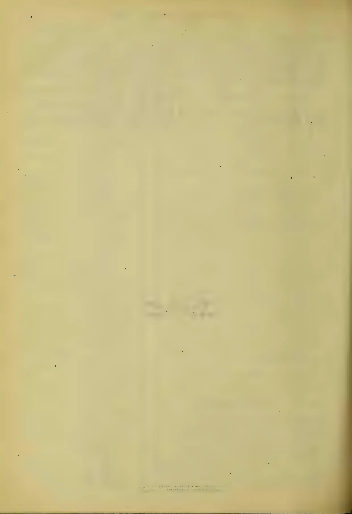This image is a scan of a blank page. The background is a light beige or off-white color. There are several small, dark specks scattered across the page, which appear to be scanning artifacts or dust. A faint, vertical line or shadow is visible near the center of the page, possibly due to the scanning process or the paper's texture. No text or other content is present.

1100------------------------------------------------

# TEA, COFFEE, CINCHONA, COCOA, AND CARDAMOM SALES.

**No. 36.**

COLOMBO, September, 16th 1903.

PRICE:—12½ cents each, 3 copies  
30 cents; 6 copies ½ rupee.

## COLOMBO SALES OF TEA.

### LARGE LOTS.

#### Messrs. E. Benham & Co.

[26,406 lb.]

<table border="1">
<thead>
<tr>
<th></th>
<th>Pkgs.</th>
<th>Name.</th>
<th>lb.</th>
<th>c.</th>
</tr>
</thead>
<tbody>
<tr>
<td rowspan="3">Hornsey</td>
<td>19</td>
<td>hf ch bro or pek</td>
<td>1140</td>
<td>59</td>
</tr>
<tr>
<td>14</td>
<td>ch or pek</td>
<td>1190</td>
<td>43</td>
</tr>
<tr>
<td>12</td>
<td>do pek</td>
<td>1140</td>
<td>41</td>
</tr>
<tr>
<td>Dartry</td>
<td>23</td>
<td>hf ch fans</td>
<td>1518</td>
<td>33</td>
</tr>
<tr>
<td rowspan="3">Galagama</td>
<td>14</td>
<td>ch bro or pek</td>
<td>1280</td>
<td>46 bid</td>
</tr>
<tr>
<td>22</td>
<td>do bro pek</td>
<td>1980</td>
<td>36 bid</td>
</tr>
<tr>
<td>32</td>
<td>do pek</td>
<td>2880</td>
<td>34 bid</td>
</tr>
<tr>
<td rowspan="3">Agrañande</td>
<td>18</td>
<td>ch bro or pek</td>
<td>1800</td>
<td>62 bid</td>
</tr>
<tr>
<td>34</td>
<td>do bro pek</td>
<td>3400</td>
<td>45</td>
</tr>
<tr>
<td>22</td>
<td>do pek</td>
<td>1843</td>
<td>41</td>
</tr>
<tr>
<td>Twickenham</td>
<td>18</td>
<td>ch sou</td>
<td>1616</td>
<td>26 bid</td>
</tr>
</tbody>
</table>

#### Messrs. Forbes & Walker.

[497,842 lb.]

<table border="1">
<thead>
<tr>
<th></th>
<th>Pkgs.</th>
<th>Name.</th>
<th>lb.</th>
<th>c.</th>
</tr>
</thead>
<tbody>
<tr>
<td rowspan="2">Lower Kananka</td>
<td>16</td>
<td>ch bro pek</td>
<td>1680</td>
<td>33</td>
</tr>
<tr>
<td>16</td>
<td>do pek</td>
<td>1600</td>
<td>32</td>
</tr>
<tr>
<td rowspan="2">N</td>
<td>10</td>
<td>ch sou</td>
<td>1000</td>
<td>28</td>
</tr>
<tr>
<td>13</td>
<td>do pek fans</td>
<td>1690</td>
<td>31</td>
</tr>
<tr>
<td rowspan="2">Mousa Eliya</td>
<td>13</td>
<td>ch bro or pek</td>
<td>1300</td>
<td>34</td>
</tr>
<tr>
<td>26</td>
<td>do bro pek</td>
<td>2600</td>
<td>39</td>
</tr>
<tr>
<td rowspan="3">Irex</td>
<td>13</td>
<td>do pek</td>
<td>1235</td>
<td>37</td>
</tr>
<tr>
<td>13</td>
<td>ch bro or pek</td>
<td>1300</td>
<td>39</td>
</tr>
<tr>
<td>15</td>
<td>do or pek</td>
<td>1200</td>
<td>37</td>
</tr>
<tr>
<td rowspan="3">Baddegama</td>
<td>18</td>
<td>do pek</td>
<td>1404</td>
<td>35</td>
</tr>
<tr>
<td>14</td>
<td>ch bro or pek</td>
<td>1400</td>
<td>47</td>
</tr>
<tr>
<td>12</td>
<td>do pek</td>
<td>1020</td>
<td>39</td>
</tr>
<tr>
<td rowspan="3">Dettenagalla</td>
<td>11</td>
<td>do or pek</td>
<td>1012</td>
<td>40</td>
</tr>
<tr>
<td>12</td>
<td>do or pek</td>
<td>1200</td>
<td>42</td>
</tr>
<tr>
<td>19</td>
<td>do pek</td>
<td>1505</td>
<td>40</td>
</tr>
<tr>
<td rowspan="2">Eastland</td>
<td>12</td>
<td>ch bro or pek</td>
<td>1320</td>
<td>53</td>
</tr>
<tr>
<td>21</td>
<td>do pek</td>
<td>1953</td>
<td>38 bid</td>
</tr>
<tr>
<td colspan="5"><b>O B E C, in est. mark</b></td>
</tr>
<tr>
<td rowspan="5">Darrawella</td>
<td>53</td>
<td>hf ch bro or pek</td>
<td>1749</td>
<td>67</td>
</tr>
<tr>
<td>22</td>
<td>ch bro pek</td>
<td>2166</td>
<td>47</td>
</tr>
<tr>
<td>22</td>
<td>do or pek</td>
<td>1804</td>
<td>40 bid</td>
</tr>
<tr>
<td>34</td>
<td>do pek</td>
<td>2924</td>
<td>59</td>
</tr>
<tr>
<td>17</td>
<td>do pek sou</td>
<td>1275</td>
<td>35</td>
</tr>
<tr>
<td>Nynangodde</td>
<td>15</td>
<td>hf ch bro or pek fans</td>
<td>1125</td>
<td>32</td>
</tr>
<tr>
<td>Fassifern</td>
<td>12</td>
<td>ch</td>
<td></td>
<td></td>
</tr>
<tr>
<td rowspan="3">Dawataelle</td>
<td>1</td>
<td>hf ch bro pek</td>
<td>1135</td>
<td>out</td>
</tr>
<tr>
<td>7</td>
<td>ch dust</td>
<td>1050</td>
<td>29</td>
</tr>
<tr>
<td>27</td>
<td>hf ch bro or pek</td>
<td>1458</td>
<td>45</td>
</tr>
<tr>
<td rowspan="2">Penihos</td>
<td>26</td>
<td>ch pek No 1</td>
<td>2080</td>
<td>37</td>
</tr>
<tr>
<td>15</td>
<td>do pek No 2</td>
<td>1627</td>
<td>33</td>
</tr>
<tr>
<td colspan="5"><b>Gonapatiya, Invoice No 11</b></td>
</tr>
<tr>
<td rowspan="3"></td>
<td>27</td>
<td>hf ch or pek</td>
<td>1377</td>
<td>47</td>
</tr>
<tr>
<td>37</td>
<td>do bro or pek</td>
<td>2220</td>
<td>55</td>
</tr>
<tr>
<td>31</td>
<td>do pek</td>
<td>1488</td>
<td>43</td>
</tr>
<tr>
<td rowspan="2"></td>
<td>16</td>
<td>do pek fans</td>
<td>1120</td>
<td>43</td>
</tr>
<tr>
<td colspan="5"><b>Handford, Invoice No 10</b></td>
</tr>
<tr>
<td rowspan="2"></td>
<td>20</td>
<td>ch bro pek</td>
<td>2000</td>
<td>39</td>
</tr>
<tr>
<td>14</td>
<td>do pek</td>
<td>1260</td>
<td>37</td>
</tr>
<tr>
<td colspan="5"><b>Tymawr, Invoice No 12</b></td>
</tr>
<tr>
<td rowspan="3"></td>
<td>22</td>
<td>hf ch or pek</td>
<td>1232</td>
<td>44 bid</td>
</tr>
<tr>
<td>18</td>
<td>do bro or pek</td>
<td>1080</td>
<td>62</td>
</tr>
<tr>
<td>24</td>
<td>do pek</td>
<td>1248</td>
<td>39</td>
</tr>
<tr>
<td rowspan="2">Tommagong</td>
<td>19</td>
<td>ch bro or pek</td>
<td>1900</td>
<td>66</td>
</tr>
<tr>
<td>11</td>
<td>do or pek</td>
<td>1045</td>
<td>55</td>
</tr>
<tr>
<td rowspan="2">Dunbar</td>
<td>21</td>
<td>hf ch bro or pek</td>
<td>1134</td>
<td>55 bid</td>
</tr>
<tr>
<td>13</td>
<td>ch pek</td>
<td>1157</td>
<td>40</td>
</tr>
<tr>
<td rowspan="2">Ingrogalla</td>
<td>12</td>
<td>ch bro pek</td>
<td>1200</td>
<td>42</td>
</tr>
<tr>
<td>11</td>
<td>do pek</td>
<td>1000</td>
<td>37 bid</td>
</tr>
<tr>
<td colspan="5"><b>O B E C, in est mark</b></td>
</tr>
<tr>
<td rowspan="2">Sindamallay</td>
<td>11</td>
<td>ch bro or pek</td>
<td></td>
<td></td>
</tr>
<tr>
<td></td>
<td>No 1 bro or pek</td>
<td>1100</td>
<td>55 bid</td>
</tr>
<tr>
<td rowspan="3"></td>
<td>11</td>
<td>do No 2</td>
<td>1210</td>
<td>44 bid</td>
</tr>
<tr>
<td>22</td>
<td>do or pek</td>
<td>1930</td>
<td>40</td>
</tr>
<tr>
<td>27</td>
<td>do pek</td>
<td>2160</td>
<td>37</td>
</tr>
<tr>
<td rowspan="2">Laurawatte</td>
<td>25</td>
<td>ch bro pek</td>
<td>2500</td>
<td>40</td>
</tr>
<tr>
<td>21</td>
<td>do pek</td>
<td>1764</td>
<td>37</td>
</tr>
<tr>
<td rowspan="2">Marlborough</td>
<td>24</td>
<td>hf ch bro or pek</td>
<td>1320</td>
<td>60</td>
</tr>
<tr>
<td>18</td>
<td>ch bro pek</td>
<td>1500</td>
<td>44 bid</td>
</tr>
<tr>
<td rowspan="3">Castlereagh</td>
<td>20</td>
<td>do pek</td>
<td>1900</td>
<td>38</td>
</tr>
<tr>
<td>25</td>
<td>hf ch bro or pek</td>
<td>1400</td>
<td>57</td>
</tr>
<tr>
<td>13</td>
<td>ch or pek</td>
<td>1040</td>
<td>39</td>
</tr>
<tr>
<td rowspan="4">Dawataelle</td>
<td>12</td>
<td>do pek</td>
<td>1020</td>
<td>37</td>
</tr>
<tr>
<td>60</td>
<td>ch bro pek</td>
<td>6000</td>
<td>40</td>
</tr>
<tr>
<td>19</td>
<td>do bro or pek</td>
<td>1938</td>
<td>46 bid</td>
</tr>
<tr>
<td>35</td>
<td>do pek</td>
<td>3150</td>
<td>36</td>
</tr>
</tbody>
</table>

<table border="1">
<thead>
<tr>
<th></th>
<th>Pkgs.</th>
<th>Name.</th>
<th>lb.</th>
<th>c.</th>
</tr>
</thead>
<tbody>
<tr>
<td>Bickley</td>
<td>18</td>
<td>hf ch bro or pek fans</td>
<td>1080</td>
<td>41</td>
</tr>
<tr>
<td rowspan="4">C H Pansalattenne</td>
<td>12</td>
<td>ch red leaf</td>
<td>1080</td>
<td>25</td>
</tr>
<tr>
<td>41</td>
<td>ch bro pek</td>
<td>3895</td>
<td>42</td>
</tr>
<tr>
<td>28</td>
<td>do pek</td>
<td>2380</td>
<td>36</td>
</tr>
<tr>
<td>25</td>
<td>do pek sou</td>
<td>2000</td>
<td>33</td>
</tr>
<tr>
<td rowspan="3">Yatiana Weyungawatte</td>
<td>12</td>
<td>ch or pek</td>
<td>1236</td>
<td>32 bid</td>
</tr>
<tr>
<td>35</td>
<td>ch bro pek</td>
<td>3510</td>
<td>36</td>
</tr>
<tr>
<td>15</td>
<td>do pek sou</td>
<td>1200</td>
<td>32</td>
</tr>
<tr>
<td>Mariawatte</td>
<td>12</td>
<td>hf ch dust</td>
<td>1010</td>
<td>31</td>
</tr>
<tr>
<td rowspan="3">Sylvakandy</td>
<td>24</td>
<td>ch bro or pek</td>
<td>2460</td>
<td>56</td>
</tr>
<tr>
<td>20</td>
<td>do bro pek</td>
<td>2600</td>
<td>40</td>
</tr>
<tr>
<td>19</td>
<td>do pek</td>
<td>1900</td>
<td>37</td>
</tr>
<tr>
<td rowspan="2">Coldstream Group</td>
<td>49</td>
<td>hf ch bro pek</td>
<td>2410</td>
<td>29 bid</td>
</tr>
<tr>
<td>16</td>
<td>ch pek</td>
<td>1230</td>
<td>36</td>
</tr>
<tr>
<td colspan="5"><b>Rickarton, Invoice No 3</b></td>
</tr>
<tr>
<td rowspan="3"></td>
<td>22</td>
<td>hf ch bro or pek</td>
<td>1210</td>
<td>56</td>
</tr>
<tr>
<td>14</td>
<td>ch or pek</td>
<td>1302</td>
<td>40</td>
</tr>
<tr>
<td>15</td>
<td>do pek</td>
<td>1300</td>
<td>38</td>
</tr>
<tr>
<td rowspan="4">K P W</td>
<td>29</td>
<td>hf ch bro or pek</td>
<td>1740</td>
<td>39</td>
</tr>
<tr>
<td>24</td>
<td>do bro pek</td>
<td>1200</td>
<td>37</td>
</tr>
<tr>
<td>33</td>
<td>do pek</td>
<td>1650</td>
<td>35</td>
</tr>
<tr>
<td>12</td>
<td>hf ch pek fans</td>
<td>1152</td>
<td>41</td>
</tr>
<tr>
<td rowspan="6">High Forest Polatagama</td>
<td>21</td>
<td>ch bro or pek</td>
<td>2100</td>
<td>40</td>
</tr>
<tr>
<td>29</td>
<td>do bro pek</td>
<td>2755</td>
<td>37 bid</td>
</tr>
<tr>
<td>12</td>
<td>do or pek</td>
<td>1210</td>
<td>35 bid</td>
</tr>
<tr>
<td>52</td>
<td>do pek</td>
<td>4420</td>
<td>35</td>
</tr>
<tr>
<td>15</td>
<td>do pek sou</td>
<td>1275</td>
<td>31 bid</td>
</tr>
<tr>
<td>16</td>
<td>do fans</td>
<td>1600</td>
<td>30</td>
</tr>
<tr>
<td rowspan="5">Gampaha</td>
<td>40</td>
<td>hf ch bro or pek</td>
<td>2480</td>
<td>46</td>
</tr>
<tr>
<td>18</td>
<td>ch bro pek</td>
<td>1710</td>
<td>50</td>
</tr>
<tr>
<td>24</td>
<td>hf ch or pek</td>
<td>1320</td>
<td>46</td>
</tr>
<tr>
<td>40</td>
<td>ch pek</td>
<td>3410</td>
<td>42</td>
</tr>
<tr>
<td>23</td>
<td>do pek sou</td>
<td>2070</td>
<td>38</td>
</tr>
<tr>
<td rowspan="3">Maha Uva</td>
<td>12</td>
<td>hf ch pek fans</td>
<td>1089</td>
<td>37</td>
</tr>
<tr>
<td>37</td>
<td>hf ch bro or pek</td>
<td>2220</td>
<td>47</td>
</tr>
<tr>
<td>19</td>
<td>ch or pek</td>
<td>1805</td>
<td>44</td>
</tr>
<tr>
<td rowspan="2">Erracht</td>
<td>22</td>
<td>do pek</td>
<td>1180</td>
<td>42</td>
</tr>
<tr>
<td>25</td>
<td>ch bro or pek</td>
<td>2250</td>
<td>37</td>
</tr>
<tr>
<td rowspan="2"></td>
<td>22</td>
<td>do pek</td>
<td>1540</td>
<td>34</td>
</tr>
<tr>
<td>17</td>
<td>hf ch bro or pek</td>
<td>1630</td>
<td>66</td>
</tr>
<tr>
<td rowspan="2"></td>
<td>21</td>
<td>do pek</td>
<td>1059</td>
<td>47</td>
</tr>
<tr>
<td>32</td>
<td>hf ch bro or pek</td>
<td>1816</td>
<td>47</td>
</tr>
<tr>
<td rowspan="5">Dunkeld</td>
<td>12</td>
<td>ch or pek</td>
<td>1080</td>
<td>40</td>
</tr>
<tr>
<td>17</td>
<td>do pek</td>
<td>1479</td>
<td>38</td>
</tr>
<tr>
<td>46</td>
<td>ch bro or pek</td>
<td>4600</td>
<td>37</td>
</tr>
<tr>
<td>13</td>
<td>do bro pek</td>
<td>1010</td>
<td>37</td>
</tr>
<tr>
<td>22</td>
<td>do or pek</td>
<td>1760</td>
<td>56</td>
</tr>
<tr>
<td rowspan="3">Ganapalla</td>
<td>26</td>
<td>do pek</td>
<td>2023</td>
<td>55</td>
</tr>
<tr>
<td>17</td>
<td>do bro pek fans</td>
<td>1700</td>
<td>3</td>
</tr>
<tr>
<td>20</td>
<td>hf ch dust</td>
<td>1160</td>
<td>31</td>
</tr>
<tr>
<td rowspan="4">Luckyland</td>
<td>32</td>
<td>hf ch bro or pek</td>
<td>1981</td>
<td>47</td>
</tr>
<tr>
<td>12</td>
<td>ch bro pek</td>
<td>1235</td>
<td>61</td>
</tr>
<tr>
<td>19</td>
<td>hf ch or pek</td>
<td>1035</td>
<td>45</td>
</tr>
<tr>
<td>29</td>
<td>ch pek</td>
<td>2465</td>
<td>42</td>
</tr>
<tr>
<td rowspan="2">Killarne</td>
<td>23</td>
<td>do pek sou</td>
<td>2070</td>
<td>38</td>
</tr>
<tr>
<td>20</td>
<td>hf ch bro or Pek</td>
<td>1161</td>
<td>71</td>
</tr>
<tr>
<td rowspan="2"></td>
<td>25</td>
<td>do bro pek</td>
<td>1500</td>
<td>51</td>
</tr>
<tr>
<td>14</td>
<td>ch pek</td>
<td>1190</td>
<td>43</td>
</tr>
<tr>
<td rowspan="2">Bandarapola</td>
<td>49</td>
<td>hf ch No 1 bro or pek</td>
<td>2793</td>
<td>37</td>
</tr>
<tr>
<td>42</td>
<td>do No 2 bro or pek</td>
<td>2268</td>
<td>35 bid</td>
</tr>
<tr>
<td rowspan="4"></td>
<td>38</td>
<td>do bro pek</td>
<td>1938</td>
<td>35</td>
</tr>
<tr>
<td>24</td>
<td>do pek</td>
<td>1176</td>
<td>33</td>
</tr>
<tr>
<td>11</td>
<td>ch bro or pek</td>
<td>1100</td>
<td>47 bid</td>
</tr>
<tr>
<td>41</td>
<td>do bro pek</td>
<td>3362</td>
<td>55 bid</td>
</tr>
<tr>
<td rowspan="2">Poonagalla</td>
<td>31</td>
<td>do pek</td>
<td>2833</td>
<td>43</td>
</tr>
<tr>
<td>13</td>
<td>ch siftings</td>
<td>1625</td>
<td>16 bid</td>
</tr>
<tr>
<td rowspan="2">Arapolañande</td>
<td>11</td>
<td>ch bro pek</td>
<td>1100</td>
<td>58 bid</td>
</tr>
<tr>
<td>13</td>
<td>do bro pek</td>
<td>1300</td>
<td>54</td>
</tr>
<tr>
<td rowspan="2">Ravenswood</td>
<td>46</td>
<td>do or pek</td>
<td>4370</td>
<td>38</td>
</tr>
<tr>
<td>51</td>
<td>do pek</td>
<td>4590</td>
<td>35</td>
</tr>
<tr>
<td rowspan="2">Glendon</td>
<td>15</td>
<td>do pek sou</td>
<td>1425</td>
<td>32</td>
</tr>
<tr>
<td>17</td>
<td>ch bro pek</td>
<td>1700</td>
<td>39</td>
</tr>
<tr>
<td rowspan="2">Hayes</td>
<td>36</td>
<td>do pek</td>
<td>3470</td>
<td>35</td>
</tr>
<tr>
<td>35</td>
<td>hf ch or pek No 1</td>
<td>1944</td>
<td>71</td>
</tr>
<tr>
<td rowspan="3">High Forest</td>
<td>31</td>
<td>do bro pek</td>
<td>1891</td>
<td>65</td>
</tr>
<tr>
<td>23</td>
<td>do or pek</td>
<td>1219</td>
<td>53</td>
</tr>
<tr>
<td>21</td>
<td>do bro pek fans</td>
<td>1554</td>
<td>43</td>
</tr>
<tr>
<td rowspan="2">Purana</td>
<td>10</td>
<td>ch bro pek</td>
<td>1100</td>
<td>40</td>
</tr>
<tr>
<td>17</td>
<td>do pek</td>
<td>1360</td>
<td>36</td>
</tr>
<tr>
<td rowspan="3">Bowlana</td>
<td>37</td>
<td>ch bro or pek</td>
<td>2220</td>
<td>45</td>
</tr>
<tr>
<td>28</td>
<td>do or pek</td>
<td>2520</td>
<td>40</td>
</tr>
<tr>
<td>28</td>
<td>do pek</td>
<td>2520</td>
<td>37</td>
</tr>
<tr>
<td rowspan="4">New Peacock Stockholm</td>
<td>17</td>
<td>hf ch pek fans</td>
<td>1275</td>
<td>33</td>
</tr>
<tr>
<td>30</td>
<td>ch bro pek</td>
<td>2000</td>
<td>44 bid</td>
</tr>
<tr>
<td>26</td>
<td>do bro or pek</td>
<td>1300</td>
<td>68 bid</td>
</tr>
<tr>
<td>22</td>
<td>do pek</td>
<td>1810</td>
<td>40</td>
</tr>
<tr>
<td rowspan="3">Talgaswela</td>
<td>18</td>
<td>ch bro or pek</td>
<td>1500</td>
<td>44</td>
</tr>
<tr>
<td>19</td>
<td>do pek</td>
<td>1520</td>
<td>36</td>
</tr>
<tr>
<td>20</td>
<td>do pek sou</td>
<td>1660</td>
<td>38</td>
</tr>
</tbody>
</table>

1101------------------------------------------------

2CEYLON PRODUCE SALES LIST.

<table border="1">
<thead>
<tr>
<th></th>
<th>Pkgs.</th>
<th>Name.</th>
<th>lb.</th>
<th>c.</th>
<th></th>
<th>Pkgs.</th>
<th>Name.</th>
<th>lb.</th>
<th>c.</th>
</tr>
</thead>
<tbody>
<tr>
<td rowspan="4">Grotto</td>
<td>55 hf ch</td>
<td>bro or pek</td>
<td>3075</td>
<td>39</td>
<td rowspan="4">Lancefield</td>
<td>23 ch</td>
<td>bro pek</td>
<td>2415</td>
<td>27 bid</td>
</tr>
<tr>
<td>31 ch</td>
<td>bro pek</td>
<td>2790</td>
<td>27</td>
<td>19 do</td>
<td>pek</td>
<td>1805</td>
<td>27 bid</td>
</tr>
<tr>
<td>28 do</td>
<td>pek</td>
<td>2240</td>
<td>35</td>
<td>31 do</td>
<td>pek sou</td>
<td>2450</td>
<td>with'd'n</td>
</tr>
<tr>
<td>17 do</td>
<td>pek sou</td>
<td>1275</td>
<td>31 bid</td>
<td rowspan="3">Natuwakelle</td>
<td>27 hf ch</td>
<td>bro or pek</td>
<td>1539</td>
<td>51</td>
</tr>
<tr>
<td rowspan="3">Kentara</td>
<td>30 ch</td>
<td>bro or pek</td>
<td>3000</td>
<td>37 bid</td>
<td>22 ch</td>
<td>or pek</td>
<td>1940</td>
<td>39</td>
</tr>
<tr>
<td>12 do</td>
<td>pek</td>
<td>1236</td>
<td>33 bid</td>
<td>16 do</td>
<td>pek</td>
<td>1440</td>
<td>38</td>
</tr>
<tr>
<td rowspan="4">Putupaula</td>
<td>10 ch</td>
<td>bro or pek</td>
<td>1000</td>
<td>48</td>
<td rowspan="2">Koslance</td>
<td>50 hf ch</td>
<td>bro pek</td>
<td>3000</td>
<td>47 bid</td>
</tr>
<tr>
<td>55 do</td>
<td>or pek</td>
<td>4675</td>
<td>35 bid</td>
<td>20 ch</td>
<td>pek</td>
<td>2000</td>
<td>40</td>
</tr>
<tr>
<td rowspan="3">Mudamana In No 11</td>
<td>41 do</td>
<td>pek</td>
<td>3280</td>
<td>35</td>
<td rowspan="2">Ottery</td>
<td>15 ch</td>
<td>bro or pek</td>
<td>1510</td>
<td>54 bid</td>
</tr>
<tr>
<td>7 do</td>
<td>dust</td>
<td>1050</td>
<td>29</td>
<td>31 do</td>
<td>pek</td>
<td>2635</td>
<td>37</td>
</tr>
<tr>
<td>22 ch</td>
<td>young hyson</td>
<td>1930</td>
<td>28</td>
<td rowspan="3">O W</td>
<td>13 ch</td>
<td>or pek</td>
<td>1066</td>
<td>38</td>
</tr>
<tr>
<td rowspan="2">Strathmore</td>
<td>23 do</td>
<td>hyson</td>
<td>1955</td>
<td>35</td>
<td>32 hf ch</td>
<td>bro pek</td>
<td>1725</td>
<td>35</td>
</tr>
<tr>
<td>17 do</td>
<td>hyson No 2</td>
<td>1360</td>
<td>31</td>
<td>18 ch</td>
<td>e</td>
<td>1404</td>
<td>31</td>
</tr>
<tr>
<td rowspan="3">Dumblane</td>
<td>24 hf ch</td>
<td>bro or pek</td>
<td>1344</td>
<td>52</td>
<td rowspan="2">Longville</td>
<td>18 hf ch</td>
<td>pek fans</td>
<td>1170</td>
<td>35</td>
</tr>
<tr>
<td>17 ch</td>
<td>or pek</td>
<td>1564</td>
<td>39</td>
<td>14 ch</td>
<td>or pek</td>
<td>1400</td>
<td>44</td>
</tr>
<tr>
<td rowspan="3">Arclaw and Wishford</td>
<td>23 do</td>
<td>pek</td>
<td>2070</td>
<td>36</td>
<td rowspan="2">Gansarapolla</td>
<td>48 hf c</td>
<td>bro or pek No 1</td>
<td>2736</td>
<td>37 bid</td>
</tr>
<tr>
<td>27 hf ch</td>
<td>bro or pek</td>
<td>1485</td>
<td>58</td>
<td>34 d</td>
<td>bro or pek No 2</td>
<td>1802</td>
<td>35</td>
</tr>
<tr>
<td rowspan="3">Madulkelle</td>
<td>12 ch</td>
<td>bro pek</td>
<td>1200</td>
<td>43</td>
<td rowspan="2">Ormidale</td>
<td>26 do</td>
<td>bro pek</td>
<td>1404</td>
<td>35</td>
</tr>
<tr>
<td>10 ch</td>
<td>pek</td>
<td>1008</td>
<td>40</td>
<td>26 hf ch</td>
<td>bro pek</td>
<td>1534</td>
<td>43</td>
</tr>
<tr>
<td rowspan="4">Queensland</td>
<td>1 hf ch</td>
<td>bro or pek</td>
<td>1000</td>
<td>45 bid</td>
<td rowspan="2">Wilpita</td>
<td>19 ch</td>
<td>pek</td>
<td>1729</td>
<td>45</td>
</tr>
<tr>
<td>14 ch</td>
<td>or pek</td>
<td>1150</td>
<td>38</td>
<td>11 ch</td>
<td>bro or pek</td>
<td>1155</td>
<td>33</td>
</tr>
<tr>
<td>12 do</td>
<td>pek</td>
<td>1180</td>
<td>37</td>
<td rowspan="2">Mocha</td>
<td>25 hf ch</td>
<td>bro or pek</td>
<td>1470</td>
<td>72</td>
</tr>
<tr>
<td rowspan="3">Mahawale In No 19</td>
<td>10 ch</td>
<td>bro pek</td>
<td>1000</td>
<td>45 bid</td>
<td>11 ch</td>
<td>or pek</td>
<td>1023</td>
<td>57</td>
</tr>
<tr>
<td>12 do</td>
<td>pek</td>
<td>1070</td>
<td>42</td>
<td>16 do</td>
<td>pek</td>
<td>1600</td>
<td>52</td>
</tr>
<tr>
<td rowspan="4">Amunatenne</td>
<td>25 ch</td>
<td>bro or pek</td>
<td>2500</td>
<td>38</td>
<td rowspan="2">Lameliere</td>
<td>15 hf ch</td>
<td>fans</td>
<td>1125</td>
<td>42</td>
</tr>
<tr>
<td>21 do</td>
<td>or pek</td>
<td>1890</td>
<td>35 bid</td>
<td>15 ch</td>
<td>bro or pek</td>
<td>1500</td>
<td>42</td>
</tr>
<tr>
<td rowspan="4">St Helen's</td>
<td>37 do</td>
<td>pek</td>
<td>3380</td>
<td>35</td>
<td rowspan="2">Bowella</td>
<td>13 do</td>
<td>pek</td>
<td>1170</td>
<td>35</td>
</tr>
<tr>
<td>19 do</td>
<td>pek sou</td>
<td>1805</td>
<td>34</td>
<td>31 hf ch</td>
<td>bro pek</td>
<td>1550</td>
<td>36</td>
</tr>
<tr>
<td rowspan="4">G God Hope In. No 16</td>
<td>19 ch</td>
<td>bro or pek</td>
<td>1900</td>
<td>45</td>
<td rowspan="2">Waragalande</td>
<td>11 ch</td>
<td>bro or pek</td>
<td>1100</td>
<td>55</td>
</tr>
<tr>
<td>35 do</td>
<td>or pek</td>
<td>1620</td>
<td>39</td>
<td>10 do</td>
<td>or pek</td>
<td>1000</td>
<td>40</td>
</tr>
<tr>
<td rowspan="4">North Cove In. No 2</td>
<td>26 do</td>
<td>pek</td>
<td>3150</td>
<td>37</td>
<td rowspan="2">Devon</td>
<td>18 do</td>
<td>pek</td>
<td>1900</td>
<td>38</td>
</tr>
<tr>
<td>12 do</td>
<td>pek</td>
<td>2030</td>
<td>35</td>
<td>20 hf ch</td>
<td>bro or pek</td>
<td>1200</td>
<td>63</td>
</tr>
<tr>
<td rowspan="4">Nahalma Inv. No 22</td>
<td>29 hf ch</td>
<td>bro or pek</td>
<td>1450</td>
<td>39 bid</td>
<td>14 ch</td>
<td>or pek</td>
<td>1400</td>
<td>45</td>
</tr>
<tr>
<td>14 ch</td>
<td>pek</td>
<td>1260</td>
<td>34 bid</td>
<td>11 do</td>
<td>pek</td>
<td>1001</td>
<td>40</td>
</tr>
<tr>
<td>12 hf ch</td>
<td>bro or pek</td>
<td>1288</td>
<td>41</td>
<td rowspan="2">Dubena</td>
<td>18 ch</td>
<td>pek</td>
<td>1800</td>
<td>32</td>
</tr>
<tr>
<td>19 hf ch</td>
<td>or pek</td>
<td>1032</td>
<td>37</td>
<td rowspan="2">Cleveland</td>
<td>28 hf ch</td>
<td>pek</td>
<td>1512</td>
<td>41</td>
</tr>
<tr>
<td rowspan="4">Eriacoia</td>
<td>12 do</td>
<td>pek</td>
<td>1080</td>
<td>35</td>
<td rowspan="2">Ashburton</td>
<td>18 hf ch</td>
<td>bro or pek</td>
<td>2044</td>
<td>76</td>
</tr>
<tr>
<td>9 ch</td>
<td>young hyson</td>
<td>1170</td>
<td>37 bid</td>
<td>32 do</td>
<td>bro pek</td>
<td>1888</td>
<td>3</td>
</tr>
<tr>
<td rowspan="4">Norfolk</td>
<td>12 do</td>
<td>hyson</td>
<td>1200</td>
<td>35</td>
<td>12 ch</td>
<td>or pek</td>
<td>1044</td>
<td>40</td>
</tr>
<tr>
<td>17 ch</td>
<td>pek</td>
<td>1615</td>
<td>37</td>
<td>15 do</td>
<td>pek</td>
<td>1350</td>
<td>36</td>
</tr>
<tr>
<td rowspan="4">Q2B E C, in est mark</td>
<td>44 ch</td>
<td>bro pek</td>
<td>2610</td>
<td>53</td>
<td rowspan="2">Eila</td>
<td>54 hf ch</td>
<td>young hyson</td>
<td>2970</td>
<td>39 bid</td>
</tr>
<tr>
<td>26 do</td>
<td>pek</td>
<td>2314</td>
<td>43</td>
<td>15 ch</td>
<td>hyson</td>
<td>1350</td>
<td>35 bid</td>
</tr>
<tr>
<td rowspan="4">Bellongalla</td>
<td>21 do</td>
<td>pek sou</td>
<td>1566</td>
<td>38</td>
<td rowspan="2">Ladbrook</td>
<td>28 hf ch</td>
<td>bro or pek</td>
<td>1568</td>
<td>59</td>
</tr>
<tr>
<td>21 do</td>
<td>fans</td>
<td>1752</td>
<td>42</td>
<td>22 ch</td>
<td>pek</td>
<td>1980</td>
<td>40</td>
</tr>
<tr>
<td rowspan="4">Moneragalla</td>
<td>21 ch</td>
<td>bro pek</td>
<td>2100</td>
<td>33</td>
<td rowspan="2">Tismoda</td>
<td>15 ch</td>
<td>bro or pek</td>
<td>1350</td>
<td>33 bid</td>
</tr>
<tr>
<td>22 do</td>
<td>pek sou</td>
<td>1370</td>
<td>28 bid</td>
<td>25 do</td>
<td>bro pek</td>
<td>2375</td>
<td>38</td>
</tr>
<tr>
<td rowspan="4">Tunigalla</td>
<td>10 do</td>
<td>bro pek fans</td>
<td>1100</td>
<td>33</td>
<td rowspan="2">Mt. Vernon</td>
<td>23 do</td>
<td>pek</td>
<td>1840</td>
<td>35</td>
</tr>
<tr>
<td>31 hf ch</td>
<td>pek sou</td>
<td>1271</td>
<td>29 bid</td>
<td>35 ch</td>
<td>pek</td>
<td>3150</td>
<td>43 bid</td>
</tr>
<tr>
<td rowspan="4">Bandara Eliya</td>
<td>16 do</td>
<td>fans</td>
<td>1120</td>
<td>36</td>
<td rowspan="2">Hunugalla</td>
<td>18 ch</td>
<td>pek sou</td>
<td>1440</td>
<td>30 bid</td>
</tr>
<tr>
<td>37 hf ch</td>
<td>bro pek</td>
<td>1920</td>
<td>40</td>
<td rowspan="2">Lameliere</td>
<td>15 ch</td>
<td>bro or pek</td>
<td>1500</td>
<td>43</td>
</tr>
<tr>
<td rowspan="4">Preston</td>
<td>15 do</td>
<td>pek</td>
<td>1350</td>
<td>35</td>
<td rowspan="2">Rookwood</td>
<td>13 do</td>
<td>pek</td>
<td>1170</td>
<td>35</td>
</tr>
<tr>
<td>45 do</td>
<td>bro or pek</td>
<td>2520</td>
<td>47 bid</td>
<td>19 hf ch</td>
<td>bro or pek</td>
<td>1026</td>
<td>50 bid</td>
</tr>
<tr>
<td rowspan="4">Maha Eliya</td>
<td>41 do</td>
<td>pek</td>
<td>1856</td>
<td>40 bid</td>
<td>23 do</td>
<td>bro pek</td>
<td>1380</td>
<td>38 bid</td>
</tr>
<tr>
<td>24 do</td>
<td>pek sou</td>
<td>1152</td>
<td>37</td>
<td>22 do</td>
<td>fly or pek</td>
<td>1140</td>
<td>47</td>
</tr>
<tr>
<td>30 do</td>
<td>pek fans</td>
<td>1880</td>
<td>33 bid</td>
<td>24 ch</td>
<td>pek</td>
<td>2160</td>
<td>38</td>
</tr>
<tr>
<td rowspan="4">Debiowita</td>
<td>31 hf ch</td>
<td>bro or pek</td>
<td>1674</td>
<td>63</td>
<td rowspan="2">Glassaug</td>
<td>23 hf ch</td>
<td>pek No 1</td>
<td>1955</td>
<td>37</td>
</tr>
<tr>
<td>13 ch</td>
<td>pek</td>
<td>1066</td>
<td>46</td>
<td>19 ch</td>
<td>pek</td>
<td>1995</td>
<td>45 bid</td>
</tr>
<tr>
<td rowspan="4">K in est mark</td>
<td>23 hf ch</td>
<td>bro or pek</td>
<td>1288</td>
<td>61 bid</td>
<td rowspan="2">Gonavy</td>
<td>17 ch</td>
<td>or pek</td>
<td>1415</td>
<td>56</td>
</tr>
<tr>
<td>33 do</td>
<td>bro pek</td>
<td>1518</td>
<td>44 bid</td>
<td>0 hf ch</td>
<td>bro or pek</td>
<td>1040</td>
<td>54 bid</td>
</tr>
<tr>
<td rowspan="4">M K S</td>
<td>22 ch</td>
<td>pek</td>
<td>1936</td>
<td>93 bid</td>
<td rowspan="2">Poilakande</td>
<td>22 ch</td>
<td>pek</td>
<td>1936</td>
<td>41</td>
</tr>
<tr>
<td>43 ch</td>
<td>bro pek</td>
<td>3300</td>
<td>40 bid</td>
<td>15 ch</td>
<td>bro or pek</td>
<td>1250</td>
<td>36</td>
</tr>
<tr>
<td rowspan="4">A H</td>
<td>27 ch</td>
<td>pek sou</td>
<td>2176</td>
<td>25 bid</td>
<td>36 do</td>
<td>bro pek</td>
<td>3240</td>
<td>35</td>
</tr>
<tr>
<td>22 ch</td>
<td>pek sou</td>
<td>1930</td>
<td>27 bid</td>
<td>36 do</td>
<td>pek</td>
<td>2850</td>
<td>33</td>
</tr>
<tr>
<td rowspan="4">R</td>
<td>24 ch</td>
<td>green tea</td>
<td>2552</td>
<td>16 bid</td>
<td rowspan="2">J in estate mark</td>
<td>22 ch</td>
<td>pek sou</td>
<td>1950</td>
<td>24 bid</td>
</tr>
<tr>
<td>19 ch</td>
<td>sittings</td>
<td>2432</td>
<td>12</td>
<td rowspan="2">M in est mark</td>
<td>22 ch</td>
<td>fans</td>
<td>2560</td>
<td>25 bid</td>
</tr>
<tr>
<td rowspan="4">Blarneywatte In. No 3</td>
<td>17 ch</td>
<td>pek</td>
<td>1446</td>
<td>35</td>
<td rowspan="2">Y K in est mark</td>
<td>54 hf ch</td>
<td>dust</td>
<td>4428</td>
<td>out</td>
</tr>
<tr>
<td>24 ch</td>
<td>young hyson</td>
<td>2280</td>
<td>38</td>
<td>17 ch</td>
<td>pek fans</td>
<td>2210</td>
<td>28 bid</td>
</tr>
<tr>
<td rowspan="4">Harrow</td>
<td>16 do</td>
<td>hyson</td>
<td>1520</td>
<td>35</td>
<td>19 hf ch</td>
<td>dust</td>
<td>1710</td>
<td>out</td>
</tr>
<tr>
<td>19 hf ch</td>
<td>bro or pek</td>
<td>1026</td>
<td>64</td>
<td>14 ch</td>
<td>pek</td>
<td>1130</td>
<td>27</td>
</tr>
<tr>
<td>12 ch</td>
<td>or pek</td>
<td>1140</td>
<td>43</td>
<td>14 do</td>
<td>pek sou</td>
<td>1120</td>
<td>34</td>
</tr>
<tr>
<td rowspan="4">Glenorchy</td>
<td>15 do</td>
<td>pek</td>
<td>1380</td>
<td>39</td>
<td rowspan="2">Cabin Ella</td>
<td>23 ch</td>
<td>bro pek</td>
<td>2300</td>
<td>51</td>
</tr>
<tr>
<td>32 hf ch</td>
<td>bro pek</td>
<td>1760</td>
<td>65</td>
<td>14 do</td>
<td>pek</td>
<td>1260</td>
<td>46</td>
</tr>
<tr>
<td rowspan="4">Puspone</td>
<td>31 do</td>
<td>pek</td>
<td>1550</td>
<td>46</td>
<td rowspan="2">Brownlow</td>
<td>21 hf ch</td>
<td>bro or pek</td>
<td>1288</td>
<td>67</td>
</tr>
<tr>
<td>21 ch</td>
<td>or pek</td>
<td>2100</td>
<td>38 bid</td>
<td>14 ch</td>
<td>or pek</td>
<td>1330</td>
<td>45</td>
</tr>
<tr>
<td colspan="5"><b>Messrs. E. John &amp; Co</b></td>
<td rowspan="2">R G</td>
<td>13 do</td>
<td>pek</td>
<td>1170</td>
<td>40 bid</td>
</tr>
<tr>
<td colspan="5">[180,986 lb.]</td>
<td>30 ch</td>
<td>pek sou</td>
<td>2550</td>
<td>with'd'n</td>
</tr>
<tr>
<td colspan="5"><b>Pkgs. Name. lb. c.</b></td>
<td colspan="5"><b>Messrs. Keell and Waldock.</b></td>
</tr>
<tr>
<td colspan="5">Patinigalla</td>
<td colspan="5">[42,732 lb.]</td>
</tr>
<tr>
<td colspan="5">10 ch bro pek 1000 28 bid</td>
<td colspan="5"><b>Pkgs. Name. lb. c.</b></td>
</tr>
<tr>
<td colspan="5">23 do pek 2070 27</td>
<td>Hapugamana</td>
<td>13 ch</td>
<td>bro pek</td>
<td>1300</td>
<td>36 bid</td>
</tr>
<tr>
<td colspan="5"></td>
<td>Pingarawa</td>
<td>53 ch</td>
<td>pek</td>
<td>4770</td>
<td>41</td>
</tr>
<tr>
<td colspan="5"></td>
<td></td>
<td>16 do</td>
<td>souchong</td>
<td>1200</td>
<td>38</td>
</tr>
<tr>
<td colspan="5"></td>
<td>Panaratne</td>
<td>26 ch</td>
<td></td>
<td></td>
<td></td>
</tr>
<tr>
<td colspan="5"></td>
<td></td>
<td>1 hf ch</td>
<td>bro or pek</td>
<td>2675</td>
<td>36 bid</td>
</tr>
<tr>
<td colspan="5"></td>
<td>Dunnottar</td>
<td>22 hf ch</td>
<td>bro or pek</td>
<td>1210</td>
<td>68</td>
</tr>
<tr>
<td colspan="5"></td>
<td></td>
<td>14 ch</td>
<td>pek</td>
<td>1190</td>
<td>43</td>
</tr>
<tr>
<td colspan="5"></td>
<td>Kandabena</td>
<td>25 ch</td>
<td>bro or pek</td>
<td>2500</td>
<td>68</td>
</tr>
<tr>
<td colspan="5"></td>
<td></td>
<td>15 do</td>
<td>bro pek</td>
<td>1350</td>
<td>51 bid</td>
</tr>
<tr>
<td colspan="5"></td>
<td></td>
<td>21 do</td>
<td>pek sou</td>
<td>1680</td>
<td>40 bid</td>
</tr>
<tr>
<td colspan="5"></td>
<td>G E M</td>
<td>12 ch</td>
<td>pek sou</td>
<td>1080</td>
<td>23 bid</td>
</tr>
<tr>
<td colspan="5"></td>
<td>Faithlie</td>
<td>20 hf ch</td>
<td>bro or pek</td>
<td>1000</td>
<td>61</td>
</tr>
<tr>
<td colspan="5"></td>
<td></td>
<td>15 ch</td>
<td>pek</td>
<td>1425</td>
<td>39</td>
</tr>
</tbody>
</table>

1102------------------------------------------------

CEYLON PRODUCE SALES LIST.

3

<table border="1">
<thead>
<tr>
<th></th>
<th>Pkgs.</th>
<th>Name.</th>
<th>lb.</th>
<th>c.</th>
</tr>
</thead>
<tbody>
<tr>
<td rowspan="4">Gampai</td>
<td>40 hf ch</td>
<td>or pek</td>
<td>1880</td>
<td>35</td>
</tr>
<tr>
<td>52 do</td>
<td>bro or pek</td>
<td>2808</td>
<td>35 bid</td>
</tr>
<tr>
<td>34 ch</td>
<td>pek</td>
<td>2720</td>
<td>31</td>
</tr>
<tr>
<td>31 do</td>
<td>pek sou</td>
<td>2118</td>
<td>29 bid</td>
</tr>
<tr>
<td>C M G</td>
<td>34 ch</td>
<td>pek sou</td>
<td>3060</td>
<td>27 bid</td>
</tr>
</tbody>
</table>

**Messrs. Somerville & Co.**  
[264,843 lb.]

<table border="1">
<thead>
<tr>
<th></th>
<th>Pkgs.</th>
<th>Name.</th>
<th>lb.</th>
<th>c.</th>
</tr>
</thead>
<tbody>
<tr>
<td rowspan="3">W K P</td>
<td>23 ch</td>
<td>bro pek</td>
<td>2300</td>
<td>41 bid</td>
</tr>
<tr>
<td>55 do</td>
<td>pek</td>
<td>4400</td>
<td>33 bid</td>
</tr>
<tr>
<td>20 do</td>
<td>pek sou</td>
<td>1600</td>
<td>30 bid</td>
</tr>
<tr>
<td>Kurulugalla</td>
<td>10 ch</td>
<td>bro pek</td>
<td>1000</td>
<td>38</td>
</tr>
<tr>
<td rowspan="4">Warakamure</td>
<td>13 do</td>
<td>pek</td>
<td>1235</td>
<td>33</td>
</tr>
<tr>
<td>35 ch</td>
<td>bro or pek</td>
<td>3500</td>
<td>37</td>
</tr>
<tr>
<td>33 do</td>
<td>or pek</td>
<td>2640</td>
<td>35 bid</td>
</tr>
<tr>
<td>27 do</td>
<td>pek</td>
<td>2995</td>
<td>32 bid</td>
</tr>
<tr>
<td rowspan="2">Labugama</td>
<td>21 do</td>
<td>pek sou</td>
<td>1630</td>
<td>28 bid</td>
</tr>
<tr>
<td>24 hf ch</td>
<td>br pek</td>
<td>1320</td>
<td>59</td>
</tr>
<tr>
<td rowspan="6">Siriniwasa</td>
<td>18 do</td>
<td>pekoe</td>
<td>1530</td>
<td>33</td>
</tr>
<tr>
<td>13 ch</td>
<td>or pek</td>
<td>1300</td>
<td>38</td>
</tr>
<tr>
<td>13 do</td>
<td>bro or pek</td>
<td>1365</td>
<td>37</td>
</tr>
<tr>
<td>46 do</td>
<td>pek</td>
<td>3910</td>
<td>35</td>
</tr>
<tr>
<td>25 do</td>
<td>pek sou</td>
<td>2080</td>
<td>30 bid</td>
</tr>
<tr>
<td>22 do</td>
<td>fans</td>
<td>2200</td>
<td>33</td>
</tr>
<tr>
<td rowspan="2">Nyanza</td>
<td>14 ch</td>
<td>or pek</td>
<td>1120</td>
<td>40 bid</td>
</tr>
<tr>
<td>20 hf ch</td>
<td>br or pk</td>
<td>1100</td>
<td>54 bid</td>
</tr>
<tr>
<td rowspan="3">Karangalla</td>
<td>15 ch</td>
<td>pek</td>
<td>1425</td>
<td>39</td>
</tr>
<tr>
<td>21 ch</td>
<td>bro or pek</td>
<td>2205</td>
<td>40</td>
</tr>
<tr>
<td>23 do</td>
<td>pek</td>
<td>1955</td>
<td>35</td>
</tr>
<tr>
<td rowspan="2">Ellerslie</td>
<td>22 hf ch</td>
<td>bro or pek</td>
<td>1100</td>
<td>61</td>
</tr>
<tr>
<td>12 ch</td>
<td>or pek</td>
<td>1070</td>
<td>40 bid</td>
</tr>
<tr>
<td rowspan="4">Dilmukalane</td>
<td>19 do</td>
<td>pek</td>
<td>1615</td>
<td>36</td>
</tr>
<tr>
<td>12 do</td>
<td>broken pekoe</td>
<td>1140</td>
<td>42</td>
</tr>
<tr>
<td>20 hf ch</td>
<td>orange pekoe</td>
<td>1000</td>
<td>34</td>
</tr>
<tr>
<td>24 do</td>
<td>pek sou</td>
<td>1056</td>
<td>31</td>
</tr>
<tr>
<td rowspan="4">Oonangalla</td>
<td>13 ch</td>
<td>or pek</td>
<td>1040</td>
<td>41 bid</td>
</tr>
<tr>
<td>10 do</td>
<td>bro or pek</td>
<td>1000</td>
<td>62</td>
</tr>
<tr>
<td>13 do</td>
<td>pek No 1</td>
<td>1105</td>
<td>35</td>
</tr>
<tr>
<td>15 do</td>
<td>pek</td>
<td>1425</td>
<td>35</td>
</tr>
<tr>
<td rowspan="2">Eilandhu</td>
<td>12 ch</td>
<td>pek</td>
<td>1080</td>
<td>31</td>
</tr>
<tr>
<td>14 do</td>
<td>bro tea</td>
<td>1330</td>
<td>26 bid</td>
</tr>
<tr>
<td rowspan="2">Mount Temple</td>
<td>22 ch</td>
<td>bro pek</td>
<td>1980</td>
<td>37</td>
</tr>
<tr>
<td>19 do</td>
<td>pek</td>
<td>1425</td>
<td>35</td>
</tr>
<tr>
<td rowspan="2">Ashtead</td>
<td>19 ch</td>
<td>bro pek</td>
<td>1900</td>
<td>with'd'n</td>
</tr>
<tr>
<td>33 do</td>
<td>pek</td>
<td>2970</td>
<td>"</td>
</tr>
<tr>
<td rowspan="4">Pindeni Oya</td>
<td>29 do</td>
<td>dust</td>
<td>3915</td>
<td>23 bid</td>
</tr>
<tr>
<td>14 ch</td>
<td>bro or pek</td>
<td>1190</td>
<td>39</td>
</tr>
<tr>
<td>17 do</td>
<td>pek</td>
<td>1275</td>
<td>34</td>
</tr>
<tr>
<td>17 do</td>
<td>pek sou</td>
<td>1360</td>
<td>30 bid</td>
</tr>
<tr>
<td rowspan="2">Mowbray Walla Valley</td>
<td>10 ch</td>
<td>br pek</td>
<td>1000</td>
<td>50</td>
</tr>
<tr>
<td>28 hf ch</td>
<td>bro or pek</td>
<td>1400</td>
<td>56 bid</td>
</tr>
<tr>
<td rowspan="4">Kudaganga</td>
<td>13 ch</td>
<td>orange pekoe</td>
<td>1105</td>
<td>43 bid</td>
</tr>
<tr>
<td>26 do</td>
<td>pek</td>
<td>2210</td>
<td>40</td>
</tr>
<tr>
<td>17 ch</td>
<td>bro pek</td>
<td>1700</td>
<td>37</td>
</tr>
<tr>
<td>24 do</td>
<td>pek</td>
<td>2160</td>
<td>35</td>
</tr>
<tr>
<td rowspan="2">Laxapangalla</td>
<td>18 do</td>
<td>pek sou</td>
<td>1105</td>
<td>30 bid</td>
</tr>
<tr>
<td>20 ch</td>
<td>bro or pek</td>
<td>2000</td>
<td>42</td>
</tr>
<tr>
<td rowspan="2">Ambalawa</td>
<td>11 ch</td>
<td>bro pek</td>
<td>1045</td>
<td>39</td>
</tr>
<tr>
<td>27 hf ch</td>
<td>bro pek</td>
<td>1320</td>
<td>50</td>
</tr>
<tr>
<td rowspan="4">M A P</td>
<td>20 do</td>
<td>pek</td>
<td>1000</td>
<td>37</td>
</tr>
<tr>
<td>22 ch</td>
<td>broken pekoe</td>
<td>2288</td>
<td>32</td>
</tr>
<tr>
<td>19 do</td>
<td>pek</td>
<td>1900</td>
<td>32</td>
</tr>
<tr>
<td>14 do</td>
<td>pek sou</td>
<td>1344</td>
<td>27 bid</td>
</tr>
<tr>
<td rowspan="2">R A W</td>
<td>33 hf ch</td>
<td>broken pekoe</td>
<td>1838</td>
<td>48</td>
</tr>
<tr>
<td>12 do</td>
<td>or pek</td>
<td>1020</td>
<td>40 bid</td>
</tr>
<tr>
<td rowspan="4">Hobart New Angamana</td>
<td>12 do</td>
<td>pek</td>
<td>1008</td>
<td>37</td>
</tr>
<tr>
<td>32 ch</td>
<td>bro or pek</td>
<td>3040</td>
<td>35</td>
</tr>
<tr>
<td>23 ch</td>
<td>bro or pek</td>
<td>2360</td>
<td>38</td>
</tr>
<tr>
<td>24 do</td>
<td>or pek</td>
<td>2160</td>
<td>36</td>
</tr>
<tr>
<td rowspan="4">Kitulgalla</td>
<td>18 do</td>
<td>bro pek</td>
<td>1800</td>
<td>37</td>
</tr>
<tr>
<td>48 do</td>
<td>pek</td>
<td>4320</td>
<td>34</td>
</tr>
<tr>
<td>19 do</td>
<td>pek sou</td>
<td>1615</td>
<td>31</td>
</tr>
<tr>
<td>8 do</td>
<td>pek fans</td>
<td>1000</td>
<td>34</td>
</tr>
<tr>
<td rowspan="4">Avisawella</td>
<td>20 hf ch</td>
<td>bro or pek</td>
<td>1100</td>
<td>41</td>
</tr>
<tr>
<td>10 do</td>
<td>br pek</td>
<td>1000</td>
<td>38</td>
</tr>
<tr>
<td>14 do</td>
<td>pek</td>
<td>1190</td>
<td>34</td>
</tr>
<tr>
<td>20 hf ch</td>
<td>bro or pek</td>
<td>1090</td>
<td>52</td>
</tr>
<tr>
<td rowspan="4">Glenanore Allacollawewa</td>
<td>11 ch</td>
<td>or pek</td>
<td>1045</td>
<td>38</td>
</tr>
<tr>
<td>15 do</td>
<td>pek</td>
<td>1350</td>
<td>36</td>
</tr>
<tr>
<td>15 do</td>
<td>pek sou</td>
<td>1200</td>
<td>32</td>
</tr>
<tr>
<td>13 ch</td>
<td>bro or pekoe</td>
<td>1201</td>
<td>69</td>
</tr>
<tr>
<td rowspan="4">Marigold</td>
<td>26 hf ch</td>
<td>bro or pek</td>
<td>1352</td>
<td>47</td>
</tr>
<tr>
<td>22 ch</td>
<td>or pek</td>
<td>1078</td>
<td>42</td>
</tr>
<tr>
<td>24 do</td>
<td>pek sou</td>
<td>1176</td>
<td>38</td>
</tr>
<tr>
<td>44 hf ch</td>
<td>bro or pek</td>
<td>2238</td>
<td>48</td>
</tr>
<tr>
<td rowspan="4">Yarrow Galphele</td>
<td>32 do</td>
<td>or pek</td>
<td>1565</td>
<td>32</td>
</tr>
<tr>
<td>42 do</td>
<td>pek sou</td>
<td>2078</td>
<td>38</td>
</tr>
<tr>
<td>41 hf ch</td>
<td>bro or pek</td>
<td>2173</td>
<td>38 bid</td>
</tr>
<tr>
<td>26 ch</td>
<td>bro or pek</td>
<td>2340</td>
<td>41 bid</td>
</tr>
<tr>
<td rowspan="4">Oaklands</td>
<td>12 do</td>
<td>range pekoe</td>
<td>1050</td>
<td>41</td>
</tr>
<tr>
<td>21 do</td>
<td>bro pek</td>
<td>2160</td>
<td>36</td>
</tr>
<tr>
<td>26 do</td>
<td>pek</td>
<td>2340</td>
<td>34</td>
</tr>
<tr>
<td>10 ch</td>
<td>young hyson</td>
<td>1000</td>
<td>32 bid</td>
</tr>
<tr>
<td></td>
<td>12 do</td>
<td>hyson</td>
<td>1104</td>
<td>33</td>
</tr>
</tbody>
</table>

<table border="1">
<thead>
<tr>
<th></th>
<th>Pkgs.</th>
<th>Name.</th>
<th>lb.</th>
<th>c.</th>
</tr>
</thead>
<tbody>
<tr>
<td>St Andrews</td>
<td>17 hf ch</td>
<td>broken pekoe</td>
<td>1020</td>
<td>37 bid</td>
</tr>
<tr>
<td rowspan="2">Hanagama</td>
<td>20 ch</td>
<td>or pek</td>
<td>2000</td>
<td>35</td>
</tr>
<tr>
<td>33 do</td>
<td>pek</td>
<td>3300</td>
<td>31</td>
</tr>
<tr>
<td rowspan="4">Yahalatenne</td>
<td>39 ch</td>
<td>bro pek</td>
<td>3900</td>
<td>40 bid</td>
</tr>
<tr>
<td>14 do</td>
<td>pek</td>
<td>1258</td>
<td>37</td>
</tr>
<tr>
<td>22 do</td>
<td>pek sou</td>
<td>1980</td>
<td>34</td>
</tr>
<tr>
<td>17 ch</td>
<td>pek</td>
<td>1441</td>
<td>29 bid</td>
</tr>
<tr>
<td>J K</td>
<td>19 ch</td>
<td>young hyson</td>
<td>1900</td>
<td>36</td>
</tr>
<tr>
<td rowspan="2">Maskeloya</td>
<td>22 do</td>
<td>hyson</td>
<td>2090</td>
<td>34</td>
</tr>
<tr>
<td>27 ch</td>
<td>pek</td>
<td>2102</td>
<td>34</td>
</tr>
<tr>
<td>Polgahakande Neboda Tea Co. of Ceylon, Limited, Neboda</td>
<td>28 ch</td>
<td>bro or pekoe</td>
<td>2800</td>
<td>44</td>
</tr>
<tr>
<td rowspan="4">Neuchatel</td>
<td>26 do</td>
<td>or pek</td>
<td>2340</td>
<td>37</td>
</tr>
<tr>
<td>32 do</td>
<td>pek</td>
<td>3280</td>
<td>35</td>
</tr>
<tr>
<td>16 ch</td>
<td>bro or pek</td>
<td>1520</td>
<td>45</td>
</tr>
<tr>
<td>18 do</td>
<td>bro pek</td>
<td>1890</td>
<td>39</td>
</tr>
<tr>
<td rowspan="4">Scarborough</td>
<td>38 do</td>
<td>or pek</td>
<td>3230</td>
<td>37</td>
</tr>
<tr>
<td>14 do</td>
<td>pek</td>
<td>1120</td>
<td>35</td>
</tr>
<tr>
<td>14 ch</td>
<td>bro or pek</td>
<td>1400</td>
<td>61 bid</td>
</tr>
<tr>
<td>14 do</td>
<td>orange pekoe</td>
<td>1330</td>
<td>48</td>
</tr>
<tr>
<td rowspan="2">L S R in est mark</td>
<td>15 do</td>
<td>pek</td>
<td>1500</td>
<td>41</td>
</tr>
<tr>
<td>30 ch</td>
<td>pek sou</td>
<td>2700</td>
<td>28 bid</td>
</tr>
<tr>
<td rowspan="2">C K W in est mark</td>
<td>40 ch</td>
<td>pek sou</td>
<td>3600</td>
<td>26 bid</td>
</tr>
<tr>
<td>37 hf ch</td>
<td>broken pekoe</td>
<td>2604</td>
<td>38</td>
</tr>
<tr>
<td>Kurunegalle Est. Co.</td>
<td>23 do</td>
<td>orange pekoe</td>
<td>1580</td>
<td>36</td>
</tr>
<tr>
<td rowspan="4">Darroch Hatherleigh</td>
<td>26 ch</td>
<td>pek</td>
<td>2210</td>
<td>34</td>
</tr>
<tr>
<td>25 ch</td>
<td>bro or pek</td>
<td>2500</td>
<td>36 bid</td>
</tr>
<tr>
<td>10 ch</td>
<td>bro or pek</td>
<td>1000</td>
<td>45</td>
</tr>
<tr>
<td>13 do</td>
<td>bro pek</td>
<td>1365</td>
<td>34 bid</td>
</tr>
<tr>
<td rowspan="4">M</td>
<td>14 do</td>
<td>or pek</td>
<td>1190</td>
<td>38</td>
</tr>
<tr>
<td>16 do</td>
<td>pek</td>
<td>1360</td>
<td>34</td>
</tr>
<tr>
<td>20 ch</td>
<td>br or pekoe</td>
<td>2000</td>
<td>35 bid</td>
</tr>
</tbody>
</table>

SMALL LOTS.

**Messrs E. Benham & Co.**

<table border="1">
<thead>
<tr>
<th></th>
<th>Pkgs.</th>
<th>Name.</th>
<th>lb.</th>
<th>c.</th>
</tr>
</thead>
<tbody>
<tr>
<td rowspan="2">Hornsey</td>
<td>6 ch</td>
<td>pek sou</td>
<td>480</td>
<td>32 bid</td>
</tr>
<tr>
<td>6 hf ch</td>
<td>dust</td>
<td>480</td>
<td>36</td>
</tr>
<tr>
<td rowspan="3">Battalgalla</td>
<td>10 ch</td>
<td>pek sou</td>
<td>850</td>
<td>32 bid</td>
</tr>
<tr>
<td>3 hf ch</td>
<td>bro pek fans</td>
<td>195</td>
<td>33 bid</td>
</tr>
<tr>
<td>6 do</td>
<td>dust</td>
<td>510</td>
<td>28</td>
</tr>
<tr>
<td>Dartry</td>
<td>2 ch</td>
<td>pek sou</td>
<td>160</td>
<td>28</td>
</tr>
<tr>
<td rowspan="3">Goodnestone</td>
<td>10 hf ch</td>
<td>dust</td>
<td>870</td>
<td>31</td>
</tr>
<tr>
<td>8 ch</td>
<td>bro or pek</td>
<td>560</td>
<td>41 bid</td>
</tr>
<tr>
<td>9 do</td>
<td>pek No 1</td>
<td>782</td>
<td>38</td>
</tr>
<tr>
<td rowspan="4">Agrakande</td>
<td>3 do</td>
<td>pek No 2</td>
<td>240</td>
<td>15</td>
</tr>
<tr>
<td>3 ch</td>
<td>pek sou</td>
<td>255</td>
<td>34 bid</td>
</tr>
<tr>
<td>1 do</td>
<td>fans</td>
<td>115</td>
<td>36 bid</td>
</tr>
<tr>
<td>2 do</td>
<td>dust</td>
<td>260</td>
<td>31</td>
</tr>
<tr>
<td>B B</td>
<td>10 ch</td>
<td>pek sou</td>
<td>867</td>
<td>24 bid</td>
</tr>
</tbody>
</table>

**Messrs Forbes & Walker.**

<table border="1">
<thead>
<tr>
<th></th>
<th>Pkgs.</th>
<th>Name.</th>
<th>lb.</th>
<th>c.</th>
</tr>
</thead>
<tbody>
<tr>
<td rowspan="3">Lower Kananka</td>
<td>7 ch</td>
<td>pek sou</td>
<td>700</td>
<td>28</td>
</tr>
<tr>
<td>2 ch</td>
<td>bro dust</td>
<td>230</td>
<td>26</td>
</tr>
<tr>
<td>1 do</td>
<td>red leaf</td>
<td>110</td>
<td>25</td>
</tr>
<tr>
<td rowspan="2">N</td>
<td>7 ch</td>
<td>bro tea</td>
<td>700</td>
<td>26</td>
</tr>
<tr>
<td>4 do</td>
<td>dust</td>
<td>500</td>
<td>28</td>
</tr>
<tr>
<td rowspan="2">I K V</td>
<td>4 do</td>
<td>pek fans</td>
<td>440</td>
<td>33</td>
</tr>
<tr>
<td>1 do</td>
<td>pek sou</td>
<td>100</td>
<td>31</td>
</tr>
<tr>
<td rowspan="3">Mousa Eliya</td>
<td>2 do</td>
<td>dust</td>
<td>200</td>
<td>30</td>
</tr>
<tr>
<td>9 ch</td>
<td>pek sou</td>
<td>720</td>
<td>32</td>
</tr>
<tr>
<td>3 do</td>
<td>fans</td>
<td>300</td>
<td>34</td>
</tr>
<tr>
<td rowspan="4">Irex</td>
<td>2 do</td>
<td>dust</td>
<td>170</td>
<td>26</td>
</tr>
<tr>
<td>5 ch</td>
<td>bro pek</td>
<td>500</td>
<td>40</td>
</tr>
<tr>
<td>4 do</td>
<td>pek sou</td>
<td>320</td>
<td>35</td>
</tr>
<tr>
<td>1 do</td>
<td>dust</td>
<td>107</td>
<td>35</td>
</tr>
<tr>
<td rowspan="3">Baddegama</td>
<td>3 do</td>
<td>fans</td>
<td>300</td>
<td>38</td>
</tr>
<tr>
<td>8 ch</td>
<td>pek sou</td>
<td>800</td>
<td>36</td>
</tr>
<tr>
<td>3 do</td>
<td>fans</td>
<td>210</td>
<td>36</td>
</tr>
<tr>
<td rowspan="2">Detenagalla</td>
<td>1 hf ch</td>
<td>dust</td>
<td>94</td>
<td>25</td>
</tr>
<tr>
<td>8 do</td>
<td>pek fans</td>
<td>568</td>
<td>32</td>
</tr>
<tr>
<td>Rugby</td>
<td>5 ch</td>
<td>bro pek fans</td>
<td>500</td>
<td>32 bid</td>
</tr>
<tr>
<td>R</td>
<td>4 ch</td>
<td>pek dust</td>
<td>480</td>
<td>29</td>
</tr>
<tr>
<td rowspan="2">Eastland</td>
<td>2 do</td>
<td>pek sou</td>
<td>200</td>
<td>34 bid</td>
</tr>
<tr>
<td>2 ch</td>
<td>bro or pek</td>
<td>200</td>
<td>44</td>
</tr>
<tr>
<td rowspan="4">Talgaswela</td>
<td>2 do</td>
<td>pek</td>
<td>160</td>
<td>34</td>
</tr>
<tr>
<td>2 do</td>
<td>pek sou</td>
<td>166</td>
<td>32</td>
</tr>
<tr>
<td>2 do</td>
<td>or pek</td>
<td>135</td>
<td>38</td>
</tr>
<tr>
<td>6 ch</td>
<td>bro pek</td>
<td>660</td>
<td>38</td>
</tr>
<tr>
<td rowspan="4">Wyamita</td>
<td>9 do</td>
<td>pek</td>
<td>810</td>
<td>35</td>
</tr>
<tr>
<td>5 do</td>
<td>pek sou</td>
<td>400</td>
<td>31</td>
</tr>
<tr>
<td>1 hf ch</td>
<td>dust</td>
<td>73</td>
<td>25</td>
</tr>
<tr>
<td>1 do</td>
<td>bro pek fans</td>
<td>60</td>
<td>32</td>
</tr>
<tr>
<td rowspan="6">Harrington</td>
<td>14 hf ch</td>
<td>bro or pek</td>
<td>770</td>
<td>76</td>
</tr>
<tr>
<td>9 ch</td>
<td>bro pek</td>
<td>945</td>
<td>55</td>
</tr>
<tr>
<td>6 do</td>
<td>or pek</td>
<td>640</td>
<td>48 bid</td>
</tr>
<tr>
<td>10 do</td>
<td>pek</td>
<td>950</td>
<td>46</td>
</tr>
<tr>
<td>1 hf ch</td>
<td>bro pek fans</td>
<td>80</td>
<td>38</td>
</tr>
<tr>
<td>1 do</td>
<td>dust</td>
<td>100</td>
<td>32</td>
</tr>
</tbody>
</table>

1103------------------------------------------------

4CEYLON PRODUCE SALES LIST.

<table border="1">
<thead>
<tr>
<th></th>
<th>Pkgs.</th>
<th>Name.</th>
<th>lb.</th>
<th>c.</th>
<th></th>
<th>Pkgs.</th>
<th>Name.</th>
<th>lb.</th>
<th>c.</th>
</tr>
</thead>
<tbody>
<tr>
<td>Batakelke</td>
<td>5 ch</td>
<td>bro pek</td>
<td>500</td>
<td>32</td>
<td>Putupaula</td>
<td>7 ch</td>
<td>bro pek fans</td>
<td>805</td>
<td>38</td>
</tr>
<tr>
<td></td>
<td>5 do</td>
<td>pek</td>
<td>510</td>
<td>28</td>
<td></td>
<td>2 do</td>
<td>pek fans</td>
<td>190</td>
<td>30</td>
</tr>
<tr>
<td></td>
<td>3 do</td>
<td>pek sou</td>
<td>309</td>
<td>26</td>
<td>B B in est mark</td>
<td>10 hf ch</td>
<td>dust</td>
<td>850</td>
<td>34</td>
</tr>
<tr>
<td></td>
<td>2 do</td>
<td>bro pek fans</td>
<td>200</td>
<td>27</td>
<td>Tillyrie</td>
<td>10 ch</td>
<td>bro tea</td>
<td>900</td>
<td>31</td>
</tr>
<tr>
<td></td>
<td>1 do</td>
<td>bro mix</td>
<td>150</td>
<td>25</td>
<td></td>
<td>3 do</td>
<td>dust</td>
<td>360</td>
<td>31</td>
</tr>
<tr>
<td>Nynangodde</td>
<td>5 hf ch</td>
<td>dust</td>
<td>450</td>
<td>24 bid</td>
<td></td>
<td>2 do</td>
<td>fans</td>
<td>180</td>
<td>33</td>
</tr>
<tr>
<td>Dawatakelke</td>
<td>5 ch</td>
<td>sou</td>
<td>500</td>
<td>29</td>
<td>Mudamana In. No 11</td>
<td>2 ch</td>
<td>hyson No 2</td>
<td>800</td>
<td>31</td>
</tr>
<tr>
<td>Penrios</td>
<td>12 hf ch</td>
<td>or pek</td>
<td>576</td>
<td>40</td>
<td></td>
<td>3 do</td>
<td>fans</td>
<td>230</td>
<td>16</td>
</tr>
<tr>
<td></td>
<td>2 do</td>
<td>pek sou</td>
<td>90</td>
<td>30</td>
<td></td>
<td>1 do</td>
<td>fans</td>
<td>115</td>
<td>15</td>
</tr>
<tr>
<td></td>
<td>6 do</td>
<td>fans</td>
<td>420</td>
<td>36</td>
<td>Strathmore</td>
<td>4 ch</td>
<td>pek sou</td>
<td>360</td>
<td>34</td>
</tr>
<tr>
<td></td>
<td>1 do</td>
<td>dust</td>
<td>95</td>
<td>25</td>
<td></td>
<td>4 hf ch</td>
<td>dust</td>
<td>300</td>
<td>33</td>
</tr>
<tr>
<td>Gonapatiya, Invoice No 18</td>
<td>10 hf ch</td>
<td>pek sou</td>
<td>480</td>
<td>39</td>
<td>Dumblane</td>
<td>10 ch</td>
<td>pek</td>
<td>900</td>
<td>35</td>
</tr>
<tr>
<td></td>
<td>5 do</td>
<td>dust</td>
<td>450</td>
<td>31</td>
<td></td>
<td>2 do</td>
<td>pek sou</td>
<td>180</td>
<td>32</td>
</tr>
<tr>
<td>Handford, Invoice No 10</td>
<td>1 ch</td>
<td>pek sou</td>
<td>95</td>
<td>32</td>
<td>Ardlaw &amp; Wishford</td>
<td>15 hf ch</td>
<td>bro or pek</td>
<td>870</td>
<td>65</td>
</tr>
<tr>
<td></td>
<td>2 do</td>
<td>bro pek fans</td>
<td>160</td>
<td>36</td>
<td></td>
<td>8 ch</td>
<td>bro pek No 2</td>
<td>800</td>
<td>47</td>
</tr>
<tr>
<td></td>
<td>2 hf ch</td>
<td>dust</td>
<td>160</td>
<td>31</td>
<td></td>
<td>8 do</td>
<td></td>
<td></td>
<td></td>
</tr>
<tr>
<td></td>
<td>1 ch</td>
<td>red leaf</td>
<td>75</td>
<td>25</td>
<td></td>
<td>1 hf ch</td>
<td>or pek</td>
<td>770</td>
<td>43</td>
</tr>
<tr>
<td>R G</td>
<td>2 do</td>
<td>dust</td>
<td>294</td>
<td>19</td>
<td></td>
<td>3 ch</td>
<td></td>
<td></td>
<td></td>
</tr>
<tr>
<td>Dunbar</td>
<td>6 hf ch</td>
<td>or pek</td>
<td>232</td>
<td>47</td>
<td></td>
<td>1 hf ch</td>
<td>fans</td>
<td>478</td>
<td>37</td>
</tr>
<tr>
<td></td>
<td>4 ch</td>
<td>pek sou</td>
<td>344</td>
<td>37</td>
<td></td>
<td>1 ch</td>
<td>dust</td>
<td>150</td>
<td>32</td>
</tr>
<tr>
<td>Ridgmount</td>
<td>12 hf ch</td>
<td>bro pek fans</td>
<td>804</td>
<td>41</td>
<td>S W</td>
<td>1 ch</td>
<td></td>
<td></td>
<td></td>
</tr>
<tr>
<td></td>
<td>7 do</td>
<td>bro or pek</td>
<td>335</td>
<td>47</td>
<td></td>
<td>1 hf ch</td>
<td>bro pek</td>
<td>150</td>
<td>32</td>
</tr>
<tr>
<td></td>
<td>7 ch</td>
<td>bro pek</td>
<td>756</td>
<td>40</td>
<td></td>
<td>1 ch</td>
<td></td>
<td></td>
<td></td>
</tr>
<tr>
<td></td>
<td>7 do</td>
<td>or pek</td>
<td>595</td>
<td>38</td>
<td>Madulkelle</td>
<td>1 hf ch</td>
<td>pek</td>
<td>121</td>
<td>29</td>
</tr>
<tr>
<td></td>
<td>5 do</td>
<td>pek</td>
<td>450</td>
<td>34</td>
<td></td>
<td>1 hf ch</td>
<td>fans</td>
<td>75</td>
<td>35</td>
</tr>
<tr>
<td>I N G; in est mark</td>
<td>2 ch</td>
<td>pek fans</td>
<td>200</td>
<td>33</td>
<td></td>
<td>1 do</td>
<td>dust</td>
<td>85</td>
<td>23</td>
</tr>
<tr>
<td></td>
<td>1 do</td>
<td>bro pek dust</td>
<td>140</td>
<td>34</td>
<td>A B in est mark</td>
<td>4 ch</td>
<td>bro mixed</td>
<td>380</td>
<td>25</td>
</tr>
<tr>
<td>A G</td>
<td>2 do</td>
<td>bro tea</td>
<td>176</td>
<td>29</td>
<td></td>
<td>4 ch</td>
<td></td>
<td></td>
<td></td>
</tr>
<tr>
<td>Laurawatte</td>
<td>11 ch</td>
<td>pek sou</td>
<td>979</td>
<td>32</td>
<td>Mahawale</td>
<td>4 ch</td>
<td>bro mixed</td>
<td>400</td>
<td>32</td>
</tr>
<tr>
<td></td>
<td>4 hf ch</td>
<td>fans</td>
<td>300</td>
<td>33</td>
<td></td>
<td>7 hf ch</td>
<td>fans</td>
<td>335</td>
<td>33</td>
</tr>
<tr>
<td>Marlborough</td>
<td>5 ch</td>
<td>pek sou</td>
<td>450</td>
<td>35</td>
<td></td>
<td>3 do</td>
<td>fans No 2</td>
<td>180</td>
<td>32</td>
</tr>
<tr>
<td></td>
<td>3 do</td>
<td>bro pek fans</td>
<td>225</td>
<td>37</td>
<td></td>
<td>6 do</td>
<td>dust</td>
<td>450</td>
<td>34</td>
</tr>
<tr>
<td>Bickley</td>
<td>9 ch</td>
<td>pek sou</td>
<td>540</td>
<td>32</td>
<td>Amunatenne</td>
<td>16 hf ch</td>
<td>fans</td>
<td>960</td>
<td>26</td>
</tr>
<tr>
<td>Y S P A</td>
<td>7 do</td>
<td>pek</td>
<td>616</td>
<td>29 bid</td>
<td></td>
<td>3 do</td>
<td>dust</td>
<td>210</td>
<td>30</td>
</tr>
<tr>
<td></td>
<td>3 hf ch</td>
<td>dust</td>
<td>270</td>
<td>26</td>
<td></td>
<td>2 do</td>
<td>dust No 2</td>
<td>180</td>
<td>26 bid</td>
</tr>
<tr>
<td></td>
<td>3 do</td>
<td>fans</td>
<td>544</td>
<td>35</td>
<td>Saringa</td>
<td>1 ch</td>
<td>bro or pek</td>
<td>100</td>
<td>64</td>
</tr>
<tr>
<td>Igalkande</td>
<td>6 hf ch</td>
<td>dust</td>
<td>480</td>
<td>31</td>
<td>Digdola</td>
<td>1 ch</td>
<td>bro or pek</td>
<td>100</td>
<td>39</td>
</tr>
<tr>
<td>Pansalattenne</td>
<td>2 ch</td>
<td>bro pek fans</td>
<td>250</td>
<td>35</td>
<td></td>
<td>3 do</td>
<td>bro pek</td>
<td>970</td>
<td>38</td>
</tr>
<tr>
<td></td>
<td>2 do</td>
<td>dust</td>
<td>260</td>
<td>30</td>
<td></td>
<td>4 do</td>
<td>or pek</td>
<td>360</td>
<td>35</td>
</tr>
<tr>
<td>Yatiana</td>
<td>3 ch</td>
<td>bro pek</td>
<td>291</td>
<td>30</td>
<td></td>
<td>2 do</td>
<td>pek</td>
<td>160</td>
<td>33</td>
</tr>
<tr>
<td></td>
<td>2 do</td>
<td>pek</td>
<td>178</td>
<td>28</td>
<td></td>
<td>13 ch</td>
<td>pek sou</td>
<td>975</td>
<td>29 bid</td>
</tr>
<tr>
<td></td>
<td>1 do</td>
<td>pek sou</td>
<td>93</td>
<td>26</td>
<td></td>
<td>1 hf ch</td>
<td>bro pek fans</td>
<td>52</td>
<td>40</td>
</tr>
<tr>
<td></td>
<td>1 do</td>
<td>dust</td>
<td>112</td>
<td>24</td>
<td></td>
<td>3 do</td>
<td>dust</td>
<td>240</td>
<td>32</td>
</tr>
<tr>
<td>Weyungawatte</td>
<td>2 hf ch</td>
<td>dust</td>
<td>160</td>
<td>26</td>
<td>St Helen's</td>
<td>7 ch</td>
<td>or pek</td>
<td>595</td>
<td>37 bid</td>
</tr>
<tr>
<td>Mariawatte</td>
<td>2 ch</td>
<td>sou</td>
<td>200</td>
<td>29</td>
<td></td>
<td>6 hf ch</td>
<td>fans</td>
<td>390</td>
<td>32</td>
</tr>
<tr>
<td>Sylvakandy</td>
<td>3 do</td>
<td>pek sou</td>
<td>300</td>
<td>34</td>
<td>Goop Hope In. No 16</td>
<td>3 hf ch</td>
<td>pek fans</td>
<td>512</td>
<td>33</td>
</tr>
<tr>
<td>Goldstream Group</td>
<td>3 hf ch</td>
<td>dust</td>
<td>270</td>
<td>32</td>
<td>Nayapana In No 20</td>
<td>1 ch</td>
<td>fans</td>
<td>106</td>
<td>33</td>
</tr>
<tr>
<td></td>
<td>5 do</td>
<td>fans</td>
<td>325</td>
<td>37</td>
<td></td>
<td>6 hf ch</td>
<td>dust</td>
<td>510</td>
<td>32</td>
</tr>
<tr>
<td></td>
<td>2 do</td>
<td>dust</td>
<td>160</td>
<td>33</td>
<td>N P Invoice No 20</td>
<td>2 ch</td>
<td>bro mix</td>
<td>200</td>
<td>26</td>
</tr>
<tr>
<td>Lyegrove</td>
<td>8 ch</td>
<td>bro pek</td>
<td>820</td>
<td>45</td>
<td>Hanwella</td>
<td>1 hf ch</td>
<td>green tea dust</td>
<td>54</td>
<td>9</td>
</tr>
<tr>
<td></td>
<td>4 do</td>
<td>or pek</td>
<td>340</td>
<td>41</td>
<td>Ookoowatte</td>
<td>2 ch</td>
<td>pek fans</td>
<td>240</td>
<td>27</td>
</tr>
<tr>
<td></td>
<td>8 do</td>
<td>pek</td>
<td>720</td>
<td>39</td>
<td>D, Invoice No 35</td>
<td>4 hf ch</td>
<td>dust</td>
<td>504</td>
<td>36</td>
</tr>
<tr>
<td></td>
<td>3 do</td>
<td>pek sou</td>
<td>270</td>
<td>26</td>
<td>Nahalma In No 22</td>
<td>6 ch</td>
<td>fans</td>
<td>564</td>
<td>34</td>
</tr>
<tr>
<td></td>
<td>1 hf ch</td>
<td>dust</td>
<td>80</td>
<td>30</td>
<td></td>
<td>4 hf ch</td>
<td>dust</td>
<td>312</td>
<td>30</td>
</tr>
<tr>
<td>Rickerton, Invoice No 3</td>
<td>6 hf ch</td>
<td>fans</td>
<td>504</td>
<td>37</td>
<td>P</td>
<td>2 hf ch</td>
<td>hyson fans</td>
<td>94</td>
<td>14</td>
</tr>
<tr>
<td>K P W</td>
<td>19 hf ch</td>
<td>or pek</td>
<td>855</td>
<td>34 bid</td>
<td>Eriacolla</td>
<td>5 ch</td>
<td>hyson No 2</td>
<td>500</td>
<td>32</td>
</tr>
<tr>
<td></td>
<td>5 do</td>
<td>pek sou</td>
<td>250</td>
<td>31</td>
<td></td>
<td>2 do</td>
<td>siftings</td>
<td>170</td>
<td>13</td>
</tr>
<tr>
<td></td>
<td>2 do</td>
<td>sou</td>
<td>90</td>
<td>25</td>
<td></td>
<td>1 hf ch</td>
<td>green dust</td>
<td>80</td>
<td>10</td>
</tr>
<tr>
<td></td>
<td>6 do</td>
<td>pek fans</td>
<td>420</td>
<td>34</td>
<td>Norfolk</td>
<td>9 ch</td>
<td>bro pek</td>
<td>945</td>
<td>40</td>
</tr>
<tr>
<td></td>
<td>2 do</td>
<td>dust</td>
<td>180</td>
<td>23</td>
<td></td>
<td>3 do</td>
<td>pek sou</td>
<td>255</td>
<td>32</td>
</tr>
<tr>
<td>Polatagama</td>
<td>3 ch</td>
<td>dust</td>
<td>420</td>
<td>29</td>
<td></td>
<td>4 do</td>
<td>fans</td>
<td>288</td>
<td>34</td>
</tr>
<tr>
<td>Erracht</td>
<td>10 ch</td>
<td>or pek</td>
<td>810</td>
<td>36</td>
<td>Meddetenne</td>
<td>2 do</td>
<td>dust</td>
<td>190</td>
<td>23 bid</td>
</tr>
<tr>
<td></td>
<td>3 do</td>
<td>dust</td>
<td>480</td>
<td>29</td>
<td></td>
<td>3 hf ch</td>
<td>bro pek fans</td>
<td>640</td>
<td>32</td>
</tr>
<tr>
<td>Seenagolla</td>
<td>17 hf ch</td>
<td>or pek</td>
<td>765</td>
<td>57</td>
<td>Bellongalla</td>
<td>7 do</td>
<td>pek fans</td>
<td>560</td>
<td>31</td>
</tr>
<tr>
<td></td>
<td>6 do</td>
<td>pek sou</td>
<td>324</td>
<td>39</td>
<td></td>
<td>3 ch</td>
<td>dust</td>
<td>450</td>
<td>out</td>
</tr>
<tr>
<td></td>
<td>3 do</td>
<td>dust</td>
<td>240</td>
<td>36</td>
<td>Avondale</td>
<td>8 hf ch</td>
<td>fans</td>
<td>640</td>
<td>32</td>
</tr>
<tr>
<td>Killarney</td>
<td>6 hf ch</td>
<td>fans</td>
<td>450</td>
<td>33</td>
<td>Ellawatte</td>
<td>3 ch</td>
<td>dust</td>
<td>270</td>
<td>35</td>
</tr>
<tr>
<td>Poonagalla</td>
<td>3 ch</td>
<td>pek sou</td>
<td>276</td>
<td>38</td>
<td>Tunigalla</td>
<td>10 hf ch</td>
<td>bro or pek</td>
<td>600</td>
<td>61</td>
</tr>
<tr>
<td></td>
<td>7 do</td>
<td>fans</td>
<td>616</td>
<td>35</td>
<td></td>
<td>5 do</td>
<td>pek sou</td>
<td>425</td>
<td>31</td>
</tr>
<tr>
<td>Ravenswood</td>
<td>4 do</td>
<td>or pek</td>
<td>360</td>
<td>46</td>
<td>Bandara Eliya</td>
<td>7 hf ch</td>
<td>bro pek fans</td>
<td>420</td>
<td>44</td>
</tr>
<tr>
<td></td>
<td>3 do</td>
<td>pek</td>
<td>680</td>
<td>45</td>
<td></td>
<td>3 do</td>
<td>bro or pek dust</td>
<td>696</td>
<td>32</td>
</tr>
<tr>
<td>Glendon</td>
<td>3 ch</td>
<td>bro pek fans</td>
<td>330</td>
<td>42</td>
<td></td>
<td>1 do</td>
<td>red leaf</td>
<td>52</td>
<td>25</td>
</tr>
<tr>
<td></td>
<td>4 do</td>
<td>dust</td>
<td>600</td>
<td>25 bid</td>
<td>Preston</td>
<td>5 ch</td>
<td>or pek</td>
<td>240</td>
<td>54</td>
</tr>
<tr>
<td>Hayes</td>
<td>3 do</td>
<td>or pek</td>
<td>620</td>
<td>43</td>
<td></td>
<td>5 ch</td>
<td>pek No 2</td>
<td>390</td>
<td>41</td>
</tr>
<tr>
<td></td>
<td>4 do</td>
<td>pek sou</td>
<td>340</td>
<td>31</td>
<td></td>
<td>4 hf ch</td>
<td>pek fans</td>
<td>272</td>
<td>41</td>
</tr>
<tr>
<td>Purana</td>
<td>6 ch</td>
<td>pek sou</td>
<td>432</td>
<td>32</td>
<td></td>
<td>3 do</td>
<td>dust</td>
<td>240</td>
<td>38</td>
</tr>
<tr>
<td></td>
<td>1 hf ch</td>
<td>dust</td>
<td>50</td>
<td>27</td>
<td>Relugas</td>
<td>3 do</td>
<td>bro tea</td>
<td>150</td>
<td>32</td>
</tr>
<tr>
<td></td>
<td>2 ch</td>
<td>fans</td>
<td>200</td>
<td>36</td>
<td></td>
<td>1 ch</td>
<td>sou</td>
<td>90</td>
<td>23</td>
</tr>
<tr>
<td>Bowlana</td>
<td>9 ch</td>
<td>pek sou</td>
<td>765</td>
<td>33</td>
<td></td>
<td>1 do</td>
<td>dust</td>
<td>170</td>
<td>25</td>
</tr>
<tr>
<td></td>
<td>9 do</td>
<td>fans</td>
<td>693</td>
<td>37</td>
<td>De ow ta</td>
<td>4 ch</td>
<td>or pek</td>
<td>340</td>
<td>38</td>
</tr>
<tr>
<td>New Peacock</td>
<td>12 hf ch</td>
<td>bro pek</td>
<td>800</td>
<td>43</td>
<td></td>
<td>10 do</td>
<td>pek sou</td>
<td>850</td>
<td>31</td>
</tr>
<tr>
<td></td>
<td>13 do</td>
<td>bro mixed</td>
<td>650</td>
<td>29</td>
<td></td>
<td>3 do</td>
<td>dust</td>
<td>450</td>
<td>28</td>
</tr>
<tr>
<td>Stockholm</td>
<td>2 hf ch</td>
<td>dust</td>
<td>160</td>
<td>36</td>
<td>Blarneywatte In No 3</td>
<td>9 ch</td>
<td>bro pek</td>
<td>900</td>
<td>42 bid</td>
</tr>
<tr>
<td></td>
<td>2 ch</td>
<td>fans</td>
<td>200</td>
<td>39</td>
<td></td>
<td>3 hf ch</td>
<td>pek fans</td>
<td>240</td>
<td>34</td>
</tr>
<tr>
<td>Dolahena</td>
<td>16 hf ch</td>
<td>young hyson</td>
<td>880</td>
<td>32 bid</td>
<td>E</td>
<td>3 ch</td>
<td>siftings</td>
<td>270</td>
<td>8</td>
</tr>
<tr>
<td></td>
<td>19 do</td>
<td>hyson</td>
<td>950</td>
<td>30 bid</td>
<td>H</td>
<td>4 ch</td>
<td>siftings</td>
<td>320</td>
<td>12</td>
</tr>
<tr>
<td></td>
<td>2 do</td>
<td>hyson No 2</td>
<td>100</td>
<td>out</td>
<td>Ellakande</td>
<td>4 ch</td>
<td>hyson No 2</td>
<td>400</td>
<td>46</td>
</tr>
<tr>
<td></td>
<td>4 do</td>
<td>fans</td>
<td>200</td>
<td>16</td>
<td></td>
<td>5 do</td>
<td>siftings</td>
<td>425</td>
<td>13</td>
</tr>
<tr>
<td></td>
<td>1 do</td>
<td>siftings</td>
<td>70</td>
<td>11</td>
<td>Harrow</td>
<td>3 ch</td>
<td>pek sou</td>
<td>270</td>
<td>35</td>
</tr>
<tr>
<td>Talgaswela</td>
<td>11 ch</td>
<td>or pek</td>
<td>935</td>
<td>41</td>
<td></td>
<td>3 do</td>
<td>fans</td>
<td>225</td>
<td>35</td>
</tr>
<tr>
<td></td>
<td>13 hf ch</td>
<td>bro pek No 2</td>
<td>780</td>
<td>36</td>
<td>Glenorchy</td>
<td>2 hf ch</td>
<td>pek sou</td>
<td>100</td>
<td>38</td>
</tr>
<tr>
<td>Grotto</td>
<td>4 ch</td>
<td>pek fans</td>
<td>400</td>
<td>32</td>
<td></td>
<td>2 do</td>
<td>dust</td>
<td>170</td>
<td>35</td>
</tr>
<tr>
<td></td>
<td>8 hf ch</td>
<td>pek dust</td>
<td>600</td>
<td>29</td>
<td>New Galway</td>
<td>9 hf ch</td>
<td>bro pek</td>
<td>495</td>
<td>64</td>
</tr>
<tr>
<td></td>
<td></td>
<td></td>
<td></td>
<td></td>
<td></td>
<td>8 do</td>
<td>pek</td>
<td>480</td>
<td>46</td>
</tr>
<tr>
<td></td>
<td></td>
<td></td>
<td></td>
<td></td>
<td>D</td>
<td>4 hf ch</td>
<td>dust</td>
<td>304</td>
<td>withd</td>
</tr>
</tbody>
</table>

1104------------------------------------------------

CEYLON PRODUCE SALES LIST.

5

**Messrs. Keell & Waldock.**

<table border="1">
<thead>
<tr>
<th></th>
<th>Pkgs.</th>
<th>Name.</th>
<th>lb.</th>
<th>c.</th>
</tr>
</thead>
<tbody>
<tr>
<td>H (invoice No 1)</td>
<td>4 hf ch</td>
<td>dust</td>
<td>280</td>
<td>31</td>
</tr>
<tr>
<td>H (invoice No 3)</td>
<td>4 hf ch</td>
<td>dust</td>
<td>320</td>
<td>31</td>
</tr>
<tr>
<td>H (invoice No 4)</td>
<td>5 hf ch</td>
<td>dust</td>
<td>370</td>
<td>31</td>
</tr>
<tr>
<td>Hapugamana</td>
<td>10 ch</td>
<td>pek</td>
<td>900</td>
<td>33</td>
</tr>
<tr>
<td></td>
<td>8 do</td>
<td>pek sou</td>
<td>640</td>
<td>28 bid</td>
</tr>
<tr>
<td></td>
<td>1 do</td>
<td>bro pek fans</td>
<td>100</td>
<td>32</td>
</tr>
<tr>
<td></td>
<td>1 do</td>
<td>dust</td>
<td>100</td>
<td>32</td>
</tr>
<tr>
<td>Pingarawa</td>
<td>3 hf ch</td>
<td>dust</td>
<td>270</td>
<td>33 bid</td>
</tr>
<tr>
<td>Dunnottar</td>
<td>11 hf ch</td>
<td>or pek</td>
<td>503</td>
<td>48</td>
</tr>
<tr>
<td></td>
<td>4 do</td>
<td>bro or pek fans</td>
<td>300</td>
<td>37</td>
</tr>
<tr>
<td>Kandabena</td>
<td>8 ch</td>
<td>pek sou</td>
<td>600</td>
<td>40</td>
</tr>
<tr>
<td></td>
<td>4 hf ch</td>
<td>dust</td>
<td>320</td>
<td>36</td>
</tr>
<tr>
<td></td>
<td>2 do</td>
<td>br or pek fans</td>
<td>130</td>
<td>35</td>
</tr>
<tr>
<td>Godakela A F</td>
<td>2 ch</td>
<td>bro pek</td>
<td>200</td>
<td>33</td>
</tr>
<tr>
<td></td>
<td>4 do</td>
<td>pek</td>
<td>360</td>
<td>27</td>
</tr>
<tr>
<td>Faithlie</td>
<td>6 ch</td>
<td>orange pekoe</td>
<td>540</td>
<td>43</td>
</tr>
<tr>
<td></td>
<td>3 do</td>
<td>pek sou</td>
<td>270</td>
<td>34</td>
</tr>
<tr>
<td></td>
<td>16 hf ch</td>
<td>fans</td>
<td>960</td>
<td>36</td>
</tr>
<tr>
<td></td>
<td>4 do</td>
<td>dust</td>
<td>340</td>
<td>28 bid</td>
</tr>
<tr>
<td>Gampai</td>
<td>8 hf ch</td>
<td>dust</td>
<td>600</td>
<td>32</td>
</tr>
<tr>
<td></td>
<td>4 do</td>
<td>red leaf</td>
<td>200</td>
<td>25</td>
</tr>
</tbody>
</table>

**[Messrs. E. John & Co.]**

<table border="1">
<thead>
<tr>
<th></th>
<th>Pkgs.</th>
<th>Name.</th>
<th>lb.</th>
<th>c.</th>
</tr>
</thead>
<tbody>
<tr>
<td>Alakande</td>
<td>10 ch</td>
<td>bro mix</td>
<td>900</td>
<td>23</td>
</tr>
<tr>
<td>Navangam</td>
<td>5 ch</td>
<td>bro or pek</td>
<td>600</td>
<td>34</td>
</tr>
<tr>
<td></td>
<td>3 do</td>
<td>pek</td>
<td>270</td>
<td>30 bid</td>
</tr>
<tr>
<td></td>
<td>2 do</td>
<td>pek sou</td>
<td>150</td>
<td>27</td>
</tr>
<tr>
<td>H F D</td>
<td>5 ch</td>
<td>dust</td>
<td>500</td>
<td>31</td>
</tr>
<tr>
<td>Wellington</td>
<td>14 hf ch</td>
<td>bro pek</td>
<td>770</td>
<td>54</td>
</tr>
<tr>
<td></td>
<td>7 ch</td>
<td>pek</td>
<td>665</td>
<td>37</td>
</tr>
<tr>
<td></td>
<td>1 do</td>
<td>pek sou</td>
<td>75</td>
<td>34</td>
</tr>
<tr>
<td></td>
<td>2 hf ch</td>
<td>dust</td>
<td>150</td>
<td>33</td>
</tr>
<tr>
<td></td>
<td>1 do</td>
<td>dust</td>
<td>50</td>
<td>32</td>
</tr>
<tr>
<td>Patnagalla</td>
<td>4 ch</td>
<td>pek sou</td>
<td>368</td>
<td>24</td>
</tr>
<tr>
<td>Natuwakelle</td>
<td>6 ch</td>
<td>pek sou</td>
<td>540</td>
<td>32</td>
</tr>
<tr>
<td></td>
<td>3 hf ch</td>
<td>dust</td>
<td>240</td>
<td>33</td>
</tr>
<tr>
<td>Koslande</td>
<td>2 ch</td>
<td>pek sou</td>
<td>200</td>
<td>36</td>
</tr>
<tr>
<td></td>
<td>1 do</td>
<td>fans</td>
<td>120</td>
<td>35</td>
</tr>
<tr>
<td></td>
<td>2 hf ch</td>
<td>dust</td>
<td>180</td>
<td>32</td>
</tr>
<tr>
<td>Ottery</td>
<td>6 ch</td>
<td>or pek</td>
<td>510</td>
<td>51</td>
</tr>
<tr>
<td></td>
<td>5 hf ch</td>
<td>fans</td>
<td>195</td>
<td>38</td>
</tr>
<tr>
<td></td>
<td>4 do</td>
<td>dust</td>
<td>320</td>
<td>35</td>
</tr>
<tr>
<td>O W</td>
<td>7 hf ch</td>
<td>dust</td>
<td>630</td>
<td>20 bid</td>
</tr>
<tr>
<td></td>
<td>12 do</td>
<td>br or pek fans</td>
<td>600</td>
<td>33 bi t</td>
</tr>
<tr>
<td>Longville</td>
<td>6 ch</td>
<td>pek</td>
<td>600</td>
<td>39</td>
</tr>
<tr>
<td></td>
<td>8 do</td>
<td>pek sou</td>
<td>800</td>
<td>34</td>
</tr>
<tr>
<td></td>
<td>9 hf ch</td>
<td>fans</td>
<td>720</td>
<td>33</td>
</tr>
<tr>
<td></td>
<td>4 do</td>
<td>dust</td>
<td>400</td>
<td>31</td>
</tr>
<tr>
<td>Gansarapolla</td>
<td>14 hf ch</td>
<td>pek</td>
<td>700</td>
<td>33</td>
</tr>
<tr>
<td></td>
<td>5 do</td>
<td>dust</td>
<td>400</td>
<td>31</td>
</tr>
<tr>
<td>Ormi lale</td>
<td>12 hf ch</td>
<td>bro or pek</td>
<td>600</td>
<td>90</td>
</tr>
<tr>
<td></td>
<td>7 ch</td>
<td>or pek</td>
<td>616</td>
<td>50</td>
</tr>
<tr>
<td></td>
<td>3 hf ch</td>
<td>bro pek fans</td>
<td>240</td>
<td>36</td>
</tr>
<tr>
<td>Wilpita</td>
<td>8 ch</td>
<td>bro pek</td>
<td>780</td>
<td>29</td>
</tr>
<tr>
<td></td>
<td>7 do</td>
<td>pek</td>
<td>630</td>
<td>27</td>
</tr>
<tr>
<td></td>
<td>1 do</td>
<td>sou</td>
<td>92</td>
<td>25</td>
</tr>
<tr>
<td></td>
<td>3 do</td>
<td>bro pek fans</td>
<td>360</td>
<td>20 bid</td>
</tr>
<tr>
<td></td>
<td>2 do</td>
<td>bro mix</td>
<td>200</td>
<td>25</td>
</tr>
<tr>
<td>Lameliere</td>
<td>11 ch</td>
<td>or pek</td>
<td>835</td>
<td>37</td>
</tr>
<tr>
<td></td>
<td>6 do</td>
<td>pek sou</td>
<td>510</td>
<td>29</td>
</tr>
<tr>
<td></td>
<td>4 hf ch</td>
<td>bro pek fans</td>
<td>280</td>
<td>36</td>
</tr>
<tr>
<td>G</td>
<td>3 ch</td>
<td>bro pek</td>
<td>300</td>
<td>30</td>
</tr>
<tr>
<td>Bowella</td>
<td>3 ch</td>
<td></td>
<td></td>
<td></td>
</tr>
<tr>
<td></td>
<td>1 hf ch</td>
<td>pek</td>
<td>300</td>
<td>3</td>
</tr>
<tr>
<td></td>
<td>1 do</td>
<td>dust</td>
<td>85</td>
<td>26</td>
</tr>
<tr>
<td></td>
<td>4 do</td>
<td>bro pek fans</td>
<td>240</td>
<td>32</td>
</tr>
<tr>
<td>Ramsgill</td>
<td>2 hf ch</td>
<td>pek fans</td>
<td>180</td>
<td>22</td>
</tr>
<tr>
<td>Waragalande</td>
<td>0 ch</td>
<td>pek sou</td>
<td>810</td>
<td>31 bid</td>
</tr>
<tr>
<td></td>
<td>2 do</td>
<td>fans</td>
<td>200</td>
<td>30</td>
</tr>
<tr>
<td>Devon</td>
<td>2 hf ch</td>
<td>bro mix</td>
<td>132</td>
<td>22</td>
</tr>
<tr>
<td>Dubena</td>
<td>3 ch</td>
<td>bro pek</td>
<td>288</td>
<td>31 bid</td>
</tr>
<tr>
<td></td>
<td>5 do</td>
<td>bro or pek</td>
<td>540</td>
<td>36</td>
</tr>
<tr>
<td></td>
<td>4 do</td>
<td>or pek</td>
<td>372</td>
<td>35</td>
</tr>
<tr>
<td></td>
<td>3 do</td>
<td>bro pek</td>
<td>300</td>
<td>30 bid</td>
</tr>
<tr>
<td></td>
<td>1 do</td>
<td>dust</td>
<td>144</td>
<td>out</td>
</tr>
<tr>
<td></td>
<td>1 do</td>
<td>fans</td>
<td>111</td>
<td>29</td>
</tr>
<tr>
<td></td>
<td>3 bags</td>
<td>red leaf</td>
<td>144</td>
<td>25</td>
</tr>
<tr>
<td>Cleveland</td>
<td>8 hf ch</td>
<td>bro or pek</td>
<td>432</td>
<td>94</td>
</tr>
<tr>
<td></td>
<td>17 do</td>
<td>fly or pek</td>
<td>909</td>
<td>64</td>
</tr>
<tr>
<td></td>
<td>3 do</td>
<td>fans</td>
<td>240</td>
<td>37</td>
</tr>
<tr>
<td>Ashburton</td>
<td>3 ch</td>
<td>fans</td>
<td>375</td>
<td>34</td>
</tr>
<tr>
<td></td>
<td>1 do</td>
<td>dust</td>
<td>156</td>
<td>32</td>
</tr>
<tr>
<td>Eila</td>
<td>5 ch</td>
<td>hyson No 2</td>
<td>425</td>
<td>33</td>
</tr>
<tr>
<td></td>
<td>6 hf ch</td>
<td>fans</td>
<td>420</td>
<td>15</td>
</tr>
<tr>
<td></td>
<td>5 do</td>
<td>dust</td>
<td>450</td>
<td>9 bid</td>
</tr>
<tr>
<td>Ladbrook</td>
<td>14 hf ch</td>
<td>or pek</td>
<td>672</td>
<td>47</td>
</tr>
<tr>
<td></td>
<td>2 do</td>
<td>bro pek</td>
<td>124</td>
<td>43</td>
</tr>
<tr>
<td></td>
<td>3 do</td>
<td>fans</td>
<td>240</td>
<td>33</td>
</tr>
<tr>
<td>L B</td>
<td>1 ch</td>
<td>red leaf</td>
<td>57</td>
<td>25</td>
</tr>
<tr>
<td></td>
<td>1 do</td>
<td>red leaf fans</td>
<td>95</td>
<td>23</td>
</tr>
<tr>
<td>S S</td>
<td>4 ch</td>
<td>unassorted</td>
<td>356</td>
<td>25</td>
</tr>
<tr>
<td></td>
<td>4 do</td>
<td>red leaf</td>
<td>272</td>
<td>22</td>
</tr>
</tbody>
</table>

**Pkgs. Name. lb. c.**

<table border="1">
<tbody>
<tr>
<td>Tismoda</td>
<td>6 ch</td>
<td>bro or pek</td>
<td>540</td>
<td>40</td>
</tr>
<tr>
<td></td>
<td>9 do</td>
<td>bro pek</td>
<td>855</td>
<td>37</td>
</tr>
<tr>
<td></td>
<td>7 do</td>
<td>pek</td>
<td>580</td>
<td>34</td>
</tr>
<tr>
<td></td>
<td>5 hf ch</td>
<td>fans</td>
<td>350</td>
<td>31</td>
</tr>
<tr>
<td></td>
<td>4 do</td>
<td>dust</td>
<td>340</td>
<td>30</td>
</tr>
<tr>
<td>Mt. Vernon</td>
<td>10 ch</td>
<td>pek sou</td>
<td>850</td>
<td>39</td>
</tr>
<tr>
<td></td>
<td>6 hf ch</td>
<td>fans</td>
<td>403</td>
<td>40</td>
</tr>
<tr>
<td></td>
<td>9 do</td>
<td>dust</td>
<td>738</td>
<td>35</td>
</tr>
<tr>
<td>Lameliere</td>
<td>11 ch</td>
<td>or pek</td>
<td>935</td>
<td>37</td>
</tr>
<tr>
<td></td>
<td>6 do</td>
<td>pek sou</td>
<td>510</td>
<td>29</td>
</tr>
<tr>
<td></td>
<td>4 hf ch</td>
<td>pek fans</td>
<td>280</td>
<td>35</td>
</tr>
<tr>
<td>Berawagoda</td>
<td>10 hf ch</td>
<td>unassorted</td>
<td>480</td>
<td>29</td>
</tr>
<tr>
<td>Galpotta</td>
<td>8 hf ch</td>
<td>fans</td>
<td>198</td>
<td>out</td>
</tr>
<tr>
<td>S A in est mark</td>
<td>7 ch</td>
<td>bro tea</td>
<td>595</td>
<td>25</td>
</tr>
<tr>
<td></td>
<td>7 do</td>
<td>red leaf</td>
<td>455</td>
<td>25</td>
</tr>
<tr>
<td>Rookwood</td>
<td>6 hf ch</td>
<td>pek fans</td>
<td>390</td>
<td>37</td>
</tr>
<tr>
<td></td>
<td>4 do</td>
<td>pek dust</td>
<td>360</td>
<td>33</td>
</tr>
<tr>
<td>Templestowe</td>
<td>4 hf ch</td>
<td>bro pek</td>
<td>224</td>
<td>42 bid</td>
</tr>
<tr>
<td>P K T</td>
<td>11 ch</td>
<td>pek sou</td>
<td>880</td>
<td>28 bid</td>
</tr>
<tr>
<td></td>
<td>10 hf ch</td>
<td>dust</td>
<td>800</td>
<td>25 bid</td>
</tr>
<tr>
<td>Nahavilla</td>
<td>4 hf ch</td>
<td>bro or pek</td>
<td>260</td>
<td>73</td>
</tr>
<tr>
<td></td>
<td>10 do</td>
<td>bro pek</td>
<td>600</td>
<td>63</td>
</tr>
<tr>
<td></td>
<td>10 do</td>
<td>or pek</td>
<td>560</td>
<td>53 bid</td>
</tr>
<tr>
<td></td>
<td>17 do</td>
<td>pek</td>
<td>850</td>
<td>50</td>
</tr>
<tr>
<td></td>
<td>11 do</td>
<td>dust</td>
<td>560</td>
<td>27</td>
</tr>
<tr>
<td></td>
<td>4 do</td>
<td>pek fans</td>
<td>280</td>
<td>42</td>
</tr>
<tr>
<td></td>
<td>8 do</td>
<td>pek sou</td>
<td>384</td>
<td>42</td>
</tr>
<tr>
<td>Cabin Ella</td>
<td>4 hf ch</td>
<td>pek dust</td>
<td>360</td>
<td>34</td>
</tr>
<tr>
<td>Brownlow</td>
<td>8 hf ch</td>
<td>bro pek fans</td>
<td>656</td>
<td>38</td>
</tr>
<tr>
<td>N</td>
<td>8 hf ch</td>
<td>dust</td>
<td>680</td>
<td>32</td>
</tr>
<tr>
<td>K P H T</td>
<td>3 hf ch</td>
<td>dust</td>
<td>385</td>
<td>36</td>
</tr>
<tr>
<td></td>
<td>5 do</td>
<td>fans</td>
<td>400</td>
<td>35</td>
</tr>
<tr>
<td>Alplakande</td>
<td>7 hf ch</td>
<td>sou</td>
<td>574</td>
<td>24</td>
</tr>
<tr>
<td>M N</td>
<td>9 ch</td>
<td>fans</td>
<td>901</td>
<td>25</td>
</tr>
</tbody>
</table>

**Messrs. Somerville & Co.**

<table border="1">
<thead>
<tr>
<th></th>
<th>Pkgs.</th>
<th>Name.</th>
<th>lb.</th>
<th>c.</th>
</tr>
</thead>
<tbody>
<tr>
<td>F F</td>
<td>5 hf ch</td>
<td>dust</td>
<td>400</td>
<td>33</td>
</tr>
<tr>
<td></td>
<td>5 ch</td>
<td>pek sou</td>
<td>450</td>
<td>19</td>
</tr>
<tr>
<td>Theberton</td>
<td>10 ch</td>
<td>broken pekoe</td>
<td>950</td>
<td>38</td>
</tr>
<tr>
<td></td>
<td>9 do</td>
<td>orange pekoe</td>
<td>720</td>
<td>36</td>
</tr>
<tr>
<td></td>
<td>1 do</td>
<td>pek sou</td>
<td>80</td>
<td>30</td>
</tr>
<tr>
<td></td>
<td>1 do</td>
<td>fans</td>
<td>100</td>
<td>33</td>
</tr>
<tr>
<td></td>
<td>1 do</td>
<td>dust</td>
<td>100</td>
<td>28</td>
</tr>
<tr>
<td>W K P</td>
<td>9 ch</td>
<td>souchong</td>
<td>634</td>
<td>28 bid</td>
</tr>
<tr>
<td></td>
<td>3 hf ch</td>
<td>dust</td>
<td>194</td>
<td>29</td>
</tr>
<tr>
<td>Kurulugalla</td>
<td>5 ch</td>
<td>pek sou</td>
<td>475</td>
<td>29 bid</td>
</tr>
<tr>
<td></td>
<td>1 do</td>
<td>pek dust</td>
<td>150</td>
<td>30</td>
</tr>
<tr>
<td></td>
<td>1 do</td>
<td>fans</td>
<td>100</td>
<td>32</td>
</tr>
<tr>
<td>K G A in est mark</td>
<td>4 ch</td>
<td>red leaf</td>
<td>360</td>
<td>20</td>
</tr>
<tr>
<td>Labugama</td>
<td>7 ch</td>
<td>pek sou</td>
<td>560</td>
<td>28</td>
</tr>
<tr>
<td></td>
<td>1 hf ch</td>
<td>dust</td>
<td>80</td>
<td>26</td>
</tr>
<tr>
<td>Siriniwasa</td>
<td>2 ch</td>
<td>souchong</td>
<td>150</td>
<td>28</td>
</tr>
<tr>
<td></td>
<td>3 do</td>
<td>dust</td>
<td>450</td>
<td>26</td>
</tr>
<tr>
<td></td>
<td>2 do</td>
<td>red leaf</td>
<td>140</td>
<td>24</td>
</tr>
<tr>
<td>Nyanza</td>
<td>3 hf ch</td>
<td>dust</td>
<td>255</td>
<td>32</td>
</tr>
<tr>
<td></td>
<td>4 do</td>
<td>fans</td>
<td>260</td>
<td>35</td>
</tr>
<tr>
<td>Karangalla</td>
<td>9 ch</td>
<td>pek sou</td>
<td>855</td>
<td>30</td>
</tr>
<tr>
<td></td>
<td>5 do</td>
<td>dust</td>
<td>400</td>
<td>31</td>
</tr>
<tr>
<td>ElPerslie</td>
<td>3 hf ch</td>
<td>dust</td>
<td>255</td>
<td>32</td>
</tr>
<tr>
<td></td>
<td>4 do</td>
<td>bro or pek fans</td>
<td>280</td>
<td>35</td>
</tr>
<tr>
<td>Oonangalla</td>
<td>4 hf ch</td>
<td>fans</td>
<td>280</td>
<td>33</td>
</tr>
<tr>
<td></td>
<td>3 do</td>
<td>dust</td>
<td>270</td>
<td>29</td>
</tr>
<tr>
<td>Eilandhu</td>
<td>8 ch</td>
<td>bro pek</td>
<td>760</td>
<td>35</td>
</tr>
<tr>
<td></td>
<td>3 do</td>
<td>pek sou</td>
<td>270</td>
<td>29</td>
</tr>
<tr>
<td></td>
<td>1 do</td>
<td>bro pek dust</td>
<td>130</td>
<td>25</td>
</tr>
<tr>
<td></td>
<td>1 do</td>
<td>dust</td>
<td>130</td>
<td>24</td>
</tr>
<tr>
<td></td>
<td>2 do</td>
<td>bro mixed</td>
<td>200</td>
<td>25</td>
</tr>
<tr>
<td>Ahamed</td>
<td>13 hf ch</td>
<td>bro pekoe</td>
<td>650</td>
<td>34</td>
</tr>
<tr>
<td></td>
<td>12 do</td>
<td>pek</td>
<td>600</td>
<td>30</td>
</tr>
<tr>
<td></td>
<td>1 do</td>
<td>br pek fans</td>
<td>70</td>
<td>26</td>
</tr>
<tr>
<td>St Leys</td>
<td>1 hf ch</td>
<td>red leaf</td>
<td>62</td>
<td>25</td>
</tr>
<tr>
<td>B</td>
<td>hf ch</td>
<td>dust</td>
<td>262</td>
<td>withd'n</td>
</tr>
<tr>
<td>X</td>
<td>1 ch</td>
<td>unast</td>
<td>106</td>
<td>26</td>
</tr>
<tr>
<td>Gwernet</td>
<td>3 ch</td>
<td>br or pek</td>
<td>312</td>
<td>40</td>
</tr>
<tr>
<td></td>
<td>7 do</td>
<td>pek</td>
<td>560</td>
<td>35</td>
</tr>
<tr>
<td></td>
<td>3 do</td>
<td>pek sou</td>
<td>240</td>
<td>30 bid</td>
</tr>
<tr>
<td></td>
<td>1 hf ch</td>
<td>souchong</td>
<td>60</td>
<td>29</td>
</tr>
<tr>
<td></td>
<td>1 ch</td>
<td>dust</td>
<td>110</td>
<td>32</td>
</tr>
<tr>
<td></td>
<td>5 do</td>
<td>orange pekoe</td>
<td>415</td>
<td>42</td>
</tr>
<tr>
<td>Pindeni Oya</td>
<td>2 ch</td>
<td>fans</td>
<td>250</td>
<td>32</td>
</tr>
<tr>
<td>Grange Gardens</td>
<td>8 ch</td>
<td>br orange pekoe</td>
<td>800</td>
<td>51</td>
</tr>
<tr>
<td></td>
<td>5 do</td>
<td>or pek</td>
<td>500</td>
<td>43</td>
</tr>
<tr>
<td></td>
<td>10 do</td>
<td>pek</td>
<td>950</td>
<td>38</td>
</tr>
<tr>
<td></td>
<td>2 do</td>
<td>pek sou</td>
<td>190</td>
<td>32</td>
</tr>
<tr>
<td></td>
<td>2 hf ch</td>
<td>fans</td>
<td>130</td>
<td>33</td>
</tr>
<tr>
<td></td>
<td>1 do</td>
<td>dust</td>
<td>85</td>
<td>31</td>
</tr>
<tr>
<td>Mowbray</td>
<td>12 ch</td>
<td>pek</td>
<td>960</td>
<td>37</td>
</tr>
<tr>
<td></td>
<td>5 do</td>
<td>pek sou</td>
<td>425</td>
<td>35</td>
</tr>
<tr>
<td>B and D</td>
<td>6 ch</td>
<td>pek</td>
<td>600</td>
<td>33</td>
</tr>
<tr>
<td></td>
<td>4 hf ch</td>
<td>br pek</td>
<td>220</td>
<td>36</td>
</tr>
<tr>
<td></td>
<td>3 do</td>
<td>br pek fans</td>
<td>136</td>
<td>36</td>
</tr>
<tr>
<td></td>
<td>7 do</td>
<td>dust</td>
<td>525</td>
<td>31</td>
</tr>
<tr>
<td>udaranga</td>
<td>5 hf ch</td>
<td>fans</td>
<td>425</td>
<td>29</td>
</tr>
<tr>
<td></td>
<td>4 ch</td>
<td>pekoe dust</td>
<td>600</td>
<td>29</td>
</tr>
</tbody>
</table>

1105------------------------------------------------

6CEYLON PRODUCE SALES LIST

<table border="1">
<thead>
<tr>
<th></th>
<th>Pkgs.</th>
<th>Name.</th>
<th>lb.</th>
<th>c.</th>
</tr>
</thead>
<tbody>
<tr>
<td>Laxapanagalla</td>
<td>9 ch</td>
<td>or pek</td>
<td>855</td>
<td>37</td>
</tr>
<tr>
<td></td>
<td>3 do</td>
<td>pekoe</td>
<td>285</td>
<td>32 bid</td>
</tr>
<tr>
<td></td>
<td>1 do</td>
<td>pek fans</td>
<td>100</td>
<td>32</td>
</tr>
<tr>
<td></td>
<td>1 do</td>
<td>dust</td>
<td>100</td>
<td>30</td>
</tr>
<tr>
<td>Ambalawa</td>
<td>6 ch</td>
<td>pek</td>
<td>510</td>
<td>35</td>
</tr>
<tr>
<td></td>
<td>2 hf ch</td>
<td>bro or pek</td>
<td>92</td>
<td>40</td>
</tr>
<tr>
<td>M A P</td>
<td>18 hf ch</td>
<td>pek sou</td>
<td>720</td>
<td>33</td>
</tr>
<tr>
<td></td>
<td>2 do</td>
<td>dust</td>
<td>140</td>
<td>26 bid</td>
</tr>
<tr>
<td>DHS</td>
<td>2 ch</td>
<td>bro pek</td>
<td>151</td>
<td>33 bid</td>
</tr>
<tr>
<td></td>
<td>2 do</td>
<td>pek</td>
<td>153</td>
<td>28 bid</td>
</tr>
<tr>
<td></td>
<td>2 do</td>
<td>dust</td>
<td>256</td>
<td>26 bid</td>
</tr>
<tr>
<td>Queensbury</td>
<td>1 ch</td>
<td></td>
<td></td>
<td></td>
</tr>
<tr>
<td></td>
<td>1 hf ch</td>
<td>bro pek fans</td>
<td>138</td>
<td>32 bid</td>
</tr>
<tr>
<td>Florida</td>
<td>5 ch</td>
<td>bro fans</td>
<td>658</td>
<td>24 bid</td>
</tr>
<tr>
<td></td>
<td>2 do</td>
<td>red leaf</td>
<td>208</td>
<td>25</td>
</tr>
<tr>
<td>C H</td>
<td>1 hf ch</td>
<td>bro pek</td>
<td>52</td>
<td>25</td>
</tr>
<tr>
<td>K in est mark</td>
<td>4 hf ch</td>
<td>bro pek</td>
<td>188</td>
<td>31</td>
</tr>
<tr>
<td></td>
<td>7 do</td>
<td>pek</td>
<td>329</td>
<td>29 bid</td>
</tr>
<tr>
<td></td>
<td>6 do</td>
<td>pek sou</td>
<td>300</td>
<td>27</td>
</tr>
<tr>
<td></td>
<td>3 do</td>
<td>fans</td>
<td>198</td>
<td>30</td>
</tr>
<tr>
<td>R A W</td>
<td>1 ch</td>
<td>pek sou</td>
<td>80</td>
<td>33</td>
</tr>
<tr>
<td></td>
<td>4 hf ch</td>
<td>fans</td>
<td>272</td>
<td>28</td>
</tr>
<tr>
<td></td>
<td>1 do</td>
<td>dust</td>
<td>85</td>
<td>28 bid</td>
</tr>
<tr>
<td>New Angamana</td>
<td>2 ch</td>
<td>dust</td>
<td>330</td>
<td>30</td>
</tr>
<tr>
<td>G</td>
<td>3 ch</td>
<td>dust</td>
<td>300</td>
<td>15 bid</td>
</tr>
<tr>
<td>California</td>
<td>5 ch</td>
<td>bro pk</td>
<td>490</td>
<td>34</td>
</tr>
<tr>
<td></td>
<td>8 do</td>
<td>pek</td>
<td>800</td>
<td>31 bid</td>
</tr>
<tr>
<td></td>
<td>5 do</td>
<td>pek sou</td>
<td>500</td>
<td>28</td>
</tr>
<tr>
<td></td>
<td>2 do</td>
<td>fans</td>
<td>200</td>
<td>29</td>
</tr>
<tr>
<td></td>
<td>1 do</td>
<td>dust</td>
<td>140</td>
<td>27</td>
</tr>
<tr>
<td>Kitulgalla</td>
<td>9 ch</td>
<td>or pek</td>
<td>819</td>
<td>38</td>
</tr>
<tr>
<td></td>
<td>3 hf ch</td>
<td>dust</td>
<td>255</td>
<td>30</td>
</tr>
<tr>
<td></td>
<td>5 do</td>
<td>br or pk fans</td>
<td>325</td>
<td>34</td>
</tr>
<tr>
<td>D B R in est mark</td>
<td>1 ch</td>
<td>pek</td>
<td>93</td>
<td>31</td>
</tr>
<tr>
<td></td>
<td>1 hf ch</td>
<td>pek sou</td>
<td>52</td>
<td>29</td>
</tr>
<tr>
<td></td>
<td>1 do</td>
<td>dust</td>
<td>91</td>
<td>28</td>
</tr>
<tr>
<td>Avisawella</td>
<td>5 hf ch</td>
<td>fans</td>
<td>325</td>
<td>31</td>
</tr>
<tr>
<td></td>
<td>4 do</td>
<td>dust</td>
<td>500</td>
<td>30</td>
</tr>
<tr>
<td>Glenanore</td>
<td>7 ch</td>
<td>orange pekoe</td>
<td>700</td>
<td>57</td>
</tr>
<tr>
<td></td>
<td>9 do</td>
<td>pek</td>
<td>855</td>
<td>65</td>
</tr>
<tr>
<td></td>
<td>5 do</td>
<td>pek sou</td>
<td>400</td>
<td>45</td>
</tr>
<tr>
<td>Yarrow</td>
<td>14 hf ch</td>
<td>or pek</td>
<td>688</td>
<td>37</td>
</tr>
<tr>
<td></td>
<td>16 do</td>
<td>pek</td>
<td>720</td>
<td>33</td>
</tr>
<tr>
<td></td>
<td>7 do</td>
<td>pek sou</td>
<td>287</td>
<td>31</td>
</tr>
<tr>
<td></td>
<td>2 do</td>
<td>dust</td>
<td>134</td>
<td>30</td>
</tr>
<tr>
<td>Ravenoya</td>
<td>7 ch</td>
<td>pek sou</td>
<td>630</td>
<td>31</td>
</tr>
<tr>
<td></td>
<td>4 do</td>
<td>fans</td>
<td>610</td>
<td>32</td>
</tr>
<tr>
<td>Oaklands</td>
<td>11 ch</td>
<td>hyson No 2</td>
<td>990</td>
<td>30 bid</td>
</tr>
<tr>
<td></td>
<td>2 do</td>
<td>young hyson fans</td>
<td>200</td>
<td>14 bid</td>
</tr>
<tr>
<td></td>
<td>1 do</td>
<td>dust</td>
<td>145</td>
<td>10</td>
</tr>
<tr>
<td>t Andrews</td>
<td>10 hf ch</td>
<td>pek</td>
<td>500</td>
<td>35</td>
</tr>
<tr>
<td></td>
<td>2 do</td>
<td>pek sou</td>
<td>100</td>
<td>31</td>
</tr>
<tr>
<td></td>
<td>1 do</td>
<td>dust</td>
<td>85</td>
<td>28 bid</td>
</tr>
<tr>
<td>Beausejour</td>
<td>2 ch</td>
<td>bro or pek</td>
<td>200</td>
<td>40 bid</td>
</tr>
<tr>
<td></td>
<td>1 do</td>
<td>broken pekoe</td>
<td>90</td>
<td>33 bid</td>
</tr>
<tr>
<td></td>
<td>4 do</td>
<td>or pek</td>
<td>360</td>
<td>36 bid</td>
</tr>
<tr>
<td></td>
<td>10 do</td>
<td>pek</td>
<td>810</td>
<td>34 bid</td>
</tr>
<tr>
<td></td>
<td>12 do</td>
<td>pek sou</td>
<td>900</td>
<td>29 bid</td>
</tr>
<tr>
<td></td>
<td>2 hf ch</td>
<td>dust</td>
<td>160</td>
<td>30 bid</td>
</tr>
<tr>
<td>Yabalatenne</td>
<td>6 hf ch</td>
<td>dust</td>
<td>463</td>
<td>30</td>
</tr>
<tr>
<td>Clodagh</td>
<td>4 ch</td>
<td>pek sou</td>
<td>384</td>
<td>31 bid</td>
</tr>
<tr>
<td></td>
<td>2 do</td>
<td>dust</td>
<td>200</td>
<td>26 bid</td>
</tr>
<tr>
<td>Mahawella</td>
<td>9 ch</td>
<td>broken pekoe</td>
<td>900</td>
<td>38</td>
</tr>
<tr>
<td></td>
<td>7 do</td>
<td>pek</td>
<td>630</td>
<td>35</td>
</tr>
<tr>
<td></td>
<td>7 do</td>
<td>pek sou</td>
<td>630</td>
<td>out</td>
</tr>
<tr>
<td>Aluttelle</td>
<td>5 ch</td>
<td>pek</td>
<td>397</td>
<td>withd'n</td>
</tr>
<tr>
<td>Maskeloya</td>
<td>3 ch</td>
<td>siftings</td>
<td>345</td>
<td>13 bid</td>
</tr>
<tr>
<td>Cooroondowatte</td>
<td>10 ch</td>
<td>pek</td>
<td>996</td>
<td>36 bid</td>
</tr>
<tr>
<td>Navadigalla</td>
<td>9 ch</td>
<td>bro pek</td>
<td>900</td>
<td>34 bid</td>
</tr>
<tr>
<td></td>
<td>10 do</td>
<td>pekoe</td>
<td>950</td>
<td>30</td>
</tr>
<tr>
<td></td>
<td>3 do</td>
<td>pek fans</td>
<td>225</td>
<td>26 bid</td>
</tr>
<tr>
<td>Neboda Tea Co. of Ceylon, Limited</td>
<td></td>
<td></td>
<td></td>
<td></td>
</tr>
<tr>
<td>Neboda</td>
<td>2 ch</td>
<td>pek sou</td>
<td>200</td>
<td>30</td>
</tr>
<tr>
<td></td>
<td>5 hf ch</td>
<td>dust</td>
<td>400</td>
<td>32</td>
</tr>
<tr>
<td>Neuchatel</td>
<td>9 hf ch</td>
<td>dust</td>
<td>675</td>
<td>34</td>
</tr>
<tr>
<td>M in est mark</td>
<td>11 ch</td>
<td>souchong</td>
<td>910</td>
<td>25</td>
</tr>
<tr>
<td>Kurun-galle Estates Company</td>
<td>5 ch</td>
<td>pek sou</td>
<td>425</td>
<td>29 bid</td>
</tr>
<tr>
<td></td>
<td>2 hf ch</td>
<td>dust</td>
<td>200</td>
<td>34 bid</td>
</tr>
<tr>
<td>Darroch</td>
<td>10 ch</td>
<td>bro pek</td>
<td>950</td>
<td>34 bid</td>
</tr>
<tr>
<td></td>
<td>2 do</td>
<td>pek</td>
<td>180</td>
<td>31 bid</td>
</tr>
<tr>
<td></td>
<td>3 hf ch</td>
<td>dust</td>
<td>291</td>
<td>28 bid</td>
</tr>
<tr>
<td>Hatherleigh</td>
<td>10 ch</td>
<td>pek sou</td>
<td>300</td>
<td>30</td>
</tr>
<tr>
<td></td>
<td>4 do</td>
<td>bro pk fans</td>
<td>440</td>
<td>30 bid</td>
</tr>
<tr>
<td>M</td>
<td>5 ch</td>
<td>pek</td>
<td>450</td>
<td>29 bid</td>
</tr>
<tr>
<td></td>
<td>9 do</td>
<td>pek sou</td>
<td>590</td>
<td>28 bid</td>
</tr>
<tr>
<td></td>
<td>6 do</td>
<td>bro or pek fans</td>
<td>600</td>
<td>33</td>
</tr>
<tr>
<td></td>
<td>3 hf ch</td>
<td>dust</td>
<td>270</td>
<td>31</td>
</tr>
</tbody>
</table>

CEYLON COCOA SALES IN LONDON.

MINCHING LANE August, 28th.

"Canton,"—OBEC F, in estate mark, Kondesalle Ceylon O, 102 bags out; F ditto 1, 20 bags sold at 56s; 27 sold at 55s 6d; ditto 1, 15 sold at 57s 6d;

ditto G, 8 sold at 23s 6d; ditto O, 20 bags out; OEC in estate mark, Mahaberia Ceylon O, 15 bags sold at 83s; ditto 1, 8 bags out at 72s; F ditto O, 2 bags sold at 68s; F ditto 1, 6 sold at 65s 6d; ditto G, 9 sold at 52s; Alloowiharie Ceylon Cocoa AA, 101 bags out; ditto A, 9 bags sold at 51s 6d; 43 sold at 73s.

"Omrah,"—OBEC F, in estate mark, Kondesalle Ceylon O, 48 bags out.

"Bohemia,"—J, O in estate mark, P, 10 bags out.

"Kawachi Maru,"—Hylton Cocoa B, 7 bags sold at 18s.

"Awa Maru,"—Wariapolla, 2 bags sold at 18s.

"Cuzco,"—Wariapolla, 2 bags sold at 18s.

"Collegian,"—Ukuwela A, 23 bags sold at 57s.

"Nautilus,"—B in estate mark, 32 bags out.

"Denbighshire,"—Ross No. 1, 30 bags out; No. 2 14 bags sold at 58s; No. 2 D, 1 sold at 47s; ditto Broken, 3 sold at 31s.

"Lancashire,"—Middlemarch Forestero No. 1, 4 bags sold at 63s 6d; ditto No. 2, 9 sold at 56s; ditto No. 3, 9 bags out.

"Inaba Maru,"—Grove A, 20 bags out at 70s.

"Sado Maru,"—Grove A 1, 7 bags out; 35 bags sold at 59; ditto A 2, 13 sold at 50s.

"Calchas,"—AA in estate mark, 55 bags out.

"Clan Mackenzie,"—1, M in estate mark, 43 bags sold at 47s; 1 MM in estate mark, PC, 21 bags out.

"Glauclus,"—AA in estate mark, 68 bags sold at 46s.

"Kawachi Maru,"—1, MAK in estate mark, 41 bags out at 47s.

"Kanagawa Maru,"—1, MM in estate mark, 51 bags out at 48s.

"Bohemia,"—1, MM in estate mark 54 bags sold at 47s.

"Clan Leslie,"—HJI in estate mark, 65 bags out.

CEYLON COFFEE SALES IN LONDON.

"Kawachi Maru,"—Gonamotava F, 2 tierces, 7 casks, 1 barrel and 1 bag out; ditto S, 1 barrel sold at 43s.

"Bingo Maru,"—Gonamotava S, 1 tierce sold at 42s; ditto PB, 1 cask and 1 tierce out.

"Awa Maru,"—Gonamotava 1, 2 casks and 1 barrel out.

"Inaba Maru,"—Gonamotava PB, 2 barrels, 2 tierces and 1 cask out.

No Plumbago, Rubber and Cardamom Sales this week.

OTHER PRODUCE.

Mincing Lane, London, E.C., Aug. 28.

The Produce Markets are steady and firmer: Cotton, Shellac, White Pepper, Ceylon Tea, Rubber and Cocoa are especially active.

BANK RATE—3 per cent.

CEYLON COFFEE—Sales about 60 casks, but only a few small, size boldish 101s to 114s; medium 90s; very small 40s to 50s; peaberry 68s to 88s per cwt. Tone spot good and dearer. Costa Rica crop accounts worse. Santos Coffee futures September 25s 1½d; July 28d. Bears talk 21d. Bulls buy down. It looks a buy down.

CEYLON COCOA—offerings poor, demand at, and some nice prices paid. Privately sales 68s up to about 91s 6d. Fine and good sorts Plantation.

CEYLON RUBBER—strong buyers of fine 4s 6d.

CEYLON PLUMBAGO—firm, but business privately done. Lump 30s to 36s; dust 4s to 8s; chips 9s to 15s.

SENNA—dearer.

SUGAR.—The Continental Bounty knocked off by the British Government is 1s 4½d, so this under 9s. The price today of October-December makes the market look a buy down.

COTTON.—Manchester firmer especially for good sorts. Liverpool looks short of cotton to a serious extent until 25th October next. This American crop looks 10,950,000 and the next year may be 11,200,000 bs. Bool weevils eat up about 200,300,000 yearly. Fully good fair Tinnevelly 4 13-16. At sea from Ceylon 2,400 bs.

P.S.—Mr. Chamberlain will not tax Imports of American Cotton this year, but he may tax pianos, boots, gloves and calicoes imported from countries who don't take our goods free.

1106------------------------------------------------

# TEA, COFFEE, CINCHONA, COCOA, AND CARDAMOM SALES.

No. 37.

COLOMBO, September, 23rd 1903.

PRICE:—12½ cents each, 3 copies  
30 cents; 6 copies ½ rupee.

## COLOMBO SALES OF TEA.

### LARGE LOTS.

#### Messrs. E. Benham & Co.

[28,648 lb.]

<table border="1">
<thead>
<tr>
<th></th>
<th>Pkgs.</th>
<th>Name.</th>
<th>lb.</th>
<th>c.</th>
</tr>
</thead>
<tbody>
<tr>
<td>Southwark</td>
<td>43 ch</td>
<td>bro pek</td>
<td>4042</td>
<td>35</td>
</tr>
<tr>
<td></td>
<td>27 do</td>
<td>pek</td>
<td>2052</td>
<td>33</td>
</tr>
<tr>
<td>Coodoogalla</td>
<td>35 hf ch</td>
<td>bro pek</td>
<td>1750</td>
<td>36</td>
</tr>
<tr>
<td></td>
<td>20 do</td>
<td>pek</td>
<td>1000</td>
<td>32</td>
</tr>
<tr>
<td>Navlakande</td>
<td>14 do</td>
<td>sou</td>
<td>1260</td>
<td>20 bid</td>
</tr>
<tr>
<td>Callagama</td>
<td>22 ch</td>
<td>bro pek</td>
<td>1976</td>
<td>35 bid</td>
</tr>
<tr>
<td>Mapitigama</td>
<td>17 do</td>
<td>or pek</td>
<td>1551</td>
<td>36</td>
</tr>
<tr>
<td></td>
<td>16 do</td>
<td>pek</td>
<td>1360</td>
<td>32</td>
</tr>
<tr>
<td>Bunyan and Ovoca</td>
<td>20 hf ch</td>
<td>bro or pek</td>
<td>1200</td>
<td>68 bid</td>
</tr>
<tr>
<td></td>
<td>36 do</td>
<td>or pek</td>
<td>1800</td>
<td>47</td>
</tr>
<tr>
<td></td>
<td>15 ch</td>
<td>pek</td>
<td>1425</td>
<td>42</td>
</tr>
</tbody>
</table>

#### Messrs. Forbes & Walker.

[460,730 lb.]

<table border="1">
<thead>
<tr>
<th></th>
<th>Pkgs.</th>
<th>Name.</th>
<th>lb.</th>
<th>c.</th>
</tr>
</thead>
<tbody>
<tr>
<td>H B L</td>
<td>20 hf ch</td>
<td>bro pek</td>
<td>1040</td>
<td>36</td>
</tr>
<tr>
<td></td>
<td>12 ch</td>
<td>pek</td>
<td>1005</td>
<td>34</td>
</tr>
<tr>
<td>North Matale</td>
<td>16 hf ch</td>
<td>dust</td>
<td>1280</td>
<td>31</td>
</tr>
<tr>
<td>Moray</td>
<td>19 hf ch</td>
<td>bro or pek</td>
<td>1045</td>
<td>65</td>
</tr>
<tr>
<td></td>
<td>16 ch</td>
<td>bro pek</td>
<td>1651</td>
<td>43</td>
</tr>
<tr>
<td></td>
<td>22 do</td>
<td>pek</td>
<td>1950</td>
<td>39</td>
</tr>
<tr>
<td>Holton</td>
<td>22 ch</td>
<td>bro pek</td>
<td>2090</td>
<td>40</td>
</tr>
<tr>
<td></td>
<td>13 do</td>
<td>pek</td>
<td>1145</td>
<td>37</td>
</tr>
<tr>
<td>Great Valley Ceylon, in est mark</td>
<td>54 hf ch</td>
<td>bro or pek</td>
<td>3132</td>
<td>49</td>
</tr>
<tr>
<td></td>
<td>23 ch</td>
<td>pek</td>
<td>2116</td>
<td>38</td>
</tr>
<tr>
<td></td>
<td>14 do</td>
<td>dust</td>
<td>1092</td>
<td>33</td>
</tr>
<tr>
<td>Avoca</td>
<td>12 ch</td>
<td>bro or pek</td>
<td>1224</td>
<td>58</td>
</tr>
<tr>
<td></td>
<td>21 do</td>
<td>or pek</td>
<td>2121</td>
<td>38</td>
</tr>
<tr>
<td></td>
<td>13 do</td>
<td>pek</td>
<td>1092</td>
<td>35</td>
</tr>
<tr>
<td>Clarendon</td>
<td>18 hf ch</td>
<td>bro pek</td>
<td>1080</td>
<td>47</td>
</tr>
<tr>
<td></td>
<td>18 ch</td>
<td>pek</td>
<td>1620</td>
<td>41</td>
</tr>
<tr>
<td></td>
<td>12 do</td>
<td>pek sou</td>
<td>1105</td>
<td>37</td>
</tr>
<tr>
<td>Macaldeniya</td>
<td>25 do</td>
<td>bro pek</td>
<td>2750</td>
<td>42 bid</td>
</tr>
<tr>
<td></td>
<td>24 do</td>
<td>pek</td>
<td>2232</td>
<td>39</td>
</tr>
<tr>
<td>Tunisgalla</td>
<td>15 ch</td>
<td>or pek</td>
<td>1425</td>
<td>37</td>
</tr>
<tr>
<td>K, est. mark</td>
<td>16 do</td>
<td>hyson No 2</td>
<td>1404</td>
<td>12 bid</td>
</tr>
<tr>
<td>Campion</td>
<td>18 hf ch</td>
<td>dust</td>
<td>1440</td>
<td>33 bid</td>
</tr>
<tr>
<td>Ragalla</td>
<td>15 hf ch</td>
<td>fans</td>
<td>1050</td>
<td>42</td>
</tr>
<tr>
<td>Stafford</td>
<td>13 ch</td>
<td>bro or pek</td>
<td>1560</td>
<td>59</td>
</tr>
<tr>
<td></td>
<td>14 do</td>
<td>or pek</td>
<td>1400</td>
<td>47</td>
</tr>
<tr>
<td></td>
<td>16 do</td>
<td>pek</td>
<td>1440</td>
<td>46</td>
</tr>
<tr>
<td>Hanteville</td>
<td>55 hf ch</td>
<td>dust</td>
<td>4300</td>
<td>30 bid</td>
</tr>
<tr>
<td>Shrubs Hill</td>
<td>39 ch</td>
<td>bro pek</td>
<td>3000</td>
<td>38</td>
</tr>
<tr>
<td></td>
<td>25 do</td>
<td>pek</td>
<td>2250</td>
<td>36</td>
</tr>
<tr>
<td></td>
<td>13 hf ch</td>
<td>dust</td>
<td>1040</td>
<td>32</td>
</tr>
<tr>
<td></td>
<td>18 do</td>
<td>bro pek fans</td>
<td>1008</td>
<td>37</td>
</tr>
<tr>
<td>Walton</td>
<td>10 ch</td>
<td>bro pek</td>
<td>1000</td>
<td>38</td>
</tr>
<tr>
<td></td>
<td>15 do</td>
<td>or pek</td>
<td>1500</td>
<td>37</td>
</tr>
<tr>
<td>Mansfield</td>
<td>46 hf ch</td>
<td>bro pek</td>
<td>2760</td>
<td>58 bid</td>
</tr>
<tr>
<td></td>
<td>16 ch</td>
<td>pek</td>
<td>1600</td>
<td>49</td>
</tr>
<tr>
<td>Glencorse</td>
<td>11 ch</td>
<td>bro pek</td>
<td>1100</td>
<td>54</td>
</tr>
<tr>
<td></td>
<td>13 do</td>
<td>pek</td>
<td>1105</td>
<td>38</td>
</tr>
<tr>
<td></td>
<td>18 do</td>
<td>or pek</td>
<td>1440</td>
<td>41</td>
</tr>
<tr>
<td>Tempo</td>
<td>14 ch</td>
<td>bro or pek</td>
<td>1400</td>
<td>40</td>
</tr>
<tr>
<td></td>
<td>17 do</td>
<td>or pek</td>
<td>1615</td>
<td>36 bid</td>
</tr>
<tr>
<td></td>
<td>37 do</td>
<td>pek</td>
<td>3145</td>
<td>35</td>
</tr>
<tr>
<td></td>
<td>14 do</td>
<td>pek sou</td>
<td>1000</td>
<td>28 bid</td>
</tr>
<tr>
<td>Munukettia, in est. mark</td>
<td>28 ch</td>
<td>bro or pek</td>
<td>1624</td>
<td>55</td>
</tr>
<tr>
<td></td>
<td>31 do</td>
<td>bro pek</td>
<td>1860</td>
<td>45</td>
</tr>
<tr>
<td></td>
<td>19 do</td>
<td>pek</td>
<td>1596</td>
<td>39</td>
</tr>
<tr>
<td>Florence</td>
<td>15 ch</td>
<td>pek</td>
<td>1275</td>
<td>46</td>
</tr>
<tr>
<td></td>
<td>12 do</td>
<td>pek sou</td>
<td>1050</td>
<td>42</td>
</tr>
<tr>
<td>Leigh</td>
<td>19 ch</td>
<td>or pek</td>
<td>1505</td>
<td>55</td>
</tr>
<tr>
<td>Ireby</td>
<td>43 hf ch</td>
<td>bro pek</td>
<td>2580</td>
<td>51 bid</td>
</tr>
<tr>
<td></td>
<td>21 ch</td>
<td>pek</td>
<td>1890</td>
<td>46</td>
</tr>
<tr>
<td>Norton</td>
<td>14 do</td>
<td>bro pek</td>
<td>1204</td>
<td>41</td>
</tr>
<tr>
<td></td>
<td>16 do</td>
<td>pek</td>
<td>1456</td>
<td>37</td>
</tr>
<tr>
<td>Bramley</td>
<td>39 hf ch</td>
<td>pek</td>
<td>1794</td>
<td>36</td>
</tr>
<tr>
<td></td>
<td>54 do</td>
<td>pek sou</td>
<td>2484</td>
<td>34</td>
</tr>
<tr>
<td>Roberry T</td>
<td>14 ch</td>
<td>bro or pek</td>
<td>1400</td>
<td>57 bid</td>
</tr>
<tr>
<td></td>
<td>37 do</td>
<td>bro pek</td>
<td>3700</td>
<td>44 bid</td>
</tr>
<tr>
<td></td>
<td>27 do</td>
<td>pek</td>
<td>2665</td>
<td>42</td>
</tr>
<tr>
<td>Cholankande</td>
<td>12 ch</td>
<td>fans</td>
<td>1440</td>
<td>36</td>
</tr>
<tr>
<td></td>
<td>14 hf ch</td>
<td>dust</td>
<td>1120</td>
<td>32</td>
</tr>
<tr>
<td>Marlborough</td>
<td>22 hf ch</td>
<td>bro or pek</td>
<td>1210</td>
<td>55</td>
</tr>
<tr>
<td></td>
<td>17 ch</td>
<td>bro pek</td>
<td>1700</td>
<td>43</td>
</tr>
<tr>
<td></td>
<td>19 do</td>
<td>pek</td>
<td>1855</td>
<td>38</td>
</tr>
<tr>
<td>Tommagong</td>
<td>20 ch</td>
<td>bro or pek</td>
<td>2000</td>
<td>57</td>
</tr>
<tr>
<td></td>
<td>11 do</td>
<td>pek</td>
<td>1067</td>
<td>53</td>
</tr>
</tbody>
</table>

<table border="1">
<thead>
<tr>
<th></th>
<th>Pkgs.</th>
<th>Name.</th>
<th>lb.</th>
<th>c.</th>
</tr>
</thead>
<tbody>
<tr>
<td>O B E C, in est. mark</td>
<td>19 ch</td>
<td>bro or pek</td>
<td>1824</td>
<td>60 bid</td>
</tr>
<tr>
<td>Forest Creek</td>
<td>45 ch</td>
<td>bro pek</td>
<td>4500</td>
<td>41</td>
</tr>
<tr>
<td></td>
<td>36 do</td>
<td>pek</td>
<td>3096</td>
<td>38</td>
</tr>
<tr>
<td>Sirikandure</td>
<td>23 ch</td>
<td>bro pek</td>
<td>2300</td>
<td>36</td>
</tr>
<tr>
<td></td>
<td>23 do</td>
<td>pek</td>
<td>2155</td>
<td>24</td>
</tr>
<tr>
<td></td>
<td>24 do</td>
<td>pek sou</td>
<td>2040</td>
<td>31</td>
</tr>
<tr>
<td>Hanwella, Invoice</td>
<td>22 ch</td>
<td>young hyson</td>
<td>2310</td>
<td>36</td>
</tr>
<tr>
<td>No 22</td>
<td>11 do</td>
<td>hyson</td>
<td>1100</td>
<td>34</td>
</tr>
<tr>
<td>Middleton, Invoice</td>
<td>22 hf ch</td>
<td>bro or pek</td>
<td>1320</td>
<td>76</td>
</tr>
<tr>
<td>No 32</td>
<td>17 ch</td>
<td>bro pek</td>
<td>1700</td>
<td>61</td>
</tr>
<tr>
<td></td>
<td>14 do</td>
<td>or pek</td>
<td>1260</td>
<td>45</td>
</tr>
<tr>
<td></td>
<td>12 do</td>
<td>pek</td>
<td>1080</td>
<td>45</td>
</tr>
<tr>
<td>Hanwella, Invoice</td>
<td>29 ch</td>
<td>young hyson</td>
<td>2755</td>
<td>36</td>
</tr>
<tr>
<td>No 23</td>
<td>17 do</td>
<td>hyson</td>
<td>1530</td>
<td>34</td>
</tr>
<tr>
<td>Dwunford, Invoice</td>
<td>23 hf ch</td>
<td>bro or pek</td>
<td>1324</td>
<td>66</td>
</tr>
<tr>
<td>No 7</td>
<td>11 ch</td>
<td>or pek</td>
<td>1056</td>
<td>62</td>
</tr>
<tr>
<td></td>
<td>12 do</td>
<td>pek</td>
<td>1128</td>
<td>44</td>
</tr>
<tr>
<td>elta, Inv. No 19</td>
<td>41 ch</td>
<td>bro pek No 1</td>
<td>4100</td>
<td>41</td>
</tr>
<tr>
<td></td>
<td>54 hf ch</td>
<td>bro or pek</td>
<td>3618</td>
<td>41 bid</td>
</tr>
<tr>
<td></td>
<td>22 ch</td>
<td>pek</td>
<td>1936</td>
<td>38</td>
</tr>
<tr>
<td></td>
<td>19 do</td>
<td>bro pek No 2</td>
<td>2128</td>
<td>56</td>
</tr>
<tr>
<td></td>
<td>13 do</td>
<td>pek sou</td>
<td>1144</td>
<td>33</td>
</tr>
<tr>
<td>Penrhos</td>
<td>46 hf ch</td>
<td>bro or pek</td>
<td>2484</td>
<td>43</td>
</tr>
<tr>
<td></td>
<td>30 ch</td>
<td>pek No 1</td>
<td>2400</td>
<td>37</td>
</tr>
<tr>
<td></td>
<td>13 do</td>
<td>pek No 2</td>
<td>1014</td>
<td>35</td>
</tr>
<tr>
<td>Hatton</td>
<td>24 ch</td>
<td>bro pek</td>
<td>2400</td>
<td>54</td>
</tr>
<tr>
<td></td>
<td>25 do</td>
<td>pek</td>
<td>2125</td>
<td>39</td>
</tr>
<tr>
<td>Patigama</td>
<td>11 ch</td>
<td>bro or pek</td>
<td>1100</td>
<td>39 bid</td>
</tr>
<tr>
<td></td>
<td>18 do</td>
<td>bro pek</td>
<td>1710</td>
<td>36 bid</td>
</tr>
<tr>
<td>Passara Group</td>
<td>10 ch</td>
<td>bro or pek</td>
<td>1000</td>
<td>51 bid</td>
</tr>
<tr>
<td></td>
<td>25 do</td>
<td>bro pek</td>
<td>2500</td>
<td>42</td>
</tr>
<tr>
<td></td>
<td>18 do</td>
<td>pek</td>
<td>1800</td>
<td>40</td>
</tr>
<tr>
<td>E Teh</td>
<td>18 hf ch</td>
<td>dust</td>
<td>1105</td>
<td>34</td>
</tr>
<tr>
<td>Hayes</td>
<td>13 ch</td>
<td>bro pek</td>
<td>1300</td>
<td>39</td>
</tr>
<tr>
<td></td>
<td>25 do</td>
<td>pek</td>
<td>2375</td>
<td>36</td>
</tr>
<tr>
<td>Kirklees</td>
<td>24 hf ch</td>
<td>bro or pek</td>
<td>1392</td>
<td>49</td>
</tr>
<tr>
<td></td>
<td>23 do</td>
<td>bro pek</td>
<td>1380</td>
<td>43</td>
</tr>
<tr>
<td></td>
<td>18 ch</td>
<td>or pek</td>
<td>1710</td>
<td>41</td>
</tr>
<tr>
<td>Gampaha</td>
<td>32 hf ch</td>
<td>bro or pek</td>
<td>1984</td>
<td>48</td>
</tr>
<tr>
<td></td>
<td>13 ch</td>
<td>bro pek</td>
<td>1235</td>
<td>51</td>
</tr>
<tr>
<td></td>
<td>21 do</td>
<td>pek</td>
<td>1785</td>
<td>45</td>
</tr>
<tr>
<td></td>
<td>16 do</td>
<td>pek sou</td>
<td>1440</td>
<td>40</td>
</tr>
<tr>
<td>High Forest</td>
<td>35 hf ch</td>
<td>or pek No 1</td>
<td>1925</td>
<td>76</td>
</tr>
<tr>
<td></td>
<td>27 do</td>
<td>bro pek</td>
<td>1674</td>
<td>65</td>
</tr>
<tr>
<td></td>
<td>28 do</td>
<td>or pek</td>
<td>1378</td>
<td>53</td>
</tr>
<tr>
<td></td>
<td>34 do</td>
<td>pek</td>
<td>1666</td>
<td>42</td>
</tr>
<tr>
<td>Damneria</td>
<td>20 ch</td>
<td>or pek</td>
<td>1800</td>
<td>32</td>
</tr>
<tr>
<td></td>
<td>15 do</td>
<td>bro pek</td>
<td>1500</td>
<td>4</td>
</tr>
<tr>
<td></td>
<td>23 do</td>
<td>pek</td>
<td>2070</td>
<td>36</td>
</tr>
<tr>
<td></td>
<td>21 do</td>
<td>pek sou</td>
<td>1890</td>
<td>33</td>
</tr>
<tr>
<td>Battawatte</td>
<td>22 hf ch</td>
<td>bro or pek</td>
<td>1430</td>
<td>43 bid</td>
</tr>
<tr>
<td></td>
<td>15 ch</td>
<td>or pek</td>
<td>1500</td>
<td>43</td>
</tr>
<tr>
<td></td>
<td>16 do</td>
<td>pek</td>
<td>1600</td>
<td>42</td>
</tr>
<tr>
<td>Palmerston</td>
<td>18 hf ch</td>
<td>bro or pek</td>
<td>1098</td>
<td>63</td>
</tr>
<tr>
<td></td>
<td>13 ch</td>
<td>rek</td>
<td>1092</td>
<td>46</td>
</tr>
<tr>
<td>Halbarawe</td>
<td>12 ch</td>
<td>bro pek</td>
<td>1183</td>
<td>35</td>
</tr>
<tr>
<td></td>
<td>18 do</td>
<td>pek</td>
<td>1440</td>
<td>34</td>
</tr>
<tr>
<td></td>
<td>15 do</td>
<td>pek sou</td>
<td>1200</td>
<td>30</td>
</tr>
<tr>
<td>H G M</td>
<td>22 hf ch</td>
<td>bro or pek</td>
<td>1210</td>
<td>50</td>
</tr>
<tr>
<td></td>
<td>26 do</td>
<td>or pek</td>
<td>1170</td>
<td>45</td>
</tr>
<tr>
<td></td>
<td>12 ch</td>
<td>bro pek</td>
<td>1200</td>
<td>39</td>
</tr>
<tr>
<td></td>
<td>21 do</td>
<td>pek</td>
<td>1785</td>
<td>37</td>
</tr>
<tr>
<td>Poonagalla</td>
<td>15 ch</td>
<td>bro or pek</td>
<td>1455</td>
<td>50 bid</td>
</tr>
<tr>
<td></td>
<td>31 do</td>
<td>bro pek</td>
<td>2480</td>
<td>50 bid</td>
</tr>
<tr>
<td></td>
<td>21 do</td>
<td>pek</td>
<td>1953</td>
<td>44</td>
</tr>
<tr>
<td>Bilpola</td>
<td>16 ch</td>
<td>bro pek</td>
<td>1689</td>
<td>64 bid</td>
</tr>
<tr>
<td></td>
<td>23 do</td>
<td>pek</td>
<td>2185</td>
<td>51</td>
</tr>
<tr>
<td>Coreen</td>
<td>21 ch</td>
<td>bro pek</td>
<td>1890</td>
<td>51</td>
</tr>
<tr>
<td></td>
<td>13 do</td>
<td>or pek</td>
<td>1170</td>
<td>43</td>
</tr>
<tr>
<td></td>
<td>12 do</td>
<td>pek</td>
<td>1026</td>
<td>40</td>
</tr>
<tr>
<td>Rookatenne</td>
<td>14 ch</td>
<td>bro pek</td>
<td>1540</td>
<td>60 bid</td>
</tr>
<tr>
<td>Attampettia</td>
<td>11 ch</td>
<td>br pek</td>
<td>1320</td>
<td>66 bid</td>
</tr>
<tr>
<td>Galapitalande</td>
<td>19 ch</td>
<td>or pek</td>
<td>1900</td>
<td>42</td>
</tr>
<tr>
<td></td>
<td>18 do</td>
<td>bro pek</td>
<td>1800</td>
<td>45</td>
</tr>
<tr>
<td></td>
<td>34 do</td>
<td>pek</td>
<td>3230</td>
<td>39</td>
</tr>
<tr>
<td>Cloyne</td>
<td>15 ch</td>
<td>bro or pek</td>
<td>1500</td>
<td>35 bid</td>
</tr>
<tr>
<td></td>
<td>29 do</td>
<td>bro pek</td>
<td>3090</td>
<td>36 bid</td>
</tr>
<tr>
<td></td>
<td>25 do</td>
<td>pek</td>
<td>2400</td>
<td>35 bid</td>
</tr>
<tr>
<td>Nahalma, Invoice</td>
<td>11 ch</td>
<td>or pek</td>
<td>1034</td>
<td>37</td>
</tr>
<tr>
<td>No 24</td>
<td>13 do</td>
<td>bro or pek</td>
<td>1300</td>
<td>39</td>
</tr>
<tr>
<td></td>
<td>10 do</td>
<td>bro pek</td>
<td>1000</td>
<td>35</td>
</tr>
<tr>
<td></td>
<td>12 do</td>
<td>pek</td>
<td>1080</td>
<td>5</td>
</tr>
<tr>
<td>Monkswood, Invoice</td>
<td>31 hf ch</td>
<td>bro or pek</td>
<td>1705</td>
<td>77</td>
</tr>
<tr>
<td>No 14</td>
<td>62 do</td>
<td>or pek</td>
<td>5410</td>
<td>54</td>
</tr>
<tr>
<td></td>
<td>55 ch</td>
<td>pek</td>
<td>4950</td>
<td>46</td>
</tr>
<tr>
<td>Wella, Invoice No 9</td>
<td>43 hf ch</td>
<td>bro pek</td>
<td>2065</td>
<td>39</td>
</tr>
<tr>
<td></td>
<td>34 do</td>
<td>pek</td>
<td>1700</td>
<td>36</td>
</tr>
</tbody>
</table>

1107------------------------------------------------

2CEYLON PRODUCE SALES LIST.

<table border="1">
<thead>
<tr>
<th></th>
<th>Pkgs.</th>
<th>Name.</th>
<th>lb.</th>
<th>c.</th>
</tr>
</thead>
<tbody>
<tr>
<td>St Vigeans</td>
<td>18 hf ch</td>
<td>bro or pek</td>
<td>1116</td>
<td>64</td>
</tr>
<tr>
<td></td>
<td>14 ch</td>
<td>or pek</td>
<td>1176</td>
<td>44</td>
</tr>
<tr>
<td></td>
<td>12 do</td>
<td>pek</td>
<td>1140</td>
<td>44</td>
</tr>
<tr>
<td>C</td>
<td>19 ch</td>
<td>dust</td>
<td>2660</td>
<td>33 bid</td>
</tr>
<tr>
<td>Banarapola</td>
<td>50 hf ch</td>
<td>br or pek No 1</td>
<td>2750</td>
<td>35 bid</td>
</tr>
<tr>
<td></td>
<td>45 do</td>
<td>br or pek No 2</td>
<td>2295</td>
<td>34 bid</td>
</tr>
<tr>
<td></td>
<td>37 do</td>
<td>bro pek</td>
<td>1776</td>
<td>38 bid</td>
</tr>
<tr>
<td></td>
<td>27 do</td>
<td>pek</td>
<td>1269</td>
<td>30 bid</td>
</tr>
<tr>
<td></td>
<td>55 hf ch</td>
<td>br or pek No 1</td>
<td>8025</td>
<td>36 bid</td>
</tr>
<tr>
<td></td>
<td>43 do</td>
<td>br or pek No 2</td>
<td>2238</td>
<td>34 bid</td>
</tr>
<tr>
<td></td>
<td>38 do</td>
<td>bro pek</td>
<td>1862</td>
<td>35</td>
</tr>
<tr>
<td></td>
<td>25 do</td>
<td>pek</td>
<td>1175</td>
<td>31 bid</td>
</tr>
<tr>
<td>Heathery</td>
<td>58 ch</td>
<td>young hyson</td>
<td>8800</td>
<td>34 bid</td>
</tr>
<tr>
<td></td>
<td>69 do</td>
<td>hyson</td>
<td>6417</td>
<td>34</td>
</tr>
<tr>
<td></td>
<td>22 do</td>
<td>hyson No 2</td>
<td>2112</td>
<td>35</td>
</tr>
<tr>
<td></td>
<td>8 do</td>
<td>siftings</td>
<td>1280</td>
<td>11</td>
</tr>
<tr>
<td>Tonacombe</td>
<td>23 ch</td>
<td>or pek</td>
<td>2070</td>
<td>45</td>
</tr>
<tr>
<td></td>
<td>13 do</td>
<td>bro pek No 1</td>
<td>1300</td>
<td>52</td>
</tr>
<tr>
<td></td>
<td>15 do</td>
<td>bro pek No 2</td>
<td>1500</td>
<td>45</td>
</tr>
<tr>
<td></td>
<td>47 do</td>
<td>pek</td>
<td>3695</td>
<td>41</td>
</tr>
<tr>
<td></td>
<td>14 do</td>
<td>pek sou</td>
<td>1120</td>
<td>39</td>
</tr>
<tr>
<td>Sedawatte</td>
<td>22 hf ch</td>
<td>dust</td>
<td>1804</td>
<td>26</td>
</tr>
<tr>
<td>Waitalawe</td>
<td>47 hf ch</td>
<td>bro pek</td>
<td>2350</td>
<td>52</td>
</tr>
<tr>
<td></td>
<td>57 do</td>
<td>pek</td>
<td>2850</td>
<td>36</td>
</tr>
<tr>
<td>Bandara Eliya</td>
<td>31 hf ch</td>
<td>or pek</td>
<td>1395</td>
<td>46</td>
</tr>
<tr>
<td></td>
<td>35 do</td>
<td>bro or pek</td>
<td>1960</td>
<td>45 bid</td>
</tr>
<tr>
<td></td>
<td>27 do</td>
<td>pek</td>
<td>1269</td>
<td>43</td>
</tr>
<tr>
<td>Roeberry, U</td>
<td>13 ch</td>
<td>bro or pek</td>
<td>1300</td>
<td>57 bid</td>
</tr>
<tr>
<td></td>
<td>48 do</td>
<td>bro pek</td>
<td>4000</td>
<td>44 bid</td>
</tr>
<tr>
<td></td>
<td>36 do</td>
<td>pek</td>
<td>3420</td>
<td>42</td>
</tr>
<tr>
<td>Coldstream Group</td>
<td>49 hf ch</td>
<td>bro pek</td>
<td>2446</td>
<td>40</td>
</tr>
<tr>
<td>Erracht</td>
<td>27 ch</td>
<td>bro pek</td>
<td>2430</td>
<td>37</td>
</tr>
<tr>
<td></td>
<td>24 do</td>
<td>pek</td>
<td>1800</td>
<td>34</td>
</tr>
<tr>
<td>Torwood</td>
<td>20 ch</td>
<td>bro or pek</td>
<td>1900</td>
<td>37</td>
</tr>
<tr>
<td></td>
<td>80 do</td>
<td>pek</td>
<td>2550</td>
<td>35</td>
</tr>
<tr>
<td>ibics</td>
<td>22 do</td>
<td>pek sou</td>
<td>1780</td>
<td>31</td>
</tr>
<tr>
<td>Tembiligalla</td>
<td>15 ch</td>
<td>bro or pek</td>
<td>1500</td>
<td>41</td>
</tr>
<tr>
<td></td>
<td>22 do</td>
<td>or pek</td>
<td>2090</td>
<td>39</td>
</tr>
<tr>
<td></td>
<td>14 do</td>
<td>pek</td>
<td>1176</td>
<td>37</td>
</tr>
<tr>
<td>Silvakanly</td>
<td>11 ch</td>
<td>bro pek</td>
<td>1100</td>
<td>39 bid</td>
</tr>
<tr>
<td></td>
<td>10 do</td>
<td>or pek</td>
<td>1000</td>
<td>41</td>
</tr>
<tr>
<td></td>
<td>25 do</td>
<td>pek</td>
<td>2500</td>
<td>37</td>
</tr>
<tr>
<td></td>
<td>11 do</td>
<td>br or pek No 1</td>
<td>1100</td>
<td>43</td>
</tr>
<tr>
<td></td>
<td>22 do</td>
<td>br or pek No 2</td>
<td>2200</td>
<td>43</td>
</tr>
<tr>
<td>Monterey</td>
<td>13 ch</td>
<td>dust</td>
<td>1040</td>
<td>31</td>
</tr>
<tr>
<td>North Pundaloya</td>
<td>26 hf ch</td>
<td>young hyson</td>
<td>1430</td>
<td>39</td>
</tr>
<tr>
<td></td>
<td>13 ch</td>
<td>hyson</td>
<td>1235</td>
<td>35</td>
</tr>
<tr>
<td>Passara Group</td>
<td>35 ch</td>
<td>pek</td>
<td>3498</td>
<td>34 bid</td>
</tr>
<tr>
<td>Montswood</td>
<td>20 ch</td>
<td>or pek</td>
<td>1800</td>
<td>45 bid</td>
</tr>
<tr>
<td>Inverness</td>
<td>23 hf ch</td>
<td>bro pek</td>
<td>1285</td>
<td>43 bid</td>
</tr>
<tr>
<td>Shamrock</td>
<td>20 ch</td>
<td>bro pek</td>
<td>2460</td>
<td>32 bid</td>
</tr>
<tr>
<td>Heatherly</td>
<td>65 ch</td>
<td>young hyson</td>
<td>6825</td>
<td>35</td>
</tr>
<tr>
<td></td>
<td>53 do</td>
<td>hyson</td>
<td>4929</td>
<td>34</td>
</tr>
<tr>
<td></td>
<td>18 do</td>
<td>hyson No 2</td>
<td>1728</td>
<td>35</td>
</tr>
<tr>
<td></td>
<td>7 do</td>
<td>siftings</td>
<td>1085</td>
<td>12</td>
</tr>
<tr>
<td>Pclatagama</td>
<td>35 ch</td>
<td>bro pek</td>
<td>3325</td>
<td>35 bid</td>
</tr>
</tbody>
</table>

Messrs. E. John & Co.

[207,503 lb.]

<table border="1">
<thead>
<tr>
<th></th>
<th>Pkgs.</th>
<th>Name.</th>
<th>lb.</th>
<th>c.</th>
</tr>
</thead>
<tbody>
<tr>
<td>Katukurundugoda</td>
<td>11 ch</td>
<td>bro or pek</td>
<td>1003</td>
<td>32 bid</td>
</tr>
<tr>
<td>Bowella</td>
<td>34 hf ch</td>
<td>bro pek</td>
<td>1700</td>
<td>35</td>
</tr>
<tr>
<td>Kelaneiya and Braemar</td>
<td>18 ch</td>
<td>pek</td>
<td>1520</td>
<td>37</td>
</tr>
<tr>
<td>Walabanduwa</td>
<td>16 ch</td>
<td>bro or pek</td>
<td>1600</td>
<td>41</td>
</tr>
<tr>
<td></td>
<td>16 do</td>
<td>or pek</td>
<td>1410</td>
<td>37</td>
</tr>
<tr>
<td></td>
<td>23 do</td>
<td>pek</td>
<td>2185</td>
<td>35</td>
</tr>
<tr>
<td></td>
<td>13 do</td>
<td>pek sou</td>
<td>1235</td>
<td>30</td>
</tr>
<tr>
<td>Winwood</td>
<td>19 hf ch</td>
<td>bro or pek</td>
<td>1045</td>
<td>39 bid</td>
</tr>
<tr>
<td></td>
<td>14 ch</td>
<td>or pek</td>
<td>1430</td>
<td>43</td>
</tr>
<tr>
<td></td>
<td>17 do</td>
<td>pek</td>
<td>1580</td>
<td>38 bid</td>
</tr>
<tr>
<td>Gonavy</td>
<td>14 ch</td>
<td>pek sou</td>
<td>1190</td>
<td>36</td>
</tr>
<tr>
<td>Mt Everest</td>
<td>23 hf ch</td>
<td>bro or pek</td>
<td>1540</td>
<td>59 bid</td>
</tr>
<tr>
<td></td>
<td>26 do</td>
<td>or pek</td>
<td>1300</td>
<td>47</td>
</tr>
<tr>
<td></td>
<td>33 ch</td>
<td>pek</td>
<td>5300</td>
<td>41</td>
</tr>
<tr>
<td>Avington</td>
<td>40 hf ch</td>
<td>young hyson</td>
<td>2160</td>
<td>34 bid</td>
</tr>
<tr>
<td></td>
<td>66 do</td>
<td>hyson</td>
<td>2970</td>
<td>33</td>
</tr>
<tr>
<td>Dooshinde</td>
<td>20 ch</td>
<td>or pek</td>
<td>1996</td>
<td>39 bid</td>
</tr>
<tr>
<td>Mahanilu</td>
<td>10 ch</td>
<td>pek</td>
<td>1021</td>
<td>47</td>
</tr>
<tr>
<td></td>
<td>17 ch</td>
<td>or pek</td>
<td>1705</td>
<td>40</td>
</tr>
<tr>
<td>Mahagalla</td>
<td>13 ch</td>
<td>bro pek</td>
<td>1300</td>
<td>44</td>
</tr>
<tr>
<td></td>
<td>17 do</td>
<td>pek</td>
<td>1496</td>
<td>39</td>
</tr>
<tr>
<td>Kadienlena</td>
<td>28 hf ch</td>
<td>bro or pek fans</td>
<td>1950</td>
<td>34</td>
</tr>
<tr>
<td>Birnam</td>
<td>27 ch</td>
<td>pek sou</td>
<td>1620</td>
<td>39</td>
</tr>
<tr>
<td></td>
<td>12 hf ch</td>
<td>dust</td>
<td>1008</td>
<td>35</td>
</tr>
<tr>
<td></td>
<td>47 do</td>
<td>fans</td>
<td>30.5</td>
<td>41</td>
</tr>
<tr>
<td>Balado</td>
<td>19 ch</td>
<td>pek</td>
<td>1170</td>
<td>34</td>
</tr>
<tr>
<td></td>
<td>16 hf ch</td>
<td>dust</td>
<td>1280</td>
<td>33 bid</td>
</tr>
<tr>
<td>Galoola</td>
<td>37 ch</td>
<td>pek</td>
<td>3326</td>
<td>41</td>
</tr>
<tr>
<td>Agra Ouvah</td>
<td>55 hf ch</td>
<td>bro or pek</td>
<td>3190</td>
<td>67</td>
</tr>
<tr>
<td></td>
<td>22 do</td>
<td>or pek</td>
<td>1188</td>
<td>48</td>
</tr>
<tr>
<td></td>
<td>13 ch</td>
<td>pek</td>
<td>1196</td>
<td>46</td>
</tr>
<tr>
<td>Gangawatte</td>
<td>21 ch</td>
<td>bro or pek</td>
<td>2100</td>
<td>53 bid</td>
</tr>
<tr>
<td></td>
<td>15 do</td>
<td>bro pek</td>
<td>1500</td>
<td>43</td>
</tr>
<tr>
<td></td>
<td>25 ch</td>
<td>pek</td>
<td>2375</td>
<td>38</td>
</tr>
</tbody>
</table>

<table border="1">
<thead>
<tr>
<th></th>
<th>Pkgs.</th>
<th>Name.</th>
<th>lb.</th>
<th>c.</th>
</tr>
</thead>
<tbody>
<tr>
<td>Kolapatna</td>
<td>18 hf ch</td>
<td>bro or pek</td>
<td>1008</td>
<td>46</td>
</tr>
<tr>
<td></td>
<td>19 do</td>
<td>bro pek</td>
<td>1159</td>
<td>42 bid</td>
</tr>
<tr>
<td></td>
<td>20 do</td>
<td>or pek</td>
<td>1000</td>
<td>43</td>
</tr>
<tr>
<td></td>
<td>11 ch</td>
<td>pek</td>
<td>1012</td>
<td>39</td>
</tr>
<tr>
<td>Siward</td>
<td>44 ch</td>
<td>bro pek</td>
<td>4100</td>
<td>35 bid</td>
</tr>
<tr>
<td></td>
<td>19 do</td>
<td>pek</td>
<td>1710</td>
<td>35</td>
</tr>
<tr>
<td>Eila</td>
<td>31 hf ch</td>
<td>young hyson</td>
<td>1705</td>
<td>39 bid</td>
</tr>
<tr>
<td>Glentilt</td>
<td>28 hf ch</td>
<td>bro or pek</td>
<td>1540</td>
<td>60 bid</td>
</tr>
<tr>
<td></td>
<td>18 ch</td>
<td>or pek</td>
<td>1620</td>
<td>48</td>
</tr>
<tr>
<td></td>
<td>22 do</td>
<td>pek</td>
<td>1950</td>
<td>44</td>
</tr>
<tr>
<td>Ashburton</td>
<td>32 hf ch</td>
<td>bro pek</td>
<td>1584</td>
<td>withd'n</td>
</tr>
<tr>
<td></td>
<td>12 ch</td>
<td>or pek</td>
<td>1040</td>
<td>"</td>
</tr>
<tr>
<td>Templestowe</td>
<td>20 hf ch</td>
<td>bro or pek</td>
<td>1100</td>
<td>53 bid</td>
</tr>
<tr>
<td></td>
<td>22 do</td>
<td>bro pek</td>
<td>1232</td>
<td>45</td>
</tr>
<tr>
<td></td>
<td>26 do</td>
<td>or pek</td>
<td>1118</td>
<td>46</td>
</tr>
<tr>
<td></td>
<td>13 ch</td>
<td>pek</td>
<td>1014</td>
<td>41</td>
</tr>
<tr>
<td></td>
<td>12 do</td>
<td>pek sou</td>
<td>1060</td>
<td>39</td>
</tr>
<tr>
<td>St. John's</td>
<td>19 hf ch</td>
<td>bro or pek</td>
<td>1064</td>
<td>66</td>
</tr>
<tr>
<td></td>
<td>18 ch</td>
<td>or pek</td>
<td>1620</td>
<td>62</td>
</tr>
<tr>
<td></td>
<td>21 do</td>
<td>pek</td>
<td>2016</td>
<td>50</td>
</tr>
<tr>
<td></td>
<td>12 hf ch</td>
<td>dust</td>
<td>1008</td>
<td>34</td>
</tr>
<tr>
<td>Taunton</td>
<td>13 ch</td>
<td>or pek</td>
<td>1360</td>
<td>41</td>
</tr>
<tr>
<td></td>
<td>23 do</td>
<td>pek</td>
<td>1955</td>
<td>38</td>
</tr>
<tr>
<td>Greenford</td>
<td>17 ch</td>
<td>pek</td>
<td>1700</td>
<td>withd'n</td>
</tr>
<tr>
<td>Millewa</td>
<td>43 ch</td>
<td>bro pek</td>
<td>4515</td>
<td>34 bid</td>
</tr>
<tr>
<td></td>
<td>22 do</td>
<td>pek</td>
<td>1950</td>
<td>34</td>
</tr>
<tr>
<td></td>
<td>16 do</td>
<td>pek sou</td>
<td>1200</td>
<td>32</td>
</tr>
<tr>
<td>Mt. Vernon</td>
<td>25 ch</td>
<td>pek</td>
<td>2200</td>
<td>43 bid</td>
</tr>
<tr>
<td></td>
<td>35 ch</td>
<td>pek</td>
<td>3116</td>
<td>43</td>
</tr>
<tr>
<td>Myraganga</td>
<td>23 ch</td>
<td>or pek</td>
<td>2070</td>
<td>38</td>
</tr>
<tr>
<td></td>
<td>10 do</td>
<td>br or pek No 1</td>
<td>1000</td>
<td>41 bid</td>
</tr>
<tr>
<td></td>
<td>24 do</td>
<td>br or pek No 2</td>
<td>2400</td>
<td>40</td>
</tr>
<tr>
<td></td>
<td>13 do</td>
<td>pek</td>
<td>1040</td>
<td>37</td>
</tr>
<tr>
<td></td>
<td>9 do</td>
<td>br or pk fans</td>
<td>1125</td>
<td>37 bid</td>
</tr>
<tr>
<td>Warleigh</td>
<td>18 hf ch</td>
<td>bro or pek</td>
<td>1003</td>
<td>72 bid</td>
</tr>
<tr>
<td></td>
<td>17 ch</td>
<td>or pek</td>
<td>1615</td>
<td>44</td>
</tr>
<tr>
<td></td>
<td>25 do</td>
<td>pek</td>
<td>2100</td>
<td>41</td>
</tr>
<tr>
<td>Ben Nevis</td>
<td>24 hf ch</td>
<td>bro pek</td>
<td>1440</td>
<td>45</td>
</tr>
<tr>
<td></td>
<td>19 ch</td>
<td>pek</td>
<td>1710</td>
<td>40</td>
</tr>
<tr>
<td>Tismoda</td>
<td>12 ch</td>
<td>bro or pek</td>
<td>1020</td>
<td>37 bid</td>
</tr>
<tr>
<td></td>
<td>18 do</td>
<td>bro pek</td>
<td>1710</td>
<td>36 bid</td>
</tr>
<tr>
<td></td>
<td>13 do</td>
<td>pek</td>
<td>1040</td>
<td>34 bid</td>
</tr>
<tr>
<td></td>
<td>12 do</td>
<td>pek sou</td>
<td>1010</td>
<td>30</td>
</tr>
<tr>
<td>Oonogaloy</td>
<td>13 ch</td>
<td>or pek</td>
<td>1105</td>
<td>42</td>
</tr>
<tr>
<td></td>
<td>21 do</td>
<td>bro or pek</td>
<td>2100</td>
<td>49 bid</td>
</tr>
<tr>
<td></td>
<td>19 do</td>
<td>pek</td>
<td>1615</td>
<td>41</td>
</tr>
<tr>
<td>Glassaugh</td>
<td>31 hf ch</td>
<td>bro or pek</td>
<td>1385</td>
<td>57</td>
</tr>
<tr>
<td></td>
<td>23 do</td>
<td>or pek</td>
<td>1283</td>
<td>68</td>
</tr>
<tr>
<td></td>
<td>14 ch</td>
<td>pek</td>
<td>1470</td>
<td>41</td>
</tr>
<tr>
<td>Higham</td>
<td>27 ch</td>
<td>bro pek</td>
<td>2760</td>
<td>33</td>
</tr>
<tr>
<td></td>
<td>21 do</td>
<td>pek</td>
<td>1995</td>
<td>35</td>
</tr>
<tr>
<td></td>
<td>18 do</td>
<td>pek</td>
<td>1710</td>
<td>35</td>
</tr>
<tr>
<td></td>
<td>13 do</td>
<td>pek sou</td>
<td>1170</td>
<td>31</td>
</tr>
<tr>
<td>Elston</td>
<td>20 ch</td>
<td>pek</td>
<td>1600</td>
<td>37</td>
</tr>
<tr>
<td></td>
<td>20 do</td>
<td>pek sou</td>
<td>1600</td>
<td>34</td>
</tr>
<tr>
<td>Theresia</td>
<td>19 hf ch</td>
<td>bro or pek</td>
<td>1045</td>
<td>62</td>
</tr>
<tr>
<td></td>
<td>12 ch</td>
<td>bro pek</td>
<td>1200</td>
<td>48</td>
</tr>
<tr>
<td></td>
<td>23 do</td>
<td>pek</td>
<td>2465</td>
<td>42</td>
</tr>
<tr>
<td></td>
<td>24 ch</td>
<td>or pek</td>
<td>2400</td>
<td>35</td>
</tr>
<tr>
<td></td>
<td>22 do</td>
<td>pek</td>
<td>1980</td>
<td>34</td>
</tr>
<tr>
<td></td>
<td>21 do</td>
<td>pek sou</td>
<td>1680</td>
<td>32</td>
</tr>
<tr>
<td>Yahalakelle</td>
<td>10 do</td>
<td>bro pek fans</td>
<td>1000</td>
<td>34</td>
</tr>
<tr>
<td></td>
<td>31 ch</td>
<td>unassorted</td>
<td>2780</td>
<td>26 bid</td>
</tr>
</tbody>
</table>

Messrs. Keell and Waldock.

[89,275 lb.]

<table border="1">
<thead>
<tr>
<th></th>
<th>Pkgs.</th>
<th>Name.</th>
<th>lb.</th>
<th>c.</th>
</tr>
</thead>
<tbody>
<tr>
<td>Hy'e</td>
<td>12 ch</td>
<td>or pek</td>
<td>1056</td>
<td>42</td>
</tr>
<tr>
<td></td>
<td>27 hf ch</td>
<td>bro or pek</td>
<td>1512</td>
<td>48</td>
</tr>
<tr>
<td></td>
<td>18 ch</td>
<td>pek</td>
<td>1692</td>
<td>40</td>
</tr>
<tr>
<td>Katugastota</td>
<td>16 ch</td>
<td>bro pek</td>
<td>1600</td>
<td>34 bid</td>
</tr>
<tr>
<td></td>
<td>22 do</td>
<td>pek</td>
<td>1760</td>
<td>31 bid</td>
</tr>
<tr>
<td>Fairlawn</td>
<td>22 hf ch</td>
<td>bro or pek</td>
<td>1100</td>
<td>60</td>
</tr>
<tr>
<td></td>
<td>34 do</td>
<td>bro pek</td>
<td>2040</td>
<td>48</td>
</tr>
<tr>
<td></td>
<td>31 do</td>
<td>or pek</td>
<td>1550</td>
<td>45</td>
</tr>
<tr>
<td></td>
<td>35 ch</td>
<td>pek</td>
<td>3975</td>
<td>41</td>
</tr>
<tr>
<td>Bopitiya</td>
<td>50 ch</td>
<td>bro pek</td>
<td>4750</td>
<td>37 bid</td>
</tr>
<tr>
<td></td>
<td>14 do</td>
<td>pek</td>
<td>1260</td>
<td>36</td>
</tr>
<tr>
<td></td>
<td>14 do</td>
<td>pek sou</td>
<td>1200</td>
<td>33</td>
</tr>
<tr>
<td>Rockcave</td>
<td>16 ch</td>
<td>bro pek</td>
<td>1440</td>
<td>35</td>
</tr>
<tr>
<td></td>
<td>30 do</td>
<td>pek</td>
<td>2400</td>
<td>30 bid</td>
</tr>
<tr>
<td>A W</td>
<td>16 ch</td>
<td>sou</td>
<td>1509</td>
<td>24</td>
</tr>
<tr>
<td>Kurugalla</td>
<td>22 ch</td>
<td>bro pek</td>
<td>2200</td>
<td>34 bid</td>
</tr>
<tr>
<td></td>
<td>17 hf ch</td>
<td>br or pek</td>
<td>1020</td>
<td>36 bid</td>
</tr>
<tr>
<td></td>
<td>14 ch</td>
<td>pek</td>
<td>1380</td>
<td>34</td>
</tr>
<tr>
<td>Woodend</td>
<td>30 ch</td>
<td>bro or pek</td>
<td>3150</td>
<td>35 bid</td>
</tr>
<tr>
<td></td>
<td>27 do</td>
<td>pek</td>
<td>2450</td>
<td>33</td>
</tr>
<tr>
<td>Minna</td>
<td>28 hf ch</td>
<td>bro or pek</td>
<td>1540</td>
<td>52</td>
</tr>
<tr>
<td></td>
<td>34 do</td>
<td>bro pek</td>
<td>2040</td>
<td>42</td>
</tr>
<tr>
<td></td>
<td>13 ch</td>
<td>or pek</td>
<td>1170</td>
<td>43 bid</td>
</tr>
<tr>
<td></td>
<td>27 do</td>
<td>pek</td>
<td>2450</td>
<td>40</td>
</tr>
<tr>
<td>Amblakande</td>
<td>22 ch</td>
<td>pek</td>
<td>1870</td>
<td>34</td>
</tr>
</tbody>
</table>

1108------------------------------------------------

CEYLON PRODUCE SALES LIST.

3

<table border="1">
<thead>
<tr>
<th></th>
<th>Pkgs.</th>
<th>Name.</th>
<th>lb.</th>
<th>c.</th>
</tr>
</thead>
<tbody>
<tr>
<td rowspan="4">Panilkande</td>
<td>27 hf ch</td>
<td>br or pk No 1</td>
<td>1350</td>
<td>63</td>
</tr>
<tr>
<td>36 ch</td>
<td>or pek</td>
<td>3240</td>
<td>40 bid</td>
</tr>
<tr>
<td>17 do</td>
<td>bro or pk No 2</td>
<td>1700</td>
<td>45</td>
</tr>
<tr>
<td>14 do</td>
<td>pek sou</td>
<td>1280</td>
<td>39</td>
</tr>
<tr>
<td rowspan="2">Paniyakande</td>
<td>12 ch</td>
<td>or pek</td>
<td>1050</td>
<td>39</td>
</tr>
<tr>
<td>10 do</td>
<td>qro pek</td>
<td>1000</td>
<td>36 bid</td>
</tr>
<tr>
<td rowspan="4">Gonakelle M</td>
<td>28 hf ch</td>
<td>bro, or pekoe</td>
<td>1540</td>
<td>67 bid</td>
</tr>
<tr>
<td>26 do</td>
<td>or pek</td>
<td>1300</td>
<td>53 bid</td>
</tr>
<tr>
<td>24 do</td>
<td>nek</td>
<td>1080</td>
<td>44</td>
</tr>
<tr>
<td>22 ch</td>
<td>bro pek</td>
<td>1950</td>
<td>30 bid</td>
</tr>
<tr>
<td rowspan="4">Hobart Gampai</td>
<td>55 hf ch</td>
<td>or pek</td>
<td>2722</td>
<td>34 bid</td>
</tr>
<tr>
<td>73 do</td>
<td>br or pek</td>
<td>5938</td>
<td>24 bid</td>
</tr>
<tr>
<td>45 ch</td>
<td>pek</td>
<td>3506</td>
<td>30 bid</td>
</tr>
</tbody>
</table>

**Messrs. Somerville & Co.**

[237,634 lb.]

<table border="1">
<thead>
<tr>
<th></th>
<th>Pkgs.</th>
<th>Name.</th>
<th>lb.</th>
<th>c.</th>
</tr>
</thead>
<tbody>
<tr>
<td rowspan="2">Kituldeniya</td>
<td>22 ch</td>
<td>bro pek</td>
<td>2200</td>
<td>37 bid</td>
</tr>
<tr>
<td>51 do</td>
<td>pek</td>
<td>4080</td>
<td>33</td>
</tr>
<tr>
<td rowspan="4">Owilkande</td>
<td>19 ch</td>
<td>bro or pek</td>
<td>1900</td>
<td>35 bid</td>
</tr>
<tr>
<td>19 do</td>
<td>or pek</td>
<td>1615</td>
<td>34 bid</td>
</tr>
<tr>
<td>16 do</td>
<td>pek</td>
<td>1360</td>
<td>33</td>
</tr>
<tr>
<td>19 hf ch</td>
<td>br or pekoe</td>
<td>1045</td>
<td>50</td>
</tr>
<tr>
<td rowspan="4">Blairavon</td>
<td>15 ch</td>
<td>pek</td>
<td>1350</td>
<td>40</td>
</tr>
<tr>
<td>20 ch</td>
<td>bro or pek</td>
<td>2000</td>
<td>42</td>
</tr>
<tr>
<td>13 do</td>
<td>orange pekoe</td>
<td>1170</td>
<td>35 bid</td>
</tr>
<tr>
<td>12 do</td>
<td>pek</td>
<td>1050</td>
<td>34</td>
</tr>
<tr>
<td rowspan="2">Scottish Ceylon Tea Company, Ltd, Abergeldie</td>
<td>25 hf ch</td>
<td>bro or pek fans</td>
<td>1760</td>
<td>33</td>
</tr>
<tr>
<td>20 hf ch</td>
<td>bro or pek</td>
<td>1160</td>
<td>49</td>
</tr>
<tr>
<td rowspan="2">Gona Scottish Ceylon Tea Company, Ltd, Mincing Lane</td>
<td>19 ch</td>
<td>bro or pek</td>
<td>1900</td>
<td>34</td>
</tr>
<tr>
<td>24 hf ch</td>
<td>broken pekoe</td>
<td>1320</td>
<td>51</td>
</tr>
<tr>
<td rowspan="4">Coorondoowatte</td>
<td>26 ch</td>
<td>pek</td>
<td>2340</td>
<td>40</td>
</tr>
<tr>
<td>21 ch</td>
<td>br pek</td>
<td>2100</td>
<td>41 bid</td>
</tr>
<tr>
<td>22 do</td>
<td>pek</td>
<td>2200</td>
<td>37</td>
</tr>
<tr>
<td>19 hf ch</td>
<td>siftings</td>
<td>1326</td>
<td>10 bid</td>
</tr>
<tr>
<td rowspan="2">K S</td>
<td>10 hf ch</td>
<td>siftings</td>
<td>1116</td>
<td>12 bid</td>
</tr>
<tr>
<td>11 ch</td>
<td>pek</td>
<td>1012</td>
<td>35</td>
</tr>
<tr>
<td rowspan="4">Horagoda Highfields</td>
<td>18 hf ch</td>
<td>br or pk No. 2</td>
<td>1008</td>
<td>47</td>
</tr>
<tr>
<td>50 do</td>
<td>bro pek</td>
<td>1650</td>
<td>41</td>
</tr>
<tr>
<td>38 do</td>
<td>pek</td>
<td>1824</td>
<td>40</td>
</tr>
<tr>
<td>25 ch</td>
<td>bro pek</td>
<td>2500</td>
<td>45 bid</td>
</tr>
<tr>
<td rowspan="2">Evalgolla</td>
<td>13 do</td>
<td>pek</td>
<td>1300</td>
<td>36</td>
</tr>
<tr>
<td>27 ch</td>
<td>broken pekoe</td>
<td>2700</td>
<td>39</td>
</tr>
<tr>
<td rowspan="2">Munt Temple</td>
<td>36 ch</td>
<td>bro pek</td>
<td>3096</td>
<td>35 bid</td>
</tr>
<tr>
<td>19 hf ch</td>
<td>dust</td>
<td>1330</td>
<td>31</td>
</tr>
<tr>
<td rowspan="4">Wiharagama</td>
<td>13 ch</td>
<td>bro pek</td>
<td>1235</td>
<td>33</td>
</tr>
<tr>
<td>13 do</td>
<td>pek</td>
<td>1235</td>
<td>35</td>
</tr>
<tr>
<td>12 do</td>
<td>pek sou</td>
<td>1080</td>
<td>32</td>
</tr>
<tr>
<td>30 hf ch</td>
<td>bro or pek</td>
<td>1650</td>
<td>56</td>
</tr>
<tr>
<td rowspan="2">Rahatuogoda</td>
<td>17 do</td>
<td>or pek</td>
<td>1700</td>
<td>45</td>
</tr>
<tr>
<td>17 do</td>
<td>pek</td>
<td>1700</td>
<td>43</td>
</tr>
<tr>
<td rowspan="2">Ravenscraig</td>
<td>22 hf ch</td>
<td>bro or pek</td>
<td>1232</td>
<td>55</td>
</tr>
<tr>
<td>12 ch</td>
<td>pek</td>
<td>1020</td>
<td>38</td>
</tr>
<tr>
<td rowspan="2">Columbia</td>
<td>21 hf ch</td>
<td>or pek No 1</td>
<td>1176</td>
<td>46 bid</td>
</tr>
<tr>
<td>12 ch</td>
<td>orange pekoe</td>
<td>1140</td>
<td>40 bid</td>
</tr>
<tr>
<td rowspan="4">Agra Elbedde</td>
<td>15 do</td>
<td>pek</td>
<td>1350</td>
<td>38</td>
</tr>
<tr>
<td>19 hf ch</td>
<td>bro or pekoe</td>
<td>1045</td>
<td>57</td>
</tr>
<tr>
<td>15 ch</td>
<td>or pek</td>
<td>1500</td>
<td>44</td>
</tr>
<tr>
<td>12 do</td>
<td>pek</td>
<td>1080</td>
<td>45</td>
</tr>
<tr>
<td rowspan="4">Scottish Ceylon Tea Company, Ltd, Lonach</td>
<td>48 hf ch</td>
<td>bro or pekoe</td>
<td>2592</td>
<td>44</td>
</tr>
<tr>
<td>14 ch</td>
<td>or pek</td>
<td>1.90</td>
<td>43</td>
</tr>
<tr>
<td>25 do</td>
<td>pek</td>
<td>2050</td>
<td>37</td>
</tr>
<tr>
<td>16 do</td>
<td>pek sou</td>
<td>1250</td>
<td>31 bid</td>
</tr>
<tr>
<td rowspan="4">Bellagalla</td>
<td>32 ch</td>
<td>bro pek</td>
<td>2200</td>
<td>38</td>
</tr>
<tr>
<td>15 do</td>
<td>pek</td>
<td>1275</td>
<td>35</td>
</tr>
<tr>
<td>13 do</td>
<td>pek sou</td>
<td>1170</td>
<td>32 bid</td>
</tr>
<tr>
<td>21 hf ch</td>
<td>bro or pek</td>
<td>1260</td>
<td>39 bid</td>
</tr>
<tr>
<td rowspan="2">Harrangalla</td>
<td>31 do</td>
<td>bro pek</td>
<td>1736</td>
<td>37</td>
</tr>
<tr>
<td>39 do</td>
<td>pek</td>
<td>3510</td>
<td>35</td>
</tr>
<tr>
<td rowspan="2">H P Kallebokya</td>
<td>41 ch</td>
<td>pekoe</td>
<td>3895</td>
<td>28 bid</td>
</tr>
<tr>
<td>12 ch</td>
<td>or pek</td>
<td>1072</td>
<td>with'd'n</td>
</tr>
<tr>
<td rowspan="4">Ingeriya</td>
<td>13 do</td>
<td>bro pek</td>
<td>1300</td>
<td>36 bid</td>
</tr>
<tr>
<td>15 ch</td>
<td>bro or pek</td>
<td>1500</td>
<td>35 bid</td>
</tr>
<tr>
<td>12 do</td>
<td>or pek</td>
<td>1080</td>
<td>32 bid</td>
</tr>
<tr>
<td>12 do</td>
<td>pek</td>
<td>1140</td>
<td>32</td>
</tr>
<tr>
<td rowspan="2">Old Maddegama</td>
<td>12 do</td>
<td>pek sou</td>
<td>1050</td>
<td>30</td>
</tr>
<tr>
<td>19 hf ch</td>
<td>bro or pek</td>
<td>1007</td>
<td>50 bid</td>
</tr>
<tr>
<td rowspan="2">Meeriatenne</td>
<td>19 ch</td>
<td>pek</td>
<td>1520</td>
<td>59</td>
</tr>
<tr>
<td>21 hf ch</td>
<td>broken pekoe</td>
<td>1213</td>
<td>43</td>
</tr>
<tr>
<td rowspan="2">A in est mark M in est mark</td>
<td>28 do</td>
<td>pek sou</td>
<td>1274</td>
<td>39</td>
</tr>
<tr>
<td>22 hf ch</td>
<td>pek sou No 2</td>
<td>106</td>
<td>32</td>
</tr>
<tr>
<td rowspan="2">Mora Ella</td>
<td>32 hf ch</td>
<td>pek sou No 2</td>
<td>1536</td>
<td>33</td>
</tr>
<tr>
<td>24 hf ch</td>
<td>bro or pek</td>
<td>1320</td>
<td>45</td>
</tr>
<tr>
<td rowspan="2">Vilgoda</td>
<td>18 ch</td>
<td>pek</td>
<td>1620</td>
<td>57</td>
</tr>
<tr>
<td>16 ch</td>
<td>bro pek</td>
<td>120</td>
<td>30 bid</td>
</tr>
<tr>
<td rowspan="2">Hobar</td>
<td>27 ch</td>
<td>bro pek</td>
<td>2430</td>
<td>34 bid</td>
</tr>
<tr>
<td>18 do</td>
<td>pek</td>
<td>1350</td>
<td>38</td>
</tr>
<tr>
<td rowspan="2">K A R</td>
<td>26 ch</td>
<td>pek</td>
<td>1080</td>
<td>44</td>
</tr>
<tr>
<td>1 hf ch</td>
<td>bro or pek</td>
<td>2672</td>
<td>30 bid</td>
</tr>
</tbody>
</table>

<table border="1">
<thead>
<tr>
<th></th>
<th>Pkgs.</th>
<th>Name.</th>
<th>lb.</th>
<th>c.</th>
</tr>
</thead>
<tbody>
<tr>
<td rowspan="4">B in est mark A in est mark</td>
<td>13 ch</td>
<td>bro tea</td>
<td>1231</td>
<td>22 bid</td>
</tr>
<tr>
<td>11 ch</td>
<td>fans</td>
<td>1255</td>
<td>22 bid</td>
</tr>
<tr>
<td>1 hf ch</td>
<td>dust</td>
<td>1709</td>
<td>18 bid</td>
</tr>
<tr>
<td>10 ch</td>
<td>bro pek</td>
<td>1004</td>
<td>22</td>
</tr>
<tr>
<td rowspan="2">Romania</td>
<td>16 do</td>
<td>pek</td>
<td>1604</td>
<td>29</td>
</tr>
<tr>
<td>10 do</td>
<td>pek sou</td>
<td>1004</td>
<td>26</td>
</tr>
<tr>
<td rowspan="4">Hanagama</td>
<td>11 ch</td>
<td>bro or pek</td>
<td>1232</td>
<td>37 bid</td>
</tr>
<tr>
<td>11 do</td>
<td>or pek</td>
<td>1100</td>
<td>36</td>
</tr>
<tr>
<td>26 do</td>
<td>pek</td>
<td>2600</td>
<td>21 bid</td>
</tr>
<tr>
<td>26 ch</td>
<td>pek sou</td>
<td>1900</td>
<td>28 bid</td>
</tr>
<tr>
<td rowspan="2">Oonankande</td>
<td>21 hf ch</td>
<td>bro pek</td>
<td>1050</td>
<td>44</td>
</tr>
<tr>
<td>22 do</td>
<td>pek</td>
<td>1210</td>
<td>36</td>
</tr>
<tr>
<td rowspan="2">Gangwarily Est. Co. of Ceylon, Ltd, Glenalla</td>
<td>19 ch</td>
<td>young hyson</td>
<td>1505</td>
<td>37</td>
</tr>
<tr>
<td>17 do</td>
<td>hyson</td>
<td>1615</td>
<td>35</td>
</tr>
<tr>
<td rowspan="4">Walla Valley</td>
<td>30 hf ch</td>
<td>bro or pek</td>
<td>1500</td>
<td>57 bid</td>
</tr>
<tr>
<td>15 ch</td>
<td>or pek</td>
<td>1275</td>
<td>44</td>
</tr>
<tr>
<td>26 do</td>
<td>pek</td>
<td>2340</td>
<td>40</td>
</tr>
<tr>
<td>14 ch</td>
<td>or pek</td>
<td>1116</td>
<td>41</td>
</tr>
<tr>
<td rowspan="2">Nyanza Walla Valley</td>
<td>28 hf ch</td>
<td>br or pek</td>
<td>1398</td>
<td>with'd'n</td>
</tr>
<tr>
<td>13 ch</td>
<td>or pek</td>
<td>1101</td>
<td>33</td>
</tr>
<tr>
<td rowspan="4">Avisawella</td>
<td>22 hf ch</td>
<td>bro or pek</td>
<td>1100</td>
<td>51</td>
</tr>
<tr>
<td>13 ch</td>
<td>or pek</td>
<td>1235</td>
<td>38</td>
</tr>
<tr>
<td>15 do</td>
<td>pek</td>
<td>1350</td>
<td>36</td>
</tr>
<tr>
<td>13 do</td>
<td>pek sou</td>
<td>1040</td>
<td>32</td>
</tr>
<tr>
<td rowspan="2">Laxapanagalla Scottish Ceylon Tea Company, Ltd, Iuvery</td>
<td>11 ch</td>
<td>bro or pek</td>
<td>1100</td>
<td>41</td>
</tr>
<tr>
<td>33 hf ch</td>
<td>bro or pek</td>
<td>1914</td>
<td>74</td>
</tr>
<tr>
<td rowspan="4">Yarrow Highfields</td>
<td>20 do</td>
<td>or pek</td>
<td>1060</td>
<td>46</td>
</tr>
<tr>
<td>33 ch</td>
<td>pek</td>
<td>3168</td>
<td>43</td>
</tr>
<tr>
<td>41 hf ch</td>
<td>bro pek</td>
<td>2169</td>
<td>35 bid</td>
</tr>
<tr>
<td>32 hf ch</td>
<td>bro pek</td>
<td>1760</td>
<td>42</td>
</tr>
<tr>
<td rowspan="4">Dalukoya Glenalmond</td>
<td>28 do</td>
<td>pek</td>
<td>1316</td>
<td>39</td>
</tr>
<tr>
<td>25 hf ch</td>
<td>orange pekoe</td>
<td>1375</td>
<td>37</td>
</tr>
<tr>
<td>16 ch</td>
<td>br pek</td>
<td>1680</td>
<td>37 bid</td>
</tr>
<tr>
<td>12 do</td>
<td>pek</td>
<td>1201</td>
<td>35 bid</td>
</tr>
<tr>
<td rowspan="2">K in est mark Hakgalla</td>
<td>23 ch</td>
<td>bro pek</td>
<td>2024</td>
<td>with'd'n</td>
</tr>
<tr>
<td>21 hf ch</td>
<td>bro pek</td>
<td>1172</td>
<td>33</td>
</tr>
<tr>
<td rowspan="2">Evalgolla</td>
<td>23 do</td>
<td>pek</td>
<td>1276</td>
<td>34 bid</td>
</tr>
<tr>
<td>20 ch</td>
<td>pek</td>
<td>1992</td>
<td>31 bid</td>
</tr>
</tbody>
</table>

**SMALL LOTS.**

**Messrs E. Benham & Co.**

<table border="1">
<thead>
<tr>
<th></th>
<th>Pkgs.</th>
<th>Name.</th>
<th>lb.</th>
<th>c.</th>
</tr>
</thead>
<tbody>
<tr>
<td rowspan="4">Southwark F O R 4, in estate Mark</td>
<td>2 ch</td>
<td>pek sou</td>
<td>142</td>
<td>28</td>
</tr>
<tr>
<td>2 ch</td>
<td>bro or pek</td>
<td>159</td>
<td>27</td>
</tr>
<tr>
<td>1 do</td>
<td>bro pek</td>
<td>87</td>
<td>29</td>
</tr>
<tr>
<td>3 do</td>
<td>pek</td>
<td>220</td>
<td>30</td>
</tr>
<tr>
<td rowspan="4">T W R, in estate mark</td>
<td>1 do</td>
<td>pek sou</td>
<td>80</td>
<td>26</td>
</tr>
<tr>
<td>1 hf ch</td>
<td>fans</td>
<td>79</td>
<td>24</td>
</tr>
<tr>
<td>ch</td>
<td>hyson</td>
<td>103</td>
<td>15</td>
</tr>
<tr>
<td>2 hf ch</td>
<td>young hyson</td>
<td>130</td>
<td>20 bid</td>
</tr>
<tr>
<td rowspan="4">Navalakande</td>
<td>2 do</td>
<td>hyson No 1</td>
<td>110</td>
<td>15 bid</td>
</tr>
<tr>
<td>1 do</td>
<td>twankey</td>
<td>65</td>
<td>8</td>
</tr>
<tr>
<td>6 ch</td>
<td>pek sou</td>
<td>600</td>
<td>21 bid</td>
</tr>
<tr>
<td>4 hf ch</td>
<td>bro pek fans</td>
<td>240</td>
<td>16 bid</td>
</tr>
<tr>
<td rowspan="4">Goodnestone Mawanella</td>
<td>11 do</td>
<td>pek dust</td>
<td>935</td>
<td>16 bid</td>
</tr>
<tr>
<td>8 ch</td>
<td>bro or pek</td>
<td>557</td>
<td>39 bid</td>
</tr>
<tr>
<td>2 hf ch</td>
<td>bro pek</td>
<td>100</td>
<td>32</td>
</tr>
<tr>
<td>2 do</td>
<td>pek</td>
<td>90</td>
<td>26 bid</td>
</tr>
<tr>
<td rowspan="4">Twickenham</td>
<td>13 do</td>
<td>pek sou</td>
<td>420</td>
<td>25</td>
</tr>
<tr>
<td>1 do</td>
<td>fans</td>
<td>54</td>
<td>24</td>
</tr>
<tr>
<td>1 do</td>
<td>fans</td>
<td>54</td>
<td>26</td>
</tr>
<tr>
<td>1 do</td>
<td>dust</td>
<td>50</td>
<td>20</td>
</tr>
<tr>
<td rowspan="4">Bunyan and Ovoca</td>
<td>1 do</td>
<td>sou</td>
<td>45</td>
<td>22</td>
</tr>
<tr>
<td>8 ch</td>
<td>bro or pek</td>
<td>800</td>
<td>32 bid</td>
</tr>
<tr>
<td>3 do</td>
<td>bro pek</td>
<td>270</td>
<td>32</td>
</tr>
<tr>
<td>11 do</td>
<td>pek sou</td>
<td>990</td>
<td>30</td>
</tr>
<tr>
<td rowspan="4"></td>
<td>2 do</td>
<td>bro mix</td>
<td>132</td>
<td>32</td>
</tr>
<tr>
<td>2 do</td>
<td>dust</td>
<td>300</td>
<td>20</td>
</tr>
<tr>
<td>10 ch</td>
<td>pek sou</td>
<td>900</td>
<td>39 bid</td>
</tr>
<tr>
<td>12 hf ch</td>
<td>pek fans</td>
<td>780</td>
<td>36</td>
</tr>
<tr>
<td></td>
<td>8 do</td>
<td>dust</td>
<td>680</td>
<td>32</td>
</tr>
</tbody>
</table>

**Messrs Forbes & Walker.**

<table border="1">
<thead>
<tr>
<th></th>
<th>Pkgs.</th>
<th>Name.</th>
<th>lb.</th>
<th>c.</th>
</tr>
</thead>
<tbody>
<tr>
<td rowspan="2">Fetteresso</td>
<td>4 hf ch</td>
<td>fans</td>
<td>309</td>
<td>33</td>
</tr>
<tr>
<td>4 do</td>
<td>dust</td>
<td>361</td>
<td>31</td>
</tr>
<tr>
<td rowspan="4">Bencon</td>
<td>8 hf ch</td>
<td>bro pek</td>
<td>416</td>
<td>32</td>
</tr>
<tr>
<td>2 ch</td>
<td>pek</td>
<td>192</td>
<td>27</td>
</tr>
<tr>
<td>1 do</td>
<td>sou</td>
<td>95</td>
<td>24</td>
</tr>
<tr>
<td>1 do</td>
<td>fans</td>
<td>110</td>
<td>25</td>
</tr>
<tr>
<td></td>
<td>1 do</td>
<td>dust</td>
<td>126</td>
<td>22</td>
</tr>
</tbody>
</table>

1109------------------------------------------------

4

CEYLON PRODUCE SALES LIST.

<table border="1">
<thead>
<tr>
<th></th>
<th>Pkgs.</th>
<th>Name.</th>
<th>lb.</th>
<th>c.</th>
</tr>
</thead>
<tbody>
<tr>
<td>H B L</td>
<td>9 hf ch</td>
<td>bro or pek</td>
<td>522</td>
<td>45</td>
</tr>
<tr>
<td></td>
<td>6 ch</td>
<td>pek sou</td>
<td>468</td>
<td>32</td>
</tr>
<tr>
<td></td>
<td>1 hf ch</td>
<td>dust</td>
<td>76</td>
<td>27</td>
</tr>
<tr>
<td></td>
<td>1 do</td>
<td>fans</td>
<td>80</td>
<td>30</td>
</tr>
<tr>
<td>Moray</td>
<td>10 hf ch</td>
<td>bro or pek fans</td>
<td>650</td>
<td>37</td>
</tr>
<tr>
<td>Holton</td>
<td>2 ch</td>
<td>pek sou</td>
<td>180</td>
<td>31</td>
</tr>
<tr>
<td></td>
<td>4 do</td>
<td>bro pek fans</td>
<td>420</td>
<td>32</td>
</tr>
<tr>
<td></td>
<td>2 do</td>
<td>dust</td>
<td>220</td>
<td>26</td>
</tr>
<tr>
<td>Great Valley Ceylon, in estate mark</td>
<td>6 ch</td>
<td>pek sou</td>
<td>504</td>
<td>34</td>
</tr>
<tr>
<td>Avoca</td>
<td>5 do</td>
<td>pek sou</td>
<td>455</td>
<td>32</td>
</tr>
<tr>
<td></td>
<td>3 do</td>
<td>bro pek fans</td>
<td>408</td>
<td>35</td>
</tr>
<tr>
<td>Macaldenia</td>
<td>5 hf ch</td>
<td>fans</td>
<td>425</td>
<td>33</td>
</tr>
<tr>
<td>Tunisgalla</td>
<td>4 hf ch</td>
<td>dust</td>
<td>380</td>
<td>30</td>
</tr>
<tr>
<td>Raealla</td>
<td>9 hf ch</td>
<td>dust</td>
<td>810</td>
<td>32</td>
</tr>
<tr>
<td>K, in estate mark</td>
<td>5 ch</td>
<td>unas</td>
<td>500</td>
<td>10</td>
</tr>
<tr>
<td></td>
<td>1 hf ch</td>
<td>dust</td>
<td>56</td>
<td>5</td>
</tr>
<tr>
<td>Stafford</td>
<td>3 ch</td>
<td>fans</td>
<td>450</td>
<td>33</td>
</tr>
<tr>
<td>Ambanpitiya</td>
<td>3 do</td>
<td>fans</td>
<td>330</td>
<td>34</td>
</tr>
<tr>
<td>Walton</td>
<td>6 ch</td>
<td>pek</td>
<td>540</td>
<td>35</td>
</tr>
<tr>
<td></td>
<td>4 do</td>
<td>sou</td>
<td>340</td>
<td>30</td>
</tr>
<tr>
<td>Mansfield</td>
<td>6 ch</td>
<td>pek sou</td>
<td>540</td>
<td>42</td>
</tr>
<tr>
<td>Glencorse</td>
<td>8 ch</td>
<td>pek No 2</td>
<td>560</td>
<td>34</td>
</tr>
<tr>
<td></td>
<td>6 do</td>
<td>dust</td>
<td>480</td>
<td>30</td>
</tr>
<tr>
<td>O B E C, in est mark</td>
<td></td>
<td></td>
<td></td>
<td></td>
</tr>
<tr>
<td>Watawella</td>
<td>6 ch</td>
<td>pek</td>
<td>540</td>
<td>29 bid</td>
</tr>
<tr>
<td></td>
<td>12 hf ch</td>
<td>bro pek fans</td>
<td>340</td>
<td>36</td>
</tr>
<tr>
<td></td>
<td>5 do</td>
<td>dust</td>
<td>425</td>
<td>29</td>
</tr>
<tr>
<td>Freds Ruhe</td>
<td>8 ch</td>
<td>bro pek</td>
<td>760</td>
<td>38</td>
</tr>
<tr>
<td></td>
<td>10 do</td>
<td>pek</td>
<td>950</td>
<td>35</td>
</tr>
<tr>
<td></td>
<td>6 do</td>
<td>pek sou</td>
<td>600</td>
<td>31</td>
</tr>
<tr>
<td>W A</td>
<td>4 ch</td>
<td>bro pek</td>
<td>380</td>
<td>33</td>
</tr>
<tr>
<td></td>
<td>4 do</td>
<td>pek</td>
<td>380</td>
<td>32</td>
</tr>
<tr>
<td></td>
<td>3 do</td>
<td>pek sou</td>
<td>300</td>
<td>29</td>
</tr>
<tr>
<td></td>
<td>4 do</td>
<td>fans</td>
<td>440</td>
<td>31</td>
</tr>
<tr>
<td></td>
<td>1 do</td>
<td>dust</td>
<td>160</td>
<td>26</td>
</tr>
<tr>
<td>I, in estate mark</td>
<td>1 box</td>
<td>bro pek</td>
<td>23</td>
<td>31</td>
</tr>
<tr>
<td></td>
<td>2 hf ch</td>
<td>pek</td>
<td>136</td>
<td>32</td>
</tr>
<tr>
<td></td>
<td>2 do</td>
<td>pek sou</td>
<td>107</td>
<td>29</td>
</tr>
<tr>
<td></td>
<td>2 ch</td>
<td>bro tea</td>
<td>261</td>
<td>24</td>
</tr>
<tr>
<td></td>
<td>1 hf ch</td>
<td>dust</td>
<td>21</td>
<td>23</td>
</tr>
<tr>
<td></td>
<td>2 ch</td>
<td>hyson</td>
<td>152</td>
<td>15</td>
</tr>
<tr>
<td></td>
<td>7 hf ch</td>
<td>green tea dust</td>
<td>58</td>
<td>8</td>
</tr>
<tr>
<td>Tempo</td>
<td>7 ch</td>
<td>fans</td>
<td>770</td>
<td>32</td>
</tr>
<tr>
<td>Wewawatte</td>
<td>15 h</td>
<td>bro pek</td>
<td>900</td>
<td>43</td>
</tr>
<tr>
<td></td>
<td>11 do</td>
<td>pek</td>
<td>605</td>
<td>36</td>
</tr>
<tr>
<td></td>
<td>1 do</td>
<td>dust</td>
<td>65</td>
<td>29</td>
</tr>
<tr>
<td>Munukettia, in est. mark</td>
<td>9 ch</td>
<td>or pek</td>
<td>774</td>
<td>39</td>
</tr>
<tr>
<td>Florence</td>
<td>12 hf ch</td>
<td>bro or pek</td>
<td>672</td>
<td>76</td>
</tr>
<tr>
<td></td>
<td>7 ch</td>
<td>or pek</td>
<td>630</td>
<td>65</td>
</tr>
<tr>
<td>Leigh</td>
<td>15 hf ch</td>
<td>bro or pek</td>
<td>840</td>
<td>76 bid</td>
</tr>
<tr>
<td></td>
<td>9 ch</td>
<td>pek</td>
<td>720</td>
<td>45</td>
</tr>
<tr>
<td>Ireby</td>
<td>9 do</td>
<td>pek sou</td>
<td>810</td>
<td>42</td>
</tr>
<tr>
<td>Norton</td>
<td>14 ch</td>
<td>or pek fans</td>
<td>952</td>
<td>36</td>
</tr>
<tr>
<td>Roberry T</td>
<td>3 ch</td>
<td>pek sou</td>
<td>270</td>
<td>35</td>
</tr>
<tr>
<td></td>
<td>2 do</td>
<td>dust</td>
<td>170</td>
<td>31</td>
</tr>
<tr>
<td></td>
<td>3 do</td>
<td>fans</td>
<td>300</td>
<td>36</td>
</tr>
<tr>
<td>N F</td>
<td>1 ch</td>
<td>unas</td>
<td>100</td>
<td>30</td>
</tr>
<tr>
<td></td>
<td>2 do</td>
<td>unas</td>
<td>112</td>
<td>28</td>
</tr>
<tr>
<td>Sirikandure</td>
<td>1 ch</td>
<td>bro pek fans</td>
<td>90</td>
<td>26</td>
</tr>
<tr>
<td></td>
<td>1 do</td>
<td>pek fans</td>
<td>80</td>
<td>25</td>
</tr>
<tr>
<td></td>
<td>2 do</td>
<td>fans</td>
<td>172</td>
<td>26</td>
</tr>
<tr>
<td></td>
<td>3 do</td>
<td>bro pek dust</td>
<td>373</td>
<td>30</td>
</tr>
<tr>
<td>D</td>
<td>2 ch</td>
<td>dust</td>
<td>306</td>
<td>20 bid</td>
</tr>
<tr>
<td></td>
<td>3 do</td>
<td>sou</td>
<td>233</td>
<td>out</td>
</tr>
<tr>
<td></td>
<td>4 do</td>
<td>bro tea</td>
<td>344</td>
<td>24</td>
</tr>
<tr>
<td>Hanwella, Invoice No 22</td>
<td>7 hf ch</td>
<td>hyson No 2</td>
<td>350</td>
<td>33</td>
</tr>
<tr>
<td></td>
<td>3 do</td>
<td>hyson siftings</td>
<td>240</td>
<td>10</td>
</tr>
<tr>
<td>Okoowatte, Invoice No 12</td>
<td>1 ch</td>
<td>pek fans</td>
<td>120</td>
<td>30</td>
</tr>
<tr>
<td></td>
<td>1 do</td>
<td>pek sou</td>
<td>80</td>
<td>28</td>
</tr>
<tr>
<td></td>
<td>1 hf ch</td>
<td>dust</td>
<td>100</td>
<td>22</td>
</tr>
<tr>
<td>Hanwella, Invoice No 23</td>
<td>10 hf ch</td>
<td>hyson No 2</td>
<td>500</td>
<td>33</td>
</tr>
<tr>
<td></td>
<td>4 do</td>
<td>hyson siftings</td>
<td>320</td>
<td>10</td>
</tr>
<tr>
<td>Devonford, Invoice No 7</td>
<td>2 ch</td>
<td>pek sou</td>
<td>170</td>
<td>36</td>
</tr>
<tr>
<td>Delta, Invoice No 19</td>
<td>5 do</td>
<td>fans</td>
<td>680</td>
<td>34</td>
</tr>
<tr>
<td></td>
<td>9 hf ch</td>
<td>dust</td>
<td>765</td>
<td>30</td>
</tr>
<tr>
<td>Pemhos</td>
<td>10 hf ch</td>
<td>or pek</td>
<td>440</td>
<td>42</td>
</tr>
<tr>
<td></td>
<td>1 do</td>
<td>pek sou</td>
<td>52</td>
<td>30</td>
</tr>
<tr>
<td></td>
<td>7 do</td>
<td>fans</td>
<td>490</td>
<td>36</td>
</tr>
<tr>
<td></td>
<td>1 do</td>
<td>pek dust</td>
<td>95</td>
<td>23</td>
</tr>
<tr>
<td>Hatton</td>
<td>1 ch</td>
<td>pek sou</td>
<td>30</td>
<td>36</td>
</tr>
<tr>
<td>Patiagama</td>
<td>7 do</td>
<td>pek</td>
<td>700</td>
<td>37 bid</td>
</tr>
<tr>
<td></td>
<td>3 do</td>
<td>pek sou</td>
<td>300</td>
<td>33 bid</td>
</tr>
<tr>
<td></td>
<td>2 do</td>
<td>fans</td>
<td>330</td>
<td>31</td>
</tr>
<tr>
<td>Passara Group</td>
<td>5 ch</td>
<td>pek sou</td>
<td>500</td>
<td>36</td>
</tr>
<tr>
<td></td>
<td>3 hf ch</td>
<td>dust</td>
<td>270</td>
<td>34</td>
</tr>
<tr>
<td></td>
<td>5 do</td>
<td>fans</td>
<td>350</td>
<td>36</td>
</tr>
<tr>
<td>D, Invoice No 36</td>
<td>8 hf ch</td>
<td>dust</td>
<td>624</td>
<td>36</td>
</tr>
<tr>
<td>El Teb</td>
<td>1 ch</td>
<td>pek sou</td>
<td>110</td>
<td>38</td>
</tr>
</tbody>
</table>

<table border="1">
<thead>
<tr>
<th></th>
<th>Pkgs.</th>
<th>Name.</th>
<th>lb.</th>
<th>c.</th>
</tr>
</thead>
<tbody>
<tr>
<td>Massena</td>
<td>10 hf ch</td>
<td>bro or pek</td>
<td>500</td>
<td>45</td>
</tr>
<tr>
<td></td>
<td>8 do</td>
<td>bro pek</td>
<td>360</td>
<td>41</td>
</tr>
<tr>
<td></td>
<td>6 do</td>
<td>pek</td>
<td>300</td>
<td>34</td>
</tr>
<tr>
<td></td>
<td>2 do</td>
<td>pek sou</td>
<td>100</td>
<td>31</td>
</tr>
<tr>
<td></td>
<td>3 do</td>
<td>dust</td>
<td>240</td>
<td>28</td>
</tr>
<tr>
<td>Hayes</td>
<td>4 ch</td>
<td>or pek</td>
<td>340</td>
<td>42</td>
</tr>
<tr>
<td>Gampaha</td>
<td>14 hf ch</td>
<td>or pek</td>
<td>770</td>
<td>46</td>
</tr>
<tr>
<td>Dammeria</td>
<td>5 do</td>
<td>bro or pek</td>
<td>350</td>
<td>37</td>
</tr>
<tr>
<td>Battawatte</td>
<td>7 ch</td>
<td>pek sou</td>
<td>630</td>
<td>35</td>
</tr>
<tr>
<td></td>
<td>3 hf ch</td>
<td>dust</td>
<td>240</td>
<td>33</td>
</tr>
<tr>
<td>Palmerston</td>
<td>6 ch</td>
<td>pek sou</td>
<td>468</td>
<td>39</td>
</tr>
<tr>
<td>Halbarawe</td>
<td>5 ch</td>
<td>bro pek sou</td>
<td>500</td>
<td>31</td>
</tr>
<tr>
<td></td>
<td>4 do</td>
<td>dust</td>
<td>520</td>
<td>30</td>
</tr>
<tr>
<td>H G M</td>
<td>4 ch</td>
<td>pek sou</td>
<td>320</td>
<td>33</td>
</tr>
<tr>
<td></td>
<td>6 hf ch</td>
<td>fans</td>
<td>390</td>
<td>37</td>
</tr>
<tr>
<td>Napier</td>
<td>4 ch</td>
<td>unassorted</td>
<td>316</td>
<td>31</td>
</tr>
<tr>
<td>Bilpolla</td>
<td>9 ch</td>
<td>pek sou</td>
<td>855</td>
<td>43</td>
</tr>
<tr>
<td></td>
<td>3 hf ch</td>
<td>dust</td>
<td>234</td>
<td>34</td>
</tr>
<tr>
<td>Kookatenne</td>
<td>10 ch</td>
<td>pek</td>
<td>950</td>
<td>50 bid</td>
</tr>
<tr>
<td></td>
<td>9 do</td>
<td>pek sou</td>
<td>810</td>
<td>47</td>
</tr>
<tr>
<td></td>
<td>1 hf ch</td>
<td>dust</td>
<td>80</td>
<td>34</td>
</tr>
<tr>
<td>Attampettia</td>
<td>9 ch</td>
<td>or pek</td>
<td>945</td>
<td>77</td>
</tr>
<tr>
<td></td>
<td>9 do</td>
<td>pek</td>
<td>855</td>
<td>48</td>
</tr>
<tr>
<td></td>
<td>2 do</td>
<td>pek sou</td>
<td>200</td>
<td>42</td>
</tr>
<tr>
<td></td>
<td>4 hfch</td>
<td>dust</td>
<td>400</td>
<td>34</td>
</tr>
<tr>
<td></td>
<td>2 ch</td>
<td>fans</td>
<td>280</td>
<td>37</td>
</tr>
<tr>
<td>Galapitakande</td>
<td>6 ch</td>
<td>pek sou</td>
<td>540</td>
<td>34</td>
</tr>
<tr>
<td></td>
<td>7 do</td>
<td>bro pek No 1</td>
<td>700</td>
<td>54 bid</td>
</tr>
<tr>
<td></td>
<td>6 hf ch</td>
<td>dust</td>
<td>480</td>
<td>33</td>
</tr>
<tr>
<td>Cloyne</td>
<td>1 ch</td>
<td>pek sou</td>
<td>85</td>
<td>31</td>
</tr>
<tr>
<td></td>
<td>1 do</td>
<td>fans</td>
<td>145</td>
<td>31 bid</td>
</tr>
<tr>
<td>Nahalma, Invoice No 24</td>
<td>5 ch</td>
<td>fans</td>
<td>450</td>
<td>30</td>
</tr>
<tr>
<td></td>
<td>3 hf ch</td>
<td>dust</td>
<td>234</td>
<td>25</td>
</tr>
<tr>
<td>Monkswood, Invoice No 14</td>
<td>11 ch</td>
<td>pek sou</td>
<td>880</td>
<td>44</td>
</tr>
<tr>
<td></td>
<td>10 hf ch</td>
<td>fans</td>
<td>700</td>
<td>44</td>
</tr>
<tr>
<td></td>
<td>4 do</td>
<td>dust</td>
<td>360</td>
<td>34</td>
</tr>
<tr>
<td>Wella, Invoice No 9</td>
<td>3 hf ch</td>
<td>dust</td>
<td>261</td>
<td>30</td>
</tr>
<tr>
<td>W, Invoice No 2</td>
<td>1 ch</td>
<td>fans</td>
<td>100</td>
<td>37</td>
</tr>
<tr>
<td>St Vigeans</td>
<td>5 hf ch</td>
<td>dust</td>
<td>435</td>
<td>34</td>
</tr>
<tr>
<td>Tonacombe</td>
<td>10 hf ch</td>
<td>dust</td>
<td>850</td>
<td>31</td>
</tr>
<tr>
<td>Waitalawe</td>
<td>16 hf ch</td>
<td>pek sou</td>
<td>800</td>
<td>30</td>
</tr>
<tr>
<td></td>
<td>3 do</td>
<td>dust</td>
<td>270</td>
<td>34</td>
</tr>
<tr>
<td>Roeberry</td>
<td>6 ch</td>
<td>pek sou</td>
<td>540</td>
<td>39</td>
</tr>
<tr>
<td></td>
<td>6 do</td>
<td>fans</td>
<td>600</td>
<td>37</td>
</tr>
<tr>
<td></td>
<td>2 hf ch</td>
<td>dust</td>
<td>170</td>
<td>30</td>
</tr>
<tr>
<td>Dehirila</td>
<td>6 hf ch</td>
<td>bro pek</td>
<td>330</td>
<td>49 bid</td>
</tr>
<tr>
<td></td>
<td>7 do</td>
<td>pek</td>
<td>315</td>
<td>38 bid</td>
</tr>
<tr>
<td></td>
<td>5 do</td>
<td>pek sou</td>
<td>120</td>
<td>35</td>
</tr>
<tr>
<td>Kabragalla, M</td>
<td>9 hf ch</td>
<td>bro tea</td>
<td>495</td>
<td>21</td>
</tr>
<tr>
<td></td>
<td>3 do</td>
<td>dust</td>
<td>255</td>
<td>30</td>
</tr>
<tr>
<td>Ki-imittia</td>
<td>6 hf ch</td>
<td>green tea</td>
<td>638</td>
<td>17 bid</td>
</tr>
<tr>
<td></td>
<td>2 do</td>
<td>green dust</td>
<td>176</td>
<td>11</td>
</tr>
<tr>
<td>Torwood</td>
<td>2 ch</td>
<td>fans</td>
<td>230</td>
<td>31</td>
</tr>
<tr>
<td></td>
<td>2 do</td>
<td>dust</td>
<td>260</td>
<td>27</td>
</tr>
<tr>
<td>Tembiligalla</td>
<td>3 ch</td>
<td>pek sou</td>
<td>240</td>
<td>33</td>
</tr>
<tr>
<td></td>
<td>1 do</td>
<td>bro or pek fans</td>
<td>125</td>
<td>34</td>
</tr>
<tr>
<td></td>
<td>1 do</td>
<td>pek dust</td>
<td>148</td>
<td>23</td>
</tr>
<tr>
<td></td>
<td>3 ch</td>
<td>dust</td>
<td>300</td>
<td>31</td>
</tr>
<tr>
<td>Sylvakandy</td>
<td>10 hf ch</td>
<td>dust</td>
<td>800</td>
<td>35 bid</td>
</tr>
<tr>
<td>Tilbedde</td>
<td>1 ch</td>
<td>hyson No 2</td>
<td>104</td>
<td>33</td>
</tr>
<tr>
<td>North Pundaloya</td>
<td>4 hf ch</td>
<td>siftings</td>
<td>300</td>
<td>17</td>
</tr>
<tr>
<td>A, in est mark P M</td>
<td>2 hf ch</td>
<td>Ceylon dust</td>
<td>156</td>
<td>out</td>
</tr>
</tbody>
</table>

Messrs. Keell & Waldock.

<table border="1">
<thead>
<tr>
<th></th>
<th>Pkgs.</th>
<th>Name.</th>
<th>lb.</th>
<th>c.</th>
</tr>
</thead>
<tbody>
<tr>
<td>A W A</td>
<td>1 ch</td>
<td>br pek</td>
<td>106</td>
<td>30</td>
</tr>
<tr>
<td></td>
<td>2 do</td>
<td>pek</td>
<td>184</td>
<td>26</td>
</tr>
<tr>
<td>Hyde</td>
<td>7 ch</td>
<td>pek sou</td>
<td>630</td>
<td>36</td>
</tr>
<tr>
<td></td>
<td>8 hf ch</td>
<td>bro or pek fans</td>
<td>528</td>
<td>37</td>
</tr>
<tr>
<td></td>
<td>4 do</td>
<td>pek dust</td>
<td>323</td>
<td>25</td>
</tr>
<tr>
<td>H</td>
<td>5 hf ch</td>
<td>dust</td>
<td>390</td>
<td>30</td>
</tr>
<tr>
<td>Kati gastota</td>
<td>6 ch</td>
<td>pek sou</td>
<td>450</td>
<td>29</td>
</tr>
<tr>
<td></td>
<td>2 do</td>
<td>souchong</td>
<td>152</td>
<td>27</td>
</tr>
<tr>
<td></td>
<td>2 hf ch</td>
<td>dust</td>
<td>125</td>
<td>24</td>
</tr>
<tr>
<td>Fairlawn</td>
<td>5 do</td>
<td>dust</td>
<td>425</td>
<td>36</td>
</tr>
<tr>
<td>Bopitiya</td>
<td>3 do</td>
<td>dust</td>
<td>240</td>
<td>33</td>
</tr>
<tr>
<td>Rockcave</td>
<td>9 ch</td>
<td>pek sou</td>
<td>720</td>
<td>27</td>
</tr>
<tr>
<td></td>
<td>4 do</td>
<td>dust</td>
<td>609</td>
<td>25</td>
</tr>
<tr>
<td>Woodlands</td>
<td>4 hf ch</td>
<td>fans</td>
<td>332</td>
<td>32</td>
</tr>
<tr>
<td>A W</td>
<td>4 do</td>
<td>dust</td>
<td>280</td>
<td>out</td>
</tr>
<tr>
<td>Kitulakande</td>
<td>15 do</td>
<td>bro pek</td>
<td>900</td>
<td>34</td>
</tr>
<tr>
<td></td>
<td>15 do</td>
<td>pek</td>
<td>840</td>
<td>30</td>
</tr>
<tr>
<td></td>
<td>do</td>
<td>pek sou</td>
<td>780</td>
<td>23</td>
</tr>
<tr>
<td>K G</td>
<td>ch</td>
<td>souchong</td>
<td>369</td>
<td>27</td>
</tr>
<tr>
<td>Kurugalla</td>
<td>ch</td>
<td>bro mix</td>
<td>285</td>
<td>22</td>
</tr>
<tr>
<td>Wodend</td>
<td>ch</td>
<td>or pek</td>
<td>855</td>
<td>35 bid</td>
</tr>
<tr>
<td></td>
<td>do</td>
<td>pek sou</td>
<td>880</td>
<td>28 bid</td>
</tr>
<tr>
<td></td>
<td>3 do</td>
<td>dust</td>
<td>420</td>
<td>28</td>
</tr>
<tr>
<td>Minna</td>
<td>8 hf ch</td>
<td>dust</td>
<td>640</td>
<td>35</td>
</tr>
<tr>
<td>Amblakande</td>
<td>1 ch</td>
<td>br or pek</td>
<td>100</td>
<td>34</td>
</tr>
<tr>
<td></td>
<td>9 do</td>
<td>bro pek</td>
<td>900</td>
<td>38 bid</td>
</tr>
<tr>
<td></td>
<td>5 do</td>
<td>dust</td>
<td>500</td>
<td>28</td>
</tr>
</tbody>
</table>

1110------------------------------------------------

CEYLON PRODUCE SALES LIST.

5

<table border="1">
<thead>
<tr>
<th></th>
<th>Pkgs.</th>
<th>Name.</th>
<th>lb.</th>
<th>c.</th>
</tr>
</thead>
<tbody>
<tr>
<td>Panilkande</td>
<td>6 ch</td>
<td>pek</td>
<td>570</td>
<td>44</td>
</tr>
<tr>
<td>Paniyakande</td>
<td>5 ch</td>
<td>pek sou</td>
<td>450</td>
<td>30</td>
</tr>
<tr>
<td>Taprobana</td>
<td>16 hf ch</td>
<td>or pek</td>
<td>800</td>
<td>43</td>
</tr>
<tr>
<td></td>
<td>8 ch</td>
<td>pek</td>
<td>630</td>
<td>34</td>
</tr>
<tr>
<td></td>
<td>1 do</td>
<td>pek sou</td>
<td>80</td>
<td>27</td>
</tr>
<tr>
<td></td>
<td>1 hf ch</td>
<td>fans</td>
<td>65</td>
<td>24</td>
</tr>
<tr>
<td></td>
<td>1 ch</td>
<td>dust</td>
<td>80</td>
<td>26</td>
</tr>
<tr>
<td>Gonskelle M</td>
<td>3 hf ch</td>
<td>fans</td>
<td>195</td>
<td>38</td>
</tr>
<tr>
<td></td>
<td>3 do</td>
<td>dust</td>
<td>195</td>
<td>32</td>
</tr>
<tr>
<td>Orion</td>
<td>4 ch</td>
<td>fans</td>
<td>440</td>
<td>31 bid</td>
</tr>
</tbody>
</table>

**[Messrs. E. John & Co.]**

<table border="1">
<thead>
<tr>
<th></th>
<th>Pkgs.</th>
<th>Name.</th>
<th>lb.</th>
<th>c.</th>
</tr>
</thead>
<tbody>
<tr>
<td>Elemane</td>
<td>2 ch</td>
<td>bro pek</td>
<td>200</td>
<td>with'd'n</td>
</tr>
<tr>
<td>C E</td>
<td>5 ch</td>
<td>bro pek</td>
<td>500</td>
<td>30</td>
</tr>
<tr>
<td></td>
<td>1 do</td>
<td>pek</td>
<td>110</td>
<td>29</td>
</tr>
<tr>
<td></td>
<td>2 do</td>
<td>pek sou</td>
<td>171</td>
<td>23</td>
</tr>
<tr>
<td></td>
<td>3 hf ch</td>
<td>fans</td>
<td>171</td>
<td>27 bid</td>
</tr>
<tr>
<td></td>
<td>1 do</td>
<td>dust</td>
<td>80</td>
<td>24</td>
</tr>
<tr>
<td>Katukurundugoda</td>
<td>3 ch</td>
<td>bro pek</td>
<td>270</td>
<td>29</td>
</tr>
<tr>
<td></td>
<td>7 do</td>
<td>pek</td>
<td>620</td>
<td>27</td>
</tr>
<tr>
<td></td>
<td>1 do</td>
<td>pek fans</td>
<td>86</td>
<td>26</td>
</tr>
<tr>
<td></td>
<td>1 do</td>
<td>bro dust</td>
<td>132</td>
<td>22</td>
</tr>
<tr>
<td>Awliscombe</td>
<td>6 ch</td>
<td>bro pek</td>
<td>630</td>
<td>36</td>
</tr>
<tr>
<td></td>
<td>8 do</td>
<td>pek</td>
<td>720</td>
<td>31</td>
</tr>
<tr>
<td></td>
<td>5 do</td>
<td>pek sou</td>
<td>475</td>
<td>29</td>
</tr>
<tr>
<td></td>
<td>2 hf ch</td>
<td>dust</td>
<td>180</td>
<td>25 bid</td>
</tr>
<tr>
<td>Melvilla</td>
<td>17 hf ch</td>
<td>bro pek</td>
<td>850</td>
<td>36</td>
</tr>
<tr>
<td></td>
<td>19 do</td>
<td>pek</td>
<td>950</td>
<td>29</td>
</tr>
<tr>
<td></td>
<td>7 do</td>
<td>pek sou</td>
<td>350</td>
<td>27</td>
</tr>
<tr>
<td></td>
<td>1 do</td>
<td>congou</td>
<td>50</td>
<td>23</td>
</tr>
<tr>
<td>Ramskill</td>
<td>3 ch</td>
<td>pek fans</td>
<td>270</td>
<td>23</td>
</tr>
<tr>
<td></td>
<td>1 hf ch</td>
<td>dust</td>
<td>75</td>
<td>22</td>
</tr>
<tr>
<td>Bowella</td>
<td>4 hf ch</td>
<td>pek</td>
<td>240</td>
<td>34</td>
</tr>
<tr>
<td></td>
<td>2 do</td>
<td>dust</td>
<td>170</td>
<td>26</td>
</tr>
<tr>
<td></td>
<td>4 do</td>
<td>bro pek fans</td>
<td>240</td>
<td>33</td>
</tr>
<tr>
<td>Kelaneiya and Braemar</td>
<td>8 ch</td>
<td>bro or pek</td>
<td>800</td>
<td>55</td>
</tr>
<tr>
<td></td>
<td>4 do</td>
<td>bro pek</td>
<td>400</td>
<td>41</td>
</tr>
<tr>
<td></td>
<td>1 do</td>
<td>pek sou</td>
<td>95</td>
<td>32</td>
</tr>
<tr>
<td></td>
<td>6 do</td>
<td>congou</td>
<td>570</td>
<td>30</td>
</tr>
<tr>
<td></td>
<td>3 hf ch</td>
<td>fans</td>
<td>210</td>
<td>36</td>
</tr>
<tr>
<td></td>
<td>1 do</td>
<td>dust</td>
<td>80</td>
<td>32</td>
</tr>
<tr>
<td>W in est mark</td>
<td>4 ch</td>
<td>pek fans</td>
<td>440</td>
<td>29</td>
</tr>
<tr>
<td></td>
<td>1 do</td>
<td>dust</td>
<td>155</td>
<td>21 bid</td>
</tr>
<tr>
<td>Winwood</td>
<td>7 hf ch</td>
<td>fans</td>
<td>420</td>
<td>37</td>
</tr>
<tr>
<td></td>
<td>5 do</td>
<td>dust</td>
<td>450</td>
<td>32</td>
</tr>
<tr>
<td>R M</td>
<td>13 hf ch</td>
<td>pek No 2</td>
<td>716</td>
<td>24</td>
</tr>
<tr>
<td></td>
<td>1 do</td>
<td>dust No 2</td>
<td>85</td>
<td>22</td>
</tr>
<tr>
<td>Gonavy</td>
<td>12 hf ch</td>
<td>fans</td>
<td>720</td>
<td>38</td>
</tr>
<tr>
<td></td>
<td>3 do</td>
<td>dust</td>
<td>261</td>
<td>32</td>
</tr>
<tr>
<td>K O</td>
<td>2 ch</td>
<td>unassorted</td>
<td>220</td>
<td>32</td>
</tr>
<tr>
<td></td>
<td>1 do</td>
<td>red leaf</td>
<td>70</td>
<td>21</td>
</tr>
<tr>
<td>G T</td>
<td>5 hf ch</td>
<td>dust</td>
<td>475</td>
<td>31</td>
</tr>
<tr>
<td></td>
<td>3 do</td>
<td>fans</td>
<td>125</td>
<td>33</td>
</tr>
<tr>
<td>Avington</td>
<td>14 hf ch</td>
<td>hyson No 2</td>
<td>700</td>
<td>31</td>
</tr>
<tr>
<td></td>
<td>7 do</td>
<td>green tea fans</td>
<td>455</td>
<td>13</td>
</tr>
<tr>
<td></td>
<td>3 do</td>
<td>green tea dust</td>
<td>210</td>
<td>10</td>
</tr>
<tr>
<td>Chapelton</td>
<td>1 do</td>
<td>hyson fans</td>
<td>48</td>
<td>9</td>
</tr>
<tr>
<td></td>
<td>1 ch</td>
<td>bro or pek</td>
<td>56</td>
<td>51</td>
</tr>
<tr>
<td></td>
<td>1 do</td>
<td>bro pek</td>
<td>59</td>
<td>43</td>
</tr>
<tr>
<td></td>
<td>1 do</td>
<td>pek</td>
<td>82</td>
<td>38</td>
</tr>
<tr>
<td>Westhall</td>
<td>11 ch</td>
<td>pek sou</td>
<td>825</td>
<td>36</td>
</tr>
<tr>
<td></td>
<td>4 hf ch</td>
<td>dust</td>
<td>380</td>
<td>30</td>
</tr>
<tr>
<td></td>
<td>5 do</td>
<td>bro pek fans</td>
<td>525</td>
<td>37</td>
</tr>
<tr>
<td>Mahanilu</td>
<td>1 hf ch</td>
<td>or pek</td>
<td>47</td>
<td>with'd'n</td>
</tr>
<tr>
<td></td>
<td>14 do</td>
<td>bro or pek</td>
<td>798</td>
<td>61</td>
</tr>
<tr>
<td></td>
<td>1 do</td>
<td>pek</td>
<td>57</td>
<td>with'd'n</td>
</tr>
<tr>
<td></td>
<td>2 do</td>
<td>bro pek fans</td>
<td>146</td>
<td>38</td>
</tr>
<tr>
<td>M M in est mark</td>
<td>2 hf ch</td>
<td>red leaf</td>
<td>112</td>
<td>out</td>
</tr>
<tr>
<td>Maha illa</td>
<td>13 hf ch</td>
<td>bro or pek</td>
<td>728</td>
<td>42 bid</td>
</tr>
<tr>
<td></td>
<td>11 ch</td>
<td>or pek</td>
<td>990</td>
<td>35</td>
</tr>
<tr>
<td></td>
<td>5 hf ch</td>
<td>fans</td>
<td>405</td>
<td>9</td>
</tr>
<tr>
<td>Taraw</td>
<td>3 hf ch</td>
<td>siftings</td>
<td>276</td>
<td>9</td>
</tr>
<tr>
<td>Eton</td>
<td>2 ch</td>
<td>sou</td>
<td>200</td>
<td>29</td>
</tr>
<tr>
<td></td>
<td>3 hf ch</td>
<td>dust</td>
<td>270</td>
<td>30</td>
</tr>
<tr>
<td>E</td>
<td>1 bag</td>
<td>red leaf</td>
<td>71</td>
<td>22</td>
</tr>
<tr>
<td>Peru</td>
<td>6 ch</td>
<td>bro pek</td>
<td>600</td>
<td>45</td>
</tr>
<tr>
<td></td>
<td>10 do</td>
<td>pek</td>
<td>850</td>
<td>36</td>
</tr>
<tr>
<td></td>
<td>3 do</td>
<td>pek sou</td>
<td>270</td>
<td>31</td>
</tr>
<tr>
<td></td>
<td>1 do</td>
<td>bro pek fans</td>
<td>140</td>
<td>35</td>
</tr>
<tr>
<td>Gangawatte</td>
<td>7 ch</td>
<td>pek sou</td>
<td>630</td>
<td>35</td>
</tr>
<tr>
<td></td>
<td>2 hf ch</td>
<td>dust</td>
<td>170</td>
<td>32</td>
</tr>
<tr>
<td></td>
<td>7 do</td>
<td>fans</td>
<td>455</td>
<td>36</td>
</tr>
<tr>
<td>Shawlands</td>
<td>2 ch</td>
<td>dust No 1</td>
<td>210</td>
<td>30</td>
</tr>
<tr>
<td></td>
<td>2 do</td>
<td>bro or pek dust</td>
<td>220</td>
<td>30</td>
</tr>
<tr>
<td></td>
<td>1 do</td>
<td>sou</td>
<td>110</td>
<td>27</td>
</tr>
<tr>
<td></td>
<td>1 do</td>
<td>bro or pek fans</td>
<td>100</td>
<td>32</td>
</tr>
<tr>
<td></td>
<td>1 hf ch</td>
<td>bro pek fans</td>
<td>75</td>
<td>32</td>
</tr>
<tr>
<td>Kolapatna</td>
<td>3 hf ch</td>
<td>pek sou</td>
<td>150</td>
<td>35</td>
</tr>
<tr>
<td></td>
<td>6 do</td>
<td>bro pek fans</td>
<td>408</td>
<td>37</td>
</tr>
<tr>
<td></td>
<td>4 do</td>
<td>fans</td>
<td>332</td>
<td>33</td>
</tr>
<tr>
<td>Siward</td>
<td>4 ch</td>
<td>pek sou</td>
<td>360</td>
<td>31</td>
</tr>
<tr>
<td></td>
<td>4 hf ch</td>
<td>dust</td>
<td>320</td>
<td>28 bid</td>
</tr>
</tbody>
</table>

<table border="1">
<thead>
<tr>
<th></th>
<th>Pkgs.</th>
<th>Name.</th>
<th>lb.</th>
<th>c.</th>
</tr>
</thead>
<tbody>
<tr>
<td>Eila</td>
<td>10 ch</td>
<td>hyson</td>
<td>900</td>
<td>37</td>
</tr>
<tr>
<td></td>
<td>4 hf ch</td>
<td>fans</td>
<td>280</td>
<td>16</td>
</tr>
<tr>
<td></td>
<td>3 ch</td>
<td>dust</td>
<td>270</td>
<td>9</td>
</tr>
<tr>
<td>G W</td>
<td>2 hf ch</td>
<td>bro or pek</td>
<td>110</td>
<td>46</td>
</tr>
<tr>
<td></td>
<td>2 do</td>
<td>bro pek</td>
<td>90</td>
<td>38</td>
</tr>
<tr>
<td>Seaford</td>
<td>6 ch</td>
<td>or pek</td>
<td>540</td>
<td>31 bid</td>
</tr>
<tr>
<td></td>
<td>8 do</td>
<td>pek</td>
<td>720</td>
<td>31 bid</td>
</tr>
<tr>
<td></td>
<td>1 do</td>
<td>pek sou</td>
<td>72</td>
<td>32</td>
</tr>
<tr>
<td></td>
<td>4 hf ch</td>
<td>pek fans</td>
<td>285</td>
<td>25 bid</td>
</tr>
<tr>
<td>Taunton</td>
<td>8 hf ch</td>
<td>bro or pek</td>
<td>520</td>
<td>46</td>
</tr>
<tr>
<td></td>
<td>2 ch</td>
<td>pek sou</td>
<td>170</td>
<td>35</td>
</tr>
<tr>
<td></td>
<td>2 do</td>
<td>fans</td>
<td>240</td>
<td>33</td>
</tr>
<tr>
<td></td>
<td>1 hf ch</td>
<td>dust</td>
<td>90</td>
<td>27</td>
</tr>
<tr>
<td></td>
<td>2 ch</td>
<td>dust</td>
<td>170</td>
<td>24</td>
</tr>
<tr>
<td>Annamalai</td>
<td>4 ch</td>
<td>pek dust</td>
<td>550</td>
<td>29 bid</td>
</tr>
<tr>
<td>M in est mark</td>
<td>2 ch</td>
<td></td>
<td></td>
<td></td>
</tr>
<tr>
<td>Carendon</td>
<td>1 hf ch</td>
<td>bro or pek</td>
<td>250</td>
<td>34 bid</td>
</tr>
<tr>
<td></td>
<td>3 ch</td>
<td>bro pek</td>
<td>285</td>
<td>31 bid</td>
</tr>
<tr>
<td></td>
<td>4 do</td>
<td>pek</td>
<td>400</td>
<td>30</td>
</tr>
<tr>
<td></td>
<td>4 do</td>
<td>pek sou</td>
<td>320</td>
<td>28</td>
</tr>
<tr>
<td></td>
<td>1 hf ch</td>
<td>congou</td>
<td>40</td>
<td>24</td>
</tr>
<tr>
<td></td>
<td>1 do</td>
<td>dust</td>
<td>50</td>
<td>25 bid</td>
</tr>
<tr>
<td></td>
<td>1 ch</td>
<td>fans</td>
<td>95</td>
<td>25 bid</td>
</tr>
<tr>
<td>Warleigh</td>
<td>12 hf ch</td>
<td>fans</td>
<td>744</td>
<td>39</td>
</tr>
<tr>
<td></td>
<td>3 do</td>
<td>dust</td>
<td>240</td>
<td>33</td>
</tr>
<tr>
<td>Ben Nevis</td>
<td>11 hf ch</td>
<td>bro or pek</td>
<td>166</td>
<td>76 bid</td>
</tr>
<tr>
<td></td>
<td>16 do</td>
<td>or pek</td>
<td>800</td>
<td>50</td>
</tr>
<tr>
<td></td>
<td>6 ch</td>
<td>pek sou</td>
<td>570</td>
<td>37</td>
</tr>
<tr>
<td></td>
<td>4 hf ch</td>
<td>dust</td>
<td>360</td>
<td>34</td>
</tr>
<tr>
<td>M in est mark</td>
<td>5 hf ch</td>
<td>bro or pek</td>
<td>250</td>
<td>39</td>
</tr>
<tr>
<td>S A in est mark</td>
<td>5 ch</td>
<td>bro tea</td>
<td>550</td>
<td>22</td>
</tr>
<tr>
<td></td>
<td>3 do</td>
<td>red leaf No 1</td>
<td>195</td>
<td>22</td>
</tr>
<tr>
<td></td>
<td>10 do</td>
<td>red leaf No 2</td>
<td>670</td>
<td>21</td>
</tr>
<tr>
<td>Oonoogaloya</td>
<td>7 ch</td>
<td>pek sou</td>
<td>595</td>
<td>35</td>
</tr>
<tr>
<td>Harrisland</td>
<td>5 hf ch</td>
<td>bro or pek</td>
<td>270</td>
<td>40 bid</td>
</tr>
<tr>
<td></td>
<td>2 do</td>
<td>or pek</td>
<td>96</td>
<td>36</td>
</tr>
<tr>
<td></td>
<td>6 ch</td>
<td>pek</td>
<td>468</td>
<td>34</td>
</tr>
<tr>
<td></td>
<td>1 hf ch</td>
<td>fans</td>
<td>70</td>
<td>25 bid</td>
</tr>
<tr>
<td>Patnagalla</td>
<td>1 ch</td>
<td></td>
<td></td>
<td></td>
</tr>
<tr>
<td></td>
<td>1 hf ch</td>
<td>bro or pek</td>
<td>165</td>
<td>35</td>
</tr>
<tr>
<td></td>
<td>1 ch</td>
<td>pek</td>
<td>98</td>
<td>27</td>
</tr>
<tr>
<td></td>
<td>3 do</td>
<td>red leaf</td>
<td>195</td>
<td>21</td>
</tr>
<tr>
<td></td>
<td>8 do</td>
<td>dust</td>
<td>650</td>
<td>24</td>
</tr>
<tr>
<td></td>
<td>1 do</td>
<td>fans</td>
<td>87</td>
<td>with'd'n</td>
</tr>
<tr>
<td>A A</td>
<td>5 hf ch</td>
<td>dust</td>
<td>425</td>
<td>24 bid</td>
</tr>
<tr>
<td>Higham</td>
<td>9 boxes</td>
<td>bro or pek</td>
<td>225</td>
<td>38 bid</td>
</tr>
<tr>
<td></td>
<td>8 ch</td>
<td>pe sou</td>
<td>760</td>
<td>31</td>
</tr>
<tr>
<td></td>
<td>2 hf ch</td>
<td>dust</td>
<td>130</td>
<td>24 bid</td>
</tr>
<tr>
<td></td>
<td>6 do</td>
<td>bro pek fans</td>
<td>420</td>
<td>33</td>
</tr>
<tr>
<td></td>
<td>2 do</td>
<td>sou</td>
<td>110</td>
<td>23 bid</td>
</tr>
<tr>
<td>Yapame</td>
<td>9 ch</td>
<td>dust</td>
<td>570</td>
<td>32 bid</td>
</tr>
<tr>
<td></td>
<td>5 do</td>
<td>fans</td>
<td>475</td>
<td>35</td>
</tr>
<tr>
<td>Theresia</td>
<td>10 ch</td>
<td>or pek</td>
<td>96</td>
<td>50</td>
</tr>
<tr>
<td></td>
<td>6 hf ch</td>
<td>dust</td>
<td>480</td>
<td>36</td>
</tr>
<tr>
<td>Yahalakelle</td>
<td>8 ch</td>
<td>bro mix</td>
<td>800</td>
<td>26</td>
</tr>
<tr>
<td></td>
<td>4 do</td>
<td>dust</td>
<td>520</td>
<td>28</td>
</tr>
</tbody>
</table>

**Messrs. Somerville & Co.**

<table border="1">
<thead>
<tr>
<th></th>
<th>Pkgs.</th>
<th>Name.</th>
<th>lb.</th>
<th>c.</th>
</tr>
</thead>
<tbody>
<tr>
<td>J W</td>
<td>3 ch</td>
<td>unast</td>
<td>289</td>
<td>28</td>
</tr>
<tr>
<td>St. Catherine</td>
<td>13 hf ch</td>
<td>br or pek</td>
<td>715</td>
<td>39</td>
</tr>
<tr>
<td></td>
<td>4 ch</td>
<td>or pek</td>
<td>363</td>
<td>38</td>
</tr>
<tr>
<td></td>
<td>7 do</td>
<td>pek</td>
<td>668</td>
<td>34</td>
</tr>
<tr>
<td></td>
<td>2 hf ch</td>
<td>fans</td>
<td>123</td>
<td>33</td>
</tr>
<tr>
<td></td>
<td>2 do</td>
<td>dust</td>
<td>15</td>
<td>24 bid</td>
</tr>
<tr>
<td>Kituldeniya</td>
<td>11 ch</td>
<td>pek sou</td>
<td>850</td>
<td>29</td>
</tr>
<tr>
<td></td>
<td>6 do</td>
<td>souchong</td>
<td>456</td>
<td>28</td>
</tr>
<tr>
<td></td>
<td>2 hf ch</td>
<td>dust</td>
<td>107</td>
<td>24</td>
</tr>
<tr>
<td>Owilkande</td>
<td>9 ch</td>
<td>pek sou</td>
<td>720</td>
<td>29</td>
</tr>
<tr>
<td>Blairavon</td>
<td>2 ch</td>
<td>pek sou</td>
<td>170</td>
<td>37</td>
</tr>
<tr>
<td></td>
<td>9 hf ch</td>
<td>bro pek fans</td>
<td>585</td>
<td>36</td>
</tr>
<tr>
<td></td>
<td>4 do</td>
<td>dust</td>
<td>360</td>
<td>32</td>
</tr>
<tr>
<td>B A</td>
<td>2 ch</td>
<td>b o tea</td>
<td>200</td>
<td>2</td>
</tr>
<tr>
<td>Scottish Ceylon Tea Company, Ltd., Strathdon</td>
<td>10 hf ch</td>
<td>bro or pek</td>
<td>670</td>
<td>50</td>
</tr>
<tr>
<td></td>
<td>16 do</td>
<td>orange pekoe</td>
<td>736</td>
<td>39</td>
</tr>
<tr>
<td></td>
<td>11 ch</td>
<td>pek</td>
<td>990</td>
<td>35</td>
</tr>
<tr>
<td></td>
<td>5 do</td>
<td>pek sou</td>
<td>425</td>
<td>31</td>
</tr>
<tr>
<td>S</td>
<td>2 ch</td>
<td>dust</td>
<td>160</td>
<td>30</td>
</tr>
<tr>
<td></td>
<td>3 do</td>
<td>souchong</td>
<td>285</td>
<td>32</td>
</tr>
<tr>
<td></td>
<td>3 do</td>
<td>unast</td>
<td>270</td>
<td>32</td>
</tr>
<tr>
<td>Scottish Ceylon Tea Company, Ltd., Atergeldie</td>
<td>10 ch</td>
<td>pek</td>
<td>900</td>
<td>37</td>
</tr>
<tr>
<td></td>
<td>5 do</td>
<td>pek sou</td>
<td>425</td>
<td>33</td>
</tr>
<tr>
<td>A</td>
<td>1 hf ch</td>
<td>dust</td>
<td>80</td>
<td>30</td>
</tr>
<tr>
<td></td>
<td>2 ch</td>
<td>souchong</td>
<td>190</td>
<td>23</td>
</tr>
<tr>
<td></td>
<td>5 do</td>
<td>unast</td>
<td>270</td>
<td>31</td>
</tr>
<tr>
<td>Mahattenne</td>
<td>9 ch</td>
<td>br orange pekoe</td>
<td>90</td>
<td>45</td>
</tr>
<tr>
<td></td>
<td>7 do</td>
<td>orange pekoe</td>
<td>700</td>
<td>36</td>
</tr>
<tr>
<td></td>
<td>8 do</td>
<td>pekoe No 1</td>
<td>760</td>
<td>34</td>
</tr>
<tr>
<td></td>
<td>9 do</td>
<td>pek No 2</td>
<td>900</td>
<td>33</td>
</tr>
<tr>
<td></td>
<td>2 do</td>
<td>dust</td>
<td>200</td>
<td>28</td>
</tr>
</tbody>
</table>

1111------------------------------------------------

6

CEYLON PRODUCE SALES LIST.

<table border="1">
<thead>
<tr>
<th colspan="2"></th>
<th>Pkgs.</th>
<th>Name.</th>
<th>lb.</th>
<th>c.</th>
<th colspan="2"></th>
<th>Pkgs.</th>
<th>Name.</th>
<th>lb.</th>
<th>c.</th>
</tr>
</thead>
<tbody>
<tr>
<td colspan="2">Scottish Ceylon Tea Company, Ltd., Mincing Lane</td>
<td>8 ch</td>
<td>pek sou</td>
<td>720</td>
<td>38</td>
<td colspan="2">Gangwarily Est. Co. of Ceylon, Ltd., Glenalla</td>
<td>5 ch</td>
<td>hyson No 2</td>
<td>450</td>
<td>31</td>
</tr>
<tr>
<td colspan="2"></td>
<td>6 hf ch</td>
<td>pek sou</td>
<td>450</td>
<td>37</td>
<td colspan="2"></td>
<td>2 do</td>
<td>fans</td>
<td>200</td>
<td>13</td>
</tr>
<tr>
<td colspan="2"></td>
<td>2 do</td>
<td>dust</td>
<td>180</td>
<td>32</td>
<td colspan="2"></td>
<td>2 do</td>
<td>stiftings</td>
<td>250</td>
<td>12</td>
</tr>
<tr>
<td colspan="2"></td>
<td>1 ch</td>
<td>bro mixed</td>
<td>95</td>
<td>24</td>
<td colspan="2">Hegalla</td>
<td>11 hf ch</td>
<td>bro pek</td>
<td>605</td>
<td>35</td>
</tr>
<tr>
<td colspan="2">W</td>
<td>7 ch</td>
<td>pek No 2</td>
<td>595</td>
<td>23</td>
<td colspan="2"></td>
<td>8 do</td>
<td>pek</td>
<td>400</td>
<td>30</td>
</tr>
<tr>
<td colspan="2">Horagoda</td>
<td>4 ch</td>
<td>br or pek</td>
<td>448</td>
<td>37</td>
<td colspan="2"></td>
<td>8 do</td>
<td>pek sou</td>
<td>400</td>
<td>27 bid</td>
</tr>
<tr>
<td colspan="2"></td>
<td>4 do</td>
<td>or pek</td>
<td>404</td>
<td>34</td>
<td colspan="2"></td>
<td>1 do</td>
<td>dust</td>
<td>80</td>
<td>22</td>
</tr>
<tr>
<td colspan="2"></td>
<td>1 do</td>
<td>pek sou</td>
<td>98</td>
<td>30</td>
<td colspan="2"></td>
<td>2 do</td>
<td>bro mixed</td>
<td>110</td>
<td>22</td>
</tr>
<tr>
<td colspan="2">Highfields</td>
<td>4 hf ch</td>
<td>bro or pek No 1</td>
<td>224</td>
<td>54 bid</td>
<td colspan="2">Ashtead</td>
<td>15 hf ch</td>
<td>bro pek</td>
<td>825</td>
<td>25 bid</td>
</tr>
<tr>
<td colspan="2"></td>
<td>16 do</td>
<td>or pek</td>
<td>800</td>
<td>44</td>
<td colspan="2"></td>
<td>10 ch</td>
<td>pek sou</td>
<td>570</td>
<td>24 bid</td>
</tr>
<tr>
<td colspan="2">Torbay</td>
<td>14 hf ch</td>
<td>pek sou</td>
<td>560</td>
<td>29 bid</td>
<td colspan="2"></td>
<td>10 do</td>
<td>souchong</td>
<td>330</td>
<td>out</td>
</tr>
<tr>
<td colspan="2"></td>
<td>7 do</td>
<td>fans</td>
<td>504</td>
<td>33</td>
<td colspan="2">Selvawatte</td>
<td>16 hf ch</td>
<td>bro pek</td>
<td>880</td>
<td>36 bid</td>
</tr>
<tr>
<td colspan="2"></td>
<td>2 do</td>
<td>dust</td>
<td>150</td>
<td>34</td>
<td colspan="2"></td>
<td>5 ch</td>
<td>pek</td>
<td>500</td>
<td>33</td>
</tr>
<tr>
<td colspan="2">Evalgolla</td>
<td>3 ch</td>
<td>pek sou</td>
<td>300</td>
<td>32</td>
<td colspan="2"></td>
<td>2 hf ch</td>
<td>fans</td>
<td>160</td>
<td>27 bid</td>
</tr>
<tr>
<td colspan="2"></td>
<td>2 hf ch</td>
<td>fans</td>
<td>160</td>
<td>33</td>
<td colspan="2">Avisawella</td>
<td>5 ch</td>
<td>sou</td>
<td>400</td>
<td>26</td>
</tr>
<tr>
<td colspan="2"></td>
<td>2 do</td>
<td>dust</td>
<td>160</td>
<td>28</td>
<td colspan="2">Florida</td>
<td>5 ch</td>
<td>bro fans</td>
<td>655</td>
<td>out</td>
</tr>
<tr>
<td colspan="2"></td>
<td>7 ch</td>
<td>bro tea</td>
<td>700</td>
<td>28</td>
<td colspan="2">Laxapanagalla</td>
<td>5 ch</td>
<td>orange pekoe</td>
<td>500</td>
<td>37</td>
</tr>
<tr>
<td colspan="2">Wiharagama</td>
<td>5 ch</td>
<td>br pek sou</td>
<td>425</td>
<td>30</td>
<td colspan="2"></td>
<td>1 do</td>
<td>pek</td>
<td>100</td>
<td>31</td>
</tr>
<tr>
<td colspan="2"></td>
<td>5 do</td>
<td>fans</td>
<td>350</td>
<td>31</td>
<td colspan="2"></td>
<td>1 do</td>
<td>pek fans</td>
<td>100</td>
<td>29</td>
</tr>
<tr>
<td colspan="2"></td>
<td>1 hf ch</td>
<td>dust</td>
<td>85</td>
<td>24</td>
<td colspan="2"></td>
<td>1 do</td>
<td>dust</td>
<td>100</td>
<td>27</td>
</tr>
<tr>
<td colspan="2">Rahatungoda</td>
<td>5 ch</td>
<td>bro pk</td>
<td>345</td>
<td>37</td>
<td colspan="2">G</td>
<td>3 ch</td>
<td>dust</td>
<td>297</td>
<td>12 bid</td>
</tr>
<tr>
<td colspan="2"></td>
<td>2 hf ch</td>
<td>dust</td>
<td>170</td>
<td>32</td>
<td colspan="2">Scottish Ceylon Tea Co. Ltd., Invery</td>
<td>11 ch</td>
<td>pek sou</td>
<td>968</td>
<td>37</td>
</tr>
<tr>
<td colspan="2">Ravenscraig</td>
<td>17 hf ch</td>
<td>bro pek</td>
<td>918</td>
<td>38</td>
<td colspan="2"></td>
<td>6 hf ch</td>
<td>br or pek No 1</td>
<td>314</td>
<td>55</td>
</tr>
<tr>
<td colspan="2">N S C</td>
<td>3 hf ch</td>
<td>br or pk fans</td>
<td>210</td>
<td>32</td>
<td colspan="2">Highfield's</td>
<td>6 do</td>
<td>bro or pek No 1</td>
<td>342</td>
<td>42 bid</td>
</tr>
<tr>
<td colspan="2">Columbia</td>
<td>7 hf ch</td>
<td>bro pekoe</td>
<td>504</td>
<td>37</td>
<td colspan="2"></td>
<td>12 do</td>
<td>or pek</td>
<td>564</td>
<td>45</td>
</tr>
<tr>
<td colspan="2">Agra Elbedde</td>
<td>4 hf ch</td>
<td>fans</td>
<td>260</td>
<td>38</td>
<td colspan="2">Torbay</td>
<td>8 hf ch</td>
<td>fans</td>
<td>568</td>
<td>37</td>
</tr>
<tr>
<td colspan="2"></td>
<td>1 do</td>
<td>dust</td>
<td>80</td>
<td>32</td>
<td colspan="2"></td>
<td>16 do</td>
<td>pek sou</td>
<td>640</td>
<td>30</td>
</tr>
<tr>
<td colspan="2">H J S</td>
<td>6 hf ch</td>
<td>broken pekoe</td>
<td>380</td>
<td>37</td>
<td colspan="2"></td>
<td>2 do</td>
<td>dust</td>
<td>190</td>
<td>33</td>
</tr>
<tr>
<td colspan="2"></td>
<td>7 do</td>
<td>pek</td>
<td>420</td>
<td>31</td>
<td colspan="2">Beausejour</td>
<td>12 ch</td>
<td>pek sou</td>
<td>897</td>
<td>28 bid</td>
</tr>
<tr>
<td colspan="2">Ambalawa</td>
<td>3 ch</td>
<td>pek sou</td>
<td>246</td>
<td>31</td>
<td colspan="2">R A W</td>
<td>1 hf ch</td>
<td>dust</td>
<td>82</td>
<td>26 bid</td>
</tr>
<tr>
<td colspan="2"></td>
<td>3 hf ch</td>
<td>pek fans</td>
<td>195</td>
<td>33</td>
<td colspan="2">Hatherleigh</td>
<td>4 ch</td>
<td>bro pk fans</td>
<td>436</td>
<td>30 bid</td>
</tr>
<tr>
<td colspan="2"></td>
<td>2 ch</td>
<td>souchong</td>
<td>150</td>
<td>30</td>
<td colspan="2">H R</td>
<td>1 ch</td>
<td></td>
<td></td>
<td></td>
</tr>
<tr>
<td colspan="2"></td>
<td>2 hf ch</td>
<td>dust</td>
<td>118</td>
<td>28</td>
<td colspan="2"></td>
<td>1 hf ch</td>
<td>bro pek</td>
<td>118</td>
<td>32</td>
</tr>
<tr>
<td colspan="2">Bollagalla</td>
<td>3 hf ch</td>
<td>fans</td>
<td>210</td>
<td>31 bid</td>
<td colspan="2"></td>
<td>1 ch</td>
<td></td>
<td></td>
<td></td>
</tr>
<tr>
<td colspan="2"></td>
<td>1 ch</td>
<td>bro tea</td>
<td>95</td>
<td>24</td>
<td colspan="2"></td>
<td>1 hf ch</td>
<td>pek</td>
<td>123</td>
<td>29</td>
</tr>
<tr>
<td colspan="2">Harrangalla</td>
<td>3 ch</td>
<td>pek sou</td>
<td>255</td>
<td>31</td>
<td colspan="2"></td>
<td>1 ch</td>
<td>hyson</td>
<td>71</td>
<td>17</td>
</tr>
<tr>
<td colspan="2"></td>
<td>6 hf ch</td>
<td>dust</td>
<td>480</td>
<td>29</td>
<td colspan="2"></td>
<td>1 do</td>
<td>dust</td>
<td>93</td>
<td>24</td>
</tr>
<tr>
<td colspan="2"></td>
<td>1 ch</td>
<td>bro mixed</td>
<td>87</td>
<td>22</td>
<td colspan="2">Glenalmond</td>
<td>2 ch</td>
<td>pek sou</td>
<td>200</td>
<td>30 bid</td>
</tr>
<tr>
<td colspan="2">Kallebokha</td>
<td>1 ch</td>
<td>fans</td>
<td>125</td>
<td>29 bid</td>
<td colspan="2"></td>
<td>2 do</td>
<td>fans</td>
<td>210</td>
<td>31 bid</td>
</tr>
<tr>
<td colspan="2"></td>
<td>1 do</td>
<td>pek sou</td>
<td>100</td>
<td>31</td>
<td colspan="2"></td>
<td>2 hf ch</td>
<td>dust</td>
<td>170</td>
<td>28 bid</td>
</tr>
<tr>
<td colspan="2">M</td>
<td>9 ch</td>
<td>bro pek</td>
<td>900</td>
<td>40</td>
<td colspan="2">Hakgalla</td>
<td>2 hf ch</td>
<td>dust</td>
<td>113</td>
<td>27 bid</td>
</tr>
<tr>
<td colspan="2"></td>
<td>8 do</td>
<td>pek</td>
<td>720</td>
<td>35</td>
<td colspan="2">R in est mark</td>
<td>1 ch</td>
<td>bro pek</td>
<td>70</td>
<td>32</td>
</tr>
<tr>
<td colspan="2"></td>
<td>2 do</td>
<td>pek</td>
<td>160</td>
<td>31</td>
<td colspan="2"></td>
<td>1 do</td>
<td></td>
<td></td>
<td></td>
</tr>
<tr>
<td colspan="2"></td>
<td>2 hf ch</td>
<td>br pek fans</td>
<td>136</td>
<td>32 bid</td>
<td colspan="2"></td>
<td>1 hf ch</td>
<td>pekoe</td>
<td>115</td>
<td>29</td>
</tr>
<tr>
<td colspan="2">Ellawala</td>
<td>4 ch</td>
<td>pek No 1</td>
<td>384</td>
<td>34</td>
<td colspan="2"></td>
<td>1 do</td>
<td>dust</td>
<td>50</td>
<td>25</td>
</tr>
<tr>
<td colspan="2"></td>
<td>5 do</td>
<td>bro pek</td>
<td>500</td>
<td>36</td>
<td colspan="2"></td>
<td>1 box</td>
<td>green tea</td>
<td>28</td>
<td>12 bid</td>
</tr>
<tr>
<td colspan="2"></td>
<td>9 do</td>
<td>pek</td>
<td>810</td>
<td>30</td>
<td colspan="2"></td>
<td></td>
<td></td>
<td></td>
<td></td>
</tr>
<tr>
<td colspan="2"></td>
<td>10 do</td>
<td>pek sou</td>
<td>900</td>
<td>29</td>
<td colspan="2"></td>
<td></td>
<td></td>
<td></td>
<td></td>
</tr>
<tr>
<td colspan="2"></td>
<td>1 do</td>
<td>souchong</td>
<td>101</td>
<td>27</td>
<td colspan="2"></td>
<td></td>
<td></td>
<td></td>
<td></td>
</tr>
<tr>
<td colspan="2"></td>
<td>1 do</td>
<td>fans</td>
<td>121</td>
<td>24 bid</td>
<td colspan="2"></td>
<td></td>
<td></td>
<td></td>
<td></td>
</tr>
<tr>
<td colspan="2">G B</td>
<td>7 hf ch</td>
<td>dust</td>
<td>560</td>
<td>32 bid</td>
<td colspan="2"></td>
<td></td>
<td></td>
<td></td>
<td></td>
</tr>
<tr>
<td colspan="2"></td>
<td>3 do</td>
<td>bro tea</td>
<td>255</td>
<td>24 bid</td>
<td colspan="2"></td>
<td></td>
<td></td>
<td></td>
<td></td>
</tr>
<tr>
<td colspan="2">Old Maddegama</td>
<td>7 ch</td>
<td>orange pekoe</td>
<td>650</td>
<td>41</td>
<td colspan="2"></td>
<td></td>
<td></td>
<td></td>
<td></td>
</tr>
<tr>
<td colspan="2"></td>
<td>7 do</td>
<td>pek sou</td>
<td>595</td>
<td>35</td>
<td colspan="2"></td>
<td></td>
<td></td>
<td></td>
<td></td>
</tr>
<tr>
<td colspan="2"></td>
<td>5 hf ch</td>
<td>bro or pek fans</td>
<td>350</td>
<td>36</td>
<td colspan="2"></td>
<td></td>
<td></td>
<td></td>
<td></td>
</tr>
<tr>
<td colspan="2"></td>
<td>1 do</td>
<td>dust</td>
<td>90</td>
<td>30</td>
<td colspan="2"></td>
<td></td>
<td></td>
<td></td>
<td></td>
</tr>
<tr>
<td colspan="2">Marigold</td>
<td>16 hf ch</td>
<td>bro or pek fans</td>
<td>780</td>
<td>39</td>
<td colspan="2"></td>
<td></td>
<td></td>
<td></td>
<td></td>
</tr>
<tr>
<td colspan="2"></td>
<td>10 do</td>
<td>pek dust</td>
<td>800</td>
<td>36</td>
<td colspan="2"></td>
<td></td>
<td></td>
<td></td>
<td></td>
</tr>
<tr>
<td colspan="2">Meeriatenne</td>
<td>16 hf ch</td>
<td>bro or pek</td>
<td>928</td>
<td>52 bid</td>
<td colspan="2"></td>
<td></td>
<td></td>
<td></td>
<td></td>
</tr>
<tr>
<td colspan="2"></td>
<td>3 do</td>
<td>br pek dust</td>
<td>234</td>
<td>34</td>
<td colspan="2"></td>
<td></td>
<td></td>
<td></td>
<td></td>
</tr>
<tr>
<td colspan="2">M in est mark</td>
<td>2 hf ch</td>
<td>bro mixed</td>
<td>100</td>
<td>27</td>
<td colspan="2"></td>
<td></td>
<td></td>
<td></td>
<td></td>
</tr>
<tr>
<td colspan="2">F in est mark</td>
<td>1 ch</td>
<td>pek sou</td>
<td>105</td>
<td>34</td>
<td colspan="2"></td>
<td></td>
<td></td>
<td></td>
<td></td>
</tr>
<tr>
<td colspan="2"></td>
<td>2 hf ch</td>
<td>dust</td>
<td>144</td>
<td>28</td>
<td colspan="2"></td>
<td></td>
<td></td>
<td></td>
<td></td>
</tr>
<tr>
<td colspan="2">St. John's Wood</td>
<td>17 hf ch</td>
<td>bro or pek</td>
<td>850</td>
<td>42</td>
<td colspan="2"></td>
<td></td>
<td></td>
<td></td>
<td></td>
</tr>
<tr>
<td colspan="2"></td>
<td>8 ch</td>
<td>pek</td>
<td>720</td>
<td>36</td>
<td colspan="2"></td>
<td></td>
<td></td>
<td></td>
<td></td>
</tr>
<tr>
<td colspan="2"></td>
<td>3 do</td>
<td>pek sou</td>
<td>210</td>
<td>33</td>
<td colspan="2"></td>
<td></td>
<td></td>
<td></td>
<td></td>
</tr>
<tr>
<td colspan="2"></td>
<td>1 box</td>
<td>dust</td>
<td>33</td>
<td>25</td>
<td colspan="2"></td>
<td></td>
<td></td>
<td></td>
<td></td>
</tr>
<tr>
<td colspan="2"></td>
<td>2 hf ch</td>
<td>fans</td>
<td>100</td>
<td>33</td>
<td colspan="2"></td>
<td></td>
<td></td>
<td></td>
<td></td>
</tr>
<tr>
<td colspan="2">L L</td>
<td>6 ch</td>
<td>pek fans</td>
<td>578</td>
<td>22 bid</td>
<td colspan="2"></td>
<td></td>
<td></td>
<td></td>
<td></td>
</tr>
<tr>
<td colspan="2"></td>
<td>12 hf ch</td>
<td>dust</td>
<td>933</td>
<td>out</td>
<td colspan="2"></td>
<td></td>
<td></td>
<td></td>
<td></td>
</tr>
<tr>
<td colspan="2">Vilgoda</td>
<td>6 ch</td>
<td>pek</td>
<td>520</td>
<td>29</td>
<td colspan="2"></td>
<td></td>
<td></td>
<td></td>
<td></td>
</tr>
<tr>
<td colspan="2">Labuduwa</td>
<td>6 ch</td>
<td>broken pekoe</td>
<td>600</td>
<td>34 bid</td>
<td colspan="2"></td>
<td></td>
<td></td>
<td></td>
<td></td>
</tr>
<tr>
<td colspan="2"></td>
<td>4 do</td>
<td>pek</td>
<td>400</td>
<td>31</td>
<td colspan="2"></td>
<td></td>
<td></td>
<td></td>
<td></td>
</tr>
<tr>
<td colspan="2"></td>
<td>4 do</td>
<td>pek sou</td>
<td>360</td>
<td>27 bid</td>
<td colspan="2"></td>
<td></td>
<td></td>
<td></td>
<td></td>
</tr>
<tr>
<td colspan="2"></td>
<td>2 do</td>
<td>unast</td>
<td>160</td>
<td>25 bid</td>
<td colspan="2"></td>
<td></td>
<td></td>
<td></td>
<td></td>
</tr>
<tr>
<td colspan="2">C H</td>
<td>1 ch</td>
<td>broken pekoe</td>
<td>80</td>
<td>25</td>
<td colspan="2"></td>
<td></td>
<td></td>
<td></td>
<td></td>
</tr>
<tr>
<td colspan="2">K A R</td>
<td>8 ch</td>
<td></td>
<td></td>
<td></td>
<td colspan="2"></td>
<td></td>
<td></td>
<td></td>
<td></td>
</tr>
<tr>
<td colspan="2"></td>
<td>1 hf ch</td>
<td>pek</td>
<td>760</td>
<td>28 bid</td>
<td colspan="2"></td>
<td></td>
<td></td>
<td></td>
<td></td>
</tr>
<tr>
<td colspan="2"></td>
<td>8 ch</td>
<td>bro or pek fans</td>
<td>960</td>
<td>28 bid</td>
<td colspan="2"></td>
<td></td>
<td></td>
<td></td>
<td></td>
</tr>
<tr>
<td colspan="2"></td>
<td>6 hf ch</td>
<td>dust</td>
<td>510</td>
<td>22 bid</td>
<td colspan="2"></td>
<td></td>
<td></td>
<td></td>
<td></td>
</tr>
<tr>
<td colspan="2">A in est mark</td>
<td>5 ch</td>
<td>bro pek fans</td>
<td>697</td>
<td>with'd'n</td>
<td colspan="2"></td>
<td></td>
<td></td>
<td></td>
<td></td>
</tr>
<tr>
<td colspan="2"></td>
<td>1 do</td>
<td></td>
<td></td>
<td></td>
<td colspan="2"></td>
<td></td>
<td></td>
<td></td>
<td></td>
</tr>
<tr>
<td colspan="2"></td>
<td>1 hf ch</td>
<td>souchong</td>
<td>115</td>
<td>22 bid</td>
<td colspan="2"></td>
<td></td>
<td></td>
<td></td>
<td></td>
</tr>
<tr>
<td colspan="2"></td>
<td>6 ch</td>
<td>fans</td>
<td>576</td>
<td>21 bid</td>
<td colspan="2"></td>
<td></td>
<td></td>
<td></td>
<td></td>
</tr>
<tr>
<td colspan="2"></td>
<td>2 do</td>
<td>dust</td>
<td>330</td>
<td>16 bid</td>
<td colspan="2"></td>
<td></td>
<td></td>
<td></td>
<td></td>
</tr>
<tr>
<td colspan="2"></td>
<td>5 do</td>
<td>bro pek</td>
<td>555</td>
<td>23 bid</td>
<td colspan="2"></td>
<td></td>
<td></td>
<td></td>
<td></td>
</tr>
<tr>
<td colspan="2"></td>
<td>4 do</td>
<td></td>
<td></td>
<td></td>
<td colspan="2"></td>
<td></td>
<td></td>
<td></td>
<td></td>
</tr>
<tr>
<td colspan="2"></td>
<td>1 hf ch</td>
<td>pek sou</td>
<td>437</td>
<td>21 bid</td>
<td colspan="2"></td>
<td></td>
<td></td>
<td></td>
<td></td>
</tr>
<tr>
<td colspan="2">Romania</td>
<td>2 ch</td>
<td>unast</td>
<td>269</td>
<td>25</td>
<td colspan="2"></td>
<td></td>
<td></td>
<td></td>
<td></td>
</tr>
<tr>
<td colspan="2"></td>
<td>1 do</td>
<td>dust</td>
<td>148</td>
<td>18 bid</td>
<td colspan="2"></td>
<td></td>
<td></td>
<td></td>
<td></td>
</tr>
<tr>
<td colspan="2"></td>
<td>3 do</td>
<td>red leaf</td>
<td>289</td>
<td>22</td>
<td colspan="2"></td>
<td></td>
<td></td>
<td></td>
<td></td>
</tr>
<tr>
<td colspan="2">Hanagama</td>
<td>4 ch</td>
<td>dust</td>
<td>432</td>
<td>20 bid</td>
<td colspan="2"></td>
<td></td>
<td></td>
<td></td>
<td></td>
</tr>
<tr>
<td colspan="2">Oonankande</td>
<td>3 hf ch</td>
<td>pek sou</td>
<td>210</td>
<td>31 bid</td>
<td colspan="2"></td>
<td></td>
<td></td>
<td></td>
<td></td>
</tr>
<tr>
<td colspan="2"></td>
<td>3 do</td>
<td>dust</td>
<td>198</td>
<td>34</td>
<td colspan="2"></td>
<td></td>
<td></td>
<td></td>
<td></td>
</tr>
</tbody>
</table>

CEYLON COCOA SALES IN LONDON.

MINCHING LANE September, 1st.

"Denbighshire."—Sirigalla 1, 57 bags at 71s 6d; 4 bags at 53s 6d; Pile 3, 46 bags at 66s; 4 bags S D at 53s 6d; T, 26 bags at 59s.  
 "Glenfarg."—Polwatte AA, 13 bags at 69s 6d; 3 bags at 53s 6d; A, 3 at 56s 6d; 2 at 55s 6d; B, 2 at 53s; 1 SD at 53s 6d.  
 "Denbighshire."—High Walton B, 8 bags at 54s; A, SD, 2 bags at 54s 6d; MAK in estate mark, 100 bags at 46s to 47s.  
 "Devonshire."—NMA, 65 bags at 46s.  
 "Canton."—H V Dodantalava 2, 9 bags at 57s; ditto 3, 4 bags at 53s; ditto 4, 6 bags at 41s 6d.  
 "Lancashire."—Kahawatte A, 2 bags at 55s; B1, 4 bags at 47s; A, 1 Yattawatte, 41 bags at 63s; A, 2 bags at 47s 6d.

CEYLON CARDAMOMS SALES IN LONDON.

"Glenfarg."—Kobo O, at 1s 5d; pile 2 at 1s; pile 3 at 10d; pile 4 at 9d; pile 5 at 9½d; pile 6 at 9d.  
 "Clan Grant."—Lauderdale O, 3 cases at 1s 6d; 1 case at 6½d; pile 3 at 1s 2d; pile 4 at 9½d; pile 5 at 9d; pile 6 at 1s 1d.  
 "Denbighshire."—Duckwari B1, 8 cases at 1s 11d; 1 case at 2s 1d; C1, 7 cases at 1s 2d to 1s 3d.  
 "Kawachi Maru."—Riversdale OOO A, 3 cases at 2s 6d; AOO at 1s 6d; AO at 7s 1d.

CEYLON CINNAMON SALES IN LONDON.

"Antenor."—ASPP in estate mark, Kaderane 12 bales at 1s 7d; 22 at 1s 6; 3 S D at 1s 4d; 13 at 1s 4d; 9 at 1s 2d; 4 at 7s 10½d; 10 at 5½d; 1 S D at 5d; 1 box at 9d; 5 cases at 8d.

1112------------------------------------------------

CEYLON PRODUCE SALES LIST.7

"Canton."—PSK in estate mark, 8 bales at 1s 5d; 6 at 1s 4d; 8 at 1s 3d; Kaderane, 6 at 1s 2d; 2 at 9½d; 5 at 6d; 1 case out at 9d.

"Orita."—Kaderane 6 bales at 1s 4d; 8 at 1s 4d; 2 at 1s 3d; 12 at 1s 2d; 4 at 9½d; 1 at 5½d; 1 out at 8½d; North Kaderane, 7 at 1s 4d; 13 at 1s 1d; 3 at 9½d; 1 at 5½d; out at 8½d; FS Kaderane, 4 at 1s 4d; 5 at 1s 3d; 5 at 1s 2d; 5 at 5½d; out at 8½d.

"Duke of Devonshire."—JLL, 2 bales at 1s 4d; 2 at 1s 2d.

"Orita."—MAC 1903, 5 bales at 1d; 8 at 9½d.

"Stentor."—B Ekelle 1902, 10 bales at 7½d.

"Sanuki Maru."—L in estate mark, 4 bales at 8½d.

"Glaucus."—CAC, 4 bales at 9½d; 3 at 8½d; 1 at 6d.

"Bohemia."—CA&Co in estate mark, 100 bags at 2½ to 2¾d.

"Hakata Maru."—140 bags, CA&Co in estate mark, 2d to 2¾d.

"Kawachi Maru."—CHdeS, 4 bales at 11½d; 18 at 10d; 8 at 9d; Rus, MOR, 2 at 11½d; 11 at 8½d; 2 at 7d. KTV, 5 at 1s 1d; 11 at 10d to 10½d; 6 at 9d.

"Calchas."—Ekelle, 6 at 10½d; ORW, 6 at 7½; G in estate mark, 6 at 6d.

"Glaucus."—HDM in estate mark 4 at 9½d; 5 at 8½d; 2 at 5½d.

"Siddon."—D in estate mark, 3, 20 at 6½d.

"Cheshire."—D in estate mark, Ekelle 3, 18 at 7d.

"Sado Maru."—NDPS in estate mark, 6 at 5½d; 31 at 6d.

"Orita."—MAC S3 O, 4 quillings at 7½d; 1 at 4s 7d.

"Yeoman."—NJDS in estate mark, 5 at 6½d.

"Glaucus."—NJDS in estate mark, 2 at 8d; 19 at 5¾d.

"Kanagawa Maru."—MAK in estate mark, London, 11 chips at 1½d.

## CEYLON RUBBER SALES IN LONDON.

"Calcutta."—Para, Putupaula, 2 cases at 4s 7d; 1 at 4s 7d; 1 at 3s 6d; 1 at 3s.

"Glenfarg."—Doranakande No. 1, VD in estate mark, 1 case at 4s 7d.

"Elston."—No. 1, 1 case at 4s 8½d; 1 bag at 4s 7d.

"Oanfa."—JHV in estate mark, 1 case at 4s 8d and 1 at 4s 8d being Lots 42 to 43.

## OTHER PRODUCE.

Mincing Lane, E.C., 4th Sept.

The markets are steady.

BANK RATE—1 per cent up—was an eye opener.

SUGAR—has a firm front now; bounty duty finally squashed; so India may "wake up."

CARDAMOMS—sold easier rates.

CEYLON RUBBER—4s 8½d for one lot is good news.

COTTON—American Crop finished was about 10½ millions; next looks 11½ to 12½. Manchester will be active at October-November futures prices in Liverpool, but if January-February gets to 5.10 to 4½d activity will reign, and on that basis Tinnevelly Cotton, Madras and Bombay and Calcutta should be bought down—f, g, f, old Tinnevellys 4 27-32 and new about 4¾ to 4¾ at 4¾ a buy.

COFFEE—is slow, but prices are low. Bears talk Santos 22/ futures, but bulls in time perhaps a terrible long time should win. We advise then to ship everything that is good and cheap in wise moments of course. Business looks broadening. The crops look better, and it certainly looks as if business would shortly hum and not before it is wanted too.

COCONUT OIL.—Ceylon firm, spot £25, passage £23, and August to October at £22 5s. Cochin, spot £33, August to October shipment £25 5s. Mauritius spot £24 to £24 10s.

<table border="1">
<thead>
<tr>
<th></th>
<th>1903.</th>
<th>1902.</th>
<th>1901.</th>
</tr>
</thead>
<tbody>
<tr>
<td>Stock of all sorts in London, Sept. 1, 1903, Nett tons</td>
<td>452</td>
<td>210</td>
<td>69</td>
</tr>
<tr>
<td>Landed since Jan. 1, do</td>
<td>903</td>
<td>694</td>
<td>507</td>
</tr>
<tr>
<td>Delivered do</td>
<td>611</td>
<td>573</td>
<td>527</td>
</tr>
<tr>
<td>do during the month of August do</td>
<td>37</td>
<td>63</td>
<td>101</td>
</tr>
<tr>
<td>Afloat from Cochin and Ceylon, per last advices do</td>
<td>2,000</td>
<td>1,750</td>
<td>950</td>
</tr>
</tbody>
</table>

## RESULT OF THIS DAY'S COIR SALES 3RD SEPT., 1903.

YARN.—1,350 bales sold; 2,214 bales offered; 30 tons ballots sold, 38 tons ballots offered; 60 tons dholls sold, 65 tons dholls offered; 6 tons bundles sold, 13 tons bundles offered. The large supply offered at auction attracted a fair attendance of buyers and with a good demand the bulk was disposed of at irregular prices, but, on the whole, with a firm tendency. Cochin.—Anjengo sold at full prices. Fine soft weaving in demand; all sold dearer. Medium and mat without change. Roping Bales and dholls sold 10s lower. Ceylon Bales partly sold at full prices, all qualities in demand marking a rise of 10s.

FIBRE.—145 bales offered. Firmly held and mostly sold subject. 28 bales sold, 344 bales offered. 105 tons ballots sold, 213 tons ballots offered. Large quantity offered brought a further reduction in price of 5s to 10s per ton.

COIR ROPE.—20 tons coils sold, 20 tons coils offered. In good demand and sold at full rates.

YARN.—Fine to extra fine £20/10s to £23 5s per ton Good £17 10s to £20 per ton; Medium £13 to £17 5s per ton; Common £5 10s to £12 15s per ton; Roping £12 10s to £14 10s per ton.

FIBRE.—Good to fine and Common to Medium none sold; Ceylon mattress £4 to £5 15s per ton.

ROPE.—Coils P K R 2, £16 10s; 1½ £19; 1, £18 15s.

COCHIN YARN.—Bales: B V in estate mark, SSSSSS £13 7s 6d; ditto SSSSSS £13 10s; M in estate mark Real Anjengo 1, £18 10s; ditto 2, £17 5s; V B R H £13; P C, in estate mark Alaput 3, £15; P C in estate mark, C, £19, ditto 2, £14 5s; A & C in estate mark £20 10; Dholls: C C £17 10s; X X F £16 10s; C V S, £10 10s; In green H R D £13.

CEYLON YARN.—Bales: B in estate mark, C, £23 5s; ditto D £21 15s; ditto H £17 10s; ditto M H £17 5s; ditto O £16 10s; ditto C & S in estate mark, S 3, £21 10s; ditto S 3 C, £19 15s; Ballots: A £19 10s; Dholls: one string £16 10s.

OBSERVER PRINTING WORKS.

1113------------------------------------------------

<!-- stage4: FAINT old-images-only -->

[Faint page: no legible print of its own could be verified; text withheld (stage 4 review list)]

This image is a scan of a blank page. The paper has a light beige or cream-colored tint. There are several small, dark specks scattered across the surface, which appear to be scanning artifacts or dust particles. No text, lines, or other markings are present on the page.

1114------------------------------------------------

# TEA, COFFEE, CINCHONA, COCOA, AND CARDAMOM SALES.

No. 38.

COLOMBO, October, 7th 1903.

PRICE:—12½ cents each, 3 copies  
30 cents; 6 copies ½ rupee.

## COLOMBO SALES OF TEA.

### LARGE LOTS.

#### Messrs. E. Benham & Co.

[43,332 lb.]

<table border="1">
<thead>
<tr>
<th></th>
<th>Pkgs.</th>
<th>Name</th>
<th>lb.</th>
<th>c.</th>
</tr>
</thead>
<tbody>
<tr>
<td rowspan="3">Battalgalla</td>
<td>27 ch</td>
<td>bro pek</td>
<td>2565</td>
<td>41 bid</td>
</tr>
<tr>
<td>12 do</td>
<td>or pek</td>
<td>1020</td>
<td>42</td>
</tr>
<tr>
<td>13 do</td>
<td>pek</td>
<td>1040</td>
<td>39</td>
</tr>
<tr>
<td rowspan="2">G W Ceylon, in estate mark</td>
<td>43 ch</td>
<td>green tea</td>
<td>4300</td>
<td>12 bid</td>
</tr>
<tr>
<td>13 hf ch</td>
<td>young hyson dust</td>
<td>1235</td>
<td>6 bid</td>
</tr>
<tr>
<td rowspan="2">Changleigh</td>
<td>17 ch</td>
<td>bro or pek</td>
<td>1700</td>
<td>41</td>
</tr>
<tr>
<td>13 do</td>
<td>bro pek</td>
<td>1274</td>
<td>38</td>
</tr>
<tr>
<td rowspan="2">Southwark</td>
<td>35 do</td>
<td>bro pek</td>
<td>3010</td>
<td>24</td>
</tr>
<tr>
<td>20 do</td>
<td>pek</td>
<td>1500</td>
<td>30 bid</td>
</tr>
<tr>
<td rowspan="2">Hornsey</td>
<td>28 hf ch</td>
<td>bro or pek</td>
<td>1630</td>
<td>52 bid</td>
</tr>
<tr>
<td>12 ch</td>
<td>or pek</td>
<td>1080</td>
<td>45</td>
</tr>
<tr>
<td rowspan="3">Bunyan and Ovoa</td>
<td>18 do</td>
<td>pek</td>
<td>1710</td>
<td>40</td>
</tr>
<tr>
<td>28 ch</td>
<td>bro or pek</td>
<td>1680</td>
<td>66 bid</td>
</tr>
<tr>
<td>38 hf ch</td>
<td>or pek</td>
<td>1900</td>
<td>47</td>
</tr>
<tr>
<td rowspan="3">Yuillefield</td>
<td>16 ch</td>
<td>pek</td>
<td>1520</td>
<td>41</td>
</tr>
<tr>
<td>13 do</td>
<td>pek sou</td>
<td>1170</td>
<td>39</td>
</tr>
<tr>
<td>22 hf ch</td>
<td>bro or pek</td>
<td>1210</td>
<td>47</td>
</tr>
<tr>
<td rowspan="4">Agrakande</td>
<td>23 ch</td>
<td>or pek</td>
<td>2070</td>
<td>40</td>
</tr>
<tr>
<td>12 do</td>
<td>bro or pek</td>
<td>1200</td>
<td>51 bid</td>
</tr>
<tr>
<td>14 do</td>
<td>or pek</td>
<td>1190</td>
<td>41 bid</td>
</tr>
<tr>
<td>15 do</td>
<td>bro pek</td>
<td>1500</td>
<td>41 bid</td>
</tr>
<tr>
<td></td>
<td>15 do</td>
<td>pek</td>
<td>1275</td>
<td>33 bid</td>
</tr>
</tbody>
</table>

#### Messrs. E. John & Co.

[277,580 lb.]

<table border="1">
<thead>
<tr>
<th></th>
<th>Pkgs.</th>
<th>Name.</th>
<th>lb.</th>
<th>c.</th>
</tr>
</thead>
<tbody>
<tr>
<td rowspan="2">MLK</td>
<td>11 ch</td>
<td>bro pek</td>
<td>1034</td>
<td>29</td>
</tr>
<tr>
<td>24 hf ch</td>
<td>bro pek</td>
<td>1200</td>
<td>33</td>
</tr>
<tr>
<td>Kosgalla</td>
<td>12 ch</td>
<td>bro pek</td>
<td>1241</td>
<td>33 bid</td>
</tr>
<tr>
<td>Karawakettia</td>
<td>10 ch</td>
<td>bro or pek fans</td>
<td>1000</td>
<td>28 bid</td>
</tr>
<tr>
<td>Mariana</td>
<td>14 ch</td>
<td>pek</td>
<td>1228</td>
<td>33</td>
</tr>
<tr>
<td>Aig</td>
<td>17 hf ch</td>
<td>young hyson</td>
<td>1054</td>
<td>36 bid</td>
</tr>
<tr>
<td>Comar</td>
<td>23 hf ch</td>
<td>bro or pek</td>
<td>1288</td>
<td>53 bid</td>
</tr>
<tr>
<td rowspan="2">Kandahar</td>
<td>20 do</td>
<td>or pek</td>
<td>1620</td>
<td>43</td>
</tr>
<tr>
<td>35 do</td>
<td>pek</td>
<td>1930</td>
<td>39</td>
</tr>
<tr>
<td rowspan="2">Poilatande</td>
<td>20 ch</td>
<td>bro or pek</td>
<td>1800</td>
<td>35</td>
</tr>
<tr>
<td>26 do</td>
<td>bro pek</td>
<td>2340</td>
<td>32</td>
</tr>
<tr>
<td rowspan="2">Dodanwatte</td>
<td>32 do</td>
<td>pek</td>
<td>2560</td>
<td>33</td>
</tr>
<tr>
<td>22 hf ch</td>
<td>br or pek No 1</td>
<td>2200</td>
<td>40 bid</td>
</tr>
<tr>
<td rowspan="2">Tintern</td>
<td>23 ch</td>
<td>bro pek</td>
<td>2415</td>
<td>34 bid</td>
</tr>
<tr>
<td>18 do</td>
<td>pek</td>
<td>1530</td>
<td>34</td>
</tr>
<tr>
<td rowspan="2">Natuwakelle</td>
<td>28 hf ch</td>
<td>bro or pek</td>
<td>1536</td>
<td>44 bid</td>
</tr>
<tr>
<td>25 ch</td>
<td>or pek</td>
<td>2250</td>
<td>40</td>
</tr>
<tr>
<td rowspan="2">Bowella</td>
<td>22 do</td>
<td>pek</td>
<td>1930</td>
<td>38</td>
</tr>
<tr>
<td>26 hf ch</td>
<td>bro pek</td>
<td>1300</td>
<td>36</td>
</tr>
<tr>
<td rowspan="2">Ottery</td>
<td>10 ch</td>
<td>bro or pek</td>
<td>1000</td>
<td>49 bid</td>
</tr>
<tr>
<td>24 do</td>
<td>pek</td>
<td>2040</td>
<td>38</td>
</tr>
<tr>
<td rowspan="2">Mocha</td>
<td>20 hf ch</td>
<td>bro or pek</td>
<td>1200</td>
<td>63 bid</td>
</tr>
<tr>
<td>11 ch</td>
<td>or pek</td>
<td>1045</td>
<td>49 bid</td>
</tr>
<tr>
<td rowspan="2">Oonoogaleya</td>
<td>14 do</td>
<td>pek</td>
<td>1330</td>
<td>50</td>
</tr>
<tr>
<td>20 hf ch</td>
<td>fly or pek</td>
<td>1000</td>
<td>73</td>
</tr>
<tr>
<td rowspan="2"></td>
<td>13 ch</td>
<td>or pek</td>
<td>1105</td>
<td>42</td>
</tr>
<tr>
<td>29 do</td>
<td>bro or pek</td>
<td>2900</td>
<td>47 bid</td>
</tr>
<tr>
<td rowspan="2">Horagalla</td>
<td>18 do</td>
<td>pek</td>
<td>1530</td>
<td>39</td>
</tr>
<tr>
<td>10 ch</td>
<td>bro pek</td>
<td>1029</td>
<td>34</td>
</tr>
<tr>
<td rowspan="2">Castle Hill</td>
<td>14 ch</td>
<td>dust</td>
<td>1400</td>
<td>28</td>
</tr>
<tr>
<td>12 ch</td>
<td>or pek No 1</td>
<td>1056</td>
<td>39</td>
</tr>
<tr>
<td rowspan="2">Orwell</td>
<td>21 hf ch</td>
<td>bro pek</td>
<td>1176</td>
<td>37</td>
</tr>
<tr>
<td>26 ch</td>
<td>pek</td>
<td>2210</td>
<td>35</td>
</tr>
<tr>
<td rowspan="2">Ohiya</td>
<td>12 do</td>
<td>or pek No 2</td>
<td>1008</td>
<td>39</td>
</tr>
<tr>
<td>20 ch</td>
<td>or pek</td>
<td>1800</td>
<td>47</td>
</tr>
<tr>
<td rowspan="2"></td>
<td>24 hf ch</td>
<td>bro or pek</td>
<td>1320</td>
<td>55 bid</td>
</tr>
<tr>
<td>17 ch</td>
<td>pek</td>
<td>1462</td>
<td>46</td>
</tr>
<tr>
<td rowspan="2">Stonyhurst</td>
<td>18 hf ch</td>
<td>br or pk fans</td>
<td>1116</td>
<td>41</td>
</tr>
<tr>
<td>15 ch</td>
<td>or pek</td>
<td>1320</td>
<td>39</td>
</tr>
<tr>
<td rowspan="2"></td>
<td>25 hf ch</td>
<td>bro pek</td>
<td>1375</td>
<td>36 bid</td>
</tr>
<tr>
<td>40 ch</td>
<td>pek</td>
<td>3520</td>
<td>35</td>
</tr>
<tr>
<td rowspan="2">Elston</td>
<td>19 ch</td>
<td>pek</td>
<td>1520</td>
<td>37</td>
</tr>
<tr>
<td>21 do</td>
<td>pek sou</td>
<td>1680</td>
<td>34</td>
</tr>
<tr>
<td rowspan="2">Gansarapolla</td>
<td>50 hf ch</td>
<td>br or pek No 1</td>
<td>2350</td>
<td>37</td>
</tr>
<tr>
<td>38 do</td>
<td>br or pek No 2</td>
<td>1872</td>
<td>34 bid</td>
</tr>
<tr>
<td rowspan="2">Brownlow</td>
<td>31 do</td>
<td>bro pek</td>
<td>1581</td>
<td>32 bid</td>
</tr>
<tr>
<td>36 hf ch</td>
<td>bro or pek</td>
<td>2016</td>
<td>54 bid</td>
</tr>
<tr>
<td rowspan="2"></td>
<td>21 ch</td>
<td>or pek</td>
<td>1995</td>
<td>45</td>
</tr>
<tr>
<td>18 do</td>
<td>pek</td>
<td>1620</td>
<td>42</td>
</tr>
<tr>
<td rowspan="2">Ladbrook</td>
<td>15 ch</td>
<td>bro pek</td>
<td>1500</td>
<td>47 bid</td>
</tr>
<tr>
<td>14 do</td>
<td>pek</td>
<td>1260</td>
<td>39</td>
</tr>
<tr>
<td rowspan="2">Agra Ouvah</td>
<td>54 hf ch</td>
<td>bro or pek</td>
<td>3132</td>
<td>58 bid</td>
</tr>
<tr>
<td>22 do</td>
<td>or pek</td>
<td>1183</td>
<td>48</td>
</tr>
<tr>
<td></td>
<td>13 ch</td>
<td>pek</td>
<td>1196</td>
<td>43</td>
</tr>
</tbody>
</table>

<table border="1">
<thead>
<tr>
<th></th>
<th>Pkgs.</th>
<th>Name.</th>
<th>lb.</th>
<th>c.</th>
</tr>
</thead>
<tbody>
<tr>
<td rowspan="2">Dotule</td>
<td>20 hf ch</td>
<td>bro or pek</td>
<td>1100</td>
<td>55 bid</td>
</tr>
<tr>
<td>39 ch</td>
<td>bro pek</td>
<td>3900</td>
<td>34 bid</td>
</tr>
<tr>
<td rowspan="2">Siward</td>
<td>17 do</td>
<td>pek</td>
<td>1530</td>
<td>36</td>
</tr>
<tr>
<td>10 ch</td>
<td>bro pek</td>
<td>1000</td>
<td>out</td>
</tr>
<tr>
<td rowspan="2">Handrookande</td>
<td>17 ch</td>
<td>or pek</td>
<td>2430</td>
<td>39</td>
</tr>
<tr>
<td>12 do</td>
<td>bro or pek No 1</td>
<td>1140</td>
<td>44</td>
</tr>
<tr>
<td rowspan="2">Myraganga</td>
<td>30 do</td>
<td>bro or pek No 2</td>
<td>3000</td>
<td>39</td>
</tr>
<tr>
<td>16 do</td>
<td>pek</td>
<td>1280</td>
<td>35</td>
</tr>
<tr>
<td rowspan="2"></td>
<td>8 do</td>
<td>pek fans</td>
<td>1000</td>
<td>35</td>
</tr>
<tr>
<td>52 ch</td>
<td>bro pek</td>
<td>5200</td>
<td>34 bid</td>
</tr>
<tr>
<td rowspan="2">Millega</td>
<td>27 do</td>
<td>pek</td>
<td>2295</td>
<td>33 bid</td>
</tr>
<tr>
<td>12 ch</td>
<td>pek</td>
<td>1149</td>
<td>33</td>
</tr>
<tr>
<td>Eiaduwa</td>
<td>24 ch</td>
<td>pek</td>
<td>2112</td>
<td>43</td>
</tr>
<tr>
<td>Mt. Vernon</td>
<td>12 ch</td>
<td>dust</td>
<td>1020</td>
<td>34</td>
</tr>
<tr>
<td>Amherst</td>
<td>43 ch</td>
<td>bro pek</td>
<td>4515</td>
<td>with d'n</td>
</tr>
<tr>
<td>Millega</td>
<td>12 ch</td>
<td>bro or pek</td>
<td>1200</td>
<td>43 bid</td>
</tr>
<tr>
<td>Waragalande</td>
<td>11 do</td>
<td>or pek</td>
<td>1100</td>
<td>43</td>
</tr>
<tr>
<td></td>
<td>13 do</td>
<td>pek</td>
<td>1300</td>
<td>38</td>
</tr>
<tr>
<td>Rambukana</td>
<td>77 ch</td>
<td>hyson</td>
<td>5075</td>
<td>37 bid</td>
</tr>
<tr>
<td rowspan="2">Gunavy</td>
<td>17 ch</td>
<td>or pek</td>
<td>1445</td>
<td>47</td>
</tr>
<tr>
<td>26 hf ch</td>
<td>bro or pek</td>
<td>1378</td>
<td>53</td>
</tr>
<tr>
<td rowspan="2"></td>
<td>30 ch</td>
<td>pek</td>
<td>2040</td>
<td>43</td>
</tr>
<tr>
<td>30 hf ch</td>
<td>bro pek</td>
<td>1500</td>
<td>36</td>
</tr>
<tr>
<td>Bowella</td>
<td>18 ch</td>
<td>bro pek</td>
<td>1890</td>
<td>39</td>
</tr>
<tr>
<td rowspan="2">Parusella</td>
<td>21 do</td>
<td>or pek</td>
<td>1980</td>
<td>38</td>
</tr>
<tr>
<td>23 do</td>
<td>pek</td>
<td>1955</td>
<td>35</td>
</tr>
<tr>
<td rowspan="2">Tismoda</td>
<td>21 ch</td>
<td>bro or pek</td>
<td>1890</td>
<td>39</td>
</tr>
<tr>
<td>36 do</td>
<td>bro pek</td>
<td>3420</td>
<td>37</td>
</tr>
<tr>
<td rowspan="2"></td>
<td>29 do</td>
<td>pek</td>
<td>2320</td>
<td>36</td>
</tr>
<tr>
<td>28 hf ch</td>
<td>fans</td>
<td>2660</td>
<td>41</td>
</tr>
<tr>
<td rowspan="2">Birnam</td>
<td>13 ch</td>
<td>bro or pek</td>
<td>1300</td>
<td>55</td>
</tr>
<tr>
<td>11 do</td>
<td>bro pek</td>
<td>1100</td>
<td>43 bid</td>
</tr>
<tr>
<td rowspan="2">Gangaw te</td>
<td>18 do</td>
<td>pek</td>
<td>1710</td>
<td>40</td>
</tr>
<tr>
<td>25 hf ch</td>
<td>bro or pek</td>
<td>1400</td>
<td>56 bid</td>
</tr>
<tr>
<td rowspan="2">Brownlow</td>
<td>16 ch</td>
<td>or pek</td>
<td>1520</td>
<td>44 bid</td>
</tr>
<tr>
<td>16 do</td>
<td>pek</td>
<td>1440</td>
<td>40</td>
</tr>
<tr>
<td rowspan="2">Rookwood</td>
<td>16 ch</td>
<td>bro or pek</td>
<td>1600</td>
<td>49 bid</td>
</tr>
<tr>
<td>24 hf ch</td>
<td>fly or pek</td>
<td>1248</td>
<td>50</td>
</tr>
<tr>
<td rowspan="2"></td>
<td>37 ch</td>
<td>pek</td>
<td>3330</td>
<td>40</td>
</tr>
<tr>
<td>22 do</td>
<td>pek No 1</td>
<td>1870</td>
<td>38</td>
</tr>
<tr>
<td rowspan="2">Mt Everest</td>
<td>28 hf ch</td>
<td>bro or pek</td>
<td>1536</td>
<td>56 bid</td>
</tr>
<tr>
<td>22 hf ch</td>
<td>bro or pek</td>
<td>1232</td>
<td>69</td>
</tr>
<tr>
<td rowspan="2">St Johns</td>
<td>17 ch</td>
<td>or pek</td>
<td>1530</td>
<td>71</td>
</tr>
<tr>
<td>20 do</td>
<td>pek</td>
<td>1920</td>
<td>49</td>
</tr>
<tr>
<td rowspan="2"></td>
<td>18 hf ch</td>
<td>pek fans</td>
<td>1224</td>
<td>40</td>
</tr>
<tr>
<td>33 ch</td>
<td>bro pek</td>
<td>3300</td>
<td>45 bid</td>
</tr>
<tr>
<td rowspan="2">Galloola</td>
<td>40 do</td>
<td>pek</td>
<td>3600</td>
<td>42</td>
</tr>
<tr>
<td>29 do</td>
<td>pek sou</td>
<td>2610</td>
<td>37</td>
</tr>
<tr>
<td rowspan="2">Agra Ouvah</td>
<td>15 hf ch</td>
<td>pek fans</td>
<td>1200</td>
<td>38</td>
</tr>
<tr>
<td>20 ch</td>
<td>pek</td>
<td>1800</td>
<td>33</td>
</tr>
<tr>
<td rowspan="2">Captain's Garden</td>
<td>30 hf ch</td>
<td>bro or pek</td>
<td>1740</td>
<td>65 bid</td>
</tr>
<tr>
<td>11 ch</td>
<td>or pek</td>
<td>1045</td>
<td>58</td>
</tr>
<tr>
<td rowspan="2">Mocha</td>
<td>14 do</td>
<td>pek</td>
<td>1330</td>
<td>51</td>
</tr>
<tr>
<td>15 do</td>
<td>pek sou</td>
<td>1275</td>
<td>45</td>
</tr>
<tr>
<td rowspan="2">Elston</td>
<td>23 ch</td>
<td>pek</td>
<td>1840</td>
<td>38</td>
</tr>
<tr>
<td>26 do</td>
<td>pek sou</td>
<td>2080</td>
<td>35</td>
</tr>
<tr>
<td rowspan="2">Troup</td>
<td>13 hf ch</td>
<td>pek dust</td>
<td>1170</td>
<td>32 bid</td>
</tr>
<tr>
<td>17 ch</td>
<td>fans</td>
<td>1156</td>
<td>37</td>
</tr>
<tr>
<td rowspan="2">G B</td>
<td>12 ch</td>
<td>pek</td>
<td>1080</td>
<td>36</td>
</tr>
<tr>
<td>22 do</td>
<td>pek sou</td>
<td>1650</td>
<td>34</td>
</tr>
<tr>
<td rowspan="2">Balado</td>
<td>13 do</td>
<td>dust</td>
<td>1040</td>
<td>32 bid</td>
</tr>
<tr>
<td>26 ch</td>
<td>bro pek</td>
<td>2600</td>
<td>42</td>
</tr>
<tr>
<td>Longville</td>
<td>12 do</td>
<td>pek</td>
<td>1200</td>
<td>42</td>
</tr>
<tr>
<td rowspan="2"></td>
<td>26 hf ch</td>
<td>bro or pek</td>
<td>1375</td>
<td>55 bid</td>
</tr>
<tr>
<td>22 ch</td>
<td>or pek</td>
<td>1950</td>
<td>43 bid</td>
</tr>
<tr>
<td>Glentilt</td>
<td>27 do</td>
<td>pek</td>
<td>2430</td>
<td>42</td>
</tr>
</tbody>
</table>

## Messrs. Somerville & Co.

[427,567 lb.]

<table border="1">
<thead>
<tr>
<th></th>
<th>Pkgs.</th>
<th>Name.</th>
<th>lb.</th>
<th>c.</th>
</tr>
</thead>
<tbody>
<tr>
<td rowspan="2">Scottish Ceylon Tea Co. Ltd., Inverry</td>
<td>12 hf ch</td>
<td>pek dust</td>
<td>1056</td>
<td>28 bid</td>
</tr>
<tr>
<td>20 hf ch</td>
<td>bro or pek</td>
<td>1000</td>
<td>44 bid</td>
</tr>
<tr>
<td rowspan="2">Avissawella</td>
<td>14 ch</td>
<td>or pek</td>
<td>1330</td>
<td>39</td>
</tr>
<tr>
<td>13 do</td>
<td>pek</td>
<td>1350</td>
<td>37</td>
</tr>
<tr>
<td rowspan="2"></td>
<td>15 do</td>
<td>pek sou</td>
<td>1200</td>
<td>32</td>
</tr>
<tr>
<td>25 ch</td>
<td>bro pek</td>
<td>1650</td>
<td>47</td>
</tr>
<tr>
<td>Arvon</td>
<td>23 do</td>
<td>pek</td>
<td>2208</td>
<td>40</td>
</tr>
<tr>
<td rowspan="2">Walla Valley</td>
<td>25 hf ch</td>
<td>bro or pek</td>
<td>1250</td>
<td>56 bid</td>
</tr>
<tr>
<td>24 ch</td>
<td>pek</td>
<td>2040</td>
<td>39</td>
</tr>
<tr>
<td rowspan="2">Neboda Tea Co of Ceylon, Limited, Neboda</td>
<td>28 ch</td>
<td>bro or pek</td>
<td>2800</td>
<td>43</td>
</tr>
<tr>
<td>37 do</td>
<td>or pek</td>
<td>2960</td>
<td>37</td>
</tr>
<tr>
<td rowspan="2"></td>
<td>26 do</td>
<td>pek</td>
<td>2340</td>
<td>36</td>
</tr>
<tr>
<td>16 ch</td>
<td>bro or pek</td>
<td>1425</td>
<td>45</td>
</tr>
<tr>
<td rowspan="2">Nenchatel</td>
<td>19 do</td>
<td>bro pek</td>
<td>1995</td>
<td>37</td>
</tr>
<tr>
<td>41 do</td>
<td>or pek</td>
<td>3485</td>
<td>37</td>
</tr>
<tr>
<td></td>
<td>16 do</td>
<td>pek</td>
<td>1280</td>
<td>35</td>
</tr>
</tbody>
</table>

1115------------------------------------------------

2

CEYLON PRODUCE SALES LIST.

<table border="1">
<thead>
<tr>
<th colspan="6">Pkg. Name. lb. c.</th>
<th colspan="6">Pkg. Name. lb. c.</th>
</tr>
</thead>
<tbody>
<tr>
<td rowspan="4">Kelani Tea Garden Co Ltd, Kelani</td>
<td>14</td>
<td>ch</td>
<td>bro pek</td>
<td>1400</td>
<td>36</td>
<td rowspan="4">Dambilagolla</td>
<td>22</td>
<td>hf ch</td>
<td>bro pek</td>
<td>132C</td>
<td>38</td>
</tr>
<tr>
<td>33</td>
<td>do</td>
<td>pek</td>
<td>2970</td>
<td>37</td>
<td>16</td>
<td>ch</td>
<td>pek</td>
<td>1360</td>
<td>34</td>
</tr>
<tr>
<td>17</td>
<td>do</td>
<td>cr pek</td>
<td>1445</td>
<td>39</td>
<td>23</td>
<td>do</td>
<td>pek sou</td>
<td>1769</td>
<td>31</td>
</tr>
<tr>
<td>33</td>
<td>do</td>
<td>pek sou</td>
<td>2640</td>
<td>32</td>
<td>22</td>
<td>ch</td>
<td>br or pek</td>
<td>2200</td>
<td>34 bid</td>
</tr>
<tr>
<td rowspan="2">Binkbonnie</td>
<td>25</td>
<td>hf ch</td>
<td>br or pek</td>
<td>1500</td>
<td>65</td>
<td>20</td>
<td>do</td>
<td>or pek</td>
<td>1900</td>
<td>35</td>
</tr>
<tr>
<td>16</td>
<td>ch</td>
<td>pek</td>
<td>1440</td>
<td>46</td>
<td>20</td>
<td>do</td>
<td>pek</td>
<td>1900</td>
<td>34</td>
</tr>
<tr>
<td rowspan="4">Marie Land</td>
<td>14</td>
<td>ch</td>
<td>bro or pek</td>
<td>1628</td>
<td>40</td>
<td>18</td>
<td>do</td>
<td>pek sou</td>
<td>1620</td>
<td>31</td>
</tr>
<tr>
<td>35</td>
<td>do</td>
<td>bro pek</td>
<td></td>
<td>38</td>
<td>23</td>
<td>hf ch</td>
<td>bro or pek</td>
<td>1380</td>
<td>42</td>
</tr>
<tr>
<td>24</td>
<td>do</td>
<td>pek</td>
<td>2160</td>
<td>37</td>
<td>25</td>
<td>do</td>
<td>or pek</td>
<td>1375</td>
<td>39</td>
</tr>
<tr>
<td>25</td>
<td>ch</td>
<td>bro pek</td>
<td>2250</td>
<td>33 bid</td>
<td>25</td>
<td>do</td>
<td>pek</td>
<td>1250</td>
<td>36</td>
</tr>
<tr>
<td>Hobart</td>
<td>25</td>
<td>ch</td>
<td>bro pek</td>
<td>2250</td>
<td>33 bid</td>
<td>25</td>
<td>do</td>
<td>pek sou</td>
<td>1375</td>
<td>33</td>
</tr>
<tr>
<td>S R K</td>
<td>10</td>
<td>ch</td>
<td>pek</td>
<td>1000</td>
<td>40</td>
<td>17</td>
<td>ch</td>
<td>bro pek</td>
<td>1700</td>
<td>39</td>
</tr>
<tr>
<td rowspan="2">Roseneath</td>
<td>21</td>
<td>ch</td>
<td>bro pek</td>
<td>2100</td>
<td>37</td>
<td>16</td>
<td>ch</td>
<td>bro pek</td>
<td>1600</td>
<td>34</td>
</tr>
<tr>
<td>15</td>
<td>do</td>
<td>pek</td>
<td>1350</td>
<td>36</td>
<td>14</td>
<td>do</td>
<td>pek sou</td>
<td>1580</td>
<td>30</td>
</tr>
<tr>
<td rowspan="2">W K P</td>
<td>13</td>
<td>ch</td>
<td>br pek</td>
<td>1300</td>
<td>33</td>
<td>51</td>
<td>hf ch</td>
<td>pek</td>
<td>2346</td>
<td>40</td>
</tr>
<tr>
<td>21</td>
<td>do</td>
<td>pek</td>
<td>1680</td>
<td>35</td>
<td>39</td>
<td>do</td>
<td>bro pek</td>
<td>2145</td>
<td>43</td>
</tr>
<tr>
<td rowspan="2">Cooroondoowatte</td>
<td>20</td>
<td>ch</td>
<td>bro pek</td>
<td>2000</td>
<td>41</td>
<td>13</td>
<td>ch</td>
<td>br pek</td>
<td>1300</td>
<td>37</td>
</tr>
<tr>
<td>22</td>
<td>do</td>
<td>pek</td>
<td>2200</td>
<td>35</td>
<td>28</td>
<td>do</td>
<td>pekoe</td>
<td>2520</td>
<td>35</td>
</tr>
<tr>
<td rowspan="4">Warskamure</td>
<td>10</td>
<td>do</td>
<td>pek sou</td>
<td>1000</td>
<td>31</td>
<td>25</td>
<td>ch</td>
<td>bro pek</td>
<td>2500</td>
<td>55</td>
</tr>
<tr>
<td>50</td>
<td>ch</td>
<td>bro or pek</td>
<td>3000</td>
<td>35</td>
<td>20</td>
<td>hf ch</td>
<td>bro or pek</td>
<td>1000</td>
<td>42</td>
</tr>
<tr>
<td>29</td>
<td>do</td>
<td>orange pekoe</td>
<td>2320</td>
<td>36</td>
<td>25</td>
<td>do</td>
<td>or pek</td>
<td>115</td>
<td>45</td>
</tr>
<tr>
<td>34</td>
<td>do</td>
<td>pek</td>
<td>2890</td>
<td>32</td>
<td>16</td>
<td>do</td>
<td>pek</td>
<td>1360</td>
<td>33</td>
</tr>
<tr>
<td rowspan="4">Meeriatenne Meddegodda R K P</td>
<td>20</td>
<td>do</td>
<td>pek sou</td>
<td>1600</td>
<td>30</td>
<td>13</td>
<td>do</td>
<td>pek sou</td>
<td>1105</td>
<td>33</td>
</tr>
<tr>
<td>28</td>
<td>hf ch</td>
<td>pek No 1</td>
<td>1240</td>
<td>40</td>
<td>70</td>
<td>hf ch</td>
<td>bro or pek</td>
<td>3850</td>
<td>49</td>
</tr>
<tr>
<td>17</td>
<td>ch</td>
<td>pek</td>
<td>1700</td>
<td>37</td>
<td>18</td>
<td>ch</td>
<td>or pek</td>
<td>1710</td>
<td>43</td>
</tr>
<tr>
<td>12</td>
<td>ch</td>
<td>bro pek</td>
<td>1400</td>
<td>38</td>
<td>25</td>
<td>do</td>
<td>pek</td>
<td>2375</td>
<td>39</td>
</tr>
<tr>
<td rowspan="4">Mossville Mount Temple</td>
<td>13</td>
<td>do</td>
<td>or pek</td>
<td>1105</td>
<td>39</td>
<td>18</td>
<td>ch</td>
<td>bro pek</td>
<td>1800</td>
<td>41</td>
</tr>
<tr>
<td>25</td>
<td>do</td>
<td>pekoe</td>
<td>2250</td>
<td>37</td>
<td>14</td>
<td>do</td>
<td>or pek</td>
<td>1190</td>
<td>41</td>
</tr>
<tr>
<td>26</td>
<td>do</td>
<td>pek sou</td>
<td>2080</td>
<td>32</td>
<td>33</td>
<td>do</td>
<td>pek</td>
<td>2970</td>
<td>37</td>
</tr>
<tr>
<td>13</td>
<td>ch</td>
<td>fans</td>
<td>1105</td>
<td>32</td>
<td>12</td>
<td>do</td>
<td>pek sou</td>
<td>1020</td>
<td>32</td>
</tr>
<tr>
<td rowspan="4">Yarrow</td>
<td>31</td>
<td>ch</td>
<td>bro pek</td>
<td>2666</td>
<td>34</td>
<td>11</td>
<td>ch</td>
<td>bro or pek</td>
<td>1100</td>
<td>52 bid</td>
</tr>
<tr>
<td>15</td>
<td>do</td>
<td>pek</td>
<td>1050</td>
<td>35</td>
<td>11</td>
<td>do</td>
<td>or pek</td>
<td>1045</td>
<td>45</td>
</tr>
<tr>
<td>15</td>
<td>do</td>
<td>pek sou</td>
<td>1050</td>
<td>30</td>
<td>12</td>
<td>do</td>
<td>pek</td>
<td>1200</td>
<td>40</td>
</tr>
<tr>
<td>70</td>
<td>hf ch</td>
<td>bro pek</td>
<td>3710</td>
<td>37</td>
<td>30</td>
<td>hf ch</td>
<td>bro pek</td>
<td>2160</td>
<td>34</td>
</tr>
<tr>
<td rowspan="2">Degalessa</td>
<td>26</td>
<td>hf ch</td>
<td>pek</td>
<td>1170</td>
<td>36</td>
<td>21</td>
<td>do</td>
<td>or pek</td>
<td>1260</td>
<td>35</td>
</tr>
<tr>
<td>40</td>
<td>hf ch</td>
<td>fans</td>
<td>2300</td>
<td>29</td>
<td>17</td>
<td>ch</td>
<td>pek</td>
<td>1445</td>
<td>35</td>
</tr>
<tr>
<td rowspan="2">Laukka</td>
<td>26</td>
<td>ch</td>
<td>bro pek</td>
<td>2730</td>
<td>37</td>
<td>11</td>
<td>ch</td>
<td>bro or pek</td>
<td>1210</td>
<td>43 bid</td>
</tr>
<tr>
<td>30</td>
<td>do</td>
<td>pek</td>
<td>2610</td>
<td>34</td>
<td>20</td>
<td>do</td>
<td>orange pekoe</td>
<td>2000</td>
<td>40 bid</td>
</tr>
<tr>
<td rowspan="2">Mousa</td>
<td>39</td>
<td>hf ch</td>
<td>bro pek</td>
<td>1650</td>
<td>43</td>
<td>20</td>
<td>ch</td>
<td>bro pek</td>
<td>2000</td>
<td>50 bid</td>
</tr>
<tr>
<td>14</td>
<td>do</td>
<td>pek</td>
<td>1260</td>
<td>39</td>
<td>23</td>
<td>do</td>
<td>pek</td>
<td>250</td>
<td>45 bid</td>
</tr>
<tr>
<td rowspan="2">Karrangalla</td>
<td>26</td>
<td>hf ch</td>
<td>pek</td>
<td>1170</td>
<td>39</td>
<td>30</td>
<td>ch</td>
<td>broken pekoe</td>
<td>3850</td>
<td>37</td>
</tr>
<tr>
<td>14</td>
<td>ch</td>
<td>bro pek</td>
<td>1470</td>
<td>38</td>
<td>25</td>
<td>do</td>
<td>pek</td>
<td>2250</td>
<td>34</td>
</tr>
<tr>
<td rowspan="2">Ambalawa Oonanagalla</td>
<td>13</td>
<td>do</td>
<td>pek</td>
<td>1105</td>
<td>37</td>
<td>20</td>
<td>do</td>
<td>pek sou</td>
<td>1800</td>
<td>32</td>
</tr>
<tr>
<td>14</td>
<td>ch</td>
<td>broken pekoe</td>
<td>1330</td>
<td>34 bid</td>
<td>30</td>
<td>ch</td>
<td>bro pek</td>
<td>2550</td>
<td>34 bid</td>
</tr>
<tr>
<td rowspan="2">K M in est mark</td>
<td>12</td>
<td>ch</td>
<td>bro or pek</td>
<td>1200</td>
<td>44</td>
<td>18</td>
<td>ch</td>
<td>broken pekoe</td>
<td>1890</td>
<td>36</td>
</tr>
<tr>
<td>14</td>
<td>do</td>
<td>pek sou</td>
<td>1260</td>
<td>34</td>
<td>12</td>
<td>3/4 ch</td>
<td>bro or pek</td>
<td>1008</td>
<td>66</td>
</tr>
<tr>
<td rowspan="2">Ravenscraig Hanagama</td>
<td>23</td>
<td>hf ch</td>
<td>bro pek</td>
<td>1288</td>
<td>27</td>
<td>19</td>
<td>do</td>
<td>orange pekoe</td>
<td>1425</td>
<td>48</td>
</tr>
<tr>
<td>20</td>
<td>ch</td>
<td>bro or pekoe</td>
<td>1180</td>
<td>44 bid</td>
<td>19</td>
<td>do</td>
<td>pek</td>
<td>1482</td>
<td>42</td>
</tr>
<tr>
<td rowspan="2">Darroch Ashridge</td>
<td>14</td>
<td>ch</td>
<td>or pek</td>
<td>1400</td>
<td>34 bid</td>
<td>20</td>
<td>hf ch</td>
<td>bro pek</td>
<td>1000</td>
<td>42</td>
</tr>
<tr>
<td>29</td>
<td>do</td>
<td>pek</td>
<td>2900</td>
<td>32</td>
<td>21</td>
<td>hf ch</td>
<td>bro or pek</td>
<td>1092</td>
<td>55 bid</td>
</tr>
<tr>
<td rowspan="2">Agra Tenne</td>
<td>13</td>
<td>do</td>
<td>pek sou</td>
<td>1300</td>
<td>29</td>
<td>11</td>
<td>ch</td>
<td>broken pekoe</td>
<td>1100</td>
<td>34 bid</td>
</tr>
<tr>
<td>25</td>
<td>ch</td>
<td>bro or pek</td>
<td>2496</td>
<td>34 bid</td>
<td>30</td>
<td>do</td>
<td>pek</td>
<td>3000</td>
<td>35</td>
</tr>
<tr>
<td rowspan="2">Kallebokka</td>
<td>23</td>
<td>ch</td>
<td>bro or pek</td>
<td>2185</td>
<td>34 bid</td>
<td>33</td>
<td>ch</td>
<td>bro pek</td>
<td>3300</td>
<td>39</td>
</tr>
<tr>
<td>16</td>
<td>ch</td>
<td>bro pek</td>
<td>1600</td>
<td>42 bid</td>
<td>12</td>
<td>do</td>
<td>pek</td>
<td>1104</td>
<td>37</td>
</tr>
<tr>
<td rowspan="2">Degalessa</td>
<td>22</td>
<td>do</td>
<td>pek</td>
<td>1980</td>
<td>39</td>
<td>22</td>
<td>hf ch</td>
<td>bro or pek</td>
<td>1210</td>
<td>50 bid</td>
</tr>
<tr>
<td>10</td>
<td>ch</td>
<td>bro or pek</td>
<td>1000</td>
<td>48</td>
<td>15</td>
<td>ch</td>
<td>pekoe</td>
<td>1350</td>
<td>38</td>
</tr>
<tr>
<td rowspan="2">Kelani Tea Garden Co Ltd, Kelani</td>
<td>13</td>
<td>do</td>
<td>br pek</td>
<td>1297</td>
<td>38</td>
<td>12</td>
<td>do</td>
<td>pek sou</td>
<td>1080</td>
<td>32</td>
</tr>
<tr>
<td>12</td>
<td>do</td>
<td>pek</td>
<td>1080</td>
<td>38</td>
<td>11</td>
<td>ch</td>
<td>bro pek</td>
<td>1045</td>
<td>39</td>
</tr>
<tr>
<td rowspan="2">H G L A in est mark</td>
<td>50</td>
<td>hf ch</td>
<td>bro or pek</td>
<td>2500</td>
<td>40 bid</td>
<td>13</td>
<td>do</td>
<td>pek</td>
<td>1105</td>
<td>35</td>
</tr>
<tr>
<td>34</td>
<td>do</td>
<td>or pek</td>
<td>1540</td>
<td>35 bid</td>
<td>22</td>
<td>hf ch</td>
<td>young hyson</td>
<td>1210</td>
<td>37 bid</td>
</tr>
<tr>
<td rowspan="2">Deville Jak Tree Hill</td>
<td>35</td>
<td>ch</td>
<td>pek</td>
<td>2975</td>
<td>35</td>
<td>22</td>
<td>ch</td>
<td>hyson</td>
<td>1760</td>
<td>34 bid</td>
</tr>
<tr>
<td>25</td>
<td>do</td>
<td>pek sou</td>
<td>1750</td>
<td>31</td>
<td>15</td>
<td>ch</td>
<td>bro or pek</td>
<td>1380</td>
<td>63</td>
</tr>
<tr>
<td rowspan="2">Salawa</td>
<td>10</td>
<td>ch</td>
<td>broken pekoe</td>
<td>1000</td>
<td>38 bid</td>
<td>12</td>
<td>do</td>
<td>pek</td>
<td>1020</td>
<td>48</td>
</tr>
<tr>
<td>24</td>
<td>do</td>
<td>pek</td>
<td>2160</td>
<td>37</td>
<td>15</td>
<td>ch</td>
<td>br or pk</td>
<td>1496</td>
<td>35</td>
</tr>
<tr>
<td rowspan="2">Maragalla Owiliakande</td>
<td>12</td>
<td>do</td>
<td>orange pekoe</td>
<td>1020</td>
<td>39</td>
<td>22</td>
<td>hf ch</td>
<td>bro or pek</td>
<td>1100</td>
<td>43 bid</td>
</tr>
<tr>
<td>27</td>
<td>do</td>
<td>pek sou</td>
<td>2160</td>
<td>31</td>
<td>14</td>
<td>ch</td>
<td>or pek</td>
<td>1330</td>
<td>39</td>
</tr>
<tr>
<td rowspan="2">Murraythwaite</td>
<td>15</td>
<td>hf ch</td>
<td>dust</td>
<td>1200</td>
<td>26</td>
<td>17</td>
<td>do</td>
<td>pek</td>
<td>1530</td>
<td>37</td>
</tr>
<tr>
<td>13</td>
<td>ch</td>
<td>bro pek</td>
<td>1366</td>
<td>37</td>
<td>14</td>
<td>do</td>
<td>pek sou</td>
<td>1120</td>
<td>33</td>
</tr>
<tr>
<td rowspan="2">Mount Temple</td>
<td>24</td>
<td>do</td>
<td>pek</td>
<td>2160</td>
<td>36</td>
<td>49</td>
<td>ch</td>
<td>br pek</td>
<td>4900</td>
<td>35</td>
</tr>
<tr>
<td>17</td>
<td>do</td>
<td>pek</td>
<td>1445</td>
<td>37</td>
<td>26</td>
<td>do</td>
<td>pek</td>
<td>2470</td>
<td>34</td>
</tr>
<tr>
<td rowspan="2">Laxapanagalla</td>
<td>30</td>
<td>hf ch</td>
<td>bro or pek</td>
<td>1500</td>
<td>42</td>
<td>12</td>
<td>do</td>
<td>pek sou</td>
<td>1020</td>
<td>31</td>
</tr>
<tr>
<td>45</td>
<td>ch</td>
<td>bro pek</td>
<td>3750</td>
<td>35</td>
<td>15</td>
<td>do</td>
<td>fans</td>
<td>1500</td>
<td>26</td>
</tr>
<tr>
<td rowspan="2">G A B K P</td>
<td>21</td>
<td>do</td>
<td>pek</td>
<td>1470</td>
<td>35</td>
<td>46</td>
<td>ch</td>
<td>br pek</td>
<td>4600</td>
<td>38</td>
</tr>
<tr>
<td>15</td>
<td>hf ch</td>
<td>dust</td>
<td>1050</td>
<td>28</td>
<td>35</td>
<td>do</td>
<td>pek</td>
<td>3325</td>
<td>36</td>
</tr>
<tr>
<td rowspan="2">Marigold</td>
<td>17</td>
<td>ch</td>
<td>br or pek</td>
<td>1700</td>
<td>39</td>
<td>10</td>
<td>do</td>
<td>pek sou</td>
<td>1000</td>
<td>31</td>
</tr>
<tr>
<td>24</td>
<td>ch</td>
<td>souchong</td>
<td>1800</td>
<td>28</td>
<td>23</td>
<td>ch</td>
<td>bro or pek</td>
<td>2300</td>
<td>37 bid</td>
</tr>
<tr>
<td rowspan="2">C B L</td>
<td>17</td>
<td>ch</td>
<td>pek</td>
<td>1580</td>
<td>37</td>
<td>14</td>
<td>do</td>
<td>br pek</td>
<td>1380</td>
<td>37 bid</td>
</tr>
<tr>
<td>19</td>
<td>do</td>
<td>pek sou</td>
<td>1520</td>
<td>32</td>
<td>15</td>
<td>ch</td>
<td>br pek</td>
<td>1500</td>
<td>37</td>
</tr>
<tr>
<td rowspan="2">Messrs. Forbes &amp; Walker.</td>
<td>42</td>
<td>hf ch</td>
<td>bro or pek</td>
<td>2228</td>
<td>52</td>
<td>12</td>
<td>ch</td>
<td>pek</td>
<td>1080</td>
<td>37</td>
</tr>
<tr>
<td>48</td>
<td>do</td>
<td>or pek</td>
<td>2400</td>
<td>43</td>
<td>16</td>
<td>ch</td>
<td>broken pekoe</td>
<td>1676</td>
<td>37</td>
</tr>
<tr>
<td rowspan="2">Karabussawa</td>
<td>30</td>
<td>do</td>
<td>pek sou</td>
<td>1470</td>
<td>49</td>
<td>12</td>
<td>do</td>
<td>pek</td>
<td>1196</td>
<td>36</td>
</tr>
<tr>
<td>21</td>
<td>hf ch</td>
<td>bro pek</td>
<td>1155</td>
<td>38</td>
<td>36</td>
<td>ch</td>
<td>br pek</td>
<td>3325</td>
<td>36</td>
</tr>
<tr>
<td rowspan="2">C B L</td>
<td>23</td>
<td>do</td>
<td>pek</td>
<td>1160</td>
<td>38</td>
<td>12</td>
<td>do</td>
<td>pek</td>
<td>1000</td>
<td>31</td>
</tr>
<tr>
<td>18</td>
<td>ch</td>
<td>pek sou</td>
<td>1440</td>
<td>31</td>
<td>38</td>
<td>ch</td>
<td>br pek</td>
<td>3092</td>
<td>33 bid</td>
</tr>
<tr>
<td rowspan="2">C B L</td>
<td>26</td>
<td>ch</td>
<td>pek</td>
<td>2596</td>
<td>31</td>
<td>28</td>
<td>ch</td>
<td>pek</td>
<td>2165</td>
<td>37</td>
</tr>
<tr>
<td>18</td>
<td>hf ch</td>
<td>young hyson</td>
<td>1080</td>
<td>58 bid</td>
<td>13</td>
<td>hf ch</td>
<td>br pek</td>
<td>1050</td>
<td>37</td>
</tr>
<tr>
<td rowspan="2">C B L</td>
<td>20</td>
<td>do</td>
<td>young mee</td>
<td>1000</td>
<td>37</td>
<td>18</td>
<td>hf ch</td>
<td>young hyson</td>
<td>1080</td>
<td>58 bid</td>
</tr>
<tr>
<td>20</td>
<td>do</td>
<td></td>
<td></td>
<td></td>
<td>20</td>
<td>do</td>
<td></td>
<td></td>
<td></td>
</tr>
</tbody>
</table>

1116------------------------------------------------

CEYLON PRODUCE SALES LIST.

3

<table border="1">
<thead>
<tr>
<th></th>
<th>Pkgs.</th>
<th>Name.</th>
<th>lb.</th>
<th>c.</th>
<th></th>
<th>Pkgs.</th>
<th>Name.</th>
<th>lb.</th>
<th>c.</th>
</tr>
</thead>
<tbody>
<tr>
<td rowspan="3">Bellongalla</td>
<td>16 do</td>
<td>bro pek</td>
<td>1800</td>
<td>34</td>
<td rowspan="3">Carlabeck</td>
<td>12 ch</td>
<td>pek</td>
<td>1056</td>
<td>40</td>
</tr>
<tr>
<td>25 do</td>
<td>pek sou</td>
<td>2000</td>
<td>29</td>
<td>12 do</td>
<td>or pek</td>
<td>1224</td>
<td>42</td>
</tr>
<tr>
<td>10 do</td>
<td>bro or pek rans</td>
<td>1150</td>
<td>29</td>
<td>13 ch</td>
<td>bro or pek</td>
<td>1300</td>
<td>43 bid</td>
</tr>
<tr>
<td rowspan="3">Holton</td>
<td>15 ch</td>
<td>bro pek</td>
<td>1425</td>
<td>38</td>
<td rowspan="3">Mousakellie</td>
<td>12 do</td>
<td>pek</td>
<td>1080</td>
<td>38</td>
</tr>
<tr>
<td>12 do</td>
<td>pek</td>
<td>1020</td>
<td>38</td>
<td>12 ch</td>
<td>bro or pek</td>
<td>1286</td>
<td>46</td>
</tr>
<tr>
<td>14 ch</td>
<td>pek</td>
<td>1330</td>
<td>37</td>
<td>14 do</td>
<td>pek</td>
<td>1204</td>
<td>41</td>
</tr>
<tr>
<td rowspan="3">Freds Rube</td>
<td>11 do</td>
<td>pek sou</td>
<td>1100</td>
<td>31</td>
<td rowspan="3">Donnybrook</td>
<td>20 ch</td>
<td>young hyson</td>
<td>2000</td>
<td>33</td>
</tr>
<tr>
<td>21 hf ch</td>
<td>bro or pek</td>
<td>1050</td>
<td>65 bid</td>
<td>29 do</td>
<td>hyson</td>
<td>2610</td>
<td>32</td>
</tr>
<tr>
<td>19 ch</td>
<td>bro or pek</td>
<td>1900</td>
<td>47 bid</td>
<td>18 ch</td>
<td>pek sou</td>
<td>1120</td>
<td>31</td>
</tr>
<tr>
<td rowspan="3">Choisy</td>
<td>48 do</td>
<td>or pek</td>
<td>4320</td>
<td>43</td>
<td rowspan="3">Udapolla</td>
<td>23 hf ch</td>
<td>dust</td>
<td>1840</td>
<td>27</td>
</tr>
<tr>
<td>59 do</td>
<td>pek</td>
<td>5605</td>
<td>38</td>
<td>10 ch</td>
<td>bro pek</td>
<td>1000</td>
<td>33</td>
</tr>
<tr>
<td>33 ch</td>
<td>pek</td>
<td>1955</td>
<td>40</td>
<td>10 do</td>
<td>pek</td>
<td>1000</td>
<td>32</td>
</tr>
<tr>
<td rowspan="3">Galleheria</td>
<td>12 do</td>
<td>bro or pek</td>
<td>1140</td>
<td>51</td>
<td rowspan="3">Dumblane (Momi Packages)</td>
<td>22 hf ch</td>
<td>bro or pek</td>
<td>1210</td>
<td>52 bid</td>
</tr>
<tr>
<td>12 do</td>
<td>pek sou</td>
<td>1080</td>
<td>35</td>
<td>14 ch</td>
<td>bro pek</td>
<td>1400</td>
<td>42</td>
</tr>
<tr>
<td>14 do</td>
<td>or pek</td>
<td>1120</td>
<td>44</td>
<td>11 do</td>
<td>pek</td>
<td>1045</td>
<td>39</td>
</tr>
<tr>
<td rowspan="3">O B E C, in est. mark Sindamallay</td>
<td>12 ch</td>
<td>bro or pek No 1</td>
<td>1200</td>
<td>45</td>
<td rowspan="3">Strathmo</td>
<td>22 hf ch</td>
<td>bro or pek</td>
<td>1188</td>
<td>48</td>
</tr>
<tr>
<td>11 do</td>
<td>bro or pek No 2</td>
<td>1210</td>
<td>39</td>
<td>14 ch</td>
<td>or pek</td>
<td>1238</td>
<td>38</td>
</tr>
<tr>
<td>27 do</td>
<td>or pek</td>
<td>2430</td>
<td>39</td>
<td>20 do</td>
<td>pek</td>
<td>1800</td>
<td>37</td>
</tr>
<tr>
<td rowspan="3">Nakiadeniya</td>
<td>31 do</td>
<td>pek</td>
<td>2480</td>
<td>37</td>
<td rowspan="3">Macaldeniya</td>
<td>15 ch</td>
<td>bro pek</td>
<td>1650</td>
<td>39 bid</td>
</tr>
<tr>
<td>24 do</td>
<td>pek sou</td>
<td>1728</td>
<td>33</td>
<td>13 do</td>
<td>pek</td>
<td>1170</td>
<td>38</td>
</tr>
<tr>
<td>22 hf ch</td>
<td>young hyson</td>
<td>1320</td>
<td>37 bid</td>
<td>19 hf ch</td>
<td>bro or pek</td>
<td>1045</td>
<td>59</td>
</tr>
<tr>
<td rowspan="3">Elfindale</td>
<td>34 do</td>
<td>hyson</td>
<td>1700</td>
<td>75 bid</td>
<td rowspan="3">Queensland</td>
<td>10 ch</td>
<td>bro pek</td>
<td>1000</td>
<td>44</td>
</tr>
<tr>
<td>11 ch</td>
<td>bro pek fans</td>
<td>1100</td>
<td>27</td>
<td>24 hf ch</td>
<td>or pek</td>
<td>1056</td>
<td>42</td>
</tr>
<tr>
<td>19 hf ch</td>
<td>bro pek</td>
<td>1045</td>
<td>62 bid</td>
<td>21 hf ch</td>
<td>bro or pek</td>
<td>1228</td>
<td>34 bid</td>
</tr>
<tr>
<td rowspan="3">Glenorchy</td>
<td>11 ch</td>
<td>bro pek</td>
<td>1900</td>
<td>40</td>
<td rowspan="3">Moy Bra ley Y S P A</td>
<td>26 hf ch</td>
<td>pek sou</td>
<td>2480</td>
<td>34</td>
</tr>
<tr>
<td>19 ch</td>
<td>bro pek</td>
<td>1800</td>
<td>40</td>
<td>22 ch</td>
<td>pek</td>
<td>2090</td>
<td>38</td>
</tr>
<tr>
<td>20 do</td>
<td>pek</td>
<td>1760</td>
<td>35</td>
<td>26 hf ch</td>
<td>bro pek</td>
<td>1430</td>
<td>38</td>
</tr>
<tr>
<td rowspan="3">K P W</td>
<td>32 hf ch</td>
<td>bro or pek</td>
<td>1200</td>
<td>35</td>
<td rowspan="3">Glengariff</td>
<td>20 do</td>
<td>bro or pek</td>
<td>1100</td>
<td>43</td>
</tr>
<tr>
<td>24 do</td>
<td>bro pek</td>
<td>1850</td>
<td>34</td>
<td>17 ch</td>
<td>pek</td>
<td>1360</td>
<td>37</td>
</tr>
<tr>
<td>37 do</td>
<td>or pek</td>
<td>3500</td>
<td>45</td>
<td rowspan="3">Ardlaw and Wish- ford</td>
<td>18 hf ch</td>
<td>bro or pek</td>
<td>1044</td>
<td>62</td>
</tr>
<tr>
<td rowspan="3">Vogan</td>
<td>56 ch</td>
<td>bro or pek</td>
<td>5040</td>
<td>39</td>
<td>16 ch</td>
<td>bro pek</td>
<td>1712</td>
<td>51</td>
</tr>
<tr>
<td>72 do</td>
<td>pek</td>
<td>6480</td>
<td>37</td>
<td>13 do</td>
<td>or pek</td>
<td>1170</td>
<td>48</td>
</tr>
<tr>
<td>20 do</td>
<td>pek No 2</td>
<td>1500</td>
<td>34</td>
<td>13 do</td>
<td>pek</td>
<td>1092</td>
<td>43</td>
</tr>
<tr>
<td rowspan="3">Robgill</td>
<td>14 hf ch</td>
<td>dust</td>
<td>1120</td>
<td>25</td>
<td rowspan="3">Bellongalla Ellakande</td>
<td>22 ch</td>
<td>pek sou</td>
<td>1866</td>
<td>30</td>
</tr>
<tr>
<td>20 hf ch</td>
<td>bro or pek</td>
<td>1000</td>
<td>65</td>
<td>36 do</td>
<td>young hyson</td>
<td>3420</td>
<td>33</td>
</tr>
<tr>
<td>20 ch</td>
<td>bro pek</td>
<td>1800</td>
<td>43</td>
<td>27 do</td>
<td>hyson</td>
<td>2565</td>
<td>35</td>
</tr>
<tr>
<td rowspan="3">Hentleys</td>
<td>14 do</td>
<td>pek</td>
<td>1260</td>
<td>45</td>
<td rowspan="3">Harrow</td>
<td>19 hf ch</td>
<td>bro or pek</td>
<td>1064</td>
<td>56 bid</td>
</tr>
<tr>
<td>27 hf ch</td>
<td>bro pek</td>
<td>1350</td>
<td>37</td>
<td>14 ch</td>
<td>or pek</td>
<td>1330</td>
<td>42</td>
</tr>
<tr>
<td>27 ch</td>
<td>pek</td>
<td>2025</td>
<td>31</td>
<td>16 do</td>
<td>pek</td>
<td>1520</td>
<td>40</td>
</tr>
<tr>
<td rowspan="3">Loolcoowatte</td>
<td>24 hf ch</td>
<td>pek</td>
<td>1200</td>
<td>23</td>
<td rowspan="3">Erismere</td>
<td>27 hf ch</td>
<td>bro or pek</td>
<td>1431</td>
<td>56</td>
</tr>
<tr>
<td>21 hf ch</td>
<td>bro pek</td>
<td>1050</td>
<td>46</td>
<td>17 ch</td>
<td>bro pek</td>
<td>1598</td>
<td>45</td>
</tr>
<tr>
<td>42 do</td>
<td>pek</td>
<td>2100</td>
<td>36</td>
<td>19 hf ch</td>
<td>or pek</td>
<td>1292</td>
<td>46</td>
</tr>
<tr>
<td rowspan="3">Tymawr, Invoice No 18</td>
<td>32 hf ch</td>
<td>or pek</td>
<td>1792</td>
<td>45</td>
<td rowspan="3">Bickley</td>
<td>31 ch</td>
<td>pek</td>
<td>1798</td>
<td>41</td>
</tr>
<tr>
<td>17 do</td>
<td>bro or pek</td>
<td>1020</td>
<td>53</td>
<td>17 do</td>
<td>bro or pek</td>
<td>1700</td>
<td>46</td>
</tr>
<tr>
<td>39 do</td>
<td>pek</td>
<td>1950</td>
<td>42</td>
<td>42 do</td>
<td>bro pek</td>
<td>4200</td>
<td>40</td>
</tr>
<tr>
<td rowspan="3">Delta, Inv. No 20</td>
<td>27 do</td>
<td>pek sou</td>
<td>1350</td>
<td>36</td>
<td rowspan="3">Passara Group</td>
<td>34 do</td>
<td>pek</td>
<td>3400</td>
<td>40</td>
</tr>
<tr>
<td>34 do</td>
<td>pek</td>
<td>1700</td>
<td>42</td>
<td>13 do</td>
<td>pek sou</td>
<td>1300</td>
<td>37</td>
</tr>
<tr>
<td>22 do</td>
<td>fans</td>
<td>1540</td>
<td>37</td>
<td>15 ch</td>
<td>bro pek</td>
<td>1425</td>
<td>40</td>
</tr>
<tr>
<td rowspan="3">Good Hope, Invoice No 17</td>
<td>20 hf ch</td>
<td>bro or pek</td>
<td>1120</td>
<td>39</td>
<td rowspan="3">Valana Dehiowita Matale</td>
<td>33 ch</td>
<td>bro pek</td>
<td>3296</td>
<td>38 bid</td>
</tr>
<tr>
<td>12 ch</td>
<td>or pek</td>
<td>1020</td>
<td>38</td>
<td>52 hf ch</td>
<td>bro pek</td>
<td>3120</td>
<td>39</td>
</tr>
<tr>
<td>16 do</td>
<td>pek</td>
<td>1440</td>
<td>36</td>
<td>21 ch</td>
<td>pek</td>
<td>1890</td>
<td>37</td>
</tr>
<tr>
<td rowspan="3">Deaculla, Invoice No 3</td>
<td>31 hf ch</td>
<td>bro or pek</td>
<td>2077</td>
<td>43</td>
<td>12 do</td>
<td>pek sou</td>
<td>1020</td>
<td>36</td>
</tr>
<tr>
<td>25 ch</td>
<td>bro pek No 1</td>
<td>2500</td>
<td>39</td>
<td rowspan="3">Eastland</td>
<td>11 ch</td>
<td>bro or pek</td>
<td>1100</td>
<td>54</td>
</tr>
<tr>
<td>10 do</td>
<td>bro pek No 2</td>
<td>1400</td>
<td>38</td>
<td>19 do</td>
<td>pek</td>
<td>1767</td>
<td>46</td>
</tr>
<tr>
<td rowspan="3">B D W P, Invoice No 15</td>
<td>12 do</td>
<td>pek</td>
<td>1056</td>
<td>38</td>
<td rowspan="3">Bowlana</td>
<td>31 hf ch</td>
<td>bro or pek</td>
<td>1767</td>
<td>42 bid</td>
</tr>
<tr>
<td>20 hf ch</td>
<td>bro or pek</td>
<td>1200</td>
<td>46</td>
<td>20 ch</td>
<td>or pek</td>
<td>1800</td>
<td>40</td>
</tr>
<tr>
<td>30 ch</td>
<td>bro pek</td>
<td>3300</td>
<td>39</td>
<td>21 do</td>
<td>pek</td>
<td>1785</td>
<td></td>
</tr>
<tr>
<td rowspan="3">Ravenswood</td>
<td>26 do</td>
<td>or pek</td>
<td>2340</td>
<td>39</td>
<td rowspan="3">Rookatenne, Invoice No</td>
<td>13 ch</td>
<td>bro pek</td>
<td>1430</td>
<td>50 bid</td>
</tr>
<tr>
<td>31 hf ch</td>
<td>or pek</td>
<td>1650</td>
<td>39</td>
<td>11 do</td>
<td>pek</td>
<td>1045</td>
<td>47</td>
</tr>
<tr>
<td>61 do</td>
<td>pek</td>
<td>3050</td>
<td>37</td>
<td>19 hf ch</td>
<td>bro or pek</td>
<td>1140</td>
<td>55</td>
</tr>
<tr>
<td rowspan="3">Ninfield</td>
<td>15 ch</td>
<td>bro or pek</td>
<td>1650</td>
<td>34</td>
<td rowspan="3">Kincora, Inv. No 15</td>
<td>16 ch</td>
<td>or pek</td>
<td>1440</td>
<td>46</td>
</tr>
<tr>
<td>16 ch</td>
<td>bro pek</td>
<td>1600</td>
<td>52 bid</td>
<td>15 do</td>
<td>pek</td>
<td>1275</td>
<td>40</td>
</tr>
<tr>
<td>10 ch</td>
<td>bro or pek</td>
<td>1050</td>
<td>36</td>
<td>46 hf ch</td>
<td>bro or pek</td>
<td>2760</td>
<td>45</td>
</tr>
<tr>
<td rowspan="3">Bandara Eliya</td>
<td>10 do</td>
<td>pek</td>
<td>1280</td>
<td>33</td>
<td rowspan="3">Maha Uva</td>
<td>21 ch</td>
<td>or pek</td>
<td>1995</td>
<td>45</td>
</tr>
<tr>
<td>32 hf ch</td>
<td>or pek</td>
<td>1696</td>
<td>47 bid</td>
<td>27 do</td>
<td>pek</td>
<td>2430</td>
<td>41</td>
</tr>
<tr>
<td>22 do</td>
<td>pek</td>
<td>1056</td>
<td>45</td>
<td>26 ch</td>
<td>bro or pek</td>
<td>2600</td>
<td>39 bid</td>
</tr>
<tr>
<td rowspan="3">Bandara Eliya</td>
<td>21 do</td>
<td>bro or pek</td>
<td>1176</td>
<td>49 bid</td>
<td>40 do</td>
<td>bro pek</td>
<td>3600</td>
<td>37 bid</td>
</tr>
<tr>
<td>22 hf ch</td>
<td>bro or pek</td>
<td>1232</td>
<td>53 bid</td>
<td>16 do</td>
<td>or pek</td>
<td>1600</td>
<td>34 bid</td>
</tr>
<tr>
<td>34 do</td>
<td>or pek</td>
<td>1768</td>
<td>48 bid</td>
<td>90 do</td>
<td>pek</td>
<td>6160</td>
<td>36</td>
</tr>
<tr>
<td rowspan="3">Poonagalla</td>
<td>25 do</td>
<td>pek</td>
<td>1200</td>
<td>45 bid</td>
<td>13 do</td>
<td>pek sou</td>
<td>1530</td>
<td>32</td>
</tr>
<tr>
<td>30 do</td>
<td>bro pek</td>
<td>2550</td>
<td>50 bid</td>
<td>14 do</td>
<td>fans</td>
<td>1339</td>
<td>27 bid</td>
</tr>
<tr>
<td>16 do</td>
<td>pek</td>
<td>1472</td>
<td>43</td>
<td>14 ch</td>
<td>bro or pek</td>
<td>1400</td>
<td>43 bid</td>
</tr>
<tr>
<td rowspan="3">Castlereagh</td>
<td>30 do</td>
<td>bro pek</td>
<td>2550</td>
<td>50 bid</td>
<td rowspan="3">Inverness</td>
<td>23 do</td>
<td>or pek</td>
<td>2520</td>
<td>53</td>
</tr>
<tr>
<td>40 hf ch</td>
<td>bro or pek</td>
<td>2000</td>
<td>43</td>
<td>21 do</td>
<td>pek</td>
<td>1785</td>
<td>43</td>
</tr>
<tr>
<td>10 ch</td>
<td>bro pek</td>
<td>1000</td>
<td>38</td>
<td>26 hf ch</td>
<td>bro or pek</td>
<td>1456</td>
<td>35 bid</td>
</tr>
<tr>
<td rowspan="3">Wevekelle</td>
<td>12 do</td>
<td>pek</td>
<td>1380</td>
<td>43</td>
<td rowspan="3">Morankande</td>
<td>16 ch</td>
<td>or pek</td>
<td>1360</td>
<td>37</td>
</tr>
<tr>
<td>31 hf ch</td>
<td>dust</td>
<td>2480</td>
<td>28 bid</td>
<td>21 do</td>
<td>pek</td>
<td>1890</td>
<td>31</td>
</tr>
<tr>
<td>14 hf ch</td>
<td>dust</td>
<td>1120</td>
<td>31</td>
<td>33 ch</td>
<td>bro or pek</td>
<td>3300</td>
<td>38</td>
</tr>
<tr>
<td rowspan="3">Atgalla</td>
<td>14 hf ch</td>
<td>pek dust</td>
<td>1470</td>
<td>30 bid</td>
<td rowspan="3">Ganapalla</td>
<td>13 do</td>
<td>bro pek</td>
<td>1010</td>
<td>35</td>
</tr>
<tr>
<td>53 ch</td>
<td>bro pek</td>
<td>5035</td>
<td>35</td>
<td>14 do</td>
<td>or pek</td>
<td>1120</td>
<td>37</td>
</tr>
<tr>
<td>27 do</td>
<td>pek sou</td>
<td>2025</td>
<td>30</td>
<td>26 do</td>
<td>pek</td>
<td>2038</td>
<td>36</td>
</tr>
<tr>
<td rowspan="3">Mawiligangawatte</td>
<td>21 ch</td>
<td>pek sou</td>
<td>1890</td>
<td>30</td>
<td rowspan="3">Carfax</td>
<td>14 ch</td>
<td>bro or pek</td>
<td>1400</td>
<td>48</td>
</tr>
<tr>
<td>25 ch</td>
<td>bro pek</td>
<td>2499</td>
<td>37</td>
<td>16 do</td>
<td>or pek</td>
<td>1440</td>
<td>43</td>
</tr>
<tr>
<td>33 do</td>
<td>pek</td>
<td>2970</td>
<td>36</td>
<td>13 do</td>
<td>pek</td>
<td>1170</td>
<td>40</td>
</tr>
<tr>
<td rowspan="3">L H O Mahawale, Invoice No 20</td>
<td>15 do</td>
<td>pek sou</td>
<td>1425</td>
<td>34</td>
<td rowspan="3">Walton</td>
<td>27 ch</td>
<td>bro pek</td>
<td>2700</td>
<td>30</td>
</tr>
<tr>
<td>21 do</td>
<td>bro pek</td>
<td>1890</td>
<td>38</td>
<td>10 do</td>
<td>or pek</td>
<td>1000</td>
<td>37</td>
</tr>
<tr>
<td>31 do</td>
<td>pek</td>
<td>2025</td>
<td>35</td>
<td>52 hf ch</td>
<td>bro or pek</td>
<td>2860</td>
<td>53</td>
</tr>
<tr>
<td rowspan="3">Strathmore (Momi Packages)</td>
<td>23 hf ch</td>
<td>bro or pek</td>
<td>1288</td>
<td>46 bid</td>
<td>27 ch</td>
<td>bro pek</td>
<td>3700</td>
<td>40</td>
</tr>
<tr>
<td>16 ch</td>
<td>or pek</td>
<td>1520</td>
<td>39</td>
<td>33 do</td>
<td>pek</td>
<td>3185</td>
<td>39</td>
</tr>
<tr>
<td>14 do</td>
<td>pek</td>
<td>1360</td>
<td>38</td>
<td></td>
<td></td>
<td></td>
<td></td>
<td></td>
</tr>
</tbody>
</table>

1117------------------------------------------------

4

CEYLON PRODUCE SALES LIST.

<table border="1">
<thead>
<tr>
<th></th>
<th>Pkgs.</th>
<th>Name.</th>
<th>lb.</th>
<th>c.</th>
</tr>
</thead>
<tbody>
<tr>
<td rowspan="5">Ambragalla</td>
<td>54 hf ch</td>
<td>or pek</td>
<td>2592</td>
<td>38 bid</td>
</tr>
<tr>
<td>66 do</td>
<td>bro or pek</td>
<td>3696</td>
<td>38 bid</td>
</tr>
<tr>
<td>53 ch</td>
<td>pek</td>
<td>4240</td>
<td>34</td>
</tr>
<tr>
<td>40 do</td>
<td>pek sou</td>
<td>3040</td>
<td>30 bid</td>
</tr>
<tr>
<td>20 ch</td>
<td>young hyson</td>
<td>1980</td>
<td>36 bid</td>
</tr>
<tr>
<td rowspan="2">Dampe</td>
<td>20 do</td>
<td>hyson</td>
<td>1600</td>
<td>35</td>
</tr>
<tr>
<td>16 do</td>
<td>bro or pek</td>
<td>1600</td>
<td>38</td>
</tr>
<tr>
<td rowspan="8">Tempo</td>
<td>23 ch</td>
<td>or pek</td>
<td>2070</td>
<td>37</td>
</tr>
<tr>
<td>31 do</td>
<td>pek</td>
<td>2635</td>
<td>35</td>
</tr>
<tr>
<td>14 do</td>
<td>pek sou</td>
<td>1050</td>
<td>29</td>
</tr>
<tr>
<td>14 do</td>
<td>fans</td>
<td>1400</td>
<td>35</td>
</tr>
<tr>
<td>10 do</td>
<td>dust</td>
<td>1100</td>
<td>32</td>
</tr>
<tr>
<td>16 do</td>
<td>pek</td>
<td>1360</td>
<td>34</td>
</tr>
<tr>
<td rowspan="2">enerakande</td>
<td>109 hf ch</td>
<td>young hyson</td>
<td>5688</td>
<td>35 bid</td>
</tr>
<tr>
<td>52 ch</td>
<td>hyson</td>
<td>4160</td>
<td>33 bid</td>
</tr>
<tr>
<td rowspan="5">Talgaswella</td>
<td>15 do</td>
<td>hyson No 2</td>
<td>1350</td>
<td>32</td>
</tr>
<tr>
<td>21 ch</td>
<td>bro pek</td>
<td>2100</td>
<td>44</td>
</tr>
<tr>
<td>13 do</td>
<td>or pek</td>
<td>1105</td>
<td>39</td>
</tr>
<tr>
<td>22 do</td>
<td>pek</td>
<td>1760</td>
<td>37</td>
</tr>
<tr>
<td>21 do</td>
<td>pek sou</td>
<td>1743</td>
<td>34</td>
</tr>
<tr>
<td>W V R A, Invoice No 10</td>
<td>19 hf ch</td>
<td>bro or pek</td>
<td>1007</td>
<td>52</td>
</tr>
<tr>
<td rowspan="4">Middleton, Invoice No 33</td>
<td>17 hf ch</td>
<td>bro or pek</td>
<td>1020</td>
<td>67</td>
</tr>
<tr>
<td>21 ch</td>
<td>bro pek</td>
<td>2100</td>
<td>43</td>
</tr>
<tr>
<td>15 do</td>
<td>or pek</td>
<td>1350</td>
<td>42 bid</td>
</tr>
<tr>
<td>13 do</td>
<td>pek</td>
<td>1170</td>
<td>42</td>
</tr>
<tr>
<td rowspan="4">Agracya, Invoice No 14</td>
<td>12 hf ch</td>
<td>dust</td>
<td>1020</td>
<td>35</td>
</tr>
<tr>
<td>20 hf ch</td>
<td>br or pek</td>
<td>1200</td>
<td>53</td>
</tr>
<tr>
<td>38 do</td>
<td>bro pek</td>
<td>2355</td>
<td>40</td>
</tr>
<tr>
<td>28 do</td>
<td>or pek</td>
<td>1484</td>
<td>39</td>
</tr>
<tr>
<td rowspan="3">Gonapatiya, Invoice No 19</td>
<td>14 ch</td>
<td>pek</td>
<td>1260</td>
<td>37</td>
</tr>
<tr>
<td>46 hf ch</td>
<td>or pek</td>
<td>2346</td>
<td>47</td>
</tr>
<tr>
<td>41 do</td>
<td>bro or pek</td>
<td>2460</td>
<td>52</td>
</tr>
<tr>
<td rowspan="5">Panmure</td>
<td>54 do</td>
<td>pek</td>
<td>2592</td>
<td>45</td>
</tr>
<tr>
<td>24 hf ch</td>
<td>bro or pek</td>
<td>1200</td>
<td>51</td>
</tr>
<tr>
<td>34 do</td>
<td>or pek</td>
<td>1700</td>
<td>42</td>
</tr>
<tr>
<td>28 ch</td>
<td>pek</td>
<td>2520</td>
<td>39</td>
</tr>
<tr>
<td>22 hf ch</td>
<td>bro or pek</td>
<td>1166</td>
<td>51 bid</td>
</tr>
<tr>
<td rowspan="3">Dunbar</td>
<td>20 do</td>
<td>bro pek fans</td>
<td>1260</td>
<td>37</td>
</tr>
<tr>
<td>13 hf ch</td>
<td>dust</td>
<td>1014</td>
<td>37</td>
</tr>
<tr>
<td>20 ch</td>
<td>bro or pek</td>
<td>2000</td>
<td>71</td>
</tr>
<tr>
<td rowspan="2">Condia</td>
<td>11 do</td>
<td>or pek</td>
<td>1023</td>
<td>59</td>
</tr>
<tr>
<td>18 hf ch</td>
<td>dust</td>
<td>1404</td>
<td>39</td>
</tr>
<tr>
<td rowspan="2">Leanguwatte</td>
<td>10 ch</td>
<td>bro pek</td>
<td>1000</td>
<td>32</td>
</tr>
<tr>
<td>10 do</td>
<td>pek</td>
<td>1900</td>
<td>23</td>
</tr>
<tr>
<td rowspan="5">O B E C, in est mark Darrawella</td>
<td>32 hf ch</td>
<td>bro or pek</td>
<td>1696</td>
<td>56</td>
</tr>
<tr>
<td>20 ch</td>
<td>bro pek</td>
<td>1940</td>
<td>42</td>
</tr>
<tr>
<td>19 do</td>
<td>or pek</td>
<td>1658</td>
<td>45</td>
</tr>
<tr>
<td>29 do</td>
<td>pek</td>
<td>2465</td>
<td>40</td>
</tr>
<tr>
<td>17 hf ch</td>
<td>fans</td>
<td>1105</td>
<td>38</td>
</tr>
<tr>
<td rowspan="5">O B E C, in est mark Nillomally</td>
<td>55 ch</td>
<td>pek</td>
<td>4983</td>
<td>33</td>
</tr>
<tr>
<td>23 do</td>
<td>or pek</td>
<td>1743</td>
<td>44</td>
</tr>
<tr>
<td>13 do</td>
<td>bro pek</td>
<td>1300</td>
<td>42</td>
</tr>
<tr>
<td>12 do</td>
<td>bro or pek</td>
<td>1152</td>
<td>52</td>
</tr>
<tr>
<td>10 po</td>
<td>fans</td>
<td>1000</td>
<td>36</td>
</tr>
<tr>
<td rowspan="4">St Heliers</td>
<td>26 hf ch</td>
<td>bro or pek</td>
<td>1430</td>
<td>43</td>
</tr>
<tr>
<td>12 ch</td>
<td>pek</td>
<td>1050</td>
<td>38</td>
</tr>
<tr>
<td>13 ch</td>
<td>bro or pek</td>
<td>1300</td>
<td>43</td>
</tr>
<tr>
<td>24 do</td>
<td>bro pek</td>
<td>2375</td>
<td>33</td>
</tr>
<tr>
<td rowspan="5">T Eliya</td>
<td>13 do</td>
<td>pek</td>
<td>1235</td>
<td>37</td>
</tr>
<tr>
<td rowspan="5">O B E C, in est mark Summerhill</td>
<td>49 hf ch</td>
<td>bro or pek</td>
<td>2695</td>
<td>56</td>
</tr>
<tr>
<td>73 do</td>
<td>bro pek</td>
<td>4307</td>
<td>43</td>
</tr>
<tr>
<td>37 ch</td>
<td>or pek</td>
<td>3330</td>
<td>55</td>
</tr>
<tr>
<td>26 do</td>
<td>pek</td>
<td>2210</td>
<td>43</td>
</tr>
<tr>
<td>29 hf ch</td>
<td>young hyson</td>
<td>1740</td>
<td>38</td>
</tr>
<tr>
<td rowspan="4">Nakiadeniya</td>
<td>27 do</td>
<td>hyson</td>
<td>1350</td>
<td>34 bid</td>
</tr>
<tr>
<td>23 do</td>
<td>hyson No 2</td>
<td>1035</td>
<td>38</td>
</tr>
<tr>
<td>12 ch</td>
<td>bro or pek</td>
<td>1200</td>
<td>33</td>
</tr>
<tr>
<td>21 do</td>
<td>or pek</td>
<td>2087</td>
<td>33</td>
</tr>
<tr>
<td rowspan="5">Tembiligalla</td>
<td>14 do</td>
<td>pek</td>
<td>1176</td>
<td>37</td>
</tr>
<tr>
<td>23 hf ch</td>
<td>pek</td>
<td>1081</td>
<td>38</td>
</tr>
<tr>
<td>27 hf ch</td>
<td>bro pek</td>
<td>1701</td>
<td>40</td>
</tr>
<tr>
<td>27 ch</td>
<td>bro or pek</td>
<td>2565</td>
<td>37</td>
</tr>
<tr>
<td>25 do</td>
<td>or pek</td>
<td>2175</td>
<td>36</td>
</tr>
<tr>
<td rowspan="4">Poonagalla</td>
<td>23 do</td>
<td>pek</td>
<td>1932</td>
<td>35</td>
</tr>
<tr>
<td>54 ch</td>
<td>bro pek</td>
<td>4644</td>
<td>48 bid</td>
</tr>
<tr>
<td>34 do</td>
<td>pek</td>
<td>3264</td>
<td>43</td>
</tr>
<tr>
<td>28 ch</td>
<td>pek</td>
<td>2660</td>
<td>40</td>
</tr>
<tr>
<td rowspan="2">Roeberry, V</td>
<td>35 do</td>
<td>bro pek</td>
<td>3500</td>
<td>41</td>
</tr>
<tr>
<td>11 do</td>
<td>bro or pek</td>
<td>1120</td>
<td>52 bid</td>
</tr>
<tr>
<td rowspan="4">O B E C, in est mark Forest Creek</td>
<td>16 ch</td>
<td>bro or pek</td>
<td>1568</td>
<td>58</td>
</tr>
<tr>
<td>49 do</td>
<td>bro pek</td>
<td>4960</td>
<td>40</td>
</tr>
<tr>
<td>33 do</td>
<td>pek</td>
<td>2772</td>
<td>38</td>
</tr>
<tr>
<td>35 hf ch</td>
<td>bro or pek</td>
<td>2240</td>
<td>42</td>
</tr>
<tr>
<td rowspan="5">Delta Invoice No 21</td>
<td>27 ch</td>
<td>bro pek No 1</td>
<td>2700</td>
<td>38</td>
</tr>
<tr>
<td>11 do</td>
<td>bro pek No 2</td>
<td>1210</td>
<td>36</td>
</tr>
<tr>
<td>14 do</td>
<td>pek</td>
<td>1232</td>
<td>37</td>
</tr>
<tr>
<td>20 ch</td>
<td>bro or pek</td>
<td>1800</td>
<td>45 bid</td>
</tr>
<tr>
<td>23 do</td>
<td>bro pek</td>
<td>2070</td>
<td>35 bid</td>
</tr>
<tr>
<td rowspan="2">U H O</td>
<td>27 ch</td>
<td>pek</td>
<td>2430</td>
<td>33 bid</td>
</tr>
</tbody>
</table>

<table border="1">
<thead>
<tr>
<th></th>
<th>Pkgs.</th>
<th>Name.</th>
<th>lb.</th>
<th>c.</th>
</tr>
</thead>
<tbody>
<tr>
<td rowspan="4">Nona Totam Puspone</td>
<td>11 ch</td>
<td>or pek</td>
<td>1045</td>
<td>47</td>
</tr>
<tr>
<td>19 ch</td>
<td>or pek</td>
<td>1900</td>
<td>37</td>
</tr>
<tr>
<td>25 do</td>
<td>bro pek</td>
<td>2750</td>
<td>37</td>
</tr>
<tr>
<td>17 do</td>
<td>pek</td>
<td>1530</td>
<td>36</td>
</tr>
<tr>
<td rowspan="3">Shrubskill</td>
<td>24 ch</td>
<td>bro pek</td>
<td>2400</td>
<td>39 bid</td>
</tr>
<tr>
<td>28 do</td>
<td>pek</td>
<td>2164</td>
<td>37</td>
</tr>
<tr>
<td>43 hf ch</td>
<td>bro pek No 2</td>
<td>2400</td>
<td>42</td>
</tr>
<tr>
<td rowspan="8">Bramley</td>
<td>31 do</td>
<td>or pek No 1</td>
<td>1550</td>
<td>44</td>
</tr>
<tr>
<td>53 hf ch</td>
<td>bro or pek</td>
<td>2650</td>
<td>37</td>
</tr>
<tr>
<td>24 ch</td>
<td>bro pek</td>
<td>2160</td>
<td>36</td>
</tr>
<tr>
<td>20 do</td>
<td>pek</td>
<td>1600</td>
<td>34</td>
</tr>
<tr>
<td>16 do</td>
<td>pek sou</td>
<td>1350</td>
<td>31</td>
</tr>
<tr>
<td>49 hf ch</td>
<td>bro or pek</td>
<td>2150</td>
<td>37</td>
</tr>
<tr>
<td>25 ch</td>
<td>bro pek</td>
<td>2250</td>
<td>36</td>
</tr>
<tr>
<td>22 do</td>
<td>pek</td>
<td>1760</td>
<td>34</td>
</tr>
<tr>
<td rowspan="4">Erroll</td>
<td>19 do</td>
<td>pek sou</td>
<td>1425</td>
<td>30</td>
</tr>
<tr>
<td>12 ch</td>
<td>or pek</td>
<td>1140</td>
<td>35</td>
</tr>
<tr>
<td>12 ch</td>
<td>bro pek</td>
<td>1440</td>
<td>67</td>
</tr>
<tr>
<td>12 ch</td>
<td>or pek</td>
<td>1224</td>
<td></td>
</tr>
<tr>
<td rowspan="5">Attampettia</td>
<td>26 ch</td>
<td>bro pek</td>
<td>2850</td>
<td>33</td>
</tr>
<tr>
<td>19 do</td>
<td>or pek</td>
<td>1710</td>
<td>38</td>
</tr>
<tr>
<td>17 do</td>
<td>pek</td>
<td>1700</td>
<td>36</td>
</tr>
<tr>
<td>28 hf ch</td>
<td>dust</td>
<td>2380</td>
<td>33</td>
</tr>
<tr>
<td>35 ch</td>
<td>bro pek</td>
<td>3500</td>
<td>38</td>
</tr>
<tr>
<td rowspan="2">Walpita</td>
<td>31 do</td>
<td>pek</td>
<td>2790</td>
<td>37</td>
</tr>
<tr>
<td>22 hf ch</td>
<td>young hyson</td>
<td>1210</td>
<td>out</td>
</tr>
<tr>
<td rowspan="4">Dolahena</td>
<td>23 do</td>
<td>hyson</td>
<td>1400</td>
<td>out</td>
</tr>
<tr>
<td>30 hf ch</td>
<td>bro or pek</td>
<td>1650</td>
<td>43</td>
</tr>
<tr>
<td>12 ch</td>
<td>bro pek</td>
<td>1200</td>
<td>38</td>
</tr>
<tr>
<td>21 do</td>
<td>pek</td>
<td>1785</td>
<td>37</td>
</tr>
<tr>
<td rowspan="4">Glencorse</td>
<td>14 ch</td>
<td>bro pek</td>
<td>1400</td>
<td>48</td>
</tr>
<tr>
<td>12 do</td>
<td>pek</td>
<td>1020</td>
<td>38</td>
</tr>
<tr>
<td>23 do</td>
<td>or pek</td>
<td>1840</td>
<td>44</td>
</tr>
<tr>
<td>44 hf ch</td>
<td>bro or pek</td>
<td>2464</td>
<td>70</td>
</tr>
<tr>
<td rowspan="2">Pungetty</td>
<td>20 ch</td>
<td>or pek</td>
<td>1600</td>
<td>55</td>
</tr>
<tr>
<td>19 ch</td>
<td>bro or pek</td>
<td>1026</td>
<td>54</td>
</tr>
<tr>
<td rowspan="4">Queensland</td>
<td>13 ch</td>
<td>bro pek</td>
<td>1200</td>
<td>45</td>
</tr>
<tr>
<td>12 do</td>
<td>pek</td>
<td>1020</td>
<td>42</td>
</tr>
<tr>
<td>26 ch</td>
<td>bro pek</td>
<td>2600</td>
<td>39</td>
</tr>
<tr>
<td>42 do</td>
<td>pek</td>
<td>3780</td>
<td>36</td>
</tr>
<tr>
<td rowspan="5">Dehiowila</td>
<td>13 do</td>
<td>pek sou</td>
<td>1105</td>
<td>30</td>
</tr>
<tr>
<td>26 ch</td>
<td>or pek</td>
<td>2340</td>
<td>43</td>
</tr>
<tr>
<td>23 do</td>
<td>bro pek No 1</td>
<td>2300</td>
<td>49</td>
</tr>
<tr>
<td>18 do</td>
<td>bro pek No 2</td>
<td>1800</td>
<td>42</td>
</tr>
<tr>
<td>54 do</td>
<td>pek</td>
<td>4590</td>
<td>42</td>
</tr>
<tr>
<td rowspan="5">R F Dea Ella</td>
<td>14 do</td>
<td>pek sou</td>
<td>1120</td>
<td>37</td>
</tr>
<tr>
<td>13 ch</td>
<td>green tea fans</td>
<td>1430</td>
<td>16</td>
</tr>
<tr>
<td>36 hf ch</td>
<td>bro or pek</td>
<td>1925</td>
<td>59</td>
</tr>
<tr>
<td>30 do</td>
<td>or pek</td>
<td>1650</td>
<td>36</td>
</tr>
<tr>
<td>26 do</td>
<td>pek</td>
<td>1300</td>
<td>34</td>
</tr>
<tr>
<td rowspan="5">Maha Uva</td>
<td>77 hf ch</td>
<td>bro or pek</td>
<td>4680</td>
<td>44</td>
</tr>
<tr>
<td>22 ch</td>
<td>or pek</td>
<td>2090</td>
<td>49</td>
</tr>
<tr>
<td>22 do</td>
<td>pek</td>
<td>1980</td>
<td>41</td>
</tr>
<tr>
<td>22 ch</td>
<td>bro pek</td>
<td>2090</td>
<td>38</td>
</tr>
<tr>
<td>14 do</td>
<td>pek</td>
<td>1050</td>
<td>36</td>
</tr>
<tr>
<td rowspan="5">Erracht</td>
<td>15 do</td>
<td>pek sou</td>
<td>1050</td>
<td>32</td>
</tr>
<tr>
<td>7 do</td>
<td>dust</td>
<td>1100</td>
<td>23</td>
</tr>
<tr>
<td>55 hf ch</td>
<td>or pek No 1</td>
<td>2915</td>
<td>58</td>
</tr>
<tr>
<td>45 do</td>
<td>bro pek</td>
<td>2790</td>
<td>60</td>
</tr>
<tr>
<td>29 do</td>
<td>or pek</td>
<td>1508</td>
<td>48 bid</td>
</tr>
<tr>
<td rowspan="5">High Forest</td>
<td>23 do</td>
<td>pek</td>
<td>1104</td>
<td>44</td>
</tr>
<tr>
<td>20 ch</td>
<td>bro pek</td>
<td>2300</td>
<td>39 bid</td>
</tr>
<tr>
<td>13 do</td>
<td>or pek</td>
<td>1105</td>
<td>45</td>
</tr>
<tr>
<td>47 do</td>
<td>pek</td>
<td>4465</td>
<td>32</td>
</tr>
<tr>
<td>12 ch</td>
<td>bro or pek</td>
<td>1200</td>
<td>51</td>
</tr>
<tr>
<td rowspan="5">Inverness</td>
<td>24 do</td>
<td>or pek</td>
<td>2160</td>
<td>52 bid</td>
</tr>
<tr>
<td>16 do</td>
<td>pek</td>
<td>1360</td>
<td>44</td>
</tr>
<tr>
<td>15 hf ch</td>
<td>dust</td>
<td>1200</td>
<td>26 bid</td>
</tr>
<tr>
<td>32 ch</td>
<td>bro or pek</td>
<td>3136</td>
<td>37</td>
</tr>
<tr>
<td>13 do</td>
<td>or pek</td>
<td>1404</td>
<td>38</td>
</tr>
<tr>
<td rowspan="5">B P C Ganapalla</td>
<td>30 do</td>
<td>pek</td>
<td>3900</td>
<td>36</td>
</tr>
<tr>
<td>40 hf ch</td>
<td>or pek</td>
<td>1800</td>
<td>45</td>
</tr>
<tr>
<td>19 do</td>
<td>bro or pek</td>
<td>1045</td>
<td>62</td>
</tr>
<tr>
<td>17 ch</td>
<td>bro pek</td>
<td>1785</td>
<td>48</td>
</tr>
<tr>
<td>25 do</td>
<td>pek</td>
<td>2250</td>
<td>39</td>
</tr>
<tr>
<td rowspan="5">Moray</td>
<td>15 do</td>
<td>pek No 2</td>
<td>1125</td>
<td>35</td>
</tr>
<tr>
<td>18 hf ch</td>
<td>dust</td>
<td>1040</td>
<td>34</td>
</tr>
<tr>
<td rowspan="5">O B E C, in est mark New Market</td>
<td>25 hf ch</td>
<td>br or pek No 1</td>
<td>1490</td>
<td>59</td>
</tr>
<tr>
<td>24 do</td>
<td>br or pek No 2</td>
<td>1392</td>
<td>49</td>
</tr>
<tr>
<td>34 ch</td>
<td>bro pek</td>
<td>3672</td>
<td>41 bid</td>
</tr>
<tr>
<td>22 do</td>
<td>or pek</td>
<td>1914</td>
<td>49</td>
</tr>
<tr>
<td>16 do</td>
<td>pek</td>
<td>1472</td>
<td>40</td>
</tr>
<tr>
<td rowspan="5">Stockholm</td>
<td>11 do</td>
<td>fans</td>
<td>1375</td>
<td>38</td>
</tr>
<tr>
<td>19 ch</td>
<td>bro pek</td>
<td>1805</td>
<td>39 bid</td>
</tr>
<tr>
<td>28 hf ch</td>
<td>bro or pek</td>
<td>1400</td>
<td>52</td>
</tr>
<tr>
<td>22 ch</td>
<td>pek</td>
<td>1760</td>
<td>38</td>
</tr>
<tr>
<td>18 hf ch</td>
<td>sou</td>
<td>1440</td>
<td>30</td>
</tr>
<tr>
<td rowspan="4">Cloyne</td>
<td>15 ch</td>
<td>bro or pek</td>
<td>1496</td>
<td>38 bid</td>
</tr>
<tr>
<td>29 do</td>
<td>bro pek</td>
<td>3186</td>
<td>34 bid</td>
</tr>
<tr>
<td>19 hf ch</td>
<td>bro or pek</td>
<td>1102</td>
<td>67</td>
</tr>
<tr>
<td>25 do</td>
<td>bro pek</td>
<td>1500</td>
<td>45</td>
</tr>
<tr>
<td rowspan="5">Killarney</td>
<td>13 ch</td>
<td>or pek</td>
<td>1105</td>
<td>47</td>
</tr>
<tr>
<td>13 do</td>
<td>pek</td>
<td>1105</td>
<td>43</td>
</tr>
<tr>
<td>31 hf ch</td>
<td>pek</td>
<td>1240</td>
<td>35</td>
</tr>
<tr>
<td>21 hf ch</td>
<td>bro or pek</td>
<td>1176</td>
<td>56 bid</td>
</tr>
<tr>
<td>33 do</td>
<td>bro pek</td>
<td>2016</td>
<td>41 bid</td>
</tr>
<tr>
<td rowspan="2">Kandaloya Maha Eliya</td>
<td>23 cu</td>
<td>pek</td>
<td>2024</td>
<td>38 id</td>
</tr>
</tbody>
</table>

1118------------------------------------------------

CEYLON PRODUCE SALES LIST.

5

<table border="1">
<thead>
<tr>
<th></th>
<th>Pkgs.</th>
<th>Name.</th>
<th>lb.</th>
<th>c.</th>
</tr>
</thead>
<tbody>
<tr>
<td>Bickley</td>
<td>19 hf ch</td>
<td>or pek</td>
<td>1293</td>
<td>45</td>
</tr>
<tr>
<td></td>
<td>33 do</td>
<td>pek</td>
<td>1914</td>
<td>42</td>
</tr>
<tr>
<td>Ellekande</td>
<td>37 ch</td>
<td>young hyson</td>
<td>3515</td>
<td>37 bid</td>
</tr>
<tr>
<td></td>
<td>28 do</td>
<td>hyson</td>
<td>2800</td>
<td>33 bid</td>
</tr>
<tr>
<td>Cloyne</td>
<td>12 ch</td>
<td>br or pek</td>
<td>1200</td>
<td>30 bid</td>
</tr>
<tr>
<td></td>
<td>14 do</td>
<td>bro pek</td>
<td>1540</td>
<td>34 bid</td>
</tr>
<tr>
<td></td>
<td>13 do</td>
<td>pek</td>
<td>1248</td>
<td>34</td>
</tr>
<tr>
<td>Roeberry</td>
<td>15 ch</td>
<td>br or pek</td>
<td>1496</td>
<td>61 bid</td>
</tr>
<tr>
<td>St Martins</td>
<td>28 hf ch</td>
<td>pek</td>
<td>11:0</td>
<td>38</td>
</tr>
</tbody>
</table>

**Messrs. Keell and Waldock.**

[98,335 lb.]

<table border="1">
<thead>
<tr>
<th></th>
<th>Pkgs.</th>
<th>Name.</th>
<th>lb.</th>
<th>c.</th>
</tr>
</thead>
<tbody>
<tr>
<td>Galla</td>
<td>20 ch</td>
<td>br pek</td>
<td>2000</td>
<td>37</td>
</tr>
<tr>
<td>K G</td>
<td>17 hf ch</td>
<td>fans</td>
<td>1241</td>
<td>28 bid</td>
</tr>
<tr>
<td>Fairlawn</td>
<td>19 hf ch</td>
<td>broken pekoe</td>
<td>1140</td>
<td>48</td>
</tr>
<tr>
<td></td>
<td>1 ch</td>
<td>pek</td>
<td>1615</td>
<td>40</td>
</tr>
<tr>
<td>Pingarawa</td>
<td>51 ch</td>
<td>pek</td>
<td>4335</td>
<td>41</td>
</tr>
<tr>
<td>Hangranoya</td>
<td>17 ch</td>
<td>br pek</td>
<td>1615</td>
<td>36</td>
</tr>
<tr>
<td></td>
<td>13 do</td>
<td>pek</td>
<td>1105</td>
<td>35</td>
</tr>
<tr>
<td>Belgravia</td>
<td>21 ch</td>
<td>broken pekoe</td>
<td>2100</td>
<td>39 bid</td>
</tr>
<tr>
<td></td>
<td>21 do</td>
<td>bro or pek</td>
<td>2100</td>
<td>60 bid</td>
</tr>
<tr>
<td></td>
<td>18 do</td>
<td>or pek</td>
<td>1550</td>
<td>48</td>
</tr>
<tr>
<td></td>
<td>20 do</td>
<td>pek</td>
<td>1700</td>
<td>40 bid</td>
</tr>
<tr>
<td>Eadella</td>
<td>33 ch</td>
<td>young hyson</td>
<td>3300</td>
<td>32 bid</td>
</tr>
<tr>
<td></td>
<td>52 do</td>
<td>hyson</td>
<td>4420</td>
<td>32</td>
</tr>
<tr>
<td></td>
<td>20 do</td>
<td>hyson No 2</td>
<td>20:0</td>
<td>out</td>
</tr>
<tr>
<td>Dunnottar</td>
<td>28 hf ch</td>
<td>bro or pek</td>
<td>1540</td>
<td>56 bid</td>
</tr>
<tr>
<td></td>
<td>18 do</td>
<td>broken pekoe</td>
<td>1068</td>
<td>46</td>
</tr>
<tr>
<td></td>
<td>20 ch</td>
<td>pek</td>
<td>1700</td>
<td>40</td>
</tr>
<tr>
<td>Woodend</td>
<td>25 ch</td>
<td>bro or pek</td>
<td>2625</td>
<td>37</td>
</tr>
<tr>
<td></td>
<td>20 do</td>
<td>pek</td>
<td>1800</td>
<td>50</td>
</tr>
<tr>
<td>Farnham</td>
<td>131 hf ch</td>
<td>young hyson</td>
<td>7860</td>
<td>32 bid</td>
</tr>
<tr>
<td>Campai</td>
<td>27 hf ch</td>
<td>bro or pekoe</td>
<td>1453</td>
<td>35 bid</td>
</tr>
<tr>
<td></td>
<td>22 ch</td>
<td>pek</td>
<td>1760</td>
<td>30 bid</td>
</tr>
<tr>
<td></td>
<td>18 do</td>
<td>pek sou</td>
<td>1368</td>
<td>50</td>
</tr>
<tr>
<td>Panilkande</td>
<td>20 hf ch</td>
<td>br or pk No 1</td>
<td>1000</td>
<td>54 bid</td>
</tr>
<tr>
<td></td>
<td>23 ch</td>
<td>or pek</td>
<td>2520</td>
<td>41</td>
</tr>
<tr>
<td></td>
<td>12 do</td>
<td>or pek No 2</td>
<td>1200</td>
<td>43 bid</td>
</tr>
<tr>
<td></td>
<td>12 do</td>
<td>pek No 2</td>
<td>1050</td>
<td>39</td>
</tr>
<tr>
<td>Alpha</td>
<td>14 ch</td>
<td>bro pek</td>
<td>1470</td>
<td>37 bid</td>
</tr>
<tr>
<td>Koslande</td>
<td>52 hf ch</td>
<td>bro pek</td>
<td>8120</td>
<td>41 bid</td>
</tr>
<tr>
<td></td>
<td>20 ch</td>
<td>pek</td>
<td>2000</td>
<td>37</td>
</tr>
<tr>
<td>Galgedioya</td>
<td>17 ch</td>
<td>bro pek</td>
<td>1700</td>
<td>33 bid</td>
</tr>
<tr>
<td></td>
<td>10 do</td>
<td>fans</td>
<td>1000</td>
<td>31</td>
</tr>
<tr>
<td>Galgedioya</td>
<td>14 ch</td>
<td>pek</td>
<td>1320</td>
<td>32 bid</td>
</tr>
<tr>
<td></td>
<td>17 do</td>
<td>pek sou</td>
<td>1530</td>
<td>28 bid</td>
</tr>
<tr>
<td>Kitulkande</td>
<td>18 hf ch</td>
<td></td>
<td></td>
<td></td>
</tr>
<tr>
<td></td>
<td>1 box</td>
<td>pek</td>
<td>1010</td>
<td>50</td>
</tr>
<tr>
<td>Hyde</td>
<td>12 ch</td>
<td>orange pekoe</td>
<td>1056</td>
<td>45</td>
</tr>
<tr>
<td></td>
<td>33 hf ch</td>
<td>bro or pek</td>
<td>1848</td>
<td>48</td>
</tr>
<tr>
<td></td>
<td>22 ch</td>
<td>pek</td>
<td>1950</td>
<td>40</td>
</tr>
</tbody>
</table>

**SMALL LOTS.**

**Messrs. E. Benham & Co.**

<table border="1">
<thead>
<tr>
<th></th>
<th>Pkgs.</th>
<th>Name.</th>
<th>lb.</th>
<th>c.</th>
</tr>
</thead>
<tbody>
<tr>
<td>T W R, in estate mark</td>
<td>2 hf ch</td>
<td>young hyson</td>
<td>127</td>
<td>15 bid</td>
</tr>
<tr>
<td></td>
<td>2 do</td>
<td>hyson No 1</td>
<td>1:7</td>
<td>15 bid</td>
</tr>
<tr>
<td>Navalakande</td>
<td>6 ch</td>
<td>pek sou</td>
<td>597</td>
<td>24 bid</td>
</tr>
<tr>
<td></td>
<td>4 hf ch</td>
<td>bro pek fans</td>
<td>237</td>
<td>23 bid</td>
</tr>
<tr>
<td></td>
<td>11 do</td>
<td>pek dust</td>
<td>932</td>
<td>21 bid</td>
</tr>
<tr>
<td>Chaugleigh</td>
<td>11 ch</td>
<td>pek</td>
<td>935</td>
<td>35</td>
</tr>
<tr>
<td></td>
<td>1 do</td>
<td>pek sou</td>
<td>73</td>
<td>30</td>
</tr>
<tr>
<td></td>
<td>2 do</td>
<td>fans</td>
<td>240</td>
<td>34</td>
</tr>
<tr>
<td></td>
<td>1 hf ch</td>
<td>dust</td>
<td>89</td>
<td>30</td>
</tr>
<tr>
<td>Southwark</td>
<td>2 ch</td>
<td>pek sou</td>
<td>136</td>
<td>25</td>
</tr>
<tr>
<td>Hornsey</td>
<td>7 ch</td>
<td>pek sou</td>
<td>560</td>
<td>35</td>
</tr>
<tr>
<td></td>
<td>6 hf ch</td>
<td>fans</td>
<td>420</td>
<td>36</td>
</tr>
<tr>
<td>Yullefiefield</td>
<td>10 ch</td>
<td>pek</td>
<td>850</td>
<td>38</td>
</tr>
<tr>
<td></td>
<td>1 ch</td>
<td>pek sou</td>
<td>90</td>
<td>31</td>
</tr>
<tr>
<td></td>
<td>10 hf ch</td>
<td>fans</td>
<td>600</td>
<td>38</td>
</tr>
<tr>
<td></td>
<td>2 do</td>
<td>dust</td>
<td>150</td>
<td>34</td>
</tr>
<tr>
<td>Agrakande</td>
<td>1 ch</td>
<td>pek sou</td>
<td>90</td>
<td>30 bid</td>
</tr>
<tr>
<td></td>
<td>1 do</td>
<td>fans</td>
<td>110</td>
<td>30 bid</td>
</tr>
<tr>
<td></td>
<td>1 do</td>
<td>dust</td>
<td>130</td>
<td>30 bid</td>
</tr>
</tbody>
</table>

**[Messrs. E. John & Co.]**

<table border="1">
<thead>
<tr>
<th></th>
<th>Pkgs.</th>
<th>Name.</th>
<th>lb.</th>
<th>c.</th>
</tr>
</thead>
<tbody>
<tr>
<td>B E T</td>
<td>3 bag</td>
<td>red leaf</td>
<td>164</td>
<td>21</td>
</tr>
<tr>
<td>Parussella</td>
<td>10 hf ch</td>
<td>dust</td>
<td>850</td>
<td>26</td>
</tr>
<tr>
<td>Ullandapitiya</td>
<td>3 hf ch</td>
<td>bro or pek</td>
<td>150</td>
<td>40</td>
</tr>
<tr>
<td></td>
<td>2 do</td>
<td>bro pek</td>
<td>100</td>
<td>35 bid</td>
</tr>
<tr>
<td></td>
<td>3 do</td>
<td>pek</td>
<td>150</td>
<td>34</td>
</tr>
<tr>
<td></td>
<td>2 do</td>
<td>sou</td>
<td>90</td>
<td>29</td>
</tr>
<tr>
<td></td>
<td>1 do</td>
<td>fans</td>
<td>25</td>
<td>33</td>
</tr>
<tr>
<td>G B</td>
<td>2 hf ch</td>
<td>bro pek</td>
<td>120</td>
<td>27</td>
</tr>
<tr>
<td></td>
<td>1 do</td>
<td>fans</td>
<td>70</td>
<td>23</td>
</tr>
<tr>
<td></td>
<td>1 do</td>
<td>dust</td>
<td>70</td>
<td>18</td>
</tr>
</tbody>
</table>

<table border="1">
<thead>
<tr>
<th></th>
<th>Pkgs.</th>
<th>Name.</th>
<th>lb.</th>
<th>c.</th>
</tr>
</thead>
<tbody>
<tr>
<td>M L K</td>
<td>5 hf ch</td>
<td>fans</td>
<td>610</td>
<td>22</td>
</tr>
<tr>
<td></td>
<td>3 bags</td>
<td>fluff</td>
<td>252</td>
<td>14</td>
</tr>
<tr>
<td>Kosgall</td>
<td>16 hf ch</td>
<td>pek</td>
<td>800</td>
<td>31</td>
</tr>
<tr>
<td></td>
<td>9 do</td>
<td>pek sou</td>
<td>405</td>
<td>24 bid</td>
</tr>
<tr>
<td></td>
<td>3 do</td>
<td>bro pek fans</td>
<td>215</td>
<td>18 bid</td>
</tr>
<tr>
<td>Mariana</td>
<td>6 boxes</td>
<td>bro or pek</td>
<td>600</td>
<td>35</td>
</tr>
<tr>
<td></td>
<td>6 ch</td>
<td>pek</td>
<td>540</td>
<td>31 bid</td>
</tr>
<tr>
<td></td>
<td>3 do</td>
<td>pek sou</td>
<td>600</td>
<td>29</td>
</tr>
<tr>
<td></td>
<td>3 do</td>
<td>dust</td>
<td>320</td>
<td>22 bid</td>
</tr>
<tr>
<td>Captain's Garden</td>
<td>2 ch</td>
<td>pek dust</td>
<td>527</td>
<td>withd'n</td>
</tr>
<tr>
<td>Comer</td>
<td>5 ch</td>
<td></td>
<td></td>
<td></td>
</tr>
<tr>
<td></td>
<td>1 hf ch</td>
<td>hyson</td>
<td>650</td>
<td>33 bid</td>
</tr>
<tr>
<td></td>
<td>2 ch</td>
<td>stiftings</td>
<td>190</td>
<td>11</td>
</tr>
<tr>
<td>Mossend</td>
<td>11 hf ch</td>
<td>bro or pek</td>
<td>616</td>
<td>57 bid</td>
</tr>
<tr>
<td></td>
<td>7 do</td>
<td>bro pek</td>
<td>455</td>
<td>48</td>
</tr>
<tr>
<td></td>
<td>12 do</td>
<td>or pek</td>
<td>636</td>
<td>46 bid</td>
</tr>
<tr>
<td></td>
<td>16 do</td>
<td>pek</td>
<td>800</td>
<td>43</td>
</tr>
<tr>
<td></td>
<td>3 do</td>
<td>pek sou</td>
<td>150</td>
<td>39</td>
</tr>
<tr>
<td></td>
<td>2 do</td>
<td>bro or pek fans</td>
<td>1:0</td>
<td>38</td>
</tr>
<tr>
<td>Wilpita</td>
<td>1 do</td>
<td>dust</td>
<td>83</td>
<td>34</td>
</tr>
<tr>
<td>Kandahar</td>
<td>3 ch</td>
<td>bro or pek fans</td>
<td>357</td>
<td>25</td>
</tr>
<tr>
<td>P K T</td>
<td>3 hf ch</td>
<td>dust</td>
<td>180</td>
<td>33</td>
</tr>
<tr>
<td>Tintern</td>
<td>10 hf ch</td>
<td>dust</td>
<td>797</td>
<td>57</td>
</tr>
<tr>
<td></td>
<td>3 ch</td>
<td>pek sou</td>
<td>640</td>
<td>30</td>
</tr>
<tr>
<td>Natuwalle</td>
<td>2 hf ch</td>
<td>dust</td>
<td>140</td>
<td>26</td>
</tr>
<tr>
<td></td>
<td>9 ch</td>
<td>pek sou</td>
<td>810</td>
<td>34</td>
</tr>
<tr>
<td>Dubena</td>
<td>4 hf ch</td>
<td>dust</td>
<td>320</td>
<td>29</td>
</tr>
<tr>
<td>Bowella</td>
<td>1 ch</td>
<td>dust</td>
<td>141</td>
<td>withd'n</td>
</tr>
<tr>
<td></td>
<td>3 ch</td>
<td>pek</td>
<td>255</td>
<td>33</td>
</tr>
<tr>
<td></td>
<td>1 hf ch</td>
<td>dust</td>
<td>85</td>
<td>23</td>
</tr>
<tr>
<td>Ramskill</td>
<td>4 do</td>
<td>bro pek fans</td>
<td>240</td>
<td>out</td>
</tr>
<tr>
<td></td>
<td>3 ch</td>
<td>pek fans</td>
<td>270</td>
<td>23</td>
</tr>
<tr>
<td>Ottery</td>
<td>2 hf ch</td>
<td>dust</td>
<td>150</td>
<td>24</td>
</tr>
<tr>
<td></td>
<td>8 ch</td>
<td>or pek</td>
<td>680</td>
<td>53</td>
</tr>
<tr>
<td></td>
<td>3 hf ch</td>
<td>fans</td>
<td>180</td>
<td>40</td>
</tr>
<tr>
<td></td>
<td>3 do</td>
<td>dust</td>
<td>225</td>
<td>34</td>
</tr>
<tr>
<td>Horagalla</td>
<td>4 ch</td>
<td>pek</td>
<td>360</td>
<td>33</td>
</tr>
<tr>
<td>Castle Hill</td>
<td>2 ch</td>
<td>bro or pek</td>
<td>200</td>
<td>34</td>
</tr>
<tr>
<td></td>
<td>3 do</td>
<td>or pek</td>
<td>300</td>
<td>34</td>
</tr>
<tr>
<td></td>
<td>9 do</td>
<td>pek</td>
<td>810</td>
<td>33</td>
</tr>
<tr>
<td></td>
<td>8 do</td>
<td>pek sou</td>
<td>720</td>
<td>27 bid</td>
</tr>
<tr>
<td></td>
<td>2 do</td>
<td>sou</td>
<td>196</td>
<td>24</td>
</tr>
<tr>
<td>Orwell</td>
<td>2 ch</td>
<td>pek sou</td>
<td>160</td>
<td>29</td>
</tr>
<tr>
<td></td>
<td>5 hf ch</td>
<td>bro pek fans</td>
<td>305</td>
<td>35</td>
</tr>
<tr>
<td></td>
<td>9 do</td>
<td>pek fans</td>
<td>585</td>
<td>31</td>
</tr>
<tr>
<td>Ohiya</td>
<td>2 ch</td>
<td>pek sou</td>
<td>188</td>
<td>39</td>
</tr>
<tr>
<td></td>
<td>6 hf ch</td>
<td>dust</td>
<td>435</td>
<td>24</td>
</tr>
<tr>
<td>W in est mark</td>
<td>5 hf ch</td>
<td>dust</td>
<td>420</td>
<td>28</td>
</tr>
<tr>
<td>C</td>
<td>10 cu</td>
<td>sou</td>
<td>550</td>
<td>26</td>
</tr>
<tr>
<td>Stonyhurst</td>
<td>3 ch</td>
<td>pek sou</td>
<td>240</td>
<td>30</td>
</tr>
<tr>
<td></td>
<td>8 hf ch</td>
<td>bro or pek fans</td>
<td>488</td>
<td>26</td>
</tr>
<tr>
<td></td>
<td>10 do</td>
<td>pek fans</td>
<td>650</td>
<td>32</td>
</tr>
<tr>
<td>S T V</td>
<td>1 ch</td>
<td>bro or pek</td>
<td>105</td>
<td>50 bid</td>
</tr>
<tr>
<td></td>
<td>4 ch</td>
<td></td>
<td></td>
<td></td>
</tr>
<tr>
<td></td>
<td>1 hf ch</td>
<td>bro pek</td>
<td>474</td>
<td>36</td>
</tr>
<tr>
<td></td>
<td>4 ch</td>
<td>pek</td>
<td>340</td>
<td>36</td>
</tr>
<tr>
<td></td>
<td>2 do</td>
<td></td>
<td></td>
<td></td>
</tr>
<tr>
<td>W H</td>
<td>1 hf ch</td>
<td>bro mix</td>
<td>293</td>
<td>23</td>
</tr>
<tr>
<td>P T</td>
<td>9 hf ch</td>
<td>dust</td>
<td>792</td>
<td>33</td>
</tr>
<tr>
<td></td>
<td>7 hf ch</td>
<td>bro or pek</td>
<td>420</td>
<td>40</td>
</tr>
<tr>
<td></td>
<td>4 ch</td>
<td>or pek</td>
<td>360</td>
<td>41</td>
</tr>
<tr>
<td></td>
<td>8 do</td>
<td>pek</td>
<td>720</td>
<td>37</td>
</tr>
<tr>
<td></td>
<td>3 do</td>
<td>pek sou</td>
<td>235</td>
<td>32</td>
</tr>
<tr>
<td>Y P</td>
<td>3 hf ch</td>
<td>fans</td>
<td>225</td>
<td>34</td>
</tr>
<tr>
<td></td>
<td>1 ch</td>
<td>bro pek</td>
<td>104</td>
<td>41</td>
</tr>
<tr>
<td>Gansarapolla</td>
<td>3 do</td>
<td>pek sou</td>
<td>295</td>
<td>36</td>
</tr>
<tr>
<td>Ladbrook</td>
<td>17 hf ch</td>
<td>pek</td>
<td>816</td>
<td>33</td>
</tr>
<tr>
<td></td>
<td>2 hf ch</td>
<td>fans</td>
<td>140</td>
<td>36</td>
</tr>
<tr>
<td></td>
<td>2 do</td>
<td>dust</td>
<td>150</td>
<td>35</td>
</tr>
<tr>
<td>Burnside Tea Co. of Ceylon Ltd., M in est mark</td>
<td>2 hf ch</td>
<td>bro pek</td>
<td>120</td>
<td>36</td>
</tr>
<tr>
<td></td>
<td>3 do</td>
<td>pek</td>
<td>165</td>
<td>35</td>
</tr>
<tr>
<td></td>
<td>3 do</td>
<td>br or pek fans</td>
<td>210</td>
<td>37</td>
</tr>
<tr>
<td></td>
<td>3 do</td>
<td>dust</td>
<td>240</td>
<td>34</td>
</tr>
<tr>
<td>G</td>
<td>3 ch</td>
<td></td>
<td></td>
<td></td>
</tr>
<tr>
<td></td>
<td>1 1/4 ch</td>
<td>bro or pek</td>
<td>413</td>
<td>33</td>
</tr>
<tr>
<td></td>
<td>2 ch</td>
<td></td>
<td></td>
<td></td>
</tr>
<tr>
<td></td>
<td>1 hf ch</td>
<td>or pek</td>
<td>250</td>
<td>30</td>
</tr>
<tr>
<td></td>
<td>1 ch</td>
<td></td>
<td></td>
<td></td>
</tr>
<tr>
<td></td>
<td>1 hf ch</td>
<td>pek sou</td>
<td>128</td>
<td>24 bid</td>
</tr>
<tr>
<td>Harrisland</td>
<td>5 hf ch</td>
<td>bro or pek</td>
<td>267</td>
<td>27 bid</td>
</tr>
<tr>
<td>Siwari</td>
<td>8 ch</td>
<td>pek sou</td>
<td>270</td>
<td>31</td>
</tr>
<tr>
<td></td>
<td>4 hf ch</td>
<td>dust</td>
<td>520</td>
<td>26</td>
</tr>
<tr>
<td>Handrookande</td>
<td>1 ch</td>
<td>pek</td>
<td>90</td>
<td>24</td>
</tr>
<tr>
<td></td>
<td>4 hf ch</td>
<td>dust</td>
<td>300</td>
<td>32</td>
</tr>
<tr>
<td>Myraganga</td>
<td>7 ch</td>
<td>pek sou</td>
<td>525</td>
<td>31</td>
</tr>
<tr>
<td></td>
<td>7 do</td>
<td>bro mix</td>
<td>630</td>
<td>28</td>
</tr>
<tr>
<td></td>
<td>4 do</td>
<td>dust</td>
<td>620</td>
<td>30</td>
</tr>
<tr>
<td>Millewa</td>
<td>12 ch</td>
<td>pek sou</td>
<td>900</td>
<td>30</td>
</tr>
<tr>
<td>M in est mark</td>
<td>4 ch</td>
<td>unassorted</td>
<td>383</td>
<td>27</td>
</tr>
<tr>
<td></td>
<td>7 do</td>
<td>pek fans</td>
<td>805</td>
<td>23</td>
</tr>
<tr>
<td></td>
<td>6 do</td>
<td>pek dust</td>
<td>840</td>
<td>26 bid</td>
</tr>
<tr>
<td>Eladuwa</td>
<td>7 ch</td>
<td>bro pek</td>
<td>770</td>
<td>34</td>
</tr>
<tr>
<td></td>
<td>7 do</td>
<td>pek sou</td>
<td>620</td>
<td>23</td>
</tr>
<tr>
<td>Amberst</td>
<td>10 ch</td>
<td>fans</td>
<td>650</td>
<td>38</td>
</tr>
<tr>
<td>Galpotta</td>
<td>3 hf ch</td>
<td>fans</td>
<td>180</td>
<td>16</td>
</tr>
<tr>
<td>M in est mark</td>
<td>4 ch</td>
<td>pek dust</td>
<td>530</td>
<td>28</td>
</tr>
</tbody>
</table>

1119------------------------------------------------

6CEYLON PRODUCE SALES LIST.

<table border="1">
<thead>
<tr>
<th></th>
<th>Pkgs.</th>
<th>Name.</th>
<th>lb.</th>
<th>c.</th>
</tr>
</thead>
<tbody>
<tr>
<td>Waragalande</td>
<td>6 ch</td>
<td>pek sou</td>
<td>528</td>
<td>34</td>
</tr>
<tr>
<td></td>
<td>2 do</td>
<td>fans</td>
<td>200</td>
<td>30</td>
</tr>
<tr>
<td>Killin</td>
<td>10 hf ch</td>
<td>young hyson</td>
<td>570</td>
<td>35</td>
</tr>
<tr>
<td></td>
<td>6 ch</td>
<td>hyson</td>
<td>425</td>
<td>32</td>
</tr>
<tr>
<td></td>
<td>7 do</td>
<td>hyson No 2</td>
<td>560</td>
<td>30</td>
</tr>
<tr>
<td></td>
<td>2 hf ch</td>
<td>hyson dust</td>
<td>140</td>
<td>12</td>
</tr>
<tr>
<td></td>
<td>1 ch</td>
<td>twanky</td>
<td>70</td>
<td>16</td>
</tr>
<tr>
<td></td>
<td>1 do</td>
<td>twanky No 2</td>
<td>80</td>
<td>17</td>
</tr>
<tr>
<td></td>
<td>4 do</td>
<td>green bro mixed</td>
<td>320</td>
<td>12</td>
</tr>
<tr>
<td>Bowella</td>
<td>4 ch</td>
<td>pek</td>
<td>340</td>
<td>35</td>
</tr>
<tr>
<td></td>
<td>1 hf ch</td>
<td>dust</td>
<td>85</td>
<td>24</td>
</tr>
<tr>
<td></td>
<td>4 do</td>
<td>bro pek fans</td>
<td>240</td>
<td>28</td>
</tr>
<tr>
<td>Ramsgill</td>
<td>2 ch</td>
<td>pek fans</td>
<td>180</td>
<td>24</td>
</tr>
<tr>
<td></td>
<td>1 hf ch</td>
<td>dust</td>
<td>75</td>
<td>21</td>
</tr>
<tr>
<td>H F D</td>
<td>5 ch</td>
<td>dust</td>
<td>500</td>
<td>32</td>
</tr>
<tr>
<td>Bowhill</td>
<td>8 ch</td>
<td>bro or pek</td>
<td>860</td>
<td>42 bid</td>
</tr>
<tr>
<td></td>
<td>6 do</td>
<td>bro pek</td>
<td>600</td>
<td>36</td>
</tr>
<tr>
<td></td>
<td>6 do</td>
<td>pek</td>
<td>570</td>
<td>33</td>
</tr>
<tr>
<td></td>
<td>1 do</td>
<td>dust</td>
<td>120</td>
<td>22 bid</td>
</tr>
<tr>
<td>Parusella</td>
<td>3 ch</td>
<td>sou</td>
<td>231</td>
<td>27</td>
</tr>
<tr>
<td>Chapelton</td>
<td>2 hf ch</td>
<td>dust No 1</td>
<td>160</td>
<td>34</td>
</tr>
<tr>
<td></td>
<td>5 do</td>
<td>dust No 2</td>
<td>490</td>
<td>33</td>
</tr>
<tr>
<td></td>
<td>5 ch</td>
<td>sou</td>
<td>460</td>
<td>27</td>
</tr>
<tr>
<td>K B</td>
<td>11 hf ch</td>
<td>pek dust</td>
<td>880</td>
<td>33</td>
</tr>
<tr>
<td></td>
<td>10 ch</td>
<td>pek sou</td>
<td>960</td>
<td>31</td>
</tr>
<tr>
<td>Gangawatte</td>
<td>6 ch</td>
<td>pek sou</td>
<td>540</td>
<td>36</td>
</tr>
<tr>
<td></td>
<td>5 hf ch</td>
<td>fans</td>
<td>325</td>
<td>33</td>
</tr>
<tr>
<td>Brownlow</td>
<td>7 ch</td>
<td>pek sou</td>
<td>700</td>
<td>35</td>
</tr>
<tr>
<td>Rookwood</td>
<td>8 hf ch</td>
<td>pek fans</td>
<td>520</td>
<td>36</td>
</tr>
<tr>
<td></td>
<td>5 do</td>
<td>pek dust</td>
<td>450</td>
<td>36</td>
</tr>
<tr>
<td>B K</td>
<td>4 ch</td>
<td>bro tea</td>
<td>443</td>
<td>23</td>
</tr>
<tr>
<td>Thotulagalla</td>
<td>4 hf ch</td>
<td>dust</td>
<td>340</td>
<td>34</td>
</tr>
<tr>
<td>Galloola</td>
<td>4 ch</td>
<td>dust</td>
<td>400</td>
<td>32</td>
</tr>
<tr>
<td></td>
<td>3 do</td>
<td>fans</td>
<td>300</td>
<td>36</td>
</tr>
<tr>
<td>H U N</td>
<td>2 ch</td>
<td>pek sou</td>
<td>154</td>
<td>26</td>
</tr>
<tr>
<td></td>
<td>7 hf ch</td>
<td>bro pek dust</td>
<td>455</td>
<td>withd'n</td>
</tr>
<tr>
<td></td>
<td>9 do</td>
<td>red leaf</td>
<td>450</td>
<td>"</td>
</tr>
<tr>
<td>Lancefield</td>
<td>7 ch</td>
<td>bro pek</td>
<td>686</td>
<td>26</td>
</tr>
<tr>
<td></td>
<td>6 do</td>
<td>pek</td>
<td>552</td>
<td>23 bid</td>
</tr>
<tr>
<td></td>
<td>4 do</td>
<td>sou</td>
<td>320</td>
<td>withd'n</td>
</tr>
<tr>
<td></td>
<td>1 do</td>
<td>bro tea</td>
<td>70</td>
<td>"</td>
</tr>
<tr>
<td>Agra Ouvah Estates Co., Ltd., Agra Ouvah</td>
<td>10 ch</td>
<td>pek sou</td>
<td>900</td>
<td>43</td>
</tr>
<tr>
<td></td>
<td>8 hf ch</td>
<td>bro or pek fans</td>
<td>520</td>
<td>39</td>
</tr>
<tr>
<td></td>
<td>2 do</td>
<td>dust</td>
<td>190</td>
<td>34</td>
</tr>
<tr>
<td>Katukurundugoda</td>
<td>10 ch</td>
<td>bro or pek</td>
<td>900</td>
<td>35</td>
</tr>
<tr>
<td></td>
<td>7 do</td>
<td>or pek</td>
<td>626</td>
<td>27</td>
</tr>
<tr>
<td></td>
<td>1 do</td>
<td>pek</td>
<td>86</td>
<td>23</td>
</tr>
<tr>
<td></td>
<td>2 do</td>
<td>sou</td>
<td>154</td>
<td>22</td>
</tr>
<tr>
<td></td>
<td>1 do</td>
<td>bro dust</td>
<td>129</td>
<td>20</td>
</tr>
<tr>
<td>Captain's Garden</td>
<td>7 ch</td>
<td>bro pek</td>
<td>700</td>
<td>33</td>
</tr>
<tr>
<td></td>
<td>5 do</td>
<td>pek sou</td>
<td>450</td>
<td>25</td>
</tr>
<tr>
<td>Ettrick</td>
<td>7 ch</td>
<td>bro pek</td>
<td>665</td>
<td>38</td>
</tr>
<tr>
<td></td>
<td>10 do</td>
<td>pek</td>
<td>950</td>
<td>37</td>
</tr>
<tr>
<td></td>
<td>3 do</td>
<td>pek sou</td>
<td>234</td>
<td>32</td>
</tr>
<tr>
<td></td>
<td>6 do</td>
<td>dust</td>
<td>444</td>
<td>30</td>
</tr>
<tr>
<td>G B</td>
<td>1 ch</td>
<td>pek</td>
<td>57</td>
<td>28</td>
</tr>
<tr>
<td></td>
<td>5 do</td>
<td>dust No 2</td>
<td>425</td>
<td>34</td>
</tr>
<tr>
<td>Glennie</td>
<td>7 ch</td>
<td>dust No 2</td>
<td>630</td>
<td>35</td>
</tr>
<tr>
<td>Glentilt</td>
<td>12 ch</td>
<td>fans</td>
<td>960</td>
<td>40</td>
</tr>
</tbody>
</table>

Messrs. Keell & Waldock.

<table border="1">
<thead>
<tr>
<th></th>
<th>Pkgs.</th>
<th>Name.</th>
<th>lb.</th>
<th>c.</th>
</tr>
</thead>
<tbody>
<tr>
<td>Bargany</td>
<td>11 hf ch</td>
<td>bro or pek</td>
<td>550</td>
<td>45</td>
</tr>
<tr>
<td></td>
<td>8 do</td>
<td>broken pekoe</td>
<td>430</td>
<td>45</td>
</tr>
<tr>
<td></td>
<td>8 ch</td>
<td>pek</td>
<td>680</td>
<td>37</td>
</tr>
<tr>
<td>Galla</td>
<td>11 ch</td>
<td>pek</td>
<td>980</td>
<td>36</td>
</tr>
<tr>
<td></td>
<td>2 do</td>
<td>bro pek fans</td>
<td>240</td>
<td>34</td>
</tr>
<tr>
<td></td>
<td>1 do</td>
<td>dust</td>
<td>160</td>
<td>27</td>
</tr>
<tr>
<td>Pingarawa</td>
<td>13 ch</td>
<td>souchong</td>
<td>975</td>
<td>38</td>
</tr>
<tr>
<td></td>
<td>4 hf ch</td>
<td>dust</td>
<td>360</td>
<td>34</td>
</tr>
<tr>
<td>Hangranoya</td>
<td>9 ch</td>
<td>br or pek</td>
<td>810</td>
<td>60</td>
</tr>
<tr>
<td></td>
<td>7 do</td>
<td>or pek</td>
<td>560</td>
<td>40</td>
</tr>
<tr>
<td></td>
<td>9 do</td>
<td>pek sou</td>
<td>720</td>
<td>31</td>
</tr>
<tr>
<td></td>
<td>3 do</td>
<td>bro tea</td>
<td>240</td>
<td>27</td>
</tr>
<tr>
<td></td>
<td>6 hf ch</td>
<td>pek dust</td>
<td>480</td>
<td>27 bid</td>
</tr>
<tr>
<td>Belgravia</td>
<td>6 hf ch</td>
<td>fans</td>
<td>420</td>
<td>37</td>
</tr>
<tr>
<td>Kitulkande</td>
<td>8 hf ch</td>
<td>bro mixed</td>
<td>400</td>
<td>26</td>
</tr>
<tr>
<td></td>
<td>1 ch</td>
<td>red leaf</td>
<td>60</td>
<td>22</td>
</tr>
<tr>
<td></td>
<td>2 do</td>
<td>fans</td>
<td>140</td>
<td>26</td>
</tr>
<tr>
<td></td>
<td>1 do</td>
<td>fans No 2</td>
<td>62</td>
<td>25</td>
</tr>
<tr>
<td></td>
<td>1 do</td>
<td>dust</td>
<td>93</td>
<td>21</td>
</tr>
<tr>
<td>A T</td>
<td>6 ch</td>
<td>pek fans</td>
<td>600</td>
<td>23</td>
</tr>
<tr>
<td></td>
<td>2 do</td>
<td>bro mixed</td>
<td>200</td>
<td>20</td>
</tr>
<tr>
<td></td>
<td>3 do</td>
<td>pek dust</td>
<td>360</td>
<td>22 bid</td>
</tr>
<tr>
<td>Eadella</td>
<td>11 hf ch</td>
<td>dust</td>
<td>880</td>
<td>11</td>
</tr>
<tr>
<td>Dunnottar</td>
<td>4 hf ch</td>
<td>bro or pek fans</td>
<td>300</td>
<td>35</td>
</tr>
<tr>
<td>Woodend</td>
<td>5 ch</td>
<td>or pek</td>
<td>475</td>
<td>35</td>
</tr>
<tr>
<td></td>
<td>7 do</td>
<td>pek sou</td>
<td>560</td>
<td>29</td>
</tr>
<tr>
<td></td>
<td>2 do</td>
<td>dust</td>
<td>280</td>
<td>28</td>
</tr>
<tr>
<td>Farnham</td>
<td>4 ch</td>
<td></td>
<td></td>
<td></td>
</tr>
<tr>
<td></td>
<td>1 hf ch</td>
<td>gunpowder</td>
<td>500</td>
<td>51</td>
</tr>
<tr>
<td></td>
<td>5 ch</td>
<td>hyson No 1</td>
<td>475</td>
<td>out</td>
</tr>
<tr>
<td></td>
<td>2 do</td>
<td>hyson No 2</td>
<td>186</td>
<td>out</td>
</tr>
</tbody>
</table>

<table border="1">
<thead>
<tr>
<th></th>
<th>Pkgs.</th>
<th>Name.</th>
<th>lb.</th>
<th>c.</th>
</tr>
</thead>
<tbody>
<tr>
<td></td>
<td>2 do</td>
<td>dust</td>
<td>312</td>
<td>11</td>
</tr>
<tr>
<td></td>
<td>5 hf ch</td>
<td>fans</td>
<td>350</td>
<td>16</td>
</tr>
<tr>
<td>H</td>
<td>4 hf ch</td>
<td>dust</td>
<td>280</td>
<td>30</td>
</tr>
<tr>
<td>Gampai</td>
<td>20 do</td>
<td>orange pekoe</td>
<td>940</td>
<td>34 bid</td>
</tr>
<tr>
<td></td>
<td>4 do</td>
<td>dust</td>
<td>280</td>
<td>30</td>
</tr>
<tr>
<td></td>
<td>3 sacks</td>
<td>red leaf</td>
<td>163</td>
<td>22</td>
</tr>
<tr>
<td>Alpha</td>
<td>5 box</td>
<td>bro or pek</td>
<td>65</td>
<td>39</td>
</tr>
<tr>
<td></td>
<td>8 ch</td>
<td>pek</td>
<td>680</td>
<td>35</td>
</tr>
<tr>
<td></td>
<td>5 do</td>
<td>pek sou</td>
<td>450</td>
<td>33</td>
</tr>
<tr>
<td></td>
<td>3 hf ch</td>
<td>fannings</td>
<td>255</td>
<td>32</td>
</tr>
<tr>
<td></td>
<td>1 ch</td>
<td>bro mixed</td>
<td>96</td>
<td>26</td>
</tr>
<tr>
<td>Koslande</td>
<td>1 hf ch</td>
<td>dust</td>
<td>103</td>
<td>23 bid</td>
</tr>
<tr>
<td></td>
<td>2 ch</td>
<td>pek sou</td>
<td>200</td>
<td>34</td>
</tr>
<tr>
<td></td>
<td>1 do</td>
<td>fannings</td>
<td>100</td>
<td>31</td>
</tr>
<tr>
<td></td>
<td>1 hf ch</td>
<td>dust</td>
<td>95</td>
<td>30</td>
</tr>
<tr>
<td>Rosebury</td>
<td>9 do</td>
<td>or pek</td>
<td>495</td>
<td>30 bid</td>
</tr>
<tr>
<td>Galgedioya</td>
<td>12 do</td>
<td>dust</td>
<td>960</td>
<td>26 bid</td>
</tr>
<tr>
<td></td>
<td>1 ch</td>
<td>bro mixed</td>
<td>95</td>
<td>24</td>
</tr>
<tr>
<td></td>
<td>1 bag</td>
<td>tea fluff</td>
<td>95</td>
<td>withd'n</td>
</tr>
<tr>
<td>Orion</td>
<td>4 hf ch</td>
<td>dust</td>
<td>340</td>
<td>28 bid</td>
</tr>
<tr>
<td>Kitulkande</td>
<td>14 do</td>
<td>bro pek</td>
<td>840</td>
<td>34 bid</td>
</tr>
<tr>
<td></td>
<td>13 do</td>
<td>pek sou</td>
<td>560</td>
<td>27</td>
</tr>
<tr>
<td>Hyde</td>
<td>4 ch</td>
<td>pek sou</td>
<td>360</td>
<td>34</td>
</tr>
<tr>
<td></td>
<td>5 hf ch</td>
<td>bro or pek fans</td>
<td>330</td>
<td>34</td>
</tr>
<tr>
<td></td>
<td>2 do</td>
<td>dust</td>
<td>164</td>
<td>32</td>
</tr>
<tr>
<td>Allington</td>
<td>6 ch</td>
<td>bro or pek</td>
<td>570</td>
<td>34 bid</td>
</tr>
<tr>
<td></td>
<td>5 do</td>
<td>pek</td>
<td>425</td>
<td>30</td>
</tr>
<tr>
<td></td>
<td>3 do</td>
<td>pek sou</td>
<td>270</td>
<td>28</td>
</tr>
<tr>
<td></td>
<td>1 do</td>
<td>dust</td>
<td>80</td>
<td>25 bid</td>
</tr>
</tbody>
</table>

Messrs. Somerville & Co.

<table border="1">
<thead>
<tr>
<th></th>
<th>Pkgs.</th>
<th>Name.</th>
<th>lb.</th>
<th>c.</th>
</tr>
</thead>
<tbody>
<tr>
<td>Avisawell</td>
<td>6 hf ch</td>
<td>dust</td>
<td>450</td>
<td>28</td>
</tr>
<tr>
<td>Ferriby</td>
<td>9 ch</td>
<td>pek</td>
<td>720</td>
<td>37</td>
</tr>
<tr>
<td></td>
<td>11 do</td>
<td>pek sou</td>
<td>825</td>
<td>33</td>
</tr>
<tr>
<td></td>
<td>1 do</td>
<td>souchong</td>
<td>90</td>
<td>30</td>
</tr>
<tr>
<td></td>
<td>5 hf ch</td>
<td>fans</td>
<td>300</td>
<td>33</td>
</tr>
<tr>
<td></td>
<td>3 do</td>
<td>dust</td>
<td>225</td>
<td>27</td>
</tr>
<tr>
<td>Avon</td>
<td>4 ch</td>
<td>orange pekoe</td>
<td>400</td>
<td>45</td>
</tr>
<tr>
<td></td>
<td>3 hf ch</td>
<td>dust</td>
<td>288</td>
<td>34</td>
</tr>
<tr>
<td></td>
<td>3 do</td>
<td>fans</td>
<td>228</td>
<td>35</td>
</tr>
<tr>
<td>Walla Valley</td>
<td>11 ch</td>
<td>orange pekoe</td>
<td>935</td>
<td>47</td>
</tr>
<tr>
<td>Neboda Tea Co of Ceylon, Limited, Neboda</td>
<td>8 ch</td>
<td>bro pek</td>
<td>800</td>
<td>34</td>
</tr>
<tr>
<td></td>
<td>3 do</td>
<td>pek sou</td>
<td>270</td>
<td>32</td>
</tr>
<tr>
<td></td>
<td>4 hf ch</td>
<td>dust</td>
<td>320</td>
<td>27</td>
</tr>
<tr>
<td></td>
<td>9 hf ch</td>
<td>dust</td>
<td>720</td>
<td>23</td>
</tr>
<tr>
<td>Neuchatel</td>
<td>1 ch</td>
<td>dust</td>
<td>100</td>
<td>29</td>
</tr>
<tr>
<td>Kelani Tea Garden Co Ltd, Kelani</td>
<td>3 do</td>
<td>bro pek fans</td>
<td>300</td>
<td>31</td>
</tr>
<tr>
<td>Blinkbonnie</td>
<td>9 ch</td>
<td>orange pekoe</td>
<td>810</td>
<td>51</td>
</tr>
<tr>
<td></td>
<td>6 do</td>
<td>pek sou</td>
<td>510</td>
<td>40</td>
</tr>
<tr>
<td>Marie Land</td>
<td>3 ch</td>
<td>pek sou</td>
<td>273</td>
<td>33</td>
</tr>
<tr>
<td></td>
<td>1 do</td>
<td>souchong</td>
<td>100</td>
<td>30</td>
</tr>
<tr>
<td></td>
<td>2 do</td>
<td>fans</td>
<td>270</td>
<td>34</td>
</tr>
<tr>
<td></td>
<td>1 do</td>
<td>dust</td>
<td>150</td>
<td>18</td>
</tr>
<tr>
<td>H in est mark</td>
<td>14 ch</td>
<td>pek sou</td>
<td>950</td>
<td>28</td>
</tr>
<tr>
<td></td>
<td>2 do</td>
<td>bro mixed</td>
<td>138</td>
<td>20</td>
</tr>
<tr>
<td>S R K</td>
<td>2 ch</td>
<td>dust</td>
<td>320</td>
<td>35</td>
</tr>
<tr>
<td>Roseneath</td>
<td>3 ch</td>
<td>dust</td>
<td>300</td>
<td>24</td>
</tr>
<tr>
<td></td>
<td>2 do</td>
<td>fans</td>
<td>170</td>
<td>23</td>
</tr>
<tr>
<td>W K P</td>
<td>8 ch</td>
<td>pek sou</td>
<td>640</td>
<td>31</td>
</tr>
<tr>
<td></td>
<td>3 do</td>
<td>sou</td>
<td>228</td>
<td>30</td>
</tr>
<tr>
<td></td>
<td>2 hf ch</td>
<td>dust</td>
<td>160</td>
<td>26</td>
</tr>
<tr>
<td>Cooroondoowatte</td>
<td>3 ch</td>
<td>pek dust</td>
<td>450</td>
<td>28</td>
</tr>
<tr>
<td>R K P</td>
<td>3 ch</td>
<td>br pek fans</td>
<td>300</td>
<td>30</td>
</tr>
<tr>
<td></td>
<td>1 do</td>
<td>dust</td>
<td>190</td>
<td>27</td>
</tr>
<tr>
<td>Hatdowa</td>
<td>3 ch</td>
<td>bro pek</td>
<td>800</td>
<td>37</td>
</tr>
<tr>
<td></td>
<td>6 do</td>
<td>pek</td>
<td>570</td>
<td>36</td>
</tr>
<tr>
<td></td>
<td>11 do</td>
<td>pek sou</td>
<td>990</td>
<td>32</td>
</tr>
<tr>
<td></td>
<td>2 hf ch</td>
<td>dust</td>
<td>150</td>
<td>33</td>
</tr>
<tr>
<td>Mary Hill</td>
<td>8 hf ch</td>
<td>bro or pek</td>
<td>448</td>
<td>41</td>
</tr>
<tr>
<td></td>
<td>12 do</td>
<td>or pek</td>
<td>600</td>
<td>38</td>
</tr>
<tr>
<td></td>
<td>18 do</td>
<td>pek</td>
<td>364</td>
<td>37</td>
</tr>
<tr>
<td></td>
<td>11 do</td>
<td>pek sou</td>
<td>485</td>
<td>31</td>
</tr>
<tr>
<td></td>
<td>3 do</td>
<td>bro pk fans</td>
<td>156</td>
<td>32</td>
</tr>
<tr>
<td></td>
<td>1 do</td>
<td>dust</td>
<td>55</td>
<td>24</td>
</tr>
<tr>
<td>Galate</td>
<td>5 hf ch</td>
<td>bro pek fans</td>
<td>375</td>
<td>34</td>
</tr>
<tr>
<td></td>
<td>2 ch</td>
<td>pek sou</td>
<td>134</td>
<td>30</td>
</tr>
<tr>
<td>Mossville</td>
<td>9 ch</td>
<td>pek</td>
<td>900</td>
<td>33 bid</td>
</tr>
<tr>
<td></td>
<td>9 do</td>
<td>pek sou</td>
<td>765</td>
<td>31</td>
</tr>
<tr>
<td></td>
<td>6 do</td>
<td>dust</td>
<td>660</td>
<td>27</td>
</tr>
<tr>
<td>Yarrow</td>
<td>23 hf ch</td>
<td>orange pekoe</td>
<td>966</td>
<td>38</td>
</tr>
<tr>
<td></td>
<td>14 do</td>
<td>pek sou</td>
<td>574</td>
<td>32</td>
</tr>
<tr>
<td></td>
<td>2 do</td>
<td>dust</td>
<td>180</td>
<td>30</td>
</tr>
<tr>
<td>Laukka</td>
<td>3 ch</td>
<td>pek sou</td>
<td>255</td>
<td>31</td>
</tr>
<tr>
<td></td>
<td>3 do</td>
<td>dust</td>
<td>252</td>
<td>26</td>
</tr>
<tr>
<td>Mousa</td>
<td>3 hf ch</td>
<td>fans</td>
<td>240</td>
<td>34</td>
</tr>
<tr>
<td>Karangalla</td>
<td>7 ch</td>
<td>pek sou</td>
<td>665</td>
<td>32</td>
</tr>
<tr>
<td></td>
<td>2 hf ch</td>
<td>dust</td>
<td>170</td>
<td>27</td>
</tr>
<tr>
<td>K M in est mark</td>
<td>13 hf ch</td>
<td>pek sou</td>
<td>728</td>
<td>24 bid</td>
</tr>
<tr>
<td>Ravenscraig</td>
<td>16 ch</td>
<td>pek</td>
<td>800</td>
<td>37</td>
</tr>
<tr>
<td>N S C in est mark</td>
<td>2 ch</td>
<td>br or pk fans</td>
<td>160</td>
<td>32</td>
</tr>
<tr>
<td>Hanagama</td>
<td>5 ch</td>
<td>bro or pek</td>
<td>550</td>
<td>36</td>
</tr>
</tbody>
</table>

1120------------------------------------------------

CEYLON PRODUCE SALES LIST.

7

<table border="1">
<thead>
<tr>
<th></th>
<th>Pkgs.</th>
<th>Name.</th>
<th>lb.</th>
<th>c.</th>
</tr>
</thead>
<tbody>
<tr>
<td>W J in est mark</td>
<td>7 ch 7 do 1 hf ch</td>
<td>bro or pek do broken pekoe</td>
<td>625 625</td>
<td>36 31</td>
</tr>
<tr>
<td>S T</td>
<td>15 hf ch</td>
<td>br or pek</td>
<td>750</td>
<td>33 bid</td>
</tr>
<tr>
<td>Munangalla</td>
<td>12 hf ch 13 do 12 do 7 do 4 do 4 do</td>
<td>bro pekoe pek pek sou fans souchong dust</td>
<td>600 650 600 350 200 280</td>
<td>41 36 31 34 29 30</td>
</tr>
<tr>
<td>Darrech</td>
<td>10 ch 2 do</td>
<td>or pek pek</td>
<td>947 177</td>
<td>36 32 bid</td>
</tr>
<tr>
<td>Ashridge</td>
<td>3 hf ch 10 ch 3 do 1 do 3 hf ch 4 hf ch</td>
<td>dust br. pek pek pek sou dust pek fans</td>
<td>288 950 213 86 270 120</td>
<td>26 bid 33 bid 32 bid 31 26 bid 34</td>
</tr>
<tr>
<td>Agra Tenne Kelani Tea Garden Co Ltd., Kelani</td>
<td>2 ch 2 do</td>
<td>dust bro pek fan</td>
<td>200 200</td>
<td>28 bid 28 bid</td>
</tr>
<tr>
<td>H G L</td>
<td>5 hf ch</td>
<td>souchong</td>
<td>250</td>
<td>28</td>
</tr>
<tr>
<td>Morantenne</td>
<td>18 hf ch 14 do 10 do 1 do</td>
<td>bro pek pek pek sou dust</td>
<td>990 700 500 80</td>
<td>33 36 32 23</td>
</tr>
<tr>
<td>A in est mark</td>
<td>10 hf ch</td>
<td>bro mixed</td>
<td>450</td>
<td>29</td>
</tr>
<tr>
<td>C H</td>
<td>1 hf ch</td>
<td>bro pek</td>
<td>56</td>
<td>25</td>
</tr>
<tr>
<td>Hurstpierpoint</td>
<td>4 ch 1 hf ch 4 ch 3 do 1 hf ch 2 ch 1 hf ch</td>
<td>pek bro pk pek pek sou dust red leaf</td>
<td>447 380 312 303</td>
<td>30 27 25 21</td>
</tr>
<tr>
<td>Deville</td>
<td>2 ch 11 ch 8 do 2 hf ch 1 do 1 ch</td>
<td>pek pek sou dust souchong pek sou</td>
<td>176 990 720 110 50 100</td>
<td>20 bid 34 32 22 bid 27 31</td>
</tr>
<tr>
<td>Jak Tree Hill</td>
<td>1 do 1 ch</td>
<td>dust pek sou</td>
<td>160 100</td>
<td>27 32</td>
</tr>
<tr>
<td>Salawa</td>
<td>11 ch 4 do 3 do 3 do</td>
<td>pek sou bro pek fans unast pek dust</td>
<td>990 460 285 510</td>
<td>32 30 30 23 bid</td>
</tr>
<tr>
<td>Maragalla</td>
<td>9 ch 6 do 2 do 1 do 3 ch</td>
<td>or pek pek pek sou dust pek sou</td>
<td>900 540 170 150 640</td>
<td>36 35 32 28 23</td>
</tr>
<tr>
<td>Owiliikande</td>
<td>5 hf ch</td>
<td>dust</td>
<td>400</td>
<td>26</td>
</tr>
<tr>
<td>Ankande</td>
<td>1 ch 3 ch</td>
<td>souchong pek sou</td>
<td>100 240</td>
<td>28 21</td>
</tr>
<tr>
<td>Murraythwaite</td>
<td>1 do 1 do</td>
<td>bro pek fans dust</td>
<td>130 170</td>
<td>30 20</td>
</tr>
<tr>
<td>Meddegodde</td>
<td>2 hf ch 7 ch</td>
<td>bro pek fans pek sou</td>
<td>160 700</td>
<td>32 31</td>
</tr>
<tr>
<td>Laxapanagalla</td>
<td>1 ch 1 do 3 ch 1 do 2 do 7 ch</td>
<td>dust dust No 2 or pek pekoe pek fans bro pek</td>
<td>90 100 300 180 700 680</td>
<td>27 23 34 30 29 38</td>
</tr>
<tr>
<td>R K, P</td>
<td>2 do 1 do</td>
<td>br pek fans dust</td>
<td>200 100</td>
<td>30 25</td>
</tr>
<tr>
<td>D B G</td>
<td>6 ch</td>
<td>bro tea</td>
<td>570</td>
<td>23</td>
</tr>
<tr>
<td>Ingeriya</td>
<td>10 ch 4 do</td>
<td>souchong dust</td>
<td>950 520</td>
<td>29 25</td>
</tr>
<tr>
<td>Bodawa</td>
<td>8 ch 6 do 1 do</td>
<td>pek pek sou bro mixed</td>
<td>720 510 68</td>
<td>34 30 20</td>
</tr>
<tr>
<td>Moragalla</td>
<td>1 do 8 ch 3 do 2 do 4 bags</td>
<td>bro pek fans pek br pek fans pek dust bro tea</td>
<td>147 724 285 227 351</td>
<td>23 bid 34 27 22 22</td>
</tr>
<tr>
<td>Highfields</td>
<td>17 hf ch 16 do</td>
<td>br orange pekoe or pek</td>
<td>952 752</td>
<td>44 bid 45</td>
</tr>
<tr>
<td>Harangalla</td>
<td>14 hf ch</td>
<td>br or pek</td>
<td>840</td>
<td>33</td>
</tr>
<tr>
<td>Monte Christo</td>
<td>10 ch 2 do 3 do</td>
<td>pek sou fans bro tea</td>
<td>350 200 300</td>
<td>36 37 28</td>
</tr>
<tr>
<td>Mora Ella</td>
<td>3 hf ch 2 hf ch 7 do</td>
<td>dust dust fans</td>
<td>240 160 455</td>
<td>34 29 36</td>
</tr>
<tr>
<td>Gampolawatte</td>
<td>3 ch 3 hf ch 4 do</td>
<td>fans dust br or pek</td>
<td>330 255 200</td>
<td>34 28 47 bid</td>
</tr>
<tr>
<td>Kurunegalle</td>
<td>3 ch 3 hf ch</td>
<td>pek sou dust</td>
<td>240 201</td>
<td>30 25 bid</td>
</tr>
<tr>
<td>Kinross</td>
<td>7 ch 1 do</td>
<td>pek bro or pek fans</td>
<td>672 130</td>
<td>36 33</td>
</tr>
<tr>
<td>Wagnila</td>
<td>3 ch 3 hf ch</td>
<td>pek sou dust</td>
<td>270 270</td>
<td>39 bid 34</td>
</tr>
</tbody>
</table>

<table border="1">
<thead>
<tr>
<th></th>
<th>Pkgs.</th>
<th>Name.</th>
<th>lb.</th>
<th>c.</th>
</tr>
</thead>
<tbody>
<tr>
<td>Agalatota</td>
<td>5 ch 2 do 2 hf ch</td>
<td>broken pekoe do pek</td>
<td>425 270</td>
<td>withd'n withd'n</td>
</tr>
<tr>
<td>X X X</td>
<td>14 hf ch</td>
<td>bro or pek</td>
<td>700</td>
<td>32 bid</td>
</tr>
<tr>
<td>R in est mark</td>
<td>1 ch 1 hf ch 1 do 9 ch</td>
<td>hyson pek hyson oolong bro pek</td>
<td>90 29 60 900</td>
<td>30 32 bid 30 28 bid</td>
</tr>
<tr>
<td>Polwatte</td>
<td>9 do 3 do 2 do 2 do</td>
<td>pek pek sou fans</td>
<td>900 285 200</td>
<td>25 24 24</td>
</tr>
<tr>
<td>S in est mark</td>
<td>1 ch 1 hf ch 1 ch 1 hf ch 1 ch 1 hf ch 1 ch</td>
<td>broken pekoe pek pek sou dust green tea pek pek</td>
<td>137 125 135 121 50 993 950</td>
<td>32 29 28 24 18 36 34</td>
</tr>
<tr>
<td>Cooroondoowatte</td>
<td>10 ch</td>
<td>pek</td>
<td>380</td>
<td>33</td>
</tr>
<tr>
<td>Paradise</td>
<td>10 ch 4 do 2 hf ch 2 do</td>
<td>pek pek sou fans dust</td>
<td>950 173 260 260</td>
<td>34 31 26 26</td>
</tr>
<tr>
<td>P in est mar</td>
<td>6 ch 2 do 1 do</td>
<td>unast bro mixed dust</td>
<td>600 180 148</td>
<td>28 24 22</td>
</tr>
<tr>
<td>Weygalla</td>
<td>7 ch</td>
<td>pekoe sou</td>
<td>700</td>
<td>32</td>
</tr>
<tr>
<td>Ferndale</td>
<td>17 hf ch</td>
<td>or pek</td>
<td>816</td>
<td>38</td>
</tr>
<tr>
<td>Dooroomadella</td>
<td>3 ch 9 hf ch 3 do 6 ch 4 do 5 do</td>
<td>hyson No 2 hyson fans siftings bro pek or pek pek</td>
<td>192 576 225 570 320 375</td>
<td>21 bid 22 18 32 37 31</td>
</tr>
<tr>
<td>Kanatota</td>
<td>2 do 15 hf ch 14 do 6 do</td>
<td>bro pek or pek pek sou pek</td>
<td>160 750 672 270</td>
<td>23 23 29 24 bid</td>
</tr>
<tr>
<td>Kapoogalla</td>
<td>6 hf ch 11 do</td>
<td>unast No 1 unast No 2</td>
<td>300 550</td>
<td>27 withd'n</td>
</tr>
<tr>
<td>Graceland</td>
<td>8 ch 2 hf ch 5 do</td>
<td>or pek pek dust fans</td>
<td>800 170 325</td>
<td>56 37 28</td>
</tr>
<tr>
<td>Glenancore</td>
<td>1 ch 2 do 6 ch</td>
<td>dust bro tea bro pek fans</td>
<td>170 170 600</td>
<td>21 18 23</td>
</tr>
<tr>
<td>Avisawella</td>
<td>3 do 3 ch</td>
<td>dust bro pek</td>
<td>495 300</td>
<td>22 withd'n</td>
</tr>
<tr>
<td>Monrovia</td>
<td>8 do 2 ch 2 do</td>
<td>bro pek pek sou dust</td>
<td>600 197 207</td>
<td>26 bid 31 28 bid</td>
</tr>
<tr>
<td>Citrus</td>
<td>2 hf ch 6 ch</td>
<td>dust bro pek</td>
<td>167 167</td>
<td>26 bid 34 bid</td>
</tr>
<tr>
<td>C G</td>
<td>5 ch</td>
<td>bro pek</td>
<td>697</td>
<td>27</td>
</tr>
<tr>
<td>Edmonton</td>
<td>1 hf ch 2 do</td>
<td>foong mee No 2 gunpowder</td>
<td>60 100</td>
<td>36</td>
</tr>
<tr>
<td>Glenalmond</td>
<td>6 do</td>
<td>fans</td>
<td>420</td>
<td>12</td>
</tr>
<tr>
<td>Labuduwa</td>
<td>6 ch</td>
<td>bro pek</td>
<td>662</td>
<td>27</td>
</tr>
<tr>
<td>Florida</td>
<td>5 ch</td>
<td>bro fans</td>
<td>662</td>
<td>27</td>
</tr>
<tr>
<td>Piccadilly</td>
<td>1 hf ch 2 do 6 do</td>
<td>foong mee No 2 gunpowder fans</td>
<td>60 100 420</td>
<td>36 36 12</td>
</tr>
</tbody>
</table>

Messrs Forbes & Walker.

<table border="1">
<thead>
<tr>
<th></th>
<th>Pkgs.</th>
<th>Name.</th>
<th>lb.</th>
<th>c.</th>
</tr>
</thead>
<tbody>
<tr>
<td>B W</td>
<td>8 hf ch</td>
<td>bro pek fans</td>
<td>560</td>
<td>36</td>
</tr>
<tr>
<td>Karabusnawa</td>
<td>8 do</td>
<td>pek sou</td>
<td>400</td>
<td>33</td>
</tr>
<tr>
<td>C B L</td>
<td>13 do</td>
<td>fans</td>
<td>975</td>
<td>33</td>
</tr>
<tr>
<td>Bellongalla</td>
<td>2 ch 1 do</td>
<td>dust re leaf dust</td>
<td>320 145</td>
<td>21 9</td>
</tr>
<tr>
<td>Gabbela</td>
<td>10 hf ch 10 do 6 do</td>
<td>bro pek pek pek sou</td>
<td>550 625 330</td>
<td>35 28 24</td>
</tr>
<tr>
<td>Holton</td>
<td>1 ch 2 do</td>
<td>pek sou bro pek fans</td>
<td>90 220</td>
<td>30 28</td>
</tr>
<tr>
<td>Freds Ruhe</td>
<td>1 do</td>
<td>dust</td>
<td>115</td>
<td>26</td>
</tr>
<tr>
<td>W A</td>
<td>10 ch 3 ch 1 do</td>
<td>bro pek fans dust</td>
<td>950 345 130</td>
<td>40 30 26</td>
</tr>
<tr>
<td>Rockside</td>
<td>5 do 4 do</td>
<td>bro pek fans dust</td>
<td>600 560</td>
<td>36 29</td>
</tr>
<tr>
<td>B B B, in estate</td>
<td>6 hf ch</td>
<td>dust</td>
<td>480</td>
<td>29</td>
</tr>
<tr>
<td>Galleheria</td>
<td>1 ch</td>
<td>dust</td>
<td>100</td>
<td>29</td>
</tr>
<tr>
<td>Nat iadeniya</td>
<td>4 do</td>
<td>siftings</td>
<td>320</td>
<td>14</td>
</tr>
<tr>
<td>Elfindale</td>
<td>8 ch 5 do 9 do</td>
<td>fans dust pek</td>
<td>720 500 365</td>
<td>25 32 47</td>
</tr>
<tr>
<td>Glenorchy</td>
<td>1 do 1 hf ch</td>
<td>pek sou dust</td>
<td>90 85</td>
<td>41 36</td>
</tr>
<tr>
<td>Broomhill</td>
<td>8 do 16 do 19 do 4 do 2 do 2 do</td>
<td>bro or pek or pek pek pek sou dust fans</td>
<td>432 768 912 160 160 124</td>
<td>38 38 37 30 28 30</td>
</tr>
<tr>
<td>Parsloes</td>
<td>4 ch</td>
<td>fans</td>
<td>320</td>
<td>34</td>
</tr>
</tbody>
</table>

1121------------------------------------------------

8CEYLON PRODUCE SALES LIST.

<table border="1">
<thead>
<tr>
<th></th>
<th>Pkgs.</th>
<th>Name.</th>
<th>lb.</th>
<th>c.</th>
<th></th>
<th>Pkgs.</th>
<th>Name.</th>
<th>lb.</th>
<th>c.</th>
</tr>
</thead>
<tbody>
<tr>
<td>K P W</td>
<td>2 hf ch</td>
<td>pek fans</td>
<td>140</td>
<td>30</td>
<td>Morankande</td>
<td>11 ch</td>
<td>pek sou</td>
<td>770</td>
<td>28</td>
</tr>
<tr>
<td></td>
<td>1 do</td>
<td>dust</td>
<td>90</td>
<td>24</td>
<td></td>
<td>4 hf ch</td>
<td>bro or pek fans</td>
<td>280</td>
<td>28</td>
</tr>
<tr>
<td>Vogan</td>
<td>9 ch</td>
<td>pek sou</td>
<td>785</td>
<td>30</td>
<td></td>
<td>2 do</td>
<td>dust</td>
<td>150</td>
<td>26</td>
</tr>
<tr>
<td></td>
<td>7 do</td>
<td>pek fans</td>
<td>770</td>
<td>32</td>
<td>S</td>
<td>2 do</td>
<td>dust No 2</td>
<td>199</td>
<td>28</td>
</tr>
<tr>
<td>Hentleys</td>
<td>1 hf ch</td>
<td>pek sou</td>
<td>42</td>
<td>24</td>
<td>Walto</td>
<td>11 ch</td>
<td>pek</td>
<td>990</td>
<td>35</td>
</tr>
<tr>
<td></td>
<td>4 do</td>
<td>fans</td>
<td>230</td>
<td>27</td>
<td></td>
<td>2 do</td>
<td>pek sou</td>
<td>170</td>
<td>31</td>
</tr>
<tr>
<td>Looloowatte</td>
<td>1 do</td>
<td>pek dust</td>
<td>90</td>
<td>21</td>
<td>Munukettia Ceylon, in estate mark</td>
<td>11 hf ch</td>
<td>dust</td>
<td>830</td>
<td>32</td>
</tr>
<tr>
<td></td>
<td>12 hf ch</td>
<td>bro pek</td>
<td>600</td>
<td>44</td>
<td>Marlborough</td>
<td>11 do</td>
<td>bro pek fans</td>
<td>830</td>
<td>34</td>
</tr>
<tr>
<td>Nugagalla</td>
<td>2 do</td>
<td>dust</td>
<td>180</td>
<td>32</td>
<td>Digdola</td>
<td>3 ch</td>
<td>bro or pek</td>
<td>315</td>
<td>40 bid</td>
</tr>
<tr>
<td></td>
<td>4 do</td>
<td>pek sou</td>
<td>200</td>
<td>32</td>
<td></td>
<td>4 do</td>
<td>bro pek</td>
<td>330</td>
<td>37 bid</td>
</tr>
<tr>
<td>D, Invoice No 37</td>
<td>2 do</td>
<td>dust</td>
<td>160</td>
<td>33</td>
<td></td>
<td>4 do</td>
<td>or pek</td>
<td>340</td>
<td>37</td>
</tr>
<tr>
<td>Good Hope, Invoice No 17</td>
<td>10 hf ch</td>
<td>dust</td>
<td>760</td>
<td>35 bid</td>
<td></td>
<td>8 do</td>
<td>pek</td>
<td>610</td>
<td>33</td>
</tr>
<tr>
<td></td>
<td>4 hf ch</td>
<td>dust</td>
<td>340</td>
<td>25</td>
<td>Ambragalla</td>
<td>5 do</td>
<td>pek s.u</td>
<td>375</td>
<td>29</td>
</tr>
<tr>
<td>Delta, Invoice No 20</td>
<td>8 ch</td>
<td>pek sou</td>
<td>672</td>
<td>33</td>
<td></td>
<td>10 ch</td>
<td>dust</td>
<td>700</td>
<td>29</td>
</tr>
<tr>
<td>Deaculla, Invoice No 3</td>
<td>4 hf ch</td>
<td>dust</td>
<td>320</td>
<td>30</td>
<td></td>
<td>2 sacks</td>
<td>red leaf</td>
<td>112</td>
<td>21</td>
</tr>
<tr>
<td>B D W P, Invoice No 15</td>
<td>2 hf ch</td>
<td>flowery bro or pk</td>
<td>110</td>
<td>R1.35</td>
<td>Dampe</td>
<td>7 h</td>
<td>young hyson</td>
<td>743</td>
<td>38</td>
</tr>
<tr>
<td></td>
<td>3 ch</td>
<td>pek fans No 1</td>
<td>330</td>
<td>26</td>
<td></td>
<td>10 do</td>
<td>hyson</td>
<td>834</td>
<td>36</td>
</tr>
<tr>
<td>North Cove</td>
<td>9 hf ch</td>
<td>dust</td>
<td>855</td>
<td>28</td>
<td></td>
<td>2 do</td>
<td>hyson No 2</td>
<td>140</td>
<td>34</td>
</tr>
<tr>
<td></td>
<td>1 do</td>
<td>pek sou</td>
<td>59</td>
<td>39</td>
<td></td>
<td>9 do</td>
<td>young hyson</td>
<td>935</td>
<td>38</td>
</tr>
<tr>
<td></td>
<td>4 do</td>
<td>fans</td>
<td>304</td>
<td>39</td>
<td></td>
<td>8 do</td>
<td>hyson</td>
<td>765</td>
<td>36</td>
</tr>
<tr>
<td></td>
<td>3 do</td>
<td>dust</td>
<td>253</td>
<td>35</td>
<td></td>
<td>2 do</td>
<td>hyson No 2</td>
<td>152</td>
<td>34</td>
</tr>
<tr>
<td></td>
<td>2 do</td>
<td>bro mix</td>
<td>120</td>
<td>32</td>
<td></td>
<td>3 do</td>
<td>hyson No 2</td>
<td>204</td>
<td>34</td>
</tr>
<tr>
<td></td>
<td>1 do</td>
<td>sou</td>
<td>55</td>
<td>32</td>
<td>Munerakande</td>
<td>10 hf ch</td>
<td>young hyson</td>
<td>324</td>
<td>37</td>
</tr>
<tr>
<td>Ravenswood</td>
<td>1 ch</td>
<td>sou</td>
<td>95</td>
<td>28</td>
<td></td>
<td>8 do</td>
<td>fana</td>
<td>650</td>
<td>17</td>
</tr>
<tr>
<td></td>
<td>7 ch</td>
<td>or pek</td>
<td>595</td>
<td>46</td>
<td></td>
<td>8 do</td>
<td>twankey</td>
<td>616</td>
<td>12</td>
</tr>
<tr>
<td>Ninfield</td>
<td>8 ch</td>
<td>bro pek</td>
<td>800</td>
<td>36</td>
<td>algaswella</td>
<td>5 hf ch</td>
<td>dust</td>
<td>425</td>
<td></td>
</tr>
<tr>
<td></td>
<td>8 do</td>
<td>or pek</td>
<td>680</td>
<td>38 bid</td>
<td>W V R A, Invoice No 10</td>
<td>6 hf ch</td>
<td>fans</td>
<td>390</td>
<td>33</td>
</tr>
<tr>
<td></td>
<td>7 do</td>
<td>pek sou</td>
<td>525</td>
<td>29</td>
<td></td>
<td>3 do</td>
<td>dust</td>
<td>240</td>
<td>30</td>
</tr>
<tr>
<td></td>
<td>3 hf ch</td>
<td>dust</td>
<td>240</td>
<td>23</td>
<td>Agraoya, Invoice No 11</td>
<td>3 hf ch</td>
<td>fans</td>
<td>225</td>
<td>34</td>
</tr>
<tr>
<td>Allagalla</td>
<td>6 do</td>
<td>dust</td>
<td>510</td>
<td>28</td>
<td></td>
<td>2 do</td>
<td>dust</td>
<td>200</td>
<td>32</td>
</tr>
<tr>
<td>Poonagalla</td>
<td>7 do</td>
<td>fans</td>
<td>602</td>
<td>32</td>
<td>X X</td>
<td>4 ch</td>
<td>red leaf</td>
<td>338</td>
<td>32 bid</td>
</tr>
<tr>
<td>Mawaligangawatte</td>
<td>5 ch</td>
<td>dust</td>
<td>540</td>
<td>28</td>
<td>M S</td>
<td>3 ch</td>
<td>pek sou</td>
<td>270</td>
<td>26</td>
</tr>
<tr>
<td>Dekwalaande</td>
<td>5 hf ch</td>
<td>siftings</td>
<td>325</td>
<td>17</td>
<td>B M</td>
<td>1 ch</td>
<td>bro or pek</td>
<td>98</td>
<td>33</td>
</tr>
<tr>
<td></td>
<td>3 do</td>
<td>dust</td>
<td>255</td>
<td>14</td>
<td>Ellawatte</td>
<td>3 hf ch</td>
<td>dust</td>
<td>270</td>
<td>34</td>
</tr>
<tr>
<td>Kelburne</td>
<td>9 do</td>
<td>bro pek fans</td>
<td>630</td>
<td>33</td>
<td>T C</td>
<td>1 hf ch</td>
<td>pek sou</td>
<td>43</td>
<td>23</td>
</tr>
<tr>
<td></td>
<td>2 do</td>
<td>dust</td>
<td>170</td>
<td>28</td>
<td>G</td>
<td>12 ch</td>
<td>or pek</td>
<td>924</td>
<td>36</td>
</tr>
<tr>
<td>L H O</td>
<td>6 ch</td>
<td>fans</td>
<td>672</td>
<td>33</td>
<td>Panmure</td>
<td>9 hf ch</td>
<td>bro or pek fans</td>
<td>675</td>
<td>37</td>
</tr>
<tr>
<td>Ritnageria</td>
<td>12 hf ch</td>
<td>bro pek</td>
<td>696</td>
<td>43</td>
<td></td>
<td>3 ch</td>
<td>pek sou</td>
<td>270</td>
<td>34</td>
</tr>
<tr>
<td></td>
<td>8 do</td>
<td>pek</td>
<td>440</td>
<td>37</td>
<td>Dunbar</td>
<td>7 hf ch</td>
<td>or pek</td>
<td>322</td>
<td>45</td>
</tr>
<tr>
<td></td>
<td>6 do</td>
<td>dust</td>
<td>558</td>
<td>33</td>
<td></td>
<td>11 ch</td>
<td>pek</td>
<td>378</td>
<td>40</td>
</tr>
<tr>
<td>Mahawale, Invoice No 20</td>
<td>5 ch</td>
<td>fans</td>
<td>500</td>
<td>30</td>
<td>Laanguwatte</td>
<td>1 hf ch</td>
<td>dust</td>
<td>60</td>
<td>23</td>
</tr>
<tr>
<td></td>
<td>4 hf ch</td>
<td>dust</td>
<td>320</td>
<td>23</td>
<td>O B E C, in est mark</td>
<td>12 ch</td>
<td>pek sou</td>
<td>900</td>
<td>34</td>
</tr>
<tr>
<td>Carlabeck</td>
<td>8 ch</td>
<td>pek sou</td>
<td>776</td>
<td>36</td>
<td>Darrawella</td>
<td>9 hf ch</td>
<td>dust</td>
<td>720</td>
<td>29</td>
</tr>
<tr>
<td></td>
<td>4 do</td>
<td>bro pek fans</td>
<td>556</td>
<td>37</td>
<td>O B E C, in'estt mark</td>
<td>4 ch</td>
<td>dust</td>
<td>360</td>
<td></td>
</tr>
<tr>
<td></td>
<td>4 do</td>
<td>bro pek</td>
<td>468</td>
<td>38</td>
<td>Nilomally</td>
<td>1 ch</td>
<td>pek fans</td>
<td>100</td>
<td>29</td>
</tr>
<tr>
<td></td>
<td>7 do</td>
<td>pek</td>
<td>609</td>
<td>35</td>
<td>I N G, in est mark</td>
<td>1 do</td>
<td>bro pek dust</td>
<td>140</td>
<td>31</td>
</tr>
<tr>
<td></td>
<td>6 do</td>
<td>pek sou</td>
<td>582</td>
<td>30</td>
<td>St Heliers</td>
<td>11 hf ch</td>
<td>bro or pek No 1</td>
<td>594</td>
<td>59</td>
</tr>
<tr>
<td>Mousakelle</td>
<td>3 do</td>
<td>bro pek fans</td>
<td>429</td>
<td>34</td>
<td></td>
<td>1 ch</td>
<td>fans</td>
<td>68</td>
<td>29</td>
</tr>
<tr>
<td></td>
<td>3 ch</td>
<td>dust</td>
<td>225</td>
<td>34</td>
<td>E O, Invoice No 11</td>
<td>6 hf ch</td>
<td>hyson No 3</td>
<td>235</td>
<td>10</td>
</tr>
<tr>
<td></td>
<td>2 do</td>
<td>bro pek fans</td>
<td>130</td>
<td>35</td>
<td>Mousa Eliya</td>
<td>2 ch</td>
<td>dust</td>
<td>200</td>
<td>27</td>
</tr>
<tr>
<td>Udapolla</td>
<td>10 hf ch</td>
<td>gunpowder</td>
<td>700</td>
<td>40</td>
<td>Naliadieniya</td>
<td>3 ch</td>
<td>siftings</td>
<td>240</td>
<td>14</td>
</tr>
<tr>
<td></td>
<td>7 do</td>
<td>dust</td>
<td>560</td>
<td>13</td>
<td></td>
<td>3 do</td>
<td>young hyson fans</td>
<td>210</td>
<td>18</td>
</tr>
<tr>
<td>G K</td>
<td>8 ch</td>
<td>sou</td>
<td>195</td>
<td>23</td>
<td>Tembiligalla</td>
<td>2 ch</td>
<td>pek sou</td>
<td>148</td>
<td>32</td>
</tr>
<tr>
<td></td>
<td>6 ch</td>
<td>fans</td>
<td>570</td>
<td>28</td>
<td></td>
<td>2 do</td>
<td>bro or pek fans</td>
<td>259</td>
<td>34</td>
</tr>
<tr>
<td>K renvill</td>
<td>2 ch</td>
<td>pek sou</td>
<td>300</td>
<td>27</td>
<td></td>
<td>1 do</td>
<td>pek dust</td>
<td>155</td>
<td>26</td>
</tr>
<tr>
<td></td>
<td>2 do</td>
<td>fans</td>
<td>190</td>
<td>23</td>
<td>Mcneragalla</td>
<td>15 hf ch</td>
<td>bro or pek</td>
<td>750</td>
<td>41</td>
</tr>
<tr>
<td>Dumblane</td>
<td>3 do</td>
<td>pek sou</td>
<td>255</td>
<td>36</td>
<td></td>
<td>15 do</td>
<td>or pek</td>
<td>705</td>
<td>40</td>
</tr>
<tr>
<td>Penrhos</td>
<td>1 hf ch</td>
<td>pek sou</td>
<td>49</td>
<td>28</td>
<td></td>
<td>5 do</td>
<td>pek sou</td>
<td>220</td>
<td>31</td>
</tr>
<tr>
<td>Queensland</td>
<td>4 ch</td>
<td>pek sou</td>
<td>320</td>
<td>37</td>
<td>Yelverton</td>
<td>1 do</td>
<td>fans</td>
<td>100</td>
<td>35</td>
</tr>
<tr>
<td></td>
<td>4 hf ch</td>
<td>bro pek dust</td>
<td>300</td>
<td>35</td>
<td></td>
<td>3 hf ch</td>
<td>pek fans</td>
<td>240</td>
<td>32</td>
</tr>
<tr>
<td>G D N</td>
<td>3 ch</td>
<td></td>
<td></td>
<td></td>
<td></td>
<td>2 do</td>
<td>dust</td>
<td>192</td>
<td>29</td>
</tr>
<tr>
<td></td>
<td>1 hf ch</td>
<td>bro or pek</td>
<td>345</td>
<td>42 bid</td>
<td>Roeberry, V</td>
<td>6 ch</td>
<td>pek sou</td>
<td>540</td>
<td>36</td>
</tr>
<tr>
<td>P K E</td>
<td>6 do</td>
<td>bro or pek</td>
<td>343</td>
<td>40</td>
<td></td>
<td>3 hf ch</td>
<td>dust</td>
<td>255</td>
<td>32</td>
</tr>
<tr>
<td>H F</td>
<td>13 do</td>
<td>or pek</td>
<td>734</td>
<td>39</td>
<td>Delta Invoice No 21</td>
<td>5 ch</td>
<td>fans</td>
<td>500</td>
<td>37</td>
</tr>
<tr>
<td>S J</td>
<td>5 ch</td>
<td>or pek</td>
<td>255</td>
<td>41</td>
<td>Nona Totam</td>
<td>9 ch</td>
<td>pek sou</td>
<td>774</td>
<td>33</td>
</tr>
<tr>
<td>M K D</td>
<td>2 hf ch</td>
<td>bro or pek</td>
<td>113</td>
<td>40</td>
<td></td>
<td>9 ch</td>
<td>pek</td>
<td>810</td>
<td>38</td>
</tr>
<tr>
<td>L F</td>
<td>3 do</td>
<td>pek</td>
<td>176</td>
<td>32</td>
<td></td>
<td>1 do</td>
<td>pek sou</td>
<td>85</td>
<td>33</td>
</tr>
<tr>
<td>North Cove</td>
<td>1 ch</td>
<td>pek</td>
<td>90</td>
<td>36</td>
<td>Puspone</td>
<td>12 ch</td>
<td>pek sou</td>
<td>930</td>
<td>31</td>
</tr>
<tr>
<td>Pine Hill</td>
<td>3 do</td>
<td>pek sou</td>
<td>264</td>
<td>30</td>
<td></td>
<td>4 hf ch</td>
<td>dust</td>
<td>312</td>
<td>26</td>
</tr>
<tr>
<td></td>
<td>3 hf ch</td>
<td>dust</td>
<td>234</td>
<td>27</td>
<td>B B in est mark</td>
<td>5 ch</td>
<td>bro pek</td>
<td>500</td>
<td>27 bid</td>
</tr>
<tr>
<td>Avondale</td>
<td>6 do</td>
<td>fans</td>
<td>456</td>
<td>32</td>
<td></td>
<td>4 do</td>
<td>pek</td>
<td>320</td>
<td>29</td>
</tr>
<tr>
<td>Ellakande</td>
<td>5 ch</td>
<td>hyson No 2</td>
<td>625</td>
<td>49</td>
<td>Pine Hill</td>
<td>5 ch</td>
<td>pek sou</td>
<td>440</td>
<td>31</td>
</tr>
<tr>
<td>Harrow</td>
<td>9 hf ch</td>
<td>siftings</td>
<td>675</td>
<td>15</td>
<td></td>
<td>2 hf ch</td>
<td>dust</td>
<td>170</td>
<td>28</td>
</tr>
<tr>
<td></td>
<td>2 ch</td>
<td>pek sou</td>
<td>180</td>
<td>38</td>
<td>Grotto</td>
<td>5 ch</td>
<td>bro or pek fans</td>
<td>500</td>
<td>32</td>
</tr>
<tr>
<td>Erismere</td>
<td>2 hf ch</td>
<td>fans</td>
<td>160</td>
<td>30</td>
<td></td>
<td>9 hf ch</td>
<td>pek dust</td>
<td>675</td>
<td>29</td>
</tr>
<tr>
<td></td>
<td>10 ch</td>
<td>pek</td>
<td>330</td>
<td>42</td>
<td></td>
<td>7 do</td>
<td>bro or pek fans</td>
<td>700</td>
<td>33</td>
</tr>
<tr>
<td>Bickley</td>
<td>2 do</td>
<td>pek sou</td>
<td>160</td>
<td>37</td>
<td></td>
<td>7 ch</td>
<td>pek dust</td>
<td>525</td>
<td>30</td>
</tr>
<tr>
<td>Valana</td>
<td>3 hf ch</td>
<td>dust</td>
<td>228</td>
<td>35</td>
<td>Erroll</td>
<td>14 hf ch</td>
<td>bro or pek</td>
<td>340</td>
<td>44</td>
</tr>
<tr>
<td></td>
<td>13 ch</td>
<td>bro or pek</td>
<td>936</td>
<td>58</td>
<td></td>
<td>4 ch</td>
<td>pek sou</td>
<td>360</td>
<td>33</td>
</tr>
<tr>
<td></td>
<td>11 do</td>
<td>pek</td>
<td>935</td>
<td>37</td>
<td></td>
<td>1 hf ch</td>
<td>fans</td>
<td>90</td>
<td>33</td>
</tr>
<tr>
<td>Matale</td>
<td>9 do</td>
<td>pek sou</td>
<td>720</td>
<td>33</td>
<td>Widsy</td>
<td>2 do</td>
<td>dust</td>
<td>190</td>
<td>30</td>
</tr>
<tr>
<td>Eastland</td>
<td>2 ch</td>
<td>sou</td>
<td>180</td>
<td>31</td>
<td></td>
<td>5 ch</td>
<td>or pek</td>
<td>475</td>
<td>21</td>
</tr>
<tr>
<td>Bowiana</td>
<td>3 hf ch</td>
<td>pek dust</td>
<td>243</td>
<td>35</td>
<td></td>
<td>4 do</td>
<td>pek sou</td>
<td>300</td>
<td>20</td>
</tr>
<tr>
<td>Rockatenne, Invoice No 5</td>
<td>5 do</td>
<td>bro pek fans</td>
<td>325</td>
<td>38</td>
<td>Attampettia</td>
<td>10 ch</td>
<td>pek</td>
<td>951</td>
<td>47</td>
</tr>
<tr>
<td></td>
<td>7 ch</td>
<td>pek sou</td>
<td>630</td>
<td>46</td>
<td></td>
<td>3 do</td>
<td>pek sou</td>
<td>300</td>
<td>43</td>
</tr>
<tr>
<td></td>
<td>2 hf ch</td>
<td>dust</td>
<td>160</td>
<td>37</td>
<td>Edward Hill</td>
<td>4 hf ch</td>
<td>dust</td>
<td>352</td>
<td>28</td>
</tr>
<tr>
<td>Rugby</td>
<td>5 ch</td>
<td>bro pek fans</td>
<td>500</td>
<td>34</td>
<td>Walpita</td>
<td>8 ch</td>
<td>pek sou</td>
<td>640</td>
<td>29</td>
</tr>
<tr>
<td></td>
<td>4 do</td>
<td>pek dust</td>
<td>480</td>
<td>32</td>
<td></td>
<td>4 do</td>
<td>sou</td>
<td>320</td>
<td>27</td>
</tr>
<tr>
<td>Polstagama</td>
<td>5 ch</td>
<td>dust</td>
<td>700</td>
<td></td>
<td>Dolahena</td>
<td>3 hf ch</td>
<td>hyson No 2</td>
<td>150</td>
<td>out</td>
</tr>
<tr>
<td></td>
<td>7 hf ch</td>
<td>dust</td>
<td>595</td>
<td></td>
<td></td>
<td>2 do</td>
<td>fans</td>
<td>110</td>
<td>15</td>
</tr>
<tr>
<td></td>
<td></td>
<td></td>
<td></td>
<td></td>
<td></td>
<td>3 do</td>
<td>siftings</td>
<td>210</td>
<td>12</td>
</tr>
<tr>
<td></td>
<td></td>
<td></td>
<td></td>
<td></td>
<td>H G M</td>
<td>5 hf ch</td>
<td>dust</td>
<td>450</td>
<td>23</td>
</tr>
</tbody>
</table>

1122------------------------------------------------

CEYLON PRODUCE SALES LIST.9

<table border="1">
<thead>
<tr>
<th></th>
<th>Pkgs.</th>
<th>Name.</th>
<th>lb.</th>
<th>c.</th>
</tr>
</thead>
<tbody>
<tr>
<td rowspan="2">Glencorse</td>
<td>11 ch</td>
<td>pek sou</td>
<td>825</td>
<td>32</td>
</tr>
<tr>
<td>7 do</td>
<td>pek No 2</td>
<td>525</td>
<td>35</td>
</tr>
<tr>
<td rowspan="2">Pattiagama</td>
<td>7 ch</td>
<td>pek</td>
<td>697</td>
<td>35</td>
</tr>
<tr>
<td>3 do</td>
<td>pek sou</td>
<td>297</td>
<td>80 bid</td>
</tr>
<tr>
<td rowspan="4">Pungetty</td>
<td>6 ch</td>
<td>pek</td>
<td>540</td>
<td>51</td>
</tr>
<tr>
<td>6 do</td>
<td>pek sou</td>
<td>622</td>
<td>34</td>
</tr>
<tr>
<td>6 hf ch</td>
<td>fans</td>
<td>390</td>
<td>39</td>
</tr>
<tr>
<td>2 do</td>
<td>dust</td>
<td>160</td>
<td>35</td>
</tr>
<tr>
<td rowspan="2">Preston</td>
<td>6 ch</td>
<td>or pek</td>
<td>288</td>
<td>52</td>
</tr>
<tr>
<td>10 do</td>
<td>pek</td>
<td>800</td>
<td>43</td>
</tr>
<tr>
<td rowspan="3">Memorakande</td>
<td>6 hf ch</td>
<td>fans</td>
<td>420</td>
<td>39</td>
</tr>
<tr>
<td>6 hf ch</td>
<td>pek fans</td>
<td>425</td>
<td>28 bid</td>
</tr>
<tr>
<td>2 do</td>
<td>dust</td>
<td>200</td>
<td>21 bid</td>
</tr>
<tr>
<td>Ugieside</td>
<td>6 ch</td>
<td>bro tea</td>
<td>410</td>
<td>27</td>
</tr>
<tr>
<td rowspan="2">N B in est mark</td>
<td>2 hf ch</td>
<td>dust</td>
<td>188</td>
<td>17</td>
</tr>
<tr>
<td>2 ch</td>
<td>bro mixed</td>
<td>180</td>
<td>18</td>
</tr>
<tr>
<td rowspan="2">Dehiowita</td>
<td>6 ch</td>
<td>or pek</td>
<td>510</td>
<td>37</td>
</tr>
<tr>
<td>4 do</td>
<td>dust</td>
<td>600</td>
<td>25</td>
</tr>
<tr>
<td>R F</td>
<td>9 ch</td>
<td>green tea dust</td>
<td>895</td>
<td>13</td>
</tr>
<tr>
<td rowspan="5">Kalupahana</td>
<td>7 ch</td>
<td>bro pek</td>
<td>700</td>
<td>34</td>
</tr>
<tr>
<td>4 do</td>
<td>pek</td>
<td>376</td>
<td>28 bid</td>
</tr>
<tr>
<td>4 do</td>
<td>pek sou</td>
<td>360</td>
<td>26 bid</td>
</tr>
<tr>
<td>3 do</td>
<td>bro pek fans</td>
<td>300</td>
<td>24</td>
</tr>
<tr>
<td>1 do</td>
<td>bro mixed</td>
<td>105</td>
<td>22</td>
</tr>
<tr>
<td rowspan="4">Hayes</td>
<td>1 do</td>
<td>duts</td>
<td>140</td>
<td>22</td>
</tr>
<tr>
<td>7 ch</td>
<td>pek sou</td>
<td>595</td>
<td>30</td>
</tr>
<tr>
<td>3 hf ch</td>
<td>bro or pek fans</td>
<td>195</td>
<td>38</td>
</tr>
<tr>
<td>4 do</td>
<td>dust</td>
<td>340</td>
<td>26</td>
</tr>
<tr>
<td rowspan="2">B W D</td>
<td>5 do</td>
<td>pek fans</td>
<td>350</td>
<td>28</td>
</tr>
<tr>
<td>6 ch</td>
<td>pek sou</td>
<td>540</td>
<td>34</td>
</tr>
<tr>
<td rowspan="3">Letchmey</td>
<td>4 hf ch</td>
<td>dust</td>
<td>320</td>
<td>28</td>
</tr>
<tr>
<td>4 ch</td>
<td>pek sou</td>
<td>360</td>
<td>31</td>
</tr>
<tr>
<td>2 hf ch</td>
<td>sou</td>
<td>100</td>
<td>30</td>
</tr>
<tr>
<td rowspan="3">O B E C New market</td>
<td>4 do</td>
<td>bro or pek fans</td>
<td>288</td>
<td>36</td>
</tr>
<tr>
<td>3 do</td>
<td>dust</td>
<td>270</td>
<td>32</td>
</tr>
<tr>
<td>6 ch</td>
<td>dust</td>
<td>936</td>
<td>32</td>
</tr>
<tr>
<td rowspan="2">Stockholm</td>
<td>3 hf ch</td>
<td>dust</td>
<td>240</td>
<td>32</td>
</tr>
<tr>
<td>2 ch</td>
<td>fans</td>
<td>360</td>
<td>34</td>
</tr>
<tr>
<td rowspan="4">G</td>
<td>6 hf ch</td>
<td>bro tea</td>
<td>472</td>
<td>22</td>
</tr>
<tr>
<td>1 do</td>
<td>dust</td>
<td>63</td>
<td>21</td>
</tr>
<tr>
<td>3 do</td>
<td>fans</td>
<td>143</td>
<td>18</td>
</tr>
<tr>
<td>3 do</td>
<td>congou</td>
<td>270</td>
<td>24</td>
</tr>
<tr>
<td rowspan="3">Ardross</td>
<td>4 ch</td>
<td>sou</td>
<td>300</td>
<td>30</td>
</tr>
<tr>
<td>6 do</td>
<td>fans</td>
<td>660</td>
<td>33</td>
</tr>
<tr>
<td>5 hf ch</td>
<td>dust</td>
<td>400</td>
<td>28</td>
</tr>
<tr>
<td>Blarneywate</td>
<td>9 ch</td>
<td>bro pek</td>
<td>897</td>
<td>40 bid</td>
</tr>
<tr>
<td>Killarney</td>
<td>3 ch</td>
<td>pek sou</td>
<td>255</td>
<td>36</td>
</tr>
<tr>
<td rowspan="2">Aldie</td>
<td>8 hf ch</td>
<td>pek fans</td>
<td>560</td>
<td>37</td>
</tr>
<tr>
<td>6 do</td>
<td>dust</td>
<td>450</td>
<td>32</td>
</tr>
<tr>
<td rowspan="6">Kandaloja</td>
<td>17 hf ch</td>
<td>bro pek</td>
<td>765</td>
<td>41 bid</td>
</tr>
<tr>
<td>17 do</td>
<td>or pek</td>
<td>680</td>
<td>39</td>
</tr>
<tr>
<td>2 do</td>
<td>pek sou</td>
<td>80</td>
<td>30</td>
</tr>
<tr>
<td>3 do</td>
<td>fans</td>
<td>150</td>
<td>30</td>
</tr>
<tr>
<td>1 do</td>
<td>dust</td>
<td>55</td>
<td>26</td>
</tr>
<tr>
<td>3 do</td>
<td>bro tea</td>
<td>135</td>
<td>22</td>
</tr>
<tr>
<td>Bickley</td>
<td>16 hf ch</td>
<td>bro or pek</td>
<td>850</td>
<td>58</td>
</tr>
<tr>
<td rowspan="2">Elekande</td>
<td>6 ch</td>
<td>hyson No 2</td>
<td>750</td>
<td>51</td>
</tr>
<tr>
<td>13 hf ch</td>
<td>siftings</td>
<td>910</td>
<td>14</td>
</tr>
<tr>
<td rowspan="5">St Martins</td>
<td>14 hf ch</td>
<td>bro pek</td>
<td>560</td>
<td>36</td>
</tr>
<tr>
<td>7 do</td>
<td>or pek</td>
<td>280</td>
<td>38</td>
</tr>
<tr>
<td>4 do</td>
<td>pek sou</td>
<td>160</td>
<td>31</td>
</tr>
<tr>
<td>4 do</td>
<td>fans</td>
<td>240</td>
<td>28</td>
</tr>
<tr>
<td>1 do</td>
<td>sou</td>
<td>40</td>
<td>26</td>
</tr>
</tbody>
</table>

CEYLON COCOA SALES IN LONDON

MINCHING LANE September, 4th.

"Denbighshire."—OBEC Kondesale, pile 2 to 82 sold at 58s 6d; 1 to 16 sold at 60s; D 2 to 9 sold at 84s 6d; 9 to 17 sold at 35s 6d.

"City of Calcutta."—OBEC Kondesale, 4 bags sold at 30s; OSD sold at 54s 6d; repk. 5 bags sold at 30s; OBEC Maheberia, sea damaged 3rd sold at 52s 6d; 3 bags sold at 55s.

"Glenfarg."—Beredewella, 1 bag sold at 32s; 2 bags sold at 43s 6d.

"Orita."—B Glenalpin, 6 bags sold at 41s.

"City of Calcutta."—Suduganga, 2 bags sold at 51s; 7 sold at 51s 6d; 9 sold at 54s 6d; 1 sold at 43s.

"Shropshire."—Warriapolla 2, 8 bags sold at 66s; 35 sold at 63s 6d; 7 sold at 54s; 5 sold at 52s.

"Denbighshire."—North Matalle P & C Pile 9, 7 bags S D sold at 57s 6d; C, 6 S D sold at 55s 6d; 1 out at 67s; Aberfeldy B, 1 bag sold at 51s; 2 sold at 49s.

"Lancashire."—Monarakele, 39 bags sold at 60s 6d; 2 sold at 48s 6d; 1 sold at 51s.

"Alcinous."—M M, 66 bags sold at 48s 6d.

"Bingo Maru."—M, 33 bags sold at 48s; MM, 11 sold at 43s 6d.

"Oanfa."—2, 21 bags sold at 58s; M M N N, 9 sold at 41s.

CEYLON COFFEE SALES IN LONDON.

Sept. 8.

"Bingo Maru."—O Roehampton, 1 barrel sold at 85s; 1, 4 sold at 80s 6d; 2, 2 sold at 45s 6d; P 1 sold at 55s 6d; Broughton F & I, 1 B 1 U sold at 55s; 2, 2 at 50s out; S, 1 sold at 30s; P B, 1 sold at 40s.

Sept. 11.

"Oroya."—G R, Ouvah O 1 T sold at 96s; 2 sold at 90s 6d; 6 sold at 81s 6d; 3 sold at 52s; 1 PB, sold at 78s.

"Alcinous."—Kahagalla 1, 1 T, sold at 96s; 2 sold at 79s 6d; 1 B sold at 42s; PB 1, sold at 72s.

CEYLON CARDAMOMS SALES IN LONDON.

"Arabia."—DT, 14 cases out at 1s 4d.

"Denbighshire."—Duckwari, Ceylon Cardamoms D 1, 2 cases sold at 9d; ditto A B & S, 4 sold at 2s 2d; ditto B, 17 cases out; ditto C, 8 cases sold at 1s; ditto D, 2 sold at 9d; ditto E Splits, 2 sold at 10d; ditto D, 1 sold at 8d; Dehigolla A1, 3 sold at 1s 10d; ditto 1, 19 sold at 1s 2d; ditto 2, 13 sold at 11d; ditto A1 B & S, 2 sold at 1s 1d; ditto 1 B & S, 13 cases out; ditto 2 B & S, 7 cases sold at 9d; ditto Seed, 4 sold at 1s 1d; ditto A1, 4 sold at 1s 9d; ditto 1, 13 sold at 1s 2d; 9 sold at 1s 3d; ditto 2, 13 sold at 1s; 1 B & S, 13 cases out; 2 B & S, 6 cases sold at 9d; Dehigolla Seed, 14 cases out, ditto A1, 5 cases sold at 1s 9d; ditto 1, 29 sold at 1s 2d; ditto 2, 20 sold at 11d; ditto 1 B & S, 8 sold at 11d; ditto 2 B & S, 7 sold at 9d; ditto 1, 7 sold at 1s 3d; ditto A1 B & S, 2 sold at 1s; ditto 1 B & S, 4 sold at 10d; ditto 2 B & S, 1 sold at 8d; Loolooowatte Seed, 2 sold at 1s 1d; ditto A1, 4 sold at 1s 11d; ditto 1, 3 sold at 1s 3d; 5 sold at 1s 2d; ditto A1 B & S, 3 sold at 1s 2d; ditto 1 B & S, 5 sold at 11d; ditto 2 B & S, 2 sold at 9d.

"Sado Maru."—Midlands O, 9 cases out; ditto B & S, 2 cases sold at 9d; Elkadua O, 2 sold at 1s 5d; ditto 1, 4 sold at 1s; ditto 2, 2 sold at 9d; ditto B & S, 2 sold at 1s.

"Antenor."—Midlands O, 8 cases out at 1s 9d; ditto 2, 4 sold at 9d; ditto B & S, 1 sold at 1s 1d.

"Glenfarg."—Maha Uva O, 4 cases sold at 1s 3d; ditto O, 10 sold at 11d; ditto 2, 9 sold at 8d; ditto 3, 2 sold at 8d; Kirkless O, 5 cases sold at 1s 3d; ditto 1, 4 sold at 11d; 8 sold at 11d; 1 sold at 1s; ditto 2, 7 sold at 9d; 2 sold at 8d; ditto 3, 2 sold at 8d; ditto B, 4 sold at 9d.

"Clydesdale."—RT in estate mark, London, 10 cases out.

"Denbighshire."—WT London A1, 97 cases out; ditto 2, 29 cases out; ditto Seed, 2 sold at 1s 1d.

"Sado Maru."—Gallantenne Cardamom A, 15 cases out; ditto E, 3 sold at 1s 1d.

OTHER PRODUCE.

London, 11th Sept., 5 p.m.

Ceylon Produce closes firm. We recommend shipments of nice sorts of Rubber, Mace, Nutmegs, Coffee Sugar, Cocoa, Pepper and Ginger.

Cotton—had a severe drop as Indian supply is greater than the bulls expected. Next crop American looks 11,400,000 to 11,800,000 depends on early or late frost and weather. General trade in England worse owing to wet season, and so Manchester not so good as it looked lately. F G F Tinnevellys 411-16 and at 49-16 to 41, a large business might be done. Sugar looks cheap, and Coffee looks healthier.

CEYLON COFFEE SALES IN LONDON.

MINCHING LANE, Sept. 18th.

"Circassia."—Mausagalla A, 1 cask sold at 100s ditto B, 2 casks and 1 barrel out; ditto C, 1 tierce sold at 49s; ditto PB, 1 barrel sold at 86s; ditto T, 1 barrel sold at 35s.

\* Only the additional sales to what we gave on Monday in our Cocoa letter are here given.

1123------------------------------------------------

10CEYLON PRODUCE SALES LIST.

"Alcinous."—Craig O, 1 cask and 2 tierces sold at 96s 6d; ditto 1, 3 casks and 1 barrel sold at 80s; ditto 2, 1 cask and 1 tierce sold at 57s; ditto P, 1 barrel out; ditto T, 1 barrel sold at 34s; 1 bag sold at 79s.

### CEYLON CARDMOMS SALES IN LONDON.

"Alcinous."—Yellangowry, 1 case sold at 1s 8d; 1 sold at 1s 4d; 3 sold at 1s 3d; 10 sold at 1s; 5 sold at 8½d.

"Antenor."—Wattakelly No. 1, 7 cases out; ditto N 4 and 5, 2 cases sold at 8½d; ditto Seed, 1 bag sold at 10d.

"Batavia III."—WW in estate mark, 1 case sold at 7d.

"Peleus."—Gallantenne Cardamoms Mysore O, 3 cases sold at 1s 8d; ditto 1, 10 sold at 1s; ditto 2, 5 sold at 9d; ditto 3, 8 sold at 8d.

"Circassia."—Nicholoya Ceylon Cardamoms O, 3 cases sold at 1s 8d; ditto No. 2, 9 sold at 10d; ditto No. 3, 7 sold at 8½d; ditto No. 2, 2 sold at 9d.

"Alcinous."—Pingarawa Cardamoms No. OO, 2 cases sold at 1s 7d; ditto No. 1, 2 sold at 1s 6d; 3 sold at 1s; 6 sold at 11½d; ditto Browns, 6 sold at 9d; Katooloya Ex, 12 cases out; ditto B, 6 cases sold at 9d; 5 sold at 9½d; ditto C, 3 sold at 8½d; Inrogalla Cardamoms Ex, 1 case sold at 1s 9d; ditto AA, 1 sold at 1s 3d; ditto A, 1 case out; ditto B, 2 cases sold at 9d; ditto C, 2 sold at 8½d; ditto D, 1 sold at 1s.

"Denbighshire."—WT London A 1, 33 cases out; ditto No. 3, 3 cases sold at 9d; ditto No. 4, 4 sold at 8d; ditto A 1, 1 sold at 2s; ditto No. 1, 15 out at 1s 9d; ditto No. 4, 4 sold at 8½d; ditto No. 1, 46 cases out.

"Peninsular."—FD 1, 15 cases out.

"Peleus."—Yelam Mallai 1, 12 cases out; ditto Seeds 1, 1 case sold at 1s 1d.

"Glenfarg."—Yelam Mallai 1, 3 cases out at 2s.

"Shropshire."—Kallebokka A, 6 cases out.

"Oanfa."—DCW & Co, 12 cases out.

"Salfordia."—PT S WH in estate mark, 5 cases out at 1s 2d.

"Canton."—Gavatenne Mysore 1, 18 cases out at 1s 2d.

"Shropshire."—Gonakelle 1, 8 cases out at 1s 3d.

"Denbighshire."—Looloowatte 2, 8 cases out.

"Kamakura Maru."—MBS, in estate mark, 2 cases out.

"Clan Leslie."—P & C Pootoomulla OO, 6 cases out; ditto 2, 2 cases sold at 9d.

"Circassia."—Wattakelly Mysore A, 1 case sold at 1s 6d; ditto B, 2 sold at 1s 2d; 2 sold at 1s 1d; ditto C, 4 sold at 10d; ditto D, 1 sold at 9d; ditto T, 2 sold at 8½d.

"Malta."—Nargalla 2, 4 cases out.

"Glenfarg."—Wariagalla Mysore A, 7 cases sold at 1s 2d; ditto B, 4 sold at 11d; ditto C, 1 sold at 8½d; 6 cases out.

### CEYLON PLUMBAGO SALES IN LONDON.

"Alcinous."—Moragala KHD, 20 barrels sold at 5s 9d; 34 sold at 6s; ditto KKB, 27 barrels sold at 4s.

"Glenfarg."—DPD, SC in estate mark, 100 barrels out.

"Bingo Maru."—D B & Co., 574 in estate mark, 93 barrels out.

### CEYLON PRODUCE IN LONDON.

Sept. 18th, 1903.—The markets keep generally firm.

BANK RATE—4 per cent.

MYSTORE CEYLON CARDAMOMS—easier 1s 6d to 2s; sold bold to pale and medium 1s 4d; bold at 1s 2d; brown 11d to 1s 1d; smalls 8d to 10½d.

CEYLON COCOA—dearer and tendency upwards and feeling brighter—sales about 1,300 bags good at 76s; fair at 65s; native 48s to 50s.

COFFEE—Santos futures December 27s 6d. This market is about 2s 6d rise from low record rates and tone firm.

SUGAR—April, May and June Beet 9s 3d and looks a buy down. Colombo Root wormy fetching 8s, but good demand pending. Senna good demand; bold good 7d.

CEYLON COCONUT OIL.—Spot £25 10s; £23 5s on water and oil the same.

COTTON—next American crop looks now about 11½ to 12 millions and large supply from Egypt and India and consumption looks bad for the future. So January-February futures Liverpool now 5d, 29/100 look rather a sell up and when 5d 10 to 4½d. Manchester, now bad, may look up again. The average date of frost is 25th October next. F g f Ceylon Tinnevellys August-September 4, 23-32 c i f done and sellers. Spot is 5 3-16d. Madras good Northerns 4 7-16d c i f—and sellers.

Recommend shipments of Cocoa, Spices, Coffee, Sugar, Ginger, Mace, Nutmegs, Pepper, Rubber, Plumbago and Cotton at ¼d decline. Can get money advances on loans, Estates, etc.

OBSERVER PRINTING WORKS.

1124------------------------------------------------

# TEA, COFFEE, CINCHONA, COCOA, AND CARDAMOM SALES.

No. 39.

COLOMBO, October, 14th 1903.

PRICE:—12½ cents each, 3 copies  
30 cents; 6 copies ¾ rupee.

## COLOMBO SALES OF TEA.

### LARGE LOTS.

#### Messrs. E. Benham & Co.

[17,166 lb.]

<table border="1">
<thead>
<tr>
<th></th>
<th>Pkgs.</th>
<th>Name</th>
<th>lb.</th>
<th>c.</th>
</tr>
</thead>
<tbody>
<tr>
<td>Battalgalla</td>
<td>24 ch</td>
<td>bro pek</td>
<td>2280</td>
<td>41</td>
</tr>
<tr>
<td></td>
<td>12 do</td>
<td>or pek</td>
<td>1020</td>
<td>43</td>
</tr>
<tr>
<td>Twickenham</td>
<td>19 ch</td>
<td>young hyson</td>
<td>1710</td>
<td>34</td>
</tr>
<tr>
<td></td>
<td>12 do</td>
<td>hyson No 2</td>
<td>1180</td>
<td>33</td>
</tr>
<tr>
<td>U H O</td>
<td>17 ch</td>
<td>bro or pek</td>
<td>1530</td>
<td>43 bid</td>
</tr>
<tr>
<td></td>
<td>23 do</td>
<td>bro pek</td>
<td>2070</td>
<td>38</td>
</tr>
<tr>
<td></td>
<td>32 do</td>
<td>pek</td>
<td>2580</td>
<td>36</td>
</tr>
<tr>
<td>L H O</td>
<td>26 ch</td>
<td>pek son</td>
<td>2340</td>
<td>32</td>
</tr>
</tbody>
</table>

#### Messrs. Forbes & Walker.

[476,562 lb.]

<table border="1">
<thead>
<tr>
<th></th>
<th>Pkgs.</th>
<th>Name.</th>
<th>lb.</th>
<th>c.</th>
</tr>
</thead>
<tbody>
<tr>
<td>Holton</td>
<td>12 ch</td>
<td>bro pek</td>
<td>1140</td>
<td>40</td>
</tr>
<tr>
<td>Lindupatna</td>
<td>11 ch</td>
<td>bro or pek</td>
<td>1144</td>
<td>38</td>
</tr>
<tr>
<td></td>
<td>21 do</td>
<td>or pek</td>
<td>2184</td>
<td>44</td>
</tr>
<tr>
<td></td>
<td>12 do</td>
<td>pek</td>
<td>1036</td>
<td>41</td>
</tr>
<tr>
<td>Norton</td>
<td>27 ch</td>
<td>bro or pek</td>
<td>2781</td>
<td>42</td>
</tr>
<tr>
<td></td>
<td>11 do</td>
<td>pek</td>
<td>1012</td>
<td>37</td>
</tr>
<tr>
<td>St. Helens</td>
<td>31 hf ch</td>
<td>bro or pek</td>
<td>1550</td>
<td>38</td>
</tr>
<tr>
<td></td>
<td>14 ch</td>
<td>pek</td>
<td>1260</td>
<td>37</td>
</tr>
<tr>
<td></td>
<td>15 do</td>
<td>pek sou</td>
<td>1350</td>
<td>31 bid</td>
</tr>
<tr>
<td>St. Andrews</td>
<td>24 hf ch</td>
<td>or pek No 1</td>
<td>1152</td>
<td>44 bid</td>
</tr>
<tr>
<td>Sylvakandy</td>
<td>15 ch</td>
<td>bro pek</td>
<td>1800</td>
<td>41</td>
</tr>
<tr>
<td></td>
<td>20 do</td>
<td>pek</td>
<td>2000</td>
<td>39</td>
</tr>
<tr>
<td></td>
<td>27 do</td>
<td>bro or pek</td>
<td>2700</td>
<td>43</td>
</tr>
<tr>
<td>Spring Valley</td>
<td>15 hf ch</td>
<td>fans</td>
<td>1125</td>
<td>38</td>
</tr>
<tr>
<td>Glendon</td>
<td>14 ch</td>
<td>bro pek</td>
<td>1400</td>
<td>52</td>
</tr>
<tr>
<td></td>
<td>47 do</td>
<td>or pek</td>
<td>4465</td>
<td>38</td>
</tr>
<tr>
<td></td>
<td>46 do</td>
<td>pek</td>
<td>4140</td>
<td>38</td>
</tr>
<tr>
<td></td>
<td>24 do</td>
<td>pek sou</td>
<td>2160</td>
<td>33</td>
</tr>
<tr>
<td>Templehurst</td>
<td>33 ch</td>
<td>bro pek</td>
<td>3300</td>
<td>54</td>
</tr>
<tr>
<td></td>
<td>12 do</td>
<td>pek</td>
<td>1080</td>
<td>45</td>
</tr>
<tr>
<td>Torwood</td>
<td>23 ch</td>
<td>bro or pek</td>
<td>2185</td>
<td>39</td>
</tr>
<tr>
<td></td>
<td>24 do</td>
<td>or pek</td>
<td>2160</td>
<td>37</td>
</tr>
<tr>
<td></td>
<td>21 do</td>
<td>pek</td>
<td>1785</td>
<td>25</td>
</tr>
<tr>
<td>Cattaratenne</td>
<td>17 hf ch</td>
<td>bro pek dust</td>
<td>1445</td>
<td>27</td>
</tr>
<tr>
<td></td>
<td>15 ch</td>
<td>pek fans</td>
<td>1575</td>
<td>29</td>
</tr>
<tr>
<td></td>
<td>30 hf ch</td>
<td>pek</td>
<td>2100</td>
<td>29</td>
</tr>
<tr>
<td>O B E C, in est. mark</td>
<td>21 hf ch</td>
<td>dust</td>
<td>1617</td>
<td>33</td>
</tr>
<tr>
<td>Forest Creek</td>
<td>23 hf ch</td>
<td>pek fans</td>
<td>1725</td>
<td>33</td>
</tr>
<tr>
<td>New Peacock</td>
<td>14 ch</td>
<td>bro or pek</td>
<td>1400</td>
<td>56</td>
</tr>
<tr>
<td>Baddegama</td>
<td>13 do</td>
<td>or pek</td>
<td>1170</td>
<td>44</td>
</tr>
<tr>
<td></td>
<td>14 do</td>
<td>pek</td>
<td>1190</td>
<td>40</td>
</tr>
<tr>
<td>Munukettia, [in est mark</td>
<td>35 hf ch</td>
<td>bro or pek (Momi pkgs)</td>
<td>2030</td>
<td>55</td>
</tr>
<tr>
<td></td>
<td>26 do</td>
<td>bro pek (Momi pkgs)</td>
<td>1580</td>
<td>45</td>
</tr>
<tr>
<td></td>
<td>20 do</td>
<td>pek</td>
<td>1700</td>
<td>40</td>
</tr>
<tr>
<td>Ingrogalla</td>
<td>11 ch</td>
<td>bro pek</td>
<td>1100</td>
<td>45</td>
</tr>
<tr>
<td>Arapolahande</td>
<td>10 do</td>
<td>siftings</td>
<td>1250</td>
<td>19</td>
</tr>
<tr>
<td>Laurawatte</td>
<td>19 ch</td>
<td>fans</td>
<td>1743</td>
<td>33</td>
</tr>
<tr>
<td></td>
<td>29 do</td>
<td>bro pek</td>
<td>2900</td>
<td>41</td>
</tr>
<tr>
<td></td>
<td>20 do</td>
<td>pek</td>
<td>1680</td>
<td>38</td>
</tr>
<tr>
<td></td>
<td>12 hf ch</td>
<td>pek sou</td>
<td>1003</td>
<td>35</td>
</tr>
<tr>
<td>Heatherly</td>
<td>47 ch</td>
<td>young hyson</td>
<td>4935</td>
<td>37 bid</td>
</tr>
<tr>
<td></td>
<td>37 do</td>
<td>hyson</td>
<td>3441</td>
<td>33 bid</td>
</tr>
<tr>
<td>Poonagalla</td>
<td>42 ch</td>
<td>bro pek</td>
<td>3612</td>
<td>50</td>
</tr>
<tr>
<td></td>
<td>27 do</td>
<td>pek</td>
<td>2484</td>
<td>47</td>
</tr>
<tr>
<td></td>
<td>12 do</td>
<td>fans</td>
<td>1020</td>
<td>34</td>
</tr>
<tr>
<td>Penrhos</td>
<td>42 hf ch</td>
<td>bro or pek</td>
<td>2263</td>
<td>41</td>
</tr>
<tr>
<td></td>
<td>28 ch</td>
<td>pek No 1</td>
<td>2240</td>
<td>38</td>
</tr>
<tr>
<td>E D P</td>
<td>15 ch</td>
<td>fans</td>
<td>1500</td>
<td>34</td>
</tr>
<tr>
<td>Palmerston</td>
<td>18 hf ch</td>
<td>bro or pek</td>
<td>1003</td>
<td>61</td>
</tr>
<tr>
<td></td>
<td>22 do</td>
<td>bro pek</td>
<td>1232</td>
<td>44</td>
</tr>
<tr>
<td></td>
<td>14 ch</td>
<td>pek</td>
<td>1176</td>
<td>47</td>
</tr>
<tr>
<td>Sylvakandy</td>
<td>37 ch</td>
<td>bro pek</td>
<td>3700</td>
<td>42</td>
</tr>
<tr>
<td></td>
<td>19 do</td>
<td>pek</td>
<td>1805</td>
<td>38</td>
</tr>
<tr>
<td>Florence</td>
<td>24 hf ch</td>
<td>bro or pek</td>
<td>1440</td>
<td>63 bid</td>
</tr>
<tr>
<td></td>
<td>22 ch</td>
<td>or pek</td>
<td>2090</td>
<td>60 bid</td>
</tr>
<tr>
<td></td>
<td>32 ch</td>
<td>young hyson</td>
<td>2880</td>
<td>32 bid</td>
</tr>
<tr>
<td>Knavesmire</td>
<td>32 ch</td>
<td>hyson</td>
<td>3150</td>
<td>32 bid</td>
</tr>
<tr>
<td></td>
<td>15 do</td>
<td>hyson No 2</td>
<td>1275</td>
<td>27 bid</td>
</tr>
<tr>
<td>Castlereagh</td>
<td>38 hf ch</td>
<td>bro or pek</td>
<td>1650</td>
<td>44</td>
</tr>
<tr>
<td></td>
<td>12 ch</td>
<td>or pek</td>
<td>1020</td>
<td>37 bid</td>
</tr>
<tr>
<td></td>
<td>12 hf ch</td>
<td>fans</td>
<td>1020</td>
<td>33 bid</td>
</tr>
<tr>
<td></td>
<td>58 hf ch</td>
<td>bro or pek</td>
<td>3190</td>
<td>50</td>
</tr>
<tr>
<td>Marlborough</td>
<td>41 ch</td>
<td>bro pek</td>
<td>4100</td>
<td>42</td>
</tr>
<tr>
<td></td>
<td>38 do</td>
<td>pek</td>
<td>3495</td>
<td>39</td>
</tr>
</tbody>
</table>

<table border="1">
<thead>
<tr>
<th></th>
<th>Pkgs.</th>
<th>Name.</th>
<th>lb.</th>
<th>c.</th>
</tr>
</thead>
<tbody>
<tr>
<td>Hanwella, Invoice No 24</td>
<td>23 ch</td>
<td>young hyson</td>
<td>2415</td>
<td>34 bid</td>
</tr>
<tr>
<td></td>
<td>11 do</td>
<td>hyson</td>
<td>1100</td>
<td>33 bid</td>
</tr>
<tr>
<td>Middleton, Invoice No 34</td>
<td>16 ch</td>
<td>bro pek</td>
<td>1600</td>
<td>47</td>
</tr>
<tr>
<td></td>
<td>12 do</td>
<td>or pek</td>
<td>1050</td>
<td>43</td>
</tr>
<tr>
<td></td>
<td>12 do</td>
<td>pek</td>
<td>1080</td>
<td>42</td>
</tr>
<tr>
<td>Opalgalla, Invoice No 4</td>
<td>15 hf ch</td>
<td>dust</td>
<td>1200</td>
<td>27</td>
</tr>
<tr>
<td>Algoollenne, Invoice No 3</td>
<td>43 ch</td>
<td>bro pek</td>
<td>4300</td>
<td>51</td>
</tr>
<tr>
<td></td>
<td>21 do</td>
<td>or pek</td>
<td>1680</td>
<td>42</td>
</tr>
<tr>
<td></td>
<td>27 do</td>
<td>pek</td>
<td>2430</td>
<td>33</td>
</tr>
<tr>
<td></td>
<td>16 do</td>
<td>pek son</td>
<td>1440</td>
<td>36</td>
</tr>
<tr>
<td>Good Hope, Invoice No 18</td>
<td>32 hf ch</td>
<td>bro or pek</td>
<td>1792</td>
<td>40</td>
</tr>
<tr>
<td></td>
<td>14 ch</td>
<td>bro pek</td>
<td>1150</td>
<td>28</td>
</tr>
<tr>
<td></td>
<td>15 do</td>
<td>pek</td>
<td>1350</td>
<td>37</td>
</tr>
<tr>
<td>Dromoland</td>
<td>24 hf ch</td>
<td>bro or pek</td>
<td>1363</td>
<td>53</td>
</tr>
<tr>
<td></td>
<td>39 do</td>
<td>bro pek</td>
<td>1590</td>
<td>44</td>
</tr>
<tr>
<td></td>
<td>25 ch</td>
<td>pek</td>
<td>2125</td>
<td>39</td>
</tr>
<tr>
<td>Kelburne</td>
<td>14 ch</td>
<td>pek sou</td>
<td>1120</td>
<td>39</td>
</tr>
<tr>
<td>P R M</td>
<td>37 hf ch</td>
<td>sou</td>
<td>1550</td>
<td>42</td>
</tr>
<tr>
<td></td>
<td>20 do</td>
<td>dust</td>
<td>1850</td>
<td>34 bid</td>
</tr>
<tr>
<td>Polatagama</td>
<td>23 ch</td>
<td>bro or pek</td>
<td>2300</td>
<td>41</td>
</tr>
<tr>
<td></td>
<td>20 do</td>
<td>bro pek</td>
<td>2755</td>
<td>39 bid</td>
</tr>
<tr>
<td></td>
<td>14 do</td>
<td>or pek</td>
<td>1450</td>
<td>36</td>
</tr>
<tr>
<td></td>
<td>46 do</td>
<td>pek</td>
<td>3630</td>
<td>37</td>
</tr>
<tr>
<td></td>
<td>12 do</td>
<td>pek sou</td>
<td>1020</td>
<td>33</td>
</tr>
<tr>
<td>Kirklees</td>
<td>18 do</td>
<td>fans</td>
<td>1710</td>
<td>30</td>
</tr>
<tr>
<td></td>
<td>22 ch</td>
<td>pek</td>
<td>2090</td>
<td>42</td>
</tr>
<tr>
<td></td>
<td>20 do</td>
<td>pek</td>
<td>1700</td>
<td>39</td>
</tr>
<tr>
<td></td>
<td>12 hf ch</td>
<td>pek sou</td>
<td>1032</td>
<td>32</td>
</tr>
<tr>
<td>High Forest</td>
<td>63 hf ch</td>
<td>or pek No 1</td>
<td>3604</td>
<td>61</td>
</tr>
<tr>
<td></td>
<td>50 do</td>
<td>bro pek</td>
<td>3000</td>
<td>60</td>
</tr>
<tr>
<td></td>
<td>21 do</td>
<td>or pek</td>
<td>1109</td>
<td>47 bid</td>
</tr>
<tr>
<td></td>
<td>33 do</td>
<td>or pek</td>
<td>1976</td>
<td>47 bid</td>
</tr>
<tr>
<td></td>
<td>22 do</td>
<td>pek</td>
<td>1034</td>
<td>45</td>
</tr>
<tr>
<td>Dammeria</td>
<td>12 ch</td>
<td>bro pek</td>
<td>1200</td>
<td>39</td>
</tr>
<tr>
<td></td>
<td>27 do</td>
<td>or pek</td>
<td>2430</td>
<td>37</td>
</tr>
<tr>
<td></td>
<td>30 do</td>
<td>pek</td>
<td>2700</td>
<td>35</td>
</tr>
<tr>
<td></td>
<td>20 do</td>
<td>pek sou</td>
<td>1800</td>
<td>34</td>
</tr>
<tr>
<td>Gampaha</td>
<td>28 hf ch</td>
<td>bro or pek</td>
<td>1736</td>
<td>47</td>
</tr>
<tr>
<td></td>
<td>18 ch</td>
<td>bro pek</td>
<td>1710</td>
<td></td>
</tr>
<tr>
<td></td>
<td>12 do</td>
<td>or pek</td>
<td>1200</td>
<td></td>
</tr>
<tr>
<td></td>
<td>22 do</td>
<td>pek</td>
<td>1870</td>
<td>44</td>
</tr>
<tr>
<td></td>
<td>16 do</td>
<td>pek sou</td>
<td>1440</td>
<td>39</td>
</tr>
<tr>
<td>High Forest</td>
<td>26 hf ch</td>
<td>bro pek fans</td>
<td>1924</td>
<td>42</td>
</tr>
<tr>
<td>Dammeria</td>
<td>20 ch</td>
<td>or pek</td>
<td>1300</td>
<td>37</td>
</tr>
<tr>
<td></td>
<td>31 do</td>
<td>pek</td>
<td>2790</td>
<td></td>
</tr>
<tr>
<td></td>
<td>20 do</td>
<td>pek sou</td>
<td>1800</td>
<td></td>
</tr>
<tr>
<td>B W</td>
<td>23 hf ch</td>
<td>twankey</td>
<td>1365</td>
<td>17</td>
</tr>
<tr>
<td>Aberdeen</td>
<td>28 ch</td>
<td>bro pek</td>
<td>2520</td>
<td>36</td>
</tr>
<tr>
<td></td>
<td>39 do</td>
<td>pek</td>
<td>2730</td>
<td>33</td>
</tr>
<tr>
<td>Dunkeld</td>
<td>40 hf ch</td>
<td>bro or pek</td>
<td>2320</td>
<td>52</td>
</tr>
<tr>
<td></td>
<td>15 ch</td>
<td>or pek</td>
<td>1350</td>
<td>41</td>
</tr>
<tr>
<td></td>
<td>19 do</td>
<td>pek</td>
<td>1653</td>
<td>39</td>
</tr>
<tr>
<td>Tommagong</td>
<td>21 ch</td>
<td>bro or pek</td>
<td>2100</td>
<td>76</td>
</tr>
<tr>
<td></td>
<td>13 do</td>
<td>pek</td>
<td>1248</td>
<td>55</td>
</tr>
<tr>
<td></td>
<td>12 do</td>
<td>pek sou</td>
<td>1056</td>
<td>44</td>
</tr>
<tr>
<td>Ardross</td>
<td>35 hf ch</td>
<td>bro or pek</td>
<td>2100</td>
<td>43 bid</td>
</tr>
<tr>
<td></td>
<td>18 ch</td>
<td>or pek</td>
<td>1800</td>
<td>41</td>
</tr>
<tr>
<td></td>
<td>27 do</td>
<td>pek</td>
<td>2430</td>
<td>39</td>
</tr>
<tr>
<td></td>
<td>19 do</td>
<td>pek sou</td>
<td>1615</td>
<td>35</td>
</tr>
<tr>
<td>Bellongalla</td>
<td>19 ch</td>
<td>bro pek</td>
<td>1903</td>
<td>32</td>
</tr>
<tr>
<td></td>
<td>22 do</td>
<td>pek</td>
<td>1570</td>
<td>29</td>
</tr>
<tr>
<td></td>
<td>11 do</td>
<td>or pek fans</td>
<td>1100</td>
<td>25</td>
</tr>
<tr>
<td>K C E</td>
<td>21 ch</td>
<td>bro pek</td>
<td>2310</td>
<td>33</td>
</tr>
<tr>
<td>Pansalatenne</td>
<td>45 ch</td>
<td>bro pek</td>
<td>4275</td>
<td>40</td>
</tr>
<tr>
<td></td>
<td>27 do</td>
<td>pek</td>
<td>2160</td>
<td>38</td>
</tr>
<tr>
<td></td>
<td>27 do</td>
<td>pek sou</td>
<td>2025</td>
<td>33</td>
</tr>
<tr>
<td>Alver</td>
<td>36 hf ch</td>
<td>bro or pek fans</td>
<td>2520</td>
<td>32</td>
</tr>
<tr>
<td>Kannia Mallai Invoice No 6</td>
<td>60 hf ch</td>
<td>bro pek</td>
<td>4020</td>
<td>37 bid</td>
</tr>
<tr>
<td></td>
<td>22 ch</td>
<td>or pek</td>
<td>2200</td>
<td>35 bid</td>
</tr>
<tr>
<td></td>
<td>29 do</td>
<td>pek</td>
<td>3190</td>
<td>32 bid</td>
</tr>
<tr>
<td></td>
<td>28 do</td>
<td>pek sou</td>
<td>2500</td>
<td>31 bid</td>
</tr>
<tr>
<td>Monerakande</td>
<td>34 hf ch</td>
<td>young hyson</td>
<td>1904</td>
<td>35 bid</td>
</tr>
<tr>
<td></td>
<td>17 ch</td>
<td>hyson</td>
<td>1402</td>
<td>34</td>
</tr>
<tr>
<td>Hapugastenne Invoice No 27</td>
<td>35 ch</td>
<td>bro pek</td>
<td>3605</td>
<td>44</td>
</tr>
<tr>
<td></td>
<td>31 do</td>
<td>or pek</td>
<td>2790</td>
<td>45</td>
</tr>
<tr>
<td></td>
<td>50 do</td>
<td>pek</td>
<td>7200</td>
<td>41</td>
</tr>
<tr>
<td></td>
<td>28 do</td>
<td>pek sou</td>
<td>2340</td>
<td>37</td>
</tr>
<tr>
<td>Nona Totam</td>
<td>12 ch</td>
<td>pek</td>
<td>1020</td>
<td>40</td>
</tr>
<tr>
<td>Lochiel</td>
<td>11 ch</td>
<td>dust</td>
<td>1650</td>
<td>34</td>
</tr>
<tr>
<td>Weyungawatte</td>
<td>36 ch</td>
<td>bro pek</td>
<td>3800</td>
<td>34</td>
</tr>
<tr>
<td>Bandara Eliya</td>
<td>55 hf ch</td>
<td>or pek</td>
<td>2970</td>
<td>47</td>
</tr>
<tr>
<td></td>
<td>41 do</td>
<td>bro or pek</td>
<td>2298</td>
<td>46</td>
</tr>
<tr>
<td></td>
<td>54 do</td>
<td>pek</td>
<td>2592</td>
<td>45</td>
</tr>
<tr>
<td>Maha Eliya</td>
<td>21 hf ch</td>
<td>bro or pek</td>
<td>1172</td>
<td>65 bid</td>
</tr>
<tr>
<td></td>
<td>36 do</td>
<td>bro pek</td>
<td>201</td>
<td>42 bid</td>
</tr>
</tbody>
</table>

1125------------------------------------------------

2

CEYLON PRODUCE SALES LIST.

<table border="1">
<thead>
<tr>
<th></th>
<th>Pkgs.</th>
<th>Name.</th>
<th>lb.</th>
<th>c.</th>
</tr>
</thead>
<tbody>
<tr>
<td><b>K P W</b></td>
<td>43 hf ch</td>
<td>bro or pek</td>
<td>2365</td>
<td>38</td>
</tr>
<tr>
<td></td>
<td>40 do</td>
<td>pek</td>
<td>2000</td>
<td>35</td>
</tr>
<tr>
<td><b>Tembiligalla</b></td>
<td>10 ch</td>
<td>bro or pek</td>
<td>1000</td>
<td>40</td>
</tr>
<tr>
<td></td>
<td>23 do</td>
<td>or pek</td>
<td>2 85</td>
<td>40</td>
</tr>
<tr>
<td></td>
<td>14 do</td>
<td>pek</td>
<td>1120</td>
<td>37</td>
</tr>
<tr>
<td><b>Erracht</b></td>
<td>34 ch</td>
<td>bro pek</td>
<td>3230</td>
<td>39</td>
</tr>
<tr>
<td></td>
<td>18 do</td>
<td>pek</td>
<td>1350</td>
<td>36</td>
</tr>
<tr>
<td><b>High Forest</b></td>
<td>58 hf ch</td>
<td>or pek No 1</td>
<td>3132</td>
<td>64</td>
</tr>
<tr>
<td></td>
<td>46 do</td>
<td>bro pek</td>
<td>2852</td>
<td>62</td>
</tr>
<tr>
<td></td>
<td>26 do</td>
<td>or pek</td>
<td>1352</td>
<td>51</td>
</tr>
<tr>
<td></td>
<td>23 do</td>
<td>pek</td>
<td>1104</td>
<td>46</td>
</tr>
<tr>
<td></td>
<td>24 do</td>
<td>pek sou</td>
<td>1104</td>
<td>42</td>
</tr>
<tr>
<td><b>Ingrst</b></td>
<td>12 do</td>
<td>pek fans</td>
<td>1152</td>
<td>37</td>
</tr>
<tr>
<td><b>Vogan</b></td>
<td>53 hf ch</td>
<td>dust</td>
<td>4346</td>
<td>22 bid</td>
</tr>
<tr>
<td></td>
<td>24 ch</td>
<td>bro or pek</td>
<td>2400</td>
<td>50</td>
</tr>
<tr>
<td></td>
<td>41 do</td>
<td>or pek</td>
<td>3690</td>
<td>41</td>
</tr>
<tr>
<td></td>
<td>52 do</td>
<td>pek</td>
<td>4420</td>
<td>38</td>
</tr>
<tr>
<td></td>
<td>15 do</td>
<td>pek No 2</td>
<td>1275</td>
<td>36</td>
</tr>
<tr>
<td><b>Dumblane</b></td>
<td>20 hf ch</td>
<td>bro or pek</td>
<td>1100</td>
<td>51 bid</td>
</tr>
<tr>
<td></td>
<td>19 ch</td>
<td>bro pek</td>
<td>1900</td>
<td>42</td>
</tr>
<tr>
<td></td>
<td>16 do</td>
<td>rek</td>
<td>1440</td>
<td>40</td>
</tr>
<tr>
<td><b>Bogahagodawatte</b></td>
<td>14 ch</td>
<td>bro pek</td>
<td>1372</td>
<td>39</td>
</tr>
<tr>
<td></td>
<td>14 do</td>
<td>pek</td>
<td>1400</td>
<td>36</td>
</tr>
<tr>
<td><b>Coreen Invoice No 9</b></td>
<td>23 ch</td>
<td>bro pek</td>
<td>2070</td>
<td>43</td>
</tr>
<tr>
<td></td>
<td>16 do</td>
<td>or pek</td>
<td>1440</td>
<td>45</td>
</tr>
<tr>
<td><b>Rilpolla Invoice No 2</b></td>
<td>21 ch</td>
<td>bro pek</td>
<td>2205</td>
<td>51</td>
</tr>
<tr>
<td></td>
<td>37 do</td>
<td>pek</td>
<td>3380</td>
<td>42</td>
</tr>
<tr>
<td></td>
<td>12 do</td>
<td>pek sou</td>
<td>1080</td>
<td>40</td>
</tr>
<tr>
<td><b>Bullugolla Invoice No 13</b></td>
<td>12 ch</td>
<td>pek</td>
<td>1080</td>
<td>88</td>
</tr>
<tr>
<td><b>Shrubs Hill</b></td>
<td>23 ch</td>
<td>bro pek</td>
<td>2300</td>
<td>43</td>
</tr>
<tr>
<td></td>
<td>26 do</td>
<td>pek</td>
<td>2262</td>
<td>38</td>
</tr>
<tr>
<td></td>
<td>17 do</td>
<td>pek sou</td>
<td>1360</td>
<td>35</td>
</tr>
<tr>
<td></td>
<td>28 do</td>
<td>bro pek fans</td>
<td>1764</td>
<td>38</td>
</tr>
<tr>
<td><b>Bramley</b></td>
<td>27 hf ch</td>
<td>bro pek No 1</td>
<td>1566</td>
<td>40</td>
</tr>
<tr>
<td></td>
<td>68 do</td>
<td>pek</td>
<td>3264</td>
<td>37</td>
</tr>
<tr>
<td></td>
<td>27 do</td>
<td>or pek No 1</td>
<td>1350</td>
<td>42 bid</td>
</tr>
<tr>
<td></td>
<td>63 do</td>
<td>pek sou</td>
<td>2598</td>
<td>36</td>
</tr>
<tr>
<td><b>Grotto</b></td>
<td>22 ch</td>
<td>pek</td>
<td>1760</td>
<td>34</td>
</tr>
<tr>
<td><b>Purana</b></td>
<td>11 ch</td>
<td>bro pek</td>
<td>1100</td>
<td>42</td>
</tr>
<tr>
<td></td>
<td>21 do</td>
<td>pek</td>
<td>1680</td>
<td>39</td>
</tr>
<tr>
<td><b>Summerhill</b></td>
<td>37 ch</td>
<td>or pek</td>
<td>3330</td>
<td>47 bid</td>
</tr>
<tr>
<td><b>Logie</b></td>
<td>27 hf ch</td>
<td>bro or pek</td>
<td>1485</td>
<td>55</td>
</tr>
<tr>
<td></td>
<td>21 ch</td>
<td>cr pek</td>
<td>2100</td>
<td>44</td>
</tr>
<tr>
<td></td>
<td>29 do</td>
<td>pek</td>
<td>2755</td>
<td>40 bid</td>
</tr>
<tr>
<td><b>Mansfield</b></td>
<td>54 hf ch</td>
<td>bro pek</td>
<td>3240</td>
<td>55</td>
</tr>
<tr>
<td></td>
<td>15 ch</td>
<td>pek</td>
<td>1500</td>
<td>47</td>
</tr>
<tr>
<td><b>Swington Invoice No</b></td>
<td>14 ch</td>
<td>bro or pek</td>
<td>1400</td>
<td>45</td>
</tr>
<tr>
<td></td>
<td>14 do</td>
<td>or pek</td>
<td>1260</td>
<td>40</td>
</tr>
<tr>
<td></td>
<td>14 do</td>
<td>pek</td>
<td>1200</td>
<td>38</td>
</tr>
</tbody>
</table>

**Messrs. Somerville & Co.**

[251,064 lb.]

<table border="1">
<thead>
<tr>
<th></th>
<th>Pkgs.</th>
<th>Name.</th>
<th>lb.</th>
<th>c.</th>
</tr>
</thead>
<tbody>
<tr>
<td><b>Sadamulla</b></td>
<td>17 ch</td>
<td>pek</td>
<td>1704</td>
<td>31</td>
</tr>
<tr>
<td><b>Scottish Ceylon Tea Co. Ltd, Lonach</b></td>
<td>83 hf ch</td>
<td>br or pek</td>
<td>1782</td>
<td>47</td>
</tr>
<tr>
<td></td>
<td>17 ch</td>
<td>or pek</td>
<td>1445</td>
<td>43</td>
</tr>
<tr>
<td></td>
<td>28 do</td>
<td>pek</td>
<td>2240</td>
<td>38</td>
</tr>
<tr>
<td></td>
<td>18 do</td>
<td>pek sou</td>
<td>1440</td>
<td>33</td>
</tr>
<tr>
<td><b>Degalassa</b></td>
<td>20 hf ch</td>
<td>bro or pek</td>
<td>1000</td>
<td>44</td>
</tr>
<tr>
<td></td>
<td>23 do</td>
<td>or pek</td>
<td>1035</td>
<td>39</td>
</tr>
<tr>
<td></td>
<td>26 ch</td>
<td>pek</td>
<td>2210</td>
<td>38</td>
</tr>
<tr>
<td></td>
<td>20 hf ch</td>
<td>fans</td>
<td>1400</td>
<td>28</td>
</tr>
<tr>
<td><b>Pindenioya</b></td>
<td>20 ch</td>
<td>or pek</td>
<td>1600</td>
<td>37</td>
</tr>
<tr>
<td></td>
<td>16 do</td>
<td>pek</td>
<td>1200</td>
<td>34</td>
</tr>
<tr>
<td></td>
<td>13 do</td>
<td>pek sou</td>
<td>1040</td>
<td>32</td>
</tr>
<tr>
<td><b>Gona</b></td>
<td>19 ch</td>
<td>bro pek</td>
<td>1805</td>
<td>40</td>
</tr>
<tr>
<td></td>
<td>18 do</td>
<td>bro or pek</td>
<td>1800</td>
<td>35</td>
</tr>
<tr>
<td></td>
<td>19 do</td>
<td>pek</td>
<td>1558</td>
<td>36</td>
</tr>
<tr>
<td></td>
<td>17 do</td>
<td>pek sou</td>
<td>1275</td>
<td>33</td>
</tr>
<tr>
<td><b>Richlands</b></td>
<td>12 ch</td>
<td>pek sou</td>
<td>1080</td>
<td>34</td>
</tr>
<tr>
<td><b>Onanagalla</b></td>
<td>17 ch</td>
<td>pek</td>
<td>1445</td>
<td>37</td>
</tr>
<tr>
<td><b>Scottish Ceylon Tea Co. Ltd, Invery</b></td>
<td>31 hf ch</td>
<td>bro or pek</td>
<td>1660</td>
<td>56 bid</td>
</tr>
<tr>
<td></td>
<td>27 ch</td>
<td>pek</td>
<td>2638</td>
<td>43</td>
</tr>
<tr>
<td><b>Tientsin</b></td>
<td>16 ch</td>
<td>pek sou</td>
<td>1440</td>
<td>33</td>
</tr>
<tr>
<td><b>Talcotta</b></td>
<td>16 ch</td>
<td>pek</td>
<td>1520</td>
<td>33</td>
</tr>
<tr>
<td><b>Dalveen</b></td>
<td>11 ch</td>
<td>bro or pek</td>
<td>1045</td>
<td>39</td>
</tr>
<tr>
<td></td>
<td>15 do</td>
<td>pek</td>
<td>1275</td>
<td>36</td>
</tr>
<tr>
<td><b>Warakamure</b></td>
<td>43 ch</td>
<td>bro or pek</td>
<td>4300</td>
<td>35</td>
</tr>
<tr>
<td></td>
<td>36 do</td>
<td>orange pekoe</td>
<td>2880</td>
<td>36</td>
</tr>
<tr>
<td></td>
<td>42 do</td>
<td>pek</td>
<td>3570</td>
<td>34</td>
</tr>
<tr>
<td></td>
<td>23 do</td>
<td>pek sou</td>
<td>1840</td>
<td>30</td>
</tr>
<tr>
<td><b>Depedene</b></td>
<td>27 hf ch</td>
<td>bro pek</td>
<td>1620</td>
<td>36</td>
</tr>
<tr>
<td><b>Nyanza</b></td>
<td>27 hf ch</td>
<td>bro or pek</td>
<td>1425</td>
<td>54</td>
</tr>
<tr>
<td></td>
<td>15 ch</td>
<td>pek</td>
<td>1425</td>
<td>40</td>
</tr>
<tr>
<td><b>Mount Temple</b></td>
<td>35 ch</td>
<td>bro pek</td>
<td>3160</td>
<td>35</td>
</tr>
<tr>
<td></td>
<td>24 do</td>
<td>pek</td>
<td>1800</td>
<td>36</td>
</tr>
<tr>
<td></td>
<td>19 do</td>
<td>pek sou</td>
<td>1368</td>
<td>38</td>
</tr>
<tr>
<td><b>Evalgola</b></td>
<td>33 ch</td>
<td>bro pek</td>
<td>3200</td>
<td>43 bid</td>
</tr>
<tr>
<td><b>Oakwell</b></td>
<td>12 ch</td>
<td>or pek</td>
<td>1200</td>
<td>56</td>
</tr>
<tr>
<td></td>
<td>20 hf ch</td>
<td>bro or pekoe</td>
<td>1200</td>
<td>65</td>
</tr>
<tr>
<td></td>
<td>18 ch</td>
<td>pek</td>
<td>1710</td>
<td>51</td>
</tr>
<tr>
<td></td>
<td>18 do</td>
<td>pek sou</td>
<td>1620</td>
<td>44</td>
</tr>
</tbody>
</table>

<table border="1">
<thead>
<tr>
<th></th>
<th>Pkgs.</th>
<th>Name.</th>
<th>lb.</th>
<th>c.</th>
</tr>
</thead>
<tbody>
<tr>
<td><b>M A P</b></td>
<td>21 hf ch</td>
<td>broken pekoe</td>
<td>1155</td>
<td>43</td>
</tr>
<tr>
<td><b>Meddegodda</b></td>
<td>12 ch</td>
<td>bro pek</td>
<td>1200</td>
<td>42</td>
</tr>
<tr>
<td></td>
<td>15 do</td>
<td>pek</td>
<td>1500</td>
<td>38</td>
</tr>
<tr>
<td><b>Agra Elbedde</b></td>
<td>23 hf ch</td>
<td>bro or pek</td>
<td>12 5</td>
<td>64</td>
</tr>
<tr>
<td></td>
<td>13 ch</td>
<td>or pek</td>
<td>1300</td>
<td>49</td>
</tr>
<tr>
<td><b>Kurulugalla</b></td>
<td>15 ch</td>
<td>bro pek</td>
<td>1500</td>
<td>37</td>
</tr>
<tr>
<td></td>
<td>15 do</td>
<td>pek</td>
<td>1425</td>
<td>37</td>
</tr>
<tr>
<td><b>Onankande</b></td>
<td>21 hf ch</td>
<td>bro pek</td>
<td>1200</td>
<td>43</td>
</tr>
<tr>
<td></td>
<td>26 do</td>
<td>pek</td>
<td>1430</td>
<td>37</td>
</tr>
<tr>
<td><b>Gangwarily Est. Co. of C-ylon, Ltd, Haviland,</b></td>
<td>30 ch</td>
<td>young hyson</td>
<td>3000</td>
<td>34 bid</td>
</tr>
<tr>
<td></td>
<td>29 do</td>
<td>hyson</td>
<td>2755</td>
<td>33 bid</td>
</tr>
<tr>
<td><b>Oaklands</b></td>
<td>15 ch</td>
<td>young hyson</td>
<td>1500</td>
<td>35 bid</td>
</tr>
<tr>
<td></td>
<td>11 do</td>
<td>hyson</td>
<td>1012</td>
<td>32 bid</td>
</tr>
<tr>
<td><b>Laxanagalla</b></td>
<td>15 ch</td>
<td>bro or pek</td>
<td>1600</td>
<td>39</td>
</tr>
<tr>
<td><b>St. Andrews K</b></td>
<td>21 hf ch</td>
<td>bro pek</td>
<td>1260</td>
<td>33</td>
</tr>
<tr>
<td><b>Nivadigalla</b></td>
<td>10 ch</td>
<td>bro pek</td>
<td>1000</td>
<td>37</td>
</tr>
<tr>
<td><b>Rahatungoda</b></td>
<td>31 hf ch</td>
<td>br or pek</td>
<td>1705</td>
<td>50 bid</td>
</tr>
<tr>
<td></td>
<td>16 ch</td>
<td>or pek</td>
<td>1600</td>
<td>45</td>
</tr>
<tr>
<td></td>
<td>17 do</td>
<td>pek</td>
<td>1700</td>
<td>42</td>
</tr>
<tr>
<td><b>Florida</b></td>
<td>14 ch</td>
<td>bro pek</td>
<td>1455</td>
<td>34</td>
</tr>
<tr>
<td></td>
<td>15 do</td>
<td>rek</td>
<td>1500</td>
<td>32</td>
</tr>
<tr>
<td><b>Scarborough</b></td>
<td>11 ch</td>
<td>bro pek</td>
<td>1100</td>
<td>51 bid</td>
</tr>
<tr>
<td></td>
<td>12 do</td>
<td>or pek</td>
<td>1140</td>
<td>47</td>
</tr>
<tr>
<td></td>
<td>17 do</td>
<td>rek</td>
<td>1700</td>
<td>41</td>
</tr>
<tr>
<td><b>Cooroondoowatte</b></td>
<td>10 ch</td>
<td>bro pek</td>
<td>1000</td>
<td>39</td>
</tr>
<tr>
<td></td>
<td>16 do</td>
<td>pek</td>
<td>1800</td>
<td>35</td>
</tr>
<tr>
<td><b>Ambalawa</b></td>
<td>20 ch</td>
<td>bro pek</td>
<td>1860</td>
<td>37</td>
</tr>
<tr>
<td><b>Blairavon</b></td>
<td>20 hf ch</td>
<td>bro or pek</td>
<td>1110</td>
<td>51</td>
</tr>
<tr>
<td></td>
<td>21 do</td>
<td>pek</td>
<td>1390</td>
<td>41</td>
</tr>
<tr>
<td><b>Theberton</b></td>
<td>19 ch</td>
<td>bro pek</td>
<td>1 05</td>
<td>39</td>
</tr>
<tr>
<td></td>
<td>19 do</td>
<td>or pek</td>
<td>1520</td>
<td>37</td>
</tr>
<tr>
<td><b>Hobart</b></td>
<td>13 ch</td>
<td>bro pek</td>
<td>1230</td>
<td>36</td>
</tr>
<tr>
<td></td>
<td>14 do</td>
<td>pek</td>
<td>1050</td>
<td>34</td>
</tr>
<tr>
<td><b>Yahalatenne</b></td>
<td>50 ch</td>
<td>bro pek</td>
<td>5000</td>
<td>45</td>
</tr>
<tr>
<td></td>
<td>18 do</td>
<td>pek</td>
<td>1655</td>
<td>39</td>
</tr>
<tr>
<td></td>
<td>21 do</td>
<td>pek sou</td>
<td>1890</td>
<td>35</td>
</tr>
<tr>
<td><b>Rambodde</b></td>
<td>37 hf ch</td>
<td>or pek</td>
<td>1776</td>
<td>40</td>
</tr>
<tr>
<td></td>
<td>20 do</td>
<td>bro or pek</td>
<td>1080</td>
<td>45</td>
</tr>
<tr>
<td></td>
<td>47 do</td>
<td>pek</td>
<td>2 56</td>
<td>39</td>
</tr>
<tr>
<td><b>Highfields</b></td>
<td>50 hf ch</td>
<td>pekoe</td>
<td>2300</td>
<td>42</td>
</tr>
<tr>
<td></td>
<td>28 do</td>
<td>bro pek</td>
<td>1430</td>
<td>43</td>
</tr>
<tr>
<td><b>Torbay</b></td>
<td>24 hf ch</td>
<td>pek sou</td>
<td>1008</td>
<td>34</td>
</tr>
<tr>
<td><b>Walla Valley</b></td>
<td>30 hf ch</td>
<td>br or pekoe</td>
<td>1500</td>
<td>52 bid</td>
</tr>
<tr>
<td></td>
<td>14 ch</td>
<td>or pek</td>
<td>1190</td>
<td>45</td>
</tr>
<tr>
<td></td>
<td>26 do</td>
<td>pek</td>
<td>2210</td>
<td>39</td>
</tr>
<tr>
<td><b>Yarrow</b></td>
<td>53 hf ch</td>
<td>bro pek</td>
<td>2809</td>
<td>39</td>
</tr>
<tr>
<td><b>Scottish Ceylon Tea Co. Ltd, Strathdon</b></td>
<td>34 hf ch</td>
<td>bro pek</td>
<td>20 0</td>
<td>47</td>
</tr>
<tr>
<td></td>
<td>23 ch</td>
<td>pek</td>
<td>2070</td>
<td>38</td>
</tr>
<tr>
<td><b>Scottish Ceylon Tea Co Ltd, Abergeldie</b></td>
<td>28 hf ch</td>
<td>bro pek</td>
<td>1680</td>
<td>48</td>
</tr>
<tr>
<td></td>
<td>19 ch</td>
<td>pek</td>
<td>1710</td>
<td>39</td>
</tr>
<tr>
<td><b>Sirioiwasa</b></td>
<td>14 ch</td>
<td>orange pekoe</td>
<td>1900</td>
<td>40</td>
</tr>
<tr>
<td></td>
<td>13 do</td>
<td>bro or pek</td>
<td>1365</td>
<td>39</td>
</tr>
<tr>
<td></td>
<td>47 do</td>
<td>pekoe</td>
<td>2995</td>
<td>37</td>
</tr>
<tr>
<td></td>
<td>20 do</td>
<td>pek sou</td>
<td>1600</td>
<td>33</td>
</tr>
<tr>
<td></td>
<td>15 do</td>
<td>fans</td>
<td>1500</td>
<td>32</td>
</tr>
<tr>
<td><b>Dikdelya</b></td>
<td>15 ch</td>
<td>pek</td>
<td>1350</td>
<td>36</td>
</tr>
<tr>
<td></td>
<td>17 do</td>
<td>pek sou</td>
<td>1349</td>
<td>31</td>
</tr>
<tr>
<td><b>Lower Kananka</b></td>
<td>11 ch</td>
<td>bro pek</td>
<td>1045</td>
<td>34</td>
</tr>
<tr>
<td></td>
<td>17 do</td>
<td>pek</td>
<td>1700</td>
<td>34</td>
</tr>
<tr>
<td><b>Nellicollaywatte</b></td>
<td>31 hf ch</td>
<td>br. pek</td>
<td>1643</td>
<td>40</td>
</tr>
<tr>
<td></td>
<td>17 do</td>
<td>bro or pek</td>
<td>6433</td>
<td>50</td>
</tr>
<tr>
<td></td>
<td>15 ch</td>
<td>pek</td>
<td>1100</td>
<td>37</td>
</tr>
<tr>
<td><b>Piccadilly</b></td>
<td>18 hf ch</td>
<td>young hyson</td>
<td>1350</td>
<td>withd'n</td>
</tr>
<tr>
<td><b>Weygalla</b></td>
<td>11 ch</td>
<td>bro pek</td>
<td>1096</td>
<td>37</td>
</tr>
<tr>
<td><b>Ferndale</b></td>
<td>22 hf ch</td>
<td>br or pek</td>
<td>1206</td>
<td>49 bid</td>
</tr>
<tr>
<td><b>Mount Temple</b></td>
<td>38 ch</td>
<td>bro pek</td>
<td>3038</td>
<td>36</td>
</tr>
<tr>
<td><b>Neboda Tea Co of Ceylon, Ltd, Neboda</b></td>
<td>25 ch</td>
<td>bro or pek</td>
<td>2500</td>
<td>44</td>
</tr>
<tr>
<td></td>
<td>40 do</td>
<td>or pek</td>
<td>3200</td>
<td>38</td>
</tr>
<tr>
<td></td>
<td>22 do</td>
<td>pek</td>
<td>1980</td>
<td>36</td>
</tr>
<tr>
<td><b>Neuchatel</b></td>
<td>20 ch</td>
<td>bro or pek</td>
<td>1900</td>
<td>46</td>
</tr>
<tr>
<td></td>
<td>20 do</td>
<td>broken pekoe</td>
<td>2100</td>
<td>39</td>
</tr>
<tr>
<td></td>
<td>43 do</td>
<td>or pek</td>
<td>3655</td>
<td>37</td>
</tr>
<tr>
<td></td>
<td>21 do</td>
<td>pek</td>
<td>1680</td>
<td>36</td>
</tr>
</tbody>
</table>

**Messrs. Keell and Waldoc**

[49,361 lb.]

<table border="1">
<thead>
<tr>
<th></th>
<th>Pkgs.</th>
<th>Name.</th>
<th>lb.</th>
<th>c.</th>
</tr>
</thead>
<tbody>
<tr>
<td><b>Bittacy</b></td>
<td>28 ch</td>
<td>bro pek</td>
<td>2744</td>
<td>41 bid</td>
</tr>
<tr>
<td></td>
<td>16 do</td>
<td>pek</td>
<td>1280</td>
<td>44 bid</td>
</tr>
<tr>
<td><b>Augusta</b></td>
<td>44 ch</td>
<td>or pek</td>
<td>4620</td>
<td>38</td>
</tr>
<tr>
<td></td>
<td>32 do</td>
<td>pek No 1</td>
<td>2850</td>
<td>38</td>
</tr>
<tr>
<td><b>Anningkande</b></td>
<td>13 ch</td>
<td>bro pek</td>
<td>38 0</td>
<td>41</td>
</tr>
<tr>
<td></td>
<td>12 do</td>
<td>pek</td>
<td>1080</td>
<td>38</td>
</tr>
<tr>
<td><b>Kandahena</b></td>
<td>19 ch</td>
<td>bro or pek</td>
<td>1824</td>
<td>49 bid</td>
</tr>
<tr>
<td></td>
<td>20 do</td>
<td>pek</td>
<td>1600</td>
<td>42</td>
</tr>
<tr>
<td><b>Hopewell</b></td>
<td>18 ch</td>
<td>bro or pek</td>
<td>1890</td>
<td>40</td>
</tr>
<tr>
<td></td>
<td>21 do</td>
<td>or pek</td>
<td>1890</td>
<td>38</td>
</tr>
<tr>
<td></td>
<td>40 do</td>
<td>pek</td>
<td>3600</td>
<td>36</td>
</tr>
<tr>
<td></td>
<td>42 do</td>
<td>pek sou</td>
<td>3360</td>
<td>32</td>
</tr>
</tbody>
</table>

1126------------------------------------------------

CEYLON PRODUCE SALES LIST.

3

<table border="1">
<thead>
<tr>
<th></th>
<th>Pkgs.</th>
<th>Name.</th>
<th>lb.</th>
<th>c.</th>
</tr>
</thead>
<tbody>
<tr>
<td rowspan="4">Galgediyoa</td>
<td>14 ch</td>
<td>bro pek</td>
<td>1400</td>
<td>35</td>
</tr>
<tr>
<td>27 hf ch</td>
<td>bro or pek</td>
<td>1455</td>
<td>39</td>
</tr>
<tr>
<td>16 ch</td>
<td>pek</td>
<td>1520</td>
<td>32 bid</td>
</tr>
<tr>
<td>17 ch</td>
<td>bro pek</td>
<td>1615</td>
<td>37</td>
</tr>
<tr>
<td rowspan="3">Hangranoya</td>
<td>15 do</td>
<td>pek</td>
<td>1200</td>
<td>35</td>
</tr>
<tr>
<td>16 ch</td>
<td>bro or pek</td>
<td>1632</td>
<td>31 bid</td>
</tr>
<tr>
<td>12 ch</td>
<td>young hyson</td>
<td>1200</td>
<td>31 bid</td>
</tr>
<tr>
<td>Eadella</td>
<td>18 do</td>
<td>hyson</td>
<td>1620</td>
<td>28 bid</td>
</tr>
</tbody>
</table>

**Messrs. E. John & Co.**

[277,975 lb.]

<table border="1">
<thead>
<tr>
<th></th>
<th>Pkgs.</th>
<th>Name.</th>
<th>lb.</th>
<th>c.</th>
</tr>
</thead>
<tbody>
<tr>
<td rowspan="2">Cabin Ella</td>
<td>22 ch</td>
<td>bro pek</td>
<td>2200</td>
<td>46</td>
</tr>
<tr>
<td>12 do</td>
<td>pek</td>
<td>1080</td>
<td>43</td>
</tr>
<tr>
<td rowspan="5">Kahagalle</td>
<td>25 hf ch</td>
<td>bro or pek</td>
<td>1500</td>
<td>57 bid</td>
</tr>
<tr>
<td>40 do</td>
<td>bro pek</td>
<td>2100</td>
<td>54</td>
</tr>
<tr>
<td>15 ch</td>
<td>pek</td>
<td>1425</td>
<td>43</td>
</tr>
<tr>
<td>11 do</td>
<td>pek sou</td>
<td>1045</td>
<td>45</td>
</tr>
<tr>
<td>28 hf ch</td>
<td>or pek</td>
<td>1540</td>
<td>55 bid</td>
</tr>
<tr>
<td rowspan="6">Glassaugh</td>
<td>27 do</td>
<td>bro or pek</td>
<td>1755</td>
<td>51</td>
</tr>
<tr>
<td>16 ch</td>
<td>nek</td>
<td>1643</td>
<td>46</td>
</tr>
<tr>
<td>19 hf ch</td>
<td>bro or pek</td>
<td>1007</td>
<td>41 bid</td>
</tr>
<tr>
<td>20 ch</td>
<td>or pek</td>
<td>1560</td>
<td>38</td>
</tr>
<tr>
<td>32 hf ch</td>
<td>bro pek</td>
<td>1600</td>
<td>38</td>
</tr>
<tr>
<td>54 ch</td>
<td>pek</td>
<td>3942</td>
<td>33 bid</td>
</tr>
<tr>
<td rowspan="5">Dickapitiya</td>
<td>25 hf ch</td>
<td>bro or pek fans</td>
<td>1575</td>
<td>34</td>
</tr>
<tr>
<td>25 hf ch</td>
<td>bro or pek</td>
<td>1375</td>
<td>45</td>
</tr>
<tr>
<td>22 ch</td>
<td>bro pek</td>
<td>2220</td>
<td>40</td>
</tr>
<tr>
<td>20 do</td>
<td>pek</td>
<td>1900</td>
<td>38</td>
</tr>
<tr>
<td>14 do</td>
<td>pek sou</td>
<td>1260</td>
<td>34</td>
</tr>
<tr>
<td rowspan="4">Nahavilla</td>
<td>29 hf ch</td>
<td>or pek</td>
<td>1624</td>
<td>46</td>
</tr>
<tr>
<td>42 do</td>
<td>bro pek</td>
<td>2520</td>
<td>47 bid</td>
</tr>
<tr>
<td>41 do</td>
<td>pek</td>
<td>2050</td>
<td>41 bid</td>
</tr>
<tr>
<td>37 hf ch</td>
<td>bro pek</td>
<td>1850</td>
<td>34</td>
</tr>
<tr>
<td rowspan="5">Bowella</td>
<td>31 hf ch</td>
<td>bro or pek</td>
<td>1705</td>
<td>54 bid</td>
</tr>
<tr>
<td>26 do</td>
<td>bro pek</td>
<td>1560</td>
<td>41 bid</td>
</tr>
<tr>
<td>11 ch</td>
<td>or pek</td>
<td>1045</td>
<td>43</td>
</tr>
<tr>
<td>16 do</td>
<td>pek</td>
<td>1440</td>
<td>39</td>
</tr>
<tr>
<td>20 hf ch</td>
<td>bro or pek</td>
<td>1200</td>
<td>58</td>
</tr>
<tr>
<td rowspan="5">Devon</td>
<td>13 ch</td>
<td>or pek</td>
<td>1300</td>
<td>48</td>
</tr>
<tr>
<td>11 do</td>
<td>pek</td>
<td>1012</td>
<td>41</td>
</tr>
<tr>
<td>14 ch</td>
<td>bro or pek</td>
<td>1470</td>
<td>34</td>
</tr>
<tr>
<td>25 hf ch</td>
<td>bro or pek</td>
<td>1325</td>
<td>49 bid</td>
</tr>
<tr>
<td>20 do</td>
<td>bro pek</td>
<td>1080</td>
<td>45</td>
</tr>
<tr>
<td rowspan="5">Lenabatuwa</td>
<td>24 do</td>
<td>or pek</td>
<td>1008</td>
<td>45</td>
</tr>
<tr>
<td>13 ch</td>
<td>pek</td>
<td>1010</td>
<td>41</td>
</tr>
<tr>
<td>15 hf ch</td>
<td>fans</td>
<td>1050</td>
<td>39</td>
</tr>
<tr>
<td>15 ch</td>
<td>pek sou</td>
<td>1360</td>
<td>37</td>
</tr>
<tr>
<td>19 hf ch</td>
<td>bro or pek</td>
<td>1045</td>
<td>52 bid</td>
</tr>
<tr>
<td rowspan="5">Winwood</td>
<td>15 ch</td>
<td>or pek</td>
<td>1500</td>
<td>44</td>
</tr>
<tr>
<td>18 do</td>
<td>pek</td>
<td>1620</td>
<td>41</td>
</tr>
<tr>
<td>35 hf ch</td>
<td>bro pek</td>
<td>2030</td>
<td>46</td>
</tr>
<tr>
<td>25 ch</td>
<td>pek</td>
<td>2275</td>
<td>43 bid</td>
</tr>
<tr>
<td>56 hf ch</td>
<td>bro or pek</td>
<td>8245</td>
<td>58 bid</td>
</tr>
<tr>
<td rowspan="5">Agra Ouvah</td>
<td>27 do</td>
<td>or pek No 1</td>
<td>1350</td>
<td>48 bid</td>
</tr>
<tr>
<td>22 do</td>
<td>or pek</td>
<td>1188</td>
<td>45</td>
</tr>
<tr>
<td>17 ch</td>
<td>pek</td>
<td>1564</td>
<td>42</td>
</tr>
<tr>
<td>25 hf ch</td>
<td>bro or pek</td>
<td>1325</td>
<td>51 bid</td>
</tr>
<tr>
<td>28 do</td>
<td>bro pek</td>
<td>1680</td>
<td>45</td>
</tr>
<tr>
<td rowspan="5">Callander</td>
<td>79 hf ch</td>
<td>young hyson</td>
<td>4345</td>
<td>39</td>
</tr>
<tr>
<td>22 ch</td>
<td>hyson</td>
<td>1980</td>
<td>36</td>
</tr>
<tr>
<td>13 ch</td>
<td>bro pek</td>
<td>1300</td>
<td>48</td>
</tr>
<tr>
<td>32 do</td>
<td>pek</td>
<td>2720</td>
<td>42</td>
</tr>
<tr>
<td>15 do</td>
<td>pek sou</td>
<td>1275</td>
<td>38</td>
</tr>
<tr>
<td rowspan="5">Yahalekelle</td>
<td>26 ch</td>
<td>bro pek</td>
<td>2600</td>
<td>37</td>
</tr>
<tr>
<td>24 do</td>
<td>pek</td>
<td>2160</td>
<td>34</td>
</tr>
<tr>
<td>22 do</td>
<td>pek sou</td>
<td>1570</td>
<td>33</td>
</tr>
<tr>
<td>14 do</td>
<td>bro pek fans</td>
<td>1470</td>
<td>34</td>
</tr>
<tr>
<td>10 ch</td>
<td>dust</td>
<td>1500</td>
<td>26</td>
</tr>
<tr>
<td rowspan="5">Greenford</td>
<td>19 hf ch</td>
<td>or pek</td>
<td>1026</td>
<td>40</td>
</tr>
<tr>
<td>19 do</td>
<td>bro pek</td>
<td>1102</td>
<td>47</td>
</tr>
<tr>
<td>12 ch</td>
<td>pek</td>
<td>1118</td>
<td>38</td>
</tr>
<tr>
<td>11 do</td>
<td>pek sou</td>
<td>1001</td>
<td>35</td>
</tr>
<tr>
<td>52 ch</td>
<td>bro pek</td>
<td>5160</td>
<td>36</td>
</tr>
<tr>
<td rowspan="5">Millewa</td>
<td>20 do</td>
<td>pek</td>
<td>1700</td>
<td>34</td>
</tr>
<tr>
<td>16 ch</td>
<td>pek</td>
<td>1360</td>
<td>40</td>
</tr>
<tr>
<td>12 ch</td>
<td>bro or pek</td>
<td>1200</td>
<td>50</td>
</tr>
<tr>
<td>14 do</td>
<td>bro pek</td>
<td>1400</td>
<td>41</td>
</tr>
<tr>
<td>11 do</td>
<td>fly or pek</td>
<td>1100</td>
<td>50</td>
</tr>
<tr>
<td rowspan="5">Rookwood</td>
<td>23 do</td>
<td>pek</td>
<td>2070</td>
<td>43</td>
</tr>
<tr>
<td>22 do</td>
<td>pek No 1</td>
<td>1870</td>
<td>40</td>
</tr>
<tr>
<td>27 ch</td>
<td>or pek</td>
<td>2430</td>
<td>39</td>
</tr>
<tr>
<td>13 do</td>
<td>bro or pek No 1</td>
<td>1300</td>
<td>46</td>
</tr>
<tr>
<td>31 do</td>
<td>bro or pek No 2</td>
<td>3100</td>
<td>40</td>
</tr>
<tr>
<td rowspan="5">Ottery</td>
<td>19 do</td>
<td>pek</td>
<td>1520</td>
<td>8</td>
</tr>
<tr>
<td>13 ch</td>
<td>bro or pek</td>
<td>1300</td>
<td>51</td>
</tr>
<tr>
<td>28 do</td>
<td>pek</td>
<td>2830</td>
<td>39</td>
</tr>
<tr>
<td>28 hf ch</td>
<td>or pek</td>
<td>1035</td>
<td>46</td>
</tr>
<tr>
<td>18 ch</td>
<td>pek</td>
<td>1180</td>
<td>40</td>
</tr>
<tr>
<td rowspan="5">Dotale</td>
<td>27 ch</td>
<td>bro or pek</td>
<td>2430</td>
<td>37</td>
</tr>
<tr>
<td>32 do</td>
<td>bro pek</td>
<td>2880</td>
<td>34</td>
</tr>
<tr>
<td>31 do</td>
<td>pek</td>
<td>2460</td>
<td>32</td>
</tr>
<tr>
<td>32 ch</td>
<td>pek</td>
<td>2316</td>
<td>43</td>
</tr>
<tr>
<td>15 do</td>
<td>pek sou</td>
<td>1275</td>
<td>41</td>
</tr>
</tbody>
</table>

<table border="1">
<thead>
<tr>
<th></th>
<th>Pkgs.</th>
<th>Name.</th>
<th>lb.</th>
<th>c.</th>
</tr>
</thead>
<tbody>
<tr>
<td rowspan="4">B K</td>
<td>7 ch</td>
<td>dust</td>
<td>1050</td>
<td>25 bid</td>
</tr>
<tr>
<td>88 ch</td>
<td>bro pek</td>
<td>3600</td>
<td>37</td>
</tr>
<tr>
<td>16 do</td>
<td>pek</td>
<td>1440</td>
<td>36</td>
</tr>
<tr>
<td>12 ch</td>
<td>bro or pek</td>
<td>1196</td>
<td>42 bid</td>
</tr>
<tr>
<td rowspan="4">Waragalande</td>
<td>23 hf ch</td>
<td>dust</td>
<td>1955</td>
<td>28 bid</td>
</tr>
<tr>
<td>21 hf ch</td>
<td>fly or pek</td>
<td>1176</td>
<td>50</td>
</tr>
<tr>
<td>37 do</td>
<td>pek</td>
<td>2072</td>
<td>41</td>
</tr>
<tr>
<td>23 hf ch</td>
<td>bro or pek</td>
<td>1680</td>
<td>57 bid</td>
</tr>
<tr>
<td rowspan="6">Cleveland</td>
<td>34 do</td>
<td>bro or pek No 2</td>
<td>2210</td>
<td>46</td>
</tr>
<tr>
<td>20 ch</td>
<td>or pek</td>
<td>2100</td>
<td>45 bid</td>
</tr>
<tr>
<td>20 do</td>
<td>pek</td>
<td>2000</td>
<td>41 bid</td>
</tr>
<tr>
<td>19 hf ch</td>
<td>bro pek fans</td>
<td>1830</td>
<td>88</td>
</tr>
<tr>
<td>7 ch</td>
<td>dust</td>
<td>1035</td>
<td>33 bid</td>
</tr>
<tr>
<td>33 ch</td>
<td>pek</td>
<td>2640</td>
<td>33</td>
</tr>
<tr>
<td rowspan="4">Elston</td>
<td>22 hf ch</td>
<td>dust</td>
<td>1870</td>
<td>30 bid</td>
</tr>
<tr>
<td>19 do</td>
<td>bro pek fans</td>
<td>1330</td>
<td>37 bid</td>
</tr>
<tr>
<td>30 ch</td>
<td>pek sou</td>
<td>2400</td>
<td>33</td>
</tr>
<tr>
<td>16 hf ch</td>
<td>fans</td>
<td>1152</td>
<td>33 bid</td>
</tr>
<tr>
<td rowspan="2">Birnam</td>
<td>18 ch</td>
<td>pek sou</td>
<td>1170</td>
<td>41</td>
</tr>
<tr>
<td>34 do</td>
<td>fans</td>
<td>2652</td>
<td>40</td>
</tr>
<tr>
<td>M R</td>
<td>11 ch</td>
<td>dust</td>
<td>1001</td>
<td>33</td>
</tr>
<tr>
<td>N</td>
<td>12 ch</td>
<td>dust</td>
<td>1020</td>
<td>31 bid</td>
</tr>
</tbody>
</table>

**SMALL LOTS.**

**Messrs E. Benham & Co.**

<table border="1">
<thead>
<tr>
<th></th>
<th>Pkgs.</th>
<th>Name.</th>
<th>lb.</th>
<th>c.</th>
</tr>
</thead>
<tbody>
<tr>
<td>Battalgalla</td>
<td>9 ch</td>
<td>pek sou</td>
<td>720</td>
<td>38</td>
</tr>
<tr>
<td rowspan="2">L H O</td>
<td>8 ch</td>
<td>fans</td>
<td>896</td>
<td>28 bid</td>
</tr>
<tr>
<td>8 hf ch</td>
<td>dust</td>
<td>640</td>
<td>36</td>
</tr>
</tbody>
</table>

**Messrs Forbes & Walker.**

<table border="1">
<thead>
<tr>
<th></th>
<th>Pkgs.</th>
<th>Name.</th>
<th>lb.</th>
<th>c.</th>
</tr>
</thead>
<tbody>
<tr>
<td rowspan="2">D</td>
<td>1 ch</td>
<td>dust</td>
<td>92</td>
<td>21</td>
</tr>
<tr>
<td>7 do</td>
<td>pek fans</td>
<td>490</td>
<td>23</td>
</tr>
<tr>
<td rowspan="5">M'Golla</td>
<td>2 hf ch</td>
<td>fans</td>
<td>193</td>
<td>20</td>
</tr>
<tr>
<td>9 do</td>
<td>bro pek</td>
<td>558</td>
<td>36</td>
</tr>
<tr>
<td>6 do</td>
<td>pek</td>
<td>332</td>
<td>35</td>
</tr>
<tr>
<td>9 do</td>
<td>pek sou</td>
<td>486</td>
<td>32</td>
</tr>
<tr>
<td>1 do</td>
<td>bro mixed</td>
<td>68</td>
<td>26</td>
</tr>
<tr>
<td rowspan="4">Holton</td>
<td>9 ch</td>
<td>pek</td>
<td>765</td>
<td>37</td>
</tr>
<tr>
<td>2 do</td>
<td>pek sou</td>
<td>180</td>
<td>32</td>
</tr>
<tr>
<td>2 do</td>
<td>bro pek fans</td>
<td>220</td>
<td>20</td>
</tr>
<tr>
<td>2 ch</td>
<td>young hyson</td>
<td>202</td>
<td>out</td>
</tr>
<tr>
<td rowspan="4">V, Inv, No 12</td>
<td>1 do</td>
<td>young hyson</td>
<td>55</td>
<td>out</td>
</tr>
<tr>
<td>2 do</td>
<td>siftings</td>
<td>220</td>
<td>10</td>
</tr>
<tr>
<td>1 do</td>
<td>unas</td>
<td>103</td>
<td>18</td>
</tr>
<tr>
<td>1 do</td>
<td>fans</td>
<td>80</td>
<td>11</td>
</tr>
<tr>
<td rowspan="5">V N T, Invoice No 13</td>
<td>8 ch</td>
<td>young hyson</td>
<td>832</td>
<td>34</td>
</tr>
<tr>
<td>7 do</td>
<td>hyson</td>
<td>707</td>
<td>33</td>
</tr>
<tr>
<td>2 do</td>
<td>siftings</td>
<td>236</td>
<td>13</td>
</tr>
<tr>
<td>4 do</td>
<td>fans</td>
<td>344</td>
<td>12</td>
</tr>
<tr>
<td>10 ch</td>
<td>pek sou</td>
<td>930</td>
<td>38</td>
</tr>
<tr>
<td rowspan="5">Lindupatna</td>
<td>4 do</td>
<td>bro pek fans</td>
<td>564</td>
<td>36</td>
</tr>
<tr>
<td>5 ch</td>
<td>fans</td>
<td>550</td>
<td>35</td>
</tr>
<tr>
<td>3 do</td>
<td>dust</td>
<td>430</td>
<td>26</td>
</tr>
<tr>
<td>2 do</td>
<td>sou</td>
<td>116</td>
<td>18</td>
</tr>
<tr>
<td>2 do</td>
<td>bro tea</td>
<td>290</td>
<td>15</td>
</tr>
<tr>
<td rowspan="5">St. Helens</td>
<td>11 hf ch</td>
<td>fans</td>
<td>715</td>
<td>23</td>
</tr>
<tr>
<td>5 ch</td>
<td>pek sou</td>
<td>375</td>
<td>36</td>
</tr>
<tr>
<td>10 hf ch</td>
<td>pek fans</td>
<td>800</td>
<td>32</td>
</tr>
<tr>
<td>2 do</td>
<td>dust</td>
<td>200</td>
<td>23</td>
</tr>
<tr>
<td>3 ch</td>
<td>dust</td>
<td>300</td>
<td>31</td>
</tr>
<tr>
<td rowspan="5">Sylvakandy</td>
<td>8 hf ch</td>
<td>dust</td>
<td>640</td>
<td>31</td>
</tr>
<tr>
<td>9 ch</td>
<td>bro pek</td>
<td>900</td>
<td>34</td>
</tr>
<tr>
<td>8 do</td>
<td>pek</td>
<td>720</td>
<td>32</td>
</tr>
<tr>
<td>4 do</td>
<td>pek sou</td>
<td>360</td>
<td>29</td>
</tr>
<tr>
<td>1 do</td>
<td>dust</td>
<td>130</td>
<td>23</td>
</tr>
<tr>
<td rowspan="5">Glendon</td>
<td>4 ch</td>
<td>dust</td>
<td>560</td>
<td>26</td>
</tr>
<tr>
<td>2 do</td>
<td>bro pek fans</td>
<td>230</td>
<td>34</td>
</tr>
<tr>
<td>3 hf ch</td>
<td>fans</td>
<td>210</td>
<td>35</td>
</tr>
<tr>
<td>12 do</td>
<td>bro or pek fans</td>
<td>900</td>
<td>34</td>
</tr>
<tr>
<td>7 ch</td>
<td>pek sou</td>
<td>560</td>
<td>32</td>
</tr>
<tr>
<td rowspan="4">Nynangodde</td>
<td>4 do</td>
<td>fans</td>
<td>460</td>
<td>30</td>
</tr>
<tr>
<td>1 do</td>
<td>dust</td>
<td>140</td>
<td>24</td>
</tr>
<tr>
<td>7 ch</td>
<td>bro mix</td>
<td>595</td>
<td>24</td>
</tr>
<tr>
<td>18 hf ch</td>
<td>bro pek</td>
<td>900</td>
<td>43</td>
</tr>
<tr>
<td rowspan="5">New Peacock</td>
<td>4 ch</td>
<td>pek sou</td>
<td>320</td>
<td>35</td>
</tr>
<tr>
<td>1 do</td>
<td>dust</td>
<td>115</td>
<td>32</td>
</tr>
<tr>
<td>5 do</td>
<td>bro pek</td>
<td>600</td>
<td>39</td>
</tr>
<tr>
<td>8 do</td>
<td>fans</td>
<td>812</td>
<td>37</td>
</tr>
<tr>
<td>10 ch</td>
<td>pek</td>
<td>900</td>
<td>39</td>
</tr>
<tr>
<td rowspan="4">Baddegama</td>
<td>1 ch</td>
<td>pek fans</td>
<td>100</td>
<td>34</td>
</tr>
<tr>
<td>1 ch</td>
<td>bro tea</td>
<td>83</td>
<td>27</td>
</tr>
<tr>
<td>1 do</td>
<td>dust</td>
<td>152</td>
<td>31</td>
</tr>
<tr>
<td>4 ch</td>
<td>bro pek</td>
<td>320</td>
<td>32</td>
</tr>
<tr>
<td rowspan="3">C R S</td>
<td>2 hf ch</td>
<td>pek</td>
<td>96</td>
<td>31</td>
</tr>
<tr>
<td>1 ch</td>
<td>dust</td>
<td>94</td>
<td>26</td>
</tr>
<tr>
<td>4 hf ch</td>
<td>fans</td>
<td>292</td>
<td>33</td>
</tr>
<tr>
<td rowspan="4">Ingregalla</td>
<td>1 ch</td>
<td>pek fans</td>
<td>100</td>
<td>34</td>
</tr>
<tr>
<td>1 ch</td>
<td>bro tea</td>
<td>83</td>
<td>27</td>
</tr>
<tr>
<td>1 do</td>
<td>dust</td>
<td>152</td>
<td>31</td>
</tr>
<tr>
<td>4 ch</td>
<td>bro pek</td>
<td>320</td>
<td>32</td>
</tr>
<tr>
<td rowspan="4">I N G, in estate mark</td>
<td>2 hf ch</td>
<td>pek</td>
<td>96</td>
<td>31</td>
</tr>
<tr>
<td>1 ch</td>
<td>dust</td>
<td>94</td>
<td>26</td>
</tr>
<tr>
<td>4 hf ch</td>
<td>fans</td>
<td>292</td>
<td>33</td>
</tr>
<tr>
<td>1 ch</td>
<td>pek fans</td>
<td>100</td>
<td>34</td>
</tr>
<tr>
<td rowspan="4">A G</td>
<td>1 ch</td>
<td>bro tea</td>
<td>83</td>
<td>27</td>
</tr>
<tr>
<td>1 do</td>
<td>dust</td>
<td>152</td>
<td>31</td>
</tr>
<tr>
<td>4 ch</td>
<td>bro pek</td>
<td>320</td>
<td>32</td>
</tr>
<tr>
<td>2 hf ch</td>
<td>pek</td>
<td>96</td>
<td>31</td>
</tr>
<tr>
<td rowspan="4">C R S</td>
<td>1 ch</td>
<td>dust</td>
<td>94</td>
<td>26</td>
</tr>
<tr>
<td>4 hf ch</td>
<td>fans</td>
<td>292</td>
<td>33</td>
</tr>
<tr>
<td>1 ch</td>
<td>pek fans</td>
<td>100</td>
<td>34</td>
</tr>
<tr>
<td>1 ch</td>
<td>bro tea</td>
<td>83</td>
<td>27</td>
</tr>
<tr>
<td rowspan="4">Laurawatte</td>
<td>1 do</td>
<td>dust</td>
<td>152</td>
<td>31</td>
</tr>
<tr>
<td>4 ch</td>
<td>bro pek</td>
<td>320</td>
<td>32</td>
</tr>
<tr>
<td>2 hf ch</td>
<td>pek</td>
<td>96</td>
<td>31</td>
</tr>
<tr>
<td>1 ch</td>
<td>dust</td>
<td>94</td>
<td>26</td>
</tr>
</tbody>
</table>

1127------------------------------------------------

4CEYLON PRODUCE SALES LIST.

<table border="1">
<thead>
<tr>
<th></th>
<th>Pkgs.</th>
<th>Name.</th>
<th>lb.</th>
<th>c.</th>
</tr>
</thead>
<tbody>
<tr>
<td rowspan="4">Ivies</td>
<td>3 ch</td>
<td>sou</td>
<td>255</td>
<td>28</td>
</tr>
<tr>
<td>1 do</td>
<td>unas</td>
<td>85</td>
<td>29</td>
</tr>
<tr>
<td>11 do</td>
<td>fans</td>
<td>935</td>
<td>27</td>
</tr>
<tr>
<td>4 do</td>
<td>dust</td>
<td>600</td>
<td>22</td>
</tr>
<tr>
<td rowspan="4">Heatherley</td>
<td>7 ch</td>
<td>hyson No 2</td>
<td>777</td>
<td>41</td>
</tr>
<tr>
<td>5 do</td>
<td>hyson fans</td>
<td>565</td>
<td>16</td>
</tr>
<tr>
<td>5 do</td>
<td>siftings</td>
<td>580</td>
<td>11</td>
</tr>
<tr>
<td>9 hf ch</td>
<td>or pek</td>
<td>405</td>
<td>41</td>
</tr>
<tr>
<td rowspan="6">Penrhos</td>
<td>13 ch</td>
<td>pek No 2</td>
<td>975</td>
<td>34</td>
</tr>
<tr>
<td>1 hf ch</td>
<td>pek sou</td>
<td>43</td>
<td>31</td>
</tr>
<tr>
<td>7 do</td>
<td>fans</td>
<td>490</td>
<td>31</td>
</tr>
<tr>
<td>1 do</td>
<td>pek dust</td>
<td>95</td>
<td>22 bid</td>
</tr>
<tr>
<td>8 ch</td>
<td>sou</td>
<td>640</td>
<td>28</td>
</tr>
<tr>
<td>2 ch</td>
<td>pek sou</td>
<td>160</td>
<td>41</td>
</tr>
<tr>
<td rowspan="2">E D P</td>
<td>4 ch</td>
<td>pek sou</td>
<td>360</td>
<td>32</td>
</tr>
<tr>
<td>4 do</td>
<td>dust</td>
<td>400</td>
<td>29</td>
</tr>
<tr>
<td rowspan="4">Palmerston</td>
<td>11 ch</td>
<td>pek</td>
<td>935</td>
<td>45</td>
</tr>
<tr>
<td>5 do</td>
<td>pek sou</td>
<td>500</td>
<td>42</td>
</tr>
<tr>
<td>8 hf ch</td>
<td>bro or pek fans</td>
<td>520</td>
<td>44</td>
</tr>
<tr>
<td>7 ch</td>
<td>green tea fans</td>
<td>700</td>
<td>16</td>
</tr>
<tr>
<td rowspan="2">Sylvakandy</td>
<td>3 ch</td>
<td>pek sou</td>
<td>285</td>
<td>37</td>
</tr>
<tr>
<td>6 hf ch</td>
<td>bro pek fans</td>
<td>450</td>
<td>35</td>
</tr>
<tr>
<td rowspan="3">Florence</td>
<td>4 ch</td>
<td>hyson No 2</td>
<td>380</td>
<td>31</td>
</tr>
<tr>
<td>2 hf ch</td>
<td>hyson siftings</td>
<td>160</td>
<td>12</td>
</tr>
<tr>
<td>9 do</td>
<td>dust</td>
<td>702</td>
<td>35</td>
</tr>
<tr>
<td rowspan="2">Hanwelle, Invoice No 24</td>
<td>8 hf ch</td>
<td>fans</td>
<td>480</td>
<td>34</td>
</tr>
<tr>
<td>8 do</td>
<td>dust</td>
<td>560</td>
<td>29</td>
</tr>
<tr>
<td rowspan="4">D. Inv. No 38</td>
<td>18 hf ch</td>
<td>pek sou</td>
<td>900</td>
<td>34</td>
</tr>
<tr>
<td>7 do</td>
<td>bro pek</td>
<td>385</td>
<td>44</td>
</tr>
<tr>
<td>1 do</td>
<td>pek fans</td>
<td>65</td>
<td>36</td>
</tr>
<tr>
<td>1 do</td>
<td>sou</td>
<td>48</td>
<td>30</td>
</tr>
<tr>
<td rowspan="2">Algoottenne, Invoice No 3</td>
<td>1 do</td>
<td>dust</td>
<td>80</td>
<td>31</td>
</tr>
<tr>
<td>2 ch</td>
<td>pek sou</td>
<td>180</td>
<td>31</td>
</tr>
<tr>
<td rowspan="4">Yelattenne, Invoice No 7</td>
<td>10 hf ch</td>
<td>bro pek fans</td>
<td>660</td>
<td>33</td>
</tr>
<tr>
<td>2 do</td>
<td>pek No 2</td>
<td>53</td>
<td>32</td>
</tr>
<tr>
<td>2 do</td>
<td>dust</td>
<td>180</td>
<td>28</td>
</tr>
<tr>
<td>1 hf ch</td>
<td>young hyson</td>
<td>50</td>
<td>39</td>
</tr>
<tr>
<td rowspan="6">Kempetiya</td>
<td>1 do</td>
<td>hyson</td>
<td>50</td>
<td>35</td>
</tr>
<tr>
<td>13 do</td>
<td>young hyson</td>
<td>660</td>
<td>33</td>
</tr>
<tr>
<td>8 do</td>
<td>hyson</td>
<td>400</td>
<td>32</td>
</tr>
<tr>
<td>3 do</td>
<td>hyson No 2</td>
<td>135</td>
<td>32</td>
</tr>
<tr>
<td>2 do</td>
<td>fans</td>
<td>100</td>
<td>18</td>
</tr>
<tr>
<td>1 do</td>
<td>dust</td>
<td>70</td>
<td>12</td>
</tr>
<tr>
<td rowspan="4">Dromoland</td>
<td>2 ch</td>
<td>pek sou</td>
<td>180</td>
<td>34</td>
</tr>
<tr>
<td>7 hf ch</td>
<td>fans</td>
<td>434</td>
<td>36</td>
</tr>
<tr>
<td>2 do</td>
<td>dust</td>
<td>160</td>
<td>30</td>
</tr>
<tr>
<td>1 ch</td>
<td>dust</td>
<td>100</td>
<td>29</td>
</tr>
<tr>
<td rowspan="4">L, in estate mark</td>
<td>8 hf ch</td>
<td>bro tea</td>
<td>680</td>
<td>29</td>
</tr>
<tr>
<td>4 ch</td>
<td>pek sou</td>
<td>360</td>
<td>24</td>
</tr>
<tr>
<td>3 hf ch</td>
<td>dust</td>
<td>240</td>
<td>26</td>
</tr>
<tr>
<td>4 ch</td>
<td>fans</td>
<td>420</td>
<td>36</td>
</tr>
<tr>
<td rowspan="3">Berrawella</td>
<td>2 do</td>
<td>bro mix</td>
<td>190</td>
<td>30</td>
</tr>
<tr>
<td>3 hf ch</td>
<td>dust</td>
<td>255</td>
<td>30</td>
</tr>
<tr>
<td>5 do</td>
<td>fans</td>
<td>350</td>
<td>35</td>
</tr>
<tr>
<td rowspan="2">Kelburne</td>
<td>2 ch</td>
<td>dust</td>
<td>300</td>
<td>24</td>
</tr>
<tr>
<td>11 hf ch</td>
<td>bro or pek</td>
<td>770</td>
<td>38</td>
</tr>
<tr>
<td rowspan="3">Dammeria</td>
<td>7 do</td>
<td>bro pek fans</td>
<td>560</td>
<td>33</td>
</tr>
<tr>
<td>3 do</td>
<td>dust</td>
<td>300</td>
<td>25</td>
</tr>
<tr>
<td>5 ch</td>
<td>sou</td>
<td>370</td>
<td>27</td>
</tr>
<tr>
<td rowspan="2">Aberdeen</td>
<td>8 hf ch</td>
<td>bro pek fans</td>
<td>560</td>
<td>25</td>
</tr>
<tr>
<td>7 hf ch</td>
<td>siftings</td>
<td>490</td>
<td>13</td>
</tr>
<tr>
<td rowspan="2">H C W</td>
<td>10 do</td>
<td>twankey</td>
<td>600</td>
<td>12</td>
</tr>
<tr>
<td>6 hf ch</td>
<td>dust</td>
<td>450</td>
<td>24</td>
</tr>
<tr>
<td rowspan="2">Inicawatte</td>
<td>2 hf ch</td>
<td>green tea dust</td>
<td>177</td>
<td>11</td>
</tr>
<tr>
<td>3 hf ch</td>
<td>young hyson</td>
<td>258</td>
<td>withd'n</td>
</tr>
<tr>
<td rowspan="2">N</td>
<td>1 hf ch</td>
<td>hyson</td>
<td>35</td>
<td>28 bid</td>
</tr>
<tr>
<td>1 hf ch</td>
<td>young hyson</td>
<td>40</td>
<td>32</td>
</tr>
<tr>
<td rowspan="2">C</td>
<td>1 ch</td>
<td>siftings</td>
<td>129</td>
<td>16</td>
</tr>
<tr>
<td>1 ch</td>
<td>bro tea</td>
<td>83</td>
<td>19</td>
</tr>
<tr>
<td rowspan="2">Y</td>
<td>8 ch</td>
<td>pek</td>
<td>800</td>
<td>31</td>
</tr>
<tr>
<td>5 do</td>
<td>pek sou</td>
<td>500</td>
<td>29</td>
</tr>
<tr>
<td rowspan="2">G</td>
<td>3 do</td>
<td>dust</td>
<td>450</td>
<td>24</td>
</tr>
<tr>
<td>2 ch</td>
<td>bro pek fans</td>
<td>240</td>
<td>32</td>
</tr>
<tr>
<td rowspan="2">Bellongalla</td>
<td>2 do</td>
<td>dust</td>
<td>260</td>
<td>23</td>
</tr>
<tr>
<td>11 ch</td>
<td>sou</td>
<td>935</td>
<td>28</td>
</tr>
<tr>
<td rowspan="2">K C E</td>
<td>8 hf ch</td>
<td>dust</td>
<td>760</td>
<td>28</td>
</tr>
<tr>
<td>4 hf ch</td>
<td>dust</td>
<td>360</td>
<td>28</td>
</tr>
<tr>
<td rowspan="2">Pansalattenne</td>
<td>6 ch</td>
<td>hyson No 2</td>
<td>564</td>
<td>32</td>
</tr>
<tr>
<td>2 hf ch</td>
<td>gun powder</td>
<td>180</td>
<td>41 bid</td>
</tr>
<tr>
<td rowspan="2">Alver</td>
<td>14 hf ch</td>
<td>fans</td>
<td>910</td>
<td>38</td>
</tr>
<tr>
<td>4 ch</td>
<td>bro pek</td>
<td>240</td>
<td>49</td>
</tr>
<tr>
<td rowspan="2">Rannia, Mallai Invoice No 6</td>
<td>3 do</td>
<td>pek</td>
<td>270</td>
<td>42</td>
</tr>
<tr>
<td>7 do</td>
<td>pek sou</td>
<td>560</td>
<td>39</td>
</tr>
<tr>
<td rowspan="2">Monerakande</td>
<td>5 hf ch</td>
<td>dust</td>
<td>490</td>
<td>34</td>
</tr>
<tr>
<td>1 hf ch</td>
<td>bro pek</td>
<td>65</td>
<td>36</td>
</tr>
<tr>
<td rowspan="2">Hapugastenne Invoice No 27</td>
<td>2 do</td>
<td>dust</td>
<td>180</td>
<td>34</td>
</tr>
<tr>
<td>4 do</td>
<td>fans</td>
<td>320</td>
<td>35</td>
</tr>
<tr>
<td rowspan="2">Lindoola</td>
<td>9 ch</td>
<td>pek</td>
<td>720</td>
<td>31</td>
</tr>
<tr>
<td>2 hf ch</td>
<td>dust</td>
<td>154</td>
<td>28</td>
</tr>
<tr>
<td rowspan="2">Nona Totam</td>
<td>16 hf ch</td>
<td>or pek</td>
<td>675</td>
<td>37</td>
</tr>
<tr>
<td>5 do</td>
<td>pek fans</td>
<td>250</td>
<td>26</td>
</tr>
<tr>
<td rowspan="2">Weyungawatte</td>
<td>4 do</td>
<td>pek dust</td>
<td>860</td>
<td>24</td>
</tr>
<tr>
<td>4 do</td>
<td>pek dust</td>
<td>860</td>
<td>24</td>
</tr>
</tbody>
</table>

<table border="1">
<thead>
<tr>
<th></th>
<th>Pkgs.</th>
<th>Name.</th>
<th>lb.</th>
<th>c.</th>
</tr>
</thead>
<tbody>
<tr>
<td rowspan="4">Tembiligalla</td>
<td>2 ch</td>
<td>pek sou</td>
<td>146</td>
<td>32</td>
</tr>
<tr>
<td>1 do</td>
<td>bro or pek fans</td>
<td>125</td>
<td>33</td>
</tr>
<tr>
<td>1 do</td>
<td>dust</td>
<td>150</td>
<td>26</td>
</tr>
<tr>
<td>1 ch</td>
<td>dust</td>
<td>175</td>
<td>28</td>
</tr>
<tr>
<td rowspan="4">Relugas</td>
<td>7 ch</td>
<td>pek sou</td>
<td>560</td>
<td>30 bid</td>
</tr>
<tr>
<td>8 hf ch</td>
<td>dust</td>
<td>640</td>
<td>29</td>
</tr>
<tr>
<td>4 ch</td>
<td>pek fans</td>
<td>480</td>
<td>38</td>
</tr>
<tr>
<td>6 hf ch</td>
<td>fans</td>
<td>480</td>
<td>35</td>
</tr>
<tr>
<td rowspan="2">Vogan</td>
<td>4 ch</td>
<td>pek sou</td>
<td>360</td>
<td>35</td>
</tr>
<tr>
<td>9 ch</td>
<td>bro pek</td>
<td>945</td>
<td>40</td>
</tr>
<tr>
<td rowspan="4">Avondale</td>
<td>5 do</td>
<td>or pek</td>
<td>400</td>
<td>44</td>
</tr>
<tr>
<td>9 do</td>
<td>pek</td>
<td>828</td>
<td>38</td>
</tr>
<tr>
<td>4 do</td>
<td>pek sou</td>
<td>504</td>
<td>34</td>
</tr>
<tr>
<td>1 hf ch</td>
<td>dust</td>
<td>83</td>
<td>27</td>
</tr>
<tr>
<td rowspan="2">Dumblane</td>
<td>7 ch</td>
<td>pek sou</td>
<td>700</td>
<td>35</td>
</tr>
<tr>
<td>2 do</td>
<td>fans</td>
<td>220</td>
<td>32</td>
</tr>
<tr>
<td rowspan="2">Lyegrove</td>
<td>9.11 ch</td>
<td>pek</td>
<td>935</td>
<td>38</td>
</tr>
<tr>
<td>6 hf ch</td>
<td>fans</td>
<td>420</td>
<td>37</td>
</tr>
<tr>
<td rowspan="2">Bogahagodawatte</td>
<td>4 do</td>
<td>dust</td>
<td>340</td>
<td>33</td>
</tr>
<tr>
<td>2.4 hf ch</td>
<td>dust</td>
<td>304</td>
<td>33</td>
</tr>
<tr>
<td rowspan="4">Coreen Invoice No 9.11</td>
<td>8 ch</td>
<td>bro or pek</td>
<td>800</td>
<td>42</td>
</tr>
<tr>
<td>7 do</td>
<td>or pek</td>
<td>630</td>
<td>39</td>
</tr>
<tr>
<td>4 do</td>
<td>pek sou</td>
<td>360</td>
<td>34</td>
</tr>
<tr>
<td>3 do</td>
<td>fans</td>
<td>300</td>
<td>35</td>
</tr>
<tr>
<td rowspan="4">Rilpolla Invoice No 2.4</td>
<td>3 do</td>
<td>dust</td>
<td>330</td>
<td>28</td>
</tr>
<tr>
<td>2 ch</td>
<td>fans</td>
<td>200</td>
<td>35</td>
</tr>
<tr>
<td>2 do</td>
<td>dust</td>
<td>220</td>
<td>26</td>
</tr>
<tr>
<td>7 ch</td>
<td>pek sou</td>
<td>504</td>
<td>33</td>
</tr>
<tr>
<td rowspan="4">Bullugolla Invoice No 13</td>
<td>2 hf ch</td>
<td>dust</td>
<td>160</td>
<td>26</td>
</tr>
<tr>
<td>1 ch</td>
<td>fans</td>
<td>100</td>
<td>37</td>
</tr>
<tr>
<td>12 ch</td>
<td>pek No 2</td>
<td>960</td>
<td>37</td>
</tr>
<tr>
<td>5 hf ch</td>
<td>dust</td>
<td>400</td>
<td>34</td>
</tr>
<tr>
<td rowspan="4">Purana</td>
<td>6 ch</td>
<td>pek sou</td>
<td>510</td>
<td>43</td>
</tr>
<tr>
<td>6 hf ch</td>
<td>dust</td>
<td>540</td>
<td>36</td>
</tr>
<tr>
<td>8 ch</td>
<td>bro or pek</td>
<td>900</td>
<td>42</td>
</tr>
<tr>
<td>9 do</td>
<td>or pek</td>
<td>810</td>
<td>39</td>
</tr>
<tr>
<td rowspan="4">Logie</td>
<td>8 do</td>
<td>pek</td>
<td>720</td>
<td>30</td>
</tr>
<tr>
<td>5 do</td>
<td>pek sou</td>
<td>450</td>
<td>34</td>
</tr>
<tr>
<td>1 do</td>
<td>fans</td>
<td>100</td>
<td>33</td>
</tr>
<tr>
<td>1 do</td>
<td>dust</td>
<td>110</td>
<td>27 bid</td>
</tr>
<tr>
<td rowspan="4">Mansfield</td>
<td>7 ch</td>
<td>pek sou</td>
<td>630</td>
<td>34</td>
</tr>
<tr>
<td>2 do</td>
<td>fans</td>
<td>100</td>
<td>33</td>
</tr>
<tr>
<td>2 do</td>
<td>dust</td>
<td>220</td>
<td>26</td>
</tr>
<tr>
<td>2 do</td>
<td>dust</td>
<td>220</td>
<td>26</td>
</tr>
</tbody>
</table>

Messrs. Somerville & Co.

<table border="1">
<thead>
<tr>
<th></th>
<th>Pkgs.</th>
<th>Name.</th>
<th>lb.</th>
<th>c.</th>
</tr>
</thead>
<tbody>
<tr>
<td rowspan="2">L</td>
<td>5 ch</td>
<td>bromixed</td>
<td>375</td>
<td>26</td>
</tr>
<tr>
<td>9 hf ch</td>
<td>dust</td>
<td>684</td>
<td>28</td>
</tr>
<tr>
<td rowspan="2">Sadamulla</td>
<td>9 ch</td>
<td>bro pek</td>
<td>903</td>
<td>32</td>
</tr>
<tr>
<td>8 ch</td>
<td>bro pek</td>
<td>603</td>
<td>31</td>
</tr>
<tr>
<td rowspan="2">Romania</td>
<td>9 do</td>
<td>pek</td>
<td>903</td>
<td>31</td>
</tr>
<tr>
<td>5 do</td>
<td>pek sou</td>
<td>503</td>
<td>26</td>
</tr>
<tr>
<td rowspan="2">Pindeni Oya</td>
<td>2 ch</td>
<td>fans</td>
<td>250</td>
<td>26 bid</td>
</tr>
<tr>
<td>18 ch</td>
<td>orange pekoe</td>
<td>954</td>
<td>49</td>
</tr>
<tr>
<td rowspan="2">Scottish Ceylon Tea Co Ltd, Invery</td>
<td>8 ch</td>
<td>pek sou</td>
<td>720</td>
<td>37</td>
</tr>
<tr>
<td>7 hf ch</td>
<td>dust</td>
<td>595</td>
<td>34</td>
</tr>
<tr>
<td rowspan="2">Tientsin</td>
<td>8 ch</td>
<td>bro pek</td>
<td>800</td>
<td>33</td>
</tr>
<tr>
<td>2 do</td>
<td>fans</td>
<td>214</td>
<td>26</td>
</tr>
<tr>
<td rowspan="2">Talcota</td>
<td>1 do</td>
<td>dust</td>
<td>135</td>
<td>22</td>
</tr>
<tr>
<td>4 ch</td>
<td>bro pekoe</td>
<td>400</td>
<td>36</td>
</tr>
<tr>
<td rowspan="2">Dalveen</td>
<td>3 do</td>
<td>pek sou</td>
<td>270</td>
<td>32</td>
</tr>
<tr>
<td>3 do</td>
<td>dust</td>
<td>330</td>
<td>26 bid</td>
</tr>
<tr>
<td rowspan="2">Depedene</td>
<td>12 hf ch</td>
<td>pek</td>
<td>720</td>
<td>34</td>
</tr>
<tr>
<td>6 do</td>
<td>pek sou</td>
<td>360</td>
<td>30</td>
</tr>
<tr>
<td rowspan="2">Nyanza</td>
<td>2 do</td>
<td>bro pek dust</td>
<td>160</td>
<td>28</td>
</tr>
<tr>
<td>2 ch</td>
<td>pek sou</td>
<td>190</td>
<td>36</td>
</tr>
<tr>
<td rowspan="2">Charlie Hill</td>
<td>3 hf ch</td>
<td>fans</td>
<td>210</td>
<td>37</td>
</tr>
<tr>
<td>8 hf ch</td>
<td>bro pek</td>
<td>440</td>
<td>41</td>
</tr>
<tr>
<td rowspan="2">Oakwell</td>
<td>12 do</td>
<td>orange pekoe</td>
<td>600</td>
<td>37</td>
</tr>
<tr>
<td>11 do</td>
<td>pek</td>
<td>550</td>
<td>36</td>
</tr>
<tr>
<td rowspan="2">A</td>
<td>1 do</td>
<td>pek sou</td>
<td>50</td>
<td>31</td>
</tr>
<tr>
<td>3 hf ch</td>
<td>fans</td>
<td>150</td>
<td>38</td>
</tr>
<tr>
<td rowspan="2">M A P</td>
<td>2 do</td>
<td>dust</td>
<td>166</td>
<td>34</td>
</tr>
<tr>
<td>3 hf ch</td>
<td>bro or pek</td>
<td>165</td>
<td>34</td>
</tr>
<tr>
<td rowspan="2">Agra Elbedde</td>
<td>1 do</td>
<td>pek</td>
<td>50</td>
<td>32</td>
</tr>
<tr>
<td>22 hf ch</td>
<td>pek</td>
<td>990</td>
<td>38</td>
</tr>
<tr>
<td rowspan="2">Kurulugalla</td>
<td>18 do</td>
<td>pek sou</td>
<td>630</td>
<td>36</td>
</tr>
<tr>
<td>2 do</td>
<td>dust</td>
<td>130</td>
<td>27</td>
</tr>
<tr>
<td rowspan="2">K G A</td>
<td>10 ch</td>
<td>pek</td>
<td>900</td>
<td>42</td>
</tr>
<tr>
<td>4 hf ch</td>
<td>or pek fans</td>
<td>260</td>
<td>38</td>
</tr>
<tr>
<td rowspan="2">Oonankande</td>
<td>2 do</td>
<td>pek dust</td>
<td>140</td>
<td>33</td>
</tr>
<tr>
<td>5 ch</td>
<td>pek sou</td>
<td>475</td>
<td>31</td>
</tr>
<tr>
<td rowspan="2">Gangwarly Est. Co of Ceylon, Limited, Haviland</td>
<td>3 do</td>
<td>fans</td>
<td>300</td>
<td>29</td>
</tr>
<tr>
<td>1 do</td>
<td>pek dust</td>
<td>150</td>
<td>27</td>
</tr>
<tr>
<td rowspan="2"></td>
<td>2 ch</td>
<td>red leaf</td>
<td>180</td>
<td>21</td>
</tr>
<tr>
<td>4 hf ch</td>
<td>pek sou</td>
<td>280</td>
<td>32</td>
</tr>
<tr>
<td rowspan="2"></td>
<td>4 do</td>
<td>dust</td>
<td>264</td>
<td>34</td>
</tr>
<tr>
<td>4 ch</td>
<td>siftings</td>
<td>520</td>
<td>14</td>
</tr>
</tbody>
</table>

1128------------------------------------------------

CEYLON PRODUCE SALES LIST.

5

<table border="1">
<thead>
<tr>
<th></th>
<th>Pkgs.</th>
<th>Name.</th>
<th>lb.</th>
<th>c.</th>
</tr>
</thead>
<tbody>
<tr>
<td>Oaklands</td>
<td>10 ch</td>
<td>hyson No 2</td>
<td>900</td>
<td>28 bid</td>
</tr>
<tr>
<td></td>
<td>4 do</td>
<td>young hyson fans</td>
<td>400</td>
<td>15</td>
</tr>
<tr>
<td></td>
<td>3 do</td>
<td>gunpowder</td>
<td>312</td>
<td>24 bid</td>
</tr>
<tr>
<td>St Leys</td>
<td>1 ch</td>
<td>pek sou</td>
<td>102</td>
<td>33</td>
</tr>
<tr>
<td></td>
<td>1 do</td>
<td>sou No 2</td>
<td>103</td>
<td>22</td>
</tr>
<tr>
<td>Laxapanagalla</td>
<td>3 ch</td>
<td>orange pekoe</td>
<td>300</td>
<td>38</td>
</tr>
<tr>
<td></td>
<td>1 do</td>
<td>pek</td>
<td>95</td>
<td>32</td>
</tr>
<tr>
<td></td>
<td>1 do</td>
<td>pek fans</td>
<td>100</td>
<td>30</td>
</tr>
<tr>
<td></td>
<td>1 do</td>
<td>dust</td>
<td>100</td>
<td>26</td>
</tr>
<tr>
<td>St Andrews K</td>
<td>10 hf ch</td>
<td>pek</td>
<td>500</td>
<td>37</td>
</tr>
<tr>
<td></td>
<td>2 do</td>
<td>pek sou</td>
<td>100</td>
<td>33</td>
</tr>
<tr>
<td></td>
<td>1 do</td>
<td>dust</td>
<td>85</td>
<td>27</td>
</tr>
<tr>
<td>Nivadigalla</td>
<td>10 ch</td>
<td>pek</td>
<td>950</td>
<td>32</td>
</tr>
<tr>
<td></td>
<td>8 do</td>
<td>pek fans</td>
<td>375</td>
<td>27</td>
</tr>
<tr>
<td>Rahatungoda</td>
<td>6 hf ch</td>
<td>bro pk</td>
<td>414</td>
<td>40</td>
</tr>
<tr>
<td></td>
<td>2 do</td>
<td>pek dust</td>
<td>170</td>
<td>33</td>
</tr>
<tr>
<td>Florida</td>
<td>8 ch</td>
<td>pek sou</td>
<td>768</td>
<td>28</td>
</tr>
<tr>
<td></td>
<td>5 do</td>
<td>bro fans</td>
<td>540</td>
<td>24</td>
</tr>
<tr>
<td></td>
<td>2 do</td>
<td>dust</td>
<td>256</td>
<td>23</td>
</tr>
<tr>
<td></td>
<td>3 do</td>
<td>red leaf</td>
<td>300</td>
<td>20</td>
</tr>
<tr>
<td>Scarborough</td>
<td>4 hf ch</td>
<td>dust</td>
<td>340</td>
<td>33</td>
</tr>
<tr>
<td></td>
<td>14 do</td>
<td>fans</td>
<td>9 0</td>
<td>38</td>
</tr>
<tr>
<td>Ambalawa</td>
<td>6 hf ch</td>
<td>pek fans</td>
<td>366</td>
<td>37</td>
</tr>
<tr>
<td>San Cico</td>
<td>1 ch</td>
<td>souchong</td>
<td>75</td>
<td>30</td>
</tr>
<tr>
<td></td>
<td>2 hf ch</td>
<td>dust</td>
<td>96</td>
<td>29</td>
</tr>
<tr>
<td>Ambalawa</td>
<td>3 ch</td>
<td>bro mixed</td>
<td>261</td>
<td>32</td>
</tr>
<tr>
<td></td>
<td>5 ch</td>
<td>pek</td>
<td>450</td>
<td>36</td>
</tr>
<tr>
<td></td>
<td>2 do</td>
<td>pek sou</td>
<td>186</td>
<td>33</td>
</tr>
<tr>
<td>Theberton</td>
<td>2 ch</td>
<td>pek sou</td>
<td>160</td>
<td>33</td>
</tr>
<tr>
<td></td>
<td>3 do</td>
<td>fans</td>
<td>594</td>
<td>32</td>
</tr>
<tr>
<td>California</td>
<td>3 do</td>
<td>bro tea</td>
<td>231</td>
<td>21 bid</td>
</tr>
<tr>
<td></td>
<td>3 ch</td>
<td>bro pek</td>
<td>300</td>
<td>37</td>
</tr>
<tr>
<td></td>
<td>8 do</td>
<td>pek</td>
<td>790</td>
<td>32</td>
</tr>
<tr>
<td></td>
<td>6 do</td>
<td>pek sou</td>
<td>600</td>
<td>29</td>
</tr>
<tr>
<td></td>
<td>1 hf ch</td>
<td>pek dust</td>
<td>75</td>
<td>25</td>
</tr>
<tr>
<td>Piccadilly</td>
<td>11 hf ch</td>
<td>young hyson</td>
<td>660</td>
<td>withd'n</td>
</tr>
<tr>
<td></td>
<td>19 do</td>
<td>foong mee</td>
<td>950</td>
<td></td>
</tr>
<tr>
<td>Hegalle</td>
<td>9 hf ch</td>
<td>bro pek</td>
<td>495</td>
<td>34</td>
</tr>
<tr>
<td></td>
<td>8 do</td>
<td>pekoe</td>
<td>400</td>
<td>32</td>
</tr>
<tr>
<td></td>
<td>9 do</td>
<td>pek sou</td>
<td>450</td>
<td>23</td>
</tr>
<tr>
<td></td>
<td>1 do</td>
<td>dust</td>
<td>78</td>
<td>24</td>
</tr>
<tr>
<td></td>
<td>2 do</td>
<td>bro mixed</td>
<td>110</td>
<td>22</td>
</tr>
<tr>
<td></td>
<td>20 do</td>
<td>unast</td>
<td>560</td>
<td>27</td>
</tr>
<tr>
<td>Yahalattenne</td>
<td>6 hf ch</td>
<td>dust</td>
<td>480</td>
<td>30</td>
</tr>
<tr>
<td>Ramboude</td>
<td>9 hf ch</td>
<td>pek sou</td>
<td>360</td>
<td>33</td>
</tr>
<tr>
<td></td>
<td>7 do</td>
<td>fans</td>
<td>455</td>
<td>36</td>
</tr>
<tr>
<td></td>
<td>5 do</td>
<td>dust</td>
<td>400</td>
<td>33</td>
</tr>
<tr>
<td></td>
<td>1 do</td>
<td>red leaf</td>
<td>45</td>
<td>22</td>
</tr>
<tr>
<td>Highfields</td>
<td>14 hf ch</td>
<td>br or pek</td>
<td>812</td>
<td>46</td>
</tr>
<tr>
<td></td>
<td>19 do</td>
<td>or pek</td>
<td>912</td>
<td>45</td>
</tr>
<tr>
<td>Torbay</td>
<td>13 hf ch</td>
<td>fans</td>
<td>936</td>
<td>40</td>
</tr>
<tr>
<td></td>
<td>4 do</td>
<td>dust</td>
<td>380</td>
<td>34</td>
</tr>
<tr>
<td>B and D</td>
<td>7 hf ch</td>
<td>bro pek fans</td>
<td>420</td>
<td>34</td>
</tr>
<tr>
<td></td>
<td>10 do</td>
<td>dust</td>
<td>750</td>
<td>25</td>
</tr>
<tr>
<td></td>
<td>4 ch</td>
<td>unast</td>
<td>350</td>
<td>32</td>
</tr>
<tr>
<td>Yarrow</td>
<td>22 hf ch</td>
<td>pek</td>
<td>990</td>
<td>36</td>
</tr>
<tr>
<td></td>
<td>15 do</td>
<td>or pek</td>
<td>630</td>
<td>39</td>
</tr>
<tr>
<td></td>
<td>10 do</td>
<td>pek sou</td>
<td>420</td>
<td>33</td>
</tr>
<tr>
<td></td>
<td>2 do</td>
<td>dust</td>
<td>174</td>
<td>24</td>
</tr>
<tr>
<td>Scottish Ceylon Tea Co, Ltd, Strathdon</td>
<td>9 ch</td>
<td>pek sou</td>
<td>765</td>
<td>36</td>
</tr>
<tr>
<td>S</td>
<td>3 hf ch</td>
<td>du-t</td>
<td>240</td>
<td>30</td>
</tr>
<tr>
<td></td>
<td>4 do</td>
<td>souchong</td>
<td>200</td>
<td>24</td>
</tr>
<tr>
<td>Abergeldie</td>
<td>6 ch</td>
<td>pek sou</td>
<td>510</td>
<td>35</td>
</tr>
<tr>
<td>A</td>
<td>2 hf ch</td>
<td>dust</td>
<td>160</td>
<td>30</td>
</tr>
<tr>
<td></td>
<td>2 do</td>
<td>souchong</td>
<td>100</td>
<td>25</td>
</tr>
<tr>
<td>Siriniwasa</td>
<td>2 ch</td>
<td>souchong</td>
<td>120</td>
<td>30</td>
</tr>
<tr>
<td></td>
<td>3 do</td>
<td>dust</td>
<td>450</td>
<td>23</td>
</tr>
<tr>
<td></td>
<td>2 do</td>
<td>red leaf</td>
<td>130</td>
<td>27</td>
</tr>
<tr>
<td></td>
<td>1 do</td>
<td>unast</td>
<td>118</td>
<td>21</td>
</tr>
<tr>
<td>Dikdeliya</td>
<td>7 ch</td>
<td>broken pekoe</td>
<td>700</td>
<td>37</td>
</tr>
<tr>
<td>Lower Kananka</td>
<td>8 ch</td>
<td>pek sou</td>
<td>800</td>
<td>30</td>
</tr>
<tr>
<td></td>
<td>3 do</td>
<td>fans</td>
<td>315</td>
<td>29</td>
</tr>
<tr>
<td></td>
<td>2 do</td>
<td>red leaf</td>
<td>210</td>
<td>30</td>
</tr>
<tr>
<td>L L</td>
<td>6 ch</td>
<td>pek fans</td>
<td>578</td>
<td>27 bid</td>
</tr>
<tr>
<td></td>
<td>12 hf ch</td>
<td>pek dust</td>
<td>938</td>
<td>24 bid</td>
</tr>
<tr>
<td>A A</td>
<td>10 ch</td>
<td>souchong</td>
<td>830</td>
<td>23 bid</td>
</tr>
<tr>
<td>Nellicolaywatte</td>
<td>8 ch</td>
<td>pek sou</td>
<td>610</td>
<td>35</td>
</tr>
<tr>
<td></td>
<td>2 hf ch</td>
<td>bro pek fans</td>
<td>160</td>
<td>35</td>
</tr>
<tr>
<td>Neboda Tea Co of Ceylon, Limited, Neboda</td>
<td>2 ch</td>
<td>pek sou</td>
<td>180</td>
<td>33</td>
</tr>
<tr>
<td></td>
<td>5 hf ch</td>
<td>dust</td>
<td>400</td>
<td>28</td>
</tr>
<tr>
<td>Neuchatel</td>
<td>8 hf ch</td>
<td>dust</td>
<td>640</td>
<td>28</td>
</tr>
</tbody>
</table>

Messrs. Keell & Waldock.

<table border="1">
<thead>
<tr>
<th></th>
<th>Pkgs.</th>
<th>Name.</th>
<th>lb.</th>
<th>c.</th>
</tr>
</thead>
<tbody>
<tr>
<td>Kotnagoda</td>
<td>1 hf ch</td>
<td>young hyson</td>
<td>55</td>
<td>out</td>
</tr>
<tr>
<td></td>
<td>1 do</td>
<td>gunpowder</td>
<td>45</td>
<td>out</td>
</tr>
<tr>
<td></td>
<td>1 ch</td>
<td>hyson No 1</td>
<td>75</td>
<td>out</td>
</tr>
<tr>
<td></td>
<td>2 do</td>
<td>hyson</td>
<td>136</td>
<td>out</td>
</tr>
<tr>
<td></td>
<td>3 hf ch</td>
<td>or pek</td>
<td>120</td>
<td>30</td>
</tr>
<tr>
<td></td>
<td>3 do</td>
<td>bro pek</td>
<td>136</td>
<td>29</td>
</tr>
<tr>
<td></td>
<td>2 do</td>
<td>bro or pek</td>
<td>100</td>
<td>34</td>
</tr>
<tr>
<td></td>
<td>4 do</td>
<td>pek</td>
<td>160</td>
<td>28</td>
</tr>
</tbody>
</table>

<table border="1">
<thead>
<tr>
<th></th>
<th>Pkgs.</th>
<th>Name.</th>
<th>lb.</th>
<th>c.</th>
</tr>
</thead>
<tbody>
<tr>
<td></td>
<td>1 do</td>
<td>bro mixed</td>
<td>30</td>
<td>24</td>
</tr>
<tr>
<td></td>
<td>1 do</td>
<td>fans</td>
<td>60</td>
<td>21</td>
</tr>
<tr>
<td>Bittacy</td>
<td>11 hf ch</td>
<td>bro or pek</td>
<td>550</td>
<td>54 bid</td>
</tr>
<tr>
<td></td>
<td>4 do</td>
<td>fans</td>
<td>240</td>
<td>27</td>
</tr>
<tr>
<td></td>
<td>1 do</td>
<td>pek sou</td>
<td>73</td>
<td>36</td>
</tr>
<tr>
<td></td>
<td>2 hf ch</td>
<td>dust</td>
<td>252</td>
<td>30</td>
</tr>
<tr>
<td>Augusta</td>
<td>7 ch</td>
<td>br or pek</td>
<td>700</td>
<td>48</td>
</tr>
<tr>
<td></td>
<td>6 do</td>
<td>pek No 2</td>
<td>540</td>
<td>31 bid</td>
</tr>
<tr>
<td></td>
<td>4 do</td>
<td>fans</td>
<td>560</td>
<td>28</td>
</tr>
<tr>
<td>Anningkande</td>
<td>6 do</td>
<td>dust</td>
<td>960</td>
<td>28</td>
</tr>
<tr>
<td></td>
<td>1 ch</td>
<td>pek sou</td>
<td>90</td>
<td>31</td>
</tr>
<tr>
<td></td>
<td>1 do</td>
<td>bro pek fans</td>
<td>85</td>
<td>36</td>
</tr>
<tr>
<td></td>
<td>1 do</td>
<td>dust</td>
<td>85</td>
<td>30</td>
</tr>
<tr>
<td>Kandahena</td>
<td>11 ch</td>
<td>bro pek</td>
<td>990</td>
<td>47 bid</td>
</tr>
<tr>
<td></td>
<td>6 do</td>
<td>pek sou</td>
<td>480</td>
<td>38</td>
</tr>
<tr>
<td></td>
<td>2 hf ch</td>
<td>dust</td>
<td>160</td>
<td>32</td>
</tr>
<tr>
<td></td>
<td>2 do</td>
<td>br or pk fans</td>
<td>140</td>
<td>36</td>
</tr>
<tr>
<td>Hopewell</td>
<td>8 hf ch</td>
<td>fans</td>
<td>480</td>
<td>33</td>
</tr>
<tr>
<td></td>
<td>3 do</td>
<td>dust</td>
<td>255</td>
<td>23 bid</td>
</tr>
<tr>
<td>Galgedioya</td>
<td>4 ch</td>
<td>bro mixed</td>
<td>400</td>
<td>39</td>
</tr>
<tr>
<td>Eidella</td>
<td>6 ch</td>
<td>gunpowder</td>
<td>420</td>
<td>39 bid</td>
</tr>
<tr>
<td>Belgodde</td>
<td>4 hf ch</td>
<td>bro or pek</td>
<td>200</td>
<td>30</td>
</tr>
<tr>
<td></td>
<td>2 do</td>
<td>or pek</td>
<td>100</td>
<td>30</td>
</tr>
<tr>
<td></td>
<td>3 do</td>
<td>pek</td>
<td>135</td>
<td>28</td>
</tr>
<tr>
<td></td>
<td>1 do</td>
<td>pek sou</td>
<td>45</td>
<td>23</td>
</tr>
<tr>
<td></td>
<td>1 hf ch</td>
<td>young hyson</td>
<td>60</td>
<td>16</td>
</tr>
<tr>
<td></td>
<td>1 do</td>
<td>hyson No 1</td>
<td>50</td>
<td>19 bid</td>
</tr>
<tr>
<td></td>
<td>4 do</td>
<td>hyson</td>
<td>180</td>
<td>out</td>
</tr>
</tbody>
</table>

(Messrs. E. John & Co.)

<table border="1">
<thead>
<tr>
<th></th>
<th>Pkgs.</th>
<th>Name.</th>
<th>lb.</th>
<th>c.</th>
</tr>
</thead>
<tbody>
<tr>
<td>H M</td>
<td>1 hf ch</td>
<td>dust</td>
<td>85</td>
<td>27</td>
</tr>
<tr>
<td></td>
<td>1 ch</td>
<td>unassorted</td>
<td>100</td>
<td>32</td>
</tr>
<tr>
<td>W G</td>
<td>1 ch</td>
<td>pek</td>
<td>85</td>
<td>36</td>
</tr>
<tr>
<td>T G</td>
<td>1 ch</td>
<td>pek</td>
<td>90</td>
<td>34</td>
</tr>
<tr>
<td>S L</td>
<td>1 ch</td>
<td>bro or pek</td>
<td>60</td>
<td>49</td>
</tr>
<tr>
<td>M B</td>
<td>1 ch</td>
<td>pek</td>
<td>100</td>
<td>35</td>
</tr>
<tr>
<td>Alalakande</td>
<td>6 ch</td>
<td>sou</td>
<td>492</td>
<td>23</td>
</tr>
<tr>
<td>Cabin Ella</td>
<td>4 hf ch</td>
<td>bro pek fans</td>
<td>280</td>
<td>37</td>
</tr>
<tr>
<td>Kahagalle</td>
<td>3 hf ch</td>
<td>dust</td>
<td>252</td>
<td>34</td>
</tr>
<tr>
<td>O W</td>
<td>10 ch</td>
<td>pek sou</td>
<td>850</td>
<td>31</td>
</tr>
<tr>
<td>Nahavilla</td>
<td>6 hf ch</td>
<td>dust</td>
<td>480</td>
<td>34</td>
</tr>
<tr>
<td>Bowella</td>
<td>4 ch</td>
<td>pek</td>
<td>840</td>
<td>27</td>
</tr>
<tr>
<td></td>
<td>2 hf ch</td>
<td>dust</td>
<td>160</td>
<td>24</td>
</tr>
<tr>
<td></td>
<td>5 do</td>
<td>bro pek fans</td>
<td>300</td>
<td>25</td>
</tr>
<tr>
<td>Devon</td>
<td>5 hf ch</td>
<td>fans</td>
<td>390</td>
<td>33</td>
</tr>
<tr>
<td>Lenabatuwa</td>
<td>5 ch</td>
<td>or pek</td>
<td>450</td>
<td>34</td>
</tr>
<tr>
<td></td>
<td>9 do</td>
<td>pek</td>
<td>810</td>
<td>32</td>
</tr>
<tr>
<td></td>
<td>3 do</td>
<td>pek sou</td>
<td>270</td>
<td>28</td>
</tr>
<tr>
<td></td>
<td>1 do</td>
<td>dust</td>
<td>157</td>
<td>23 bid</td>
</tr>
<tr>
<td></td>
<td>1 do</td>
<td>bro mix</td>
<td>65</td>
<td>20 bid</td>
</tr>
<tr>
<td>Horagalla</td>
<td>6 ch</td>
<td></td>
<td></td>
<td></td>
</tr>
<tr>
<td></td>
<td>1 hf ch</td>
<td>bro pek</td>
<td>638</td>
<td>34</td>
</tr>
<tr>
<td></td>
<td>2 ch</td>
<td>br pk dust No 1</td>
<td>260</td>
<td>23 bid</td>
</tr>
<tr>
<td>Talawa</td>
<td>6 ch</td>
<td></td>
<td></td>
<td></td>
</tr>
<tr>
<td></td>
<td>1 hf ch</td>
<td>bro pek</td>
<td>654</td>
<td>33</td>
</tr>
<tr>
<td></td>
<td>4 ch</td>
<td></td>
<td></td>
<td></td>
</tr>
<tr>
<td></td>
<td>1 hf ch</td>
<td>pek</td>
<td>426</td>
<td>32</td>
</tr>
<tr>
<td></td>
<td>3 ch</td>
<td>pek sou</td>
<td>254</td>
<td>28</td>
</tr>
<tr>
<td></td>
<td>1 do</td>
<td></td>
<td></td>
<td></td>
</tr>
<tr>
<td>Gonavy</td>
<td>1 hf ch</td>
<td>dust</td>
<td>192</td>
<td>24</td>
</tr>
<tr>
<td></td>
<td>11 hf ch</td>
<td>fans</td>
<td>660</td>
<td>33</td>
</tr>
<tr>
<td></td>
<td>3 do</td>
<td>dust</td>
<td>255</td>
<td>32</td>
</tr>
<tr>
<td>Winwood</td>
<td>7 ch</td>
<td>sou</td>
<td>630</td>
<td>35</td>
</tr>
<tr>
<td>Ormidale</td>
<td>16 hf ch</td>
<td>bro or pek</td>
<td>800</td>
<td>71 bid</td>
</tr>
<tr>
<td></td>
<td>10 ch</td>
<td>or pek</td>
<td>880</td>
<td>61</td>
</tr>
<tr>
<td></td>
<td>5 hf ch</td>
<td>bro pek fans</td>
<td>390</td>
<td>36</td>
</tr>
<tr>
<td>Callander</td>
<td>14 hf ch</td>
<td>or pek</td>
<td>644</td>
<td>45</td>
</tr>
<tr>
<td></td>
<td>3 do</td>
<td>pek</td>
<td>159</td>
<td>42</td>
</tr>
<tr>
<td></td>
<td>6 do</td>
<td>bro pek fans</td>
<td>480</td>
<td>38</td>
</tr>
<tr>
<td>Eila</td>
<td>3 ch</td>
<td>hyson No 2</td>
<td>270</td>
<td>32 bid</td>
</tr>
<tr>
<td></td>
<td>6 hf ch</td>
<td>green fans</td>
<td>480</td>
<td>16</td>
</tr>
<tr>
<td></td>
<td>6 do</td>
<td>green dust</td>
<td>540</td>
<td>12</td>
</tr>
<tr>
<td>Theresia</td>
<td>15 hf ch</td>
<td>bro or pek</td>
<td>825</td>
<td>57</td>
</tr>
<tr>
<td>Yahalekelle</td>
<td>7 ch</td>
<td>red leaf</td>
<td>630</td>
<td>26</td>
</tr>
<tr>
<td>Greenford</td>
<td>3 hf ch</td>
<td>fans</td>
<td>278</td>
<td>34</td>
</tr>
<tr>
<td></td>
<td>2 do</td>
<td>dust</td>
<td>176</td>
<td>26</td>
</tr>
<tr>
<td></td>
<td>1 hf ch</td>
<td>fans</td>
<td>62</td>
<td>34</td>
</tr>
<tr>
<td>Millewa</td>
<td>10 ch</td>
<td>pe sou</td>
<td>800</td>
<td>32</td>
</tr>
<tr>
<td></td>
<td>1 do</td>
<td>pek fans</td>
<td>105</td>
<td>27</td>
</tr>
<tr>
<td></td>
<td>1 do</td>
<td>sou</td>
<td>80</td>
<td>20</td>
</tr>
<tr>
<td></td>
<td>5 do</td>
<td>dust</td>
<td>700</td>
<td>28</td>
</tr>
<tr>
<td>Taunton</td>
<td>3 ch</td>
<td>bro or pek</td>
<td>360</td>
<td>40</td>
</tr>
<tr>
<td></td>
<td>3 do</td>
<td>or pek</td>
<td>800</td>
<td>42</td>
</tr>
<tr>
<td></td>
<td>2 do</td>
<td>pek sou</td>
<td>160</td>
<td>34</td>
</tr>
<tr>
<td></td>
<td>2 do</td>
<td>fans</td>
<td>240</td>
<td>34</td>
</tr>
<tr>
<td></td>
<td>1 hf ch</td>
<td>dust</td>
<td>80</td>
<td>29</td>
</tr>
<tr>
<td>Rookwood</td>
<td>5 ch</td>
<td>pek fans</td>
<td>456</td>
<td>38</td>
</tr>
<tr>
<td></td>
<td>4 do</td>
<td>pek dust</td>
<td>360</td>
<td>34</td>
</tr>
<tr>
<td>Ottery</td>
<td>9 ch</td>
<td>or pek</td>
<td>720</td>
<td>53</td>
</tr>
<tr>
<td></td>
<td>3 hf ch</td>
<td>fans</td>
<td>180</td>
<td>39</td>
</tr>
<tr>
<td></td>
<td>4 do</td>
<td>dust</td>
<td>320</td>
<td>34</td>
</tr>
<tr>
<td>P K T</td>
<td>6 ch</td>
<td>pek sou</td>
<td>480</td>
<td>28</td>
</tr>
<tr>
<td></td>
<td>10 hf ch</td>
<td>dust</td>
<td>800</td>
<td>26</td>
</tr>
</tbody>
</table>

1129------------------------------------------------

6CEYLON PRODUCE SALES LIST.

<table border="1">
<thead>
<tr>
<th></th>
<th>Pkgs.</th>
<th>Name.</th>
<th>lb.</th>
<th>c.</th>
</tr>
</thead>
<tbody>
<tr>
<td>Mt. Vernon</td>
<td>9 hf ch</td>
<td>fans</td>
<td>612</td>
<td>33</td>
</tr>
<tr>
<td></td>
<td>10 do</td>
<td>dust</td>
<td>820</td>
<td>33 bid</td>
</tr>
<tr>
<td></td>
<td>1 ch</td>
<td>bro tea</td>
<td>110</td>
<td>21</td>
</tr>
<tr>
<td>Patnagalla</td>
<td>4 ch</td>
<td>bro pek</td>
<td>380</td>
<td>35</td>
</tr>
<tr>
<td></td>
<td>7 do</td>
<td>pek</td>
<td>658</td>
<td>38</td>
</tr>
<tr>
<td></td>
<td>6 do</td>
<td>pek sou</td>
<td>540</td>
<td>23</td>
</tr>
<tr>
<td></td>
<td>2 do</td>
<td>dust</td>
<td>276</td>
<td>23</td>
</tr>
<tr>
<td>K R</td>
<td>8 ch</td>
<td>dust</td>
<td>850</td>
<td>out</td>
</tr>
<tr>
<td>A</td>
<td>3 ch</td>
<td>twankey No 3</td>
<td>231</td>
<td>8</td>
</tr>
<tr>
<td>A</td>
<td>2 ch</td>
<td>fans</td>
<td>162</td>
<td>10</td>
</tr>
<tr>
<td></td>
<td>1 do</td>
<td>dust</td>
<td>82</td>
<td>10</td>
</tr>
<tr>
<td>Siward</td>
<td>4 ch</td>
<td>pek sou</td>
<td>360</td>
<td>31</td>
</tr>
<tr>
<td></td>
<td>4 hf ch</td>
<td>dust</td>
<td>320</td>
<td>20 bid</td>
</tr>
<tr>
<td>Hatford</td>
<td>2 ch</td>
<td>red leaf</td>
<td>130</td>
<td>18</td>
</tr>
<tr>
<td></td>
<td>1 do</td>
<td>fans</td>
<td>100</td>
<td>23 bid</td>
</tr>
<tr>
<td></td>
<td>4 do</td>
<td>dust</td>
<td>444</td>
<td>25</td>
</tr>
<tr>
<td>Cleveland</td>
<td>10 hf ch</td>
<td>bro or pek</td>
<td>520</td>
<td>70</td>
</tr>
<tr>
<td></td>
<td>3 do</td>
<td>fans</td>
<td>240</td>
<td>35</td>
</tr>
<tr>
<td>Seaford</td>
<td>6 ch</td>
<td>or pek</td>
<td>537</td>
<td>32</td>
</tr>
<tr>
<td></td>
<td>8 do</td>
<td>pek</td>
<td>722</td>
<td>32</td>
</tr>
<tr>
<td></td>
<td>4 hf ch</td>
<td>pek fans</td>
<td>232</td>
<td>out</td>
</tr>
<tr>
<td>H L B K</td>
<td>6 ch</td>
<td>bro pek</td>
<td>660</td>
<td>33 bid</td>
</tr>
<tr>
<td></td>
<td>4 do</td>
<td>pek</td>
<td>367</td>
<td>32</td>
</tr>
<tr>
<td>Poolbank</td>
<td>2 hf ch</td>
<td>fans</td>
<td>140</td>
<td>33</td>
</tr>
<tr>
<td></td>
<td>3 do</td>
<td>dust</td>
<td>255</td>
<td>28</td>
</tr>
</tbody>
</table>

CEYLON COCOA SALES IN LONDON.

MINCHING LANE Sept. 23rd.

"Peleus."—Maragalla Y A, 78 bags sold at 67s; RA 36 sold at 71s; T, 5 sold at 54s; Kumaradola A, 6, bags sold at 66s; B, 13 sold at 62s; T, 2 sold at 53s; Asgeria, 10 bags out; 1 Wavena, 8 bags sold at 67s; 2 sold at 53s.

"Lancashire."—A 1 Kahawatte, 15 bags sold at 63s

"Denbighshire."—Ross No. 1, 30 bags out.

"Hakata Maru."—1 Kahawatte, 19 bags out.

"Persia."—Asgeria A, 28 bags out.

"Kawachi Maru."—Asgeria B, 22 bags out.

"City of Manchester"—DEC F in estate mark Mahaberia Ceylon O, 7 bags out; F ditto 1, 17 bags sold at 65s 6d; G ditto No. 2, 16 bags sold at 57s.

"Kamakura Maru."—FR in estate mark, 39 bags out.

RESULT OF THIS DAY'S COIR SALES, 24TH SEPT.

YARN.—620 bales sold, 1,041 bales offered; 32 tons ballots sold, 32 tons ballots offered; 40 tons dholls sold, 40 tons dholls offered; 11 tons bundles sold, 15 tons bundles offered. Although only a moderate quantity of Yarn was offered, it attracted a fair attendance of buyers and bulk was sold. Cochins.—Allapat and Anjingo sold at fully previous rates. Soft weaving and mat irregular and partly sold at prices marking no change. Roping.—Bales flat and mostly withdrawn. Dholls in good demand. Ceylon.—Bales realised fair prices for quality. Ballots and Dholls in good request.

FIBRE.—37 bales sold, 130 bales offered. Cochin good extremely scarce. Nothing offered. No. 3 quality sold at an advance of £3 per ton. 110 tons ballots sold, 126 tons ballots offered. Sold without change.

COIR ROPE.—3 tons coils sold, 3 tons coils offered. Sold prices considerably in sellers' favour.

YARN.—Fine to extra fine £21 to £28 per ton; Good £17 5s to £20 5s per ton; Medium £13 10s to £17 per ton; Common £6 to £13 5s per ton; Roping £8 to £13 12s 6d per ton.

FIBRE.—Good to fine none up; Common to medium No. 3 £20 per ton; Ceylon mattress £4 12s 6d to £6 per ton.

ROPE.—Coils GJ FF 1½ £20 per ton.

COCHIN YARN.—Bales: PK in estate mark, Next Anjingo SSSSS, £20 5s; ditto SSSS, £19 10s; ditto SSS. £17 15s; A & C in estate mark 4 D 2, £18 10s; BV in estate mark SSSSSS, £17 5s; RG in estate mark AAAAA Alapat, £26; ditto 1 AAAAA Alapat, £26 15s. Dholls: X, £13 12s 6d; GM, £12; ditto G, £10 15s; ditto S, £12 15s; ditto X, £11 5s.

COCHIN FIBRE.—JE SF in estate mark FFFF 1, £20.

CEYLON YARN.—Bales: C & S in estate mark S3 C, £16 10s; ditto A, £21 10s; B in estate mark A, £25; ditto H, £17 10s; ditto MH, £17 10s; ditto O, £16 10s; ditto MO, £16 10s. Ballots: C Black, £23; D ditto, £21; H ditto, £18; O ditto, £16 10s; S ditto, £14 15s; TS W 1, £19 15s; ditto W 2, £18 5s.

CEYLON AND OTHER PRODUCE.

London, E.C., 25th Sept., 1903.

The markets generally are active and some sorts dearer. Bank Rate 4 per cent. Cotton easier. Coffee firm. Rise in Silver has done some good generally.

CEYLON CARDAMOMS.—7d to 2s 4d; seeds 11d to 1s 2d, tone good sorts firm.

CEYLON CINCHONA BARK.—52 bags out, 2½d to 7½d values.

CEYLON CINNAMON.—4d to 1s 8d; chips 1½d to 9½d.

CEYLON COFFEE.—irregular in price. Bold worth 90s to fine 122s to 123s. Peas 41s to 87s.

CEYLON COCOA.—active 47s to 92s range.

CEYLON WEED (ORCHELLA)—flat, nothing stirring, prices range 9s 6d to 13s.

CEYLON RUBBER.—strong tone. 4s 7d to 4s 9½d; Scrap 3s to 3s 6d per lb.

COLOMBO ROOT.—strong, 16 sold at 14s 6d per cwt.

CEYLON PLUMBAGO.—also slow, but offerings poor, 20s to 36s; dust 4s 6d to 7s 6d; chips 9s 6d to 15s 6d.

CEYLON SENNA.—active; higher range 1½ to 8½.

CEYLON TINNEVELLY COTTON.—f g f 4 11.16d c i f October-November Suez. Spot 5½.

CEYLON WOOL.—strong to 5s advance with American firms freely operating, range prices Indian 4½d per lb to 10½d per lb.

CEYLON OIL COCONUT.—firm active. Spot £25 10s to £25 12s 6d; c i f £23 10s buyers, and August, September, October and November same.

AMERICAN COTTON CROP.—now looks about 11,500,000 bales. Consumption declining. Indian and Egyptian crops look large. However if Spot American gets to 5½ to 4½d, Manchester will be active. Bears talk of 4½d down to 4d.

SUGAR BEET.—April, May and June 9/1½—a buy down is general view. Coffee Santos futures have risen 2s 6d to 3s, and it is now a question of supply and demand. American firms at the lowest bullish are still that way.

We recommend shipments of Pepper, Nutmegs, Mace, good sorts of Tea, Coffee, Sugar and Rubber. RUBBER has actually been sold at 5s privately and no sellers under. Buyers are anxious for all Ceylon can ship. Indian Butter is here 50s per cwt demand good. Trade generally here is improving, but the Stock Exchange people are very sick—so bad that some say they are drinking water instead of Tea.—The opinion in Clubs, etc., about Mr Chamberlain is that the Liberals will come in at next Election and, one or two years after, Mr Chamberlain on his Fiscal Policy—which is to shut our doors to those Countries who shut their doors to England and they will then not be long before re opening them. These measures will be brought forward most likely every March with the Budget.

OBSERVER PRINTING WORKS.

1130------------------------------------------------

# TEA, COFFEE, CINCHONA, COCOA, AND CARDAMOM SALES.

No. 40.

COLOMBO, October, 21st 1903.

PRICE:—12½ cents each, 3 copies  
30 cents; 6 copies ¾ rupee.

## COLOMBO SALES OF TEA.

### LARGE LOTS.

#### Messrs. E. Benham & Co.

[28,886 lb.]

<table border="1">
<thead>
<tr>
<th></th>
<th>Pkgs.</th>
<th>Name</th>
<th>lb.</th>
<th>c.</th>
</tr>
</thead>
<tbody>
<tr>
<td>Southwark</td>
<td>42 ch</td>
<td>bro pek</td>
<td>3948</td>
<td>35</td>
</tr>
<tr>
<td></td>
<td>15 do</td>
<td>pek</td>
<td>1140</td>
<td>83</td>
</tr>
<tr>
<td>Coodoogalla</td>
<td>20 hf ch</td>
<td>bro pek</td>
<td>1000</td>
<td>38</td>
</tr>
<tr>
<td>Goodnestone</td>
<td>13 ch</td>
<td>bro or pek</td>
<td>1014</td>
<td>42 bid</td>
</tr>
<tr>
<td>Hernsey</td>
<td>32 hf ch</td>
<td>bro or pek</td>
<td>1760</td>
<td>53 bid</td>
</tr>
<tr>
<td></td>
<td>12 ch</td>
<td>or pek</td>
<td>1020</td>
<td>42 bid</td>
</tr>
<tr>
<td></td>
<td>23 do</td>
<td>pek</td>
<td>2070</td>
<td>40</td>
</tr>
<tr>
<td>Dartry</td>
<td>14 hf ch</td>
<td>dust</td>
<td>1204</td>
<td>27</td>
</tr>
<tr>
<td></td>
<td>18 do</td>
<td>fans</td>
<td>1242</td>
<td>32</td>
</tr>
<tr>
<td>Twickenham</td>
<td>33 ch</td>
<td>green tea</td>
<td>2185</td>
<td>16 bid</td>
</tr>
<tr>
<td>Mapitigama</td>
<td>11 ch</td>
<td>young hyson</td>
<td>1100</td>
<td>37</td>
</tr>
<tr>
<td></td>
<td>14 do</td>
<td>hyson No 1</td>
<td>1200</td>
<td>33</td>
</tr>
<tr>
<td></td>
<td>28 do</td>
<td>hyson No 2</td>
<td>1520</td>
<td>31 bid</td>
</tr>
</tbody>
</table>

#### Messrs. Forbes & Walker.

[587,159 lb.]

<table border="1">
<thead>
<tr>
<th></th>
<th>Pkgs.</th>
<th>Name</th>
<th>lb.</th>
<th>c.</th>
</tr>
</thead>
<tbody>
<tr>
<td>Wyamita</td>
<td>12 ch</td>
<td>pek</td>
<td>1080</td>
<td>38</td>
</tr>
<tr>
<td>Irex, Invoice No 3</td>
<td>17 ch</td>
<td>bro or pek</td>
<td>1700</td>
<td>43</td>
</tr>
<tr>
<td></td>
<td>20 do</td>
<td>or pek</td>
<td>1600</td>
<td>40</td>
</tr>
<tr>
<td></td>
<td>27 do</td>
<td>pek</td>
<td>2160</td>
<td>39</td>
</tr>
<tr>
<td>Rickarton, Invoice No 4</td>
<td>25 hf ch</td>
<td>bro or pek, Venesta</td>
<td>1375</td>
<td>55</td>
</tr>
<tr>
<td></td>
<td>20 ch</td>
<td>cr pek, Momi</td>
<td>1560</td>
<td>44</td>
</tr>
<tr>
<td></td>
<td>12 do</td>
<td>bro pek do</td>
<td>1188</td>
<td>45</td>
</tr>
<tr>
<td></td>
<td>34 hf ch</td>
<td>pek do</td>
<td>1836</td>
<td>41</td>
</tr>
<tr>
<td>Coldstream Group</td>
<td>73 hf ch</td>
<td>bro pek</td>
<td>3850</td>
<td>42</td>
</tr>
<tr>
<td></td>
<td>22 ch</td>
<td>pek</td>
<td>1760</td>
<td>38</td>
</tr>
<tr>
<td>Madulkelle</td>
<td>10 ch</td>
<td>bro or pek</td>
<td>1000</td>
<td>47</td>
</tr>
<tr>
<td></td>
<td>13 do</td>
<td>pek</td>
<td>1170</td>
<td>40</td>
</tr>
<tr>
<td></td>
<td>15 do</td>
<td>pek son</td>
<td>1050</td>
<td>38</td>
</tr>
<tr>
<td>Ingoya</td>
<td>32 ch</td>
<td>young hyson</td>
<td>3520</td>
<td>36 bid</td>
</tr>
<tr>
<td></td>
<td>34 do</td>
<td>hyson</td>
<td>3706</td>
<td>34 bid</td>
</tr>
<tr>
<td></td>
<td>18 do</td>
<td>hyson No 2</td>
<td>1944</td>
<td>32 bid</td>
</tr>
<tr>
<td>Ireby (Momi pkgs.)</td>
<td>53 hf ch</td>
<td>bro pek</td>
<td>3180</td>
<td>52</td>
</tr>
<tr>
<td></td>
<td>25 ch</td>
<td>pek</td>
<td>2250</td>
<td>45</td>
</tr>
<tr>
<td>Matale</td>
<td>52 hf ch</td>
<td>bro pek</td>
<td>2860</td>
<td>41</td>
</tr>
<tr>
<td></td>
<td>22 ch</td>
<td>pek</td>
<td>1570</td>
<td>39</td>
</tr>
<tr>
<td></td>
<td>12 do</td>
<td>pek sou</td>
<td>1020</td>
<td>37</td>
</tr>
<tr>
<td>Ardross</td>
<td>28 hf ch</td>
<td>bro or pek</td>
<td>1680</td>
<td>47</td>
</tr>
<tr>
<td></td>
<td>12 ch</td>
<td>or pek</td>
<td>1200</td>
<td>42</td>
</tr>
<tr>
<td></td>
<td>24 do</td>
<td>pek</td>
<td>2160</td>
<td>39 bid</td>
</tr>
<tr>
<td></td>
<td>12 do</td>
<td>pek sou</td>
<td>1020</td>
<td>37</td>
</tr>
<tr>
<td>Galatura, Invoice No. 15</td>
<td>24 ch</td>
<td>young hyson</td>
<td>2400</td>
<td>33</td>
</tr>
<tr>
<td></td>
<td>20 do</td>
<td>hyson</td>
<td>1810</td>
<td>32</td>
</tr>
<tr>
<td></td>
<td>22 do</td>
<td>hyson No 2</td>
<td>1870</td>
<td>36</td>
</tr>
<tr>
<td>Dewalakande</td>
<td>16 ch</td>
<td>young hyson</td>
<td>1648</td>
<td>38</td>
</tr>
<tr>
<td></td>
<td>17 do</td>
<td>hyson</td>
<td>1700</td>
<td>35</td>
</tr>
<tr>
<td>Nynangoda</td>
<td>10 do</td>
<td>bro pek</td>
<td>1000</td>
<td>42</td>
</tr>
<tr>
<td>G</td>
<td>41 hf ch</td>
<td>dust</td>
<td>2380</td>
<td>28 bid</td>
</tr>
<tr>
<td>Tillyrie</td>
<td>13 ch</td>
<td>bro tea</td>
<td>1115</td>
<td>40</td>
</tr>
<tr>
<td>Mawiligangawatte</td>
<td>56 ch</td>
<td>bro pek</td>
<td>5320</td>
<td>38</td>
</tr>
<tr>
<td></td>
<td>24 do</td>
<td>pek sou</td>
<td>1824</td>
<td>34</td>
</tr>
<tr>
<td>Glencorse</td>
<td>10 ch</td>
<td>bro pek</td>
<td>1000</td>
<td>55</td>
</tr>
<tr>
<td></td>
<td>13 do</td>
<td>pek</td>
<td>1040</td>
<td>40</td>
</tr>
<tr>
<td></td>
<td>13 do</td>
<td>or pek</td>
<td>1040</td>
<td>46</td>
</tr>
<tr>
<td>St. Helens</td>
<td>21 hf ch</td>
<td>bro or pek</td>
<td>1050</td>
<td>39</td>
</tr>
<tr>
<td></td>
<td>14 ch</td>
<td>or pek</td>
<td>1100</td>
<td>36 bid</td>
</tr>
<tr>
<td>Siriwatte</td>
<td>20 hf ch</td>
<td>bro or pek</td>
<td>1120</td>
<td>46</td>
</tr>
<tr>
<td></td>
<td>13 ch</td>
<td>pek</td>
<td>1040</td>
<td>39</td>
</tr>
<tr>
<td>Ardlaw and Wishford</td>
<td>28 hf ch</td>
<td>bro or pek</td>
<td>1384</td>
<td>62</td>
</tr>
<tr>
<td></td>
<td>50 do</td>
<td>bro pek</td>
<td>2900</td>
<td>49</td>
</tr>
<tr>
<td></td>
<td>14 ch</td>
<td>or pek</td>
<td>1260</td>
<td>47</td>
</tr>
<tr>
<td></td>
<td>16 do</td>
<td>pek</td>
<td>1344</td>
<td>42</td>
</tr>
<tr>
<td>Poonagalla</td>
<td>55 ch</td>
<td>bro pek</td>
<td>4780</td>
<td>50</td>
</tr>
<tr>
<td></td>
<td>27 do</td>
<td>pek</td>
<td>2538</td>
<td>45</td>
</tr>
<tr>
<td>Y S P A</td>
<td>21 ch</td>
<td>pek</td>
<td>1680</td>
<td>37</td>
</tr>
<tr>
<td>Maculdenia</td>
<td>24 ch</td>
<td>bro pek</td>
<td>2610</td>
<td>44</td>
</tr>
<tr>
<td></td>
<td>24 do</td>
<td>pek</td>
<td>2208</td>
<td>39</td>
</tr>
<tr>
<td>Grotton</td>
<td>54 hf ch</td>
<td>bro or pek</td>
<td>2700</td>
<td>40</td>
</tr>
<tr>
<td></td>
<td>83 ch</td>
<td>bro pek</td>
<td>2640</td>
<td>59</td>
</tr>
<tr>
<td></td>
<td>29 do</td>
<td>pek</td>
<td>2175</td>
<td>37</td>
</tr>
<tr>
<td></td>
<td>16 do</td>
<td>pek sou</td>
<td>1152</td>
<td>34</td>
</tr>
<tr>
<td>Rookatenne</td>
<td>16 ch</td>
<td>bro pek</td>
<td>1760</td>
<td>56</td>
</tr>
<tr>
<td></td>
<td>12 do</td>
<td>pek</td>
<td>1140</td>
<td>46 bid</td>
</tr>
<tr>
<td>Galspitakande</td>
<td>29 ch</td>
<td>or pek</td>
<td>2900</td>
<td>42</td>
</tr>
<tr>
<td></td>
<td>32 do</td>
<td>bro pek</td>
<td>3200</td>
<td>44</td>
</tr>
<tr>
<td></td>
<td>51 do</td>
<td>pek</td>
<td>4845</td>
<td>39</td>
</tr>
</tbody>
</table>

<table border="1">
<thead>
<tr>
<th></th>
<th>Pkgs.</th>
<th>Name</th>
<th>lb.</th>
<th>c</th>
</tr>
</thead>
<tbody>
<tr>
<td>Bowlana</td>
<td>24 hf ch</td>
<td>bro or pek</td>
<td>1440</td>
<td>51</td>
</tr>
<tr>
<td></td>
<td>16 ch</td>
<td>pek</td>
<td>1440</td>
<td>43</td>
</tr>
<tr>
<td></td>
<td>15 do</td>
<td>or pek</td>
<td>1350</td>
<td>42</td>
</tr>
<tr>
<td>Passara Group</td>
<td>16 ch</td>
<td>bro or pek</td>
<td>1600</td>
<td>49</td>
</tr>
<tr>
<td></td>
<td>44 do</td>
<td>bro pek</td>
<td>4400</td>
<td>44</td>
</tr>
<tr>
<td></td>
<td>39 do</td>
<td>pek</td>
<td>3900</td>
<td>40</td>
</tr>
<tr>
<td></td>
<td>14 do</td>
<td>pek sou</td>
<td>1400</td>
<td>39</td>
</tr>
<tr>
<td>Freds Ruhe</td>
<td>15 hf ch</td>
<td>fans</td>
<td>1050</td>
<td>39</td>
</tr>
<tr>
<td></td>
<td>16 ch</td>
<td>bro pek</td>
<td>1520</td>
<td>41</td>
</tr>
<tr>
<td></td>
<td>15 do</td>
<td>pek</td>
<td>1425</td>
<td>37</td>
</tr>
<tr>
<td>Harrington</td>
<td>12 do</td>
<td>pek sou</td>
<td>1200</td>
<td>34</td>
</tr>
<tr>
<td></td>
<td>22 hf ch</td>
<td>bro or pek</td>
<td>1210</td>
<td>67</td>
</tr>
<tr>
<td></td>
<td>22 ch</td>
<td>bro pek</td>
<td>2200</td>
<td>50</td>
</tr>
<tr>
<td></td>
<td>12 do</td>
<td>or pek</td>
<td>1080</td>
<td>47</td>
</tr>
<tr>
<td></td>
<td>19 do</td>
<td>pek</td>
<td>1710</td>
<td>45</td>
</tr>
<tr>
<td>O B E C, in est. mark Sindamally</td>
<td>18 ch</td>
<td>bro or pek</td>
<td>1500</td>
<td>48</td>
</tr>
<tr>
<td></td>
<td>17 do</td>
<td>bro or pek</td>
<td></td>
<td></td>
</tr>
<tr>
<td></td>
<td></td>
<td>No 2</td>
<td>1785</td>
<td>43</td>
</tr>
<tr>
<td></td>
<td>37 do</td>
<td>or pek</td>
<td>3145</td>
<td>39</td>
</tr>
<tr>
<td></td>
<td>39 do</td>
<td>pek</td>
<td>3120</td>
<td>39</td>
</tr>
<tr>
<td></td>
<td>20 do</td>
<td>pek sou</td>
<td>1400</td>
<td>36</td>
</tr>
<tr>
<td></td>
<td>8 do</td>
<td>fans</td>
<td>1000</td>
<td>36</td>
</tr>
<tr>
<td></td>
<td>8 do</td>
<td>dust</td>
<td>1200</td>
<td>28</td>
</tr>
<tr>
<td>Great Valley Ceylon, in est. mark</td>
<td>71 hf ch</td>
<td>bro or pek</td>
<td>3976</td>
<td>51</td>
</tr>
<tr>
<td></td>
<td>16 ch</td>
<td>or pek</td>
<td>1536</td>
<td>43</td>
</tr>
<tr>
<td></td>
<td>68 do</td>
<td>pek</td>
<td>5984</td>
<td>3</td>
</tr>
<tr>
<td></td>
<td>23 do</td>
<td>pek sou</td>
<td>1240</td>
<td>38</td>
</tr>
<tr>
<td></td>
<td>16 hf ch</td>
<td>dust</td>
<td>1216</td>
<td>33</td>
</tr>
<tr>
<td>Monkswood, Invoice No 15</td>
<td>20 hf ch</td>
<td>bro or pek</td>
<td>1095</td>
<td>72</td>
</tr>
<tr>
<td></td>
<td>38 do</td>
<td>or pek</td>
<td>2035</td>
<td>55</td>
</tr>
<tr>
<td></td>
<td>38 ch</td>
<td>pek</td>
<td>3415</td>
<td>47 bid</td>
</tr>
<tr>
<td>Handford, Invoice No 11</td>
<td>22 ch</td>
<td>bro pek</td>
<td>2200</td>
<td>42</td>
</tr>
<tr>
<td></td>
<td>12 do</td>
<td>pek</td>
<td>1080</td>
<td>38</td>
</tr>
<tr>
<td>Middleton, Invoice No 35</td>
<td>17 hf ch</td>
<td>bro or pek</td>
<td>1020</td>
<td>71</td>
</tr>
<tr>
<td></td>
<td>17 ch</td>
<td>bro pek</td>
<td>1700</td>
<td>52</td>
</tr>
<tr>
<td></td>
<td>13 do</td>
<td>or pek</td>
<td>1170</td>
<td>43</td>
</tr>
<tr>
<td></td>
<td>13 do</td>
<td>pek</td>
<td>1105</td>
<td>45</td>
</tr>
<tr>
<td>napati</td>
<td>37 hf ch</td>
<td>or pek</td>
<td>1887</td>
<td>43</td>
</tr>
<tr>
<td></td>
<td>48 do</td>
<td>bro or pek</td>
<td>2888</td>
<td>53</td>
</tr>
<tr>
<td></td>
<td>39 do</td>
<td>pek</td>
<td>1572</td>
<td>43</td>
</tr>
<tr>
<td>Hanwella, Invoice No 25</td>
<td>29 ch</td>
<td>young hyson</td>
<td>2755</td>
<td>34</td>
</tr>
<tr>
<td></td>
<td>17 do</td>
<td>hyson</td>
<td>1530</td>
<td>32</td>
</tr>
<tr>
<td>Rugby</td>
<td>20 ch</td>
<td>pek sou</td>
<td>1700</td>
<td>36</td>
</tr>
<tr>
<td>O B E C, in estate Forest Creek</td>
<td>10 ch</td>
<td>bro or pek</td>
<td>1000</td>
<td>61 bid</td>
</tr>
<tr>
<td></td>
<td>33 do</td>
<td>bro pek</td>
<td>3234</td>
<td>42</td>
</tr>
<tr>
<td></td>
<td>27 do</td>
<td>pek</td>
<td>2268</td>
<td>38</td>
</tr>
<tr>
<td>Tommagong</td>
<td>14 ch</td>
<td>bro or pek</td>
<td>1400</td>
<td>74</td>
</tr>
<tr>
<td></td>
<td>12 do</td>
<td>or pek</td>
<td>1080</td>
<td>63</td>
</tr>
<tr>
<td></td>
<td>11 do</td>
<td>pek</td>
<td>1056</td>
<td>55</td>
</tr>
<tr>
<td>Hatton (Momi Packages)</td>
<td>23 ch</td>
<td>bro pek</td>
<td>2300</td>
<td></td>
</tr>
<tr>
<td></td>
<td>22 do</td>
<td>pek</td>
<td>1870</td>
<td>41</td>
</tr>
<tr>
<td>Tempo</td>
<td>14 ch</td>
<td>or pek</td>
<td>1260</td>
<td>38</td>
</tr>
<tr>
<td></td>
<td>20 do</td>
<td>pek</td>
<td>1700</td>
<td>37</td>
</tr>
<tr>
<td></td>
<td>12 do</td>
<td>fans</td>
<td>1176</td>
<td>37</td>
</tr>
<tr>
<td>Clunes</td>
<td>34 ch</td>
<td>bro or pek</td>
<td>3060</td>
<td>39</td>
</tr>
<tr>
<td>Wattagolle</td>
<td>46 hf ch</td>
<td>bro or pek</td>
<td>2863</td>
<td>46</td>
</tr>
<tr>
<td></td>
<td>28 do</td>
<td>or pek</td>
<td>1260</td>
<td>43</td>
</tr>
<tr>
<td></td>
<td>32 do</td>
<td>pek</td>
<td>1600</td>
<td>40</td>
</tr>
<tr>
<td>Cottaganga</td>
<td>20 hf ch</td>
<td>dust</td>
<td>1600</td>
<td>31</td>
</tr>
<tr>
<td>Queensland</td>
<td>20 hf ch</td>
<td>bro or pek</td>
<td>1000</td>
<td>62</td>
</tr>
<tr>
<td></td>
<td>14 ch</td>
<td>bropek</td>
<td>1330</td>
<td>46</td>
</tr>
<tr>
<td>Moray</td>
<td>26 hf ch</td>
<td>or pek</td>
<td>1170</td>
<td>45</td>
</tr>
<tr>
<td></td>
<td>26 ch</td>
<td>bro pek</td>
<td>2730</td>
<td>45</td>
</tr>
<tr>
<td></td>
<td>29 do</td>
<td>pek</td>
<td>2552</td>
<td>39</td>
</tr>
<tr>
<td>O B E C, in est mark Nilomally</td>
<td>37 ch</td>
<td>pek</td>
<td>3182</td>
<td>39</td>
</tr>
<tr>
<td></td>
<td>18 do</td>
<td>pek sou</td>
<td>1040</td>
<td>36</td>
</tr>
<tr>
<td></td>
<td>16 do</td>
<td>bro pek</td>
<td>1600</td>
<td>43</td>
</tr>
<tr>
<td></td>
<td>18 do</td>
<td>or pek</td>
<td>1368</td>
<td>45</td>
</tr>
<tr>
<td></td>
<td>11 do</td>
<td>bro or pek</td>
<td>1056</td>
<td>51</td>
</tr>
<tr>
<td>Maha Uva</td>
<td>66 hf ch</td>
<td>bro or pek</td>
<td>3960</td>
<td>46</td>
</tr>
<tr>
<td></td>
<td>14 ch</td>
<td>or pek</td>
<td>1330</td>
<td>45</td>
</tr>
<tr>
<td></td>
<td>29 do</td>
<td>pek</td>
<td>2610</td>
<td>49</td>
</tr>
<tr>
<td></td>
<td>19 do</td>
<td>pek sou</td>
<td>1710</td>
<td>39</td>
</tr>
<tr>
<td>Hayes</td>
<td>14 hf ch</td>
<td>dust</td>
<td>1260</td>
<td>34</td>
</tr>
<tr>
<td></td>
<td>19 ch</td>
<td>bro pek</td>
<td>1900</td>
<td>41</td>
</tr>
<tr>
<td></td>
<td>44 do</td>
<td>pek</td>
<td>4189</td>
<td>37</td>
</tr>
<tr>
<td>High Forest</td>
<td>43 hf ch</td>
<td>or pek No 1</td>
<td>2544</td>
<td>62</td>
</tr>
<tr>
<td></td>
<td>35 do</td>
<td>bro pek</td>
<td>2100</td>
<td>63</td>
</tr>
<tr>
<td></td>
<td>24 do</td>
<td>or pek</td>
<td>1248</td>
<td>43</td>
</tr>
<tr>
<td></td>
<td>18 do</td>
<td>bro pek fans</td>
<td>1352</td>
<td>43</td>
</tr>
<tr>
<td>Batrawatte</td>
<td>39 hf ch</td>
<td>bro or pek</td>
<td>2535</td>
<td>45</td>
</tr>
<tr>
<td></td>
<td>26 ch</td>
<td>or pek</td>
<td>2375</td>
<td>41</td>
</tr>
<tr>
<td></td>
<td>22 do</td>
<td>pek</td>
<td>2300</td>
<td>41</td>
</tr>
</tbody>
</table>

1131------------------------------------------------

2 CEYLON PRODUCE SALES LIST.

<table border="1">
<thead>
<tr>
<th></th>
<th>Pkgs.</th>
<th>Name.</th>
<th>lb.</th>
<th>c.</th>
</tr>
</thead>
<tbody>
<tr>
<td rowspan="4">Ganapalla</td>
<td>46 ch</td>
<td>bro or pek</td>
<td>4503</td>
<td>38</td>
</tr>
<tr>
<td>13 do</td>
<td>bro pek</td>
<td>1040</td>
<td>37</td>
</tr>
<tr>
<td>20 do</td>
<td>pek</td>
<td>1520</td>
<td>36</td>
</tr>
<tr>
<td>17 do</td>
<td>bro pek fans</td>
<td>1734</td>
<td>33</td>
</tr>
<tr>
<td rowspan="3">Bandarapola</td>
<td>57 hf ch</td>
<td>br or pek No 1</td>
<td>3078</td>
<td>39</td>
</tr>
<tr>
<td>42 do</td>
<td>br or pek No 2</td>
<td>2142</td>
<td>33</td>
</tr>
<tr>
<td>16 ch</td>
<td>bro pek</td>
<td>1392</td>
<td>36</td>
</tr>
<tr>
<td rowspan="2">Mabopitiya Invoice No 4</td>
<td>25 ch</td>
<td>young hyson</td>
<td>2500</td>
<td>38</td>
</tr>
<tr>
<td>23 do</td>
<td>hyson</td>
<td>2093</td>
<td>35</td>
</tr>
<tr>
<td rowspan="4">Delta Invoice No 22</td>
<td>31 hf ch</td>
<td>bro or pek</td>
<td>1984</td>
<td>46</td>
</tr>
<tr>
<td>24 ch</td>
<td>bro pek No 1</td>
<td>2376</td>
<td>41</td>
</tr>
<tr>
<td>10 do</td>
<td>bro pek No 2</td>
<td>1070</td>
<td>39</td>
</tr>
<tr>
<td>19 hf ch</td>
<td>bro or pek</td>
<td>1045</td>
<td>45</td>
</tr>
<tr>
<td rowspan="3">H G M</td>
<td>12 ch</td>
<td>bro pek</td>
<td>1200</td>
<td>40</td>
</tr>
<tr>
<td>27 hf ch</td>
<td>or pek</td>
<td>1215</td>
<td>46</td>
</tr>
<tr>
<td>13 ch</td>
<td>pek</td>
<td>1040</td>
<td>39</td>
</tr>
<tr>
<td rowspan="3">Marlbrough</td>
<td>27 hf ch</td>
<td>bro or pek</td>
<td>1435</td>
<td>56</td>
</tr>
<tr>
<td>17 ch</td>
<td>bro pek</td>
<td>1700</td>
<td>43</td>
</tr>
<tr>
<td>16 do</td>
<td>pek</td>
<td>1472</td>
<td>58</td>
</tr>
<tr>
<td rowspan="2">Clunes</td>
<td>25 ch</td>
<td>bro or pek</td>
<td>2125</td>
<td>39</td>
</tr>
<tr>
<td>15 ch</td>
<td>pek</td>
<td>1200</td>
<td>37</td>
</tr>
<tr>
<td rowspan="2">Digdola</td>
<td>64 hf ch</td>
<td>bro pek</td>
<td>3200</td>
<td>46</td>
</tr>
<tr>
<td>84 do</td>
<td>pek</td>
<td>4200</td>
<td>38</td>
</tr>
<tr>
<td rowspan="4">Waitalawa</td>
<td>21 do</td>
<td>pek sou</td>
<td>1050</td>
<td>35</td>
</tr>
<tr>
<td>11 ch</td>
<td>bro or pek</td>
<td>1100</td>
<td>48</td>
</tr>
<tr>
<td>45 do</td>
<td>or pek</td>
<td>4675</td>
<td>37 bid</td>
</tr>
<tr>
<td>49 do</td>
<td>pek</td>
<td>3675</td>
<td>37</td>
</tr>
<tr>
<td rowspan="3">Lebanon Group Invoice No 44</td>
<td>33 ch</td>
<td>bro pek</td>
<td>3135</td>
<td>40</td>
</tr>
<tr>
<td>12 do</td>
<td>pek</td>
<td>1020</td>
<td>39</td>
</tr>
<tr>
<td>15 do</td>
<td>pek sou</td>
<td>1200</td>
<td>37</td>
</tr>
<tr>
<td rowspan="4">Stamford Hill</td>
<td>22 hf ch</td>
<td>bro or pek</td>
<td>1232</td>
<td>67 bid</td>
</tr>
<tr>
<td>84 do</td>
<td>bro pek</td>
<td>2040</td>
<td>45</td>
</tr>
<tr>
<td>25 do</td>
<td>or pek</td>
<td>1250</td>
<td>48</td>
</tr>
<tr>
<td>30 ch</td>
<td>pek</td>
<td>2700</td>
<td>45</td>
</tr>
<tr>
<td rowspan="2">Preston</td>
<td>26 hf ch</td>
<td>bro or pek</td>
<td>1404</td>
<td>57</td>
</tr>
<tr>
<td>14 do</td>
<td>pek</td>
<td>1176</td>
<td>45</td>
</tr>
<tr>
<td rowspan="4">Talgaswela</td>
<td>21 ch</td>
<td>bro or pek</td>
<td>3100</td>
<td>46</td>
</tr>
<tr>
<td>14 do</td>
<td>or pek</td>
<td>1190</td>
<td>40</td>
</tr>
<tr>
<td>20 do</td>
<td>pek</td>
<td>1600</td>
<td>39</td>
</tr>
<tr>
<td>21 do</td>
<td>pek sou</td>
<td>1743</td>
<td>37</td>
</tr>
<tr>
<td rowspan="2">New Peradeniya</td>
<td>12 hf ch</td>
<td>dust</td>
<td>1020</td>
<td>27</td>
</tr>
<tr>
<td>28 hf ch</td>
<td>bro pek</td>
<td>1510</td>
<td>61</td>
</tr>
<tr>
<td rowspan="2">Glenorchy</td>
<td>16 ch</td>
<td>pek</td>
<td>1620</td>
<td>49</td>
</tr>
<tr>
<td>24 hf ch</td>
<td>bro pek</td>
<td>1080</td>
<td>43</td>
</tr>
<tr>
<td rowspan="2">Kandaloja</td>
<td>48 do</td>
<td>pek</td>
<td>1920</td>
<td>37</td>
</tr>
<tr>
<td>17 hf ch</td>
<td>dust</td>
<td>1960</td>
<td>31</td>
</tr>
<tr>
<td rowspan="2">Monterey</td>
<td>23 ch</td>
<td>bro pek</td>
<td>2530</td>
<td>52</td>
</tr>
<tr>
<td>31 do</td>
<td>pek</td>
<td>3100</td>
<td>44</td>
</tr>
<tr>
<td rowspan="2">Ellawatte</td>
<td>18 ch</td>
<td>pek</td>
<td>1436</td>
<td>35</td>
</tr>
<tr>
<td>34 hf ch</td>
<td>bro or pek</td>
<td>1204</td>
<td>46 bid</td>
</tr>
<tr>
<td rowspan="2">Talgaswella</td>
<td>19 ch</td>
<td>or pek</td>
<td>1710</td>
<td>42</td>
</tr>
<tr>
<td>15 do</td>
<td>pek</td>
<td>1350</td>
<td>39</td>
</tr>
<tr>
<td rowspan="4">Mahawale Invoice No 21</td>
<td>27 ch</td>
<td>bro pek</td>
<td>2700</td>
<td>41</td>
</tr>
<tr>
<td>28 do</td>
<td>or pek</td>
<td>2520</td>
<td>39</td>
</tr>
<tr>
<td>39 do</td>
<td>pek</td>
<td>3510</td>
<td>37</td>
</tr>
<tr>
<td>15 do</td>
<td>pek sou</td>
<td>1425</td>
<td>35</td>
</tr>
<tr>
<td rowspan="2">M O Y</td>
<td>21 hf ch</td>
<td>bro or pek</td>
<td>1224</td>
<td>33 bid</td>
</tr>
<tr>
<td>22 ch</td>
<td>or pek</td>
<td>2086</td>
<td>50</td>
</tr>
<tr>
<td rowspan="2">Florence</td>
<td>15 ch</td>
<td>bro pek</td>
<td>1545</td>
<td>42</td>
</tr>
<tr>
<td>53 hf ch</td>
<td>dust</td>
<td>4342</td>
<td>22</td>
</tr>
<tr>
<td rowspan="2">St Vigeans</td>
<td>18 hf ch</td>
<td>bro or pek</td>
<td>1116</td>
<td>55 bid</td>
</tr>
<tr>
<td>14 ch</td>
<td>pek</td>
<td>1316</td>
<td>45</td>
</tr>
<tr>
<td rowspan="4">Batawatte</td>
<td>52 hf ch</td>
<td>bro or pek</td>
<td>3380</td>
<td>44</td>
</tr>
<tr>
<td>26 ch</td>
<td>or pek</td>
<td>2470</td>
<td>41</td>
</tr>
<tr>
<td>31 do</td>
<td>pek</td>
<td>2945</td>
<td>39</td>
</tr>
<tr>
<td>14 do</td>
<td>pek sou</td>
<td>1260</td>
<td>37</td>
</tr>
<tr>
<td rowspan="2">Ravenswood</td>
<td>19 do</td>
<td>pek</td>
<td>1615</td>
<td>41</td>
</tr>
<tr>
<td>23 ch</td>
<td>or pek</td>
<td>2300</td>
<td>37 bid</td>
</tr>
<tr>
<td rowspan="4">Puspone</td>
<td>30 do</td>
<td>bro pek</td>
<td>3300</td>
<td>40 bid</td>
</tr>
<tr>
<td>21 do</td>
<td>pek</td>
<td>1890</td>
<td>37 bid</td>
</tr>
<tr>
<td>14 do</td>
<td>pek sou</td>
<td>1120</td>
<td>35</td>
</tr>
<tr>
<td>45 ch</td>
<td>young hyson</td>
<td>4275</td>
<td>36 bid</td>
</tr>
<tr>
<td rowspan="2">Ellakande</td>
<td>30 do</td>
<td>hyson</td>
<td>2850</td>
<td>33 bid</td>
</tr>
<tr>
<td>8 do</td>
<td>siftings</td>
<td>1000</td>
<td>20</td>
</tr>
<tr>
<td rowspan="2">North Pundaloya</td>
<td>24 hf ch</td>
<td>young hyson</td>
<td>1329</td>
<td>33</td>
</tr>
<tr>
<td>11 ch</td>
<td>hyson</td>
<td>1045</td>
<td>35</td>
</tr>
<tr>
<td rowspan="4">Harrow</td>
<td>27 hf ch</td>
<td>bro or pek</td>
<td>1512</td>
<td>56</td>
</tr>
<tr>
<td>14 ch</td>
<td>or pek</td>
<td>1260</td>
<td>45</td>
</tr>
<tr>
<td>22 do</td>
<td>pek</td>
<td>1983</td>
<td>41</td>
</tr>
<tr>
<td>27 hf ch</td>
<td>bro or pek</td>
<td>1620</td>
<td>52</td>
</tr>
<tr>
<td rowspan="2">Udaveria</td>
<td>50 do</td>
<td>bro pek</td>
<td>2900</td>
<td>42</td>
</tr>
<tr>
<td>28 do</td>
<td>or pek</td>
<td>1322</td>
<td>39 bid</td>
</tr>
<tr>
<td rowspan="2">Polatagama</td>
<td>31 do</td>
<td>pek</td>
<td>1008</td>
<td>38</td>
</tr>
<tr>
<td>22 ch</td>
<td>or pek</td>
<td>2066</td>
<td>33 bid</td>
</tr>
<tr>
<td rowspan="2">Bandarapola</td>
<td>47 hf ch</td>
<td>br or pek No 1</td>
<td>2722</td>
<td>35 bid</td>
</tr>
<tr>
<td>17 hf ch</td>
<td>bro or pek</td>
<td>1020</td>
<td>54</td>
</tr>
<tr>
<td rowspan="4">Dunkeld</td>
<td>18 do</td>
<td>bro pek</td>
<td>1080</td>
<td>45</td>
</tr>
<tr>
<td>16 ch</td>
<td>or pek</td>
<td>1392</td>
<td>43</td>
</tr>
<tr>
<td>13 do</td>
<td>pek</td>
<td>1222</td>
<td>40</td>
</tr>
<tr>
<td>24 hf ch</td>
<td>bro or pek</td>
<td>1440</td>
<td>53</td>
</tr>
<tr>
<td rowspan="2">Kirklees</td>
<td>19 hf ch</td>
<td>bro pek</td>
<td>1140</td>
<td>46</td>
</tr>
<tr>
<td>18 do</td>
<td>or pek</td>
<td>1235</td>
<td>43</td>
</tr>
</tbody>
</table>

<table border="1">
<thead>
<tr>
<th></th>
<th>Pkgs.</th>
<th>Name.</th>
<th>lb.</th>
<th>c.</th>
</tr>
</thead>
<tbody>
<tr>
<td rowspan="4">Ambragalla</td>
<td>65 hf ch</td>
<td>or pek</td>
<td>3055</td>
<td>37 bid</td>
</tr>
<tr>
<td>69 ch</td>
<td>bro or pek</td>
<td>2864</td>
<td>41</td>
</tr>
<tr>
<td>32 do</td>
<td>pek</td>
<td>2560</td>
<td>37</td>
</tr>
<tr>
<td>28 do</td>
<td>pek sou</td>
<td>2184</td>
<td>35</td>
</tr>
<tr>
<td rowspan="4">Bandara Eliya</td>
<td>36 hf ch</td>
<td>or pek</td>
<td>1800</td>
<td>50</td>
</tr>
<tr>
<td>23 do</td>
<td>bro or pek</td>
<td>1219</td>
<td>55</td>
</tr>
<tr>
<td>28 do</td>
<td>pek</td>
<td>1344</td>
<td>48</td>
</tr>
<tr>
<td>29 ch</td>
<td>pek sou</td>
<td>2204</td>
<td>32 bid</td>
</tr>
<tr>
<td rowspan="2">Great Valley</td>
<td>20 ch</td>
<td>bro pek</td>
<td>1900</td>
<td>38 bid</td>
</tr>
<tr>
<td>38 ch</td>
<td>bro or pek</td>
<td>3610</td>
<td>34 bid</td>
</tr>
<tr>
<td rowspan="2">K</td>
<td>13 ch</td>
<td>bro pek</td>
<td>1170</td>
<td>33 bid</td>
</tr>
<tr>
<td>16 ch</td>
<td>or pek</td>
<td>1520</td>
<td>35 bid</td>
</tr>
<tr>
<td>Tempo</td>
<td>34 ch</td>
<td>pek</td>
<td>3400</td>
<td>37</td>
</tr>
<tr>
<td>Passara Group</td>
<td></td>
<td></td>
<td></td>
<td></td>
</tr>
<tr>
<td rowspan="3">North Cove Invoice No 4</td>
<td>22 hf ch</td>
<td>bro or pek</td>
<td>1166</td>
<td>70</td>
</tr>
<tr>
<td>58 do</td>
<td>bro pek</td>
<td>2915</td>
<td>62</td>
</tr>
<tr>
<td>16 ch</td>
<td>pek</td>
<td>1483</td>
<td>43</td>
</tr>
<tr>
<td rowspan="2">Devenford Invoice No 8</td>
<td>21 hf ch</td>
<td>bro or pek</td>
<td>1259</td>
<td>69</td>
</tr>
<tr>
<td>11 ch</td>
<td>pek</td>
<td>1067</td>
<td>43</td>
</tr>
<tr>
<td rowspan="4">Nahalma Invoice No 26</td>
<td>13 ch</td>
<td>bro or pek</td>
<td>1300</td>
<td>40</td>
</tr>
<tr>
<td>12 do</td>
<td>or pek</td>
<td>1104</td>
<td>38</td>
</tr>
<tr>
<td>10 do</td>
<td>bro pek</td>
<td>1000</td>
<td>38</td>
</tr>
<tr>
<td>18 do</td>
<td>pek</td>
<td>656</td>
<td>38</td>
</tr>
</tbody>
</table>

Messrs. Keell and Waldock,

[92,306 lb.]

<table border="1">
<thead>
<tr>
<th></th>
<th>Pkgs.</th>
<th>Name.</th>
<th>lb.</th>
<th>c.</th>
</tr>
</thead>
<tbody>
<tr>
<td rowspan="4">Fairlawn</td>
<td>25 hf ch</td>
<td>bro or pek</td>
<td>1250</td>
<td>56</td>
</tr>
<tr>
<td>34 do</td>
<td>or pek</td>
<td>1580</td>
<td>51</td>
</tr>
<tr>
<td>25 do</td>
<td>bro pek</td>
<td>1600</td>
<td>52</td>
</tr>
<tr>
<td>14 ch</td>
<td>pek</td>
<td>1190</td>
<td>46</td>
</tr>
<tr>
<td rowspan="3">Bopitiya</td>
<td>57 ch</td>
<td>bro pek</td>
<td>5415</td>
<td>42</td>
</tr>
<tr>
<td>15 do</td>
<td>pekoe</td>
<td>1350</td>
<td>38</td>
</tr>
<tr>
<td>16 do</td>
<td>pek sou</td>
<td>1440</td>
<td>36</td>
</tr>
<tr>
<td rowspan="4">Pingarawa</td>
<td>22 hf ch</td>
<td>bro or pek</td>
<td>1100</td>
<td>55 bid</td>
</tr>
<tr>
<td>27 ch</td>
<td>bro pek</td>
<td>2700</td>
<td>45</td>
</tr>
<tr>
<td>35 do</td>
<td>pek</td>
<td>3150</td>
<td>42</td>
</tr>
<tr>
<td>22 ch</td>
<td>bro pek</td>
<td>1980</td>
<td>37</td>
</tr>
<tr>
<td rowspan="2">Mount Temple</td>
<td>16 do</td>
<td>pek</td>
<td>1120</td>
<td>36</td>
</tr>
<tr>
<td>18 hf ch</td>
<td>dust</td>
<td>1250</td>
<td>30</td>
</tr>
<tr>
<td rowspan="2">Woodlands</td>
<td>27 hf ch</td>
<td>bro pek</td>
<td>1512</td>
<td>39 bid</td>
</tr>
<tr>
<td>14 ch</td>
<td>bro pek</td>
<td>1400</td>
<td>39</td>
</tr>
<tr>
<td rowspan="2">Glenfern</td>
<td>16 ch</td>
<td>pek sou</td>
<td>1200</td>
<td>36</td>
</tr>
<tr>
<td>28 ch</td>
<td>broken pekoe</td>
<td>2660</td>
<td>40</td>
</tr>
<tr>
<td rowspan="2">Maddagedera</td>
<td>21 do</td>
<td>or pek</td>
<td>1575</td>
<td>38</td>
</tr>
<tr>
<td>17 do</td>
<td>pek</td>
<td>1275</td>
<td>38</td>
</tr>
<tr>
<td rowspan="3">Faithlie</td>
<td>20 hf ch</td>
<td>bro or pek</td>
<td>1000</td>
<td>59 bid</td>
</tr>
<tr>
<td>21 ch</td>
<td>or pek</td>
<td>2100</td>
<td>44</td>
</tr>
<tr>
<td>12 do</td>
<td>pek</td>
<td>1020</td>
<td>42</td>
</tr>
<tr>
<td rowspan="2">A F</td>
<td>13 ch</td>
<td>unast</td>
<td>1170</td>
<td>32</td>
</tr>
<tr>
<td>32 hf ch</td>
<td>bro or pek</td>
<td>1760</td>
<td>58 bid</td>
</tr>
<tr>
<td rowspan="2">Gonakelle M</td>
<td>30 do</td>
<td>or pek</td>
<td>1500</td>
<td>49</td>
</tr>
<tr>
<td>38 do</td>
<td>pek</td>
<td>1710</td>
<td>46</td>
</tr>
<tr>
<td rowspan="4">Morahela</td>
<td>16 ch</td>
<td>bro or pek</td>
<td>1920</td>
<td>40</td>
</tr>
<tr>
<td>39 do</td>
<td>bro pek</td>
<td>3900</td>
<td>41 bid</td>
</tr>
<tr>
<td>26 do</td>
<td>orange pekoe</td>
<td>2340</td>
<td>40</td>
</tr>
<tr>
<td>28 do</td>
<td>pek</td>
<td>2520</td>
<td>37</td>
</tr>
<tr>
<td rowspan="4">Minna</td>
<td>30 hf ch</td>
<td>bro or pek</td>
<td>1650</td>
<td>53</td>
</tr>
<tr>
<td>26 do</td>
<td>bro pek</td>
<td>1560</td>
<td>41</td>
</tr>
<tr>
<td>12 ch</td>
<td>or pek</td>
<td>1080</td>
<td>43</td>
</tr>
<tr>
<td>23 do</td>
<td>pek</td>
<td>2070</td>
<td>42</td>
</tr>
<tr>
<td rowspan="2">Ambalatande</td>
<td>24 ch</td>
<td>pek</td>
<td>2040</td>
<td>26</td>
</tr>
<tr>
<td>14 ch</td>
<td>bro pek</td>
<td>1466</td>
<td>out</td>
</tr>
<tr>
<td rowspan="2">M G</td>
<td>43 ch</td>
<td>bro pek</td>
<td>4300</td>
<td>32 bid</td>
</tr>
<tr>
<td>17 ch</td>
<td>bro pek</td>
<td>1526</td>
<td>32 bid</td>
</tr>
<tr>
<td rowspan="2">Y P</td>
<td>20 hf ch</td>
<td>bro or pek</td>
<td>1100</td>
<td>66 bid</td>
</tr>
<tr>
<td>14 do</td>
<td>pek</td>
<td>1190</td>
<td>42</td>
</tr>
<tr>
<td>Dunnottar</td>
<td></td>
<td></td>
<td></td>
<td></td>
</tr>
</tbody>
</table>

Messrs. Somerville & Co.

[261768, lb.]

<table border="1">
<thead>
<tr>
<th></th>
<th>Pkgs.</th>
<th>Name.</th>
<th>lb.</th>
<th>c.</th>
</tr>
</thead>
<tbody>
<tr>
<td rowspan="4">Avisawella</td>
<td>29 hf ch</td>
<td>br pek</td>
<td>1450</td>
<td>51</td>
</tr>
<tr>
<td>17 ch</td>
<td>or pek</td>
<td>1615</td>
<td>40</td>
</tr>
<tr>
<td>24 do</td>
<td>pek</td>
<td>2160</td>
<td>37</td>
</tr>
<tr>
<td>20 do</td>
<td>pek sou</td>
<td>1600</td>
<td>34</td>
</tr>
<tr>
<td rowspan="3">Owilkande</td>
<td>20 ch</td>
<td>bro or pek</td>
<td>2000</td>
<td>39</td>
</tr>
<tr>
<td>16 do</td>
<td>orange pekoe</td>
<td>1380</td>
<td>37</td>
</tr>
<tr>
<td>22 do</td>
<td>pek</td>
<td>1870</td>
<td>33</td>
</tr>
<tr>
<td rowspan="2">W K P</td>
<td>17 ch</td>
<td>br pek</td>
<td>1700</td>
<td>56 bid</td>
</tr>
<tr>
<td>30 do</td>
<td>pek</td>
<td>2400</td>
<td>36</td>
</tr>
<tr>
<td rowspan="2">Oonangalla</td>
<td>25 ch</td>
<td>pek</td>
<td>2375</td>
<td>38</td>
</tr>
<tr>
<td>31 ch</td>
<td>br or pk</td>
<td>2790</td>
<td>40 bid</td>
</tr>
<tr>
<td rowspan="4">Galphele</td>
<td>18 do</td>
<td>or pek</td>
<td>1620</td>
<td>39 bid</td>
</tr>
<tr>
<td>29 do</td>
<td>bro pek</td>
<td>2900</td>
<td>38 bid</td>
</tr>
<tr>
<td>27 do</td>
<td>pek</td>
<td>2480</td>
<td>36</td>
</tr>
<tr>
<td>12 ch</td>
<td>bro pek</td>
<td>1200</td>
<td>47</td>
</tr>
<tr>
<td rowspan="2">Mowbray</td>
<td>16 do</td>
<td>pek</td>
<td>1280</td>
<td>39</td>
</tr>
<tr>
<td>15 ch</td>
<td>bro or pek</td>
<td>1500</td>
<td></td>
</tr>
<tr>
<td rowspan="3">Grange Gardens</td>
<td>11 do</td>
<td>or pek</td>
<td>1100</td>
<td></td>
</tr>
<tr>
<td>18 do</td>
<td>pek</td>
<td>1720</td>
<td>39</td>
</tr>
</tbody>
</table>

1132------------------------------------------------

CEYLON PRODUCE SALES LIST.

3

<table border="1">
<thead>
<tr>
<th></th>
<th>Pkgs.</th>
<th>Name.</th>
<th>lb.</th>
<th>c.</th>
</tr>
</thead>
<tbody>
<tr>
<td rowspan="5">Lyndhurst</td>
<td>32 hf ch</td>
<td>bro pek</td>
<td>1760</td>
<td>42</td>
</tr>
<tr>
<td>37 do</td>
<td>pek</td>
<td>1850</td>
<td>38</td>
</tr>
<tr>
<td>35 do</td>
<td>pek</td>
<td>1650</td>
<td>34</td>
</tr>
<tr>
<td>13 ch</td>
<td>pek</td>
<td>1248</td>
<td>37</td>
</tr>
<tr>
<td>33 ch</td>
<td>bro or pekoe</td>
<td>3300</td>
<td>40</td>
</tr>
<tr>
<td rowspan="5">ewn ANanaam</td>
<td>93 do</td>
<td>or pek</td>
<td>2070</td>
<td>28</td>
</tr>
<tr>
<td>59 do</td>
<td>pek</td>
<td>5310</td>
<td>86</td>
</tr>
<tr>
<td>93 do</td>
<td>pek sou</td>
<td>1955</td>
<td>34</td>
</tr>
<tr>
<td>13 do</td>
<td>bro fans</td>
<td>1560</td>
<td>37</td>
</tr>
<tr>
<td>25 hf ch</td>
<td>bro or pek</td>
<td>1500</td>
<td>54</td>
</tr>
<tr>
<td rowspan="5">Highfields</td>
<td>21 do</td>
<td>pek</td>
<td>1093</td>
<td>44</td>
</tr>
<tr>
<td>26 hf ch</td>
<td>bro or pek</td>
<td>1170</td>
<td>48</td>
</tr>
<tr>
<td>25 do</td>
<td>or pek</td>
<td>1000</td>
<td>39</td>
</tr>
<tr>
<td>31 ch</td>
<td>pek</td>
<td>2450</td>
<td>36</td>
</tr>
<tr>
<td>18 do</td>
<td>pek sou</td>
<td>1260</td>
<td>33</td>
</tr>
<tr>
<td rowspan="5">Ellerslie</td>
<td>28 hf ch</td>
<td>bro or pek</td>
<td>1400</td>
<td>53</td>
</tr>
<tr>
<td>16 ch</td>
<td>orange pekoe</td>
<td>1360</td>
<td>42</td>
</tr>
<tr>
<td>24 do</td>
<td>pek</td>
<td>2010</td>
<td>39</td>
</tr>
<tr>
<td>20 do</td>
<td>bro pek</td>
<td>1800</td>
<td>41</td>
</tr>
<tr>
<td>20 ch</td>
<td>broken pekoe</td>
<td>2000</td>
<td>41</td>
</tr>
<tr>
<td rowspan="3">Kituldeniya</td>
<td>43 do</td>
<td>pek</td>
<td>3440</td>
<td>36</td>
</tr>
<tr>
<td>13 ch</td>
<td>broken pekoe</td>
<td>1300</td>
<td>40</td>
</tr>
<tr>
<td>16 do</td>
<td>bro tea</td>
<td>1800</td>
<td>39</td>
</tr>
<tr>
<td rowspan="3">Evalgolla</td>
<td>18 hf ch</td>
<td>bro or pek</td>
<td>1050</td>
<td>41</td>
</tr>
<tr>
<td>28 ch</td>
<td>pek</td>
<td>2520</td>
<td>36</td>
</tr>
<tr>
<td>12 ch</td>
<td>bro or pek</td>
<td>1248</td>
<td>57 bid</td>
</tr>
<tr>
<td rowspan="5">Dambagastalawa</td>
<td>25 do</td>
<td>or pek</td>
<td>2300</td>
<td>43 bid</td>
</tr>
<tr>
<td>12 do</td>
<td>pek</td>
<td>1044</td>
<td>39 bid</td>
</tr>
<tr>
<td>12 do</td>
<td>or pek</td>
<td>1200</td>
<td>41</td>
</tr>
<tr>
<td>36 hf ch</td>
<td>bro pek</td>
<td>1980</td>
<td>40</td>
</tr>
<tr>
<td>27 do</td>
<td>or pek</td>
<td>1215</td>
<td>37</td>
</tr>
<tr>
<td rowspan="5">Kurunegale</td>
<td>16 ch</td>
<td>pek</td>
<td>1280</td>
<td>36</td>
</tr>
<tr>
<td>17 ch</td>
<td>broken pekoe</td>
<td>1700</td>
<td>33 bid</td>
</tr>
<tr>
<td>13 ch</td>
<td>br or pk No 2</td>
<td>1200</td>
<td>46</td>
</tr>
<tr>
<td>16 do</td>
<td>pek No 1</td>
<td>1360</td>
<td>42</td>
</tr>
<tr>
<td>13 ch</td>
<td>br pek</td>
<td>1300</td>
<td>40</td>
</tr>
<tr>
<td rowspan="5">Kallebokka</td>
<td>12 do</td>
<td>or pek</td>
<td>1020</td>
<td>41 bid</td>
</tr>
<tr>
<td>50 ch</td>
<td>broken pekoe</td>
<td>5000</td>
<td>38</td>
</tr>
<tr>
<td>35 do</td>
<td>pek</td>
<td>3150</td>
<td>38</td>
</tr>
<tr>
<td>20 do</td>
<td>pek sou</td>
<td>1800</td>
<td>35</td>
</tr>
<tr>
<td>14 ch</td>
<td>broken pekoe</td>
<td>1400</td>
<td>43</td>
</tr>
<tr>
<td rowspan="5">Meddegodda</td>
<td>16 do</td>
<td>pek</td>
<td>1600</td>
<td>39</td>
</tr>
<tr>
<td>30 ch</td>
<td>bro pek</td>
<td>2350</td>
<td>40</td>
</tr>
<tr>
<td>22 do</td>
<td>pek</td>
<td>1980</td>
<td>35</td>
</tr>
<tr>
<td>16 do</td>
<td>pek sou</td>
<td>1620</td>
<td>33</td>
</tr>
<tr>
<td>50 hf ch</td>
<td>broken pekoe</td>
<td>2750</td>
<td>27 bid</td>
</tr>
<tr>
<td rowspan="5">Ashstead Kelani Tea Garden Co, Ltd, Kelani</td>
<td>14 ch</td>
<td>bro pek</td>
<td>1400</td>
<td>40</td>
</tr>
<tr>
<td>19 do</td>
<td>pekoe</td>
<td>1710</td>
<td>37</td>
</tr>
<tr>
<td>13 do</td>
<td>orange pekoe</td>
<td>1105</td>
<td>39</td>
</tr>
<tr>
<td>19 do</td>
<td>pek sou</td>
<td>1615</td>
<td>33</td>
</tr>
<tr>
<td>10 ch</td>
<td>bro or pek</td>
<td>1000</td>
<td>42</td>
</tr>
<tr>
<td rowspan="5">Cooroondoowatte</td>
<td>10 do</td>
<td>pek</td>
<td>1000</td>
<td>37</td>
</tr>
<tr>
<td>10 do</td>
<td>pek sou</td>
<td>1000</td>
<td>34</td>
</tr>
<tr>
<td>28 hf ch</td>
<td>bro or pek</td>
<td>1400</td>
<td>51 bid</td>
</tr>
<tr>
<td>16 ch</td>
<td>or pek</td>
<td>1440</td>
<td>40</td>
</tr>
<tr>
<td>12 do</td>
<td>pek No 1</td>
<td>1090</td>
<td>39</td>
</tr>
<tr>
<td rowspan="5">Demoderawatte</td>
<td>18 ch</td>
<td>broken pekoe</td>
<td>1800</td>
<td>45</td>
</tr>
<tr>
<td>28 do</td>
<td>pek</td>
<td>2520</td>
<td>39</td>
</tr>
<tr>
<td>13 1/2 ch</td>
<td>bro or pek</td>
<td>1086</td>
<td>56 bid</td>
</tr>
<tr>
<td>19 do</td>
<td>or pek</td>
<td>1403</td>
<td>46 bid</td>
</tr>
<tr>
<td>24 do</td>
<td>pek</td>
<td>1872</td>
<td>44</td>
</tr>
<tr>
<td rowspan="5">St John's Wood</td>
<td>24 hf ch</td>
<td>br pek</td>
<td>1320</td>
<td>42</td>
</tr>
<tr>
<td>12 ch</td>
<td>pek</td>
<td>1104</td>
<td>38</td>
</tr>
<tr>
<td>20 hf ch</td>
<td>br or pek</td>
<td>1000</td>
<td>44</td>
</tr>
<tr>
<td>17 ch</td>
<td>pek</td>
<td>1445</td>
<td>39</td>
</tr>
<tr>
<td>19 ch</td>
<td>br or pek</td>
<td>1900</td>
<td>41</td>
</tr>
<tr>
<td rowspan="5">Mora Ella</td>
<td>12 do</td>
<td>or pek</td>
<td>1080</td>
<td>53</td>
</tr>
<tr>
<td>15 do</td>
<td>pek</td>
<td>1350</td>
<td>38</td>
</tr>
<tr>
<td>17 ch</td>
<td>pek sou</td>
<td>1190</td>
<td>33</td>
</tr>
<tr>
<td>13 ch</td>
<td>bro pek</td>
<td>1300</td>
<td>41</td>
</tr>
<tr>
<td>12 do</td>
<td>or pek</td>
<td>1020</td>
<td>39</td>
</tr>
<tr>
<td rowspan="5">Elchico</td>
<td>18 do</td>
<td>pek</td>
<td>1620</td>
<td>38</td>
</tr>
<tr>
<td>18 do</td>
<td>pek sou</td>
<td>1530</td>
<td>33</td>
</tr>
<tr>
<td>12 ch</td>
<td>bro or pek</td>
<td>1200</td>
<td>45</td>
</tr>
<tr>
<td>10 do</td>
<td></td>
<td></td>
<td></td>
</tr>
<tr>
<td>1 hf ch</td>
<td>or pek</td>
<td>1000</td>
<td>39</td>
</tr>
<tr>
<td rowspan="5">Murraythwaite</td>
<td>11 ch</td>
<td>pek No 1</td>
<td>1045</td>
<td>37</td>
</tr>
<tr>
<td>16 do</td>
<td>pek No 2</td>
<td>1600</td>
<td>36</td>
</tr>
<tr>
<td>32 ch</td>
<td>bro pek</td>
<td>3200</td>
<td>40</td>
</tr>
<tr>
<td>19 do</td>
<td>pek</td>
<td>1615</td>
<td>38</td>
</tr>
<tr>
<td>21 ch</td>
<td>br or pekoe</td>
<td>1890</td>
<td>69</td>
</tr>
<tr>
<td rowspan="5">Glenancra</td>
<td>10 do</td>
<td>or pek</td>
<td>1000</td>
<td>59</td>
</tr>
<tr>
<td>11 do</td>
<td>pek</td>
<td>1012</td>
<td>55</td>
</tr>
<tr>
<td>16 ch</td>
<td>bro pek</td>
<td>1600</td>
<td>39 bid</td>
</tr>
<tr>
<td>18 do</td>
<td>pek</td>
<td>1690</td>
<td>37 bid</td>
</tr>
<tr>
<td>15 ch</td>
<td>bro pek</td>
<td>1575</td>
<td>54</td>
</tr>
<tr>
<td rowspan="5">Napier</td>
<td>26 do</td>
<td>pek</td>
<td>2340</td>
<td>44</td>
</tr>
<tr>
<td>25 ch</td>
<td>bro pek</td>
<td>2500</td>
<td>41</td>
</tr>
<tr>
<td>17 do</td>
<td>or pek</td>
<td>1630</td>
<td>40</td>
</tr>
<tr>
<td>18 do</td>
<td>pek</td>
<td>1710</td>
<td>38</td>
</tr>
<tr>
<td>13 ch</td>
<td>young hyson</td>
<td>1300</td>
<td>34 bid</td>
</tr>
<tr>
<td rowspan="5">Deniyaya</td>
<td>14 do</td>
<td>hyson</td>
<td>1288</td>
<td>32 bid</td>
</tr>
<tr>
<td>14 do</td>
<td>hyson No 2</td>
<td>1260</td>
<td>30 bid</td>
</tr>
<tr>
<td>23 ch</td>
<td>bro pek</td>
<td>2800</td>
<td>39</td>
</tr>
<tr>
<td>20 ch</td>
<td>bro pek</td>
<td>2000</td>
<td>36</td>
</tr>
<tr>
<td>13 ch</td>
<td>young hyson</td>
<td>1300</td>
<td>34 bid</td>
</tr>
<tr>
<td rowspan="5">Oaklands</td>
<td>14 do</td>
<td>hyson</td>
<td>1288</td>
<td>32 bid</td>
</tr>
<tr>
<td>14 do</td>
<td>hyson No 2</td>
<td>1260</td>
<td>30 bid</td>
</tr>
<tr>
<td>23 ch</td>
<td>bro pek</td>
<td>2800</td>
<td>39</td>
</tr>
<tr>
<td>20 ch</td>
<td>bro pek</td>
<td>2000</td>
<td>36</td>
</tr>
<tr>
<td>13 ch</td>
<td>young hyson</td>
<td>1300</td>
<td>34 bid</td>
</tr>
<tr>
<td rowspan="5">M Ingeriya</td>
<td>14 do</td>
<td>hyson</td>
<td>1288</td>
<td>32 bid</td>
</tr>
<tr>
<td>14 do</td>
<td>hyson No 2</td>
<td>1260</td>
<td>30 bid</td>
</tr>
<tr>
<td>23 ch</td>
<td>bro pek</td>
<td>2800</td>
<td>39</td>
</tr>
<tr>
<td>20 ch</td>
<td>bro pek</td>
<td>2000</td>
<td>36</td>
</tr>
<tr>
<td>13 ch</td>
<td>young hyson</td>
<td>1300</td>
<td>34 bid</td>
</tr>
</tbody>
</table>

<table border="1">
<thead>
<tr>
<th></th>
<th>Pkgs.</th>
<th>Name.</th>
<th>lb.</th>
<th>c.</th>
</tr>
</thead>
<tbody>
<tr>
<td rowspan="4">Bollagalla</td>
<td>36 ch</td>
<td>bro pek</td>
<td>3600</td>
<td>39</td>
</tr>
<tr>
<td>25 do</td>
<td>pek</td>
<td>2125</td>
<td>37</td>
</tr>
<tr>
<td>12 do</td>
<td>pek sou</td>
<td>1080</td>
<td>34</td>
</tr>
<tr>
<td>22 ch</td>
<td>bro pek</td>
<td>2200</td>
<td>45 bid</td>
</tr>
<tr>
<td rowspan="2">Newburgh Kinross</td>
<td>12 ch</td>
<td>bro or pek</td>
<td>1320</td>
<td>44</td>
</tr>
<tr>
<td>23 do</td>
<td>orange pekoe</td>
<td>2600</td>
<td>40</td>
</tr>
</tbody>
</table>

Messrs. E. John & Co.

[272,906 lb.]

<table border="1">
<thead>
<tr>
<th></th>
<th>Pkgs.</th>
<th>Name.</th>
<th>lb.</th>
<th>c.</th>
</tr>
</thead>
<tbody>
<tr>
<td rowspan="4">Poilakande Natuwakelle</td>
<td>19 bags</td>
<td>unassorted</td>
<td>1232</td>
<td>25</td>
</tr>
<tr>
<td>26 hf ch</td>
<td>bro or pek</td>
<td>1482</td>
<td>49</td>
</tr>
<tr>
<td>20 ch</td>
<td>or pek</td>
<td>1800</td>
<td>40</td>
</tr>
<tr>
<td>19 do</td>
<td>pek</td>
<td>1710</td>
<td>38</td>
</tr>
<tr>
<td rowspan="3">Elemane</td>
<td>23 ch</td>
<td>bro pek</td>
<td>2300</td>
<td>58</td>
</tr>
<tr>
<td>24 do</td>
<td>pek</td>
<td>2160</td>
<td>47</td>
</tr>
<tr>
<td>16 ch</td>
<td>or pek</td>
<td>1360</td>
<td>40 bid</td>
</tr>
<tr>
<td rowspan="4">Osborne</td>
<td>16 do</td>
<td>pek</td>
<td>1360</td>
<td>41</td>
</tr>
<tr>
<td>17 ch</td>
<td>bro pek</td>
<td>1785</td>
<td>41</td>
</tr>
<tr>
<td>13 do</td>
<td>or pek</td>
<td>1170</td>
<td>39</td>
</tr>
<tr>
<td>15 do</td>
<td>pek</td>
<td>1230</td>
<td>38</td>
</tr>
<tr>
<td rowspan="4">Parusella</td>
<td>18 do</td>
<td>pek sou</td>
<td>1440</td>
<td>34</td>
</tr>
<tr>
<td>23 hf ch</td>
<td>bro or pek</td>
<td>1334</td>
<td>66 bid</td>
</tr>
<tr>
<td>11 ch</td>
<td>or pek</td>
<td>1045</td>
<td>51 bid</td>
</tr>
<tr>
<td>16 do</td>
<td>pek</td>
<td>1472</td>
<td>48</td>
</tr>
<tr>
<td rowspan="5">G W</td>
<td>22 hf ch</td>
<td>fly or pek</td>
<td>1100</td>
<td>71</td>
</tr>
<tr>
<td>16 do</td>
<td>fans</td>
<td>1360</td>
<td>39</td>
</tr>
<tr>
<td>12 ch</td>
<td>pek sou</td>
<td>1080</td>
<td>41</td>
</tr>
<tr>
<td>17 hf ch</td>
<td>fans</td>
<td>1275</td>
<td>39</td>
</tr>
<tr>
<td>14 do</td>
<td>dust</td>
<td>1260</td>
<td>33</td>
</tr>
<tr>
<td rowspan="4">Lameliere</td>
<td>26 ch</td>
<td>bro or pek</td>
<td>2600</td>
<td>46</td>
</tr>
<tr>
<td>19 do</td>
<td>or pek</td>
<td>1615</td>
<td>39 bid</td>
</tr>
<tr>
<td>19 do</td>
<td>pek</td>
<td>1710</td>
<td>38</td>
</tr>
<tr>
<td>31 hf ch</td>
<td>bro or pek</td>
<td>1736</td>
<td>56 bid</td>
</tr>
<tr>
<td rowspan="3">Ceylon Provincial Estates Co. Ltd., Brownlow</td>
<td>20 ch</td>
<td>or pek</td>
<td>1900</td>
<td>42 bid</td>
</tr>
<tr>
<td>18 do</td>
<td>pek</td>
<td>1620</td>
<td>43</td>
</tr>
<tr>
<td>27 hf ch</td>
<td>or pek</td>
<td>1512</td>
<td>48</td>
</tr>
<tr>
<td rowspan="5">Nahavilla Estates Co. Ltd., Naha- villa</td>
<td>36 do</td>
<td>bro pek</td>
<td>2160</td>
<td>48</td>
</tr>
<tr>
<td>29 do</td>
<td>pek</td>
<td>1450</td>
<td>44</td>
</tr>
<tr>
<td>23 do</td>
<td>pek sou</td>
<td>1344</td>
<td>41</td>
</tr>
<tr>
<td>23 ch</td>
<td>pek sou</td>
<td>1725</td>
<td>35</td>
</tr>
<tr>
<td>22 hf ch</td>
<td>bro or pek</td>
<td>1232</td>
<td>50 bid</td>
</tr>
<tr>
<td rowspan="5">Westhall Mahagalle</td>
<td>14 ch</td>
<td>bro pek</td>
<td>1400</td>
<td>44</td>
</tr>
<tr>
<td>25 do</td>
<td>pek</td>
<td>2250</td>
<td>40 bid</td>
</tr>
<tr>
<td>23 ch</td>
<td>or pek</td>
<td>2070</td>
<td>45 bid</td>
</tr>
<tr>
<td>29 hf ch</td>
<td>bro or pek</td>
<td>1566</td>
<td>48 bid</td>
</tr>
<tr>
<td>20 ch</td>
<td>pek</td>
<td>1720</td>
<td>43</td>
</tr>
<tr>
<td rowspan="3">Tintern</td>
<td>19 hf ch</td>
<td>bro or pek fans</td>
<td>1140</td>
<td>40</td>
</tr>
<tr>
<td>24 ch</td>
<td>bro pek</td>
<td>2400</td>
<td>37</td>
</tr>
<tr>
<td>18 do</td>
<td>pek</td>
<td>1530</td>
<td>35</td>
</tr>
<tr>
<td rowspan="3">Koslande</td>
<td>39 hf ch</td>
<td>bro pek</td>
<td>2340</td>
<td>43 bid</td>
</tr>
<tr>
<td>17 ch</td>
<td>pek</td>
<td>1700</td>
<td>39</td>
</tr>
<tr>
<td>17 ch</td>
<td>bro or pek</td>
<td>1700</td>
<td>55</td>
</tr>
<tr>
<td rowspan="5">Kelaneiya and Braemar</td>
<td>12 do</td>
<td>bro pek</td>
<td>1200</td>
<td>42 bid</td>
</tr>
<tr>
<td>31 do</td>
<td>pek</td>
<td>2945</td>
<td>39</td>
</tr>
<tr>
<td>21 ch</td>
<td>dust</td>
<td>1785</td>
<td>20 bid</td>
</tr>
<tr>
<td>31 hf ch</td>
<td>pek</td>
<td>1550</td>
<td>38</td>
</tr>
<tr>
<td>35 ch</td>
<td>bro pek</td>
<td>3500</td>
<td>39 bid</td>
</tr>
<tr>
<td rowspan="5">Assaduawatte Dalhousie Cocoawatte</td>
<td>40 do</td>
<td>pek</td>
<td>4000</td>
<td>38</td>
</tr>
<tr>
<td>33 do</td>
<td>pek sou</td>
<td>3300</td>
<td>35</td>
</tr>
<tr>
<td>15 ch</td>
<td>pek sou</td>
<td>1200</td>
<td>31</td>
</tr>
<tr>
<td>26 ch</td>
<td>bro or pek</td>
<td>2600</td>
<td>44 bid</td>
</tr>
<tr>
<td>19 do</td>
<td>or pek</td>
<td>1615</td>
<td>40</td>
</tr>
<tr>
<td rowspan="5">Hunugalla Lameliere</td>
<td>19 do</td>
<td>pek</td>
<td>1710</td>
<td>38</td>
</tr>
<tr>
<td>12 ch</td>
<td>pek</td>
<td>1140</td>
<td>34</td>
</tr>
<tr>
<td>21 ch</td>
<td>pek</td>
<td>1848</td>
<td>44</td>
</tr>
<tr>
<td>18 ch</td>
<td>bro pek</td>
<td>1800</td>
<td>38</td>
</tr>
<tr>
<td>28 do</td>
<td>pek</td>
<td>2210</td>
<td>38</td>
</tr>
<tr>
<td rowspan="5">Eladuwa Mt. Vernon Yahaletelle</td>
<td>18 do</td>
<td>pek sou</td>
<td>1530</td>
<td>33</td>
</tr>
<tr>
<td>16 do</td>
<td>bro pek fans</td>
<td>1600</td>
<td>34</td>
</tr>
<tr>
<td>25 hf ch</td>
<td>bro pek</td>
<td>1250</td>
<td>39</td>
</tr>
<tr>
<td>29 hf ch</td>
<td>bro or pek</td>
<td>1450</td>
<td>36 bid</td>
</tr>
<tr>
<td>43 hf ch</td>
<td>bro or pek</td>
<td>2408</td>
<td>withd'n</td>
</tr>
<tr>
<td rowspan="5">Bowella S T T Roehampton</td>
<td>22 ch</td>
<td>or pek</td>
<td>1760</td>
<td>48</td>
</tr>
<tr>
<td>33 ch</td>
<td>bro pek</td>
<td>3300</td>
<td>48</td>
</tr>
<tr>
<td>42 do</td>
<td>pek</td>
<td>3780</td>
<td>41</td>
</tr>
<tr>
<td>31 do</td>
<td>pek sou</td>
<td>2790</td>
<td>39</td>
</tr>
<tr>
<td>12 ch</td>
<td>bro pek</td>
<td>1297</td>
<td>33 bid</td>
</tr>
<tr>
<td rowspan="5">Karawakettia Myraganga</td>
<td>29 ch</td>
<td>or pek</td>
<td>2610</td>
<td>39</td>
</tr>
<tr>
<td>42 do</td>
<td>bro pek</td>
<td>4200</td>
<td>43</td>
</tr>
<tr>
<td>17 do</td>
<td>bro or pek</td>
<td>1700</td>
<td>45</td>
</tr>
<tr>
<td>20 do</td>
<td>pek</td>
<td>1700</td>
<td>39</td>
</tr>
<tr>
<td>14 do</td>
<td>br or pk fans</td>
<td>1750</td>
<td>36</td>
</tr>
<tr>
<td rowspan="2">R in est mark Mocha Tea Co. of Ceylon, Ltd., Gentilt</td>
<td>28 hf ch</td>
<td>fans</td>
<td>1495</td>
<td>29</td>
</tr>
<tr>
<td>37 hf ch</td>
<td>bro or pek</td>
<td>2035</td>
<td>56 bid</td>
</tr>
</tbody>
</table>

1133------------------------------------------------

4

CEYLON PRODUCE SALES LIST.

<table border="1">
<thead>
<tr>
<th>Pkgs.</th>
<th>Name.</th>
<th>lb.</th>
<th>c.</th>
</tr>
</thead>
<tbody>
<tr>
<td>25 ch</td>
<td>or pek</td>
<td>2250</td>
<td>45</td>
</tr>
<tr>
<td>23 do</td>
<td>pek</td>
<td>2320</td>
<td>42</td>
</tr>
<tr>
<td>14 hf ch</td>
<td>fans</td>
<td>1120</td>
<td>40</td>
</tr>
<tr>
<td colspan="4"><b>Agra Ouvah Estates Co. Ltd., Agra Ouvah</b></td>
</tr>
<tr>
<td>63 hf ch</td>
<td>bro or pek</td>
<td>3651</td>
<td>57 bid</td>
</tr>
<tr>
<td>26 do</td>
<td>or pek</td>
<td>1404</td>
<td>47</td>
</tr>
<tr>
<td>14 ch</td>
<td>pek</td>
<td>1472</td>
<td>43</td>
</tr>
<tr>
<td>60 ch</td>
<td>bro pek</td>
<td>6000</td>
<td>43</td>
</tr>
<tr>
<td>70 do</td>
<td>or pek</td>
<td>7000</td>
<td>40</td>
</tr>
<tr>
<td>15 ch</td>
<td>or pek</td>
<td>1748</td>
<td>45 bid</td>
</tr>
<tr>
<td>22 hf ch</td>
<td>bro or pek</td>
<td>1232</td>
<td>53 bid</td>
</tr>
<tr>
<td>24 ch</td>
<td>pek</td>
<td>2392</td>
<td>41</td>
</tr>
<tr>
<td>56 hf ch</td>
<td>br or pek No 1</td>
<td>3024</td>
<td>38</td>
</tr>
<tr>
<td>46 do</td>
<td>bro or pek No 2</td>
<td>2346</td>
<td>37</td>
</tr>
<tr>
<td>19 ch</td>
<td>bro pek</td>
<td>1658</td>
<td>36</td>
</tr>
<tr>
<td>26 ch</td>
<td>pek</td>
<td>2080</td>
<td>40</td>
</tr>
<tr>
<td>24 do</td>
<td>pek sou</td>
<td>1872</td>
<td>36</td>
</tr>
<tr>
<td>18 ch</td>
<td>or pek</td>
<td>1548</td>
<td>40 bid</td>
</tr>
<tr>
<td>22 hf ch</td>
<td>bro pek</td>
<td>1166</td>
<td>6 bid</td>
</tr>
<tr>
<td>36 ch</td>
<td>pek</td>
<td>2983</td>
<td>37</td>
</tr>
<tr>
<td>18 hf ch</td>
<td>bro or pek</td>
<td>1008</td>
<td>52</td>
</tr>
<tr>
<td colspan="4"><b>Gangawatte Estate Co. Ltd., Gangawatte</b></td>
</tr>
<tr>
<td>15 ch</td>
<td>bro or pek</td>
<td>1500</td>
<td>54 bid</td>
</tr>
<tr>
<td>11 do</td>
<td>bro pek</td>
<td>1100</td>
<td>42 bid</td>
</tr>
<tr>
<td>19 do</td>
<td>pek</td>
<td>1805</td>
<td>40 bid</td>
</tr>
<tr>
<td>23 ch</td>
<td>or pek</td>
<td>1955</td>
<td>39</td>
</tr>
<tr>
<td>26 hf ch</td>
<td>bro pek</td>
<td>1404</td>
<td>37</td>
</tr>
<tr>
<td>22 ch</td>
<td>pek</td>
<td>1870</td>
<td>38</td>
</tr>
<tr>
<td>18 hf ch</td>
<td>bro or pek</td>
<td>1008</td>
<td>52</td>
</tr>
<tr>
<td colspan="4"><b>Ceylon Provincial Estates Co. Ltd., Glassaugh</b></td>
</tr>
<tr>
<td>23 hf ch</td>
<td>or pek</td>
<td>1242</td>
<td>64</td>
</tr>
<tr>
<td>24 do</td>
<td>bro or pek</td>
<td>1512</td>
<td>53</td>
</tr>
<tr>
<td>14 ch</td>
<td>pek</td>
<td>1428</td>
<td>44 bid</td>
</tr>
<tr>
<td>20 ch</td>
<td>bro pek</td>
<td>2000</td>
<td>33</td>
</tr>
<tr>
<td>21 ch</td>
<td>bro pek</td>
<td>2100</td>
<td>41 bid</td>
</tr>
<tr>
<td>11 do</td>
<td>pek</td>
<td>1100</td>
<td>40 bid</td>
</tr>
<tr>
<td>10 ch</td>
<td>bro pek</td>
<td>1000</td>
<td>25 bid</td>
</tr>
<tr>
<td>20 do</td>
<td>pek sou</td>
<td>1700</td>
<td>23</td>
</tr>
<tr>
<td>14 ch</td>
<td>pek</td>
<td>1260</td>
<td>28 bid</td>
</tr>
<tr>
<td>14 do</td>
<td>pek sou</td>
<td>1060</td>
<td>32 bid</td>
</tr>
<tr>
<td>57 hf ch</td>
<td>young hyson</td>
<td>3078</td>
<td>33 bid</td>
</tr>
<tr>
<td>60 do</td>
<td>hyson</td>
<td>2700</td>
<td>32 bid</td>
</tr>
<tr>
<td>12 ch</td>
<td>bro or pek</td>
<td>1260</td>
<td>36 bid</td>
</tr>
<tr>
<td>40 do</td>
<td>pek</td>
<td>3200</td>
<td>36</td>
</tr>
<tr>
<td>22 do</td>
<td>pek sou</td>
<td>1650</td>
<td>33</td>
</tr>
<tr>
<td>13 ch</td>
<td>pek sou</td>
<td>1235</td>
<td>37</td>
</tr>
<tr>
<td>13 ch</td>
<td>bro pek</td>
<td>1300</td>
<td>44</td>
</tr>
<tr>
<td>10 do</td>
<td>pek</td>
<td>1000</td>
<td>37 bid</td>
</tr>
</tbody>
</table>

SMALL LOTS.

**Messrs E. Benham & Co.**

<table border="1">
<thead>
<tr>
<th>Pkgs.</th>
<th>Name.</th>
<th>lb.</th>
<th>c.</th>
</tr>
</thead>
<tbody>
<tr>
<td>1 ch</td>
<td>pek sou</td>
<td>72</td>
<td>30</td>
</tr>
<tr>
<td>10 hf ch</td>
<td>pek</td>
<td>500</td>
<td>35</td>
</tr>
<tr>
<td>5 do</td>
<td>dust</td>
<td>400</td>
<td>28 bid</td>
</tr>
<tr>
<td>1 do</td>
<td>unas</td>
<td>50</td>
<td>25</td>
</tr>
<tr>
<td>9 ch</td>
<td>pek No 1</td>
<td>785</td>
<td>38 bid</td>
</tr>
<tr>
<td>7 do</td>
<td>pek sou</td>
<td>525</td>
<td>36</td>
</tr>
<tr>
<td>8 hf ch</td>
<td>dust</td>
<td>640</td>
<td>33</td>
</tr>
<tr>
<td>4 hf ch</td>
<td>bro pek</td>
<td>192</td>
<td>33</td>
</tr>
<tr>
<td>5 do</td>
<td>pek</td>
<td>235</td>
<td>30</td>
</tr>
<tr>
<td>12 do</td>
<td>pek sou</td>
<td>504</td>
<td>28</td>
</tr>
<tr>
<td>2 do</td>
<td>fans</td>
<td>116</td>
<td>24 bid</td>
</tr>
<tr>
<td>4 ch</td>
<td>green fans No 1</td>
<td>399</td>
<td>10</td>
</tr>
<tr>
<td>7 do</td>
<td>green fans No 2</td>
<td>941</td>
<td>10</td>
</tr>
<tr>
<td>3 do</td>
<td>green tea</td>
<td>235</td>
<td>10</td>
</tr>
<tr>
<td>1 ch</td>
<td>red leaf</td>
<td>69</td>
<td>22</td>
</tr>
<tr>
<td>1 do</td>
<td>pek sou</td>
<td>80</td>
<td>32</td>
</tr>
<tr>
<td>10 hf ch</td>
<td>fans</td>
<td>700</td>
<td>35</td>
</tr>
<tr>
<td>6 do</td>
<td>dust</td>
<td>540</td>
<td>31</td>
</tr>
<tr>
<td>6 ch</td>
<td>hyson No 2</td>
<td>570</td>
<td>30</td>
</tr>
<tr>
<td>1 do</td>
<td>hyson No 2</td>
<td>95</td>
<td>26 bid</td>
</tr>
<tr>
<td>2 do</td>
<td>dust</td>
<td>230</td>
<td>16</td>
</tr>
<tr>
<td>6 ch</td>
<td>dust</td>
<td>575</td>
<td>15</td>
</tr>
</tbody>
</table>

**Messrs Forbes & Walker.**

<table border="1">
<thead>
<tr>
<th>Pkgs.</th>
<th>Name.</th>
<th>lb.</th>
<th>c.</th>
</tr>
</thead>
<tbody>
<tr>
<td colspan="4"><b>C F, in est. mark</b></td>
</tr>
<tr>
<td>2 ch</td>
<td>sou</td>
<td>192</td>
<td>37</td>
</tr>
<tr>
<td>4 do</td>
<td>dust</td>
<td>320</td>
<td>30</td>
</tr>
<tr>
<td>7 do</td>
<td>pek sou</td>
<td>630</td>
<td>34</td>
</tr>
<tr>
<td>4 do</td>
<td>dust</td>
<td>300</td>
<td>28</td>
</tr>
<tr>
<td colspan="4"><b>D</b></td>
</tr>
<tr>
<td>4 ch</td>
<td>sou</td>
<td>328</td>
<td>31</td>
</tr>
<tr>
<td>1 hf ch</td>
<td>dust</td>
<td>92</td>
<td>21</td>
</tr>
<tr>
<td>11 do</td>
<td>pek fans</td>
<td>726</td>
<td>33</td>
</tr>
<tr>
<td>9 ch</td>
<td>bro pek</td>
<td>900</td>
<td>41</td>
</tr>
<tr>
<td>6 do</td>
<td>pek sou</td>
<td>480</td>
<td>34</td>
</tr>
<tr>
<td>1 do</td>
<td>bro pek fans</td>
<td>107</td>
<td>37</td>
</tr>
<tr>
<td colspan="4"><b>Irex, inv. 3</b></td>
</tr>
<tr>
<td>11 ch</td>
<td>pek sou</td>
<td>880</td>
<td>37</td>
</tr>
<tr>
<td>4 do</td>
<td>fans</td>
<td>400</td>
<td>33</td>
</tr>
<tr>
<td>3 do</td>
<td>dust</td>
<td>255</td>
<td>25</td>
</tr>
</tbody>
</table>

<table border="1">
<thead>
<tr>
<th>Pkgs.</th>
<th>Name.</th>
<th>lb.</th>
<th>c.</th>
</tr>
</thead>
<tbody>
<tr>
<td colspan="4"><b>Rickarton, Invoice No 5, Venesta</b></td>
</tr>
<tr>
<td>6 hf ch</td>
<td>bro or pek</td>
<td>330</td>
<td>49 bid</td>
</tr>
<tr>
<td colspan="4"><b>Rickarton, Invoice No 4</b></td>
</tr>
<tr>
<td>8 hf ch</td>
<td>fans, Venesta</td>
<td>643</td>
<td>26</td>
</tr>
<tr>
<td colspan="4"><b>Coldstream Group</b></td>
</tr>
<tr>
<td>10 do</td>
<td>fans</td>
<td>600</td>
<td>36</td>
</tr>
<tr>
<td>8 do</td>
<td>dust</td>
<td>240</td>
<td>29</td>
</tr>
<tr>
<td colspan="4"><b>Madulkelle</b></td>
</tr>
<tr>
<td>7 ch</td>
<td>or pek</td>
<td>525</td>
<td>41</td>
</tr>
<tr>
<td>1 do</td>
<td>dust</td>
<td>85</td>
<td>30</td>
</tr>
<tr>
<td>1 do</td>
<td>fans</td>
<td>75</td>
<td>33</td>
</tr>
<tr>
<td colspan="4"><b>Monterey</b></td>
</tr>
<tr>
<td>2 ch</td>
<td>pek sou</td>
<td>103</td>
<td>30</td>
</tr>
<tr>
<td>1 do</td>
<td>fans</td>
<td>77</td>
<td>30</td>
</tr>
<tr>
<td colspan="4"><b>Ingoya</b></td>
</tr>
<tr>
<td>9 do</td>
<td>fans</td>
<td>918</td>
<td>18</td>
</tr>
<tr>
<td colspan="4"><b>Ireby</b></td>
</tr>
<tr>
<td>10 ch</td>
<td>pek sou</td>
<td>900</td>
<td>42</td>
</tr>
<tr>
<td>4 hf ch</td>
<td>sou</td>
<td>280</td>
<td>39</td>
</tr>
<tr>
<td>5 do</td>
<td>dust</td>
<td>425</td>
<td>35</td>
</tr>
<tr>
<td colspan="4"><b>Matale</b></td>
</tr>
<tr>
<td>3 ch</td>
<td>sou</td>
<td>270</td>
<td>24</td>
</tr>
<tr>
<td>5 hf ch</td>
<td>fans</td>
<td>325</td>
<td>37</td>
</tr>
<tr>
<td>6 do</td>
<td>dust</td>
<td>480</td>
<td>30</td>
</tr>
<tr>
<td colspan="4"><b>Galatura, Invoice No 15</b></td>
</tr>
<tr>
<td>1 ch</td>
<td>gunpowder</td>
<td>85</td>
<td>26</td>
</tr>
<tr>
<td>5 hf ch</td>
<td>hyson fans</td>
<td>300</td>
<td>18</td>
</tr>
<tr>
<td>6 do</td>
<td>hyson dust</td>
<td>480</td>
<td>12</td>
</tr>
<tr>
<td colspan="4"><b>Dewalakande</b></td>
</tr>
<tr>
<td>8 hf ch</td>
<td>siftings</td>
<td>520</td>
<td>16</td>
</tr>
<tr>
<td>4 do</td>
<td>dust</td>
<td>340</td>
<td>11</td>
</tr>
<tr>
<td colspan="4"><b>Nynangodde</b></td>
</tr>
<tr>
<td>10 hf ch</td>
<td>bro or pek fans</td>
<td>750</td>
<td>35</td>
</tr>
<tr>
<td>4 do</td>
<td>dust</td>
<td>360</td>
<td>34 bid</td>
</tr>
<tr>
<td colspan="4"><b>Tillyrie</b></td>
</tr>
<tr>
<td>3 ch</td>
<td>dust</td>
<td>390</td>
<td>28</td>
</tr>
<tr>
<td>1 do</td>
<td>fans</td>
<td>120</td>
<td>31</td>
</tr>
<tr>
<td colspan="4"><b>Mawiligangawatte</b></td>
</tr>
<tr>
<td>6 do</td>
<td>dust</td>
<td>600</td>
<td>27</td>
</tr>
<tr>
<td colspan="4"><b>W V Y</b></td>
</tr>
<tr>
<td>2 hf ch</td>
<td>dust</td>
<td>132</td>
<td>33</td>
</tr>
<tr>
<td colspan="4"><b>J, in estate mark</b></td>
</tr>
<tr>
<td>1 box</td>
<td>bro pek</td>
<td>14</td>
<td>37</td>
</tr>
<tr>
<td>1 hf ch</td>
<td>pek</td>
<td>60</td>
<td>30</td>
</tr>
<tr>
<td>1 ch</td>
<td>pek sou</td>
<td>80</td>
<td>30</td>
</tr>
<tr>
<td>2 do</td>
<td>bro tea</td>
<td>285</td>
<td>22</td>
</tr>
<tr>
<td>2 do</td>
<td>hyson</td>
<td>144</td>
<td>22</td>
</tr>
<tr>
<td colspan="4"><b>Glencorse</b></td>
</tr>
<tr>
<td>1 hf ch</td>
<td>dust</td>
<td>56</td>
<td>26</td>
</tr>
<tr>
<td>12 ch</td>
<td>pek sou</td>
<td>960</td>
<td>38</td>
</tr>
<tr>
<td>7 do</td>
<td>pek</td>
<td>480</td>
<td>39</td>
</tr>
<tr>
<td>5 hf ch</td>
<td>dust</td>
<td>400</td>
<td>33</td>
</tr>
<tr>
<td colspan="4"><b>Rockside</b></td>
</tr>
<tr>
<td>3 ch</td>
<td>bro pek fans</td>
<td>360</td>
<td>36</td>
</tr>
<tr>
<td>2 do</td>
<td>dust</td>
<td>280</td>
<td>30</td>
</tr>
<tr>
<td colspan="4"><b>Norfolk</b></td>
</tr>
<tr>
<td>4 do</td>
<td>fans</td>
<td>288</td>
<td>31</td>
</tr>
<tr>
<td>2 do</td>
<td>dust</td>
<td>134</td>
<td>28</td>
</tr>
<tr>
<td colspan="4"><b>Yatiana</b></td>
</tr>
<tr>
<td>9 ch</td>
<td>or pek</td>
<td>927</td>
<td>33</td>
</tr>
<tr>
<td>5 do</td>
<td>bro pek No 1</td>
<td>475</td>
<td>32</td>
</tr>
<tr>
<td>1 do</td>
<td>bro pek No 2</td>
<td>102</td>
<td>30</td>
</tr>
<tr>
<td>3 do</td>
<td>pek</td>
<td>235</td>
<td>30</td>
</tr>
<tr>
<td colspan="4"><b>Mount Pleasant</b></td>
</tr>
<tr>
<td>4 hf ch</td>
<td>bro pek</td>
<td>220</td>
<td>38</td>
</tr>
<tr>
<td>5 do</td>
<td>pek</td>
<td>250</td>
<td>34</td>
</tr>
<tr>
<td>1 do</td>
<td>pek sou</td>
<td>50</td>
<td>31</td>
</tr>
<tr>
<td>1 do</td>
<td>fans</td>
<td>55</td>
<td>27</td>
</tr>
<tr>
<td colspan="4"><b>St. Helens</b></td>
</tr>
<tr>
<td>7 ch</td>
<td>pek</td>
<td>630</td>
<td>36</td>
</tr>
<tr>
<td>3 do</td>
<td>pek sou</td>
<td>720</td>
<td>32</td>
</tr>
<tr>
<td>4 hf ch</td>
<td>fans</td>
<td>240</td>
<td>30</td>
</tr>
<tr>
<td>4 do</td>
<td>dust</td>
<td>360</td>
<td>25</td>
</tr>
<tr>
<td colspan="4"><b>Hanford</b></td>
</tr>
<tr>
<td>9 ch</td>
<td>dust</td>
<td>954</td>
<td>36</td>
</tr>
<tr>
<td colspan="4"><b>W N</b></td>
</tr>
<tr>
<td>12 hf ch</td>
<td>bro pek fans</td>
<td>840</td>
<td>32</td>
</tr>
<tr>
<td colspan="4"><b>Siriwatte</b></td>
</tr>
<tr>
<td>12 ch</td>
<td>or pek</td>
<td>960</td>
<td>30</td>
</tr>
<tr>
<td>5 do</td>
<td>pek sou</td>
<td>475</td>
<td>37</td>
</tr>
<tr>
<td>8 hf ch</td>
<td>bro pek fans</td>
<td>480</td>
<td>30</td>
</tr>
<tr>
<td colspan="4"><b>and Wishford</b></td>
</tr>
<tr>
<td>3 ch</td>
<td>fans</td>
<td>450</td>
<td>36</td>
</tr>
<tr>
<td>1 hf ch</td>
<td>dust</td>
<td>208</td>
<td>32</td>
</tr>
<tr>
<td>1 ch</td>
<td>pek sou</td>
<td>180</td>
<td>42</td>
</tr>
<tr>
<td>1 hf ch</td>
<td>fans</td>
<td>510</td>
<td>33</td>
</tr>
<tr>
<td colspan="4"><b>Poonagalla</b></td>
</tr>
<tr>
<td>2 ch</td>
<td>pek dust</td>
<td>595</td>
<td>30</td>
</tr>
<tr>
<td>6 hf ch</td>
<td>bro pek fans</td>
<td>715</td>
<td>36</td>
</tr>
<tr>
<td colspan="4"><b>Y S P A</b></td>
</tr>
<tr>
<td>11 do</td>
<td>fans</td>
<td>510</td>
<td>33</td>
</tr>
<tr>
<td>6 ch</td>
<td>bro or pek fans</td>
<td>800</td>
<td>33</td>
</tr>
<tr>
<td>9 do</td>
<td>pek dust</td>
<td>630</td>
<td>30</td>
</tr>
<tr>
<td colspan="4"><b>Macaldenia</b></td>
</tr>
<tr>
<td>3 ch</td>
<td>pek sou</td>
<td>720</td>
<td>41</td>
</tr>
<tr>
<td colspan="4"><b>Grotto</b></td>
</tr>
<tr>
<td>1 hf ch</td>
<td>dust</td>
<td>80</td>
<td>35</td>
</tr>
<tr>
<td colspan="4"><b>Rookatenne</b></td>
</tr>
<tr>
<td>9 ch</td>
<td>pek sou</td>
<td>855</td>
<td>37</td>
</tr>
<tr>
<td colspan="4"><b>Galapitakande</b></td>
</tr>
<tr>
<td>7 do</td>
<td>bro pek No 1</td>
<td>700</td>
<td>53 bid</td>
</tr>
<tr>
<td>9 do</td>
<td>dust</td>
<td>765</td>
<td>70</td>
</tr>
<tr>
<td colspan="4"><b>Bowlana</b></td>
</tr>
<tr>
<td>12 ch</td>
<td>pek sou</td>
<td>984</td>
<td>39</td>
</tr>
<tr>
<td>4 hf ch</td>
<td>fans</td>
<td>264</td>
<td>38</td>
</tr>
<tr>
<td>7 do</td>
<td>dust</td>
<td>525</td>
<td>34</td>
</tr>
<tr>
<td colspan="4"><b>Passara Group</b></td>
</tr>
<tr>
<td>7 hf ch</td>
<td>dust</td>
<td>630</td>
<td>32</td>
</tr>
<tr>
<td colspan="4"><b>W A</b></td>
</tr>
<tr>
<td>3 ch</td>
<td>bro pek</td>
<td>285</td>
<td>40</td>
</tr>
<tr>
<td>3 do</td>
<td>pek</td>
<td>235</td>
<td>34</td>
</tr>
<tr>
<td>2 do</td>
<td>pek sou</td>
<td>200</td>
<td>34</td>
</tr>
<tr>
<td>6 do</td>
<td>fans</td>
<td>660</td>
<td>30</td>
</tr>
<tr>
<td>1 do</td>
<td>dust</td>
<td>145</td>
<td>25</td>
</tr>
<tr>
<td colspan="4"><b>Harrington</b></td>
</tr>
<tr>
<td>1 do</td>
<td>bro mix</td>
<td>100</td>
<td>22</td>
</tr>
<tr>
<td>3 hf ch</td>
<td>bro pek fans</td>
<td>240</td>
<td>38</td>
</tr>
<tr>
<td>1 do</td>
<td>dust</td>
<td>95</td>
<td>34</td>
</tr>
<tr>
<td colspan="4"><b>O B E C, in est mark</b></td>
</tr>
<tr>
<td colspan="4"><b>Sindamalley</b></td>
</tr>
<tr>
<td>2 ch</td>
<td>bro mix</td>
<td>170</td>
<td>25</td>
</tr>
<tr>
<td colspan="4"><b>Great Valley Ceylon, in est mark</b></td>
</tr>
<tr>
<td>3 ch</td>
<td>sou</td>
<td>207</td>
<td>30</td>
</tr>
<tr>
<td>6 ch</td>
<td>bro pek</td>
<td>800</td>
<td>42</td>
</tr>
<tr>
<td>9 do</td>
<td>pek</td>
<td>738</td>
<td>37</td>
</tr>
<tr>
<td>2 do</td>
<td>pek sou</td>
<td>160</td>
<td>34</td>
</tr>
<tr>
<td>4 hf ch</td>
<td>bro pek fans</td>
<td>252</td>
<td>36</td>
</tr>
<tr>
<td>2 do</td>
<td>dust</td>
<td>160</td>
<td>29</td>
</tr>
</tbody>
</table>

1134------------------------------------------------

CEYLON PRODUCE SALES LIST.

5

<table border="1">
<thead>
<tr>
<th></th>
<th>Pkgs</th>
<th>Name.</th>
<th>lb.</th>
<th>c</th>
</tr>
</thead>
<tbody>
<tr>
<td>Nayapane, Invoice No 22</td>
<td>4 ch</td>
<td>pek fans</td>
<td>424</td>
<td>30</td>
</tr>
<tr>
<td></td>
<td>7 hf ch</td>
<td>dust</td>
<td>595</td>
<td>26</td>
</tr>
<tr>
<td>N P, Inv. No 22</td>
<td>1 ch</td>
<td>bro pek</td>
<td>87</td>
<td>23</td>
</tr>
<tr>
<td></td>
<td>2 do</td>
<td>bro mixed</td>
<td>200</td>
<td>22</td>
</tr>
<tr>
<td>Handford, Invoice No 11</td>
<td>2 hf ch</td>
<td>pek sou</td>
<td>160</td>
<td>34</td>
</tr>
<tr>
<td></td>
<td>3 do</td>
<td>bro pek fans</td>
<td>240</td>
<td>36</td>
</tr>
<tr>
<td></td>
<td>2 do</td>
<td>dust</td>
<td>190</td>
<td>23</td>
</tr>
<tr>
<td>H M, Inv. No 7</td>
<td>2 ch</td>
<td>bro mix</td>
<td>190</td>
<td>23</td>
</tr>
<tr>
<td>Opalgalla, Invoice No 5</td>
<td>3 ch</td>
<td>cougou</td>
<td>255</td>
<td>23</td>
</tr>
<tr>
<td></td>
<td>3 do</td>
<td>red leaf</td>
<td>240</td>
<td>22</td>
</tr>
<tr>
<td>Harmony, Invoice No 7</td>
<td>2 ch</td>
<td>pek fans</td>
<td>212</td>
<td>30</td>
</tr>
<tr>
<td></td>
<td>4 hf ch</td>
<td>dust</td>
<td>340</td>
<td>27</td>
</tr>
<tr>
<td>Hanwella, Invoice No 25</td>
<td>10 hf ch</td>
<td>hyson; No 2</td>
<td>500</td>
<td>30</td>
</tr>
<tr>
<td></td>
<td>3 do</td>
<td>hyson siftings</td>
<td>240</td>
<td>13</td>
</tr>
<tr>
<td>Okowatte, Invoice No 13</td>
<td>1 ch</td>
<td>pek fans</td>
<td>120</td>
<td>26</td>
</tr>
<tr>
<td></td>
<td>1 do</td>
<td>pek sou</td>
<td>80</td>
<td>31</td>
</tr>
<tr>
<td></td>
<td>1 hf ch</td>
<td>dust</td>
<td>100</td>
<td>20 bid</td>
</tr>
<tr>
<td>R</td>
<td>2 ch</td>
<td>pek dust</td>
<td>240</td>
<td>30</td>
</tr>
<tr>
<td>L enest }</td>
<td>2 do</td>
<td>red leaf</td>
<td>240</td>
<td>23</td>
</tr>
<tr>
<td></td>
<td>7 do</td>
<td>dust</td>
<td>910</td>
<td>30</td>
</tr>
<tr>
<td></td>
<td>6 do</td>
<td>bro pek fans</td>
<td>730</td>
<td>34</td>
</tr>
<tr>
<td>Batakella</td>
<td>2 ch</td>
<td>bro or pek</td>
<td>200</td>
<td>34</td>
</tr>
<tr>
<td></td>
<td>5 do</td>
<td>bro pek</td>
<td>500</td>
<td>34</td>
</tr>
<tr>
<td></td>
<td>5 do</td>
<td>pek</td>
<td>500</td>
<td>32</td>
</tr>
<tr>
<td></td>
<td>2 ch</td>
<td>pek sou</td>
<td>200</td>
<td>31</td>
</tr>
<tr>
<td></td>
<td>2 do</td>
<td>bro pek fans</td>
<td>160</td>
<td>23</td>
</tr>
<tr>
<td></td>
<td>1 do</td>
<td>pek fans</td>
<td>100</td>
<td>24</td>
</tr>
<tr>
<td></td>
<td>1 do</td>
<td>bro tea</td>
<td>100</td>
<td>22</td>
</tr>
<tr>
<td></td>
<td>2 do</td>
<td>pek dust</td>
<td>200</td>
<td>21</td>
</tr>
<tr>
<td>Hattn</td>
<td>3 ch</td>
<td>pek sou</td>
<td>240</td>
<td>33</td>
</tr>
<tr>
<td></td>
<td>1 do</td>
<td>dust</td>
<td>160</td>
<td>34</td>
</tr>
<tr>
<td></td>
<td>1 do</td>
<td>bro pek fans</td>
<td>130</td>
<td>35</td>
</tr>
<tr>
<td>Ellawatte</td>
<td>4 hf ch</td>
<td>dust</td>
<td>360</td>
<td>withdn.</td>
</tr>
<tr>
<td>Tempo</td>
<td>3 ch</td>
<td>bro or pek</td>
<td>760</td>
<td>41</td>
</tr>
<tr>
<td>Clunes</td>
<td>11 ch</td>
<td>bro pek</td>
<td>990</td>
<td>35 bid</td>
</tr>
<tr>
<td></td>
<td>4 do</td>
<td>pek</td>
<td>320</td>
<td>35</td>
</tr>
<tr>
<td></td>
<td>2 do</td>
<td>pek sou</td>
<td>160</td>
<td>32</td>
</tr>
<tr>
<td>Wattagolle</td>
<td>2 hf ch</td>
<td>bro or pek fans</td>
<td>160</td>
<td>33</td>
</tr>
<tr>
<td>Queensland</td>
<td>3 ch</td>
<td>pek sou</td>
<td>240</td>
<td>39</td>
</tr>
<tr>
<td></td>
<td>4 hf ch</td>
<td>dust</td>
<td>300</td>
<td>34</td>
</tr>
<tr>
<td>Nuwara Eliya</td>
<td>7 hf ch</td>
<td>bro pek fans</td>
<td>539</td>
<td>35 bid</td>
</tr>
<tr>
<td>Nilomally</td>
<td>2 ch</td>
<td>fans</td>
<td>200</td>
<td>34</td>
</tr>
<tr>
<td>Maha Uva</td>
<td>7 hf ch</td>
<td>pek fans</td>
<td>490</td>
<td>37</td>
</tr>
<tr>
<td>Hayes</td>
<td>3 ch</td>
<td>pek sou</td>
<td>255</td>
<td>32</td>
</tr>
<tr>
<td>Battawatte</td>
<td>10 ch</td>
<td>pek sou</td>
<td>900</td>
<td>36</td>
</tr>
<tr>
<td></td>
<td>5 hf ch</td>
<td>dust</td>
<td>400</td>
<td>33</td>
</tr>
<tr>
<td>Bandarapola</td>
<td>10 ch</td>
<td>pek</td>
<td>810</td>
<td>33</td>
</tr>
<tr>
<td>Mabopitiya Invoice No 4</td>
<td>11 ch</td>
<td>hyson No 2</td>
<td>990</td>
<td>32</td>
</tr>
<tr>
<td></td>
<td>5 do</td>
<td>fans</td>
<td>500</td>
<td>18</td>
</tr>
<tr>
<td></td>
<td>3 hf ch</td>
<td>dust</td>
<td>264</td>
<td>11</td>
</tr>
<tr>
<td>Delta Invoice No 22</td>
<td>11 ch</td>
<td>pek</td>
<td>924</td>
<td>33</td>
</tr>
<tr>
<td></td>
<td>8 do</td>
<td>pek sou</td>
<td>672</td>
<td>35</td>
</tr>
<tr>
<td></td>
<td>6 do</td>
<td>fans</td>
<td>720</td>
<td>23</td>
</tr>
<tr>
<td></td>
<td>8 hf ch</td>
<td>dust</td>
<td>680</td>
<td>30</td>
</tr>
<tr>
<td>H G M</td>
<td>4 ch</td>
<td>pek sou</td>
<td>340</td>
<td>36</td>
</tr>
<tr>
<td></td>
<td>8 hf ch</td>
<td>fans</td>
<td>560</td>
<td>37</td>
</tr>
<tr>
<td>Marlborough</td>
<td>1 hf ch</td>
<td>dust</td>
<td>95</td>
<td>30</td>
</tr>
<tr>
<td>Clunes</td>
<td>3 ch</td>
<td>bro pek</td>
<td>240</td>
<td>35 bid</td>
</tr>
<tr>
<td></td>
<td>2 do</td>
<td>pek</td>
<td>150</td>
<td>34 bid</td>
</tr>
<tr>
<td></td>
<td>1 do</td>
<td>pek sou</td>
<td>75</td>
<td>32</td>
</tr>
<tr>
<td></td>
<td>2 do</td>
<td>fans</td>
<td>260</td>
<td>withd'n</td>
</tr>
<tr>
<td></td>
<td>4 do</td>
<td>dust</td>
<td>460</td>
<td></td>
</tr>
<tr>
<td>Digdola</td>
<td>2 ch</td>
<td>bro or pek</td>
<td>200</td>
<td>42</td>
</tr>
<tr>
<td></td>
<td>4 do</td>
<td>bro pek</td>
<td>380</td>
<td>39</td>
</tr>
<tr>
<td></td>
<td>4 do</td>
<td>or pek</td>
<td>340</td>
<td>39</td>
</tr>
<tr>
<td></td>
<td>13 ch</td>
<td>pek sou</td>
<td>975</td>
<td>34</td>
</tr>
<tr>
<td></td>
<td>1 hf ch</td>
<td>fans</td>
<td>65</td>
<td>37</td>
</tr>
<tr>
<td></td>
<td>2 do</td>
<td>dust</td>
<td>160</td>
<td>25</td>
</tr>
<tr>
<td>Waitalawa</td>
<td>7 hf ch</td>
<td>dust</td>
<td>630</td>
<td>3</td>
</tr>
<tr>
<td>W T</td>
<td>7 hf ch</td>
<td>sou</td>
<td>315</td>
<td>withd'n</td>
</tr>
<tr>
<td>Broomhill</td>
<td>8 hf ch</td>
<td>bro or pek</td>
<td>424</td>
<td>40</td>
</tr>
<tr>
<td></td>
<td>12 do</td>
<td>or pek</td>
<td>564</td>
<td>37</td>
</tr>
<tr>
<td></td>
<td>15 do</td>
<td>pek</td>
<td>705</td>
<td>37</td>
</tr>
<tr>
<td></td>
<td>2 do</td>
<td>pek sou</td>
<td>80</td>
<td>33</td>
</tr>
<tr>
<td></td>
<td>3 do</td>
<td>fans</td>
<td>195</td>
<td>32</td>
</tr>
<tr>
<td></td>
<td>4 do</td>
<td>dust</td>
<td>320</td>
<td>26</td>
</tr>
<tr>
<td></td>
<td>1 do</td>
<td>red leaf</td>
<td>50</td>
<td>22</td>
</tr>
<tr>
<td>Putupaula</td>
<td>1 ch</td>
<td>pek sou</td>
<td>90</td>
<td>31</td>
</tr>
<tr>
<td></td>
<td>2 do</td>
<td>dust</td>
<td>290</td>
<td>26</td>
</tr>
<tr>
<td></td>
<td>3 do</td>
<td>sou</td>
<td>255</td>
<td>24</td>
</tr>
<tr>
<td>Stamford Hill</td>
<td>8 ch</td>
<td>pek sou</td>
<td>720</td>
<td>40</td>
</tr>
<tr>
<td></td>
<td>6 hf ch</td>
<td>dust</td>
<td>540</td>
<td>35</td>
</tr>
<tr>
<td>Preston</td>
<td>6 hf ch</td>
<td>or pek</td>
<td>288</td>
<td>48 bid</td>
</tr>
<tr>
<td></td>
<td>8 do</td>
<td>pek fans</td>
<td>560</td>
<td>40</td>
</tr>
<tr>
<td></td>
<td>1 ch</td>
<td>dust</td>
<td>175</td>
<td>withd'n</td>
</tr>
<tr>
<td>Relugas</td>
<td>15 hf ch</td>
<td>bro pek No 2</td>
<td>900</td>
<td>36</td>
</tr>
<tr>
<td>Talgaswela</td>
<td>1 ch</td>
<td>pek sou</td>
<td>90</td>
<td>43</td>
</tr>
<tr>
<td>Glenorchy</td>
<td>12 hf ch</td>
<td>bro pek</td>
<td>660</td>
<td>62</td>
</tr>
<tr>
<td>New Galway</td>
<td>19 do</td>
<td>pek</td>
<td>500</td>
<td>45</td>
</tr>
<tr>
<td></td>
<td>1 do</td>
<td>pek sou</td>
<td>50</td>
<td>42</td>
</tr>
</tbody>
</table>

<table border="1">
<thead>
<tr>
<th></th>
<th>Pkgs.</th>
<th>Name.</th>
<th>lb.</th>
<th>c.</th>
</tr>
</thead>
<tbody>
<tr>
<td>Kandaloja</td>
<td>23 hf ch</td>
<td>or pek</td>
<td>920</td>
<td>39</td>
</tr>
<tr>
<td></td>
<td>4 do</td>
<td>pek sou</td>
<td>160</td>
<td>38</td>
</tr>
<tr>
<td></td>
<td>5 do</td>
<td>fans</td>
<td>250</td>
<td>31</td>
</tr>
<tr>
<td></td>
<td>3 do</td>
<td>dust</td>
<td>165</td>
<td>25</td>
</tr>
<tr>
<td>Ellawattie</td>
<td>5 ch</td>
<td>pek sou</td>
<td>450</td>
<td>43</td>
</tr>
<tr>
<td></td>
<td>4 hf ch</td>
<td>dust</td>
<td>360</td>
<td>35</td>
</tr>
<tr>
<td>Attampettia</td>
<td>8 ch</td>
<td>bro pek</td>
<td>960</td>
<td>62 bid</td>
</tr>
<tr>
<td></td>
<td>9 do</td>
<td>or pek</td>
<td>927</td>
<td>56</td>
</tr>
<tr>
<td></td>
<td>8 do</td>
<td>pek</td>
<td>760</td>
<td>46</td>
</tr>
<tr>
<td></td>
<td>3 do</td>
<td>pek sou</td>
<td>300</td>
<td>41</td>
</tr>
<tr>
<td></td>
<td>1 do</td>
<td>fans</td>
<td>135</td>
<td>35</td>
</tr>
<tr>
<td></td>
<td>1 hf ch</td>
<td>dust</td>
<td>95</td>
<td>34</td>
</tr>
<tr>
<td>Strathmore</td>
<td>4 ch</td>
<td>pek sou</td>
<td>340</td>
<td>34</td>
</tr>
<tr>
<td></td>
<td>5 hf ch</td>
<td>dust</td>
<td>400</td>
<td>32</td>
</tr>
<tr>
<td>Mahawale Invoice No 21</td>
<td>2 ch</td>
<td>fans</td>
<td>200</td>
<td>32</td>
</tr>
<tr>
<td></td>
<td>9 hf ch</td>
<td>dust</td>
<td>720</td>
<td>39</td>
</tr>
<tr>
<td>Battawatte</td>
<td>5 hf ch</td>
<td>dust</td>
<td>400</td>
<td>32</td>
</tr>
<tr>
<td>Ravenswood</td>
<td>4 ch</td>
<td>or pek</td>
<td>340</td>
<td>44</td>
</tr>
<tr>
<td></td>
<td>9 do</td>
<td>bro pek</td>
<td>900</td>
<td>45 bid</td>
</tr>
<tr>
<td></td>
<td>3 do</td>
<td>pek sou</td>
<td>270</td>
<td>35</td>
</tr>
<tr>
<td></td>
<td>3 do</td>
<td>dust</td>
<td>225</td>
<td>33</td>
</tr>
<tr>
<td>Massena</td>
<td>11 hf ch</td>
<td>br or pek</td>
<td>541</td>
<td>37 bid</td>
</tr>
<tr>
<td>Puspone</td>
<td>4 hf ch</td>
<td>dust</td>
<td>320</td>
<td>26</td>
</tr>
<tr>
<td>Ellakande</td>
<td>6 ch</td>
<td>hyson No 2</td>
<td>660</td>
<td>42</td>
</tr>
<tr>
<td>North Pundaloja</td>
<td>2 hf ch</td>
<td>hyson No 2</td>
<td>120</td>
<td>34</td>
</tr>
<tr>
<td></td>
<td>4 do</td>
<td>siftings</td>
<td>272</td>
<td>16</td>
</tr>
<tr>
<td>Harrow</td>
<td>4 ch</td>
<td>pek sou</td>
<td>340</td>
<td>37</td>
</tr>
<tr>
<td></td>
<td>4 hf ch</td>
<td>fans</td>
<td>320</td>
<td>33</td>
</tr>
<tr>
<td>Ambragalla</td>
<td>3 bags</td>
<td>red leaf</td>
<td>144</td>
<td>23</td>
</tr>
<tr>
<td>Devonford Invoice No 8</td>
<td>10 ch</td>
<td>or pek</td>
<td>950</td>
<td>43</td>
</tr>
<tr>
<td></td>
<td>2 do</td>
<td>pek sou</td>
<td>180</td>
<td>37</td>
</tr>
<tr>
<td></td>
<td>4 hf ch</td>
<td>fans</td>
<td>304</td>
<td>36</td>
</tr>
<tr>
<td></td>
<td>1 do</td>
<td>dust</td>
<td>90</td>
<td>32</td>
</tr>
<tr>
<td>Nahalma Invoice No 26</td>
<td>2 ch</td>
<td>fans</td>
<td>188</td>
<td>27</td>
</tr>
<tr>
<td></td>
<td>3 do</td>
<td>dust</td>
<td>312</td>
<td>23</td>
</tr>
</tbody>
</table>

**Messrs. Keell & Waldock.**

<table border="1">
<thead>
<tr>
<th></th>
<th>Pkgs.</th>
<th>Name.</th>
<th>lb.</th>
<th>c.</th>
</tr>
</thead>
<tbody>
<tr>
<td>K S P C</td>
<td>9 ch</td>
<td>br pek</td>
<td>810</td>
<td>35</td>
</tr>
<tr>
<td></td>
<td>7 do</td>
<td>pek</td>
<td>560</td>
<td>31 bid</td>
</tr>
<tr>
<td></td>
<td>3 do</td>
<td>pek sou</td>
<td>240</td>
<td>28 bid</td>
</tr>
<tr>
<td></td>
<td>6 hf ch</td>
<td>pek dust</td>
<td>390</td>
<td>out</td>
</tr>
<tr>
<td>S S</td>
<td>9 ch</td>
<td>bro pk</td>
<td>900</td>
<td>out</td>
</tr>
<tr>
<td></td>
<td>8 do</td>
<td>pk</td>
<td>720</td>
<td>29 bid</td>
</tr>
<tr>
<td></td>
<td>10 do</td>
<td>pek sou</td>
<td>850</td>
<td>22 bid</td>
</tr>
<tr>
<td></td>
<td>12 hf ch</td>
<td>bro pek fans</td>
<td>780</td>
<td>out</td>
</tr>
<tr>
<td></td>
<td>11 do</td>
<td>bro pek dust</td>
<td>935</td>
<td>out</td>
</tr>
<tr>
<td>Bopitiya</td>
<td>4 hf ch</td>
<td>dust</td>
<td>320</td>
<td>31</td>
</tr>
<tr>
<td>Pingarawa</td>
<td>22 hf ch</td>
<td>or pekoe</td>
<td>990</td>
<td>47</td>
</tr>
<tr>
<td></td>
<td>8 ch</td>
<td>souchong</td>
<td>600</td>
<td>33</td>
</tr>
<tr>
<td></td>
<td>4 hf ch</td>
<td>dust</td>
<td>360</td>
<td>34</td>
</tr>
<tr>
<td></td>
<td>7 do</td>
<td>br or pek fans</td>
<td>420</td>
<td>39</td>
</tr>
<tr>
<td>Kitulkande</td>
<td>11 hf ch</td>
<td>bro pek</td>
<td>660</td>
<td>37</td>
</tr>
<tr>
<td></td>
<td>16 do</td>
<td>pek</td>
<td>864</td>
<td>33</td>
</tr>
<tr>
<td></td>
<td>17 do</td>
<td>pek sou</td>
<td>855</td>
<td>30</td>
</tr>
<tr>
<td></td>
<td>2 do</td>
<td>fans</td>
<td>126</td>
<td>27</td>
</tr>
<tr>
<td>Gonakelle</td>
<td>14 hf ch</td>
<td>pekoe</td>
<td>630</td>
<td>40 bid</td>
</tr>
<tr>
<td>Oodoowera</td>
<td>8 ch</td>
<td>bro pek</td>
<td>564</td>
<td>41 bid</td>
</tr>
<tr>
<td></td>
<td>9 do</td>
<td>pek</td>
<td>855</td>
<td>40</td>
</tr>
<tr>
<td></td>
<td>1 do</td>
<td>dust</td>
<td>95</td>
<td>30</td>
</tr>
<tr>
<td>Glenfern</td>
<td>11 ch</td>
<td>pek</td>
<td>380</td>
<td>37</td>
</tr>
<tr>
<td></td>
<td>2 hf ch</td>
<td>bro pek fans</td>
<td>100</td>
<td>31</td>
</tr>
<tr>
<td></td>
<td>1 do</td>
<td>bro mixed</td>
<td>50</td>
<td>22</td>
</tr>
<tr>
<td></td>
<td>3 do</td>
<td>dust</td>
<td>216</td>
<td>23</td>
</tr>
<tr>
<td>Meddegeiera</td>
<td>13 ch</td>
<td>pek sou</td>
<td>845</td>
<td>33</td>
</tr>
<tr>
<td></td>
<td>4 hf ch</td>
<td>fans</td>
<td>240</td>
<td>32</td>
</tr>
<tr>
<td></td>
<td>2 do</td>
<td>dust</td>
<td>160</td>
<td>24</td>
</tr>
<tr>
<td>M in est mark</td>
<td>10 hf ch</td>
<td>dust</td>
<td>860</td>
<td>27 bid</td>
</tr>
<tr>
<td>Morahela</td>
<td>3 hf ch</td>
<td>dust</td>
<td>240</td>
<td>31</td>
</tr>
<tr>
<td>Minna</td>
<td>4 hf ch</td>
<td>dust</td>
<td>320</td>
<td>33</td>
</tr>
<tr>
<td></td>
<td>1 do</td>
<td>bro mixed</td>
<td>55</td>
<td>26</td>
</tr>
<tr>
<td>Amblakande</td>
<td>1 ch</td>
<td>br or pek</td>
<td>100</td>
<td>36</td>
</tr>
<tr>
<td></td>
<td>9 do</td>
<td>bro pek</td>
<td>900</td>
<td>40 bid</td>
</tr>
<tr>
<td></td>
<td>9 ch</td>
<td>pek sou</td>
<td>720</td>
<td>31</td>
</tr>
<tr>
<td></td>
<td>2 do</td>
<td>red leaf</td>
<td>140</td>
<td>22</td>
</tr>
<tr>
<td></td>
<td>2 do</td>
<td>dust</td>
<td>200</td>
<td>26</td>
</tr>
<tr>
<td>S S in est mark</td>
<td>3 ch</td>
<td>bro pek</td>
<td>343</td>
<td>31 bid</td>
</tr>
<tr>
<td></td>
<td>1 hf ch</td>
<td>bro or pk</td>
<td>604</td>
<td>out</td>
</tr>
<tr>
<td></td>
<td>10 do</td>
<td>pek</td>
<td>270</td>
<td>out</td>
</tr>
<tr>
<td>Dunnottar</td>
<td>3 hf ch</td>
<td>bro or pek fans</td>
<td>225</td>
<td>37</td>
</tr>
</tbody>
</table>

**Messrs. Somerville & Co.**

<table border="1">
<thead>
<tr>
<th></th>
<th>Pkgs.</th>
<th>Name.</th>
<th>lb.</th>
<th>c.</th>
</tr>
</thead>
<tbody>
<tr>
<td>Allakolla</td>
<td>6 hf ch</td>
<td>dust</td>
<td>600</td>
<td>24 bid</td>
</tr>
<tr>
<td>Donside</td>
<td>6 ch</td>
<td>pek sou</td>
<td>540</td>
<td>37</td>
</tr>
<tr>
<td></td>
<td>4 hf ch</td>
<td>fans</td>
<td>240</td>
<td>34</td>
</tr>
<tr>
<td></td>
<td>3 do</td>
<td>dust</td>
<td>255</td>
<td>26</td>
</tr>
<tr>
<td>Avisawella</td>
<td>6 hf ch</td>
<td>fans</td>
<td>390</td>
<td>32</td>
</tr>
<tr>
<td></td>
<td>7 do</td>
<td>dust</td>
<td>525</td>
<td>25</td>
</tr>
</tbody>
</table>

1135------------------------------------------------

6CEYLON PRODUCE SALES LIST.

<table border="1">
<thead>
<tr>
<th></th>
<th>Pkgs.</th>
<th>Name.</th>
<th>lb.</th>
<th>c.</th>
<th></th>
<th>Pkgs.</th>
<th>Name.</th>
<th>lb.</th>
<th>c.</th>
</tr>
</thead>
<tbody>
<tr>
<td>Owilitande</td>
<td>10 ch</td>
<td>pek sou</td>
<td>800</td>
<td>32</td>
<td>Ettie</td>
<td>4 ch</td>
<td>souchong</td>
<td>830</td>
<td>31 bid</td>
</tr>
<tr>
<td>W K P</td>
<td>11 ch</td>
<td>pek sou</td>
<td>880</td>
<td>32</td>
<td></td>
<td>2 do</td>
<td>fans</td>
<td>240</td>
<td>31 bid</td>
</tr>
<tr>
<td></td>
<td>4 do</td>
<td>souchong</td>
<td>304</td>
<td>30</td>
<td></td>
<td>1 do</td>
<td>dust</td>
<td>150</td>
<td>24 bid</td>
</tr>
<tr>
<td></td>
<td>1 hf ch</td>
<td>dust</td>
<td>87</td>
<td>23</td>
<td></td>
<td>4 do</td>
<td>bro mixed</td>
<td>340</td>
<td>22 bid</td>
</tr>
<tr>
<td>Oonangalla</td>
<td>4 hf ch</td>
<td>fans</td>
<td>286</td>
<td>33</td>
<td></td>
<td>1 do</td>
<td>red leaf</td>
<td>110</td>
<td>19</td>
</tr>
<tr>
<td>K in est mark</td>
<td>9 hf ch</td>
<td>broken pekoe</td>
<td>540</td>
<td>31</td>
<td>Kapoogalla</td>
<td>8 hf ch</td>
<td>bro pek</td>
<td>400</td>
<td>33</td>
</tr>
<tr>
<td></td>
<td>6 do</td>
<td>pek</td>
<td>300</td>
<td>35</td>
<td></td>
<td>15 do</td>
<td>pek</td>
<td>675</td>
<td>33</td>
</tr>
<tr>
<td></td>
<td>9 do</td>
<td>pek sou</td>
<td>450</td>
<td>33</td>
<td></td>
<td>7 do</td>
<td>pek sou</td>
<td>315</td>
<td>28</td>
</tr>
<tr>
<td></td>
<td>4 do</td>
<td>souchong</td>
<td>180</td>
<td>28</td>
<td></td>
<td>1 do</td>
<td>dust</td>
<td>70</td>
<td>24</td>
</tr>
<tr>
<td></td>
<td>1 do</td>
<td>dust</td>
<td>65</td>
<td>22</td>
<td></td>
<td>2 do</td>
<td>fans</td>
<td>90</td>
<td>23</td>
</tr>
<tr>
<td></td>
<td>1 hf ch</td>
<td>red leaf</td>
<td>34</td>
<td>21</td>
<td>R K P</td>
<td>2 ch</td>
<td>bro pek fans</td>
<td>200</td>
<td>27 bid</td>
</tr>
<tr>
<td>Raven Oya</td>
<td>6 ch</td>
<td>pekoe sou</td>
<td>540</td>
<td>34</td>
<td></td>
<td>2 do</td>
<td>dust</td>
<td>200</td>
<td>29</td>
</tr>
<tr>
<td></td>
<td>5 do</td>
<td>fans</td>
<td>750</td>
<td>30</td>
<td></td>
<td>1 ch</td>
<td>green tea fans</td>
<td>79</td>
<td>14</td>
</tr>
<tr>
<td>Mowbray</td>
<td>6 ch</td>
<td>pek sou</td>
<td>480</td>
<td>37</td>
<td>Southwald</td>
<td>4 hf ch</td>
<td>dust</td>
<td>282</td>
<td>9</td>
</tr>
<tr>
<td>Grange Gardens</td>
<td>3 ch</td>
<td>pek sou</td>
<td>285</td>
<td>38</td>
<td>D B R in est mark</td>
<td>1 ch</td>
<td>hyson b</td>
<td>80</td>
<td>18</td>
</tr>
<tr>
<td></td>
<td>1 do</td>
<td>fans</td>
<td>100</td>
<td>36</td>
<td>Mahattenne</td>
<td>3 ch</td>
<td>dust</td>
<td>300</td>
<td>23</td>
</tr>
<tr>
<td></td>
<td>2 hf ch</td>
<td>dust</td>
<td>170</td>
<td>32</td>
<td>Murraythwaite</td>
<td>3 ch</td>
<td>pek sou</td>
<td>255</td>
<td>34</td>
</tr>
<tr>
<td>Lyndhurst</td>
<td>4 ch</td>
<td>bro pek</td>
<td>400</td>
<td>33</td>
<td></td>
<td>2 do</td>
<td>bro pek fans</td>
<td>250</td>
<td>30</td>
</tr>
<tr>
<td></td>
<td>4 do</td>
<td>bro or pek</td>
<td>400</td>
<td>41</td>
<td></td>
<td>1 do</td>
<td>dust</td>
<td>150</td>
<td>20</td>
</tr>
<tr>
<td></td>
<td>1 do</td>
<td>or pek</td>
<td>93</td>
<td>35</td>
<td>Glenanore</td>
<td>4 ch</td>
<td>pek sou</td>
<td>350</td>
<td>49</td>
</tr>
<tr>
<td></td>
<td>1 do</td>
<td>pek sou</td>
<td>99</td>
<td>32</td>
<td></td>
<td>4 do</td>
<td>bro mixed</td>
<td>380</td>
<td>46</td>
</tr>
<tr>
<td>New Angamana</td>
<td>2 ch</td>
<td>dust</td>
<td>313</td>
<td>31</td>
<td>Jak Tree Hill</td>
<td>7 ch</td>
<td>or pek</td>
<td>700</td>
<td>38 bid</td>
</tr>
<tr>
<td>Highfields</td>
<td>13 hf ch</td>
<td>bro pek</td>
<td>715</td>
<td>44</td>
<td></td>
<td>3 do</td>
<td>pek sou</td>
<td>300</td>
<td>31 bid</td>
</tr>
<tr>
<td></td>
<td>6 do</td>
<td>orange pekoe</td>
<td>282</td>
<td>49</td>
<td></td>
<td>2 do</td>
<td>fans</td>
<td>240</td>
<td>31 bid</td>
</tr>
<tr>
<td>A T</td>
<td>5 hf ch</td>
<td>bro mixed</td>
<td>280</td>
<td>28</td>
<td></td>
<td>2 do</td>
<td>dust</td>
<td>320</td>
<td>26 bid</td>
</tr>
<tr>
<td>Ellerslie</td>
<td>3 hf ch</td>
<td>dust</td>
<td>255</td>
<td>30</td>
<td>Napier</td>
<td>9 ch</td>
<td>pek sou</td>
<td>810</td>
<td>42</td>
</tr>
<tr>
<td></td>
<td>4 hf ch</td>
<td>bro or pek fans</td>
<td>280</td>
<td>33</td>
<td></td>
<td>2 hf ch</td>
<td>dust</td>
<td>152</td>
<td>32</td>
</tr>
<tr>
<td>C H</td>
<td>1 ch</td>
<td>bro pek</td>
<td>114</td>
<td>25</td>
<td>H J S</td>
<td>2 hf ch</td>
<td>bro pek</td>
<td>120</td>
<td>35 bid</td>
</tr>
<tr>
<td>F F</td>
<td>5 hf ch</td>
<td>dust</td>
<td>425</td>
<td>32</td>
<td></td>
<td>2 do</td>
<td>pek</td>
<td>120</td>
<td>35</td>
</tr>
<tr>
<td></td>
<td>3 ch</td>
<td>pek sou</td>
<td>240</td>
<td>41</td>
<td></td>
<td>10 do</td>
<td>pek sou</td>
<td>600</td>
<td>32</td>
</tr>
<tr>
<td></td>
<td>6 do</td>
<td>pek sou</td>
<td>540</td>
<td>35</td>
<td>Deniyaya</td>
<td>10 ch</td>
<td>pes</td>
<td>950</td>
<td>with'd'n</td>
</tr>
<tr>
<td>Kituldeniya</td>
<td>12 ch</td>
<td>pek sou</td>
<td>960</td>
<td>33</td>
<td></td>
<td>10 do</td>
<td>pek sou</td>
<td>900</td>
<td>33</td>
</tr>
<tr>
<td></td>
<td>7 do</td>
<td>sou</td>
<td>532</td>
<td>31</td>
<td>Oaklands</td>
<td>1 ch</td>
<td>young hyson fans</td>
<td>100</td>
<td>16</td>
</tr>
<tr>
<td></td>
<td>1 hf ch</td>
<td>dust</td>
<td>85</td>
<td>27</td>
<td></td>
<td>2 do</td>
<td>dust</td>
<td>290</td>
<td>12</td>
</tr>
<tr>
<td>Evalgolla</td>
<td>3 ch</td>
<td>fannings</td>
<td>240</td>
<td>32</td>
<td>Bollegalla</td>
<td>5 hf ch</td>
<td>fans</td>
<td>350</td>
<td>33</td>
</tr>
<tr>
<td></td>
<td>2 hf ch</td>
<td>dust</td>
<td>150</td>
<td>29</td>
<td></td>
<td>3 do</td>
<td>dust</td>
<td>270</td>
<td>27</td>
</tr>
<tr>
<td>Harrangalla</td>
<td>9 ch</td>
<td>broken pekoe</td>
<td>990</td>
<td>39</td>
<td>C H</td>
<td>1 hf ch</td>
<td>bro pek</td>
<td>53</td>
<td>27</td>
</tr>
<tr>
<td></td>
<td>4 do</td>
<td>pek sou</td>
<td>340</td>
<td>33</td>
<td>Newburg</td>
<td>10 ch</td>
<td>orange pekoe</td>
<td>900</td>
<td>40 bid</td>
</tr>
<tr>
<td></td>
<td>5 hf ch</td>
<td>dust</td>
<td>425</td>
<td>31</td>
<td></td>
<td>13 ch</td>
<td>pek</td>
<td>235</td>
<td>19</td>
</tr>
<tr>
<td></td>
<td>1 do</td>
<td>bro pk fans</td>
<td>160</td>
<td>34</td>
<td></td>
<td>7 ch</td>
<td>pek sou</td>
<td>630</td>
<td>33</td>
</tr>
<tr>
<td></td>
<td>1 do</td>
<td>bro mixed</td>
<td>43</td>
<td>22</td>
<td>Kioross</td>
<td>8 ch</td>
<td>pek</td>
<td>768</td>
<td>35</td>
</tr>
<tr>
<td>Dambagastalawa</td>
<td>6 ch</td>
<td>pek sou</td>
<td>558</td>
<td>40</td>
<td></td>
<td>1 do</td>
<td>pek sou</td>
<td>90</td>
<td>34</td>
</tr>
<tr>
<td></td>
<td>3 do</td>
<td>br pek fans</td>
<td>426</td>
<td>36</td>
<td></td>
<td>1 do</td>
<td>bro or pek fans</td>
<td>130</td>
<td>32</td>
</tr>
<tr>
<td></td>
<td>5 do</td>
<td>broken pekoe</td>
<td>570</td>
<td>42</td>
<td></td>
<td>1 do</td>
<td>dust</td>
<td>160</td>
<td>28</td>
</tr>
<tr>
<td></td>
<td>8 do</td>
<td>pek</td>
<td>698</td>
<td>37 bid</td>
<td>T C A</td>
<td>2 do</td>
<td>red leaf</td>
<td>180</td>
<td>23</td>
</tr>
<tr>
<td>Kurunegale</td>
<td>2 ch</td>
<td>pek sou</td>
<td>169</td>
<td>31</td>
<td colspan="5" style="text-align:center;"><b>[Messrs. E. John &amp; Co.]</b></td>
</tr>
<tr>
<td></td>
<td>2 hf ch</td>
<td>dust</td>
<td>120</td>
<td>25</td>
<td></td>
<td>Pkgs.</td>
<td>Name.</td>
<td>lb.</td>
<td>c.</td>
</tr>
<tr>
<td>St Catherine</td>
<td>13 hf ch</td>
<td>bro or pek</td>
<td>718</td>
<td>42</td>
<td>P P P</td>
<td>5 ch</td>
<td>bro pek</td>
<td>450</td>
<td>35</td>
</tr>
<tr>
<td></td>
<td>9 ch</td>
<td>pek</td>
<td>813</td>
<td>38</td>
<td></td>
<td>2 do</td>
<td>pek</td>
<td>150</td>
<td>33</td>
</tr>
<tr>
<td></td>
<td>4 do</td>
<td>or pek</td>
<td>363</td>
<td>39</td>
<td></td>
<td>3 do</td>
<td>pek sou</td>
<td>270</td>
<td>32</td>
</tr>
<tr>
<td></td>
<td>4 hf ch</td>
<td>fans</td>
<td>263</td>
<td>33</td>
<td></td>
<td>1 hf ch</td>
<td>dust</td>
<td>75</td>
<td>26</td>
</tr>
<tr>
<td>Richlands</td>
<td>4 ch</td>
<td>or pek</td>
<td>320</td>
<td>63</td>
<td>Pausella</td>
<td>7 ch</td>
<td>bro pek</td>
<td>700</td>
<td>36 bid</td>
</tr>
<tr>
<td></td>
<td>5 hf ch</td>
<td>bro or pek No 1</td>
<td>240</td>
<td>70</td>
<td></td>
<td>2 do</td>
<td>or pek</td>
<td>190</td>
<td>36</td>
</tr>
<tr>
<td></td>
<td>3 do</td>
<td>bro or pek No 2</td>
<td>150</td>
<td>57</td>
<td></td>
<td>3 do</td>
<td>pek</td>
<td>240</td>
<td>34</td>
</tr>
<tr>
<td></td>
<td>5 do</td>
<td>pek No 1</td>
<td>225</td>
<td>44</td>
<td>Natuwakelle</td>
<td>4 do</td>
<td>pek sou</td>
<td>300</td>
<td>32</td>
</tr>
<tr>
<td></td>
<td>8 do</td>
<td>pek</td>
<td>800</td>
<td>38</td>
<td></td>
<td>3 ch</td>
<td>pek sou</td>
<td>720</td>
<td>35</td>
</tr>
<tr>
<td></td>
<td>5 do</td>
<td>pek No 2</td>
<td>456</td>
<td>36</td>
<td>Elemane</td>
<td>4 do</td>
<td>dust</td>
<td>400</td>
<td>32</td>
</tr>
<tr>
<td>U K</td>
<td>5 ch</td>
<td>sou</td>
<td>450</td>
<td>30</td>
<td></td>
<td>10 ch</td>
<td>pek sou</td>
<td>900</td>
<td>39</td>
</tr>
<tr>
<td>Narangoda</td>
<td>9 hf ch</td>
<td>dust</td>
<td>765</td>
<td>27</td>
<td>Lameliere</td>
<td>2 do</td>
<td>fans</td>
<td>200</td>
<td>34</td>
</tr>
<tr>
<td>Ashtead</td>
<td>5 ch</td>
<td>pek sou</td>
<td>500</td>
<td>30</td>
<td></td>
<td>6 ch</td>
<td>pek sou</td>
<td>528</td>
<td>33</td>
</tr>
<tr>
<td>Kelani Tea Garden</td>
<td></td>
<td></td>
<td></td>
<td></td>
<td></td>
<td>7 hf ch</td>
<td>bro pek fans</td>
<td>475</td>
<td>37</td>
</tr>
<tr>
<td>Co, Ltd, Kelani</td>
<td>2 ch</td>
<td>dust</td>
<td>200</td>
<td>30</td>
<td></td>
<td>3 do</td>
<td>dust</td>
<td>270</td>
<td>31</td>
</tr>
<tr>
<td></td>
<td>2 do</td>
<td>br pek fans</td>
<td>200</td>
<td>28 bid</td>
<td></td>
<td>6 bags</td>
<td>red leaf</td>
<td>259</td>
<td>22</td>
</tr>
<tr>
<td>G B</td>
<td>6 hf ch</td>
<td>dust</td>
<td>480</td>
<td>33</td>
<td></td>
<td>3 do</td>
<td>sweepings</td>
<td>264</td>
<td>10</td>
</tr>
<tr>
<td>Carriglea</td>
<td>19 hf ch</td>
<td>bro pek</td>
<td>950</td>
<td>44</td>
<td>Ceylon Provincial Estates Co, Ltd., Brownlow</td>
<td>10 hf ch</td>
<td>bro pek fans</td>
<td>820</td>
<td>39</td>
</tr>
<tr>
<td></td>
<td>6 ch</td>
<td>pek No 2</td>
<td>540</td>
<td>38</td>
<td>Nahavilla Estates Co, Ltd., Nahavilla</td>
<td>8 hf ch</td>
<td>dust</td>
<td>610</td>
<td>34</td>
</tr>
<tr>
<td></td>
<td>4 hf ch</td>
<td>bro pek fans</td>
<td>240</td>
<td>31</td>
<td></td>
<td>4 do</td>
<td>pek fans</td>
<td>280</td>
<td>38</td>
</tr>
<tr>
<td>Paragahakande</td>
<td>2 do</td>
<td>dust</td>
<td>156</td>
<td>30</td>
<td></td>
<td>4 ch</td>
<td>pek sou</td>
<td>340</td>
<td>26</td>
</tr>
<tr>
<td></td>
<td>4 ch</td>
<td>broken pekoe</td>
<td>400</td>
<td>34</td>
<td></td>
<td>8 hf ch</td>
<td>dust</td>
<td>720</td>
<td>30</td>
</tr>
<tr>
<td></td>
<td>4 do</td>
<td>pek</td>
<td>380</td>
<td>31</td>
<td></td>
<td>7 do</td>
<td>bro pek fans</td>
<td>455</td>
<td>34</td>
</tr>
<tr>
<td></td>
<td>1 do</td>
<td>pek sou</td>
<td>95</td>
<td>30</td>
<td>W H</td>
<td>4 hf ch</td>
<td>dust</td>
<td>360</td>
<td>31</td>
</tr>
<tr>
<td></td>
<td>1 do</td>
<td>congou</td>
<td>86</td>
<td>28</td>
<td></td>
<td>2 do</td>
<td>bro mix</td>
<td>110</td>
<td>27</td>
</tr>
<tr>
<td></td>
<td>1 do</td>
<td>fans</td>
<td>95</td>
<td>24</td>
<td>Mahagalle</td>
<td>7 hf ch</td>
<td>fans</td>
<td>545</td>
<td>35</td>
</tr>
<tr>
<td></td>
<td>1 do</td>
<td>bro tea</td>
<td>95</td>
<td>22</td>
<td>N B</td>
<td>1 box</td>
<td>dust</td>
<td>52</td>
<td>32</td>
</tr>
<tr>
<td></td>
<td>1 do</td>
<td>red leaf</td>
<td>95</td>
<td>22</td>
<td></td>
<td>2 ch</td>
<td>bro mix</td>
<td>234</td>
<td>33</td>
</tr>
<tr>
<td>Demoderawatte</td>
<td>10 ch</td>
<td>or pek</td>
<td>350</td>
<td>42</td>
<td>Ohiya</td>
<td>1 ch</td>
<td>pek sou</td>
<td>98</td>
<td>37</td>
</tr>
<tr>
<td></td>
<td>8 do</td>
<td>pek sou</td>
<td>680</td>
<td>37</td>
<td></td>
<td>7 hf ch</td>
<td>dust</td>
<td>545</td>
<td>33</td>
</tr>
<tr>
<td></td>
<td>2 hf ch</td>
<td>dust</td>
<td>170</td>
<td>30</td>
<td>Tintern</td>
<td>6 ch</td>
<td>pek sou</td>
<td>430</td>
<td>34</td>
</tr>
<tr>
<td></td>
<td>2 do</td>
<td>fans</td>
<td>220</td>
<td>34</td>
<td></td>
<td>2 do</td>
<td>dust</td>
<td>164</td>
<td>28</td>
</tr>
<tr>
<td>Raygam Co, Ltd, Annandale</td>
<td>4 hf ch</td>
<td>fans</td>
<td>264</td>
<td>33</td>
<td>Koslande</td>
<td>2 ch</td>
<td>pek sou</td>
<td>200</td>
<td>36</td>
</tr>
<tr>
<td></td>
<td>5 do</td>
<td>dust</td>
<td>425</td>
<td>24</td>
<td></td>
<td>1 hf ch</td>
<td>fans</td>
<td>70</td>
<td>27</td>
</tr>
<tr>
<td>St, John's Wood</td>
<td>3 ch</td>
<td>pek sou</td>
<td>225</td>
<td>36</td>
<td></td>
<td>1 do</td>
<td>dust</td>
<td>90</td>
<td>27</td>
</tr>
<tr>
<td></td>
<td>1 hf ch</td>
<td>dust</td>
<td>41</td>
<td>28</td>
<td>Kelaneiya and Braemar</td>
<td>2 ch</td>
<td>pek sou</td>
<td>190</td>
<td>33</td>
</tr>
<tr>
<td></td>
<td>1 do</td>
<td>bro or pek fans</td>
<td>120</td>
<td>37</td>
<td></td>
<td>3 hf ch</td>
<td>bro pek fans</td>
<td>210</td>
<td>37</td>
</tr>
<tr>
<td>Mary Hill</td>
<td>10 hf ch</td>
<td>bro or pek</td>
<td>550</td>
<td>45</td>
<td></td>
<td>1 do</td>
<td>dust</td>
<td>80</td>
<td>32</td>
</tr>
<tr>
<td></td>
<td>15 do</td>
<td>or pek</td>
<td>720</td>
<td>59</td>
<td>W in est mark</td>
<td>4 ch</td>
<td>pek fans</td>
<td>437</td>
<td>33</td>
</tr>
<tr>
<td></td>
<td>19 do</td>
<td>pek</td>
<td>874</td>
<td>38</td>
<td>Dalhousie</td>
<td>11 hf ch</td>
<td>bro pek</td>
<td>605</td>
<td>46 bid</td>
</tr>
<tr>
<td></td>
<td>13 do</td>
<td>pek sou</td>
<td>559</td>
<td>33</td>
<td></td>
<td>5 do</td>
<td>or pek</td>
<td>250</td>
<td>44</td>
</tr>
<tr>
<td></td>
<td>4 do</td>
<td>bro pek fans</td>
<td>243</td>
<td>33</td>
<td></td>
<td>3 do</td>
<td>pek sou</td>
<td>120</td>
<td>35</td>
</tr>
<tr>
<td></td>
<td>2 do</td>
<td>dust</td>
<td>164</td>
<td>26</td>
<td></td>
<td>10 do</td>
<td>bro pek fans</td>
<td>600</td>
<td>34</td>
</tr>
<tr>
<td>Horagoda</td>
<td>4 ch</td>
<td>bro or pek</td>
<td>443</td>
<td>39</td>
<td></td>
<td></td>
<td></td>
<td></td>
<td></td>
</tr>
<tr>
<td></td>
<td>3 do</td>
<td>or pek</td>
<td>300</td>
<td>36</td>
<td></td>
<td></td>
<td></td>
<td></td>
<td></td>
</tr>
<tr>
<td></td>
<td>8 do</td>
<td>pek</td>
<td>736</td>
<td>37</td>
<td></td>
<td></td>
<td></td>
<td></td>
<td></td>
</tr>
<tr>
<td></td>
<td>2 do</td>
<td>pek sou</td>
<td>174</td>
<td>32</td>
<td></td>
<td></td>
<td></td>
<td></td>
<td></td>
</tr>
</tbody>
</table>

1136------------------------------------------------

CEYLON PRODUCE SALES LIST.7

<table border="1">
<thead>
<tr>
<th></th>
<th>Pkgs.</th>
<th>Name.</th>
<th>lb.</th>
<th>c.</th>
</tr>
</thead>
<tbody>
<tr>
<td>Cocoawatte</td>
<td>4 ch</td>
<td>dust</td>
<td>400</td>
<td>28</td>
</tr>
<tr>
<td>Hunugalla</td>
<td>5 hf ch</td>
<td>dust</td>
<td>400</td>
<td>22 bid</td>
</tr>
<tr>
<td>Lameliere</td>
<td>6 ch</td>
<td>pek sou</td>
<td>528</td>
<td>32</td>
</tr>
<tr>
<td></td>
<td>7 hf ch</td>
<td>bro pek fans</td>
<td>476</td>
<td>37</td>
</tr>
<tr>
<td></td>
<td>3 do</td>
<td>dust</td>
<td>270</td>
<td>32</td>
</tr>
<tr>
<td>Eladuwa</td>
<td>6 ch</td>
<td>bro pek</td>
<td>660</td>
<td>36</td>
</tr>
<tr>
<td></td>
<td>8 do</td>
<td>pek sou</td>
<td>720</td>
<td>31</td>
</tr>
<tr>
<td>Anamallai</td>
<td>1 hf ch</td>
<td>dust</td>
<td>35</td>
<td>24</td>
</tr>
<tr>
<td>Yubalekelle</td>
<td>6 ch</td>
<td>bro m</td>
<td>630</td>
<td>26</td>
</tr>
<tr>
<td></td>
<td>4 do</td>
<td>pek dust</td>
<td>480</td>
<td>32</td>
</tr>
<tr>
<td>Orangefield</td>
<td>7 ch</td>
<td>bro or pek</td>
<td>700</td>
<td>36 bid</td>
</tr>
<tr>
<td></td>
<td>5 do</td>
<td>or pek</td>
<td>489</td>
<td>34</td>
</tr>
<tr>
<td></td>
<td>9 do</td>
<td>pek</td>
<td>888</td>
<td>32</td>
</tr>
<tr>
<td></td>
<td>5 do</td>
<td>pek sou</td>
<td>495</td>
<td>31</td>
</tr>
<tr>
<td>Bowella</td>
<td>2 ch</td>
<td>pek</td>
<td>170</td>
<td>34</td>
</tr>
<tr>
<td></td>
<td>1 do</td>
<td>pek faus</td>
<td>110</td>
<td>22</td>
</tr>
<tr>
<td></td>
<td>1 hf ch</td>
<td>dust</td>
<td>80</td>
<td>25</td>
</tr>
<tr>
<td></td>
<td>3 do</td>
<td>bro pek fans</td>
<td>195</td>
<td>28</td>
</tr>
<tr>
<td>Rcehampton</td>
<td>8 ch</td>
<td>pek</td>
<td>720</td>
<td>with'd'n</td>
</tr>
<tr>
<td></td>
<td>5 do</td>
<td>pek sou</td>
<td>435</td>
<td>"</td>
</tr>
<tr>
<td></td>
<td>3 hf ch</td>
<td>fans</td>
<td>195</td>
<td>"</td>
</tr>
<tr>
<td></td>
<td>1 do</td>
<td>dust</td>
<td>80</td>
<td>"</td>
</tr>
<tr>
<td>Galoola</td>
<td>5 ch</td>
<td>dust</td>
<td>500</td>
<td>34</td>
</tr>
<tr>
<td></td>
<td>2 hf ch</td>
<td>fans</td>
<td>200</td>
<td>34</td>
</tr>
<tr>
<td>Verelapatna</td>
<td>8 ch</td>
<td>pek</td>
<td>800</td>
<td>40</td>
</tr>
<tr>
<td></td>
<td>2 do</td>
<td>fans</td>
<td>220</td>
<td>29</td>
</tr>
<tr>
<td></td>
<td>6 do</td>
<td>tea dust</td>
<td>660</td>
<td>29</td>
</tr>
<tr>
<td>Galpotte</td>
<td>2 hf ch</td>
<td>fans</td>
<td>110</td>
<td>8</td>
</tr>
<tr>
<td>Kehelwatte</td>
<td>6 hf ch</td>
<td>dust</td>
<td>564</td>
<td>29</td>
</tr>
<tr>
<td></td>
<td>7 ch</td>
<td>fans</td>
<td>812</td>
<td>33</td>
</tr>
<tr>
<td>Shawlands</td>
<td>1 ch</td>
<td>dust No 1</td>
<td>112</td>
<td>26</td>
</tr>
<tr>
<td></td>
<td>9 do</td>
<td>bro or pek dust</td>
<td>900</td>
<td>29</td>
</tr>
<tr>
<td></td>
<td>2 do</td>
<td>dust</td>
<td>200</td>
<td>25</td>
</tr>
<tr>
<td>Gansarapolla</td>
<td>11 ch</td>
<td>pek</td>
<td>891</td>
<td>35</td>
</tr>
<tr>
<td>Gangawatte Estate Co, Ltd, Ganga-watte</td>
<td>5 ch</td>
<td>pek sou</td>
<td>450</td>
<td>39</td>
</tr>
<tr>
<td></td>
<td>5 hf ch</td>
<td>dust</td>
<td>425</td>
<td>33</td>
</tr>
<tr>
<td></td>
<td>5 do</td>
<td>fans</td>
<td>325</td>
<td>36</td>
</tr>
<tr>
<td>Ceylon Provincial Estates Co, Ltd, Glassaugh</td>
<td>5 ch</td>
<td>pek sou</td>
<td>500</td>
<td>40</td>
</tr>
<tr>
<td></td>
<td>6 hf ch</td>
<td>dust</td>
<td>540</td>
<td>35</td>
</tr>
<tr>
<td></td>
<td>4 do</td>
<td>fans</td>
<td>304</td>
<td>39</td>
</tr>
<tr>
<td>M L W</td>
<td>7 ch</td>
<td>pek</td>
<td>560</td>
<td>35</td>
</tr>
<tr>
<td></td>
<td>7 do</td>
<td>pek sou</td>
<td>525</td>
<td>32</td>
</tr>
<tr>
<td>Longville</td>
<td>6 ch</td>
<td>pek sou</td>
<td>600</td>
<td>38</td>
</tr>
<tr>
<td>S S</td>
<td>10 ch</td>
<td>pek</td>
<td>900</td>
<td>35 bid</td>
</tr>
<tr>
<td></td>
<td>14 hf ch</td>
<td>bro pek fans</td>
<td>910</td>
<td>30 bid</td>
</tr>
<tr>
<td>Hatford</td>
<td>8 ch</td>
<td>bro pek</td>
<td>704</td>
<td>38</td>
</tr>
<tr>
<td></td>
<td>8 do</td>
<td>bro pek A</td>
<td>243</td>
<td>34</td>
</tr>
<tr>
<td></td>
<td>4 do</td>
<td>fans</td>
<td>472</td>
<td>27</td>
</tr>
<tr>
<td></td>
<td>5 do</td>
<td>dust</td>
<td>750</td>
<td>22 bid</td>
</tr>
<tr>
<td></td>
<td>7 do</td>
<td>red leaf</td>
<td>525</td>
<td>22</td>
</tr>
<tr>
<td>Avington</td>
<td>10 ch</td>
<td>hyson No 2</td>
<td>500</td>
<td>28 bid</td>
</tr>
<tr>
<td></td>
<td>7 hf ch</td>
<td>green tea fans</td>
<td>455</td>
<td>16</td>
</tr>
<tr>
<td></td>
<td>4 do</td>
<td>green tea dust</td>
<td>512</td>
<td>11</td>
</tr>
<tr>
<td></td>
<td>2 do</td>
<td>hyson fans</td>
<td>120</td>
<td>10</td>
</tr>
<tr>
<td>Morton</td>
<td>10 ch</td>
<td>or pek</td>
<td>850</td>
<td>37</td>
</tr>
<tr>
<td></td>
<td>4 hf ch</td>
<td>dust</td>
<td>220</td>
<td>23</td>
</tr>
<tr>
<td>Mearatenna</td>
<td>7 hf ch</td>
<td>dust</td>
<td>700</td>
<td>28</td>
</tr>
<tr>
<td>Stubton</td>
<td>8 ch</td>
<td>bro or pek</td>
<td>880</td>
<td>40</td>
</tr>
<tr>
<td></td>
<td>1 do</td>
<td>pek dust</td>
<td>150</td>
<td>29</td>
</tr>
<tr>
<td>M B in est mark</td>
<td>2 ch</td>
<td>pek sou</td>
<td>190</td>
<td>30 bid</td>
</tr>
<tr>
<td></td>
<td>2 do</td>
<td>sou No 1</td>
<td>180</td>
<td>24</td>
</tr>
</tbody>
</table>

CEYLON COFFEE SALES IN LONDON.

MINCING LANE, Oct. 2nd.

"Orontes."—Amherst O, 1 cask and 1 barrel out; ditto 2, 3 casks, 2 barrels and 1 tierce out; ditto P, 2 barrels sold at 86s; ditto T, 1 barrel sold at 30s; ditto XP, 1 bag out.

"Pelens."—Morantenne, 15 bags out.

"Warwickshire."—2 Haputale, 1 cask & 1 barrel out.

"Lancashire."—Gowrakellie E, 1 cask sold at 116s; ditto 1, 1 cask and 1 tierce sold at 110s; ditto 2, 6 casks sold at 105s; ditto S, 1 cask sold at 60s; ditto PB, 1 tierce sold at 112s; GKE T in estate mark 2 tierces out; ditto PB, 1 bag and 1 barrel out.

"Alcinous."—Niabeddā 1, 1 cask sold at 107s; ditto 2, 4 casks and 1 barrel sold at 91s; ditto S, 1 barrel and 5 casks sold at 65s; ditto PB, 1 tierce out; NB T in estate mark 1 tierce sold at 41s; 2 bags out.

"Tactician."—NB PB, 1 cask and 4 bags out.

"Yorkshire."—NB T, in estate mark 1 cask and 5 bags out.

"City of Corinth."—Gowrakellie S, 1 bag out.

CEYLON COCOA SALES IN LONDON.

"Tactician."—Alliwatte, 34 bags out; 9 sold at 59s 6d; 7 sold at 57s 6d; 1 sold at 53s.

"Sanuki Maru."—Meegama A, 70 bags out.

"Sumatra."—Meegama 1 A, 45 bags out.

"Peleus."—Monarakelle 1, 53 bags sold at 64s 6d; ditto 2, 7 sold at 57s 6d.

"Hitachi Maru."—Warriapolla, 141 bags out.

"Glenfarg."—Mawalaganga, 9 bags out; 2 sold at 53s; North Matale Ceylon Cocoa A, 10 bags sold at 56s; ditto B, 21 sold at 62s; 14 bags out; 4 sold at 20s; 7 sold at 56s 6d; 3 sold at 50s.

"Peleus."—North Matale Ceylon Cocoa A, 4 bags sold at 60s 6d; ditto B, 1 sold at 56s; 1 sold at 40s; 1 sold at 54s.

"Bingo Maru."—Palli London 1, 92 bags sold at 83s; ditto 2, 20 sold at 57s; ditto T, 4 sold at 56s.

"Tamba Maru."—MAK, in estate mark 39 bags sold at 49s.

"Ceylon."—1 MM, in estate mark 59 bags sold at 49s.

"Clan MacMillan."—CH in estate mark J J V & Co, 40 bags out.

"Clan Robertson."—J J V & Co. VV in estate mark 23 bags sold at 54s 6d.

CEYLON CARDMOMS SALES IN LONDON.

"Stentor."—Yelam Mullai 1, 2 cases sold at 2s; ditto 2, 6 sold at 1s 4d; ditto 3, 7 sold at 11d; ditto Seed 1, 2 sold at 1s 1d.

"Alcinous."—BD in estate mark, Mysore, 5 cases sold at 11d.

"Glengarry."—AF 4, 13 cases out.

"Ceylon."—Hoolo Group 1, 8 cases sold at 1s 1d; ditto 2, 5 sold at 11d; ditto Splits, 2 sold at 8½d; ditto Seeds, 1 sold at 1s 1d.

"Patrician."—Gammaduwa O, 2 cases out; ditto 1, 1 sold at 1s 9d; ditto 1, 2 sold at 1s 8d; ditto 2, 4 sold at 1s 4d; ditto 3, 4 sold at 1s; ditto 1B, 1 sold at 9d; ditto 2B, 1 sold at 8d; ditto Seeds 1, 1 sold at 1s 1d.

"Yorkshire."—St. Martins, 3 cases sold at 1s 9d; 4 sold at 1s 2d; 7 sold at 10d; 2 sold at 9d; 5 sold at 8d; 2 sold at 1s 2d; 2 sold at 1s 1d.

"Orontes."—Kobo OO, 6 cases sold at 2s 1d; ditto 1, 8 sold at 1s 3d; ditto 1, 4 sold at 1s 4d; ditto 2, 5 sold at 10d; ditto OO Splits, 1 sold at 1s 1d; ditto 1, 2 sold at 10d; Seed, 2 sold at 1s 1d; OBE C Nilloomally O, in estate mark, 3 cases sold at 1s 8d; ditto 1, 10 sold at 1s 1d; ditto 2, 4 sold at 10½d; ditto 3, 2 sold at 9d; ditto B & S, 4 sold at 8½d; ditto Seed, 2 sold at 1s 1d.

"Tamba Maru."—Midlands O, 2 cases sold at 1s 9d; ditto 1, 2 sold at 1s 2d; ditto 1, 3 sold at 1s 1d; ditto 2, 4 sold at 9d.

"Clan Buchanan."—P Canal E M & Co., C, Calcutta, 8 cases out; ditto, 22 cases sold at 9d; ditto, 10 sold at 9½d; ditto S, 1 sold at 1s 1d.

"Glengarry."—OBE C Naranghena O, in estate mark, 2 cases sold at 1s 10d; ditto 1, 2 sold at 1s 9d; ditto 1, 11 sold at 1s 2d; ditto 2, 8 sold at 9d.

"Stentor."—Hope 1, 3 cases sold at 1s 3d; ditto 2, 4 sold at 1s 0d; ditto 2, 2 sold at 1s 4d; ditto 3, 2 sold at 9½d; Midlands O, 8 sold at 1s; ditto 2, 2 sold at 1s 4d; ditto B & S, 2 cases sold at 8½d.

No Rubber and Plumbago Sales this week.

1137------------------------------------------------

<!-- stage4: FAINT old-images-only -->

[Faint page: no legible print of its own could be verified; text withheld (stage 4 review list)]

This image is a scan of a blank page with a light beige or cream-colored background. The surface has a subtle texture and shows some minor scanning artifacts, including small dark specks and faint, illegible markings that appear to be bleed-through from the other side of the paper. There is no text or other content on the page.

1138------------------------------------------------

# TEA, COFFEE, CINCHONA, COCOA, AND CARDAMOM SALES.

No. 41.

COLOMBO, October, 28th 1903.

PRICE:—12½ cents each, 3 copies  
30 cents; 6 copies ½ rupee.

## COLOMBO SALES OF TEA.

### LARGE LOTS.

#### Messrs. E. Benham & Co.

[22,147 lb.]

<table border="1">
<thead>
<tr>
<th></th>
<th>Pkgs.</th>
<th>Name</th>
<th>lb.</th>
<th>c.</th>
</tr>
</thead>
<tbody>
<tr>
<td rowspan="4">Battalgalla</td>
<td>21 ch</td>
<td>bro pek</td>
<td>1995</td>
<td>43</td>
</tr>
<tr>
<td>12 do</td>
<td>or pek</td>
<td>1020</td>
<td>42</td>
</tr>
<tr>
<td>13 do</td>
<td>pek</td>
<td>1040</td>
<td>39</td>
</tr>
<tr>
<td>23 ch</td>
<td>bro pek</td>
<td>2070</td>
<td>35</td>
</tr>
<tr>
<td rowspan="4">Southwark Kinchin</td>
<td>24 hf ch</td>
<td>bro pek</td>
<td>1392</td>
<td>36 bid</td>
</tr>
<tr>
<td>20 do</td>
<td>or pek No 1</td>
<td>1000</td>
<td>41 bid</td>
</tr>
<tr>
<td>13 ch</td>
<td>or pek</td>
<td>1040</td>
<td>39 bid</td>
</tr>
<tr>
<td>12 do</td>
<td>pek</td>
<td>1020</td>
<td>38</td>
</tr>
<tr>
<td rowspan="2">Bunyan an' Avoca</td>
<td>25 hf ch</td>
<td>bro or pek</td>
<td>1500</td>
<td>59 bid</td>
</tr>
<tr>
<td>39 do</td>
<td>or pek</td>
<td>1950</td>
<td>45 bid</td>
</tr>
<tr>
<td rowspan="3">Agrakande, packed in momi boxes</td>
<td>22 ch</td>
<td>bro or pek</td>
<td>2200</td>
<td>45 bid</td>
</tr>
<tr>
<td>15 do</td>
<td>or pek</td>
<td>1275</td>
<td>42 bid</td>
</tr>
<tr>
<td>19 do</td>
<td>pek</td>
<td>1520</td>
<td>39 bid</td>
</tr>
</tbody>
</table>

#### Messrs. Forbes & Walker.

[515,782 lb.]

<table border="1">
<thead>
<tr>
<th></th>
<th>Pkgs.</th>
<th>Name.</th>
<th>lb.</th>
<th>c.</th>
</tr>
</thead>
<tbody>
<tr>
<td rowspan="4">Bencon Sirikandure</td>
<td>10 ch</td>
<td>bro pek</td>
<td>1000</td>
<td>31</td>
</tr>
<tr>
<td>24 ch</td>
<td>bro pek</td>
<td>2400</td>
<td>39</td>
</tr>
<tr>
<td>23 do</td>
<td>pek</td>
<td>2185</td>
<td>34</td>
</tr>
<tr>
<td>27 do</td>
<td>pek sou</td>
<td>2295</td>
<td>31</td>
</tr>
<tr>
<td rowspan="4">Avoca, Inv, No 6</td>
<td>13 ch</td>
<td>bro or pek</td>
<td>1352</td>
<td>57 bid</td>
</tr>
<tr>
<td>25 do</td>
<td>or pek</td>
<td>2550</td>
<td>42 bid</td>
</tr>
<tr>
<td>14 do</td>
<td>pek</td>
<td>1190</td>
<td>40 bid</td>
</tr>
<tr>
<td>17 ch</td>
<td>bro pek</td>
<td>1515</td>
<td>40</td>
</tr>
<tr>
<td rowspan="4">Stockholm</td>
<td>23 hf ch</td>
<td>bro or pek</td>
<td>1150</td>
<td>53</td>
</tr>
<tr>
<td>21 ch</td>
<td>pek</td>
<td>1680</td>
<td>38</td>
</tr>
<tr>
<td>26 hf ch</td>
<td>bro or pek</td>
<td>1430</td>
<td>63</td>
</tr>
<tr>
<td>29 ch</td>
<td>or pek</td>
<td>2610</td>
<td>52</td>
</tr>
<tr>
<td rowspan="4">Florence</td>
<td>12 do</td>
<td>pek</td>
<td>1020</td>
<td>44</td>
</tr>
<tr>
<td>17 hf ch</td>
<td>bro pek</td>
<td>1020</td>
<td>50</td>
</tr>
<tr>
<td>32 do</td>
<td>or pek</td>
<td>1600</td>
<td>41</td>
</tr>
<tr>
<td>20 ch</td>
<td>pek</td>
<td>1600</td>
<td>39</td>
</tr>
<tr>
<td rowspan="4">Clarendon, Dimbula</td>
<td>12 do</td>
<td>pek sou</td>
<td>1080</td>
<td>37</td>
</tr>
<tr>
<td>23 hf ch</td>
<td>bro or pek</td>
<td>1540</td>
<td>48</td>
</tr>
<tr>
<td>20 do</td>
<td>or pek</td>
<td>1100</td>
<td>42</td>
</tr>
<tr>
<td>34 do</td>
<td>pek</td>
<td>1700</td>
<td>38</td>
</tr>
<tr>
<td rowspan="4">Beverley, Invoice No 14</td>
<td>22 do</td>
<td>pek son</td>
<td>1100</td>
<td>36</td>
</tr>
<tr>
<td>12 do</td>
<td>dust</td>
<td>1080</td>
<td>30</td>
</tr>
<tr>
<td>29 hf ch</td>
<td>bro pek</td>
<td>1450</td>
<td>39</td>
</tr>
<tr>
<td>34 do</td>
<td>pek</td>
<td>1530</td>
<td>34</td>
</tr>
<tr>
<td rowspan="4">Mahakande</td>
<td>55 ch</td>
<td>bro pek</td>
<td>5509</td>
<td>40</td>
</tr>
<tr>
<td>18 do</td>
<td>bro or pek</td>
<td>1836</td>
<td>44</td>
</tr>
<tr>
<td>30 do</td>
<td>pek</td>
<td>2700</td>
<td>33</td>
</tr>
<tr>
<td>11 ch</td>
<td>bro or pek</td>
<td>1100</td>
<td>47</td>
</tr>
<tr>
<td rowspan="4">Knuckl's Group, Momi packages</td>
<td>14 do</td>
<td>pek</td>
<td>1260</td>
<td>38</td>
</tr>
<tr>
<td>14 ch</td>
<td>bro or pek</td>
<td>1400</td>
<td>50</td>
</tr>
<tr>
<td>20 do</td>
<td>pek</td>
<td>1980</td>
<td>43</td>
</tr>
<tr>
<td>20 hf ch</td>
<td>bro or pek</td>
<td>1060</td>
<td>52</td>
</tr>
<tr>
<td rowspan="4">Dunbar</td>
<td>12 ch</td>
<td>pek</td>
<td>1056</td>
<td>41</td>
</tr>
<tr>
<td>18 hf ch</td>
<td>bro pek fans</td>
<td>1208</td>
<td>39</td>
</tr>
<tr>
<td>20 hf ch</td>
<td>bro or pek</td>
<td>1100</td>
<td>54 bid</td>
</tr>
<tr>
<td>18 ch</td>
<td>bro pek</td>
<td>1800</td>
<td>43 bid</td>
</tr>
<tr>
<td rowspan="4">Marlborough</td>
<td>18 do</td>
<td>pek</td>
<td>1656</td>
<td>41</td>
</tr>
<tr>
<td>38 ch</td>
<td>bro pek</td>
<td>3268</td>
<td>50 bid</td>
</tr>
<tr>
<td>22 do</td>
<td>pek</td>
<td>2068</td>
<td>45</td>
</tr>
<tr>
<td>16 hf ch</td>
<td>bro pek</td>
<td>1024</td>
<td>42</td>
</tr>
<tr>
<td rowspan="4">Poonagalla</td>
<td>14 ch</td>
<td>bro or pek</td>
<td>1235</td>
<td>39 bid</td>
</tr>
<tr>
<td>12 do</td>
<td>or pek</td>
<td>1044</td>
<td>39</td>
</tr>
<tr>
<td>12 do</td>
<td>pek</td>
<td>1008</td>
<td>37</td>
</tr>
<tr>
<td>30 ch</td>
<td>or pek</td>
<td>2700</td>
<td>43</td>
</tr>
<tr>
<td rowspan="4">Yelverton</td>
<td>22 do</td>
<td>bro pek No 1</td>
<td>2200</td>
<td>49 bid</td>
</tr>
<tr>
<td>14 do</td>
<td>bro pek No 2</td>
<td>1400</td>
<td>46</td>
</tr>
<tr>
<td>61 do</td>
<td>pek</td>
<td>5155</td>
<td>40</td>
</tr>
<tr>
<td>19 do</td>
<td>pek sou</td>
<td>1520</td>
<td>33</td>
</tr>
<tr>
<td rowspan="4">Tonacombe</td>
<td>32 hf ch</td>
<td>bro pek</td>
<td>1920</td>
<td>39</td>
</tr>
<tr>
<td>18 ch</td>
<td>or pek</td>
<td>1710</td>
<td>40</td>
</tr>
<tr>
<td>18 do</td>
<td>pek</td>
<td>1620</td>
<td>38</td>
</tr>
<tr>
<td>14 ch</td>
<td>bro pek</td>
<td>1400</td>
<td>48 bid</td>
</tr>
<tr>
<td rowspan="4">Tunisgalla</td>
<td>12 do</td>
<td>or pek</td>
<td>1080</td>
<td>45</td>
</tr>
<tr>
<td>12 do</td>
<td>pek</td>
<td>1080</td>
<td>42</td>
</tr>
<tr>
<td>23 ch</td>
<td>young hyson</td>
<td>2415</td>
<td>35</td>
</tr>
<tr>
<td>20 hf ch</td>
<td>hyson</td>
<td>1100</td>
<td>32</td>
</tr>
</tbody>
</table>

<table border="1">
<thead>
<tr>
<th></th>
<th>Pkgs.</th>
<th>Name.</th>
<th>lb.</th>
<th>c</th>
</tr>
</thead>
<tbody>
<tr>
<td rowspan="4">Robgill</td>
<td>20 hf ch</td>
<td>bro or pek</td>
<td>1000</td>
<td>60</td>
</tr>
<tr>
<td>25 ch</td>
<td>bro pek</td>
<td>2250</td>
<td>48</td>
</tr>
<tr>
<td>17 do</td>
<td>pek</td>
<td>1520</td>
<td>43</td>
</tr>
<tr>
<td>28 hf ch</td>
<td>bro or pek</td>
<td>1430</td>
<td>39</td>
</tr>
<tr>
<td rowspan="4">K P W</td>
<td>58 do</td>
<td>bro pek</td>
<td>2800</td>
<td>25 bid</td>
</tr>
<tr>
<td>40 do</td>
<td>pek</td>
<td>2000</td>
<td>34</td>
</tr>
<tr>
<td>23 hf ch</td>
<td>bro pek</td>
<td>1150</td>
<td>47</td>
</tr>
<tr>
<td>50 do</td>
<td>pek</td>
<td>2500</td>
<td>39</td>
</tr>
<tr>
<td rowspan="4">Nugagalla</td>
<td>37 hf ch</td>
<td>pek</td>
<td>1850</td>
<td>38</td>
</tr>
<tr>
<td>17 ch</td>
<td>pek fans</td>
<td>2210</td>
<td>31</td>
</tr>
<tr>
<td>21 hf ch</td>
<td>bro or pek fan</td>
<td>1218</td>
<td>37</td>
</tr>
<tr>
<td>26 hf ch</td>
<td>bro or pek</td>
<td>1378</td>
<td>53 bid</td>
</tr>
<tr>
<td rowspan="4">Looloowatte N Bickley Erismere</td>
<td>18 ch</td>
<td>bro pek</td>
<td>1692</td>
<td>46</td>
</tr>
<tr>
<td>12 do</td>
<td>pek</td>
<td>1032</td>
<td>41</td>
</tr>
<tr>
<td>15 hf ch</td>
<td>bro pek fans</td>
<td>1650</td>
<td>32</td>
</tr>
<tr>
<td>14 ch</td>
<td>bro or pek</td>
<td>1400</td>
<td>75</td>
</tr>
<tr>
<td rowspan="4">Udaveria Tommagong</td>
<td>12 do</td>
<td>pek</td>
<td>1152</td>
<td>59</td>
</tr>
<tr>
<td>20 hf ch</td>
<td>fans</td>
<td>1250</td>
<td>45</td>
</tr>
<tr>
<td>13 ch</td>
<td>bro pek</td>
<td>1235</td>
<td>39 bid</td>
</tr>
<tr>
<td>16 do</td>
<td>or pek</td>
<td>1380</td>
<td>40</td>
</tr>
<tr>
<td rowspan="4">Patiagama</td>
<td>10 do</td>
<td>pek</td>
<td>1000</td>
<td>38</td>
</tr>
<tr>
<td>20 hf ch</td>
<td>bro or pek</td>
<td>1000</td>
<td>61</td>
</tr>
<tr>
<td>20 ch</td>
<td>bro or pek</td>
<td>2000</td>
<td>51</td>
</tr>
<tr>
<td>52 do</td>
<td>or pek</td>
<td>4420</td>
<td>44</td>
</tr>
<tr>
<td rowspan="4">Castlereagh</td>
<td>53 do</td>
<td>pek</td>
<td>5035</td>
<td>39</td>
</tr>
<tr>
<td>41 hf ch</td>
<td>bro or pek</td>
<td>2050</td>
<td>43</td>
</tr>
<tr>
<td>10 ch</td>
<td>bro pek</td>
<td>1000</td>
<td>38</td>
</tr>
<tr>
<td>15 do</td>
<td>pek</td>
<td>1275</td>
<td>38</td>
</tr>
<tr>
<td rowspan="4">Stafford</td>
<td>12 ch</td>
<td>bro or pek</td>
<td>1440</td>
<td>51</td>
</tr>
<tr>
<td>12 do</td>
<td>or pek</td>
<td>1200</td>
<td>46</td>
</tr>
<tr>
<td>12 do</td>
<td>pek</td>
<td>1080</td>
<td>43</td>
</tr>
<tr>
<td>21 ch</td>
<td>bro pek</td>
<td>2310</td>
<td>50 bid</td>
</tr>
<tr>
<td rowspan="4">Ellawatte</td>
<td>32 do</td>
<td>pek</td>
<td>3200</td>
<td>47</td>
</tr>
<tr>
<td>31 hf ch</td>
<td>bro pek</td>
<td>1860</td>
<td>41</td>
</tr>
<tr>
<td>21 ch</td>
<td>or pek</td>
<td>1806</td>
<td>39</td>
</tr>
<tr>
<td>22 do</td>
<td>pek</td>
<td>1980</td>
<td>37</td>
</tr>
<tr>
<td rowspan="4">Karagaha, Invoice No 2</td>
<td>44 hf ch</td>
<td>bro pek</td>
<td>2640</td>
<td>41</td>
</tr>
<tr>
<td>22 ch</td>
<td>or pek</td>
<td>1892</td>
<td>39</td>
</tr>
<tr>
<td>23 do</td>
<td>pek</td>
<td>2520</td>
<td>36</td>
</tr>
<tr>
<td>13 ch</td>
<td>pek sou</td>
<td>1157</td>
<td>37</td>
</tr>
<tr>
<td rowspan="4">Deaculla, Invoice No 4</td>
<td>17 ch</td>
<td>bro pek</td>
<td>1530</td>
<td>40 bid</td>
</tr>
<tr>
<td>33 hf ch</td>
<td>bro pek</td>
<td>1848</td>
<td>41</td>
</tr>
<tr>
<td>20 do</td>
<td>bro or pek</td>
<td>1040</td>
<td>53</td>
</tr>
<tr>
<td>19 ch</td>
<td>bro or pek</td>
<td>1900</td>
<td>49 bid</td>
</tr>
<tr>
<td rowspan="4">C N N Velana Bramley</td>
<td>32 do</td>
<td>or pek</td>
<td>2880</td>
<td>50 bid</td>
</tr>
<tr>
<td>26 do</td>
<td>pek</td>
<td>2210</td>
<td>43 bid</td>
</tr>
<tr>
<td>15 hf ch</td>
<td>dust</td>
<td>1155</td>
<td>28</td>
</tr>
<tr>
<td>20 do</td>
<td>bro or pek</td>
<td>1100</td>
<td>64</td>
</tr>
<tr>
<td rowspan="4">Inverness</td>
<td>33 do</td>
<td>bro pek</td>
<td>1740</td>
<td>47</td>
</tr>
<tr>
<td>15 ch</td>
<td>or pek</td>
<td>1275</td>
<td>44</td>
</tr>
<tr>
<td>15 do</td>
<td>pek</td>
<td>1275</td>
<td>40</td>
</tr>
<tr>
<td>55 hf ch</td>
<td>bro or pek</td>
<td>3025</td>
<td>37</td>
</tr>
<tr>
<td rowspan="4">B P C Killarney</td>
<td>46 do</td>
<td>bro or pek</td>
<td>2438</td>
<td>35</td>
</tr>
<tr>
<td>23 ch</td>
<td>bro pek</td>
<td>2047</td>
<td>33</td>
</tr>
<tr>
<td>13 do</td>
<td>pek</td>
<td>1092</td>
<td>34</td>
</tr>
<tr>
<td>26 ch</td>
<td>bro or pek</td>
<td>2496</td>
<td>56 bid</td>
</tr>
<tr>
<td rowspan="4">Ganapalla</td>
<td>15 do</td>
<td>bro pek</td>
<td>1200</td>
<td>36</td>
</tr>
<tr>
<td>33 do</td>
<td>or pek</td>
<td>2641</td>
<td>33</td>
</tr>
<tr>
<td>44 do</td>
<td>pek</td>
<td>3344</td>
<td>55</td>
</tr>
<tr>
<td>15 hf ch</td>
<td>dust</td>
<td>1230</td>
<td>26</td>
</tr>
<tr>
<td rowspan="4">Dea Ella</td>
<td>47 hf ch</td>
<td>bro or pek</td>
<td>2585</td>
<td>43</td>
</tr>
<tr>
<td>42 do</td>
<td>or pek</td>
<td>2310</td>
<td>37</td>
</tr>
<tr>
<td>43 do</td>
<td>pek</td>
<td>2150</td>
<td>37</td>
</tr>
<tr>
<td>19 do</td>
<td>fans</td>
<td>1339</td>
<td>31</td>
</tr>
<tr>
<td rowspan="4">Erracht</td>
<td>29 ch</td>
<td>bro pek</td>
<td>2755</td>
<td>39</td>
</tr>
<tr>
<td>20 do</td>
<td>pek</td>
<td>1500</td>
<td>38</td>
</tr>
<tr>
<td>27 do</td>
<td>pek</td>
<td>2439</td>
<td>41</td>
</tr>
<tr>
<td>17 do</td>
<td>pek sou</td>
<td>1445</td>
<td>38</td>
</tr>
<tr>
<td rowspan="4">Kirklees</td>
<td>41 hf ch</td>
<td>or pek No 1</td>
<td>2173</td>
<td>67</td>
</tr>
<tr>
<td>37 do</td>
<td>bro pek</td>
<td>2220</td>
<td>63 bid</td>
</tr>
<tr>
<td>23 do</td>
<td>or pek</td>
<td>1196</td>
<td>52 bid</td>
</tr>
<tr>
<td>32 do</td>
<td>pek</td>
<td>1504</td>
<td>45 bid</td>
</tr>
<tr>
<td rowspan="4">High Forest</td>
<td>51 hf ch</td>
<td>bro or pek</td>
<td>3060</td>
<td>44</td>
</tr>
<tr>
<td>19 ch</td>
<td>or pek</td>
<td>1805</td>
<td>43</td>
</tr>
<tr>
<td>23 do</td>
<td>pek</td>
<td>2070</td>
<td>41</td>
</tr>
<tr>
<td>23 do</td>
<td>bro or pek</td>
<td>2300</td>
<td>53</td>
</tr>
<tr>
<td rowspan="4">Mahauva</td>
<td>37 do</td>
<td>or pek</td>
<td>3380</td>
<td>40</td>
</tr>
<tr>
<td>50 do</td>
<td>pek</td>
<td>4250</td>
<td>38</td>
</tr>
<tr>
<td>16 do</td>
<td>pek</td>
<td>1360</td>
<td>36</td>
</tr>
<tr>
<td>34 hf ch</td>
<td>bro pek</td>
<td>1836</td>
<td>39</td>
</tr>
<tr>
<td rowspan="4">Vogan</td>
<td>23 ch</td>
<td>pek No 1</td>
<td>1794</td>
<td>33</td>
</tr>
<tr>
<td>12 ch</td>
<td>bro pek</td>
<td>1104</td>
<td>34</td>
</tr>
<tr>
<td>13 ch</td>
<td>pek</td>
<td>1066</td>
<td>34</td>
</tr>
<tr>
<td>12 ch</td>
<td>bro pek</td>
<td>1200</td>
<td>36</td>
</tr>
<tr>
<td rowspan="4">Fenrhos</td>
<td>27 do</td>
<td>pek</td>
<td>2132</td>
<td>36</td>
</tr>
<tr>
<td>13 do</td>
<td>pek sou</td>
<td>1040</td>
<td>33</td>
</tr>
<tr>
<td>8 do</td>
<td>dust</td>
<td>1040</td>
<td>28 bid</td>
</tr>
<tr>
<td>23 ch</td>
<td>bro pek</td>
<td>1794</td>
<td>33</td>
</tr>
<tr>
<td rowspan="4">H B L</td>
<td>12 ch</td>
<td>bro pek</td>
<td>1104</td>
<td>34</td>
</tr>
<tr>
<td>13 ch</td>
<td>pek</td>
<td>1066</td>
<td>34</td>
</tr>
<tr>
<td>12 ch</td>
<td>bro pek</td>
<td>1200</td>
<td>36</td>
</tr>
<tr>
<td>27 do</td>
<td>pek</td>
<td>2132</td>
<td>36</td>
</tr>
<tr>
<td rowspan="4">Halbarawe</td>
<td>13 do</td>
<td>pek sou</td>
<td>1040</td>
<td>33</td>
</tr>
<tr>
<td>8 do</td>
<td>dust</td>
<td>1040</td>
<td>28 bid</td>
</tr>
</tbody>
</table>

1139------------------------------------------------

2

CEYLON PRODUCE SALES LIST.

<table border="1">
<thead>
<tr>
<th></th>
<th>Pkgs.</th>
<th>Name.</th>
<th>lb.</th>
<th>c.</th>
</tr>
</thead>
<tbody>
<tr>
<td>Nakiadeniya</td>
<td>29 hf ch</td>
<td>young hyson</td>
<td>1740</td>
<td>39</td>
</tr>
<tr>
<td></td>
<td>31 do</td>
<td>hyson</td>
<td>1560</td>
<td>35</td>
</tr>
<tr>
<td>Moray</td>
<td>13 ch</td>
<td>bro pek</td>
<td>1365</td>
<td>46</td>
</tr>
<tr>
<td></td>
<td>18 do</td>
<td>pek</td>
<td>1620</td>
<td>41</td>
</tr>
<tr>
<td></td>
<td>21 hf ch</td>
<td>bro or pek</td>
<td>1092</td>
<td>62</td>
</tr>
<tr>
<td>St. Heliers</td>
<td>28 hf ch</td>
<td>bro or pek</td>
<td>1512</td>
<td>46</td>
</tr>
<tr>
<td></td>
<td>12 ch</td>
<td>pek</td>
<td>10:0</td>
<td>38</td>
</tr>
<tr>
<td>Ambalangoda Invoice No 9</td>
<td>12 ch</td>
<td>bro or pek</td>
<td>1200</td>
<td>43</td>
</tr>
<tr>
<td></td>
<td>18 do</td>
<td>or pek</td>
<td>1300</td>
<td>40</td>
</tr>
<tr>
<td></td>
<td>13 do</td>
<td>pek</td>
<td>1170</td>
<td>39</td>
</tr>
<tr>
<td>Swinton Invoice No 9</td>
<td>21 ch</td>
<td>bro or pek</td>
<td>2100</td>
<td>43</td>
</tr>
<tr>
<td></td>
<td>23 do</td>
<td>or pek</td>
<td>2800</td>
<td>41</td>
</tr>
<tr>
<td></td>
<td>23 do</td>
<td>pek</td>
<td>2070</td>
<td>40</td>
</tr>
<tr>
<td></td>
<td>15 do</td>
<td>pek sou</td>
<td>1350</td>
<td>37</td>
</tr>
<tr>
<td>Cloyne</td>
<td>16 ch</td>
<td>bro pek</td>
<td>1760</td>
<td>39 bid</td>
</tr>
<tr>
<td></td>
<td>13 do</td>
<td>pek</td>
<td>1170</td>
<td>37</td>
</tr>
<tr>
<td>Grotto Invoice No 35</td>
<td>42 hf ch</td>
<td>bro or pek</td>
<td>2100</td>
<td>39</td>
</tr>
<tr>
<td></td>
<td>25 ch</td>
<td>bro pek</td>
<td>2125</td>
<td>37 bid</td>
</tr>
<tr>
<td></td>
<td>20 do</td>
<td>pek</td>
<td>1600</td>
<td>33 bid</td>
</tr>
<tr>
<td></td>
<td>16 do</td>
<td>pek sou</td>
<td>1200</td>
<td>32</td>
</tr>
<tr>
<td>Rookatenne Invoice No 7</td>
<td>12 ch</td>
<td>bro pek</td>
<td>1320</td>
<td>58</td>
</tr>
<tr>
<td>Kincora Invoice No 16</td>
<td>21 hf ch</td>
<td>bro or pek</td>
<td>1260</td>
<td>53</td>
</tr>
<tr>
<td></td>
<td>12 ch</td>
<td>or pek</td>
<td>1080</td>
<td>46 bid</td>
</tr>
<tr>
<td></td>
<td>15 do</td>
<td>pek</td>
<td>1200</td>
<td>41</td>
</tr>
<tr>
<td>Mahawale</td>
<td>20 ch</td>
<td>bro pek</td>
<td>2000</td>
<td>38</td>
</tr>
<tr>
<td></td>
<td>27 do</td>
<td>or pek</td>
<td>2430</td>
<td>39</td>
</tr>
<tr>
<td></td>
<td>31 do</td>
<td>pek</td>
<td>2790</td>
<td>38</td>
</tr>
<tr>
<td>Monkwood Invoice No 16</td>
<td>24 hf ch</td>
<td>bro or pek</td>
<td>1320</td>
<td>67 bid</td>
</tr>
<tr>
<td></td>
<td>40 do</td>
<td>or pek</td>
<td>2200</td>
<td>53</td>
</tr>
<tr>
<td></td>
<td>39 ch</td>
<td>pek</td>
<td>3510</td>
<td>43 bid</td>
</tr>
<tr>
<td>Freds Ruhe</td>
<td>14 ch</td>
<td>bro pek</td>
<td>1330</td>
<td>40</td>
</tr>
<tr>
<td></td>
<td>13 do</td>
<td>pek</td>
<td>1235</td>
<td>38</td>
</tr>
<tr>
<td>Udapolla</td>
<td>17 ch</td>
<td>bro pek</td>
<td>1615</td>
<td>39</td>
</tr>
<tr>
<td></td>
<td>18 do</td>
<td>pek</td>
<td>1440</td>
<td>37</td>
</tr>
<tr>
<td>Torwood</td>
<td>25 ch</td>
<td>bro or pek</td>
<td>2375</td>
<td>41</td>
</tr>
<tr>
<td></td>
<td>13 do</td>
<td>or pek</td>
<td>1170</td>
<td>38</td>
</tr>
<tr>
<td></td>
<td>26 do</td>
<td>pek</td>
<td>2210</td>
<td>37</td>
</tr>
<tr>
<td>Bandara Eliya</td>
<td>37 hf ch</td>
<td>or pek</td>
<td>1924</td>
<td>47</td>
</tr>
<tr>
<td></td>
<td>21 do</td>
<td>bro or pek</td>
<td>1155</td>
<td>47</td>
</tr>
<tr>
<td></td>
<td>25 do</td>
<td>pek</td>
<td>1200</td>
<td>45</td>
</tr>
<tr>
<td>Monerakande</td>
<td>102 hf ch</td>
<td>young hyson</td>
<td>5508</td>
<td>35 bid</td>
</tr>
<tr>
<td></td>
<td>53 ch</td>
<td>hyson</td>
<td>4240</td>
<td>34</td>
</tr>
<tr>
<td></td>
<td>18 do</td>
<td>hyson No 2</td>
<td>1620</td>
<td>32</td>
</tr>
<tr>
<td>Bandara Eliya</td>
<td>27 hf ch</td>
<td>bro or pek</td>
<td>1456</td>
<td>40 bid</td>
</tr>
<tr>
<td>P K</td>
<td>23 ch</td>
<td>young hyson</td>
<td>2185</td>
<td>37 bid</td>
</tr>
<tr>
<td></td>
<td>21 do</td>
<td>hyson</td>
<td>1785</td>
<td>34 bid</td>
</tr>
<tr>
<td>Bandara Eliya</td>
<td>57 hf ch</td>
<td>or pek</td>
<td>2960</td>
<td>46 bid</td>
</tr>
<tr>
<td></td>
<td>38 do</td>
<td>bro or pek</td>
<td>2090</td>
<td>46 bid</td>
</tr>
<tr>
<td></td>
<td>58 do</td>
<td>pek</td>
<td>2784</td>
<td>43</td>
</tr>
<tr>
<td>Ugieside</td>
<td>18 ch</td>
<td>pek fans</td>
<td>1170</td>
<td>29</td>
</tr>
<tr>
<td>Lebanon group</td>
<td>33 ch</td>
<td>bropek</td>
<td>3135</td>
<td>40</td>
</tr>
<tr>
<td></td>
<td>45 do</td>
<td>pek No 2</td>
<td>3825</td>
<td>38 bid</td>
</tr>
<tr>
<td></td>
<td>28 do</td>
<td>bropek</td>
<td>2660</td>
<td>40</td>
</tr>
<tr>
<td></td>
<td>23 hf ch</td>
<td>bro or pek</td>
<td>1150</td>
<td>58</td>
</tr>
<tr>
<td></td>
<td>23 ch</td>
<td>pek</td>
<td>1955</td>
<td>39</td>
</tr>
<tr>
<td>Sheioya</td>
<td>38 ch</td>
<td>hyson</td>
<td>3235</td>
<td>32 bid</td>
</tr>
<tr>
<td>G</td>
<td>24 hf ch</td>
<td>grn tea siftings</td>
<td>1920</td>
<td>15</td>
</tr>
<tr>
<td>B K</td>
<td>18 ch</td>
<td>hyson</td>
<td>1800</td>
<td>17 bid</td>
</tr>
<tr>
<td>Yellapatty Inv. No 8</td>
<td>63 hf ch</td>
<td>br pek (Impl E)</td>
<td>4284</td>
<td>40 bid</td>
</tr>
<tr>
<td></td>
<td>34 ch</td>
<td>or pek (Impl A)</td>
<td>3570</td>
<td>41 bid</td>
</tr>
<tr>
<td></td>
<td>42 do</td>
<td>pek (Impl A)</td>
<td>4494</td>
<td>38 bid</td>
</tr>
<tr>
<td></td>
<td>25 do</td>
<td>pk sou (Acms E)</td>
<td>2625</td>
<td>35 bid</td>
</tr>
<tr>
<td>Bellongalla</td>
<td>18 ch</td>
<td>bro pek</td>
<td>1710</td>
<td>34</td>
</tr>
<tr>
<td></td>
<td>14 do</td>
<td>or pek</td>
<td>1190</td>
<td>37</td>
</tr>
<tr>
<td></td>
<td>20 do</td>
<td>pek sou</td>
<td>1600</td>
<td>31</td>
</tr>
<tr>
<td>M W in est mark</td>
<td>13 ch</td>
<td>bro pek sou</td>
<td>1242</td>
<td>30</td>
</tr>
<tr>
<td>Heatherley</td>
<td>38 ch</td>
<td>young hyson</td>
<td>3610</td>
<td>36</td>
</tr>
<tr>
<td></td>
<td>26 do</td>
<td>hyson</td>
<td>2392</td>
<td>33 bid</td>
</tr>
<tr>
<td>Ellakande</td>
<td>37 ch</td>
<td>young hyson</td>
<td>3515</td>
<td>36</td>
</tr>
<tr>
<td></td>
<td>22 do</td>
<td>hyson</td>
<td>2200</td>
<td>33</td>
</tr>
<tr>
<td>Bickley</td>
<td>18 ch</td>
<td>or pek</td>
<td>1170</td>
<td>43 bid</td>
</tr>
<tr>
<td></td>
<td>33 do</td>
<td>pek</td>
<td>1914</td>
<td>40</td>
</tr>
<tr>
<td>Monkwood</td>
<td>33 hf ch</td>
<td>or pek</td>
<td>1815</td>
<td>out</td>
</tr>
<tr>
<td>Inverness</td>
<td>20 ch</td>
<td>or pek</td>
<td>1800</td>
<td>out</td>
</tr>
<tr>
<td>Sylvakandy</td>
<td>21 ch</td>
<td>bro pek</td>
<td>2100</td>
<td>42</td>
</tr>
<tr>
<td></td>
<td>23 do</td>
<td>pek</td>
<td>2185</td>
<td>39</td>
</tr>
<tr>
<td></td>
<td>31 do</td>
<td>bro or pek</td>
<td>3100</td>
<td>45</td>
</tr>
<tr>
<td>Non Pareil</td>
<td>73 hf ch</td>
<td>bro or pek</td>
<td>4380</td>
<td>47</td>
</tr>
<tr>
<td></td>
<td>31 do</td>
<td>or pek</td>
<td>1550</td>
<td>45</td>
</tr>
<tr>
<td></td>
<td>27 do</td>
<td>pek</td>
<td>1512</td>
<td>46</td>
</tr>
<tr>
<td>Knavesmire</td>
<td>30 ch</td>
<td>young hyson</td>
<td>2700</td>
<td>33</td>
</tr>
<tr>
<td></td>
<td>85 do</td>
<td>hyson</td>
<td>3150</td>
<td>31</td>
</tr>
<tr>
<td>Dunblane</td>
<td>28 ch</td>
<td>bro or pek</td>
<td>1540</td>
<td>53</td>
</tr>
<tr>
<td></td>
<td>20 do</td>
<td>bro pek</td>
<td>2000</td>
<td>44</td>
</tr>
<tr>
<td></td>
<td>17 do</td>
<td>pek</td>
<td>1530</td>
<td>41</td>
</tr>
<tr>
<td>Udaveria</td>
<td>26 hf ch</td>
<td>or pek</td>
<td>1348</td>
<td>out</td>
</tr>
<tr>
<td>St Martin's</td>
<td>32 hf ch</td>
<td>pek</td>
<td>1230</td>
<td>36</td>
</tr>
<tr>
<td>Hatton</td>
<td>23 ch</td>
<td>bro pek</td>
<td>2296</td>
<td>49 bid</td>
</tr>
</tbody>
</table>

Messrs. E. John & Co.

[164,061 lb.]

<table border="1">
<thead>
<tr>
<th></th>
<th>Pkgs.</th>
<th>Name.</th>
<th>lb.</th>
<th>c.</th>
</tr>
</thead>
<tbody>
<tr>
<td>Tismoda</td>
<td>20 ch</td>
<td>bro or pek</td>
<td>1600</td>
<td>33</td>
</tr>
<tr>
<td></td>
<td>40 do</td>
<td>bro pek</td>
<td>3600</td>
<td>37</td>
</tr>
<tr>
<td></td>
<td>33 do</td>
<td>pek</td>
<td>2640</td>
<td>37</td>
</tr>
<tr>
<td>Waragalande</td>
<td>11 ch</td>
<td>bro or pek</td>
<td>1100</td>
<td>45 bid</td>
</tr>
<tr>
<td></td>
<td>11 do</td>
<td>or pek</td>
<td>1100</td>
<td>42</td>
</tr>
<tr>
<td></td>
<td>13 do</td>
<td>pek</td>
<td>1300</td>
<td>38 bid</td>
</tr>
<tr>
<td>Craigingilt</td>
<td>37 hf ch</td>
<td>bro or pek</td>
<td>2035</td>
<td>53</td>
</tr>
<tr>
<td></td>
<td>11 ch</td>
<td>or pek</td>
<td>1045</td>
<td>withd'n</td>
</tr>
<tr>
<td></td>
<td>15 do</td>
<td>pek No 1</td>
<td>1275</td>
<td>41</td>
</tr>
<tr>
<td>Mt. Everest</td>
<td>45 hf ch</td>
<td>bro or pek</td>
<td>2475</td>
<td>55</td>
</tr>
<tr>
<td></td>
<td>34 do</td>
<td>or pek</td>
<td>1700</td>
<td>47</td>
</tr>
<tr>
<td></td>
<td>43 ch</td>
<td>pek</td>
<td>4800</td>
<td>41</td>
</tr>
<tr>
<td>Ashburton</td>
<td>35 hf ch</td>
<td>bro pek</td>
<td>2030</td>
<td>40 bid</td>
</tr>
<tr>
<td>St. John's</td>
<td>20 hf ch</td>
<td>bro or pek</td>
<td>1120</td>
<td>51 bid</td>
</tr>
<tr>
<td></td>
<td>18 ch</td>
<td>or pek</td>
<td>1620</td>
<td>61 bid</td>
</tr>
<tr>
<td></td>
<td>22 do</td>
<td>pek</td>
<td>2112</td>
<td>47</td>
</tr>
<tr>
<td></td>
<td>14 do</td>
<td>pek sou</td>
<td>1148</td>
<td>39</td>
</tr>
<tr>
<td>Roehampton</td>
<td>43 hf ch</td>
<td>bro or pek</td>
<td>2403</td>
<td>50 bid</td>
</tr>
<tr>
<td></td>
<td>22 ch</td>
<td>or pek</td>
<td>1760</td>
<td>50 bid</td>
</tr>
<tr>
<td>Templestowe</td>
<td>26 hf ch</td>
<td>bro or pek</td>
<td>1352</td>
<td>46 bid</td>
</tr>
<tr>
<td></td>
<td>23 do</td>
<td>bro pek</td>
<td>1150</td>
<td>40 bid</td>
</tr>
<tr>
<td></td>
<td>25 do</td>
<td>or pek</td>
<td>1000</td>
<td>44</td>
</tr>
<tr>
<td></td>
<td>16 ch</td>
<td>pek</td>
<td>1200</td>
<td>41</td>
</tr>
<tr>
<td></td>
<td>12 do</td>
<td>dust</td>
<td>1020</td>
<td>31 bid</td>
</tr>
<tr>
<td>Bowella</td>
<td>39 hf ch</td>
<td>bro pek</td>
<td>1950</td>
<td>36</td>
</tr>
<tr>
<td>Do nbinde</td>
<td>21 ch</td>
<td>or pek</td>
<td>2100</td>
<td>39 bid</td>
</tr>
<tr>
<td></td>
<td>19 do</td>
<td>bro pek</td>
<td>1930</td>
<td>41 bid</td>
</tr>
<tr>
<td>Gonavy</td>
<td>13 ch</td>
<td>or pek</td>
<td>1165</td>
<td>41 bid</td>
</tr>
<tr>
<td></td>
<td>21 hf ch</td>
<td>bro or pek</td>
<td>1113</td>
<td>50</td>
</tr>
<tr>
<td></td>
<td>23 ch</td>
<td>pek</td>
<td>1955</td>
<td>41</td>
</tr>
<tr>
<td>Ladbroke</td>
<td>25 hf ch</td>
<td>bro or pek</td>
<td>1460</td>
<td>49 bid</td>
</tr>
<tr>
<td></td>
<td>13 ch</td>
<td>pek</td>
<td>1170</td>
<td>40</td>
</tr>
<tr>
<td>Kolapatna</td>
<td>18 hf ch</td>
<td>bro or pek</td>
<td>1008</td>
<td>60</td>
</tr>
<tr>
<td></td>
<td>17 do</td>
<td>bro pek</td>
<td>1037</td>
<td>39 bid</td>
</tr>
<tr>
<td></td>
<td>21 ch</td>
<td>or pek</td>
<td>1050</td>
<td>41 bid</td>
</tr>
<tr>
<td></td>
<td>11 do</td>
<td>pek</td>
<td>1012</td>
<td>39 bid</td>
</tr>
<tr>
<td>M L K</td>
<td>41 ch</td>
<td>bro pek</td>
<td>1034</td>
<td>30</td>
</tr>
<tr>
<td>Poilaande</td>
<td>21 ch</td>
<td>bro or pek</td>
<td>1890</td>
<td>36 bid</td>
</tr>
<tr>
<td></td>
<td>27 do</td>
<td>bro pek</td>
<td>2430</td>
<td>32 bid</td>
</tr>
<tr>
<td></td>
<td>28 do</td>
<td>pek</td>
<td>2240</td>
<td>33 bid</td>
</tr>
<tr>
<td>Natuwakelle</td>
<td>19 hf ch</td>
<td>bro or pek</td>
<td>1045</td>
<td>47</td>
</tr>
<tr>
<td></td>
<td>18 ch</td>
<td>or pek</td>
<td>1620</td>
<td>40</td>
</tr>
<tr>
<td></td>
<td>17 do</td>
<td>pek</td>
<td>1530</td>
<td>39</td>
</tr>
<tr>
<td>Lameliere</td>
<td>12 ch</td>
<td>pek sou</td>
<td>1056</td>
<td>32 bid</td>
</tr>
<tr>
<td>Balado</td>
<td>17 ch</td>
<td>pek sou</td>
<td>1356</td>
<td>34</td>
</tr>
<tr>
<td>Millawa</td>
<td>45 ch</td>
<td>bro pek</td>
<td>4500</td>
<td>withd'n</td>
</tr>
<tr>
<td></td>
<td>26 do</td>
<td>pek</td>
<td>2210</td>
<td>25 bid</td>
</tr>
<tr>
<td>Wana Rajah</td>
<td>24 hf ch</td>
<td>bro pek fans</td>
<td>1752</td>
<td>40</td>
</tr>
<tr>
<td>Morakana</td>
<td>13 ch</td>
<td>pek</td>
<td>1170</td>
<td>35</td>
</tr>
<tr>
<td>K R</td>
<td>15 ch</td>
<td>dust</td>
<td>1930</td>
<td>24 bid</td>
</tr>
<tr>
<td>S D</td>
<td>27 ch</td>
<td>hyson</td>
<td>3154</td>
<td>out</td>
</tr>
<tr>
<td>Rookwood</td>
<td>26 hf ch</td>
<td>bro pek</td>
<td>1560</td>
<td rowspan="2">} 41</td>
</tr>
<tr>
<td></td>
<td>1 box</td>
<td>bro pek</td>
<td>21</td>
</tr>
<tr>
<td></td>
<td>32 ch</td>
<td>pek</td>
<td>2880</td>
<td>39 bid</td>
</tr>
<tr>
<td></td>
<td>19 do</td>
<td>pek No 1</td>
<td>1615</td>
<td rowspan="2">} 38 bid</td>
</tr>
<tr>
<td></td>
<td>1 box</td>
<td>pek No 1</td>
<td>80</td>
</tr>
<tr>
<td>L L</td>
<td>19 hf ch</td>
<td>young hyson</td>
<td>1234</td>
<td>36 bid</td>
</tr>
<tr>
<td>Myraganga</td>
<td>31 ch</td>
<td>or pek</td>
<td>2790</td>
<td>40</td>
</tr>
<tr>
<td></td>
<td>44 do</td>
<td>bro pek</td>
<td>4400</td>
<td>37 bid</td>
</tr>
<tr>
<td></td>
<td>20 do</td>
<td>bro or pek</td>
<td>1900</td>
<td>43 bid</td>
</tr>
<tr>
<td></td>
<td>24 do</td>
<td>pek</td>
<td>1920</td>
<td>38</td>
</tr>
<tr>
<td>Siward</td>
<td>34 ch</td>
<td>bro pek</td>
<td>3400</td>
<td>36 bid</td>
</tr>
<tr>
<td></td>
<td>16 do</td>
<td>pek</td>
<td>1440</td>
<td>38</td>
</tr>
<tr>
<td>D in est mark</td>
<td>25 ch</td>
<td>pek sou</td>
<td>2000</td>
<td>31 bid</td>
</tr>
<tr>
<td>Balado</td>
<td>12 ch</td>
<td>pek</td>
<td>1080</td>
<td>38</td>
</tr>
<tr>
<td></td>
<td>17 do</td>
<td>pek sou</td>
<td>1275</td>
<td>35</td>
</tr>
<tr>
<td></td>
<td>13 hf ch</td>
<td>dust</td>
<td>1040</td>
<td>31</td>
</tr>
<tr>
<td>Cabin Ella</td>
<td>24 ch</td>
<td>bro pek</td>
<td>2400</td>
<td>43 bid</td>
</tr>
<tr>
<td></td>
<td>13 do</td>
<td>pek</td>
<td>1170</td>
<td>42</td>
</tr>
<tr>
<td>Warleigh</td>
<td>20 hf ch</td>
<td>bro or pek</td>
<td>1100</td>
<td>62 bid</td>
</tr>
<tr>
<td></td>
<td>17 ch</td>
<td>or pek</td>
<td>1615</td>
<td>45</td>
</tr>
<tr>
<td></td>
<td>28 do</td>
<td>pek</td>
<td>2380</td>
<td>41</td>
</tr>
<tr>
<td>Kandahar</td>
<td>25 hf ch</td>
<td>or pek</td>
<td>1375</td>
<td>42</td>
</tr>
</tbody>
</table>

Messrs. Keell and Waldock.

[106,996 lb.]

<table border="1">
<thead>
<tr>
<th></th>
<th>Pkgs.</th>
<th>Name.</th>
<th>lb.</th>
<th>c.</th>
</tr>
</thead>
<tbody>
<tr>
<td>Meath</td>
<td>20 hf ch</td>
<td>bro or pek</td>
<td>1100</td>
<td>50</td>
</tr>
<tr>
<td></td>
<td>11 ch</td>
<td>or pek</td>
<td>1100</td>
<td>40 bid</td>
</tr>
<tr>
<td>Hyde</td>
<td>12 ch</td>
<td>orange pekoe</td>
<td>1056</td>
<td>42</td>
</tr>
<tr>
<td></td>
<td>32 hf ch</td>
<td>bro or pek</td>
<td>1792</td>
<td>47</td>
</tr>
<tr>
<td></td>
<td>20 ch</td>
<td>pek</td>
<td>1800</td>
<td>40</td>
</tr>
<tr>
<td>Woodend</td>
<td>53 ch</td>
<td>bro or pek</td>
<td>8408</td>
<td>38 bid</td>
</tr>
<tr>
<td></td>
<td>12 do</td>
<td>br pek</td>
<td>1080</td>
<td>33</td>
</tr>
<tr>
<td></td>
<td>46 do</td>
<td>pek</td>
<td>4140</td>
<td>38</td>
</tr>
<tr>
<td></td>
<td>20 do</td>
<td>pek sou</td>
<td>1600</td>
<td>32</td>
</tr>
<tr>
<td>Belgravia</td>
<td>18 ch</td>
<td>bro pek</td>
<td>1800</td>
<td>43</td>
</tr>
<tr>
<td></td>
<td>19 do</td>
<td>bro or pek</td>
<td>1805</td>
<td>57 bid</td>
</tr>
<tr>
<td></td>
<td>19 do</td>
<td>pek</td>
<td>1520</td>
<td>42</td>
</tr>
<tr>
<td></td>
<td>18 do</td>
<td>or pek</td>
<td>1530</td>
<td>43 bid</td>
</tr>
</tbody>
</table>

1140------------------------------------------------

CEYLON PRODUCE SALES LIST.3

<table border="1">
<thead>
<tr>
<th></th>
<th>Pkgs.</th>
<th>Name.</th>
<th>lb.</th>
<th>c.</th>
</tr>
</thead>
<tbody>
<tr>
<td>Alpha</td>
<td>15 ch</td>
<td>broken pekoe</td>
<td>1575</td>
<td>40</td>
</tr>
<tr>
<td rowspan="5">Hopewell</td>
<td>21 ch</td>
<td>bro or pek</td>
<td>2205</td>
<td>40</td>
</tr>
<tr>
<td>21 do</td>
<td>or pek</td>
<td>1890</td>
<td>39</td>
</tr>
<tr>
<td>35 do</td>
<td>pek</td>
<td>3150</td>
<td></td>
</tr>
<tr>
<td>30 do</td>
<td>pek sou</td>
<td>2400</td>
<td></td>
</tr>
<tr>
<td>17 ch</td>
<td>bro pek</td>
<td>1700</td>
<td>38</td>
</tr>
<tr>
<td>Katugastota</td>
<td>30 do</td>
<td>pek</td>
<td>2400</td>
<td>37</td>
</tr>
<tr>
<td>Kandahena</td>
<td>32 ch</td>
<td>bro pek</td>
<td>2380</td>
<td>40 bid</td>
</tr>
<tr>
<td></td>
<td>29 do</td>
<td>pek</td>
<td>2320</td>
<td>44 bid</td>
</tr>
<tr>
<td>A W</td>
<td>21 ch</td>
<td>dust</td>
<td>1735</td>
<td>out</td>
</tr>
<tr>
<td>Paniyakande</td>
<td>13 ch</td>
<td>or pek</td>
<td>1170</td>
<td>40</td>
</tr>
<tr>
<td></td>
<td>10 do</td>
<td>bro pek</td>
<td>1000</td>
<td>42</td>
</tr>
<tr>
<td>Taprobana</td>
<td>20 hf ch</td>
<td>orange pekoe</td>
<td>1400</td>
<td>37 bid</td>
</tr>
<tr>
<td></td>
<td>28 do</td>
<td>pek</td>
<td>1600</td>
<td>37</td>
</tr>
<tr>
<td>G R</td>
<td>18 ch</td>
<td>young hyson</td>
<td>1800</td>
<td>37 bid</td>
</tr>
<tr>
<td></td>
<td>13 do</td>
<td>hyson No 1</td>
<td>1235</td>
<td>35 bid</td>
</tr>
<tr>
<td>Wrinton</td>
<td>42 hf ch</td>
<td>bro or pek</td>
<td>2100</td>
<td>39 bid</td>
</tr>
<tr>
<td></td>
<td>57 do</td>
<td>pek</td>
<td>2850</td>
<td>37</td>
</tr>
<tr>
<td></td>
<td>45 do</td>
<td>pek</td>
<td>2250</td>
<td>37</td>
</tr>
<tr>
<td>Hangranoya</td>
<td>16 ch</td>
<td>bro or pek</td>
<td>1440</td>
<td>50</td>
</tr>
<tr>
<td></td>
<td>13 do</td>
<td>or pek</td>
<td>1014</td>
<td>40</td>
</tr>
<tr>
<td></td>
<td>15 do</td>
<td>broken pekoe</td>
<td>1435</td>
<td>37</td>
</tr>
<tr>
<td></td>
<td>15 do</td>
<td>pek</td>
<td>1200</td>
<td>37</td>
</tr>
<tr>
<td>Roslyn</td>
<td>58 hf ch</td>
<td>bro or pek</td>
<td>2900</td>
<td>39 bid</td>
</tr>
<tr>
<td></td>
<td>64 do</td>
<td>pek</td>
<td>3000</td>
<td>37</td>
</tr>
<tr>
<td>L Y N</td>
<td>30 ch</td>
<td>pek sou</td>
<td>2400</td>
<td>24 bid</td>
</tr>
<tr>
<td>Maldeniya</td>
<td>55 ch</td>
<td>young hyson</td>
<td>5500</td>
<td>34</td>
</tr>
<tr>
<td></td>
<td>24 do</td>
<td>hyson</td>
<td>2160</td>
<td>32</td>
</tr>
</tbody>
</table>

Messrs. Somerville & Co.

[220,387 lb.]

<table border="1">
<thead>
<tr>
<th></th>
<th>Pkgs.</th>
<th>Name.</th>
<th>lb.</th>
<th>c.</th>
</tr>
</thead>
<tbody>
<tr>
<td>Degalessa</td>
<td>35 hf ch</td>
<td>fans</td>
<td>2450</td>
<td>29</td>
</tr>
<tr>
<td></td>
<td>24 do</td>
<td>bro or pekoe</td>
<td>1080</td>
<td>43</td>
</tr>
<tr>
<td></td>
<td>30 ch</td>
<td>pek</td>
<td>2400</td>
<td>36</td>
</tr>
<tr>
<td></td>
<td>18 do</td>
<td>pek sou</td>
<td>1260</td>
<td>32 bid</td>
</tr>
<tr>
<td>Kitulgalla</td>
<td>19 hf ch</td>
<td>bro or pek</td>
<td>1102</td>
<td>41</td>
</tr>
<tr>
<td></td>
<td>18 ch</td>
<td>bro pek</td>
<td>1500</td>
<td>39</td>
</tr>
<tr>
<td></td>
<td>14 do</td>
<td>pek</td>
<td>1190</td>
<td>37</td>
</tr>
<tr>
<td>Karangalla</td>
<td>22 ch</td>
<td>bro pek</td>
<td>2310</td>
<td>38</td>
</tr>
<tr>
<td></td>
<td>20 do</td>
<td>pek</td>
<td>1700</td>
<td>59</td>
</tr>
<tr>
<td>Gona</td>
<td>20 ch</td>
<td>bro or pek</td>
<td>2000</td>
<td>35 bid</td>
</tr>
<tr>
<td></td>
<td>22 do</td>
<td>pek sou</td>
<td>1760</td>
<td>35</td>
</tr>
<tr>
<td>Ambalawa</td>
<td>12 ch</td>
<td>bro pek</td>
<td>1140</td>
<td>38</td>
</tr>
<tr>
<td>Hanagama</td>
<td>20 ch</td>
<td>or pek</td>
<td>2000</td>
<td>35</td>
</tr>
<tr>
<td></td>
<td>35 do</td>
<td>pek</td>
<td>3500</td>
<td>33</td>
</tr>
<tr>
<td></td>
<td>15 do</td>
<td>pek sou</td>
<td>1425</td>
<td>31</td>
</tr>
<tr>
<td>Avisawella</td>
<td>24 hf ch</td>
<td>bro or pek</td>
<td>1200</td>
<td>49 bid</td>
</tr>
<tr>
<td></td>
<td>15 ch</td>
<td>orange pekoe</td>
<td>1425</td>
<td>40</td>
</tr>
<tr>
<td></td>
<td>14 do</td>
<td>pek</td>
<td>1269</td>
<td>39</td>
</tr>
<tr>
<td></td>
<td>13 do</td>
<td>pek sou</td>
<td>1040</td>
<td>34</td>
</tr>
<tr>
<td>Columbia</td>
<td>21 hf ch</td>
<td>or pek</td>
<td>1218</td>
<td>45 bid</td>
</tr>
<tr>
<td></td>
<td>14 ch</td>
<td>or pek</td>
<td>1302</td>
<td>42</td>
</tr>
<tr>
<td></td>
<td>16 do</td>
<td>pek</td>
<td>1403</td>
<td>39</td>
</tr>
<tr>
<td>Deville</td>
<td>10 ch</td>
<td>bro pek</td>
<td>1000</td>
<td>39 bid</td>
</tr>
<tr>
<td>Warakamure</td>
<td>34 ch</td>
<td>br or pek</td>
<td>3400</td>
<td>36 bid</td>
</tr>
<tr>
<td></td>
<td>29 do</td>
<td>or pek</td>
<td>2320</td>
<td>37</td>
</tr>
<tr>
<td></td>
<td>40 do</td>
<td>pek</td>
<td>3400</td>
<td>34</td>
</tr>
<tr>
<td></td>
<td>18 do</td>
<td>pek sou</td>
<td>1440</td>
<td>31</td>
</tr>
<tr>
<td>Monrovia</td>
<td>27 ch</td>
<td>bro pek</td>
<td>2700</td>
<td>35 bid</td>
</tr>
<tr>
<td></td>
<td>15 do</td>
<td>pek</td>
<td>1425</td>
<td>36</td>
</tr>
<tr>
<td></td>
<td>10 do</td>
<td>fans</td>
<td>1000</td>
<td>29</td>
</tr>
<tr>
<td>Karagahatenne</td>
<td>19 hf ch</td>
<td>bro or pek</td>
<td>1064</td>
<td>40</td>
</tr>
<tr>
<td></td>
<td>20 ch</td>
<td>pek</td>
<td>1640</td>
<td>38</td>
</tr>
<tr>
<td>G A</td>
<td>16 ch</td>
<td>sou</td>
<td>1656</td>
<td>31</td>
</tr>
<tr>
<td>Dalveen</td>
<td>11 ch</td>
<td>bro or pek</td>
<td>1045</td>
<td>40</td>
</tr>
<tr>
<td></td>
<td>13 do</td>
<td>pek</td>
<td>1105</td>
<td>36</td>
</tr>
<tr>
<td>Allacollawewa</td>
<td>20 hf ch</td>
<td>bro or pek</td>
<td>1080</td>
<td>50</td>
</tr>
<tr>
<td></td>
<td>35 do</td>
<td>or pek</td>
<td>1715</td>
<td>45</td>
</tr>
<tr>
<td></td>
<td>30 do</td>
<td>pek sou</td>
<td>1470</td>
<td>39 bid</td>
</tr>
<tr>
<td>Marigold</td>
<td>40 hf ch</td>
<td>br or pek</td>
<td>2160</td>
<td>50</td>
</tr>
<tr>
<td></td>
<td>50 do</td>
<td>or pek</td>
<td>2500</td>
<td>45</td>
</tr>
<tr>
<td></td>
<td>23 do</td>
<td>pek sou</td>
<td>1150</td>
<td>39</td>
</tr>
<tr>
<td>Wattumulla</td>
<td>37 hf ch</td>
<td>bro pek</td>
<td>2220</td>
<td>39</td>
</tr>
<tr>
<td></td>
<td>17 do</td>
<td>pek</td>
<td>1615</td>
<td>38</td>
</tr>
<tr>
<td>Mount Temple</td>
<td>24 ch</td>
<td>broken pekoe</td>
<td>2160</td>
<td>25 bid</td>
</tr>
<tr>
<td></td>
<td>18 do</td>
<td>pek</td>
<td>1296</td>
<td>35</td>
</tr>
<tr>
<td></td>
<td>15 do</td>
<td>pek sou</td>
<td>1050</td>
<td>31 bid</td>
</tr>
<tr>
<td>Deniyaya</td>
<td>20 hf ch</td>
<td>bro or pek</td>
<td>1000</td>
<td>42 bid</td>
</tr>
<tr>
<td></td>
<td>12 ch</td>
<td>or pek</td>
<td>1080</td>
<td>41</td>
</tr>
<tr>
<td></td>
<td>11 do</td>
<td>bro pek</td>
<td>1100</td>
<td>39</td>
</tr>
<tr>
<td>Highfields</td>
<td>22 hf ch</td>
<td>bro pek</td>
<td>1188</td>
<td>46</td>
</tr>
<tr>
<td>Carshalton</td>
<td>12 ch</td>
<td>bro or pek</td>
<td>1140</td>
<td>53</td>
</tr>
<tr>
<td></td>
<td>15 do</td>
<td>bro pek</td>
<td>1500</td>
<td>39</td>
</tr>
<tr>
<td></td>
<td>21 do</td>
<td>pek</td>
<td>1890</td>
<td>37</td>
</tr>
<tr>
<td></td>
<td>25 do</td>
<td>bro pek</td>
<td>2500</td>
<td>38 bid</td>
</tr>
<tr>
<td>Wilidale</td>
<td>14 ch</td>
<td>bro pek</td>
<td>1330</td>
<td>36</td>
</tr>
<tr>
<td>Beausejour</td>
<td>22 ch</td>
<td>pek</td>
<td>1760</td>
<td>38</td>
</tr>
<tr>
<td></td>
<td>17 do</td>
<td>pek sou</td>
<td>1275</td>
<td>31 bid</td>
</tr>
<tr>
<td>IP</td>
<td>12 hf ch</td>
<td>dust</td>
<td>1080</td>
<td>31</td>
</tr>
<tr>
<td>R A W</td>
<td>41 hf ch</td>
<td>bro pek</td>
<td>2298</td>
<td>43</td>
</tr>
<tr>
<td></td>
<td>12 ch</td>
<td>or pek</td>
<td>1008</td>
<td>42</td>
</tr>
<tr>
<td></td>
<td>12 do</td>
<td>pek</td>
<td>1008</td>
<td>39</td>
</tr>
</tbody>
</table>

<table border="1">
<thead>
<tr>
<th></th>
<th>Pkgs.</th>
<th>Name.</th>
<th>lb.</th>
<th>c.</th>
</tr>
</thead>
<tbody>
<tr>
<td>D M O G in est mark</td>
<td>24 hf ch</td>
<td>bro pek</td>
<td>1320</td>
<td>40</td>
</tr>
<tr>
<td></td>
<td>23 do</td>
<td>orange pekoe</td>
<td>1035</td>
<td>44</td>
</tr>
<tr>
<td></td>
<td>14 do</td>
<td>pek</td>
<td>1120</td>
<td>37</td>
</tr>
<tr>
<td></td>
<td>21 do</td>
<td>pek sou</td>
<td>1575</td>
<td>34</td>
</tr>
<tr>
<td>New Valley</td>
<td>57 hf ch</td>
<td>bro or pek</td>
<td>2850</td>
<td>48</td>
</tr>
<tr>
<td></td>
<td>13 ch</td>
<td>or pek</td>
<td>1170</td>
<td>41 bid</td>
</tr>
<tr>
<td></td>
<td>18 do</td>
<td>pek</td>
<td>1620</td>
<td>39</td>
</tr>
<tr>
<td>Walla Valley</td>
<td>20 hf ch</td>
<td>bro or pek</td>
<td>1000</td>
<td>51 bid</td>
</tr>
<tr>
<td></td>
<td>17 ch</td>
<td>pek</td>
<td>1445</td>
<td>43</td>
</tr>
<tr>
<td>Old Maddegama</td>
<td>21 hf ch</td>
<td>bro or pek</td>
<td>1050</td>
<td>47 bid</td>
</tr>
<tr>
<td></td>
<td>15 ch</td>
<td>or pek</td>
<td>1275</td>
<td>41</td>
</tr>
<tr>
<td></td>
<td>19 do</td>
<td>pek</td>
<td>1520</td>
<td>38 bid</td>
</tr>
<tr>
<td>Ingeriya</td>
<td>20 ch</td>
<td>bro or pek</td>
<td>2000</td>
<td>34 bid</td>
</tr>
<tr>
<td></td>
<td>15 do</td>
<td>or pek</td>
<td>1350</td>
<td>35</td>
</tr>
<tr>
<td></td>
<td>18 do</td>
<td>pek</td>
<td>1710</td>
<td>34 bid</td>
</tr>
<tr>
<td></td>
<td>14 do</td>
<td>pek sou</td>
<td>1330</td>
<td>31</td>
</tr>
<tr>
<td>Laxapanagalla</td>
<td>20 ch</td>
<td>bro or pek</td>
<td>2000</td>
<td>38</td>
</tr>
<tr>
<td>Selvawatte</td>
<td>23 hf ch</td>
<td>broken pekoe</td>
<td>1265</td>
<td>35 bid</td>
</tr>
<tr>
<td>A R T</td>
<td>42 hf ch</td>
<td>fans</td>
<td>2438</td>
<td>18 bid</td>
</tr>
<tr>
<td>Piccadilly</td>
<td>18 hf ch</td>
<td>young hyson</td>
<td>1076</td>
<td>36 bid</td>
</tr>
<tr>
<td>Laukka</td>
<td>29 ch</td>
<td>bro pek</td>
<td>2900</td>
<td>37</td>
</tr>
<tr>
<td></td>
<td>41 do</td>
<td>pek</td>
<td>3485</td>
<td>37</td>
</tr>
<tr>
<td>Mousa</td>
<td>12 ch</td>
<td>pek</td>
<td>1080</td>
<td>38</td>
</tr>
<tr>
<td>Scottish Ceylon Tea Co., Ltd, Lonach</td>
<td>27 hf ch</td>
<td>bro or pek</td>
<td>1453</td>
<td>43 bid</td>
</tr>
<tr>
<td></td>
<td>17 ch</td>
<td>or pek</td>
<td>1445</td>
<td>42</td>
</tr>
<tr>
<td></td>
<td>31 do</td>
<td>pekoe</td>
<td>2450</td>
<td>38</td>
</tr>
<tr>
<td></td>
<td>19 do</td>
<td>pek sou</td>
<td>1520</td>
<td>32 bid</td>
</tr>
<tr>
<td>Weygalla</td>
<td>23 ch</td>
<td>pek</td>
<td>2300</td>
<td>36</td>
</tr>
<tr>
<td>Ferndale</td>
<td>20 hf ch</td>
<td>br or pek</td>
<td>1030</td>
<td>49 bid</td>
</tr>
<tr>
<td></td>
<td>17 ch</td>
<td>pek</td>
<td>1530</td>
<td>36</td>
</tr>
<tr>
<td>Neboda Tea Co. of Ceylon, Limited, Neboda</td>
<td>22 ch</td>
<td>br or pek</td>
<td>2700</td>
<td>44</td>
</tr>
<tr>
<td></td>
<td>39 do</td>
<td>or pek</td>
<td>3120</td>
<td>40</td>
</tr>
<tr>
<td></td>
<td>22 do</td>
<td>pek</td>
<td>1980</td>
<td>38</td>
</tr>
<tr>
<td>Neuchatel</td>
<td>16 ch</td>
<td>br or pekoe</td>
<td>1520</td>
<td>47</td>
</tr>
<tr>
<td></td>
<td>20 do</td>
<td>bro pek</td>
<td>2100</td>
<td>38</td>
</tr>
<tr>
<td></td>
<td>44 do</td>
<td>or pek</td>
<td>3740</td>
<td>59</td>
</tr>
<tr>
<td>H R W</td>
<td>15 hf ch</td>
<td>young hyson</td>
<td>1050</td>
<td>40</td>
</tr>
<tr>
<td>Hobart</td>
<td>20 ch</td>
<td>bro pek</td>
<td>1900</td>
<td>35 bid</td>
</tr>
<tr>
<td>Onangalla</td>
<td>17 ch</td>
<td>pek sou</td>
<td>1500</td>
<td>34</td>
</tr>
</tbody>
</table>

SMALL LOTS.Messrs E. Benham & Co.

<table border="1">
<thead>
<tr>
<th></th>
<th>Pkgs.</th>
<th>Name.</th>
<th>lb.</th>
<th>c.</th>
</tr>
</thead>
<tbody>
<tr>
<td>Southwark</td>
<td>13 ch</td>
<td>pek</td>
<td>962</td>
<td>34</td>
</tr>
<tr>
<td></td>
<td>1 do</td>
<td>pek sou</td>
<td>68</td>
<td>30</td>
</tr>
<tr>
<td>K</td>
<td>4 ch</td>
<td>bro or pek</td>
<td>370</td>
<td>39 bid</td>
</tr>
<tr>
<td>E</td>
<td>2 do</td>
<td>bro pek</td>
<td>221</td>
<td>out</td>
</tr>
<tr>
<td>Bunyan and Ovoca</td>
<td>14 hf ch</td>
<td>pek fans</td>
<td>910</td>
<td>37 bid</td>
</tr>
<tr>
<td></td>
<td>7 do</td>
<td>dust</td>
<td>595</td>
<td>33</td>
</tr>
<tr>
<td>Agrakande, packed in momi boxes</td>
<td>1 ch</td>
<td>pek sou</td>
<td>95</td>
<td>34</td>
</tr>
<tr>
<td></td>
<td>1 do</td>
<td>fans</td>
<td>115</td>
<td>36</td>
</tr>
<tr>
<td></td>
<td>1 do</td>
<td>dust</td>
<td>130</td>
<td>30</td>
</tr>
<tr>
<td>Twickenhur</td>
<td>6 ch</td>
<td>hyson No 2</td>
<td>667</td>
<td>15 bid</td>
</tr>
<tr>
<td></td>
<td>1 do</td>
<td>hyson No 2</td>
<td>92</td>
<td>24 bid</td>
</tr>
</tbody>
</table>

Messrs Forbes & Walker.

<table border="1">
<thead>
<tr>
<th></th>
<th>Pkgs.</th>
<th>Name.</th>
<th>lb.</th>
<th>c.</th>
</tr>
</thead>
<tbody>
<tr>
<td>Bencon</td>
<td>5 ch</td>
<td>pek</td>
<td>450</td>
<td>31</td>
</tr>
<tr>
<td></td>
<td>2 do</td>
<td>fans</td>
<td>210</td>
<td>28</td>
</tr>
<tr>
<td></td>
<td>1 do</td>
<td>sou</td>
<td>96</td>
<td>27</td>
</tr>
<tr>
<td></td>
<td>1 do</td>
<td>dust</td>
<td>145</td>
<td>22</td>
</tr>
<tr>
<td>Sirikandure</td>
<td>2 ch</td>
<td>bro pek fans</td>
<td>173</td>
<td>31</td>
</tr>
<tr>
<td></td>
<td>3 do</td>
<td>fans</td>
<td>253</td>
<td>29</td>
</tr>
<tr>
<td></td>
<td>2 do</td>
<td>bro pek dust</td>
<td>274</td>
<td>31</td>
</tr>
<tr>
<td>D</td>
<td>2 ch</td>
<td>dust</td>
<td>327</td>
<td>26</td>
</tr>
<tr>
<td></td>
<td>3 do</td>
<td>sou</td>
<td>272</td>
<td>28</td>
</tr>
<tr>
<td></td>
<td>4 do</td>
<td>bro tea</td>
<td>378</td>
<td>24</td>
</tr>
<tr>
<td>Avoca, Inv. No 6</td>
<td>7 ch</td>
<td>pek sou</td>
<td>644</td>
<td>36 bid</td>
</tr>
<tr>
<td></td>
<td>2 do</td>
<td>bro pek fans</td>
<td>230</td>
<td>35</td>
</tr>
<tr>
<td>Stockholm</td>
<td>3 hf ch</td>
<td>dust</td>
<td>225</td>
<td>33</td>
</tr>
<tr>
<td></td>
<td>2 ch</td>
<td>fans</td>
<td>200</td>
<td>35</td>
</tr>
<tr>
<td>Florence</td>
<td>11 hf ch</td>
<td>dust</td>
<td>580</td>
<td>35</td>
</tr>
<tr>
<td>Clarendon</td>
<td>1 ch</td>
<td>sou</td>
<td>82</td>
<td>31</td>
</tr>
<tr>
<td></td>
<td>1 hf ch</td>
<td>pek dust</td>
<td>85</td>
<td>30</td>
</tr>
<tr>
<td>Mahakande</td>
<td>10 hf ch</td>
<td>pek sou</td>
<td>450</td>
<td>32</td>
</tr>
<tr>
<td></td>
<td>4 do</td>
<td>sou</td>
<td>160</td>
<td>30</td>
</tr>
<tr>
<td></td>
<td>1 do</td>
<td>dust</td>
<td>47</td>
<td>29</td>
</tr>
<tr>
<td></td>
<td>1 do</td>
<td>dust</td>
<td>48</td>
<td>19</td>
</tr>
<tr>
<td>Mousakellie</td>
<td></td>
<td></td>
<td></td>
<td></td>
</tr>
<tr>
<td>Momi packages</td>
<td>2 hf ch</td>
<td>dust</td>
<td>150</td>
<td>32</td>
</tr>
<tr>
<td></td>
<td>3 do</td>
<td>bro pek fans</td>
<td>195</td>
<td>39</td>
</tr>
<tr>
<td>Eastland, Momi packages</td>
<td>9 hf ch</td>
<td>pek sou</td>
<td>522</td>
<td>38</td>
</tr>
<tr>
<td></td>
<td>2 do</td>
<td>dust</td>
<td>170</td>
<td>33</td>
</tr>
<tr>
<td>Dunbar</td>
<td>9 do</td>
<td>or pek</td>
<td>414</td>
<td>45</td>
</tr>
<tr>
<td></td>
<td>2 do</td>
<td>pek sou</td>
<td>176</td>
<td>37</td>
</tr>
</tbody>
</table>

1141------------------------------------------------

4CEYLON PRODUCE SALES LIST.

<table border="1">
<thead>
<tr>
<th></th>
<th>Pkgs</th>
<th>Name.</th>
<th>lb.</th>
<th>c.</th>
</tr>
</thead>
<tbody>
<tr>
<td rowspan="4">Wekande</td>
<td>10 hf ch</td>
<td>bro pek</td>
<td>580</td>
<td>34</td>
</tr>
<tr>
<td>11 do</td>
<td>pek</td>
<td>605</td>
<td>32</td>
</tr>
<tr>
<td>4 do</td>
<td>dust</td>
<td>312</td>
<td>23</td>
</tr>
<tr>
<td>7 do</td>
<td>bro pek fans</td>
<td>525</td>
<td>34</td>
</tr>
<tr>
<td>Marlborough</td>
<td>4 hf ch</td>
<td>fans</td>
<td>340</td>
<td>36</td>
</tr>
<tr>
<td>Poonagala</td>
<td>4 ch</td>
<td>bro pek No 2</td>
<td>400</td>
<td>39</td>
</tr>
<tr>
<td>Tonacombe</td>
<td>11 hf ch</td>
<td>dust</td>
<td>935</td>
<td>34</td>
</tr>
<tr>
<td>Tunissgalla</td>
<td>16 do</td>
<td>bro or pek</td>
<td>980</td>
<td>52</td>
</tr>
<tr>
<td>Berragalla</td>
<td>6 ch</td>
<td>pek sou</td>
<td>510</td>
<td>33</td>
</tr>
<tr>
<td></td>
<td>1 ch</td>
<td>desiccated sweeping</td>
<td>92</td>
<td>33</td>
</tr>
<tr>
<td rowspan="2">Hanwella, Invoice No 26</td>
<td>10 hf ch</td>
<td>hyson No 2</td>
<td>500</td>
<td>30</td>
</tr>
<tr>
<td>3 do</td>
<td>hyson siftings</td>
<td>240</td>
<td>15</td>
</tr>
<tr>
<td rowspan="4">B D W P, Invoice No 16</td>
<td>8 ch</td>
<td>bro or pek</td>
<td>880</td>
<td>37</td>
</tr>
<tr>
<td>8 do</td>
<td>pek fans No 1</td>
<td>330</td>
<td>26</td>
</tr>
<tr>
<td>2 hf ch</td>
<td>dust</td>
<td>199</td>
<td>26</td>
</tr>
<tr>
<td>4 hf ch</td>
<td>dust</td>
<td>320</td>
<td>31</td>
</tr>
<tr>
<td>Nugagalla</td>
<td>18 do</td>
<td>bro pek</td>
<td>900</td>
<td>48</td>
</tr>
<tr>
<td>Looloowatte</td>
<td>2 do</td>
<td>dust</td>
<td>160</td>
<td>32</td>
</tr>
<tr>
<td>Penrhos</td>
<td>1 hf ch</td>
<td>pek dust</td>
<td>92</td>
<td>26</td>
</tr>
<tr>
<td>W T</td>
<td>7 do</td>
<td>sou</td>
<td>315</td>
<td>27</td>
</tr>
<tr>
<td>N</td>
<td>4 ch</td>
<td>sou</td>
<td>400</td>
<td>28</td>
</tr>
<tr>
<td></td>
<td>2 do</td>
<td>bro tea</td>
<td>200</td>
<td>23</td>
</tr>
<tr>
<td>Bickley</td>
<td>8 ch</td>
<td>pek sou</td>
<td>464</td>
<td>38</td>
</tr>
<tr>
<td>Erismere</td>
<td>2 ch</td>
<td>pek sou</td>
<td>164</td>
<td>35</td>
</tr>
<tr>
<td></td>
<td>2 hf ch</td>
<td>dust</td>
<td>152</td>
<td>32</td>
</tr>
<tr>
<td>Nullatanni, Inv. A (Imperial hf chests)</td>
<td>10 hf ch</td>
<td>dust</td>
<td>980</td>
<td>27</td>
</tr>
<tr>
<td>Patiagama</td>
<td>9 ch</td>
<td>fl. wery or pek</td>
<td>900</td>
<td>48 bid</td>
</tr>
<tr>
<td></td>
<td>9 do</td>
<td>bro or pek</td>
<td>900</td>
<td>39</td>
</tr>
<tr>
<td></td>
<td>3 do</td>
<td>pek sou</td>
<td>300</td>
<td>38</td>
</tr>
<tr>
<td></td>
<td>2 do</td>
<td>fans</td>
<td>330</td>
<td>29</td>
</tr>
<tr>
<td>Stafford</td>
<td>2 ch</td>
<td>fans</td>
<td>320</td>
<td>35</td>
</tr>
<tr>
<td>Kelburne</td>
<td>4 hf ch</td>
<td>dust</td>
<td>340</td>
<td>30</td>
</tr>
<tr>
<td></td>
<td>2 do</td>
<td>bro pek fan No 1</td>
<td>140</td>
<td>36</td>
</tr>
<tr>
<td></td>
<td>3 ch</td>
<td>bro pek fan No 2</td>
<td>210</td>
<td>31</td>
</tr>
<tr>
<td>Ellawatte</td>
<td>6 do</td>
<td>pek sou</td>
<td>540</td>
<td>43</td>
</tr>
<tr>
<td></td>
<td>3 hf ch</td>
<td>dust</td>
<td>270</td>
<td>35</td>
</tr>
<tr>
<td>Karagaha, Invoice No 2</td>
<td>7 hf ch</td>
<td>bro or pek</td>
<td>427</td>
<td>43</td>
</tr>
<tr>
<td></td>
<td>4 do</td>
<td>dust</td>
<td>360</td>
<td>32</td>
</tr>
<tr>
<td>Deaculla, Invoice No 4</td>
<td>7 hf ch</td>
<td>bro or pek</td>
<td>427</td>
<td>48</td>
</tr>
<tr>
<td></td>
<td>11 do</td>
<td>dust</td>
<td>990</td>
<td>32</td>
</tr>
<tr>
<td>C R D</td>
<td>5 ch</td>
<td>sou</td>
<td>375</td>
<td>28</td>
</tr>
<tr>
<td></td>
<td>8 do</td>
<td>dust</td>
<td>800</td>
<td>28</td>
</tr>
<tr>
<td>Velana</td>
<td>9 ch</td>
<td>pek</td>
<td>720</td>
<td>38</td>
</tr>
<tr>
<td></td>
<td>7 do</td>
<td>pek sou</td>
<td>525</td>
<td>34</td>
</tr>
<tr>
<td></td>
<td>1 do</td>
<td>dust</td>
<td>150</td>
<td>24</td>
</tr>
<tr>
<td></td>
<td>1 do</td>
<td>bro pek fans</td>
<td>120</td>
<td>35</td>
</tr>
<tr>
<td>Bramley</td>
<td>17 hf ch</td>
<td>or pek No 1</td>
<td>850</td>
<td>42 bid</td>
</tr>
<tr>
<td>Lebanon Group</td>
<td>3 ch</td>
<td>sou</td>
<td>300</td>
<td>33</td>
</tr>
<tr>
<td></td>
<td>11 hf ch</td>
<td>dust</td>
<td>880</td>
<td>33</td>
</tr>
<tr>
<td></td>
<td>3 do</td>
<td>dust</td>
<td>240</td>
<td>32</td>
</tr>
<tr>
<td>Killarney</td>
<td>6 do</td>
<td>fans</td>
<td>438</td>
<td>34</td>
</tr>
<tr>
<td>Dea Ella</td>
<td>16 hf ch</td>
<td>pek sou</td>
<td>800</td>
<td>34</td>
</tr>
<tr>
<td>Kirtlees</td>
<td>5 ch</td>
<td>pek fans</td>
<td>550</td>
<td>36</td>
</tr>
<tr>
<td>Vogan</td>
<td>7 ch</td>
<td>pek sou</td>
<td>560</td>
<td>32</td>
</tr>
<tr>
<td></td>
<td>8 do</td>
<td>dust</td>
<td>640</td>
<td>29</td>
</tr>
<tr>
<td></td>
<td>6 do</td>
<td>pek fans</td>
<td>600</td>
<td>31</td>
</tr>
<tr>
<td>Penrhos</td>
<td>11 hf ch</td>
<td>bro or pek</td>
<td>528</td>
<td>43</td>
</tr>
<tr>
<td></td>
<td>15 do</td>
<td>or pek</td>
<td>660</td>
<td>41</td>
</tr>
<tr>
<td></td>
<td>11 ch</td>
<td>pek No 2</td>
<td>858</td>
<td>34</td>
</tr>
<tr>
<td></td>
<td>12 hf ch</td>
<td>fans</td>
<td>780</td>
<td>31</td>
</tr>
<tr>
<td></td>
<td>1 do</td>
<td>pek dust</td>
<td>95</td>
<td>24</td>
</tr>
<tr>
<td>R B L</td>
<td>7 ch</td>
<td>bro or pek</td>
<td>700</td>
<td>37</td>
</tr>
<tr>
<td></td>
<td>7 ch</td>
<td>pek sou</td>
<td>560</td>
<td>31</td>
</tr>
<tr>
<td></td>
<td>2 hf ch</td>
<td>bro or pek fans</td>
<td>164</td>
<td>27</td>
</tr>
<tr>
<td>V Invoice No 14</td>
<td>2 ch</td>
<td>young</td>
<td>224</td>
<td>15</td>
</tr>
<tr>
<td></td>
<td>2 hf ch</td>
<td>siftings</td>
<td>160</td>
<td>13</td>
</tr>
<tr>
<td>V N T Invoice No 15</td>
<td>5 ch</td>
<td>young hyson</td>
<td>490</td>
<td>32</td>
</tr>
<tr>
<td></td>
<td>6 do</td>
<td>hyson</td>
<td>554</td>
<td>30</td>
</tr>
<tr>
<td></td>
<td>1 hf ch</td>
<td>gun powder</td>
<td>55</td>
<td>26</td>
</tr>
<tr>
<td></td>
<td>3 do</td>
<td>siftings</td>
<td>255</td>
<td>15</td>
</tr>
<tr>
<td>H</td>
<td>2 ch</td>
<td>bro pek</td>
<td>209</td>
<td>34</td>
</tr>
<tr>
<td></td>
<td>1 do</td>
<td>pek</td>
<td>107</td>
<td>32</td>
</tr>
<tr>
<td>Halbarawe</td>
<td>7 ch</td>
<td>bro pek sou</td>
<td>676</td>
<td>30</td>
</tr>
<tr>
<td>S G</td>
<td>8 ch</td>
<td>pek</td>
<td>720</td>
<td>36</td>
</tr>
<tr>
<td></td>
<td>2 do</td>
<td>pek sou</td>
<td>166</td>
<td>32</td>
</tr>
<tr>
<td></td>
<td>3 hf ch</td>
<td>fans (Momi)</td>
<td>210</td>
<td>31</td>
</tr>
<tr>
<td></td>
<td>1 do</td>
<td>dust (Momi)</td>
<td>93</td>
<td>27</td>
</tr>
<tr>
<td>Moray</td>
<td>13 ch</td>
<td>pek No 2</td>
<td>975</td>
<td>37</td>
</tr>
<tr>
<td>St Heliers</td>
<td>7 hf ch</td>
<td>bro or pek fans</td>
<td>580</td>
<td>35</td>
</tr>
<tr>
<td>Rugby</td>
<td>5 ch</td>
<td>bro pek fans</td>
<td>500</td>
<td>30 bid</td>
</tr>
<tr>
<td>Ambalangoda Invoice No 9</td>
<td>9 ch</td>
<td>pek sou</td>
<td>810</td>
<td>37</td>
</tr>
<tr>
<td></td>
<td>2 do</td>
<td>fans</td>
<td>200</td>
<td>35</td>
</tr>
<tr>
<td></td>
<td>2 do</td>
<td>dust</td>
<td>220</td>
<td>29</td>
</tr>
<tr>
<td>Swinton</td>
<td>3 ch</td>
<td>fans</td>
<td>300</td>
<td>35</td>
</tr>
<tr>
<td></td>
<td>3 do</td>
<td>dust</td>
<td>380</td>
<td>29</td>
</tr>
<tr>
<td>C E</td>
<td>1 ch</td>
<td>pek sou</td>
<td>85</td>
<td>33</td>
</tr>
<tr>
<td></td>
<td>3 do</td>
<td>fans</td>
<td>420</td>
<td>26</td>
</tr>
<tr>
<td>Grotto Invoice No 35</td>
<td>7 ch</td>
<td>pek fans</td>
<td>700</td>
<td>33</td>
</tr>
<tr>
<td></td>
<td>6 do</td>
<td>pek dust</td>
<td>420</td>
<td>30</td>
</tr>
</tbody>
</table>

<table border="1">
<thead>
<tr>
<th></th>
<th>Pkgs,</th>
<th>Name.</th>
<th>lb.</th>
<th>c.</th>
</tr>
</thead>
<tbody>
<tr>
<td rowspan="3">Rookatenne In No 7</td>
<td>10 ch</td>
<td>pek</td>
<td>950</td>
<td>47</td>
</tr>
<tr>
<td>7 do</td>
<td>pek sou</td>
<td>680</td>
<td>42</td>
</tr>
<tr>
<td>2 hf ch</td>
<td>dust</td>
<td>160</td>
<td>34</td>
</tr>
<tr>
<td>Kincora Inv. No 16</td>
<td>8 hf ch</td>
<td>bro pek</td>
<td>560</td>
<td>38</td>
</tr>
<tr>
<td>Mahawale</td>
<td>10 ch</td>
<td>pek sou</td>
<td>950</td>
<td>34</td>
</tr>
<tr>
<td></td>
<td>2 hf ch</td>
<td>fans</td>
<td>200</td>
<td>31</td>
</tr>
<tr>
<td></td>
<td>7 do</td>
<td>dust</td>
<td>560</td>
<td>31</td>
</tr>
<tr>
<td>Monkswood Invoice No 16</td>
<td>10 ch</td>
<td>pek sou</td>
<td>800</td>
<td>41</td>
</tr>
<tr>
<td></td>
<td>11 hf ch</td>
<td>fans</td>
<td>770</td>
<td>41</td>
</tr>
<tr>
<td></td>
<td>6 do</td>
<td>dust</td>
<td>540</td>
<td>35</td>
</tr>
<tr>
<td>Freds Ruhe</td>
<td>9 ch</td>
<td>pek sou</td>
<td>900</td>
<td>33</td>
</tr>
<tr>
<td>W A Udapola</td>
<td>4 ch</td>
<td>fans</td>
<td>400</td>
<td>30</td>
</tr>
<tr>
<td></td>
<td>1 do</td>
<td>dust</td>
<td>160</td>
<td>28</td>
</tr>
<tr>
<td>Udapola</td>
<td>4 ch</td>
<td>pek sou</td>
<td>200</td>
<td>32</td>
</tr>
<tr>
<td></td>
<td>1 hf ch</td>
<td>dust</td>
<td>80</td>
<td>32</td>
</tr>
<tr>
<td>Hillsite</td>
<td>14 hf ch</td>
<td>young hyson</td>
<td>770</td>
<td>33</td>
</tr>
<tr>
<td></td>
<td>13. do</td>
<td>hyson</td>
<td>650</td>
<td>30</td>
</tr>
<tr>
<td></td>
<td>2 do</td>
<td>hyson No 2</td>
<td>100</td>
<td>30</td>
</tr>
<tr>
<td></td>
<td>5 do</td>
<td>fans</td>
<td>275</td>
<td>18</td>
</tr>
<tr>
<td></td>
<td>3 do</td>
<td>young hyson A</td>
<td>165</td>
<td>32</td>
</tr>
<tr>
<td></td>
<td>7 do</td>
<td>hyson A</td>
<td>350</td>
<td>32</td>
</tr>
<tr>
<td>Torwood</td>
<td>12 ch</td>
<td>hyson No 2</td>
<td>50</td>
<td>26</td>
</tr>
<tr>
<td></td>
<td>3 do</td>
<td>pek sou</td>
<td>960</td>
<td>33</td>
</tr>
<tr>
<td></td>
<td>3 do</td>
<td>fans</td>
<td>345</td>
<td>31</td>
</tr>
<tr>
<td></td>
<td>1 do</td>
<td>dust</td>
<td>160</td>
<td>24</td>
</tr>
<tr>
<td></td>
<td>4 ch</td>
<td>fans</td>
<td>400</td>
<td>33</td>
</tr>
<tr>
<td></td>
<td>2 do</td>
<td>dust</td>
<td>240</td>
<td>27</td>
</tr>
<tr>
<td>Monerakande</td>
<td>4 hf ch</td>
<td>fans</td>
<td>220</td>
<td>18</td>
</tr>
<tr>
<td></td>
<td>7 ch</td>
<td>twankey</td>
<td>490</td>
<td>15</td>
</tr>
<tr>
<td></td>
<td>5 sacks</td>
<td>coarse leaf</td>
<td>275</td>
<td>15</td>
</tr>
<tr>
<td>P K</td>
<td>2 hf ch</td>
<td>gun powder</td>
<td>210</td>
<td>44</td>
</tr>
<tr>
<td>B W</td>
<td>2 ch</td>
<td>gun powder</td>
<td>200</td>
<td>38</td>
</tr>
<tr>
<td>T</td>
<td>18 hf ch</td>
<td>bro pek</td>
<td>990</td>
<td>28</td>
</tr>
<tr>
<td></td>
<td>2 ch</td>
<td>bro pek</td>
<td>200</td>
<td>29</td>
</tr>
<tr>
<td></td>
<td>4 do</td>
<td>pek</td>
<td>380</td>
<td>29</td>
</tr>
<tr>
<td>Memorakande</td>
<td>4 ch</td>
<td>pek fans</td>
<td>320</td>
<td>30</td>
</tr>
<tr>
<td></td>
<td>1 do</td>
<td>dust</td>
<td>100</td>
<td>24</td>
</tr>
<tr>
<td>Ugieside</td>
<td>6 ch</td>
<td>dust</td>
<td>540</td>
<td>27</td>
</tr>
<tr>
<td></td>
<td>4 do</td>
<td>bro mix</td>
<td>320</td>
<td>28</td>
</tr>
<tr>
<td>Lebanon Group</td>
<td>7 ch</td>
<td>pek sou</td>
<td>560</td>
<td>36</td>
</tr>
<tr>
<td>G</td>
<td>6 hf ch</td>
<td>grn tea siftings</td>
<td>498</td>
<td>13</td>
</tr>
<tr>
<td>Brunswick</td>
<td>11 hf ch</td>
<td>twankey</td>
<td>814</td>
<td>18</td>
</tr>
<tr>
<td></td>
<td>10 do</td>
<td>twankey</td>
<td>750</td>
<td>19</td>
</tr>
<tr>
<td>Yellapatty</td>
<td>4 hf ch</td>
<td>fans (Impl E)</td>
<td>344</td>
<td>30</td>
</tr>
<tr>
<td></td>
<td>3 do</td>
<td>dust (Impl E)</td>
<td>300</td>
<td>37</td>
</tr>
<tr>
<td>Bellongalle</td>
<td>3 ch</td>
<td>dust</td>
<td>465</td>
<td>23</td>
</tr>
<tr>
<td>M W in est mark</td>
<td>8 ch</td>
<td>bro tea</td>
<td>723</td>
<td>24 bid</td>
</tr>
<tr>
<td>Heatherley</td>
<td>5 ch</td>
<td>hyson No 2</td>
<td>450</td>
<td>32</td>
</tr>
<tr>
<td></td>
<td>4 do</td>
<td>gun powder</td>
<td>440</td>
<td>42</td>
</tr>
<tr>
<td></td>
<td>5 do</td>
<td>siftings</td>
<td>750</td>
<td>17</td>
</tr>
<tr>
<td>Ellakande</td>
<td>4 ch</td>
<td>hyson No 2</td>
<td>460</td>
<td>42</td>
</tr>
<tr>
<td></td>
<td>7 do</td>
<td>siftings</td>
<td>770</td>
<td>17</td>
</tr>
<tr>
<td>Bickley</td>
<td>19 hf ch</td>
<td>bro or pek</td>
<td>918</td>
<td>52 bid</td>
</tr>
<tr>
<td></td>
<td>13 do</td>
<td>bro pek</td>
<td>650</td>
<td>43</td>
</tr>
<tr>
<td>Sylvakandy</td>
<td>4 ch</td>
<td>dust</td>
<td>400</td>
<td>29</td>
</tr>
<tr>
<td>Non Pareil</td>
<td>12 hf ch</td>
<td>pek sou</td>
<td>600</td>
<td>41</td>
</tr>
<tr>
<td></td>
<td>8 do</td>
<td>dust</td>
<td>560</td>
<td>35</td>
</tr>
<tr>
<td>Knvesmire</td>
<td>6 hf ch</td>
<td>grn tea dust</td>
<td>570</td>
<td>12</td>
</tr>
<tr>
<td>Dunblane</td>
<td>2 ch</td>
<td>pek sou</td>
<td>180</td>
<td>35</td>
</tr>
<tr>
<td>St Martin's</td>
<td>21 hf ch</td>
<td>bro or pek</td>
<td>840</td>
<td>36 b d</td>
</tr>
<tr>
<td></td>
<td>8 do</td>
<td>or pek</td>
<td>320</td>
<td>38</td>
</tr>
<tr>
<td></td>
<td>4 do</td>
<td>pek sou</td>
<td>160</td>
<td>33</td>
</tr>
<tr>
<td></td>
<td>7 do</td>
<td>dust</td>
<td>420</td>
<td>27</td>
</tr>
</tbody>
</table>

Messrs. Keell & Waldock.

<table border="1">
<thead>
<tr>
<th></th>
<th>Pkgs.</th>
<th>Name.</th>
<th>lb.</th>
<th>c.</th>
</tr>
</thead>
<tbody>
<tr>
<td rowspan="3">A W A</td>
<td>1 ch</td>
<td>broken pekoe</td>
<td>851</td>
<td>29</td>
</tr>
<tr>
<td>2 do</td>
<td>pek</td>
<td>162</td>
<td>27</td>
</tr>
<tr>
<td>1 do</td>
<td>dust</td>
<td>108</td>
<td>28</td>
</tr>
<tr>
<td>Meath</td>
<td>6 ch</td>
<td>pek</td>
<td>600</td>
<td>40</td>
</tr>
<tr>
<td></td>
<td>1 hf ch</td>
<td>dust</td>
<td>85</td>
<td>38</td>
</tr>
<tr>
<td>Woodend</td>
<td>4 ch</td>
<td>dust</td>
<td>560</td>
<td>29</td>
</tr>
<tr>
<td>Belgravia</td>
<td>8 hf ch</td>
<td>fans</td>
<td>560</td>
<td>39</td>
</tr>
<tr>
<td>M</td>
<td>7 hf ch</td>
<td>green tea siftings</td>
<td>560</td>
<td>12</td>
</tr>
<tr>
<td rowspan="4">Alpha</td>
<td>9 ch</td>
<td>pek</td>
<td>765</td>
<td>38</td>
</tr>
<tr>
<td>6 do</td>
<td>pek sou</td>
<td>564</td>
<td>36</td>
</tr>
<tr>
<td>2 hf ch</td>
<td>fans</td>
<td>166</td>
<td>29</td>
</tr>
<tr>
<td>1 do</td>
<td>dust</td>
<td>102</td>
<td>24</td>
</tr>
<tr>
<td rowspan="3">Hopewell</td>
<td>3 hf ch</td>
<td>pek fans</td>
<td>180</td>
<td>32</td>
</tr>
<tr>
<td>2 do</td>
<td>dust</td>
<td>255</td>
<td>26</td>
</tr>
<tr>
<td>11 ch</td>
<td>pek sou</td>
<td>880</td>
<td>32</td>
</tr>
<tr>
<td rowspan="2">Katugastota</td>
<td>8 do</td>
<td>souchong</td>
<td>224</td>
<td>29</td>
</tr>
<tr>
<td>1 hf ch</td>
<td>dust</td>
<td>86</td>
<td>25</td>
</tr>
<tr>
<td rowspan="3">Kandahena</td>
<td>6 ch</td>
<td>pek sou</td>
<td>480</td>
<td>40</td>
</tr>
<tr>
<td>2 hf ch</td>
<td>dust</td>
<td>160</td>
<td>32</td>
</tr>
<tr>
<td>2 do</td>
<td>bro pek fans</td>
<td>140</td>
<td>34</td>
</tr>
<tr>
<td rowspan="2">D D</td>
<td>6 ch</td>
<td>pek fans</td>
<td>578</td>
<td>28 bid</td>
</tr>
<tr>
<td>12 hf ch</td>
<td>pek dust</td>
<td>938</td>
<td>22 bid</td>
</tr>
<tr>
<td>Paniyakande</td>
<td>6 ch</td>
<td>pek sou</td>
<td>540</td>
<td>35</td>
</tr>
<tr>
<td>Nawanagalla</td>
<td>9 hf ch</td>
<td>bro pek</td>
<td>450</td>
<td>41</td>
</tr>
<tr>
<td></td>
<td>4 ch</td>
<td>pek</td>
<td>340</td>
<td>36</td>
</tr>
<tr>
<td></td>
<td>3 do</td>
<td>pek sou</td>
<td>240</td>
<td>34</td>
</tr>
<tr>
<td></td>
<td>1 hf ch</td>
<td>dust</td>
<td>80</td>
<td>30</td>
</tr>
</tbody>
</table>

1142------------------------------------------------

CEYLON PRODUCE SALES LIST.

5

<table border="1">
<thead>
<tr>
<th></th>
<th>Pkgs.</th>
<th>Name.</th>
<th>lb.</th>
<th>c.</th>
</tr>
</thead>
<tbody>
<tr>
<td rowspan="4">Taprobana</td>
<td>2 hf ch</td>
<td>pek sou</td>
<td>150</td>
<td>31</td>
</tr>
<tr>
<td>1 do</td>
<td>dust</td>
<td>70</td>
<td>27</td>
</tr>
<tr>
<td>4 do</td>
<td>or pek fans</td>
<td>240</td>
<td>32</td>
</tr>
<tr>
<td>2 ch</td>
<td>gunpowder</td>
<td>200</td>
<td>37 bid</td>
</tr>
<tr>
<td rowspan="3">G R Orion</td>
<td>4 hf ch</td>
<td>dust</td>
<td>240</td>
<td>30</td>
</tr>
<tr>
<td>3 ch</td>
<td>fans</td>
<td>330</td>
<td>32</td>
</tr>
<tr>
<td>7 ch</td>
<td>hyson No 2</td>
<td>695</td>
<td>32</td>
</tr>
<tr>
<td rowspan="2">Maldeniya</td>
<td>2 do</td>
<td>fans</td>
<td>210</td>
<td>16</td>
</tr>
<tr>
<td>2 do</td>
<td>dust</td>
<td>300</td>
<td>14</td>
</tr>
</tbody>
</table>

**Messrs. Somerville & Co.**

<table border="1">
<thead>
<tr>
<th></th>
<th>Pkgs.</th>
<th>Name.</th>
<th>lb.</th>
<th>c.</th>
</tr>
</thead>
<tbody>
<tr>
<td rowspan="3">Labuduwa</td>
<td>8 ch</td>
<td>bro pek</td>
<td>800</td>
<td>35</td>
</tr>
<tr>
<td>3 do</td>
<td>pek</td>
<td>300</td>
<td>33</td>
</tr>
<tr>
<td>10 do</td>
<td>pek sou</td>
<td>900</td>
<td>31</td>
</tr>
<tr>
<td rowspan="3">Kitulgalla</td>
<td>1 hf ch</td>
<td>pek sou</td>
<td>47</td>
<td>34</td>
</tr>
<tr>
<td>3 do</td>
<td>dust</td>
<td>255</td>
<td>24 bid</td>
</tr>
<tr>
<td>5 do</td>
<td>bro or pek fans</td>
<td>325</td>
<td>31</td>
</tr>
<tr>
<td rowspan="3">Karangalla</td>
<td>8 ch</td>
<td>pek sou</td>
<td>760</td>
<td>34</td>
</tr>
<tr>
<td>6 do</td>
<td>dust</td>
<td>480</td>
<td>27</td>
</tr>
<tr>
<td>6 ch</td>
<td>br or pek</td>
<td>660</td>
<td>41</td>
</tr>
<tr>
<td rowspan="3">Hanagama</td>
<td>5 do</td>
<td>fans</td>
<td>525</td>
<td>29</td>
</tr>
<tr>
<td>3 do</td>
<td>dust</td>
<td>590</td>
<td>22 bip</td>
</tr>
<tr>
<td>5 ch</td>
<td>souchong</td>
<td>400</td>
<td>33</td>
</tr>
<tr>
<td rowspan="3">Avisawella</td>
<td>5 hf ch</td>
<td>fans</td>
<td>325</td>
<td>30</td>
</tr>
<tr>
<td>7 hf ch</td>
<td>bro pek</td>
<td>497</td>
<td>36</td>
</tr>
<tr>
<td>8 ch</td>
<td>pek</td>
<td>720</td>
<td>35</td>
</tr>
<tr>
<td rowspan="3">Columbia Deville</td>
<td>7 do</td>
<td>pek sou</td>
<td>540</td>
<td>32</td>
</tr>
<tr>
<td>1 hf ch</td>
<td>dust</td>
<td>80</td>
<td>26</td>
</tr>
<tr>
<td>1 do</td>
<td>sou</td>
<td>50</td>
<td>29</td>
</tr>
<tr>
<td rowspan="3">Monrovia</td>
<td>5 ch</td>
<td>pek sou</td>
<td>450</td>
<td>31</td>
</tr>
<tr>
<td>3 do</td>
<td>bro tea</td>
<td>270</td>
<td>20</td>
</tr>
<tr>
<td>5 ch</td>
<td>pek sou</td>
<td>365</td>
<td>30</td>
</tr>
<tr>
<td rowspan="3">M Karagahatenne</td>
<td>17 hf ch</td>
<td>orange pekoe</td>
<td>850</td>
<td>42</td>
</tr>
<tr>
<td>8 do</td>
<td>pek sou</td>
<td>640</td>
<td>33</td>
</tr>
<tr>
<td>7 hf ch</td>
<td>fans</td>
<td>490</td>
<td>29</td>
</tr>
<tr>
<td rowspan="3">G A</td>
<td>6 ch</td>
<td>pek sou</td>
<td>480</td>
<td>32</td>
</tr>
<tr>
<td>3 ch</td>
<td>bro tea</td>
<td>300</td>
<td>26</td>
</tr>
<tr>
<td>5 ch</td>
<td>bro pek</td>
<td>600</td>
<td>36</td>
</tr>
<tr>
<td rowspan="3">G Dalveen</td>
<td>4 do</td>
<td>pek sou</td>
<td>340</td>
<td>33</td>
</tr>
<tr>
<td>4 do</td>
<td>fans</td>
<td>440</td>
<td>28</td>
</tr>
<tr>
<td>2 do</td>
<td>bro mixed</td>
<td>180</td>
<td>26</td>
</tr>
<tr>
<td rowspan="3">Wattumulla</td>
<td>3 hf ch</td>
<td>pek sou</td>
<td>285</td>
<td>34</td>
</tr>
<tr>
<td>2 do</td>
<td>pek fans</td>
<td>140</td>
<td>32</td>
</tr>
<tr>
<td>3 do</td>
<td>dust</td>
<td>255</td>
<td>29</td>
</tr>
<tr>
<td rowspan="3">Deniyaya</td>
<td>8 ch</td>
<td>sou</td>
<td>720</td>
<td>31</td>
</tr>
<tr>
<td>6 do</td>
<td>pek sou</td>
<td>540</td>
<td>34</td>
</tr>
<tr>
<td>20 hf ch</td>
<td>pek</td>
<td>960</td>
<td>44</td>
</tr>
<tr>
<td rowspan="3">Highfields</td>
<td>9 do</td>
<td>br or pek No 1</td>
<td>522</td>
<td>58</td>
</tr>
<tr>
<td>14 do</td>
<td>br or pk No 2</td>
<td>840</td>
<td>52</td>
</tr>
<tr>
<td>5 ch</td>
<td>bro pek</td>
<td>503</td>
<td>31</td>
</tr>
<tr>
<td rowspan="3">Romania</td>
<td>7 do</td>
<td>pek</td>
<td>703</td>
<td>30</td>
</tr>
<tr>
<td>4 do</td>
<td>pek sou</td>
<td>403</td>
<td>27</td>
</tr>
<tr>
<td>3 do</td>
<td>unast</td>
<td>246</td>
<td>26</td>
</tr>
<tr>
<td rowspan="3">Sadamulla</td>
<td>2 do</td>
<td>bro pek fans</td>
<td>250</td>
<td>21</td>
</tr>
<tr>
<td>2 do</td>
<td>red leaf</td>
<td>216</td>
<td>19</td>
</tr>
<tr>
<td>5 ch</td>
<td>bro pekoe</td>
<td>503</td>
<td>34</td>
</tr>
<tr>
<td rowspan="3">Carshalton</td>
<td>7 do</td>
<td>pek</td>
<td>703</td>
<td>31</td>
</tr>
<tr>
<td>3 do</td>
<td>pek sou</td>
<td>326</td>
<td>29</td>
</tr>
<tr>
<td>4 do</td>
<td>bro pek fans</td>
<td>403</td>
<td>25</td>
</tr>
<tr>
<td rowspan="3">Carshalton</td>
<td>2 do</td>
<td>unast</td>
<td>203</td>
<td>22</td>
</tr>
<tr>
<td>1 do</td>
<td>dust</td>
<td>123</td>
<td>22</td>
</tr>
<tr>
<td>2 ch</td>
<td>pek sou</td>
<td>180</td>
<td>34</td>
</tr>
<tr>
<td rowspan="3">Carshalton</td>
<td>7 do</td>
<td>fans</td>
<td>875</td>
<td>36</td>
</tr>
<tr>
<td>1 do</td>
<td>sou</td>
<td>100</td>
<td>29</td>
</tr>
<tr>
<td>1 do</td>
<td>dust</td>
<td>155</td>
<td>29</td>
</tr>
<tr>
<td rowspan="3">Nickawella</td>
<td>1 do</td>
<td>red leaf</td>
<td>90</td>
<td>23</td>
</tr>
<tr>
<td>5 do</td>
<td>pek</td>
<td>450</td>
<td>37</td>
</tr>
<tr>
<td>7 ch</td>
<td>bro pek</td>
<td>700</td>
<td>39</td>
</tr>
<tr>
<td rowspan="3">J W Wilidale</td>
<td>6 do</td>
<td>pek</td>
<td>540</td>
<td>36</td>
</tr>
<tr>
<td>5 do</td>
<td>pek sou</td>
<td>450</td>
<td>32</td>
</tr>
<tr>
<td>1 hf ch</td>
<td>dust</td>
<td>80</td>
<td>26 bid</td>
</tr>
<tr>
<td rowspan="3">Beausejour</td>
<td>3 ch</td>
<td>unast</td>
<td>259</td>
<td>32</td>
</tr>
<tr>
<td>5 ch</td>
<td>pek</td>
<td>450</td>
<td>31</td>
</tr>
<tr>
<td>2 do</td>
<td>pek sou</td>
<td>180</td>
<td>29</td>
</tr>
<tr>
<td rowspan="3">Beausejour</td>
<td>2 do</td>
<td>fans</td>
<td>190</td>
<td>25</td>
</tr>
<tr>
<td>2 do</td>
<td>dust</td>
<td>228</td>
<td>22</td>
</tr>
<tr>
<td>5 ch</td>
<td>br or pk</td>
<td>510</td>
<td>41 bid</td>
</tr>
<tr>
<td rowspan="3">Beausejour</td>
<td>8 do</td>
<td>bro pek</td>
<td>760</td>
<td>39 bid</td>
</tr>
<tr>
<td>7 do</td>
<td>or pek</td>
<td>695</td>
<td>33</td>
</tr>
<tr>
<td>1 hf ch</td>
<td>fans</td>
<td>62</td>
<td>37</td>
</tr>
<tr>
<td rowspan="3">B F I P</td>
<td>2 do</td>
<td>dust</td>
<td>160</td>
<td>30</td>
</tr>
<tr>
<td>4 hf ch</td>
<td>dust</td>
<td>352</td>
<td>32</td>
</tr>
<tr>
<td>6 ch</td>
<td>pek sou</td>
<td>450</td>
<td>34</td>
</tr>
<tr>
<td rowspan="3">Salem</td>
<td>1 do</td>
<td>bro tea</td>
<td>100</td>
<td>23</td>
</tr>
<tr>
<td>9 ch</td>
<td>br or pek</td>
<td>900</td>
<td>37 bid</td>
</tr>
<tr>
<td>6 do</td>
<td>pek</td>
<td>640</td>
<td>36</td>
</tr>
<tr>
<td rowspan="3">Salem</td>
<td>7 do</td>
<td>pek sou</td>
<td>700</td>
<td>32</td>
</tr>
<tr>
<td>5 do</td>
<td>fans</td>
<td>500</td>
<td>30</td>
</tr>
<tr>
<td>3 do</td>
<td>dust</td>
<td>360</td>
<td>26</td>
</tr>
<tr>
<td rowspan="3">R A W</td>
<td>1 ch</td>
<td>pek sou</td>
<td>80</td>
<td>34</td>
</tr>
<tr>
<td>5 hf ch</td>
<td>fans</td>
<td>325</td>
<td>36</td>
</tr>
<tr>
<td>3 do</td>
<td>dust</td>
<td>240</td>
<td>29</td>
</tr>
<tr>
<td rowspan="3">K P K</td>
<td>10 ch</td>
<td>red leaf</td>
<td>310</td>
<td>31</td>
</tr>
</tbody>
</table>

<table border="1">
<thead>
<tr>
<th></th>
<th>Pkgs.</th>
<th>Name.</th>
<th>lb.</th>
<th>c.</th>
</tr>
</thead>
<tbody>
<tr>
<td rowspan="3">D M O G in est mark</td>
<td>2 hf ch</td>
<td>dust</td>
<td>170</td>
<td>26</td>
</tr>
<tr>
<td>3 do</td>
<td>fans</td>
<td>180</td>
<td>29</td>
</tr>
<tr>
<td>1 ch</td>
<td>bro mixed</td>
<td>85</td>
<td>24</td>
</tr>
<tr>
<td rowspan="3">P K W</td>
<td>4 hf ch</td>
<td>bro or pek</td>
<td>230</td>
<td>36</td>
</tr>
<tr>
<td>4 ch</td>
<td>pek</td>
<td>320</td>
<td>34</td>
</tr>
<tr>
<td>4 do</td>
<td>pek sou</td>
<td>309</td>
<td>31</td>
</tr>
<tr>
<td rowspan="3">New Valley</td>
<td>2 do</td>
<td>bro mixed</td>
<td>170</td>
<td>24</td>
</tr>
<tr>
<td>4 ch</td>
<td>pek sou</td>
<td>360</td>
<td>38</td>
</tr>
<tr>
<td>3 hf ch</td>
<td>dust</td>
<td>270</td>
<td>31</td>
</tr>
<tr>
<td rowspan="3">Walla Valley Old Maddegama</td>
<td>10 ch</td>
<td>or pek</td>
<td>850</td>
<td>45</td>
</tr>
<tr>
<td>9 ch</td>
<td>pek sou</td>
<td>720</td>
<td>34</td>
</tr>
<tr>
<td>8 hf ch</td>
<td>bro or pek fans</td>
<td>390</td>
<td>37</td>
</tr>
<tr>
<td rowspan="3">Ingeriya</td>
<td>1 do</td>
<td>dust</td>
<td>85</td>
<td>30</td>
</tr>
<tr>
<td>6 ch</td>
<td>pekoe sou</td>
<td>540</td>
<td>30</td>
</tr>
<tr>
<td>3 do</td>
<td>dust</td>
<td>390</td>
<td>28</td>
</tr>
<tr>
<td rowspan="3">Laxapanagalla</td>
<td>5 ch</td>
<td>orange pekoe</td>
<td>500</td>
<td>36</td>
</tr>
<tr>
<td>1 do</td>
<td>pek fans</td>
<td>100</td>
<td>31</td>
</tr>
<tr>
<td>1 do</td>
<td>dust</td>
<td>100</td>
<td>27</td>
</tr>
<tr>
<td rowspan="3">Ankande</td>
<td>4 hf ch</td>
<td>dust</td>
<td>320</td>
<td>28</td>
</tr>
<tr>
<td>1 ch</td>
<td>souchong</td>
<td>100</td>
<td>27</td>
</tr>
<tr>
<td>6 ch</td>
<td>pek</td>
<td>600</td>
<td>34</td>
</tr>
<tr>
<td rowspan="3">Selvawatte</td>
<td>2 hf ch</td>
<td>fans</td>
<td>160</td>
<td>27 bid</td>
</tr>
<tr>
<td>13 hf ch</td>
<td>young hyson</td>
<td>780</td>
<td>34 bid</td>
</tr>
<tr>
<td>13 do</td>
<td>foong mee</td>
<td>650</td>
<td>34 bid</td>
</tr>
<tr>
<td rowspan="3">Laukka</td>
<td>3 ch</td>
<td>pek sou</td>
<td>258</td>
<td>32</td>
</tr>
<tr>
<td>5 hf ch</td>
<td>dust</td>
<td>415</td>
<td>25</td>
</tr>
<tr>
<td>2 ch</td>
<td>bro pek</td>
<td>228</td>
<td>33</td>
</tr>
<tr>
<td rowspan="3">C in est mark</td>
<td>1 do</td>
<td>bro pek</td>
<td>90</td>
<td>33</td>
</tr>
<tr>
<td>4 do</td>
<td>pek</td>
<td>388</td>
<td>32</td>
</tr>
<tr>
<td>1 do</td>
<td>pek sou</td>
<td>128</td>
<td>30</td>
</tr>
<tr>
<td rowspan="3">M in est mark</td>
<td>1 do</td>
<td>fans</td>
<td>53</td>
<td>24 bi 1</td>
</tr>
<tr>
<td>1 do</td>
<td>fans</td>
<td>22</td>
<td>29</td>
</tr>
<tr>
<td>2 hf ch</td>
<td>bro mixed</td>
<td>158</td>
<td>32</td>
</tr>
<tr>
<td rowspan="3">Weygalla</td>
<td>2 boxes</td>
<td>pek</td>
<td>50</td>
<td>35</td>
</tr>
<tr>
<td>13 hf ch</td>
<td>bro or pek</td>
<td>900</td>
<td>60</td>
</tr>
<tr>
<td>8 ch</td>
<td>bro pek</td>
<td>800</td>
<td>37</td>
</tr>
<tr>
<td rowspan="3">Ferndale</td>
<td>4 ch</td>
<td>pek sou</td>
<td>400</td>
<td>32</td>
</tr>
<tr>
<td>4 do</td>
<td>dust</td>
<td>360</td>
<td>35</td>
</tr>
<tr>
<td>9 ch</td>
<td>or pek</td>
<td>310</td>
<td>38</td>
</tr>
<tr>
<td rowspan="3">Neboda Tea Co. of Ceylon, Limited, Neboda</td>
<td>8 do</td>
<td>pek sou</td>
<td>720</td>
<td>32</td>
</tr>
<tr>
<td>5 hf ch</td>
<td>dust</td>
<td>400</td>
<td>31</td>
</tr>
<tr>
<td>2 ch</td>
<td>pek sou</td>
<td>200</td>
<td>35</td>
</tr>
<tr>
<td rowspan="3">Neuchatel</td>
<td>3 hf ch</td>
<td>dust</td>
<td>240</td>
<td>29</td>
</tr>
<tr>
<td>3 ch</td>
<td>dust</td>
<td>450</td>
<td>29</td>
</tr>
<tr>
<td>17 hf ch</td>
<td>bro or pek</td>
<td>935</td>
<td>withd'n</td>
</tr>
<tr>
<td rowspan="3">Walla Valley H R W</td>
<td>5 hf ch</td>
<td>foong mee</td>
<td>525</td>
<td>36 bid</td>
</tr>
<tr>
<td>1 do</td>
<td>gunpowder</td>
<td>70</td>
<td>46</td>
</tr>
<tr>
<td>6 hf ch</td>
<td>dust</td>
<td>480</td>
<td>30</td>
</tr>
<tr>
<td rowspan="3">Oonangalla Narangoda</td>
<td>9 hf ch</td>
<td>dust</td>
<td>765</td>
<td>24 bid</td>
</tr>
<tr>
<td>3 ch</td>
<td>sou</td>
<td>255</td>
<td>withd'n</td>
</tr>
<tr>
<td>2 ch</td>
<td>broken pekoe</td>
<td>174</td>
<td>32</td>
</tr>
<tr>
<td rowspan="3">O F in est mark</td>
<td>2 hf ch</td>
<td>pek</td>
<td>114</td>
<td>51</td>
</tr>
<tr>
<td>1 do</td>
<td>pek sou</td>
<td>53</td>
<td>30</td>
</tr>
<tr>
<td>1 do</td>
<td>dust</td>
<td>128</td>
<td>27</td>
</tr>
</tbody>
</table>

**[Messrs. E. John & Co.]**

<table border="1">
<thead>
<tr>
<th></th>
<th>Pkgs.</th>
<th>Name.</th>
<th>lb.</th>
<th>c.</th>
</tr>
</thead>
<tbody>
<tr>
<td rowspan="3">Katukurundugoda</td>
<td>5 ch</td>
<td>bro or pek</td>
<td>440</td>
<td>36</td>
</tr>
<tr>
<td>4 do</td>
<td>bro pek</td>
<td>360</td>
<td>31</td>
</tr>
<tr>
<td>1 do</td>
<td>or pek No 2</td>
<td>83</td>
<td>32</td>
</tr>
<tr>
<td rowspan="3">Katukurundugoda</td>
<td>6 do</td>
<td>pek</td>
<td>583</td>
<td>31</td>
</tr>
<tr>
<td>2 do</td>
<td>sou</td>
<td>156</td>
<td>27</td>
</tr>
<tr>
<td>2 do</td>
<td>k pek</td>
<td>161</td>
<td>25</td>
</tr>
<tr>
<td rowspan="3">Kosgalla</td>
<td>18 hf ch</td>
<td>bro pek</td>
<td>900</td>
<td>35</td>
</tr>
<tr>
<td>10 do</td>
<td>pek</td>
<td>500</td>
<td>33</td>
</tr>
<tr>
<td>6 do</td>
<td>pek sou</td>
<td>270</td>
<td>29</td>
</tr>
<tr>
<td rowspan="3">Waragalande</td>
<td>2 do</td>
<td>bro pek fans</td>
<td>140</td>
<td>22</td>
</tr>
<tr>
<td>5 ch</td>
<td>pek sou</td>
<td>440</td>
<td>37</td>
</tr>
<tr>
<td>2 do</td>
<td>fans</td>
<td>200</td>
<td>29</td>
</tr>
<tr>
<td rowspan="3">Craigigilt</td>
<td>3 ch</td>
<td>pek No 2</td>
<td>240</td>
<td>37 bid</td>
</tr>
<tr>
<td>1 do</td>
<td>pek sou</td>
<td>75</td>
<td>34</td>
</tr>
<tr>
<td>3 hf ch</td>
<td>dust</td>
<td>240</td>
<td>30</td>
</tr>
<tr>
<td rowspan="3">Mt. Everest</td>
<td>8 do</td>
<td>or pek fans</td>
<td>520</td>
<td>40</td>
</tr>
<tr>
<td>12 hf ch</td>
<td>bro pek fans</td>
<td>840</td>
<td>37</td>
</tr>
<tr>
<td>9 do</td>
<td>dust</td>
<td>900</td>
<td>32</td>
</tr>
<tr>
<td rowspan="3">Ashburton</td>
<td>16 hf ch</td>
<td>bro or pek</td>
<td>928</td>
<td>45 bid</td>
</tr>
<tr>
<td>11 ch</td>
<td>or pek</td>
<td>957</td>
<td>45</td>
</tr>
<tr>
<td>10 do</td>
<td>pek</td>
<td>920</td>
<td>38</td>
</tr>
<tr>
<td rowspan="3">Roehampton</td>
<td>3 do</td>
<td>fans</td>
<td>375</td>
<td>35</td>
</tr>
<tr>
<td>2 do</td>
<td>dust</td>
<td>312</td>
<td>32</td>
</tr>
<tr>
<td>8 ch</td>
<td>pek</td>
<td>720</td>
<td>51</td>
</tr>
<tr>
<td rowspan="3">Bowella</td>
<td>5 do</td>
<td>pek sou</td>
<td>435</td>
<td>44</td>
</tr>
<tr>
<td>3 hf ch</td>
<td>fans</td>
<td>195</td>
<td>35</td>
</tr>
<tr>
<td>1 do</td>
<td>dust</td>
<td>80</td>
<td>33</td>
</tr>
<tr>
<td rowspan="3">Bowella</td>
<td>2 ch</td>
<td>pek</td>
<td>215</td>
<td>34</td>
</tr>
<tr>
<td>1 ch</td>
<td>pek fans</td>
<td>100</td>
<td>23</td>
</tr>
<tr>
<td>1 hf ch</td>
<td>dust</td>
<td>85</td>
<td>24</td>
</tr>
<tr>
<td rowspan="3">Peru</td>
<td>3 do</td>
<td>bro pek fans</td>
<td>180</td>
<td>26</td>
</tr>
<tr>
<td>3 ch</td>
<td>bro pek</td>
<td>300</td>
<td>42</td>
</tr>
<tr>
<td>9 do</td>
<td>pek</td>
<td>765</td>
<td>39</td>
</tr>
<tr>
<td rowspan="3">Peru</td>
<td>5 do</td>
<td>pek sou</td>
<td>450</td>
<td>36</td>
</tr>
<tr>
<td>1 do</td>
<td>bro pek fans</td>
<td>140</td>
<td>34</td>
</tr>
</tbody>
</table>

1143------------------------------------------------

6

CEYLON PRODUCE SALES LIST.

<table border="1">
<thead>
<tr>
<th></th>
<th>Pkgs.</th>
<th>Name.</th>
<th>lt.</th>
<th>c.</th>
</tr>
</thead>
<tbody>
<tr>
<td rowspan="4">Doonhinde</td>
<td>5 ch</td>
<td>pek</td>
<td>560</td>
<td>40</td>
</tr>
<tr>
<td>1 do</td>
<td>fans</td>
<td>100</td>
<td>35</td>
</tr>
<tr>
<td>2 do</td>
<td>dust</td>
<td>200</td>
<td>31</td>
</tr>
<tr>
<td>4 ch</td>
<td>bro or pek dust</td>
<td>360</td>
<td>30</td>
</tr>
<tr>
<td>Shawlands</td>
<td>8 ch</td>
<td>or pek</td>
<td>360</td>
<td>44 bid</td>
</tr>
<tr>
<td>Ladbrol e</td>
<td>2 ch</td>
<td>pek sou</td>
<td>134</td>
<td>36</td>
</tr>
<tr>
<td>Kolapatna</td>
<td>6 hf ch</td>
<td>bro pek fans</td>
<td>408</td>
<td>36</td>
</tr>
<tr>
<td></td>
<td>4 do</td>
<td>pek fans</td>
<td>332</td>
<td>31</td>
</tr>
<tr>
<td>M I K</td>
<td>6 ch</td>
<td>fans</td>
<td>732</td>
<td>23</td>
</tr>
<tr>
<td>Natuwakelle</td>
<td>7 ch</td>
<td>pek sou</td>
<td>630</td>
<td>35</td>
</tr>
<tr>
<td></td>
<td>3 hf ch</td>
<td>dust</td>
<td>240</td>
<td>32</td>
</tr>
<tr>
<td rowspan="4">Horagalla</td>
<td>7 ch</td>
<td>bro pek</td>
<td>700</td>
<td>36</td>
</tr>
<tr>
<td>7 do</td>
<td>pek</td>
<td>616</td>
<td>36</td>
</tr>
<tr>
<td>2 do</td>
<td>bro pek fans</td>
<td>266</td>
<td>26 bid</td>
</tr>
<tr>
<td>2 do</td>
<td>br pk dust No 1</td>
<td>257</td>
<td>23 bid</td>
</tr>
<tr>
<td rowspan="4">Kapudoowa</td>
<td>10 ch</td>
<td>bro pek</td>
<td>950</td>
<td>32</td>
</tr>
<tr>
<td>11 do</td>
<td>pek</td>
<td>990</td>
<td>31</td>
</tr>
<tr>
<td>11 do</td>
<td>pek sou</td>
<td>880</td>
<td>26 bid</td>
</tr>
<tr>
<td>2 do</td>
<td>dust</td>
<td>150</td>
<td>25</td>
</tr>
<tr>
<td rowspan="4">Millewa</td>
<td>8 ch</td>
<td>pek sou</td>
<td>640</td>
<td>32</td>
</tr>
<tr>
<td>4 do</td>
<td>pek fans</td>
<td>440</td>
<td>26 bid</td>
</tr>
<tr>
<td>3 do</td>
<td>pek dust</td>
<td>435</td>
<td>24</td>
</tr>
<tr>
<td>8 hf ch</td>
<td>dust</td>
<td>704</td>
<td>35</td>
</tr>
<tr>
<td>Wana Rajah</td>
<td>2 hf ch</td>
<td>fans</td>
<td>130</td>
<td>out</td>
</tr>
<tr>
<td>Morakana</td>
<td>6 do</td>
<td>dust</td>
<td>450</td>
<td>22</td>
</tr>
<tr>
<td>Hunugalla</td>
<td>5 hf ch</td>
<td>dust</td>
<td>397</td>
<td>23</td>
</tr>
<tr>
<td rowspan="6">Hatford</td>
<td>4 ch</td>
<td>bro pek</td>
<td>352</td>
<td>37</td>
</tr>
<tr>
<td>2 do</td>
<td>pek</td>
<td>154</td>
<td>34</td>
</tr>
<tr>
<td>2 do</td>
<td>sou</td>
<td>142</td>
<td>21</td>
</tr>
<tr>
<td>4 do</td>
<td>fans</td>
<td>472</td>
<td>25</td>
</tr>
<tr>
<td>3 do</td>
<td>pek dust</td>
<td>330</td>
<td>25</td>
</tr>
<tr>
<td>5 do</td>
<td>dust</td>
<td>750</td>
<td>25</td>
</tr>
<tr>
<td>A A</td>
<td>10 ch</td>
<td>hyson</td>
<td>900</td>
<td>13</td>
</tr>
<tr>
<td>Stubton</td>
<td>10 ch</td>
<td>pek</td>
<td>996</td>
<td>38</td>
</tr>
<tr>
<td>S S</td>
<td>10 ch</td>
<td>bro pek</td>
<td>996</td>
<td>29</td>
</tr>
<tr>
<td></td>
<td>10 do</td>
<td>pek</td>
<td>897</td>
<td>27</td>
</tr>
<tr>
<td rowspan="10">Rookwood</td>
<td>18 hf ch</td>
<td>bro or pek</td>
<td>972</td>
<td rowspan="2">44 bid</td>
</tr>
<tr>
<td>1 box</td>
<td>bro or pek</td>
<td>18</td>
</tr>
<tr>
<td>12 hf ch</td>
<td>fly or pek</td>
<td>624</td>
<td rowspan="2">43 bid</td>
</tr>
<tr>
<td>1 box</td>
<td>fly or pek</td>
<td>19</td>
</tr>
<tr>
<td>6 ch</td>
<td>pek fans</td>
<td>420</td>
<td rowspan="2">38 bid</td>
</tr>
<tr>
<td>1 box</td>
<td>pek fans</td>
<td>29</td>
</tr>
<tr>
<td>4 ch</td>
<td>pek dust</td>
<td>360</td>
<td rowspan="2">30</td>
</tr>
<tr>
<td>1 do</td>
<td>pek dust</td>
<td>57</td>
</tr>
<tr>
<td>Takka</td>
<td>1 hf ch</td>
<td>fans</td>
<td>52</td>
<td>21</td>
</tr>
<tr>
<td>Myraganga</td>
<td>11 ch</td>
<td>pek sou</td>
<td>825</td>
<td>35</td>
</tr>
<tr>
<td></td>
<td>10 do</td>
<td>bro mix</td>
<td>808</td>
<td>29</td>
</tr>
<tr>
<td>Siward</td>
<td>3 ch</td>
<td>pek sou</td>
<td>270</td>
<td>33</td>
</tr>
<tr>
<td></td>
<td>3 hf ch</td>
<td>dust</td>
<td>240</td>
<td>26</td>
</tr>
<tr>
<td>Cabin Ella</td>
<td>2 hf ch</td>
<td>bro pek fans</td>
<td>140</td>
<td>36</td>
</tr>
<tr>
<td></td>
<td>2 do</td>
<td>pek dust</td>
<td>160</td>
<td>32</td>
</tr>
<tr>
<td>Gonavy</td>
<td>10 ch</td>
<td>pek sou</td>
<td>850</td>
<td>36</td>
</tr>
<tr>
<td></td>
<td>8 hf ch</td>
<td>fans</td>
<td>504</td>
<td>36</td>
</tr>
<tr>
<td></td>
<td>2 do</td>
<td>dust</td>
<td>170</td>
<td>32</td>
</tr>
<tr>
<td>Warleigh</td>
<td>14 hf ch</td>
<td>fans</td>
<td>808</td>
<td>32 bid</td>
</tr>
<tr>
<td>Kandahar</td>
<td>3 hf ch</td>
<td>or fans</td>
<td>180</td>
<td>37</td>
</tr>
<tr>
<td></td>
<td>4 do</td>
<td>dust</td>
<td>240</td>
<td>32</td>
</tr>
</tbody>
</table>

CEYLON PRODUCE OUTLOOK.

London, 2nd Oct., 1903.

The markets keep steady firm. Silver 27½. Bank Rate 4 per cent. Consols 88 9-16. Lord Rothschild recommends buying Consols when about 87½, so the *Chronicle* reports.

CEYLON COCONUT OIL—firm, active. Spot £25. Ceylon Tea is very firm and likely to be so long as exporters are wisely manipulated.

COTTON (raw).—The corner and phenomenal rise in September. American turned out highly satisfactorily for the New York bull party. A rise of £240 for 100 bales in a few hours caught belated European and American shorts terribly. Some settled privately. One European firm, we hear, cabled over his best thanks for being let out so easily. The American crop looks 10½ to 11½ millions. The Indian crop is being more freely used again in Lancashire and Continent. F g f Ceylon Tinnevellys are 4 5/8 c i f October-November Suez. Manchester looks better. Bears talk of 4½ to 4d for American.

COFFEE—Santos is 29s, and lots of people expect higher rates.

SUGAR—April, May and June Beet 9s 1d is a buy down.

CEYLON CARDAMOMS—better and dearer.

CEYLON RUBBER—sold 4s 9½ biscuits and 3s 6d scrap and privately scrap 3s 9d tone strong.

We recommend shipments of all Ceylon Spices—Rubber, Coffee, Best Teas, Plumbago and Sugar.

City men are mostly in favour of Mr Chamberlain's ideas (and Mr Balfour's) of closing the doors to those countries who boycott the system of free trade reciprocal and otherwise.

CEYLON COFFEE SALES IN LONDON.

MINCING LANE, Oct. 9th.

"Yorkshire."—Gonamotava F, 1 barrel sold at 100s; ditto 1, 1 cask and 1 tierce out at 101; ditto 2, 5 casks out at 90s; 4 casks and 1 barrel out; ditto 8, 3 casks sold at 50s; ditto PB, 1 cask sold at 100s; GMT T in estate mark, 1 cask and 1 tierce sold at 36s; GMT in estate mark, 2 barrels out; Gonamotava, 1 bag sold at 56s.

CEYLON COCOA SALES IN LONDON.

"Japan."—1 M in estate mark, 75 bags out.

"Stentor."—DD in estate mark, 86 bags out.

"Kawachi Maru."—Palli London 1, 116 bags out.

"Yorkshire."—Kumaradola A, 20 bags sold at 74s 6d; 26 sold at 74s; B, 11 sold at 68s; T, 3 sold at 57s 6d.

"Sanuki Maru."—Meegama A, 17 bags out; 1, 5 bags sold at 59s; B, 3 sold at 54s; C, 1 sold at 60s; B1, 1 sold at 35s.

"Tactician."—F O & C in estate mark Mahaberia Ceylon O, 20 bags sold at 70s 6d; C ditto O, 4 sold at 72s; F ditto 1, 42 sold at 66s 6d; C ditto 1, 8 sold at 65s 6d; ditto No. 2, 20 sold at 61s; B1 sold at 62s.

No Rubber, Plumbago and Cardamom sales this week.

PRODUCE REVIEW.

London, 9th Oct., 1903.

The markets keep steady firm.—Quinine, Cloves and Sugar.

CEYLON COCOA—firm and people here think prices will keep up, 400 bags sold, good: 72s to 76s 6d; smalls 56s to 66s 6d.

CEYLON MACE—fair Ceylons at 2s 1d.

CEYLON NUTMEGS—in shell 70s 8d; broken shrivel at 6d.

COFFEE—hardening, Coffee re Santos futures March 29s 6d, some expect another 1s rise. In America they think it is done enough and in 1905 some talk of 50s.

CEYLON CROTON SEEDS—14s 6d to 23s.

CEYLON CINCHONA BARK—4d to 1s 1d. Ceylon Orchella-weed, nothing doing. Senna fine 8d, good 6d.

COTTON—January-February Liverpool futures are 4\*96d. Some expect 4½ to 4d, but a frost would stir up prices. Manchester again looks brighter for the big Eastern markets. American crop looks 10½ to 11½ according to frost or no frost, but trade and stocks there look a bit fishy. Tinnevelly Cotton closes 4 9-16 per lb f g f, c i f.

SUGAR BEET—firmer April-June 9/0½ tone looks poor at this price.

CEYLON RUBBER—privately keeps strong 4/9½ buyers, Biscuits and Scraps 3s 9d.

MR. CHAMBERLAIN'S POLICY.—Almost every city man is in favour of it; and it should have been done years ago. Old mother England is at last "waking up," and the demand for Indian Tea (with a low duty) will be something tremendous. Ceylon Tea and shares are advancing and the outlook closes decidedly strong.

We recommend shipments of Ceylon Spices, Tea, Coffee, Cocoa, Rubber and Bark.

OBSERVER PRINTING WORKS.

1144------------------------------------------------

# TEA, COFFEE, CINCHONA, COCOA, AND CARDAMOM SALES.

No. 42.

COLOMBO, November, 4th 1903.

PRICE:—12½ cents each, 3 copies  
30 cents; 6 copies ½ rupee.

## COLOMBO SALES OF TEA.

### LARGE LOTS.

#### Messrs. E. Benham & Co.

[23,285 lb.]

<table border="1">
<thead>
<tr>
<th></th>
<th>Pkgs.</th>
<th>Name</th>
<th>lb.</th>
<th>c.</th>
</tr>
</thead>
<tbody>
<tr>
<td rowspan="5">E T, in est. mark Choughleigu</td>
<td>11 ch</td>
<td>pek sou</td>
<td>1045</td>
<td>33 bid</td>
</tr>
<tr>
<td>23 ch</td>
<td>bro or pek</td>
<td>2300</td>
<td>39</td>
</tr>
<tr>
<td>18 do</td>
<td>bro pek</td>
<td>1710</td>
<td>39</td>
</tr>
<tr>
<td>18 do</td>
<td>pek</td>
<td>1440</td>
<td>38</td>
</tr>
<tr>
<td>24 hf ch</td>
<td>bro or pek</td>
<td>1440</td>
<td>50 bid</td>
</tr>
<tr>
<td rowspan="3">Hornsey</td>
<td>19 ch</td>
<td>pek</td>
<td>1710</td>
<td>41</td>
</tr>
<tr>
<td>16 ch</td>
<td>bro or pek</td>
<td>1440</td>
<td>41 bid</td>
</tr>
<tr>
<td>20 do</td>
<td>or pek</td>
<td>1860</td>
<td>38</td>
</tr>
<tr>
<td rowspan="3">H O</td>
<td>25 do</td>
<td>pek</td>
<td>2250</td>
<td>36</td>
</tr>
<tr>
<td>27 ch</td>
<td>pek sou</td>
<td>2430</td>
<td>33</td>
</tr>
<tr>
<td>10 do</td>
<td>fans</td>
<td>1120</td>
<td>34</td>
</tr>
<tr>
<td>Battalgalla</td>
<td>17 hf ch</td>
<td>bro pek fans</td>
<td>1105</td>
<td>35</td>
</tr>
</tbody>
</table>

#### Messrs. Forbes & Walker.

[536,051 lb.]

<table border="1">
<thead>
<tr>
<th></th>
<th>Pkgs.</th>
<th>Name</th>
<th>lb.</th>
<th>c.</th>
</tr>
</thead>
<tbody>
<tr>
<td>North Matale</td>
<td>14 hf ch</td>
<td>dust</td>
<td>1120</td>
<td>27</td>
</tr>
<tr>
<td rowspan="3">E D P</td>
<td>19 ch</td>
<td>fans</td>
<td>1200</td>
<td>32 bid</td>
</tr>
<tr>
<td>18 hf ch</td>
<td>dust</td>
<td>1440</td>
<td>26</td>
</tr>
<tr>
<td>12 ch</td>
<td>or pek</td>
<td>1200</td>
<td>45</td>
</tr>
<tr>
<td rowspan="3">Detenegalla</td>
<td>28 do</td>
<td>bro or pek</td>
<td>1680</td>
<td>51 bid</td>
</tr>
<tr>
<td>23 do</td>
<td>pek</td>
<td>2155</td>
<td>42</td>
</tr>
<tr>
<td>17 ch</td>
<td>bro pek</td>
<td>1020</td>
<td>39 bid</td>
</tr>
<tr>
<td rowspan="4">Wewewatte Ederanoplia</td>
<td>33 hf ch</td>
<td>bro or pek</td>
<td>1815</td>
<td>40 bid</td>
</tr>
<tr>
<td>23 ch</td>
<td>or pek</td>
<td>2300</td>
<td>40</td>
</tr>
<tr>
<td>40 do</td>
<td>pek</td>
<td>3600</td>
<td>38</td>
</tr>
<tr>
<td>27 do</td>
<td>pek sou</td>
<td>2160</td>
<td>34</td>
</tr>
<tr>
<td rowspan="4">Rickarton, Invoice No 6</td>
<td>37 ch</td>
<td>bro or pek</td>
<td>2035</td>
<td>45 bid</td>
</tr>
<tr>
<td>15 do</td>
<td>cr pek</td>
<td>1395</td>
<td>41</td>
</tr>
<tr>
<td>16 do</td>
<td>pek</td>
<td>1440</td>
<td>39</td>
</tr>
<tr>
<td>12 hf ch</td>
<td>dust</td>
<td>1140</td>
<td>28 bid</td>
</tr>
<tr>
<td rowspan="4">Laxapana Maha Eliya</td>
<td>22 hf ch</td>
<td>bro or pek</td>
<td>1232</td>
<td>54 bid</td>
</tr>
<tr>
<td>42 do</td>
<td>bro pek</td>
<td>2362</td>
<td>44 bid</td>
</tr>
<tr>
<td>27 ch</td>
<td>pek</td>
<td>2322</td>
<td>41 bid</td>
</tr>
<tr>
<td>16 hf ch</td>
<td>bro pek fans</td>
<td>1440</td>
<td>37</td>
</tr>
<tr>
<td rowspan="3">Dehiowita (Momi packages)</td>
<td>25 ch</td>
<td>bro pek</td>
<td>2500</td>
<td>38</td>
</tr>
<tr>
<td>33 do</td>
<td>pek</td>
<td>2805</td>
<td>37</td>
</tr>
<tr>
<td>18 ch</td>
<td>bro pek</td>
<td>1800</td>
<td>40</td>
</tr>
<tr>
<td rowspan="2">Walton</td>
<td>18 do</td>
<td>or pek</td>
<td>1800</td>
<td>39</td>
</tr>
<tr>
<td>13 do</td>
<td>pek</td>
<td>1170</td>
<td>38</td>
</tr>
<tr>
<td rowspan="4">Great Valley Ceylon, in est. mark</td>
<td>16 hf ch</td>
<td>bro or pek</td>
<td>2016</td>
<td>48 bid</td>
</tr>
<tr>
<td>13 ch</td>
<td>or pek</td>
<td>1170</td>
<td>42</td>
</tr>
<tr>
<td>33 do</td>
<td>pek</td>
<td>2805</td>
<td>40</td>
</tr>
<tr>
<td>11 ch</td>
<td>or pek</td>
<td>1100</td>
<td>42</td>
</tr>
<tr>
<td rowspan="3">Ardross</td>
<td>20 hf ch</td>
<td>bro or pek</td>
<td>1200</td>
<td>43</td>
</tr>
<tr>
<td>14 ch</td>
<td>pek</td>
<td>1200</td>
<td>3</td>
</tr>
<tr>
<td>38 ch</td>
<td>bro pek</td>
<td>3263</td>
<td>51</td>
</tr>
<tr>
<td>Poonagalla</td>
<td>23 do</td>
<td>pek</td>
<td>2160</td>
<td>45</td>
</tr>
<tr>
<td rowspan="2">W R C, in estate mark</td>
<td>34 ch</td>
<td>or pek</td>
<td>3123</td>
<td>withdn</td>
</tr>
<tr>
<td>11 do</td>
<td>or pek</td>
<td>1045</td>
<td>do</td>
</tr>
<tr>
<td rowspan="3">Erroll Knavesmire, Invoice No 20</td>
<td>48 ch</td>
<td>young hyson</td>
<td>4320</td>
<td>32 bid</td>
</tr>
<tr>
<td>42 do</td>
<td>hyson</td>
<td>3780</td>
<td>30</td>
</tr>
<tr>
<td>27 do</td>
<td>hyson No 2</td>
<td>2295</td>
<td>27</td>
</tr>
<tr>
<td rowspan="2">Knavesmire, Invoice No 21</td>
<td>21 ch</td>
<td>young hyson</td>
<td>1995</td>
<td>32</td>
</tr>
<tr>
<td>14 do</td>
<td>hyson</td>
<td>1260</td>
<td>30 bid</td>
</tr>
<tr>
<td rowspan="8">Hapugastenne, Invoice No 29</td>
<td>22 ch</td>
<td>bro or pek</td>
<td>2200</td>
<td>45 bid</td>
</tr>
<tr>
<td>38 do</td>
<td>bro pek</td>
<td>3392</td>
<td>40 bid</td>
</tr>
<tr>
<td>18 do</td>
<td>or pek</td>
<td>1620</td>
<td>45</td>
</tr>
<tr>
<td>57 do</td>
<td>pek</td>
<td>5130</td>
<td>41</td>
</tr>
<tr>
<td>40 do</td>
<td>pek sou</td>
<td>8200</td>
<td>39</td>
</tr>
<tr>
<td>16 hf ch</td>
<td>fans</td>
<td>1040</td>
<td>34</td>
</tr>
<tr>
<td>43 ch</td>
<td>bro pek</td>
<td>4085</td>
<td>36</td>
</tr>
<tr>
<td>21 do</td>
<td>pek sou</td>
<td>1800</td>
<td>32</td>
</tr>
<tr>
<td rowspan="2">Parsloes</td>
<td>32 ch</td>
<td>bro pek</td>
<td>3240</td>
<td>39</td>
</tr>
<tr>
<td>40 do</td>
<td>pek</td>
<td>3600</td>
<td>39</td>
</tr>
<tr>
<td>Templehurst</td>
<td>27 ch</td>
<td>bro pek</td>
<td>2700</td>
<td>45 bid</td>
</tr>
<tr>
<td rowspan="3">Marlborough</td>
<td>19 hf ch</td>
<td>bro or pek</td>
<td>1045</td>
<td>47 bid</td>
</tr>
<tr>
<td>16 ch</td>
<td>br. pek</td>
<td>1600</td>
<td>35 bid</td>
</tr>
<tr>
<td>14 do</td>
<td>pek</td>
<td>1302</td>
<td>40</td>
</tr>
<tr>
<td rowspan="2">Bramley (momi packages)</td>
<td>70 hf ch</td>
<td>pek</td>
<td>3320</td>
<td>38</td>
</tr>
<tr>
<td>52 do</td>
<td>pek sou</td>
<td>2392</td>
<td>36</td>
</tr>
<tr>
<td>Bramley (momi packages)</td>
<td>29 hf ch</td>
<td>dust</td>
<td>2320</td>
<td>30</td>
</tr>
</tbody>
</table>

<table border="1">
<thead>
<tr>
<th></th>
<th>Pkgs.</th>
<th>Name</th>
<th>lb.</th>
<th>c.</th>
</tr>
</thead>
<tbody>
<tr>
<td rowspan="3">Munukettia Ceylon, in estate mark (momi packages)</td>
<td>26 hf ch</td>
<td>bro or pek</td>
<td>1560</td>
<td>56</td>
</tr>
<tr>
<td>31 do</td>
<td>bro pek</td>
<td>1767</td>
<td>46</td>
</tr>
<tr>
<td>23 ch</td>
<td>pek</td>
<td>1955</td>
<td>39</td>
</tr>
<tr>
<td rowspan="5">O B E C, in estate mark Darrawella (momi packages)</td>
<td>39 hf ch</td>
<td>bro or pek</td>
<td>2028</td>
<td>59</td>
</tr>
<tr>
<td>27 ch</td>
<td>bro pek</td>
<td>2511</td>
<td>43</td>
</tr>
<tr>
<td>26 do</td>
<td>or pek</td>
<td>2132</td>
<td>46</td>
</tr>
<tr>
<td>49 do</td>
<td>pek</td>
<td>4165</td>
<td>41</td>
</tr>
<tr>
<td>23 do</td>
<td>pek sou</td>
<td>1725</td>
<td>35</td>
</tr>
<tr>
<td rowspan="3">Spring Valley Queensland</td>
<td>19 hf ch</td>
<td>fans</td>
<td>1406</td>
<td>36</td>
</tr>
<tr>
<td>12 ch</td>
<td>bro pek</td>
<td>1140</td>
<td>44</td>
</tr>
<tr>
<td>12 do</td>
<td>pek</td>
<td>1020</td>
<td>41</td>
</tr>
<tr>
<td rowspan="2">Palmerston</td>
<td>24 hf ch</td>
<td>bro or pek</td>
<td>1392</td>
<td>69</td>
</tr>
<tr>
<td>16 ch</td>
<td>pek</td>
<td>1360</td>
<td>44</td>
</tr>
<tr>
<td>Y S P A</td>
<td>15 do</td>
<td>pek</td>
<td>1275</td>
<td>37</td>
</tr>
<tr>
<td rowspan="3">Deacula, Invoice</td>
<td>11 ch</td>
<td>bro pek</td>
<td>1210</td>
<td>40</td>
</tr>
<tr>
<td>14 do</td>
<td>or pek</td>
<td>1260</td>
<td>40</td>
</tr>
<tr>
<td>34 do</td>
<td>pek</td>
<td>3298</td>
<td>38</td>
</tr>
<tr>
<td rowspan="2">Handford, Invoice No 12</td>
<td>20 ch</td>
<td>bro pek</td>
<td>2000</td>
<td>40</td>
</tr>
<tr>
<td>12 do</td>
<td>pek</td>
<td>1080</td>
<td>39</td>
</tr>
<tr>
<td rowspan="2">Agraoya, Invoice No 15</td>
<td>29 hf ch</td>
<td>bro pek</td>
<td>1798</td>
<td>41</td>
</tr>
<tr>
<td>19 do</td>
<td>or pek</td>
<td>1007</td>
<td>40</td>
</tr>
<tr>
<td rowspan="2">Wella, Inv, No 10</td>
<td>47 hf ch</td>
<td>bro pek</td>
<td>2585</td>
<td>38</td>
</tr>
<tr>
<td>24 do</td>
<td>pek</td>
<td>1200</td>
<td>39</td>
</tr>
<tr>
<td rowspan="3">Gonapatiya, Invoice No 21</td>
<td>31 hf ch</td>
<td>or pek</td>
<td>1550</td>
<td>45</td>
</tr>
<tr>
<td>29 do</td>
<td>bro or pek</td>
<td>1740</td>
<td>49</td>
</tr>
<tr>
<td>42 do</td>
<td>pek</td>
<td>2016</td>
<td>43</td>
</tr>
<tr>
<td rowspan="3">Good Hope, Invoice No 19</td>
<td>20 hf ch</td>
<td>bro or pek</td>
<td>1120</td>
<td>41</td>
</tr>
<tr>
<td>13 ch</td>
<td>or pek</td>
<td>1105</td>
<td>38</td>
</tr>
<tr>
<td>12 do</td>
<td>pek</td>
<td>1080</td>
<td>35</td>
</tr>
<tr>
<td rowspan="2">Gonapatiya, Invoice No 22</td>
<td>28 hf ch</td>
<td>pek fans</td>
<td>1360</td>
<td>33</td>
</tr>
<tr>
<td>45 hf ch</td>
<td>bro pek</td>
<td>2700</td>
<td>55</td>
</tr>
<tr>
<td rowspan="2">Mansfield</td>
<td>19 ch</td>
<td>pek</td>
<td>1960</td>
<td>44</td>
</tr>
<tr>
<td>12 ch</td>
<td>bro pek</td>
<td>1200</td>
<td>44</td>
</tr>
<tr>
<td>Ingrogalla</td>
<td>12 do</td>
<td>pek</td>
<td>1080</td>
<td>39</td>
</tr>
<tr>
<td rowspan="3">O B E C, in est mark Forest Creek</td>
<td>14 ch</td>
<td>bro or pek</td>
<td>1400</td>
<td>63</td>
</tr>
<tr>
<td>39 do</td>
<td>bro pek</td>
<td>3978</td>
<td>43</td>
</tr>
<tr>
<td>33 do</td>
<td>pek</td>
<td>2772</td>
<td>40</td>
</tr>
<tr>
<td rowspan="5">Glencorse, Momi packages</td>
<td>10 ch</td>
<td>bro pek No 2</td>
<td>1050</td>
<td>49</td>
</tr>
<tr>
<td>15 do</td>
<td>pek</td>
<td>1275</td>
<td>41</td>
</tr>
<tr>
<td>15 do</td>
<td>pek sou</td>
<td>1275</td>
<td>37</td>
</tr>
<tr>
<td>17 do</td>
<td>or pek</td>
<td>1445</td>
<td>44</td>
</tr>
<tr>
<td>14 ch</td>
<td>bro or pek</td>
<td>1400</td>
<td>54</td>
</tr>
<tr>
<td rowspan="3">Roberry W</td>
<td>41 do</td>
<td>bro pek</td>
<td>4160</td>
<td>43</td>
</tr>
<tr>
<td>38 do</td>
<td>pek</td>
<td>3135</td>
<td>43</td>
</tr>
<tr>
<td>11 ch</td>
<td>bro or pek</td>
<td>1100</td>
<td>37</td>
</tr>
<tr>
<td rowspan="2">Roberry X</td>
<td>36 do</td>
<td>bro pek</td>
<td>3600</td>
<td>45</td>
</tr>
<tr>
<td>29 do</td>
<td>pek</td>
<td>2755</td>
<td>44</td>
</tr>
<tr>
<td rowspan="2">Hanwella, Invoice No 27</td>
<td>24 ch</td>
<td>young hyson</td>
<td>2470</td>
<td>58 bid</td>
</tr>
<tr>
<td>21 do</td>
<td>hyson</td>
<td>1140</td>
<td>27 bid</td>
</tr>
<tr>
<td rowspan="2">Nilambe</td>
<td>21 do</td>
<td>young hyson</td>
<td>2415</td>
<td>55 bid</td>
</tr>
<tr>
<td>11 do</td>
<td>hyson No 1</td>
<td>1100</td>
<td>34 bid</td>
</tr>
<tr>
<td rowspan="2">Harrington Matale</td>
<td>11 ch</td>
<td>bro pek</td>
<td>1155</td>
<td>47</td>
</tr>
<tr>
<td>27 hf ch</td>
<td>bro pek</td>
<td>2640</td>
<td>41</td>
</tr>
<tr>
<td rowspan="5">El Teb Passara Group</td>
<td>27 ch</td>
<td>pek</td>
<td>1445</td>
<td>41</td>
</tr>
<tr>
<td>12 do</td>
<td>pek sou</td>
<td>1020</td>
<td>37</td>
</tr>
<tr>
<td>23 hf ch</td>
<td>bro or pek</td>
<td>1680</td>
<td rowspan="3">withdn.</td>
</tr>
<tr>
<td>45 do</td>
<td>bro pek</td>
<td>2784</td>
</tr>
<tr>
<td>32 do</td>
<td>or pek</td>
<td>1664</td>
</tr>
<tr>
<td rowspan="4">Hapugastenne Inv. No 28</td>
<td>21 hf ch</td>
<td>dust</td>
<td>1785</td>
<td>31</td>
</tr>
<tr>
<td>12 ch</td>
<td>bro or pek</td>
<td>1200</td>
<td>48</td>
</tr>
<tr>
<td>32 do</td>
<td>bro pek</td>
<td>3200</td>
<td>40 bid</td>
</tr>
<tr>
<td>29 do</td>
<td>pek</td>
<td>2900</td>
<td>39 bid</td>
</tr>
<tr>
<td rowspan="8">High Forest</td>
<td>10 do</td>
<td>pek sou</td>
<td>1000</td>
<td>38</td>
</tr>
<tr>
<td>22 ch</td>
<td>bro or pek</td>
<td>2300</td>
<td>45 bid</td>
</tr>
<tr>
<td>33 do</td>
<td>bro pek</td>
<td>3465</td>
<td>40 bid</td>
</tr>
<tr>
<td>18 do</td>
<td>or pek</td>
<td>1580</td>
<td>45</td>
</tr>
<tr>
<td>55 do</td>
<td>pek</td>
<td>4900</td>
<td>49 bid</td>
</tr>
<tr>
<td>41 do</td>
<td>pek sou</td>
<td>3280</td>
<td>38</td>
</tr>
<tr>
<td>31 hf ch</td>
<td>or pek No 1</td>
<td>1202</td>
<td>66</td>
</tr>
<tr>
<td>20 do</td>
<td>bro pek</td>
<td>1801</td>
<td>56</td>
</tr>
<tr>
<td rowspan="5">Hayes</td>
<td>21 do</td>
<td>or pek</td>
<td>1010</td>
<td>56</td>
</tr>
<tr>
<td>14 do</td>
<td>bro pek fans</td>
<td>1036</td>
<td>42</td>
</tr>
<tr>
<td>17 ch</td>
<td>bro pek</td>
<td>1700</td>
<td>41</td>
</tr>
<tr>
<td>18 do</td>
<td>or pek</td>
<td>1530</td>
<td>46</td>
</tr>
<tr>
<td>40 do</td>
<td>pek</td>
<td>3801</td>
<td>37</td>
</tr>
<tr>
<td rowspan="4">Erracht</td>
<td>18 ch</td>
<td>bro pek</td>
<td>1710</td>
<td>39</td>
</tr>
<tr>
<td>15 do</td>
<td>pek</td>
<td>1125</td>
<td>38</td>
</tr>
<tr>
<td>14 do</td>
<td>pek sou</td>
<td>1000</td>
<td>33</td>
</tr>
<tr>
<td>7 do</td>
<td>dust</td>
<td>1015</td>
<td>27</td>
</tr>
</tbody>
</table>

1145------------------------------------------------

2

CEYLON PRODUCE SALES LIST.

<table border="1">
<thead>
<tr>
<th></th>
<th>Pkgs.</th>
<th>Name.</th>
<th>c.</th>
</tr>
</thead>
<tbody>
<tr>
<td>B W</td>
<td>24 hf ch</td>
<td>twanky No 2</td>
<td>1200 21</td>
</tr>
<tr>
<td>Seenagolla</td>
<td>17 hf ch</td>
<td>bro or pek</td>
<td>1030 62</td>
</tr>
<tr>
<td></td>
<td>22 do</td>
<td>pek</td>
<td>1100 49</td>
</tr>
<tr>
<td>Morankan'e</td>
<td>29 hf ch</td>
<td>bro or pek</td>
<td>1634 40</td>
</tr>
<tr>
<td></td>
<td>20 ch</td>
<td>or pek</td>
<td>1700 38</td>
</tr>
<tr>
<td></td>
<td>25 do</td>
<td>pek</td>
<td>2250 35</td>
</tr>
<tr>
<td>Carfax</td>
<td>16 ch</td>
<td>bro or pek</td>
<td>1600 50</td>
</tr>
<tr>
<td></td>
<td>15 do</td>
<td>or pek</td>
<td>1350 43 bid</td>
</tr>
<tr>
<td></td>
<td>15 do</td>
<td>pek</td>
<td>1350 41</td>
</tr>
<tr>
<td>Massena</td>
<td>24 hf ch</td>
<td>bro or pek</td>
<td>1200 40 bid</td>
</tr>
<tr>
<td>Bandarapolla</td>
<td>66 hf ch</td>
<td>br or pek No 1</td>
<td>3498 37</td>
</tr>
<tr>
<td></td>
<td>56 do</td>
<td>br or pek No 2</td>
<td>2856 36</td>
</tr>
<tr>
<td></td>
<td>24 ch</td>
<td>bro pek</td>
<td>1968 35</td>
</tr>
<tr>
<td></td>
<td>14 do</td>
<td>pek</td>
<td>1134 33</td>
</tr>
<tr>
<td>Ardlaw &amp; Wishford</td>
<td>21 hf ch</td>
<td>bro or pek</td>
<td>1218 56 bid</td>
</tr>
<tr>
<td></td>
<td>37 do</td>
<td>bro pek</td>
<td>2146 45</td>
</tr>
<tr>
<td></td>
<td>17 ch</td>
<td>or pek</td>
<td>1550 47</td>
</tr>
<tr>
<td></td>
<td>20 do</td>
<td>pek</td>
<td>1850 42</td>
</tr>
<tr>
<td>H G M</td>
<td>19 hf ch</td>
<td>bro or pek</td>
<td>1045 44</td>
</tr>
<tr>
<td></td>
<td>10 ch</td>
<td>bro pek</td>
<td>1050 41</td>
</tr>
<tr>
<td></td>
<td>13 do</td>
<td>pek</td>
<td>1040 40</td>
</tr>
<tr>
<td>Nawalapitiya</td>
<td>23 ch</td>
<td>bio mix</td>
<td>2.70 23</td>
</tr>
<tr>
<td>Mousa Eliya</td>
<td>14 ch</td>
<td>bro or pek</td>
<td>1400 43</td>
</tr>
<tr>
<td></td>
<td>25 ch</td>
<td>bro pek</td>
<td>2300 39</td>
</tr>
<tr>
<td></td>
<td>13 do</td>
<td>pek</td>
<td>1225 39</td>
</tr>
<tr>
<td>O B E C in est mark</td>
<td></td>
<td></td>
<td></td>
</tr>
<tr>
<td>Sindamallay</td>
<td>13 ch</td>
<td>bro ut pek</td>
<td>1.00 50 bid</td>
</tr>
<tr>
<td></td>
<td>11 do</td>
<td>br or pek No 2</td>
<td>1155 40</td>
</tr>
<tr>
<td></td>
<td>25 do</td>
<td>or pek</td>
<td>2250 42</td>
</tr>
<tr>
<td></td>
<td>33 do</td>
<td>pek</td>
<td>2647 35</td>
</tr>
<tr>
<td></td>
<td>14 do</td>
<td>pek sou</td>
<td>1008 35</td>
</tr>
<tr>
<td>Tembiligalla</td>
<td>10 ch</td>
<td>bro or pek</td>
<td>1000 41</td>
</tr>
<tr>
<td></td>
<td>26 do</td>
<td>or pek</td>
<td>2600 40</td>
</tr>
<tr>
<td></td>
<td>19 do</td>
<td>pek</td>
<td>1520 39</td>
</tr>
<tr>
<td></td>
<td>21 hf ch</td>
<td>bro or pek</td>
<td>1260 35</td>
</tr>
<tr>
<td></td>
<td>25 do</td>
<td>bro pek</td>
<td>1250 36</td>
</tr>
<tr>
<td></td>
<td>22 do</td>
<td>pek sou</td>
<td>1100 33</td>
</tr>
<tr>
<td></td>
<td>28 do</td>
<td>pek</td>
<td>1410 35</td>
</tr>
<tr>
<td>Letanongroup</td>
<td>13 ch</td>
<td>pek</td>
<td>1105 39</td>
</tr>
<tr>
<td>Taigaswela</td>
<td>19 ch</td>
<td>bro or pek</td>
<td>1900 45</td>
</tr>
<tr>
<td></td>
<td>13 do</td>
<td>or pek</td>
<td>1105 41</td>
</tr>
<tr>
<td></td>
<td>18 do</td>
<td>pek</td>
<td>1440 40</td>
</tr>
<tr>
<td></td>
<td>19 do</td>
<td>pek sou</td>
<td>1577 38</td>
</tr>
<tr>
<td>Strathmore</td>
<td>21 hf ch</td>
<td>bro or pek</td>
<td>1176 55</td>
</tr>
<tr>
<td></td>
<td>23 ch</td>
<td>or pek</td>
<td>1980 45</td>
</tr>
<tr>
<td></td>
<td>20 ch</td>
<td>pek</td>
<td>1800 39</td>
</tr>
<tr>
<td>Poonagalla</td>
<td>48 ch</td>
<td>bro pek</td>
<td>4128 51</td>
</tr>
<tr>
<td></td>
<td>26 do</td>
<td>pek</td>
<td>2325 45</td>
</tr>
<tr>
<td>Monerakande</td>
<td>45 ch</td>
<td>young hyson</td>
<td>4500 25 bid</td>
</tr>
<tr>
<td></td>
<td>26 do</td>
<td>hyson</td>
<td>2132 34 bid</td>
</tr>
<tr>
<td></td>
<td>17 do</td>
<td>hyson No 2</td>
<td>1530 33 bid</td>
</tr>
<tr>
<td>Erracht</td>
<td>15 ch</td>
<td>pek sou</td>
<td>1036 33 bid</td>
</tr>
<tr>
<td>Dunkeld</td>
<td>17 hf ch</td>
<td>pek fans</td>
<td>1156 31 bid</td>
</tr>
<tr>
<td></td>
<td>13 do</td>
<td>dust</td>
<td>1170 33</td>
</tr>
<tr>
<td>Ingoya</td>
<td>70 hf ch</td>
<td>green fans</td>
<td>5500 19</td>
</tr>
<tr>
<td>Tonacombe</td>
<td>57 ch</td>
<td>bro pek</td>
<td>5700 44</td>
</tr>
<tr>
<td></td>
<td>54 do</td>
<td>pek</td>
<td>4590 43</td>
</tr>
<tr>
<td></td>
<td>20 do</td>
<td>pek sou</td>
<td>1600 38</td>
</tr>
<tr>
<td>Palbarawe</td>
<td>8 ch</td>
<td>dust</td>
<td>1036 20</td>
</tr>
<tr>
<td>Kanniamallay Invoice</td>
<td></td>
<td></td>
<td></td>
</tr>
<tr>
<td>No 5</td>
<td>41 ch</td>
<td>br pek (Impl A)</td>
<td>5002 89</td>
</tr>
<tr>
<td></td>
<td>28 do</td>
<td>or pek (Impl A)</td>
<td>2884 37 bid</td>
</tr>
<tr>
<td></td>
<td>38 do</td>
<td>pek (Impl A)</td>
<td>3390 34 bid</td>
</tr>
<tr>
<td></td>
<td>36 do</td>
<td>pk sou(Impl A)</td>
<td>3600 33 bid</td>
</tr>
<tr>
<td>Galapitakande</td>
<td>28 ch</td>
<td>bro pek</td>
<td>2800 40 bid</td>
</tr>
<tr>
<td></td>
<td>21 do</td>
<td>pek</td>
<td>2.10 40</td>
</tr>
<tr>
<td>Delta Invoice No 23</td>
<td>43 hf ch</td>
<td>bro or pek</td>
<td>2709 43</td>
</tr>
<tr>
<td></td>
<td>31 do</td>
<td>bro pek No 1</td>
<td>3366 41</td>
</tr>
<tr>
<td></td>
<td>15 do</td>
<td>bro pek No 2</td>
<td>1605 38 bid</td>
</tr>
<tr>
<td></td>
<td>16 do</td>
<td>pek</td>
<td>1440 40</td>
</tr>
<tr>
<td>Glendon</td>
<td>12 ch</td>
<td>bro pek</td>
<td>1200 40</td>
</tr>
<tr>
<td></td>
<td>53 do</td>
<td>or pek</td>
<td>4770 with'd'n</td>
</tr>
<tr>
<td></td>
<td>53 do</td>
<td>pek</td>
<td>4240</td>
</tr>
<tr>
<td></td>
<td>19 do</td>
<td>pek sou</td>
<td>1710</td>
</tr>
<tr>
<td>Summerhill</td>
<td>37 ch</td>
<td>or pek</td>
<td>3226 48 bid</td>
</tr>
<tr>
<td>Black water</td>
<td>41 ch</td>
<td>bro or pek</td>
<td>4100</td>
</tr>
<tr>
<td></td>
<td>27 do</td>
<td>or pek</td>
<td>2180</td>
</tr>
<tr>
<td></td>
<td>17 do</td>
<td>bro pek</td>
<td>1700</td>
</tr>
<tr>
<td></td>
<td>104 do</td>
<td>pek</td>
<td>3320 with'd'n</td>
</tr>
<tr>
<td></td>
<td>21 do</td>
<td>pek sou</td>
<td>1630</td>
</tr>
<tr>
<td>Mount Gordon</td>
<td>12 ch</td>
<td>or pek</td>
<td>1200 38 bid</td>
</tr>
<tr>
<td></td>
<td>40 do</td>
<td>pek</td>
<td>3500 35 bid</td>
</tr>
<tr>
<td>Tempo</td>
<td>14 ch</td>
<td>bro or pek</td>
<td>1372 39 bid</td>
</tr>
<tr>
<td></td>
<td>20 do</td>
<td>or pek</td>
<td>1900 38</td>
</tr>
<tr>
<td></td>
<td>28 do</td>
<td>pek</td>
<td>2380 38</td>
</tr>
<tr>
<td></td>
<td>14 do</td>
<td>pek sou</td>
<td>1003 38</td>
</tr>
<tr>
<td></td>
<td>10 do</td>
<td>fans</td>
<td>1000 36</td>
</tr>
<tr>
<td>Anbragalla</td>
<td>30 hf ch</td>
<td>or pek</td>
<td>1410 40</td>
</tr>
<tr>
<td></td>
<td>36 do</td>
<td>bro or pek</td>
<td>2016 40</td>
</tr>
<tr>
<td></td>
<td>17 ch</td>
<td>pek</td>
<td>1325 29</td>
</tr>
<tr>
<td></td>
<td>14 do</td>
<td>pek sou</td>
<td>1064 33</td>
</tr>
<tr>
<td>Bandara Eliya</td>
<td>50 hf ch</td>
<td>or pek</td>
<td>2600 46</td>
</tr>
<tr>
<td></td>
<td>47 do</td>
<td>bro or pek</td>
<td>2444 46</td>
</tr>
<tr>
<td></td>
<td>56 do</td>
<td>pek</td>
<td>2932 43</td>
</tr>
<tr>
<td></td>
<td>15 do</td>
<td>bro pek fans</td>
<td>1005 41</td>
</tr>
<tr>
<td></td>
<td>40 do</td>
<td>pek sou</td>
<td>1840 37</td>
</tr>
<tr>
<td></td>
<td>30 do</td>
<td>pek fans</td>
<td>1880 35</td>
</tr>
</tbody>
</table>

Messrs. Keell and Waldock.

[62,732 lb.]

<table border="1">
<thead>
<tr>
<th></th>
<th>Pkgs.</th>
<th>Name.</th>
<th>lb.</th>
<th>c.</th>
</tr>
</thead>
<tbody>
<tr>
<td>Paniyakande</td>
<td>14 hf ch</td>
<td>dust</td>
<td>1120</td>
<td>26 bid</td>
</tr>
<tr>
<td>Strathspey</td>
<td>11 ch</td>
<td>pek</td>
<td>1045</td>
<td>37 bid</td>
</tr>
<tr>
<td>Fairlawn</td>
<td>27 hf ch</td>
<td>bro pek</td>
<td>1620</td>
<td>47</td>
</tr>
<tr>
<td></td>
<td>17 ch</td>
<td>pek</td>
<td>1415</td>
<td>46</td>
</tr>
<tr>
<td>Woodlands</td>
<td>15 ch</td>
<td>pek</td>
<td>1275</td>
<td>35</td>
</tr>
<tr>
<td>Koslande</td>
<td>26 ch</td>
<td>broken pekoe</td>
<td>2730</td>
<td>42</td>
</tr>
<tr>
<td></td>
<td>22 do</td>
<td>pek</td>
<td>1980</td>
<td>40</td>
</tr>
<tr>
<td>Galgedioya</td>
<td>18 ch</td>
<td>broken pekoe</td>
<td>1800</td>
<td>37</td>
</tr>
<tr>
<td></td>
<td>14 do</td>
<td>pek</td>
<td>1390</td>
<td>37</td>
</tr>
<tr>
<td>Panilkande</td>
<td>21 hf ch</td>
<td>bro or pek</td>
<td>1050</td>
<td>65</td>
</tr>
<tr>
<td></td>
<td>11 ch</td>
<td>bro pek</td>
<td>1100</td>
<td>43 bid</td>
</tr>
<tr>
<td></td>
<td>26 do</td>
<td>or pek</td>
<td>2520</td>
<td>41 bid</td>
</tr>
<tr>
<td></td>
<td>12 do</td>
<td>pek sou</td>
<td>1080</td>
<td>39</td>
</tr>
<tr>
<td>Eadella</td>
<td>32 ch</td>
<td>bro pek</td>
<td>3040</td>
<td>39 bid</td>
</tr>
<tr>
<td></td>
<td>35 do</td>
<td>pek</td>
<td>2800</td>
<td>37</td>
</tr>
<tr>
<td>Dambagalla</td>
<td>29 hf ch</td>
<td>bro or pek</td>
<td>1743</td>
<td>39</td>
</tr>
<tr>
<td></td>
<td>24 do</td>
<td>br pek</td>
<td>1224</td>
<td>35 bid</td>
</tr>
<tr>
<td></td>
<td>36 do</td>
<td>pek</td>
<td>1764</td>
<td>36</td>
</tr>
<tr>
<td>Gampai</td>
<td>38 hf ch</td>
<td>orange pekoe</td>
<td>1786</td>
<td>38</td>
</tr>
<tr>
<td></td>
<td>45 do</td>
<td>bro or pek</td>
<td>2520</td>
<td>38</td>
</tr>
<tr>
<td></td>
<td>25 ch</td>
<td>pek</td>
<td>2000</td>
<td>36</td>
</tr>
<tr>
<td></td>
<td>24 d</td>
<td>pek sou</td>
<td>1824</td>
<td>33</td>
</tr>
<tr>
<td>Woodend</td>
<td>26 ch</td>
<td>bro or pek</td>
<td>2730</td>
<td>39</td>
</tr>
<tr>
<td></td>
<td>20 do</td>
<td>pek</td>
<td>2340</td>
<td>35</td>
</tr>
<tr>
<td>L in est mark</td>
<td>20 ch</td>
<td>pek sou</td>
<td>1600</td>
<td>24</td>
</tr>
<tr>
<td>Meath</td>
<td>11 ch</td>
<td>or pek</td>
<td>1096</td>
<td>with'd'n</td>
</tr>
</tbody>
</table>

Messrs. E. John & Co.

[131,759 lb.]

<table border="1">
<thead>
<tr>
<th></th>
<th>Pkgs.</th>
<th>Name.</th>
<th>lb.</th>
<th>c.</th>
</tr>
</thead>
<tbody>
<tr>
<td>Bowella</td>
<td>25 hf ch</td>
<td>bro pek</td>
<td>1250</td>
<td>36</td>
</tr>
<tr>
<td>Siriniwasa</td>
<td>27 ch</td>
<td>pek</td>
<td>2160</td>
<td>33</td>
</tr>
<tr>
<td>Gangawatte Estate</td>
<td></td>
<td></td>
<td></td>
<td></td>
</tr>
<tr>
<td>Co, Ltd, Ganga-</td>
<td>14 ch</td>
<td>bro or pek</td>
<td>1400</td>
<td>54</td>
</tr>
<tr>
<td>watte</td>
<td>12 do</td>
<td>bro pek</td>
<td>1200</td>
<td>45</td>
</tr>
<tr>
<td></td>
<td>21 do</td>
<td>pek</td>
<td>1995</td>
<td>41</td>
</tr>
<tr>
<td>Elston</td>
<td>19 ch</td>
<td>pek</td>
<td>1520</td>
<td>39</td>
</tr>
<tr>
<td></td>
<td>31 do</td>
<td>pek sou</td>
<td>2635</td>
<td>36</td>
</tr>
<tr>
<td>Ceyl n Provincial</td>
<td></td>
<td></td>
<td></td>
<td></td>
</tr>
<tr>
<td>Estates Co, Ltd,</td>
<td>30 hf ch</td>
<td>bro or pek</td>
<td>1680</td>
<td>56</td>
</tr>
<tr>
<td>Brownlow</td>
<td>18 ch</td>
<td>or pek</td>
<td>1710</td>
<td>45</td>
</tr>
<tr>
<td></td>
<td>20 do</td>
<td>pek</td>
<td>1840</td>
<td>43</td>
</tr>
<tr>
<td>O W</td>
<td>20 ch</td>
<td>or pek</td>
<td>1600</td>
<td>37</td>
</tr>
<tr>
<td></td>
<td>40 hf ch</td>
<td>bro pek</td>
<td>2000</td>
<td>36</td>
</tr>
<tr>
<td></td>
<td>25 ch</td>
<td>pek</td>
<td>1750</td>
<td>34</td>
</tr>
<tr>
<td></td>
<td>19 do</td>
<td>nek fans</td>
<td>1045</td>
<td>26</td>
</tr>
<tr>
<td>Winwood</td>
<td>19 hf ch</td>
<td>bro or pek</td>
<td>1045</td>
<td>54</td>
</tr>
<tr>
<td></td>
<td>14 ch</td>
<td>or pek</td>
<td>1400</td>
<td>44</td>
</tr>
<tr>
<td></td>
<td>22 do</td>
<td>nek</td>
<td>1980</td>
<td>40</td>
</tr>
<tr>
<td>Ormidale</td>
<td>12 ch</td>
<td>fly or pek</td>
<td>1032</td>
<td>60 bid</td>
</tr>
<tr>
<td></td>
<td>20 hf ch</td>
<td>bro pek</td>
<td>1180</td>
<td>49</td>
</tr>
<tr>
<td></td>
<td>19 ch</td>
<td>pek</td>
<td>1729</td>
<td>44</td>
</tr>
<tr>
<td>Craigingilt</td>
<td>11 ch</td>
<td>or pek</td>
<td>1045</td>
<td>43 bid</td>
</tr>
<tr>
<td>Theresia</td>
<td>14 ch</td>
<td>bro pek</td>
<td>1400</td>
<td>46</td>
</tr>
<tr>
<td></td>
<td>12 do</td>
<td>or pek</td>
<td>1080</td>
<td>39</td>
</tr>
<tr>
<td></td>
<td>31 do</td>
<td>pek</td>
<td>2636</td>
<td>43</td>
</tr>
<tr>
<td>Ottery</td>
<td>14 ch</td>
<td>bro or pek</td>
<td>1400</td>
<td>51</td>
</tr>
<tr>
<td></td>
<td>37 do</td>
<td>pek</td>
<td>3145</td>
<td>40</td>
</tr>
<tr>
<td>Agra Ouvah Estates</td>
<td></td>
<td></td>
<td></td>
<td></td>
</tr>
<tr>
<td>Co, Ltd, Agra</td>
<td>47 hf ch</td>
<td>bro or pek</td>
<td>2726</td>
<td>52 bid</td>
</tr>
<tr>
<td>Ouvah</td>
<td>21 do</td>
<td>or pek</td>
<td>1134</td>
<td>48</td>
</tr>
<tr>
<td></td>
<td>12 ch</td>
<td>pek</td>
<td>1104</td>
<td>44</td>
</tr>
<tr>
<td>Burnside Tea Co. of</td>
<td></td>
<td></td>
<td></td>
<td></td>
</tr>
<tr>
<td>Ceylon Ltd, Burn-</td>
<td>37 ch</td>
<td>pek</td>
<td>3145</td>
<td>33</td>
</tr>
<tr>
<td>side Group</td>
<td>13 do</td>
<td>pek sou</td>
<td>1040</td>
<td>34</td>
</tr>
<tr>
<td>Mocha Tea Co. of</td>
<td></td>
<td></td>
<td></td>
<td></td>
</tr>
<tr>
<td>Ceylon, Ltd, Glen</td>
<td>26 hf ch</td>
<td>bro or pek</td>
<td>1430</td>
<td>57</td>
</tr>
<tr>
<td>tilt</td>
<td>15 ch</td>
<td>or pek</td>
<td>1350</td>
<td>46</td>
</tr>
<tr>
<td></td>
<td>20 do</td>
<td>pek</td>
<td>1800</td>
<td>42</td>
</tr>
<tr>
<td>Abenpole</td>
<td>10 ch</td>
<td>pek</td>
<td>1000</td>
<td>26 bid</td>
</tr>
<tr>
<td>Mt. Vernon</td>
<td>22 ch</td>
<td>pek</td>
<td>1936</td>
<td>42 bid</td>
</tr>
<tr>
<td>Greenforl</td>
<td>16 ch</td>
<td>pek</td>
<td>1504</td>
<td>38 bid</td>
</tr>
<tr>
<td>Tismoda</td>
<td>16 ch</td>
<td>bro or pek</td>
<td>1380</td>
<td>39</td>
</tr>
<tr>
<td></td>
<td>29 do</td>
<td>bro pek</td>
<td>2610</td>
<td>38</td>
</tr>
<tr>
<td></td>
<td>28 do</td>
<td>pek</td>
<td>2240</td>
<td>38</td>
</tr>
<tr>
<td></td>
<td>16 ch</td>
<td>pek sou</td>
<td>1280</td>
<td>53</td>
</tr>
<tr>
<td>Myraganga</td>
<td>21 ch</td>
<td>or pek</td>
<td>1890</td>
<td>41</td>
</tr>
<tr>
<td></td>
<td>27 do</td>
<td>bro pek</td>
<td>2700</td>
<td>33</td>
</tr>
<tr>
<td></td>
<td>22 do</td>
<td>bro or pek</td>
<td>2090</td>
<td>42</td>
</tr>
<tr>
<td></td>
<td>17 do</td>
<td>pek</td>
<td>1360</td>
<td>38</td>
</tr>
<tr>
<td></td>
<td>12 do</td>
<td>bro or pek fans</td>
<td>1500</td>
<td>34</td>
</tr>
<tr>
<td>Poilkande</td>
<td>21 ch</td>
<td>bro or pek</td>
<td>1826</td>
<td>37</td>
</tr>
<tr>
<td></td>
<td>27 do</td>
<td>bro pek</td>
<td>2426</td>
<td>35</td>
</tr>
<tr>
<td>Hatford</td>
<td>7 ch</td>
<td>dust</td>
<td>1050</td>
<td>22</td>
</tr>
<tr>
<td>Waragalande</td>
<td>11 ch</td>
<td>bro or pek</td>
<td>1096</td>
<td>44 bid</td>
</tr>
<tr>
<td>Nahavilla</td>
<td>27 hf ch</td>
<td>or pek</td>
<td>1508</td>
<td>48</td>
</tr>
</tbody>
</table>

1146------------------------------------------------

CEYLON PRODUCE SALES LIST.

3

<table border="1">
<thead>
<tr>
<th></th>
<th>Pkgs.</th>
<th>Name.</th>
<th>lb.</th>
<th>c.</th>
</tr>
</thead>
<tbody>
<tr>
<td>Cocoawatte</td>
<td>35 ch</td>
<td>bro pek</td>
<td>3496</td>
<td>37 bid</td>
</tr>
<tr>
<td>St Johns</td>
<td>19 hf ch</td>
<td>bro or pek</td>
<td>1064</td>
<td>56 bid</td>
</tr>
<tr>
<td></td>
<td>12 ch</td>
<td>or pek</td>
<td>1680</td>
<td>59 bid</td>
</tr>
<tr>
<td></td>
<td>17 do</td>
<td>pek</td>
<td>1632</td>
<td>50</td>
</tr>
<tr>
<td>Templestowe</td>
<td>12 hf ch</td>
<td>dust</td>
<td>1016</td>
<td>31</td>
</tr>
<tr>
<td>Bowood</td>
<td>22 ch</td>
<td>young hyson</td>
<td>2210</td>
<td>out</td>
</tr>
<tr>
<td></td>
<td>21 do</td>
<td>hyson</td>
<td>1755</td>
<td>24 bid</td>
</tr>
<tr>
<td>Elston</td>
<td>22 ch</td>
<td>pek sou</td>
<td>1870</td>
<td>36</td>
</tr>
</tbody>
</table>

**Messrs. Somerville & Co.**

[158,058 lb.]

<table border="1">
<thead>
<tr>
<th></th>
<th>Pkgs.</th>
<th>Name.</th>
<th>lb.</th>
<th>c.</th>
</tr>
</thead>
<tbody>
<tr>
<td>Degalessa</td>
<td>28 hf ch</td>
<td>bro or pek</td>
<td>1400</td>
<td>43</td>
</tr>
<tr>
<td></td>
<td>30 do</td>
<td>or pek</td>
<td>1350</td>
<td>39</td>
</tr>
<tr>
<td></td>
<td>24 ch</td>
<td>pek</td>
<td>2010</td>
<td>33</td>
</tr>
<tr>
<td></td>
<td>16 ch</td>
<td>pek sou</td>
<td>1120</td>
<td>33</td>
</tr>
<tr>
<td>Cooroondoawatte</td>
<td>14 ch</td>
<td>bro pek</td>
<td>1400</td>
<td>49 bid</td>
</tr>
<tr>
<td></td>
<td>17 do</td>
<td>pekoe</td>
<td>1700</td>
<td>37</td>
</tr>
<tr>
<td>Owilikande</td>
<td>14 ch</td>
<td>bro or pek</td>
<td>1400</td>
<td>33 bid</td>
</tr>
<tr>
<td></td>
<td>14 do</td>
<td>or pek</td>
<td>1190</td>
<td>37</td>
</tr>
<tr>
<td></td>
<td>15 do</td>
<td>pek</td>
<td>1275</td>
<td>33</td>
</tr>
<tr>
<td>S R K</td>
<td>12 ch</td>
<td>pek</td>
<td>1100</td>
<td>39</td>
</tr>
<tr>
<td>Citrus</td>
<td>34 ch</td>
<td>bro or pek</td>
<td>3400</td>
<td>33</td>
</tr>
<tr>
<td></td>
<td>30 do</td>
<td>pek</td>
<td>2850</td>
<td>36</td>
</tr>
<tr>
<td>Mount Temple</td>
<td>29 ch</td>
<td>bro pek</td>
<td>2465</td>
<td>35 bid</td>
</tr>
<tr>
<td></td>
<td>13 do</td>
<td>or pek</td>
<td>1105</td>
<td>36</td>
</tr>
<tr>
<td></td>
<td>16 hf ch</td>
<td>dust</td>
<td>1010</td>
<td>29</td>
</tr>
<tr>
<td>Ellawala</td>
<td>15 ch</td>
<td>pek</td>
<td>1250</td>
<td>37</td>
</tr>
<tr>
<td>A R T</td>
<td>11 ch</td>
<td>bro pek</td>
<td>1045</td>
<td>30 bid</td>
</tr>
<tr>
<td>Oaklands</td>
<td>15 ch</td>
<td>young hyson</td>
<td>1500</td>
<td>36 bid</td>
</tr>
<tr>
<td></td>
<td>11 do</td>
<td>hyson</td>
<td>1045</td>
<td>33 bid</td>
</tr>
<tr>
<td>Yarrow</td>
<td>50 hf ch</td>
<td>bro or pek</td>
<td>2500</td>
<td>39</td>
</tr>
<tr>
<td></td>
<td>34 do</td>
<td>pek</td>
<td>1530</td>
<td>37</td>
</tr>
<tr>
<td>Urulindetenne</td>
<td>38 ch</td>
<td>bro pek</td>
<td>3800</td>
<td>39 bid</td>
</tr>
<tr>
<td></td>
<td>29 do</td>
<td>pek</td>
<td>2610</td>
<td>38</td>
</tr>
<tr>
<td></td>
<td>17 do</td>
<td>pek sou</td>
<td>1530</td>
<td>33</td>
</tr>
<tr>
<td>Meddegodda</td>
<td>10 ch</td>
<td>sou</td>
<td>1000</td>
<td>33</td>
</tr>
<tr>
<td>Scottish Ceylon Tea Co. Ltd, Mincing Lane</td>
<td>33 hf ch</td>
<td>bro pek</td>
<td>1515</td>
<td>53</td>
</tr>
<tr>
<td></td>
<td>31 ch</td>
<td>pek</td>
<td>2675</td>
<td>41</td>
</tr>
<tr>
<td>Invery</td>
<td>34 hf ch</td>
<td>bro or pek</td>
<td>2006</td>
<td>57 bid</td>
</tr>
<tr>
<td></td>
<td>22 do</td>
<td>or pek</td>
<td>1144</td>
<td>49</td>
</tr>
<tr>
<td></td>
<td>34 ch</td>
<td>pek</td>
<td>3214</td>
<td>41</td>
</tr>
<tr>
<td>Ravenscraig</td>
<td>28 hf ch</td>
<td>bro or pek</td>
<td>1588</td>
<td>52</td>
</tr>
<tr>
<td></td>
<td>12 ch</td>
<td>pek</td>
<td>1020</td>
<td>38</td>
</tr>
<tr>
<td>K M in est mark</td>
<td>19 hf ch</td>
<td>bro pek</td>
<td>1024</td>
<td>27</td>
</tr>
<tr>
<td>Marie Land</td>
<td>15 ch</td>
<td>bro or pek</td>
<td>1530</td>
<td>44</td>
</tr>
<tr>
<td></td>
<td>35 do</td>
<td>bro pek</td>
<td>3500</td>
<td>39</td>
</tr>
<tr>
<td></td>
<td>25 do</td>
<td>pek</td>
<td>2250</td>
<td>39</td>
</tr>
<tr>
<td>Avisawella</td>
<td>22 hf ch</td>
<td>bro or pek</td>
<td>1100</td>
<td>45 bid</td>
</tr>
<tr>
<td></td>
<td>15 ch</td>
<td>or pek</td>
<td>1425</td>
<td>40</td>
</tr>
<tr>
<td></td>
<td>20 do</td>
<td>pek</td>
<td>1800</td>
<td>38</td>
</tr>
<tr>
<td></td>
<td>18 do</td>
<td>pek sou</td>
<td>1440</td>
<td>33</td>
</tr>
<tr>
<td>Bodawa</td>
<td>12 ch</td>
<td>bro pek</td>
<td>1200</td>
<td>38</td>
</tr>
<tr>
<td>Kehelwatte</td>
<td>10 ch</td>
<td>bro pek</td>
<td>1000</td>
<td>37</td>
</tr>
<tr>
<td>Gangwarily Est. Co o Ceylon, Limited</td>
<td>34 ch</td>
<td>young hyson</td>
<td>2400</td>
<td>36</td>
</tr>
<tr>
<td>Havilland</td>
<td>23 do</td>
<td>hyson</td>
<td>2185</td>
<td>33 bid</td>
</tr>
<tr>
<td>Glenalla</td>
<td>28 ch</td>
<td>young hyson</td>
<td>2470</td>
<td>35 bid</td>
</tr>
<tr>
<td></td>
<td>23 do</td>
<td>hyson</td>
<td>2185</td>
<td>33 bid</td>
</tr>
<tr>
<td>East Matale Co Ltd, Forest Hill</td>
<td>19 hf ch</td>
<td>bro or pek</td>
<td>1007</td>
<td>51</td>
</tr>
<tr>
<td></td>
<td>13 ch</td>
<td>pek</td>
<td>1092</td>
<td>38</td>
</tr>
<tr>
<td></td>
<td>13 do</td>
<td>pek sou</td>
<td>1066</td>
<td>33</td>
</tr>
<tr>
<td>Doormadella</td>
<td>22 ch</td>
<td>young hyson</td>
<td>1232</td>
<td>37</td>
</tr>
<tr>
<td></td>
<td>24 do</td>
<td>hyson</td>
<td>1988</td>
<td>34</td>
</tr>
<tr>
<td>Ambalawa</td>
<td>11 ch</td>
<td>bro pek</td>
<td>1045</td>
<td>36 bid</td>
</tr>
<tr>
<td>Mora Ella</td>
<td>20 hf ch</td>
<td>bro or pek</td>
<td>1000</td>
<td>43</td>
</tr>
<tr>
<td></td>
<td>15 ch</td>
<td>pek</td>
<td>1350</td>
<td>39</td>
</tr>
<tr>
<td>Monte Christo</td>
<td>29 ch</td>
<td>bro pek</td>
<td>2900</td>
<td>49 bid</td>
</tr>
<tr>
<td>Glenalmond</td>
<td>18 ch</td>
<td>bro pek</td>
<td>1800</td>
<td>39 bid</td>
</tr>
<tr>
<td></td>
<td>13 do</td>
<td>pek</td>
<td>1300</td>
<td>37</td>
</tr>
<tr>
<td>Walla Valley</td>
<td>27 hf ch</td>
<td>bro or pek</td>
<td>1485</td>
<td>52 bid</td>
</tr>
<tr>
<td></td>
<td>16 ch</td>
<td>or pek</td>
<td>1260</td>
<td>43</td>
</tr>
<tr>
<td></td>
<td>29 do</td>
<td>pek</td>
<td>2465</td>
<td>43</td>
</tr>
<tr>
<td>Rambodde</td>
<td>23 hf ch</td>
<td>orange pekoe</td>
<td>1081</td>
<td>40</td>
</tr>
<tr>
<td></td>
<td>35 do</td>
<td>pek</td>
<td>1630</td>
<td>33</td>
</tr>
<tr>
<td>Yahalatenne</td>
<td>36 ch</td>
<td>bro pek</td>
<td>3600</td>
<td>42 bid</td>
</tr>
<tr>
<td></td>
<td>13 do</td>
<td>pek</td>
<td>1196</td>
<td>40</td>
</tr>
<tr>
<td></td>
<td>12 do</td>
<td>pek sou</td>
<td>1020</td>
<td>36</td>
</tr>
<tr>
<td></td>
<td>21 hf ch</td>
<td>bro pek</td>
<td>1134</td>
<td>45</td>
</tr>
<tr>
<td>Highfields</td>
<td>16 ch</td>
<td>broken pekoe</td>
<td>1596</td>
<td>with'd'n</td>
</tr>
<tr>
<td>Ja's Tree Hill</td>
<td>18 ch</td>
<td>pek sou</td>
<td>1256</td>
<td>"</td>
</tr>
<tr>
<td>Degalessa</td>
<td>21 hf ch</td>
<td>or pek No 1</td>
<td>1214</td>
<td>"</td>
</tr>
<tr>
<td>Columbia</td>
<td>17 ch</td>
<td>pek sou</td>
<td>1271</td>
<td>"</td>
</tr>
<tr>
<td>Beausejour</td>
<td>16 ch</td>
<td>broken pekoe</td>
<td>1440</td>
<td>40 bid</td>
</tr>
<tr>
<td>Leyton in est mark</td>
<td>18 do</td>
<td>pek</td>
<td>1230</td>
<td>37</td>
</tr>
<tr>
<td></td>
<td>17 do</td>
<td>pek sou</td>
<td>1360</td>
<td>33</td>
</tr>
</tbody>
</table>

**SMALL LOTS.**

**Messrs E. Benham & Co.**

<table border="1">
<thead>
<tr>
<th></th>
<th>Pkgs.</th>
<th>Name.</th>
<th>lb.</th>
<th>c.</th>
</tr>
</thead>
<tbody>
<tr>
<td>R T, in est. mark</td>
<td>3 hf ch</td>
<td>dust</td>
<td>270</td>
<td>29</td>
</tr>
<tr>
<td></td>
<td>5 do</td>
<td>fans</td>
<td>760</td>
<td>30 bid</td>
</tr>
<tr>
<td>Choughleigh</td>
<td>4 ch</td>
<td>fans</td>
<td>480</td>
<td>32 bid</td>
</tr>
<tr>
<td>Hornsey</td>
<td>7 ch</td>
<td>or pek</td>
<td>630</td>
<td>42 bid</td>
</tr>
<tr>
<td></td>
<td>5 do</td>
<td>pek sou</td>
<td>400</td>
<td>35 bid</td>
</tr>
<tr>
<td></td>
<td>6 hf ch</td>
<td>bro pek fans</td>
<td>330</td>
<td>34</td>
</tr>
<tr>
<td>Battalgalla, packed in Momi boxes</td>
<td>9 hf ch</td>
<td>dust</td>
<td>765</td>
<td>28 bid</td>
</tr>
</tbody>
</table>

**Messrs Forbes & Walker.**

<table border="1">
<thead>
<tr>
<th></th>
<th>Pkgs.</th>
<th>Name.</th>
<th>lb.</th>
<th>c.</th>
</tr>
</thead>
<tbody>
<tr>
<td>Ougaldowa</td>
<td>3 hf ch</td>
<td>bro pek</td>
<td>150</td>
<td>33</td>
</tr>
<tr>
<td></td>
<td>1 ch</td>
<td>pek</td>
<td>110</td>
<td>32</td>
</tr>
<tr>
<td></td>
<td>2 do</td>
<td>pek sou</td>
<td>180</td>
<td>31</td>
</tr>
<tr>
<td>Fetterasso</td>
<td>5 hf ch</td>
<td>fans</td>
<td>350</td>
<td>36</td>
</tr>
<tr>
<td></td>
<td>6 do</td>
<td>dust</td>
<td>510</td>
<td>32</td>
</tr>
<tr>
<td>Detenagalla</td>
<td>7 ch</td>
<td>pek sou</td>
<td>700</td>
<td>37</td>
</tr>
<tr>
<td></td>
<td>3 do</td>
<td>fans</td>
<td>240</td>
<td>35</td>
</tr>
<tr>
<td></td>
<td>2 do</td>
<td>dust</td>
<td>200</td>
<td>31</td>
</tr>
<tr>
<td>Wewewatte</td>
<td>14 hf ch</td>
<td>pek</td>
<td>770</td>
<td>37</td>
</tr>
<tr>
<td></td>
<td>1 do</td>
<td>congou</td>
<td>55</td>
<td>30</td>
</tr>
<tr>
<td></td>
<td>1 do</td>
<td>dust</td>
<td>75</td>
<td></td>
</tr>
<tr>
<td>Rickarton, Invoice No 6</td>
<td>3 ch</td>
<td>pek sou</td>
<td>270</td>
<td>37</td>
</tr>
<tr>
<td></td>
<td>9 do</td>
<td>bro pek fans</td>
<td>621</td>
<td>34</td>
</tr>
<tr>
<td></td>
<td>7 do</td>
<td>dust</td>
<td>581</td>
<td>31</td>
</tr>
<tr>
<td>Maryland</td>
<td>4 ch</td>
<td>or pek</td>
<td>366</td>
<td>36</td>
</tr>
<tr>
<td></td>
<td>6 do</td>
<td>bro pek</td>
<td>610</td>
<td>37</td>
</tr>
<tr>
<td></td>
<td>6 do</td>
<td>pek</td>
<td>540</td>
<td>34</td>
</tr>
<tr>
<td></td>
<td>2 hf ch</td>
<td>dust</td>
<td>140</td>
<td>28</td>
</tr>
<tr>
<td>Norfolk</td>
<td>3 ch</td>
<td>bro or pek</td>
<td>330</td>
<td>39</td>
</tr>
<tr>
<td></td>
<td>4 do</td>
<td>bro pek</td>
<td>420</td>
<td>37</td>
</tr>
<tr>
<td></td>
<td>6 do</td>
<td>pek</td>
<td>570</td>
<td>38</td>
</tr>
<tr>
<td></td>
<td>5 do</td>
<td>pek sou</td>
<td>425</td>
<td>33</td>
</tr>
<tr>
<td>Laxapana</td>
<td>9 hf ch</td>
<td>bro pek fans</td>
<td>675</td>
<td>33 bid</td>
</tr>
<tr>
<td>Putupaula</td>
<td>10 ch</td>
<td>or pek</td>
<td>350</td>
<td>38</td>
</tr>
<tr>
<td>Dehiowita</td>
<td>6 ch</td>
<td>or pek</td>
<td>450</td>
<td>38</td>
</tr>
<tr>
<td></td>
<td>10 do</td>
<td>pek sou</td>
<td>800</td>
<td>33</td>
</tr>
<tr>
<td></td>
<td>2 do</td>
<td>dust</td>
<td>300</td>
<td>26</td>
</tr>
<tr>
<td>Monterey</td>
<td>5 hf ch</td>
<td>dust</td>
<td>400</td>
<td>28</td>
</tr>
<tr>
<td>Walton</td>
<td>3 ch</td>
<td>sou</td>
<td>240</td>
<td>34</td>
</tr>
<tr>
<td></td>
<td>2 do</td>
<td>dust</td>
<td>300</td>
<td>33</td>
</tr>
<tr>
<td>Great Valley Ceylon, in est mark</td>
<td>8 ch</td>
<td>pek sou</td>
<td>624</td>
<td>27</td>
</tr>
<tr>
<td>Nakiadeniya</td>
<td>17 hf ch</td>
<td>hyson</td>
<td>350</td>
<td>35</td>
</tr>
<tr>
<td></td>
<td>6 do</td>
<td>hyson No 2</td>
<td>270</td>
<td>32</td>
</tr>
<tr>
<td></td>
<td>7 do</td>
<td>hyson No 3</td>
<td>350</td>
<td>17</td>
</tr>
<tr>
<td></td>
<td>3 do</td>
<td>young hyson fans</td>
<td>210</td>
<td>20</td>
</tr>
<tr>
<td>Pconagalla</td>
<td>4 hf ch</td>
<td>fans</td>
<td>340</td>
<td>35</td>
</tr>
<tr>
<td>S V, in est mark</td>
<td>7 ch</td>
<td>pek sou</td>
<td>630</td>
<td>33</td>
</tr>
<tr>
<td></td>
<td>6 hf ch</td>
<td>fans</td>
<td>396</td>
<td>33</td>
</tr>
<tr>
<td></td>
<td>7 do</td>
<td>dust</td>
<td>595</td>
<td>20</td>
</tr>
<tr>
<td>Kabragalla</td>
<td>3 hf ch</td>
<td>dust</td>
<td>255</td>
<td>20</td>
</tr>
<tr>
<td></td>
<td>13 do</td>
<td>bro tea</td>
<td>715</td>
<td>25</td>
</tr>
<tr>
<td>Dewelakande</td>
<td>2 hf ch</td>
<td>stiftings</td>
<td>130</td>
<td>20</td>
</tr>
<tr>
<td></td>
<td>2 do</td>
<td>dust</td>
<td>170</td>
<td>15</td>
</tr>
<tr>
<td>Knavesmire, Invoice No 20</td>
<td>9 ch</td>
<td>green tea dust</td>
<td>310</td>
<td>17</td>
</tr>
<tr>
<td></td>
<td>2 do</td>
<td>do do</td>
<td>270</td>
<td>16</td>
</tr>
<tr>
<td></td>
<td>4 do</td>
<td>hyson No 2</td>
<td>360</td>
<td>27</td>
</tr>
<tr>
<td></td>
<td>6 hf ch</td>
<td>green tea fans</td>
<td>450</td>
<td>19</td>
</tr>
<tr>
<td></td>
<td>11 do</td>
<td>green tea dust</td>
<td>990</td>
<td>17</td>
</tr>
<tr>
<td>Hapugastenna, Inv. No 29</td>
<td>3 hf ch</td>
<td>dust</td>
<td>340</td>
<td>32</td>
</tr>
<tr>
<td>Mawiligangawatte</td>
<td>8 ch</td>
<td>dust</td>
<td>800</td>
<td>30</td>
</tr>
<tr>
<td>Parsloes</td>
<td>6 hf ch</td>
<td>fans</td>
<td>420</td>
<td>31</td>
</tr>
<tr>
<td>Templshurst</td>
<td>11 ch</td>
<td>pek</td>
<td>990</td>
<td>46</td>
</tr>
<tr>
<td></td>
<td>3 hf ch</td>
<td>fans</td>
<td>210</td>
<td>37</td>
</tr>
<tr>
<td>Bramley, Momi packages</td>
<td>6 hf ch</td>
<td>fans No 1</td>
<td>343</td>
<td>37</td>
</tr>
<tr>
<td></td>
<td>6 do</td>
<td>fans</td>
<td>384</td>
<td>34</td>
</tr>
<tr>
<td>Bramley, Momi packages</td>
<td>17 hf ch</td>
<td>bro tea</td>
<td>816</td>
<td>25</td>
</tr>
<tr>
<td>N B</td>
<td>1 hf ch</td>
<td>dust</td>
<td>70</td>
<td>16</td>
</tr>
<tr>
<td></td>
<td>5 ch</td>
<td>bro mix</td>
<td>450</td>
<td>18</td>
</tr>
<tr>
<td>Y S P A</td>
<td>1 hf ch</td>
<td>pek sou</td>
<td>35</td>
<td>31</td>
</tr>
<tr>
<td></td>
<td>6 do</td>
<td>fans</td>
<td>428</td>
<td>33</td>
</tr>
<tr>
<td>Deaculla, Invoice No 5</td>
<td>3 hf ch</td>
<td>dust</td>
<td>270</td>
<td>32</td>
</tr>
<tr>
<td>Handford, Invoice No 12</td>
<td>1 ch</td>
<td>pek sou</td>
<td>90</td>
<td>33</td>
</tr>
<tr>
<td></td>
<td>2 do</td>
<td>bro pek fans</td>
<td>180</td>
<td>35</td>
</tr>
<tr>
<td></td>
<td>2 hf ch</td>
<td>dust</td>
<td>150</td>
<td>30</td>
</tr>
<tr>
<td>Wella, Inv. No 10</td>
<td>3 do</td>
<td>dust</td>
<td>261</td>
<td>27</td>
</tr>
<tr>
<td>Gocnapatiya, Invoice No 21</td>
<td>16 hf ch</td>
<td>pek sou</td>
<td>763</td>
<td>39</td>
</tr>
<tr>
<td>Good Hope, Invoice No 19</td>
<td>2 ch</td>
<td>bro pek</td>
<td>170</td>
<td>36</td>
</tr>
<tr>
<td></td>
<td>3 hf ch</td>
<td>dust</td>
<td>264</td>
<td>27</td>
</tr>
</tbody>
</table>

1147------------------------------------------------

4

CEYLON PRODUCE SALES LIST.

<table border="1">
<thead>
<tr>
<th></th>
<th>Pkgs.</th>
<th>Name.</th>
<th>lt.</th>
<th>c.</th>
</tr>
</thead>
<tbody>
<tr>
<td colspan="5"><b>Gonapatiya, Invoice</b></td>
</tr>
<tr>
<td>No 22</td>
<td>9 hf ch</td>
<td>dust</td>
<td>810</td>
<td>35</td>
</tr>
<tr>
<td rowspan="5"><b>Ravenswood</b></td>
<td>4 ch</td>
<td>or pek</td>
<td>330</td>
<td>52</td>
</tr>
<tr>
<td>9 do</td>
<td>bro pek</td>
<td>900</td>
<td>44</td>
</tr>
<tr>
<td>9 do</td>
<td>bro pek</td>
<td>900</td>
<td>44</td>
</tr>
<tr>
<td>8 do</td>
<td>pek</td>
<td>680</td>
<td>44</td>
</tr>
<tr>
<td>6 ch</td>
<td>pek sou</td>
<td>540</td>
<td>39</td>
</tr>
<tr>
<td><b>Mansfield</b></td>
<td>2 hf ch</td>
<td>bro pek</td>
<td>130</td>
<td>29</td>
</tr>
<tr>
<td colspan="5"><b>K A N</b></td>
</tr>
<tr>
<td><b>I N G, in estate mark</b></td>
<td>1 ch</td>
<td>pek fans</td>
<td>100</td>
<td>30</td>
</tr>
<tr>
<td rowspan="5"><b>Paddawella</b></td>
<td>1 do</td>
<td>bro pek dust</td>
<td>140</td>
<td>29</td>
</tr>
<tr>
<td>4 ch</td>
<td>bro pek</td>
<td>400</td>
<td>35</td>
</tr>
<tr>
<td>6 do</td>
<td>pek</td>
<td>600</td>
<td>31</td>
</tr>
<tr>
<td>9 do</td>
<td>pek sou</td>
<td>900</td>
<td>29</td>
</tr>
<tr>
<td>1 do</td>
<td>dust</td>
<td>125</td>
<td>22</td>
</tr>
<tr>
<td colspan="5"><b>Glencorse, Momi packages</b></td>
</tr>
<tr>
<td rowspan="3"><b>Roberry W</b></td>
<td>9 ch</td>
<td>pek No 2</td>
<td>675</td>
<td>39</td>
</tr>
<tr>
<td>8 ch</td>
<td>pek sou</td>
<td>720</td>
<td>38</td>
</tr>
<tr>
<td>4 hf ch</td>
<td>dust</td>
<td>340</td>
<td>28</td>
</tr>
<tr>
<td rowspan="4"><b>Roberry X</b></td>
<td>6 do</td>
<td>fans</td>
<td>600</td>
<td>32</td>
</tr>
<tr>
<td>5 ch</td>
<td>pek sou</td>
<td>450</td>
<td>40</td>
</tr>
<tr>
<td>3 hf ch</td>
<td>dust</td>
<td>255</td>
<td>28</td>
</tr>
<tr>
<td>4 do</td>
<td>fans</td>
<td>400</td>
<td>32</td>
</tr>
<tr>
<td><b>Wella</b></td>
<td>2 hf ch</td>
<td>pek</td>
<td>100</td>
<td>32</td>
</tr>
<tr>
<td colspan="5"><b>Hanwella, Invoice</b></td>
</tr>
<tr>
<td>No 27</td>
<td>10 hf ch</td>
<td>hyson No 2</td>
<td>500</td>
<td>25 bid</td>
</tr>
<tr>
<td rowspan="3"><b>Nilambe</b></td>
<td>3 do</td>
<td>hyson siftings</td>
<td>240</td>
<td>16</td>
</tr>
<tr>
<td>7 ch</td>
<td>hyson No 2</td>
<td>630</td>
<td>32</td>
</tr>
<tr>
<td>1 do</td>
<td>green tea fans</td>
<td>110</td>
<td>19</td>
</tr>
<tr>
<td rowspan="3"><b>Harrington</b></td>
<td>1 do</td>
<td>green tea dust</td>
<td>140</td>
<td>16</td>
</tr>
<tr>
<td>11 hf ch</td>
<td>bro or pek</td>
<td>605</td>
<td>67</td>
</tr>
<tr>
<td>8 ch</td>
<td>or pek</td>
<td>720</td>
<td>47</td>
</tr>
<tr>
<td rowspan="3"><b>Matale</b></td>
<td>10 do</td>
<td>pek</td>
<td>950</td>
<td>42</td>
</tr>
<tr>
<td>1 hf ch</td>
<td>dust</td>
<td>90</td>
<td>34</td>
</tr>
<tr>
<td>8 ch</td>
<td>sou</td>
<td>225</td>
<td>34</td>
</tr>
<tr>
<td><b>Sunnycroft</b></td>
<td>4 do</td>
<td>siftings No 2</td>
<td>480</td>
<td>13</td>
</tr>
<tr>
<td><b>El Teb</b></td>
<td>2 ch</td>
<td>pek sou</td>
<td>220</td>
<td>39</td>
</tr>
<tr>
<td rowspan="3"><b>Hapugastenne</b></td>
<td>11 hf ch</td>
<td>fans</td>
<td>715</td>
<td>34</td>
</tr>
<tr>
<td>2 ch</td>
<td>dust</td>
<td>160</td>
<td>30</td>
</tr>
<tr>
<td>3 do</td>
<td>dust No 2</td>
<td>270</td>
<td>28</td>
</tr>
<tr>
<td><b>Hayes</b></td>
<td>11 ch</td>
<td>pek fans</td>
<td>770</td>
<td>31</td>
</tr>
<tr>
<td><b>B W</b></td>
<td>8 hf ch</td>
<td>twanky No 1</td>
<td>624</td>
<td>20</td>
</tr>
<tr>
<td rowspan="3"><b>Morankande</b></td>
<td>13 ch</td>
<td>pek sou</td>
<td>910</td>
<td>32</td>
</tr>
<tr>
<td>5 hf ch</td>
<td>bro or pek fans</td>
<td>350</td>
<td>21</td>
</tr>
<tr>
<td>2 do</td>
<td>dust</td>
<td>180</td>
<td>23</td>
</tr>
<tr>
<td rowspan="5"><b>Massena</b></td>
<td>17 hf ch</td>
<td>bro pek</td>
<td>765</td>
<td>42</td>
</tr>
<tr>
<td>13 do</td>
<td>pek</td>
<td>65</td>
<td>38</td>
</tr>
<tr>
<td>3 do</td>
<td>pek sou</td>
<td>150</td>
<td>33</td>
</tr>
<tr>
<td>1 do</td>
<td>bro pek fans</td>
<td>60</td>
<td>34</td>
</tr>
<tr>
<td>2 do</td>
<td>dust</td>
<td>160</td>
<td>28</td>
</tr>
<tr>
<td><b>Ardlaw &amp; Wishford</b></td>
<td>2 ch</td>
<td>fans</td>
<td>260</td>
<td>31</td>
</tr>
<tr>
<td rowspan="2"><b>Mousa Eliya</b></td>
<td>2 ch</td>
<td>pek sou</td>
<td>193</td>
<td>33</td>
</tr>
<tr>
<td>2 do</td>
<td>dust</td>
<td>200</td>
<td>28</td>
</tr>
<tr>
<td rowspan="2"><b>Tembiligalla</b></td>
<td>5 ch</td>
<td>pek sou</td>
<td>400</td>
<td>24</td>
</tr>
<tr>
<td>2 do</td>
<td>dust</td>
<td>283</td>
<td>23</td>
</tr>
<tr>
<td rowspan="5"><b>K P W</b></td>
<td>10 hf ch</td>
<td>or pek</td>
<td>450</td>
<td>33</td>
</tr>
<tr>
<td>11 do</td>
<td>sou</td>
<td>495</td>
<td>32</td>
</tr>
<tr>
<td>3 do</td>
<td>dust</td>
<td>270</td>
<td>28</td>
</tr>
<tr>
<td>7 do</td>
<td>pek fans</td>
<td>490</td>
<td>31</td>
</tr>
<tr>
<td>8 hf ch</td>
<td>fans</td>
<td>800</td>
<td>33</td>
</tr>
<tr>
<td><b>Bullegolla</b></td>
<td>8 ch</td>
<td>dust</td>
<td>880</td>
<td>26</td>
</tr>
<tr>
<td rowspan="2"><b>Poengalla</b></td>
<td>4 ch</td>
<td>pek fans</td>
<td>300</td>
<td>31</td>
</tr>
<tr>
<td>3 do</td>
<td>dust</td>
<td>270</td>
<td>23</td>
</tr>
<tr>
<td rowspan="2"><b>Lebanongroup</b></td>
<td>5 ch</td>
<td>sou</td>
<td>500</td>
<td>34</td>
</tr>
<tr>
<td>6 do</td>
<td>dust</td>
<td>430</td>
<td>31</td>
</tr>
<tr>
<td><b>Talgaswela</b></td>
<td>5 hf ch</td>
<td>dust</td>
<td>425</td>
<td>26</td>
</tr>
<tr>
<td rowspan="2"><b>Holton</b></td>
<td>6 ch</td>
<td>fans</td>
<td>630</td>
<td>28</td>
</tr>
<tr>
<td>4 do</td>
<td>dust</td>
<td>410</td>
<td>23</td>
</tr>
<tr>
<td rowspan="3"><b>T in est m</b></td>
<td>8 hf ch</td>
<td>bro or pek</td>
<td>150</td>
<td>38</td>
</tr>
<tr>
<td>2 do</td>
<td>pek sou</td>
<td>100</td>
<td>33</td>
</tr>
<tr>
<td>1 do</td>
<td>dust</td>
<td>118</td>
<td>24</td>
</tr>
<tr>
<td><b>Poonagalla</b></td>
<td>6 ch</td>
<td>fans</td>
<td>425</td>
<td>34</td>
</tr>
<tr>
<td><b>E</b></td>
<td>5 hf ch</td>
<td>green dust</td>
<td>450</td>
<td>10</td>
</tr>
<tr>
<td rowspan="2"><b>Nyangodde</b></td>
<td>4 hf ch</td>
<td>dust</td>
<td>360</td>
<td>24</td>
</tr>
<tr>
<td>10 ch</td>
<td>pek sou</td>
<td>900</td>
<td>35</td>
</tr>
<tr>
<td rowspan="2"><b>Mndamana</b></td>
<td>10 hf ch</td>
<td>bro or pek fans</td>
<td>750</td>
<td>34</td>
</tr>
<tr>
<td>9 ch</td>
<td>green fans</td>
<td>945</td>
<td>16</td>
</tr>
<tr>
<td colspan="5"><b>Knnimallay Invoice</b></td>
</tr>
<tr>
<td>No 8</td>
<td>6 hf ch</td>
<td>dust (Impls E)</td>
<td>540</td>
<td>30</td>
</tr>
<tr>
<td><b>Galapitakande</b></td>
<td>4 ch</td>
<td>pek sou</td>
<td>400</td>
<td>34</td>
</tr>
<tr>
<td><b>Delta</b></td>
<td>10 ch</td>
<td>pek sou</td>
<td>860</td>
<td>35</td>
</tr>
<tr>
<td><b>Ahagalla</b></td>
<td>10 ch</td>
<td>dust</td>
<td>850</td>
<td>29</td>
</tr>
<tr>
<td rowspan="2"><b>Glendren</b></td>
<td>3 ch</td>
<td>bro pek fans</td>
<td>315</td>
<td rowspan="2">with'd'n</td>
</tr>
<tr>
<td>4 do</td>
<td>dust</td>
<td>540</td>
</tr>
<tr>
<td><b>Blackwater</b></td>
<td>4 hf ch</td>
<td>dust</td>
<td>320</td>
<td>with'd'n</td>
</tr>
<tr>
<td><b>M Wood</b></td>
<td>6 ch</td>
<td>bro or pek</td>
<td>538</td>
<td>39 bid</td>
</tr>
<tr>
<td><b>Tempo</b></td>
<td>4 ch</td>
<td>dust</td>
<td>550</td>
<td>30</td>
</tr>
<tr>
<td><b>Ambragalla</b></td>
<td>2 bags</td>
<td>red leaf</td>
<td>86</td>
<td>24</td>
</tr>
<tr>
<td rowspan="2"><b>Bandara Eliya</b></td>
<td>7 hf ch</td>
<td>bro pek</td>
<td>602</td>
<td>30</td>
</tr>
<tr>
<td>1 do</td>
<td>red leaf</td>
<td>62</td>
<td>26</td>
</tr>
</tbody>
</table>

**Messrs. Keell & Waldock.**

<table border="1">
<thead>
<tr>
<th></th>
<th>Pkgs</th>
<th>Name.</th>
<th>lb.</th>
<th>c.</th>
</tr>
</thead>
<tbody>
<tr>
<td><b>Paniyakande</b></td>
<td>1 hf ch</td>
<td></td>
<td></td>
<td></td>
</tr>
<tr>
<td rowspan="2"><b>B G in est mark</b></td>
<td>1 ch</td>
<td>bro mixed</td>
<td>139</td>
<td>24</td>
</tr>
<tr>
<td>11 ch</td>
<td>or pek</td>
<td>935</td>
<td>40</td>
</tr>
</tbody>
</table>

<table border="1">
<thead>
<tr>
<th></th>
<th>Pkgs.</th>
<th>Name.</th>
<th>lb.</th>
<th>c.</th>
</tr>
</thead>
<tbody>
<tr>
<td rowspan="3"><b>B in est mark Ceylon</b></td>
<td>5 ch</td>
<td>pet</td>
<td>425</td>
<td>36</td>
</tr>
<tr>
<td>3 do</td>
<td>fans</td>
<td>210</td>
<td>26</td>
</tr>
<tr>
<td>1 do</td>
<td>bro mixed</td>
<td>54</td>
<td>26</td>
</tr>
<tr>
<td rowspan="5"><b>Kotuagoda</b></td>
<td>2 hf ch</td>
<td>bro or pekoe</td>
<td>100</td>
<td>29</td>
</tr>
<tr>
<td>2 hf ch</td>
<td>hyson</td>
<td>80</td>
<td>out</td>
</tr>
<tr>
<td>1 do</td>
<td>hyson No 1</td>
<td>45</td>
<td>out</td>
</tr>
<tr>
<td>1 do</td>
<td>young hyson</td>
<td>50</td>
<td>out</td>
</tr>
<tr>
<td>1 hf ch</td>
<td>young hyson fans</td>
<td>60</td>
<td>out</td>
</tr>
<tr>
<td rowspan="4"><b>Fairlawn</b></td>
<td>14 hf ch</td>
<td>bro or pek</td>
<td>700</td>
<td>54</td>
</tr>
<tr>
<td>14 do</td>
<td>or pek</td>
<td>700</td>
<td>49</td>
</tr>
<tr>
<td>9 do</td>
<td>dust</td>
<td>765</td>
<td>33</td>
</tr>
<tr>
<td>19 hf ch</td>
<td>bro or pek</td>
<td>500</td>
<td>45</td>
</tr>
<tr>
<td rowspan="3"><b>Bargany</b></td>
<td>9 do</td>
<td>bro pek</td>
<td>540</td>
<td>44</td>
</tr>
<tr>
<td>8 ch</td>
<td>pek</td>
<td>720</td>
<td>39</td>
</tr>
<tr>
<td>5 ch</td>
<td>unast</td>
<td>458</td>
<td>30</td>
</tr>
<tr>
<td rowspan="4"><b>Galpottawela</b></td>
<td>2 ch</td>
<td>pek sou</td>
<td>200</td>
<td>35</td>
</tr>
<tr>
<td>2 do</td>
<td>fans</td>
<td>140</td>
<td>25 bid</td>
</tr>
<tr>
<td>1 do</td>
<td>dust</td>
<td>140</td>
<td>27</td>
</tr>
<tr>
<td>4 ch</td>
<td>pek sou</td>
<td>330</td>
<td>31</td>
</tr>
<tr>
<td><b>Galgediya</b></td>
<td>3 do</td>
<td>mixed</td>
<td>255</td>
<td>22</td>
</tr>
<tr>
<td><b>Panilkande</b></td>
<td>4 ch</td>
<td>pek</td>
<td>400</td>
<td>44</td>
</tr>
<tr>
<td rowspan="2"><b>Edella</b></td>
<td>8 ch</td>
<td>pek sou</td>
<td>600</td>
<td>31 bid</td>
</tr>
<tr>
<td>3 do</td>
<td>dust</td>
<td>240</td>
<td>28</td>
</tr>
<tr>
<td rowspan="5"><b>Dambagalla</b></td>
<td>9 hf ch</td>
<td>orange pekoe</td>
<td>423</td>
<td>39</td>
</tr>
<tr>
<td>11 ch</td>
<td>pek sou</td>
<td>880</td>
<td>32</td>
</tr>
<tr>
<td>5 do</td>
<td>bro mixed</td>
<td>425</td>
<td>24</td>
</tr>
<tr>
<td>2 do</td>
<td>dust</td>
<td>170</td>
<td>26</td>
</tr>
<tr>
<td>5 hf ch</td>
<td>dust</td>
<td>350</td>
<td>26</td>
</tr>
<tr>
<td><b>Gampai</b></td>
<td>2 do</td>
<td>red leaf</td>
<td>110</td>
<td>24</td>
</tr>
<tr>
<td rowspan="3"><b>Woodend</b></td>
<td>5 ch</td>
<td>or pek</td>
<td>475</td>
<td>35</td>
</tr>
<tr>
<td>11 do</td>
<td>pek sou</td>
<td>830</td>
<td>32</td>
</tr>
<tr>
<td>3 do</td>
<td>dust</td>
<td>430</td>
<td>26</td>
</tr>
<tr>
<td><b>M</b></td>
<td>1 hf ch</td>
<td>hyson</td>
<td>40</td>
<td>26 bid</td>
</tr>
<tr>
<td rowspan="3"><b>C in est mark</b></td>
<td>10 hf ch</td>
<td>bro or pek</td>
<td>601</td>
<td>27 bid</td>
</tr>
<tr>
<td>9 ch</td>
<td>broken pekoe</td>
<td>897</td>
<td>26 bid</td>
</tr>
<tr>
<td>12 hf ch</td>
<td>br pek fans</td>
<td>777</td>
<td>18 bid</td>
</tr>
<tr>
<td><b>D</b></td>
<td>10 ch</td>
<td>pek sou</td>
<td>797</td>
<td>23 bid</td>
</tr>
</tbody>
</table>

**Messrs. Somerville & Co.**

<table border="1">
<thead>
<tr>
<th></th>
<th>Pkgs.</th>
<th>Name.</th>
<th>lb.</th>
<th>c.</th>
</tr>
</thead>
<tbody>
<tr>
<td rowspan="2"><b>Galata</b></td>
<td>5 hf ch</td>
<td>bro pek fans</td>
<td>360</td>
<td>36</td>
</tr>
<tr>
<td>2 do</td>
<td>dust</td>
<td>160</td>
<td>23</td>
</tr>
<tr>
<td><b>Deniyaya</b></td>
<td>8 ch</td>
<td>pek fans</td>
<td>800</td>
<td>out</td>
</tr>
<tr>
<td><b>Coorondoowatte</b></td>
<td>7 ch</td>
<td>pek sou</td>
<td>700</td>
<td>33</td>
</tr>
<tr>
<td><b>Owilitande</b></td>
<td>7 ch</td>
<td>pek sou</td>
<td>580</td>
<td>32</td>
</tr>
<tr>
<td><b>S R K</b></td>
<td>2 ch</td>
<td>dust</td>
<td>320</td>
<td>29 bid</td>
</tr>
<tr>
<td rowspan="5"><b>Citrus</b></td>
<td>8 ch</td>
<td>pek sou</td>
<td>800</td>
<td>33</td>
</tr>
<tr>
<td>3 do</td>
<td>bro pek fans</td>
<td>300</td>
<td>27</td>
</tr>
<tr>
<td>3 do</td>
<td>dust</td>
<td>390</td>
<td>26</td>
</tr>
<tr>
<td>2 ch</td>
<td>bro tea</td>
<td>200</td>
<td>30</td>
</tr>
<tr>
<td>3 ch</td>
<td>bro or pk</td>
<td>300</td>
<td>39</td>
</tr>
<tr>
<td rowspan="7"><b>Ellawala</b></td>
<td>5 do</td>
<td>or pekoe</td>
<td>500</td>
<td>37</td>
</tr>
<tr>
<td>7 do</td>
<td>bro pek</td>
<td>700</td>
<td>38</td>
</tr>
<tr>
<td>4 do</td>
<td>pek sou</td>
<td>360</td>
<td>33</td>
</tr>
<tr>
<td>1 do</td>
<td>pek fans</td>
<td>125</td>
<td>26</td>
</tr>
<tr>
<td>7 ch</td>
<td>broken pekoe</td>
<td>700</td>
<td>38</td>
</tr>
<tr>
<td>6 do</td>
<td>pek</td>
<td>570</td>
<td>36</td>
</tr>
<tr>
<td>10 do</td>
<td>pek sou</td>
<td>900</td>
<td>32</td>
</tr>
<tr>
<td rowspan="2"><b>Oaklands</b></td>
<td>1 hf ch</td>
<td>dust</td>
<td>75</td>
<td>30</td>
</tr>
<tr>
<td>4 ch</td>
<td>hyson No 2</td>
<td>330</td>
<td>33 bid</td>
</tr>
<tr>
<td rowspan="5"><b>Yarrow</b></td>
<td>2 do</td>
<td>dust</td>
<td>250</td>
<td>15</td>
</tr>
<tr>
<td>16 hf ch</td>
<td>or pek</td>
<td>635</td>
<td>37</td>
</tr>
<tr>
<td>17 do</td>
<td>pek sou</td>
<td>714</td>
<td>34</td>
</tr>
<tr>
<td>10 do</td>
<td>bro pk fans</td>
<td>700</td>
<td>33</td>
</tr>
<tr>
<td>2 do</td>
<td>dust</td>
<td>174</td>
<td>26</td>
</tr>
<tr>
<td rowspan="3"><b>Jeddegodda</b></td>
<td>3 hf ch</td>
<td>bro pek fans</td>
<td>210</td>
<td>30 bid</td>
</tr>
<tr>
<td>2 do</td>
<td>dust</td>
<td>180</td>
<td>28</td>
</tr>
<tr>
<td>1 do</td>
<td>dust No 2</td>
<td>100</td>
<td>27</td>
</tr>
<tr>
<td colspan="5"><b>Scottish Ceylon Tea Company, Ltd., Mining Lane</b></td>
</tr>
<tr>
<td rowspan="2"><b>Inverry</b></td>
<td>11 ch</td>
<td>pet sou</td>
<td>836</td>
<td>37</td>
</tr>
<tr>
<td>10 ch</td>
<td>pek sou</td>
<td>830</td>
<td>37</td>
</tr>
<tr>
<td><b>Ravensraig</b></td>
<td>17 hf ch</td>
<td>bro pk</td>
<td>867</td>
<td>38 bid</td>
</tr>
<tr>
<td rowspan="5"><b>K M in est mark</b></td>
<td>12 hf ch</td>
<td>pek sou</td>
<td>672</td>
<td>25</td>
</tr>
<tr>
<td>5 ch</td>
<td>pek sou</td>
<td>440</td>
<td>34</td>
</tr>
<tr>
<td>1 do</td>
<td>souchong</td>
<td>100</td>
<td>31</td>
</tr>
<tr>
<td>2 do</td>
<td>fans</td>
<td>370</td>
<td>33</td>
</tr>
<tr>
<td>1 do</td>
<td>dust</td>
<td>150</td>
<td>26</td>
</tr>
<tr>
<td rowspan="2"><b>Avisawella</b></td>
<td>5 hf ch</td>
<td>dust</td>
<td>375</td>
<td>28</td>
</tr>
<tr>
<td>7 ch</td>
<td>pek</td>
<td>625</td>
<td>36</td>
</tr>
<tr>
<td rowspan="2"><b>Bodawa</b></td>
<td>5 do</td>
<td>pek sou</td>
<td>430</td>
<td>32</td>
</tr>
<tr>
<td>1 do</td>
<td></td>
<td></td>
<td></td>
</tr>
<tr>
<td rowspan="5"><b>Kehelwatte</b></td>
<td>1 hf ch</td>
<td>bro pek ans</td>
<td>227</td>
<td>26</td>
</tr>
<tr>
<td>7 ch</td>
<td>pek</td>
<td>630</td>
<td>35</td>
</tr>
<tr>
<td>5 do</td>
<td>pek sou</td>
<td>425</td>
<td>32</td>
</tr>
<tr>
<td>1 do</td>
<td>pek sou A</td>
<td>85</td>
<td>31</td>
</tr>
<tr>
<td>1 do</td>
<td></td>
<td></td>
<td></td>
</tr>
<tr>
<td rowspan="5"><b>Gangwarily E-st Co of Ceylon Ltd, Havilland</b></td>
<td>1 hf ch</td>
<td>bro mixed</td>
<td>107</td>
<td>23</td>
</tr>
<tr>
<td>3 ch</td>
<td>siftings</td>
<td>360</td>
<td>17</td>
</tr>
<tr>
<td>3 ch</td>
<td>choicest yng hyson</td>
<td>235</td>
<td>35 bid</td>
</tr>
<tr>
<td>9 do</td>
<td>hyson No 2</td>
<td>720</td>
<td>32</td>
</tr>
<tr>
<td>3 do</td>
<td>fans</td>
<td>300</td>
<td>20</td>
</tr>
<tr>
<td><b>Glenalla</b></td>
<td>2 do</td>
<td>siftings</td>
<td>230</td>
<td>15</td>
</tr>
</tbody>
</table>

1148------------------------------------------------

CEYLON PRODUCE SALES LIST.

3

<table border="1">
<thead>
<tr>
<th></th>
<th>Pkgs.</th>
<th>Name.</th>
<th>lb.</th>
<th>c.</th>
</tr>
</thead>
<tbody>
<tr>
<td rowspan="4">Dorroomadella</td>
<td>3 ch</td>
<td>hyson No 2</td>
<td>262</td>
<td>32</td>
</tr>
<tr>
<td>3 do</td>
<td>fans</td>
<td>210</td>
<td>19</td>
</tr>
<tr>
<td>2 do</td>
<td>siftings</td>
<td>166</td>
<td>14</td>
</tr>
<tr>
<td>2 hf sh</td>
<td>pek fans</td>
<td>140</td>
<td>30</td>
</tr>
<tr>
<td>Ambalawa</td>
<td>10 do</td>
<td>br or pek</td>
<td>600</td>
<td>38</td>
</tr>
<tr>
<td>Scottish Ceylon Tea Co, Ltd, Inverry</td>
<td>10 hf ch</td>
<td>pek dust</td>
<td>860</td>
<td>81</td>
</tr>
<tr>
<td>X Z</td>
<td>3 ch</td>
<td>red leaf</td>
<td>285</td>
<td>23 bid</td>
</tr>
<tr>
<td rowspan="3">F in est mark</td>
<td>1 ch</td>
<td>pek sou</td>
<td>105</td>
<td>35</td>
</tr>
<tr>
<td>3 hf ch</td>
<td>dust</td>
<td>237</td>
<td>26 bid</td>
</tr>
<tr>
<td>4 ch</td>
<td>l ro pek</td>
<td>400</td>
<td>84 bid</td>
</tr>
<tr>
<td rowspan="4">Primiston</td>
<td>4 do</td>
<td>pek</td>
<td>380</td>
<td>33</td>
</tr>
<tr>
<td>2 do</td>
<td>pek sou</td>
<td>170</td>
<td>81</td>
</tr>
<tr>
<td>6 ch</td>
<td>broken pekoe</td>
<td>60</td>
<td>35</td>
</tr>
<tr>
<td>7 do</td>
<td>pek</td>
<td>665</td>
<td>33</td>
</tr>
<tr>
<td rowspan="4">Patulpana</td>
<td>4 do</td>
<td>pek sou</td>
<td>310</td>
<td>31</td>
</tr>
<tr>
<td>1 do</td>
<td>bro mixed</td>
<td>95</td>
<td>27</td>
</tr>
<tr>
<td>11 hf ch</td>
<td>broken pekoe</td>
<td>550</td>
<td>37</td>
</tr>
<tr>
<td>10 do</td>
<td>pek</td>
<td>450</td>
<td>35</td>
</tr>
<tr>
<td rowspan="6">Kapoogalla</td>
<td>5 do</td>
<td>pek sou</td>
<td>225</td>
<td>32</td>
</tr>
<tr>
<td>4 do</td>
<td>pek No 2</td>
<td>180</td>
<td>34</td>
</tr>
<tr>
<td>2 do</td>
<td>fans</td>
<td>80</td>
<td>25</td>
</tr>
<tr>
<td>2 do</td>
<td>unast</td>
<td>90</td>
<td>29</td>
</tr>
<tr>
<td>1 hf ch</td>
<td>broken pekoe</td>
<td>59</td>
<td>28</td>
</tr>
<tr>
<td>3 ch</td>
<td>pek sou</td>
<td>385</td>
<td>33</td>
</tr>
<tr>
<td rowspan="3">O H E Glenalmond</td>
<td>2 do</td>
<td>fans</td>
<td>210</td>
<td>30 bid</td>
</tr>
<tr>
<td>2 hf ch</td>
<td>dust</td>
<td>170</td>
<td>24 bid</td>
</tr>
<tr>
<td>1 hf ch</td>
<td>bro mixed</td>
<td>39</td>
<td>23</td>
</tr>
<tr>
<td>G A D B W</td>
<td>5 ch</td>
<td>unast</td>
<td>500</td>
<td>33</td>
</tr>
<tr>
<td>Meddegoddu</td>
<td>1 hf ch</td>
<td>bro pek</td>
<td>45</td>
<td>31</td>
</tr>
<tr>
<td rowspan="4">Rambudde</td>
<td>14 hf ch</td>
<td>bro or pek</td>
<td>756</td>
<td>46</td>
</tr>
<tr>
<td>8 hf ch</td>
<td>pek sou</td>
<td>328</td>
<td>34</td>
</tr>
<tr>
<td>4 do</td>
<td>fans</td>
<td>244</td>
<td>32</td>
</tr>
<tr>
<td>3 do</td>
<td>dust</td>
<td>249</td>
<td>23</td>
</tr>
<tr>
<td>R</td>
<td>4 hf ch</td>
<td>unast</td>
<td>160</td>
<td>31</td>
</tr>
<tr>
<td rowspan="2">Highfields</td>
<td>19 hf ch</td>
<td>orange pekoe</td>
<td>874</td>
<td>45</td>
</tr>
<tr>
<td>17 do</td>
<td>pek</td>
<td>833</td>
<td>44</td>
</tr>
<tr>
<td rowspan="2">F A in est mark</td>
<td>3 hf ch</td>
<td>pekoe sou</td>
<td>126</td>
<td>39</td>
</tr>
<tr>
<td>2 do</td>
<td>dust</td>
<td>152</td>
<td>30</td>
</tr>
<tr>
<td rowspan="6">S in est mark</td>
<td>1 ch</td>
<td></td>
<td></td>
<td></td>
</tr>
<tr>
<td>1 hf ch</td>
<td>bro pek</td>
<td>143</td>
<td>35</td>
</tr>
<tr>
<td>2 do</td>
<td>pek</td>
<td>109</td>
<td>34</td>
</tr>
<tr>
<td>2 do</td>
<td>pek sou</td>
<td>118</td>
<td>31</td>
</tr>
<tr>
<td>1 do</td>
<td>dust</td>
<td>91</td>
<td>24 bid</td>
</tr>
<tr>
<td>1 do</td>
<td>hyson</td>
<td>25</td>
<td>15 bid</td>
</tr>
<tr>
<td rowspan="4">Allakolla</td>
<td>6 ch</td>
<td></td>
<td></td>
<td></td>
</tr>
<tr>
<td>1 hf ch</td>
<td>red leaf</td>
<td>595</td>
<td>28</td>
</tr>
<tr>
<td>1 do</td>
<td>red leaf</td>
<td>55</td>
<td>withd'n</td>
</tr>
<tr>
<td>6 do</td>
<td>dust</td>
<td>507</td>
<td>22 bid</td>
</tr>
<tr>
<td>Ettie</td>
<td>1 ch</td>
<td>dust</td>
<td>147</td>
<td>22 bi</td>
</tr>
<tr>
<td>Leyton in est mark</td>
<td>1 hf ch</td>
<td>dust</td>
<td>85</td>
<td>26</td>
</tr>
</tbody>
</table>

[Messrs. E. John & Co.]

<table border="1">
<thead>
<tr>
<th></th>
<th>Pkgs.</th>
<th>Name.</th>
<th>lb.</th>
<th>c.</th>
</tr>
</thead>
<tbody>
<tr>
<td>J</td>
<td>7 hf ch</td>
<td>dust</td>
<td>560</td>
<td>11</td>
</tr>
<tr>
<td>K</td>
<td>6 hf ch</td>
<td>fans</td>
<td>400</td>
<td>11</td>
</tr>
<tr>
<td>Ramskill</td>
<td>2 ch</td>
<td>pek fans</td>
<td>200</td>
<td>31</td>
</tr>
<tr>
<td rowspan="3">Bowella</td>
<td>2 hf ch</td>
<td>bro or pek</td>
<td>100</td>
<td>56</td>
</tr>
<tr>
<td>2 ch</td>
<td>pek</td>
<td>180</td>
<td>33</td>
</tr>
<tr>
<td>5 hf ch</td>
<td>bro pek fans</td>
<td>325</td>
<td>24</td>
</tr>
<tr>
<td rowspan="7">Siriniwasa</td>
<td>1 do</td>
<td>dust</td>
<td>85</td>
<td>23</td>
</tr>
<tr>
<td>7 ch</td>
<td>or pek</td>
<td>700</td>
<td>41</td>
</tr>
<tr>
<td>8 do</td>
<td>bro or pek</td>
<td>340</td>
<td>39</td>
</tr>
<tr>
<td>13 do</td>
<td>pek sou</td>
<td>910</td>
<td>33</td>
</tr>
<tr>
<td>3 do</td>
<td>sou</td>
<td>165</td>
<td>31</td>
</tr>
<tr>
<td>7 do</td>
<td>pek fans</td>
<td>630</td>
<td>29</td>
</tr>
<tr>
<td>3 do</td>
<td>fans</td>
<td>228</td>
<td>27</td>
</tr>
<tr>
<td rowspan="2">Gangawatte Estate Co, Ltd, Ganga watte</td>
<td>2 do</td>
<td>dust</td>
<td>250</td>
<td>26</td>
</tr>
<tr>
<td>6 ch</td>
<td>pek sou</td>
<td>540</td>
<td>33</td>
</tr>
<tr>
<td rowspan="2">Ceylon Provincial Estates Co, Ltd, Brownlow</td>
<td>6 hf ch</td>
<td>fans</td>
<td>339</td>
<td>34</td>
</tr>
<tr>
<td>8 hf ch</td>
<td>dust</td>
<td>872</td>
<td>31</td>
</tr>
<tr>
<td>Winwood</td>
<td>9 hf ch</td>
<td>bro pek fans</td>
<td>540</td>
<td>37</td>
</tr>
<tr>
<td></td>
<td>5 do</td>
<td>dust</td>
<td>450</td>
<td>32</td>
</tr>
<tr>
<td>Ormidale</td>
<td>3 hf ch</td>
<td>bro pek fans</td>
<td>216</td>
<td>34</td>
</tr>
<tr>
<td>Theresia</td>
<td>10 hf ch</td>
<td>bro or pek</td>
<td>550</td>
<td>50</td>
</tr>
<tr>
<td rowspan="3">Ottery</td>
<td>8 do</td>
<td>dust</td>
<td>640</td>
<td>33</td>
</tr>
<tr>
<td>7 ch</td>
<td>or pek</td>
<td>660</td>
<td>57</td>
</tr>
<tr>
<td>3 hf ch</td>
<td>fans</td>
<td>180</td>
<td>30</td>
</tr>
<tr>
<td rowspan="4">Fernlands Tea Co, Ltd, Eton</td>
<td>5 do</td>
<td>dust</td>
<td>375</td>
<td>30</td>
</tr>
<tr>
<td>4 ch</td>
<td>bro or pek</td>
<td>400</td>
<td>37</td>
</tr>
<tr>
<td>4 do</td>
<td>or pek</td>
<td>400</td>
<td>35</td>
</tr>
<tr>
<td>2 do</td>
<td>pek sou</td>
<td>260</td>
<td>32</td>
</tr>
<tr>
<td rowspan="2">Buraside Tea Co, of Ceylon Ltd, Burn-side Group</td>
<td>1 do</td>
<td>sou</td>
<td>100</td>
<td>34</td>
</tr>
<tr>
<td>2 hf ch</td>
<td>dust</td>
<td>160</td>
<td>29</td>
</tr>
<tr>
<td rowspan="2"></td>
<td>14 hf ch</td>
<td>bro or pek</td>
<td>340</td>
<td>41</td>
</tr>
<tr>
<td>6 ch</td>
<td>bro pek</td>
<td>570</td>
<td>42</td>
</tr>
</tbody>
</table>

<table border="1">
<thead>
<tr>
<th></th>
<th>Pkgs.</th>
<th>Name.</th>
<th>lb.</th>
<th>c.</th>
</tr>
</thead>
<tbody>
<tr>
<td rowspan="3">Mocha Tea Co, of Ceylon Ltd, Gientilt</td>
<td>5 do</td>
<td>or pek</td>
<td>425</td>
<td>47</td>
</tr>
<tr>
<td>10 do</td>
<td>pek fans</td>
<td>850</td>
<td>29</td>
</tr>
<tr>
<td>8 hf ch</td>
<td>fans</td>
<td>640</td>
<td>37</td>
</tr>
<tr>
<td rowspan="3">Abenpolo</td>
<td>6 ch</td>
<td>bro pek</td>
<td>600</td>
<td>30</td>
</tr>
<tr>
<td>2 do</td>
<td></td>
<td></td>
<td></td>
</tr>
<tr>
<td>1 hf ch</td>
<td>pek sou</td>
<td>220</td>
<td>27</td>
</tr>
<tr>
<td rowspan="2">Hunugalla</td>
<td>11 ch</td>
<td>pek sou</td>
<td>580</td>
<td>33</td>
</tr>
<tr>
<td>2 hf ch</td>
<td>fans</td>
<td>126</td>
<td>31</td>
</tr>
<tr>
<td>Greenford</td>
<td>1 do</td>
<td>dust</td>
<td>89</td>
<td>30</td>
</tr>
<tr>
<td>Galipotte</td>
<td>1 hf ch</td>
<td>dust</td>
<td>51</td>
<td>10</td>
</tr>
<tr>
<td rowspan="4">Harrisland</td>
<td>9 hf ch</td>
<td>bro or pek</td>
<td>450</td>
<td>38</td>
</tr>
<tr>
<td>2 do</td>
<td>or pek</td>
<td>84</td>
<td>43</td>
</tr>
<tr>
<td>7 ch</td>
<td>pek</td>
<td>553</td>
<td>35</td>
</tr>
<tr>
<td>1 hf ch</td>
<td>sou</td>
<td>47</td>
<td>31</td>
</tr>
<tr>
<td rowspan="3">Tismoda</td>
<td>1 do</td>
<td>fans</td>
<td>67</td>
<td>26</td>
</tr>
<tr>
<td>1 do</td>
<td>dust</td>
<td>96</td>
<td>22</td>
</tr>
<tr>
<td>8 hf ch</td>
<td>fans</td>
<td>560</td>
<td>27</td>
</tr>
<tr>
<td rowspan="3">Irawady</td>
<td>7 do</td>
<td>dust</td>
<td>595</td>
<td>23</td>
</tr>
<tr>
<td>1 box</td>
<td>golden tips</td>
<td>55</td>
<td>R1 bid</td>
</tr>
<tr>
<td>3 ch</td>
<td>bro pek</td>
<td>300</td>
<td>36</td>
</tr>
<tr>
<td>Hatford</td>
<td>2 do</td>
<td>pek</td>
<td>190</td>
<td>30</td>
</tr>
<tr>
<td rowspan="5">Patnagalla</td>
<td>7 ch</td>
<td>fans</td>
<td>596</td>
<td>23</td>
</tr>
<tr>
<td>5 ch</td>
<td>bro pek</td>
<td>525</td>
<td>28</td>
</tr>
<tr>
<td>3 do</td>
<td>pek</td>
<td>270</td>
<td>25</td>
</tr>
<tr>
<td>5 do</td>
<td>sou</td>
<td>400</td>
<td>19</td>
</tr>
<tr>
<td>7 hf ch</td>
<td>bro pek fans</td>
<td>555</td>
<td>22</td>
</tr>
<tr>
<td rowspan="4">Rookwood</td>
<td>4 do</td>
<td>dust</td>
<td>400</td>
<td>23</td>
</tr>
<tr>
<td>1 ch</td>
<td>hyson No 1</td>
<td>85</td>
<td>20</td>
</tr>
<tr>
<td>1 do</td>
<td>hyson No 1</td>
<td>91</td>
<td>20</td>
</tr>
<tr>
<td>13 hf ch</td>
<td>bro or pek</td>
<td>969</td>
<td>44</td>
</tr>
<tr>
<td rowspan="4">Bowood</td>
<td>1 box</td>
<td></td>
<td>18</td>
<td></td>
</tr>
<tr>
<td>12 hf ch</td>
<td>fly or pek</td>
<td>621</td>
<td>44</td>
</tr>
<tr>
<td>1 box</td>
<td></td>
<td>19</td>
<td></td>
</tr>
<tr>
<td>1 ch</td>
<td>hyson No 1</td>
<td>91</td>
<td>withd'n</td>
</tr>
<tr>
<td rowspan="3">Elston</td>
<td>1 hf ch</td>
<td>hyson No 1</td>
<td>34</td>
<td></td>
</tr>
<tr>
<td>1 box</td>
<td>hyson No 1</td>
<td>10</td>
<td>ont</td>
</tr>
<tr>
<td>9 ch</td>
<td>pek</td>
<td>720</td>
<td>39</td>
</tr>
<tr>
<td rowspan="2">Kehelwatte</td>
<td>5 hf ch</td>
<td>dust</td>
<td>450</td>
<td>28</td>
</tr>
<tr>
<td>8 ch</td>
<td>fans</td>
<td>928</td>
<td>30</td>
</tr>
<tr>
<td>W H</td>
<td>4 hf ch</td>
<td>dust</td>
<td>340</td>
<td>30</td>
</tr>
<tr>
<td>A A</td>
<td>3 ch</td>
<td>unassorted</td>
<td>264</td>
<td>27</td>
</tr>
</tbody>
</table>

CEYLON COFFEE SALES IN LONDON.

MINCING LANE, Oct. 16th.

"Tydens."—Standard Co., St. Leonards 2, 1 cask, 2 tierces and 1 barrel out; ditto PB, 1 barrel sold at 96s.

CEYLON CARDMOMS SALES IN LONDON.

"Antenor"—Wattakelly No. 1, 1 case sold at 1s 3d; ditto No. 2, 3 sold at 11d; ditto No. 3, 3 sold at 9d.

"Clan Chisholm."—Delpotonoya, 4 cases sold at 1s 5d; 2 sold at 1s 2d; 5 sold at 1s 1d; 1 sold at 10d; 7 sold at 10d 1/2; 1 sold at 8d; 1 sold at 8d; 5 sold at 11d; 3 sold at 9d; 1 sold at 8d.

"Hakata Maru."—Katooloya, 2 cases sold at 1s 1d; 1 sold at 1s 2d.

"Warwickshire."—Kobo O, 9 cases sold at 1s 3d; ditto 1, 24 cases out at 11d; ditto 2, 8 cases sold at 8d; ditto 3, 4 cases sold at 7d; ditto B, 8 sold at 8d; ditto S, 1 sold at 1s 1d.

"Oruba."—Kobo OO, 4 cases sold at 2s 2d; ditto 1, 15 cases out at 1s; ditto 2, 2 cases sold at 9d; 7 sold at 9d; ditto 1 Spits, 3 sold at 8d; ditto 1 Browns, 1 sold 5d; ditto Seeds, 2 sold at 1s 1d; Dromoland OB, 1 sold at 2s 3d; ditto 1, 3 sold at 1s 11d; ditto 2, 4 cases out; ditto 3, 4 cases sold at 10d; ditto Seed, 2 sold at 1s 6d; 1 sold at 6d.

"Sanuki Maru."—FFS in estate mark, Bambargalla 1, 12 cases sold at 1s 4d; ditto 2, 7 sold at 9d; 1 bag sold at 6d; Angowella O, 6 cases sold at 1s 5d; ditto 2, 11 sold at 9d.

"City of Benares."—Midlands O, 3 cases out; ditto 1, 7 cases sold at 1s; ditto 2, 2 cases out; ditto B&S, 2 cases sold at 8d.

"Clan Gordon."—Midlands O, 5 cases out at 1s 7d; Elkadua O, 2 cases sold at 1s 4d.

"Alcinous."—Midlands 2, 1 case sold at 1s 9d.

"Socotra."—Midlands O, 3 cases sold at 1s 3d.

"Oruba."—Oononagalla 1, 2 cases sold at 1s 5d; ditto 2, 2 sold at 11d; 1 sold at 10d; ditto 3, 18 sold at 9d; ditto 4, 1 sold at 9d; 4 sold at 7d; ditto Seed, 1 sold at 1s 1d.

1149------------------------------------------------

6CEYLON PRODUCE SALES LIST.

"Clan Chattan."—Valparai P in estate mark O. 2 cases sold at 1s 3d; ditto OO, 2 sold at 1s 4d; ditto 1. 8 sold at 11d; ditto 2, 7 sold at 9½d; ditto 3, 2 sold at 8d; ditto Seed, 4 cases out.

"Hakata Maru."—Woodside 1, 13 cases out; ditto 3, 2 cases sold at 9d; 3 sold at 8d; ditto Seed, 1 sold at 1s 1d; St. Martin's, 20 cases out.

"Canton."—Gavattenne Mysore 1, 3 cases out; ditto 1, 11 cases out; ditto 2, 4 cases sold at 8d.

"Peninsular."—FD 1, 10 cases out.

"Clydesdale."—RT in estate mark, 8 cases out.

"Tydeus."—London Mousakande, 1 case sold at 1s 10d; ditto 2, 4 sold at 1s 2d; ditto 3, 6 sold at 10d; ditto Seed, 2 sold at 1s 1d.

"Peleus."—Yellam Mullai 2, 3 cases sold at 1s 4d.

"Shropshire."—Kallebokka A, 5 cases sold at 1s 1d.

"Kawachi Maru."—DCWA & Co., Mysore O, 2 cases sold at 1s 2d; ditto 1, 6 sold at 1s.

"Oanfa."—MLP in estate mark, 31 cases out.

"Sannuki Maru."—Gonawella Cardamoms O, 4 cases sold at 1s 6d; ditto 1, 12 sold at 1s; ditto 1, 2 sold at 1s 1d; ditto 2, 10 cases out; ditto Splits, 7 cases sold at 8½d.

"Egypt."—KM, 11 cases out at 1s 2d.

"Sannuki Maru."—Winchfield AA, 4 cases sold at 2s 4d; ditto A, 9 sold at 1s 4d; ditto B, 6 sold at 10d; ditto Seed, 3 cases out at 1s 1d; PW AA1, 4 cases sold at 1s 9d; ditto A1, 8 cases out; PW B1, 2 cases sold at 8d; ditto A1, 2 cases sold at 1s 6d; ditto O, 3 sold at 1s 1d; ditto 1, 7 sold at 9d; ditto 2, 5 sold at 8d.

"Warwickshire."—Gonakelle 1, 3 cases sold at 2s 2d; ditto 2, 6 sold at 1s 3d; ditto 3, 1 sold at 10d.

"Clan Shaw."—Loloowatte AA, 3 cases sold at 1s 9d; ditto 1, 7 sold at 1s; ditto 2, 2 sold at 8d; ditto A1 B & S, 2 sold at 11½d; ditto 1 B & S, 4 sold at 8½d; ditto 2 B & S, 1 sold at 7½d; Dehigolla A1, 5 cases sold at 1s 10d; ditto 1, 22 sold at 1s 1d; ditto 2, 16 sold at 8½d; ditto 1 B & S, 5 sold at 9½d; 5 sold at 1s; 10 sold at 11d; ditto 2 B & S, 10 sold at 8d; ditto 1 Seed, 2 sold at 1s 1d; ditto A1, 5 sold at 1s 8d; ditto 1, 24 sold at 1s 1d; ditto 2, 11 sold at 9d; ditto 1 B & S, 18 sold at 11½d; ditto 2 B & S, 8 sold at 8d; ditto Seed, 1 sold at 1s 1d.

"City of Benares."—MRM O, 25 cases out; ditto Seed, 1 case sold at 1s.

"Patrician."—Gammadua O, 2 cases out.

"Yeoman."—Gammadua O, 6 cases out.

"City of Benares."—Gallantenne AA, 1 case sold at 1s 10d; ditto A, 2 sold at 1s 1d; ditto B, 2 sold at 10d; ditto C, 2 sold at 9½d; ditto D, 6 sold at 8d; ditto D E, 2 sold at 7½d; ditto A, 1 sold at 9d; ditto SD, 3 sold at 8d; ditto F, 1 sold at 1s 1d.

"Stentor."—TF in estate mark Loolooowatte, 3 cases sold at 1s 8d; ditto No. 1, 5 sold at 1s 1d; ditto No. 2, 6 sold at 8½d; ditto No. 2 B & S, 1 sold at 8d.

"Warwickshire."—Doteloya Cardamoms A, 3 cases sold at 1s 6d; ditto B, 3 sold at 1s 1d; ditto C, 3 sold at 10d; ditto A BS, 4 sold at 11d; ditto B BS, 2 sold at 10½d; 4 sold at 8½d.

"Stentor."—Vedahette Cardamoms Ex, 1 case sold at 1s 8d; ditto AA, 6 sold at 1s 2d; 3 sold at 1s 1d; ditto A, 7 sold at 9d; ditto B, 6 sold at 8d; ditto D, 2 sold at 1s 1d; Ratnatenne Cardamoms Ex, 1 case sold at 1s 6d; ditto AA, 5 sold at 1s; ditto A, 2 sold at 9d; ditto B, 4 sold at 8d.

"Denbighshire."—WT No. 1, 37 cases out; ditto No. 4, 5 sold at 7d.

"Clan Shaw."—WT Cardamoms, 8 cases sold at 1s 3d; ditto No. 2, 6 sold at 9½d; 6 sold at 10d; ditto No. 3, 2 sold at 9d; ditto No. 4, 3 sold at 8d.

"Deucalion."—C A & Co. 1, 10 cases out.

"Glengarry."—Katooloya Cardamoms, 1 case sold at 1s 4d; ditto AA, 5 sold at 1s; ditto A, 5 sold at 9d; ditto B, 5 sold at 8d; ditto C, 1 sold at 7½d; ditto D, 1 sold at 1s 1d.

#### RESULT OF THIS DAY'S COIR SALES, 15TH OCT.

YARN.—806 bales sold, 1,070 bales offered; 27 tons ballots sold, 37 tons ballots offered; 80 tons dholls sold, 96 tons dholls offered; 3 tons bundles sold, 19 tons bundles offered. A good attendance of buyers was attracted to auctions at which only a moderate quantity of all descriptions was offered, prices on the whole being well maintained. Cochins.—Anjingo fine parcels fetched full prices. Allapat without charge, soft weaving and mat bulk sold at previous rates. Roping bales quiet, Dholls in demand. Mat good competition without change. Coconada sold at lower rates. Ceylon bales sold at last prices. Ballots higher.

FIBRE.—100 bales sold, 100 bales offered. Extremely scarce and previous high prices were more than maintained. 50 bales sold, 50 bales offered. Without material change. 74 tons ballots sold, 74 tons ballots offered. Rather higher.

COIR ROPE.—Coils none offered.

YARN.—Fine to extra fine £21 to £25 per ton; Good £17 to £20 5s per ton; Medium £13 15s to £17 per ton; Common £4 10s to £13 10s per ton; Roping £9 to £14 10s per ton.

FIBRE.—Good to fine £23 to £24 per ton; Ceylon mattress £4 15s to £5 17s 6d per ton.

ROPE.—Coils none up.

COCHIN YARN.—Bales: GW in estate mark Anjingo C, £18 5s; ditto D, £17 15s; SO in estate mark TF, £4 10s; G W & C, £5 5s; VB 3, £19. Dholls: PK 2, £14 10s; PK 3, £12; PK S, £13 15s; PK 1, £14; L, £9; PC S grades, £12.

COCHIN FIBRE.—JE in estate mark SF FFFF 1, £23.

CEYLON YARN.—Bales: C & S in estate mark SSO, £17; ditto T 3, £15 10s; B in estate mark B, £20 5s; ditto MD, £20 5s. Ballots: R Black, £25; B ditto, £24; RF O, £18; ditto 1, £17; R1, £21; R2, £19 15s; R3, £19; R4, £17 10s.

COILS.—C & S in estate mark SSC, £16 10s to £17.

#### CEYLON PRODUCE MARKETS.

(From Our Correspondent)

London, 16th Oct., 1903.

The markets have been slow, but steady.

CEYLON MYSORE CARDAMOMS—sold at 2s 4d for bold. SENNA—new Tinnevelly sold irregular ¼ to ¾d, pods fetching 2d and 1½d.

CEYLON NUTMEGS—3 cases sold at 6½d (shelly).

COFFEE—Santos is 30s 3d July, and looks high for time being.

SUGAR BEET—April to June 9s 1d, tone rather bullish.

COTTON—The American crop now looks about 11½ millions. Consumption may be only 10,850,000. Manchester is rather easier owing to politics and Wall Street, and general trade slowish. January-February American futures are 5/20d and looks a sell up price, but frost may play a great game. Some say the crop is 10½ and some 11,600,000. Old Crop Ceylon f g f c i f Tinnevelly would fetch 4½ per lb. and 5d on Spot.

CEYLON COCOA—firm; ordinary to fine is 61s to 84s. No auctions, but best opinions are that prices will advance; prices today 60s to 89s.

CEYLON CINNAMON—firsts 9d to 1s 9d.

CEYLON YARN—superior is £26 10s.

CEYLON RUBBER—only 28 lb. sold, good clean thin biscuits at 4s 9d, tone quieter: Scraps are 1s less.

BEST ORCHELLA WEED—would fetch 22s.

PLUMBAGO—dust best 8s; chips best 25s; lump best 40s to 41s.

CEYLON EBONY WOOD—firm, best £15 per ton. Sapan Ceylon best £11 to £13.

We recommend shipments of Ceylon Cocoa, best Rubber, Tea, Spices and Plumbago.

OBSERVER PRINTING WORKS.

1150------------------------------------------------

# TEA, COFFEE, CINCHONA, COCOA, AND CARDAMOM SALES.

No. 43.

COLOMBO, November, 11th 1903.

PRICE:—12½ cents each, 3 copies  
30 cents; 6 copies ½ rupee.

## COLOMBO SALES OF TEA.

### LARGE LOTS.

#### Messrs. E. Benham & Co.

[20,980 lb.]

<table border="0">
<thead>
<tr>
<th></th>
<th>Pkgs.</th>
<th>Name.</th>
<th>lb.</th>
<th>c.</th>
</tr>
</thead>
<tbody>
<tr>
<td rowspan="3">Yulefield</td>
<td>18 hf ch</td>
<td>bro or pek</td>
<td>1080</td>
<td>44 bid</td>
</tr>
<tr>
<td>15 ch</td>
<td>or pek</td>
<td>1350</td>
<td>44</td>
</tr>
<tr>
<td>12 do</td>
<td>pek</td>
<td>1080</td>
<td>41</td>
</tr>
<tr>
<td rowspan="3">Battalgalla, Packed in Momi boxes</td>
<td>34 ch</td>
<td>bro pek</td>
<td>3230</td>
<td>41 bid</td>
</tr>
<tr>
<td>13 do</td>
<td>or pek</td>
<td>1105</td>
<td>42</td>
</tr>
<tr>
<td>13 do</td>
<td>pek</td>
<td>1040</td>
<td>41</td>
</tr>
<tr>
<td rowspan="2">Hornsey, Packed in Momi boxes</td>
<td>15 do</td>
<td>pek</td>
<td>1350</td>
<td>41</td>
</tr>
<tr>
<td>23 hf ch</td>
<td>bro or pek</td>
<td>1380</td>
<td>02</td>
</tr>
<tr>
<td rowspan="3">Bunyan and Avoca</td>
<td>38 do</td>
<td>or pek</td>
<td>1650</td>
<td>47</td>
</tr>
<tr>
<td>16 ch</td>
<td>pek</td>
<td>1530</td>
<td>42</td>
</tr>
<tr>
<td>13 do</td>
<td>pek sou</td>
<td>1170</td>
<td>40</td>
</tr>
</tbody>
</table>

#### Messrs. Forbes & Walker.

[533,417 lb.]

<table border="0">
<thead>
<tr>
<th></th>
<th>Pkgs.</th>
<th>Name.</th>
<th>lb.</th>
<th>c.</th>
</tr>
</thead>
<tbody>
<tr>
<td rowspan="2">Trewarjene</td>
<td>10 ch</td>
<td>bro or pek</td>
<td>1000</td>
<td>36</td>
</tr>
<tr>
<td>10 do</td>
<td>pek</td>
<td>1000</td>
<td>35</td>
</tr>
<tr>
<td>Vincit</td>
<td>17 do</td>
<td>young hyson</td>
<td>1734</td>
<td>37</td>
</tr>
<tr>
<td>M M W</td>
<td>23 ch</td>
<td>green tea</td>
<td>2415</td>
<td>14 bid</td>
</tr>
<tr>
<td rowspan="4">O B E C, in estate mark Nilomally (momi packages)</td>
<td>46 ch</td>
<td>pek</td>
<td>3956</td>
<td>40</td>
</tr>
<tr>
<td>20 do</td>
<td>cr pek</td>
<td>1520</td>
<td>45</td>
</tr>
<tr>
<td>11 do</td>
<td>bro pek</td>
<td>1100</td>
<td>43</td>
</tr>
<tr>
<td>23 ch</td>
<td>bro or pek</td>
<td>2470</td>
<td>41</td>
</tr>
<tr>
<td>Holton</td>
<td>17 do</td>
<td>pek</td>
<td>1415</td>
<td>40</td>
</tr>
<tr>
<td rowspan="2">Norton, Momi pkgs.</td>
<td>19 ch</td>
<td>bro or pek</td>
<td>1900</td>
<td>40 bid</td>
</tr>
<tr>
<td>12 do</td>
<td>or pek</td>
<td>1020</td>
<td>44</td>
</tr>
<tr>
<td rowspan="3">Pansalatenne</td>
<td>39 do</td>
<td>bro pek</td>
<td>3510</td>
<td>44</td>
</tr>
<tr>
<td>29 do</td>
<td>pek</td>
<td>2320</td>
<td>38 bid</td>
</tr>
<tr>
<td>32 do</td>
<td>pek sou</td>
<td>2400</td>
<td>35</td>
</tr>
<tr>
<td rowspan="5">Mahawale, Invoice No 23</td>
<td>31 ch</td>
<td>bro pek</td>
<td>3100</td>
<td>39</td>
</tr>
<tr>
<td>35 do</td>
<td>or pek</td>
<td>3150</td>
<td>39</td>
</tr>
<tr>
<td>8 do</td>
<td>pek</td>
<td>3370</td>
<td>39</td>
</tr>
<tr>
<td>3 do</td>
<td>pek son</td>
<td>1900</td>
<td>36</td>
</tr>
<tr>
<td>27 ch</td>
<td>bro pek</td>
<td>2678</td>
<td>43</td>
</tr>
<tr>
<td rowspan="4">Avondale</td>
<td>27 do</td>
<td>or pek</td>
<td>2430</td>
<td>44</td>
</tr>
<tr>
<td>3 do</td>
<td>pek</td>
<td>2254</td>
<td>41</td>
</tr>
<tr>
<td>13 do</td>
<td>pek sou</td>
<td>1235</td>
<td>37</td>
</tr>
<tr>
<td>19 ch</td>
<td>bro pek</td>
<td>1980</td>
<td>51 bid</td>
</tr>
<tr>
<td rowspan="2">Ellawatte</td>
<td>20 do</td>
<td>pek</td>
<td>1960</td>
<td>44</td>
</tr>
<tr>
<td>12 ch</td>
<td>pek</td>
<td>1176</td>
<td>43</td>
</tr>
<tr>
<td>Eastland</td>
<td>30 ch</td>
<td>pek</td>
<td>2400</td>
<td>37</td>
</tr>
<tr>
<td>Ninfield</td>
<td>29 ch</td>
<td>young hyson</td>
<td>3045</td>
<td>39</td>
</tr>
<tr>
<td rowspan="2">Chesterford</td>
<td>45 do</td>
<td>hyson</td>
<td>4050</td>
<td>37</td>
</tr>
<tr>
<td>24 do</td>
<td>hyson No 2</td>
<td>1920</td>
<td>34</td>
</tr>
<tr>
<td rowspan="2">Choisy, Momi pkgs.</td>
<td>24 ch</td>
<td>or pek</td>
<td>2040</td>
<td>43</td>
</tr>
<tr>
<td>25 do</td>
<td>pek</td>
<td>2375</td>
<td>39</td>
</tr>
<tr>
<td rowspan="4">Summerhill, O B E C, in est mark, Momi packages</td>
<td>18 ch</td>
<td>bro or pek</td>
<td>1008</td>
<td>66</td>
</tr>
<tr>
<td>44 do</td>
<td>bro pek</td>
<td>2552</td>
<td>55</td>
</tr>
<tr>
<td>24 do</td>
<td>or pek</td>
<td>2064</td>
<td>55</td>
</tr>
<tr>
<td>33 do</td>
<td>pek</td>
<td>2338</td>
<td>45</td>
</tr>
<tr>
<td rowspan="2">Macaldenia</td>
<td>14 ch</td>
<td>bro pek</td>
<td>1540</td>
<td>42 bid</td>
</tr>
<tr>
<td>12 do</td>
<td>pek</td>
<td>1480</td>
<td>40 bid</td>
</tr>
<tr>
<td rowspan="4">Geragama, Invoice No 6</td>
<td>16 ch</td>
<td>bro or pek</td>
<td>1600</td>
<td>40 bid</td>
</tr>
<tr>
<td>26 do</td>
<td>bro pek</td>
<td>2340</td>
<td>38 bid</td>
</tr>
<tr>
<td>35 do</td>
<td>pek</td>
<td>2800</td>
<td>38</td>
</tr>
<tr>
<td>35 do</td>
<td>pek sou</td>
<td>2450</td>
<td>25</td>
</tr>
<tr>
<td rowspan="4">Deaculla, Invoice No 6</td>
<td>17 hf ch</td>
<td>bro pek</td>
<td>1020</td>
<td>39 bid</td>
</tr>
<tr>
<td>17 ch</td>
<td>or pek</td>
<td>1530</td>
<td>39</td>
</tr>
<tr>
<td>27 do</td>
<td>pek</td>
<td>2592</td>
<td>38</td>
</tr>
<tr>
<td>17 hf ch</td>
<td>dust</td>
<td>1360</td>
<td>30</td>
</tr>
<tr>
<td>Mariawatte</td>
<td>19 hf ch</td>
<td>bro or pek</td>
<td>1064</td>
<td>58</td>
</tr>
<tr>
<td>Bundland</td>
<td>24 hf ch</td>
<td>bro or pek</td>
<td>1320</td>
<td>47</td>
</tr>
<tr>
<td rowspan="4">Alma, momi pkgs.</td>
<td>23 do</td>
<td>or pek</td>
<td>1160</td>
<td>43</td>
</tr>
<tr>
<td>39 do</td>
<td>pek</td>
<td>1755</td>
<td>40</td>
</tr>
<tr>
<td>25 do</td>
<td>pek sou</td>
<td>1250</td>
<td>38</td>
</tr>
<tr>
<td>9 ch</td>
<td>siftings</td>
<td>1125</td>
<td>22</td>
</tr>
<tr>
<td>Arapolakande</td>
<td>35 ch</td>
<td>bro pek</td>
<td>2024</td>
<td>51</td>
</tr>
<tr>
<td>Poomagalla</td>
<td>17 do</td>
<td>pek</td>
<td>1530</td>
<td>44 bid</td>
</tr>
<tr>
<td rowspan="2">Moneragalla</td>
<td>22 hf ch</td>
<td>bro pek</td>
<td>1166</td>
<td>39 bid</td>
</tr>
<tr>
<td>32 do</td>
<td>pek</td>
<td>1568</td>
<td>39</td>
</tr>
</tbody>
</table>

<table border="0">
<thead>
<tr>
<th></th>
<th>Pkgs.</th>
<th>Name.</th>
<th>lb.</th>
<th>c.</th>
</tr>
</thead>
<tbody>
<tr>
<td rowspan="5">M W in est. mark</td>
<td>10 ch</td>
<td>bro or pek fans</td>
<td>1120</td>
<td>32</td>
</tr>
<tr>
<td>26 do</td>
<td>bro pek fans</td>
<td>2860</td>
<td>30</td>
</tr>
<tr>
<td>13 do</td>
<td>bro mix</td>
<td>1746</td>
<td>26</td>
</tr>
<tr>
<td>14 do</td>
<td>pek dust</td>
<td>2013</td>
<td>23 bid</td>
</tr>
<tr>
<td>16 ch</td>
<td>pek sou</td>
<td>1120</td>
<td>35</td>
</tr>
<tr>
<td>G K</td>
<td>23 hf ch</td>
<td>dust</td>
<td>1840</td>
<td>withdn.</td>
</tr>
<tr>
<td rowspan="3">Roberry Y</td>
<td>10 ch</td>
<td>bro or pek</td>
<td>1000</td>
<td>60</td>
</tr>
<tr>
<td>31 do</td>
<td>bro pek</td>
<td>3100</td>
<td>46</td>
</tr>
<tr>
<td>27 do</td>
<td>pek</td>
<td>2565</td>
<td>46</td>
</tr>
<tr>
<td rowspan="5">Tymawr, In o ce No 14</td>
<td>24 hf ch</td>
<td>or pek</td>
<td>1344</td>
<td>45</td>
</tr>
<tr>
<td>22 do</td>
<td>or pek</td>
<td>1232</td>
<td>44</td>
</tr>
<tr>
<td>27 do</td>
<td>bro or pek</td>
<td>1620</td>
<td>49 bid</td>
</tr>
<tr>
<td>31 do</td>
<td>pek</td>
<td>1550</td>
<td>40 bid</td>
</tr>
<tr>
<td>30 do</td>
<td>pek</td>
<td>1500</td>
<td>42</td>
</tr>
<tr>
<td rowspan="2">St. Helens</td>
<td>26 hf ch</td>
<td>bro or pek</td>
<td>1300</td>
<td>39</td>
</tr>
<tr>
<td>12 ch</td>
<td>pek</td>
<td>1030</td>
<td>33</td>
</tr>
<tr>
<td rowspan="4">Middleton, Invoice No 37</td>
<td>17 hf ch</td>
<td>bro or pek</td>
<td>1020</td>
<td>70</td>
</tr>
<tr>
<td>19 ch</td>
<td>bro pek</td>
<td>1900</td>
<td>49 bid</td>
</tr>
<tr>
<td>12 do</td>
<td>or pek</td>
<td>1080</td>
<td>46</td>
</tr>
<tr>
<td>12 do</td>
<td>pek</td>
<td>1080</td>
<td>43</td>
</tr>
<tr>
<td rowspan="4">Glendon</td>
<td>12 ch</td>
<td>bro pek</td>
<td>1200</td>
<td>52</td>
</tr>
<tr>
<td>52 do</td>
<td>or pek</td>
<td>4770</td>
<td>39</td>
</tr>
<tr>
<td>53 do</td>
<td>pek</td>
<td>4240</td>
<td>39</td>
</tr>
<tr>
<td>19 do</td>
<td>pek sou</td>
<td>1710</td>
<td>37</td>
</tr>
<tr>
<td rowspan="2">Preston</td>
<td>26 hf ch</td>
<td>bro or pek</td>
<td>1404</td>
<td>51</td>
</tr>
<tr>
<td>18 ch</td>
<td>pek</td>
<td>1440</td>
<td>45</td>
</tr>
<tr>
<td rowspan="2">Bellongalla</td>
<td>48 do</td>
<td>pek sou</td>
<td>3600</td>
<td>41</td>
</tr>
<tr>
<td>21 ch</td>
<td>bro pek</td>
<td>2100</td>
<td>37</td>
</tr>
<tr>
<td rowspan="2">Lyegrove, Momi packages</td>
<td>12 do</td>
<td>bro or pek fans</td>
<td>1320</td>
<td>29</td>
</tr>
<tr>
<td>11 ch</td>
<td>bro pek</td>
<td>1155</td>
<td>41</td>
</tr>
<tr>
<td rowspan="3">Tommagong</td>
<td>11 ch</td>
<td>bro or pek</td>
<td>1100</td>
<td>62 bid</td>
</tr>
<tr>
<td>11 do</td>
<td>or pek</td>
<td>1012</td>
<td>63</td>
</tr>
<tr>
<td>11 do</td>
<td>pek</td>
<td>1023</td>
<td>52</td>
</tr>
<tr>
<td rowspan="5">O B E C in est. mark Newmarket, Momi packages</td>
<td>36 hf ch</td>
<td>bro or pek No 1</td>
<td>1930</td>
<td>55</td>
</tr>
<tr>
<td>30 do</td>
<td>bro or pek No 2</td>
<td>1710</td>
<td>47 bid</td>
</tr>
<tr>
<td>37 ch</td>
<td>bro pek</td>
<td>3922</td>
<td>39 bid</td>
</tr>
<tr>
<td>24 do</td>
<td>o pek</td>
<td>2088</td>
<td>45</td>
</tr>
<tr>
<td>16 do</td>
<td>pek</td>
<td>1472</td>
<td>40</td>
</tr>
<tr>
<td rowspan="2">O B E C in est mark Loolcondera Momi packages</td>
<td>19 ch</td>
<td>fans</td>
<td>1425</td>
<td>34</td>
</tr>
<tr>
<td>21 do</td>
<td>dust</td>
<td>2016</td>
<td>30</td>
</tr>
<tr>
<td>Nona Totam</td>
<td>12 ch</td>
<td>pek</td>
<td>1020</td>
<td>42</td>
</tr>
<tr>
<td rowspan="5">Gampaha</td>
<td>32 hf ch</td>
<td>bro or pek</td>
<td>1984</td>
<td>46</td>
</tr>
<tr>
<td>18 ch</td>
<td>bro pek</td>
<td>1710</td>
<td>45</td>
</tr>
<tr>
<td>13 do</td>
<td>or pek</td>
<td>1300</td>
<td>46</td>
</tr>
<tr>
<td>29 do</td>
<td>pek</td>
<td>2465</td>
<td>43</td>
</tr>
<tr>
<td>20 do</td>
<td>pek sou</td>
<td>1800</td>
<td>40</td>
</tr>
<tr>
<td rowspan="3">High Forest</td>
<td>33 hf ch</td>
<td>or pek No 1</td>
<td>1739</td>
<td>65</td>
</tr>
<tr>
<td>25 do</td>
<td>bro pek</td>
<td>1500</td>
<td>55 bid</td>
</tr>
<tr>
<td>23 do</td>
<td>pek</td>
<td>1081</td>
<td>47</td>
</tr>
<tr>
<td rowspan="4">Maha Uva</td>
<td>44 hf ch</td>
<td>bro or pek</td>
<td>2640</td>
<td>44</td>
</tr>
<tr>
<td>12 ch</td>
<td>or pek</td>
<td>1140</td>
<td>45</td>
</tr>
<tr>
<td>14 do</td>
<td>pek</td>
<td>1260</td>
<td>42</td>
</tr>
<tr>
<td>25 ch</td>
<td>bro pek</td>
<td>2600</td>
<td>40</td>
</tr>
<tr>
<td rowspan="2">Dammeria</td>
<td>21 do</td>
<td>pek</td>
<td>1890</td>
<td>35</td>
</tr>
<tr>
<td>29 do</td>
<td>pek sou</td>
<td>2610</td>
<td>35</td>
</tr>
<tr>
<td rowspan="4">Polatagama</td>
<td>31 ch</td>
<td>bro or pek</td>
<td>3100</td>
<td>41 bid</td>
</tr>
<tr>
<td>48 do</td>
<td>bro pek</td>
<td>4560</td>
<td>39 bid</td>
</tr>
<tr>
<td>22 do</td>
<td>or pek</td>
<td>2200</td>
<td>38</td>
</tr>
<tr>
<td>31 do</td>
<td>pek</td>
<td>6480</td>
<td>38</td>
</tr>
<tr>
<td rowspan="3">Inverness</td>
<td>22 do</td>
<td>pek sou</td>
<td>1870</td>
<td>35</td>
</tr>
<tr>
<td>23 do</td>
<td>fans</td>
<td>2185</td>
<td>30 bid</td>
</tr>
<tr>
<td>34 ch</td>
<td>bro or pek</td>
<td>1400</td>
<td>43 bid</td>
</tr>
<tr>
<td rowspan="3">Bandarapola</td>
<td>29 do</td>
<td>or pek</td>
<td>2610</td>
<td>50</td>
</tr>
<tr>
<td>21 do</td>
<td>pek</td>
<td>1785</td>
<td>45</td>
</tr>
<tr>
<td>51 hf ch</td>
<td>bro or pek No 1</td>
<td>2764</td>
<td>38</td>
</tr>
<tr>
<td rowspan="3">St. Vigeans</td>
<td>59 do</td>
<td>bro or pek No 2</td>
<td>1950</td>
<td>37</td>
</tr>
<tr>
<td>16 ch</td>
<td>bro pek</td>
<td>1312</td>
<td>36</td>
</tr>
<tr>
<td>20 hf ch</td>
<td>bro or pek</td>
<td>1290</td>
<td>61</td>
</tr>
<tr>
<td rowspan="3">Marlborough</td>
<td>12 ch</td>
<td>bro or pek</td>
<td>1008</td>
<td>46</td>
</tr>
<tr>
<td>18 do</td>
<td>pek</td>
<td>1633</td>
<td>43</td>
</tr>
<tr>
<td>34 hf ch</td>
<td>bro or pek</td>
<td>1870</td>
<td>45</td>
</tr>
<tr>
<td rowspan="3">Castlereagh</td>
<td>27 ch</td>
<td>bro pek</td>
<td>2700</td>
<td>39</td>
</tr>
<tr>
<td>23 do</td>
<td>pek</td>
<td>2139</td>
<td>39</td>
</tr>
<tr>
<td>40 hf ch</td>
<td>bro or pek</td>
<td>2000</td>
<td>40 bid</td>
</tr>
<tr>
<td rowspan="3">Hentleys</td>
<td>13 ch</td>
<td>or pek</td>
<td>1010</td>
<td>41</td>
</tr>
<tr>
<td>12 do</td>
<td>pek</td>
<td>1020</td>
<td>38 bid</td>
</tr>
<tr>
<td>14 ch</td>
<td>pek</td>
<td>1008</td>
<td>35</td>
</tr>
<tr>
<td>Bandarawella</td>
<td>24 ch</td>
<td>bro or pek</td>
<td>2460</td>
<td>42 bid</td>
</tr>
</tbody>
</table>

1151------------------------------------------------

2 CEYLON PRODUCE SALES LIST.

<table border="1">
<thead>
<tr>
<th></th>
<th>Pkgs.</th>
<th>Name.</th>
<th></th>
<th>c.</th>
</tr>
</thead>
<tbody>
<tr>
<td>Logie</td>
<td>25 hf ch</td>
<td>bro or pek</td>
<td>1500</td>
<td>51</td>
</tr>
<tr>
<td></td>
<td>23 ch</td>
<td>or pek</td>
<td>2185</td>
<td>44</td>
</tr>
<tr>
<td></td>
<td>31 do</td>
<td>pek</td>
<td>2790</td>
<td>42</td>
</tr>
<tr>
<td>Bogahagodawatte</td>
<td>13 ch</td>
<td>bro pek</td>
<td>1274</td>
<td>39</td>
</tr>
<tr>
<td></td>
<td>13 do</td>
<td>pek</td>
<td>1800</td>
<td>3</td>
</tr>
<tr>
<td>Glenorchy</td>
<td>17 ch</td>
<td>bro pek</td>
<td>1700</td>
<td>60</td>
</tr>
<tr>
<td></td>
<td>12 do</td>
<td>pek</td>
<td>1140</td>
<td>45</td>
</tr>
<tr>
<td>Galleheria</td>
<td>15 ch</td>
<td>bro or pek</td>
<td>1425</td>
<td>52</td>
</tr>
<tr>
<td></td>
<td>29 do</td>
<td>pek</td>
<td>2320</td>
<td>41</td>
</tr>
<tr>
<td></td>
<td>15 do</td>
<td>pek sou</td>
<td>1850</td>
<td>38</td>
</tr>
<tr>
<td></td>
<td>13 do</td>
<td>or pek</td>
<td>1040</td>
<td>46</td>
</tr>
<tr>
<td>Gonapatiya Invoice No 23</td>
<td>18 hf ch</td>
<td>bro or pek</td>
<td>1080</td>
<td>48 bid</td>
</tr>
<tr>
<td>Dessford Invhice B</td>
<td>19 hf ch</td>
<td>dust</td>
<td>1612</td>
<td>29</td>
</tr>
<tr>
<td>B D W Invoice No 17</td>
<td>13 ch</td>
<td>bro or pek</td>
<td>1365</td>
<td>38</td>
</tr>
<tr>
<td>Bullugolla Inv No 16</td>
<td>25 ch</td>
<td>bro or pek</td>
<td>2500</td>
<td>41 bid</td>
</tr>
<tr>
<td></td>
<td>12 do</td>
<td>or pek</td>
<td>1200</td>
<td>40</td>
</tr>
<tr>
<td>Cloyne Invhice No 15</td>
<td>12 ch</td>
<td>bro or pek</td>
<td>1320</td>
<td>44 bid</td>
</tr>
<tr>
<td></td>
<td>12 do</td>
<td>or pek</td>
<td>1260</td>
<td>41 bid</td>
</tr>
<tr>
<td></td>
<td>15 do</td>
<td>pek</td>
<td>1500</td>
<td>40</td>
</tr>
<tr>
<td>Crotto Invoice No 36</td>
<td>43 hf ch</td>
<td>bro or pek</td>
<td>2150</td>
<td>38 bid</td>
</tr>
<tr>
<td></td>
<td>29 ch</td>
<td>bro pek</td>
<td>2465</td>
<td>37</td>
</tr>
<tr>
<td></td>
<td>30 do</td>
<td>pek</td>
<td>2250</td>
<td>37</td>
</tr>
<tr>
<td></td>
<td>16 do</td>
<td>pek sou</td>
<td>1080</td>
<td>34</td>
</tr>
<tr>
<td></td>
<td>10 do</td>
<td>br or pek fans</td>
<td>1000</td>
<td>33</td>
</tr>
<tr>
<td>Rilpella Invoice No 3</td>
<td>12 ch</td>
<td>bro pek</td>
<td>1260</td>
<td>48 bid</td>
</tr>
<tr>
<td></td>
<td>22 do</td>
<td>pek</td>
<td>1980</td>
<td>44</td>
</tr>
<tr>
<td>Timbiligalla</td>
<td>17 ch</td>
<td>bro or pek</td>
<td>1700</td>
<td>41</td>
</tr>
<tr>
<td></td>
<td>28 do</td>
<td>or pek</td>
<td>2744</td>
<td>40</td>
</tr>
<tr>
<td></td>
<td>27 do</td>
<td>pek</td>
<td>2166</td>
<td>39</td>
</tr>
<tr>
<td>Donnybrook</td>
<td>14 ch</td>
<td>bro or pek</td>
<td>1400</td>
<td>44</td>
</tr>
<tr>
<td>Darkin</td>
<td>17 hf ch</td>
<td>fans</td>
<td>1105</td>
<td>26 bid</td>
</tr>
<tr>
<td>Rickarton Inv No 7</td>
<td>31 hf ch</td>
<td>bro or pek</td>
<td>1705</td>
<td>52 bid</td>
</tr>
<tr>
<td></td>
<td>12 ch</td>
<td>or pek</td>
<td>1116</td>
<td>43</td>
</tr>
<tr>
<td></td>
<td>13 do</td>
<td>pek</td>
<td>1170</td>
<td>41</td>
</tr>
<tr>
<td>Stockholm</td>
<td>26 ch</td>
<td>bro pek</td>
<td>2470</td>
<td>40 bid</td>
</tr>
<tr>
<td></td>
<td>31 hf ch</td>
<td>bro or pek</td>
<td>1550</td>
<td>48 bid</td>
</tr>
<tr>
<td></td>
<td>30 ch</td>
<td>pek</td>
<td>2400</td>
<td>40 bid</td>
</tr>
<tr>
<td>Nawiligangawatte</td>
<td>37 ch</td>
<td>bro pek</td>
<td>3615</td>
<td>37</td>
</tr>
<tr>
<td></td>
<td>19 do</td>
<td>pek sou</td>
<td>1425</td>
<td>34</td>
</tr>
<tr>
<td>T T</td>
<td>13 ch</td>
<td>siftings</td>
<td>1800</td>
<td>18</td>
</tr>
<tr>
<td></td>
<td>10 do</td>
<td>fans</td>
<td>1000</td>
<td>22</td>
</tr>
<tr>
<td>Laurawatte Invoice No 22 and 23</td>
<td>22 ch</td>
<td>bro pek</td>
<td>2154</td>
<td>41</td>
</tr>
<tr>
<td></td>
<td>17 ch</td>
<td>pek</td>
<td>1428</td>
<td>40</td>
</tr>
<tr>
<td></td>
<td>12 do</td>
<td>pek sou</td>
<td>1080</td>
<td>37</td>
</tr>
<tr>
<td></td>
<td>34 ch</td>
<td>fans</td>
<td>2278</td>
<td>34</td>
</tr>
<tr>
<td>Clunes</td>
<td>34 ch</td>
<td>bro or pek</td>
<td>3056</td>
<td>38</td>
</tr>
<tr>
<td>Florence</td>
<td>26 hf ch</td>
<td>bro or pek</td>
<td>1375</td>
<td>61</td>
</tr>
<tr>
<td></td>
<td>25 ch</td>
<td>or pek</td>
<td>2375</td>
<td>53</td>
</tr>
<tr>
<td></td>
<td>13 do</td>
<td>pek</td>
<td>1105</td>
<td>45</td>
</tr>
<tr>
<td>Hapugastenne Invoice No 30</td>
<td>18 ch</td>
<td>bro or pek</td>
<td>1300</td>
<td>46</td>
</tr>
<tr>
<td></td>
<td>25 do</td>
<td>bro pek</td>
<td>2575</td>
<td>40</td>
</tr>
<tr>
<td></td>
<td>69 do</td>
<td>pek</td>
<td>6210</td>
<td>42</td>
</tr>
<tr>
<td></td>
<td>45 do</td>
<td>pek sou</td>
<td>3600</td>
<td>39</td>
</tr>
<tr>
<td></td>
<td>20 hf ch</td>
<td>fans</td>
<td>1300</td>
<td>36</td>
</tr>
<tr>
<td>Ganapalla</td>
<td>35 ch</td>
<td>bro or pek</td>
<td>3500</td>
<td>39</td>
</tr>
<tr>
<td></td>
<td>15 do</td>
<td>bro pek</td>
<td>1260</td>
<td>38</td>
</tr>
<tr>
<td></td>
<td>40 do</td>
<td>pek</td>
<td>3080</td>
<td>38</td>
</tr>
<tr>
<td>St Johns. R B in est mark T I</td>
<td>14 ch</td>
<td>pek sou</td>
<td>1148</td>
<td>38 bid</td>
</tr>
<tr>
<td>Strathmore</td>
<td>37 hf ch</td>
<td>gun powder</td>
<td>2294</td>
<td>36 bid</td>
</tr>
<tr>
<td></td>
<td>30 hf ch</td>
<td>bro or pek</td>
<td>1680</td>
<td>47 bid</td>
</tr>
<tr>
<td></td>
<td>23 ch</td>
<td>or pek</td>
<td>2070</td>
<td>42 bid</td>
</tr>
<tr>
<td></td>
<td>25 do</td>
<td>pek</td>
<td>2070</td>
<td>40</td>
</tr>
<tr>
<td>Walpita</td>
<td>36 ch</td>
<td>bro pek</td>
<td>3600</td>
<td>40</td>
</tr>
<tr>
<td></td>
<td>24 do</td>
<td>pek</td>
<td>3060</td>
<td>40</td>
</tr>
<tr>
<td>Harrow</td>
<td>25 hf ch</td>
<td>br or pek</td>
<td>1490</td>
<td>55</td>
</tr>
<tr>
<td></td>
<td>14 ch</td>
<td>or pek</td>
<td>1288</td>
<td>42</td>
</tr>
<tr>
<td></td>
<td>22 do</td>
<td>pek</td>
<td>1980</td>
<td>44</td>
</tr>
<tr>
<td>Erlsmere</td>
<td>26 hf ch</td>
<td>bro or pek</td>
<td>1404</td>
<td>53</td>
</tr>
<tr>
<td></td>
<td>20 ch</td>
<td>bro pek</td>
<td>1850</td>
<td>42</td>
</tr>
<tr>
<td></td>
<td>12 do</td>
<td>pek</td>
<td>1066</td>
<td>42</td>
</tr>
<tr>
<td>Ellahande</td>
<td>43 ch</td>
<td>young hyson</td>
<td>4560</td>
<td>37</td>
</tr>
<tr>
<td></td>
<td>28 do</td>
<td>hyson</td>
<td>2660</td>
<td>34 bid</td>
</tr>
<tr>
<td>Bandara Eliya</td>
<td>46 hf ch</td>
<td>or pek</td>
<td>2392</td>
<td>49</td>
</tr>
<tr>
<td></td>
<td>47 do</td>
<td>bro or pek</td>
<td>2555</td>
<td>47</td>
</tr>
<tr>
<td></td>
<td>56 do</td>
<td>pek</td>
<td>2632</td>
<td>45</td>
</tr>
<tr>
<td>Ambragalla</td>
<td>22 hf ch</td>
<td>or pek</td>
<td>1034</td>
<td>28 bid</td>
</tr>
<tr>
<td></td>
<td>26 do</td>
<td>bro or pek</td>
<td>1456</td>
<td>39 bid</td>
</tr>
<tr>
<td></td>
<td>14 ch</td>
<td>pek sou</td>
<td>1084</td>
<td>35</td>
</tr>
<tr>
<td>Parsloes</td>
<td>16 ch</td>
<td>bro pek</td>
<td>1600</td>
<td>40</td>
</tr>
<tr>
<td></td>
<td>21 do</td>
<td>pek</td>
<td>1890</td>
<td>40</td>
</tr>
<tr>
<td>Bickley</td>
<td>13 ch</td>
<td>or pek</td>
<td>1170</td>
<td>45</td>
</tr>
<tr>
<td></td>
<td>29 do</td>
<td>pek</td>
<td>1740</td>
<td>41 bid</td>
</tr>
<tr>
<td>Puspone</td>
<td>26 ch</td>
<td>bro or pek</td>
<td>2360</td>
<td>39</td>
</tr>
<tr>
<td></td>
<td>20 do</td>
<td>or pek</td>
<td>2000</td>
<td>40</td>
</tr>
<tr>
<td></td>
<td>17 do</td>
<td>pek</td>
<td>1530</td>
<td>39</td>
</tr>
<tr>
<td>Coreen Inv No 10</td>
<td>37 ch</td>
<td>bro or pek</td>
<td>3330</td>
<td>45 bid</td>
</tr>
<tr>
<td></td>
<td>23 do</td>
<td>or pek</td>
<td>2070</td>
<td>44</td>
</tr>
<tr>
<td></td>
<td>16 do</td>
<td>pek</td>
<td>1360</td>
<td>40</td>
</tr>
<tr>
<td>Augby</td>
<td>12 ch</td>
<td>pek sou</td>
<td>1020</td>
<td>37</td>
</tr>
<tr>
<td>Dumblane</td>
<td>26 hf ch</td>
<td>or pek</td>
<td>1430</td>
<td>50 bid</td>
</tr>
<tr>
<td></td>
<td>14 ch</td>
<td>bro pek</td>
<td>1400</td>
<td>42 bid</td>
</tr>
<tr>
<td></td>
<td>13 do</td>
<td>pek</td>
<td>1170</td>
<td>41</td>
</tr>
</tbody>
</table>

<table border="1">
<thead>
<tr>
<th></th>
<th>Pkgs.</th>
<th>Name.</th>
<th>lb.</th>
<th>c.</th>
</tr>
</thead>
<tbody>
<tr>
<td>Dunkeld</td>
<td>20 hf ch</td>
<td>bro or pek</td>
<td>1200</td>
<td>50</td>
</tr>
<tr>
<td></td>
<td>24 do</td>
<td>bro pek</td>
<td>1392</td>
<td>44</td>
</tr>
<tr>
<td></td>
<td>31 ch</td>
<td>or pek</td>
<td>1806</td>
<td>43</td>
</tr>
<tr>
<td></td>
<td>20 do</td>
<td>pek</td>
<td>1860</td>
<td>41</td>
</tr>
<tr>
<td>Luckyland</td>
<td>31 hf ch</td>
<td>bro or pek</td>
<td>1922</td>
<td>44</td>
</tr>
<tr>
<td></td>
<td>18 ch</td>
<td>bro pek</td>
<td>1710</td>
<td>45</td>
</tr>
<tr>
<td></td>
<td>13 do</td>
<td>or pek</td>
<td>1300</td>
<td>46</td>
</tr>
<tr>
<td></td>
<td>29 do</td>
<td>pek</td>
<td>2465</td>
<td>42</td>
</tr>
<tr>
<td>Udaveria</td>
<td>20 do</td>
<td>pek sou</td>
<td>1860</td>
<td>39</td>
</tr>
<tr>
<td></td>
<td>48 hf ch</td>
<td>bro pek</td>
<td>2784</td>
<td>42</td>
</tr>
<tr>
<td></td>
<td>32 do</td>
<td>or pek</td>
<td>1664</td>
<td>40</td>
</tr>
<tr>
<td>Digdola</td>
<td>10 ch</td>
<td>bro or pek</td>
<td>1000</td>
<td>45</td>
</tr>
<tr>
<td></td>
<td>14 do</td>
<td>pek</td>
<td>1120</td>
<td>59 bid</td>
</tr>
</tbody>
</table>

Messrs. E. John & Co.

[184,932 lb.]

<table border="1">
<thead>
<tr>
<th></th>
<th>Pkgs.</th>
<th>Name.</th>
<th>lb.</th>
<th>c.</th>
</tr>
</thead>
<tbody>
<tr>
<td>Birnam</td>
<td>38 hf ch</td>
<td>bro or pek fans</td>
<td>2850</td>
<td>40</td>
</tr>
<tr>
<td></td>
<td>20 do</td>
<td>dust</td>
<td>1700</td>
<td>38</td>
</tr>
<tr>
<td>Ceylon Provincial Estates Co, Ltd, Glassaugh</td>
<td>29 hf ch</td>
<td>or pek</td>
<td>1566</td>
<td>65</td>
</tr>
<tr>
<td></td>
<td>29 do</td>
<td>bro or pek</td>
<td>1866</td>
<td>47 bid</td>
</tr>
<tr>
<td></td>
<td>16 ch</td>
<td>pek</td>
<td>1680</td>
<td>46 bid</td>
</tr>
<tr>
<td>Mocha Tea Co, of Ceylon, Ltd, Mocha</td>
<td>80 hf ch</td>
<td>bro or pek</td>
<td>1740</td>
<td>62 bid</td>
</tr>
<tr>
<td></td>
<td>15 ch</td>
<td>or pek</td>
<td>1425</td>
<td>59</td>
</tr>
<tr>
<td></td>
<td>22 do</td>
<td>pek</td>
<td>2112</td>
<td>47</td>
</tr>
<tr>
<td></td>
<td>20 hf ch</td>
<td>fans</td>
<td>1600</td>
<td>41</td>
</tr>
<tr>
<td>Verelapatna</td>
<td>33 ch</td>
<td>bro pek</td>
<td>3630</td>
<td>46 bid</td>
</tr>
<tr>
<td></td>
<td>44 do</td>
<td>or pek</td>
<td>4400</td>
<td>42 bid</td>
</tr>
<tr>
<td></td>
<td>22 do</td>
<td>bro pek</td>
<td>2420</td>
<td>46 bid</td>
</tr>
<tr>
<td></td>
<td>28 oo</td>
<td>or pek</td>
<td>2800</td>
<td>41 bid</td>
</tr>
<tr>
<td>Parusella</td>
<td>19 ch</td>
<td>bro pek</td>
<td>2090</td>
<td>38 bid</td>
</tr>
<tr>
<td></td>
<td>16 do</td>
<td>pek</td>
<td>1280</td>
<td>38</td>
</tr>
<tr>
<td></td>
<td>17 do</td>
<td>bro pek</td>
<td>1785</td>
<td>39</td>
</tr>
<tr>
<td></td>
<td>18 do</td>
<td>pek sou</td>
<td>1440</td>
<td>34</td>
</tr>
<tr>
<td>Marlborough</td>
<td>14 ch</td>
<td>pek</td>
<td>1288</td>
<td>41 bid</td>
</tr>
<tr>
<td>Devon</td>
<td>22 hf ch</td>
<td>bro or pek</td>
<td>1320</td>
<td>57 bid</td>
</tr>
<tr>
<td></td>
<td>16 ch</td>
<td>or pek</td>
<td>1600</td>
<td>48</td>
</tr>
<tr>
<td></td>
<td>11 do</td>
<td>pek</td>
<td>1034</td>
<td>41</td>
</tr>
<tr>
<td>Bowella</td>
<td>28 hf ch</td>
<td>bro pek</td>
<td>1400</td>
<td>36</td>
</tr>
<tr>
<td>Tintern</td>
<td>6 ch</td>
<td>bro pek</td>
<td>2730</td>
<td>36</td>
</tr>
<tr>
<td></td>
<td>6 do</td>
<td>pek</td>
<td>1700</td>
<td>36</td>
</tr>
<tr>
<td>Tismoda</td>
<td>14 ch</td>
<td>bro or pek</td>
<td>1260</td>
<td>41</td>
</tr>
<tr>
<td></td>
<td>20 do</td>
<td>bro pek</td>
<td>180</td>
<td>38</td>
</tr>
<tr>
<td></td>
<td>17 do</td>
<td>pek</td>
<td>1360</td>
<td>38</td>
</tr>
<tr>
<td>Templestowe</td>
<td>25 hf ch</td>
<td>bro or pek</td>
<td>1350</td>
<td>47 bid</td>
</tr>
<tr>
<td></td>
<td>21 do</td>
<td>bro pek</td>
<td>1176</td>
<td>42</td>
</tr>
<tr>
<td></td>
<td>25 do</td>
<td>or pek</td>
<td>1000</td>
<td>48</td>
</tr>
<tr>
<td></td>
<td>13 ch</td>
<td>pek</td>
<td>1105</td>
<td>41</td>
</tr>
<tr>
<td></td>
<td>11 do</td>
<td>pek sou</td>
<td>1001</td>
<td>39</td>
</tr>
<tr>
<td></td>
<td>15 hf ch</td>
<td>fans</td>
<td>1005</td>
<td>38</td>
</tr>
<tr>
<td>Dubena</td>
<td>16 ch</td>
<td>pek</td>
<td>1668</td>
<td>35</td>
</tr>
<tr>
<td>Eladuwa</td>
<td>12 ch</td>
<td>pek</td>
<td>1140</td>
<td>39</td>
</tr>
<tr>
<td>Millewa</td>
<td>45 ch</td>
<td>bro pek</td>
<td>4500</td>
<td>38</td>
</tr>
<tr>
<td></td>
<td>15 do</td>
<td>pek</td>
<td>1850</td>
<td>38</td>
</tr>
<tr>
<td>Yahalakelle</td>
<td>18 ch</td>
<td>bro pek</td>
<td>1800</td>
<td>39 bid</td>
</tr>
<tr>
<td></td>
<td>24 do</td>
<td>pek</td>
<td>2280</td>
<td>38 bid</td>
</tr>
<tr>
<td></td>
<td>23 do</td>
<td>pek sou</td>
<td>1955</td>
<td>34 bid</td>
</tr>
<tr>
<td></td>
<td>13 do</td>
<td>bro pek fans</td>
<td>1300</td>
<td>33</td>
</tr>
<tr>
<td>Manickwatte</td>
<td>13 ch</td>
<td>or pek</td>
<td>1339</td>
<td>43</td>
</tr>
<tr>
<td>Agra Ouvah</td>
<td>21 hf ch</td>
<td>or pek</td>
<td>1184</td>
<td>45 bid</td>
</tr>
<tr>
<td>Lenabatuwa</td>
<td>14 ch</td>
<td>bro or pek</td>
<td>1470</td>
<td>34</td>
</tr>
<tr>
<td>Captain's Garden</td>
<td>25 ch</td>
<td>pek</td>
<td>2250</td>
<td>35</td>
</tr>
<tr>
<td>Callander</td>
<td>26 hf ch</td>
<td>bro or pek</td>
<td>1378</td>
<td>50</td>
</tr>
<tr>
<td></td>
<td>29 do</td>
<td>bro pek</td>
<td>1740</td>
<td>45</td>
</tr>
<tr>
<td>Agra Ouvah Estates Company, Ltd, Agra Ouvah</td>
<td>49 hf ch</td>
<td>bro or pek</td>
<td>3422</td>
<td>52</td>
</tr>
<tr>
<td></td>
<td>23 do</td>
<td>or pek No 1</td>
<td>1150</td>
<td>46 bid</td>
</tr>
<tr>
<td></td>
<td>24 do</td>
<td>or pek</td>
<td>1296</td>
<td>44 bid</td>
</tr>
<tr>
<td></td>
<td>13 ch</td>
<td>pek</td>
<td>1196</td>
<td>43</td>
</tr>
<tr>
<td></td>
<td>18 do</td>
<td>pek sou</td>
<td>1170</td>
<td>40</td>
</tr>
<tr>
<td></td>
<td>20 hf ch</td>
<td>pek fans</td>
<td>1660</td>
<td>35</td>
</tr>
<tr>
<td>Lancefield</td>
<td>13 ch</td>
<td>pek</td>
<td>1222</td>
<td>31</td>
</tr>
<tr>
<td>Higham</td>
<td>34 ch</td>
<td>bro pek</td>
<td>2330</td>
<td>40</td>
</tr>
<tr>
<td></td>
<td>20 do</td>
<td>pek</td>
<td>1800</td>
<td>38</td>
</tr>
<tr>
<td>Ceylon Provincial Estates Co, Ltd, Brownlow</td>
<td>28 hf ch</td>
<td>bro or pek</td>
<td>1563</td>
<td>55</td>
</tr>
<tr>
<td></td>
<td>16 ch</td>
<td>or pek</td>
<td>1520</td>
<td>45</td>
</tr>
<tr>
<td></td>
<td>16 do</td>
<td>pek</td>
<td>1440</td>
<td>41</td>
</tr>
<tr>
<td>Stonyhurst</td>
<td>19 ch</td>
<td>or pek</td>
<td>1463</td>
<td>41</td>
</tr>
<tr>
<td></td>
<td>19 do</td>
<td>bro pek</td>
<td>1045</td>
<td>40</td>
</tr>
<tr>
<td></td>
<td>37 do</td>
<td>pek</td>
<td>3034</td>
<td>38</td>
</tr>
<tr>
<td></td>
<td>17 hf ch</td>
<td>br or pk fans</td>
<td>1020</td>
<td>38</td>
</tr>
<tr>
<td>Myraganga</td>
<td>17 ch</td>
<td>or pek</td>
<td>1530</td>
<td>40</td>
</tr>
<tr>
<td></td>
<td>35 do</td>
<td>bro pek</td>
<td>3500</td>
<td>38 bid</td>
</tr>
<tr>
<td></td>
<td>21 do</td>
<td>bro or pek</td>
<td>2100</td>
<td>42</td>
</tr>
<tr>
<td></td>
<td>28 do</td>
<td>pek</td>
<td>2240</td>
<td>38</td>
</tr>
<tr>
<td></td>
<td>8 do</td>
<td>or pek fans</td>
<td>1000</td>
<td>33 bid</td>
</tr>
</tbody>
</table>

1152------------------------------------------------

CEYLON PRODUCE SALES LIST.

3

<table border="1">
<thead>
<tr>
<th></th>
<th>Pkgs.</th>
<th>Name.</th>
<th>lb.</th>
<th>c.</th>
</tr>
</thead>
<tbody>
<tr>
<td rowspan="5">Rockwood</td>
<td>18 hf ch</td>
<td>bro or pek</td>
<td>1044</td>
<td>45</td>
</tr>
<tr>
<td>16 ch</td>
<td>bro pek</td>
<td>1024</td>
<td>39</td>
</tr>
<tr>
<td>19 hf ch</td>
<td>dy or pek</td>
<td>1026</td>
<td>47</td>
</tr>
<tr>
<td>15 ch</td>
<td>pek</td>
<td>1440</td>
<td>42</td>
</tr>
<tr>
<td>16 do</td>
<td>pek No 1</td>
<td>1440</td>
<td>42</td>
</tr>
<tr>
<td rowspan="4">Wajahanduwa</td>
<td>3 ch</td>
<td>bro or pek</td>
<td>3000</td>
<td>43</td>
</tr>
<tr>
<td>19 do</td>
<td>or pek</td>
<td>1710</td>
<td>41</td>
</tr>
<tr>
<td>40 do</td>
<td>pek</td>
<td>3800</td>
<td>39</td>
</tr>
<tr>
<td>15 do</td>
<td>pek sou</td>
<td>1350</td>
<td>35</td>
</tr>
</tbody>
</table>

**Messrs. Keell and Waldock.**

[90,746 lb.]

<table border="1">
<thead>
<tr>
<th></th>
<th>Pkgs.</th>
<th>Name.</th>
<th>lb.</th>
<th>c.</th>
</tr>
</thead>
<tbody>
<tr>
<td>Rockcave</td>
<td>28 ch</td>
<td>pek</td>
<td>2240</td>
<td>34</td>
</tr>
<tr>
<td rowspan="3">Macdegedera</td>
<td>19 ch</td>
<td>br pek</td>
<td>1875</td>
<td>41</td>
</tr>
<tr>
<td>15 do</td>
<td>orange pekoe</td>
<td>1125</td>
<td>39</td>
</tr>
<tr>
<td>15 do</td>
<td>pek</td>
<td>1125</td>
<td>39</td>
</tr>
<tr>
<td rowspan="4">Mount Temple</td>
<td>27 ch</td>
<td>broken pekoe</td>
<td>2430</td>
<td>37</td>
</tr>
<tr>
<td>20 do</td>
<td>pek</td>
<td>1440</td>
<td>37</td>
</tr>
<tr>
<td>15 do</td>
<td>pek sou</td>
<td>1050</td>
<td>34</td>
</tr>
<tr>
<td>16 ch</td>
<td>sou</td>
<td>120</td>
<td>41</td>
</tr>
<tr>
<td>Pingarawa</td>
<td>19 hf ch</td>
<td>bro or pek</td>
<td>1045</td>
<td>50 bid</td>
</tr>
<tr>
<td rowspan="3">Dunnottar</td>
<td>15 ch</td>
<td>pek</td>
<td>1275</td>
<td>42</td>
</tr>
<tr>
<td>74 hf ch</td>
<td>broken pekoe</td>
<td>4953</td>
<td>40</td>
</tr>
<tr>
<td>69 do</td>
<td>or pek</td>
<td>3864</td>
<td>40</td>
</tr>
<tr>
<td rowspan="3">Gundumallay</td>
<td>101 do</td>
<td>pek</td>
<td>9757</td>
<td>38</td>
</tr>
<tr>
<td>90 do</td>
<td>pek sou</td>
<td>5040</td>
<td>36</td>
</tr>
<tr>
<td>100 hf ch</td>
<td>bro pek</td>
<td>6000</td>
<td>41 bid</td>
</tr>
<tr>
<td>Warwick</td>
<td>50 ch</td>
<td>pek</td>
<td>4500</td>
<td>39 bid</td>
</tr>
<tr>
<td>Farnham</td>
<td>95 hf ch</td>
<td>young hyson</td>
<td>5700</td>
<td>34 bid</td>
</tr>
<tr>
<td rowspan="2">Hangranoya</td>
<td>19 ch</td>
<td>bro pek</td>
<td>1805</td>
<td>38 bid</td>
</tr>
<tr>
<td>13 do</td>
<td>pek</td>
<td>1040</td>
<td>37 bid</td>
</tr>
<tr>
<td rowspan="4">Morahela</td>
<td>12 ch</td>
<td>bro or pek</td>
<td>1320</td>
<td>28 bid</td>
</tr>
<tr>
<td>29 do</td>
<td>bro pek</td>
<td>2900</td>
<td>43</td>
</tr>
<tr>
<td>18 do</td>
<td>or pek</td>
<td>1674</td>
<td>42</td>
</tr>
<tr>
<td>22 do</td>
<td>pek</td>
<td>1980</td>
<td>38</td>
</tr>
<tr>
<td>Nahalma</td>
<td>18 ch</td>
<td>pek</td>
<td>1656</td>
<td>36 bid</td>
</tr>
<tr>
<td>G K</td>
<td>23 do</td>
<td>pek</td>
<td>2070</td>
<td>with'd'n</td>
</tr>
<tr>
<td>Ratnagalla</td>
<td>10 do</td>
<td>bro pek</td>
<td>1000</td>
<td>30</td>
</tr>
<tr>
<td>Welanwita</td>
<td>23 do</td>
<td>or pek</td>
<td>2047</td>
<td>39 bid</td>
</tr>
<tr>
<td>Lancefield</td>
<td>23 do</td>
<td>bro pek</td>
<td>2415</td>
<td>27 bid</td>
</tr>
</tbody>
</table>

**Messrs. Somerville & Co.**

[220,370 lb.]

<table border="1">
<thead>
<tr>
<th></th>
<th>Pkgs.</th>
<th>Name.</th>
<th>lb.</th>
<th>c.</th>
</tr>
</thead>
<tbody>
<tr>
<td>Messville</td>
<td>18 hf ch</td>
<td>dust</td>
<td>1800</td>
<td>30</td>
</tr>
<tr>
<td rowspan="4">Warakamure</td>
<td>24 ch</td>
<td>bro or pek</td>
<td>2280</td>
<td>38 bid</td>
</tr>
<tr>
<td>31 do</td>
<td>or pek</td>
<td>2790</td>
<td>38</td>
</tr>
<tr>
<td>29 do</td>
<td>pek</td>
<td>2465</td>
<td>36</td>
</tr>
<tr>
<td>20 do</td>
<td>pek sou</td>
<td>1600</td>
<td>33</td>
</tr>
<tr>
<td rowspan="2">Dikmukalane</td>
<td>38 hf ch</td>
<td>bro pek</td>
<td>2090</td>
<td>36</td>
</tr>
<tr>
<td>36 do</td>
<td>pek</td>
<td>1500</td>
<td>36</td>
</tr>
<tr>
<td>Carshalton</td>
<td>10 ch</td>
<td>bro pek</td>
<td>1000</td>
<td>39</td>
</tr>
<tr>
<td rowspan="4">Kelani Tea Garden Co Ltd, Kelani</td>
<td>10 ch</td>
<td>bro pek</td>
<td>1000</td>
<td>41</td>
</tr>
<tr>
<td>21 do</td>
<td>orange pekoe</td>
<td>17</td>
<td>40</td>
</tr>
<tr>
<td>23 do</td>
<td>pek</td>
<td>2070</td>
<td>38</td>
</tr>
<tr>
<td>13 do</td>
<td>pek sou</td>
<td>1040</td>
<td>34</td>
</tr>
<tr>
<td rowspan="2">Nyanza</td>
<td>16 ch</td>
<td>or pek</td>
<td>1280</td>
<td>44</td>
</tr>
<tr>
<td>20 hf ch</td>
<td>bro or pek</td>
<td>1100</td>
<td>49 bid</td>
</tr>
<tr>
<td rowspan="2">Allacollawewa</td>
<td>17 ch</td>
<td>pek</td>
<td>1615</td>
<td>40</td>
</tr>
<tr>
<td>50 hf ch</td>
<td>pek</td>
<td>2500</td>
<td>40</td>
</tr>
<tr>
<td>Marigold</td>
<td>70 hf ch</td>
<td>pek</td>
<td>3500</td>
<td>42</td>
</tr>
<tr>
<td rowspan="2">Oonangalla</td>
<td>13 ch</td>
<td>orange pekoe</td>
<td>1040</td>
<td>42 bid</td>
</tr>
<tr>
<td>12 do</td>
<td>br or pek No 1</td>
<td>1140</td>
<td>52 bid</td>
</tr>
<tr>
<td rowspan="2">Polgahakande</td>
<td>15 do</td>
<td>pek</td>
<td>1350</td>
<td>38</td>
</tr>
<tr>
<td>27 ch</td>
<td>or pek</td>
<td>2106</td>
<td>39</td>
</tr>
<tr>
<td rowspan="2">Sakawa</td>
<td>40 do</td>
<td>broken pekoe</td>
<td>4000</td>
<td>40</td>
</tr>
<tr>
<td>35 do</td>
<td>pek</td>
<td>2800</td>
<td>36</td>
</tr>
<tr>
<td rowspan="2">Laukka</td>
<td>11 ch</td>
<td>bro pek</td>
<td>1100</td>
<td>39</td>
</tr>
<tr>
<td>15 do</td>
<td>pek</td>
<td>1425</td>
<td>38</td>
</tr>
<tr>
<td rowspan="2">Degalessa</td>
<td>17 ch</td>
<td>bro pek</td>
<td>1785</td>
<td>40</td>
</tr>
<tr>
<td>27 do</td>
<td>pek</td>
<td>2214</td>
<td>38</td>
</tr>
<tr>
<td rowspan="2">Avisawella</td>
<td>20 hf ch</td>
<td>bro or pek</td>
<td>1000</td>
<td>43</td>
</tr>
<tr>
<td>24 do</td>
<td>orange pekoe</td>
<td>1050</td>
<td>39</td>
</tr>
<tr>
<td rowspan="2">Oakwell</td>
<td>17 ch</td>
<td>pek</td>
<td>1445</td>
<td>38</td>
</tr>
<tr>
<td>18 do</td>
<td>pek sou</td>
<td>1260</td>
<td>35</td>
</tr>
<tr>
<td rowspan="2">Pindari Oya</td>
<td>20 hf ch</td>
<td>bro or pek</td>
<td>1000</td>
<td>44 bid</td>
</tr>
<tr>
<td>14 ch</td>
<td>or pek</td>
<td>1350</td>
<td>39</td>
</tr>
<tr>
<td rowspan="2">KEN</td>
<td>18 do</td>
<td>pek</td>
<td>1620</td>
<td>35</td>
</tr>
<tr>
<td>15 do</td>
<td>pek sou</td>
<td>1200</td>
<td>34</td>
</tr>
<tr>
<td rowspan="2">KEN</td>
<td>11 ch</td>
<td>or pek</td>
<td>1078</td>
<td>54</td>
</tr>
<tr>
<td>14 do</td>
<td>pek</td>
<td>1330</td>
<td>48</td>
</tr>
<tr>
<td rowspan="2">KEN</td>
<td>11 do</td>
<td>pek sou</td>
<td>1001</td>
<td>42</td>
</tr>
<tr>
<td>25 ch</td>
<td>bro or pekoe</td>
<td>2125</td>
<td>40</td>
</tr>
<tr>
<td rowspan="2">KEN</td>
<td>18 do</td>
<td>pek</td>
<td>1350</td>
<td>35</td>
</tr>
<tr>
<td>23 ch</td>
<td>bro pek</td>
<td>2415</td>
<td>38</td>
</tr>
<tr>
<td rowspan="2">KEN</td>
<td>60 do</td>
<td>pek</td>
<td>2040</td>
<td>37</td>
</tr>
<tr>
<td>60 do</td>
<td>pek sou</td>
<td>4300</td>
<td>34</td>
</tr>
<tr>
<td rowspan="2">KEN</td>
<td>32 do</td>
<td>sou</td>
<td>2175</td>
<td>32</td>
</tr>
</tbody>
</table>

<table border="1">
<thead>
<tr>
<th></th>
<th>Pkgs.</th>
<th>Name.</th>
<th>lb.</th>
<th>c.</th>
</tr>
</thead>
<tbody>
<tr>
<td rowspan="2">Kitulgalla</td>
<td>20 hf ch</td>
<td>bro or pek</td>
<td>1100</td>
<td>40</td>
</tr>
<tr>
<td>21 ch</td>
<td>bro pek</td>
<td>1974</td>
<td>39</td>
</tr>
<tr>
<td rowspan="2">Sayrum</td>
<td>17 do</td>
<td>pek</td>
<td>1360</td>
<td>39</td>
</tr>
<tr>
<td>29 hf ch</td>
<td>bro or pek</td>
<td>1450</td>
<td>34 bid</td>
</tr>
<tr>
<td rowspan="2">Oonankande</td>
<td>25 hf ch</td>
<td>bro pek</td>
<td>1215</td>
<td>42 bid</td>
</tr>
<tr>
<td>33 do</td>
<td>pek</td>
<td>1815</td>
<td>40</td>
</tr>
<tr>
<td rowspan="2">Damblagolla</td>
<td>17 hf ch</td>
<td>broken pekoe</td>
<td>1020</td>
<td>39 bid</td>
</tr>
<tr>
<td>16 do</td>
<td>pek</td>
<td>1360</td>
<td>37</td>
</tr>
<tr>
<td rowspan="2">Labugama</td>
<td>13 do</td>
<td>pek sou</td>
<td>1040</td>
<td>34</td>
</tr>
<tr>
<td>20 hf ch</td>
<td>bro pek</td>
<td>1100</td>
<td>41</td>
</tr>
<tr>
<td rowspan="2">Glenanore</td>
<td>13 do</td>
<td>pek</td>
<td>1530</td>
<td>38</td>
</tr>
<tr>
<td>18 ch</td>
<td>bro or pek</td>
<td>1800</td>
<td>70</td>
</tr>
<tr>
<td rowspan="2">Kallebokka</td>
<td>11 do</td>
<td>or pek</td>
<td>1073</td>
<td>66</td>
</tr>
<tr>
<td>14 do</td>
<td>pek</td>
<td>1008</td>
<td>53</td>
</tr>
<tr>
<td rowspan="2">Blairavon</td>
<td>19 ch</td>
<td>bro or pek</td>
<td>1900</td>
<td>46 bid</td>
</tr>
<tr>
<td>24 do</td>
<td>bro pek</td>
<td>2250</td>
<td>39</td>
</tr>
<tr>
<td rowspan="2">Deniyaya</td>
<td>25 do</td>
<td>pek</td>
<td>2125</td>
<td>38</td>
</tr>
<tr>
<td>22 hf ch</td>
<td>bro or pek</td>
<td>1210</td>
<td>48</td>
</tr>
<tr>
<td rowspan="2">Mousa</td>
<td>19 ch</td>
<td>pek</td>
<td>1710</td>
<td>45</td>
</tr>
<tr>
<td>13 ch</td>
<td>bro pek</td>
<td>1300</td>
<td>42</td>
</tr>
<tr>
<td rowspan="2">Hobart</td>
<td>17 do</td>
<td>pek</td>
<td>1615</td>
<td>38</td>
</tr>
<tr>
<td>12 do</td>
<td>pek sou</td>
<td>1080</td>
<td>35</td>
</tr>
<tr>
<td rowspan="2">R K P</td>
<td>20 hf ch</td>
<td>bro pek</td>
<td>1000</td>
<td>41</td>
</tr>
<tr>
<td>14 hf ch</td>
<td>pek dust</td>
<td>1050</td>
<td>26</td>
</tr>
<tr>
<td rowspan="2">Scarborough</td>
<td>10 ch</td>
<td>bro pek</td>
<td>1000</td>
<td>39 bid</td>
</tr>
<tr>
<td>21 do</td>
<td>or pek</td>
<td>1755</td>
<td>40</td>
</tr>
<tr>
<td rowspan="2">Monte Christo</td>
<td>23 do</td>
<td>pek</td>
<td>2070</td>
<td>37</td>
</tr>
<tr>
<td>13 do</td>
<td>pek sou</td>
<td>1040</td>
<td>34</td>
</tr>
<tr>
<td rowspan="2">Rayigam Co. Ltd, Annandale</td>
<td>13 ch</td>
<td>bro pek</td>
<td>1274</td>
<td>62</td>
</tr>
<tr>
<td>23 do</td>
<td>or pek</td>
<td>2185</td>
<td>46 bid</td>
</tr>
<tr>
<td rowspan="2">Gampolawatte</td>
<td>23 do</td>
<td>pek</td>
<td>2300</td>
<td>42</td>
</tr>
<tr>
<td>10 ch</td>
<td>broken pekoe</td>
<td>1000</td>
<td>54</td>
</tr>
<tr>
<td rowspan="2">Kurunegalla</td>
<td>22 ch</td>
<td>or pek</td>
<td>1650</td>
<td>51</td>
</tr>
<tr>
<td>22 do</td>
<td>pek</td>
<td>1715</td>
<td>43</td>
</tr>
<tr>
<td rowspan="2">Napier</td>
<td>13 ch</td>
<td>br pek</td>
<td>1800</td>
<td>39 bid</td>
</tr>
<tr>
<td>14 do</td>
<td>or pek</td>
<td>1190</td>
<td>42</td>
</tr>
<tr>
<td rowspan="2">Blunkbonnie</td>
<td>33 do</td>
<td>pek</td>
<td>2870</td>
<td>39</td>
</tr>
<tr>
<td>12 do</td>
<td>pek sou</td>
<td>1020</td>
<td>35</td>
</tr>
<tr>
<td rowspan="2">Courroondowatte</td>
<td>49 hf ch</td>
<td>bro pek</td>
<td>2895</td>
<td>38</td>
</tr>
<tr>
<td>35 do</td>
<td>or pek</td>
<td>1575</td>
<td>37</td>
</tr>
<tr>
<td rowspan="2">Evalgolla</td>
<td>24 ch</td>
<td>pek</td>
<td>2040</td>
<td>37</td>
</tr>
<tr>
<td>11 ch</td>
<td>bro pek</td>
<td>1155</td>
<td>50 bid</td>
</tr>
<tr>
<td rowspan="2">Citrus</td>
<td>18 do</td>
<td>pek</td>
<td>1620</td>
<td>43 bid</td>
</tr>
<tr>
<td>23 hf ch</td>
<td>bro or pek</td>
<td>1680</td>
<td>60</td>
</tr>
<tr>
<td rowspan="2">St Andrews K</td>
<td>12 ch</td>
<td>or pek</td>
<td>1080</td>
<td>60</td>
</tr>
<tr>
<td>16 do</td>
<td>pek</td>
<td>1440</td>
<td>48</td>
</tr>
<tr>
<td rowspan="2">Edmonton</td>
<td>10 ch</td>
<td>pek</td>
<td>1000</td>
<td>38</td>
</tr>
<tr>
<td>27 ch</td>
<td>bro pek</td>
<td>2700</td>
<td>41</td>
</tr>
<tr>
<td rowspan="2">Oonangalla</td>
<td>24 ch</td>
<td>bro pek</td>
<td>2400</td>
<td>39</td>
</tr>
<tr>
<td>19 do</td>
<td>pek</td>
<td>1505</td>
<td>37</td>
</tr>
<tr>
<td rowspan="2">Goodstone</td>
<td>22 hf ch</td>
<td>br pek</td>
<td>1320</td>
<td>41</td>
</tr>
<tr>
<td>14 ch</td>
<td>br pek</td>
<td>1330</td>
<td>38</td>
</tr>
<tr>
<td rowspan="2">Lower Kalutara</td>
<td>12 do</td>
<td>pek</td>
<td>1080</td>
<td>37</td>
</tr>
<tr>
<td>20 ch</td>
<td>pek No. 1</td>
<td>1790</td>
<td>38</td>
</tr>
<tr>
<td rowspan="2">W K P</td>
<td>19 do</td>
<td>pek No 1</td>
<td>1900</td>
<td>40</td>
</tr>
<tr>
<td>30 ch</td>
<td>pek</td>
<td>2700</td>
<td>35</td>
</tr>
<tr>
<td rowspan="2">SMALL LOTS.</td>
<td>41 ch</td>
<td>pekoe</td>
<td>3995</td>
<td>35</td>
</tr>
<tr>
<td>22 ch</td>
<td>br pek</td>
<td>2200</td>
<td>39 bid</td>
</tr>
<tr>
<td rowspan="2">SMALL LOTS.</td>
<td>26 do</td>
<td>pek</td>
<td>2050</td>
<td>38</td>
</tr>
</tbody>
</table>

**SMALL LOTS.**

**Messrs E. Benham & Co.**

<table border="1">
<thead>
<tr>
<th></th>
<th>Pkgs.</th>
<th>Name.</th>
<th>lb.</th>
<th>c.</th>
</tr>
</thead>
<tbody>
<tr>
<td rowspan="2">Yuillefield</td>
<td>3 ch</td>
<td>pek sou</td>
<td>270</td>
<td>37</td>
</tr>
<tr>
<td>6 hf ch</td>
<td>fans</td>
<td>360</td>
<td>36</td>
</tr>
<tr>
<td rowspan="2">Mawanella</td>
<td>2 do</td>
<td>dust</td>
<td>170</td>
<td>28</td>
</tr>
<tr>
<td>1 hf ch</td>
<td>bro pek</td>
<td>50</td>
<td>34</td>
</tr>
<tr>
<td rowspan="2">Hornsey, packed in Momi boxes</td>
<td>4 do</td>
<td>pek</td>
<td>160</td>
<td>31</td>
</tr>
<tr>
<td>6 do</td>
<td>pek sou</td>
<td>200</td>
<td>30</td>
</tr>
<tr>
<td rowspan="2">P K</td>
<td>2 do</td>
<td>sou</td>
<td>30</td>
<td>26</td>
</tr>
<tr>
<td>1 do</td>
<td>dust</td>
<td>58</td>
<td>25</td>
</tr>
<tr>
<td rowspan="2">S in estate mark</td>
<td>18 hf ch</td>
<td>bro or pek</td>
<td>930</td>
<td>57 bid</td>
</tr>
<tr>
<td>6 do</td>
<td>pek fans</td>
<td>480</td>
<td>36</td>
</tr>
<tr>
<td rowspan="2">Bunyan and Avoca</td>
<td>4 ch</td>
<td>bro or pek</td>
<td>408</td>
<td>45 bid</td>
</tr>
<tr>
<td>10 hf ch</td>
<td>dust</td>
<td>360</td>
<td>18 bid</td>
</tr>
<tr>
<td rowspan="2">Bunyan and Avoca</td>
<td>1 hf ch</td>
<td>bro pek</td>
<td>53</td>
<td>35</td>
</tr>
<tr>
<td>3 ch</td>
<td>dust</td>
<td>274</td>
<td>22</td>
</tr>
<tr>
<td rowspan="2">Bunyan and Avoca</td>
<td>1 hf ch</td>
<td>green tea</td>
<td>54</td>
<td>22</td>
</tr>
<tr>
<td>6 ch</td>
<td>pek No 2</td>
<td>570</td>
<td>44</td>
</tr>
</tbody>
</table>

**Messrs. Keell & Waldock.**

<table border="1">
<thead>
<tr>
<th></th>
<th>Pkgs.</th>
<th>Name.</th>
<th>lb.</th>
<th>c.</th>
</tr>
</thead>
<tbody>
<tr>
<td rowspan="2">R W T in est mark</td>
<td>1 ch</td>
<td>bro pek fans</td>
<td>100</td>
<td>36</td>
</tr>
<tr>
<td>1 do</td>
<td>pek fans</td>
<td>95</td>
<td>34</td>
</tr>
<tr>
<td rowspan="2">R W T in est mark</td>
<td>2 do</td>
<td>br pek dust</td>
<td>240</td>
<td>23 bid</td>
</tr>
<tr>
<td>1 do</td>
<td>pek dust</td>
<td>170</td>
<td>23</td>
</tr>
<tr>
<td rowspan="2">R W T in est mark</td>
<td>2 do</td>
<td>bro mixed</td>
<td>200</td>
<td>20 bid</td>
</tr>
</tbody>
</table>

1153------------------------------------------------

2

CEYLON PRODUCE SALES LIST.

<table border="1">
<thead>
<tr>
<th></th>
<th>Pkgs.</th>
<th>Name.</th>
<th>lb.</th>
<th>c.</th>
</tr>
</thead>
<tbody>
<tr>
<td>Allington</td>
<td>5 ch</td>
<td>bro pk</td>
<td>500</td>
<td>26</td>
</tr>
<tr>
<td></td>
<td>3 do</td>
<td>pek</td>
<td>650</td>
<td>39</td>
</tr>
<tr>
<td></td>
<td>1 ch</td>
<td>bro pek dust</td>
<td>100</td>
<td>24</td>
</tr>
<tr>
<td><b>K G</b></td>
<td>5 ch</td>
<td>sou</td>
<td>450</td>
<td>27</td>
</tr>
<tr>
<td>Rockcave</td>
<td>10 ch</td>
<td>bro pek</td>
<td>950</td>
<td>88</td>
</tr>
<tr>
<td></td>
<td>11 ch</td>
<td>pek sou</td>
<td>380</td>
<td>33</td>
</tr>
<tr>
<td></td>
<td>3 do</td>
<td>dust</td>
<td>408</td>
<td>26</td>
</tr>
<tr>
<td>Madupatty</td>
<td>9 hf ch</td>
<td>dust</td>
<td>855</td>
<td>24 bid</td>
</tr>
<tr>
<td>Maddegedera</td>
<td>14 ch</td>
<td>pek sou</td>
<td>950</td>
<td>36</td>
</tr>
<tr>
<td></td>
<td>8 hf ch</td>
<td>fans</td>
<td>180</td>
<td>30</td>
</tr>
<tr>
<td></td>
<td>2 do</td>
<td>dust</td>
<td>169</td>
<td>31</td>
</tr>
<tr>
<td>Pingarawa</td>
<td>7 hf ch</td>
<td>dust</td>
<td>630</td>
<td>24</td>
</tr>
<tr>
<td>Dunfottar</td>
<td>1 ch</td>
<td>pek sou</td>
<td>90</td>
<td>38</td>
</tr>
<tr>
<td></td>
<td>3 hf ch</td>
<td>bro or pek fans</td>
<td>225</td>
<td>36</td>
</tr>
<tr>
<td></td>
<td>3 do</td>
<td>pek fans</td>
<td>210</td>
<td>32</td>
</tr>
<tr>
<td>Gundumallay</td>
<td>6 hf ch</td>
<td>dust</td>
<td>540</td>
<td>24 bid</td>
</tr>
<tr>
<td>Warwick</td>
<td>7 ch</td>
<td>pek sou</td>
<td>630</td>
<td>38</td>
</tr>
<tr>
<td></td>
<td>8 hf ch</td>
<td>dust</td>
<td>640</td>
<td>32</td>
</tr>
<tr>
<td>Farnham</td>
<td>9 ch</td>
<td>hyson</td>
<td>810</td>
<td>33</td>
</tr>
<tr>
<td></td>
<td>5 do</td>
<td>hyson No 2</td>
<td>400</td>
<td>32</td>
</tr>
<tr>
<td></td>
<td>3 do</td>
<td>gunpowder</td>
<td>300</td>
<td>42 bid</td>
</tr>
<tr>
<td></td>
<td>1 sack</td>
<td>twanky</td>
<td>50</td>
<td>12</td>
</tr>
<tr>
<td></td>
<td>2 ch</td>
<td>dust</td>
<td>240</td>
<td>16</td>
</tr>
<tr>
<td></td>
<td>4 do</td>
<td>fans</td>
<td>480</td>
<td>18</td>
</tr>
<tr>
<td></td>
<td>1 do</td>
<td>fungs No 2</td>
<td>90</td>
<td>18</td>
</tr>
<tr>
<td>Hangranoya</td>
<td>12 ch</td>
<td>pek dust</td>
<td>960</td>
<td>27</td>
</tr>
<tr>
<td></td>
<td>6 do</td>
<td>bro tea</td>
<td>480</td>
<td>29</td>
</tr>
<tr>
<td>Morahela</td>
<td>1 ch</td>
<td>sou</td>
<td>102</td>
<td>33</td>
</tr>
<tr>
<td></td>
<td>4 hf ch</td>
<td>dust</td>
<td>320</td>
<td>28</td>
</tr>
<tr>
<td>Eadella</td>
<td>6 ch</td>
<td>br pek</td>
<td>570</td>
<td>38</td>
</tr>
<tr>
<td></td>
<td>6 do</td>
<td>pek</td>
<td>480</td>
<td>33</td>
</tr>
<tr>
<td></td>
<td>1 do</td>
<td>dust</td>
<td>80</td>
<td>27</td>
</tr>
<tr>
<td>Rosebury</td>
<td>13 hf ch</td>
<td>orange pekoe</td>
<td>845</td>
<td>36</td>
</tr>
<tr>
<td></td>
<td>2 do</td>
<td>fans</td>
<td>140</td>
<td>28</td>
</tr>
<tr>
<td></td>
<td>1 do</td>
<td>dust</td>
<td>75</td>
<td>25</td>
</tr>
</tbody>
</table>

**[Messrs. E. John & Co.]**

<table border="1">
<thead>
<tr>
<th></th>
<th>Pkgs.</th>
<th>Name.</th>
<th>lb.</th>
<th>c.</th>
</tr>
</thead>
<tbody>
<tr>
<td>Ullandapitiya</td>
<td>2 hf ch</td>
<td>bro or pek</td>
<td>110</td>
<td>42</td>
</tr>
<tr>
<td></td>
<td>2 do</td>
<td>bro pek</td>
<td>100</td>
<td>36</td>
</tr>
<tr>
<td></td>
<td>3 do</td>
<td>pek</td>
<td>135</td>
<td>36</td>
</tr>
<tr>
<td></td>
<td>3 do</td>
<td>sou</td>
<td>135</td>
<td>36</td>
</tr>
<tr>
<td></td>
<td>1 do</td>
<td>bro mix</td>
<td>22</td>
<td>26</td>
</tr>
<tr>
<td></td>
<td>1 do</td>
<td>fans</td>
<td>40</td>
<td>32</td>
</tr>
<tr>
<td>Gataghawala</td>
<td>5 ch</td>
<td>or pek</td>
<td>475</td>
<td>38</td>
</tr>
<tr>
<td></td>
<td>1 do</td>
<td>bro or pek</td>
<td>110</td>
<td>29</td>
</tr>
<tr>
<td></td>
<td>4 do</td>
<td>pek</td>
<td>360</td>
<td>36</td>
</tr>
<tr>
<td></td>
<td>3 do</td>
<td>pek sou</td>
<td>270</td>
<td>33</td>
</tr>
<tr>
<td></td>
<td>3 do</td>
<td>sou</td>
<td>255</td>
<td>32</td>
</tr>
<tr>
<td></td>
<td>1 do</td>
<td>dust</td>
<td>120</td>
<td>24</td>
</tr>
<tr>
<td><b>K P H I</b></td>
<td>3 hf ch</td>
<td>dust</td>
<td>285</td>
<td>29</td>
</tr>
<tr>
<td></td>
<td>5 do</td>
<td>fans</td>
<td>400</td>
<td>32</td>
</tr>
<tr>
<td></td>
<td>3 ch</td>
<td>bro mix</td>
<td>300</td>
<td>26</td>
</tr>
<tr>
<td><b>Y</b></td>
<td>3 ch</td>
<td>red leaf</td>
<td>270</td>
<td>22</td>
</tr>
<tr>
<td>Chapelton</td>
<td>3 hf ch</td>
<td>dust No 1</td>
<td>255</td>
<td>34</td>
</tr>
<tr>
<td></td>
<td>4 do</td>
<td>dust No 2</td>
<td>392</td>
<td>30</td>
</tr>
<tr>
<td></td>
<td>2 ch</td>
<td>sou</td>
<td>200</td>
<td>28</td>
</tr>
<tr>
<td><b>G W</b></td>
<td>9 hf ch</td>
<td>bro or pek</td>
<td>540</td>
<td>38</td>
</tr>
<tr>
<td></td>
<td>6 ch</td>
<td>or pek</td>
<td>648</td>
<td>39</td>
</tr>
<tr>
<td></td>
<td>5 do</td>
<td>pek</td>
<td>450</td>
<td>33</td>
</tr>
<tr>
<td></td>
<td>8 hf ch</td>
<td>dust</td>
<td>640</td>
<td>32</td>
</tr>
<tr>
<td>Verelapatna</td>
<td>7 ch</td>
<td>pek</td>
<td>700</td>
<td>38 bid</td>
</tr>
<tr>
<td></td>
<td>2 do</td>
<td>fans</td>
<td>22c</td>
<td>33</td>
</tr>
<tr>
<td></td>
<td>4 do</td>
<td>tea dust</td>
<td>440</td>
<td>30</td>
</tr>
<tr>
<td></td>
<td>4 do</td>
<td>pek</td>
<td>400</td>
<td>38 bid</td>
</tr>
<tr>
<td></td>
<td>1 do</td>
<td>fans</td>
<td>110</td>
<td>33</td>
</tr>
<tr>
<td></td>
<td>3 do</td>
<td>tea dust</td>
<td>330</td>
<td>31</td>
</tr>
<tr>
<td><b>R L</b></td>
<td>4 bags</td>
<td>red leaf</td>
<td>160</td>
<td>23</td>
</tr>
<tr>
<td><b>A</b></td>
<td>10 ch</td>
<td>hyson</td>
<td>597</td>
<td>14</td>
</tr>
<tr>
<td>Bowhill</td>
<td>8 ch</td>
<td>bro or pek</td>
<td>800</td>
<td>43 bid</td>
</tr>
<tr>
<td></td>
<td>6 do</td>
<td>bro pek</td>
<td>600</td>
<td>38</td>
</tr>
<tr>
<td></td>
<td>6 do</td>
<td>pek</td>
<td>570</td>
<td>37</td>
</tr>
<tr>
<td></td>
<td>1 do</td>
<td>dust</td>
<td>110</td>
<td>27</td>
</tr>
<tr>
<td>Bowella</td>
<td>2 hf ch</td>
<td>bro or pek</td>
<td>100</td>
<td>37</td>
</tr>
<tr>
<td></td>
<td>2 do</td>
<td>pek</td>
<td>180</td>
<td>36</td>
</tr>
<tr>
<td></td>
<td>2 do</td>
<td>dust</td>
<td>156</td>
<td>25</td>
</tr>
<tr>
<td></td>
<td>4 do</td>
<td>bro pek fans</td>
<td>240</td>
<td>30</td>
</tr>
<tr>
<td>Ramskill</td>
<td>2 ch</td>
<td>pek fans</td>
<td>190</td>
<td>25</td>
</tr>
<tr>
<td>Tintern</td>
<td>3 ch</td>
<td>pek sou</td>
<td>640</td>
<td>34</td>
</tr>
<tr>
<td></td>
<td>2 do</td>
<td>dust</td>
<td>148</td>
<td>25</td>
</tr>
<tr>
<td><b>M in est mark</b></td>
<td>4 hf ch</td>
<td>bro or pek ans</td>
<td>280</td>
<td>35</td>
</tr>
<tr>
<td></td>
<td>1 do</td>
<td>bro tea</td>
<td>55</td>
<td>28</td>
</tr>
<tr>
<td></td>
<td>4 do</td>
<td>dust</td>
<td>320</td>
<td>31</td>
</tr>
<tr>
<td>Gingranoya</td>
<td>10 hf ch</td>
<td>bro or pek fans</td>
<td>650</td>
<td>36</td>
</tr>
<tr>
<td></td>
<td>5 do</td>
<td>dust</td>
<td>400</td>
<td>30</td>
</tr>
<tr>
<td>Dubena</td>
<td>6 ch</td>
<td>bro pek</td>
<td>600</td>
<td>38</td>
</tr>
<tr>
<td></td>
<td>3 do</td>
<td>fans</td>
<td>222</td>
<td>24</td>
</tr>
<tr>
<td></td>
<td>3 do</td>
<td>dust</td>
<td>330</td>
<td>19</td>
</tr>
<tr>
<td>Horagalla</td>
<td>5 ch</td>
<td>bro pek</td>
<td>500</td>
<td>37</td>
</tr>
<tr>
<td></td>
<td>6 do</td>
<td>pek</td>
<td>540</td>
<td>37</td>
</tr>
<tr>
<td></td>
<td>2 do</td>
<td>bro pek fans</td>
<td>224</td>
<td>27 bid</td>
</tr>
<tr>
<td></td>
<td>2 do</td>
<td>br pk dust No 1</td>
<td>254</td>
<td>24</td>
</tr>
<tr>
<td><b>K</b></td>
<td>2 ch</td>
<td>pek</td>
<td>161</td>
<td>30</td>
</tr>
<tr>
<td>Eladuwa</td>
<td>7 ch</td>
<td>bro pek</td>
<td>770</td>
<td>37</td>
</tr>
<tr>
<td></td>
<td>8 do</td>
<td>pek sou</td>
<td>760</td>
<td>35</td>
</tr>
</tbody>
</table>

<table border="1">
<thead>
<tr>
<th></th>
<th>Pkgs.</th>
<th>Name.</th>
<th>lb.</th>
<th>c.</th>
</tr>
</thead>
<tbody>
<tr>
<td>Millewa</td>
<td>7 ch</td>
<td>pek sou</td>
<td>560</td>
<td>35</td>
</tr>
<tr>
<td></td>
<td>3 do</td>
<td>unassorted</td>
<td>255</td>
<td>22</td>
</tr>
<tr>
<td></td>
<td>2 do</td>
<td>pek fans</td>
<td>210</td>
<td>29</td>
</tr>
<tr>
<td></td>
<td>7 do</td>
<td>pek dust</td>
<td>945</td>
<td>23</td>
</tr>
<tr>
<td>Yahalakelle</td>
<td>6 ch</td>
<td>pek dust</td>
<td>708</td>
<td>2</td>
</tr>
<tr>
<td>Manickwatte</td>
<td>6 ch</td>
<td>pek</td>
<td>540</td>
<td></td>
</tr>
<tr>
<td>Lenabatuwa</td>
<td>5 ch</td>
<td>or pek</td>
<td>425</td>
<td>3</td>
</tr>
<tr>
<td></td>
<td>7 do</td>
<td>pek</td>
<td>630</td>
<td>3</td>
</tr>
<tr>
<td></td>
<td>3 do</td>
<td>pek sou</td>
<td>255</td>
<td>33</td>
</tr>
<tr>
<td></td>
<td>1 do</td>
<td>dust</td>
<td>165</td>
<td>24</td>
</tr>
<tr>
<td><b>D G O A in est mark</b></td>
<td>13 ch</td>
<td>hyson</td>
<td>912</td>
<td>11</td>
</tr>
<tr>
<td><b>K G</b></td>
<td>3 ch</td>
<td>pek sou</td>
<td>222</td>
<td>32</td>
</tr>
<tr>
<td></td>
<td>2 do</td>
<td>bro tea</td>
<td>208</td>
<td>22</td>
</tr>
<tr>
<td></td>
<td>8 hf ch</td>
<td>dust</td>
<td>696</td>
<td>17</td>
</tr>
<tr>
<td>Captain's Garden</td>
<td>8 ch</td>
<td>bro pek</td>
<td>800</td>
<td></td>
</tr>
<tr>
<td></td>
<td>3 do</td>
<td>pek sou</td>
<td>270</td>
<td>1</td>
</tr>
<tr>
<td></td>
<td>3 do</td>
<td>pek dust</td>
<td>390</td>
<td>24</td>
</tr>
<tr>
<td>Irawady</td>
<td>1 box</td>
<td>golden tips</td>
<td>55</td>
<td>R1 bid</td>
</tr>
<tr>
<td>Tismo la</td>
<td>3 hf ch</td>
<td>fans</td>
<td>557</td>
<td></td>
</tr>
<tr>
<td>Callander</td>
<td>17 hf ch</td>
<td>or pek</td>
<td>816</td>
<td></td>
</tr>
<tr>
<td></td>
<td>4 do</td>
<td>pek</td>
<td>208</td>
<td>41</td>
</tr>
<tr>
<td></td>
<td>1 do</td>
<td>pek sou</td>
<td>55</td>
<td>26</td>
</tr>
<tr>
<td></td>
<td>6 do</td>
<td>fans</td>
<td>480</td>
<td>36</td>
</tr>
<tr>
<td>Agra Ouvah</td>
<td>6 hf ch</td>
<td>bro or pek fans</td>
<td>420</td>
<td>41</td>
</tr>
<tr>
<td></td>
<td>2 do</td>
<td>dust</td>
<td>190</td>
<td>31</td>
</tr>
<tr>
<td>Lancefield</td>
<td>5 ch</td>
<td>bro pek</td>
<td>525</td>
<td>31</td>
</tr>
<tr>
<td></td>
<td>9 do</td>
<td>sou</td>
<td>666</td>
<td>23</td>
</tr>
<tr>
<td></td>
<td>10 do</td>
<td>red leaf</td>
<td>760</td>
<td>16 bid</td>
</tr>
<tr>
<td></td>
<td>2 do</td>
<td>fans</td>
<td>274</td>
<td>22</td>
</tr>
<tr>
<td></td>
<td>2 hf ch</td>
<td>dust</td>
<td>192</td>
<td>22</td>
</tr>
<tr>
<td>Patnagalla</td>
<td>3 hf ch</td>
<td>dust</td>
<td>249</td>
<td>18</td>
</tr>
<tr>
<td>Lenabatuwa</td>
<td>1 ch</td>
<td>dust</td>
<td>154</td>
<td>22</td>
</tr>
<tr>
<td>Higham</td>
<td>13 hf ch</td>
<td>bro or pek</td>
<td>715</td>
<td>40</td>
</tr>
<tr>
<td></td>
<td>1 do</td>
<td>dust</td>
<td>90</td>
<td>25</td>
</tr>
<tr>
<td></td>
<td>7 do</td>
<td>bro pek fans</td>
<td>455</td>
<td>28</td>
</tr>
<tr>
<td>Rockwood</td>
<td>4 ch</td>
<td>pek fans</td>
<td>250</td>
<td>35</td>
</tr>
<tr>
<td></td>
<td>5 do</td>
<td>pek dust</td>
<td>450</td>
<td>31</td>
</tr>
<tr>
<td>Walahanduwa</td>
<td>6 ch</td>
<td>or pek</td>
<td>540</td>
<td>40</td>
</tr>
<tr>
<td></td>
<td>3 do</td>
<td>pek</td>
<td>285</td>
<td>37</td>
</tr>
<tr>
<td><b>W</b></td>
<td>5 ch</td>
<td>unassorted</td>
<td>450</td>
<td>33</td>
</tr>
<tr>
<td></td>
<td>3 do</td>
<td>pek fans</td>
<td>315</td>
<td>27</td>
</tr>
<tr>
<td></td>
<td>2 do</td>
<td>pek dust</td>
<td>270</td>
<td>23</td>
</tr>
<tr>
<td></td>
<td>2 do</td>
<td>pek</td>
<td>284</td>
<td>24</td>
</tr>
</tbody>
</table>

**Messrs. Somerville & Co.**

<table border="1">
<thead>
<tr>
<th></th>
<th>Pkgs.</th>
<th>Name.</th>
<th>lb.</th>
<th>c.</th>
</tr>
</thead>
<tbody>
<tr>
<td>Mossville</td>
<td>9 ch</td>
<td>fans</td>
<td>720</td>
<td></td>
</tr>
<tr>
<td></td>
<td>2 ch</td>
<td>red leaf</td>
<td>190</td>
<td>20</td>
</tr>
<tr>
<td>Carshalton</td>
<td>3 ch</td>
<td>br or pek</td>
<td>285</td>
<td>52</td>
</tr>
<tr>
<td></td>
<td>6 do</td>
<td>pek</td>
<td>540</td>
<td>39</td>
</tr>
<tr>
<td></td>
<td>1 do</td>
<td>pek sou</td>
<td>90</td>
<td>35</td>
</tr>
<tr>
<td></td>
<td>2 do</td>
<td>fans</td>
<td>230</td>
<td></td>
</tr>
<tr>
<td></td>
<td>1 hf ch</td>
<td>dust</td>
<td>85</td>
<td>23</td>
</tr>
<tr>
<td>Kelani Tea Garden</td>
<td>5 ch</td>
<td>pek fans</td>
<td>500</td>
<td></td>
</tr>
<tr>
<td>Co. Ltd, Kelani</td>
<td>1 do</td>
<td>dust</td>
<td>100</td>
<td>20 bid</td>
</tr>
<tr>
<td>Torbay</td>
<td>11 hf ch</td>
<td>fans</td>
<td>803</td>
<td>26</td>
</tr>
<tr>
<td></td>
<td>19 do</td>
<td>pek sou</td>
<td>817</td>
<td>34</td>
</tr>
<tr>
<td></td>
<td>3 do</td>
<td>dust</td>
<td>276</td>
<td>34</td>
</tr>
<tr>
<td>Nyanza</td>
<td>4 hf ch</td>
<td>fans</td>
<td>260</td>
<td>36</td>
</tr>
<tr>
<td></td>
<td>3 do</td>
<td>dust</td>
<td>255</td>
<td>30</td>
</tr>
<tr>
<td>Polgahakande</td>
<td>2 ch</td>
<td>sou</td>
<td>160</td>
<td>33</td>
</tr>
<tr>
<td></td>
<td>6 do</td>
<td>pek fans</td>
<td>570</td>
<td></td>
</tr>
<tr>
<td></td>
<td>3 do</td>
<td>dust</td>
<td>405</td>
<td>26</td>
</tr>
<tr>
<td>Salawa</td>
<td>11 ch</td>
<td>pek sou</td>
<td>990</td>
<td>35</td>
</tr>
<tr>
<td></td>
<td>4 do</td>
<td>unast</td>
<td>388</td>
<td></td>
</tr>
<tr>
<td></td>
<td>2 do</td>
<td>bro pek fans</td>
<td>236</td>
<td>30</td>
</tr>
<tr>
<td></td>
<td>2 do</td>
<td>pek fans</td>
<td>500</td>
<td>26</td>
</tr>
<tr>
<td>Laukka</td>
<td>3 ch</td>
<td>pek sou</td>
<td>258</td>
<td>34</td>
</tr>
<tr>
<td>Avisawella</td>
<td>7 hf ch</td>
<td>fans</td>
<td>455</td>
<td>33</td>
</tr>
<tr>
<td>Oakwell</td>
<td>4 hf ch</td>
<td>fans</td>
<td>2</td>
<td>6</td>
</tr>
<tr>
<td></td>
<td>2 do</td>
<td>dust</td>
<td>166</td>
<td>34</td>
</tr>
<tr>
<td>Pindehi Oya</td>
<td>7 ch</td>
<td>fans</td>
<td>770</td>
<td>30</td>
</tr>
<tr>
<td><b>H R</b></td>
<td>1 ch</td>
<td></td>
<td></td>
<td></td>
</tr>
<tr>
<td></td>
<td>1 hf ch</td>
<td>bro pek</td>
<td>131</td>
<td>38</td>
</tr>
<tr>
<td></td>
<td>1 ch</td>
<td></td>
<td></td>
<td></td>
</tr>
<tr>
<td></td>
<td>1 hf ch</td>
<td>pek</td>
<td>123</td>
<td>34</td>
</tr>
<tr>
<td></td>
<td>2 do</td>
<td>dust</td>
<td>73</td>
<td>21</td>
</tr>
<tr>
<td></td>
<td>1 hf ch</td>
<td>green tea unast</td>
<td>80</td>
<td>22</td>
</tr>
<tr>
<td><b>K E N</b></td>
<td>6 ch</td>
<td>dust</td>
<td>823</td>
<td>25</td>
</tr>
<tr>
<td></td>
<td>6 do</td>
<td>bro pek fans</td>
<td>600</td>
<td></td>
</tr>
<tr>
<td></td>
<td>4 hf ch</td>
<td>pek fans</td>
<td>300</td>
<td>8</td>
</tr>
<tr>
<td><b>K G P</b></td>
<td>1 ch</td>
<td></td>
<td></td>
<td></td>
</tr>
<tr>
<td></td>
<td>1 hf ch</td>
<td>bro pek</td>
<td>150</td>
<td>46</td>
</tr>
<tr>
<td></td>
<td>1 ch</td>
<td></td>
<td></td>
<td></td>
</tr>
<tr>
<td></td>
<td>1 hf ch</td>
<td>pek</td>
<td>145</td>
<td>40</td>
</tr>
<tr>
<td>Gwermet</td>
<td>4 ch</td>
<td>br or pk</td>
<td>416</td>
<td>48 bid</td>
</tr>
<tr>
<td></td>
<td>5 ch</td>
<td>or pek</td>
<td>400</td>
<td>43</td>
</tr>
<tr>
<td></td>
<td>10 do</td>
<td>pek</td>
<td>800</td>
<td>33</td>
</tr>
<tr>
<td></td>
<td>4 do</td>
<td>pek sou</td>
<td>320</td>
<td>36</td>
</tr>
<tr>
<td></td>
<td>1 do</td>
<td>dust</td>
<td>130</td>
<td>30</td>
</tr>
<tr>
<td><b>A B C</b></td>
<td>2 hf ch</td>
<td>bro pek</td>
<td>112</td>
<td>34</td>
</tr>
<tr>
<td></td>
<td>1 ch</td>
<td></td>
<td></td>
<td></td>
</tr>
<tr>
<td></td>
<td>1 hf ch</td>
<td>pek</td>
<td>115</td>
<td>32</td>
</tr>
<tr>
<td></td>
<td>1 ch</td>
<td>bro pek fans</td>
<td>112</td>
<td>26</td>
</tr>
</tbody>
</table>

1154------------------------------------------------

CEYLON PRODUCE SALES LIST

5

<table border="1">
<thead>
<tr>
<th></th>
<th>Pkgs.</th>
<th>Name.</th>
<th>lb.</th>
<th>c.</th>
</tr>
</thead>
<tbody>
<tr>
<td rowspan="3">Kitulgalla</td>
<td>1 hf ch</td>
<td>pek sou</td>
<td>60</td>
<td>25</td>
</tr>
<tr>
<td>3 do</td>
<td>dust</td>
<td>255</td>
<td>28</td>
</tr>
<tr>
<td>5 do</td>
<td>bro or pek fans</td>
<td>325</td>
<td>30</td>
</tr>
<tr>
<td rowspan="2">Oonankande</td>
<td>6 ch</td>
<td>pek sou</td>
<td>420</td>
<td>35</td>
</tr>
<tr>
<td>4 hf ch</td>
<td>dust</td>
<td>264</td>
<td>32</td>
</tr>
<tr>
<td rowspan="3">D B G</td>
<td>5 ch</td>
<td>sou</td>
<td>475</td>
<td>28</td>
</tr>
<tr>
<td>3 do</td>
<td>fans</td>
<td>300</td>
<td>27 bid</td>
</tr>
<tr>
<td>3 hf ch</td>
<td>dust</td>
<td>240</td>
<td>24 bid</td>
</tr>
<tr>
<td rowspan="2">G B</td>
<td>7 do</td>
<td>dust</td>
<td>600</td>
<td>32 bid</td>
</tr>
<tr>
<td>2 do</td>
<td>bro tea</td>
<td>100</td>
<td>29</td>
</tr>
<tr>
<td rowspan="2">F F</td>
<td>5 ch</td>
<td>pek</td>
<td>90</td>
<td>34</td>
</tr>
<tr>
<td>7 ch</td>
<td>pek sou</td>
<td>560</td>
<td>34</td>
</tr>
<tr>
<td rowspan="2">Labugama</td>
<td>3 hf ch</td>
<td>bro pek fans</td>
<td>180</td>
<td>27</td>
</tr>
<tr>
<td>2 ch</td>
<td>pek sou</td>
<td>160</td>
<td>45</td>
</tr>
<tr>
<td rowspan="2">Glenanora</td>
<td>3 hf ch</td>
<td>pek dust</td>
<td>255</td>
<td>35</td>
</tr>
<tr>
<td>3 ch</td>
<td>fans</td>
<td>375</td>
<td>29</td>
</tr>
<tr>
<td rowspan="2">Kallebokka</td>
<td>2 do</td>
<td>pek sou</td>
<td>180</td>
<td>34</td>
</tr>
<tr>
<td>6 ch</td>
<td>pek sou</td>
<td>50</td>
<td>38</td>
</tr>
<tr>
<td rowspan="2">Blairavon</td>
<td>6 hf ch</td>
<td>pek fans</td>
<td>390</td>
<td>35</td>
</tr>
<tr>
<td>3 do</td>
<td>dust</td>
<td>270</td>
<td>33</td>
</tr>
<tr>
<td rowspan="2">BA</td>
<td>2 ch</td>
<td>bro tea</td>
<td>200</td>
<td>27</td>
</tr>
<tr>
<td>3 hf ch</td>
<td>orange pekoe</td>
<td>400</td>
<td>39</td>
</tr>
<tr>
<td rowspan="6">Hagalle</td>
<td>3 do</td>
<td>broken pekoe</td>
<td>195</td>
<td>35</td>
</tr>
<tr>
<td>11 do</td>
<td>pek</td>
<td>550</td>
<td>34</td>
</tr>
<tr>
<td>3 do</td>
<td>pek sou</td>
<td>398</td>
<td>33</td>
</tr>
<tr>
<td>2 do</td>
<td>bro mixed</td>
<td>100</td>
<td>22</td>
</tr>
<tr>
<td>2 do</td>
<td>dust</td>
<td>80</td>
<td>31</td>
</tr>
<tr>
<td>2 do</td>
<td>unast</td>
<td>60</td>
<td>39</td>
</tr>
<tr>
<td rowspan="3">Berry Hill</td>
<td>6 ch</td>
<td>bro pek</td>
<td>660</td>
<td>33</td>
</tr>
<tr>
<td>6 do</td>
<td>orange pekoe</td>
<td>570</td>
<td>38</td>
</tr>
<tr>
<td>4 hf ch</td>
<td>dust</td>
<td>340</td>
<td>25 bid</td>
</tr>
<tr>
<td rowspan="3">R K P</td>
<td>5 ch</td>
<td>pek fans</td>
<td>500</td>
<td>33</td>
</tr>
<tr>
<td>1 do</td>
<td>dust</td>
<td>100</td>
<td>28 bid</td>
</tr>
<tr>
<td>10 ch</td>
<td>pek sou</td>
<td>850</td>
<td>36</td>
</tr>
<tr>
<td rowspan="3">Monte Christo</td>
<td>3 do</td>
<td>fans</td>
<td>285</td>
<td>34</td>
</tr>
<tr>
<td>3 do</td>
<td>bro tea</td>
<td>285</td>
<td>31</td>
</tr>
<tr>
<td>3 hf ch</td>
<td>dust</td>
<td>240</td>
<td>32</td>
</tr>
<tr>
<td rowspan="2">Rayigan Co Ltd, Annandale</td>
<td>10 hf ch</td>
<td>broken pekoe</td>
<td>650</td>
<td>43 bid</td>
</tr>
<tr>
<td>3 hf ch</td>
<td>dust</td>
<td>255</td>
<td>29</td>
</tr>
<tr>
<td rowspan="2">Gampelawatte</td>
<td>2 ch</td>
<td>fans</td>
<td>225</td>
<td>33</td>
</tr>
<tr>
<td>1 do</td>
<td>pek fans</td>
<td>100</td>
<td>30</td>
</tr>
<tr>
<td rowspan="2">Kurunegalla</td>
<td>4 hf ch</td>
<td>bro or pek</td>
<td>200</td>
<td>50</td>
</tr>
<tr>
<td>1 ch</td>
<td>dust</td>
<td>140</td>
<td>26</td>
</tr>
<tr>
<td rowspan="2">Napier</td>
<td>6 ch</td>
<td>pek sou</td>
<td>540</td>
<td>39</td>
</tr>
<tr>
<td>1 hf ch</td>
<td>dust</td>
<td>75</td>
<td>32</td>
</tr>
<tr>
<td rowspan="2">Blinkbonnie</td>
<td>7 ch</td>
<td>pek sou</td>
<td>595</td>
<td>42</td>
</tr>
<tr>
<td>9 ch</td>
<td>bro pek</td>
<td>900</td>
<td>41</td>
</tr>
<tr>
<td rowspan="2">Coorondowatte</td>
<td>4 do</td>
<td>pek dust</td>
<td>60</td>
<td>26 bid</td>
</tr>
<tr>
<td>4 ch</td>
<td>red leaf</td>
<td>340</td>
<td>26</td>
</tr>
<tr>
<td rowspan="2">A P in est mark</td>
<td>9 ch</td>
<td>pek sou</td>
<td>810</td>
<td>33</td>
</tr>
<tr>
<td>3 do</td>
<td>br pek fans</td>
<td>300</td>
<td>29 bid</td>
</tr>
<tr>
<td rowspan="2">Citrus</td>
<td>1 do</td>
<td>pek dust</td>
<td>144</td>
<td>24</td>
</tr>
<tr>
<td>1 ch</td>
<td>bro tea</td>
<td>100</td>
<td>22</td>
</tr>
<tr>
<td rowspan="2">C G</td>
<td>5 hf ch</td>
<td>bro or pek</td>
<td>280</td>
<td>41</td>
</tr>
<tr>
<td>6 do</td>
<td>or pek</td>
<td>300</td>
<td>39</td>
</tr>
<tr>
<td rowspan="6">May Hill</td>
<td>11 do</td>
<td>pek</td>
<td>528</td>
<td>37</td>
</tr>
<tr>
<td>7 do</td>
<td>pek sou</td>
<td>322</td>
<td>23</td>
</tr>
<tr>
<td>3 do</td>
<td>bro pek fans</td>
<td>180</td>
<td>30</td>
</tr>
<tr>
<td>5 do</td>
<td>bro tea</td>
<td>235</td>
<td>25</td>
</tr>
<tr>
<td>1 do</td>
<td>dust</td>
<td>86</td>
<td>39</td>
</tr>
<tr>
<td>13 hf ch</td>
<td>pek</td>
<td>60</td>
<td>33</td>
</tr>
<tr>
<td rowspan="2">St Andrews K</td>
<td>1 do</td>
<td>pek sou</td>
<td>40</td>
<td>35</td>
</tr>
<tr>
<td>2 do</td>
<td>dust</td>
<td>180</td>
<td>26</td>
</tr>
<tr>
<td rowspan="2">C</td>
<td>5 ch</td>
<td>souchong</td>
<td>475</td>
<td>26 bid</td>
</tr>
<tr>
<td>4 ch</td>
<td>souchong</td>
<td>320</td>
<td>25 bid</td>
</tr>
<tr>
<td rowspan="2">L</td>
<td>1 ch</td>
<td>congou</td>
<td>75</td>
<td>26 bid</td>
</tr>
<tr>
<td>1 hf ch</td>
<td>pek sou</td>
<td>45</td>
<td>32</td>
</tr>
<tr>
<td rowspan="2">Edmonton</td>
<td>7 ch</td>
<td>pek sou</td>
<td>500</td>
<td>34</td>
</tr>
<tr>
<td>1 do</td>
<td>souchong</td>
<td>76</td>
<td>52</td>
</tr>
<tr>
<td rowspan="2">W K P</td>
<td>1 hf ch</td>
<td>dust</td>
<td>47</td>
<td>26</td>
</tr>
<tr>
<td>9 hf ch</td>
<td>bro pek</td>
<td>495</td>
<td>37</td>
</tr>
<tr>
<td rowspan="3">Charlie Hill</td>
<td>19 do</td>
<td>or pekoe</td>
<td>90</td>
<td>37</td>
</tr>
<tr>
<td>14 do</td>
<td>pek</td>
<td>700</td>
<td>36</td>
</tr>
<tr>
<td>1 do</td>
<td>dust</td>
<td>80</td>
<td>26</td>
</tr>
</tbody>
</table>

**Massrs Forbes & Walker.**

<table border="1">
<thead>
<tr>
<th></th>
<th>Pkgs.</th>
<th>Name.</th>
<th>lb.</th>
<th>c.</th>
</tr>
</thead>
<tbody>
<tr>
<td rowspan="2">B B B in est mark</td>
<td>6 ch</td>
<td>dust</td>
<td>430</td>
<td>32</td>
</tr>
<tr>
<td>9 ch</td>
<td>or pek</td>
<td>90</td>
<td>33</td>
</tr>
<tr>
<td rowspan="2">Trewardena</td>
<td>3 do</td>
<td>pek sou</td>
<td>800</td>
<td>30</td>
</tr>
<tr>
<td>2 do</td>
<td>fans</td>
<td>200</td>
<td>28</td>
</tr>
<tr>
<td rowspan="2">Vincit</td>
<td>7 ch</td>
<td>hyson</td>
<td>700</td>
<td>33</td>
</tr>
<tr>
<td>2 do</td>
<td>hyson No 2</td>
<td>200</td>
<td>32</td>
</tr>
<tr>
<td rowspan="2"></td>
<td>2 do</td>
<td>gunpowder</td>
<td>18</td>
<td>30</td>
</tr>
<tr>
<td>5 hf ch</td>
<td>siftings</td>
<td>420</td>
<td>16</td>
</tr>
<tr>
<td rowspan="2">O B E C in est mark Nillomally, Momi packages</td>
<td>4 ch</td>
<td>fans</td>
<td>400</td>
<td>35</td>
</tr>
<tr>
<td>2 ch</td>
<td>pek sou</td>
<td>180</td>
<td>36</td>
</tr>
<tr>
<td rowspan="2">Holton</td>
<td>2 ch</td>
<td>bro pek fans</td>
<td>250</td>
<td>30</td>
</tr>
<tr>
<td>1 do</td>
<td>dust</td>
<td>140</td>
<td>35</td>
</tr>
<tr>
<td rowspan="2">Ponsalatenne</td>
<td>2 ch</td>
<td>fans</td>
<td>150</td>
<td>39</td>
</tr>
<tr>
<td>6 do</td>
<td>dust</td>
<td>120</td>
<td>31</td>
</tr>
</tbody>
</table>

<table border="1">
<thead>
<tr>
<th></th>
<th>Pkgs.</th>
<th>Name.</th>
<th>lb.</th>
<th>c.</th>
</tr>
</thead>
<tbody>
<tr>
<td rowspan="2">Rugby</td>
<td>10 ch</td>
<td>or pek</td>
<td>500</td>
<td>8</td>
</tr>
<tr>
<td>3 do</td>
<td>sou</td>
<td>210</td>
<td>32</td>
</tr>
<tr>
<td rowspan="2">Avondale</td>
<td>7 hf ch</td>
<td>fans</td>
<td>560</td>
<td>34</td>
</tr>
<tr>
<td>4 ch</td>
<td>pek sou</td>
<td>362</td>
<td>39</td>
</tr>
<tr>
<td rowspan="2">Ellawatte</td>
<td>3 hf ch</td>
<td>dust</td>
<td>270</td>
<td>31</td>
</tr>
<tr>
<td>7 ch</td>
<td>bro pek</td>
<td>710</td>
<td>36</td>
</tr>
<tr>
<td rowspan="2">Leanguwatte, Momi packages</td>
<td>7 do</td>
<td>pek</td>
<td>700</td>
<td>38</td>
</tr>
<tr>
<td>8 ch</td>
<td>bro or pek</td>
<td>840</td>
<td>37 bid</td>
</tr>
<tr>
<td rowspan="2">Ninfield</td>
<td>11 do</td>
<td>or pek</td>
<td>935</td>
<td>39</td>
</tr>
<tr>
<td>8 do</td>
<td>pek sou</td>
<td>600</td>
<td>34</td>
</tr>
<tr>
<td rowspan="2">G</td>
<td>4 hf ch</td>
<td>dust</td>
<td>320</td>
<td>25</td>
</tr>
<tr>
<td>5 ch</td>
<td>or pek</td>
<td>395</td>
<td>38</td>
</tr>
<tr>
<td rowspan="2">B B in est mark</td>
<td>1 do</td>
<td>dust</td>
<td>57</td>
<td>35</td>
</tr>
<tr>
<td>10 hf ch</td>
<td>dust</td>
<td>550</td>
<td>35</td>
</tr>
<tr>
<td rowspan="2">Deaculla, Invoice No 6</td>
<td>3 hf ch</td>
<td>dust</td>
<td>270</td>
<td>33</td>
</tr>
<tr>
<td>6 hf ch</td>
<td>fans</td>
<td>390</td>
<td>34</td>
</tr>
<tr>
<td rowspan="2">K W D in est mark H, Invoice No 4</td>
<td>6 do</td>
<td>dust</td>
<td>480</td>
<td>51</td>
</tr>
<tr>
<td>3 ch</td>
<td>sou</td>
<td>240</td>
<td>34</td>
</tr>
<tr>
<td rowspan="2">Mawatta</td>
<td>4 hf ch</td>
<td>dust</td>
<td>340</td>
<td>32</td>
</tr>
<tr>
<td>2 do</td>
<td>fans No 1</td>
<td>140</td>
<td>33</td>
</tr>
<tr>
<td rowspan="2">Kelburne</td>
<td>2 do</td>
<td>fans No 2</td>
<td>140</td>
<td>33</td>
</tr>
<tr>
<td>8 hf ch</td>
<td>bro pek</td>
<td>432</td>
<td>49</td>
</tr>
<tr>
<td rowspan="2">Bundland</td>
<td>3 ch</td>
<td>pek</td>
<td>255</td>
<td>44</td>
</tr>
<tr>
<td>2 do</td>
<td>pek sou</td>
<td>164</td>
<td>40</td>
</tr>
<tr>
<td rowspan="2">Moneragalla</td>
<td>16 hf ch</td>
<td>bro or pek</td>
<td>912</td>
<td>43 bid</td>
</tr>
<tr>
<td>8 ch</td>
<td>bro tea</td>
<td>725</td>
<td>23</td>
</tr>
<tr>
<td rowspan="2">M W in est mark</td>
<td>8 hf ch</td>
<td>bro pek</td>
<td>468</td>
<td>37</td>
</tr>
<tr>
<td>5 do</td>
<td>pek</td>
<td>274</td>
<td>33</td>
</tr>
<tr>
<td rowspan="2">Horagaskelle</td>
<td>3 do</td>
<td>pek sou</td>
<td>432</td>
<td>32</td>
</tr>
<tr>
<td>1 do</td>
<td>bro mix</td>
<td>64</td>
<td>29</td>
</tr>
<tr>
<td rowspan="2">G K</td>
<td>2 ch</td>
<td>sou</td>
<td>130</td>
<td>32</td>
</tr>
<tr>
<td>9 do</td>
<td>fans</td>
<td>855</td>
<td>29</td>
</tr>
<tr>
<td rowspan="2">Roberry Y</td>
<td>3 ch</td>
<td>pek sou</td>
<td>270</td>
<td>30</td>
</tr>
<tr>
<td>3 hf ch</td>
<td>dust</td>
<td>255</td>
<td>31</td>
</tr>
<tr>
<td rowspan="2">Tymawr, Invoice No 14</td>
<td>6 ch</td>
<td>fans</td>
<td>500</td>
<td>35</td>
</tr>
<tr>
<td>10 hf ch</td>
<td>dust</td>
<td>950</td>
<td>35</td>
</tr>
<tr>
<td rowspan="2">Nullatanni</td>
<td>11 do</td>
<td>fans</td>
<td>770</td>
<td>36</td>
</tr>
<tr>
<td>10 do</td>
<td>dust</td>
<td>880</td>
<td>25 bid</td>
</tr>
<tr>
<td rowspan="2">W N</td>
<td>12 hf ch</td>
<td>bro pek fans</td>
<td>840</td>
<td>34</td>
</tr>
<tr>
<td>8 ch</td>
<td>or pek</td>
<td>680</td>
<td>39</td>
</tr>
<tr>
<td rowspan="2">St. Helens</td>
<td>9 hf ch</td>
<td>pek fans</td>
<td>585</td>
<td>32</td>
</tr>
<tr>
<td>3 ch</td>
<td>bro pek fans</td>
<td>345</td>
<td>29</td>
</tr>
<tr>
<td rowspan="2">Glengann</td>
<td>4 do</td>
<td>dust</td>
<td>540</td>
<td>25</td>
</tr>
<tr>
<td>7 hf ch</td>
<td>bro pek</td>
<td>373</td>
<td>47</td>
</tr>
<tr>
<td rowspan="2">Preston</td>
<td>11 do</td>
<td>or pek</td>
<td>528</td>
<td>35</td>
</tr>
<tr>
<td>7 do</td>
<td>fans</td>
<td>490</td>
<td>39</td>
</tr>
<tr>
<td rowspan="2">Bellongalla</td>
<td>8 ch</td>
<td>pek</td>
<td>640</td>
<td>33</td>
</tr>
<tr>
<td>11 do</td>
<td>pek sou</td>
<td>850</td>
<td>31</td>
</tr>
<tr>
<td rowspan="2">Lyegrove, Momi packages</td>
<td>2 do</td>
<td>dust</td>
<td>320</td>
<td>21</td>
</tr>
<tr>
<td>5 ch</td>
<td>or pek</td>
<td>460</td>
<td>42</td>
</tr>
<tr>
<td rowspan="2"></td>
<td>10 do</td>
<td>pek</td>
<td>900</td>
<td>39</td>
</tr>
<tr>
<td>4 do</td>
<td>pek sou</td>
<td>328</td>
<td>37</td>
</tr>
<tr>
<td rowspan="2">O B E C in est mark Looleconda momi packages</td>
<td>1 hf ch</td>
<td>dust</td>
<td>90</td>
<td>26</td>
</tr>
<tr>
<td>3 ch</td>
<td>bro mix</td>
<td>255</td>
<td>35</td>
</tr>
<tr>
<td rowspan="2">Nona Totam</td>
<td>6 ch</td>
<td>or pek</td>
<td>570</td>
<td>46</td>
</tr>
<tr>
<td>3 hf ch</td>
<td>dust</td>
<td>270</td>
<td>34</td>
</tr>
<tr>
<td rowspan="2"></td>
<td>4 do</td>
<td>fans</td>
<td>250</td>
<td>36</td>
</tr>
<tr>
<td>7 hf ch</td>
<td>bro or pek</td>
<td>490</td>
<td>36 bid</td>
</tr>
<tr>
<td rowspan="2">Dammeria</td>
<td>3 do</td>
<td>bro pek fans</td>
<td>240</td>
<td>34</td>
</tr>
<tr>
<td>3 do</td>
<td>dust</td>
<td>20</td>
<td>26</td>
</tr>
<tr>
<td rowspan="2">Polatagama</td>
<td>6 ch</td>
<td>dust</td>
<td>395</td>
<td>26</td>
</tr>
<tr>
<td>11 hf ch</td>
<td>dust</td>
<td>935</td>
<td>31</td>
</tr>
<tr>
<td rowspan="2">Nyrnes</td>
<td>11 ch</td>
<td>pek</td>
<td>935</td>
<td>35</td>
</tr>
<tr>
<td>1 hf ch</td>
<td>fans</td>
<td>41</td>
<td>29</td>
</tr>
<tr>
<td rowspan="2">Bandarapola</td>
<td>1 do</td>
<td>young hyson</td>
<td>60</td>
<td>30</td>
</tr>
<tr>
<td>16 hf ch</td>
<td>bro pek</td>
<td>768</td>
<td>30</td>
</tr>
<tr>
<td rowspan="2">Hentleys</td>
<td>5 ch</td>
<td>pek sou</td>
<td>310</td>
<td>31</td>
</tr>
<tr>
<td>6 hf ch</td>
<td>fans</td>
<td>350</td>
<td>26</td>
</tr>
<tr>
<td rowspan="2">H in estate mark</td>
<td>1 ch</td>
<td>hyson</td>
<td>107</td>
<td>30</td>
</tr>
<tr>
<td>1 hf ch</td>
<td>dust</td>
<td>69</td>
<td>12</td>
</tr>
<tr>
<td rowspan="2">K in est mark</td>
<td>1 ch</td>
<td>bro pek</td>
<td>68</td>
<td>35</td>
</tr>
<tr>
<td>2 do</td>
<td>pek</td>
<td>118</td>
<td>33</td>
</tr>
<tr>
<td rowspan="2"></td>
<td>1 do</td>
<td>pek sou</td>
<td>62</td>
<td>32</td>
</tr>
<tr>
<td>2 do</td>
<td>bro tea</td>
<td>122</td>
<td>24</td>
</tr>
<tr>
<td rowspan="2"></td>
<td>1 do</td>
<td>dust</td>
<td>74</td>
<td>25</td>
</tr>
<tr>
<td>2 do</td>
<td>hyson</td>
<td>130</td>
<td>20</td>
</tr>
<tr>
<td rowspan="2">New Paradeniya Loose</td>
<td>1 do</td>
<td>green dust</td>
<td>53</td>
<td>16</td>
</tr>
<tr>
<td>10 ch</td>
<td>dust</td>
<td>550</td>
<td>20</td>
</tr>
<tr>
<td rowspan="2"></td>
<td>12 ch</td>
<td>pek No 2</td>
<td>900</td>
<td>40</td>
</tr>
<tr>
<td>5 hf ch</td>
<td>dust</td>
<td>400</td>
<td>33</td>
</tr>
<tr>
<td rowspan="2">Eogahagodawatte</td>
<td>1 ch</td>
<td>or pek</td>
<td>120</td>
<td>out</td>
</tr>
<tr>
<td>6 do</td>
<td>pek sou</td>
<td>600</td>
<td>34</td>
</tr>
<tr>
<td rowspan="2"></td>
<td>3 do</td>
<td>sou</td>
<td>300</td>
<td>23 bid</td>
</tr>
<tr>
<td>16 hf ch</td>
<td>or pek</td>
<td>800</td>
<td>46</td>
</tr>
<tr>
<td rowspan="2">Gonapatiya Invoice No 23</td>
<td>18 do</td>
<td>pek</td>
<td>864</td>
<td>42</td>
</tr>
<tr>
<td>1 ch</td>
<td>pek No 1</td>
<td>95</td>
<td>39</td>
</tr>
<tr>
<td rowspan="2">B D W Inv No 17, P</td>
<td>2 do</td>
<td>pek fans No 1</td>
<td>200</td>
<td>36</td>
</tr>
<tr>
<td>4 hf ch</td>
<td>dust</td>
<td>350</td>
<td>26</td>
</tr>
</tbody>
</table>

1155------------------------------------------------

6CEYLON PRODUCE SALES LIST.

<table border="1">
<thead>
<tr>
<th></th>
<th>Pkgs.</th>
<th>Name.</th>
<th>lb.</th>
<th>c.</th>
</tr>
</thead>
<tbody>
<tr>
<td><b>Bullugolla Invoice</b></td>
<td></td>
<td></td>
<td></td>
<td></td>
</tr>
<tr>
<td>No 16</td>
<td>2 ch</td>
<td>fans</td>
<td>200</td>
<td>30</td>
</tr>
<tr>
<td></td>
<td>3 do</td>
<td>dust</td>
<td>300</td>
<td>26</td>
</tr>
<tr>
<td>Cloyne Inv No 15</td>
<td>3 ch</td>
<td>pek sou</td>
<td>235</td>
<td>36</td>
</tr>
<tr>
<td>Grotto Inv No 86</td>
<td>6 ch</td>
<td>pek dust</td>
<td>600</td>
<td>29</td>
</tr>
<tr>
<td>Rilpolla Inv No 3</td>
<td>7 ch</td>
<td>pek sou</td>
<td>630</td>
<td>41</td>
</tr>
<tr>
<td></td>
<td>3 hf ch</td>
<td>dust</td>
<td>225</td>
<td>35</td>
</tr>
<tr>
<td>Errol Inv No 8</td>
<td>6 hf ch</td>
<td>bro or pek</td>
<td>360</td>
<td>41</td>
</tr>
<tr>
<td></td>
<td>6 do</td>
<td>or pek</td>
<td>312</td>
<td>38</td>
</tr>
<tr>
<td>M K B</td>
<td>1 hf ch</td>
<td>bro or pek</td>
<td>60</td>
<td>35</td>
</tr>
<tr>
<td></td>
<td>1 do</td>
<td>or pek</td>
<td>50</td>
<td>33</td>
</tr>
<tr>
<td>Timbiligalla</td>
<td>3 ch</td>
<td>pek sou</td>
<td>240</td>
<td>34</td>
</tr>
<tr>
<td></td>
<td>2 do</td>
<td>pek dust</td>
<td>280</td>
<td>35</td>
</tr>
<tr>
<td>Donnybrook</td>
<td>8 hf ch</td>
<td>or pek fans</td>
<td>544</td>
<td>36</td>
</tr>
<tr>
<td></td>
<td>4 ch</td>
<td>dust</td>
<td>360</td>
<td>27</td>
</tr>
<tr>
<td>Stockholm</td>
<td>3 hf ch</td>
<td>dust</td>
<td>240</td>
<td>35</td>
</tr>
<tr>
<td></td>
<td>4 ch</td>
<td>fans</td>
<td>360</td>
<td>30</td>
</tr>
<tr>
<td>Mawiligangawatte</td>
<td>3 ch</td>
<td>dust</td>
<td>360</td>
<td>26</td>
</tr>
<tr>
<td><b>Laurawatte Invoice</b></td>
<td></td>
<td></td>
<td></td>
<td></td>
</tr>
<tr>
<td>No 22 and 23</td>
<td>3 hf ch</td>
<td>fans</td>
<td>234</td>
<td>33</td>
</tr>
<tr>
<td></td>
<td>9 ch</td>
<td>or</td>
<td>810</td>
<td>41</td>
</tr>
<tr>
<td></td>
<td>7 hf ch</td>
<td></td>
<td>574</td>
<td>23</td>
</tr>
<tr>
<td><b>Hapugastenne Invoice</b></td>
<td></td>
<td></td>
<td></td>
<td></td>
</tr>
<tr>
<td>No 30</td>
<td>9 hf ch</td>
<td>dust</td>
<td>720</td>
<td>32</td>
</tr>
<tr>
<td>Relugas</td>
<td>7 ch</td>
<td>pek sou</td>
<td>630</td>
<td>34</td>
</tr>
<tr>
<td></td>
<td>1 do</td>
<td>sou</td>
<td>100</td>
<td>32</td>
</tr>
<tr>
<td></td>
<td>4 do</td>
<td>dust</td>
<td>700</td>
<td>27</td>
</tr>
<tr>
<td>R W C</td>
<td>4 ch</td>
<td>bro pek</td>
<td>393</td>
<td>29</td>
</tr>
<tr>
<td></td>
<td>9 do</td>
<td>pek</td>
<td>630</td>
<td>31</td>
</tr>
<tr>
<td></td>
<td>2 do</td>
<td>red leaf</td>
<td>194</td>
<td>23</td>
</tr>
<tr>
<td>Strathmore</td>
<td>9 ch</td>
<td>pek sou</td>
<td>765</td>
<td>33</td>
</tr>
<tr>
<td></td>
<td>9 do</td>
<td>dust</td>
<td>720</td>
<td>33</td>
</tr>
<tr>
<td>Walpita</td>
<td>10 ch</td>
<td>pek sou</td>
<td>800</td>
<td>35</td>
</tr>
<tr>
<td></td>
<td>4 do</td>
<td>sou</td>
<td>320</td>
<td>31</td>
</tr>
<tr>
<td></td>
<td>2 do</td>
<td>dust</td>
<td>300</td>
<td>29</td>
</tr>
<tr>
<td>Harrow</td>
<td>3 ch</td>
<td>pek sou</td>
<td>264</td>
<td>33</td>
</tr>
<tr>
<td></td>
<td>4 hf ch</td>
<td>fans</td>
<td>300</td>
<td>34</td>
</tr>
<tr>
<td>Erismere</td>
<td>2 ch</td>
<td>pek sou</td>
<td>160</td>
<td>37</td>
</tr>
<tr>
<td></td>
<td>3 hf ch</td>
<td>dust</td>
<td>225</td>
<td>35</td>
</tr>
<tr>
<td>Ellakare</td>
<td>5 ch</td>
<td>kyson No 2</td>
<td>550</td>
<td>41</td>
</tr>
<tr>
<td></td>
<td>8 do</td>
<td>stiftings</td>
<td>960</td>
<td>18</td>
</tr>
<tr>
<td>Ammbragalla</td>
<td>12 ch</td>
<td>pek</td>
<td>936</td>
<td>38</td>
</tr>
<tr>
<td></td>
<td>4 hf ch</td>
<td>dust</td>
<td>240</td>
<td>29</td>
</tr>
<tr>
<td>M</td>
<td>5 ch</td>
<td>dust</td>
<td>600</td>
<td>withd'n</td>
</tr>
<tr>
<td>Parloes</td>
<td>6 hf ch</td>
<td>fans</td>
<td>480</td>
<td>34</td>
</tr>
<tr>
<td>Bickley</td>
<td>17 ch</td>
<td>bro or pek</td>
<td>850</td>
<td>51 bid</td>
</tr>
<tr>
<td>Puspone</td>
<td>10 ch</td>
<td>pek sou</td>
<td>800</td>
<td>36</td>
</tr>
<tr>
<td></td>
<td>4 do</td>
<td>bro mix</td>
<td>324</td>
<td>29</td>
</tr>
<tr>
<td></td>
<td>3 do</td>
<td>dust</td>
<td>240</td>
<td>27</td>
</tr>
<tr>
<td>Coreen Inv No 10</td>
<td>7 hf ch</td>
<td>pek fans</td>
<td>490</td>
<td>35</td>
</tr>
<tr>
<td></td>
<td>2 do</td>
<td>dust</td>
<td>180</td>
<td>34</td>
</tr>
<tr>
<td>Rugby</td>
<td>2 ch</td>
<td>pek dust</td>
<td>240</td>
<td>31</td>
</tr>
<tr>
<td>Dumblane</td>
<td>2 ch</td>
<td>pek sou</td>
<td>180</td>
<td>36</td>
</tr>
<tr>
<td>Digdola</td>
<td>7 ch</td>
<td>or pek</td>
<td>595</td>
<td>40</td>
</tr>
<tr>
<td></td>
<td>9 do</td>
<td>pek sou</td>
<td>675</td>
<td>36</td>
</tr>
</tbody>
</table>

CEYLON COFFEE SALES IN LONDON.

MINCING LANE, Oct. 23rd.

"Hakata Maru."—GA Ouyah 2, 4 casks and 2 barrels out; Broughton 2, 1 cask sold at 75s; ditto S, 1 tierce sold at 47s; ditto PB, 1 barrel sold at 75s; BGT T in estate mark, 2 barrels out.

"Tydens."—Kahagalla 1, 5 barrels and 1 cask out.

CEYLON COCOA SALES IN LONDON.

"Clan Lamont."—Kandawatte, 80 bags out.

"Denbighshire."—Sirigalla 1, 57 bags out.

"China."—Karandagalla KRDG No. 1 F, 35 bags out.

"Clan Leslie."—A HJI in estate mark, 65 bags out.  
 "City of Benares."—1 M in estate mark, 39 bags out; ditto PC, 17 bags sold at 46s.

"Shropshire."—Pathregalla London, 100 bags out.  
 "Hakata Maru."—1 1 MM in estate mark, 124 bags out.

"Sanuki Maru."—A in estate mark, 6 bags sold at 45s.

"Stenton."—DD in estate mark, 86 bags sold at 49s.

"Orizaba."—KMA in estate mark, 32 bags sold at 49s.

"Clan Robertson."—KK in estate mark, 79 bags sold at 49s.

"Clan MacArthur."—JJV & Co. B in estate mark, 25 bags out.

"Asia."—A in estate mark 154, 25 bags out.

"City of Madrid."—B in estate mark 158, 25 bags out.

"Clan Chisholm."—Katugastota, 72 bags out; 4 bags sold at 58s.

"Dordogne."—Goonambil, 69 bags out.

"Stentor."—Goonambil, 19 bags out.

"City of Benares."—F OEC in estate mark, Mahaberia Ceylon O, 5 bags sold at 75s; F ditto 1, 14 bags sold at 55s 6d; G ditto No. 2, 21 bags sold at 60s 6d.

CEYLON PRODUCE REVIEW.

London, 5 p.m., 23rd Oct., 1903.

The markets have been firm and consumption keeps brisk for Coffee, Cotton, Bark, Shellac, Mace, Nutmegs, Cinchona Bark, Pepper, and Colombo Root. Silver firm and may see about 29s/. Bank Rate steady at 4 per cent.

CEYLON MACE—99s; darky 1s 3d.

RUBBER—Any you can ship will sell well. Biscuits 4s 9d and Scraps 3s 6d to 3s 10d.

CEYLON PLUMBAGO—firm 3s up to 50s.

CEYLON TORTOISE-SHELL—4s to 25s.

COLOMBO ROOT—fetches 9s to 16s.

CEYLON COCOA—slow, 41s to 75s paid.

COFFEE—futures 1s up, and we look on even this rise as now a safe buying price, so shipments of all Ceylon Coffee and Tea should pay handsomely.

SUGAR—is uncertain.

SHELLAC—is up from 32s lowest pivot to 220s and 260s. Highest known (second orange) is general talk.

COTTON—is a rum shrub. The American Crop now looks 10½ to 11½ millions. Manchester is irregular; prices are 1d over last year. If January-February Liverpool futures touch 5-8d to 4-15-16d, prices now would look safe. Trade in America is still declining, and the Japan news not bright, but King Frost will appear in another month, so music there may be put off until April, for which: thanks. Mr. Chamberlain continues to sweep the country: since he knocked off the Continental bounties, the result to our West Indian possessions has been of immense value. Trade is looking up there; also confidence has been restored. Yarns are being shipped from Bombay to Manchester, which is all right, but from Foreign countries, who boycott England's Trading it is not business in 1903.

CEYLON COFFEE—sold well, bold good 116s to 117s; Peas 86s to 112s per cwt. Ceylon f g f Tinnevelly 4-13-16 c i f. Spot 4-15-16 f g f. Samples from Central Africa show very poor quality and uncleaned.

OBSERVER PRINTING WORKS.

1156------------------------------------------------

# TEA, COFFEE, CINCHONA, COCOA, AND CARDAMOM SALES.

No. 44.

COLOMBO, November, 18th 1903.

PRICE:—12½ cents each, 3 copies  
30 cents; 6 copies ½ rupee.

## COLOMBO SALES OF TEA.

### LARGE LOTS.

#### Messrs. E. Benham & Co.

[22,257 lb.]

<table border="1">
<thead>
<tr>
<th></th>
<th>Pkgs.</th>
<th>Name.</th>
<th>lb.</th>
<th>c.</th>
</tr>
</thead>
<tbody>
<tr>
<td>Southwark</td>
<td>60 ch</td>
<td>bro pek</td>
<td>5400</td>
<td>35 bid</td>
</tr>
<tr>
<td></td>
<td>16 do</td>
<td>pek</td>
<td>1280</td>
<td>36</td>
</tr>
<tr>
<td>DTY</td>
<td>21 ch</td>
<td>bro pek</td>
<td>2100</td>
<td>39</td>
</tr>
<tr>
<td></td>
<td>11 do</td>
<td>bro or pek</td>
<td>1066</td>
<td>42 bid</td>
</tr>
<tr>
<td></td>
<td>24 do</td>
<td>pek</td>
<td>1944</td>
<td>38</td>
</tr>
<tr>
<td>Hornsey, packed in momi boxes</td>
<td>12 ch</td>
<td>or pek</td>
<td>1080</td>
<td>46</td>
</tr>
<tr>
<td>Agrakande, packed in momi boxes</td>
<td>30 hf ch</td>
<td>bro or pek</td>
<td>1650</td>
<td>52 bid</td>
</tr>
<tr>
<td></td>
<td>15 ch</td>
<td>cr pek</td>
<td>1350</td>
<td>45</td>
</tr>
<tr>
<td></td>
<td>18 do</td>
<td>bro pek</td>
<td>1800</td>
<td>40 bid</td>
</tr>
<tr>
<td></td>
<td>24 do</td>
<td>pek</td>
<td>2064</td>
<td>40</td>
</tr>
</tbody>
</table>

#### Messrs. Forbes & Walker.

[523,169 lb.]

<table border="1">
<thead>
<tr>
<th></th>
<th>Pkgs.</th>
<th>Name.</th>
<th>lb.</th>
<th>c.</th>
</tr>
</thead>
<tbody>
<tr>
<td>New Peacock</td>
<td>22 hf ch</td>
<td>pek fans</td>
<td>1650</td>
<td>34</td>
</tr>
<tr>
<td>Eriacolla, momi packages</td>
<td>13 ch</td>
<td>young hyson</td>
<td>1300</td>
<td>38</td>
</tr>
<tr>
<td></td>
<td>14 do</td>
<td>hyson</td>
<td>1400</td>
<td>35</td>
</tr>
<tr>
<td>Koundasale, momi packages</td>
<td>18 do</td>
<td>pek</td>
<td>1440</td>
<td>38</td>
</tr>
<tr>
<td>HBL, Momi pkgs</td>
<td>12 do</td>
<td>bro pek</td>
<td>1104</td>
<td>37</td>
</tr>
<tr>
<td></td>
<td>13 ch</td>
<td>pek</td>
<td>1118</td>
<td>38</td>
</tr>
<tr>
<td>Moray</td>
<td>36 hf ch</td>
<td>or pek</td>
<td>1620</td>
<td>47</td>
</tr>
<tr>
<td></td>
<td>20 do</td>
<td>bro or pek</td>
<td>1040</td>
<td>60</td>
</tr>
<tr>
<td></td>
<td>19 ch</td>
<td>bro pek</td>
<td>1995</td>
<td>42</td>
</tr>
<tr>
<td></td>
<td>18 do</td>
<td>pek</td>
<td>1584</td>
<td>40 bid</td>
</tr>
<tr>
<td></td>
<td>14 hf ch</td>
<td>dust</td>
<td>1130</td>
<td>34</td>
</tr>
<tr>
<td>Rugby</td>
<td>25 hf ch</td>
<td>bro or pek</td>
<td>1575</td>
<td>60 bid</td>
</tr>
<tr>
<td>Glengariff</td>
<td>34 hf ch</td>
<td>bro pek</td>
<td>1870</td>
<td>39 bid</td>
</tr>
<tr>
<td></td>
<td>34 do</td>
<td>bro or pek</td>
<td>1870</td>
<td>44</td>
</tr>
<tr>
<td></td>
<td>20 ch</td>
<td>pek</td>
<td>1600</td>
<td>38 bid</td>
</tr>
<tr>
<td>N'Eliya</td>
<td>15 hf ch</td>
<td>pek fans</td>
<td>1050</td>
<td>34</td>
</tr>
<tr>
<td>Sylvakandy</td>
<td>18 hf ch</td>
<td>bro pek fans</td>
<td>1260</td>
<td>36</td>
</tr>
<tr>
<td></td>
<td>29 ch</td>
<td>bro or pek</td>
<td>2900</td>
<td>40 bid</td>
</tr>
<tr>
<td></td>
<td>18 do</td>
<td>bro pek</td>
<td>1800</td>
<td>42</td>
</tr>
<tr>
<td></td>
<td>22 do</td>
<td>pek</td>
<td>2090</td>
<td>39</td>
</tr>
<tr>
<td>Irez</td>
<td>13 ch</td>
<td>bro or pek</td>
<td>1300</td>
<td>41</td>
</tr>
<tr>
<td></td>
<td>15 do</td>
<td>or pek</td>
<td>1200</td>
<td>40</td>
</tr>
<tr>
<td></td>
<td>18 do</td>
<td>pek</td>
<td>1440</td>
<td>39</td>
</tr>
<tr>
<td>D</td>
<td>18 hf ch</td>
<td>fans</td>
<td>1260</td>
<td>33</td>
</tr>
<tr>
<td>Mousakellie</td>
<td>13 ch</td>
<td>bro or pek</td>
<td>1300</td>
<td>45</td>
</tr>
<tr>
<td></td>
<td>14 do</td>
<td>pek</td>
<td>1260</td>
<td>39 bid</td>
</tr>
<tr>
<td>Ireby</td>
<td>48 do</td>
<td>bro pek</td>
<td>2640</td>
<td>51 bid</td>
</tr>
<tr>
<td></td>
<td>22 do</td>
<td>pek</td>
<td>1870</td>
<td>47</td>
</tr>
<tr>
<td>O BE C, in est mark (momi packages)</td>
<td>16 ch</td>
<td>bro or pek</td>
<td>1600</td>
<td>59</td>
</tr>
<tr>
<td>Forest Creek</td>
<td>43 do</td>
<td>bro pek</td>
<td>4300</td>
<td>41</td>
</tr>
<tr>
<td></td>
<td>34 do</td>
<td>pek</td>
<td>2856</td>
<td>39</td>
</tr>
<tr>
<td>Ardlaw and Wishford</td>
<td>29 hf ch</td>
<td>bro or pek</td>
<td>1632</td>
<td>54</td>
</tr>
<tr>
<td></td>
<td>53 ch</td>
<td>bro pek</td>
<td>3074</td>
<td>44</td>
</tr>
<tr>
<td></td>
<td>15 do</td>
<td>or pek</td>
<td>1350</td>
<td>47</td>
</tr>
<tr>
<td></td>
<td>20 do</td>
<td>pek</td>
<td>1680</td>
<td>42</td>
</tr>
<tr>
<td>Cholankande</td>
<td>15 ch</td>
<td>fans</td>
<td>1800</td>
<td>30</td>
</tr>
<tr>
<td>Queensland</td>
<td>19 hf ch</td>
<td>bro or pek</td>
<td>1015</td>
<td>39</td>
</tr>
<tr>
<td></td>
<td>10 ch</td>
<td>bro pek</td>
<td>1000</td>
<td>45</td>
</tr>
<tr>
<td></td>
<td>12 do</td>
<td>pek</td>
<td>1080</td>
<td>41</td>
</tr>
<tr>
<td>Carlabeck</td>
<td>21 do</td>
<td>pek</td>
<td>1869</td>
<td>41</td>
</tr>
<tr>
<td>Atgalla</td>
<td>10 ch</td>
<td>pek dust</td>
<td>1000</td>
<td>31</td>
</tr>
<tr>
<td>Weyungawatte</td>
<td>31 ch</td>
<td>bro pek</td>
<td>3100</td>
<td>36</td>
</tr>
<tr>
<td>Sylvakany</td>
<td>26 ch</td>
<td>bro or pek</td>
<td>2600</td>
<td>42</td>
</tr>
<tr>
<td></td>
<td>15 do</td>
<td>bro pek</td>
<td>1500</td>
<td>42</td>
</tr>
<tr>
<td></td>
<td>17 do</td>
<td>pek</td>
<td>1615</td>
<td>39</td>
</tr>
<tr>
<td>Peurhos</td>
<td>21 hf ch</td>
<td>bro or pek</td>
<td>1134</td>
<td>39</td>
</tr>
<tr>
<td></td>
<td>20 do</td>
<td>bro pek</td>
<td>1410</td>
<td>38</td>
</tr>
<tr>
<td></td>
<td>23 ch</td>
<td>pek No 1</td>
<td>17.5</td>
<td>38</td>
</tr>
<tr>
<td>Vogan</td>
<td>25 ch</td>
<td>bro or pek</td>
<td>2500</td>
<td>52</td>
</tr>
<tr>
<td></td>
<td>43 do</td>
<td>cr pek</td>
<td>3870</td>
<td>40</td>
</tr>
<tr>
<td></td>
<td>48 do</td>
<td>pek</td>
<td>4320</td>
<td>39</td>
</tr>
<tr>
<td></td>
<td>14 do</td>
<td>pek No 2</td>
<td>1260</td>
<td>36</td>
</tr>
<tr>
<td>Shrubs Hill, Momi packages</td>
<td>43 ch</td>
<td>bro pek</td>
<td>4300</td>
<td>40</td>
</tr>
<tr>
<td></td>
<td>48 do</td>
<td>pek</td>
<td>41.2</td>
<td>39</td>
</tr>
<tr>
<td></td>
<td>24 hf ch</td>
<td>bro pek fans</td>
<td>1488</td>
<td>34</td>
</tr>
<tr>
<td></td>
<td>17 ch</td>
<td>dust</td>
<td>13.0</td>
<td>30</td>
</tr>
<tr>
<td>Yelverton</td>
<td>26 hf ch</td>
<td>bro pek</td>
<td>1.83</td>
<td>43</td>
</tr>
<tr>
<td></td>
<td>16 ch</td>
<td>pek</td>
<td>1440</td>
<td>39</td>
</tr>
</tbody>
</table>

<table border="1">
<thead>
<tr>
<th></th>
<th>Pkgs.</th>
<th>Name.</th>
<th>lb.</th>
<th>c.</th>
</tr>
</thead>
<tbody>
<tr>
<td>Marlborough</td>
<td>35 hf ch</td>
<td>bro or pek</td>
<td>1925</td>
<td>50</td>
</tr>
<tr>
<td></td>
<td>25 ch</td>
<td>bro pek</td>
<td>2500</td>
<td>40</td>
</tr>
<tr>
<td></td>
<td>21 do</td>
<td>pek</td>
<td>1953</td>
<td>40</td>
</tr>
<tr>
<td>Hapugastenne Invoice No 41</td>
<td>14 ch</td>
<td>bro or pek</td>
<td>1400</td>
<td>47</td>
</tr>
<tr>
<td></td>
<td>31 do</td>
<td>bro pek</td>
<td>3.93</td>
<td>38 bid</td>
</tr>
<tr>
<td></td>
<td>18 do</td>
<td>or pek</td>
<td>1620</td>
<td>48</td>
</tr>
<tr>
<td></td>
<td>58 do</td>
<td>pek</td>
<td>52.20</td>
<td>43</td>
</tr>
<tr>
<td></td>
<td>40 do</td>
<td>pek sou</td>
<td>3200</td>
<td>39</td>
</tr>
<tr>
<td>Pannure, Momi packages</td>
<td>24 hf ch</td>
<td>bro or pek</td>
<td>1200</td>
<td>48 bid</td>
</tr>
<tr>
<td></td>
<td>40 do</td>
<td>or pek</td>
<td>2000</td>
<td>43 bid</td>
</tr>
<tr>
<td></td>
<td>21 ch</td>
<td>pek</td>
<td>1890</td>
<td>40 bid</td>
</tr>
<tr>
<td>Dunbar, Momi pkgs.</td>
<td>20 hf ch</td>
<td>bro or pek</td>
<td>1080</td>
<td>45</td>
</tr>
<tr>
<td></td>
<td>11 ch</td>
<td>pek</td>
<td>1012</td>
<td>42</td>
</tr>
<tr>
<td></td>
<td>17 hf ch</td>
<td>bro pek fans</td>
<td>1190</td>
<td>37</td>
</tr>
<tr>
<td></td>
<td>10 ch</td>
<td>bro pek</td>
<td>1000</td>
<td>42</td>
</tr>
<tr>
<td>Ingrogalla</td>
<td>19 hf ch</td>
<td>bro or pek</td>
<td>1015</td>
<td>70</td>
</tr>
<tr>
<td>Monkswood, Invoice No 17</td>
<td>45 do</td>
<td>or pek</td>
<td>2475</td>
<td>57</td>
</tr>
<tr>
<td></td>
<td>33 ch</td>
<td>pek</td>
<td>2970</td>
<td>45</td>
</tr>
<tr>
<td>Middleton, Invoice No 33</td>
<td>19 ch</td>
<td>bro pek</td>
<td>1900</td>
<td>52</td>
</tr>
<tr>
<td></td>
<td>14 do</td>
<td>or pek</td>
<td>1260</td>
<td>49</td>
</tr>
<tr>
<td></td>
<td>12 do</td>
<td>pek</td>
<td>1080</td>
<td>47</td>
</tr>
<tr>
<td>C N N, Invoice No 4</td>
<td>12 ch</td>
<td>pek sou</td>
<td>1080</td>
<td>38</td>
</tr>
<tr>
<td>Kirklees</td>
<td>33 hf ch</td>
<td>bro or pek</td>
<td>18.5</td>
<td>47</td>
</tr>
<tr>
<td></td>
<td>30 do</td>
<td>bro pek</td>
<td>1680</td>
<td>46</td>
</tr>
<tr>
<td></td>
<td>30 do</td>
<td>or pek</td>
<td>1560</td>
<td>42</td>
</tr>
<tr>
<td>Clydesdale</td>
<td>13 ch</td>
<td>dust</td>
<td>1820</td>
<td>34</td>
</tr>
<tr>
<td>Good Hope, Invoice No 20</td>
<td>15 do</td>
<td>or pek</td>
<td>1260</td>
<td>39</td>
</tr>
<tr>
<td></td>
<td>17 do</td>
<td>pek</td>
<td>1570</td>
<td>37</td>
</tr>
<tr>
<td></td>
<td>17 hf ch</td>
<td>bro pek fans</td>
<td>1070</td>
<td>33</td>
</tr>
<tr>
<td>Nahalma, Invoice No 28</td>
<td>12 ch</td>
<td>or pek</td>
<td>1128</td>
<td>40</td>
</tr>
<tr>
<td></td>
<td>16 do</td>
<td>bro or pek</td>
<td>1600</td>
<td>35</td>
</tr>
<tr>
<td></td>
<td>12 do</td>
<td>bro pek</td>
<td>1164</td>
<td>37</td>
</tr>
<tr>
<td></td>
<td>16 do</td>
<td>pek</td>
<td>1472</td>
<td>38</td>
</tr>
<tr>
<td>Tymawr, Invoice No 14</td>
<td>27 hf ch</td>
<td>or pek</td>
<td>1512</td>
<td>45 bid</td>
</tr>
<tr>
<td></td>
<td>53 do</td>
<td>pek</td>
<td>2650</td>
<td>41 bid</td>
</tr>
<tr>
<td>Baddegama</td>
<td>15 ch</td>
<td>bro or pek</td>
<td>1500</td>
<td>46</td>
</tr>
<tr>
<td></td>
<td>12 do</td>
<td>or pek</td>
<td>1080</td>
<td>44</td>
</tr>
<tr>
<td></td>
<td>12 do</td>
<td>pek</td>
<td>1020</td>
<td>42</td>
</tr>
<tr>
<td>Yatiana</td>
<td>14 ch</td>
<td>or pek</td>
<td>1384</td>
<td>35</td>
</tr>
<tr>
<td>Hayes</td>
<td>12 ch</td>
<td>bro pek</td>
<td>1200</td>
<td>39 bid</td>
</tr>
<tr>
<td></td>
<td>32 do</td>
<td>pek</td>
<td>3.40</td>
<td>36</td>
</tr>
<tr>
<td>Battawatte</td>
<td>63 hf ch</td>
<td>bro or pek</td>
<td>3445</td>
<td>40</td>
</tr>
<tr>
<td></td>
<td>29 ch</td>
<td>or pek</td>
<td>2755</td>
<td>43</td>
</tr>
<tr>
<td></td>
<td>33 do</td>
<td>pek</td>
<td>3135</td>
<td>41</td>
</tr>
<tr>
<td></td>
<td>15 do</td>
<td>pek sou</td>
<td>1.50</td>
<td>37</td>
</tr>
<tr>
<td>Gam paha</td>
<td>52 hf ch</td>
<td>bro or pek</td>
<td>3224</td>
<td>45</td>
</tr>
<tr>
<td></td>
<td>16 ch</td>
<td>bro pek</td>
<td>1520</td>
<td>47</td>
</tr>
<tr>
<td></td>
<td>33 hf ch</td>
<td>or pek</td>
<td>1815</td>
<td>45</td>
</tr>
<tr>
<td></td>
<td>36 ch</td>
<td>pek</td>
<td>3060</td>
<td>43</td>
</tr>
<tr>
<td></td>
<td>24 do</td>
<td>pek son</td>
<td>2.60</td>
<td>49</td>
</tr>
<tr>
<td></td>
<td>12 hf ch</td>
<td>pek fans</td>
<td>1080</td>
<td>32</td>
</tr>
<tr>
<td>Polatagama</td>
<td>16 ch</td>
<td>bro or pek</td>
<td>1600</td>
<td>41</td>
</tr>
<tr>
<td></td>
<td>23 do</td>
<td>bro pek</td>
<td>2185</td>
<td>39 bid</td>
</tr>
<tr>
<td></td>
<td>39 do</td>
<td>pek</td>
<td>31.20</td>
<td>36</td>
</tr>
<tr>
<td>Ganapalla</td>
<td>21 ch</td>
<td>bro or pek</td>
<td>2058</td>
<td>37</td>
</tr>
<tr>
<td></td>
<td>25 do</td>
<td>or pek</td>
<td>20.0</td>
<td>39</td>
</tr>
<tr>
<td></td>
<td>20 do</td>
<td>pek</td>
<td>1520</td>
<td>35</td>
</tr>
<tr>
<td></td>
<td>15 do</td>
<td>bro pek fans</td>
<td>1500</td>
<td>31</td>
</tr>
<tr>
<td></td>
<td>13 hf ch</td>
<td>dust</td>
<td>1079</td>
<td>28</td>
</tr>
<tr>
<td>Buxtou</td>
<td>20 ch</td>
<td>bro pek</td>
<td>2000</td>
<td>41 bid</td>
</tr>
<tr>
<td>Passara Group</td>
<td>14 do</td>
<td>bro pek</td>
<td>1400</td>
<td>45 bid</td>
</tr>
<tr>
<td></td>
<td>14 do</td>
<td>pek</td>
<td>1330</td>
<td>42</td>
</tr>
<tr>
<td>Passara Group</td>
<td>20 ch</td>
<td>bro pek</td>
<td>20.0</td>
<td>42</td>
</tr>
<tr>
<td></td>
<td>14 do</td>
<td>pek</td>
<td>1400</td>
<td>40 bid</td>
</tr>
<tr>
<td>Purana, Momi pkgs</td>
<td>12 ch</td>
<td>bro pek</td>
<td>1200</td>
<td>40</td>
</tr>
<tr>
<td></td>
<td>22 do</td>
<td>pek</td>
<td>1760</td>
<td>40</td>
</tr>
<tr>
<td>St. Heliers</td>
<td>23 hf ch</td>
<td>bro or pek</td>
<td>1512</td>
<td>42</td>
</tr>
<tr>
<td></td>
<td>12 ch</td>
<td>pek</td>
<td>1080</td>
<td>38</td>
</tr>
<tr>
<td>Palmerston</td>
<td>20 hf ch</td>
<td>bro or pek</td>
<td>1.00</td>
<td>61</td>
</tr>
<tr>
<td></td>
<td>20 do</td>
<td>bro pek</td>
<td>1200</td>
<td>39</td>
</tr>
<tr>
<td></td>
<td>13 ch</td>
<td>pek</td>
<td>1.00</td>
<td>44</td>
</tr>
<tr>
<td>O B E C in est. mark Newmarket, Momi packages</td>
<td>30 hf ch</td>
<td>bro or pek</td>
<td>17.6</td>
<td>45</td>
</tr>
<tr>
<td></td>
<td>37 ch</td>
<td>bro pek</td>
<td>3918</td>
<td>40</td>
</tr>
<tr>
<td>Poonagalla</td>
<td>58 ch</td>
<td>bro pek</td>
<td>49.0</td>
<td>51</td>
</tr>
<tr>
<td></td>
<td>27 do</td>
<td>pek</td>
<td>2184</td>
<td>45</td>
</tr>
<tr>
<td>St Helens</td>
<td>21 hf ch</td>
<td>bro or pek</td>
<td>1050</td>
<td>57 bid</td>
</tr>
<tr>
<td>Kincora Inv No 17</td>
<td>19 hf ch</td>
<td>bro or pek</td>
<td>1045</td>
<td>40 bid</td>
</tr>
<tr>
<td></td>
<td>14 ch</td>
<td>pek</td>
<td>1.00</td>
<td>40</td>
</tr>
<tr>
<td>Blarneywatte Invoice No 4</td>
<td>10 ch</td>
<td>bro pek</td>
<td>1000</td>
<td>45</td>
</tr>
<tr>
<td></td>
<td>16 do</td>
<td>pek</td>
<td>1440</td>
<td>39</td>
</tr>
</tbody>
</table>

1157------------------------------------------------

2CEYLON PRODUCE SALES LIST.

<table border="1">
<thead>
<tr>
<th></th>
<th>Pkgs.</th>
<th>Name.</th>
<th>lb.</th>
<th>c.</th>
</tr>
</thead>
<tbody>
<tr>
<td>Rookatenne Inv No 8</td>
<td>19 ch</td>
<td>bro pek</td>
<td>2090</td>
<td>49</td>
</tr>
<tr>
<td></td>
<td>14 do</td>
<td>pek</td>
<td>1430</td>
<td>44</td>
</tr>
<tr>
<td>Grotto Inv No 37</td>
<td>75 hf ch</td>
<td>bro or pek</td>
<td>360</td>
<td>38 bid</td>
</tr>
<tr>
<td></td>
<td>36 ch</td>
<td>bro pek</td>
<td>2988</td>
<td>36</td>
</tr>
<tr>
<td></td>
<td>27 do</td>
<td>pek</td>
<td>2025</td>
<td>36</td>
</tr>
<tr>
<td></td>
<td>15 do</td>
<td>pek sou</td>
<td>1050</td>
<td>33</td>
</tr>
<tr>
<td></td>
<td>11 do</td>
<td>br or pek fans</td>
<td>1100</td>
<td>30 bid</td>
</tr>
<tr>
<td>Putapaula</td>
<td>11 ch</td>
<td>bro or pek</td>
<td>1045</td>
<td>44</td>
</tr>
<tr>
<td></td>
<td>50 do</td>
<td>or pek</td>
<td>4250</td>
<td>38</td>
</tr>
<tr>
<td></td>
<td>40 do</td>
<td>pek</td>
<td>3000</td>
<td>37</td>
</tr>
<tr>
<td></td>
<td>10 do</td>
<td>bro pek fans</td>
<td>1050</td>
<td>33</td>
</tr>
<tr>
<td>Liniupatna</td>
<td>13 do</td>
<td>bro pek</td>
<td>1339</td>
<td>55</td>
</tr>
<tr>
<td></td>
<td>25 do</td>
<td>or pek</td>
<td>2550</td>
<td>44</td>
</tr>
<tr>
<td></td>
<td>15 do</td>
<td>pek</td>
<td>1305</td>
<td>41</td>
</tr>
<tr>
<td>Freds Ruhe</td>
<td>18 ch</td>
<td>bro pek</td>
<td>1800</td>
<td>40</td>
</tr>
<tr>
<td></td>
<td>17 do</td>
<td>pek</td>
<td>1700</td>
<td>38</td>
</tr>
<tr>
<td></td>
<td>11 do</td>
<td>pek sou</td>
<td>1100</td>
<td>34</td>
</tr>
<tr>
<td>Talgaswela</td>
<td>22 ch</td>
<td>bro or pek</td>
<td>2200</td>
<td>43</td>
</tr>
<tr>
<td></td>
<td>17 do</td>
<td>or pek</td>
<td>1390</td>
<td>40</td>
</tr>
<tr>
<td></td>
<td>19 do</td>
<td>pek</td>
<td>1620</td>
<td>39</td>
</tr>
<tr>
<td></td>
<td>20 do</td>
<td>pek sou</td>
<td>1660</td>
<td>36</td>
</tr>
<tr>
<td></td>
<td>17 hf ch</td>
<td>bro pek No 2</td>
<td>1020</td>
<td>32</td>
</tr>
<tr>
<td>Great Valley, Ceylon in estate mark</td>
<td>58 hf ch</td>
<td>bro or pek</td>
<td>3336</td>
<td>46</td>
</tr>
<tr>
<td></td>
<td>33 ch</td>
<td>pek</td>
<td>2904</td>
<td>40</td>
</tr>
<tr>
<td></td>
<td>14 hf ch</td>
<td>dust</td>
<td>1992</td>
<td>32</td>
</tr>
<tr>
<td>Glencorse</td>
<td>11 ch</td>
<td>bro pek</td>
<td>1100</td>
<td>51</td>
</tr>
<tr>
<td></td>
<td>13 do</td>
<td>pek</td>
<td>1040</td>
<td>41</td>
</tr>
<tr>
<td></td>
<td>13 do</td>
<td>pek sou</td>
<td>1040</td>
<td>38</td>
</tr>
<tr>
<td></td>
<td>14 do</td>
<td>or pek</td>
<td>1120</td>
<td>49</td>
</tr>
<tr>
<td>Kandaloya Inv No 6</td>
<td>29 hf ch</td>
<td>bro pek</td>
<td>1305</td>
<td>42</td>
</tr>
<tr>
<td></td>
<td>57 do</td>
<td>pek</td>
<td>2280</td>
<td>38</td>
</tr>
<tr>
<td>Montswood In No 7</td>
<td>27 hf ch</td>
<td>dust</td>
<td>1880</td>
<td>38</td>
</tr>
<tr>
<td>Maha Eliya</td>
<td>15 hf ch</td>
<td>bro or pek</td>
<td>1008</td>
<td>54 bid</td>
</tr>
<tr>
<td></td>
<td>50 do</td>
<td>bro pek</td>
<td>1880</td>
<td>40 bid</td>
</tr>
<tr>
<td></td>
<td>18 do</td>
<td>pek</td>
<td>1518</td>
<td>42</td>
</tr>
<tr>
<td>Tillyrie</td>
<td>20 ch</td>
<td>bro tea</td>
<td>1700</td>
<td>37</td>
</tr>
<tr>
<td>Kelvin</td>
<td>25 ch</td>
<td>bro pek</td>
<td>2375</td>
<td>39 bid</td>
</tr>
<tr>
<td>Torwood</td>
<td>24 ch</td>
<td>bro or pek</td>
<td>2280</td>
<td>41</td>
</tr>
<tr>
<td></td>
<td>16 do</td>
<td>or pek</td>
<td>1440</td>
<td>38</td>
</tr>
<tr>
<td></td>
<td>26 do</td>
<td>pek</td>
<td>2210</td>
<td>36</td>
</tr>
<tr>
<td>Ardross</td>
<td>21 hf ch</td>
<td>bro or pek</td>
<td>1260</td>
<td>46 bid</td>
</tr>
<tr>
<td></td>
<td>10 ch</td>
<td>or pek</td>
<td>1010</td>
<td>44</td>
</tr>
<tr>
<td></td>
<td>12 do</td>
<td>pek</td>
<td>1080</td>
<td>41</td>
</tr>
<tr>
<td></td>
<td>12 do</td>
<td>pek sou</td>
<td>1020</td>
<td>37</td>
</tr>
<tr>
<td></td>
<td>10 do</td>
<td>fans</td>
<td>1050</td>
<td>31</td>
</tr>
<tr>
<td>Glunes</td>
<td>37 ch</td>
<td>bro or pek</td>
<td>3145</td>
<td>37 bid</td>
</tr>
<tr>
<td>Rumwood</td>
<td>16 ch</td>
<td>pek</td>
<td>1440</td>
<td>45</td>
</tr>
<tr>
<td></td>
<td>22 hf ch</td>
<td>bro pek</td>
<td>1330</td>
<td>49 bid</td>
</tr>
<tr>
<td>High Forest</td>
<td>48 hf ch</td>
<td>or pek</td>
<td>2498</td>
<td>39</td>
</tr>
<tr>
<td></td>
<td>36 do</td>
<td>bro pek</td>
<td>2160</td>
<td>55</td>
</tr>
<tr>
<td></td>
<td>37 do</td>
<td>or pek</td>
<td>1850</td>
<td>52</td>
</tr>
<tr>
<td>Krracht</td>
<td>33 hf ch</td>
<td>bro pek</td>
<td>3135</td>
<td>39</td>
</tr>
<tr>
<td></td>
<td>27 ch</td>
<td>pek</td>
<td>1890</td>
<td>38</td>
</tr>
<tr>
<td>Galapitakande Invoice No 11</td>
<td>13 ch</td>
<td>or pek</td>
<td>1300</td>
<td>44</td>
</tr>
<tr>
<td></td>
<td>14 do</td>
<td>bro pek</td>
<td>1400</td>
<td>43 bid</td>
</tr>
<tr>
<td></td>
<td>14 do</td>
<td>pek</td>
<td>1336</td>
<td>41</td>
</tr>
<tr>
<td>Macaldenia</td>
<td>13 ch</td>
<td>bro pek</td>
<td>1430</td>
<td>45</td>
</tr>
<tr>
<td></td>
<td>17 do</td>
<td>pek</td>
<td>1564</td>
<td>41</td>
</tr>
<tr>
<td>Penrhos</td>
<td>28 hf ch</td>
<td>bro pek</td>
<td>1316</td>
<td>37</td>
</tr>
<tr>
<td></td>
<td>16 ch</td>
<td>pek No 1</td>
<td>1248</td>
<td>38</td>
</tr>
<tr>
<td>Geragama</td>
<td>14 ch</td>
<td>bro or pek</td>
<td>1400</td>
<td>39</td>
</tr>
<tr>
<td></td>
<td>24 do</td>
<td>bro pek</td>
<td>2160</td>
<td>39</td>
</tr>
<tr>
<td></td>
<td>46 do</td>
<td>pek</td>
<td>3680</td>
<td>35</td>
</tr>
<tr>
<td></td>
<td>16 do</td>
<td>pek sou</td>
<td>1280</td>
<td>34</td>
</tr>
<tr>
<td>Coldstream Group</td>
<td>68 hf ch</td>
<td>bro pek</td>
<td>3400</td>
<td>59</td>
</tr>
<tr>
<td></td>
<td>26 ch</td>
<td>pek</td>
<td>2080</td>
<td>38</td>
</tr>
<tr>
<td>O B E Cin est mark Summerhill</td>
<td>20 ch</td>
<td>pek sou</td>
<td>1520</td>
<td>40</td>
</tr>
<tr>
<td></td>
<td>21 do</td>
<td>fans</td>
<td>1431</td>
<td>39</td>
</tr>
<tr>
<td></td>
<td>15 do</td>
<td>dust</td>
<td>1366</td>
<td>35</td>
</tr>
<tr>
<td>Yellapatty Inv No 9</td>
<td>51 hf ch</td>
<td>bi pek (Imps E)</td>
<td>3417</td>
<td>48</td>
</tr>
<tr>
<td></td>
<td>29 ch</td>
<td>or pek (Imps A)</td>
<td>3015</td>
<td>41 bid</td>
</tr>
<tr>
<td></td>
<td>31 do</td>
<td>pek (Imps A)</td>
<td>3317</td>
<td>38 bid</td>
</tr>
<tr>
<td></td>
<td>28 do</td>
<td>pk sou (Imps A)</td>
<td>2415</td>
<td>36</td>
</tr>
<tr>
<td>Tunigalla</td>
<td>19 hf ch</td>
<td>bro or pek</td>
<td>1140</td>
<td>54</td>
</tr>
<tr>
<td></td>
<td>46 hf ch</td>
<td>bro pek</td>
<td>2760</td>
<td>38</td>
</tr>
<tr>
<td></td>
<td>23 ch</td>
<td>or pek</td>
<td>2185</td>
<td>40</td>
</tr>
<tr>
<td></td>
<td>19 do</td>
<td>pek</td>
<td>1710</td>
<td>38</td>
</tr>
<tr>
<td>T R</td>
<td>13 ch</td>
<td>hyson</td>
<td>1300</td>
<td>34 bid</td>
</tr>
<tr>
<td>H</td>
<td>12 ch</td>
<td>young hyson</td>
<td>1380</td>
<td>36 bid</td>
</tr>
<tr>
<td></td>
<td>25 do</td>
<td>hyson</td>
<td>2625</td>
<td>33 bid</td>
</tr>
<tr>
<td>Bandara Eliya</td>
<td>30 hf ch</td>
<td>bro or pek</td>
<td>1650</td>
<td>44 bid</td>
</tr>
<tr>
<td></td>
<td>28 do</td>
<td>pek</td>
<td>1316</td>
<td>44</td>
</tr>
<tr>
<td></td>
<td>30 do</td>
<td>pek sou</td>
<td>1560</td>
<td>38 bid</td>
</tr>
<tr>
<td></td>
<td>30 do</td>
<td>pek fans</td>
<td>1950</td>
<td>32</td>
</tr>
<tr>
<td>Udaveria</td>
<td>28 hf ch</td>
<td>bro or pek</td>
<td>1560</td>
<td>45 bid</td>
</tr>
<tr>
<td></td>
<td>38 do</td>
<td>bro pek</td>
<td>2204</td>
<td>39 bid</td>
</tr>
<tr>
<td></td>
<td>23 do</td>
<td>or pek</td>
<td>1196</td>
<td>41</td>
</tr>
<tr>
<td></td>
<td>24 do</td>
<td>pek</td>
<td>1152</td>
<td>40</td>
</tr>
<tr>
<td>Ellakande</td>
<td>34 ch</td>
<td>young hyson</td>
<td>3230</td>
<td>37</td>
</tr>
<tr>
<td></td>
<td>26 do</td>
<td>hyson</td>
<td>2310</td>
<td>34</td>
</tr>
<tr>
<td></td>
<td>10 do</td>
<td>stiftings</td>
<td>1000</td>
<td>21</td>
</tr>
<tr>
<td>Weatherly</td>
<td>50 ch</td>
<td>young hyson</td>
<td>4750</td>
<td>37</td>
</tr>
<tr>
<td></td>
<td>30 do</td>
<td>hyson</td>
<td>2850</td>
<td>35</td>
</tr>
</tbody>
</table>

<table border="1">
<thead>
<tr>
<th></th>
<th>Pkgs.</th>
<th>Name.</th>
<th>lb.</th>
<th>c.</th>
</tr>
</thead>
<tbody>
<tr>
<td>Killarney</td>
<td>17 hf ch</td>
<td>bro or pek</td>
<td>1003</td>
<td>71</td>
</tr>
<tr>
<td></td>
<td>28 ch</td>
<td>bro pek</td>
<td>1600</td>
<td>46</td>
</tr>
<tr>
<td></td>
<td>17 do</td>
<td>pek</td>
<td>1445</td>
<td>43</td>
</tr>
<tr>
<td colspan="5" style="text-align: center;"><b>Messrs. Somerville &amp; Co.</b></td>
</tr>
<tr>
<td colspan="5" style="text-align: center;">[327,386 lb.]</td>
</tr>
<tr>
<th></th>
<th>Pkgs.</th>
<th>Name.</th>
<th>lb.</th>
<th>c.</th>
</tr>
<tr>
<td>Degalessa</td>
<td>52 hf ch</td>
<td>fans</td>
<td>3610</td>
<td>30</td>
</tr>
<tr>
<td>Galphele</td>
<td>17 ch</td>
<td>bro or pek</td>
<td>1500</td>
<td>46</td>
</tr>
<tr>
<td></td>
<td>20 do</td>
<td>or pek</td>
<td>1800</td>
<td>41</td>
</tr>
<tr>
<td></td>
<td>23 do</td>
<td>bro pek</td>
<td>2500</td>
<td>36</td>
</tr>
<tr>
<td></td>
<td>32 do</td>
<td>pek</td>
<td>2800</td>
<td>39</td>
</tr>
<tr>
<td>Urulinatenne</td>
<td>30 ch</td>
<td>bro or pek</td>
<td>3000</td>
<td>42</td>
</tr>
<tr>
<td></td>
<td>18 do</td>
<td>pek</td>
<td>1620</td>
<td>33</td>
</tr>
<tr>
<td></td>
<td>12 do</td>
<td>pek sou</td>
<td>1180</td>
<td>35</td>
</tr>
<tr>
<td>Ellerslie</td>
<td>29 hf ch</td>
<td>bro or pek</td>
<td>1450</td>
<td>51</td>
</tr>
<tr>
<td></td>
<td>18 ch</td>
<td>or pek</td>
<td>1500</td>
<td>42</td>
</tr>
<tr>
<td></td>
<td>32 do</td>
<td>pek</td>
<td>2720</td>
<td>39</td>
</tr>
<tr>
<td></td>
<td>22 do</td>
<td>bro pek</td>
<td>1930</td>
<td>40</td>
</tr>
<tr>
<td></td>
<td>10 ch</td>
<td>pek</td>
<td>1000</td>
<td>39</td>
</tr>
<tr>
<td>Maddegodda</td>
<td>15 ch</td>
<td>bro or pek</td>
<td>1500</td>
<td>50 bid</td>
</tr>
<tr>
<td>Evalgolla</td>
<td>12 do</td>
<td>pek</td>
<td>1200</td>
<td>39</td>
</tr>
<tr>
<td>Hanagama</td>
<td>10 ch</td>
<td>bro or pek</td>
<td>1000</td>
<td>37 bid</td>
</tr>
<tr>
<td></td>
<td>21 do</td>
<td>orange pekoe</td>
<td>2100</td>
<td>38</td>
</tr>
<tr>
<td></td>
<td>51 do</td>
<td>pek</td>
<td>5100</td>
<td>36</td>
</tr>
<tr>
<td></td>
<td>20 do</td>
<td>pek sou</td>
<td>1900</td>
<td>33</td>
</tr>
<tr>
<td>Laxapanagalla</td>
<td>29 ch</td>
<td>bro or pek</td>
<td>2900</td>
<td>38</td>
</tr>
<tr>
<td>Carney</td>
<td>33 hf ch</td>
<td>bro pek</td>
<td>1650</td>
<td>41</td>
</tr>
<tr>
<td></td>
<td>35 do</td>
<td>pek</td>
<td>1750</td>
<td>39</td>
</tr>
<tr>
<td></td>
<td>23 hf ch</td>
<td>pek sou</td>
<td>1400</td>
<td>36</td>
</tr>
<tr>
<td>Kurulugalla</td>
<td>19 ch</td>
<td>bro pek</td>
<td>1900</td>
<td>37</td>
</tr>
<tr>
<td></td>
<td>16 do</td>
<td>pek</td>
<td>1520</td>
<td>37</td>
</tr>
<tr>
<td></td>
<td>14 do</td>
<td>pek sou</td>
<td>1330</td>
<td>34</td>
</tr>
<tr>
<td>Lower Kananka</td>
<td>11 ch</td>
<td>bro pek</td>
<td>1055</td>
<td>38</td>
</tr>
<tr>
<td></td>
<td>12 do</td>
<td>pek</td>
<td>1200</td>
<td>37</td>
</tr>
<tr>
<td>Agretenne</td>
<td>10 ch</td>
<td>bro pek</td>
<td>1000</td>
<td>45 bid</td>
</tr>
<tr>
<td></td>
<td>16 do</td>
<td>pek</td>
<td>1340</td>
<td>40</td>
</tr>
<tr>
<td>Agra Elbedde</td>
<td>32 hf ch</td>
<td>bro or pek</td>
<td>1792</td>
<td>53</td>
</tr>
<tr>
<td></td>
<td>17 ch</td>
<td>or pek</td>
<td>1700</td>
<td>49</td>
</tr>
<tr>
<td></td>
<td>13 do</td>
<td>pek</td>
<td>1170</td>
<td>47</td>
</tr>
<tr>
<td>Oonangalla</td>
<td>16 ch</td>
<td>pek No. 2</td>
<td>1280</td>
<td>37</td>
</tr>
<tr>
<td></td>
<td>13 do</td>
<td>bro or pek</td>
<td>1300</td>
<td>42</td>
</tr>
<tr>
<td></td>
<td>14 do</td>
<td>pek</td>
<td>1330</td>
<td>38</td>
</tr>
<tr>
<td></td>
<td>16 do</td>
<td>pek sou</td>
<td>1520</td>
<td>34</td>
</tr>
<tr>
<td>M A P</td>
<td>21 hf ch</td>
<td>bro pek</td>
<td>1165</td>
<td>44</td>
</tr>
<tr>
<td>Oaklands</td>
<td>16 ch</td>
<td>young hyson</td>
<td>1600</td>
<td>38 bid</td>
</tr>
<tr>
<td>Meeriatenne</td>
<td>20 hf ch</td>
<td>bro or pek</td>
<td>1160</td>
<td>58</td>
</tr>
<tr>
<td></td>
<td>24 do</td>
<td>pek No 1</td>
<td>1055</td>
<td>42 bid</td>
</tr>
<tr>
<td></td>
<td>25 do</td>
<td>pek sou</td>
<td>1100</td>
<td>40</td>
</tr>
<tr>
<td>Munangalla</td>
<td>20 hf ch</td>
<td>bro pek</td>
<td>1000</td>
<td>48</td>
</tr>
<tr>
<td></td>
<td>29 do</td>
<td>pek</td>
<td>1450</td>
<td>37</td>
</tr>
<tr>
<td></td>
<td>25 do</td>
<td>pek sou</td>
<td>1250</td>
<td>34</td>
</tr>
<tr>
<td>Maragalla</td>
<td>14 ch</td>
<td>broken pekoe</td>
<td>1400</td>
<td>42 bid</td>
</tr>
<tr>
<td></td>
<td>11 do</td>
<td>orange pekoe</td>
<td>1100</td>
<td>39 bid</td>
</tr>
<tr>
<td>Scottish Ceylon Tea Co, Ltd, Lonach</td>
<td>34 hf ch</td>
<td>bro or pek</td>
<td>1833</td>
<td>40 bid</td>
</tr>
<tr>
<td></td>
<td>21 ch</td>
<td>orange pekoe</td>
<td>1785</td>
<td>42</td>
</tr>
<tr>
<td></td>
<td>32 do</td>
<td>pek</td>
<td>2560</td>
<td>38</td>
</tr>
<tr>
<td></td>
<td>25 do</td>
<td>pek sou</td>
<td>2000</td>
<td>34</td>
</tr>
<tr>
<td>Kituldeniya</td>
<td>18 ch</td>
<td>bro pek</td>
<td>1800</td>
<td>40</td>
</tr>
<tr>
<td></td>
<td>43 do</td>
<td>pek</td>
<td>3440</td>
<td>38</td>
</tr>
<tr>
<td>Mowbray</td>
<td>14 ch</td>
<td>bro pek</td>
<td>1400</td>
<td>42 bid</td>
</tr>
<tr>
<td></td>
<td>18 do</td>
<td>pek</td>
<td>1440</td>
<td>39</td>
</tr>
<tr>
<td>New Angamana</td>
<td>32 ch</td>
<td>bro or pek</td>
<td>3200</td>
<td>39</td>
</tr>
<tr>
<td></td>
<td>20 do</td>
<td>or pek</td>
<td>1800</td>
<td>39</td>
</tr>
<tr>
<td></td>
<td>54 do</td>
<td>pek</td>
<td>4560</td>
<td>38</td>
</tr>
<tr>
<td></td>
<td>20 do</td>
<td>pek sou</td>
<td>1700</td>
<td>35</td>
</tr>
<tr>
<td></td>
<td>11 do</td>
<td>pek fans</td>
<td>1232</td>
<td>32</td>
</tr>
<tr>
<td>Grange Garlens</td>
<td>15 ch</td>
<td>bro or pek</td>
<td>1500</td>
<td>50</td>
</tr>
<tr>
<td></td>
<td>10 do</td>
<td>or pek</td>
<td>1000</td>
<td>43 bid</td>
</tr>
<tr>
<td></td>
<td>21 do</td>
<td>pek</td>
<td>1995</td>
<td>40</td>
</tr>
<tr>
<td>Avisawella</td>
<td>22 hf ch</td>
<td>bro or pek</td>
<td>1500</td>
<td>50</td>
</tr>
<tr>
<td></td>
<td>15 ch</td>
<td>or pek</td>
<td>1425</td>
<td>40</td>
</tr>
<tr>
<td></td>
<td>18 do</td>
<td>pek</td>
<td>1620</td>
<td>39</td>
</tr>
<tr>
<td></td>
<td>14 do</td>
<td>pek sou</td>
<td>1120</td>
<td>35</td>
</tr>
<tr>
<td>Owlikande</td>
<td>19 ch</td>
<td>bro or pek</td>
<td>1900</td>
<td>37 bid</td>
</tr>
<tr>
<td></td>
<td>15 do</td>
<td>or pek</td>
<td>1275</td>
<td>37</td>
</tr>
<tr>
<td></td>
<td>17 do</td>
<td>pek</td>
<td>1445</td>
<td>35</td>
</tr>
<tr>
<td>Yarrow</td>
<td>22 hf ch</td>
<td>bro pek</td>
<td>1320</td>
<td>39</td>
</tr>
<tr>
<td></td>
<td>19 do</td>
<td>pek</td>
<td>1045</td>
<td>35</td>
</tr>
<tr>
<td>Ambalawa</td>
<td>12 ch</td>
<td>pek</td>
<td>1020</td>
<td>38</td>
</tr>
<tr>
<td>Mount Temple</td>
<td>23 ch</td>
<td>bro pek</td>
<td>2070</td>
<td>37 bid</td>
</tr>
<tr>
<td></td>
<td>21 do</td>
<td>pek</td>
<td>1512</td>
<td>37</td>
</tr>
<tr>
<td></td>
<td>15 hf ch</td>
<td>dust</td>
<td>1050</td>
<td>29</td>
</tr>
<tr>
<td>Scottish Ceylon Tea Co, Ltd, Abergeldie</td>
<td>28 hf ch</td>
<td>broken pekoe</td>
<td>1680</td>
<td>44 bid</td>
</tr>
<tr>
<td></td>
<td>20 ch</td>
<td>pek</td>
<td>1800</td>
<td>40</td>
</tr>
<tr>
<td>Scottish Ceylon Tea Co, Ltd, Strathdon</td>
<td>36 hf ch</td>
<td>broken pekoe</td>
<td>2160</td>
<td>44 bid</td>
</tr>
<tr>
<td></td>
<td>25 ch</td>
<td>pek</td>
<td>2250</td>
<td>39</td>
</tr>
<tr>
<td>Florida</td>
<td>14 ch</td>
<td>bro pek</td>
<td>1470</td>
<td>3</td>
</tr>
<tr>
<td></td>
<td>14 do</td>
<td>pek</td>
<td>1400</td>
<td>36</td>
</tr>
<tr>
<td>Theberton</td>
<td>16 ch</td>
<td>bro pek</td>
<td>1500</td>
<td>38 bid</td>
</tr>
<tr>
<td></td>
<td>15 do</td>
<td>or pek</td>
<td>1200</td>
<td>39</td>
</tr>
</tbody>
</table>

1158------------------------------------------------

CEYLON PRODUCE SALES LIST.3

<table border="1">
<thead>
<tr>
<th></th>
<th>Pkgs.</th>
<th>Name.</th>
<th>lb.</th>
<th>c.</th>
</tr>
</thead>
<tbody>
<tr>
<td>Ingeriya</td>
<td>18 ch</td>
<td>pek</td>
<td>1710</td>
<td>34 bid</td>
</tr>
<tr>
<td>Beausejour</td>
<td>12 ch</td>
<td>bro or pek</td>
<td>1200</td>
<td>40 bid</td>
</tr>
<tr>
<td></td>
<td>17 do</td>
<td>pek</td>
<td>1360</td>
<td>38 bid</td>
</tr>
<tr>
<td>Polatagama</td>
<td>40 ch</td>
<td>bro pek</td>
<td>3600</td>
<td>38 bid</td>
</tr>
<tr>
<td>A R T</td>
<td>21 hf ch</td>
<td>fans</td>
<td>1218</td>
<td>20 bid</td>
</tr>
<tr>
<td>St John's Wood</td>
<td>22 hf ch</td>
<td>bro pek</td>
<td>1148</td>
<td>41</td>
</tr>
<tr>
<td>New Valley</td>
<td>58 hf ch</td>
<td>bro or pek</td>
<td>3190</td>
<td>46 bid</td>
</tr>
<tr>
<td></td>
<td>14 ch</td>
<td>or pek</td>
<td>1330</td>
<td>41 bid</td>
</tr>
<tr>
<td></td>
<td>19 do</td>
<td>pek</td>
<td>1815</td>
<td>40</td>
</tr>
<tr>
<td>Jak Tree Hill</td>
<td>26 ch</td>
<td>bro pek</td>
<td>2600</td>
<td>38</td>
</tr>
<tr>
<td></td>
<td>17 do</td>
<td>pek</td>
<td>1700</td>
<td>38</td>
</tr>
<tr>
<td>Coorordoowatte</td>
<td>10 ch</td>
<td>pek</td>
<td>1000</td>
<td>35</td>
</tr>
<tr>
<td>Walla Valley</td>
<td>52 hf ch</td>
<td>bro or pek</td>
<td>2600</td>
<td>60 bid</td>
</tr>
<tr>
<td></td>
<td>19 ch</td>
<td>or pek</td>
<td>1615</td>
<td>47</td>
</tr>
<tr>
<td></td>
<td>42 do</td>
<td>pek</td>
<td>3570</td>
<td>41</td>
</tr>
<tr>
<td>Newburg</td>
<td>19 ch</td>
<td>bro pek</td>
<td>1900</td>
<td>43 bid</td>
</tr>
<tr>
<td></td>
<td>12 do</td>
<td>or pek</td>
<td>1110</td>
<td>41 bid</td>
</tr>
<tr>
<td></td>
<td>15 do</td>
<td>pek</td>
<td>1500</td>
<td>38 bid</td>
</tr>
<tr>
<td>Kurunegalla</td>
<td>33 hf ch</td>
<td>broken pekoe</td>
<td>2090</td>
<td>37 bid</td>
</tr>
<tr>
<td></td>
<td>18 do</td>
<td>or pek</td>
<td>1260</td>
<td>38</td>
</tr>
<tr>
<td></td>
<td>19 ch</td>
<td>pek</td>
<td>1650</td>
<td>36 bid</td>
</tr>
<tr>
<td>Hobart</td>
<td>15 ch</td>
<td>br pek</td>
<td>1520</td>
<td>36</td>
</tr>
<tr>
<td></td>
<td>15 do</td>
<td>pek sou</td>
<td>1050</td>
<td>34</td>
</tr>
<tr>
<td>Scottish Ceylon Tea Co, Ltd, Inver</td>
<td>30 hf ch</td>
<td>bro or pek</td>
<td>1770</td>
<td>57 bid</td>
</tr>
<tr>
<td></td>
<td>21 do</td>
<td>or pek</td>
<td>1010</td>
<td>47</td>
</tr>
<tr>
<td></td>
<td>30 ch</td>
<td>pek</td>
<td>2850</td>
<td>41</td>
</tr>
<tr>
<td>Beausejour</td>
<td>15 ch</td>
<td>pek sou</td>
<td>1550</td>
<td>34 bid</td>
</tr>
<tr>
<td>Murraythwaite</td>
<td>23 ch</td>
<td>br pek</td>
<td>2185</td>
<td>39</td>
</tr>
<tr>
<td></td>
<td>15 do</td>
<td>pek</td>
<td>1200</td>
<td>37</td>
</tr>
<tr>
<td>Rambodde</td>
<td>22 hf ch</td>
<td>or pek</td>
<td>1030</td>
<td>44</td>
</tr>
<tr>
<td></td>
<td>32 do</td>
<td>pek</td>
<td>1535</td>
<td>38</td>
</tr>
<tr>
<td>Ferndale</td>
<td>20 hf ch</td>
<td>bro or pek</td>
<td>1100</td>
<td>46 bid</td>
</tr>
<tr>
<td></td>
<td>14 ch</td>
<td>pek</td>
<td>1260</td>
<td>35</td>
</tr>
<tr>
<td>Weygalla</td>
<td>17 ch</td>
<td>pek</td>
<td>1700</td>
<td>37</td>
</tr>
<tr>
<td>Yahalatenne</td>
<td>40 ch</td>
<td>bro pek</td>
<td>4000</td>
<td>40 bid</td>
</tr>
<tr>
<td></td>
<td>14 do</td>
<td>pek</td>
<td>1228</td>
<td>40</td>
</tr>
<tr>
<td>Wiharagama</td>
<td>13 ch</td>
<td>bro pek</td>
<td>1170</td>
<td>37</td>
</tr>
<tr>
<td></td>
<td>14 do</td>
<td>pek</td>
<td>1260</td>
<td>37</td>
</tr>
<tr>
<td></td>
<td>12 do</td>
<td>pek sou</td>
<td>1000</td>
<td>35</td>
</tr>
<tr>
<td>Neboda Tea Co, of Ceylon, Ltd, Neboda</td>
<td>39 ch</td>
<td>bro or pek</td>
<td>2900</td>
<td>44</td>
</tr>
<tr>
<td></td>
<td>43 do</td>
<td>br pek</td>
<td>3440</td>
<td>39</td>
</tr>
<tr>
<td></td>
<td>29 do</td>
<td>pek</td>
<td>2610</td>
<td>38</td>
</tr>
<tr>
<td>Neuchatel</td>
<td>34 ch</td>
<td>bro or pek</td>
<td>3230</td>
<td>44</td>
</tr>
<tr>
<td></td>
<td>49 do</td>
<td>or pek</td>
<td>4165</td>
<td>39</td>
</tr>
<tr>
<td></td>
<td>21 do</td>
<td>pek</td>
<td>1680</td>
<td>39</td>
</tr>
<tr>
<td></td>
<td>13 do</td>
<td>bro pek fans</td>
<td>1400</td>
<td>34</td>
</tr>
<tr>
<td></td>
<td>27 do</td>
<td>pek</td>
<td>2160</td>
<td>38</td>
</tr>
<tr>
<td>Mahagoda</td>
<td>12 ch</td>
<td>pek</td>
<td>1200</td>
<td>withd'n</td>
</tr>
<tr>
<td>K</td>
<td>17 ch</td>
<td>bro pek</td>
<td>1700</td>
<td>40 bid</td>
</tr>
<tr>
<td>Niyadagalla</td>
<td>11 ch</td>
<td>bro pek</td>
<td>1100</td>
<td>36</td>
</tr>
<tr>
<td></td>
<td>12 do</td>
<td>pekoe</td>
<td>1140</td>
<td>36</td>
</tr>
<tr>
<td>Ferndale</td>
<td>15 ch</td>
<td>pek</td>
<td>1350</td>
<td>36 bid</td>
</tr>
<tr>
<td>Rahatungoda</td>
<td>25 ch</td>
<td>pek</td>
<td>2500</td>
<td>39</td>
</tr>
<tr>
<td>Harangalla</td>
<td>33 hf ch</td>
<td>bro or pek</td>
<td>1980</td>
<td>45</td>
</tr>
<tr>
<td></td>
<td>12 ch</td>
<td>bro pek</td>
<td>1200</td>
<td>40</td>
</tr>
<tr>
<td></td>
<td>42 do</td>
<td>pek</td>
<td>3780</td>
<td>39</td>
</tr>
<tr>
<td>Panapitiya</td>
<td>11 ch</td>
<td>bro pek</td>
<td>1000</td>
<td>39</td>
</tr>
<tr>
<td></td>
<td>11 do</td>
<td>pek</td>
<td>1045</td>
<td>37</td>
</tr>
<tr>
<td>Gona</td>
<td>49 hf ch</td>
<td>br or pek</td>
<td>2695</td>
<td>35</td>
</tr>
<tr>
<td></td>
<td>20 ch</td>
<td>broken pekoe</td>
<td>1900</td>
<td>33</td>
</tr>
<tr>
<td></td>
<td>15 do</td>
<td>pekoe</td>
<td>1200</td>
<td>37</td>
</tr>
<tr>
<td></td>
<td>20 do</td>
<td>pek sou</td>
<td>1500</td>
<td>36</td>
</tr>
</tbody>
</table>

Messrs. Keell and Waldock.

[136,226 lb.]

<table border="1">
<thead>
<tr>
<th></th>
<th>Pkgs.</th>
<th>Name.</th>
<th>lb.</th>
<th>c.</th>
</tr>
</thead>
<tbody>
<tr>
<td>L L D</td>
<td>39 ch</td>
<td>bro or pek</td>
<td>4095</td>
<td>31 bid</td>
</tr>
<tr>
<td></td>
<td>18 do</td>
<td>pek sou</td>
<td>1566</td>
<td>30 bid</td>
</tr>
<tr>
<td>G M</td>
<td>14 ch</td>
<td>br pek</td>
<td>1412</td>
<td>24 bid</td>
</tr>
<tr>
<td></td>
<td>12 do</td>
<td></td>
<td></td>
<td></td>
</tr>
<tr>
<td></td>
<td>1 hf ch</td>
<td>pek</td>
<td>1200</td>
<td>26</td>
</tr>
<tr>
<td></td>
<td>14 do</td>
<td>bro pek fans</td>
<td>1100</td>
<td>16 bid</td>
</tr>
<tr>
<td></td>
<td>16 do</td>
<td>br pek dust</td>
<td>1360</td>
<td>14 bid</td>
</tr>
<tr>
<td>Maddegedera</td>
<td>42 ch</td>
<td>broken pekoe</td>
<td>3780</td>
<td>39 bid</td>
</tr>
<tr>
<td></td>
<td>29 do</td>
<td>orange pekoe</td>
<td>2320</td>
<td>39</td>
</tr>
<tr>
<td></td>
<td>29 do</td>
<td>pek</td>
<td>2030</td>
<td>38</td>
</tr>
<tr>
<td></td>
<td>15 do</td>
<td>pek sou</td>
<td>1000</td>
<td>36</td>
</tr>
<tr>
<td>Hopewell</td>
<td>25 ch</td>
<td>bro or pek</td>
<td>2625</td>
<td>42</td>
</tr>
<tr>
<td></td>
<td>20 do</td>
<td>or pek</td>
<td>1500</td>
<td>40</td>
</tr>
<tr>
<td></td>
<td>37 do</td>
<td>pek</td>
<td>3330</td>
<td>38</td>
</tr>
<tr>
<td></td>
<td>26 do</td>
<td>pek sou</td>
<td>2030</td>
<td>36</td>
</tr>
<tr>
<td></td>
<td>18 hf ch</td>
<td>bro or pek</td>
<td>1890</td>
<td>40 bid</td>
</tr>
<tr>
<td></td>
<td>23 ch</td>
<td>or pek</td>
<td>2070</td>
<td>43</td>
</tr>
<tr>
<td></td>
<td>38 do</td>
<td>pek</td>
<td>3430</td>
<td>40</td>
</tr>
<tr>
<td></td>
<td>35 do</td>
<td>pek sou</td>
<td>2200</td>
<td>37</td>
</tr>
<tr>
<td>Belgravia</td>
<td>18 ch</td>
<td>bro pek</td>
<td>1800</td>
<td>42 bid</td>
</tr>
<tr>
<td></td>
<td>18 do</td>
<td>bro or pek</td>
<td>1710</td>
<td>62</td>
</tr>
<tr>
<td></td>
<td>18 do</td>
<td>orange pekoe</td>
<td>1440</td>
<td>47</td>
</tr>
<tr>
<td></td>
<td>20 do</td>
<td>pek</td>
<td>1600</td>
<td>41</td>
</tr>
<tr>
<td>Bopitiya</td>
<td>55 ch</td>
<td>bro pek</td>
<td>5225</td>
<td>39</td>
</tr>
<tr>
<td></td>
<td>15 do</td>
<td>pek</td>
<td>1350</td>
<td>38</td>
</tr>
<tr>
<td></td>
<td>15 do</td>
<td>pek sou</td>
<td>1350</td>
<td>37</td>
</tr>
</tbody>
</table>

<table border="1">
<thead>
<tr>
<th></th>
<th>Pkgs.</th>
<th>Name.</th>
<th>lb.</th>
<th>c.</th>
</tr>
</thead>
<tbody>
<tr>
<td>Fairlawn</td>
<td>24 hf ch</td>
<td>broken pekoe</td>
<td>1440</td>
<td>46</td>
</tr>
<tr>
<td></td>
<td>15 ch</td>
<td>pek</td>
<td>1275</td>
<td>48</td>
</tr>
<tr>
<td>Bittacy</td>
<td>20 ch</td>
<td>broken pekoe</td>
<td>1960</td>
<td>38 bid</td>
</tr>
<tr>
<td></td>
<td>16 do</td>
<td>pek</td>
<td>1280</td>
<td>39 bid</td>
</tr>
<tr>
<td>Hyde</td>
<td>12 ch</td>
<td>or pek</td>
<td>1058</td>
<td>44</td>
</tr>
<tr>
<td></td>
<td>26 hf ch</td>
<td>bro or pek</td>
<td>1454</td>
<td>48</td>
</tr>
<tr>
<td></td>
<td>17 ch</td>
<td>pek</td>
<td>1530</td>
<td>40</td>
</tr>
<tr>
<td>Galla</td>
<td>21 ch</td>
<td>bro pek</td>
<td>2100</td>
<td>36 bid</td>
</tr>
<tr>
<td></td>
<td>13 do</td>
<td>pek</td>
<td>1170</td>
<td>37</td>
</tr>
<tr>
<td>Galgedioya</td>
<td>17 ch</td>
<td>bro pek</td>
<td>1700</td>
<td>36</td>
</tr>
<tr>
<td></td>
<td>28 hf ch</td>
<td>bro or pek</td>
<td>1510</td>
<td>37 bid</td>
</tr>
<tr>
<td></td>
<td>15 ch</td>
<td>pek</td>
<td>1425</td>
<td>37</td>
</tr>
<tr>
<td>Katugastota</td>
<td>17 ch</td>
<td>bro pek</td>
<td>1700</td>
<td>37 bid</td>
</tr>
<tr>
<td></td>
<td>32 do</td>
<td>pek</td>
<td>2560</td>
<td>36 bid</td>
</tr>
<tr>
<td>Evalgolla</td>
<td>13 ch</td>
<td>pek</td>
<td>1300</td>
<td>38 bid</td>
</tr>
<tr>
<td>G W in est mark</td>
<td>15 ch</td>
<td>green tea</td>
<td>1500</td>
<td>12 bid</td>
</tr>
<tr>
<td>Woodend</td>
<td>27 ch</td>
<td>br or pk</td>
<td>2835</td>
<td>37 bid</td>
</tr>
<tr>
<td></td>
<td>27 do</td>
<td>pek</td>
<td>2430</td>
<td>37</td>
</tr>
<tr>
<td>Augusta</td>
<td>7 ch</td>
<td>dust No. 1</td>
<td>1000</td>
<td>27</td>
</tr>
<tr>
<td>Panilkande</td>
<td>50 hf ch</td>
<td>bro or pek</td>
<td>1000</td>
<td>72</td>
</tr>
<tr>
<td></td>
<td>11 ch</td>
<td>br pek</td>
<td>1100</td>
<td>44</td>
</tr>
<tr>
<td></td>
<td>25 do</td>
<td>or pek</td>
<td>2500</td>
<td>44</td>
</tr>
<tr>
<td>P M</td>
<td>39 ch</td>
<td>pek</td>
<td>3510</td>
<td>30 bid</td>
</tr>
<tr>
<td>Anningkande</td>
<td>18 ch</td>
<td>bro pek</td>
<td>1900</td>
<td>41</td>
</tr>
<tr>
<td></td>
<td>12 do</td>
<td>pek</td>
<td>1080</td>
<td>40</td>
</tr>
<tr>
<td>K K</td>
<td>10 ch</td>
<td>bro or pek</td>
<td>1175</td>
<td>30 bid</td>
</tr>
<tr>
<td></td>
<td>23 do</td>
<td>pek</td>
<td>2300</td>
<td>34 bid</td>
</tr>
<tr>
<td>R R in est mark</td>
<td>12 ch</td>
<td>pek sou</td>
<td>1000</td>
<td>33 bid</td>
</tr>
<tr>
<td>A in est mark</td>
<td>18 ch</td>
<td>sou</td>
<td>1440</td>
<td>out</td>
</tr>
<tr>
<td>B B in est mark</td>
<td>27 ch</td>
<td>sou</td>
<td>2319</td>
<td>out</td>
</tr>
<tr>
<td>Galgedioya</td>
<td>15 hf ch</td>
<td>dust</td>
<td>1200</td>
<td>26</td>
</tr>
<tr>
<td>T E T</td>
<td>29 ch</td>
<td>hyson</td>
<td>2900</td>
<td>32 bid</td>
</tr>
<tr>
<td>Kitulkande</td>
<td>19 hf ch</td>
<td>pek</td>
<td>1000</td>
<td>35</td>
</tr>
<tr>
<td></td>
<td>25 do</td>
<td>br sou</td>
<td>1250</td>
<td>33</td>
</tr>
<tr>
<td>E E</td>
<td>36 ch</td>
<td>hyson</td>
<td>3638</td>
<td>30 bid</td>
</tr>
</tbody>
</table>

Messrs. E. John & Co

[250,199 lb.]

<table border="1">
<thead>
<tr>
<th></th>
<th>Pkgs.</th>
<th>Name.</th>
<th>lb.</th>
<th>c.</th>
</tr>
</thead>
<tbody>
<tr>
<td>Bowella</td>
<td>34 hf ch</td>
<td>bro pek</td>
<td>1700</td>
<td>36</td>
</tr>
<tr>
<td>Pollakande</td>
<td>26 ch</td>
<td>bro or pek</td>
<td>2340</td>
<td>37</td>
</tr>
<tr>
<td></td>
<td>30 do</td>
<td>bro pek</td>
<td>2700</td>
<td>35</td>
</tr>
<tr>
<td></td>
<td>26 do</td>
<td>pek</td>
<td>2080</td>
<td>38</td>
</tr>
<tr>
<td>Kandahar</td>
<td>44 hf ch</td>
<td>pek</td>
<td>2120</td>
<td>40</td>
</tr>
<tr>
<td>Parusella</td>
<td>16 ch</td>
<td>bro pek</td>
<td>1728</td>
<td>38 bid</td>
</tr>
<tr>
<td></td>
<td>13 do</td>
<td>or pek</td>
<td>1170</td>
<td>39</td>
</tr>
<tr>
<td>Yelatenne</td>
<td>17 hf ch</td>
<td>bro pek</td>
<td>1020</td>
<td>42 bid</td>
</tr>
<tr>
<td>Gingranoya</td>
<td>33 hf ch</td>
<td>bro or pek</td>
<td>1815</td>
<td>50 bid</td>
</tr>
<tr>
<td></td>
<td>22 do</td>
<td>bro pek</td>
<td>1275</td>
<td>42</td>
</tr>
<tr>
<td></td>
<td>13 ch</td>
<td>rek</td>
<td>1170</td>
<td>40</td>
</tr>
<tr>
<td>Margary</td>
<td>25 ch</td>
<td>bro pek</td>
<td>2100</td>
<td>36</td>
</tr>
<tr>
<td></td>
<td>18 do</td>
<td>pek</td>
<td>1440</td>
<td>37</td>
</tr>
<tr>
<td>Kelaniya and Braemar</td>
<td>18 ch</td>
<td>bro or pek</td>
<td>1800</td>
<td>49 bid</td>
</tr>
<tr>
<td></td>
<td>14 do</td>
<td>bro pek</td>
<td>1400</td>
<td>42</td>
</tr>
<tr>
<td></td>
<td>35 do</td>
<td>or pek</td>
<td>3325</td>
<td>40</td>
</tr>
<tr>
<td>St Andrews</td>
<td>30 hf ch</td>
<td>or pek No 1</td>
<td>1440</td>
<td>43</td>
</tr>
<tr>
<td>Eila Tea Co, of Ceylon, Ltd, Eila</td>
<td>39 hf ch</td>
<td>young hyson</td>
<td>4895</td>
<td>37 bid</td>
</tr>
<tr>
<td></td>
<td>29 ch</td>
<td>hyson</td>
<td>2465</td>
<td>33 bid</td>
</tr>
<tr>
<td>Ladbrooke</td>
<td>19 hf ch</td>
<td>bro or pek</td>
<td>1045</td>
<td>45 bid</td>
</tr>
<tr>
<td></td>
<td>12 ch</td>
<td>pek</td>
<td>1032</td>
<td>42</td>
</tr>
<tr>
<td>Lameliere</td>
<td>15 ch</td>
<td>bro or pek</td>
<td>1500</td>
<td>43 bid</td>
</tr>
<tr>
<td></td>
<td>20 do</td>
<td>pek</td>
<td>1700</td>
<td>39</td>
</tr>
<tr>
<td>Mocha Tea Co, of Ceylon, Ltd, Mocha</td>
<td>26 hf ch</td>
<td>bro or pek</td>
<td>1508</td>
<td>70</td>
</tr>
<tr>
<td></td>
<td>15 ch</td>
<td>or pek</td>
<td>1425</td>
<td>56</td>
</tr>
<tr>
<td></td>
<td>18 do</td>
<td>pek</td>
<td>1500</td>
<td>43</td>
</tr>
<tr>
<td></td>
<td>24 hf ch</td>
<td>fly or pek</td>
<td>1200</td>
<td>32</td>
</tr>
<tr>
<td>Natuwakelle</td>
<td>22 hf ch</td>
<td>bro or pek</td>
<td>1274</td>
<td>43 bid</td>
</tr>
<tr>
<td></td>
<td>18 ch</td>
<td>or pek</td>
<td>1620</td>
<td>40</td>
</tr>
<tr>
<td></td>
<td>18 do</td>
<td>pek</td>
<td>1620</td>
<td>40</td>
</tr>
<tr>
<td>Ottery</td>
<td>11 ch</td>
<td>bro or pek</td>
<td>1100</td>
<td>50</td>
</tr>
<tr>
<td></td>
<td>32 do</td>
<td>pek</td>
<td>2720</td>
<td>40</td>
</tr>
<tr>
<td>Elemane</td>
<td>22 ch</td>
<td>bro pek</td>
<td>2200</td>
<td>47</td>
</tr>
<tr>
<td></td>
<td>26 do</td>
<td>pek</td>
<td>2340</td>
<td>48</td>
</tr>
<tr>
<td>Longville</td>
<td>19 ch</td>
<td>bro pek</td>
<td>1900</td>
<td>41</td>
</tr>
<tr>
<td></td>
<td>11 do</td>
<td>pek</td>
<td>1100</td>
<td>40</td>
</tr>
<tr>
<td>Elston</td>
<td>30 ch</td>
<td>pek</td>
<td>2100</td>
<td>37</td>
</tr>
<tr>
<td></td>
<td>25 do</td>
<td>pek sou</td>
<td>1750</td>
<td>34</td>
</tr>
<tr>
<td>Dickapitiya</td>
<td>16 hf ch</td>
<td>bro or pek</td>
<td>1610</td>
<td>41 bid</td>
</tr>
<tr>
<td></td>
<td>27 ch</td>
<td>bro pek</td>
<td>2700</td>
<td>40 bid</td>
</tr>
<tr>
<td></td>
<td>50 do</td>
<td>pek</td>
<td>2850</td>
<td>39</td>
</tr>
<tr>
<td></td>
<td>19 do</td>
<td>pek sou</td>
<td>1710</td>
<td>34</td>
</tr>
<tr>
<td>Ohiya</td>
<td>20 ch</td>
<td>or pek</td>
<td>1840</td>
<td>45</td>
</tr>
<tr>
<td></td>
<td>24 hf ch</td>
<td>bro or pek</td>
<td>1296</td>
<td>56</td>
</tr>
<tr>
<td>N</td>
<td>19 ch</td>
<td>pek</td>
<td>1672</td>
<td>41</td>
</tr>
<tr>
<td></td>
<td>19 hf ch</td>
<td>bro or pek fans</td>
<td>1159</td>
<td>39</td>
</tr>
<tr>
<td>Nahavilla Estates Co, Ltd, Nahavilla</td>
<td>37 hf ch</td>
<td>or pek</td>
<td>2072</td>
<td>51</td>
</tr>
<tr>
<td></td>
<td>62 do</td>
<td>bro pek</td>
<td>3720</td>
<td>50</td>
</tr>
<tr>
<td></td>
<td>43 do</td>
<td>pek</td>
<td>2150</td>
<td>50</td>
</tr>
<tr>
<td>Slward</td>
<td>50 ch</td>
<td>bro pek</td>
<td>5000</td>
<td>36</td>
</tr>
<tr>
<td></td>
<td>26 do</td>
<td>pek</td>
<td>2340</td>
<td>36</td>
</tr>
</tbody>
</table>

1159------------------------------------------------

4CEYLON PRODUCE SALES LIST.

<table border="1">
<thead>
<tr>
<th colspan="4">Pkggs. Name. c.</th>
<th colspan="4">Pkggs. Name. lb. c.</th>
</tr>
</thead>
<tbody>
<tr>
<td>Ben Nevis</td>
<td>28 hf ch</td>
<td>bro pek</td>
<td>1680</td>
<td>39 bid</td>
<td>Ramsgi</td>
<td>1 ch</td>
<td>pek fans</td>
<td>100</td>
<td>22</td>
</tr>
<tr>
<td></td>
<td>20 do</td>
<td>or pek</td>
<td>1700</td>
<td>48 bid</td>
<td></td>
<td>1 do</td>
<td>unassorted</td>
<td>65</td>
<td>24</td>
</tr>
<tr>
<td></td>
<td>24 ch</td>
<td>pek</td>
<td>2160</td>
<td>42</td>
<td>Bowella</td>
<td>1 ch</td>
<td>pek</td>
<td>90</td>
<td>34</td>
</tr>
<tr>
<td>Cleveland</td>
<td>36 hf ch</td>
<td>pek</td>
<td>1944</td>
<td>41</td>
<td></td>
<td>1 hf ch</td>
<td>dust</td>
<td>85</td>
<td>27</td>
</tr>
<tr>
<td>Lameliere</td>
<td>28 ch</td>
<td>bro or pek</td>
<td>2300</td>
<td>41 bid</td>
<td>P K T</td>
<td>6 ch</td>
<td>pek sou</td>
<td>480</td>
<td>32</td>
</tr>
<tr>
<td></td>
<td>24 do</td>
<td>pek</td>
<td>2040</td>
<td>37 bid</td>
<td></td>
<td>9 do</td>
<td>dust</td>
<td>720</td>
<td>28</td>
</tr>
<tr>
<td>Mt. Vernon</td>
<td>39 ch</td>
<td>pek</td>
<td>3432</td>
<td>43</td>
<td>Yelattenne</td>
<td>6 hf ch</td>
<td>pek sou</td>
<td>282</td>
<td>87</td>
</tr>
<tr>
<td></td>
<td>16 do</td>
<td>pek sou</td>
<td>1328</td>
<td>40</td>
<td></td>
<td>2 do</td>
<td>dust</td>
<td>160</td>
<td>25</td>
</tr>
<tr>
<td>Galloola</td>
<td>28 ch</td>
<td>bro pek</td>
<td>2600</td>
<td>46</td>
<td>Gingranoya</td>
<td>5 ch</td>
<td>or pek</td>
<td>410</td>
<td>42</td>
</tr>
<tr>
<td></td>
<td>35 do</td>
<td>pek</td>
<td>3150</td>
<td>39 bid</td>
<td>Margary</td>
<td>10 ch</td>
<td>pek sou</td>
<td>720</td>
<td>33</td>
</tr>
<tr>
<td></td>
<td>28 do</td>
<td>pek sou</td>
<td>2520</td>
<td>38</td>
<td></td>
<td>1 do</td>
<td>dust</td>
<td>105</td>
<td>28</td>
</tr>
<tr>
<td>Mocha Tea Co. of Ceylon, Ltd, Glen- tilt</td>
<td>42 hf ch</td>
<td>bro or pek</td>
<td>2310</td>
<td>54</td>
<td>Kelaneiya and Brae- mar</td>
<td>3 ch</td>
<td>pek sou</td>
<td>285</td>
<td>37</td>
</tr>
<tr>
<td></td>
<td>21 ch</td>
<td>or pek</td>
<td>1890</td>
<td>49</td>
<td></td>
<td>3 hf ch</td>
<td>bro pek fans</td>
<td>210</td>
<td>35</td>
</tr>
<tr>
<td></td>
<td>20 do</td>
<td>nek</td>
<td>1800</td>
<td>43</td>
<td></td>
<td>3 do</td>
<td>dust</td>
<td>240</td>
<td>31</td>
</tr>
<tr>
<td>Verelapatna</td>
<td>58 ch</td>
<td>bro pek</td>
<td>4180</td>
<td>41 bid</td>
<td>Eila Tea Co. of Cey- lon, Ltd, Eila</td>
<td>4 ch</td>
<td>hyson No 2</td>
<td>350</td>
<td>32 bid</td>
</tr>
<tr>
<td></td>
<td>44 do</td>
<td>or pek</td>
<td>4400</td>
<td>41</td>
<td></td>
<td>8 do</td>
<td>dust</td>
<td>720</td>
<td>14</td>
</tr>
<tr>
<td></td>
<td>28 do</td>
<td>or pek</td>
<td>2792</td>
<td>40 bid</td>
<td></td>
<td>7 do</td>
<td>siftings</td>
<td>630</td>
<td>17</td>
</tr>
<tr>
<td>Dalhousie</td>
<td>19 hf ch</td>
<td>bro pek</td>
<td>1045</td>
<td>44 bid</td>
<td>Ladbrooke</td>
<td>6 hf ch</td>
<td>bro pek</td>
<td>384</td>
<td>49</td>
</tr>
<tr>
<td></td>
<td>31 do</td>
<td>pek</td>
<td>1550</td>
<td>39</td>
<td></td>
<td>2 ch</td>
<td>pek sou</td>
<td>150</td>
<td>37</td>
</tr>
<tr>
<td>Coslanda</td>
<td>17 ch</td>
<td>bro pek</td>
<td>1785</td>
<td>42</td>
<td></td>
<td>5 hf ch</td>
<td>fans</td>
<td>400</td>
<td>34</td>
</tr>
<tr>
<td></td>
<td>12 do</td>
<td>pek</td>
<td>1080</td>
<td>40</td>
<td></td>
<td>1 do</td>
<td>red leaf</td>
<td>45</td>
<td>26</td>
</tr>
<tr>
<td>Westhall</td>
<td>15 ch</td>
<td>pek</td>
<td>1200</td>
<td>38</td>
<td>Lameliere</td>
<td>7 ch</td>
<td>or pek</td>
<td>580</td>
<td>40</td>
</tr>
<tr>
<td>Mahagalla</td>
<td>28 hf ch</td>
<td>bro or pek</td>
<td>1568</td>
<td>47</td>
<td></td>
<td>8 hf ch</td>
<td>bro pek fans</td>
<td>560</td>
<td>33</td>
</tr>
<tr>
<td></td>
<td>22 ch</td>
<td>bro pek</td>
<td>2200</td>
<td>40 bid</td>
<td></td>
<td>8 do</td>
<td>pek sou</td>
<td>720</td>
<td>35</td>
</tr>
<tr>
<td></td>
<td>37 do</td>
<td>pek</td>
<td>3330</td>
<td>40</td>
<td>Natuwakelle</td>
<td>6 ch</td>
<td>pek sou</td>
<td>540</td>
<td>37</td>
</tr>
<tr>
<td>Ceylon Provincial Estates Co., Ltd, Glassaugh</td>
<td>45 hf ch</td>
<td>or pek</td>
<td>2475</td>
<td>67</td>
<td></td>
<td>4 hf ch</td>
<td>dust</td>
<td>320</td>
<td>30</td>
</tr>
<tr>
<td></td>
<td>35 do</td>
<td>bro or pek</td>
<td>2310</td>
<td>48 bid</td>
<td>Killin</td>
<td>6 hf ch</td>
<td>bro pek</td>
<td>300</td>
<td>38</td>
</tr>
<tr>
<td></td>
<td>18 ch</td>
<td>pek</td>
<td>1905</td>
<td>45</td>
<td></td>
<td>3 ch</td>
<td>pek</td>
<td>240</td>
<td>35</td>
</tr>
<tr>
<td></td>
<td>16 do</td>
<td>pek</td>
<td>1674</td>
<td>46</td>
<td></td>
<td>2 do</td>
<td>pek sou</td>
<td>150</td>
<td>31</td>
</tr>
<tr>
<td>Elston</td>
<td>19 hf ch</td>
<td>dust</td>
<td>1615</td>
<td>29</td>
<td>Ottery</td>
<td>1 do</td>
<td>fans</td>
<td>80</td>
<td>27</td>
</tr>
<tr>
<td></td>
<td>16 do</td>
<td>bro pek fans</td>
<td>1120</td>
<td>33</td>
<td></td>
<td>5 ch</td>
<td>or pek</td>
<td>400</td>
<td>50</td>
</tr>
<tr>
<td></td>
<td>20 ch</td>
<td>pek sou</td>
<td>1560</td>
<td>35</td>
<td></td>
<td>3 hf ch</td>
<td>fans</td>
<td>165</td>
<td>27 bid</td>
</tr>
<tr>
<td>Orwell</td>
<td>17 ch</td>
<td>or pek</td>
<td>1445</td>
<td>40</td>
<td></td>
<td>2 do</td>
<td>dust</td>
<td>170</td>
<td>32</td>
</tr>
<tr>
<td></td>
<td>23 hf ch</td>
<td>bro pek</td>
<td>1196</td>
<td>37</td>
<td>Elemane</td>
<td>10 ch</td>
<td>pek sou</td>
<td>900</td>
<td>40</td>
</tr>
<tr>
<td></td>
<td>39 ch</td>
<td>pek</td>
<td>3237</td>
<td>38</td>
<td></td>
<td>2 do</td>
<td>fans</td>
<td>200</td>
<td>34</td>
</tr>
<tr>
<td></td>
<td>19 hf ch</td>
<td>bro or pek</td>
<td>1007</td>
<td>63</td>
<td>C</td>
<td>2 ch</td>
<td>sou</td>
<td>197</td>
<td>25</td>
</tr>
<tr>
<td></td>
<td>27 do</td>
<td>nek fans</td>
<td>1723</td>
<td>30</td>
<td>L</td>
<td>9 ch</td>
<td>sou</td>
<td>663</td>
<td>25</td>
</tr>
<tr>
<td>Gansarapolla</td>
<td>60 hf ch</td>
<td>br or pek No 1</td>
<td>3180</td>
<td>37</td>
<td>Longville</td>
<td>7 hf ch</td>
<td>fans</td>
<td>560</td>
<td>30</td>
</tr>
<tr>
<td></td>
<td>39 do</td>
<td>br or pek No 2</td>
<td>1950</td>
<td>35 bid</td>
<td></td>
<td>3 do</td>
<td>dust</td>
<td>300</td>
<td>29</td>
</tr>
<tr>
<td></td>
<td>19 ch</td>
<td>bro pek</td>
<td>1558</td>
<td>35</td>
<td>Dickapitiya</td>
<td>3 hf ch</td>
<td>dust</td>
<td>240</td>
<td>29</td>
</tr>
<tr>
<td></td>
<td>13 do</td>
<td>pek</td>
<td>1077</td>
<td>37</td>
<td></td>
<td>5 do</td>
<td>fans</td>
<td>350</td>
<td>30</td>
</tr>
<tr>
<td>Gangawatte Estate Co., Ltd, Ganga- watte</td>
<td>14 ch</td>
<td>bro or pek</td>
<td>1400</td>
<td>56</td>
<td>N</td>
<td>10 hf ch</td>
<td>dust</td>
<td>850</td>
<td>31</td>
</tr>
<tr>
<td></td>
<td>11 do</td>
<td>bro pek</td>
<td>1100</td>
<td>45</td>
<td>N</td>
<td>1 ch</td>
<td>pek sou</td>
<td>96</td>
<td>36</td>
</tr>
<tr>
<td></td>
<td>20 do</td>
<td>pek</td>
<td>1900</td>
<td>41</td>
<td></td>
<td>7 hf ch</td>
<td>dust</td>
<td>560</td>
<td>32</td>
</tr>
<tr>
<td>Birnam</td>
<td>16 hf ch</td>
<td>dust</td>
<td>1280</td>
<td>34</td>
<td>Nahavilla Estates Co., Ltd, Nahavilla</td>
<td>19 hf ch</td>
<td>pek sou</td>
<td>912</td>
<td>40</td>
</tr>
<tr>
<td></td>
<td>22 do</td>
<td>br or pk fans</td>
<td>1540</td>
<td>40</td>
<td></td>
<td>7 do</td>
<td>dust</td>
<td>560</td>
<td>34</td>
</tr>
<tr>
<td>Oswald</td>
<td>12 ch</td>
<td>or pek</td>
<td>1005</td>
<td>with'd'n</td>
<td></td>
<td>3 do</td>
<td>pek fans</td>
<td>210</td>
<td>26 bid</td>
</tr>
<tr>
<td></td>
<td>10 do</td>
<td>pek</td>
<td>1000</td>
<td>28</td>
<td>Siward</td>
<td>4 ch</td>
<td>pek sou</td>
<td>360</td>
<td>33</td>
</tr>
<tr>
<td></td>
<td>18 do</td>
<td>sou</td>
<td>1874</td>
<td>19</td>
<td></td>
<td>4 hf ch</td>
<td>dust</td>
<td>320</td>
<td>25</td>
</tr>
<tr>
<td>M H in est mark</td>
<td>12 ch</td>
<td>hyson</td>
<td>1020</td>
<td>16</td>
<td>Ben Nevis</td>
<td>12 hf ch</td>
<td>bro or pek</td>
<td>672</td>
<td>66 bid</td>
</tr>
<tr>
<td></td>
<td>20 hf ch</td>
<td>bro or pek</td>
<td>1000</td>
<td>48 bid</td>
<td></td>
<td>9 ch</td>
<td>pek sou</td>
<td>810</td>
<td>37</td>
</tr>
<tr>
<td></td>
<td>12 ch</td>
<td>pek</td>
<td>1080</td>
<td>40</td>
<td></td>
<td>5 hf ch</td>
<td>dust</td>
<td>415</td>
<td>34</td>
</tr>
<tr>
<td></td>
<td></td>
<td></td>
<td></td>
<td></td>
<td>Cleveland</td>
<td>9 hf ch</td>
<td>bro or pek</td>
<td>405</td>
<td>77</td>
</tr>
</tbody>
</table>

SMALL LOTS.Messrs E. Benham & Co.

<table border="1">
<thead>
<tr>
<th>Pkgs.</th>
<th>Name.</th>
<th>lb.</th>
<th>c.</th>
</tr>
</thead>
<tbody>
<tr>
<td>DT Y</td>
<td>4 ch pek sou</td>
<td>298</td>
<td>34</td>
</tr>
<tr>
<td>B in estate mark</td>
<td>1 ch bro pek</td>
<td>94</td>
<td>34</td>
</tr>
<tr>
<td></td>
<td>2 do pek</td>
<td>150</td>
<td>33</td>
</tr>
<tr>
<td></td>
<td>1 hf ch green tea</td>
<td>24</td>
<td>16</td>
</tr>
<tr>
<td></td>
<td>1 do green tea dust</td>
<td>29</td>
<td>14</td>
</tr>
<tr>
<td>Mahawanella</td>
<td>5 hf ch bro pek</td>
<td>225</td>
<td>38</td>
</tr>
<tr>
<td></td>
<td>6 do pek</td>
<td>245</td>
<td>34</td>
</tr>
<tr>
<td></td>
<td>6 do pek sou</td>
<td>240</td>
<td>32</td>
</tr>
<tr>
<td></td>
<td>1 do sou</td>
<td>25</td>
<td>31</td>
</tr>
<tr>
<td></td>
<td>1 do dust</td>
<td>65</td>
<td>24 bid</td>
</tr>
<tr>
<td>Hornsey, packed in momi boxes</td>
<td>5 ch pek sou</td>
<td>400</td>
<td>33</td>
</tr>
<tr>
<td>Agrakande, packed in momi boxes</td>
<td>3 ch pek sou</td>
<td>270</td>
<td>38</td>
</tr>
<tr>
<td></td>
<td>2 do fans</td>
<td>200</td>
<td>35</td>
</tr>
<tr>
<td></td>
<td>2 do dust</td>
<td>260</td>
<td>3</td>
</tr>
</tbody>
</table>

Messrs. E. John & Co.]

<table border="1">
<thead>
<tr>
<th>Pkgs.</th>
<th>Name.</th>
<th>lb.</th>
<th>c.</th>
</tr>
</thead>
<tbody>
<tr>
<td>Talawa</td>
<td>2 ch</td>
<td></td>
<td rowspan="2">33</td>
</tr>
<tr>
<td></td>
<td>1 hf ch bro or pek</td>
<td>296</td>
</tr>
<tr>
<td></td>
<td>2 ch pek</td>
<td>190</td>
<td>32</td>
</tr>
<tr>
<td></td>
<td>1 do pek sou</td>
<td>102</td>
<td>30</td>
</tr>
<tr>
<td></td>
<td>1 do dust</td>
<td>130</td>
<td>22</td>
</tr>
<tr>
<td>Melvilla</td>
<td>13 hf ch bro pek</td>
<td>650</td>
<td>35 bid</td>
</tr>
<tr>
<td></td>
<td>11 do pek</td>
<td>550</td>
<td>35</td>
</tr>
<tr>
<td></td>
<td>5 do pek sou</td>
<td>250</td>
<td>31</td>
</tr>
<tr>
<td></td>
<td>1 do congou</td>
<td>50</td>
<td>31</td>
</tr>
</tbody>
</table>

<table border="1">
<thead>
<tr>
<th>Pkggs.</th>
<th>Name.</th>
<th>lb.</th>
<th>c.</th>
</tr>
</thead>
<tbody>
<tr>
<td></td>
<td>3 ch pek sou</td>
<td>285</td>
<td>37</td>
</tr>
<tr>
<td></td>
<td>3 hf ch bro pek fans</td>
<td>210</td>
<td>35</td>
</tr>
<tr>
<td></td>
<td>3 do dust</td>
<td>240</td>
<td>31</td>
</tr>
<tr>
<td></td>
<td>4 ch hyson No 2</td>
<td>350</td>
<td>32 bid</td>
</tr>
<tr>
<td></td>
<td>8 do dust</td>
<td>720</td>
<td>14</td>
</tr>
<tr>
<td></td>
<td>7 do siftings</td>
<td>630</td>
<td>17</td>
</tr>
<tr>
<td></td>
<td>6 hf ch bro pek</td>
<td>384</td>
<td>49</td>
</tr>
<tr>
<td></td>
<td>2 ch pek sou</td>
<td>150</td>
<td>37</td>
</tr>
<tr>
<td></td>
<td>5 hf ch fans</td>
<td>400</td>
<td>34</td>
</tr>
<tr>
<td></td>
<td>1 do red leaf</td>
<td>45</td>
<td>26</td>
</tr>
<tr>
<td></td>
<td>7 ch or pek</td>
<td>580</td>
<td>40</td>
</tr>
<tr>
<td></td>
<td>8 hf ch bro pek fans</td>
<td>560</td>
<td>33</td>
</tr>
<tr>
<td></td>
<td>8 do pek sou</td>
<td>720</td>
<td>35</td>
</tr>
<tr>
<td></td>
<td>6 ch pek sou</td>
<td>540</td>
<td>37</td>
</tr>
<tr>
<td></td>
<td>4 hf ch dust</td>
<td>320</td>
<td>30</td>
</tr>
<tr>
<td></td>
<td>6 hf ch bro pek</td>
<td>300</td>
<td>38</td>
</tr>
<tr>
<td></td>
<td>3 ch pek</td>
<td>240</td>
<td>35</td>
</tr>
<tr>
<td></td>
<td>2 do pek sou</td>
<td>150</td>
<td>31</td>
</tr>
<tr>
<td></td>
<td>1 do fans</td>
<td>80</td>
<td>27</td>
</tr>
<tr>
<td></td>
<td>5 ch or pek</td>
<td>400</td>
<td>50</td>
</tr>
<tr>
<td></td>
<td>3 hf ch fans</td>
<td>165</td>
<td>27 bid</td>
</tr>
<tr>
<td></td>
<td>2 do dust</td>
<td>170</td>
<td>32</td>
</tr>
<tr>
<td></td>
<td>10 ch pek sou</td>
<td>900</td>
<td>40</td>
</tr>
<tr>
<td></td>
<td>2 do fans</td>
<td>200</td>
<td>34</td>
</tr>
<tr>
<td></td>
<td>2 ch sou</td>
<td>197</td>
<td>25</td>
</tr>
<tr>
<td></td>
<td>9 ch sou</td>
<td>663</td>
<td>25</td>
</tr>
<tr>
<td></td>
<td>7 hf ch fans</td>
<td>560</td>
<td>30</td>
</tr>
<tr>
<td></td>
<td>3 do dust</td>
<td>300</td>
<td>29</td>
</tr>
<tr>
<td></td>
<td>3 hf ch dust</td>
<td>240</td>
<td>29</td>
</tr>
<tr>
<td></td>
<td>5 do fans</td>
<td>350</td>
<td>30</td>
</tr>
<tr>
<td></td>
<td>10 hf ch dust</td>
<td>850</td>
<td>31</td>
</tr>
<tr>
<td></td>
<td>1 ch pek sou</td>
<td>96</td>
<td>36</td>
</tr>
<tr>
<td></td>
<td>7 hf ch dust</td>
<td>560</td>
<td>32</td>
</tr>
<tr>
<td></td>
<td>19 hf ch pek sou</td>
<td>912</td>
<td>40</td>
</tr>
<tr>
<td></td>
<td>7 do dust</td>
<td>560</td>
<td>34</td>
</tr>
<tr>
<td></td>
<td>3 do pek fans</td>
<td>210</td>
<td>26 bid</td>
</tr>
<tr>
<td></td>
<td>4 ch pek sou</td>
<td>360</td>
<td>33</td>
</tr>
<tr>
<td></td>
<td>4 hf ch dust</td>
<td>320</td>
<td>25</td>
</tr>
<tr>
<td></td>
<td>12 hf ch bro or pek</td>
<td>672</td>
<td>66 bid</td>
</tr>
<tr>
<td></td>
<td>9 ch pek sou</td>
<td>810</td>
<td>37</td>
</tr>
<tr>
<td></td>
<td>5 hf ch dust</td>
<td>415</td>
<td>34</td>
</tr>
<tr>
<td></td>
<td>9 hf ch bro or pek</td>
<td>405</td>
<td>77</td>
</tr>
<tr>
<td></td>
<td>17 do fly or pek</td>
<td>935</td>
<td>55</td>
</tr>
<tr>
<td></td>
<td>3 do fans</td>
<td>240</td>
<td>34</td>
</tr>
<tr>
<td></td>
<td>2 hf ch bro mix</td>
<td>136</td>
<td>24</td>
</tr>
<tr>
<td></td>
<td>11 ch or pek</td>
<td>580</td>
<td>39 bid</td>
</tr>
<tr>
<td></td>
<td>8 hf ch bro pek fans</td>
<td>560</td>
<td>38</td>
</tr>
<tr>
<td></td>
<td>8 ch sou</td>
<td>720</td>
<td>34</td>
</tr>
<tr>
<td></td>
<td>10 hf ch fans</td>
<td>680</td>
<td>37</td>
</tr>
<tr>
<td></td>
<td>11 do dust</td>
<td>902</td>
<td>33</td>
</tr>
<tr>
<td></td>
<td>3 hf ch fans</td>
<td>171</td>
<td></td>
</tr>
<tr>
<td></td>
<td>4 ch dust</td>
<td>400</td>
<td>30</td>
</tr>
<tr>
<td></td>
<td>2 do fans</td>
<td>200</td>
<td>32</td>
</tr>
<tr>
<td></td>
<td>5 ch bro pek</td>
<td>500</td>
<td>41</td>
</tr>
<tr>
<td></td>
<td>8 do pek</td>
<td>790</td>
<td>38</td>
</tr>
<tr>
<td></td>
<td>1 hf ch pek sou</td>
<td>545</td>
<td rowspan="2">37</td>
</tr>
<tr>
<td></td>
<td>2 ch sou</td>
<td>170</td>
</tr>
<tr>
<td></td>
<td>1 do dust</td>
<td>83</td>
<td>22</td>
</tr>
<tr>
<td></td>
<td>2 do</td>
<td></td>
<td></td>
</tr>
<tr>
<td></td>
<td>1 hf ch fans</td>
<td>250</td>
<td rowspan="2">26</td>
</tr>
<tr>
<td></td>
<td>1 ch congou</td>
<td>80</td>
</tr>
<tr>
<td></td>
<td>8 ch bro or pek</td>
<td>797</td>
<td>41 bid</td>
</tr>
<tr>
<td>Bowhill</td>
<td>9 hf ch fans</td>
<td>720</td>
<td>33</td>
</tr>
<tr>
<td>Mocha Tea Co. of Ceylon, Ltd, Glen tilt</td>
<td>5 ch pek</td>
<td>500</td>
<td>with'd'n</td>
</tr>
<tr>
<td>Verelapatna</td>
<td>2 do fans</td>
<td>220</td>
<td>"</td>
</tr>
<tr>
<td></td>
<td>4 do tea dust</td>
<td>440</td>
<td>"</td>
</tr>
<tr>
<td>Dalhousie</td>
<td>14 hf ch or pek</td>
<td>700</td>
<td>42</td>
</tr>
<tr>
<td></td>
<td>9 do pek sou</td>
<td>450</td>
<td>37</td>
</tr>
<tr>
<td></td>
<td>6 do bro pek fans</td>
<td>390</td>
<td>33</td>
</tr>
<tr>
<td>Coslanda</td>
<td>1 ch pek sou</td>
<td>100</td>
<td>37</td>
</tr>
<tr>
<td></td>
<td>1 do fans</td>
<td>110</td>
<td>32</td>
</tr>
<tr>
<td></td>
<td>1 do dust</td>
<td>130</td>
<td>28</td>
</tr>
<tr>
<td>Horagalla</td>
<td>2 ch bro pek fans</td>
<td>221</td>
<td>32</td>
</tr>
<tr>
<td>M B</td>
<td>2 ch sou</td>
<td>168</td>
<td>with'd'n</td>
</tr>
<tr>
<td>Westhall</td>
<td>9 ch bro pek</td>
<td>810</td>
<td>26</td>
</tr>
<tr>
<td></td>
<td>9 do pek sou</td>
<td>675</td>
<td>35</td>
</tr>
<tr>
<td></td>
<td>4 hf ch dust</td>
<td>320</td>
<td></td>
</tr>
<tr>
<td></td>
<td>3 do bro pek fans</td>
<td>195</td>
<td></td>
</tr>
<tr>
<td></td>
<td>1 do dust</td>
<td>75</td>
<td></td>
</tr>
</tbody>
</table>

1160------------------------------------------------

CEYLON PRODUCE SALES LIST.5

<table border="1">
<thead>
<tr>
<th></th>
<th>Pkgs.</th>
<th>Name.</th>
<th>lt.</th>
<th>c.</th>
</tr>
</thead>
<tbody>
<tr>
<td>Mahagalla</td>
<td>10 ch</td>
<td>or pek</td>
<td>900</td>
<td>44</td>
</tr>
<tr>
<td></td>
<td>10 hf ch</td>
<td>fans</td>
<td>780</td>
<td>84</td>
</tr>
<tr>
<td>Elstoo</td>
<td>13 ch</td>
<td>pek</td>
<td>975</td>
<td>39</td>
</tr>
<tr>
<td></td>
<td>11 hf ch</td>
<td>fans</td>
<td>825</td>
<td>30</td>
</tr>
<tr>
<td>Orwell</td>
<td>2 ch</td>
<td>pek sou</td>
<td>156</td>
<td>35</td>
</tr>
<tr>
<td></td>
<td>7 hf ch</td>
<td>dust</td>
<td>609</td>
<td>23</td>
</tr>
<tr>
<td>Acrawatte</td>
<td>6 hf ch</td>
<td>pek fans</td>
<td>390</td>
<td>35 bid</td>
</tr>
<tr>
<td></td>
<td>10 do</td>
<td>pek dust</td>
<td>800</td>
<td>31 bid</td>
</tr>
<tr>
<td></td>
<td>5 ch</td>
<td>pek sou</td>
<td>425</td>
<td>36</td>
</tr>
<tr>
<td>Gangawatte Estate Co, Ltd, Gangawa- watte</td>
<td>5 ch</td>
<td>pek sou</td>
<td>450</td>
<td>38</td>
</tr>
<tr>
<td></td>
<td>4 hf ch</td>
<td>dust</td>
<td>340</td>
<td>32</td>
</tr>
<tr>
<td></td>
<td>6 do</td>
<td>fans</td>
<td>390</td>
<td>84</td>
</tr>
<tr>
<td>Yapame</td>
<td>6 hf ch</td>
<td>dust</td>
<td>570</td>
<td>28</td>
</tr>
<tr>
<td></td>
<td>6 do</td>
<td>fans</td>
<td>570</td>
<td>29</td>
</tr>
<tr>
<td>Shawlands</td>
<td>4 ch</td>
<td>bro or pek dust</td>
<td>400</td>
<td>30</td>
</tr>
<tr>
<td>K G</td>
<td>5 hf ch</td>
<td>dust</td>
<td>435</td>
<td>withd'n</td>
</tr>
<tr>
<td>Irawady</td>
<td>10 ch</td>
<td>fans</td>
<td>950</td>
<td>16 bid</td>
</tr>
<tr>
<td></td>
<td>6 do</td>
<td>dust</td>
<td>315</td>
<td>22</td>
</tr>
<tr>
<td>Oswald</td>
<td>5 ch</td>
<td>bro pek</td>
<td>475</td>
<td>31</td>
</tr>
<tr>
<td></td>
<td>5 do</td>
<td>bro or pek</td>
<td>550</td>
<td>30</td>
</tr>
<tr>
<td></td>
<td>3 hf ch</td>
<td>dust</td>
<td>261</td>
<td>withd'n</td>
</tr>
<tr>
<td></td>
<td>6 ch</td>
<td>pek dust</td>
<td>708</td>
<td>8 bid</td>
</tr>
<tr>
<td>M H</td>
<td>2 ch</td>
<td>dust</td>
<td>204</td>
<td>12</td>
</tr>
</tbody>
</table>

Messrs. Somerville & Co.

<table border="1">
<thead>
<tr>
<th></th>
<th>Pkgs.</th>
<th>Name.</th>
<th>lb.</th>
<th>c.</th>
</tr>
</thead>
<tbody>
<tr>
<td>Galata</td>
<td>5 hf ch</td>
<td>bro pek fans</td>
<td>290</td>
<td>31 bid</td>
</tr>
<tr>
<td></td>
<td>3 do</td>
<td>dust</td>
<td>240</td>
<td>30</td>
</tr>
<tr>
<td>Ravenoya</td>
<td>8 ch</td>
<td>pek sou</td>
<td>720</td>
<td>37</td>
</tr>
<tr>
<td></td>
<td>4 do</td>
<td>fans</td>
<td>600</td>
<td>29</td>
</tr>
<tr>
<td>Ellerslie</td>
<td>3 hf ch</td>
<td>dust</td>
<td>270</td>
<td>30</td>
</tr>
<tr>
<td></td>
<td>5 hf ch</td>
<td>br or pek fans</td>
<td>350</td>
<td>32</td>
</tr>
<tr>
<td>B A</td>
<td>3 ch</td>
<td>br pek</td>
<td>270</td>
<td>36</td>
</tr>
<tr>
<td></td>
<td>3 do</td>
<td>pek</td>
<td>255</td>
<td>36</td>
</tr>
<tr>
<td>Evalgolla</td>
<td>2 ch</td>
<td>pek sou</td>
<td>120</td>
<td>35</td>
</tr>
<tr>
<td></td>
<td>2 do</td>
<td>fans</td>
<td>180</td>
<td>32</td>
</tr>
<tr>
<td></td>
<td>2 do</td>
<td>dust</td>
<td>180</td>
<td>29</td>
</tr>
<tr>
<td>Hanagama</td>
<td>5 ch</td>
<td>fans</td>
<td>525</td>
<td>31</td>
</tr>
<tr>
<td></td>
<td>3 do</td>
<td>dust</td>
<td>348</td>
<td>27</td>
</tr>
<tr>
<td>Laxapanagalla</td>
<td>3 ch</td>
<td>orange pekoe</td>
<td>800</td>
<td>37</td>
</tr>
<tr>
<td></td>
<td>1 do</td>
<td>pek</td>
<td>95</td>
<td>36</td>
</tr>
<tr>
<td></td>
<td>3 do</td>
<td>pek fans</td>
<td>270</td>
<td>29</td>
</tr>
<tr>
<td></td>
<td>2 do</td>
<td>dust</td>
<td>200</td>
<td>27</td>
</tr>
<tr>
<td>G</td>
<td>2 ch</td>
<td>bro tea</td>
<td>200</td>
<td>27</td>
</tr>
<tr>
<td>Carney</td>
<td>13 hf ch</td>
<td>bro pek fans</td>
<td>650</td>
<td>31</td>
</tr>
<tr>
<td>Kurulugalla</td>
<td>2 ch</td>
<td>dust</td>
<td>300</td>
<td>24</td>
</tr>
<tr>
<td></td>
<td>5 do</td>
<td>fans</td>
<td>500</td>
<td>30</td>
</tr>
<tr>
<td>K G A in est mark</td>
<td>4 ch</td>
<td>red leaf</td>
<td>380</td>
<td>23</td>
</tr>
<tr>
<td>Lower Kananka</td>
<td>3 ch</td>
<td>pek sou</td>
<td>300</td>
<td>35</td>
</tr>
<tr>
<td></td>
<td>5 do</td>
<td>fans</td>
<td>500</td>
<td>30</td>
</tr>
<tr>
<td></td>
<td>2 do</td>
<td>unast</td>
<td>200</td>
<td>29</td>
</tr>
<tr>
<td></td>
<td>1 do</td>
<td>dust</td>
<td>155</td>
<td>27</td>
</tr>
<tr>
<td>Agratenne</td>
<td>6 ch</td>
<td>pek sou</td>
<td>480</td>
<td>36</td>
</tr>
<tr>
<td>Agra Elbedde</td>
<td>5 hf ch</td>
<td>bro or pek fans</td>
<td>325</td>
<td>38</td>
</tr>
<tr>
<td></td>
<td>2 do</td>
<td>dust</td>
<td>156</td>
<td>34</td>
</tr>
<tr>
<td>Richlands</td>
<td>5 ch</td>
<td>or pek</td>
<td>395</td>
<td>55</td>
</tr>
<tr>
<td></td>
<td>3 do</td>
<td>br or pek No 1</td>
<td>300</td>
<td>54 bid</td>
</tr>
<tr>
<td></td>
<td>3 do</td>
<td>br or pek No 2</td>
<td>300</td>
<td>45 bid</td>
</tr>
<tr>
<td></td>
<td>3 do</td>
<td>pek No 1</td>
<td>240</td>
<td>42</td>
</tr>
<tr>
<td></td>
<td>5 do</td>
<td>pek No 2</td>
<td>425</td>
<td>38</td>
</tr>
<tr>
<td></td>
<td>5 do</td>
<td>pek</td>
<td>450</td>
<td>38</td>
</tr>
<tr>
<td></td>
<td>6 do</td>
<td>pek sou</td>
<td>540</td>
<td>36</td>
</tr>
<tr>
<td>M A P</td>
<td>22 hf ch</td>
<td>pek</td>
<td>990</td>
<td>39</td>
</tr>
<tr>
<td></td>
<td>18 do</td>
<td>pek sou</td>
<td>630</td>
<td>38</td>
</tr>
<tr>
<td></td>
<td>2 do</td>
<td>fans</td>
<td>100</td>
<td>34</td>
</tr>
<tr>
<td>Oaklands</td>
<td>10 ch</td>
<td>hyson</td>
<td>950</td>
<td>38 bid</td>
</tr>
<tr>
<td></td>
<td>3 do</td>
<td>hyson No 2</td>
<td>276</td>
<td>31 bid</td>
</tr>
<tr>
<td></td>
<td>2 do</td>
<td>fans</td>
<td>290</td>
<td>16</td>
</tr>
<tr>
<td>Ahamei</td>
<td>13 hf ch</td>
<td>bro pekoe</td>
<td>900</td>
<td>35</td>
</tr>
<tr>
<td></td>
<td>9 do</td>
<td>pek</td>
<td>450</td>
<td>35</td>
</tr>
<tr>
<td></td>
<td>1 do</td>
<td>br pek fans</td>
<td>68</td>
<td>26</td>
</tr>
<tr>
<td>Meeriatenne</td>
<td>15 hf ch</td>
<td>br or pk No 1</td>
<td>870</td>
<td>44</td>
</tr>
<tr>
<td>Munangalla</td>
<td>5 hf ch</td>
<td>dust</td>
<td>350</td>
<td>27 bid</td>
</tr>
<tr>
<td></td>
<td>3 do</td>
<td>sou</td>
<td>150</td>
<td>33</td>
</tr>
<tr>
<td></td>
<td>13 do</td>
<td>fans</td>
<td>900</td>
<td>35 bid</td>
</tr>
<tr>
<td>Maragalla</td>
<td>7 ch</td>
<td>pek</td>
<td>630</td>
<td>39</td>
</tr>
<tr>
<td></td>
<td>2 do</td>
<td>pek sou</td>
<td>160</td>
<td>37</td>
</tr>
<tr>
<td></td>
<td>1 do</td>
<td>dust</td>
<td>150</td>
<td>25 bid</td>
</tr>
<tr>
<td>California</td>
<td>2 ch</td>
<td>bro pek</td>
<td>350</td>
<td>38</td>
</tr>
<tr>
<td></td>
<td>7 do</td>
<td>pek</td>
<td>700</td>
<td>36</td>
</tr>
<tr>
<td></td>
<td>4 do</td>
<td>pek sou</td>
<td>400</td>
<td>32</td>
</tr>
<tr>
<td>Kituldeniya</td>
<td>12 ch</td>
<td>pek sou</td>
<td>980</td>
<td>36</td>
</tr>
<tr>
<td></td>
<td>7 do</td>
<td>sou</td>
<td>462</td>
<td>33</td>
</tr>
<tr>
<td></td>
<td>1 hf ch</td>
<td>dust</td>
<td>85</td>
<td>26</td>
</tr>
<tr>
<td>Mowbray</td>
<td>8 ch</td>
<td>pek sou</td>
<td>640</td>
<td>37</td>
</tr>
<tr>
<td>Donside</td>
<td>3 ch</td>
<td>souchong</td>
<td>255</td>
<td>33</td>
</tr>
<tr>
<td></td>
<td>3 do</td>
<td>dust</td>
<td>255</td>
<td>24</td>
</tr>
<tr>
<td></td>
<td>3 hf ch</td>
<td>fans</td>
<td>180</td>
<td>29</td>
</tr>
<tr>
<td>New Angamana</td>
<td>3 ch</td>
<td>dust</td>
<td>426</td>
<td>26</td>
</tr>
<tr>
<td>Grange Gardens</td>
<td>5 ch</td>
<td>pek sou</td>
<td>475</td>
<td>37</td>
</tr>
<tr>
<td></td>
<td>2 do</td>
<td>fans</td>
<td>200</td>
<td>34</td>
</tr>
<tr>
<td></td>
<td>1 hf ch</td>
<td>dust</td>
<td>85</td>
<td>32</td>
</tr>
</tbody>
</table>

<table border="1">
<thead>
<tr>
<th></th>
<th>Pkgs.</th>
<th>Name.</th>
<th>lb.</th>
<th>c.</th>
</tr>
</thead>
<tbody>
<tr>
<td>Avisawella</td>
<td>ch</td>
<td>souchong</td>
<td>400</td>
<td>32</td>
</tr>
<tr>
<td></td>
<td>5 hf ch</td>
<td>dust</td>
<td>375</td>
<td>28</td>
</tr>
<tr>
<td>Owlikande</td>
<td>12 ch</td>
<td>pek sou</td>
<td>960</td>
<td>33</td>
</tr>
<tr>
<td>F F</td>
<td>4 ch</td>
<td>pek sou</td>
<td>340</td>
<td>28 bid</td>
</tr>
<tr>
<td></td>
<td>2 do</td>
<td>pek sou No 2</td>
<td>200</td>
<td>34</td>
</tr>
<tr>
<td></td>
<td>4 hf ch</td>
<td>dust</td>
<td>340</td>
<td>33</td>
</tr>
<tr>
<td>Yarrow</td>
<td>12 hf ch</td>
<td>orange pekoe</td>
<td>300</td>
<td>40</td>
</tr>
<tr>
<td></td>
<td>8 do</td>
<td>pek sou</td>
<td>400</td>
<td>35</td>
</tr>
<tr>
<td></td>
<td>8 do</td>
<td>bro pek fans</td>
<td>592</td>
<td>31</td>
</tr>
<tr>
<td></td>
<td>2 hf ch</td>
<td>dust</td>
<td>200</td>
<td>27</td>
</tr>
<tr>
<td>St. Ley's</td>
<td>1 ch</td>
<td>pek sou</td>
<td>104</td>
<td>36</td>
</tr>
<tr>
<td></td>
<td>1 do</td>
<td>sou No 2</td>
<td>62</td>
<td>32</td>
</tr>
<tr>
<td>Ambalawa</td>
<td>5 ch</td>
<td>pek sou</td>
<td>430</td>
<td>36</td>
</tr>
<tr>
<td>Scottish Ceylon Tea Co, Ltd, Abergeldie</td>
<td>ch</td>
<td>pek sou</td>
<td>510</td>
<td>36</td>
</tr>
<tr>
<td>A</td>
<td>2 hf ch</td>
<td>dust</td>
<td>160</td>
<td>28 bid</td>
</tr>
<tr>
<td></td>
<td>4 do</td>
<td>souchong</td>
<td>200</td>
<td>27</td>
</tr>
<tr>
<td>Scottish Ceylon Tea Co, Ltd, Strathdon</td>
<td>8 ch</td>
<td>pek sou</td>
<td>680</td>
<td>36</td>
</tr>
<tr>
<td>S</td>
<td>3 hf ch</td>
<td>dust</td>
<td>240</td>
<td>28 bid</td>
</tr>
<tr>
<td></td>
<td>5 do</td>
<td>sou</td>
<td>250</td>
<td>28</td>
</tr>
<tr>
<td>Florida</td>
<td>8 ch</td>
<td>pek sou</td>
<td>767</td>
<td>35</td>
</tr>
<tr>
<td></td>
<td>6 do</td>
<td>bro fans</td>
<td>750</td>
<td>25</td>
</tr>
<tr>
<td></td>
<td>2 do</td>
<td>red leaf</td>
<td>210</td>
<td>23</td>
</tr>
<tr>
<td>Theberton</td>
<td>3 ch</td>
<td>pek</td>
<td>240</td>
<td>35</td>
</tr>
<tr>
<td></td>
<td>2 hf ch</td>
<td>fans</td>
<td>174</td>
<td>31</td>
</tr>
<tr>
<td></td>
<td>1 ch</td>
<td>dust</td>
<td>100</td>
<td>21</td>
</tr>
<tr>
<td></td>
<td>2 hf ch</td>
<td>bro tea</td>
<td>100</td>
<td>25</td>
</tr>
<tr>
<td>Avisawella</td>
<td>14 hf ch</td>
<td>fans</td>
<td>910</td>
<td>27 bid</td>
</tr>
<tr>
<td>S</td>
<td>1 hf ch</td>
<td>young hyson</td>
<td>45</td>
<td>20 bid</td>
</tr>
<tr>
<td>H</td>
<td>4 ch</td>
<td>hyson</td>
<td>376</td>
<td>28 bid</td>
</tr>
<tr>
<td>W</td>
<td>1 ch</td>
<td>fans</td>
<td>114</td>
<td>24</td>
</tr>
<tr>
<td>H A N in est mark</td>
<td>1 ch</td>
<td>hyson</td>
<td>70</td>
<td>30 bid</td>
</tr>
<tr>
<td>Salem</td>
<td>8 ch</td>
<td>bro or pek</td>
<td>800</td>
<td>26 bid</td>
</tr>
<tr>
<td></td>
<td>4 do</td>
<td>pek</td>
<td>360</td>
<td>37 bid</td>
</tr>
<tr>
<td></td>
<td>5 do</td>
<td>pek sou</td>
<td>500</td>
<td>34 bid</td>
</tr>
<tr>
<td></td>
<td>2 do</td>
<td>fans</td>
<td>200</td>
<td>26 bid</td>
</tr>
<tr>
<td></td>
<td>2 do</td>
<td>dust</td>
<td>240</td>
<td>29</td>
</tr>
<tr>
<td>Beausejour</td>
<td>10 ch</td>
<td>or pek</td>
<td>650</td>
<td>40 bid</td>
</tr>
<tr>
<td></td>
<td>2 hf ch</td>
<td>fans</td>
<td>130</td>
<td>80 bid</td>
</tr>
<tr>
<td></td>
<td>1 do</td>
<td>dust</td>
<td>80</td>
<td>30</td>
</tr>
<tr>
<td>St. John's Wood</td>
<td>10 ch</td>
<td>pek</td>
<td>960</td>
<td>39</td>
</tr>
<tr>
<td></td>
<td>3 do</td>
<td>pek sou</td>
<td>225</td>
<td>36</td>
</tr>
<tr>
<td></td>
<td>1 box</td>
<td>dust</td>
<td>33</td>
<td>31</td>
</tr>
<tr>
<td></td>
<td>2 hf ch</td>
<td>fans</td>
<td>120</td>
<td>33</td>
</tr>
<tr>
<td>G T</td>
<td>4 ch</td>
<td>bro mixed</td>
<td>320</td>
<td>26</td>
</tr>
<tr>
<td></td>
<td>1 do</td>
<td>bro tea</td>
<td>104</td>
<td>30</td>
</tr>
<tr>
<td></td>
<td>3 hf ch</td>
<td>dust</td>
<td>255</td>
<td>31</td>
</tr>
<tr>
<td></td>
<td>6 do</td>
<td>fans</td>
<td>450</td>
<td>34</td>
</tr>
<tr>
<td>Jack Tree Hill</td>
<td>2 ch</td>
<td>pek sou</td>
<td>200</td>
<td>34</td>
</tr>
<tr>
<td></td>
<td>2 do</td>
<td>fans</td>
<td>260</td>
<td>30</td>
</tr>
<tr>
<td></td>
<td>1 do</td>
<td>dust</td>
<td>160</td>
<td>26</td>
</tr>
<tr>
<td>Cooroondoowatte</td>
<td>7 ch</td>
<td>broken pekoe</td>
<td>700</td>
<td>41</td>
</tr>
<tr>
<td>Farnham</td>
<td>7 hf ch</td>
<td>fans</td>
<td>487</td>
<td>33</td>
</tr>
<tr>
<td>Kelani</td>
<td>5 ch</td>
<td>pek fans</td>
<td>497</td>
<td>28</td>
</tr>
<tr>
<td>B and D</td>
<td>7 hf ch</td>
<td>bro pek fans</td>
<td>434</td>
<td>withd'n</td>
</tr>
<tr>
<td></td>
<td>7 do</td>
<td>dust</td>
<td>560</td>
<td>do</td>
</tr>
<tr>
<td></td>
<td>6 ch</td>
<td>unast</td>
<td>570</td>
<td>34</td>
</tr>
<tr>
<td>Newburg</td>
<td>3 ch</td>
<td>pek sou</td>
<td>760</td>
<td>37</td>
</tr>
<tr>
<td></td>
<td>5 hf ch</td>
<td>dust</td>
<td>400</td>
<td>30</td>
</tr>
<tr>
<td>Kuruogalla</td>
<td>2 ch</td>
<td>pek sou</td>
<td>170</td>
<td>34</td>
</tr>
<tr>
<td></td>
<td>2 hf ch</td>
<td>dust</td>
<td>160</td>
<td>26</td>
</tr>
<tr>
<td>Scottish Ceylon Tea Co, Ltd, Invery</td>
<td>10 ch</td>
<td>pek sou</td>
<td>830</td>
<td>38</td>
</tr>
<tr>
<td>Murraythwaite</td>
<td>2 ch</td>
<td>pek sou</td>
<td>160</td>
<td>33</td>
</tr>
<tr>
<td></td>
<td>1 do</td>
<td>bro pek fans</td>
<td>130</td>
<td>30 bid</td>
</tr>
<tr>
<td></td>
<td>1 do</td>
<td>dust</td>
<td>175</td>
<td>20 bid</td>
</tr>
<tr>
<td>M</td>
<td>9 ch</td>
<td>bro pek</td>
<td>855</td>
<td>36</td>
</tr>
<tr>
<td></td>
<td>4 do</td>
<td>pek</td>
<td>320</td>
<td>34</td>
</tr>
<tr>
<td>Kapoogalla</td>
<td>11 hf ch</td>
<td>broken pekoe</td>
<td>550</td>
<td>37</td>
</tr>
<tr>
<td></td>
<td>12 do</td>
<td>pek</td>
<td>540</td>
<td>33</td>
</tr>
<tr>
<td></td>
<td>5 do</td>
<td>pek sou</td>
<td>225</td>
<td>31</td>
</tr>
<tr>
<td></td>
<td>2 do</td>
<td>fans</td>
<td>90</td>
<td>26</td>
</tr>
<tr>
<td></td>
<td>1 do</td>
<td>dust</td>
<td>72</td>
<td>27</td>
</tr>
<tr>
<td>O H I</td>
<td>1 ch</td>
<td>br pekoe</td>
<td>98</td>
<td>23</td>
</tr>
<tr>
<td>Rambodde</td>
<td>13 hf ch</td>
<td>bro or pek</td>
<td>702</td>
<td>44</td>
</tr>
<tr>
<td></td>
<td>7 do</td>
<td>pek sou</td>
<td>294</td>
<td>35</td>
</tr>
<tr>
<td></td>
<td>3 do</td>
<td>fans</td>
<td>192</td>
<td>33</td>
</tr>
<tr>
<td></td>
<td>5 do</td>
<td>dust</td>
<td>246</td>
<td>29</td>
</tr>
<tr>
<td>Ferndale</td>
<td>8 ch</td>
<td>orange pekoe</td>
<td>720</td>
<td>39</td>
</tr>
<tr>
<td>Weygalla</td>
<td>15 hf ch</td>
<td>br or pek</td>
<td>750</td>
<td>54 bid</td>
</tr>
<tr>
<td></td>
<td>6 ch</td>
<td>bro pek</td>
<td>600</td>
<td>36 bid</td>
</tr>
<tr>
<td></td>
<td>3 do</td>
<td>pek sou</td>
<td>300</td>
<td>33</td>
</tr>
<tr>
<td>Yahalatenne</td>
<td>9 ch</td>
<td>pek sou</td>
<td>810</td>
<td>38</td>
</tr>
<tr>
<td></td>
<td>7 hf ch</td>
<td>dust</td>
<td>560</td>
<td>29</td>
</tr>
<tr>
<td>Wiharagama</td>
<td>11 ch</td>
<td>bro pk sou</td>
<td>350</td>
<td>34</td>
</tr>
<tr>
<td></td>
<td>7 hf ch</td>
<td>fans</td>
<td>490</td>
<td>30</td>
</tr>
<tr>
<td></td>
<td>2 do</td>
<td>dust</td>
<td>160</td>
<td>20</td>
</tr>
<tr>
<td>Horagoda</td>
<td>4 ch</td>
<td>bro or pek</td>
<td>440</td>
<td>39</td>
</tr>
<tr>
<td></td>
<td>4 do</td>
<td>or pek</td>
<td>400</td>
<td>37</td>
</tr>
<tr>
<td></td>
<td>8 do</td>
<td>pek</td>
<td>744</td>
<td>37</td>
</tr>
<tr>
<td></td>
<td>2 do</td>
<td>pek sou</td>
<td>186</td>
<td>34</td>
</tr>
<tr>
<td></td>
<td>1 do</td>
<td>dust</td>
<td>102</td>
<td>26</td>
</tr>
<tr>
<td></td>
<td>1 do</td>
<td>congou</td>
<td>62</td>
<td>31</td>
</tr>
<tr>
<td></td>
<td>1 do</td>
<td>red leaf dust</td>
<td>78</td>
<td>13</td>
</tr>
<tr>
<td>Neboda Tea Co of Ceylon, Ltd, Neboda</td>
<td>2 ch</td>
<td>pek sou</td>
<td>130</td>
<td>34</td>
</tr>
</tbody>
</table>

1161------------------------------------------------

6CEYLON PRODUCE SALES LIST.

<table border="1">
<thead>
<tr>
<th></th>
<th>Pkgs.</th>
<th>Name.</th>
<th>lb.</th>
<th>c.</th>
</tr>
</thead>
<tbody>
<tr>
<td>Neuchatel</td>
<td>4 hf ch</td>
<td>dust</td>
<td>320</td>
<td>26</td>
</tr>
<tr>
<td>Mahagoda</td>
<td>6 hf ch</td>
<td>dust</td>
<td>480</td>
<td>26</td>
</tr>
<tr>
<td>St M</td>
<td>8 ch</td>
<td>bro pek</td>
<td>830</td>
<td>with'd'n</td>
</tr>
<tr>
<td>Niyadagalla</td>
<td>21 hf ch</td>
<td>bro or pek</td>
<td>843</td>
<td>37 bid</td>
</tr>
<tr>
<td>Harrangalla</td>
<td>3 ch</td>
<td>pek fans</td>
<td>380</td>
<td>26</td>
</tr>
<tr>
<td></td>
<td>6 ch</td>
<td>pek sou</td>
<td>480</td>
<td>35</td>
</tr>
<tr>
<td></td>
<td>4 hf ch</td>
<td>dust</td>
<td>320</td>
<td>31</td>
</tr>
<tr>
<td></td>
<td>3 do</td>
<td>bro pek fans</td>
<td>300</td>
<td>33</td>
</tr>
<tr>
<td>Panapitiya</td>
<td>10 ch</td>
<td>pek sou</td>
<td>900</td>
<td>34</td>
</tr>
</tbody>
</table>

Messrs Forbes & Walker.

<table border="1">
<thead>
<tr>
<th></th>
<th>Nkgs.</th>
<th>Name.</th>
<th>lb.</th>
<th>c.</th>
</tr>
</thead>
<tbody>
<tr>
<td>New Peacock</td>
<td>15 hf ch</td>
<td>bro pek</td>
<td>750</td>
<td>42</td>
</tr>
<tr>
<td></td>
<td>12 do</td>
<td>bro mix</td>
<td>600</td>
<td>28</td>
</tr>
<tr>
<td>Eriacolla, Momi packages</td>
<td>5 ch</td>
<td>hyson No 2</td>
<td>500</td>
<td>32</td>
</tr>
<tr>
<td></td>
<td>2 hf ch</td>
<td>siftings</td>
<td>183</td>
<td>19</td>
</tr>
<tr>
<td></td>
<td>2 do</td>
<td>green dust</td>
<td>160</td>
<td>14</td>
</tr>
<tr>
<td>Koundasale</td>
<td>9 ch</td>
<td>bro pek</td>
<td>900</td>
<td>42</td>
</tr>
<tr>
<td></td>
<td>6 do</td>
<td>pek sou</td>
<td>432</td>
<td>27</td>
</tr>
<tr>
<td></td>
<td>1 hf ch</td>
<td>dust</td>
<td>50</td>
<td>27</td>
</tr>
<tr>
<td></td>
<td>1 do</td>
<td>fans</td>
<td>100</td>
<td>34</td>
</tr>
<tr>
<td></td>
<td>1 do</td>
<td>bro mix</td>
<td>40</td>
<td>30</td>
</tr>
<tr>
<td>H B L, momi pkgs.</td>
<td>11 hf ch</td>
<td>bro or pek</td>
<td>638</td>
<td>39</td>
</tr>
<tr>
<td></td>
<td>7 ch</td>
<td>pek sou</td>
<td>560</td>
<td>34</td>
</tr>
<tr>
<td></td>
<td>1 hf ch</td>
<td>dust</td>
<td>90</td>
<td>26 bid</td>
</tr>
<tr>
<td></td>
<td>2 do</td>
<td>bro or pek fans</td>
<td>156</td>
<td>30</td>
</tr>
<tr>
<td>Sylvakandy</td>
<td>4 ch</td>
<td>dust</td>
<td>400</td>
<td>30</td>
</tr>
<tr>
<td>Irex</td>
<td>7 ch</td>
<td>pek sou</td>
<td>560</td>
<td>36</td>
</tr>
<tr>
<td></td>
<td>2 do</td>
<td>fans</td>
<td>200</td>
<td>31</td>
</tr>
<tr>
<td></td>
<td>2 do</td>
<td>dust</td>
<td>136</td>
<td>26</td>
</tr>
<tr>
<td>D</td>
<td>2 hf ch</td>
<td>dust</td>
<td>180</td>
<td>18 bid</td>
</tr>
<tr>
<td>Mousakellie</td>
<td>3 ch</td>
<td>bro pek fans</td>
<td>195</td>
<td>33</td>
</tr>
<tr>
<td></td>
<td>3 do</td>
<td>dust</td>
<td>225</td>
<td>31</td>
</tr>
<tr>
<td>Ireby</td>
<td>9 ch</td>
<td>pek sou</td>
<td>765</td>
<td>40</td>
</tr>
<tr>
<td></td>
<td>1 do</td>
<td>dust</td>
<td>75</td>
<td>30</td>
</tr>
<tr>
<td>Harrington</td>
<td>13 hf ch</td>
<td>bro or pek</td>
<td>715</td>
<td>71</td>
</tr>
<tr>
<td></td>
<td>9 ch</td>
<td>bro pek</td>
<td>945</td>
<td>48</td>
</tr>
<tr>
<td></td>
<td>6 do</td>
<td>or pek</td>
<td>540</td>
<td>45</td>
</tr>
<tr>
<td></td>
<td>10 do</td>
<td>pek</td>
<td>900</td>
<td>43</td>
</tr>
<tr>
<td></td>
<td>2 hf ch</td>
<td>bro pek fans</td>
<td>160</td>
<td>36</td>
</tr>
<tr>
<td></td>
<td>1 do</td>
<td>dust</td>
<td>95</td>
<td>32</td>
</tr>
<tr>
<td>Ardlaw and Wishford</td>
<td>2 ch</td>
<td>fans</td>
<td>224</td>
<td>34</td>
</tr>
<tr>
<td></td>
<td>1 do</td>
<td>dust</td>
<td>150</td>
<td>29</td>
</tr>
<tr>
<td>Cholankande</td>
<td>8 hf ch</td>
<td>dust</td>
<td>640</td>
<td>30</td>
</tr>
<tr>
<td>Queensland</td>
<td>4 do</td>
<td>bro pek dust</td>
<td>300</td>
<td>35</td>
</tr>
<tr>
<td></td>
<td>1 ch</td>
<td>sou</td>
<td>95</td>
<td>30</td>
</tr>
<tr>
<td>Carlabeck</td>
<td>10 do</td>
<td>pek sou</td>
<td>970</td>
<td>39</td>
</tr>
<tr>
<td></td>
<td>4 do</td>
<td>bro pek fans</td>
<td>564</td>
<td>34</td>
</tr>
<tr>
<td>Weyungawatte</td>
<td>11 ch</td>
<td>pek</td>
<td>880</td>
<td>36</td>
</tr>
<tr>
<td></td>
<td>1 hf ch</td>
<td>dust</td>
<td>85</td>
<td>26</td>
</tr>
<tr>
<td>Sylvakandy</td>
<td>4 ch</td>
<td>pek sou</td>
<td>380</td>
<td>37</td>
</tr>
<tr>
<td></td>
<td>4 do</td>
<td>dust</td>
<td>400</td>
<td>30</td>
</tr>
<tr>
<td>X</td>
<td>1 do</td>
<td>unas</td>
<td>67</td>
<td>31</td>
</tr>
<tr>
<td>Penrhos</td>
<td>20 hf ch</td>
<td>or pek</td>
<td>960</td>
<td>40</td>
</tr>
<tr>
<td></td>
<td>6 ch</td>
<td>pek No 2</td>
<td>430</td>
<td>35</td>
</tr>
<tr>
<td></td>
<td>9 hf ch</td>
<td>fans</td>
<td>630</td>
<td>29</td>
</tr>
<tr>
<td></td>
<td>1 do</td>
<td>pek dust</td>
<td>96</td>
<td>24 bid</td>
</tr>
<tr>
<td>Vogan</td>
<td>6 ch</td>
<td>pek sou</td>
<td>510</td>
<td>33</td>
</tr>
<tr>
<td></td>
<td>5 do</td>
<td>pek fans</td>
<td>600</td>
<td>30</td>
</tr>
<tr>
<td></td>
<td>9 hf ch</td>
<td>dust</td>
<td>720</td>
<td>29</td>
</tr>
<tr>
<td>Ambanpitiya</td>
<td>5 ch</td>
<td>fans</td>
<td>525</td>
<td>31</td>
</tr>
<tr>
<td></td>
<td>2 do</td>
<td>dust</td>
<td>302</td>
<td>28</td>
</tr>
<tr>
<td>Yelverton</td>
<td>6 hf ch</td>
<td>bro pek fans</td>
<td>468</td>
<td>32</td>
</tr>
<tr>
<td></td>
<td>2 do</td>
<td>dust</td>
<td>190</td>
<td>28</td>
</tr>
<tr>
<td>AG</td>
<td>2 ch</td>
<td>bro tea</td>
<td>178</td>
<td>28</td>
</tr>
<tr>
<td></td>
<td>1 do</td>
<td>dust</td>
<td>152</td>
<td>24</td>
</tr>
<tr>
<td>P R S</td>
<td>1 ch</td>
<td>pek</td>
<td>66</td>
<td>37</td>
</tr>
<tr>
<td></td>
<td>5 hf ch</td>
<td>dust</td>
<td>450</td>
<td>28</td>
</tr>
<tr>
<td>Marlborough</td>
<td>3 ch</td>
<td>pek sou</td>
<td>285</td>
<td>36</td>
</tr>
<tr>
<td></td>
<td>12 hf ch</td>
<td>bro pek fans</td>
<td>900</td>
<td>34</td>
</tr>
<tr>
<td>Hapugastenne, Inv. No 31</td>
<td>9 hf ch</td>
<td>fans</td>
<td>585</td>
<td>33</td>
</tr>
<tr>
<td></td>
<td>2 do</td>
<td>dust</td>
<td>160</td>
<td>28</td>
</tr>
<tr>
<td></td>
<td>3 do</td>
<td>dust No 2</td>
<td>270</td>
<td>21</td>
</tr>
<tr>
<td>Panmure, Momi packages</td>
<td>8 hf ch</td>
<td>bro or pek fans</td>
<td>560</td>
<td>35</td>
</tr>
<tr>
<td></td>
<td>2 ch</td>
<td>pek sou</td>
<td>180</td>
<td>36</td>
</tr>
<tr>
<td>Dunbar, Momi packages</td>
<td>11 hf ch</td>
<td>or pek</td>
<td>539</td>
<td>45</td>
</tr>
<tr>
<td></td>
<td>3 ch</td>
<td>pek sou</td>
<td>267</td>
<td>38</td>
</tr>
<tr>
<td>Ingrogalla</td>
<td>8 do</td>
<td>pek</td>
<td>720</td>
<td>39</td>
</tr>
<tr>
<td>I N G, in est. mark</td>
<td>1 ch</td>
<td>pek fans</td>
<td>100</td>
<td>33</td>
</tr>
<tr>
<td></td>
<td>1 do</td>
<td>bro pek dust</td>
<td>140</td>
<td>30</td>
</tr>
<tr>
<td>Norfolk, Momi packages</td>
<td>3 ch</td>
<td>bro or pek</td>
<td>315</td>
<td>38</td>
</tr>
<tr>
<td></td>
<td>5 do</td>
<td>bro pek</td>
<td>500</td>
<td>38 bid</td>
</tr>
<tr>
<td></td>
<td>5 do</td>
<td>pek</td>
<td>475</td>
<td>35</td>
</tr>
<tr>
<td></td>
<td>5 do</td>
<td>pek sou</td>
<td>425</td>
<td>33</td>
</tr>
<tr>
<td></td>
<td>4 do</td>
<td>fans</td>
<td>275</td>
<td>31</td>
</tr>
<tr>
<td></td>
<td>4 do</td>
<td>dust</td>
<td>352</td>
<td>26</td>
</tr>
<tr>
<td>CH</td>
<td>9 ch</td>
<td>red leaf</td>
<td>810</td>
<td>24</td>
</tr>
<tr>
<td></td>
<td>1 do</td>
<td>green tea unas</td>
<td>82</td>
<td>24</td>
</tr>
</tbody>
</table>

<table border="1">
<thead>
<tr>
<th></th>
<th>Pgks.</th>
<th>Name.</th>
<th>lb.</th>
<th>c.</th>
</tr>
</thead>
<tbody>
<tr>
<td>M, Momi packages</td>
<td>8 ch</td>
<td>bro pek</td>
<td>800</td>
<td>33</td>
</tr>
<tr>
<td></td>
<td>9 do</td>
<td>pek</td>
<td>774</td>
<td>38</td>
</tr>
<tr>
<td></td>
<td>4 do</td>
<td>bro pek fans</td>
<td>248</td>
<td>32</td>
</tr>
<tr>
<td></td>
<td>1 hf ch</td>
<td>dust</td>
<td>77</td>
<td>28</td>
</tr>
<tr>
<td>PC D, in est. mark</td>
<td>11 ch</td>
<td>young hyson</td>
<td>660</td>
<td>35</td>
</tr>
<tr>
<td></td>
<td>19 hf ch</td>
<td>hyson</td>
<td>950</td>
<td>32</td>
</tr>
<tr>
<td>E O, Invoice No 12</td>
<td>5 do</td>
<td>hyson No 3</td>
<td>250</td>
<td>18</td>
</tr>
<tr>
<td>Good Hope, Invoice No 20</td>
<td>15 hf ch</td>
<td>bro or pek</td>
<td>810</td>
<td>39</td>
</tr>
<tr>
<td></td>
<td>7 ch</td>
<td>bro pek</td>
<td>685</td>
<td>36</td>
</tr>
<tr>
<td></td>
<td>3 ch</td>
<td>pek sou</td>
<td>270</td>
<td>33</td>
</tr>
<tr>
<td></td>
<td>2 hf ch</td>
<td>dust</td>
<td>150</td>
<td>27</td>
</tr>
<tr>
<td>Nahalma, Invoice No 28</td>
<td>2 ch</td>
<td>fans</td>
<td>184</td>
<td>out</td>
</tr>
<tr>
<td></td>
<td>6 hf ch</td>
<td>dust</td>
<td>468</td>
<td>27</td>
</tr>
<tr>
<td>CR D, Invoice No 15</td>
<td>2 ch</td>
<td>red leaf</td>
<td>130</td>
<td>23</td>
</tr>
<tr>
<td></td>
<td>4 do</td>
<td>fans</td>
<td>420</td>
<td>28</td>
</tr>
<tr>
<td></td>
<td>2 do</td>
<td>pek</td>
<td>180</td>
<td>33</td>
</tr>
<tr>
<td>Tennehena</td>
<td>1 ch</td>
<td></td>
<td></td>
<td></td>
</tr>
<tr>
<td></td>
<td>1 hf ch</td>
<td>bro pek</td>
<td>144</td>
<td>32 bid</td>
</tr>
<tr>
<td></td>
<td>1 ch</td>
<td></td>
<td></td>
<td></td>
</tr>
<tr>
<td></td>
<td>2 hf ch</td>
<td>pek</td>
<td>203</td>
<td>32</td>
</tr>
<tr>
<td>Baddegama</td>
<td>4 ch</td>
<td>pek sou</td>
<td>320</td>
<td>37</td>
</tr>
<tr>
<td></td>
<td>6 do</td>
<td>bro pek</td>
<td>630</td>
<td>40</td>
</tr>
<tr>
<td></td>
<td>3 do</td>
<td>fans</td>
<td>312</td>
<td>35</td>
</tr>
<tr>
<td>Yatiana</td>
<td>5 ch</td>
<td>bro pek</td>
<td>490</td>
<td>31</td>
</tr>
<tr>
<td></td>
<td>4 do</td>
<td>pek</td>
<td>392</td>
<td>32</td>
</tr>
<tr>
<td></td>
<td>1 do</td>
<td>pek sou</td>
<td>81</td>
<td>30</td>
</tr>
<tr>
<td></td>
<td>1 do</td>
<td>dust</td>
<td>142</td>
<td>22</td>
</tr>
<tr>
<td>Hayes</td>
<td>9 ch</td>
<td>or pek</td>
<td>765</td>
<td>48</td>
</tr>
<tr>
<td></td>
<td>7 do</td>
<td>pek sou</td>
<td>595</td>
<td>35</td>
</tr>
<tr>
<td></td>
<td>3 do</td>
<td>bro or pek fans</td>
<td>135</td>
<td>40</td>
</tr>
<tr>
<td></td>
<td>3 do</td>
<td>dust</td>
<td>255</td>
<td>28</td>
</tr>
<tr>
<td>Battawatte</td>
<td>4 do</td>
<td>pek fans</td>
<td>280</td>
<td>30</td>
</tr>
<tr>
<td>Polatagama</td>
<td>6 hf ch</td>
<td>dust</td>
<td>480</td>
<td>30</td>
</tr>
<tr>
<td></td>
<td>9 ch</td>
<td>or pek</td>
<td>910</td>
<td>37</td>
</tr>
<tr>
<td></td>
<td>9 do</td>
<td>pek sou</td>
<td>810</td>
<td>35</td>
</tr>
<tr>
<td></td>
<td>9 do</td>
<td>fans</td>
<td>855</td>
<td>30</td>
</tr>
<tr>
<td>Pessara Group</td>
<td>2 do</td>
<td>dust</td>
<td>300</td>
<td>22 bid</td>
</tr>
<tr>
<td></td>
<td>8 ch</td>
<td>bro or pek</td>
<td>800</td>
<td>50</td>
</tr>
<tr>
<td></td>
<td>6 do</td>
<td>pek sou</td>
<td>540</td>
<td>38 bid</td>
</tr>
<tr>
<td></td>
<td>2 do</td>
<td>fans</td>
<td>240</td>
<td>34</td>
</tr>
<tr>
<td>Passara Group</td>
<td>9 ch</td>
<td>bro or pek</td>
<td>900</td>
<td>46</td>
</tr>
<tr>
<td></td>
<td>6 do</td>
<td>pek sou</td>
<td>600</td>
<td>37</td>
</tr>
<tr>
<td></td>
<td>5 do</td>
<td>fans</td>
<td>600</td>
<td>33</td>
</tr>
<tr>
<td>Purana, momi pkgs.</td>
<td>7 ch</td>
<td>pek sou</td>
<td>504</td>
<td>35</td>
</tr>
<tr>
<td></td>
<td>1 hf ch</td>
<td>dust</td>
<td>80</td>
<td>29</td>
</tr>
<tr>
<td></td>
<td>2 do</td>
<td>fans</td>
<td>180</td>
<td>33</td>
</tr>
<tr>
<td>St Heliers</td>
<td>1 ch</td>
<td>bro tea</td>
<td>92</td>
<td>26</td>
</tr>
<tr>
<td>Poonagalla</td>
<td>2 ch</td>
<td>pek sou</td>
<td>184</td>
<td>38</td>
</tr>
<tr>
<td></td>
<td>10 do</td>
<td>fans</td>
<td>340</td>
<td>34</td>
</tr>
<tr>
<td>Battakella</td>
<td>5 ch</td>
<td>bro pek</td>
<td>500</td>
<td>33</td>
</tr>
<tr>
<td></td>
<td>5 do</td>
<td>pek</td>
<td>500</td>
<td>32</td>
</tr>
<tr>
<td></td>
<td>3 do</td>
<td>bro pek fans</td>
<td>300</td>
<td>26</td>
</tr>
<tr>
<td></td>
<td>3 do</td>
<td>pek sou</td>
<td>300</td>
<td>30</td>
</tr>
<tr>
<td></td>
<td>2 do</td>
<td>pek fans</td>
<td>200</td>
<td>26</td>
</tr>
<tr>
<td></td>
<td>2 do</td>
<td>pek dust</td>
<td>200</td>
<td>22</td>
</tr>
<tr>
<td></td>
<td>1 do</td>
<td>bro mix</td>
<td>100</td>
<td>20</td>
</tr>
<tr>
<td>L N S in est mark</td>
<td>1 hf ch</td>
<td>bro pek</td>
<td>50</td>
<td>34</td>
</tr>
<tr>
<td></td>
<td>1 ch</td>
<td>pek sou</td>
<td>68</td>
<td>32</td>
</tr>
<tr>
<td></td>
<td>1 hf ch</td>
<td>dust</td>
<td>62</td>
<td>26</td>
</tr>
<tr>
<td></td>
<td>1 hf ch</td>
<td>hyson</td>
<td>61</td>
<td>22</td>
</tr>
<tr>
<td>St Helens</td>
<td>3 ch</td>
<td>or pek</td>
<td>255</td>
<td>38</td>
</tr>
<tr>
<td></td>
<td>6 do</td>
<td>pek</td>
<td>540</td>
<td>38</td>
</tr>
<tr>
<td></td>
<td>5 hf ch</td>
<td>fans</td>
<td>310</td>
<td>33</td>
</tr>
<tr>
<td>Kincora Inv No 17</td>
<td>9 ch</td>
<td>or pek</td>
<td>810</td>
<td>45</td>
</tr>
<tr>
<td></td>
<td>7 do</td>
<td>br pek</td>
<td>630</td>
<td>44</td>
</tr>
<tr>
<td></td>
<td>4 do</td>
<td>pek sou</td>
<td>320</td>
<td>37</td>
</tr>
<tr>
<td></td>
<td>5 do</td>
<td>dust</td>
<td>500</td>
<td>30</td>
</tr>
<tr>
<td>Blarneywatte Invoice No 4</td>
<td>6 ch</td>
<td>pek sou</td>
<td>450</td>
<td>34</td>
</tr>
<tr>
<td>Rookatenne</td>
<td>7 ch</td>
<td>pek sou</td>
<td>630</td>
<td>39</td>
</tr>
<tr>
<td></td>
<td>2 hf ch</td>
<td>dust</td>
<td>160</td>
<td>30</td>
</tr>
<tr>
<td>Grotto Inv No 37</td>
<td>12 hf ch</td>
<td>pek dust</td>
<td>840</td>
<td>28</td>
</tr>
<tr>
<td>Lindupatna</td>
<td>6 ch</td>
<td>pek sou</td>
<td>570</td>
<td>37</td>
</tr>
<tr>
<td></td>
<td>4 do</td>
<td>bro pek fans</td>
<td>564</td>
<td>33</td>
</tr>
<tr>
<td>WA</td>
<td>3 ch</td>
<td>bro pek</td>
<td>300</td>
<td>39</td>
</tr>
<tr>
<td></td>
<td>3 do</td>
<td>pek</td>
<td>300</td>
<td>37</td>
</tr>
<tr>
<td></td>
<td>3 do</td>
<td>pek sou</td>
<td>300</td>
<td>34</td>
</tr>
<tr>
<td></td>
<td>4 do</td>
<td>fans</td>
<td>460</td>
<td>28</td>
</tr>
<tr>
<td></td>
<td>4 do</td>
<td>dust</td>
<td>170</td>
<td>26</td>
</tr>
<tr>
<td></td>
<td>1 do</td>
<td>bro mixed</td>
<td>110</td>
<td>30</td>
</tr>
<tr>
<td>Great Valley, Ceylon in estate mark</td>
<td>6 ch</td>
<td>pek sou</td>
<td>480</td>
<td>37</td>
</tr>
<tr>
<td></td>
<td>3 do</td>
<td>sou</td>
<td>249</td>
<td>27</td>
</tr>
<tr>
<td></td>
<td>8 ch</td>
<td>pek No 2</td>
<td>560</td>
<td>39</td>
</tr>
<tr>
<td>Glencorse</td>
<td>5 do</td>
<td>dust</td>
<td>400</td>
<td>30</td>
</tr>
<tr>
<td>Kandaloya</td>
<td>17 hf ch</td>
<td>or pek</td>
<td>680</td>
<td>39</td>
</tr>
<tr>
<td></td>
<td>4 do</td>
<td>pek sou</td>
<td>160</td>
<td>36</td>
</tr>
<tr>
<td></td>
<td>7 do</td>
<td>fans</td>
<td>350</td>
<td>31</td>
</tr>
<tr>
<td></td>
<td>2 ch</td>
<td>dust</td>
<td>110</td>
<td>out</td>
</tr>
<tr>
<td></td>
<td>5 hf ch</td>
<td>congou</td>
<td>200</td>
<td>31</td>
</tr>
<tr>
<td>Tillyrie</td>
<td>3 ch</td>
<td>dust</td>
<td>450</td>
<td>28</td>
</tr>
<tr>
<td></td>
<td>2 do</td>
<td>fans</td>
<td>240</td>
<td>30</td>
</tr>
</tbody>
</table>

1162------------------------------------------------

CEYLON PRODUCE SALES LIST.

7

<table border="1">
<thead>
<tr>
<th></th>
<th>Pkgs.</th>
<th>Name.</th>
<th>lb.</th>
<th>c.</th>
</tr>
</thead>
<tbody>
<tr>
<td rowspan="4">Kelvin</td>
<td>10 ch</td>
<td>pek sou</td>
<td>850</td>
<td>36</td>
</tr>
<tr>
<td>8 hf ch</td>
<td>fans</td>
<td>449</td>
<td>32 bid</td>
</tr>
<tr>
<td>4 do</td>
<td>dust</td>
<td>300</td>
<td>30</td>
</tr>
<tr>
<td>9 ch</td>
<td>pek sou</td>
<td>720</td>
<td>33</td>
</tr>
<tr>
<td rowspan="4">Torwood</td>
<td>3 do</td>
<td>fans</td>
<td>845</td>
<td>30 bid</td>
</tr>
<tr>
<td>2 do</td>
<td>dust</td>
<td>290</td>
<td>24</td>
</tr>
<tr>
<td>10 hf ch</td>
<td>dust</td>
<td>800</td>
<td>28</td>
</tr>
<tr>
<td>9 ch</td>
<td>bro pek</td>
<td>720</td>
<td>36 bid</td>
</tr>
<tr>
<td rowspan="6">Clunes</td>
<td>4 do</td>
<td>pek</td>
<td>300</td>
<td>37 bid</td>
</tr>
<tr>
<td>2 do</td>
<td>pek sou</td>
<td>150</td>
<td>35</td>
</tr>
<tr>
<td>1 do</td>
<td>fans</td>
<td>110</td>
<td>30 bid</td>
</tr>
<tr>
<td>2 hf ch</td>
<td>dust</td>
<td>220</td>
<td>27 bid</td>
</tr>
<tr>
<td>3 ch</td>
<td>bro or pek</td>
<td>246</td>
<td>34</td>
</tr>
<tr>
<td>2 do</td>
<td>bro pek</td>
<td>180</td>
<td>33</td>
</tr>
<tr>
<td rowspan="6">O in est mark</td>
<td>3 do</td>
<td>or pek</td>
<td>231</td>
<td>33</td>
</tr>
<tr>
<td>2 do</td>
<td>pek</td>
<td>200</td>
<td>35</td>
</tr>
<tr>
<td>2 do</td>
<td>pek sou</td>
<td>186</td>
<td>32</td>
</tr>
<tr>
<td>2 ch</td>
<td>dust</td>
<td>228</td>
<td>30</td>
</tr>
<tr>
<td>2 do</td>
<td>fans</td>
<td>170</td>
<td>30</td>
</tr>
<tr>
<td>3 hf ch</td>
<td>green tea</td>
<td>171</td>
<td>19</td>
</tr>
<tr>
<td>Rumwood</td>
<td>2 hf ch</td>
<td>bro or pek</td>
<td>140</td>
<td>39</td>
</tr>
<tr>
<td>Erracht</td>
<td>5 ch</td>
<td>dust</td>
<td>700</td>
<td>26</td>
</tr>
<tr>
<td colspan="5">Galapitahane Invoice No 11</td>
</tr>
<tr>
<td rowspan="4">Macaldenia</td>
<td>4 ch</td>
<td>pek sou</td>
<td>380</td>
<td>37</td>
</tr>
<tr>
<td>7 hf ch</td>
<td>dust</td>
<td>595</td>
<td>31</td>
</tr>
<tr>
<td>5 ch</td>
<td>fans</td>
<td>410</td>
<td>30</td>
</tr>
<tr>
<td>16 hf ch</td>
<td>bro or pek</td>
<td>810</td>
<td>33</td>
</tr>
<tr>
<td rowspan="4">Penrhos</td>
<td>20 do</td>
<td>or pek</td>
<td>960</td>
<td>33</td>
</tr>
<tr>
<td>8 ch</td>
<td>pek No 2</td>
<td>600</td>
<td>36</td>
</tr>
<tr>
<td>4 hf ch</td>
<td>fans</td>
<td>280</td>
<td>25</td>
</tr>
<tr>
<td>1 do</td>
<td>pek dust</td>
<td>88</td>
<td>21 bid</td>
</tr>
<tr>
<td>Geragama</td>
<td>8 hf ch</td>
<td>dust</td>
<td>640</td>
<td>28</td>
</tr>
<tr>
<td rowspan="2">Coldstream Group</td>
<td>8 hf ch</td>
<td>fans</td>
<td>480</td>
<td>33</td>
</tr>
<tr>
<td>3 do</td>
<td>dust</td>
<td>240</td>
<td>28</td>
</tr>
<tr>
<td rowspan="2">Yellapatty</td>
<td>7 hf ch</td>
<td>bro pek fans (Impls E)</td>
<td>532</td>
<td>36</td>
</tr>
<tr>
<td>4 do</td>
<td>fans (Impls E)</td>
<td>332</td>
<td>30</td>
</tr>
<tr>
<td rowspan="4">Tunisgalla</td>
<td>3 do</td>
<td>dust (Impls E)</td>
<td>294</td>
<td>35</td>
</tr>
<tr>
<td>8 ch</td>
<td>pek sou</td>
<td>680</td>
<td>35</td>
</tr>
<tr>
<td>9 hf ch</td>
<td>dust</td>
<td>855</td>
<td>28</td>
</tr>
<tr>
<td>18 sacks</td>
<td>coarse leaf</td>
<td>984</td>
<td>15</td>
</tr>
<tr>
<td rowspan="4">M Bandara Eliya</td>
<td>11 hf ch</td>
<td>bro pek fans</td>
<td>726</td>
<td>38</td>
</tr>
<tr>
<td>6 do</td>
<td>pek dust</td>
<td>510</td>
<td>27</td>
</tr>
<tr>
<td>2 do</td>
<td>red leaf</td>
<td>114</td>
<td>27</td>
</tr>
<tr>
<td>5 hf ch</td>
<td>fans</td>
<td>350</td>
<td>30</td>
</tr>
<tr>
<td>Udaveria</td>
<td>6 ch</td>
<td>hyson No 2</td>
<td>570</td>
<td>41</td>
</tr>
<tr>
<td rowspan="4">Ellakande Heatherley</td>
<td>10 ch</td>
<td>hyson No 2</td>
<td>850</td>
<td>32</td>
</tr>
<tr>
<td>7 do</td>
<td>gun powder</td>
<td>791</td>
<td>42</td>
</tr>
<tr>
<td>7 do</td>
<td>hyson fans</td>
<td>735</td>
<td>18</td>
</tr>
<tr>
<td>3 do</td>
<td>siftings</td>
<td>456</td>
<td>14</td>
</tr>
<tr>
<td rowspan="4">Wyamitta</td>
<td>9 ch</td>
<td>bro pek</td>
<td>900</td>
<td>40 bid</td>
</tr>
<tr>
<td>11 do</td>
<td>pek</td>
<td>920</td>
<td>39</td>
</tr>
<tr>
<td>6 do</td>
<td>pek sou</td>
<td>480</td>
<td>36</td>
</tr>
<tr>
<td>3 hf ch</td>
<td>bro pek</td>
<td>150</td>
<td>37</td>
</tr>
<tr>
<td rowspan="4">Mount Pleasant</td>
<td>2 do</td>
<td>pek</td>
<td>100</td>
<td>35</td>
</tr>
<tr>
<td>1 do</td>
<td>fans</td>
<td>50</td>
<td>31</td>
</tr>
<tr>
<td>2 ch</td>
<td>fans</td>
<td>190</td>
<td>16</td>
</tr>
<tr>
<td>1 hf ch</td>
<td>or pek</td>
<td>56</td>
<td>39</td>
</tr>
<tr>
<td>M'golla</td>
<td>4 hf ch</td>
<td>dust</td>
<td>352</td>
<td>27</td>
</tr>
<tr>
<td>Tymawr Inv No 14</td>
<td>7 ch</td>
<td>pek sou</td>
<td>630</td>
<td>37</td>
</tr>
<tr>
<td>Nilarney</td>
<td>5 hf ch</td>
<td>bro pek fans</td>
<td>340</td>
<td>32</td>
</tr>
<tr>
<td>Letchmey</td>
<td>10 hf ch</td>
<td>dust</td>
<td>977</td>
<td>with'd'n</td>
</tr>
<tr>
<td>Kullatanni</td>
<td></td>
<td></td>
<td></td>
<td></td>
</tr>
</tbody>
</table>

Messrs. Keell & Waldock.

<table border="1">
<thead>
<tr>
<th></th>
<th>Pkgs</th>
<th>Name.</th>
<th>lb.</th>
<th>c.</th>
</tr>
</thead>
<tbody>
<tr>
<td rowspan="2">LLD</td>
<td>16 hf ch</td>
<td>bro pek fans</td>
<td>920</td>
<td>27 bid</td>
</tr>
<tr>
<td>10 hf ch</td>
<td>fans</td>
<td>500</td>
<td>29 bid</td>
</tr>
<tr>
<td rowspan="4">Meddegedera</td>
<td>4 do</td>
<td>dust</td>
<td>320</td>
<td>28</td>
</tr>
<tr>
<td>8 hf ch</td>
<td>pek fans</td>
<td>480</td>
<td>31</td>
</tr>
<tr>
<td>3 do</td>
<td>dust</td>
<td>255</td>
<td>27</td>
</tr>
<tr>
<td>5 do</td>
<td>pek fans</td>
<td>300</td>
<td>32 bid</td>
</tr>
<tr>
<td rowspan="4">Hopewell</td>
<td>2 do</td>
<td>dust</td>
<td>170</td>
<td>27</td>
</tr>
<tr>
<td>4 ch</td>
<td>fans</td>
<td>280</td>
<td>37</td>
</tr>
<tr>
<td>3 hf ch</td>
<td>dust</td>
<td>240</td>
<td>30</td>
</tr>
<tr>
<td>14 hf ch</td>
<td>bro or pek</td>
<td>700</td>
<td>56</td>
</tr>
<tr>
<td rowspan="4">Fairlawn</td>
<td>12 do</td>
<td>orange pekoe</td>
<td>600</td>
<td>55</td>
</tr>
<tr>
<td>2 do</td>
<td>dust</td>
<td>170</td>
<td>33</td>
</tr>
<tr>
<td>9 hf ch</td>
<td>bro or pek</td>
<td>450</td>
<td>50 bid</td>
</tr>
<tr>
<td>4 do</td>
<td>fans</td>
<td>240</td>
<td>30 bid</td>
</tr>
<tr>
<td rowspan="4">Bittacy</td>
<td>2 do</td>
<td>dust</td>
<td>168</td>
<td>31</td>
</tr>
<tr>
<td>7 ch</td>
<td>pekoe sou</td>
<td>630</td>
<td>30</td>
</tr>
<tr>
<td>5 hf ch</td>
<td>bro or pek fans</td>
<td>330</td>
<td>34</td>
</tr>
<tr>
<td>3 do</td>
<td>dust</td>
<td>246</td>
<td>32</td>
</tr>
<tr>
<td rowspan="4">Galla</td>
<td>2 ch</td>
<td>bro pek fans</td>
<td>240</td>
<td>30 bid</td>
</tr>
<tr>
<td>1 do</td>
<td>dust</td>
<td>125</td>
<td>22 bid</td>
</tr>
<tr>
<td>2 ch</td>
<td>bro mixed</td>
<td>170</td>
<td>23</td>
</tr>
<tr>
<td>7 ch</td>
<td>broken pekoe</td>
<td>690</td>
<td>33</td>
</tr>
<tr>
<td rowspan="4">D</td>
<td>5 do</td>
<td>pek</td>
<td>475</td>
<td>30</td>
</tr>
<tr>
<td>5 do</td>
<td>pek sou</td>
<td>450</td>
<td>31</td>
</tr>
<tr>
<td>8 ch</td>
<td>pek sou</td>
<td>640</td>
<td>33</td>
</tr>
<tr>
<td>2 do</td>
<td>sou</td>
<td>152</td>
<td>32</td>
</tr>
<tr>
<td rowspan="4">Katugastota</td>
<td>1 hf ch</td>
<td>dust</td>
<td>79</td>
<td>25</td>
</tr>
<tr>
<td>1 hf ch</td>
<td>young hyson fans</td>
<td>77</td>
<td>16</td>
</tr>
<tr>
<td>1 do</td>
<td>young hyson dust</td>
<td>32</td>
<td>11</td>
</tr>
<tr>
<td></td>
<td></td>
<td></td>
<td></td>
</tr>
</tbody>
</table>

<table border="1">
<thead>
<tr>
<th></th>
<th>Pkgs.</th>
<th>Name:</th>
<th>lb.</th>
<th>c.</th>
</tr>
</thead>
<tbody>
<tr>
<td rowspan="4">Woodend</td>
<td>8 ch</td>
<td>or pek</td>
<td>760</td>
<td>37</td>
</tr>
<tr>
<td>11 do</td>
<td>pek sou</td>
<td>880</td>
<td>34</td>
</tr>
<tr>
<td>2 do</td>
<td>dust</td>
<td>280</td>
<td>37</td>
</tr>
<tr>
<td>5 ch</td>
<td>fans No. 1</td>
<td>600</td>
<td>30</td>
</tr>
<tr>
<td rowspan="4">Augusta</td>
<td>9 ch</td>
<td>bro or pekoe</td>
<td>937</td>
<td>35 bid</td>
</tr>
<tr>
<td>3 ch</td>
<td>pek</td>
<td>300</td>
<td>44 bid</td>
</tr>
<tr>
<td>11 do</td>
<td>pek sou</td>
<td>980</td>
<td>41</td>
</tr>
<tr>
<td>6 hf ch</td>
<td>dust</td>
<td>480</td>
<td>30</td>
</tr>
<tr>
<td rowspan="4">Woodend</td>
<td>1 ch</td>
<td>pek sou</td>
<td>90</td>
<td>36</td>
</tr>
<tr>
<td>1 hf ch</td>
<td>bro pekoe fans</td>
<td>90</td>
<td>34</td>
</tr>
<tr>
<td>1 do</td>
<td>dust</td>
<td>90</td>
<td>29</td>
</tr>
<tr>
<td>1 do</td>
<td>red leaf</td>
<td>70</td>
<td>25</td>
</tr>
<tr>
<td rowspan="4">Panilkande</td>
<td>2 hf ch</td>
<td>bro or pek</td>
<td>97</td>
<td>33</td>
</tr>
<tr>
<td>16 hf ch</td>
<td>or pek</td>
<td>653</td>
<td>37</td>
</tr>
<tr>
<td>5 ch</td>
<td>sou</td>
<td>397</td>
<td>28</td>
</tr>
<tr>
<td>5 hf ch</td>
<td>dust</td>
<td>394</td>
<td>21 bid</td>
</tr>
<tr>
<td rowspan="4">Anningtande</td>
<td>7 ch</td>
<td>fans</td>
<td>805</td>
<td>out</td>
</tr>
<tr>
<td>15 hf ch</td>
<td>broken pekoe</td>
<td>891</td>
<td>34 bid</td>
</tr>
<tr>
<td>9 hf ch</td>
<td>bro pek fans</td>
<td>540</td>
<td>out</td>
</tr>
<tr>
<td>7 do</td>
<td></td>
<td></td>
<td></td>
</tr>
<tr>
<td rowspan="4">Kitulkande</td>
<td>2 ch</td>
<td>unast</td>
<td>578</td>
<td>29</td>
</tr>
<tr>
<td>4 do</td>
<td>red leaf</td>
<td>320</td>
<td>26</td>
</tr>
<tr>
<td>2 hf ch</td>
<td>dust</td>
<td>184</td>
<td>19</td>
</tr>
<tr>
<td>1 ch</td>
<td>bro tea</td>
<td>73</td>
<td>20</td>
</tr>
<tr>
<td rowspan="4">G S</td>
<td>1 hf ch</td>
<td>bro te</td>
<td>37</td>
<td>18</td>
</tr>
<tr>
<td>1 ch</td>
<td>mixed dust</td>
<td>121</td>
<td>10</td>
</tr>
<tr>
<td>1 do</td>
<td>bro pek</td>
<td>100</td>
<td>34</td>
</tr>
<tr>
<td>14 boxes</td>
<td>broken pekoe</td>
<td>70</td>
<td>30</td>
</tr>
<tr>
<td rowspan="4">R R in est mark</td>
<td>4 do</td>
<td>or pek</td>
<td>56</td>
<td>29</td>
</tr>
<tr>
<td>5 do</td>
<td>pek</td>
<td>50</td>
<td>23</td>
</tr>
<tr>
<td>2 hf ch</td>
<td>or pek</td>
<td>90</td>
<td>30</td>
</tr>
<tr>
<td>2 do</td>
<td>bro pek</td>
<td>74</td>
<td>29</td>
</tr>
<tr>
<td rowspan="4">Galgedioya</td>
<td>3 do</td>
<td>pek</td>
<td>111</td>
<td>28</td>
</tr>
<tr>
<td>1 hf ch</td>
<td>hyson</td>
<td>45</td>
<td>18 bid</td>
</tr>
<tr>
<td></td>
<td></td>
<td></td>
<td></td>
</tr>
<tr>
<td></td>
<td></td>
<td></td>
<td></td>
</tr>
</tbody>
</table>

CEYLON COFFEE SALES IN LONDON.  
MINCING LANE, Oct. 30th.

"Yeoman."—T O in estate mark P 1, 5 cases, 1 barrel and 1 bag out.

CEYLON COCOA SALES IN LONDON.

"Sanuki Maru."—Palli London F, 281 bags out.  
"Sumatra."—Palli A London F, 56 bags out.  
"Historian."—Hampshire London E, 60 bags out.  
"Hakata Maru."—1 MM in estate mark, 114 bags out.  
"Idalia."—Dammeria 1, 7 bags out.

CEYLON CARDMOMS SALES IN LONDON.

"Orizaba."—Kobo OO, 4 cases sold at 2s 3d; ditto 1, 8 sold at 1s 1d; 6 sold at 1s 2d; ditto 2, 4 sold at 9d; ditto Splits OO, 1 case out; ditto 1, 5 cases sold at 9½d; ditto 2, 2 cases out.  
"Clan Shaw."—P Kanal P M & Co. A, 5 cases out at 2s 2d; ditto B, 20 sold at 1s 1d; 40 cases out; ditto C, 30 cases out; ditto S, 2 cases sold at 1s.  
"Yeoman."—O B E C in estate mark Dangkande 1, 21 cases sold at 10½d; ditto 2, 24 cases and 2 bags out.  
"Awa Maru."—Winchfield Pt. AA, 3 cases sold at 2s 4d; ditto A, 7 sold at 1s 4d; ditto B, 4 cases out.  
"Nestor."—Elkadua O, 21 bags out.  
"Hakata Maru."—St. Martins, 2 cases sold at 1s 4d; 4 sold at 1s; 9 cases out; 1 case sold at 6½d; 2 sold at 10d; 2 sold at 7½d.  
"Cheshire."—Wariagalla Mysore A, 4 cases sold at 1s 2d; ditto B, 7 sold at 11d; ditto C, 6 sold at 9½d; ditto D, 10 sold at 8d.  
"Nestor."—Nargalla 1, 2 cases out at 1s; ditto 2, 4 cases sold at 9d; ditto 3, 3 sold at 6d.  
"Arabia."—HV in estate mark FF, 16 cases out at 1s 4d.  
"Manila."—W C in estate mark S, 6 cases sold at 1s.  
"Warwickshire."—Dehigolla A1, 5 cases sold at 1s 11d; 4 sold at 1s 10½d; ditto 1, 30 sold at 1s 2½d; ditto 2, 10 sold at 9d; ditto 1 B & S, 23 sold at 11½d; ditto 2 B & S, 4 sold at 7½d; ditto 1 Seed, 1 sold at 1s.  
"Cheshire."—Gammadua 1, 1 case sold at 2s; ditto 2, 10 cases out; ditto Splits, 1 case sold at 7½d; ditto Seed, 2 sold at 1s.  
"Tydens."—Forest Hill O, 10 cases out; ditto 1, 1 case sold at 1s 6d; ditto Seed 1, 3 sold at 1s 1d.  
"Nestor."—Yelam Muliai 1, 1 case sold at 2s; ditto 2, 4 sold at 1s 3d; ditto 3, 7 cases out.

1163------------------------------------------------

8CEYLON PRODUCE SALES LIST.

"Sinai"—DBM London, 52 bags (shells) out.  
 "Warwickshire"—WT Cardamoms A1, 2 cases sold at 1s 8d; ditto No. 1, 4 sold at 11d; 8 sold at 1s; ditto No. 2, 2 sold at 9d; 4 sold at 8½d; ditto No. 3, 2 sold at 8d; ditto No. 4, 3 sold at 7½d.

"Clan Shaw"—WT Cardamoms No. 1, 1 case out.  
 "Tydens"—Katooloya Cardamoms EX, 1 case sold at 1s 8d; ditto AA, 5 cases out; ditto A, 8 cases sold at 8d; ditto B, 9 sold at 7½d; ditto D, 2 sold at 1s; Pingarawa Cardamoms OÜ, 2 sold at 9½d; 2 sold at 9d; ditto No. 1, 4 sold at 8d; 8 sold at 8½d; ditto Brown, 12 sold at 7½d; ditto Seed, 1 sold at 1s; ditto Smalls, 1 sold at 7½d.

"Arabia"—PJWH 2 in estate mark, 15 cases out at 1s 2d.

"Tydens"—Gallaheria Estate No. 1, in estate mark, 3 cases sold at 11½d; ditto 2; 6 sold at 9½d; ditto Seed, 1 bag sold at 1s.

"Yeoman"—Hoolo Group No. 1 Ceylon, 2 cases sold at 11d; 1 sold at 9d; ditto No. 2, 3 sold at 8½d; ditto Brown Ceylon, 2 sold at 6d; ditto Seed Ceylon, 3 sold at 1s; 1 sold at 11½d.

### CEYLON PRODUCE.

London, 30th Oct., 1903.

The markets are steady and show some advance in Pepper, Shellac, Cotton, Coffee, Cloves, Senna, Wax, and Chillies. Bank Rate firm at 4 per cent.

SILVER—27 13-16 and may see 29d per oz.

COFFEE—May Santos 31s. Prices considered safe and a buy down.

SUGAR—April, May and June Beet 9s 0½d is best left alone, or a sell up.

COTTON.—Manchester has signs of returning vigor. A large business may occur if raw Cotton keeps down. A rise would injure trade. January-February Americans in Liverpool are 5.46d and at 5½d prices are tappy. At 5½ to 5d prices would be safer. Crop estimates 10,200 to 11½ millions. Some say 10,800,000 and some 11 millions. November is the month on which a lot hangs—F g f Tinnevellys c i f 4½d, spot 3-16 more. From Ceylon at sea 7,506 cwts. and 2,183 to the Continent, *i.e.*, of Tinnivelly sort.

CEYLON RUBBER is 2½d dearer per lb—10 cases sold at 4,8½d Ceylon biscuits, demand strong. Supply poor.

Mr. Chamberlain continues to please 90 per cent of England, and his views are much admired and will make business hum in England and India and our Colonies. His remark that Germany gives Steamship Companies £80,000 per annum to dump down German goods in India, Africa, etc., has given great umbrage to Englishmen and must be stopped, like the Sugar bounties were by him. Our West Indian possessions have much improved since the Sugar bounties were killed and confidence is restored there and people know where they are now. His views that Madagascar and Cubar are closed to English Trade has caused his views to sweep the country. The Prince of Wales said England must wake up. So the sooner Mr. Chamberlain is returned the better.

OBSERVER PRINTING WORKS.

1164------------------------------------------------

# TEA, COFFEE, CINCHONA, COCOA, AND CARDAMOM SALES.

No. 45.

COLOMBO, November, 25th 1903.

PRICE:—12½ cents each, 3 copies  
30 cents; 6 copies ¾ rupee.

## COLOMBO SALES OF TEA.

### LARGE LOTS.

#### Messrs. E. Benham & Co.

[36,998 lb.]

<table border="1">
<thead>
<tr>
<th></th>
<th>Pkgs.</th>
<th>Name</th>
<th>lb.</th>
<th>c.</th>
</tr>
</thead>
<tbody>
<tr>
<td rowspan="2">Hornsey, packed in momi boxes</td>
<td>17 hf ch</td>
<td>bro or pek</td>
<td>1020</td>
<td>57 bid</td>
</tr>
<tr>
<td>20 ch</td>
<td>pek</td>
<td>1900</td>
<td>41</td>
</tr>
<tr>
<td rowspan="3">Choughleigh</td>
<td>15 do</td>
<td>or pek</td>
<td>1425</td>
<td>39</td>
</tr>
<tr>
<td>25 do</td>
<td>bro or pek</td>
<td>2500</td>
<td>40</td>
</tr>
<tr>
<td>13 do</td>
<td>pek</td>
<td>1040</td>
<td>38</td>
</tr>
<tr>
<td rowspan="4">U H O</td>
<td>20 ch</td>
<td>bro or pek</td>
<td>1800</td>
<td>37 bid</td>
</tr>
<tr>
<td>23 do</td>
<td>or pek</td>
<td>2070</td>
<td>38 bid</td>
</tr>
<tr>
<td>12 do</td>
<td>bro pek</td>
<td>1080</td>
<td>40</td>
</tr>
<tr>
<td>22 do</td>
<td>pek</td>
<td>1950</td>
<td>38</td>
</tr>
<tr>
<td>L H O</td>
<td>23 ch</td>
<td>pek sou</td>
<td>2070</td>
<td>34</td>
</tr>
<tr>
<td rowspan="3">Battalgalla, packed in momi boxes</td>
<td>40 ch</td>
<td>bro pek</td>
<td>4000</td>
<td>40 bid</td>
</tr>
<tr>
<td>15 do</td>
<td>or pek</td>
<td>1775</td>
<td>42</td>
</tr>
<tr>
<td>13 do</td>
<td>pe</td>
<td>1040</td>
<td>39 bid</td>
</tr>
<tr>
<td rowspan="2">Goodnestone</td>
<td>15 ch</td>
<td>bro or pek</td>
<td>1050</td>
<td>38 bid</td>
</tr>
<tr>
<td>13 do</td>
<td>pek No 1</td>
<td>1040</td>
<td>40</td>
</tr>
<tr>
<td rowspan="2">Majitigama</td>
<td>14 ch</td>
<td>bro pek</td>
<td>1330</td>
<td>39 bid</td>
</tr>
<tr>
<td>16 do</td>
<td>pek</td>
<td>1440</td>
<td>37 bid</td>
</tr>
</tbody>
</table>

#### Messrs. Forbes & Walker.

[528,650 lb.]

<table border="1">
<thead>
<tr>
<th></th>
<th>Pkgs.</th>
<th>Name.</th>
<th>lb.</th>
<th>c.</th>
</tr>
</thead>
<tbody>
<tr>
<td rowspan="4">O B E C, in est mark Forest Creek</td>
<td>28 hf ch</td>
<td>dust</td>
<td>1950</td>
<td>34</td>
</tr>
<tr>
<td>14 ch</td>
<td>pek sou</td>
<td>1260</td>
<td>33</td>
</tr>
<tr>
<td>34 hf ch</td>
<td>bro or pek</td>
<td>1870</td>
<td>59</td>
</tr>
<tr>
<td>25 ch</td>
<td>or pek</td>
<td>2375</td>
<td>53</td>
</tr>
<tr>
<td rowspan="3">Florence, Momi pkgs</td>
<td>11 do</td>
<td>pek</td>
<td>1045</td>
<td>47</td>
</tr>
<tr>
<td colspan="4">Munukettia, in est. mark, momi packages</td>
</tr>
<tr>
<td>18 hf ch</td>
<td>bro or pek</td>
<td>1080</td>
<td>50</td>
</tr>
<tr>
<td rowspan="3">Mahakande</td>
<td>21 do</td>
<td>bro pek</td>
<td>1280</td>
<td>42</td>
</tr>
<tr>
<td>17 ch</td>
<td>pek</td>
<td>1415</td>
<td>38</td>
</tr>
<tr>
<td>27 hf ch</td>
<td>bro pek</td>
<td>1350</td>
<td>39</td>
</tr>
<tr>
<td rowspan="3">Clarendon Dimbula, momi packages</td>
<td>32 do</td>
<td>pek</td>
<td>1440</td>
<td>36</td>
</tr>
<tr>
<td>20 hf ch</td>
<td>bro pek</td>
<td>1200</td>
<td>52</td>
</tr>
<tr>
<td>24 do</td>
<td>or pek</td>
<td>1200</td>
<td>43</td>
</tr>
<tr>
<td rowspan="3">incit</td>
<td>20 ch</td>
<td>pek</td>
<td>1600</td>
<td>4</td>
</tr>
<tr>
<td>16 do</td>
<td>young hyson</td>
<td>1664</td>
<td>37</td>
</tr>
<tr>
<td>10 do</td>
<td>hyson</td>
<td>1020</td>
<td>34</td>
</tr>
<tr>
<td rowspan="3">Bowlana</td>
<td>30 hf ch</td>
<td>bro or pek</td>
<td>1710</td>
<td>43</td>
</tr>
<tr>
<td>19 ch</td>
<td>pek</td>
<td>1710</td>
<td>40</td>
</tr>
<tr>
<td>20 do</td>
<td>or pek</td>
<td>1800</td>
<td>42</td>
</tr>
<tr>
<td rowspan="4">Bramley momi pkgs.</td>
<td>21 hf ch</td>
<td>bro pek No 1</td>
<td>1176</td>
<td>42</td>
</tr>
<tr>
<td>43 do</td>
<td>pek</td>
<td>1978</td>
<td>40</td>
</tr>
<tr>
<td>21 do</td>
<td>or pek No 1</td>
<td>1008</td>
<td>46</td>
</tr>
<tr>
<td>32 do</td>
<td>pek sou</td>
<td>1472</td>
<td>37</td>
</tr>
<tr>
<td>Avondale</td>
<td>24 ch</td>
<td>pek</td>
<td>1920</td>
<td>41</td>
</tr>
<tr>
<td rowspan="4">Mahawale Invoice No 24</td>
<td>20 ch</td>
<td>bro pek</td>
<td>2000</td>
<td>38</td>
</tr>
<tr>
<td>28 do</td>
<td>or pek</td>
<td>2520</td>
<td>38</td>
</tr>
<tr>
<td>35 do</td>
<td>pek</td>
<td>3150</td>
<td>38</td>
</tr>
<tr>
<td>14 do</td>
<td>pek sou</td>
<td>1260</td>
<td>35</td>
</tr>
<tr>
<td rowspan="4">Monterey Edward Hill</td>
<td>13 hf ch</td>
<td>dust</td>
<td>1040</td>
<td>26</td>
</tr>
<tr>
<td>25 ch</td>
<td>bro pek</td>
<td>2500</td>
<td>39</td>
</tr>
<tr>
<td>18 do</td>
<td>or pek</td>
<td>1476</td>
<td>38</td>
</tr>
<tr>
<td>22 do</td>
<td>pek</td>
<td>1936</td>
<td>38</td>
</tr>
<tr>
<td rowspan="4">Strathmore, momi packages</td>
<td>31 hf ch</td>
<td>bro or pek</td>
<td>1798</td>
<td>50</td>
</tr>
<tr>
<td>21 ch</td>
<td>or pek</td>
<td>1890</td>
<td>43</td>
</tr>
<tr>
<td>18 do</td>
<td>pek</td>
<td>1620</td>
<td>40</td>
</tr>
<tr>
<td>13 ch</td>
<td>bro or pek</td>
<td>1170</td>
<td>38</td>
</tr>
<tr>
<td rowspan="4">Tempo</td>
<td>18 do</td>
<td>or pek</td>
<td>1580</td>
<td>38</td>
</tr>
<tr>
<td>34 do</td>
<td>pek</td>
<td>2720</td>
<td>38</td>
</tr>
<tr>
<td>11 do</td>
<td>fans</td>
<td>1045</td>
<td>32</td>
</tr>
<tr>
<td>24 ch</td>
<td>young hyson</td>
<td>2400</td>
<td>40</td>
</tr>
<tr>
<td rowspan="4">Chesterford</td>
<td>22 do</td>
<td>hyson</td>
<td>1950</td>
<td>37</td>
</tr>
<tr>
<td>23 do</td>
<td>fans</td>
<td>2760</td>
<td>20</td>
</tr>
<tr>
<td>9 do</td>
<td>dust</td>
<td>1350</td>
<td>12</td>
</tr>
<tr>
<td>47 hf ch</td>
<td>bro or pek</td>
<td>2444</td>
<td>53</td>
</tr>
<tr>
<td rowspan="4">Marlborough</td>
<td>30 ch</td>
<td>bro pek</td>
<td>3000</td>
<td>41</td>
</tr>
<tr>
<td>25 do</td>
<td>pek</td>
<td>2325</td>
<td>41</td>
</tr>
<tr>
<td>51 ch</td>
<td>bro pek</td>
<td>5100</td>
<td>46 bid</td>
</tr>
<tr>
<td>58 do</td>
<td>pek</td>
<td>5220</td>
<td>44</td>
</tr>
<tr>
<td rowspan="4">Tonacombe</td>
<td>14 do</td>
<td>pek sou</td>
<td>1190</td>
<td>35</td>
</tr>
<tr>
<td>12 hf ch</td>
<td>dust</td>
<td>1020</td>
<td>33</td>
</tr>
<tr>
<td>40 ch</td>
<td>bro pek</td>
<td>3800</td>
<td>37</td>
</tr>
<tr>
<td>33 do</td>
<td>pek sou</td>
<td>2475</td>
<td>34</td>
</tr>
</tbody>
</table>

<table border="1">
<thead>
<tr>
<th></th>
<th>Pkgs.</th>
<th>Name</th>
<th>lb.</th>
<th>c.</th>
</tr>
</thead>
<tbody>
<tr>
<td rowspan="3">Devonford Invoice No 9</td>
<td>21 hf ch</td>
<td>bro or pek</td>
<td>1281</td>
<td>65</td>
</tr>
<tr>
<td>15 ch</td>
<td>or pek</td>
<td>1410</td>
<td>52</td>
</tr>
<tr>
<td>13 do</td>
<td>pek</td>
<td>1248</td>
<td>45</td>
</tr>
<tr>
<td rowspan="2">W V R A, Invoice No 12</td>
<td>34 hf ch</td>
<td>bro or pek</td>
<td>1734</td>
<td>52</td>
</tr>
<tr>
<td colspan="4">Agra, ya, Invoice No 16</td>
</tr>
<tr>
<td rowspan="4">Deaculla, Invoice No 17</td>
<td>17 hf ch</td>
<td>bro or pek</td>
<td>1020</td>
<td>52</td>
</tr>
<tr>
<td>29 hf ch</td>
<td>bro pek</td>
<td>1798</td>
<td>40</td>
</tr>
<tr>
<td>19 do</td>
<td>or pek</td>
<td>1007</td>
<td>41</td>
</tr>
<tr>
<td>12 do</td>
<td>pek</td>
<td>1140</td>
<td>38</td>
</tr>
<tr>
<td rowspan="3">Poonagalla</td>
<td>20 hf ch</td>
<td>bro pek</td>
<td>1200</td>
<td>41</td>
</tr>
<tr>
<td>12 ch</td>
<td>or pek</td>
<td>1050</td>
<td>41</td>
</tr>
<tr>
<td>16 do</td>
<td>pek</td>
<td>1440</td>
<td>40</td>
</tr>
<tr>
<td rowspan="3">Castlereagh</td>
<td>42 ch</td>
<td>bro pek</td>
<td>3626</td>
<td>51</td>
</tr>
<tr>
<td>18 do</td>
<td>pek</td>
<td>1620</td>
<td>45</td>
</tr>
<tr>
<td>50 hf ch</td>
<td>bro or pek</td>
<td>2500</td>
<td>48</td>
</tr>
<tr>
<td rowspan="4">Tonacombe</td>
<td>12 ch</td>
<td>bro pek</td>
<td>1200</td>
<td>39</td>
</tr>
<tr>
<td>13 do</td>
<td>or pek</td>
<td>1105</td>
<td>44</td>
</tr>
<tr>
<td>24 ch</td>
<td>bro pek</td>
<td>2400</td>
<td>44</td>
</tr>
<tr>
<td>16 do</td>
<td>siftings</td>
<td>1682</td>
<td>19</td>
</tr>
<tr>
<td rowspan="2">Nakiadenia</td>
<td>17 hf ch</td>
<td>bro or pek</td>
<td>1020</td>
<td>52</td>
</tr>
<tr>
<td>20 do</td>
<td>or pek</td>
<td>1000</td>
<td>40</td>
</tr>
<tr>
<td rowspan="5">O B E C in est mark NiltoMally, momi packages</td>
<td>28 ch</td>
<td>pek</td>
<td>2408</td>
<td>39</td>
</tr>
<tr>
<td>13 do</td>
<td>bro pek</td>
<td>1300</td>
<td>42</td>
</tr>
<tr>
<td>21 do</td>
<td>or pek</td>
<td>1596</td>
<td>45</td>
</tr>
<tr>
<td>12 do</td>
<td>bro or pek</td>
<td>1152</td>
<td>52</td>
</tr>
<tr>
<td>13 do</td>
<td>pek sou</td>
<td>1040</td>
<td>38</td>
</tr>
<tr>
<td rowspan="3">Munukettia in estate mark, Invoice No 18</td>
<td>21 hf ch</td>
<td>bro or pek</td>
<td>1260</td>
<td>47 bid</td>
</tr>
<tr>
<td>21 do</td>
<td>bro pek</td>
<td>1218</td>
<td>41 bid</td>
</tr>
<tr>
<td>19 ch</td>
<td>pek</td>
<td>1615</td>
<td>38</td>
</tr>
<tr>
<td rowspan="10">O B E C in est, mark Sindamallay, Momi packages</td>
<td>14 ch</td>
<td>bro or pek</td>
<td>1400</td>
<td>47</td>
</tr>
<tr>
<td>11 do</td>
<td>bro or pek</td>
<td></td>
<td></td>
</tr>
<tr>
<td colspan="4">No 2</td>
</tr>
<tr>
<td>27 ch</td>
<td>or pek</td>
<td>2430</td>
<td>41</td>
</tr>
<tr>
<td>37 do</td>
<td>pek</td>
<td>2960</td>
<td>35</td>
</tr>
<tr>
<td>14 do</td>
<td>pek son</td>
<td>1008</td>
<td>36</td>
</tr>
<tr>
<td>10 ch</td>
<td>bro pek fans</td>
<td>1200</td>
<td>32</td>
</tr>
<tr>
<td>12 do</td>
<td>bro or pek</td>
<td>1200</td>
<td>69</td>
</tr>
<tr>
<td>11 do</td>
<td>pek</td>
<td>1001</td>
<td>53</td>
</tr>
<tr>
<td>10 ch</td>
<td>bro pek</td>
<td>1000</td>
<td>47</td>
</tr>
<tr>
<td rowspan="6">Ravenswood Moray</td>
<td>25 hf ch</td>
<td>or pek</td>
<td>1125</td>
<td>46 bid</td>
</tr>
<tr>
<td>24 ch</td>
<td>bro pek</td>
<td>2372</td>
<td>43</td>
</tr>
<tr>
<td>23 do</td>
<td>pek</td>
<td>2024</td>
<td>40</td>
</tr>
<tr>
<td>15 do</td>
<td>pek No 2</td>
<td>1200</td>
<td>38</td>
</tr>
<tr>
<td>18 do</td>
<td>bro or pek fans</td>
<td></td>
<td></td>
</tr>
<tr>
<td>18 do</td>
<td>fans</td>
<td>1152</td>
<td>38</td>
</tr>
<tr>
<td rowspan="3">Cholsy, mom, pkgs.</td>
<td>20 hf ch</td>
<td>bro or pek</td>
<td></td>
<td></td>
</tr>
<tr>
<td colspan="4">No 1</td>
</tr>
<tr>
<td>21 ch</td>
<td>bro or pek</td>
<td>1000</td>
<td>60 bid</td>
</tr>
<tr>
<td rowspan="4">Hatton, momi pkgs</td>
<td>32 do</td>
<td>or pek</td>
<td>2100</td>
<td>44</td>
</tr>
<tr>
<td>24 do</td>
<td>pek</td>
<td>2720</td>
<td>43 bid</td>
</tr>
<tr>
<td>24 do</td>
<td>pek</td>
<td>2280</td>
<td>39</td>
</tr>
<tr>
<td>30 ch</td>
<td>bro pek</td>
<td>3000</td>
<td>48</td>
</tr>
<tr>
<td rowspan="2">Y S P A North Cove, Invoice No 5</td>
<td>30 do</td>
<td>pek</td>
<td>2550</td>
<td>44</td>
</tr>
<tr>
<td>19 ch</td>
<td>pek</td>
<td>1577</td>
<td>38</td>
</tr>
<tr>
<td rowspan="3">Middleton, Invoice No 39</td>
<td>23 hf ch</td>
<td>bro or pek</td>
<td>1265</td>
<td>68</td>
</tr>
<tr>
<td>56 do</td>
<td>bro pek</td>
<td>3360</td>
<td>47</td>
</tr>
<tr>
<td>18 ch</td>
<td>pek</td>
<td>1710</td>
<td>45</td>
</tr>
<tr>
<td rowspan="4">Madulkelle</td>
<td>17 hf ch</td>
<td>bro or pek</td>
<td>1020</td>
<td>65</td>
</tr>
<tr>
<td>15 ch</td>
<td>bro pek</td>
<td>1500</td>
<td>62</td>
</tr>
<tr>
<td>12 do</td>
<td>or pek</td>
<td>1080</td>
<td>50</td>
</tr>
<tr>
<td>12 do</td>
<td>pek</td>
<td>1050</td>
<td>45</td>
</tr>
<tr>
<td rowspan="4">Maha Uva</td>
<td>13 ch</td>
<td>bro or pek</td>
<td>1235</td>
<td>43</td>
</tr>
<tr>
<td>16 do</td>
<td>pek</td>
<td>1440</td>
<td>34</td>
</tr>
<tr>
<td>60 hf ch</td>
<td>bro or pek</td>
<td>3600</td>
<td>44</td>
</tr>
<tr>
<td>18 ch</td>
<td>or pek</td>
<td>1710</td>
<td>45</td>
</tr>
<tr>
<td rowspan="3">Dea Ella</td>
<td>17 do</td>
<td>pek</td>
<td>1530</td>
<td>43</td>
</tr>
<tr>
<td>35 hf ch</td>
<td>bro or pek</td>
<td>1925</td>
<td>39</td>
</tr>
<tr>
<td>37 hf ch</td>
<td>bro or pek</td>
<td>2936</td>
<td>36</td>
</tr>
<tr>
<td rowspan="4">Dammeria</td>
<td>32 do</td>
<td>pek</td>
<td>1600</td>
<td>37</td>
</tr>
<tr>
<td>57 ch</td>
<td>bro pek</td>
<td>5700</td>
<td>57</td>
</tr>
<tr>
<td>50 do</td>
<td>pek</td>
<td>2700</td>
<td>38</td>
</tr>
<tr>
<td>26 ch</td>
<td>bro sou</td>
<td>2340</td>
<td>34</td>
</tr>
<tr>
<td rowspan="3">Kirklees</td>
<td>16 hf ch</td>
<td>bro or pek</td>
<td>1050</td>
<td>33</td>
</tr>
<tr>
<td>26 ch</td>
<td>pek</td>
<td>2226</td>
<td>4</td>
</tr>
<tr>
<td>18 do</td>
<td>pek sou</td>
<td>1380</td>
<td>37</td>
</tr>
<tr>
<td rowspan="3">Hayes</td>
<td>18 ch</td>
<td>bro pek</td>
<td>1200</td>
<td>35</td>
</tr>
<tr>
<td>30 do</td>
<td>pek</td>
<td>3420</td>
<td>37</td>
</tr>
<tr>
<td>29 ch</td>
<td>bro or pek</td>
<td>2842</td>
<td>35</td>
</tr>
<tr>
<td rowspan="6">Ganapalla</td>
<td>15 do</td>
<td>bro pek</td>
<td>1200</td>
<td>39</td>
</tr>
<tr>
<td>18 do</td>
<td>or pek</td>
<td>1440</td>
<td>39</td>
</tr>
<tr>
<td>25 do</td>
<td>pek</td>
<td>1900</td>
<td>38</td>
</tr>
<tr>
<td>13 hf ch</td>
<td>dust</td>
<td>1058</td>
<td>35</td>
</tr>
</tbody>
</table>

1165------------------------------------------------

2CEYLON PRODUCE SALES LIST

<table border="1">
<thead>
<tr>
<th></th>
<th>Pkgs.</th>
<th>Name.</th>
<th>lb.</th>
<th>c.</th>
</tr>
</thead>
<tbody>
<tr>
<td><b>B P C</b></td>
<td>14 hf ch</td>
<td>dust</td>
<td>1078</td>
<td>24 bid</td>
</tr>
<tr>
<td><b>Inverness</b></td>
<td>17 ch</td>
<td>bro or pek</td>
<td>1700</td>
<td>50</td>
</tr>
<tr>
<td></td>
<td>33 do</td>
<td>or pek</td>
<td>2970</td>
<td>54</td>
</tr>
<tr>
<td></td>
<td>23 do</td>
<td>pek</td>
<td>1955</td>
<td>45</td>
</tr>
<tr>
<td><b>Vogan</b></td>
<td>21 ch</td>
<td>bro or pek</td>
<td>2100</td>
<td>50</td>
</tr>
<tr>
<td></td>
<td>32 do</td>
<td>or pek</td>
<td>2880</td>
<td>41</td>
</tr>
<tr>
<td></td>
<td>37 do</td>
<td>pek</td>
<td>3330</td>
<td>39 bid</td>
</tr>
<tr>
<td><b>Stranraer</b></td>
<td>24 hf ch</td>
<td>bro or pek</td>
<td>1320</td>
<td>44 bid</td>
</tr>
<tr>
<td></td>
<td>18 ch</td>
<td>or pek</td>
<td>1530</td>
<td>44</td>
</tr>
<tr>
<td></td>
<td>23 do</td>
<td>pek</td>
<td>1955</td>
<td>41</td>
</tr>
<tr>
<td><b>Matale</b></td>
<td>58 hf ch</td>
<td>bro pek</td>
<td>3190</td>
<td>41</td>
</tr>
<tr>
<td></td>
<td>20 ch</td>
<td>pek</td>
<td>1800</td>
<td>37</td>
</tr>
<tr>
<td></td>
<td>12 do</td>
<td>pek sou</td>
<td>1080</td>
<td>37</td>
</tr>
<tr>
<td><b>Harrow</b></td>
<td>31 hf ch</td>
<td>bro or pek</td>
<td>1798</td>
<td>50</td>
</tr>
<tr>
<td></td>
<td>15 ch</td>
<td>or pek</td>
<td>1350</td>
<td>43</td>
</tr>
<tr>
<td></td>
<td>23 do</td>
<td>pek</td>
<td>2155</td>
<td>40 bid</td>
</tr>
<tr>
<td><b>North Pundaloya</b></td>
<td>42 hf ch</td>
<td>young hyson</td>
<td>2310</td>
<td>38</td>
</tr>
<tr>
<td></td>
<td>19 ch</td>
<td>hyson</td>
<td>1900</td>
<td>35</td>
</tr>
<tr>
<td><b>St. Martins</b></td>
<td>28 hf ch</td>
<td>pek</td>
<td>1120</td>
<td>37</td>
</tr>
<tr>
<td><b>Mansfield</b></td>
<td>55 hf ch</td>
<td>bro pek</td>
<td>3300</td>
<td>51 bid</td>
</tr>
<tr>
<td></td>
<td>16 ch</td>
<td>pek</td>
<td>1600</td>
<td>44</td>
</tr>
<tr>
<td><b>O B E C in est. mark</b></td>
<td></td>
<td></td>
<td></td>
<td></td>
</tr>
<tr>
<td><b>Darrawella, Momi</b></td>
<td></td>
<td></td>
<td></td>
<td></td>
</tr>
<tr>
<td><b>packages</b></td>
<td>29 hf ch</td>
<td>bro or pek</td>
<td>1537</td>
<td>52</td>
</tr>
<tr>
<td></td>
<td>21 ch</td>
<td>bro pek</td>
<td>2100</td>
<td>41</td>
</tr>
<tr>
<td></td>
<td>22 do</td>
<td>or pek</td>
<td>1804</td>
<td>44</td>
</tr>
<tr>
<td></td>
<td>40 do</td>
<td>pek</td>
<td>3400</td>
<td>40</td>
</tr>
<tr>
<td></td>
<td>17 do</td>
<td>pek sou</td>
<td>1275</td>
<td>37</td>
</tr>
<tr>
<td></td>
<td>17 hf ch</td>
<td>fans</td>
<td>1105</td>
<td>37</td>
</tr>
<tr>
<td></td>
<td>13 do</td>
<td>dust</td>
<td>1040</td>
<td>25</td>
</tr>
<tr>
<td><b>Mousa Eliya</b></td>
<td>14 ch</td>
<td>bro or pek</td>
<td>1400</td>
<td>40</td>
</tr>
<tr>
<td></td>
<td>24 do</td>
<td>bro pek</td>
<td>2400</td>
<td>39</td>
</tr>
<tr>
<td></td>
<td>14 do</td>
<td>pek</td>
<td>1330</td>
<td>38</td>
</tr>
<tr>
<td><b>G W T</b></td>
<td>21 ch</td>
<td>green tea</td>
<td>2100</td>
<td>15</td>
</tr>
<tr>
<td><b>P C H in estate mark</b></td>
<td></td>
<td></td>
<td></td>
<td></td>
</tr>
<tr>
<td><b>Galle</b></td>
<td>20 h ch</td>
<td>bro pek</td>
<td>1000</td>
<td>36</td>
</tr>
<tr>
<td></td>
<td>23 hf ch</td>
<td>pek</td>
<td>1035</td>
<td>35</td>
</tr>
<tr>
<td><b>Bellongalla</b></td>
<td>19 ch</td>
<td>bro pek</td>
<td>1815</td>
<td>38</td>
</tr>
<tr>
<td></td>
<td>19 do</td>
<td>pek</td>
<td>1620</td>
<td>36</td>
</tr>
<tr>
<td><b>Hillbank</b></td>
<td>27 hf ch</td>
<td>young hyson</td>
<td>1674</td>
<td>34 bid</td>
</tr>
<tr>
<td><b>Logie</b></td>
<td>23 hf ch</td>
<td>bro or pek</td>
<td>1560</td>
<td>54</td>
</tr>
<tr>
<td></td>
<td>21 ch</td>
<td>or pek</td>
<td>1995</td>
<td>45</td>
</tr>
<tr>
<td></td>
<td>32 do</td>
<td>pek</td>
<td>2380</td>
<td>41</td>
</tr>
<tr>
<td><b>Queensland</b></td>
<td>14 ch</td>
<td>bro pek</td>
<td>1330</td>
<td>45</td>
</tr>
<tr>
<td></td>
<td>12 do</td>
<td>pek</td>
<td>1180</td>
<td>41 bid</td>
</tr>
<tr>
<td><b>Preston</b></td>
<td>25 hf ch</td>
<td>bro or pek</td>
<td>1350</td>
<td>56</td>
</tr>
<tr>
<td></td>
<td>16 ch</td>
<td>pek sou</td>
<td>1248</td>
<td>41</td>
</tr>
<tr>
<td><b>R W C in est mark</b></td>
<td>11 ch</td>
<td>pek</td>
<td>1122</td>
<td>39</td>
</tr>
<tr>
<td><b>Attampettia</b></td>
<td>17 ch</td>
<td>bro pek</td>
<td>1955</td>
<td>53</td>
</tr>
<tr>
<td></td>
<td>15 do</td>
<td>or pek</td>
<td>1500</td>
<td>52</td>
</tr>
<tr>
<td></td>
<td>18 do</td>
<td>pek</td>
<td>1235</td>
<td>43</td>
</tr>
<tr>
<td><b>Cloyne</b></td>
<td>15 ch</td>
<td>bro or pek</td>
<td>1650</td>
<td>41 bid</td>
</tr>
<tr>
<td></td>
<td>13 do</td>
<td>or pek</td>
<td>1365</td>
<td>38 bid</td>
</tr>
<tr>
<td></td>
<td>17 do</td>
<td>pek</td>
<td>1700</td>
<td>38</td>
</tr>
<tr>
<td><b>Grotto Inv No 38</b></td>
<td>21 ch</td>
<td>bro or pek</td>
<td>1890</td>
<td>38</td>
</tr>
<tr>
<td></td>
<td>20 do</td>
<td>bro pek</td>
<td>1700</td>
<td>38</td>
</tr>
<tr>
<td></td>
<td>17 do</td>
<td>pek</td>
<td>1275</td>
<td>36</td>
</tr>
<tr>
<td></td>
<td>14 do</td>
<td>pek sou</td>
<td>1008</td>
<td>34</td>
</tr>
<tr>
<td><b>Rookatenne</b></td>
<td>10 ch</td>
<td>bro pek</td>
<td>1100</td>
<td>49 bid</td>
</tr>
<tr>
<td><b>Monkswood</b></td>
<td>23 ch</td>
<td>pek</td>
<td>2070</td>
<td>43 bid</td>
</tr>
<tr>
<td><b>Rickarton Inv No 8</b></td>
<td>12 ch</td>
<td>bro pek</td>
<td>1158</td>
<td>45</td>
</tr>
<tr>
<td></td>
<td>14 do</td>
<td>or pek</td>
<td>1302</td>
<td>45</td>
</tr>
<tr>
<td></td>
<td>13 do</td>
<td>pek</td>
<td>1170</td>
<td>40</td>
</tr>
<tr>
<td><b>B in est mark</b></td>
<td>38 ch</td>
<td>pek</td>
<td>3403</td>
<td>56</td>
</tr>
<tr>
<td><b>Handford Inv No 13</b></td>
<td>18 ch</td>
<td>bro pek</td>
<td>1800</td>
<td>40</td>
</tr>
<tr>
<td></td>
<td>12 do</td>
<td>pek</td>
<td>1080</td>
<td>39</td>
</tr>
<tr>
<td><b>Tymawr</b></td>
<td>22 hf ch</td>
<td>or pek</td>
<td>1232</td>
<td>44</td>
</tr>
<tr>
<td></td>
<td>27 do</td>
<td>bro or pek</td>
<td>1620</td>
<td>53</td>
</tr>
<tr>
<td></td>
<td>56 do</td>
<td>pek</td>
<td>2500</td>
<td>41</td>
</tr>
<tr>
<td><b>Bandarapola</b></td>
<td>57 hf ch</td>
<td>br or pek No 1</td>
<td>3021</td>
<td>38</td>
</tr>
<tr>
<td></td>
<td>52 do</td>
<td>br or pek No 2</td>
<td>2600</td>
<td>37</td>
</tr>
<tr>
<td></td>
<td>21 ch</td>
<td>bro pek</td>
<td>1610</td>
<td>36</td>
</tr>
<tr>
<td></td>
<td>13 do</td>
<td>pek</td>
<td>1001</td>
<td>36</td>
</tr>
<tr>
<td><b>St. Vigeans</b></td>
<td>17 hf ch</td>
<td>bro or pek</td>
<td>1054</td>
<td>53</td>
</tr>
<tr>
<td></td>
<td>12 ch</td>
<td>pek</td>
<td>1110</td>
<td>46</td>
</tr>
<tr>
<td><b>High Forest</b></td>
<td>33 hf ch</td>
<td>or pek No 1</td>
<td>1716</td>
<td>57</td>
</tr>
<tr>
<td></td>
<td>29 do</td>
<td>bro pek</td>
<td>1740</td>
<td>57</td>
</tr>
<tr>
<td></td>
<td>19 do</td>
<td>or pek</td>
<td>1007</td>
<td>52</td>
</tr>
<tr>
<td></td>
<td>36 do</td>
<td>pek</td>
<td>1692</td>
<td>47</td>
</tr>
<tr>
<td><b>Sirikandura</b></td>
<td>25 ch</td>
<td>bro pek</td>
<td>2500</td>
<td>57</td>
</tr>
<tr>
<td></td>
<td>23 do</td>
<td>pek</td>
<td>1955</td>
<td>36</td>
</tr>
<tr>
<td></td>
<td>32 do</td>
<td>pek sou</td>
<td>2560</td>
<td>34</td>
</tr>
<tr>
<td><b>Tembiligalla</b></td>
<td>11 ch</td>
<td>bro or pek</td>
<td>1100</td>
<td>39</td>
</tr>
<tr>
<td></td>
<td>19 do</td>
<td>or pek</td>
<td>1900</td>
<td>40</td>
</tr>
<tr>
<td></td>
<td>16 do</td>
<td>pek</td>
<td>1248</td>
<td>38</td>
</tr>
<tr>
<td><b>Rotgill</b></td>
<td>20 hf ch</td>
<td>bro or pek</td>
<td>1000</td>
<td>63</td>
</tr>
<tr>
<td></td>
<td>24 ch</td>
<td>bro pek</td>
<td>2160</td>
<td>45</td>
</tr>
<tr>
<td></td>
<td>19 do</td>
<td>pek</td>
<td>1520</td>
<td>44</td>
</tr>
<tr>
<td><b>Glencorse</b></td>
<td>14 ch</td>
<td>or pek</td>
<td>1120</td>
<td>49</td>
</tr>
<tr>
<td></td>
<td>15 do</td>
<td>pek</td>
<td>1200</td>
<td>40</td>
</tr>
<tr>
<td></td>
<td>15 do</td>
<td>pek sou</td>
<td>1275</td>
<td>37</td>
</tr>
<tr>
<td><b>Dromcland</b></td>
<td>22 hf ch</td>
<td>bro or pek</td>
<td>1232</td>
<td>51</td>
</tr>
<tr>
<td></td>
<td>22 do</td>
<td>bro pek</td>
<td>1188</td>
<td>41</td>
</tr>
<tr>
<td></td>
<td>15 ch</td>
<td>pek</td>
<td>1275</td>
<td>39</td>
</tr>
<tr>
<td><b>Glengariff</b></td>
<td>34 hf ch</td>
<td>bro pek</td>
<td>1866</td>
<td>39</td>
</tr>
<tr>
<td><b>Pungetty</b></td>
<td>41 hf ch</td>
<td>bro or pek</td>
<td>2266</td>
<td>71</td>
</tr>
<tr>
<td></td>
<td>22 ch</td>
<td>or pek</td>
<td>1760</td>
<td>62</td>
</tr>
</tbody>
</table>

<table border="1">
<thead>
<tr>
<th></th>
<th>Pkgs.</th>
<th>Name.</th>
<th>lt.</th>
<th>c.</th>
</tr>
</thead>
<tbody>
<tr>
<td><b>Swinton</b></td>
<td>21 ch</td>
<td>bro or pek</td>
<td>2100</td>
<td>41 bid</td>
</tr>
<tr>
<td></td>
<td>27 do</td>
<td>or pek</td>
<td>2430</td>
<td>39</td>
</tr>
<tr>
<td></td>
<td>24 do</td>
<td>pek</td>
<td>1920</td>
<td>38</td>
</tr>
<tr>
<td></td>
<td>14 do</td>
<td>pek sou</td>
<td>1120</td>
<td>36</td>
</tr>
<tr>
<td><b>Ambalangoda</b></td>
<td>14 ch</td>
<td>bro or pek</td>
<td>1400</td>
<td>40 bid</td>
</tr>
<tr>
<td></td>
<td>19 do</td>
<td>or pek</td>
<td>1620</td>
<td>40</td>
</tr>
<tr>
<td></td>
<td>15 do</td>
<td>pek</td>
<td>1200</td>
<td>38</td>
</tr>
<tr>
<td><b>Rilpola</b></td>
<td>12 ch</td>
<td>bro pek</td>
<td>1266</td>
<td>46 bid</td>
</tr>
<tr>
<td><b>Kelvin</b></td>
<td>25 ch</td>
<td>bro pek</td>
<td>2371</td>
<td>37 bid</td>
</tr>
<tr>
<td><b>Ambragalla</b></td>
<td>46 hf ch</td>
<td>or pek</td>
<td>2162</td>
<td>40</td>
</tr>
<tr>
<td></td>
<td>55 do</td>
<td>bro or pek</td>
<td>2970</td>
<td>40</td>
</tr>
<tr>
<td></td>
<td>31 ch</td>
<td>pek</td>
<td>2418</td>
<td>37</td>
</tr>
<tr>
<td></td>
<td>27 do</td>
<td>pek sou</td>
<td>2052</td>
<td>34 bid</td>
</tr>
<tr>
<td><b>Bandara Eliya</b></td>
<td>32 hf ch</td>
<td>or pek</td>
<td>1664</td>
<td>47 bid</td>
</tr>
<tr>
<td></td>
<td>26 ch</td>
<td>bro or pek</td>
<td>1300</td>
<td>48 bid</td>
</tr>
<tr>
<td></td>
<td>32 hf ch</td>
<td>pek</td>
<td>1536</td>
<td>43 bid</td>
</tr>
<tr>
<td><b>Bumwood</b></td>
<td>22 hf ch</td>
<td>bro pek</td>
<td>1316</td>
<td>49 bid</td>
</tr>
<tr>
<td><b>Ardross</b></td>
<td>21 hf ch</td>
<td>bro or pek</td>
<td>1256</td>
<td>45</td>
</tr>
<tr>
<td><b>Rugby</b></td>
<td>20 ch</td>
<td>or pek</td>
<td>1500</td>
<td>40</td>
</tr>
<tr>
<td><b>Dumblane</b></td>
<td>35 ch</td>
<td>bro or pek</td>
<td>1925</td>
<td>51</td>
</tr>
<tr>
<td></td>
<td>21 do</td>
<td>bro pek</td>
<td>2100</td>
<td>43</td>
</tr>
<tr>
<td></td>
<td>19 do</td>
<td>pek</td>
<td>1805</td>
<td>41</td>
</tr>
<tr>
<td><b>Great Valley Ceylon in</b></td>
<td></td>
<td></td>
<td></td>
<td></td>
</tr>
<tr>
<td><b>estate mark</b></td>
<td>50 hf ch</td>
<td>bro or pek</td>
<td>3000</td>
<td>45</td>
</tr>
<tr>
<td></td>
<td>26 ch</td>
<td>or pek</td>
<td>1404</td>
<td>42</td>
</tr>
<tr>
<td></td>
<td>40 do</td>
<td>pek</td>
<td>3520</td>
<td>39</td>
</tr>
<tr>
<td><b>Delta Invicere No 24</b></td>
<td>59 hf ch</td>
<td>bro or pek</td>
<td>2457</td>
<td>42</td>
</tr>
<tr>
<td></td>
<td>31 ch</td>
<td>bro pek No 1</td>
<td>3069</td>
<td>59</td>
</tr>
<tr>
<td></td>
<td>14 do</td>
<td>bro pek No 2</td>
<td>1498</td>
<td>33</td>
</tr>
<tr>
<td></td>
<td>13 do</td>
<td>pek</td>
<td>1170</td>
<td>40</td>
</tr>
<tr>
<td><b>Clunes</b></td>
<td>37 ch</td>
<td>bro or pek</td>
<td>3141</td>
<td>withd'n</td>
</tr>
</tbody>
</table>

Messrs. E. John & Co.

[214,694 lb.]

<table border="1">
<thead>
<tr>
<th></th>
<th>Pkgs.</th>
<th>Name.</th>
<th>lb.</th>
<th>c.</th>
</tr>
</thead>
<tbody>
<tr>
<td><b>Handrookande</b></td>
<td>12 ch</td>
<td>bro pek</td>
<td>1200</td>
<td>27 bid</td>
</tr>
<tr>
<td><b>Bowella</b></td>
<td>45 hf ch</td>
<td>bro pek</td>
<td>2250</td>
<td>37</td>
</tr>
<tr>
<td><b>Castle Hill</b></td>
<td>10 ch</td>
<td>dust</td>
<td>1000</td>
<td>27</td>
</tr>
<tr>
<td><b>Pollakande</b></td>
<td>19 ch</td>
<td>bro or pek</td>
<td>1710</td>
<td>38</td>
</tr>
<tr>
<td></td>
<td>16 do</td>
<td>bro pek</td>
<td>1440</td>
<td>36</td>
</tr>
<tr>
<td></td>
<td>14 do</td>
<td>pek</td>
<td>1120</td>
<td>37</td>
</tr>
<tr>
<td><b>Tintern</b></td>
<td>26 ch</td>
<td>bro pek</td>
<td>2600</td>
<td>33</td>
</tr>
<tr>
<td></td>
<td>19 do</td>
<td>pek</td>
<td>1615</td>
<td>36</td>
</tr>
<tr>
<td><b>Waragalande</b></td>
<td>14 ch</td>
<td>bro or pek</td>
<td>1400</td>
<td>43</td>
</tr>
<tr>
<td></td>
<td>15 do</td>
<td>or pek</td>
<td>1560</td>
<td>44</td>
</tr>
<tr>
<td></td>
<td>15 do</td>
<td>pek</td>
<td>1560</td>
<td>39</td>
</tr>
<tr>
<td><b>Oonoogaloya</b></td>
<td>14 ch</td>
<td>or pek</td>
<td>1120</td>
<td>44</td>
</tr>
<tr>
<td></td>
<td>34 do</td>
<td>bro or pek</td>
<td>3400</td>
<td>46</td>
</tr>
<tr>
<td></td>
<td>23 do</td>
<td>pek</td>
<td>1955</td>
<td>40</td>
</tr>
<tr>
<td><b>Winwood</b></td>
<td>20 hf ch</td>
<td>bro or pek</td>
<td>1100</td>
<td>50 bid</td>
</tr>
<tr>
<td></td>
<td>14 ch</td>
<td>or pek</td>
<td>1400</td>
<td>43</td>
</tr>
<tr>
<td></td>
<td>20 do</td>
<td>pek</td>
<td>1800</td>
<td>40</td>
</tr>
<tr>
<td><b>Dubena</b></td>
<td>21 ch</td>
<td>pek</td>
<td>2091</td>
<td>36</td>
</tr>
<tr>
<td><b>Theresia</b></td>
<td>14 ch</td>
<td>bro pek</td>
<td>1400</td>
<td>45</td>
</tr>
<tr>
<td></td>
<td>24 do</td>
<td>pek</td>
<td>2040</td>
<td>42</td>
</tr>
<tr>
<td><b>St Johns</b></td>
<td>13 ch</td>
<td>or pek</td>
<td>1170</td>
<td>74</td>
</tr>
<tr>
<td></td>
<td>17 do</td>
<td>pek</td>
<td>1332</td>
<td>49</td>
</tr>
<tr>
<td></td>
<td>19 hf ch</td>
<td>pek fans</td>
<td>1292</td>
<td>37</td>
</tr>
<tr>
<td><b>Gonavy</b></td>
<td>16 ch</td>
<td>or pek</td>
<td>1360</td>
<td>43 bid</td>
</tr>
<tr>
<td></td>
<td>24 hf ch</td>
<td>bro or pek</td>
<td>1272</td>
<td>50</td>
</tr>
<tr>
<td></td>
<td>34 ch</td>
<td>pek</td>
<td>2890</td>
<td>39</td>
</tr>
<tr>
<td><b>M L K</b></td>
<td>11 ch</td>
<td>bro pek</td>
<td>1034</td>
<td>28</td>
</tr>
<tr>
<td><b>Kolapatna</b></td>
<td>20 hf ch</td>
<td>bro or pek</td>
<td>1120</td>
<td>58 bid</td>
</tr>
<tr>
<td></td>
<td>18 do</td>
<td>bro pek</td>
<td>1198</td>
<td>40</td>
</tr>
<tr>
<td></td>
<td>21 do</td>
<td>or pek</td>
<td>1050</td>
<td>43</td>
</tr>
<tr>
<td></td>
<td>11 ch</td>
<td>pek</td>
<td>1012</td>
<td>40 bid</td>
</tr>
<tr>
<td><b>G S P</b></td>
<td>39 hf ch</td>
<td>or pek</td>
<td>1946</td>
<td>29 bid</td>
</tr>
<tr>
<td><b>Katuburundugoda</b></td>
<td>13 ch</td>
<td>or pek</td>
<td>1235</td>
<td>37 bid</td>
</tr>
<tr>
<td><b>Osborne</b></td>
<td>28 hf ch</td>
<td>bro or pek</td>
<td>1656</td>
<td>62</td>
</tr>
<tr>
<td></td>
<td>14 do</td>
<td>fans</td>
<td>1190</td>
<td>38</td>
</tr>
<tr>
<td></td>
<td>16 ch</td>
<td>or pek</td>
<td>1275</td>
<td>41</td>
</tr>
<tr>
<td></td>
<td>17 do</td>
<td>pek</td>
<td>1445</td>
<td>41</td>
</tr>
<tr>
<td><b>Mocha Tea Co, of</b></td>
<td></td>
<td></td>
<td></td>
<td></td>
</tr>
<tr>
<td><b>Ceylon, Ltd, Glen-</b></td>
<td></td>
<td></td>
<td></td>
<td></td>
</tr>
<tr>
<td><b>tilt</b></td>
<td>27 hf ch</td>
<td>bro or pek</td>
<td>1485</td>
<td>56</td>
</tr>
<tr>
<td></td>
<td>16 ch</td>
<td>or pek</td>
<td>1440</td>
<td>52</td>
</tr>
<tr>
<td></td>
<td>18 do</td>
<td>pek</td>
<td>1620</td>
<td>45</td>
</tr>
<tr>
<td><b>Templestowe</b></td>
<td>21 hf ch</td>
<td>bro or pek</td>
<td>1113</td>
<td>51</td>
</tr>
<tr>
<td></td>
<td>31 do</td>
<td>bro pek</td>
<td>1674</td>
<td>41</td>
</tr>
<tr>
<td></td>
<td>22 do</td>
<td>or pek</td>
<td>1550</td>
<td>42 bid</td>
</tr>
<tr>
<td></td>
<td>18 ch</td>
<td>pek</td>
<td>1530</td>
<td>42</td>
</tr>
<tr>
<td><b>Agra Ouvah Estates</b></td>
<td></td>
<td></td>
<td></td>
<td></td>
</tr>
<tr>
<td><b>Co, Ltd, Agra</b></td>
<td></td>
<td></td>
<td></td>
<td></td>
</tr>
<tr>
<td><b>Ouvah</b></td>
<td>62 hf ch</td>
<td>bro or pek</td>
<td>8720</td>
<td>52</td>
</tr>
<tr>
<td></td>
<td>30 do</td>
<td>or pek</td>
<td>1660</td>
<td>46</td>
</tr>
<tr>
<td></td>
<td>17 ch</td>
<td>pek</td>
<td>1693</td>
<td>44</td>
</tr>
<tr>
<td><b>Balade</b></td>
<td>12 ch</td>
<td>pek</td>
<td>1080</td>
<td>38</td>
</tr>
<tr>
<td></td>
<td>15 do</td>
<td>pek sou</td>
<td>1115</td>
<td>36</td>
</tr>
<tr>
<td><b>Higham</b></td>
<td>46 ch</td>
<td>bro pek</td>
<td>4680</td>
<td>39 bid</td>
</tr>
<tr>
<td></td>
<td>44 do</td>
<td>pek</td>
<td>4150</td>
<td>37</td>
</tr>
<tr>
<td></td>
<td>17 hf ch</td>
<td>bro pek fans</td>
<td>1105</td>
<td>29</td>
</tr>
</tbody>
</table>

1166------------------------------------------------

CEYLON PRODUCE SALES LIST.

3

<table border="1">
<thead>
<tr>
<th></th>
<th>Pkgs.</th>
<th>Name.</th>
<th>lb.</th>
<th>c.</th>
</tr>
</thead>
<tbody>
<tr>
<td rowspan="5">O W</td>
<td>15 ch</td>
<td>or pek</td>
<td>1085</td>
<td>37 bid</td>
</tr>
<tr>
<td>22 hf ch</td>
<td>bro pek</td>
<td>1140</td>
<td>33 bid</td>
</tr>
<tr>
<td>37 ch</td>
<td>pek</td>
<td>2590</td>
<td>35</td>
</tr>
<tr>
<td>15 hf ch</td>
<td>dust</td>
<td>1305</td>
<td>24</td>
</tr>
<tr>
<td>20 do</td>
<td>bro or pek</td>
<td>1000</td>
<td>59 bid</td>
</tr>
<tr>
<td rowspan="4">Cabin Ella</td>
<td>21 ch</td>
<td>bro pek</td>
<td>2460</td>
<td>47</td>
</tr>
<tr>
<td>13 do</td>
<td>pek</td>
<td>1170</td>
<td>43</td>
</tr>
<tr>
<td>23 ch</td>
<td>pek</td>
<td>1725</td>
<td>38</td>
</tr>
<tr>
<td>31 do</td>
<td>pek sou</td>
<td>2325</td>
<td>37</td>
</tr>
<tr>
<td>Balado</td>
<td>13 hf ch</td>
<td>dust</td>
<td>1040</td>
<td>29</td>
</tr>
<tr>
<td>Abenpola</td>
<td>13 ch</td>
<td>bro pek</td>
<td>1500</td>
<td>31 bid</td>
</tr>
<tr>
<td rowspan="4">Ormidale</td>
<td>12 ch</td>
<td>fly or pek</td>
<td>1092</td>
<td>67</td>
</tr>
<tr>
<td>25 do</td>
<td>bro pek</td>
<td>1450</td>
<td>46</td>
</tr>
<tr>
<td>22 do</td>
<td>pek</td>
<td>2024</td>
<td>43</td>
</tr>
<tr>
<td>22 ch</td>
<td>pek</td>
<td>1936</td>
<td>42 bi</td>
</tr>
<tr>
<td rowspan="4">Mt Vernon Taunton</td>
<td>11 ch</td>
<td>bro or pek</td>
<td>1165</td>
<td>35</td>
</tr>
<tr>
<td>25 do</td>
<td>or pek</td>
<td>2500</td>
<td>40 bid</td>
</tr>
<tr>
<td>30 do</td>
<td>pek</td>
<td>2650</td>
<td>39</td>
</tr>
<tr>
<td>14 ch</td>
<td>pek sou</td>
<td>1120</td>
<td>34</td>
</tr>
<tr>
<td>Hunugalla</td>
<td>11 ch</td>
<td>pek sou</td>
<td>1067</td>
<td>33</td>
</tr>
<tr>
<td>Glensk</td>
<td>38 ch</td>
<td>bro pek</td>
<td>4176</td>
<td>41 bid</td>
</tr>
<tr>
<td>Verelapatna</td>
<td></td>
<td></td>
<td></td>
<td></td>
</tr>
<tr>
<td>Agra Ouvah Estates; Co, Ltd, Agra Ouvah</td>
<td>64 hf ch</td>
<td>bro or pek</td>
<td>3840</td>
<td>64</td>
</tr>
<tr>
<td></td>
<td>29 ch</td>
<td>or pek</td>
<td>1695</td>
<td>47</td>
</tr>
<tr>
<td></td>
<td>17 do</td>
<td>pek</td>
<td>1693</td>
<td>43</td>
</tr>
<tr>
<td>Mahaouvah</td>
<td>31 hf ch</td>
<td>pek fans</td>
<td>2170</td>
<td>28</td>
</tr>
<tr>
<td rowspan="4">Mt Everest</td>
<td>30 hf ch</td>
<td>bro or pek</td>
<td>1690</td>
<td>58</td>
</tr>
<tr>
<td>25 do</td>
<td>or pek</td>
<td>1250</td>
<td>47</td>
</tr>
<tr>
<td>33 ch</td>
<td>pek</td>
<td>3300</td>
<td>40</td>
</tr>
<tr>
<td>17 hf ch</td>
<td>bro pek</td>
<td>1016</td>
<td>40 bid</td>
</tr>
<tr>
<td>Yelatenne</td>
<td>31 ch</td>
<td>or pek</td>
<td>2635</td>
<td>40</td>
</tr>
<tr>
<td rowspan="4">Myraganga</td>
<td>42 do</td>
<td>bro pek</td>
<td>4200</td>
<td>39</td>
</tr>
<tr>
<td>29 do</td>
<td>bro or pek</td>
<td>2755</td>
<td>41</td>
</tr>
<tr>
<td>23 do</td>
<td>pek No 1</td>
<td>1940</td>
<td>38</td>
</tr>
<tr>
<td></td>
<td></td>
<td></td>
<td></td>
<td></td>
</tr>
<tr>
<td>Ceylon Provincial Estates Co, Ltd, Brownlow</td>
<td>35 hf ch</td>
<td>bro or pek</td>
<td>1960</td>
<td>53 bid</td>
</tr>
<tr>
<td></td>
<td>22 ch</td>
<td>or pek</td>
<td>2090</td>
<td>46</td>
</tr>
<tr>
<td></td>
<td>21 do</td>
<td>pek</td>
<td>1890</td>
<td>40 bid</td>
</tr>
<tr>
<td></td>
<td></td>
<td></td>
<td></td>
<td></td>
</tr>
<tr>
<td>Ceylon Provincial Estates Co, Ltd, Glassaugh</td>
<td>30 hf ch</td>
<td>or pek</td>
<td>1650</td>
<td>71</td>
</tr>
<tr>
<td></td>
<td>25 do</td>
<td>bro or pek</td>
<td>1650</td>
<td>49</td>
</tr>
<tr>
<td></td>
<td>16 ch</td>
<td>pek</td>
<td>1712</td>
<td>46</td>
</tr>
<tr>
<td>Dichapitiya</td>
<td>16 hf ch</td>
<td>bro or pek</td>
<td>1636</td>
<td>41</td>
</tr>
<tr>
<td rowspan="4">Kahagalla</td>
<td>22 hf ch</td>
<td>bro or pek</td>
<td>1560</td>
<td>54</td>
</tr>
<tr>
<td>22 ch</td>
<td>or pek</td>
<td>1420</td>
<td>55</td>
</tr>
<tr>
<td>12 do</td>
<td>pek</td>
<td>1140</td>
<td>49</td>
</tr>
<tr>
<td>22 ch</td>
<td>bro pek</td>
<td>2200</td>
<td>40 bid</td>
</tr>
<tr>
<td>Longville</td>
<td>12 do</td>
<td>pek</td>
<td>1200</td>
<td>40</td>
</tr>
<tr>
<td></td>
<td>10 do</td>
<td>pek sou</td>
<td>1000</td>
<td>38</td>
</tr>
<tr>
<td>Westhall</td>
<td>12 ch</td>
<td>bro pek</td>
<td>1140</td>
<td>37</td>
</tr>
<tr>
<td></td>
<td>23 do</td>
<td>pek</td>
<td>2240</td>
<td>35</td>
</tr>
<tr>
<td></td>
<td>15 do</td>
<td>pek sou</td>
<td>1050</td>
<td>34</td>
</tr>
<tr>
<td>Mahanilu</td>
<td>19 ch</td>
<td>or pek</td>
<td>1805</td>
<td>44 bid</td>
</tr>
<tr>
<td></td>
<td>23 do</td>
<td>bro or pek</td>
<td>1283</td>
<td>47 bid</td>
</tr>
<tr>
<td></td>
<td>25 do</td>
<td>pek</td>
<td>2500</td>
<td>41</td>
</tr>
<tr>
<td>Agra Elbedde</td>
<td>12 ch</td>
<td>pek</td>
<td>1050</td>
<td>with'd'n</td>
</tr>
<tr>
<td>Pilakande</td>
<td>25 ch</td>
<td>pek</td>
<td>2000</td>
<td>"</td>
</tr>
</tbody>
</table>

<table border="1">
<thead>
<tr>
<th></th>
<th>Pkgs;</th>
<th>Name.</th>
<th>lb.</th>
<th>c.</th>
</tr>
</thead>
<tbody>
<tr>
<td rowspan="5">Avon</td>
<td>23 ch</td>
<td>or pek</td>
<td>2300</td>
<td>44</td>
</tr>
<tr>
<td>28 hf ch</td>
<td>bro pek</td>
<td>1830</td>
<td>44</td>
</tr>
<tr>
<td>42 ch</td>
<td>pek</td>
<td>3906</td>
<td>41</td>
</tr>
<tr>
<td>15 hf ch</td>
<td>dust</td>
<td>1170</td>
<td>28</td>
</tr>
<tr>
<td>28 ch</td>
<td>bro or pek</td>
<td>2185</td>
<td>36 bid</td>
</tr>
<tr>
<td rowspan="4">G A Warakamure</td>
<td>31 do</td>
<td>orange pekoe</td>
<td>2480</td>
<td>38</td>
</tr>
<tr>
<td>35 do</td>
<td>pek</td>
<td>2975</td>
<td>36</td>
</tr>
<tr>
<td>17 do</td>
<td>pek sou</td>
<td>1360</td>
<td>31 bid</td>
</tr>
<tr>
<td>14 ch</td>
<td>pek</td>
<td>1260</td>
<td>33</td>
</tr>
<tr>
<td>Ellawalla</td>
<td>15 ch</td>
<td>young hyson</td>
<td>1500</td>
<td>37 bid</td>
</tr>
<tr>
<td>Oaklands</td>
<td>20 hf ch</td>
<td>bro or pek</td>
<td>1000</td>
<td>50</td>
</tr>
<tr>
<td rowspan="4">Avisawella</td>
<td>16 ch</td>
<td>orange pekoe</td>
<td>1520</td>
<td>40</td>
</tr>
<tr>
<td>15 do</td>
<td>pek</td>
<td>1350</td>
<td>38</td>
</tr>
<tr>
<td>14 do</td>
<td>pek sou</td>
<td>1120</td>
<td>35</td>
</tr>
<tr>
<td>17 hf ch</td>
<td>bro or pek</td>
<td>1020</td>
<td>41</td>
</tr>
<tr>
<td rowspan="4">Dalukoya</td>
<td>25 do</td>
<td>or pek</td>
<td>1575</td>
<td>39</td>
</tr>
<tr>
<td>20 do</td>
<td>pek</td>
<td>1000</td>
<td>39</td>
</tr>
<tr>
<td>25 do</td>
<td>pek sou</td>
<td>1375</td>
<td>34</td>
</tr>
<tr>
<td>37 hf ch</td>
<td>bro or pek</td>
<td>2072</td>
<td>46</td>
</tr>
<tr>
<td rowspan="4">Raven-craig</td>
<td>23 do</td>
<td>bro or pk No 2</td>
<td>1219</td>
<td>41</td>
</tr>
<tr>
<td>25 do</td>
<td>pek</td>
<td>1250</td>
<td>39</td>
</tr>
<tr>
<td>33 hf ch</td>
<td>bro pek</td>
<td>1815</td>
<td>40</td>
</tr>
<tr>
<td>34 do</td>
<td>pek</td>
<td>1700</td>
<td>38</td>
</tr>
<tr>
<td>Lyndhurst</td>
<td>35 do</td>
<td>pek sou</td>
<td>1575</td>
<td>34</td>
</tr>
<tr>
<td></td>
<td>11 ch</td>
<td>br or pek</td>
<td>1100</td>
<td>43 bid</td>
</tr>
<tr>
<td>Scawfell</td>
<td>12 do</td>
<td>bro pek</td>
<td>1200</td>
<td>39 bid</td>
</tr>
<tr>
<td>Eilandhu</td>
<td>14 ch</td>
<td>bro pek</td>
<td>1330</td>
<td>37</td>
</tr>
<tr>
<td></td>
<td>22 do</td>
<td>pek</td>
<td>1980</td>
<td>35</td>
</tr>
<tr>
<td>Kehelwatte</td>
<td>15 ch</td>
<td>bro en pekoe</td>
<td>1508</td>
<td>36</td>
</tr>
<tr>
<td>Bodawa</td>
<td>10 ch</td>
<td>br pek</td>
<td>1600</td>
<td>39</td>
</tr>
<tr>
<td rowspan="4">Bollagalla</td>
<td>33 ch</td>
<td>br pek</td>
<td>3200</td>
<td>38 bid</td>
</tr>
<tr>
<td>24 do</td>
<td>pek</td>
<td>2040</td>
<td>38</td>
</tr>
<tr>
<td>14 do</td>
<td>pek sou</td>
<td>1260</td>
<td>35</td>
</tr>
<tr>
<td>11 ch</td>
<td>broken pekoe</td>
<td>1000</td>
<td>40</td>
</tr>
<tr>
<td>Cooroondoowatte</td>
<td>18 do</td>
<td>pek</td>
<td>1800</td>
<td>39</td>
</tr>
<tr>
<td>Ambalawa</td>
<td>12 ch</td>
<td>bro pek</td>
<td>1140</td>
<td>38</td>
</tr>
<tr>
<td>S R K</td>
<td>14 ch</td>
<td>pek</td>
<td>1400</td>
<td>40</td>
</tr>
<tr>
<td>Scarborough</td>
<td>12 ch</td>
<td>or pek</td>
<td>1123</td>
<td>45 bid</td>
</tr>
<tr>
<td></td>
<td>14 do</td>
<td>pek</td>
<td>1400</td>
<td>40 bid</td>
</tr>
<tr>
<td></td>
<td></td>
<td></td>
<td></td>
<td></td>
</tr>
<tr>
<td>Raygam Co Ltd, Annandale</td>
<td>14 3/4 ch</td>
<td>or pek</td>
<td>1008</td>
<td>50</td>
</tr>
<tr>
<td></td>
<td>16 do</td>
<td>pek</td>
<td>1200</td>
<td>41 bid</td>
</tr>
<tr>
<td>Citrus</td>
<td>24 ch</td>
<td>bro pek</td>
<td>2400</td>
<td>39</td>
</tr>
<tr>
<td></td>
<td>16 do</td>
<td>pek</td>
<td>1520</td>
<td>38</td>
</tr>
<tr>
<td>Laxapanagalla</td>
<td>28 ch</td>
<td>bro or pek</td>
<td>2800</td>
<td>37</td>
</tr>
<tr>
<td rowspan="4">Deniyaya</td>
<td>13 ch</td>
<td>bro pek</td>
<td>1300</td>
<td>40</td>
</tr>
<tr>
<td>19 hf ch</td>
<td>bro or pek</td>
<td>1045</td>
<td>42</td>
</tr>
<tr>
<td>19 hf ch</td>
<td>bro or pek</td>
<td>1045</td>
<td>with'd'n</td>
</tr>
<tr>
<td>18 ch</td>
<td>pek</td>
<td>1620</td>
<td>do</td>
</tr>
<tr>
<td>Ferndale</td>
<td>22 do</td>
<td>pek sou</td>
<td>1980</td>
<td>do</td>
</tr>
<tr>
<td></td>
<td>16 ch</td>
<td>pek</td>
<td>1600</td>
<td>38</td>
</tr>
<tr>
<td>Weygalle</td>
<td>29 ch</td>
<td>bro pek</td>
<td>2300</td>
<td>43</td>
</tr>
<tr>
<td>Yahalattenne</td>
<td>14 ch</td>
<td>or pek</td>
<td>1190</td>
<td>41</td>
</tr>
<tr>
<td rowspan="4">Kallebokka R K P</td>
<td>10 ch</td>
<td>bro or pek</td>
<td>1000</td>
<td>39</td>
</tr>
<tr>
<td>16 ch</td>
<td>bro pek</td>
<td>1260</td>
<td>39</td>
</tr>
<tr>
<td>19 do</td>
<td>pek</td>
<td>1615</td>
<td>37</td>
</tr>
<tr>
<td>17 do</td>
<td>pek sou</td>
<td>1370</td>
<td>34</td>
</tr>
<tr>
<td>Ferriby</td>
<td>22 hf ch</td>
<td>bro or pek</td>
<td>1110</td>
<td>46</td>
</tr>
<tr>
<td></td>
<td>14 ch</td>
<td>or pek</td>
<td>1190</td>
<td>40</td>
</tr>
<tr>
<td></td>
<td>26 do</td>
<td>pek</td>
<td>2030</td>
<td>39</td>
</tr>
<tr>
<td>Highgate</td>
<td>16 do</td>
<td>pek sou</td>
<td>1200</td>
<td>35</td>
</tr>
<tr>
<td></td>
<td>24 ch</td>
<td>bro pek</td>
<td>2156</td>
<td>38 bid</td>
</tr>
<tr>
<td></td>
<td>14 do</td>
<td>pek</td>
<td>1274</td>
<td>38</td>
</tr>
<tr>
<td>Talcota</td>
<td>14 ch</td>
<td>bro pek</td>
<td>1400</td>
<td>30</td>
</tr>
<tr>
<td></td>
<td>19 do</td>
<td>pek</td>
<td>1505</td>
<td>36</td>
</tr>
<tr>
<td>Marigold</td>
<td>21 hf ch</td>
<td>bro or pek</td>
<td>1113</td>
<td>54</td>
</tr>
<tr>
<td></td>
<td>36 do</td>
<td>or pek</td>
<td>1500</td>
<td>46</td>
</tr>
<tr>
<td></td>
<td>22 do</td>
<td>pek sou</td>
<td>1100</td>
<td>41</td>
</tr>
<tr>
<td>Allacollawewa</td>
<td>38 hf ch</td>
<td>bro or pek</td>
<td>2014</td>
<td>53</td>
</tr>
<tr>
<td></td>
<td>47 do</td>
<td>or pek</td>
<td>2350</td>
<td>46</td>
</tr>
<tr>
<td></td>
<td>27 do</td>
<td>pek sou</td>
<td>1350</td>
<td>41</td>
</tr>
<tr>
<td>D in est mark</td>
<td>16 ch</td>
<td>pek</td>
<td>1668</td>
<td>38 bid</td>
</tr>
<tr>
<td></td>
<td>10 do</td>
<td>unast</td>
<td>1000</td>
<td>36</td>
</tr>
<tr>
<td></td>
<td>15 ch</td>
<td>bro or pek</td>
<td>1496</td>
<td>38 bid</td>
</tr>
<tr>
<td>Evalgolla</td>
<td>16 ch</td>
<td>bro pek</td>
<td>1360</td>
<td>40 bid</td>
</tr>
<tr>
<td rowspan="4">Kelani Tea Garden Co, Ltd, Kelani</td>
<td>10 do</td>
<td>bro or pek</td>
<td>1000</td>
<td>39 bid</td>
</tr>
<tr>
<td>19 do</td>
<td>pekoe</td>
<td>1615</td>
<td>38</td>
</tr>
<tr>
<td>17 do</td>
<td>pek sou</td>
<td>1360</td>
<td>34</td>
</tr>
<tr>
<td>58 hf ch</td>
<td>bro pek</td>
<td>2036</td>
<td>37</td>
</tr>
<tr>
<td>Kurunegalla</td>
<td>33 hf ch</td>
<td>bro or pek</td>
<td>1815</td>
<td>51 bid</td>
</tr>
<tr>
<td>Walla Valley</td>
<td>12 ch</td>
<td>or pek</td>
<td>1620</td>
<td>48</td>
</tr>
<tr>
<td></td>
<td>34 do</td>
<td>pek</td>
<td>3060</td>
<td>41</td>
</tr>
<tr>
<td>Waganila</td>
<td>19 ch</td>
<td>broken pekoe</td>
<td>1900</td>
<td>47 bid</td>
</tr>
<tr>
<td></td>
<td>20 do</td>
<td>pek</td>
<td>2000</td>
<td>43</td>
</tr>
<tr>
<td>Glensalmond</td>
<td>11 ch</td>
<td>br pek</td>
<td>1100</td>
<td>39</td>
</tr>
<tr>
<td></td>
<td>14 do</td>
<td>pek</td>
<td>1280</td>
<td>38</td>
</tr>
<tr>
<td>Kinross</td>
<td>17 ch</td>
<td>bro or pek</td>
<td>1870</td>
<td>45</td>
</tr>
<tr>
<td></td>
<td>32 do</td>
<td>or pek</td>
<td>3200</td>
<td>43</td>
</tr>
<tr>
<td></td>
<td>16 do</td>
<td>pek</td>
<td>1536</td>
<td>40</td>
</tr>
<tr>
<td>Rahatungoda</td>
<td>36 hf ch</td>
<td>bro or pek</td>
<td>1930</td>
<td>50</td>
</tr>
<tr>
<td></td>
<td>26 ch</td>
<td>or pek</td>
<td>2600</td>
<td>43</td>
</tr>
<tr>
<td></td>
<td>24 do</td>
<td>pek</td>
<td>2400</td>
<td>42</td>
</tr>
<tr>
<td>Sadamulla</td>
<td>10 ch</td>
<td>bro pek</td>
<td>1004</td>
<td>33 bid</td>
</tr>
<tr>
<td></td>
<td>13 do</td>
<td>pek</td>
<td>1504</td>
<td>34</td>
</tr>
<tr>
<td>Romania</td>
<td>12 ch</td>
<td>br pek</td>
<td>1304</td>
<td>33 bid</td>
</tr>
<tr>
<td></td>
<td>17 do</td>
<td>pek</td>
<td>1704</td>
<td>34</td>
</tr>
</tbody>
</table>

Messrs. Somerville & Co.

[286,373 lb.]

<table border="1">
<thead>
<tr>
<th></th>
<th>Pkgs.</th>
<th>Name.</th>
<th>lb.</th>
<th>c.</th>
</tr>
</thead>
<tbody>
<tr>
<td>Hatherleigh</td>
<td>12 ch</td>
<td>or pek</td>
<td>1020</td>
<td>39</td>
</tr>
<tr>
<td></td>
<td>19 do</td>
<td>pek</td>
<td>1520</td>
<td>37</td>
</tr>
<tr>
<td>Hatdowa</td>
<td>12 ch</td>
<td>pek sou</td>
<td>1080</td>
<td>33</td>
</tr>
<tr>
<td>Highfields</td>
<td>19 hf ch</td>
<td>flowery or pek</td>
<td>1140</td>
<td>56 bid</td>
</tr>
<tr>
<td></td>
<td>23 do</td>
<td>bro or pek</td>
<td>1380</td>
<td>47 bid</td>
</tr>
<tr>
<td></td>
<td>34 do</td>
<td>bro pek</td>
<td>1734</td>
<td>44</td>
</tr>
<tr>
<td>Degalessa</td>
<td>37 hf ch</td>
<td>bro or pekoe</td>
<td>1850</td>
<td>40</td>
</tr>
<tr>
<td></td>
<td>57 do</td>
<td>or pek</td>
<td>2555</td>
<td>40</td>
</tr>
<tr>
<td></td>
<td>44 do</td>
<td>pek</td>
<td>3520</td>
<td>38</td>
</tr>
<tr>
<td></td>
<td>29 do</td>
<td>pek sou</td>
<td>2030</td>
<td>34</td>
</tr>
<tr>
<td>Depedene</td>
<td>57 hf ch</td>
<td>broken pekoe</td>
<td>2220</td>
<td>36</td>
</tr>
<tr>
<td></td>
<td>17 do</td>
<td>pek</td>
<td>1020</td>
<td>35</td>
</tr>
<tr>
<td>Elchico</td>
<td>13 ch</td>
<td>pek sou</td>
<td>1170</td>
<td>33</td>
</tr>
<tr>
<td>Monrevia</td>
<td>36 ch</td>
<td>broken pekoe</td>
<td>3600</td>
<td>36</td>
</tr>
<tr>
<td></td>
<td>29 do</td>
<td>pek</td>
<td>2755</td>
<td>36</td>
</tr>
<tr>
<td></td>
<td>12 do</td>
<td>fans</td>
<td>1260</td>
<td>29</td>
</tr>
<tr>
<td>Karangalla</td>
<td>24 ch</td>
<td>bro pek</td>
<td>2520</td>
<td>38 bid</td>
</tr>
<tr>
<td></td>
<td>23 do</td>
<td>pek</td>
<td>1955</td>
<td>38</td>
</tr>
<tr>
<td></td>
<td>14 do</td>
<td>pek sou</td>
<td>1330</td>
<td>36</td>
</tr>
<tr>
<td>Narangoda</td>
<td>36 ch</td>
<td>bro pek</td>
<td>3420</td>
<td>38</td>
</tr>
<tr>
<td></td>
<td>28 do</td>
<td>pek</td>
<td>2530</td>
<td>38</td>
</tr>
<tr>
<td></td>
<td>23 do</td>
<td>pek sou</td>
<td>2070</td>
<td>32 bid</td>
</tr>
<tr>
<td>Merantenne</td>
<td>28 hf ch</td>
<td>bro pek</td>
<td>1540</td>
<td>40</td>
</tr>
<tr>
<td>H G L</td>
<td>16 hf ch</td>
<td>dust</td>
<td>1280</td>
<td>36</td>
</tr>
<tr>
<td>Lautka</td>
<td>11 ch</td>
<td>bro pek</td>
<td>1078</td>
<td>37</td>
</tr>
<tr>
<td></td>
<td>16 do</td>
<td>pek</td>
<td>1280</td>
<td>36</td>
</tr>
<tr>
<td>Mahattenne</td>
<td>13 ch</td>
<td>bro or pek</td>
<td>1300</td>
<td>46 bid</td>
</tr>
<tr>
<td></td>
<td>12 do</td>
<td>pek No 1</td>
<td>1140</td>
<td>38</td>
</tr>
<tr>
<td></td>
<td>13 do</td>
<td>pek No 2</td>
<td>1300</td>
<td>36</td>
</tr>
</tbody>
</table>

1167------------------------------------------------

4CEYLON PRODUCE SALES LIST.

<table border="1">
<thead>
<tr>
<th></th>
<th>Pkgs.</th>
<th>Name.</th>
<th>lb.</th>
<th>c.</th>
</tr>
</thead>
<tbody>
<tr>
<td>Scottish Ceylon Tea</td>
<td>84 hf ch</td>
<td>br or pek</td>
<td>1832</td>
<td>40 bid</td>
</tr>
<tr>
<td>Co, Ltd, Lonach</td>
<td>30 hf ch</td>
<td>bro or pek</td>
<td>1500</td>
<td>43</td>
</tr>
<tr>
<td>Mora Ella</td>
<td>52 do</td>
<td>orange pekoe</td>
<td>1440</td>
<td>45</td>
</tr>
<tr>
<td></td>
<td>23 ch</td>
<td>pek</td>
<td>2520</td>
<td>40</td>
</tr>
<tr>
<td></td>
<td>15 do</td>
<td>pek sou</td>
<td>1275</td>
<td>26</td>
</tr>
<tr>
<td>Scottish Ceylon Tea</td>
<td>28 hf ch</td>
<td>bro pek</td>
<td>1678</td>
<td>45</td>
</tr>
<tr>
<td>Co, Ltd, Abergeloe</td>
<td>38 hf ch</td>
<td>broken pekoe</td>
<td>2166</td>
<td>45</td>
</tr>
<tr>
<td>Scottish Ceylon Tea</td>
<td>52 hf ch</td>
<td>bro or pek</td>
<td>2856</td>
<td>47 bid</td>
</tr>
<tr>
<td>Co, Ltd, Strathden</td>
<td>12 ch</td>
<td>hyson</td>
<td>1104</td>
<td>withdn</td>
</tr>
<tr>
<td>Walla Valley</td>
<td></td>
<td></td>
<td></td>
<td></td>
</tr>
<tr>
<td>Oaklands</td>
<td></td>
<td></td>
<td></td>
<td></td>
</tr>
</tbody>
</table>

Messrs. Keeli and Waldock.

[91,300 lb.]

<table border="1">
<thead>
<tr>
<th></th>
<th>Pkgs.</th>
<th>Name.</th>
<th>lb.</th>
<th>c.</th>
</tr>
</thead>
<tbody>
<tr>
<td>Woodlands</td>
<td>24 hf ch</td>
<td>bro pek</td>
<td>1440</td>
<td>37</td>
</tr>
<tr>
<td>Zemington</td>
<td>15 ch</td>
<td>broken pekoe</td>
<td>1356</td>
<td>out</td>
</tr>
<tr>
<td>Faithlie</td>
<td>22 hf ch</td>
<td>bro or pek</td>
<td>1100</td>
<td>62</td>
</tr>
<tr>
<td></td>
<td>26 ch</td>
<td>or pek</td>
<td>2500</td>
<td>43</td>
</tr>
<tr>
<td></td>
<td>13 do</td>
<td>pek</td>
<td>1170</td>
<td>42</td>
</tr>
<tr>
<td>P K E in est mark</td>
<td>34 hf ch</td>
<td>young hyson</td>
<td>2299</td>
<td>36 bid</td>
</tr>
<tr>
<td></td>
<td>27 ch</td>
<td>hyson</td>
<td>3154</td>
<td>34 bid</td>
</tr>
<tr>
<td></td>
<td>18 hf ch</td>
<td>gun powder</td>
<td>1116</td>
<td>33 bid</td>
</tr>
<tr>
<td>P</td>
<td>15 ch</td>
<td>sou</td>
<td>1200</td>
<td>30 bid</td>
</tr>
<tr>
<td>Minna</td>
<td>24 hf ch</td>
<td>bro or pek</td>
<td>1440</td>
<td>45</td>
</tr>
<tr>
<td></td>
<td>18 ch</td>
<td>or pek</td>
<td>1800</td>
<td>44</td>
</tr>
<tr>
<td></td>
<td>11 do</td>
<td>pek No 1</td>
<td>1100</td>
<td>45</td>
</tr>
<tr>
<td></td>
<td>30 do</td>
<td>pek</td>
<td>2550</td>
<td>40</td>
</tr>
<tr>
<td>Kelham</td>
<td>13 ch</td>
<td>or pek</td>
<td>1836</td>
<td>31 bid</td>
</tr>
<tr>
<td></td>
<td>21 do</td>
<td>bro or pk fans</td>
<td>2667</td>
<td>30 bid</td>
</tr>
<tr>
<td></td>
<td>30 do</td>
<td>bro pek fans</td>
<td>3120</td>
<td>26 bid</td>
</tr>
<tr>
<td></td>
<td>27 do</td>
<td>pek sou</td>
<td>2430</td>
<td>out</td>
</tr>
<tr>
<td></td>
<td>15 do</td>
<td>pek dust</td>
<td>1875</td>
<td>38</td>
</tr>
<tr>
<td>Woodend</td>
<td>23 ch</td>
<td>br pek</td>
<td>2800</td>
<td>38</td>
</tr>
<tr>
<td></td>
<td>23 do</td>
<td>pek</td>
<td>2070</td>
<td>37</td>
</tr>
<tr>
<td>Dunnottar</td>
<td>20 hf ch</td>
<td>broken pekoe</td>
<td>1100</td>
<td>44</td>
</tr>
<tr>
<td></td>
<td>12 ch</td>
<td>pek</td>
<td>1020</td>
<td>43</td>
</tr>
<tr>
<td>M W in est mark</td>
<td>20 ch</td>
<td>pek fans</td>
<td>2800</td>
<td>43 bid</td>
</tr>
<tr>
<td></td>
<td>14 do</td>
<td>pek dust</td>
<td>1960</td>
<td>out</td>
</tr>
<tr>
<td>B K</td>
<td>7 ch</td>
<td>dust</td>
<td>1050</td>
<td>24 bid</td>
</tr>
<tr>
<td>Amblakande</td>
<td>19 ch</td>
<td>pek</td>
<td>1615</td>
<td>37</td>
</tr>
<tr>
<td>Kandahena</td>
<td>35 ch</td>
<td>bro pek</td>
<td>3150</td>
<td>44 bid</td>
</tr>
<tr>
<td></td>
<td>28 do</td>
<td>pek</td>
<td>2240</td>
<td>41 bid</td>
</tr>
<tr>
<td>K T</td>
<td>19 hf ch</td>
<td>gun powder</td>
<td>1178</td>
<td>30 bid</td>
</tr>
<tr>
<td>Hopewell</td>
<td>23 ch</td>
<td>bro or pek</td>
<td>2400</td>
<td>40</td>
</tr>
<tr>
<td></td>
<td>21 do</td>
<td>or pek</td>
<td>1890</td>
<td>40</td>
</tr>
<tr>
<td></td>
<td>40 do</td>
<td>pek</td>
<td>3600</td>
<td>39</td>
</tr>
<tr>
<td></td>
<td>30 do</td>
<td>pek sou</td>
<td>2400</td>
<td>36</td>
</tr>
<tr>
<td>Panilkande</td>
<td>21 hf ch</td>
<td>bro or pek</td>
<td>1050</td>
<td>62</td>
</tr>
<tr>
<td></td>
<td>13 ch</td>
<td>bro pek</td>
<td>1300</td>
<td>45</td>
</tr>
<tr>
<td></td>
<td>27 do</td>
<td>or pek</td>
<td>2430</td>
<td>43</td>
</tr>
<tr>
<td>Gonakelle</td>
<td>25 hf ch</td>
<td>br or pk</td>
<td>1375</td>
<td>65</td>
</tr>
<tr>
<td></td>
<td>26 do</td>
<td>or pek</td>
<td>1800</td>
<td>54</td>
</tr>
<tr>
<td></td>
<td>28 do</td>
<td>pek</td>
<td>1260</td>
<td>44</td>
</tr>
<tr>
<td>Welanwita</td>
<td>23 ch</td>
<td>orange pekoe</td>
<td>2043</td>
<td>36 bid</td>
</tr>
</tbody>
</table>

SMALL LOTS.Messrs E. Benham & Co.

<table border="1">
<thead>
<tr>
<th></th>
<th>Pkgs.</th>
<th>Name.</th>
<th>lb.</th>
<th>c.</th>
</tr>
</thead>
<tbody>
<tr>
<td>Hornsey, packed in</td>
<td>6 hf ch</td>
<td>bro pek fans</td>
<td>420</td>
<td>35 bid</td>
</tr>
<tr>
<td>momi boxes</td>
<td>1 ch</td>
<td>pek sou</td>
<td>80</td>
<td>14</td>
</tr>
<tr>
<td>Choughleigh</td>
<td>5 do</td>
<td>bro or pek fans</td>
<td>600</td>
<td>30</td>
</tr>
<tr>
<td></td>
<td>1 do</td>
<td>dust</td>
<td>150</td>
<td>25</td>
</tr>
<tr>
<td>L H O</td>
<td>8 hf ch</td>
<td>dust</td>
<td>640</td>
<td>23</td>
</tr>
<tr>
<td></td>
<td>7 ch</td>
<td>fans</td>
<td>784</td>
<td>28 bid</td>
</tr>
<tr>
<td>Mapitigama</td>
<td>8 ch</td>
<td>bro or pek</td>
<td>840</td>
<td>48 bid</td>
</tr>
<tr>
<td></td>
<td>10 do</td>
<td>pek sou</td>
<td>900</td>
<td>34</td>
</tr>
<tr>
<td></td>
<td>2 do</td>
<td>dust</td>
<td>254</td>
<td>23 bid</td>
</tr>
<tr>
<td>Mapitigama</td>
<td>7 ch</td>
<td>young hyson</td>
<td>770</td>
<td>34 bid</td>
</tr>
<tr>
<td></td>
<td>9 do</td>
<td>hyson</td>
<td>900</td>
<td>34 bid</td>
</tr>
<tr>
<td></td>
<td>10 do</td>
<td>hyson No 2</td>
<td>950</td>
<td>32</td>
</tr>
<tr>
<td></td>
<td>2 do</td>
<td>green tea fans</td>
<td>220</td>
<td>18</td>
</tr>
<tr>
<td></td>
<td>1 do</td>
<td>green dust</td>
<td>120</td>
<td>20</td>
</tr>
<tr>
<td>Twickenham</td>
<td>6 ch</td>
<td>hyson</td>
<td>600</td>
<td>33</td>
</tr>
<tr>
<td></td>
<td>4 do</td>
<td>hyson No 2</td>
<td>360</td>
<td>31 bid</td>
</tr>
<tr>
<td></td>
<td>1 do</td>
<td>green tea fans</td>
<td>110</td>
<td>18</td>
</tr>
<tr>
<td>Mapitigama</td>
<td>2 ch</td>
<td>green tea fans</td>
<td>220</td>
<td>19</td>
</tr>
<tr>
<td></td>
<td>1 do</td>
<td>green dust</td>
<td>120</td>
<td>14</td>
</tr>
</tbody>
</table>

Messrs Forbes & Walker.

<table border="1">
<thead>
<tr>
<th></th>
<th>Nkgs.</th>
<th>Name.</th>
<th>lb.</th>
<th>c.</th>
</tr>
</thead>
<tbody>
<tr>
<td>Marakona</td>
<td>11 hf ch</td>
<td>fans</td>
<td>770</td>
<td>27</td>
</tr>
<tr>
<td>O in estate mark</td>
<td>6 ch</td>
<td>bro mix</td>
<td>654</td>
<td>26</td>
</tr>
<tr>
<td>Florence, momi</td>
<td></td>
<td></td>
<td></td>
<td></td>
</tr>
<tr>
<td>packages</td>
<td>10 hf ch</td>
<td>fans</td>
<td>860</td>
<td>35</td>
</tr>
<tr>
<td>C F in est mark</td>
<td>4 ch</td>
<td>dust</td>
<td>320</td>
<td>26</td>
</tr>
</tbody>
</table>

<table border="1">
<thead>
<tr>
<th></th>
<th>Pkgs.</th>
<th>Name.</th>
<th>lb.</th>
<th>c.</th>
</tr>
</thead>
<tbody>
<tr>
<td>Mahakande</td>
<td>9 hf ch</td>
<td>pek sou</td>
<td>405</td>
<td>33</td>
</tr>
<tr>
<td></td>
<td>3 do</td>
<td>sou</td>
<td>120</td>
<td>31</td>
</tr>
<tr>
<td></td>
<td>1 do</td>
<td>dust</td>
<td>81</td>
<td>26</td>
</tr>
<tr>
<td>Clarendon Dimbula,</td>
<td>11 ch</td>
<td>pek sou</td>
<td>990</td>
<td>33</td>
</tr>
<tr>
<td>Momi packages</td>
<td>3 ch</td>
<td>hyson No 2</td>
<td>312</td>
<td>31</td>
</tr>
<tr>
<td>Vincit</td>
<td>4 hf ch</td>
<td>siftings</td>
<td>332</td>
<td>16</td>
</tr>
<tr>
<td></td>
<td>7 ch</td>
<td>pek sou</td>
<td>560</td>
<td>36</td>
</tr>
<tr>
<td>Bowlana</td>
<td>4 hf ch</td>
<td>fans</td>
<td>260</td>
<td>35</td>
</tr>
<tr>
<td></td>
<td>5 do</td>
<td>dust</td>
<td>40</td>
<td>18</td>
</tr>
<tr>
<td>Avondale</td>
<td>8 ch</td>
<td>pek sou</td>
<td>720</td>
<td>37</td>
</tr>
<tr>
<td></td>
<td>5 hf ch</td>
<td>fans</td>
<td>400</td>
<td>28</td>
</tr>
<tr>
<td>Mahawale Invoice</td>
<td>6 hf ch</td>
<td>dust</td>
<td>480</td>
<td>25</td>
</tr>
<tr>
<td>No 24</td>
<td>2 do</td>
<td>fans</td>
<td>180</td>
<td>26 bid</td>
</tr>
<tr>
<td>Blencon</td>
<td>5 ch</td>
<td>bro pek</td>
<td>500</td>
<td>37</td>
</tr>
<tr>
<td></td>
<td>3 do</td>
<td>pek</td>
<td>300</td>
<td>33</td>
</tr>
<tr>
<td></td>
<td>3 do</td>
<td>pek sou</td>
<td>243</td>
<td>31</td>
</tr>
<tr>
<td></td>
<td>2 do</td>
<td>bro pek fans</td>
<td>196</td>
<td>26</td>
</tr>
<tr>
<td></td>
<td>2 do</td>
<td>dust</td>
<td>266</td>
<td>23</td>
</tr>
<tr>
<td>Tempo</td>
<td>14 ch</td>
<td>pek sou</td>
<td>930</td>
<td>34</td>
</tr>
<tr>
<td></td>
<td>5 do</td>
<td>dust</td>
<td>550</td>
<td>24</td>
</tr>
<tr>
<td>Chesterford</td>
<td>12 do</td>
<td>hyson No 2</td>
<td>960</td>
<td>35</td>
</tr>
<tr>
<td></td>
<td>3 do</td>
<td>gunpowder</td>
<td>240</td>
<td>42</td>
</tr>
<tr>
<td>Avondale</td>
<td>1 hf ch</td>
<td>fans</td>
<td>80</td>
<td>26</td>
</tr>
<tr>
<td>Be-wella</td>
<td>9 do</td>
<td>bro tea</td>
<td>765</td>
<td>withdn.</td>
</tr>
<tr>
<td>Wallaha</td>
<td>3 hf ch</td>
<td>bro tea</td>
<td>500</td>
<td>10</td>
</tr>
<tr>
<td></td>
<td>3 do</td>
<td>bro or pek fans</td>
<td>720</td>
<td>31 bid</td>
</tr>
<tr>
<td>Kelburne</td>
<td>4 hf ch</td>
<td>dust</td>
<td>320</td>
<td>25</td>
</tr>
<tr>
<td></td>
<td>4 do</td>
<td>bro pek fans</td>
<td>280</td>
<td>23</td>
</tr>
<tr>
<td>Nynangodde</td>
<td>5 hf ch</td>
<td>dust</td>
<td>500</td>
<td>22</td>
</tr>
<tr>
<td>Dewalakande</td>
<td>3 hf ch</td>
<td>siftings</td>
<td>240</td>
<td>20</td>
</tr>
<tr>
<td></td>
<td>3 do</td>
<td>dust</td>
<td>240</td>
<td>17</td>
</tr>
<tr>
<td>D</td>
<td>1 ch</td>
<td>unas</td>
<td>87</td>
<td>32</td>
</tr>
<tr>
<td>Mawiligangawatte</td>
<td>4 ch</td>
<td>dust</td>
<td>400</td>
<td>28</td>
</tr>
<tr>
<td>Devonf rd, Invoice</td>
<td></td>
<td></td>
<td></td>
<td></td>
</tr>
<tr>
<td>No 9</td>
<td>3 ch</td>
<td>pek sou</td>
<td>279</td>
<td>40</td>
</tr>
<tr>
<td>W V R A, Invoice</td>
<td>9 hf ch</td>
<td>fans</td>
<td>585</td>
<td>25</td>
</tr>
<tr>
<td>No 12</td>
<td>6 do</td>
<td>dust</td>
<td>480</td>
<td>22</td>
</tr>
<tr>
<td>Okoowatte, Invoice</td>
<td>1 ch</td>
<td>pek fans</td>
<td>120</td>
<td>25</td>
</tr>
<tr>
<td>No 14</td>
<td>2 do</td>
<td>pek sou</td>
<td>160</td>
<td>22</td>
</tr>
<tr>
<td></td>
<td>1 hf ch</td>
<td>dust</td>
<td>100</td>
<td>22</td>
</tr>
<tr>
<td>W V R A, Invoice</td>
<td>4 hf ch</td>
<td>bro pek</td>
<td>200</td>
<td>33</td>
</tr>
<tr>
<td>No 13</td>
<td>1 do</td>
<td>pek</td>
<td>50</td>
<td>33</td>
</tr>
<tr>
<td>Deaculla, Invoice</td>
<td>10 hf ch</td>
<td>bro or pek</td>
<td>610</td>
<td>45</td>
</tr>
<tr>
<td>No 17</td>
<td>3 ch</td>
<td>fans</td>
<td>258</td>
<td>31</td>
</tr>
<tr>
<td>Poonagalla</td>
<td>4 ch</td>
<td>hyson</td>
<td>365</td>
<td>22 bid</td>
</tr>
<tr>
<td>Kennington</td>
<td>8 ch</td>
<td>bro mix</td>
<td>600</td>
<td>23</td>
</tr>
<tr>
<td>M K</td>
<td>22 hf ch</td>
<td>pek</td>
<td>990</td>
<td>38</td>
</tr>
<tr>
<td>Nahiadenia</td>
<td></td>
<td></td>
<td></td>
<td></td>
</tr>
<tr>
<td>B E C in est. mark</td>
<td>5 ch</td>
<td>fans</td>
<td>540</td>
<td>32</td>
</tr>
<tr>
<td>Nilomally, momi</td>
<td>6 do</td>
<td>dust</td>
<td>540</td>
<td>27</td>
</tr>
<tr>
<td>packages</td>
<td>7 ch</td>
<td>sou</td>
<td>560</td>
<td>22</td>
</tr>
<tr>
<td>M P</td>
<td>2 ch</td>
<td>dust</td>
<td>280</td>
<td>24</td>
</tr>
<tr>
<td></td>
<td>4 do</td>
<td>dust No 6</td>
<td>680</td>
<td>21</td>
</tr>
<tr>
<td>Ravenswood</td>
<td>4 ch</td>
<td>or pek</td>
<td>840</td>
<td>42</td>
</tr>
<tr>
<td></td>
<td>9 do</td>
<td>pek</td>
<td>765</td>
<td>40</td>
</tr>
<tr>
<td></td>
<td>3 do</td>
<td>pek sou</td>
<td>270</td>
<td>38</td>
</tr>
<tr>
<td></td>
<td>2 hf ch</td>
<td>fans</td>
<td>130</td>
<td>32</td>
</tr>
<tr>
<td>W S in est. mark</td>
<td>3 ch</td>
<td>bro pek</td>
<td>312</td>
<td>34</td>
</tr>
<tr>
<td></td>
<td>3 do</td>
<td>pek</td>
<td>285</td>
<td>33</td>
</tr>
<tr>
<td></td>
<td>3 do</td>
<td>pek sou</td>
<td>240</td>
<td>32</td>
</tr>
<tr>
<td></td>
<td>2 do</td>
<td>pek fans</td>
<td>272</td>
<td>20</td>
</tr>
<tr>
<td></td>
<td>2 do</td>
<td>hyson</td>
<td>200</td>
<td>23</td>
</tr>
<tr>
<td>Rockside, Momi</td>
<td>6 ch</td>
<td>bro pek fans</td>
<td>790</td>
<td>31</td>
</tr>
<tr>
<td>packages</td>
<td>5 do</td>
<td>dust</td>
<td>700</td>
<td>25</td>
</tr>
<tr>
<td>Y S P A</td>
<td>5 hf ch</td>
<td>bro pek fans</td>
<td>400</td>
<td>28 bid</td>
</tr>
<tr>
<td>Madulkelle</td>
<td>3 ch</td>
<td>or pek</td>
<td>600</td>
<td>40</td>
</tr>
<tr>
<td></td>
<td>7 do</td>
<td>pek sou</td>
<td>490</td>
<td>36</td>
</tr>
<tr>
<td></td>
<td>1 hf ch</td>
<td>fans</td>
<td>75</td>
<td>30</td>
</tr>
<tr>
<td></td>
<td>2 do</td>
<td>dust</td>
<td>170</td>
<td>25</td>
</tr>
<tr>
<td>Kirklees</td>
<td>3 ch</td>
<td>pek fans</td>
<td>360</td>
<td>23</td>
</tr>
<tr>
<td>Hayes</td>
<td>9 do</td>
<td>or pek</td>
<td>765</td>
<td>46</td>
</tr>
<tr>
<td>Tuerness</td>
<td>11 ch</td>
<td>pek sou</td>
<td>990</td>
<td>39</td>
</tr>
<tr>
<td>S</td>
<td>1 hf ch</td>
<td>dust No 2</td>
<td>87</td>
<td>28</td>
</tr>
<tr>
<td>Vogan</td>
<td>11 ch</td>
<td>pek No 2</td>
<td>990</td>
<td>37</td>
</tr>
<tr>
<td></td>
<td>6 do</td>
<td>pek sou</td>
<td>480</td>
<td>33</td>
</tr>
<tr>
<td></td>
<td>4 do</td>
<td>pek fans</td>
<td>430</td>
<td>23</td>
</tr>
<tr>
<td></td>
<td>8 hf ch</td>
<td>dust</td>
<td>640</td>
<td>27</td>
</tr>
<tr>
<td>Digdola</td>
<td>3 ch</td>
<td>bro or pek</td>
<td>300</td>
<td>43</td>
</tr>
<tr>
<td></td>
<td>3 do</td>
<td>or pek</td>
<td>255</td>
<td>39</td>
</tr>
<tr>
<td></td>
<td>10 do</td>
<td>pek</td>
<td>800</td>
<td>28</td>
</tr>
<tr>
<td></td>
<td>10 do</td>
<td>pek sou</td>
<td>750</td>
<td>35</td>
</tr>
<tr>
<td></td>
<td>2 hf ch</td>
<td>bro or pek fans</td>
<td>130</td>
<td>30</td>
</tr>
<tr>
<td></td>
<td>2 do</td>
<td>dust</td>
<td>165</td>
<td>24</td>
</tr>
<tr>
<td>Stranraer</td>
<td>9 ch</td>
<td>pek sou</td>
<td>765</td>
<td>37</td>
</tr>
<tr>
<td></td>
<td>8 hf ch</td>
<td>bro pek fans</td>
<td>560</td>
<td>33</td>
</tr>
<tr>
<td>Court Lodge</td>
<td>9 hf ch</td>
<td>pek fans</td>
<td>765</td>
<td>39</td>
</tr>
<tr>
<td>Matale</td>
<td>4 hf ch</td>
<td>fans</td>
<td>280</td>
<td>32</td>
</tr>
<tr>
<td></td>
<td>7 do</td>
<td>dust</td>
<td>560</td>
<td>30</td>
</tr>
<tr>
<td></td>
<td>3 ch</td>
<td>sou</td>
<td>270</td>
<td>34</td>
</tr>
</tbody>
</table>

1168------------------------------------------------

CEYLON PRODUCE SALES LIST.

5

<table border="1">
<thead>
<tr>
<th></th>
<th>Pkgs.</th>
<th>Name.</th>
<th>lb.</th>
<th>c.</th>
</tr>
</thead>
<tbody>
<tr>
<td>Harrow</td>
<td>4 do</td>
<td>pek sou</td>
<td>352</td>
<td>36</td>
</tr>
<tr>
<td></td>
<td>4 hf ch</td>
<td>fans</td>
<td>300</td>
<td>39</td>
</tr>
<tr>
<td>North Pundaloya</td>
<td>4 ch</td>
<td>hyson No 2</td>
<td>400</td>
<td>40</td>
</tr>
<tr>
<td></td>
<td>6 hf ch</td>
<td>siftings</td>
<td>480</td>
<td>22</td>
</tr>
<tr>
<td>St. Martins</td>
<td>15 do</td>
<td>bro pek</td>
<td>600</td>
<td>38</td>
</tr>
<tr>
<td></td>
<td>7 do</td>
<td>or pek</td>
<td>280</td>
<td>38</td>
</tr>
<tr>
<td></td>
<td>3 do</td>
<td>pek sou</td>
<td>120</td>
<td>34</td>
</tr>
<tr>
<td></td>
<td>5 do</td>
<td>fans</td>
<td>300</td>
<td>28 bid</td>
</tr>
<tr>
<td>Rugby</td>
<td>5 ch</td>
<td>bro pek fans</td>
<td>500</td>
<td>31</td>
</tr>
<tr>
<td>Manfield</td>
<td>6 do</td>
<td>pek sou</td>
<td>540</td>
<td>29</td>
</tr>
<tr>
<td></td>
<td>9 hf ch</td>
<td>du-t</td>
<td>865</td>
<td>32</td>
</tr>
<tr>
<td>Mousa Eliya</td>
<td>2 ch</td>
<td>dust</td>
<td>200</td>
<td>25</td>
</tr>
<tr>
<td>Pellongalla</td>
<td>5 ch</td>
<td>bro or pek fans</td>
<td>600</td>
<td>26</td>
</tr>
<tr>
<td>Hillbank</td>
<td>8 ch</td>
<td>hyson</td>
<td>800</td>
<td>32 bid</td>
</tr>
<tr>
<td></td>
<td>8 hf ch</td>
<td>hyson No 2</td>
<td>310</td>
<td>35 bid</td>
</tr>
<tr>
<td></td>
<td>4 do</td>
<td>siftings</td>
<td>316</td>
<td>19</td>
</tr>
<tr>
<td>Logie</td>
<td>11 ch</td>
<td>pek No 2</td>
<td>825</td>
<td>38</td>
</tr>
<tr>
<td></td>
<td>4 hf ch</td>
<td>dust</td>
<td>320</td>
<td>31</td>
</tr>
<tr>
<td>Queensland</td>
<td>5 ch</td>
<td>pek sou</td>
<td>400</td>
<td>36</td>
</tr>
<tr>
<td></td>
<td>1 hf ch</td>
<td>bro pek dust</td>
<td>80</td>
<td>30</td>
</tr>
<tr>
<td>Preston</td>
<td>3 hf ch</td>
<td>or pek</td>
<td>384</td>
<td>46</td>
</tr>
<tr>
<td></td>
<td>8 ch</td>
<td>pek</td>
<td>672</td>
<td>41</td>
</tr>
<tr>
<td></td>
<td>13 hf ch</td>
<td>pek fans</td>
<td>910</td>
<td>58</td>
</tr>
<tr>
<td></td>
<td>3 do</td>
<td>unassorted</td>
<td>159</td>
<td>31</td>
</tr>
<tr>
<td>Fette-esso</td>
<td>1 ch</td>
<td>pek sou</td>
<td>79</td>
<td>36</td>
</tr>
<tr>
<td>Attampettia</td>
<td>8 ch</td>
<td>bro pek</td>
<td>957</td>
<td>54 bid</td>
</tr>
<tr>
<td></td>
<td>4 do</td>
<td>pek sou</td>
<td>400</td>
<td>37</td>
</tr>
<tr>
<td></td>
<td>1 hf ch</td>
<td>fans</td>
<td>140</td>
<td>32</td>
</tr>
<tr>
<td></td>
<td>1 do</td>
<td>dust</td>
<td>95</td>
<td>30</td>
</tr>
<tr>
<td>Bowiana</td>
<td>14 hf ch</td>
<td>bro or pek</td>
<td>798</td>
<td>43</td>
</tr>
<tr>
<td></td>
<td>9 ch</td>
<td>or pek</td>
<td>810</td>
<td>42</td>
</tr>
<tr>
<td></td>
<td>8 do</td>
<td>pek</td>
<td>720</td>
<td>39</td>
</tr>
<tr>
<td></td>
<td>3 do</td>
<td>pek sou</td>
<td>240</td>
<td>36</td>
</tr>
<tr>
<td></td>
<td>2 hf ch</td>
<td>fans</td>
<td>130</td>
<td>32</td>
</tr>
<tr>
<td></td>
<td>2 do</td>
<td>dust</td>
<td>160</td>
<td>26</td>
</tr>
<tr>
<td>Clyne</td>
<td>3 ch</td>
<td>pek sou</td>
<td>285</td>
<td>35</td>
</tr>
<tr>
<td>C E</td>
<td>1 ch</td>
<td>dust</td>
<td>165</td>
<td>26 bid</td>
</tr>
<tr>
<td>Grotto Inv No 38</td>
<td>6 ch</td>
<td>bro or pek fans</td>
<td>600</td>
<td>30</td>
</tr>
<tr>
<td></td>
<td>7 do</td>
<td>pek dust</td>
<td>490</td>
<td>28</td>
</tr>
<tr>
<td></td>
<td>4 do</td>
<td>bro mix</td>
<td>380</td>
<td>26</td>
</tr>
<tr>
<td>R okatenne</td>
<td>10 ch</td>
<td>pek</td>
<td>950</td>
<td>51</td>
</tr>
<tr>
<td></td>
<td>6 do</td>
<td>pek sou</td>
<td>540</td>
<td>43</td>
</tr>
<tr>
<td></td>
<td>1 hf ch</td>
<td>dust</td>
<td>50</td>
<td>32</td>
</tr>
<tr>
<td>Handford Inv No 13</td>
<td>1 hf ch</td>
<td>bro pek</td>
<td>55</td>
<td>36</td>
</tr>
<tr>
<td></td>
<td>1 ch</td>
<td>pek sou</td>
<td>90</td>
<td>33</td>
</tr>
<tr>
<td></td>
<td>2 hf ch</td>
<td>bro pek fans</td>
<td>180</td>
<td>50</td>
</tr>
<tr>
<td></td>
<td>2 do</td>
<td>dust</td>
<td>160</td>
<td>28</td>
</tr>
<tr>
<td>St Vigeans</td>
<td>4 hf ch</td>
<td>dust</td>
<td>840</td>
<td>33</td>
</tr>
<tr>
<td>Sirikandura</td>
<td>4 ch</td>
<td>sou</td>
<td>352</td>
<td>32</td>
</tr>
<tr>
<td></td>
<td>3 do</td>
<td>bro pek dust</td>
<td>390</td>
<td>28</td>
</tr>
<tr>
<td></td>
<td>1 do</td>
<td>dust No 2</td>
<td>165</td>
<td>22</td>
</tr>
<tr>
<td>Temtiligalla</td>
<td>1 ch</td>
<td>pek sou</td>
<td>80</td>
<td>31</td>
</tr>
<tr>
<td></td>
<td>1 do</td>
<td>dust</td>
<td>150</td>
<td>26</td>
</tr>
<tr>
<td>Robgill</td>
<td>6 ch</td>
<td>pek sou</td>
<td>490</td>
<td>38</td>
</tr>
<tr>
<td></td>
<td>5 hf ch</td>
<td>bro or pek fans</td>
<td>325</td>
<td>34</td>
</tr>
<tr>
<td></td>
<td>5 do</td>
<td>dust</td>
<td>470</td>
<td>39</td>
</tr>
<tr>
<td>Glencorse</td>
<td>9 ch</td>
<td>bro pek</td>
<td>900</td>
<td>49</td>
</tr>
<tr>
<td></td>
<td>10 do</td>
<td>pek</td>
<td>700</td>
<td>37</td>
</tr>
<tr>
<td>Dromoland</td>
<td>1 ch</td>
<td>pek sou</td>
<td>90</td>
<td>36</td>
</tr>
<tr>
<td></td>
<td>5 hf ch</td>
<td>fans</td>
<td>325</td>
<td>32</td>
</tr>
<tr>
<td></td>
<td>3 do</td>
<td>dust</td>
<td>255</td>
<td>18</td>
</tr>
<tr>
<td></td>
<td>5 ch</td>
<td>dust</td>
<td>700</td>
<td>25</td>
</tr>
<tr>
<td></td>
<td>1 do</td>
<td>red leaf</td>
<td>95</td>
<td>24</td>
</tr>
<tr>
<td></td>
<td>1 do</td>
<td>sou</td>
<td>90</td>
<td>30</td>
</tr>
<tr>
<td></td>
<td>5 do</td>
<td>pek fans</td>
<td>550</td>
<td>28</td>
</tr>
<tr>
<td>Punzetty</td>
<td>7 ch</td>
<td>pek</td>
<td>630</td>
<td>50</td>
</tr>
<tr>
<td></td>
<td>5 do</td>
<td>pek sou</td>
<td>425</td>
<td>42</td>
</tr>
<tr>
<td></td>
<td>4 hf ch</td>
<td>fans</td>
<td>240</td>
<td>36</td>
</tr>
<tr>
<td></td>
<td>2 do</td>
<td>dust</td>
<td>160</td>
<td>35</td>
</tr>
<tr>
<td>Swinton</td>
<td>2 ch</td>
<td>fans</td>
<td>200</td>
<td>30</td>
</tr>
<tr>
<td></td>
<td>2 do</td>
<td>dust</td>
<td>290</td>
<td>26</td>
</tr>
<tr>
<td>Ambalangoda</td>
<td>9 ch</td>
<td>pek sou</td>
<td>720</td>
<td>55</td>
</tr>
<tr>
<td></td>
<td>1 do</td>
<td>fans</td>
<td>100</td>
<td>23</td>
</tr>
<tr>
<td></td>
<td>1 do</td>
<td>dust</td>
<td>110</td>
<td>21 bid</td>
</tr>
<tr>
<td>T rwood</td>
<td>3 ch</td>
<td>fans</td>
<td>342</td>
<td>out</td>
</tr>
<tr>
<td>Ambragalla</td>
<td>10 hf ch</td>
<td>dust</td>
<td>600</td>
<td>28</td>
</tr>
<tr>
<td></td>
<td>6 do</td>
<td>red leaf</td>
<td>300</td>
<td>23</td>
</tr>
<tr>
<td>Rugby</td>
<td>5 hf ch</td>
<td>bro or pek</td>
<td>275</td>
<td>63</td>
</tr>
<tr>
<td>Dumblane</td>
<td>5 ch</td>
<td>pek sou</td>
<td>450</td>
<td>37</td>
</tr>
<tr>
<td>L in estate mark</td>
<td>1 ch</td>
<td>bro pek</td>
<td>69</td>
<td>30</td>
</tr>
<tr>
<td></td>
<td>2 do</td>
<td>pek</td>
<td>124</td>
<td>34</td>
</tr>
<tr>
<td></td>
<td>1 do</td>
<td>pek sou</td>
<td>100</td>
<td>33</td>
</tr>
<tr>
<td></td>
<td>1 hf ch</td>
<td>dust</td>
<td>38</td>
<td>20</td>
</tr>
<tr>
<td></td>
<td>2 ch</td>
<td>hyson</td>
<td>116</td>
<td>20</td>
</tr>
<tr>
<td></td>
<td>2 do</td>
<td>bro tea</td>
<td>188</td>
<td>21</td>
</tr>
<tr>
<td></td>
<td>1 hf ch</td>
<td>green tea dust</td>
<td>50</td>
<td>18</td>
</tr>
<tr>
<td>Norfolk</td>
<td>5 ch</td>
<td>bro pek</td>
<td>497</td>
<td>35 bid</td>
</tr>
<tr>
<td>Poonagalla</td>
<td>10 ch</td>
<td>fans</td>
<td>837</td>
<td>33 bid</td>
</tr>
<tr>
<td>Great Valley Ceylon</td>
<td>6 ch</td>
<td>pek sou</td>
<td>510</td>
<td>37</td>
</tr>
<tr>
<td>in estate mark</td>
<td>9 ch</td>
<td>bro pek</td>
<td>897</td>
<td>40</td>
</tr>
<tr>
<td>Wy-mitta</td>
<td>10 ch</td>
<td>pek sou</td>
<td>820</td>
<td>37</td>
</tr>
<tr>
<td>Delta</td>
<td>5 do</td>
<td>fans</td>
<td>600</td>
<td>30</td>
</tr>
<tr>
<td></td>
<td>9 hf ch</td>
<td>dust</td>
<td>765</td>
<td>25</td>
</tr>
<tr>
<td>Penrhos</td>
<td>1 hf ch</td>
<td>pek dust</td>
<td>83</td>
<td>22</td>
</tr>
<tr>
<td></td>
<td>1 do</td>
<td>pek dust</td>
<td>85</td>
<td>23</td>
</tr>
<tr>
<td>Clunes</td>
<td>1 ch</td>
<td>fans</td>
<td>107</td>
<td>22</td>
</tr>
<tr>
<td></td>
<td>2 hf ch</td>
<td>dust</td>
<td>217</td>
<td>with'd'n</td>
</tr>
</tbody>
</table>

Messrs. Keell & Waldock.

<table border="1">
<thead>
<tr>
<th></th>
<th>Pkgs.</th>
<th>Name.</th>
<th>lb.</th>
<th>c.</th>
</tr>
</thead>
<tbody>
<tr>
<td>Belgodde</td>
<td>5 hf ch</td>
<td>bro or pekoe</td>
<td>200</td>
<td>30</td>
</tr>
<tr>
<td></td>
<td>3 do</td>
<td>or pek</td>
<td>150</td>
<td>31</td>
</tr>
<tr>
<td></td>
<td>3 do</td>
<td>pek</td>
<td>135</td>
<td>28</td>
</tr>
<tr>
<td>K R</td>
<td>8 hf ch</td>
<td>dust</td>
<td>850</td>
<td>out</td>
</tr>
<tr>
<td>Doteloya</td>
<td>4 ch</td>
<td>or pek</td>
<td>380</td>
<td>38</td>
</tr>
<tr>
<td>Minna</td>
<td>8 hf ch</td>
<td>dust</td>
<td>640</td>
<td>28</td>
</tr>
<tr>
<td>Kelham</td>
<td>11 ch</td>
<td>br pek sou</td>
<td>980</td>
<td>20 bid</td>
</tr>
<tr>
<td>Orion</td>
<td>5 hf ch</td>
<td>dust</td>
<td>425</td>
<td>27 bid</td>
</tr>
<tr>
<td></td>
<td>4 do</td>
<td>fans</td>
<td>440</td>
<td>28 bid</td>
</tr>
<tr>
<td>G G</td>
<td>4 ch</td>
<td>bro pek</td>
<td>404</td>
<td>31</td>
</tr>
<tr>
<td></td>
<td>4 do</td>
<td>pekoe</td>
<td>344</td>
<td>30</td>
</tr>
<tr>
<td></td>
<td>3 do</td>
<td>pek sou</td>
<td>270</td>
<td>23</td>
</tr>
<tr>
<td>K S P C</td>
<td>10 ch</td>
<td>bro or pek</td>
<td>940</td>
<td>50 bid</td>
</tr>
<tr>
<td></td>
<td>8 do</td>
<td>pek</td>
<td>640</td>
<td>33</td>
</tr>
<tr>
<td></td>
<td>3 do</td>
<td>pek sou</td>
<td>240</td>
<td>30</td>
</tr>
<tr>
<td></td>
<td>3 hf ch</td>
<td>pek dust</td>
<td>195</td>
<td>22</td>
</tr>
<tr>
<td>Woodend</td>
<td>6 ch</td>
<td>or pek</td>
<td>516</td>
<td>38</td>
</tr>
<tr>
<td></td>
<td>11 do</td>
<td>pek sou</td>
<td>880</td>
<td>33</td>
</tr>
<tr>
<td></td>
<td>2 do</td>
<td>dust</td>
<td>280</td>
<td>26</td>
</tr>
<tr>
<td>Dunnottar</td>
<td>2 ch</td>
<td>pek fans</td>
<td>150</td>
<td>34</td>
</tr>
<tr>
<td>Ambiakande</td>
<td>9 ch</td>
<td>bro pek</td>
<td>900</td>
<td>38 bid</td>
</tr>
<tr>
<td></td>
<td>7 do</td>
<td>pek sou</td>
<td>560</td>
<td>33 bid</td>
</tr>
<tr>
<td>Kandahena</td>
<td>5 ch</td>
<td>pek sou</td>
<td>400</td>
<td>39</td>
</tr>
<tr>
<td></td>
<td>2 hf ch</td>
<td>dust</td>
<td>160</td>
<td>31</td>
</tr>
<tr>
<td></td>
<td>2 ch</td>
<td>bro pk fans</td>
<td>150</td>
<td>33</td>
</tr>
<tr>
<td>T S in est mark</td>
<td>2 hf ch</td>
<td>bro pek</td>
<td>114</td>
<td>34</td>
</tr>
<tr>
<td></td>
<td>1 ch</td>
<td></td>
<td></td>
<td></td>
</tr>
<tr>
<td></td>
<td>1 hf ch</td>
<td>pek</td>
<td>130</td>
<td>31</td>
</tr>
<tr>
<td></td>
<td>1 do</td>
<td>dust</td>
<td>143</td>
<td>23</td>
</tr>
<tr>
<td>C Y D</td>
<td>11 hf ch</td>
<td>hyson</td>
<td>651</td>
<td>28 bid</td>
</tr>
<tr>
<td>Hopewell</td>
<td>4 hf ch</td>
<td>fans</td>
<td>240</td>
<td>32</td>
</tr>
<tr>
<td></td>
<td>3 do</td>
<td>dust</td>
<td>255</td>
<td>25</td>
</tr>
<tr>
<td>Panilkande</td>
<td>10 ch</td>
<td>pek sou</td>
<td>900</td>
<td>41</td>
</tr>
<tr>
<td>Orion</td>
<td>3 ch</td>
<td>pek fans</td>
<td>300</td>
<td>33</td>
</tr>
<tr>
<td>K P</td>
<td>11 hf ch</td>
<td>green tea dust</td>
<td>980</td>
<td>12</td>
</tr>
<tr>
<td>Gonakelle</td>
<td>4 hf ch</td>
<td>pek sou</td>
<td>160</td>
<td>38</td>
</tr>
<tr>
<td></td>
<td>3 do</td>
<td>fans</td>
<td>195</td>
<td>31</td>
</tr>
<tr>
<td></td>
<td>2 do</td>
<td>dust</td>
<td>170</td>
<td>32</td>
</tr>
</tbody>
</table>

Messrs. Somerville & Co.

<table border="1">
<thead>
<tr>
<th></th>
<th>Pkgs.</th>
<th>Name.</th>
<th>lb.</th>
<th>c.</th>
</tr>
</thead>
<tbody>
<tr>
<td>U K</td>
<td>6 ch</td>
<td>sou</td>
<td>570</td>
<td>32</td>
</tr>
<tr>
<td>Torbay</td>
<td>10 hf ch</td>
<td>pek sou</td>
<td>420</td>
<td>34</td>
</tr>
<tr>
<td></td>
<td>5 do</td>
<td>fans</td>
<td>365</td>
<td>36</td>
</tr>
<tr>
<td></td>
<td>1 do</td>
<td>dust</td>
<td>100</td>
<td>30</td>
</tr>
<tr>
<td>Hatherleigh</td>
<td>5 ch</td>
<td>bro or pek</td>
<td>500</td>
<td>41</td>
</tr>
<tr>
<td></td>
<td>8 do</td>
<td>broken pekoe</td>
<td>800</td>
<td>34</td>
</tr>
<tr>
<td></td>
<td>8 do</td>
<td>pek sou</td>
<td>640</td>
<td>34</td>
</tr>
<tr>
<td></td>
<td>3 do</td>
<td>bro pek fans</td>
<td>330</td>
<td>50</td>
</tr>
<tr>
<td>H A T in est mark</td>
<td>6 ch</td>
<td>red leaf</td>
<td>540</td>
<td>20</td>
</tr>
<tr>
<td>Hatdowa</td>
<td>6 ch</td>
<td>broken pekoe</td>
<td>600</td>
<td>37</td>
</tr>
<tr>
<td></td>
<td>5 do</td>
<td>pek</td>
<td>475</td>
<td>36</td>
</tr>
<tr>
<td></td>
<td>2 hf ch</td>
<td>bro pek fans</td>
<td>132</td>
<td>31</td>
</tr>
<tr>
<td>Highfields</td>
<td>16 hf ch</td>
<td>or pek</td>
<td>735</td>
<td>50</td>
</tr>
<tr>
<td></td>
<td>16 do</td>
<td>pek</td>
<td>768</td>
<td>40</td>
</tr>
<tr>
<td>Depedene</td>
<td>6 hf ch</td>
<td>pek sou</td>
<td>360</td>
<td>32</td>
</tr>
<tr>
<td></td>
<td>3 do</td>
<td>bro pek dust</td>
<td>240</td>
<td>25</td>
</tr>
<tr>
<td>Monrovia</td>
<td>11 ch</td>
<td>pekoe sou</td>
<td>990</td>
<td>33</td>
</tr>
<tr>
<td></td>
<td>2 do</td>
<td>dust</td>
<td>320</td>
<td>26</td>
</tr>
<tr>
<td></td>
<td>2 do</td>
<td>bro tea</td>
<td>170</td>
<td>23</td>
</tr>
<tr>
<td>Karrangalla</td>
<td>6 hf ch</td>
<td>dust</td>
<td>480</td>
<td>28</td>
</tr>
<tr>
<td>Morantenne</td>
<td>13 hf ch</td>
<td>pek</td>
<td>900</td>
<td>38</td>
</tr>
<tr>
<td></td>
<td>10 do</td>
<td>pek sou</td>
<td>560</td>
<td>34</td>
</tr>
<tr>
<td></td>
<td>3 do</td>
<td>dust</td>
<td>280</td>
<td>26</td>
</tr>
<tr>
<td></td>
<td>1 do</td>
<td>sou</td>
<td>80</td>
<td>31</td>
</tr>
<tr>
<td>H G L</td>
<td>2 hf ch</td>
<td>sou</td>
<td>100</td>
<td>25</td>
</tr>
<tr>
<td>Laukka</td>
<td>5 hf ch</td>
<td>dust</td>
<td>400</td>
<td>22</td>
</tr>
<tr>
<td></td>
<td>2 ch</td>
<td>red leaf</td>
<td>164</td>
<td>26</td>
</tr>
<tr>
<td>K P K</td>
<td>3 ch</td>
<td>red leaf</td>
<td>246</td>
<td>26</td>
</tr>
<tr>
<td>Rathalawewa</td>
<td>9 ch</td>
<td>bro pek</td>
<td>900</td>
<td>38 bid</td>
</tr>
<tr>
<td></td>
<td>7 do</td>
<td>pek</td>
<td>630</td>
<td>37</td>
</tr>
<tr>
<td></td>
<td>5 do</td>
<td>pek sou</td>
<td>450</td>
<td>34</td>
</tr>
<tr>
<td></td>
<td>1 hf ch</td>
<td>dust</td>
<td>80</td>
<td>26</td>
</tr>
<tr>
<td></td>
<td>1 do</td>
<td>sou</td>
<td>50</td>
<td>30</td>
</tr>
<tr>
<td>Mahatenne</td>
<td>10 ch</td>
<td>orange pekoe</td>
<td>950</td>
<td>39</td>
</tr>
<tr>
<td></td>
<td>2 do</td>
<td>dust</td>
<td>200</td>
<td>27</td>
</tr>
<tr>
<td>Deville</td>
<td>9 ch</td>
<td>bro pek</td>
<td>500</td>
<td>39</td>
</tr>
<tr>
<td></td>
<td>7 do</td>
<td>pek</td>
<td>60</td>
<td>38</td>
</tr>
<tr>
<td></td>
<td>5 do</td>
<td>pek sou</td>
<td>450</td>
<td>35</td>
</tr>
<tr>
<td></td>
<td>2 hf ch</td>
<td>dust</td>
<td>180</td>
<td>27</td>
</tr>
<tr>
<td></td>
<td>1 do</td>
<td>sou</td>
<td>50</td>
<td>28</td>
</tr>
<tr>
<td>Avon</td>
<td>3 hf ch</td>
<td>dust</td>
<td>346</td>
<td>28</td>
</tr>
<tr>
<td></td>
<td>2 do</td>
<td>fans</td>
<td>140</td>
<td>31</td>
</tr>
<tr>
<td>Kannatota</td>
<td>6 ch</td>
<td>bro pek</td>
<td>510</td>
<td>34 bid</td>
</tr>
<tr>
<td></td>
<td>3 do</td>
<td>pek</td>
<td>240</td>
<td>35</td>
</tr>
<tr>
<td></td>
<td>8 do</td>
<td>pek sou</td>
<td>25</td>
<td>32</td>
</tr>
<tr>
<td></td>
<td>1 do</td>
<td>dust</td>
<td>130</td>
<td>23</td>
</tr>
<tr>
<td>G A</td>
<td>7 ch</td>
<td>pek sou</td>
<td>504</td>
<td>35</td>
</tr>
<tr>
<td></td>
<td>14 do</td>
<td>sou</td>
<td>680</td>
<td>34</td>
</tr>
<tr>
<td>Warakamure</td>
<td>8 ch</td>
<td>bro or pek fans</td>
<td>800</td>
<td>30</td>
</tr>
<tr>
<td>Ellawalla</td>
<td>4 ch</td>
<td>bro or pek</td>
<td>400</td>
<td>37</td>
</tr>
<tr>
<td></td>
<td>6 do</td>
<td>or pek</td>
<td>600</td>
<td>38</td>
</tr>
<tr>
<td></td>
<td>4 do</td>
<td>bro pek</td>
<td>400</td>
<td>33</td>
</tr>
</tbody>
</table>

1169------------------------------------------------

6

CEYLON PRODUCE SALES LIST.

<table border="1">
<thead>
<tr>
<th></th>
<th>Pgks.</th>
<th>Name.</th>
<th>lb.</th>
<th>c.</th>
</tr>
</thead>
<tbody>
<tr>
<td rowspan="4">Oaklands</td>
<td>3 do</td>
<td>pek sou</td>
<td>300</td>
<td>34</td>
</tr>
<tr>
<td>2 do</td>
<td>fan</td>
<td>230</td>
<td>26 bid</td>
</tr>
<tr>
<td>1 do</td>
<td>dust</td>
<td>158</td>
<td>24</td>
</tr>
<tr>
<td>10 ch</td>
<td>hyson</td>
<td>920</td>
<td>33 bid</td>
</tr>
<tr>
<td rowspan="3">R in est mark</td>
<td>4 do</td>
<td>hyson No 2</td>
<td>360</td>
<td>31 bid</td>
</tr>
<tr>
<td>2 do</td>
<td>fans</td>
<td>290</td>
<td>16</td>
</tr>
<tr>
<td>1 hf ch</td>
<td>broken pekoe</td>
<td>56</td>
<td>38</td>
</tr>
<tr>
<td rowspan="4">Avisawella</td>
<td>2 ch</td>
<td>pek</td>
<td>182</td>
<td>35</td>
</tr>
<tr>
<td>1 ch</td>
<td>fans</td>
<td>100</td>
<td>24 bid</td>
</tr>
<tr>
<td>1 hf ch</td>
<td>green tea</td>
<td>60</td>
<td>22</td>
</tr>
<tr>
<td>5 hf ch</td>
<td>fans</td>
<td>325</td>
<td>29</td>
</tr>
<tr>
<td rowspan="4">N S C in est mark</td>
<td>7 hf ch</td>
<td>dust</td>
<td>560</td>
<td>32</td>
</tr>
<tr>
<td>9 ch</td>
<td>bro pekoe</td>
<td>936</td>
<td>39</td>
</tr>
<tr>
<td>6 do</td>
<td>pek</td>
<td>492</td>
<td>36</td>
</tr>
<tr>
<td>7 do</td>
<td>pek sou</td>
<td>574</td>
<td>33</td>
</tr>
<tr>
<td rowspan="3">Mar</td>
<td>2 do</td>
<td>souchong</td>
<td>142</td>
<td>31</td>
</tr>
<tr>
<td>2 hf ch</td>
<td>dust</td>
<td>150</td>
<td>27</td>
</tr>
<tr>
<td>10 ch</td>
<td>orange pekoe</td>
<td>860</td>
<td>40 bid</td>
</tr>
<tr>
<td rowspan="3">Scawfell</td>
<td>1 do</td>
<td>pek</td>
<td>100</td>
<td>27 bid</td>
</tr>
<tr>
<td>5 ch</td>
<td>pek sou</td>
<td>460</td>
<td>33</td>
</tr>
<tr>
<td>2 do</td>
<td>dust</td>
<td>260</td>
<td>25</td>
</tr>
<tr>
<td rowspan="4">Eilandhu</td>
<td>2 do</td>
<td>bro mixed</td>
<td>209</td>
<td>26</td>
</tr>
<tr>
<td>4 ch</td>
<td>br pekoe</td>
<td>379</td>
<td>34</td>
</tr>
<tr>
<td>6 do</td>
<td>pek</td>
<td>605</td>
<td>33</td>
</tr>
<tr>
<td>2 do</td>
<td>pek sou</td>
<td>205</td>
<td>22</td>
</tr>
<tr>
<td rowspan="3">O H S in est mark, Tallegalakande</td>
<td>1 do</td>
<td>br pek dust</td>
<td>117</td>
<td>24</td>
</tr>
<tr>
<td>1 hf ch</td>
<td>fans</td>
<td>78</td>
<td>23</td>
</tr>
<tr>
<td>4 hf ch</td>
<td>pek fans</td>
<td>300</td>
<td>35</td>
</tr>
<tr>
<td rowspan="3">Scottish Ceylon Tea Co, Ltd, Mincing Lane</td>
<td>2 do</td>
<td>dust</td>
<td>180</td>
<td>30</td>
</tr>
<tr>
<td>8 ch</td>
<td>broken pekoe</td>
<td>800</td>
<td>35</td>
</tr>
<tr>
<td>4 do</td>
<td>pek</td>
<td>490</td>
<td>36</td>
</tr>
<tr>
<td rowspan="3">Labuduwu</td>
<td>9 do</td>
<td>pek sou</td>
<td>810</td>
<td>34</td>
</tr>
<tr>
<td>9 ch</td>
<td>pek</td>
<td>810</td>
<td>38</td>
</tr>
<tr>
<td>6 ch</td>
<td>pek sou</td>
<td>510</td>
<td>33</td>
</tr>
<tr>
<td rowspan="3">Kehelwatte</td>
<td>1 ch</td>
<td>bro mixed</td>
<td>111</td>
<td>24</td>
</tr>
<tr>
<td>2 ch</td>
<td>bro pek fans</td>
<td>300</td>
<td>36</td>
</tr>
<tr>
<td>5 ch</td>
<td>pek</td>
<td>460</td>
<td>39</td>
</tr>
<tr>
<td rowspan="3">Bodawa</td>
<td>3 do</td>
<td>pek sou</td>
<td>255</td>
<td>35</td>
</tr>
<tr>
<td>2 hf ch</td>
<td>dust</td>
<td>180</td>
<td>34</td>
</tr>
<tr>
<td>5 do</td>
<td>fans</td>
<td>360</td>
<td>39</td>
</tr>
<tr>
<td rowspan="3">Bollagalla</td>
<td>19 hf ch</td>
<td>bro or pek</td>
<td>938</td>
<td>26 bid</td>
</tr>
<tr>
<td>4 ch</td>
<td>orange pekoe</td>
<td>363</td>
<td>39</td>
</tr>
<tr>
<td>10 do</td>
<td>pek</td>
<td>900</td>
<td>39</td>
</tr>
<tr>
<td rowspan="3">st Catherine</td>
<td>2 hf ch</td>
<td>fans</td>
<td>143</td>
<td>30</td>
</tr>
<tr>
<td>4 ch</td>
<td>sou</td>
<td>340</td>
<td>31</td>
</tr>
<tr>
<td>1 ch</td>
<td>dust</td>
<td>160</td>
<td>25</td>
</tr>
<tr>
<td rowspan="3">Ambalawa</td>
<td>2 do</td>
<td>bro tea</td>
<td>200</td>
<td>26</td>
</tr>
<tr>
<td>5 ch</td>
<td>pek fans</td>
<td>497</td>
<td>32 bid</td>
</tr>
<tr>
<td>14 boxes</td>
<td>bro or pek</td>
<td>350</td>
<td>41 bid</td>
</tr>
<tr>
<td rowspan="3">S R K</td>
<td>7 do</td>
<td>or pek</td>
<td>140</td>
<td>39 bid</td>
</tr>
<tr>
<td>17 do</td>
<td>pek</td>
<td>340</td>
<td>38</td>
</tr>
<tr>
<td>8 do</td>
<td>pek sou</td>
<td>160</td>
<td>36</td>
</tr>
<tr>
<td rowspan="3">Kelani</td>
<td>7 ch</td>
<td>pek sou</td>
<td>630</td>
<td>33</td>
</tr>
<tr>
<td>3 do</td>
<td>bro pek fans</td>
<td>300</td>
<td>26 bid</td>
</tr>
<tr>
<td>1 do</td>
<td>pek dust</td>
<td>150</td>
<td>24 bid</td>
</tr>
<tr>
<td rowspan="3">Mousa</td>
<td>1 ch</td>
<td>bro tea</td>
<td>100</td>
<td>30</td>
</tr>
<tr>
<td>7 ch</td>
<td>or pek</td>
<td>700</td>
<td>33</td>
</tr>
<tr>
<td>1 do</td>
<td>pek</td>
<td>95</td>
<td>36</td>
</tr>
<tr>
<td rowspan="3">Citrus</td>
<td>2 do</td>
<td>pek fans</td>
<td>200</td>
<td>28</td>
</tr>
<tr>
<td>1 hf ch</td>
<td>dust</td>
<td>180</td>
<td>26</td>
</tr>
<tr>
<td>1 hf ch</td>
<td>broken pekoe</td>
<td>68</td>
<td>31</td>
</tr>
<tr>
<td rowspan="3">C G</td>
<td>12 hf ch</td>
<td>bro or pek</td>
<td>634</td>
<td>62</td>
</tr>
<tr>
<td>7 ch</td>
<td>bro pek</td>
<td>700</td>
<td>37</td>
</tr>
<tr>
<td>3 hf ch</td>
<td>dust</td>
<td>270</td>
<td>35</td>
</tr>
<tr>
<td rowspan="3">Laxapanagalla</td>
<td>3 hf ch</td>
<td>young hyson No 2</td>
<td>195</td>
<td>25</td>
</tr>
<tr>
<td>2 do</td>
<td>hyson No 2</td>
<td>180</td>
<td>32 bid</td>
</tr>
<tr>
<td>2 do</td>
<td>siftings</td>
<td>164</td>
<td>20</td>
</tr>
<tr>
<td rowspan="3">O H I</td>
<td>4 ch</td>
<td>pek fans</td>
<td>400</td>
<td>30</td>
</tr>
<tr>
<td>1 do</td>
<td>dust</td>
<td>100</td>
<td>28</td>
</tr>
<tr>
<td>2 ch</td>
<td>souchong</td>
<td>140</td>
<td>32</td>
</tr>
<tr>
<td rowspan="3">Weygalle</td>
<td>8 hf ch</td>
<td>fans</td>
<td>450</td>
<td>33</td>
</tr>
<tr>
<td>1 ch</td>
<td>dust</td>
<td>157</td>
<td>20</td>
</tr>
<tr>
<td>1 do</td>
<td>fans</td>
<td>122</td>
<td>24</td>
</tr>
<tr>
<td rowspan="3">Dooroomadella</td>
<td>9 ch</td>
<td>bro pek</td>
<td>981</td>
<td>45 bid</td>
</tr>
<tr>
<td>5 do</td>
<td>pek sou</td>
<td>430</td>
<td>35</td>
</tr>
<tr>
<td>4 ch</td>
<td>pek fans</td>
<td>400</td>
<td>32</td>
</tr>
<tr>
<td rowspan="3">R K P</td>
<td>1 do</td>
<td>dust</td>
<td>100</td>
<td>28</td>
</tr>
<tr>
<td>2 do</td>
<td>young hyson</td>
<td>960</td>
<td>38 bid</td>
</tr>
<tr>
<td>16 do</td>
<td>foong mee</td>
<td>500</td>
<td>34 bid</td>
</tr>
<tr>
<td rowspan="3">Ferriby</td>
<td>2 do</td>
<td>gunpowder</td>
<td>100</td>
<td>34</td>
</tr>
<tr>
<td>4 ch</td>
<td>pek sou</td>
<td>360</td>
<td>39</td>
</tr>
<tr>
<td>3 hf ch</td>
<td>dust</td>
<td>270</td>
<td>31</td>
</tr>
<tr>
<td rowspan="3">Talcota</td>
<td>4 ch</td>
<td>pek No 2</td>
<td>400</td>
<td>37</td>
</tr>
<tr>
<td>1 do</td>
<td>pek sou</td>
<td>100</td>
<td>33</td>
</tr>
<tr>
<td>2 do</td>
<td>fans</td>
<td>220</td>
<td>29</td>
</tr>
<tr>
<td rowspan="3">D in est mark</td>
<td>2 hf ch</td>
<td>dust</td>
<td>170</td>
<td>24 bi l</td>
</tr>
<tr>
<td>2 ch</td>
<td>pek sou</td>
<td>180</td>
<td>37</td>
</tr>
<tr>
<td>1 do</td>
<td>bro or pek fans</td>
<td>130</td>
<td>32</td>
</tr>
<tr>
<td rowspan="3">Kelani Tea Garden Co, Ltd, Kelani</td>
<td>1 do</td>
<td>dust</td>
<td>160</td>
<td>26</td>
</tr>
<tr>
<td>16 hf ch</td>
<td>young hyson</td>
<td>960</td>
<td>38 bid</td>
</tr>
<tr>
<td>1 do</td>
<td>bro pek</td>
<td>248</td>
<td>32</td>
</tr>
<tr>
<td rowspan="3">Picadilly</td>
<td>3 ch</td>
<td>pek</td>
<td>126</td>
<td>34</td>
</tr>
<tr>
<td>1 do</td>
<td>broken pekoe</td>
<td>345</td>
<td>35</td>
</tr>
<tr>
<td>5 hf ch</td>
<td>pek sou</td>
<td>400</td>
<td>32</td>
</tr>
<tr>
<td rowspan="3">Waganila</td>
<td>4 ch</td>
<td>dust</td>
<td>270</td>
<td>31</td>
</tr>
<tr>
<td>3 hf ch</td>
<td>pek No 2</td>
<td>400</td>
<td>37</td>
</tr>
<tr>
<td>1 do</td>
<td>pek sou</td>
<td>100</td>
<td>33</td>
</tr>
<tr>
<td rowspan="3">Glenalmond</td>
<td>2 do</td>
<td>fans</td>
<td>220</td>
<td>29</td>
</tr>
<tr>
<td>2 hf ch</td>
<td>dust</td>
<td>170</td>
<td>24 bi l</td>
</tr>
<tr>
<td>2 ch</td>
<td>pek sou</td>
<td>180</td>
<td>37</td>
</tr>
<tr>
<td rowspan="3">Kinross</td>
<td>1 do</td>
<td>bro or pek fans</td>
<td>130</td>
<td>32</td>
</tr>
<tr>
<td>1 do</td>
<td>dust</td>
<td>160</td>
<td>26</td>
</tr>
<tr>
<td>3 ch</td>
<td>bro pek</td>
<td>248</td>
<td>32</td>
</tr>
<tr>
<td rowspan="3">L E</td>
<td>2 do</td>
<td>pek</td>
<td>126</td>
<td>34</td>
</tr>
<tr>
<td>5 hf ch</td>
<td>broken pekoe</td>
<td>345</td>
<td>35</td>
</tr>
<tr>
<td>Rahatungoda</td>
<td></td>
<td></td>
<td></td>
<td></td>
</tr>
</tbody>
</table>

<table border="1">
<thead>
<tr>
<th></th>
<th>Pgks.</th>
<th>Name.</th>
<th>lb.</th>
<th>c.</th>
</tr>
</thead>
<tbody>
<tr>
<td rowspan="4">Sadamulla</td>
<td>3 do</td>
<td>pek dust</td>
<td>255</td>
<td>32</td>
</tr>
<tr>
<td>2 ch</td>
<td>pek sou</td>
<td>203</td>
<td>25</td>
</tr>
<tr>
<td>2 do</td>
<td>bro pek fans</td>
<td>235</td>
<td>22</td>
</tr>
<tr>
<td>1 do</td>
<td>unast</td>
<td>193</td>
<td>24</td>
</tr>
<tr>
<td rowspan="4">Romania</td>
<td>5 ch</td>
<td>pek sou</td>
<td>763</td>
<td>28</td>
</tr>
<tr>
<td>2 do</td>
<td>bro pek fans</td>
<td>203</td>
<td>23</td>
</tr>
<tr>
<td>2 do</td>
<td>dust</td>
<td>252</td>
<td>24</td>
</tr>
<tr>
<td>2 do</td>
<td>rel leaf</td>
<td>218</td>
<td>20</td>
</tr>
<tr>
<td rowspan="3">Grange Gardens</td>
<td>10 ch</td>
<td>orange pekoe</td>
<td>997</td>
<td>42 bid</td>
</tr>
<tr>
<td>4 hf ch</td>
<td>dust</td>
<td>300</td>
<td>28</td>
</tr>
<tr>
<td>9 do</td>
<td>fans</td>
<td>585</td>
<td>34</td>
</tr>
<tr>
<td rowspan="3">Mora Ella</td>
<td>1 ch</td>
<td>pek sou</td>
<td>77</td>
<td>39</td>
</tr>
<tr>
<td>1 hf ch</td>
<td>dust</td>
<td>55</td>
<td>25 bid</td>
</tr>
<tr>
<td>16 hf ch</td>
<td>bro or pek</td>
<td>960</td>
<td>41 bid</td>
</tr>
<tr>
<td rowspan="3">F A in est mark</td>
<td></td>
<td></td>
<td></td>
<td></td>
</tr>
<tr>
<td></td>
<td></td>
<td></td>
<td></td>
</tr>
<tr>
<td></td>
<td></td>
<td></td>
<td></td>
</tr>
<tr>
<td rowspan="3">Harrangalla</td>
<td></td>
<td></td>
<td></td>
<td></td>
</tr>
<tr>
<td></td>
<td></td>
<td></td>
<td></td>
</tr>
<tr>
<td></td>
<td></td>
<td></td>
<td></td>
</tr>
</tbody>
</table>

[Messrs. E. John & Co.]

<table border="1">
<thead>
<tr>
<th></th>
<th>Pgks.</th>
<th>Name.</th>
<th>lb.</th>
<th>c.</th>
</tr>
</thead>
<tbody>
<tr>
<td rowspan="3">Kolapatna</td>
<td>3 hf ch</td>
<td>pek sou</td>
<td>150</td>
<td>34</td>
</tr>
<tr>
<td>2 ch</td>
<td>bro pek fans</td>
<td>150</td>
<td>24</td>
</tr>
<tr>
<td>1 do</td>
<td>pek fans</td>
<td>100</td>
<td>24</td>
</tr>
<tr>
<td rowspan="3">Ramsgill</td>
<td>2 ch</td>
<td></td>
<td></td>
<td></td>
</tr>
<tr>
<td>1 hf ch</td>
<td>pek</td>
<td>220</td>
<td>35</td>
</tr>
<tr>
<td>3 ch</td>
<td>dust</td>
<td>225</td>
<td>25</td>
</tr>
<tr>
<td rowspan="3">Bowella</td>
<td>3 ch</td>
<td>pek</td>
<td>720</td>
<td>36</td>
</tr>
<tr>
<td>8 do</td>
<td>pek sou</td>
<td>600</td>
<td>33</td>
</tr>
<tr>
<td>4 do</td>
<td>unassorted</td>
<td>360</td>
<td>26</td>
</tr>
<tr>
<td rowspan="3">Castle Hill</td>
<td>7 ch</td>
<td>pek sou</td>
<td>560</td>
<td>33 bid</td>
</tr>
<tr>
<td>6 ch</td>
<td>pe sou</td>
<td>540</td>
<td>35</td>
</tr>
<tr>
<td>2 do</td>
<td>bro or pek fans</td>
<td>200</td>
<td>30 bid</td>
</tr>
<tr>
<td rowspan="3">Tintery</td>
<td>1 do</td>
<td>dust</td>
<td>100</td>
<td>28</td>
</tr>
<tr>
<td>5 hf ch</td>
<td>dust</td>
<td>425</td>
<td>33</td>
</tr>
<tr>
<td>5 ch</td>
<td>sou</td>
<td>450</td>
<td>35</td>
</tr>
<tr>
<td rowspan="3">Waragalande</td>
<td>4 ch</td>
<td>bro or pek</td>
<td>400</td>
<td>37</td>
</tr>
<tr>
<td>7 do</td>
<td>fans</td>
<td>592</td>
<td>28</td>
</tr>
<tr>
<td>3 do</td>
<td>dust</td>
<td>285</td>
<td>23</td>
</tr>
<tr>
<td rowspan="3">Oonoogaloya</td>
<td>2 ch</td>
<td>sou</td>
<td>190</td>
<td>36</td>
</tr>
<tr>
<td>11 ch</td>
<td>pek No 2</td>
<td>880</td>
<td>26</td>
</tr>
<tr>
<td>3 ch</td>
<td>bro pek</td>
<td>399</td>
<td>29</td>
</tr>
<tr>
<td rowspan="3">Winwood</td>
<td>3 do</td>
<td>bro tea</td>
<td>560</td>
<td>26 bid</td>
</tr>
<tr>
<td>6 hf ch</td>
<td>dust</td>
<td>600</td>
<td>22</td>
</tr>
<tr>
<td>4 hf ch</td>
<td>dust</td>
<td>340</td>
<td>39</td>
</tr>
<tr>
<td rowspan="3">Dubena</td>
<td>6 ch</td>
<td>fans</td>
<td>732</td>
<td>24</td>
</tr>
<tr>
<td>2 ch</td>
<td>pek sou</td>
<td>184</td>
<td>37</td>
</tr>
<tr>
<td>6 hf ch</td>
<td>bro pek fans</td>
<td>408</td>
<td>34</td>
</tr>
<tr>
<td rowspan="3">Theresia</td>
<td>4 do</td>
<td>pek fans</td>
<td>332</td>
<td>33</td>
</tr>
<tr>
<td>7 ch</td>
<td>unassorted</td>
<td>630</td>
<td>withd'n</td>
</tr>
<tr>
<td>1 ch</td>
<td>pek</td>
<td>91</td>
<td>32</td>
</tr>
<tr>
<td rowspan="3">Katukurundugoda</td>
<td>5 ch</td>
<td>bro or pek</td>
<td>500</td>
<td>35</td>
</tr>
<tr>
<td>5 do</td>
<td>or pek</td>
<td>500</td>
<td>35</td>
</tr>
<tr>
<td>B</td>
<td>3 do</td>
<td>pek sou</td>
<td>300</td>
<td>33</td>
</tr>
<tr>
<td rowspan="3">Fernlands Tea Co, Ltd, Eton</td>
<td>1 do</td>
<td>sou</td>
<td>100</td>
<td>30</td>
</tr>
<tr>
<td>1 ch</td>
<td>bro tea</td>
<td>77</td>
<td>24</td>
</tr>
<tr>
<td>2 ch</td>
<td>unassorted</td>
<td>128</td>
<td>29</td>
</tr>
<tr>
<td rowspan="3">Alad</td>
<td>1 do</td>
<td>unassorted</td>
<td>66</td>
<td>35</td>
</tr>
<tr>
<td>5 ch</td>
<td>bro mix</td>
<td>430</td>
<td>24</td>
</tr>
<tr>
<td>17 hf ch</td>
<td>bro or pek</td>
<td>935</td>
<td>37 bid</td>
</tr>
<tr>
<td rowspan="3">W P</td>
<td>4 do</td>
<td>dust</td>
<td>260</td>
<td>23</td>
</tr>
<tr>
<td>1 ch</td>
<td>fans</td>
<td>90</td>
<td>34</td>
</tr>
<tr>
<td>2 do</td>
<td>sou</td>
<td>180</td>
<td>34</td>
</tr>
<tr>
<td rowspan="3">Hoonocotua</td>
<td>3 do</td>
<td>bro mix</td>
<td>270</td>
<td>26</td>
</tr>
<tr>
<td>6 ch</td>
<td>pek sou</td>
<td>450</td>
<td>out</td>
</tr>
<tr>
<td>4 hf ch</td>
<td>dust</td>
<td>336</td>
<td>24</td>
</tr>
<tr>
<td rowspan="3">Higham</td>
<td>2 ch</td>
<td>unassorted</td>
<td>114</td>
<td>34</td>
</tr>
<tr>
<td>2 hf ch</td>
<td>pek dust</td>
<td>180</td>
<td>28</td>
</tr>
<tr>
<td>6 hf ch</td>
<td>bro or pek</td>
<td>360</td>
<td>40</td>
</tr>
<tr>
<td rowspan="3">Sanquhar</td>
<td>6 do</td>
<td>or pek</td>
<td>300</td>
<td>39</td>
</tr>
<tr>
<td>8 do</td>
<td>pek</td>
<td>400</td>
<td>38</td>
</tr>
<tr>
<td>5 do</td>
<td>pek sou</td>
<td>250</td>
<td>36</td>
</tr>
<tr>
<td rowspan="3">O W</td>
<td>6 ch</td>
<td>bro pek</td>
<td>600</td>
<td>36</td>
</tr>
<tr>
<td>7 do</td>
<td>pek</td>
<td>602</td>
<td>33</td>
</tr>
<tr>
<td>2 do</td>
<td>bro pek fans</td>
<td>228</td>
<td>24</td>
</tr>
<tr>
<td rowspan="3">W in est mark</td>
<td>7 ch</td>
<td>pek fans</td>
<td>627</td>
<td>28 bid</td>
</tr>
<tr>
<td>2 ch</td>
<td>fans</td>
<td>225</td>
<td>36 bid</td>
</tr>
<tr>
<td>9 ch</td>
<td>bro pek</td>
<td>900</td>
<td>36</td>
</tr>
<tr>
<td rowspan="3">S G</td>
<td>2 do</td>
<td>pek</td>
<td>200</td>
<td>36</td>
</tr>
<tr>
<td>3 do</td>
<td>sou</td>
<td>553</td>
<td>23</td>
</tr>
<tr>
<td>6 ch</td>
<td>fans</td>
<td>275</td>
<td>23</td>
</tr>
<tr>
<td rowspan="3">Cabin Ella</td>
<td>3 ch</td>
<td>red leaf</td>
<td>195</td>
<td>withd'n</td>
</tr>
<tr>
<td>2 hf ch</td>
<td>pek</td>
<td>570</td>
<td>27</td>
</tr>
<tr>
<td>Bambragalla</td>
<td>1 hf ch</td>
<td>pek sou</td>
<td>485</td>
<td>24</td>
</tr>
<tr>
<td rowspan="3">Horangla</td>
<td>6 ch</td>
<td>bro or pek</td>
<td>600</td>
<td>35</td>
</tr>
<tr>
<td>8 do</td>
<td>or pek</td>
<td>200</td>
<td>33</td>
</tr>
<tr>
<td>5 do</td>
<td>pek sou</td>
<td>250</td>
<td>36</td>
</tr>
<tr>
<td rowspan="3">Irawady</td>
<td>6 ch</td>
<td>bro pek</td>
<td>600</td>
<td>36</td>
</tr>
<tr>
<td>7 do</td>
<td>pek</td>
<td>602</td>
<td>33</td>
</tr>
<tr>
<td>2 do</td>
<td>bro pek fans</td>
<td>228</td>
<td>24</td>
</tr>
<tr>
<td rowspan="3">Siriniwasa</td>
<td>7 ch</td>
<td>pek fans</td>
<td>627</td>
<td>28 bid</td>
</tr>
<tr>
<td>2 do</td>
<td>fans</td>
<td>225</td>
<td>36 bid</td>
</tr>
<tr>
<td>9 ch</td>
<td>bro pek</td>
<td>900</td>
<td>36</td>
</tr>
<tr>
<td rowspan="3">M</td>
<td>2 do</td>
<td>pek</td>
<td>200</td>
<td>36</td>
</tr>
<tr>
<td>3 do</td>
<td>sou</td>
<td>553</td>
<td>23</td>
</tr>
<tr>
<td>6 ch</td>
<td>fans</td>
<td>275</td>
<td>23</td>
</tr>
<tr>
<td rowspan="3">Abenpola</td>
<td>3 ch</td>
<td>red leaf</td>
<td>195</td>
<td>withd'n</td>
</tr>
<tr>
<td>6 ch</td>
<td>pek</td>
<td>570</td>
<td>27</td>
</tr>
<tr>
<td>5 do</td>
<td></td>
<td></td>
<td></td>
</tr>
<tr>
<td rowspan="3">R N J</td>
<td>1 hf ch</td>
<td>pek sou</td>
<td>485</td>
<td>24</td>
</tr>
<tr>
<td>6 ch</td>
<td>bro or pek</td>
<td>600</td>
<td>35</td>
</tr>
<tr>
<td>2 do</td>
<td>or pek</td>
<td>200</td>
<td>33</td>
</tr>
<tr>
<td rowspan="3">Ormidale</td>
<td>4 do</td>
<td></td>
<td></td>
<td></td>
</tr>
<tr>
<td>1 hf ch</td>
<td>pek</td>
<td>367</td>
<td>30</td>
</tr>
<tr>
<td>3 ch</td>
<td>pek sou</td>
<td>216</td>
<td>29</td>
</tr>
<tr>
<td rowspan="3">K O</td>
<td>1 do</td>
<td>dust</td>
<td>116</td>
<td>24</td>
</tr>
<tr>
<td>7 hf ch</td>
<td>bro or pek</td>
<td>322</td>
<td>28 bid</td>
</tr>
<tr>
<td>2 ch</td>
<td>unassorted</td>
<td>160</td>
<td>withd'n</td>
</tr>
<tr>
<td rowspan="3">Millewa</td>
<td>2 ch</td>
<td>pek fans</td>
<td>200</td>
<td>28</td>
</tr>
<tr>
<td>4 do</td>
<td>pek dust</td>
<td>640</td>
<td>28</td>
</tr>
<tr>
<td>3 hf ch</td>
<td>dust</td>
<td>240</td>
<td>26 bid</td>
</tr>
<tr>
<td rowspan="3">Hunugalla</td>
<td></td>
<td></td>
<td></td>
<td></td>
</tr>
<tr>
<td></td>
<td></td>
<td></td>
<td></td>
</tr>
<tr>
<td></td>
<td></td>
<td></td>
<td></td>
</tr>
</tbody>
</table>

1170------------------------------------------------

CEYLON PRODUCE SALES LIST.7

<table border="1">
<thead>
<tr>
<th></th>
<th>Pkgs.</th>
<th>Name.</th>
<th>lb.</th>
<th>c.</th>
</tr>
</thead>
<tbody>
<tr>
<td rowspan="4">Verelapatna</td>
<td>5 ch</td>
<td>pek</td>
<td>500</td>
<td>28</td>
</tr>
<tr>
<td>2 do</td>
<td>fans</td>
<td>220</td>
<td>29</td>
</tr>
<tr>
<td>4 do</td>
<td>tea dust</td>
<td>440</td>
<td>28</td>
</tr>
<tr>
<td>11 ch</td>
<td>pek No 2</td>
<td>825</td>
<td>37</td>
</tr>
<tr>
<td rowspan="4">Myraganga</td>
<td>11 do</td>
<td>bro mix</td>
<td>880</td>
<td>28</td>
</tr>
<tr>
<td>4 do</td>
<td>dust</td>
<td>640</td>
<td>26</td>
</tr>
<tr>
<td>7 do</td>
<td>bro or pek fans</td>
<td>875</td>
<td>28 bid</td>
</tr>
<tr>
<td>7 ch</td>
<td>pek sou</td>
<td>665</td>
<td>43</td>
</tr>
<tr>
<td>Kahagalla</td>
<td>5 do</td>
<td>dust</td>
<td>420</td>
<td>30</td>
</tr>
<tr>
<td>Acrawatte</td>
<td>10 hf ch</td>
<td>pek dust</td>
<td>796</td>
<td>27 bid</td>
</tr>
<tr>
<td rowspan="2">Mahanilu</td>
<td>6 ch</td>
<td>bro pek fans</td>
<td>435</td>
<td>33</td>
</tr>
<tr>
<td>2 do</td>
<td>dust</td>
<td>178</td>
<td>30</td>
</tr>
<tr>
<td rowspan="3">M in est mark</td>
<td>2 ch</td>
<td>red leaf dust</td>
<td>164</td>
<td>15</td>
</tr>
<tr>
<td>2 do</td>
<td>red leaf fans</td>
<td>200</td>
<td>24</td>
</tr>
<tr>
<td>1 do</td>
<td>red leaf fans</td>
<td>55</td>
<td>24</td>
</tr>
</tbody>
</table>

CEYLON COFFEE SALES IN LONDON.

MINCING LANE, Oct. 30th.

"Tydeus."—Gonakelle F, 1 barrel sold at 111s; ditto 1, 1 tierce sold at 109s; ditto 2, 1 cask and 1 tierce sold at 106s; ditto S, 1 barrel sold at 50s; ditto PB, 2 barrels out; GKT in estate mark, 1 barrel sold at 38s; Nayabedda 2, 3 casks out; ditto PB, 4 barrels out at 37s; NB 2, 1 tierce sold at 45s; ditto S, 1 barrel sold at 37s; NBP in estate mark, 1 cask and 1 tierce sold at 36s.

"Awa Maru."—F OEC in estate mark, Mahaberia

CEYLON COCOA SALES IN LONDON.

Ceylon O, 9 bags sold at 76s; F ditto 1, 26 sold at 69s 6d; C ditto O, 1 sold at 68s; G ditto No. 2, 20 sold at 61s 6d; 8 sold at 61s.

"City of Calcutta."—F OBEC in estate mark, Kondesalle Ceylon O, 10 bags out.

"Hakata Maru."—Palli London 1, 33 bags out; PKY London, 25 bags sold at 60s.

"Nestor."—1 MAK in estate mark, 106 bags out.

"Awa Maru."—1 M in estate mark, 31 bags out.

"Nestor."—Sirigalla 1, 3 bags sold at 65s; 3 sold at 51s; ditto T, 4 sold at 57s.

COIR SALES 5TH NOVEMBER, 1903.

YARN.—550 bales sold, 1,096 bales offered; 17 tons ballots sold, 20 tons ballots offered; 52 tons dholls sold, 52 tons dholls offered; 5 ton bundles offered. Although only a moderate quantity of yarn was offered a good attendance of buyers was attracted and the bulk of what was offered was sold. Cochins.—Anjingo sold well at full rates. Weaving.—Fine and medium qualities brought last prices. Mat all sold without change. Roping.—Bales only part sold. Dholls in good demand and realised full prices. Ceylon.—Bales and ballots were in demand and all sold at a rise of between 20s and 30s.

FIBRE.—40 bales sold, 175 bales offered. Consisted mostly of salt fibre new arrivals, met a slow demand and part sold at lower prices. 70 tons ballots sold, 93 tons ballots offered. Combings all sold subject. Ordinary irregular good quality sold well. Common quiet and mostly withdrawn tendency easier.

COIR ROPE.—6 ton coils sold, 6 ton coils offered. Sold commanded full prices.

YARN.—Fine to extra fine £20 10s to £22 10s per ton; Good £17 5s to £20 10s per ton; Medium £14 to £17 per ton; Common £12 to £13 15s per ton; Roping £5 10s to £13 per ton.

FTBRE.—Good to fine £23 per ton; Common to medium £20 per ton; Ceylon mattress good £6 per ton; Combings £10 5s to £10 10s per ton.

ROPE.—Coils 1½", 1¾", £18 15s; 2¼", £17.

COCHIN YARN.—Bales: M in estate mark Anjingo C, £16; P in estate mark 2, £19 15s; GJ in estate mark SSSSS A, £16; ditto SSSS A, £15 5s; ditto SSS A, £12 15s; GM in estate mark C, £18 10s; PK in estate mark R4, £12 15s; ditto U in black, £18 5s. Dholls: PK X, £12 5s; PK XX, £12 5s; PK 3, £12; PK 4, £12; PK R D, £13; 11, £15 10s; X, £15 5s.

COCHIN FIBRE.—PK in estate mark F1, £23; M in estate mark FFFF, £23; ditto FFF, £21; ditto F2, £20.

CEYLON YARN.—Bales: B in estate mark MD, £22. Ballots: O ESA, £20 10s; No. 1 ditto, £19; No. 2 ditto, £18 5s; No. 3 ditto, £17 5s; No. 3 NBS, £17 5s; No. 4 NES, £16 5s; CD on tab, £17 15s.

OUR WEEKLY PRODUCE REVIEW.

London, 6th Nov., 1903

The Lane markets for Cotton, Coffee, Sugar, Wax, Shellac, and Pepper have been active in a way.

CEYLON COCOA—quiet, 116 bags sold fair to red good 60s to 69s 6d, boldy 76s and little 57s to 61s 6d. Cocoa Butter 11½ to 12½. Indian Butter has been sold yesterday at 6d per lb. Low quality and the outlook at present is far from gay. It may suit Africa and Aden, but not here, although Siberian is selling here about 8d to 9d, and low French thereat.

INDIAN WOOL—2¾d to 8¾d per lb., but tone dull. Unwashed ¾d to 4d per lb.

COTTON—Manchester is busier. China and India buying freely. American crop estimates 10,300,000 Bls. to 11½ millions, 10,700 to 11 millions or 11½ is about the mark. Consumption 10,890,000 about. Indian Cotton is being more used in Lancashire, but difficult to get spinners to go on again with it. However it will have some effect like last year.

CEYLON—Damar-pipey greenish good sold at 41s 6d and ordinary at 35s.

CEYLON TEA—active and prospects brilliant if duty reduced.

INDIAN SHELLAC—is being used for Telephone work, etc., and prices are 220s. Lowest known 34s. Highest 260s. Germany is trying to make a Shellac of her own, but the stuff looks bad, so perhaps Shellac will not suffer like Indigo did. Trade in America is uncertain and had in Texas and when millionaires have to sleep on the yachts, things must be queer.

TINNEVELLY COTTON—is 5 11-16d f g f c i f.

SANTOS COFFEE—July 32/1½.

We recommend shipments of Coffee, Tea, Rubber, Sugar, Cotton and Spices. No sales of Rubber, but demand strong.

P.S.—Mr Chamberlain continues busy. The Conservative evening papers think the Liberals will get in at the next election, and Mr. Chamberlain afterwards. It depends on the working classes to a great extent, but commercial men by 90 per cent favour his ideas.

OBSERVER PRINTING WORKS.

1171------------------------------------------------

<!-- stage4: FAINT old-images-only -->

[Faint page: no legible print of its own could be verified; text withheld (stage 4 review list)]

This image shows a blank page with a light beige or cream-colored background. There are several small, dark specks scattered across the surface, which appear to be scanning artifacts or dust. A faint vertical shadow or gradient is visible along the right edge of the page. The overall texture is slightly grainy, typical of a scanned document page.

1172------------------------------------------------

# TEA, COFFEE, CINCHONA, COCOA, AND CARDAMOM SALES.

No. 46.

COLOMBO, December, 2nd 1903.

PRICE:—12½ cents each, 3 copies  
30 cents; 6 copies ¾ rupee.

## COLOMBO SALES OF TEA.

### LARGE LOTS.

#### Messrs. E. Benham & Co.

[26,292 lb.]

<table border="1">
<thead>
<tr>
<th></th>
<th>Pkgs.</th>
<th>Name</th>
<th>lb.</th>
<th>c.</th>
</tr>
</thead>
<tbody>
<tr>
<td rowspan="3">Battalgalla, packed in momi boxes</td>
<td>20 ch</td>
<td>bro pek</td>
<td>2000</td>
<td>44</td>
</tr>
<tr>
<td>16 do</td>
<td>or pek</td>
<td>1360</td>
<td>40 bid</td>
</tr>
<tr>
<td>16 hf ch</td>
<td>bro pek fans</td>
<td>1050</td>
<td>38</td>
</tr>
<tr>
<td rowspan="4">Hornsey, packed in momi boxes</td>
<td>21 hf ch</td>
<td>bro or pek</td>
<td>1261</td>
<td>54 bid</td>
</tr>
<tr>
<td>12 ch</td>
<td>or pek</td>
<td>1080</td>
<td>44</td>
</tr>
<tr>
<td>16 do</td>
<td>pek</td>
<td>1520</td>
<td>40</td>
</tr>
<tr>
<td>52 ch</td>
<td>bro pek</td>
<td>4680</td>
<td>37</td>
</tr>
<tr>
<td rowspan="3">Southwark</td>
<td>16 do</td>
<td>pek</td>
<td>1280</td>
<td>35</td>
</tr>
<tr>
<td>19 hf ch</td>
<td>fans</td>
<td>1178</td>
<td>25 bid</td>
</tr>
<tr>
<td>28 hf ch</td>
<td>bro or pek</td>
<td>1380</td>
<td>60 bid</td>
</tr>
<tr>
<td rowspan="5">Bunyan and Avoca</td>
<td>24 do</td>
<td>or pek</td>
<td>1700</td>
<td>46</td>
</tr>
<tr>
<td>17 ch</td>
<td>pek</td>
<td>1615</td>
<td>39 bid</td>
</tr>
<tr>
<td>14 do</td>
<td>pek sou</td>
<td>1260</td>
<td>39 bid</td>
</tr>
<tr>
<td>16 hf ch</td>
<td>pek fans</td>
<td>1040</td>
<td>34 bid</td>
</tr>
<tr>
<td>20 hf ch</td>
<td>bro or pek</td>
<td>1160</td>
<td>45</td>
</tr>
<tr>
<td rowspan="2">Kinchin</td>
<td>18 do</td>
<td>bro pek</td>
<td>1044</td>
<td>38</td>
</tr>
</tbody>
</table>

#### Messrs. Forbes & Walker.

[769,504 lb.]

<table border="1">
<thead>
<tr>
<th></th>
<th>Pkgs.</th>
<th>Name.</th>
<th>lb.</th>
<th>c.</th>
</tr>
</thead>
<tbody>
<tr>
<td rowspan="5">Ederapolla</td>
<td>55 hf ch</td>
<td>bro or pek</td>
<td>3025</td>
<td>39</td>
</tr>
<tr>
<td>18 ch</td>
<td>or pek</td>
<td>1660</td>
<td>39</td>
</tr>
<tr>
<td>38 do</td>
<td>pek</td>
<td>3420</td>
<td>38</td>
</tr>
<tr>
<td>23 do</td>
<td>pek sou</td>
<td>1840</td>
<td>35</td>
</tr>
<tr>
<td>16 ch</td>
<td>fans</td>
<td>1600</td>
<td>28 bid</td>
</tr>
<tr>
<td>Ederapolla</td>
<td>13 ch</td>
<td>bro pek</td>
<td>1300</td>
<td>59</td>
</tr>
<tr>
<td>Glenorchy</td>
<td>21 ch</td>
<td>pek</td>
<td>1669</td>
<td>37</td>
</tr>
<tr>
<td>Halbarawe</td>
<td>27 ch</td>
<td>bro pek</td>
<td>2700</td>
<td>37</td>
</tr>
<tr>
<td>Kotagaloya</td>
<td>27 do</td>
<td>pek</td>
<td>2130</td>
<td>38</td>
</tr>
<tr>
<td rowspan="4">Forest Creek, momi packages</td>
<td>18 ch</td>
<td>bro or pek</td>
<td>1800</td>
<td>53</td>
</tr>
<tr>
<td>42 do</td>
<td>bro pek</td>
<td>4284</td>
<td>43</td>
</tr>
<tr>
<td>20 do</td>
<td>or pek</td>
<td>1720</td>
<td>42</td>
</tr>
<tr>
<td>25 do</td>
<td>pek</td>
<td>2200</td>
<td>40</td>
</tr>
<tr>
<td rowspan="3">Yuillefield, momi packages</td>
<td>17 hf ch</td>
<td>bro or pek</td>
<td>1020</td>
<td>47</td>
</tr>
<tr>
<td>12 ch</td>
<td>or pek</td>
<td>1080</td>
<td>47 bid</td>
</tr>
<tr>
<td>19 do</td>
<td>pek</td>
<td>1710</td>
<td>44</td>
</tr>
<tr>
<td rowspan="5">Gallicheria</td>
<td>16 ch</td>
<td>bro or pek</td>
<td>1520</td>
<td>50</td>
</tr>
<tr>
<td>14 do</td>
<td>cr pek</td>
<td>1120</td>
<td>42 bid</td>
</tr>
<tr>
<td>52 do</td>
<td>pek</td>
<td>2720</td>
<td>40</td>
</tr>
<tr>
<td>12 do</td>
<td>pek sou</td>
<td>1080</td>
<td>36 bid</td>
</tr>
<tr>
<td>70 hf ch</td>
<td>dust</td>
<td>560</td>
<td>26 bid</td>
</tr>
<tr>
<td>H, in est mark</td>
<td>13 ch</td>
<td>bro pek</td>
<td>1300</td>
<td>41</td>
</tr>
<tr>
<td>Ingrogalla</td>
<td>12 do</td>
<td>pek</td>
<td>1080</td>
<td>39</td>
</tr>
<tr>
<td rowspan="3">Kandaloya</td>
<td>23 hf ch</td>
<td>bro pek</td>
<td>1035</td>
<td>43 bid</td>
</tr>
<tr>
<td>25 do</td>
<td>pek</td>
<td>1000</td>
<td>37 bid</td>
</tr>
<tr>
<td>10 ch</td>
<td>bro or pek</td>
<td>1050</td>
<td>35</td>
</tr>
<tr>
<td rowspan="4">Ninfield</td>
<td>13 do</td>
<td>pek</td>
<td>1079</td>
<td>37</td>
</tr>
<tr>
<td>12 ch</td>
<td>bro pek</td>
<td>1200</td>
<td>53</td>
</tr>
<tr>
<td>39 do</td>
<td>or pek</td>
<td>3510</td>
<td>38</td>
</tr>
<tr>
<td>42 do</td>
<td>pek</td>
<td>3570</td>
<td>37</td>
</tr>
<tr>
<td rowspan="3">Glendon</td>
<td>25 do</td>
<td>pek sou</td>
<td>2125</td>
<td>34</td>
</tr>
<tr>
<td>25 hf ch</td>
<td>bro or pek</td>
<td>1450</td>
<td>49</td>
</tr>
<tr>
<td>21 ch</td>
<td>or pek</td>
<td>1890</td>
<td>43 bid</td>
</tr>
<tr>
<td rowspan="3">Poonagalla</td>
<td>19 do</td>
<td>pek</td>
<td>1710</td>
<td>40</td>
</tr>
<tr>
<td>67 ch</td>
<td>bro pek</td>
<td>5016</td>
<td>49 bid</td>
</tr>
<tr>
<td>29 do</td>
<td>pek</td>
<td>2610</td>
<td>42 bid</td>
</tr>
<tr>
<td rowspan="3">Marlborough</td>
<td>63 hf ch</td>
<td>bro or pek</td>
<td>3536</td>
<td>48 bid</td>
</tr>
<tr>
<td>47 ch</td>
<td>bro pek</td>
<td>4700</td>
<td>41</td>
</tr>
<tr>
<td>41 do</td>
<td>pek</td>
<td>3813</td>
<td>40</td>
</tr>
<tr>
<td rowspan="4">Geragama, Invoice No 38</td>
<td>12 ch</td>
<td>bro or pek</td>
<td>1200</td>
<td>43</td>
</tr>
<tr>
<td>20 do</td>
<td>bro pek</td>
<td>1830</td>
<td>39</td>
</tr>
<tr>
<td>44 do</td>
<td>pek</td>
<td>3320</td>
<td>38</td>
</tr>
<tr>
<td>13 do</td>
<td>pek sou</td>
<td>1040</td>
<td>34</td>
</tr>
<tr>
<td rowspan="5">Letchmi, Invoice No 5</td>
<td>38 hf ch</td>
<td>bro or pek (Imperials E)</td>
<td>2660</td>
<td>43 bid</td>
</tr>
<tr>
<td>28 ch</td>
<td>bro pek (Imperials A)</td>
<td>3360</td>
<td>43 bid</td>
</tr>
<tr>
<td>25 ch</td>
<td>or pek (do A)</td>
<td>2750</td>
<td>39</td>
</tr>
<tr>
<td>46 do</td>
<td>pek (do A)</td>
<td>4580</td>
<td>37 bid</td>
</tr>
<tr>
<td>25 do</td>
<td>pek sou (do A)</td>
<td>2650</td>
<td>35</td>
</tr>
<tr>
<td rowspan="4">Ardlaw and Wishford</td>
<td>25 hf ch</td>
<td>bro or pek</td>
<td>1450</td>
<td>60</td>
</tr>
<tr>
<td>23 do</td>
<td>bro pek</td>
<td>1830</td>
<td>51</td>
</tr>
<tr>
<td>16 ch</td>
<td>or pek</td>
<td>1440</td>
<td>49</td>
</tr>
<tr>
<td>14 do</td>
<td>pek</td>
<td>1170</td>
<td>45</td>
</tr>
</tbody>
</table>

<table border="1">
<thead>
<tr>
<th></th>
<th>Pkgs.</th>
<th>Name</th>
<th>lb.</th>
<th>c.</th>
</tr>
</thead>
<tbody>
<tr>
<td rowspan="3">Pansalattenne</td>
<td>57 ch</td>
<td>bro pek</td>
<td>5180</td>
<td>33</td>
</tr>
<tr>
<td>37 do</td>
<td>pek</td>
<td>2960</td>
<td>33</td>
</tr>
<tr>
<td>22 do</td>
<td>pek sou</td>
<td>1650</td>
<td>34</td>
</tr>
<tr>
<td rowspan="2">Mousatelle, momi packages</td>
<td>18 ch</td>
<td>bro or pek</td>
<td>1300</td>
<td>46</td>
</tr>
<tr>
<td>13 do</td>
<td>pek</td>
<td>1170</td>
<td>40</td>
</tr>
<tr>
<td>Yoxford</td>
<td>18 hf ch</td>
<td>dust</td>
<td>1655</td>
<td>32</td>
</tr>
<tr>
<td rowspan="3">Middleton, Invoice No 40</td>
<td>16 ch</td>
<td>bro pek</td>
<td>1600</td>
<td>52</td>
</tr>
<tr>
<td>14 do</td>
<td>or pek</td>
<td>1260</td>
<td>50</td>
</tr>
<tr>
<td>13 do</td>
<td>pek</td>
<td>1170</td>
<td>47</td>
</tr>
<tr>
<td rowspan="2">Monkswood, Invoice No 18</td>
<td>17 ch</td>
<td>pek</td>
<td>1530</td>
<td>49</td>
</tr>
<tr>
<td>17 ch</td>
<td>bro pek</td>
<td>1870</td>
<td>43</td>
</tr>
<tr>
<td>Macaldenian</td>
<td>12 do</td>
<td>pek</td>
<td>1080</td>
<td>40</td>
</tr>
<tr>
<td rowspan="4">Freds Ruhe</td>
<td>15 ch</td>
<td>bro pek</td>
<td>1500</td>
<td>43</td>
</tr>
<tr>
<td>15 do</td>
<td>pek</td>
<td>1500</td>
<td>38</td>
</tr>
<tr>
<td>10 do</td>
<td>pek sou</td>
<td>1000</td>
<td>35</td>
</tr>
<tr>
<td>30 hf ch</td>
<td>bro pek</td>
<td>1320</td>
<td>35 bid</td>
</tr>
<tr>
<td rowspan="3">Hentleys Waitalawa</td>
<td>53 hf ch</td>
<td>bro pek</td>
<td>2650</td>
<td>45</td>
</tr>
<tr>
<td>67 do</td>
<td>pek</td>
<td>3350</td>
<td>38</td>
</tr>
<tr>
<td>20 do</td>
<td>pek sou</td>
<td>1000</td>
<td>36</td>
</tr>
<tr>
<td rowspan="4">K P W</td>
<td>63 hf ch</td>
<td>bro pek</td>
<td>3740</td>
<td>39</td>
</tr>
<tr>
<td>19 do</td>
<td>bro or pek</td>
<td>1045</td>
<td>46</td>
</tr>
<tr>
<td>75 do</td>
<td>pek</td>
<td>3750</td>
<td>37</td>
</tr>
<tr>
<td>20 do</td>
<td>pek sou</td>
<td>1000</td>
<td>34</td>
</tr>
<tr>
<td rowspan="2">Holton, Momi pkgs.</td>
<td>25 ch</td>
<td>bro or pek</td>
<td>2375</td>
<td>40</td>
</tr>
<tr>
<td>19 do</td>
<td>pek</td>
<td>1615</td>
<td>38</td>
</tr>
<tr>
<td rowspan="4">Puspone</td>
<td>22 ch</td>
<td>or pek</td>
<td>2200</td>
<td>39</td>
</tr>
<tr>
<td>16 do</td>
<td>bro pek</td>
<td>1575</td>
<td>40</td>
</tr>
<tr>
<td>20 do</td>
<td>pek</td>
<td>1800</td>
<td>39</td>
</tr>
<tr>
<td>15 do</td>
<td>bro or pek</td>
<td>1575</td>
<td>41 bid</td>
</tr>
<tr>
<td rowspan="2">Erismere</td>
<td>29 hf ch</td>
<td>bro or pek</td>
<td>1537</td>
<td>53</td>
</tr>
<tr>
<td>14 ch</td>
<td>pek</td>
<td>1232</td>
<td>42</td>
</tr>
<tr>
<td rowspan="2">Ellawatte B D W P, Invoice No 18</td>
<td>21 ch</td>
<td>bro pek</td>
<td>2310</td>
<td>50 bid</td>
</tr>
<tr>
<td>13 ch</td>
<td>bro or pek</td>
<td>1430</td>
<td>35</td>
</tr>
<tr>
<td rowspan="3">Ellawatte</td>
<td>24 ch</td>
<td>bro pek</td>
<td>2640</td>
<td>43</td>
</tr>
<tr>
<td>29 do</td>
<td>pek</td>
<td>2900</td>
<td>44</td>
</tr>
<tr>
<td>11 ch</td>
<td>bro or pek</td>
<td>1100</td>
<td>44</td>
</tr>
<tr>
<td rowspan="2">Tembiligalla</td>
<td>21 do</td>
<td>or pek</td>
<td>2100</td>
<td>40</td>
</tr>
<tr>
<td>18 do</td>
<td>pek</td>
<td>1440</td>
<td>38</td>
</tr>
<tr>
<td rowspan="2">Nugagalla</td>
<td>21 hf ch</td>
<td>bro pek</td>
<td>1050</td>
<td>50</td>
</tr>
<tr>
<td>44 do</td>
<td>pek</td>
<td>2200</td>
<td>40</td>
</tr>
<tr>
<td rowspan="2">Looloowatte Rugby</td>
<td>27 hf ch</td>
<td>pek</td>
<td>1350</td>
<td>39</td>
</tr>
<tr>
<td>15 ch</td>
<td>bro pek</td>
<td>1500</td>
<td>48 bid</td>
</tr>
<tr>
<td rowspan="3">Dunbar</td>
<td>20 do</td>
<td>pek sou</td>
<td>1700</td>
<td>38 bid</td>
</tr>
<tr>
<td>20 hf ch</td>
<td>bro or pek</td>
<td>1100</td>
<td>46</td>
</tr>
<tr>
<td>17 ch</td>
<td>pek</td>
<td>1530</td>
<td>41</td>
</tr>
<tr>
<td rowspan="5">Harrington</td>
<td>12 do</td>
<td>pek sou</td>
<td>1108</td>
<td>38</td>
</tr>
<tr>
<td>20 hf ch</td>
<td>bro pek fans</td>
<td>1300</td>
<td>37</td>
</tr>
<tr>
<td>19 hf ch</td>
<td>bro or pek</td>
<td>1045</td>
<td>65</td>
</tr>
<tr>
<td>12 ch</td>
<td>bro pek</td>
<td>1260</td>
<td>50</td>
</tr>
<tr>
<td>11 do</td>
<td>or pek</td>
<td>1045</td>
<td>49</td>
</tr>
<tr>
<td rowspan="3">Laurawatta</td>
<td>14 do</td>
<td>pek</td>
<td>1260</td>
<td>45</td>
</tr>
<tr>
<td>19 ch</td>
<td>bro pek</td>
<td>1900</td>
<td>42</td>
</tr>
<tr>
<td>15 do</td>
<td>pek</td>
<td>1260</td>
<td>38</td>
</tr>
<tr>
<td rowspan="3">Kalupahana Battawatte</td>
<td>14 ch</td>
<td>bro pek</td>
<td>1400</td>
<td>37</td>
</tr>
<tr>
<td>17 ch</td>
<td>bro or pek</td>
<td>1700</td>
<td>46</td>
</tr>
<tr>
<td>17 do</td>
<td>or pek</td>
<td>1615</td>
<td>43</td>
</tr>
<tr>
<td rowspan="7">Polatagama</td>
<td>18 do</td>
<td>pek</td>
<td>1710</td>
<td>41</td>
</tr>
<tr>
<td>21 ch</td>
<td>bro or pek</td>
<td>2100</td>
<td>44</td>
</tr>
<tr>
<td>28 do</td>
<td>bro pek</td>
<td>2660</td>
<td>39</td>
</tr>
<tr>
<td>12 do</td>
<td>or pek</td>
<td>1200</td>
<td>38</td>
</tr>
<tr>
<td>56 do</td>
<td>pek</td>
<td>4760</td>
<td>38</td>
</tr>
<tr>
<td>15 do</td>
<td>pek son</td>
<td>1275</td>
<td>35</td>
</tr>
<tr>
<td>15 do</td>
<td>fans</td>
<td>1425</td>
<td>29</td>
</tr>
<tr>
<td rowspan="4">Battawatte</td>
<td>47 hf ch</td>
<td>bro or pek</td>
<td>5055</td>
<td>44</td>
</tr>
<tr>
<td>27 ch</td>
<td>or pek</td>
<td>2565</td>
<td>41 bid</td>
</tr>
<tr>
<td>30 do</td>
<td>pek</td>
<td>2850</td>
<td>40</td>
</tr>
<tr>
<td>14 do</td>
<td>pek sou</td>
<td>1260</td>
<td>36</td>
</tr>
<tr>
<td>R</td>
<td>11 ch</td>
<td>siftings</td>
<td>1210</td>
<td>19</td>
</tr>
<tr>
<td>Rozella</td>
<td>20 hf ch</td>
<td>dust</td>
<td>1600</td>
<td>27</td>
</tr>
<tr>
<td rowspan="4">Dunkeld</td>
<td>23 hf ch</td>
<td>bro or pek</td>
<td>1380</td>
<td>52</td>
</tr>
<tr>
<td>21 do</td>
<td>bro pek</td>
<td>1218</td>
<td>43</td>
</tr>
<tr>
<td>19 ch</td>
<td>cr pek</td>
<td>1634</td>
<td>45</td>
</tr>
<tr>
<td>18 do</td>
<td>pek</td>
<td>1674</td>
<td>41</td>
</tr>
<tr>
<td>Parusella</td>
<td>14 ch</td>
<td>or pek</td>
<td>1288</td>
<td>38</td>
</tr>
<tr>
<td rowspan="2">Bandarapola</td>
<td>20 do</td>
<td>pek sou</td>
<td>1640</td>
<td>35</td>
</tr>
<tr>
<td>53 hf ch</td>
<td>bro or pek</td>
<td>3132</td>
<td>37 bid</td>
</tr>
<tr>
<td rowspan="8">Roberry Z</td>
<td>44 do</td>
<td>bro or pek</td>
<td>2260</td>
<td>38</td>
</tr>
<tr>
<td>22 ch</td>
<td>bro pek</td>
<td>1760</td>
<td>36</td>
</tr>
<tr>
<td>16 do</td>
<td>pek</td>
<td>1232</td>
<td>36</td>
</tr>
<tr>
<td>18 ch</td>
<td>bro or pek</td>
<td>1800</td>
<td>60</td>
</tr>
<tr>
<td>41 ch</td>
<td>bro pek</td>
<td>4100</td>
<td>46</td>
</tr>
<tr>
<td>34 do</td>
<td>pek</td>
<td>3230</td>
<td>41</td>
</tr>
<tr>
<td>26 hf ch</td>
<td>bro or pek</td>
<td>1660</td>
<td>64</td>
</tr>
<tr>
<td>13 ch</td>
<td>pek</td>
<td>1105</td>
<td>47</td>
</tr>
<tr>
<td rowspan="3">Theydon Bois</td>
<td>24 ch</td>
<td>bro pek</td>
<td>1650</td>
<td>42</td>
</tr>
<tr>
<td>18 do</td>
<td>or pek</td>
<td>1650</td>
<td>40</td>
</tr>
<tr>
<td>36 do</td>
<td>pek</td>
<td>2700</td>
<td>38</td>
</tr>
</tbody>
</table>

1173------------------------------------------------

2

CEYLON PRODUCE SALES LIST

<table border="1">
<thead>
<tr>
<th></th>
<th>Pkgs.</th>
<th>Name.</th>
<th>lb.</th>
<th>c.</th>
</tr>
</thead>
<tbody>
<tr>
<td>Arapolakande</td>
<td>11 ch</td>
<td>stiftings</td>
<td>1375</td>
<td>19</td>
</tr>
<tr>
<td rowspan="3">Castlereagh</td>
<td>66 hf ch</td>
<td>bro or pek</td>
<td>2800</td>
<td>48</td>
</tr>
<tr>
<td>14 ch</td>
<td>pek</td>
<td>1190</td>
<td>40</td>
</tr>
<tr>
<td>12 hf ch</td>
<td>fans</td>
<td>1020</td>
<td>33</td>
</tr>
<tr>
<td rowspan="3">Bowlana</td>
<td>25 ch</td>
<td>or pek</td>
<td>2250</td>
<td>42</td>
</tr>
<tr>
<td>23 do</td>
<td>pek</td>
<td>2185</td>
<td>40</td>
</tr>
<tr>
<td>39 do</td>
<td>bro or pek</td>
<td>2223</td>
<td>45</td>
</tr>
<tr>
<td rowspan="4">Talgaiwela</td>
<td>20 ch</td>
<td>bro or pek</td>
<td>2000</td>
<td>43</td>
</tr>
<tr>
<td>14 do</td>
<td>or pek</td>
<td>1120</td>
<td>39</td>
</tr>
<tr>
<td>18 do</td>
<td>pek</td>
<td>1440</td>
<td>38</td>
</tr>
<tr>
<td>20 do</td>
<td>pek sou</td>
<td>1660</td>
<td>37</td>
</tr>
<tr>
<td rowspan="4">Putupaula</td>
<td>10 ch</td>
<td>bro or pek</td>
<td>1005</td>
<td>48</td>
</tr>
<tr>
<td>53 do</td>
<td>or pek</td>
<td>4505</td>
<td>38</td>
</tr>
<tr>
<td>42 do</td>
<td>pek</td>
<td>3150</td>
<td>37</td>
</tr>
<tr>
<td>35 hf ch</td>
<td>bro or pek</td>
<td>1925</td>
<td>48</td>
</tr>
<tr>
<td rowspan="4">H G M, momi pkgs.</td>
<td>23 do</td>
<td>or pek</td>
<td>1035</td>
<td>43</td>
</tr>
<tr>
<td>15 ch</td>
<td>bro pek</td>
<td>1500</td>
<td>39</td>
</tr>
<tr>
<td>27 do</td>
<td>pek</td>
<td>8145</td>
<td>39</td>
</tr>
<tr>
<td>12 ch</td>
<td>pek</td>
<td>1020</td>
<td>41</td>
</tr>
<tr>
<td>Siriwatte</td>
<td>15 ch</td>
<td>pek</td>
<td>1275</td>
<td>33</td>
</tr>
<tr>
<td>Nakiadenia</td>
<td>26 ch</td>
<td>bro pek</td>
<td>2600</td>
<td>45</td>
</tr>
<tr>
<td rowspan="2">Stockholm</td>
<td>32 hf ch</td>
<td>bro or pek</td>
<td>1630</td>
<td>53</td>
</tr>
<tr>
<td>26 ch</td>
<td>pek</td>
<td>2210</td>
<td>41</td>
</tr>
<tr>
<td rowspan="4">Deviturai</td>
<td>51 ch</td>
<td>bro pek</td>
<td>5100</td>
<td>43 bid</td>
</tr>
<tr>
<td>44 do</td>
<td>pek</td>
<td>3372</td>
<td>40 bid</td>
</tr>
<tr>
<td>20 do</td>
<td>pek sou</td>
<td>1600</td>
<td>36 bid</td>
</tr>
<tr>
<td>33 ch</td>
<td>bro pek</td>
<td>3300</td>
<td>40</td>
</tr>
<tr>
<td rowspan="3">Shrubs Hill</td>
<td>36 do</td>
<td>pek</td>
<td>3168</td>
<td>38</td>
</tr>
<tr>
<td>16 do</td>
<td>bro pek fans</td>
<td>1008</td>
<td>37</td>
</tr>
<tr>
<td>27 hf ch</td>
<td>bro or pek</td>
<td>1566</td>
<td>47</td>
</tr>
<tr>
<td rowspan="3">Strathmore</td>
<td>20 ch</td>
<td>or pek</td>
<td>1500</td>
<td>40 bid</td>
</tr>
<tr>
<td>16 do</td>
<td>pek</td>
<td>1440</td>
<td>40</td>
</tr>
<tr>
<td>47 hf ch</td>
<td>bro or pek</td>
<td>2585</td>
<td>44</td>
</tr>
<tr>
<td>Penrhis</td>
<td>27 do</td>
<td>or pek</td>
<td>1215</td>
<td>40</td>
</tr>
<tr>
<td rowspan="5">Stamford Hill</td>
<td>32 ch</td>
<td>pek No 1</td>
<td>2528</td>
<td>38</td>
</tr>
<tr>
<td>19 do</td>
<td>pek No 2</td>
<td>1520</td>
<td>36</td>
</tr>
<tr>
<td>24 hf ch</td>
<td>bro or pek</td>
<td>1344</td>
<td>61</td>
</tr>
<tr>
<td>45 do</td>
<td>bro pek</td>
<td>2710</td>
<td>43</td>
</tr>
<tr>
<td>33 do</td>
<td>or pek</td>
<td>1650</td>
<td>43</td>
</tr>
<tr>
<td rowspan="5">Maha Uva</td>
<td>40 ch</td>
<td>pek</td>
<td>3600</td>
<td>43</td>
</tr>
<tr>
<td>12 do</td>
<td>pek sou</td>
<td>1080</td>
<td>40</td>
</tr>
<tr>
<td>84 hf ch</td>
<td>bro or pek</td>
<td>5340</td>
<td>47</td>
</tr>
<tr>
<td>23 ch</td>
<td>or pek</td>
<td>2185</td>
<td>44</td>
</tr>
<tr>
<td>25 do</td>
<td>pek</td>
<td>2260</td>
<td>41</td>
</tr>
<tr>
<td rowspan="3">I V in estate mark</td>
<td>14 do</td>
<td>pek sou</td>
<td>1330</td>
<td>38</td>
</tr>
<tr>
<td>14 hf ch</td>
<td>dust</td>
<td>1190</td>
<td>30</td>
</tr>
<tr>
<td>21 ch</td>
<td>pek</td>
<td>2040</td>
<td>42</td>
</tr>
<tr>
<td rowspan="3">Caitfax</td>
<td>22 ch</td>
<td>bro or pek</td>
<td>2200</td>
<td>46 bid</td>
</tr>
<tr>
<td>21 do</td>
<td>or pek</td>
<td>1890</td>
<td>41</td>
</tr>
<tr>
<td>20 do</td>
<td>pek</td>
<td>1800</td>
<td>42</td>
</tr>
<tr>
<td rowspan="5">Mcrankande</td>
<td>34 hf ch</td>
<td>bro or pek</td>
<td>1904</td>
<td>38</td>
</tr>
<tr>
<td>24 ch</td>
<td>or pek</td>
<td>2040</td>
<td>38</td>
</tr>
<tr>
<td>31 do</td>
<td>pek</td>
<td>2790</td>
<td>36</td>
</tr>
<tr>
<td>16 do</td>
<td>pek sou</td>
<td>1120</td>
<td>33</td>
</tr>
<tr>
<td>17 ch</td>
<td>or pek</td>
<td>1615</td>
<td>36 bid</td>
</tr>
<tr>
<td rowspan="4">Mount-Garden</td>
<td>40 do</td>
<td>pek</td>
<td>3600</td>
<td>34 bid</td>
</tr>
<tr>
<td>18 do</td>
<td>pek sou</td>
<td>1440</td>
<td>30 bid</td>
</tr>
<tr>
<td>15 ch</td>
<td>fans</td>
<td>1125</td>
<td>28</td>
</tr>
<tr>
<td>24 hf ch</td>
<td>bro or pek</td>
<td>1200</td>
<td>56</td>
</tr>
<tr>
<td rowspan="3">Ridgmount</td>
<td>33 ch</td>
<td>bro pek</td>
<td>1650</td>
<td>44</td>
</tr>
<tr>
<td>22 do</td>
<td>or pek</td>
<td>1430</td>
<td>47</td>
</tr>
<tr>
<td>31 do</td>
<td>pek</td>
<td>1850</td>
<td>43</td>
</tr>
<tr>
<td rowspan="3">Harrow</td>
<td>21 hf ch</td>
<td>bro or pek</td>
<td>1175</td>
<td>50</td>
</tr>
<tr>
<td>22 do</td>
<td>or pek</td>
<td>1066</td>
<td>42</td>
</tr>
<tr>
<td>23 ch</td>
<td>pek</td>
<td>2165</td>
<td>42</td>
</tr>
<tr>
<td rowspan="2">Heatherley</td>
<td>43 ch</td>
<td>young hyson</td>
<td>4900</td>
<td>37</td>
</tr>
<tr>
<td>28 do</td>
<td>hyson</td>
<td>2680</td>
<td>35</td>
</tr>
<tr>
<td rowspan="3">Ellekande</td>
<td>54 ch</td>
<td>young hyson</td>
<td>5130</td>
<td>38</td>
</tr>
<tr>
<td>37 do</td>
<td>hyson</td>
<td>3700</td>
<td>35</td>
</tr>
<tr>
<td>13 do</td>
<td>stiftings</td>
<td>1300</td>
<td>19</td>
</tr>
<tr>
<td rowspan="5">Passara Group</td>
<td>19 ch</td>
<td>bro or pek</td>
<td>1900</td>
<td>45 bid</td>
</tr>
<tr>
<td>33 do</td>
<td>bro pek</td>
<td>3300</td>
<td>43 bid</td>
</tr>
<tr>
<td>39 do</td>
<td>pek</td>
<td>3705</td>
<td>40</td>
</tr>
<tr>
<td>12 do</td>
<td>pek sou</td>
<td>1140</td>
<td>37</td>
</tr>
<tr>
<td>13 do</td>
<td>dust</td>
<td>1165</td>
<td>30</td>
</tr>
<tr>
<td rowspan="4">Dumblane</td>
<td>23 ch</td>
<td>bro or pek</td>
<td>1265</td>
<td>53</td>
</tr>
<tr>
<td>13 do</td>
<td>bro pek</td>
<td>1330</td>
<td>43</td>
</tr>
<tr>
<td>14 do</td>
<td>pek</td>
<td>1330</td>
<td>40 bid</td>
</tr>
<tr>
<td>16 ch</td>
<td>sou</td>
<td>1250</td>
<td>30</td>
</tr>
<tr>
<td rowspan="2">Alver</td>
<td>13 do</td>
<td>bro mix</td>
<td>1144</td>
<td>29</td>
</tr>
<tr>
<td>45 hf ch</td>
<td>bro pek fans</td>
<td>8120</td>
<td>28 bid</td>
</tr>
<tr>
<td rowspan="5">Bandara Eliya</td>
<td>36 hf ch</td>
<td>or pek</td>
<td>1872</td>
<td>with'd'n</td>
</tr>
<tr>
<td>27 do</td>
<td>bro or pek</td>
<td>1485</td>
<td>50</td>
</tr>
<tr>
<td>37 do</td>
<td>pek</td>
<td>1702</td>
<td>45</td>
</tr>
<tr>
<td>29 do</td>
<td>pek sou</td>
<td>1503</td>
<td>36</td>
</tr>
<tr>
<td>25 ch</td>
<td>bro pek</td>
<td>2500</td>
<td>42</td>
</tr>
<tr>
<td rowspan="3">Sylvakandy</td>
<td>30 do</td>
<td>pek</td>
<td>2850</td>
<td>39</td>
</tr>
<tr>
<td>41 do</td>
<td>bro or pek</td>
<td>4100</td>
<td>42</td>
</tr>
<tr>
<td>32 ch</td>
<td>bro pek</td>
<td>3200</td>
<td>41</td>
</tr>
<tr>
<td rowspan="2">Yellangowry</td>
<td>22 do</td>
<td>or pek</td>
<td>1950</td>
<td>38</td>
</tr>
<tr>
<td>25 do</td>
<td>pek</td>
<td>2260</td>
<td>37</td>
</tr>
<tr>
<td rowspan="4">Tempo</td>
<td>18 ch</td>
<td>bro or pek</td>
<td>1656</td>
<td>40</td>
</tr>
<tr>
<td>20 do</td>
<td>or pek</td>
<td>1700</td>
<td>38</td>
</tr>
<tr>
<td>44 do</td>
<td>pek</td>
<td>3608</td>
<td>38</td>
</tr>
<tr>
<td>13 do</td>
<td>fans</td>
<td>1300</td>
<td>36</td>
</tr>
</tbody>
</table>

<table border="1">
<thead>
<tr>
<th></th>
<th>Pkgs.</th>
<th>Name.</th>
<th>lb.</th>
<th>c.</th>
</tr>
</thead>
<tbody>
<tr>
<td rowspan="5">High Forest</td>
<td>41 hf ch</td>
<td>or pek No 1</td>
<td>2332</td>
<td>67</td>
</tr>
<tr>
<td>33 do</td>
<td>bro pek</td>
<td>2280</td>
<td>61</td>
</tr>
<tr>
<td>23 do</td>
<td>pek</td>
<td>1104</td>
<td>51</td>
</tr>
<tr>
<td>30 do</td>
<td>bro pek fans</td>
<td>2220</td>
<td>43</td>
</tr>
<tr>
<td>16 do</td>
<td>pek fans</td>
<td>1530</td>
<td>43</td>
</tr>
<tr>
<td rowspan="3">Tunisgalla</td>
<td>19 hf ch</td>
<td>bro pek</td>
<td>1140</td>
<td>36</td>
</tr>
<tr>
<td>19 ch</td>
<td>or pek</td>
<td>1855</td>
<td>40</td>
</tr>
<tr>
<td>21 do</td>
<td>pek</td>
<td>1930</td>
<td>59</td>
</tr>
<tr>
<td>Gallapitakande</td>
<td>14 ch</td>
<td>bro pek</td>
<td>1393</td>
<td>43</td>
</tr>
<tr>
<td rowspan="3">Tymawr Inv No 15</td>
<td>27 hf ch</td>
<td>or pek</td>
<td>1508</td>
<td>45</td>
</tr>
<tr>
<td>53 do</td>
<td>pek</td>
<td>2346</td>
<td>42</td>
</tr>
<tr>
<td>59 ch</td>
<td>bro pek</td>
<td>5900</td>
<td>43</td>
</tr>
<tr>
<td rowspan="4">A'gooltenne Inv No 5</td>
<td>30 ch</td>
<td>or pek</td>
<td>2400</td>
<td>41</td>
</tr>
<tr>
<td>22 do</td>
<td>pek</td>
<td>1950</td>
<td>38</td>
</tr>
<tr>
<td>26 do</td>
<td>pek</td>
<td>2560</td>
<td>38</td>
</tr>
<tr>
<td>23 do</td>
<td>pek sou</td>
<td>2070</td>
<td>35</td>
</tr>
<tr>
<td rowspan="3">Good Hope Inv No 21</td>
<td>13 hf ch</td>
<td>bro or pek</td>
<td>1044</td>
<td>46</td>
</tr>
<tr>
<td>12 ch</td>
<td>or pek</td>
<td>1020</td>
<td>39</td>
</tr>
<tr>
<td>22 do</td>
<td>pek</td>
<td>2030</td>
<td>38</td>
</tr>
<tr>
<td>M P</td>
<td>17 ch</td>
<td>sou</td>
<td>1360</td>
<td>23</td>
</tr>
<tr>
<td rowspan="2">Maha Eliya</td>
<td>18 hf ch</td>
<td>bro or pek</td>
<td>1004</td>
<td>56</td>
</tr>
<tr>
<td>30 do</td>
<td>bro pek</td>
<td>1676</td>
<td>43</td>
</tr>
<tr>
<td rowspan="5">Bullugolla Inv No 19</td>
<td>20 ch</td>
<td>bro or pek</td>
<td>2100</td>
<td>40 bid</td>
</tr>
<tr>
<td>15 do</td>
<td>or pek</td>
<td>1455</td>
<td>38 bid</td>
</tr>
<tr>
<td>17 do</td>
<td>pek</td>
<td>1530</td>
<td>33</td>
</tr>
<tr>
<td>19 do</td>
<td>pek sou</td>
<td>1710</td>
<td>36</td>
</tr>
<tr>
<td>43 hf ch</td>
<td>bro or pek</td>
<td>2465</td>
<td>44</td>
</tr>
<tr>
<td>St Heliers</td>
<td>16 ch</td>
<td>pek</td>
<td>1472</td>
<td>40</td>
</tr>
<tr>
<td rowspan="5">Y S P A</td>
<td>24 ch</td>
<td>pek</td>
<td>2040</td>
<td>38</td>
</tr>
<tr>
<td>12 ch</td>
<td>bro or pek</td>
<td>1200</td>
<td>40 bid</td>
</tr>
<tr>
<td>23 do</td>
<td>or pek</td>
<td>1840</td>
<td>39</td>
</tr>
<tr>
<td>12 do</td>
<td>bro pek</td>
<td>1200</td>
<td>37 bid</td>
</tr>
<tr>
<td>30 ch</td>
<td>or pek</td>
<td>1940</td>
<td>67</td>
</tr>
<tr>
<td>Westward Ho</td>
<td>31 ch</td>
<td>bro or pek</td>
<td>3400</td>
<td>with'd'n</td>
</tr>
<tr>
<td rowspan="5">Widely Invoice No 9</td>
<td>26 ch</td>
<td>bro or pek</td>
<td>2600</td>
<td>41 bid</td>
</tr>
<tr>
<td>36 do</td>
<td>or pek</td>
<td>3240</td>
<td>40</td>
</tr>
<tr>
<td>28 do</td>
<td>pek</td>
<td>2240</td>
<td>33</td>
</tr>
<tr>
<td>23 do</td>
<td>pek sou</td>
<td>1840</td>
<td>36</td>
</tr>
<tr>
<td>18 ch</td>
<td>bro or pek</td>
<td>1680</td>
<td>41 bid</td>
</tr>
<tr>
<td rowspan="5">Bullugolla Inv No 18</td>
<td>18 do</td>
<td>or pek</td>
<td>1800</td>
<td>39 bid</td>
</tr>
<tr>
<td>20 do</td>
<td>pek</td>
<td>2000</td>
<td>39</td>
</tr>
<tr>
<td>15 do</td>
<td>pek sou</td>
<td>1426</td>
<td>37</td>
</tr>
<tr>
<td>20 ch</td>
<td>bro pek</td>
<td>2100</td>
<td>51</td>
</tr>
<tr>
<td>24 ch</td>
<td>pek</td>
<td>2203</td>
<td>46</td>
</tr>
<tr>
<td rowspan="2">Rookatenne</td>
<td>13 ch</td>
<td>bro pek</td>
<td>1430</td>
<td>51 bid</td>
</tr>
<tr>
<td>11 do</td>
<td>pek</td>
<td>1045</td>
<td>46</td>
</tr>
<tr>
<td rowspan="3">Coeen</td>
<td>39 ch</td>
<td>bro pek</td>
<td>2700</td>
<td>47</td>
</tr>
<tr>
<td>21 do</td>
<td>or pek</td>
<td>1785</td>
<td>45</td>
</tr>
<tr>
<td>16 do</td>
<td>pek</td>
<td>1440</td>
<td>41</td>
</tr>
<tr>
<td rowspan="3">Attampettia</td>
<td>14 ch</td>
<td>bro pek</td>
<td>1610</td>
<td>52 bid</td>
</tr>
<tr>
<td>13 do</td>
<td>or pek</td>
<td>1300</td>
<td>56</td>
</tr>
<tr>
<td>12 do</td>
<td>pek</td>
<td>1740</td>
<td>44</td>
</tr>
<tr>
<td rowspan="4">Cloyne</td>
<td>10 ch</td>
<td>bro or pek</td>
<td>1050</td>
<td>39</td>
</tr>
<tr>
<td>10 do</td>
<td>or pek</td>
<td>1000</td>
<td>39</td>
</tr>
<tr>
<td>12 do</td>
<td>pek</td>
<td>1200</td>
<td>7 bid</td>
</tr>
</tbody>
</table>

Messrs. E. John & Co.  
[237,645 lb.]

<table border="1">
<thead>
<tr>
<th></th>
<th>Pkgs.</th>
<th>Name.</th>
<th>lb.</th>
<th>c.</th>
</tr>
</thead>
<tbody>
<tr>
<td rowspan="2">R R</td>
<td>10 ch</td>
<td></td>
<td></td>
<td rowspan="2">} 17</td>
</tr>
<tr>
<td>1 hf ch</td>
<td>green stiftings</td>
<td>1227</td>
</tr>
<tr>
<td rowspan="3">Bowella</td>
<td>42 hf ch</td>
<td>bro pek</td>
<td>2100</td>
<td>38</td>
</tr>
<tr>
<td>15 ch</td>
<td>bro or pek</td>
<td>1350</td>
<td>37 bid</td>
</tr>
<tr>
<td>25 do</td>
<td>bro pek</td>
<td>2375</td>
<td>37</td>
</tr>
<tr>
<td rowspan="4">Tismoda</td>
<td>20 do</td>
<td>pek</td>
<td>1600</td>
<td>37</td>
</tr>
<tr>
<td>26 ch</td>
<td>bro or pek</td>
<td>2340</td>
<td>33</td>
</tr>
<tr>
<td>30 do</td>
<td>bro pek</td>
<td>2710</td>
<td>35</td>
</tr>
<tr>
<td>29 do</td>
<td>pek</td>
<td>2320</td>
<td>37</td>
</tr>
<tr>
<td rowspan="5">Siriniwasa</td>
<td>12 ch</td>
<td>or pek</td>
<td>1200</td>
<td>40</td>
</tr>
<tr>
<td>10 do</td>
<td>bro or pek</td>
<td>1050</td>
<td>33</td>
</tr>
<tr>
<td>32 do</td>
<td>pek</td>
<td>2840</td>
<td>33</td>
</tr>
<tr>
<td>16 do</td>
<td>pek sou</td>
<td>1280</td>
<td>35</td>
</tr>
<tr>
<td>33 ch</td>
<td>bro pek</td>
<td>3300</td>
<td>37</td>
</tr>
<tr>
<td rowspan="3">Siward</td>
<td>13 do</td>
<td>pek</td>
<td>1170</td>
<td>36</td>
</tr>
<tr>
<td>36 hf ch</td>
<td>bro or pek</td>
<td>1710</td>
<td>47</td>
</tr>
<tr>
<td>28 ch</td>
<td>or pek</td>
<td>2520</td>
<td>40</td>
</tr>
<tr>
<td rowspan="4">Natuwakelle</td>
<td>26 do</td>
<td>pek</td>
<td>2340</td>
<td>40</td>
</tr>
<tr>
<td>13 ch</td>
<td>or pek</td>
<td>1010</td>
<td>43</td>
</tr>
<tr>
<td>33 do</td>
<td>bro or pek</td>
<td>3300</td>
<td>43</td>
</tr>
<tr>
<td>20 do</td>
<td>pek</td>
<td>1700</td>
<td>41</td>
</tr>
<tr>
<td rowspan="3">Devco</td>
<td>28 hf ch</td>
<td>bro or pek</td>
<td>1630</td>
<td>53 bid</td>
</tr>
<tr>
<td>20 ch</td>
<td>or pek</td>
<td>2000</td>
<td>47</td>
</tr>
<tr>
<td>15 do</td>
<td>pek</td>
<td>1410</td>
<td>41</td>
</tr>
<tr>
<td rowspan="2">Elemane</td>
<td>18 ch</td>
<td>bro pek</td>
<td>1800</td>
<td>47</td>
</tr>
<tr>
<td>20 do</td>
<td>pek</td>
<td>1800</td>
<td>44</td>
</tr>
<tr>
<td rowspan="2">Ella Tea Co, of Ceylon, Ltd, Ella</td>
<td>55 hf ch</td>
<td>young hyson</td>
<td>4675</td>
<td>38 bid</td>
</tr>
<tr>
<td>22 ch</td>
<td>hyson</td>
<td>1930</td>
<td>34 bid</td>
</tr>
<tr>
<td rowspan="5">Mocha Tea Company of Ceylon, Ltd, Mocha</td>
<td>30 hf ch</td>
<td>bro or pek</td>
<td>1770</td>
<td>63</td>
</tr>
<tr>
<td>15 ch</td>
<td>or pek</td>
<td>1470</td>
<td>56</td>
</tr>
<tr>
<td>17 do</td>
<td>pek</td>
<td>1615</td>
<td>51</td>
</tr>
<tr>
<td>12 do</td>
<td>pek sou</td>
<td>1020</td>
<td>45</td>
</tr>
<tr>
<td>21 ch</td>
<td>bro or pek</td>
<td>2100</td>
<td>49</td>
</tr>
<tr>
<td>Ottery</td>
<td></td>
<td></td>
<td></td>
<td></td>
</tr>
</tbody>
</table>

1174------------------------------------------------

CEYLON PRODUCE SALES LIST.

3

<table border="1">
<thead>
<tr>
<th></th>
<th>Pkgs.</th>
<th>Name.</th>
<th>lb.</th>
<th>c.</th>
</tr>
</thead>
<tbody>
<tr>
<td rowspan="5">Natuwakelle</td>
<td>13 do</td>
<td>or pek</td>
<td>1040</td>
<td>50 bid</td>
</tr>
<tr>
<td>48 do</td>
<td>pek</td>
<td>4080</td>
<td>42</td>
</tr>
<tr>
<td>20 ch</td>
<td>or pek</td>
<td>1800</td>
<td>41</td>
</tr>
<tr>
<td>18 do</td>
<td>pek</td>
<td>1620</td>
<td>39</td>
</tr>
<tr>
<td>21 hf ch</td>
<td>bro pek</td>
<td>1050</td>
<td>36</td>
</tr>
<tr>
<td rowspan="5">Kosgalla Kapudoowe Mossend</td>
<td>12 ch</td>
<td>pek</td>
<td>1140</td>
<td>20 bid</td>
</tr>
<tr>
<td>24 hf ch</td>
<td>bro or pek</td>
<td>1344</td>
<td>55 bid</td>
</tr>
<tr>
<td>25 do</td>
<td>bro pek</td>
<td>1400</td>
<td>44</td>
</tr>
<tr>
<td>24 do</td>
<td>or pek</td>
<td>1272</td>
<td>45</td>
</tr>
<tr>
<td>33 do</td>
<td>pek</td>
<td>1650</td>
<td>41 bid</td>
</tr>
<tr>
<td rowspan="5">Yahalakelle</td>
<td>15 ch</td>
<td>pek sou No 2</td>
<td>1200</td>
<td>29</td>
</tr>
<tr>
<td>21 do</td>
<td>unassorted</td>
<td>1890</td>
<td>29</td>
</tr>
<tr>
<td>10 do</td>
<td>nek fans</td>
<td>1000</td>
<td>82</td>
</tr>
<tr>
<td>13 do</td>
<td>bro mix</td>
<td>1300</td>
<td>25</td>
</tr>
<tr>
<td>9 do</td>
<td>dust</td>
<td>1350</td>
<td>16 bid</td>
</tr>
<tr>
<td rowspan="3">Wanarajah Mt Vernon</td>
<td>19 hf ch</td>
<td>bro pek f</td>
<td>1425</td>
<td>88</td>
</tr>
<tr>
<td>31 ch</td>
<td>pek</td>
<td>2728</td>
<td>43</td>
</tr>
<tr>
<td>33 do</td>
<td>pek</td>
<td>2904</td>
<td>43</td>
</tr>
<tr>
<td rowspan="3">Gonavy</td>
<td>21 hf ch</td>
<td>bro or pek</td>
<td>1113</td>
<td>60</td>
</tr>
<tr>
<td>15 ch</td>
<td>or pek</td>
<td>1275</td>
<td>44</td>
</tr>
<tr>
<td>28 do</td>
<td>pek</td>
<td>2464</td>
<td>39</td>
</tr>
<tr>
<td rowspan="4">Agra Ouvah Galoola</td>
<td>19 hf ch</td>
<td>or pek</td>
<td>1026</td>
<td>43 bid</td>
</tr>
<tr>
<td>31 ch</td>
<td>bro pek</td>
<td>3100</td>
<td>50</td>
</tr>
<tr>
<td>30 do</td>
<td>pek</td>
<td>2700</td>
<td>40</td>
</tr>
<tr>
<td>24 do</td>
<td>pek sou</td>
<td>2160</td>
<td>33</td>
</tr>
<tr>
<td rowspan="3">Theresia</td>
<td>19 hf ch</td>
<td>fly or pek</td>
<td>1045</td>
<td>60</td>
</tr>
<tr>
<td>23 ch</td>
<td>pek</td>
<td>2380</td>
<td>41 bid</td>
</tr>
<tr>
<td>12 do</td>
<td>pek sou</td>
<td>1020</td>
<td>39</td>
</tr>
<tr>
<td rowspan="5">Rookwood</td>
<td>18 hf ch</td>
<td>bro or pek</td>
<td>1044</td>
<td>45</td>
</tr>
<tr>
<td>18 do</td>
<td>bro pek</td>
<td>1152</td>
<td>39</td>
</tr>
<tr>
<td>19 do</td>
<td>fly or pek</td>
<td>1036</td>
<td>46</td>
</tr>
<tr>
<td>16 ch</td>
<td>pek</td>
<td>1536</td>
<td>39 bid</td>
</tr>
<tr>
<td>12 do</td>
<td>pek No 1</td>
<td>1080</td>
<td>38</td>
</tr>
<tr>
<td rowspan="4">Myraganga</td>
<td>22 ch</td>
<td>or pek</td>
<td>1870</td>
<td>38 bid</td>
</tr>
<tr>
<td>27 do</td>
<td>bro pek</td>
<td>2700</td>
<td>39</td>
</tr>
<tr>
<td>20 do</td>
<td>bro or pek</td>
<td>2000</td>
<td>42</td>
</tr>
<tr>
<td>13 do</td>
<td>pek</td>
<td>1105</td>
<td>33</td>
</tr>
<tr>
<td rowspan="5">Agra Ouvah Estates Co, Ltd, Agra Ouvah</td>
<td>57 hf ch</td>
<td>bro or pek</td>
<td>3420</td>
<td>5</td>
</tr>
<tr>
<td>27 do</td>
<td>or pek</td>
<td>1485</td>
<td>46</td>
</tr>
<tr>
<td>14 ch</td>
<td>pek</td>
<td>1316</td>
<td>43</td>
</tr>
<tr>
<td>23 hf ch</td>
<td>bro or pek</td>
<td>1265</td>
<td>48</td>
</tr>
<tr>
<td>34 do</td>
<td>bro pek</td>
<td>1938</td>
<td>40</td>
</tr>
<tr>
<td rowspan="3">Ashburton</td>
<td>12 ch</td>
<td>or pek</td>
<td>1044</td>
<td>45</td>
</tr>
<tr>
<td>45 ch</td>
<td>bro pek</td>
<td>4500</td>
<td>39</td>
</tr>
<tr>
<td>23 do</td>
<td>pek</td>
<td>2090</td>
<td>38</td>
</tr>
<tr>
<td rowspan="4">Gansarapolla</td>
<td>63 hf ch</td>
<td>br or pek No 1</td>
<td>3339</td>
<td>36</td>
</tr>
<tr>
<td>43 do</td>
<td>br or pek No 2</td>
<td>2254</td>
<td>38 bid</td>
</tr>
<tr>
<td>19 ch</td>
<td>bro pek</td>
<td>1558</td>
<td>37</td>
</tr>
<tr>
<td>14 do</td>
<td>pek</td>
<td>1036</td>
<td>34</td>
</tr>
<tr>
<td rowspan="2">Birnam</td>
<td>19 ch</td>
<td>pek sou</td>
<td>1330</td>
<td>43</td>
</tr>
<tr>
<td>32 hf ch</td>
<td>br or pk fans</td>
<td>2240</td>
<td>39</td>
</tr>
<tr>
<td rowspan="2">Doonhinde</td>
<td>29 ch</td>
<td>or pek</td>
<td>2900</td>
<td>41</td>
</tr>
<tr>
<td>27 do</td>
<td>bro pek</td>
<td>2700</td>
<td>45</td>
</tr>
<tr>
<td rowspan="3">Ceylon Provincial Estates Co, Ltd, Glassaugh</td>
<td>49 hf ch</td>
<td>or pek</td>
<td>2732</td>
<td>70</td>
</tr>
<tr>
<td>34 do</td>
<td>bro or pek</td>
<td>2244</td>
<td>48</td>
</tr>
<tr>
<td>23 ch</td>
<td>pek</td>
<td>2530</td>
<td>44</td>
</tr>
<tr>
<td rowspan="4">Ceylon Provincial Estates Co, Ltd, Brownlaw</td>
<td>40 hf ch</td>
<td>bro or pek</td>
<td>2210</td>
<td>50</td>
</tr>
<tr>
<td>26 ch</td>
<td>or pek</td>
<td>2470</td>
<td>44</td>
</tr>
<tr>
<td>25 do</td>
<td>pek</td>
<td>2260</td>
<td>40</td>
</tr>
<tr>
<td>38 hf ch</td>
<td>young hyson</td>
<td>2014</td>
<td>37</td>
</tr>
<tr>
<td rowspan="2">Avington</td>
<td>45 do</td>
<td>hyson</td>
<td>2025</td>
<td>35</td>
</tr>
<tr>
<td>29 ch</td>
<td>pek</td>
<td>2320</td>
<td>33</td>
</tr>
<tr>
<td rowspan="3">Elston</td>
<td>37 do</td>
<td>pek sou</td>
<td>2860</td>
<td>38</td>
</tr>
<tr>
<td>20 ch</td>
<td>or pek</td>
<td>1960</td>
<td>39 bid</td>
</tr>
<tr>
<td>30 hf ch</td>
<td>bro pek</td>
<td>1000</td>
<td>59</td>
</tr>
<tr>
<td rowspan="2">Stonyhurst</td>
<td>43 ch</td>
<td>pek</td>
<td>4032</td>
<td>39</td>
</tr>
<tr>
<td>22 hf ch</td>
<td>bro or pek</td>
<td>1144</td>
<td>50</td>
</tr>
<tr>
<td rowspan="4">Mocha Tea Co, of Ceylon, Ltd, Glen- tilt</td>
<td>38 hf ch</td>
<td>bro or pek</td>
<td>2090</td>
<td>55</td>
</tr>
<tr>
<td>21 ch</td>
<td>or pek</td>
<td>1890</td>
<td>47 bid</td>
</tr>
<tr>
<td>29 do</td>
<td>pek</td>
<td>2610</td>
<td>43 bid</td>
</tr>
<tr>
<td>10 hf ch</td>
<td>fans</td>
<td>1600</td>
<td>38</td>
</tr>
</tbody>
</table>

**Messrs. Somerville & Co.**

[261,968 lb.]

<table border="1">
<thead>
<tr>
<th></th>
<th>Pkgs.</th>
<th>Name.</th>
<th>lb.</th>
<th>c.</th>
</tr>
</thead>
<tbody>
<tr>
<td>Ambalawa</td>
<td>12 ch</td>
<td>bro or pekoe</td>
<td>1140</td>
<td>37 bid</td>
</tr>
<tr>
<td>Dalveen</td>
<td>14 ch</td>
<td>pek</td>
<td>1190</td>
<td>38</td>
</tr>
<tr>
<td>Laxapanagalla</td>
<td>28 ch</td>
<td>bro or pek</td>
<td>2800</td>
<td>37 bid</td>
</tr>
<tr>
<td rowspan="5">Oonanagalla</td>
<td>14 do</td>
<td>or pek</td>
<td>1400</td>
<td>37</td>
</tr>
<tr>
<td>13 ch</td>
<td>or pek</td>
<td>1010</td>
<td>42</td>
</tr>
<tr>
<td>10 do</td>
<td>bro or pk No 1</td>
<td>1000</td>
<td>51 bid</td>
</tr>
<tr>
<td>13 do</td>
<td>bro or pk No 2</td>
<td>1300</td>
<td>43</td>
</tr>
<tr>
<td>16 do</td>
<td>pek No 1</td>
<td>1360</td>
<td>39</td>
</tr>
<tr>
<td rowspan="2">Theberton</td>
<td>20 ch</td>
<td>broken pekoe</td>
<td>2000</td>
<td>40</td>
</tr>
<tr>
<td>17 do</td>
<td>orange pekoe</td>
<td>1360</td>
<td>38</td>
</tr>
</tbody>
</table>

<table border="1">
<thead>
<tr>
<th></th>
<th>Pkgs.</th>
<th>Name.</th>
<th>lb.</th>
<th>c.</th>
</tr>
</thead>
<tbody>
<tr>
<td rowspan="2">Nyanza</td>
<td>26 hf ch</td>
<td>bro or pek</td>
<td>1430</td>
<td>51</td>
</tr>
<tr>
<td>18 ch</td>
<td>pek</td>
<td>1500</td>
<td>39</td>
</tr>
<tr>
<td rowspan="4">Avisawella</td>
<td>20 hf ch</td>
<td>bro or pek</td>
<td>1000</td>
<td>47</td>
</tr>
<tr>
<td>13 ch</td>
<td>or pek</td>
<td>1235</td>
<td>35 bid</td>
</tr>
<tr>
<td>16 do</td>
<td>pek</td>
<td>1440</td>
<td>38</td>
</tr>
<tr>
<td>15 do</td>
<td>pek sou</td>
<td>1200</td>
<td>35</td>
</tr>
<tr>
<td rowspan="4">New Angamana</td>
<td>23 ch</td>
<td>bro or pek</td>
<td>2300</td>
<td>39</td>
</tr>
<tr>
<td>33 do</td>
<td>pek</td>
<td>2970</td>
<td>38</td>
</tr>
<tr>
<td>12 do</td>
<td>pek sou</td>
<td>1020</td>
<td>34</td>
</tr>
<tr>
<td>11 ch</td>
<td>bro pek No 1</td>
<td>1155</td>
<td>37</td>
</tr>
<tr>
<td rowspan="4">Paradise Owilikande</td>
<td>14 ch</td>
<td>br or pek</td>
<td>1400</td>
<td>38</td>
</tr>
<tr>
<td>16 do</td>
<td>orange pekoe</td>
<td>1360</td>
<td>38</td>
</tr>
<tr>
<td>17 do</td>
<td>pek</td>
<td>1445</td>
<td>36</td>
</tr>
<tr>
<td>24 ch</td>
<td>bro or pek</td>
<td>2400</td>
<td>36</td>
</tr>
<tr>
<td rowspan="3">Ingeriya</td>
<td>20 do</td>
<td>or pek</td>
<td>1800</td>
<td>38 bid</td>
</tr>
<tr>
<td>20 do</td>
<td>pek</td>
<td>1900</td>
<td>35</td>
</tr>
<tr>
<td>16 do</td>
<td>pek sou</td>
<td>1440</td>
<td>33</td>
</tr>
<tr>
<td rowspan="3">Ferndale</td>
<td>19 hf ch</td>
<td>bro or pek</td>
<td>1045</td>
<td>46</td>
</tr>
<tr>
<td>18 ch</td>
<td>pek</td>
<td>1620</td>
<td>37</td>
</tr>
<tr>
<td>22 do</td>
<td>pek sou</td>
<td>1930</td>
<td>35</td>
</tr>
<tr>
<td rowspan="2">Oaklands Maskeliya</td>
<td>12 ch</td>
<td>hyson</td>
<td>1104</td>
<td>34</td>
</tr>
<tr>
<td>15 ch</td>
<td>young hyson</td>
<td>1500</td>
<td>37</td>
</tr>
<tr>
<td rowspan="4">Marie Land</td>
<td>14 do</td>
<td>hyson</td>
<td>1330</td>
<td>35</td>
</tr>
<tr>
<td>13 ch</td>
<td>bro or pek</td>
<td>1326</td>
<td>46</td>
</tr>
<tr>
<td>50 do</td>
<td>bro pek</td>
<td>5000</td>
<td>40</td>
</tr>
<tr>
<td>34 do</td>
<td>pek</td>
<td>3080</td>
<td>38</td>
</tr>
<tr>
<td rowspan="3">Urulindetenne</td>
<td>52 ch</td>
<td>bro pek</td>
<td>5290</td>
<td>41</td>
</tr>
<tr>
<td>33 do</td>
<td>pek</td>
<td>2970</td>
<td>39</td>
</tr>
<tr>
<td>20 do</td>
<td>pek sou</td>
<td>1800</td>
<td>34</td>
</tr>
<tr>
<td rowspan="2">Pindeni Oya</td>
<td>18 ch</td>
<td>or pek</td>
<td>1440</td>
<td>38</td>
</tr>
<tr>
<td>37 do</td>
<td>pek sou</td>
<td>2960</td>
<td>34</td>
</tr>
<tr>
<td rowspan="2">Bollagalla</td>
<td>20 ch</td>
<td>broken pekoe</td>
<td>2000</td>
<td>39</td>
</tr>
<tr>
<td>15 do</td>
<td>pek</td>
<td>1275</td>
<td>38</td>
</tr>
<tr>
<td rowspan="4">Ellerslie</td>
<td>21 hf ch</td>
<td>bro or pek</td>
<td>1050</td>
<td>49 bid</td>
</tr>
<tr>
<td>15 ch</td>
<td>or pek</td>
<td>1275</td>
<td>42</td>
</tr>
<tr>
<td>21 do</td>
<td>pek</td>
<td>1590</td>
<td>39</td>
</tr>
<tr>
<td>15 do</td>
<td>bro pek</td>
<td>1425</td>
<td>41</td>
</tr>
<tr>
<td rowspan="2">Highfields</td>
<td>39 hf ch</td>
<td>bro pek</td>
<td>2145</td>
<td>48</td>
</tr>
<tr>
<td>19 do</td>
<td>bro or pek</td>
<td>1169</td>
<td>50</td>
</tr>
<tr>
<td rowspan="4">W G A Dambagalla</td>
<td>22 hf ch</td>
<td>bro or pek</td>
<td>1100</td>
<td>51 bid</td>
</tr>
<tr>
<td>12 ch</td>
<td>or pek</td>
<td>1050</td>
<td>40 bid</td>
</tr>
<tr>
<td>12 do</td>
<td>pek</td>
<td>1020</td>
<td>37 bid</td>
</tr>
<tr>
<td>13 do</td>
<td>pek sou</td>
<td>1040</td>
<td>33 bid</td>
</tr>
<tr>
<td rowspan="2">Salem Old Maddegama</td>
<td>10 ch</td>
<td>bro or pek</td>
<td>1000</td>
<td>39</td>
</tr>
<tr>
<td>22 hf ch</td>
<td>bro or pek</td>
<td>1183</td>
<td>52</td>
</tr>
<tr>
<td rowspan="4">Nellicollaywatte</td>
<td>14 do</td>
<td>or pek</td>
<td>1240</td>
<td>44</td>
</tr>
<tr>
<td>16 do</td>
<td>pek</td>
<td>1280</td>
<td>39</td>
</tr>
<tr>
<td>10 ch</td>
<td>broken pekoe</td>
<td>1764</td>
<td>38</td>
</tr>
<tr>
<td>18 hf ch</td>
<td>bro or pek</td>
<td>1003</td>
<td>44</td>
</tr>
<tr>
<td rowspan="2">Blairavon</td>
<td>17 ch</td>
<td>pek</td>
<td>1492</td>
<td>35</td>
</tr>
<tr>
<td>29 hf ch</td>
<td>bro or pek</td>
<td>1595</td>
<td>50</td>
</tr>
<tr>
<td rowspan="4">Polgahakande</td>
<td>15 ch</td>
<td>pek</td>
<td>1350</td>
<td>44</td>
</tr>
<tr>
<td>27 ch</td>
<td>or pek</td>
<td>2105</td>
<td>37 bid</td>
</tr>
<tr>
<td>47 do</td>
<td>bro pek</td>
<td>4700</td>
<td>37</td>
</tr>
<tr>
<td>41 do</td>
<td>pek</td>
<td>3280</td>
<td>38</td>
</tr>
<tr>
<td rowspan="3">Grange Gardens</td>
<td>16 ch</td>
<td>bro or pek</td>
<td>1600</td>
<td>47</td>
</tr>
<tr>
<td>13 do</td>
<td>or pek</td>
<td>1300</td>
<td>41 bid</td>
</tr>
<tr>
<td>23 do</td>
<td>pek</td>
<td>2185</td>
<td>39</td>
</tr>
<tr>
<td rowspan="3">Mount Temple</td>
<td>51 ch</td>
<td>bro pek</td>
<td>5100</td>
<td>37</td>
</tr>
<tr>
<td>26 do</td>
<td>pek</td>
<td>2210</td>
<td>37</td>
</tr>
<tr>
<td>13 do</td>
<td>pek sou</td>
<td>1010</td>
<td>34</td>
</tr>
<tr>
<td rowspan="3">Cooroondowatte</td>
<td>15 ch</td>
<td>bro pek</td>
<td>1500</td>
<td>39 bid</td>
</tr>
<tr>
<td>11 do</td>
<td>pek</td>
<td>1100</td>
<td>38</td>
</tr>
<tr>
<td>10 do</td>
<td>pek sou</td>
<td>1000</td>
<td>34</td>
</tr>
<tr>
<td rowspan="3">Deniyaya</td>
<td>13 ch</td>
<td>or pek</td>
<td>1170</td>
<td>39 bid</td>
</tr>
<tr>
<td>12 do</td>
<td>pek sou</td>
<td>1080</td>
<td>36</td>
</tr>
<tr>
<td>17 do</td>
<td>sou</td>
<td>1530</td>
<td>34</td>
</tr>
<tr>
<td rowspan="2">Mahatenne</td>
<td>10 ch</td>
<td>bro or pek</td>
<td>1000</td>
<td>45</td>
</tr>
<tr>
<td>10 do</td>
<td>or pek</td>
<td>1060</td>
<td>33 bid</td>
</tr>
<tr>
<td rowspan="5">Scottish Ceylon Tea Co, Ltd, Invery Monte Christo Carriglea</td>
<td>14 ch</td>
<td>pek</td>
<td>1358</td>
<td>38</td>
</tr>
<tr>
<td>24 ch</td>
<td>bro pek</td>
<td>2400</td>
<td>40</td>
</tr>
<tr>
<td>21 hf ch</td>
<td>bro or pek</td>
<td>1155</td>
<td>52 bid</td>
</tr>
<tr>
<td>20 do</td>
<td>bro pek</td>
<td>1000</td>
<td>43 bid</td>
</tr>
<tr>
<td>13 ch</td>
<td>or pek</td>
<td>1285</td>
<td>40 bid</td>
</tr>
<tr>
<td rowspan="3">Yarrow</td>
<td>11 do</td>
<td>pek</td>
<td>1001</td>
<td>39 bid</td>
</tr>
<tr>
<td>57 hf ch</td>
<td>bro pek</td>
<td>2294</td>
<td>40</td>
</tr>
<tr>
<td>23 do</td>
<td>pek</td>
<td>1265</td>
<td>38</td>
</tr>
<tr>
<td rowspan="2">Scafell</td>
<td>11 ch</td>
<td>br or pek</td>
<td>1100</td>
<td>38 bid</td>
</tr>
<tr>
<td>20 do</td>
<td>bro pek</td>
<td>2000</td>
<td>38</td>
</tr>
<tr>
<td rowspan="3">Rambodde</td>
<td>28 hf ch</td>
<td>or pek</td>
<td>1516</td>
<td>39</td>
</tr>
<tr>
<td>40 do</td>
<td>pek</td>
<td>1920</td>
<td>39</td>
</tr>
<tr>
<td>24 ch</td>
<td>bro pek</td>
<td>2400</td>
<td>41</td>
</tr>
<tr>
<td rowspan="3">Walla Valley</td>
<td>15 do</td>
<td>pek sou</td>
<td>1350</td>
<td>37</td>
</tr>
<tr>
<td>34 hf ch</td>
<td>bro or pek</td>
<td>1870</td>
<td>53</td>
</tr>
<tr>
<td>18 ch</td>
<td>orange pekoe</td>
<td>1590</td>
<td>47</td>
</tr>
<tr>
<td rowspan="3">Dambagastalawa</td>
<td>43 do</td>
<td>pek</td>
<td>3655</td>
<td>40</td>
</tr>
<tr>
<td>13 ch</td>
<td>bro or pek</td>
<td>1332</td>
<td>57 bid</td>
</tr>
<tr>
<td>28 do</td>
<td>or pek</td>
<td>2912</td>
<td>41 bid</td>
</tr>
<tr>
<td rowspan="3">East Matale Co, Ltd, Forest Hill</td>
<td>16 do</td>
<td>pek</td>
<td>1392</td>
<td>39 bid</td>
</tr>
<tr>
<td>13 ch</td>
<td>or pek</td>
<td>1235</td>
<td>39 bid</td>
</tr>
<tr>
<td>18 do</td>
<td>pek</td>
<td>1518</td>
<td>38</td>
</tr>
<tr>
<td rowspan="3">Oonankande</td>
<td>15 hf ch</td>
<td>fans</td>
<td>1065</td>
<td>33</td>
</tr>
<tr>
<td>32 hf ch</td>
<td>broken pekoe</td>
<td>1660</td>
<td>42</td>
</tr>
<tr>
<td>35 do</td>
<td>pek</td>
<td>1925</td>
<td>38</td>
</tr>
</tbody>
</table>

1175------------------------------------------------

4

CEYLON PRODUCE SALES LIST.

<table border="1">
<thead>
<tr>
<th></th>
<th>Pkgs.</th>
<th>Name.</th>
<th>lb.</th>
<th>c.</th>
</tr>
</thead>
<tbody>
<tr>
<td>Gangwarily Est Co of Ceylon, Limited, Glenalla</td>
<td>27 ch</td>
<td>young hyson</td>
<td>2585</td>
<td>36 bid</td>
</tr>
<tr>
<td></td>
<td>14 do</td>
<td>hyson</td>
<td>1260</td>
<td>34</td>
</tr>
<tr>
<td></td>
<td>17 ch</td>
<td>bro pek</td>
<td>1696</td>
<td>38 bid</td>
</tr>
<tr>
<td>K Neboda Tea Co of Ceylon, Limited, Neboda</td>
<td>24 ch</td>
<td>bro or pek</td>
<td>2400</td>
<td>48</td>
</tr>
<tr>
<td></td>
<td>44 do</td>
<td>or pek</td>
<td>3520</td>
<td>38 bid</td>
</tr>
<tr>
<td></td>
<td>28 do</td>
<td>pek</td>
<td>2520</td>
<td>38</td>
</tr>
<tr>
<td>Neuchatel</td>
<td>33 ch</td>
<td>bro or pek</td>
<td>3135</td>
<td>43</td>
</tr>
<tr>
<td></td>
<td>48 do</td>
<td>or pek</td>
<td>4080</td>
<td>39</td>
</tr>
<tr>
<td></td>
<td>20 do</td>
<td>pek</td>
<td>1600</td>
<td>37</td>
</tr>
<tr>
<td></td>
<td>13 do</td>
<td>bro pek fans</td>
<td>1495</td>
<td>33</td>
</tr>
<tr>
<td>Kurunegalla</td>
<td>37 hf ch</td>
<td>bro pek</td>
<td>2684</td>
<td>38</td>
</tr>
<tr>
<td></td>
<td>25 do</td>
<td>or pek</td>
<td>1500</td>
<td>37</td>
</tr>
<tr>
<td></td>
<td>14 ch</td>
<td>pek</td>
<td>1180</td>
<td>37</td>
</tr>
</tbody>
</table>

**Messrs. Keell and Waldock.**

[116,071 lb.]

<table border="1">
<thead>
<tr>
<th></th>
<th>Pkgs.</th>
<th>Name.</th>
<th>lb.</th>
<th>c.</th>
</tr>
</thead>
<tbody>
<tr>
<td>Kitulkande</td>
<td>12 ch</td>
<td>broken pekoe</td>
<td>1272</td>
<td>35</td>
</tr>
<tr>
<td>Rock Cave</td>
<td>16 ch</td>
<td>bro pek</td>
<td>1520</td>
<td>38</td>
</tr>
<tr>
<td></td>
<td>20 do</td>
<td>pek</td>
<td>1300</td>
<td>37</td>
</tr>
<tr>
<td>Dunnottar</td>
<td>37 hf ch</td>
<td>br or pk</td>
<td>2025</td>
<td>55</td>
</tr>
<tr>
<td></td>
<td>13 ch</td>
<td>or pek</td>
<td>1040</td>
<td>48</td>
</tr>
<tr>
<td>Maddegedera E</td>
<td>34 ch</td>
<td>bro pek</td>
<td>3230</td>
<td>39 bid</td>
</tr>
<tr>
<td></td>
<td>32 do</td>
<td>or pek</td>
<td>2720</td>
<td>39</td>
</tr>
<tr>
<td></td>
<td>20 do</td>
<td>pek</td>
<td>1500</td>
<td>38</td>
</tr>
<tr>
<td>Hopewell</td>
<td>20 ch</td>
<td>bro or pek</td>
<td>2000</td>
<td>39 bid</td>
</tr>
<tr>
<td></td>
<td>20 do</td>
<td>bro pek</td>
<td>2100</td>
<td>39 bid</td>
</tr>
<tr>
<td></td>
<td>37 do</td>
<td>pek</td>
<td>3330</td>
<td>38</td>
</tr>
<tr>
<td></td>
<td>32 do</td>
<td>pek sou</td>
<td>2660</td>
<td>36</td>
</tr>
<tr>
<td>Belgravia</td>
<td>21 ch</td>
<td>bro pek</td>
<td>2100</td>
<td>45</td>
</tr>
<tr>
<td></td>
<td>20 do</td>
<td>bro or pek</td>
<td>2000</td>
<td>61</td>
</tr>
<tr>
<td></td>
<td>20 do</td>
<td>or pek</td>
<td>1700</td>
<td>48</td>
</tr>
<tr>
<td></td>
<td>25 do</td>
<td>pek</td>
<td>2125</td>
<td>42</td>
</tr>
<tr>
<td>Koslande</td>
<td>27 ch</td>
<td>bro pek</td>
<td>2700</td>
<td>41 bid</td>
</tr>
<tr>
<td></td>
<td>21 do</td>
<td>pek</td>
<td>1890</td>
<td>40</td>
</tr>
<tr>
<td>Farnham</td>
<td>34 ch</td>
<td>young hyson</td>
<td>3536</td>
<td>36</td>
</tr>
<tr>
<td>Godakela</td>
<td>15 ch</td>
<td>unast</td>
<td>1350</td>
<td>36 bid</td>
</tr>
<tr>
<td>Fairlawn</td>
<td>23 hf ch</td>
<td>bro pek</td>
<td>1380</td>
<td>53</td>
</tr>
<tr>
<td></td>
<td>13 ch</td>
<td>pek</td>
<td>1105</td>
<td>48</td>
</tr>
<tr>
<td>Woodend</td>
<td>24 ch</td>
<td>bro or pek</td>
<td>2400</td>
<td>38</td>
</tr>
<tr>
<td></td>
<td>21 do</td>
<td>pek</td>
<td>1890</td>
<td>37</td>
</tr>
<tr>
<td>Panilkande</td>
<td>24 hf ch</td>
<td>bro or pek</td>
<td>1200</td>
<td>71</td>
</tr>
<tr>
<td></td>
<td>15 ch</td>
<td>broken pekoe</td>
<td>1500</td>
<td>42</td>
</tr>
<tr>
<td></td>
<td>20 do</td>
<td>orange pekoe</td>
<td>2550</td>
<td>40 bid</td>
</tr>
<tr>
<td></td>
<td>13 do</td>
<td>or pek No 2</td>
<td>1105</td>
<td>39</td>
</tr>
<tr>
<td>Taprobana</td>
<td>30 hf ch</td>
<td>bro or pek</td>
<td>1500</td>
<td>40</td>
</tr>
<tr>
<td></td>
<td>20 ch</td>
<td>pek</td>
<td>1600</td>
<td>38</td>
</tr>
<tr>
<td>Meetenne</td>
<td>20 hf ch</td>
<td>bro pek</td>
<td>1190</td>
<td>85 bid</td>
</tr>
<tr>
<td></td>
<td>20 ch</td>
<td>pek sou</td>
<td>1500</td>
<td>33 bid</td>
</tr>
<tr>
<td>Gampai</td>
<td>48 hf ch</td>
<td>or pek</td>
<td>2256</td>
<td>37</td>
</tr>
<tr>
<td></td>
<td>60 do</td>
<td>bro or pek</td>
<td>3240</td>
<td>37</td>
</tr>
<tr>
<td></td>
<td>34 ch</td>
<td>pek</td>
<td>2652</td>
<td>36</td>
</tr>
<tr>
<td></td>
<td>36 do</td>
<td>pek sou</td>
<td>2736</td>
<td>32 bid</td>
</tr>
<tr>
<td>Alpha</td>
<td>15 ch</td>
<td>bro pek</td>
<td>1575</td>
<td>39</td>
</tr>
<tr>
<td>Stafford</td>
<td>13 ch</td>
<td>bro or pek</td>
<td>1495</td>
<td>61 bid</td>
</tr>
<tr>
<td></td>
<td>14 do</td>
<td>or pek</td>
<td>1400</td>
<td>44 bid</td>
</tr>
<tr>
<td></td>
<td>13 do</td>
<td>pek</td>
<td>1105</td>
<td>44</td>
</tr>
<tr>
<td>Hangranoya</td>
<td>20 hf ch</td>
<td>bro or pek</td>
<td>1800</td>
<td>48</td>
</tr>
<tr>
<td></td>
<td>16 ch</td>
<td>orange pekoe</td>
<td>1280</td>
<td>39 bid</td>
</tr>
<tr>
<td></td>
<td>30 do</td>
<td>broken pekoe</td>
<td>2350</td>
<td>38</td>
</tr>
<tr>
<td></td>
<td>21 do</td>
<td>pek</td>
<td>1680</td>
<td>37</td>
</tr>
<tr>
<td>A O S</td>
<td>16 ch</td>
<td>pek sou</td>
<td>1360</td>
<td>out</td>
</tr>
</tbody>
</table>

**SMALL LOTS.**

**Messrs E. Benham & Co.**

<table border="1">
<thead>
<tr>
<th></th>
<th>Pkgs.</th>
<th>Name.</th>
<th>lb.</th>
<th>c.</th>
</tr>
</thead>
<tbody>
<tr>
<td>Hornsey</td>
<td>6 hf ch</td>
<td>fans</td>
<td>490</td>
<td>31</td>
</tr>
<tr>
<td>Bunyan and Aveas</td>
<td>8 hf ch</td>
<td>du</td>
<td>680</td>
<td>23</td>
</tr>
<tr>
<td></td>
<td>1 ch</td>
<td>red eaf</td>
<td>100</td>
<td>20</td>
</tr>
</tbody>
</table>

**Messrs Forbes & Walker.**

<table border="1">
<thead>
<tr>
<th></th>
<th>Nkgs.</th>
<th>Name.</th>
<th>lb.</th>
<th>c.</th>
</tr>
</thead>
<tbody>
<tr>
<td>E D P</td>
<td>10 ch</td>
<td>sou</td>
<td>750</td>
<td>32</td>
</tr>
<tr>
<td>Glenorchy</td>
<td>8 ch</td>
<td>pek</td>
<td>780</td>
<td>45</td>
</tr>
<tr>
<td></td>
<td>1 hf ch</td>
<td>pek sou</td>
<td>55</td>
<td>41</td>
</tr>
<tr>
<td></td>
<td>1 do</td>
<td>dust</td>
<td>30</td>
<td>34</td>
</tr>
<tr>
<td>New Galway</td>
<td>7 hf ch</td>
<td>bro pek</td>
<td>385</td>
<td>56</td>
</tr>
<tr>
<td></td>
<td>7 do</td>
<td>pek</td>
<td>350</td>
<td>43</td>
</tr>
<tr>
<td>Halbarawe</td>
<td>10 ch</td>
<td>bro pek</td>
<td>923</td>
<td>36</td>
</tr>
<tr>
<td></td>
<td>10 do</td>
<td>rek sou</td>
<td>809</td>
<td>33</td>
</tr>
<tr>
<td></td>
<td>5 do</td>
<td>bro pek sou</td>
<td>448</td>
<td>23</td>
</tr>
<tr>
<td></td>
<td>5 do</td>
<td>dust</td>
<td>587</td>
<td>28</td>
</tr>
<tr>
<td>Kotagaloya, momi packages</td>
<td>9 ch</td>
<td>pek sou</td>
<td>810</td>
<td>35</td>
</tr>
</tbody>
</table>

<table border="1">
<thead>
<tr>
<th></th>
<th>Pkgs.</th>
<th>Name.</th>
<th>lb.</th>
<th>c.</th>
</tr>
</thead>
<tbody>
<tr>
<td>Yuillefield, momi packages</td>
<td>2 hf ch</td>
<td>bro pek</td>
<td>110</td>
<td>37</td>
</tr>
<tr>
<td></td>
<td>1 do</td>
<td>pek</td>
<td>62</td>
<td>26</td>
</tr>
<tr>
<td>G H</td>
<td>1 ch</td>
<td>cengou</td>
<td>80</td>
<td>25</td>
</tr>
<tr>
<td>G</td>
<td>3 hf ch</td>
<td>dust</td>
<td>235</td>
<td>26</td>
</tr>
<tr>
<td>I N G, in estate mark</td>
<td>1 ch</td>
<td>pek fans</td>
<td>100</td>
<td>33</td>
</tr>
<tr>
<td></td>
<td>1 do</td>
<td>bro pek dust</td>
<td>140</td>
<td>23</td>
</tr>
<tr>
<td>O B E C, in est mark Watawela</td>
<td>7 ch</td>
<td>pek sou</td>
<td>630</td>
<td>33</td>
</tr>
<tr>
<td></td>
<td>13 hf ch</td>
<td>bro pek fans</td>
<td>910</td>
<td>36</td>
</tr>
<tr>
<td></td>
<td>6 do</td>
<td>dust</td>
<td>510</td>
<td>26</td>
</tr>
<tr>
<td>Kandalcya</td>
<td>17 hf ch</td>
<td>or pek</td>
<td>680</td>
<td>41</td>
</tr>
<tr>
<td></td>
<td>5 do</td>
<td>fans</td>
<td>225</td>
<td>28</td>
</tr>
<tr>
<td></td>
<td>2 do</td>
<td>dust</td>
<td>100</td>
<td>24</td>
</tr>
<tr>
<td>B B n estate mark</td>
<td>6 ch</td>
<td>bro pek</td>
<td>600</td>
<td>32</td>
</tr>
<tr>
<td></td>
<td>4 do</td>
<td>pek</td>
<td>320</td>
<td>31</td>
</tr>
<tr>
<td>Ninfield</td>
<td>7 ch</td>
<td>or pek</td>
<td>595</td>
<td>33</td>
</tr>
<tr>
<td></td>
<td>6 do</td>
<td>pek sou</td>
<td>450</td>
<td>34</td>
</tr>
<tr>
<td></td>
<td>hf ch</td>
<td>dust</td>
<td>160</td>
<td>25</td>
</tr>
<tr>
<td>Glendon</td>
<td>4 ch</td>
<td>bro pek fans</td>
<td>460</td>
<td>30</td>
</tr>
<tr>
<td></td>
<td>4 do</td>
<td>dust</td>
<td>560</td>
<td>25</td>
</tr>
<tr>
<td>Strathmore, Momi packages</td>
<td>9 ch</td>
<td>pek sou</td>
<td>765</td>
<td>37</td>
</tr>
<tr>
<td></td>
<td>9 hf ch</td>
<td>dust</td>
<td>720</td>
<td>31</td>
</tr>
<tr>
<td>Poonagalla</td>
<td>6 ch</td>
<td>fans</td>
<td>510</td>
<td>33</td>
</tr>
<tr>
<td>Kabragalla M</td>
<td>2 hf ch</td>
<td>dust</td>
<td>170</td>
<td>28</td>
</tr>
<tr>
<td></td>
<td>9 do</td>
<td>bro tea</td>
<td>495</td>
<td>24</td>
</tr>
<tr>
<td>Marlboreugh</td>
<td>13 hf ch</td>
<td>bro pek fans</td>
<td>975</td>
<td>33</td>
</tr>
<tr>
<td>Letehimi, Invoice No 5</td>
<td>5 hf ch</td>
<td>fan(Imperials E)</td>
<td>390</td>
<td>30</td>
</tr>
<tr>
<td></td>
<td>5 do</td>
<td>dust (do E)</td>
<td>500</td>
<td>24</td>
</tr>
<tr>
<td>Ardlaw and Wishford</td>
<td>5 ch</td>
<td>bro pek No 2</td>
<td>500</td>
<td>42</td>
</tr>
<tr>
<td>Pensalattenne</td>
<td>2 do</td>
<td>bro pek fans</td>
<td>250</td>
<td>29</td>
</tr>
<tr>
<td></td>
<td>2 do</td>
<td>fans</td>
<td>330</td>
<td>22</td>
</tr>
<tr>
<td>Mousakellie</td>
<td>1 hf ch</td>
<td>dust No 1</td>
<td>75</td>
<td>30</td>
</tr>
<tr>
<td></td>
<td>2 do</td>
<td>dust</td>
<td>150</td>
<td>28</td>
</tr>
<tr>
<td></td>
<td>3 do</td>
<td>bro pek fans</td>
<td>195</td>
<td>36</td>
</tr>
<tr>
<td>Berragalls, Momi packages</td>
<td>2 ch</td>
<td>desiccator</td>
<td></td>
<td></td>
</tr>
<tr>
<td></td>
<td></td>
<td>sw. eping</td>
<td>136</td>
<td>34</td>
</tr>
<tr>
<td>Sorana</td>
<td>1 ch</td>
<td>young hyson</td>
<td>43</td>
<td>36</td>
</tr>
<tr>
<td></td>
<td>1 box</td>
<td>hyson</td>
<td>19</td>
<td>24</td>
</tr>
<tr>
<td></td>
<td>1 do</td>
<td>hyson No 2</td>
<td>14</td>
<td>32</td>
</tr>
<tr>
<td></td>
<td>1 do</td>
<td>tiftings</td>
<td>14</td>
<td>18</td>
</tr>
<tr>
<td>Nayapana, Invoice No 2</td>
<td>4 ch</td>
<td>pek fans</td>
<td>424</td>
<td>27 bid</td>
</tr>
<tr>
<td></td>
<td>10 hf ch</td>
<td>dust</td>
<td>553</td>
<td>24</td>
</tr>
<tr>
<td>N P</td>
<td>3 ch</td>
<td>bro mix</td>
<td>300</td>
<td>28</td>
</tr>
<tr>
<td>Monkswood, Invoice No 18</td>
<td>14 hf ch</td>
<td>bro or pek</td>
<td>770</td>
<td>73</td>
</tr>
<tr>
<td></td>
<td>16 do</td>
<td>or pek</td>
<td>850</td>
<td>53</td>
</tr>
<tr>
<td></td>
<td>10 ch</td>
<td>pek</td>
<td>800</td>
<td>42</td>
</tr>
<tr>
<td></td>
<td>13 hf ch</td>
<td>fans</td>
<td>910</td>
<td>42</td>
</tr>
<tr>
<td></td>
<td>3 do</td>
<td>dust</td>
<td>270</td>
<td>34</td>
</tr>
<tr>
<td>Wewewatte</td>
<td>17 hf ch</td>
<td>bro pek</td>
<td>935</td>
<td>40</td>
</tr>
<tr>
<td></td>
<td>12 do</td>
<td>pek</td>
<td>660</td>
<td>37</td>
</tr>
<tr>
<td></td>
<td>1 do</td>
<td>cengou</td>
<td>65</td>
<td>31</td>
</tr>
<tr>
<td></td>
<td>1 do</td>
<td>dust</td>
<td>75</td>
<td>24</td>
</tr>
<tr>
<td>Hentleys</td>
<td>11 ch</td>
<td>pek</td>
<td>847</td>
<td>34</td>
</tr>
<tr>
<td></td>
<td>3 do</td>
<td>pek sou</td>
<td>210</td>
<td>31</td>
</tr>
<tr>
<td></td>
<td>2 hf ch</td>
<td>fans</td>
<td></td>
<td>28</td>
</tr>
<tr>
<td>Waitalawa</td>
<td>5 hf ch</td>
<td>dust</td>
<td>450</td>
<td>23</td>
</tr>
<tr>
<td>W T</td>
<td>5 do</td>
<td>sou</td>
<td>225</td>
<td>26</td>
</tr>
<tr>
<td>K P W</td>
<td>13 hf ch</td>
<td>or pek</td>
<td>585</td>
<td>38</td>
</tr>
<tr>
<td></td>
<td>6 do</td>
<td>sou</td>
<td>270</td>
<td>32</td>
</tr>
<tr>
<td></td>
<td>8 do</td>
<td>pek fans</td>
<td>560</td>
<td>39</td>
</tr>
<tr>
<td></td>
<td>3 do</td>
<td>dust</td>
<td>270</td>
<td>25</td>
</tr>
<tr>
<td>Holton</td>
<td>2 ch</td>
<td>pek sou</td>
<td>180</td>
<td>34</td>
</tr>
<tr>
<td></td>
<td>5 do</td>
<td>bro pek fans</td>
<td>550</td>
<td>28</td>
</tr>
<tr>
<td></td>
<td>2 do</td>
<td>dust</td>
<td>240</td>
<td>26</td>
</tr>
<tr>
<td>Puspone</td>
<td>12 ch</td>
<td>pek sou</td>
<td>960</td>
<td>35</td>
</tr>
<tr>
<td></td>
<td>5 hf ch</td>
<td>dust</td>
<td>400</td>
<td>26</td>
</tr>
<tr>
<td>Erismore</td>
<td>2 ch</td>
<td>pek sou</td>
<td>160</td>
<td>38</td>
</tr>
<tr>
<td></td>
<td>3 hf ch</td>
<td>dust</td>
<td>228</td>
<td>32</td>
</tr>
<tr>
<td>B D W P, Invoice No 15</td>
<td>5 box</td>
<td>golden tips</td>
<td>100</td>
<td>Rl. 00 bid</td>
</tr>
<tr>
<td></td>
<td>1 ch</td>
<td>pek No 1</td>
<td>100</td>
<td>34</td>
</tr>
<tr>
<td></td>
<td>1 do</td>
<td>pek fans No 1</td>
<td>110</td>
<td>26</td>
</tr>
<tr>
<td></td>
<td>3 hf ch</td>
<td>dust</td>
<td>255</td>
<td>23</td>
</tr>
<tr>
<td>Ellawatte</td>
<td>5 ch</td>
<td>pek sou</td>
<td>450</td>
<td>39</td>
</tr>
<tr>
<td></td>
<td>4 hf ch</td>
<td>dust</td>
<td>380</td>
<td>30</td>
</tr>
<tr>
<td>Tembiligalla</td>
<td>2 ch</td>
<td>pek sou</td>
<td>160</td>
<td>35</td>
</tr>
<tr>
<td></td>
<td>1 do</td>
<td>pek dust</td>
<td>150</td>
<td>26</td>
</tr>
<tr>
<td>Nugagalla</td>
<td>4 hf ch</td>
<td>dust</td>
<td>320</td>
<td>29</td>
</tr>
<tr>
<td>Loolowwatte</td>
<td>13 hf ch</td>
<td>bro pek</td>
<td>650</td>
<td>47</td>
</tr>
<tr>
<td></td>
<td>2 do</td>
<td>dust</td>
<td>160</td>
<td>27</td>
</tr>
<tr>
<td>Rugby</td>
<td>4 ch</td>
<td>pek dust</td>
<td>480</td>
<td>30</td>
</tr>
<tr>
<td>Ambanpitiya</td>
<td>6 ch</td>
<td>fans</td>
<td>630</td>
<td>27</td>
</tr>
<tr>
<td></td>
<td>2 do</td>
<td>dust</td>
<td>286</td>
<td>24</td>
</tr>
<tr>
<td></td>
<td>4 do</td>
<td>bro pek</td>
<td>380</td>
<td>33</td>
</tr>
<tr>
<td></td>
<td>4 do</td>
<td>pek sou</td>
<td>288</td>
<td>32</td>
</tr>
<tr>
<td>Dunbar</td>
<td>17 hf ch</td>
<td>or pek</td>
<td>867</td>
<td>47</td>
</tr>
<tr>
<td>Harrington</td>
<td>2 do</td>
<td>bro pek fans</td>
<td>160</td>
<td>34</td>
</tr>
<tr>
<td></td>
<td>1 do</td>
<td>dust</td>
<td>95</td>
<td>33</td>
</tr>
</tbody>
</table>

1176------------------------------------------------

CEYLON PRODUCE SALES LIST.5

<table border="1">
<thead>
<tr>
<th></th>
<th>Pkgs.</th>
<th>Name.</th>
<th>lb.</th>
<th>c.</th>
</tr>
</thead>
<tbody>
<tr>
<td rowspan="6">Nilambe</td>
<td>4 ch</td>
<td><i>young hyson</i></td>
<td>333</td>
<td>37</td>
</tr>
<tr>
<td>2 do</td>
<td><i>hyson No 1</i></td>
<td>110</td>
<td>85</td>
</tr>
<tr>
<td>1 do</td>
<td><i>hyson No 2</i></td>
<td>90</td>
<td>32</td>
</tr>
<tr>
<td>1 do</td>
<td><i>green tea fans</i></td>
<td>115</td>
<td>23</td>
</tr>
<tr>
<td>2 do</td>
<td><i>green tea dust</i></td>
<td>140</td>
<td>15</td>
</tr>
<tr>
<td>3 do</td>
<td><i>twankey</i></td>
<td>263</td>
<td>22</td>
</tr>
<tr>
<td rowspan="2">Laurawatte</td>
<td>10 ch</td>
<td>pek sou</td>
<td>910</td>
<td>34</td>
</tr>
<tr>
<td>4 hf ch</td>
<td>fans</td>
<td>300</td>
<td>29</td>
</tr>
<tr>
<td rowspan="6">Kalupahana</td>
<td>5 ch</td>
<td>pek</td>
<td>446</td>
<td>34</td>
</tr>
<tr>
<td>7 do</td>
<td>pek sou</td>
<td>566</td>
<td>32</td>
</tr>
<tr>
<td>5 do</td>
<td>bro pek fans</td>
<td>466</td>
<td>27</td>
</tr>
<tr>
<td>2 do</td>
<td>bro mix</td>
<td>194</td>
<td>18</td>
</tr>
<tr>
<td>2 do</td>
<td>dust</td>
<td>277</td>
<td>21</td>
</tr>
<tr>
<td>8 ch</td>
<td>pek sou</td>
<td>720</td>
<td>37</td>
</tr>
<tr>
<td rowspan="2">Fattawatte</td>
<td>3 hf ch</td>
<td>dust</td>
<td>240</td>
<td>28</td>
</tr>
<tr>
<td>2 ch</td>
<td>dust</td>
<td>250</td>
<td>24</td>
</tr>
<tr>
<td>Polatagama</td>
<td>6 hf ch</td>
<td>dust</td>
<td>480</td>
<td>29</td>
</tr>
<tr>
<td>Battawatte</td>
<td>5 ch</td>
<td>bro tea</td>
<td>450</td>
<td>29</td>
</tr>
<tr>
<td>Rozella</td>
<td>4 bag</td>
<td>red leaf</td>
<td>226</td>
<td>23</td>
</tr>
<tr>
<td>B B B</td>
<td>2 ch</td>
<td>pek sou</td>
<td>184</td>
<td>36</td>
</tr>
<tr>
<td>Dunkeld</td>
<td>2 do</td>
<td>sou</td>
<td>150</td>
<td>33</td>
</tr>
<tr>
<td>Parusella</td>
<td>5 ch</td>
<td>pek sou</td>
<td>450</td>
<td>40</td>
</tr>
<tr>
<td rowspan="3">Roberry Z</td>
<td>3 hf ch</td>
<td>dust</td>
<td>255</td>
<td>25</td>
</tr>
<tr>
<td>6 do</td>
<td>fans</td>
<td>380</td>
<td>36</td>
</tr>
<tr>
<td>7 ch</td>
<td>pek sou</td>
<td>546</td>
<td>41</td>
</tr>
<tr>
<td rowspan="2">Palmerston</td>
<td>10 do</td>
<td>bro or pek dust</td>
<td>780</td>
<td>37</td>
</tr>
<tr>
<td>5 do</td>
<td>dust</td>
<td>460</td>
<td>30</td>
</tr>
<tr>
<td rowspan="4">Theydon Bois</td>
<td>6 ch</td>
<td>pek sou</td>
<td>450</td>
<td>35</td>
</tr>
<tr>
<td>4 do</td>
<td>dust</td>
<td>380</td>
<td>25</td>
</tr>
<tr>
<td>3 do</td>
<td>fans</td>
<td>225</td>
<td>28</td>
</tr>
<tr>
<td>4 hf ch</td>
<td>dust</td>
<td>340</td>
<td>24</td>
</tr>
<tr>
<td>Talgaewella</td>
<td>7 ch</td>
<td>pek sou</td>
<td>695</td>
<td>36</td>
</tr>
<tr>
<td rowspan="3">H G M, momi pkgs.</td>
<td>10 hf ch</td>
<td>fans</td>
<td>700</td>
<td>33</td>
</tr>
<tr>
<td>7 do</td>
<td>dust</td>
<td>630</td>
<td>27</td>
</tr>
<tr>
<td>4 ch</td>
<td>bro or pek</td>
<td>450</td>
<td>35</td>
</tr>
<tr>
<td rowspan="2">Carendon</td>
<td>4 ch</td>
<td>bro pek</td>
<td>360</td>
<td>33</td>
</tr>
<tr>
<td>1 hf ch</td>
<td>pek</td>
<td>450</td>
<td>34</td>
</tr>
<tr>
<td rowspan="6">Siiwatte</td>
<td>6 ch</td>
<td>pek sou</td>
<td>450</td>
<td>31</td>
</tr>
<tr>
<td>3 do</td>
<td>dust</td>
<td>320</td>
<td>26</td>
</tr>
<tr>
<td>1 hf ch</td>
<td>congou</td>
<td>135</td>
<td>26</td>
</tr>
<tr>
<td>2 hf ch</td>
<td>dust</td>
<td>118</td>
<td>22</td>
</tr>
<tr>
<td>1 do</td>
<td>red leaf</td>
<td>40</td>
<td>24</td>
</tr>
<tr>
<td>10 hf ch</td>
<td>bro or pek</td>
<td>550</td>
<td>45</td>
</tr>
<tr>
<td rowspan="2"></td>
<td>6 ch</td>
<td>or pek</td>
<td>510</td>
<td>41</td>
</tr>
<tr>
<td>4 do</td>
<td>pek sou</td>
<td>332</td>
<td>35</td>
</tr>
<tr>
<td rowspan="2"></td>
<td>2 do</td>
<td>sou</td>
<td>150</td>
<td>33</td>
</tr>
<tr>
<td>5 do</td>
<td>bro pek fans</td>
<td>350</td>
<td>33</td>
</tr>
<tr>
<td>Nakiadenia</td>
<td>13 ch</td>
<td>pek sou</td>
<td>910</td>
<td>35</td>
</tr>
<tr>
<td>Steckholm</td>
<td>4 hf ch</td>
<td>dust</td>
<td>320</td>
<td>33</td>
</tr>
<tr>
<td rowspan="2">Belugas</td>
<td>4 ch</td>
<td>fans</td>
<td>400</td>
<td>35</td>
</tr>
<tr>
<td>8 ch</td>
<td>pek sou</td>
<td>720</td>
<td>33</td>
</tr>
<tr>
<td rowspan="2">Penrhos</td>
<td>1 do</td>
<td>dust</td>
<td>160</td>
<td>24</td>
</tr>
<tr>
<td>3 ch</td>
<td>fans</td>
<td>210</td>
<td>31</td>
</tr>
<tr>
<td>Stamford Hill</td>
<td>8 hf ch</td>
<td>dust</td>
<td>720</td>
<td>34</td>
</tr>
<tr>
<td>V O A D</td>
<td>1 ch</td>
<td>bro tea</td>
<td>95</td>
<td>23</td>
</tr>
<tr>
<td>Maha Uva</td>
<td>6 hf ch</td>
<td>pek fans</td>
<td>420</td>
<td>32</td>
</tr>
<tr>
<td>I V in estate mark</td>
<td>9 ch</td>
<td>bro pek</td>
<td>900</td>
<td>34</td>
</tr>
<tr>
<td rowspan="2">Morankande</td>
<td>7 hf ch</td>
<td>bro or pek fans</td>
<td>490</td>
<td>29</td>
</tr>
<tr>
<td>3 do</td>
<td>dust</td>
<td>270</td>
<td>23</td>
</tr>
<tr>
<td>Monterey</td>
<td>8 hf ch</td>
<td>dust</td>
<td>610</td>
<td>26</td>
</tr>
<tr>
<td rowspan="5">Kempitiya</td>
<td>12 hf ch</td>
<td><i>young hyson</i></td>
<td>600</td>
<td>38</td>
</tr>
<tr>
<td>9 do</td>
<td><i>hyson</i></td>
<td>450</td>
<td>35</td>
</tr>
<tr>
<td>3 do</td>
<td><i>hyson No 2</i></td>
<td>160</td>
<td>33</td>
</tr>
<tr>
<td>5 do</td>
<td>fans</td>
<td>250</td>
<td>22</td>
</tr>
<tr>
<td>1 do</td>
<td>dust</td>
<td>70</td>
<td>15</td>
</tr>
<tr>
<td rowspan="2">Fetteresso</td>
<td>6 hf ch</td>
<td>fans</td>
<td>420</td>
<td>36</td>
</tr>
<tr>
<td>6 do</td>
<td>dust</td>
<td>510</td>
<td>34</td>
</tr>
<tr>
<td rowspan="4">Arnaimalla</td>
<td>5 ch</td>
<td>bro pek</td>
<td>500</td>
<td>33</td>
</tr>
<tr>
<td>3 do</td>
<td>pek</td>
<td>300</td>
<td>30</td>
</tr>
<tr>
<td>2 do</td>
<td>pek sou</td>
<td>200</td>
<td>28</td>
</tr>
<tr>
<td>1 hf ch</td>
<td>dust</td>
<td>85</td>
<td>24</td>
</tr>
<tr>
<td>Ridgmount</td>
<td>7 ch</td>
<td>dust</td>
<td>595</td>
<td>22</td>
</tr>
<tr>
<td rowspan="4">Kakiriskande</td>
<td>6 ch</td>
<td>bro pek</td>
<td>610</td>
<td>36</td>
</tr>
<tr>
<td>8 do</td>
<td>pek</td>
<td>760</td>
<td>32</td>
</tr>
<tr>
<td>5 do</td>
<td>pek sou</td>
<td>475</td>
<td>29</td>
</tr>
<tr>
<td>1 do</td>
<td>dust</td>
<td>125</td>
<td>24</td>
</tr>
<tr>
<td rowspan="2">Harrow</td>
<td>3 ch</td>
<td>pek sou</td>
<td>270</td>
<td>38</td>
</tr>
<tr>
<td>3 hf ch</td>
<td>fans</td>
<td>225</td>
<td>31</td>
</tr>
<tr>
<td rowspan="4">eatherley</td>
<td>6 ch</td>
<td><i>hyson No 2</i></td>
<td>516</td>
<td>33</td>
</tr>
<tr>
<td>9 do</td>
<td><i>gun powder</i></td>
<td>900</td>
<td>47</td>
</tr>
<tr>
<td>7 hf ch</td>
<td><i>hyson fans</i></td>
<td>656</td>
<td>20</td>
</tr>
<tr>
<td>3 do</td>
<td><i>siftings</i></td>
<td>465</td>
<td>16</td>
</tr>
<tr>
<td>Ellekande</td>
<td>3 ch</td>
<td><i>hyson No 2</i></td>
<td>500</td>
<td>43</td>
</tr>
<tr>
<td>Dumblane</td>
<td>ch</td>
<td>pek sou</td>
<td>270</td>
<td>36</td>
</tr>
<tr>
<td>Alver</td>
<td>hf ch</td>
<td>dust</td>
<td>900</td>
<td>22</td>
</tr>
<tr>
<td>Sylvakandy</td>
<td>6 ch</td>
<td>dust</td>
<td>600</td>
<td>26</td>
</tr>
<tr>
<td rowspan="2">Yellangowry</td>
<td>1 ch</td>
<td>pek sou</td>
<td>90</td>
<td>27</td>
</tr>
<tr>
<td>6 do</td>
<td>dust</td>
<td>480</td>
<td>25</td>
</tr>
<tr>
<td rowspan="2">Tempo</td>
<td>14 ch</td>
<td>pek sou</td>
<td>980</td>
<td>33</td>
</tr>
<tr>
<td>5 do</td>
<td>dust</td>
<td>550</td>
<td>26</td>
</tr>
<tr>
<td rowspan="2">unigalla</td>
<td>1 ch</td>
<td>pek sou</td>
<td>85</td>
<td>35</td>
</tr>
<tr>
<td>3 hf ch</td>
<td>bro or pek</td>
<td>130</td>
<td>47</td>
</tr>
</tbody>
</table>

<table border="1">
<thead>
<tr>
<th></th>
<th>Pkgs.</th>
<th>Name.</th>
<th>lb.</th>
<th>c.</th>
</tr>
</thead>
<tbody>
<tr>
<td rowspan="3">Algooltenne</td>
<td>4 boxes</td>
<td>bro or pek</td>
<td>100</td>
<td>92</td>
</tr>
<tr>
<td>14 hf ch</td>
<td>fans</td>
<td>840</td>
<td>29</td>
</tr>
<tr>
<td>12 do</td>
<td>dust</td>
<td>840</td>
<td>24</td>
</tr>
<tr>
<td rowspan="5">Good Hope Inv No 21</td>
<td>7 ch</td>
<td>bro pek</td>
<td>700</td>
<td>37</td>
</tr>
<tr>
<td>3 do</td>
<td>pek sou</td>
<td>285</td>
<td>34</td>
</tr>
<tr>
<td>9 hf ch</td>
<td>bro pek fans</td>
<td>612</td>
<td>29</td>
</tr>
<tr>
<td>3 do</td>
<td>dust</td>
<td>270</td>
<td>24</td>
</tr>
<tr>
<td>1 hf ch</td>
<td>grn tea fans</td>
<td>42</td>
<td>18</td>
</tr>
<tr>
<td rowspan="2">Nilambe</td>
<td>1 do</td>
<td>green tea dust</td>
<td>63</td>
<td>14</td>
</tr>
<tr>
<td>1 do</td>
<td>twankey</td>
<td>55</td>
<td>18</td>
</tr>
<tr>
<td>B B B in est mark</td>
<td>6 hf ch</td>
<td>dust</td>
<td>480</td>
<td>24</td>
</tr>
<tr>
<td rowspan="2">Bullugolla Inv No 19</td>
<td>5 ch</td>
<td>fans</td>
<td>500</td>
<td>30</td>
</tr>
<tr>
<td>6 do</td>
<td>dust</td>
<td>600</td>
<td>25</td>
</tr>
<tr>
<td>St Heliers</td>
<td>7 hf ch</td>
<td>bro or pek fans</td>
<td>560</td>
<td>32</td>
</tr>
<tr>
<td>Pattiagama</td>
<td>8 ch</td>
<td>pek</td>
<td>800</td>
<td>36</td>
</tr>
<tr>
<td rowspan="4">Westward Ho</td>
<td>3 do</td>
<td>pek sou</td>
<td>270</td>
<td>34</td>
</tr>
<tr>
<td>13 hf ch</td>
<td>bro or pek</td>
<td>780</td>
<td>60 bid</td>
</tr>
<tr>
<td>13 do</td>
<td>bro pek</td>
<td>754</td>
<td>60</td>
</tr>
<tr>
<td>10 ch</td>
<td>pek</td>
<td>910</td>
<td>44</td>
</tr>
<tr>
<td rowspan="2">Pullugolla</td>
<td>4 hf ch</td>
<td>bro or pek fans</td>
<td>312</td>
<td>35 bid</td>
</tr>
<tr>
<td>2 ch</td>
<td>fans</td>
<td>200</td>
<td>29</td>
</tr>
<tr>
<td rowspan="3">Bullugolla Inv No 18</td>
<td>1 do</td>
<td>dust</td>
<td>110</td>
<td>26</td>
</tr>
<tr>
<td>3 ch</td>
<td>fans</td>
<td>300</td>
<td>29</td>
</tr>
<tr>
<td>3 do</td>
<td>dust</td>
<td>330</td>
<td>28</td>
</tr>
<tr>
<td>Rillpolla</td>
<td>8 ch</td>
<td>pek sou</td>
<td>704</td>
<td>40</td>
</tr>
<tr>
<td rowspan="2">Bookattenne</td>
<td>2 hf ch</td>
<td>dust</td>
<td>150</td>
<td>32</td>
</tr>
<tr>
<td>6 ch</td>
<td>pek sou</td>
<td>540</td>
<td>40</td>
</tr>
<tr>
<td>Attampettia</td>
<td>2 hf ch</td>
<td>dust</td>
<td>160</td>
<td>31</td>
</tr>
<tr>
<td rowspan="3">Cloyne</td>
<td>4 ch</td>
<td>pek sou</td>
<td>380</td>
<td>39</td>
</tr>
<tr>
<td>1 hf ch</td>
<td>dust</td>
<td>95</td>
<td>30</td>
</tr>
<tr>
<td>3 ch</td>
<td>pek sou</td>
<td>285</td>
<td>35</td>
</tr>
<tr>
<td></td>
<td>1 do</td>
<td>fans</td>
<td>145</td>
<td>27</td>
</tr>
</tbody>
</table>

Messrs. Keell & Waldock.

<table border="1">
<thead>
<tr>
<th></th>
<th>Pkgs.</th>
<th>Name.</th>
<th>lb.</th>
<th>c.</th>
</tr>
</thead>
<tbody>
<tr>
<td rowspan="2">Kitulakande</td>
<td>7 ch</td>
<td>pek</td>
<td>665</td>
<td>33</td>
</tr>
<tr>
<td>6 do</td>
<td>pek sou</td>
<td>540</td>
<td>30</td>
</tr>
<tr>
<td rowspan="2">Rock Cave</td>
<td>12 ch</td>
<td>pek sou</td>
<td>924</td>
<td>32</td>
</tr>
<tr>
<td>2 do</td>
<td>dust</td>
<td>300</td>
<td>22</td>
</tr>
<tr>
<td>Dunnottar</td>
<td>4 hf ch</td>
<td>bro or pek fans</td>
<td>300</td>
<td>32</td>
</tr>
<tr>
<td rowspan="2">Maddegedera E</td>
<td>13 ch</td>
<td>pek sou</td>
<td>975</td>
<td>35</td>
</tr>
<tr>
<td>8 hf ch</td>
<td>fans</td>
<td>480</td>
<td>30</td>
</tr>
<tr>
<td rowspan="2">Hopewell</td>
<td>5 do</td>
<td>dust</td>
<td>400</td>
<td>26</td>
</tr>
<tr>
<td>3 hf ch</td>
<td>fans</td>
<td>180</td>
<td>31</td>
</tr>
<tr>
<td>Belgravia</td>
<td>2 do</td>
<td>dust</td>
<td>170</td>
<td>24</td>
</tr>
<tr>
<td rowspan="3">Koslande</td>
<td>8 hf ch</td>
<td>fans</td>
<td>560</td>
<td>34</td>
</tr>
<tr>
<td>1 ch</td>
<td>pek sou</td>
<td>100</td>
<td>36</td>
</tr>
<tr>
<td>1 do</td>
<td>fans</td>
<td>120</td>
<td>31</td>
</tr>
<tr>
<td rowspan="2">Pingarawa</td>
<td>1 do</td>
<td>dust</td>
<td>130</td>
<td>23</td>
</tr>
<tr>
<td>13 ch</td>
<td>souchong</td>
<td>975</td>
<td>38</td>
</tr>
<tr>
<td rowspan="2">Farnham</td>
<td>7 hf ch</td>
<td>dust</td>
<td>630</td>
<td>30</td>
</tr>
<tr>
<td>15 hf ch</td>
<td><i>hyson</i></td>
<td>795</td>
<td>34</td>
</tr>
<tr>
<td rowspan="4">K G</td>
<td>4 ch</td>
<td><i>hyson No 2</i></td>
<td>400</td>
<td>33</td>
</tr>
<tr>
<td>3 hf ch</td>
<td><i>gun powder</i></td>
<td>192</td>
<td>41 bid</td>
</tr>
<tr>
<td>2 do</td>
<td>dust</td>
<td>128</td>
<td>12</td>
</tr>
<tr>
<td>4 do</td>
<td>fans</td>
<td>253</td>
<td>19</td>
</tr>
<tr>
<td rowspan="2">Bargany</td>
<td>7 ch</td>
<td>sou</td>
<td>700</td>
<td>24</td>
</tr>
<tr>
<td>12 hf ch</td>
<td>br or pek</td>
<td>600</td>
<td>48</td>
</tr>
<tr>
<td rowspan="4">Fairlawn</td>
<td>11 do</td>
<td>bro pek</td>
<td>660</td>
<td>40</td>
</tr>
<tr>
<td>8 ch</td>
<td>pek</td>
<td>720</td>
<td>39</td>
</tr>
<tr>
<td>11 hf ch</td>
<td>bro or pek</td>
<td>550</td>
<td>57</td>
</tr>
<tr>
<td>13 do</td>
<td>or pek</td>
<td>650</td>
<td>48</td>
</tr>
<tr>
<td rowspan="2">Maldeniya</td>
<td>3 do</td>
<td>dust</td>
<td>255</td>
<td>33</td>
</tr>
<tr>
<td>8 ch</td>
<td>fans</td>
<td>800</td>
<td>16</td>
</tr>
<tr>
<td rowspan="4">Woodend</td>
<td>9 ch</td>
<td><i>twankey</i></td>
<td>738</td>
<td>14</td>
</tr>
<tr>
<td>5 ch</td>
<td>or pek</td>
<td>430</td>
<td>37</td>
</tr>
<tr>
<td>7 do</td>
<td>pek sou</td>
<td>560</td>
<td>33</td>
</tr>
<tr>
<td>2 do</td>
<td>dust</td>
<td>280</td>
<td>25</td>
</tr>
<tr>
<td rowspan="2">Panilkande</td>
<td>6 ch</td>
<td>pek</td>
<td>425</td>
<td>43</td>
</tr>
<tr>
<td>10 do</td>
<td>pek sou</td>
<td>850</td>
<td>40</td>
</tr>
<tr>
<td rowspan="4">Paniyakande</td>
<td>5 do</td>
<td>pek sou</td>
<td>125</td>
<td>withd'n</td>
</tr>
<tr>
<td>5 ch</td>
<td>or pekoe</td>
<td>720</td>
<td>38</td>
</tr>
<tr>
<td>7 do</td>
<td>bro pek</td>
<td>700</td>
<td>39</td>
</tr>
<tr>
<td>5 do</td>
<td>pek sou</td>
<td>450</td>
<td>withd'n</td>
</tr>
<tr>
<td rowspan="2">Taprcbana</td>
<td>2 ch</td>
<td>pek sou</td>
<td>150</td>
<td>33</td>
</tr>
<tr>
<td>1 do</td>
<td>dust</td>
<td>75</td>
<td>23</td>
</tr>
<tr>
<td rowspan="2">Meetenne</td>
<td>4 do</td>
<td>or pek fans</td>
<td>260</td>
<td>23</td>
</tr>
<tr>
<td>11 ch</td>
<td>or pek</td>
<td>850</td>
<td>38</td>
</tr>
<tr>
<td rowspan="2">Gampal</td>
<td>5 hf ch</td>
<td>dust</td>
<td>325</td>
<td>26</td>
</tr>
<tr>
<td>1 sack</td>
<td>red leaf</td>
<td>60</td>
<td>25</td>
</tr>
<tr>
<td rowspan="2">Oodoowera</td>
<td>6 ch</td>
<td>bro pek</td>
<td>672</td>
<td>40</td>
</tr>
<tr>
<td>7 do</td>
<td>pek</td>
<td>668</td>
<td>39</td>
</tr>
<tr>
<td rowspan="4">Alpha</td>
<td>1 hf ch</td>
<td>dust</td>
<td>95</td>
<td>36</td>
</tr>
<tr>
<td>9 ch</td>
<td>pek</td>
<td>765</td>
<td>38</td>
</tr>
<tr>
<td>6 ch</td>
<td>pek sou</td>
<td>570</td>
<td>36</td>
</tr>
<tr>
<td>2 hf ch</td>
<td>fans</td>
<td>165</td>
<td>30</td>
</tr>
<tr>
<td rowspan="2">Stafford</td>
<td>1 hf ch</td>
<td>dust</td>
<td>106</td>
<td>22 bid</td>
</tr>
<tr>
<td>2 ch</td>
<td>fans</td>
<td>300</td>
<td>34</td>
</tr>
<tr>
<td>K M in est mark</td>
<td>5 ch</td>
<td>bro pek</td>
<td>570</td>
<td>35</td>
</tr>
<tr>
<td rowspan="2">A O S</td>
<td>9 hf ch</td>
<td>bro or pk</td>
<td>540</td>
<td>28 bid</td>
</tr>
<tr>
<td>6 do</td>
<td>bro pek</td>
<td>800</td>
<td>29</td>
</tr>
<tr>
<td rowspan="2"></td>
<td>6 ch</td>
<td>pek</td>
<td>540</td>
<td>31</td>
</tr>
<tr>
<td>6 hf ch</td>
<td>bro pek fans</td>
<td>390</td>
<td>24 bid</td>
</tr>
<tr>
<td></td>
<td>3 do</td>
<td>br pek dust</td>
<td>255</td>
<td>20 bid</td>
</tr>
</tbody>
</table>

1177------------------------------------------------

6

CEYLON PRODUCE SALES LIST.

<table border="1">
<thead>
<tr>
<th></th>
<th>Pkgs.</th>
<th>Name.</th>
<th>lb.</th>
<th>c.</th>
</tr>
</thead>
<tbody>
<tr>
<td rowspan="6">A A</td>
<td>6 ch</td>
<td></td>
<td></td>
<td></td>
</tr>
<tr>
<td>1 hf ch</td>
<td>bro pek</td>
<td>660</td>
<td>34</td>
</tr>
<tr>
<td>3 ch</td>
<td></td>
<td></td>
<td></td>
</tr>
<tr>
<td>1 hf ch</td>
<td>pek</td>
<td>340</td>
<td>30</td>
</tr>
<tr>
<td>5 ch</td>
<td>pek sou</td>
<td>450</td>
<td>29</td>
</tr>
<tr>
<td>3 ch</td>
<td>dust</td>
<td>442</td>
<td>out</td>
</tr>
</tbody>
</table>

**Messrs. Somerville & Co.**

<table border="1">
<thead>
<tr>
<th></th>
<th>Pkgs.</th>
<th>Name.</th>
<th>lb.</th>
<th>c.</th>
</tr>
</thead>
<tbody>
<tr>
<td rowspan="10">J W Ambalawa San Cio Dalveen</td>
<td>4 ch</td>
<td>unast</td>
<td>310</td>
<td>31</td>
</tr>
<tr>
<td>5 hf ch</td>
<td>pek fans</td>
<td>300</td>
<td>28 bid</td>
</tr>
<tr>
<td>4 ch</td>
<td>bro mixed</td>
<td>323</td>
<td>24</td>
</tr>
<tr>
<td>4 ch</td>
<td>bro or pek</td>
<td>400</td>
<td>48 bid</td>
</tr>
<tr>
<td>5 do</td>
<td>or pek</td>
<td>425</td>
<td>40 bid</td>
</tr>
<tr>
<td>3 do</td>
<td>bro pekoe</td>
<td>300</td>
<td>35 bid</td>
</tr>
<tr>
<td>4 do</td>
<td>pek sou</td>
<td>320</td>
<td>34</td>
</tr>
<tr>
<td>2 do</td>
<td>dust</td>
<td>260</td>
<td>27</td>
</tr>
<tr>
<td>3 do</td>
<td>bro mixed</td>
<td>270</td>
<td>25</td>
</tr>
<tr>
<td>1 ch</td>
<td>pek</td>
<td>100</td>
<td>36</td>
</tr>
<tr>
<td rowspan="3">Laxapanagalla</td>
<td>1 do</td>
<td>pek fans</td>
<td>100</td>
<td>23</td>
</tr>
<tr>
<td>1 do</td>
<td>dust</td>
<td>100</td>
<td>25</td>
</tr>
<tr>
<td>2 ch</td>
<td>pek sou</td>
<td>160</td>
<td>36</td>
</tr>
<tr>
<td>Theberton</td>
<td>2 do</td>
<td>fans</td>
<td>200</td>
<td>29</td>
</tr>
<tr>
<td>Nyanza</td>
<td>5 hf ch</td>
<td>fans</td>
<td>350</td>
<td>32</td>
</tr>
<tr>
<td>Avisawella</td>
<td>5 hf ch</td>
<td>dust</td>
<td>375</td>
<td>27</td>
</tr>
<tr>
<td rowspan="4">New Angamana</td>
<td>7 ch</td>
<td>orange pekoe</td>
<td>630</td>
<td>38</td>
</tr>
<tr>
<td>4 do</td>
<td>pek fans</td>
<td>500</td>
<td>28</td>
</tr>
<tr>
<td>1 do</td>
<td>dust</td>
<td>150</td>
<td>24</td>
</tr>
<tr>
<td>7 ch</td>
<td>bro pek No 2</td>
<td>785</td>
<td>36</td>
</tr>
<tr>
<td rowspan="4">Paradise</td>
<td>9 do</td>
<td>pek</td>
<td>855</td>
<td>36</td>
</tr>
<tr>
<td>5 do</td>
<td>pek sou</td>
<td>450</td>
<td>33</td>
</tr>
<tr>
<td>2 do</td>
<td>fans</td>
<td>208</td>
<td>27 bid</td>
</tr>
<tr>
<td>2 do</td>
<td>dust</td>
<td>283</td>
<td>23 bid</td>
</tr>
<tr>
<td rowspan="10">Park Hill</td>
<td>5 ch</td>
<td>pek</td>
<td>410</td>
<td>37</td>
</tr>
<tr>
<td>5 do</td>
<td>or pek</td>
<td>440</td>
<td>33</td>
</tr>
<tr>
<td>7 do</td>
<td>pek sou</td>
<td>490</td>
<td>34</td>
</tr>
<tr>
<td>7 do</td>
<td>souchong</td>
<td>455</td>
<td>32</td>
</tr>
<tr>
<td>2 do</td>
<td>dust</td>
<td>120</td>
<td>24</td>
</tr>
<tr>
<td>5 do</td>
<td>or pek fans</td>
<td>500</td>
<td>30</td>
</tr>
<tr>
<td>7 ch</td>
<td>pek sou</td>
<td>560</td>
<td>32</td>
</tr>
<tr>
<td>5 ch</td>
<td>sou</td>
<td>450</td>
<td>30</td>
</tr>
<tr>
<td>4 do</td>
<td>dust</td>
<td>520</td>
<td>25</td>
</tr>
<tr>
<td>2 ch</td>
<td>siftings</td>
<td>256</td>
<td>18</td>
</tr>
<tr>
<td rowspan="6">K in est mark</td>
<td>9 hf ch</td>
<td>broken pekoe</td>
<td>520</td>
<td>37</td>
</tr>
<tr>
<td>7 do</td>
<td>pek</td>
<td>335</td>
<td>36</td>
</tr>
<tr>
<td>11 do</td>
<td>pek sou</td>
<td>552</td>
<td>33</td>
</tr>
<tr>
<td>7 do</td>
<td>sou</td>
<td>340</td>
<td>31</td>
</tr>
<tr>
<td>1 do</td>
<td>red leaf</td>
<td>20</td>
<td>22</td>
</tr>
<tr>
<td>1 do</td>
<td>dust</td>
<td>77</td>
<td>24</td>
</tr>
<tr>
<td>Marie Land</td>
<td>10 ch</td>
<td>pek sou</td>
<td>380</td>
<td>35</td>
</tr>
<tr>
<td>Arcady</td>
<td>3 ch</td>
<td>unast</td>
<td>135</td>
<td>31</td>
</tr>
<tr>
<td rowspan="4">Pieter's Hill</td>
<td>4 ch</td>
<td>bro pek</td>
<td>440</td>
<td>37</td>
</tr>
<tr>
<td>4 do</td>
<td>pek</td>
<td>380</td>
<td>36</td>
</tr>
<tr>
<td>2 do</td>
<td>pek sou</td>
<td>190</td>
<td>34</td>
</tr>
<tr>
<td>1 hf ch</td>
<td>dust</td>
<td>80</td>
<td>24</td>
</tr>
<tr>
<td rowspan="3">High Fields</td>
<td>13 hf ch</td>
<td>flowery or pek</td>
<td>793</td>
<td>56</td>
</tr>
<tr>
<td>21 do</td>
<td>or pek</td>
<td>965</td>
<td>43</td>
</tr>
<tr>
<td>18 do</td>
<td>pek</td>
<td>900</td>
<td>42</td>
</tr>
<tr>
<td rowspan="4">Torbay</td>
<td>9 hf ch</td>
<td>pekoe sou</td>
<td>414</td>
<td>35</td>
</tr>
<tr>
<td>7 do</td>
<td>fans</td>
<td>511</td>
<td>38</td>
</tr>
<tr>
<td>3 do</td>
<td>dust</td>
<td>300</td>
<td>34</td>
</tr>
<tr>
<td>7 hf ch</td>
<td>dust</td>
<td>560</td>
<td>33</td>
</tr>
<tr>
<td rowspan="4">G B Salem</td>
<td>5 ch</td>
<td>pek</td>
<td>450</td>
<td>37</td>
</tr>
<tr>
<td>6 do</td>
<td>pek sou</td>
<td>540</td>
<td>33</td>
</tr>
<tr>
<td>4 do</td>
<td>fans</td>
<td>400</td>
<td>28 bid</td>
</tr>
<tr>
<td>2 do</td>
<td>dust</td>
<td>270</td>
<td>24 bid</td>
</tr>
<tr>
<td>Old Maddegama</td>
<td>6 ch</td>
<td>pek sou</td>
<td>480</td>
<td>36</td>
</tr>
<tr>
<td rowspan="4">Nellicollaywatte</td>
<td>3 hf ch</td>
<td>bro or pek fans</td>
<td>225</td>
<td>32</td>
</tr>
<tr>
<td>1 do</td>
<td>dust</td>
<td>85</td>
<td>27</td>
</tr>
<tr>
<td>9 ch</td>
<td>pek sou</td>
<td>720</td>
<td>36</td>
</tr>
<tr>
<td>2 hf ch</td>
<td>dust</td>
<td>170</td>
<td>25</td>
</tr>
<tr>
<td rowspan="4">Polgahakande</td>
<td>3 do</td>
<td>bro or pek fans</td>
<td>223</td>
<td>29</td>
</tr>
<tr>
<td>2 ch</td>
<td>sou</td>
<td>170</td>
<td>33</td>
</tr>
<tr>
<td>7 do</td>
<td>pek fans</td>
<td>665</td>
<td>29</td>
</tr>
<tr>
<td>5 do</td>
<td>dust</td>
<td>700</td>
<td>24</td>
</tr>
<tr>
<td>Uggala</td>
<td>15 hf ch</td>
<td>broken pekoe</td>
<td>840</td>
<td>30</td>
</tr>
<tr>
<td rowspan="4">H J S</td>
<td>17 do</td>
<td>pek sou</td>
<td>952</td>
<td>26</td>
</tr>
<tr>
<td>6 hf ch</td>
<td>broken pekoe</td>
<td>360</td>
<td>35</td>
</tr>
<tr>
<td>8 do</td>
<td>pek sou</td>
<td>480</td>
<td>33</td>
</tr>
<tr>
<td>8 hf ch</td>
<td>dust</td>
<td>246</td>
<td>22 bid</td>
</tr>
<tr>
<td>Mount Temple</td>
<td></td>
<td></td>
<td></td>
<td></td>
</tr>
<tr>
<td>Scottish Ceylon Tea</td>
<td></td>
<td></td>
<td></td>
<td></td>
</tr>
<tr>
<td>Co, Ltd, Invery,</td>
<td>13 hf ch</td>
<td>bro pek</td>
<td>832</td>
<td>37 bid</td>
</tr>
<tr>
<td>Monte Christo</td>
<td>7 ch</td>
<td>pek sou</td>
<td>630</td>
<td>37</td>
</tr>
<tr>
<td rowspan="8">Kapoogalla</td>
<td>15 hf ch</td>
<td>bro pek</td>
<td>750</td>
<td>35</td>
</tr>
<tr>
<td>18 do</td>
<td>pek</td>
<td>810</td>
<td>34</td>
</tr>
<tr>
<td>4 do</td>
<td>pek sou</td>
<td>150</td>
<td>33</td>
</tr>
<tr>
<td>4 do</td>
<td>fans</td>
<td>200</td>
<td>28</td>
</tr>
<tr>
<td>2 do</td>
<td>dust</td>
<td>104</td>
<td>23</td>
</tr>
<tr>
<td>2 do</td>
<td>red leaf</td>
<td>80</td>
<td>22</td>
</tr>
<tr>
<td>1 do</td>
<td>congou</td>
<td>45</td>
<td>23</td>
</tr>
<tr>
<td>S in est ark</td>
<td>1 ch</td>
<td>broken pekoe</td>
<td>134</td>
<td>33</td>
</tr>
<tr>
<td></td>
<td>2 do</td>
<td>pek</td>
<td>109</td>
<td>34</td>
</tr>
</tbody>
</table>

<table border="1">
<thead>
<tr>
<th></th>
<th>Pkgs.</th>
<th>Name.</th>
<th>lb.</th>
<th>c.</th>
</tr>
</thead>
<tbody>
<tr>
<td rowspan="6">Carriglea</td>
<td>1 ch</td>
<td></td>
<td></td>
<td></td>
</tr>
<tr>
<td>1 hf ch</td>
<td>pek sou</td>
<td>141</td>
<td>32</td>
</tr>
<tr>
<td>1 ch</td>
<td>dust</td>
<td>117</td>
<td>23</td>
</tr>
<tr>
<td>1 hf ch</td>
<td>green tea</td>
<td>37</td>
<td>20</td>
</tr>
<tr>
<td>9 ch</td>
<td>pek No 2</td>
<td>765</td>
<td>38</td>
</tr>
<tr>
<td>6 hf ch</td>
<td>bro pek fans</td>
<td>360</td>
<td>20 bid</td>
</tr>
<tr>
<td rowspan="6">Yarrow</td>
<td>2 do</td>
<td>dust</td>
<td>176</td>
<td>26 bid</td>
</tr>
<tr>
<td>16 hf ch</td>
<td>orange pekoe</td>
<td>800</td>
<td>38</td>
</tr>
<tr>
<td>15 do</td>
<td>pek sou</td>
<td>750</td>
<td>35</td>
</tr>
<tr>
<td>10 do</td>
<td>bro pek fans</td>
<td>760</td>
<td>31</td>
</tr>
<tr>
<td>2 ch</td>
<td>dust</td>
<td>210</td>
<td>26</td>
</tr>
<tr>
<td>6 ch</td>
<td>br pekoe</td>
<td>570</td>
<td>33</td>
</tr>
<tr>
<td rowspan="4">Patulpana</td>
<td>5 do</td>
<td>pek</td>
<td>475</td>
<td>32</td>
</tr>
<tr>
<td>2 do</td>
<td>pek sou</td>
<td>170</td>
<td>30</td>
</tr>
<tr>
<td>1 do</td>
<td>congou</td>
<td>85</td>
<td>26</td>
</tr>
<tr>
<td>1 ch</td>
<td>bro pek</td>
<td>91</td>
<td>29</td>
</tr>
<tr>
<td rowspan="6">O H I Rambode</td>
<td>16 hf ch</td>
<td>br or pek</td>
<td>864</td>
<td>44</td>
</tr>
<tr>
<td>9 do</td>
<td>pek sou</td>
<td>360</td>
<td>36</td>
</tr>
<tr>
<td>4 do</td>
<td>fans</td>
<td>243</td>
<td>33</td>
</tr>
<tr>
<td>3 do</td>
<td>dust</td>
<td>246</td>
<td>32</td>
</tr>
<tr>
<td>2 do</td>
<td>bro tea</td>
<td>80</td>
<td>24</td>
</tr>
<tr>
<td>7 ch</td>
<td>pek sou</td>
<td>672</td>
<td>38</td>
</tr>
<tr>
<td rowspan="5">Dambagastalawa</td>
<td>4 do</td>
<td>broken pekoe</td>
<td>456</td>
<td>40</td>
</tr>
<tr>
<td>9 do</td>
<td>orange pekoe</td>
<td>900</td>
<td>39</td>
</tr>
<tr>
<td>4 do</td>
<td>pek</td>
<td>356</td>
<td>33</td>
</tr>
<tr>
<td>7 do</td>
<td>pek sou</td>
<td>658</td>
<td>36</td>
</tr>
<tr>
<td>4 hf ch</td>
<td>pek sou</td>
<td>280</td>
<td>33</td>
</tr>
<tr>
<td>Oonankende</td>
<td>6 do</td>
<td>dust</td>
<td>396</td>
<td>32</td>
</tr>
<tr>
<td>Gangwarily Est Co of Ceylon, Limited, Glenalia</td>
<td>6 ch</td>
<td>hyson No 2</td>
<td>480</td>
<td>32</td>
</tr>
<tr>
<td rowspan="6">G in est mark Selvawatte</td>
<td>2 do</td>
<td>fans</td>
<td>200</td>
<td>30</td>
</tr>
<tr>
<td>2 do</td>
<td>siftings</td>
<td>230</td>
<td>15</td>
</tr>
<tr>
<td>4 ch</td>
<td>fans</td>
<td>380</td>
<td>13 bid</td>
</tr>
<tr>
<td>13 hf ch</td>
<td>broken pekoe</td>
<td>990</td>
<td>35</td>
</tr>
<tr>
<td>9 ch</td>
<td>pek</td>
<td>900</td>
<td>34</td>
</tr>
<tr>
<td>1 do</td>
<td>pek sou</td>
<td>105</td>
<td>32</td>
</tr>
<tr>
<td rowspan="6">St M Neboda Tea Co of Ceylon, Limited, Neboda</td>
<td>1 hf ch</td>
<td>dust</td>
<td>100</td>
<td>21</td>
</tr>
<tr>
<td>1 do</td>
<td>fans</td>
<td>85</td>
<td>24</td>
</tr>
<tr>
<td>21 hf ch</td>
<td>bro or pek</td>
<td>840</td>
<td>38 bid</td>
</tr>
<tr>
<td>2 ch</td>
<td>pek sou</td>
<td>190</td>
<td>34</td>
</tr>
<tr>
<td>4 hf ch</td>
<td>dust</td>
<td>220</td>
<td>26</td>
</tr>
<tr>
<td>5 hf ch</td>
<td>dust</td>
<td>450</td>
<td>26</td>
</tr>
<tr>
<td>Neuchatel</td>
<td>1 ch</td>
<td>dust</td>
<td>110</td>
<td>23 bid</td>
</tr>
<tr>
<td>Kurunegala</td>
<td>11 hf</td>
<td>v. mee</td>
<td>682</td>
<td>24 bid</td>
</tr>
<tr>
<td rowspan="3">H R W</td>
<td>1 do</td>
<td>unpowder</td>
<td>70</td>
<td>40 bid</td>
</tr>
<tr>
<td>3 do</td>
<td>hyson fans</td>
<td>270</td>
<td>16</td>
</tr>
</tbody>
</table>

**[Messrs. E. John & Co.]**

<table border="1">
<thead>
<tr>
<th></th>
<th>Pkgs.</th>
<th>Name.</th>
<th>lb.</th>
<th>c.</th>
</tr>
</thead>
<tbody>
<tr>
<td rowspan="4">A in est mark A T</td>
<td>8 hf ch</td>
<td>green dust</td>
<td>644</td>
<td>15 bid</td>
</tr>
<tr>
<td>2 ch</td>
<td>pek fans</td>
<td>210</td>
<td>23</td>
</tr>
<tr>
<td>3 do</td>
<td>dust</td>
<td>360</td>
<td>21</td>
</tr>
<tr>
<td>1 do</td>
<td>bro pek fans</td>
<td>88</td>
<td>24</td>
</tr>
<tr>
<td rowspan="6">Awliscombe</td>
<td>2 do</td>
<td>bro mix</td>
<td>160</td>
<td>21</td>
</tr>
<tr>
<td>7 ch</td>
<td>bro pek</td>
<td>770</td>
<td>35</td>
</tr>
<tr>
<td>8 do</td>
<td>pek</td>
<td>760</td>
<td>36</td>
</tr>
<tr>
<td>4 do</td>
<td>pek sou</td>
<td>390</td>
<td>32</td>
</tr>
<tr>
<td>2 hf ch</td>
<td>dust</td>
<td>160</td>
<td>22</td>
</tr>
<tr>
<td>4 ch</td>
<td>bro pek</td>
<td>400</td>
<td>30</td>
</tr>
<tr>
<td rowspan="4">Talawa</td>
<td>3 do</td>
<td>pek</td>
<td>278</td>
<td>26</td>
</tr>
<tr>
<td>3 do</td>
<td>pek sou</td>
<td>246</td>
<td>25</td>
</tr>
<tr>
<td>1 do</td>
<td></td>
<td></td>
<td>22</td>
</tr>
<tr>
<td>1 hf ch</td>
<td>red leaf</td>
<td>142</td>
<td>22</td>
</tr>
<tr>
<td>Ramskill</td>
<td>2 ch</td>
<td>dust</td>
<td>209</td>
<td>22</td>
</tr>
<tr>
<td rowspan="4">Bowella</td>
<td>4 ch</td>
<td>unassorted</td>
<td>410</td>
<td>24</td>
</tr>
<tr>
<td>1 ch</td>
<td>pek</td>
<td>90</td>
<td>34</td>
</tr>
<tr>
<td>3 hf ch</td>
<td>dust</td>
<td>225</td>
<td>25</td>
</tr>
<tr>
<td>9 ch</td>
<td>bro pek</td>
<td>909</td>
<td>40</td>
</tr>
<tr>
<td rowspan="4">Stubton</td>
<td>7 do</td>
<td>bro or pek</td>
<td>770</td>
<td>37</td>
</tr>
<tr>
<td>7 do</td>
<td>pek</td>
<td>700</td>
<td>37</td>
</tr>
<tr>
<td>2 do</td>
<td>pek dust</td>
<td>300</td>
<td>22</td>
</tr>
<tr>
<td>2 ch</td>
<td>pek sou</td>
<td>190</td>
<td>32</td>
</tr>
<tr>
<td rowspan="4">M B in est mark</td>
<td>8 do</td>
<td>sou No 1</td>
<td>720</td>
<td>26</td>
</tr>
<tr>
<td>1 do</td>
<td>fans No 1</td>
<td>100</td>
<td>19</td>
</tr>
<tr>
<td>6 hf ch</td>
<td>bro pek</td>
<td>312</td>
<td>33</td>
</tr>
<tr>
<td>3 do</td>
<td>or pek</td>
<td>135</td>
<td>23</td>
</tr>
<tr>
<td rowspan="4">Harrisland</td>
<td>4 ch</td>
<td>pek</td>
<td>300</td>
<td>37</td>
</tr>
<tr>
<td>2 hf ch</td>
<td>fans</td>
<td>140</td>
<td>24</td>
</tr>
<tr>
<td>2 ch</td>
<td>sou</td>
<td>120</td>
<td>33</td>
</tr>
<tr>
<td>5 do</td>
<td>pek fans</td>
<td>525</td>
<td>32</td>
</tr>
<tr>
<td rowspan="4">Siriniwasa</td>
<td>5 do</td>
<td>fans</td>
<td>450</td>
<td>31</td>
</tr>
<tr>
<td>2 do</td>
<td>dust</td>
<td>300</td>
<td>23</td>
</tr>
<tr>
<td>3 ch</td>
<td>pek sou</td>
<td>270</td>
<td>33</td>
</tr>
<tr>
<td>3 hf ch</td>
<td>dust</td>
<td>240</td>
<td>24</td>
</tr>
<tr>
<td>Natuwakelle</td>
<td>11 ch</td>
<td>pek sou</td>
<td>990</td>
<td>35</td>
</tr>
<tr>
<td>Oonoagaloya</td>
<td>13 hf ch</td>
<td>bro or pek fans</td>
<td>910</td>
<td>34</td>
</tr>
<tr>
<td>Devon</td>
<td>7 hf ch</td>
<td>fans</td>
<td>548</td>
<td>32</td>
</tr>
<tr>
<td>Elemane</td>
<td>11 ch</td>
<td>pek sou</td>
<td>990</td>
<td>39</td>
</tr>
<tr>
<td>Ella Tea Co, of Cey- lon, Ltd, Ella</td>
<td>2 do</td>
<td>fans</td>
<td>200</td>
<td>34</td>
</tr>
<tr>
<td></td>
<td>3 hf ch</td>
<td>hyson No 2</td>
<td>180</td>
<td>32 bid</td>
</tr>
</tbody>
</table>

1178------------------------------------------------

CEYLON PRODUCE SALES LIST.7

<table border="1">
<thead>
<tr>
<th></th>
<th>Pkgs.</th>
<th>Name.</th>
<th>lb.</th>
<th>c.</th>
</tr>
</thead>
<tbody>
<tr>
<td rowspan="3">Ottery</td>
<td>8 <i>do</i></td>
<td>dust</td>
<td>720</td>
<td>12</td>
</tr>
<tr>
<td>5 hf ch</td>
<td>fans</td>
<td>325</td>
<td>36</td>
</tr>
<tr>
<td>5 <i>do</i></td>
<td>dust</td>
<td>400</td>
<td>30</td>
</tr>
<tr>
<td>Troup</td>
<td>9 ch</td>
<td>sou</td>
<td>900</td>
<td>29</td>
</tr>
<tr>
<td>M:B</td>
<td>1 ch</td>
<td>bro pek sou</td>
<td>100</td>
<td>25</td>
</tr>
<tr>
<td rowspan="2">H F D</td>
<td>8 ch</td>
<td>dust</td>
<td>800</td>
<td>28</td>
</tr>
<tr>
<td>2 <i>do</i></td>
<td>dust No 2</td>
<td>180</td>
<td>7</td>
</tr>
<tr>
<td>Natuwakelle</td>
<td>6 hf ch</td>
<td>dust</td>
<td>480</td>
<td>27</td>
</tr>
<tr>
<td rowspan="5">Fernlands Tea Co, Ltd, Eton</td>
<td>3 ch</td>
<td>bro or pek</td>
<td>300</td>
<td>35</td>
</tr>
<tr>
<td>3 <i>do</i></td>
<td>or pek</td>
<td>300</td>
<td>37</td>
</tr>
<tr>
<td>2 <i>do</i></td>
<td>pek sou</td>
<td>200</td>
<td>34</td>
</tr>
<tr>
<td>3 hf ch</td>
<td>dust</td>
<td>275</td>
<td>27</td>
</tr>
<tr>
<td>5 hf ch</td>
<td>bro pek</td>
<td>260</td>
<td>23</td>
</tr>
<tr>
<td rowspan="3">G B</td>
<td>3 ch</td>
<td>fans</td>
<td>168</td>
<td>22</td>
</tr>
<tr>
<td>1 <i>do</i></td>
<td>dust</td>
<td>80</td>
<td>21</td>
</tr>
<tr>
<td>1 bag</td>
<td>fluff</td>
<td>72</td>
<td>8</td>
</tr>
<tr>
<td rowspan="2">Kosgall</td>
<td>13 hf ch</td>
<td>pek</td>
<td>650</td>
<td>31</td>
</tr>
<tr>
<td>12 <i>do</i></td>
<td>pek sou</td>
<td>540</td>
<td>29</td>
</tr>
<tr>
<td rowspan="4">Kapudoowe Mossend</td>
<td>3 <i>do</i></td>
<td>bro pek fans</td>
<td>210</td>
<td>24</td>
</tr>
<tr>
<td>7 ch</td>
<td>bro pek</td>
<td>700</td>
<td>31</td>
</tr>
<tr>
<td>2 hf ch</td>
<td>pek sou</td>
<td>90</td>
<td>38</td>
</tr>
<tr>
<td>4 <i>do</i></td>
<td>bro or pek fans</td>
<td>288</td>
<td>36</td>
</tr>
<tr>
<td rowspan="4">Yahelakelle Wanarajah Gonavy</td>
<td>2 <i>do</i></td>
<td>dust</td>
<td>144</td>
<td>32</td>
</tr>
<tr>
<td>5 ch</td>
<td>bro leaf</td>
<td>425</td>
<td>24</td>
</tr>
<tr>
<td>4 hf ch</td>
<td>dust</td>
<td>368</td>
<td>34</td>
</tr>
<tr>
<td>12 hf ch</td>
<td>pek sou</td>
<td>936</td>
<td>34</td>
</tr>
<tr>
<td rowspan="4">Horagalla Galloola</td>
<td>10 ch</td>
<td>fans</td>
<td>600</td>
<td>33</td>
</tr>
<tr>
<td>2 <i>do</i></td>
<td>dust</td>
<td>170</td>
<td>31</td>
</tr>
<tr>
<td>2 ch</td>
<td>bro pek fans</td>
<td>218</td>
<td>25</td>
</tr>
<tr>
<td>2 ch</td>
<td>dust</td>
<td>200</td>
<td>31</td>
</tr>
<tr>
<td rowspan="4">Theresia Ullandapitiya</td>
<td>1 <i>do</i></td>
<td>fans</td>
<td>100</td>
<td>32</td>
</tr>
<tr>
<td>6 hf ch</td>
<td>dust</td>
<td>480</td>
<td>32</td>
</tr>
<tr>
<td>2 hf ch</td>
<td>bro or pek</td>
<td>110</td>
<td>40</td>
</tr>
<tr>
<td>2 <i>do</i></td>
<td>bro pek</td>
<td>100</td>
<td>36</td>
</tr>
<tr>
<td rowspan="4">Rookwood</td>
<td>2 <i>do</i></td>
<td>pek</td>
<td>90</td>
<td>37</td>
</tr>
<tr>
<td>1 <i>do</i></td>
<td>fans</td>
<td>27</td>
<td>30</td>
</tr>
<tr>
<td>5 hf ch</td>
<td>pek fans</td>
<td>350</td>
<td>33</td>
</tr>
<tr>
<td>5 <i>do</i></td>
<td>dust</td>
<td>450</td>
<td>32</td>
</tr>
<tr>
<td rowspan="4">Ashburton</td>
<td>10 ch</td>
<td>pek</td>
<td>920</td>
<td>39</td>
</tr>
<tr>
<td>3 <i>do</i></td>
<td>fans</td>
<td>375</td>
<td>32</td>
</tr>
<tr>
<td>2 <i>do</i></td>
<td>dust</td>
<td>312</td>
<td>25</td>
</tr>
<tr>
<td>2 hf ch</td>
<td>dust</td>
<td>180</td>
<td>24</td>
</tr>
<tr>
<td rowspan="2">Higham</td>
<td>10 <i>do</i></td>
<td>bro pek fans</td>
<td>700</td>
<td>27</td>
</tr>
<tr>
<td>20 hf ch</td>
<td>bro or pek</td>
<td>996</td>
<td>39</td>
</tr>
<tr>
<td rowspan="4">O W Docuhinde</td>
<td>5 ch</td>
<td>pek</td>
<td>500</td>
<td>39</td>
</tr>
<tr>
<td>2 <i>do</i></td>
<td>fans</td>
<td>200</td>
<td>30</td>
</tr>
<tr>
<td>3 <i>do</i></td>
<td>dust</td>
<td>300</td>
<td>28</td>
</tr>
<tr>
<td>10 ch</td>
<td>sou</td>
<td>820</td>
<td>26</td>
</tr>
<tr>
<td>Alplakande</td>
<td>11 hf ch</td>
<td>bro pek fans</td>
<td>902</td>
<td>34</td>
</tr>
<tr>
<td>Ceylon Provincial Estates Co, Ltd,</td>
<td>9 hf ch</td>
<td>hyson No 2</td>
<td>450</td>
<td>32</td>
</tr>
<tr>
<td>Brownlow</td>
<td>4 <i>do</i></td>
<td>green tea fans</td>
<td>280</td>
<td>16</td>
</tr>
<tr>
<td>Avington</td>
<td>3 <i>do</i></td>
<td>green tea dust</td>
<td>249</td>
<td>14</td>
</tr>
<tr>
<td>Tarawera</td>
<td>1 hf ch</td>
<td>green tea dust</td>
<td>80</td>
<td>12</td>
</tr>
<tr>
<td rowspan="4">Shawlands</td>
<td>4 hf ch</td>
<td>bro or pek dust</td>
<td>280</td>
<td>31</td>
</tr>
<tr>
<td>4 ch</td>
<td>dust</td>
<td>400</td>
<td>27</td>
</tr>
<tr>
<td>1 ch</td>
<td>sou</td>
<td>100</td>
<td>30</td>
</tr>
<tr>
<td>2 hf ch</td>
<td>bro tea</td>
<td>130</td>
<td>29</td>
</tr>
<tr>
<td>Hatford</td>
<td>7 ch</td>
<td>pek sou</td>
<td>742</td>
<td>17 bid</td>
</tr>
<tr>
<td rowspan="3">Lancefield</td>
<td>6 <i>do</i></td>
<td>dust</td>
<td>876</td>
<td>21</td>
</tr>
<tr>
<td>6 ch</td>
<td>bro pek</td>
<td>600</td>
<td>30</td>
</tr>
<tr>
<td>3 <i>do</i></td>
<td>pek</td>
<td>276</td>
<td>28</td>
</tr>
<tr>
<td rowspan="3">Irawadd</td>
<td>2 ch</td>
<td>young hyson</td>
<td>192</td>
<td>35</td>
</tr>
<tr>
<td>1 <i>do</i></td>
<td>hyson</td>
<td>85</td>
<td>24</td>
</tr>
<tr>
<td>1 <i>do</i></td>
<td>dust</td>
<td>72</td>
<td>12</td>
</tr>
</tbody>
</table>

### CEYLON CARDMOMS SALES IN LONDON.

MINCING LANE, Nov. 13th.

"Derbyshire."—Gonakelle 1, 6 cases out; ditto 2, 2 sold at 1s 4d; 2 sold at 1s 3d; Midland 2, 1 case out.  
 "City of Benares."—MRM 1, 20 cases out.  
 "Sanuki Maru."—Winchfield Park Seed, 1 case sold at 1s; PW Seed, 2 cases out.  
 "Kanagawa Maru."—AL 1, 4 cases out.

"Hakata Maru."—Woodside 1, 3 cases out at 1s 4d; ditto 2, 2 sold at 10d; ditto Splits, 5 sold at 9d.  
 "Historian."—Kobo Mysore 1, 1 case sold at 10d.  
 "Omrah."—Nargalla 1, 1 case sold at 10d; ditto 2, 2 sold at 8d.  
 "Derbyshire."—MD, 1 case sold at 6d.  
 "Nestor."—Yelam Mullai 3, 6 cases out; ditto Seed, 1 case sold at 1s.  
 "Oanfa."—MLP in estate mark, 31 cases out.  
 "Nestor."—Galaha Cardamoms Ex, 2 cases sold at 1s 8d; ditto D, 1 sold at 1s; ditto AA, 11 cases out.  
 "Persia."—PA Cardamoms London 1, 2 cases sold at 8½d; ditto 3, 2 bags out.  
 "Alcinons."—Ingrogalla AA, 2 cases sold at 10½d;  
 Katooloya Ex, 1 case out.  
 "Circassia."—Nicholoya No. 1, 2 cases sold at 11d.  
 "Denbigshire."—WT 1, 16 cases out; Cottanga Ex, 1 case out.  
 "Patrician."—Katooloya B, 6 cases sold at 9d; Pingarawa No. OO, 2 cases out.  
 "Peninsular."—FD 1, 7 cases out at 1s 8d.  
 "Egypt."—BM in estate mark, 7 cases out at 1s 10d.  
 "Clydesdale."—RJ in estate mark, 3 cases out.  
 "Awa Maru."—S B & Co. 822 in estate mark, 19 cases out.  
 "Persia."—Delpotonoya, 1 case sold at 1s 10d; 4 sold at 1s 4d; 3 sold at 1s 1d; 2 sold at 1s; 5 sold at 9½d; 4 sold at 11d; 2 sold at 8½d; 1 sold at 7d.

### CEYLON PRODUCE AND COMMERCIAL OUTLOOK.

London, 5 p.m., 13th Nov., 1903.

The markets for produce keep firm. Trade good. Cotton is active and Shellac, Cloves. Consols 97¼. Silver is 26½d and expected to hang about current rates with 2½d for a top pivot. Bank Rate 4 per cent and firm tone.

SANTOS COFFEE—here futures July 31/9—buy in flat market and ship. Sugar Beet, April-June 8/10½—recommend shipping and buying down.

COTTON—crop American estimates are from Miss Giles, a new statistical Star 10,300,000 to 11,400,000. 10½ to 11 millions looks about it. Manchester is firm, but if Cotton declined, say, January-February now 5.90d to 5.40d business would hum.

CEYLON TEA—firm, and we have enquiries to buy small sound tea businesses if any knocking about.

CEYLON ROOT—worny fair 22 bags sold at 15s.

CEYLON NUTMEGS—rough worny 90s to 1s 2d.

INDIAN BUTTER—firmer, price 6d to 7d per lb.

CEYLON RUBBER—quiet firm. No sales in buyers of Ceylon at 4s 16d. Public Sales—Continental trade is good. American trade upset over Steel Shares.

PEARLS.—The marriage of the Duke of Roxburgh in New York is considered—from the presents given—a good thing for the Ceylon pearl divers now and for later on.

CEYLON PLUMBAGO—3s to 50s, market slow, firm.

CEYLON ORCHELLA WEED—7s to 15s.

CEYLON TINNEVELLY COTTON—F g f c if old 5 3-16d; new March-April 5 5-16d; Spot value 5 9-16d; at sea to Continent 3,800 bales, to England 300 bales.

MR. CHAMBERLAIN—continues to sweep the country and there are great signs of a tremendous boom over it. Opinion on the matter on the Corn Exchange (old) showed 99 per cent in favour of it and on the New Exchange 98 per cent. Even the working classes are turning rapidly in favour of his policy. The deplorable way British Trade has been attended to is far more costly than the late Boer War. That caused a deep ugly wound, but by March next that is expected to be healed—for which, thanks.

OBSERVER PRINTING WORKS.

1179------------------------------------------------

<!-- stage4: FAINT old-images-only -->

[Faint page: no legible print of its own could be verified; text withheld (stage 4 review list)]

This image shows a blank page with a light beige or cream-colored background. There are several small, dark specks scattered across the surface, which appear to be scanning artifacts or dust. A faint, vertical shadow or gradient is visible along the right edge of the page, suggesting it might be a scan of a physical document. The overall texture is slightly grainy.

1180------------------------------------------------

# TEA, COFFEE, CINCHONA, COCOA, AND CARDAMOM SALES.

No. 47.

COLOMBO, December, 9th 1903.

PRICE:—12½ cents each, 3 copies  
30 cents; 6 copies ¾ rupee.

## COLOMBO SALES OF TEA.

### LARGE LOTS.

#### Messrs. E. Benham & Co.

[36,123 lb.]

<table border="0">
<thead>
<tr>
<th></th>
<th>Pkgs.</th>
<th>Name</th>
<th>lb.</th>
<th>c.</th>
</tr>
</thead>
<tbody>
<tr>
<td rowspan="3">Hornsey, packed in momi boxes</td>
<td>20 hf ch</td>
<td>bro or pek</td>
<td>1200</td>
<td>47 bid</td>
</tr>
<tr>
<td>11 ch</td>
<td>or pek</td>
<td>1045</td>
<td>45</td>
</tr>
<tr>
<td>17 do</td>
<td>pek</td>
<td>1615</td>
<td>41</td>
</tr>
<tr>
<td rowspan="4">Battalgalla, packed in momi boxes</td>
<td>26 ch</td>
<td>bro pek</td>
<td>2600</td>
<td>40</td>
</tr>
<tr>
<td>24 ch</td>
<td>or pek</td>
<td>2049</td>
<td>41</td>
</tr>
<tr>
<td>13 do</td>
<td>pek</td>
<td>1940</td>
<td>39</td>
</tr>
<tr>
<td>14 hf ch</td>
<td>pek dust</td>
<td>1190</td>
<td>out</td>
</tr>
<tr>
<td rowspan="4">C, in estate mark</td>
<td>13 ch</td>
<td>bro mix</td>
<td>1170</td>
<td>21</td>
</tr>
<tr>
<td>20 ch</td>
<td>bro or pek</td>
<td>1800</td>
<td>38 bid</td>
</tr>
<tr>
<td>24 do</td>
<td>or pek</td>
<td>2160</td>
<td>38 bid</td>
</tr>
<tr>
<td>17 do</td>
<td>bro pek</td>
<td>1530</td>
<td>34 bid</td>
</tr>
<tr>
<td rowspan="4">U H O</td>
<td>30 do</td>
<td>pek</td>
<td>2700</td>
<td>37</td>
</tr>
<tr>
<td rowspan="4">Agraande, packed in momi pkages</td>
<td>28 hf ch</td>
<td>bro or pek</td>
<td>1540</td>
<td>50 bid</td>
</tr>
<tr>
<td>21 ch</td>
<td>or pek</td>
<td>1890</td>
<td>43 bid</td>
</tr>
<tr>
<td>24 do</td>
<td>bro pek</td>
<td>2400</td>
<td>41 bid</td>
</tr>
<tr>
<td>30 do</td>
<td>pek</td>
<td>2640</td>
<td>41</td>
</tr>
</tbody>
</table>

#### Messrs. Forbes & Walker.

[761,421 lb.]

<table border="0">
<thead>
<tr>
<th></th>
<th>Pkgs.</th>
<th>Name.</th>
<th>lb.</th>
<th>c.</th>
</tr>
</thead>
<tbody>
<tr>
<td rowspan="2">Glanrhos, momi packages</td>
<td>11 ch</td>
<td>sou</td>
<td>1100</td>
<td>23</td>
</tr>
<tr>
<td>20 ch</td>
<td>bro pek</td>
<td>2200</td>
<td>33</td>
</tr>
<tr>
<td>K C E</td>
<td>11 do</td>
<td>pek</td>
<td>1210</td>
<td>31</td>
</tr>
<tr>
<td rowspan="3">Rickarton Invoice No 9, momi packages</td>
<td>46 hf ch</td>
<td>bro or pek</td>
<td>2530</td>
<td>48 bid</td>
</tr>
<tr>
<td>16 ch</td>
<td>or pek</td>
<td>1520</td>
<td>43</td>
</tr>
<tr>
<td>22 do</td>
<td>pek</td>
<td>1980</td>
<td>42</td>
</tr>
<tr>
<td rowspan="5">O B E C in est mark Nilc mally, momi packages</td>
<td>15 ch</td>
<td>bro pek</td>
<td>1500</td>
<td>35 bid</td>
</tr>
<tr>
<td>11 do</td>
<td>bro or pek</td>
<td>1100</td>
<td>45 bid</td>
</tr>
<tr>
<td>51 do</td>
<td>pek</td>
<td>4388</td>
<td>35 bid</td>
</tr>
<tr>
<td>23 do</td>
<td>or pek</td>
<td>1748</td>
<td>43</td>
</tr>
<tr>
<td>12 ch</td>
<td>bro pek</td>
<td>1200</td>
<td>34</td>
</tr>
<tr>
<td>Kerenvilla</td>
<td>12 do</td>
<td>pek</td>
<td>1200</td>
<td>31</td>
</tr>
<tr>
<td rowspan="2">Mahatande</td>
<td>27 hf ch</td>
<td>bro pek</td>
<td>1350</td>
<td>35</td>
</tr>
<tr>
<td>31 do</td>
<td>pek</td>
<td>1395</td>
<td>34</td>
</tr>
<tr>
<td>Lye Grove, momi packages</td>
<td>11 ch</td>
<td>bro pek</td>
<td>1188</td>
<td>39</td>
</tr>
<tr>
<td rowspan="2">Maha Eliya</td>
<td>30 hf ch</td>
<td>bro or pek</td>
<td>1800</td>
<td>49 bid</td>
</tr>
<tr>
<td>55 do</td>
<td>bro pek</td>
<td>3300</td>
<td>40 bid</td>
</tr>
<tr>
<td rowspan="3">Ireby, momi pkas.</td>
<td>32 ch</td>
<td>pek</td>
<td>2880</td>
<td>41</td>
</tr>
<tr>
<td>60 hf ch</td>
<td>bro pek</td>
<td>3300</td>
<td>53</td>
</tr>
<tr>
<td>30 ch</td>
<td>pek</td>
<td>2550</td>
<td>44</td>
</tr>
<tr>
<td rowspan="3">Dunnybrook</td>
<td>13 do</td>
<td>pek sou</td>
<td>1105</td>
<td>41</td>
</tr>
<tr>
<td>13 do</td>
<td>bro or pek</td>
<td>1326</td>
<td>40 bid</td>
</tr>
<tr>
<td>14 do</td>
<td>pek</td>
<td>1204</td>
<td>39</td>
</tr>
<tr>
<td rowspan="3">Bramley, momi packages</td>
<td>14 do</td>
<td>or pek</td>
<td>1283</td>
<td>42</td>
</tr>
<tr>
<td>32 hf ch</td>
<td>pek</td>
<td>1576</td>
<td>40 bid</td>
</tr>
<tr>
<td>22 do</td>
<td>pek sou</td>
<td>1012</td>
<td>36</td>
</tr>
<tr>
<td>Velana</td>
<td>16 ch</td>
<td>bro pek</td>
<td>1440</td>
<td>33</td>
</tr>
<tr>
<td rowspan="4">Mahawala, Invoice No 25</td>
<td>17 ch</td>
<td>bro pek</td>
<td>1700</td>
<td>37</td>
</tr>
<tr>
<td>21 do</td>
<td>cr pek</td>
<td>1890</td>
<td>38</td>
</tr>
<tr>
<td>19 do</td>
<td>pek</td>
<td>1710</td>
<td>38</td>
</tr>
<tr>
<td>12 do</td>
<td>pek sou</td>
<td>1080</td>
<td>34</td>
</tr>
<tr>
<td rowspan="3">Geragama, Invoice No 39</td>
<td>11 ch</td>
<td>bro or pek</td>
<td>1100</td>
<td>39</td>
</tr>
<tr>
<td>18 do</td>
<td>bro pek</td>
<td>1620</td>
<td>38</td>
</tr>
<tr>
<td>40 do</td>
<td>pek</td>
<td>3200</td>
<td>36</td>
</tr>
<tr>
<td rowspan="3">Chesterford</td>
<td>64 ch</td>
<td>young hyson</td>
<td>5760</td>
<td rowspan="3">} withdn.</td>
</tr>
<tr>
<td>33 do</td>
<td>hyson</td>
<td>2640</td>
</tr>
<tr>
<td>57 ch</td>
<td>hyson No 2</td>
<td>4560</td>
</tr>
<tr>
<td rowspan="3">Florence, momi packages</td>
<td>37 hf ch</td>
<td>bro or pek</td>
<td>2146</td>
<td>59</td>
</tr>
<tr>
<td>40 ch</td>
<td>or pek</td>
<td>3920</td>
<td>44</td>
</tr>
<tr>
<td>22 do</td>
<td>pek</td>
<td>2090</td>
<td>42</td>
</tr>
<tr>
<td rowspan="4">Great Valley Deylon, invest mark</td>
<td>53 hf ch</td>
<td>bro or pek</td>
<td>2965</td>
<td>41 bid</td>
</tr>
<tr>
<td>13 ch</td>
<td>or pek</td>
<td>1170</td>
<td>40</td>
</tr>
<tr>
<td>35 do</td>
<td>pek</td>
<td>2975</td>
<td>38</td>
</tr>
<tr>
<td>19 hf ch</td>
<td>dust</td>
<td>1482</td>
<td>32</td>
</tr>
</tbody>
</table>

<table border="0">
<thead>
<tr>
<th></th>
<th>Pkgs.</th>
<th>Name.</th>
<th>lb.</th>
<th>c.</th>
</tr>
</thead>
<tbody>
<tr>
<td rowspan="4">O B E C in est. mark Summerhill, momi packages</td>
<td>31 ch</td>
<td>bro or pek</td>
<td>1795</td>
<td>58</td>
</tr>
<tr>
<td>19 do</td>
<td>or pek</td>
<td>1653</td>
<td rowspan="2">} withdn.</td>
</tr>
<tr>
<td>22 do</td>
<td>pek</td>
<td>1892</td>
</tr>
<tr>
<td>14 do</td>
<td>pek sou</td>
<td>1064</td>
<td>40</td>
</tr>
<tr>
<td rowspan="4">O B E C in est. mark Forest Creek, Momi packages</td>
<td>20 ch</td>
<td>bro or pek</td>
<td>2000</td>
<td>54</td>
</tr>
<tr>
<td>47 do</td>
<td>bro pek</td>
<td>4794</td>
<td>39</td>
</tr>
<tr>
<td>21 do</td>
<td>or pek</td>
<td>1784</td>
<td>41</td>
</tr>
<tr>
<td>28 do</td>
<td>pek</td>
<td>2184</td>
<td>39</td>
</tr>
<tr>
<td rowspan="4">Ardross</td>
<td>21 hf ch</td>
<td>bro or pek</td>
<td>1260</td>
<td>44</td>
</tr>
<tr>
<td>10 ch</td>
<td>or pek</td>
<td>1000</td>
<td>41</td>
</tr>
<tr>
<td>11 do</td>
<td>pek</td>
<td>1045</td>
<td>40</td>
</tr>
<tr>
<td>12 do</td>
<td>pek sou</td>
<td>1080</td>
<td>36</td>
</tr>
<tr>
<td rowspan="3">Sylvakandy</td>
<td>23 ch</td>
<td>bro pek</td>
<td>2304</td>
<td>40</td>
</tr>
<tr>
<td>30 do</td>
<td>pek</td>
<td>2850</td>
<td>39</td>
</tr>
<tr>
<td>38 do</td>
<td>bro or pek</td>
<td>3800</td>
<td>40</td>
</tr>
<tr>
<td rowspan="3">Avondale Sylvakandy</td>
<td>25 ch</td>
<td>pek</td>
<td>2250</td>
<td>40</td>
</tr>
<tr>
<td>23 ch</td>
<td>bro pek</td>
<td>2800</td>
<td>39</td>
</tr>
<tr>
<td>30 ch</td>
<td>pek</td>
<td>2850</td>
<td>38</td>
</tr>
<tr>
<td rowspan="4">Vogan</td>
<td>47 do</td>
<td>bro or pek</td>
<td>4700</td>
<td>39 bid</td>
</tr>
<tr>
<td>22 ch</td>
<td>bro or pek</td>
<td>2200</td>
<td>46</td>
</tr>
<tr>
<td>40 do</td>
<td>or pek</td>
<td>3600</td>
<td>39</td>
</tr>
<tr>
<td>53 do</td>
<td>pek</td>
<td>4770</td>
<td>39</td>
</tr>
<tr>
<td rowspan="3">Nakladenia</td>
<td>14 do</td>
<td>pek No 2</td>
<td>1260</td>
<td>36</td>
</tr>
<tr>
<td>10 ch</td>
<td>bro pek</td>
<td>1000</td>
<td>43</td>
</tr>
<tr>
<td>20 hf ch</td>
<td>bro or pek No 1,</td>
<td></td>
<td></td>
</tr>
<tr>
<td rowspan="4">Choisy, momi pkgs.</td>
<td>Japan pkgs.</td>
<td></td>
<td>1000</td>
<td>54 bid</td>
</tr>
<tr>
<td>22 ch</td>
<td>bro or pek</td>
<td>2200</td>
<td>41</td>
</tr>
<tr>
<td>32 do</td>
<td>or pek</td>
<td>2720</td>
<td>39 bid</td>
</tr>
<tr>
<td>45 do</td>
<td>pek</td>
<td>4275</td>
<td>38</td>
</tr>
<tr>
<td rowspan="4">O B E C, in est. mark Newmarket, momi packages</td>
<td>30 hf ch</td>
<td>bro or pek No 1</td>
<td>1650</td>
<td>52 bid</td>
</tr>
<tr>
<td>22 do</td>
<td>bro or pek No 2</td>
<td>1254</td>
<td>43</td>
</tr>
<tr>
<td>31 ch</td>
<td>bro pek</td>
<td>3286</td>
<td>47</td>
</tr>
<tr>
<td>28 do</td>
<td>or pek</td>
<td>2438</td>
<td>44</td>
</tr>
<tr>
<td rowspan="4">Udapolla</td>
<td>24 do</td>
<td>pek</td>
<td>2208</td>
<td>38 bid</td>
</tr>
<tr>
<td>12 do</td>
<td>fans</td>
<td>1500</td>
<td>33</td>
</tr>
<tr>
<td>12 ch</td>
<td>young hyson</td>
<td>1200</td>
<td>36</td>
</tr>
<tr>
<td>15 do</td>
<td>hyson</td>
<td>1275</td>
<td>34</td>
</tr>
<tr>
<td rowspan="2">Nona Totam</td>
<td>13 ch</td>
<td>pek</td>
<td>1170</td>
<td>40</td>
</tr>
<tr>
<td>14 ch</td>
<td>bro mix</td>
<td>1190</td>
<td>27 bid</td>
</tr>
<tr>
<td>Dambakelle</td>
<td>22 hf ch</td>
<td>dust</td>
<td>1870</td>
<td>24</td>
</tr>
<tr>
<td rowspan="3">Mariawatte</td>
<td>19 hf ch</td>
<td>bro pek</td>
<td>1140</td>
<td>40 bid</td>
</tr>
<tr>
<td>14 ch</td>
<td>or pek</td>
<td>1218</td>
<td>40</td>
</tr>
<tr>
<td>16 do</td>
<td>pek</td>
<td>1520</td>
<td>37</td>
</tr>
<tr>
<td rowspan="3">Karagaha, Invoice No 3</td>
<td>23 hf ch</td>
<td>or pek</td>
<td>1400</td>
<td>44</td>
</tr>
<tr>
<td>22 do</td>
<td>bro pek</td>
<td>1329</td>
<td>51 bid</td>
</tr>
<tr>
<td>25 do</td>
<td>pek</td>
<td>1200</td>
<td>40</td>
</tr>
<tr>
<td rowspan="2">Genapatiya, Invoice No 24</td>
<td>33 hf ch</td>
<td>bro or pek</td>
<td>2123</td>
<td>48 bid</td>
</tr>
<tr>
<td>28 ch</td>
<td>bro pek</td>
<td>1538</td>
<td>39</td>
</tr>
<tr>
<td rowspan="2">Munukettia Ceylon, in estate mark</td>
<td>28 ch</td>
<td>pek</td>
<td>2240</td>
<td>33</td>
</tr>
<tr>
<td>27 hf ch</td>
<td>or pek</td>
<td>1215</td>
<td>47</td>
</tr>
<tr>
<td rowspan="2">Moray</td>
<td>23 do</td>
<td>bro or pek</td>
<td>1265</td>
<td>55</td>
</tr>
<tr>
<td>94 ch</td>
<td>pek</td>
<td>2112</td>
<td>39 bid</td>
</tr>
<tr>
<td rowspan="3">Kandaloya</td>
<td>25 do</td>
<td>bro pek</td>
<td>2575</td>
<td>39 bid</td>
</tr>
<tr>
<td>25 hf ch</td>
<td>bro pek</td>
<td>1125</td>
<td>39 bid</td>
</tr>
<tr>
<td>46 do</td>
<td>pek</td>
<td>1920</td>
<td>37 bid</td>
</tr>
<tr>
<td rowspan="2">Rugby</td>
<td>25 ch</td>
<td>or pek</td>
<td>2250</td>
<td>38 bid</td>
</tr>
<tr>
<td>23 hf ch</td>
<td>young hyson</td>
<td>1426</td>
<td>37</td>
</tr>
<tr>
<td>Greenbank</td>
<td>13 ch</td>
<td>hyson</td>
<td>1300</td>
<td>33 bid</td>
</tr>
<tr>
<td rowspan="2">Ninfield, Inv. No 1</td>
<td>16 ch</td>
<td>bro or pek</td>
<td>1600</td>
<td>35 bid</td>
</tr>
<tr>
<td>24 do</td>
<td>pek</td>
<td>2180</td>
<td>37</td>
</tr>
<tr>
<td rowspan="3">Tonacombe</td>
<td>55 ch</td>
<td>bro pek</td>
<td>5600</td>
<td>41</td>
</tr>
<tr>
<td>62 do</td>
<td>pek</td>
<td>4430</td>
<td>40</td>
</tr>
<tr>
<td>20 do</td>
<td>pek sou</td>
<td>1600</td>
<td>37</td>
</tr>
<tr>
<td rowspan="2">Mawiligangawatte</td>
<td>45 ch</td>
<td>bro pek</td>
<td>4035</td>
<td>34 bid</td>
</tr>
<tr>
<td>29 do</td>
<td>pek sou</td>
<td>2083</td>
<td>32</td>
</tr>
<tr>
<td rowspan="4">Ardlaw and Wishford, Invoice No 27</td>
<td>20 hf ch</td>
<td>bro or pek</td>
<td>1160</td>
<td>56</td>
</tr>
<tr>
<td>32 ch</td>
<td>bro pek</td>
<td>1920</td>
<td>47</td>
</tr>
<tr>
<td>12 do</td>
<td>or pek</td>
<td>1080</td>
<td>44</td>
</tr>
<tr>
<td>15 do</td>
<td>pek</td>
<td>1260</td>
<td>42</td>
</tr>
<tr>
<td rowspan="2">Massena</td>
<td>31 hf ch</td>
<td>bro or pek</td>
<td>1555</td>
<td>38</td>
</tr>
<tr>
<td>29 do</td>
<td>bro pek</td>
<td>1805</td>
<td>39</td>
</tr>
<tr>
<td rowspan="4">Inverness</td>
<td>29 ch</td>
<td>bro or pek</td>
<td>290</td>
<td>48 bid</td>
</tr>
<tr>
<td>57 do</td>
<td>or pek</td>
<td>5150</td>
<td>49 bid</td>
</tr>
<tr>
<td>39 do</td>
<td>pek</td>
<td>3315</td>
<td>42 bid</td>
</tr>
<tr>
<td>15 hf ch</td>
<td>dust</td>
<td>1275</td>
<td>34</td>
</tr>
<tr>
<td rowspan="4">Killarney</td>
<td>18 hf ch</td>
<td>bro or pek</td>
<td>1003</td>
<td>67</td>
</tr>
<tr>
<td>25 do</td>
<td>bro pek</td>
<td>1450</td>
<td>52</td>
</tr>
<tr>
<td>13 ch</td>
<td>or pek</td>
<td>1008</td>
<td>44</td>
</tr>
<tr>
<td>17 do</td>
<td>pek</td>
<td>1479</td>
<td>42</td>
</tr>
</tbody>
</table>

1181------------------------------------------------

2

CEYLON PRODUCE SALES LIST

<table border="1">
<thead>
<tr>
<th></th>
<th>Pkgs.</th>
<th>Name.</th>
<th>lb.</th>
<th>c.</th>
</tr>
</thead>
<tbody>
<tr>
<td>Seenagolla</td>
<td>25 hf ch</td>
<td>bro or pek</td>
<td>1500</td>
<td>50 bid</td>
</tr>
<tr>
<td></td>
<td>21 do</td>
<td>or pek</td>
<td>1008</td>
<td>52</td>
</tr>
<tr>
<td></td>
<td>30 do</td>
<td>pek</td>
<td>1500</td>
<td>43</td>
</tr>
<tr>
<td>Bandarapola</td>
<td>29 hf ch</td>
<td>bro or pek</td>
<td></td>
<td></td>
</tr>
<tr>
<td></td>
<td></td>
<td>No 1</td>
<td>1508</td>
<td>34 bid</td>
</tr>
<tr>
<td></td>
<td>25 do</td>
<td>bro or pek</td>
<td></td>
<td></td>
</tr>
<tr>
<td></td>
<td></td>
<td>No 2</td>
<td>1235</td>
<td>34 bid</td>
</tr>
<tr>
<td></td>
<td>39 do</td>
<td>bro pek</td>
<td>1247</td>
<td>34</td>
</tr>
<tr>
<td></td>
<td>36 do</td>
<td>pek</td>
<td>1548</td>
<td>33</td>
</tr>
<tr>
<td>Lucky Land</td>
<td>41 hf ch</td>
<td>bro or pek</td>
<td>2542</td>
<td>47</td>
</tr>
<tr>
<td></td>
<td>16 ch</td>
<td>bro pek</td>
<td>1488</td>
<td>47</td>
</tr>
<tr>
<td></td>
<td>10 do</td>
<td>or pek</td>
<td>1000</td>
<td>44 bid</td>
</tr>
<tr>
<td></td>
<td>25 do</td>
<td>pek</td>
<td>2125</td>
<td>41 bid</td>
</tr>
<tr>
<td></td>
<td>20 do</td>
<td>pek sou</td>
<td>1800</td>
<td>37</td>
</tr>
<tr>
<td>Bozelle</td>
<td>44 ch</td>
<td>bro or pek</td>
<td>4620</td>
<td>38 bid</td>
</tr>
<tr>
<td></td>
<td>29 do</td>
<td>or pek</td>
<td>2320</td>
<td>38 bid</td>
</tr>
<tr>
<td></td>
<td>24 do</td>
<td>pek</td>
<td>1920</td>
<td>38</td>
</tr>
<tr>
<td>Dammeria</td>
<td>28 ch</td>
<td>bro or pek</td>
<td>2800</td>
<td>37</td>
</tr>
<tr>
<td></td>
<td>38 do</td>
<td>bro pek</td>
<td>2970</td>
<td>36 bid</td>
</tr>
<tr>
<td>High Forest</td>
<td>45 hf ch</td>
<td>or pek No 1</td>
<td>2475</td>
<td>66 bid</td>
</tr>
<tr>
<td></td>
<td>34 do</td>
<td>bro pek</td>
<td>2074</td>
<td>57</td>
</tr>
<tr>
<td></td>
<td>36 do</td>
<td>or pek</td>
<td>1944</td>
<td>50</td>
</tr>
<tr>
<td></td>
<td>27 do</td>
<td>pek</td>
<td>1296</td>
<td>45</td>
</tr>
<tr>
<td>Kirkees</td>
<td>39 hf ch</td>
<td>bro or pek</td>
<td>2340</td>
<td>46</td>
</tr>
<tr>
<td></td>
<td>23 do</td>
<td>bro pek</td>
<td>1624</td>
<td>43</td>
</tr>
<tr>
<td></td>
<td>17 ch</td>
<td>pek</td>
<td>1632</td>
<td>38</td>
</tr>
<tr>
<td></td>
<td>15 hf ch</td>
<td>dust</td>
<td>1290</td>
<td>39</td>
</tr>
<tr>
<td>Hayes</td>
<td>16 ch</td>
<td>bro pek</td>
<td>1600</td>
<td>38 bid</td>
</tr>
<tr>
<td></td>
<td>12 do</td>
<td>or pek</td>
<td>1020</td>
<td>42</td>
</tr>
<tr>
<td></td>
<td>42 do</td>
<td>pek</td>
<td>3980</td>
<td>38</td>
</tr>
<tr>
<td>Erracht</td>
<td>34 ch</td>
<td>bro pek</td>
<td>3408</td>
<td>37</td>
</tr>
<tr>
<td></td>
<td>25 do</td>
<td>pek</td>
<td>2870</td>
<td>38</td>
</tr>
<tr>
<td>El Teb</td>
<td>23 hf ch</td>
<td>dust</td>
<td>1840</td>
<td>34</td>
</tr>
<tr>
<td>Poonagalla</td>
<td>42 ch</td>
<td>bro pek</td>
<td>3696</td>
<td>46 bid</td>
</tr>
<tr>
<td></td>
<td>21 do</td>
<td>pek</td>
<td>1890</td>
<td>43 bid</td>
</tr>
<tr>
<td>Velverton</td>
<td>34 hf ch</td>
<td>bro pek</td>
<td>1904</td>
<td>39 bid</td>
</tr>
<tr>
<td></td>
<td>12 ch</td>
<td>or pek</td>
<td>1080</td>
<td>38 bid</td>
</tr>
<tr>
<td></td>
<td>18 ch</td>
<td>pek</td>
<td>1656</td>
<td>38</td>
</tr>
<tr>
<td>Marlborough</td>
<td>50 hf ch</td>
<td>bro or pek</td>
<td>2600</td>
<td>45 bid</td>
</tr>
<tr>
<td></td>
<td>29 ch</td>
<td>bro pek</td>
<td>2900</td>
<td>38</td>
</tr>
<tr>
<td></td>
<td>28 do</td>
<td>pek</td>
<td>3604</td>
<td>38</td>
</tr>
<tr>
<td>Matale</td>
<td>37 hf ch</td>
<td>bro pek</td>
<td>2035</td>
<td>40</td>
</tr>
<tr>
<td></td>
<td>18 ch</td>
<td>pek</td>
<td>1580</td>
<td>39</td>
</tr>
<tr>
<td></td>
<td>12 do</td>
<td>pek sou</td>
<td>1020</td>
<td>37</td>
</tr>
<tr>
<td>St Helens</td>
<td>35 hf ch</td>
<td>bro or pek</td>
<td>1820</td>
<td>36</td>
</tr>
<tr>
<td></td>
<td>12 ch</td>
<td>pek sou</td>
<td>1030</td>
<td>32</td>
</tr>
<tr>
<td>Nahalma Inv No 30</td>
<td>12 ch</td>
<td>or pek</td>
<td>1056</td>
<td>33</td>
</tr>
<tr>
<td></td>
<td>16 do</td>
<td>bro or pek</td>
<td>1600</td>
<td>36 bid</td>
</tr>
<tr>
<td></td>
<td>13 do</td>
<td>bro pek</td>
<td>1196</td>
<td>34 bid</td>
</tr>
<tr>
<td></td>
<td>19 do</td>
<td>pek</td>
<td>1672</td>
<td>37</td>
</tr>
<tr>
<td>Queensland</td>
<td>19 hf ch</td>
<td>bro or pek</td>
<td>1045</td>
<td>68</td>
</tr>
<tr>
<td></td>
<td>20 ch</td>
<td>bro pek</td>
<td>2000</td>
<td>out</td>
</tr>
<tr>
<td></td>
<td>12 do</td>
<td>pek</td>
<td>1080</td>
<td>39 bid</td>
</tr>
<tr>
<td>Palmerston</td>
<td>21 hf ch</td>
<td>bro or pek</td>
<td>1218</td>
<td>58 bid</td>
</tr>
<tr>
<td></td>
<td>23 do</td>
<td>bro pek</td>
<td>1350</td>
<td>53 bid</td>
</tr>
<tr>
<td></td>
<td>12 ch</td>
<td>pek</td>
<td>1044</td>
<td>44</td>
</tr>
<tr>
<td>St Heliers</td>
<td>33 hf ch</td>
<td>bro or pek</td>
<td>1815</td>
<td>40</td>
</tr>
<tr>
<td></td>
<td>13 ch</td>
<td>pek</td>
<td>1196</td>
<td>33</td>
</tr>
<tr>
<td>Logie</td>
<td>34 hf ch</td>
<td>bro pek</td>
<td>1570</td>
<td>44 bid</td>
</tr>
<tr>
<td></td>
<td>20 ch</td>
<td>or pek</td>
<td>1900</td>
<td>39 bid</td>
</tr>
<tr>
<td></td>
<td>32 do</td>
<td>pek</td>
<td>2880</td>
<td>37 bid</td>
</tr>
<tr>
<td></td>
<td>14 do</td>
<td>pek No 2</td>
<td>1060</td>
<td>37</td>
</tr>
<tr>
<td>Preston</td>
<td>48 hf ch</td>
<td>bro or pek</td>
<td>2592</td>
<td>51</td>
</tr>
<tr>
<td></td>
<td>22 ch</td>
<td>pek sou</td>
<td>1540</td>
<td>39</td>
</tr>
<tr>
<td>Beverley</td>
<td>28 hf ch</td>
<td>pek sou</td>
<td>1400</td>
<td>34</td>
</tr>
<tr>
<td></td>
<td>32 do</td>
<td>fans</td>
<td>2240</td>
<td>33</td>
</tr>
<tr>
<td>B.W.</td>
<td>24 ch</td>
<td>bro pek fans</td>
<td>1680</td>
<td>33</td>
</tr>
<tr>
<td>Walpita</td>
<td>34 ch</td>
<td>bro pek</td>
<td>3400</td>
<td>38</td>
</tr>
<tr>
<td></td>
<td>31 do</td>
<td>pek</td>
<td>2790</td>
<td>38</td>
</tr>
<tr>
<td>Dunbar</td>
<td>12 ch</td>
<td>pek</td>
<td>1044</td>
<td>40</td>
</tr>
<tr>
<td>Tommagong</td>
<td>13 ch</td>
<td>bro or pek</td>
<td>1300</td>
<td>70</td>
</tr>
<tr>
<td></td>
<td>12 do</td>
<td>or pek</td>
<td>1128</td>
<td>70</td>
</tr>
<tr>
<td></td>
<td>16 hf ch</td>
<td>dust</td>
<td>1232</td>
<td>41</td>
</tr>
<tr>
<td>Galapitakande Invoice</td>
<td></td>
<td></td>
<td></td>
<td></td>
</tr>
<tr>
<td>No 12</td>
<td>11 ch</td>
<td>or pek</td>
<td>1100</td>
<td>41 bid</td>
</tr>
<tr>
<td></td>
<td>14 do</td>
<td>bro pek</td>
<td>1400</td>
<td>43 bid</td>
</tr>
<tr>
<td></td>
<td>15 do</td>
<td>pek</td>
<td>1425</td>
<td>40</td>
</tr>
<tr>
<td>Kincora</td>
<td>12 ch</td>
<td>bro or pek</td>
<td>1200</td>
<td>45 bid</td>
</tr>
<tr>
<td></td>
<td>12 do</td>
<td>or pek</td>
<td>1080</td>
<td>43 bid</td>
</tr>
<tr>
<td></td>
<td>14 do</td>
<td>pek</td>
<td>1190</td>
<td>40 bid</td>
</tr>
<tr>
<td>S</td>
<td>23 hf ch</td>
<td>dust</td>
<td>1840</td>
<td>26 bid</td>
</tr>
<tr>
<td>Templehurst</td>
<td>42 ch</td>
<td>bro pek</td>
<td>4200</td>
<td>45 bid</td>
</tr>
<tr>
<td></td>
<td>15 do</td>
<td>pek</td>
<td>1350</td>
<td>39 bid</td>
</tr>
<tr>
<td>Edward Hill</td>
<td>22 ch</td>
<td>bro pek</td>
<td>2200</td>
<td>37 bid</td>
</tr>
<tr>
<td></td>
<td>14 do</td>
<td>or pek</td>
<td>1162</td>
<td>38</td>
</tr>
<tr>
<td></td>
<td>20 hf ch</td>
<td>pek</td>
<td>1760</td>
<td>38</td>
</tr>
<tr>
<td></td>
<td>13 do</td>
<td>dust</td>
<td>1001</td>
<td>26</td>
</tr>
<tr>
<td>Wattagolli</td>
<td>46 hf ch</td>
<td>bro or pek</td>
<td>2714</td>
<td>39 bid</td>
</tr>
<tr>
<td></td>
<td>34 do</td>
<td>or pek</td>
<td>1530</td>
<td>39 bid</td>
</tr>
<tr>
<td></td>
<td>40 do</td>
<td>pek</td>
<td>2000</td>
<td>38 bid</td>
</tr>
<tr>
<td>M</td>
<td>27 hf ch</td>
<td>dust</td>
<td>2160</td>
<td>26 bid</td>
</tr>
<tr>
<td>Bogahagodawatte</td>
<td>14 ch</td>
<td>bro pek</td>
<td>1400</td>
<td>37</td>
</tr>
<tr>
<td></td>
<td>13 do</td>
<td>pek</td>
<td>1330</td>
<td>38</td>
</tr>
<tr>
<td>R</td>
<td>20 hf ch</td>
<td>dust</td>
<td>1600</td>
<td>25 bid</td>
</tr>
<tr>
<td>Waitalawe</td>
<td>68 hf ch</td>
<td>bro pek</td>
<td>8400</td>
<td>42 bid</td>
</tr>
<tr>
<td></td>
<td>89 do</td>
<td>pek</td>
<td>4450</td>
<td>38</td>
</tr>
<tr>
<td>Robgill</td>
<td>20 hf ch</td>
<td>bro or pek</td>
<td>1000</td>
<td>44 bid</td>
</tr>
</tbody>
</table>

<table border="1">
<thead>
<tr>
<th></th>
<th>Pkgs.</th>
<th>Name.</th>
<th>lb.</th>
<th>c.</th>
</tr>
</thead>
<tbody>
<tr>
<td></td>
<td>28 ch</td>
<td>bro pek</td>
<td>2520</td>
<td>38 bid</td>
</tr>
<tr>
<td></td>
<td>22 do</td>
<td>pek</td>
<td>1760</td>
<td>38 bid</td>
</tr>
<tr>
<td>Middleton Inv No 41</td>
<td>17 hf ch</td>
<td>bro or pek</td>
<td>1020</td>
<td>68</td>
</tr>
<tr>
<td></td>
<td>16 ch</td>
<td>bro pek</td>
<td>1600</td>
<td>45</td>
</tr>
<tr>
<td></td>
<td>15 do</td>
<td>or pek</td>
<td>1350</td>
<td>44</td>
</tr>
<tr>
<td></td>
<td>13 do</td>
<td>pek</td>
<td>1170</td>
<td>42</td>
</tr>
<tr>
<td>C N N</td>
<td>11 ch</td>
<td>pek sou</td>
<td>1601</td>
<td>37</td>
</tr>
<tr>
<td>Aberdeen</td>
<td>30 ch</td>
<td>bro pek</td>
<td>2850</td>
<td>37</td>
</tr>
<tr>
<td></td>
<td>15 do</td>
<td>or pek</td>
<td>1095</td>
<td>41</td>
</tr>
<tr>
<td></td>
<td>52 do</td>
<td>pek</td>
<td>3796</td>
<td>37</td>
</tr>
<tr>
<td>Bandarapola</td>
<td>67 hf ch</td>
<td>br or pek No 1</td>
<td>3417</td>
<td>34 bid</td>
</tr>
<tr>
<td></td>
<td>51 do</td>
<td>br or pek No 2</td>
<td>2295</td>
<td>33 bid</td>
</tr>
<tr>
<td></td>
<td>22 ch</td>
<td>bro pek</td>
<td>1694</td>
<td>34</td>
</tr>
<tr>
<td></td>
<td>23 do</td>
<td>pek</td>
<td>1564</td>
<td>32</td>
</tr>
<tr>
<td>Dunkeld</td>
<td>25 hf ch</td>
<td>bro or pek</td>
<td>1600</td>
<td>48</td>
</tr>
<tr>
<td></td>
<td>23 do</td>
<td>bro pek</td>
<td>1334</td>
<td>41</td>
</tr>
<tr>
<td></td>
<td>23 ch</td>
<td>or pek</td>
<td>1573</td>
<td>40 bid</td>
</tr>
<tr>
<td></td>
<td>17 do</td>
<td>pek</td>
<td>1581</td>
<td>39</td>
</tr>
<tr>
<td>Bowlana</td>
<td>26 hf ch</td>
<td>bro or pek</td>
<td>1452</td>
<td>40 bid</td>
</tr>
<tr>
<td></td>
<td>17 ch</td>
<td>or pek</td>
<td>1445</td>
<td>39 bid</td>
</tr>
<tr>
<td></td>
<td>17 do</td>
<td>pek</td>
<td>1445</td>
<td>38</td>
</tr>
<tr>
<td>H O'E</td>
<td>16 ch</td>
<td>bro or pek</td>
<td>1040</td>
<td>38</td>
</tr>
<tr>
<td>Galleheria</td>
<td>14 ch</td>
<td>or pek</td>
<td>1116</td>
<td>41 bid</td>
</tr>
<tr>
<td>Dea Ella</td>
<td>40 hf ch</td>
<td>bro or pek</td>
<td>2200</td>
<td>37 bid</td>
</tr>
<tr>
<td></td>
<td>44 do</td>
<td>or pek</td>
<td>2420</td>
<td>38 bid</td>
</tr>
<tr>
<td></td>
<td>16 do</td>
<td>fans</td>
<td>1120</td>
<td>27</td>
</tr>
<tr>
<td>Harrow</td>
<td>19 hf ch</td>
<td>bro or pek</td>
<td>1064</td>
<td>43 bid</td>
</tr>
<tr>
<td></td>
<td>21 do</td>
<td>or pek</td>
<td>1003</td>
<td>41</td>
</tr>
<tr>
<td></td>
<td>19 ch</td>
<td>pek</td>
<td>1710</td>
<td>39</td>
</tr>
<tr>
<td>Yullefield</td>
<td>12 ch</td>
<td>or pek</td>
<td>1076</td>
<td>46 bid</td>
</tr>
<tr>
<td>H G M</td>
<td>28 hf ch</td>
<td>bro or pek</td>
<td>1540</td>
<td>40 bid</td>
</tr>
<tr>
<td></td>
<td>13 ch</td>
<td>bro pek</td>
<td>1310</td>
<td>39 bid</td>
</tr>
<tr>
<td></td>
<td>15 do</td>
<td>pek</td>
<td>1275</td>
<td>38</td>
</tr>
<tr>
<td>Hentleys</td>
<td>30 hf ch</td>
<td>bro or pek</td>
<td>1316</td>
<td>34 bid</td>
</tr>
<tr>
<td>G</td>
<td>13 ch</td>
<td>young hyson</td>
<td>1495</td>
<td>36 bid</td>
</tr>
<tr>
<td>Bandara Eliya</td>
<td>26 hf ch</td>
<td>bro or pek</td>
<td>1430</td>
<td>49</td>
</tr>
<tr>
<td></td>
<td>34 do</td>
<td>pek</td>
<td>1632</td>
<td>43</td>
</tr>
<tr>
<td>Ambragalla</td>
<td>92 hf ch</td>
<td>or pek</td>
<td>4324</td>
<td>38</td>
</tr>
<tr>
<td></td>
<td>89 do</td>
<td>bro or pek</td>
<td>4984</td>
<td>37</td>
</tr>
<tr>
<td></td>
<td>45 ch</td>
<td>pek</td>
<td>3375</td>
<td>37</td>
</tr>
<tr>
<td></td>
<td>41 do</td>
<td>pek sou</td>
<td>2952</td>
<td>33</td>
</tr>
<tr>
<td>Ravenswood</td>
<td>10 ch</td>
<td>bro pek</td>
<td>1000</td>
<td>42 bid</td>
</tr>
</tbody>
</table>

Messrs. Keell and Waldock.

[60,435 lb.]

<table border="1">
<thead>
<tr>
<th></th>
<th>Pkgs.</th>
<th>Name.</th>
<th>lb.</th>
<th>c.</th>
</tr>
</thead>
<tbody>
<tr>
<td>Bothes</td>
<td>24 hf ch</td>
<td>bro pek</td>
<td>1488</td>
<td>40 bid</td>
</tr>
<tr>
<td></td>
<td>14 do</td>
<td>pek</td>
<td>1372</td>
<td>37 bid</td>
</tr>
<tr>
<td>Maddagedera F</td>
<td>28 ch</td>
<td>bro pek</td>
<td>2800</td>
<td>38 bid</td>
</tr>
<tr>
<td></td>
<td>22 do</td>
<td>or pek</td>
<td>1870</td>
<td>36 bid</td>
</tr>
<tr>
<td></td>
<td>20 do</td>
<td>pek</td>
<td>1600</td>
<td>36 bid</td>
</tr>
<tr>
<td></td>
<td>14 do</td>
<td>pek sou</td>
<td>1050</td>
<td>34 bid</td>
</tr>
<tr>
<td>Kitulkande</td>
<td>19 hf ch</td>
<td>bro pek</td>
<td>1064</td>
<td>37</td>
</tr>
<tr>
<td>Mount Temple</td>
<td>41 ch</td>
<td>broken pekoe</td>
<td>3690</td>
<td>34 bid</td>
</tr>
<tr>
<td></td>
<td>29 do</td>
<td>pek</td>
<td>2175</td>
<td>35 bid</td>
</tr>
<tr>
<td></td>
<td>20 do</td>
<td>pek sou</td>
<td>1400</td>
<td>32 bid</td>
</tr>
<tr>
<td></td>
<td>15 hf ch</td>
<td>dust</td>
<td>1050</td>
<td>28</td>
</tr>
<tr>
<td>Theeddon</td>
<td>10 ch</td>
<td>orange pekoe</td>
<td>1000</td>
<td>38</td>
</tr>
<tr>
<td>Kurulugalla</td>
<td>28 ch</td>
<td>bro pek</td>
<td>2800</td>
<td>34 bid</td>
</tr>
<tr>
<td></td>
<td>25 hf ch</td>
<td>bro or pek</td>
<td>1549</td>
<td>36 bid</td>
</tr>
<tr>
<td></td>
<td>23 ch</td>
<td>pek</td>
<td>2155</td>
<td>37</td>
</tr>
<tr>
<td>Fairlawn</td>
<td>13 ch</td>
<td>pek</td>
<td>1105</td>
<td>42</td>
</tr>
<tr>
<td>Woodend</td>
<td>29 ch</td>
<td>bro or pek</td>
<td>2900</td>
<td>36 bid</td>
</tr>
<tr>
<td></td>
<td>24 do</td>
<td>pek</td>
<td>2160</td>
<td>36</td>
</tr>
<tr>
<td>P V</td>
<td>25 hf ch</td>
<td>dust</td>
<td>2250</td>
<td>22</td>
</tr>
<tr>
<td>K G</td>
<td>17 ch</td>
<td>broken pekoe</td>
<td>1700</td>
<td>33 bid</td>
</tr>
<tr>
<td>M</td>
<td>54 ch</td>
<td>gunpowder</td>
<td>2970</td>
<td>30 bid</td>
</tr>
<tr>
<td>Damblagalla</td>
<td>17 hf ch</td>
<td>bro or pek</td>
<td>1030</td>
<td>33</td>
</tr>
<tr>
<td>M in est mark</td>
<td>12 do</td>
<td>dust</td>
<td>1066</td>
<td>out</td>
</tr>
</tbody>
</table>

Messrs. Somerville & Co.

[279,268 lb.]

<table border="1">
<thead>
<tr>
<th></th>
<th>Pkgs.</th>
<th>Name.</th>
<th>lb.</th>
<th>c.</th>
</tr>
</thead>
<tbody>
<tr>
<td>Mahattenne</td>
<td>11 ch</td>
<td>pek No 1</td>
<td>1045</td>
<td>36</td>
</tr>
<tr>
<td></td>
<td>10 do</td>
<td>pek No 2</td>
<td>1000</td>
<td>34</td>
</tr>
<tr>
<td>Oonangalla</td>
<td>13 ch</td>
<td>orange pekoe</td>
<td>1105</td>
<td>40</td>
</tr>
<tr>
<td></td>
<td>25 do</td>
<td>bro or pek</td>
<td>2500</td>
<td>38 bid</td>
</tr>
<tr>
<td></td>
<td>31 do</td>
<td>pek</td>
<td>3100</td>
<td>37</td>
</tr>
<tr>
<td></td>
<td>18 do</td>
<td>pek No 2</td>
<td>1620</td>
<td>36</td>
</tr>
<tr>
<td></td>
<td>14 do</td>
<td>pek sou</td>
<td>1335</td>
<td>33</td>
</tr>
<tr>
<td>Hobart</td>
<td>16 ch</td>
<td>bro or pek</td>
<td>1520</td>
<td>34 bid</td>
</tr>
<tr>
<td></td>
<td>17 do</td>
<td>pek</td>
<td>1275</td>
<td>37</td>
</tr>
<tr>
<td>Ravenscraig</td>
<td>27 hf ch</td>
<td>bro or pekoe</td>
<td>1566</td>
<td>43</td>
</tr>
<tr>
<td></td>
<td>19 do</td>
<td>bro or pek No 2</td>
<td>1007</td>
<td>39</td>
</tr>
<tr>
<td></td>
<td>14 ch</td>
<td>pek</td>
<td>1190</td>
<td>39</td>
</tr>
<tr>
<td>Kudaganga</td>
<td>21 ch</td>
<td>bro pek</td>
<td>2100</td>
<td>35</td>
</tr>
<tr>
<td></td>
<td>32 do</td>
<td>pek</td>
<td>2850</td>
<td>37</td>
</tr>
<tr>
<td></td>
<td>19 do</td>
<td>pek sou</td>
<td>1710</td>
<td>32</td>
</tr>
<tr>
<td>Warakamure</td>
<td>26 ch</td>
<td>bro or pek</td>
<td>2340</td>
<td>35 bid</td>
</tr>
<tr>
<td></td>
<td>35 do</td>
<td>or pek</td>
<td>2975</td>
<td>36</td>
</tr>
<tr>
<td></td>
<td>47 do</td>
<td>pek</td>
<td>5995</td>
<td>34</td>
</tr>
<tr>
<td></td>
<td>30 do</td>
<td>pek sou</td>
<td>2400</td>
<td>32</td>
</tr>
</tbody>
</table>

1182------------------------------------------------

CEYLON PRODUCE SALES LIST.3

<table border="1">
<thead>
<tr>
<th></th>
<th>Pkgs</th>
<th>Name</th>
<th>lb.</th>
<th>c.</th>
</tr>
</thead>
<tbody>
<tr>
<td rowspan="5">BKP</td>
<td>12 ch</td>
<td>bro or pek</td>
<td>1200</td>
<td>41</td>
</tr>
<tr>
<td>23 do</td>
<td>broken pekoe</td>
<td>1955</td>
<td>40</td>
</tr>
<tr>
<td>29 do</td>
<td>pek</td>
<td>2465</td>
<td>38</td>
</tr>
<tr>
<td>20 do</td>
<td>pek sou</td>
<td>1700</td>
<td>34</td>
</tr>
<tr>
<td>14 ch</td>
<td>or pek</td>
<td>1190</td>
<td>44</td>
</tr>
<tr>
<td rowspan="2">Nyanza</td>
<td>21 hf ch</td>
<td>bro or pek</td>
<td>1155</td>
<td>45 bid</td>
</tr>
<tr>
<td>14 ch</td>
<td>pek</td>
<td>1400</td>
<td>39</td>
</tr>
<tr>
<td>Laxapanagalla</td>
<td>21 ch</td>
<td>bro or pek</td>
<td>2100</td>
<td>36 bid</td>
</tr>
<tr>
<td rowspan="2">Allacollawewa</td>
<td>18 hf ch</td>
<td>bro pek fans</td>
<td>1183</td>
<td>37</td>
</tr>
<tr>
<td>27 do</td>
<td>pek</td>
<td>1323</td>
<td>40</td>
</tr>
<tr>
<td rowspan="2">Marigold</td>
<td>27 hf ch</td>
<td>br pk fans</td>
<td>1782</td>
<td>37</td>
</tr>
<tr>
<td>43 do</td>
<td>pek</td>
<td>2107</td>
<td>41</td>
</tr>
<tr>
<td rowspan="2">Meeriatenne</td>
<td>21 hf ch</td>
<td>pek No 1</td>
<td>1008</td>
<td>42</td>
</tr>
<tr>
<td>41 do</td>
<td>pek sou</td>
<td>1845</td>
<td>38</td>
</tr>
<tr>
<td rowspan="2">Salawa</td>
<td>27 do</td>
<td>or pek</td>
<td>1134</td>
<td>46 bid</td>
</tr>
<tr>
<td>15 ch</td>
<td>broken pekoe</td>
<td>1500</td>
<td>38</td>
</tr>
<tr>
<td rowspan="5">Hanagama</td>
<td>20 do</td>
<td>pek</td>
<td>1900</td>
<td>37</td>
</tr>
<tr>
<td>14 do</td>
<td>pek sou</td>
<td>1280</td>
<td>34</td>
</tr>
<tr>
<td>10 ch</td>
<td>bro or pek</td>
<td>1040</td>
<td>38 bid</td>
</tr>
<tr>
<td>28 do</td>
<td>or pek</td>
<td>2800</td>
<td>38</td>
</tr>
<tr>
<td>57 do</td>
<td>pek</td>
<td>5700</td>
<td>34 bid</td>
</tr>
<tr>
<td rowspan="2">Glenfern</td>
<td>22 do</td>
<td>pek sou</td>
<td>2090</td>
<td>33</td>
</tr>
<tr>
<td>20 ch</td>
<td>bro pek</td>
<td>2000</td>
<td>38</td>
</tr>
<tr>
<td rowspan="5">Avisawella</td>
<td>17 do</td>
<td>pek</td>
<td>1360</td>
<td>38</td>
</tr>
<tr>
<td>16 do</td>
<td>pek sou</td>
<td>1200</td>
<td>34</td>
</tr>
<tr>
<td>20 hf ch</td>
<td>bro or pek</td>
<td>1000</td>
<td>44 bid</td>
</tr>
<tr>
<td>13 ch</td>
<td>or pek</td>
<td>1235</td>
<td>39</td>
</tr>
<tr>
<td>16 do</td>
<td>pek</td>
<td>1440</td>
<td>38</td>
</tr>
<tr>
<td rowspan="5">Mossville</td>
<td>14 do</td>
<td>pek sou</td>
<td>1120</td>
<td>34</td>
</tr>
<tr>
<td>23 ch</td>
<td>bro pek</td>
<td>2300</td>
<td>42</td>
</tr>
<tr>
<td>12 do</td>
<td>or pek</td>
<td>1050</td>
<td>39</td>
</tr>
<tr>
<td>34 do</td>
<td>pek</td>
<td>2720</td>
<td>38</td>
</tr>
<tr>
<td>14 do</td>
<td>pek sou</td>
<td>1050</td>
<td>33</td>
</tr>
<tr>
<td rowspan="2">Ambalawa</td>
<td>12 hf ch</td>
<td>dust</td>
<td>1020</td>
<td>27</td>
</tr>
<tr>
<td>14 ch</td>
<td>pek</td>
<td>1190</td>
<td>38</td>
</tr>
<tr>
<td rowspan="2">Oakwell</td>
<td>11 ch</td>
<td>or pek</td>
<td>1073</td>
<td>50</td>
</tr>
<tr>
<td>22 hf ch</td>
<td>bro or pek</td>
<td>1320</td>
<td>51</td>
</tr>
<tr>
<td rowspan="2">Dover</td>
<td>13 ch</td>
<td>pek</td>
<td>1235</td>
<td>47</td>
</tr>
<tr>
<td>40 hf ch</td>
<td>fans</td>
<td>2800</td>
<td>28</td>
</tr>
<tr>
<td rowspan="2">Moragalla</td>
<td>18 ch</td>
<td>bro pek</td>
<td>1800</td>
<td>35</td>
</tr>
<tr>
<td>18 do</td>
<td>pek sou</td>
<td>1820</td>
<td>32</td>
</tr>
<tr>
<td rowspan="2">Monrovia</td>
<td>30 ch</td>
<td>bro pek</td>
<td>3000</td>
<td>34 bid</td>
</tr>
<tr>
<td>27 do</td>
<td>pek</td>
<td>2565</td>
<td>36</td>
</tr>
<tr>
<td rowspan="2">Kitulgalla</td>
<td>10 do</td>
<td>fans</td>
<td>1000</td>
<td>27</td>
</tr>
<tr>
<td>18 hf ch</td>
<td>bro or pek</td>
<td>1008</td>
<td>41</td>
</tr>
<tr>
<td rowspan="2">I P</td>
<td>21 ch</td>
<td>bro pek</td>
<td>1995</td>
<td>39</td>
</tr>
<tr>
<td>17 do</td>
<td>pek</td>
<td>1445</td>
<td>38</td>
</tr>
<tr>
<td rowspan="2">R A W</td>
<td>12 hf ch</td>
<td>dust</td>
<td>1080</td>
<td>23 bid</td>
</tr>
<tr>
<td>36 hf ch</td>
<td>bro pek</td>
<td>1995</td>
<td>43</td>
</tr>
<tr>
<td rowspan="2">Demoderawatte</td>
<td>12 ch</td>
<td>or pek</td>
<td>1008</td>
<td>41 bid</td>
</tr>
<tr>
<td>12 do</td>
<td>pek</td>
<td>1008</td>
<td>38</td>
</tr>
<tr>
<td rowspan="2">New Valley</td>
<td>19 ch</td>
<td>broken pekoe</td>
<td>1900</td>
<td>39 bid</td>
</tr>
<tr>
<td>32 do</td>
<td>pek</td>
<td>2880</td>
<td>38</td>
</tr>
<tr>
<td rowspan="2">Mera Ella</td>
<td>44 ch</td>
<td>bro or pek</td>
<td>4400</td>
<td>46</td>
</tr>
<tr>
<td>20 do</td>
<td>or pek</td>
<td>1900</td>
<td>41 bid</td>
</tr>
<tr>
<td rowspan="2">Scarborough</td>
<td>27 do</td>
<td>pek</td>
<td>2565</td>
<td>39</td>
</tr>
<tr>
<td>32 hf ch</td>
<td>bro or pek</td>
<td>1600</td>
<td>39 bid</td>
</tr>
<tr>
<td rowspan="2">Rosenearth</td>
<td>17 ch</td>
<td>pek</td>
<td>1530</td>
<td>38</td>
</tr>
<tr>
<td>19 hf ch</td>
<td>bro pek</td>
<td>1045</td>
<td>36</td>
</tr>
<tr>
<td rowspan="2">Kehelwatte</td>
<td>13 ch</td>
<td>bro or pek</td>
<td>1300</td>
<td>60</td>
</tr>
<tr>
<td>21 do</td>
<td>orange pekoe</td>
<td>1995</td>
<td>47</td>
</tr>
<tr>
<td rowspan="2">Gangwarily Est. Co. of Oeylon, Ltd. Havilland</td>
<td>21 do</td>
<td>pek</td>
<td>2100</td>
<td>40</td>
</tr>
<tr>
<td>31 ch</td>
<td>bro pek</td>
<td>3100</td>
<td>35 bid</td>
</tr>
<tr>
<td rowspan="2">Ankande</td>
<td>25 do</td>
<td>pek</td>
<td>2250</td>
<td>36</td>
</tr>
<tr>
<td>21 ch</td>
<td>bro pek</td>
<td>2100</td>
<td>35</td>
</tr>
<tr>
<td rowspan="2">Blinkbonnie</td>
<td>12 do</td>
<td>pek</td>
<td>1080</td>
<td>35</td>
</tr>
<tr>
<td>23 ch</td>
<td>young hyson</td>
<td>2300</td>
<td>37</td>
</tr>
<tr>
<td rowspan="2">Glenanore</td>
<td>23 do</td>
<td>hyson</td>
<td>2185</td>
<td>35</td>
</tr>
<tr>
<td>31 ch</td>
<td>broken pekoe</td>
<td>3100</td>
<td>36 bid</td>
</tr>
<tr>
<td rowspan="2">Cooroondoowatte</td>
<td>23 do</td>
<td>pek</td>
<td>2070</td>
<td>36</td>
</tr>
<tr>
<td>16 do</td>
<td>pek sou</td>
<td>1440</td>
<td>33</td>
</tr>
<tr>
<td rowspan="2">Evalgolla</td>
<td>31 hf ch</td>
<td>bro or pek</td>
<td>1880</td>
<td>57</td>
</tr>
<tr>
<td>13 ch</td>
<td>or pek</td>
<td>1170</td>
<td>50</td>
</tr>
<tr>
<td rowspan="2">Karagabattenne</td>
<td>17 do</td>
<td>pek</td>
<td>1530</td>
<td>46</td>
</tr>
<tr>
<td>20 ch</td>
<td>bro or pek</td>
<td>2000</td>
<td>58</td>
</tr>
<tr>
<td rowspan="2">H in est mark</td>
<td>12 do</td>
<td>or pek</td>
<td>1176</td>
<td>52</td>
</tr>
<tr>
<td>10 ch</td>
<td>bro pek</td>
<td>1000</td>
<td>36 bid</td>
</tr>
<tr>
<td rowspan="2">Charlie Hill</td>
<td>10 do</td>
<td>pek</td>
<td>1000</td>
<td>37</td>
</tr>
<tr>
<td>41 ch</td>
<td>bro pek</td>
<td>4100</td>
<td>38 bid</td>
</tr>
<tr>
<td rowspan="2">Meddegodda</td>
<td>24 hf ch</td>
<td>bro or pek</td>
<td>1334</td>
<td>34 bid</td>
</tr>
<tr>
<td>21 do</td>
<td>or pek</td>
<td>1050</td>
<td>40</td>
</tr>
<tr>
<td rowspan="2">Yahalattenne</td>
<td>28 ch</td>
<td>pek</td>
<td>2132</td>
<td>37</td>
</tr>
<tr>
<td>15 ch</td>
<td>pek sou</td>
<td>1125</td>
<td>32</td>
</tr>
<tr>
<td rowspan="2">Ferndale</td>
<td>21 hf ch</td>
<td>or pek</td>
<td>1050</td>
<td>37</td>
</tr>
<tr>
<td>14 ch</td>
<td>bro pek</td>
<td>1400</td>
<td>39 bid</td>
</tr>
<tr>
<td rowspan="2">Walla Valley</td>
<td>19 ch</td>
<td>bro pek</td>
<td>1900</td>
<td>41</td>
</tr>
<tr>
<td>15 do</td>
<td>pek</td>
<td>1380</td>
<td>40</td>
</tr>
<tr>
<td rowspan="2">Poilakande</td>
<td>16 ch</td>
<td>or pek</td>
<td>1440</td>
<td>39</td>
</tr>
<tr>
<td>17 do</td>
<td>pek sou</td>
<td>1550</td>
<td>36</td>
</tr>
<tr>
<td rowspan="2">M H in est mark</td>
<td>49 hf ch</td>
<td>br or pk</td>
<td>2695</td>
<td>42 bid</td>
</tr>
<tr>
<td>20 ch</td>
<td>or pek</td>
<td>1700</td>
<td>43 bid</td>
</tr>
<tr>
<td rowspan="2">M H in est mark</td>
<td>50 do</td>
<td>pek</td>
<td>4250</td>
<td>39</td>
</tr>
<tr>
<td>32 hf ch</td>
<td>bro or pek</td>
<td>1200</td>
<td>42 bid</td>
</tr>
<tr>
<td rowspan="2">Poilakande</td>
<td>16 ch</td>
<td>or pek</td>
<td>1360</td>
<td>43 bid</td>
</tr>
<tr>
<td>83 do</td>
<td>pek</td>
<td>2805</td>
<td>40</td>
</tr>
</tbody>
</table>

<table border="1">
<thead>
<tr>
<th></th>
<th>Pkgs.</th>
<th>Name.</th>
<th>lb.</th>
<th>c.</th>
</tr>
</thead>
<tbody>
<tr>
<td rowspan="2">Harrangalla</td>
<td>17 hf ch</td>
<td>bro or pek</td>
<td>1017</td>
<td>39 bid</td>
</tr>
<tr>
<td>12 ch</td>
<td>bro pek</td>
<td>1200</td>
<td>36 bid</td>
</tr>
<tr>
<td rowspan="2">Dover</td>
<td>28 hf ch</td>
<td>bro or pek</td>
<td>1400</td>
<td>39 bid</td>
</tr>
<tr>
<td>19 ch</td>
<td>orange pekoe</td>
<td>1710</td>
<td>38</td>
</tr>
<tr>
<td rowspan="2">Oaklands</td>
<td>44 do</td>
<td>pek</td>
<td>3740</td>
<td>26</td>
</tr>
<tr>
<td>20 do</td>
<td>pek sou</td>
<td>1500</td>
<td>32</td>
</tr>
<tr>
<td rowspan="2">Ditmukalane</td>
<td>18 ch</td>
<td>young hyson</td>
<td>1800</td>
<td>37</td>
</tr>
<tr>
<td>13 do</td>
<td>hyson</td>
<td>1198</td>
<td>33 bid</td>
</tr>
<tr>
<td rowspan="2">Harrangalla</td>
<td>22 hf ch</td>
<td>broken pekoe</td>
<td>1210</td>
<td>33 bid</td>
</tr>
<tr>
<td>20 do</td>
<td>or pek</td>
<td>1000</td>
<td>35</td>
</tr>
<tr>
<td rowspan="2">Pindeni Oya</td>
<td>20 do</td>
<td>pek</td>
<td>1000</td>
<td>34</td>
</tr>
<tr>
<td>2 do</td>
<td>pek sou</td>
<td>1056</td>
<td>32</td>
</tr>
<tr>
<td rowspan="2"></td>
<td>34 hf ch</td>
<td>bro or pek</td>
<td>2040</td>
<td>39 bid</td>
</tr>
<tr>
<td>16 ch</td>
<td>bro pek</td>
<td>1600</td>
<td>38</td>
</tr>
<tr>
<td rowspan="2"></td>
<td>42 do</td>
<td>pek</td>
<td>3780</td>
<td>38</td>
</tr>
<tr>
<td>25 ch</td>
<td>bro or pek</td>
<td>2000</td>
<td>38</td>
</tr>
<tr>
<td></td>
<td>24 do</td>
<td>pek</td>
<td>1800</td>
<td>37</td>
</tr>
</tbody>
</table>

Messrs. E. John & Co.

[228,730 lb.]

<table border="1">
<thead>
<tr>
<th></th>
<th>Pkgs.</th>
<th>Name.</th>
<th>lb.</th>
<th>c.</th>
</tr>
</thead>
<tbody>
<tr>
<td rowspan="2">Bowella</td>
<td>24 hf ch</td>
<td>bro pek</td>
<td>1200</td>
<td>36</td>
</tr>
<tr>
<td>31 ch</td>
<td>bro pek</td>
<td>2790</td>
<td>32 bid</td>
</tr>
<tr>
<td rowspan="2">Penarth</td>
<td>38 do</td>
<td>pek</td>
<td>3040</td>
<td>31</td>
</tr>
<tr>
<td>33 ch</td>
<td>bro pek</td>
<td>3135</td>
<td>35 bid</td>
</tr>
<tr>
<td rowspan="2">Margery</td>
<td>21 do</td>
<td>pek</td>
<td>1680</td>
<td>36</td>
</tr>
<tr>
<td>15 ch</td>
<td>bro or pek</td>
<td>1500</td>
<td>42</td>
</tr>
<tr>
<td rowspan="2">Bowhill</td>
<td>10 do</td>
<td>bro pek</td>
<td>1000</td>
<td>38</td>
</tr>
<tr>
<td>14 do</td>
<td>pek</td>
<td>1260</td>
<td>38</td>
</tr>
<tr>
<td rowspan="2">Oonocgaloya</td>
<td>14 ch</td>
<td>or pek</td>
<td>1120</td>
<td>42</td>
</tr>
<tr>
<td>22 do</td>
<td>bro or pek</td>
<td>2200</td>
<td>42 bid</td>
</tr>
<tr>
<td rowspan="2">Dotale</td>
<td>18 do</td>
<td>pek</td>
<td>1530</td>
<td>39</td>
</tr>
<tr>
<td>23 hf ch</td>
<td>or pek</td>
<td>1085</td>
<td>44</td>
</tr>
<tr>
<td rowspan="2">Gingranoya</td>
<td>19 do</td>
<td>bro or pek</td>
<td>1045</td>
<td>50 bid</td>
</tr>
<tr>
<td>12 ch</td>
<td>pek</td>
<td>1080</td>
<td>40</td>
</tr>
<tr>
<td rowspan="2">Winwood</td>
<td>39 hf ch</td>
<td>bro or pek</td>
<td>2145</td>
<td>47 bid</td>
</tr>
<tr>
<td>13 ch</td>
<td>or pek</td>
<td>1170</td>
<td>43</td>
</tr>
<tr>
<td rowspan="2">Templestowe</td>
<td>21 do</td>
<td>pek</td>
<td>1785</td>
<td>39</td>
</tr>
<tr>
<td>22 hf ch</td>
<td>bro or pek</td>
<td>1210</td>
<td>48 bid</td>
</tr>
<tr>
<td rowspan="2">St Johns</td>
<td>18 ch</td>
<td>or pek</td>
<td>1800</td>
<td>43</td>
</tr>
<tr>
<td>21 do</td>
<td>pek</td>
<td>1890</td>
<td>3</td>
</tr>
<tr>
<td rowspan="2">Warleigh</td>
<td>22 hf ch</td>
<td>bro or pek</td>
<td>1165</td>
<td>45 bid</td>
</tr>
<tr>
<td>17 ch</td>
<td>bro pek</td>
<td>1265</td>
<td>41</td>
</tr>
<tr>
<td rowspan="2">Ladbrooke</td>
<td>25 ch</td>
<td>or pek</td>
<td>1875</td>
<td>44 bid</td>
</tr>
<tr>
<td>23 do</td>
<td>pek</td>
<td>1955</td>
<td>40</td>
</tr>
<tr>
<td rowspan="2">Tintern</td>
<td>22 hf ch</td>
<td>fans</td>
<td>1490</td>
<td>37 bid</td>
</tr>
<tr>
<td>12 do</td>
<td>dust</td>
<td>1020</td>
<td>30 bid</td>
</tr>
<tr>
<td rowspan="2">Kelaneiya and Braemar</td>
<td>23 hf ch</td>
<td>bro or pek</td>
<td>1258</td>
<td>55 bid</td>
</tr>
<tr>
<td>13 do</td>
<td>or pek</td>
<td>1089</td>
<td>66 bid</td>
</tr>
<tr>
<td rowspan="2">Burnside Tea Co. of Ceylon Ltd, Burnside Group</td>
<td>13 do</td>
<td>pek</td>
<td>1438</td>
<td>48 bid</td>
</tr>
<tr>
<td>22 hf ch</td>
<td>bro or pek</td>
<td>1210</td>
<td>60 bid</td>
</tr>
<tr>
<td rowspan="2">Elston</td>
<td>17 ch</td>
<td>or pek</td>
<td>1615</td>
<td>44</td>
</tr>
<tr>
<td>29 do</td>
<td>pek</td>
<td>2495</td>
<td>39 bid</td>
</tr>
<tr>
<td rowspan="2">Acrawatte</td>
<td>31 hf ch</td>
<td>or pek</td>
<td>1550</td>
<td>42 bid</td>
</tr>
<tr>
<td>10 ch</td>
<td>pek</td>
<td>1000</td>
<td>40 bid</td>
</tr>
<tr>
<td rowspan="2">Mahanilu</td>
<td>23 ch</td>
<td>bro pek</td>
<td>2300</td>
<td>35</td>
</tr>
<tr>
<td>17 do</td>
<td>pek</td>
<td>1530</td>
<td>36</td>
</tr>
<tr>
<td rowspan="2">Siward</td>
<td>25 ch</td>
<td>bro or pek</td>
<td>2500</td>
<td>46 bid</td>
</tr>
<tr>
<td>20 do</td>
<td>or pek</td>
<td>2000</td>
<td>41</td>
</tr>
<tr>
<td rowspan="2">Kandahar</td>
<td>37 do</td>
<td>pek</td>
<td>3515</td>
<td>38</td>
</tr>
<tr>
<td>10 ch</td>
<td>bro pek</td>
<td>1000</td>
<td>42</td>
</tr>
<tr>
<td rowspan="2">Eladuw</td>
<td>24 do</td>
<td>pek</td>
<td>2040</td>
<td>38</td>
</tr>
<tr>
<td>19 do</td>
<td>pek sou</td>
<td>1520</td>
<td>33</td>
</tr>
<tr>
<td rowspan="2">Taunta</td>
<td>14 do</td>
<td>pek fans</td>
<td>1260</td>
<td>28 bid</td>
</tr>
<tr>
<td>29 ch</td>
<td>pek</td>
<td>2320</td>
<td>59</td>
</tr>
<tr>
<td rowspan="2">Keenagaha Ella</td>
<td>35 do</td>
<td>pek sou</td>
<td>2975</td>
<td>35</td>
</tr>
<tr>
<td>10 ch</td>
<td>bro pek</td>
<td>1000</td>
<td>39</td>
</tr>
<tr>
<td rowspan="2">Greenford</td>
<td>13 do</td>
<td>pek</td>
<td>1040</td>
<td>39</td>
</tr>
<tr>
<td>13 do</td>
<td>pek sou</td>
<td>1105</td>
<td>34</td>
</tr>
<tr>
<td rowspan="2">Mt Vernon</td>
<td>11 ch</td>
<td>or pek</td>
<td>1067</td>
<td>45</td>
</tr>
<tr>
<td>11 do</td>
<td>pek</td>
<td>1100</td>
<td>40</td>
</tr>
<tr>
<td rowspan="2">Theresia</td>
<td>44 ch</td>
<td>bro pek</td>
<td>4400</td>
<td>34 bid</td>
</tr>
<tr>
<td>19 do</td>
<td>pek</td>
<td>1710</td>
<td>36</td>
</tr>
<tr>
<td rowspan="2">M H in est mark</td>
<td>28 hf ch</td>
<td>or pek</td>
<td>1540</td>
<td>42</td>
</tr>
<tr>
<td>41 do</td>
<td>pek</td>
<td>2255</td>
<td>39</td>
</tr>
<tr>
<td rowspan="2">Poilakande</td>
<td>13 ch</td>
<td>bro pek</td>
<td>1430</td>
<td>35</td>
</tr>
<tr>
<td>24 do</td>
<td>pek</td>
<td>2280</td>
<td>36</td>
</tr>
<tr>
<td rowspan="2">Poilakande</td>
<td>15 do</td>
<td>pek sou</td>
<td>1850</td>
<td>32 bid</td>
</tr>
<tr>
<td>11 ch</td>
<td>or pek</td>
<td>1100</td>
<td>41</td>
</tr>
<tr>
<td rowspan="2">Poilakande</td>
<td>15 do</td>
<td>pek</td>
<td>1275</td>
<td>38</td>
</tr>
<tr>
<td>12 do</td>
<td>pek sou</td>
<td>1020</td>
<td>34</td>
</tr>
<tr>
<td rowspan="2">Poilakande</td>
<td>13 ch</td>
<td>pek No 1</td>
<td>1170</td>
<td>35</td>
</tr>
<tr>
<td>24 hf ch</td>
<td>bro pek</td>
<td>1392</td>
<td>39 bid</td>
</tr>
<tr>
<td rowspan="2">Poilakande</td>
<td>12 ch</td>
<td>pek</td>
<td>1128</td>
<td>38</td>
</tr>
<tr>
<td>11 do</td>
<td>pek sou</td>
<td>1001</td>
<td>33 bid</td>
</tr>
<tr>
<td rowspan="2">Poilakande</td>
<td>26 ch</td>
<td>pek</td>
<td>2288</td>
<td>42 bid</td>
</tr>
<tr>
<td>28 ch</td>
<td>pek</td>
<td>2376</td>
<td>40 bid</td>
</tr>
<tr>
<td rowspan="2">Poilakande</td>
<td>12 ch</td>
<td>green tea unast</td>
<td>1020</td>
<td>15</td>
</tr>
<tr>
<td>29 ch</td>
<td>bro or pek</td>
<td>2610</td>
<td>35 bid</td>
</tr>
<tr>
<td rowspan="2">Poilakande</td>
<td>46 do</td>
<td>bro pek</td>
<td>4140</td>
<td>32 bid</td>
</tr>
<tr>
<td>35 do</td>
<td>pek</td>
<td>2800</td>
<td>36</td>
</tr>
</tbody>
</table>

1183------------------------------------------------

4

CEYLON PRODUCE SALES LIST.

<table border="1">
<thead>
<tr>
<th></th>
<th>Pkgs.</th>
<th>Name.</th>
<th>lb.</th>
<th>c.</th>
</tr>
</thead>
<tbody>
<tr>
<td>Tismoda</td>
<td>34 ch</td>
<td>bro pek</td>
<td>8060</td>
<td>39</td>
</tr>
<tr>
<td></td>
<td>15 do</td>
<td>pek</td>
<td>1200</td>
<td>36</td>
</tr>
<tr>
<td>Myraganga</td>
<td>36 ch</td>
<td>or pek</td>
<td>3240</td>
<td>39</td>
</tr>
<tr>
<td></td>
<td>42 do</td>
<td>bro or pek</td>
<td>4200</td>
<td>39 bid</td>
</tr>
<tr>
<td></td>
<td>19 do</td>
<td>pek</td>
<td>1520</td>
<td>38</td>
</tr>
<tr>
<td>Mocha Tea Co, of Ceylon, Ltd, Glentilt</td>
<td>31 hf ch</td>
<td>bro or pek</td>
<td>1705</td>
<td>53 bid</td>
</tr>
<tr>
<td></td>
<td>17 ch</td>
<td>or pek</td>
<td>1530</td>
<td>45</td>
</tr>
<tr>
<td></td>
<td>22 do</td>
<td>pek</td>
<td>1980</td>
<td>45</td>
</tr>
<tr>
<td>Agra Ouvah Estates Co, Ltd, Agra Ouvah</td>
<td>76 hf ch</td>
<td>bro or pek</td>
<td>4560</td>
<td>49 bid</td>
</tr>
<tr>
<td></td>
<td>32 do</td>
<td>or pek</td>
<td>1760</td>
<td>44</td>
</tr>
<tr>
<td></td>
<td>22 ch</td>
<td>pek</td>
<td>2068</td>
<td>42</td>
</tr>
<tr>
<td></td>
<td>15 do</td>
<td>pek sou</td>
<td>1350</td>
<td>39</td>
</tr>
<tr>
<td></td>
<td>32 hf ch</td>
<td>nek fans</td>
<td>2560</td>
<td>37</td>
</tr>
<tr>
<td>Parusella</td>
<td>28 ch</td>
<td>bro pek</td>
<td>3024</td>
<td>36 bid</td>
</tr>
<tr>
<td></td>
<td>21 do</td>
<td>fans</td>
<td>1743</td>
<td>29</td>
</tr>
<tr>
<td>Ottery</td>
<td>18 ch</td>
<td>bro or pek</td>
<td>1800</td>
<td>48</td>
</tr>
<tr>
<td></td>
<td>38 do</td>
<td>pek</td>
<td>3420</td>
<td>39</td>
</tr>
<tr>
<td>Ceylon Provincial Estates Co, Ltd, Glassaugh</td>
<td>37 hf ch</td>
<td>or pek</td>
<td>2109</td>
<td>61 bid</td>
</tr>
<tr>
<td></td>
<td>31 do</td>
<td>bro or pek</td>
<td>2046</td>
<td>48</td>
</tr>
<tr>
<td></td>
<td>21 ch</td>
<td>pek</td>
<td>2268</td>
<td>44</td>
</tr>
<tr>
<td>Gangawatte Estate Co, Ltd, Gangawatte</td>
<td>19 ch</td>
<td>bro or pek</td>
<td>1900</td>
<td>51 bid</td>
</tr>
<tr>
<td></td>
<td>15 do</td>
<td>bro pek</td>
<td>1500</td>
<td>43</td>
</tr>
<tr>
<td></td>
<td>25 do</td>
<td>pek</td>
<td>2375</td>
<td>41</td>
</tr>
<tr>
<td>Ceylon Provincial Estates Co, Ltd, Brownlaw</td>
<td>40 hf ch</td>
<td>bro or pek</td>
<td>2240</td>
<td>46 bid</td>
</tr>
<tr>
<td></td>
<td>26 ch</td>
<td>or pek</td>
<td>2470</td>
<td>41 bid</td>
</tr>
<tr>
<td></td>
<td>26 do</td>
<td>pek</td>
<td>2340</td>
<td>38 bid</td>
</tr>
<tr>
<td>Ohiya</td>
<td>27 ch</td>
<td>or pek</td>
<td>2430</td>
<td>42 bid</td>
</tr>
<tr>
<td></td>
<td>19 do</td>
<td>pek</td>
<td>1596</td>
<td>38 bid</td>
</tr>
<tr>
<td>Cabin Ella</td>
<td>29 ch</td>
<td>bro pek</td>
<td>2900</td>
<td>40 bid</td>
</tr>
<tr>
<td></td>
<td>15 do</td>
<td>pek</td>
<td>1350</td>
<td>40</td>
</tr>
<tr>
<td>O W</td>
<td>13 ch</td>
<td>or pek</td>
<td>1001</td>
<td>37</td>
</tr>
<tr>
<td></td>
<td>20 hf ch</td>
<td>bro pek</td>
<td>1040</td>
<td>34</td>
</tr>
<tr>
<td></td>
<td>43 ch</td>
<td>pek</td>
<td>8526</td>
<td>32 bid</td>
</tr>
<tr>
<td>Avington</td>
<td>44 hf ch</td>
<td>young hyson</td>
<td>2332</td>
<td>38</td>
</tr>
<tr>
<td></td>
<td>60 do</td>
<td>hyson</td>
<td>2700</td>
<td>35</td>
</tr>
<tr>
<td>Abenpola</td>
<td>18 ch</td>
<td>bro pek</td>
<td>1796</td>
<td>out</td>
</tr>
</tbody>
</table>

SMALL LOTS.

Messrs E. Benham & Co.

<table border="1">
<thead>
<tr>
<th></th>
<th>Pkgs.</th>
<th>Name.</th>
<th>lb.</th>
<th>c.</th>
</tr>
</thead>
<tbody>
<tr>
<td>Hornsey, packed in Momi pkgs.</td>
<td>8 ch</td>
<td>pek son</td>
<td>680</td>
<td>37</td>
</tr>
<tr>
<td>Overton</td>
<td>12 hf ch</td>
<td>fans</td>
<td>340</td>
<td>33</td>
</tr>
<tr>
<td></td>
<td>7 do</td>
<td>dust</td>
<td>630</td>
<td>31</td>
</tr>
<tr>
<td>Mawanella</td>
<td>9 hf ch</td>
<td>bro pek</td>
<td>405</td>
<td>35 bid</td>
</tr>
<tr>
<td></td>
<td>8 do</td>
<td>pek</td>
<td>360</td>
<td>36</td>
</tr>
<tr>
<td></td>
<td>9 do</td>
<td>pek sou</td>
<td>360</td>
<td>33</td>
</tr>
<tr>
<td></td>
<td>1 do</td>
<td>dust</td>
<td>65</td>
<td>25</td>
</tr>
<tr>
<td>F O R. 5, in estate mark</td>
<td>2 ch</td>
<td>bro pek</td>
<td>186</td>
<td>32</td>
</tr>
<tr>
<td></td>
<td>2 do</td>
<td>pek</td>
<td>203</td>
<td>31</td>
</tr>
<tr>
<td></td>
<td>2 do</td>
<td>pek sou</td>
<td>102</td>
<td>30</td>
</tr>
<tr>
<td></td>
<td>2 hf ch</td>
<td>pek fans</td>
<td>158</td>
<td>21</td>
</tr>
<tr>
<td></td>
<td>1 do</td>
<td>hyson</td>
<td>38</td>
<td>16</td>
</tr>
<tr>
<td>Gondanawella</td>
<td>14 hf ch</td>
<td>bro pek</td>
<td>340</td>
<td>30</td>
</tr>
<tr>
<td></td>
<td>16 do</td>
<td>pek sou</td>
<td>816</td>
<td>20 bid</td>
</tr>
<tr>
<td></td>
<td>7 do</td>
<td>bro tea</td>
<td>406</td>
<td>19</td>
</tr>
<tr>
<td>C in estate mark</td>
<td>5 hf ch</td>
<td>pek fans</td>
<td>335</td>
<td>20 bid</td>
</tr>
<tr>
<td></td>
<td>3 do</td>
<td>dust</td>
<td>279</td>
<td>out</td>
</tr>
<tr>
<td>Agrakande, packed in momi boxes</td>
<td>3 ch</td>
<td>pek sou</td>
<td>270</td>
<td>36</td>
</tr>
<tr>
<td></td>
<td>3 do</td>
<td>dust</td>
<td>390</td>
<td>30</td>
</tr>
<tr>
<td></td>
<td>2 do</td>
<td>fans</td>
<td>200</td>
<td>34</td>
</tr>
</tbody>
</table>

Messrs Forbes & Walker.

<table border="1">
<thead>
<tr>
<th></th>
<th>Nkgs.</th>
<th>Name.</th>
<th>lb.</th>
<th>c.</th>
</tr>
</thead>
<tbody>
<tr>
<td>K C E</td>
<td>7 ch</td>
<td>pek sou</td>
<td>700</td>
<td>28</td>
</tr>
<tr>
<td></td>
<td>2 do</td>
<td>dust</td>
<td>293</td>
<td>24</td>
</tr>
<tr>
<td>Richarton, Invoice No 9 momi pkgs.</td>
<td>10 hf ch</td>
<td>bro pek</td>
<td>670</td>
<td>36</td>
</tr>
<tr>
<td></td>
<td>8 do</td>
<td>fans</td>
<td>616</td>
<td>33</td>
</tr>
<tr>
<td></td>
<td>6 do</td>
<td>dust</td>
<td>534</td>
<td>31</td>
</tr>
<tr>
<td>Kerenvilla</td>
<td>4 ch</td>
<td>pek sou</td>
<td>400</td>
<td>28</td>
</tr>
<tr>
<td></td>
<td>2 do</td>
<td>pek fans</td>
<td>200</td>
<td>23</td>
</tr>
<tr>
<td>Mahakande</td>
<td>8 hf ch</td>
<td>pek sou</td>
<td>360</td>
<td>32</td>
</tr>
<tr>
<td></td>
<td>2 do</td>
<td>sou</td>
<td>80</td>
<td>28</td>
</tr>
<tr>
<td></td>
<td>1 do</td>
<td>dust</td>
<td>54</td>
<td>21</td>
</tr>
<tr>
<td>Lyegrove, momi packages</td>
<td>5 ch</td>
<td>or pek</td>
<td>475</td>
<td>38 bid</td>
</tr>
<tr>
<td></td>
<td>10 do</td>
<td>pek</td>
<td>900</td>
<td>38</td>
</tr>
<tr>
<td></td>
<td>4 do</td>
<td>pek sou</td>
<td>324</td>
<td>34</td>
</tr>
<tr>
<td></td>
<td>1 hf ch</td>
<td>dust</td>
<td>90</td>
<td>27</td>
</tr>
</tbody>
</table>

<table border="1">
<thead>
<tr>
<th></th>
<th>Pkgs.</th>
<th>Name.</th>
<th>lb.</th>
<th>c.</th>
</tr>
</thead>
<tbody>
<tr>
<td>Ireby, momi pkgs.</td>
<td>1 ch</td>
<td>sow</td>
<td>93</td>
<td>35</td>
</tr>
<tr>
<td></td>
<td>4 hf ch</td>
<td>fans</td>
<td>280</td>
<td>36</td>
</tr>
<tr>
<td></td>
<td>5 do</td>
<td>dust</td>
<td>425</td>
<td>34</td>
</tr>
<tr>
<td>Velane</td>
<td>12 ch</td>
<td>pek</td>
<td>960</td>
<td></td>
</tr>
<tr>
<td></td>
<td>12 do</td>
<td>pek sou</td>
<td>900</td>
<td></td>
</tr>
<tr>
<td>Mahawale, Invoice No 23</td>
<td>1 ch</td>
<td>fans</td>
<td>90</td>
<td>28</td>
</tr>
<tr>
<td></td>
<td>4 hf ch</td>
<td>dust</td>
<td>320</td>
<td></td>
</tr>
<tr>
<td>Geragama, Invoice No 39</td>
<td>11 ch</td>
<td>pek sou</td>
<td>880</td>
<td>33</td>
</tr>
<tr>
<td></td>
<td>8 hf ch</td>
<td>dust</td>
<td>640</td>
<td>26</td>
</tr>
<tr>
<td>Florence, momi pkgs</td>
<td>9 ch</td>
<td>flowery or pek</td>
<td>810</td>
<td>56</td>
</tr>
<tr>
<td>Greatvalley Ceylon in estate mark</td>
<td>11 ch</td>
<td>pek sou</td>
<td>935</td>
<td>35</td>
</tr>
<tr>
<td>Silvakandy</td>
<td>5 ch</td>
<td>dust</td>
<td>500</td>
<td>29</td>
</tr>
<tr>
<td>Avondale</td>
<td>5 ch</td>
<td>sou</td>
<td>475</td>
<td>36</td>
</tr>
<tr>
<td></td>
<td>7 hf ch</td>
<td>fans</td>
<td>595</td>
<td>30</td>
</tr>
<tr>
<td>Sylvakandy</td>
<td>6 ch</td>
<td>dust</td>
<td>600</td>
<td>29</td>
</tr>
<tr>
<td>Vogan</td>
<td>6 do</td>
<td>pek sou</td>
<td>510</td>
<td>32</td>
</tr>
<tr>
<td></td>
<td>4 do</td>
<td>pek fans</td>
<td>480</td>
<td>29</td>
</tr>
<tr>
<td></td>
<td>8 hf ch</td>
<td>dust</td>
<td>640</td>
<td>27</td>
</tr>
<tr>
<td>Rockside, momi packages</td>
<td>5 ch</td>
<td>bro pek fans</td>
<td>600</td>
<td>31</td>
</tr>
<tr>
<td></td>
<td>3 do</td>
<td>dust</td>
<td>420</td>
<td>28</td>
</tr>
<tr>
<td>O B E C, in est mark Newmarket, momi packages</td>
<td>6 ch</td>
<td>dust</td>
<td>936</td>
<td>29</td>
</tr>
<tr>
<td>Udapola</td>
<td>7 hf ch</td>
<td>gunpowder</td>
<td>580</td>
<td>39</td>
</tr>
<tr>
<td></td>
<td>3 do</td>
<td>dust</td>
<td>240</td>
<td>16</td>
</tr>
<tr>
<td>Nona Totam</td>
<td>5 hf ch</td>
<td>dust</td>
<td>450</td>
<td>30</td>
</tr>
<tr>
<td></td>
<td>6 do</td>
<td>fans</td>
<td>450</td>
<td>33</td>
</tr>
<tr>
<td>Dambakelle</td>
<td>4 hf ch</td>
<td>dust</td>
<td>360</td>
<td>24 bid</td>
</tr>
<tr>
<td></td>
<td>5 do</td>
<td>bro pek fans</td>
<td>350</td>
<td>29</td>
</tr>
<tr>
<td>Kelvin</td>
<td>7 ch</td>
<td>rek sou</td>
<td>595</td>
<td>35</td>
</tr>
<tr>
<td></td>
<td>3 hf ch</td>
<td>dust</td>
<td>225</td>
<td>28</td>
</tr>
<tr>
<td></td>
<td>5 ch</td>
<td>fans</td>
<td>500</td>
<td>32</td>
</tr>
<tr>
<td></td>
<td>2 do</td>
<td>bro mix</td>
<td>170</td>
<td>29</td>
</tr>
<tr>
<td>Mariawatte</td>
<td>4 do</td>
<td>sou</td>
<td>360</td>
<td>31</td>
</tr>
<tr>
<td>North Cove, Invoice No 6</td>
<td>1 hf ch</td>
<td>pek sou</td>
<td>65</td>
<td>38</td>
</tr>
<tr>
<td></td>
<td>6 do</td>
<td>fans</td>
<td>432</td>
<td>36</td>
</tr>
<tr>
<td></td>
<td>6 do</td>
<td>dust</td>
<td>492</td>
<td>34</td>
</tr>
<tr>
<td></td>
<td>2 do</td>
<td>bro 138</td>
<td>138</td>
<td>33</td>
</tr>
<tr>
<td></td>
<td>2 ch</td>
<td>sou</td>
<td>170</td>
<td>34</td>
</tr>
<tr>
<td>Karagaha, Invoice No 3</td>
<td>3 hf ch</td>
<td>bro or pek</td>
<td>183</td>
<td>44</td>
</tr>
<tr>
<td></td>
<td>3 do</td>
<td>dust</td>
<td>291</td>
<td>27</td>
</tr>
<tr>
<td>Gonapatiya, Invoice No 34</td>
<td>10 hf ch</td>
<td>pek fans</td>
<td>700</td>
<td>37</td>
</tr>
<tr>
<td>Gabbela</td>
<td>12 hf ch</td>
<td>bro pek</td>
<td>660</td>
<td>35</td>
</tr>
<tr>
<td></td>
<td>8 do</td>
<td>pek</td>
<td>395</td>
<td>31</td>
</tr>
<tr>
<td></td>
<td>4 do</td>
<td>pek sou</td>
<td>210</td>
<td>27</td>
</tr>
<tr>
<td></td>
<td>4 do</td>
<td>bro pek fans</td>
<td>210</td>
<td>25</td>
</tr>
<tr>
<td>Maray</td>
<td>6 ch</td>
<td>pek No 2</td>
<td>462</td>
<td>36</td>
</tr>
<tr>
<td></td>
<td>3 hf ch</td>
<td>unas</td>
<td>132</td>
<td>34</td>
</tr>
<tr>
<td></td>
<td>11 do</td>
<td>dust</td>
<td>380</td>
<td>33</td>
</tr>
<tr>
<td></td>
<td>3 do</td>
<td>bro or pek fans</td>
<td>192</td>
<td>37</td>
</tr>
<tr>
<td>Kandaloya</td>
<td>17 hf ch</td>
<td>pek sou</td>
<td>680</td>
<td>34 bid</td>
</tr>
<tr>
<td>Rugby</td>
<td>5 ch</td>
<td>bro pek fans</td>
<td>500</td>
<td>34</td>
</tr>
<tr>
<td>Greenbank</td>
<td>4 hf ch</td>
<td>siftings</td>
<td>336</td>
<td>16</td>
</tr>
<tr>
<td>Ninfield, Invoice No 1</td>
<td>4 ch</td>
<td>or pek</td>
<td>360</td>
<td>37</td>
</tr>
<tr>
<td></td>
<td>9 ch</td>
<td>pek sou</td>
<td>765</td>
<td>33</td>
</tr>
<tr>
<td></td>
<td>2 do</td>
<td>dust</td>
<td>272</td>
<td>24</td>
</tr>
<tr>
<td>Allagalla</td>
<td>7 hf ch</td>
<td>dust</td>
<td>595</td>
<td>29</td>
</tr>
<tr>
<td>Vinci</td>
<td>7 ch</td>
<td>siftings</td>
<td>363</td>
<td>18</td>
</tr>
<tr>
<td>Mawiligangwatte</td>
<td>5 do</td>
<td>dust</td>
<td>500</td>
<td>28</td>
</tr>
<tr>
<td>C</td>
<td>7 ch</td>
<td>sou</td>
<td>665</td>
<td>20</td>
</tr>
<tr>
<td>North Pundaloya</td>
<td>4 hf ch</td>
<td>siftings</td>
<td>300</td>
<td>20</td>
</tr>
<tr>
<td>Avington</td>
<td>7 do</td>
<td>green tea fans</td>
<td>455</td>
<td>19</td>
</tr>
<tr>
<td>Ardlaw and Wishford, Invoice No 27</td>
<td>7 ch</td>
<td>bro pek No 2</td>
<td>700</td>
<td>44</td>
</tr>
<tr>
<td>Massena</td>
<td>13 hf ch</td>
<td>pek</td>
<td>900</td>
<td>35</td>
</tr>
<tr>
<td></td>
<td>7 do</td>
<td>pek sou</td>
<td>350</td>
<td>32</td>
</tr>
<tr>
<td></td>
<td>11 do</td>
<td>bro pek fans</td>
<td>660</td>
<td>28</td>
</tr>
<tr>
<td></td>
<td>4 do</td>
<td>dust</td>
<td>320</td>
<td>26</td>
</tr>
<tr>
<td>Killarney</td>
<td>4 hf ch</td>
<td>fans</td>
<td>300</td>
<td>33</td>
</tr>
<tr>
<td>Seenagolla</td>
<td>12 hf ch</td>
<td>pek sou</td>
<td>660</td>
<td>36</td>
</tr>
<tr>
<td></td>
<td>2 do</td>
<td>dust</td>
<td>170</td>
<td>34</td>
</tr>
<tr>
<td>Hayes</td>
<td>4 ch</td>
<td>rek sou</td>
<td>340</td>
<td>33</td>
</tr>
<tr>
<td>El Teb</td>
<td>2 do</td>
<td>pek sou</td>
<td>200</td>
<td>35</td>
</tr>
<tr>
<td>Poonagalla</td>
<td>3 ch</td>
<td>fans</td>
<td>252</td>
<td>31 bid</td>
</tr>
<tr>
<td>Yelverton</td>
<td>7 hf ch</td>
<td>bro pek fans</td>
<td>625</td>
<td>33</td>
</tr>
<tr>
<td></td>
<td>1 do</td>
<td>dust</td>
<td>95</td>
<td>28</td>
</tr>
<tr>
<td>Marlborough</td>
<td>2 hf ch</td>
<td>dust</td>
<td>186</td>
<td>30</td>
</tr>
<tr>
<td>A G</td>
<td>2 ch</td>
<td>bro tea</td>
<td>176</td>
<td>25</td>
</tr>
<tr>
<td></td>
<td>1 do</td>
<td>dust</td>
<td>152</td>
<td>30</td>
</tr>
<tr>
<td>St Helens</td>
<td>3 hf ch</td>
<td>dust</td>
<td>270</td>
<td>24</td>
</tr>
<tr>
<td>Nahalma</td>
<td>4 ch</td>
<td>fans</td>
<td>360</td>
<td>28</td>
</tr>
<tr>
<td></td>
<td>4 hf ch</td>
<td>dust</td>
<td>300</td>
<td>27</td>
</tr>
<tr>
<td>Queensland</td>
<td>5 ch</td>
<td>pek sou</td>
<td>425</td>
<td>36</td>
</tr>
<tr>
<td></td>
<td>3 hf ch</td>
<td>bro pek dust</td>
<td>225</td>
<td>31</td>
</tr>
<tr>
<td></td>
<td>1 do</td>
<td>bro pek fans</td>
<td>68</td>
<td>33</td>
</tr>
<tr>
<td>St Hellers</td>
<td>2 ch</td>
<td>pek fans</td>
<td>196</td>
<td>28</td>
</tr>
<tr>
<td>Logie</td>
<td>5 hf ch</td>
<td>dust</td>
<td>400</td>
<td>29</td>
</tr>
<tr>
<td>Preston</td>
<td>10 ch</td>
<td>pek</td>
<td>820</td>
<td>43</td>
</tr>
<tr>
<td></td>
<td>9 do</td>
<td>fans</td>
<td>630</td>
<td>39</td>
</tr>
</tbody>
</table>

1184------------------------------------------------

CEYLON PRODUCE SALES LIST

5

<table border="1">
<thead>
<tr>
<th></th>
<th>Pkgs.</th>
<th>Name.</th>
<th>lb.</th>
<th>c.</th>
</tr>
</thead>
<tbody>
<tr>
<td>Memorakande</td>
<td>8 ch</td>
<td>pek fans</td>
<td>225</td>
<td>31</td>
</tr>
<tr>
<td></td>
<td>2 do</td>
<td>dust</td>
<td>180</td>
<td>27</td>
</tr>
<tr>
<td>Ugieside</td>
<td>8 ch</td>
<td>bro tea</td>
<td>640</td>
<td>26</td>
</tr>
<tr>
<td></td>
<td>5 do</td>
<td>fans</td>
<td>475</td>
<td>27</td>
</tr>
<tr>
<td>Beverly</td>
<td>10 hf ch</td>
<td>dust</td>
<td>850</td>
<td>29</td>
</tr>
<tr>
<td>Elfindale</td>
<td>5 ch</td>
<td>fans</td>
<td>450</td>
<td>24</td>
</tr>
<tr>
<td></td>
<td>9 do</td>
<td>dust</td>
<td>900</td>
<td>29</td>
</tr>
<tr>
<td>Dekirila</td>
<td>8 hf ch</td>
<td>bro pek</td>
<td>440</td>
<td>40</td>
</tr>
<tr>
<td></td>
<td>8 do</td>
<td>pek</td>
<td>360</td>
<td>38</td>
</tr>
<tr>
<td></td>
<td>3 do</td>
<td>pek sou</td>
<td>135</td>
<td>32</td>
</tr>
<tr>
<td></td>
<td>1 do</td>
<td>fans</td>
<td>80</td>
<td>30</td>
</tr>
<tr>
<td>Walpita</td>
<td>8 ch</td>
<td>pek sou</td>
<td>610</td>
<td>31</td>
</tr>
<tr>
<td></td>
<td>4 do</td>
<td>sou</td>
<td>320</td>
<td>20</td>
</tr>
<tr>
<td></td>
<td>3 do</td>
<td>dust</td>
<td>405</td>
<td>28</td>
</tr>
<tr>
<td>G K</td>
<td>9 ch</td>
<td>pek sou</td>
<td>630</td>
<td>34</td>
</tr>
<tr>
<td></td>
<td>1 do</td>
<td>sou</td>
<td>60</td>
<td>31</td>
</tr>
<tr>
<td></td>
<td>10 do</td>
<td>fans</td>
<td>850</td>
<td>29</td>
</tr>
<tr>
<td>Galapitakande Invoice</td>
<td>2 ch</td>
<td>pek sou</td>
<td>190</td>
<td>35</td>
</tr>
<tr>
<td>No 12</td>
<td>4 hf ch</td>
<td>fans</td>
<td>250</td>
<td>33</td>
</tr>
<tr>
<td>Templehurst</td>
<td>2 hf ch</td>
<td>bro or pek fans</td>
<td>164</td>
<td>30</td>
</tr>
<tr>
<td>Wattagolli</td>
<td>7 ch</td>
<td>or pek</td>
<td>566</td>
<td>37</td>
</tr>
<tr>
<td>G</td>
<td>4 ch</td>
<td>pek sou</td>
<td>400</td>
<td>33</td>
</tr>
<tr>
<td>Bogahagodawatte</td>
<td>2 do</td>
<td>red leaf</td>
<td>220</td>
<td>20</td>
</tr>
<tr>
<td>WT</td>
<td>8 hf ch</td>
<td>sou</td>
<td>352</td>
<td>27</td>
</tr>
<tr>
<td>Aberdeen</td>
<td>7 hf ch</td>
<td>bro pek fans</td>
<td>490</td>
<td>27</td>
</tr>
<tr>
<td>H O E</td>
<td>14 ch</td>
<td>or pek</td>
<td>770</td>
<td>33</td>
</tr>
<tr>
<td>S V in est mark</td>
<td>9 ch</td>
<td>pek sou</td>
<td>855</td>
<td>34</td>
</tr>
<tr>
<td></td>
<td>9 hf ch</td>
<td>pek fans</td>
<td>667</td>
<td>32</td>
</tr>
<tr>
<td></td>
<td>5 ch</td>
<td>dust</td>
<td>425</td>
<td>30</td>
</tr>
<tr>
<td>Dea Ella</td>
<td>12 hf ch</td>
<td>pek sou</td>
<td>600</td>
<td>33</td>
</tr>
<tr>
<td>Harrow</td>
<td>4 ch</td>
<td>pek sou</td>
<td>340</td>
<td>36</td>
</tr>
<tr>
<td></td>
<td>4 hf ch</td>
<td>fans</td>
<td>360</td>
<td>32</td>
</tr>
<tr>
<td>H G M</td>
<td>5 hf ch</td>
<td>fans</td>
<td>350</td>
<td>31</td>
</tr>
<tr>
<td>Ambragalla</td>
<td>11 hf ch</td>
<td>dust</td>
<td>855</td>
<td>29</td>
</tr>
<tr>
<td></td>
<td>4 do</td>
<td>red leaf</td>
<td>203</td>
<td>24</td>
</tr>
<tr>
<td></td>
<td>4 ch</td>
<td>or pek</td>
<td>310</td>
<td>39</td>
</tr>
<tr>
<td>Ravenswood</td>
<td>8 do</td>
<td>pek</td>
<td>650</td>
<td>39</td>
</tr>
</tbody>
</table>

Messrs. Somerville & Co.

<table border="1">
<thead>
<tr>
<th></th>
<th>Pkgs.</th>
<th>Name.</th>
<th>lb.</th>
<th>c.</th>
</tr>
</thead>
<tbody>
<tr>
<td>Oonangalla</td>
<td>3 ch</td>
<td>dust</td>
<td>405</td>
<td>28</td>
</tr>
<tr>
<td></td>
<td>6 do</td>
<td>fans</td>
<td>690</td>
<td>31</td>
</tr>
<tr>
<td>H in est mark</td>
<td>2 ch</td>
<td></td>
<td></td>
<td></td>
</tr>
<tr>
<td></td>
<td>1 hf ch</td>
<td>bro mixed</td>
<td>153</td>
<td>20</td>
</tr>
<tr>
<td>N S O in est mark</td>
<td>5 hf ch</td>
<td>dust</td>
<td>400</td>
<td>25</td>
</tr>
<tr>
<td>Munangalla</td>
<td>10 hf ch</td>
<td>bro pekoe</td>
<td>500</td>
<td>41</td>
</tr>
<tr>
<td></td>
<td>13 do</td>
<td>pek sou</td>
<td>900</td>
<td>33</td>
</tr>
<tr>
<td></td>
<td>10 do</td>
<td>pek</td>
<td>500</td>
<td>36</td>
</tr>
<tr>
<td></td>
<td>12 do</td>
<td>or pek fans</td>
<td>660</td>
<td>30</td>
</tr>
<tr>
<td>Kudaganga</td>
<td>3 ch</td>
<td>fans</td>
<td>270</td>
<td>28</td>
</tr>
<tr>
<td></td>
<td>5 do</td>
<td>pek dust</td>
<td>625</td>
<td>26</td>
</tr>
<tr>
<td>R K P</td>
<td>5 ch</td>
<td>pek fans</td>
<td>500</td>
<td>31</td>
</tr>
<tr>
<td></td>
<td>2 do</td>
<td>dust</td>
<td>300</td>
<td>28</td>
</tr>
<tr>
<td>Nyanza</td>
<td>3 ch</td>
<td>pek sou</td>
<td>300</td>
<td>36</td>
</tr>
<tr>
<td></td>
<td>4 hf ch</td>
<td>fans</td>
<td>250</td>
<td>33</td>
</tr>
<tr>
<td>Laxapanagalla</td>
<td>9 ch</td>
<td>or pek</td>
<td>900</td>
<td>35</td>
</tr>
<tr>
<td></td>
<td>4 do</td>
<td>pek</td>
<td>840</td>
<td>35</td>
</tr>
<tr>
<td></td>
<td>3 do</td>
<td>pek fans</td>
<td>285</td>
<td>28</td>
</tr>
<tr>
<td></td>
<td>2 do</td>
<td>dust</td>
<td>180</td>
<td>27</td>
</tr>
<tr>
<td>G</td>
<td>1 ch</td>
<td>bro tea</td>
<td>100</td>
<td>22</td>
</tr>
<tr>
<td>Salawa</td>
<td>4 ch</td>
<td>unast</td>
<td>400</td>
<td>31</td>
</tr>
<tr>
<td></td>
<td>3 do</td>
<td>bro pek fans</td>
<td>360</td>
<td>31</td>
</tr>
<tr>
<td></td>
<td>1 do</td>
<td>pek fans</td>
<td>150</td>
<td>27</td>
</tr>
<tr>
<td>Hanagama</td>
<td>7 ch</td>
<td>fans</td>
<td>735</td>
<td>26</td>
</tr>
<tr>
<td></td>
<td>4 do</td>
<td>dust</td>
<td>432</td>
<td>24</td>
</tr>
<tr>
<td>Glenfern</td>
<td>2 hf ch</td>
<td>bro pek fans</td>
<td>120</td>
<td>30</td>
</tr>
<tr>
<td></td>
<td>3 do</td>
<td>dust</td>
<td>210</td>
<td>26</td>
</tr>
<tr>
<td>Avisawella</td>
<td>7 hf ch</td>
<td>fans</td>
<td>455</td>
<td>30</td>
</tr>
<tr>
<td>Mossville</td>
<td>9 hf ch</td>
<td>fans</td>
<td>765</td>
<td>32</td>
</tr>
<tr>
<td>Ambalawa</td>
<td>5 ch</td>
<td>pek sou</td>
<td>455</td>
<td>31</td>
</tr>
<tr>
<td>Oakwell</td>
<td>5 ch</td>
<td>pek sou</td>
<td>450</td>
<td>40</td>
</tr>
<tr>
<td></td>
<td>2 hf ch</td>
<td>fans</td>
<td>126</td>
<td>32</td>
</tr>
<tr>
<td>Hegalle</td>
<td>9 hf ch</td>
<td>or pek</td>
<td>450</td>
<td>35</td>
</tr>
<tr>
<td></td>
<td>6 do</td>
<td>bro pek</td>
<td>372</td>
<td>35</td>
</tr>
<tr>
<td></td>
<td>14 do</td>
<td>pek</td>
<td>672</td>
<td>34</td>
</tr>
<tr>
<td></td>
<td>8 do</td>
<td>pek sou</td>
<td>884</td>
<td>32</td>
</tr>
<tr>
<td></td>
<td>2 do</td>
<td>bro mixed</td>
<td>103</td>
<td>22 bid</td>
</tr>
<tr>
<td>Galata</td>
<td>6 hf ch</td>
<td>bro pek fans</td>
<td>354</td>
<td>31</td>
</tr>
<tr>
<td></td>
<td>5 do</td>
<td>dust</td>
<td>400</td>
<td>29</td>
</tr>
<tr>
<td></td>
<td>2 do</td>
<td>sou</td>
<td>112</td>
<td>27</td>
</tr>
<tr>
<td>Moragalla</td>
<td>9 ch</td>
<td>pek</td>
<td>900</td>
<td>35</td>
</tr>
<tr>
<td></td>
<td>4 do</td>
<td>fans</td>
<td>360</td>
<td>28</td>
</tr>
<tr>
<td></td>
<td>2 do</td>
<td></td>
<td></td>
<td></td>
</tr>
<tr>
<td></td>
<td>1 hf ch</td>
<td>dust</td>
<td>321</td>
<td>23</td>
</tr>
<tr>
<td></td>
<td>3 bags</td>
<td>red leaf</td>
<td>277</td>
<td>24</td>
</tr>
<tr>
<td>Monrovia</td>
<td>10 ch</td>
<td>pek sou</td>
<td>900</td>
<td>32</td>
</tr>
<tr>
<td></td>
<td>2 ch</td>
<td>dust</td>
<td>300</td>
<td>32</td>
</tr>
<tr>
<td></td>
<td>3 do</td>
<td>bro tea</td>
<td>255</td>
<td>21</td>
</tr>
<tr>
<td>Kitulgalla</td>
<td>4 hf ch</td>
<td>dust</td>
<td>340</td>
<td>28</td>
</tr>
<tr>
<td></td>
<td>7 do</td>
<td>bro or pek fans</td>
<td>455</td>
<td>30</td>
</tr>
<tr>
<td></td>
<td>1 ch</td>
<td>pek sou</td>
<td>81</td>
<td>35</td>
</tr>
<tr>
<td>R A W</td>
<td>5 hf ch</td>
<td>fans</td>
<td>315</td>
<td>32 bid</td>
</tr>
<tr>
<td></td>
<td>1 do</td>
<td>dust</td>
<td>85</td>
<td>29</td>
</tr>
</tbody>
</table>

<table border="1">
<thead>
<tr>
<th></th>
<th>Pkgs.</th>
<th>Name.</th>
<th>lb.</th>
<th>c.</th>
</tr>
</thead>
<tbody>
<tr>
<td>Demoderawatte</td>
<td>9 ch</td>
<td>orange pekoe</td>
<td>765</td>
<td>40 bid</td>
</tr>
<tr>
<td></td>
<td>10 do</td>
<td>pek sou</td>
<td>850</td>
<td>34</td>
</tr>
<tr>
<td></td>
<td>2 hf ch</td>
<td>dust</td>
<td>170</td>
<td>23</td>
</tr>
<tr>
<td></td>
<td>2 ch</td>
<td>fans</td>
<td>220</td>
<td>29</td>
</tr>
<tr>
<td>New Valley</td>
<td>5 ch</td>
<td>pek No 2</td>
<td>475</td>
<td>36</td>
</tr>
<tr>
<td></td>
<td>5 do</td>
<td>pek sou</td>
<td>450</td>
<td>36</td>
</tr>
<tr>
<td></td>
<td>4 hf ch</td>
<td>dust</td>
<td>360</td>
<td>32</td>
</tr>
<tr>
<td>Wewalakande</td>
<td>15 hf ch</td>
<td>broken pekoe</td>
<td>825</td>
<td>35</td>
</tr>
<tr>
<td></td>
<td>12 do</td>
<td>pek</td>
<td>624</td>
<td>32</td>
</tr>
<tr>
<td></td>
<td>6 do</td>
<td>pek sou</td>
<td>300</td>
<td>29</td>
</tr>
<tr>
<td></td>
<td>1 do</td>
<td>br pek dust</td>
<td>66</td>
<td>22</td>
</tr>
<tr>
<td>Roseneath</td>
<td>4 hf ch</td>
<td>dust</td>
<td>400</td>
<td>24</td>
</tr>
<tr>
<td></td>
<td>3 do</td>
<td>fans</td>
<td>255</td>
<td>27</td>
</tr>
<tr>
<td>Horagoda</td>
<td>3 ch</td>
<td>bro or pek</td>
<td>336</td>
<td>37</td>
</tr>
<tr>
<td></td>
<td>3 do</td>
<td>orange pekoe</td>
<td>300</td>
<td>37</td>
</tr>
<tr>
<td></td>
<td>8 do</td>
<td>pek</td>
<td>744</td>
<td>37</td>
</tr>
<tr>
<td></td>
<td>1 do</td>
<td>pekoe sou</td>
<td>92</td>
<td>32</td>
</tr>
<tr>
<td>Kehelwatte</td>
<td>9 ch</td>
<td>pek sou</td>
<td>765</td>
<td>32</td>
</tr>
<tr>
<td></td>
<td>1 do</td>
<td>bro mixed</td>
<td>74</td>
<td>23</td>
</tr>
<tr>
<td></td>
<td>2 do</td>
<td>bro pek fans</td>
<td>300</td>
<td>26</td>
</tr>
<tr>
<td>Gangwarily Est Co. of Ceylon, Limited</td>
<td>3 ch</td>
<td>siftings</td>
<td>345</td>
<td>18</td>
</tr>
<tr>
<td>Ankande</td>
<td>5 hf ch</td>
<td>dust</td>
<td>400</td>
<td>27</td>
</tr>
<tr>
<td></td>
<td>1 ch</td>
<td>souchong</td>
<td>100</td>
<td>23</td>
</tr>
<tr>
<td>Blinkbonnie</td>
<td>7 ch</td>
<td>pek sou</td>
<td>595</td>
<td>39</td>
</tr>
<tr>
<td>Glenanore</td>
<td>10 ch</td>
<td>pek</td>
<td>830</td>
<td>48</td>
</tr>
<tr>
<td></td>
<td>2 hf ch</td>
<td>pek dust</td>
<td>178</td>
<td>33</td>
</tr>
<tr>
<td>Cooroondoowatte</td>
<td>5 ch</td>
<td>or pek fans</td>
<td>700</td>
<td>23</td>
</tr>
<tr>
<td></td>
<td>1 do</td>
<td>dust</td>
<td>175</td>
<td>24</td>
</tr>
<tr>
<td>Charlie Hill</td>
<td>13 hf ch</td>
<td>bro pek</td>
<td>715</td>
<td>35</td>
</tr>
<tr>
<td></td>
<td>18 do</td>
<td>pek</td>
<td>900</td>
<td>35</td>
</tr>
<tr>
<td></td>
<td>2 do</td>
<td>dust</td>
<td>160</td>
<td>26</td>
</tr>
<tr>
<td>R</td>
<td>3 hf ch</td>
<td>bro pek</td>
<td>180</td>
<td>35</td>
</tr>
<tr>
<td></td>
<td>2 do</td>
<td>pek</td>
<td>106</td>
<td>35</td>
</tr>
<tr>
<td></td>
<td>1 do</td>
<td>pek sou</td>
<td>50</td>
<td>32</td>
</tr>
<tr>
<td>Ferndale</td>
<td>15 hf ch</td>
<td>bro or pek</td>
<td>825</td>
<td>45</td>
</tr>
<tr>
<td></td>
<td>9 ch</td>
<td>pek</td>
<td>810</td>
<td>38</td>
</tr>
<tr>
<td></td>
<td>7 hf ch</td>
<td>dust</td>
<td>560</td>
<td>31</td>
</tr>
<tr>
<td>Oaklands</td>
<td>6 ch</td>
<td>hyson No 2</td>
<td>540</td>
<td>31 bid</td>
</tr>
<tr>
<td></td>
<td>3 do</td>
<td>fans</td>
<td>435</td>
<td>17</td>
</tr>
<tr>
<td>Maskelya</td>
<td>6 do</td>
<td>young hyson</td>
<td>600</td>
<td>37</td>
</tr>
<tr>
<td></td>
<td>7 do</td>
<td>hyson</td>
<td>665</td>
<td>34</td>
</tr>
<tr>
<td></td>
<td>1 do</td>
<td>siftings</td>
<td>118</td>
<td>13</td>
</tr>
<tr>
<td>Dikmukalane</td>
<td>7 hf ch</td>
<td>dust</td>
<td>420</td>
<td>22</td>
</tr>
<tr>
<td>O H I</td>
<td>1 hf ch</td>
<td>broken pekoe</td>
<td>65</td>
<td>26</td>
</tr>
<tr>
<td>Kahatagalla</td>
<td>7 ch</td>
<td>bro pek</td>
<td>630</td>
<td>39</td>
</tr>
<tr>
<td></td>
<td>9 do</td>
<td>pek</td>
<td>765</td>
<td>38</td>
</tr>
<tr>
<td></td>
<td>1 do</td>
<td>pek sou</td>
<td>100</td>
<td>29</td>
</tr>
<tr>
<td>Pindeni Oya</td>
<td>7 ch</td>
<td>fans</td>
<td>770</td>
<td>28</td>
</tr>
<tr>
<td>M in est mark</td>
<td>2 3 ch</td>
<td>broken mixed</td>
<td>112</td>
<td>30</td>
</tr>
</tbody>
</table>

Messrs. Keell & Waldock.

<table border="1">
<thead>
<tr>
<th></th>
<th>Pkgs.</th>
<th>Name.</th>
<th>lb.</th>
<th>c.</th>
</tr>
</thead>
<tbody>
<tr>
<td>A W A</td>
<td>2 ch</td>
<td></td>
<td></td>
<td></td>
</tr>
<tr>
<td></td>
<td>1 hf ch</td>
<td>broken pekoe</td>
<td>257</td>
<td>32</td>
</tr>
<tr>
<td></td>
<td>4 ch</td>
<td>pek</td>
<td>336</td>
<td>20</td>
</tr>
<tr>
<td>Kirillawala</td>
<td>7 hf ch</td>
<td>broken pekoe</td>
<td>385</td>
<td>31</td>
</tr>
<tr>
<td></td>
<td>7 do</td>
<td>pek</td>
<td>350</td>
<td>28</td>
</tr>
<tr>
<td></td>
<td>4 do</td>
<td>pek sou</td>
<td>200</td>
<td>30</td>
</tr>
<tr>
<td>Rothes</td>
<td>4 ch</td>
<td>pek sou</td>
<td>470</td>
<td>33</td>
</tr>
<tr>
<td></td>
<td>4 hf ch</td>
<td>fans</td>
<td>310</td>
<td>28</td>
</tr>
<tr>
<td>Maddegedera E</td>
<td>6 hf ch</td>
<td>fans</td>
<td>360</td>
<td>30</td>
</tr>
<tr>
<td></td>
<td>2 do</td>
<td>dust</td>
<td>169</td>
<td>26</td>
</tr>
<tr>
<td>Kitulakande</td>
<td>11 hf ch</td>
<td>pek</td>
<td>694</td>
<td>32</td>
</tr>
<tr>
<td></td>
<td>11 do</td>
<td>pek sou</td>
<td>650</td>
<td>30</td>
</tr>
<tr>
<td></td>
<td>5 do</td>
<td>fans</td>
<td>300</td>
<td>24</td>
</tr>
<tr>
<td>Theddon</td>
<td>6 ch</td>
<td>bro or pk</td>
<td>660</td>
<td>34 bid</td>
</tr>
<tr>
<td></td>
<td>5 do</td>
<td>broken pekoe</td>
<td>500</td>
<td>38</td>
</tr>
<tr>
<td></td>
<td>7 do</td>
<td>pek</td>
<td>630</td>
<td>36</td>
</tr>
<tr>
<td></td>
<td>3 do</td>
<td>pek sou</td>
<td>255</td>
<td>33</td>
</tr>
<tr>
<td>Kurugalla</td>
<td>1 ch</td>
<td>bro mix</td>
<td>80</td>
<td>18</td>
</tr>
<tr>
<td></td>
<td>1 bag</td>
<td>fluff</td>
<td>88</td>
<td>withd'n</td>
</tr>
<tr>
<td>Fairlawn</td>
<td>10 hf ch</td>
<td>br or pek</td>
<td>500</td>
<td>54</td>
</tr>
<tr>
<td></td>
<td>9 do</td>
<td>orange pekoe</td>
<td>405</td>
<td>52</td>
</tr>
<tr>
<td></td>
<td>17 do</td>
<td>bro pek</td>
<td>935</td>
<td>45</td>
</tr>
<tr>
<td>Woodend</td>
<td>6 ch</td>
<td>orange pekoe</td>
<td>516</td>
<td>37</td>
</tr>
<tr>
<td></td>
<td>12 do</td>
<td>pek sou</td>
<td>960</td>
<td>32</td>
</tr>
<tr>
<td></td>
<td>2 do</td>
<td>dust</td>
<td>280</td>
<td>24</td>
</tr>
<tr>
<td>N A</td>
<td>9 hf ch</td>
<td>dust</td>
<td>768</td>
<td>25 bid</td>
</tr>
<tr>
<td>Hapugamana</td>
<td>7 ch</td>
<td>br pekce</td>
<td>630</td>
<td>47</td>
</tr>
<tr>
<td></td>
<td>9 do</td>
<td>pek</td>
<td>765</td>
<td>38</td>
</tr>
<tr>
<td></td>
<td>1 do</td>
<td>pek fans</td>
<td>100</td>
<td>38</td>
</tr>
<tr>
<td>Dambagalla</td>
<td>9 hf ch</td>
<td>bro pek</td>
<td>459</td>
<td>36 bid</td>
</tr>
<tr>
<td></td>
<td>14 do</td>
<td>pek</td>
<td>686</td>
<td>38</td>
</tr>
<tr>
<td></td>
<td>5 do</td>
<td>or pek</td>
<td>235</td>
<td>39</td>
</tr>
<tr>
<td></td>
<td>4 ch</td>
<td>pek sou</td>
<td>320</td>
<td>33</td>
</tr>
<tr>
<td></td>
<td>3 do</td>
<td>bro mixed</td>
<td>255</td>
<td>21</td>
</tr>
<tr>
<td></td>
<td>2 do</td>
<td>dust</td>
<td>170</td>
<td>24</td>
</tr>
<tr>
<td>P P</td>
<td>3 ch</td>
<td>sou</td>
<td>255</td>
<td>22 bid</td>
</tr>
<tr>
<td>M in est mark</td>
<td>9 hf ch</td>
<td>bro pek</td>
<td>531</td>
<td>out</td>
</tr>
<tr>
<td></td>
<td>8 do</td>
<td>pek</td>
<td>404</td>
<td>out</td>
</tr>
<tr>
<td></td>
<td>6 do</td>
<td>sou</td>
<td>474</td>
<td>out</td>
</tr>
<tr>
<td></td>
<td>6 do</td>
<td></td>
<td></td>
<td></td>
</tr>
<tr>
<td></td>
<td>1 ch</td>
<td>bro pek fans</td>
<td>490</td>
<td>out</td>
</tr>
</tbody>
</table>

1185------------------------------------------------

6

CEYLON PRODUCE SALES LIST.

<table border="1">
<thead>
<tr>
<th></th>
<th>Pgks.</th>
<th>Name.</th>
<th>lb.</th>
<th>c.</th>
</tr>
</thead>
<tbody>
<tr>
<td>E</td>
<td>3 hf ch</td>
<td>siftings</td>
<td>260</td>
<td>8 bid</td>
</tr>
<tr>
<td>M T</td>
<td>21 hf ch</td>
<td>br pek</td>
<td>840</td>
<td>38 bid</td>
</tr>
<tr>
<td>S</td>
<td>3 do</td>
<td>br pek</td>
<td>180</td>
<td>32</td>
</tr>
<tr>
<td></td>
<td>3 do</td>
<td>pek sou</td>
<td>129</td>
<td>30</td>
</tr>
<tr>
<td></td>
<td>2 do</td>
<td>dust</td>
<td>120</td>
<td>22</td>
</tr>
</tbody>
</table>

**[Messrs. E. John & Co.]**

<table border="1">
<thead>
<tr>
<th></th>
<th>Pgks.</th>
<th>Name.</th>
<th>lb.</th>
<th>c.</th>
</tr>
</thead>
<tbody>
<tr>
<td>Karawkettia</td>
<td>8 ch</td>
<td>bro pek</td>
<td>831</td>
<td>32</td>
</tr>
<tr>
<td></td>
<td>do</td>
<td>pek</td>
<td>711</td>
<td>29</td>
</tr>
<tr>
<td>Ramskill</td>
<td>3 ch</td>
<td></td>
<td></td>
<td>23</td>
</tr>
<tr>
<td></td>
<td>1 hf ch</td>
<td>unassorted</td>
<td>325</td>
<td></td>
</tr>
<tr>
<td>Bewella</td>
<td>1 ch</td>
<td>pek</td>
<td>85</td>
<td>34</td>
</tr>
<tr>
<td></td>
<td>2 hf ch</td>
<td>dust</td>
<td>60</td>
<td>26</td>
</tr>
<tr>
<td>Penarth</td>
<td>7 ch</td>
<td>pek sou</td>
<td>525</td>
<td>27</td>
</tr>
<tr>
<td></td>
<td>2 do</td>
<td>fans</td>
<td>140</td>
<td>22</td>
</tr>
<tr>
<td></td>
<td>2 do</td>
<td>dust</td>
<td>170</td>
<td>21</td>
</tr>
<tr>
<td>Margery</td>
<td>13 ch</td>
<td>pek sou</td>
<td>910</td>
<td>32</td>
</tr>
<tr>
<td></td>
<td>1 do</td>
<td>dust</td>
<td>140</td>
<td>22</td>
</tr>
<tr>
<td>Bowhill</td>
<td>2 ch</td>
<td>dust</td>
<td>200</td>
<td>29</td>
</tr>
<tr>
<td>Oonoogaloya</td>
<td>1 ch</td>
<td>pek sou</td>
<td>85</td>
<td>33</td>
</tr>
<tr>
<td></td>
<td>6 hf ch</td>
<td>pek fans</td>
<td>390</td>
<td>29</td>
</tr>
<tr>
<td>Winwood</td>
<td>11 hf ch</td>
<td>fans</td>
<td>660</td>
<td>35</td>
</tr>
<tr>
<td></td>
<td>5 do</td>
<td>dust</td>
<td>450</td>
<td>31</td>
</tr>
<tr>
<td>Warleigh</td>
<td>14 hf ch</td>
<td>fans</td>
<td>868</td>
<td>37</td>
</tr>
<tr>
<td></td>
<td>5 do</td>
<td>dust</td>
<td>410</td>
<td>29</td>
</tr>
<tr>
<td>Horagalla</td>
<td>8 ch</td>
<td>bro pek</td>
<td>800</td>
<td>33</td>
</tr>
<tr>
<td></td>
<td>5 do</td>
<td>pek</td>
<td>415</td>
<td>36</td>
</tr>
<tr>
<td></td>
<td>1 do</td>
<td>bro pek fans</td>
<td>132</td>
<td>24</td>
</tr>
<tr>
<td>Tintern</td>
<td>7 ch</td>
<td>pek sou</td>
<td>560</td>
<td>32</td>
</tr>
<tr>
<td></td>
<td>4 do</td>
<td>dust</td>
<td>310</td>
<td>26</td>
</tr>
<tr>
<td>Burnside Tea Co, of Ceylon, Ltd, Burnside Group</td>
<td>12 hf ch</td>
<td>bro or pek</td>
<td>720</td>
<td>38 bid</td>
</tr>
<tr>
<td></td>
<td>9 ch</td>
<td>or pek</td>
<td>765</td>
<td>43 bid</td>
</tr>
<tr>
<td></td>
<td>3 hf ch</td>
<td>dust</td>
<td>270</td>
<td>27</td>
</tr>
<tr>
<td>Acrawatte</td>
<td>10 hf ch</td>
<td>pek dust</td>
<td>793</td>
<td>29 bid</td>
</tr>
<tr>
<td>Lynford</td>
<td>8 ch</td>
<td>bro pek</td>
<td>840</td>
<td>31 bid</td>
</tr>
<tr>
<td></td>
<td>7 do</td>
<td>pek</td>
<td>665</td>
<td>34</td>
</tr>
<tr>
<td>Stward</td>
<td>4 ch</td>
<td>pek sou</td>
<td>360</td>
<td>31</td>
</tr>
<tr>
<td></td>
<td>4 hf ch</td>
<td>fans</td>
<td>320</td>
<td>24</td>
</tr>
<tr>
<td>Kandahar</td>
<td>4 hf ch</td>
<td>dust</td>
<td>240</td>
<td>29</td>
</tr>
<tr>
<td>Taunton</td>
<td>5 ch</td>
<td>bro or pek</td>
<td>500</td>
<td>out</td>
</tr>
<tr>
<td></td>
<td>5 do</td>
<td></td>
<td></td>
<td>23</td>
</tr>
<tr>
<td></td>
<td>1 hf ch</td>
<td>fans</td>
<td>665</td>
<td></td>
</tr>
<tr>
<td></td>
<td>3 do</td>
<td>dust</td>
<td>270</td>
<td>24</td>
</tr>
<tr>
<td>Keenagaha Ella</td>
<td>2 ch</td>
<td>pek No 2</td>
<td>180</td>
<td>31</td>
</tr>
<tr>
<td>Millewa</td>
<td>4 ch</td>
<td>pek fans</td>
<td>380</td>
<td>29</td>
</tr>
<tr>
<td></td>
<td>6 do</td>
<td>pek dust</td>
<td>840</td>
<td>23</td>
</tr>
<tr>
<td>Greenford</td>
<td>3 hf ch</td>
<td>fans</td>
<td>210</td>
<td>28</td>
</tr>
<tr>
<td></td>
<td>1 do</td>
<td>dust</td>
<td>96</td>
<td>25</td>
</tr>
<tr>
<td></td>
<td>2 ch</td>
<td>bro mix</td>
<td>192</td>
<td>22</td>
</tr>
<tr>
<td>Udagoda</td>
<td>7 ch</td>
<td>bro pek</td>
<td>700</td>
<td>out</td>
</tr>
<tr>
<td></td>
<td>2 do</td>
<td>pek</td>
<td>190</td>
<td>out</td>
</tr>
<tr>
<td></td>
<td>2 do</td>
<td>pek sou</td>
<td>160</td>
<td>out</td>
</tr>
<tr>
<td>R N J in est mark</td>
<td>6 ch</td>
<td>bro pek</td>
<td>600</td>
<td>30</td>
</tr>
<tr>
<td></td>
<td>5 do</td>
<td>pek</td>
<td>425</td>
<td>30</td>
</tr>
<tr>
<td></td>
<td>1 do</td>
<td>pek sou</td>
<td>79</td>
<td>26</td>
</tr>
<tr>
<td>Calza</td>
<td>2 ch</td>
<td>bro pek</td>
<td>130</td>
<td>32</td>
</tr>
<tr>
<td></td>
<td>1 do</td>
<td>or pek</td>
<td>75</td>
<td>31</td>
</tr>
<tr>
<td></td>
<td>2 do</td>
<td>pek</td>
<td>162</td>
<td>30</td>
</tr>
<tr>
<td></td>
<td>2 do</td>
<td>pek sou</td>
<td>136</td>
<td>29</td>
</tr>
<tr>
<td>Irawady</td>
<td>3 ch</td>
<td>bro pek</td>
<td>255</td>
<td>26</td>
</tr>
<tr>
<td></td>
<td>1 do</td>
<td>or pek</td>
<td>105</td>
<td>23</td>
</tr>
<tr>
<td></td>
<td>2 do</td>
<td>pek</td>
<td>206</td>
<td>26</td>
</tr>
<tr>
<td></td>
<td>11 do</td>
<td>pek sou</td>
<td>880</td>
<td>20</td>
</tr>
<tr>
<td></td>
<td>1 do</td>
<td>fans</td>
<td>141</td>
<td>22</td>
</tr>
<tr>
<td></td>
<td>4 do</td>
<td>dust</td>
<td>600</td>
<td>21</td>
</tr>
<tr>
<td>A A</td>
<td>5 ch</td>
<td>dust</td>
<td>750</td>
<td>witndin</td>
</tr>
<tr>
<td>Burnside Tea Co, of Ceylon Ltd, M in est mark</td>
<td>2 hf ch</td>
<td>bro pek</td>
<td>120</td>
<td>34</td>
</tr>
<tr>
<td></td>
<td>5 do</td>
<td>pek</td>
<td>275</td>
<td>36</td>
</tr>
<tr>
<td></td>
<td>4 do</td>
<td>bro or pek fans</td>
<td>280</td>
<td>22</td>
</tr>
<tr>
<td></td>
<td>3 do</td>
<td>dust</td>
<td>240</td>
<td>31</td>
</tr>
<tr>
<td>Parusella</td>
<td>3 ch</td>
<td>or pek</td>
<td>285</td>
<td>34</td>
</tr>
<tr>
<td></td>
<td>2 do</td>
<td>pek</td>
<td>170</td>
<td>34</td>
</tr>
<tr>
<td></td>
<td>2 do</td>
<td>sou</td>
<td>170</td>
<td>31</td>
</tr>
<tr>
<td>Ottery</td>
<td>10 ch</td>
<td>or pek</td>
<td>750</td>
<td>48 bid</td>
</tr>
<tr>
<td></td>
<td>4 hf ch</td>
<td>fans</td>
<td>260</td>
<td>36</td>
</tr>
<tr>
<td></td>
<td>4 do</td>
<td>dust</td>
<td>320</td>
<td>30</td>
</tr>
</tbody>
</table>

<table border="1">
<thead>
<tr>
<th></th>
<th>Pkgs.</th>
<th>Name.</th>
<th>lb.</th>
<th>c.</th>
</tr>
</thead>
<tbody>
<tr>
<td>Ganewatte Estate Co, Ltd, Ganga-watte</td>
<td>7 ch</td>
<td>pek sou</td>
<td>630</td>
<td>27</td>
</tr>
<tr>
<td></td>
<td>7 hf ch</td>
<td>fans</td>
<td>455</td>
<td>34</td>
</tr>
<tr>
<td>Ohiya</td>
<td>15 hf ch</td>
<td>bro or pek</td>
<td>840</td>
<td>48 bid</td>
</tr>
<tr>
<td></td>
<td>1 ch</td>
<td>pek sou</td>
<td>95</td>
<td>35</td>
</tr>
<tr>
<td></td>
<td>4 hf ch</td>
<td>dust</td>
<td>332</td>
<td>30</td>
</tr>
<tr>
<td></td>
<td>10 do</td>
<td>bro or pek fans</td>
<td>640</td>
<td>34</td>
</tr>
<tr>
<td>Cabin Ella</td>
<td>5 hf ch</td>
<td>bro pek fans</td>
<td>375</td>
<td>34</td>
</tr>
<tr>
<td>Avington</td>
<td>8 hf ch</td>
<td>hyson No 2</td>
<td>400</td>
<td>33</td>
</tr>
<tr>
<td></td>
<td>7 do</td>
<td>fans</td>
<td>490</td>
<td>16</td>
</tr>
<tr>
<td></td>
<td>2 do</td>
<td>dust</td>
<td>170</td>
<td>15</td>
</tr>
<tr>
<td></td>
<td>1 do</td>
<td>hyson fans</td>
<td>60</td>
<td>8</td>
</tr>
<tr>
<td></td>
<td>3 bags</td>
<td>wankey</td>
<td>75</td>
<td>10</td>
</tr>
</tbody>
</table>

**CEYLON COCOA SALES IN LONDON.**

MINCING LANE, Nov. 19th.

"Assyria."—OBEC F in estate mark Kondesalle Ceylon O, 43 bags out; F ditto 1, 13 bags sold at 60s 6d; ditto 1, 2 sold at 55s; F ditto D 2, 2 sold at 49s 6d; G ditto, 4 sold at 25s 6d.

"Kamakura Maru."—Dodantalawa No. 1, 8 bags sold at 62s 6d.

"Jumna."—Udapolla A, 16 bags out.

"Yangtze."—Ross 1, 20 bags out.

"Candia."—1 MAK in estate mark, 22 bags sold at 49s; 5 sold at 41s 6d.

"City of Benares."—1 M in estate mark, 39 bags sold at 49s.

"Assyria."—1 MAK in estate mark, 139 bags out.

"Kamakura Maru."—1 MAK in estate mark, 36 bags out; 1 bag sold at 36s.

"Hakata Maru."—1 MM in estate mark, 114 bags out

"Awa Maru."—1 M in estate mark, 31 bags out.

**CEYLON PRODUCE AND COMMERCIAL OUTLOOK.**

London, 20th Nov., 1903.

The markets generally have a quieter tone, and ring Shellac is quieter. Sugar steady. Coffee active. Anniseed Oil higher. Cocoa firmer. Ceylon Coir Yarn firm at £12 to £23. Colombo Root sold at 15s wormy, Cinchona Bark firmer, Cardamoms flatter.

CEYLON COFFEE—fetches full prices, Bold 109s to 111s; Medium 106s; Small 47s to 50s; Peas 75s and buyers, Middling 75s and buyers.

CEYLON RUBBER—3s 2d to 4s 8½d; Ceylon sold at 4s 8d to 4s 8½d; fine scrap 3s 3d; dark 4s 3d to 4s 6½d; but today prices are lower, best is about 4s 6d value.

CEYLON COCONUT OIL—very scarce spot £24 12s 6d to £25 2s 6d. £22 17s 6d is c i f and no sellers left.

BANK RATE—4 per cent and feeling easier.

COTTON—American crop estimates are in today from 10 to 11½. We think 11 to 11,200,000 or 10½ to 11½ is about the outlook. Manchester is upset by dear prices and the chief Eastern markets are quieter. January-February futures 5'80d. At 5'60 to 5'40 buyers would appear and sellers about 5'90 and upwards. Bulls talk of 6d and 7d. Bears, that one day a serious drop is not unlikely.

We recommend shipments of Ceylon Tea, Sugar, Cocoa, Coffee, Spices, Rubber and Drugs. Shellac looks a sell up.

COTTON—is high and dangerous. It looks as if no weight of Cotton can be grown to compete against American except in India. So grow good white sorts, and import fresh seed yearly. From sorts Egyptian Sea Island, Texas, Brazil and West Indies.

Mr. Chamberlain's policy continues strong, and we hear America favour his policy, and Germans in London.

SILVER—closed 27½ and expect to hang about this price.

OBSERVER PRINTING WORKS.

1186------------------------------------------------

# TEA, COFFEE, CINCHONA, COCOA, AND CARDAMOM SALES.

No. 48.

COLOMBO, December, 16th 1903.

PRICE:—12½ cents each, 3 copies  
30 cents; 6 copies ½ rupee.

## COLOMBO SALES OF TEA.

### LARGE LOTS.

#### Messrs. E. Benham & Co.

[25,349 lb.]

<table border="1">
<thead>
<tr>
<th></th>
<th>Pkgs.</th>
<th>Name</th>
<th>lb.</th>
<th>c.</th>
</tr>
</thead>
<tbody>
<tr>
<td rowspan="3">Choughleigh</td>
<td>25 ch</td>
<td>bro or pek</td>
<td>2450</td>
<td>37 bid</td>
</tr>
<tr>
<td>17 do</td>
<td>or pek</td>
<td>1615</td>
<td>37</td>
</tr>
<tr>
<td>16 do</td>
<td>pek</td>
<td>1250</td>
<td>37</td>
</tr>
<tr>
<td rowspan="2">Battalgalla, packed in momi boxes</td>
<td>13 ch</td>
<td>pek sou</td>
<td>1040</td>
<td>34 bid</td>
</tr>
<tr>
<td>20 hf ch</td>
<td>bro pek fans</td>
<td>1300</td>
<td>34</td>
</tr>
<tr>
<td rowspan="3">Mapitigama</td>
<td>11 ch</td>
<td>bro or pek</td>
<td>1155</td>
<td>44</td>
</tr>
<tr>
<td>23 do</td>
<td>pek</td>
<td>2116</td>
<td>27</td>
</tr>
<tr>
<td>18 do</td>
<td>pek sou</td>
<td>1658</td>
<td>33</td>
</tr>
<tr>
<td>Coodergalla</td>
<td>33 hf ch</td>
<td>bro pek</td>
<td>1980</td>
<td>24 bid</td>
</tr>
<tr>
<td rowspan="2">Bunyan and Avoca</td>
<td>23 hf ch</td>
<td>bro or pek</td>
<td>1350</td>
<td>58 bid</td>
</tr>
<tr>
<td>39 do</td>
<td>or pek</td>
<td>1950</td>
<td>46</td>
</tr>
<tr>
<td rowspan="2">I. H. O</td>
<td>37 ch</td>
<td>pek sou</td>
<td>3330</td>
<td>32</td>
</tr>
<tr>
<td>14 do</td>
<td>fans</td>
<td>1563</td>
<td>28 bid</td>
</tr>
</tbody>
</table>

#### Messrs. Forbes & Walker.

[724,644 lb.]

<table border="1">
<thead>
<tr>
<th></th>
<th>Pkgs.</th>
<th>Name.</th>
<th>lb.</th>
<th>c.</th>
</tr>
</thead>
<tbody>
<tr>
<td rowspan="5">N Alma, momi pkgs.</td>
<td>16 ch</td>
<td>pek fans</td>
<td>2650</td>
<td>23</td>
</tr>
<tr>
<td>25 hf ch</td>
<td>bro or pek</td>
<td>1375</td>
<td>43 bid</td>
</tr>
<tr>
<td>29 do</td>
<td>or pek</td>
<td>1450</td>
<td>29 bid</td>
</tr>
<tr>
<td>48 do</td>
<td>pek</td>
<td>2070</td>
<td>38 bid</td>
</tr>
<tr>
<td>32 do</td>
<td>pek sou</td>
<td>1600</td>
<td>35</td>
</tr>
<tr>
<td rowspan="6">O B E C in est mark Nilimally, momi packages</td>
<td>10 ch</td>
<td>bro pek</td>
<td>1000</td>
<td>33</td>
</tr>
<tr>
<td>10 do</td>
<td>bro or pek</td>
<td>1000</td>
<td>41</td>
</tr>
<tr>
<td>52 do</td>
<td>pek</td>
<td>4472</td>
<td>38</td>
</tr>
<tr>
<td>24 do</td>
<td>or pek</td>
<td>1824</td>
<td>42</td>
</tr>
<tr>
<td>13 do</td>
<td>pek sou</td>
<td>1040</td>
<td>35</td>
</tr>
<tr>
<td>10 do</td>
<td>fans</td>
<td>1000</td>
<td>30</td>
</tr>
<tr>
<td rowspan="2">O B E C in est. mark Forest Creek, momi packages</td>
<td>27 hf ch</td>
<td>dust</td>
<td>2106</td>
<td>32</td>
</tr>
<tr>
<td>28 hf ch</td>
<td>bro or pek</td>
<td>1540</td>
<td>48</td>
</tr>
<tr>
<td rowspan="5">O B E C in est. mark Darrawella, Momi packages</td>
<td>21 ch</td>
<td>bro pek</td>
<td>2100</td>
<td>39</td>
</tr>
<tr>
<td>25 do</td>
<td>or pek</td>
<td>2125</td>
<td>39 bid</td>
</tr>
<tr>
<td>40 do</td>
<td>pek</td>
<td>3400</td>
<td>38</td>
</tr>
<tr>
<td>18 do</td>
<td>pek sou</td>
<td>1250</td>
<td>36</td>
</tr>
<tr>
<td>8 ch</td>
<td>dust</td>
<td>1200</td>
<td>28</td>
</tr>
<tr>
<td rowspan="4">Knuckles Group Glengariff, momi packages</td>
<td>50 ch</td>
<td>bro pek</td>
<td>2750</td>
<td>37 bid</td>
</tr>
<tr>
<td>39 do</td>
<td>bro or pek</td>
<td>2145</td>
<td>39 bid</td>
</tr>
<tr>
<td>18 do</td>
<td>pek</td>
<td>1440</td>
<td>36 bid</td>
</tr>
<tr>
<td>13 do</td>
<td>dust</td>
<td>1040</td>
<td>34</td>
</tr>
<tr>
<td rowspan="2">Mousakellie, momi packages</td>
<td>17 ch</td>
<td>bro or pek</td>
<td>1700</td>
<td>38 bid</td>
</tr>
<tr>
<td>20 do</td>
<td>pek</td>
<td>1500</td>
<td>38</td>
</tr>
<tr>
<td rowspan="3">Lebanon Group, momi packages</td>
<td>11 ch</td>
<td>sou</td>
<td>1100</td>
<td>30</td>
</tr>
<tr>
<td>12 ch</td>
<td>or pek</td>
<td>1080</td>
<td>38</td>
</tr>
<tr>
<td>14 do</td>
<td>pek sou</td>
<td>1120</td>
<td>31 bid</td>
</tr>
<tr>
<td rowspan="4">Avoca, momi pkgs.</td>
<td>18 ch</td>
<td>bro or pek</td>
<td>1872</td>
<td>45 bid</td>
</tr>
<tr>
<td>27 do</td>
<td>or pek</td>
<td>2754</td>
<td>38 bid</td>
</tr>
<tr>
<td>26 do</td>
<td>pek</td>
<td>2210</td>
<td>38</td>
</tr>
<tr>
<td>12 do</td>
<td>pek sou</td>
<td>1116</td>
<td>34</td>
</tr>
<tr>
<td rowspan="4">Galieheria</td>
<td>18 ch</td>
<td>bro or pek</td>
<td>1710</td>
<td>41 bid</td>
</tr>
<tr>
<td>14 do</td>
<td>or pek</td>
<td>1120</td>
<td>39 bid</td>
</tr>
<tr>
<td>32 do</td>
<td>pek</td>
<td>2720</td>
<td>38</td>
</tr>
<tr>
<td>19 do</td>
<td>pek sou</td>
<td>1710</td>
<td>34</td>
</tr>
<tr>
<td rowspan="4">Chesterford</td>
<td>33 ch</td>
<td>young hyson</td>
<td>3135</td>
<td>38</td>
</tr>
<tr>
<td>34 do</td>
<td>hyson</td>
<td>2720</td>
<td>35</td>
</tr>
<tr>
<td>39 do</td>
<td>hyson No 2</td>
<td>3315</td>
<td>34</td>
</tr>
<tr>
<td>13 ch</td>
<td>bro pek</td>
<td>1303</td>
<td>45</td>
</tr>
<tr>
<td rowspan="4">Glencorse</td>
<td>13 do</td>
<td>or pek</td>
<td>1105</td>
<td>43</td>
</tr>
<tr>
<td>17 do</td>
<td>pek</td>
<td>1445</td>
<td>38</td>
</tr>
<tr>
<td>17 do</td>
<td>pek sou</td>
<td>1445</td>
<td>34</td>
</tr>
<tr>
<td>22 hf ch</td>
<td>bro pek</td>
<td>1100</td>
<td>40</td>
</tr>
<tr>
<td rowspan="3">New Peacock</td>
<td>34 do</td>
<td>pek fans</td>
<td>2550</td>
<td>30</td>
</tr>
<tr>
<td>14 ch</td>
<td>bro pek</td>
<td>1400</td>
<td>38</td>
</tr>
<tr>
<td>13 do</td>
<td>pek</td>
<td>1170</td>
<td>37</td>
</tr>
<tr>
<td rowspan="4">Ingrogalla</td>
<td>34 hf ch</td>
<td>bro or pek</td>
<td>1700</td>
<td>42 bid</td>
</tr>
<tr>
<td>51 do</td>
<td>or pek</td>
<td>2550</td>
<td>38 bid</td>
</tr>
<tr>
<td>30 ch</td>
<td>pek</td>
<td>2700</td>
<td>38</td>
</tr>
<tr>
<td>50 ch</td>
<td>bro pek</td>
<td>6000</td>
<td>37</td>
</tr>
<tr>
<td rowspan="3">Knuckles Group</td>
<td>20 do</td>
<td>bro or pek</td>
<td>2040</td>
<td>38</td>
</tr>
<tr>
<td>34 do</td>
<td>pek</td>
<td>3060</td>
<td>38</td>
</tr>
<tr>
<td>20 ch</td>
<td>bro pek</td>
<td>2000</td>
<td>32 bid</td>
</tr>
</tbody>
</table>

<table border="1">
<thead>
<tr>
<th></th>
<th>Pkgs.</th>
<th>Name.</th>
<th>lb.</th>
<th>c.</th>
</tr>
</thead>
<tbody>
<tr>
<td rowspan="3">Marlborough</td>
<td>104 hf ch</td>
<td>bro or pek</td>
<td>5408</td>
<td>43 bid</td>
</tr>
<tr>
<td>56 ch</td>
<td>bro pek</td>
<td>5600</td>
<td>37 bid</td>
</tr>
<tr>
<td>61 do</td>
<td>pek</td>
<td>5673</td>
<td>38 bid</td>
</tr>
<tr>
<td rowspan="3">Castlereagh</td>
<td>42 hf ch</td>
<td>bro or pek</td>
<td>2100</td>
<td>42 bid</td>
</tr>
<tr>
<td>16 ch</td>
<td>bro pek</td>
<td>1600</td>
<td>39 bid</td>
</tr>
<tr>
<td>13 do</td>
<td>or pek</td>
<td>1010</td>
<td>39 bid</td>
</tr>
<tr>
<td rowspan="3">Poonagalla</td>
<td>34 ch</td>
<td>bro pek</td>
<td>2392</td>
<td>49 bid</td>
</tr>
<tr>
<td>21 do</td>
<td>pek</td>
<td>1995</td>
<td>47 bid</td>
</tr>
<tr>
<td>13 ch</td>
<td>bro pek</td>
<td>1287</td>
<td>39 bid</td>
</tr>
<tr>
<td>Laurawatte</td>
<td>19 hf ch</td>
<td>bro pek</td>
<td>1045</td>
<td>38</td>
</tr>
<tr>
<td rowspan="5">Penrhos</td>
<td>35 ch</td>
<td>pek No 1</td>
<td>2800</td>
<td>37</td>
</tr>
<tr>
<td>21 do</td>
<td>pek No 2</td>
<td>1680</td>
<td>35</td>
</tr>
<tr>
<td>50 hf ch</td>
<td>bro pek</td>
<td>2750</td>
<td>38</td>
</tr>
<tr>
<td>78 do</td>
<td>pek</td>
<td>3900</td>
<td>34</td>
</tr>
<tr>
<td>12 ch</td>
<td>bro or pek</td>
<td>1400</td>
<td>41</td>
</tr>
<tr>
<td rowspan="3">Tembiligalla</td>
<td>23 do</td>
<td>or pek</td>
<td>2331</td>
<td>38</td>
</tr>
<tr>
<td>23 do</td>
<td>pek</td>
<td>1840</td>
<td>38</td>
</tr>
<tr>
<td>30 ch</td>
<td>bro pek</td>
<td>3000</td>
<td>37</td>
</tr>
<tr>
<td>Parsloes</td>
<td>15 do</td>
<td>pek</td>
<td>1350</td>
<td>38</td>
</tr>
<tr>
<td>Parsloes</td>
<td>14 ch</td>
<td>pek</td>
<td>1260</td>
<td>38</td>
</tr>
<tr>
<td rowspan="2">Mansfield</td>
<td>60 hf ch</td>
<td>bro pek</td>
<td>2100</td>
<td>46 bid</td>
</tr>
<tr>
<td>24 ch</td>
<td>pek</td>
<td>2400</td>
<td>42 bid</td>
</tr>
<tr>
<td rowspan="2">Coldstream Group</td>
<td>146 hf ch</td>
<td>bro pek</td>
<td>7390</td>
<td>37 bid</td>
</tr>
<tr>
<td>35 do</td>
<td>pek</td>
<td>2800</td>
<td>37</td>
</tr>
<tr>
<td rowspan="3">Florence, momi packages</td>
<td>40 hf ch</td>
<td>bro or pek</td>
<td>2320</td>
<td>54 bid</td>
</tr>
<tr>
<td>43 ch</td>
<td>or pek</td>
<td>4214</td>
<td>43</td>
</tr>
<tr>
<td>20 do</td>
<td>pek</td>
<td>1840</td>
<td>42</td>
</tr>
<tr>
<td rowspan="5">O B E C in est mark, Forest Creek, momi packages</td>
<td>17 ch</td>
<td>bro or pek</td>
<td>1665</td>
<td>45 bid</td>
</tr>
<tr>
<td>42 do</td>
<td>bro pek</td>
<td>4200</td>
<td>38</td>
</tr>
<tr>
<td>19 do</td>
<td>or pek</td>
<td>1558</td>
<td>39</td>
</tr>
<tr>
<td>29 do</td>
<td>pek</td>
<td>2494</td>
<td>33</td>
</tr>
<tr>
<td>13 hf ch</td>
<td>bro or pek</td>
<td>1500</td>
<td>29</td>
</tr>
<tr>
<td rowspan="5">Mousaeliya</td>
<td>24 ch</td>
<td>bro pek</td>
<td>2400</td>
<td>37</td>
</tr>
<tr>
<td>14 ch</td>
<td>pek</td>
<td>1300</td>
<td>37</td>
</tr>
<tr>
<td>20 ch</td>
<td>bro or pek</td>
<td>1100</td>
<td>47</td>
</tr>
<tr>
<td>26 do</td>
<td>or pek</td>
<td>1430</td>
<td>39</td>
</tr>
<tr>
<td>26 hf ch</td>
<td>pek</td>
<td>1300</td>
<td>37</td>
</tr>
<tr>
<td rowspan="3">Palmerston</td>
<td>21 hf ch</td>
<td>bro or pek</td>
<td>1218</td>
<td>61</td>
</tr>
<tr>
<td>20 do</td>
<td>bro pek</td>
<td>1160</td>
<td>46</td>
</tr>
<tr>
<td>16 do</td>
<td>pek</td>
<td>1360</td>
<td>45</td>
</tr>
<tr>
<td rowspan="3">St. Heliers</td>
<td>35 hf ch</td>
<td>bro or pek</td>
<td>1925</td>
<td>38</td>
</tr>
<tr>
<td>13 ch</td>
<td>pek</td>
<td>1196</td>
<td>37</td>
</tr>
<tr>
<td>16 ch</td>
<td>bro or pek</td>
<td>1600</td>
<td>36 bid</td>
</tr>
<tr>
<td rowspan="2">Pentyber</td>
<td>13 do</td>
<td>bro pek</td>
<td>1170</td>
<td>34</td>
</tr>
<tr>
<td>17 do</td>
<td>or pek</td>
<td>1360</td>
<td>37</td>
</tr>
<tr>
<td rowspan="3">Strathmore, momi packages</td>
<td>30 hf ch</td>
<td>bro or pek</td>
<td>1740</td>
<td>42 bid</td>
</tr>
<tr>
<td>16 ch</td>
<td>or pek</td>
<td>1440</td>
<td>40</td>
</tr>
<tr>
<td>19 ch</td>
<td>pek</td>
<td>1710</td>
<td>38</td>
</tr>
<tr>
<td rowspan="2">Glenrhos, momi packages</td>
<td>12 ch</td>
<td>pek</td>
<td>1080</td>
<td>37</td>
</tr>
<tr>
<td>53 hf ch</td>
<td>bro pek</td>
<td>5915</td>
<td>34</td>
</tr>
<tr>
<td rowspan="2">Wella, Invoice No 11</td>
<td>34 do</td>
<td>pek</td>
<td>1700</td>
<td>37</td>
</tr>
<tr>
<td>24 ch</td>
<td>young hyson</td>
<td>2400</td>
<td>35</td>
</tr>
<tr>
<td rowspan="2">Mabopitiya</td>
<td>26 do</td>
<td>hyson</td>
<td>2340</td>
<td>36</td>
</tr>
<tr>
<td>52 hf ch</td>
<td>bro or pek</td>
<td>2600</td>
<td>42 bid</td>
</tr>
<tr>
<td rowspan="2">Castlereagh</td>
<td>11 ch</td>
<td>bro pek</td>
<td>1045</td>
<td>36 bid</td>
</tr>
<tr>
<td>16 do</td>
<td>pek</td>
<td>1440</td>
<td>38 bid</td>
</tr>
<tr>
<td>Laurawatte</td>
<td>29 hf ch</td>
<td>fans</td>
<td>2204</td>
<td>30</td>
</tr>
<tr>
<td>Nona T. tam</td>
<td>14 ch</td>
<td>pek</td>
<td>1260</td>
<td>39</td>
</tr>
<tr>
<td>W H R</td>
<td>18 hf ch</td>
<td>dust</td>
<td>1710</td>
<td>27</td>
</tr>
<tr>
<td rowspan="5">Dehiowita, momi packages</td>
<td>21 ch</td>
<td>bro or pek</td>
<td>2100</td>
<td>36 bid</td>
</tr>
<tr>
<td>43 do</td>
<td>pek</td>
<td>4140</td>
<td>37</td>
</tr>
<tr>
<td>16 do</td>
<td>or pek</td>
<td>1440</td>
<td>37</td>
</tr>
<tr>
<td>15 do</td>
<td>pek sou</td>
<td>1275</td>
<td>33</td>
</tr>
<tr>
<td>27 ch</td>
<td>bro or pek</td>
<td>2754</td>
<td>39 bid</td>
</tr>
<tr>
<td rowspan="4">Norton, momi pkgs</td>
<td>14 ch</td>
<td>pek</td>
<td>1238</td>
<td>37</td>
</tr>
<tr>
<td>19 do</td>
<td>or pek</td>
<td>1634</td>
<td>38 bid</td>
</tr>
<tr>
<td>37 ch</td>
<td>or pek</td>
<td>3322</td>
<td>43 bid</td>
</tr>
<tr>
<td>11 ch</td>
<td>bro or pek</td>
<td>1165</td>
<td>37 bid</td>
</tr>
<tr>
<td rowspan="2">Summerhill Cloyne</td>
<td>10 do</td>
<td>or pek</td>
<td>1000</td>
<td>36 bid</td>
</tr>
<tr>
<td>14 do</td>
<td>pek</td>
<td>1330</td>
<td>35</td>
</tr>
<tr>
<td rowspan="3">Coreen Invoice No 11</td>
<td>31 ch</td>
<td>bro pek</td>
<td>2790</td>
<td>40 bid</td>
</tr>
<tr>
<td>21 do</td>
<td>or pek</td>
<td>1630</td>
<td>40 bid</td>
</tr>
<tr>
<td>15 do</td>
<td>pek</td>
<td>1350</td>
<td>39</td>
</tr>
<tr>
<td rowspan="3">Rookatenne, Invoice No 11</td>
<td>14 ch</td>
<td>bro pek</td>
<td>1540</td>
<td>42 bid</td>
</tr>
<tr>
<td>13 ch</td>
<td>pek</td>
<td>1235</td>
<td>41</td>
</tr>
<tr>
<td>20 ch</td>
<td>bro or pek</td>
<td>2100</td>
<td>41</td>
</tr>
<tr>
<td rowspan="5">Bullugolla Invoice No 20</td>
<td>24 do</td>
<td>or pek</td>
<td>2280</td>
<td>35</td>
</tr>
<tr>
<td>22 do</td>
<td>pek</td>
<td>2690</td>
<td>38</td>
</tr>
<tr>
<td>24 do</td>
<td>pek sou</td>
<td>2160</td>
<td>36</td>
</tr>
<tr>
<td>19 hf ch</td>
<td>bro or pek</td>
<td>1045</td>
<td>45</td>
</tr>
<tr>
<td>12 ch</td>
<td>pek</td>
<td>1000</td>
<td>39</td>
</tr>
<tr>
<td rowspan="3">Dunbar</td>
<td>16 do</td>
<td>pek sou</td>
<td>1280</td>
<td>36</td>
</tr>
<tr>
<td>15 hf ch</td>
<td>bro pek fans</td>
<td>1506</td>
<td>35</td>
</tr>
</tbody>
</table>

1187------------------------------------------------

2

CEYLON PRODUCE SALES LIST.

<table border="1">
<thead>
<tr>
<th></th>
<th>Pkgs.</th>
<th>Name.</th>
<th>lb.</th>
<th>c.</th>
</tr>
</thead>
<tbody>
<tr>
<td>Strathisla</td>
<td>24 ch</td>
<td>fans</td>
<td>2400</td>
<td>29</td>
</tr>
<tr>
<td></td>
<td>12 do</td>
<td>dust</td>
<td>1200</td>
<td>out</td>
</tr>
<tr>
<td>Hatton, momi pkgs.</td>
<td>37 ch</td>
<td>bro pek</td>
<td>3700</td>
<td>43 bid</td>
</tr>
<tr>
<td></td>
<td>32 do</td>
<td>pek</td>
<td>2720</td>
<td>38 bid</td>
</tr>
<tr>
<td>Dumblane</td>
<td>23 hf ch</td>
<td>bro or pek</td>
<td>1265</td>
<td>47</td>
</tr>
<tr>
<td></td>
<td>15 ch</td>
<td>bro pek</td>
<td>1000</td>
<td>40 bid</td>
</tr>
<tr>
<td></td>
<td>13 do</td>
<td>pek</td>
<td>1235</td>
<td>39</td>
</tr>
<tr>
<td>Puspone</td>
<td>23 do</td>
<td>or pek</td>
<td>2300</td>
<td>38</td>
</tr>
<tr>
<td></td>
<td>30 do</td>
<td>bro pek</td>
<td>3300</td>
<td>38 bid</td>
</tr>
<tr>
<td></td>
<td>22 do</td>
<td>pek</td>
<td>1980</td>
<td>37</td>
</tr>
<tr>
<td></td>
<td>14 do</td>
<td>pek sou</td>
<td>1120</td>
<td>33 bid</td>
</tr>
<tr>
<td>Erismere</td>
<td>29 hf ch</td>
<td>bro or pek</td>
<td>1595</td>
<td>45</td>
</tr>
<tr>
<td></td>
<td>25 ch</td>
<td>bro pek</td>
<td>2350</td>
<td>38</td>
</tr>
<tr>
<td></td>
<td>16 do</td>
<td>pek</td>
<td>1408</td>
<td>38</td>
</tr>
<tr>
<td>Bickley</td>
<td>24 hf ch</td>
<td>or pek</td>
<td>1560</td>
<td>43</td>
</tr>
<tr>
<td></td>
<td>41 do</td>
<td>pek</td>
<td>2460</td>
<td>38 bid</td>
</tr>
<tr>
<td>Passara Group</td>
<td>17 ch</td>
<td>bro or pek</td>
<td>1700</td>
<td>41 bid</td>
</tr>
<tr>
<td></td>
<td>30 do</td>
<td>bro pek</td>
<td>3000</td>
<td>38 bid</td>
</tr>
<tr>
<td></td>
<td>31 do</td>
<td>pek</td>
<td>2945</td>
<td>38</td>
</tr>
<tr>
<td>Udaverla</td>
<td>27 hf ch</td>
<td>bro or pek</td>
<td>1620</td>
<td>48</td>
</tr>
<tr>
<td></td>
<td>45 do</td>
<td>bro pek</td>
<td>2408</td>
<td>43</td>
</tr>
<tr>
<td></td>
<td>23 do</td>
<td>or pek</td>
<td>1196</td>
<td>39</td>
</tr>
<tr>
<td>St. Clair</td>
<td>65 ch</td>
<td>or pek</td>
<td>5525</td>
<td>40 bid</td>
</tr>
<tr>
<td></td>
<td>47 do</td>
<td>bro pek</td>
<td>5170</td>
<td>45</td>
</tr>
<tr>
<td></td>
<td>37 do</td>
<td>pek</td>
<td>3108</td>
<td>38</td>
</tr>
<tr>
<td></td>
<td>28 hf ch</td>
<td>bro or pek</td>
<td>1568</td>
<td>56</td>
</tr>
<tr>
<td>Killarney</td>
<td>18 hf ch</td>
<td>bro or pek</td>
<td>1008</td>
<td>49</td>
</tr>
<tr>
<td></td>
<td>28 do</td>
<td>bro pek</td>
<td>1624</td>
<td>44</td>
</tr>
<tr>
<td></td>
<td>12 do</td>
<td>or pek</td>
<td>1020</td>
<td>46</td>
</tr>
<tr>
<td></td>
<td>18 ch</td>
<td>pek</td>
<td>1530</td>
<td>40</td>
</tr>
<tr>
<td>St. Vigeans</td>
<td>19 hf ch</td>
<td>bro or pek</td>
<td>1178</td>
<td>45 bid</td>
</tr>
<tr>
<td></td>
<td>12 ch</td>
<td>or pek</td>
<td>1020</td>
<td>48</td>
</tr>
<tr>
<td></td>
<td>13 do</td>
<td>pek</td>
<td>1222</td>
<td>39</td>
</tr>
<tr>
<td>Kiklees</td>
<td>28 ch</td>
<td>pek</td>
<td>2408</td>
<td>38</td>
</tr>
<tr>
<td></td>
<td>15 do</td>
<td>pek sou</td>
<td>1290</td>
<td>34 bid</td>
</tr>
<tr>
<td>High Forest</td>
<td>27 hf ch</td>
<td>pek sou</td>
<td>1242</td>
<td>40</td>
</tr>
<tr>
<td></td>
<td>17 do</td>
<td>bro pek fan</td>
<td>1253</td>
<td>40</td>
</tr>
<tr>
<td>Dunkeld</td>
<td>35 hf ch</td>
<td>bro or pek</td>
<td>2030</td>
<td>42</td>
</tr>
<tr>
<td></td>
<td>13 ch</td>
<td>or pek</td>
<td>1118</td>
<td>41</td>
</tr>
<tr>
<td></td>
<td>18 do</td>
<td>pek</td>
<td>1620</td>
<td>38 bid</td>
</tr>
<tr>
<td>Eracht</td>
<td>20 ch</td>
<td>bro pek</td>
<td>2040</td>
<td>36</td>
</tr>
<tr>
<td></td>
<td>30 do</td>
<td>or pek</td>
<td>2430</td>
<td>35</td>
</tr>
<tr>
<td>High Forest</td>
<td>44 hf ch</td>
<td>or pek No 1</td>
<td>2376</td>
<td>56 bid</td>
</tr>
<tr>
<td></td>
<td>27 do</td>
<td>bro pek</td>
<td>1674</td>
<td>59</td>
</tr>
<tr>
<td></td>
<td>25 do</td>
<td>or pek</td>
<td>1325</td>
<td>48</td>
</tr>
<tr>
<td></td>
<td>29 do</td>
<td>pek</td>
<td>1392</td>
<td>44</td>
</tr>
<tr>
<td>B W</td>
<td>31 hf ch</td>
<td>twanky</td>
<td>1550</td>
<td>20</td>
</tr>
<tr>
<td>Queensland</td>
<td>20 ch</td>
<td>bro pek</td>
<td>1900</td>
<td>40</td>
</tr>
<tr>
<td></td>
<td>12 do</td>
<td>pek</td>
<td>1020</td>
<td>38</td>
</tr>
<tr>
<td>Ardlaw &amp; Wishford</td>
<td>27 hf ch</td>
<td>bro or pek</td>
<td>1566</td>
<td>54</td>
</tr>
<tr>
<td></td>
<td>31 do</td>
<td>bro pek</td>
<td>1860</td>
<td>46</td>
</tr>
<tr>
<td></td>
<td>16 ch</td>
<td>or pek</td>
<td>1440</td>
<td>43</td>
</tr>
<tr>
<td></td>
<td>18 do</td>
<td>pek</td>
<td>1512</td>
<td>39</td>
</tr>
<tr>
<td>M O D</td>
<td>12 ch</td>
<td>bro pek</td>
<td>1200</td>
<td>31 bid</td>
</tr>
<tr>
<td></td>
<td>17 do</td>
<td>pek</td>
<td>1530</td>
<td>35</td>
</tr>
<tr>
<td>Devonford Inv No 10</td>
<td>32 hf ch</td>
<td>bro or pek</td>
<td>1984</td>
<td>51 bid</td>
</tr>
<tr>
<td></td>
<td>25 ch</td>
<td>or pek</td>
<td>2375</td>
<td>48</td>
</tr>
<tr>
<td></td>
<td>19 do</td>
<td>pek</td>
<td>1805</td>
<td>43</td>
</tr>
<tr>
<td>Harrington</td>
<td>27 hf ch</td>
<td>bro or pek</td>
<td>1485</td>
<td>53 bid</td>
</tr>
<tr>
<td></td>
<td>18 ch</td>
<td>bro pek</td>
<td>1190</td>
<td>41 bid</td>
</tr>
<tr>
<td></td>
<td>18 do</td>
<td>or pek</td>
<td>1620</td>
<td>43</td>
</tr>
<tr>
<td></td>
<td>25 do</td>
<td>pek</td>
<td>2250</td>
<td>41</td>
</tr>
<tr>
<td>O B E C in est mark</td>
<td></td>
<td></td>
<td></td>
<td></td>
</tr>
<tr>
<td>Sinimally</td>
<td>16 ch</td>
<td>bro or pek</td>
<td>1600</td>
<td>48</td>
</tr>
<tr>
<td></td>
<td>13 do</td>
<td>bro pek No 2</td>
<td>1365</td>
<td>38</td>
</tr>
<tr>
<td></td>
<td>35 do</td>
<td>or pek</td>
<td>3150</td>
<td>38 bid</td>
</tr>
<tr>
<td></td>
<td>52 do</td>
<td>pek</td>
<td>4160</td>
<td>38</td>
</tr>
<tr>
<td></td>
<td>16 do</td>
<td>pek sou</td>
<td>1162</td>
<td>34</td>
</tr>
<tr>
<td>Great Valley Ceylon</td>
<td></td>
<td></td>
<td></td>
<td></td>
</tr>
<tr>
<td>in estate mark</td>
<td>39 hf ch</td>
<td>bro or pek</td>
<td>2184</td>
<td>40 bid</td>
</tr>
<tr>
<td></td>
<td>16 ch</td>
<td>or pek</td>
<td>1440</td>
<td>38</td>
</tr>
<tr>
<td></td>
<td>39 do</td>
<td>pek</td>
<td>3315</td>
<td>37</td>
</tr>
<tr>
<td></td>
<td>47 do</td>
<td>pek sou</td>
<td>3760</td>
<td>33</td>
</tr>
<tr>
<td>Yulfield</td>
<td>18 hf ch</td>
<td>bro or pek</td>
<td>1080</td>
<td>40 bid</td>
</tr>
<tr>
<td></td>
<td>13 do</td>
<td>bro pek</td>
<td>1170</td>
<td>41 bid</td>
</tr>
<tr>
<td></td>
<td>28 ch</td>
<td>pek</td>
<td>2520</td>
<td>39</td>
</tr>
<tr>
<td>Freds Rube</td>
<td>16 ch</td>
<td>bro pek</td>
<td>1600</td>
<td>40</td>
</tr>
<tr>
<td></td>
<td>12 do</td>
<td>pek</td>
<td>1200</td>
<td>38</td>
</tr>
<tr>
<td>Glendon</td>
<td>15 ch</td>
<td>bro pek</td>
<td>1500</td>
<td>47</td>
</tr>
<tr>
<td></td>
<td>51 do</td>
<td>or pek</td>
<td>4845</td>
<td>38</td>
</tr>
<tr>
<td></td>
<td>47 do</td>
<td>pek</td>
<td>3995</td>
<td>37</td>
</tr>
<tr>
<td></td>
<td>17 do</td>
<td>pek sou</td>
<td>1510</td>
<td>34</td>
</tr>
<tr>
<td>Talgaswela</td>
<td>18 ch</td>
<td>bro or pek</td>
<td>1800</td>
<td>40</td>
</tr>
<tr>
<td></td>
<td>14 do</td>
<td>or pek</td>
<td>1162</td>
<td>38</td>
</tr>
<tr>
<td></td>
<td>19 do</td>
<td>pek</td>
<td>1520</td>
<td>37</td>
</tr>
<tr>
<td></td>
<td>20 do</td>
<td>pek sou</td>
<td>1660</td>
<td>34</td>
</tr>
<tr>
<td>Purana</td>
<td>21 hf ch</td>
<td>bro pek No 2</td>
<td>1260</td>
<td>32</td>
</tr>
<tr>
<td></td>
<td>17 ch</td>
<td>bro pek</td>
<td>1700</td>
<td>37</td>
</tr>
<tr>
<td></td>
<td>33 do</td>
<td>pek</td>
<td>2640</td>
<td>38</td>
</tr>
<tr>
<td>Weyungawatte</td>
<td>36 ch</td>
<td>bro pek</td>
<td>3600</td>
<td>34</td>
</tr>
<tr>
<td>Lochiel</td>
<td>18 ch</td>
<td>dust</td>
<td>2700</td>
<td>29</td>
</tr>
<tr>
<td>Carlabeck</td>
<td>37 ch</td>
<td>pek</td>
<td>3193</td>
<td>40</td>
</tr>
<tr>
<td></td>
<td>16 do</td>
<td>pek sou</td>
<td>1552</td>
<td>37</td>
</tr>
<tr>
<td>Preston</td>
<td>10 hf ch</td>
<td>bro or pek</td>
<td>2160</td>
<td>49</td>
</tr>
<tr>
<td>Wyamita</td>
<td>11 ch</td>
<td>bro pek</td>
<td>1155</td>
<td>38</td>
</tr>
<tr>
<td></td>
<td>18 do</td>
<td>pek</td>
<td>1170</td>
<td>37</td>
</tr>
</tbody>
</table>

<table border="1">
<thead>
<tr>
<th></th>
<th>Pgks.</th>
<th>Name.</th>
<th>lb.</th>
<th>c.</th>
</tr>
</thead>
<tbody>
<tr>
<td>C P H in est mark</td>
<td></td>
<td></td>
<td></td>
<td></td>
</tr>
<tr>
<td>Galle</td>
<td>11 ch</td>
<td>bro pek</td>
<td>1100</td>
<td>36</td>
</tr>
<tr>
<td>Baddegama</td>
<td>15 hf ch</td>
<td>bro or pek</td>
<td>1500</td>
<td>42</td>
</tr>
<tr>
<td></td>
<td>13 do</td>
<td>or pek</td>
<td>1170</td>
<td>40</td>
</tr>
<tr>
<td>Detenegalla</td>
<td>20 ch</td>
<td>pek</td>
<td>2060</td>
<td>39 bid</td>
</tr>
<tr>
<td></td>
<td>11 do</td>
<td>pek sou</td>
<td>1100</td>
<td>35</td>
</tr>
<tr>
<td>H/G M</td>
<td>25 hf ch</td>
<td>bro or pek</td>
<td>2375</td>
<td>39 bid</td>
</tr>
<tr>
<td></td>
<td>26 do</td>
<td>or pek</td>
<td>1170</td>
<td>43</td>
</tr>
<tr>
<td></td>
<td>12 ch</td>
<td>bro pek</td>
<td>1200</td>
<td>38</td>
</tr>
<tr>
<td>Hayes</td>
<td>17 do</td>
<td>pek</td>
<td>1445</td>
<td>38</td>
</tr>
<tr>
<td></td>
<td>19 ch</td>
<td>bro pek</td>
<td>1900</td>
<td>38</td>
</tr>
<tr>
<td></td>
<td>35 do</td>
<td>pek</td>
<td>3325</td>
<td>33</td>
</tr>
<tr>
<td></td>
<td>16 do</td>
<td>pek fans</td>
<td>1120</td>
<td>29</td>
</tr>
<tr>
<td>Bandarapela</td>
<td>54 hf ch</td>
<td>bro or pek No 1</td>
<td>2808</td>
<td>32 bid</td>
</tr>
<tr>
<td></td>
<td>52 ch</td>
<td>bro or pek No 2</td>
<td>2496</td>
<td>32 bid</td>
</tr>
<tr>
<td></td>
<td>24 do</td>
<td>bro pek</td>
<td>1420</td>
<td>31 bid</td>
</tr>
<tr>
<td></td>
<td>19 do</td>
<td>pek</td>
<td>1387</td>
<td>32</td>
</tr>
<tr>
<td>Pansalatenne</td>
<td>43 ch</td>
<td>bro pek</td>
<td>4085</td>
<td>37 bid</td>
</tr>
<tr>
<td></td>
<td>22 do</td>
<td>pek</td>
<td>1870</td>
<td>37</td>
</tr>
<tr>
<td></td>
<td>23 do</td>
<td>pek sou</td>
<td>1840</td>
<td>33</td>
</tr>
<tr>
<td>Shrubs Hill</td>
<td>23 ch</td>
<td>bro pek</td>
<td>2300</td>
<td>37</td>
</tr>
<tr>
<td></td>
<td>31 do</td>
<td>pek</td>
<td>2637</td>
<td>37</td>
</tr>
<tr>
<td></td>
<td>12 do</td>
<td>pek sou</td>
<td>1008</td>
<td>33</td>
</tr>
<tr>
<td></td>
<td>19 do</td>
<td>bro pek fans</td>
<td>1197</td>
<td>31</td>
</tr>
<tr>
<td></td>
<td>13 do</td>
<td>dust</td>
<td>1001</td>
<td>28</td>
</tr>
<tr>
<td>Bickley</td>
<td>21 hf ch</td>
<td>bro or pek</td>
<td>1010</td>
<td>45 bid</td>
</tr>
<tr>
<td></td>
<td>23 do</td>
<td>bro pek</td>
<td>1150</td>
<td>41</td>
</tr>
<tr>
<td></td>
<td>30 ch</td>
<td>pek</td>
<td>1800</td>
<td>38</td>
</tr>
<tr>
<td>North Pundaloya</td>
<td>32 hf ch</td>
<td>young hyson</td>
<td>1920</td>
<td>38</td>
</tr>
<tr>
<td></td>
<td>19 do</td>
<td>hyson</td>
<td>1900</td>
<td>35</td>
</tr>
<tr>
<td>Heatherley</td>
<td>34 ch</td>
<td>young hyson</td>
<td>3400</td>
<td>37</td>
</tr>
<tr>
<td></td>
<td>22 do</td>
<td>hyson</td>
<td>2090</td>
<td>35</td>
</tr>
<tr>
<td>Ellakande</td>
<td>53 ch</td>
<td>young hyson</td>
<td>5035</td>
<td>37</td>
</tr>
<tr>
<td></td>
<td>57 do</td>
<td>hyson</td>
<td>3700</td>
<td>35</td>
</tr>
<tr>
<td></td>
<td>13 do</td>
<td>hyson No 2</td>
<td>1100</td>
<td>42</td>
</tr>
<tr>
<td></td>
<td>13 do</td>
<td>siftings</td>
<td>1300</td>
<td>14</td>
</tr>
<tr>
<td>Middleton Inv No 42</td>
<td>18 ch</td>
<td>bro pek</td>
<td>1800</td>
<td>45 bid</td>
</tr>
<tr>
<td></td>
<td>16 do</td>
<td>or pek</td>
<td>1440</td>
<td>40 bid</td>
</tr>
<tr>
<td></td>
<td>14 do</td>
<td>pek</td>
<td>1260</td>
<td>39</td>
</tr>
<tr>
<td></td>
<td>15 hf ch</td>
<td>dust</td>
<td>1275</td>
<td>29</td>
</tr>
<tr>
<td>North Cove Inv No 7</td>
<td>24 hf ch</td>
<td>bro or pek</td>
<td>1320</td>
<td>60 bid</td>
</tr>
<tr>
<td></td>
<td>62 do</td>
<td>bro pek</td>
<td>3598</td>
<td>47</td>
</tr>
<tr>
<td></td>
<td>22 ch</td>
<td>pek</td>
<td>2090</td>
<td>41 bid</td>
</tr>
<tr>
<td>R M H</td>
<td>32 ch</td>
<td>bro pek fans</td>
<td>2220</td>
<td>32 bid</td>
</tr>
<tr>
<td>Monerogalla</td>
<td>22 hf ch</td>
<td>bro or pek</td>
<td>1254</td>
<td>42 bid</td>
</tr>
<tr>
<td></td>
<td>51 do</td>
<td>bro pek</td>
<td>2703</td>
<td>38 bid</td>
</tr>
<tr>
<td></td>
<td>38 do</td>
<td>pek</td>
<td>1862</td>
<td>38 bid</td>
</tr>
<tr>
<td></td>
<td>26 do</td>
<td>pek sou</td>
<td>1144</td>
<td>32 bid</td>
</tr>
<tr>
<td>Cottaganga</td>
<td>22 ch</td>
<td>bro or pek</td>
<td>2310</td>
<td>40 bid</td>
</tr>
<tr>
<td></td>
<td>37 do</td>
<td>or pek</td>
<td>3700</td>
<td>36 bid</td>
</tr>
<tr>
<td></td>
<td>26 do</td>
<td>pek</td>
<td>3240</td>
<td>35</td>
</tr>
<tr>
<td></td>
<td>38 do</td>
<td>pek sou</td>
<td>3420</td>
<td>32 bid</td>
</tr>
<tr>
<td>Torwood</td>
<td>29 ch</td>
<td>bro or pek</td>
<td>2755</td>
<td>37</td>
</tr>
<tr>
<td></td>
<td>23 do</td>
<td>or pek</td>
<td>2070</td>
<td>37</td>
</tr>
<tr>
<td></td>
<td>32 do</td>
<td>pek</td>
<td>2720</td>
<td>37</td>
</tr>
<tr>
<td>Mahawale Inv No 26</td>
<td>17 ch</td>
<td>bro pek</td>
<td>1700</td>
<td>36 bid</td>
</tr>
<tr>
<td></td>
<td>23 do</td>
<td>or pek</td>
<td>2070</td>
<td>38</td>
</tr>
<tr>
<td></td>
<td>36 do</td>
<td>pek</td>
<td>3240</td>
<td>38</td>
</tr>
<tr>
<td></td>
<td>13 do</td>
<td>pek sou</td>
<td>1170</td>
<td>33</td>
</tr>
<tr>
<td>Geragama Inv No 40</td>
<td>13 ch</td>
<td>bro or pek</td>
<td>1300</td>
<td>37</td>
</tr>
<tr>
<td></td>
<td>19 do</td>
<td>bro pek</td>
<td>1710</td>
<td>38</td>
</tr>
<tr>
<td></td>
<td>43 do</td>
<td>pek</td>
<td>3600</td>
<td>37</td>
</tr>
<tr>
<td></td>
<td>13 do</td>
<td>pek sou</td>
<td>1040</td>
<td>33</td>
</tr>
<tr>
<td>Hapugastenne Invoice</td>
<td></td>
<td></td>
<td></td>
<td></td>
</tr>
<tr>
<td>No 32</td>
<td>16 ch</td>
<td>bro or pek</td>
<td>1600</td>
<td>43</td>
</tr>
<tr>
<td></td>
<td>28 do</td>
<td>bro pek</td>
<td>2730</td>
<td>37 bid</td>
</tr>
<tr>
<td></td>
<td>74 do</td>
<td>pek</td>
<td>6660</td>
<td>38 bid</td>
</tr>
<tr>
<td></td>
<td>54 do</td>
<td>pek sou</td>
<td>4320</td>
<td>36</td>
</tr>
<tr>
<td>Hapugastenne Invoice</td>
<td></td>
<td></td>
<td></td>
<td></td>
</tr>
<tr>
<td>No 33</td>
<td>26 ch</td>
<td>bro or pek</td>
<td>2600</td>
<td>43</td>
</tr>
<tr>
<td></td>
<td>27 do</td>
<td>bro pek</td>
<td>2781</td>
<td>37 bid</td>
</tr>
<tr>
<td></td>
<td>12 do</td>
<td>or pek</td>
<td>1086</td>
<td>45</td>
</tr>
<tr>
<td></td>
<td>49 do</td>
<td>pek</td>
<td>4410</td>
<td>39 bid</td>
</tr>
<tr>
<td></td>
<td>38 do</td>
<td>pek sou</td>
<td>3040</td>
<td>36</td>
</tr>
<tr>
<td>Bandara Eliya</td>
<td>39 hf ch</td>
<td>bro or pek</td>
<td>2028</td>
<td>46 bid</td>
</tr>
<tr>
<td></td>
<td>31 do</td>
<td>bro or pek</td>
<td>1674</td>
<td>45 bid</td>
</tr>
<tr>
<td></td>
<td>36 do</td>
<td>pek</td>
<td>1666</td>
<td>41 bid</td>
</tr>
<tr>
<td>Ardruss</td>
<td>24 hf ch</td>
<td>bro or pek</td>
<td>1440</td>
<td>40 bid</td>
</tr>
<tr>
<td></td>
<td>13 ch</td>
<td>or pek</td>
<td>1300</td>
<td>38 bid</td>
</tr>
<tr>
<td></td>
<td>16 do</td>
<td>pek</td>
<td>1440</td>
<td>38</td>
</tr>
<tr>
<td>P S G</td>
<td>16 ch</td>
<td>bro or pek</td>
<td>1600</td>
<td>38 bid</td>
</tr>
<tr>
<td>L M</td>
<td>15 ch</td>
<td>or pek</td>
<td>1391</td>
<td>out</td>
</tr>
<tr>
<td>Nahadenia</td>
<td>15 ch</td>
<td>or pek</td>
<td>1350</td>
<td>38</td>
</tr>
<tr>
<td></td>
<td>12 do</td>
<td>pek</td>
<td>1020</td>
<td>37</td>
</tr>
<tr>
<td>Kotagaloya</td>
<td>26 ch</td>
<td>bro pek</td>
<td>2600</td>
<td>34 bid</td>
</tr>
<tr>
<td></td>
<td>20 do</td>
<td>pek</td>
<td>1800</td>
<td>34</td>
</tr>
<tr>
<td></td>
<td>1 hf ch</td>
<td>dust</td>
<td>1125</td>
<td>24</td>
</tr>
</tbody>
</table>

Messrs. Keell and Waldock.

[81,937 lb.]

<table border="1">
<thead>
<tr>
<th></th>
<th>Pkgs.</th>
<th>Name.</th>
<th>lb.</th>
<th>c.</th>
</tr>
</thead>
<tbody>
<tr>
<td>Hyde</td>
<td>23 ch</td>
<td>or pek</td>
<td>2024</td>
<td>41</td>
</tr>
<tr>
<td></td>
<td>48 hf ch</td>
<td>bro or pek</td>
<td>2653</td>
<td>39 bid</td>
</tr>
<tr>
<td></td>
<td>31 ch</td>
<td>pek</td>
<td>2790</td>
<td>33</td>
</tr>
</tbody>
</table>

1188------------------------------------------------

CEYLON PRODUCE SALES LIST.

3

<table border="1">
<thead>
<tr>
<th></th>
<th>Pkgs.</th>
<th>Name.</th>
<th>lb.</th>
<th>c.</th>
</tr>
</thead>
<tbody>
<tr>
<td rowspan="5">Belgravia</td>
<td>25 ch</td>
<td>bro pek</td>
<td>2500</td>
<td>39 bid</td>
</tr>
<tr>
<td>20 do</td>
<td>bro or pek</td>
<td>2000</td>
<td>50 bid</td>
</tr>
<tr>
<td>23 do</td>
<td>or pekoe</td>
<td>1955</td>
<td>43</td>
</tr>
<tr>
<td>34 do</td>
<td>pek</td>
<td>2890</td>
<td>39 bid</td>
</tr>
<tr>
<td>32 ch</td>
<td>bro pek</td>
<td>3136</td>
<td>38 bid</td>
</tr>
<tr>
<td rowspan="2">Bittacy</td>
<td>21 do</td>
<td>pek</td>
<td>1680</td>
<td>88 bid</td>
</tr>
<tr>
<td>31 ch</td>
<td>br pek</td>
<td>2635</td>
<td>41 bid</td>
</tr>
<tr>
<td rowspan="2">Kandahena</td>
<td>24 do</td>
<td>pek</td>
<td>1800</td>
<td>38 bid</td>
</tr>
<tr>
<td>16 ch</td>
<td>bro or pek</td>
<td>1440</td>
<td>38</td>
</tr>
<tr>
<td rowspan="5">Hangran ya</td>
<td>13 do</td>
<td>orange pekoe</td>
<td>1040</td>
<td>37</td>
</tr>
<tr>
<td>41 do</td>
<td>bro pek</td>
<td>3895</td>
<td>34</td>
</tr>
<tr>
<td>29 do</td>
<td>pek</td>
<td>2320</td>
<td>35 bid</td>
</tr>
<tr>
<td>37 hf ch</td>
<td>young hyson</td>
<td>2220</td>
<td>with'd'n</td>
</tr>
<tr>
<td>21 ch</td>
<td>bro or pek</td>
<td>2100</td>
<td>37</td>
</tr>
<tr>
<td rowspan="2">Hopewell E</td>
<td>22 ch</td>
<td>or pek</td>
<td>1980</td>
<td>38</td>
</tr>
<tr>
<td>41 do</td>
<td>pek</td>
<td>3690</td>
<td>37</td>
</tr>
<tr>
<td rowspan="2">Maddegedera E</td>
<td>30 do</td>
<td>pek sou</td>
<td>2400</td>
<td>34</td>
</tr>
<tr>
<td>14 ch</td>
<td>broken pekoe</td>
<td>1400</td>
<td>36 bid</td>
</tr>
<tr>
<td rowspan="2">Anningkande</td>
<td>13 do</td>
<td>or pek</td>
<td>1105</td>
<td>37</td>
</tr>
<tr>
<td>19 ch</td>
<td>broken pekoe</td>
<td>1950</td>
<td>38 bid</td>
</tr>
<tr>
<td rowspan="2">Dunnottar</td>
<td>16 ch</td>
<td>pek</td>
<td>1440</td>
<td>37 bid</td>
</tr>
<tr>
<td>23 hf ch</td>
<td>bro or pek</td>
<td>1265</td>
<td>46 bid</td>
</tr>
<tr>
<td rowspan="2">Woodend</td>
<td>24 ch</td>
<td>pek</td>
<td>2040</td>
<td>38 bid</td>
</tr>
<tr>
<td>25 ch</td>
<td>bro or pk</td>
<td>2500</td>
<td>35 bid</td>
</tr>
<tr>
<td rowspan="2">Hangranoya</td>
<td>23 do</td>
<td>pek</td>
<td>2070</td>
<td>36</td>
</tr>
<tr>
<td>15 ch</td>
<td>broken pekoe</td>
<td>1425</td>
<td>32 bid</td>
</tr>
<tr>
<td rowspan="2">Faithlie</td>
<td>18 do</td>
<td>pek</td>
<td>1040</td>
<td>35</td>
</tr>
<tr>
<td>21 hf ch</td>
<td>bro or pek</td>
<td>1200</td>
<td>52 bid</td>
</tr>
<tr>
<td rowspan="2"></td>
<td>28 ch</td>
<td>or pek</td>
<td>2800</td>
<td>40 bid</td>
</tr>
<tr>
<td>18 do</td>
<td>pek</td>
<td>1620</td>
<td>38</td>
</tr>
</tbody>
</table>

**Messrs. E. John & Co.**

[307,969 lb.]

<table border="1">
<thead>
<tr>
<th></th>
<th>Pkgs.</th>
<th>Name.</th>
<th>lb.</th>
<th>c.</th>
</tr>
</thead>
<tbody>
<tr>
<td>Bowella</td>
<td>29 hf ch</td>
<td>bro pek</td>
<td>1450</td>
<td>33</td>
</tr>
<tr>
<td>Lenabatuwa</td>
<td>16 ch</td>
<td>bro or pek</td>
<td>1600</td>
<td>31 bid</td>
</tr>
<tr>
<td>Poillakande</td>
<td>17 ch</td>
<td>pek</td>
<td>1360</td>
<td>33</td>
</tr>
<tr>
<td>P K T</td>
<td>15 ch</td>
<td>pek sou</td>
<td>1200</td>
<td>29</td>
</tr>
<tr>
<td rowspan="2">Natuwakelle</td>
<td>16 hf ch</td>
<td>dust</td>
<td>1250</td>
<td>24</td>
</tr>
<tr>
<td>33 hf ch</td>
<td>bro or pek</td>
<td>1881</td>
<td>40</td>
</tr>
<tr>
<td rowspan="2">Gingranoya</td>
<td>17 ch</td>
<td>pek sou</td>
<td>1530</td>
<td>33</td>
</tr>
<tr>
<td>35 hf ch</td>
<td>bro or pek</td>
<td>2030</td>
<td>43</td>
</tr>
<tr>
<td rowspan="2">Waragalande</td>
<td>22 ch</td>
<td>pek</td>
<td>1570</td>
<td>38</td>
</tr>
<tr>
<td>15 ch</td>
<td>bro or pek</td>
<td>1500</td>
<td>39 bid</td>
</tr>
<tr>
<td rowspan="2"></td>
<td>12 do</td>
<td>or pek</td>
<td>1200</td>
<td>41</td>
</tr>
<tr>
<td>15 do</td>
<td>pek</td>
<td>1500</td>
<td>37</td>
</tr>
<tr>
<td rowspan="2">Ormidale</td>
<td>26 hf ch</td>
<td>bro pek</td>
<td>1508</td>
<td>44</td>
</tr>
<tr>
<td>24 ch</td>
<td>pek</td>
<td>2184</td>
<td>41</td>
</tr>
<tr>
<td rowspan="2">Theresia</td>
<td>17 ch</td>
<td>bro pek</td>
<td>1700</td>
<td>41 bid</td>
</tr>
<tr>
<td>14 do</td>
<td>or pek</td>
<td>1190</td>
<td>49</td>
</tr>
<tr>
<td rowspan="2"></td>
<td>22 do</td>
<td>pek</td>
<td>1870</td>
<td>40</td>
</tr>
<tr>
<td>15 ch</td>
<td>or pek</td>
<td>1275</td>
<td>40</td>
</tr>
<tr>
<td>Osborne</td>
<td>19 do</td>
<td>pek</td>
<td>1710</td>
<td>39</td>
</tr>
<tr>
<td rowspan="5">Mocha Tea Co, of Ceylon, Ltd, Mocha</td>
<td>28 hf ch</td>
<td>bro or pek</td>
<td>1624</td>
<td>60</td>
</tr>
<tr>
<td>15 ch</td>
<td>or pek</td>
<td>1425</td>
<td>48 bid</td>
</tr>
<tr>
<td>20 do</td>
<td>pek</td>
<td>1900</td>
<td>46</td>
</tr>
<tr>
<td>24 hf ch</td>
<td>fly or pek</td>
<td>1200</td>
<td>65 bid</td>
</tr>
<tr>
<td>15 do</td>
<td>fans</td>
<td>1155</td>
<td>38</td>
</tr>
<tr>
<td rowspan="5">Templestowe</td>
<td>26 hf ch</td>
<td>bro or pek</td>
<td>1300</td>
<td>44 bid</td>
</tr>
<tr>
<td>19 do</td>
<td>bro pek</td>
<td>1026</td>
<td>40</td>
</tr>
<tr>
<td>18 ch</td>
<td>or pek</td>
<td>1368</td>
<td>45</td>
</tr>
<tr>
<td>21 do</td>
<td>pek</td>
<td>1743</td>
<td>40</td>
</tr>
<tr>
<td>12 do</td>
<td>pek sou</td>
<td>1144</td>
<td>37</td>
</tr>
<tr>
<td rowspan="2">Lameliere</td>
<td>38 ch</td>
<td>bro or pek</td>
<td>8990</td>
<td>42</td>
</tr>
<tr>
<td>15 do</td>
<td>or pek</td>
<td>1230</td>
<td>40</td>
</tr>
<tr>
<td rowspan="2"></td>
<td>47 do</td>
<td>pek</td>
<td>4230</td>
<td>39</td>
</tr>
<tr>
<td>16 hf ch</td>
<td>bro pek fans</td>
<td>1120</td>
<td>32</td>
</tr>
<tr>
<td rowspan="2">Dickapitiya</td>
<td>20 ch</td>
<td>pek sou</td>
<td>1840</td>
<td>34</td>
</tr>
<tr>
<td>25 hf ch</td>
<td>bro or pek</td>
<td>1375</td>
<td>38 bid</td>
</tr>
<tr>
<td rowspan="2"></td>
<td>35 ch</td>
<td>bro pek</td>
<td>3500</td>
<td>37 bid</td>
</tr>
<tr>
<td>32 do</td>
<td>pek</td>
<td>3040</td>
<td>37</td>
</tr>
<tr>
<td rowspan="2">Balado</td>
<td>12 ch</td>
<td>pek</td>
<td>1080</td>
<td>37</td>
</tr>
<tr>
<td>17 do</td>
<td>pek sou</td>
<td>1275</td>
<td>34</td>
</tr>
<tr>
<td rowspan="2">Longville</td>
<td>13 hf ch</td>
<td>dust</td>
<td>1040</td>
<td>27</td>
</tr>
<tr>
<td>22 ch</td>
<td>bro pek</td>
<td>2200</td>
<td>39</td>
</tr>
<tr>
<td rowspan="2">G B</td>
<td>12 do</td>
<td>pek</td>
<td>1200</td>
<td>35</td>
</tr>
<tr>
<td>16 hf ch</td>
<td>fans</td>
<td>188</td>
<td>52</td>
</tr>
<tr>
<td rowspan="2">Gonavy</td>
<td>12 ch</td>
<td>or pek</td>
<td>1020</td>
<td>44</td>
</tr>
<tr>
<td>19 hf ch</td>
<td>bro or pek</td>
<td>1007</td>
<td>46</td>
</tr>
<tr>
<td rowspan="2">Eila Tea Co, of Ceylon, Ltd, Eila</td>
<td>32 ch</td>
<td>pek</td>
<td>272</td>
<td>39</td>
</tr>
<tr>
<td>91 hf ch</td>
<td>young hyson</td>
<td>5005</td>
<td>37 bid</td>
</tr>
<tr>
<td rowspan="2">Verelapatna</td>
<td>32 ch</td>
<td>hyson</td>
<td>1980</td>
<td>35</td>
</tr>
<tr>
<td>38 ch</td>
<td>bro pek</td>
<td>4180</td>
<td>39 bid</td>
</tr>
<tr>
<td rowspan="2">Elemane</td>
<td>44 do</td>
<td>or pek</td>
<td>4400</td>
<td>40 bid</td>
</tr>
<tr>
<td>23 ch</td>
<td>bro pek</td>
<td>2600</td>
<td>with'd'n</td>
</tr>
<tr>
<td rowspan="2"></td>
<td>24 do</td>
<td>pek</td>
<td>2180</td>
<td>"</td>
</tr>
<tr>
<td>13 do</td>
<td>pek sou</td>
<td>1170</td>
<td>"</td>
</tr>
<tr>
<td rowspan="2">Elston</td>
<td>28 ch</td>
<td>pek</td>
<td>2240</td>
<td>38</td>
</tr>
<tr>
<td>42 do</td>
<td>pek sou</td>
<td>3579</td>
<td>35</td>
</tr>
<tr>
<td>Troup</td>
<td>16 hf ch</td>
<td>pek dust</td>
<td>1440</td>
<td>32</td>
</tr>
<tr>
<td>Tintern</td>
<td>19 ch</td>
<td>bro pek</td>
<td>1600</td>
<td>34</td>
</tr>
</tbody>
</table>

<table border="1">
<thead>
<tr>
<th></th>
<th>Pkgs.</th>
<th>Name.</th>
<th>lb.</th>
<th>c.</th>
</tr>
</thead>
<tbody>
<tr>
<td rowspan="2">Nera</td>
<td>15 do</td>
<td>pek</td>
<td>1350</td>
<td>34</td>
</tr>
<tr>
<td>16 hf ch</td>
<td>No. 2 sow mee</td>
<td>1120</td>
<td>18</td>
</tr>
<tr>
<td rowspan="2">Callander</td>
<td>23 hf ch</td>
<td>bro or pek</td>
<td>1219</td>
<td>44</td>
</tr>
<tr>
<td>27 do</td>
<td>bro pek</td>
<td>1620</td>
<td>41</td>
</tr>
<tr>
<td rowspan="2">Parusella</td>
<td>11 ch</td>
<td>or pek</td>
<td>1045</td>
<td>37</td>
</tr>
<tr>
<td>15 do</td>
<td>pek</td>
<td>1230</td>
<td>36</td>
</tr>
<tr>
<td rowspan="2"></td>
<td>13 do</td>
<td>pek sou</td>
<td>1105</td>
<td>33</td>
</tr>
<tr>
<td>50 ch</td>
<td>pek</td>
<td>4500</td>
<td>37</td>
</tr>
<tr>
<td rowspan="2">Burnside Tea Co, of Ceylon Ltd, Burnside Group</td>
<td>26 ch</td>
<td>bro pek</td>
<td>2600</td>
<td>38</td>
</tr>
<tr>
<td>21 do</td>
<td>pek</td>
<td>1890</td>
<td>37</td>
</tr>
<tr>
<td rowspan="2">Koslanda</td>
<td>18 hf ch</td>
<td>bro or pek</td>
<td>1008</td>
<td>55</td>
</tr>
<tr>
<td>25 do</td>
<td>bro pek</td>
<td>1525</td>
<td>39</td>
</tr>
<tr>
<td rowspan="2">Kolapatna</td>
<td>25 do</td>
<td>or pek</td>
<td>1250</td>
<td>40</td>
</tr>
<tr>
<td>15 ch</td>
<td>pek</td>
<td>1380</td>
<td>38</td>
</tr>
<tr>
<td rowspan="2">Lameliere</td>
<td>33 ch</td>
<td>bro or pek</td>
<td>3990</td>
<td>41 bid</td>
</tr>
<tr>
<td>15 do</td>
<td>or pek</td>
<td>1230</td>
<td>40</td>
</tr>
<tr>
<td rowspan="2"></td>
<td>47 do</td>
<td>pek</td>
<td>4280</td>
<td>39</td>
</tr>
<tr>
<td>16 hf ch</td>
<td>bro pek fans</td>
<td>1120</td>
<td>32</td>
</tr>
<tr>
<td rowspan="2">Gataghawala</td>
<td>27 ch</td>
<td>pek sou</td>
<td>1840</td>
<td>33 bid</td>
</tr>
<tr>
<td>11 ch</td>
<td>or pek</td>
<td>1045</td>
<td>34</td>
</tr>
<tr>
<td rowspan="2">Captain's Garden</td>
<td>23 ch</td>
<td>pek</td>
<td>2070</td>
<td>34</td>
</tr>
<tr>
<td>34 ch</td>
<td>pek</td>
<td>2992</td>
<td>40 bid</td>
</tr>
<tr>
<td rowspan="2">Mt Vernon</td>
<td>25 do</td>
<td>pek sou</td>
<td>2125</td>
<td>37 bid</td>
</tr>
<tr>
<td>17 do</td>
<td>dust</td>
<td>1394</td>
<td>32</td>
</tr>
<tr>
<td rowspan="2">St Andrews</td>
<td>37 hf ch</td>
<td>or pek</td>
<td>1776</td>
<td>41 bid</td>
</tr>
<tr>
<td>15 do</td>
<td>dust</td>
<td>1275</td>
<td>33</td>
</tr>
<tr>
<td rowspan="2">Myraganga</td>
<td>40 ch</td>
<td>or pek</td>
<td>3400</td>
<td>38</td>
</tr>
<tr>
<td>43 do</td>
<td>bro pek</td>
<td>4300</td>
<td>35 bid</td>
</tr>
<tr>
<td rowspan="2"></td>
<td>71 do</td>
<td>bro or pek</td>
<td>7100</td>
<td>37 bid</td>
</tr>
<tr>
<td>25 do</td>
<td>pek</td>
<td>2000</td>
<td>38</td>
</tr>
<tr>
<td rowspan="2">Kandahar</td>
<td>19 hf ch</td>
<td>bro or pek</td>
<td>1064</td>
<td>45 bid</td>
</tr>
<tr>
<td>17 ch</td>
<td>or pek</td>
<td>1360</td>
<td>40</td>
</tr>
<tr>
<td rowspan="2">Oonoagal ya</td>
<td>32 do</td>
<td>bro or pek</td>
<td>3200</td>
<td>41 bid</td>
</tr>
<tr>
<td>17 do</td>
<td>pek</td>
<td>1445</td>
<td>38</td>
</tr>
<tr>
<td rowspan="2">Tismoda</td>
<td>18 ch</td>
<td>bro or pek</td>
<td>1620</td>
<td>36</td>
</tr>
<tr>
<td>34 do</td>
<td>bro pek</td>
<td>3060</td>
<td>34</td>
</tr>
<tr>
<td rowspan="2"></td>
<td>28 do</td>
<td>pek</td>
<td>2240</td>
<td>35</td>
</tr>
<tr>
<td>15 do</td>
<td>pek sou</td>
<td>1200</td>
<td>32</td>
</tr>
<tr>
<td rowspan="2">M L K</td>
<td>11 ch</td>
<td>bro pek</td>
<td>1034</td>
<td>29</td>
</tr>
<tr>
<td>18 hf ch</td>
<td>bro or pek</td>
<td>1026</td>
<td>41</td>
</tr>
<tr>
<td rowspan="2">Natuwakelle</td>
<td>25 ch</td>
<td>or pek</td>
<td>2250</td>
<td>38</td>
</tr>
<tr>
<td>24 do</td>
<td>pek</td>
<td>2160</td>
<td>38</td>
</tr>
<tr>
<td rowspan="2">Orwell</td>
<td>20 hf ch</td>
<td>bro pek</td>
<td>1000</td>
<td>37</td>
</tr>
<tr>
<td>24 do</td>
<td>or pek</td>
<td>1920</td>
<td>38</td>
</tr>
<tr>
<td rowspan="2"></td>
<td>17 ch</td>
<td>br or pk fans</td>
<td>1020</td>
<td>36</td>
</tr>
<tr>
<td>75 do</td>
<td>pek</td>
<td>6800</td>
<td>25 bid</td>
</tr>
<tr>
<td rowspan="2">Higbam</td>
<td>53 ch</td>
<td>br pek</td>
<td>5035</td>
<td>36 bid</td>
</tr>
<tr>
<td>24 do</td>
<td>pek</td>
<td>2160</td>
<td>35</td>
</tr>
<tr>
<td rowspan="2">Ceylon Provincial Estates Co, Ltd, Glassaugh</td>
<td>35 hf ch</td>
<td>or pek</td>
<td>1995</td>
<td>63</td>
</tr>
<tr>
<td>29 do</td>
<td>bro or pek</td>
<td>1914</td>
<td>46</td>
</tr>
<tr>
<td rowspan="2"></td>
<td>20 ch</td>
<td>pek</td>
<td>2160</td>
<td>48</td>
</tr>
<tr>
<td>16 hf ch</td>
<td>bro pek fans</td>
<td>1120</td>
<td>36</td>
</tr>
<tr>
<td>Holbrook</td>
<td>7 do</td>
<td>dust</td>
<td>1085</td>
<td>29 bid</td>
</tr>
<tr>
<td rowspan="2">Ceylon Provincial Estates Co, Ltd, Brownlow</td>
<td>28 hf ch</td>
<td>bro or pek</td>
<td>1568</td>
<td>46</td>
</tr>
<tr>
<td>20 ch</td>
<td>or pek</td>
<td>1900</td>
<td>43</td>
</tr>
<tr>
<td rowspan="2"></td>
<td>22 do</td>
<td>pek</td>
<td>1980</td>
<td>41</td>
</tr>
<tr>
<td>12 hf ch</td>
<td>dust</td>
<td>1008</td>
<td>33</td>
</tr>
<tr>
<td rowspan="2">N</td>
<td>14 hf ch</td>
<td>dust</td>
<td>1193</td>
<td>28</td>
</tr>
<tr>
<td>46 hf ch</td>
<td>or pek</td>
<td>2576</td>
<td>42</td>
</tr>
<tr>
<td rowspan="2">Nahavilla</td>
<td>65 do</td>
<td>bro pek</td>
<td>3900</td>
<td>47</td>
</tr>
<tr>
<td>49 do</td>
<td>pek</td>
<td>2450</td>
<td>41</td>
</tr>
<tr>
<td rowspan="2"></td>
<td>24 do</td>
<td>pek sou</td>
<td>1152</td>
<td>36</td>
</tr>
<tr>
<td>34 hf ch</td>
<td>dust</td>
<td>2893</td>
<td>33</td>
</tr>
<tr>
<td rowspan="2">Birnam</td>
<td>43 do</td>
<td>br or pk fans</td>
<td>3225</td>
<td>36</td>
</tr>
<tr>
<td>15 ch</td>
<td>bro dust</td>
<td>1500</td>
<td>17</td>
</tr>
<tr>
<td rowspan="2">C</td>
<td>12 do</td>
<td>bro mix</td>
<td>1020</td>
<td>24</td>
</tr>
<tr>
<td>30 hf ch</td>
<td>bro or pek</td>
<td>1650</td>
<td>47 bid</td>
</tr>
<tr>
<td rowspan="2">Mocha Tea Co, of Ceylon, Ltd, Glentilt</td>
<td>16 ch</td>
<td>or pek</td>
<td>1440</td>
<td>47</td>
</tr>
<tr>
<td>22 do</td>
<td>pek</td>
<td>1980</td>
<td>44</td>
</tr>
<tr>
<td rowspan="2"></td>
<td>16 hf ch</td>
<td>fans</td>
<td>1280</td>
<td>36</td>
</tr>
<tr>
<td>18 hf ch</td>
<td>bro or pek</td>
<td>1044</td>
<td>47</td>
</tr>
<tr>
<td rowspan="2">Rookwood</td>
<td>18 do</td>
<td>bro pek</td>
<td>1116</td>
<td>41</td>
</tr>
<tr>
<td>20 do</td>
<td>fly or pek</td>
<td>1080</td>
<td>47</td>
</tr>
<tr>
<td rowspan="2"></td>
<td>19 ch</td>
<td>pek</td>
<td>1824</td>
<td>40</td>
</tr>
<tr>
<td>16 do</td>
<td>pek No 1</td>
<td>1440</td>
<td>38</td>
</tr>
</tbody>
</table>

**Messrs. Somerville & Co.**

[384,376 lb.]

<table border="1">
<thead>
<tr>
<th></th>
<th>Pkgs.</th>
<th>Name.</th>
<th>lb.</th>
<th>c.</th>
</tr>
</thead>
<tbody>
<tr>
<td rowspan="2">Gona</td>
<td>38 ch</td>
<td>pek sou</td>
<td>2850</td>
<td>34</td>
</tr>
<tr>
<td>26 ch</td>
<td>or pek fans</td>
<td>2600</td>
<td>30</td>
</tr>
<tr>
<td rowspan="2">Edmcnton</td>
<td>12 ch</td>
<td>bro pek</td>
<td>1200</td>
<td>36</td>
</tr>
<tr>
<td>12 do</td>
<td>pek</td>
<td>1080</td>
<td>34</td>
</tr>
<tr>
<td rowspan="2">M A P</td>
<td>28 hf ch</td>
<td>bro pek</td>
<td>1400</td>
<td>40</td>
</tr>
<tr>
<td>39 do</td>
<td>pek</td>
<td>1560</td>
<td>38</td>
</tr>
<tr>
<td rowspan="2"></td>
<td>31 do</td>
<td>pek sou</td>
<td>1085</td>
<td>33</td>
</tr>
<tr>
<td>19 hf ch</td>
<td>bro pek</td>
<td>1140</td>
<td>38</td>
</tr>
</tbody>
</table>

1189------------------------------------------------

4CEYLON PRODUCE SALES LIST.

<table border="1">
<thead>
<tr>
<th></th>
<th>Pkgs.</th>
<th>Name.</th>
<th>lb.</th>
<th>c.</th>
<th></th>
<th>Pkgs.</th>
<th>Name.</th>
<th>lb.</th>
<th>c.</th>
</tr>
</thead>
<tbody>
<tr>
<td>New Angamana</td>
<td>26 ch</td>
<td>br or pk</td>
<td>2600</td>
<td>37</td>
<td>Blairavon</td>
<td>19 hf ch</td>
<td>bro or pek</td>
<td>1045</td>
<td>42 bid</td>
</tr>
<tr>
<td></td>
<td>15 do</td>
<td>or pek</td>
<td>1350</td>
<td>37</td>
<td></td>
<td>24 ch</td>
<td>pek</td>
<td>2160</td>
<td>42</td>
</tr>
<tr>
<td></td>
<td>39 do</td>
<td>pek</td>
<td>3510</td>
<td>37</td>
<td>Evalgolla</td>
<td>16 ch</td>
<td>bro or pek</td>
<td>1600</td>
<td>34 bid</td>
</tr>
<tr>
<td></td>
<td>15 do</td>
<td>pek sou</td>
<td>1275</td>
<td>33</td>
<td></td>
<td>41 do</td>
<td>bro pek</td>
<td>998</td>
<td>38 bid</td>
</tr>
<tr>
<td>Uru'ndetenne</td>
<td>45 ch</td>
<td>bro pek</td>
<td>4500</td>
<td>37 bid</td>
<td></td>
<td>15 do</td>
<td>pek</td>
<td>1500</td>
<td>36 bid</td>
</tr>
<tr>
<td></td>
<td>33 do</td>
<td>pek</td>
<td>2970</td>
<td>36</td>
<td>Murraythwaite</td>
<td>26 ch</td>
<td>bro pek</td>
<td>2600</td>
<td>33</td>
</tr>
<tr>
<td></td>
<td>19 do</td>
<td>pek sou</td>
<td>1710</td>
<td>33</td>
<td></td>
<td>18 do</td>
<td>pek</td>
<td>1530</td>
<td>36</td>
</tr>
<tr>
<td>Mowbray</td>
<td>23 ch</td>
<td>broken pekoe</td>
<td>2300</td>
<td>33</td>
<td>California</td>
<td>10 ch</td>
<td>pek</td>
<td>1000</td>
<td>34</td>
</tr>
<tr>
<td></td>
<td>25 do</td>
<td>pek</td>
<td>2240</td>
<td>37</td>
<td>Kituldeniya</td>
<td>24 ch</td>
<td>br pek</td>
<td>2400</td>
<td>35 bid</td>
</tr>
<tr>
<td>Mount Temple</td>
<td>43 ch</td>
<td>bro pek</td>
<td>3570</td>
<td>34 bid</td>
<td></td>
<td>45 do</td>
<td>pek</td>
<td>3600</td>
<td>34</td>
</tr>
<tr>
<td></td>
<td>27 do</td>
<td>pek</td>
<td>2025</td>
<td>35</td>
<td></td>
<td>15 do</td>
<td>pek sou</td>
<td>1200</td>
<td>31</td>
</tr>
<tr>
<td></td>
<td>17 do</td>
<td>pek sou</td>
<td>1190</td>
<td>31</td>
<td>Yarrow</td>
<td>41 hf ch</td>
<td>br pek</td>
<td>2460</td>
<td>33</td>
</tr>
<tr>
<td>Citrus</td>
<td>23 ch</td>
<td>bro pek</td>
<td>2300</td>
<td>33</td>
<td></td>
<td>20 do</td>
<td>or pek</td>
<td>1020</td>
<td>33</td>
</tr>
<tr>
<td></td>
<td>26 do</td>
<td>pek</td>
<td>2470</td>
<td>36</td>
<td></td>
<td>34 do</td>
<td>pek</td>
<td>1336</td>
<td>36</td>
</tr>
<tr>
<td>Ambalawa</td>
<td>14 ch</td>
<td>bro or pek</td>
<td>1330</td>
<td>35 bid</td>
<td></td>
<td>13 ch</td>
<td>pek</td>
<td>1310</td>
<td>37</td>
</tr>
<tr>
<td>Columbia</td>
<td>19 hf ch</td>
<td>bro or pek</td>
<td>1103</td>
<td>44</td>
<td>Weygalle</td>
<td>19 hf ch</td>
<td>bro or pek</td>
<td>1026</td>
<td>40</td>
</tr>
<tr>
<td></td>
<td>14 ch</td>
<td>or pek</td>
<td>1283</td>
<td>33 bid</td>
<td>Rambodde</td>
<td>33 do</td>
<td>or pek</td>
<td>1551</td>
<td>38</td>
</tr>
<tr>
<td></td>
<td>19 do</td>
<td>pek</td>
<td>1672</td>
<td>33</td>
<td></td>
<td>60 do</td>
<td>pek</td>
<td>2400</td>
<td>33</td>
</tr>
<tr>
<td>Karangalla</td>
<td>23 ch</td>
<td>bro pek</td>
<td>2300</td>
<td>33</td>
<td>Yahalatenne</td>
<td>24 ch</td>
<td>br pek</td>
<td>2400</td>
<td>39 bid</td>
</tr>
<tr>
<td></td>
<td>24 do</td>
<td>pek</td>
<td>2040</td>
<td>36</td>
<td></td>
<td>11 do</td>
<td>pek</td>
<td>1012</td>
<td>39</td>
</tr>
<tr>
<td></td>
<td>15 do</td>
<td>pek sou</td>
<td>1350</td>
<td>33</td>
<td></td>
<td>14 do</td>
<td>pek sou</td>
<td>1260</td>
<td>35</td>
</tr>
<tr>
<td>Moussa</td>
<td>22 ch</td>
<td>pek</td>
<td>1930</td>
<td>33</td>
<td>Dooroomadella</td>
<td>24 hf ch</td>
<td>young hyson</td>
<td>1368</td>
<td>33</td>
</tr>
<tr>
<td>Hobart</td>
<td>30 ch</td>
<td>pek</td>
<td>2250</td>
<td>24</td>
<td></td>
<td>33 do</td>
<td>hyson</td>
<td>2106</td>
<td>35</td>
</tr>
<tr>
<td>Mary Hill</td>
<td>17 1/2 ch</td>
<td>or pek</td>
<td>1190</td>
<td>33</td>
<td>Walla Valley</td>
<td>28 hf ch</td>
<td>bro or pek</td>
<td>1400</td>
<td>43 bid</td>
</tr>
<tr>
<td></td>
<td>27 do</td>
<td>pek</td>
<td>1723</td>
<td>33</td>
<td></td>
<td>19 do</td>
<td>bro pek</td>
<td>1045</td>
<td>39</td>
</tr>
<tr>
<td>Carshalton</td>
<td>13 ch</td>
<td>bro or pek</td>
<td>1235</td>
<td>43</td>
<td></td>
<td>24 ch</td>
<td>or pek</td>
<td>2040</td>
<td>36</td>
</tr>
<tr>
<td></td>
<td>43 do</td>
<td>bro pek</td>
<td>4800</td>
<td>35 bid</td>
<td></td>
<td>56 do</td>
<td>pek</td>
<td>4760</td>
<td>39</td>
</tr>
<tr>
<td></td>
<td>29 do</td>
<td>pek</td>
<td>2610</td>
<td>33</td>
<td>B and D</td>
<td>13 hf ch</td>
<td>bro pek fans</td>
<td>1170</td>
<td>33</td>
</tr>
<tr>
<td>Kallebokka</td>
<td>23 ch</td>
<td>bro or pek</td>
<td>2300</td>
<td>39 bid</td>
<td></td>
<td>17 do</td>
<td>dust</td>
<td>1360</td>
<td>22 bid</td>
</tr>
<tr>
<td></td>
<td>12 do</td>
<td>or pek</td>
<td>1020</td>
<td>40 bid</td>
<td>Gampolawatte</td>
<td>22 ch</td>
<td>bro pek</td>
<td>2000</td>
<td>35 bid</td>
</tr>
<tr>
<td></td>
<td>15 do</td>
<td>bro pek No 1</td>
<td>1500</td>
<td>34 bid</td>
<td></td>
<td>15 do</td>
<td>orange pekoe</td>
<td>1275</td>
<td>38 bid</td>
</tr>
<tr>
<td></td>
<td>22 do</td>
<td>bro pek No 2</td>
<td>2090</td>
<td>33</td>
<td></td>
<td>39 do</td>
<td>pek</td>
<td>3510</td>
<td>33</td>
</tr>
<tr>
<td></td>
<td>25 do</td>
<td>pek</td>
<td>2125</td>
<td>36 bid</td>
<td>Depedene</td>
<td>63 hf ch</td>
<td>bro pek</td>
<td>3455</td>
<td>32 bid</td>
</tr>
<tr>
<td>Kurulngalla</td>
<td>21 ch</td>
<td>broken pekoe</td>
<td>2100</td>
<td>36</td>
<td></td>
<td>23 do</td>
<td>pek</td>
<td>1265</td>
<td>34</td>
</tr>
<tr>
<td></td>
<td>19 do</td>
<td>pek</td>
<td>1805</td>
<td>34</td>
<td>Dover</td>
<td>21 hf ch</td>
<td>bro or pek</td>
<td>1155</td>
<td>40 bid</td>
</tr>
<tr>
<td></td>
<td>15 do</td>
<td>pek sou</td>
<td>1425</td>
<td>31</td>
<td></td>
<td>22 ch</td>
<td>or pek</td>
<td>1980</td>
<td>38 bid</td>
</tr>
<tr>
<td>Highfields</td>
<td>30 hf ch</td>
<td>bro pek</td>
<td>1650</td>
<td>46</td>
<td></td>
<td>50 do</td>
<td>pek</td>
<td>4550</td>
<td>36 bid</td>
</tr>
<tr>
<td>Laukka</td>
<td>13 ch</td>
<td>bro pek</td>
<td>1352</td>
<td>36</td>
<td>Richlands</td>
<td>16 ch</td>
<td>pek</td>
<td>1440</td>
<td>with'd'n</td>
</tr>
<tr>
<td></td>
<td>27 do</td>
<td>pek</td>
<td>2214</td>
<td>36</td>
<td></td>
<td>13 do</td>
<td>pek sou</td>
<td>1170</td>
<td>do</td>
</tr>
<tr>
<td>R W O in est mark,</td>
<td></td>
<td></td>
<td></td>
<td></td>
<td>Oonanagalla</td>
<td>25 ch</td>
<td>bro or pek</td>
<td>2196</td>
<td>do</td>
</tr>
<tr>
<td>Ceylon</td>
<td>34 ch</td>
<td>broken pekoe</td>
<td>3400</td>
<td>with'd'n</td>
<td></td>
<td>23 do</td>
<td>pek</td>
<td>2070</td>
<td>do</td>
</tr>
<tr>
<td>Beausejour</td>
<td>10 ch</td>
<td>bro or pek</td>
<td>1000</td>
<td>40</td>
<td>Scottish Ceylon Tea</td>
<td></td>
<td></td>
<td></td>
<td></td>
</tr>
<tr>
<td>Avisawella</td>
<td>20 hf ch</td>
<td>bro or pek</td>
<td>1000</td>
<td>43</td>
<td>Co Ltd, Invery</td>
<td>41 hf ch</td>
<td>bro or pek</td>
<td>2501</td>
<td>45 bid</td>
</tr>
<tr>
<td></td>
<td>13 do</td>
<td>or pek</td>
<td>1235</td>
<td>33</td>
<td></td>
<td>24 do</td>
<td>orange pekoe</td>
<td>1248</td>
<td>46</td>
</tr>
<tr>
<td></td>
<td>15 do</td>
<td>pek</td>
<td>1350</td>
<td>37</td>
<td></td>
<td>46 ch</td>
<td>pek</td>
<td>4462</td>
<td>33</td>
</tr>
<tr>
<td></td>
<td>13 do</td>
<td>pek sou</td>
<td>1040</td>
<td>33</td>
<td></td>
<td>13 do</td>
<td>pekoe sou</td>
<td>1118</td>
<td>35</td>
</tr>
<tr>
<td>Coorocdoowatte</td>
<td>10 ch</td>
<td>bro pek</td>
<td>1000</td>
<td>37</td>
<td>Scottish Ceylon Tea</td>
<td></td>
<td></td>
<td></td>
<td></td>
</tr>
<tr>
<td></td>
<td>13 do</td>
<td>pek</td>
<td>1300</td>
<td>36</td>
<td>Co Ltd, Mincing</td>
<td></td>
<td></td>
<td></td>
<td></td>
</tr>
<tr>
<td></td>
<td></td>
<td></td>
<td></td>
<td></td>
<td>Lane</td>
<td>44 hf ch</td>
<td>bro pek</td>
<td>2640</td>
<td>46</td>
</tr>
<tr>
<td>Kinross</td>
<td>11 ch</td>
<td>bro or pek</td>
<td>1310</td>
<td>40 bid</td>
<td></td>
<td>31 ch</td>
<td>pek</td>
<td>2790</td>
<td>40</td>
</tr>
<tr>
<td></td>
<td>21 do</td>
<td>or pek</td>
<td>2100</td>
<td>38 bid</td>
<td>Theberton</td>
<td>22 ch</td>
<td>broken pekoe</td>
<td>2090</td>
<td>35</td>
</tr>
<tr>
<td></td>
<td>11 do</td>
<td>pek</td>
<td>1056</td>
<td>33</td>
<td></td>
<td>21 do</td>
<td>orange pekoe</td>
<td>1680</td>
<td>36</td>
</tr>
<tr>
<td>Newburgh</td>
<td>23 ch</td>
<td>bro pek</td>
<td>2300</td>
<td>42 bid</td>
<td>Agra Ribedde</td>
<td>64 hf ch</td>
<td>bro or pek</td>
<td>3712</td>
<td>52</td>
</tr>
<tr>
<td></td>
<td>20 do</td>
<td>or pek</td>
<td>1900</td>
<td>38 bid</td>
<td></td>
<td>35 ch</td>
<td>orange pekoe</td>
<td>3500</td>
<td>45</td>
</tr>
<tr>
<td></td>
<td>21 do</td>
<td>pek</td>
<td>1890</td>
<td>37</td>
<td></td>
<td>26 do</td>
<td>pek</td>
<td>2340</td>
<td>45</td>
</tr>
<tr>
<td></td>
<td>11 do</td>
<td>pek sou</td>
<td>1000</td>
<td>33 bid</td>
<td>Y K</td>
<td>21 ch</td>
<td>pek sou</td>
<td>1890</td>
<td>27 bid</td>
</tr>
<tr>
<td>Carney</td>
<td>29 hf ch</td>
<td>bro pek</td>
<td>1450</td>
<td>38</td>
<td>Kurunegalla</td>
<td>43 hf ch</td>
<td>broken pekoe</td>
<td>3096</td>
<td>34 bid</td>
</tr>
<tr>
<td></td>
<td>26 do</td>
<td>pek</td>
<td>1300</td>
<td>37</td>
<td></td>
<td>21 do</td>
<td>or pek</td>
<td>1360</td>
<td>36</td>
</tr>
<tr>
<td></td>
<td>24 do</td>
<td>pek sou</td>
<td>1200</td>
<td>33</td>
<td></td>
<td>28 ch</td>
<td>pek</td>
<td>2350</td>
<td>34</td>
</tr>
<tr>
<td>Walla Valley</td>
<td>43 ch</td>
<td>pek</td>
<td>3651</td>
<td>39 bid</td>
<td>Rosenearth</td>
<td>31 ch</td>
<td>br pek</td>
<td>3096</td>
<td>34 bid</td>
</tr>
<tr>
<td>Niyadagalla</td>
<td>15 ch</td>
<td>bro pek</td>
<td>1500</td>
<td>34</td>
<td>Harrangalla</td>
<td>31 hf ch</td>
<td>bro or pek</td>
<td>203</td>
<td>37 bid</td>
</tr>
<tr>
<td></td>
<td>13 do</td>
<td>pek</td>
<td>1710</td>
<td>33</td>
<td>Karagahattenne</td>
<td>24 hf ch</td>
<td>bro or pek</td>
<td>1310</td>
<td>36 bid</td>
</tr>
<tr>
<td>Jack Tree Hill</td>
<td>45 ch</td>
<td>broken pekoe</td>
<td>4500</td>
<td>36 bid</td>
<td></td>
<td></td>
<td></td>
<td></td>
<td></td>
</tr>
<tr>
<td></td>
<td>23 do</td>
<td>pek</td>
<td>2300</td>
<td>36</td>
<td></td>
<td></td>
<td></td>
<td></td>
<td></td>
</tr>
<tr>
<td>Owlikande</td>
<td>16 ch</td>
<td>bro or pek</td>
<td>1600</td>
<td>35</td>
<td></td>
<td></td>
<td></td>
<td></td>
<td></td>
</tr>
<tr>
<td></td>
<td>19 do</td>
<td>orange pekoe</td>
<td>1615</td>
<td>36</td>
<td></td>
<td></td>
<td></td>
<td></td>
<td></td>
</tr>
<tr>
<td></td>
<td>20 do</td>
<td>pek</td>
<td>1700</td>
<td>34</td>
<td></td>
<td></td>
<td></td>
<td></td>
<td></td>
</tr>
<tr>
<td>Florida</td>
<td>13 ch</td>
<td>broken pekoe</td>
<td>1352</td>
<td>35</td>
<td></td>
<td></td>
<td></td>
<td></td>
<td></td>
</tr>
<tr>
<td></td>
<td>14 do</td>
<td></td>
<td></td>
<td></td>
<td></td>
<td></td>
<td></td>
<td></td>
<td></td>
</tr>
<tr>
<td></td>
<td>1 3/4 ch</td>
<td>pek</td>
<td>1456</td>
<td>36</td>
<td></td>
<td></td>
<td></td>
<td></td>
<td></td>
</tr>
<tr>
<td>Ellerslie</td>
<td>25 hf ch</td>
<td>bro or pek</td>
<td>1250</td>
<td>44</td>
<td></td>
<td></td>
<td></td>
<td></td>
<td></td>
</tr>
<tr>
<td></td>
<td>23 ch</td>
<td>or pek</td>
<td>1955</td>
<td>40</td>
<td></td>
<td></td>
<td></td>
<td></td>
<td></td>
</tr>
<tr>
<td></td>
<td>29 do</td>
<td>pek</td>
<td>2610</td>
<td>38</td>
<td></td>
<td></td>
<td></td>
<td></td>
<td></td>
</tr>
<tr>
<td></td>
<td>12 do</td>
<td>bro pek</td>
<td>1140</td>
<td>33</td>
<td></td>
<td></td>
<td></td>
<td></td>
<td></td>
</tr>
<tr>
<td>Neboda Tea Co. of</td>
<td></td>
<td></td>
<td></td>
<td></td>
<td></td>
<td></td>
<td></td>
<td></td>
<td></td>
</tr>
<tr>
<td>Ceylon Ltd, Neboda</td>
<td>23 ch</td>
<td>bro or pek</td>
<td>2300</td>
<td>40 bid</td>
<td></td>
<td></td>
<td></td>
<td></td>
<td></td>
</tr>
<tr>
<td></td>
<td>51 do</td>
<td>orange pekoe</td>
<td>4080</td>
<td>33 bid</td>
<td></td>
<td></td>
<td></td>
<td></td>
<td></td>
</tr>
<tr>
<td></td>
<td>23 do</td>
<td>pek</td>
<td>2070</td>
<td>33</td>
<td></td>
<td></td>
<td></td>
<td></td>
<td></td>
</tr>
<tr>
<td>Neuchatel</td>
<td>30 ch</td>
<td>bro or pek</td>
<td>2850</td>
<td>40 bid</td>
<td></td>
<td></td>
<td></td>
<td></td>
<td></td>
</tr>
<tr>
<td></td>
<td>43 do</td>
<td>or pek</td>
<td>4080</td>
<td>33</td>
<td></td>
<td></td>
<td></td>
<td></td>
<td></td>
</tr>
<tr>
<td></td>
<td>24 do</td>
<td>pek</td>
<td>1920</td>
<td>33</td>
<td></td>
<td></td>
<td></td>
<td></td>
<td></td>
</tr>
<tr>
<td></td>
<td>12 do</td>
<td>br pk fans</td>
<td>1320</td>
<td>33</td>
<td></td>
<td></td>
<td></td>
<td></td>
<td></td>
</tr>
<tr>
<td>New Valley</td>
<td>42 ch</td>
<td>bro or pek</td>
<td>4200</td>
<td>43</td>
<td></td>
<td></td>
<td></td>
<td></td>
<td></td>
</tr>
<tr>
<td></td>
<td>16 do</td>
<td>or pek</td>
<td>1520</td>
<td>39</td>
<td></td>
<td></td>
<td></td>
<td></td>
<td></td>
</tr>
<tr>
<td></td>
<td>26 do</td>
<td>pek</td>
<td>2470</td>
<td>33</td>
<td></td>
<td></td>
<td></td>
<td></td>
<td></td>
</tr>
<tr>
<td>Rayigam Co Ltd,</td>
<td></td>
<td></td>
<td></td>
<td></td>
<td></td>
<td></td>
<td></td>
<td></td>
<td></td>
</tr>
<tr>
<td>Annandale</td>
<td>16 3/4 ch</td>
<td>bro or pek</td>
<td>1216</td>
<td>61 bid</td>
<td></td>
<td></td>
<td></td>
<td></td>
<td></td>
</tr>
<tr>
<td></td>
<td>28 do</td>
<td>or pek</td>
<td>2016</td>
<td>46 bid</td>
<td></td>
<td></td>
<td></td>
<td></td>
<td></td>
</tr>
<tr>
<td></td>
<td>33 do</td>
<td>pek</td>
<td>2475</td>
<td>41 bid</td>
<td></td>
<td></td>
<td></td>
<td></td>
<td></td>
</tr>
<tr>
<td></td>
<td>20 hf ch</td>
<td>bro pek</td>
<td>1500</td>
<td>39</td>
<td></td>
<td></td>
<td></td>
<td></td>
<td></td>
</tr>
<tr>
<td>Monte Christo</td>
<td>24 ch</td>
<td>bro pek</td>
<td>2400</td>
<td>47</td>
<td></td>
<td></td>
<td></td>
<td></td>
<td></td>
</tr>
<tr>
<td></td>
<td>28 do</td>
<td>pek</td>
<td>2520</td>
<td>33 bid</td>
<td></td>
<td></td>
<td></td>
<td></td>
<td></td>
</tr>
<tr>
<td>Hobart</td>
<td>78 hf ch</td>
<td>broken pekoe</td>
<td>5900</td>
<td>32 bid</td>
<td></td>
<td></td>
<td></td>
<td></td>
<td></td>
</tr>
<tr>
<td>Deniyaya</td>
<td>19 ch</td>
<td>broken pekoe</td>
<td>1900</td>
<td>39</td>
<td></td>
<td></td>
<td></td>
<td></td>
<td></td>
</tr>
<tr>
<td></td>
<td>17 do</td>
<td>pek</td>
<td>1615</td>
<td>35</td>
<td></td>
<td></td>
<td></td>
<td></td>
<td></td>
</tr>
<tr>
<td>Laxapanagalla</td>
<td>35 ch</td>
<td>bro or pek</td>
<td>3500</td>
<td>34 bid</td>
<td></td>
<td></td>
<td></td>
<td></td>
<td></td>
</tr>
<tr>
<td></td>
<td>13 do</td>
<td>or pek</td>
<td>1800</td>
<td>34</td>
<td></td>
<td></td>
<td></td>
<td></td>
<td></td>
</tr>
</tbody>
</table>

SMALL LOTS.Messrs E. Eenham & Co.

<table border="1">
<thead>
<tr>
<th></th>
<th>Pkgs.</th>
<th>Name.</th>
<th>lb.</th>
<th>c.</th>
</tr>
</thead>
<tbody>
<tr>
<td>Choughleigh</td>
<td>4 ch</td>
<td>bro or pek fans</td>
<td>450</td>
<td>32</td>
</tr>
<tr>
<td>Mapitigama</td>
<td>1 ch</td>
<td>fans</td>
<td>127</td>
<td>21</td>
</tr>
<tr>
<td>Codoogalla</td>
<td>14 hf ch</td>
<td>pek</td>
<td>700</td>
<td>36</td>
</tr>
<tr>
<td></td>
<td>2 do</td>
<td>pek son</td>
<td>100</td>
<td>32</td>
</tr>
<tr>
<td></td>
<td>5 do</td>
<td>dust</td>
<td>400</td>
<td>24</td>
</tr>
<tr>
<td>S in estate mark</td>
<td>2 ch</td>
<td>pek</td>
<td>162</td>
<td>26</td>
</tr>
<tr>
<td>L H O</td>
<td>7 hf ch</td>
<td>dust</td>
<td>560</td>
<td>24</td>
</tr>
</tbody>
</table>

Messrs. Somerville & Co.

<table border="1">
<thead>
<tr>
<th></th>
<th>Pkgs.</th>
<th>Name.</th>
<th>lb.</th>
<th>c.</th>
</tr>
</thead>
<tbody>
<tr>
<td>Gracelyn</td>
<td>4 hf ch</td>
<td>bro pek</td>
<td>200</td>
<td>37</td>
</tr>
<tr>
<td></td>
<td>4 do</td>
<td>pek</td>
<td>200</td>
<td>34</td>
</tr>
<tr>
<td></td>
<td>5 do</td>
<td>pek sou</td>
<td>250</td>
<td>32</td>
</tr>
<tr>
<td></td>
<td>1 do</td>
<td>sou</td>
<td>50</td>
<td>31</td>
</tr>
<tr>
<td></td>
<td>1 do</td>
<td>pek fans</td>
<td>54</td>
<td>23</td>
</tr>
<tr>
<td>Gona</td>
<td>12 hf ch</td>
<td>bro or pek</td>
<td>720</td>
<td>35</td>
</tr>
<tr>
<td></td>
<td>12 ch</td>
<td>sou</td>
<td>840</td>
<td>31</td>
</tr>
<tr>
<td>Edmonton</td>
<td>5 hf ch</td>
<td>fans</td>
<td>400</td>
<td>24 bid</td>
</tr>
<tr>
<td></td>
<td>4 do</td>
<td>dust</td>
<td>540</td>
<td>23</td>
</tr>
<tr>
<td>M A P</td>
<td>1 hf ch</td>
<td>dust</td>
<td>70</td>
<td>26</td>
</tr>
<tr>
<td>St Andrews K</td>
<td>12 hf ch</td>
<td>pek</td>
<td>60</td>
<td>36</td>
</tr>
<tr>
<td></td>
<td>2 do</td>
<td>pek sou</td>
<td>100</td>
<td>33</td>
</tr>
<tr>
<td></td>
<td>1 do</td>
<td>dust</td>
<td>86</td>
<td>22</td>
</tr>
<tr>
<td>New Angamana</td>
<td>6 ch</td>
<td>pek fans</td>
<td>744</td>
<td>23</td>
</tr>
<tr>
<td></td>
<td>1 do</td>
<td>dust</td>
<td>159</td>
<td>21 bid</td>
</tr>
</tbody>
</table>

1190------------------------------------------------

CEYLON PRODUCE SALES LIST.

5

<table border="1">
<thead>
<tr>
<th></th>
<th>Pkgs.</th>
<th>Name.</th>
<th>lb.</th>
<th>c.</th>
</tr>
</thead>
<tbody>
<tr>
<td>Mowbray</td>
<td>10 ch</td>
<td>pek sou</td>
<td>800</td>
<td>33</td>
</tr>
<tr>
<td rowspan="5">Lower Kananka</td>
<td>7 ch</td>
<td>br pek</td>
<td>665</td>
<td>36</td>
</tr>
<tr>
<td>9 do</td>
<td>pek</td>
<td>900</td>
<td>35</td>
</tr>
<tr>
<td>2 do</td>
<td>pek sou</td>
<td>200</td>
<td>32</td>
</tr>
<tr>
<td>3 do</td>
<td>fans</td>
<td>300</td>
<td>26</td>
</tr>
<tr>
<td>2 do</td>
<td>unast</td>
<td>210</td>
<td>26</td>
</tr>
<tr>
<td rowspan="3">Citrus</td>
<td>1 do</td>
<td>dust</td>
<td>155</td>
<td>31 bid</td>
</tr>
<tr>
<td>10 ch</td>
<td>pek sou</td>
<td>900</td>
<td>33</td>
</tr>
<tr>
<td>4 do</td>
<td>bro pek fans</td>
<td>400</td>
<td>26</td>
</tr>
<tr>
<td rowspan="3">C G</td>
<td>2 do</td>
<td>pek dust</td>
<td>310</td>
<td>22</td>
</tr>
<tr>
<td>1 ch</td>
<td>bro tea</td>
<td>120</td>
<td>18</td>
</tr>
<tr>
<td>8 ch</td>
<td>bro pekoe</td>
<td>800</td>
<td>24</td>
</tr>
<tr>
<td rowspan="2">Labuduwu</td>
<td>5 do</td>
<td>pek</td>
<td>600</td>
<td>34</td>
</tr>
<tr>
<td>11 do</td>
<td>pek sou</td>
<td>990</td>
<td>32</td>
</tr>
<tr>
<td rowspan="6">Romania</td>
<td>6 ch</td>
<td>bro pek</td>
<td>603</td>
<td>32</td>
</tr>
<tr>
<td>8 do</td>
<td>pek</td>
<td>803</td>
<td>31</td>
</tr>
<tr>
<td>4 do</td>
<td>pek sou</td>
<td>403</td>
<td>27</td>
</tr>
<tr>
<td>2 do</td>
<td>mixed</td>
<td>222</td>
<td>21</td>
</tr>
<tr>
<td>1 do</td>
<td>dust</td>
<td>134</td>
<td>22</td>
</tr>
<tr>
<td>1 do</td>
<td>red leaf</td>
<td>114</td>
<td>17</td>
</tr>
<tr>
<td>Columbia</td>
<td>5 hf ch</td>
<td>br pek</td>
<td>375</td>
<td>34</td>
</tr>
<tr>
<td>Karangalla</td>
<td>7 hf ch</td>
<td>dust</td>
<td>560</td>
<td>26</td>
</tr>
<tr>
<td>Mousa</td>
<td>4 hf ch</td>
<td>fans</td>
<td>320</td>
<td>29</td>
</tr>
<tr>
<td rowspan="2">Mary Hill</td>
<td>9 1/4 ch</td>
<td>bro or pek</td>
<td>720</td>
<td>37</td>
</tr>
<tr>
<td>14 do</td>
<td>pek sou</td>
<td>868</td>
<td>33</td>
</tr>
<tr>
<td rowspan="4">Carshalton</td>
<td>7 do</td>
<td>bro pek fans</td>
<td>604</td>
<td>28</td>
</tr>
<tr>
<td>2 do</td>
<td>bro tea</td>
<td>140</td>
<td>22</td>
</tr>
<tr>
<td>2 do</td>
<td>dust</td>
<td>134</td>
<td>23</td>
</tr>
<tr>
<td>3 ch</td>
<td>pek sou</td>
<td>255</td>
<td>33</td>
</tr>
<tr>
<td rowspan="3">Kallebokka</td>
<td>12 hf ch</td>
<td>fans</td>
<td>340</td>
<td>30</td>
</tr>
<tr>
<td>1 ch</td>
<td>souchong</td>
<td>100</td>
<td>31</td>
</tr>
<tr>
<td>2 hf ch</td>
<td>dust</td>
<td>160</td>
<td>26</td>
</tr>
<tr>
<td rowspan="2">Kurulugalla</td>
<td>3 ch</td>
<td>fans</td>
<td>375</td>
<td>28</td>
</tr>
<tr>
<td>2 do</td>
<td>pek sou</td>
<td>190</td>
<td>33</td>
</tr>
<tr>
<td rowspan="2">K G A in est mark</td>
<td>1 ch</td>
<td>dust</td>
<td>150</td>
<td>25</td>
</tr>
<tr>
<td>4 do</td>
<td>fans</td>
<td>400</td>
<td>29</td>
</tr>
<tr>
<td rowspan="2">Highfields</td>
<td>3 ch</td>
<td>red leaf</td>
<td>285</td>
<td>23</td>
</tr>
<tr>
<td>12 hf ch</td>
<td>bro or pek</td>
<td>744</td>
<td>45</td>
</tr>
<tr>
<td rowspan="2">Laukka</td>
<td>14 do</td>
<td>pek</td>
<td>700</td>
<td>41</td>
</tr>
<tr>
<td>3 ch</td>
<td>pek sou</td>
<td>264</td>
<td>31</td>
</tr>
<tr>
<td rowspan="2">G B</td>
<td>8 hf ch</td>
<td>dust</td>
<td>640</td>
<td>31 bid</td>
</tr>
<tr>
<td>5 ch</td>
<td>or pek</td>
<td>425</td>
<td>37</td>
</tr>
<tr>
<td rowspan="2">Beausejur</td>
<td>11 do</td>
<td>pek</td>
<td>580</td>
<td>36</td>
</tr>
<tr>
<td>10 do</td>
<td>nek sou</td>
<td>750</td>
<td>33</td>
</tr>
<tr>
<td rowspan="2">H R</td>
<td>3 hf ch</td>
<td>br pek</td>
<td>124</td>
<td>33</td>
</tr>
<tr>
<td>3 do</td>
<td>pek</td>
<td>130</td>
<td>32</td>
</tr>
<tr>
<td rowspan="2">Avisawella</td>
<td>1 do</td>
<td>dust</td>
<td>78</td>
<td>26</td>
</tr>
<tr>
<td>2 hf ch</td>
<td>unast green tea</td>
<td>106</td>
<td>16</td>
</tr>
<tr>
<td rowspan="2">Newburgh</td>
<td>5 ch</td>
<td>sou</td>
<td>400</td>
<td>31</td>
</tr>
<tr>
<td>5 hf ch</td>
<td>dust</td>
<td>375</td>
<td>26</td>
</tr>
<tr>
<td rowspan="2">Carney</td>
<td>3 hf ch</td>
<td>fans</td>
<td>204</td>
<td>51</td>
</tr>
<tr>
<td>3 do</td>
<td>dust</td>
<td>252</td>
<td>28</td>
</tr>
<tr>
<td rowspan="2">Niyadagalla</td>
<td>11 hf ch</td>
<td>bro pek fans</td>
<td>550</td>
<td>28</td>
</tr>
<tr>
<td>5 do</td>
<td>dust</td>
<td>230</td>
<td>23</td>
</tr>
<tr>
<td rowspan="2">Jak Tree Hill</td>
<td>4 ch</td>
<td>pek fans</td>
<td>480</td>
<td>26</td>
</tr>
<tr>
<td>3 ch</td>
<td>pek sou</td>
<td>200</td>
<td>31 bid</td>
</tr>
<tr>
<td rowspan="2">St Ley's</td>
<td>2 do</td>
<td>dust</td>
<td>330</td>
<td>25 bid</td>
</tr>
<tr>
<td>2 ch</td>
<td>pek sou</td>
<td>200</td>
<td>33</td>
</tr>
<tr>
<td rowspan="2">Owhikande</td>
<td>1 hf ch</td>
<td>sou No 2</td>
<td>65</td>
<td>23 bid</td>
</tr>
<tr>
<td>10 ch</td>
<td>pek sou</td>
<td>800</td>
<td>31</td>
</tr>
<tr>
<td rowspan="2">Florida</td>
<td>8 ch</td>
<td>pek sou</td>
<td>819</td>
<td>29</td>
</tr>
<tr>
<td>5 ch</td>
<td>bro pek fans</td>
<td>620</td>
<td>27</td>
</tr>
<tr>
<td rowspan="2">Ellerslie</td>
<td>2 do</td>
<td>red leaf</td>
<td>202</td>
<td>19</td>
</tr>
<tr>
<td>2 ch</td>
<td>pek sou</td>
<td>190</td>
<td>33</td>
</tr>
<tr>
<td rowspan="2">Neboda Tea Co of Ceylon, Ltd. Neboda</td>
<td>2 hf ch</td>
<td>dust</td>
<td>180</td>
<td>24</td>
</tr>
<tr>
<td>8 do</td>
<td>bro or pek fans</td>
<td>600</td>
<td>29</td>
</tr>
<tr>
<td rowspan="2">Neuchatel</td>
<td>2 ch</td>
<td>pek sou</td>
<td>180</td>
<td>33</td>
</tr>
<tr>
<td>5 hf ch</td>
<td>dust</td>
<td>400</td>
<td>25</td>
</tr>
<tr>
<td rowspan="2">F in est mark</td>
<td>2 ch</td>
<td>pek sou</td>
<td>194</td>
<td>33</td>
</tr>
<tr>
<td>5 hf ch</td>
<td>dust</td>
<td>385</td>
<td>23 bid</td>
</tr>
<tr>
<td rowspan="2">Monte Christo</td>
<td>3 ch</td>
<td>fans</td>
<td>300</td>
<td>32</td>
</tr>
<tr>
<td>2 do</td>
<td>bro tea</td>
<td>180</td>
<td>27</td>
</tr>
<tr>
<td rowspan="2">Deniyaya</td>
<td>4 hf ch</td>
<td>dust</td>
<td>320</td>
<td>28</td>
</tr>
<tr>
<td>6 ch</td>
<td>unast</td>
<td>600</td>
<td>36</td>
</tr>
<tr>
<td rowspan="2">Laxapanagalla</td>
<td>3 ch</td>
<td>pek</td>
<td>285</td>
<td>32</td>
</tr>
<tr>
<td>2 do</td>
<td>pek fans</td>
<td>200</td>
<td>28</td>
</tr>
<tr>
<td rowspan="2">G Blairavcn</td>
<td>2 do</td>
<td>dust</td>
<td>200</td>
<td>23 bid</td>
</tr>
<tr>
<td>3 ch</td>
<td>bro tea</td>
<td>300</td>
<td>28</td>
</tr>
<tr>
<td rowspan="2">Evalgolla</td>
<td>6 ch</td>
<td>pek sou</td>
<td>510</td>
<td>36</td>
</tr>
<tr>
<td>8 hf ch</td>
<td>bro pek fans</td>
<td>520</td>
<td>35</td>
</tr>
<tr>
<td rowspan="2">Murraywaite</td>
<td>4 do</td>
<td>dust</td>
<td>360</td>
<td>28</td>
</tr>
<tr>
<td>3 hf ch</td>
<td>fans</td>
<td>270</td>
<td>29</td>
</tr>
<tr>
<td rowspan="2">D B R in est mark</td>
<td>2 hf ch</td>
<td>dust</td>
<td>180</td>
<td>24 bid</td>
</tr>
<tr>
<td>2 ch</td>
<td>pek sou</td>
<td>170</td>
<td>33</td>
</tr>
<tr>
<td rowspan="2">California</td>
<td>2 do</td>
<td>bro pk fans</td>
<td>260</td>
<td>28</td>
</tr>
<tr>
<td>1 do</td>
<td>dust</td>
<td>170</td>
<td>22</td>
</tr>
<tr>
<td rowspan="2"></td>
<td>1 do</td>
<td>dust</td>
<td>175</td>
<td>20</td>
</tr>
<tr>
<td>1 ch</td>
<td>bro pek</td>
<td>90</td>
<td>33</td>
</tr>
<tr>
<td rowspan="2"></td>
<td>1 do</td>
<td>pek</td>
<td>87</td>
<td>31</td>
</tr>
<tr>
<td>1 hf ch</td>
<td>pek sou</td>
<td>67</td>
<td>27</td>
</tr>
<tr>
<td rowspan="2"></td>
<td>7 ch</td>
<td>pek sou</td>
<td>750</td>
<td>37</td>
</tr>
<tr>
<td>1 hf ch</td>
<td>bro pek</td>
<td>400</td>
<td>30</td>
</tr>
<tr>
<td rowspan="2"></td>
<td>4 ch</td>
<td>pek sou</td>
<td>185</td>
<td>22</td>
</tr>
<tr>
<td>1 do</td>
<td>dust</td>
<td></td>
<td></td>
</tr>
</tbody>
</table>

<table border="1">
<thead>
<tr>
<th></th>
<th>Pkgs.</th>
<th>Name.</th>
<th>lb.</th>
<th>c.</th>
</tr>
</thead>
<tbody>
<tr>
<td rowspan="2">Kituldeniya</td>
<td>7 ch</td>
<td>souchong</td>
<td>532</td>
<td>28</td>
</tr>
<tr>
<td>2 hf ch</td>
<td>dust</td>
<td>162</td>
<td>22</td>
</tr>
<tr>
<td rowspan="2">Yarrow</td>
<td>13 hf ch</td>
<td>pek sou</td>
<td>650</td>
<td>32</td>
</tr>
<tr>
<td>12 do</td>
<td>br pek fans</td>
<td>900</td>
<td>31</td>
</tr>
<tr>
<td rowspan="2">Weygalle</td>
<td>3 do</td>
<td>dust</td>
<td>288</td>
<td>23</td>
</tr>
<tr>
<td>2 hf ch</td>
<td>dust</td>
<td>180</td>
<td>33</td>
</tr>
<tr>
<td rowspan="2">Rambodde</td>
<td>7 hf ch</td>
<td>pek sou</td>
<td>280</td>
<td>33</td>
</tr>
<tr>
<td>1 do</td>
<td>bro tea</td>
<td>60</td>
<td>19</td>
</tr>
<tr>
<td rowspan="2">Yahalatenne</td>
<td>6 do</td>
<td>fans</td>
<td>372</td>
<td>32</td>
</tr>
<tr>
<td>4 do</td>
<td>dust</td>
<td>320</td>
<td>24</td>
</tr>
<tr>
<td rowspan="2">Dooroomadella</td>
<td>8 hf ch</td>
<td>dust</td>
<td>640</td>
<td>26</td>
</tr>
<tr>
<td>4 hf ch</td>
<td>young hyson No 2</td>
<td>252</td>
<td>19 bid</td>
</tr>
<tr>
<td rowspan="2">B and D</td>
<td>5 ch</td>
<td>hyson No 2</td>
<td>450</td>
<td>32</td>
</tr>
<tr>
<td>2 hf ch</td>
<td>siftings</td>
<td>154</td>
<td>15 bid</td>
</tr>
<tr>
<td rowspan="2">Gampolawatte</td>
<td>10 ch</td>
<td>unast</td>
<td>950</td>
<td>31</td>
</tr>
<tr>
<td>11 ch</td>
<td>pek sou</td>
<td>935</td>
<td>32</td>
</tr>
<tr>
<td rowspan="2">Depedene</td>
<td>2 hf ch</td>
<td>dust</td>
<td>170</td>
<td>26</td>
</tr>
<tr>
<td>3 ch</td>
<td>fans</td>
<td>330</td>
<td>27</td>
</tr>
<tr>
<td rowspan="2">Richlands</td>
<td>4 hf ch</td>
<td>bro or pekoe</td>
<td>200</td>
<td>44 bid</td>
</tr>
<tr>
<td>15 hf ch</td>
<td>pek sou</td>
<td>825</td>
<td>30</td>
</tr>
<tr>
<td rowspan="2">Scottish Ceylon Tea Co Ltd, Mincing Lane</td>
<td>7 do</td>
<td>br pek dust</td>
<td>560</td>
<td>23</td>
</tr>
<tr>
<td>9 ch</td>
<td>or pek</td>
<td>720</td>
<td>with'dn</td>
</tr>
<tr>
<td rowspan="2">Thaberton</td>
<td>6 ch</td>
<td>pek sou</td>
<td>480</td>
<td>36</td>
</tr>
<tr>
<td>2 ch</td>
<td>pek sou</td>
<td>170</td>
<td>33</td>
</tr>
<tr>
<td rowspan="2">Agra Elbedde</td>
<td>3 do</td>
<td>fans</td>
<td>300</td>
<td>28</td>
</tr>
<tr>
<td>1 do</td>
<td>dust</td>
<td>100</td>
<td>22</td>
</tr>
<tr>
<td rowspan="2">Kurunegalla</td>
<td>1 do</td>
<td>bro tea</td>
<td>90</td>
<td>24</td>
</tr>
<tr>
<td>10 hf ch</td>
<td>fans</td>
<td>700</td>
<td>34</td>
</tr>
<tr>
<td rowspan="2">Wiharagama</td>
<td>3 do</td>
<td>dust</td>
<td>234</td>
<td>28</td>
</tr>
<tr>
<td>3 ch</td>
<td>pek sou</td>
<td>255</td>
<td>32</td>
</tr>
<tr>
<td rowspan="2">Hanagama</td>
<td>2 do</td>
<td>dust</td>
<td>200</td>
<td>22</td>
</tr>
<tr>
<td>9 ch</td>
<td>bro pek</td>
<td>855</td>
<td>36</td>
</tr>
<tr>
<td rowspan="2"></td>
<td>3 do</td>
<td>pek</td>
<td>760</td>
<td>34</td>
</tr>
<tr>
<td>7 do</td>
<td>pek sou</td>
<td>595</td>
<td>33</td>
</tr>
<tr>
<td rowspan="2"></td>
<td>7 do</td>
<td>br pek sou</td>
<td>560</td>
<td>32</td>
</tr>
<tr>
<td>4 hf ch</td>
<td>fans</td>
<td>280</td>
<td>26</td>
</tr>
<tr>
<td rowspan="2"></td>
<td>1 do</td>
<td>dust</td>
<td>80</td>
<td>21 bid</td>
</tr>
<tr>
<td>10 ch</td>
<td>br or pek</td>
<td>993</td>
<td>36 bid</td>
</tr>
</tbody>
</table>

Messrs. Keell & Waldock.

<table border="1">
<thead>
<tr>
<th></th>
<th>Pkgs.</th>
<th>Name.</th>
<th>lb.</th>
<th>c.</th>
</tr>
</thead>
<tbody>
<tr>
<td rowspan="2">S in est mark</td>
<td>7 ch</td>
<td>bro pek</td>
<td>735</td>
<td>out</td>
</tr>
<tr>
<td>5 ch</td>
<td>bro pek</td>
<td>500</td>
<td>34 bid</td>
</tr>
<tr>
<td rowspan="2">Allington</td>
<td>8 do</td>
<td>pekoe</td>
<td>680</td>
<td>33</td>
</tr>
<tr>
<td>1 hf ch</td>
<td>dust</td>
<td>60</td>
<td>23</td>
</tr>
<tr>
<td rowspan="2">Hyde</td>
<td>5 ch</td>
<td>pek sou</td>
<td>500</td>
<td>33</td>
</tr>
<tr>
<td>5 hf ch</td>
<td>bro or pek fans</td>
<td>320</td>
<td>33</td>
</tr>
<tr>
<td rowspan="2">Belgravia</td>
<td>2 do</td>
<td>pek dust</td>
<td>164</td>
<td>29</td>
</tr>
<tr>
<td>10 hf ch</td>
<td>fans</td>
<td>750</td>
<td>34</td>
</tr>
<tr>
<td rowspan="2">Bittacy</td>
<td>13 hf ch</td>
<td>bro or pek</td>
<td>650</td>
<td>40 bid</td>
</tr>
<tr>
<td>7 do</td>
<td>fans</td>
<td>420</td>
<td>33 bid</td>
</tr>
<tr>
<td rowspan="2">Kandahena</td>
<td>2 ch</td>
<td>pek sou</td>
<td>150</td>
<td>33 bid</td>
</tr>
<tr>
<td>3 hf ch</td>
<td>dust</td>
<td>252</td>
<td>72 bid</td>
</tr>
<tr>
<td rowspan="2">Hangranoya</td>
<td>5 ch</td>
<td>pek sou</td>
<td>375</td>
<td>35</td>
</tr>
<tr>
<td>1 hf ch</td>
<td>unast</td>
<td>65</td>
<td>33</td>
</tr>
<tr>
<td rowspan="2">Farnham</td>
<td>9 ch</td>
<td>pek sou</td>
<td>720</td>
<td>31</td>
</tr>
<tr>
<td>4 ch</td>
<td>hyson</td>
<td>868</td>
<td>with</td>
</tr>
<tr>
<td rowspan="2">Kituldeniyu</td>
<td>5 ch</td>
<td>hyson No 2</td>
<td>400</td>
<td>do</td>
</tr>
<tr>
<td>1 do</td>
<td>gun powder</td>
<td>109</td>
<td>do</td>
</tr>
<tr>
<td rowspan="2">Hopewll E</td>
<td>18 hf ch</td>
<td>broken mixed</td>
<td>900</td>
<td>24</td>
</tr>
<tr>
<td>7 hf ch</td>
<td>fans</td>
<td>420</td>
<td>32</td>
</tr>
<tr>
<td rowspan="2">Maddegedera E</td>
<td>2 do</td>
<td>dust</td>
<td>170</td>
<td>24</td>
</tr>
<tr>
<td>8 ch</td>
<td>pek</td>
<td>640</td>
<td></td>
</tr>
<tr>
<td rowspan="2">Anningkande</td>
<td>5 do</td>
<td>pek sou</td>
<td>400</td>
<td></td>
</tr>
<tr>
<td>4 hf ch</td>
<td>fans</td>
<td>249</td>
<td></td>
</tr>
<tr>
<td rowspan="2">Dunnottar</td>
<td>2 do</td>
<td>dust</td>
<td>160</td>
<td></td>
</tr>
<tr>
<td>1 do</td>
<td>bro mixed</td>
<td>60</td>
<td></td>
</tr>
<tr>
<td rowspan="2">Augusta</td>
<td>2 ch</td>
<td>pek sou</td>
<td>170</td>
<td></td>
</tr>
<tr>
<td>3 hf ch</td>
<td>br pek fans</td>
<td>255</td>
<td></td>
</tr>
<tr>
<td rowspan="2">Woodend</td>
<td>2 do</td>
<td>dust</td>
<td>160</td>
<td></td>
</tr>
<tr>
<td>4 hf ch</td>
<td>bro or pek fans</td>
<td>300</td>
<td></td>
</tr>
<tr>
<td rowspan="2"></td>
<td>2 ch</td>
<td>dust</td>
<td>340</td>
<td></td>
</tr>
<tr>
<td>6 ch</td>
<td>or pek</td>
<td>516</td>
<td></td>
</tr>
<tr>
<td rowspan="2"></td>
<td>10 do</td>
<td>pek sou</td>
<td>800</td>
<td>37</td>
</tr>
<tr>
<td>1 do</td>
<td>dust</td>
<td>140</td>
<td>2</td>
</tr>
</tbody>
</table>

Messrs Forbes & Walker.

<table border="1">
<thead>
<tr>
<th></th>
<th>Nkgs.</th>
<th>Name.</th>
<th>lb.</th>
<th>c.</th>
</tr>
</thead>
<tbody>
<tr>
<td rowspan="2">I K V</td>
<td>5 ch</td>
<td>dust</td>
<td>650</td>
<td>27</td>
</tr>
<tr>
<td>6 do</td>
<td>pek fans</td>
<td>720</td>
<td>30</td>
</tr>
<tr>
<td rowspan="2">N</td>
<td>2 do</td>
<td>red leaf</td>
<td>170</td>
<td>19</td>
</tr>
<tr>
<td>9 ch</td>
<td>sou</td>
<td>900</td>
<td>31</td>
</tr>
<tr>
<td rowspan="2">Alma, momi pkgs</td>
<td>5 do</td>
<td>bro tea</td>
<td>500</td>
<td>19</td>
</tr>
<tr>
<td>4 hf ch</td>
<td>fans</td>
<td>360</td>
<td>34</td>
</tr>
<tr>
<td rowspan="2">O B E C in est mark</td>
<td></td>
<td></td>
<td></td>
<td></td>
</tr>
<tr>
<td></td>
<td></td>
<td></td>
<td></td>
</tr>
<tr>
<td rowspan="2">Nillomally, momi packages</td>
<td>5 ch</td>
<td>dust</td>
<td>450</td>
<td>26</td>
</tr>
<tr>
<td>8 do</td>
<td>sou</td>
<td>720</td>
<td>28</td>
</tr>
<tr>
<td rowspan="2">Knuckles Group</td>
<td></td>
<td></td>
<td></td>
<td></td>
</tr>
<tr>
<td></td>
<td></td>
<td></td>
<td></td>
</tr>
<tr>
<td rowspan="2">Mousakellie, momi packages</td>
<td>4 hf ch</td>
<td>dust</td>
<td>300</td>
<td>27</td>
</tr>
<tr>
<td>4 do</td>
<td>bro pek fans</td>
<td>260</td>
<td>31</td>
</tr>
</tbody>
</table>

1191------------------------------------------------

6

CEYLON PRODUCE SALES LIST.

<table border="1">
<thead>
<tr>
<th></th>
<th>Pkgs.</th>
<th>Name.</th>
<th>lb.</th>
<th>c.</th>
</tr>
</thead>
<tbody>
<tr>
<td>Lebanon Group, momi packages</td>
<td>11 hf ch</td>
<td>dust</td>
<td>880</td>
<td>27</td>
</tr>
<tr>
<td></td>
<td>5 do</td>
<td>dust</td>
<td>400</td>
<td>26</td>
</tr>
<tr>
<td>Saduwatte</td>
<td>1 hf ch</td>
<td>bro or pek</td>
<td>67</td>
<td>36</td>
</tr>
<tr>
<td></td>
<td>2 ch</td>
<td>pek</td>
<td>170</td>
<td>33</td>
</tr>
<tr>
<td></td>
<td>1 hf ch</td>
<td>pek sou</td>
<td>40</td>
<td>80</td>
</tr>
<tr>
<td></td>
<td>7 ch</td>
<td>unas</td>
<td>700</td>
<td>27</td>
</tr>
<tr>
<td>S D in est mark</td>
<td>5 do</td>
<td>hyson No 2</td>
<td>400</td>
<td>17</td>
</tr>
<tr>
<td>Rugby</td>
<td>5 ch</td>
<td>bro pek fans</td>
<td>500</td>
<td>30</td>
</tr>
<tr>
<td>Bogahagodawatte</td>
<td>1 do</td>
<td>fans</td>
<td>116</td>
<td>24</td>
</tr>
<tr>
<td>Avoca, momi pkgs.</td>
<td>4 ch</td>
<td>bro pek fans</td>
<td>572</td>
<td>32</td>
</tr>
<tr>
<td>Galleheria</td>
<td>1 do</td>
<td>dust</td>
<td>100</td>
<td>26</td>
</tr>
<tr>
<td>Glencorse</td>
<td>11 ch</td>
<td>pek No 2</td>
<td>770</td>
<td>29</td>
</tr>
<tr>
<td></td>
<td>6 hf ch</td>
<td>dust</td>
<td>480</td>
<td>27</td>
</tr>
<tr>
<td>New Peacock</td>
<td>10 hf ch</td>
<td>bro mixed</td>
<td>500</td>
<td>25</td>
</tr>
<tr>
<td>Ingrogalla</td>
<td>1 ch</td>
<td>pek fans</td>
<td>100</td>
<td>26</td>
</tr>
<tr>
<td>Pannure</td>
<td>3 hf ch</td>
<td>bro or pek fans</td>
<td>910</td>
<td>33</td>
</tr>
<tr>
<td></td>
<td>3 ch</td>
<td>pek sou</td>
<td>270</td>
<td>33</td>
</tr>
<tr>
<td>D</td>
<td>10 hf ch</td>
<td>pek</td>
<td>900</td>
<td>33</td>
</tr>
<tr>
<td>Marlbosough</td>
<td>13 do</td>
<td>bro pek fans</td>
<td>975</td>
<td>40</td>
</tr>
<tr>
<td>T T</td>
<td>1 hf ch</td>
<td>bro or pek</td>
<td>35</td>
<td>31</td>
</tr>
<tr>
<td></td>
<td>1 ch</td>
<td>pek</td>
<td>84</td>
<td>28</td>
</tr>
<tr>
<td></td>
<td>1 hf ch</td>
<td>fans</td>
<td>33</td>
<td>20</td>
</tr>
<tr>
<td></td>
<td>2 do</td>
<td>dust</td>
<td>150</td>
<td>15</td>
</tr>
<tr>
<td>Poonagall</td>
<td>3 ch</td>
<td>fans</td>
<td>252</td>
<td>30</td>
</tr>
<tr>
<td>Laurawatte</td>
<td>9 ch</td>
<td>pek</td>
<td>756</td>
<td>36</td>
</tr>
<tr>
<td></td>
<td>7 do</td>
<td>pek sou</td>
<td>630</td>
<td>33</td>
</tr>
<tr>
<td></td>
<td>4 do</td>
<td>fans</td>
<td>300</td>
<td>28</td>
</tr>
<tr>
<td>Penrhos</td>
<td>17 hf ch</td>
<td>bro or pek</td>
<td>850</td>
<td>38</td>
</tr>
<tr>
<td></td>
<td>9 do</td>
<td>or pek</td>
<td>398</td>
<td>39</td>
</tr>
<tr>
<td></td>
<td>2 ch</td>
<td>pek sou</td>
<td>134</td>
<td>32</td>
</tr>
<tr>
<td></td>
<td>13 hf ch</td>
<td>fans</td>
<td>910</td>
<td>29</td>
</tr>
<tr>
<td></td>
<td>3 do</td>
<td>pek dust</td>
<td>270</td>
<td>22</td>
</tr>
<tr>
<td>K P W</td>
<td>6 hf ch</td>
<td>pek fans</td>
<td>420</td>
<td>25</td>
</tr>
<tr>
<td></td>
<td>4 do</td>
<td>dust</td>
<td>380</td>
<td>23</td>
</tr>
<tr>
<td>Tembiligalla</td>
<td>2 ch</td>
<td>pek sou</td>
<td>160</td>
<td>33</td>
</tr>
<tr>
<td></td>
<td>2 do</td>
<td>pek dust</td>
<td>300</td>
<td>23</td>
</tr>
<tr>
<td></td>
<td>1 do</td>
<td>bro mix</td>
<td>81</td>
<td>13</td>
</tr>
<tr>
<td>Parsloes</td>
<td>9 ch</td>
<td>bro pek</td>
<td>900</td>
<td>37</td>
</tr>
<tr>
<td>Mansfield</td>
<td>10 do</td>
<td>pek sou</td>
<td>900</td>
<td>23</td>
</tr>
<tr>
<td></td>
<td>1 do</td>
<td>congou</td>
<td>65</td>
<td>27</td>
</tr>
<tr>
<td>Coldstream Group</td>
<td>14 hf ch</td>
<td>fans</td>
<td>840</td>
<td>30</td>
</tr>
<tr>
<td></td>
<td>5 do</td>
<td>dust</td>
<td>400</td>
<td>27</td>
</tr>
<tr>
<td>Florence, momi packages</td>
<td>9 hf ch</td>
<td>fans</td>
<td>738</td>
<td>33</td>
</tr>
<tr>
<td>Horagaskelle</td>
<td>10 hf ch</td>
<td>bro pek</td>
<td>594</td>
<td>34</td>
</tr>
<tr>
<td></td>
<td>6 do</td>
<td>pek</td>
<td>334</td>
<td>33</td>
</tr>
<tr>
<td></td>
<td>9 do</td>
<td>pek sou</td>
<td>504</td>
<td>31</td>
</tr>
<tr>
<td>Mousaeliya</td>
<td>1 ch</td>
<td>pek sou</td>
<td>100</td>
<td>32</td>
</tr>
<tr>
<td></td>
<td>2 do</td>
<td>dust</td>
<td>200</td>
<td>24</td>
</tr>
<tr>
<td>St. Heliers</td>
<td>7 hf ch</td>
<td>bro or pek fans</td>
<td>574</td>
<td>30</td>
</tr>
<tr>
<td>Penrhos</td>
<td>1 ch</td>
<td>bro or pek</td>
<td>80</td>
<td>34 bid</td>
</tr>
<tr>
<td></td>
<td>6 do</td>
<td>pek</td>
<td>570</td>
<td>36</td>
</tr>
<tr>
<td></td>
<td>4 do</td>
<td>pek sou</td>
<td>380</td>
<td>32</td>
</tr>
<tr>
<td></td>
<td>4 do</td>
<td>bro or pek fans</td>
<td>600</td>
<td>28</td>
</tr>
<tr>
<td>Strathmore, momi packages</td>
<td>10 ch</td>
<td>pek sou</td>
<td>850</td>
<td>34</td>
</tr>
<tr>
<td></td>
<td>9 hf ch</td>
<td>dust</td>
<td>720</td>
<td>30</td>
</tr>
<tr>
<td>Glenrhos momi packages</td>
<td>8 ch</td>
<td>bro or pek</td>
<td>760</td>
<td>37</td>
</tr>
<tr>
<td></td>
<td>5 do</td>
<td>or pek</td>
<td>425</td>
<td>38</td>
</tr>
<tr>
<td></td>
<td>8 do</td>
<td>pek sou</td>
<td>760</td>
<td>32</td>
</tr>
<tr>
<td></td>
<td>1 do</td>
<td>dust</td>
<td>75</td>
<td>24</td>
</tr>
<tr>
<td>Wella Invoice No 11</td>
<td>3 hf ch</td>
<td>dust</td>
<td>261</td>
<td>36</td>
</tr>
<tr>
<td>C R D Invoice No 6</td>
<td>7 ch</td>
<td>sou</td>
<td>625</td>
<td>23</td>
</tr>
<tr>
<td></td>
<td>2 do</td>
<td>fans</td>
<td>200</td>
<td>25</td>
</tr>
<tr>
<td></td>
<td>2 do</td>
<td>pek</td>
<td>180</td>
<td>34</td>
</tr>
<tr>
<td>W V B A Invoice No 14</td>
<td>19 hf ch</td>
<td>bro or pek</td>
<td>950</td>
<td>45 bid</td>
</tr>
<tr>
<td></td>
<td>6 do</td>
<td>fans</td>
<td>390</td>
<td>28</td>
</tr>
<tr>
<td></td>
<td>3 do</td>
<td>dust</td>
<td>255</td>
<td>26</td>
</tr>
<tr>
<td>Mabopitiya</td>
<td>10 ch</td>
<td>hyson No 2</td>
<td>900</td>
<td>34</td>
</tr>
<tr>
<td></td>
<td>2 do</td>
<td>fans</td>
<td>200</td>
<td>19</td>
</tr>
<tr>
<td></td>
<td>2 hf ch</td>
<td>dust</td>
<td>176</td>
<td>12</td>
</tr>
<tr>
<td>Beaumont</td>
<td>7 ch</td>
<td>bro pek</td>
<td>660</td>
<td>38</td>
</tr>
<tr>
<td></td>
<td>5 do</td>
<td>pek</td>
<td>410</td>
<td>36</td>
</tr>
<tr>
<td>C R S</td>
<td>4 ch</td>
<td>bro pek</td>
<td>406</td>
<td>36</td>
</tr>
<tr>
<td></td>
<td>2 do</td>
<td>pek</td>
<td>170</td>
<td>30</td>
</tr>
<tr>
<td></td>
<td>2 hf ch</td>
<td>dust</td>
<td>122</td>
<td>24</td>
</tr>
<tr>
<td>Nona Totam</td>
<td>1 ch</td>
<td>bro pek</td>
<td>90</td>
<td>33</td>
</tr>
<tr>
<td>Dambakelle</td>
<td>4 hf ch</td>
<td>dust</td>
<td>380</td>
<td>27</td>
</tr>
<tr>
<td></td>
<td>5 do</td>
<td>bro pek fans</td>
<td>350</td>
<td>23</td>
</tr>
<tr>
<td>Dehiowita, momi packages</td>
<td>4 ch</td>
<td>dust</td>
<td>606</td>
<td>24</td>
</tr>
<tr>
<td>Norton momi pkgs.</td>
<td>12 ch</td>
<td>or pek fans</td>
<td>810</td>
<td>31</td>
</tr>
<tr>
<td>B</td>
<td>4 ch</td>
<td>bro or pek</td>
<td>312</td>
<td>27 bid</td>
</tr>
<tr>
<td>A</td>
<td>2 ch</td>
<td>young hyson</td>
<td>199</td>
<td>31</td>
</tr>
<tr>
<td>B</td>
<td>3 do</td>
<td>hyson</td>
<td>261</td>
<td>29</td>
</tr>
<tr>
<td>Cloyne</td>
<td>5 ch</td>
<td>pek sou</td>
<td>475</td>
<td>32</td>
</tr>
<tr>
<td>C, in estate mark</td>
<td>2 ch</td>
<td>bro pek sou</td>
<td>160</td>
<td>26</td>
</tr>
<tr>
<td></td>
<td>2 do</td>
<td>bro mix</td>
<td>160</td>
<td>19</td>
</tr>
<tr>
<td>Coreen, Invoice No 12</td>
<td>11 hf ch</td>
<td>pek fans</td>
<td>770</td>
<td>34</td>
</tr>
<tr>
<td></td>
<td>4 do</td>
<td>dust</td>
<td>360</td>
<td>27</td>
</tr>
<tr>
<td>Rookatenne, Invoice No 11</td>
<td>6 ch</td>
<td>pek sou</td>
<td>540</td>
<td>36</td>
</tr>
<tr>
<td></td>
<td>2 hf ch</td>
<td>dust</td>
<td>160</td>
<td>28</td>
</tr>
</tbody>
</table>

<table border="1">
<thead>
<tr>
<th></th>
<th>Pkgs.</th>
<th>Name.</th>
<th>lb.</th>
<th>c.</th>
</tr>
</thead>
<tbody>
<tr>
<td>Bullugolla, Invoice No 20</td>
<td>4 ch</td>
<td>fans</td>
<td>400</td>
<td>29</td>
</tr>
<tr>
<td></td>
<td>3 do</td>
<td>dust</td>
<td>330</td>
<td>25</td>
</tr>
<tr>
<td>Dunbar Hatton, momi packages</td>
<td>15 hf ch</td>
<td>or pek</td>
<td>750</td>
<td>43</td>
</tr>
<tr>
<td></td>
<td>8 ch</td>
<td>pek sou</td>
<td>640</td>
<td>36</td>
</tr>
<tr>
<td></td>
<td>2 do</td>
<td>dust</td>
<td>300</td>
<td>28</td>
</tr>
<tr>
<td></td>
<td>2 do</td>
<td>bro pek fans</td>
<td>250</td>
<td>33</td>
</tr>
<tr>
<td>Dumblane</td>
<td>3 ch</td>
<td>pek sou</td>
<td>270</td>
<td>35</td>
</tr>
<tr>
<td>Puspone</td>
<td>6 hf ch</td>
<td>dust</td>
<td>480</td>
<td>27</td>
</tr>
<tr>
<td>Erlsmere</td>
<td>3 ch</td>
<td>pek sou</td>
<td>240</td>
<td>34</td>
</tr>
<tr>
<td></td>
<td>4 hf ch</td>
<td>dust</td>
<td>304</td>
<td>30</td>
</tr>
<tr>
<td>Passara Group</td>
<td>9 ch</td>
<td>pek sou</td>
<td>855</td>
<td>34</td>
</tr>
<tr>
<td>Udaveria</td>
<td>13 hf ch</td>
<td>pek</td>
<td>624</td>
<td>33</td>
</tr>
<tr>
<td></td>
<td>3 do</td>
<td>fans</td>
<td>240</td>
<td>32</td>
</tr>
<tr>
<td>El Teb</td>
<td>11 do</td>
<td>dust</td>
<td>913</td>
<td>27</td>
</tr>
<tr>
<td>Killarney</td>
<td>3 ch</td>
<td>pek sou</td>
<td>270</td>
<td>36</td>
</tr>
<tr>
<td>N B in est mark</td>
<td>2 ch</td>
<td>bro mixed</td>
<td>174</td>
<td>18</td>
</tr>
<tr>
<td>Ardlaw &amp; Wishford</td>
<td>8 ch</td>
<td>bro pek No 2</td>
<td>500</td>
<td>40</td>
</tr>
<tr>
<td></td>
<td>4 do</td>
<td>fans</td>
<td>600</td>
<td>35</td>
</tr>
<tr>
<td></td>
<td>1 hf ch</td>
<td>dust</td>
<td>150</td>
<td>25</td>
</tr>
<tr>
<td>Devonford Inv No 10 3</td>
<td>1 do</td>
<td>pek sou</td>
<td>255</td>
<td>36</td>
</tr>
<tr>
<td></td>
<td>5 hf ch</td>
<td>bro fans</td>
<td>390</td>
<td>34</td>
</tr>
<tr>
<td></td>
<td>3 do</td>
<td>dust</td>
<td>273</td>
<td>28</td>
</tr>
<tr>
<td>S G Ceylon</td>
<td>9 ch</td>
<td>pek</td>
<td>510</td>
<td>38</td>
</tr>
<tr>
<td></td>
<td>1 do</td>
<td>pek sou</td>
<td>83</td>
<td>32</td>
</tr>
<tr>
<td></td>
<td>3 hf ch</td>
<td>fans</td>
<td>210</td>
<td>28</td>
</tr>
<tr>
<td></td>
<td>1 do</td>
<td>dust</td>
<td>111</td>
<td>22</td>
</tr>
<tr>
<td>Harrington</td>
<td>3 hf ch</td>
<td>bro pek fans</td>
<td>240</td>
<td>34</td>
</tr>
<tr>
<td></td>
<td>2 do</td>
<td>dust</td>
<td>190</td>
<td>30</td>
</tr>
<tr>
<td>Great Valley Ceylon in est mark</td>
<td>4 ch</td>
<td>sou</td>
<td>288</td>
<td>23</td>
</tr>
<tr>
<td></td>
<td>13 hf ch</td>
<td>dust</td>
<td>975</td>
<td>29</td>
</tr>
<tr>
<td>Yuillefield</td>
<td>4 ch</td>
<td>pek sou</td>
<td>380</td>
<td>34</td>
</tr>
<tr>
<td></td>
<td>5 hf ch</td>
<td>fans</td>
<td>325</td>
<td>33</td>
</tr>
<tr>
<td></td>
<td>2 do</td>
<td>dust</td>
<td>180</td>
<td>24</td>
</tr>
<tr>
<td></td>
<td>1 ch</td>
<td>sou</td>
<td>65</td>
<td>31</td>
</tr>
<tr>
<td>Ereds Ruhe</td>
<td>3 ch</td>
<td>pek sou</td>
<td>80</td>
<td>33</td>
</tr>
<tr>
<td>W A</td>
<td>3 ch</td>
<td>pek dust</td>
<td>450</td>
<td>27</td>
</tr>
<tr>
<td></td>
<td>3 do</td>
<td>bro mixed</td>
<td>360</td>
<td>23</td>
</tr>
<tr>
<td></td>
<td>1 do</td>
<td>fans</td>
<td>100</td>
<td>30</td>
</tr>
<tr>
<td>T in est mark</td>
<td>2 hf ch</td>
<td>bro or pek</td>
<td>100</td>
<td>34</td>
</tr>
<tr>
<td></td>
<td>4 do</td>
<td>pek</td>
<td>200</td>
<td>32</td>
</tr>
<tr>
<td></td>
<td>1 do</td>
<td>pek sou</td>
<td>45</td>
<td>29</td>
</tr>
<tr>
<td></td>
<td>1 do</td>
<td>green tea</td>
<td>65</td>
<td>17</td>
</tr>
<tr>
<td>Glendon</td>
<td>2 ch</td>
<td>dust</td>
<td>300</td>
<td>23</td>
</tr>
<tr>
<td>Purana</td>
<td>10 ch</td>
<td>pek sou</td>
<td>720</td>
<td>32</td>
</tr>
<tr>
<td></td>
<td>2 hf ch</td>
<td>dust</td>
<td>160</td>
<td>25</td>
</tr>
<tr>
<td></td>
<td>3 do</td>
<td>fans</td>
<td>270</td>
<td>30</td>
</tr>
<tr>
<td></td>
<td>1 ch</td>
<td>bro mixed</td>
<td>70</td>
<td>25</td>
</tr>
<tr>
<td>Weyungawatte</td>
<td>10 ch</td>
<td>pek</td>
<td>800</td>
<td>33</td>
</tr>
<tr>
<td></td>
<td>2 hf ch</td>
<td>dust</td>
<td>170</td>
<td>23</td>
</tr>
<tr>
<td>Carlabeck</td>
<td>5 hf ch</td>
<td>bro pek fans</td>
<td>725</td>
<td>33</td>
</tr>
<tr>
<td>Preston</td>
<td>5 ch</td>
<td>or pek</td>
<td>440</td>
<td>51</td>
</tr>
<tr>
<td></td>
<td>12 do</td>
<td>pek</td>
<td>934</td>
<td>40</td>
</tr>
<tr>
<td></td>
<td>10 do</td>
<td>pek sou</td>
<td>720</td>
<td>39</td>
</tr>
<tr>
<td></td>
<td>9 do</td>
<td>fans</td>
<td>630</td>
<td>29</td>
</tr>
<tr>
<td>Dunbeld</td>
<td>8 hf ch</td>
<td>pek fans</td>
<td>575</td>
<td>30 bid</td>
</tr>
<tr>
<td>2 in est mark</td>
<td>1 hf ch</td>
<td>bro pek</td>
<td>46</td>
<td>35</td>
</tr>
<tr>
<td></td>
<td>1 ch</td>
<td>pek</td>
<td>79</td>
<td>31</td>
</tr>
<tr>
<td></td>
<td>1 do</td>
<td>pek sou</td>
<td>71</td>
<td>29</td>
</tr>
<tr>
<td></td>
<td>2 do</td>
<td>bro tea</td>
<td>222</td>
<td>20</td>
</tr>
<tr>
<td></td>
<td>1 hf ch</td>
<td>dust</td>
<td>62</td>
<td>24</td>
</tr>
<tr>
<td></td>
<td>2 do</td>
<td>hyson</td>
<td>140</td>
<td>20</td>
</tr>
<tr>
<td></td>
<td>1 do</td>
<td>green tea dust</td>
<td>65</td>
<td>12</td>
</tr>
<tr>
<td>Leanguwatte</td>
<td>7 ch</td>
<td>bro pek</td>
<td>700</td>
<td>35</td>
</tr>
<tr>
<td></td>
<td>7 do</td>
<td>pek</td>
<td>700</td>
<td>33</td>
</tr>
<tr>
<td>Wyamita</td>
<td>9 ch</td>
<td>pek sou</td>
<td>720</td>
<td>33</td>
</tr>
<tr>
<td></td>
<td>1 hf ch</td>
<td>bro pek fans</td>
<td>61</td>
<td>28</td>
</tr>
<tr>
<td>C P H in est mark</td>
<td>9 ch</td>
<td>pek</td>
<td>108</td>
<td>36</td>
</tr>
<tr>
<td>Galle</td>
<td>12 hf ch</td>
<td>pek sou</td>
<td>480</td>
<td>32</td>
</tr>
<tr>
<td></td>
<td>4 do</td>
<td>dust</td>
<td>240</td>
<td>23</td>
</tr>
<tr>
<td>W</td>
<td>9 hf ch</td>
<td>bro pek</td>
<td>900</td>
<td>35</td>
</tr>
<tr>
<td></td>
<td>11 ch</td>
<td>pek</td>
<td>957</td>
<td>36</td>
</tr>
<tr>
<td></td>
<td>2 do</td>
<td>pek sou</td>
<td>168</td>
<td>32</td>
</tr>
<tr>
<td></td>
<td>5 hf ch</td>
<td>bro pek fans</td>
<td>315</td>
<td>28</td>
</tr>
<tr>
<td></td>
<td>2 ch</td>
<td>dust</td>
<td>154</td>
<td>24</td>
</tr>
<tr>
<td>Baddegama</td>
<td>9 ch</td>
<td>pek</td>
<td>765</td>
<td>37</td>
</tr>
<tr>
<td></td>
<td>4 do</td>
<td>pek sou</td>
<td>300</td>
<td>34</td>
</tr>
<tr>
<td></td>
<td>3 hf ch</td>
<td>dust</td>
<td>228</td>
<td>27</td>
</tr>
<tr>
<td>Detenegalla</td>
<td>4 ch</td>
<td>fans</td>
<td>320</td>
<td>32</td>
</tr>
<tr>
<td></td>
<td>1 do</td>
<td>dust</td>
<td>110</td>
<td>25</td>
</tr>
<tr>
<td>Ardross</td>
<td>4 ch</td>
<td>sou</td>
<td>320</td>
<td>31</td>
</tr>
<tr>
<td></td>
<td>5 do</td>
<td>fans</td>
<td>550</td>
<td>28</td>
</tr>
<tr>
<td></td>
<td>5 hf ch</td>
<td>dust</td>
<td>400</td>
<td>25</td>
</tr>
<tr>
<td>H G M</td>
<td>2 hf ch</td>
<td>dust</td>
<td>180</td>
<td>27</td>
</tr>
<tr>
<td>Hayes</td>
<td>8 ch</td>
<td>or pek</td>
<td>650</td>
<td>43</td>
</tr>
<tr>
<td></td>
<td>4 do</td>
<td>dust</td>
<td>340</td>
<td>24</td>
</tr>
<tr>
<td>Pansalattenne</td>
<td>2 ch</td>
<td>bro pek fans</td>
<td>260</td>
<td>28</td>
</tr>
<tr>
<td></td>
<td>2 do</td>
<td>dust</td>
<td>320</td>
<td>20</td>
</tr>
<tr>
<td>Bickley</td>
<td>15 ch</td>
<td>or pek</td>
<td>975</td>
<td>42</td>
</tr>
<tr>
<td></td>
<td>16 do</td>
<td>pek sou</td>
<td>880</td>
<td>33</td>
</tr>
<tr>
<td>North Pundaloya</td>
<td>4 ch</td>
<td>hyson No 2</td>
<td>592</td>
<td>39</td>
</tr>
<tr>
<td></td>
<td>6 hf ch</td>
<td>siftings</td>
<td>462</td>
<td>16</td>
</tr>
</tbody>
</table>

1192------------------------------------------------

CEYLON PRODUCE SALES LIST.

7

<table border="1">
<thead>
<tr>
<th></th>
<th>Pkgs.</th>
<th>Name;</th>
<th>lb.</th>
<th>c.</th>
</tr>
</thead>
<tbody>
<tr>
<td rowspan="4">Heatherley</td>
<td>2 ch</td>
<td>hyson No 2</td>
<td>200</td>
<td>32</td>
</tr>
<tr>
<td>9 do</td>
<td>gun powder</td>
<td>900</td>
<td>42</td>
</tr>
<tr>
<td>4 do</td>
<td>hyson fans</td>
<td>360</td>
<td>18</td>
</tr>
<tr>
<td>3 do</td>
<td>siftings</td>
<td>495</td>
<td>13</td>
</tr>
<tr>
<td rowspan="4">L N S i u est mard</td>
<td>1 ch</td>
<td>bro pek</td>
<td>103</td>
<td>31</td>
</tr>
<tr>
<td>1 hf ch</td>
<td>pek</td>
<td>50</td>
<td>23</td>
</tr>
<tr>
<td>2 ch</td>
<td>pek sou</td>
<td>148</td>
<td>26</td>
</tr>
<tr>
<td>1 do</td>
<td>dust</td>
<td>124</td>
<td>20</td>
</tr>
<tr>
<td>Moneragalla</td>
<td>13 hf ch</td>
<td>fans</td>
<td>910</td>
<td>31</td>
</tr>
<tr>
<td rowspan="2">Torwo</td>
<td>2 ch</td>
<td>fans</td>
<td>230</td>
<td>27</td>
</tr>
<tr>
<td>2 do</td>
<td>dust</td>
<td>260</td>
<td>21</td>
</tr>
<tr>
<td rowspan="2">Mahawale Inv No 26</td>
<td>2 ch</td>
<td>fans</td>
<td>180</td>
<td>28</td>
</tr>
<tr>
<td>6 hf ch</td>
<td>dust</td>
<td>450</td>
<td>24</td>
</tr>
<tr>
<td colspan="5"><b>Hapugastenne Invoice</b></td>
</tr>
<tr>
<td rowspan="4">No 32</td>
<td>11 ch</td>
<td>or pek</td>
<td>990</td>
<td>44</td>
</tr>
<tr>
<td>12 hf ch</td>
<td>fans</td>
<td>780</td>
<td>42</td>
</tr>
<tr>
<td>3 do</td>
<td>dust</td>
<td>225</td>
<td>26</td>
</tr>
<tr>
<td>3 do</td>
<td>dust No 2</td>
<td>270</td>
<td>24</td>
</tr>
<tr>
<td rowspan="2">Hapugastenne</td>
<td>14 hf ch</td>
<td>fans</td>
<td>910</td>
<td>29</td>
</tr>
<tr>
<td>4 do</td>
<td>dust</td>
<td>300</td>
<td>26</td>
</tr>
<tr>
<td rowspan="2">Tunisgalla</td>
<td>3 hf ch</td>
<td>bro pek</td>
<td>180</td>
<td>35</td>
</tr>
<tr>
<td>8 do</td>
<td>bro or pek</td>
<td>480</td>
<td>36</td>
</tr>
<tr>
<td rowspan="2">Nakadeniya</td>
<td>5 ch</td>
<td>pek sou</td>
<td>425</td>
<td>33</td>
</tr>
<tr>
<td>7 ch</td>
<td>pek sou</td>
<td>490</td>
<td>32</td>
</tr>
</tbody>
</table>

**[Messrs. E. John & Co.]**

<table border="1">
<thead>
<tr>
<th></th>
<th>Pkgs.</th>
<th>Name.</th>
<th>lb.</th>
<th>c.</th>
</tr>
</thead>
<tbody>
<tr>
<td rowspan="2">Bewella</td>
<td>1 ch</td>
<td>pek</td>
<td>90</td>
<td>33</td>
</tr>
<tr>
<td>1 hf ch</td>
<td>dust</td>
<td>80</td>
<td>25</td>
</tr>
<tr>
<td rowspan="4">Melvilla</td>
<td>15 hf ch</td>
<td>bro pek</td>
<td>740</td>
<td>15</td>
</tr>
<tr>
<td>11 do</td>
<td>pek</td>
<td>550</td>
<td>33</td>
</tr>
<tr>
<td>4 do</td>
<td>pek sou</td>
<td>200</td>
<td>31</td>
</tr>
<tr>
<td>5 ch</td>
<td>or pek</td>
<td>425</td>
<td>33</td>
</tr>
<tr>
<td rowspan="4">Lenabatuwa</td>
<td>8 do</td>
<td>pek</td>
<td>720</td>
<td>31</td>
</tr>
<tr>
<td>3 do</td>
<td>pek sou</td>
<td>285</td>
<td>28</td>
</tr>
<tr>
<td>1 do</td>
<td>bro mix</td>
<td>85</td>
<td>19</td>
</tr>
<tr>
<td>1 do</td>
<td>dust</td>
<td>155</td>
<td>20</td>
</tr>
<tr>
<td rowspan="2">Gingranoya</td>
<td>11 hf ch</td>
<td>bro pek</td>
<td>660</td>
<td>28</td>
</tr>
<tr>
<td>9 ch</td>
<td>or pek</td>
<td>792</td>
<td>41</td>
</tr>
<tr>
<td rowspan="3">Waragalande</td>
<td>6 ch</td>
<td>pek sou</td>
<td>540</td>
<td>34</td>
</tr>
<tr>
<td>1 do</td>
<td>bro or pek fans</td>
<td>100</td>
<td>29</td>
</tr>
<tr>
<td>1 do</td>
<td>dust</td>
<td>100</td>
<td>25</td>
</tr>
<tr>
<td rowspan="2">Ormidale</td>
<td>10 hf ch</td>
<td>bro or pek</td>
<td>470</td>
<td>80</td>
</tr>
<tr>
<td>8 ch</td>
<td>fly or pek</td>
<td>688</td>
<td>52 bid</td>
</tr>
<tr>
<td rowspan="4">Gonavy</td>
<td>5 hf ch</td>
<td>or pek</td>
<td>240</td>
<td>40</td>
</tr>
<tr>
<td>3 do</td>
<td>bro or pek</td>
<td>171</td>
<td>45</td>
</tr>
<tr>
<td>7 ch</td>
<td>pek</td>
<td>630</td>
<td>38</td>
</tr>
<tr>
<td>3 do</td>
<td>pek sou</td>
<td>249</td>
<td>32</td>
</tr>
<tr>
<td rowspan="2">W H</td>
<td>6 hf ch</td>
<td>dust</td>
<td>522</td>
<td>27</td>
</tr>
<tr>
<td>1 do</td>
<td>bro mix</td>
<td>60</td>
<td>27</td>
</tr>
<tr>
<td rowspan="4">Talawa</td>
<td>4 ch</td>
<td>bro pek</td>
<td>384</td>
<td>32</td>
</tr>
<tr>
<td>2 do</td>
<td>pek</td>
<td>256</td>
<td>31</td>
</tr>
<tr>
<td>2 do</td>
<td></td>
<td></td>
<td></td>
</tr>
<tr>
<td>1 hf ch</td>
<td>pek sou</td>
<td>221</td>
<td>29</td>
</tr>
<tr>
<td rowspan="4">Killin</td>
<td>1 ch</td>
<td></td>
<td></td>
<td></td>
</tr>
<tr>
<td>1 hf ch</td>
<td>dust</td>
<td>162</td>
<td>23</td>
</tr>
<tr>
<td>1 ch</td>
<td>red leaf</td>
<td>69</td>
<td>21</td>
</tr>
<tr>
<td>18 hf ch</td>
<td>bro pek</td>
<td>900</td>
<td>36</td>
</tr>
<tr>
<td rowspan="4"></td>
<td>9 ch</td>
<td>pek</td>
<td>785</td>
<td>34</td>
</tr>
<tr>
<td>2 do</td>
<td>pek sou</td>
<td>150</td>
<td>30</td>
</tr>
<tr>
<td>2 do</td>
<td>pek fans</td>
<td>150</td>
<td>26</td>
</tr>
<tr>
<td>1 do</td>
<td>bro pek fans</td>
<td>100</td>
<td>24</td>
</tr>
<tr>
<td colspan="5"><b>Els Tea Co., of Cy-</b></td>
</tr>
<tr>
<td rowspan="4">lon, Ltd, Els</td>
<td>1 ch</td>
<td>hyson No 2</td>
<td>59</td>
<td>20 1 1</td>
</tr>
<tr>
<td>3 hf ch</td>
<td>shots No 2</td>
<td>18</td>
<td>32 bid</td>
</tr>
<tr>
<td>8 do</td>
<td>dust</td>
<td>270</td>
<td>14 bid</td>
</tr>
<tr>
<td>6 ch</td>
<td>pek</td>
<td>( )</td>
<td></td>
</tr>
<tr>
<td rowspan="4">Verelapatna</td>
<td>2 do</td>
<td>fans</td>
<td>200</td>
<td>28 bid</td>
</tr>
<tr>
<td>4 do</td>
<td>dust</td>
<td>400</td>
<td>27</td>
</tr>
<tr>
<td>3 ca</td>
<td>fans</td>
<td>300</td>
<td>with'd'n</td>
</tr>
<tr>
<td>2 ch</td>
<td>unassorted</td>
<td>200</td>
<td>22</td>
</tr>
</tbody>
</table>

<table border="1">
<thead>
<tr>
<th></th>
<th>Pkgs.</th>
<th>Name;</th>
<th>lb.</th>
<th>c.</th>
</tr>
</thead>
<tbody>
<tr>
<td rowspan="3">Dunedin</td>
<td>7 hf ch</td>
<td>fans</td>
<td>455</td>
<td>20 bid</td>
</tr>
<tr>
<td>6 ch</td>
<td>pek sou</td>
<td>480</td>
<td>32</td>
</tr>
<tr>
<td>1 do</td>
<td>dust</td>
<td>85</td>
<td>24</td>
</tr>
<tr>
<td rowspan="5">Fernlands Tea Co., Ltd, Eton</td>
<td>6 ch</td>
<td>bro or pek</td>
<td>600</td>
<td>35</td>
</tr>
<tr>
<td>5 do</td>
<td>or pek</td>
<td>500</td>
<td>36</td>
</tr>
<tr>
<td>5 do</td>
<td>pek sou</td>
<td>500</td>
<td>33</td>
</tr>
<tr>
<td>3 do</td>
<td>sou</td>
<td>360</td>
<td>33</td>
</tr>
<tr>
<td>16 hf ch</td>
<td>or pek</td>
<td>768</td>
<td>41</td>
</tr>
<tr>
<td rowspan="4">Callander</td>
<td>3 do</td>
<td>pek</td>
<td>158</td>
<td>37</td>
</tr>
<tr>
<td>5 do</td>
<td>fans</td>
<td>400</td>
<td>32</td>
</tr>
<tr>
<td>1 ch</td>
<td>fans</td>
<td>120</td>
<td>28</td>
</tr>
<tr>
<td>1 hf ch</td>
<td>dust</td>
<td>130</td>
<td>25</td>
</tr>
<tr>
<td rowspan="3">Kolapatna</td>
<td>5 ch</td>
<td>pek sou</td>
<td>460</td>
<td>34</td>
</tr>
<tr>
<td>7 hf ch</td>
<td>bro or pek fans</td>
<td>500</td>
<td>33</td>
</tr>
<tr>
<td>1 do</td>
<td>dust</td>
<td>92</td>
<td>25</td>
</tr>
<tr>
<td rowspan="6">Gataghawala</td>
<td>1 ch</td>
<td>bro or pek</td>
<td>60</td>
<td>36</td>
</tr>
<tr>
<td>8 do</td>
<td>pek</td>
<td>720</td>
<td>32</td>
</tr>
<tr>
<td>4 do</td>
<td>pek sou</td>
<td>360</td>
<td>21</td>
</tr>
<tr>
<td>1 do</td>
<td>sou</td>
<td>86</td>
<td>26</td>
</tr>
<tr>
<td>2 do</td>
<td>fans</td>
<td>205</td>
<td>24</td>
</tr>
<tr>
<td>1 do</td>
<td>dust</td>
<td>92</td>
<td>22</td>
</tr>
<tr>
<td rowspan="4">M H in est mark</td>
<td>12 ch</td>
<td>hyson</td>
<td>960</td>
<td>14</td>
</tr>
<tr>
<td>4 ch</td>
<td>unassorted</td>
<td>260</td>
<td>27</td>
</tr>
<tr>
<td>7 ch</td>
<td>bro pek</td>
<td>700</td>
<td>34</td>
</tr>
<tr>
<td>4 do</td>
<td>pek sou</td>
<td>360</td>
<td>27</td>
</tr>
<tr>
<td rowspan="2">Kapudoowa</td>
<td>2 do</td>
<td>pek dust</td>
<td>240</td>
<td>22</td>
</tr>
<tr>
<td>7 ch</td>
<td>bro or pek</td>
<td>700</td>
<td>with'd'n</td>
</tr>
<tr>
<td rowspan="5">Captain's Garden</td>
<td>4 do</td>
<td>or pek</td>
<td>400</td>
<td>"</td>
</tr>
<tr>
<td>9 do</td>
<td>pek</td>
<td>900</td>
<td>"</td>
</tr>
<tr>
<td>5 do</td>
<td>pek sou</td>
<td>500</td>
<td>"</td>
</tr>
<tr>
<td>1 hf ch</td>
<td>fans</td>
<td>55</td>
<td>"</td>
</tr>
<tr>
<td>4 bags</td>
<td>sou</td>
<td>200</td>
<td>23</td>
</tr>
<tr>
<td rowspan="2">Galpotte</td>
<td>2 ch</td>
<td>pek</td>
<td>200</td>
<td>32</td>
</tr>
<tr>
<td>5 do</td>
<td>pek sou</td>
<td>600</td>
<td>30</td>
</tr>
<tr>
<td rowspan="2">R L Castle Hill</td>
<td>2 do</td>
<td>congou</td>
<td>100</td>
<td>19</td>
</tr>
<tr>
<td>8 do</td>
<td>dust</td>
<td>800</td>
<td>25</td>
</tr>
<tr>
<td rowspan="6">Harrisland</td>
<td>7 hf ch</td>
<td>bro or pek</td>
<td>200</td>
<td>30</td>
</tr>
<tr>
<td>4 do</td>
<td>or pek</td>
<td>180</td>
<td>35</td>
</tr>
<tr>
<td>6 ch</td>
<td>pek</td>
<td>450</td>
<td>35</td>
</tr>
<tr>
<td>6 do</td>
<td>pek sou</td>
<td>480</td>
<td>31</td>
</tr>
<tr>
<td>2 hf ch</td>
<td>fans</td>
<td>140</td>
<td>24</td>
</tr>
<tr>
<td>1 do</td>
<td>pek dust</td>
<td>80</td>
<td>24</td>
</tr>
<tr>
<td rowspan="2">Oonoagaloya</td>
<td>10 hf ch</td>
<td>bro or pek fans</td>
<td>700</td>
<td>34</td>
</tr>
<tr>
<td>3 ch</td>
<td>bro or pek</td>
<td>97</td>
<td>31</td>
</tr>
<tr>
<td rowspan="6">Reading</td>
<td>2 do</td>
<td>pek</td>
<td>216</td>
<td>32</td>
</tr>
<tr>
<td>2 do</td>
<td>pek sou</td>
<td>210</td>
<td>30</td>
</tr>
<tr>
<td>2 do</td>
<td>bro pek fans</td>
<td>220</td>
<td>24</td>
</tr>
<tr>
<td>1 do</td>
<td>fans</td>
<td>108</td>
<td>23</td>
</tr>
<tr>
<td>1 hf ch</td>
<td>dust</td>
<td>72</td>
<td>18</td>
</tr>
<tr>
<td>6 ch</td>
<td>fans</td>
<td>732</td>
<td>22</td>
</tr>
<tr>
<td rowspan="2">M L K Calza</td>
<td>8 ch</td>
<td>bro or pek</td>
<td>808</td>
<td>34</td>
</tr>
<tr>
<td>4 do</td>
<td>bro pek</td>
<td>420</td>
<td>35</td>
</tr>
<tr>
<td rowspan="6"></td>
<td>6 do</td>
<td>or pek</td>
<td>570</td>
<td>35</td>
</tr>
<tr>
<td>2 do</td>
<td>pek</td>
<td>158</td>
<td>31</td>
</tr>
<tr>
<td>2 do</td>
<td>pek sou</td>
<td>114</td>
<td>18</td>
</tr>
<tr>
<td>2 do</td>
<td>fans</td>
<td>210</td>
<td>22</td>
</tr>
<tr>
<td>5 do</td>
<td>dust</td>
<td>700</td>
<td>22</td>
</tr>
<tr>
<td>4 hf ch</td>
<td>dust</td>
<td>300</td>
<td>27</td>
</tr>
<tr>
<td rowspan="2">Nathwate'e</td>
<td>1 hf ch</td>
<td>sou</td>
<td>45</td>
<td>31</td>
</tr>
<tr>
<td>1 do</td>
<td>dust</td>
<td>95</td>
<td>22</td>
</tr>
<tr>
<td rowspan="2">H'gham</td>
<td>5 do</td>
<td>bro pek fans</td>
<td>325</td>
<td>26</td>
</tr>
<tr>
<td>4 ch</td>
<td>bro pek</td>
<td>410</td>
<td>30</td>
</tr>
<tr>
<td rowspan="2">H L B K</td>
<td>3 do</td>
<td>dust</td>
<td>270</td>
<td>31</td>
</tr>
<tr>
<td>8 hf ch</td>
<td>dust</td>
<td>610</td>
<td>51</td>
</tr>
<tr>
<td rowspan="2">Nahavilla Estates Co, Ltd, Nahavilla</td>
<td>5 do</td>
<td>pek fa</td>
<td>350</td>
<td>41</td>
</tr>
<tr>
<td>2 hf ch</td>
<td>bro pek</td>
<td>124</td>
<td>36</td>
</tr>
<tr>
<td rowspan="2">C D</td>
<td>1 ch</td>
<td>pek</td>
<td>104</td>
<td>34</td>
</tr>
<tr>
<td>7 hf ch</td>
<td>pek fans</td>
<td>490</td>
<td>31</td>
</tr>
<tr>
<td rowspan="2">Rookwood</td>
<td>5 do</td>
<td>pek dust</td>
<td>440</td>
<td>29</td>
</tr>
<tr>
<td>6 hf ch</td>
<td>bro or pek</td>
<td>330</td>
<td>53 bid</td>
</tr>
<tr>
<td>Nogodde</td>
<td></td>
<td></td>
<td></td>
<td></td>
</tr>
</tbody>
</table>

OBSERVER PRINTING WORKS.

1193------------------------------------------------

<!-- stage4: FAINT old-images-only -->

[Faint page: no legible print of its own could be verified; text withheld (stage 4 review list)]

1194------------------------------------------------

# TEA, COFFEE, CINCHONA, COCOA, AND CARDAMOM SALES.

No. 49.

COLOMBO, December, 18th 1903.

PRICE:—12½ cents each, 3 copies  
30 cents; 6 copies ¾ rupee.

## COLOMBO SALES OF TEA.

### LARGE LOTS.

#### Messrs E. Benham & Co.

[11,018.]

<table border="1">
<thead>
<tr>
<th></th>
<th>Pkgs.</th>
<th>Name.</th>
<th>lb.</th>
<th>c.</th>
</tr>
</thead>
<tbody>
<tr>
<td>Hornsey</td>
<td>25 hf ch bro or pek</td>
<td></td>
<td>1500</td>
<td>50 bid</td>
</tr>
<tr>
<td></td>
<td>21 ch pek</td>
<td></td>
<td>1890</td>
<td>38</td>
</tr>
<tr>
<td>Battalgalla</td>
<td>13 hf ch dust</td>
<td></td>
<td>1170</td>
<td>22 bid</td>
</tr>
<tr>
<td>Dartry</td>
<td>15 hf ch fans</td>
<td></td>
<td>1080</td>
<td>26</td>
</tr>
</tbody>
</table>

#### Messrs. Keell and Waldock

[38,514.]

<table border="1">
<thead>
<tr>
<th></th>
<th>Pkgs.</th>
<th>Name.</th>
<th>lb.</th>
<th>c.</th>
</tr>
</thead>
<tbody>
<tr>
<td>Kitulakande</td>
<td>9 ch</td>
<td></td>
<td></td>
<td></td>
</tr>
<tr>
<td></td>
<td>1 hf ch bro pek</td>
<td></td>
<td>1010</td>
<td>34</td>
</tr>
<tr>
<td>Farnham</td>
<td>37 hf ch young hyson</td>
<td></td>
<td>2220</td>
<td>36</td>
</tr>
<tr>
<td>Morahela</td>
<td>20 ch or pek</td>
<td></td>
<td>2320</td>
<td>37 bid</td>
</tr>
<tr>
<td></td>
<td>29 do bro pek</td>
<td></td>
<td>3103</td>
<td>42</td>
</tr>
<tr>
<td></td>
<td>21 do or pek</td>
<td></td>
<td>2037</td>
<td>38</td>
</tr>
<tr>
<td></td>
<td>30 do pek</td>
<td></td>
<td>2760</td>
<td>36</td>
</tr>
<tr>
<td>Dunnottar</td>
<td>20 hf ch bro pek</td>
<td></td>
<td>1100</td>
<td>39 bid</td>
</tr>
<tr>
<td></td>
<td>15 ch pek</td>
<td></td>
<td>1275</td>
<td>37 bid</td>
</tr>
<tr>
<td>Galgedioya</td>
<td>16 ch bro pek</td>
<td></td>
<td>1600</td>
<td>33</td>
</tr>
<tr>
<td></td>
<td>13 do pek</td>
<td></td>
<td>1235</td>
<td>35</td>
</tr>
<tr>
<td>Fairlawn</td>
<td>14 hf ch pr pk fans</td>
<td></td>
<td>1050</td>
<td>35</td>
</tr>
<tr>
<td>Eadella</td>
<td>43 ch bro pek</td>
<td></td>
<td>4085</td>
<td>37</td>
</tr>
<tr>
<td></td>
<td>37 do pek</td>
<td></td>
<td>2960</td>
<td>36 bid</td>
</tr>
</tbody>
</table>

#### Messrs E. John & Co.

[86,571.]

<table border="1">
<thead>
<tr>
<th></th>
<th>Pkgs.</th>
<th>Name.</th>
<th>lb.</th>
<th>c.</th>
</tr>
</thead>
<tbody>
<tr>
<td>Oonoogaloya</td>
<td>22 ch bro or pek</td>
<td></td>
<td>2196</td>
<td>39 aid</td>
</tr>
<tr>
<td>Ratwatte Cocoa Co. Ltd., Ratwatte</td>
<td>37 ch bro pek</td>
<td></td>
<td>3700</td>
<td>34</td>
</tr>
<tr>
<td></td>
<td>13 do pek</td>
<td></td>
<td>1170</td>
<td>35</td>
</tr>
<tr>
<td>Cabin Ella</td>
<td>29 ch bro pek</td>
<td></td>
<td>2896</td>
<td>39 aid</td>
</tr>
<tr>
<td>Mt. Vernon</td>
<td>26 ch pek</td>
<td></td>
<td>2284</td>
<td>40 bid</td>
</tr>
<tr>
<td>Ottery, Invoice No. 27</td>
<td>16 ch bro or pek</td>
<td></td>
<td>1600</td>
<td>43 bid</td>
</tr>
<tr>
<td></td>
<td>40 do pek</td>
<td></td>
<td>3600</td>
<td>37 bid</td>
</tr>
<tr>
<td>Agra Ouvah Estates Co. Ltd., Agra Ouvah</td>
<td>34 hf ch bro or pek</td>
<td></td>
<td>2040</td>
<td>48 bid</td>
</tr>
<tr>
<td>Dalhousie</td>
<td>57 hf ch pek</td>
<td></td>
<td>2850</td>
<td>36 bid</td>
</tr>
<tr>
<td>Mahagalla</td>
<td>26 ch bro or pek</td>
<td></td>
<td>1456</td>
<td>42 bid</td>
</tr>
<tr>
<td></td>
<td>35 do bro pek</td>
<td></td>
<td>3500</td>
<td>37 bid</td>
</tr>
<tr>
<td></td>
<td>13 do or pek</td>
<td></td>
<td>1170</td>
<td>38 bid</td>
</tr>
<tr>
<td></td>
<td>33 do pek</td>
<td></td>
<td>2970</td>
<td>36 bid</td>
</tr>
<tr>
<td></td>
<td>13 do fans</td>
<td></td>
<td>1040</td>
<td>31</td>
</tr>
<tr>
<td>Elston</td>
<td>18 ch pek</td>
<td></td>
<td>1440</td>
<td>38</td>
</tr>
<tr>
<td></td>
<td>33 do pek sou</td>
<td></td>
<td>2805</td>
<td>35</td>
</tr>
<tr>
<td></td>
<td>20 hf ch dust</td>
<td></td>
<td>1700</td>
<td>25</td>
</tr>
<tr>
<td>Gansarapolla</td>
<td>48 hf ce br or pk No 1</td>
<td></td>
<td>2400</td>
<td>33</td>
</tr>
<tr>
<td></td>
<td>35 do br or pk No 2</td>
<td></td>
<td>1505</td>
<td>32 bid</td>
</tr>
<tr>
<td></td>
<td>16 ch bro pek</td>
<td></td>
<td>1200</td>
<td>31 bid</td>
</tr>
<tr>
<td>Kelaneiya &amp; Braemar</td>
<td>19 ch bro or pek</td>
<td></td>
<td>1900</td>
<td>43 bid</td>
</tr>
<tr>
<td></td>
<td>15 do or pek</td>
<td></td>
<td>1500</td>
<td>39 bid</td>
</tr>
<tr>
<td></td>
<td>48 do pek</td>
<td></td>
<td>4560</td>
<td>37 bid</td>
</tr>
</tbody>
</table>

Mt. Vernon Inv.

No. 46

Mocha Tea Co. of

Ceylon, Ltd.,

Mocha

<table border="1">
<tbody>
<tr>
<td></td>
<td>35 hf ch bro or pek</td>
<td></td>
<td>2030</td>
<td>58 bid</td>
</tr>
<tr>
<td></td>
<td>20 ch or pek</td>
<td></td>
<td>1940</td>
<td>42 bid</td>
</tr>
<tr>
<td></td>
<td>22 do pek</td>
<td></td>
<td>2090</td>
<td>41 bid</td>
</tr>
<tr>
<td></td>
<td>12 do pek sou</td>
<td></td>
<td>1128</td>
<td>38 bid</td>
</tr>
<tr>
<td>Morton</td>
<td>10 ch bro or pek</td>
<td></td>
<td>1050</td>
<td>35</td>
</tr>
<tr>
<td></td>
<td>31 do pek</td>
<td></td>
<td>2480</td>
<td>34 bid</td>
</tr>
<tr>
<td>Poilakande</td>
<td>12 ch bro or pek</td>
<td></td>
<td>1080</td>
<td>35</td>
</tr>
<tr>
<td></td>
<td>18 do bro pek</td>
<td></td>
<td>1620</td>
<td>32</td>
</tr>
<tr>
<td></td>
<td>15 do pek</td>
<td></td>
<td>1200</td>
<td>33</td>
</tr>
</tbody>
</table>

## Messrs. Somerville & Co.

[128,452.]

<table border="1">
<thead>
<tr>
<th></th>
<th>Pkgs.</th>
<th>Name.</th>
<th>lb.</th>
<th>c.</th>
</tr>
</thead>
<tbody>
<tr>
<td>S R K</td>
<td>20 ch pek</td>
<td></td>
<td>2000</td>
<td>37</td>
</tr>
<tr>
<td>Mossville</td>
<td>25 ch bro pek</td>
<td></td>
<td>2500</td>
<td>37 bid</td>
</tr>
<tr>
<td></td>
<td>17 do or pek</td>
<td></td>
<td>1530</td>
<td>37</td>
</tr>
<tr>
<td></td>
<td>25 do pek</td>
<td></td>
<td>2000</td>
<td>36</td>
</tr>
<tr>
<td></td>
<td>14 do pek</td>
<td></td>
<td>1120</td>
<td>37</td>
</tr>
<tr>
<td></td>
<td>17 do pek sou</td>
<td></td>
<td>1275</td>
<td>32</td>
</tr>
<tr>
<td></td>
<td>15 hf ch fans</td>
<td></td>
<td>1050</td>
<td>32</td>
</tr>
<tr>
<td>Oonagalla</td>
<td>12 ch or pek</td>
<td></td>
<td>1020</td>
<td>39 bid</td>
</tr>
<tr>
<td></td>
<td>18 do bro or pek</td>
<td></td>
<td>1800</td>
<td>39</td>
</tr>
<tr>
<td></td>
<td>23 do pek</td>
<td></td>
<td>2070</td>
<td>37</td>
</tr>
<tr>
<td></td>
<td>20 do pek sou</td>
<td></td>
<td>1800</td>
<td>32</td>
</tr>
<tr>
<td></td>
<td>14 do pek No. 1</td>
<td></td>
<td>1190</td>
<td>36 bid</td>
</tr>
<tr>
<td></td>
<td>25 do bro or pek</td>
<td></td>
<td>2496</td>
<td>37 bid</td>
</tr>
<tr>
<td>Richlands</td>
<td>10 ch br or pk No 1</td>
<td></td>
<td>1000</td>
<td>41 bid</td>
</tr>
<tr>
<td></td>
<td>16 do pek</td>
<td></td>
<td>1600</td>
<td>36 bid</td>
</tr>
<tr>
<td></td>
<td>13 do pek sou</td>
<td></td>
<td>1170</td>
<td>31 bid</td>
</tr>
<tr>
<td></td>
<td>10 do br or pk No 2</td>
<td></td>
<td>1000</td>
<td>37 bid</td>
</tr>
<tr>
<td>Narangoda</td>
<td>12 do pek No. 2</td>
<td></td>
<td>1020</td>
<td>34 bid</td>
</tr>
<tr>
<td></td>
<td>41 ch bro pek</td>
<td></td>
<td>3895</td>
<td>33 bid</td>
</tr>
<tr>
<td></td>
<td>34 do pek</td>
<td></td>
<td>3060</td>
<td>35</td>
</tr>
<tr>
<td></td>
<td>27 do pek sou</td>
<td></td>
<td>2430</td>
<td>32</td>
</tr>
<tr>
<td>Lyndhurst</td>
<td>42 hf ch bro pek</td>
<td></td>
<td>2310</td>
<td>36 bid</td>
</tr>
<tr>
<td></td>
<td>44 do pek</td>
<td></td>
<td>2200</td>
<td>35</td>
</tr>
<tr>
<td></td>
<td>38 do pek sou</td>
<td></td>
<td>1900</td>
<td>33</td>
</tr>
<tr>
<td></td>
<td>20 do bro pek</td>
<td></td>
<td>1100</td>
<td>34 bid</td>
</tr>
<tr>
<td>Grange Gardens</td>
<td>23 ch pek</td>
<td></td>
<td>2185</td>
<td>37</td>
</tr>
<tr>
<td>Rahatungoda</td>
<td>22 hf ch or pek</td>
<td></td>
<td>1210</td>
<td>45</td>
</tr>
<tr>
<td></td>
<td>15 ch or pek</td>
<td></td>
<td>1500</td>
<td>39</td>
</tr>
<tr>
<td></td>
<td>16 do pek</td>
<td></td>
<td>1600</td>
<td>37</td>
</tr>
<tr>
<td>Gwernet</td>
<td>10 ch bro or pek</td>
<td></td>
<td>1050</td>
<td>37</td>
</tr>
<tr>
<td></td>
<td>23 do pek</td>
<td></td>
<td>1840</td>
<td>37</td>
</tr>
<tr>
<td>Scottish Ceylon Tea Co. Ltd., Abergeldie</td>
<td>50 hf ch bro pek</td>
<td></td>
<td>3000</td>
<td>41 bid</td>
</tr>
<tr>
<td></td>
<td>37 ch pek</td>
<td></td>
<td>3330</td>
<td>37</td>
</tr>
<tr>
<td></td>
<td>16 do pek sou</td>
<td></td>
<td>1360</td>
<td>34</td>
</tr>
<tr>
<td>Old Madegama</td>
<td>12 ch or pek</td>
<td></td>
<td>1020</td>
<td>41</td>
</tr>
<tr>
<td></td>
<td>12 do pek</td>
<td></td>
<td>1004</td>
<td>37</td>
</tr>
<tr>
<td>Damblagalla</td>
<td>12 ch pek</td>
<td></td>
<td>1020</td>
<td>35 bid</td>
</tr>
<tr>
<td></td>
<td>13 do pek sou</td>
<td></td>
<td>1040</td>
<td>32 bid</td>
</tr>
<tr>
<td>Napier, Invoice No. 3</td>
<td>15 ch bro pek</td>
<td></td>
<td>1575</td>
<td>43 bid</td>
</tr>
<tr>
<td></td>
<td>18 do pek</td>
<td></td>
<td>1620</td>
<td>38</td>
</tr>
<tr>
<td>St. John's Wood</td>
<td>31 hf ch bro or pek</td>
<td></td>
<td>1705</td>
<td>37</td>
</tr>
<tr>
<td></td>
<td>17 ch pek</td>
<td></td>
<td>1530</td>
<td>36</td>
</tr>
<tr>
<td>Elchico Invoice No. 9</td>
<td>19 ch bro or pek</td>
<td></td>
<td>1900</td>
<td>37 bid</td>
</tr>
<tr>
<td></td>
<td>12 do or pek</td>
<td></td>
<td>1080</td>
<td>36</td>
</tr>
<tr>
<td></td>
<td>12 do pek</td>
<td></td>
<td>1080</td>
<td>36</td>
</tr>
<tr>
<td>Oaklands</td>
<td>13 ch hyson</td>
<td></td>
<td>1192</td>
<td>33 bid</td>
</tr>
<tr>
<td>Oonaukande</td>
<td>30 hf ch bro pek</td>
<td></td>
<td>1500</td>
<td>with'd'n</td>
</tr>
<tr>
<td></td>
<td>32 do pek</td>
<td></td>
<td>1760</td>
<td>"</td>
</tr>
<tr>
<td>M</td>
<td>17 hf ch fans</td>
<td></td>
<td>1105</td>
<td>"</td>
</tr>
<tr>
<td>Piccadilly</td>
<td>24 hf ch young hyson</td>
<td></td>
<td>1440</td>
<td>36 bid</td>
</tr>
<tr>
<td>Bollagalla</td>
<td>31 ch bro pek</td>
<td></td>
<td>3100</td>
<td>36</td>
</tr>
<tr>
<td></td>
<td>29 do pek</td>
<td></td>
<td>2465</td>
<td>37</td>
</tr>
<tr>
<td>Scottish Ceylon Tea Co. Ltd., Lonach</td>
<td>72 hf ch bro or pek</td>
<td></td>
<td>3888</td>
<td>38 bid</td>
</tr>
<tr>
<td></td>
<td>23 ch or pek</td>
<td></td>
<td>1955</td>
<td>38 bid</td>
</tr>
<tr>
<td></td>
<td>49 do pek</td>
<td></td>
<td>3920</td>
<td>37</td>
</tr>
<tr>
<td></td>
<td>41 do pek sou</td>
<td></td>
<td>3280</td>
<td>with'd'n</td>
</tr>
</tbody>
</table>

## Messrs. Forbes & Walker.

[348,870.]

<table border="1">
<thead>
<tr>
<th></th>
<th>Pkgs.</th>
<th>Name.</th>
<th>lb.</th>
<th>c.</th>
</tr>
</thead>
<tbody>
<tr>
<td>Halbarawe</td>
<td>17 ch pek</td>
<td></td>
<td>1360</td>
<td>36</td>
</tr>
<tr>
<td>Irex</td>
<td>29 ch bro or pek</td>
<td></td>
<td>2900</td>
<td>38</td>
</tr>
<tr>
<td></td>
<td>33 do or pek</td>
<td></td>
<td>2640</td>
<td>37</td>
</tr>
<tr>
<td></td>
<td>20 do pek</td>
<td></td>
<td>1600</td>
<td>37</td>
</tr>
<tr>
<td>Bellongalla</td>
<td>12 ch or pek</td>
<td></td>
<td>1020</td>
<td>35</td>
</tr>
<tr>
<td></td>
<td>14 do pek</td>
<td></td>
<td>1190</td>
<td>33</td>
</tr>
<tr>
<td></td>
<td>12 do bro pek</td>
<td></td>
<td>1200</td>
<td>33</td>
</tr>
<tr>
<td>Yatiana</td>
<td>14 ch or pek</td>
<td></td>
<td>1470</td>
<td>34</td>
</tr>
</tbody>
</table>

1195------------------------------------------------

2CEYLON PRODUCE SALES LIST.

<table border="1">
<thead>
<tr>
<th></th>
<th>Pkgs.</th>
<th>Name.</th>
<th>lb.</th>
<th>c.</th>
<th></th>
<th>Pkgs.</th>
<th>Name.</th>
<th>lb.</th>
<th>c.</th>
</tr>
</thead>
<tbody>
<tr>
<td>F. O., in est mark</td>
<td>20 ch</td>
<td>bro pek</td>
<td>1940</td>
<td>35</td>
<td>Ellawatte</td>
<td>18 ch</td>
<td>bro pek</td>
<td>1980</td>
<td>45</td>
</tr>
<tr>
<td></td>
<td>19 do</td>
<td>pek</td>
<td>1862</td>
<td>33 bid</td>
<td></td>
<td>21 do</td>
<td>pek</td>
<td>2100</td>
<td>38 bid</td>
</tr>
<tr>
<td>O. B. E. C., in est mark, New-market</td>
<td>26 hf ch</td>
<td>bro or pek</td>
<td>1482</td>
<td>43</td>
<td>St. Clair</td>
<td>47 ch</td>
<td>or pek</td>
<td>3995</td>
<td>41</td>
</tr>
<tr>
<td></td>
<td>25 ch</td>
<td>bro pek</td>
<td>2700</td>
<td>37</td>
<td></td>
<td>34 do</td>
<td>bro pek</td>
<td>3740</td>
<td>39 bid</td>
</tr>
<tr>
<td></td>
<td>41 do</td>
<td>or pek</td>
<td>3936</td>
<td>38 bid</td>
<td></td>
<td>32 do</td>
<td>pek</td>
<td>2688</td>
<td>37 bid</td>
</tr>
<tr>
<td></td>
<td>39 do</td>
<td>pek</td>
<td>3510</td>
<td>37</td>
<td>Harrow</td>
<td>20 hf ch</td>
<td>bro or pek</td>
<td>1120</td>
<td>42 bid</td>
</tr>
<tr>
<td>Rowlana</td>
<td>25 hf ch</td>
<td>bro or pek</td>
<td>1425</td>
<td>41</td>
<td></td>
<td>18 do</td>
<td>or pek</td>
<td>1008</td>
<td>39 bid</td>
</tr>
<tr>
<td></td>
<td>15 ch</td>
<td>or pek</td>
<td>1275</td>
<td>38</td>
<td></td>
<td>15 ch</td>
<td>pek</td>
<td>1350</td>
<td>37 bid</td>
</tr>
<tr>
<td></td>
<td>17 do</td>
<td>pek</td>
<td>1445</td>
<td>37</td>
<td>Brunswick</td>
<td>20 hf ch</td>
<td>soumee</td>
<td>1300</td>
<td>40 bid</td>
</tr>
<tr>
<td></td>
<td>15 do</td>
<td>pek sou</td>
<td>1200</td>
<td>33</td>
<td>Maha Eliya</td>
<td>28 hf ch</td>
<td>bro or pek</td>
<td>1680</td>
<td>41 bid</td>
</tr>
<tr>
<td>Eastland</td>
<td>32 hf ch</td>
<td>bro or pek</td>
<td>1920</td>
<td>45</td>
<td></td>
<td>39 do</td>
<td>bro pek</td>
<td>2340</td>
<td>39 bid</td>
</tr>
<tr>
<td></td>
<td>57 do</td>
<td>pek</td>
<td>2850</td>
<td>39</td>
<td></td>
<td>24 ch</td>
<td>pek</td>
<td>2160</td>
<td>37 bid</td>
</tr>
<tr>
<td>Florence</td>
<td>29 hf ch</td>
<td>bro or pek</td>
<td>1740</td>
<td>57 bid</td>
<td>O. B. E. C., in est mark Sindamally</td>
<td>13 ch</td>
<td>br or pk No 2</td>
<td>1482</td>
<td>with'd'n</td>
</tr>
<tr>
<td></td>
<td>25 do</td>
<td>or pek</td>
<td>2500</td>
<td>41 bid</td>
<td></td>
<td>27 do</td>
<td>bro pek</td>
<td>2700</td>
<td>"</td>
</tr>
<tr>
<td></td>
<td>11 do</td>
<td>pek</td>
<td>1056</td>
<td>41</td>
<td></td>
<td>40 do</td>
<td>or pek</td>
<td>3936</td>
<td>"</td>
</tr>
<tr>
<td>Stockholm</td>
<td>23 ch</td>
<td>bro pek</td>
<td>2300</td>
<td>39 bid</td>
<td></td>
<td>36 do</td>
<td>pek</td>
<td>3510</td>
<td>"</td>
</tr>
<tr>
<td></td>
<td>27 hf ch</td>
<td>bro or pek</td>
<td>1485</td>
<td>48</td>
<td>Chrystlersfarm</td>
<td>27 ch</td>
<td>bro or pek</td>
<td>1566</td>
<td>52 bid</td>
</tr>
<tr>
<td></td>
<td>24 ch</td>
<td>pek</td>
<td>2040</td>
<td>37 bid</td>
<td></td>
<td>55 do</td>
<td>or pek</td>
<td>3025</td>
<td>41 bid</td>
</tr>
<tr>
<td>Strathspey</td>
<td>24 hf ch</td>
<td>bro or pek</td>
<td>1344</td>
<td>47</td>
<td></td>
<td>90 do</td>
<td>pek</td>
<td>8100</td>
<td>38 bid</td>
</tr>
<tr>
<td></td>
<td>26 do</td>
<td>bro pek</td>
<td>1482</td>
<td>39</td>
<td>Roeberry, Z. I.</td>
<td>20 ch</td>
<td>bro or pek</td>
<td>2000</td>
<td>54 bid</td>
</tr>
<tr>
<td></td>
<td>25 ch</td>
<td>or pek</td>
<td>2450</td>
<td>37</td>
<td></td>
<td>53 do</td>
<td>bro pek</td>
<td>5300</td>
<td>43 bid</td>
</tr>
<tr>
<td></td>
<td>30 do</td>
<td>pek</td>
<td>2790</td>
<td>37</td>
<td></td>
<td>46 do</td>
<td>pek</td>
<td>4370</td>
<td>38 bid</td>
</tr>
<tr>
<td>Igalkande</td>
<td>12 ch</td>
<td>pek</td>
<td>1080</td>
<td>36</td>
<td>O. B. E. C., in est mark Nillomally</td>
<td>15 ch</td>
<td>bro pek</td>
<td>1496</td>
<td>36 bid</td>
</tr>
<tr>
<td>Deviturai</td>
<td>22 hf ch</td>
<td>fans</td>
<td>1540</td>
<td>with'd'n</td>
<td></td>
<td>30 hf ch</td>
<td>bro or pek</td>
<td>1796</td>
<td>42 bid</td>
</tr>
<tr>
<td></td>
<td>53 ch</td>
<td>bro pek</td>
<td>5300</td>
<td>"</td>
<td>Maha Eliya</td>
<td>55 do</td>
<td>bro pek</td>
<td>3296</td>
<td>40 bid</td>
</tr>
<tr>
<td></td>
<td>40 do</td>
<td>pek</td>
<td>3520</td>
<td>"</td>
<td>Bramley</td>
<td>21 hf ch</td>
<td>bro or pek</td>
<td>1050</td>
<td>47 bid</td>
</tr>
<tr>
<td></td>
<td>19 do</td>
<td>pek sou</td>
<td>1520</td>
<td>"</td>
<td></td>
<td>21 do</td>
<td>bro pek</td>
<td>1176</td>
<td>40</td>
</tr>
<tr>
<td>Geragama, Invoice No. 41</td>
<td>10 ch</td>
<td>bro or pek</td>
<td>1000</td>
<td>37</td>
<td></td>
<td>36 do</td>
<td>pek</td>
<td>6156</td>
<td>36 bid</td>
</tr>
<tr>
<td></td>
<td>17 do</td>
<td>bro pek</td>
<td>1530</td>
<td>36 bid</td>
<td>Poonagalla</td>
<td>32 do</td>
<td>pek</td>
<td>1532</td>
<td>37 bid</td>
</tr>
<tr>
<td></td>
<td>42 do</td>
<td>pek</td>
<td>3360</td>
<td>35</td>
<td></td>
<td>40 ch</td>
<td>bro pek</td>
<td>3440</td>
<td>47 bid</td>
</tr>
<tr>
<td>Kandaloia</td>
<td>29 hf ch</td>
<td>or pek</td>
<td>1160</td>
<td>38 bid</td>
<td></td>
<td>21 do</td>
<td>pek</td>
<td>1932</td>
<td>40 bid</td>
</tr>
<tr>
<td></td>
<td>37 do</td>
<td>pek</td>
<td>1480</td>
<td>35 bid</td>
<td>Dromoland</td>
<td>20 hf ch</td>
<td>bro or pek</td>
<td>1120</td>
<td>40 bid</td>
</tr>
<tr>
<td>Robgill</td>
<td>28 ch</td>
<td>bro pek</td>
<td>2516</td>
<td>with'd'n</td>
<td></td>
<td>24 do</td>
<td>bro pek</td>
<td>1272</td>
<td>38 bid</td>
</tr>
<tr>
<td></td>
<td>22 do</td>
<td>pek</td>
<td>1756</td>
<td>"</td>
<td></td>
<td>19 ch</td>
<td>pek</td>
<td>1577</td>
<td>37</td>
</tr>
<tr>
<td>Gonapatiya, Invoice No. 25</td>
<td>25 hf ch</td>
<td>or pek</td>
<td>1250</td>
<td>42</td>
<td>Matale</td>
<td>20 ch</td>
<td>pek</td>
<td>1796</td>
<td>36 bid</td>
</tr>
<tr>
<td></td>
<td>23 do</td>
<td>bro or pek</td>
<td>1380</td>
<td>49</td>
<td>Rugby</td>
<td>25 ch</td>
<td>or pek</td>
<td>2246</td>
<td>37 bid</td>
</tr>
<tr>
<td></td>
<td>24 do</td>
<td>oek</td>
<td>1152</td>
<td>40</td>
<td>Tempo</td>
<td>12 ch</td>
<td>bro or pek</td>
<td>1140</td>
<td>37</td>
</tr>
<tr>
<td>Tynawr, Invoice No. 17</td>
<td>53 hf ch</td>
<td>or pek</td>
<td>2968</td>
<td>41 bid</td>
<td></td>
<td>14 do</td>
<td>or pek</td>
<td>1260</td>
<td>36</td>
</tr>
<tr>
<td></td>
<td>28 do</td>
<td>bro or pek</td>
<td>1680</td>
<td>47 bid</td>
<td></td>
<td>40 do</td>
<td>pek</td>
<td>3280</td>
<td>35</td>
</tr>
<tr>
<td></td>
<td>44 do</td>
<td>pek</td>
<td>2200</td>
<td>37 bid</td>
<td>Marlborough</td>
<td>19 do</td>
<td>pek sou</td>
<td>1330</td>
<td>31</td>
</tr>
<tr>
<td></td>
<td>61 do</td>
<td>pek</td>
<td>3050</td>
<td>37 bid</td>
<td>Madulkelle</td>
<td>50 hf ch</td>
<td>bro or pek</td>
<td>2596</td>
<td>42 bid</td>
</tr>
<tr>
<td></td>
<td>28 do</td>
<td>pek sou</td>
<td>1400</td>
<td>33 bid</td>
<td></td>
<td>27 ch</td>
<td>bro or pek</td>
<td>2565</td>
<td>40</td>
</tr>
<tr>
<td>Deaculla, Invoice No. 8</td>
<td>16 hf ch</td>
<td>bro pek</td>
<td>1120</td>
<td>38</td>
<td></td>
<td>15 do</td>
<td>or pek</td>
<td>1125</td>
<td>39</td>
</tr>
<tr>
<td></td>
<td>13 ch</td>
<td>or pek</td>
<td>1170</td>
<td>38</td>
<td></td>
<td>24 do</td>
<td>pek</td>
<td>2160</td>
<td>37</td>
</tr>
<tr>
<td></td>
<td>12 do</td>
<td>pek</td>
<td>1116</td>
<td>37</td>
<td></td>
<td>15 do</td>
<td>pek sou</td>
<td>1125</td>
<td>33</td>
</tr>
<tr>
<td>Good Hope, Invoice No. 22</td>
<td>19 hf ch</td>
<td>bro or pek</td>
<td>1102</td>
<td>39</td>
<td>Sylvakandy</td>
<td>20 ch</td>
<td>bro pek</td>
<td>2000</td>
<td>38</td>
</tr>
<tr>
<td></td>
<td>16 ch</td>
<td>bro pek</td>
<td>1600</td>
<td>36</td>
<td></td>
<td>23 do</td>
<td>pek</td>
<td>2185</td>
<td>37</td>
</tr>
<tr>
<td></td>
<td>13 do</td>
<td>or pek</td>
<td>1105</td>
<td>37</td>
<td></td>
<td>36 do</td>
<td>bro or pek</td>
<td>3600</td>
<td>39</td>
</tr>
<tr>
<td></td>
<td>31 do</td>
<td>pek</td>
<td>2790</td>
<td>36</td>
<td>Templehurst</td>
<td>42 ch</td>
<td>bro pek</td>
<td>4196</td>
<td>39 bid</td>
</tr>
<tr>
<td>Theydon Bois</td>
<td>12 ch</td>
<td>bro or pek</td>
<td>1085</td>
<td>39</td>
<td></td>
<td>15 do</td>
<td>pek</td>
<td>1346</td>
<td>38 bid</td>
</tr>
<tr>
<td></td>
<td>19 do</td>
<td>or pek</td>
<td>1710</td>
<td>38</td>
<td>Bandarapola</td>
<td>29 hf ch</td>
<td>br or pk No 1</td>
<td>1504</td>
<td>with'd'n</td>
</tr>
<tr>
<td></td>
<td>29 do</td>
<td>pek</td>
<td>2175</td>
<td>37</td>
<td></td>
<td>25 do</td>
<td>br or pk No 2</td>
<td>1221</td>
<td>"</td>
</tr>
<tr>
<td>Maca'deniya</td>
<td>18 ch</td>
<td>bro pek</td>
<td>1944</td>
<td>40 bid</td>
<td>Aneimally Invoice No. 21</td>
<td>35 hf ch</td>
<td>bro or pek</td>
<td>2100</td>
<td>38 bid</td>
</tr>
<tr>
<td>Dea Ella</td>
<td>16 do</td>
<td>pek</td>
<td>1472</td>
<td>37</td>
<td></td>
<td>17 ch</td>
<td>or pek</td>
<td>1700</td>
<td>38 bid</td>
</tr>
<tr>
<td></td>
<td>35 hf ch</td>
<td>bro or pek</td>
<td>1925</td>
<td>36 bid</td>
<td></td>
<td>25 do</td>
<td>pek</td>
<td>2250</td>
<td>36 bid</td>
</tr>
<tr>
<td></td>
<td>48 do</td>
<td>oek</td>
<td>2400</td>
<td>35</td>
<td></td>
<td>19 do</td>
<td>pek sou</td>
<td>1615</td>
<td>33</td>
</tr>
<tr>
<td>Erracht</td>
<td>15 ch</td>
<td>bro pek</td>
<td>1545</td>
<td>36</td>
<td></td>
<td>15 do</td>
<td>fans</td>
<td>1575</td>
<td>29</td>
</tr>
<tr>
<td></td>
<td>22 do</td>
<td>pek</td>
<td>1914</td>
<td>34 bid</td>
<td>Holton</td>
<td>19 hf ch</td>
<td>dust</td>
<td>1520</td>
<td>24</td>
</tr>
<tr>
<td></td>
<td>22 do</td>
<td>pek sou</td>
<td>1760</td>
<td>33</td>
<td></td>
<td>25 ch</td>
<td>bro pek</td>
<td>2375</td>
<td>with'd'n</td>
</tr>
<tr>
<td>Gampaha</td>
<td>56 hf ch</td>
<td>bro or pek</td>
<td>3472</td>
<td>44 bid</td>
<td></td>
<td>16 do</td>
<td>pek</td>
<td>1360</td>
<td>"</td>
</tr>
<tr>
<td></td>
<td>21 ch</td>
<td>bro pek</td>
<td>1953</td>
<td>46</td>
<td colspan="5" style="text-align: center;">SMALL LOTS.</td>
</tr>
<tr>
<td></td>
<td>10 do</td>
<td>or pek</td>
<td>1000</td>
<td>42 bid</td>
<td colspan="5" style="text-align: center;">Messrs. E. Benham &amp; Co.</td>
</tr>
<tr>
<td></td>
<td>34 do</td>
<td>pek</td>
<td>2890</td>
<td>39</td>
<td colspan="5" style="text-align: center;">Pkgs. Name. lb. c.</td>
</tr>
<tr>
<td></td>
<td>14 do</td>
<td>pek sou</td>
<td>1260</td>
<td>35</td>
<td>Hornsey</td>
<td>9 ch</td>
<td>or pek</td>
<td>855</td>
<td>41 bid</td>
</tr>
<tr>
<td></td>
<td>55 hf ch</td>
<td>bro or pek</td>
<td>3410</td>
<td>44 bid</td>
<td></td>
<td>5 do</td>
<td>pek sou</td>
<td>425</td>
<td>34</td>
</tr>
<tr>
<td></td>
<td>20 ch</td>
<td>bro pek</td>
<td>1860</td>
<td>45 bid</td>
<td>Choughleigh</td>
<td>6 hf ch</td>
<td>bro pek fans</td>
<td>420</td>
<td>34</td>
</tr>
<tr>
<td></td>
<td>11 do</td>
<td>or pek</td>
<td>1100</td>
<td>42 bid</td>
<td></td>
<td>5 ch</td>
<td>or pek</td>
<td>475</td>
<td>36</td>
</tr>
<tr>
<td></td>
<td>34 do</td>
<td>pek</td>
<td>2890</td>
<td>39</td>
<td></td>
<td>10 do</td>
<td>bro or pek</td>
<td>980</td>
<td>37 bid</td>
</tr>
<tr>
<td></td>
<td>13 do</td>
<td>pek sou</td>
<td>1170</td>
<td>36</td>
<td></td>
<td>7 do</td>
<td>pek</td>
<td>560</td>
<td>35</td>
</tr>
<tr>
<td>Non Pareil</td>
<td>60 hf ch</td>
<td>bro or pek</td>
<td>3600</td>
<td>44 bid</td>
<td></td>
<td>1 do</td>
<td>bro or pek</td>
<td>125</td>
<td>27</td>
</tr>
<tr>
<td></td>
<td>25 do</td>
<td>or pek</td>
<td>1250</td>
<td>39 bid</td>
<td>Dartry</td>
<td>1 do</td>
<td>dust</td>
<td>160</td>
<td>22</td>
</tr>
<tr>
<td></td>
<td>21 do</td>
<td>pek</td>
<td>1176</td>
<td>41</td>
<td></td>
<td>5 ch</td>
<td>pek sou</td>
<td>380</td>
<td>29</td>
</tr>
<tr>
<td>Bandarapola</td>
<td>67 hf ch</td>
<td>br or pk No 1</td>
<td>3413</td>
<td>33 bid</td>
<td></td>
<td>1 do</td>
<td>sou</td>
<td>80</td>
<td>21 bid</td>
</tr>
<tr>
<td></td>
<td>51 do</td>
<td>br or pk No 2</td>
<td>2291</td>
<td>32 bid</td>
<td></td>
<td>10 hf ch</td>
<td>dust</td>
<td>880</td>
<td>21</td>
</tr>
<tr>
<td>Inverness</td>
<td>57 ch</td>
<td>or pek</td>
<td>5126</td>
<td>45 bid</td>
<td></td>
<td>1 do</td>
<td>sou</td>
<td>38</td>
<td>21 bid</td>
</tr>
<tr>
<td></td>
<td>39 do</td>
<td>pek</td>
<td>3311</td>
<td>39 bid</td>
<td></td>
<td></td>
<td></td>
<td></td>
<td></td>
</tr>
</tbody>
</table>

1196------------------------------------------------

CEYLON PRODUCE SALES LIST.3**Messrs. Keell and Waldock.**

<table border="1">
<thead>
<tr>
<th></th>
<th>Pkgs.</th>
<th>Name.</th>
<th>lb.</th>
<th>c.</th>
</tr>
</thead>
<tbody>
<tr>
<td rowspan="3">Kitulakande</td>
<td>8 ch</td>
<td>pek</td>
<td>760</td>
<td>34</td>
</tr>
<tr>
<td>6 do</td>
<td>pek sou</td>
<td>540</td>
<td>29</td>
</tr>
<tr>
<td>1 do</td>
<td>bro pek fans</td>
<td>106</td>
<td>22</td>
</tr>
<tr>
<td rowspan="3">Kotuagoda</td>
<td>2 hf ch</td>
<td>or pek</td>
<td>100</td>
<td>31</td>
</tr>
<tr>
<td>8 do</td>
<td>pek</td>
<td>360</td>
<td>31</td>
</tr>
<tr>
<td>1 do</td>
<td>bro pek</td>
<td>54</td>
<td>23</td>
</tr>
<tr>
<td>S. P. T.</td>
<td>1 hf ch</td>
<td>bro tea</td>
<td>60</td>
<td>14</td>
</tr>
<tr>
<td rowspan="3">Farnham</td>
<td>4 ch</td>
<td>hyson</td>
<td>368</td>
<td>32 bid</td>
</tr>
<tr>
<td>5 do</td>
<td>hyson No. 2</td>
<td>400</td>
<td>42</td>
</tr>
<tr>
<td>1 do</td>
<td>gunpowder</td>
<td>109</td>
<td>31</td>
</tr>
<tr>
<td rowspan="3">Morahela</td>
<td>1 ch</td>
<td></td>
<td></td>
<td></td>
</tr>
<tr>
<td>1 hf ch</td>
<td>sou</td>
<td>160</td>
<td>26</td>
</tr>
<tr>
<td>4 do</td>
<td>dust</td>
<td>328</td>
<td>27</td>
</tr>
<tr>
<td rowspan="5">O. G. T.</td>
<td>3 hf ch</td>
<td>young hyson</td>
<td>210</td>
<td>32</td>
</tr>
<tr>
<td>3 do</td>
<td>hyson</td>
<td>180</td>
<td>30</td>
</tr>
<tr>
<td>3 do</td>
<td>hyson No. 2</td>
<td>189</td>
<td>28</td>
</tr>
<tr>
<td>1 do</td>
<td>fans</td>
<td>80</td>
<td>12</td>
</tr>
<tr>
<td>3 ch</td>
<td>bro mixed</td>
<td>365</td>
<td>24</td>
</tr>
<tr>
<td>Dunottar</td>
<td>8 hf ch</td>
<td>green tea dast</td>
<td>735</td>
<td>12</td>
</tr>
<tr>
<td rowspan="5">T. K. R. Galgediyoa</td>
<td>3 ch</td>
<td>pek sou</td>
<td>285</td>
<td>30</td>
</tr>
<tr>
<td>5 do</td>
<td>fans</td>
<td>560</td>
<td>24 bid</td>
</tr>
<tr>
<td>5 do</td>
<td>bro mixed</td>
<td>500</td>
<td>29</td>
</tr>
<tr>
<td>8 hf ch</td>
<td>bro or pek</td>
<td>400</td>
<td>50</td>
</tr>
<tr>
<td>9 do</td>
<td>or pek</td>
<td>450</td>
<td>46</td>
</tr>
<tr>
<td rowspan="5">Fairlawn</td>
<td>12 do</td>
<td>bro pek</td>
<td>660</td>
<td>43</td>
</tr>
<tr>
<td>10 ch</td>
<td>pek</td>
<td>850</td>
<td>42</td>
</tr>
<tr>
<td>8 hf ch</td>
<td>bro or pek</td>
<td>400</td>
<td>46</td>
</tr>
<tr>
<td>9 do</td>
<td>bro pek</td>
<td>495</td>
<td>38</td>
</tr>
<tr>
<td>8 ch</td>
<td>pek</td>
<td>680</td>
<td>37</td>
</tr>
<tr>
<td rowspan="3">Eadella</td>
<td>13 ch</td>
<td>pek sou</td>
<td>975</td>
<td>32</td>
</tr>
<tr>
<td>5 do</td>
<td>dust</td>
<td>400</td>
<td>28</td>
</tr>
</tbody>
</table>

**Messrs. E John & Co.**

<table border="1">
<thead>
<tr>
<th></th>
<th>Pkgs.</th>
<th>Name.</th>
<th>lb.</th>
<th>c.</th>
</tr>
</thead>
<tbody>
<tr>
<td rowspan="3">Poolbank</td>
<td>3 hf ch</td>
<td>fans</td>
<td>210</td>
<td>29</td>
</tr>
<tr>
<td>3 do</td>
<td>dust</td>
<td>270</td>
<td>26</td>
</tr>
<tr>
<td></td>
<td></td>
<td></td>
<td></td>
</tr>
<tr>
<td rowspan="3">Ratwatte Cocoa Co. Ltd., Rat- watte</td>
<td>3 ch</td>
<td>pek sou</td>
<td>270</td>
<td>31</td>
</tr>
<tr>
<td>3 hf ch</td>
<td>dust</td>
<td>240</td>
<td>25</td>
</tr>
<tr>
<td>8 ch</td>
<td>or pek</td>
<td>640</td>
<td>46</td>
</tr>
<tr>
<td rowspan="3">Ottery Inv. No. 27</td>
<td>4 hf ch</td>
<td>fans</td>
<td>240</td>
<td>34</td>
</tr>
<tr>
<td>4 do</td>
<td>dust</td>
<td>320</td>
<td>28</td>
</tr>
<tr>
<td>15 hf ch</td>
<td>bro pek</td>
<td>825</td>
<td>39 bid</td>
</tr>
<tr>
<td rowspan="5">Dalhousie</td>
<td>15 do</td>
<td>or pek</td>
<td>750</td>
<td>40</td>
</tr>
<tr>
<td>7 do</td>
<td>pek sou</td>
<td>350</td>
<td>34</td>
</tr>
<tr>
<td>10 do</td>
<td>bro pek fans</td>
<td>650</td>
<td>30</td>
</tr>
<tr>
<td>12 hf ch</td>
<td>dust</td>
<td>840</td>
<td>29 bid</td>
</tr>
<tr>
<td>13 hf ch</td>
<td>bro pek fans</td>
<td>910</td>
<td>33</td>
</tr>
<tr>
<td rowspan="3">Elston</td>
<td>10 ch</td>
<td>fans</td>
<td>800</td>
<td>27</td>
</tr>
<tr>
<td>1 hf ch</td>
<td>bro or pek</td>
<td>58</td>
<td>34</td>
</tr>
<tr>
<td>14 ch</td>
<td>pek</td>
<td>994</td>
<td>30</td>
</tr>
<tr>
<td rowspan="3">K B Gansarapolla</td>
<td>7 hf ch</td>
<td>dust</td>
<td>511</td>
<td>24</td>
</tr>
<tr>
<td>12 hf ch</td>
<td>red leaf</td>
<td>960</td>
<td>27</td>
</tr>
<tr>
<td>12 ch</td>
<td>pek sou</td>
<td>960</td>
<td>32</td>
</tr>
<tr>
<td rowspan="3">Kelaniya &amp; Brae- mar</td>
<td>7 ch</td>
<td>pek sou</td>
<td>665</td>
<td>33</td>
</tr>
<tr>
<td>12 hf ch</td>
<td>bro pek fans</td>
<td>840</td>
<td>32</td>
</tr>
<tr>
<td>5 ch</td>
<td>dust</td>
<td>400</td>
<td>27</td>
</tr>
<tr>
<td rowspan="3">Mt. Vernon, Inv. No. 46</td>
<td>1 ch</td>
<td>bro mixed</td>
<td>110</td>
<td>20</td>
</tr>
<tr>
<td>3 hf ch</td>
<td>dust</td>
<td>270</td>
<td>29</td>
</tr>
<tr>
<td>7 do</td>
<td>br or pk fans</td>
<td>455</td>
<td>35</td>
</tr>
<tr>
<td rowspan="4">G W</td>
<td>10 hf ch</td>
<td>bro or pek</td>
<td>620</td>
<td>35</td>
</tr>
<tr>
<td>6 ch</td>
<td>or pek</td>
<td>684</td>
<td>38</td>
</tr>
<tr>
<td>6 do</td>
<td>pek</td>
<td>570</td>
<td>36</td>
</tr>
<tr>
<td>8 ch</td>
<td>or pek</td>
<td>680</td>
<td>37</td>
</tr>
<tr>
<td rowspan="3">Morton</td>
<td>6 do</td>
<td>pek sou</td>
<td>450</td>
<td>31</td>
</tr>
<tr>
<td>5 do</td>
<td>dust</td>
<td>400</td>
<td>26</td>
</tr>
<tr>
<td>9 ch</td>
<td>bro pek</td>
<td>903</td>
<td>29</td>
</tr>
<tr>
<td rowspan="4">Irawady</td>
<td>4 do</td>
<td>pek</td>
<td>344</td>
<td>24</td>
</tr>
<tr>
<td>1 do</td>
<td>pek sou</td>
<td>81</td>
<td>20</td>
</tr>
<tr>
<td>1 do</td>
<td>sou</td>
<td>72</td>
<td>18</td>
</tr>
<tr>
<td>2 hf ch</td>
<td>gun powder</td>
<td>100</td>
<td>30 bid</td>
</tr>
<tr>
<td rowspan="3">A. A.</td>
<td>1 do</td>
<td>hyson</td>
<td>46</td>
<td>18 bid</td>
</tr>
<tr>
<td>5 ch</td>
<td>dust</td>
<td>790</td>
<td>10</td>
</tr>
<tr>
<td>3 hf ch</td>
<td>dust</td>
<td>255</td>
<td>26</td>
</tr>
</tbody>
</table>

**Messrs. Somerville & Co.**

<table border="1">
<thead>
<tr>
<th></th>
<th>Pkgs.</th>
<th>Name.</th>
<th>lb.</th>
<th>c.</th>
</tr>
</thead>
<tbody>
<tr>
<td rowspan="2">Kapoogalla</td>
<td>16 hf ch</td>
<td>bro pek</td>
<td>800</td>
<td>33</td>
</tr>
<tr>
<td>13 do</td>
<td>pek</td>
<td>585</td>
<td>34</td>
</tr>
</tbody>
</table>

<table border="1">
<thead>
<tr>
<th></th>
<th>Pkgs.</th>
<th>Name.</th>
<th>lb.</th>
<th>c.</th>
</tr>
</thead>
<tbody>
<tr>
<td rowspan="3">S. R. K. Mossville, Inv. No. 3</td>
<td>5 do</td>
<td>pek sou</td>
<td>225</td>
<td>32</td>
</tr>
<tr>
<td>2 do</td>
<td>fans</td>
<td>100</td>
<td>26</td>
</tr>
<tr>
<td>3 ch</td>
<td>dust</td>
<td>480</td>
<td>26</td>
</tr>
<tr>
<td rowspan="3">Richlands</td>
<td>8 hf ch</td>
<td>dust</td>
<td>680</td>
<td>27</td>
</tr>
<tr>
<td>2 ch</td>
<td>red leaf</td>
<td>200</td>
<td>17</td>
</tr>
<tr>
<td>9 ch</td>
<td>or pek</td>
<td>720</td>
<td>43</td>
</tr>
<tr>
<td rowspan="3">Lyndhurst</td>
<td>7 do</td>
<td>pek No. 1</td>
<td>595</td>
<td>36</td>
</tr>
<tr>
<td>19 hf ch</td>
<td>pek</td>
<td>950</td>
<td>35</td>
</tr>
<tr>
<td>17 do</td>
<td>pek sou</td>
<td>850</td>
<td>32</td>
</tr>
<tr>
<td rowspan="5">O. H. I. Grange Gardens</td>
<td>1 hf ch</td>
<td>bro pek</td>
<td>55</td>
<td>27</td>
</tr>
<tr>
<td>9 ch</td>
<td>bro or pek</td>
<td>900</td>
<td>41 bid</td>
</tr>
<tr>
<td>9 do</td>
<td>or pek</td>
<td>900</td>
<td>39</td>
</tr>
<tr>
<td>9 do</td>
<td>pek sou</td>
<td>855</td>
<td>32</td>
</tr>
<tr>
<td>6 do</td>
<td>fans</td>
<td>600</td>
<td>33</td>
</tr>
<tr>
<td rowspan="3">Rahatungoda</td>
<td>4 hf ch</td>
<td>dust</td>
<td>340</td>
<td>26</td>
</tr>
<tr>
<td>3 ch</td>
<td>bro pek</td>
<td>207</td>
<td>33</td>
</tr>
<tr>
<td>2 hf ch</td>
<td>pek dust</td>
<td>170</td>
<td>28</td>
</tr>
<tr>
<td rowspan="3">Gwernet</td>
<td>9 ch</td>
<td>pek sou</td>
<td>720</td>
<td>33</td>
</tr>
<tr>
<td>1 do</td>
<td>sou</td>
<td>90</td>
<td>30</td>
</tr>
<tr>
<td>2 hf ch</td>
<td>dust</td>
<td>170</td>
<td>26</td>
</tr>
<tr>
<td rowspan="5">A</td>
<td>9 ch</td>
<td>or pek</td>
<td>765</td>
<td>40</td>
</tr>
<tr>
<td>4 hf ch</td>
<td>dust</td>
<td>320</td>
<td>28</td>
</tr>
<tr>
<td>2 ch</td>
<td>sou</td>
<td>190</td>
<td>29</td>
</tr>
<tr>
<td>1 do</td>
<td>unassorted</td>
<td>90</td>
<td>32</td>
</tr>
<tr>
<td>13 hf ch</td>
<td>bro or pek</td>
<td>702</td>
<td>43 bid</td>
</tr>
<tr>
<td rowspan="3">Old Madegama</td>
<td>4 ch</td>
<td>pek sou</td>
<td>320</td>
<td>34</td>
</tr>
<tr>
<td>2 hf ch</td>
<td>br or pk fans</td>
<td>140</td>
<td>30</td>
</tr>
<tr>
<td>8 hf ch</td>
<td>dust</td>
<td>760</td>
<td>26</td>
</tr>
<tr>
<td rowspan="5">D. B. G. Salem</td>
<td>7 ch</td>
<td>bro or pek</td>
<td>700</td>
<td>33 bid</td>
</tr>
<tr>
<td>5 do</td>
<td>pek</td>
<td>450</td>
<td>33 bid</td>
</tr>
<tr>
<td>5 do</td>
<td>pek sou</td>
<td>500</td>
<td>30 bid</td>
</tr>
<tr>
<td>3 do</td>
<td>fans</td>
<td>300</td>
<td>26 bid</td>
</tr>
<tr>
<td>2 do</td>
<td>dust</td>
<td>220</td>
<td>23</td>
</tr>
<tr>
<td rowspan="5">Alutkelle</td>
<td>8 ch</td>
<td>bro pek</td>
<td>800</td>
<td>33</td>
</tr>
<tr>
<td>4 do</td>
<td>pek</td>
<td>360</td>
<td>31</td>
</tr>
<tr>
<td>4 do</td>
<td>pek sou</td>
<td>320</td>
<td>28</td>
</tr>
<tr>
<td>2 do</td>
<td>dust</td>
<td>210</td>
<td>22</td>
</tr>
<tr>
<td>1 hf ch</td>
<td>fans</td>
<td>78</td>
<td>24</td>
</tr>
<tr>
<td rowspan="3">Napier, Inv. No. 3</td>
<td>8 ch</td>
<td>pek sou</td>
<td>704</td>
<td>34</td>
</tr>
<tr>
<td>3 hf ch</td>
<td>dust</td>
<td>225</td>
<td>28</td>
</tr>
<tr>
<td>4 ch</td>
<td>pek sou</td>
<td>340</td>
<td>32</td>
</tr>
<tr>
<td rowspan="5">St. John's Wood</td>
<td>1 hf ch</td>
<td>dust</td>
<td>46</td>
<td>25</td>
</tr>
<tr>
<td>3 do</td>
<td>fans</td>
<td>165</td>
<td>33</td>
</tr>
<tr>
<td>9 hf ch</td>
<td>fans</td>
<td>585</td>
<td>with'd'n</td>
</tr>
<tr>
<td>1 hf ch</td>
<td>dust</td>
<td>84</td>
<td>15 bid</td>
</tr>
<tr>
<td>2 do</td>
<td>bro tea</td>
<td>140</td>
<td>18 bid</td>
</tr>
<tr>
<td rowspan="5">G. H. D. N. Kanuketiya</td>
<td>3 ch</td>
<td>bro or pek</td>
<td>300</td>
<td>34</td>
</tr>
<tr>
<td>2 do</td>
<td>or pek</td>
<td>180</td>
<td>32</td>
</tr>
<tr>
<td>4 do</td>
<td>pek</td>
<td>400</td>
<td>30</td>
</tr>
<tr>
<td>1 do</td>
<td>dust</td>
<td>120</td>
<td>18</td>
</tr>
<tr>
<td>6 ch</td>
<td>hyson No. 2</td>
<td>537</td>
<td>31 bid</td>
</tr>
<tr>
<td rowspan="3">Oaklands Oonankande</td>
<td>5 hf ch</td>
<td>pek sou</td>
<td>350</td>
<td>with'd'n</td>
</tr>
<tr>
<td>5 do</td>
<td>dust</td>
<td>330</td>
<td>"</td>
</tr>
<tr>
<td>15 hf ch</td>
<td>foong mee</td>
<td>750</td>
<td>33 bid</td>
</tr>
<tr>
<td rowspan="5">Piccadilly Bollagalla</td>
<td>3 do</td>
<td>gunpowder</td>
<td>150</td>
<td>33</td>
</tr>
<tr>
<td>3 hf ch</td>
<td>dust</td>
<td>270</td>
<td>24</td>
</tr>
<tr>
<td>7 do</td>
<td>fans</td>
<td>490</td>
<td>28</td>
</tr>
<tr>
<td>1 do</td>
<td>bro mixed</td>
<td>95</td>
<td>22</td>
</tr>
<tr>
<td>8 ch</td>
<td>bro or pek</td>
<td>800</td>
<td>43</td>
</tr>
<tr>
<td rowspan="5">Mahattenne S.</td>
<td>7 do</td>
<td>or pek</td>
<td>665</td>
<td>37</td>
</tr>
<tr>
<td>1 bh</td>
<td>bro pek</td>
<td>81</td>
<td>33</td>
</tr>
<tr>
<td>1 do</td>
<td>pek</td>
<td>72</td>
<td>32</td>
</tr>
<tr>
<td>1 do</td>
<td>pek sou</td>
<td>76</td>
<td>29</td>
</tr>
<tr>
<td>1 hf ch</td>
<td>dust</td>
<td>71</td>
<td>21</td>
</tr>
<tr>
<td></td>
<td>1 box</td>
<td>green tea</td>
<td>25</td>
<td>15</td>
</tr>
</tbody>
</table>

**Messrs. Forbes & Walker.**

<table border="1">
<thead>
<tr>
<th></th>
<th>Pkgs.</th>
<th>Name.</th>
<th>lb.</th>
<th>c.</th>
</tr>
</thead>
<tbody>
<tr>
<td rowspan="4">Halbarawa</td>
<td>6 ch</td>
<td></td>
<td></td>
<td></td>
</tr>
<tr>
<td>1 hf ch</td>
<td>bro pek</td>
<td>689</td>
<td>35</td>
</tr>
<tr>
<td>7 ch</td>
<td></td>
<td></td>
<td></td>
</tr>
<tr>
<td>1 hf ch</td>
<td>pek sou</td>
<td>593</td>
<td>31</td>
</tr>
<tr>
<td rowspan="5">Irex</td>
<td>2 ch</td>
<td></td>
<td></td>
<td></td>
</tr>
<tr>
<td>1 hf ch</td>
<td>bro pek sou</td>
<td>260</td>
<td>30</td>
</tr>
<tr>
<td>3 ch</td>
<td>dust</td>
<td>285</td>
<td>26</td>
</tr>
<tr>
<td>7 ch</td>
<td>pek sou</td>
<td>560</td>
<td>33</td>
</tr>
<tr>
<td>1 do</td>
<td>unassorted</td>
<td>100</td>
<td>29</td>
</tr>
<tr>
<td rowspan="4">Bellongalla</td>
<td>3 do</td>
<td>dust</td>
<td>273</td>
<td>22</td>
</tr>
<tr>
<td>1 ch</td>
<td>dust</td>
<td>150</td>
<td>22</td>
</tr>
<tr>
<td>3 do</td>
<td>br or pk fans</td>
<td>360</td>
<td>26</td>
</tr>
</tbody>
</table>

1197------------------------------------------------

4CEYLON PRODUCE SALES LIST.

<table border="1">
<thead>
<tr>
<th></th>
<th>Pkgs.</th>
<th>Name.</th>
<th>lb.</th>
<th>c.</th>
</tr>
</thead>
<tbody>
<tr>
<td rowspan="4">Yatiana</td>
<td>1</td>
<td>ch or pek No 2</td>
<td>101</td>
<td>32</td>
</tr>
<tr>
<td>5</td>
<td>do bro pek</td>
<td>465</td>
<td>34</td>
</tr>
<tr>
<td>2</td>
<td>do pek</td>
<td>206</td>
<td>32</td>
</tr>
<tr>
<td>1</td>
<td>do dust</td>
<td>108</td>
<td>20</td>
</tr>
<tr>
<td rowspan="2">F. O., in est mark</td>
<td>9</td>
<td>ch bro or pek</td>
<td>882</td>
<td>36</td>
</tr>
<tr>
<td>7</td>
<td>do pek sou</td>
<td>700</td>
<td>31</td>
</tr>
<tr>
<td rowspan="2">Bowlana</td>
<td>9</td>
<td>hf ch fans</td>
<td>585</td>
<td>32</td>
</tr>
<tr>
<td>9</td>
<td>do dust</td>
<td>720</td>
<td>28</td>
</tr>
<tr>
<td rowspan="2">Eastland</td>
<td>4</td>
<td>hf ch pek sou</td>
<td>216</td>
<td>35</td>
</tr>
<tr>
<td>3</td>
<td>do dust</td>
<td>264</td>
<td>24</td>
</tr>
<tr>
<td>Florence</td>
<td>8</td>
<td>hf ch fans</td>
<td>656</td>
<td>33</td>
</tr>
<tr>
<td rowspan="4">Stockholm</td>
<td>4</td>
<td>hf ch dust</td>
<td>320</td>
<td>29</td>
</tr>
<tr>
<td>5</td>
<td>ch fans</td>
<td>475</td>
<td>33</td>
</tr>
<tr>
<td>2</td>
<td>do bro pek No 2</td>
<td>190</td>
<td>40</td>
</tr>
<tr>
<td>1</td>
<td>do pek No 2</td>
<td>90</td>
<td>35</td>
</tr>
<tr>
<td>B. W.</td>
<td>9</td>
<td>ch dust</td>
<td>837</td>
<td>26</td>
</tr>
<tr>
<td>Strathspey</td>
<td>6</td>
<td>hf ch dust</td>
<td>462</td>
<td>26</td>
</tr>
<tr>
<td rowspan="2">Igalkande</td>
<td>5</td>
<td>ch pek sou</td>
<td>450</td>
<td>32</td>
</tr>
<tr>
<td>2</td>
<td>do dust</td>
<td>160</td>
<td>24</td>
</tr>
<tr>
<td rowspan="3">Geragama, Invoice No. 41</td>
<td>9</td>
<td>ch pek sou</td>
<td>720</td>
<td>31</td>
</tr>
<tr>
<td>8</td>
<td>do dust</td>
<td>640</td>
<td>26</td>
</tr>
<tr>
<td>3</td>
<td>ch bro mixed</td>
<td>300</td>
<td>23</td>
</tr>
<tr>
<td rowspan="3">Borugalla H. O. E.</td>
<td>12</td>
<td>hf ch bro or pek</td>
<td>780</td>
<td>34</td>
</tr>
<tr>
<td>15</td>
<td>do or pek</td>
<td>750</td>
<td>37</td>
</tr>
<tr>
<td>6</td>
<td>ch pek</td>
<td>540</td>
<td>36</td>
</tr>
<tr>
<td rowspan="3">Kandaloya</td>
<td>8</td>
<td>hf ch pek sou</td>
<td>320</td>
<td>32</td>
</tr>
<tr>
<td>7</td>
<td>do fans</td>
<td>315</td>
<td>28</td>
</tr>
<tr>
<td>5</td>
<td>do dust</td>
<td>250</td>
<td>26</td>
</tr>
<tr>
<td>Robgil</td>
<td>20</td>
<td>hf ch bro or pek</td>
<td>996</td>
<td>with'dn</td>
</tr>
<tr>
<td rowspan="2">Gonapatiya. Inv. No. 25</td>
<td>16</td>
<td>hf ch pek sou</td>
<td>800</td>
<td>36</td>
</tr>
<tr>
<td>5</td>
<td>do dust</td>
<td>460</td>
<td>30</td>
</tr>
<tr>
<td rowspan="2">Deaculla, Invoice No. 8</td>
<td>4</td>
<td>hf ch bro or pek</td>
<td>240</td>
<td>48</td>
</tr>
<tr>
<td>1</td>
<td>do dust</td>
<td>100</td>
<td>26</td>
</tr>
<tr>
<td rowspan="4">Karagaha, Invoice No. 4</td>
<td>2</td>
<td>hf ch bro or pek</td>
<td>120</td>
<td>58</td>
</tr>
<tr>
<td>6</td>
<td>do bro pek</td>
<td>372</td>
<td>37</td>
</tr>
<tr>
<td>4</td>
<td>ch or pek</td>
<td>388</td>
<td>38</td>
</tr>
<tr>
<td>8</td>
<td>do pek</td>
<td>744</td>
<td>37</td>
</tr>
<tr>
<td rowspan="3">Good Hope, Inv. No. 22</td>
<td>3</td>
<td>ch pek sou</td>
<td>285</td>
<td>32</td>
</tr>
<tr>
<td>14</td>
<td>hf ch bro pek fans</td>
<td>910</td>
<td>28</td>
</tr>
<tr>
<td>5</td>
<td>do dust</td>
<td>460</td>
<td>26</td>
</tr>
<tr>
<td rowspan="3">Ookoowatte, Inv. No. 15</td>
<td>2</td>
<td>ch pek sou</td>
<td>240</td>
<td>37</td>
</tr>
<tr>
<td>2</td>
<td>do pek sou</td>
<td>160</td>
<td>31</td>
</tr>
<tr>
<td>1</td>
<td>hf ch dust</td>
<td>100</td>
<td>22</td>
</tr>
<tr>
<td>Theydon Bois</td>
<td>6</td>
<td>ch pek sou</td>
<td>450</td>
<td>33</td>
</tr>
<tr>
<td>Macaldenia</td>
<td>5</td>
<td>ch fans</td>
<td>420</td>
<td>28</td>
</tr>
<tr>
<td rowspan="2">Erracht</td>
<td>4</td>
<td>ch fans</td>
<td>400</td>
<td>28</td>
</tr>
<tr>
<td>6</td>
<td>do dust</td>
<td>876</td>
<td>24</td>
</tr>
<tr>
<td rowspan="2">Non Pareil</td>
<td>11</td>
<td>hf ch bro sou</td>
<td>550</td>
<td>37</td>
</tr>
<tr>
<td>7</td>
<td>do fans</td>
<td>560</td>
<td>30</td>
</tr>
<tr>
<td>B. P. C.</td>
<td>11</td>
<td>hf ch dust</td>
<td>803</td>
<td>22</td>
</tr>
<tr>
<td rowspan="2">Ellawatte</td>
<td>4</td>
<td>ch pek sou</td>
<td>360</td>
<td>35</td>
</tr>
<tr>
<td>3</td>
<td>hf ch dust</td>
<td>270</td>
<td>28</td>
</tr>
<tr>
<td rowspan="2">St. Clair</td>
<td>7</td>
<td>hf ch dust No 1</td>
<td>595</td>
<td>32</td>
</tr>
<tr>
<td>8</td>
<td>do dust No 2</td>
<td>680</td>
<td>28</td>
</tr>
<tr>
<td rowspan="2">Harrow</td>
<td>3</td>
<td>ch pek sou</td>
<td>270</td>
<td>35</td>
</tr>
<tr>
<td>4</td>
<td>hf ch fans</td>
<td>300</td>
<td>30</td>
</tr>
<tr>
<td rowspan="2">Chrystlersfarm Roeberry</td>
<td>9</td>
<td>ch dust</td>
<td>720</td>
<td>27</td>
</tr>
<tr>
<td>6</td>
<td>ch pek sou</td>
<td>540</td>
<td>36</td>
</tr>
<tr>
<td rowspan="3">Bram ey</td>
<td>4</td>
<td>hf ch dust</td>
<td>340</td>
<td>27</td>
</tr>
<tr>
<td>9</td>
<td>do fans</td>
<td>630</td>
<td>34</td>
</tr>
<tr>
<td>14</td>
<td>hf ch flowery or pek</td>
<td>728</td>
<td>48 bid</td>
</tr>
<tr>
<td rowspan="2">Poonagalla</td>
<td>18</td>
<td>do pek sou</td>
<td>828</td>
<td>34</td>
</tr>
<tr>
<td>2</td>
<td>ch pek sou</td>
<td>178</td>
<td>36</td>
</tr>
<tr>
<td rowspan="2">Dromoland</td>
<td>5</td>
<td>hf ch fans</td>
<td>420</td>
<td>31</td>
</tr>
<tr>
<td>2</td>
<td>ch pek sou</td>
<td>154</td>
<td>33</td>
</tr>
<tr>
<td rowspan="4">Tempo</td>
<td>7</td>
<td>hf ch fans</td>
<td>420</td>
<td>29</td>
</tr>
<tr>
<td>4</td>
<td>do dust</td>
<td>344</td>
<td>26</td>
</tr>
<tr>
<td>8</td>
<td>ch bro pek fans</td>
<td>800</td>
<td>29</td>
</tr>
<tr>
<td>5</td>
<td>do dust</td>
<td>575</td>
<td>26</td>
</tr>
<tr>
<td rowspan="2">Madulkelle</td>
<td>2</td>
<td>hf ch fans</td>
<td>150</td>
<td>30</td>
</tr>
<tr>
<td>3</td>
<td>do dust</td>
<td>255</td>
<td>26</td>
</tr>
<tr>
<td rowspan="2">Sylvakandy</td>
<td>6</td>
<td>ch pek sou</td>
<td>600</td>
<td>34</td>
</tr>
<tr>
<td>4</td>
<td>do dust</td>
<td>400</td>
<td>26</td>
</tr>
<tr>
<td>Aneimally</td>
<td>11</td>
<td>ch sou</td>
<td>825</td>
<td>32</td>
</tr>
<tr>
<td rowspan="3">Holton</td>
<td>4</td>
<td>ch pek sou</td>
<td>360</td>
<td>with'dn</td>
</tr>
<tr>
<td>6</td>
<td>do fans</td>
<td>660</td>
<td>"</td>
</tr>
<tr>
<td>2</td>
<td>do dust</td>
<td>240</td>
<td>"</td>
</tr>
</tbody>
</table>

CEYLON CARDMOMS SALES IN LONDON.

MINCHING LANE Nov. 27th.

"City of Madras."—Delpotonoya, 1 case sold at 1s 5d; 1 sold at 1s 3d; 2 sold at 1s 2d; 4 sold at 10d; 2 sold at 8½d; 1 sold at 7d; 2 sold at 1s 1d; 1 sold at 1s.

"Clan Lamont."—S—C London, 2 cases and 12 boxes sold at 9d; ditto, 1 bag sold at 8d.

"Historian."—Duckwari Ceylon Cardamoms A 1, 3 cases out; ditto B 1, 7 cases out; ditto C 1, 2 cases sold at 1s 2d; 6 sold at 1s 1d; ditto D 1, 3 sold at 9d; ditto AB & S, 2 sold at 1s 6d; ditto B & BS, 4 sold at 1s 7d; 5 sold at 1s 6d; ditto CB & S, 11 sold at 11½d; ditto DB & S, 3 sold at 8½d; ditto E Splits, 12 sold at 9½d; ditto Seed, 8 out at 1s 1d; 1 sold at 1s.

"Candia."—MAK in estate mark O, 2 cases sold at 1s 3d; 3 sold at 1s 2d; ditto 1, 10 sold at 10d; ditto 2, 2 sold at 8d; 3 cases out; ditto B, 2 cases sold at 8½d; 5 sold at 8d.

"Alcinous."—WDS R Mysore, 14 cases out.

CEYLON AND INDIAN PRODUCE AND COMMERCIAL REVIEW.

London, 5 p.m., 27th Nov., 1903.

Most markets are firm and quiet—Cotton, Coffee. Bank Rate 4 per cent and expected to keep thereat for balance of 1903.

SHELLAC—looks tired and a sale—Dec.-Feb. cif 212s; highest price touched 270s, and lowest (of course, years ago) 43s.

ROOT—Colombo is selling at 14s, smallest to wormy. COTTON—American crop estimates range from 10 to 11½ millions—but 11 to 11½ seems about the size. Manchester looks as if prices will upset her. January-February futures today 5 97-100d. Should market drop to 5.70 to 5.50 for January-February delivery, Manchester would be active.

COFFEE—keeps firm and looks going higher: September Santos 33s.

SILVER—closed 26½d—tone quiet.

Mr. Chamberlain's policy continues from strength to strength. The Radical Liberal party might get in for a few months, but if Mr. Chamberlain reduces the duty on Tea, Coffee, Cocoa, Beer, Tobacco, etc., and taxes those countries, refusing Free Trade basis the chances of the Liberal party will be very minute. The demand for Indian Tea and estates continues brisk and we look forward for a steady rise during the next two years.

P. S.—We recommend shipments of Ceylon Coffee, Pepper, Nutmegs, Cloves and Mace, and very likely to show you all good profits.

CEYLON CINNAMON SALES IN LONDON:

MINCHING LANE, Nov. 30th.

"Persia."—CPJ 326 in estate mark. Ekelle Plantation, 5 bales sold at 1s 2d; 5 sold at 1s 1d.

"Orizaba."—DMM Ekelle Plantation, 2 bales sold at 7d; 9 sold at 6½d; 17 sold at 5½d; 16 sold at 5d.

"Assyria."—DMM OO, 3 bales sold at 6½d; ditto O, 2 bales (clippings) sold at 5d; 15 bales (clippings) sold at 5½d; ditto 1, 12 bales (featherings) sold at 4½d.

"Kamakura Maru."—CPJ 329 in estate mark, 100 bales out.

"Sinai."—DBM Ekelle Plantation, 3 bales out.

"Dardanus."—GN Ekelle, 4 bales out at 6d.

"Glancus."—NJDS in estate mark Ekelle Plantation, 19 bales out at 7d.

"Clan McIntyre."—L in estate mark, 55 bags (bark) out.

"Stentor."—C H de S KAD, 4 bales sold at 11½d; 14 sold at 9½d; 6 sold at 8½d; 3 sold at 8d; 6 sold at 6d; ditto RAT, 3 bales sold at 11d; 13 sold at 9d; 7 sold at 8½d; 3 sold at 6d; ditto KTV, 5 bales sold at 11½d; 19 bales out; 1 bale sold at 6d; ditto TPW, 2 bales sold at 11½d; 6 sold at 9d; 4 bales out; 4 bales

1198------------------------------------------------

CEYLON PRODUCE SALES LIST.5

sold at 8d; ditto HRP, 2 bales sold at 11½d; 5 bales out; 2 bales sold at 8d; ditto BAG, 2 bales sold at 11d; 8 out at 10d; 3 sold at 8d; ditto DBK, 1 bale sold at 11d; 1 sold at 9d; 3 sold at 8d; ditto 1 NN, 3 bales sold at 8½d; 2 sold at 8d; 2 sold at 6d.

"Nestor,"—C H de S RUS, 37 bales out; 1 bale sold at 9d; 12 sold at 8d; 3 sold at 6d; 2 sold at 5½d.

"Sumatra,"—C H de S K U R, 4 bales sold at 11d; 18 sold at 9d; 17 sold at 8d; 3 sold 6d; ditto SAL, 5 sold at 11d; 16 bales out at 10d; 12 bales sold at 8d; 1 sold at 7½d; 6 sold at 6d; ditto RAT, 3 sold at 11d; 10 bales out at 10d; 6 bales sold at 8d; 3 sold at 7½d; ditto INN, 4 sold at 6d.

"Kamakura Maru,"—GR, SA in estate mark, 1 bale sold at 8d; 2 sold at 7½d; 1 sold at 7d.

"City of Madras,"—C H de S KANV, 8 bales sold at 10½d; 17 sold at 8½d; 17 sold at 8d; 9 sold at 6d; ditto R U S, 4 sold at 10½d; 13 sold at 8½d; 10 sold at 8d; 2 sold at 6d.

"Orient,"—T in estate mark, N Ekelle, 1 bale sold at 8½d; 6 sold at 8d; 3 sold at 7½d; 16 sold at 6d; 15 sold at 6½d; 2 sold at 5d.

"Land Carriage,"—A in estate mark, 1 bale sold 6d.

"Glenfarg,"—F S & Co, 12 bales out.

"Clan Maclachlan,"—CAC M Ekelle Plantation, 3 bales sold at 1s 1d; 14 sold at 1s; 10 sold at 9½d; 17 sold at 9d; 19 sold at 8d; 6 sold at 6d; 1 sold at 1s 1d; 3 sold at 11½d; 3 sold at 9d; 2 sold at 8d; 1 sold at 6d.

"Manila,"—CAC Ekelle Plantation, 4 bales sold at 8d; CAC K ditto 2 sold at 11d; CAC N ditto 15 sold at 8d.

"Stentor,"—DMM Ekelle Plantation, 2 bales sold at 11½d; 6 sold at 9½d; 8 sold at 8½d; 6 sold at 7½d.

"Glenfarg,"—DMM Ekelle Plantations, 7 bales sold at 11d; 10 sold at 9d; 9 sold at 8d; 3 sold at 7½d, 2 sold at 5½d.

"Kamakura Maru,"—ASGP in estate mark, Kadirane, 6 bales sold at 1s 7d; 12 sold at 1s 6d; 29 sold at 1s 5d; 11 sold at 1s 4d; 10 sold at 1s 3d; 12 sold at 1s 2d; 6 sold at 1s 1d; 12 bales out; 24 bales sold at 7½d; 14 sold at 6½d; 1 box sold at 8d; 1 bag (pieces) sold at 9½d; 7 bags (clippings) sold at 8½d. Horahena Estate JDSR in estate mark, Kadirane Plantation, 14 bales sold at 1s 3d; 13 bales and 1 parcel sold at 1s 1d; 30 bales sold at 1s 2d; 5 sold at 1s; 1 sold at 10½d; 1 bale and 1 box sold at 8½d; JRKP in estate mark, 7 bales sold at 1s 1d; 1 parcel sold at 11½d; 6 bales sold at 10d; 5 sold at 9½d; 6 sold at 9d; 4 bales and 1 parcel sold at 8½d; 11 bales sold at 7½d; 7 sold at 6d; 1 box sold at 8d; 1 bag (pieces) sold at 8d; 4 bags (clippings) sold at 8½d.

"Awa Maru,"—FSWS in estate mark Kadirane, 5 bales sold at 1s 4d; 5 sold at 1s 3d; 8 sold at 1s 1d; 2 sold at 8d; 3 sold at 6½d; 3 sold at 6d; 1 box sold at 8d; FSWS in estate mark, North Kadirane, 4 bales sold at 1s 3d; 6 sold at 1s 2d; 6 sold at 1s; 3 sold at 9d; 6 sold at 7d; 3 sold at 6d; 1 box sold at 8d.

"Sumatra,"—FSK Kaderane, 3 bales sold at 1s 4d;

3 sold at 1s 3d; 9 sold at 1s; 13 sold at 1s 2d; 2 sold at 8½d; 14 sold at 7½d; 9 sold at 6d; 1 box sold at 8d.

"Inaba Maru,"—FS WS in estate mark Kaderane, 2 bales sold at 1s 3d; 4 sold at 1s 2d; 3 sold at 1s 1d; 1 sold at 8d; 4 sold at 6d; 1 bag sold at 8d; 3 bags (pieces) sold at 9d; 1 bag sold at 8d; FS WS in estate mark North Kaderane, 2 bales sold at 1s 3d; 3 sold at 1s 2d; 3 sold at 1s; 4 sold at 7d; 1 parcel sold at 7½d; 1 bag sold at 8d; 1 bag sold at 9d; 1 bag sold at 8½d; 1 bag sold at 6½d; RS KW in estate mark Jaela, 10 bales out; 2 bales sold at 1s; 2 sold at 9½d; 5 sold at 6½d; 2 bales and 1 parcel sold at 5½d; 1 box and 1 bag sold at 8d; JDSR in estate mark, 123 bags chips sold at 8½d; 10 bags sold at 2½d.

## CEYLON COFFEE SALES IN LONDON:

MINCING LANE, Dec. 4.

"Hakata Maru,"—GA Onvah 2, 2 casks sold at 69s; ditto 3, 2 sold at 50s.

## CEYLON COCOA SALES IN LONDON.

"Socotra,"—Meegama A, 70 bags out; No. 1, 10 sold at 56s; No. B, 4 sold at 50s; No. B1, 1 sold at 36s.

"Assyria,"—OBEK F in estate mark Kondezalle Ceylon O, 43 bags out.

"Lancashire,"—Asgeria A, 19 bags sold at 70s; ditto B, 2 sold at 58s; Kumaradola A, 26 bags out; B, 5 bags sold at 61s; T, 8 sold at 46s; Maragalla Y, 24 bags sold at 67s; ditto R A, 12 sold at 63s; ditto T, 2 sold at 48s.

"Hitachi Maru,"—WJE, 46 bags out.

"Wakasa Maru,"—Benveula No. 1, 10 bags out; ditto Nibs, 1 bag sold at 41s.

## CEYLON AND INDIAN PRODUCE AND COMMERCIAL OUTLOOK.

London, 5 p.m., 4th Dec., 1903.

The Lane markets have been active and Cotton.

COFFEE—excited. Bank Rate 4 per cent. Coffee Santos July delivery 35/1½. Some still think it all right for 38/ to 40/ buy in flat markets.

SUGAR—April-June Beet 8/9½ is a buy down.

SHELLAC—looks dangerous to bull.

COTTON—American Estimates 9,960,000 to 11,100,000. Manchester is upset by the gamble; but at a good fall would be active for Indian business.

CINNAMON CEYLON—sold at irregular prices.

Trade on the Continent continues fair—and in America there are signs of better times in the Steel Trust Companies. Coffee and Cotton is booming in New York. The Stock Markets in London have turned the corner, and prospects for 1904 seem brighter.

Mr Chamberlain's policy will be a good thing for British Trade; so 1904 looks extremely interesting for all commercial men in London. Even the Foreigners in London approve of something been done!

OBSERVER PRINTING WORKS.

1199------------------------------------------------

<!-- stage4: FAINT old-images-only -->

[Faint page: no legible print of its own could be verified; text withheld (stage 4 review list)]

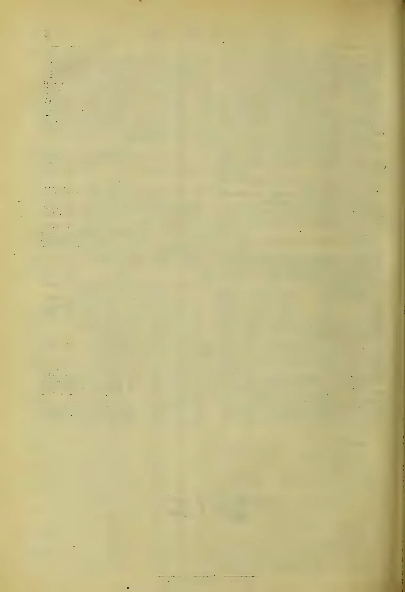This image is a scan of a blank page. The background is a light beige or off-white color. There are several small, dark specks scattered across the page, which appear to be scanning artifacts or dust. A faint, vertical line or shadow is visible on the right side of the page, possibly due to the scanning process or the edge of the paper. The overall texture is slightly grainy.

1200------------------------------------------------

# TEA, COFFEE, CINCHONA, COCOA, AND CARDAMOM SALES.

**No. 1.**

COLOMBO, January, 5th 1904.

PRICE:—12½ cents each, 3 copies  
30 cents; 6 copies ½ rupee.

## COLOMBO SALES OF TEA.

### LARGE LOTS.

#### Messrs E. Benham & Co.

[55,985.]

<table border="1">
<thead>
<tr>
<th></th>
<th>Pkgs.</th>
<th>Name.</th>
<th>lb.</th>
<th>c.</th>
</tr>
</thead>
<tbody>
<tr>
<td>Battalgalla, Inv. No. 59</td>
<td>36 ch</td>
<td>bro pek</td>
<td>3600</td>
<td>38 bid</td>
</tr>
<tr>
<td></td>
<td>12 do</td>
<td>or pek</td>
<td>1080</td>
<td>37 bid</td>
</tr>
<tr>
<td></td>
<td>20 do</td>
<td>pek</td>
<td>1600</td>
<td>35 bid</td>
</tr>
<tr>
<td>Battalgalla, Inv. No. 60</td>
<td>20 ch</td>
<td>bro pek</td>
<td>2000</td>
<td>38 bid</td>
</tr>
<tr>
<td></td>
<td>12 do</td>
<td>or pek</td>
<td>1080</td>
<td>37 bid</td>
</tr>
<tr>
<td></td>
<td>16 do</td>
<td>pek</td>
<td>1360</td>
<td>36 bid</td>
</tr>
<tr>
<td>Battalgalla, Inv. No. 62</td>
<td>20 ch</td>
<td>bro pek</td>
<td>2000</td>
<td>38 bid</td>
</tr>
<tr>
<td></td>
<td>12 do</td>
<td>or pek</td>
<td>1080</td>
<td>37 bid</td>
</tr>
<tr>
<td></td>
<td>14 do</td>
<td>pek</td>
<td>1190</td>
<td>36 bid</td>
</tr>
<tr>
<td>Goodnestone</td>
<td>14 ch</td>
<td>bro or pek</td>
<td>1050</td>
<td>34 bid</td>
</tr>
<tr>
<td></td>
<td>15 do</td>
<td>pek No. 1</td>
<td>1200</td>
<td>35 bid</td>
</tr>
<tr>
<td>Hornsey</td>
<td>38 hf ch</td>
<td>bro or pek</td>
<td>2280</td>
<td>49</td>
</tr>
<tr>
<td></td>
<td>11 ch</td>
<td>or pek</td>
<td>1045</td>
<td>41</td>
</tr>
<tr>
<td></td>
<td>26 do</td>
<td>pek</td>
<td>2470</td>
<td>37</td>
</tr>
<tr>
<td>Southwark</td>
<td>66 ch</td>
<td>bro pek</td>
<td>5940</td>
<td>33</td>
</tr>
<tr>
<td></td>
<td>19 do</td>
<td>pek</td>
<td>1520</td>
<td>33</td>
</tr>
<tr>
<td>Kinchin</td>
<td>22 hf ch</td>
<td>bro pek</td>
<td>1276</td>
<td>34 bid</td>
</tr>
<tr>
<td></td>
<td>23 do</td>
<td>or pek No. 1</td>
<td>1150</td>
<td>39</td>
</tr>
<tr>
<td></td>
<td>15 ch</td>
<td>or pek</td>
<td>1200</td>
<td>36 bid</td>
</tr>
<tr>
<td></td>
<td>16 do</td>
<td>pek</td>
<td>1360</td>
<td>35</td>
</tr>
<tr>
<td>U. H. O.</td>
<td>21 ch</td>
<td>bro or pek</td>
<td>1890</td>
<td>37 bid</td>
</tr>
<tr>
<td></td>
<td>17 do</td>
<td>bro pek</td>
<td>1530</td>
<td>34 bid</td>
</tr>
<tr>
<td></td>
<td>22 do</td>
<td>or pek</td>
<td>1980</td>
<td>36</td>
</tr>
<tr>
<td></td>
<td>32 do</td>
<td>pek</td>
<td>2880</td>
<td>35</td>
</tr>
<tr>
<td>Bunyan and Ovoca</td>
<td>33 hf ch</td>
<td>bro or pek</td>
<td>1980</td>
<td>57</td>
</tr>
<tr>
<td></td>
<td>49 do</td>
<td>or pek</td>
<td>2450</td>
<td>45</td>
</tr>
<tr>
<td></td>
<td>25 ch</td>
<td>pek</td>
<td>2375</td>
<td>37 bid</td>
</tr>
<tr>
<td></td>
<td>20 hf ch</td>
<td>pek fans</td>
<td>1300</td>
<td>28 bid</td>
</tr>
</tbody>
</table>

#### Messrs. Forbes & Walker.

[1,099,483.]

<table border="1">
<thead>
<tr>
<th></th>
<th>Pkgs.</th>
<th>Name.</th>
<th>lb.</th>
<th>c.</th>
</tr>
</thead>
<tbody>
<tr>
<td>Holton</td>
<td>25 ch</td>
<td>bro pek</td>
<td>2375</td>
<td>36</td>
</tr>
<tr>
<td></td>
<td>16 do</td>
<td>pek</td>
<td>1360</td>
<td>35</td>
</tr>
<tr>
<td>Munukettia Ceylon, in est. mark Inv. No. 20</td>
<td>23 hf ch</td>
<td>bro or pek</td>
<td>1334</td>
<td>49</td>
</tr>
<tr>
<td></td>
<td>28 do</td>
<td>bro pek</td>
<td>1680</td>
<td>41</td>
</tr>
<tr>
<td></td>
<td>12 dh</td>
<td>or pek</td>
<td>1008</td>
<td>39</td>
</tr>
<tr>
<td></td>
<td>27 do</td>
<td>pek</td>
<td>2106</td>
<td>36</td>
</tr>
<tr>
<td>Munukettia Ceylon, in estate mark, Invoice No. 21</td>
<td>13 ch</td>
<td>dust</td>
<td>1040</td>
<td>29</td>
</tr>
<tr>
<td>Glencorse</td>
<td>13 ch</td>
<td>bro pek</td>
<td>1300</td>
<td>47</td>
</tr>
<tr>
<td></td>
<td>12 do</td>
<td>pek</td>
<td>1020</td>
<td>37</td>
</tr>
<tr>
<td></td>
<td>15 do</td>
<td>pek sou</td>
<td>1275</td>
<td>35</td>
</tr>
<tr>
<td>Stockholm</td>
<td>23 ch</td>
<td>bro pek</td>
<td>2300</td>
<td>withd'n.</td>
</tr>
<tr>
<td></td>
<td>24 hf ch</td>
<td>bro or pek</td>
<td>1320</td>
<td>do</td>
</tr>
<tr>
<td></td>
<td>23 ch</td>
<td>pek</td>
<td>1 55</td>
<td>do</td>
</tr>
<tr>
<td>Fredsruhe</td>
<td>20 ch</td>
<td>bro pek</td>
<td>2600</td>
<td>38</td>
</tr>
<tr>
<td></td>
<td>16 do</td>
<td>pek</td>
<td>1600</td>
<td>36</td>
</tr>
<tr>
<td>Rickarton, Invoice No. 10</td>
<td>38 hf ch</td>
<td>bro or pek</td>
<td>2090</td>
<td>46</td>
</tr>
<tr>
<td></td>
<td>25 ch</td>
<td>or pek</td>
<td>2375</td>
<td>40</td>
</tr>
<tr>
<td></td>
<td>32 do</td>
<td>pek</td>
<td>2880</td>
<td>38</td>
</tr>
<tr>
<td></td>
<td>14 do</td>
<td>bro tea</td>
<td>1400</td>
<td>38</td>
</tr>
<tr>
<td>Marakona</td>
<td>13 ch</td>
<td>pek sou</td>
<td>1170</td>
<td>31</td>
</tr>
<tr>
<td>North Matale</td>
<td>17 hf ch</td>
<td>dust</td>
<td>1360</td>
<td>25</td>
</tr>
<tr>
<td>Norfolk</td>
<td>16 ch</td>
<td>bro pek</td>
<td>1600</td>
<td>34 bid</td>
</tr>
<tr>
<td></td>
<td>18 do</td>
<td>pek</td>
<td>1710</td>
<td>33</td>
</tr>
<tr>
<td></td>
<td>15 do</td>
<td>pek sou</td>
<td>1275</td>
<td>31</td>
</tr>
<tr>
<td>Glenorchy</td>
<td>57 hf ch</td>
<td>bro pek</td>
<td>3135</td>
<td>53</td>
</tr>
<tr>
<td></td>
<td>31 ch</td>
<td>pek</td>
<td>2945</td>
<td>43</td>
</tr>
<tr>
<td>Great Volley, Ceylon in estate mark</td>
<td>30 hf ch</td>
<td>bro or pek</td>
<td>1680</td>
<td>40</td>
</tr>
<tr>
<td></td>
<td>14 ch</td>
<td>or pek</td>
<td>1260</td>
<td>38</td>
</tr>
<tr>
<td></td>
<td>40 do</td>
<td>pek</td>
<td>3520</td>
<td>35</td>
</tr>
<tr>
<td></td>
<td>13 do</td>
<td>pek sou</td>
<td>1040</td>
<td>32</td>
</tr>
</tbody>
</table>

<table border="1">
<thead>
<tr>
<th></th>
<th>Pkgs.</th>
<th>Name.</th>
<th>lb.</th>
<th>c.</th>
</tr>
</thead>
<tbody>
<tr>
<td>Sirikandura</td>
<td>25 ch</td>
<td>bro pek</td>
<td>2500</td>
<td>36</td>
</tr>
<tr>
<td></td>
<td>24 do</td>
<td>pek</td>
<td>2160</td>
<td>35</td>
</tr>
<tr>
<td></td>
<td>26 do</td>
<td>pek sou</td>
<td>1950</td>
<td>32</td>
</tr>
<tr>
<td>Talgaswella, Invoice No. 23</td>
<td>12 ch</td>
<td>bro or pek</td>
<td>1200</td>
<td>40</td>
</tr>
<tr>
<td></td>
<td>13 do</td>
<td>pek sou</td>
<td>1079</td>
<td>33</td>
</tr>
<tr>
<td>R S B</td>
<td>20 hf ch</td>
<td>bro pek fans</td>
<td>1400</td>
<td>33 bid</td>
</tr>
<tr>
<td>Beverley</td>
<td>20 hf ch</td>
<td>bro or pek</td>
<td>1100</td>
<td>43</td>
</tr>
<tr>
<td></td>
<td>27 do</td>
<td>or pek</td>
<td>1494</td>
<td>40</td>
</tr>
<tr>
<td></td>
<td>39 do</td>
<td>pek</td>
<td>1950</td>
<td>35</td>
</tr>
<tr>
<td></td>
<td>15 ch</td>
<td>fans</td>
<td>1050</td>
<td>34</td>
</tr>
<tr>
<td>D. K. G. in estate mark</td>
<td>16 ch</td>
<td>bro pek</td>
<td>1600</td>
<td>37</td>
</tr>
<tr>
<td></td>
<td>16 do</td>
<td>or pek</td>
<td>1280</td>
<td>35</td>
</tr>
<tr>
<td></td>
<td>13 do</td>
<td>pek</td>
<td>1040</td>
<td>34</td>
</tr>
<tr>
<td>Lindupatna</td>
<td>13 ch</td>
<td>bro or pek</td>
<td>1352</td>
<td>48</td>
</tr>
<tr>
<td></td>
<td>35 do</td>
<td>or pek</td>
<td>3640</td>
<td>39</td>
</tr>
<tr>
<td></td>
<td>20 do</td>
<td>pek</td>
<td>1760</td>
<td>37</td>
</tr>
<tr>
<td>Coldstream Group</td>
<td>58 hf ch</td>
<td>bro pek</td>
<td>2900</td>
<td>36</td>
</tr>
<tr>
<td></td>
<td>16 ch</td>
<td>pek</td>
<td>1280</td>
<td>35</td>
</tr>
<tr>
<td>Batakelle</td>
<td>10 ch</td>
<td>bro pek</td>
<td>1000</td>
<td>32</td>
</tr>
<tr>
<td></td>
<td>10 do</td>
<td>pek</td>
<td>1000</td>
<td>32</td>
</tr>
<tr>
<td>Mahakande</td>
<td>12 do</td>
<td>bro pek</td>
<td>1200</td>
<td>35</td>
</tr>
<tr>
<td></td>
<td>25 do</td>
<td>pek</td>
<td>2000</td>
<td>35</td>
</tr>
<tr>
<td>O B E C in est. mark, Darrawella</td>
<td>28 hf ch</td>
<td>bro or pek</td>
<td>1540</td>
<td>48</td>
</tr>
<tr>
<td></td>
<td>25 ch</td>
<td>bro pek</td>
<td>2500</td>
<td>40</td>
</tr>
<tr>
<td></td>
<td>27 do</td>
<td>or pek</td>
<td>2214</td>
<td>40</td>
</tr>
<tr>
<td></td>
<td>58 do</td>
<td>pek</td>
<td>4930</td>
<td>37</td>
</tr>
<tr>
<td></td>
<td>26 do</td>
<td>pek sou</td>
<td>1950</td>
<td>34</td>
</tr>
<tr>
<td></td>
<td>20 hf ch</td>
<td>fans</td>
<td>1300</td>
<td>34</td>
</tr>
<tr>
<td>Moray</td>
<td>167 hf ch</td>
<td>young hyson</td>
<td>9185</td>
<td>38 bid</td>
</tr>
<tr>
<td></td>
<td>163 do</td>
<td>hyson</td>
<td>8150</td>
<td>36 bid</td>
</tr>
<tr>
<td></td>
<td>39 do</td>
<td>hyson No. 2</td>
<td>2145</td>
<td>35</td>
</tr>
<tr>
<td></td>
<td>22 do</td>
<td>siftings</td>
<td>1760</td>
<td>17</td>
</tr>
<tr>
<td>Glenrhos, Invoice No. 16</td>
<td>12 ch</td>
<td>bro pek</td>
<td>1200</td>
<td>37</td>
</tr>
<tr>
<td>Glanrhos, Invoice No. 1</td>
<td>15 ch</td>
<td>pek</td>
<td>1350</td>
<td>34</td>
</tr>
<tr>
<td>H B L</td>
<td>16 ch</td>
<td>bro pek</td>
<td>1472</td>
<td>36</td>
</tr>
<tr>
<td></td>
<td>18 do</td>
<td>pek</td>
<td>1548</td>
<td>34</td>
</tr>
<tr>
<td></td>
<td>14 do</td>
<td>pek sou</td>
<td>1120</td>
<td>30 bid</td>
</tr>
<tr>
<td>N K</td>
<td>22 hf ch</td>
<td>fans</td>
<td>1540</td>
<td>29</td>
</tr>
<tr>
<td>Robgill</td>
<td>20 hf ch</td>
<td>bro or pek</td>
<td>1000</td>
<td>47</td>
</tr>
<tr>
<td></td>
<td>23 ch</td>
<td>bro pek</td>
<td>2070</td>
<td>41</td>
</tr>
<tr>
<td></td>
<td>21 do</td>
<td>pek</td>
<td>1680</td>
<td>39</td>
</tr>
<tr>
<td>K P W</td>
<td>25 hf ch</td>
<td>bro or pek</td>
<td>1375</td>
<td>40</td>
</tr>
<tr>
<td></td>
<td>80 do</td>
<td>bro pek</td>
<td>4000</td>
<td>35</td>
</tr>
<tr>
<td></td>
<td>70 do</td>
<td>pek</td>
<td>3500</td>
<td>34</td>
</tr>
<tr>
<td></td>
<td>30 do</td>
<td>pek sou</td>
<td>1500</td>
<td>31</td>
</tr>
<tr>
<td>Stamford Hill</td>
<td>27 hf ch</td>
<td>bro or pek</td>
<td>1512</td>
<td>56</td>
</tr>
<tr>
<td></td>
<td>48 do</td>
<td>bro pek</td>
<td>2880</td>
<td>40</td>
</tr>
<tr>
<td></td>
<td>36 do</td>
<td>or pek</td>
<td>1800</td>
<td>42</td>
</tr>
<tr>
<td></td>
<td>45 do</td>
<td>pek</td>
<td>4050</td>
<td>39</td>
</tr>
<tr>
<td></td>
<td>15 do</td>
<td>pek sou</td>
<td>1350</td>
<td>37</td>
</tr>
<tr>
<td>Vogan</td>
<td>11 ch</td>
<td>bro or pek</td>
<td>1045</td>
<td>51</td>
</tr>
<tr>
<td></td>
<td>15 do</td>
<td>or pek</td>
<td>1350</td>
<td>37</td>
</tr>
<tr>
<td></td>
<td>21 do</td>
<td>pek</td>
<td>1890</td>
<td>36</td>
</tr>
<tr>
<td>Tembiliga</td>
<td>10 ch</td>
<td>bro or pek</td>
<td>1000</td>
<td>38</td>
</tr>
<tr>
<td></td>
<td>15 do</td>
<td>or pek</td>
<td>1455</td>
<td>37</td>
</tr>
<tr>
<td></td>
<td>15 do</td>
<td>pek</td>
<td>1200</td>
<td>36</td>
</tr>
<tr>
<td>Waita awa</td>
<td>24 hf ch</td>
<td>bro pek</td>
<td>1200</td>
<td>40</td>
</tr>
<tr>
<td></td>
<td>34 do</td>
<td>pek</td>
<td>1700</td>
<td>36</td>
</tr>
<tr>
<td></td>
<td>33 do</td>
<td>pek sou</td>
<td>1650</td>
<td>33</td>
</tr>
<tr>
<td>Nugagalla</td>
<td>39 hf ch</td>
<td>bro pek</td>
<td>1950</td>
<td>39 bid</td>
</tr>
<tr>
<td></td>
<td>73 do</td>
<td>pek</td>
<td>3650</td>
<td>36</td>
</tr>
<tr>
<td>Looloowatte</td>
<td>29 hf ch</td>
<td>bro pek</td>
<td>1450</td>
<td>33</td>
</tr>
<tr>
<td></td>
<td>54 do</td>
<td>pek</td>
<td>2700</td>
<td>35</td>
</tr>
<tr>
<td>Roberry, Z 2</td>
<td>19 ch</td>
<td>bro or pek</td>
<td>1900</td>
<td>50</td>
</tr>
<tr>
<td></td>
<td>43 do</td>
<td>bro pek</td>
<td>4300</td>
<td>40</td>
</tr>
<tr>
<td></td>
<td>38 do</td>
<td>pek</td>
<td>3610</td>
<td>39</td>
</tr>
<tr>
<td>St. Heliers</td>
<td>31 hf ch</td>
<td>bro or pek</td>
<td>1705</td>
<td>39</td>
</tr>
<tr>
<td></td>
<td>12 ch</td>
<td>pek</td>
<td>1104</td>
<td>36</td>
</tr>
<tr>
<td>Queensland</td>
<td>19 hf ch</td>
<td>bro or pek</td>
<td>1045</td>
<td>49</td>
</tr>
<tr>
<td></td>
<td>20 ch</td>
<td>bro pek</td>
<td>1900</td>
<td>42</td>
</tr>
<tr>
<td></td>
<td>12 do</td>
<td>pek</td>
<td>1020</td>
<td>37</td>
</tr>
<tr>
<td>Penrhyn</td>
<td>13 ch</td>
<td>bro or pek</td>
<td>1300</td>
<td>38</td>
</tr>
<tr>
<td></td>
<td>13 do</td>
<td>bro pek</td>
<td>1235</td>
<td>35 bid</td>
</tr>
<tr>
<td></td>
<td>13 do</td>
<td>or pek</td>
<td>1040</td>
<td>38</td>
</tr>
</tbody>
</table>

1201------------------------------------------------

2 CEYLON PRODUCE SALES LIST.

<table border="1">
<thead>
<tr>
<th></th>
<th>Pkgs.</th>
<th>Name.</th>
<th>lb.</th>
<th>c</th>
</tr>
</thead>
<tbody>
<tr>
<td>Udaveria</td>
<td>26 hf ch</td>
<td>bro or pek</td>
<td>1508</td>
<td>52</td>
</tr>
<tr>
<td></td>
<td>46 do</td>
<td>or pek</td>
<td>2576</td>
<td>42</td>
</tr>
<tr>
<td></td>
<td>40 do</td>
<td>pek</td>
<td>2000</td>
<td>39</td>
</tr>
<tr>
<td>Erismere</td>
<td>28 hf ch</td>
<td>bro or pek</td>
<td>1484</td>
<td>42</td>
</tr>
<tr>
<td></td>
<td>20 ch</td>
<td>bro pek</td>
<td>1880</td>
<td>39</td>
</tr>
<tr>
<td></td>
<td>19 do</td>
<td>pek</td>
<td>1672</td>
<td>36</td>
</tr>
<tr>
<td>Ardlaw and Wish- fird</td>
<td>17 hf ch</td>
<td>bro pek</td>
<td>1020</td>
<td>44</td>
</tr>
<tr>
<td>Sylvakandy</td>
<td>37 ch</td>
<td>bro or pek</td>
<td>3700</td>
<td>40</td>
</tr>
<tr>
<td></td>
<td>21 do</td>
<td>bro pek</td>
<td>2100</td>
<td>38</td>
</tr>
<tr>
<td></td>
<td>25 do</td>
<td>pek</td>
<td>2375</td>
<td>36</td>
</tr>
<tr>
<td>Tonacombe</td>
<td>54 ch</td>
<td>bro pek</td>
<td>5400</td>
<td>40</td>
</tr>
<tr>
<td></td>
<td>41 do</td>
<td>pek</td>
<td>3485</td>
<td>37</td>
</tr>
<tr>
<td></td>
<td>15 do</td>
<td>pek sou</td>
<td>1200</td>
<td>34</td>
</tr>
<tr>
<td></td>
<td>12 hf ch</td>
<td>dust</td>
<td>1020</td>
<td>28</td>
</tr>
<tr>
<td>Bundland</td>
<td>28 hf ch</td>
<td>bro or pek</td>
<td>1568</td>
<td>42</td>
</tr>
<tr>
<td>Mudamana</td>
<td>23 ch</td>
<td>fans</td>
<td>2990</td>
<td>14</td>
</tr>
<tr>
<td>Glencairn</td>
<td>25 hf ch</td>
<td>bro pek dust</td>
<td>2000</td>
<td>29</td>
</tr>
<tr>
<td>Putupaula</td>
<td>11 ch</td>
<td>bro or pek</td>
<td>1100</td>
<td>43</td>
</tr>
<tr>
<td></td>
<td>53 do</td>
<td>or pek</td>
<td>4505</td>
<td>36</td>
</tr>
<tr>
<td></td>
<td>41 do</td>
<td>pek</td>
<td>3075</td>
<td>34 bid</td>
</tr>
<tr>
<td>Palmerston</td>
<td>20 hf ch</td>
<td>bro or pek</td>
<td>1160</td>
<td>58</td>
</tr>
<tr>
<td></td>
<td>18 do</td>
<td>bro pek</td>
<td>1008</td>
<td>49</td>
</tr>
<tr>
<td></td>
<td>17 do</td>
<td>pek</td>
<td>1360</td>
<td>44</td>
</tr>
<tr>
<td>Wewewatte</td>
<td>24 hf ch</td>
<td>bro pek</td>
<td>1320</td>
<td>36 bid</td>
</tr>
<tr>
<td></td>
<td>19 do</td>
<td>pek</td>
<td>1145</td>
<td>34 bid</td>
</tr>
<tr>
<td>Ireby</td>
<td>65 hf ch</td>
<td>bro pek</td>
<td>3575</td>
<td>47</td>
</tr>
<tr>
<td></td>
<td>31 ch</td>
<td>pek</td>
<td>2635</td>
<td>43</td>
</tr>
<tr>
<td></td>
<td>13 do</td>
<td>pek sou</td>
<td>1105</td>
<td>38</td>
</tr>
<tr>
<td>Lebanon Group</td>
<td>51 ch</td>
<td>bro pek</td>
<td>5100</td>
<td>35</td>
</tr>
<tr>
<td></td>
<td>15 do</td>
<td>pek</td>
<td>1325</td>
<td>36</td>
</tr>
<tr>
<td></td>
<td>18 do</td>
<td>pek</td>
<td>1530</td>
<td>36</td>
</tr>
<tr>
<td>Mousakellie</td>
<td>10 ch</td>
<td>bro or pek</td>
<td>1000</td>
<td>40</td>
</tr>
<tr>
<td></td>
<td>14 do</td>
<td>pek</td>
<td>1260</td>
<td>37</td>
</tr>
<tr>
<td>Lebanon Group</td>
<td>29 ch</td>
<td>bro pek</td>
<td>2900</td>
<td>37</td>
</tr>
<tr>
<td></td>
<td>20 do</td>
<td>bro pek</td>
<td>2000</td>
<td>38</td>
</tr>
<tr>
<td></td>
<td>29 do</td>
<td>pek</td>
<td>2465</td>
<td>36</td>
</tr>
<tr>
<td>Mahawala, Invoice No. 27</td>
<td>17 ch</td>
<td>bro pek</td>
<td>1700</td>
<td>37</td>
</tr>
<tr>
<td></td>
<td>23 do</td>
<td>or pek</td>
<td>2070</td>
<td>36</td>
</tr>
<tr>
<td></td>
<td>35 do</td>
<td>pek</td>
<td>3150</td>
<td>36</td>
</tr>
<tr>
<td></td>
<td>17 do</td>
<td>pek sou</td>
<td>1530</td>
<td>33</td>
</tr>
<tr>
<td>Geragama, Invoice No. 42</td>
<td>18 ch</td>
<td>bro pek</td>
<td>1620</td>
<td>36 bid</td>
</tr>
<tr>
<td></td>
<td>39 do</td>
<td>pek</td>
<td>3120</td>
<td>34 bid</td>
</tr>
<tr>
<td>Hapugastenne, Invoice No. 34</td>
<td>19 ch</td>
<td>bro or pek</td>
<td>1900</td>
<td>44</td>
</tr>
<tr>
<td></td>
<td>29 do</td>
<td>bro pek</td>
<td>2987</td>
<td>37 bid</td>
</tr>
<tr>
<td></td>
<td>69 do</td>
<td>pek</td>
<td>6210</td>
<td>37 bid</td>
</tr>
<tr>
<td></td>
<td>43 do</td>
<td>pek sou</td>
<td>3655</td>
<td>36</td>
</tr>
<tr>
<td>Warakamure</td>
<td>30 ch</td>
<td>pek sou</td>
<td>2400</td>
<td>with n</td>
</tr>
<tr>
<td>Rozelle</td>
<td>48 ch</td>
<td>bro or pek</td>
<td>5040</td>
<td>39</td>
</tr>
<tr>
<td></td>
<td>27 do</td>
<td>or pek</td>
<td>2160</td>
<td>38</td>
</tr>
<tr>
<td></td>
<td>23 do</td>
<td>pek</td>
<td>1840</td>
<td>36</td>
</tr>
<tr>
<td>Inverness</td>
<td>34 ch</td>
<td>bro or pek</td>
<td>3400</td>
<td>47</td>
</tr>
<tr>
<td></td>
<td>58 do</td>
<td>or pek</td>
<td>5220</td>
<td>43</td>
</tr>
<tr>
<td></td>
<td>42 do</td>
<td>pek</td>
<td>3570</td>
<td>41</td>
</tr>
<tr>
<td>St. Vigeans</td>
<td>18 hf ch</td>
<td>bro or pek</td>
<td>1098</td>
<td>45</td>
</tr>
<tr>
<td></td>
<td>12 do</td>
<td>pek</td>
<td>1140</td>
<td>38</td>
</tr>
<tr>
<td>Killarney</td>
<td>20 hf ch</td>
<td>bro or pek</td>
<td>1120</td>
<td>52 bid</td>
</tr>
<tr>
<td></td>
<td>30 do</td>
<td>bro pek</td>
<td>1680</td>
<td>42</td>
</tr>
<tr>
<td></td>
<td>12 ch</td>
<td>or pek</td>
<td>1020</td>
<td>46</td>
</tr>
<tr>
<td></td>
<td>18 do</td>
<td>pek</td>
<td>1476</td>
<td>39</td>
</tr>
<tr>
<td>Carfax</td>
<td>23 ch</td>
<td>or pek</td>
<td>2070</td>
<td>40</td>
</tr>
<tr>
<td></td>
<td>23 do</td>
<td>pek</td>
<td>2070</td>
<td>38</td>
</tr>
<tr>
<td>Battawatte</td>
<td>39 hf ch</td>
<td>bro or pek</td>
<td>2535</td>
<td>40</td>
</tr>
<tr>
<td></td>
<td>26 ch</td>
<td>or pek</td>
<td>2470</td>
<td>39</td>
</tr>
<tr>
<td></td>
<td>27 do</td>
<td>pek</td>
<td>2565</td>
<td>37</td>
</tr>
<tr>
<td></td>
<td>13 do</td>
<td>pek sou</td>
<td>1170</td>
<td>32</td>
</tr>
<tr>
<td>Kirklees</td>
<td>30 hf ch</td>
<td>bro or pek</td>
<td>1740</td>
<td>46</td>
</tr>
<tr>
<td></td>
<td>25 do</td>
<td>bro pek</td>
<td>1450</td>
<td>41</td>
</tr>
<tr>
<td></td>
<td>29 do</td>
<td>or pek</td>
<td>1508</td>
<td>39</td>
</tr>
<tr>
<td>Dammeria</td>
<td>10 ch</td>
<td>bro or pek</td>
<td>1000</td>
<td>34 bid</td>
</tr>
<tr>
<td></td>
<td>43 do</td>
<td>bro pek</td>
<td>3863</td>
<td>34 bid</td>
</tr>
<tr>
<td></td>
<td>25 do</td>
<td>pek</td>
<td>2250</td>
<td>32 bid</td>
</tr>
<tr>
<td></td>
<td>25 do</td>
<td>pek sou</td>
<td>2250</td>
<td>30 bid</td>
</tr>
<tr>
<td>High Forest</td>
<td>42 hf ch</td>
<td>or pek No. 1</td>
<td>2268</td>
<td>57</td>
</tr>
<tr>
<td></td>
<td>30 do</td>
<td>bro pek</td>
<td>1800</td>
<td>57</td>
</tr>
<tr>
<td></td>
<td>21 do</td>
<td>or pek</td>
<td>1113</td>
<td>46</td>
</tr>
<tr>
<td></td>
<td>27 do</td>
<td>pek</td>
<td>1296</td>
<td>43</td>
</tr>
<tr>
<td>Maha Uva</td>
<td>48 hf ch</td>
<td>bro or pek</td>
<td>2880</td>
<td>45</td>
</tr>
<tr>
<td></td>
<td>13 ch</td>
<td>or pek</td>
<td>1235</td>
<td>42</td>
</tr>
<tr>
<td></td>
<td>12 do</td>
<td>pek</td>
<td>1080</td>
<td>41</td>
</tr>
</tbody>
</table>

<table border="1">
<thead>
<tr>
<th></th>
<th>Pkgs.</th>
<th>Name.</th>
<th>b.</th>
<th>c.</th>
</tr>
</thead>
<tbody>
<tr>
<td>Polatagama</td>
<td>22 ch</td>
<td>bro or pek</td>
<td>2200</td>
<td>37 bid</td>
</tr>
<tr>
<td></td>
<td>30 do</td>
<td>bro pek</td>
<td>2700</td>
<td>36 bid</td>
</tr>
<tr>
<td></td>
<td>13 do</td>
<td>or pek</td>
<td>1300</td>
<td>35 bid</td>
</tr>
<tr>
<td></td>
<td>69 do</td>
<td>pek</td>
<td>5865</td>
<td>33 bid</td>
</tr>
<tr>
<td></td>
<td>14 do</td>
<td>pek sou</td>
<td>1190</td>
<td>32 bid</td>
</tr>
<tr>
<td></td>
<td>17 do</td>
<td>fans</td>
<td>1615</td>
<td>26 bid</td>
</tr>
<tr>
<td>Mousakellie</td>
<td>14 ch</td>
<td>bro or pek</td>
<td>1400</td>
<td>40</td>
</tr>
<tr>
<td></td>
<td>16 do</td>
<td>pek</td>
<td>1440</td>
<td>37</td>
</tr>
<tr>
<td>Telbedde</td>
<td>15 hf ch</td>
<td>dust</td>
<td>1230</td>
<td>32</td>
</tr>
<tr>
<td>Marlborough</td>
<td>53 hf ch</td>
<td>bro or pek</td>
<td>2756</td>
<td>41 bid</td>
</tr>
<tr>
<td></td>
<td>27 ch</td>
<td>bro pek</td>
<td>2700</td>
<td>38</td>
</tr>
<tr>
<td></td>
<td>31 do</td>
<td>pek</td>
<td>2852</td>
<td>36 bid</td>
</tr>
<tr>
<td>Castlereagh</td>
<td>32 hf ch</td>
<td>bro or pek</td>
<td>1600</td>
<td>41 bid</td>
</tr>
<tr>
<td></td>
<td>12 ch</td>
<td>bro pek</td>
<td>1140</td>
<td>38</td>
</tr>
<tr>
<td></td>
<td>13 ch</td>
<td>pek</td>
<td>1170</td>
<td>36 bid</td>
</tr>
<tr>
<td>T T</td>
<td>17 ch</td>
<td>siftings</td>
<td>1700</td>
<td>6</td>
</tr>
<tr>
<td>Arapolakande</td>
<td>8 ch</td>
<td>siftings</td>
<td>1000</td>
<td>15</td>
</tr>
<tr>
<td>Castlereagh</td>
<td>43 hf ch</td>
<td>bro or pek</td>
<td>2150</td>
<td>40 bid</td>
</tr>
<tr>
<td></td>
<td>14 ch</td>
<td>or pek</td>
<td>1120</td>
<td>38</td>
</tr>
<tr>
<td></td>
<td>13 hf ch</td>
<td>fans</td>
<td>1040</td>
<td>34</td>
</tr>
<tr>
<td>Poonagalla</td>
<td>60 ch</td>
<td>bro pek</td>
<td>5160</td>
<td>51</td>
</tr>
<tr>
<td></td>
<td>33 do</td>
<td>pek</td>
<td>3036</td>
<td>38 bid</td>
</tr>
<tr>
<td>Yelverton</td>
<td>32 hf ch</td>
<td>bro pek</td>
<td>1792</td>
<td>38 bid</td>
</tr>
<tr>
<td></td>
<td>12 ch</td>
<td>pek</td>
<td>1020</td>
<td>36 bid</td>
</tr>
<tr>
<td>N. Eliya</td>
<td>16 hf ch</td>
<td>bro pek fans</td>
<td>1013</td>
<td>28 bid</td>
</tr>
<tr>
<td>L L D</td>
<td>39 ch</td>
<td>bro or pek</td>
<td>4095</td>
<td>28 bid</td>
</tr>
<tr>
<td>H, in est. mark</td>
<td>40 ch</td>
<td>green tea</td>
<td>3400</td>
<td>14 bid</td>
</tr>
<tr>
<td>Monkswood, Inv. No. 19</td>
<td>23 hf ch</td>
<td>bro or pek</td>
<td>1265</td>
<td>68</td>
</tr>
<tr>
<td></td>
<td>30 do</td>
<td>or pek</td>
<td>1500</td>
<td>56</td>
</tr>
<tr>
<td></td>
<td>33 ch</td>
<td>pek</td>
<td>2970</td>
<td>45</td>
</tr>
<tr>
<td>Wella, Inv. No. 12</td>
<td>88 hf ch</td>
<td>bro pek</td>
<td>4840</td>
<td>36</td>
</tr>
<tr>
<td></td>
<td>66 do</td>
<td>pek</td>
<td>3300</td>
<td>36</td>
</tr>
<tr>
<td>Nahalma, Invoice No. 32</td>
<td>11 ch</td>
<td>or pek</td>
<td>1012</td>
<td>37</td>
</tr>
<tr>
<td></td>
<td>13 do</td>
<td>bro or pek</td>
<td>1300</td>
<td>37</td>
</tr>
<tr>
<td></td>
<td>13 do</td>
<td>bro pek</td>
<td>1274</td>
<td>33 bid</td>
</tr>
<tr>
<td></td>
<td>19 do</td>
<td>pek</td>
<td>1748</td>
<td>35</td>
</tr>
<tr>
<td>Delta, Invoice No. 26</td>
<td>29 hf ch</td>
<td>bro or pek</td>
<td>1856</td>
<td>38 bid</td>
</tr>
<tr>
<td></td>
<td>24 ch</td>
<td>bro pe No. 1</td>
<td>2400</td>
<td>37</td>
</tr>
<tr>
<td></td>
<td>12 do</td>
<td>bro pe No. 2</td>
<td>1296</td>
<td>35</td>
</tr>
<tr>
<td></td>
<td>12 do</td>
<td>pek</td>
<td>1044</td>
<td>37</td>
</tr>
<tr>
<td>Opalgalla</td>
<td>17 hf ch</td>
<td>dust</td>
<td>1360</td>
<td>26</td>
</tr>
<tr>
<td>Agraoya, Invoice No. 17</td>
<td>50 hf ch</td>
<td>bro pek</td>
<td>3100</td>
<td>40</td>
</tr>
<tr>
<td></td>
<td>31 do</td>
<td>or pek</td>
<td>1643</td>
<td>38</td>
</tr>
<tr>
<td></td>
<td>12 ch</td>
<td>pek</td>
<td>1140</td>
<td>36</td>
</tr>
<tr>
<td>Swinton, Invoice No. 11</td>
<td>17 ch</td>
<td>bro or pek</td>
<td>1785</td>
<td>38</td>
</tr>
<tr>
<td></td>
<td>23 do</td>
<td>or pek</td>
<td>2300</td>
<td>36 bid</td>
</tr>
<tr>
<td></td>
<td>21 do</td>
<td>pek</td>
<td>1995</td>
<td>36 bid</td>
</tr>
<tr>
<td></td>
<td>16 do</td>
<td>pek sou</td>
<td>1520</td>
<td>34</td>
</tr>
<tr>
<td>Ambalangoda</td>
<td>13 ch</td>
<td>or pek</td>
<td>1300</td>
<td>36 bid</td>
</tr>
<tr>
<td></td>
<td>15 do</td>
<td>pek</td>
<td>1425</td>
<td>36 bid</td>
</tr>
<tr>
<td>Galapitakande</td>
<td>10 do</td>
<td>bro pek</td>
<td>1000</td>
<td>39</td>
</tr>
<tr>
<td></td>
<td>12 ch</td>
<td>pek</td>
<td>1140</td>
<td>37</td>
</tr>
<tr>
<td>Rilpolla, In. No. 5</td>
<td>14 ch</td>
<td>bro pek</td>
<td>1470</td>
<td>43</td>
</tr>
<tr>
<td></td>
<td>19 do</td>
<td>pek</td>
<td>1748</td>
<td>41</td>
</tr>
<tr>
<td>Rookatenne</td>
<td>13 ch</td>
<td>bro pek</td>
<td>1430</td>
<td>42</td>
</tr>
<tr>
<td></td>
<td>12 do</td>
<td>pek</td>
<td>1140</td>
<td>37</td>
</tr>
<tr>
<td>Attampettia, Inv. No. 2</td>
<td>16 ch</td>
<td>bro pek</td>
<td>1792</td>
<td>45</td>
</tr>
<tr>
<td></td>
<td>17 ch</td>
<td>or pek</td>
<td>1615</td>
<td>42</td>
</tr>
<tr>
<td></td>
<td>15 do</td>
<td>pek</td>
<td>1350</td>
<td>38</td>
</tr>
<tr>
<td>Cloyne</td>
<td>11 ch</td>
<td>bro or pek</td>
<td>1155</td>
<td>41</td>
</tr>
<tr>
<td></td>
<td>11 do</td>
<td>or pek</td>
<td>1100</td>
<td>38</td>
</tr>
<tr>
<td></td>
<td>14 do</td>
<td>pek</td>
<td>1400</td>
<td>34 bid</td>
</tr>
<tr>
<td>Kincora</td>
<td>25 hf ch</td>
<td>bro or pek</td>
<td>1375</td>
<td>45</td>
</tr>
<tr>
<td></td>
<td>15 ch</td>
<td>or pek</td>
<td>1350</td>
<td>41</td>
</tr>
<tr>
<td></td>
<td>22 do</td>
<td>pek</td>
<td>1760</td>
<td>38</td>
</tr>
<tr>
<td>Vogan</td>
<td>27 ch</td>
<td>bro or pek</td>
<td>2700</td>
<td>50</td>
</tr>
<tr>
<td></td>
<td>52 do</td>
<td>or pek</td>
<td>4680</td>
<td>38</td>
</tr>
<tr>
<td></td>
<td>61 do</td>
<td>pek</td>
<td>5490</td>
<td>36</td>
</tr>
<tr>
<td></td>
<td>21 do</td>
<td>pek No. 2</td>
<td>1890</td>
<td>34</td>
</tr>
<tr>
<td></td>
<td>12 do</td>
<td>pek sou</td>
<td>1020</td>
<td>31</td>
</tr>
<tr>
<td></td>
<td>16 do</td>
<td>dust</td>
<td>1280</td>
<td>24</td>
</tr>
<tr>
<td>Hintleys</td>
<td>30 hf ch</td>
<td>bro pek</td>
<td>1312</td>
<td>33 bid</td>
</tr>
<tr>
<td>N</td>
<td>14 ch</td>
<td>pek fans</td>
<td>1820</td>
<td>23</td>
</tr>
<tr>
<td>Avondale</td>
<td>32 ch</td>
<td>bro pek</td>
<td>3360</td>
<td>41</td>
</tr>
<tr>
<td></td>
<td>24 do</td>
<td>or pek</td>
<td>2160</td>
<td>39</td>
</tr>
<tr>
<td></td>
<td>19 do</td>
<td>pek</td>
<td>1710</td>
<td>38</td>
</tr>
</tbody>
</table>

1202------------------------------------------------

CEYLON PRODUCE SALES LIST.

3

<table border="1">
<thead>
<tr>
<th></th>
<th>Pkgs.</th>
<th>Name.</th>
<th>lb.</th>
<th>c.</th>
<th></th>
<th>Pkgs.</th>
<th>Name.</th>
<th>lb.</th>
<th>c.</th>
</tr>
</thead>
<tbody>
<tr>
<td>Monterey</td>
<td>14 ch</td>
<td>sou</td>
<td>1260</td>
<td>27</td>
<td>Hayes</td>
<td>22 ch</td>
<td>bro pek</td>
<td>2200</td>
<td>39</td>
</tr>
<tr>
<td>Geragama, Invoice</td>
<td></td>
<td></td>
<td></td>
<td></td>
<td>53 do</td>
<td>pek</td>
<td>5035</td>
<td>35</td>
<td></td>
</tr>
<tr>
<td>No. 43</td>
<td>11 ch</td>
<td>bro or pek</td>
<td>1100</td>
<td>37 bid</td>
<td>High Forest</td>
<td>44 hf ch</td>
<td>or pek No 1</td>
<td>2420</td>
<td>58</td>
</tr>
<tr>
<td></td>
<td>18 do</td>
<td>bro pek</td>
<td>1620</td>
<td>36 bid</td>
<td>29 do</td>
<td>bro pek</td>
<td>1740</td>
<td>61</td>
<td></td>
</tr>
<tr>
<td></td>
<td>41 do</td>
<td>pek</td>
<td>3280</td>
<td>35</td>
<td>20 do</td>
<td>or pek</td>
<td>1100</td>
<td>51</td>
<td></td>
</tr>
<tr>
<td>Theydonbois</td>
<td>12 ch</td>
<td>bro or pek</td>
<td>1085</td>
<td>40</td>
<td>28 do</td>
<td>pek</td>
<td>1344</td>
<td>46</td>
<td></td>
</tr>
<tr>
<td></td>
<td>15 do</td>
<td>or pek</td>
<td>1350</td>
<td>39</td>
<td>17 do</td>
<td>br pk fans</td>
<td>1275</td>
<td>40</td>
<td></td>
</tr>
<tr>
<td></td>
<td>28 do</td>
<td>pek</td>
<td>2100</td>
<td>37</td>
<td>12 do</td>
<td>pek fans</td>
<td>1152</td>
<td>34</td>
<td></td>
</tr>
<tr>
<td>Strathmore</td>
<td>29 hf ch</td>
<td>bro or pek</td>
<td>1682</td>
<td>43</td>
<td>Seenagolla</td>
<td>18 hf ch</td>
<td>bro or pek</td>
<td>1080</td>
<td>49</td>
</tr>
<tr>
<td></td>
<td>18 ch</td>
<td>or pek</td>
<td>1620</td>
<td>40</td>
<td>22 do</td>
<td>pek</td>
<td>1100</td>
<td>41</td>
<td></td>
</tr>
<tr>
<td></td>
<td>16 do</td>
<td>pek</td>
<td>1440</td>
<td>37</td>
<td>Dunkeld</td>
<td>44 hf ch</td>
<td>bro or pek</td>
<td>2552</td>
<td>43</td>
</tr>
<tr>
<td></td>
<td>29 hf ch</td>
<td>bro or pek</td>
<td>1682</td>
<td>43</td>
<td>19 ch</td>
<td>or pek</td>
<td>1634</td>
<td>39</td>
<td></td>
</tr>
<tr>
<td></td>
<td>18 ch</td>
<td>or pek</td>
<td>1620</td>
<td>40</td>
<td>21 do</td>
<td>pek</td>
<td>1890</td>
<td>37</td>
<td></td>
</tr>
<tr>
<td></td>
<td>15 do</td>
<td>pek</td>
<td>1350</td>
<td>37</td>
<td>B. W. D.</td>
<td>16 ch</td>
<td>pek sou</td>
<td>1200</td>
<td>31</td>
</tr>
<tr>
<td>St. Clair</td>
<td>21 hf ch</td>
<td>bro or pek</td>
<td>1134</td>
<td>51</td>
<td>13 do</td>
<td>dust</td>
<td>1040</td>
<td>26</td>
<td></td>
</tr>
<tr>
<td></td>
<td>50 ch</td>
<td>or pek</td>
<td>4300</td>
<td>39 bid</td>
<td>Massena</td>
<td>40 hf ch</td>
<td>bro or pek</td>
<td>2000</td>
<td>37</td>
</tr>
<tr>
<td></td>
<td>49 do</td>
<td>or pek</td>
<td>5390</td>
<td>42</td>
<td>35 do</td>
<td>bro pek</td>
<td>1575</td>
<td>37</td>
<td></td>
</tr>
<tr>
<td></td>
<td>30 do</td>
<td>pek</td>
<td>2520</td>
<td>40</td>
<td>22 do</td>
<td>pek</td>
<td>1100</td>
<td>35</td>
<td></td>
</tr>
<tr>
<td>Harrow</td>
<td>18 hf ch</td>
<td>bro or pek</td>
<td>1008</td>
<td>47</td>
<td>Nakiadeniya</td>
<td>13 ch</td>
<td>bro or pek</td>
<td>1365</td>
<td>43</td>
</tr>
<tr>
<td></td>
<td>24 do</td>
<td>or pek</td>
<td>1320</td>
<td>39</td>
<td>14 do</td>
<td>pek</td>
<td>1190</td>
<td>35</td>
<td></td>
</tr>
<tr>
<td></td>
<td>14 ch</td>
<td>pek</td>
<td>1288</td>
<td>38</td>
<td>Lindupatna</td>
<td>11 ch</td>
<td>bro or pek</td>
<td>1114</td>
<td>45 bid</td>
</tr>
<tr>
<td>Ury</td>
<td>12 ch</td>
<td> yng hyson</td>
<td>1200</td>
<td>withd'n.</td>
<td>24 do</td>
<td>or pek</td>
<td>2496</td>
<td>38 bid</td>
<td></td>
</tr>
<tr>
<td>Puspone</td>
<td>22 ch</td>
<td>or pek</td>
<td>2200</td>
<td>36</td>
<td>14 do</td>
<td>pek</td>
<td>1232</td>
<td>38</td>
<td></td>
</tr>
<tr>
<td></td>
<td>21 do</td>
<td>bro pek</td>
<td>2310</td>
<td>36 bid</td>
<td>Kotagaloya</td>
<td>29 ch</td>
<td>bro pek</td>
<td>3045</td>
<td>34</td>
</tr>
<tr>
<td></td>
<td>21 do</td>
<td>pek</td>
<td>1890</td>
<td>35</td>
<td>30 do</td>
<td>pek</td>
<td>2700</td>
<td>34</td>
<td></td>
</tr>
<tr>
<td></td>
<td>14 do</td>
<td>pek sou</td>
<td>1120</td>
<td>31</td>
<td>St. Heliers</td>
<td>32 hf ch</td>
<td>bro or pek</td>
<td>1600</td>
<td>36</td>
</tr>
<tr>
<td>Dunblane</td>
<td>41 hf ch</td>
<td>bro or pek</td>
<td>2255</td>
<td>47</td>
<td>12 ch</td>
<td>or pek</td>
<td>1020</td>
<td>35 bid</td>
<td></td>
</tr>
<tr>
<td></td>
<td>25 ch</td>
<td>bro pek</td>
<td>2500</td>
<td>41</td>
<td>12 do</td>
<td>pek</td>
<td>1080</td>
<td>33</td>
<td></td>
</tr>
<tr>
<td></td>
<td>20 do</td>
<td>pek</td>
<td>1900</td>
<td>38</td>
<td>12 do</td>
<td>pek sou</td>
<td>1080</td>
<td>32</td>
<td></td>
</tr>
<tr>
<td>Logie</td>
<td>24 hf ch</td>
<td>bro or pek</td>
<td>1320</td>
<td>withd'n.</td>
<td>Robgill</td>
<td>28 ch</td>
<td>bro pek</td>
<td>2512</td>
<td>41</td>
</tr>
<tr>
<td></td>
<td>18 ch</td>
<td>or pek</td>
<td>1710</td>
<td>do</td>
<td>22 do</td>
<td>pek</td>
<td>1752</td>
<td>38</td>
<td></td>
</tr>
<tr>
<td></td>
<td>26 do</td>
<td>pek</td>
<td>2340</td>
<td>do</td>
<td>Nuneham</td>
<td>19 ch</td>
<td>or pek</td>
<td>1558</td>
<td>35 bid</td>
</tr>
<tr>
<td>Laxapana</td>
<td>20 hf ch</td>
<td>dust</td>
<td>1700</td>
<td>26</td>
<td>19 do</td>
<td>bro pek</td>
<td>1786</td>
<td>32 bid</td>
<td></td>
</tr>
<tr>
<td>Rugby</td>
<td>15 ch</td>
<td>bro pek</td>
<td>1500</td>
<td>42</td>
<td>St. Heliers</td>
<td>54 hf ch</td>
<td>bro or pek</td>
<td>2520</td>
<td>40</td>
</tr>
<tr>
<td>Castlereagh</td>
<td>42 ch</td>
<td>bro or pek</td>
<td>2100</td>
<td>39 bid</td>
<td>16 do</td>
<td>pek No. 1</td>
<td>1504</td>
<td>36</td>
<td></td>
</tr>
<tr>
<td></td>
<td>13 do</td>
<td>or pek</td>
<td>1040</td>
<td>39</td>
<td>13 do</td>
<td>pek</td>
<td>1248</td>
<td>35</td>
<td></td>
</tr>
<tr>
<td>Poonagalla</td>
<td>21 ch</td>
<td>pek</td>
<td>1995</td>
<td>38 bid</td>
<td>Talgaswela</td>
<td>11 ch</td>
<td>bro or pek</td>
<td>1100</td>
<td>40</td>
</tr>
<tr>
<td>Castlereagh</td>
<td>52 ch</td>
<td>bro or pek</td>
<td>2600</td>
<td>39 bid</td>
<td>Ingrogalla</td>
<td>17 ch</td>
<td>bro pek</td>
<td>1700</td>
<td>39</td>
</tr>
<tr>
<td></td>
<td>11 do</td>
<td>bro pek</td>
<td>1045</td>
<td>36</td>
<td>14 do</td>
<td>pek</td>
<td>1260</td>
<td>36</td>
<td></td>
</tr>
<tr>
<td>Moneragalla</td>
<td>22 hf ch</td>
<td>bro or pek</td>
<td>1254</td>
<td>42</td>
<td>Tunisgalla</td>
<td>32 hf ch</td>
<td>bro pek</td>
<td>1920</td>
<td>36</td>
</tr>
<tr>
<td></td>
<td>51 do</td>
<td>bro pek</td>
<td>2703</td>
<td>38</td>
<td>15 do</td>
<td>or pek</td>
<td>1350</td>
<td>37</td>
<td></td>
</tr>
<tr>
<td></td>
<td>38 do</td>
<td>pek</td>
<td>1862</td>
<td>35 bid</td>
<td>13 do</td>
<td>pek</td>
<td>1170</td>
<td>35</td>
<td></td>
</tr>
<tr>
<td></td>
<td>26 do</td>
<td>pek sou</td>
<td>1144</td>
<td>33</td>
<td>Preston</td>
<td>27 hf ch</td>
<td>bro or pek</td>
<td>1458</td>
<td>51</td>
</tr>
<tr>
<td>Poonagalla</td>
<td>21 ch</td>
<td>pek</td>
<td>1932</td>
<td>38 bid</td>
<td>18 do</td>
<td>pek sou</td>
<td>1260</td>
<td>38</td>
<td></td>
</tr>
<tr>
<td>St. Martin</td>
<td>38 hf ch</td>
<td>pek</td>
<td>1520</td>
<td>36</td>
<td>L</td>
<td>18 ch</td>
<td>bro pek</td>
<td>1890</td>
<td>32</td>
</tr>
<tr>
<td>H. G. M.</td>
<td>26 hf ch</td>
<td>bro or pek</td>
<td>1430</td>
<td>38</td>
<td>22 do</td>
<td>pek</td>
<td>1980</td>
<td>28 bid</td>
<td></td>
</tr>
<tr>
<td></td>
<td>11 ch</td>
<td>bro pek</td>
<td>1100</td>
<td>37</td>
<td>Nona Totam</td>
<td>13 ch</td>
<td>pek</td>
<td>1170</td>
<td>38</td>
</tr>
<tr>
<td></td>
<td>20 do</td>
<td>pek</td>
<td>1700</td>
<td>36</td>
<td>Torwood</td>
<td>18 ch</td>
<td>bro or pek</td>
<td>1710</td>
<td>36</td>
</tr>
<tr>
<td>Udapola</td>
<td>16 ch</td>
<td>bro pek</td>
<td>1520</td>
<td>36</td>
<td>13 do</td>
<td>or pek</td>
<td>1170</td>
<td>35</td>
<td></td>
</tr>
<tr>
<td></td>
<td>14 do</td>
<td>pek</td>
<td>1120</td>
<td>35</td>
<td>21 do</td>
<td>pek</td>
<td>1785</td>
<td>34</td>
<td></td>
</tr>
<tr>
<td>Tommagong</td>
<td>17 ch</td>
<td>bro or pek</td>
<td>1700</td>
<td>72</td>
<td>18 do</td>
<td>pek sou</td>
<td>1530</td>
<td>32</td>
<td></td>
</tr>
<tr>
<td></td>
<td>15 do</td>
<td>pek</td>
<td>1440</td>
<td>50</td>
<td>Mawiligangawatte</td>
<td>33 ch</td>
<td>bro pek</td>
<td>3135</td>
<td>33</td>
</tr>
<tr>
<td>Siriwatte</td>
<td>12 ch</td>
<td>pek</td>
<td>1020</td>
<td>35</td>
<td>21 do</td>
<td>pek sou</td>
<td>1575</td>
<td>32</td>
<td></td>
</tr>
<tr>
<td>Bickley</td>
<td>28 hf ch</td>
<td>bro or pek</td>
<td>1344</td>
<td>44</td>
<td>Atgalla</td>
<td>20 ch</td>
<td>pek dust</td>
<td>2000</td>
<td>24 bid</td>
</tr>
<tr>
<td></td>
<td>23 do</td>
<td>or pek</td>
<td>1495</td>
<td>43</td>
<td>D</td>
<td>18 ch</td>
<td>fans</td>
<td>2160</td>
<td>33</td>
</tr>
<tr>
<td></td>
<td>36 do</td>
<td>pek</td>
<td>2160</td>
<td>38</td>
<td>13 do</td>
<td>bro mix</td>
<td>1833</td>
<td>27</td>
<td></td>
</tr>
<tr>
<td>Vincit</td>
<td>40 ch</td>
<td> yng hyson</td>
<td>4200</td>
<td>38</td>
<td>Deaculla, In. No 9</td>
<td>22 ch</td>
<td>pek</td>
<td>2024</td>
<td>35</td>
</tr>
<tr>
<td></td>
<td>11 do</td>
<td>hyson</td>
<td>1133</td>
<td>36</td>
<td>Algooltenne, Inv.</td>
<td></td>
<td></td>
<td></td>
<td></td>
</tr>
<tr>
<td>Tunisgalla</td>
<td>56 hf ch</td>
<td>bro pek</td>
<td>3360</td>
<td>35 bid</td>
<td>No. 7</td>
<td>48 ch</td>
<td>bro pek</td>
<td>4560</td>
<td>39</td>
</tr>
<tr>
<td></td>
<td>25 ch</td>
<td>or pek</td>
<td>2250</td>
<td>36</td>
<td>22 do</td>
<td>or pek</td>
<td>1760</td>
<td>38</td>
<td></td>
</tr>
<tr>
<td></td>
<td>24 do</td>
<td>pek</td>
<td>2160</td>
<td>35</td>
<td>50 do</td>
<td>pek</td>
<td>4500</td>
<td>35</td>
<td></td>
</tr>
<tr>
<td></td>
<td>14 do</td>
<td>pek sou</td>
<td>1190</td>
<td>32</td>
<td>29 do</td>
<td>pek sou</td>
<td>2610</td>
<td>33</td>
<td></td>
</tr>
<tr>
<td>Ellawatte</td>
<td>18 ch</td>
<td>bro pek</td>
<td>1890</td>
<td>44</td>
<td>C. R. D. Inv, No 7</td>
<td>15 ch</td>
<td>dust</td>
<td>1500</td>
<td>22</td>
</tr>
<tr>
<td></td>
<td>19 do</td>
<td>pek</td>
<td>1805</td>
<td>38</td>
<td>Good Hope, Inv.</td>
<td></td>
<td></td>
<td></td>
<td></td>
</tr>
<tr>
<td>Ardlaw &amp; Wishford</td>
<td>25 hf ch</td>
<td>bro or pek</td>
<td>1450</td>
<td>59</td>
<td>No. 23</td>
<td>21 hf ch</td>
<td>bro or pek</td>
<td>1218</td>
<td>36</td>
</tr>
<tr>
<td></td>
<td>24 do</td>
<td>bro pek</td>
<td>1440</td>
<td>48</td>
<td>14 ch</td>
<td>or pek</td>
<td>1190</td>
<td>37</td>
<td></td>
</tr>
<tr>
<td></td>
<td>10 ch</td>
<td>bro pek No 2</td>
<td>1000</td>
<td>44</td>
<td>22 do</td>
<td>pek</td>
<td>2024</td>
<td>35</td>
<td></td>
</tr>
<tr>
<td></td>
<td>14 do</td>
<td>or pek</td>
<td>1260</td>
<td>44</td>
<td>Handford In No 14</td>
<td>18 ch</td>
<td>bro pek</td>
<td>1800</td>
<td>38</td>
</tr>
<tr>
<td></td>
<td>14 do</td>
<td>pek</td>
<td>1176</td>
<td>39</td>
<td>12 do</td>
<td>pek</td>
<td>1080</td>
<td>36</td>
<td></td>
</tr>
<tr>
<td>Battawatte</td>
<td>25 hf ch</td>
<td>bro or pek</td>
<td>1500</td>
<td>38</td>
<td>17 hf ch</td>
<td>bro or pek</td>
<td>1020</td>
<td>45</td>
<td></td>
</tr>
<tr>
<td></td>
<td>12 ch</td>
<td>or pek</td>
<td>1020</td>
<td>38</td>
<td>12 ch</td>
<td>bro pek</td>
<td>1080</td>
<td>41</td>
<td></td>
</tr>
<tr>
<td></td>
<td>13 do</td>
<td>pek</td>
<td>1105</td>
<td>37</td>
<td>28 do</td>
<td>pek</td>
<td>2520</td>
<td>38</td>
<td></td>
</tr>
<tr>
<td>Dammeria</td>
<td>14 ch</td>
<td>bro pek</td>
<td>1400</td>
<td>37</td>
<td>Ardross</td>
<td>12 ch</td>
<td>or pek</td>
<td>1200</td>
<td>39</td>
</tr>
<tr>
<td>Maha Uva</td>
<td>50 hf ch</td>
<td>bro or pek</td>
<td>3000</td>
<td>45</td>
<td>11 do</td>
<td>pek</td>
<td>1045</td>
<td>37</td>
<td></td>
</tr>
<tr>
<td></td>
<td>15 ch</td>
<td>or pek</td>
<td>1425</td>
<td>41</td>
<td>12 do</td>
<td>pek sou</td>
<td>1080</td>
<td>35</td>
<td></td>
</tr>
<tr>
<td></td>
<td>12 do</td>
<td>pek</td>
<td>1080</td>
<td>41</td>
<td>G. K.</td>
<td>19 hf ch</td>
<td>dust</td>
<td>1520</td>
<td>27</td>
</tr>
<tr>
<td>Dammeria</td>
<td>15 ch</td>
<td>bro pek</td>
<td>1500</td>
<td>37</td>
<td>Rickarton Invoice</td>
<td></td>
<td></td>
<td></td>
<td></td>
</tr>
<tr>
<td></td>
<td>25 do</td>
<td>or pek</td>
<td>2250</td>
<td>35 bid</td>
<td>No. 11</td>
<td>29 hf ch</td>
<td>bro or pek</td>
<td>1595</td>
<td>47</td>
</tr>
<tr>
<td></td>
<td>12 do</td>
<td>pek</td>
<td>1080</td>
<td>34</td>
<td>19 ch</td>
<td>or pek</td>
<td>1805</td>
<td>40</td>
<td></td>
</tr>
<tr>
<td>Gampaha</td>
<td>58 hf ch</td>
<td>bro or pek</td>
<td>3286</td>
<td>44</td>
<td>24 do</td>
<td>pek</td>
<td>2160</td>
<td>38</td>
<td></td>
</tr>
<tr>
<td></td>
<td>18 ch</td>
<td>bro pek</td>
<td>1674</td>
<td>45</td>
<td>Hapugastenne</td>
<td>20 ch</td>
<td>bro pek</td>
<td>2100</td>
<td>35 bid</td>
</tr>
<tr>
<td></td>
<td>27 hf ch</td>
<td>or pek</td>
<td>1485</td>
<td>43</td>
<td>Delta</td>
<td>14 ch</td>
<td>bro pek No 2</td>
<td>1498</td>
<td>out</td>
</tr>
<tr>
<td></td>
<td>47 ch</td>
<td>pek</td>
<td>3995</td>
<td>40</td>
<td>North Cove, Inv.</td>
<td></td>
<td></td>
<td></td>
<td></td>
</tr>
<tr>
<td></td>
<td>14 do</td>
<td>pek sou</td>
<td>1260</td>
<td>35</td>
<td>No. 8</td>
<td>21 hf ch</td>
<td>bro or pek</td>
<td>1155</td>
<td>57</td>
</tr>
<tr>
<td></td>
<td>12 hf ch</td>
<td>pek fans (H)</td>
<td>1080</td>
<td>28</td>
<td></td>
<td></td>
<td></td>
<td></td>
<td></td>
</tr>
</tbody>
</table>

1203------------------------------------------------

4CEYLON PRODUCE SALES LIST.

<table border="1">
<thead>
<tr>
<th></th>
<th>Pkgs.</th>
<th>Name.</th>
<th>lb.</th>
<th>c.</th>
<th></th>
<th>Pkgs.</th>
<th>Name.</th>
<th>lb.</th>
<th>c.</th>
</tr>
</thead>
<tbody>
<tr>
<td rowspan="4">Bandara Eliya</td>
<td>45 do</td>
<td>bro pek</td>
<td>2610</td>
<td>45</td>
<td rowspan="4">Devon</td>
<td>11 do</td>
<td>pek sou</td>
<td>1045</td>
<td>34 bid</td>
</tr>
<tr>
<td>19 ch</td>
<td>pek</td>
<td>1767</td>
<td>43</td>
<td>14 hf ch</td>
<td>pek fans</td>
<td>1050</td>
<td>32</td>
</tr>
<tr>
<td>41 hf ch</td>
<td>or pek</td>
<td>2132</td>
<td>41 bid</td>
<td>18 hf ch</td>
<td>bro or pek</td>
<td>1080</td>
<td>54</td>
</tr>
<tr>
<td>30 do</td>
<td>bro or pek</td>
<td>1620</td>
<td>bid</td>
<td>15 ch</td>
<td>or pek</td>
<td>1500</td>
<td>39 bid</td>
</tr>
<tr>
<td rowspan="4">Kanniamalay, Inv. KNo. 11</td>
<td>38 do</td>
<td>pek</td>
<td>1786</td>
<td>bid</td>
<td>11 do</td>
<td>pek</td>
<td>1056</td>
<td>37 bid</td>
</tr>
<tr>
<td>33 ch</td>
<td>br pk (Ims A)</td>
<td>5246</td>
<td>35 bid</td>
<td>12 ch</td>
<td>pek</td>
<td>1080</td>
<td>27</td>
</tr>
<tr>
<td>29 do</td>
<td>or pk (Ims A)</td>
<td>3045</td>
<td>34 bid</td>
<td>20 ch</td>
<td>bro pek</td>
<td>2000</td>
<td>39 bid</td>
</tr>
<tr>
<td>45 do</td>
<td>pek (Ims A)</td>
<td>4995</td>
<td>33 bid</td>
<td>25 do</td>
<td>pek</td>
<td>2125</td>
<td>37 bid</td>
</tr>
<tr>
<td rowspan="4">Kanniamallay Inv. No. 12</td>
<td>38 do</td>
<td>pk su (Ims A)</td>
<td>3990</td>
<td>32</td>
<td>14 do</td>
<td>pek sou</td>
<td>1260</td>
<td>34</td>
</tr>
<tr>
<td>45 ch</td>
<td>br pk (Ims A)</td>
<td>5490</td>
<td>34 bid</td>
<td colspan="5">Agra Ouvah Estates Co., Ltd. Agra</td>
</tr>
<tr>
<td>30 do</td>
<td>or pk (Ims A)</td>
<td>3150</td>
<td>34 bid</td>
<td>73 hf ch</td>
<td>bro or pek</td>
<td>4380</td>
<td>45 bid</td>
</tr>
<tr>
<td>43 do</td>
<td>pek (Ims A)</td>
<td>4773</td>
<td>33 bid</td>
<td>34 do</td>
<td>or pek No 1</td>
<td>1700</td>
<td>45</td>
</tr>
<tr>
<td rowspan="4">Yellapathy Invoice No. 11</td>
<td>42 do</td>
<td>pk su (Ims A)</td>
<td>4410</td>
<td>32</td>
<td>34 do</td>
<td>or pek</td>
<td>1870</td>
<td>40</td>
</tr>
<tr>
<td>45 hf ch</td>
<td>br pk (Ims E)</td>
<td>3015</td>
<td>46</td>
<td>20 ch</td>
<td>pek</td>
<td>1880</td>
<td>39</td>
</tr>
<tr>
<td>50 do</td>
<td>or pk (Ims E)</td>
<td>2800</td>
<td>39 bid</td>
<td>23 hf ch</td>
<td>or pek</td>
<td>1104</td>
<td>48</td>
</tr>
<tr>
<td>47 do</td>
<td>pek (Ims E)</td>
<td>2914</td>
<td>35 bid</td>
<td>41 do</td>
<td>pek</td>
<td>2255</td>
<td>38</td>
</tr>
<tr>
<td rowspan="4">Kanniamalay Inv. No. 13</td>
<td>39 do</td>
<td>pk su (Ims E)</td>
<td>2262</td>
<td>37</td>
<td colspan="5">Burnside Tea Co. of Ceylon, Ltd., Burnside Group</td>
</tr>
<tr>
<td>71 hf ch</td>
<td>br pk (Ims E)</td>
<td>4615</td>
<td>34 bid</td>
<td>51 hf ch</td>
<td>bro or pek</td>
<td>3060</td>
<td>35</td>
</tr>
<tr>
<td>34 do</td>
<td>or pk (Ims A)</td>
<td>3400</td>
<td>35 bid</td>
<td>11 ch</td>
<td>bro pek</td>
<td>1100</td>
<td>37</td>
</tr>
<tr>
<td>48 do</td>
<td>pek (Ims A)</td>
<td>4800</td>
<td>34 bid</td>
<td>14 do</td>
<td>or pek</td>
<td>1190</td>
<td>40</td>
</tr>
<tr>
<td rowspan="4">Letchmi, In. No 7</td>
<td>40 do</td>
<td>pk su (Ims A)</td>
<td>4000</td>
<td>33</td>
<td>10 ch</td>
<td>bro pek</td>
<td>1080</td>
<td>37</td>
</tr>
<tr>
<td>63 hf ch</td>
<td>br pk (Ims E)</td>
<td>4221</td>
<td>39 bid</td>
<td>14 do</td>
<td>or pek</td>
<td>1260</td>
<td>35 bid</td>
</tr>
<tr>
<td>18 ch</td>
<td>or pk (Ims A)</td>
<td>1980</td>
<td>37 bid</td>
<td>14 do</td>
<td>pek</td>
<td>1190</td>
<td>34</td>
</tr>
<tr>
<td>34 do</td>
<td>pek (Ims A)</td>
<td>3570</td>
<td>36 bid</td>
<td>15 do</td>
<td>pek sou</td>
<td>1230</td>
<td>33</td>
</tr>
<tr>
<td rowspan="4">Bullugolla</td>
<td>18 do</td>
<td>pk su (Ims A)</td>
<td>1980</td>
<td>34 bid</td>
<td colspan="5">Gonavy, Invoice No. 22</td>
</tr>
<tr>
<td>30 ch</td>
<td>bro or pek</td>
<td>3000</td>
<td>38</td>
<td>20 ch</td>
<td>pek sou</td>
<td>1660</td>
<td>33</td>
</tr>
<tr>
<td>31 do</td>
<td>or pek</td>
<td>2945</td>
<td>37</td>
<td>53 hf ch</td>
<td>or pek</td>
<td>3021</td>
<td>64</td>
</tr>
<tr>
<td>25 do</td>
<td>pek</td>
<td>2250</td>
<td>36</td>
<td>40 do</td>
<td>bro or pek</td>
<td>2640</td>
<td>49</td>
</tr>
<tr>
<td rowspan="4">Battawatte</td>
<td>17 do</td>
<td>pek sou</td>
<td>1530</td>
<td>34</td>
<td>27 ch</td>
<td>pek</td>
<td>2862</td>
<td>43 bid</td>
</tr>
<tr>
<td>20 hf ch</td>
<td>pek</td>
<td>1000</td>
<td>37</td>
<td>19 ch</td>
<td>or pek</td>
<td>1824</td>
<td>40 bid</td>
</tr>
<tr>
<td>25 ch</td>
<td>pek</td>
<td>2250</td>
<td>34</td>
<td>29 do</td>
<td>pek</td>
<td>2842</td>
<td>37 bid</td>
</tr>
<tr>
<td>30 ch</td>
<td>bro pek</td>
<td>4120</td>
<td>35</td>
<td>31 hf ch</td>
<td>bro or pek</td>
<td>1767</td>
<td>43 bid</td>
</tr>
<tr>
<td rowspan="4">Erracht</td>
<td>56 do</td>
<td>pek</td>
<td>4760</td>
<td>35</td>
<td>17 ch</td>
<td>pek</td>
<td>1530</td>
<td>34</td>
</tr>
<tr>
<td>34 ch</td>
<td>bro pek</td>
<td>3736</td>
<td>40 bid</td>
<td>18 ch</td>
<td>bro pek</td>
<td>1890</td>
<td>35 bid</td>
</tr>
<tr>
<td>32 do</td>
<td>pek</td>
<td>2684</td>
<td>38</td>
<td>16 ch</td>
<td>bro or pek</td>
<td>1600</td>
<td>41 bid</td>
</tr>
<tr>
<td>18 hf ch</td>
<td>or pek</td>
<td>1004</td>
<td>39</td>
<td>11 do</td>
<td>or pek</td>
<td>1045</td>
<td>37 bid</td>
</tr>
<tr>
<td rowspan="4">Harrow</td>
<td>15 ch</td>
<td>pek</td>
<td>1346</td>
<td>37</td>
<td colspan="5">Ceylon Provincial Estates Co. Ltd., Brownland</td>
</tr>
<tr>
<td>21 ch</td>
<td>bro pek</td>
<td>2100</td>
<td>38</td>
<td>21 hf ch</td>
<td>bro or pek</td>
<td>1176</td>
<td>45</td>
</tr>
<tr>
<td>15 do</td>
<td>pek sou</td>
<td>1125</td>
<td>32</td>
<td>15 ch</td>
<td>or pek</td>
<td>1425</td>
<td>39</td>
</tr>
<tr>
<td>14 do</td>
<td>or pek</td>
<td>1260</td>
<td>36 bid</td>
<td>17 do</td>
<td>pek</td>
<td>1530</td>
<td>37</td>
</tr>
<tr>
<td rowspan="4">Tonacombe</td>
<td>17 hf ch</td>
<td>dust</td>
<td>1445</td>
<td>23</td>
<td colspan="5">Gangawatte Estate Co., Ltd., Ganga-</td>
</tr>
<tr>
<td>43 ch</td>
<td>bro pek</td>
<td>4300</td>
<td>39 bid</td>
<td>28 ch</td>
<td>bro or pek</td>
<td>2800</td>
<td>47</td>
</tr>
<tr>
<td>35 do</td>
<td>pek</td>
<td>2975</td>
<td>37</td>
<td>22 do</td>
<td>bro pek</td>
<td>2200</td>
<td>38 bid</td>
</tr>
<tr>
<td>30 ch</td>
<td>bro pek</td>
<td>2996</td>
<td>38</td>
<td>41 do</td>
<td>pek</td>
<td>3895</td>
<td>38</td>
</tr>
<tr>
<td rowspan="2">Passara Group O. B. E. C. in est mark Newmarket</td>
<td>30 hf ch</td>
<td>br or pk No 1</td>
<td>1646</td>
<td>42 bid</td>
<td>10 ch</td>
<td>bro pek</td>
<td>1050</td>
<td>41 bid</td>
</tr>
<tr>
<td></td>
<td></td>
<td></td>
<td></td>
<td>13 ch</td>
<td>or pek</td>
<td>1040</td>
<td>36</td>
</tr>
<tr>
<td colspan="10" style="text-align: center;"><b>Messrs E. John &amp; Co.</b> [413,866.]</td>
</tr>
<tr>
<td></td>
<td>Pkgs.</td>
<td>Name.</td>
<td>lb.</td>
<td>c.</td>
<td></td>
<td></td>
<td></td>
<td></td>
<td></td>
</tr>
<tr>
<td>A. A.</td>
<td>10 ch</td>
<td>fans</td>
<td>1000</td>
<td>29</td>
<td>23 hf ch</td>
<td>bro pek</td>
<td>1150</td>
<td>33</td>
<td></td>
</tr>
<tr>
<td>T. in est mark</td>
<td>27 ch</td>
<td>bro pek</td>
<td>2835</td>
<td>29 bid</td>
<td>35 ch</td>
<td>pek</td>
<td>2800</td>
<td>33</td>
<td></td>
</tr>
<tr>
<td>Hunugalla</td>
<td>15 ch</td>
<td>pek sou</td>
<td>1200</td>
<td>32</td>
<td>11 hf ch</td>
<td>dust</td>
<td>1001</td>
<td>27 bid</td>
<td></td>
</tr>
<tr>
<td>Kosgalla</td>
<td>21 hf ch</td>
<td>bro pek</td>
<td>1050</td>
<td>33</td>
<td>19 hf ch</td>
<td>dust</td>
<td>1710</td>
<td>26</td>
<td></td>
</tr>
<tr>
<td>Tismoda</td>
<td>13 ch</td>
<td>bro or pek</td>
<td>1170</td>
<td>36</td>
<td>17 do</td>
<td>pek fans</td>
<td>1190</td>
<td>28</td>
<td></td>
</tr>
<tr>
<td rowspan="4">Kandahar Taunton</td>
<td>20 do</td>
<td>bro pek</td>
<td>1800</td>
<td>34</td>
<td>33 ch</td>
<td>bro pek</td>
<td>3300</td>
<td>33</td>
<td></td>
</tr>
<tr>
<td>24 do</td>
<td>pek</td>
<td>1920</td>
<td>34</td>
<td>15 do</td>
<td>pek</td>
<td>1350</td>
<td>34</td>
<td></td>
</tr>
<tr>
<td>27 ch</td>
<td>or pek</td>
<td>1485</td>
<td>39</td>
<td>38 ch</td>
<td>bro pek</td>
<td>3800</td>
<td>41</td>
<td></td>
</tr>
<tr>
<td>10 ch</td>
<td>bro or pek</td>
<td>1000</td>
<td>32 bid</td>
<td>44 do</td>
<td>or pek</td>
<td>4400</td>
<td>37 bid</td>
<td></td>
</tr>
<tr>
<td rowspan="4">Walahanduwa</td>
<td>20 do</td>
<td>or pek</td>
<td>1900</td>
<td>37 bid</td>
<td>38 hf ch</td>
<td>bro or pek</td>
<td>2128</td>
<td>42 bid</td>
<td></td>
</tr>
<tr>
<td>29 do</td>
<td>pek</td>
<td>2465</td>
<td>35</td>
<td>18 ch</td>
<td>or pek</td>
<td>1440</td>
<td>38 bid</td>
<td></td>
</tr>
<tr>
<td>28 ch</td>
<td>bro or pek</td>
<td>2800</td>
<td>38</td>
<td colspan="5">Mocha Tea Co. of Ceylon, Ltd., Glentilt</td>
</tr>
<tr>
<td>24 do</td>
<td>or pek</td>
<td>2160</td>
<td>37</td>
<td>30 hf ch</td>
<td>bro or pek</td>
<td>1650</td>
<td>44 bid</td>
<td></td>
</tr>
<tr>
<td rowspan="4">Higham</td>
<td>50 ch</td>
<td>pek</td>
<td>4750</td>
<td>35</td>
<td>16 ch</td>
<td>or pek</td>
<td>1440</td>
<td>43 bid</td>
<td></td>
</tr>
<tr>
<td>13 do</td>
<td>pek sou</td>
<td>1170</td>
<td>32</td>
<td>18 do</td>
<td>pek</td>
<td>1620</td>
<td>39 bid</td>
<td></td>
</tr>
<tr>
<td>36 ch</td>
<td>bro pek</td>
<td>3420</td>
<td>34 bid</td>
<td>27 hf ch</td>
<td>bro or pek</td>
<td>1350</td>
<td>43 bid</td>
<td></td>
</tr>
<tr>
<td>21 do</td>
<td>pek</td>
<td>1890</td>
<td>34</td>
<td>19 ch</td>
<td>or pek</td>
<td>1425</td>
<td>43</td>
<td></td>
</tr>
<tr>
<td rowspan="4">Longvilla</td>
<td>16 ch</td>
<td>bro pek</td>
<td>1600</td>
<td>39</td>
<td>16 do</td>
<td>pek</td>
<td>1360</td>
<td>37 bid</td>
<td></td>
</tr>
<tr>
<td>35 hf ch</td>
<td>bro or pek</td>
<td>1925</td>
<td>53</td>
<td>15 hf ch</td>
<td>fans</td>
<td>1020</td>
<td>33 bid</td>
<td></td>
</tr>
<tr>
<td>51 do</td>
<td>or pek</td>
<td>2550</td>
<td>45</td>
<td>19 hf ch</td>
<td>dust</td>
<td>1615</td>
<td>28</td>
<td></td>
</tr>
<tr>
<td>42 ch</td>
<td>pek</td>
<td>4200</td>
<td>38</td>
<td>20 hf ch</td>
<td>bro or pek</td>
<td>1140</td>
<td>41</td>
<td></td>
</tr>
<tr>
<td rowspan="4">Oonoogaloya</td>
<td>16 ch</td>
<td>or pek</td>
<td>1280</td>
<td>38 bid</td>
<td>23 do</td>
<td>bro pek</td>
<td>1354</td>
<td>36</td>
<td></td>
</tr>
<tr>
<td>32 do</td>
<td>bro pek</td>
<td>3200</td>
<td>39</td>
<td>17 ch</td>
<td>or pek</td>
<td>1632</td>
<td>41</td>
<td></td>
</tr>
<tr>
<td>19 do</td>
<td>pek</td>
<td>1615</td>
<td>37</td>
<td>18 do</td>
<td>pek</td>
<td>1620</td>
<td>36</td>
<td></td>
</tr>
<tr>
<td>19 hf ch</td>
<td>bro or pek</td>
<td>1045</td>
<td>45</td>
<td>13 ch</td>
<td>pek sou</td>
<td>1300</td>
<td>35 bid</td>
<td></td>
</tr>
<tr>
<td rowspan="4">Winwood</td>
<td>11 ch</td>
<td>or pek</td>
<td>1100</td>
<td>40</td>
<td>34 hf ch</td>
<td>fans</td>
<td>2550</td>
<td>33</td>
<td></td>
</tr>
<tr>
<td>18 do</td>
<td>pek</td>
<td>1620</td>
<td>37</td>
<td>28 do</td>
<td>dust</td>
<td>2520</td>
<td>30</td>
<td></td>
</tr>
<tr>
<td>19 hf ch</td>
<td>bro or pek</td>
<td>1045</td>
<td>44 bid</td>
<td>20 hf ch</td>
<td>bro or pek</td>
<td>1120</td>
<td>58 bid</td>
<td></td>
</tr>
<tr>
<td>12 ch</td>
<td>pek</td>
<td>1080</td>
<td>36 bid</td>
<td>14 ch</td>
<td>or pek</td>
<td>1260</td>
<td>50 bid</td>
<td></td>
</tr>
<tr>
<td rowspan="2">Dotaha</td>
<td>19 hf ch</td>
<td>bro or pek</td>
<td>1045</td>
<td>44 bid</td>
<td>16 do</td>
<td>pek</td>
<td>1536</td>
<td>42 bid</td>
<td></td>
</tr>
<tr>
<td>22 hf ch</td>
<td>bro or pek</td>
<td>1276</td>
<td>55 bid</td>
<td colspan="5">Mocha Tea Co. of Ceylon, Ltd., Mocha</td>
</tr>
</tbody>
</table>

1204------------------------------------------------

CEYLON PRODUCE SALES LIST.5

<table border="1">
<thead>
<tr>
<th></th>
<th>Pkgs.</th>
<th>Name.</th>
<th>lb.</th>
<th>c.</th>
</tr>
</thead>
<tbody>
<tr>
<td></td>
<td>17 ch</td>
<td>or pek</td>
<td>1581</td>
<td>48</td>
</tr>
<tr>
<td></td>
<td>20 do</td>
<td>pek</td>
<td>1900</td>
<td>44</td>
</tr>
<tr>
<td></td>
<td>28 hf ch</td>
<td>fly or pek</td>
<td>1400</td>
<td>63 bid</td>
</tr>
<tr>
<td>Siriniwasa</td>
<td>10 ch</td>
<td>or pek</td>
<td>1000</td>
<td>38</td>
</tr>
<tr>
<td></td>
<td>9 do</td>
<td>bro or pek</td>
<td>1035</td>
<td>36</td>
</tr>
<tr>
<td></td>
<td>31 do</td>
<td>pek</td>
<td>2635</td>
<td>35</td>
</tr>
<tr>
<td></td>
<td>16 do</td>
<td>pek sou</td>
<td>1280</td>
<td>32</td>
</tr>
<tr>
<td>Wanna Rajah Tea Co. of Ceylon,</td>
<td></td>
<td></td>
<td></td>
<td></td>
</tr>
<tr>
<td>Wanna Rajah</td>
<td>24 hf ch</td>
<td>bro pek fans</td>
<td>1848</td>
<td>35</td>
</tr>
<tr>
<td>Manikwatte</td>
<td>16 ch</td>
<td>or pek</td>
<td>1648</td>
<td>37</td>
</tr>
<tr>
<td>Shawlands</td>
<td>11 ch</td>
<td>bro or pek</td>
<td>1100</td>
<td>39 bid</td>
</tr>
<tr>
<td></td>
<td>21 do</td>
<td>or pek</td>
<td>1995</td>
<td>38 bid</td>
</tr>
<tr>
<td></td>
<td>51 do</td>
<td>pek</td>
<td>4080</td>
<td>35</td>
</tr>
<tr>
<td></td>
<td>13 do</td>
<td>pek sou</td>
<td>1105</td>
<td>32</td>
</tr>
<tr>
<td>Birnam</td>
<td>22 ch</td>
<td>pek sou</td>
<td>1430</td>
<td>41</td>
</tr>
<tr>
<td></td>
<td>53 hf ch</td>
<td>br or pk fas</td>
<td>3710</td>
<td>38</td>
</tr>
<tr>
<td>Elston</td>
<td>22 ch</td>
<td>pek</td>
<td>1760</td>
<td>36</td>
</tr>
<tr>
<td></td>
<td>29 do</td>
<td>pek sou</td>
<td>2465</td>
<td>34</td>
</tr>
<tr>
<td>M. L. W.</td>
<td>29 ch</td>
<td>bro pek</td>
<td>2900</td>
<td>34</td>
</tr>
<tr>
<td>Mocha Tea Co. of Ceylon Ltd.,</td>
<td></td>
<td></td>
<td></td>
<td></td>
</tr>
<tr>
<td>Mocha</td>
<td>15 ch</td>
<td>or pek</td>
<td>1425</td>
<td>45 bid</td>
</tr>
<tr>
<td></td>
<td>20 do</td>
<td>or pek</td>
<td>1940</td>
<td>45 bid</td>
</tr>
<tr>
<td>Verelapatna</td>
<td>37 ch</td>
<td>bro pek</td>
<td>3700</td>
<td>41 bid</td>
</tr>
<tr>
<td></td>
<td>37 do</td>
<td>pek</td>
<td>3700</td>
<td>37 bid</td>
</tr>
<tr>
<td>Elemane</td>
<td>26 ch</td>
<td>bro pek</td>
<td>2600</td>
<td>41</td>
</tr>
<tr>
<td></td>
<td>24 do</td>
<td>pek</td>
<td>2160</td>
<td>37</td>
</tr>
<tr>
<td></td>
<td>13 do</td>
<td>pek sou</td>
<td>1170</td>
<td>35</td>
</tr>
<tr>
<td>Millewa</td>
<td>34 ch</td>
<td>bro pek</td>
<td>3400</td>
<td>35</td>
</tr>
<tr>
<td></td>
<td>21 do</td>
<td>pek</td>
<td>1890</td>
<td>34</td>
</tr>
<tr>
<td>Mahagalla</td>
<td>13 ch</td>
<td>or pek</td>
<td>1166</td>
<td>38</td>
</tr>
<tr>
<td></td>
<td>33 do</td>
<td>pek</td>
<td>2966</td>
<td>37</td>
</tr>
<tr>
<td>Mt. Vernon Invoice No. 47</td>
<td>24 ch</td>
<td>pek</td>
<td>2112</td>
<td>39</td>
</tr>
<tr>
<td>Burnside Tea Co. of Ceylon Ltd.,</td>
<td></td>
<td></td>
<td></td>
<td></td>
</tr>
<tr>
<td>Burnside Group</td>
<td>34 ch</td>
<td>pek</td>
<td>3060</td>
<td>35</td>
</tr>
<tr>
<td></td>
<td>38 do</td>
<td>pek sou</td>
<td>3040</td>
<td>32</td>
</tr>
<tr>
<td></td>
<td>19 do</td>
<td>pek fans</td>
<td>1710</td>
<td>30</td>
</tr>
<tr>
<td>Agra Ouvah Estates Co., Ltd.,</td>
<td></td>
<td></td>
<td></td>
<td></td>
</tr>
<tr>
<td>Agra Ouvah</td>
<td>59 hf ch</td>
<td>bro or pek</td>
<td>3540</td>
<td>48</td>
</tr>
<tr>
<td></td>
<td>27 do</td>
<td>or pek</td>
<td>1485</td>
<td>40</td>
</tr>
<tr>
<td></td>
<td>15 ch</td>
<td>pek</td>
<td>1410</td>
<td>39</td>
</tr>
<tr>
<td>Dickapitiya</td>
<td>24 ch</td>
<td>bro pek</td>
<td>2400</td>
<td>37</td>
</tr>
<tr>
<td></td>
<td>20 do</td>
<td>pek</td>
<td>1900</td>
<td>34</td>
</tr>
<tr>
<td></td>
<td>15 do</td>
<td>pek sou</td>
<td>1350</td>
<td>31</td>
</tr>
<tr>
<td>Cabin Ella</td>
<td>21 ch</td>
<td>bro pek</td>
<td>2100</td>
<td>40</td>
</tr>
<tr>
<td></td>
<td>12 do</td>
<td>pek</td>
<td>1080</td>
<td>37</td>
</tr>
<tr>
<td>Avington</td>
<td>42 hf ch</td>
<td>young hyson</td>
<td>2184</td>
<td>34 bid</td>
</tr>
<tr>
<td></td>
<td>26 do</td>
<td>hyson</td>
<td>1222</td>
<td>34 bid</td>
</tr>
<tr>
<td>Yahalakelle</td>
<td>18 ch</td>
<td>bro pek</td>
<td>1800</td>
<td>36</td>
</tr>
<tr>
<td></td>
<td>18 do</td>
<td>pek</td>
<td>1710</td>
<td>34</td>
</tr>
<tr>
<td></td>
<td>19 do</td>
<td>pek sou</td>
<td>1710</td>
<td>31</td>
</tr>
<tr>
<td>Katukurundugoda</td>
<td>18 ch</td>
<td>or pek</td>
<td>1800</td>
<td>32</td>
</tr>
<tr>
<td>Waragalande</td>
<td>13 ch</td>
<td>bro or pek</td>
<td>1300</td>
<td>39 bid</td>
</tr>
<tr>
<td></td>
<td>13 do</td>
<td>or pek</td>
<td>1300</td>
<td>35 bid</td>
</tr>
<tr>
<td>Eila Tea Co. of Ceylon, Ltd.,</td>
<td></td>
<td></td>
<td></td>
<td></td>
</tr>
<tr>
<td>Eila</td>
<td>92 hf ch</td>
<td>young hyson</td>
<td>5060</td>
<td>36 bid</td>
</tr>
<tr>
<td></td>
<td>25 do</td>
<td>hyson</td>
<td>2250</td>
<td>34</td>
</tr>
<tr>
<td>Bowella</td>
<td>48 hf ch</td>
<td>bro pek</td>
<td>2400</td>
<td>33</td>
</tr>
<tr>
<td>Ottery, Invoice No. 28</td>
<td>20 ch</td>
<td>bro or pek</td>
<td>2000</td>
<td>42 bid</td>
</tr>
<tr>
<td></td>
<td>45 do</td>
<td>pek</td>
<td>4050</td>
<td>36</td>
</tr>
<tr>
<td>Poilakande</td>
<td>20 ch</td>
<td>bro or pek</td>
<td>1800</td>
<td>35</td>
</tr>
<tr>
<td></td>
<td>33 do</td>
<td>bro pek</td>
<td>2970</td>
<td>30</td>
</tr>
<tr>
<td></td>
<td>22 do</td>
<td>pek</td>
<td>1760</td>
<td>33</td>
</tr>
<tr>
<td>Stubton</td>
<td>10 ch</td>
<td>bro pek</td>
<td>1000</td>
<td>37</td>
</tr>
<tr>
<td>Ormidale</td>
<td>21 ch</td>
<td>bro or pek</td>
<td>1008</td>
<td>64 bid</td>
</tr>
<tr>
<td></td>
<td>12 do</td>
<td>fly or pek</td>
<td>1008</td>
<td>48 bid</td>
</tr>
<tr>
<td></td>
<td>35 do</td>
<td>bro pek</td>
<td>2030</td>
<td>42</td>
</tr>
<tr>
<td></td>
<td>35 do</td>
<td>pek</td>
<td>3220</td>
<td>40</td>
</tr>
<tr>
<td>Ohiya</td>
<td>22 ch</td>
<td>or pek</td>
<td>2002</td>
<td>38</td>
</tr>
<tr>
<td></td>
<td>21 hf ch</td>
<td>bro or pek</td>
<td>1218</td>
<td>39</td>
</tr>
<tr>
<td></td>
<td>16 ch</td>
<td>pek</td>
<td>1360</td>
<td>36 bid</td>
</tr>
<tr>
<td></td>
<td>23 hf ch</td>
<td>br or pk fans</td>
<td>1472</td>
<td>35</td>
</tr>
<tr>
<td>Elston</td>
<td>25 ch</td>
<td>pek</td>
<td>2000</td>
<td>36</td>
</tr>
<tr>
<td></td>
<td>35 do</td>
<td>pek sou</td>
<td>3150</td>
<td>34</td>
</tr>
<tr>
<td>Nahavilla Estates Co., Ltd.,</td>
<td></td>
<td></td>
<td></td>
<td></td>
</tr>
<tr>
<td>Nahavilla</td>
<td>26 hf ch</td>
<td>or pek</td>
<td>1456</td>
<td>40</td>
</tr>
<tr>
<td></td>
<td>37 do</td>
<td>bro pek</td>
<td>2220</td>
<td>47</td>
</tr>
</tbody>
</table>

<table border="1">
<thead>
<tr>
<th></th>
<th>Pkgs.</th>
<th>Name.</th>
<th>lb.</th>
<th>c.</th>
</tr>
</thead>
<tbody>
<tr>
<td></td>
<td>27 do</td>
<td>pek</td>
<td>1350</td>
<td>37</td>
</tr>
<tr>
<td>Kadienlena</td>
<td>41 do</td>
<td>br or pk fans</td>
<td>3280</td>
<td>27</td>
</tr>
<tr>
<td>Rookwood, Inv. No. 65</td>
<td>19 hf ch</td>
<td>bro or pek</td>
<td>1102</td>
<td>45</td>
</tr>
<tr>
<td></td>
<td>19 do</td>
<td>fly or pek</td>
<td>1026</td>
<td>47</td>
</tr>
<tr>
<td></td>
<td>21 ch</td>
<td>pek</td>
<td>2016</td>
<td>38</td>
</tr>
<tr>
<td></td>
<td>13 do</td>
<td>pek No. 1</td>
<td>1170</td>
<td>37</td>
</tr>
<tr>
<td>Parusella</td>
<td>13 ch</td>
<td>aro pek</td>
<td>1456</td>
<td>35</td>
</tr>
<tr>
<td></td>
<td>12 do</td>
<td>or pek No. 1</td>
<td>1200</td>
<td>36</td>
</tr>
<tr>
<td></td>
<td>13 do</td>
<td>or pek No. 2</td>
<td>1196</td>
<td>34 bid</td>
</tr>
<tr>
<td>Vry</td>
<td>12 ch</td>
<td>young hyson</td>
<td>1200</td>
<td>36 bid</td>
</tr>
</tbody>
</table>

Messrs. Somerville & Co.

[493,213.]

<table border="1">
<thead>
<tr>
<th></th>
<th>Pkgs.</th>
<th>Name.</th>
<th>lb.</th>
<th>c.</th>
</tr>
</thead>
<tbody>
<tr>
<td>L</td>
<td>14 hf ch</td>
<td>dust</td>
<td>1120</td>
<td>26</td>
</tr>
<tr>
<td>Cooroondoowatte</td>
<td>10 ch</td>
<td>bro pek</td>
<td>1000</td>
<td>38</td>
</tr>
<tr>
<td></td>
<td>10 do</td>
<td>pek</td>
<td>1000</td>
<td>35</td>
</tr>
<tr>
<td>Kabugama</td>
<td>19 hf ch</td>
<td>bro pek</td>
<td>1045</td>
<td>36</td>
</tr>
<tr>
<td></td>
<td>16 ch</td>
<td>pek</td>
<td>1360</td>
<td>34</td>
</tr>
<tr>
<td>Glenalmond</td>
<td>21 ch</td>
<td>bro pek</td>
<td>2100</td>
<td>37</td>
</tr>
<tr>
<td></td>
<td>15 ch</td>
<td>pek</td>
<td>1500</td>
<td>34 bid</td>
</tr>
<tr>
<td>M</td>
<td>23 ch</td>
<td>pek sou</td>
<td>1794</td>
<td>31 bid</td>
</tr>
<tr>
<td>Avisawella</td>
<td>22 hf ch</td>
<td>bro or pek</td>
<td>1100</td>
<td>42</td>
</tr>
<tr>
<td></td>
<td>13 ch</td>
<td>or pek</td>
<td>1235</td>
<td>38</td>
</tr>
<tr>
<td></td>
<td>17 do</td>
<td>pek</td>
<td>1530</td>
<td>36</td>
</tr>
<tr>
<td></td>
<td>17 do</td>
<td>pek sou</td>
<td>1360</td>
<td>32</td>
</tr>
<tr>
<td>Mount Temple</td>
<td>30 ch</td>
<td>bro pek</td>
<td>2700</td>
<td>33 bid</td>
</tr>
<tr>
<td></td>
<td>21 do</td>
<td>pek</td>
<td>1575</td>
<td>33</td>
</tr>
<tr>
<td></td>
<td>16 hf ch</td>
<td>dust</td>
<td>1120</td>
<td>28</td>
</tr>
<tr>
<td>Deniyaya</td>
<td>12 ch</td>
<td>or pek</td>
<td>1080</td>
<td>37</td>
</tr>
<tr>
<td></td>
<td>12 do</td>
<td>bro pek</td>
<td>1200</td>
<td>36</td>
</tr>
<tr>
<td></td>
<td>11 do</td>
<td>pek</td>
<td>1045</td>
<td>34</td>
</tr>
<tr>
<td></td>
<td>17 do</td>
<td>pek sou</td>
<td>1530</td>
<td>31 bid</td>
</tr>
<tr>
<td></td>
<td>10 do</td>
<td>pek fans</td>
<td>1000</td>
<td>26</td>
</tr>
<tr>
<td>W K P</td>
<td>31 ch</td>
<td>bro pek</td>
<td>3100</td>
<td>34 bid</td>
</tr>
<tr>
<td></td>
<td>45 do</td>
<td>pek</td>
<td>3600</td>
<td>34</td>
</tr>
<tr>
<td>Warakamure</td>
<td>21 ch</td>
<td>bro or pek</td>
<td>1890</td>
<td>35</td>
</tr>
<tr>
<td></td>
<td>32 do</td>
<td>or pek</td>
<td>2720</td>
<td>34</td>
</tr>
<tr>
<td></td>
<td>37 do</td>
<td>pek</td>
<td>3145</td>
<td>32</td>
</tr>
<tr>
<td></td>
<td>25 ch</td>
<td>pek sou</td>
<td>2000</td>
<td>28</td>
</tr>
<tr>
<td></td>
<td>17 do</td>
<td>bro pek fans</td>
<td>1700</td>
<td>27</td>
</tr>
<tr>
<td>Laxapanagalla</td>
<td>20 ch</td>
<td>bro or pek</td>
<td>2000</td>
<td>36</td>
</tr>
<tr>
<td>Ossington</td>
<td>10 ch</td>
<td>bro pek</td>
<td>1000</td>
<td>32 bid</td>
</tr>
<tr>
<td></td>
<td>16 do</td>
<td>pek</td>
<td>1440</td>
<td>31</td>
</tr>
<tr>
<td>Nyanza</td>
<td>28 hf ch</td>
<td>bro or pek</td>
<td>1540</td>
<td>44</td>
</tr>
<tr>
<td></td>
<td>24 ch</td>
<td>pek</td>
<td>2280</td>
<td>37</td>
</tr>
<tr>
<td></td>
<td>16 ch</td>
<td>or pek</td>
<td>1280</td>
<td>41</td>
</tr>
<tr>
<td></td>
<td>14 do</td>
<td>pek</td>
<td>1330</td>
<td>39</td>
</tr>
<tr>
<td>Hanagama</td>
<td>9 ch</td>
<td>bro or pek</td>
<td>1035</td>
<td>38</td>
</tr>
<tr>
<td></td>
<td>25 do</td>
<td>or pek</td>
<td>2500</td>
<td>34</td>
</tr>
<tr>
<td></td>
<td>44 do</td>
<td>pek</td>
<td>4400</td>
<td>34</td>
</tr>
<tr>
<td></td>
<td>31 do</td>
<td>pek sou</td>
<td>2945</td>
<td>30</td>
</tr>
<tr>
<td>Neboda Tea Co. of Ceylon, Limited,</td>
<td></td>
<td></td>
<td></td>
<td></td>
</tr>
<tr>
<td>Neboda</td>
<td>27 ch</td>
<td>bro or pek</td>
<td>2700</td>
<td>43</td>
</tr>
<tr>
<td></td>
<td>51 do</td>
<td>or pek</td>
<td>4080</td>
<td>37</td>
</tr>
<tr>
<td></td>
<td>23 do</td>
<td>oek</td>
<td>2070</td>
<td>36</td>
</tr>
<tr>
<td>Neuchatel</td>
<td>24 ch</td>
<td>bro or pek</td>
<td>2280</td>
<td>39 bid</td>
</tr>
<tr>
<td></td>
<td>11 do</td>
<td>bro pek</td>
<td>1210</td>
<td>35</td>
</tr>
<tr>
<td></td>
<td>34 do</td>
<td>or pek</td>
<td>2890</td>
<td>37</td>
</tr>
<tr>
<td></td>
<td>29 do</td>
<td>pek</td>
<td>2320</td>
<td>36</td>
</tr>
<tr>
<td>Mahattenne</td>
<td>10 ch</td>
<td>pek</td>
<td>1000</td>
<td>36</td>
</tr>
<tr>
<td></td>
<td>10 do</td>
<td>pek sou</td>
<td>1000</td>
<td>32</td>
</tr>
<tr>
<td>Ingeriya</td>
<td>20 ch</td>
<td>bro or pek</td>
<td>2000</td>
<td>33</td>
</tr>
<tr>
<td></td>
<td>15 ch</td>
<td>or pek</td>
<td>1350</td>
<td>34</td>
</tr>
<tr>
<td></td>
<td>19 do</td>
<td>pek</td>
<td>1710</td>
<td>31 bid</td>
</tr>
<tr>
<td></td>
<td>17 do</td>
<td>pek sou</td>
<td>1530</td>
<td>30</td>
</tr>
<tr>
<td>Galphele</td>
<td>18 ch</td>
<td>bro or pek</td>
<td>1520</td>
<td>45</td>
</tr>
<tr>
<td></td>
<td>28 do</td>
<td>or pek</td>
<td>2520</td>
<td>39 bid</td>
</tr>
<tr>
<td></td>
<td>38 do</td>
<td>bro pek</td>
<td>3800</td>
<td>33 bid</td>
</tr>
<tr>
<td></td>
<td>46 do</td>
<td>pek</td>
<td>4140</td>
<td>36</td>
</tr>
<tr>
<td>Urulindetenne</td>
<td>35 ch</td>
<td>bro pek</td>
<td>3500</td>
<td>36</td>
</tr>
<tr>
<td></td>
<td>26 do</td>
<td>pek</td>
<td>2340</td>
<td>35</td>
</tr>
<tr>
<td></td>
<td>17 do</td>
<td>pek sou</td>
<td>1530</td>
<td>31</td>
</tr>
<tr>
<td>Maddegodda</td>
<td>17 ch</td>
<td>pek</td>
<td>1700</td>
<td>36</td>
</tr>
<tr>
<td>Meeriatenne</td>
<td>25 hf ch</td>
<td>bro pek</td>
<td>1450</td>
<td>42</td>
</tr>
<tr>
<td></td>
<td>39 do</td>
<td>pek sou</td>
<td>1755</td>
<td>37</td>
</tr>
<tr>
<td></td>
<td>14 do</td>
<td>fannings</td>
<td>1106</td>
<td>30</td>
</tr>
<tr>
<td>Mossville</td>
<td>16 ch</td>
<td>bro pek</td>
<td>1680</td>
<td>39</td>
</tr>
<tr>
<td></td>
<td>12 do</td>
<td>or pek</td>
<td>1080</td>
<td>36 bid</td>
</tr>
<tr>
<td></td>
<td>15 do</td>
<td>pek</td>
<td>1200</td>
<td>36</td>
</tr>
</tbody>
</table>

1205------------------------------------------------

6CEYLON PRODUCE SALES LIST.

<table border="1">
<thead>
<tr>
<th></th>
<th>Pkgs.</th>
<th>Name.</th>
<th>lb.</th>
<th>c.</th>
<th></th>
<th>Pkgs.</th>
<th>Name.</th>
<th>lb.</th>
<th>c.</th>
</tr>
</thead>
<tbody>
<tr>
<td>Carshalton</td>
<td>15 ch</td>
<td>bro pek</td>
<td>1500</td>
<td>37</td>
<td>No. 43</td>
<td>19 hf ch</td>
<td>bro pek</td>
<td>1045</td>
<td>43</td>
</tr>
<tr>
<td>Scottish Ceylon</td>
<td></td>
<td></td>
<td></td>
<td></td>
<td></td>
<td>16 ch</td>
<td>pek</td>
<td>1440</td>
<td>36</td>
</tr>
<tr>
<td>Tea Co., Limited.</td>
<td></td>
<td></td>
<td></td>
<td></td>
<td>Dambagastalawa</td>
<td>17 ch</td>
<td>bro or pek</td>
<td>1768</td>
<td>45 bid</td>
</tr>
<tr>
<td>Lonach</td>
<td>41 ch</td>
<td>pek sou</td>
<td>3280</td>
<td>30 bid</td>
<td></td>
<td>45 do</td>
<td>or pek</td>
<td>4680</td>
<td>38 bid</td>
</tr>
<tr>
<td>Kelani Tea Garden</td>
<td></td>
<td></td>
<td></td>
<td></td>
<td></td>
<td>28 do</td>
<td>pek</td>
<td>2436</td>
<td>36 bid</td>
</tr>
<tr>
<td>Co., Ltd., Kelani</td>
<td>12 ch</td>
<td>bro or pek</td>
<td>1200</td>
<td>39</td>
<td></td>
<td>8 do</td>
<td>bro pek fans</td>
<td>1136</td>
<td>33</td>
</tr>
<tr>
<td></td>
<td>22 do</td>
<td>bro pek</td>
<td>1980</td>
<td>37 bid</td>
<td>Kinross</td>
<td>17 ch</td>
<td>bro or pek</td>
<td>1870</td>
<td>39</td>
</tr>
<tr>
<td></td>
<td>29 do</td>
<td>pek</td>
<td>2465</td>
<td>36</td>
<td></td>
<td>25 do</td>
<td>or pek</td>
<td>2500</td>
<td>36 bid</td>
</tr>
<tr>
<td></td>
<td>22 do</td>
<td>pek sou</td>
<td>1760</td>
<td>33</td>
<td></td>
<td></td>
<td></td>
<td></td>
<td></td>
</tr>
<tr>
<td>Oonankande</td>
<td>30 hf ch</td>
<td>bro pek</td>
<td>1500</td>
<td>39</td>
<td>Walla Valley, Inv.</td>
<td></td>
<td></td>
<td></td>
<td></td>
</tr>
<tr>
<td></td>
<td>32 do</td>
<td>pek</td>
<td>1760</td>
<td>36</td>
<td>No. 44</td>
<td>22 hf ch</td>
<td>bro or pek</td>
<td>1100</td>
<td>47</td>
</tr>
<tr>
<td>Wildale</td>
<td>16 ch</td>
<td>bro pek</td>
<td>1520</td>
<td>30 bid</td>
<td></td>
<td>20 do</td>
<td>bro pek</td>
<td>1100</td>
<td>41</td>
</tr>
<tr>
<td>Laukka</td>
<td>19 ch</td>
<td>bro pek</td>
<td>1900</td>
<td>36</td>
<td></td>
<td>21 ch</td>
<td>or pek</td>
<td>1785</td>
<td>41</td>
</tr>
<tr>
<td></td>
<td>25 do</td>
<td>pek</td>
<td>2075</td>
<td>34</td>
<td></td>
<td>35 do</td>
<td>pek</td>
<td>2975</td>
<td>37</td>
</tr>
<tr>
<td>Highfields</td>
<td>17 hf ch</td>
<td>flo. or pek</td>
<td>1054</td>
<td>51</td>
<td>Oonanagalla</td>
<td>12 ch</td>
<td>or pek</td>
<td>1016</td>
<td>38 bid</td>
</tr>
<tr>
<td></td>
<td>37 do</td>
<td>bro pek</td>
<td>2035</td>
<td>43</td>
<td>Richlands</td>
<td>16 ch</td>
<td>pek</td>
<td>1596</td>
<td>withd'n</td>
</tr>
<tr>
<td>Kitulkande</td>
<td>14 ch</td>
<td>bro pek</td>
<td>1330</td>
<td>37</td>
<td></td>
<td>12 ch</td>
<td>pek No. 2</td>
<td>1016</td>
<td>32 bid</td>
</tr>
<tr>
<td></td>
<td>16 ch</td>
<td>pek</td>
<td>1408</td>
<td>36</td>
<td>Hulugalla</td>
<td>18 ch</td>
<td>bro pek</td>
<td>1710</td>
<td>36</td>
</tr>
<tr>
<td>Sadamulla</td>
<td>12 ch</td>
<td>pek</td>
<td>1204</td>
<td>32</td>
<td>Kallebokka</td>
<td>23 ch</td>
<td>bro or pek</td>
<td>2296</td>
<td>41</td>
</tr>
<tr>
<td>St. Catherine</td>
<td>22 hf ch</td>
<td>bro or pek</td>
<td>1213</td>
<td>36 bid</td>
<td></td>
<td>12 do</td>
<td>or pek</td>
<td>1016</td>
<td>40</td>
</tr>
<tr>
<td></td>
<td>14 ch</td>
<td>pek</td>
<td>1263</td>
<td>35</td>
<td></td>
<td>15 do</td>
<td>bro pk No. 1</td>
<td>1496</td>
<td>33 bid</td>
</tr>
<tr>
<td>Owilkande</td>
<td>19 ch</td>
<td>bro or pek</td>
<td>1900</td>
<td>35</td>
<td>Jak Tree Hill</td>
<td>45 ch</td>
<td>bro pek</td>
<td>4496</td>
<td>35 bid</td>
</tr>
<tr>
<td></td>
<td>17 do</td>
<td>or pek</td>
<td>1445</td>
<td>36</td>
<td>Harrangalla</td>
<td>25 hf ch</td>
<td>bro or pek</td>
<td>1500</td>
<td>39</td>
</tr>
<tr>
<td></td>
<td>18 do</td>
<td>pek</td>
<td>1530</td>
<td>34</td>
<td></td>
<td>20 ch</td>
<td>bro pek</td>
<td>2000</td>
<td>36</td>
</tr>
<tr>
<td></td>
<td>14 do</td>
<td>pek sou</td>
<td>1120</td>
<td>30</td>
<td>Dover</td>
<td>61 do</td>
<td>pek</td>
<td>5490</td>
<td>35</td>
</tr>
<tr>
<td></td>
<td>13 hf ch</td>
<td>dust</td>
<td>1040</td>
<td>22 bid</td>
<td></td>
<td>21 hf ch</td>
<td>bro or pek</td>
<td>1151</td>
<td>37 bid</td>
</tr>
<tr>
<td>R. K. P.</td>
<td>11 ch</td>
<td>bro or pek</td>
<td>1100</td>
<td>38</td>
<td></td>
<td>22 ch</td>
<td>or pek</td>
<td>1976</td>
<td>35 bid</td>
</tr>
<tr>
<td></td>
<td>15 do</td>
<td>bro pek</td>
<td>1350</td>
<td>37</td>
<td></td>
<td>50 do</td>
<td>pek</td>
<td>4246</td>
<td>34 bid</td>
</tr>
<tr>
<td></td>
<td>47 do</td>
<td>pek</td>
<td>3995</td>
<td>36</td>
<td></td>
<td>33 hf ch</td>
<td>fannings</td>
<td>2310</td>
<td>28</td>
</tr>
<tr>
<td></td>
<td>12 do</td>
<td>pek sou</td>
<td>1020</td>
<td>32</td>
<td>Rayigam Co., Ltd.,</td>
<td></td>
<td></td>
<td></td>
<td></td>
</tr>
<tr>
<td>Yarrow</td>
<td>30 hf ch</td>
<td>bro pek</td>
<td>1860</td>
<td>37</td>
<td>Annandale</td>
<td>13 ch</td>
<td>bro or pek</td>
<td>1001</td>
<td>58 bid</td>
</tr>
<tr>
<td></td>
<td>21 do</td>
<td>pek</td>
<td>1176</td>
<td>35</td>
<td></td>
<td>17 do</td>
<td>or pek</td>
<td>1207</td>
<td>48</td>
</tr>
<tr>
<td>Avon</td>
<td>34 hf ch</td>
<td>bro pek</td>
<td>1938</td>
<td>45</td>
<td></td>
<td>30 do</td>
<td>pek</td>
<td>2250</td>
<td>41</td>
</tr>
<tr>
<td></td>
<td>39 ch</td>
<td>pek</td>
<td>3783</td>
<td>38 bid</td>
<td>New Valley</td>
<td>35 ch</td>
<td>bro or pek</td>
<td>3500</td>
<td>40</td>
</tr>
<tr>
<td>Marie Land</td>
<td>10 ch</td>
<td>bro or pek</td>
<td>1020</td>
<td>40</td>
<td></td>
<td>15 do</td>
<td>or pek</td>
<td>1425</td>
<td>36 bid</td>
</tr>
<tr>
<td></td>
<td>50 do</td>
<td>bro pek</td>
<td>5000</td>
<td>38</td>
<td></td>
<td>22 do</td>
<td>pek</td>
<td>2090</td>
<td>37</td>
</tr>
<tr>
<td></td>
<td>30 do</td>
<td>pek</td>
<td>2700</td>
<td>36</td>
<td>Mora Ella</td>
<td>22 hf ch</td>
<td>bro or pek</td>
<td>1100</td>
<td>37 bid</td>
</tr>
<tr>
<td>Ravenscraig</td>
<td>25 hf ch</td>
<td>bro or pek</td>
<td>1400</td>
<td>41</td>
<td></td>
<td>15 ch</td>
<td>pek</td>
<td>1350</td>
<td>36</td>
</tr>
<tr>
<td></td>
<td>19 do</td>
<td>or pek</td>
<td>1007</td>
<td>38</td>
<td>Scarborough</td>
<td>12 ch</td>
<td>bro or pek</td>
<td>1200</td>
<td>53</td>
</tr>
<tr>
<td></td>
<td>12 ch</td>
<td>pek</td>
<td>1020</td>
<td>36</td>
<td></td>
<td>17 do</td>
<td>or pek</td>
<td>1581</td>
<td>45</td>
</tr>
<tr>
<td>Dalveen</td>
<td>15 ch</td>
<td>pek</td>
<td>1275</td>
<td>35</td>
<td></td>
<td>18 do</td>
<td>pek</td>
<td>1800</td>
<td>38 bid</td>
</tr>
<tr>
<td>H. A. T. in est.</td>
<td></td>
<td></td>
<td></td>
<td></td>
<td></td>
<td>26 hf ch</td>
<td>fannings</td>
<td>1820</td>
<td>28 bid</td>
</tr>
<tr>
<td>mark</td>
<td>12 ch</td>
<td>red leaf</td>
<td>1080</td>
<td>19</td>
<td>Elchico</td>
<td>18 hf ch</td>
<td>br or pk fans</td>
<td>1170</td>
<td>28 bid</td>
</tr>
<tr>
<td>Oaklands</td>
<td>20 ch</td>
<td>young hyson</td>
<td>2000</td>
<td>withd'n</td>
<td>T. Galla</td>
<td>46 hf ch</td>
<td>bro or pek</td>
<td>2760</td>
<td>36 bid</td>
</tr>
<tr>
<td></td>
<td>14 do</td>
<td>hyson</td>
<td>1288</td>
<td>do</td>
<td>Y. K.</td>
<td>21 ch</td>
<td>pek sou</td>
<td>1890</td>
<td>withd'n.</td>
</tr>
<tr>
<td>O</td>
<td>18 bags</td>
<td>twanky</td>
<td>1001</td>
<td>12</td>
<td>Agra Elbedde</td>
<td>24 hf ch</td>
<td>bro or pek</td>
<td>1344</td>
<td>47</td>
</tr>
<tr>
<td>Oaklands</td>
<td>20 ch</td>
<td>young hyson</td>
<td>2000</td>
<td>withd'n.</td>
<td></td>
<td>18 ch</td>
<td>or pek</td>
<td>1800</td>
<td>43</td>
</tr>
<tr>
<td></td>
<td>14 do</td>
<td>hyson</td>
<td>1288</td>
<td>do</td>
<td></td>
<td>18 do</td>
<td>pek</td>
<td>1530</td>
<td>41</td>
</tr>
<tr>
<td>Bodawa</td>
<td>12 ch</td>
<td>bro pek</td>
<td>1200</td>
<td>37</td>
<td>Agratenne</td>
<td>10 ch</td>
<td>bro pek</td>
<td>1000</td>
<td>40</td>
</tr>
<tr>
<td>S. R. K.</td>
<td>12 ch</td>
<td>pek</td>
<td>1200</td>
<td>37 bid</td>
<td></td>
<td>16 do</td>
<td>pek</td>
<td>1440</td>
<td>36</td>
</tr>
<tr>
<td>Munangalla</td>
<td>27 hf ch</td>
<td>pek</td>
<td>1350</td>
<td>34</td>
<td>Ankande</td>
<td>22 ch</td>
<td>bro pek</td>
<td>2200</td>
<td>36</td>
</tr>
<tr>
<td></td>
<td>24 do</td>
<td>pek sou</td>
<td>1200</td>
<td>31</td>
<td></td>
<td>17 do</td>
<td>pek</td>
<td>1530</td>
<td>34</td>
</tr>
<tr>
<td>Maragalla</td>
<td>13 ch</td>
<td>bro pek</td>
<td>1300</td>
<td>37 bid</td>
<td></td>
<td>13 do</td>
<td>pek sou</td>
<td>1170</td>
<td>31</td>
</tr>
<tr>
<td></td>
<td>13 ch</td>
<td>or pek</td>
<td>1040</td>
<td>37 bid</td>
<td>A. T.</td>
<td>11 ch</td>
<td>bro mixed</td>
<td>1034</td>
<td>28</td>
</tr>
<tr>
<td>Gangwarily Est. Co.</td>
<td></td>
<td></td>
<td></td>
<td></td>
<td>M. in est. mark</td>
<td>17 hf ch</td>
<td>bro pek fans</td>
<td>1105</td>
<td>20 bid</td>
</tr>
<tr>
<td>of Ceylon, Ltd.,</td>
<td></td>
<td></td>
<td></td>
<td></td>
<td>Ferndale</td>
<td>12 ch</td>
<td>pek</td>
<td>1080</td>
<td>37</td>
</tr>
<tr>
<td>Gangwarily</td>
<td>20 ch</td>
<td>or pek</td>
<td>1500</td>
<td>39</td>
<td></td>
<td>15 do</td>
<td>pek sou</td>
<td>1350</td>
<td>33</td>
</tr>
<tr>
<td></td>
<td>48 do</td>
<td>bro pek</td>
<td>4320</td>
<td>36 bid</td>
<td>Weygalla</td>
<td>20 hf ch</td>
<td>bro or pek</td>
<td>1040</td>
<td>53</td>
</tr>
<tr>
<td></td>
<td>33 do</td>
<td>pek</td>
<td>2720</td>
<td>35</td>
<td></td>
<td>10 ch</td>
<td>bro pek</td>
<td>1000</td>
<td>34</td>
</tr>
<tr>
<td></td>
<td>17 hf ch</td>
<td>fannings</td>
<td>1020</td>
<td>26 bid</td>
<td></td>
<td>15 do</td>
<td>pek</td>
<td>1500</td>
<td>33</td>
</tr>
<tr>
<td>Glenalla</td>
<td>30 ch</td>
<td>young hyson</td>
<td>2850</td>
<td>36</td>
<td>Yahalatenne</td>
<td>25 ch</td>
<td>bro pek</td>
<td>2500</td>
<td>38</td>
</tr>
<tr>
<td></td>
<td>20 ch</td>
<td>hyson</td>
<td>1800</td>
<td>34</td>
<td></td>
<td>13 do</td>
<td>pek</td>
<td>1196</td>
<td>38</td>
</tr>
<tr>
<td>Havilland</td>
<td>17 ch</td>
<td>young hyson</td>
<td>1700</td>
<td>37</td>
<td>Dalukoya</td>
<td>20 hf ch</td>
<td>bro or pek</td>
<td>1200</td>
<td>39</td>
</tr>
<tr>
<td></td>
<td>17 do</td>
<td>hyson</td>
<td>1615</td>
<td>34 bid</td>
<td></td>
<td>30 do</td>
<td>or pek</td>
<td>1650</td>
<td>37</td>
</tr>
<tr>
<td>Laxapanagalla</td>
<td>18 ch</td>
<td>bro or pek</td>
<td>1800</td>
<td>35</td>
<td></td>
<td>20 do</td>
<td>pek</td>
<td>1000</td>
<td>36</td>
</tr>
<tr>
<td>Avisawella</td>
<td>21 hf ch</td>
<td>bro or pek</td>
<td>1050</td>
<td>41</td>
<td></td>
<td>30 do</td>
<td>pek sou</td>
<td>1650</td>
<td>33</td>
</tr>
<tr>
<td></td>
<td>16 ch</td>
<td>or pek</td>
<td>1520</td>
<td>39</td>
<td>Nellicollaywatte</td>
<td>14 ch</td>
<td>bro pek</td>
<td>1400</td>
<td>39</td>
</tr>
<tr>
<td></td>
<td>22 do</td>
<td>pek</td>
<td>1980</td>
<td>36</td>
<td></td>
<td>17 hf ch</td>
<td>bro or pek</td>
<td>1020</td>
<td>42</td>
</tr>
<tr>
<td></td>
<td>18 do</td>
<td>pek sou</td>
<td>1440</td>
<td>32</td>
<td></td>
<td>13 ch</td>
<td>pek</td>
<td>1170</td>
<td>36</td>
</tr>
<tr>
<td>Grange Gardens</td>
<td>11 ch</td>
<td>bro or pek</td>
<td>1100</td>
<td>44</td>
<td>Scottish Ceylon</td>
<td></td>
<td></td>
<td></td>
<td></td>
</tr>
<tr>
<td></td>
<td>10 do</td>
<td>or pek</td>
<td>1000</td>
<td>40</td>
<td>Tea Co., Limited,</td>
<td></td>
<td></td>
<td></td>
<td></td>
</tr>
<tr>
<td></td>
<td>20 do</td>
<td>pek</td>
<td>1900</td>
<td>39</td>
<td>Strathdon</td>
<td>44 ch</td>
<td>bro pek</td>
<td>840</td>
<td>withd'n.</td>
</tr>
<tr>
<td>Pindenioya</td>
<td>20 ch</td>
<td>or pek</td>
<td>1600</td>
<td>35</td>
<td></td>
<td>60 do</td>
<td>pek</td>
<td>5400</td>
<td>do</td>
</tr>
<tr>
<td></td>
<td>17 ch</td>
<td>pek</td>
<td>1275</td>
<td>34</td>
<td></td>
<td>24 do</td>
<td>pek sou</td>
<td>2040</td>
<td>do</td>
</tr>
<tr>
<td></td>
<td>83 do</td>
<td>pek sou</td>
<td>2240</td>
<td>32</td>
<td>D. in est. mark</td>
<td>10 ch</td>
<td>bro pek</td>
<td>1020</td>
<td>40</td>
</tr>
<tr>
<td>Theberton</td>
<td>18 ch</td>
<td>bro pek</td>
<td>1710</td>
<td>38</td>
<td></td>
<td>22 do</td>
<td>pek</td>
<td>2200</td>
<td>34 bid</td>
</tr>
<tr>
<td></td>
<td>18 do</td>
<td>or pek</td>
<td>1440</td>
<td>35</td>
<td>Elchico</td>
<td>20 ch</td>
<td>bro or pek</td>
<td>2000</td>
<td>39</td>
</tr>
<tr>
<td>Mount Temple</td>
<td>43 ch</td>
<td>bro pek</td>
<td>3866</td>
<td>32 bid</td>
<td></td>
<td>14 do</td>
<td>or pek</td>
<td>1260</td>
<td>37</td>
</tr>
<tr>
<td>Ambalawa</td>
<td>14 ch</td>
<td>bro or pek</td>
<td>1326</td>
<td>34 bid</td>
<td></td>
<td>13 do</td>
<td>pek</td>
<td>1170</td>
<td>34</td>
</tr>
<tr>
<td>Walla Valley, Inv.</td>
<td></td>
<td></td>
<td></td>
<td></td>
<td></td>
<td>12 do</td>
<td>pek sou</td>
<td>1080</td>
<td>31</td>
</tr>
<tr>
<td>No. 42</td>
<td>28 hf ch</td>
<td>bro pek</td>
<td>1400</td>
<td>44</td>
<td>Mount Temple</td>
<td>31 ch</td>
<td>bro pek</td>
<td>2790</td>
<td>34 bid</td>
</tr>
<tr>
<td></td>
<td>23 ch</td>
<td>or pek</td>
<td>1955</td>
<td>41</td>
<td></td>
<td>18 do</td>
<td>pek</td>
<td>1350</td>
<td>34</td>
</tr>
<tr>
<td></td>
<td>27 do</td>
<td>pek</td>
<td>2295</td>
<td>37</td>
<td></td>
<td>18 hf ch</td>
<td>dust</td>
<td>1260</td>
<td>24 bid</td>
</tr>
<tr>
<td>Walla Valley, Inv.</td>
<td></td>
<td></td>
<td></td>
<td></td>
<td>Meddegodda</td>
<td>13 ch</td>
<td>bro pek</td>
<td>1300</td>
<td>38</td>
</tr>
</tbody>
</table>

1206------------------------------------------------

CEYLON PRODUCE SALES LIST.7

<table border="1">
<thead>
<tr>
<th></th>
<th>Pkgs.</th>
<th>Name.</th>
<th>lb.</th>
<th>c.</th>
</tr>
</thead>
<tbody>
<tr>
<td>Harrangalla</td>
<td>2 4hf ch</td>
<td>bro or pek</td>
<td>1440</td>
<td>39 bid</td>
</tr>
<tr>
<td></td>
<td>15 ch</td>
<td>bro pek</td>
<td>1500</td>
<td>37 bid</td>
</tr>
<tr>
<td></td>
<td>23 do</td>
<td>pek</td>
<td>2070</td>
<td>36 bid</td>
</tr>
</tbody>
</table>

**Messrs. Keell and Waldok.**

[160,717.]

<table border="1">
<thead>
<tr>
<th></th>
<th>Pkgs.</th>
<th>Name.</th>
<th>b.</th>
<th>c.</th>
</tr>
</thead>
<tbody>
<tr>
<td>Hyde</td>
<td>33 hf ch</td>
<td>bro or pek</td>
<td>1848</td>
<td>38 bid</td>
</tr>
<tr>
<td></td>
<td>14 ch</td>
<td>or pek</td>
<td>1190</td>
<td>39 bid</td>
</tr>
<tr>
<td></td>
<td>20 do</td>
<td>pek</td>
<td>1800</td>
<td>38</td>
</tr>
<tr>
<td>Rock Cave</td>
<td>12 ch</td>
<td>bro pek</td>
<td>1200</td>
<td>34</td>
</tr>
<tr>
<td></td>
<td>19 do</td>
<td>pek</td>
<td>1729</td>
<td>34</td>
</tr>
<tr>
<td>B. in est. mark</td>
<td>14 ch</td>
<td>pek</td>
<td>1190</td>
<td>36</td>
</tr>
<tr>
<td>Mount Temple</td>
<td>25 ch</td>
<td>bro pek</td>
<td>2250</td>
<td>34</td>
</tr>
<tr>
<td></td>
<td>21 do</td>
<td>pek</td>
<td>1575</td>
<td>34</td>
</tr>
<tr>
<td></td>
<td>19 do</td>
<td>pek sou</td>
<td>1330</td>
<td>31</td>
</tr>
<tr>
<td>Maddegedera, Inv.</td>
<td></td>
<td></td>
<td></td>
<td></td>
</tr>
<tr>
<td>No. 1</td>
<td>30 ch</td>
<td>bro pek</td>
<td>3000</td>
<td>37</td>
</tr>
<tr>
<td></td>
<td>33 do</td>
<td>or pek</td>
<td>2805</td>
<td>37</td>
</tr>
<tr>
<td>Hopewell, Invoice</td>
<td></td>
<td></td>
<td></td>
<td></td>
</tr>
<tr>
<td>No. 40</td>
<td>18 ch</td>
<td>bro or pek</td>
<td>1800</td>
<td>37</td>
</tr>
<tr>
<td></td>
<td>20 do</td>
<td>bro pek</td>
<td>2100</td>
<td>38</td>
</tr>
<tr>
<td></td>
<td>25 do</td>
<td>or pek</td>
<td>2250</td>
<td>39</td>
</tr>
<tr>
<td></td>
<td>33 do</td>
<td>pek</td>
<td>2970</td>
<td>36</td>
</tr>
<tr>
<td></td>
<td>27 do</td>
<td>pek sou</td>
<td>2160</td>
<td>33</td>
</tr>
<tr>
<td>Katugastota, Inv.</td>
<td></td>
<td></td>
<td></td>
<td></td>
</tr>
<tr>
<td>No. 11</td>
<td>17 ch</td>
<td>bro pek</td>
<td>1700</td>
<td>33 bid</td>
</tr>
<tr>
<td></td>
<td>43 do</td>
<td>pek</td>
<td>3440</td>
<td>33</td>
</tr>
<tr>
<td>Rothes</td>
<td>11 ch</td>
<td>pek</td>
<td>1100</td>
<td>36</td>
</tr>
<tr>
<td>Orwell</td>
<td>23 hf ch</td>
<td>pek fans</td>
<td>1468</td>
<td>24 bid</td>
</tr>
<tr>
<td>Theddon</td>
<td>35 ch</td>
<td>bro pek</td>
<td>3500</td>
<td>36</td>
</tr>
<tr>
<td></td>
<td>16 do</td>
<td>pek</td>
<td>1440</td>
<td>34</td>
</tr>
<tr>
<td>B. E. N.</td>
<td>18 ch</td>
<td>bro pek</td>
<td>1796</td>
<td>26 bid</td>
</tr>
<tr>
<td>Allington</td>
<td>14 ch</td>
<td>pek</td>
<td>1190</td>
<td>33</td>
</tr>
<tr>
<td>Amblakande</td>
<td>24 ch</td>
<td>pek</td>
<td>2040</td>
<td>34</td>
</tr>
<tr>
<td>Bopitiya</td>
<td>102 ch</td>
<td>bro pek</td>
<td>9690</td>
<td>35 bid</td>
</tr>
<tr>
<td></td>
<td>25 do</td>
<td>pek</td>
<td>2250</td>
<td>35</td>
</tr>
<tr>
<td></td>
<td>35 do</td>
<td>pek sou</td>
<td>3150</td>
<td>33</td>
</tr>
<tr>
<td>Hopewell, Invoice</td>
<td></td>
<td></td>
<td></td>
<td></td>
</tr>
<tr>
<td>No. 41</td>
<td>10 ch</td>
<td>bro or pek</td>
<td>1000</td>
<td>37 bid</td>
</tr>
<tr>
<td></td>
<td>12 do</td>
<td>bro pek</td>
<td>1200</td>
<td>38</td>
</tr>
<tr>
<td></td>
<td>23 do</td>
<td>or pek</td>
<td>2070</td>
<td>39</td>
</tr>
<tr>
<td></td>
<td>46 do</td>
<td>pek</td>
<td>4140</td>
<td>36</td>
</tr>
<tr>
<td></td>
<td>27 do</td>
<td>pek sou</td>
<td>2160</td>
<td>33</td>
</tr>
<tr>
<td>Hangranoya</td>
<td>17 ch</td>
<td>bro or pek</td>
<td>1530</td>
<td>37</td>
</tr>
<tr>
<td></td>
<td>13 do</td>
<td>or pek</td>
<td>1040</td>
<td>36</td>
</tr>
<tr>
<td></td>
<td>24 do</td>
<td>bro pek</td>
<td>2400</td>
<td>33</td>
</tr>
<tr>
<td></td>
<td>15 do</td>
<td>pek</td>
<td>1200</td>
<td>34</td>
</tr>
<tr>
<td>R. D. in estate mark</td>
<td>15 ch</td>
<td>bro pek</td>
<td>1545</td>
<td>27</td>
</tr>
<tr>
<td></td>
<td>15 do</td>
<td>pek sou</td>
<td>1410</td>
<td>28</td>
</tr>
<tr>
<td>Galgedioya</td>
<td>31 hf ch</td>
<td>bro or pek</td>
<td>1765</td>
<td>35</td>
</tr>
<tr>
<td></td>
<td>23 ch</td>
<td>pek</td>
<td>2185</td>
<td>34</td>
</tr>
<tr>
<td></td>
<td>13 do</td>
<td>dust</td>
<td>1105</td>
<td>out</td>
</tr>
<tr>
<td>Minna</td>
<td>24 hf ch</td>
<td>bro or pek</td>
<td>1440</td>
<td>45 bid</td>
</tr>
<tr>
<td></td>
<td>12 ch</td>
<td>or pek</td>
<td>1140</td>
<td>43</td>
</tr>
<tr>
<td></td>
<td>11 do</td>
<td>pek No. 1</td>
<td>1100</td>
<td>41</td>
</tr>
<tr>
<td></td>
<td>23 do</td>
<td>pek</td>
<td>2300</td>
<td>37 bid</td>
</tr>
<tr>
<td>Woodend, Invoice</td>
<td></td>
<td></td>
<td></td>
<td></td>
</tr>
<tr>
<td>No. 31</td>
<td>23 ch</td>
<td>bro or pek</td>
<td>2300</td>
<td>34 bid</td>
</tr>
<tr>
<td></td>
<td>20 do</td>
<td>pek</td>
<td>1800</td>
<td>35</td>
</tr>
<tr>
<td>Woodend, Invoice</td>
<td></td>
<td></td>
<td></td>
<td></td>
</tr>
<tr>
<td>No. 32</td>
<td>35 ch</td>
<td>bro or pek</td>
<td>3500</td>
<td>34 bid</td>
</tr>
<tr>
<td></td>
<td>29 do</td>
<td>pek</td>
<td>2610</td>
<td>34</td>
</tr>
<tr>
<td>Dunnottar</td>
<td>21 hf ch</td>
<td>bro or pek</td>
<td>1176</td>
<td>42 bid</td>
</tr>
<tr>
<td></td>
<td>15 ch</td>
<td>pek</td>
<td>1275</td>
<td>38 bid</td>
</tr>
<tr>
<td>Koslanda, Invoice</td>
<td></td>
<td></td>
<td></td>
<td></td>
</tr>
<tr>
<td>No. 10</td>
<td>26 ch</td>
<td>bro pek</td>
<td>2600</td>
<td>37</td>
</tr>
<tr>
<td></td>
<td>21 do</td>
<td>pek</td>
<td>1890</td>
<td>35</td>
</tr>
<tr>
<td>Gonakelle</td>
<td>23 hf ch</td>
<td>bro or pek</td>
<td>1265</td>
<td>50 bid</td>
</tr>
<tr>
<td>Anningkande</td>
<td>14 ch</td>
<td>bro pek</td>
<td>1400</td>
<td>36 bid</td>
</tr>
<tr>
<td>Gampai</td>
<td>66 hf ch</td>
<td>or pek</td>
<td>3102</td>
<td>34 bid</td>
</tr>
<tr>
<td></td>
<td>73 do</td>
<td>bro or pek</td>
<td>3942</td>
<td>34 bid</td>
</tr>
<tr>
<td></td>
<td>32 ch</td>
<td>pek</td>
<td>2400</td>
<td>33</td>
</tr>
<tr>
<td></td>
<td>25 do</td>
<td>pek sou</td>
<td>1750</td>
<td>30 bid</td>
</tr>
<tr>
<td>Morahela</td>
<td>12 ch</td>
<td>bro or pek</td>
<td>1296</td>
<td>34 bid</td>
</tr>
<tr>
<td></td>
<td>31 do</td>
<td>bro pek</td>
<td>2852</td>
<td>39</td>
</tr>
<tr>
<td></td>
<td>16 do</td>
<td>or pek</td>
<td>1552</td>
<td>38</td>
</tr>
<tr>
<td></td>
<td>25 do</td>
<td>pek</td>
<td>2250</td>
<td>35</td>
</tr>
</tbody>
</table>

SMALL LOTS.**Messrs. E. Benham & Co.**

<table border="1">
<thead>
<tr>
<th></th>
<th>Pkgs.</th>
<th>Name.</th>
<th>lb.</th>
<th>c.</th>
</tr>
</thead>
<tbody>
<tr>
<td>Choughleigh</td>
<td>4 ch</td>
<td>bro or pek</td>
<td>392</td>
<td>36</td>
</tr>
<tr>
<td></td>
<td>4 do</td>
<td>or pek</td>
<td>372</td>
<td>36</td>
</tr>
<tr>
<td></td>
<td>4 do</td>
<td>pek</td>
<td>320</td>
<td>34</td>
</tr>
<tr>
<td></td>
<td>1 do</td>
<td>pek sou</td>
<td>80</td>
<td>31</td>
</tr>
<tr>
<td></td>
<td>1 do</td>
<td>bro or pek fan</td>
<td>125</td>
<td>26</td>
</tr>
<tr>
<td>Mawanella</td>
<td>7 hf ch</td>
<td>bro pek</td>
<td>315</td>
<td>32</td>
</tr>
<tr>
<td></td>
<td>8 do</td>
<td>pek</td>
<td>360</td>
<td>32</td>
</tr>
<tr>
<td></td>
<td>6 do</td>
<td>pek sou</td>
<td>270</td>
<td>28</td>
</tr>
<tr>
<td></td>
<td>1 do</td>
<td>sou</td>
<td>45</td>
<td>22</td>
</tr>
<tr>
<td></td>
<td>2 do</td>
<td>dust</td>
<td>140</td>
<td>22</td>
</tr>
<tr>
<td>Hornsey</td>
<td>9 hf ch</td>
<td>pek fans</td>
<td>765</td>
<td>28</td>
</tr>
<tr>
<td>Bunyan and Ovoca</td>
<td>11 hf ch</td>
<td>dust</td>
<td>935</td>
<td>26 bid</td>
</tr>
</tbody>
</table>

**Messrs. Forbes & Walker.**

<table border="1">
<thead>
<tr>
<th></th>
<th>Pkgs.</th>
<th>Name.</th>
<th>lb.</th>
<th>c.</th>
</tr>
</thead>
<tbody>
<tr>
<td>B B B, in estate mark</td>
<td>10 hf ch</td>
<td>dust</td>
<td>800</td>
<td>27</td>
</tr>
<tr>
<td>D</td>
<td>8 du</td>
<td>pek fans</td>
<td>569</td>
<td>28</td>
</tr>
<tr>
<td>New Galway</td>
<td>9 hf ch</td>
<td>bro pek</td>
<td>495</td>
<td>50</td>
</tr>
<tr>
<td></td>
<td>8 do</td>
<td>pek</td>
<td>400</td>
<td>41</td>
</tr>
<tr>
<td></td>
<td>1 do</td>
<td>pek sou</td>
<td>50</td>
<td>34</td>
</tr>
<tr>
<td>Holton</td>
<td>4 ch</td>
<td>pek sou</td>
<td>360</td>
<td>31</td>
</tr>
<tr>
<td></td>
<td>6 do</td>
<td>fans</td>
<td>660</td>
<td>29</td>
</tr>
<tr>
<td></td>
<td>2 do</td>
<td>dust</td>
<td>240</td>
<td>25</td>
</tr>
<tr>
<td>Talgaswela</td>
<td>5 ch</td>
<td>bro or pek</td>
<td>500</td>
<td>40</td>
</tr>
<tr>
<td></td>
<td>8 do</td>
<td>pek</td>
<td>640</td>
<td>36</td>
</tr>
<tr>
<td></td>
<td>6 do</td>
<td>pek sou</td>
<td>498</td>
<td>34</td>
</tr>
<tr>
<td></td>
<td>5 do</td>
<td>or pek</td>
<td>415</td>
<td>38</td>
</tr>
<tr>
<td>Mahakande</td>
<td>6 ch</td>
<td>bro pek</td>
<td>600</td>
<td>34</td>
</tr>
<tr>
<td></td>
<td>12 do</td>
<td>pek</td>
<td>960</td>
<td>33</td>
</tr>
<tr>
<td></td>
<td>4 do</td>
<td>pek sou</td>
<td>320</td>
<td>31</td>
</tr>
<tr>
<td></td>
<td>1 do</td>
<td>sou</td>
<td>62</td>
<td>27</td>
</tr>
<tr>
<td></td>
<td>1 do</td>
<td>dust</td>
<td>60</td>
<td>23</td>
</tr>
<tr>
<td>Glencorse</td>
<td>11 ch</td>
<td>or pek</td>
<td>880</td>
<td>43</td>
</tr>
<tr>
<td></td>
<td>8 do</td>
<td>pek No. 2</td>
<td>560</td>
<td>35</td>
</tr>
<tr>
<td>Stockholm</td>
<td>3 hf ch</td>
<td>dust</td>
<td>240</td>
<td>withd'n.</td>
</tr>
<tr>
<td></td>
<td>2 ch</td>
<td>fans</td>
<td>200</td>
<td>do</td>
</tr>
<tr>
<td>Lyegrove</td>
<td>9 ch</td>
<td>bro pek</td>
<td>945</td>
<td>38</td>
</tr>
<tr>
<td></td>
<td>7 do</td>
<td>or pek</td>
<td>630</td>
<td>36</td>
</tr>
<tr>
<td></td>
<td>8 do</td>
<td>pek</td>
<td>720</td>
<td>35</td>
</tr>
<tr>
<td></td>
<td>2 do</td>
<td>pek sou</td>
<td>176</td>
<td>33</td>
</tr>
<tr>
<td></td>
<td>2 hf ch</td>
<td>dust</td>
<td>180</td>
<td>24</td>
</tr>
<tr>
<td>Freds Ruhe</td>
<td>7 ch</td>
<td>pek sou</td>
<td>700</td>
<td>33</td>
</tr>
<tr>
<td>Rickarton, Invoice</td>
<td></td>
<td></td>
<td></td>
<td></td>
</tr>
<tr>
<td>No. 10</td>
<td>1 ch</td>
<td>pek sou</td>
<td>98</td>
<td>32</td>
</tr>
<tr>
<td></td>
<td>7 hf ch</td>
<td>dust</td>
<td>539</td>
<td>22</td>
</tr>
<tr>
<td></td>
<td>2 do</td>
<td>bro pek fans</td>
<td>128</td>
<td>33</td>
</tr>
<tr>
<td></td>
<td>3 do</td>
<td>dust</td>
<td>273</td>
<td>30</td>
</tr>
<tr>
<td>Marakona</td>
<td>6 ch</td>
<td>bro pek fans</td>
<td>780</td>
<td>36</td>
</tr>
<tr>
<td>Norfolk</td>
<td>7 ch</td>
<td>bro or pek</td>
<td>770</td>
<td>34</td>
</tr>
<tr>
<td></td>
<td>3 do</td>
<td>dust</td>
<td>210</td>
<td>30</td>
</tr>
<tr>
<td>Glenorchy</td>
<td>1 hf ch</td>
<td>dust</td>
<td>80</td>
<td>24</td>
</tr>
<tr>
<td>Gabhela</td>
<td>13 do</td>
<td>bro pek</td>
<td>780</td>
<td>33</td>
</tr>
<tr>
<td></td>
<td>9 do</td>
<td>pek</td>
<td>455</td>
<td>31</td>
</tr>
<tr>
<td></td>
<td>5 do</td>
<td>pek sou</td>
<td>275</td>
<td>30</td>
</tr>
<tr>
<td>Sirikandure</td>
<td>3 ch</td>
<td>bro pek dust</td>
<td>420</td>
<td>38</td>
</tr>
<tr>
<td>Talgaswela, Inv.</td>
<td></td>
<td></td>
<td></td>
<td></td>
</tr>
<tr>
<td>No. 23</td>
<td>9 ch</td>
<td>or pek</td>
<td>747</td>
<td>38</td>
</tr>
<tr>
<td></td>
<td>8 hf ch</td>
<td>bro pek No. 2</td>
<td>480</td>
<td>34</td>
</tr>
<tr>
<td></td>
<td>12 ch</td>
<td>pek</td>
<td>960</td>
<td>36</td>
</tr>
<tr>
<td></td>
<td>4 hf ch</td>
<td>dust</td>
<td>340</td>
<td>22</td>
</tr>
<tr>
<td>R S B</td>
<td>2 do</td>
<td>dust</td>
<td>150</td>
<td>22</td>
</tr>
<tr>
<td>Walton</td>
<td>6 ch</td>
<td>sou</td>
<td>420</td>
<td>31</td>
</tr>
<tr>
<td>Lindupatna</td>
<td>9 ch</td>
<td>pek sou</td>
<td>864</td>
<td>35</td>
</tr>
<tr>
<td>Coldstream Group</td>
<td>7 hf ch</td>
<td>fans</td>
<td>420</td>
<td>28</td>
</tr>
<tr>
<td></td>
<td>2 do</td>
<td>dust</td>
<td>160</td>
<td>26</td>
</tr>
<tr>
<td>Battakelle</td>
<td>5 ch</td>
<td>pek sou</td>
<td>500</td>
<td>30</td>
</tr>
<tr>
<td></td>
<td>6 do</td>
<td>bro pek fans</td>
<td>600</td>
<td>22</td>
</tr>
<tr>
<td></td>
<td>1 hf ch</td>
<td>bro pek fans</td>
<td>50</td>
<td>22</td>
</tr>
<tr>
<td></td>
<td>2 ch</td>
<td>bro mix</td>
<td>190</td>
<td>24</td>
</tr>
<tr>
<td></td>
<td>2 do</td>
<td>pek dust</td>
<td>230</td>
<td>19</td>
</tr>
<tr>
<td>Mahakande</td>
<td>10 ch</td>
<td>pek sou</td>
<td>800</td>
<td>31</td>
</tr>
<tr>
<td></td>
<td>5 do</td>
<td>sou</td>
<td>380</td>
<td>29</td>
</tr>
<tr>
<td></td>
<td>1 do</td>
<td>dust</td>
<td>53</td>
<td>23</td>
</tr>
<tr>
<td></td>
<td>1 do</td>
<td>dust</td>
<td>52</td>
<td>24</td>
</tr>
</tbody>
</table>

1207------------------------------------------------

8CEYLON PRODUCE SALES LIST.

<table border="1">
<thead>
<tr>
<th></th>
<th>Pkgs.</th>
<th>Name.</th>
<th>lb.</th>
<th>c.</th>
<th></th>
<th>Pkgs.</th>
<th>Name.</th>
<th>lb.</th>
<th>c.</th>
</tr>
</thead>
<tbody>
<tr>
<td>Nakiadeniya</td>
<td>9 ch</td>
<td>pek sou</td>
<td>630</td>
<td>34</td>
<td>Letchmey</td>
<td>7 ch</td>
<td>pek sou</td>
<td>630</td>
<td>34</td>
</tr>
<tr>
<td>O B E C in est.</td>
<td></td>
<td></td>
<td></td>
<td></td>
<td></td>
<td>4 hf ch</td>
<td>sou</td>
<td>200</td>
<td>30</td>
</tr>
<tr>
<td>mark, Darra-</td>
<td></td>
<td></td>
<td></td>
<td></td>
<td></td>
<td>6 do</td>
<td>bro pek fans</td>
<td>432</td>
<td>30</td>
</tr>
<tr>
<td>wel a</td>
<td>12 hf ch</td>
<td>dust</td>
<td>960</td>
<td>28</td>
<td></td>
<td>5 do</td>
<td>dust</td>
<td>450</td>
<td>26</td>
</tr>
<tr>
<td>Glenrhos, Invoice</td>
<td></td>
<td></td>
<td></td>
<td></td>
<td>St. Vigeans</td>
<td>3 hf ch</td>
<td>dust</td>
<td>255</td>
<td>33</td>
</tr>
<tr>
<td>No. 16</td>
<td>7 ch</td>
<td>or pek</td>
<td>630</td>
<td>36</td>
<td>Killarney</td>
<td>6 do</td>
<td>fans</td>
<td>432</td>
<td>32</td>
</tr>
<tr>
<td></td>
<td>11 do</td>
<td>pek</td>
<td>935</td>
<td>34</td>
<td>Battawatte</td>
<td>4 hf ch</td>
<td>dust</td>
<td>320</td>
<td>28</td>
</tr>
<tr>
<td></td>
<td>7 do</td>
<td>pek sou</td>
<td>595</td>
<td>32</td>
<td>Polatagama</td>
<td>4 ch</td>
<td>dust</td>
<td>500</td>
<td>22</td>
</tr>
<tr>
<td></td>
<td>3 do</td>
<td>dust</td>
<td>390</td>
<td>26</td>
<td>Mousakellie</td>
<td>3 ch</td>
<td>bro pek fans</td>
<td>195</td>
<td>30</td>
</tr>
<tr>
<td></td>
<td>2 do</td>
<td>fans</td>
<td>200</td>
<td>31</td>
<td></td>
<td>4 do</td>
<td>dust</td>
<td>300</td>
<td>28</td>
</tr>
<tr>
<td>Glenrhos, Invoice</td>
<td></td>
<td></td>
<td></td>
<td></td>
<td>Attabage</td>
<td>3 ch</td>
<td>bro mix</td>
<td>369</td>
<td>22</td>
</tr>
<tr>
<td>No. 1</td>
<td>5 ch</td>
<td>bro or pek</td>
<td>500</td>
<td>42</td>
<td></td>
<td>2 do</td>
<td>dust</td>
<td>162</td>
<td>21</td>
</tr>
<tr>
<td></td>
<td>10 do</td>
<td>or pek</td>
<td>900</td>
<td>37</td>
<td>Marlborough</td>
<td>4 ch</td>
<td>pek sou</td>
<td>372</td>
<td>34</td>
</tr>
<tr>
<td></td>
<td>8 do</td>
<td>pek sou</td>
<td>680</td>
<td>32</td>
<td></td>
<td>13 hf ch</td>
<td>bro pek fans</td>
<td>975</td>
<td>30</td>
</tr>
<tr>
<td></td>
<td>5 do</td>
<td>dust</td>
<td>375</td>
<td>24</td>
<td>Asgeria</td>
<td>2 ch</td>
<td>bro tea</td>
<td>176</td>
<td>27</td>
</tr>
<tr>
<td>H B L</td>
<td>14 hf ch</td>
<td>bro or pek</td>
<td>812</td>
<td>37</td>
<td>Kabragalla</td>
<td>4 hf ch</td>
<td>dust</td>
<td>340</td>
<td>24</td>
</tr>
<tr>
<td></td>
<td>1 do</td>
<td>dust</td>
<td>90</td>
<td>24</td>
<td></td>
<td>13 do</td>
<td>bro tea</td>
<td>715</td>
<td>22</td>
</tr>
<tr>
<td></td>
<td>2 do</td>
<td>bro pek fans</td>
<td>164</td>
<td>28 bid</td>
<td>Poonagalla</td>
<td>5 ch</td>
<td>fans</td>
<td>420</td>
<td>30</td>
</tr>
<tr>
<td>Rugby</td>
<td>5 ch</td>
<td>bro pek dust</td>
<td>600</td>
<td>34</td>
<td>Yelverton</td>
<td>5 hf ch</td>
<td>bro pek fans</td>
<td>375</td>
<td>31</td>
</tr>
<tr>
<td></td>
<td>10 do</td>
<td>or pek</td>
<td>900</td>
<td>35</td>
<td></td>
<td>1 do</td>
<td>dust</td>
<td>95</td>
<td>24</td>
</tr>
<tr>
<td>K P W</td>
<td>17 hf ch</td>
<td>or pek</td>
<td>765</td>
<td>35</td>
<td>N'Eliya</td>
<td>2 ch</td>
<td>pek</td>
<td>188</td>
<td>35 bid</td>
</tr>
<tr>
<td></td>
<td>8 do</td>
<td>sou</td>
<td>360</td>
<td>30</td>
<td>Monkswood, Inv.</td>
<td></td>
<td></td>
<td></td>
<td></td>
</tr>
<tr>
<td></td>
<td>7 do</td>
<td>pek fans</td>
<td>490</td>
<td>25</td>
<td>No. 19</td>
<td>6 ch</td>
<td>pek sou</td>
<td>480</td>
<td>29</td>
</tr>
<tr>
<td></td>
<td>3 do</td>
<td>dust</td>
<td>270</td>
<td>30</td>
<td></td>
<td>7 hf ch</td>
<td>fans</td>
<td>490</td>
<td>30</td>
</tr>
<tr>
<td>Stamford Hill</td>
<td>9 hf ch</td>
<td>dust</td>
<td>810</td>
<td>23</td>
<td></td>
<td>2 do</td>
<td>dust</td>
<td>180</td>
<td>33</td>
</tr>
<tr>
<td>Tembiligalla</td>
<td>2 ch</td>
<td>pek sou</td>
<td>160</td>
<td>32</td>
<td>Wel a, Invoice</td>
<td></td>
<td></td>
<td></td>
<td></td>
</tr>
<tr>
<td></td>
<td>1 do</td>
<td>pek dust</td>
<td>150</td>
<td>27</td>
<td>No. 12</td>
<td>5 hf ch</td>
<td>dust</td>
<td>435</td>
<td>26</td>
</tr>
<tr>
<td>Waitalawa</td>
<td>8 hf ch</td>
<td>dust</td>
<td>720</td>
<td>20</td>
<td>Nahalma, Invoice</td>
<td></td>
<td></td>
<td></td>
<td></td>
</tr>
<tr>
<td>Nugugalla</td>
<td>4 hf ch</td>
<td>dust</td>
<td>320</td>
<td>26</td>
<td>No. 31</td>
<td>1 ch</td>
<td>bro or pek</td>
<td>100</td>
<td>37</td>
</tr>
<tr>
<td>Looloowatte</td>
<td>4 do</td>
<td>dust</td>
<td>320</td>
<td>20</td>
<td>Naha ma, Invoice</td>
<td></td>
<td></td>
<td></td>
<td></td>
</tr>
<tr>
<td>Roeberry</td>
<td>6 do</td>
<td>pek sou</td>
<td>540</td>
<td>36</td>
<td>No. 32</td>
<td>2 ch</td>
<td>fans</td>
<td>180</td>
<td>26</td>
</tr>
<tr>
<td></td>
<td>3 hf ch</td>
<td>dust</td>
<td>255</td>
<td>27</td>
<td></td>
<td>4 hf ch</td>
<td>dust</td>
<td>312</td>
<td>23</td>
</tr>
<tr>
<td></td>
<td>11 do</td>
<td>fans</td>
<td>770</td>
<td>33</td>
<td>Delta Invoice</td>
<td></td>
<td></td>
<td></td>
<td></td>
</tr>
<tr>
<td>Queensland</td>
<td>3 ch</td>
<td>pek sou</td>
<td>255</td>
<td>34</td>
<td>No. 26</td>
<td>8 ch</td>
<td>pek sou</td>
<td>672</td>
<td>33</td>
</tr>
<tr>
<td></td>
<td>4 hf ch</td>
<td>bro pek fans</td>
<td>300</td>
<td>29</td>
<td></td>
<td>5 do</td>
<td>fans</td>
<td>690</td>
<td>29</td>
</tr>
<tr>
<td></td>
<td>2 ch</td>
<td>bro pek No. 2</td>
<td>180</td>
<td>30</td>
<td></td>
<td>6 do</td>
<td>dust</td>
<td>510</td>
<td>24</td>
</tr>
<tr>
<td>Penrhyn</td>
<td>5 ch</td>
<td>pek</td>
<td>475</td>
<td>36</td>
<td>Harmony, Invoice</td>
<td></td>
<td></td>
<td></td>
<td></td>
</tr>
<tr>
<td></td>
<td>1 do</td>
<td>pek sou</td>
<td>100</td>
<td>33</td>
<td>No. 1</td>
<td>2 ch</td>
<td>pek fans</td>
<td>210</td>
<td>out</td>
</tr>
<tr>
<td></td>
<td>1 do</td>
<td>bro or pek fans</td>
<td></td>
<td></td>
<td></td>
<td>4 hf ch</td>
<td>dust</td>
<td>340</td>
<td>23 bid</td>
</tr>
<tr>
<td></td>
<td></td>
<td>No. 1</td>
<td>120</td>
<td>36</td>
<td>H M, Invoice</td>
<td></td>
<td></td>
<td></td>
<td></td>
</tr>
<tr>
<td></td>
<td>1 do</td>
<td>bro or pek fans</td>
<td></td>
<td></td>
<td>No. 1</td>
<td>1 ch</td>
<td>bro mix</td>
<td>100</td>
<td>20</td>
</tr>
<tr>
<td></td>
<td></td>
<td>No. 2</td>
<td>160</td>
<td>33</td>
<td>Opalgalla</td>
<td>4 ch</td>
<td>congou</td>
<td>360</td>
<td>26</td>
</tr>
<tr>
<td>Udaveria</td>
<td>3 hf ch</td>
<td>fans</td>
<td>240</td>
<td>31</td>
<td></td>
<td>4 do</td>
<td>red leal</td>
<td>340</td>
<td>21</td>
</tr>
<tr>
<td></td>
<td>2 do</td>
<td>bro pek fans</td>
<td>126</td>
<td>28</td>
<td>Nayapane, Invoice</td>
<td></td>
<td></td>
<td></td>
<td></td>
</tr>
<tr>
<td>Erslmere</td>
<td>3 ch</td>
<td>pek sou</td>
<td>240</td>
<td>32</td>
<td>No. 4</td>
<td>4 ch</td>
<td>dust</td>
<td>595</td>
<td>26</td>
</tr>
<tr>
<td></td>
<td>3 hf ch</td>
<td>dust</td>
<td>228</td>
<td>28</td>
<td></td>
<td>3 do</td>
<td>pek fans</td>
<td>315</td>
<td>26</td>
</tr>
<tr>
<td>Ardlaw and Wish-</td>
<td></td>
<td></td>
<td></td>
<td></td>
<td>N P</td>
<td>3 ch</td>
<td>bro mix</td>
<td>300</td>
<td>20</td>
</tr>
<tr>
<td>ford</td>
<td>14 hf ch</td>
<td>bro or pek</td>
<td>812</td>
<td>33</td>
<td>Bowlana</td>
<td>1 hf ch</td>
<td>bro or pek</td>
<td>57</td>
<td>38</td>
</tr>
<tr>
<td></td>
<td>8 ch</td>
<td>or pek</td>
<td>720</td>
<td>30</td>
<td></td>
<td>1 ch</td>
<td>or pek</td>
<td>85</td>
<td>38</td>
</tr>
<tr>
<td></td>
<td>10 hf ch</td>
<td>pek</td>
<td>840</td>
<td>30</td>
<td></td>
<td>1 do</td>
<td>pek</td>
<td>85</td>
<td>35</td>
</tr>
<tr>
<td>Sylvakandy</td>
<td>4 ch</td>
<td>dust</td>
<td>400</td>
<td>30</td>
<td></td>
<td>6 do</td>
<td>pek sou</td>
<td>480</td>
<td>32</td>
</tr>
<tr>
<td>Bundland</td>
<td>12 hf ch</td>
<td>bro pek</td>
<td>648</td>
<td>45</td>
<td></td>
<td>4 hf ch</td>
<td>fans</td>
<td>260</td>
<td>31</td>
</tr>
<tr>
<td></td>
<td>5 ch</td>
<td>pek</td>
<td>425</td>
<td>39</td>
<td>Swinton In. No 11</td>
<td>3 do</td>
<td>dust</td>
<td>240</td>
<td>26</td>
</tr>
<tr>
<td></td>
<td>3 do</td>
<td>pek sou</td>
<td>255</td>
<td>27</td>
<td></td>
<td>6 ch</td>
<td>fans</td>
<td>600</td>
<td>28</td>
</tr>
<tr>
<td>Waverley</td>
<td>4 ch</td>
<td>dust</td>
<td>552</td>
<td>38</td>
<td></td>
<td>6 do</td>
<td>dust</td>
<td>660</td>
<td>24</td>
</tr>
<tr>
<td>W V L</td>
<td>6 ch</td>
<td>bro pek</td>
<td>600</td>
<td>42</td>
<td>Ambalangoda</td>
<td>9 ch</td>
<td>bro or pek</td>
<td>945</td>
<td>38</td>
</tr>
<tr>
<td></td>
<td>3 do</td>
<td>pek</td>
<td>270</td>
<td>38</td>
<td></td>
<td>9 do</td>
<td>pek sou</td>
<td>855</td>
<td>33</td>
</tr>
<tr>
<td>B B, in est. mark</td>
<td>7 ch</td>
<td>bro pek</td>
<td>700</td>
<td>30</td>
<td></td>
<td>3 do</td>
<td>fans</td>
<td>300</td>
<td>28</td>
</tr>
<tr>
<td></td>
<td>7 do</td>
<td>pek</td>
<td>560</td>
<td>30</td>
<td>Galapitakande</td>
<td>3 do</td>
<td>dust</td>
<td>330</td>
<td>24</td>
</tr>
<tr>
<td>Ougalduwa</td>
<td>3 hf ch</td>
<td>bro or pek</td>
<td>150</td>
<td>35</td>
<td></td>
<td>6 ch</td>
<td>or pek</td>
<td>600</td>
<td>38</td>
</tr>
<tr>
<td></td>
<td>2 do</td>
<td>bro pek</td>
<td>98</td>
<td>34</td>
<td></td>
<td>3 do</td>
<td>pek sou</td>
<td>285</td>
<td>33</td>
</tr>
<tr>
<td></td>
<td>1 ch</td>
<td></td>
<td></td>
<td></td>
<td></td>
<td>6 hf ch</td>
<td>dust</td>
<td>480</td>
<td>29</td>
</tr>
<tr>
<td></td>
<td>1 hf ch</td>
<td>pek</td>
<td>133</td>
<td>30</td>
<td>Rilpolla Inv. No 5</td>
<td>7 ch</td>
<td>pek sou</td>
<td>616</td>
<td>35</td>
</tr>
<tr>
<td></td>
<td>1 do</td>
<td>red leaf</td>
<td>30</td>
<td>18</td>
<td></td>
<td>3 hf ch</td>
<td>dust</td>
<td>225</td>
<td>29</td>
</tr>
<tr>
<td></td>
<td>1 do</td>
<td>fans</td>
<td>50</td>
<td>14</td>
<td>H. O. E.</td>
<td>6 ch</td>
<td>pek</td>
<td>540</td>
<td>37</td>
</tr>
<tr>
<td></td>
<td>1 do</td>
<td>bro mix</td>
<td>50</td>
<td>28</td>
<td></td>
<td>7 do</td>
<td>pek sou</td>
<td>595</td>
<td>33</td>
</tr>
<tr>
<td>Wewewatte</td>
<td>1 hf ch</td>
<td>congou</td>
<td>58</td>
<td>27</td>
<td>Rookatenne</td>
<td>6 ch</td>
<td>pek sou</td>
<td>540</td>
<td>36</td>
</tr>
<tr>
<td></td>
<td>1 do</td>
<td>dust</td>
<td>80</td>
<td>23</td>
<td></td>
<td>1 hf ch</td>
<td>dust</td>
<td>80</td>
<td>28</td>
</tr>
<tr>
<td>Mousakellie</td>
<td>3 ch</td>
<td>bro pek fans</td>
<td>195</td>
<td>31</td>
<td>Attampettia Inv.</td>
<td></td>
<td></td>
<td></td>
<td></td>
</tr>
<tr>
<td>Mahawala, Invoice</td>
<td></td>
<td></td>
<td></td>
<td></td>
<td>No. 2</td>
<td>5 ch</td>
<td>pek sou</td>
<td>475</td>
<td>36</td>
</tr>
<tr>
<td>No. 27</td>
<td>1 ch</td>
<td>fans</td>
<td>100</td>
<td>27</td>
<td></td>
<td>4 boxes</td>
<td>fans</td>
<td>120</td>
<td>29</td>
</tr>
<tr>
<td></td>
<td>5 hf ch</td>
<td>dust</td>
<td>400</td>
<td>25</td>
<td></td>
<td>4 ch</td>
<td>dust</td>
<td>140</td>
<td>26</td>
</tr>
<tr>
<td>Geragama, Invoice</td>
<td></td>
<td></td>
<td></td>
<td></td>
<td></td>
<td>4 ch</td>
<td>pek sou</td>
<td>380</td>
<td>32</td>
</tr>
<tr>
<td>No. 42</td>
<td>9 ch</td>
<td>bro or pek</td>
<td>945</td>
<td>38</td>
<td>Cloyne</td>
<td>1 do</td>
<td>fans</td>
<td>150</td>
<td>35</td>
</tr>
<tr>
<td></td>
<td>10 do</td>
<td>pek sou</td>
<td>800</td>
<td>31</td>
<td>Vogan</td>
<td>5 ch</td>
<td>pek fans</td>
<td>840</td>
<td>28</td>
</tr>
<tr>
<td>H R</td>
<td>4 hf ch</td>
<td>bro pek</td>
<td>360</td>
<td>32</td>
<td>Hintleys</td>
<td>19 hf ch</td>
<td>bro pek</td>
<td>988</td>
<td>32 bid</td>
</tr>
<tr>
<td></td>
<td>7 ch</td>
<td>pek</td>
<td>525</td>
<td>31</td>
<td></td>
<td>11 ch</td>
<td>pek</td>
<td>880</td>
<td>31</td>
</tr>
<tr>
<td></td>
<td>2 do</td>
<td>bro pek fans</td>
<td>159</td>
<td>23</td>
<td></td>
<td>8 ch</td>
<td>pek sou</td>
<td>560</td>
<td>29</td>
</tr>
<tr>
<td>Hapugastenne, Inv.</td>
<td></td>
<td></td>
<td></td>
<td></td>
<td></td>
<td>3 hf ch</td>
<td>fans</td>
<td>210</td>
<td>26</td>
</tr>
<tr>
<td>No. 34</td>
<td>10 ch</td>
<td>or pek</td>
<td>900</td>
<td>45</td>
<td></td>
<td>1 do</td>
<td>pek dust</td>
<td>96</td>
<td>18</td>
</tr>
<tr>
<td></td>
<td>15 hf ch</td>
<td>fans</td>
<td>975</td>
<td>30</td>
<td>N</td>
<td>6 ch</td>
<td>sou</td>
<td>600</td>
<td>27</td>
</tr>
<tr>
<td></td>
<td>5 do</td>
<td>dust</td>
<td>375</td>
<td>27</td>
<td></td>
<td>3 ch</td>
<td>bro tea</td>
<td>300</td>
<td>22</td>
</tr>
<tr>
<td>Inverness</td>
<td>11 ch</td>
<td>pek sou</td>
<td>935</td>
<td>39</td>
<td>Avondale</td>
<td>2 ch</td>
<td>sou</td>
<td>180</td>
<td>35</td>
</tr>
<tr>
<td></td>
<td>10 hf ch</td>
<td>dust</td>
<td>850</td>
<td>32</td>
<td></td>
<td>8 hf ch</td>
<td>fans</td>
<td>680</td>
<td>23</td>
</tr>
</tbody>
</table>

1208------------------------------------------------

CEYLON PRODUCE SALES LIST.9

<table border="1">
<thead>
<tr>
<th></th>
<th>Pkgs.</th>
<th>Name.</th>
<th>lb.</th>
<th>c.</th>
<th></th>
<th>Pkgs.</th>
<th>Name.</th>
<th>lb.</th>
<th>c.</th>
</tr>
</thead>
<tbody>
<tr>
<td>Monterey</td>
<td>8 hf ch dust</td>
<td></td>
<td>640</td>
<td>24</td>
<td>Deaculla In. No. 9</td>
<td>2 hf ch bro or pek</td>
<td></td>
<td>112</td>
<td>57</td>
</tr>
<tr>
<td>Geragama Invoice</td>
<td></td>
<td></td>
<td></td>
<td></td>
<td></td>
<td>8 do bro pek</td>
<td></td>
<td>496</td>
<td>38</td>
</tr>
<tr>
<td>No. 43</td>
<td>9 ch pek sou</td>
<td></td>
<td>720</td>
<td>32</td>
<td></td>
<td>6 ch or pek</td>
<td></td>
<td>546</td>
<td>40</td>
</tr>
<tr>
<td></td>
<td>8 hf ch dust</td>
<td></td>
<td>640</td>
<td>24</td>
<td>Algooltenne Invoice</td>
<td></td>
<td></td>
<td></td>
<td></td>
</tr>
<tr>
<td>Theydonbois</td>
<td>8 ch pek sou</td>
<td></td>
<td>600</td>
<td>34</td>
<td>No. 7</td>
<td>9 hf ch fans</td>
<td></td>
<td>540</td>
<td>28</td>
</tr>
<tr>
<td>Strathmore</td>
<td>9 ch pek sou</td>
<td></td>
<td>765</td>
<td>35</td>
<td></td>
<td>10 do dust</td>
<td></td>
<td>700</td>
<td>23</td>
</tr>
<tr>
<td></td>
<td>7 hf ch dust</td>
<td></td>
<td>560</td>
<td>28</td>
<td>Good Hope Inv.</td>
<td></td>
<td></td>
<td></td>
<td></td>
</tr>
<tr>
<td>St. Clair</td>
<td>4 hf ch dust No 1</td>
<td></td>
<td>340</td>
<td>30</td>
<td>No. 23</td>
<td>3 hf ch dust</td>
<td></td>
<td>270</td>
<td>23</td>
</tr>
<tr>
<td></td>
<td>5 do dust No 2</td>
<td></td>
<td>425</td>
<td>27</td>
<td>Handford Invoice</td>
<td></td>
<td></td>
<td></td>
<td></td>
</tr>
<tr>
<td>Harrow</td>
<td>2 ch pek sou</td>
<td></td>
<td>180</td>
<td>35</td>
<td>No. 14</td>
<td>1 hf ch pek sou</td>
<td></td>
<td>60</td>
<td>32</td>
</tr>
<tr>
<td></td>
<td>4 hf ch fans</td>
<td></td>
<td>320</td>
<td>30</td>
<td></td>
<td>2 do bro pek fans</td>
<td></td>
<td>120</td>
<td>28</td>
</tr>
<tr>
<td>Ury</td>
<td>7 ch hyson</td>
<td>withd'n</td>
<td>700</td>
<td></td>
<td></td>
<td>2 do dust</td>
<td></td>
<td>160</td>
<td>23</td>
</tr>
<tr>
<td></td>
<td>2 do hyson No 2</td>
<td></td>
<td>192</td>
<td>do</td>
<td>Yuillefield</td>
<td>2 ch pek sou</td>
<td></td>
<td>180</td>
<td>34</td>
</tr>
<tr>
<td></td>
<td>2 hf ch siftings</td>
<td></td>
<td>160</td>
<td>do</td>
<td></td>
<td>3 hf ch fans</td>
<td></td>
<td>195</td>
<td>28</td>
</tr>
<tr>
<td>Alplakande</td>
<td>10 ch sou</td>
<td></td>
<td>820</td>
<td>27</td>
<td></td>
<td>1 do dust</td>
<td></td>
<td>90</td>
<td>24</td>
</tr>
<tr>
<td>Puspone</td>
<td>7 hf ch dust</td>
<td></td>
<td>560</td>
<td>30</td>
<td>G. K.</td>
<td>9 ch pek sou</td>
<td></td>
<td>630</td>
<td>32</td>
</tr>
<tr>
<td></td>
<td>1 ch bro mix</td>
<td></td>
<td>80</td>
<td>23</td>
<td></td>
<td>2 do sou</td>
<td></td>
<td>130</td>
<td>29</td>
</tr>
<tr>
<td>Dumblane</td>
<td>4 ch pek sou</td>
<td></td>
<td>360</td>
<td>33</td>
<td></td>
<td>9 do fans</td>
<td></td>
<td>855</td>
<td>27</td>
</tr>
<tr>
<td>Logie</td>
<td>10 ch pek No 2</td>
<td>withd'n</td>
<td>750</td>
<td></td>
<td>Rickarton Invoice</td>
<td></td>
<td></td>
<td></td>
<td></td>
</tr>
<tr>
<td></td>
<td>5 hf ch dust</td>
<td></td>
<td>400</td>
<td>do</td>
<td>No. 11</td>
<td>4 hf ch fans</td>
<td></td>
<td>320</td>
<td>30</td>
</tr>
<tr>
<td>Laxapana</td>
<td>13 hf ch bro pek fans</td>
<td></td>
<td>975</td>
<td>28</td>
<td></td>
<td>3 do dust</td>
<td></td>
<td>285</td>
<td>26</td>
</tr>
<tr>
<td>Rugby</td>
<td>4 ch sou</td>
<td></td>
<td>280</td>
<td>28</td>
<td>Rickarton</td>
<td>2 hf ch bro or pek</td>
<td></td>
<td>112</td>
<td>64</td>
</tr>
<tr>
<td></td>
<td>3 do bro pek fans</td>
<td></td>
<td>300</td>
<td>29 bid</td>
<td></td>
<td>2 ch or pek</td>
<td></td>
<td>196</td>
<td>39</td>
</tr>
<tr>
<td></td>
<td>2 do pek dust</td>
<td></td>
<td>240</td>
<td>25</td>
<td></td>
<td>2 do pek</td>
<td></td>
<td>186</td>
<td>36</td>
</tr>
<tr>
<td>St. Martin</td>
<td>24 hf ch bro or pek</td>
<td></td>
<td>960</td>
<td>36</td>
<td></td>
<td>2 hf ch flowery or pek</td>
<td></td>
<td>116</td>
<td>48</td>
</tr>
<tr>
<td></td>
<td>11 do or pek</td>
<td></td>
<td>440</td>
<td>35</td>
<td>Ellakande</td>
<td>7 ch young hyson</td>
<td></td>
<td>630</td>
<td>37</td>
</tr>
<tr>
<td></td>
<td>4 do pek sou</td>
<td></td>
<td>160</td>
<td>31</td>
<td></td>
<td>1 do young hyson</td>
<td></td>
<td>98</td>
<td>36</td>
</tr>
<tr>
<td>H. G. M.</td>
<td>7 do fans</td>
<td></td>
<td>420</td>
<td>28</td>
<td></td>
<td>2 do hyson No. 2</td>
<td></td>
<td>180</td>
<td>33</td>
</tr>
<tr>
<td>Upapolla</td>
<td>7 ch pek sou</td>
<td></td>
<td>595</td>
<td>33</td>
<td></td>
<td>2 do siftings</td>
<td></td>
<td>180</td>
<td>14</td>
</tr>
<tr>
<td></td>
<td>4 ch pek sou</td>
<td></td>
<td>300</td>
<td>31</td>
<td></td>
<td>1 do siftings</td>
<td></td>
<td>34</td>
<td>14</td>
</tr>
<tr>
<td></td>
<td>2 hf ch dust</td>
<td></td>
<td>160</td>
<td>28</td>
<td>Kanniamallay Inv.</td>
<td></td>
<td></td>
<td></td>
<td></td>
</tr>
<tr>
<td>Siriwatte</td>
<td>13 hf ch bro or pek</td>
<td></td>
<td>715</td>
<td>38</td>
<td>No. 11</td>
<td>5 hf ch dust (Ims E)</td>
<td></td>
<td>450</td>
<td>26</td>
</tr>
<tr>
<td></td>
<td>7 ch or pek</td>
<td></td>
<td>630</td>
<td>37</td>
<td>Kanniamallay Inv.</td>
<td></td>
<td></td>
<td></td>
<td></td>
</tr>
<tr>
<td></td>
<td>4 do pek sou</td>
<td></td>
<td>340</td>
<td>32</td>
<td>No. 12</td>
<td>5 hf ch (Ims E)</td>
<td></td>
<td>450</td>
<td>26</td>
</tr>
<tr>
<td></td>
<td>4 hf ch bro pek fans</td>
<td></td>
<td>272</td>
<td>28</td>
<td>Kanniamallay Inv.</td>
<td></td>
<td></td>
<td></td>
<td></td>
</tr>
<tr>
<td>W. N.</td>
<td>9 ch sou</td>
<td></td>
<td>765</td>
<td>29</td>
<td>No. 8</td>
<td>6 hf ch dust</td>
<td></td>
<td>540</td>
<td>26</td>
</tr>
<tr>
<td>Vincit</td>
<td>4 ch hyson No 2</td>
<td></td>
<td>420</td>
<td>33</td>
<td>Kanniamallay Inv.</td>
<td></td>
<td></td>
<td></td>
<td></td>
</tr>
<tr>
<td></td>
<td>8 hf ch siftings</td>
<td></td>
<td>664</td>
<td>12</td>
<td>No. 13</td>
<td>6 hf ch (Ims E)</td>
<td></td>
<td>540</td>
<td>26</td>
</tr>
<tr>
<td>Tunisgal a</td>
<td>15 hf ch bro or pek</td>
<td></td>
<td>900</td>
<td>45</td>
<td>Letchmi Inv. No 7</td>
<td>3 hf ch fans (Ims A)</td>
<td></td>
<td>246</td>
<td>26</td>
</tr>
<tr>
<td></td>
<td>1 ch sou</td>
<td></td>
<td>68</td>
<td>29</td>
<td></td>
<td>4 do dust (Ims A)</td>
<td></td>
<td>420</td>
<td>26</td>
</tr>
<tr>
<td></td>
<td>10 hf ch dust</td>
<td></td>
<td>950</td>
<td>24</td>
<td>Bullugol'a</td>
<td>4 ch fans</td>
<td></td>
<td>400</td>
<td>26</td>
</tr>
<tr>
<td>Ellawatte</td>
<td>4 ch pek sou</td>
<td></td>
<td>352</td>
<td>34</td>
<td></td>
<td>4 do dust</td>
<td></td>
<td>440</td>
<td>24</td>
</tr>
<tr>
<td></td>
<td>3 hf ch dust</td>
<td></td>
<td>270</td>
<td>28</td>
<td>Battawatte</td>
<td>13 hf ch bro or pek</td>
<td></td>
<td>780</td>
<td>40</td>
</tr>
<tr>
<td>Monterey</td>
<td>6 ch sou</td>
<td></td>
<td>540</td>
<td>30</td>
<td></td>
<td>15 do or pek</td>
<td></td>
<td>900</td>
<td>38</td>
</tr>
<tr>
<td>Battawatte</td>
<td>5 ch pek sou</td>
<td></td>
<td>400</td>
<td>34</td>
<td></td>
<td>3 ch pek sou</td>
<td></td>
<td>255</td>
<td>33</td>
</tr>
<tr>
<td></td>
<td>3 hf ch dust</td>
<td></td>
<td>240</td>
<td>25</td>
<td></td>
<td>2 hf ch dust</td>
<td></td>
<td>150</td>
<td>23</td>
</tr>
<tr>
<td>Dammeria</td>
<td>9 ch or pek</td>
<td></td>
<td>810</td>
<td>35</td>
<td>Erracht</td>
<td>5 ch dust</td>
<td></td>
<td>725</td>
<td>24</td>
</tr>
<tr>
<td></td>
<td>8 ch pek</td>
<td></td>
<td>720</td>
<td>35</td>
<td>Tonacombe</td>
<td>11 ch pek sou</td>
<td></td>
<td>880</td>
<td>34</td>
</tr>
<tr>
<td></td>
<td>5 do peh sou</td>
<td></td>
<td>450</td>
<td>32</td>
<td></td>
<td></td>
<td></td>
<td></td>
<td></td>
</tr>
<tr>
<td></td>
<td>10 ch pek</td>
<td></td>
<td>900</td>
<td>32</td>
<td colspan="5"><b>Messrs. Keell and Waldock</b></td>
</tr>
<tr>
<td>Massena</td>
<td>10 hf ch pek sou</td>
<td></td>
<td>500</td>
<td>31</td>
<td></td>
<td>Pkgs.</td>
<td>Name.</td>
<td>lb.</td>
<td>c.</td>
</tr>
<tr>
<td></td>
<td>13 do bro pek fans</td>
<td></td>
<td>780</td>
<td>28</td>
<td>A F</td>
<td>3 ch</td>
<td>unast</td>
<td>270</td>
<td>28</td>
</tr>
<tr>
<td></td>
<td>5 do dust</td>
<td></td>
<td>400</td>
<td>22</td>
<td></td>
<td>1 do</td>
<td>dust</td>
<td>133</td>
<td>22</td>
</tr>
<tr>
<td>Nakiadeniya</td>
<td>17 ch bro pek fans</td>
<td></td>
<td>935</td>
<td>30</td>
<td>K. G</td>
<td>6 ch</td>
<td>souchong</td>
<td>540</td>
<td>25</td>
</tr>
<tr>
<td>Kotagaloya</td>
<td>7 hf ch dust</td>
<td></td>
<td>560</td>
<td>26</td>
<td>Kitulakande</td>
<td>6 ch</td>
<td>bro pek</td>
<td>636</td>
<td>33</td>
</tr>
<tr>
<td>St. He ens</td>
<td>12 hf ch fans</td>
<td></td>
<td>744</td>
<td>26</td>
<td></td>
<td>6 do</td>
<td>pek</td>
<td>570</td>
<td>30</td>
</tr>
<tr>
<td>Robgill</td>
<td>20 hf ch bro or pek</td>
<td></td>
<td>993</td>
<td>46</td>
<td></td>
<td>8 do</td>
<td>pek sou</td>
<td>720</td>
<td>28</td>
</tr>
<tr>
<td>Nuneham</td>
<td>7 ch pek No 1</td>
<td></td>
<td>525</td>
<td>35</td>
<td></td>
<td>4 do</td>
<td>bro pek fans</td>
<td>424</td>
<td>24</td>
</tr>
<tr>
<td></td>
<td>8 do pek</td>
<td></td>
<td>600</td>
<td>34</td>
<td></td>
<td>1 do</td>
<td>fans No. 2</td>
<td>94</td>
<td>24</td>
</tr>
<tr>
<td></td>
<td>1 do pek sou</td>
<td></td>
<td>85</td>
<td>33</td>
<td>D.</td>
<td>5 ch</td>
<td>bro pek</td>
<td>485</td>
<td>36</td>
</tr>
<tr>
<td></td>
<td>3 do dust</td>
<td></td>
<td>330</td>
<td>23</td>
<td></td>
<td>3 do</td>
<td>pek</td>
<td>285</td>
<td>31</td>
</tr>
<tr>
<td>St. Heliers</td>
<td>6 hf ch bro or pek fans</td>
<td></td>
<td>492</td>
<td>27</td>
<td></td>
<td>4 do</td>
<td>pek sou</td>
<td>330</td>
<td>27</td>
</tr>
<tr>
<td>Talgaswela</td>
<td>2 ch pek</td>
<td></td>
<td>160</td>
<td>34</td>
<td></td>
<td>1 do</td>
<td>bro pek dust</td>
<td>75</td>
<td>22</td>
</tr>
<tr>
<td></td>
<td>7 do pek sou</td>
<td></td>
<td>581</td>
<td>33</td>
<td>A. W. A.</td>
<td>1 ch</td>
<td></td>
<td></td>
<td></td>
</tr>
<tr>
<td></td>
<td>11 hf ch bro pek No 2</td>
<td></td>
<td>660</td>
<td>34</td>
<td></td>
<td>1 hf ch bro pek</td>
<td></td>
<td>154</td>
<td>30</td>
</tr>
<tr>
<td>I. N. O. in estate</td>
<td></td>
<td></td>
<td></td>
<td></td>
<td></td>
<td>2 ch</td>
<td></td>
<td></td>
<td></td>
</tr>
<tr>
<td>mark</td>
<td>1 ch pek fans</td>
<td></td>
<td>100</td>
<td>28</td>
<td>Belgodde</td>
<td>1 hf ch pek</td>
<td></td>
<td>223</td>
<td>28</td>
</tr>
<tr>
<td></td>
<td>2 do bro pek dust</td>
<td></td>
<td>240</td>
<td>28</td>
<td></td>
<td>4 hf ch bro or pek</td>
<td></td>
<td>200</td>
<td>28</td>
</tr>
<tr>
<td>Lauriston</td>
<td>1 ch or pek</td>
<td></td>
<td>48</td>
<td>36</td>
<td></td>
<td>2 do bro pek</td>
<td></td>
<td>90</td>
<td>28</td>
</tr>
<tr>
<td>Tunisgalla</td>
<td>11 hf ch bro pek</td>
<td></td>
<td>660</td>
<td>44</td>
<td></td>
<td>3 do pek</td>
<td></td>
<td>135</td>
<td>27</td>
</tr>
<tr>
<td></td>
<td>5 ch pek sou</td>
<td></td>
<td>425</td>
<td>32</td>
<td>Rock Cave</td>
<td>10 ch pek sou</td>
<td></td>
<td>850</td>
<td>29</td>
</tr>
<tr>
<td>Preston</td>
<td>6 ch or pek</td>
<td></td>
<td>264</td>
<td>45</td>
<td></td>
<td>4 do dust</td>
<td></td>
<td>600</td>
<td>22</td>
</tr>
<tr>
<td></td>
<td>12 do pek</td>
<td></td>
<td>960</td>
<td>40</td>
<td>B, in est. mark</td>
<td>12 hf ch bro or pek</td>
<td></td>
<td>696</td>
<td>41</td>
</tr>
<tr>
<td></td>
<td>6 ch pek fans</td>
<td></td>
<td>420</td>
<td>38</td>
<td></td>
<td>8 ch or pek</td>
<td></td>
<td>720</td>
<td>37</td>
</tr>
<tr>
<td>Poengal a</td>
<td>6 ch pek fans</td>
<td></td>
<td>450</td>
<td>29</td>
<td></td>
<td>5 do pek sou</td>
<td></td>
<td>400</td>
<td>31</td>
</tr>
<tr>
<td></td>
<td>3 do pek dust</td>
<td></td>
<td>270</td>
<td>25</td>
<td></td>
<td>2 hf ch dust</td>
<td></td>
<td>150</td>
<td>25</td>
</tr>
<tr>
<td>Refugas</td>
<td>1 ch sou</td>
<td></td>
<td>100</td>
<td>26</td>
<td>Maddegedera, Inv.</td>
<td></td>
<td></td>
<td></td>
<td></td>
</tr>
<tr>
<td></td>
<td>5 do dust</td>
<td></td>
<td>850</td>
<td>24</td>
<td>No. 1</td>
<td>12 ch pek</td>
<td></td>
<td>960</td>
<td>36</td>
</tr>
<tr>
<td>Ugieside</td>
<td>9 ch pek fans</td>
<td></td>
<td>855</td>
<td>24</td>
<td></td>
<td>11 do pek sou</td>
<td></td>
<td>880</td>
<td>33</td>
</tr>
<tr>
<td></td>
<td>6 do congou</td>
<td></td>
<td>480</td>
<td>27</td>
<td></td>
<td>6 hf ch fannings</td>
<td></td>
<td>360</td>
<td>26 bid</td>
</tr>
<tr>
<td>Nona Totam</td>
<td>5 hf ch dust</td>
<td></td>
<td>450</td>
<td>29</td>
<td></td>
<td>4 do dust</td>
<td></td>
<td>320</td>
<td>24</td>
</tr>
<tr>
<td></td>
<td>5 do fans</td>
<td></td>
<td>350</td>
<td>30</td>
<td>Hopewell, Invoice</td>
<td></td>
<td></td>
<td></td>
<td></td>
</tr>
<tr>
<td>Torwood</td>
<td>2 ch fans</td>
<td></td>
<td>230</td>
<td>28</td>
<td>No. 40</td>
<td>10 hf ch fannings</td>
<td></td>
<td>600</td>
<td>26 bid</td>
</tr>
<tr>
<td></td>
<td>8 do sou</td>
<td></td>
<td>650</td>
<td>29</td>
<td></td>
<td>2 do dust</td>
<td></td>
<td>170</td>
<td>24</td>
</tr>
<tr>
<td>Agra</td>
<td>9 hf ch dust</td>
<td></td>
<td>675</td>
<td>27</td>
<td></td>
<td></td>
<td></td>
<td></td>
<td></td>
</tr>
</tbody>
</table>

1209------------------------------------------------

10CEYLON PRODUCE SALES LIST.

<table border="1">
<thead>
<tr>
<th></th>
<th>Pkgs.</th>
<th>Name.</th>
<th>lb.</th>
<th>c.</th>
<th></th>
<th>Pkgs.</th>
<th>Name.</th>
<th>lb.</th>
<th>c.</th>
</tr>
</thead>
<tbody>
<tr>
<td rowspan="3">Katugastota</td>
<td>12 ch</td>
<td>pek sou</td>
<td>960</td>
<td>31</td>
<td rowspan="3">Mahattenne</td>
<td>1 ch</td>
<td>bro mixed</td>
<td>141</td>
<td>27</td>
</tr>
<tr>
<td>7 do</td>
<td>souchong</td>
<td>532</td>
<td>28</td>
<td>4 ch</td>
<td>dust</td>
<td>400</td>
<td>25</td>
</tr>
<tr>
<td>1 hf ch</td>
<td>dust</td>
<td>60</td>
<td>22</td>
<td>7 ch</td>
<td>souchong</td>
<td>630</td>
<td>29</td>
</tr>
<tr>
<td rowspan="2">Theddon</td>
<td>3 ch</td>
<td>bro pek fans</td>
<td>375</td>
<td>26 bid</td>
<td rowspan="2">Ingeriya</td>
<td>3 do</td>
<td>dust</td>
<td>390</td>
<td>24</td>
</tr>
<tr>
<td>1 do</td>
<td>dust</td>
<td>160</td>
<td>22</td>
<td>8 ch</td>
<td>pek sou</td>
<td>720</td>
<td>33</td>
</tr>
<tr>
<td rowspan="2">Allington</td>
<td>9 ch</td>
<td>bro pek</td>
<td>900</td>
<td>33</td>
<td rowspan="2">Ravenoya</td>
<td>5 do</td>
<td>fannings</td>
<td>750</td>
<td>26</td>
</tr>
<tr>
<td>1 do</td>
<td>dust</td>
<td>100</td>
<td>22</td>
<td>1 do</td>
<td>souchong</td>
<td>90</td>
<td>30</td>
</tr>
<tr>
<td rowspan="3">Amblakande</td>
<td>7 ch</td>
<td>bro pek</td>
<td>630</td>
<td>36 bid</td>
<td rowspan="3">Meddegodda</td>
<td>8 ch</td>
<td>pek sou</td>
<td>800</td>
<td>31</td>
</tr>
<tr>
<td>5 do</td>
<td>pek sou</td>
<td>400</td>
<td>29</td>
<td>1 hf ch</td>
<td>dust No. 1</td>
<td>90</td>
<td>25</td>
</tr>
<tr>
<td>4 do</td>
<td>dust</td>
<td>400</td>
<td>23</td>
<td>1 do</td>
<td>dust No. 2</td>
<td>100</td>
<td>21</td>
</tr>
<tr>
<td>Bopitiya</td>
<td>7 hf ch</td>
<td>dust</td>
<td>567</td>
<td>24 bid</td>
<td>3 do</td>
<td>bro pek fans</td>
<td>210</td>
<td>29</td>
</tr>
<tr>
<td rowspan="4">Hopewell, Invoice No. 41</td>
<td>11 hf ch</td>
<td>fannings</td>
<td>660</td>
<td>27 bid</td>
<td rowspan="4">Meeriatenne Carshalton</td>
<td>14 hf ch</td>
<td>bro or pek</td>
<td>812</td>
<td>51</td>
</tr>
<tr>
<td>2 do</td>
<td>dust</td>
<td>170</td>
<td>24</td>
<td>8 hf ch</td>
<td>bro or pek</td>
<td>400</td>
<td>47</td>
</tr>
<tr>
<td>5 do</td>
<td>souchong</td>
<td>450</td>
<td>19</td>
<td>8 ch</td>
<td>pek</td>
<td>720</td>
<td>36</td>
</tr>
<tr>
<td>1 ch</td>
<td>or pek</td>
<td>77</td>
<td>33</td>
<td>1 ch</td>
<td>pek sou</td>
<td>95</td>
<td>33</td>
</tr>
<tr>
<td rowspan="4">R. D. in est. mark</td>
<td>3 do</td>
<td>pek</td>
<td>255</td>
<td>30</td>
<td>1 hf ch</td>
<td>souchong</td>
<td>55</td>
<td>30</td>
</tr>
<tr>
<td>2 do</td>
<td>pek dust</td>
<td>186</td>
<td>21</td>
<td>6 do</td>
<td>fannings</td>
<td>390</td>
<td>28</td>
</tr>
<tr>
<td>1 hf ch</td>
<td>green tea</td>
<td>35</td>
<td>14</td>
<td>1 do</td>
<td>red leaf</td>
<td>48</td>
<td>19</td>
</tr>
<tr>
<td>1 do</td>
<td>siftings</td>
<td>50</td>
<td>10</td>
<td>8 hf ch</td>
<td>bro pek</td>
<td>448</td>
<td>24 bid</td>
</tr>
<tr>
<td>Galgedioya</td>
<td>2 ch</td>
<td>bro mixed</td>
<td>180</td>
<td>20</td>
<td>14 do</td>
<td>pek sou</td>
<td>784</td>
<td>23 bid</td>
</tr>
<tr>
<td rowspan="3">Woodend, Invoice No. 31</td>
<td>5 ch</td>
<td>or pek</td>
<td>430</td>
<td>35</td>
<td rowspan="3">Romania</td>
<td>6 ch</td>
<td>bro pek</td>
<td>603</td>
<td>32</td>
</tr>
<tr>
<td>7 do</td>
<td>pek sou</td>
<td>560</td>
<td>30</td>
<td>8 do</td>
<td>pek</td>
<td>814</td>
<td>32</td>
</tr>
<tr>
<td>2 do</td>
<td>dust</td>
<td>280</td>
<td>23</td>
<td>2 do</td>
<td>pek sou</td>
<td>216</td>
<td>30</td>
</tr>
<tr>
<td rowspan="3">Woodend, Invoice No. 32</td>
<td>8 ch</td>
<td>or pek</td>
<td>688</td>
<td>35</td>
<td>2 do</td>
<td>unast</td>
<td>200</td>
<td>25</td>
</tr>
<tr>
<td>12 do</td>
<td>pek sou</td>
<td>960</td>
<td>30</td>
<td>1 do</td>
<td>dust</td>
<td>138</td>
<td>20 bid</td>
</tr>
<tr>
<td>2 do</td>
<td>dust</td>
<td>280</td>
<td>23</td>
<td>1 do</td>
<td>red leaf</td>
<td>108</td>
<td>19</td>
</tr>
<tr>
<td rowspan="2">Dunnottar</td>
<td>1 ch</td>
<td>pek sou</td>
<td>90</td>
<td>35</td>
<td rowspan="2">Kelani Tea Garden Co., Ltd., Kelani</td>
<td>5 ch</td>
<td>pek fans</td>
<td>500</td>
<td>29</td>
</tr>
<tr>
<td>4 do</td>
<td>bro pek fans</td>
<td>320</td>
<td>28 bid</td>
<td>2 do</td>
<td>dust</td>
<td>200</td>
<td>25</td>
</tr>
<tr>
<td rowspan="3">Koslanda, Invoice No. 10</td>
<td>1 do</td>
<td>pek fans</td>
<td>75</td>
<td>24</td>
<td rowspan="3">Oonankande</td>
<td>5 ch</td>
<td>pek sou</td>
<td>350</td>
<td>32</td>
</tr>
<tr>
<td>1 ch</td>
<td>fannings</td>
<td>120</td>
<td>26</td>
<td>5 hf ch</td>
<td>dust</td>
<td>330</td>
<td>29</td>
</tr>
<tr>
<td>1 do</td>
<td>dust</td>
<td>120</td>
<td>23</td>
<td>3 ch</td>
<td>pek</td>
<td>270</td>
<td>33</td>
</tr>
<tr>
<td rowspan="2">Gonakelle</td>
<td>19 hf ch</td>
<td>or pek</td>
<td>988</td>
<td>48</td>
<td rowspan="2">Wilidale</td>
<td>2 ch</td>
<td>pek sou</td>
<td>180</td>
<td>31</td>
</tr>
<tr>
<td>18 do</td>
<td>pek</td>
<td>828</td>
<td>40</td>
<td>1 hf ch</td>
<td>fannings</td>
<td>95</td>
<td>24</td>
</tr>
<tr>
<td rowspan="3">Gampai</td>
<td>4 do</td>
<td>pek sou</td>
<td>264</td>
<td>28 bid</td>
<td>1 ch</td>
<td>dust</td>
<td>125</td>
<td>20</td>
</tr>
<tr>
<td>2 do</td>
<td>dust</td>
<td>164</td>
<td>20 bid</td>
<td rowspan="3">Carriglea</td>
<td>10 hf ch</td>
<td>bro or pek</td>
<td>600</td>
<td>48</td>
</tr>
<tr>
<td>7 hf ch</td>
<td>dust</td>
<td>490</td>
<td>23</td>
<td>10 do</td>
<td>bro pek</td>
<td>600</td>
<td>38 bid</td>
</tr>
<tr>
<td rowspan="2">Morahela</td>
<td>2 bags</td>
<td>red leaf</td>
<td>80</td>
<td>20</td>
<td>9 ch</td>
<td>or pek</td>
<td>810</td>
<td>37 bid</td>
</tr>
<tr>
<td>2 hf ch</td>
<td>dust</td>
<td>164</td>
<td>23</td>
<td>7 do</td>
<td>pek No. 1</td>
<td>630</td>
<td>36 bid</td>
</tr>
<tr>
<td rowspan="5">B. W.</td>
<td>3 ch</td>
<td>bro pek</td>
<td>300</td>
<td>37</td>
<td>5 do</td>
<td>pek No. 2</td>
<td>450</td>
<td>34</td>
</tr>
<tr>
<td>3 do</td>
<td>pek</td>
<td>300</td>
<td>35</td>
<td>4 hf ch</td>
<td>bro pek fans</td>
<td>260</td>
<td>28 bid</td>
</tr>
<tr>
<td>2 do</td>
<td>pek sou</td>
<td>180</td>
<td>35</td>
<td>2 do</td>
<td>dust</td>
<td>168</td>
<td>26</td>
</tr>
<tr>
<td>2 hf ch</td>
<td>dust</td>
<td>100</td>
<td>19</td>
<td>5 ch</td>
<td>pek sou</td>
<td>450</td>
<td>33</td>
</tr>
<tr>
<td>1 bag</td>
<td>red leaf</td>
<td>64</td>
<td>out</td>
<td>8 ch</td>
<td>bro pek</td>
<td>800</td>
<td>36</td>
</tr>
<tr>
<td colspan="10"><b>Messrs. Somerville &amp; Co.</b></td>
</tr>
<tr>
<td></td>
<td>Pkgs.</td>
<td>Name.</td>
<td>lb.</td>
<td>c.</td>
<td></td>
<td>Pkgs.</td>
<td>Name.</td>
<td>lb.</td>
<td>c.</td>
</tr>
<tr>
<td rowspan="2">L</td>
<td>7 ch</td>
<td>bro mixed</td>
<td>560</td>
<td>26</td>
<td rowspan="2">Torbay</td>
<td>12 hf ch</td>
<td>pek sou</td>
<td>552</td>
<td>33</td>
</tr>
<tr>
<td>8 ch</td>
<td>unast</td>
<td>670</td>
<td>30</td>
<td>6 do</td>
<td>fannings</td>
<td>450</td>
<td>35</td>
</tr>
<tr>
<td rowspan="4">J. W. Hatdowa</td>
<td>7 ch</td>
<td>bro pek</td>
<td>700</td>
<td>36</td>
<td>2 do</td>
<td>dust</td>
<td>200</td>
<td>28</td>
</tr>
<tr>
<td>5 do</td>
<td>pek</td>
<td>475</td>
<td>34</td>
<td rowspan="4">Sadamulla</td>
<td>7 ch</td>
<td>bro pek</td>
<td>703</td>
<td>32 bid</td>
</tr>
<tr>
<td>8 do</td>
<td>pek sou</td>
<td>720</td>
<td>32</td>
<td>1 do</td>
<td>pek sou</td>
<td>103</td>
<td>28</td>
</tr>
<tr>
<td>1 hf ch</td>
<td>dust</td>
<td>80</td>
<td>27</td>
<td>4 do</td>
<td>bro pek fans</td>
<td>436</td>
<td>23</td>
</tr>
<tr>
<td>Cooroondoowatte</td>
<td>7 ch</td>
<td>pek sou</td>
<td>700</td>
<td>31</td>
<td>1 do</td>
<td>red leaf</td>
<td>91</td>
<td>20</td>
</tr>
<tr>
<td>Labugama</td>
<td>6 ch</td>
<td>pek sou</td>
<td>480</td>
<td>30</td>
<td rowspan="2">U. K. Mousa</td>
<td>6 ch</td>
<td>souchong</td>
<td>570</td>
<td>26 bid</td>
</tr>
<tr>
<td rowspan="4">Glenalmond</td>
<td>2 ch</td>
<td>pek sou</td>
<td>200</td>
<td>32</td>
<td>3 hf ch</td>
<td>bro or pek</td>
<td>165</td>
<td>41</td>
</tr>
<tr>
<td>1 do</td>
<td>pek fans</td>
<td>110</td>
<td>28</td>
<td>2 do</td>
<td>or pek</td>
<td>100</td>
<td>40</td>
</tr>
<tr>
<td>2 do</td>
<td>fannings</td>
<td>220</td>
<td>28</td>
<td>5 do</td>
<td>pek</td>
<td>225</td>
<td>35</td>
</tr>
<tr>
<td>2 hf ch</td>
<td>dust</td>
<td>132</td>
<td>22</td>
<td>2 do</td>
<td>pek sou</td>
<td>90</td>
<td>33</td>
</tr>
<tr>
<td rowspan="2">M</td>
<td>9 ch</td>
<td>pek fans</td>
<td>900</td>
<td>30 bid</td>
<td rowspan="2">St. Catherine</td>
<td>7 ch</td>
<td>or pek</td>
<td>633</td>
<td>37</td>
</tr>
<tr>
<td>7 hf ch</td>
<td>dust</td>
<td>560</td>
<td>25</td>
<td>2 hf ch</td>
<td>dust</td>
<td>163</td>
<td>23 bid</td>
</tr>
<tr>
<td>Avisawella</td>
<td>7 hf ch</td>
<td>fannings</td>
<td>455</td>
<td>28</td>
<td>3 do</td>
<td>fannings</td>
<td>213</td>
<td>28 bid</td>
</tr>
<tr>
<td rowspan="2">W. K. P.</td>
<td>11 ch</td>
<td>pek sou</td>
<td>880</td>
<td>30</td>
<td rowspan="2">R. K. P.</td>
<td>2 ch</td>
<td>pek fans</td>
<td>200</td>
<td>28</td>
</tr>
<tr>
<td>6 do</td>
<td>souchong</td>
<td>456</td>
<td>28</td>
<td>1 do</td>
<td>dust</td>
<td>100</td>
<td>27</td>
</tr>
<tr>
<td rowspan="2">Warakamure</td>
<td>2 hf ch</td>
<td>dust</td>
<td>167</td>
<td>24</td>
<td rowspan="2">Yarrow</td>
<td>14 hf ch</td>
<td>or pek</td>
<td>714</td>
<td>37</td>
</tr>
<tr>
<td>9 hf ch</td>
<td>dust</td>
<td>810</td>
<td>21</td>
<td>8 do</td>
<td>pek sou</td>
<td>400</td>
<td>32</td>
</tr>
<tr>
<td rowspan="4">Laxapanagalla</td>
<td>9 ch</td>
<td>or pek</td>
<td>900</td>
<td>36</td>
<td>9 do</td>
<td>bro pek fans</td>
<td>666</td>
<td>29</td>
</tr>
<tr>
<td>3 do</td>
<td>pek</td>
<td>285</td>
<td>34</td>
<td>1 do</td>
<td>dust</td>
<td>104</td>
<td>22</td>
</tr>
<tr>
<td>3 do</td>
<td>pek fans</td>
<td>300</td>
<td>27</td>
<td>1 hf ch</td>
<td>dust</td>
<td>82</td>
<td>26</td>
</tr>
<tr>
<td>1 do</td>
<td>dust</td>
<td>100</td>
<td>24</td>
<td>8 ch</td>
<td>pek sou</td>
<td>704</td>
<td>33</td>
</tr>
<tr>
<td>Ossington</td>
<td>5 ch</td>
<td>pek sou</td>
<td>400</td>
<td>28</td>
<td>10 hf ch</td>
<td>fannings</td>
<td>700</td>
<td>28</td>
</tr>
<tr>
<td rowspan="2">Nyanza</td>
<td>5 hf ch</td>
<td>fannings</td>
<td>350</td>
<td>31</td>
<td rowspan="2">O. H. I.</td>
<td>1 ch</td>
<td></td>
<td></td>
<td></td>
</tr>
<tr>
<td>4 do</td>
<td>dust</td>
<td>340</td>
<td>28</td>
<td>1 hf ch</td>
<td>bro pek</td>
<td>178</td>
<td>25</td>
</tr>
<tr>
<td rowspan="2">Hanagama</td>
<td>8 ch</td>
<td>fannings</td>
<td>832</td>
<td>26</td>
<td>5 ch</td>
<td>bro or pek</td>
<td>425</td>
<td>38</td>
</tr>
<tr>
<td>3 do</td>
<td>dust</td>
<td>390</td>
<td>22</td>
<td>8 do</td>
<td>bro pek</td>
<td>800</td>
<td>36</td>
</tr>
<tr>
<td rowspan="3">Neboda Tea Co. of Ceylon, Limited, Neboda</td>
<td>2 ch</td>
<td>pek sou</td>
<td>180</td>
<td>32</td>
<td>5 do</td>
<td>pek sou</td>
<td>450</td>
<td>32</td>
</tr>
<tr>
<td>3 hf ch</td>
<td>dust</td>
<td>240</td>
<td>24</td>
<td>2 do</td>
<td>dust</td>
<td>280</td>
<td>22 bid</td>
</tr>
<tr>
<td>5 hf ch</td>
<td>dust</td>
<td>450</td>
<td>25</td>
<td>5 ch</td>
<td>hyson No. 2</td>
<td>450</td>
<td>withd'n</td>
</tr>
<tr>
<td>Neuchatel</td>
<td></td>
<td></td>
<td></td>
<td></td>
<td>3 do</td>
<td>fannings</td>
<td>435</td>
<td>"</td>
</tr>
<tr>
<td></td>
<td></td>
<td></td>
<td></td>
<td></td>
<td>5 do</td>
<td>hyson No. 2</td>
<td>450</td>
<td>"</td>
</tr>
</tbody>
</table>

1210------------------------------------------------

CEYLON PRODUCE SALES LIST.

11

<table border="1">
<thead>
<tr>
<th></th>
<th>Pkgs.</th>
<th>Name.</th>
<th>lb.</th>
<th>c.</th>
</tr>
</thead>
<tbody>
<tr>
<td rowspan="6">Kebelwatte</td>
<td>3</td>
<td>do fannings</td>
<td>435</td>
<td>..</td>
</tr>
<tr>
<td>6</td>
<td>ch bro pek</td>
<td>600</td>
<td>33</td>
</tr>
<tr>
<td>5</td>
<td>do pek</td>
<td>450</td>
<td>34</td>
</tr>
<tr>
<td>5</td>
<td>do pek sou</td>
<td>425</td>
<td>31</td>
</tr>
<tr>
<td>1</td>
<td>do bro mixed</td>
<td>80</td>
<td>21 bid</td>
</tr>
<tr>
<td>1</td>
<td>do bro pek fans</td>
<td>150</td>
<td>23</td>
</tr>
<tr>
<td rowspan="3">Bodawa</td>
<td>11</td>
<td>ch pek</td>
<td>990</td>
<td>35</td>
</tr>
<tr>
<td>5</td>
<td>do pek sou</td>
<td>425</td>
<td>31</td>
</tr>
<tr>
<td>2</td>
<td>ch dust</td>
<td>320</td>
<td>26</td>
</tr>
<tr>
<td rowspan="4">S. R. K. Munangalla</td>
<td>16</td>
<td>hf ch bro pek</td>
<td>800</td>
<td>36</td>
</tr>
<tr>
<td>8</td>
<td>do dust</td>
<td>560</td>
<td>23</td>
</tr>
<tr>
<td>3</td>
<td>hf ch souchong</td>
<td>150</td>
<td>28</td>
</tr>
<tr>
<td>17</td>
<td>do bro pek fans</td>
<td>850</td>
<td>30</td>
</tr>
<tr>
<td>F. F. Maragalla</td>
<td>4</td>
<td>ch pek sou</td>
<td>400</td>
<td>29</td>
</tr>
<tr>
<td rowspan="2"></td>
<td>10</td>
<td>ch pek</td>
<td>800</td>
<td>34 bid</td>
</tr>
<tr>
<td>5</td>
<td>do pek sou</td>
<td>350</td>
<td>31 bid</td>
</tr>
<tr>
<td rowspan="2">Gangwarily Est. Co. of Ceylon, Ltd, Gangwarily</td>
<td>7</td>
<td>ch pek sou</td>
<td>595</td>
<td>31</td>
</tr>
<tr>
<td>4</td>
<td>hf ch dust</td>
<td>340</td>
<td>23</td>
</tr>
<tr>
<td rowspan="4">Glenalla</td>
<td>9</td>
<td>ch hyson No. 2</td>
<td>720</td>
<td>32</td>
</tr>
<tr>
<td>2</td>
<td>do fannings</td>
<td>200</td>
<td>16</td>
</tr>
<tr>
<td>2</td>
<td>do siftings</td>
<td>230</td>
<td>14</td>
</tr>
<tr>
<td>2</td>
<td>ch hyson</td>
<td>160</td>
<td>20 bid</td>
</tr>
<tr>
<td rowspan="2">G.</td>
<td>2</td>
<td>do hyson No. 2</td>
<td>160</td>
<td>22 bid</td>
</tr>
<tr>
<td>2</td>
<td>ch siftings</td>
<td>250</td>
<td>14</td>
</tr>
<tr>
<td>Havilland</td>
<td>8</td>
<td>ch or pek</td>
<td>800</td>
<td>24</td>
</tr>
<tr>
<td rowspan="4">Laxapanagalla</td>
<td>3</td>
<td>do pek</td>
<td>285</td>
<td>33</td>
</tr>
<tr>
<td>1</td>
<td>do pek fans</td>
<td>100</td>
<td>26</td>
</tr>
<tr>
<td>1</td>
<td>do dust</td>
<td>100</td>
<td>23</td>
</tr>
<tr>
<td>8</td>
<td>hf ch dust</td>
<td>600</td>
<td>25</td>
</tr>
<tr>
<td>Avisawella</td>
<td>3</td>
<td>do fannings</td>
<td>375</td>
<td>26</td>
</tr>
<tr>
<td>Pindenioya</td>
<td>2</td>
<td>ch pek</td>
<td>160</td>
<td>34</td>
</tr>
<tr>
<td rowspan="4">Theberton</td>
<td>3</td>
<td>do fannings</td>
<td>300</td>
<td>29</td>
</tr>
<tr>
<td>1</td>
<td>do dust</td>
<td>100</td>
<td>23</td>
</tr>
<tr>
<td>7</td>
<td>hf ch youug hyson</td>
<td>490</td>
<td>36</td>
</tr>
<tr>
<td>7</td>
<td>hf ch foong mee</td>
<td>406</td>
<td>32 bid</td>
</tr>
<tr>
<td>H. R. W.</td>
<td>8</td>
<td>do green tea fans</td>
<td>680</td>
<td>14</td>
</tr>
<tr>
<td rowspan="2">H. R. W.</td>
<td>2</td>
<td>do dust</td>
<td>210</td>
<td>8 bid</td>
</tr>
<tr>
<td>2</td>
<td>dh imperial</td>
<td>164</td>
<td>14</td>
</tr>
<tr>
<td>S. L. Dambagastalawa</td>
<td>9</td>
<td>ch pek sou</td>
<td>864</td>
<td>34</td>
</tr>
<tr>
<td rowspan="4">Kinross</td>
<td>10</td>
<td>ch pek</td>
<td>960</td>
<td>36</td>
</tr>
<tr>
<td>2</td>
<td>do pek sou</td>
<td>180</td>
<td>32</td>
</tr>
<tr>
<td>2</td>
<td>do dust</td>
<td>320</td>
<td>24</td>
</tr>
<tr>
<td>2</td>
<td>do br or pk fans</td>
<td>260</td>
<td>27</td>
</tr>
<tr>
<td rowspan="4">H. J. S.</td>
<td>5</td>
<td>hf ch bro pek</td>
<td>300</td>
<td>33</td>
</tr>
<tr>
<td>5</td>
<td>do pek</td>
<td>300</td>
<td>34</td>
</tr>
<tr>
<td>6</td>
<td>do pek sou</td>
<td>360</td>
<td>32</td>
</tr>
<tr>
<td>10</td>
<td>ch pek</td>
<td>800</td>
<td>34</td>
</tr>
<tr>
<td rowspan="4">Huluganga</td>
<td>8</td>
<td>do pek sou</td>
<td>600</td>
<td>31</td>
</tr>
<tr>
<td>3</td>
<td>hf ch dust</td>
<td>255</td>
<td>22</td>
</tr>
<tr>
<td>6</td>
<td>ch sou</td>
<td>430</td>
<td>30</td>
</tr>
<tr>
<td>4</td>
<td>hf ch fans</td>
<td>240</td>
<td>24 bid</td>
</tr>
<tr>
<td rowspan="2">Jak Tree Hill</td>
<td>4</td>
<td>do dust</td>
<td>340</td>
<td>23</td>
</tr>
<tr>
<td>3</td>
<td>ch pek sou</td>
<td>297</td>
<td>32 bid</td>
</tr>
<tr>
<td rowspan="4">Harrangalla</td>
<td>2</td>
<td>do dust</td>
<td>317</td>
<td>24 bid</td>
</tr>
<tr>
<td>8</td>
<td>ch pek No. 2</td>
<td>720</td>
<td>34</td>
</tr>
<tr>
<td>9</td>
<td>do pek sou</td>
<td>765</td>
<td>32</td>
</tr>
<tr>
<td>5</td>
<td>do bro pek fans</td>
<td>550</td>
<td>27 bid</td>
</tr>
<tr>
<td rowspan="2">New Valley</td>
<td>9</td>
<td>hf ch dust</td>
<td>720</td>
<td>24 bid</td>
</tr>
<tr>
<td>6</td>
<td>ch pek sou</td>
<td>540</td>
<td>34</td>
</tr>
<tr>
<td rowspan="4">Maskeloya</td>
<td>4</td>
<td>hf ch dust</td>
<td>360</td>
<td>25</td>
</tr>
<tr>
<td>8</td>
<td>ch young hyson</td>
<td>800</td>
<td>35 bid</td>
</tr>
<tr>
<td>9</td>
<td>do hyson</td>
<td>855</td>
<td>34</td>
</tr>
<tr>
<td>1</td>
<td>do siftings</td>
<td>130</td>
<td>12 bid</td>
</tr>
<tr>
<td rowspan="2">G.</td>
<td>4</td>
<td>hf ch dust</td>
<td>340</td>
<td>22 bid</td>
</tr>
<tr>
<td>3</td>
<td>do bro tea</td>
<td>300</td>
<td>24</td>
</tr>
<tr>
<td>Agra Elbedde</td>
<td>6</td>
<td>ch br or pk fngs</td>
<td>390</td>
<td>31</td>
</tr>
<tr>
<td rowspan="2">Agratenne</td>
<td>2</td>
<td>hf ch dust</td>
<td>156</td>
<td>27</td>
</tr>
<tr>
<td>6</td>
<td>hf ch fans</td>
<td>480</td>
<td>30</td>
</tr>
<tr>
<td>M.</td>
<td>7</td>
<td>ch or pek</td>
<td>630</td>
<td>withd'n</td>
</tr>
<tr>
<td rowspan="2">Ankande</td>
<td>9</td>
<td>hf ch dust</td>
<td>720</td>
<td>23 bid</td>
</tr>
<tr>
<td>1</td>
<td>ch sou</td>
<td>100</td>
<td>27</td>
</tr>
<tr>
<td>G. in est mark</td>
<td>3</td>
<td>hf ch fans</td>
<td>585</td>
<td>out</td>
</tr>
<tr>
<td rowspan="2">Ferndale</td>
<td>13</td>
<td>hf ch bro or pek</td>
<td>715</td>
<td>46</td>
</tr>
<tr>
<td>6</td>
<td>ch or pek</td>
<td>540</td>
<td>37</td>
</tr>
<tr>
<td rowspan="2">Weygalla</td>
<td>8</td>
<td>ch pek sou</td>
<td>800</td>
<td>31</td>
</tr>
<tr>
<td>1</td>
<td>hf ch bro mixed</td>
<td>47</td>
<td>18</td>
</tr>
<tr>
<td rowspan="3">Galata</td>
<td>5</td>
<td>hf ch bro pek fans</td>
<td>300</td>
<td>28 bid</td>
</tr>
<tr>
<td>5</td>
<td>do dust</td>
<td>380</td>
<td>26</td>
</tr>
<tr>
<td>6</td>
<td>hf ch dust</td>
<td>480</td>
<td>30 bid</td>
</tr>
<tr>
<td rowspan="4">G. B. Beausejour</td>
<td>2</td>
<td>ch bro or pek</td>
<td>200</td>
<td>42</td>
</tr>
<tr>
<td>3</td>
<td>do or pek</td>
<td>255</td>
<td>36 bid</td>
</tr>
<tr>
<td>2</td>
<td>do pek</td>
<td>160</td>
<td>35</td>
</tr>
</tbody>
</table>

<table border="1">
<thead>
<tr>
<th></th>
<th>Pkgs.</th>
<th>Name.</th>
<th>lb.</th>
<th>c.</th>
</tr>
</thead>
<tbody>
<tr>
<td rowspan="4">Dalukoya</td>
<td>2</td>
<td>do pek sou</td>
<td>150</td>
<td>31 bid</td>
</tr>
<tr>
<td>2</td>
<td>hf ch bro pek fans</td>
<td>124</td>
<td>28 bid</td>
</tr>
<tr>
<td>2</td>
<td>do dust</td>
<td>160</td>
<td>24 bid</td>
</tr>
<tr>
<td>14</td>
<td>hf ch bro pek fans</td>
<td>840</td>
<td>30</td>
</tr>
<tr>
<td rowspan="4">Nellicollaywatte</td>
<td>6</td>
<td>do pek fans</td>
<td>360</td>
<td>26</td>
</tr>
<tr>
<td>4</td>
<td>do dust</td>
<td>240</td>
<td>25</td>
</tr>
<tr>
<td>9</td>
<td>ch pek sou</td>
<td>720</td>
<td>32</td>
</tr>
<tr>
<td>1</td>
<td>hf ch dust</td>
<td>80</td>
<td>25</td>
</tr>
<tr>
<td rowspan="4">S.</td>
<td>2</td>
<td>do bro pek fans</td>
<td>150</td>
<td>27</td>
</tr>
<tr>
<td>6</td>
<td>ch dust</td>
<td>480</td>
<td>withd'n</td>
</tr>
<tr>
<td>4</td>
<td>hf ch souchong</td>
<td>380</td>
<td>"</td>
</tr>
<tr>
<td>3</td>
<td>do wast</td>
<td>270</td>
<td>"</td>
</tr>
<tr>
<td rowspan="3">D. in est. mark</td>
<td>7</td>
<td>ch pek sou</td>
<td>616</td>
<td>31</td>
</tr>
<tr>
<td>1</td>
<td>do dust</td>
<td>158</td>
<td>23 bid</td>
</tr>
<tr>
<td>3</td>
<td>ch bro pek</td>
<td>261</td>
<td>31</td>
</tr>
<tr>
<td rowspan="4">G. A.</td>
<td>3</td>
<td>hf ch dust</td>
<td>183</td>
<td>21</td>
</tr>
<tr>
<td>7</td>
<td>ch fannings</td>
<td>735</td>
<td>22</td>
</tr>
<tr>
<td>2</td>
<td>hf ch bro pek</td>
<td>115</td>
<td>withd'n</td>
</tr>
<tr>
<td>2</td>
<td>do pek</td>
<td>135</td>
<td>"</td>
</tr>
<tr>
<td rowspan="3">R. in est. mark</td>
<td>1</td>
<td>do dust</td>
<td>50</td>
<td>"</td>
</tr>
<tr>
<td>1</td>
<td>do green tea</td>
<td>39</td>
<td>"</td>
</tr>
</tbody>
</table>

Messrs. E. John & Co.

<table border="1">
<thead>
<tr>
<th></th>
<th>Pkgs.</th>
<th>Name.</th>
<th>lb.</th>
<th>c.</th>
</tr>
</thead>
<tbody>
<tr>
<td>A. A.</td>
<td>9</td>
<td>ch dust</td>
<td>900</td>
<td>23</td>
</tr>
<tr>
<td rowspan="5">Ullandapitiya</td>
<td>1</td>
<td>hf ch bro or pek</td>
<td>50</td>
<td>35</td>
</tr>
<tr>
<td>1</td>
<td>do bro pek</td>
<td>50</td>
<td>35</td>
</tr>
<tr>
<td>2</td>
<td>do pek</td>
<td>90</td>
<td>32</td>
</tr>
<tr>
<td>2</td>
<td>do sou</td>
<td>90</td>
<td>29</td>
</tr>
<tr>
<td>1</td>
<td>do fans</td>
<td>26</td>
<td>32 bid</td>
</tr>
<tr>
<td>E. O. R. N.</td>
<td>8</td>
<td>ch hyson</td>
<td>772</td>
<td>20 bid</td>
</tr>
<tr>
<td>Hmugalla</td>
<td>4</td>
<td>hf ch fans</td>
<td>240</td>
<td>32 bid</td>
</tr>
<tr>
<td rowspan="4">Kosgalla</td>
<td>16</td>
<td>hf ch pek</td>
<td>800</td>
<td>33</td>
</tr>
<tr>
<td>10</td>
<td>do pek sou</td>
<td>450</td>
<td>30</td>
</tr>
<tr>
<td>3</td>
<td>do bro pek fans</td>
<td>210</td>
<td>23</td>
</tr>
<tr>
<td>6</td>
<td>ch bro or pek</td>
<td>600</td>
<td>31</td>
</tr>
<tr>
<td rowspan="4">Navangama</td>
<td>5</td>
<td>do pek</td>
<td>407</td>
<td>33</td>
</tr>
<tr>
<td>4</td>
<td>do pek sou</td>
<td>244</td>
<td>29</td>
</tr>
<tr>
<td>2</td>
<td>do dust</td>
<td>163</td>
<td>22</td>
</tr>
<tr>
<td>12</td>
<td>ch pek sou</td>
<td>960</td>
<td>31</td>
</tr>
<tr>
<td rowspan="2">Tismoda</td>
<td>8</td>
<td>hf ch fans</td>
<td>560</td>
<td>24</td>
</tr>
<tr>
<td>8</td>
<td>do dust</td>
<td>680</td>
<td>23</td>
</tr>
<tr>
<td rowspan="4">Walahanduwa</td>
<td>3</td>
<td>ch unassorted</td>
<td>285</td>
<td>28</td>
</tr>
<tr>
<td>6</td>
<td>do fans</td>
<td>690</td>
<td>26</td>
</tr>
<tr>
<td>2</td>
<td>do dust</td>
<td>300</td>
<td>22</td>
</tr>
<tr>
<td>6</td>
<td>hf ch bro pek fans</td>
<td>420</td>
<td>26</td>
</tr>
<tr>
<td rowspan="4">Higham Longvilla</td>
<td>7</td>
<td>ch pek</td>
<td>700</td>
<td>37</td>
</tr>
<tr>
<td>8</td>
<td>do pek sou</td>
<td>800</td>
<td>34</td>
</tr>
<tr>
<td>5</td>
<td>hf ch fans</td>
<td>400</td>
<td>26</td>
</tr>
<tr>
<td>4</td>
<td>do dust</td>
<td>400</td>
<td>22</td>
</tr>
<tr>
<td rowspan="4">Mariena</td>
<td>5</td>
<td>ch bro or pek</td>
<td>500</td>
<td>32</td>
</tr>
<tr>
<td>4</td>
<td>do pek</td>
<td>360</td>
<td>30</td>
</tr>
<tr>
<td>3</td>
<td>do pek sou</td>
<td>300</td>
<td>25</td>
</tr>
<tr>
<td>4</td>
<td>do fans</td>
<td>400</td>
<td>18</td>
</tr>
<tr>
<td rowspan="4">A. T.</td>
<td>1</td>
<td>do dust</td>
<td>140</td>
<td>18</td>
</tr>
<tr>
<td>3</td>
<td>ch pek fans</td>
<td>300</td>
<td>20</td>
</tr>
<tr>
<td>1</td>
<td>do bro pek dust</td>
<td>100</td>
<td>20</td>
</tr>
<tr>
<td>2</td>
<td>do pek dust</td>
<td>240</td>
<td>20</td>
</tr>
<tr>
<td rowspan="2">Ashby</td>
<td>2</td>
<td>do bro mixed</td>
<td>136</td>
<td>16</td>
</tr>
<tr>
<td>11</td>
<td>hf ch bro pek</td>
<td>605</td>
<td>33 bid</td>
</tr>
<tr>
<td rowspan="4"></td>
<td>6</td>
<td>ch</td>
<td></td>
<td></td>
</tr>
<tr>
<td>1</td>
<td>hf ch pek</td>
<td>640</td>
<td>33</td>
</tr>
<tr>
<td>1</td>
<td>ch sou</td>
<td>100</td>
<td>28</td>
</tr>
<tr>
<td>2</td>
<td>do bro mixed</td>
<td>200</td>
<td>19</td>
</tr>
<tr>
<td>Oonoogaloya</td>
<td>10</td>
<td>hf ch dust</td>
<td>900</td>
<td>30</td>
</tr>
<tr>
<td rowspan="4">Z. Z. Z. Ceylon</td>
<td>7</td>
<td>hf ch bro pek</td>
<td>406</td>
<td>35</td>
</tr>
<tr>
<td>7</td>
<td>do pek</td>
<td>371</td>
<td>35</td>
</tr>
<tr>
<td>7</td>
<td>do bro pek fans</td>
<td>546</td>
<td>30</td>
</tr>
<tr>
<td>2</td>
<td>do sou</td>
<td>104</td>
<td>28</td>
</tr>
<tr>
<td rowspan="4">Yahalakelle</td>
<td>6</td>
<td>ch bro mixed</td>
<td>636</td>
<td>27</td>
</tr>
<tr>
<td>5</td>
<td>do red leaf</td>
<td>450</td>
<td>21</td>
</tr>
<tr>
<td>4</td>
<td>do bro pek fans</td>
<td>400</td>
<td>28</td>
</tr>
<tr>
<td>3</td>
<td>do pek dust</td>
<td>378</td>
<td>27</td>
</tr>
<tr>
<td rowspan="4">Handrookande</td>
<td>5</td>
<td>do dust</td>
<td>775</td>
<td>22</td>
</tr>
<tr>
<td>8</td>
<td>ch bro pek</td>
<td>800</td>
<td>30</td>
</tr>
<tr>
<td>3</td>
<td>hf ch dust</td>
<td>240</td>
<td>19</td>
</tr>
<tr>
<td>3</td>
<td>ch bro pek fans</td>
<td>420</td>
<td>30</td>
</tr>
<tr>
<td>Peru</td>
<td>13</td>
<td>hf ch bro or pek</td>
<td>676</td>
<td>70 bid</td>
</tr>
<tr>
<td rowspan="2">Cleveland</td>
<td>6</td>
<td>do bro pek</td>
<td>384</td>
<td>29</td>
</tr>
<tr>
<td>3</td>
<td>do fans</td>
<td>240</td>
<td>33</td>
</tr>
<tr>
<td>Parusella</td>
<td>7</td>
<td>hf ch dust</td>
<td>595</td>
<td>27</td>
</tr>
<tr>
<td rowspan="2">Gonavy, Invoice No. 22</td>
<td>13</td>
<td>hf ch bro pek</td>
<td>650</td>
<td>32</td>
</tr>
<tr>
<td>12</td>
<td>do fans</td>
<td>744</td>
<td>32</td>
</tr>
</tbody>
</table>

1211------------------------------------------------

12CEYLON PRODUCE SALES LIST.

<table border="1">
<thead>
<tr>
<th></th>
<th>Pkgs.</th>
<th>Name.</th>
<th>lb.</th>
<th>c.</th>
<th></th>
<th>Pkgs.</th>
<th>Name.</th>
<th>lb.</th>
<th>c.</th>
</tr>
</thead>
<tbody>
<tr>
<td rowspan="3">G. T.</td>
<td>4</td>
<td>do dust</td>
<td>340</td>
<td>26</td>
<td rowspan="3">Waragalande</td>
<td>8</td>
<td>ch or pek</td>
<td>800</td>
<td>40</td>
</tr>
<tr>
<td>7</td>
<td>ch bro pek</td>
<td>700</td>
<td>34</td>
<td>6</td>
<td>do pek sou</td>
<td>540</td>
<td>33</td>
</tr>
<tr>
<td>4</td>
<td>hf ch dust</td>
<td>368</td>
<td>32</td>
<td>2</td>
<td>do fans</td>
<td>200</td>
<td>34</td>
</tr>
<tr>
<td>Kahagalla</td>
<td>8</td>
<td>ch or pek</td>
<td>800</td>
<td>38 bid</td>
<td>Eila Tea Co. of Ceylon, Ltd., Eila</td>
<td>3</td>
<td>ch hyson No. 2</td>
<td>270</td>
<td>31</td>
</tr>
<tr>
<td>Ceylon Provincial Estates Co. Ltd., Brownlow</td>
<td>10</td>
<td>ch pek sou</td>
<td>950</td>
<td>32</td>
<td>8</td>
<td>hf ch dust</td>
<td>720</td>
<td>11</td>
<td></td>
</tr>
<tr>
<td rowspan="4">Gangawatte Estate Co. Ltd., Gangawatte</td>
<td>10</td>
<td>ch pek sou</td>
<td>900</td>
<td>35</td>
<td>6</td>
<td>ch siftings</td>
<td>570</td>
<td>12</td>
<td></td>
</tr>
<tr>
<td>6</td>
<td>hf ch dust</td>
<td>510</td>
<td>24</td>
<td>12</td>
<td>hf ch br or pk fans</td>
<td>816</td>
<td>30</td>
<td></td>
</tr>
<tr>
<td>14</td>
<td>do fans</td>
<td>910</td>
<td>31</td>
<td>6</td>
<td>do dust</td>
<td>510</td>
<td>30</td>
<td></td>
</tr>
<tr>
<td>11</td>
<td>ch or pek</td>
<td>935</td>
<td>40</td>
<td>3</td>
<td>ch pek</td>
<td>255</td>
<td>33</td>
<td></td>
</tr>
<tr>
<td>Elston</td>
<td>10</td>
<td>do pek</td>
<td>900</td>
<td>38 bid</td>
<td>Ramsgill</td>
<td>4</td>
<td>hf ch dust</td>
<td>320</td>
<td>25</td>
</tr>
<tr>
<td>Verelapatna</td>
<td>2</td>
<td>ch fans</td>
<td>200</td>
<td>27</td>
<td>7</td>
<td>ch</td>
<td></td>
<td></td>
<td></td>
</tr>
<tr>
<td>Eila Tea Co. of Ceylon, Ltd., Eila</td>
<td>3</td>
<td>ch shots</td>
<td>180</td>
<td>out</td>
<td>1</td>
<td>hf ch bro pek</td>
<td>723</td>
<td>27</td>
<td></td>
</tr>
<tr>
<td rowspan="3">Chapelton</td>
<td>8</td>
<td>do dust</td>
<td>720</td>
<td>out</td>
<td>1</td>
<td>ch pek sou</td>
<td>65</td>
<td>24</td>
<td></td>
</tr>
<tr>
<td>4</td>
<td>hf ch dust No. 1</td>
<td>324</td>
<td>29</td>
<td>1</td>
<td>hf ch dust</td>
<td>80</td>
<td>21</td>
<td></td>
</tr>
<tr>
<td>7</td>
<td>do dust No. 2</td>
<td>686</td>
<td>31</td>
<td>Ottery, Invoice No. 28</td>
<td>9</td>
<td>ch or pek</td>
<td>720</td>
<td>47</td>
</tr>
<tr>
<td rowspan="3">Ratwatte</td>
<td>3</td>
<td>ch sou</td>
<td>324</td>
<td>20</td>
<td>4</td>
<td>hf ch fans</td>
<td>260</td>
<td>35</td>
<td></td>
</tr>
<tr>
<td>3</td>
<td>ch pek sou</td>
<td>270</td>
<td>31</td>
<td>6</td>
<td>do dust</td>
<td>480</td>
<td>26</td>
<td></td>
</tr>
<tr>
<td>4</td>
<td>hf ch dust</td>
<td>320</td>
<td>22</td>
<td>8</td>
<td>ch bro or pek</td>
<td>880</td>
<td>36</td>
<td></td>
</tr>
<tr>
<td>Yapama</td>
<td>5</td>
<td>ch dust</td>
<td>475</td>
<td>22</td>
<td>7</td>
<td>do pek</td>
<td>700</td>
<td>35</td>
<td></td>
</tr>
<tr>
<td rowspan="2">Kehelwatte</td>
<td>6</td>
<td>do fans</td>
<td>570</td>
<td>28</td>
<td>2</td>
<td>ch pek sou</td>
<td>190</td>
<td>32</td>
<td></td>
</tr>
<tr>
<td>10</td>
<td>hf ch dust</td>
<td>900</td>
<td>24</td>
<td>7</td>
<td>do sou No. 1</td>
<td>680</td>
<td>25</td>
<td></td>
</tr>
<tr>
<td rowspan="2">Verelapatna</td>
<td>8</td>
<td>ch fans</td>
<td>928</td>
<td>28</td>
<td>1</td>
<td>ch dust</td>
<td>150</td>
<td>23</td>
<td></td>
</tr>
<tr>
<td>2</td>
<td>ch fans</td>
<td>200</td>
<td>26</td>
<td>1</td>
<td>ch pek sou</td>
<td>94</td>
<td>32</td>
<td></td>
</tr>
<tr>
<td rowspan="4">Roehampton</td>
<td>4</td>
<td>do tea dust</td>
<td>400</td>
<td>27</td>
<td>3</td>
<td>hf ch dust</td>
<td>258</td>
<td>27</td>
<td></td>
</tr>
<tr>
<td>8</td>
<td>ch pek</td>
<td>720</td>
<td>38</td>
<td>2</td>
<td>ch pek</td>
<td>104</td>
<td>32</td>
<td></td>
</tr>
<tr>
<td>6</td>
<td>do pek sou</td>
<td>510</td>
<td>36</td>
<td>2</td>
<td>hf ch bro pek</td>
<td>118</td>
<td>36</td>
<td></td>
</tr>
<tr>
<td>5</td>
<td>hf ch fans</td>
<td>300</td>
<td>32</td>
<td>Nahavilla Estates Co., Ltd., Nahavilla</td>
<td>7</td>
<td>ch pek sou</td>
<td>336</td>
<td>34</td>
</tr>
<tr>
<td rowspan="3">B. B.</td>
<td>2</td>
<td>do dust</td>
<td>160</td>
<td>25 bid</td>
<td>3</td>
<td>do pek fans</td>
<td>210</td>
<td>37</td>
<td></td>
</tr>
<tr>
<td>10</td>
<td>hf ch bro pek</td>
<td>550</td>
<td>30</td>
<td>Rookwood, Invoice No. 65</td>
<td>16</td>
<td>hf ch bro pek</td>
<td>992</td>
<td>38</td>
</tr>
<tr>
<td>4</td>
<td>do pek</td>
<td>328</td>
<td>26</td>
<td>7</td>
<td>do pek fans</td>
<td>490</td>
<td>35</td>
<td></td>
</tr>
<tr>
<td rowspan="2">Ashburton</td>
<td>1</td>
<td>do pek sou</td>
<td>86</td>
<td>24</td>
<td>5</td>
<td>do pek dust</td>
<td>440</td>
<td>30</td>
<td></td>
</tr>
<tr>
<td>4</td>
<td>ch fans</td>
<td>500</td>
<td>28</td>
<td>7</td>
<td>ch hyson</td>
<td>700</td>
<td>35</td>
<td></td>
</tr>
<tr>
<td rowspan="5">Siriniwasa</td>
<td>2</td>
<td>do dust</td>
<td>312</td>
<td>26</td>
<td>2</td>
<td>do hyson No. 2</td>
<td>192</td>
<td>34</td>
<td></td>
</tr>
<tr>
<td>2</td>
<td>ch sou</td>
<td>120</td>
<td>29</td>
<td>2</td>
<td>hf ch siftings</td>
<td>160</td>
<td>15</td>
<td></td>
</tr>
<tr>
<td>9</td>
<td>do fans</td>
<td>855</td>
<td>30</td>
<td></td>
<td></td>
<td></td>
<td></td>
<td></td>
</tr>
<tr>
<td>2</td>
<td>do dust</td>
<td>300</td>
<td>23</td>
<td></td>
<td></td>
<td></td>
<td></td>
<td></td>
</tr>
<tr>
<td>1</td>
<td>do bro mixed</td>
<td>55</td>
<td>25</td>
<td></td>
<td></td>
<td></td>
<td></td>
<td></td>
</tr>
<tr>
<td rowspan="2">Wanna Rajah Tea Co. of Ceylon, Ltd., Wanna Rajah</td>
<td>1</td>
<td>do red leaf</td>
<td>60</td>
<td>19</td>
<td></td>
<td></td>
<td></td>
<td></td>
<td></td>
</tr>
<tr>
<td>1</td>
<td>hf ch pek sou</td>
<td>48</td>
<td>33</td>
<td></td>
<td></td>
<td></td>
<td></td>
<td></td>
</tr>
<tr>
<td rowspan="2">Manikwatte</td>
<td>6</td>
<td>do dust</td>
<td>534</td>
<td>30</td>
<td></td>
<td></td>
<td></td>
<td></td>
<td></td>
</tr>
<tr>
<td>7</td>
<td>ch pek</td>
<td>630</td>
<td>35</td>
<td></td>
<td></td>
<td></td>
<td></td>
<td></td>
</tr>
<tr>
<td rowspan="2">M. L. W.</td>
<td>11</td>
<td>ch pek</td>
<td>935</td>
<td>34</td>
<td></td>
<td></td>
<td></td>
<td></td>
<td></td>
</tr>
<tr>
<td>11</td>
<td>do pek sou</td>
<td>825</td>
<td>30</td>
<td></td>
<td></td>
<td></td>
<td></td>
<td></td>
</tr>
<tr>
<td rowspan="4">Verelapatna</td>
<td>2</td>
<td>do dust</td>
<td>168</td>
<td>23</td>
<td></td>
<td></td>
<td></td>
<td></td>
<td></td>
</tr>
<tr>
<td>5</td>
<td>do pek fans</td>
<td>375</td>
<td>27</td>
<td></td>
<td></td>
<td></td>
<td></td>
<td></td>
</tr>
<tr>
<td>6</td>
<td>ch pek sou</td>
<td>600</td>
<td>35</td>
<td></td>
<td></td>
<td></td>
<td></td>
<td></td>
</tr>
<tr>
<td>2</td>
<td>do fans</td>
<td>200</td>
<td>26</td>
<td></td>
<td></td>
<td></td>
<td></td>
<td></td>
</tr>
<tr>
<td rowspan="2">Elemane</td>
<td>4</td>
<td>do tea dust</td>
<td>400</td>
<td>28</td>
<td></td>
<td></td>
<td></td>
<td></td>
<td></td>
</tr>
<tr>
<td>3</td>
<td>ch fans</td>
<td>300</td>
<td>29</td>
<td></td>
<td></td>
<td></td>
<td></td>
<td></td>
</tr>
<tr>
<td rowspan="4">Millewa</td>
<td>6</td>
<td>ch pek sou</td>
<td>480</td>
<td>31</td>
<td></td>
<td></td>
<td></td>
<td></td>
<td></td>
</tr>
<tr>
<td>4</td>
<td>do pek fans</td>
<td>400</td>
<td>28</td>
<td></td>
<td></td>
<td></td>
<td></td>
<td></td>
</tr>
<tr>
<td>2</td>
<td>do sou</td>
<td>150</td>
<td>23</td>
<td></td>
<td></td>
<td></td>
<td></td>
<td></td>
</tr>
<tr>
<td>3</td>
<td>do pek dust</td>
<td>435</td>
<td>22</td>
<td></td>
<td></td>
<td></td>
<td></td>
<td></td>
</tr>
<tr>
<td rowspan="2">S. T. V.</td>
<td>1</td>
<td>bag fluff</td>
<td>122</td>
<td>7</td>
<td></td>
<td></td>
<td></td>
<td></td>
<td></td>
</tr>
<tr>
<td>3</td>
<td>ch bro pek</td>
<td>345</td>
<td>33</td>
<td></td>
<td></td>
<td></td>
<td></td>
<td></td>
</tr>
<tr>
<td rowspan="2">H. F. D.</td>
<td>3</td>
<td>do pek</td>
<td>273</td>
<td>34</td>
<td></td>
<td></td>
<td></td>
<td></td>
<td></td>
</tr>
<tr>
<td>5</td>
<td>ch dust</td>
<td>500</td>
<td>25</td>
<td></td>
<td></td>
<td></td>
<td></td>
<td></td>
</tr>
<tr>
<td>Burnside Tea Co. of Ceylon, Ltd., Burnside Group</td>
<td>3</td>
<td>hf ch dust</td>
<td>270</td>
<td>25</td>
<td></td>
<td></td>
<td></td>
<td></td>
<td></td>
</tr>
<tr>
<td rowspan="2">Dickapitiya</td>
<td>3</td>
<td>hf ch dust</td>
<td>240</td>
<td>22</td>
<td></td>
<td></td>
<td></td>
<td></td>
<td></td>
</tr>
<tr>
<td>5</td>
<td>do fans</td>
<td>350</td>
<td>25</td>
<td></td>
<td></td>
<td></td>
<td></td>
<td></td>
</tr>
<tr>
<td>Cabin Ella</td>
<td>3</td>
<td>hf ch dust</td>
<td>270</td>
<td>25</td>
<td></td>
<td></td>
<td></td>
<td></td>
<td></td>
</tr>
<tr>
<td>W. in est mark</td>
<td>6</td>
<td>hf ch dust</td>
<td>498</td>
<td>24</td>
<td></td>
<td></td>
<td></td>
<td></td>
<td></td>
</tr>
<tr>
<td rowspan="4">Avington</td>
<td>8</td>
<td>hf ch hyson No. 2</td>
<td>416</td>
<td>33</td>
<td></td>
<td></td>
<td></td>
<td></td>
<td></td>
</tr>
<tr>
<td>4</td>
<td>do green tea fans</td>
<td>280</td>
<td>14</td>
<td></td>
<td></td>
<td></td>
<td></td>
<td></td>
</tr>
<tr>
<td>3</td>
<td>do green tea dust</td>
<td>240</td>
<td>10</td>
<td></td>
<td></td>
<td></td>
<td></td>
<td></td>
</tr>
<tr>
<td>9</td>
<td>ch bro pek fans</td>
<td>945</td>
<td>30</td>
<td></td>
<td></td>
<td></td>
<td></td>
<td></td>
</tr>
<tr>
<td rowspan="6">Yabalakelle</td>
<td>1</td>
<td>do pek dust</td>
<td>125</td>
<td>25</td>
<td></td>
<td></td>
<td></td>
<td></td>
<td></td>
</tr>
<tr>
<td>9</td>
<td>do red leaf</td>
<td>810</td>
<td>23</td>
<td></td>
<td></td>
<td></td>
<td></td>
<td></td>
</tr>
<tr>
<td>4</td>
<td>do bro mixed</td>
<td>440</td>
<td>27</td>
<td></td>
<td></td>
<td></td>
<td></td>
<td></td>
</tr>
<tr>
<td>2</td>
<td>do dust</td>
<td>300</td>
<td>22</td>
<td></td>
<td></td>
<td></td>
<td></td>
<td></td>
</tr>
<tr>
<td>1</td>
<td>bag fluff</td>
<td>98</td>
<td>8</td>
<td></td>
<td></td>
<td></td>
<td></td>
<td></td>
</tr>
<tr>
<td>Katukurundu-goda</td>
<td>10</td>
<td>ch pek</td>
<td>900</td>
<td>31</td>
<td></td>
<td></td>
<td></td>
<td></td>
<td></td>
</tr>
</tbody>
</table>

CEYLON COFFEE SALES IN LONDON

MINCING LANE, Dec. 11th.

"Massilia."—Gowerakellie 1, 1 barrel out at 110s; ditto 2, 2 casks sold at 93s; ditto S, 1 tierce sold at 58s; ditto PB, 1 barrel out; GKd, 1 barrel sold at 35s.

"Awa Maru."—S B & Co. 822 in estate mark, 1s cases out.

"Omrah."—Kobo OO, 2 cases sold at 2s 6d; ditto 1, 14 sold at 1s 3d; ditto 2, 11 sold at 10½d; 4 sold at 10d; Kobo Splits OO, 2 cases sold at 1s 2d; ditto 1, 5 sold at 9½d; ditto 2, 3 sold at 8d; ditto Brown 1, 3 sold at 11d; ditto Seed, 2 sold at 1s; A in estate mark, 2 cases sold at 8d.

"Inaba Maru."—Midlands O, 2 cases sold at 1s 5d; ditto 1, 2 sold at 1s 5d; 2 sold at 1s; 4 sold at 11½d; ditto 2, 11 cases out; 1 sold at 7½d; ditto B & S, 1 case sold at 7d.

"Orient."—Midlands O, 2 cases out; ditto 1, 6 sold at 1s; ditto 2, 2 sold at 9d; ditto B & S, 1 sold at 7½d.

"Shropshire."—A Kabragalla M, 7 cases out; B ditto, 2 sold at 1s 2d; 2 sold at 1s 1d; C ditto, 4 sold at 10½d; D ditto, 4 sold at 8d.

"Hakata Maru."—St Martins 2; 5 cases out.

"Denbigshire."—St Martins O, 5 cases out.

"Shropshire."—Gonakelle 1, 2 cases sold at 2s 4d; ditto 2, 8 sold at 1s 4d; ditto 3, 2 sold at 9½d.

"City of Benares."—MRM 1, 3 cases out at 10d; ditto 2, 14 cases out.

"Kanagawa Maru."—AL 1, 4 cases out at 1s 2d; 8; cases out at 1s 3d.

"Hakata Maru."—Gonawella, 11 cases out at 1s 4d.

"Sanuki Maru."—Gonawella Cardamoms A, 7 cases out at 1s 4d.

"Circassia."—Wattakelly Mysore B, 4 cases out.

"Glenfarg."—Maha Uva O, 4 cases out.

"Orotava."—Yelam Mullai 1, 1 case sold at 2s 4d; ditto 2, 3 sold at 1s 5d; ditto 3, 5 sold at 10d.

"Oana."—MLP in estate mark, 26 cases out; Yelam Mullai B Seeds, 1 case sold at 11d; 1 sold at 6d; 1 bag sold at 6d.

1212------------------------------------------------

CEYLON PRODUCE SALES LIST.13

"Shropshire."—Tudugalla Fine Biscuits, 8 cases sold at 4s 6½d; ditto Fine Scrap, 4 cases sold at 3s 5½d. "Orient."—No. 1 Biscuits, 2 cases out at 4s 6½d; No. 2 ditto, 2 cases out.

### CEYLON AND INDIAN PRODUCE AND COMMERCIAL OUTLOOK.

London, 5 p.m., 11th Dec., 1903

The Produce markets are mostly quiet—except Coffee, Cotton and Cardamoms.

SHELLAC—is reacting.

SILVER—25½. Bank Rate 4 per cent. Consols 88½. CEYLON RUBBER sold today at high rates and the demand is strong and great.

SHELLAC—is easier and may see a drop of 40/ to 60/ from the top rates of March delivery.

COFFEE—September Santos 27½ sellers. Most good Judges think it still safe and 40/ likely.

COTTON TINNEVELLY—F g f c if 5 11 32d old and new crop. Indian Cotton should have a good time in 1904. Cotton: American Crop Estimates by Bureau of under 10 millions caused a great advance, best Judges think 10½ to 11 millions more like it. The Bulls talk of 7d to 9d per lb. and Bears of under 6i again. Manchester is upset by this gamble, but if Cotton dropped about 3s 8d renewed buying for India, etc., would likely again occur. Meantime trade in Cotton Goods in America is bad. The Boli Weevil is supposed by the Bureau to have destroyed half-a-million of bales, but half that seems more probable. We hear sellers of c if American Cotton have defaulted to the tune of 40,000 to 50,000 bales which, no doubt, helped the terrific advance lately.

SUGAR—looks a buy down, April-June Beet is 8s 8½d equal to about 7s 1½d, now the Bounty is killed—a moderate price after 57/ per cwt. years ago.

CEYLON COCOA.—No sales, privately trade quiet. We recommend shipments of all spices: Sugar, Coffee, Rubber and Pearls.

We find trade in the West Indies is gradually and slowly improving; thanks to Mr. Chamberlain's bullish operations over the Continental Bounties successfully passed last September. Also Trade is better in Bristol and Scotland. The wound has been deep, but it is healing steadily anent Sugar Industries. The London Stock Exchange is improving. The Brokers in Shellac, Coffee and Cotton, must have had a fair innings. Sugar has disappointed the Brokers for activity as it has been rather a 'dead horse' affair.

The prospects for 1904 seem fairly satisfactory and of deep value to commercial men.

### CEYLON COCOA SALES IN LONDON.

MINCHING LANE Dec. 11th.

"Asia."—OBEC in estate mark Kondesalle Ceylon 1, 28 bags sold at 60s.

"Inaba Maru."—Grove A, 14 bags sold at 68s; ditto C, 3 sold at 61s 6d; ditto A, 3 sold at 55s.

"Hitachi Maru."—1 MAK in estate mark Estate Cocoa, 230 bags out; AA in estate mark, 60 bags sold at 49s 6d.

"Denbighshire."—No mark, 1 bag sold at 36s.

"Orotava."—Bandarapola 1, 17 bags sold at 60s; ditto T, 2 sold at 37s 6d.

"Shropshire."—Bandarapola 1, 11 bags sold at 60s; 2 sold at 53s 6d; ditto 2, 1 sold at 55s; T, 2 sold at 37s 6d.

"Hitachi Maru."—Gangwarily No. 1, 19 bags sold at 72s; No. 2, 5 sold at 60s 6d.

"Lancashire."—Kumaradola A, 26 bags out.

### NEXT AUCTIONS 21ST JANUARY, 1904.

#### RESULT OF THIS DAY'S COIR SALES

17TH DECEMBER, 1903.

YARN.—203 bales sold, 1248 bales offered; 10 tons ballots sold, 15 tons ballots offered; 84 tons dholls sold, 86 tons dholls offered; 1 ton bundles sold, 10 tons bundles offered. At these the last auctions of the year only a very moderate quantity of Ceylon and Cochin yarns was offered attracting an ordinary attendance of buyers. The auctions ruled dull and less than half the bales changed hands, but dholls of all descriptions were in request. Anjingo and soft weaving bales mostly withdrawn part sold without change.

Weaving and mat dholls all sold at last rates. Roping bales only partly sold. Dholls all sold without change. Ceylon bales all sold. Ballots in demand realising full p ices.

FIBRE.—5 bales sold, 163 bales offered. The full prices asked have retarded sales and only 5 bales were disposed of, balance being firmly held. 157 bales offered. No demand. 45 tons ballots sold, 100 tons ballots offered. Partly sold at prices in sellers' favour.

COIR ROPE.—15 tons coils sold, 15 tons coils offered. In demand and sold at full prices without change.

YARN.—Fine to extra fine £20 5s to £23 15s per ton; Good £17 to £20 per ton; Medium £14 5s to £16 10s per ton; Common £5 15s to £14 per ton; Roping £6 10s to £14 per ton.

FIBRE.—Good to fine £19 15s per ton; Ceylon mattress £4 15s to £5 5s per ton.

ROPE.—Coils 2½, £16 5s; 1½, £17 10s; 2½, £17 15s.

COCHIN YARN.—Bales: RG in estate mark 1A Aratoray, £17 5s; ditto 2B Aratoray, £17 5s; ditto 3C Aratoray, £17 5s; 3C EB in estate mark B, £20; ML in estate mark Anjingo SSSSS, £21 15s. Dholls: OM O, £10 10s; X, £15 5s; LPS, £11 17s 6d; MH, £6 10s.

COCHIN FIBRE.—GMJ in estate mark F, £19 15s.

CEYLON YARN.—Bales: CSK in estate mark XX, £23 15s. Ballots: CB CE, £16 10s; 1 NBS, £19 10s; 2 ditto, £19 10s, 3 ditto, £17 10s; 4 ditto, £17 10s; TS W1, £19 5s; TS W2, £18 15s; TS W3, £17 15s; D Black, £21 5s.

### CEYLON AND INDIAN PRODUCE AND WEEKLY COMMERCIAL OUTLOOK.

London, 18th Dec., 1903.

The produce markets have been quiet, steady, except Coffee and Cotton. Sugar, which are displaying activity. Bank Rate 4 per cent. Silver 25½d. Consols 88 9 16.

SHELLAC—quiet and looks a sale as shipments soon coming on.

SUGAR—April-June Beet at 8/9 looks a purchase.

COTTON CROP—looks 10½ to 11 millions. Some first-class firms expect 10½. The market has been dancing about excitedly like cats on hot plates. The curse of America, Arnold said, was the American funny man; and they have certainly succeeded in driving back some English firms to their old homes. The games they play beat everything. Manchester is upset thereby and talks of short time. F g f c if April-May Tinnivelly Cotton is 5 7-16d and spot price 6 1-16d. The Egyptian Crop looks a fair crop. Indian Crop is rather less than expected, but high prices should help Indian Trade. The successful American Bulls talk of 7½d whilst the Bears long to see 6 25d again.

CEYLON CARDAMOMS—better and good sorts 2d dearer.

COLOMBO ROOT—dull.

CEYLON SHELLS—selling dearer at 24s 6d; thin 7s per lb.

CEYLON COFFEE—dearer, medium 93s; smalls 58s. PLUMBAGO—nothing stirring same with Orchella Wee d.

CEYLON BUTTER—worth 5d to 7d per lb.

CEYLON COFFEE—closes strong.

RUBBER—no sales.

SANTOS COFFEE—December, 1904, is 36s 3d done. Coffee seems safe and going higher. As to

COTTON GROWN IN SOUTH AFRICA—An American is coming over to show them how to grow Cotton, but we fail to see any hope of large lots being sent here for the next 16 years. India is one's only hope for large lines.

Mr. Chamberlain continues very busy and active and his policy has gained greatly from late elections. Carpets made in England and sent to America are taxed 75 per cent—a most unjust, unholy, unrighteous tax. The Sugar Bounties having lately been knocked off has caused about 17 new Sugar Refineries to be opened in England, for which much thanks—for his promotion and great protection of British Trade.

Old Moore, in his prediction for January, 1904, says:—We may learn news from India which will cause considerable consternation amongst holders of Indian Rails.

1213------------------------------------------------

<!-- stage4: FAINT old-images-only -->

[Faint page: no legible print of its own could be verified; text withheld (stage 4 review list)]

1214------------------------------------------------

# TEA, COFFEE, CINCHONA, COCOA, AND CARDAMOM SALES.

**No. 2.**

COLOMBO, January, 13th 1904.

PRICE:—12½ cents each, 3 copies  
30 cents; 6 copies ¾ rupee.

## COLOMBO SALES OF TEA.

### LARGE LOTS.

#### **Messrs. Gordon & Wilson.**

[45,687 lb.]

<table border="0">
<thead>
<tr>
<th></th>
<th>Pkgs.</th>
<th>Name.</th>
<th>b.</th>
<th>c.</th>
</tr>
</thead>
<tbody>
<tr>
<td>Weiawala, Invoice No. 1</td>
<td>12 ch</td>
<td>bro or pek</td>
<td>1200</td>
<td>37 bid</td>
</tr>
<tr>
<td></td>
<td>22 do</td>
<td>pek</td>
<td>1980</td>
<td>32 bid</td>
</tr>
<tr>
<td></td>
<td>18 do</td>
<td>pek sou</td>
<td>1530</td>
<td>30 bid</td>
</tr>
<tr>
<td>Kalaar</td>
<td>18 do</td>
<td>bro pek</td>
<td>2214</td>
<td>34 bid</td>
</tr>
<tr>
<td></td>
<td>32 do</td>
<td>or pek</td>
<td>3200</td>
<td>34 bid</td>
</tr>
<tr>
<td></td>
<td>58 do</td>
<td>pek</td>
<td>6090</td>
<td>33 bid</td>
</tr>
<tr>
<td></td>
<td>37 do</td>
<td>pek sou</td>
<td>3515</td>
<td>30 bid</td>
</tr>
<tr>
<td>C T F</td>
<td>30 ch</td>
<td>young hyson</td>
<td>2850</td>
<td>37 bid</td>
</tr>
<tr>
<td></td>
<td>14 do</td>
<td>hyson</td>
<td>1120</td>
<td>35 bid</td>
</tr>
<tr>
<td></td>
<td>23 do</td>
<td>hyson No. 2</td>
<td>1955</td>
<td>34 bid</td>
</tr>
<tr>
<td>Doone Vale</td>
<td>14 ch</td>
<td>or pek</td>
<td>1360</td>
<td>40</td>
</tr>
<tr>
<td></td>
<td>12 do</td>
<td>pek</td>
<td>1020</td>
<td>34</td>
</tr>
<tr>
<td>Hanagalla</td>
<td>36 do</td>
<td>or pek</td>
<td>3060</td>
<td>35 bid</td>
</tr>
<tr>
<td></td>
<td>38 do</td>
<td>bro pek</td>
<td>3800</td>
<td>35 bid</td>
</tr>
<tr>
<td></td>
<td>20 do</td>
<td>bro or pek</td>
<td>2000</td>
<td>38</td>
</tr>
<tr>
<td></td>
<td>27 do</td>
<td>pek</td>
<td>2160</td>
<td>35</td>
</tr>
<tr>
<td>T</td>
<td>24 ch</td>
<td>fans</td>
<td>1728</td>
<td>13 bid</td>
</tr>
</tbody>
</table>

#### **Messrs E. Benham & Co.**

[54,874.]

<table border="0">
<thead>
<tr>
<th></th>
<th>Pkgs.</th>
<th>Name.</th>
<th>lb.</th>
<th>c.</th>
</tr>
</thead>
<tbody>
<tr>
<td>Southwark</td>
<td>71 ch</td>
<td>bro pek</td>
<td>6390</td>
<td>33 bid</td>
</tr>
<tr>
<td></td>
<td>20 do</td>
<td>pek</td>
<td>1600</td>
<td>33</td>
</tr>
<tr>
<td></td>
<td>22 hf ch</td>
<td>fans</td>
<td>1364</td>
<td>35 bid</td>
</tr>
<tr>
<td>Choughleigh</td>
<td>16 ch</td>
<td>bro or pek</td>
<td>1568</td>
<td>39</td>
</tr>
<tr>
<td></td>
<td>11 do</td>
<td>or pek</td>
<td>1023</td>
<td>35</td>
</tr>
<tr>
<td>Mapitigama</td>
<td>15 ch</td>
<td>bro or pek</td>
<td>1500</td>
<td>40</td>
</tr>
<tr>
<td></td>
<td>29 do</td>
<td>pek</td>
<td>2610</td>
<td>34 bid</td>
</tr>
<tr>
<td></td>
<td>12 do</td>
<td>pek sou</td>
<td>1080</td>
<td>31 bid</td>
</tr>
<tr>
<td></td>
<td>11 do</td>
<td>fans</td>
<td>1430</td>
<td>20</td>
</tr>
<tr>
<td>Galagama</td>
<td>15 ch</td>
<td>bro pek</td>
<td>1350</td>
<td>34</td>
</tr>
<tr>
<td></td>
<td>12 do</td>
<td>pek</td>
<td>1080</td>
<td>34</td>
</tr>
<tr>
<td></td>
<td>25 do</td>
<td>pek sou</td>
<td>2250</td>
<td>30 bid</td>
</tr>
<tr>
<td></td>
<td>10 do</td>
<td>fans</td>
<td>1120</td>
<td>26 bid</td>
</tr>
<tr>
<td>Battalgalla,</td>
<td>20 ch</td>
<td>bro pek</td>
<td>2000</td>
<td>41</td>
</tr>
<tr>
<td></td>
<td>12 ch</td>
<td>or pek</td>
<td>1140</td>
<td>37 bid</td>
</tr>
<tr>
<td></td>
<td>15 do</td>
<td>pek</td>
<td>1275</td>
<td>35 bid</td>
</tr>
<tr>
<td></td>
<td>13 hf ch</td>
<td>dust</td>
<td>1166</td>
<td>23</td>
</tr>
<tr>
<td>U. H. O.</td>
<td>18 ch</td>
<td>bro or pek</td>
<td>1620</td>
<td>38</td>
</tr>
<tr>
<td></td>
<td>17 do</td>
<td>bro pek</td>
<td>1530</td>
<td>36</td>
</tr>
<tr>
<td></td>
<td>17 do</td>
<td>bro pek</td>
<td>1526</td>
<td>35 bid</td>
</tr>
<tr>
<td>Hornsey</td>
<td>30 hf ch</td>
<td>bro or pek</td>
<td>1800</td>
<td>50</td>
</tr>
<tr>
<td></td>
<td>12 ch</td>
<td>or pek</td>
<td>1080</td>
<td>41</td>
</tr>
<tr>
<td></td>
<td>21 do</td>
<td>pek</td>
<td>1995</td>
<td>37</td>
</tr>
<tr>
<td>Orange Field</td>
<td>19 ch</td>
<td>pek</td>
<td>1800</td>
<td>30 bid</td>
</tr>
<tr>
<td>Choughleigh, Inv. No. 21</td>
<td>12 ch</td>
<td>bro or pek</td>
<td>1176</td>
<td>38</td>
</tr>
<tr>
<td>Dartry</td>
<td>22 do</td>
<td>bro pek</td>
<td>1980</td>
<td>35 bid</td>
</tr>
<tr>
<td></td>
<td>15 do</td>
<td>pek</td>
<td>1110</td>
<td>30 bid</td>
</tr>
</tbody>
</table>

#### **Messrs. Forbes & Walker.**

[776,687 lb.]

<table border="0">
<thead>
<tr>
<th></th>
<th>Pkgs.</th>
<th>Name.</th>
<th>lb.</th>
<th>c.</th>
</tr>
</thead>
<tbody>
<tr>
<td>Moray</td>
<td>50 hf ch</td>
<td>young hyson</td>
<td>2750</td>
<td>37 bid</td>
</tr>
<tr>
<td></td>
<td>33 do</td>
<td>hyson</td>
<td>1782</td>
<td>35</td>
</tr>
<tr>
<td>Nakiadenia</td>
<td>12 ch</td>
<td>or pek</td>
<td>1080</td>
<td>37</td>
</tr>
<tr>
<td></td>
<td>14 do</td>
<td>pek</td>
<td>1190</td>
<td>36</td>
</tr>
<tr>
<td>Great Valley, Ceylon in estate in est. mark</td>
<td>28 hf ch</td>
<td>bro or pek</td>
<td>1568</td>
<td>42</td>
</tr>
<tr>
<td></td>
<td>11 ch</td>
<td>or pek</td>
<td>1023</td>
<td>37</td>
</tr>
<tr>
<td></td>
<td>25 do</td>
<td>pek</td>
<td>2250</td>
<td>35</td>
</tr>
<tr>
<td></td>
<td>15 do</td>
<td>pek sou</td>
<td>1200</td>
<td>33</td>
</tr>
<tr>
<td>O B E C in est. mark, Forest Creek</td>
<td>19 ch</td>
<td>bro or pek</td>
<td>1938</td>
<td>50</td>
</tr>
<tr>
<td></td>
<td>49 do</td>
<td>bro pek</td>
<td>4900</td>
<td>38</td>
</tr>
<tr>
<td></td>
<td>22 do</td>
<td>or pek</td>
<td>1848</td>
<td>39</td>
</tr>
<tr>
<td></td>
<td>28 do</td>
<td>pek</td>
<td>2408</td>
<td>35</td>
</tr>
</tbody>
</table>

<table border="0">
<thead>
<tr>
<th></th>
<th>Pkgs.</th>
<th>Name.</th>
<th>lb.</th>
<th>c.</th>
</tr>
</thead>
<tbody>
<tr>
<td>Teune</td>
<td>16 hf ch</td>
<td>dust</td>
<td>1360</td>
<td>19</td>
</tr>
<tr>
<td>Dunbar</td>
<td>21 hf ch</td>
<td>bro or pek</td>
<td>1176</td>
<td>43 bid</td>
</tr>
<tr>
<td></td>
<td>21 do</td>
<td>or pek</td>
<td>1008</td>
<td>44</td>
</tr>
<tr>
<td></td>
<td>26 ch</td>
<td>pek</td>
<td>2236</td>
<td>37</td>
</tr>
<tr>
<td></td>
<td>18 do</td>
<td>pek sou</td>
<td>1440</td>
<td>35</td>
</tr>
<tr>
<td></td>
<td>17 hf ch</td>
<td>bro pek fans</td>
<td>1105</td>
<td>34</td>
</tr>
<tr>
<td>N K</td>
<td>23 ch</td>
<td>bro pek</td>
<td>2300</td>
<td>42 bid</td>
</tr>
<tr>
<td></td>
<td>22 do</td>
<td>pek</td>
<td>1980</td>
<td>36</td>
</tr>
<tr>
<td>Choisy</td>
<td>49 ch</td>
<td>or pek</td>
<td>4165</td>
<td>37 bid</td>
</tr>
<tr>
<td></td>
<td>40 do</td>
<td>pek</td>
<td>3800</td>
<td>35 bid</td>
</tr>
<tr>
<td>O B E C, in est. mark, Nillo-mally</td>
<td>43 ch</td>
<td>pek</td>
<td>3698</td>
<td>35</td>
</tr>
<tr>
<td></td>
<td>21 do</td>
<td>bro pek</td>
<td>2100</td>
<td>37</td>
</tr>
<tr>
<td></td>
<td>11 do</td>
<td>bro or pek</td>
<td>1100</td>
<td>43</td>
</tr>
<tr>
<td></td>
<td>18 do</td>
<td>or pek</td>
<td>1368</td>
<td>42</td>
</tr>
<tr>
<td>Leangapella</td>
<td>31 ch</td>
<td>bro or pek</td>
<td>3100</td>
<td>29</td>
</tr>
<tr>
<td></td>
<td>11 do</td>
<td>or pek</td>
<td>1100</td>
<td>29</td>
</tr>
<tr>
<td></td>
<td>20 do</td>
<td>pek No. 1</td>
<td>2000</td>
<td>29</td>
</tr>
<tr>
<td></td>
<td>11 do</td>
<td>pek sou</td>
<td>1100</td>
<td>26</td>
</tr>
<tr>
<td>Hatton</td>
<td>30 ch</td>
<td>bro pek</td>
<td>3000</td>
<td>46</td>
</tr>
<tr>
<td></td>
<td>28 do</td>
<td>pek</td>
<td>2520</td>
<td>38</td>
</tr>
<tr>
<td>K C E</td>
<td>10 ch</td>
<td>bro pek</td>
<td>1100</td>
<td>34</td>
</tr>
<tr>
<td>Pansalattenne</td>
<td>37 ch</td>
<td>bro pek</td>
<td>3515</td>
<td>37</td>
</tr>
<tr>
<td></td>
<td>22 do</td>
<td>pek</td>
<td>1870</td>
<td>35</td>
</tr>
<tr>
<td></td>
<td>13 do</td>
<td>pek sou</td>
<td>1040</td>
<td>32</td>
</tr>
<tr>
<td>Lebanon Group, Invoice No. 60</td>
<td>51 ch</td>
<td>bro pek</td>
<td>5100</td>
<td>37</td>
</tr>
<tr>
<td></td>
<td>47 do</td>
<td>pek</td>
<td>3995</td>
<td>36</td>
</tr>
<tr>
<td>Hapugastenne, Inv. No. 35</td>
<td>15 ch</td>
<td>bro or pek</td>
<td>1500</td>
<td>42 bid</td>
</tr>
<tr>
<td></td>
<td>18 do</td>
<td>bro pek</td>
<td>1800</td>
<td>37</td>
</tr>
<tr>
<td></td>
<td>20 do</td>
<td>or pek</td>
<td>1760</td>
<td>43 bid</td>
</tr>
<tr>
<td></td>
<td>49 do</td>
<td>pek</td>
<td>4410</td>
<td>37</td>
</tr>
<tr>
<td></td>
<td>28 do</td>
<td>pek sou</td>
<td>2240</td>
<td>36</td>
</tr>
<tr>
<td>Mahawale, Invoice No. 28</td>
<td>18 ch</td>
<td>bro pek</td>
<td>1800</td>
<td>38</td>
</tr>
<tr>
<td></td>
<td>26 ch</td>
<td>or pek</td>
<td>2340</td>
<td>37</td>
</tr>
<tr>
<td></td>
<td>38 do</td>
<td>pek</td>
<td>3420</td>
<td>37</td>
</tr>
<tr>
<td></td>
<td>19 do</td>
<td>pek sou</td>
<td>1710</td>
<td>32</td>
</tr>
<tr>
<td>Rumwood</td>
<td>14 ch</td>
<td>pek</td>
<td>1190</td>
<td>37 bid</td>
</tr>
<tr>
<td>Kandaloya</td>
<td>52 hf ch</td>
<td>pek</td>
<td>2080</td>
<td>34 bid</td>
</tr>
<tr>
<td>Rugby</td>
<td>10 ch</td>
<td>bro pek</td>
<td>1000</td>
<td>41 bid</td>
</tr>
<tr>
<td></td>
<td>16 do</td>
<td>or pek</td>
<td>1440</td>
<td>36</td>
</tr>
<tr>
<td>Delta, Invoice No. 27</td>
<td>27 hf ch</td>
<td>bro or pek</td>
<td>1728</td>
<td>38</td>
</tr>
<tr>
<td></td>
<td>25 ch</td>
<td>bro pek No 1</td>
<td>2425</td>
<td>37</td>
</tr>
<tr>
<td></td>
<td>13 do</td>
<td>bro pek No 2</td>
<td>1404</td>
<td>35</td>
</tr>
<tr>
<td></td>
<td>16 do</td>
<td>pek</td>
<td>1392</td>
<td>35</td>
</tr>
<tr>
<td></td>
<td>12 do</td>
<td>pek sou</td>
<td>1008</td>
<td>32</td>
</tr>
<tr>
<td>W N R A, Invoice No. 15</td>
<td>21 hf ch</td>
<td>bro or pek</td>
<td>1050</td>
<td>43</td>
</tr>
<tr>
<td></td>
<td>68 do</td>
<td>bro pek</td>
<td>3468</td>
<td>35</td>
</tr>
<tr>
<td></td>
<td>64 do</td>
<td>or pek</td>
<td>3072</td>
<td>36</td>
</tr>
<tr>
<td>North Cove, Invoice No. 8</td>
<td>21 hf ch</td>
<td>bro or pek</td>
<td>1155</td>
<td>withd'n.</td>
</tr>
<tr>
<td></td>
<td>45 do</td>
<td>bro pek</td>
<td>2610</td>
<td>do</td>
</tr>
<tr>
<td></td>
<td>19 ch</td>
<td>pek</td>
<td>1767</td>
<td>do</td>
</tr>
<tr>
<td>B D W P, Indoice No. 19</td>
<td>10 ch</td>
<td>bro pek</td>
<td>1100</td>
<td>32</td>
</tr>
<tr>
<td>Gonapatiya, Invoice No. 26</td>
<td>23 hf ch</td>
<td>or pek</td>
<td>1150</td>
<td>47</td>
</tr>
<tr>
<td></td>
<td>21 do</td>
<td>bro or pek</td>
<td>1260</td>
<td>55</td>
</tr>
<tr>
<td></td>
<td>23 do</td>
<td>pek</td>
<td>1081</td>
<td>42</td>
</tr>
<tr>
<td>Wella, Invoice No. 13</td>
<td>26 hf ch</td>
<td>bro pek</td>
<td>1430</td>
<td>36</td>
</tr>
<tr>
<td>Devonford, Invoice No. 11</td>
<td>19 hf ch</td>
<td>bro or pek</td>
<td>1140</td>
<td>55</td>
</tr>
<tr>
<td></td>
<td>15 ch</td>
<td>or pek</td>
<td>1440</td>
<td>43</td>
</tr>
<tr>
<td></td>
<td>12 do</td>
<td>pek</td>
<td>1104</td>
<td>40</td>
</tr>
<tr>
<td>Agra Oya, Invoice No. 18</td>
<td>23 hf ch</td>
<td>bro or pek</td>
<td>1380</td>
<td>42</td>
</tr>
<tr>
<td></td>
<td>35 do</td>
<td>bro pek</td>
<td>2170</td>
<td>39</td>
</tr>
<tr>
<td></td>
<td>32 do</td>
<td>or pek</td>
<td>1696</td>
<td>37</td>
</tr>
<tr>
<td>Middleton</td>
<td>29 hf ch</td>
<td>bro or pek</td>
<td>1740</td>
<td>58</td>
</tr>
<tr>
<td></td>
<td>33 ch</td>
<td>bro pek</td>
<td>3300</td>
<td>40 bid</td>
</tr>
<tr>
<td></td>
<td>18 do</td>
<td>bro pek</td>
<td>1800</td>
<td>40 bid</td>
</tr>
<tr>
<td></td>
<td>26 do</td>
<td>or pek</td>
<td>2340</td>
<td>40</td>
</tr>
<tr>
<td></td>
<td>26 do</td>
<td>pek</td>
<td>2340</td>
<td>39</td>
</tr>
</tbody>
</table>

1215------------------------------------------------

16CEYLON PRODUCE SALES LIST.

<table border="1">
<thead>
<tr>
<th></th>
<th>Pkgs.</th>
<th>Name.</th>
<th>lb.</th>
<th>c</th>
<th></th>
<th>Pkgs.</th>
<th>Name.</th>
<th>lb.</th>
<th>c.</th>
</tr>
</thead>
<tbody>
<tr>
<td>Mansfield</td>
<td>60 hf ch</td>
<td>bro pek</td>
<td>3596</td>
<td>45 bid</td>
<td>Dea Ella</td>
<td>39 hf ch</td>
<td>or pek</td>
<td>2145</td>
<td>35</td>
</tr>
<tr>
<td></td>
<td>24 ch</td>
<td>pek</td>
<td>2396</td>
<td>39 bid</td>
<td></td>
<td>21 do</td>
<td>pek</td>
<td>1050</td>
<td>33</td>
</tr>
<tr>
<td>Nuneham</td>
<td>16 ch</td>
<td>bro pek</td>
<td>1520</td>
<td>33 bid</td>
<td>Polatagama</td>
<td>22 ch</td>
<td>bro or pek</td>
<td>2200</td>
<td>38 bid</td>
</tr>
<tr>
<td></td>
<td>26 do</td>
<td>or pek</td>
<td>2236</td>
<td>35</td>
<td></td>
<td>33 do</td>
<td>bro pek</td>
<td>3135</td>
<td>36 bid</td>
</tr>
<tr>
<td></td>
<td>26 do</td>
<td>pek</td>
<td>2184</td>
<td>33</td>
<td></td>
<td>17 do</td>
<td>or pek</td>
<td>1700</td>
<td>35 bid</td>
</tr>
<tr>
<td>Glendon</td>
<td>15 ch</td>
<td>bro pek</td>
<td>1500</td>
<td>51</td>
<td></td>
<td>66 do</td>
<td>pek</td>
<td>5610</td>
<td>33 bid</td>
</tr>
<tr>
<td></td>
<td>50 do</td>
<td>or pek</td>
<td>4500</td>
<td>38</td>
<td></td>
<td>25 do</td>
<td>pek sou</td>
<td>2250</td>
<td>30 bid</td>
</tr>
<tr>
<td></td>
<td>43 do</td>
<td>pek</td>
<td>3655</td>
<td>35</td>
<td></td>
<td>20 do</td>
<td>fans</td>
<td>2000</td>
<td>25</td>
</tr>
<tr>
<td>Templehurst</td>
<td>12 do</td>
<td>pek sou</td>
<td>1080</td>
<td>32</td>
<td>Inverness</td>
<td>26 ch</td>
<td>bro or pek</td>
<td>2600</td>
<td>52</td>
</tr>
<tr>
<td></td>
<td>32 ch</td>
<td>bro pek</td>
<td>3200</td>
<td>44</td>
<td></td>
<td>51 do</td>
<td>or pek</td>
<td>4590</td>
<td>49</td>
</tr>
<tr>
<td></td>
<td>12 do</td>
<td>pek</td>
<td>1080</td>
<td>36</td>
<td></td>
<td>40 do</td>
<td>pek</td>
<td>3400</td>
<td>44</td>
</tr>
<tr>
<td>Torwood</td>
<td>20 ch</td>
<td>bro or pek</td>
<td>1900</td>
<td>38</td>
<td>Bandarapola</td>
<td>36 hf ch</td>
<td>bro or pek</td>
<td></td>
<td></td>
</tr>
<tr>
<td></td>
<td>15 ch</td>
<td>or pek</td>
<td>1350</td>
<td>36</td>
<td></td>
<td></td>
<td>No. 1</td>
<td>1800</td>
<td>32 bid</td>
</tr>
<tr>
<td></td>
<td>19 do</td>
<td>pek</td>
<td>1615</td>
<td>34</td>
<td></td>
<td>24 do</td>
<td>bro or pek</td>
<td></td>
<td></td>
</tr>
<tr>
<td>Baddegama</td>
<td>15 ch</td>
<td>bro or pek</td>
<td>1500</td>
<td>41</td>
<td></td>
<td></td>
<td>No. 2</td>
<td>1104</td>
<td>31 bid</td>
</tr>
<tr>
<td></td>
<td>12 do</td>
<td>or pek</td>
<td>1080</td>
<td>41</td>
<td>Morankande</td>
<td>29 do</td>
<td>pek</td>
<td>1276</td>
<td>31</td>
</tr>
<tr>
<td></td>
<td>12 do</td>
<td>pek</td>
<td>1020</td>
<td>27</td>
<td></td>
<td>38 hf ch</td>
<td>bro or pek</td>
<td>2128</td>
<td>33 bid</td>
</tr>
<tr>
<td>Sylvakandy</td>
<td>42 ch</td>
<td>bro or pek</td>
<td>4200</td>
<td>42</td>
<td></td>
<td>28 ch</td>
<td>or pek</td>
<td>2380</td>
<td>36</td>
</tr>
<tr>
<td></td>
<td>27 do</td>
<td>bro pek</td>
<td>2700</td>
<td>37</td>
<td></td>
<td>36 do</td>
<td>pek</td>
<td>3240</td>
<td>32</td>
</tr>
<tr>
<td></td>
<td>33 do</td>
<td>pek</td>
<td>3135</td>
<td>36</td>
<td></td>
<td>19 do</td>
<td>pek sou</td>
<td>1330</td>
<td>30</td>
</tr>
<tr>
<td>Laurawatte</td>
<td>27 ch</td>
<td>bro pek</td>
<td>2673</td>
<td>37</td>
<td>Mawiligangawatte</td>
<td>54 ch</td>
<td>bro pek</td>
<td>5184</td>
<td>34</td>
</tr>
<tr>
<td></td>
<td>21 do</td>
<td>pek</td>
<td>1764</td>
<td>36</td>
<td></td>
<td>33 do</td>
<td>pek sou</td>
<td>2508</td>
<td>32</td>
</tr>
<tr>
<td></td>
<td>15 do</td>
<td>pek sou</td>
<td>1350</td>
<td>32 bid</td>
<td>H. G. M.</td>
<td>25 hf ch</td>
<td>bro o. pek</td>
<td>1375</td>
<td>39</td>
</tr>
<tr>
<td>Poonagalla</td>
<td>45 ch</td>
<td>bro pek</td>
<td>3870</td>
<td>47 bid</td>
<td></td>
<td>10 ch</td>
<td>bro pek</td>
<td>1000</td>
<td>36</td>
</tr>
<tr>
<td></td>
<td>26 do</td>
<td>pek</td>
<td>2340</td>
<td>38 bid</td>
<td></td>
<td>27 hf ch</td>
<td>or pek</td>
<td>1215</td>
<td>42</td>
</tr>
<tr>
<td>Marlborough</td>
<td>93 hf ch</td>
<td>bro or pek</td>
<td>4836</td>
<td>43</td>
<td></td>
<td>16 ch</td>
<td>pek</td>
<td>1360</td>
<td>35</td>
</tr>
<tr>
<td></td>
<td>57 ch</td>
<td>bro pek</td>
<td>5700</td>
<td>38</td>
<td>Robgill</td>
<td>20 hf ch</td>
<td>bro or pek</td>
<td>1000</td>
<td>42 bid</td>
</tr>
<tr>
<td></td>
<td>59 do</td>
<td>pek</td>
<td>5428</td>
<td>35</td>
<td></td>
<td>25 ch</td>
<td>bro pek</td>
<td>2250</td>
<td>38 bid</td>
</tr>
<tr>
<td>Castlereagh</td>
<td>42 hf ch</td>
<td>bro or pek</td>
<td>2100</td>
<td>42</td>
<td></td>
<td>23 do</td>
<td>pek</td>
<td>1840</td>
<td>37 bid</td>
</tr>
<tr>
<td></td>
<td>10 ch</td>
<td>bro pek</td>
<td>1000</td>
<td>37 bid</td>
<td>St. Heliers</td>
<td>23 hf ch</td>
<td>bro or pek</td>
<td>1265</td>
<td>36</td>
</tr>
<tr>
<td></td>
<td>13 do</td>
<td>or pek</td>
<td>1040</td>
<td>38 bid</td>
<td></td>
<td>18 ch</td>
<td>pek</td>
<td>1620</td>
<td>34</td>
</tr>
<tr>
<td>Macaldenia</td>
<td>14 ch</td>
<td>bro pek</td>
<td>1470</td>
<td>39 bid</td>
<td></td>
<td>13 do</td>
<td>pek sou</td>
<td>1170</td>
<td>31</td>
</tr>
<tr>
<td></td>
<td>12 do</td>
<td>pek</td>
<td>1080</td>
<td>35</td>
<td>Erismere</td>
<td>30 hf ch</td>
<td>bro or pek</td>
<td>1620</td>
<td>45</td>
</tr>
<tr>
<td>Beverley</td>
<td>20 ch</td>
<td>bro or pek</td>
<td>1100</td>
<td>45</td>
<td></td>
<td>28 ch</td>
<td>bro pek</td>
<td>2604</td>
<td>38</td>
</tr>
<tr>
<td></td>
<td>24 do</td>
<td>or pek</td>
<td>1240</td>
<td>40</td>
<td></td>
<td>19 do</td>
<td>pek</td>
<td>1672</td>
<td>37</td>
</tr>
<tr>
<td></td>
<td>28 hf ch</td>
<td>pek</td>
<td>1400</td>
<td>36</td>
<td>Bickley</td>
<td>23 hf ch</td>
<td>bro pek</td>
<td>1150</td>
<td>42</td>
</tr>
<tr>
<td></td>
<td>20 do</td>
<td>pek sou</td>
<td>1000</td>
<td>33</td>
<td></td>
<td>27 ch</td>
<td>pek</td>
<td>1620</td>
<td>40</td>
</tr>
<tr>
<td>O B E C, in est.</td>
<td></td>
<td></td>
<td></td>
<td></td>
<td></td>
<td>24 hf ch</td>
<td>fans</td>
<td>1536</td>
<td>32</td>
</tr>
<tr>
<td>mark, Forest</td>
<td></td>
<td></td>
<td></td>
<td></td>
<td>North Pundaloya</td>
<td>29 hf ch</td>
<td>young hyson</td>
<td>1740</td>
<td>36 bid</td>
</tr>
<tr>
<td>Creek</td>
<td>16 ch</td>
<td>bro or pek</td>
<td>1632</td>
<td>54</td>
<td></td>
<td>16 ch</td>
<td>hyson</td>
<td>1600</td>
<td>35</td>
</tr>
<tr>
<td></td>
<td>43 do</td>
<td>bro pek</td>
<td>4515</td>
<td>38</td>
<td>Heatherley</td>
<td>60 ch</td>
<td>young hyson</td>
<td>6000</td>
<td>36 bid</td>
</tr>
<tr>
<td></td>
<td>22 do</td>
<td>or pek</td>
<td>1848</td>
<td>38</td>
<td></td>
<td>34 do</td>
<td>hyson</td>
<td>3230</td>
<td>34</td>
</tr>
<tr>
<td></td>
<td>31 do</td>
<td>pek</td>
<td>2728</td>
<td>36 bid</td>
<td></td>
<td>18 do</td>
<td>gun powder</td>
<td>1800</td>
<td>43</td>
</tr>
<tr>
<td>Mousa Eliya</td>
<td>33 ch</td>
<td>bro pek</td>
<td>3300</td>
<td>37</td>
<td>St. Clair</td>
<td>46 ch</td>
<td>or pek</td>
<td>3956</td>
<td>40</td>
</tr>
<tr>
<td></td>
<td>15 do</td>
<td>pek</td>
<td>1425</td>
<td>34</td>
<td></td>
<td>47 do</td>
<td>bro pek</td>
<td>5170</td>
<td>41</td>
</tr>
<tr>
<td>P C H Galle, in est.</td>
<td></td>
<td></td>
<td></td>
<td></td>
<td>Udaveria</td>
<td>27 hf ch</td>
<td>bro or pek</td>
<td>1566</td>
<td>48</td>
</tr>
<tr>
<td>mark</td>
<td>14 ch</td>
<td>pek</td>
<td>1260</td>
<td>33 bid</td>
<td></td>
<td>41 ch</td>
<td>or pek</td>
<td>2296</td>
<td>43</td>
</tr>
<tr>
<td>Strathspey, Invoice</td>
<td></td>
<td></td>
<td></td>
<td></td>
<td></td>
<td>33 hf ch</td>
<td>pek</td>
<td>1650</td>
<td>40</td>
</tr>
<tr>
<td>No. 12</td>
<td>18 hf ch</td>
<td>bro or pek</td>
<td>1008</td>
<td>51</td>
<td>Mount Gordon</td>
<td>11 ch</td>
<td>or pek</td>
<td>1100</td>
<td>42</td>
</tr>
<tr>
<td></td>
<td>21 do</td>
<td>bro pek</td>
<td>1176</td>
<td>38</td>
<td></td>
<td>26 do</td>
<td>pek</td>
<td>2600</td>
<td>37</td>
</tr>
<tr>
<td></td>
<td>18 ch</td>
<td>or pek</td>
<td>1746</td>
<td>36 bid</td>
<td>Inverness</td>
<td>20 ch</td>
<td>bro or pek</td>
<td>2000</td>
<td>50</td>
</tr>
<tr>
<td></td>
<td>25 do</td>
<td>pek</td>
<td>2300</td>
<td>36</td>
<td></td>
<td>35 do</td>
<td>or pek</td>
<td>3150</td>
<td>45 bid</td>
</tr>
<tr>
<td>Galleheria</td>
<td>30 ch</td>
<td>pek</td>
<td>2550</td>
<td>35 bid</td>
<td></td>
<td>27 do</td>
<td>pek</td>
<td>2295</td>
<td>41</td>
</tr>
<tr>
<td></td>
<td>24 ch</td>
<td>pek sou</td>
<td>2160</td>
<td>32 bid</td>
<td>Killarney</td>
<td>20 hf ch</td>
<td>bro or pek</td>
<td>1120</td>
<td>54</td>
</tr>
<tr>
<td></td>
<td>17 do</td>
<td>bro or pek</td>
<td>1650</td>
<td>41</td>
<td></td>
<td>34 do</td>
<td>bro pek</td>
<td>1972</td>
<td>42</td>
</tr>
<tr>
<td></td>
<td>20 do</td>
<td>or pek</td>
<td>1600</td>
<td>38 bid</td>
<td></td>
<td>12 ch</td>
<td>or pek</td>
<td>1020</td>
<td>41</td>
</tr>
<tr>
<td>Florence</td>
<td>40 hf ch</td>
<td>bro or pek</td>
<td>2240</td>
<td>52</td>
<td></td>
<td>17 do</td>
<td>pek</td>
<td>1445</td>
<td>37</td>
</tr>
<tr>
<td></td>
<td>33 ch</td>
<td>or pek</td>
<td>3300</td>
<td>41</td>
<td>Tommagong</td>
<td>20 ch</td>
<td>bro or pek</td>
<td>2000</td>
<td>74</td>
</tr>
<tr>
<td></td>
<td>21 do</td>
<td>pek</td>
<td>1932</td>
<td>40</td>
<td></td>
<td>13 do</td>
<td>pek</td>
<td>1222</td>
<td>52</td>
</tr>
<tr>
<td>B D W P Inv,</td>
<td></td>
<td></td>
<td></td>
<td></td>
<td></td>
<td>18 hf ch</td>
<td>dust</td>
<td>1368</td>
<td>39</td>
</tr>
<tr>
<td>No. 20</td>
<td>13 ch</td>
<td>bro or pek</td>
<td>1430</td>
<td>32</td>
<td>Florence</td>
<td>25 ch</td>
<td>or pek</td>
<td>2500</td>
<td>44 bid</td>
</tr>
<tr>
<td>Amwatenne, Inv.</td>
<td></td>
<td></td>
<td></td>
<td></td>
<td>N. P.</td>
<td>60 hf ch</td>
<td>bro or pek</td>
<td>3600</td>
<td>42 bid</td>
</tr>
<tr>
<td>No. 3</td>
<td>15 ch</td>
<td>bro or pek</td>
<td>1500</td>
<td>40 bid</td>
<td>Strathmore</td>
<td>25 hf ch</td>
<td>bro or pek</td>
<td>1450</td>
<td>44</td>
</tr>
<tr>
<td></td>
<td>23 do</td>
<td>bro pek</td>
<td>2300</td>
<td>35 bid</td>
<td></td>
<td>17 ch</td>
<td>or pek</td>
<td>1530</td>
<td>40</td>
</tr>
<tr>
<td></td>
<td>19 do</td>
<td>or pek</td>
<td>1672</td>
<td>42 bid</td>
<td>Choisy</td>
<td>16 do</td>
<td>pek</td>
<td>1440</td>
<td>37</td>
</tr>
<tr>
<td></td>
<td>65 do</td>
<td>pek</td>
<td>5850</td>
<td>35 bid</td>
<td></td>
<td>32 hf ch</td>
<td>br or pk No 1</td>
<td>1600</td>
<td>55</td>
</tr>
<tr>
<td></td>
<td>42 do</td>
<td>pek sou</td>
<td>3360</td>
<td>34</td>
<td></td>
<td>33 ch</td>
<td>or pek</td>
<td>2805</td>
<td>37 bid</td>
</tr>
<tr>
<td>Hapugastenne, Inv.</td>
<td></td>
<td></td>
<td></td>
<td></td>
<td></td>
<td>32 do</td>
<td>pek</td>
<td>3040</td>
<td>36 bid</td>
</tr>
<tr>
<td>No. 1</td>
<td>23 ch</td>
<td>bro or pek</td>
<td>2300</td>
<td>42 bid</td>
<td>O. B. E. C. in est.</td>
<td></td>
<td></td>
<td></td>
<td></td>
</tr>
<tr>
<td></td>
<td>26 do</td>
<td>bro pek</td>
<td>2600</td>
<td>37</td>
<td>mark Darrawella</td>
<td>26 hf ch</td>
<td>bro or pek</td>
<td>1430</td>
<td>49</td>
</tr>
<tr>
<td></td>
<td>27 do</td>
<td>or pek</td>
<td>2349</td>
<td>42 bid</td>
<td></td>
<td>25 ch</td>
<td>bro pek</td>
<td>2500</td>
<td>39</td>
</tr>
<tr>
<td></td>
<td>60 do</td>
<td>pek</td>
<td>5400</td>
<td>37</td>
<td></td>
<td>29 do</td>
<td>or pek</td>
<td>2465</td>
<td>39</td>
</tr>
<tr>
<td></td>
<td>43 do</td>
<td>pek sou</td>
<td>3655</td>
<td>36</td>
<td></td>
<td>50 do</td>
<td>pek</td>
<td>4250</td>
<td>36</td>
</tr>
<tr>
<td>Maha Uva</td>
<td>36 hf ch</td>
<td>bro or pek</td>
<td>2160</td>
<td>44</td>
<td></td>
<td>24 do</td>
<td>pek sou</td>
<td>1800</td>
<td>33</td>
</tr>
<tr>
<td></td>
<td>11 ch</td>
<td>or pek</td>
<td>1045</td>
<td>40 bid</td>
<td>Atgalla</td>
<td>20 ch</td>
<td>pek dust</td>
<td>1096</td>
<td>28</td>
</tr>
<tr>
<td>Battawatte</td>
<td>41 hf ch</td>
<td>bro or pek</td>
<td>2460</td>
<td>39</td>
<td>Munukettia, in est.</td>
<td></td>
<td></td>
<td></td>
<td></td>
</tr>
<tr>
<td></td>
<td>17 ch</td>
<td>or pek</td>
<td>1700</td>
<td>37</td>
<td>mark</td>
<td>28 hf ch</td>
<td>bro or pek</td>
<td>1540</td>
<td>54</td>
</tr>
<tr>
<td></td>
<td>26 do</td>
<td>pek</td>
<td>2340</td>
<td>36</td>
<td></td>
<td>40 do</td>
<td>bro pek</td>
<td>2400</td>
<td>41</td>
</tr>
<tr>
<td>High Forest</td>
<td>45 hf ch</td>
<td>or pek No. 1</td>
<td>2475</td>
<td>55 bid</td>
<td></td>
<td>16 ch</td>
<td>or pek</td>
<td>1275</td>
<td>37</td>
</tr>
<tr>
<td></td>
<td>31 do</td>
<td>bro pek</td>
<td>1860</td>
<td>62</td>
<td></td>
<td>40 do</td>
<td></td>
<td></td>
<td></td>
</tr>
<tr>
<td></td>
<td>24 do</td>
<td>or pek</td>
<td>1296</td>
<td>47</td>
<td></td>
<td>1 hf ch</td>
<td>pek</td>
<td>3170</td>
<td>36</td>
</tr>
<tr>
<td>Hayes</td>
<td>23 ch</td>
<td>or pek</td>
<td>1955</td>
<td>43</td>
<td>Polpitiya, In No 1</td>
<td>42 ch</td>
<td>young hyson</td>
<td>4284</td>
<td>35 bid</td>
</tr>
<tr>
<td></td>
<td>28 do</td>
<td>pek</td>
<td>2660</td>
<td>35</td>
<td></td>
<td>25 do</td>
<td>hyson</td>
<td>2350</td>
<td>32 bid</td>
</tr>
</tbody>
</table>

1216------------------------------------------------

## CEYLON PRODUCE SALES LIST.

<table border="1">
<thead>
<tr>
<th></th>
<th>Pkgs.</th>
<th>Name.</th>
<th>lb.</th>
<th>c.</th>
</tr>
</thead>
<tbody>
<tr>
<td>Polpitiya, In No 2</td>
<td>35 ch</td>
<td>young hyson</td>
<td>3500</td>
<td>35 bid</td>
</tr>
<tr>
<td></td>
<td>21 do</td>
<td>hyson</td>
<td>1890</td>
<td>34</td>
</tr>
<tr>
<td>Galatura. Invoice No. 24</td>
<td>20 ch</td>
<td>young hyson</td>
<td>2000</td>
<td>35</td>
</tr>
<tr>
<td></td>
<td>19 do</td>
<td>hyson</td>
<td>1710</td>
<td>33</td>
</tr>
<tr>
<td></td>
<td>29 do</td>
<td>hyson No 2</td>
<td>2465</td>
<td>32</td>
</tr>
<tr>
<td>Ambragalla</td>
<td>99 hf ch</td>
<td>or pek</td>
<td>4653</td>
<td>35 bid</td>
</tr>
<tr>
<td></td>
<td>119 do</td>
<td>bro or pek</td>
<td>6426</td>
<td>36 bid</td>
</tr>
<tr>
<td></td>
<td>51 ch</td>
<td>pek</td>
<td>3825</td>
<td>35</td>
</tr>
<tr>
<td>Bandara Eliya</td>
<td>40 do</td>
<td>pek sou</td>
<td>2800</td>
<td>31 bid</td>
</tr>
<tr>
<td></td>
<td>44 hf ch</td>
<td>or pek</td>
<td>2288</td>
<td>45</td>
</tr>
<tr>
<td></td>
<td>31 do</td>
<td>bro or pek</td>
<td>1736</td>
<td>48 bid</td>
</tr>
<tr>
<td></td>
<td>43 do</td>
<td>pek</td>
<td>1978</td>
<td>41</td>
</tr>
<tr>
<td></td>
<td>26 do</td>
<td>pek sou</td>
<td>1300</td>
<td>32</td>
</tr>
<tr>
<td>Preston</td>
<td>46 hf ch</td>
<td>bro or pek</td>
<td>2484</td>
<td>54</td>
</tr>
<tr>
<td></td>
<td>20 ch</td>
<td>pek sou</td>
<td>1400</td>
<td>40</td>
</tr>
<tr>
<td>Bramley</td>
<td>20 hf ch</td>
<td>bro pek</td>
<td>1000</td>
<td>39 bid</td>
</tr>
<tr>
<td></td>
<td>26 do</td>
<td>pek</td>
<td>1196</td>
<td>36 bid</td>
</tr>
<tr>
<td>G. P. E.</td>
<td>20 ch</td>
<td>young hyson</td>
<td>2200</td>
<td>36 bid</td>
</tr>
<tr>
<td>Ardlaw &amp; Wishford</td>
<td>33 hf ch</td>
<td>bro or pek</td>
<td>1980</td>
<td>52</td>
</tr>
<tr>
<td></td>
<td>22 ch</td>
<td>bro pek</td>
<td>2376</td>
<td>42</td>
</tr>
<tr>
<td></td>
<td>11 do</td>
<td>bro pek No 2</td>
<td>1100</td>
<td>40</td>
</tr>
<tr>
<td></td>
<td>22 do</td>
<td></td>
<td></td>
<td></td>
</tr>
<tr>
<td></td>
<td>1 hf ch</td>
<td>or pek</td>
<td>2025</td>
<td>41</td>
</tr>
<tr>
<td></td>
<td>26 ch</td>
<td>pek</td>
<td>2184</td>
<td>36</td>
</tr>
<tr>
<td>New Peacock</td>
<td>26 hf ch</td>
<td>pek fans</td>
<td>1950</td>
<td>29 bid</td>
</tr>
<tr>
<td>Bogahagodawatte</td>
<td>12 ch</td>
<td>bro pek</td>
<td>1200</td>
<td>38</td>
</tr>
<tr>
<td></td>
<td>12 do</td>
<td>pek</td>
<td>1200</td>
<td>35</td>
</tr>
<tr>
<td>Yatiana</td>
<td>15 ch</td>
<td>or pek</td>
<td>1515</td>
<td>33</td>
</tr>
<tr>
<td>Wallaha</td>
<td>16 ch</td>
<td>br or pk fans</td>
<td>1632</td>
<td>29</td>
</tr>
<tr>
<td></td>
<td>12 hf ch</td>
<td>bro tea</td>
<td>1308</td>
<td>26</td>
</tr>
<tr>
<td>Rilpolla, Inv No 6</td>
<td>12 ch</td>
<td>bro pek</td>
<td>1260</td>
<td>42 bid</td>
</tr>
<tr>
<td></td>
<td>13 do</td>
<td>pek</td>
<td>1170</td>
<td>38</td>
</tr>
<tr>
<td>Coreen, Inv. No 13</td>
<td>26 ch</td>
<td>bro pek</td>
<td>2340</td>
<td>41 bid</td>
</tr>
<tr>
<td></td>
<td>14 do</td>
<td>or pek</td>
<td>1120</td>
<td>39</td>
</tr>
<tr>
<td></td>
<td>14 do</td>
<td>pek</td>
<td>1190</td>
<td>38</td>
</tr>
<tr>
<td>Bellongalla</td>
<td>22 ch</td>
<td>bro pek</td>
<td>2310</td>
<td>32</td>
</tr>
<tr>
<td></td>
<td>14 do</td>
<td>pek</td>
<td>1260</td>
<td>30</td>
</tr>
<tr>
<td>Walpita</td>
<td>38 ch</td>
<td>bro pek</td>
<td>3800</td>
<td>38</td>
</tr>
<tr>
<td></td>
<td>33 do</td>
<td>pek</td>
<td>2970</td>
<td>36</td>
</tr>
<tr>
<td>Florence 2</td>
<td>50 hf ch</td>
<td>bro or pek</td>
<td>2900</td>
<td>52</td>
</tr>
<tr>
<td></td>
<td>33 ch</td>
<td>or pek</td>
<td>3300</td>
<td>41</td>
</tr>
<tr>
<td></td>
<td>33 do</td>
<td>pek</td>
<td>3234</td>
<td>40</td>
</tr>
<tr>
<td>Digdola</td>
<td>34 ch</td>
<td>pek</td>
<td>2720</td>
<td>35</td>
</tr>
<tr>
<td></td>
<td>32 do</td>
<td>pek sou</td>
<td>2400</td>
<td>32</td>
</tr>
<tr>
<td>Vogan</td>
<td>27 ch</td>
<td>bro or pek</td>
<td>2700</td>
<td>49</td>
</tr>
<tr>
<td></td>
<td>50 do</td>
<td>or pek</td>
<td>4500</td>
<td>36 bid</td>
</tr>
<tr>
<td></td>
<td>60 do</td>
<td>pek</td>
<td>5400</td>
<td>35</td>
</tr>
<tr>
<td></td>
<td>16 do</td>
<td>pek No. 2</td>
<td>1440</td>
<td>34</td>
</tr>
<tr>
<td>Penrhos</td>
<td>25 hf ch</td>
<td>bro or pek</td>
<td>1350</td>
<td>39 bid</td>
</tr>
<tr>
<td></td>
<td>26 ch</td>
<td>pek No 1</td>
<td>2210</td>
<td>35</td>
</tr>
<tr>
<td></td>
<td>19 do</td>
<td>pek No 2</td>
<td>1615</td>
<td>34</td>
</tr>
<tr>
<td>Tempo</td>
<td>13 ch</td>
<td>bro or pek</td>
<td>1170</td>
<td>37 bid</td>
</tr>
<tr>
<td></td>
<td>14 do</td>
<td>or pek</td>
<td>1190</td>
<td>36</td>
</tr>
<tr>
<td></td>
<td>39 do</td>
<td>pek</td>
<td>3198</td>
<td>33 bid</td>
</tr>
<tr>
<td></td>
<td>23 do</td>
<td>pek sou</td>
<td>1610</td>
<td>30 bid</td>
</tr>
<tr>
<td></td>
<td>12 ch</td>
<td>bro or pek</td>
<td>1140</td>
<td>37 bid</td>
</tr>
<tr>
<td></td>
<td>15 do</td>
<td>or pek</td>
<td>1350</td>
<td>37</td>
</tr>
<tr>
<td></td>
<td>36 do</td>
<td>pek</td>
<td>2952</td>
<td>34</td>
</tr>
<tr>
<td>Penrhyn</td>
<td>13 ch</td>
<td>bro or pek</td>
<td>1300</td>
<td>37 bid</td>
</tr>
<tr>
<td></td>
<td>14 do</td>
<td>bro pek</td>
<td>1330</td>
<td>36</td>
</tr>
<tr>
<td>St. Clair</td>
<td>19 ch</td>
<td>bro or pek</td>
<td>1026</td>
<td>57</td>
</tr>
<tr>
<td></td>
<td>31 do</td>
<td>or pek</td>
<td>2666</td>
<td>40</td>
</tr>
<tr>
<td></td>
<td>28 do</td>
<td>bro pek</td>
<td>3080</td>
<td>41</td>
</tr>
<tr>
<td></td>
<td>40 do</td>
<td>pek</td>
<td>3280</td>
<td>37 bid</td>
</tr>
<tr>
<td>Harrow</td>
<td>21 hf ch</td>
<td>bro or pek</td>
<td>1218</td>
<td>46</td>
</tr>
<tr>
<td></td>
<td>19 ch</td>
<td>or pek</td>
<td>1843</td>
<td>38 bid</td>
</tr>
<tr>
<td></td>
<td>18 do</td>
<td>pek</td>
<td>1620</td>
<td>36 bid</td>
</tr>
<tr>
<td>Elteb</td>
<td>15 hf ch</td>
<td>dust</td>
<td>1200</td>
<td>30</td>
</tr>
<tr>
<td>Dammeria</td>
<td>17 ch</td>
<td>bro pek</td>
<td>1700</td>
<td>36 bid</td>
</tr>
<tr>
<td></td>
<td>13 do</td>
<td>or pek</td>
<td>1170</td>
<td>35 bid</td>
</tr>
<tr>
<td></td>
<td>16 do</td>
<td>pek</td>
<td>1440</td>
<td>35</td>
</tr>
<tr>
<td>Kirklees</td>
<td>29 ch</td>
<td>pek</td>
<td>2465</td>
<td>36</td>
</tr>
<tr>
<td></td>
<td>12 do</td>
<td>pek sou</td>
<td>1032</td>
<td>33</td>
</tr>
<tr>
<td></td>
<td>20 hf ch</td>
<td>bro or pek</td>
<td>1240</td>
<td>46</td>
</tr>
<tr>
<td></td>
<td>17 do</td>
<td>bro pek</td>
<td>1020</td>
<td>39</td>
</tr>
<tr>
<td>High Forest</td>
<td>35 hf ch</td>
<td>or pek No 1</td>
<td>1855</td>
<td>57</td>
</tr>
<tr>
<td></td>
<td>28 do</td>
<td>bro pek</td>
<td>1680</td>
<td>68</td>
</tr>
<tr>
<td></td>
<td>34 do</td>
<td>or pek</td>
<td>1802</td>
<td>47</td>
</tr>
<tr>
<td></td>
<td>31 do</td>
<td>pek</td>
<td>1457</td>
<td>46</td>
</tr>
<tr>
<td></td>
<td>32 do</td>
<td>pek sou</td>
<td>1376</td>
<td>42</td>
</tr>
<tr>
<td></td>
<td>29 do</td>
<td>bro pek fans</td>
<td>2088</td>
<td>39</td>
</tr>
<tr>
<td>Heatherly</td>
<td>45 ch</td>
<td>young hyson</td>
<td>4500</td>
<td>36</td>
</tr>
<tr>
<td></td>
<td>22 do</td>
<td>hyson</td>
<td>2050</td>
<td>34</td>
</tr>
</tbody>
</table>

<table border="1">
<thead>
<tr>
<th></th>
<th>Pkgs.</th>
<th>Name.</th>
<th>lb.</th>
<th>c.</th>
</tr>
</thead>
<tbody>
<tr>
<td>Dunblane</td>
<td>14 ch</td>
<td>gun powder</td>
<td>1400</td>
<td>12</td>
</tr>
<tr>
<td></td>
<td>10 do</td>
<td>fans</td>
<td>1000</td>
<td>13</td>
</tr>
<tr>
<td></td>
<td>33 hf ch</td>
<td>bro or pek</td>
<td>1815</td>
<td>39 bid</td>
</tr>
<tr>
<td></td>
<td>16 ch</td>
<td>bro pek</td>
<td>1600</td>
<td>41</td>
</tr>
<tr>
<td></td>
<td>13 do</td>
<td>pek</td>
<td>1235</td>
<td>37 bid</td>
</tr>
<tr>
<td colspan="5" style="text-align: center;"><b>Messrs E. John &amp; Co.</b></td>
</tr>
<tr>
<td colspan="5" style="text-align: center;">[373,655.]</td>
</tr>
<tr>
<td></td>
<td>Pkgs.</td>
<td>Name.</td>
<td>lb.</td>
<td>c.</td>
</tr>
<tr>
<td>Castle Hill</td>
<td>12 ch</td>
<td>dust</td>
<td>1200</td>
<td>25</td>
</tr>
<tr>
<td>Horagalla</td>
<td>10 ch</td>
<td>bro pek</td>
<td>1000</td>
<td>34</td>
</tr>
<tr>
<td></td>
<td>14 do</td>
<td>pek</td>
<td>1260</td>
<td>34</td>
</tr>
<tr>
<td>Winwood</td>
<td>19 hf ch</td>
<td>bro or pek</td>
<td>1045</td>
<td>47</td>
</tr>
<tr>
<td></td>
<td>13 ch</td>
<td>or pek</td>
<td>1300</td>
<td>39</td>
</tr>
<tr>
<td></td>
<td>15 do</td>
<td>pek</td>
<td>1350</td>
<td>37</td>
</tr>
<tr>
<td>Natuwakelle</td>
<td>24 hf ch</td>
<td>bro or pek</td>
<td>1368</td>
<td>42</td>
</tr>
<tr>
<td></td>
<td>24 ch</td>
<td>or pek</td>
<td>2160</td>
<td>36 bid</td>
</tr>
<tr>
<td></td>
<td>21 do</td>
<td>pek</td>
<td>1890</td>
<td>35</td>
</tr>
<tr>
<td></td>
<td>12 do</td>
<td>pek sou</td>
<td>1080</td>
<td>32</td>
</tr>
<tr>
<td>Mount Vernon Ceylon Tea Co. Ltd., Mt. Vernon</td>
<td>26 ch</td>
<td>pek</td>
<td>2288</td>
<td>37 bid</td>
</tr>
<tr>
<td>Kelaneiya and Braemar</td>
<td>25 ch</td>
<td>bro or pek</td>
<td>2500</td>
<td>40 bid</td>
</tr>
<tr>
<td></td>
<td>20 do</td>
<td>or pek</td>
<td>2000</td>
<td>38</td>
</tr>
<tr>
<td></td>
<td>37 do</td>
<td>pek</td>
<td>3515</td>
<td>56</td>
</tr>
<tr>
<td>Kandahar</td>
<td>40 hf ch</td>
<td>pek</td>
<td>2200</td>
<td>35 bid</td>
</tr>
<tr>
<td>Cocowatte</td>
<td>26 ch</td>
<td>bro pek</td>
<td>2600</td>
<td>35</td>
</tr>
<tr>
<td></td>
<td>36 do</td>
<td>pek</td>
<td>3600</td>
<td>34</td>
</tr>
<tr>
<td></td>
<td>15 do</td>
<td>pek sou</td>
<td>1500</td>
<td>30 bid</td>
</tr>
<tr>
<td>Mt. Vernon, Inv. No. 49</td>
<td>31 ch</td>
<td>pek</td>
<td>2728</td>
<td>37 bid</td>
</tr>
<tr>
<td>Theresia</td>
<td>19 hf ch</td>
<td>bro or pek</td>
<td>1045</td>
<td>56</td>
</tr>
<tr>
<td></td>
<td>12 ch</td>
<td>bro pek</td>
<td>1200</td>
<td>40</td>
</tr>
<tr>
<td></td>
<td>25 do</td>
<td>pek</td>
<td>2125</td>
<td>39</td>
</tr>
<tr>
<td>Warleigh</td>
<td>15 ch</td>
<td>or pek</td>
<td>1425</td>
<td>40</td>
</tr>
<tr>
<td></td>
<td>22 do</td>
<td>pek</td>
<td>1870</td>
<td>35 bid</td>
</tr>
<tr>
<td>St. Andrew's Templestowe</td>
<td>29 hf ch</td>
<td>or pek</td>
<td>1392</td>
<td>39 bid</td>
</tr>
<tr>
<td></td>
<td>21 hf ch</td>
<td>bro or pek</td>
<td>1092</td>
<td>47</td>
</tr>
<tr>
<td></td>
<td>26 do</td>
<td>bro pek</td>
<td>1560</td>
<td>41</td>
</tr>
<tr>
<td></td>
<td>18 do</td>
<td>or pek</td>
<td>1368</td>
<td>42</td>
</tr>
<tr>
<td></td>
<td>14 ch</td>
<td>pek</td>
<td>1190</td>
<td>39</td>
</tr>
<tr>
<td>Morton</td>
<td>10 ch</td>
<td>bro or pek</td>
<td>1080</td>
<td>36 bid</td>
</tr>
<tr>
<td></td>
<td>12 do</td>
<td>or pek</td>
<td>1080</td>
<td>38</td>
</tr>
<tr>
<td></td>
<td>23 do</td>
<td>pek</td>
<td>1840</td>
<td>35</td>
</tr>
<tr>
<td>Dubena</td>
<td>19 ch</td>
<td>pek</td>
<td>1878</td>
<td>52 bid</td>
</tr>
<tr>
<td>Elemane</td>
<td>31 ch</td>
<td>bro pek</td>
<td>3100</td>
<td>38 bid</td>
</tr>
<tr>
<td></td>
<td>26 do</td>
<td>pek</td>
<td>3340</td>
<td>36</td>
</tr>
<tr>
<td></td>
<td>12 do</td>
<td>pek sou</td>
<td>1080</td>
<td>33</td>
</tr>
<tr>
<td>Galloola</td>
<td>33 ch</td>
<td>bro pek</td>
<td>3300</td>
<td>43</td>
</tr>
<tr>
<td></td>
<td>36 do</td>
<td>pek</td>
<td>3240</td>
<td>36 bid</td>
</tr>
<tr>
<td></td>
<td>30 do</td>
<td>pek sou</td>
<td>2700</td>
<td>33</td>
</tr>
<tr>
<td>Ottery, Inv. No 29</td>
<td>12 ch</td>
<td>bro or pek</td>
<td>1200</td>
<td>40</td>
</tr>
<tr>
<td></td>
<td>28 do</td>
<td>pek</td>
<td>2520</td>
<td>36</td>
</tr>
<tr>
<td>Gonavy, Invoice No. 23</td>
<td>12 ch</td>
<td>or pek</td>
<td>1020</td>
<td>40</td>
</tr>
<tr>
<td></td>
<td>19 hf ch</td>
<td>bro or pek</td>
<td>1007</td>
<td>45</td>
</tr>
<tr>
<td></td>
<td>25 ch</td>
<td>pek</td>
<td>2125</td>
<td>36</td>
</tr>
<tr>
<td>Mocha Tea Co. of Ceylon Ltd., Gledtill</td>
<td>37 hf ch</td>
<td>bro or pek</td>
<td>2035</td>
<td>53</td>
</tr>
<tr>
<td></td>
<td>21 ch</td>
<td>or pek</td>
<td>1890</td>
<td>46</td>
</tr>
<tr>
<td></td>
<td>29 do</td>
<td>pek</td>
<td>2010</td>
<td>40</td>
</tr>
<tr>
<td>Bowhill</td>
<td>15 ch</td>
<td>bro or pek</td>
<td>1500</td>
<td>39</td>
</tr>
<tr>
<td></td>
<td>11 do</td>
<td>bro pek</td>
<td>1100</td>
<td>36</td>
</tr>
<tr>
<td></td>
<td>12 do</td>
<td>pek</td>
<td>1080</td>
<td>35</td>
</tr>
<tr>
<td>Greenford</td>
<td>18 hf ch</td>
<td>bro pek</td>
<td>1044</td>
<td>37 bid</td>
</tr>
<tr>
<td></td>
<td>13 ch</td>
<td>pek</td>
<td>1222</td>
<td>55</td>
</tr>
<tr>
<td>Osborne</td>
<td>15 ch</td>
<td>or pek</td>
<td>1275</td>
<td>36 bid</td>
</tr>
<tr>
<td></td>
<td>17 do</td>
<td>pek</td>
<td>1530</td>
<td>39</td>
</tr>
<tr>
<td></td>
<td>21 hf ch</td>
<td>fans</td>
<td>1785</td>
<td>34</td>
</tr>
<tr>
<td>Bowella</td>
<td>31 hf ch</td>
<td>bro pek</td>
<td>1550</td>
<td>33</td>
</tr>
<tr>
<td>Agra Ouyah Estate Co., Ltd., Agrass Ouyah</td>
<td>53 hf ch</td>
<td>bro or pek</td>
<td>3180</td>
<td>48</td>
</tr>
<tr>
<td></td>
<td>24 do</td>
<td>or pek</td>
<td>1320</td>
<td>42</td>
</tr>
<tr>
<td></td>
<td>13 ch</td>
<td>pek</td>
<td>1222</td>
<td>36</td>
</tr>
<tr>
<td>Burnside Tea Co. of Ceylon Ltd., Burnside Group</td>
<td>30 ch</td>
<td>pek</td>
<td>2700</td>
<td>35</td>
</tr>
<tr>
<td></td>
<td>28 do</td>
<td>pek sou</td>
<td>2100</td>
<td>32</td>
</tr>
<tr>
<td>Ben Nevis</td>
<td>23 hf ch</td>
<td>bro pek</td>
<td>1380</td>
<td>35</td>
</tr>
<tr>
<td></td>
<td>20 ch</td>
<td>pek</td>
<td>1800</td>
<td>37</td>
</tr>
</tbody>
</table>

1217------------------------------------------------

8CEYLON PRODUCE SALES LIST.

<table border="1">
<thead>
<tr>
<th></th>
<th>Pkgs.</th>
<th>Name.</th>
<th>lb.</th>
<th>c.</th>
<th></th>
<th>Pkgs.</th>
<th>Name.</th>
<th>b.</th>
<th>c.</th>
</tr>
</thead>
<tbody>
<tr>
<td>Burnside Tea Co. of Ceylon, Ltd., Burnside Group</td>
<td>27 hf ch</td>
<td>bro or pek</td>
<td>1620</td>
<td>35</td>
<td>Mahgalla</td>
<td>29 hf ch</td>
<td>bro or pek</td>
<td>1624</td>
<td>48</td>
</tr>
<tr>
<td>Parusella</td>
<td>14 ch</td>
<td>pek</td>
<td>1190</td>
<td>35</td>
<td></td>
<td>32 ch</td>
<td>bro pek</td>
<td>3200</td>
<td>39</td>
</tr>
<tr>
<td></td>
<td>19 do</td>
<td>pek sou</td>
<td>1520</td>
<td>33</td>
<td></td>
<td>12 do</td>
<td>or pek</td>
<td>1020</td>
<td>36 bid</td>
</tr>
<tr>
<td>St. John's</td>
<td>14 ch</td>
<td>or pek</td>
<td>1256</td>
<td>51 bid</td>
<td></td>
<td>27 do</td>
<td>pek</td>
<td>2430</td>
<td>36 bid</td>
</tr>
<tr>
<td></td>
<td>16 do</td>
<td>pek</td>
<td>1532</td>
<td>45</td>
<td>Lynford</td>
<td>24 ch</td>
<td>bro pek</td>
<td>2520</td>
<td>32</td>
</tr>
<tr>
<td>Callender</td>
<td>28 hf ch</td>
<td>bro or pek</td>
<td>1484</td>
<td>44</td>
<td></td>
<td>14 do</td>
<td>pek</td>
<td>1330</td>
<td>33</td>
</tr>
<tr>
<td></td>
<td>30 do</td>
<td>bro pek</td>
<td>1800</td>
<td>40</td>
<td>Ceylon Provincial Estates Co. Ltd., Brownlow</td>
<td>19 hf ch</td>
<td>bro or pek</td>
<td>1064</td>
<td>45 bid</td>
</tr>
<tr>
<td>Kahagalla</td>
<td>14 ch</td>
<td>bro or pek</td>
<td>1400</td>
<td>44</td>
<td></td>
<td>13 ch</td>
<td>or pek</td>
<td>1235</td>
<td>39</td>
</tr>
<tr>
<td></td>
<td>10 do</td>
<td>or pek</td>
<td>1000</td>
<td>38 bid</td>
<td></td>
<td>15 do</td>
<td>pek</td>
<td>1350</td>
<td>36</td>
</tr>
<tr>
<td>Gangawatte Estate Co., Ltd., Ganga- watte</td>
<td>25 ch</td>
<td>bro or pek</td>
<td>2500</td>
<td>46</td>
<td>Glenanore</td>
<td>11 ch</td>
<td>bro or pek</td>
<td>1100</td>
<td>50</td>
</tr>
<tr>
<td></td>
<td>19 do</td>
<td>bro pek</td>
<td>1900</td>
<td>39</td>
<td>Telisford</td>
<td>11 ch</td>
<td>bro or pek</td>
<td>1100</td>
<td>34 bid</td>
</tr>
<tr>
<td></td>
<td>33 do</td>
<td>pek</td>
<td>3135</td>
<td>35</td>
<td>Ratwatte Cocoa Co. Ltd., Rat- watte</td>
<td>48 ch</td>
<td>bro pek</td>
<td>4800</td>
<td>33</td>
</tr>
<tr>
<td>Balado</td>
<td>18 ch</td>
<td>pek</td>
<td>1620</td>
<td>37</td>
<td></td>
<td>20 do</td>
<td>pek</td>
<td>1800</td>
<td>34</td>
</tr>
<tr>
<td></td>
<td>14 do</td>
<td>pek sou</td>
<td>1050</td>
<td>32</td>
<td>Theresia, Invoice No. 10</td>
<td>19 hf ch</td>
<td>bro or pek</td>
<td>1045</td>
<td>56</td>
</tr>
<tr>
<td></td>
<td>13 hf ch</td>
<td>dust</td>
<td>1040</td>
<td>30</td>
<td></td>
<td>19 ch</td>
<td>bro pek</td>
<td>1900</td>
<td>40</td>
</tr>
<tr>
<td>Ceylon Provincial Estates Co. Ltd., Brownlow</td>
<td>36 hf ch</td>
<td>bro or pek</td>
<td>2016</td>
<td>47</td>
<td></td>
<td>17 do</td>
<td>or pek</td>
<td>1445</td>
<td>44 bid</td>
</tr>
<tr>
<td></td>
<td>37 ch</td>
<td>or pek</td>
<td>3515</td>
<td>39</td>
<td></td>
<td>38 do</td>
<td>pek</td>
<td>3230</td>
<td>39</td>
</tr>
<tr>
<td></td>
<td>36 do</td>
<td>pek</td>
<td>3240</td>
<td>37</td>
<td>Captain's Garden</td>
<td>24 ch</td>
<td>pek</td>
<td>2160</td>
<td>31</td>
</tr>
<tr>
<td>Westhall</td>
<td>14 hf ch</td>
<td>bro pek fans</td>
<td>1050</td>
<td>35</td>
<td>Higham</td>
<td>43 ch</td>
<td>bro pek</td>
<td>4085</td>
<td>33 bid</td>
</tr>
<tr>
<td>Mahanilu</td>
<td>10 ch</td>
<td>bro pek</td>
<td>1000</td>
<td>36</td>
<td></td>
<td>22 do</td>
<td>pek</td>
<td>1980</td>
<td>32 bid</td>
</tr>
<tr>
<td></td>
<td>14 ch</td>
<td>or pek</td>
<td>1330</td>
<td>41 bid</td>
<td>Birnam</td>
<td>29 hf ch</td>
<td>dust</td>
<td>2581</td>
<td>31</td>
</tr>
<tr>
<td></td>
<td>13 do</td>
<td>pek</td>
<td>1300</td>
<td>36 bid</td>
<td></td>
<td>35 do</td>
<td>br or pk fans</td>
<td>2450</td>
<td>38</td>
</tr>
<tr>
<td>Kadienlena</td>
<td>16 ch</td>
<td>sou</td>
<td>1248</td>
<td>23 bid</td>
<td>Irex</td>
<td>26 ch</td>
<td>bro or pek</td>
<td>2600</td>
<td>38</td>
</tr>
<tr>
<td>Elston</td>
<td>21 ch</td>
<td>pek</td>
<td>1680</td>
<td>36 bid</td>
<td></td>
<td>23 do</td>
<td>or pek</td>
<td>1840</td>
<td>36 bid</td>
</tr>
<tr>
<td></td>
<td>25 do</td>
<td>pek sou</td>
<td>2125</td>
<td>34</td>
<td></td>
<td>24 do</td>
<td>pek</td>
<td>1920</td>
<td>35</td>
</tr>
<tr>
<td>Gansarapolla</td>
<td>44 hf ch</td>
<td>br or pkNo 1</td>
<td>2244</td>
<td>34</td>
<td>Siriniwasa Inv. No. 4</td>
<td>19 ch</td>
<td>pek</td>
<td>1615</td>
<td>35</td>
</tr>
<tr>
<td></td>
<td>32 do</td>
<td>br or pkNo 2</td>
<td>1504</td>
<td>32</td>
<td></td>
<td></td>
<td></td>
<td></td>
<td></td>
</tr>
<tr>
<td></td>
<td>15 ch</td>
<td>bro pek</td>
<td>1208</td>
<td>30</td>
<td></td>
<td></td>
<td></td>
<td></td>
<td></td>
</tr>
<tr>
<td>Ury</td>
<td>26 ch</td>
<td>or pek</td>
<td>2210</td>
<td>37 bid</td>
<td></td>
<td></td>
<td></td>
<td></td>
<td></td>
</tr>
<tr>
<td></td>
<td>39 do</td>
<td>bro pek</td>
<td>4095</td>
<td>41 bid</td>
<td></td>
<td></td>
<td></td>
<td></td>
<td></td>
</tr>
<tr>
<td></td>
<td>24 do</td>
<td>pek</td>
<td>2160</td>
<td>35 bid</td>
<td></td>
<td></td>
<td></td>
<td></td>
<td></td>
</tr>
<tr>
<td>Ceylon Provincial Estates Co. Ltd., Glassaugh</td>
<td>27 ch</td>
<td>pek</td>
<td>2858</td>
<td>41 bid</td>
<td></td>
<td></td>
<td></td>
<td></td>
<td></td>
</tr>
<tr>
<td>Mocha Tea Co. of Ceylon, Ltd. Mocha</td>
<td>33 hf ch</td>
<td>bro or pek</td>
<td>1914</td>
<td>56 bid</td>
<td></td>
<td></td>
<td></td>
<td></td>
<td></td>
</tr>
<tr>
<td></td>
<td>16 ch</td>
<td>or pek</td>
<td>1520</td>
<td>44 bid</td>
<td>Fairlawn</td>
<td>20 hf ch</td>
<td>bro or pek</td>
<td>1000</td>
<td>59</td>
</tr>
<tr>
<td></td>
<td>17 do</td>
<td>pek</td>
<td>1615</td>
<td>43 bid</td>
<td></td>
<td>27 do</td>
<td>bro pek</td>
<td>1485</td>
<td>44</td>
</tr>
<tr>
<td>Devon</td>
<td>19 hf ch</td>
<td>fans</td>
<td>1482</td>
<td>38</td>
<td></td>
<td>21 ch</td>
<td>pek</td>
<td>1785</td>
<td>44</td>
</tr>
<tr>
<td></td>
<td>25 hf ch</td>
<td>bro or pek</td>
<td>1500</td>
<td>47 bid</td>
<td>Belgravia</td>
<td>25 ch</td>
<td>bro pek</td>
<td>2500</td>
<td>39</td>
</tr>
<tr>
<td></td>
<td>20 ch</td>
<td>or pek</td>
<td>2000</td>
<td>39 bid</td>
<td></td>
<td>27 do</td>
<td>bro or pek</td>
<td>2700</td>
<td>55</td>
</tr>
<tr>
<td></td>
<td>13 do</td>
<td>pek</td>
<td>1196</td>
<td>37</td>
<td></td>
<td>20 do</td>
<td>or pek</td>
<td>1700</td>
<td>41</td>
</tr>
<tr>
<td>Waragalande</td>
<td>13 ch</td>
<td>pek</td>
<td>1296</td>
<td>withd'n</td>
<td>A. Z. E.</td>
<td>25 do</td>
<td>pek</td>
<td>2125</td>
<td>38</td>
</tr>
<tr>
<td>Myraganga</td>
<td>42 ch</td>
<td>or pek</td>
<td>3570</td>
<td>36</td>
<td></td>
<td>14 ch</td>
<td>bro pek</td>
<td>1470</td>
<td>out</td>
</tr>
<tr>
<td></td>
<td>61 do</td>
<td>bro or pek</td>
<td>6100</td>
<td>36 bid</td>
<td></td>
<td>18 do</td>
<td>pek</td>
<td>1710</td>
<td>23 bid</td>
</tr>
<tr>
<td></td>
<td>29 do</td>
<td>pek No. 1</td>
<td>2320</td>
<td>35</td>
<td></td>
<td>20 do</td>
<td>pek sou</td>
<td>1700</td>
<td>17 bid</td>
</tr>
<tr>
<td></td>
<td>25 do</td>
<td>pek No. 2</td>
<td>1875</td>
<td>34</td>
<td>Morahela</td>
<td>9 ch</td>
<td>bro or pek</td>
<td>1008</td>
<td>35</td>
</tr>
<tr>
<td></td>
<td>14 do</td>
<td>bro mix</td>
<td>1120</td>
<td>28</td>
<td></td>
<td>22 do</td>
<td>bro pek</td>
<td>2200</td>
<td>38</td>
</tr>
<tr>
<td></td>
<td>13 do</td>
<td>br or pk fans</td>
<td>1560</td>
<td>28</td>
<td></td>
<td>11 do</td>
<td>or pek</td>
<td>1040</td>
<td>37</td>
</tr>
<tr>
<td>Lenabatuwa</td>
<td>17 ch</td>
<td>bro or pek</td>
<td>1700</td>
<td>28</td>
<td></td>
<td>12 do</td>
<td>pek</td>
<td>1104</td>
<td>35</td>
</tr>
<tr>
<td>Tintern</td>
<td>42 ch</td>
<td>bro pek</td>
<td>4200</td>
<td>33 bid</td>
<td>Anningkande</td>
<td>33 ch</td>
<td>bro pek</td>
<td>3800</td>
<td>37</td>
</tr>
<tr>
<td></td>
<td>32 do</td>
<td>pek</td>
<td>2880</td>
<td>32 bid</td>
<td></td>
<td>15 do</td>
<td>pek</td>
<td>1350</td>
<td>35 bid</td>
</tr>
<tr>
<td></td>
<td>14 do</td>
<td>pek sou</td>
<td>1120</td>
<td>31</td>
<td>Alpha</td>
<td>20 ch</td>
<td>bro pek</td>
<td>2100</td>
<td>36</td>
</tr>
<tr>
<td>Lancefield</td>
<td>13 ch</td>
<td>unassorted</td>
<td>1385</td>
<td>19 bid</td>
<td></td>
<td>12 do</td>
<td>pek</td>
<td>1020</td>
<td>35</td>
</tr>
<tr>
<td></td>
<td>7 do</td>
<td>dust</td>
<td>1015</td>
<td>18 bid</td>
<td>Taprobana</td>
<td>32 hf ch</td>
<td>or pek</td>
<td>1440</td>
<td>36</td>
</tr>
<tr>
<td>Agra Ouvah Estate Co., Ltd. Agra Ouvah</td>
<td>55 hf ch</td>
<td>bro or pek</td>
<td>3300</td>
<td>47</td>
<td></td>
<td>29 do</td>
<td>bro or pek</td>
<td>1450</td>
<td>37</td>
</tr>
<tr>
<td></td>
<td>23 do</td>
<td>or pek</td>
<td>1265</td>
<td>39 bid</td>
<td></td>
<td>21 ch</td>
<td>pek</td>
<td>1680</td>
<td>35</td>
</tr>
<tr>
<td></td>
<td>12 ch</td>
<td>pek</td>
<td>1128</td>
<td>39</td>
<td>Rosebery</td>
<td>16 hf ch</td>
<td>bro or pek</td>
<td>1040</td>
<td>36 bid</td>
</tr>
<tr>
<td></td>
<td>46 do</td>
<td>bro or pek</td>
<td>2760</td>
<td>47</td>
<td>Augusta</td>
<td>29 ch</td>
<td>dust</td>
<td>1740</td>
<td>27</td>
</tr>
<tr>
<td></td>
<td>22 do</td>
<td>or pek No 1</td>
<td>1100</td>
<td>43</td>
<td>Dambagalla</td>
<td>22 hf ch</td>
<td>bro pek</td>
<td>1122</td>
<td>37</td>
</tr>
<tr>
<td></td>
<td>21 do</td>
<td>or pek</td>
<td>1155</td>
<td>39 bid</td>
<td></td>
<td>29 do</td>
<td>bro or pek</td>
<td>1746</td>
<td>32 bid</td>
</tr>
<tr>
<td></td>
<td>13 ch</td>
<td>pek</td>
<td>1222</td>
<td>38</td>
<td></td>
<td>32 do</td>
<td>pek</td>
<td>1568</td>
<td>33 bid</td>
</tr>
<tr>
<td></td>
<td>20 do</td>
<td>pek sou</td>
<td>1800</td>
<td>37</td>
<td>Panilkande</td>
<td>24 hf ch</td>
<td>bro or pek</td>
<td>1200</td>
<td>56</td>
</tr>
<tr>
<td></td>
<td>42 hf ch</td>
<td>pek fans</td>
<td>3360</td>
<td>35</td>
<td></td>
<td>19 ch</td>
<td>bro pek</td>
<td>1900</td>
<td>41</td>
</tr>
<tr>
<td>Mocha Tea Co. of Ceylon, Ltd., Glentilt</td>
<td>42 hf ch</td>
<td>bro or pek</td>
<td>2310</td>
<td>54</td>
<td></td>
<td>39 do</td>
<td>or pek</td>
<td>3315</td>
<td>37 bid</td>
</tr>
<tr>
<td></td>
<td>23 ch</td>
<td>or pek</td>
<td>2070</td>
<td>46</td>
<td>Paniyakande</td>
<td>14 do</td>
<td>pek sou</td>
<td>1260</td>
<td>35</td>
</tr>
<tr>
<td></td>
<td>26 do</td>
<td>pek</td>
<td>2340</td>
<td>40</td>
<td></td>
<td>13 ch</td>
<td>or pek</td>
<td>1105</td>
<td>37</td>
</tr>
<tr>
<td></td>
<td>21 hf ch</td>
<td>fans</td>
<td>1680</td>
<td>36</td>
<td></td>
<td>11 do</td>
<td>bro pek</td>
<td>1045</td>
<td>37</td>
</tr>
<tr>
<td>Rookwood Inv. No. 7</td>
<td>22 hf ch</td>
<td>choice G. T.</td>
<td>1320</td>
<td>38 bid</td>
<td></td>
<td>14 hf ch</td>
<td>dust</td>
<td>1120</td>
<td>26</td>
</tr>
<tr>
<td></td>
<td>13 ch</td>
<td>fine G. T.</td>
<td>1248</td>
<td>34 bid</td>
<td>Kandahena, Inv. No. 10</td>
<td>42 ch</td>
<td>bro pek</td>
<td>3780</td>
<td>39 bid</td>
</tr>
<tr>
<td></td>
<td>13 do</td>
<td>hyson No. 1</td>
<td>1170</td>
<td>33 bid</td>
<td></td>
<td>27 do</td>
<td>pek</td>
<td>2025</td>
<td>36 bid</td>
</tr>
<tr>
<td></td>
<td></td>
<td></td>
<td></td>
<td></td>
<td>Oodoowera</td>
<td>10 ch</td>
<td>bro pek</td>
<td>1090</td>
<td>37 bid</td>
</tr>
<tr>
<td></td>
<td></td>
<td></td>
<td></td>
<td></td>
<td>Hangranoya</td>
<td>21 ch</td>
<td>bro or pek</td>
<td>1890</td>
<td>38 bid</td>
</tr>
<tr>
<td></td>
<td></td>
<td></td>
<td></td>
<td></td>
<td></td>
<td>28 do</td>
<td>bro pek</td>
<td>2800</td>
<td>32 bid</td>
</tr>
<tr>
<td></td>
<td></td>
<td></td>
<td></td>
<td></td>
<td></td>
<td>21 do</td>
<td>pek</td>
<td>1680</td>
<td>33</td>
</tr>
<tr>
<td></td>
<td></td>
<td></td>
<td></td>
<td></td>
<td></td>
<td>24 hf ch</td>
<td>pek dust</td>
<td>1920</td>
<td>24</td>
</tr>
<tr>
<td></td>
<td></td>
<td></td>
<td></td>
<td></td>
<td>Minna</td>
<td>32 hf ch</td>
<td>bro or pek</td>
<td>1920</td>
<td>50</td>
</tr>
<tr>
<td></td>
<td></td>
<td></td>
<td></td>
<td></td>
<td></td>
<td>15 ch</td>
<td>or pek</td>
<td>1425</td>
<td>43</td>
</tr>
<tr>
<td></td>
<td></td>
<td></td>
<td></td>
<td></td>
<td></td>
<td>15 do</td>
<td>pek No. 1</td>
<td>1500</td>
<td>42</td>
</tr>
<tr>
<td></td>
<td></td>
<td></td>
<td></td>
<td></td>
<td></td>
<td>33 do</td>
<td>pek</td>
<td>3135</td>
<td>38</td>
</tr>
</tbody>
</table>

Messrs. Keell and Waldok.

[95,340.]

1218------------------------------------------------

CEYLON PRODUCE SALES LIST.19

<table border="1">
<thead>
<tr>
<th colspan="4">Messrs. Somerville &amp; Co. [393,668.]</th>
<th>Pkgs.</th>
<th>Name.</th>
<th>lb.</th>
<th>c.</th>
</tr>
</thead>
<tbody>
<tr>
<td>Pindeniyaya</td>
<td>14</td>
<td>ch</td>
<td>bro or pek</td>
<td>1120</td>
<td>35</td>
<td>bid</td>
<td></td>
</tr>
<tr>
<td>Hobart</td>
<td>40</td>
<td>ch</td>
<td>bro pek</td>
<td>3800</td>
<td>33</td>
<td></td>
<td></td>
</tr>
<tr>
<td></td>
<td>20</td>
<td>do</td>
<td>pek</td>
<td>1500</td>
<td>34</td>
<td></td>
<td></td>
</tr>
<tr>
<td>Ambalawa</td>
<td>21</td>
<td>ch</td>
<td>bro or pek</td>
<td>2037</td>
<td>34</td>
<td>bid</td>
<td></td>
</tr>
<tr>
<td></td>
<td>22</td>
<td>do</td>
<td>pek</td>
<td>1870</td>
<td>34</td>
<td></td>
<td></td>
</tr>
<tr>
<td>Deniyaya</td>
<td>17</td>
<td>ch</td>
<td>or pek</td>
<td>1445</td>
<td>37</td>
<td></td>
<td></td>
</tr>
<tr>
<td></td>
<td>15</td>
<td>do</td>
<td>bro pek</td>
<td>1500</td>
<td>36</td>
<td>bid</td>
<td></td>
</tr>
<tr>
<td></td>
<td>32</td>
<td>hf ch</td>
<td>bro or pek</td>
<td>1760</td>
<td>38</td>
<td></td>
<td></td>
</tr>
<tr>
<td></td>
<td>13</td>
<td>ch</td>
<td>pek</td>
<td>1235</td>
<td>34</td>
<td></td>
<td></td>
</tr>
<tr>
<td></td>
<td>14</td>
<td>do</td>
<td>pek sou</td>
<td>1260</td>
<td>31</td>
<td></td>
<td></td>
</tr>
<tr>
<td></td>
<td>12</td>
<td>do</td>
<td>souchong</td>
<td>1080</td>
<td>30</td>
<td></td>
<td></td>
</tr>
<tr>
<td>Scottish Ceylon Tea Co., Ltd., Strathdon</td>
<td>44</td>
<td>ch</td>
<td>bro pek</td>
<td>4840</td>
<td>39</td>
<td>bid</td>
<td></td>
</tr>
<tr>
<td></td>
<td>60</td>
<td>do</td>
<td>pek</td>
<td>5400</td>
<td>36</td>
<td></td>
<td></td>
</tr>
<tr>
<td></td>
<td>24</td>
<td>do</td>
<td>pek sou</td>
<td>2040</td>
<td>32</td>
<td></td>
<td></td>
</tr>
<tr>
<td>Scottish Ceylon Tea Co., Ltd., Lonach</td>
<td>56</td>
<td>hf ch</td>
<td>bro or pek</td>
<td>3024</td>
<td>39</td>
<td></td>
<td></td>
</tr>
<tr>
<td></td>
<td>20</td>
<td>ch</td>
<td>or pek</td>
<td>1740</td>
<td>38</td>
<td></td>
<td></td>
</tr>
<tr>
<td></td>
<td>45</td>
<td>do</td>
<td>pek</td>
<td>3600</td>
<td>35</td>
<td></td>
<td></td>
</tr>
<tr>
<td></td>
<td>33</td>
<td>do</td>
<td>pek sou</td>
<td>2640</td>
<td>31</td>
<td></td>
<td></td>
</tr>
<tr>
<td>Oonangalla</td>
<td>12</td>
<td>ch</td>
<td>or pek</td>
<td>1020</td>
<td>38</td>
<td></td>
<td></td>
</tr>
<tr>
<td></td>
<td>18</td>
<td>do</td>
<td>bro or pek</td>
<td>1800</td>
<td>37</td>
<td>bid</td>
<td></td>
</tr>
<tr>
<td></td>
<td>37</td>
<td>do</td>
<td>pek</td>
<td>3515</td>
<td>34</td>
<td>bid</td>
<td></td>
</tr>
<tr>
<td></td>
<td>14</td>
<td>do</td>
<td>pek sou</td>
<td>1260</td>
<td>31</td>
<td></td>
<td></td>
</tr>
<tr>
<td>Gona</td>
<td>30</td>
<td>ch</td>
<td>bro or pek</td>
<td>3000</td>
<td>39</td>
<td>bid</td>
<td></td>
</tr>
<tr>
<td></td>
<td>33</td>
<td>do</td>
<td>pek sou</td>
<td>2640</td>
<td>31</td>
<td></td>
<td></td>
</tr>
<tr>
<td></td>
<td>20</td>
<td>do</td>
<td>souchong</td>
<td>1400</td>
<td>30</td>
<td></td>
<td></td>
</tr>
<tr>
<td>Monroyia</td>
<td>56</td>
<td>ch</td>
<td>bro pek</td>
<td>5600</td>
<td>34</td>
<td></td>
<td></td>
</tr>
<tr>
<td></td>
<td>51</td>
<td>do</td>
<td>pek</td>
<td>4591</td>
<td>34</td>
<td></td>
<td></td>
</tr>
<tr>
<td></td>
<td>17</td>
<td>do</td>
<td>pek sou</td>
<td>1490</td>
<td>30</td>
<td></td>
<td></td>
</tr>
<tr>
<td></td>
<td>16</td>
<td>do</td>
<td>fannings</td>
<td>1680</td>
<td>27</td>
<td></td>
<td></td>
</tr>
<tr>
<td>Highfields</td>
<td>38</td>
<td>hf ch</td>
<td>bro pek</td>
<td>2052</td>
<td>41</td>
<td></td>
<td></td>
</tr>
<tr>
<td>Laukka</td>
<td>14</td>
<td>ch</td>
<td>bro pek</td>
<td>1456</td>
<td>38</td>
<td></td>
<td></td>
</tr>
<tr>
<td></td>
<td>26</td>
<td>do</td>
<td>pek</td>
<td>2288</td>
<td>35</td>
<td></td>
<td></td>
</tr>
<tr>
<td>Nyanza</td>
<td>19</td>
<td>hf ch</td>
<td>bro pek</td>
<td>1045</td>
<td>43</td>
<td></td>
<td></td>
</tr>
<tr>
<td></td>
<td>10</td>
<td>ch</td>
<td>pek</td>
<td>1000</td>
<td>37</td>
<td></td>
<td></td>
</tr>
<tr>
<td>Kelani Tea Garden Co. Ltd., Kelani</td>
<td>12</td>
<td>ch</td>
<td>bro pek</td>
<td>1080</td>
<td>38</td>
<td></td>
<td></td>
</tr>
<tr>
<td></td>
<td>27</td>
<td>ch</td>
<td>pek</td>
<td>2295</td>
<td>35</td>
<td></td>
<td></td>
</tr>
<tr>
<td>Ellerslie</td>
<td>22</td>
<td>hf ch</td>
<td>bro or pek</td>
<td>1100</td>
<td>44</td>
<td></td>
<td></td>
</tr>
<tr>
<td></td>
<td>20</td>
<td>ch</td>
<td>or pek</td>
<td>1700</td>
<td>39</td>
<td></td>
<td></td>
</tr>
<tr>
<td></td>
<td>27</td>
<td>do</td>
<td>pek</td>
<td>2430</td>
<td>35</td>
<td></td>
<td></td>
</tr>
<tr>
<td></td>
<td>12</td>
<td>do</td>
<td>bro pek</td>
<td>1140</td>
<td>37</td>
<td></td>
<td></td>
</tr>
<tr>
<td>Polgahakande</td>
<td>16</td>
<td>ch</td>
<td>or pek</td>
<td>1248</td>
<td>37</td>
<td></td>
<td></td>
</tr>
<tr>
<td></td>
<td>28</td>
<td>do</td>
<td>bro pek</td>
<td>2800</td>
<td>37</td>
<td></td>
<td></td>
</tr>
<tr>
<td></td>
<td>25</td>
<td>do</td>
<td>pek</td>
<td>2125</td>
<td>35</td>
<td></td>
<td></td>
</tr>
<tr>
<td>Laxapanagalla</td>
<td>26</td>
<td>ch</td>
<td>bro or pek</td>
<td>2600</td>
<td>35</td>
<td></td>
<td></td>
</tr>
<tr>
<td></td>
<td>12</td>
<td>do</td>
<td>or pek</td>
<td>1200</td>
<td>35</td>
<td></td>
<td></td>
</tr>
<tr>
<td>Ellawala</td>
<td>16</td>
<td>ch</td>
<td>pek</td>
<td>1520</td>
<td>34</td>
<td></td>
<td></td>
</tr>
<tr>
<td>Mossville. Invoice No. 2</td>
<td>10</td>
<td>ch</td>
<td>br pk No. A</td>
<td>1000</td>
<td>40</td>
<td>bid</td>
<td></td>
</tr>
<tr>
<td></td>
<td>16</td>
<td>do</td>
<td>bro pek</td>
<td>1050</td>
<td>35</td>
<td>bid</td>
<td></td>
</tr>
<tr>
<td></td>
<td>15</td>
<td>do</td>
<td>or pek</td>
<td>1425</td>
<td>37</td>
<td></td>
<td></td>
</tr>
<tr>
<td></td>
<td>24</td>
<td>do</td>
<td>pek</td>
<td>1920</td>
<td>36</td>
<td></td>
<td></td>
</tr>
<tr>
<td></td>
<td>13</td>
<td>do</td>
<td>pek sou</td>
<td>1300</td>
<td>32</td>
<td></td>
<td></td>
</tr>
<tr>
<td>Monte Christo</td>
<td>40</td>
<td>ch</td>
<td>bro pek</td>
<td>4000</td>
<td>45</td>
<td></td>
<td></td>
</tr>
<tr>
<td></td>
<td>39</td>
<td>do</td>
<td>pek</td>
<td>3510</td>
<td>36</td>
<td></td>
<td></td>
</tr>
<tr>
<td></td>
<td>24</td>
<td>do</td>
<td>pek sou</td>
<td>2160</td>
<td>33</td>
<td></td>
<td></td>
</tr>
<tr>
<td>Kudaganga</td>
<td>12</td>
<td>ch</td>
<td>bro pek</td>
<td>1200</td>
<td>33</td>
<td></td>
<td></td>
</tr>
<tr>
<td></td>
<td>14</td>
<td>do</td>
<td>pek</td>
<td>1260</td>
<td>34</td>
<td></td>
<td></td>
</tr>
<tr>
<td>Urulindettenne</td>
<td>38</td>
<td>ch</td>
<td>bro pek</td>
<td>3800</td>
<td>36</td>
<td></td>
<td></td>
</tr>
<tr>
<td></td>
<td>27</td>
<td>do</td>
<td>pek</td>
<td>2430</td>
<td>35</td>
<td></td>
<td></td>
</tr>
<tr>
<td></td>
<td>18</td>
<td>do</td>
<td>pek sou</td>
<td>1620</td>
<td>31</td>
<td></td>
<td></td>
</tr>
<tr>
<td>Glenfern</td>
<td>18</td>
<td>ch</td>
<td>bro pek</td>
<td>1800</td>
<td>36</td>
<td></td>
<td></td>
</tr>
<tr>
<td></td>
<td>14</td>
<td>do</td>
<td>pek</td>
<td>1190</td>
<td>34</td>
<td></td>
<td></td>
</tr>
<tr>
<td></td>
<td>13</td>
<td>do</td>
<td>pek sou</td>
<td>1040</td>
<td>32</td>
<td></td>
<td></td>
</tr>
<tr>
<td>Hakgalla</td>
<td>12</td>
<td>ch</td>
<td>bro pek fans</td>
<td>1175</td>
<td>22</td>
<td>bid</td>
<td></td>
</tr>
<tr>
<td>Mossville</td>
<td>15</td>
<td>hf ch</td>
<td>fannings</td>
<td>1050</td>
<td>32</td>
<td></td>
<td></td>
</tr>
<tr>
<td>Old Madegama</td>
<td>12</td>
<td>ch</td>
<td>pek</td>
<td>1008</td>
<td>36</td>
<td>bid</td>
<td></td>
</tr>
<tr>
<td>Scottish Ceylon Tea Co., Ltd., Invery</td>
<td>43</td>
<td>hf ch</td>
<td>bro or pek</td>
<td>2623</td>
<td>44</td>
<td></td>
<td></td>
</tr>
<tr>
<td></td>
<td>24</td>
<td>do</td>
<td>or pek</td>
<td>1224</td>
<td>41</td>
<td></td>
<td></td>
</tr>
<tr>
<td></td>
<td>38</td>
<td>ch</td>
<td>pek</td>
<td>3648</td>
<td>35</td>
<td>bid</td>
<td></td>
</tr>
<tr>
<td></td>
<td>12</td>
<td>do</td>
<td>pek sou</td>
<td>1032</td>
<td>33</td>
<td></td>
<td></td>
</tr>
<tr>
<td>New Valley</td>
<td>35</td>
<td>ch</td>
<td>bro or pek</td>
<td>3500</td>
<td>40</td>
<td>bid</td>
<td></td>
</tr>
<tr>
<td></td>
<td>11</td>
<td>do</td>
<td>or pek</td>
<td>1045</td>
<td>36</td>
<td>bid</td>
<td></td>
</tr>
<tr>
<td></td>
<td>20</td>
<td>do</td>
<td>pek</td>
<td>1900</td>
<td>35</td>
<td>bid</td>
<td></td>
</tr>
<tr>
<td>Scarborough</td>
<td>13</td>
<td>ch</td>
<td>or pek</td>
<td>1170</td>
<td>44</td>
<td></td>
<td></td>
</tr>
<tr>
<td></td>
<td>14</td>
<td>do</td>
<td>pek</td>
<td>1400</td>
<td>41</td>
<td></td>
<td></td>
</tr>
<tr>
<td></td>
<td>16</td>
<td>hf ch</td>
<td>fannings</td>
<td>1312</td>
<td>27</td>
<td></td>
<td></td>
</tr>
<tr>
<td>S. R. K.</td>
<td>12</td>
<td>ch</td>
<td>pek</td>
<td>1196</td>
<td>35</td>
<td>bid</td>
<td></td>
</tr>
<tr>
<td>Mount Temple</td>
<td>20</td>
<td>ch</td>
<td>bro pek</td>
<td>1800</td>
<td>33</td>
<td>bid</td>
<td></td>
</tr>
<tr>
<td></td>
<td>16</td>
<td>do</td>
<td>pek</td>
<td>1200</td>
<td>33</td>
<td></td>
<td></td>
</tr>
<tr>
<td></td>
<td>21</td>
<td>do</td>
<td>pek sou</td>
<td>1470</td>
<td>30</td>
<td></td>
<td></td>
</tr>
<tr>
<td>Kehelwatte</td>
<td>11</td>
<td>ch</td>
<td>bro pek</td>
<td>1100</td>
<td>33</td>
<td></td>
<td></td>
</tr>
<tr>
<td>Hobart</td>
<td>20</td>
<td>ch</td>
<td>bro pek</td>
<td>1900</td>
<td>33</td>
<td>bid</td>
<td></td>
</tr>
<tr>
<td>Dover, Inv. No. 38</td>
<td>20</td>
<td>hf ch</td>
<td>bro or pek</td>
<td>1000</td>
<td>41</td>
<td>bid</td>
<td></td>
</tr>
<tr>
<td></td>
<td>14</td>
<td>ch</td>
<td>or pek</td>
<td>1260</td>
<td>38</td>
<td></td>
<td></td>
</tr>
<tr>
<td></td>
<td>23</td>
<td>do</td>
<td>pek</td>
<td>1955</td>
<td>35</td>
<td></td>
<td></td>
</tr>
<tr>
<td>Dover, Inv. No. 39</td>
<td>19</td>
<td>ch</td>
<td>pek</td>
<td>1615</td>
<td>35</td>
<td></td>
<td></td>
</tr>
<tr>
<td></td>
<td>16</td>
<td>do</td>
<td>pek sou</td>
<td>1280</td>
<td>32</td>
<td></td>
<td></td>
</tr>
<tr>
<td></td>
<td>23</td>
<td>hf ch</td>
<td>fannings</td>
<td>1610</td>
<td>29</td>
<td></td>
<td></td>
</tr>
<tr>
<td>Citrus</td>
<td>62</td>
<td>ch</td>
<td>bro pek</td>
<td>6200</td>
<td>37</td>
<td></td>
<td></td>
</tr>
<tr>
<td></td>
<td>50</td>
<td>do</td>
<td>pek</td>
<td>5000</td>
<td>35</td>
<td></td>
<td></td>
</tr>
<tr>
<td></td>
<td>22</td>
<td>do</td>
<td>pek sou</td>
<td>1980</td>
<td>32</td>
<td></td>
<td></td>
</tr>
<tr>
<td>Ferndale</td>
<td>12</td>
<td>ch</td>
<td>pek</td>
<td>1080</td>
<td>35</td>
<td></td>
<td></td>
</tr>
<tr>
<td></td>
<td>15</td>
<td>do</td>
<td>pek sou</td>
<td>1350</td>
<td>33</td>
<td></td>
<td></td>
</tr>
<tr>
<td>Weygalla Inv No 1</td>
<td>14</td>
<td>ch</td>
<td>pek</td>
<td>1400</td>
<td>35</td>
<td></td>
<td></td>
</tr>
<tr>
<td>Yahalattenne, Inv. No. C.</td>
<td>28</td>
<td>ch</td>
<td>bro pek</td>
<td>2800</td>
<td>39</td>
<td></td>
<td></td>
</tr>
<tr>
<td></td>
<td>16</td>
<td>do</td>
<td>pek sou</td>
<td>1400</td>
<td>33</td>
<td></td>
<td></td>
</tr>
<tr>
<td>Yahalattenne, Inv. No. D.</td>
<td>34</td>
<td>ch</td>
<td>bro pek</td>
<td>3400</td>
<td>39</td>
<td></td>
<td></td>
</tr>
<tr>
<td></td>
<td>24</td>
<td>do</td>
<td>pek</td>
<td>2208</td>
<td>36</td>
<td></td>
<td></td>
</tr>
<tr>
<td></td>
<td>13</td>
<td>do</td>
<td>pek sou</td>
<td>1170</td>
<td>33</td>
<td></td>
<td></td>
</tr>
<tr>
<td>Rambodde, Inv. No. 17</td>
<td>28</td>
<td>hf ch</td>
<td>pek</td>
<td>1400</td>
<td>35</td>
<td></td>
<td></td>
</tr>
<tr>
<td>Rambodde, Inv. No. 16</td>
<td>22</td>
<td>hf ch</td>
<td>bro or pek</td>
<td>1188</td>
<td>37</td>
<td>bid</td>
<td></td>
</tr>
<tr>
<td></td>
<td>38</td>
<td>do</td>
<td>or pek</td>
<td>1824</td>
<td>38</td>
<td></td>
<td></td>
</tr>
<tr>
<td></td>
<td>58</td>
<td>do</td>
<td>pek</td>
<td>2900</td>
<td>36</td>
<td></td>
<td></td>
</tr>
<tr>
<td>Kapoogalla</td>
<td>34</td>
<td>hf ch</td>
<td>bro pek</td>
<td>1700</td>
<td>36</td>
<td></td>
<td></td>
</tr>
<tr>
<td></td>
<td>30</td>
<td>do</td>
<td>pek</td>
<td>1350</td>
<td>33</td>
<td></td>
<td></td>
</tr>
<tr>
<td>Carriglea, Inv. No. 1</td>
<td>19</td>
<td>hf ch</td>
<td>bro or pek</td>
<td>1045</td>
<td>48</td>
<td>bid</td>
<td></td>
</tr>
<tr>
<td></td>
<td>15</td>
<td>ch</td>
<td>or pek</td>
<td>1350</td>
<td>37</td>
<td>bid</td>
<td></td>
</tr>
<tr>
<td></td>
<td>12</td>
<td>do</td>
<td>pek No. 1</td>
<td>1080</td>
<td>34</td>
<td>bid</td>
<td></td>
</tr>
<tr>
<td>Selvawatte</td>
<td>26</td>
<td>hf ch</td>
<td>bro pek</td>
<td>1430</td>
<td>33</td>
<td>bid</td>
<td></td>
</tr>
<tr>
<td>Beausejour</td>
<td>13</td>
<td>ch</td>
<td>bro or pek</td>
<td>1300</td>
<td>39</td>
<td>bid</td>
<td></td>
</tr>
<tr>
<td></td>
<td>15</td>
<td>ch</td>
<td>or pek</td>
<td>1275</td>
<td>36</td>
<td>bid</td>
<td></td>
</tr>
<tr>
<td></td>
<td>22</td>
<td>do</td>
<td>pek</td>
<td>1760</td>
<td>35</td>
<td></td>
<td></td>
</tr>
<tr>
<td></td>
<td>18</td>
<td>do</td>
<td>pek sou</td>
<td>1350</td>
<td>30</td>
<td>bid</td>
<td></td>
</tr>
<tr>
<td>Gangwarily Est. Co. of Ceylon, Ltd., Gangwarily</td>
<td>48</td>
<td>ch</td>
<td>bro pek</td>
<td>4316</td>
<td>34</td>
<td>bid</td>
<td></td>
</tr>
<tr>
<td>Haviland</td>
<td>17</td>
<td>ch</td>
<td>hyson</td>
<td>1611</td>
<td>32</td>
<td>bid</td>
<td></td>
</tr>
<tr>
<td>Dikmukalana</td>
<td>40</td>
<td>hf ch</td>
<td>bro pek</td>
<td>2200</td>
<td>30</td>
<td>bid</td>
<td></td>
</tr>
<tr>
<td></td>
<td>30</td>
<td>do</td>
<td>pek</td>
<td>1500</td>
<td>33</td>
<td></td>
<td></td>
</tr>
<tr>
<td></td>
<td>20</td>
<td>do</td>
<td>or pek</td>
<td>1000</td>
<td>33</td>
<td>bid</td>
<td></td>
</tr>
<tr>
<td>Nebeda Tea Co. of Ceylon, Ltd., Neboda</td>
<td>30</td>
<td>ch</td>
<td></td>
<td></td>
<td></td>
<td></td>
<td></td>
</tr>
<tr>
<td></td>
<td>1</td>
<td>hf ch</td>
<td>bro or pek</td>
<td>3055</td>
<td>40</td>
<td></td>
<td></td>
</tr>
<tr>
<td></td>
<td>62</td>
<td>ch</td>
<td>or pek</td>
<td>4960</td>
<td>36</td>
<td></td>
<td></td>
</tr>
<tr>
<td></td>
<td>26</td>
<td>do</td>
<td>pek</td>
<td>2340</td>
<td>35</td>
<td></td>
<td></td>
</tr>
<tr>
<td>Neuchatel</td>
<td>28</td>
<td>ch</td>
<td>bro or pek</td>
<td>2660</td>
<td>38</td>
<td>bid</td>
<td></td>
</tr>
<tr>
<td></td>
<td>46</td>
<td>do</td>
<td>or pek</td>
<td>3910</td>
<td>36</td>
<td></td>
<td></td>
</tr>
<tr>
<td></td>
<td>33</td>
<td>do</td>
<td>pek</td>
<td>2640</td>
<td>35</td>
<td></td>
<td></td>
</tr>
<tr>
<td>Mary Hill</td>
<td>27</td>
<td>hf ch</td>
<td>pek</td>
<td>1296</td>
<td>35</td>
<td></td>
<td></td>
</tr>
<tr>
<td>Cooroondoowatte</td>
<td>16</td>
<td>ch</td>
<td>bro pek</td>
<td>1600</td>
<td>36</td>
<td></td>
<td></td>
</tr>
<tr>
<td></td>
<td>11</td>
<td>do</td>
<td>pek</td>
<td>1100</td>
<td>35</td>
<td></td>
<td></td>
</tr>
<tr>
<td>Evalgolla</td>
<td>29</td>
<td>ch</td>
<td>bro pek</td>
<td>2900</td>
<td>38</td>
<td></td>
<td></td>
</tr>
<tr>
<td></td>
<td>19</td>
<td>do</td>
<td>bro or pek</td>
<td>1900</td>
<td>40</td>
<td></td>
<td></td>
</tr>
<tr>
<td>Lower Kananka</td>
<td>11</td>
<td>ch</td>
<td>pek</td>
<td>1100</td>
<td>33</td>
<td></td>
<td></td>
</tr>
<tr>
<td>Laxapanagalla</td>
<td>33</td>
<td>ch</td>
<td>bro or pek</td>
<td>3300</td>
<td>35</td>
<td>bid</td>
<td></td>
</tr>
<tr>
<td></td>
<td>15</td>
<td>do</td>
<td>or pek</td>
<td>1500</td>
<td>35</td>
<td></td>
<td></td>
</tr>
<tr>
<td>Simla</td>
<td>30</td>
<td>hf ch</td>
<td>bro pek</td>
<td>1860</td>
<td>40</td>
<td>bid</td>
<td></td>
</tr>
<tr>
<td></td>
<td>28</td>
<td>ch</td>
<td>pek</td>
<td>2744</td>
<td>36</td>
<td>bid</td>
<td></td>
</tr>
<tr>
<td>Meddegodda</td>
<td>12</td>
<td>ch</td>
<td>bro or pek</td>
<td>1200</td>
<td>39</td>
<td></td>
<td></td>
</tr>
<tr>
<td></td>
<td>16</td>
<td>do</td>
<td>pek</td>
<td>1600</td>
<td>35</td>
<td>bid</td>
<td></td>
</tr>
<tr>
<td></td>
<td>17</td>
<td>do</td>
<td>pek</td>
<td>1700</td>
<td>35</td>
<td></td>
<td></td>
</tr>
<tr>
<td>M, A. P.</td>
<td>21</td>
<td>hf ch</td>
<td>bro pek</td>
<td>1050</td>
<td>40</td>
<td></td>
<td></td>
</tr>
<tr>
<td></td>
<td>32</td>
<td>do</td>
<td>pek</td>
<td>1280</td>
<td>36</td>
<td></td>
<td></td>
</tr>
<tr>
<td>Columbia</td>
<td>19</td>
<td>hf ch</td>
<td>or pek No. 3</td>
<td>1062</td>
<td>40</td>
<td>bid</td>
<td></td>
</tr>
<tr>
<td></td>
<td>14</td>
<td>ch</td>
<td>or pek</td>
<td>1280</td>
<td>38</td>
<td></td>
<td></td>
</tr>
<tr>
<td></td>
<td>20</td>
<td>do</td>
<td>pek</td>
<td>1700</td>
<td>35</td>
<td></td>
<td></td>
</tr>
<tr>
<td>Walla Valley, Inv. No. 45</td>
<td>28</td>
<td>hf ch</td>
<td>bro or pek</td>
<td>1456</td>
<td>45</td>
<td>bid</td>
<td></td>
</tr>
<tr>
<td></td>
<td>15</td>
<td>ch</td>
<td>or pek</td>
<td>1350</td>
<td>40</td>
<td></td>
<td></td>
</tr>
<tr>
<td></td>
<td>24</td>
<td>do</td>
<td>pek</td>
<td>2040</td>
<td>37</td>
<td></td>
<td></td>
</tr>
<tr>
<td>H. R. W.</td>
<td>18</td>
<td>hf ch</td>
<td>young hyson</td>
<td>1260</td>
<td>36</td>
<td></td>
<td></td>
</tr>
</tbody>
</table>

1219------------------------------------------------

20

CEYLON PRODUCE SALES LIST.

<table border="1">
<thead>
<tr>
<th></th>
<th>Pkgs.</th>
<th>Name.</th>
<th>lb.</th>
<th>c.</th>
</tr>
</thead>
<tbody>
<tr>
<td>Edmonton</td>
<td>17 do</td>
<td>foong mee</td>
<td>1020</td>
<td>34</td>
</tr>
<tr>
<td>Ravenscraig</td>
<td>10 ch</td>
<td>bro pek</td>
<td>1000</td>
<td>35</td>
</tr>
<tr>
<td>Dambagastalawa</td>
<td>19 hf ch</td>
<td>or pek</td>
<td>1003</td>
<td>37 bid</td>
</tr>
<tr>
<td></td>
<td>45 ch</td>
<td>or pek</td>
<td>4676</td>
<td>37 bid</td>
</tr>
<tr>
<td>Oonangalla</td>
<td>28 do</td>
<td>pek</td>
<td>2432</td>
<td>35 bid</td>
</tr>
<tr>
<td>Richlands</td>
<td>12 ch</td>
<td>or pek</td>
<td>1012</td>
<td>38</td>
</tr>
<tr>
<td></td>
<td>16 ch</td>
<td>pek</td>
<td>1592</td>
<td>34 bid</td>
</tr>
<tr>
<td>M. in est. mark</td>
<td>12 do</td>
<td>pek No. 2</td>
<td>1012</td>
<td>34</td>
</tr>
<tr>
<td>Walla Valley</td>
<td>17 hf ch</td>
<td>bro pek fans</td>
<td>1101</td>
<td>18 bid</td>
</tr>
<tr>
<td></td>
<td>54 hf ch</td>
<td>bro or pek</td>
<td>2770</td>
<td>44 bid</td>
</tr>
<tr>
<td></td>
<td>29 ch</td>
<td>or pek</td>
<td>2610</td>
<td>38 bid</td>
</tr>
<tr>
<td>B. and D.</td>
<td>54 do</td>
<td>pek</td>
<td>4590</td>
<td>37 bid</td>
</tr>
<tr>
<td></td>
<td>25 hf ch</td>
<td>fannings</td>
<td>1550</td>
<td>29</td>
</tr>
<tr>
<td></td>
<td>17 do</td>
<td>dust</td>
<td>1360</td>
<td>19 bid</td>
</tr>
<tr>
<td></td>
<td>16 ch</td>
<td>pek</td>
<td>1360</td>
<td>33</td>
</tr>
</tbody>
</table>

**SMALL LOTS.**

**Messrs. Somerville & Co.**

<table border="1">
<thead>
<tr>
<th></th>
<th>Pkgs.</th>
<th>Name.</th>
<th>lb.</th>
<th>c.</th>
</tr>
</thead>
<tbody>
<tr>
<td>U. K.</td>
<td>7 ch</td>
<td>souchong</td>
<td>630</td>
<td>withd'n.</td>
</tr>
<tr>
<td>H. in est. mark</td>
<td>14 hf ch</td>
<td>pek sou</td>
<td>980</td>
<td>28 bid</td>
</tr>
<tr>
<td>Ambalawa</td>
<td>5 hf ch</td>
<td>pek fans</td>
<td>340</td>
<td>27</td>
</tr>
<tr>
<td></td>
<td>7 ch</td>
<td>pek sou</td>
<td>525</td>
<td>31</td>
</tr>
<tr>
<td>San Cio</td>
<td>2 ch</td>
<td>pek</td>
<td>170</td>
<td>30</td>
</tr>
<tr>
<td></td>
<td>2 ch</td>
<td>souchong</td>
<td>160</td>
<td>28</td>
</tr>
<tr>
<td></td>
<td>3 hf ch</td>
<td>dust</td>
<td>234</td>
<td>18</td>
</tr>
<tr>
<td></td>
<td>4 ch</td>
<td>bro mixed</td>
<td>304</td>
<td>18</td>
</tr>
<tr>
<td>Deniyaya</td>
<td>5 ch</td>
<td>pek sou</td>
<td>500</td>
<td>26</td>
</tr>
<tr>
<td>S.</td>
<td>6 hf ch</td>
<td>dust</td>
<td>480</td>
<td>28</td>
</tr>
<tr>
<td></td>
<td>4 ch</td>
<td>souchong</td>
<td>380</td>
<td>26</td>
</tr>
<tr>
<td></td>
<td>3 do</td>
<td>unast</td>
<td>270</td>
<td>29</td>
</tr>
<tr>
<td>Oonangalla</td>
<td>3 ch</td>
<td>dust</td>
<td>420</td>
<td>24</td>
</tr>
<tr>
<td></td>
<td>6 do</td>
<td>fannings</td>
<td>690</td>
<td>withd'n.</td>
</tr>
<tr>
<td>Monrovia</td>
<td>4 ch</td>
<td>bro tea</td>
<td>360</td>
<td>17</td>
</tr>
<tr>
<td></td>
<td>2 do</td>
<td>pek dust</td>
<td>320</td>
<td>25</td>
</tr>
<tr>
<td>Highfields, Inv.</td>
<td>14 hf ch</td>
<td>bro or pek</td>
<td>840</td>
<td>47</td>
</tr>
<tr>
<td>No. 40</td>
<td>11 do</td>
<td>flo. or pek</td>
<td>632</td>
<td>53</td>
</tr>
<tr>
<td>Kelani Tea Garden</td>
<td>8 ch</td>
<td>pek sou</td>
<td>680</td>
<td>31 bid</td>
</tr>
<tr>
<td>Co., Ltd., Kelani</td>
<td>3 ch</td>
<td>pek</td>
<td>285</td>
<td>32</td>
</tr>
<tr>
<td>Laxapanagalla</td>
<td>2 do</td>
<td>pek fans</td>
<td>200</td>
<td>29</td>
</tr>
<tr>
<td></td>
<td>1 do</td>
<td>dust</td>
<td>100</td>
<td>25</td>
</tr>
<tr>
<td>G.</td>
<td>2 ch</td>
<td>bro tea</td>
<td>190</td>
<td>19</td>
</tr>
<tr>
<td>Koti</td>
<td>3 ch</td>
<td>bro or pek</td>
<td>168</td>
<td>39</td>
</tr>
<tr>
<td></td>
<td>7 do</td>
<td>or pek</td>
<td>714</td>
<td>35</td>
</tr>
<tr>
<td></td>
<td>6 do</td>
<td>pek</td>
<td>612</td>
<td>33</td>
</tr>
<tr>
<td></td>
<td>1 hf ch</td>
<td>dust</td>
<td>85</td>
<td>28 bid</td>
</tr>
<tr>
<td>Ellawala</td>
<td>5 ch</td>
<td>bro or pek</td>
<td>500</td>
<td>34</td>
</tr>
<tr>
<td></td>
<td>5 do</td>
<td>or pek</td>
<td>500</td>
<td>35</td>
</tr>
<tr>
<td></td>
<td>8 do</td>
<td>bro pek</td>
<td>800</td>
<td>36</td>
</tr>
<tr>
<td></td>
<td>5 do</td>
<td>pek sou</td>
<td>450</td>
<td>31</td>
</tr>
<tr>
<td></td>
<td>1 do</td>
<td>fannings</td>
<td>123</td>
<td>25</td>
</tr>
<tr>
<td>Horagoda</td>
<td>4 ch</td>
<td>bro or pek</td>
<td>444</td>
<td>38</td>
</tr>
<tr>
<td></td>
<td>4 do</td>
<td>or pek</td>
<td>400</td>
<td>36</td>
</tr>
<tr>
<td></td>
<td>9 do</td>
<td>pek</td>
<td>837</td>
<td>35</td>
</tr>
<tr>
<td></td>
<td>2 do</td>
<td>pek sou</td>
<td>184</td>
<td>31</td>
</tr>
<tr>
<td>Monte Christo</td>
<td>3 ch</td>
<td>fannings</td>
<td>300</td>
<td>32</td>
</tr>
<tr>
<td></td>
<td>3 do</td>
<td>bro tea</td>
<td>285</td>
<td>26</td>
</tr>
<tr>
<td></td>
<td>5 hf ch</td>
<td>dust</td>
<td>400</td>
<td>24</td>
</tr>
<tr>
<td>K. G. P.</td>
<td>6 ch</td>
<td></td>
<td></td>
<td></td>
</tr>
<tr>
<td></td>
<td>1 hf ch</td>
<td>bro pek</td>
<td>650</td>
<td>38</td>
</tr>
<tr>
<td></td>
<td>6 ch</td>
<td>pek</td>
<td>540</td>
<td>35</td>
</tr>
<tr>
<td>Kudaganga</td>
<td>7 ch</td>
<td>pek sou</td>
<td>595</td>
<td>30</td>
</tr>
<tr>
<td></td>
<td>2 do</td>
<td>pek dust</td>
<td>250</td>
<td>35</td>
</tr>
<tr>
<td></td>
<td>1 do</td>
<td>fannings</td>
<td>90</td>
<td>24</td>
</tr>
<tr>
<td>Glenfern</td>
<td>2 hf ch</td>
<td>bro pek fans</td>
<td>110</td>
<td>28</td>
</tr>
<tr>
<td></td>
<td>2 do</td>
<td>dust</td>
<td>140</td>
<td>26</td>
</tr>
<tr>
<td>Hakgalla</td>
<td>3 hf ch</td>
<td>pek fans</td>
<td>291</td>
<td>20 bid</td>
</tr>
<tr>
<td></td>
<td>2 do</td>
<td>dust</td>
<td>180</td>
<td>out</td>
</tr>
<tr>
<td>R. in est. mark</td>
<td>2 ch</td>
<td>bro pek</td>
<td>115</td>
<td>35</td>
</tr>
<tr>
<td></td>
<td>2 do</td>
<td>pek</td>
<td>135</td>
<td>33</td>
</tr>
<tr>
<td></td>
<td>1 do</td>
<td>dust</td>
<td>50</td>
<td>23</td>
</tr>
<tr>
<td></td>
<td>1 do</td>
<td>green tea</td>
<td>39</td>
<td>13 bid</td>
</tr>
<tr>
<td>Kannatota</td>
<td>9 ch</td>
<td>bro pek</td>
<td>810</td>
<td>33</td>
</tr>
<tr>
<td></td>
<td>4 do</td>
<td>pek</td>
<td>320</td>
<td>31</td>
</tr>
<tr>
<td></td>
<td>4 do</td>
<td>pek sou</td>
<td>340</td>
<td>29</td>
</tr>
<tr>
<td></td>
<td>1 do</td>
<td>pek fans</td>
<td>85</td>
<td>22</td>
</tr>
<tr>
<td>Mossville</td>
<td>9 hf ch</td>
<td>dust</td>
<td>765</td>
<td>27</td>
</tr>
<tr>
<td></td>
<td>2 ch</td>
<td>bro tea</td>
<td>200</td>
<td>30</td>
</tr>
<tr>
<td></td>
<td>1 do</td>
<td>red leaf</td>
<td>100</td>
<td>14 bid</td>
</tr>
</tbody>
</table>

<table border="1">
<thead>
<tr>
<th></th>
<th>Pkgs.</th>
<th>Name.</th>
<th>lb.</th>
<th>c.</th>
</tr>
</thead>
<tbody>
<tr>
<td>Old Madegama</td>
<td>15 hf ch</td>
<td></td>
<td></td>
<td></td>
</tr>
<tr>
<td></td>
<td>1 box</td>
<td>bro or pek</td>
<td>845</td>
<td>45</td>
</tr>
<tr>
<td></td>
<td>5 ch</td>
<td>or pek</td>
<td>415</td>
<td>39</td>
</tr>
<tr>
<td></td>
<td>6 do</td>
<td>pek sou</td>
<td>438</td>
<td>33</td>
</tr>
<tr>
<td></td>
<td>3 hf ch</td>
<td>br or pk fans</td>
<td>180</td>
<td>31</td>
</tr>
<tr>
<td></td>
<td>2 do</td>
<td>dust</td>
<td>156</td>
<td>25</td>
</tr>
<tr>
<td>Romania</td>
<td>8 ch</td>
<td>bro pek</td>
<td>803</td>
<td>29 bid</td>
</tr>
<tr>
<td></td>
<td>8 do</td>
<td>pek</td>
<td>803</td>
<td>30</td>
</tr>
<tr>
<td></td>
<td>4 do</td>
<td>pek sou</td>
<td>403</td>
<td>27</td>
</tr>
<tr>
<td>Hegalle</td>
<td>7 hf ch</td>
<td>or pek</td>
<td>350</td>
<td>37</td>
</tr>
<tr>
<td></td>
<td>4 do</td>
<td>bro pek</td>
<td>257</td>
<td>34</td>
</tr>
<tr>
<td></td>
<td>10 do</td>
<td>pek</td>
<td>450</td>
<td>34</td>
</tr>
<tr>
<td></td>
<td>9 do</td>
<td>pek sou</td>
<td>448</td>
<td>30</td>
</tr>
<tr>
<td></td>
<td>2 do</td>
<td>bro mixed</td>
<td>100</td>
<td>22</td>
</tr>
<tr>
<td></td>
<td>1 do</td>
<td>dust</td>
<td>58</td>
<td>19</td>
</tr>
<tr>
<td></td>
<td>1 do</td>
<td>unast</td>
<td>30</td>
<td>20</td>
</tr>
<tr>
<td>O. H. I.</td>
<td>1 ch</td>
<td>bro pek</td>
<td>118</td>
<td>24</td>
</tr>
<tr>
<td>Galpotha</td>
<td>18 hf ch</td>
<td>young hyson</td>
<td>900</td>
<td>35</td>
</tr>
<tr>
<td></td>
<td>4 do</td>
<td>hyson</td>
<td>180</td>
<td>33</td>
</tr>
<tr>
<td></td>
<td>1 do</td>
<td>hyson No. 2</td>
<td>55</td>
<td>23 bid</td>
</tr>
<tr>
<td></td>
<td>4 do</td>
<td>fannings</td>
<td>280</td>
<td>15</td>
</tr>
<tr>
<td>G.</td>
<td>4 bags</td>
<td>red leaf</td>
<td>117</td>
<td>6 bid</td>
</tr>
<tr>
<td>Patulpana</td>
<td>9 ch</td>
<td>bro pek</td>
<td>900</td>
<td>31</td>
</tr>
<tr>
<td></td>
<td>9 dh</td>
<td>pek</td>
<td>855</td>
<td>30</td>
</tr>
<tr>
<td></td>
<td>5 do</td>
<td>pek sou</td>
<td>425</td>
<td>28</td>
</tr>
<tr>
<td></td>
<td>1 do</td>
<td>bro mixed</td>
<td>90</td>
<td>24</td>
</tr>
<tr>
<td>P. K. W.</td>
<td>6 hf ch</td>
<td>bro pek</td>
<td>330</td>
<td>34</td>
</tr>
<tr>
<td></td>
<td>6 ch</td>
<td>pek</td>
<td>480</td>
<td>32</td>
</tr>
<tr>
<td></td>
<td>7 do</td>
<td>pek sou</td>
<td>525</td>
<td>29</td>
</tr>
<tr>
<td></td>
<td>2 do</td>
<td>bro mixed</td>
<td>170</td>
<td>22</td>
</tr>
<tr>
<td>F. A.</td>
<td>3 hf ch</td>
<td>pek sou</td>
<td>138</td>
<td>33</td>
</tr>
<tr>
<td></td>
<td>2 do</td>
<td>dust</td>
<td>160</td>
<td>27</td>
</tr>
<tr>
<td>P. L. N.</td>
<td>8 hf ch</td>
<td>bro pek</td>
<td>445</td>
<td>23 bid</td>
</tr>
<tr>
<td></td>
<td>14 do</td>
<td>pek</td>
<td>781</td>
<td>withd'n.</td>
</tr>
<tr>
<td>Ahamed</td>
<td>19 hf ch</td>
<td>bro pek</td>
<td>950</td>
<td>35</td>
</tr>
<tr>
<td></td>
<td>12 do</td>
<td>pek</td>
<td>600</td>
<td>31</td>
</tr>
<tr>
<td></td>
<td>1 do</td>
<td>bro pek fans</td>
<td>86</td>
<td>25</td>
</tr>
<tr>
<td>Kehelwatte</td>
<td>9 ch</td>
<td>pek</td>
<td>810</td>
<td>32</td>
</tr>
<tr>
<td></td>
<td>8 do</td>
<td>pek sou</td>
<td>680</td>
<td>29</td>
</tr>
<tr>
<td></td>
<td>1 do</td>
<td>bro mixed</td>
<td>88</td>
<td>19 bid</td>
</tr>
<tr>
<td></td>
<td>2 do</td>
<td>bro pek fans</td>
<td>300</td>
<td>23</td>
</tr>
<tr>
<td>Dover, Invoice</td>
<td>12 ch</td>
<td>pek sou</td>
<td>960</td>
<td>32</td>
</tr>
<tr>
<td>No. 38</td>
<td>12 hf ch</td>
<td>bro or pek</td>
<td>660</td>
<td>42</td>
</tr>
<tr>
<td>Dover, Invoice</td>
<td>11 ch</td>
<td>or pek</td>
<td>990</td>
<td>37</td>
</tr>
<tr>
<td>No. 39</td>
<td>6 ch</td>
<td>bro pek</td>
<td>600</td>
<td>32</td>
</tr>
<tr>
<td>Paragahakande</td>
<td>4 do</td>
<td>pek</td>
<td>380</td>
<td>29</td>
</tr>
<tr>
<td></td>
<td>1 do</td>
<td>pek sou</td>
<td>100</td>
<td>27</td>
</tr>
<tr>
<td></td>
<td>2 do</td>
<td>fannings</td>
<td>200</td>
<td>21</td>
</tr>
<tr>
<td></td>
<td>2 do</td>
<td>bro mixed</td>
<td>193</td>
<td>19</td>
</tr>
<tr>
<td>Citrus</td>
<td>6 ch</td>
<td>bro pek fans</td>
<td>600</td>
<td>28</td>
</tr>
<tr>
<td></td>
<td>3 do</td>
<td>pek dust</td>
<td>446</td>
<td>24</td>
</tr>
<tr>
<td>C. G.</td>
<td>3 ch</td>
<td>bro tea</td>
<td>300</td>
<td>15</td>
</tr>
<tr>
<td>Ferndale</td>
<td>15 hf ch</td>
<td>bro or pek</td>
<td>825</td>
<td>45 bid</td>
</tr>
<tr>
<td></td>
<td>7 ch</td>
<td>or pek</td>
<td>630</td>
<td>38</td>
</tr>
<tr>
<td>Weygalla</td>
<td>8 ch</td>
<td>bro or pek</td>
<td>766</td>
<td>withd'n</td>
</tr>
<tr>
<td></td>
<td>8 do</td>
<td>or pek</td>
<td>789</td>
<td>"</td>
</tr>
<tr>
<td></td>
<td>9 do</td>
<td>bro pek</td>
<td>900</td>
<td>"</td>
</tr>
<tr>
<td></td>
<td>4 do</td>
<td>pek sou</td>
<td>400</td>
<td>"</td>
</tr>
<tr>
<td></td>
<td>5 hf ch</td>
<td>dust</td>
<td>422</td>
<td>"</td>
</tr>
<tr>
<td>Yahalattenne</td>
<td>7 hf ch</td>
<td>dust</td>
<td>560</td>
<td>28</td>
</tr>
<tr>
<td>Weygalla</td>
<td>1 ch</td>
<td>pek</td>
<td>100</td>
<td>32</td>
</tr>
<tr>
<td>Rambodde, Invoice</td>
<td>10 hf ch</td>
<td>bro or pek</td>
<td>540</td>
<td>41</td>
</tr>
<tr>
<td>No. 17</td>
<td>18 do</td>
<td>or pek</td>
<td>864</td>
<td>38</td>
</tr>
<tr>
<td></td>
<td>4 do</td>
<td>pek sou</td>
<td>168</td>
<td>31</td>
</tr>
<tr>
<td></td>
<td>3 do</td>
<td>fannings</td>
<td>207</td>
<td>29</td>
</tr>
<tr>
<td></td>
<td>1 do</td>
<td>dust</td>
<td>94</td>
<td>21</td>
</tr>
<tr>
<td></td>
<td>1 do</td>
<td>bro tea</td>
<td>52</td>
<td>17</td>
</tr>
<tr>
<td>Rambodde, Invoice</td>
<td>7 hf ch</td>
<td>pek sou</td>
<td>294</td>
<td>31</td>
</tr>
<tr>
<td>No. 16</td>
<td>7 do</td>
<td>fannings</td>
<td>469</td>
<td>28</td>
</tr>
<tr>
<td></td>
<td>4 do</td>
<td>dust</td>
<td>328</td>
<td>22</td>
</tr>
<tr>
<td>Kapoogalla</td>
<td>19 hf ch</td>
<td>pek sou</td>
<td>855</td>
<td>30</td>
</tr>
<tr>
<td></td>
<td>6 do</td>
<td>fannings</td>
<td>300</td>
<td>25</td>
</tr>
<tr>
<td></td>
<td>2 do</td>
<td>red leaf</td>
<td>90</td>
<td>20</td>
</tr>
<tr>
<td></td>
<td>2 do</td>
<td>dust</td>
<td>130</td>
<td>23</td>
</tr>
<tr>
<td></td>
<td>2 do</td>
<td>dust No. 2</td>
<td>160</td>
<td>20</td>
</tr>
<tr>
<td>Carriglea, Invoice</td>
<td>16 hf ch</td>
<td>bro pek</td>
<td>800</td>
<td>38 bid</td>
</tr>
<tr>
<td>No. 1</td>
<td>6 ch</td>
<td>pek No. 2</td>
<td>516</td>
<td>35</td>
</tr>
<tr>
<td></td>
<td>6 hf ch</td>
<td>bro pek fans</td>
<td>372</td>
<td>31</td>
</tr>
<tr>
<td></td>
<td>3 do</td>
<td>dust</td>
<td>240</td>
<td>25</td>
</tr>
</tbody>
</table>

1220------------------------------------------------

CEYLON PRODUCE SALES LIST.

21

<table border="1">
<thead>
<tr>
<th></th>
<th>Pkgs.</th>
<th>Name.</th>
<th>lb.</th>
<th>c.</th>
</tr>
</thead>
<tbody>
<tr>
<td>Selvawatte</td>
<td>9 ch</td>
<td>pek</td>
<td>900</td>
<td>32</td>
</tr>
<tr>
<td></td>
<td>1 ch</td>
<td>pek sou</td>
<td>100</td>
<td>29</td>
</tr>
<tr>
<td></td>
<td>2 hf ch</td>
<td>fannings</td>
<td>160</td>
<td>24</td>
</tr>
<tr>
<td>Beausejour</td>
<td>1 hf ch</td>
<td>fannings</td>
<td>65</td>
<td>28</td>
</tr>
<tr>
<td></td>
<td>2 do</td>
<td>dust</td>
<td>160</td>
<td>26</td>
</tr>
<tr>
<td>Salem</td>
<td>6 ch</td>
<td>bro or pek</td>
<td>600</td>
<td>34</td>
</tr>
<tr>
<td></td>
<td>4 ch</td>
<td>pek</td>
<td>360</td>
<td>31</td>
</tr>
<tr>
<td></td>
<td>5 do</td>
<td>pek sou</td>
<td>500</td>
<td>29</td>
</tr>
<tr>
<td></td>
<td>4 do</td>
<td>fannings</td>
<td>400</td>
<td>20 bid</td>
</tr>
<tr>
<td></td>
<td>1 do</td>
<td>dust</td>
<td>140</td>
<td>21</td>
</tr>
<tr>
<td>Dikmukalana</td>
<td>17 hf ch</td>
<td>pek sou</td>
<td>816</td>
<td>29</td>
</tr>
<tr>
<td>Neboda</td>
<td>3 ch</td>
<td>pek sou</td>
<td>300</td>
<td>32</td>
</tr>
<tr>
<td></td>
<td>4 hf ch</td>
<td>dust</td>
<td>320</td>
<td>26</td>
</tr>
<tr>
<td>Neuchatel</td>
<td>8 ch</td>
<td>bro pek</td>
<td>920</td>
<td>32 bid</td>
</tr>
<tr>
<td></td>
<td>4 hf ch</td>
<td>dust</td>
<td>360</td>
<td>27</td>
</tr>
<tr>
<td></td>
<td>1 do</td>
<td>bro mixed</td>
<td>40</td>
<td>24</td>
</tr>
<tr>
<td>Mary Hill</td>
<td>8 hf ch</td>
<td>bro or pek</td>
<td>432</td>
<td>37</td>
</tr>
<tr>
<td></td>
<td>13 do</td>
<td>or pek</td>
<td>650</td>
<td>35</td>
</tr>
<tr>
<td></td>
<td>14 do</td>
<td>pek sou</td>
<td>658</td>
<td>31</td>
</tr>
<tr>
<td></td>
<td>5 do</td>
<td>bro pek fans</td>
<td>315</td>
<td>28</td>
</tr>
<tr>
<td></td>
<td>3 do</td>
<td>dust</td>
<td>240</td>
<td>25</td>
</tr>
<tr>
<td></td>
<td>4 do</td>
<td>tea</td>
<td>168</td>
<td>19</td>
</tr>
<tr>
<td>Cooroondoowatte</td>
<td>2 ch</td>
<td>pek sou</td>
<td>200</td>
<td>31</td>
</tr>
<tr>
<td></td>
<td>4 do</td>
<td>pek dust</td>
<td>600</td>
<td>25</td>
</tr>
<tr>
<td></td>
<td>1 do</td>
<td>congou</td>
<td>90</td>
<td>22</td>
</tr>
<tr>
<td>Lower Kananka</td>
<td>8 ch</td>
<td>bro pek</td>
<td>760</td>
<td>36</td>
</tr>
<tr>
<td></td>
<td>2 do</td>
<td>pek sou</td>
<td>200</td>
<td>30</td>
</tr>
<tr>
<td></td>
<td>4 do</td>
<td>fannings</td>
<td>400</td>
<td>26</td>
</tr>
<tr>
<td></td>
<td>2 do</td>
<td>unast</td>
<td>180</td>
<td>24</td>
</tr>
<tr>
<td>Laxapanagalla</td>
<td>2 ch</td>
<td>pek</td>
<td>190</td>
<td>33</td>
</tr>
<tr>
<td></td>
<td>2 do</td>
<td>pek fans</td>
<td>200</td>
<td>28</td>
</tr>
<tr>
<td></td>
<td>2 do</td>
<td>dust</td>
<td>200</td>
<td>25</td>
</tr>
<tr>
<td>G.</td>
<td>2 ch</td>
<td>bro tea</td>
<td>180</td>
<td>with'dn</td>
</tr>
<tr>
<td></td>
<td>1 do</td>
<td>dust</td>
<td>100</td>
<td>..</td>
</tr>
<tr>
<td>Simla</td>
<td>2 hf ch</td>
<td>dust</td>
<td>170</td>
<td>26</td>
</tr>
<tr>
<td>Meddegoda</td>
<td>9 ch</td>
<td>pek sou</td>
<td>900</td>
<td>31</td>
</tr>
<tr>
<td></td>
<td>1 hf ch</td>
<td>dust</td>
<td>90</td>
<td>24</td>
</tr>
<tr>
<td></td>
<td>2 ch</td>
<td>dust</td>
<td>200</td>
<td>22</td>
</tr>
<tr>
<td></td>
<td>6 hf ch</td>
<td>bro pek fans</td>
<td>420</td>
<td>30</td>
</tr>
<tr>
<td>M. A. P.</td>
<td>25 hf ch</td>
<td>pek sou</td>
<td>875</td>
<td>32</td>
</tr>
<tr>
<td></td>
<td>1 do</td>
<td>dust</td>
<td>65</td>
<td>25</td>
</tr>
<tr>
<td>Columbia</td>
<td>11 hf ch</td>
<td>bro or pek</td>
<td>660</td>
<td>44 bid</td>
</tr>
<tr>
<td></td>
<td>5 do</td>
<td>bro pek</td>
<td>390</td>
<td>28 bid</td>
</tr>
<tr>
<td>H. R. W.</td>
<td>2 ch</td>
<td>fannings</td>
<td>314</td>
<td>13</td>
</tr>
<tr>
<td></td>
<td>2 do</td>
<td>gunpowder</td>
<td>150</td>
<td>37 bid</td>
</tr>
<tr>
<td>S. L.</td>
<td>2 ch</td>
<td>hyson</td>
<td>296</td>
<td>14</td>
</tr>
<tr>
<td></td>
<td>2 do</td>
<td>dust</td>
<td>340</td>
<td>out</td>
</tr>
<tr>
<td>Edmonton</td>
<td>6 ch</td>
<td>pek</td>
<td>540</td>
<td>33</td>
</tr>
<tr>
<td></td>
<td>1 ch</td>
<td>pek souchong</td>
<td>81</td>
<td>29</td>
</tr>
<tr>
<td></td>
<td>1 ch</td>
<td>bro mixed</td>
<td>127</td>
<td>24</td>
</tr>
<tr>
<td></td>
<td>4 hf ch</td>
<td>fannings</td>
<td>300</td>
<td>27</td>
</tr>
<tr>
<td></td>
<td>3 do</td>
<td>dust</td>
<td>225</td>
<td>22</td>
</tr>
<tr>
<td>G. in est. mark</td>
<td>9 hf ch</td>
<td>fannings</td>
<td>581</td>
<td>18 bid</td>
</tr>
<tr>
<td>B. and D.</td>
<td>11 ch</td>
<td>bro pek</td>
<td>990</td>
<td>30</td>
</tr>
<tr>
<td>F. F.</td>
<td>8 ch</td>
<td>pek</td>
<td>840</td>
<td>33</td>
</tr>
<tr>
<td></td>
<td>1 ch</td>
<td>pek dust</td>
<td>153</td>
<td>22 bid</td>
</tr>
<tr>
<td>Cairn Dh.</td>
<td>1 ch</td>
<td>bro pek</td>
<td>70</td>
<td>34</td>
</tr>
<tr>
<td></td>
<td>1 do</td>
<td>pek No. 1</td>
<td>60</td>
<td>34</td>
</tr>
</tbody>
</table>

**Messrs. Gordon & Wilson.**

<table border="1">
<thead>
<tr>
<th></th>
<th>Pkgs.</th>
<th>Name.</th>
<th>lb.</th>
<th>c.</th>
</tr>
</thead>
<tbody>
<tr>
<td>Welawala, Invoice</td>
<td></td>
<td></td>
<td></td>
<td></td>
</tr>
<tr>
<td>No. 1</td>
<td>8 ch</td>
<td>bro pek</td>
<td>800</td>
<td>35 bid</td>
</tr>
<tr>
<td></td>
<td>11 do</td>
<td>or pek</td>
<td>990</td>
<td>35 bid</td>
</tr>
<tr>
<td></td>
<td>2 hf ch</td>
<td>fans</td>
<td>130</td>
<td>28</td>
</tr>
<tr>
<td></td>
<td>1 do</td>
<td>dust</td>
<td>70</td>
<td>23</td>
</tr>
<tr>
<td>Kalaar</td>
<td>7 hf ch</td>
<td>pek fans</td>
<td>490</td>
<td>out</td>
</tr>
<tr>
<td></td>
<td>7 do</td>
<td>dust</td>
<td>665</td>
<td>18 bid</td>
</tr>
<tr>
<td>CT F</td>
<td>8 ch</td>
<td>gun powder</td>
<td>720</td>
<td>39</td>
</tr>
<tr>
<td>B W D L, in estate</td>
<td></td>
<td></td>
<td></td>
<td></td>
</tr>
<tr>
<td>mark</td>
<td>1 ch</td>
<td>bro or pek</td>
<td>94</td>
<td>18 bid</td>
</tr>
<tr>
<td></td>
<td>7 do</td>
<td>pek</td>
<td>628</td>
<td>33 bid</td>
</tr>
<tr>
<td>T</td>
<td>6 do</td>
<td>twanky</td>
<td>318</td>
<td>10</td>
</tr>
</tbody>
</table>

**Messrs. E. Benham & Co.**

<table border="1">
<thead>
<tr>
<th></th>
<th>Pkgs.</th>
<th>Name.</th>
<th>lb.</th>
<th>c.</th>
</tr>
</thead>
<tbody>
<tr>
<td>Southwark</td>
<td>2 ch</td>
<td>sou</td>
<td>146</td>
<td>21</td>
</tr>
<tr>
<td></td>
<td>7 hf ch</td>
<td>dust</td>
<td>595</td>
<td>22</td>
</tr>
<tr>
<td>Choughleigh</td>
<td>11 ch</td>
<td>pek</td>
<td>880</td>
<td>34</td>
</tr>
<tr>
<td></td>
<td>2 do</td>
<td>bro or pek fan</td>
<td>240</td>
<td>28</td>
</tr>
<tr>
<td>F</td>
<td>5 ch</td>
<td>bro or pek</td>
<td>573</td>
<td>35 bid</td>
</tr>
<tr>
<td>B, in est. mark</td>
<td>4 do</td>
<td>bro pek</td>
<td>407</td>
<td>34</td>
</tr>
<tr>
<td>R, in est. mark</td>
<td>1 do</td>
<td>bro pek</td>
<td>98</td>
<td>32</td>
</tr>
</tbody>
</table>

<table border="1">
<thead>
<tr>
<th></th>
<th>Pkgs.</th>
<th>Name.</th>
<th>lb.</th>
<th>c.</th>
</tr>
</thead>
<tbody>
<tr>
<td>Galagama</td>
<td>5 do</td>
<td>dust</td>
<td>400</td>
<td>20</td>
</tr>
<tr>
<td>Mapitigama</td>
<td>1 ch</td>
<td>gun powder</td>
<td>76</td>
<td>30 bid</td>
</tr>
<tr>
<td></td>
<td>4 do</td>
<td>hyson No. 2</td>
<td>368</td>
<td>12 did</td>
</tr>
<tr>
<td>U H O</td>
<td>11 do</td>
<td>pek</td>
<td>990</td>
<td>34</td>
</tr>
<tr>
<td>Hornsey</td>
<td>8 ch</td>
<td>pek sou</td>
<td>720</td>
<td>35</td>
</tr>
<tr>
<td>Orange Field</td>
<td>5 do</td>
<td>bro or pek</td>
<td>509</td>
<td>34</td>
</tr>
<tr>
<td></td>
<td>3 do</td>
<td>or pek</td>
<td>760</td>
<td>32</td>
</tr>
<tr>
<td></td>
<td>4 do</td>
<td>pek sou</td>
<td>400</td>
<td>27</td>
</tr>
<tr>
<td>Choughleigh</td>
<td>6 ch</td>
<td>or pek</td>
<td>558</td>
<td>34</td>
</tr>
<tr>
<td></td>
<td>6 do</td>
<td>pek</td>
<td>480</td>
<td>33 bid</td>
</tr>
<tr>
<td></td>
<td>1 do</td>
<td>pek sou</td>
<td>76</td>
<td>31</td>
</tr>
<tr>
<td></td>
<td>2 do</td>
<td>bro or pe fans</td>
<td>240</td>
<td>28</td>
</tr>
<tr>
<td></td>
<td>1 do</td>
<td>dust</td>
<td>139</td>
<td>23</td>
</tr>
<tr>
<td>Dartry</td>
<td>7 ch</td>
<td>bro or pek</td>
<td>665</td>
<td>36</td>
</tr>
</tbody>
</table>

**Messrs. Forbes & Walker.**

<table border="1">
<thead>
<tr>
<th></th>
<th>Pkgs.</th>
<th>Name.</th>
<th>lb.</th>
<th>c.</th>
</tr>
</thead>
<tbody>
<tr>
<td>K A N</td>
<td>2 hf ch</td>
<td>bro pek</td>
<td>124</td>
<td>28</td>
</tr>
<tr>
<td>Tennehena</td>
<td>1 ch</td>
<td>bro pek</td>
<td>96</td>
<td>28</td>
</tr>
<tr>
<td></td>
<td>1 do</td>
<td></td>
<td></td>
<td></td>
</tr>
<tr>
<td></td>
<td>1 hf ch</td>
<td>pek</td>
<td>141</td>
<td>26</td>
</tr>
<tr>
<td>M'Golla</td>
<td>2 hf ch</td>
<td>dust</td>
<td>128</td>
<td>12</td>
</tr>
<tr>
<td></td>
<td>2 ch</td>
<td>fans</td>
<td>206</td>
<td>14</td>
</tr>
<tr>
<td>Moray</td>
<td>11 ch</td>
<td>hyson No. 2</td>
<td>770</td>
<td>43</td>
</tr>
<tr>
<td></td>
<td>1 hf ch</td>
<td>siftings</td>
<td>560</td>
<td>13</td>
</tr>
<tr>
<td>Eriacolla, Invoice</td>
<td></td>
<td></td>
<td></td>
<td></td>
</tr>
<tr>
<td>No. 10</td>
<td>8 ch</td>
<td>young hyson</td>
<td>860</td>
<td>33 bid</td>
</tr>
<tr>
<td></td>
<td>8 do</td>
<td>hyson</td>
<td>800</td>
<td>35 bid</td>
</tr>
<tr>
<td></td>
<td>3 do</td>
<td>hyson No 2</td>
<td>300</td>
<td>20 bid</td>
</tr>
<tr>
<td></td>
<td>2 hf ch</td>
<td>siftings</td>
<td>160</td>
<td>12</td>
</tr>
<tr>
<td></td>
<td>1 do</td>
<td>green dust</td>
<td>80</td>
<td>10</td>
</tr>
<tr>
<td>Great Valley</td>
<td></td>
<td></td>
<td></td>
<td></td>
</tr>
<tr>
<td>Ceylon, in estate</td>
<td></td>
<td></td>
<td></td>
<td></td>
</tr>
<tr>
<td>mark</td>
<td>10 hf ch</td>
<td>dust</td>
<td>750</td>
<td>29</td>
</tr>
<tr>
<td>Tenne</td>
<td>5 hf ch</td>
<td>fans</td>
<td>350</td>
<td>20</td>
</tr>
<tr>
<td></td>
<td>8 ch</td>
<td>bro mix</td>
<td>720</td>
<td>13</td>
</tr>
<tr>
<td>Glanthos</td>
<td>8 do</td>
<td>bro pek</td>
<td>760</td>
<td>36</td>
</tr>
<tr>
<td></td>
<td>8 do</td>
<td>pek</td>
<td>680</td>
<td>34</td>
</tr>
<tr>
<td></td>
<td>6 do</td>
<td>pek sou</td>
<td>600</td>
<td>30</td>
</tr>
<tr>
<td></td>
<td>1 do</td>
<td>sou</td>
<td>79</td>
<td>28</td>
</tr>
<tr>
<td>O B E C, in estate</td>
<td></td>
<td></td>
<td></td>
<td></td>
</tr>
<tr>
<td>mark, Nillo-</td>
<td></td>
<td></td>
<td></td>
<td></td>
</tr>
<tr>
<td>mally</td>
<td>6 ch</td>
<td>fans</td>
<td>600</td>
<td>26</td>
</tr>
<tr>
<td>Hatton</td>
<td>3 ch</td>
<td>pek sou</td>
<td>245</td>
<td>34</td>
</tr>
<tr>
<td>K C E</td>
<td>9 do</td>
<td>pek</td>
<td>900</td>
<td>32</td>
</tr>
<tr>
<td></td>
<td>7 do</td>
<td>pek sou</td>
<td>700</td>
<td>30</td>
</tr>
<tr>
<td></td>
<td>1 do</td>
<td>congou</td>
<td>105</td>
<td>22</td>
</tr>
<tr>
<td></td>
<td>1 do</td>
<td>dust</td>
<td>170</td>
<td>22</td>
</tr>
<tr>
<td>Pansalattenne</td>
<td>1 ch</td>
<td>dust</td>
<td>155</td>
<td>21</td>
</tr>
<tr>
<td></td>
<td>1 do</td>
<td>bro pek fans</td>
<td>130</td>
<td>27</td>
</tr>
<tr>
<td>Lebanon Group,</td>
<td></td>
<td></td>
<td></td>
<td></td>
</tr>
<tr>
<td>Invoice No. 35</td>
<td>9 ch</td>
<td>sou</td>
<td>900</td>
<td>31</td>
</tr>
<tr>
<td></td>
<td>6 do</td>
<td>dust</td>
<td>480</td>
<td>28</td>
</tr>
<tr>
<td></td>
<td>6 do</td>
<td>dust</td>
<td>480</td>
<td>27</td>
</tr>
<tr>
<td>Hapugastenne, Inv.</td>
<td></td>
<td></td>
<td></td>
<td></td>
</tr>
<tr>
<td>No. 35</td>
<td>6 hf ch</td>
<td>fans</td>
<td>490</td>
<td>29</td>
</tr>
<tr>
<td></td>
<td>1 do</td>
<td>dust</td>
<td>72</td>
<td>24</td>
</tr>
<tr>
<td>Mahawale, Invoice</td>
<td></td>
<td></td>
<td></td>
<td></td>
</tr>
<tr>
<td>No. 28</td>
<td>4 ch</td>
<td>fans</td>
<td>400</td>
<td>28</td>
</tr>
<tr>
<td></td>
<td>6 do</td>
<td>dust</td>
<td>480</td>
<td>27</td>
</tr>
<tr>
<td>Dewalakande, Inv.</td>
<td></td>
<td></td>
<td></td>
<td></td>
</tr>
<tr>
<td>No. 34</td>
<td>5 hf ch</td>
<td>siftings</td>
<td>400</td>
<td>13</td>
</tr>
<tr>
<td></td>
<td>3 do</td>
<td>dust</td>
<td>240</td>
<td>10</td>
</tr>
<tr>
<td></td>
<td>5 do</td>
<td>siftings</td>
<td>400</td>
<td>13</td>
</tr>
<tr>
<td></td>
<td>3 do</td>
<td>dust</td>
<td>240</td>
<td>11</td>
</tr>
<tr>
<td>Rumwood</td>
<td>10 hf ch</td>
<td>bro or pek</td>
<td>550</td>
<td>40 bid</td>
</tr>
<tr>
<td></td>
<td>7 ch</td>
<td>bro pek</td>
<td>735</td>
<td>37 bid</td>
</tr>
<tr>
<td>C, in estate mark</td>
<td>5 do</td>
<td>umas</td>
<td>450</td>
<td>32 bid</td>
</tr>
<tr>
<td></td>
<td>3 do</td>
<td>pek sou</td>
<td>255</td>
<td>33 bid</td>
</tr>
<tr>
<td></td>
<td>1 hf ch</td>
<td>dust</td>
<td>90</td>
<td>22 bid</td>
</tr>
<tr>
<td>Kandaloya</td>
<td>18 hf ch</td>
<td>bro or pek</td>
<td>810</td>
<td>40 bid</td>
</tr>
</tbody>
</table>

<table border="1">
<thead>
<tr>
<th></th>
<th>Pkgs.</th>
<th>Name.</th>
<th>lb.</th>
<th>c.</th>
</tr>
</thead>
<tbody>
<tr>
<td>W V R A, Invoice</td>
<td></td>
<td></td>
<td></td>
<td></td>
</tr>
<tr>
<td>No. 15</td>
<td>16 hf ch</td>
<td>pek</td>
<td>800</td>
<td>33</td>
</tr>
<tr>
<td></td>
<td>12 do</td>
<td>fans</td>
<td>780</td>
<td>27</td>
</tr>
<tr>
<td></td>
<td>5 do</td>
<td>dust</td>
<td>400</td>
<td>20</td>
</tr>
<tr>
<td>B D W P, Invoice</td>
<td></td>
<td></td>
<td></td>
<td></td>
</tr>
<tr>
<td>No. 19</td>
<td>1 ch</td>
<td>pek No. 1</td>
<td>100</td>
<td>32</td>
</tr>
<tr>
<td></td>
<td>1 do</td>
<td>pek fans No. 1</td>
<td>80</td>
<td>23</td>
</tr>
<tr>
<td></td>
<td>4 hf ch</td>
<td>dust</td>
<td>380</td>
<td>24</td>
</tr>
<tr>
<td>Gonapatiya, Inv.</td>
<td></td>
<td></td>
<td></td>
<td></td>
</tr>
<tr>
<td>No. 26</td>
<td>12 hf ch</td>
<td>pek fans</td>
<td>852</td>
<td>35</td>
</tr>
</tbody>
</table>

1221------------------------------------------------

22CEYLON PRODUCE SALES LIST.

<table border="1">
<thead>
<tr>
<th></th>
<th>Pkgs.</th>
<th>Name.</th>
<th>lb.</th>
<th>c.</th>
<th></th>
<th>Pkgs.</th>
<th>Name.</th>
<th>lb.</th>
<th>c.</th>
</tr>
</thead>
<tbody>
<tr>
<td>Wella, Invoice, No. 13</td>
<td>17 hf ch pek</td>
<td></td>
<td>850</td>
<td>35</td>
<td>Udaveria</td>
<td>3 hf ch br or pek fans</td>
<td></td>
<td>189</td>
<td>36</td>
</tr>
<tr>
<td>Devonford, Invoice No. 11</td>
<td>2 do dust</td>
<td></td>
<td>174</td>
<td>18</td>
<td></td>
<td>5 do fans</td>
<td></td>
<td>375</td>
<td>30</td>
</tr>
<tr>
<td></td>
<td>3 ch pek sou</td>
<td></td>
<td>270</td>
<td>27</td>
<td>Mount Gordon</td>
<td>8 ch pek sou</td>
<td></td>
<td>720</td>
<td>34</td>
</tr>
<tr>
<td>Nuneham</td>
<td>4 ch dust</td>
<td></td>
<td>440</td>
<td>24</td>
<td>Inverness</td>
<td>4 ch pek sou</td>
<td></td>
<td>400</td>
<td>27</td>
</tr>
<tr>
<td>Glendon</td>
<td>4 do bro pek fans</td>
<td></td>
<td>460</td>
<td>34</td>
<td></td>
<td>11 hf ch dust</td>
<td></td>
<td>880</td>
<td>31</td>
</tr>
<tr>
<td>Templehurst</td>
<td>2 hf ch fans</td>
<td></td>
<td>140</td>
<td>32</td>
<td>Killarney</td>
<td>4 hf ch dust</td>
<td></td>
<td>340</td>
<td>28</td>
</tr>
<tr>
<td>Kelvin</td>
<td>5 hf ch dust</td>
<td></td>
<td>400</td>
<td>27</td>
<td>J, in est mark</td>
<td>7 hf ch young hyson</td>
<td></td>
<td>368</td>
<td>33</td>
</tr>
<tr>
<td></td>
<td>7 do fan</td>
<td></td>
<td>700</td>
<td>31</td>
<td></td>
<td>4 do hyson</td>
<td></td>
<td>218</td>
<td>30</td>
</tr>
<tr>
<td>Baddegama</td>
<td>5 ch pek sou</td>
<td></td>
<td>400</td>
<td>34</td>
<td></td>
<td>1 do hyson No. 2</td>
<td></td>
<td>67</td>
<td>38</td>
</tr>
<tr>
<td></td>
<td>5 hf ch fans</td>
<td></td>
<td>350</td>
<td>31</td>
<td></td>
<td>2 do twankey</td>
<td></td>
<td>103</td>
<td>13</td>
</tr>
<tr>
<td>Sylvakandy</td>
<td>4 ch dust</td>
<td></td>
<td>400</td>
<td>30</td>
<td>D</td>
<td>1 hf ch pek sou</td>
<td></td>
<td>34</td>
<td>24</td>
</tr>
<tr>
<td>Laurawatte</td>
<td>5 do fans</td>
<td></td>
<td>470</td>
<td>28</td>
<td>Choisy</td>
<td>7 ch bro or pek</td>
<td></td>
<td>700</td>
<td>45</td>
</tr>
<tr>
<td>Poonaga a</td>
<td>5 ch fans</td>
<td></td>
<td>420</td>
<td>32</td>
<td>Rockside</td>
<td>7 ch</td>
<td></td>
<td></td>
<td></td>
</tr>
<tr>
<td>R, in estate mark</td>
<td>2 ch sou</td>
<td></td>
<td>176</td>
<td>26</td>
<td></td>
<td>1 hf ch bro pek fans</td>
<td></td>
<td>900</td>
<td>30</td>
</tr>
<tr>
<td></td>
<td>3 do sou</td>
<td></td>
<td>264</td>
<td>25</td>
<td></td>
<td>6 ch dust</td>
<td></td>
<td>840</td>
<td>27</td>
</tr>
<tr>
<td>Marlborough</td>
<td>10 hf ch bro or fans</td>
<td></td>
<td>750</td>
<td>30</td>
<td>Polpitiya In. No 1</td>
<td>3 ch hyson</td>
<td></td>
<td>300</td>
<td>30 bid</td>
</tr>
<tr>
<td>N B, in est. mark</td>
<td>3 ch pek No. 2</td>
<td></td>
<td>255</td>
<td>27</td>
<td></td>
<td>6 do fans</td>
<td></td>
<td>660</td>
<td>14</td>
</tr>
<tr>
<td></td>
<td>1 hf ch dust</td>
<td></td>
<td>60</td>
<td>12</td>
<td></td>
<td>1 do dust</td>
<td></td>
<td>108</td>
<td>12</td>
</tr>
<tr>
<td></td>
<td>3 ch bro mix</td>
<td></td>
<td>264</td>
<td>15</td>
<td>Polpitiya In. No 2</td>
<td>2 ch hyson</td>
<td></td>
<td>184</td>
<td>32</td>
</tr>
<tr>
<td>Radella</td>
<td>1 ch pek</td>
<td></td>
<td>109</td>
<td>35</td>
<td></td>
<td>5 do fans</td>
<td></td>
<td>550</td>
<td>18</td>
</tr>
<tr>
<td>Labookellie</td>
<td>1 do pek</td>
<td></td>
<td>109</td>
<td>34</td>
<td></td>
<td>1 do dust</td>
<td></td>
<td>120</td>
<td>12</td>
</tr>
<tr>
<td>Portmore</td>
<td>1 ch bro pek</td>
<td></td>
<td>109</td>
<td>48</td>
<td>Galatura In No 2</td>
<td>1 ch gun powder</td>
<td></td>
<td>90</td>
<td>28</td>
</tr>
<tr>
<td></td>
<td>1 do pek</td>
<td></td>
<td>104</td>
<td>36</td>
<td></td>
<td>2 do fans</td>
<td></td>
<td>120</td>
<td>17</td>
</tr>
<tr>
<td>Meddecoombra</td>
<td>5 ch bro or pek</td>
<td></td>
<td>545</td>
<td>44</td>
<td></td>
<td>3 hf ch dust</td>
<td></td>
<td>240</td>
<td>12</td>
</tr>
<tr>
<td></td>
<td>4 do or pek</td>
<td></td>
<td>316</td>
<td>38</td>
<td>C. R. D.</td>
<td>4 ch fans</td>
<td></td>
<td>420</td>
<td>34</td>
</tr>
<tr>
<td></td>
<td>4 do pek</td>
<td></td>
<td>312</td>
<td>36</td>
<td>P, in est mark</td>
<td>1 ch pek sou</td>
<td></td>
<td>78</td>
<td>30</td>
</tr>
<tr>
<td></td>
<td>3 do pek sou</td>
<td></td>
<td>216</td>
<td>33</td>
<td>A. T. 1.</td>
<td>1 hf ch dust</td>
<td></td>
<td>87</td>
<td>withd'n.</td>
</tr>
<tr>
<td></td>
<td>1 do fans</td>
<td></td>
<td>111</td>
<td>30</td>
<td>A. T. 2.</td>
<td>1 hf ch dust</td>
<td></td>
<td>72</td>
<td>do</td>
</tr>
<tr>
<td>G</td>
<td>9 ch or pek</td>
<td></td>
<td>666</td>
<td>34</td>
<td>Ambagalla</td>
<td>10 hf ch dust</td>
<td></td>
<td>770</td>
<td>25</td>
</tr>
<tr>
<td>T G</td>
<td>1 ch green tea</td>
<td></td>
<td>64</td>
<td>14</td>
<td></td>
<td>1 bag congou</td>
<td></td>
<td>50</td>
<td>18</td>
</tr>
<tr>
<td>G O</td>
<td>6 hf ch bro mix</td>
<td></td>
<td>336</td>
<td>19</td>
<td>Bandara Eliya</td>
<td>11 hf ch bro pek fans</td>
<td></td>
<td>770</td>
<td>31</td>
</tr>
<tr>
<td>S C</td>
<td>7 hf ch bro tea</td>
<td></td>
<td>630</td>
<td>19</td>
<td></td>
<td>5 do dust</td>
<td></td>
<td>445</td>
<td>27</td>
</tr>
<tr>
<td>Mousa Eliya</td>
<td>1 ch pek sou</td>
<td></td>
<td>100</td>
<td>30</td>
<td></td>
<td>2 do red leaf</td>
<td></td>
<td>112</td>
<td>21</td>
</tr>
<tr>
<td></td>
<td>2 do dust</td>
<td></td>
<td>200</td>
<td>22</td>
<td>Memorakande</td>
<td>12 ch pek fans</td>
<td></td>
<td>960</td>
<td>26</td>
</tr>
<tr>
<td>P C H Galle, in estate mask</td>
<td>5 ch bro or pek</td>
<td></td>
<td>500</td>
<td>33</td>
<td></td>
<td>5 do dust</td>
<td></td>
<td>500</td>
<td>22</td>
</tr>
<tr>
<td></td>
<td>5 do or pek</td>
<td></td>
<td>500</td>
<td>35</td>
<td>Preston</td>
<td>9 hf ch or pek</td>
<td></td>
<td>396</td>
<td>50</td>
</tr>
<tr>
<td></td>
<td>2 do pek sou</td>
<td></td>
<td>160</td>
<td>30</td>
<td></td>
<td>11 ch pek</td>
<td></td>
<td>902</td>
<td>45</td>
</tr>
<tr>
<td></td>
<td>8 do dust</td>
<td></td>
<td>640</td>
<td>21</td>
<td></td>
<td>6 ch pek fans</td>
<td></td>
<td>420</td>
<td>38</td>
</tr>
<tr>
<td>Talgaswela</td>
<td>11 ch pek</td>
<td></td>
<td>880</td>
<td>withd'n.</td>
<td>Ardlaw &amp; Wishford</td>
<td>5 ch sou</td>
<td></td>
<td>450</td>
<td>32</td>
</tr>
<tr>
<td></td>
<td>6 do pek sou</td>
<td></td>
<td>498</td>
<td>do</td>
<td></td>
<td>4 do fans</td>
<td></td>
<td>480</td>
<td>34</td>
</tr>
<tr>
<td></td>
<td>5 do or pek</td>
<td></td>
<td>415</td>
<td>do</td>
<td></td>
<td>3 do dust</td>
<td></td>
<td>300</td>
<td>32</td>
</tr>
<tr>
<td>Strathspey Invoice No. 12</td>
<td>6 hf ch dust</td>
<td></td>
<td>462</td>
<td>30</td>
<td>New Peacock</td>
<td>16 hf ch bro pek</td>
<td></td>
<td>800</td>
<td>38</td>
</tr>
<tr>
<td></td>
<td>1 do red leaf</td>
<td></td>
<td>73</td>
<td>20</td>
<td></td>
<td>10 hf ch bro mix</td>
<td></td>
<td>490</td>
<td>25</td>
</tr>
<tr>
<td>Strathspey Invoice No. 13</td>
<td>2 hf ch bro or pek</td>
<td></td>
<td>114</td>
<td>46</td>
<td>Bogahagodawatte</td>
<td>8 ch or pek</td>
<td></td>
<td>800</td>
<td>35</td>
</tr>
<tr>
<td></td>
<td>7 do or pek</td>
<td></td>
<td>371</td>
<td>37</td>
<td></td>
<td>5 do pek sou</td>
<td></td>
<td>500</td>
<td>30</td>
</tr>
<tr>
<td></td>
<td>5 ch pek</td>
<td></td>
<td>410</td>
<td>36</td>
<td></td>
<td>2 do fans</td>
<td></td>
<td>240</td>
<td>22</td>
</tr>
<tr>
<td></td>
<td>1 hf ch pek No 1</td>
<td></td>
<td>57</td>
<td>34</td>
<td></td>
<td>1 do sou</td>
<td></td>
<td>120</td>
<td>18</td>
</tr>
<tr>
<td></td>
<td>1 do dust</td>
<td></td>
<td>35</td>
<td>28</td>
<td>Yatiana</td>
<td>4 ch bro pek</td>
<td></td>
<td>392</td>
<td>29</td>
</tr>
<tr>
<td>Galleheria</td>
<td>1 ch dust</td>
<td></td>
<td>100</td>
<td>24</td>
<td></td>
<td>1 do bro pek No. 2</td>
<td></td>
<td>95</td>
<td>29</td>
</tr>
<tr>
<td></td>
<td>1 do congou</td>
<td></td>
<td>85</td>
<td>22</td>
<td></td>
<td>2 do pek</td>
<td></td>
<td>200</td>
<td>28</td>
</tr>
<tr>
<td>Florence 1</td>
<td>10 hf ch fans</td>
<td></td>
<td>800</td>
<td>33</td>
<td></td>
<td>1 do pek No 2</td>
<td></td>
<td>89</td>
<td>26</td>
</tr>
<tr>
<td>J. M. K.</td>
<td>4 hf ch red leaf</td>
<td></td>
<td>160</td>
<td>20</td>
<td></td>
<td>1 do dust</td>
<td></td>
<td>97</td>
<td>22</td>
</tr>
<tr>
<td>B. D. W. P. Invoice No. 20</td>
<td>2 ch pek fans No 1</td>
<td></td>
<td>180</td>
<td>36</td>
<td>Walaha</td>
<td>6 ch pek sou</td>
<td></td>
<td>654</td>
<td>32</td>
</tr>
<tr>
<td></td>
<td>3 hf ch dust</td>
<td></td>
<td>285</td>
<td>25</td>
<td>W</td>
<td>5 ch unassorted</td>
<td></td>
<td>540</td>
<td>28</td>
</tr>
<tr>
<td>Amunattenne</td>
<td>13 hf ch fans</td>
<td></td>
<td>845</td>
<td>29</td>
<td>Rilpolla Inv. No 6</td>
<td>4 ch pek sou</td>
<td></td>
<td>344</td>
<td>33</td>
</tr>
<tr>
<td></td>
<td>2 do dust</td>
<td></td>
<td>130</td>
<td>26</td>
<td></td>
<td>1 hf ch dust</td>
<td></td>
<td>73</td>
<td>28</td>
</tr>
<tr>
<td>Hapugastenme Inv. No. 1</td>
<td>12 hf ch fans</td>
<td></td>
<td>780</td>
<td>29</td>
<td>Kakiriskande</td>
<td>8 ch bro pek</td>
<td></td>
<td>784</td>
<td>33</td>
</tr>
<tr>
<td></td>
<td>3 do dust</td>
<td></td>
<td>210</td>
<td>26</td>
<td></td>
<td>8 do pek</td>
<td></td>
<td>720</td>
<td>30</td>
</tr>
<tr>
<td>Maha Uva</td>
<td>9 ch pek</td>
<td></td>
<td>810</td>
<td>36</td>
<td></td>
<td>3 do pek sou</td>
<td></td>
<td>270</td>
<td>27</td>
</tr>
<tr>
<td>Battawatte</td>
<td>10 ch pek sou</td>
<td></td>
<td>800</td>
<td>33</td>
<td></td>
<td>3 do red leaf</td>
<td></td>
<td>246</td>
<td>16</td>
</tr>
<tr>
<td></td>
<td>4 hf ch dust</td>
<td></td>
<td>320</td>
<td>27</td>
<td></td>
<td>1 do dust</td>
<td></td>
<td>93</td>
<td>21</td>
</tr>
<tr>
<td>Hayes</td>
<td>9 ch bro pek</td>
<td></td>
<td>900</td>
<td>39</td>
<td>Bellongalla</td>
<td>2 ch pek sou</td>
<td></td>
<td>140</td>
<td>25</td>
</tr>
<tr>
<td>Dea Ella</td>
<td>9 hf ch fans</td>
<td></td>
<td>630</td>
<td>26</td>
<td></td>
<td>3 do fans</td>
<td></td>
<td>360</td>
<td>26</td>
</tr>
<tr>
<td>Polatagama</td>
<td>7 ch dust</td>
<td></td>
<td>875</td>
<td>20</td>
<td>Walpita</td>
<td>8 ch pek sou</td>
<td></td>
<td>640</td>
<td>31</td>
</tr>
<tr>
<td>Moranakande</td>
<td>7 hf ch bro or pek fans</td>
<td></td>
<td>490</td>
<td>26</td>
<td></td>
<td>4 do sou</td>
<td></td>
<td>320</td>
<td>29</td>
</tr>
<tr>
<td></td>
<td>3 hf ch dust</td>
<td></td>
<td>270</td>
<td>20</td>
<td></td>
<td>2 do dust</td>
<td></td>
<td>300</td>
<td>22</td>
</tr>
<tr>
<td>Mawiligangawatte</td>
<td>6 ch dust</td>
<td></td>
<td>612</td>
<td>24</td>
<td>Digdola</td>
<td>3 ch bro or pek</td>
<td></td>
<td>300</td>
<td>36</td>
</tr>
<tr>
<td></td>
<td>4 do dust No 2</td>
<td></td>
<td>500</td>
<td>20</td>
<td></td>
<td>3 do or pek</td>
<td></td>
<td>255</td>
<td>35</td>
</tr>
<tr>
<td>Atgalla</td>
<td>5 ch dust</td>
<td></td>
<td>510</td>
<td>25</td>
<td></td>
<td>1 hf ch bro mix</td>
<td></td>
<td>44</td>
<td>19</td>
</tr>
<tr>
<td>H. G. M.</td>
<td>6 hf ch fans</td>
<td></td>
<td>420</td>
<td>9</td>
<td></td>
<td>2 do bro pek fans</td>
<td></td>
<td>127</td>
<td>28</td>
</tr>
<tr>
<td>St. Helens</td>
<td>13 ch fans</td>
<td></td>
<td>806</td>
<td>27</td>
<td>Vogan</td>
<td>4 do dust</td>
<td></td>
<td>320</td>
<td>22</td>
</tr>
<tr>
<td>Erismere</td>
<td>3 ch pek sou</td>
<td></td>
<td>240</td>
<td>32</td>
<td></td>
<td>8 ch pek sou</td>
<td></td>
<td>700</td>
<td>30</td>
</tr>
<tr>
<td></td>
<td>3 hf ch dust</td>
<td></td>
<td>234</td>
<td>30</td>
<td></td>
<td>4 do pek fans</td>
<td></td>
<td>400</td>
<td>28</td>
</tr>
<tr>
<td>North Pundaloya</td>
<td>3 ch hyson No. 2</td>
<td></td>
<td>276</td>
<td>39</td>
<td></td>
<td>9 hf ch dust</td>
<td></td>
<td>720</td>
<td>25</td>
</tr>
<tr>
<td></td>
<td>5 hf ch siftings</td>
<td></td>
<td>400</td>
<td>17</td>
<td>Penphos</td>
<td>17 hf ch or pek</td>
<td></td>
<td>816</td>
<td>28</td>
</tr>
<tr>
<td>Heatherly</td>
<td>8 ch hyson fans</td>
<td></td>
<td>760</td>
<td>15</td>
<td></td>
<td>1 ch pek sou</td>
<td></td>
<td>50</td>
<td>28</td>
</tr>
<tr>
<td></td>
<td>3 do siftings</td>
<td></td>
<td>450</td>
<td>13</td>
<td></td>
<td>4 do bro pek sou</td>
<td></td>
<td>280</td>
<td>28</td>
</tr>
<tr>
<td></td>
<td></td>
<td></td>
<td></td>
<td></td>
<td>Tempo</td>
<td>9 ch bro pek fans</td>
<td></td>
<td>900</td>
<td>31</td>
</tr>
<tr>
<td></td>
<td></td>
<td></td>
<td></td>
<td></td>
<td></td>
<td>5 do dust</td>
<td></td>
<td>575</td>
<td>25</td>
</tr>
<tr>
<td></td>
<td></td>
<td></td>
<td></td>
<td></td>
<td></td>
<td>1 hf ch or pek</td>
<td></td>
<td>50</td>
<td>37</td>
</tr>
<tr>
<td></td>
<td></td>
<td></td>
<td></td>
<td></td>
<td></td>
<td>1 do dust</td>
<td></td>
<td>75</td>
<td>23</td>
</tr>
<tr>
<td></td>
<td></td>
<td></td>
<td></td>
<td></td>
<td></td>
<td>1 do pek</td>
<td></td>
<td>36</td>
<td>31</td>
</tr>
<tr>
<td></td>
<td></td>
<td></td>
<td></td>
<td></td>
<td></td>
<td>1 ch A G tea</td>
<td></td>
<td>72</td>
<td>17</td>
</tr>
</tbody>
</table>

1222------------------------------------------------

CEYLON PRODUCE SALES LIST.23

<table border="1">
<thead>
<tr>
<th></th>
<th>Pkgs.</th>
<th>Name.</th>
<th>lb.</th>
<th>c.</th>
</tr>
</thead>
<tbody>
<tr>
<td rowspan="5">Penrhyn</td>
<td>10 ch</td>
<td>or pek</td>
<td>816</td>
<td>37</td>
</tr>
<tr>
<td>7 do</td>
<td>pek</td>
<td>665</td>
<td>35</td>
</tr>
<tr>
<td>3 do</td>
<td>pek sou</td>
<td>300</td>
<td>31</td>
</tr>
<tr>
<td>2 do</td>
<td>br or pek fans</td>
<td>250</td>
<td>32</td>
</tr>
<tr>
<td>1 do</td>
<td>bro or pek fans</td>
<td></td>
<td></td>
</tr>
<tr>
<td rowspan="3">P. G.</td>
<td></td>
<td>No. 2</td>
<td>160</td>
<td>28</td>
</tr>
<tr>
<td>1 ch</td>
<td>bro pek</td>
<td>86</td>
<td>26</td>
</tr>
<tr>
<td>2 do</td>
<td>hyson</td>
<td>42</td>
<td>33</td>
</tr>
<tr>
<td rowspan="3">St. Clair</td>
<td>6 ch</td>
<td>dust No. 1</td>
<td>510</td>
<td>30</td>
</tr>
<tr>
<td>7 do</td>
<td>dust No 2</td>
<td>581</td>
<td>31</td>
</tr>
<tr>
<td>5 ch</td>
<td>sou</td>
<td>420</td>
<td>23</td>
</tr>
<tr>
<td>Alpitakande</td>
<td>2 ch</td>
<td>pek sou</td>
<td>180</td>
<td>33</td>
</tr>
<tr>
<td>Harrow</td>
<td>6 do</td>
<td>fans</td>
<td>468</td>
<td>52</td>
</tr>
<tr>
<td>Elteb</td>
<td>2 ch</td>
<td>pek sou</td>
<td>206</td>
<td>34</td>
</tr>
<tr>
<td rowspan="4">Dammeria</td>
<td>11 ch</td>
<td>pek sou</td>
<td>990</td>
<td>32</td>
</tr>
<tr>
<td>6 do</td>
<td>pek sou B.</td>
<td>450</td>
<td>30</td>
</tr>
<tr>
<td>2 hf ch</td>
<td>bro pek fans</td>
<td>140</td>
<td>27</td>
</tr>
<tr>
<td>5 do</td>
<td>dust</td>
<td>425</td>
<td>20</td>
</tr>
<tr>
<td>T. F.</td>
<td>5 ch</td>
<td>unassorted</td>
<td>510</td>
<td>29</td>
</tr>
<tr>
<td rowspan="2">High Forest</td>
<td>8 hf ch</td>
<td>pek fans</td>
<td>752</td>
<td>33</td>
</tr>
<tr>
<td>1 do</td>
<td>bro or pek</td>
<td>55</td>
<td>42</td>
</tr>
<tr>
<td>Heatherley</td>
<td>3 ch</td>
<td>hyson No. 2</td>
<td>282</td>
<td>32</td>
</tr>
<tr>
<td rowspan="2">Dunblane</td>
<td>1 do</td>
<td>sifttings</td>
<td>134</td>
<td>10</td>
</tr>
<tr>
<td>4 ch</td>
<td>pek sou</td>
<td>360</td>
<td>33 bid</td>
</tr>
</tbody>
</table>

**Messrs. Keell and Waldock.**

<table border="1">
<thead>
<tr>
<th></th>
<th>Pkgs.</th>
<th>Name.</th>
<th>lb.</th>
<th>c.</th>
</tr>
</thead>
<tbody>
<tr>
<td rowspan="4">Bargany</td>
<td>7 hf ch</td>
<td>bro or pek</td>
<td>350</td>
<td>45</td>
</tr>
<tr>
<td>7 do</td>
<td>bro pek</td>
<td>335</td>
<td>39</td>
</tr>
<tr>
<td>6 ch</td>
<td>pek</td>
<td>540</td>
<td>36</td>
</tr>
<tr>
<td>12 hf ch</td>
<td>or pek</td>
<td>600</td>
<td>34</td>
</tr>
<tr>
<td>Fairlawn</td>
<td>8 do</td>
<td>br pek fans</td>
<td>560</td>
<td>34</td>
</tr>
<tr>
<td>Belgravia</td>
<td>8 hf ch</td>
<td>fannings</td>
<td>560</td>
<td>33</td>
</tr>
<tr>
<td rowspan="4">Kitulakande</td>
<td>14 hf ch</td>
<td>bro pek</td>
<td>784</td>
<td>37</td>
</tr>
<tr>
<td>12 do</td>
<td>pek</td>
<td>600</td>
<td>32</td>
</tr>
<tr>
<td>16 do</td>
<td>pek sou</td>
<td>800</td>
<td>28</td>
</tr>
<tr>
<td>1 ch</td>
<td>souchong</td>
<td>80</td>
<td>28</td>
</tr>
<tr>
<td rowspan="4">Morahela</td>
<td>2 hf ch</td>
<td>dust</td>
<td>168</td>
<td>20 bid</td>
</tr>
<tr>
<td>1 hf ch</td>
<td>pek sou</td>
<td>65</td>
<td>29 bid</td>
</tr>
<tr>
<td>2 do</td>
<td>bro pek fans</td>
<td>110</td>
<td>29</td>
</tr>
<tr>
<td>1 do</td>
<td>dust</td>
<td>100</td>
<td>25</td>
</tr>
<tr>
<td rowspan="4">Alpha</td>
<td>7 ch</td>
<td>pek sou</td>
<td>665</td>
<td>32</td>
</tr>
<tr>
<td>3 do</td>
<td>fannings</td>
<td>247</td>
<td>27</td>
</tr>
<tr>
<td>1 do</td>
<td>dust</td>
<td>107</td>
<td>22 bid</td>
</tr>
<tr>
<td>3 hf ch</td>
<td>pek sou</td>
<td>210</td>
<td>29</td>
</tr>
<tr>
<td rowspan="3">Taprobana</td>
<td>2 do</td>
<td>dust</td>
<td>160</td>
<td>18 bid</td>
</tr>
<tr>
<td>9 do</td>
<td>or pek fans</td>
<td>585</td>
<td>30</td>
</tr>
<tr>
<td>1 hf ch</td>
<td>pek sou</td>
<td>65</td>
<td>28</td>
</tr>
<tr>
<td>Rosebery</td>
<td>1 do</td>
<td>pek fans</td>
<td>70</td>
<td>25</td>
</tr>
<tr>
<td>Augusta</td>
<td>8 ch</td>
<td>pek fans</td>
<td>960</td>
<td>27</td>
</tr>
<tr>
<td>Meddegedera</td>
<td>8 ch</td>
<td>young hyson</td>
<td>720</td>
<td>34 bid</td>
</tr>
<tr>
<td rowspan="4">Dambagalla</td>
<td>15 hf ch</td>
<td>or pek</td>
<td>709</td>
<td>37</td>
</tr>
<tr>
<td>6 ch</td>
<td>pek sou</td>
<td>480</td>
<td>31</td>
</tr>
<tr>
<td>1 do</td>
<td>bro mixed</td>
<td>85</td>
<td>22</td>
</tr>
<tr>
<td>2 hf ch</td>
<td>dust</td>
<td>170</td>
<td>21 bid</td>
</tr>
<tr>
<td>Paniyakande</td>
<td>7 ch</td>
<td>pek sou</td>
<td>595</td>
<td>33</td>
</tr>
<tr>
<td rowspan="4">Kandahena</td>
<td>7 ch</td>
<td>pek sou</td>
<td>525</td>
<td>32</td>
</tr>
<tr>
<td>6 hf ch</td>
<td>fannings</td>
<td>450</td>
<td>28</td>
</tr>
<tr>
<td>4 do</td>
<td>dust</td>
<td>280</td>
<td>25</td>
</tr>
<tr>
<td>9 ch</td>
<td>pek</td>
<td>855</td>
<td>35</td>
</tr>
<tr>
<td>Oodoowera</td>
<td>1 do</td>
<td>dust</td>
<td>140</td>
<td>24</td>
</tr>
<tr>
<td>Thorndale</td>
<td>7 ch</td>
<td></td>
<td></td>
<td></td>
</tr>
<tr>
<td rowspan="4">Hangranoya</td>
<td>1 hf ch</td>
<td>bro pek</td>
<td>743</td>
<td>30</td>
</tr>
<tr>
<td>10 ch</td>
<td>or pek</td>
<td>800</td>
<td>36</td>
</tr>
<tr>
<td>8 do</td>
<td>pek sou</td>
<td>640</td>
<td>29</td>
</tr>
<tr>
<td>10 do</td>
<td>bro tea</td>
<td>800</td>
<td>27</td>
</tr>
<tr>
<td rowspan="2">Minna</td>
<td>6 hf ch</td>
<td>bro pek fans</td>
<td>432</td>
<td>34</td>
</tr>
<tr>
<td>7 do</td>
<td>dust</td>
<td>630</td>
<td>29</td>
</tr>
<tr>
<td rowspan="3">A. W. A.</td>
<td>2 hf ch</td>
<td>bro pek</td>
<td>90</td>
<td>27</td>
</tr>
<tr>
<td>3 do</td>
<td>pek</td>
<td>135</td>
<td>26</td>
</tr>
<tr>
<td>1 do</td>
<td>dust</td>
<td>97</td>
<td>20</td>
</tr>
</tbody>
</table>

**Messrs. E John & Co.**

<table border="1">
<thead>
<tr>
<th></th>
<th>Pkgs.</th>
<th>Name.</th>
<th>lb.</th>
<th>c.</th>
</tr>
</thead>
<tbody>
<tr>
<td rowspan="3">Castle Hill</td>
<td>7 ch</td>
<td>pek</td>
<td>700</td>
<td>32</td>
</tr>
<tr>
<td>5 do</td>
<td>pek sou</td>
<td>500</td>
<td>29</td>
</tr>
<tr>
<td>5 do</td>
<td>congou</td>
<td>500</td>
<td>23</td>
</tr>
<tr>
<td rowspan="4">Melvilla</td>
<td>18 hf ch</td>
<td>bro pek</td>
<td>900</td>
<td>35</td>
</tr>
<tr>
<td>15 do</td>
<td>pek</td>
<td>750</td>
<td>33</td>
</tr>
<tr>
<td>5 do</td>
<td>pek sou</td>
<td>250</td>
<td>29</td>
</tr>
<tr>
<td>2 do</td>
<td>congou</td>
<td>100</td>
<td>24</td>
</tr>
<tr>
<td>Horagalla</td>
<td>2 ch</td>
<td>bro pek fans</td>
<td>240</td>
<td>27</td>
</tr>
</tbody>
</table>

<table border="1">
<thead>
<tr>
<th></th>
<th>Pkgs.</th>
<th>Name.</th>
<th>lb.</th>
<th>c.</th>
</tr>
</thead>
<tbody>
<tr>
<td rowspan="5">Natuwakelle Theresia</td>
<td>1 do</td>
<td>bro pek dust</td>
<td>100</td>
<td>23</td>
</tr>
<tr>
<td>5 hf ch</td>
<td>dust</td>
<td>400</td>
<td>25</td>
</tr>
<tr>
<td>8 ch</td>
<td>pek sou</td>
<td>680</td>
<td>35</td>
</tr>
<tr>
<td>7 hf ch</td>
<td>dust</td>
<td>560</td>
<td>30</td>
</tr>
<tr>
<td>2 ch</td>
<td>sou</td>
<td>170</td>
<td>33</td>
</tr>
<tr>
<td>Warleigh</td>
<td>15 hf ch</td>
<td>bro or pek</td>
<td>840</td>
<td>53 bid</td>
</tr>
<tr>
<td rowspan="4">Morton</td>
<td>10 do</td>
<td>fans</td>
<td>620</td>
<td>34</td>
</tr>
<tr>
<td>8 ch</td>
<td>pek sou</td>
<td>640</td>
<td>30</td>
</tr>
<tr>
<td>1 do</td>
<td>fans</td>
<td>65</td>
<td>28</td>
</tr>
<tr>
<td>6 do</td>
<td>dust</td>
<td>480</td>
<td>23</td>
</tr>
<tr>
<td rowspan="4">Dubena</td>
<td>2 ch</td>
<td>bro or pek</td>
<td>200</td>
<td>35</td>
</tr>
<tr>
<td>4 do</td>
<td>fans</td>
<td>359</td>
<td>28</td>
</tr>
<tr>
<td>1 ch</td>
<td>dust</td>
<td>123</td>
<td>20</td>
</tr>
<tr>
<td>3 bags</td>
<td>red leaf</td>
<td>192</td>
<td>20</td>
</tr>
<tr>
<td rowspan="2">Elemane Galoola</td>
<td>2 ch</td>
<td>fans</td>
<td>200</td>
<td>29</td>
</tr>
<tr>
<td>4 ch</td>
<td>dust</td>
<td>400</td>
<td>22 bid</td>
</tr>
<tr>
<td rowspan="4">Stubton</td>
<td>2 do</td>
<td>fans</td>
<td>200</td>
<td>26</td>
</tr>
<tr>
<td>7 ch</td>
<td>bro pek</td>
<td>700</td>
<td>37</td>
</tr>
<tr>
<td>6 do</td>
<td>bro or pek</td>
<td>660</td>
<td>34</td>
</tr>
<tr>
<td>5 do</td>
<td>pek</td>
<td>500</td>
<td>35</td>
</tr>
<tr>
<td rowspan="4">M. M. in est mark</td>
<td>2 do</td>
<td>pek dust</td>
<td>300</td>
<td>25</td>
</tr>
<tr>
<td>1 ch</td>
<td>pek sou</td>
<td>95</td>
<td>30</td>
</tr>
<tr>
<td>3 do</td>
<td>sou No. 1</td>
<td>270</td>
<td>24</td>
</tr>
<tr>
<td>2 do</td>
<td>fans No. 1</td>
<td>200</td>
<td>19</td>
</tr>
<tr>
<td rowspan="4">Abenpola</td>
<td>2 ch</td>
<td>bro pek</td>
<td>155</td>
<td>28</td>
</tr>
<tr>
<td>9 do</td>
<td>pek</td>
<td>900</td>
<td>27</td>
</tr>
<tr>
<td>2 do</td>
<td>pek sou</td>
<td>190</td>
<td>24</td>
</tr>
<tr>
<td>3 ch</td>
<td>bro pek</td>
<td>285</td>
<td>28</td>
</tr>
<tr>
<td rowspan="3">I. N. G.</td>
<td>5 do</td>
<td>pek</td>
<td>400</td>
<td>27</td>
</tr>
<tr>
<td>1 do</td>
<td>sou</td>
<td>85</td>
<td>23</td>
</tr>
<tr>
<td>7 hf ch</td>
<td>fans</td>
<td>455</td>
<td>27</td>
</tr>
<tr>
<td rowspan="4">R. Ottery, Invoice No. 29</td>
<td>6 ch</td>
<td>or pek</td>
<td>480</td>
<td>46</td>
</tr>
<tr>
<td>3 hf ch</td>
<td>fans</td>
<td>180</td>
<td>33</td>
</tr>
<tr>
<td>4 do</td>
<td>dust</td>
<td>320</td>
<td>27</td>
</tr>
<tr>
<td>7 ch</td>
<td>dust A,</td>
<td>630</td>
<td>29</td>
</tr>
<tr>
<td rowspan="4">E. E. E.</td>
<td>10 do</td>
<td>dust B,</td>
<td>900</td>
<td>24</td>
</tr>
<tr>
<td>2 ch</td>
<td>dust</td>
<td>220</td>
<td>26</td>
</tr>
<tr>
<td>8 hf ch</td>
<td>or pek</td>
<td>400</td>
<td>35</td>
</tr>
<tr>
<td>5 ch</td>
<td>pek sou</td>
<td>440</td>
<td>31</td>
</tr>
<tr>
<td rowspan="4">Bowhill Greenford</td>
<td>4 hf ch</td>
<td>fans</td>
<td>264</td>
<td>28</td>
</tr>
<tr>
<td>2 do</td>
<td>dust</td>
<td>188</td>
<td>22</td>
</tr>
<tr>
<td>1 ch</td>
<td>pek sou</td>
<td>52</td>
<td>30</td>
</tr>
<tr>
<td>1 ch</td>
<td>fans No. 1</td>
<td>65</td>
<td>28</td>
</tr>
<tr>
<td rowspan="4">Ramskill</td>
<td>1 ch</td>
<td></td>
<td></td>
<td></td>
</tr>
<tr>
<td>1 hf ch</td>
<td>bro pek</td>
<td>148</td>
<td>35</td>
</tr>
<tr>
<td>1 do</td>
<td>pek sou</td>
<td>40</td>
<td>24</td>
</tr>
<tr>
<td>1 do</td>
<td>dust</td>
<td>65</td>
<td>20</td>
</tr>
<tr>
<td rowspan="4">Bowella</td>
<td>2 ch</td>
<td></td>
<td></td>
<td></td>
</tr>
<tr>
<td>1 hf ch</td>
<td>pek</td>
<td>220</td>
<td>31</td>
</tr>
<tr>
<td>2 do</td>
<td>dust</td>
<td>140</td>
<td>22</td>
</tr>
<tr>
<td>3 ch</td>
<td>bro pek</td>
<td>270</td>
<td>59</td>
</tr>
<tr>
<td rowspan="4">P. P. P.</td>
<td>2 do</td>
<td>pek</td>
<td>170</td>
<td>31</td>
</tr>
<tr>
<td>2 do</td>
<td></td>
<td></td>
<td></td>
</tr>
<tr>
<td>1 hf ch</td>
<td>pek sou</td>
<td>195</td>
<td>27</td>
</tr>
<tr>
<td>1 do</td>
<td>dust</td>
<td>56</td>
<td>23</td>
</tr>
<tr>
<td rowspan="4">Burnside Tea Co. of Ceylon, Ltd., Burnside Group</td>
<td>4 bags</td>
<td>red leaf</td>
<td>234</td>
<td>19</td>
</tr>
<tr>
<td>9 ch</td>
<td>pek fans</td>
<td>765</td>
<td>29</td>
</tr>
<tr>
<td>2 hf ch</td>
<td>dust</td>
<td>180</td>
<td>24</td>
</tr>
<tr>
<td>10 hf ch</td>
<td>bro or pek</td>
<td>560</td>
<td>55 bid</td>
</tr>
<tr>
<td rowspan="4">Ben Nevis</td>
<td>15 do</td>
<td>or pek</td>
<td>750</td>
<td>45</td>
</tr>
<tr>
<td>7 ch</td>
<td>pek sou</td>
<td>637</td>
<td>33 bid</td>
</tr>
<tr>
<td>4 hf ch</td>
<td>dust</td>
<td>360</td>
<td>29</td>
</tr>
<tr>
<td></td>
<td></td>
<td></td>
<td></td>
</tr>
<tr>
<td rowspan="4">Burnside Tea Co. of Ceylon, Ltd., Burnside Group</td>
<td>7 ch</td>
<td>bro pek</td>
<td>700</td>
<td>35</td>
</tr>
<tr>
<td>6 do</td>
<td>or pek</td>
<td>510</td>
<td>38</td>
</tr>
<tr>
<td>17 hf ch</td>
<td>or pek</td>
<td>816</td>
<td>39</td>
</tr>
<tr>
<td>2 do</td>
<td>pek</td>
<td>104</td>
<td>34</td>
</tr>
<tr>
<td rowspan="4">Callender</td>
<td>7 do</td>
<td>fans</td>
<td>560</td>
<td>32</td>
</tr>
<tr>
<td>6 ch</td>
<td>pek</td>
<td>570</td>
<td>36</td>
</tr>
<tr>
<td>7 do</td>
<td>pek sou</td>
<td>665</td>
<td>33</td>
</tr>
<tr>
<td>8 hf ch</td>
<td>dust</td>
<td>680</td>
<td>28</td>
</tr>
<tr>
<td rowspan="4">Kahagalla</td>
<td></td>
<td></td>
<td></td>
<td></td>
</tr>
<tr>
<td></td>
<td></td>
<td></td>
<td></td>
</tr>
<tr>
<td></td>
<td></td>
<td></td>
<td></td>
</tr>
<tr>
<td></td>
<td></td>
<td></td>
<td></td>
</tr>
<tr>
<td rowspan="4">Gangawatte Estate Co. Ltd., Ganga- watte</td>
<td>10 ch</td>
<td>pek sou</td>
<td>900</td>
<td>34</td>
</tr>
<tr>
<td>10 hf ch</td>
<td>fans</td>
<td>650</td>
<td>31</td>
</tr>
<tr>
<td>9 ch</td>
<td>pek</td>
<td>720</td>
<td>33</td>
</tr>
<tr>
<td>8 do</td>
<td>pek sou</td>
<td>560</td>
<td>31</td>
</tr>
<tr>
<td rowspan="4">Westhall</td>
<td>1 hf ch</td>
<td>dust</td>
<td>85</td>
<td>25</td>
</tr>
<tr>
<td>6 ch</td>
<td>bro pek</td>
<td>648</td>
<td>35</td>
</tr>
<tr>
<td>8 do</td>
<td>pek</td>
<td>760</td>
<td>35</td>
</tr>
<tr>
<td></td>
<td></td>
<td></td>
<td></td>
</tr>
<tr>
<td rowspan="4">Chapelton</td>
<td></td>
<td></td>
<td></td>
<td></td>
</tr>
<tr>
<td></td>
<td></td>
<td></td>
<td></td>
</tr>
<tr>
<td></td>
<td></td>
<td></td>
<td></td>
</tr>
<tr>
<td></td>
<td></td>
<td></td>
<td></td>
</tr>
</tbody>
</table>

1223------------------------------------------------

24CEYLON PRODUCE SALES LIST.

<table border="1">
<thead>
<tr>
<th></th>
<th>Pkgs.</th>
<th>Name.</th>
<th>b.</th>
<th>c.</th>
<th></th>
<th>Pkgs.</th>
<th>Name.</th>
<th>lb.</th>
<th>c.</th>
</tr>
</thead>
<tbody>
<tr>
<td>Talawakelle</td>
<td>3 ch</td>
<td>pek sou</td>
<td>240</td>
<td>24</td>
<td>Telisford</td>
<td>1 hf ch</td>
<td>bro or pek</td>
<td>50</td>
<td>34</td>
</tr>
<tr>
<td></td>
<td>1 hf ch</td>
<td>pek sou</td>
<td>51</td>
<td>24</td>
<td></td>
<td>3 ch</td>
<td>or pek</td>
<td>270</td>
<td>33</td>
</tr>
<tr>
<td></td>
<td>1 do</td>
<td>dust</td>
<td>37</td>
<td>21</td>
<td></td>
<td>10 do</td>
<td>pek</td>
<td>900</td>
<td>34</td>
</tr>
<tr>
<td>C. D.</td>
<td>3 ch</td>
<td>bro pek</td>
<td>300</td>
<td>33</td>
<td></td>
<td>7 do</td>
<td>pek sou</td>
<td>320</td>
<td>30</td>
</tr>
<tr>
<td></td>
<td>2 do</td>
<td>pek</td>
<td>196</td>
<td>32</td>
<td></td>
<td>1 do</td>
<td>dust</td>
<td>120</td>
<td>33</td>
</tr>
<tr>
<td>Gansarapolla</td>
<td>13 ch</td>
<td>pek</td>
<td>936</td>
<td>33</td>
<td>Ratwatte Cocoa</td>
<td></td>
<td></td>
<td></td>
<td></td>
</tr>
<tr>
<td>Ury</td>
<td>6 hf ch</td>
<td>pek fans</td>
<td>480</td>
<td>32 bid</td>
<td>Co. Ltd.; Rat-</td>
<td></td>
<td></td>
<td></td>
<td></td>
</tr>
<tr>
<td>Devon</td>
<td>6 hf ch</td>
<td>fans</td>
<td>432</td>
<td>28</td>
<td>watte</td>
<td>4 ch</td>
<td>pek sou</td>
<td>360</td>
<td>28</td>
</tr>
<tr>
<td></td>
<td>2 do</td>
<td>red leaf</td>
<td>144</td>
<td>24</td>
<td></td>
<td>5 hf ch</td>
<td>dust</td>
<td>400</td>
<td>24</td>
</tr>
<tr>
<td>Myraganga</td>
<td>4 ch</td>
<td>dust</td>
<td>600</td>
<td>24</td>
<td>Sanguhar</td>
<td>1 hf ch</td>
<td>fans</td>
<td>70</td>
<td>30</td>
</tr>
<tr>
<td>Carendon</td>
<td>7 ch</td>
<td>bro pek</td>
<td>700</td>
<td>30 bid</td>
<td></td>
<td>4 ch</td>
<td>sou</td>
<td>352</td>
<td>29</td>
</tr>
<tr>
<td></td>
<td>7 do</td>
<td>pek sou</td>
<td>630</td>
<td>30</td>
<td></td>
<td>3 do</td>
<td>bro mixed</td>
<td>276</td>
<td>21</td>
</tr>
<tr>
<td></td>
<td>1 hf ch</td>
<td>congou</td>
<td>50</td>
<td>25</td>
<td>Bowella</td>
<td>1 box</td>
<td>blend</td>
<td>16</td>
<td>25</td>
</tr>
<tr>
<td></td>
<td>1 do</td>
<td>dust</td>
<td>70</td>
<td>22</td>
<td>Delpotonoya</td>
<td>12 hf ch</td>
<td>dust</td>
<td>837</td>
<td>28</td>
</tr>
<tr>
<td>A. A.</td>
<td>10 ch</td>
<td>fans</td>
<td>996</td>
<td>27 bid</td>
<td>Theresia</td>
<td>5 hf ch</td>
<td>dust</td>
<td>400</td>
<td>33</td>
</tr>
<tr>
<td>Lenabatuwa</td>
<td>4 ch</td>
<td>or pek</td>
<td>340</td>
<td>33</td>
<td>Captain's Garden</td>
<td>9 ch</td>
<td>bro pek</td>
<td>900</td>
<td>39</td>
</tr>
<tr>
<td></td>
<td>8 do</td>
<td>pek</td>
<td>760</td>
<td>33</td>
<td></td>
<td>3 do</td>
<td>pek sou</td>
<td>270</td>
<td>27</td>
</tr>
<tr>
<td></td>
<td>4 do</td>
<td>pek sou</td>
<td>380</td>
<td>28</td>
<td></td>
<td>1 do</td>
<td>pek dust</td>
<td>140</td>
<td>20</td>
</tr>
<tr>
<td></td>
<td>2 do</td>
<td>dust</td>
<td>236</td>
<td>21</td>
<td>Higham</td>
<td>2 ch</td>
<td>dust</td>
<td>180</td>
<td>23</td>
</tr>
<tr>
<td>Tintern</td>
<td>2 ch</td>
<td>dust</td>
<td>170</td>
<td>23</td>
<td></td>
<td>8 hf ch</td>
<td>bro pek fans</td>
<td>520</td>
<td>26</td>
</tr>
<tr>
<td></td>
<td>1 do</td>
<td>bro mixed</td>
<td>81</td>
<td>25</td>
<td></td>
<td>2 do</td>
<td>sou</td>
<td>80</td>
<td>26</td>
</tr>
<tr>
<td>Lancefield</td>
<td>3 ch</td>
<td>bro or pek</td>
<td>300</td>
<td>34</td>
<td>W. H.</td>
<td>4 hf ch</td>
<td>dust</td>
<td>340</td>
<td>24</td>
</tr>
<tr>
<td></td>
<td>2 do</td>
<td>bro pek</td>
<td>188</td>
<td>31</td>
<td></td>
<td>1 ch</td>
<td>bro mixed</td>
<td>60</td>
<td>23</td>
</tr>
<tr>
<td></td>
<td>3 hf ch</td>
<td>pek</td>
<td>138</td>
<td>30</td>
<td>Irex</td>
<td>7 ch</td>
<td>pek sou</td>
<td>560</td>
<td>32</td>
</tr>
<tr>
<td></td>
<td>9 do</td>
<td>pek sou</td>
<td>720</td>
<td>29</td>
<td></td>
<td>5 do</td>
<td>fans</td>
<td>500</td>
<td>28</td>
</tr>
<tr>
<td>Yatiyantota Cey-</td>
<td></td>
<td></td>
<td></td>
<td></td>
<td></td>
<td>3 do</td>
<td>dust</td>
<td>237</td>
<td>23</td>
</tr>
<tr>
<td>lon Tea Co. Ltd.,</td>
<td></td>
<td></td>
<td></td>
<td></td>
<td>Siriniwasa, Invoice</td>
<td></td>
<td></td>
<td></td>
<td></td>
</tr>
<tr>
<td>London, R.</td>
<td>4 ch</td>
<td>bro pek</td>
<td>384</td>
<td>30</td>
<td>No. 4</td>
<td>5 ch</td>
<td>or pek</td>
<td>475</td>
<td>37</td>
</tr>
<tr>
<td></td>
<td>5 do</td>
<td>pek</td>
<td>375</td>
<td>29</td>
<td></td>
<td>6 do</td>
<td>bro or pek</td>
<td>660</td>
<td>36</td>
</tr>
<tr>
<td></td>
<td>3 do</td>
<td>pek sou</td>
<td>219</td>
<td>25</td>
<td></td>
<td>11 do</td>
<td>pek sou</td>
<td>880</td>
<td>31</td>
</tr>
<tr>
<td>Agra Ouvah Esta-</td>
<td></td>
<td></td>
<td></td>
<td></td>
<td></td>
<td>1 do</td>
<td>sou</td>
<td>85</td>
<td>27</td>
</tr>
<tr>
<td>tes Co. Ltd., Agra</td>
<td></td>
<td></td>
<td></td>
<td></td>
<td></td>
<td>5 do</td>
<td>fans</td>
<td>475</td>
<td>29</td>
</tr>
<tr>
<td>Ouvah</td>
<td>7 hf ch</td>
<td>dust</td>
<td>637</td>
<td>30</td>
<td></td>
<td>1 do</td>
<td>dust</td>
<td>150</td>
<td>22</td>
</tr>
<tr>
<td>Rookwood, Inv.</td>
<td></td>
<td></td>
<td></td>
<td></td>
<td>Talawa</td>
<td>8 ch</td>
<td></td>
<td></td>
<td></td>
</tr>
<tr>
<td>No. 7</td>
<td>3 hf ch</td>
<td>finest G. T.</td>
<td>195</td>
<td>35 bid</td>
<td></td>
<td>1 hf ch</td>
<td>bro pek</td>
<td>854</td>
<td>33</td>
</tr>
<tr>
<td></td>
<td>1 ch</td>
<td>hyson No. 2</td>
<td>66</td>
<td>26 bid</td>
<td></td>
<td>6 ch</td>
<td>pek</td>
<td>580</td>
<td>30</td>
</tr>
<tr>
<td></td>
<td>6 hf ch</td>
<td>fans</td>
<td>420</td>
<td>19</td>
<td></td>
<td>8 do</td>
<td></td>
<td></td>
<td></td>
</tr>
<tr>
<td></td>
<td>2 do</td>
<td>siftings</td>
<td>176</td>
<td>13</td>
<td></td>
<td>1 hf ch</td>
<td>pek sou</td>
<td>326</td>
<td>28</td>
</tr>
<tr>
<td>Mahgalla</td>
<td>11 hf ch</td>
<td>fans</td>
<td>880</td>
<td>32</td>
<td></td>
<td>1 ch</td>
<td>read eaf</td>
<td>76</td>
<td>20</td>
</tr>
<tr>
<td>Lynford</td>
<td>2 ch</td>
<td>pek sou</td>
<td>190</td>
<td>28</td>
<td></td>
<td>2 do</td>
<td></td>
<td></td>
<td></td>
</tr>
<tr>
<td>Glenanore</td>
<td>6 ch</td>
<td>or pek</td>
<td>552</td>
<td>40</td>
<td></td>
<td>1 hf ch</td>
<td>dust</td>
<td>297</td>
<td>22</td>
</tr>
<tr>
<td></td>
<td>7 do</td>
<td>pek</td>
<td>602</td>
<td>37</td>
<td></td>
<td></td>
<td></td>
<td></td>
<td></td>
</tr>
</tbody>
</table>

OBSERVER PRINTING WORKS.

1224------------------------------------------------

# TEA, COFFEE, CINCHONA, COCOA, AND CARDAMOM SALES.

No. 3.

COLOMBO, January, 20th 1904.

PRICE:—12½ cents each, 3 copies  
30 cents; 6 copies ½ rupee.

## COLOMBO SALES OF TEA.

### LARGE LOTS.

#### Messrs Gordon & Wilson.

[52,367 lb.]

<table border="0">
<thead>
<tr>
<th></th>
<th>Pkgs.</th>
<th>Name.</th>
<th>lb.</th>
<th>c.</th>
</tr>
</thead>
<tbody>
<tr>
<td colspan="5"><b>Koladeniya, Invoice</b></td>
</tr>
<tr>
<td>No. 6</td>
<td>18 ch</td>
<td>bro pek</td>
<td>1890</td>
<td>30</td>
</tr>
<tr>
<td></td>
<td>13 do</td>
<td>pek</td>
<td>1235</td>
<td>30</td>
</tr>
<tr>
<td>Niyadagalla</td>
<td>12 ch</td>
<td>bro pek</td>
<td>1200</td>
<td>31</td>
</tr>
<tr>
<td></td>
<td>15 do</td>
<td>pek</td>
<td>1425</td>
<td>28 bid</td>
</tr>
<tr>
<td colspan="5"><b>Oaklands, Invoice</b></td>
</tr>
<tr>
<td>No. 15</td>
<td>24 ch</td>
<td>young hyson</td>
<td>2400</td>
<td>32 bid</td>
</tr>
<tr>
<td></td>
<td>15 do</td>
<td>hyson</td>
<td>1380</td>
<td>out</td>
</tr>
<tr>
<td></td>
<td>9 do</td>
<td>fans</td>
<td>1305</td>
<td>out</td>
</tr>
<tr>
<td>Newburgh</td>
<td>38 hf ch</td>
<td>bro pek</td>
<td>2280</td>
<td>38 bid</td>
</tr>
<tr>
<td></td>
<td>3 do</td>
<td>or pek</td>
<td>1650</td>
<td>35 bid</td>
</tr>
<tr>
<td></td>
<td>17 ch</td>
<td>pek</td>
<td>1615</td>
<td>34 bid</td>
</tr>
<tr>
<td>H W A</td>
<td>21 hf ch</td>
<td>young hyson</td>
<td>1302</td>
<td>out</td>
</tr>
<tr>
<td>Millewa</td>
<td>44 ch</td>
<td>bro pek</td>
<td>4400</td>
<td>33 bid</td>
</tr>
<tr>
<td></td>
<td>21 do</td>
<td>pek</td>
<td>1995</td>
<td>34</td>
</tr>
<tr>
<td>A T N</td>
<td>34 hf ch</td>
<td>young hyson</td>
<td>2299</td>
<td>33 did</td>
</tr>
<tr>
<td>Hanagalla</td>
<td>51 ch</td>
<td>or pek</td>
<td>4335</td>
<td>33 bid</td>
</tr>
<tr>
<td></td>
<td>32 do</td>
<td>bro pek</td>
<td>3200</td>
<td>33 bid</td>
</tr>
<tr>
<td></td>
<td>45 do</td>
<td>bro or pek</td>
<td>4500</td>
<td>35 bid</td>
</tr>
<tr>
<td></td>
<td>38 do</td>
<td>pek</td>
<td>3040</td>
<td>31 bid</td>
</tr>
<tr>
<td>E C L</td>
<td>19 hf ch</td>
<td>young hyson</td>
<td>1234</td>
<td>out</td>
</tr>
</tbody>
</table>

#### Messrs E. Benham & Co.

[42,367.]

<table border="0">
<thead>
<tr>
<th></th>
<th>Pkgs.</th>
<th>Name.</th>
<th>lb.</th>
<th>c.</th>
</tr>
</thead>
<tbody>
<tr>
<td colspan="5"><b>Dartry, Invoice</b></td>
</tr>
<tr>
<td>No. 48</td>
<td>42 ch</td>
<td>bro pek No 1</td>
<td>4116</td>
<td>33</td>
</tr>
<tr>
<td></td>
<td>11 do</td>
<td>bro or pek</td>
<td></td>
<td></td>
</tr>
<tr>
<td></td>
<td>24 do</td>
<td>No. 1</td>
<td>1100</td>
<td>37</td>
</tr>
<tr>
<td></td>
<td>55 hf ch</td>
<td>pek No. 1</td>
<td>1992</td>
<td>33</td>
</tr>
<tr>
<td>Galpotta</td>
<td></td>
<td>young hyson</td>
<td>2750</td>
<td>30 bid</td>
</tr>
<tr>
<td colspan="5"><b>Battalgalla, Invoice</b></td>
</tr>
<tr>
<td>No.</td>
<td>22 ch</td>
<td>bro pek</td>
<td>2200</td>
<td>38</td>
</tr>
<tr>
<td></td>
<td>23 do</td>
<td>or pek</td>
<td>2185</td>
<td>36 bid</td>
</tr>
<tr>
<td></td>
<td>15 do</td>
<td>pek</td>
<td>1275</td>
<td>35</td>
</tr>
<tr>
<td></td>
<td>17 do</td>
<td>pek sou</td>
<td>1445</td>
<td>35</td>
</tr>
<tr>
<td>Poyston</td>
<td>26 hf ch</td>
<td>bro or pek</td>
<td>1560</td>
<td>47</td>
</tr>
<tr>
<td></td>
<td>17 ch</td>
<td>bro pek</td>
<td>1615</td>
<td>39 bi</td>
</tr>
<tr>
<td></td>
<td>50 do</td>
<td>pek</td>
<td>4500</td>
<td>38</td>
</tr>
<tr>
<td></td>
<td>16 hf ch</td>
<td>fans</td>
<td>1120</td>
<td>31</td>
</tr>
<tr>
<td>Battalgalla</td>
<td>29 hf ch</td>
<td>fans</td>
<td>2030</td>
<td>withd'n.</td>
</tr>
<tr>
<td>Bunyan and Ovoca</td>
<td>26 hf ch</td>
<td>bro or pek</td>
<td>1560</td>
<td>55 bid</td>
</tr>
<tr>
<td></td>
<td>41 do</td>
<td>or pek</td>
<td>2050</td>
<td>42 bid</td>
</tr>
<tr>
<td>Kinchin</td>
<td>20 hf ch</td>
<td>bro or pek</td>
<td>1160</td>
<td>41</td>
</tr>
</tbody>
</table>

#### Messrs E. John & Co.

[327,908.]

<table border="0">
<thead>
<tr>
<th></th>
<th>Pkgs.</th>
<th>Name.</th>
<th>lb.</th>
<th>c.</th>
</tr>
</thead>
<tbody>
<tr>
<td>M. L. K.</td>
<td>15 ch</td>
<td>bro pek</td>
<td>1410</td>
<td>29</td>
</tr>
<tr>
<td>Eladuwa</td>
<td>12 ch</td>
<td>pek</td>
<td>1140</td>
<td>34</td>
</tr>
<tr>
<td>Kolapatna</td>
<td>18 hf ch</td>
<td>bro or pek</td>
<td>1008</td>
<td>57</td>
</tr>
<tr>
<td></td>
<td>37 do</td>
<td>bro pek</td>
<td>2257</td>
<td>40</td>
</tr>
<tr>
<td></td>
<td>25 do</td>
<td>or pek</td>
<td>1250</td>
<td>39</td>
</tr>
<tr>
<td></td>
<td>15 ch</td>
<td>pek</td>
<td>1380</td>
<td>36</td>
</tr>
<tr>
<td>Templestowe</td>
<td>25 hf ch</td>
<td>bro or pek</td>
<td>1250</td>
<td>46</td>
</tr>
<tr>
<td></td>
<td>20 ch</td>
<td>or pek</td>
<td>1520</td>
<td>40 bid</td>
</tr>
<tr>
<td></td>
<td>15 do</td>
<td>pek</td>
<td>1245</td>
<td>39</td>
</tr>
<tr>
<td></td>
<td>12 do</td>
<td>pek sou</td>
<td>1080</td>
<td>37</td>
</tr>
<tr>
<td></td>
<td>14 do</td>
<td>unassorted</td>
<td>1330</td>
<td>36</td>
</tr>
<tr>
<td></td>
<td>16 hf ch</td>
<td>fans</td>
<td>1120</td>
<td>35</td>
</tr>
<tr>
<td></td>
<td>14 do</td>
<td>dust</td>
<td>1232</td>
<td>28</td>
</tr>
<tr>
<td>St. Johns</td>
<td>27 hf ch</td>
<td>bro or pek</td>
<td>1512</td>
<td>56 bid</td>
</tr>
<tr>
<td></td>
<td>21 ch</td>
<td>or pek</td>
<td>1890</td>
<td>54</td>
</tr>
<tr>
<td></td>
<td>28 do</td>
<td>pek</td>
<td>2688</td>
<td>45</td>
</tr>
<tr>
<td></td>
<td>13 do</td>
<td>pek sou</td>
<td>1092</td>
<td>37</td>
</tr>
<tr>
<td></td>
<td>21 hf ch</td>
<td>pek fans</td>
<td>1428</td>
<td>33</td>
</tr>
<tr>
<td>S. J.</td>
<td>16 ch</td>
<td>bro pek</td>
<td>1600</td>
<td>33</td>
</tr>
<tr>
<td></td>
<td>14 do</td>
<td>pek</td>
<td>1288</td>
<td>31 bid</td>
</tr>
<tr>
<td></td>
<td>14 hf ch</td>
<td>dust</td>
<td>1232</td>
<td>24</td>
</tr>
<tr>
<td>Ladbroke</td>
<td>23 hf ch</td>
<td>bro or pek</td>
<td>1265</td>
<td>43 bid</td>
</tr>
<tr>
<td></td>
<td>40 do</td>
<td>bro pek</td>
<td>2320</td>
<td>40 bid</td>
</tr>
</tbody>
</table>

<table border="0">
<thead>
<tr>
<th></th>
<th>Pkgs.</th>
<th>Name.</th>
<th>lb.</th>
<th>c.</th>
</tr>
</thead>
<tbody>
<tr>
<td></td>
<td>20 do</td>
<td>fly or pek</td>
<td>1040</td>
<td>59</td>
</tr>
<tr>
<td></td>
<td>27 do</td>
<td>or pek</td>
<td>1296</td>
<td>42</td>
</tr>
<tr>
<td></td>
<td>33 ch</td>
<td>pek</td>
<td>3135</td>
<td>37</td>
</tr>
<tr>
<td>Eila Tea Co. of Ceylon. Ltd., Eila</td>
<td>72 hf ch</td>
<td>young hyson</td>
<td>3960</td>
<td>32 bid</td>
</tr>
<tr>
<td></td>
<td>22 ch</td>
<td>hyson No. 1</td>
<td>1980</td>
<td>32 bid</td>
</tr>
<tr>
<td>Tismoda</td>
<td>32 hf ch</td>
<td>bro or pek</td>
<td>2720</td>
<td>34 bid</td>
</tr>
<tr>
<td></td>
<td>45 ch</td>
<td>bro pek</td>
<td>4050</td>
<td>withd'n</td>
</tr>
<tr>
<td></td>
<td>47 do</td>
<td>pek</td>
<td>3760</td>
<td>33</td>
</tr>
<tr>
<td></td>
<td>13 do</td>
<td>pek sou</td>
<td>1105</td>
<td>30</td>
</tr>
<tr>
<td>Walahanduwa</td>
<td>10 ch</td>
<td>bro or pek</td>
<td>1000</td>
<td>37</td>
</tr>
<tr>
<td></td>
<td>21 do</td>
<td>pek</td>
<td>1995</td>
<td>33 bid</td>
</tr>
<tr>
<td>Poilakande</td>
<td>22 ch</td>
<td>bro or pek</td>
<td>1980</td>
<td>34</td>
</tr>
<tr>
<td></td>
<td>41 do</td>
<td>bro pek</td>
<td>3690</td>
<td>29 bid</td>
</tr>
<tr>
<td></td>
<td>31 do</td>
<td>pek</td>
<td>2480</td>
<td>31</td>
</tr>
<tr>
<td>K. T.</td>
<td>13 ch</td>
<td>pek sou</td>
<td>1040</td>
<td>28</td>
</tr>
<tr>
<td></td>
<td>13 do</td>
<td>dust</td>
<td>1040</td>
<td>23</td>
</tr>
<tr>
<td>Kelaneiya and Braemar</td>
<td>13 ch</td>
<td>bro or pek</td>
<td>1300</td>
<td>41</td>
</tr>
<tr>
<td></td>
<td>14 do</td>
<td>or pek</td>
<td>1400</td>
<td>36 bid</td>
</tr>
<tr>
<td></td>
<td>30 do</td>
<td>pek</td>
<td>2850</td>
<td>37</td>
</tr>
<tr>
<td>Lameliere</td>
<td>28 ch</td>
<td>bro or pek</td>
<td>2940</td>
<td>39</td>
</tr>
<tr>
<td></td>
<td>16 do</td>
<td>or pek</td>
<td>1312</td>
<td>37</td>
</tr>
<tr>
<td></td>
<td>41 do</td>
<td>pek</td>
<td>3690</td>
<td>35</td>
</tr>
<tr>
<td></td>
<td>17 hf ch</td>
<td>pek sou</td>
<td>1564</td>
<td>29 bid</td>
</tr>
<tr>
<td>Bowel a</td>
<td>28 hf ch</td>
<td>bro pek</td>
<td>1400</td>
<td>33</td>
</tr>
<tr>
<td>Verelapatna</td>
<td>37 ch</td>
<td>pek</td>
<td>3696</td>
<td>36 bid</td>
</tr>
<tr>
<td>Mount Vernon Ceylon Tea Co. Ltd., Mt. Vernon, Inv. No. 1</td>
<td>33 ch</td>
<td>pek</td>
<td>2904</td>
<td>withd'n</td>
</tr>
<tr>
<td>Winwood</td>
<td>19 hf ch</td>
<td>bro or pek</td>
<td>1026</td>
<td>45</td>
</tr>
<tr>
<td></td>
<td>11 ch</td>
<td>or pek</td>
<td>1100</td>
<td>36 bid</td>
</tr>
<tr>
<td></td>
<td>28 do</td>
<td>pek</td>
<td>2576</td>
<td>35</td>
</tr>
<tr>
<td>Gonavy, Invoice No. 24</td>
<td>28 ch</td>
<td>pek</td>
<td>2380</td>
<td>36</td>
</tr>
<tr>
<td></td>
<td>22 do</td>
<td>pek sou</td>
<td>1804</td>
<td>33</td>
</tr>
<tr>
<td>Koslanda, Invoice No. 11</td>
<td>33 ch</td>
<td>bro pek</td>
<td>3300</td>
<td>38</td>
</tr>
<tr>
<td></td>
<td>29 do</td>
<td>pek</td>
<td>2610</td>
<td>35</td>
</tr>
<tr>
<td>Parusella</td>
<td>14 ch</td>
<td>bro pek</td>
<td>1540</td>
<td>35</td>
</tr>
<tr>
<td></td>
<td>16 do</td>
<td>or pek No 2</td>
<td>1408</td>
<td>35</td>
</tr>
<tr>
<td>Dalhousie</td>
<td>23 hf ch</td>
<td>bro pek</td>
<td>1265</td>
<td>38 bid</td>
</tr>
<tr>
<td></td>
<td>23 do</td>
<td>or pek</td>
<td>1150</td>
<td>37 bid</td>
</tr>
<tr>
<td></td>
<td>81 do</td>
<td>pek</td>
<td>2550</td>
<td>35</td>
</tr>
<tr>
<td></td>
<td>20 do</td>
<td>pek sou</td>
<td>1000</td>
<td>33</td>
</tr>
<tr>
<td>Verelapatna</td>
<td>46 ch</td>
<td>bro pek</td>
<td>4600</td>
<td>40 bid</td>
</tr>
<tr>
<td></td>
<td>47 do</td>
<td>pek</td>
<td>4700</td>
<td>36 bid</td>
</tr>
<tr>
<td>Avington</td>
<td>40 hf ch</td>
<td>young hyson</td>
<td>2080</td>
<td>36</td>
</tr>
<tr>
<td></td>
<td>35 do</td>
<td>hyson</td>
<td>1645</td>
<td>34</td>
</tr>
<tr>
<td>Mahanilu</td>
<td>14 ch</td>
<td>or pek</td>
<td>1330</td>
<td>40</td>
</tr>
<tr>
<td></td>
<td>30 do</td>
<td>pek</td>
<td>3000</td>
<td>35 bid</td>
</tr>
<tr>
<td></td>
<td>27 hf ch</td>
<td>bro or pek</td>
<td>1539</td>
<td>42 bid</td>
</tr>
<tr>
<td>G. B.</td>
<td>12 hf ch</td>
<td>dust</td>
<td>1020</td>
<td>26</td>
</tr>
<tr>
<td></td>
<td>15 do</td>
<td>fans</td>
<td>1050</td>
<td>28</td>
</tr>
<tr>
<td>Westhall</td>
<td>18 ch</td>
<td>pek sou</td>
<td>1350</td>
<td>39</td>
</tr>
<tr>
<td>Balado</td>
<td>20 ch</td>
<td>pek</td>
<td>1800</td>
<td>35</td>
</tr>
<tr>
<td></td>
<td>15 do</td>
<td>pek sou</td>
<td>1125</td>
<td>31</td>
</tr>
<tr>
<td>Westhall</td>
<td>15 ch</td>
<td>bro pek</td>
<td>1500</td>
<td>36</td>
</tr>
<tr>
<td>Ceylon Provincial Estates Co. Ltd., Glassaugh</td>
<td>40 hf ch</td>
<td>or pek</td>
<td>2280</td>
<td>53</td>
</tr>
<tr>
<td></td>
<td>33 do</td>
<td>bro or pek</td>
<td>2178</td>
<td>47</td>
</tr>
<tr>
<td></td>
<td>21 ch</td>
<td>pek</td>
<td>2310</td>
<td>42</td>
</tr>
<tr>
<td></td>
<td>12 do</td>
<td>pek sou</td>
<td>1200</td>
<td>38</td>
</tr>
<tr>
<td></td>
<td>14 hf ch</td>
<td>dust</td>
<td>1472</td>
<td>29</td>
</tr>
<tr>
<td></td>
<td>13 do</td>
<td>fans</td>
<td>1014</td>
<td>35</td>
</tr>
<tr>
<td>Nahavilla Estates Co. Ltd., Nahavilla</td>
<td>20 hf ch</td>
<td>bro pek</td>
<td>1200</td>
<td>44</td>
</tr>
<tr>
<td>Stonyhurst</td>
<td>19 ch</td>
<td>or pek</td>
<td>1558</td>
<td>35 bid</td>
</tr>
<tr>
<td></td>
<td>25 hf ch</td>
<td>bro pek</td>
<td>1500</td>
<td>33</td>
</tr>
<tr>
<td></td>
<td>76 ch</td>
<td>pek</td>
<td>6460</td>
<td>34</td>
</tr>
<tr>
<td></td>
<td>24 hf ch</td>
<td>bro or pek</td>
<td>1200</td>
<td>48</td>
</tr>
<tr>
<td>Mount Vernon Ceylon Tea Co. Ltd., Mt. Vernon, Inv. No. 1</td>
<td>44 ch</td>
<td>pek</td>
<td>3872</td>
<td>35</td>
</tr>
<tr>
<td></td>
<td>19 do</td>
<td>pek sou</td>
<td>1594</td>
<td>37</td>
</tr>
</tbody>
</table>

1225------------------------------------------------

26CEYLON PRODUCE SALES LIST.

<table border="1">
<thead>
<tr>
<th></th>
<th>Pkgs.</th>
<th>Name.</th>
<th>lb.</th>
<th>c.</th>
<th></th>
<th>Pkgs.</th>
<th>Name.</th>
<th>lb.</th>
<th>c.</th>
</tr>
</thead>
<tbody>
<tr>
<td rowspan="4">Heeloya</td>
<td>15</td>
<td>hf ch fans</td>
<td>1020</td>
<td>35</td>
<td rowspan="2">Grange Gardens</td>
<td>14</td>
<td>ch bro or pek</td>
<td>1400</td>
<td>42</td>
</tr>
<tr>
<td>16</td>
<td>do dust</td>
<td>1280</td>
<td>29</td>
<td>16</td>
<td>do pek</td>
<td>1520</td>
<td>38</td>
</tr>
<tr>
<td>26</td>
<td>hf ch young hyson</td>
<td>1560</td>
<td>35 bid</td>
<td rowspan="2">Karangalla A.</td>
<td>13</td>
<td>ch bro pek</td>
<td>1300</td>
<td>35</td>
</tr>
<tr>
<td>23</td>
<td>do go mee</td>
<td>1035</td>
<td>32 bid</td>
<td>12</td>
<td>do pek</td>
<td>1020</td>
<td>34</td>
</tr>
<tr>
<td rowspan="3">Devon</td>
<td>20</td>
<td>do hyson</td>
<td>1300</td>
<td>out</td>
<td rowspan="2">Karangalla B.</td>
<td>11</td>
<td>ch bro pek</td>
<td>1155</td>
<td>34 bid</td>
</tr>
<tr>
<td>25</td>
<td>hf ch bro or pek</td>
<td>1076</td>
<td>withd'n</td>
<td>18</td>
<td>ch pek</td>
<td>1623</td>
<td>33 bid</td>
</tr>
<tr>
<td>15</td>
<td>ch or pek</td>
<td>1496</td>
<td>39</td>
<td>St. Catherine</td>
<td>17</td>
<td>ch pek sou</td>
<td>1530</td>
<td>37</td>
</tr>
<tr>
<td rowspan="2">Ottery, Invoice, No. 30</td>
<td>11</td>
<td>do pek</td>
<td>1052</td>
<td>36</td>
<td>Tientsin</td>
<td>16</td>
<td>hf ch dust</td>
<td>1360</td>
<td>29</td>
</tr>
<tr>
<td>18</td>
<td>ch bro or pek</td>
<td>1800</td>
<td>45</td>
<td rowspan="2">Hobart</td>
<td>26</td>
<td>ch pek</td>
<td>2080</td>
<td>32 bid</td>
</tr>
<tr>
<td rowspan="4">Lameliere</td>
<td>40</td>
<td>do pek</td>
<td>3400</td>
<td>35 bid</td>
<td>Narangoda</td>
<td>36</td>
<td>ch bro pek</td>
<td>3420</td>
<td>35</td>
</tr>
<tr>
<td>28</td>
<td>ch bro or pek</td>
<td>2940</td>
<td>39</td>
<td rowspan="2">Urulindetenne</td>
<td>30</td>
<td>do pek</td>
<td>2742</td>
<td>32</td>
</tr>
<tr>
<td>16</td>
<td>do or pek</td>
<td>1312</td>
<td>37</td>
<td>23</td>
<td>ch pek sou</td>
<td>2070</td>
<td>30</td>
</tr>
<tr>
<td>41</td>
<td>do pek</td>
<td>3690</td>
<td>33 bid</td>
<td>24</td>
<td>ch bro pek</td>
<td>2400</td>
<td>34 bid</td>
</tr>
<tr>
<td rowspan="2">Mocha Tea Co. of Ceylon Ltd., Gleti It</td>
<td>17</td>
<td>do pek sou</td>
<td>1564</td>
<td>24 bid</td>
<td>15</td>
<td>do pek</td>
<td>1350</td>
<td>32 bid</td>
</tr>
<tr>
<td>18</td>
<td>ch pek</td>
<td>1616</td>
<td>withd'n</td>
<td>12</td>
<td>do pek sou</td>
<td>1080</td>
<td>29</td>
</tr>
<tr>
<td rowspan="2">Seaview</td>
<td>10</td>
<td>ch bro pek</td>
<td>1004</td>
<td>29</td>
<td rowspan="2">K. E. N.</td>
<td>18</td>
<td>ch bro pek</td>
<td>1800</td>
<td>34</td>
</tr>
<tr>
<td>20</td>
<td>ch bro or pek</td>
<td>1800</td>
<td>33</td>
<td>32</td>
<td>do pek</td>
<td>2624</td>
<td>32</td>
</tr>
<tr>
<td rowspan="2">Poilakande</td>
<td>20</td>
<td>do bro pek</td>
<td>1800</td>
<td>29 bid</td>
<td>36</td>
<td>do pek sou</td>
<td>2520</td>
<td>29</td>
</tr>
<tr>
<td>14</td>
<td>do pek</td>
<td>1120</td>
<td>30 bid</td>
<td>30</td>
<td>do souchong</td>
<td>2040</td>
<td>27</td>
</tr>
<tr>
<td rowspan="2">K. R.</td>
<td>15</td>
<td>ch dust</td>
<td>1930</td>
<td>31</td>
<td rowspan="2">H. G. L.</td>
<td>25</td>
<td>hf ch dust</td>
<td>2000</td>
<td>23</td>
</tr>
<tr>
<td>21</td>
<td>hf ch bro or pek</td>
<td>1155</td>
<td>48 bid</td>
<td>32</td>
<td>hf ch bro or pek</td>
<td>1792</td>
<td>39</td>
</tr>
<tr>
<td rowspan="2">Mossend</td>
<td>32</td>
<td>do bro pek</td>
<td>1920</td>
<td>42</td>
<td rowspan="2">Ravenscraig</td>
<td>28</td>
<td>do or pek</td>
<td>1794</td>
<td>35 bid</td>
</tr>
<tr>
<td>26</td>
<td>do or pek</td>
<td>1300</td>
<td>39 bid</td>
<td>20</td>
<td>ch pek</td>
<td>1700</td>
<td>35</td>
</tr>
<tr>
<td rowspan="2">Peru</td>
<td>49</td>
<td>do pek</td>
<td>2597</td>
<td>39</td>
<td rowspan="2">Rahatungoda, Inv. No. 18</td>
<td>28</td>
<td>hf ch bro or pek</td>
<td>1540</td>
<td>46</td>
</tr>
<tr>
<td>12</td>
<td>ch bro pek</td>
<td>1200</td>
<td>40</td>
<td>19</td>
<td>ch or pek</td>
<td>1900</td>
<td>37</td>
</tr>
<tr>
<td rowspan="2">Myraganga</td>
<td>37</td>
<td>ch or pek</td>
<td>3145</td>
<td>33 bid</td>
<td>19</td>
<td>do pek</td>
<td>1900</td>
<td>35</td>
</tr>
<tr>
<td>57</td>
<td>do bro or pek</td>
<td>5700</td>
<td>34</td>
<td rowspan="2">Highfields</td>
<td>22</td>
<td>hf ch bro pek</td>
<td>1188</td>
<td>44</td>
</tr>
<tr>
<td rowspan="2">Irex</td>
<td>27</td>
<td>do pek</td>
<td>2160</td>
<td>31 bid</td>
<td>10</td>
<td>ch bro or pek</td>
<td>1000</td>
<td>44</td>
</tr>
<tr>
<td>23</td>
<td>ch or pek</td>
<td>1836</td>
<td>36</td>
<td rowspan="2">Hatherleigh</td>
<td>13</td>
<td>do or pek</td>
<td>1105</td>
<td>36</td>
</tr>
<tr>
<td rowspan="2">Cleveland</td>
<td>37</td>
<td>hf ch pek</td>
<td>2035</td>
<td>39</td>
<td>27</td>
<td>do pek</td>
<td>1160</td>
<td>34</td>
</tr>
<tr>
<td rowspan="2">Burnside Tea Co. of Ceylon Ltd., Burnside Group</td>
<td>44</td>
<td>ch pek</td>
<td>3960</td>
<td>33 bid</td>
<td rowspan="2">H. A. T. in est. mark</td>
<td>12</td>
<td>ch bro mixed</td>
<td>1080</td>
<td>16</td>
</tr>
<tr>
<td>25</td>
<td>do pek sou</td>
<td>1875</td>
<td>29 bid</td>
<td>23</td>
<td>ch bro pek</td>
<td>2300</td>
<td>34</td>
</tr>
<tr>
<td rowspan="4">Ury</td>
<td>14</td>
<td>do pek fans</td>
<td>1260</td>
<td>28</td>
<td rowspan="2">Kurulngalla</td>
<td>17</td>
<td>do pek</td>
<td>1615</td>
<td>32</td>
</tr>
<tr>
<td>31</td>
<td>ch or pek</td>
<td>2635</td>
<td>37</td>
<td>12</td>
<td>do pek sou</td>
<td>1140</td>
<td>29</td>
</tr>
<tr>
<td>36</td>
<td>do bro pek</td>
<td>3780</td>
<td>38</td>
<td rowspan="2">Blinkbonnie</td>
<td>50</td>
<td>hf ch bro or pek</td>
<td>3000</td>
<td>48 bid</td>
</tr>
<tr>
<td>12</td>
<td>do br pk No. 2</td>
<td>1200</td>
<td>38 bid</td>
<td>20</td>
<td>ch or pek</td>
<td>1800</td>
<td>49</td>
</tr>
<tr>
<td rowspan="2">N.</td>
<td>25</td>
<td>do pek</td>
<td>2250</td>
<td>35</td>
<td rowspan="2">Eilandhu</td>
<td>29</td>
<td>do pek</td>
<td>2610</td>
<td>41</td>
</tr>
<tr>
<td>16</td>
<td>hf ch dust</td>
<td>1360</td>
<td>23 bid</td>
<td>12</td>
<td>ch bro pek</td>
<td>1140</td>
<td>36</td>
</tr>
<tr>
<td rowspan="2">Tebuwana</td>
<td>15</td>
<td>ch pek sou</td>
<td>1275</td>
<td>29</td>
<td>20</td>
<td>do pek</td>
<td>1800</td>
<td>31 bid</td>
</tr>
<tr>
<td rowspan="2">Ceylon Provincial Estates Co. Ltd., Glassaugh</td>
<td>31</td>
<td>hf ch or pek</td>
<td>1798</td>
<td>64</td>
<td rowspan="2">Agra Elbedde</td>
<td>42</td>
<td>hf ch bro or pek</td>
<td>2352</td>
<td>47</td>
</tr>
<tr>
<td>22</td>
<td>do bro or pek</td>
<td>1452</td>
<td>50</td>
<td>24</td>
<td>ch or pek</td>
<td>2400</td>
<td>42</td>
</tr>
<tr>
<td rowspan="2">Morton</td>
<td>16</td>
<td>do pek</td>
<td>1712</td>
<td>44</td>
<td>25</td>
<td>do pek</td>
<td>2125</td>
<td>40</td>
</tr>
<tr>
<td>10</td>
<td>ch bro or pek</td>
<td>1076</td>
<td>34</td>
<td rowspan="2">Talcota</td>
<td>19</td>
<td>ch bro pek</td>
<td>1900</td>
<td>29</td>
</tr>
<tr>
<td rowspan="2">Ettrick</td>
<td>13</td>
<td>ch bro pek</td>
<td>1352</td>
<td>37</td>
<td>27</td>
<td>do pek</td>
<td>2565</td>
<td>30 bid</td>
</tr>
<tr>
<td>26</td>
<td>do pek</td>
<td>2470</td>
<td>36</td>
<td rowspan="2">Maha Valley</td>
<td>21</td>
<td>ch bro pek</td>
<td>2100</td>
<td>34 bid</td>
</tr>
<tr>
<td rowspan="2">Orwell</td>
<td>38</td>
<td>ch or pek</td>
<td>3040</td>
<td>34 bid</td>
<td>13</td>
<td>do pek</td>
<td>1170</td>
<td>37</td>
</tr>
<tr>
<td>32</td>
<td>hf ch bro pek</td>
<td>1600</td>
<td>35</td>
<td rowspan="2">St. Andrews K.</td>
<td>19</td>
<td>hf ch bro pek</td>
<td>1140</td>
<td>34</td>
</tr>
<tr>
<td rowspan="2">Longvilla</td>
<td>29</td>
<td>ch pek</td>
<td>2465</td>
<td>34</td>
<td rowspan="2">Hobart</td>
<td>20</td>
<td>ch pek sou</td>
<td>1400</td>
<td>28 bid</td>
</tr>
<tr>
<td>15</td>
<td>hf ch dust</td>
<td>1275</td>
<td>24</td>
<td rowspan="2">Depedene</td>
<td>75</td>
<td>hf ch bro pek</td>
<td>4125</td>
<td>32 bid</td>
</tr>
<tr>
<td rowspan="2">Elston</td>
<td>25</td>
<td>do br or pk fas</td>
<td>1500</td>
<td>31</td>
<td>32</td>
<td>do pek</td>
<td>1760</td>
<td>32</td>
</tr>
<tr>
<td>20</td>
<td>do bro or pek</td>
<td>1000</td>
<td>47</td>
<td>24</td>
<td>do pek sou</td>
<td>1320</td>
<td>30</td>
</tr>
<tr>
<td rowspan="2">Dubena</td>
<td>15</td>
<td>ch bro pek</td>
<td>1500</td>
<td>39</td>
<td rowspan="2">New Angamana</td>
<td>40</td>
<td>ch bro or pek</td>
<td>4000</td>
<td>35 bid</td>
</tr>
<tr>
<td>17</td>
<td>ch pek</td>
<td>1360</td>
<td>35</td>
<td>19</td>
<td>do or pek</td>
<td>1710</td>
<td>35 bid</td>
</tr>
<tr>
<td rowspan="2">Ury</td>
<td>23</td>
<td>do pek sou</td>
<td>1955</td>
<td>33</td>
<td>65</td>
<td>do pek</td>
<td>5850</td>
<td>32 bid</td>
</tr>
<tr>
<td>14</td>
<td>hf ch dust</td>
<td>1190</td>
<td>25</td>
<td>14</td>
<td>do pek sou</td>
<td>1190</td>
<td>31</td>
</tr>
<tr>
<td rowspan="2">Messrs. Somervii [494,814.]</td>
<td>19</td>
<td>ch pek</td>
<td>1874</td>
<td>29 bid</td>
<td>9</td>
<td>do pek fans</td>
<td>1080</td>
<td>27</td>
</tr>
<tr>
<td>39</td>
<td>ch bro pek</td>
<td>4091</td>
<td>40</td>
<td rowspan="2">California</td>
<td>11</td>
<td>ch pek</td>
<td>1100</td>
<td>30</td>
</tr>
<tr>
<td rowspan="2">Avisawella</td>
<td>33</td>
<td>hf ch bro or pek</td>
<td>1650</td>
<td>39</td>
<td rowspan="2">Owilikande</td>
<td>25</td>
<td>ch bro or pek</td>
<td>2500</td>
<td>31 bid</td>
</tr>
<tr>
<td>22</td>
<td>ch or pek</td>
<td>2090</td>
<td>35 bid</td>
<td>26</td>
<td>do or pek</td>
<td>2210</td>
<td>33</td>
</tr>
<tr>
<td rowspan="4">Ferriby</td>
<td>33</td>
<td>do pek</td>
<td>2970</td>
<td>35</td>
<td>29</td>
<td>do pek</td>
<td>2465</td>
<td>29 bid</td>
</tr>
<tr>
<td>28</td>
<td>do pek sou</td>
<td>2240</td>
<td>32</td>
<td>17</td>
<td>do pek</td>
<td>1360</td>
<td>28</td>
</tr>
<tr>
<td>25</td>
<td>hf ch bro or pek</td>
<td>1250</td>
<td>42</td>
<td>13</td>
<td>hf ch dust</td>
<td>1040</td>
<td>22</td>
</tr>
<tr>
<td>21</td>
<td>ch or pek</td>
<td>1890</td>
<td>37</td>
<td>10</td>
<td>ch fannings</td>
<td>1000</td>
<td>24</td>
</tr>
<tr>
<td rowspan="2">Nyanza</td>
<td>36</td>
<td>do pek</td>
<td>3060</td>
<td>35</td>
<td rowspan="2">Munangalla</td>
<td>21</td>
<td>hf ch bro pek</td>
<td>1050</td>
<td>37</td>
</tr>
<tr>
<td>18</td>
<td>do pek sou</td>
<td>1440</td>
<td>31</td>
<td>25</td>
<td>do pek</td>
<td>1250</td>
<td>32</td>
</tr>
<tr>
<td rowspan="2">M.</td>
<td>12</td>
<td>ch</td>
<td></td>
<td></td>
<td rowspan="2">Scottish Ceylon Tea Co., Ltd., Lonach</td>
<td>45</td>
<td>hf ch bro or pek</td>
<td>2430</td>
<td>37</td>
</tr>
<tr>
<td>1</td>
<td>hf ch or pek</td>
<td>1065</td>
<td>38 bid</td>
<td>18</td>
<td>ch or pek</td>
<td>1566</td>
<td>36</td>
</tr>
<tr>
<td rowspan="2">Ellerslie, Invoice No. 10</td>
<td>26</td>
<td>do bro or pek</td>
<td>1430</td>
<td>42</td>
<td>41</td>
<td>do pek</td>
<td>3280</td>
<td>35</td>
</tr>
<tr>
<td>12</td>
<td>ch</td>
<td></td>
<td></td>
<td>33</td>
<td>do pek sou</td>
<td>2640</td>
<td>30</td>
</tr>
<tr>
<td rowspan="2">Warakamure</td>
<td>1</td>
<td>hf ch pek</td>
<td>1255</td>
<td>37</td>
<td>44</td>
<td>ch bro or pek</td>
<td>4180</td>
<td>34</td>
</tr>
<tr>
<td>21</td>
<td>ch pek sou</td>
<td>1680</td>
<td>30</td>
<td>41</td>
<td>do or pek</td>
<td>3485</td>
<td>33</td>
</tr>
<tr>
<td rowspan="2">Lonach</td>
<td>60</td>
<td>do pek</td>
<td>5100</td>
<td>30</td>
<td>60</td>
<td>do pek</td>
<td>5100</td>
<td>30</td>
</tr>
<tr>
<td>37</td>
<td>do pek sou</td>
<td>2960</td>
<td>27</td>
<td>37</td>
<td>do pek sou</td>
<td>2960</td>
<td>27</td>
</tr>
<tr>
<td rowspan="2">Lonach</td>
<td>13</td>
<td>hf ch dust</td>
<td>1170</td>
<td>22</td>
<td>13</td>
<td>hf ch dust</td>
<td>1170</td>
<td>22</td>
</tr>
<tr>
<td>20</td>
<td>hf ch bro or pek</td>
<td>1000</td>
<td>43</td>
<td rowspan="2">Warakamure</td>
<td>41</td>
<td>do or pek</td>
<td>3485</td>
<td>33</td>
</tr>
<tr>
<td rowspan="2">Lonach</td>
<td>12</td>
<td>ch or pek</td>
<td>1020</td>
<td>38</td>
<td>60</td>
<td>do pek</td>
<td>5100</td>
<td>30</td>
</tr>
<tr>
<td>15</td>
<td>do pek</td>
<td>1350</td>
<td>34</td>
<td>37</td>
<td>do pek sou</td>
<td>2960</td>
<td>27</td>
</tr>
<tr>
<td rowspan="2">Lonach</td>
<td>11</td>
<td>do bro pek</td>
<td>1045</td>
<td>35 bid</td>
<td>13</td>
<td>hf ch dust</td>
<td>1170</td>
<td>22</td>
</tr>
</tbody>
</table>

1226------------------------------------------------

CEYLON PRODUCE SALES LIST.27

<table border="1">
<thead>
<tr>
<th></th>
<th>Pkgs.</th>
<th>Name.</th>
<th>lb.</th>
<th>c.</th>
<th></th>
<th>Pkgs.</th>
<th>Name.</th>
<th>lb.</th>
<th>c.</th>
</tr>
</thead>
<tbody>
<tr>
<td>Paradise</td>
<td>20 ch</td>
<td>bro pek</td>
<td>2100</td>
<td>33</td>
<td>Laxapanagalla</td>
<td>13 ch</td>
<td>bro or pek</td>
<td>1296</td>
<td>34 bid</td>
</tr>
<tr>
<td></td>
<td>17 do</td>
<td>pek</td>
<td>1616</td>
<td>31 bid</td>
<td>Monte Christo</td>
<td>24 ch</td>
<td>pek sou</td>
<td>1076</td>
<td>33</td>
</tr>
<tr>
<td></td>
<td>11 do</td>
<td>pek sou</td>
<td>1045</td>
<td>29</td>
<td>M in est. mark</td>
<td>24 hf ch</td>
<td>pek dust</td>
<td>1848</td>
<td>27</td>
</tr>
<tr>
<td>Galphele</td>
<td>15 ch</td>
<td>bro or pek</td>
<td>1350</td>
<td>48</td>
<td>A. in est. mark</td>
<td>15 hf ch</td>
<td>pek dust</td>
<td>1170</td>
<td>28</td>
</tr>
<tr>
<td></td>
<td>21 do</td>
<td>or pek</td>
<td>1890</td>
<td>38 bid</td>
<td>East Matale Co.,</td>
<td></td>
<td></td>
<td></td>
<td></td>
</tr>
<tr>
<td></td>
<td>32 do</td>
<td>bro pek</td>
<td>3200</td>
<td>34</td>
<td>Ltd, Forest Hill</td>
<td>13 ch</td>
<td>or pek</td>
<td>1196</td>
<td>36</td>
</tr>
<tr>
<td></td>
<td>38 do</td>
<td>pek</td>
<td>3420</td>
<td>35</td>
<td></td>
<td>20 do</td>
<td>pek</td>
<td>2550</td>
<td>33</td>
</tr>
<tr>
<td>Murraythwaite</td>
<td>28 ch</td>
<td>bro pek</td>
<td>2800</td>
<td>35</td>
<td></td>
<td>13 do</td>
<td>pek sou</td>
<td>1066</td>
<td>30</td>
</tr>
<tr>
<td></td>
<td>18 ch</td>
<td>pek</td>
<td>1620</td>
<td>32 bid</td>
<td>Gona</td>
<td>30 ch</td>
<td>bro or pek</td>
<td>2996</td>
<td>29 bid</td>
</tr>
<tr>
<td>R. A. W.</td>
<td>49 hf ch</td>
<td>bro pek</td>
<td>2744</td>
<td>38 bid</td>
<td>Hanagama</td>
<td>12 ch</td>
<td>bro or pek</td>
<td>1260</td>
<td>36</td>
</tr>
<tr>
<td></td>
<td>18 ch</td>
<td>or pek</td>
<td>1530</td>
<td>36 bid</td>
<td></td>
<td>30 do</td>
<td>or pek</td>
<td>3000</td>
<td>32 bid</td>
</tr>
<tr>
<td></td>
<td>20 do</td>
<td>pek</td>
<td>1680</td>
<td>34 bid</td>
<td></td>
<td>56 do</td>
<td>pek</td>
<td>5600</td>
<td>31</td>
</tr>
<tr>
<td>Glenanore</td>
<td>15 ch</td>
<td>bro or pek</td>
<td>1500</td>
<td>50</td>
<td></td>
<td>32 do</td>
<td>pek sou</td>
<td>2880</td>
<td>29</td>
</tr>
<tr>
<td>Bollagalla</td>
<td>38 ch</td>
<td>bro pek</td>
<td>3800</td>
<td>35</td>
<td></td>
<td>14 do</td>
<td>souchong</td>
<td>1260</td>
<td>26</td>
</tr>
<tr>
<td></td>
<td>37 do</td>
<td>pek</td>
<td>3145</td>
<td>32</td>
<td>Oonanagalla</td>
<td>18 ch</td>
<td>bro or pek</td>
<td>1796</td>
<td>37 bid</td>
</tr>
<tr>
<td>Wattumulla</td>
<td>39 hf ch</td>
<td>bro pek</td>
<td>2184</td>
<td>33</td>
<td>Monrovia</td>
<td>12 ch</td>
<td>bro pek</td>
<td>1200</td>
<td>35</td>
</tr>
<tr>
<td></td>
<td>15 do</td>
<td>pek</td>
<td>1350</td>
<td>32</td>
<td>Carriglea</td>
<td>12 ch</td>
<td>pek</td>
<td>1076</td>
<td>36</td>
</tr>
<tr>
<td>Lochnagar</td>
<td>42 ch</td>
<td>bro pek</td>
<td>4410</td>
<td>38 bid</td>
<td>Theberton</td>
<td>18 ch</td>
<td>or pek</td>
<td>1728</td>
<td>36</td>
</tr>
<tr>
<td></td>
<td>25 do</td>
<td>or pek</td>
<td>2375</td>
<td>37</td>
<td></td>
<td>21 ch</td>
<td>pek</td>
<td>1869</td>
<td>34</td>
</tr>
<tr>
<td></td>
<td>40 do</td>
<td>pek</td>
<td>3600</td>
<td>35</td>
<td>Neuchatel</td>
<td>28 ch</td>
<td>bro or pek</td>
<td>2656</td>
<td>37 bid</td>
</tr>
<tr>
<td>Mowbray</td>
<td>18 do</td>
<td>pek sou</td>
<td>1620</td>
<td>31</td>
<td>Mahattenne</td>
<td>14 ch</td>
<td></td>
<td></td>
<td></td>
</tr>
<tr>
<td></td>
<td>19 ch</td>
<td>bro pek</td>
<td>1900</td>
<td>38</td>
<td></td>
<td>1 hf ch</td>
<td>bro or pek</td>
<td>1452</td>
<td>43</td>
</tr>
<tr>
<td></td>
<td>21 do</td>
<td>pek</td>
<td>1680</td>
<td>34</td>
<td></td>
<td>12 ch</td>
<td>or pek</td>
<td>1140</td>
<td>34 bid</td>
</tr>
<tr>
<td>Dalukoya</td>
<td>17 hf ch</td>
<td>bro or pek</td>
<td>1020</td>
<td>38</td>
<td></td>
<td>16 do</td>
<td>pek</td>
<td>1600</td>
<td>33</td>
</tr>
<tr>
<td></td>
<td>25 do</td>
<td>or pek</td>
<td>1375</td>
<td>36</td>
<td>Simla</td>
<td>30 hf ch</td>
<td>bro pek</td>
<td>1856</td>
<td>44</td>
</tr>
<tr>
<td></td>
<td>22 do</td>
<td>pek</td>
<td>1210</td>
<td>34</td>
<td></td>
<td>28 ch</td>
<td>pek</td>
<td>2740</td>
<td>38</td>
</tr>
<tr>
<td></td>
<td>25 do</td>
<td>pek sou</td>
<td>1375</td>
<td>31</td>
<td>Bodawa</td>
<td>10 ch</td>
<td>bro pek</td>
<td>1000</td>
<td>34 bid</td>
</tr>
<tr>
<td>Raygam Co., Ltd.,</td>
<td>19 <math>\frac{3}{4}</math> ch</td>
<td>or pek</td>
<td>1349</td>
<td>51</td>
<td>Mousa</td>
<td>12 ch</td>
<td>bro pek</td>
<td>1200</td>
<td>36 bid</td>
</tr>
<tr>
<td>Annandale</td>
<td>24 do</td>
<td>pek</td>
<td>1800</td>
<td>41</td>
<td></td>
<td>12 do</td>
<td>pek</td>
<td>1080</td>
<td>35</td>
</tr>
<tr>
<td></td>
<td>19 hf ch</td>
<td>bro pek</td>
<td>1235</td>
<td>39</td>
<td>Hobart</td>
<td>32 ch</td>
<td>bro pek</td>
<td>3040</td>
<td>32 bid</td>
</tr>
<tr>
<td></td>
<td>13 do</td>
<td>fannings</td>
<td>1105</td>
<td>29</td>
<td></td>
<td>26 hf ch</td>
<td>pek dust</td>
<td>1950</td>
<td>21 bid</td>
</tr>
<tr>
<td>D. M. O. G. in est.</td>
<td>19 hf ch</td>
<td>bro pek</td>
<td>1045</td>
<td>36</td>
<td>Scottish Ceylon</td>
<td></td>
<td></td>
<td></td>
<td></td>
</tr>
<tr>
<td>mark</td>
<td>14 ch</td>
<td>pek</td>
<td>1050</td>
<td>33</td>
<td>Tea Co., Ltd.,</td>
<td>59 hf ch</td>
<td>bro pek</td>
<td>3540</td>
<td>39</td>
</tr>
<tr>
<td></td>
<td>19 do</td>
<td>pek sou</td>
<td>1425</td>
<td>31</td>
<td>Strathdon</td>
<td>43 ch</td>
<td>pek</td>
<td>3870</td>
<td>35</td>
</tr>
<tr>
<td>Mora Ella</td>
<td>41 hf ch</td>
<td>bro or pek</td>
<td>2050</td>
<td>38</td>
<td></td>
<td>19 do</td>
<td>pek sou</td>
<td>1615</td>
<td>32</td>
</tr>
<tr>
<td></td>
<td>33 ch</td>
<td>or pek</td>
<td>1386</td>
<td>41</td>
<td>S.</td>
<td>21 ch</td>
<td>unast</td>
<td>1890</td>
<td>30</td>
</tr>
<tr>
<td></td>
<td>29 ch</td>
<td>pek</td>
<td>2610</td>
<td>35</td>
<td>Parusella</td>
<td>12 ch</td>
<td>or pek</td>
<td>1080</td>
<td>35 bid</td>
</tr>
<tr>
<td></td>
<td>13 do</td>
<td>pek sou</td>
<td>1105</td>
<td>32</td>
<td></td>
<td></td>
<td></td>
<td></td>
<td></td>
</tr>
<tr>
<td>St. John's Wood</td>
<td>21 hf ch</td>
<td>bro or pek</td>
<td>1155</td>
<td>35 bid</td>
<td colspan="5" style="text-align: center;"><b>Messrs. Keell and Waldok.</b></td>
</tr>
<tr>
<td>Gampolawatte</td>
<td>15 ch</td>
<td>bro pek</td>
<td>1500</td>
<td>37</td>
<td colspan="5" style="text-align: center;">[145,369.]</td>
</tr>
<tr>
<td></td>
<td>29 do</td>
<td>pek</td>
<td>2610</td>
<td>35</td>
<td>Rock Cave</td>
<td>14 ch</td>
<td>bro pek</td>
<td>1330</td>
<td>33 bid</td>
</tr>
<tr>
<td>Scarborough</td>
<td>13 ch</td>
<td>bro or pek</td>
<td>1235</td>
<td>53 bid</td>
<td></td>
<td>19 do</td>
<td>pek</td>
<td>1710</td>
<td>30 bid</td>
</tr>
<tr>
<td></td>
<td>18 do</td>
<td>bro pek</td>
<td>1638</td>
<td>47</td>
<td>B. B. B.</td>
<td>10 ch</td>
<td>bro pek</td>
<td>1000</td>
<td>38</td>
</tr>
<tr>
<td></td>
<td>19 do</td>
<td>pek</td>
<td>1805</td>
<td>40</td>
<td></td>
<td>17 hf ch</td>
<td>dust</td>
<td>1615</td>
<td>22 bid</td>
</tr>
<tr>
<td>Demoderawatte,</td>
<td>20 ch</td>
<td>bro pek</td>
<td>2090</td>
<td>36</td>
<td>Meddegedera, Inv.</td>
<td></td>
<td></td>
<td></td>
<td></td>
</tr>
<tr>
<td>Pussellawa</td>
<td>32 do</td>
<td>pek</td>
<td>2880</td>
<td>35</td>
<td>No. 2</td>
<td>26 ch</td>
<td>bro pek</td>
<td>2600</td>
<td>37</td>
</tr>
<tr>
<td></td>
<td>16 ch</td>
<td>bro pek</td>
<td>1664</td>
<td>32</td>
<td></td>
<td>23 do</td>
<td>or pek</td>
<td>2070</td>
<td>35 bid</td>
</tr>
<tr>
<td>Florida</td>
<td>17 do</td>
<td>pek</td>
<td>1700</td>
<td>32</td>
<td></td>
<td>20 do</td>
<td>pek</td>
<td>1600</td>
<td>33 bid</td>
</tr>
<tr>
<td></td>
<td>10 do</td>
<td>pek sou</td>
<td>1000</td>
<td>28</td>
<td></td>
<td>14 do</td>
<td>pek sou</td>
<td>1120</td>
<td>30 bid</td>
</tr>
<tr>
<td>Jak Tree Hill</td>
<td>28 ch</td>
<td>bro pek</td>
<td>2800</td>
<td>35</td>
<td>Bopitiya</td>
<td>35 hf ch</td>
<td>bro or pek</td>
<td>2030</td>
<td>41</td>
</tr>
<tr>
<td></td>
<td>16 do</td>
<td>pek</td>
<td>1600</td>
<td>32 bid</td>
<td></td>
<td>21 ch</td>
<td>or pek</td>
<td>1890</td>
<td>36 bid</td>
</tr>
<tr>
<td>Cooroondoowatte</td>
<td>13 ch</td>
<td>pek</td>
<td>1300</td>
<td>33</td>
<td></td>
<td>28 do</td>
<td>pek</td>
<td>2380</td>
<td>35</td>
</tr>
<tr>
<td>Yarrow</td>
<td>28 hf ch</td>
<td>bro pek</td>
<td>1820</td>
<td>37</td>
<td>Faithlie</td>
<td>24 hf ch</td>
<td>bro or pek</td>
<td>1200</td>
<td>51</td>
</tr>
<tr>
<td></td>
<td>21 do</td>
<td>or pek</td>
<td>1134</td>
<td>36 bid</td>
<td></td>
<td>24 ch</td>
<td>or pek</td>
<td>2280</td>
<td>40</td>
</tr>
<tr>
<td></td>
<td>26 do</td>
<td>pek</td>
<td>1534</td>
<td>34</td>
<td></td>
<td>18 do</td>
<td>pek</td>
<td>1530</td>
<td>38</td>
</tr>
<tr>
<td>Blairavon</td>
<td>39 hf ch</td>
<td>bro or pek</td>
<td>2145</td>
<td>40</td>
<td>Fairlawn</td>
<td>20 hf ch</td>
<td>bro or pek</td>
<td>1000</td>
<td>54</td>
</tr>
<tr>
<td></td>
<td>23 do</td>
<td>pek</td>
<td>2520</td>
<td>40</td>
<td></td>
<td>32 do</td>
<td>bro pek</td>
<td>1760</td>
<td>45</td>
</tr>
<tr>
<td>Laukka</td>
<td>11 ch</td>
<td>bro pek</td>
<td>1144</td>
<td>36</td>
<td></td>
<td>16 ch</td>
<td>pek</td>
<td>1360</td>
<td>41</td>
</tr>
<tr>
<td></td>
<td>26 do</td>
<td>pek</td>
<td>2184</td>
<td>34</td>
<td>Bittacy</td>
<td>35 ch</td>
<td>bro pek</td>
<td>3430</td>
<td>40</td>
</tr>
<tr>
<td>R. K. P.</td>
<td>10 ch</td>
<td>bro or pek</td>
<td>1000</td>
<td>38</td>
<td></td>
<td>22 do</td>
<td>pek</td>
<td>1760</td>
<td>38</td>
</tr>
<tr>
<td></td>
<td>17 do</td>
<td>bro pek</td>
<td>1530</td>
<td>36 bid</td>
<td>Galgedioya</td>
<td>17 ch</td>
<td>bro pek</td>
<td>1530</td>
<td>33</td>
</tr>
<tr>
<td></td>
<td>28 do</td>
<td>pek</td>
<td>2240</td>
<td>34 bid</td>
<td></td>
<td>11 do</td>
<td>bro or pek</td>
<td>1045</td>
<td>35</td>
</tr>
<tr>
<td></td>
<td>18 do</td>
<td>pek sou</td>
<td>1440</td>
<td>32</td>
<td></td>
<td>25 do</td>
<td>pek</td>
<td>2250</td>
<td>33</td>
</tr>
<tr>
<td>Kelani Tea Garden</td>
<td>19 ch</td>
<td>bro pek</td>
<td>1710</td>
<td>36 bid</td>
<td>Mount Temple, Inv.</td>
<td></td>
<td></td>
<td></td>
<td></td>
</tr>
<tr>
<td>Co., Ltd., Kelani</td>
<td>17 do</td>
<td>bro or pek</td>
<td>1700</td>
<td>38</td>
<td>No. 1</td>
<td>29 ch</td>
<td>bro pek</td>
<td>2610</td>
<td>32 bid</td>
</tr>
<tr>
<td></td>
<td>34 do</td>
<td>pek</td>
<td>2720</td>
<td>35</td>
<td></td>
<td>22 do</td>
<td>pek</td>
<td>1650</td>
<td>30 bid</td>
</tr>
<tr>
<td></td>
<td>19 do</td>
<td>pek sou</td>
<td>1520</td>
<td>32</td>
<td>Pingarawa</td>
<td>19 hf ch</td>
<td>dust</td>
<td>1330</td>
<td>24 bid</td>
</tr>
<tr>
<td>Dover, Inv. No. 41</td>
<td>32 ch</td>
<td>pek</td>
<td>2720</td>
<td>33 bid</td>
<td></td>
<td>20 ch</td>
<td>bro or pek</td>
<td>2100</td>
<td>48 bid</td>
</tr>
<tr>
<td>Dover, Inv. No. 49</td>
<td>20 ch</td>
<td>or pek</td>
<td>1800</td>
<td>36 bid</td>
<td></td>
<td>34 do</td>
<td>bro pek</td>
<td>3570</td>
<td>36 bid</td>
</tr>
<tr>
<td></td>
<td>45 do</td>
<td>pek</td>
<td>3825</td>
<td>34</td>
<td></td>
<td>16 do</td>
<td>or pek</td>
<td>1360</td>
<td>38 bid</td>
</tr>
<tr>
<td></td>
<td>18 do</td>
<td>pek sou</td>
<td>1440</td>
<td>31</td>
<td>Woodend</td>
<td>39 do</td>
<td>pek</td>
<td>3315</td>
<td>35 bid</td>
</tr>
<tr>
<td></td>
<td>20 hf ch</td>
<td>fannings</td>
<td>1400</td>
<td>28</td>
<td></td>
<td>39 ch</td>
<td>bro or pek</td>
<td>3900</td>
<td>34</td>
</tr>
<tr>
<td>Kurunegalla, Inv.</td>
<td></td>
<td></td>
<td></td>
<td></td>
<td></td>
<td>38 do</td>
<td>pek</td>
<td>3420</td>
<td>31 bid</td>
</tr>
<tr>
<td>No. 18</td>
<td>78 hf ch</td>
<td>bro pek</td>
<td>5616</td>
<td>34 bid</td>
<td></td>
<td>16 do</td>
<td>pek sou</td>
<td>1280</td>
<td>29 bid</td>
</tr>
<tr>
<td></td>
<td>50 do</td>
<td>or pek</td>
<td>3000</td>
<td>34</td>
<td>Dunmottar</td>
<td>37 hf ch</td>
<td>bro or pek</td>
<td>2072</td>
<td>44</td>
</tr>
<tr>
<td></td>
<td>40 ch</td>
<td>pek</td>
<td>3400</td>
<td>31 bid</td>
<td></td>
<td>18 do</td>
<td>bro pek</td>
<td>1008</td>
<td>39</td>
</tr>
<tr>
<td>Dambagastalawa,</td>
<td></td>
<td></td>
<td></td>
<td></td>
<td></td>
<td>23 ch</td>
<td>pek</td>
<td>2380</td>
<td>38</td>
</tr>
<tr>
<td>Invoice No. 14</td>
<td>12 ch</td>
<td>bro or pek</td>
<td>1248</td>
<td>50</td>
<td>Hopewell, Invoice</td>
<td></td>
<td></td>
<td></td>
<td></td>
</tr>
<tr>
<td></td>
<td>24 do</td>
<td>or pek</td>
<td>2489</td>
<td>37</td>
<td>No. 1</td>
<td>25 ch</td>
<td>bro or pek</td>
<td>2500</td>
<td>37</td>
</tr>
<tr>
<td></td>
<td>14 do</td>
<td>pek</td>
<td>1260</td>
<td>35</td>
<td></td>
<td>20 ch</td>
<td>or pek</td>
<td>1800</td>
<td>36 bid</td>
</tr>
<tr>
<td></td>
<td></td>
<td></td>
<td></td>
<td></td>
<td></td>
<td>50 do</td>
<td>pek</td>
<td>4500</td>
<td>35</td>
</tr>
<tr>
<td></td>
<td></td>
<td></td>
<td></td>
<td></td>
<td></td>
<td>35 do</td>
<td>pek sou</td>
<td>2800</td>
<td>31 bid</td>
</tr>
</tbody>
</table>

1227------------------------------------------------

28CEYLON PRODUCE SALES LIST.

<table border="1">
<thead>
<tr>
<th></th>
<th>Pkgs.</th>
<th>Name.</th>
<th>lb.</th>
<th>c.</th>
<th></th>
<th>Pkgs.</th>
<th>Name.</th>
<th>lb.</th>
<th>c.</th>
</tr>
</thead>
<tbody>
<tr>
<td>Amblakande</td>
<td>19 ch</td>
<td>pek</td>
<td>1615</td>
<td>32 bid</td>
<td>Palmerston</td>
<td>29 hf ch</td>
<td>bro or pek</td>
<td>1624</td>
<td>73</td>
</tr>
<tr>
<td>Rothes</td>
<td>20 hf ch</td>
<td>bro or pek</td>
<td>1260</td>
<td>36</td>
<td></td>
<td>27 do</td>
<td>bro pek</td>
<td>1566</td>
<td>55</td>
</tr>
<tr>
<td></td>
<td>21 do</td>
<td>or pek</td>
<td>1155</td>
<td>37</td>
<td></td>
<td>25 ch</td>
<td>pek</td>
<td>2075</td>
<td>46</td>
</tr>
<tr>
<td>N. L. W.</td>
<td>17 ch</td>
<td>pek</td>
<td>1434</td>
<td>32 bid</td>
<td>O B E C in est.</td>
<td></td>
<td></td>
<td></td>
<td></td>
</tr>
<tr>
<td>Meath</td>
<td>21 hf ch</td>
<td>pek or pek</td>
<td>1155</td>
<td>40 bid</td>
<td>mark, Sommer-</td>
<td></td>
<td></td>
<td></td>
<td></td>
</tr>
<tr>
<td></td>
<td>10 ch</td>
<td>or pek</td>
<td>1000</td>
<td>36 bid</td>
<td>hill</td>
<td>19 ch</td>
<td>bro or pek</td>
<td>1045</td>
<td>47</td>
</tr>
<tr>
<td></td>
<td>10 do</td>
<td>pek</td>
<td>1000</td>
<td>34 bid</td>
<td></td>
<td>98 do</td>
<td>bro pek</td>
<td>5684</td>
<td>42</td>
</tr>
<tr>
<td>O. K. L. S.</td>
<td>27 ch</td>
<td>hyson</td>
<td>3150</td>
<td>out</td>
<td></td>
<td>29 do</td>
<td>or pek</td>
<td>2581</td>
<td>42</td>
</tr>
<tr>
<td>Panilkande</td>
<td>23 hf ch</td>
<td>bro or pek</td>
<td>1150</td>
<td>61</td>
<td></td>
<td>37 do</td>
<td>pek</td>
<td>3071</td>
<td>42</td>
</tr>
<tr>
<td></td>
<td>16 ch</td>
<td>bro pek</td>
<td>1520</td>
<td>39 bid</td>
<td>N</td>
<td>9 ch</td>
<td>pek fans</td>
<td>1170</td>
<td>27</td>
</tr>
<tr>
<td></td>
<td>37 do</td>
<td>or pek</td>
<td>3145</td>
<td>37 bid</td>
<td>C B L</td>
<td>16 ch</td>
<td>sou</td>
<td>1280</td>
<td>30</td>
</tr>
<tr>
<td>Paniyakande</td>
<td>19 do</td>
<td>pek sou</td>
<td>1615</td>
<td>33 bid</td>
<td>Mansfield</td>
<td>50 hf ch</td>
<td>bro pek</td>
<td>3000</td>
<td>46</td>
</tr>
<tr>
<td></td>
<td>15 ch</td>
<td>or pek</td>
<td>1275</td>
<td>35 bid</td>
<td></td>
<td>17 ch</td>
<td>pek</td>
<td>1615</td>
<td>39 bid</td>
</tr>
<tr>
<td></td>
<td>11 do</td>
<td>bro pek</td>
<td>1100</td>
<td>37</td>
<td>Talgaswela</td>
<td>12 ch</td>
<td>bro or pek</td>
<td>1200</td>
<td>40</td>
</tr>
<tr>
<td>Eadella</td>
<td>32 ch</td>
<td>bro pek</td>
<td>3200</td>
<td>34 bid</td>
<td></td>
<td>19 do</td>
<td>pek</td>
<td>1520</td>
<td>34</td>
</tr>
<tr>
<td></td>
<td>25 do</td>
<td>pek</td>
<td>1978</td>
<td>33</td>
<td></td>
<td>17 do</td>
<td>pek sou</td>
<td>1411</td>
<td>32</td>
</tr>
<tr>
<td>Farsham</td>
<td>44 ch</td>
<td>young byson</td>
<td>4400</td>
<td>35</td>
<td></td>
<td>14 do</td>
<td>or pek</td>
<td>1162</td>
<td>36</td>
</tr>
<tr>
<td></td>
<td>26 hf ch</td>
<td>hyson</td>
<td>1248</td>
<td>34</td>
<td>N K, in est. mark</td>
<td>28 ch</td>
<td>bro pek</td>
<td>2360</td>
<td>39 bid</td>
</tr>
<tr>
<td></td>
<td></td>
<td></td>
<td></td>
<td></td>
<td></td>
<td>18 do</td>
<td>pek</td>
<td>1584</td>
<td>35 bid</td>
</tr>
<tr>
<td></td>
<td></td>
<td></td>
<td></td>
<td></td>
<td></td>
<td>15 do</td>
<td>pek sou</td>
<td>1200</td>
<td>32</td>
</tr>
<tr>
<td colspan="5"><b>Messrs. Forbes &amp; Walker.</b></td>
<td>Mousakellie</td>
<td>16 ch</td>
<td>bro or pek</td>
<td>1600</td>
<td>38</td>
</tr>
<tr>
<td colspan="5">[840,407 lb.]</td>
<td></td>
<td>18 do</td>
<td>pek</td>
<td>1620</td>
<td>36</td>
</tr>
<tr>
<td></td>
<td>Pkgs.</td>
<td>Name.</td>
<td>lb.</td>
<td>c.</td>
<td>Laurawatte</td>
<td>29 hf ch</td>
<td>fans</td>
<td>1885</td>
<td>27</td>
</tr>
<tr>
<td>Trewardene</td>
<td>21 ch</td>
<td>pek</td>
<td>2100</td>
<td>24</td>
<td>Yelverton</td>
<td>26 hf ch</td>
<td>bro pek</td>
<td>1456</td>
<td>39</td>
</tr>
<tr>
<td>Rickarton, Invoice</td>
<td></td>
<td></td>
<td></td>
<td></td>
<td></td>
<td>15 ch</td>
<td>pek</td>
<td>1275</td>
<td>34 bid</td>
</tr>
<tr>
<td>No. 13</td>
<td>21 hf ch</td>
<td>bro pek</td>
<td>1239</td>
<td>42 bid</td>
<td>Moneragalla</td>
<td>32 hf ch</td>
<td>bro pek</td>
<td>1696</td>
<td>34 bid</td>
</tr>
<tr>
<td></td>
<td>23 do</td>
<td>bro or pek</td>
<td>1357</td>
<td>45 bid</td>
<td></td>
<td>23 do</td>
<td>pek</td>
<td>1127</td>
<td>34 bid</td>
</tr>
<tr>
<td></td>
<td>17 ch</td>
<td>or pek</td>
<td>1615</td>
<td>41</td>
<td>Summerville</td>
<td>13 ch</td>
<td>bro or pek</td>
<td>1482</td>
<td>41 bid</td>
</tr>
<tr>
<td></td>
<td>15 do</td>
<td>pek</td>
<td>1530</td>
<td>37</td>
<td></td>
<td>17 do</td>
<td>pek</td>
<td>1581</td>
<td>57 bid</td>
</tr>
<tr>
<td>Nakiadeniya</td>
<td>12 ch</td>
<td>pek</td>
<td>1020</td>
<td>35</td>
<td></td>
<td>16 do</td>
<td>pek sou</td>
<td>1520</td>
<td>34 bid</td>
</tr>
<tr>
<td></td>
<td>18 do</td>
<td>pek sou</td>
<td>1260</td>
<td>31</td>
<td>Fredsruhe</td>
<td>22 ch</td>
<td>bro pek</td>
<td>2200</td>
<td>36</td>
</tr>
<tr>
<td>Clarendon, Dim-</td>
<td></td>
<td></td>
<td></td>
<td></td>
<td></td>
<td>15 do</td>
<td>pek</td>
<td>1500</td>
<td>34</td>
</tr>
<tr>
<td>bula</td>
<td>46 hf ch</td>
<td>bro pek</td>
<td>2760</td>
<td>withd'n.</td>
<td>Ingrogalla</td>
<td>11 ch</td>
<td>bro pek</td>
<td>1100</td>
<td>38</td>
</tr>
<tr>
<td></td>
<td>52 do</td>
<td>or pek</td>
<td>2600</td>
<td>do</td>
<td>Edward Hill</td>
<td>31 do</td>
<td>bro pek</td>
<td>3100</td>
<td>34 bid</td>
</tr>
<tr>
<td></td>
<td>42 ch</td>
<td>pek</td>
<td>3360</td>
<td>do</td>
<td></td>
<td>20 do</td>
<td>or pek</td>
<td>1700</td>
<td>35</td>
</tr>
<tr>
<td></td>
<td>26 do</td>
<td>pek sou</td>
<td>2340</td>
<td>do</td>
<td></td>
<td>32 do</td>
<td>pek</td>
<td>2784</td>
<td>32 bid</td>
</tr>
<tr>
<td>Glencorse, Invoice</td>
<td></td>
<td></td>
<td></td>
<td></td>
<td>Macaldenia</td>
<td>22 ch</td>
<td>bro pek</td>
<td>2376</td>
<td>38</td>
</tr>
<tr>
<td>No. 26</td>
<td>13 ch</td>
<td>bro pek</td>
<td>1300</td>
<td>46</td>
<td></td>
<td>23 do</td>
<td>pek</td>
<td>2116</td>
<td>35</td>
</tr>
<tr>
<td></td>
<td>17 do</td>
<td>pek</td>
<td>1445</td>
<td>36</td>
<td>Geragama, Invoice</td>
<td></td>
<td></td>
<td></td>
<td></td>
</tr>
<tr>
<td></td>
<td>26 do</td>
<td>pek sou</td>
<td>2210</td>
<td>33</td>
<td>No. 44</td>
<td>10 ch</td>
<td>bro or pek</td>
<td>1060</td>
<td>36</td>
</tr>
<tr>
<td>Holton</td>
<td>32 ch</td>
<td>bro or pek</td>
<td>3040</td>
<td>35</td>
<td></td>
<td>18 do</td>
<td>bro pek</td>
<td>1620</td>
<td>35</td>
</tr>
<tr>
<td></td>
<td>19 do</td>
<td>pek</td>
<td>1615</td>
<td>34</td>
<td></td>
<td>40 do</td>
<td>pek</td>
<td>3200</td>
<td>31 bid</td>
</tr>
<tr>
<td>M P</td>
<td>14 ch</td>
<td>sou</td>
<td>1120</td>
<td>28</td>
<td>Maha Eliya</td>
<td>23 hf ch</td>
<td>bro or pek</td>
<td>1380</td>
<td>53 bid</td>
</tr>
<tr>
<td>Halbarawe</td>
<td>10 ch</td>
<td>bro pek</td>
<td>1000</td>
<td>35</td>
<td></td>
<td>36 do</td>
<td>bro pek</td>
<td>2160</td>
<td>44 bid</td>
</tr>
<tr>
<td></td>
<td>22 do</td>
<td>pek</td>
<td>1727</td>
<td>32</td>
<td></td>
<td>22 ch</td>
<td>pek</td>
<td>1980</td>
<td>42</td>
</tr>
<tr>
<td>Moray</td>
<td>71 hf ch</td>
<td>young hyson</td>
<td>3905</td>
<td>37 bid</td>
<td>M E</td>
<td>18 hf ch</td>
<td>bro pek fans</td>
<td>1440</td>
<td>29 bid</td>
</tr>
<tr>
<td></td>
<td>47 do</td>
<td>hyson</td>
<td>2538</td>
<td>35 bid</td>
<td>Dromoland</td>
<td>22 do</td>
<td>bro or pek</td>
<td>1232</td>
<td>41 bid</td>
</tr>
<tr>
<td>Coldstream</td>
<td></td>
<td></td>
<td></td>
<td></td>
<td></td>
<td>25 do</td>
<td>bro pek</td>
<td>1325</td>
<td>36 bid</td>
</tr>
<tr>
<td>Group</td>
<td>105 hf ch</td>
<td>bro pek</td>
<td>5250</td>
<td>37</td>
<td>Marlborough</td>
<td>19 ch</td>
<td>pek</td>
<td>1577</td>
<td>33 bid</td>
</tr>
<tr>
<td></td>
<td>26 ch</td>
<td>pek</td>
<td>2080</td>
<td>34</td>
<td></td>
<td>97 hf ch</td>
<td>bro or pek</td>
<td>5044</td>
<td>42 bid</td>
</tr>
<tr>
<td>Kandaloya</td>
<td>25 hf ch</td>
<td>bro pek</td>
<td>1125</td>
<td>36 bid</td>
<td></td>
<td>57 ch</td>
<td>bro pek</td>
<td>5700</td>
<td>37 bid</td>
</tr>
<tr>
<td></td>
<td>31 do</td>
<td>or pek</td>
<td>1240</td>
<td>37 bid</td>
<td></td>
<td>52 do</td>
<td>pek</td>
<td>4940</td>
<td>36 bid</td>
</tr>
<tr>
<td></td>
<td>28 do</td>
<td>pek</td>
<td>1120</td>
<td>35 bid</td>
<td>Poonagalla, Invoice</td>
<td></td>
<td></td>
<td></td>
<td></td>
</tr>
<tr>
<td>Matale</td>
<td>71 hf ch</td>
<td>bro pek</td>
<td>3905</td>
<td>37 bid</td>
<td>No. 57</td>
<td>45 ch</td>
<td>bro pek</td>
<td>3870</td>
<td>44 bid</td>
</tr>
<tr>
<td></td>
<td>31 ch</td>
<td>pek</td>
<td>2635</td>
<td>34</td>
<td></td>
<td>28 do</td>
<td>pek</td>
<td>2700</td>
<td>38 bid</td>
</tr>
<tr>
<td></td>
<td>20 do</td>
<td>pek sou</td>
<td>1700</td>
<td>32</td>
<td>Poonagalla, Invoice</td>
<td></td>
<td></td>
<td></td>
<td></td>
</tr>
<tr>
<td>Bowena</td>
<td>42 hf ch</td>
<td>bro or pek</td>
<td>2394</td>
<td>41</td>
<td>No. 58</td>
<td>46 ch</td>
<td>bro pek</td>
<td>3956</td>
<td>44 bid</td>
</tr>
<tr>
<td></td>
<td>28 ch</td>
<td>or pek</td>
<td>2380</td>
<td>37</td>
<td></td>
<td>28 do</td>
<td>pek</td>
<td>2520</td>
<td>38 bid</td>
</tr>
<tr>
<td></td>
<td>25 do</td>
<td>pek</td>
<td>2125</td>
<td>36</td>
<td>Dunbar</td>
<td>20 hf ch</td>
<td>bro or pek</td>
<td>1120</td>
<td>44</td>
</tr>
<tr>
<td>M C D, Invoice</td>
<td></td>
<td></td>
<td></td>
<td></td>
<td></td>
<td>19 ch</td>
<td>pek</td>
<td>1634</td>
<td>39</td>
</tr>
<tr>
<td>No. 35</td>
<td>16 ch</td>
<td>bro pek</td>
<td>1600</td>
<td>34 bid</td>
<td></td>
<td>13 do</td>
<td>pek sou</td>
<td>1014</td>
<td>35</td>
</tr>
<tr>
<td></td>
<td>20 do</td>
<td>pek</td>
<td>1800</td>
<td>33 bid</td>
<td>Kotagaloya Inv.</td>
<td></td>
<td></td>
<td></td>
<td></td>
</tr>
<tr>
<td>Tym: wr, Invoice</td>
<td></td>
<td></td>
<td></td>
<td></td>
<td>No. 13</td>
<td>42 ch</td>
<td>bro pek</td>
<td>4200</td>
<td>34</td>
</tr>
<tr>
<td>No. 18</td>
<td>52 hf ch</td>
<td>or pek</td>
<td>2912</td>
<td>39</td>
<td></td>
<td>42 do</td>
<td>pek</td>
<td>3570</td>
<td>34</td>
</tr>
<tr>
<td></td>
<td>48 do</td>
<td>bro or pek</td>
<td>2880</td>
<td>43 bid</td>
<td></td>
<td>13 do</td>
<td>pek sou</td>
<td>1170</td>
<td>30</td>
</tr>
<tr>
<td></td>
<td>67 do</td>
<td>pek</td>
<td>3350</td>
<td>38</td>
<td>Moray</td>
<td>55 hf ch</td>
<td>young hyson</td>
<td>3025</td>
<td>37 bid</td>
</tr>
<tr>
<td></td>
<td>68 do</td>
<td>pek</td>
<td>3400</td>
<td>38</td>
<td></td>
<td>42 do</td>
<td>hyson</td>
<td>2268</td>
<td>36</td>
</tr>
<tr>
<td></td>
<td>32 do</td>
<td>fans</td>
<td>2240</td>
<td>29 bid</td>
<td>Monkswood, Indoice</td>
<td></td>
<td></td>
<td></td>
<td></td>
</tr>
<tr>
<td>Delta, Invoice</td>
<td></td>
<td></td>
<td></td>
<td></td>
<td>No. 20</td>
<td>19 hf ch</td>
<td>bro or pek</td>
<td>1045</td>
<td>69</td>
</tr>
<tr>
<td>No. 28</td>
<td>31 hf ch</td>
<td>bro or pek</td>
<td>1953</td>
<td>40 bid</td>
<td></td>
<td>30 do</td>
<td>or pek</td>
<td>1500</td>
<td>54</td>
</tr>
<tr>
<td></td>
<td>31 ch</td>
<td>bro pek No 1</td>
<td>3007</td>
<td>37</td>
<td></td>
<td>28 ch</td>
<td>pek</td>
<td>2520</td>
<td>44</td>
</tr>
<tr>
<td></td>
<td>17 do</td>
<td>bro pek No 2</td>
<td>1819</td>
<td>33 bid</td>
<td>Middleton, Invoice</td>
<td></td>
<td></td>
<td></td>
<td></td>
</tr>
<tr>
<td></td>
<td>18 do</td>
<td>pek</td>
<td>1584</td>
<td>35</td>
<td>No. 46</td>
<td>22 hf ch</td>
<td>bro or pek</td>
<td>1320</td>
<td>61</td>
</tr>
<tr>
<td></td>
<td>13 do</td>
<td>pek sou</td>
<td>1118</td>
<td>32</td>
<td></td>
<td>34 ch</td>
<td>bro pek</td>
<td>3400</td>
<td>40</td>
</tr>
<tr>
<td>Glengariff</td>
<td>69 hf ch</td>
<td>bro pek</td>
<td>3795</td>
<td>34 bid</td>
<td></td>
<td>28 do</td>
<td>or pek</td>
<td>2660</td>
<td>37 bid</td>
</tr>
<tr>
<td></td>
<td>44 do</td>
<td>bro or pek</td>
<td>2420</td>
<td>36 bid</td>
<td></td>
<td>29 do</td>
<td>pek</td>
<td>2610</td>
<td>38</td>
</tr>
<tr>
<td></td>
<td>33 ch</td>
<td>pek</td>
<td>2640</td>
<td>34 bid</td>
<td>Marattenne, Invoice</td>
<td></td>
<td></td>
<td></td>
<td></td>
</tr>
<tr>
<td></td>
<td>22 do</td>
<td>pek fans</td>
<td>1540</td>
<td>28</td>
<td>No. 2</td>
<td>18 ch</td>
<td>pek sou</td>
<td>1620</td>
<td>31</td>
</tr>
<tr>
<td>Queensland</td>
<td>21 ch</td>
<td>bro pek</td>
<td>1995</td>
<td>40</td>
<td></td>
<td>10 hf ch</td>
<td>dust</td>
<td>1000</td>
<td>22</td>
</tr>
<tr>
<td></td>
<td>12 do</td>
<td>pek</td>
<td>1020</td>
<td>37</td>
<td>Dessford</td>
<td>18 do</td>
<td>dust</td>
<td>1530</td>
<td>26</td>
</tr>
<tr>
<td>Theydon Bois</td>
<td>14 ch</td>
<td>or pek</td>
<td>1260</td>
<td>38</td>
<td>Devonford, Invoice</td>
<td></td>
<td></td>
<td></td>
<td></td>
</tr>
<tr>
<td></td>
<td>28 do</td>
<td>pek</td>
<td>2100</td>
<td>38</td>
<td>No. 12</td>
<td>20 hf ch</td>
<td>bro or pek</td>
<td>1160</td>
<td>53</td>
</tr>
<tr>
<td>St. Heliers</td>
<td>26 hf ch</td>
<td>bro or pek</td>
<td>1456</td>
<td>38</td>
<td></td>
<td>19 ch</td>
<td>or pek</td>
<td>1786</td>
<td>45</td>
</tr>
<tr>
<td></td>
<td>12 ch</td>
<td>pek</td>
<td>1128</td>
<td>34 bid</td>
<td></td>
<td>12 do</td>
<td>pek</td>
<td>1080</td>
<td>41</td>
</tr>
</tbody>
</table>

1228------------------------------------------------

CEYLON PRODUCE SALES LIST.29

<table border="1">
<thead>
<tr>
<th></th>
<th>Pkgs.</th>
<th>Name.</th>
<th>lb.</th>
<th>c.</th>
<th></th>
<th>Pkgs.</th>
<th>Name.</th>
<th>lb.</th>
<th>c.</th>
</tr>
</thead>
<tbody>
<tr>
<td>Good Hope, Invoice</td>
<td></td>
<td></td>
<td></td>
<td></td>
<td></td>
<td>79</td>
<td>do pek</td>
<td>6715</td>
<td>33</td>
</tr>
<tr>
<td>No. 24</td>
<td>19</td>
<td>hf ch bro or pek</td>
<td>1102</td>
<td>40</td>
<td></td>
<td>18</td>
<td>do pek sou</td>
<td>1530</td>
<td>30</td>
</tr>
<tr>
<td></td>
<td>12</td>
<td>ch bro pek</td>
<td>1200</td>
<td>37</td>
<td></td>
<td>14</td>
<td>do fans</td>
<td>1400</td>
<td>25</td>
</tr>
<tr>
<td></td>
<td>14</td>
<td>do or pek</td>
<td>1190</td>
<td>36</td>
<td>Bandarapola</td>
<td>45</td>
<td>hf ch br or pk No1</td>
<td>2295</td>
<td>32</td>
</tr>
<tr>
<td></td>
<td>20</td>
<td>do pek</td>
<td>1800</td>
<td>33</td>
<td></td>
<td>32</td>
<td>do br or pk No2</td>
<td>1536</td>
<td>31 bid</td>
</tr>
<tr>
<td></td>
<td>19</td>
<td>hf ch bro pek fans</td>
<td>1140</td>
<td>27</td>
<td></td>
<td>24</td>
<td>do bro pek</td>
<td>1080</td>
<td>30 bid</td>
</tr>
<tr>
<td>Tembiligalla</td>
<td>23</td>
<td>ch bro or pek</td>
<td>2300</td>
<td>36</td>
<td></td>
<td>24</td>
<td>do or pek</td>
<td>1008</td>
<td>30</td>
</tr>
<tr>
<td></td>
<td>48</td>
<td>do or pek</td>
<td>4800</td>
<td>35</td>
<td>Tonacombe</td>
<td>55</td>
<td>ch bro pek</td>
<td>5500</td>
<td>38</td>
</tr>
<tr>
<td></td>
<td>37</td>
<td>do pek</td>
<td>2960</td>
<td>35</td>
<td></td>
<td>40</td>
<td>do pek</td>
<td>3400</td>
<td>37</td>
</tr>
<tr>
<td>Penrhos</td>
<td>27</td>
<td>hf ch bro or pek</td>
<td>1404</td>
<td>37</td>
<td>Ravenswood</td>
<td>14</td>
<td>ch bro pek</td>
<td>1400</td>
<td>40</td>
</tr>
<tr>
<td></td>
<td>21</td>
<td>ch pek No. 1</td>
<td>1680</td>
<td>35</td>
<td>Great Valley Ceylon</td>
<td></td>
<td></td>
<td></td>
<td></td>
</tr>
<tr>
<td></td>
<td>26</td>
<td>do pek No. 2</td>
<td>2210</td>
<td>34</td>
<td>in est mark</td>
<td>35</td>
<td>hf ch bro or pek</td>
<td>1925</td>
<td>42</td>
</tr>
<tr>
<td>Vogan</td>
<td>11</td>
<td>ch bro or pek</td>
<td>1100</td>
<td>46</td>
<td></td>
<td>11</td>
<td>ch</td>
<td></td>
<td></td>
</tr>
<tr>
<td></td>
<td>21</td>
<td>do or pek</td>
<td>1890</td>
<td>36</td>
<td></td>
<td>1</td>
<td>hf ch or pek</td>
<td>1079</td>
<td>38</td>
</tr>
<tr>
<td></td>
<td>30</td>
<td>do pek</td>
<td>2700</td>
<td>35</td>
<td></td>
<td>40</td>
<td>ch pek</td>
<td>3520</td>
<td>35</td>
</tr>
<tr>
<td>Mariawatte</td>
<td>19</td>
<td>hf ch dust</td>
<td>1615</td>
<td>23</td>
<td></td>
<td>14</td>
<td>hf ch dust</td>
<td>1039</td>
<td>27</td>
</tr>
<tr>
<td>Weyungawatte</td>
<td>28</td>
<td>ch bro pek</td>
<td>2800</td>
<td>32</td>
<td>O.B.E.C. in est mark</td>
<td></td>
<td></td>
<td></td>
<td></td>
</tr>
<tr>
<td>Tillyrie</td>
<td>14</td>
<td>ch dust</td>
<td>2100</td>
<td>32</td>
<td>Sindamallay</td>
<td>16</td>
<td>ch bro or pek</td>
<td>1600</td>
<td>45 bid</td>
</tr>
<tr>
<td></td>
<td>20</td>
<td>do bro tea</td>
<td>1700</td>
<td>34</td>
<td></td>
<td>13</td>
<td>do br or pk No2</td>
<td>1365</td>
<td>36 bid</td>
</tr>
<tr>
<td>E H</td>
<td>24</td>
<td>hf ch dust</td>
<td>2280</td>
<td>26</td>
<td></td>
<td>34</td>
<td>do or pek</td>
<td>3060</td>
<td>36</td>
</tr>
<tr>
<td>Nonatotam</td>
<td>14</td>
<td>ch pek</td>
<td>1260</td>
<td>39</td>
<td></td>
<td>47</td>
<td>do pek</td>
<td>3760</td>
<td>35</td>
</tr>
<tr>
<td>Torwood</td>
<td>16</td>
<td>ch bro or pek</td>
<td>1520</td>
<td>37</td>
<td></td>
<td>15</td>
<td>do pek sou</td>
<td>1080</td>
<td>32</td>
</tr>
<tr>
<td></td>
<td>13</td>
<td>do or pek</td>
<td>1170</td>
<td>35</td>
<td></td>
<td>8</td>
<td>do fans</td>
<td>1000</td>
<td>30</td>
</tr>
<tr>
<td></td>
<td>25</td>
<td>do pek</td>
<td>2125</td>
<td>33</td>
<td>Glenorchy Invoice</td>
<td></td>
<td></td>
<td></td>
<td></td>
</tr>
<tr>
<td></td>
<td>14</td>
<td>do pek sou</td>
<td>1190</td>
<td>30</td>
<td>No 14</td>
<td>40</td>
<td>ch bro pek</td>
<td>4000</td>
<td>48 bid</td>
</tr>
<tr>
<td>Sylvakandy</td>
<td>31</td>
<td>ch bro or pek</td>
<td>3100</td>
<td>40</td>
<td></td>
<td>44</td>
<td>do pek</td>
<td>4180</td>
<td>41</td>
</tr>
<tr>
<td></td>
<td>16</td>
<td>do bro pek</td>
<td>1600</td>
<td>36 bid</td>
<td>Mousa Eliya</td>
<td>19</td>
<td>ch bro pek</td>
<td>1850</td>
<td>36</td>
</tr>
<tr>
<td></td>
<td>20</td>
<td>do pek</td>
<td>1900</td>
<td>35</td>
<td>O.B.E.C. in est mark</td>
<td></td>
<td></td>
<td></td>
<td></td>
</tr>
<tr>
<td>in est.</td>
<td></td>
<td></td>
<td></td>
<td></td>
<td>Nilomally</td>
<td>33</td>
<td>ch pek</td>
<td>2838</td>
<td>36</td>
</tr>
<tr>
<td>arket</td>
<td>75</td>
<td>hf ch bro or pek</td>
<td></td>
<td></td>
<td></td>
<td>21</td>
<td>do bro pek</td>
<td>2100</td>
<td>38</td>
</tr>
<tr>
<td></td>
<td></td>
<td>No. 1</td>
<td>4050</td>
<td>41</td>
<td></td>
<td>16</td>
<td>do bro or pek</td>
<td>1536</td>
<td>46</td>
</tr>
<tr>
<td></td>
<td>27</td>
<td>ch bro pek</td>
<td>2862</td>
<td>40</td>
<td></td>
<td>13</td>
<td>do pek sou</td>
<td>1040</td>
<td>32</td>
</tr>
<tr>
<td></td>
<td>26</td>
<td>do or pek</td>
<td>2496</td>
<td>40</td>
<td></td>
<td>25</td>
<td>do or pek</td>
<td>1900</td>
<td>38</td>
</tr>
<tr>
<td></td>
<td>23</td>
<td>do pek</td>
<td>2116</td>
<td>37</td>
<td>H.O.E. Inv. No 13</td>
<td>22</td>
<td>hf ch or pek</td>
<td>1100</td>
<td>36</td>
</tr>
<tr>
<td></td>
<td>12</td>
<td>do fans</td>
<td>1500</td>
<td>30</td>
<td>Cloyne</td>
<td>11</td>
<td>ch bro or pek</td>
<td>1155</td>
<td>40 bid</td>
</tr>
<tr>
<td></td>
<td>7</td>
<td>do dust</td>
<td>1092</td>
<td>25</td>
<td></td>
<td>13</td>
<td>do or pek</td>
<td>1300</td>
<td>36 bid</td>
</tr>
<tr>
<td>Harrington</td>
<td>48</td>
<td>hf ch bro or pek</td>
<td>2640</td>
<td>54</td>
<td></td>
<td>16</td>
<td>do pek</td>
<td>1520</td>
<td>33 bid</td>
</tr>
<tr>
<td></td>
<td>30</td>
<td>ch bro pek</td>
<td>3150</td>
<td>40 bid</td>
<td>Galapitakande Inv.</td>
<td></td>
<td></td>
<td></td>
<td></td>
</tr>
<tr>
<td></td>
<td>25</td>
<td>do or pek</td>
<td>2250</td>
<td>41</td>
<td>No 14</td>
<td>15</td>
<td>ch or pek</td>
<td>1500</td>
<td>38</td>
</tr>
<tr>
<td></td>
<td>30</td>
<td>do pek</td>
<td>2700</td>
<td>38</td>
<td></td>
<td>18</td>
<td>do bro pek</td>
<td>1800</td>
<td>42</td>
</tr>
<tr>
<td>Puspone</td>
<td>17</td>
<td>ch or pek</td>
<td>1700</td>
<td>34 bid</td>
<td></td>
<td>24</td>
<td>do pek</td>
<td>2280</td>
<td>35</td>
</tr>
<tr>
<td></td>
<td>23</td>
<td>do bro pek</td>
<td>2530</td>
<td>36 bid</td>
<td>Bowlana</td>
<td>21</td>
<td>hf ch bro or pek</td>
<td>1197</td>
<td>40</td>
</tr>
<tr>
<td></td>
<td>16</td>
<td>do pek</td>
<td>1440</td>
<td>34</td>
<td></td>
<td>14</td>
<td>ch or pek</td>
<td>1185</td>
<td>36</td>
</tr>
<tr>
<td>North Pundaloya</td>
<td>20</td>
<td>hf ch young hyson</td>
<td>1100</td>
<td>37</td>
<td></td>
<td>13</td>
<td>do pek</td>
<td>1105</td>
<td>35</td>
</tr>
<tr>
<td>Passara Group</td>
<td>14</td>
<td>ch bro or pek</td>
<td>1400</td>
<td>41</td>
<td>Attampettia Inv.</td>
<td></td>
<td></td>
<td></td>
<td></td>
</tr>
<tr>
<td></td>
<td>32</td>
<td>do bro pek</td>
<td>3200</td>
<td>37</td>
<td>No 22</td>
<td>24</td>
<td>ch bro pek</td>
<td>2640</td>
<td>50</td>
</tr>
<tr>
<td></td>
<td>26</td>
<td>do pek</td>
<td>2470</td>
<td>35</td>
<td></td>
<td>22</td>
<td>do or pek</td>
<td>2024</td>
<td>40</td>
</tr>
<tr>
<td>Passara Group</td>
<td>10</td>
<td>ch</td>
<td></td>
<td></td>
<td></td>
<td>20</td>
<td>do pek</td>
<td>1800</td>
<td>36 bid</td>
</tr>
<tr>
<td></td>
<td>1</td>
<td>hf ch bro pek</td>
<td>1060</td>
<td>out</td>
<td>Coreen Inv. No 14</td>
<td>42</td>
<td>hf ch bro pek</td>
<td>2520</td>
<td>40</td>
</tr>
<tr>
<td></td>
<td>28</td>
<td>ch bro pek</td>
<td>2800</td>
<td>37 bid</td>
<td></td>
<td>24</td>
<td>ch or pek</td>
<td>1920</td>
<td>40</td>
</tr>
<tr>
<td></td>
<td>23</td>
<td>do pek</td>
<td>2185</td>
<td>35</td>
<td></td>
<td>16</td>
<td>do pek</td>
<td>1440</td>
<td>38</td>
</tr>
<tr>
<td></td>
<td>16</td>
<td>hf ch fans</td>
<td>1120</td>
<td>28</td>
<td>Kincora</td>
<td>24</td>
<td>hf ch bro or pek</td>
<td>1320</td>
<td>44</td>
</tr>
<tr>
<td>Queensland</td>
<td>29</td>
<td>hf ch bro or pek</td>
<td>1595</td>
<td>54 bid</td>
<td></td>
<td>21</td>
<td>hf ch bro pek</td>
<td>1050</td>
<td>40</td>
</tr>
<tr>
<td></td>
<td>26</td>
<td>ch</td>
<td></td>
<td></td>
<td></td>
<td>13</td>
<td>do or pek</td>
<td>1170</td>
<td>43</td>
</tr>
<tr>
<td></td>
<td>1</td>
<td>hf ch bro pek</td>
<td>2523</td>
<td>41</td>
<td></td>
<td>20</td>
<td>ch pek</td>
<td>1600</td>
<td>40</td>
</tr>
<tr>
<td></td>
<td>12</td>
<td>ch pek</td>
<td>1020</td>
<td>38</td>
<td></td>
<td>11</td>
<td>do bro pek fans</td>
<td>1210</td>
<td>33</td>
</tr>
<tr>
<td>Castlereagh</td>
<td>60</td>
<td>hf ch bro or pek</td>
<td>3000</td>
<td>40 bid</td>
<td>Rookatenne Inv.</td>
<td></td>
<td></td>
<td></td>
<td></td>
</tr>
<tr>
<td></td>
<td>15</td>
<td>do fans</td>
<td>1200</td>
<td>27</td>
<td>No 13</td>
<td>22</td>
<td>ch bro pek</td>
<td>2420</td>
<td>42</td>
</tr>
<tr>
<td>Maha Uva</td>
<td>30</td>
<td>hf ch bro or pek</td>
<td>1800</td>
<td>44</td>
<td></td>
<td>22</td>
<td>do pek</td>
<td>2090</td>
<td>36 bid</td>
</tr>
<tr>
<td></td>
<td>11</td>
<td>ch or pek</td>
<td>1045</td>
<td>39 bid</td>
<td>Kennington</td>
<td>17</td>
<td>ch siftings</td>
<td>2210</td>
<td>13</td>
</tr>
<tr>
<td></td>
<td>12</td>
<td>hf ch dust</td>
<td>1080</td>
<td>27</td>
<td>Nahalma In. No 34</td>
<td>18</td>
<td>ch or pek</td>
<td>1692</td>
<td>35</td>
</tr>
<tr>
<td>Rozelle</td>
<td>33</td>
<td>ch bro or pek</td>
<td>3465</td>
<td>37 bid</td>
<td></td>
<td>25</td>
<td>do bro or pek</td>
<td>2500</td>
<td>37</td>
</tr>
<tr>
<td></td>
<td>22</td>
<td>do or pek</td>
<td>1760</td>
<td>36</td>
<td></td>
<td>14</td>
<td>do bro pek</td>
<td>1372</td>
<td>34</td>
</tr>
<tr>
<td></td>
<td>16</td>
<td>do pek</td>
<td>1280</td>
<td>34</td>
<td>Madulkelle</td>
<td>63</td>
<td>do pek</td>
<td>5796</td>
<td>34</td>
</tr>
<tr>
<td></td>
<td>16</td>
<td>hf ch dust</td>
<td>1440</td>
<td>24</td>
<td></td>
<td>18</td>
<td>ch bro or pek</td>
<td>1800</td>
<td>40</td>
</tr>
<tr>
<td>St. Vigeans</td>
<td>32</td>
<td>hf ch bro or pek</td>
<td>1984</td>
<td>47</td>
<td></td>
<td>23</td>
<td>do pek</td>
<td>2070</td>
<td>35</td>
</tr>
<tr>
<td></td>
<td>15</td>
<td>ch or pek</td>
<td>1275</td>
<td>42</td>
<td>Nuneham</td>
<td>23</td>
<td>ch or pek</td>
<td>2070</td>
<td>33 bid</td>
</tr>
<tr>
<td></td>
<td>23</td>
<td>do pek</td>
<td>2185</td>
<td>39</td>
<td></td>
<td>13</td>
<td>do bro pek</td>
<td>1235</td>
<td>34</td>
</tr>
<tr>
<td>Seenagolla</td>
<td>22</td>
<td>hf ch bro or pek</td>
<td>1320</td>
<td>50</td>
<td></td>
<td>20</td>
<td>do pek</td>
<td>1700</td>
<td>32</td>
</tr>
<tr>
<td></td>
<td>26</td>
<td>do pek</td>
<td>1300</td>
<td>43</td>
<td>Choisy</td>
<td>33</td>
<td>ch or pek</td>
<td>2801</td>
<td>37</td>
</tr>
<tr>
<td>Bandarapola</td>
<td>36</td>
<td>hf ch br or pk No 1</td>
<td>1800</td>
<td>withd'n</td>
<td>Ireby</td>
<td>50</td>
<td>hf ch bro pek</td>
<td>2750</td>
<td>47</td>
</tr>
<tr>
<td></td>
<td>24</td>
<td>do br or pk No2</td>
<td>1104</td>
<td>do</td>
<td></td>
<td>24</td>
<td>ch pek</td>
<td>2040</td>
<td>42</td>
</tr>
<tr>
<td></td>
<td>29</td>
<td>do pek</td>
<td>1276</td>
<td>do</td>
<td>Bickley</td>
<td>24</td>
<td>hf ch bro or pek</td>
<td>1200</td>
<td>45</td>
</tr>
<tr>
<td>Dunkeld</td>
<td>57</td>
<td>hf ch bro or pek</td>
<td>3306</td>
<td>41</td>
<td></td>
<td>25</td>
<td>hf ch or pek</td>
<td>1625</td>
<td>42</td>
</tr>
<tr>
<td></td>
<td>24</td>
<td>do bro pek</td>
<td>1440</td>
<td>36</td>
<td></td>
<td>31</td>
<td>ch pek</td>
<td>1860</td>
<td>37</td>
</tr>
<tr>
<td></td>
<td>24</td>
<td>ch or pek</td>
<td>2064</td>
<td>39</td>
<td></td>
<td>25</td>
<td>hf ch dust</td>
<td>1750</td>
<td>26</td>
</tr>
<tr>
<td></td>
<td>30</td>
<td>do pek</td>
<td>2700</td>
<td>36</td>
<td>Erlsmere</td>
<td>35</td>
<td>hf ch bro or pek</td>
<td>1890</td>
<td>43</td>
</tr>
<tr>
<td></td>
<td>22</td>
<td>do dust</td>
<td>1892</td>
<td>26</td>
<td></td>
<td>12</td>
<td>ch bro pek</td>
<td>1128</td>
<td>36 bid</td>
</tr>
<tr>
<td>Eiracht</td>
<td>34</td>
<td>ch bro pek</td>
<td>4502</td>
<td>35</td>
<td></td>
<td>12</td>
<td>do pek</td>
<td>1056</td>
<td>37</td>
</tr>
<tr>
<td></td>
<td>43</td>
<td>do pek</td>
<td>3440</td>
<td>32</td>
<td>Hanwella</td>
<td>37</td>
<td>ch young hyson</td>
<td>3700</td>
<td>32 bid</td>
</tr>
<tr>
<td></td>
<td>18</td>
<td>do pek sou</td>
<td>1530</td>
<td>30</td>
<td></td>
<td>36</td>
<td>hf ch hyson</td>
<td>1800</td>
<td>30 bid</td>
</tr>
<tr>
<td>Polatagama</td>
<td>17</td>
<td>ch bro or pek</td>
<td>1700</td>
<td>39</td>
<td></td>
<td>20</td>
<td>hf ch br or pk (H)</td>
<td>1000</td>
<td>42</td>
</tr>
<tr>
<td></td>
<td>29</td>
<td>do bro pek</td>
<td>2755</td>
<td>36 bid</td>
<td>W.V.R.A. Ia No 16</td>
<td>48</td>
<td>do bro pek</td>
<td>2448</td>
<td>31 bid</td>
</tr>
<tr>
<td></td>
<td>12</td>
<td>do or pek</td>
<td>1200</td>
<td>34 bid</td>
<td></td>
<td>50</td>
<td>do or pek</td>
<td>2832</td>
<td>35</td>
</tr>
</tbody>
</table>

1229------------------------------------------------

30

CEYLON PRODUCE SALES LIST.

<table border="1">
<thead>
<tr>
<th></th>
<th>Pkgs.</th>
<th>Name.</th>
<th>lb.</th>
<th>c.</th>
</tr>
</thead>
<tbody>
<tr>
<td>Preston</td>
<td>41 hf ch</td>
<td>bro or pek</td>
<td>2214</td>
<td>55</td>
</tr>
<tr>
<td></td>
<td>13 ch</td>
<td>pek</td>
<td>1066</td>
<td>44</td>
</tr>
<tr>
<td></td>
<td>28 hf ch</td>
<td>pek sou</td>
<td>1960</td>
<td>40</td>
</tr>
<tr>
<td></td>
<td>17 do</td>
<td>br or pk fans</td>
<td>1190</td>
<td>37</td>
</tr>
<tr>
<td>Munukettia in est. mark</td>
<td>21 hf ch</td>
<td>bro pek</td>
<td>1256</td>
<td>34 bid</td>
</tr>
<tr>
<td>Carlabeck</td>
<td>11 ch</td>
<td>or pek</td>
<td>1122</td>
<td>34</td>
</tr>
<tr>
<td></td>
<td>19 do</td>
<td>pek</td>
<td>1710</td>
<td>34</td>
</tr>
<tr>
<td></td>
<td>11 do</td>
<td>pek sou</td>
<td>1067</td>
<td>32</td>
</tr>
<tr>
<td></td>
<td>16 do</td>
<td>bro pek fans</td>
<td>1480</td>
<td>28</td>
</tr>
<tr>
<td>Wattagolla</td>
<td>50 hf ch</td>
<td>bro or pek</td>
<td>2950</td>
<td>38 bid</td>
</tr>
<tr>
<td></td>
<td>40 do</td>
<td>or pek</td>
<td>1800</td>
<td>36 bid</td>
</tr>
<tr>
<td></td>
<td>40 do</td>
<td>pek</td>
<td>2000</td>
<td>34 bid</td>
</tr>
<tr>
<td>Ardross</td>
<td>28 hf ch</td>
<td>bro or pek</td>
<td>1680</td>
<td>43</td>
</tr>
<tr>
<td></td>
<td>15 ch</td>
<td>pek</td>
<td>1425</td>
<td>35 bid</td>
</tr>
<tr>
<td>St. Helens</td>
<td>41 hf ch</td>
<td>bro or pek</td>
<td>2132</td>
<td>withd'n</td>
</tr>
<tr>
<td></td>
<td>23 ch</td>
<td>or pek</td>
<td>1955</td>
<td>do</td>
</tr>
<tr>
<td></td>
<td>20 do</td>
<td>pek</td>
<td>1800</td>
<td>do</td>
</tr>
<tr>
<td></td>
<td>23 do</td>
<td>pek sou</td>
<td>2070</td>
<td>do</td>
</tr>
<tr>
<td>Parsloes</td>
<td>15 ch</td>
<td>bro pek</td>
<td>1500</td>
<td>36</td>
</tr>
<tr>
<td></td>
<td>25 do</td>
<td>pek</td>
<td>2260</td>
<td>33</td>
</tr>
<tr>
<td>Udaveria</td>
<td>33 ch</td>
<td>or pek</td>
<td>1848</td>
<td>withd'n</td>
</tr>
<tr>
<td></td>
<td>24 hf ch</td>
<td>pek</td>
<td>1200</td>
<td>do</td>
</tr>
<tr>
<td>Aberdeen</td>
<td>36 ch</td>
<td>bro or pek</td>
<td>3276</td>
<td>35</td>
</tr>
<tr>
<td></td>
<td>60 do</td>
<td>pek</td>
<td>4740</td>
<td>32</td>
</tr>
<tr>
<td>Godapola</td>
<td>50 hf ch</td>
<td>br or pk No 1</td>
<td>2750</td>
<td>32 bid</td>
</tr>
<tr>
<td></td>
<td>54 do</td>
<td>br or pk No 2</td>
<td>2808</td>
<td>31 bid</td>
</tr>
<tr>
<td></td>
<td>23 ch</td>
<td>bro pek</td>
<td>1978</td>
<td>30 bid</td>
</tr>
<tr>
<td></td>
<td>14 do</td>
<td>pek</td>
<td>1120</td>
<td>30</td>
</tr>
<tr>
<td>High Forest</td>
<td>40 hf ch</td>
<td>or pek No 1</td>
<td>2200</td>
<td>53 bid</td>
</tr>
<tr>
<td>Strathmore</td>
<td>30 hf ch</td>
<td>bro or pek</td>
<td>1740</td>
<td>41 bid</td>
</tr>
<tr>
<td></td>
<td>21 ch</td>
<td>or pek</td>
<td>1890</td>
<td>38</td>
</tr>
<tr>
<td></td>
<td>19 do</td>
<td>pek</td>
<td>1710</td>
<td>36</td>
</tr>
<tr>
<td>Ambragalla</td>
<td>64 hf ch</td>
<td>or pek</td>
<td>3008</td>
<td>34 bid</td>
</tr>
<tr>
<td></td>
<td>60 ch</td>
<td>bro or pek</td>
<td>3360</td>
<td>37 bid</td>
</tr>
<tr>
<td></td>
<td>26 ch</td>
<td>pek</td>
<td>2080</td>
<td>33 bid</td>
</tr>
<tr>
<td></td>
<td>20 do</td>
<td>pek sou</td>
<td>1520</td>
<td>30 bid</td>
</tr>
<tr>
<td>Bandara Eliya</td>
<td>47 hf ch</td>
<td>or pek</td>
<td>2444</td>
<td>42 bid</td>
</tr>
<tr>
<td></td>
<td>34 do</td>
<td>bro or pek</td>
<td>1904</td>
<td>40 bid</td>
</tr>
<tr>
<td></td>
<td>51 do</td>
<td>pek</td>
<td>2346</td>
<td>40</td>
</tr>
<tr>
<td>Tommagong</td>
<td>11 ch</td>
<td>bro or pek</td>
<td>1100</td>
<td>76</td>
</tr>
<tr>
<td></td>
<td>20 do</td>
<td>or pek</td>
<td>1800</td>
<td>68</td>
</tr>
<tr>
<td></td>
<td>12 do</td>
<td>pek</td>
<td>1128</td>
<td>51</td>
</tr>
<tr>
<td>H. G. M.</td>
<td>22 hf ch</td>
<td>bro or pek</td>
<td>1210</td>
<td>39</td>
</tr>
<tr>
<td></td>
<td>10 ch</td>
<td>bro pek</td>
<td>1000</td>
<td>35</td>
</tr>
<tr>
<td></td>
<td>21 do</td>
<td>pek</td>
<td>1785</td>
<td>35</td>
</tr>
<tr>
<td>Purana</td>
<td>14 ch</td>
<td>bro pek</td>
<td>1400</td>
<td>37</td>
</tr>
<tr>
<td></td>
<td>27 do</td>
<td>pek</td>
<td>2160</td>
<td>35</td>
</tr>
<tr>
<td>Penrhos</td>
<td>25 hf ch</td>
<td>bro or pek</td>
<td>1346</td>
<td>38</td>
</tr>
</tbody>
</table>

SMALL LOTS.

Messrs. Forbes & Walker.

<table border="1">
<thead>
<tr>
<th></th>
<th>Pkgs.</th>
<th>Name.</th>
<th>lb.</th>
<th>c.</th>
</tr>
</thead>
<tbody>
<tr>
<td>Bencon</td>
<td>7 ch</td>
<td>bro pek</td>
<td>672</td>
<td>29</td>
</tr>
<tr>
<td></td>
<td>3 do</td>
<td>pek</td>
<td>276</td>
<td>27</td>
</tr>
<tr>
<td></td>
<td>1 do</td>
<td>pek sou</td>
<td>98</td>
<td>25</td>
</tr>
<tr>
<td></td>
<td>2 do</td>
<td>bro pek fans</td>
<td>220</td>
<td>28</td>
</tr>
<tr>
<td></td>
<td>1 do</td>
<td>dust</td>
<td>150</td>
<td>22</td>
</tr>
<tr>
<td>R S B</td>
<td>19 hf ch</td>
<td>bro or pek</td>
<td>950</td>
<td>34</td>
</tr>
<tr>
<td></td>
<td>15 do</td>
<td>pek</td>
<td>750</td>
<td>32</td>
</tr>
<tr>
<td>L K V</td>
<td>5 ch</td>
<td>dust</td>
<td>650</td>
<td>25</td>
</tr>
<tr>
<td></td>
<td>6 do</td>
<td>pek fans</td>
<td>722</td>
<td>30</td>
</tr>
<tr>
<td>Trewardene</td>
<td>9 ch</td>
<td>bro or pek</td>
<td>900</td>
<td>30</td>
</tr>
<tr>
<td></td>
<td>6 do</td>
<td>or pek</td>
<td>600</td>
<td>29</td>
</tr>
<tr>
<td></td>
<td>5 do</td>
<td>pek sou</td>
<td>450</td>
<td>22</td>
</tr>
<tr>
<td></td>
<td>4 do</td>
<td>fans</td>
<td>400</td>
<td>24</td>
</tr>
<tr>
<td></td>
<td>2 do</td>
<td>dust</td>
<td>242</td>
<td>20</td>
</tr>
<tr>
<td>Rickarton, Invoice No. 13</td>
<td>1 ch</td>
<td>pek sou</td>
<td>101</td>
<td>31</td>
</tr>
<tr>
<td></td>
<td>3 hf ch</td>
<td>fans</td>
<td>234</td>
<td>32</td>
</tr>
<tr>
<td></td>
<td>2 do</td>
<td>dust</td>
<td>186</td>
<td>26</td>
</tr>
<tr>
<td>Arnaimallai</td>
<td>9 ch</td>
<td>bro pek</td>
<td>900</td>
<td>27</td>
</tr>
<tr>
<td></td>
<td>5 do</td>
<td>pek</td>
<td>500</td>
<td>28</td>
</tr>
<tr>
<td></td>
<td>3 do</td>
<td>pek sou</td>
<td>300</td>
<td>24</td>
</tr>
<tr>
<td></td>
<td>1 hf ch</td>
<td>dust</td>
<td>85</td>
<td>19</td>
</tr>
<tr>
<td>Clarendon, Dim-bula</td>
<td>6 ch</td>
<td>sou</td>
<td>480</td>
<td>withd.n.</td>
</tr>
<tr>
<td></td>
<td>6 hf ch</td>
<td>pek dust</td>
<td>492</td>
<td>do</td>
</tr>
<tr>
<td>Glencorse, Invoice No. 26</td>
<td>11 ch</td>
<td>or pek</td>
<td>935</td>
<td>42</td>
</tr>
<tr>
<td></td>
<td>10 do</td>
<td>pek No. 2</td>
<td>700</td>
<td>32</td>
</tr>
<tr>
<td></td>
<td>6 hf ch</td>
<td>dust</td>
<td>480</td>
<td>28</td>
</tr>
</tbody>
</table>

<table border="1">
<thead>
<tr>
<th></th>
<th>Pkgs.</th>
<th>Name.</th>
<th>lb.</th>
<th>c.</th>
</tr>
</thead>
<tbody>
<tr>
<td>Eriacolla</td>
<td>5 ch</td>
<td>young hyson</td>
<td>500</td>
<td>34</td>
</tr>
<tr>
<td></td>
<td>6 do</td>
<td>hyson</td>
<td>492</td>
<td>32</td>
</tr>
<tr>
<td></td>
<td>1 do</td>
<td>hyson No. 2</td>
<td>82</td>
<td>18 bid</td>
</tr>
<tr>
<td></td>
<td>1 do</td>
<td>siftings</td>
<td>66</td>
<td>16</td>
</tr>
<tr>
<td></td>
<td>1 do</td>
<td>green dust</td>
<td>80</td>
<td>12</td>
</tr>
<tr>
<td>Holton</td>
<td>3 ch</td>
<td>pek sou</td>
<td>270</td>
<td>30</td>
</tr>
<tr>
<td></td>
<td>8 do</td>
<td>bro pek fans</td>
<td>880</td>
<td>28</td>
</tr>
<tr>
<td></td>
<td>1 do</td>
<td>dust</td>
<td>120</td>
<td>25</td>
</tr>
<tr>
<td>Ritnageria</td>
<td>7 hf ch</td>
<td>bro pek</td>
<td>406</td>
<td>37</td>
</tr>
<tr>
<td></td>
<td>4 ch</td>
<td>pek</td>
<td>220</td>
<td>33</td>
</tr>
<tr>
<td>MP</td>
<td>2 ch</td>
<td>dust</td>
<td>280</td>
<td>23</td>
</tr>
<tr>
<td></td>
<td>8 do</td>
<td>bro pek fans</td>
<td>960</td>
<td>28</td>
</tr>
<tr>
<td></td>
<td>3 do</td>
<td>dust No 2</td>
<td>510</td>
<td>21</td>
</tr>
<tr>
<td>Halbarawe</td>
<td>8 ch</td>
<td>pek sou</td>
<td>640</td>
<td>30</td>
</tr>
<tr>
<td></td>
<td>6 do</td>
<td>bro pek sou</td>
<td>660</td>
<td>29</td>
</tr>
<tr>
<td></td>
<td>1 do</td>
<td>dust</td>
<td>160</td>
<td>20</td>
</tr>
<tr>
<td>Moray</td>
<td>12 hf ch</td>
<td>hyson No. 2</td>
<td>840</td>
<td>46</td>
</tr>
<tr>
<td></td>
<td>11 do</td>
<td>siftings</td>
<td>836</td>
<td>16</td>
</tr>
<tr>
<td>Coldstream Group</td>
<td>10 hf ch</td>
<td>fans</td>
<td>600</td>
<td>32</td>
</tr>
<tr>
<td></td>
<td>4 do</td>
<td>dust</td>
<td>320</td>
<td>25</td>
</tr>
<tr>
<td>Kandalooya</td>
<td>10 hf ch</td>
<td>pek sou</td>
<td>400</td>
<td>33</td>
</tr>
<tr>
<td></td>
<td>8 do</td>
<td>fans</td>
<td>360</td>
<td>29</td>
</tr>
<tr>
<td></td>
<td>4 do</td>
<td>dust</td>
<td>200</td>
<td>24</td>
</tr>
<tr>
<td>Ivies</td>
<td>2 ch</td>
<td>sou</td>
<td>180</td>
<td>26</td>
</tr>
<tr>
<td></td>
<td>4 do</td>
<td>fans</td>
<td>380</td>
<td>25</td>
</tr>
<tr>
<td></td>
<td>2 do</td>
<td>dust</td>
<td>300</td>
<td>20</td>
</tr>
<tr>
<td>Matale</td>
<td>4 hf ch</td>
<td>fans</td>
<td>280</td>
<td>34</td>
</tr>
<tr>
<td></td>
<td>6 ch</td>
<td>dust</td>
<td>480</td>
<td>27</td>
</tr>
<tr>
<td></td>
<td>5 do</td>
<td>sou</td>
<td>425</td>
<td>29</td>
</tr>
<tr>
<td>Bowlana</td>
<td>8 ch</td>
<td>pek sou</td>
<td>640</td>
<td>32</td>
</tr>
<tr>
<td></td>
<td>4 hf ch</td>
<td>dust</td>
<td>320</td>
<td>27</td>
</tr>
<tr>
<td></td>
<td>1 do</td>
<td>dust</td>
<td>53</td>
<td>27</td>
</tr>
<tr>
<td></td>
<td>7 do</td>
<td>fans</td>
<td>455</td>
<td>31</td>
</tr>
<tr>
<td></td>
<td>1 do</td>
<td>bro tea</td>
<td>82</td>
<td>31</td>
</tr>
<tr>
<td>Tymawr, Invoice No. 18</td>
<td>10 hf ch</td>
<td>dust</td>
<td>950</td>
<td>26</td>
</tr>
<tr>
<td>Aldie</td>
<td>8 ch</td>
<td>bro or fans</td>
<td>800</td>
<td>32 bid</td>
</tr>
<tr>
<td></td>
<td>7 do</td>
<td>dust</td>
<td>700</td>
<td>28</td>
</tr>
<tr>
<td>Glengariff</td>
<td>2 hf ch</td>
<td>sou</td>
<td>100</td>
<td>30</td>
</tr>
<tr>
<td></td>
<td>7 do</td>
<td>dust</td>
<td>560</td>
<td>25</td>
</tr>
<tr>
<td>N B, in est. mark</td>
<td>4 ch</td>
<td>bro mix</td>
<td>380</td>
<td>19</td>
</tr>
<tr>
<td>Theydon Bois</td>
<td>7 ch</td>
<td>bro or pek</td>
<td>630</td>
<td>40</td>
</tr>
<tr>
<td></td>
<td>8 do</td>
<td>pek sou</td>
<td>600</td>
<td>34</td>
</tr>
<tr>
<td></td>
<td>10 hf ch</td>
<td>dust</td>
<td>950</td>
<td>26</td>
</tr>
<tr>
<td></td>
<td>5 do</td>
<td>fans</td>
<td>425</td>
<td>29</td>
</tr>
<tr>
<td></td>
<td>1 do</td>
<td>red enf</td>
<td>50</td>
<td>20</td>
</tr>
<tr>
<td></td>
<td>1 do</td>
<td>sou</td>
<td>55</td>
<td>22</td>
</tr>
<tr>
<td>St. Heliers</td>
<td>3 ch</td>
<td>pek fans</td>
<td>282</td>
<td>25</td>
</tr>
<tr>
<td>Palmerston</td>
<td>10 ch</td>
<td>pek sou</td>
<td>750</td>
<td>29</td>
</tr>
<tr>
<td></td>
<td>9 hf ch</td>
<td>bro or pe fans</td>
<td>675</td>
<td>36</td>
</tr>
<tr>
<td></td>
<td>9 do</td>
<td>fans</td>
<td>648</td>
<td>33</td>
</tr>
<tr>
<td></td>
<td>1 do</td>
<td>unas</td>
<td>48</td>
<td>34</td>
</tr>
<tr>
<td></td>
<td>4 do</td>
<td>dust</td>
<td>360</td>
<td>27</td>
</tr>
<tr>
<td>Battakelle</td>
<td>6 ch</td>
<td>bro pek</td>
<td>600</td>
<td>32</td>
</tr>
<tr>
<td></td>
<td>1 hf ch</td>
<td>bro pek</td>
<td>50</td>
<td>32</td>
</tr>
<tr>
<td></td>
<td>7 ch</td>
<td>pek</td>
<td>700</td>
<td>29</td>
</tr>
<tr>
<td></td>
<td>2 do</td>
<td>pek sou</td>
<td>200</td>
<td>28</td>
</tr>
<tr>
<td></td>
<td>6 do</td>
<td>bro bro pek</td>
<td>600</td>
<td>23</td>
</tr>
<tr>
<td></td>
<td>1 do</td>
<td>bro mix</td>
<td>100</td>
<td>19</td>
</tr>
<tr>
<td></td>
<td>1 hf ch</td>
<td>bro mix</td>
<td>50</td>
<td>21</td>
</tr>
<tr>
<td></td>
<td>2 ch</td>
<td>dust</td>
<td>210</td>
<td>21</td>
</tr>
<tr>
<td>N</td>
<td>9 ch</td>
<td>sou</td>
<td>900</td>
<td>27</td>
</tr>
<tr>
<td></td>
<td>7 do</td>
<td>bro tea</td>
<td>700</td>
<td>21</td>
</tr>
<tr>
<td>C B L</td>
<td>8 ch</td>
<td>fans</td>
<td>840</td>
<td>26</td>
</tr>
<tr>
<td>Lyegrove</td>
<td>9 ch</td>
<td>bro pek</td>
<td>945</td>
<td>35</td>
</tr>
<tr>
<td></td>
<td>5 do</td>
<td>or pek</td>
<td>450</td>
<td>35</td>
</tr>
<tr>
<td></td>
<td>9 do</td>
<td>pek</td>
<td>810</td>
<td>34</td>
</tr>
<tr>
<td></td>
<td>1 hf ch</td>
<td>dust</td>
<td>90</td>
<td>21</td>
</tr>
<tr>
<td></td>
<td>3 ch</td>
<td>pek sou</td>
<td>180</td>
<td>31</td>
</tr>
<tr>
<td>Mansfield</td>
<td>8 ch</td>
<td>pek sou</td>
<td>720</td>
<td>36</td>
</tr>
<tr>
<td></td>
<td>10 hf ch</td>
<td>dust</td>
<td>900</td>
<td>28</td>
</tr>
<tr>
<td>D</td>
<td>1 do</td>
<td>dust</td>
<td>90</td>
<td>20</td>
</tr>
<tr>
<td></td>
<td>10 do</td>
<td>pek fans</td>
<td>700</td>
<td>30</td>
</tr>
<tr>
<td>Talgaswelia</td>
<td>8 hf ch</td>
<td>bro pek No.</td>
<td>480</td>
<td>29</td>
</tr>
<tr>
<td></td>
<td>4 do</td>
<td>dust</td>
<td>356</td>
<td>22</td>
</tr>
<tr>
<td>Puspone</td>
<td>7 ch</td>
<td>or pek</td>
<td>700</td>
<td>35</td>
</tr>
<tr>
<td></td>
<td>9 do</td>
<td>bro pek</td>
<td>990</td>
<td>35 bid</td>
</tr>
<tr>
<td></td>
<td>7 do</td>
<td>pek</td>
<td>630</td>
<td>34</td>
</tr>
<tr>
<td></td>
<td>4 do</td>
<td>pek sou</td>
<td>320</td>
<td>30</td>
</tr>
<tr>
<td></td>
<td>1 hf ch</td>
<td>dust</td>
<td>80</td>
<td>23</td>
</tr>
<tr>
<td>Mousakelle</td>
<td>3 ch</td>
<td>bro pek fans</td>
<td>195</td>
<td>31</td>
</tr>
<tr>
<td></td>
<td>3 hf ch</td>
<td>dust</td>
<td>225</td>
<td>27</td>
</tr>
</tbody>
</table>

1230------------------------------------------------

CEYLON PRODUCE SALES LIST.31

<table border="1">
<thead>
<tr>
<th></th>
<th>Pkgs.</th>
<th>Name.</th>
<th>lb.</th>
<th>c.</th>
<th></th>
<th>Pkgs.</th>
<th>Name.</th>
<th>lb.</th>
<th>c.</th>
</tr>
</thead>
<tbody>
<tr>
<td>Asgeria</td>
<td>4 ch</td>
<td>bro tea</td>
<td>380</td>
<td>21</td>
<td>Penrhos</td>
<td>13 hf ch</td>
<td>or pek</td>
<td>572</td>
<td>38</td>
</tr>
<tr>
<td></td>
<td>1 do</td>
<td>dust</td>
<td>171</td>
<td>22</td>
<td></td>
<td>1 do</td>
<td>pek sou</td>
<td>40</td>
<td>30</td>
</tr>
<tr>
<td>Berrewella</td>
<td>2 ch</td>
<td>red leaf</td>
<td>180</td>
<td>20</td>
<td></td>
<td>10 do</td>
<td>bro pek fans</td>
<td>700</td>
<td>29</td>
</tr>
<tr>
<td>Laurwatte</td>
<td>7 ch</td>
<td>bro mix</td>
<td>609</td>
<td>26</td>
<td></td>
<td>2 do</td>
<td>pek dust</td>
<td>176</td>
<td>22</td>
</tr>
<tr>
<td>Yelverton</td>
<td>3 hf ch</td>
<td>bro pek fans</td>
<td>210</td>
<td>32</td>
<td>Vogan</td>
<td>7 ch</td>
<td>pek No. 2</td>
<td>630</td>
<td>32</td>
</tr>
<tr>
<td></td>
<td>1 do</td>
<td>dust</td>
<td>90</td>
<td>24</td>
<td></td>
<td>4 do</td>
<td>pek sou</td>
<td>340</td>
<td>29</td>
</tr>
<tr>
<td>Moneragalla</td>
<td>15 do</td>
<td>bro or pek</td>
<td>855</td>
<td>38 bid</td>
<td></td>
<td>3 do</td>
<td>bro mix</td>
<td>255</td>
<td>24</td>
</tr>
<tr>
<td>M C</td>
<td>2 ch</td>
<td>unas</td>
<td>128</td>
<td>25</td>
<td></td>
<td>2 do</td>
<td>pek fans</td>
<td>240</td>
<td>29</td>
</tr>
<tr>
<td>Summerville</td>
<td>9 hf ch</td>
<td>pek fans</td>
<td>576</td>
<td>32</td>
<td></td>
<td>6 hf ch</td>
<td>dust</td>
<td>480</td>
<td>25</td>
</tr>
<tr>
<td></td>
<td>4 do</td>
<td>dust</td>
<td>336</td>
<td>26</td>
<td>C</td>
<td>5 ch</td>
<td>sou</td>
<td>475</td>
<td>with'd'n</td>
</tr>
<tr>
<td></td>
<td>1 ch</td>
<td>unas</td>
<td>98</td>
<td>32</td>
<td>Mariawatte</td>
<td>2 ch</td>
<td>sou</td>
<td>160</td>
<td>30</td>
</tr>
<tr>
<td>C R S</td>
<td>4 ch</td>
<td>bro pek</td>
<td>472</td>
<td>24</td>
<td></td>
<td>1 hf ch</td>
<td>bro mix</td>
<td>56</td>
<td>27</td>
</tr>
<tr>
<td></td>
<td>3 do</td>
<td>or pek</td>
<td>294</td>
<td>26</td>
<td>Weyungawatte</td>
<td>7 ch</td>
<td>pek</td>
<td>560</td>
<td>32</td>
</tr>
<tr>
<td></td>
<td>4 do</td>
<td>pek</td>
<td>332</td>
<td>26</td>
<td></td>
<td>1 hf ch</td>
<td>dust</td>
<td>81</td>
<td>20</td>
</tr>
<tr>
<td>Fredsruhe</td>
<td>8 ch</td>
<td>pek sou</td>
<td>800</td>
<td>31</td>
<td>Tillyrie</td>
<td>6 ch</td>
<td>fans</td>
<td>720</td>
<td>28</td>
</tr>
<tr>
<td>W A</td>
<td>3 ch</td>
<td>bro pek</td>
<td>300</td>
<td>38</td>
<td>E H</td>
<td>3 ch</td>
<td></td>
<td></td>
<td></td>
</tr>
<tr>
<td></td>
<td>2 do</td>
<td>pek</td>
<td>200</td>
<td>33</td>
<td></td>
<td>1 hf ch</td>
<td>sou</td>
<td>355</td>
<td>31</td>
</tr>
<tr>
<td></td>
<td>2 do</td>
<td>pek sou</td>
<td>220</td>
<td>30</td>
<td>Macaldeniya</td>
<td>2 ch</td>
<td>unassorted</td>
<td>190</td>
<td>31</td>
</tr>
<tr>
<td></td>
<td>2 do</td>
<td>fans</td>
<td>220</td>
<td>28</td>
<td>Nonatotam</td>
<td>4 hf ch</td>
<td>dust</td>
<td>360</td>
<td>24</td>
</tr>
<tr>
<td></td>
<td>3 do</td>
<td>pek dust</td>
<td>360</td>
<td>29</td>
<td></td>
<td>6 do</td>
<td>fans</td>
<td>420</td>
<td>30</td>
</tr>
<tr>
<td></td>
<td>3 do</td>
<td>bro mix</td>
<td>360</td>
<td>24</td>
<td>Torwood</td>
<td>3 ch</td>
<td>sou</td>
<td>240</td>
<td>28</td>
</tr>
<tr>
<td>M K</td>
<td>2 ch</td>
<td>bro mix</td>
<td>154</td>
<td>20</td>
<td></td>
<td>2 do</td>
<td>fans</td>
<td>240</td>
<td>28</td>
</tr>
<tr>
<td>Inrogalla</td>
<td>9 ch</td>
<td>pek</td>
<td>810</td>
<td>34 bid</td>
<td></td>
<td>3 do</td>
<td>dust</td>
<td>450</td>
<td>23</td>
</tr>
<tr>
<td>I N G, in estate</td>
<td>1 ch</td>
<td>pek fans</td>
<td>100</td>
<td>27</td>
<td></td>
<td>2 do</td>
<td>bro mix</td>
<td>220</td>
<td>20</td>
</tr>
<tr>
<td>mark</td>
<td>1 do</td>
<td>bro pek dust</td>
<td>125</td>
<td>26</td>
<td>Sylvakandy</td>
<td>3 ch</td>
<td>pek sou</td>
<td>300</td>
<td>32</td>
</tr>
<tr>
<td>H</td>
<td>4 ch</td>
<td>bro pek</td>
<td>400</td>
<td>33</td>
<td></td>
<td>2 do</td>
<td>dust</td>
<td>200</td>
<td>24</td>
</tr>
<tr>
<td></td>
<td>3 do</td>
<td>pek</td>
<td>318</td>
<td>32</td>
<td>Harrington</td>
<td>4 hf ch</td>
<td>bro pek fans</td>
<td>320</td>
<td>30</td>
</tr>
<tr>
<td></td>
<td>1 do</td>
<td>pek sou</td>
<td>110</td>
<td>30</td>
<td></td>
<td>3 do</td>
<td>dust</td>
<td>285</td>
<td>27</td>
</tr>
<tr>
<td></td>
<td>1 do</td>
<td>fans</td>
<td>124</td>
<td>24</td>
<td>Puspone</td>
<td>12 ch</td>
<td>pek sou</td>
<td>960</td>
<td>31</td>
</tr>
<tr>
<td></td>
<td>1 do</td>
<td>dust</td>
<td>123</td>
<td>18</td>
<td></td>
<td>1 do</td>
<td>bro mix</td>
<td>95</td>
<td>21</td>
</tr>
<tr>
<td>Dewalakande, Inv.</td>
<td>1 ch</td>
<td></td>
<td></td>
<td></td>
<td></td>
<td>6 hf ch</td>
<td>dust</td>
<td>480</td>
<td>25</td>
</tr>
<tr>
<td>No. 39</td>
<td>1 hf ch</td>
<td>hyson No. 2</td>
<td>160</td>
<td>out</td>
<td>North Pundal- oya</td>
<td>9 ch</td>
<td>byson</td>
<td>900</td>
<td>34</td>
</tr>
<tr>
<td></td>
<td>5 do</td>
<td>siftings</td>
<td>400</td>
<td>12</td>
<td></td>
<td>2 hf ch</td>
<td>hyson No. 2</td>
<td>136</td>
<td>42</td>
</tr>
<tr>
<td></td>
<td>1 do</td>
<td>dust</td>
<td>46</td>
<td>11</td>
<td>Dickoya</td>
<td>3 do</td>
<td>siftings</td>
<td>231</td>
<td>16</td>
</tr>
<tr>
<td>Rugby</td>
<td>4 hf ch</td>
<td>bro or pek</td>
<td>220</td>
<td>50 bid</td>
<td></td>
<td>6 ch</td>
<td>pek</td>
<td>600</td>
<td>31</td>
</tr>
<tr>
<td></td>
<td>6 ch</td>
<td>bro pek fans</td>
<td>600</td>
<td>30</td>
<td></td>
<td>2 do</td>
<td>pek</td>
<td>208</td>
<td>31</td>
</tr>
<tr>
<td></td>
<td>7 do</td>
<td>pek sou</td>
<td>560</td>
<td>32</td>
<td>Passara Group</td>
<td>2 hf ch</td>
<td>dust</td>
<td>150</td>
<td>23</td>
</tr>
<tr>
<td></td>
<td>2 do</td>
<td>sou</td>
<td>140</td>
<td>27</td>
<td></td>
<td>9 ch</td>
<td>pek sou</td>
<td>855</td>
<td>33</td>
</tr>
<tr>
<td></td>
<td>4 do</td>
<td>pek dust</td>
<td>480</td>
<td>23 bid</td>
<td>Passara Group</td>
<td>9 ch</td>
<td>pek sou</td>
<td>864</td>
<td>32</td>
</tr>
<tr>
<td>Edward Hill</td>
<td>5 hf ch</td>
<td>bro pek fans</td>
<td>315</td>
<td>26</td>
<td>Queensland</td>
<td>10 hf ch</td>
<td>dust</td>
<td>850</td>
<td>26</td>
</tr>
<tr>
<td></td>
<td>4 do</td>
<td>dust</td>
<td>304</td>
<td>21</td>
<td></td>
<td>2 ch</td>
<td>bro pek No 2</td>
<td>180</td>
<td>29</td>
</tr>
<tr>
<td>Leangawatte</td>
<td>7 ch</td>
<td>bro pek</td>
<td>700</td>
<td>34</td>
<td></td>
<td>1 do</td>
<td>pek No 2</td>
<td>103</td>
<td>26</td>
</tr>
<tr>
<td></td>
<td>7 do</td>
<td>pek</td>
<td>700</td>
<td>32</td>
<td></td>
<td>6 do</td>
<td>pek sou</td>
<td>480</td>
<td>22</td>
</tr>
<tr>
<td>Karabusnawa</td>
<td>8 hf ch</td>
<td>bro pek</td>
<td>440</td>
<td>33</td>
<td></td>
<td>1 hf ch</td>
<td>dust</td>
<td>60</td>
<td>13</td>
</tr>
<tr>
<td></td>
<td>9 do</td>
<td>pek</td>
<td>450</td>
<td>32</td>
<td></td>
<td>1 do</td>
<td>fans</td>
<td>74</td>
<td>27</td>
</tr>
<tr>
<td></td>
<td>2 do</td>
<td>pek sou</td>
<td>100</td>
<td>29</td>
<td></td>
<td>4 ch</td>
<td>bro or pk fans</td>
<td>268</td>
<td>34</td>
</tr>
<tr>
<td>C H</td>
<td>5 ch</td>
<td>red leaf</td>
<td>450</td>
<td>20</td>
<td></td>
<td>4 do</td>
<td>bro pek fans</td>
<td>312</td>
<td>30</td>
</tr>
<tr>
<td>Macaldenia</td>
<td>7 hf ch</td>
<td>fans</td>
<td>560</td>
<td>28</td>
<td></td>
<td>1 do</td>
<td>sou</td>
<td>58</td>
<td>18</td>
</tr>
<tr>
<td>Geragama, Invoice</td>
<td>7 ch</td>
<td>pek sou</td>
<td>560</td>
<td>31</td>
<td>Castlereagh</td>
<td>5 ch</td>
<td>bro pek</td>
<td>500</td>
<td>34 bid</td>
</tr>
<tr>
<td>No. 44</td>
<td>14 hf ch</td>
<td>bro pek</td>
<td>840</td>
<td>33</td>
<td></td>
<td>6 do</td>
<td>or pek</td>
<td>510</td>
<td>37 bid</td>
</tr>
<tr>
<td>M E</td>
<td>8 ch</td>
<td>pek</td>
<td>760</td>
<td>31</td>
<td></td>
<td>11 do</td>
<td>pek</td>
<td>990</td>
<td>37</td>
</tr>
<tr>
<td>V O A D</td>
<td>1 ch</td>
<td>bro tea</td>
<td>92</td>
<td>21</td>
<td></td>
<td>2 do</td>
<td>pek sou</td>
<td>190</td>
<td>32</td>
</tr>
<tr>
<td>Dromoland</td>
<td>1 hf ch</td>
<td>pek</td>
<td>46</td>
<td>33 bid</td>
<td>Maha Uva</td>
<td>8 ch</td>
<td>pek</td>
<td>720</td>
<td>36</td>
</tr>
<tr>
<td></td>
<td>2 ch</td>
<td>pek sou</td>
<td>164</td>
<td>31</td>
<td></td>
<td>8 do</td>
<td>pek sou</td>
<td>760</td>
<td>34</td>
</tr>
<tr>
<td></td>
<td>1 do</td>
<td>pek sou</td>
<td>46</td>
<td>31</td>
<td></td>
<td>4 do</td>
<td>pek fans</td>
<td>280</td>
<td>29</td>
</tr>
<tr>
<td></td>
<td>7 hf ch</td>
<td>fans</td>
<td>420</td>
<td>29</td>
<td>Rozelle</td>
<td>2 ch</td>
<td>pek sou</td>
<td>130</td>
<td>30</td>
</tr>
<tr>
<td></td>
<td>3 do</td>
<td>dust</td>
<td>255</td>
<td>22</td>
<td></td>
<td>6 do</td>
<td>bro tea</td>
<td>660</td>
<td>28</td>
</tr>
<tr>
<td></td>
<td>1 do</td>
<td>dust</td>
<td>51</td>
<td>21</td>
<td>St. Vigeans</td>
<td>3 hf ch</td>
<td>dust</td>
<td>255</td>
<td>28</td>
</tr>
<tr>
<td>Marlborough</td>
<td>10 hf ch</td>
<td>bro pek fans</td>
<td>780</td>
<td>27</td>
<td>B. P. C.</td>
<td>10 hf ch</td>
<td>dust</td>
<td>750</td>
<td>23</td>
</tr>
<tr>
<td>Poonagalla, Inv.</td>
<td>2 ch</td>
<td>pek sou</td>
<td>162</td>
<td>31</td>
<td>Seenagolla</td>
<td>19 hf ch</td>
<td>or pek</td>
<td>912</td>
<td>52</td>
</tr>
<tr>
<td>No. 57</td>
<td>9 ch</td>
<td>fans</td>
<td>756</td>
<td>28 bid</td>
<td></td>
<td>9 do</td>
<td>pek sou</td>
<td>504</td>
<td>36</td>
</tr>
<tr>
<td>Poonagalla, Inv.</td>
<td>8 ch</td>
<td>pek</td>
<td>704</td>
<td>41</td>
<td></td>
<td>3 do</td>
<td>dust</td>
<td>258</td>
<td>29</td>
</tr>
<tr>
<td>No. 58</td>
<td>8 do</td>
<td>bro pek fan</td>
<td>882</td>
<td>32</td>
<td>S</td>
<td>1 hf ch</td>
<td>bro or pek</td>
<td>52</td>
<td>47</td>
</tr>
<tr>
<td>Dunbar</td>
<td>6 ch</td>
<td>bro mix</td>
<td>480</td>
<td>21</td>
<td></td>
<td>1 do</td>
<td>pek</td>
<td>37</td>
<td>35</td>
</tr>
<tr>
<td>Kotagaloya, Invoice</td>
<td>8 hf ch</td>
<td>dust</td>
<td>600</td>
<td>24</td>
<td></td>
<td>1 do</td>
<td>dust No 2</td>
<td>91</td>
<td>23</td>
</tr>
<tr>
<td>No. 13</td>
<td>9 do</td>
<td>hyson No. 2</td>
<td>675</td>
<td>46</td>
<td>Dunkeld</td>
<td>1 do</td>
<td>dust No 2</td>
<td>71</td>
<td>23</td>
</tr>
<tr>
<td>Moray</td>
<td>7 do</td>
<td>siftings</td>
<td>532</td>
<td>16</td>
<td>Clydesdale</td>
<td>12 hf ch</td>
<td>pek fans</td>
<td>816</td>
<td>28</td>
</tr>
<tr>
<td>Middleton, unvoice</td>
<td>11 hf ch</td>
<td>dust</td>
<td>935</td>
<td>27</td>
<td></td>
<td>10 hf ch</td>
<td>dust No 2</td>
<td>940</td>
<td>24</td>
</tr>
<tr>
<td>No. 46</td>
<td>4 ch</td>
<td>pek sou</td>
<td>320</td>
<td>36</td>
<td>Erracht</td>
<td>1 ch</td>
<td>fans</td>
<td>90</td>
<td>32</td>
</tr>
<tr>
<td>Devonford, Invoice</td>
<td>4 hf ch</td>
<td>fans</td>
<td>316</td>
<td>32</td>
<td></td>
<td>3 do</td>
<td>dust</td>
<td>432</td>
<td>20</td>
</tr>
<tr>
<td>No. 12</td>
<td>2 do</td>
<td>dust</td>
<td>178</td>
<td>28</td>
<td></td>
<td>3 do</td>
<td>bro mix</td>
<td>258</td>
<td>13</td>
</tr>
<tr>
<td>Good Hope, Inv.</td>
<td>3 ch</td>
<td>pek sou</td>
<td>306</td>
<td>30</td>
<td>Polatagama</td>
<td>4 ch</td>
<td>dust</td>
<td>500</td>
<td>20</td>
</tr>
<tr>
<td>No. 24</td>
<td>4 hf ch</td>
<td>dust</td>
<td>336</td>
<td>25</td>
<td>R in est. mark</td>
<td>1 hf ch</td>
<td> yng hyson</td>
<td>56</td>
<td>out</td>
</tr>
<tr>
<td>Tembiligalla</td>
<td>6 ch</td>
<td>pek sou</td>
<td>480</td>
<td>31</td>
<td></td>
<td>3 do</td>
<td>hyson</td>
<td>187</td>
<td>do</td>
</tr>
<tr>
<td></td>
<td>3 do</td>
<td>pek dust</td>
<td>471</td>
<td>22</td>
<td></td>
<td>1 do</td>
<td>hyson No 2</td>
<td>17</td>
<td>do</td>
</tr>
<tr>
<td></td>
<td></td>
<td></td>
<td></td>
<td></td>
<td></td>
<td>8 do</td>
<td>twankey</td>
<td>440</td>
<td>11</td>
</tr>
<tr>
<td></td>
<td></td>
<td></td>
<td></td>
<td></td>
<td>Tonacombe</td>
<td>12 ch</td>
<td>pek sou</td>
<td>960</td>
<td>32</td>
</tr>
<tr>
<td></td>
<td></td>
<td></td>
<td></td>
<td></td>
<td></td>
<td>11 hf ch</td>
<td>dust</td>
<td>935</td>
<td>28</td>
</tr>
<tr>
<td></td>
<td></td>
<td></td>
<td></td>
<td></td>
<td>Ravenswood</td>
<td>6 ch</td>
<td>or pek</td>
<td>540</td>
<td>36</td>
</tr>
<tr>
<td></td>
<td></td>
<td></td>
<td></td>
<td></td>
<td></td>
<td>10 do</td>
<td>pek</td>
<td>850</td>
<td>34</td>
</tr>
<tr>
<td></td>
<td></td>
<td></td>
<td></td>
<td></td>
<td></td>
<td>3 do</td>
<td></td>
<td></td>
<td></td>
</tr>
<tr>
<td></td>
<td></td>
<td></td>
<td></td>
<td></td>
<td></td>
<td>1 hf ch</td>
<td>pek sou</td>
<td>309</td>
<td>31</td>
</tr>
<tr>
<td></td>
<td></td>
<td></td>
<td></td>
<td></td>
<td></td>
<td>3 do</td>
<td>fans</td>
<td>228</td>
<td>27</td>
</tr>
</tbody>
</table>

1231------------------------------------------------

32

CEYLON PRODUCE SALES LIST.

<table border="1">
<thead>
<tr>
<th></th>
<th>Pkgs.</th>
<th>Name.</th>
<th>lb.</th>
<th>c.</th>
</tr>
</thead>
<tbody>
<tr>
<td>Bellongalla</td>
<td>6 ch</td>
<td>or pek</td>
<td>510</td>
<td>37</td>
</tr>
<tr>
<td></td>
<td>5 do</td>
<td>pek</td>
<td>450</td>
<td>32</td>
</tr>
<tr>
<td></td>
<td>9 do</td>
<td>bro pek</td>
<td>945</td>
<td>31</td>
</tr>
<tr>
<td></td>
<td>3 do</td>
<td>dust No 2</td>
<td>435</td>
<td>20</td>
</tr>
<tr>
<td></td>
<td>2 do</td>
<td>bro or pk fans</td>
<td>240</td>
<td>24</td>
</tr>
<tr>
<td>Great Val ey Ceylon in est mark</td>
<td>9 ch</td>
<td>pek sou</td>
<td>720</td>
<td>31</td>
</tr>
<tr>
<td></td>
<td>3 do</td>
<td>sou</td>
<td>252</td>
<td>20</td>
</tr>
<tr>
<td>S C</td>
<td>3 ch</td>
<td>bro tea</td>
<td>168</td>
<td>20</td>
</tr>
<tr>
<td>Glenorchy Invoice No 14</td>
<td>1 ch</td>
<td>pek sou</td>
<td>100</td>
<td>36</td>
</tr>
<tr>
<td></td>
<td>7 hf ch</td>
<td>dust</td>
<td>560</td>
<td>29</td>
</tr>
<tr>
<td>Boragala</td>
<td>4 ch</td>
<td>bro mix</td>
<td>420</td>
<td>22</td>
</tr>
<tr>
<td>O in est mark</td>
<td>5 ch</td>
<td>bro mix</td>
<td>552</td>
<td>22</td>
</tr>
<tr>
<td>W. F. in est mark</td>
<td>4 hf ch</td>
<td>congou</td>
<td>220</td>
<td>27</td>
</tr>
<tr>
<td></td>
<td>5 do</td>
<td>bro mix</td>
<td>250</td>
<td>21</td>
</tr>
<tr>
<td></td>
<td>10 do</td>
<td>dust</td>
<td>700</td>
<td>20</td>
</tr>
<tr>
<td></td>
<td>7 do</td>
<td>pek fans</td>
<td>420</td>
<td>28</td>
</tr>
<tr>
<td>Narangalla</td>
<td>8 ch</td>
<td>bro pek</td>
<td>800</td>
<td>34</td>
</tr>
<tr>
<td></td>
<td>6 do</td>
<td>pek</td>
<td>510</td>
<td>33</td>
</tr>
<tr>
<td></td>
<td>4 do</td>
<td>pek sou</td>
<td>340</td>
<td>29</td>
</tr>
<tr>
<td></td>
<td>1 do</td>
<td>sou</td>
<td>85</td>
<td>25</td>
</tr>
<tr>
<td></td>
<td>1 do</td>
<td>dust</td>
<td>80</td>
<td>22</td>
</tr>
<tr>
<td>Mousa Eliya</td>
<td>8 ch</td>
<td>pek</td>
<td>760</td>
<td>32</td>
</tr>
<tr>
<td></td>
<td>2 do</td>
<td>dust</td>
<td>170</td>
<td>23</td>
</tr>
<tr>
<td>O.B.E.C. in est. mark Nillomally</td>
<td>6 ch</td>
<td>fans</td>
<td>600</td>
<td>28</td>
</tr>
<tr>
<td></td>
<td>6 do</td>
<td>dust</td>
<td>540</td>
<td>25</td>
</tr>
<tr>
<td>Norfolk</td>
<td>2 ch</td>
<td>bro or pek</td>
<td>220</td>
<td>36</td>
</tr>
<tr>
<td></td>
<td>4 do</td>
<td>bro pek</td>
<td>420</td>
<td>34</td>
</tr>
<tr>
<td></td>
<td>5 do</td>
<td>pek</td>
<td>450</td>
<td>33</td>
</tr>
<tr>
<td></td>
<td>4 do</td>
<td>pek sou</td>
<td>360</td>
<td>31</td>
</tr>
<tr>
<td></td>
<td>1 do</td>
<td>dust</td>
<td>85</td>
<td>24</td>
</tr>
<tr>
<td></td>
<td>4 do</td>
<td>fans</td>
<td>280</td>
<td>26</td>
</tr>
<tr>
<td></td>
<td>3 do</td>
<td>dust</td>
<td>225</td>
<td>24</td>
</tr>
<tr>
<td>Dewalakande</td>
<td>4 ch</td>
<td>bro pek</td>
<td>260</td>
<td>33</td>
</tr>
<tr>
<td></td>
<td>2 do</td>
<td>pek</td>
<td>170</td>
<td>32</td>
</tr>
<tr>
<td></td>
<td>1 do</td>
<td>pek sou</td>
<td>70</td>
<td>29</td>
</tr>
<tr>
<td>H.O.E. Inv. No 14</td>
<td>8 hf ch</td>
<td>bro or pek</td>
<td>480</td>
<td>36 bid</td>
</tr>
<tr>
<td></td>
<td>8 do</td>
<td>or pek</td>
<td>400</td>
<td>36</td>
</tr>
<tr>
<td></td>
<td>5 ch</td>
<td>pek</td>
<td>450</td>
<td>34</td>
</tr>
<tr>
<td></td>
<td>5 do</td>
<td>pek sou</td>
<td>400</td>
<td>32</td>
</tr>
<tr>
<td></td>
<td>3 hf ch</td>
<td>fans</td>
<td>210</td>
<td>25</td>
</tr>
<tr>
<td></td>
<td>3 do</td>
<td>dust</td>
<td>255</td>
<td>22</td>
</tr>
<tr>
<td>H.O.E. Iv. No 13</td>
<td>12 hf ch</td>
<td>bro or pek</td>
<td>720</td>
<td>35 bid</td>
</tr>
<tr>
<td></td>
<td>9 ch</td>
<td>pek</td>
<td>810</td>
<td>37 bid</td>
</tr>
<tr>
<td>Cloyne</td>
<td>3 ch</td>
<td>bro pek</td>
<td>330</td>
<td>35 bid</td>
</tr>
<tr>
<td></td>
<td>4 do</td>
<td>pek sou</td>
<td>380</td>
<td>31</td>
</tr>
<tr>
<td></td>
<td>1 do</td>
<td>fans</td>
<td>140</td>
<td>26</td>
</tr>
<tr>
<td>Galapitakande Inv. No 14</td>
<td>5 ch</td>
<td>pek sou</td>
<td>475</td>
<td>32</td>
</tr>
<tr>
<td></td>
<td>6 hf ch</td>
<td>dust</td>
<td>480</td>
<td>26</td>
</tr>
<tr>
<td>Bowlana</td>
<td>5 ch</td>
<td>pek sou</td>
<td>400</td>
<td>32</td>
</tr>
<tr>
<td></td>
<td>3 hf ch</td>
<td>fans</td>
<td>195</td>
<td>30</td>
</tr>
<tr>
<td></td>
<td>3 do</td>
<td>dust</td>
<td>240</td>
<td>25</td>
</tr>
<tr>
<td>Attampettia Invoice No 22</td>
<td>6 ch</td>
<td>pek sou</td>
<td>540</td>
<td>33</td>
</tr>
<tr>
<td></td>
<td>4 box</td>
<td>fans</td>
<td>120</td>
<td>28</td>
</tr>
<tr>
<td></td>
<td>3 do</td>
<td>dust</td>
<td>108</td>
<td>19</td>
</tr>
<tr>
<td>Coreen Inv. No 14</td>
<td>6 ch</td>
<td>pek sou</td>
<td>480</td>
<td>33</td>
</tr>
<tr>
<td></td>
<td>12 hf ch</td>
<td>pek fans</td>
<td>840</td>
<td>30</td>
</tr>
<tr>
<td></td>
<td>4 do</td>
<td>dust</td>
<td>360</td>
<td>36</td>
</tr>
<tr>
<td>Kincora</td>
<td>4 ch</td>
<td>dust</td>
<td>560</td>
<td>26</td>
</tr>
<tr>
<td>Rookatenne Invoice No 13</td>
<td>11 ch</td>
<td>pek sou</td>
<td>990</td>
<td>33</td>
</tr>
<tr>
<td></td>
<td>3 do</td>
<td>dust</td>
<td>270</td>
<td>23</td>
</tr>
<tr>
<td>Kennington</td>
<td>3 ch</td>
<td>hyson</td>
<td>279</td>
<td>12</td>
</tr>
<tr>
<td>C.N.N. Inv. No J 10</td>
<td>ch</td>
<td>pek sou</td>
<td>926</td>
<td>34</td>
</tr>
<tr>
<td>Okoowatte Invoice No 16</td>
<td>2 ch</td>
<td>pek fans</td>
<td>240</td>
<td>26</td>
</tr>
<tr>
<td></td>
<td>1 hf ch</td>
<td>pek fans</td>
<td>70</td>
<td>26</td>
</tr>
<tr>
<td></td>
<td>2 ch</td>
<td>pek sou</td>
<td>170</td>
<td>30</td>
</tr>
<tr>
<td></td>
<td>2 do</td>
<td>dust</td>
<td>200</td>
<td>20</td>
</tr>
<tr>
<td>Nahalma In. No 34</td>
<td>7 ch</td>
<td>pek fans</td>
<td>630</td>
<td>28</td>
</tr>
<tr>
<td></td>
<td>6 hf ch</td>
<td>dust</td>
<td>468</td>
<td>22</td>
</tr>
<tr>
<td>Madulkelle</td>
<td>11 ch</td>
<td>or pek</td>
<td>285</td>
<td>36</td>
</tr>
<tr>
<td></td>
<td>11 do</td>
<td>pek sou</td>
<td>770</td>
<td>32</td>
</tr>
<tr>
<td></td>
<td>1 hf ch</td>
<td>fans</td>
<td>95</td>
<td>27</td>
</tr>
<tr>
<td></td>
<td>2 do</td>
<td>dust</td>
<td>170</td>
<td>22</td>
</tr>
<tr>
<td>Eracolla</td>
<td>3 ch</td>
<td>hyson</td>
<td>297</td>
<td>out</td>
</tr>
<tr>
<td>Nuneham</td>
<td>5 ch</td>
<td>pek sou</td>
<td>400</td>
<td>30</td>
</tr>
<tr>
<td></td>
<td>5 hf ch</td>
<td>dust</td>
<td>550</td>
<td>24</td>
</tr>
<tr>
<td>Ireby</td>
<td>11 ch</td>
<td>pek sou</td>
<td>935</td>
<td>38</td>
</tr>
<tr>
<td></td>
<td>5 hf ch</td>
<td>dust</td>
<td>425</td>
<td>33</td>
</tr>
<tr>
<td></td>
<td>4 do</td>
<td>fans</td>
<td>280</td>
<td>32</td>
</tr>
</tbody>
</table>

<table border="1">
<thead>
<tr>
<th></th>
<th>Pkgs.</th>
<th>Name.</th>
<th>lb.</th>
<th>c.</th>
</tr>
</thead>
<tbody>
<tr>
<td>Bickley</td>
<td>11 hf ch</td>
<td>bro pek</td>
<td>550</td>
<td>39</td>
</tr>
<tr>
<td></td>
<td>9 ch</td>
<td>pek sou</td>
<td>495</td>
<td>32</td>
</tr>
<tr>
<td>Erismere</td>
<td>2 ch</td>
<td>pek sou</td>
<td>156</td>
<td>32</td>
</tr>
<tr>
<td></td>
<td>3 hf ch</td>
<td>dust</td>
<td>222</td>
<td>26</td>
</tr>
<tr>
<td>Hanwella</td>
<td>9 hf ch</td>
<td>hyson No 2</td>
<td>810</td>
<td>out</td>
</tr>
<tr>
<td></td>
<td>3 do</td>
<td>hyson sifttings</td>
<td>225</td>
<td>12</td>
</tr>
<tr>
<td>N. P. Inv. No. 6</td>
<td>2 ch</td>
<td>bro mix</td>
<td>190</td>
<td>20</td>
</tr>
<tr>
<td>W.V.R.A. Invoice No 16</td>
<td>10 hf ch</td>
<td>pek</td>
<td>500</td>
<td>33</td>
</tr>
<tr>
<td></td>
<td>8 do</td>
<td>fans (H)</td>
<td>520</td>
<td>26</td>
</tr>
<tr>
<td></td>
<td>4 do</td>
<td>dust (H)</td>
<td>320</td>
<td>21</td>
</tr>
<tr>
<td>Yataderia</td>
<td>1 ch</td>
<td>young hyson</td>
<td>80</td>
<td>out</td>
</tr>
<tr>
<td></td>
<td>1 do</td>
<td>hyson</td>
<td>72</td>
<td>out</td>
</tr>
<tr>
<td></td>
<td>1 do</td>
<td>hyson No. 2</td>
<td>83</td>
<td>out</td>
</tr>
<tr>
<td></td>
<td>1 do</td>
<td>gun powder</td>
<td>93</td>
<td>out</td>
</tr>
<tr>
<td></td>
<td>1 box</td>
<td>dust</td>
<td>14</td>
<td>8</td>
</tr>
<tr>
<td></td>
<td>1 do</td>
<td>fans</td>
<td>100</td>
<td>17</td>
</tr>
<tr>
<td></td>
<td>1 hf ch</td>
<td>dust</td>
<td>81</td>
<td>14</td>
</tr>
<tr>
<td>L in est. mark</td>
<td>6 ch</td>
<td>bro pek</td>
<td>630</td>
<td>28</td>
</tr>
<tr>
<td></td>
<td>11 do</td>
<td>pek</td>
<td>990</td>
<td>32</td>
</tr>
<tr>
<td>Preston</td>
<td>10 hf ch</td>
<td>or pek</td>
<td>480</td>
<td>50</td>
</tr>
<tr>
<td></td>
<td>7 do</td>
<td>unassorted</td>
<td>350</td>
<td>34</td>
</tr>
<tr>
<td>Relugas</td>
<td>3 ch</td>
<td>sou</td>
<td>296</td>
<td>27</td>
</tr>
<tr>
<td></td>
<td>4 do</td>
<td>dust</td>
<td>680</td>
<td>23</td>
</tr>
<tr>
<td>Ugieside</td>
<td>7 ch</td>
<td>fans</td>
<td>700</td>
<td>27</td>
</tr>
<tr>
<td></td>
<td>8 hf ch</td>
<td>dust</td>
<td>680</td>
<td>22</td>
</tr>
<tr>
<td></td>
<td>7 ch</td>
<td>bro tea</td>
<td>595</td>
<td>27</td>
</tr>
<tr>
<td>Carlabeck</td>
<td>5 ch</td>
<td>bro pek</td>
<td>580</td>
<td>32</td>
</tr>
<tr>
<td></td>
<td>4 do</td>
<td>pek</td>
<td>376</td>
<td>33</td>
</tr>
<tr>
<td></td>
<td>3 do</td>
<td>pek sou</td>
<td>294</td>
<td>30</td>
</tr>
<tr>
<td>Emetina</td>
<td>2 ch</td>
<td>bro pek</td>
<td>205</td>
<td>35</td>
</tr>
<tr>
<td></td>
<td>4 do</td>
<td>bro or pek</td>
<td>437</td>
<td>38</td>
</tr>
<tr>
<td>Wattagolla</td>
<td>3 hf ch</td>
<td>br or pek fans</td>
<td>240</td>
<td>withdn.</td>
</tr>
<tr>
<td>Ardross</td>
<td>8 ch</td>
<td>or pek</td>
<td>800</td>
<td>39</td>
</tr>
<tr>
<td></td>
<td>10 do</td>
<td>pek sou</td>
<td>900</td>
<td>33</td>
</tr>
<tr>
<td></td>
<td>5 do</td>
<td>fans</td>
<td>550</td>
<td>28</td>
</tr>
<tr>
<td></td>
<td>5 hf ch</td>
<td>dust</td>
<td>425</td>
<td>24</td>
</tr>
<tr>
<td>St. Helens</td>
<td>9 hf ch</td>
<td>fans</td>
<td>585</td>
<td>withdn.</td>
</tr>
<tr>
<td></td>
<td>3 do</td>
<td>dust</td>
<td>270</td>
<td>do</td>
</tr>
<tr>
<td>Parsloes</td>
<td>7 ch</td>
<td>fans</td>
<td>560</td>
<td>27</td>
</tr>
<tr>
<td>Udaveria</td>
<td>14 ch</td>
<td>bro or pek</td>
<td>840</td>
<td>withdn.</td>
</tr>
<tr>
<td></td>
<td>2 hf ch</td>
<td>bro or pek fans</td>
<td>144</td>
<td>do</td>
</tr>
<tr>
<td></td>
<td>2 do</td>
<td>dust</td>
<td>144</td>
<td>do</td>
</tr>
<tr>
<td>Aberdeen</td>
<td>10 ch</td>
<td>or pek</td>
<td>750</td>
<td>37</td>
</tr>
<tr>
<td></td>
<td>6 do</td>
<td>sou</td>
<td>486</td>
<td>28</td>
</tr>
<tr>
<td></td>
<td>4 hf ch</td>
<td>bro pek fans</td>
<td>816</td>
<td>26</td>
</tr>
<tr>
<td>Berragalla In No 23</td>
<td>ch</td>
<td>desicator sweep- ing</td>
<td>252</td>
<td>30</td>
</tr>
<tr>
<td>Strathmore</td>
<td>8 ch</td>
<td>pek sou</td>
<td>680</td>
<td>30</td>
</tr>
<tr>
<td></td>
<td>9 hf ch</td>
<td>dust</td>
<td>720</td>
<td>25</td>
</tr>
<tr>
<td>Ambragalla</td>
<td>5 hf ch</td>
<td>dust</td>
<td>375</td>
<td>23</td>
</tr>
<tr>
<td></td>
<td>1 bag</td>
<td>red leaf</td>
<td>60</td>
<td>20</td>
</tr>
<tr>
<td>Condia</td>
<td>8 hf ch</td>
<td>dust</td>
<td>584</td>
<td>out</td>
</tr>
<tr>
<td>Tommagong</td>
<td>5 hf ch</td>
<td>pek sou</td>
<td>235</td>
<td>33</td>
</tr>
<tr>
<td></td>
<td>14 do</td>
<td>fans</td>
<td>840</td>
<td>42</td>
</tr>
<tr>
<td>Ettapola</td>
<td>7 hf ch</td>
<td>or pek</td>
<td>350</td>
<td>37</td>
</tr>
<tr>
<td></td>
<td>13 hf ch</td>
<td>pek</td>
<td>585</td>
<td>33</td>
</tr>
<tr>
<td></td>
<td>9 do</td>
<td>pek sou</td>
<td>405</td>
<td>30</td>
</tr>
<tr>
<td></td>
<td>11 do</td>
<td>bro tea</td>
<td>550</td>
<td>25</td>
</tr>
<tr>
<td></td>
<td>2 do</td>
<td>dust</td>
<td>96</td>
<td>25</td>
</tr>
<tr>
<td>H. G. M.</td>
<td>5 hf ch</td>
<td>dust</td>
<td>450</td>
<td>24</td>
</tr>
<tr>
<td>St. Martins</td>
<td>18 hf ch</td>
<td>bro pek</td>
<td>720</td>
<td>33</td>
</tr>
<tr>
<td></td>
<td>23 do</td>
<td>pek</td>
<td>920</td>
<td>30 bid</td>
</tr>
<tr>
<td></td>
<td>3 do</td>
<td>pek sou</td>
<td>120</td>
<td>29</td>
</tr>
<tr>
<td></td>
<td>4 do</td>
<td>red leaf</td>
<td>240</td>
<td>24</td>
</tr>
<tr>
<td>Purana</td>
<td>8 ch</td>
<td>pek sou</td>
<td>560</td>
<td>31</td>
</tr>
<tr>
<td></td>
<td>2 hf ch</td>
<td>dust</td>
<td>160</td>
<td>24</td>
</tr>
<tr>
<td></td>
<td>2 ch</td>
<td>fans</td>
<td>180</td>
<td>29</td>
</tr>
</tbody>
</table>

Messrs. E. Benham & Co.

<table border="1">
<thead>
<tr>
<th></th>
<th>Pkgs.</th>
<th>Name.</th>
<th>lb.</th>
<th>c.</th>
</tr>
</thead>
<tbody>
<tr>
<td>Dartry, Invoice No. 48</td>
<td>3 ch</td>
<td>pek sou No. 1</td>
<td>240</td>
<td>29</td>
</tr>
<tr>
<td>Mawanella</td>
<td>7 hf ch</td>
<td>bro pek</td>
<td>350</td>
<td>37</td>
</tr>
<tr>
<td></td>
<td>7 do</td>
<td>pek</td>
<td>315</td>
<td>31</td>
</tr>
<tr>
<td></td>
<td>6 do</td>
<td>pek sou</td>
<td>270</td>
<td>29</td>
</tr>
<tr>
<td></td>
<td>1 do</td>
<td>sou</td>
<td>30</td>
<td>18</td>
</tr>
<tr>
<td></td>
<td>2 do</td>
<td>dust</td>
<td>110</td>
<td>24</td>
</tr>
<tr>
<td>Galpotta</td>
<td>18 hf ch</td>
<td>hyson</td>
<td>810</td>
<td>out</td>
</tr>
<tr>
<td></td>
<td>2 do</td>
<td>hyson No. 2</td>
<td>110</td>
<td>out.</td>
</tr>
<tr>
<td></td>
<td>8 do</td>
<td>fans</td>
<td>560</td>
<td>16</td>
</tr>
<tr>
<td>Poyston</td>
<td>1 ch</td>
<td>bro pek</td>
<td>90</td>
<td>36</td>
</tr>
<tr>
<td></td>
<td>3 do</td>
<td>pek sou</td>
<td>264</td>
<td>32</td>
</tr>
<tr>
<td></td>
<td>9 hf ch</td>
<td>dust</td>
<td>810</td>
<td>24</td>
</tr>
</tbody>
</table>

1232------------------------------------------------

CEYLON PRODUCE SALES LIST.33

<table border="1">
<thead>
<tr>
<th></th>
<th>Pkgs.</th>
<th>Name.</th>
<th>lb.</th>
<th>c.</th>
</tr>
</thead>
<tbody>
<tr>
<td rowspan="4">Dartry, Invoice, No. 40</td>
<td>1 ch</td>
<td>sou</td>
<td>42</td>
<td>19</td>
</tr>
<tr>
<td>10 hf ch</td>
<td>fans</td>
<td>700</td>
<td>26</td>
</tr>
<tr>
<td>7 do</td>
<td>dust</td>
<td>616</td>
<td>22</td>
</tr>
<tr>
<td>4 ch</td>
<td></td>
<td></td>
<td></td>
</tr>
<tr>
<td rowspan="4">B, in estate mark</td>
<td>1 hf ch</td>
<td>bro pek</td>
<td>377</td>
<td>30</td>
</tr>
<tr>
<td>3 ch</td>
<td></td>
<td></td>
<td></td>
</tr>
<tr>
<td>1 hf ch</td>
<td>pek sou</td>
<td>313</td>
<td>28</td>
</tr>
<tr>
<td>3 do</td>
<td>dust</td>
<td>234</td>
<td>22</td>
</tr>
<tr>
<td rowspan="6">Kinchin</td>
<td>16 hf ch</td>
<td>bro pek</td>
<td>928</td>
<td>35</td>
</tr>
<tr>
<td>6 do</td>
<td>or pek No 1</td>
<td>300</td>
<td>36</td>
</tr>
<tr>
<td>5 ch</td>
<td>or pek</td>
<td>400</td>
<td>33 bid</td>
</tr>
<tr>
<td>9 do</td>
<td>pek</td>
<td>765</td>
<td>34</td>
</tr>
<tr>
<td>3 do</td>
<td>pek sou</td>
<td>225</td>
<td>31</td>
</tr>
<tr>
<td>10 hf ch</td>
<td>dust</td>
<td>850</td>
<td>24</td>
</tr>
</tbody>
</table>

**Messrs. Gordon & Wilson.**

<table border="1">
<thead>
<tr>
<th></th>
<th>Pkgs.</th>
<th>Name.</th>
<th>lb.</th>
<th>c.</th>
</tr>
</thead>
<tbody>
<tr>
<td rowspan="3">Koladeniya, Inv. No. 6</td>
<td>4 ch</td>
<td>pek fans</td>
<td>480</td>
<td>22</td>
</tr>
<tr>
<td>6 do</td>
<td>bro mix</td>
<td>540</td>
<td>22</td>
</tr>
<tr>
<td>3 ch</td>
<td>pek fans</td>
<td>375</td>
<td>22</td>
</tr>
<tr>
<td rowspan="5">Niyadagalla Khrenville, Invoice No. 1</td>
<td>7 ch</td>
<td>bro or pek</td>
<td>700</td>
<td>33</td>
</tr>
<tr>
<td>6 do</td>
<td>or pek</td>
<td>600</td>
<td>30</td>
</tr>
<tr>
<td>6 do</td>
<td>pek</td>
<td>600</td>
<td>29</td>
</tr>
<tr>
<td>4 do</td>
<td>pek sou</td>
<td>380</td>
<td>27</td>
</tr>
<tr>
<td>2 do</td>
<td>bro pek fans</td>
<td>200</td>
<td>22</td>
</tr>
<tr>
<td rowspan="2">Oaklands, Invoice No. 15</td>
<td>8 ch</td>
<td>hyson No. 2</td>
<td>800</td>
<td>out</td>
</tr>
<tr>
<td>9 do</td>
<td>pek sou</td>
<td>900</td>
<td>31</td>
</tr>
<tr>
<td rowspan="5">Newburgh</td>
<td>5 hf ch</td>
<td>fans</td>
<td>325</td>
<td>28</td>
</tr>
<tr>
<td>2 do</td>
<td>dust</td>
<td>150</td>
<td>22 bid</td>
</tr>
<tr>
<td>7 ch</td>
<td>pek sou</td>
<td>560</td>
<td>30 bid</td>
</tr>
<tr>
<td>3 do</td>
<td>umas</td>
<td>315</td>
<td>29</td>
</tr>
<tr>
<td>5 do</td>
<td>pek fans</td>
<td>475</td>
<td>28</td>
</tr>
<tr>
<td rowspan="4">Millewa</td>
<td>4 do</td>
<td>pek dust</td>
<td>580</td>
<td>22 bid</td>
</tr>
<tr>
<td>10 ch</td>
<td>hyson No. 3</td>
<td>800</td>
<td>out</td>
</tr>
<tr>
<td>14 do</td>
<td>fans</td>
<td>728</td>
<td>out</td>
</tr>
<tr>
<td>2 do</td>
<td>dust</td>
<td>174</td>
<td>out</td>
</tr>
</tbody>
</table>

**Messrs. Keell and Waldock.**

<table border="1">
<thead>
<tr>
<th></th>
<th>Pkgs.</th>
<th>Name.</th>
<th>lb.</th>
<th>c.</th>
</tr>
</thead>
<tbody>
<tr>
<td rowspan="3">F. R.</td>
<td>2 hf ch</td>
<td>or pek</td>
<td>100</td>
<td>28</td>
</tr>
<tr>
<td>2 do</td>
<td>bro pek</td>
<td>102</td>
<td>26</td>
</tr>
<tr>
<td>5 do</td>
<td>pek</td>
<td>225</td>
<td>24</td>
</tr>
<tr>
<td rowspan="3">Hapugamana</td>
<td>2 ch</td>
<td>bro pek</td>
<td>180</td>
<td>34</td>
</tr>
<tr>
<td>3 do</td>
<td>pek</td>
<td>255</td>
<td>34</td>
</tr>
<tr>
<td>1 do</td>
<td>dust</td>
<td>72</td>
<td>24</td>
</tr>
<tr>
<td rowspan="3">Rock Cave</td>
<td>6 ch</td>
<td>pek sou</td>
<td>480</td>
<td>29</td>
</tr>
<tr>
<td>4 do</td>
<td>dust</td>
<td>600</td>
<td>23</td>
</tr>
<tr>
<td>10 ch</td>
<td>pek sou</td>
<td>900</td>
<td>21</td>
</tr>
<tr>
<td rowspan="2">B. B. B.</td>
<td>2 hf ch</td>
<td>bro mixed</td>
<td>141</td>
<td>26</td>
</tr>
<tr>
<td></td>
<td></td>
<td></td>
<td></td>
</tr>
<tr>
<td rowspan="2">Meddegedera, Inv. No. 2</td>
<td>6 hf ch</td>
<td>fannings</td>
<td>360</td>
<td>27</td>
</tr>
<tr>
<td>2 do</td>
<td>dust</td>
<td>160</td>
<td>22</td>
</tr>
<tr>
<td rowspan="3">Bopitiya</td>
<td>2 ch</td>
<td>pek sou</td>
<td>190</td>
<td>32</td>
</tr>
<tr>
<td>11 hf ch</td>
<td>fannings</td>
<td>715</td>
<td>30 bid</td>
</tr>
<tr>
<td>2 do</td>
<td>dust</td>
<td>160</td>
<td>23</td>
</tr>
<tr>
<td rowspan="3">Faithlie</td>
<td>6 ch</td>
<td>bro pek</td>
<td>660</td>
<td>36 bid</td>
</tr>
<tr>
<td>6 hf ch</td>
<td>souchong</td>
<td>210</td>
<td>20</td>
</tr>
<tr>
<td>6 do</td>
<td>dust</td>
<td>480</td>
<td>24</td>
</tr>
<tr>
<td rowspan="3">Bargany</td>
<td>8 hf ch</td>
<td>bro or pek</td>
<td>400</td>
<td>45</td>
</tr>
<tr>
<td>10 do</td>
<td>bro pek</td>
<td>550</td>
<td>38</td>
</tr>
<tr>
<td>5 ch</td>
<td>pek</td>
<td>450</td>
<td>37</td>
</tr>
<tr>
<td rowspan="3">Fairlawn</td>
<td>13 hf ch</td>
<td>or pek</td>
<td>650</td>
<td>53</td>
</tr>
<tr>
<td>6 do</td>
<td>bro pek fans</td>
<td>450</td>
<td>33</td>
</tr>
<tr>
<td>2 do</td>
<td>dust</td>
<td>190</td>
<td>28</td>
</tr>
<tr>
<td rowspan="4">Kitulakande</td>
<td>12 hf ch</td>
<td>bro or pek</td>
<td>720</td>
<td>29</td>
</tr>
<tr>
<td>13 do</td>
<td>bro pek</td>
<td>728</td>
<td>35</td>
</tr>
<tr>
<td>13 do</td>
<td>pek</td>
<td>676</td>
<td>29</td>
</tr>
<tr>
<td>4 do</td>
<td>pek sou</td>
<td>200</td>
<td>28</td>
</tr>
<tr>
<td rowspan="5">Bittacy</td>
<td>12 hf ch</td>
<td>bro or pek</td>
<td>600</td>
<td>47 bid</td>
</tr>
<tr>
<td>9 do</td>
<td>fannings</td>
<td>540</td>
<td>32</td>
</tr>
<tr>
<td>3 do</td>
<td>dust</td>
<td>252</td>
<td>26</td>
</tr>
<tr>
<td>1 ch</td>
<td>pek sou</td>
<td>90</td>
<td>33</td>
</tr>
<tr>
<td>5 ch</td>
<td>pek sou</td>
<td>440</td>
<td>29</td>
</tr>
<tr>
<td rowspan="6">Galgedioya</td>
<td>7 hf ch</td>
<td>dust</td>
<td>560</td>
<td>23</td>
</tr>
<tr>
<td>4 ch</td>
<td>fannings</td>
<td>400</td>
<td>26</td>
</tr>
<tr>
<td>2 do</td>
<td>bro mixed</td>
<td>172</td>
<td>19</td>
</tr>
<tr>
<td>10 do</td>
<td>bro pek</td>
<td>900</td>
<td>22</td>
</tr>
<tr>
<td></td>
<td></td>
<td></td>
<td></td>
</tr>
<tr>
<td></td>
<td></td>
<td></td>
<td></td>
</tr>
</tbody>
</table>

<table border="1">
<thead>
<tr>
<th></th>
<th>Pkgs.</th>
<th>Name.</th>
<th>lb.</th>
<th>c.</th>
</tr>
</thead>
<tbody>
<tr>
<td rowspan="5">Kitulakande</td>
<td>16 hf ch</td>
<td>bro pek</td>
<td>720</td>
<td>34</td>
</tr>
<tr>
<td>11 do</td>
<td>pek sou</td>
<td>550</td>
<td>29</td>
</tr>
<tr>
<td>4 do</td>
<td>fannings</td>
<td>367</td>
<td>20</td>
</tr>
<tr>
<td>1 do</td>
<td>bro mixed</td>
<td>50</td>
<td>20</td>
</tr>
<tr>
<td>11 ch</td>
<td>souchong</td>
<td>825</td>
<td>32 bid</td>
</tr>
<tr>
<td rowspan="2">Pingarawa</td>
<td>5 hf ch</td>
<td>dust</td>
<td>450</td>
<td>27</td>
</tr>
<tr>
<td>10 ch</td>
<td>or pek</td>
<td>862</td>
<td>34 bid</td>
</tr>
<tr>
<td rowspan="4">Woodend</td>
<td>4 do</td>
<td>dust</td>
<td>554</td>
<td>24</td>
</tr>
<tr>
<td>2 ch</td>
<td>fannings</td>
<td>240</td>
<td>28</td>
</tr>
<tr>
<td>4 do</td>
<td>dust</td>
<td>560</td>
<td>25</td>
</tr>
<tr>
<td>1 do</td>
<td>dust No. 2</td>
<td>140</td>
<td>19</td>
</tr>
<tr>
<td rowspan="4">Augusta</td>
<td>15 hf ch</td>
<td>or pek</td>
<td>675</td>
<td>42</td>
</tr>
<tr>
<td>1 do</td>
<td>pek sou</td>
<td>55</td>
<td>32 bid</td>
</tr>
<tr>
<td>5 do</td>
<td>fannings</td>
<td>375</td>
<td>29</td>
</tr>
<tr>
<td>1 do</td>
<td>bro mixed</td>
<td>65</td>
<td>21</td>
</tr>
<tr>
<td rowspan="3">Dunnottar</td>
<td></td>
<td></td>
<td></td>
<td></td>
</tr>
<tr>
<td></td>
<td></td>
<td></td>
<td></td>
</tr>
<tr>
<td></td>
<td></td>
<td></td>
<td></td>
</tr>
<tr>
<td rowspan="3">Hopewell, Invoice No. 1</td>
<td>6 hf ch</td>
<td>fannings</td>
<td>360</td>
<td>29</td>
</tr>
<tr>
<td>3 do</td>
<td>dust</td>
<td>240</td>
<td>23</td>
</tr>
<tr>
<td>8 ch</td>
<td>bro or pek</td>
<td>800</td>
<td>32 bid</td>
</tr>
<tr>
<td rowspan="3">Amblakande</td>
<td>6 do</td>
<td>bro pek</td>
<td>600</td>
<td>34 bid</td>
</tr>
<tr>
<td>9 do</td>
<td>pek sou</td>
<td>720</td>
<td>30</td>
</tr>
<tr>
<td>2 do</td>
<td>dust</td>
<td>200</td>
<td>21</td>
</tr>
<tr>
<td rowspan="3">E. K. M.</td>
<td>2 ch</td>
<td>red leaf</td>
<td>150</td>
<td>18</td>
</tr>
<tr>
<td>7 ch</td>
<td>pek</td>
<td>700</td>
<td>32 bid</td>
</tr>
<tr>
<td>2 do</td>
<td>pek sou</td>
<td>174</td>
<td>30</td>
</tr>
<tr>
<td rowspan="3">Rothes</td>
<td>2 hf ch</td>
<td>fannings</td>
<td>130</td>
<td>32</td>
</tr>
<tr>
<td>2 do</td>
<td>dust</td>
<td>172</td>
<td>22</td>
</tr>
<tr>
<td>6 ch</td>
<td>pek fans</td>
<td>741</td>
<td>25</td>
</tr>
<tr>
<td rowspan="2">New Angamana Meath</td>
<td>3 hf ch</td>
<td>dust</td>
<td>246</td>
<td>25</td>
</tr>
<tr>
<td>1 ch</td>
<td>or pek</td>
<td>90</td>
<td>32</td>
</tr>
<tr>
<td rowspan="2">Theydon Bois Amandale</td>
<td>1 ch</td>
<td>or pek</td>
<td>72</td>
<td>39</td>
</tr>
<tr>
<td>7 ch</td>
<td>pek</td>
<td>630</td>
<td>38 bid</td>
</tr>
<tr>
<td rowspan="2">Panilkande Paniyakande</td>
<td>8 ch</td>
<td>pek sou</td>
<td>720</td>
<td>31</td>
</tr>
<tr>
<td>3 ch</td>
<td>pek sou</td>
<td>197</td>
<td>29</td>
</tr>
<tr>
<td rowspan="2">Eadella</td>
<td>4 hf ch</td>
<td>dust</td>
<td>300</td>
<td>17 bid</td>
</tr>
<tr>
<td>3 ch</td>
<td>unast</td>
<td>230</td>
<td>14</td>
</tr>
<tr>
<td rowspan="10">Farnham</td>
<td>1 ch</td>
<td>bro pek</td>
<td>100</td>
<td>30 bid</td>
</tr>
<tr>
<td>1 hf ch</td>
<td>dust</td>
<td>85</td>
<td>16</td>
</tr>
<tr>
<td>1 ch</td>
<td>fannings</td>
<td>104</td>
<td>16</td>
</tr>
<tr>
<td>5 hf ch</td>
<td>hyson No. 2</td>
<td>225</td>
<td>32</td>
</tr>
<tr>
<td>2 do</td>
<td>gunpowder</td>
<td>134</td>
<td>44</td>
</tr>
<tr>
<td>7 do</td>
<td>ying hyson No. 2</td>
<td>476</td>
<td>18 bid</td>
</tr>
<tr>
<td>9 do</td>
<td>fannings</td>
<td>630</td>
<td>16</td>
</tr>
<tr>
<td>4 do</td>
<td>fans No. 2</td>
<td>212</td>
<td>out</td>
</tr>
<tr>
<td></td>
<td></td>
<td></td>
<td></td>
</tr>
<tr>
<td></td>
<td></td>
<td></td>
<td></td>
</tr>
</tbody>
</table>

**Messrs. Somerville & Co.**

<table border="1">
<thead>
<tr>
<th></th>
<th>Pkgs.</th>
<th>Name.</th>
<th>lb.</th>
<th>c.</th>
</tr>
</thead>
<tbody>
<tr>
<td rowspan="2">U. K.</td>
<td>7 ch</td>
<td>souchong</td>
<td>630</td>
<td>28</td>
</tr>
<tr>
<td>7 ch</td>
<td>bro pek</td>
<td>770</td>
<td>34</td>
</tr>
<tr>
<td rowspan="2">Berry Hill</td>
<td>3 do</td>
<td>or pek No. 1</td>
<td>300</td>
<td>35</td>
</tr>
<tr>
<td>1 do</td>
<td>or pek No. 2</td>
<td>88</td>
<td>33</td>
</tr>
<tr>
<td rowspan="6"></td>
<td>1 do</td>
<td>pek</td>
<td>85</td>
<td>33</td>
</tr>
<tr>
<td>6 do</td>
<td>pek sou</td>
<td>510</td>
<td>31</td>
</tr>
<tr>
<td>1 do</td>
<td>souchong</td>
<td>82</td>
<td>27</td>
</tr>
<tr>
<td>2 hf ch</td>
<td>dust</td>
<td>170</td>
<td>21</td>
</tr>
<tr>
<td>4 ch</td>
<td>souchong</td>
<td>320</td>
<td>27</td>
</tr>
<tr>
<td>11 hf ch</td>
<td>fannings</td>
<td>715</td>
<td>27</td>
</tr>
<tr>
<td rowspan="3">Avisawella</td>
<td>5 do</td>
<td>dust</td>
<td>375</td>
<td>23</td>
</tr>
<tr>
<td>2 ch</td>
<td>souchong</td>
<td>170</td>
<td>29</td>
</tr>
<tr>
<td>14 hf ch</td>
<td>fannings</td>
<td>910</td>
<td>31</td>
</tr>
<tr>
<td rowspan="2">Ferriby</td>
<td>5 do</td>
<td>dust</td>
<td>425</td>
<td>24</td>
</tr>
<tr>
<td>3 ch</td>
<td>pek sou</td>
<td>285</td>
<td>31</td>
</tr>
<tr>
<td rowspan="2">Nyanza</td>
<td>10 hf ch</td>
<td>fannings</td>
<td>650</td>
<td>31</td>
</tr>
<tr>
<td>4 do</td>
<td>dust</td>
<td>340</td>
<td>25</td>
</tr>
<tr>
<td rowspan="4">M.</td>
<td>8 ch</td>
<td>pek fans</td>
<td>800</td>
<td>27</td>
</tr>
<tr>
<td>3 do</td>
<td>dust</td>
<td>300</td>
<td>21</td>
</tr>
<tr>
<td>4 do</td>
<td>souchong</td>
<td>304</td>
<td>27</td>
</tr>
<tr>
<td>8 ch</td>
<td>or pek</td>
<td>800</td>
<td>40</td>
</tr>
<tr>
<td rowspan="4">Grange Gardens</td>
<td>8 do</td>
<td>pek sou</td>
<td>760</td>
<td>34</td>
</tr>
<tr>
<td>4 do</td>
<td>fannings</td>
<td>400</td>
<td>33</td>
</tr>
<tr>
<td>2 hf ch</td>
<td>dust</td>
<td>170</td>
<td>25</td>
</tr>
<tr>
<td>8 ch</td>
<td>pek sou</td>
<td>720</td>
<td>30</td>
</tr>
<tr>
<td>Karangalla A.</td>
<td>5 hf ch</td>
<td>dust</td>
<td>400</td>
<td>22</td>
</tr>
<tr>
<td rowspan="5">Karrangalla B.</td>
<td>10 ch</td>
<td>pek</td>
<td>850</td>
<td>33</td>
</tr>
<tr>
<td>7 do</td>
<td>pek sou</td>
<td>630</td>
<td>30</td>
</tr>
<tr>
<td>2 do</td>
<td>souchong</td>
<td>210</td>
<td>27</td>
</tr>
<tr>
<td>4 hf ch</td>
<td>dust</td>
<td>320</td>
<td>22</td>
</tr>
<tr>
<td>15 hf ch</td>
<td>bro or pek</td>
<td>798</td>
<td>35</td>
</tr>
<tr>
<td rowspan="4">St. Catherine</td>
<td>5 ch</td>
<td>or pek</td>
<td>443</td>
<td>35</td>
</tr>
<tr>
<td>2 hf ch</td>
<td>fannings</td>
<td>127</td>
<td>26</td>
</tr>
<tr>
<td>2 do</td>
<td>dust</td>
<td>153</td>
<td>20</td>
</tr>
<tr>
<td>1 ch</td>
<td>unast</td>
<td>115</td>
<td>27</td>
</tr>
<tr>
<td>Tientsin</td>
<td></td>
<td></td>
<td></td>
<td></td>
</tr>
</tbody>
</table>

1233------------------------------------------------

34CEYLON PRODUCE SALES LIST.

<table border="1">
<thead>
<tr>
<th></th>
<th>Pkgs.</th>
<th>Name.</th>
<th>lb.</th>
<th>c.</th>
<th></th>
<th>Pkgs.</th>
<th>Name.</th>
<th>lb.</th>
<th>c.</th>
</tr>
</thead>
<tbody>
<tr>
<td>Narangoda</td>
<td>9 hf ch</td>
<td>dust</td>
<td>720</td>
<td>21</td>
<td>G B</td>
<td>1 do</td>
<td>dust</td>
<td>170</td>
<td>20</td>
</tr>
<tr>
<td></td>
<td>9 do</td>
<td>souchong</td>
<td>495</td>
<td>26</td>
<td>R. A. W.</td>
<td>8 hf ch</td>
<td>dust</td>
<td>640</td>
<td>26 bid</td>
</tr>
<tr>
<td></td>
<td>1 ch</td>
<td>unast</td>
<td>81</td>
<td>24</td>
<td></td>
<td>3 ch</td>
<td>pek sou</td>
<td>240</td>
<td>32</td>
</tr>
<tr>
<td>K. E. N.</td>
<td>9 ch</td>
<td>bro pek fans</td>
<td>954</td>
<td>29</td>
<td></td>
<td>6 hf ch</td>
<td>fannings</td>
<td>414</td>
<td>29 bid</td>
</tr>
<tr>
<td></td>
<td>4 do</td>
<td>pek fans</td>
<td>292</td>
<td>26</td>
<td></td>
<td>3 do</td>
<td>dust</td>
<td>267</td>
<td>23 bid</td>
</tr>
<tr>
<td></td>
<td>3 do</td>
<td>dust</td>
<td>450</td>
<td>22</td>
<td></td>
<td>2 do</td>
<td>souchong</td>
<td>108</td>
<td>29</td>
</tr>
<tr>
<td>H. G. L.</td>
<td>2 hf ch</td>
<td>souchong</td>
<td>200</td>
<td>26</td>
<td></td>
<td>1 ch</td>
<td>unast</td>
<td>98</td>
<td>32</td>
</tr>
<tr>
<td>Ravenscraig</td>
<td>9 hf ch</td>
<td>dust</td>
<td>720</td>
<td>26</td>
<td>Glenanore</td>
<td>8 ch</td>
<td>or pek</td>
<td>720</td>
<td>47</td>
</tr>
<tr>
<td>Rahatungoda</td>
<td>6 ch</td>
<td>bro pek</td>
<td>411</td>
<td>28</td>
<td></td>
<td>9 do</td>
<td></td>
<td></td>
<td></td>
</tr>
<tr>
<td></td>
<td>4 hf ch</td>
<td>pek dust</td>
<td>296</td>
<td>24</td>
<td></td>
<td>1 hf ch</td>
<td>pek</td>
<td>779</td>
<td>38</td>
</tr>
<tr>
<td>Highfields</td>
<td>18 hf ch</td>
<td>pek</td>
<td>900</td>
<td>41</td>
<td></td>
<td>3 ch</td>
<td></td>
<td></td>
<td></td>
</tr>
<tr>
<td></td>
<td>16 do</td>
<td>or pek</td>
<td>720</td>
<td>46</td>
<td></td>
<td>1 hf ch</td>
<td>bro mixed</td>
<td>364</td>
<td>31</td>
</tr>
<tr>
<td>Hatherleigh</td>
<td>4 ch</td>
<td>pek sou</td>
<td>360</td>
<td>30</td>
<td></td>
<td>3 do</td>
<td>pek dust</td>
<td>210</td>
<td>26</td>
</tr>
<tr>
<td></td>
<td>4 do</td>
<td>bro pek fans</td>
<td>440</td>
<td>27</td>
<td>Bollagalla</td>
<td>1 hf ch</td>
<td>dust</td>
<td>90</td>
<td>21</td>
</tr>
<tr>
<td>Kurulugalla</td>
<td>8 ch</td>
<td>or pek</td>
<td>800</td>
<td>31</td>
<td></td>
<td>6 do</td>
<td>fannings</td>
<td>420</td>
<td>27</td>
</tr>
<tr>
<td></td>
<td>4 do</td>
<td>bro pek No. 2</td>
<td>400</td>
<td>32</td>
<td>Wattumulla</td>
<td>4 ch</td>
<td>pek sou</td>
<td>340</td>
<td>29</td>
</tr>
<tr>
<td></td>
<td>3 do</td>
<td>pek No. 2</td>
<td>285</td>
<td>30</td>
<td></td>
<td>1 hf ch</td>
<td>pek fans</td>
<td>65</td>
<td>25</td>
</tr>
<tr>
<td></td>
<td>3 do</td>
<td>dust No. 1</td>
<td>450</td>
<td>22</td>
<td></td>
<td>4 do</td>
<td>dust</td>
<td>320</td>
<td>21</td>
</tr>
<tr>
<td></td>
<td>3 do</td>
<td>fannings</td>
<td>300</td>
<td>28</td>
<td>Lochnagar</td>
<td>8 hf ch</td>
<td>dust</td>
<td>640</td>
<td>22</td>
</tr>
<tr>
<td></td>
<td>2 do</td>
<td>dust No. 2</td>
<td>300</td>
<td>19</td>
<td>Mowbray</td>
<td>10 ch</td>
<td>pek sou</td>
<td>800</td>
<td>32</td>
</tr>
<tr>
<td>K. G. A. in est.</td>
<td>6 ch</td>
<td>red leaf</td>
<td>570</td>
<td>20</td>
<td></td>
<td>10 do</td>
<td>souchong</td>
<td>800</td>
<td>30</td>
</tr>
<tr>
<td>mark</td>
<td>11 ch</td>
<td>pek sou</td>
<td>935</td>
<td>36</td>
<td></td>
<td>4 do</td>
<td>bro pek fans</td>
<td>480</td>
<td>28</td>
</tr>
<tr>
<td>Blinkbonnie</td>
<td>8 hf ch</td>
<td>bro pek</td>
<td>440</td>
<td>34</td>
<td></td>
<td>1 do</td>
<td>dust</td>
<td>140</td>
<td>22</td>
</tr>
<tr>
<td>Charlie Hill</td>
<td>19 do</td>
<td>or pek</td>
<td>950</td>
<td>34</td>
<td></td>
<td>2 do</td>
<td>dust No. 2</td>
<td>342</td>
<td>18</td>
</tr>
<tr>
<td></td>
<td>18 do</td>
<td>pek</td>
<td>900</td>
<td>32</td>
<td>O. H. I.</td>
<td>1 hf ch</td>
<td>bro pek</td>
<td>67</td>
<td>24</td>
</tr>
<tr>
<td></td>
<td>2 do</td>
<td>pek sou</td>
<td>120</td>
<td>28</td>
<td>Rayigam Co., Ltd.,</td>
<td></td>
<td></td>
<td></td>
<td></td>
</tr>
<tr>
<td>R.</td>
<td>6 hf ch</td>
<td>bro pek</td>
<td>360</td>
<td>30</td>
<td>Annandale</td>
<td>10 hf ch</td>
<td>bro or pek</td>
<td>540</td>
<td>72</td>
</tr>
<tr>
<td></td>
<td>7 do</td>
<td>pek</td>
<td>385</td>
<td>33</td>
<td>A.</td>
<td>5 1/2 ch</td>
<td>fannings</td>
<td>450</td>
<td>22</td>
</tr>
<tr>
<td></td>
<td>4 do</td>
<td>pek sou</td>
<td>184</td>
<td>30</td>
<td></td>
<td>3 do</td>
<td>dust</td>
<td>234</td>
<td>20</td>
</tr>
<tr>
<td></td>
<td>1 do</td>
<td>dust</td>
<td>80</td>
<td>23</td>
<td>D. M. O. G. in</td>
<td></td>
<td></td>
<td></td>
<td></td>
</tr>
<tr>
<td>Eilandhu</td>
<td>3 ch</td>
<td>pek sou</td>
<td>270</td>
<td>29</td>
<td>mark</td>
<td>3 hf ch</td>
<td>dust</td>
<td>255</td>
<td>23</td>
</tr>
<tr>
<td></td>
<td>1 do</td>
<td>bro tea</td>
<td>90</td>
<td>26</td>
<td></td>
<td>2 do</td>
<td>fannings</td>
<td>120</td>
<td>25</td>
</tr>
<tr>
<td></td>
<td>2 do</td>
<td>dust</td>
<td>260</td>
<td>24</td>
<td>Mera Ella</td>
<td>3 hf ch</td>
<td>dust</td>
<td>234</td>
<td>22</td>
</tr>
<tr>
<td></td>
<td>2 do</td>
<td>bro mixed</td>
<td>180</td>
<td>23</td>
<td></td>
<td>9 do</td>
<td>fannings</td>
<td>585</td>
<td>29</td>
</tr>
<tr>
<td>St. Leys</td>
<td>2 ch</td>
<td>souchong</td>
<td>200</td>
<td>31</td>
<td></td>
<td>12 do</td>
<td>bro pek</td>
<td>660</td>
<td>35</td>
</tr>
<tr>
<td></td>
<td>4 hf ch</td>
<td>dust</td>
<td>340</td>
<td>25</td>
<td>St. John's Wood</td>
<td>11 ch</td>
<td>pek</td>
<td>990</td>
<td>34</td>
</tr>
<tr>
<td></td>
<td>1 ch</td>
<td>red leaf</td>
<td>100</td>
<td>24</td>
<td></td>
<td>2 hf ch</td>
<td>pek sou</td>
<td>180</td>
<td>30</td>
</tr>
<tr>
<td>G.</td>
<td>2 ch</td>
<td>bro tea</td>
<td>180</td>
<td>22</td>
<td></td>
<td>1 do</td>
<td>dust</td>
<td>68</td>
<td>21</td>
</tr>
<tr>
<td></td>
<td>1 do</td>
<td>dust</td>
<td>100</td>
<td>23</td>
<td></td>
<td>2 do</td>
<td>fannings</td>
<td>130</td>
<td>27</td>
</tr>
<tr>
<td>Agra Elbedde</td>
<td>7 hf ch</td>
<td>br or pk fans</td>
<td>476</td>
<td>30</td>
<td>Gampolawatta</td>
<td>7 ch</td>
<td></td>
<td></td>
<td></td>
</tr>
<tr>
<td></td>
<td>5 do</td>
<td>dust</td>
<td>390</td>
<td>25</td>
<td></td>
<td>1 hf ch</td>
<td>or pek</td>
<td>635</td>
<td>36</td>
</tr>
<tr>
<td></td>
<td>2 do</td>
<td>dust powder</td>
<td>180</td>
<td>17</td>
<td></td>
<td>10 ch</td>
<td>pek sou</td>
<td>850</td>
<td>31</td>
</tr>
<tr>
<td>Talcota</td>
<td>1 ch</td>
<td>fannings</td>
<td>112</td>
<td>24</td>
<td></td>
<td>7 hf ch</td>
<td>dust</td>
<td>595</td>
<td>23</td>
</tr>
<tr>
<td></td>
<td>1 do</td>
<td>dust</td>
<td>139</td>
<td>20</td>
<td>G. T.</td>
<td>9 do</td>
<td>bro or pek</td>
<td>450</td>
<td>45</td>
</tr>
<tr>
<td>Weygalla</td>
<td>8 ch</td>
<td>bro or pek</td>
<td>766</td>
<td>61</td>
<td></td>
<td>3 ch</td>
<td>bro mixed</td>
<td>270</td>
<td>21</td>
</tr>
<tr>
<td></td>
<td>8 do</td>
<td>or pek</td>
<td>789</td>
<td>34</td>
<td></td>
<td>3 do</td>
<td>dust</td>
<td>309</td>
<td>18</td>
</tr>
<tr>
<td></td>
<td>9 do</td>
<td>bro pek</td>
<td>900</td>
<td>34</td>
<td>Demoderawatte,</td>
<td>6 do</td>
<td>fannings</td>
<td>642</td>
<td>25</td>
</tr>
<tr>
<td></td>
<td>4 do</td>
<td>pek sou</td>
<td>400</td>
<td>32</td>
<td>Pussellawa</td>
<td>10 ch</td>
<td></td>
<td></td>
<td></td>
</tr>
<tr>
<td></td>
<td>5 hf ch</td>
<td>dust</td>
<td>422</td>
<td>29</td>
<td></td>
<td>1 hf ch</td>
<td>or pek</td>
<td>880</td>
<td>36 bid</td>
</tr>
<tr>
<td>Maha Valley</td>
<td>10 hf ch</td>
<td>bro or pek</td>
<td>500</td>
<td>52</td>
<td></td>
<td>9 ch</td>
<td>pek sou</td>
<td>765</td>
<td>31</td>
</tr>
<tr>
<td></td>
<td>1 ch</td>
<td>pek sou</td>
<td>90</td>
<td>33</td>
<td></td>
<td>1 hf ch</td>
<td>dust</td>
<td>85</td>
<td>23</td>
</tr>
<tr>
<td></td>
<td>6 hf ch</td>
<td>fannings</td>
<td>420</td>
<td>28</td>
<td></td>
<td>3 ch</td>
<td>fannings</td>
<td>330</td>
<td>27</td>
</tr>
<tr>
<td></td>
<td>1 do</td>
<td>dust</td>
<td>80</td>
<td>22</td>
<td>F. F.</td>
<td>1 ch</td>
<td>pek sou</td>
<td>107</td>
<td>31</td>
</tr>
<tr>
<td>F. P.</td>
<td>5 hf ch</td>
<td>bro pek</td>
<td>280</td>
<td>29 bid</td>
<td></td>
<td>4 hf ch</td>
<td>dust</td>
<td>292</td>
<td>23</td>
</tr>
<tr>
<td></td>
<td>4 do</td>
<td>pek</td>
<td>200</td>
<td>27 bid</td>
<td>Kirimetiya</td>
<td>6 ch</td>
<td>bro pek</td>
<td>560</td>
<td>33</td>
</tr>
<tr>
<td></td>
<td>2 do</td>
<td>pek sou</td>
<td>100</td>
<td>25</td>
<td></td>
<td>5 do</td>
<td>pek</td>
<td>410</td>
<td>32</td>
</tr>
<tr>
<td></td>
<td>1 do</td>
<td>souchong</td>
<td>46</td>
<td>20 bid</td>
<td></td>
<td>7 do</td>
<td>pek sou</td>
<td>630</td>
<td>30</td>
</tr>
<tr>
<td></td>
<td>1 do</td>
<td>bro pek fans</td>
<td>66</td>
<td>23</td>
<td></td>
<td>2 do</td>
<td>souchong</td>
<td>170</td>
<td>28</td>
</tr>
<tr>
<td></td>
<td>1 do</td>
<td>fannings</td>
<td>76</td>
<td>withd'n</td>
<td>Florida</td>
<td>1 hf ch</td>
<td>dust</td>
<td>50</td>
<td>32</td>
</tr>
<tr>
<td></td>
<td>1 do</td>
<td>mixed fans</td>
<td>61</td>
<td></td>
<td></td>
<td>6 ch</td>
<td>bro fans</td>
<td>744</td>
<td>25</td>
</tr>
<tr>
<td>Donside</td>
<td>4 ch</td>
<td>souchong</td>
<td>360</td>
<td>28</td>
<td></td>
<td>2 do</td>
<td>red leaf</td>
<td>208</td>
<td>16</td>
</tr>
<tr>
<td></td>
<td>3 hf ch</td>
<td>dust</td>
<td>240</td>
<td>22</td>
<td>Jak Tree Hill</td>
<td>2 ch</td>
<td>pek sou</td>
<td>200</td>
<td>31</td>
</tr>
<tr>
<td></td>
<td>3 do</td>
<td>fannings</td>
<td>180</td>
<td>26</td>
<td></td>
<td>2 do</td>
<td>dust</td>
<td>328</td>
<td>22</td>
</tr>
<tr>
<td>St. Andrews K.</td>
<td>11 hf ch</td>
<td>pek</td>
<td>550</td>
<td>34</td>
<td>O. H. S. in est.</td>
<td></td>
<td></td>
<td></td>
<td></td>
</tr>
<tr>
<td></td>
<td>1 do</td>
<td>pek sou</td>
<td>50</td>
<td>31</td>
<td>mark</td>
<td>6 ch</td>
<td>bro pek</td>
<td>620</td>
<td>31</td>
</tr>
<tr>
<td></td>
<td>1 do</td>
<td>dust</td>
<td>85</td>
<td>22</td>
<td></td>
<td>9 do</td>
<td>pek</td>
<td>905</td>
<td>27</td>
</tr>
<tr>
<td>Depedene</td>
<td>5 hf ch</td>
<td>bro pek dust</td>
<td>400</td>
<td>21</td>
<td>Polwatte</td>
<td>4 ch</td>
<td>pek sou</td>
<td>415</td>
<td>25</td>
</tr>
<tr>
<td>New Angamana</td>
<td>2 ch</td>
<td>dust</td>
<td>330</td>
<td>21 bid</td>
<td></td>
<td>3 do</td>
<td>dust and fans</td>
<td>322</td>
<td>20</td>
</tr>
<tr>
<td>California</td>
<td>9 ch</td>
<td>bro pek</td>
<td>900</td>
<td>32</td>
<td>Yarrow</td>
<td>15 hf ch</td>
<td>pek sou</td>
<td>780</td>
<td>31</td>
</tr>
<tr>
<td></td>
<td>5 do</td>
<td>pek sou</td>
<td>500</td>
<td>26</td>
<td></td>
<td>7 do</td>
<td>br pek fans</td>
<td>560</td>
<td>29</td>
</tr>
<tr>
<td></td>
<td>1 do</td>
<td>pek dust</td>
<td>105</td>
<td>22</td>
<td></td>
<td>2 do</td>
<td>dust</td>
<td>200</td>
<td>22</td>
</tr>
<tr>
<td>Munangalla</td>
<td>12 hf ch</td>
<td>pek sou</td>
<td>600</td>
<td>30</td>
<td>Blairavon</td>
<td>5 ch</td>
<td>pek sou</td>
<td>450</td>
<td>32</td>
</tr>
<tr>
<td></td>
<td>3 do</td>
<td>dust</td>
<td>210</td>
<td>22</td>
<td></td>
<td>6 do</td>
<td>bro pek fans</td>
<td>390</td>
<td>35</td>
</tr>
<tr>
<td></td>
<td>11 do</td>
<td>fannings</td>
<td>550</td>
<td>29</td>
<td></td>
<td>6 do</td>
<td>dust</td>
<td>270</td>
<td>22</td>
</tr>
<tr>
<td>Warakamure</td>
<td>5 ch</td>
<td>bro pek fans</td>
<td>500</td>
<td>26</td>
<td>B. A.</td>
<td>2 ch</td>
<td>bro tea</td>
<td>200</td>
<td>22</td>
</tr>
<tr>
<td>Ellerslie</td>
<td>1 ch</td>
<td>pek sou</td>
<td>95</td>
<td>28</td>
<td>Laukka</td>
<td>4 hf ch</td>
<td>dust</td>
<td>332</td>
<td>23</td>
</tr>
<tr>
<td></td>
<td>2 hf ch</td>
<td>dust</td>
<td>180</td>
<td>23</td>
<td>K. P. K.</td>
<td>4 ch</td>
<td>red leaf</td>
<td>340</td>
<td>20</td>
</tr>
<tr>
<td></td>
<td>6 do</td>
<td>bro or pk fans</td>
<td>480</td>
<td>25</td>
<td></td>
<td>3 do</td>
<td>fannings</td>
<td>321</td>
<td>28</td>
</tr>
<tr>
<td>Paradise</td>
<td>3 ch</td>
<td>bro pek fans</td>
<td>372</td>
<td>27</td>
<td></td>
<td>3 do</td>
<td>dust</td>
<td>300</td>
<td>26</td>
</tr>
<tr>
<td>Ravenoya</td>
<td>5 ch</td>
<td>pek sou</td>
<td>450</td>
<td>32</td>
<td>Kelani Tea Gardeu</td>
<td></td>
<td></td>
<td></td>
<td></td>
</tr>
<tr>
<td></td>
<td>4 do</td>
<td>fannings</td>
<td>600</td>
<td>25</td>
<td>Co. Ltd., Kelani</td>
<td>6 ch</td>
<td>pek fans</td>
<td>600</td>
<td>29</td>
</tr>
<tr>
<td>Murraythwaite</td>
<td>3 ch</td>
<td>pek sou</td>
<td>270</td>
<td>29</td>
<td></td>
<td>5 ch</td>
<td>dust</td>
<td>500</td>
<td>26</td>
</tr>
<tr>
<td></td>
<td>2 do</td>
<td>bro pek fans</td>
<td>240</td>
<td>25</td>
<td>Kahatagalla</td>
<td>2 ch</td>
<td>bro pek</td>
<td>200</td>
<td>35</td>
</tr>
</tbody>
</table>

1234------------------------------------------------

CEYLON PRODUCE SALES LIST.35

<table border="1">
<thead>
<tr>
<th></th>
<th>Pkgs.</th>
<th>Name.</th>
<th>b.</th>
<th>c.</th>
</tr>
</thead>
<tbody>
<tr>
<td rowspan="5">Dover</td>
<td>4 do</td>
<td>pek</td>
<td>320</td>
<td>32</td>
</tr>
<tr>
<td>1 hf ch</td>
<td>fannings</td>
<td>65</td>
<td>26</td>
</tr>
<tr>
<td>17 hf ch</td>
<td>bro or pek</td>
<td>935</td>
<td>42</td>
</tr>
<tr>
<td>9 ch</td>
<td>or pek</td>
<td>810</td>
<td>36</td>
</tr>
<tr>
<td>9 do</td>
<td>pek sou</td>
<td>720</td>
<td>31</td>
</tr>
<tr>
<td rowspan="3">Kurunegalla</td>
<td>16 hf ch</td>
<td>bro or pek</td>
<td>800</td>
<td>42</td>
</tr>
<tr>
<td>5 ch</td>
<td>pek sou</td>
<td>425</td>
<td>29</td>
</tr>
<tr>
<td>3 do</td>
<td>dust</td>
<td>360</td>
<td>21</td>
</tr>
<tr>
<td rowspan="3">Dambagastalawa</td>
<td>8 ch</td>
<td>pek sou</td>
<td>768</td>
<td>33</td>
</tr>
<tr>
<td>5 do</td>
<td>bro pek fans</td>
<td>710</td>
<td>28</td>
</tr>
<tr>
<td>3 hf ch</td>
<td>bro pek</td>
<td>162</td>
<td>35 bid</td>
</tr>
<tr>
<td rowspan="3">M. in est. mark</td>
<td>12 do</td>
<td>pek</td>
<td>564</td>
<td>34 bid</td>
</tr>
<tr>
<td>19 do</td>
<td>pek sou</td>
<td>969</td>
<td>31 bid</td>
</tr>
<tr>
<td>3 hf ch</td>
<td>bro pek</td>
<td>165</td>
<td>34 bid</td>
</tr>
<tr>
<td rowspan="3">A. in est mark</td>
<td>7 do</td>
<td>pek</td>
<td>329</td>
<td>33 bid</td>
</tr>
<tr>
<td>13 do</td>
<td>pek sou</td>
<td>650</td>
<td>31 bid</td>
</tr>
<tr>
<td>16 hf ch</td>
<td>bro or pek</td>
<td>864</td>
<td>42</td>
</tr>
<tr>
<td rowspan="3">East Matale Co., Ltd Forest Hill</td>
<td>9 hf ch</td>
<td>fannings</td>
<td>630</td>
<td>29</td>
</tr>
<tr>
<td>4 ch</td>
<td>fannings</td>
<td>400</td>
<td>23</td>
</tr>
<tr>
<td>4 do</td>
<td>dust</td>
<td>464</td>
<td>20</td>
</tr>
<tr>
<td rowspan="3">Hanagama</td>
<td>11 ch</td>
<td>pek</td>
<td>990</td>
<td>31</td>
</tr>
<tr>
<td>4 do</td>
<td>pek sou</td>
<td>360</td>
<td>28</td>
</tr>
<tr>
<td>3 do</td>
<td>fannings</td>
<td>315</td>
<td>26</td>
</tr>
<tr>
<td rowspan="3">Monrovia</td>
<td>5 ch</td>
<td>bro pek</td>
<td>500</td>
<td>34</td>
</tr>
<tr>
<td>4 do</td>
<td>pek</td>
<td>360</td>
<td>32</td>
</tr>
<tr>
<td>3 do</td>
<td>pek souchong</td>
<td>270</td>
<td>30</td>
</tr>
<tr>
<td rowspan="3">Deville</td>
<td>2 hf ch</td>
<td>dust</td>
<td>160</td>
<td>21</td>
</tr>
<tr>
<td>9 hf ch</td>
<td>fannings</td>
<td>630</td>
<td>31</td>
</tr>
<tr>
<td>10 do</td>
<td>dust</td>
<td>900</td>
<td>28</td>
</tr>
<tr>
<td rowspan="3">Blinkbonnie</td>
<td>6 ch</td>
<td>bro pek</td>
<td>588</td>
<td>30</td>
</tr>
<tr>
<td>2 do</td>
<td>pek sou</td>
<td>160</td>
<td>30</td>
</tr>
<tr>
<td>1 hf ch</td>
<td>dust</td>
<td>89</td>
<td>20</td>
</tr>
<tr>
<td rowspan="3">Theberton</td>
<td>4 ch</td>
<td>bro tea</td>
<td>348</td>
<td>22</td>
</tr>
<tr>
<td>1 hf ch</td>
<td>bro pek dust</td>
<td>38</td>
<td>17</td>
</tr>
<tr>
<td>7 ch</td>
<td></td>
<td></td>
<td></td>
</tr>
<tr>
<td rowspan="3">Maatenne</td>
<td>1 hf ch</td>
<td>pek sou</td>
<td>767</td>
<td>30</td>
</tr>
<tr>
<td>2 ch</td>
<td></td>
<td></td>
<td></td>
</tr>
<tr>
<td>1 hf ch</td>
<td>dust</td>
<td>260</td>
<td>22</td>
</tr>
<tr>
<td rowspan="3">Bodawa</td>
<td>7 ch</td>
<td>pek</td>
<td>630</td>
<td>33</td>
</tr>
<tr>
<td>5 do</td>
<td>pek sou</td>
<td>425</td>
<td>30</td>
</tr>
<tr>
<td>10 ch</td>
<td>pek sou</td>
<td>910</td>
<td>30</td>
</tr>
<tr>
<td rowspan="3">Clodagh</td>
<td>8 do</td>
<td>dust</td>
<td>800</td>
<td>23</td>
</tr>
<tr>
<td>1 hf ch</td>
<td>fannings</td>
<td>80</td>
<td>26</td>
</tr>
<tr>
<td>6 do</td>
<td>dust</td>
<td>480</td>
<td>23</td>
</tr>
<tr>
<td rowspan="3">Mousa</td>
<td>6 do</td>
<td>souchong</td>
<td>300</td>
<td>22</td>
</tr>
<tr>
<td>11 ch</td>
<td>pek</td>
<td>935</td>
<td>33 bid</td>
</tr>
<tr>
<td>Yelverton</td>
<td></td>
<td></td>
<td></td>
</tr>
</tbody>
</table>

Messrs. E. John & Co.

<table border="1">
<thead>
<tr>
<th></th>
<th>Pkgs.</th>
<th>Name.</th>
<th>lb.</th>
<th>c.</th>
</tr>
</thead>
<tbody>
<tr>
<td rowspan="3">Horagalla</td>
<td>2 ch</td>
<td>bro pek</td>
<td>303</td>
<td>30 bid</td>
</tr>
<tr>
<td>4 do</td>
<td>pek</td>
<td>368</td>
<td>30</td>
</tr>
<tr>
<td>8 ch</td>
<td>bro pek</td>
<td>880</td>
<td>33</td>
</tr>
<tr>
<td rowspan="3">Eladuwa</td>
<td>8 do</td>
<td>pek</td>
<td>760</td>
<td>31</td>
</tr>
<tr>
<td>5 do</td>
<td>pek sou</td>
<td>450</td>
<td>28</td>
</tr>
<tr>
<td>8 ch</td>
<td>fans</td>
<td>976</td>
<td>22</td>
</tr>
<tr>
<td rowspan="3">M. L. K.</td>
<td>6 bags</td>
<td>fluff</td>
<td>516</td>
<td>12</td>
</tr>
<tr>
<td>7 ch</td>
<td>bro pek</td>
<td>805</td>
<td>32 bid</td>
</tr>
<tr>
<td>6 ch</td>
<td>pek sou</td>
<td>552</td>
<td>33</td>
</tr>
<tr>
<td rowspan="3">Eladuwa</td>
<td>8 hf ch</td>
<td>br or pk fans</td>
<td>640</td>
<td>29</td>
</tr>
<tr>
<td>1 do</td>
<td>pek fans</td>
<td>83</td>
<td>25</td>
</tr>
<tr>
<td>15 hf ch</td>
<td>bro pek</td>
<td>900</td>
<td>39</td>
</tr>
<tr>
<td rowspan="3">Kolapatna</td>
<td>3 ch</td>
<td>pek sou</td>
<td>330</td>
<td>32</td>
</tr>
<tr>
<td>10 hf ch</td>
<td>dust</td>
<td>880</td>
<td>29</td>
</tr>
<tr>
<td>1 do</td>
<td>bro mixed</td>
<td>54</td>
<td>20</td>
</tr>
<tr>
<td rowspan="3">Templestowe</td>
<td>4 hf ch</td>
<td>fans</td>
<td>260</td>
<td>35</td>
</tr>
<tr>
<td>10 do</td>
<td>dust</td>
<td>800</td>
<td>28</td>
</tr>
<tr>
<td>1 ch</td>
<td>congou</td>
<td>100</td>
<td>20</td>
</tr>
<tr>
<td rowspan="3">G. W.</td>
<td>4 ch</td>
<td>fans</td>
<td>509</td>
<td>10</td>
</tr>
<tr>
<td>1 hf ch</td>
<td>dust</td>
<td>90</td>
<td>10</td>
</tr>
<tr>
<td>2 ch</td>
<td>bro pek</td>
<td>300</td>
<td>24</td>
</tr>
<tr>
<td rowspan="3">Ladbrooke</td>
<td>6 do</td>
<td>bro tea</td>
<td>672</td>
<td>23</td>
</tr>
<tr>
<td>6 hf ch</td>
<td>dust</td>
<td>612</td>
<td>24</td>
</tr>
<tr>
<td>5 ch</td>
<td>pek sou</td>
<td>475</td>
<td>30</td>
</tr>
<tr>
<td rowspan="3">Eila Tea Co. of Ceylon, Ltd., Eila</td>
<td>6 do</td>
<td>dust</td>
<td>600</td>
<td>25</td>
</tr>
<tr>
<td>1 ch</td>
<td>bro pek</td>
<td>100</td>
<td>30</td>
</tr>
<tr>
<td>1 do</td>
<td>pek sou</td>
<td>86</td>
<td>26</td>
</tr>
<tr>
<td rowspan="3">B. K.</td>
<td>3 hf ch</td>
<td>fans</td>
<td>210</td>
<td>25</td>
</tr>
<tr>
<td>3 do</td>
<td>dust</td>
<td>240</td>
<td>22</td>
</tr>
<tr>
<td>10 ch</td>
<td>pek sou</td>
<td>800</td>
<td>30</td>
</tr>
<tr>
<td rowspan="3">H. F. D.</td>
<td>3 hf ch</td>
<td>dust</td>
<td>240</td>
<td>22</td>
</tr>
<tr>
<td>1 ch</td>
<td>bro pek</td>
<td>100</td>
<td>30</td>
</tr>
<tr>
<td>1 do</td>
<td>pek sou</td>
<td>86</td>
<td>26</td>
</tr>
<tr>
<td rowspan="3">S. in est mark</td>
<td>3 hf ch</td>
<td>fans</td>
<td>210</td>
<td>25</td>
</tr>
<tr>
<td>3 do</td>
<td>dust</td>
<td>240</td>
<td>22</td>
</tr>
<tr>
<td>10 ch</td>
<td>pek sou</td>
<td>800</td>
<td>30</td>
</tr>
<tr>
<td rowspan="3">Tismoda</td>
<td>3 hf ch</td>
<td>dust</td>
<td>240</td>
<td>22</td>
</tr>
<tr>
<td>10 ch</td>
<td>pek sou</td>
<td>800</td>
<td>30</td>
</tr>
<tr>
<td>Hunugalla</td>
<td></td>
<td></td>
<td></td>
</tr>
</tbody>
</table>

<table border="1">
<thead>
<tr>
<th></th>
<th>Pkgs.</th>
<th>Name.</th>
<th>lb.</th>
<th>c.</th>
</tr>
</thead>
<tbody>
<tr>
<td rowspan="3">Walahanduwa</td>
<td>2 do</td>
<td>fans</td>
<td>130</td>
<td>27</td>
</tr>
<tr>
<td>10 ch</td>
<td>or pek</td>
<td>900</td>
<td>36</td>
</tr>
<tr>
<td>5 do</td>
<td>pek sou</td>
<td>450</td>
<td>30</td>
</tr>
<tr>
<td rowspan="3">W.</td>
<td>5 ch</td>
<td>pek fans</td>
<td>600</td>
<td>26</td>
</tr>
<tr>
<td>1 do</td>
<td>unassorted</td>
<td>100</td>
<td>27</td>
</tr>
<tr>
<td>19 hf ch</td>
<td>bro pek</td>
<td>950</td>
<td>34</td>
</tr>
<tr>
<td rowspan="3">Killin</td>
<td>8 ch</td>
<td>pek</td>
<td>688</td>
<td>32</td>
</tr>
<tr>
<td>2 do</td>
<td>dust</td>
<td>232</td>
<td>22</td>
</tr>
<tr>
<td>2 hf ch</td>
<td>pek fans</td>
<td>112</td>
<td>24</td>
</tr>
<tr>
<td rowspan="3">Kelaneiya and Braemar</td>
<td>1 ch</td>
<td>pek sou</td>
<td>95</td>
<td>27</td>
</tr>
<tr>
<td>7 ch</td>
<td>pek sou</td>
<td>665</td>
<td>32</td>
</tr>
<tr>
<td>4 hf ch</td>
<td>dust</td>
<td>320</td>
<td>24</td>
</tr>
<tr>
<td rowspan="3">Lameliere</td>
<td>13 do</td>
<td>bro pek fans</td>
<td>910</td>
<td>34</td>
</tr>
<tr>
<td>13 hf ch</td>
<td>bro pek fans</td>
<td>910</td>
<td>38</td>
</tr>
<tr>
<td>3 do</td>
<td>dust</td>
<td>270</td>
<td>23</td>
</tr>
<tr>
<td rowspan="3">Bowella</td>
<td>2 ch</td>
<td>pek</td>
<td>170</td>
<td>30</td>
</tr>
<tr>
<td>1 hf ch</td>
<td>dust</td>
<td>75</td>
<td>24</td>
</tr>
<tr>
<td>3 ch</td>
<td>unassorted</td>
<td>300</td>
<td>21</td>
</tr>
<tr>
<td rowspan="3">Ramsgill</td>
<td>14 hf ch</td>
<td>fans</td>
<td>840</td>
<td>31</td>
</tr>
<tr>
<td>8 do</td>
<td>dust</td>
<td>704</td>
<td>26</td>
</tr>
<tr>
<td>5 ch</td>
<td>read eaf</td>
<td>400</td>
<td>21</td>
</tr>
<tr>
<td rowspan="3">Winwood</td>
<td>9 ch</td>
<td>or pek</td>
<td>765</td>
<td>42</td>
</tr>
<tr>
<td>13 hf ch</td>
<td>bro or pek</td>
<td>689</td>
<td>45</td>
</tr>
<tr>
<td>13 do</td>
<td>bro pek</td>
<td>676</td>
<td>35</td>
</tr>
<tr>
<td rowspan="3">Gonavy, Invoice No. 24</td>
<td>7 do</td>
<td>fans</td>
<td>434</td>
<td>30</td>
</tr>
<tr>
<td>4 do</td>
<td>dust</td>
<td>344</td>
<td>24</td>
</tr>
<tr>
<td>2 ch</td>
<td>fans</td>
<td>230</td>
<td>27</td>
</tr>
<tr>
<td rowspan="3">Koslanda, Invoice No. 11</td>
<td>1 do</td>
<td>dust</td>
<td>130</td>
<td>19</td>
</tr>
<tr>
<td>3 ch</td>
<td>bro or pek</td>
<td>300</td>
<td>31</td>
</tr>
<tr>
<td>4 do</td>
<td>or pek</td>
<td>400</td>
<td>34</td>
</tr>
<tr>
<td rowspan="3">Fernlands Tea Co. of Ceylon, Ltd., Eton</td>
<td>2 do</td>
<td>pek sou</td>
<td>200</td>
<td>31</td>
</tr>
<tr>
<td>1 do</td>
<td>sou</td>
<td>93</td>
<td>27</td>
</tr>
<tr>
<td>2 hf ch</td>
<td></td>
<td></td>
<td></td>
</tr>
<tr>
<td rowspan="3">Parusella</td>
<td>1 do</td>
<td>dust</td>
<td>265</td>
<td>24</td>
</tr>
<tr>
<td>9 ch</td>
<td>or pek No. 1</td>
<td>900</td>
<td>36</td>
</tr>
<tr>
<td>9 do</td>
<td>pek</td>
<td>765</td>
<td>33</td>
</tr>
<tr>
<td rowspan="3">Burnside Tea Co. of Ceylon, Ltd., M. in est mark</td>
<td>5 do</td>
<td>sou</td>
<td>410</td>
<td>30</td>
</tr>
<tr>
<td>5 hf ch</td>
<td>dust</td>
<td>425</td>
<td>24</td>
</tr>
<tr>
<td>2 hf ch</td>
<td>bro pek</td>
<td>120</td>
<td>35</td>
</tr>
<tr>
<td rowspan="3">Dalhousie</td>
<td>5 do</td>
<td>pek</td>
<td>275</td>
<td>33</td>
</tr>
<tr>
<td>5 do</td>
<td>br or pk fans</td>
<td>350</td>
<td>26</td>
</tr>
<tr>
<td>1 do</td>
<td>bro tea</td>
<td>55</td>
<td>21</td>
</tr>
<tr>
<td rowspan="3">Verelapatna</td>
<td>4 do</td>
<td>dust</td>
<td>320</td>
<td>22</td>
</tr>
<tr>
<td>11 hf ch</td>
<td>bro pek fans</td>
<td>715</td>
<td>31</td>
</tr>
<tr>
<td>7 ch</td>
<td>pek sou</td>
<td>700</td>
<td>31 bid</td>
</tr>
<tr>
<td rowspan="3">Kehelwatte</td>
<td>2 do</td>
<td>fans</td>
<td>200</td>
<td>29</td>
</tr>
<tr>
<td>4 do</td>
<td>dust</td>
<td>400</td>
<td>27</td>
</tr>
<tr>
<td>7 ch</td>
<td>dust</td>
<td>770</td>
<td>23</td>
</tr>
<tr>
<td rowspan="3">Avington</td>
<td>3 do</td>
<td>fans</td>
<td>330</td>
<td>28</td>
</tr>
<tr>
<td>10 hf ch</td>
<td>hyson No. 2</td>
<td>520</td>
<td>32</td>
</tr>
<tr>
<td>7 do</td>
<td>green tea fans</td>
<td>476</td>
<td>18</td>
</tr>
<tr>
<td rowspan="3">H.</td>
<td>2 do</td>
<td>green tea dust</td>
<td>170</td>
<td>14</td>
</tr>
<tr>
<td>3 bags</td>
<td>twanky</td>
<td>75</td>
<td>7</td>
</tr>
<tr>
<td>3 ch</td>
<td>bro mixed</td>
<td>300</td>
<td>20</td>
</tr>
<tr>
<td rowspan="3">Glenugie</td>
<td>11 hf ch</td>
<td>dust</td>
<td>935</td>
<td>25</td>
</tr>
<tr>
<td>1 ch</td>
<td>pek</td>
<td>110</td>
<td>28</td>
</tr>
<tr>
<td>6 hf ch</td>
<td>bro pek fans</td>
<td>450</td>
<td>27</td>
</tr>
<tr>
<td rowspan="3">G. B.</td>
<td>6 do</td>
<td>dust</td>
<td>540</td>
<td>24</td>
</tr>
<tr>
<td>5 hf ch</td>
<td>dust</td>
<td>400</td>
<td>25</td>
</tr>
<tr>
<td>9 ch</td>
<td>pek</td>
<td>810</td>
<td>32</td>
</tr>
<tr>
<td rowspan="3">Balado</td>
<td>8 do</td>
<td>pek sou</td>
<td>560</td>
<td>30</td>
</tr>
<tr>
<td>1 hf ch</td>
<td>dust</td>
<td>80</td>
<td>23</td>
</tr>
<tr>
<td>1 ch</td>
<td>bro mixed</td>
<td>104</td>
<td>20</td>
</tr>
<tr>
<td rowspan="3">Westhall</td>
<td>13 hf ch</td>
<td>or pek</td>
<td>728</td>
<td>38</td>
</tr>
<tr>
<td>10 do</td>
<td>pek</td>
<td>500</td>
<td>37</td>
</tr>
<tr>
<td>8 do</td>
<td>pek sou</td>
<td>384</td>
<td>36</td>
</tr>
<tr>
<td rowspan="3">Ceylon Provincial Estates Co. Ltd., Glassaugh</td>
<td>7 do</td>
<td>dust</td>
<td>560</td>
<td>28</td>
</tr>
<tr>
<td>2 do</td>
<td>pek fans</td>
<td>140</td>
<td>34</td>
</tr>
<tr>
<td>8 hf ch</td>
<td>dust</td>
<td>696</td>
<td>24</td>
</tr>
<tr>
<td rowspan="3">Mahavilla Estates Co. Ltd., Naha-villa</td>
<td>1 ch</td>
<td>bro mixed</td>
<td>112</td>
<td>20</td>
</tr>
<tr>
<td>18 hf ch</td>
<td>or pek</td>
<td></td>
<td></td>
</tr>
<tr>
<td>10 do</td>
<td>pek</td>
<td></td>
<td></td>
</tr>
<tr>
<td rowspan="3">Stonyhurst</td>
<td>8 do</td>
<td>pek sou</td>
<td></td>
<td></td>
</tr>
<tr>
<td>7 do</td>
<td>dust</td>
<td></td>
<td></td>
</tr>
<tr>
<td>2 do</td>
<td>pek fans</td>
<td></td>
<td></td>
</tr>
<tr>
<td rowspan="3">Mount Vernon Ceylon Tea Co. Ltd., Mt. Vernon, Inv. No. 1</td>
<td>1 ch</td>
<td>bro mixed</td>
<td></td>
<td></td>
</tr>
</tbody>
</table>

1235------------------------------------------------

36CEYLON PRODUCE SALES LIST.

<table border="1">
<thead>
<tr>
<th></th>
<th>Pkgs.</th>
<th>Name.</th>
<th>lb.</th>
<th>c.</th>
<th></th>
<th>Pkgs.</th>
<th>Name.</th>
<th>lb.</th>
<th>c.</th>
</tr>
</thead>
<tbody>
<tr>
<td>Heeloya</td>
<td>4 hf ch dust</td>
<td></td>
<td>380</td>
<td>16 bid</td>
<td>Tebuwana</td>
<td>9 ch</td>
<td>bro or pek</td>
<td>855</td>
<td>35</td>
</tr>
<tr>
<td>Ottery, Invoice</td>
<td></td>
<td></td>
<td></td>
<td></td>
<td></td>
<td>6 do</td>
<td>or pek</td>
<td>540</td>
<td>35</td>
</tr>
<tr>
<td>No. 30</td>
<td>9 ch</td>
<td>or pek</td>
<td>720</td>
<td>45</td>
<td></td>
<td>9 do</td>
<td>pek</td>
<td>765</td>
<td>33</td>
</tr>
<tr>
<td></td>
<td>5 hf ch</td>
<td>fans</td>
<td>325</td>
<td>33</td>
<td></td>
<td>1 do</td>
<td>dust</td>
<td>130</td>
<td>32</td>
</tr>
<tr>
<td></td>
<td>4 do</td>
<td>dust</td>
<td>320</td>
<td>26</td>
<td></td>
<td>1 ch</td>
<td>fans</td>
<td>110</td>
<td>26</td>
</tr>
<tr>
<td>Lameliere</td>
<td>13 hf ch</td>
<td>bro pek fans</td>
<td>910</td>
<td>28</td>
<td></td>
<td>7 do</td>
<td>sou</td>
<td>560</td>
<td>27</td>
</tr>
<tr>
<td></td>
<td>3 do</td>
<td>dust</td>
<td>270</td>
<td>22</td>
<td></td>
<td>1 do</td>
<td>bro mixed</td>
<td>98</td>
<td>20</td>
</tr>
<tr>
<td></td>
<td>5 bags</td>
<td>red leaf</td>
<td>195</td>
<td>16</td>
<td>Agrawatte</td>
<td>2 hf ch</td>
<td>pek</td>
<td>94</td>
<td>33</td>
</tr>
<tr>
<td></td>
<td>4 do</td>
<td>sweepings</td>
<td>334</td>
<td>36</td>
<td></td>
<td>7 ch</td>
<td>pek sou</td>
<td>595</td>
<td>31</td>
</tr>
<tr>
<td>Stubton</td>
<td>5 ch</td>
<td>bro pek</td>
<td>500</td>
<td>35</td>
<td></td>
<td>2 do</td>
<td>sou</td>
<td>140</td>
<td>29</td>
</tr>
<tr>
<td></td>
<td>5 do</td>
<td>bro or pek</td>
<td>550</td>
<td>34</td>
<td></td>
<td>3 hf ch</td>
<td>pek fans</td>
<td>180</td>
<td>28</td>
</tr>
<tr>
<td></td>
<td>5 do</td>
<td>pek</td>
<td>500</td>
<td>34</td>
<td></td>
<td>3 do</td>
<td>dust</td>
<td>216</td>
<td>24</td>
</tr>
<tr>
<td></td>
<td>2 do</td>
<td>pek dust</td>
<td>250</td>
<td>32</td>
<td>Ettrick</td>
<td>7 ch</td>
<td>pek sou</td>
<td>616</td>
<td>31</td>
</tr>
<tr>
<td>M. B. in est mark</td>
<td>1 ch</td>
<td>pek sou</td>
<td>95</td>
<td>30</td>
<td></td>
<td>2 hf ch</td>
<td>dust</td>
<td>144</td>
<td>24</td>
</tr>
<tr>
<td></td>
<td>12 do</td>
<td>sou No. 1</td>
<td>960</td>
<td>22</td>
<td>K. B.</td>
<td>1 ch</td>
<td>pek</td>
<td>72</td>
<td>32</td>
</tr>
<tr>
<td></td>
<td>1 do</td>
<td>fans No. 1</td>
<td>95</td>
<td>18</td>
<td></td>
<td>7 do</td>
<td>pek sou</td>
<td>560</td>
<td>30</td>
</tr>
<tr>
<td>Seaview</td>
<td>1 ch</td>
<td>pek</td>
<td>81</td>
<td>28</td>
<td></td>
<td>6 do</td>
<td>sou</td>
<td>480</td>
<td>29</td>
</tr>
<tr>
<td></td>
<td>2 do</td>
<td>pek sou</td>
<td>140</td>
<td>14 bid</td>
<td></td>
<td>6 hf ch</td>
<td>pek dust</td>
<td>414</td>
<td>26</td>
</tr>
<tr>
<td></td>
<td>2 do</td>
<td>fans</td>
<td>234</td>
<td>20</td>
<td>Longvilla</td>
<td>7 ch</td>
<td>pek</td>
<td>700</td>
<td>35</td>
</tr>
<tr>
<td></td>
<td>2 do</td>
<td>dust</td>
<td>256</td>
<td>17</td>
<td></td>
<td>3 do</td>
<td>pek sou</td>
<td>300</td>
<td>32</td>
</tr>
<tr>
<td>M.</td>
<td>7 ch</td>
<td>hyson</td>
<td>497</td>
<td>10 bid</td>
<td></td>
<td>2 do</td>
<td>sou</td>
<td>182</td>
<td>30</td>
</tr>
<tr>
<td>P. K.</td>
<td>3 hf ch</td>
<td>gun powder</td>
<td>180</td>
<td>out</td>
<td></td>
<td>4 hf ch</td>
<td>fans</td>
<td>238</td>
<td>25</td>
</tr>
<tr>
<td>Mossend</td>
<td>3 hf ch</td>
<td>pek sou</td>
<td>150</td>
<td>34</td>
<td></td>
<td>1 do</td>
<td>dust</td>
<td>100</td>
<td>22</td>
</tr>
<tr>
<td></td>
<td>8 do</td>
<td>br or pk fans</td>
<td>576</td>
<td>33</td>
<td>Holbrook</td>
<td>7 hf ch</td>
<td>dust</td>
<td>560</td>
<td>29</td>
</tr>
<tr>
<td></td>
<td>2 do</td>
<td>dust</td>
<td>166</td>
<td>26</td>
<td></td>
<td>7 do</td>
<td>bro pek fans</td>
<td>499</td>
<td>32</td>
</tr>
<tr>
<td>G. B.</td>
<td>6 hf ch</td>
<td>bro pek</td>
<td>312</td>
<td>26</td>
<td>H. L. B. K.</td>
<td>6 ch</td>
<td>bro pek</td>
<td>660</td>
<td>29</td>
</tr>
<tr>
<td></td>
<td>4 do</td>
<td>fans</td>
<td>224</td>
<td>22</td>
<td></td>
<td>4 do</td>
<td>pek</td>
<td>360</td>
<td>29</td>
</tr>
<tr>
<td></td>
<td>3 do</td>
<td>dust</td>
<td>210</td>
<td>16</td>
<td>Elston</td>
<td>10 hf ch</td>
<td>bro pek fans</td>
<td>700</td>
<td>31</td>
</tr>
<tr>
<td></td>
<td>1 bag</td>
<td>fluff</td>
<td>62</td>
<td>5</td>
<td></td>
<td>13 do</td>
<td>fans</td>
<td>975</td>
<td>22</td>
</tr>
<tr>
<td>Peru</td>
<td>9 ch</td>
<td>pek</td>
<td>765</td>
<td>35</td>
<td>Villa</td>
<td>2 hf ch</td>
<td>red leaf</td>
<td>132</td>
<td>20</td>
</tr>
<tr>
<td>Cleveland</td>
<td>9 hf ch</td>
<td>bro or pek</td>
<td>450</td>
<td>70</td>
<td>K. P. H. I.</td>
<td>6 hf ch</td>
<td>dust</td>
<td>570</td>
<td>22</td>
</tr>
<tr>
<td></td>
<td>15 do</td>
<td>or pek</td>
<td>750</td>
<td>55</td>
<td></td>
<td>9 do</td>
<td>fans</td>
<td>693</td>
<td>27</td>
</tr>
<tr>
<td></td>
<td>6 do</td>
<td>bro pek</td>
<td>360</td>
<td>37</td>
<td>G. W.</td>
<td>1 do</td>
<td>bro mixed</td>
<td>56</td>
<td>16</td>
</tr>
<tr>
<td></td>
<td>2 do</td>
<td>fans</td>
<td>168</td>
<td>26</td>
<td></td>
<td>1 ch</td>
<td>pek</td>
<td>100</td>
<td>29</td>
</tr>
<tr>
<td>Uny</td>
<td>6 ch</td>
<td>pek sou</td>
<td>508</td>
<td>30</td>
<td></td>
<td>1 do</td>
<td>pek sou</td>
<td>100</td>
<td>28</td>
</tr>
<tr>
<td></td>
<td>11 do</td>
<td>pek fans</td>
<td>880</td>
<td>28 bid</td>
<td>P. K. T.</td>
<td>1 do</td>
<td>dust</td>
<td>66</td>
<td>22</td>
</tr>
<tr>
<td></td>
<td></td>
<td></td>
<td></td>
<td></td>
<td></td>
<td>13 bags</td>
<td>unassorted</td>
<td>793</td>
<td>20</td>
</tr>
</tbody>
</table>

OBSERVER PRINTING WORKS.

1236------------------------------------------------

# TEA, COFFEE, CINCHONA, COCOA, AND CARDAMOM SALES.

No. 4.

COLOMBO, January, 27th 1904.

PRICE:—12½ cents each, 3 copies  
30 cents; 6 copies ½ rupee.

## COLOMBO SALES OF TEA.

### LARGE LOTS.

#### Messrs E. Benham & Co.

<table border="0">
<thead>
<tr>
<th colspan="5" style="text-align: center;">[21,945 lb.]</th>
</tr>
<tr>
<th></th>
<th style="text-align: center;">Pkgs.</th>
<th style="text-align: center;">Name.</th>
<th style="text-align: center;">lb.</th>
<th style="text-align: center;">c.</th>
</tr>
</thead>
<tbody>
<tr>
<td rowspan="4">Hornsey</td>
<td>37</td>
<td>hf ch bro or pek</td>
<td>2220</td>
<td>47 bid</td>
</tr>
<tr>
<td>13</td>
<td>ch or pek</td>
<td>1235</td>
<td>43</td>
</tr>
<tr>
<td>24</td>
<td>do pek</td>
<td>2280</td>
<td>37 bid</td>
</tr>
<tr>
<td>21</td>
<td>ch siftings</td>
<td>1680</td>
<td>13 bid</td>
</tr>
<tr>
<td>N, in est. mark Battalgalla</td>
<td>29</td>
<td>hf ch bro pek fans</td>
<td>2030</td>
<td>30</td>
</tr>
<tr>
<td rowspan="4">Bunyan and Ovoca</td>
<td>26</td>
<td>hf ch bro or pek</td>
<td>1560</td>
<td>54 bid</td>
</tr>
<tr>
<td>43</td>
<td>do or pek</td>
<td>2400</td>
<td>43</td>
</tr>
<tr>
<td>20</td>
<td>ch pek</td>
<td>1900</td>
<td>38 bid</td>
</tr>
<tr>
<td>19</td>
<td>hf ch pek fans</td>
<td>1235</td>
<td>30 bid</td>
</tr>
</tbody>
</table>

#### Messrs. Forbes & Walker.

<table border="0">
<thead>
<tr>
<th colspan="5" style="text-align: center;">[619,094 lb.]</th>
</tr>
<tr>
<th></th>
<th style="text-align: center;">Pkgs.</th>
<th style="text-align: center;">Name.</th>
<th style="text-align: center;">lb.</th>
<th style="text-align: center;">c.</th>
</tr>
</thead>
<tbody>
<tr>
<td>G, in estate mark</td>
<td>23</td>
<td>hf ch sou</td>
<td>2070</td>
<td>28</td>
</tr>
<tr>
<td rowspan="3">Yuille Field</td>
<td>19</td>
<td>hf ch bro or pek</td>
<td>1045</td>
<td>45</td>
</tr>
<tr>
<td>15</td>
<td>ch pek</td>
<td>1350</td>
<td>37</td>
</tr>
<tr>
<td>33</td>
<td>hf ch bro or pek</td>
<td>1815</td>
<td>40</td>
</tr>
<tr>
<td rowspan="5">Ascot</td>
<td>34</td>
<td>do or pek</td>
<td>1700</td>
<td>38</td>
</tr>
<tr>
<td>55</td>
<td>do pek</td>
<td>2475</td>
<td>35</td>
</tr>
<tr>
<td>36</td>
<td>do pek sou</td>
<td>1800</td>
<td>31</td>
</tr>
<tr>
<td>13</td>
<td>hf ch dust</td>
<td>1170</td>
<td>23</td>
</tr>
<tr>
<td>22</td>
<td>ch young hyson</td>
<td>2420</td>
<td>36</td>
</tr>
<tr>
<td>A G S</td>
<td></td>
<td></td>
<td></td>
<td></td>
</tr>
<tr>
<td>Vincit</td>
<td></td>
<td></td>
<td></td>
<td></td>
</tr>
<tr>
<td>O B E C in est. mark, Forest Creek</td>
<td>27</td>
<td>ch dust</td>
<td>2106</td>
<td>28</td>
</tr>
<tr>
<td rowspan="3">Chrystlers Farm</td>
<td>24</td>
<td>hf ch bro or pek</td>
<td>1440</td>
<td>59</td>
</tr>
<tr>
<td>48</td>
<td>do or pek</td>
<td>2736</td>
<td>43</td>
</tr>
<tr>
<td>76</td>
<td>do pek</td>
<td>6840</td>
<td>37</td>
</tr>
<tr>
<td rowspan="3">Donny Brook</td>
<td>15</td>
<td>ch bro or pek</td>
<td>1530</td>
<td>38</td>
</tr>
<tr>
<td>14</td>
<td>do pek</td>
<td>1190</td>
<td>37</td>
</tr>
<tr>
<td>19</td>
<td>ch pek</td>
<td>1615</td>
<td>35</td>
</tr>
<tr>
<td rowspan="3">Rumwood Ellawatte</td>
<td>28</td>
<td>ch bro pek</td>
<td>2828</td>
<td>42</td>
</tr>
<tr>
<td>29</td>
<td>do pek</td>
<td>2755</td>
<td>38</td>
</tr>
<tr>
<td>13</td>
<td>do bro or pek</td>
<td>1300</td>
<td>34 bid</td>
</tr>
<tr>
<td rowspan="3">Geragama</td>
<td>22</td>
<td>do bro pek</td>
<td>1980</td>
<td>34 bid</td>
</tr>
<tr>
<td>46</td>
<td>do pek</td>
<td>3680</td>
<td>32</td>
</tr>
<tr>
<td></td>
<td></td>
<td></td>
<td></td>
</tr>
<tr>
<td>Tymawr, Invoice No. 19</td>
<td>23</td>
<td>hf ch bro or pek</td>
<td>1380</td>
<td>46 bid</td>
</tr>
<tr>
<td></td>
<td>52</td>
<td>do pek</td>
<td>2600</td>
<td>40 bid</td>
</tr>
<tr>
<td>H, in estate mark Galatura, Invoice No. 26</td>
<td>29</td>
<td>hf ch green tea</td>
<td>2465</td>
<td>out</td>
</tr>
<tr>
<td></td>
<td>14</td>
<td>ch younn hyson</td>
<td>1400</td>
<td>34</td>
</tr>
<tr>
<td></td>
<td>15</td>
<td>ch hyson</td>
<td>1350</td>
<td>33</td>
</tr>
<tr>
<td></td>
<td>20</td>
<td>do hyson No. 2</td>
<td>1700</td>
<td>33</td>
</tr>
<tr>
<td>Polpitiya, Invoice No. 3</td>
<td>40</td>
<td>ch young hyson</td>
<td>4080</td>
<td>34</td>
</tr>
<tr>
<td></td>
<td>24</td>
<td>do hyson</td>
<td>2160</td>
<td>32</td>
</tr>
<tr>
<td>Siddewatte, Invoice No. 1</td>
<td>150</td>
<td>ch young hyson</td>
<td>12750</td>
<td>34</td>
</tr>
<tr>
<td></td>
<td>70</td>
<td>do hyson</td>
<td>5250</td>
<td>32</td>
</tr>
<tr>
<td></td>
<td>13</td>
<td>do hyson No 2</td>
<td>1105</td>
<td>33</td>
</tr>
<tr>
<td></td>
<td>17</td>
<td>do siftings</td>
<td>2040</td>
<td>15</td>
</tr>
<tr>
<td rowspan="4">Avondale</td>
<td>31</td>
<td>ch bro pek</td>
<td>3255</td>
<td>38 bid</td>
</tr>
<tr>
<td>23</td>
<td>ch or pek</td>
<td>2070</td>
<td>36</td>
</tr>
<tr>
<td>19</td>
<td>do pek</td>
<td>1710</td>
<td>36</td>
</tr>
<tr>
<td>14</td>
<td>do pek sou</td>
<td>1260</td>
<td>29</td>
</tr>
<tr>
<td>Marakona</td>
<td>45</td>
<td>hf ch bro pek</td>
<td>2700</td>
<td>44 bid</td>
</tr>
<tr>
<td>Mansfield</td>
<td>22</td>
<td>hf ch bro pek</td>
<td>1210</td>
<td>35</td>
</tr>
<tr>
<td>Wewewatte</td>
<td>13</td>
<td>ch bro or pek</td>
<td>1326</td>
<td>36</td>
</tr>
<tr>
<td>Glenesk</td>
<td>17</td>
<td>do bro pek</td>
<td>1717</td>
<td>35</td>
</tr>
<tr>
<td></td>
<td>24</td>
<td>do pek</td>
<td>2400</td>
<td>30 bid</td>
</tr>
<tr>
<td></td>
<td>10</td>
<td>do pek sou</td>
<td>1010</td>
<td>28 bid</td>
</tr>
<tr>
<td>Velana</td>
<td>15</td>
<td>ch bro pek</td>
<td>1425</td>
<td>36</td>
</tr>
<tr>
<td>Knuckles Group</td>
<td>9</td>
<td>ch</td>
<td></td>
<td></td>
</tr>
<tr>
<td></td>
<td>1</td>
<td>hf ch dust</td>
<td>1400</td>
<td>24</td>
</tr>
<tr>
<td>Pansalatenne</td>
<td>27</td>
<td>ch bro pek</td>
<td>2565</td>
<td>36</td>
</tr>
<tr>
<td></td>
<td>17</td>
<td>do pek</td>
<td>1530</td>
<td>35</td>
</tr>
<tr>
<td>Lebanon Group</td>
<td>28</td>
<td>ch pek</td>
<td>2380</td>
<td>36</td>
</tr>
</tbody>
</table>

<table border="0">
<thead>
<tr>
<th></th>
<th style="text-align: center;">Pkgs.</th>
<th style="text-align: center;">Name.</th>
<th style="text-align: center;">lb.</th>
<th style="text-align: center;">c.</th>
</tr>
</thead>
<tbody>
<tr>
<td rowspan="5">Lebanon Group</td>
<td>23</td>
<td>ch bro or pek</td>
<td>1150</td>
<td>41</td>
</tr>
<tr>
<td>20</td>
<td>do bro pek</td>
<td>2000</td>
<td>36</td>
</tr>
<tr>
<td>28</td>
<td>ch bro pek</td>
<td>2800</td>
<td>36</td>
</tr>
<tr>
<td>32</td>
<td>do bro pek</td>
<td>3200</td>
<td>36</td>
</tr>
<tr>
<td>14</td>
<td>do pek</td>
<td>1190</td>
<td>36</td>
</tr>
<tr>
<td>North Cove, Inv. No. 9</td>
<td>19</td>
<td>hf ch bro or pek</td>
<td>1045</td>
<td>62</td>
</tr>
<tr>
<td></td>
<td>51</td>
<td>do bro pek</td>
<td>2958</td>
<td>46</td>
</tr>
<tr>
<td></td>
<td>15</td>
<td>ch pek</td>
<td>1425</td>
<td>45</td>
</tr>
<tr>
<td>Amherst, Invoice No 19</td>
<td>17</td>
<td>hf ch dust</td>
<td>1445</td>
<td>26</td>
</tr>
<tr>
<td>Lindoola</td>
<td>18</td>
<td>ch pek sou</td>
<td>1440</td>
<td>33</td>
</tr>
<tr>
<td rowspan="4">St. Helens</td>
<td>41</td>
<td>hf ch bro or pek</td>
<td>2132</td>
<td>35</td>
</tr>
<tr>
<td>23</td>
<td>ch or pek</td>
<td>1955</td>
<td>36</td>
</tr>
<tr>
<td>20</td>
<td>do pek</td>
<td>1800</td>
<td>33</td>
</tr>
<tr>
<td>23</td>
<td>do pek sou</td>
<td>2070</td>
<td>30</td>
</tr>
<tr>
<td>Poonagalla</td>
<td>48</td>
<td>ch bro pek</td>
<td>4128</td>
<td>44 bid</td>
</tr>
<tr>
<td></td>
<td>26</td>
<td>do pek</td>
<td>2392</td>
<td>38</td>
</tr>
<tr>
<td>Yellangowry</td>
<td>31</td>
<td>ch bro pek</td>
<td>3100</td>
<td>36</td>
</tr>
<tr>
<td></td>
<td>21</td>
<td>do or pek</td>
<td>1890</td>
<td>35 bid</td>
</tr>
<tr>
<td></td>
<td>33</td>
<td>do pek</td>
<td>2970</td>
<td>32 bid</td>
</tr>
<tr>
<td>Mahawale, Invoice No. 29</td>
<td>24</td>
<td>ch bro pek</td>
<td>2520</td>
<td>36</td>
</tr>
<tr>
<td></td>
<td>32</td>
<td>do or pek</td>
<td>2880</td>
<td>36</td>
</tr>
<tr>
<td></td>
<td>63</td>
<td>do pek</td>
<td>5670</td>
<td>34</td>
</tr>
<tr>
<td></td>
<td>34</td>
<td>do pek sou</td>
<td>3060</td>
<td>31</td>
</tr>
<tr>
<td rowspan="3">Florence</td>
<td>42</td>
<td>hf ch bro or pek</td>
<td>2352</td>
<td>51</td>
</tr>
<tr>
<td>21</td>
<td>ch or pek</td>
<td>1995</td>
<td>42 bid</td>
</tr>
<tr>
<td>22</td>
<td>do pek</td>
<td>2200</td>
<td>41</td>
</tr>
<tr>
<td>O B E C, in estate mark Nillomally</td>
<td>64</td>
<td>ch pek</td>
<td>5504</td>
<td>36</td>
</tr>
<tr>
<td></td>
<td>11</td>
<td>do bro pek</td>
<td>1100</td>
<td>38</td>
</tr>
<tr>
<td></td>
<td>19</td>
<td>do or pek</td>
<td>1444</td>
<td>42</td>
</tr>
<tr>
<td></td>
<td>11</td>
<td>do bro or pek</td>
<td>1100</td>
<td>48</td>
</tr>
<tr>
<td rowspan="2">Hatton</td>
<td>27</td>
<td>ch bro pek</td>
<td>2700</td>
<td>40 bid</td>
</tr>
<tr>
<td>26</td>
<td>do pek</td>
<td>2210</td>
<td>38 bid</td>
</tr>
<tr>
<td rowspan="3">Shrubs Hil</td>
<td>77</td>
<td>ch bro pek</td>
<td>7700</td>
<td>34 bid</td>
</tr>
<tr>
<td>60</td>
<td>do pek</td>
<td>5100</td>
<td>35</td>
</tr>
<tr>
<td>13</td>
<td>do dust</td>
<td>1014</td>
<td>24</td>
</tr>
<tr>
<td rowspan="3">Roberry, Z</td>
<td>18</td>
<td>ch bro or pek</td>
<td>1800</td>
<td>50 bid</td>
</tr>
<tr>
<td>45</td>
<td>do bro pek</td>
<td>4500</td>
<td>39 bid</td>
</tr>
<tr>
<td>40</td>
<td>do pek</td>
<td>3800</td>
<td>39</td>
</tr>
<tr>
<td>Middleton, Invoice No. 1</td>
<td>17</td>
<td>hf ch bro or pek</td>
<td>1020</td>
<td>59</td>
</tr>
<tr>
<td></td>
<td>18</td>
<td>ch bro pek</td>
<td>1800</td>
<td>44</td>
</tr>
<tr>
<td></td>
<td>17</td>
<td>do or pek</td>
<td>1615</td>
<td>41</td>
</tr>
<tr>
<td></td>
<td>17</td>
<td>do pek</td>
<td>1530</td>
<td>40</td>
</tr>
<tr>
<td>D</td>
<td>9</td>
<td>ch bro or pek fans</td>
<td>1080</td>
<td>31</td>
</tr>
<tr>
<td></td>
<td>12</td>
<td>do bro mix</td>
<td>1620</td>
<td>24</td>
</tr>
<tr>
<td>Udaveria</td>
<td>46</td>
<td>hf ch or pek</td>
<td>2576</td>
<td>39 bid</td>
</tr>
<tr>
<td rowspan="4">K P W</td>
<td>62</td>
<td>hf ch bro pek</td>
<td>3410</td>
<td>33</td>
</tr>
<tr>
<td>71</td>
<td>do pek</td>
<td>3550</td>
<td>31 bid</td>
</tr>
<tr>
<td>33</td>
<td>do pek sou</td>
<td>1650</td>
<td>30</td>
</tr>
<tr>
<td>20</td>
<td>hf ch bro or pek</td>
<td>1120</td>
<td>57</td>
</tr>
<tr>
<td>Stamford Hill</td>
<td>31</td>
<td>do or pek</td>
<td>1550</td>
<td>43</td>
</tr>
<tr>
<td></td>
<td>40</td>
<td>do bro pek</td>
<td>2400</td>
<td>38</td>
</tr>
<tr>
<td></td>
<td>36</td>
<td>ch pek</td>
<td>3240</td>
<td>39</td>
</tr>
<tr>
<td></td>
<td>15</td>
<td>do pek sou</td>
<td>1275</td>
<td>35</td>
</tr>
<tr>
<td>E D P</td>
<td>13</td>
<td>ch sou</td>
<td>1040</td>
<td>30</td>
</tr>
<tr>
<td></td>
<td>14</td>
<td>hf ch dust</td>
<td>1120</td>
<td>24</td>
</tr>
<tr>
<td>O.B.E.C. in est mark Wattawella</td>
<td>11</td>
<td>ch pek sou</td>
<td>1045</td>
<td>30</td>
</tr>
<tr>
<td>O.B.E.C. in est mark Forest Greek</td>
<td>15</td>
<td>ch bro or pek</td>
<td>1530</td>
<td>56</td>
</tr>
<tr>
<td></td>
<td>45</td>
<td>do bro pek</td>
<td>4725</td>
<td>38</td>
</tr>
<tr>
<td></td>
<td>24</td>
<td>do or pek</td>
<td>2016</td>
<td>39</td>
</tr>
<tr>
<td></td>
<td>36</td>
<td>do pek</td>
<td>3168</td>
<td>37</td>
</tr>
<tr>
<td>N. K.</td>
<td>31</td>
<td>ch bro pek</td>
<td>3100</td>
<td>40</td>
</tr>
<tr>
<td></td>
<td>21</td>
<td>do pek</td>
<td>1848</td>
<td>36</td>
</tr>
<tr>
<td></td>
<td>17</td>
<td>do pek sou</td>
<td>1360</td>
<td>32</td>
</tr>
<tr>
<td>B. B. in est mark Glendon</td>
<td>14</td>
<td>hf ch dust</td>
<td>1190</td>
<td>24</td>
</tr>
<tr>
<td></td>
<td>11</td>
<td>ch bro pek</td>
<td>1155</td>
<td>47</td>
</tr>
<tr>
<td></td>
<td>44</td>
<td>do or pek</td>
<td>3960</td>
<td>37</td>
</tr>
<tr>
<td></td>
<td>41</td>
<td>do pek</td>
<td>3485</td>
<td>34</td>
</tr>
<tr>
<td></td>
<td>12</td>
<td>do pek sou</td>
<td>1020</td>
<td>31</td>
</tr>
<tr>
<td>Ninfield</td>
<td>13</td>
<td>ch bro o. pek</td>
<td>1300</td>
<td>36</td>
</tr>
<tr>
<td></td>
<td>22</td>
<td>ch</td>
<td></td>
<td></td>
</tr>
<tr>
<td></td>
<td>1</td>
<td>hf ch pek</td>
<td>2024</td>
<td>36</td>
</tr>
</tbody>
</table>

1237------------------------------------------------

38CEYLON PRODUCE SALES LIST.

<table border="1">
<thead>
<tr>
<th></th>
<th>Pkgs.</th>
<th>Name.</th>
<th>lb.</th>
<th>c.</th>
<th></th>
<th>Pkgs.</th>
<th>Name.</th>
<th>lb.</th>
<th>c.</th>
</tr>
</thead>
<tbody>
<tr>
<td colspan="5"><b>Mudamana Invoice</b></td>
<td colspan="5"><b>High Forest</b></td>
</tr>
<tr>
<td>No 20</td>
<td>12 ch</td>
<td>fans</td>
<td>1560</td>
<td>12</td>
<td>34 hf ch</td>
<td>or pek No 1</td>
<td>1836</td>
<td>54 bid</td>
</tr>
<tr>
<td rowspan="3">Rattawatte</td>
<td>28 hf ch</td>
<td>bro or pek</td>
<td>1680</td>
<td>38</td>
<td>31 do</td>
<td>bro pek</td>
<td>1860</td>
<td>56</td>
</tr>
<tr>
<td>12 ch</td>
<td>or pek</td>
<td>1200</td>
<td>36</td>
<td>22 do</td>
<td>or pek</td>
<td>1166</td>
<td>45</td>
</tr>
<tr>
<td>22 do</td>
<td>pek</td>
<td>1980</td>
<td>36</td>
<td>27 do</td>
<td>pek</td>
<td>1269</td>
<td>43</td>
</tr>
<tr>
<td rowspan="5">Hayes</td>
<td>16 ch</td>
<td>bro pek</td>
<td>1600</td>
<td>38</td>
<td rowspan="3">Ganapalla</td>
<td>18 ch</td>
<td>bro or pek</td>
<td>1800</td>
<td>34 bid</td>
</tr>
<tr>
<td>13 do</td>
<td>or pek</td>
<td>1105</td>
<td>43</td>
<td>16 do</td>
<td>or pek</td>
<td>1280</td>
<td>34</td>
</tr>
<tr>
<td>50 do</td>
<td>pek</td>
<td>4750</td>
<td>35</td>
<td>42 do</td>
<td>pek</td>
<td>3192</td>
<td>32</td>
</tr>
<tr>
<td>19 do</td>
<td>pek sou</td>
<td>1634</td>
<td>31</td>
<td rowspan="3">Lucky Land</td>
<td>51 hf ch</td>
<td>bro or pek</td>
<td>3162</td>
<td>42</td>
</tr>
<tr>
<td>20 hf ch</td>
<td>pek fans</td>
<td>1480</td>
<td>24</td>
<td>29 ch</td>
<td>bro pek</td>
<td>2697</td>
<td>43</td>
</tr>
<tr>
<td rowspan="4">Kil arney</td>
<td>29 hf ch</td>
<td>bro or pek</td>
<td>1624</td>
<td>49 bid</td>
<td>13 do</td>
<td>or pek</td>
<td>1300</td>
<td>42</td>
</tr>
<tr>
<td>47 do</td>
<td>bro pek</td>
<td>2726</td>
<td>38</td>
<td>40 do</td>
<td>pek</td>
<td>3400</td>
<td>38</td>
</tr>
<tr>
<td>13 ch</td>
<td>or pek</td>
<td>1105</td>
<td>40</td>
<td rowspan="3">Rickarton</td>
<td>23 hf ch</td>
<td>bro or pek</td>
<td>1353</td>
<td>44 bid</td>
</tr>
<tr>
<td>15 do</td>
<td>pek</td>
<td>1230</td>
<td>36</td>
<td>13 ch</td>
<td>bro or pek</td>
<td>1478</td>
<td>39 bid</td>
</tr>
<tr>
<td rowspan="3">Dea Ella</td>
<td>46 hf ch</td>
<td>bro or pek</td>
<td>2576</td>
<td>35</td>
<td>17 do</td>
<td>pek</td>
<td>1577</td>
<td>37 bid</td>
</tr>
<tr>
<td>34 do</td>
<td>or pek</td>
<td>1870</td>
<td>33 bid</td>
<td>16 do</td>
<td>pek sou</td>
<td>1516</td>
<td>32 bid</td>
</tr>
<tr>
<td>23 do</td>
<td>pek</td>
<td>1150</td>
<td>33</td>
<td rowspan="2">K. C. E.</td>
<td>14 ch</td>
<td>bro pek</td>
<td>1540</td>
<td>33</td>
</tr>
<tr>
<td rowspan="2">Dammeria</td>
<td>24 ch</td>
<td>bro pek</td>
<td>2400</td>
<td>34</td>
<td>18 do</td>
<td>pek</td>
<td>1710</td>
<td>31</td>
</tr>
<tr>
<td>17 do</td>
<td>or pek</td>
<td>1530</td>
<td>34 bid</td>
<td rowspan="4">Clarendon, Dim-bulla</td>
<td>46 hf ch</td>
<td>bro pek</td>
<td>2760</td>
<td>39 bid</td>
</tr>
<tr>
<td rowspan="4">Bandarapola</td>
<td>21 do</td>
<td>pek</td>
<td>1890</td>
<td>34</td>
<td>52 do</td>
<td>or pek</td>
<td>2600</td>
<td>37 bid</td>
</tr>
<tr>
<td>50 hf ch</td>
<td>br or pk No 1</td>
<td>2650</td>
<td>33 bid</td>
<td>42 ch</td>
<td>pek</td>
<td>3360</td>
<td>35 bid</td>
</tr>
<tr>
<td>47 do</td>
<td>br or pk No 2</td>
<td>2397</td>
<td>31 bid</td>
<td>26 do</td>
<td>pek sou</td>
<td>2340</td>
<td>33 bid</td>
</tr>
<tr>
<td>23 ch</td>
<td>bro pek</td>
<td>1932</td>
<td>28 bid</td>
<td rowspan="2">Hapugastenne</td>
<td>14 ch</td>
<td>bro pek</td>
<td>1442</td>
<td>34 bid</td>
</tr>
<tr>
<td rowspan="2">Clyde</td>
<td>14 do</td>
<td>pek</td>
<td>1176</td>
<td>29 bid</td>
<td>Dumblane</td>
<td>13 ch</td>
<td>pek</td>
<td>1235</td>
<td>37</td>
</tr>
<tr>
<td>22 hf ch</td>
<td>young hyson</td>
<td>1320</td>
<td>out</td>
<td>Naseby</td>
<td>63 hf ch</td>
<td>bro or pek</td>
<td>3780</td>
<td>48 bid</td>
</tr>
<tr>
<td colspan="5"><b>O.B.E.C. in est mark</b></td>
<td>12 do</td>
<td>dust</td>
<td>1140</td>
<td>33</td>
</tr>
<tr>
<td rowspan="2">Newmarket</td>
<td>35 hf ch</td>
<td>br or pk No 1</td>
<td>4046</td>
<td>42</td>
<td>14 ch</td>
<td>bro pek</td>
<td>1400</td>
<td>34</td>
</tr>
<tr>
<td>27 ch</td>
<td>bro pek</td>
<td>2858</td>
<td>37</td>
<td rowspan="2">Udapolla</td>
<td>67 hf ch</td>
<td>bro or pek</td>
<td>3350</td>
<td>38</td>
</tr>
<tr>
<td colspan="5"><b>O.B.E.C. in est mark</b></td>
<td>103 do</td>
<td>pek</td>
<td>5150</td>
<td>33</td>
</tr>
<tr>
<td rowspan="2">Sindamallay</td>
<td>16 ch</td>
<td>bro or pek</td>
<td>1596</td>
<td>45 bid</td>
<td>30 do</td>
<td>pek sou</td>
<td>1500</td>
<td>31</td>
</tr>
<tr>
<td>13 do</td>
<td>br or pk No 2</td>
<td>1361</td>
<td>36</td>
<td rowspan="2">Tumigalla</td>
<td>34 hf ch</td>
<td>bro pek</td>
<td>2040</td>
<td>35</td>
</tr>
<tr>
<td rowspan="3">St Heliers</td>
<td>32 hf ch</td>
<td>bro or pek</td>
<td>1792</td>
<td>39</td>
<td>18 ch</td>
<td>or pek</td>
<td>1620</td>
<td>35</td>
</tr>
<tr>
<td>12 ch</td>
<td>pek No 1</td>
<td>1128</td>
<td>37</td>
<td>16 do</td>
<td>pek</td>
<td>1440</td>
<td>35</td>
</tr>
<tr>
<td>12 do</td>
<td>pek</td>
<td>1116</td>
<td>31 bid</td>
<td rowspan="3">Silvakandy</td>
<td>31 ch</td>
<td>bro or pek</td>
<td>3100</td>
<td>40</td>
</tr>
<tr>
<td rowspan="2">Udaveria</td>
<td>33 hf ch</td>
<td>or pek</td>
<td>1848</td>
<td>43</td>
<td>17 do</td>
<td>bro pek</td>
<td>1700</td>
<td>37</td>
</tr>
<tr>
<td>24 do</td>
<td>pek</td>
<td>1200</td>
<td>41</td>
<td>23 do</td>
<td>pek</td>
<td>2185</td>
<td>35</td>
</tr>
<tr>
<td>Memorakande</td>
<td>13 ch</td>
<td>fans</td>
<td>1040</td>
<td>26</td>
<td rowspan="3">Dumblane</td>
<td>46 ch</td>
<td>bro or pek</td>
<td>2530</td>
<td>45 bid</td>
</tr>
<tr>
<td>Blarneywatte</td>
<td>10 ch</td>
<td>bro pek</td>
<td>1000</td>
<td>38</td>
<td>20 do</td>
<td>bro pek</td>
<td>2000</td>
<td>39</td>
</tr>
<tr>
<td rowspan="2">H. G. M.</td>
<td>20 hf ch</td>
<td>bro or pek</td>
<td>1100</td>
<td>39</td>
<td>18 do</td>
<td>pek</td>
<td>1710</td>
<td>37</td>
</tr>
<tr>
<td>17 do</td>
<td>pek</td>
<td>1445</td>
<td>35</td>
<td rowspan="3">Robgill</td>
<td>36 hf ch</td>
<td>bro or pek</td>
<td>1800</td>
<td>42</td>
</tr>
<tr>
<td rowspan="3">Maha Eliya</td>
<td>23 hf ch</td>
<td>bro or pek</td>
<td>1380</td>
<td>55 bid</td>
<td>28 ch</td>
<td>bro pek</td>
<td>2520</td>
<td>37 bid</td>
</tr>
<tr>
<td>30 do</td>
<td>bro pek</td>
<td>1860</td>
<td>42 bid</td>
<td>30 do</td>
<td>pek</td>
<td>2400</td>
<td>36</td>
</tr>
<tr>
<td>19 ch</td>
<td>pek</td>
<td>1710</td>
<td>42</td>
<td rowspan="3">Ambrugalla</td>
<td>17 do</td>
<td>pek sou</td>
<td>1360</td>
<td>32</td>
</tr>
<tr>
<td rowspan="2">Lauriston</td>
<td>12 hf ch</td>
<td>dust</td>
<td>1080</td>
<td>23</td>
<td>66 hf ch</td>
<td>or pek</td>
<td>3102</td>
<td>35</td>
</tr>
<tr>
<td>23 ch</td>
<td>bro or pek</td>
<td>1219</td>
<td>46 bid</td>
<td>76 do</td>
<td>bro or pek</td>
<td>4256</td>
<td>36 bid</td>
</tr>
<tr>
<td colspan="5"><b>O.B.E.C. in est mark</b></td>
<td>41 ch</td>
<td>pek</td>
<td>3280</td>
<td>33</td>
</tr>
<tr>
<td rowspan="2">Summerhill</td>
<td>22 do</td>
<td>bro pek</td>
<td>1254</td>
<td>40 bid</td>
<td>37 do</td>
<td>pek sou</td>
<td>2812</td>
<td>29 bid</td>
</tr>
<tr>
<td>25 do</td>
<td>pek</td>
<td>2100</td>
<td>39</td>
<td colspan="5"><b>Messrs. Keell and Waldok.</b></td>
</tr>
<tr>
<td rowspan="2">Ingoya</td>
<td>34 do</td>
<td>pek sou</td>
<td>2550</td>
<td>35</td>
<td colspan="5">[93,248.]</td>
</tr>
<tr>
<td>50 ch</td>
<td>fans</td>
<td>6100</td>
<td>11</td>
<td colspan="5"><b>Pkgs. Name. b. c.</b></td>
</tr>
<tr>
<td colspan="5"><b>Handford Invoice</b></td>
<td colspan="5"><b>Thedden</b></td>
</tr>
<tr>
<td rowspan="2">No 15</td>
<td>30 ch</td>
<td>bro pek</td>
<td>3000</td>
<td>36</td>
<td>30 ch</td>
<td>bro pek</td>
<td>3000</td>
<td>34 bid</td>
</tr>
<tr>
<td>16 do</td>
<td>pek</td>
<td>1440</td>
<td>34</td>
<td>15 do</td>
<td>pek</td>
<td>1350</td>
<td>31 bid</td>
</tr>
<tr>
<td rowspan="6">Delta Inv. No 29</td>
<td>75 hf ch</td>
<td>bro or pek</td>
<td>4800</td>
<td>37 bid</td>
<td colspan="5"><b>Maddegedera, Inv.</b></td>
</tr>
<tr>
<td>43 ch</td>
<td>bro pek No 1</td>
<td>4300</td>
<td>36</td>
<td rowspan="4">No. 3</td>
<td>27 do</td>
<td>bro pek</td>
<td>2700</td>
<td>34 bid</td>
</tr>
<tr>
<td>24 ch</td>
<td>bro pek No 2</td>
<td>2640</td>
<td>33</td>
<td>27 do</td>
<td>or pek</td>
<td>2430</td>
<td>34 bid</td>
</tr>
<tr>
<td>23 do</td>
<td>pek</td>
<td>2001</td>
<td>35</td>
<td>23 do</td>
<td>pek</td>
<td>1840</td>
<td>32 bid</td>
</tr>
<tr>
<td>16 do</td>
<td>pek sou</td>
<td>1376</td>
<td>31</td>
<td>17 do</td>
<td>pek sou</td>
<td>1360</td>
<td>30 bid</td>
</tr>
<tr>
<td rowspan="2">Gonapatiya Invoice</td>
<td>9 do</td>
<td>fans</td>
<td>1080</td>
<td>26</td>
<td rowspan="2">H. in est. mark</td>
<td>40 ch</td>
<td>siftings</td>
<td>3400</td>
<td>14 bid</td>
</tr>
<tr>
<td>18 hf ch</td>
<td>dust</td>
<td>1530</td>
<td>22</td>
<td>Hyde</td>
<td>16 ch</td>
<td>or pek</td>
<td>1408</td>
<td>38</td>
</tr>
<tr>
<td rowspan="2">No 27</td>
<td>32 hf ch</td>
<td>or pek</td>
<td>1600</td>
<td>41 bid</td>
<td>30 hf ch</td>
<td>bro or pek</td>
<td>1680</td>
<td>38 bid</td>
</tr>
<tr>
<td>22 hf ch</td>
<td>bro or pek</td>
<td>1320</td>
<td>49 bid</td>
<td>20 ch</td>
<td>pek</td>
<td>1800</td>
<td>36</td>
</tr>
<tr>
<td rowspan="6">Marlborough</td>
<td>24 do</td>
<td>pek</td>
<td>1104</td>
<td>38 bid</td>
<td rowspan="3">Pingarawa</td>
<td>29 ch</td>
<td>bro or pek</td>
<td>3045</td>
<td>50 bid</td>
</tr>
<tr>
<td>93 hf ch</td>
<td>bro or pek</td>
<td>4836</td>
<td>40 bid</td>
<td>52 do</td>
<td>bro pek</td>
<td>5720</td>
<td>35 bid</td>
</tr>
<tr>
<td>44 hf ch</td>
<td>or pek</td>
<td>3784</td>
<td>41</td>
<td>22 do</td>
<td>or pek</td>
<td>1760</td>
<td>41 bid</td>
</tr>
<tr>
<td>29 ch</td>
<td>bro pek</td>
<td>2842</td>
<td>37</td>
<td>50 do</td>
<td>pek</td>
<td>4250</td>
<td>35 bid</td>
</tr>
<tr>
<td>28 do</td>
<td>bro pek</td>
<td>2800</td>
<td>36 bid</td>
<td>14 do</td>
<td>souchong</td>
<td>1050</td>
<td>32 bid</td>
</tr>
<tr>
<td>47 do</td>
<td>pek</td>
<td>4465</td>
<td>37</td>
<td rowspan="2">Stafford</td>
<td>12 ch</td>
<td>bro or pek</td>
<td>1440</td>
<td>44</td>
</tr>
<tr>
<td rowspan="4">Ardlaw &amp; Wishford</td>
<td>15 hf ch</td>
<td>bro pek fans</td>
<td>1125</td>
<td>28</td>
<td>14 do</td>
<td>or pek</td>
<td>1400</td>
<td>42</td>
</tr>
<tr>
<td>19 hf ch</td>
<td>bro or pek</td>
<td>1140</td>
<td>54</td>
<td>16 do</td>
<td>pek</td>
<td>1360</td>
<td>41</td>
</tr>
<tr>
<td>20 do</td>
<td>bro pek</td>
<td>1200</td>
<td>45</td>
<td rowspan="4">Morahela</td>
<td>19 ch</td>
<td>bro or pek</td>
<td>2185</td>
<td>34 bid</td>
</tr>
<tr>
<td>13 ch</td>
<td>or pek</td>
<td>1170</td>
<td>42</td>
<td>62 do</td>
<td>bro pek</td>
<td>5580</td>
<td>36 bid</td>
</tr>
<tr>
<td rowspan="2">Bandara Eliya</td>
<td>12 do</td>
<td>pek</td>
<td>1008</td>
<td>38</td>
<td>24 do</td>
<td>or pek</td>
<td>2208</td>
<td>36</td>
</tr>
<tr>
<td>24 hf ch</td>
<td>or pek</td>
<td>1248</td>
<td>43 bid</td>
<td>26 do</td>
<td>pek</td>
<td>2392</td>
<td>33</td>
</tr>
<tr>
<td rowspan="3">Hapugastenne</td>
<td>20 do</td>
<td>bro or pek</td>
<td>1000</td>
<td>45</td>
<td rowspan="2">Alpha</td>
<td>23 ch</td>
<td>bro pek</td>
<td>2300</td>
<td>35 bid</td>
</tr>
<tr>
<td>25 do</td>
<td>pek</td>
<td>1150</td>
<td>40</td>
<td>12 do</td>
<td>pek</td>
<td>1020</td>
<td>34</td>
</tr>
<tr>
<td rowspan="4">Gampaha</td>
<td>69 ch</td>
<td>pek</td>
<td>6206</td>
<td>36</td>
<td rowspan="2">Gampai</td>
<td>59 hf ch</td>
<td>or pek</td>
<td>2773</td>
<td>33 bid</td>
</tr>
<tr>
<td>65 do</td>
<td>pek</td>
<td>5846</td>
<td>35 bid</td>
<td>61 do</td>
<td>bro or pek</td>
<td>3416</td>
<td>33 bid</td>
</tr>
<tr>
<td>21 hf ch</td>
<td>bro or pek</td>
<td>1302</td>
<td>43</td>
<td>32 ch</td>
<td>pek</td>
<td>2495</td>
<td>30 bid</td>
</tr>
<tr>
<td>11 ch</td>
<td>or pek</td>
<td>1100</td>
<td>40</td>
<td>35 do</td>
<td>pek sou</td>
<td>2660</td>
<td>26 bid</td>
</tr>
<tr>
<td rowspan="3">Taprobana</td>
<td>17 ch</td>
<td>pek</td>
<td>1445</td>
<td>38</td>
<td>25 hf ch</td>
<td>or pek</td>
<td>1125</td>
<td>35</td>
</tr>
<tr>
<td>30 do</td>
<td>pek sou</td>
<td>2700</td>
<td>43</td>
<td>22 hf ch</td>
<td>bro or pek</td>
<td>1100</td>
<td>33 bid</td>
</tr>
<tr>
<td>15 ch</td>
<td>pek</td>
<td>1200</td>
<td>32</td>
<td></td>
<td></td>
<td></td>
<td></td>
</tr>
</tbody>
</table>

1238------------------------------------------------

CEYLON PRODUCE SALES LIST.59

<table border="1">
<thead>
<tr>
<th></th>
<th>Pkgs.</th>
<th>Name.</th>
<th>lb.</th>
<th>c.</th>
</tr>
</thead>
<tbody>
<tr>
<td rowspan="3">Hangranoya</td>
<td>12 ch</td>
<td>bro or pek</td>
<td>1080</td>
<td>37</td>
</tr>
<tr>
<td>23 ch</td>
<td>bro pek</td>
<td>2300</td>
<td>32</td>
</tr>
<tr>
<td>15 ch</td>
<td>pek</td>
<td>1200</td>
<td>33</td>
</tr>
<tr>
<td rowspan="3">Pauilkande</td>
<td>20 hf ch</td>
<td>bro or pek</td>
<td>1000</td>
<td>63</td>
</tr>
<tr>
<td>12 ch</td>
<td>bro pek</td>
<td>1200</td>
<td>38 bid</td>
</tr>
<tr>
<td>20 ch</td>
<td>or pek</td>
<td>1800</td>
<td>38</td>
</tr>
</tbody>
</table>

Messrs Somerville & Co.

[280,848.]

<table border="1">
<thead>
<tr>
<th></th>
<th>Pkgs.</th>
<th>Name.</th>
<th>lb.</th>
<th>c.</th>
</tr>
</thead>
<tbody>
<tr>
<td rowspan="2">Citrus</td>
<td>15 ch</td>
<td>bro pek</td>
<td>1500</td>
<td>36</td>
</tr>
<tr>
<td>12 ch</td>
<td>pek</td>
<td>1140</td>
<td>34</td>
</tr>
<tr>
<td rowspan="4">Leyton in estate mark</td>
<td>22 ch</td>
<td>bro pek</td>
<td>1980</td>
<td>36</td>
</tr>
<tr>
<td>19 do</td>
<td>pek</td>
<td>1520</td>
<td>34</td>
</tr>
<tr>
<td>19 do</td>
<td>pek sou</td>
<td>1520</td>
<td>30</td>
</tr>
<tr>
<td>17 ch</td>
<td>bro or pek</td>
<td>1700</td>
<td>37</td>
</tr>
<tr>
<td rowspan="6">Kallebokka</td>
<td>15 do</td>
<td>or pek</td>
<td>1275</td>
<td>37</td>
</tr>
<tr>
<td>16 do</td>
<td>br pk No. 2</td>
<td>1520</td>
<td>33 bid</td>
</tr>
<tr>
<td>15 do</td>
<td>br pk No. 1</td>
<td>1500</td>
<td>31 bid</td>
</tr>
<tr>
<td>21 do</td>
<td>pek</td>
<td>1785</td>
<td>33 bid</td>
</tr>
<tr>
<td>12 ch</td>
<td>or pek</td>
<td>1020</td>
<td>38</td>
</tr>
<tr>
<td>10 do</td>
<td>br or pk No 1</td>
<td>1000</td>
<td>45</td>
</tr>
<tr>
<td rowspan="6">Richlands</td>
<td>13 do</td>
<td>br or pk No 2</td>
<td>1300</td>
<td>36</td>
</tr>
<tr>
<td>15 do</td>
<td>pek</td>
<td>1500</td>
<td>31 bid</td>
</tr>
<tr>
<td>13 do</td>
<td>pek sou</td>
<td>1235</td>
<td>29 bid</td>
</tr>
<tr>
<td>11 do</td>
<td>pek No. 1</td>
<td>1100</td>
<td>34</td>
</tr>
<tr>
<td>13 do</td>
<td>pek No. 2</td>
<td>1105</td>
<td>33</td>
</tr>
<tr>
<td>18 hf ch</td>
<td>bro or pek</td>
<td>1098</td>
<td>45</td>
</tr>
<tr>
<td rowspan="2">Highfields</td>
<td>35 do</td>
<td>bro pek</td>
<td>1820</td>
<td>41 bid</td>
</tr>
</tbody>
</table>

<table border="1">
<tbody>
<tr>
<td rowspan="4">Scottish Ceylon Tea Co., Ltd., Lonach</td>
<td>45 hf ch</td>
<td>bro or pek</td>
<td>2430</td>
<td>37</td>
</tr>
<tr>
<td>15 ch</td>
<td>or pek</td>
<td>1305</td>
<td>37</td>
</tr>
<tr>
<td>37 do</td>
<td>pek</td>
<td>2960</td>
<td>36</td>
</tr>
<tr>
<td>24 do</td>
<td>pek sou</td>
<td>1920</td>
<td>30</td>
</tr>
</tbody>
</table>

<table border="1">
<tbody>
<tr>
<td rowspan="4">Scottish Ceylon Tea Co., Ltd., Inverry</td>
<td>39 hf ch</td>
<td>bro or pek</td>
<td>2379</td>
<td>41 bid</td>
</tr>
<tr>
<td>29 do</td>
<td>or pek</td>
<td>1166</td>
<td>40</td>
</tr>
<tr>
<td>36 ch</td>
<td>pek</td>
<td>3528</td>
<td>38</td>
</tr>
<tr>
<td>13 ch</td>
<td>bro pek</td>
<td>1365</td>
<td>33</td>
</tr>
<tr>
<td rowspan="2">A. in est. mark</td>
<td>22 do</td>
<td>pek</td>
<td>2200</td>
<td>31</td>
</tr>
</tbody>
</table>

<table border="1">
<tbody>
<tr>
<td rowspan="4">Sugeria, Invoice No. 16</td>
<td>20 ch</td>
<td>bro or pek</td>
<td>2000</td>
<td>33</td>
</tr>
<tr>
<td>16 do</td>
<td>or pek</td>
<td>1520</td>
<td>31 bid</td>
</tr>
<tr>
<td>24 do</td>
<td>pek</td>
<td>2280</td>
<td>30 bid</td>
</tr>
<tr>
<td>18 do</td>
<td>pek sou</td>
<td>1620</td>
<td>29</td>
</tr>
</tbody>
</table>

<table border="1">
<tbody>
<tr>
<td rowspan="6">Salawa</td>
<td>20 eh</td>
<td>bro pek</td>
<td>2000</td>
<td>33 bid</td>
</tr>
<tr>
<td>16 do</td>
<td>pek</td>
<td>1520</td>
<td>35</td>
</tr>
<tr>
<td>22 do</td>
<td>pek sou</td>
<td>1980</td>
<td>29</td>
</tr>
<tr>
<td>11 do</td>
<td>unast</td>
<td>1122</td>
<td>28</td>
</tr>
<tr>
<td>14 do</td>
<td>pek</td>
<td>1330</td>
<td>31</td>
</tr>
<tr>
<td>19 ch</td>
<td>pek</td>
<td>1900</td>
<td>34 bid</td>
</tr>
</tbody>
</table>

<table border="1">
<tbody>
<tr>
<td rowspan="6">Evalgolla S. R. K. O. Howell</td>
<td>20 ch</td>
<td>pek</td>
<td>2000</td>
<td>37</td>
</tr>
<tr>
<td>17 ch</td>
<td>bro pek</td>
<td>1615</td>
<td>42</td>
</tr>
<tr>
<td>21 hf ch</td>
<td>bro or pek</td>
<td>1218</td>
<td>45</td>
</tr>
<tr>
<td>22 ch</td>
<td>pek</td>
<td>2112</td>
<td>41</td>
</tr>
<tr>
<td>15 do</td>
<td>pek sou</td>
<td>1350</td>
<td>35</td>
</tr>
<tr>
<td>36 hf ch</td>
<td>bro pek</td>
<td>1980</td>
<td>56</td>
</tr>
<tr>
<td rowspan="3">Lyndhurst</td>
<td>37 do</td>
<td>pek</td>
<td>1850</td>
<td>34</td>
</tr>
<tr>
<td>35 do</td>
<td>pek sou</td>
<td>1750</td>
<td>31</td>
</tr>
<tr>
<td>21 ch</td>
<td>bro pek</td>
<td>2100</td>
<td>34</td>
</tr>
<tr>
<td rowspan="2">Glenalmond</td>
<td>13 do</td>
<td>pek</td>
<td>1309</td>
<td>34</td>
</tr>
<tr>
<td>22 ch</td>
<td>pek</td>
<td>1650</td>
<td>31 bid</td>
</tr>
<tr>
<td>Hobart</td>
<td>20 hf ch</td>
<td>pek sou</td>
<td>1120</td>
<td>22</td>
</tr>
</tbody>
</table>

<table border="1">
<tbody>
<tr>
<td rowspan="4">Scottish Ceylon Tea Co., Ltd., Abergele</td>
<td>40 hf ch</td>
<td>bro pek</td>
<td>2400</td>
<td>40</td>
</tr>
<tr>
<td>29 ch</td>
<td>pek</td>
<td>2610</td>
<td>37</td>
</tr>
<tr>
<td>13 do</td>
<td>pek sou</td>
<td>1105</td>
<td>33</td>
</tr>
<tr>
<td>13 ch</td>
<td>unast</td>
<td>1170</td>
<td>31</td>
</tr>
</tbody>
</table>

<table border="1">
<tbody>
<tr>
<td rowspan="4">A. Deniyaya</td>
<td>15 ch</td>
<td>bro pek</td>
<td>1500</td>
<td>34 bid</td>
</tr>
<tr>
<td>16 do</td>
<td>pek</td>
<td>1520</td>
<td>33 bid</td>
</tr>
<tr>
<td>15 do</td>
<td>pek sou</td>
<td>1350</td>
<td>31</td>
</tr>
<tr>
<td>23 do</td>
<td>souchong</td>
<td>2070</td>
<td>29 bid</td>
</tr>
</tbody>
</table>

<table border="1">
<tbody>
<tr>
<td rowspan="2">G. T. Kehlwatte</td>
<td>17 ch</td>
<td>pek</td>
<td>1530</td>
<td>31 bid</td>
</tr>
<tr>
<td>12 ch</td>
<td>bro pek</td>
<td>1200</td>
<td>32 bid</td>
</tr>
</tbody>
</table>

<table border="1">
<tbody>
<tr>
<td>Deomoolie, Ceylon</td>
<td>39 ch</td>
<td>bro, or pek</td>
<td>4095</td>
<td>27 bid</td>
</tr>
</tbody>
</table>

<table border="1">
<tbody>
<tr>
<td rowspan="2">Mossville, Inv. No. 4</td>
<td>10 ch</td>
<td>br pk No. A</td>
<td>1050</td>
<td>37 bid</td>
</tr>
<tr>
<td>10 do</td>
<td>bro pek</td>
<td>1000</td>
<td>39</td>
</tr>
</tbody>
</table>

<table border="1">
<thead>
<tr>
<th></th>
<th>Pkgs.</th>
<th>Name.</th>
<th>lb.</th>
<th>c.</th>
</tr>
</thead>
<tbody>
<tr>
<td rowspan="5">Kitulgalla</td>
<td>16 do</td>
<td>or pek</td>
<td>1440</td>
<td>35 bid</td>
</tr>
<tr>
<td>28 do</td>
<td>pek</td>
<td>2240</td>
<td>35</td>
</tr>
<tr>
<td>13 do</td>
<td>pek sou</td>
<td>1105</td>
<td>31</td>
</tr>
<tr>
<td>25 hf ch</td>
<td>pek or pek</td>
<td>1375</td>
<td>37</td>
</tr>
<tr>
<td>17 ch</td>
<td>bro pek</td>
<td>1615</td>
<td>36</td>
</tr>
<tr>
<td rowspan="3">Ellerslie</td>
<td>15 do</td>
<td>pek</td>
<td>1275</td>
<td>35</td>
</tr>
<tr>
<td>29 hf ch</td>
<td>bro or pek</td>
<td>1450</td>
<td>39 bid</td>
</tr>
<tr>
<td>14 ch</td>
<td>or pek</td>
<td>1190</td>
<td>37</td>
</tr>
<tr>
<td rowspan="4">Elchico</td>
<td>19 do</td>
<td>pek</td>
<td>1710</td>
<td>35</td>
</tr>
<tr>
<td>10 ch</td>
<td>bro or pek</td>
<td>1000</td>
<td>34 bid</td>
</tr>
<tr>
<td>12 do</td>
<td>or pek</td>
<td>1080</td>
<td>33 bid</td>
</tr>
<tr>
<td>12 do</td>
<td>pek</td>
<td>1080</td>
<td>32</td>
</tr>
<tr>
<td rowspan="3">T. in est. mark Harrangalla</td>
<td>12 do</td>
<td>pek sou</td>
<td>1080</td>
<td>30</td>
</tr>
<tr>
<td>27 ch</td>
<td>bro pek</td>
<td>2335</td>
<td>27 bid</td>
</tr>
<tr>
<td>23 hf ch</td>
<td>bro or pek</td>
<td>1380</td>
<td>38</td>
</tr>
<tr>
<td rowspan="4">Roseneath</td>
<td>12 ch</td>
<td>bro pek</td>
<td>1200</td>
<td>36</td>
</tr>
<tr>
<td>47 do</td>
<td>pek</td>
<td>4230</td>
<td>35</td>
</tr>
<tr>
<td>23 ch</td>
<td>bro pek</td>
<td>2300</td>
<td>32 bid</td>
</tr>
<tr>
<td>21 do</td>
<td>pek</td>
<td>1890</td>
<td>32</td>
</tr>
<tr>
<td rowspan="3">Laxapanagalla</td>
<td>27 ch</td>
<td>bro or pek</td>
<td>2700</td>
<td>33</td>
</tr>
<tr>
<td>11 do</td>
<td>or pek</td>
<td>1100</td>
<td>33</td>
</tr>
<tr>
<td>12 ch</td>
<td>bro pek</td>
<td>1260</td>
<td>42</td>
</tr>
<tr>
<td>Napier</td>
<td>13 do</td>
<td>pek</td>
<td>1170</td>
<td>38</td>
</tr>
</tbody>
</table>

<table border="1">
<tbody>
<tr>
<td rowspan="4">Walla Valley, Inv. No. 1</td>
<td>46 hf ch</td>
<td>bro or pek</td>
<td>2530</td>
<td>46</td>
</tr>
<tr>
<td>24 ch</td>
<td>or pek</td>
<td>2160</td>
<td>42</td>
</tr>
<tr>
<td>35 do</td>
<td>pek</td>
<td>3150</td>
<td>38</td>
</tr>
<tr>
<td>26 hf ch</td>
<td>young hyson</td>
<td>1560</td>
<td>33 bid</td>
</tr>
<tr>
<td>Piccadilly</td>
<td>20 do</td>
<td>foong mee</td>
<td>1000</td>
<td>32 bid</td>
</tr>
<tr>
<td rowspan="4">Kinross</td>
<td>10 ch</td>
<td>bro or pek</td>
<td>1100</td>
<td>39</td>
</tr>
<tr>
<td>18 do</td>
<td>or pek</td>
<td>1800</td>
<td>35</td>
</tr>
<tr>
<td>31 ch</td>
<td>bro pek</td>
<td>2790</td>
<td>33</td>
</tr>
<tr>
<td>21 do</td>
<td>pek</td>
<td>1680</td>
<td>34</td>
</tr>
<tr>
<td rowspan="4">Mount Temple</td>
<td>23 do</td>
<td>pek sou</td>
<td>1610</td>
<td>29 bid</td>
</tr>
<tr>
<td>50 hf ch</td>
<td>bro or pek</td>
<td>2700</td>
<td>54</td>
</tr>
<tr>
<td>44 do</td>
<td>or pek</td>
<td>2156</td>
<td>43</td>
</tr>
<tr>
<td>31 do</td>
<td>pek sou</td>
<td>1519</td>
<td>37</td>
</tr>
<tr>
<td rowspan="4">Alacollawewa</td>
<td>34 hf ch</td>
<td>bro or pek</td>
<td>1836</td>
<td>47</td>
</tr>
<tr>
<td>39 do</td>
<td>or pek</td>
<td>1440</td>
<td>43</td>
</tr>
<tr>
<td>21 do</td>
<td>pek sou</td>
<td>1029</td>
<td>37</td>
</tr>
<tr>
<td>35 ch</td>
<td>bro or pek</td>
<td>3500</td>
<td>39</td>
</tr>
<tr>
<td rowspan="4">New Valley</td>
<td>14 do</td>
<td>or pek</td>
<td>1330</td>
<td>37</td>
</tr>
<tr>
<td>21 do</td>
<td>pek</td>
<td>1995</td>
<td>36</td>
</tr>
<tr>
<td>20 hf ch</td>
<td>bro or pek</td>
<td>1000</td>
<td>43</td>
</tr>
<tr>
<td>13 ch</td>
<td>or pek</td>
<td>1170</td>
<td>36</td>
</tr>
<tr>
<td rowspan="2">Dover</td>
<td>28 do</td>
<td>pek</td>
<td>2380</td>
<td>34</td>
</tr>
<tr>
<td>22 ch</td>
<td>or pek</td>
<td>2086</td>
<td>withd'n</td>
</tr>
<tr>
<td rowspan="2">Avisawella</td>
<td>17 ch</td>
<td>bro pek</td>
<td>1785</td>
<td>40</td>
</tr>
<tr>
<td>19 do</td>
<td>pek</td>
<td>1862</td>
<td>38</td>
</tr>
<tr>
<td rowspan="2">Nyanza</td>
<td>12 ch</td>
<td></td>
<td></td>
<td></td>
</tr>
<tr>
<td>1 hf ch</td>
<td>or pek</td>
<td>1061</td>
<td>38 bid</td>
</tr>
<tr>
<td rowspan="2">DoormoMadella</td>
<td>25 hf ch</td>
<td>young hyson</td>
<td>1400</td>
<td>36</td>
</tr>
<tr>
<td>32 ch</td>
<td>hyson</td>
<td>2624</td>
<td>34</td>
</tr>
<tr>
<td rowspan="2">Oonankande</td>
<td>35 hf ch</td>
<td>bro pek</td>
<td>1750</td>
<td>37</td>
</tr>
<tr>
<td>39 hf ch</td>
<td>pek</td>
<td>2145</td>
<td>34</td>
</tr>
</tbody>
</table>

Gangwarily Est. Co. of Ceylon, Ltd.,

<table border="1">
<tbody>
<tr>
<td rowspan="2">Glenalla</td>
<td>33 ch</td>
<td>young hyson</td>
<td>3135</td>
<td>31</td>
</tr>
<tr>
<td>16 ch</td>
<td>hyson</td>
<td>1449</td>
<td>33</td>
</tr>
<tr>
<td rowspan="3">New Angamana</td>
<td>40 ch</td>
<td>bro or pek</td>
<td>3996</td>
<td>35</td>
</tr>
<tr>
<td>19 ch</td>
<td>or pek</td>
<td>1706</td>
<td>34 bid</td>
</tr>
<tr>
<td>65 ch</td>
<td>pek</td>
<td>5846</td>
<td>34</td>
</tr>
<tr>
<td rowspan="2">Jak Tree Hill</td>
<td>16 ch</td>
<td>pek</td>
<td>1596</td>
<td>34</td>
</tr>
<tr>
<td>45 ch</td>
<td>bro pek</td>
<td>4492</td>
<td>34 bid</td>
</tr>
<tr>
<td rowspan="2">Selvawatte</td>
<td>27 hf ch</td>
<td>bro pek</td>
<td>1485</td>
<td>32 bid</td>
</tr>
<tr>
<td>12 ch</td>
<td>bro pek</td>
<td>1196</td>
<td>35 bid</td>
</tr>
<tr>
<td rowspan="2">Mousa</td>
<td>25 ch</td>
<td>bro pek</td>
<td>2500</td>
<td>38 bid</td>
</tr>
<tr>
<td>12 do</td>
<td>pek</td>
<td>1104</td>
<td>36</td>
</tr>
<tr>
<td rowspan="2">Yahalattenne</td>
<td>13 ch</td>
<td>pek</td>
<td>1170</td>
<td>35</td>
</tr>
<tr>
<td>17 do</td>
<td>pek sou</td>
<td>1330</td>
<td>34</td>
</tr>
<tr>
<td rowspan="2">Ferndale</td>
<td>32 ch</td>
<td>bro pek</td>
<td>3036</td>
<td>32 bid</td>
</tr>
<tr>
<td>26 hf ch</td>
<td>pek dust</td>
<td>1946</td>
<td>22 bid</td>
</tr>
</tbody>
</table>

Messrs E. John & Co.

[308,939.]

<table border="1">
<thead>
<tr>
<th></th>
<th>Pkgs.</th>
<th>Name.</th>
<th>lb.</th>
<th>c.</th>
</tr>
</thead>
<tbody>
<tr>
<td rowspan="2">Kandahar</td>
<td>29 hf ch</td>
<td>or pek</td>
<td>1595</td>
<td>38</td>
</tr>
<tr>
<td>26 hf ch</td>
<td>bro pek</td>
<td>1508</td>
<td>45</td>
</tr>
<tr>
<td rowspan="2">Ormidale</td>
<td>23 ch</td>
<td>pek</td>
<td>2070</td>
<td>42</td>
</tr>
<tr>
<td>24 hf ch</td>
<td>or pek</td>
<td>1080</td>
<td>42 bid</td>
</tr>
<tr>
<td rowspan="2">Dotala</td>
<td>24 do</td>
<td>bro or pek</td>
<td>1329</td>
<td>45 bid</td>
</tr>
<tr>
<td>18 ch</td>
<td>pek</td>
<td>1620</td>
<td>38 bid</td>
</tr>
</tbody>
</table>

1239------------------------------------------------

40CEYLON PRODUCE SALES LIST.

<table border="1">
<thead>
<tr>
<th></th>
<th>Pkgs.</th>
<th>Name.</th>
<th>lb.</th>
<th>c.</th>
<th></th>
<th>Pkgs.</th>
<th>Name.</th>
<th>lb.</th>
<th>c.</th>
</tr>
</thead>
<tbody>
<tr>
<td>Waragalande</td>
<td>13 ch</td>
<td>bro or pek</td>
<td>1300</td>
<td>39</td>
<td>Orwell</td>
<td>25 hf ch</td>
<td>br or pk fas</td>
<td>1496</td>
<td>30 bid</td>
</tr>
<tr>
<td></td>
<td>13 do</td>
<td>pek</td>
<td>1300</td>
<td>36</td>
<td>Galoola</td>
<td>32 ch</td>
<td>bro pek</td>
<td>3200</td>
<td>42</td>
</tr>
<tr>
<td>Natuwakelle</td>
<td>30 hf ch</td>
<td>bro or pek</td>
<td>1710</td>
<td>41</td>
<td></td>
<td>34 do</td>
<td>pek</td>
<td>3060</td>
<td>36</td>
</tr>
<tr>
<td></td>
<td>31 ch</td>
<td>or pek</td>
<td>2790</td>
<td>36</td>
<td></td>
<td>31 do</td>
<td>pek sou</td>
<td>2790</td>
<td>30 bid</td>
</tr>
<tr>
<td></td>
<td>28 do</td>
<td>pek</td>
<td>2520</td>
<td>36</td>
<td>Craigingilt</td>
<td>46 hf ch</td>
<td>br or pk No 1</td>
<td>2530</td>
<td>42 bid</td>
</tr>
<tr>
<td>Mt. Everest</td>
<td>27 hf ch</td>
<td>bro or pek</td>
<td>1485</td>
<td>54</td>
<td></td>
<td>25 ch</td>
<td>pek No. 1</td>
<td>2125</td>
<td>37</td>
</tr>
<tr>
<td></td>
<td>35 do</td>
<td>or pek</td>
<td>1750</td>
<td>45</td>
<td>Wanna Rajah Tea</td>
<td></td>
<td></td>
<td></td>
<td></td>
</tr>
<tr>
<td></td>
<td>28 ch</td>
<td>pek</td>
<td>2800</td>
<td>39</td>
<td>Co. of Ceylon,</td>
<td></td>
<td></td>
<td></td>
<td></td>
</tr>
<tr>
<td>A. A.</td>
<td>47 ch</td>
<td>bro pek</td>
<td>4230</td>
<td>33 bid</td>
<td>Ltd., Manick-</td>
<td></td>
<td></td>
<td></td>
<td></td>
</tr>
<tr>
<td></td>
<td>15 do</td>
<td>pek</td>
<td>1125</td>
<td>33</td>
<td>watte</td>
<td>18 ch</td>
<td>or pek</td>
<td>1908</td>
<td>36</td>
</tr>
<tr>
<td>Gingranoya</td>
<td>56 hf ch</td>
<td>bro or pek</td>
<td>3248</td>
<td>43</td>
<td>Wanna Rajah Tea</td>
<td></td>
<td></td>
<td></td>
<td></td>
</tr>
<tr>
<td></td>
<td>16 ch</td>
<td>or pek</td>
<td>1440</td>
<td>40</td>
<td>Co. of Ceylon,</td>
<td></td>
<td></td>
<td></td>
<td></td>
</tr>
<tr>
<td></td>
<td>38 do</td>
<td>pek</td>
<td>3230</td>
<td>36</td>
<td>Ltd., Wanarajah</td>
<td>24 hf ch</td>
<td>bro pek fans</td>
<td>1800</td>
<td>30</td>
</tr>
<tr>
<td>Ashburton</td>
<td>20 hf ch</td>
<td>bro pek</td>
<td>1140</td>
<td>36 bid</td>
<td>St. Andrew's</td>
<td>27 hf ch</td>
<td>or pek No 1</td>
<td>1296</td>
<td>37</td>
</tr>
<tr>
<td>Oonoogalla</td>
<td>29 ch</td>
<td>bro or pek</td>
<td>2900</td>
<td>39</td>
<td></td>
<td>12 do</td>
<td>dust</td>
<td>1020</td>
<td>26</td>
</tr>
<tr>
<td></td>
<td>21 do</td>
<td>pek</td>
<td>1785</td>
<td>37</td>
<td>Patnagalla</td>
<td>11 ch</td>
<td>bro pek</td>
<td>1144</td>
<td>29</td>
</tr>
<tr>
<td>A. D. Ceylon</td>
<td>21 hf ch</td>
<td>hyson No. 1</td>
<td>1050</td>
<td>32 bid</td>
<td></td>
<td>12 do</td>
<td>pek</td>
<td>1080</td>
<td>27</td>
</tr>
<tr>
<td>Bowella</td>
<td>26 hf ch</td>
<td>bro pek</td>
<td>1300</td>
<td>33</td>
<td>Greenford</td>
<td>18 hf ch</td>
<td>bro or pek</td>
<td>1044</td>
<td>36</td>
</tr>
<tr>
<td>Tismoda</td>
<td>20 ch</td>
<td>bro or pek</td>
<td>1700</td>
<td>35</td>
<td></td>
<td>15 ch</td>
<td>or pek</td>
<td>1320</td>
<td>35</td>
</tr>
<tr>
<td></td>
<td>34 do</td>
<td>bro pek</td>
<td>3230</td>
<td>34</td>
<td>Rookwood</td>
<td>21 hf ch</td>
<td>bro pek</td>
<td>1302</td>
<td>36 bid</td>
</tr>
<tr>
<td></td>
<td>34 do</td>
<td>pek</td>
<td>2720</td>
<td>33</td>
<td></td>
<td>19 do</td>
<td>fly or pek</td>
<td>1026</td>
<td>49</td>
</tr>
<tr>
<td>Margery</td>
<td>17 ch</td>
<td>bro pek</td>
<td>1615</td>
<td>33</td>
<td></td>
<td>26 ch</td>
<td>pek</td>
<td>2496</td>
<td>39</td>
</tr>
<tr>
<td>Mocha Tea Co.</td>
<td></td>
<td></td>
<td></td>
<td></td>
<td></td>
<td>21 do</td>
<td>pek No. 1</td>
<td>1890</td>
<td>37</td>
</tr>
<tr>
<td>of Ceylon Ltd.,</td>
<td></td>
<td></td>
<td></td>
<td></td>
<td>Ben Nevis</td>
<td>18 hf ch</td>
<td>bro pek</td>
<td>1080</td>
<td>39</td>
</tr>
<tr>
<td>Mocha</td>
<td>30 hf ch</td>
<td>bro or pek</td>
<td>1740</td>
<td>59</td>
<td></td>
<td>16 ch</td>
<td>pek</td>
<td>1440</td>
<td>39</td>
</tr>
<tr>
<td></td>
<td>15 ch</td>
<td>or pek</td>
<td>1425</td>
<td>47</td>
<td>Myraganga</td>
<td>23 ch</td>
<td>or pek</td>
<td>1955</td>
<td>35</td>
</tr>
<tr>
<td></td>
<td>20 do</td>
<td>pek</td>
<td>1900</td>
<td>47</td>
<td></td>
<td>14 do</td>
<td>bro pek</td>
<td>1330</td>
<td>34 bid</td>
</tr>
<tr>
<td>Karawakettia</td>
<td>26 hf ch</td>
<td>fly or pek</td>
<td>1300</td>
<td>61 bid</td>
<td></td>
<td>23 do</td>
<td>bro or pek</td>
<td>2300</td>
<td>35</td>
</tr>
<tr>
<td></td>
<td>13 ch</td>
<td>bro pek</td>
<td>1260</td>
<td>26 bid</td>
<td></td>
<td>18 do</td>
<td>pek No. 1</td>
<td>1440</td>
<td>33 bid</td>
</tr>
<tr>
<td></td>
<td>13 do</td>
<td>pek</td>
<td>1216</td>
<td>out</td>
<td></td>
<td>28 ch</td>
<td>pek No. 2</td>
<td>2100</td>
<td>31 bid</td>
</tr>
<tr>
<td>Siward</td>
<td>44 ch</td>
<td>bro pek</td>
<td>4396</td>
<td>31</td>
<td></td>
<td>18 do</td>
<td>bro mix</td>
<td>1350</td>
<td>26</td>
</tr>
<tr>
<td>Kelaneiya and Brae-</td>
<td></td>
<td></td>
<td></td>
<td></td>
<td>Yahalakelle</td>
<td>14 do</td>
<td>br or pk fas</td>
<td>1680</td>
<td>28</td>
</tr>
<tr>
<td>mar</td>
<td>25 ch</td>
<td>bro pek</td>
<td>2496</td>
<td>39 bid</td>
<td></td>
<td>19 ch</td>
<td>bro pek</td>
<td>1955</td>
<td>34 bid</td>
</tr>
<tr>
<td>Mount Vernon Cey-</td>
<td></td>
<td></td>
<td></td>
<td></td>
<td></td>
<td>18 do</td>
<td>pek</td>
<td>1800</td>
<td>34</td>
</tr>
<tr>
<td>lon Tea Co. Ltd.,</td>
<td></td>
<td></td>
<td></td>
<td></td>
<td></td>
<td>24 do</td>
<td>pek sou</td>
<td>2040</td>
<td>30 bid</td>
</tr>
<tr>
<td>Mt. Vernon,</td>
<td>33 ch</td>
<td>pek</td>
<td>2904</td>
<td>39</td>
<td>Ottery. Invoice,</td>
<td></td>
<td></td>
<td></td>
<td></td>
</tr>
<tr>
<td>Mocha Tea Co. of</td>
<td></td>
<td></td>
<td></td>
<td></td>
<td>No. 1</td>
<td>20 ch</td>
<td>bro or pek</td>
<td>2000</td>
<td>45</td>
</tr>
<tr>
<td>Ceylon, Ltd.,</td>
<td></td>
<td></td>
<td></td>
<td></td>
<td></td>
<td>40 do</td>
<td>pek</td>
<td>3400</td>
<td>37</td>
</tr>
<tr>
<td>Glentilt</td>
<td>34 hf ch</td>
<td>bro or pek</td>
<td>1870</td>
<td>52</td>
<td>Ceylon Provincial</td>
<td></td>
<td></td>
<td></td>
<td></td>
</tr>
<tr>
<td></td>
<td>19 ch</td>
<td>or pek</td>
<td>1710</td>
<td>46</td>
<td>Estates Co. Ltd.,</td>
<td></td>
<td></td>
<td></td>
<td></td>
</tr>
<tr>
<td></td>
<td>21 do</td>
<td>pek</td>
<td>1890</td>
<td>41</td>
<td>Brownlow</td>
<td>28 hf ch</td>
<td>bro or pek</td>
<td>1540</td>
<td>48</td>
</tr>
<tr>
<td>Osborne</td>
<td>15 ch</td>
<td>or pek</td>
<td>1271</td>
<td>38</td>
<td></td>
<td>25 ch</td>
<td>or pek</td>
<td>2375</td>
<td>39</td>
</tr>
<tr>
<td>Burnside Tea Co.</td>
<td></td>
<td></td>
<td></td>
<td></td>
<td></td>
<td>23 do</td>
<td>pek</td>
<td>2070</td>
<td>39</td>
</tr>
<tr>
<td>of Ceylon Ltd.,</td>
<td></td>
<td></td>
<td></td>
<td></td>
<td>Ceylon Provincial</td>
<td></td>
<td></td>
<td></td>
<td></td>
</tr>
<tr>
<td>Burnside Group</td>
<td>42 hf ch</td>
<td>bro or pek</td>
<td>2520</td>
<td>37</td>
<td>Estates Co. Ltd.,</td>
<td></td>
<td></td>
<td></td>
<td></td>
</tr>
<tr>
<td></td>
<td>16 ch</td>
<td>bro pek</td>
<td>1600</td>
<td>38</td>
<td>Glassaugh</td>
<td>22 hf ch</td>
<td>or pek</td>
<td>1276</td>
<td>60 bid</td>
</tr>
<tr>
<td></td>
<td>41 do</td>
<td>pek</td>
<td>3690</td>
<td>34</td>
<td></td>
<td>19 do</td>
<td>bro or pek</td>
<td>1254</td>
<td>57</td>
</tr>
<tr>
<td></td>
<td>20 do</td>
<td>pek sou</td>
<td>1500</td>
<td>30</td>
<td></td>
<td>10 ch</td>
<td>pek</td>
<td>1080</td>
<td>45</td>
</tr>
<tr>
<td></td>
<td>19 do</td>
<td>pek fans</td>
<td>1710</td>
<td>30</td>
<td>W. P.</td>
<td>14 ch</td>
<td>unassorted</td>
<td>1260</td>
<td>28 bid</td>
</tr>
<tr>
<td>Agra Ouvah Est.</td>
<td></td>
<td></td>
<td></td>
<td></td>
<td>Glassaugh</td>
<td>18 hf ch</td>
<td>or pek</td>
<td>1020</td>
<td>63 bid</td>
</tr>
<tr>
<td>Co. Ltd., Agra</td>
<td></td>
<td></td>
<td></td>
<td></td>
<td></td>
<td>23 ch</td>
<td>pek</td>
<td>1840</td>
<td>36</td>
</tr>
<tr>
<td>Ouvah</td>
<td>51 hf ch</td>
<td>bro or pek</td>
<td>3060</td>
<td>48</td>
<td>Elston</td>
<td>29 do</td>
<td>pek sou</td>
<td>2465</td>
<td>34</td>
</tr>
<tr>
<td></td>
<td>22 do</td>
<td>or pek</td>
<td>1210</td>
<td>43</td>
<td>Yelatenne</td>
<td>24 hf ch</td>
<td>bro pek</td>
<td>1440</td>
<td>40</td>
</tr>
<tr>
<td></td>
<td>12 ch</td>
<td>pek</td>
<td>1128</td>
<td>40</td>
<td></td>
<td>20 do</td>
<td>or pek</td>
<td>1000</td>
<td>39</td>
</tr>
<tr>
<td>Mount Vernon Cey-</td>
<td></td>
<td></td>
<td></td>
<td></td>
<td>Poilakande</td>
<td>14 ch</td>
<td>bro or pek</td>
<td>1260</td>
<td>33 bid</td>
</tr>
<tr>
<td>lon Tea Co. Ltd.,</td>
<td></td>
<td></td>
<td></td>
<td></td>
<td></td>
<td>24 do</td>
<td>bro pek</td>
<td>2160</td>
<td>28 bid</td>
</tr>
<tr>
<td>Mt. Vernon</td>
<td>31 ch</td>
<td>pek</td>
<td>2724</td>
<td>38</td>
<td></td>
<td>16 do</td>
<td>pek</td>
<td>1280</td>
<td>33</td>
</tr>
<tr>
<td>Kosgalla</td>
<td>22 hf ch</td>
<td>bro pek</td>
<td>1100</td>
<td>30</td>
<td>Uvakella</td>
<td>21 ch</td>
<td>bro or pek</td>
<td>2310</td>
<td>41</td>
</tr>
<tr>
<td>Tintern</td>
<td>32 ch</td>
<td>pek</td>
<td>2876</td>
<td>with'd'n</td>
<td></td>
<td>19 do</td>
<td>pek</td>
<td>1900</td>
<td>36</td>
</tr>
<tr>
<td>Ohiya</td>
<td>26 ch</td>
<td>or pek</td>
<td>2392</td>
<td>79</td>
<td></td>
<td>10 do</td>
<td>pek sou</td>
<td>1000</td>
<td>31</td>
</tr>
<tr>
<td></td>
<td>19 hf ch</td>
<td>bro or pek</td>
<td>1045</td>
<td>37</td>
<td></td>
<td>21 do</td>
<td>bro or pek</td>
<td>2310</td>
<td>42</td>
</tr>
<tr>
<td></td>
<td>17 ch</td>
<td>pek</td>
<td>1462</td>
<td>33</td>
<td></td>
<td>10 do</td>
<td>pek</td>
<td>1000</td>
<td>36</td>
</tr>
<tr>
<td>Ceylon Provincial</td>
<td></td>
<td></td>
<td></td>
<td></td>
<td></td>
<td></td>
<td></td>
<td></td>
<td></td>
</tr>
<tr>
<td>Estates Co. Ltd.,</td>
<td></td>
<td></td>
<td></td>
<td></td>
<td colspan="5" style="text-align: center;"><b>SMALL LOTS.</b></td>
</tr>
<tr>
<td>Brownlow</td>
<td>15 ch</td>
<td>or pek</td>
<td>1410</td>
<td>38 bid</td>
<td colspan="5" style="text-align: center;"><b>Messrs. E. Benham &amp; Co.</b></td>
</tr>
<tr>
<td></td>
<td>15 do</td>
<td>pek</td>
<td>1350</td>
<td>38</td>
<td></td>
<td>Pkgs.</td>
<td>Name.</td>
<td>lb.</td>
<td>c.</td>
</tr>
<tr>
<td>Gangawatte Est.</td>
<td></td>
<td></td>
<td></td>
<td></td>
<td>Hornsey</td>
<td>9 hf ch</td>
<td>bro pek fans</td>
<td>630</td>
<td>31</td>
</tr>
<tr>
<td>Co. Ltd., Ganga-</td>
<td></td>
<td></td>
<td></td>
<td></td>
<td>Dalukande</td>
<td>5 ch</td>
<td>bro pek</td>
<td>500</td>
<td>32</td>
</tr>
<tr>
<td>watte</td>
<td>24 ch</td>
<td>bro or pek</td>
<td>2400</td>
<td>45 bid</td>
<td></td>
<td>11 ch</td>
<td>pek</td>
<td>880</td>
<td>32</td>
</tr>
<tr>
<td></td>
<td>20 do</td>
<td>bro pek</td>
<td>2000</td>
<td>39</td>
<td></td>
<td>5 do</td>
<td>pek sou</td>
<td>400</td>
<td>28 bid</td>
</tr>
<tr>
<td></td>
<td>34 do</td>
<td>pek</td>
<td>3230</td>
<td>38</td>
<td></td>
<td>2 do</td>
<td>sou</td>
<td>152</td>
<td>25 bid</td>
</tr>
<tr>
<td>O. W.</td>
<td>13 ch</td>
<td>or pek</td>
<td>1040</td>
<td>34</td>
<td></td>
<td>1 ch</td>
<td>dust</td>
<td>61</td>
<td>23</td>
</tr>
<tr>
<td></td>
<td>22 hf ch</td>
<td>bro pek</td>
<td>1144</td>
<td>33</td>
<td>B, in estate mark</td>
<td>7 ch</td>
<td>bro pek</td>
<td>662</td>
<td>26 bid</td>
</tr>
<tr>
<td></td>
<td>56 ch</td>
<td>pek</td>
<td>4200</td>
<td>32</td>
<td>G H</td>
<td>4 hf ch</td>
<td>dust</td>
<td>360</td>
<td>12 bid</td>
</tr>
<tr>
<td>Cabin Ella</td>
<td>22 hf ch</td>
<td>bro or pek</td>
<td>1100</td>
<td>35</td>
<td>Bunyan and</td>
<td></td>
<td></td>
<td></td>
<td></td>
</tr>
<tr>
<td></td>
<td>34 ch</td>
<td>bro pek</td>
<td>3400</td>
<td>41</td>
<td>Avoca</td>
<td>10 hf ch</td>
<td>dust</td>
<td>850</td>
<td>25</td>
</tr>
<tr>
<td>Birnam</td>
<td>21 do</td>
<td>pek</td>
<td>1890</td>
<td>40</td>
<td></td>
<td>1 ch</td>
<td>red leaf</td>
<td>113</td>
<td>21</td>
</tr>
<tr>
<td></td>
<td>17 ch</td>
<td>pek sou</td>
<td>1139</td>
<td>41</td>
<td></td>
<td>1 hf ch</td>
<td>green tea</td>
<td>35</td>
<td>out</td>
</tr>
<tr>
<td></td>
<td>46 hf ch</td>
<td>br or pk fas</td>
<td>3220</td>
<td>37 bid</td>
<td>T</td>
<td>7 do</td>
<td>pek</td>
<td>336</td>
<td>20 bid</td>
</tr>
<tr>
<td></td>
<td>20 do</td>
<td>dust</td>
<td>1780</td>
<td>30</td>
<td>S</td>
<td>5 do</td>
<td>dust</td>
<td>425</td>
<td>16</td>
</tr>
<tr>
<td>Shawland</td>
<td>11 ch</td>
<td>bro or pek</td>
<td>1100</td>
<td>43</td>
<td></td>
<td></td>
<td></td>
<td></td>
<td></td>
</tr>
<tr>
<td></td>
<td>22 do</td>
<td>or pek</td>
<td>2200</td>
<td>39</td>
<td></td>
<td></td>
<td></td>
<td></td>
<td></td>
</tr>
<tr>
<td></td>
<td>56 do</td>
<td>pek</td>
<td>4760</td>
<td>37</td>
<td></td>
<td></td>
<td></td>
<td></td>
<td></td>
</tr>
<tr>
<td></td>
<td>15 do</td>
<td>pek sou</td>
<td>1275</td>
<td>30 bid</td>
<td></td>
<td></td>
<td></td>
<td></td>
<td></td>
</tr>
</tbody>
</table>

1240------------------------------------------------

CEYLON PRODUCE SALES LIST.41

<table border="1">
<thead>
<tr>
<th colspan="5">Messrs. Forbes &amp; Walker.</th>
<th>Pkgs.</th>
<th>Name.</th>
<th>lh.</th>
<th>c</th>
</tr>
<tr>
<th></th>
<th>Pkgs.</th>
<th>Name.</th>
<th>lb.</th>
<th>c.</th>
<th>7 do</th>
<th>sou</th>
<th>628</th>
<th>31</th>
</tr>
<tr>
<th></th>
<th></th>
<th></th>
<th></th>
<th></th>
<th>7 do</th>
<th>bro mix</th>
<th>455</th>
<th>30</th>
</tr>
</thead>
<tbody>
<tr>
<td>G, in est. mark</td>
<td>8 ch</td>
<td>fans</td>
<td>800</td>
<td>24</td>
<td colspan="4">Amherst, Invoice</td>
</tr>
<tr>
<td></td>
<td>6 do</td>
<td>congou</td>
<td>480</td>
<td>24</td>
<td colspan="4">No. 19</td>
</tr>
<tr>
<td>Yuillefield</td>
<td>1 ch</td>
<td>bro or pek</td>
<td></td>
<td></td>
<td>14 hf ch</td>
<td>fans</td>
<td>910</td>
<td>28</td>
</tr>
<tr>
<td></td>
<td></td>
<td>No. 2</td>
<td>95</td>
<td>33</td>
<td>1 do</td>
<td>red leaf</td>
<td>46</td>
<td>22</td>
</tr>
<tr>
<td></td>
<td>1 hf ch</td>
<td></td>
<td></td>
<td></td>
<td>5 ch</td>
<td>bro pek</td>
<td>550</td>
<td>36</td>
</tr>
<tr>
<td></td>
<td>1 ch</td>
<td>pek No. 2</td>
<td>135</td>
<td>30</td>
<td>6 do</td>
<td>pek</td>
<td>600</td>
<td>36</td>
</tr>
<tr>
<td>New Galway</td>
<td>9 hf ch</td>
<td>bro pek</td>
<td>495</td>
<td>45 bid</td>
<td>10 hf ch</td>
<td>dust</td>
<td>800</td>
<td>23</td>
</tr>
<tr>
<td></td>
<td>10 do</td>
<td>pek</td>
<td>500</td>
<td>41</td>
<td>1 ch</td>
<td>or pek</td>
<td>76</td>
<td>34</td>
</tr>
<tr>
<td>Kempitiya</td>
<td>5 hf ch</td>
<td>young hyson</td>
<td>750</td>
<td>35</td>
<td colspan="4">C H D</td>
</tr>
<tr>
<td></td>
<td>15 do</td>
<td>hyson</td>
<td>740</td>
<td>33</td>
<td>9 hf ch</td>
<td>fans</td>
<td>585</td>
<td>24</td>
</tr>
<tr>
<td></td>
<td>3 do</td>
<td>hyson No. 2</td>
<td>150</td>
<td>out</td>
<td>3 do</td>
<td>dust</td>
<td>270</td>
<td>22</td>
</tr>
<tr>
<td></td>
<td>6 do</td>
<td>fans</td>
<td>300</td>
<td>18</td>
<td colspan="4">St. Helens</td>
</tr>
<tr>
<td></td>
<td>1 do</td>
<td>dust</td>
<td>73</td>
<td>14</td>
<td>4 hf ch</td>
<td>fans</td>
<td>344</td>
<td>27</td>
</tr>
<tr>
<td>Ascot</td>
<td>6 hf ch</td>
<td>fans</td>
<td>420</td>
<td>31</td>
<td colspan="4">Poonagalla</td>
</tr>
<tr>
<td>A G S</td>
<td>2 do</td>
<td>dust No. 2</td>
<td>220</td>
<td>19</td>
<td>3 do</td>
<td>dust</td>
<td>360</td>
<td>15</td>
</tr>
<tr>
<td>Vincit</td>
<td>5 ch</td>
<td>hyson</td>
<td>525</td>
<td>23 bid</td>
<td colspan="4">R, in estate mark</td>
</tr>
<tr>
<td></td>
<td>2 do</td>
<td>hyson No. 2</td>
<td>212</td>
<td>out</td>
<td>4 do</td>
<td>dust</td>
<td>270</td>
<td>15</td>
</tr>
<tr>
<td></td>
<td>1 do</td>
<td>siftings</td>
<td>143</td>
<td>12</td>
<td colspan="4">S, in estate mark</td>
</tr>
<tr>
<td></td>
<td>2 do</td>
<td>siftings</td>
<td>166</td>
<td>12</td>
<td>2 ch</td>
<td>pek sou</td>
<td>180</td>
<td>26</td>
</tr>
<tr>
<td>Chrystlers Farm</td>
<td>8 hf ch</td>
<td>dust</td>
<td>672</td>
<td>26</td>
<td>7 do</td>
<td>dust</td>
<td>567</td>
<td>23</td>
</tr>
<tr>
<td>Donny Brook</td>
<td>6 ch</td>
<td></td>
<td></td>
<td></td>
<td colspan="4">Yellangowry</td>
</tr>
<tr>
<td></td>
<td>1 hf ch</td>
<td>or pek</td>
<td>586</td>
<td>38</td>
<td colspan="4">Mahawale, Invoice</td>
</tr>
<tr>
<td></td>
<td>10 ch</td>
<td>or pek fans</td>
<td>670</td>
<td>29</td>
<td colspan="4">No. 29</td>
</tr>
<tr>
<td></td>
<td>4 hf ch</td>
<td>dust</td>
<td>288</td>
<td>25</td>
<td>4 ch</td>
<td>fans</td>
<td>400</td>
<td>27</td>
</tr>
<tr>
<td>Rumwood</td>
<td>9 ch</td>
<td>bro pek</td>
<td>945</td>
<td>38</td>
<td>9 hf ch</td>
<td>dust</td>
<td>720</td>
<td>23</td>
</tr>
<tr>
<td></td>
<td>3 hf ch</td>
<td>fans</td>
<td>240</td>
<td>27</td>
<td colspan="4">C F, in est, mark</td>
</tr>
<tr>
<td>Ellawatte</td>
<td>1 do</td>
<td>dust</td>
<td>91</td>
<td>24</td>
<td>5 ch</td>
<td>bro pek</td>
<td>265</td>
<td>43</td>
</tr>
<tr>
<td>Geragama</td>
<td>10 ch</td>
<td>pek sou</td>
<td>850</td>
<td>29</td>
<td>4 do</td>
<td>pek</td>
<td>320</td>
<td>35</td>
</tr>
<tr>
<td></td>
<td>8 hf ch</td>
<td>dust</td>
<td>608</td>
<td>23</td>
<td>4 hf ch</td>
<td>sou</td>
<td>360</td>
<td>29</td>
</tr>
<tr>
<td>K W A</td>
<td>4 do</td>
<td>young hyson</td>
<td>218</td>
<td>20 bid</td>
<td colspan="4">Florence</td>
</tr>
<tr>
<td></td>
<td>6 do</td>
<td>hyson</td>
<td>323</td>
<td>20 bid</td>
<td>8 do</td>
<td>fans</td>
<td>604</td>
<td>32</td>
</tr>
<tr>
<td>Galatura, Invoice</td>
<td></td>
<td></td>
<td></td>
<td></td>
<td colspan="4">Horagaskelle</td>
</tr>
<tr>
<td>No. 26</td>
<td>1 ch</td>
<td>gun powder</td>
<td>80</td>
<td>out</td>
<td>10 hf ch</td>
<td>bro pek</td>
<td>622</td>
<td>33</td>
</tr>
<tr>
<td></td>
<td>2 hf ch</td>
<td>fans</td>
<td>120</td>
<td>15</td>
<td>7 do</td>
<td>pek</td>
<td>384</td>
<td>32</td>
</tr>
<tr>
<td></td>
<td>3 do</td>
<td>dust</td>
<td>240</td>
<td>12</td>
<td>11 do</td>
<td>pek sou</td>
<td>600</td>
<td>29</td>
</tr>
<tr>
<td>Polpitiya, Invoice</td>
<td></td>
<td></td>
<td></td>
<td></td>
<td>2 do</td>
<td>bro mix</td>
<td>110</td>
<td>23</td>
</tr>
<tr>
<td>No. 3</td>
<td>5 ch</td>
<td>hyson No. 2</td>
<td>460</td>
<td>out</td>
<td>3 ch</td>
<td>pek sou</td>
<td>240</td>
<td>33</td>
</tr>
<tr>
<td></td>
<td>6 do</td>
<td>fans</td>
<td>660</td>
<td>15</td>
<td>2 do</td>
<td>dust</td>
<td>320</td>
<td>25</td>
</tr>
<tr>
<td></td>
<td>1 do</td>
<td>dust</td>
<td>120</td>
<td>12</td>
<td>2 do</td>
<td>bro pek fans</td>
<td>240</td>
<td>30</td>
</tr>
<tr>
<td>Avondale</td>
<td>4 ch</td>
<td>pek sou</td>
<td>360</td>
<td>32</td>
<td colspan="4">Shrubs Hill</td>
</tr>
<tr>
<td></td>
<td>5 hf ch</td>
<td>fans</td>
<td>425</td>
<td>24</td>
<td>6 ch</td>
<td>pek sou</td>
<td>510</td>
<td>30</td>
</tr>
<tr>
<td>Telbedde</td>
<td>3 do</td>
<td>dust</td>
<td>240</td>
<td>25</td>
<td>7 ch</td>
<td>pek sou</td>
<td>630</td>
<td>33</td>
</tr>
<tr>
<td>Marakona</td>
<td>4 ch</td>
<td>fans</td>
<td>520</td>
<td>24</td>
<td>4 do</td>
<td>dust</td>
<td>340</td>
<td>21</td>
</tr>
<tr>
<td></td>
<td>3 hf ch</td>
<td>dust</td>
<td>240</td>
<td>23</td>
<td>8 do</td>
<td>fans</td>
<td>560</td>
<td>31</td>
</tr>
<tr>
<td>Mansfield</td>
<td>8 ch</td>
<td>pek</td>
<td>800</td>
<td>41</td>
<td>8 ch</td>
<td>bro pek</td>
<td>800</td>
<td>32 bid</td>
</tr>
<tr>
<td></td>
<td>5 do</td>
<td>pek sou</td>
<td>475</td>
<td>34</td>
<td>2 do</td>
<td>pek</td>
<td>170</td>
<td>31</td>
</tr>
<tr>
<td></td>
<td>5 hf ch</td>
<td>dust</td>
<td>450</td>
<td>26</td>
<td colspan="4">Dambakelle</td>
</tr>
<tr>
<td></td>
<td>2 ch</td>
<td>sou</td>
<td>160</td>
<td>23</td>
<td>8 hf ch</td>
<td>dust</td>
<td>720</td>
<td>22</td>
</tr>
<tr>
<td>Wewewatte</td>
<td>18 hf ch</td>
<td>pek</td>
<td>885</td>
<td>32</td>
<td>9 do</td>
<td>bro pek fans</td>
<td>630</td>
<td>28</td>
</tr>
<tr>
<td></td>
<td>2 do</td>
<td>congou</td>
<td>70</td>
<td>26</td>
<td colspan="4">Ragalla</td>
</tr>
<tr>
<td></td>
<td>1 do</td>
<td>bro pek</td>
<td></td>
<td></td>
<td>14 hf ch</td>
<td>fans</td>
<td>980</td>
<td>30</td>
</tr>
<tr>
<td></td>
<td></td>
<td>dust</td>
<td>55</td>
<td>30</td>
<td>8 do</td>
<td>dust</td>
<td>720</td>
<td>25</td>
</tr>
<tr>
<td></td>
<td>1 do</td>
<td>pek dust</td>
<td>68</td>
<td>23</td>
<td colspan="4">K P W</td>
</tr>
<tr>
<td>G enesk</td>
<td>4 ch</td>
<td>or pek</td>
<td>384</td>
<td>31 bid</td>
<td>11 hf ch</td>
<td>bro or pek</td>
<td>605</td>
<td>39</td>
</tr>
<tr>
<td>Arapolakande</td>
<td>8 do</td>
<td>siftings</td>
<td>992</td>
<td>15</td>
<td>9 do</td>
<td>or pek</td>
<td>405</td>
<td>34</td>
</tr>
<tr>
<td>Velana</td>
<td>9 ch</td>
<td>pek</td>
<td>810</td>
<td>34</td>
<td>7 do</td>
<td>sou</td>
<td>315</td>
<td>27</td>
</tr>
<tr>
<td></td>
<td>6 do</td>
<td>pek sou</td>
<td>480</td>
<td>29</td>
<td>7 do</td>
<td>pek fans</td>
<td>490</td>
<td>22</td>
</tr>
<tr>
<td></td>
<td>1 do</td>
<td>dust</td>
<td>161</td>
<td>22</td>
<td>4 do</td>
<td>dust</td>
<td>360</td>
<td>20</td>
</tr>
<tr>
<td></td>
<td>1 do</td>
<td>bro pek fans</td>
<td>130</td>
<td>26</td>
<td colspan="4">Stamford Hill</td>
</tr>
<tr>
<td>Igalkande</td>
<td>4 ch</td>
<td>dust</td>
<td>340</td>
<td>23</td>
<td>9 hf ch</td>
<td>dust</td>
<td>756</td>
<td>29</td>
</tr>
<tr>
<td>Knuckles Group</td>
<td>1 hf ch</td>
<td>bro or pek</td>
<td>54</td>
<td>36</td>
<td>2 ch</td>
<td>bro tea</td>
<td>200</td>
<td>24</td>
</tr>
<tr>
<td></td>
<td>1 ch</td>
<td>bro pek</td>
<td>70</td>
<td>33</td>
<td colspan="4">O.B.E.C. in est mark</td>
</tr>
<tr>
<td></td>
<td>1 do</td>
<td>pek</td>
<td>60</td>
<td>32</td>
<td colspan="4">Wattawella</td>
</tr>
<tr>
<td></td>
<td>8 hf ch</td>
<td>sou</td>
<td>970</td>
<td>25 bid</td>
<td>4 hf ch</td>
<td>bro pek fans</td>
<td>280</td>
<td>31</td>
</tr>
<tr>
<td>Pansalattenne</td>
<td>11 ch</td>
<td>pek sou</td>
<td>850</td>
<td>30</td>
<td>7 do</td>
<td>dust</td>
<td>595</td>
<td>23</td>
</tr>
<tr>
<td></td>
<td>1 do</td>
<td>bro pek fans</td>
<td>130</td>
<td>27</td>
<td colspan="4">B. B. in est mark</td>
</tr>
<tr>
<td></td>
<td>1 do</td>
<td>dust</td>
<td>159</td>
<td>22</td>
<td>8 ch</td>
<td>bro pek</td>
<td>800</td>
<td>22 bid</td>
</tr>
<tr>
<td>Labanon Group</td>
<td>3 ch</td>
<td>pek</td>
<td>258</td>
<td>34</td>
<td>7 do</td>
<td>pek</td>
<td>260</td>
<td>28</td>
</tr>
<tr>
<td>Labanon Group</td>
<td>5 ch</td>
<td>bro or pek</td>
<td>250</td>
<td>41</td>
<td>6 ch</td>
<td>or pek</td>
<td>540</td>
<td>37</td>
</tr>
<tr>
<td></td>
<td>3 ch</td>
<td>pek</td>
<td>255</td>
<td>36</td>
<td>6 do</td>
<td>pek sou</td>
<td>510</td>
<td>29</td>
</tr>
<tr>
<td></td>
<td>9 do</td>
<td>pek</td>
<td>765</td>
<td>36</td>
<td>2 do</td>
<td>dust</td>
<td>250</td>
<td>22</td>
</tr>
<tr>
<td></td>
<td>10 do</td>
<td>pek</td>
<td>850</td>
<td>36</td>
<td colspan="4">Letchmey</td>
</tr>
<tr>
<td></td>
<td>6 do</td>
<td>pek</td>
<td>510</td>
<td>36</td>
<td>1 hf ch</td>
<td>bro pek</td>
<td>60</td>
<td>32</td>
</tr>
<tr>
<td>K W D, Invoice</td>
<td></td>
<td></td>
<td></td>
<td></td>
<td>1 do</td>
<td>or pek</td>
<td>50</td>
<td>32</td>
</tr>
<tr>
<td>No. 9</td>
<td>6 hf ch</td>
<td>fans</td>
<td>420</td>
<td>24</td>
<td>5 ch</td>
<td></td>
<td></td>
<td></td>
</tr>
<tr>
<td></td>
<td>7 do</td>
<td>dust</td>
<td>595</td>
<td>23</td>
<td>1 hf ch</td>
<td>pek sou</td>
<td>517</td>
<td>31</td>
</tr>
<tr>
<td>North Cove, Inv.</td>
<td></td>
<td></td>
<td></td>
<td></td>
<td>3 do</td>
<td>sou</td>
<td>165</td>
<td>27</td>
</tr>
<tr>
<td>No. 9</td>
<td>5 hf ch</td>
<td>fans</td>
<td>350</td>
<td>30</td>
<td>8 do</td>
<td>br or pek fans</td>
<td>556</td>
<td>24</td>
</tr>
<tr>
<td></td>
<td>5 do</td>
<td>dust</td>
<td>400</td>
<td>25</td>
<td>3 do</td>
<td>dust</td>
<td>279</td>
<td>22</td>
</tr>
<tr>
<td></td>
<td>2 do</td>
<td>pek sou</td>
<td>158</td>
<td>33</td>
<td colspan="4">Battawatte</td>
</tr>
<tr>
<td></td>
<td></td>
<td></td>
<td></td>
<td></td>
<td>4 ch</td>
<td>pek sou</td>
<td>320</td>
<td>31</td>
</tr>
<tr>
<td></td>
<td></td>
<td></td>
<td></td>
<td></td>
<td>4 hf ch</td>
<td>dust</td>
<td>295</td>
<td>24</td>
</tr>
<tr>
<td></td>
<td></td>
<td></td>
<td></td>
<td></td>
<td>7 hf ch</td>
<td>bro or pek fans</td>
<td>490</td>
<td>34</td>
</tr>
<tr>
<td></td>
<td></td>
<td></td>
<td></td>
<td></td>
<td>3 do</td>
<td>dust</td>
<td>270</td>
<td>20</td>
</tr>
<tr>
<td></td>
<td></td>
<td></td>
<td></td>
<td></td>
<td>5 ch</td>
<td>pek sou</td>
<td>410</td>
<td>33</td>
</tr>
<tr>
<td></td>
<td></td>
<td></td>
<td></td>
<td></td>
<td>7 hf ch</td>
<td>fans</td>
<td>511</td>
<td>27</td>
</tr>
<tr>
<td></td>
<td></td>
<td></td>
<td></td>
<td></td>
<td>7 hf ch</td>
<td>pek sou</td>
<td>336</td>
<td>28</td>
</tr>
<tr>
<td></td>
<td></td>
<td></td>
<td></td>
<td></td>
<td>6 do</td>
<td>fans</td>
<td>420</td>
<td>25</td>
</tr>
<tr>
<td></td>
<td></td>
<td></td>
<td></td>
<td></td>
<td>7 hf ch</td>
<td>bro or pek</td>
<td>490</td>
<td>22</td>
</tr>
<tr>
<td></td>
<td></td>
<td></td>
<td></td>
<td></td>
<td>2 ch</td>
<td>pek</td>
<td>180</td>
<td>23</td>
</tr>
<tr>
<td></td>
<td></td>
<td></td>
<td></td>
<td></td>
<td>2 hf ch</td>
<td>dust</td>
<td>160</td>
<td>22</td>
</tr>
<tr>
<td></td>
<td></td>
<td></td>
<td></td>
<td></td>
<td>4 ch</td>
<td>pek sou</td>
<td>360</td>
<td>31</td>
</tr>
<tr>
<td></td>
<td></td>
<td></td>
<td></td>
<td></td>
<td>7 do</td>
<td>pek sou (B)</td>
<td>525</td>
<td>32</td>
</tr>
<tr>
<td></td>
<td></td>
<td></td>
<td></td>
<td></td>
<td>5 hf ch</td>
<td>dust (H)</td>
<td>400</td>
<td>20</td>
</tr>
<tr>
<td></td>
<td></td>
<td></td>
<td></td>
<td></td>
<td>3 ch</td>
<td></td>
<td></td>
<td></td>
</tr>
<tr>
<td></td>
<td></td>
<td></td>
<td></td>
<td></td>
<td>1 hf ch</td>
<td>mixed tea</td>
<td>360</td>
<td>23</td>
</tr>
<tr>
<td></td>
<td></td>
<td></td>
<td></td>
<td></td>
<td>1 ch</td>
<td>red leaf</td>
<td>103</td>
<td>20</td>
</tr>
<tr>
<td></td>
<td></td>
<td></td>
<td></td>
<td></td>
<td>1 hf ch</td>
<td>sou (H)</td>
<td>56</td>
<td>20</td>
</tr>
<tr>
<td></td>
<td></td>
<td></td>
<td></td>
<td></td>
<td>6 hf ch</td>
<td>hyson</td>
<td>258</td>
<td>28 bid</td>
</tr>
<tr>
<td></td>
<td></td>
<td></td>
<td></td>
<td></td>
<td>5 ch</td>
<td>bro tea</td>
<td>440</td>
<td>24</td>
</tr>
<tr>
<td></td>
<td></td>
<td></td>
<td></td>
<td></td>
<td>2 hf ch</td>
<td>fans</td>
<td>112</td>
<td>19</td>
</tr>
<tr>
<td></td>
<td></td>
<td></td>
<td></td>
<td></td>
<td>15 hf ch</td>
<td>bro pek</td>
<td>875</td>
<td>36</td>
</tr>
</tbody>
</table>

1241------------------------------------------------

42CEYLON PRODUCE SALES LIST.

<table border="1">
<thead>
<tr>
<th></th>
<th>Pkgs.</th>
<th>Name.</th>
<th>lb.</th>
<th>c.</th>
<th></th>
<th>Pkgs.</th>
<th>Name.</th>
<th>b.</th>
<th>c.</th>
</tr>
</thead>
<tbody>
<tr>
<td rowspan="5">El Teb</td>
<td>12 do</td>
<td>pek</td>
<td>600</td>
<td>30</td>
<td rowspan="5">Ormidale</td>
<td>13 hf ch</td>
<td>bro or pek</td>
<td>624</td>
<td>75</td>
</tr>
<tr>
<td>7 do</td>
<td>pek sou</td>
<td>385</td>
<td>28</td>
<td>7 ch</td>
<td>or pek</td>
<td>602</td>
<td>48</td>
</tr>
<tr>
<td>3 do</td>
<td>bro pek fans</td>
<td>140</td>
<td>22</td>
<td>1 hf ch</td>
<td>hyson</td>
<td>75</td>
<td>out</td>
</tr>
<tr>
<td>1 hf ch</td>
<td>pek sou</td>
<td>56</td>
<td>33</td>
<td>4 hf ch</td>
<td>pek fans</td>
<td>300</td>
<td>28</td>
</tr>
<tr>
<td>9 do</td>
<td>dust</td>
<td>756</td>
<td>27</td>
<td>6 ch</td>
<td>or pek</td>
<td>600</td>
<td>37</td>
</tr>
<tr>
<td rowspan="3">Udaveria</td>
<td>2 do</td>
<td>fans</td>
<td>130</td>
<td>24</td>
<td>8 do</td>
<td>pek sou</td>
<td>720</td>
<td>31</td>
</tr>
<tr>
<td>14 hf ch</td>
<td>bro or pek</td>
<td>840</td>
<td>48 bid</td>
<td>2 do</td>
<td>fans</td>
<td>200</td>
<td>23</td>
</tr>
<tr>
<td>2 do</td>
<td>bro or pek fans</td>
<td>144</td>
<td>32</td>
<td>2 hf ch</td>
<td>hyson</td>
<td>131</td>
<td>out</td>
</tr>
<tr>
<td rowspan="2">Memorakande</td>
<td>2 do</td>
<td>dust</td>
<td>144</td>
<td>24</td>
<td>Natuwakelle</td>
<td>9 ch</td>
<td>pek sou</td>
<td>810</td>
<td>30</td>
</tr>
<tr>
<td>2 ch</td>
<td>dust</td>
<td>200</td>
<td>20</td>
<td>6 hf ch</td>
<td>dust</td>
<td>480</td>
<td>24</td>
</tr>
<tr>
<td rowspan="2">Blarneywatte</td>
<td>8 ch</td>
<td>pek</td>
<td>720</td>
<td>35</td>
<td rowspan="2">Mt. Everest</td>
<td>12 hf ch</td>
<td>fans</td>
<td>840</td>
<td>32</td>
</tr>
<tr>
<td>2 do</td>
<td>pek sou</td>
<td>160</td>
<td>25</td>
<td>9 do</td>
<td>dust</td>
<td>900</td>
<td>27</td>
</tr>
<tr>
<td>B. W.</td>
<td>11 ch</td>
<td>bro pek fans</td>
<td>770</td>
<td>28</td>
<td>4 ch</td>
<td>bro mixed</td>
<td>400</td>
<td>20</td>
</tr>
<tr>
<td>Lauriston</td>
<td>7 hf ch</td>
<td>bro tea</td>
<td>350</td>
<td>21</td>
<td>C. W.</td>
<td>1 ch</td>
<td>young hyson</td>
<td>87</td>
<td>out</td>
</tr>
<tr>
<td rowspan="3">N</td>
<td>1 ch</td>
<td>sou</td>
<td>100</td>
<td>22</td>
<td>1 hf ch</td>
<td>young hyson</td>
<td>50</td>
<td>out</td>
</tr>
<tr>
<td>1 dd</td>
<td>bro tea</td>
<td>100</td>
<td>21</td>
<td>5 ch</td>
<td>pek sou</td>
<td>375</td>
<td>30</td>
</tr>
<tr>
<td>1 do</td>
<td>pek fans</td>
<td>103</td>
<td>21</td>
<td>5 do</td>
<td>dust</td>
<td>500</td>
<td>23</td>
</tr>
<tr>
<td>Handford Invoice</td>
<td></td>
<td></td>
<td></td>
<td></td>
<td>6 do</td>
<td>fans</td>
<td>600</td>
<td>25</td>
</tr>
<tr>
<td rowspan="3">No. 15</td>
<td>1 hf ch</td>
<td>pek sou</td>
<td>60</td>
<td>30</td>
<td rowspan="3">Gingranoya</td>
<td>3 hf ch</td>
<td>br or pk fans</td>
<td>204</td>
<td>28</td>
</tr>
<tr>
<td>2 do</td>
<td>bro pek fans</td>
<td>130</td>
<td>27</td>
<td>2 do</td>
<td>dust</td>
<td>170</td>
<td>23</td>
</tr>
<tr>
<td>2 do</td>
<td>dust</td>
<td>120</td>
<td>22</td>
<td>3 bags</td>
<td>red eaf</td>
<td>112</td>
<td>with'n</td>
</tr>
<tr>
<td>Gonapatiya Invoice</td>
<td></td>
<td></td>
<td></td>
<td></td>
<td rowspan="2">Ashburton</td>
<td>13 hf ch</td>
<td>bro or pek</td>
<td>741</td>
<td>41</td>
</tr>
<tr>
<td rowspan="3">No 27</td>
<td>16 hf ch</td>
<td>pek sou</td>
<td>832</td>
<td>33</td>
<td>10 ch</td>
<td>or pek</td>
<td>960</td>
<td>38</td>
</tr>
<tr>
<td>7 do</td>
<td>pek fans</td>
<td>490</td>
<td>33</td>
<td>10 do</td>
<td>pek</td>
<td>920</td>
<td>36</td>
</tr>
<tr>
<td>5 do</td>
<td>dust</td>
<td>440</td>
<td>23</td>
<td>2 do</td>
<td>fans</td>
<td>250</td>
<td>26</td>
</tr>
<tr>
<td rowspan="3">Marlborough</td>
<td>3 ch</td>
<td>pek sou</td>
<td>285</td>
<td>30</td>
<td>1 hf ch</td>
<td>fans</td>
<td>65</td>
<td>26</td>
</tr>
<tr>
<td>2 hf ch</td>
<td>dust</td>
<td>172</td>
<td>23</td>
<td>1 ch</td>
<td>dust</td>
<td>150</td>
<td>23</td>
</tr>
<tr>
<td>2 ch</td>
<td>bro mix</td>
<td>170</td>
<td>29</td>
<td>1 hf ch</td>
<td>dust</td>
<td>50</td>
<td>23</td>
</tr>
<tr>
<td>Ardlaw &amp; Wishford</td>
<td>7 ch</td>
<td>bro pek No 2</td>
<td>700</td>
<td>38</td>
<td>Tismōda</td>
<td>1 ch</td>
<td>bro pek</td>
<td>90</td>
<td>33</td>
</tr>
<tr>
<td rowspan="5">X.O.X. in est mark</td>
<td>1 hf ch</td>
<td>bro pek</td>
<td>53</td>
<td>31</td>
<td>Oonōgaloya</td>
<td>11 ch</td>
<td>or pek</td>
<td>880</td>
<td>38</td>
</tr>
<tr>
<td>1 ch</td>
<td>pek</td>
<td>93</td>
<td>30</td>
<td>1 do</td>
<td>pek sou</td>
<td>85</td>
<td>31</td>
</tr>
<tr>
<td>2 do</td>
<td>pek sou</td>
<td>148</td>
<td>28</td>
<td>4 hf ch</td>
<td>dust</td>
<td>360</td>
<td>29</td>
</tr>
<tr>
<td>2 do</td>
<td>bro tea</td>
<td>286</td>
<td>out</td>
<td rowspan="2">A. D. Ceylon</td>
<td>18 hf ch</td>
<td>hyson No. 2</td>
<td>984</td>
<td>out</td>
</tr>
<tr>
<td>2 do</td>
<td>hyson</td>
<td>200</td>
<td>out</td>
<td>Kapudoowa</td>
<td>1 ch</td>
<td></td>
<td></td>
<td></td>
</tr>
<tr>
<td rowspan="3">Gampaha</td>
<td>1 hf ch</td>
<td>dust</td>
<td>54</td>
<td>9</td>
<td>1 hf ch</td>
<td>bro pek</td>
<td>161</td>
<td>29</td>
</tr>
<tr>
<td>1 ch</td>
<td>bro pek</td>
<td>93</td>
<td>44</td>
<td>6 ch</td>
<td>pek</td>
<td>480</td>
<td>24</td>
</tr>
<tr>
<td>8 hf ch</td>
<td>pek fans (H)</td>
<td>705</td>
<td>23 bid</td>
<td>3 ch</td>
<td></td>
<td></td>
<td></td>
<td></td>
</tr>
<tr>
<td>Luckyland</td>
<td>6 hf ch</td>
<td>pek fans (H)</td>
<td>540</td>
<td>24 bid</td>
<td>1 hf ch</td>
<td>bro pek</td>
<td>305</td>
<td>24</td>
</tr>
<tr>
<td rowspan="3">K. C. E.</td>
<td>6 ch</td>
<td>pek sou</td>
<td>540</td>
<td>27</td>
<td>2 ch</td>
<td>pek</td>
<td>180</td>
<td>30</td>
</tr>
<tr>
<td>2 do</td>
<td>dust</td>
<td>300</td>
<td>22</td>
<td>2 hf ch</td>
<td>dust</td>
<td>150</td>
<td>23</td>
</tr>
<tr>
<td>1 do</td>
<td>sou</td>
<td>100</td>
<td>25</td>
<td>9 ch</td>
<td>pek</td>
<td>720</td>
<td>33</td>
</tr>
<tr>
<td rowspan="2">Clarendon, Dim-bulla</td>
<td>6 ch</td>
<td>sou</td>
<td>480</td>
<td>30</td>
<td>7 do</td>
<td>pek sou</td>
<td>504</td>
<td>29</td>
</tr>
<tr>
<td>6 hf ch</td>
<td>pek dust</td>
<td>492</td>
<td>23</td>
<td>1 hf ch</td>
<td>dust</td>
<td>67</td>
<td>21</td>
</tr>
<tr>
<td rowspan="2">Dumblane</td>
<td>4 ch</td>
<td>pek sou</td>
<td>360</td>
<td>29 bid</td>
<td>1 ch</td>
<td>pek sou</td>
<td>95</td>
<td>31</td>
</tr>
<tr>
<td>10 hf ch</td>
<td>pek sou</td>
<td>500</td>
<td>36 bid</td>
<td>2 hf ch</td>
<td>bro or pek</td>
<td>100</td>
<td>37</td>
</tr>
<tr>
<td>Naseby</td>
<td>11 ch</td>
<td>pek</td>
<td>880</td>
<td>32</td>
<td>2 do</td>
<td>bro pek</td>
<td>80</td>
<td>33</td>
</tr>
<tr>
<td rowspan="2">Udapola</td>
<td>1 hf ch</td>
<td>dust</td>
<td>80</td>
<td>18</td>
<td>3 do</td>
<td>pek</td>
<td>135</td>
<td>32</td>
</tr>
<tr>
<td>8 hf ch</td>
<td>dust</td>
<td>720</td>
<td>26</td>
<td>2 do</td>
<td>sou</td>
<td>76</td>
<td>30</td>
</tr>
<tr>
<td>Waitalawe</td>
<td>11 hf ch</td>
<td>bro or pek</td>
<td>660</td>
<td>46</td>
<td>1 do</td>
<td>fans</td>
<td>26</td>
<td>23</td>
</tr>
<tr>
<td rowspan="3">Tunisgalla</td>
<td>5 ch</td>
<td>pek sou</td>
<td>425</td>
<td>30</td>
<td rowspan="3">Burnside Tea Co. of Ceylon, Ltd., Burnside Group</td>
<td>11 ch</td>
<td>or pek</td>
<td>935</td>
<td>39</td>
</tr>
<tr>
<td>6 hf ch</td>
<td>dust</td>
<td>570</td>
<td>23</td>
<td>3 hf ch</td>
<td>dust</td>
<td>270</td>
<td>33</td>
</tr>
<tr>
<td>3 ch</td>
<td>dust</td>
<td>300</td>
<td>25</td>
<td>16 hf ch</td>
<td>pek</td>
<td>800</td>
<td>30</td>
</tr>
<tr>
<td>Sylvakandy</td>
<td>2 ch</td>
<td>pek sou</td>
<td>190</td>
<td>30</td>
<td rowspan="3">Kosgalla</td>
<td>9 do</td>
<td>pek sou</td>
<td>405</td>
<td>25</td>
</tr>
<tr>
<td rowspan="2">Dumblane</td>
<td>9 hf ch</td>
<td>br or pk fans</td>
<td>585</td>
<td>26</td>
<td>3 do</td>
<td>bro pek fans</td>
<td>210</td>
<td>20</td>
</tr>
<tr>
<td>7 do</td>
<td>dust</td>
<td>560</td>
<td>24</td>
<td>2 ch</td>
<td>pek sou</td>
<td>168</td>
<td>31</td>
</tr>
<tr>
<td rowspan="2">Udapola</td>
<td>1 ch</td>
<td>pek sou</td>
<td>75</td>
<td>26</td>
<td>4 hf ch</td>
<td>dust</td>
<td>304</td>
<td>23</td>
</tr>
<tr>
<td>5 ch</td>
<td>dust</td>
<td>550</td>
<td>22</td>
<td>15 do</td>
<td>bro pek fans</td>
<td>960</td>
<td>27</td>
</tr>
<tr>
<td rowspan="2">Ambragalla</td>
<td>5 do</td>
<td>red leaf</td>
<td>350</td>
<td>22</td>
<td rowspan="2">Ceylon Provincial Estates Co. Ltd., Brownlow</td>
<td>17 hf ch</td>
<td>bro or pek</td>
<td>905</td>
<td>48 bid</td>
</tr>
<tr>
<td></td>
<td></td>
<td></td>
<td></td>
<td>5 ch</td>
<td>pek sou</td>
<td>440</td>
<td>30 bid</td>
</tr>
<tr>
<td colspan="10"><b>Messrs. E. John &amp; Co.</b></td>
</tr>
<tr>
<td></td>
<td>Pkgs.</td>
<td>Name.</td>
<td>lb.</td>
<td>c.</td>
<td>7 hf ch</td>
<td>dust</td>
<td>595</td>
<td>23</td>
<td></td>
</tr>
<tr>
<td>O. S.</td>
<td>2 hf ch</td>
<td>sifttings</td>
<td>110</td>
<td>10 bid</td>
<td>7 do</td>
<td>bro pek fans</td>
<td>525</td>
<td>27</td>
<td></td>
</tr>
<tr>
<td rowspan="5">Gataghawala</td>
<td>12 ch</td>
<td>or pek</td>
<td>840</td>
<td>34</td>
<td>3 ch</td>
<td>sou</td>
<td>287</td>
<td>27</td>
<td></td>
</tr>
<tr>
<td>1 do</td>
<td>bro or pek</td>
<td>74</td>
<td>34</td>
<td>2 do</td>
<td>congou</td>
<td>154</td>
<td>22 bid</td>
<td></td>
</tr>
<tr>
<td>6 do</td>
<td>pek</td>
<td>540</td>
<td>30</td>
<td>1 hf ch</td>
<td>bro or pek</td>
<td>55</td>
<td>39</td>
<td></td>
</tr>
<tr>
<td>4 do</td>
<td>pek sou</td>
<td>360</td>
<td>26</td>
<td>1 ch</td>
<td>or pek</td>
<td>95</td>
<td>36</td>
<td></td>
</tr>
<tr>
<td>1 do</td>
<td>sou</td>
<td>88</td>
<td>22</td>
<td>2 do</td>
<td>pek No. 1</td>
<td>170</td>
<td>32</td>
<td></td>
</tr>
<tr>
<td rowspan="5">K. in est. mark</td>
<td>2 do</td>
<td>fans</td>
<td>166</td>
<td>23</td>
<td>1 hf ch</td>
<td>pek No. 2</td>
<td>45</td>
<td>38</td>
<td></td>
</tr>
<tr>
<td>7 ch</td>
<td>green sifttings</td>
<td>693</td>
<td>out</td>
<td rowspan="5">Gangawatte Est. Co. Ltd., Ganga-watte</td>
<td>9 ch</td>
<td>pek sou</td>
<td>810</td>
<td>33</td>
<td></td>
</tr>
<tr>
<td>5 ch</td>
<td>bro or pek</td>
<td>500</td>
<td>32</td>
<td>7 hf ch</td>
<td>dust</td>
<td>595</td>
<td>23</td>
<td></td>
</tr>
<tr>
<td>4 do</td>
<td>pek</td>
<td>400</td>
<td>29</td>
<td>8 do</td>
<td>fans</td>
<td>520</td>
<td>31</td>
<td></td>
</tr>
<tr>
<td>3 do</td>
<td>pek sou</td>
<td>300</td>
<td>27</td>
<td>5 ch</td>
<td>pek sou</td>
<td>440</td>
<td>24</td>
<td></td>
</tr>
<tr>
<td>4 do</td>
<td>fans</td>
<td>400</td>
<td>18</td>
<td>12 hf ch</td>
<td>dust</td>
<td>936</td>
<td>22</td>
<td></td>
</tr>
<tr>
<td rowspan="5">Bambaragalla</td>
<td>1 do</td>
<td>dust</td>
<td>140</td>
<td>17</td>
<td>5 ch</td>
<td>sou</td>
<td>420</td>
<td>24</td>
<td></td>
</tr>
<tr>
<td>6 hf ch</td>
<td>bro or pek</td>
<td>360</td>
<td>34</td>
<td>16 hf ch</td>
<td>pek fans</td>
<td>768</td>
<td>23</td>
<td></td>
</tr>
<tr>
<td>6 do</td>
<td>or pek</td>
<td>300</td>
<td>36</td>
<td>4 hf ch</td>
<td>bro pek fans</td>
<td>300</td>
<td>28</td>
<td></td>
</tr>
<tr>
<td>7 do</td>
<td>pek</td>
<td>350</td>
<td>32</td>
<td>2 do</td>
<td>pek dust</td>
<td>180</td>
<td>23</td>
<td></td>
</tr>
<tr>
<td>5 do</td>
<td>pek sou</td>
<td>250</td>
<td>30</td>
<td rowspan="2">Shawland</td>
<td>3 ch</td>
<td></td>
<td></td>
<td></td>
</tr>
<tr>
<td>Havilland</td>
<td>1 hf ch</td>
<td>young hyson</td>
<td>63</td>
<td>out</td>
<td></td>
<td></td>
<td></td>
<td></td>
</tr>
<tr>
<td rowspan="2">Kandahar</td>
<td>8 hf ch</td>
<td>or fans</td>
<td>480</td>
<td>32</td>
<td></td>
<td></td>
<td></td>
<td></td>
<td></td>
</tr>
<tr>
<td>7 do</td>
<td>dust</td>
<td>420</td>
<td>26</td>
<td></td>
<td></td>
<td></td>
<td></td>
<td></td>
</tr>
</tbody>
</table>

1242------------------------------------------------

CEYLON PRODUCE SALES LIST.43

<table border="1">
<thead>
<tr>
<th></th>
<th>Pkgs.</th>
<th>Name.</th>
<th>lb.</th>
<th>c.</th>
<th></th>
<th>Pkgs.</th>
<th>Name.</th>
<th>lb.</th>
<th>c.</th>
</tr>
</thead>
<tbody>
<tr>
<td></td>
<td>6 hf ch</td>
<td>br or pk dust</td>
<td>720</td>
<td>27</td>
<td>Kallebokka</td>
<td>3 ch</td>
<td>fannings</td>
<td>375</td>
<td>24</td>
</tr>
<tr>
<td></td>
<td>3 ch</td>
<td></td>
<td></td>
<td></td>
<td></td>
<td>2 do</td>
<td>pek sou</td>
<td>220</td>
<td>29</td>
</tr>
<tr>
<td></td>
<td>4 hf ch</td>
<td>dust</td>
<td>660</td>
<td>23</td>
<td>Richlands</td>
<td>2 ch</td>
<td>fannings</td>
<td>210</td>
<td>30</td>
</tr>
<tr>
<td></td>
<td>1 ch</td>
<td>bro tea</td>
<td>80</td>
<td>26</td>
<td></td>
<td>1 do</td>
<td>dust</td>
<td>132</td>
<td>22</td>
</tr>
<tr>
<td>Galloola</td>
<td>5 ch</td>
<td>dust</td>
<td>500</td>
<td>25</td>
<td>Highfields</td>
<td>13 hf ch</td>
<td>flo. or pek</td>
<td>780</td>
<td>48</td>
</tr>
<tr>
<td></td>
<td>2 do</td>
<td>fans</td>
<td>200</td>
<td>28</td>
<td></td>
<td>9 do</td>
<td>or pek</td>
<td>405</td>
<td>48</td>
</tr>
<tr>
<td>Craigingilt</td>
<td>10 hf ch</td>
<td>br or pk No 2</td>
<td>550</td>
<td>40 bid</td>
<td></td>
<td>13 do</td>
<td>pek</td>
<td>624</td>
<td>37</td>
</tr>
<tr>
<td></td>
<td>9 ch</td>
<td>or pek</td>
<td>855</td>
<td>39</td>
<td>L.</td>
<td>3 ch</td>
<td>bro mixed</td>
<td>240</td>
<td>34</td>
</tr>
<tr>
<td></td>
<td>6 do</td>
<td>pek No. 2</td>
<td>480</td>
<td>36</td>
<td></td>
<td>6 hf ch</td>
<td>dust</td>
<td>480</td>
<td>33</td>
</tr>
<tr>
<td></td>
<td>2 do</td>
<td>pek sou</td>
<td>150</td>
<td>33</td>
<td>Scottish Ceylon</td>
<td></td>
<td></td>
<td></td>
<td></td>
</tr>
<tr>
<td></td>
<td>6 hf ch</td>
<td>or pek fans</td>
<td>390</td>
<td>34</td>
<td>Tea Co., Ltd.,</td>
<td></td>
<td></td>
<td></td>
<td></td>
</tr>
<tr>
<td></td>
<td>3 do</td>
<td>dust</td>
<td>240</td>
<td>25</td>
<td>Inverry</td>
<td>9 ch</td>
<td>pek sou</td>
<td>810</td>
<td>33</td>
</tr>
<tr>
<td>A. A.</td>
<td>10 ch</td>
<td>fans</td>
<td>993</td>
<td>29</td>
<td>A. in est. mark</td>
<td>21 hf ch</td>
<td>bro mixed</td>
<td>966</td>
<td>28</td>
</tr>
<tr>
<td>Wanna Rajah Tea</td>
<td></td>
<td></td>
<td></td>
<td></td>
<td></td>
<td>7 do</td>
<td>pek dust</td>
<td>630</td>
<td>23</td>
</tr>
<tr>
<td>Co. of Ceylon,</td>
<td></td>
<td></td>
<td></td>
<td></td>
<td>Ingeriya</td>
<td>5 ch</td>
<td>souchong</td>
<td>450</td>
<td>28</td>
</tr>
<tr>
<td>Ltd., Manick-</td>
<td></td>
<td></td>
<td></td>
<td></td>
<td></td>
<td>4 do</td>
<td>dust</td>
<td>520</td>
<td>23</td>
</tr>
<tr>
<td>watte</td>
<td>10 ch</td>
<td>pek</td>
<td>900</td>
<td>33</td>
<td>Salawa</td>
<td>8 ch</td>
<td>bro pek fans</td>
<td>880</td>
<td>29</td>
</tr>
<tr>
<td>Wanna Rajah Tea</td>
<td></td>
<td></td>
<td></td>
<td></td>
<td></td>
<td>4 do</td>
<td>dust</td>
<td>604</td>
<td>23</td>
</tr>
<tr>
<td>Co. of Ceylon,</td>
<td></td>
<td></td>
<td></td>
<td></td>
<td>Evalgolla</td>
<td>1 ch</td>
<td>souchong</td>
<td>100</td>
<td>29</td>
</tr>
<tr>
<td>Ltd., Wanarajah</td>
<td>6 hf ch</td>
<td>dust</td>
<td>540</td>
<td>25</td>
<td></td>
<td>3 hf ch</td>
<td>fannings</td>
<td>270</td>
<td>26</td>
</tr>
<tr>
<td>Carendon</td>
<td>2 ch</td>
<td>bro pek</td>
<td>210</td>
<td>30 bid</td>
<td></td>
<td>2 ch</td>
<td>dust</td>
<td>200</td>
<td>22</td>
</tr>
<tr>
<td></td>
<td>4 do</td>
<td>pek</td>
<td>390</td>
<td>31</td>
<td>S. R. K.</td>
<td>2 ch</td>
<td>dust</td>
<td>320</td>
<td>23</td>
</tr>
<tr>
<td></td>
<td>6 do</td>
<td>pek sou</td>
<td>520</td>
<td>30</td>
<td>Oakwell</td>
<td>5 hf ch</td>
<td>fannings</td>
<td>320</td>
<td>29</td>
</tr>
<tr>
<td></td>
<td>1 do</td>
<td>dust</td>
<td>108</td>
<td>23</td>
<td></td>
<td>5 do</td>
<td>dust</td>
<td>415</td>
<td>25</td>
</tr>
<tr>
<td>Peru</td>
<td>8 ch</td>
<td>pek</td>
<td>680</td>
<td>36</td>
<td></td>
<td>1 do</td>
<td>red leaf</td>
<td>67</td>
<td>22</td>
</tr>
<tr>
<td></td>
<td>6 do</td>
<td>pek sou</td>
<td>540</td>
<td>32</td>
<td>T. C. A.</td>
<td>1 hf ch</td>
<td>bro mixed</td>
<td>55</td>
<td>28</td>
</tr>
<tr>
<td></td>
<td>2 do</td>
<td>bro pek fans</td>
<td>270</td>
<td>31</td>
<td></td>
<td>3 ch</td>
<td></td>
<td></td>
<td></td>
</tr>
<tr>
<td>St. Andrew's</td>
<td>5 ch</td>
<td>pek sou</td>
<td>400</td>
<td>30</td>
<td></td>
<td>1 hf ch</td>
<td>red leaf</td>
<td>354</td>
<td>22</td>
</tr>
<tr>
<td></td>
<td>3 do</td>
<td>red leaf</td>
<td>165</td>
<td>22</td>
<td>D. B. R. in est.</td>
<td></td>
<td></td>
<td></td>
<td></td>
</tr>
<tr>
<td>Patnagalla</td>
<td>3 ch</td>
<td>pek sou</td>
<td>258</td>
<td>20</td>
<td>mark.</td>
<td>1 ch</td>
<td>pek</td>
<td>93</td>
<td>30</td>
</tr>
<tr>
<td></td>
<td>4 do</td>
<td>red leaf</td>
<td>364</td>
<td>14</td>
<td></td>
<td>1 hf ch</td>
<td>pek sou</td>
<td>44</td>
<td>26</td>
</tr>
<tr>
<td></td>
<td>4 do</td>
<td>bro tea</td>
<td>400</td>
<td>14</td>
<td></td>
<td>1 ch</td>
<td>fannings</td>
<td>97</td>
<td>22</td>
</tr>
<tr>
<td></td>
<td>5 do</td>
<td>fans</td>
<td>625</td>
<td>17</td>
<td></td>
<td>1 do</td>
<td>hyson</td>
<td>75</td>
<td>10 bid</td>
</tr>
<tr>
<td></td>
<td>6 do</td>
<td>dust</td>
<td>900</td>
<td>17</td>
<td>Allakolla</td>
<td>6 hf ch</td>
<td>dust</td>
<td>600</td>
<td>21</td>
</tr>
<tr>
<td>Greenford</td>
<td>4 hf ch</td>
<td>fans</td>
<td>272</td>
<td>26</td>
<td>Glenalmond</td>
<td>2 ch</td>
<td>pek sou</td>
<td>220</td>
<td>27</td>
</tr>
<tr>
<td></td>
<td>2 do</td>
<td>dust</td>
<td>176</td>
<td>22</td>
<td></td>
<td>2 do</td>
<td>fannings</td>
<td>220</td>
<td>28</td>
</tr>
<tr>
<td>H.</td>
<td>2 hf ch</td>
<td>bro or pek</td>
<td>94</td>
<td>37</td>
<td></td>
<td>1 hf ch</td>
<td>dust</td>
<td>85</td>
<td>22</td>
</tr>
<tr>
<td></td>
<td>3 do</td>
<td>or pek</td>
<td>150</td>
<td>34</td>
<td>P. L. N.</td>
<td>10 hf ch</td>
<td>bro pek</td>
<td>560</td>
<td>24</td>
</tr>
<tr>
<td></td>
<td>1 ch</td>
<td>pek</td>
<td>95</td>
<td>31</td>
<td>A.</td>
<td>3 hf ch</td>
<td>dust</td>
<td>240</td>
<td>25</td>
</tr>
<tr>
<td></td>
<td>1 hf ch</td>
<td>pek sou</td>
<td>50</td>
<td>28</td>
<td></td>
<td>3 do</td>
<td>souchong</td>
<td>150</td>
<td>24</td>
</tr>
<tr>
<td>Rookwood</td>
<td>5 hf ch</td>
<td>pek fans</td>
<td>350</td>
<td>32</td>
<td>Dikmukalana</td>
<td>4 hf ch</td>
<td>pek sou</td>
<td>192</td>
<td>29</td>
</tr>
<tr>
<td></td>
<td>4 do</td>
<td>pek dust</td>
<td>352</td>
<td>23</td>
<td>Kehelwatte</td>
<td>8 ch</td>
<td>pek</td>
<td>720</td>
<td>33</td>
</tr>
<tr>
<td>Fernlands Tea Co.</td>
<td></td>
<td></td>
<td></td>
<td></td>
<td></td>
<td>6 do</td>
<td>pek sou</td>
<td>510</td>
<td>29</td>
</tr>
<tr>
<td>Ltd., Eton</td>
<td>2 ch</td>
<td>bro or pek</td>
<td>200</td>
<td>33</td>
<td></td>
<td>2 do</td>
<td>bro mixed</td>
<td>160</td>
<td>21</td>
</tr>
<tr>
<td></td>
<td>2 do</td>
<td>or pek</td>
<td>200</td>
<td>34</td>
<td></td>
<td>2 do</td>
<td>bro pek fans</td>
<td>300</td>
<td>23</td>
</tr>
<tr>
<td></td>
<td>1 do</td>
<td>pek sou</td>
<td>100</td>
<td>30</td>
<td>Hatdowa</td>
<td>5 ch</td>
<td>bro pek</td>
<td>500</td>
<td>35</td>
</tr>
<tr>
<td></td>
<td>1 do</td>
<td>sou</td>
<td>95</td>
<td>26</td>
<td></td>
<td>4 do</td>
<td>pek</td>
<td>380</td>
<td>34</td>
</tr>
<tr>
<td>Ben Nevis</td>
<td>8 hf ch</td>
<td>bro or pek</td>
<td>448</td>
<td>61</td>
<td></td>
<td>6 do</td>
<td>pek sou</td>
<td>540</td>
<td>30</td>
</tr>
<tr>
<td></td>
<td>13 do</td>
<td>or pek</td>
<td>663</td>
<td>47</td>
<td></td>
<td>1 hf ch</td>
<td>dust</td>
<td>60</td>
<td>25</td>
</tr>
<tr>
<td></td>
<td>6 ch</td>
<td>pek sou</td>
<td>516</td>
<td>33</td>
<td>M. L. W.</td>
<td>11 ch</td>
<td>pek</td>
<td>935</td>
<td>32 bid</td>
</tr>
<tr>
<td></td>
<td>4 hf ch</td>
<td>dust</td>
<td>340</td>
<td>27</td>
<td>Kitulpalla</td>
<td>4 hf ch</td>
<td>dust</td>
<td>340</td>
<td>25</td>
</tr>
<tr>
<td></td>
<td>2 ch</td>
<td>bro tea</td>
<td>200</td>
<td>18</td>
<td></td>
<td>7 do</td>
<td>br or pk fans</td>
<td>455</td>
<td>28</td>
</tr>
<tr>
<td>Myraganga</td>
<td>5 ch</td>
<td>dust</td>
<td>750</td>
<td>23</td>
<td>H. R.</td>
<td>1 ch</td>
<td></td>
<td></td>
<td></td>
</tr>
<tr>
<td>Yahalakelle</td>
<td>6 ch</td>
<td>bro pek fans</td>
<td>660</td>
<td>29</td>
<td></td>
<td>1 hf ch</td>
<td>bro pek</td>
<td>140</td>
<td>34</td>
</tr>
<tr>
<td></td>
<td>3 do</td>
<td>bro mixed</td>
<td>330</td>
<td>27</td>
<td></td>
<td>2 ch</td>
<td>pek</td>
<td>146</td>
<td>31</td>
</tr>
<tr>
<td></td>
<td>2 do</td>
<td>pek dust</td>
<td>206</td>
<td>28</td>
<td></td>
<td>1 do</td>
<td>dust</td>
<td>90</td>
<td>23</td>
</tr>
<tr>
<td></td>
<td>3 do</td>
<td>bro tea</td>
<td>285</td>
<td>23 bid</td>
<td></td>
<td>1 do</td>
<td>hyson</td>
<td>72</td>
<td>10 bid</td>
</tr>
<tr>
<td></td>
<td>3 do</td>
<td>dust</td>
<td>450</td>
<td>22</td>
<td>Yelverton</td>
<td>11 ch</td>
<td>pek</td>
<td>932</td>
<td>32 bid</td>
</tr>
<tr>
<td></td>
<td>2 do</td>
<td>red leaf</td>
<td>180</td>
<td>19</td>
<td>H. O. N. M.</td>
<td>10 hf ch</td>
<td>fannings</td>
<td>602</td>
<td>17 bid</td>
</tr>
<tr>
<td>Ottery, Inv. No. 1</td>
<td>9 ch</td>
<td>or pek</td>
<td>720</td>
<td>43 bid</td>
<td>Harrangalla</td>
<td>10 ch</td>
<td>pek No. 2</td>
<td>900</td>
<td>32</td>
</tr>
<tr>
<td></td>
<td>4 hf ch</td>
<td>fans</td>
<td>260</td>
<td>33</td>
<td></td>
<td>7 do</td>
<td>pek sou</td>
<td>595</td>
<td>31</td>
</tr>
<tr>
<td></td>
<td>3 do</td>
<td>dust</td>
<td>225</td>
<td>30</td>
<td></td>
<td>3 do</td>
<td>bro pek fans</td>
<td>300</td>
<td>26</td>
</tr>
<tr>
<td>W. P.</td>
<td>1 ch</td>
<td>unassorted</td>
<td>80</td>
<td>23</td>
<td></td>
<td>7 hf ch</td>
<td>dust</td>
<td>560</td>
<td>23</td>
</tr>
<tr>
<td>W. in est. mark</td>
<td>7 ch</td>
<td>dust</td>
<td>581</td>
<td>22</td>
<td></td>
<td>2 ch</td>
<td>bro mixed</td>
<td>200</td>
<td>21</td>
</tr>
<tr>
<td>Yelattenne</td>
<td>1 hf ch</td>
<td>dust</td>
<td>88</td>
<td>23</td>
<td></td>
<td>4 ch</td>
<td>dust</td>
<td>400</td>
<td>22</td>
</tr>
<tr>
<td></td>
<td>1 do</td>
<td>unassorted</td>
<td>54</td>
<td>27</td>
<td>Roseneath</td>
<td>2 hf ch</td>
<td>fannings</td>
<td>170</td>
<td>23 bid</td>
</tr>
<tr>
<td>M.</td>
<td>6 hf ch</td>
<td>fans</td>
<td>390</td>
<td>17</td>
<td></td>
<td>1 do</td>
<td>fannings</td>
<td>84</td>
<td>28 bid</td>
</tr>
<tr>
<td></td>
<td>10 ch</td>
<td>dust</td>
<td>800</td>
<td>17</td>
<td>Torbay</td>
<td>16 hf ch</td>
<td>pek sou</td>
<td>688</td>
<td>29 bid</td>
</tr>
<tr>
<td>Uvakella</td>
<td>4 ch</td>
<td>bro mixed</td>
<td>600</td>
<td>24</td>
<td></td>
<td>10 do</td>
<td>fannings</td>
<td>720</td>
<td>33</td>
</tr>
<tr>
<td></td>
<td>6 do</td>
<td>pek sou</td>
<td>600</td>
<td>30</td>
<td></td>
<td>3 do</td>
<td>dust</td>
<td>300</td>
<td>23</td>
</tr>
<tr>
<td></td>
<td>3 do</td>
<td>bro mixed</td>
<td>450</td>
<td>21</td>
<td>Laxapanagalla</td>
<td>2 ch</td>
<td>pek</td>
<td>190</td>
<td>30</td>
</tr>
<tr>
<td></td>
<td></td>
<td></td>
<td></td>
<td></td>
<td></td>
<td>2 do</td>
<td>pek fans</td>
<td>200</td>
<td>26</td>
</tr>
<tr>
<td></td>
<td></td>
<td></td>
<td></td>
<td></td>
<td></td>
<td>1 do</td>
<td>dust</td>
<td>100</td>
<td>23</td>
</tr>
<tr>
<td></td>
<td></td>
<td></td>
<td></td>
<td></td>
<td>Napier</td>
<td>9 ch</td>
<td>pek sou</td>
<td>774</td>
<td>33</td>
</tr>
<tr>
<td></td>
<td></td>
<td></td>
<td></td>
<td></td>
<td></td>
<td>2 hf ch</td>
<td>dust</td>
<td>146</td>
<td>25</td>
</tr>
<tr>
<td></td>
<td></td>
<td></td>
<td></td>
<td></td>
<td>Piccadilly</td>
<td>1 hf ch</td>
<td>foong mee No 2</td>
<td>50</td>
<td>26 bid</td>
</tr>
<tr>
<td></td>
<td></td>
<td></td>
<td></td>
<td></td>
<td></td>
<td>1 do</td>
<td>gunpowder</td>
<td>50</td>
<td>34 bid</td>
</tr>
<tr>
<td></td>
<td></td>
<td></td>
<td></td>
<td></td>
<td></td>
<td>12 do</td>
<td>dust</td>
<td>960</td>
<td>withd'n</td>
</tr>
<tr>
<td></td>
<td></td>
<td></td>
<td></td>
<td></td>
<td>Kinross</td>
<td>8 ch</td>
<td>pek</td>
<td>760</td>
<td>33</td>
</tr>
<tr>
<td></td>
<td></td>
<td></td>
<td></td>
<td></td>
<td></td>
<td>1 do</td>
<td>pek sou</td>
<td>90</td>
<td>29</td>
</tr>
<tr>
<td></td>
<td></td>
<td></td>
<td></td>
<td></td>
<td></td>
<td>2 do</td>
<td>bro or pk fans</td>
<td>260</td>
<td>25</td>
</tr>
<tr>
<td></td>
<td></td>
<td></td>
<td></td>
<td></td>
<td></td>
<td>1 do</td>
<td>dust</td>
<td>135</td>
<td>22</td>
</tr>
</tbody>
</table>

Messrs. Somerville & Co.

<table border="1">
<thead>
<tr>
<th></th>
<th>Pkgs.</th>
<th>Name.</th>
<th>lb.</th>
<th>c.</th>
</tr>
</thead>
<tbody>
<tr>
<td>J. W.</td>
<td>6 ch</td>
<td>unast</td>
<td>456</td>
<td>26</td>
</tr>
<tr>
<td>U. K.</td>
<td>8 ch</td>
<td>souchong</td>
<td>720</td>
<td>26</td>
</tr>
<tr>
<td>Citrus</td>
<td>4 ch</td>
<td>pek sou</td>
<td>360</td>
<td>29</td>
</tr>
<tr>
<td></td>
<td>1 do</td>
<td>bro pek fans</td>
<td>100</td>
<td>27</td>
</tr>
<tr>
<td></td>
<td>1 do</td>
<td>pek dust</td>
<td>135</td>
<td>23</td>
</tr>
<tr>
<td>C. G.</td>
<td>1 ch</td>
<td>bro tea</td>
<td>112</td>
<td>withd'n</td>
</tr>
<tr>
<td>Leyton in estate</td>
<td>1 ch</td>
<td>bro mixed</td>
<td>90</td>
<td>19</td>
</tr>
<tr>
<td>mark</td>
<td>2 hf ch</td>
<td>dust</td>
<td>150</td>
<td>22</td>
</tr>
</tbody>
</table>

1243------------------------------------------------

44CEYLON PRODUCE SALES LIST.

<table border="1">
<thead>
<tr>
<th></th>
<th>Pkgs.</th>
<th>Name.</th>
<th>lb.</th>
<th>c.</th>
</tr>
</thead>
<tbody>
<tr>
<td rowspan="2">New Valley</td>
<td>3 ch</td>
<td>pek sou</td>
<td>270</td>
<td>33</td>
</tr>
<tr>
<td>4 hf ch</td>
<td>dust</td>
<td>360</td>
<td>23</td>
</tr>
<tr>
<td rowspan="2">Dover</td>
<td>10 ch</td>
<td>pek sou</td>
<td>800</td>
<td>31</td>
</tr>
<tr>
<td>2 ch</td>
<td>pek sou</td>
<td>150</td>
<td>32</td>
</tr>
<tr>
<td rowspan="2">Wagnila</td>
<td>2 hf ch</td>
<td>dust</td>
<td>134</td>
<td>26</td>
</tr>
<tr>
<td>2 ch</td>
<td>hyson No. 2</td>
<td>172</td>
<td>26 bid</td>
</tr>
<tr>
<td rowspan="4">Doormadamella</td>
<td>5 hf ch</td>
<td>ying hyson No 2</td>
<td>305</td>
<td>26</td>
</tr>
<tr>
<td>3 do</td>
<td>sifttings</td>
<td>210</td>
<td>14</td>
</tr>
<tr>
<td>4 do</td>
<td>hyson fans</td>
<td>304</td>
<td>9</td>
</tr>
<tr>
<td>5 hf ch</td>
<td>pek sou</td>
<td>350</td>
<td>30</td>
</tr>
<tr>
<td rowspan="2">Conankande</td>
<td>6 do</td>
<td>dust</td>
<td>396</td>
<td>27</td>
</tr>
<tr>
<td>10 ch</td>
<td>hyson No. 2</td>
<td>800</td>
<td>out</td>
</tr>
<tr>
<td rowspan="2">G.</td>
<td>3 do</td>
<td>sifttings</td>
<td>345</td>
<td>13</td>
</tr>
<tr>
<td>3 do</td>
<td>fannings</td>
<td>300</td>
<td>17</td>
</tr>
<tr>
<td rowspan="2">New Angamana</td>
<td>4 ch</td>
<td>hyson</td>
<td>360</td>
<td>14 bid</td>
</tr>
<tr>
<td>3 do</td>
<td>hyson No. 2</td>
<td>270</td>
<td>12 bid</td>
</tr>
<tr>
<td rowspan="2">M. in est. mark</td>
<td>2 ch</td>
<td>dust</td>
<td>327</td>
<td>22</td>
</tr>
<tr>
<td>2 1/2 ch</td>
<td>bro mixed</td>
<td>131</td>
<td>26</td>
</tr>
<tr>
<td rowspan="2">Jaki Tree Hill</td>
<td>2 ch</td>
<td>dust</td>
<td>314</td>
<td>23</td>
</tr>
<tr>
<td>9 ch</td>
<td>pek</td>
<td>900</td>
<td>32</td>
</tr>
<tr>
<td rowspan="2">Selvawatte</td>
<td>2 do</td>
<td>pek sou</td>
<td>200</td>
<td>28</td>
</tr>
<tr>
<td>1 do</td>
<td>dust</td>
<td>100</td>
<td>16 bid</td>
</tr>
<tr>
<td rowspan="2">Fendale</td>
<td>1 hf ch</td>
<td>red leaf</td>
<td>50</td>
<td>16</td>
</tr>
<tr>
<td>3 do</td>
<td>bro pek fans</td>
<td>225</td>
<td>22</td>
</tr>
<tr>
<td rowspan="2">M</td>
<td>8 ch</td>
<td>bro or pek</td>
<td>800</td>
<td>54</td>
</tr>
<tr>
<td>8 do</td>
<td>or pek</td>
<td>720</td>
<td>38</td>
</tr>
<tr>
<td rowspan="2">Nikawella</td>
<td>8 hf ch</td>
<td>dust</td>
<td>560</td>
<td>21 bid</td>
</tr>
<tr>
<td>1 ch</td>
<td>or pek</td>
<td>95</td>
<td>37</td>
</tr>
<tr>
<td rowspan="2"></td>
<td>8 ch</td>
<td>bro pek</td>
<td>800</td>
<td>34</td>
</tr>
<tr>
<td>7 do</td>
<td>pek</td>
<td>630</td>
<td>31</td>
</tr>
<tr>
<td rowspan="2"></td>
<td>4 do</td>
<td>pek sou</td>
<td>360</td>
<td>29</td>
</tr>
<tr>
<td>1 hf ch</td>
<td>souchong</td>
<td>50</td>
<td>24</td>
</tr>
<tr>
<td></td>
<td>2 do</td>
<td>dust</td>
<td>160</td>
<td>22</td>
</tr>
</tbody>
</table>

Messrs. Keell and Waldock.

<table border="1">
<thead>
<tr>
<th></th>
<th>Pkgs.</th>
<th>Name.</th>
<th>lb.</th>
<th>c.</th>
</tr>
</thead>
<tbody>
<tr>
<td rowspan="5">Kiriillawala</td>
<td>10 hf ch</td>
<td>bro pek</td>
<td>550</td>
<td>30 bid</td>
</tr>
<tr>
<td>9 do</td>
<td>pek</td>
<td>450</td>
<td>28</td>
</tr>
<tr>
<td>7 do</td>
<td>pek sou</td>
<td>350</td>
<td>27</td>
</tr>
<tr>
<td>1 do</td>
<td>congou</td>
<td>45</td>
<td>22</td>
</tr>
<tr>
<td>1 do</td>
<td>dust</td>
<td>71</td>
<td>14</td>
</tr>
<tr>
<td rowspan="2">K. G.</td>
<td>5 ch</td>
<td>souchong</td>
<td>490</td>
<td>22</td>
</tr>
<tr>
<td>2 ch</td>
<td>fannings</td>
<td>260</td>
<td>24</td>
</tr>
<tr>
<td rowspan="2">Maddegedera</td>
<td>7 hf ch</td>
<td>fannings</td>
<td>420</td>
<td>25 bid</td>
</tr>
<tr>
<td>7 do</td>
<td>dust</td>
<td>560</td>
<td>23</td>
</tr>
<tr>
<td rowspan="3">M. S. O.</td>
<td>1 ch</td>
<td>or pek</td>
<td>88</td>
<td>31</td>
</tr>
<tr>
<td>1 do</td>
<td>pek</td>
<td>91</td>
<td>30</td>
</tr>
<tr>
<td>1 hf ch</td>
<td>dust</td>
<td>48</td>
<td>22</td>
</tr>
<tr>
<td rowspan="2">Hyde</td>
<td>8 ch</td>
<td>pek sou</td>
<td>800</td>
<td>31</td>
</tr>
<tr>
<td>8 hf ch</td>
<td>br or pk fans</td>
<td>560</td>
<td>29</td>
</tr>
<tr>
<td rowspan="3">T in est. mark</td>
<td>3 do</td>
<td>dust</td>
<td>258</td>
<td>24</td>
</tr>
<tr>
<td>4 hf ch</td>
<td>bro or pek</td>
<td>220</td>
<td>31</td>
</tr>
<tr>
<td>1 do</td>
<td>or pek</td>
<td>50</td>
<td>33</td>
</tr>
<tr>
<td rowspan="2">R. in est. mark</td>
<td>2 do</td>
<td>dust</td>
<td>146</td>
<td>22</td>
</tr>
<tr>
<td>1 ch</td>
<td>bro or pek</td>
<td>90</td>
<td>33</td>
</tr>
<tr>
<td rowspan="2"></td>
<td>2 do</td>
<td>bro pek</td>
<td>200</td>
<td>31</td>
</tr>
<tr>
<td>1 do</td>
<td>bro pek</td>
<td>100</td>
<td>31</td>
</tr>
<tr>
<td rowspan="2">Pingarawa</td>
<td>2 do</td>
<td>pek</td>
<td>180</td>
<td>31</td>
</tr>
<tr>
<td>7 hf ch</td>
<td>dust</td>
<td>630</td>
<td>25 bid</td>
</tr>
<tr>
<td>Stafford</td>
<td>2 ch</td>
<td>fannings</td>
<td>290</td>
<td>28 bid</td>
</tr>
<tr>
<td rowspan="2">S. T. in est. mark</td>
<td>1 ch</td>
<td>bro pek</td>
<td>105</td>
<td>29</td>
</tr>
<tr>
<td>1 do</td>
<td></td>
<td></td>
<td></td>
</tr>
<tr>
<td rowspan="2"></td>
<td>1 hf ch</td>
<td>pek</td>
<td>142</td>
<td>28</td>
</tr>
<tr>
<td>1 ch</td>
<td>dust</td>
<td>126</td>
<td>20</td>
</tr>
<tr>
<td rowspan="2">Morahela</td>
<td>4 hf ch</td>
<td>dust</td>
<td>296</td>
<td>22</td>
</tr>
<tr>
<td>7 ch</td>
<td>pek sou</td>
<td>665</td>
<td>30</td>
</tr>
<tr>
<td rowspan="2">Alpha</td>
<td>2 do</td>
<td>fannings</td>
<td>167</td>
<td>24</td>
</tr>
<tr>
<td>1 dc</td>
<td>dust</td>
<td>106</td>
<td>16</td>
</tr>
<tr>
<td rowspan="2">Dambagalla</td>
<td>7 hf ch</td>
<td>or pek</td>
<td>336</td>
<td>36</td>
</tr>
<tr>
<td>9 do</td>
<td>bro or pek</td>
<td>549</td>
<td>33 bid</td>
</tr>
<tr>
<td rowspan="2"></td>
<td>12 do</td>
<td>pek</td>
<td>588</td>
<td>34</td>
</tr>
<tr>
<td>5 do</td>
<td>bro pek</td>
<td>255</td>
<td>35 bid</td>
</tr>
<tr>
<td rowspan="2"></td>
<td>7 ch</td>
<td>pek sou</td>
<td>560</td>
<td>29 bid</td>
</tr>
<tr>
<td>1 do</td>
<td>bro mixed</td>
<td>88</td>
<td>18</td>
</tr>
<tr>
<td rowspan="2">Gampai</td>
<td>2 do</td>
<td>dust</td>
<td>180</td>
<td>23</td>
</tr>
<tr>
<td>4 ch</td>
<td>dust</td>
<td>420</td>
<td>20</td>
</tr>
<tr>
<td rowspan="2">Hanganoya</td>
<td>2 do</td>
<td>red leaf</td>
<td>150</td>
<td>21</td>
</tr>
<tr>
<td>8 ch</td>
<td>or pek</td>
<td>640</td>
<td>35</td>
</tr>
<tr>
<td>Pankikande</td>
<td>10 ch</td>
<td>pek sou</td>
<td>900</td>
<td>34 bid</td>
</tr>
</tbody>
</table>

CEYLON COFFEE SALES IN LONDON.

MINCING LANE, Jan. 8th.

"Orontes."—Amherst O, 3 casks, 2 barrels, 1 bag and 1 tierce out.  
 "Yorkshire."—Gonamotava 2, 9 casks and 3 barrels out.  
 "Kawachi Maru."—Gonamotava 2, 5 casks out.  
 "Awa Maru."—Gonamotava PB, 1 cask and 1 barrel out.  
 "Inaba Maru."—Gonamotava PB, 1 cask out.

CEYLON COCOA SALES IN LONDON:

"Clan McNeil."—Katugastota, 107 bags out; 8 sold at 56s 6d; 11 sold at 63s.  
 "Staffordshire."—ES Rajah Totum, 16 bags sold at 61s; 1 sold at 53s; Kepitigalla, 33 bags sold at 66s; 10 sold at 59s.  
 "Lancashire."—Kumaradola A, 26 bags sold at 67s 6d.  
 "Staffordshire."—A1 Yattawatte, 42 bags out; A2, 6 sold at 51s; B1, 8 sold at 45s; A Broken, 1 sold at 51s.  
 "Shropshire."—Warriapolla, 67 bags out.  
 "Sardinia."—Meegama A, 87 bags sold at 78s; 1, 7 sold at 55s; B, 12 sold at 48s 6d; B1, 1 sold at 35s.  
 "Collegian."—Meegama A, 51 bags out; 1, 5 sold at 55s; B, 6 sold at 48s 6d; B1, 1 sold at 35s.  
 "Socotra."—Meegama A, 70 bags out.  
 "Sanuki Maru."—Meegama A, 44 bags out.  
 "Workman."—F O B E C in estate mark, Kondesalle Ceylon O, 64 bags out.  
 "Assyria."—F O B E C in estate mark, Kondesalle Ceylon O, 43 bags out.  
 "Staffordshire."—Maria No. 1, 26 bags out; ditto No. 2, 8 sold at 56s 6d.  
 "Workman."—Wiharagama 1, 25 bags sold at 73s; ditto T, 16 sold at 62s 6d.  
 "Clan McNeil."—1 NJ in estate mark, 108 bags out; 21 sold at 48s.  
 "Clan Leslie."—NJ 1 in estate mark, 65 bags out.  
 "City of Benares."—Woodthorpe, 36 bags out.  
 "Workman."—1 MAK in estate mark, 143 bags out.  
 "Wakasa Maru."—1 M in estate mark, 169 bags out.  
 "Orotava."—A MAK in estate mark, Estate Cocoa, 66 bags out.  
 "Wakasa Maru."—Grove A, 29 bags out.  
 "Hitachi Maru."—Grove A, 2 bags sold at 56s; ditto AS, 2 sold at 40s.  
 "Yorkshire."—Kaduwell No. 1, 28 bags out.  
 "Patrician."—W in estate mark, 23 bags sold at 48s 6d.

CEYLON CARDMOMS SALES IN LONDON.

"Yorkshire."—Gammaduwa O, 19 cases out.  
 "Orotava."—Dromoland O B, 6 cases out; ditto 1, 3 sold at 2s 1d; ditto 3, 3 sold at 9d.  
 "Staffordshire."—Upper Haloya Ex, 1 case sold at 1s 7d; ditto AA, 9 out at 1s 3d; ditto B, 4 sold at 1s 2d; ditto C, 1 pocket out; A in estate mark, 2 cases sold at 7d.  
 "Sardinia."—Midlands O, 3 cases sold at 1s 6d; ditto 1, 5 sold at 1s; ditto 2, 4 sold at 7 1/2d.  
 "Workman."—Elkadua O, 9 cases out; Midlands O, 2 cases sold at 1s 6d; ditto 1, 3 sold at 1s 1d; ditto 2, 2 sold at 7d.  
 "Sardinia."—Delpotonoya, 2 cases sold at 1s 7d; 2 sold at 1s 3d; 4 sold at 10 1/2d; 3 sold at 8d; 2 sold at 1s.  
 "Arabia."—PJWH 2 in estate mark, 15 cases out at 1s 1d.  
 "Salfordia."—VRD in estate mark, 5 cases out at 1s 1d.  
 "Glengarry."—O B E C, Naranghena 1 in estate mark, 11 cases out at 1s 4d.  
 "Glenfarg."—KOBO 1, 7 cases out at 1s 3d.  
 "Derbyshire."—Cottaganga AA, 2 cases out.  
 "Oania."—MLP in estate mark O, 15 cases out.  
 "Hitachi Maru."—Gonawella Cardamoms Seed 5 cases sold at 11d; 4 sold at 11d; 2 sold at 9d.  
 "Merionethshire."—T in estate mark A, Uda Totum Mysore No. O, 2 cases sold at 1s; ditto No. 1, 13 out.

1244------------------------------------------------

CEYLON PRODUCE SALES LIST.45

"Workman."—Katooloya Cardamoms Ex, 20 cases out; ditto C, 1 sold at 7½d; ditto D, 2 sold at 11½d.

"Shropshire."—Katooloya Cardamoms Ex, 1 case sold at 1s 7d; ditto AA, 5 sold at 1s 2d; ditto A, 2 sold at 9d; 1 sold at 8½d; ditto B, 3 sold at 7½d; Cottauga Cardamoms AA, 7 cases out.

"Workman."—Kandaloys Cardamoms A, 1 case sold at 2s; ditto B, 4 sold at 1s 4d; 6 sold at 1s 3d; ditto C, 5 sold at 10d; ditto D, 6 out at 1s; ditto Seed A, 4 sold at 1s; 1 sold at 9½; ditto Seed B, 14 out.

"Workman."—W in estate mark, London 1, 1 case sold at 4s 6½d; ditto 2, 1 sold at 4s 2d; ditto 3, 1 sold at 3s 1d; No mark, 2 cases sold at 4s 6d.

### MINICNG LANE, CEYLON AND INDIAN PRODUCE MARKETS AND BRITISH COMMERCIAL OUTLOOK.

6 p.m., 8th Jan., 1904.

BANK RATE—4 per cent tone firm.

GOLD—77s 10d per oz.

SILVER—is talked of as a bull operation.

THE PRODUCE MARKETS—have, in some cases, been active—Cotton, Coffee, Shellac and Cloves.

CEYLON NUTMEGS—104s at 1/. Defects at 4½d.

CEYLON COCONUT OIL—£25 15s steady; afloat £23 15s c i f and buyers, sellers, merchants 2s 6d more.

COTTON—American Crop Estimates range from 10½ to 11½. Figures look showy, 10,600,000 to 11,010,000. Bulls of Middling American Uplands talk of 8½d and they have been successful of talking of 7½d. The Bears, what few are left, talk of 1½d per lb. decline sooner or later. This high price should help Indian Cotton Sellers immensely and they can again ship to London 200,000 bales and to Liverpool 300,000 bales where, as in olden days, profits may again be seen. Good Cotton in Liverpool will be scarce until the end of September. Lancashire Trade is bad and short time on as they have not bought Cotton when offered cheap. The Continent bought largely and have done well, and better than American mills too.

COFFEE—Santos September futures 38/1½ after 39/ a case of buy on declines—May at best was 38/6.

CEYLON COCOA—steady, 1,493 bags up and 500 sold 61/ to 73/. Natives 49 to 50/.

SUGAR—buy on declines.

BOARD OF TRADE—returns are satisfactory owing to the coming Fiscal Policy talk and probability. It is to be hoped it will soon pass.

OBSERVER PRINTING WORKS.

1245------------------------------------------------

<!-- stage4: FAINT old-images-only -->

[Faint page: no legible print of its own could be verified; text withheld (stage 4 review list)]

1246------------------------------------------------

# TEA, COFFEE, CINCHONA, COCOA, AND CARDAMOM SALES.

No. 5.

COLOMBO, February, 3rd 1904.

PRICE:—12½ cents each, 3 copies  
30 cents; 6 copies ½ rupee.

## COLOMBO SALES OF TEA.

### LARGE LOTS.

#### Messrs E. Benham & Co.

[29,647 lb.]

<table border="1">
<thead>
<tr>
<th></th>
<th>Pkgs.</th>
<th>Name.</th>
<th>lb.</th>
<th>c.</th>
</tr>
</thead>
<tbody>
<tr>
<td>Choughleigh</td>
<td>16 ch</td>
<td>bro or pek</td>
<td>1568</td>
<td>37</td>
</tr>
<tr>
<td></td>
<td>13 do</td>
<td>or pek</td>
<td>1196</td>
<td>35</td>
</tr>
<tr>
<td>R T, in est. mark</td>
<td>45 ch</td>
<td>pek sou</td>
<td>4050</td>
<td>32</td>
</tr>
<tr>
<td></td>
<td>22 hf ch</td>
<td>fans</td>
<td>1584</td>
<td>26</td>
</tr>
<tr>
<td>Goodnestone</td>
<td>30 ch</td>
<td>bro or pek</td>
<td>1680</td>
<td>35</td>
</tr>
<tr>
<td></td>
<td>16 do</td>
<td>pek No. 1</td>
<td>1360</td>
<td>34</td>
</tr>
<tr>
<td>Hornsey</td>
<td>20 hf ch</td>
<td>bro or pek</td>
<td>1300</td>
<td>46 bid</td>
</tr>
<tr>
<td></td>
<td>16 ch</td>
<td>pek</td>
<td>1600</td>
<td>39</td>
</tr>
<tr>
<td>Mapitigama</td>
<td>16 ch</td>
<td>bro or pek</td>
<td>1760</td>
<td>36 bid</td>
</tr>
<tr>
<td></td>
<td>25 do</td>
<td>pek</td>
<td>2375</td>
<td>33</td>
</tr>
<tr>
<td></td>
<td>16 do</td>
<td>pek sou</td>
<td>1440</td>
<td>30</td>
</tr>
<tr>
<td>Battalgalla</td>
<td>20 ch</td>
<td>bro pek</td>
<td>2100</td>
<td>39</td>
</tr>
<tr>
<td></td>
<td>17 do</td>
<td>or pek</td>
<td>1615</td>
<td>35 bid</td>
</tr>
<tr>
<td></td>
<td>12 do</td>
<td>pek</td>
<td>1020</td>
<td>35</td>
</tr>
</tbody>
</table>

#### Messrs. Forbes & Walker.

[506,659 lb.]

<table border="1">
<thead>
<tr>
<th></th>
<th>Pkgs.</th>
<th>Name.</th>
<th>lb.</th>
<th>c.</th>
</tr>
</thead>
<tbody>
<tr>
<td>Clarendon, Dim-bulla</td>
<td>25 hf ch</td>
<td>bro pek</td>
<td>1500</td>
<td>43</td>
</tr>
<tr>
<td></td>
<td>29 do</td>
<td>or pek</td>
<td>1450</td>
<td>39</td>
</tr>
<tr>
<td></td>
<td>42 ch</td>
<td>pek</td>
<td>3360</td>
<td>36</td>
</tr>
<tr>
<td></td>
<td>23 do</td>
<td>pek sou</td>
<td>2070</td>
<td>33</td>
</tr>
<tr>
<td>O B E C, in estate mark, Newmarket</td>
<td>49 hf ch</td>
<td>bro or pek</td>
<td>2793</td>
<td>44 bid</td>
</tr>
<tr>
<td></td>
<td>14 ch</td>
<td>bro pek</td>
<td>1512</td>
<td>37</td>
</tr>
<tr>
<td></td>
<td>13 do</td>
<td>or pek</td>
<td>1248</td>
<td>40</td>
</tr>
<tr>
<td></td>
<td>12 do</td>
<td>pek</td>
<td>1104</td>
<td>37</td>
</tr>
<tr>
<td>Freds Ruhe</td>
<td>17 ch</td>
<td>bro pek</td>
<td>1700</td>
<td>38</td>
</tr>
<tr>
<td></td>
<td>13 do</td>
<td>pek</td>
<td>1300</td>
<td>33</td>
</tr>
<tr>
<td>Glanrhos</td>
<td>18 ch</td>
<td>unas</td>
<td>1629</td>
<td>29</td>
</tr>
<tr>
<td>Geragama, Invoice No. 1</td>
<td>15 ch</td>
<td>bro or pek</td>
<td>1500</td>
<td>36</td>
</tr>
<tr>
<td></td>
<td>25 do</td>
<td>bro pek</td>
<td>2250</td>
<td>34 bid</td>
</tr>
<tr>
<td></td>
<td>52 do</td>
<td>pek</td>
<td>4160</td>
<td>31</td>
</tr>
<tr>
<td>Rickarton, Invoice No. 14</td>
<td>35 hf ch</td>
<td>bro or pek</td>
<td>2030</td>
<td>47</td>
</tr>
<tr>
<td></td>
<td>26 ch</td>
<td>or pek</td>
<td>2470</td>
<td>40</td>
</tr>
<tr>
<td></td>
<td>30 do</td>
<td>pek</td>
<td>3060</td>
<td>38</td>
</tr>
<tr>
<td>Eastland</td>
<td>31 hf ch</td>
<td>bro or pek</td>
<td>1767</td>
<td>44</td>
</tr>
<tr>
<td></td>
<td>53 do</td>
<td>pek</td>
<td>2650</td>
<td>39</td>
</tr>
<tr>
<td>Tymawr, Invoice No. 20</td>
<td>51 hf ch</td>
<td>or pek</td>
<td>2652</td>
<td>38 bid</td>
</tr>
<tr>
<td></td>
<td>31 do</td>
<td>bro or pek</td>
<td>1860</td>
<td>44 bid</td>
</tr>
<tr>
<td></td>
<td>94 do</td>
<td>pek</td>
<td>4700</td>
<td>38</td>
</tr>
<tr>
<td></td>
<td>31 do</td>
<td>pek sou</td>
<td>1550</td>
<td>33 bid</td>
</tr>
<tr>
<td>Agraoya, Invoice No. 19</td>
<td>41 hf ch</td>
<td>bro pek</td>
<td>2542</td>
<td>39</td>
</tr>
<tr>
<td></td>
<td>29 do</td>
<td>or pek</td>
<td>1537</td>
<td>37</td>
</tr>
<tr>
<td></td>
<td>20 ch</td>
<td>pek</td>
<td>1900</td>
<td>35</td>
</tr>
<tr>
<td>Monkswood, Inv. No. 21</td>
<td>26 hf ch</td>
<td>or pek</td>
<td>1300</td>
<td>54</td>
</tr>
<tr>
<td></td>
<td>25 ch</td>
<td>pek</td>
<td>2250</td>
<td>47</td>
</tr>
<tr>
<td>Devonford, Invoice No. 1</td>
<td>16 ch</td>
<td>or pek</td>
<td>1568</td>
<td>43 bid</td>
</tr>
<tr>
<td></td>
<td>11 do</td>
<td>pek</td>
<td>1012</td>
<td>42</td>
</tr>
<tr>
<td>Bickley</td>
<td>20 ch</td>
<td>or pek</td>
<td>1300</td>
<td>46</td>
</tr>
<tr>
<td></td>
<td>29 do</td>
<td>pek</td>
<td>1740</td>
<td>39</td>
</tr>
<tr>
<td>O B E C in est. mark, Darra-wella</td>
<td>26 hf ch</td>
<td>bro or pek</td>
<td>1430</td>
<td>48</td>
</tr>
<tr>
<td></td>
<td>19 ch</td>
<td>bro pek</td>
<td>1900</td>
<td>40</td>
</tr>
<tr>
<td></td>
<td>24 do</td>
<td>or pek</td>
<td>2064</td>
<td>39 bid</td>
</tr>
<tr>
<td></td>
<td>46 do</td>
<td>pek</td>
<td>3910</td>
<td>36</td>
</tr>
<tr>
<td></td>
<td>19 do</td>
<td>pek sou</td>
<td>1425</td>
<td>32</td>
</tr>
<tr>
<td></td>
<td>18 hf ch</td>
<td>fans</td>
<td>1206</td>
<td>34</td>
</tr>
<tr>
<td></td>
<td>14 do</td>
<td>dust</td>
<td>1190</td>
<td>26</td>
</tr>
<tr>
<td>Ingrogalla</td>
<td>12 ch</td>
<td>bro pek</td>
<td>1200</td>
<td>37</td>
</tr>
</tbody>
</table>

<table border="1">
<thead>
<tr>
<th></th>
<th>Pkgs.</th>
<th>Name.</th>
<th>lb.</th>
<th>c.</th>
</tr>
</thead>
<tbody>
<tr>
<td>Harrington</td>
<td>21 hf ch</td>
<td>bro or pek</td>
<td>1155</td>
<td>57</td>
</tr>
<tr>
<td></td>
<td>12 ch</td>
<td>bro pek</td>
<td>1260</td>
<td>43</td>
</tr>
<tr>
<td></td>
<td>12 do</td>
<td>or pek</td>
<td>1060</td>
<td>43</td>
</tr>
<tr>
<td></td>
<td>12 do</td>
<td>pek</td>
<td>1140</td>
<td>39</td>
</tr>
<tr>
<td>Dunbar</td>
<td>21 hf ch</td>
<td>bro or pek</td>
<td>1155</td>
<td>43</td>
</tr>
<tr>
<td></td>
<td>20 ch</td>
<td>pek</td>
<td>1760</td>
<td>36</td>
</tr>
<tr>
<td></td>
<td>13 do</td>
<td>pek sou</td>
<td>1027</td>
<td>33</td>
</tr>
<tr>
<td>Castlereagh</td>
<td>56 hf ch</td>
<td>bro or pek</td>
<td>2800</td>
<td>42</td>
</tr>
<tr>
<td></td>
<td>12 ch</td>
<td>bro pek</td>
<td>1140</td>
<td>36</td>
</tr>
<tr>
<td></td>
<td>13 do</td>
<td>or pek</td>
<td>1040</td>
<td>38</td>
</tr>
<tr>
<td>Theydon Bois</td>
<td>18 ch</td>
<td>or pek</td>
<td>1620</td>
<td>39</td>
</tr>
<tr>
<td></td>
<td>30 do</td>
<td>pek</td>
<td>2250</td>
<td>37</td>
</tr>
<tr>
<td>Queensland</td>
<td>19 hf ch</td>
<td>bro or pek</td>
<td>1045</td>
<td>51</td>
</tr>
<tr>
<td></td>
<td>21 ch</td>
<td>bro pek</td>
<td>1995</td>
<td>41</td>
</tr>
<tr>
<td></td>
<td>12 do</td>
<td>pek</td>
<td>1020</td>
<td>38</td>
</tr>
<tr>
<td>Hayes</td>
<td>15 ch</td>
<td>bro pek</td>
<td>1500</td>
<td>38</td>
</tr>
<tr>
<td></td>
<td>12 do</td>
<td>or pek</td>
<td>1020</td>
<td>42</td>
</tr>
<tr>
<td></td>
<td>53 do</td>
<td>pek</td>
<td>5035</td>
<td>32</td>
</tr>
<tr>
<td>Carfax</td>
<td>16 ch</td>
<td>or pek</td>
<td>1440</td>
<td>38</td>
</tr>
<tr>
<td>R W C</td>
<td>15 ch</td>
<td>pek</td>
<td>1050</td>
<td>27</td>
</tr>
<tr>
<td>Morankande</td>
<td>31 hf ch</td>
<td>bro or pek</td>
<td>1736</td>
<td>33 bid</td>
</tr>
<tr>
<td></td>
<td>21 ch</td>
<td>or pek</td>
<td>1785</td>
<td>34</td>
</tr>
<tr>
<td></td>
<td>23 do</td>
<td>pek</td>
<td>1955</td>
<td>31</td>
</tr>
<tr>
<td>Rozelle</td>
<td>43 ch</td>
<td>bro or pek</td>
<td>4515</td>
<td>36 bid</td>
</tr>
<tr>
<td></td>
<td>32 do</td>
<td>or pek</td>
<td>2880</td>
<td>35</td>
</tr>
<tr>
<td></td>
<td>19 do</td>
<td>pek</td>
<td>1520</td>
<td>33</td>
</tr>
<tr>
<td>Bandarapola</td>
<td>50 hf ch</td>
<td>bro or pek</td>
<td></td>
<td></td>
</tr>
<tr>
<td></td>
<td></td>
<td>No 1</td>
<td>2700</td>
<td>34</td>
</tr>
<tr>
<td></td>
<td>45 do</td>
<td>bro or pek</td>
<td></td>
<td></td>
</tr>
<tr>
<td></td>
<td></td>
<td>No. 2</td>
<td>2385</td>
<td>32</td>
</tr>
<tr>
<td></td>
<td>22 ch</td>
<td>bro pek</td>
<td>1892</td>
<td>31</td>
</tr>
<tr>
<td></td>
<td>17 do</td>
<td>pek</td>
<td>1411</td>
<td>29</td>
</tr>
<tr>
<td>Non Pareil</td>
<td>70 hf ch</td>
<td>bro or pek</td>
<td>4200</td>
<td>42 bid</td>
</tr>
<tr>
<td></td>
<td>21 do</td>
<td>pek</td>
<td>1050</td>
<td>38 bid</td>
</tr>
<tr>
<td>Maha Uva</td>
<td>31 do</td>
<td>bro or pek</td>
<td>1860</td>
<td>42</td>
</tr>
<tr>
<td></td>
<td>12 ch</td>
<td>or pek</td>
<td>1140</td>
<td>39</td>
</tr>
<tr>
<td>Erracht</td>
<td>28 do</td>
<td>bro pek</td>
<td>2800</td>
<td>34 bid</td>
</tr>
<tr>
<td></td>
<td>32 do</td>
<td>pek</td>
<td>2720</td>
<td>31</td>
</tr>
<tr>
<td>Tembiligalla</td>
<td>10 ch</td>
<td>bro or pek</td>
<td>1000</td>
<td>37</td>
</tr>
<tr>
<td></td>
<td>10 ch</td>
<td>or pek</td>
<td>1000</td>
<td>35 bid</td>
</tr>
<tr>
<td></td>
<td>13 do</td>
<td>pek</td>
<td>1040</td>
<td>34</td>
</tr>
<tr>
<td>Trafalgar</td>
<td>156 hf ch</td>
<td>young hyson</td>
<td>13728</td>
<td>34 bid</td>
</tr>
<tr>
<td></td>
<td>35 do</td>
<td>hyson</td>
<td>2450</td>
<td>32 bid</td>
</tr>
<tr>
<td></td>
<td>73 do</td>
<td>hyson No 2</td>
<td>4526</td>
<td>30 bid</td>
</tr>
<tr>
<td></td>
<td>39 do</td>
<td>siftings</td>
<td>2730</td>
<td>14</td>
</tr>
<tr>
<td>Digdola</td>
<td>13 ch</td>
<td>pek</td>
<td>1040</td>
<td>32</td>
</tr>
<tr>
<td>Passara Group</td>
<td>12 ch</td>
<td>bro or pek</td>
<td>1200</td>
<td>41</td>
</tr>
<tr>
<td></td>
<td>24 do</td>
<td>bro pek</td>
<td>2400</td>
<td>38</td>
</tr>
<tr>
<td></td>
<td>23 do</td>
<td>pek</td>
<td>2185</td>
<td>35</td>
</tr>
<tr>
<td>Polpitiya, Invoice No. 4</td>
<td>42 ch</td>
<td>young hyson</td>
<td>4452</td>
<td>out</td>
</tr>
<tr>
<td></td>
<td>21 do</td>
<td>hyson</td>
<td>2016</td>
<td>out</td>
</tr>
<tr>
<td>Siddewatte, Invoice No. 2</td>
<td>148 ch</td>
<td>young hyson</td>
<td>12580</td>
<td>33</td>
</tr>
<tr>
<td></td>
<td>70 do</td>
<td>hyson</td>
<td>4900</td>
<td>32</td>
</tr>
<tr>
<td></td>
<td>15 do</td>
<td>siftings</td>
<td>1800</td>
<td>16</td>
</tr>
<tr>
<td>Galatura, Invoice No. 1</td>
<td>21 ch</td>
<td>young hyson</td>
<td>2100</td>
<td>32 bid</td>
</tr>
<tr>
<td></td>
<td>16 do</td>
<td>hyson</td>
<td>1440</td>
<td>33</td>
</tr>
<tr>
<td></td>
<td>17 do</td>
<td>hyson No. 2</td>
<td>1445</td>
<td>32</td>
</tr>
<tr>
<td>G. K.</td>
<td>18 hf ch</td>
<td>dust</td>
<td>1440</td>
<td>25</td>
</tr>
<tr>
<td>C.P.H. in est mark</td>
<td></td>
<td></td>
<td></td>
<td></td>
</tr>
<tr>
<td>Galle</td>
<td>12 ch</td>
<td>pek</td>
<td>1080</td>
<td>30</td>
</tr>
<tr>
<td>Oalleheria</td>
<td>21 ch</td>
<td>bro or pek</td>
<td>1955</td>
<td>43</td>
</tr>
<tr>
<td></td>
<td>18 do</td>
<td>or pek</td>
<td>1440</td>
<td>39 bid</td>
</tr>
<tr>
<td></td>
<td>35 do</td>
<td>pek</td>
<td>2975</td>
<td>34 bid</td>
</tr>
<tr>
<td></td>
<td>21 do</td>
<td>pek sou</td>
<td>1890</td>
<td>35</td>
</tr>
<tr>
<td>Talgaswela</td>
<td>17 ch</td>
<td>bro or pek</td>
<td>1700</td>
<td>40</td>
</tr>
<tr>
<td></td>
<td>13 do</td>
<td>or pek</td>
<td>1079</td>
<td>35</td>
</tr>
<tr>
<td></td>
<td>17 do</td>
<td>pek</td>
<td>1360</td>
<td>33 bid</td>
</tr>
<tr>
<td></td>
<td>17 do</td>
<td>pek sou</td>
<td>1411</td>
<td>31</td>
</tr>
<tr>
<td>O.B.E.C. in est mark</td>
<td></td>
<td></td>
<td></td>
<td></td>
</tr>
<tr>
<td>Looleconda</td>
<td>16 ch</td>
<td>pek sou</td>
<td>1168</td>
<td>28</td>
</tr>
<tr>
<td></td>
<td>24 hf ch</td>
<td>dust</td>
<td>2160</td>
<td>26</td>
</tr>
<tr>
<td>O.B.E.C. in est mark</td>
<td></td>
<td></td>
<td></td>
<td></td>
</tr>
<tr>
<td>Sindamallay</td>
<td>8 ch</td>
<td>dust</td>
<td>1200</td>
<td>24</td>
</tr>
<tr>
<td>Marlborough</td>
<td>56 hf ch</td>
<td>bro or pek</td>
<td>2912</td>
<td>43</td>
</tr>
<tr>
<td></td>
<td>41 ch</td>
<td>or pek</td>
<td>3526</td>
<td>38 bid</td>
</tr>
<tr>
<td></td>
<td>21 do</td>
<td>bro pek</td>
<td>2058</td>
<td>37</td>
</tr>
<tr>
<td></td>
<td>33 do</td>
<td>pek</td>
<td>3135</td>
<td>37</td>
</tr>
</tbody>
</table>

1247------------------------------------------------

48CEYLON PRODUCE SALES LIST.

<table border="1">
<thead>
<tr>
<th></th>
<th>Pkgs.</th>
<th>Name.</th>
<th>lb.</th>
<th>c.</th>
<th></th>
<th>Pkgs.</th>
<th>Name.</th>
<th>lb.</th>
<th>c.</th>
</tr>
</thead>
<tbody>
<tr>
<td rowspan="3">Palmerston</td>
<td>21 hf ch</td>
<td>bro or pek</td>
<td>1176</td>
<td>59 bid</td>
<td rowspan="4">Avoca</td>
<td>21 ch</td>
<td>bro or pek</td>
<td>2142</td>
<td>45</td>
</tr>
<tr>
<td>22 do</td>
<td>bro pek</td>
<td>1276</td>
<td>44 bid</td>
<td>61 do</td>
<td>or pek</td>
<td>6161</td>
<td>36 bid</td>
</tr>
<tr>
<td>18 ch</td>
<td>pek</td>
<td>1530</td>
<td>44</td>
<td>27 do</td>
<td>or pek</td>
<td>2754</td>
<td>35 bid</td>
</tr>
<tr>
<td rowspan="3">Lebanon Group</td>
<td>10 ch</td>
<td>sou</td>
<td>1000</td>
<td>30</td>
<td>26 do</td>
<td>pek</td>
<td>2340</td>
<td>34 bid</td>
</tr>
<tr>
<td>17 do</td>
<td>bro pek</td>
<td>1700</td>
<td>36</td>
<td>20 ch</td>
<td>bro pek</td>
<td>2000</td>
<td>45 bid</td>
</tr>
<tr>
<td>21 do</td>
<td>pek</td>
<td>1785</td>
<td>34</td>
<td>21 ch</td>
<td>or pek</td>
<td>1991</td>
<td>41 bid</td>
</tr>
<tr>
<td rowspan="3">Swinton In. No 12</td>
<td>22 ch</td>
<td>bro or pek</td>
<td>2310</td>
<td>36 bid</td>
<td colspan="5"><b>Messrs E. John &amp; Co.</b></td>
</tr>
<tr>
<td>20 do</td>
<td>or pek</td>
<td>1900</td>
<td>36 bid</td>
<td colspan="5">[162,166.]</td>
</tr>
<tr>
<td>13 do</td>
<td>pek</td>
<td>1170</td>
<td>35</td>
<td rowspan="4">Bowella Taunton</td>
<td>Pkgs.</td>
<td>Name.</td>
<td>lb.</td>
<td>c.</td>
</tr>
<tr>
<td rowspan="3">Amblangoda</td>
<td>16 ch</td>
<td>bro or pek</td>
<td>1680</td>
<td>36 bid</td>
<td>22 hf ch</td>
<td>bro pek</td>
<td>1100</td>
<td>33</td>
</tr>
<tr>
<td>14 ch</td>
<td>or pek</td>
<td>1330</td>
<td>35 bid</td>
<td>12 ch</td>
<td>bro or pek</td>
<td>1200</td>
<td>28 bid</td>
</tr>
<tr>
<td>Pungetty</td>
<td>36 hf ch</td>
<td>bro or pek</td>
<td>2016</td>
<td>45 bid</td>
<td>34 ch</td>
<td>or pek</td>
<td>3230</td>
<td>34 bid</td>
</tr>
<tr>
<td></td>
<td>17 ch</td>
<td>or pek</td>
<td>1360</td>
<td>40 bid</td>
<td>44 do</td>
<td></td>
<td></td>
<td></td>
<td></td>
</tr>
<tr>
<td rowspan="3">Bullugolla</td>
<td>12 do</td>
<td>pek</td>
<td>1080</td>
<td>36 bid</td>
<td>1 hf ch</td>
<td>pek</td>
<td>3790</td>
<td>32 bid</td>
</tr>
<tr>
<td>17 ch</td>
<td>or pek</td>
<td>1615</td>
<td>35 bid</td>
<td>10 ch</td>
<td>fans</td>
<td>1000</td>
<td>26</td>
</tr>
<tr>
<td>Preston</td>
<td>34 ch</td>
<td>bro or pek</td>
<td>1836</td>
<td>54</td>
<td rowspan="3">Winwood</td>
<td>24 hf ch</td>
<td>bro or pek</td>
<td>1320</td>
<td>47</td>
</tr>
<tr>
<td></td>
<td>22 do</td>
<td>pek sou</td>
<td>1540</td>
<td>42</td>
<td>16 ch</td>
<td>or pek</td>
<td>1600</td>
<td>39</td>
</tr>
<tr>
<td>Penrhyn</td>
<td>24 ch</td>
<td>bro or pek</td>
<td>2400</td>
<td>37 bid</td>
<td>15 do</td>
<td>pek</td>
<td>1350</td>
<td>36</td>
</tr>
<tr>
<td></td>
<td>17 do</td>
<td>bro pek</td>
<td>1615</td>
<td>34 bid</td>
<td>21 hf ch</td>
<td>bro or pek</td>
<td>1260</td>
<td>49 bid</td>
</tr>
<tr>
<td>Cottaganga</td>
<td>24 hf ch</td>
<td>dust</td>
<td>1920</td>
<td>24</td>
<td>19 ch</td>
<td>or pek</td>
<td>1900</td>
<td>39 bid</td>
</tr>
<tr>
<td>Nona Totam</td>
<td>16 ch</td>
<td>pek</td>
<td>1360</td>
<td>36</td>
<td>13 do</td>
<td>pek</td>
<td>1196</td>
<td>37</td>
</tr>
<tr>
<td>Harrow</td>
<td>32 hf ch</td>
<td>bro or pek</td>
<td>1792</td>
<td>44</td>
<td colspan="5"><b>Mount Vernon Cey-</b></td>
</tr>
<tr>
<td></td>
<td>24 ch</td>
<td>or pek</td>
<td>2160</td>
<td>37 bid</td>
<td colspan="5">lon Tea Co. Ltd.,</td>
</tr>
<tr>
<td rowspan="3">Bandara Eliya</td>
<td>27 do</td>
<td>pek</td>
<td>2430</td>
<td>36</td>
<td colspan="5">Mt. Vernon, Inv.</td>
</tr>
<tr>
<td>44 hf ch</td>
<td>or pek</td>
<td>2200</td>
<td>42 bid</td>
<td>No. 2</td>
<td>25 ch</td>
<td>pek</td>
<td>2200</td>
<td>36</td>
</tr>
<tr>
<td>31 do</td>
<td>bro or pek</td>
<td>1612</td>
<td>46 bid</td>
<td>Warleigh</td>
<td>21 hf ch</td>
<td>bro or pek</td>
<td>1176</td>
<td>52 bid</td>
</tr>
<tr>
<td></td>
<td>45 do</td>
<td>pek</td>
<td>2015</td>
<td>39 bid</td>
<td></td>
<td>17 ch</td>
<td>or pek</td>
<td>1632</td>
<td>37 bid</td>
</tr>
<tr>
<td rowspan="3">Putupaula</td>
<td>33 do</td>
<td>pek sou</td>
<td>1584</td>
<td>33</td>
<td></td>
<td>29 do</td>
<td>pek</td>
<td>2465</td>
<td>36 bid</td>
</tr>
<tr>
<td>24 do</td>
<td>pek fans</td>
<td>1584</td>
<td>28</td>
<td>G. B.</td>
<td>16 ch</td>
<td>bro pek</td>
<td>1680</td>
<td>32</td>
</tr>
<tr>
<td>15 ch</td>
<td>bro or pek</td>
<td>1515</td>
<td>43 bid</td>
<td></td>
<td>19 do</td>
<td>pek</td>
<td>1710</td>
<td>32</td>
</tr>
<tr>
<td rowspan="3">Vogan</td>
<td>76 do</td>
<td>or pek</td>
<td>6460</td>
<td>33 bid</td>
<td>Ratwatte Cocoa Co.</td>
<td></td>
<td></td>
<td></td>
<td></td>
</tr>
<tr>
<td>75 do</td>
<td>pek</td>
<td>5625</td>
<td>31 bid</td>
<td>Ltd., Ratwatte</td>
<td>44 ch</td>
<td>bro pek</td>
<td>4400</td>
<td>32</td>
</tr>
<tr>
<td>12 do</td>
<td>bro pek fans</td>
<td>1260</td>
<td>32</td>
<td></td>
<td>18 do</td>
<td>pek</td>
<td>1620</td>
<td>30 bid</td>
</tr>
<tr>
<td></td>
<td>20 hf ch</td>
<td>dust</td>
<td>1700</td>
<td>25</td>
<td>Dickapitiya</td>
<td>22 hf ch</td>
<td>bro or pek</td>
<td>1210</td>
<td>40</td>
</tr>
<tr>
<td rowspan="3">Hentleys</td>
<td>21 ch</td>
<td>bro or pek</td>
<td>2100</td>
<td>49</td>
<td></td>
<td>30 ch</td>
<td>bro pek</td>
<td>3000</td>
<td>35</td>
</tr>
<tr>
<td>36 do</td>
<td>or pek</td>
<td>3240</td>
<td>38</td>
<td></td>
<td>30 do</td>
<td>pek</td>
<td>2850</td>
<td>32 bid</td>
</tr>
<tr>
<td>45 do</td>
<td>pek</td>
<td>4050</td>
<td>38 bid</td>
<td>Templestowe</td>
<td>31 hf ch</td>
<td>bro or pek</td>
<td>1550</td>
<td>46</td>
</tr>
<tr>
<td rowspan="3">Good Hope Invoice</td>
<td>13 do</td>
<td>pek No 2</td>
<td>1170</td>
<td>30 bid</td>
<td></td>
<td>22 do</td>
<td>bro pek</td>
<td>1188</td>
<td>41</td>
</tr>
<tr>
<td>14 ch</td>
<td>pek</td>
<td>1064</td>
<td>29 bid</td>
<td></td>
<td>25 ch</td>
<td>or pek</td>
<td>1875</td>
<td>40 bid</td>
</tr>
<tr>
<td>No 1</td>
<td>23 hf ch</td>
<td>bro or pek</td>
<td>1334</td>
<td>35</td>
<td></td>
<td>20 do</td>
<td>pek</td>
<td>1700</td>
<td>37 bid</td>
</tr>
<tr>
<td rowspan="3">B.D.W.P. Invoice</td>
<td>14 ch</td>
<td>or pek</td>
<td>1204</td>
<td>35</td>
<td>Eila Tea Co. of Cey-</td>
<td></td>
<td></td>
<td></td>
<td></td>
</tr>
<tr>
<td>24 do</td>
<td>pek</td>
<td>2160</td>
<td>33</td>
<td>lon, Ltd., Eila</td>
<td>12 ch</td>
<td>bro pek</td>
<td>1080</td>
<td>35</td>
</tr>
<tr>
<td>No 21</td>
<td>13 ch</td>
<td>bro or pek</td>
<td>1430</td>
<td>31</td>
<td></td>
<td>16 do</td>
<td>pek sou</td>
<td>1120</td>
<td>29</td>
</tr>
<tr>
<td>Middleton Invoice</td>
<td></td>
<td></td>
<td></td>
<td></td>
<td>Lameliere</td>
<td>41 ch</td>
<td>pek</td>
<td>3686</td>
<td>33 bid</td>
</tr>
<tr>
<td rowspan="3">No 2</td>
<td>15 ch</td>
<td>bro pek</td>
<td>1500</td>
<td>39 bid</td>
<td>Glasgow Estate Co.</td>
<td></td>
<td></td>
<td></td>
<td></td>
</tr>
<tr>
<td>18 do</td>
<td>or pek</td>
<td>1710</td>
<td>41</td>
<td>Ltd., Glasgow,</td>
<td></td>
<td></td>
<td></td>
<td></td>
</tr>
<tr>
<td>17 do</td>
<td>pek</td>
<td>1530</td>
<td>40</td>
<td>Inv. No. 1</td>
<td>50 hf ch</td>
<td>bro or pek</td>
<td>2950</td>
<td>56</td>
</tr>
<tr>
<td rowspan="3">Mabopitiya Invoice</td>
<td></td>
<td></td>
<td></td>
<td></td>
<td></td>
<td>25 do</td>
<td>bro pek</td>
<td>1475</td>
<td>46</td>
</tr>
<tr>
<td>No 6</td>
<td>16 ch</td>
<td>yng hyson</td>
<td>1600</td>
<td>35</td>
<td></td>
<td>65 ch</td>
<td>or pek</td>
<td>6500</td>
<td>42</td>
</tr>
<tr>
<td></td>
<td>17 do</td>
<td>hyson</td>
<td>1530</td>
<td>33</td>
<td></td>
<td>12 do</td>
<td>pek</td>
<td>1140</td>
<td>42</td>
</tr>
<tr>
<td rowspan="3">H. G. M.</td>
<td>26 hf ch</td>
<td>bro or pek</td>
<td>1430</td>
<td>38</td>
<td>Agra Ouvah Est.</td>
<td></td>
<td></td>
<td></td>
<td></td>
</tr>
<tr>
<td>30 do</td>
<td>or pek</td>
<td>1350</td>
<td>40</td>
<td>Co. Ltd., Agra</td>
<td></td>
<td></td>
<td></td>
<td></td>
</tr>
<tr>
<td>16 ch</td>
<td>bro pek</td>
<td>1600</td>
<td>35</td>
<td>Ouvah</td>
<td>57 hf ch</td>
<td>bro or pek</td>
<td>3306</td>
<td>48</td>
</tr>
<tr>
<td rowspan="3">Pine Hill</td>
<td>20 do</td>
<td>pek</td>
<td>1700</td>
<td>34</td>
<td></td>
<td>24 do</td>
<td>or pek</td>
<td>1320</td>
<td>41</td>
</tr>
<tr>
<td>36 hf ch</td>
<td>bro or pek</td>
<td>2088</td>
<td>41 bid</td>
<td></td>
<td>14 ch</td>
<td>pek</td>
<td>1288</td>
<td>40</td>
</tr>
<tr>
<td>23 ch</td>
<td>or pek</td>
<td>2070</td>
<td>38</td>
<td>Ceylon Provincial</td>
<td></td>
<td></td>
<td></td>
<td></td>
</tr>
<tr>
<td rowspan="3">H. B. L.</td>
<td>23 do</td>
<td>pek</td>
<td>2070</td>
<td>35</td>
<td>Estates Co. Ltd.,</td>
<td></td>
<td></td>
<td></td>
<td></td>
</tr>
<tr>
<td>12 ch</td>
<td>bro pek</td>
<td>1116</td>
<td>34</td>
<td>Brownlow</td>
<td>22 hf ch</td>
<td>bro or pek</td>
<td>1232</td>
<td>49</td>
</tr>
<tr>
<td>13 ch</td>
<td>pek</td>
<td>1092</td>
<td>30 bid</td>
<td></td>
<td>17 ch</td>
<td>or pek</td>
<td>1615</td>
<td>40</td>
</tr>
<tr>
<td rowspan="3">St. Clair</td>
<td>64 ch</td>
<td>or pek</td>
<td>5504</td>
<td>39</td>
<td>Rosedale</td>
<td>20 do</td>
<td>pek</td>
<td>1800</td>
<td>39</td>
</tr>
<tr>
<td>50 do</td>
<td>bro pek</td>
<td>5500</td>
<td>40</td>
<td></td>
<td>58 hf ch</td>
<td>young hyson</td>
<td>3190</td>
<td>34 bid</td>
</tr>
<tr>
<td>37 do</td>
<td>pek</td>
<td>3108</td>
<td>38</td>
<td></td>
<td>38 do</td>
<td>hyson</td>
<td>1900</td>
<td>33</td>
</tr>
<tr>
<td rowspan="3">Ayr</td>
<td>26 ch</td>
<td>yng hyson</td>
<td>2860</td>
<td>withd'n</td>
<td>Rookwood</td>
<td>18 hf ch</td>
<td>bro or pek</td>
<td>1008</td>
<td>49</td>
</tr>
<tr>
<td>20 do</td>
<td>hyson</td>
<td>2000</td>
<td>do</td>
<td></td>
<td>18 do</td>
<td>bro pek</td>
<td>1116</td>
<td>39</td>
</tr>
<tr>
<td>48 ch</td>
<td>bro or pek</td>
<td>2640</td>
<td>44</td>
<td>Mount Vernon Cey-</td>
<td></td>
<td></td>
<td></td>
<td></td>
</tr>
<tr>
<td rowspan="3">Erismere</td>
<td>15 do</td>
<td>bro pek</td>
<td>1440</td>
<td>37</td>
<td>lon Tea Co. Ltd.,</td>
<td></td>
<td></td>
<td></td>
<td></td>
</tr>
<tr>
<td>13 do</td>
<td>pek</td>
<td>1170</td>
<td>38</td>
<td>Mt. Vernon, Inv.</td>
<td></td>
<td></td>
<td></td>
<td></td>
</tr>
<tr>
<td>158 hf ch</td>
<td>yng hyson</td>
<td>13904</td>
<td>withd'n</td>
<td>No. 3</td>
<td>33 ch</td>
<td>pek</td>
<td>2904</td>
<td>36 bid</td>
</tr>
<tr>
<td rowspan="3">Carolina</td>
<td>37 do</td>
<td>hyson</td>
<td>2590</td>
<td>do</td>
<td>Natuwakelle</td>
<td>23 hf ch</td>
<td>bro or pek</td>
<td>1311</td>
<td>44</td>
</tr>
<tr>
<td>75 do</td>
<td>hyson No 2</td>
<td>4650</td>
<td>do</td>
<td></td>
<td>22 ch</td>
<td>or pek</td>
<td>1980</td>
<td>36</td>
</tr>
<tr>
<td>37 do</td>
<td>siftings</td>
<td>2730</td>
<td>do</td>
<td></td>
<td>22 do</td>
<td>pek</td>
<td>1980</td>
<td>35</td>
</tr>
<tr>
<td rowspan="3">N. K.</td>
<td>27 ch</td>
<td>bro pek</td>
<td>2700</td>
<td>39</td>
<td>Poilakande</td>
<td>18 ch</td>
<td>bro or pek</td>
<td>1620</td>
<td>32</td>
</tr>
<tr>
<td>22 do</td>
<td>pek</td>
<td>1936</td>
<td>35</td>
<td></td>
<td>24 do</td>
<td>bro pek</td>
<td>2160</td>
<td>27 bid</td>
</tr>
<tr>
<td>52 ch</td>
<td>bro pek</td>
<td>4472</td>
<td>43 bid</td>
<td></td>
<td>20 do</td>
<td>pek</td>
<td>1600</td>
<td>29 bid</td>
</tr>
<tr>
<td rowspan="3">Poonagalla</td>
<td>19 do</td>
<td>pek</td>
<td>1748</td>
<td>38</td>
<td>Mintern</td>
<td>28 ch</td>
<td>bro pek</td>
<td>2800</td>
<td>33</td>
</tr>
<tr>
<td>37 hf ch</td>
<td>bro or pek</td>
<td>2220</td>
<td>42</td>
<td></td>
<td>21 do</td>
<td>pek</td>
<td>1890</td>
<td>30 bid</td>
</tr>
<tr>
<td>43 do</td>
<td>or pek</td>
<td>2150</td>
<td>38</td>
<td>T.</td>
<td>17 ch</td>
<td>pek</td>
<td>1527</td>
<td>32</td>
</tr>
<tr>
<td rowspan="3">Kirklees</td>
<td>17 ch</td>
<td>pek</td>
<td>1530</td>
<td>36</td>
<td>Ceylon Provincial</td>
<td></td>
<td></td>
<td></td>
<td></td>
</tr>
<tr>
<td>12 hf ch</td>
<td>dust</td>
<td>1032</td>
<td>27</td>
<td>Estates Co. Ltd.,</td>
<td></td>
<td></td>
<td></td>
<td></td>
</tr>
<tr>
<td></td>
<td></td>
<td></td>
<td></td>
<td>Glassaugh</td>
<td>25 hf ch or pek</td>
<td>1450</td>
<td>58</td>
<td></td>
</tr>
</tbody>
</table>

1248------------------------------------------------

CEYLON PRODUCE SALES LIST.49

<table border="1">
<thead>
<tr>
<th></th>
<th>Pkgs.</th>
<th>Name.</th>
<th>lb.</th>
<th>c.</th>
<th></th>
<th>Pkgs.</th>
<th>Name.</th>
<th>lb.</th>
<th>c.</th>
</tr>
</thead>
<tbody>
<tr>
<td rowspan="5">Balado</td>
<td>20</td>
<td>do bro or pek</td>
<td>1320</td>
<td>54</td>
<td rowspan="5">Oonagalla</td>
<td>14</td>
<td>ch or pek</td>
<td>1190</td>
<td>36</td>
</tr>
<tr>
<td>15</td>
<td>ch pek</td>
<td>1500</td>
<td>46</td>
<td>37</td>
<td>do bro or pek</td>
<td>3700</td>
<td>36</td>
</tr>
<tr>
<td>27</td>
<td>ch pek</td>
<td>2295</td>
<td>34</td>
<td>36</td>
<td>do pek</td>
<td>3240</td>
<td>32 bid</td>
</tr>
<tr>
<td>21</td>
<td>do pek sou</td>
<td>1575</td>
<td>31</td>
<td>20</td>
<td>do pek sou</td>
<td>1900</td>
<td>30</td>
</tr>
<tr>
<td>Troup</td>
<td>33</td>
<td>ch pek sou</td>
<td>3135</td>
<td>36</td>
<td>24</td>
<td>do pek No. 1</td>
<td>2040</td>
<td>32 bid</td>
</tr>
<tr>
<td rowspan="3">Theresia</td>
<td>12</td>
<td>do pek dust</td>
<td>1080</td>
<td>26</td>
<td rowspan="3">Avisawella</td>
<td>21</td>
<td>hf ch bro or pek</td>
<td>1050</td>
<td>42</td>
</tr>
<tr>
<td>19</td>
<td>hf ch bro or pek</td>
<td>1045</td>
<td>53 bid</td>
<td>14</td>
<td>ch or pek</td>
<td>1330</td>
<td>36</td>
</tr>
<tr>
<td>20</td>
<td>ch bro pek</td>
<td>2000</td>
<td>41 bid</td>
<td>25</td>
<td>do pek</td>
<td>2250</td>
<td>32 bid</td>
</tr>
<tr>
<td rowspan="2">B. K.</td>
<td>37</td>
<td>do pek</td>
<td>3145</td>
<td>40</td>
<td rowspan="2">Kituldeniya</td>
<td>14</td>
<td>do pek sou</td>
<td>1120</td>
<td>30</td>
</tr>
<tr>
<td>23</td>
<td>hf ch dust</td>
<td>1980</td>
<td>25 bid</td>
<td>16</td>
<td>ch bro pek</td>
<td>1600</td>
<td>33</td>
</tr>
<tr>
<td rowspan="5">Parusella</td>
<td>16</td>
<td>ch bro pek</td>
<td>1760</td>
<td>37</td>
<td>31</td>
<td>do pek</td>
<td>2480</td>
<td>30 bid</td>
</tr>
<tr>
<td>10</td>
<td>do or pk No. 1</td>
<td>1000</td>
<td>36</td>
<td>13</td>
<td>do pek sou</td>
<td>1040</td>
<td>28 bid</td>
</tr>
<tr>
<td>14</td>
<td>do or pk No. 2</td>
<td>1260</td>
<td>35</td>
<td>10</td>
<td>ch pek</td>
<td>1004</td>
<td>28</td>
</tr>
<tr>
<td>17</td>
<td>do pek</td>
<td>1394</td>
<td>33</td>
<td>23</td>
<td>hf ch bro or pek</td>
<td>1265</td>
<td>45</td>
</tr>
<tr>
<td>16</td>
<td>do pek sou</td>
<td>1360</td>
<td>31</td>
<td>15</td>
<td>ch pek</td>
<td>1500</td>
<td>38</td>
</tr>
<tr>
<td rowspan="3">G. B.</td>
<td>30</td>
<td>hf ch dust</td>
<td>2673</td>
<td>25 bid</td>
<td rowspan="3">Meddegodda</td>
<td>17</td>
<td>ch pek</td>
<td>1700</td>
<td>32 bid</td>
</tr>
<tr>
<td>19</td>
<td>ch bro pek</td>
<td>1991</td>
<td>33 bid</td>
<td>41</td>
<td>ch bro pek</td>
<td>4100</td>
<td>34 bid</td>
</tr>
<tr>
<td>24</td>
<td>do pek sou</td>
<td>2036</td>
<td>29 bid</td>
<td>32</td>
<td>do pek</td>
<td>2880</td>
<td>32</td>
</tr>
<tr>
<td rowspan="3">Oakfield</td>
<td>42</td>
<td>hf ch young hyson</td>
<td>2184</td>
<td>out</td>
<td rowspan="3">Urulindetenne</td>
<td>20</td>
<td>do pek sou</td>
<td>1800</td>
<td>29</td>
</tr>
<tr>
<td>35</td>
<td>do hyson</td>
<td>1575</td>
<td>out</td>
<td>45</td>
<td>hf ch or pek</td>
<td>2475</td>
<td>35 bid</td>
</tr>
<tr>
<td>31</td>
<td>do hyson No. 2</td>
<td>1302</td>
<td>out</td>
<td>26</td>
<td>do pek sou</td>
<td>1430</td>
<td>30</td>
</tr>
<tr>
<td colspan="10"><b>Messrs. Keell and Waldok.</b></td>
</tr>
<tr>
<td colspan="10">[76,439.]</td>
</tr>
<tr>
<td rowspan="5">Hepewell, Inv. No. 2</td>
<td>19</td>
<td>ch bro or pek</td>
<td>1900</td>
<td>37</td>
<td rowspan="5">Owilkande</td>
<td>11</td>
<td>ch bro pek</td>
<td>1045</td>
<td>34</td>
</tr>
<tr>
<td>24</td>
<td>do or pek</td>
<td>2280</td>
<td>37</td>
<td>12</td>
<td>ch pek</td>
<td>1056</td>
<td>33</td>
</tr>
<tr>
<td>42</td>
<td>do pek</td>
<td>3780</td>
<td>35</td>
<td>26</td>
<td>ch bro pek</td>
<td>2600</td>
<td>34</td>
</tr>
<tr>
<td>27</td>
<td>do pek sou</td>
<td>2160</td>
<td>32</td>
<td>41</td>
<td>do pek</td>
<td>3280</td>
<td>31 bid</td>
</tr>
<tr>
<td rowspan="2">Woodend</td>
<td>26</td>
<td>ch bro or pek</td>
<td>2600</td>
<td>33 bid</td>
<td>24</td>
<td>ch bro pek</td>
<td>2280</td>
<td>32 bid</td>
</tr>
<tr>
<td>28</td>
<td>do pek</td>
<td>2520</td>
<td>30 bid</td>
<td>14</td>
<td>do pek</td>
<td>1190</td>
<td>28 bid</td>
</tr>
<tr>
<td rowspan="3">Bopitiya</td>
<td>31</td>
<td>hf ch bro or pek</td>
<td>1798</td>
<td>45</td>
<td rowspan="3">Warakamure</td>
<td>40</td>
<td>ch bro pek</td>
<td>3800</td>
<td>32 bid</td>
</tr>
<tr>
<td>13</td>
<td>ch or pek</td>
<td>1235</td>
<td>38</td>
<td>32</td>
<td>do pek</td>
<td>2720</td>
<td>30</td>
</tr>
<tr>
<td>18</td>
<td>do pek</td>
<td>1530</td>
<td>35</td>
<td>15</td>
<td>do pek sou</td>
<td>1200</td>
<td>27</td>
</tr>
<tr>
<td rowspan="3">Maddegedera, Inv. No. 4</td>
<td>24</td>
<td>ch bro pek</td>
<td>2400</td>
<td>34 bid</td>
<td rowspan="3">Mount Temple</td>
<td>28</td>
<td>ch bro pek</td>
<td>2520</td>
<td>33</td>
</tr>
<tr>
<td>26</td>
<td>do or pek</td>
<td>2210</td>
<td>34 bid</td>
<td>22</td>
<td>do pek No. 2</td>
<td>1540</td>
<td>30</td>
</tr>
<tr>
<td>21</td>
<td>do pek</td>
<td>1680</td>
<td>32 bid</td>
<td>19</td>
<td>hf ch dust</td>
<td>1235</td>
<td>27</td>
</tr>
<tr>
<td rowspan="3">Katugastota, Inv. No. 1</td>
<td>18</td>
<td>ch bro pek</td>
<td>1800</td>
<td>33 bid</td>
<td rowspan="3">Carney</td>
<td>21</td>
<td>hf ch bro or pek</td>
<td>1050</td>
<td>35</td>
</tr>
<tr>
<td>32</td>
<td>do pek</td>
<td>2560</td>
<td>30 bid</td>
<td>23</td>
<td>do or pek</td>
<td>1035</td>
<td>36</td>
</tr>
<tr>
<td rowspan="3">Belgravia</td>
<td>20</td>
<td>ch bro pek</td>
<td>2300</td>
<td>39</td>
<td>30</td>
<td>do pek No. 1</td>
<td>1500</td>
<td>33</td>
</tr>
<tr>
<td>25</td>
<td>do bro or pek</td>
<td>2875</td>
<td>47 bid</td>
<td>20</td>
<td>do pek No. 2</td>
<td>1000</td>
<td>33</td>
</tr>
<tr>
<td rowspan="3">Galgadioya</td>
<td>18</td>
<td>do or pek</td>
<td>1800</td>
<td>44</td>
<td>23</td>
<td>do pek sou</td>
<td>1150</td>
<td>31</td>
</tr>
<tr>
<td>20</td>
<td>do pek</td>
<td>2000</td>
<td>39</td>
<td>13</td>
<td>ch or pek</td>
<td>1170</td>
<td>36</td>
</tr>
<tr>
<td rowspan="2">Panilkande, Inv. No. 43</td>
<td>24</td>
<td>ch bro pek</td>
<td>2160</td>
<td>32 bid</td>
<td>15</td>
<td>do pek</td>
<td>1275</td>
<td>33</td>
</tr>
<tr>
<td>16</td>
<td>do pek</td>
<td>1440</td>
<td>30</td>
<td rowspan="2">K A R</td>
<td>26</td>
<td>ch</td>
<td></td>
<td></td>
</tr>
<tr>
<td rowspan="2">Paniyakande, Inv. No. 44</td>
<td>21</td>
<td>ch or pek</td>
<td>1890</td>
<td>37 bid</td>
<td>1</td>
<td>hf ch bro or pek</td>
<td>2672</td>
<td>28</td>
</tr>
<tr>
<td>11</td>
<td>do pek sou</td>
<td>1045</td>
<td>32 bid</td>
<td>20</td>
<td>hf ch bro or pek</td>
<td>1000</td>
<td>43</td>
</tr>
<tr>
<td rowspan="3">Oonankande</td>
<td>14</td>
<td>hf ch dust</td>
<td>1050</td>
<td>23</td>
<td rowspan="3">Dover</td>
<td>12</td>
<td>ch or pek</td>
<td>1080</td>
<td>36</td>
</tr>
<tr>
<td>39</td>
<td>hf ch pek</td>
<td>2141</td>
<td>33 bid</td>
<td>23</td>
<td>do pek</td>
<td>1955</td>
<td>32 bid</td>
</tr>
<tr>
<td rowspan="2">Eadella</td>
<td>32</td>
<td>ch bro pek</td>
<td>3196</td>
<td>35</td>
<td>15</td>
<td>hf ch fannings</td>
<td>1050</td>
<td>22 bid</td>
</tr>
<tr>
<td>34</td>
<td>ch bro pek</td>
<td>3566</td>
<td>34 bid</td>
<td rowspan="2">Harrangalla</td>
<td>36</td>
<td>hf ch bro or pek</td>
<td>2160</td>
<td>42</td>
</tr>
<tr>
<td rowspan="2">Pingarawa</td>
<td>39</td>
<td>do pek</td>
<td>3311</td>
<td>33 bid</td>
<td>15</td>
<td>ch bro pek</td>
<td>1500</td>
<td>37</td>
</tr>
<tr>
<td colspan="10"><b>Messrs. Somerville &amp; Co.</b></td>
</tr>
<tr>
<td colspan="10">[270,030.]</td>
</tr>
<tr>
<td rowspan="3">Labuduwa</td>
<td>11</td>
<td>ch pek sou</td>
<td>1080</td>
<td>29</td>
<td rowspan="3">Theberton</td>
<td>43</td>
<td>do pek</td>
<td>3870</td>
<td>34</td>
</tr>
<tr>
<td>11</td>
<td>do bro pek</td>
<td>1100</td>
<td>33</td>
<td>18</td>
<td>ch bro pek</td>
<td>1800</td>
<td>34 bid</td>
</tr>
<tr>
<td rowspan="3">Neboda Tea Co. of Ceylon, Ltd., Neboda</td>
<td>26</td>
<td>ch bro or pek</td>
<td>2600</td>
<td>38</td>
<td>24</td>
<td>do pek</td>
<td>2400</td>
<td>32</td>
</tr>
<tr>
<td>49</td>
<td>do or pek</td>
<td>3920</td>
<td>35</td>
<td rowspan="2">Ambalawa</td>
<td>15</td>
<td>ch bro pek</td>
<td>1500</td>
<td>34</td>
</tr>
<tr>
<td>21</td>
<td>do pek</td>
<td>1890</td>
<td>34</td>
<td colspan="4"><b>Gangwarily Est.</b></td>
</tr>
<tr>
<td rowspan="4">Neuchatel</td>
<td>23</td>
<td>ch bro or pek</td>
<td>2185</td>
<td>36 bid</td>
<td colspan="4">Co. of Ceylon, Ltd., Havilland</td>
</tr>
<tr>
<td>11</td>
<td>do bro pek</td>
<td>1210</td>
<td>34</td>
<td>20</td>
<td>ch young hyson</td>
<td>1900</td>
<td>34 bid</td>
</tr>
<tr>
<td>31</td>
<td>do or pek</td>
<td>2635</td>
<td>35</td>
<td>21</td>
<td>do hyson</td>
<td>1995</td>
<td>32 bid</td>
</tr>
<tr>
<td>25</td>
<td>do pek</td>
<td>2600</td>
<td>33</td>
<td>17</td>
<td>do hyson</td>
<td>1607</td>
<td>32 bid</td>
</tr>
<tr>
<td rowspan="5">Scottish Ceylon Tea Co., Ltd., Invery</td>
<td>25</td>
<td>hf ch bro or pek</td>
<td>1500</td>
<td>47</td>
<td rowspan="5">Gangwarily</td>
<td>21</td>
<td>ch or pek</td>
<td>1575</td>
<td>38</td>
</tr>
<tr>
<td>22</td>
<td>do or pek</td>
<td>1166</td>
<td>39</td>
<td>43</td>
<td>do bro pek</td>
<td>4300</td>
<td>33 bid</td>
</tr>
<tr>
<td>28</td>
<td>ch pek</td>
<td>2744</td>
<td>36</td>
<td>28</td>
<td>do pek</td>
<td>2380</td>
<td>32 bid</td>
</tr>
<tr>
<td>15</td>
<td>do pek sou</td>
<td>1275</td>
<td>33</td>
<td>18</td>
<td>ch or pek</td>
<td>1620</td>
<td>35</td>
</tr>
<tr>
<td rowspan="3">X. Z.</td>
<td>14</td>
<td>hf ch fannings</td>
<td>1036</td>
<td>29</td>
<td>16</td>
<td>do pek</td>
<td>1440</td>
<td>34</td>
</tr>
<tr>
<td>11</td>
<td>do dust</td>
<td>1034</td>
<td>24</td>
<td>19</td>
<td>ch bro pek</td>
<td>1995</td>
<td>23 bid</td>
</tr>
<tr>
<td></td>
<td></td>
<td></td>
<td></td>
<td>15</td>
<td>hf ch dust</td>
<td>1185</td>
<td>23</td>
</tr>
<tr>
<td></td>
<td></td>
<td></td>
<td></td>
<td></td>
<td rowspan="2">Kallebokka</td>
<td>23</td>
<td>ch bro or pek</td>
<td>2300</td>
<td>38 bid</td>
</tr>
<tr>
<td></td>
<td></td>
<td></td>
<td></td>
<td></td>
<td>38</td>
<td>do bro pek</td>
<td>3500</td>
<td>34 bid</td>
</tr>
<tr>
<td></td>
<td></td>
<td></td>
<td></td>
<td></td>
<td>27</td>
<td>do pek</td>
<td>2295</td>
<td>32 bid</td>
</tr>
<tr>
<td></td>
<td></td>
<td></td>
<td></td>
<td></td>
<td rowspan="4">Scottish Ceylon Tea Co., Ltd., Lonach</td>
<td>38</td>
<td>hf ch pek or pek</td>
<td>2128</td>
<td>33</td>
</tr>
<tr>
<td></td>
<td></td>
<td></td>
<td></td>
<td></td>
<td>16</td>
<td>ch or pek</td>
<td>1440</td>
<td>37</td>
</tr>
<tr>
<td></td>
<td></td>
<td></td>
<td></td>
<td></td>
<td>37</td>
<td>do pek</td>
<td>3071</td>
<td>35</td>
</tr>
<tr>
<td></td>
<td></td>
<td></td>
<td></td>
<td></td>
<td>28</td>
<td>do pek sou</td>
<td>2240</td>
<td>31</td>
</tr>
<tr>
<td></td>
<td></td>
<td></td>
<td></td>
<td></td>
<td rowspan="3">Scottish Ceylon Tea Co., Ltd., Mincing Lane</td>
<td>39</td>
<td>hf ch bro pek</td>
<td>2340</td>
<td>27 bid</td>
</tr>
<tr>
<td></td>
<td></td>
<td></td>
<td></td>
<td></td>
<td>31</td>
<td>ch pek</td>
<td>2914</td>
<td>45</td>
</tr>
<tr>
<td></td>
<td></td>
<td></td>
<td></td>
<td></td>
<td>42</td>
<td>ch bro pek</td>
<td>3990</td>
<td>40</td>
</tr>
<tr>
<td></td>
<td></td>
<td></td>
<td></td>
<td></td>
<td rowspan="4">Torbay Marie Land</td>
<td>14</td>
<td>ch</td>
<td></td>
<td></td>
</tr>
<tr>
<td></td>
<td></td>
<td></td>
<td></td>
<td></td>
<td>1</td>
<td>hf ch bro or pek</td>
<td>1477</td>
<td>33</td>
</tr>
<tr>
<td></td>
<td></td>
<td></td>
<td></td>
<td></td>
<td>44</td>
<td>ch bro pek</td>
<td>4400</td>
<td>35</td>
</tr>
<tr>
<td></td>
<td></td>
<td></td>
<td></td>
<td></td>
<td>26</td>
<td>do pek</td>
<td>2340</td>
<td>33</td>
</tr>
<tr>
<td></td>
<td></td>
<td></td>
<td></td>
<td></td>
<td rowspan="2">Yarrow</td>
<td>33</td>
<td>hf ch bro pek</td>
<td>2145</td>
<td>33</td>
</tr>
</tbody>
</table>

1249------------------------------------------------

50

CEYLON PRODUCE SALES LIST.

<table border="1">
<thead>
<tr>
<th></th>
<th>Pkgs.</th>
<th>Name.</th>
<th>lb.</th>
<th>c.</th>
</tr>
</thead>
<tbody>
<tr>
<td>Mossville, Inv. No. 5</td>
<td>25 do pek</td>
<td></td>
<td>1425</td>
<td>34</td>
</tr>
<tr>
<td></td>
<td>11 ch</td>
<td>bro pek</td>
<td>1100</td>
<td>36 bid</td>
</tr>
<tr>
<td></td>
<td>18 do</td>
<td>or pek</td>
<td>1620</td>
<td>36</td>
</tr>
<tr>
<td></td>
<td>32 do</td>
<td>pek</td>
<td>2560</td>
<td>35</td>
</tr>
<tr>
<td></td>
<td>20 hf ch</td>
<td>fannings</td>
<td>1400</td>
<td>31</td>
</tr>
<tr>
<td>Sadamulla</td>
<td>12 ch</td>
<td>bro pek</td>
<td>1204</td>
<td>30 bid</td>
</tr>
<tr>
<td></td>
<td>16 do</td>
<td>pek</td>
<td>1604</td>
<td>29 bid</td>
</tr>
<tr>
<td>Walla Valley, Inv. No. 2</td>
<td>39 hf ch</td>
<td>bro or pek</td>
<td>2145</td>
<td>45 bid</td>
</tr>
<tr>
<td></td>
<td>24 ch</td>
<td>or pek</td>
<td>2160</td>
<td>37 bid</td>
</tr>
<tr>
<td></td>
<td>37 do</td>
<td>pek</td>
<td>3330</td>
<td>36 bid</td>
</tr>
<tr>
<td>Piccadilly</td>
<td>26 hf ch</td>
<td>young hyson</td>
<td>1560</td>
<td>31 bid</td>
</tr>
<tr>
<td></td>
<td>20 do</td>
<td>foong mee</td>
<td>1000</td>
<td>30 bid</td>
</tr>
<tr>
<td>Yahalatenne</td>
<td>23 ch</td>
<td>bro pek</td>
<td>2300</td>
<td>37 bid</td>
</tr>
<tr>
<td></td>
<td>13 do</td>
<td>pek sou</td>
<td>1170</td>
<td>33</td>
</tr>
<tr>
<td>Mora Ella</td>
<td>27 hf ch</td>
<td>bro or pek</td>
<td>1404</td>
<td>37</td>
</tr>
<tr>
<td></td>
<td>20 ch</td>
<td>pek</td>
<td>1800</td>
<td>34</td>
</tr>
<tr>
<td>Scarborough</td>
<td>17 hf ch</td>
<td>bro or pek</td>
<td>1071</td>
<td>40</td>
</tr>
<tr>
<td></td>
<td>13 ch</td>
<td>or pek</td>
<td>1209</td>
<td>44</td>
</tr>
<tr>
<td></td>
<td>18 do</td>
<td>pek</td>
<td>1710</td>
<td>39</td>
</tr>
<tr>
<td>I P</td>
<td>12 hf ch</td>
<td>dust</td>
<td>1080</td>
<td>24 bid</td>
</tr>
<tr>
<td>Galphele</td>
<td>15 ch</td>
<td>bro pek</td>
<td>1500</td>
<td>35</td>
</tr>
<tr>
<td></td>
<td>17 do</td>
<td>pek</td>
<td>1530</td>
<td>34</td>
</tr>
<tr>
<td>Agra Tenne</td>
<td>20 ch</td>
<td>bro pek</td>
<td>2000</td>
<td>37 bid</td>
</tr>
<tr>
<td></td>
<td>14 do</td>
<td>pek</td>
<td>1260</td>
<td>34</td>
</tr>
<tr>
<td>J. A. E. in estate mark</td>
<td>13 hf ch</td>
<td>pek fans</td>
<td>1430</td>
<td>out</td>
</tr>
<tr>
<td>Koti</td>
<td>14 ch</td>
<td>or pek</td>
<td>1428</td>
<td>35 bid</td>
</tr>
<tr>
<td></td>
<td>14 do</td>
<td>pek</td>
<td>1428</td>
<td>32 bid</td>
</tr>
</tbody>
</table>

**SMALL LOTS.**

**Messrs. E. Benham & Co.**

<table border="1">
<thead>
<tr>
<th></th>
<th>Pkgs.</th>
<th>Name.</th>
<th>lb.</th>
<th>c.</th>
</tr>
</thead>
<tbody>
<tr>
<td>Choughleigh</td>
<td>12 ch</td>
<td>pek</td>
<td>960</td>
<td>24</td>
</tr>
<tr>
<td></td>
<td>2 do</td>
<td>bro or pek fan</td>
<td>240</td>
<td>30</td>
</tr>
<tr>
<td>R T, in estate mark</td>
<td>7 hf ch</td>
<td>dust</td>
<td>651</td>
<td>23</td>
</tr>
<tr>
<td></td>
<td>7 ch</td>
<td>bro mix</td>
<td>749</td>
<td>22 bid</td>
</tr>
<tr>
<td>G H</td>
<td>5 ch</td>
<td>bro or pek</td>
<td>515</td>
<td>31 bid</td>
</tr>
<tr>
<td></td>
<td>5 hf ch</td>
<td>dust</td>
<td>425</td>
<td>15 bid</td>
</tr>
<tr>
<td>Goodnestone</td>
<td>3 hf ch</td>
<td></td>
<td></td>
<td></td>
</tr>
<tr>
<td></td>
<td>1 box</td>
<td>bro or pek</td>
<td>239</td>
<td>28 bid</td>
</tr>
<tr>
<td>Hornsey</td>
<td>8 hf ch</td>
<td>pek fans</td>
<td>680</td>
<td>29</td>
</tr>
<tr>
<td>Mapitigama</td>
<td>4 ch</td>
<td>fans</td>
<td>540</td>
<td>8 bid</td>
</tr>
</tbody>
</table>

**Messrs. Forbes & Walker.**

<table border="1">
<thead>
<tr>
<th></th>
<th>Pkgs.</th>
<th>Name.</th>
<th>lb.</th>
<th>c.</th>
</tr>
</thead>
<tbody>
<tr>
<td>Wyamita</td>
<td>6 ch</td>
<td>bro pek</td>
<td>600</td>
<td>35</td>
</tr>
<tr>
<td></td>
<td>2 hf ch</td>
<td>bro or pek</td>
<td>110</td>
<td>36</td>
</tr>
<tr>
<td></td>
<td>8 ch</td>
<td>pek</td>
<td>720</td>
<td>33</td>
</tr>
<tr>
<td></td>
<td>5 do</td>
<td>pek sou</td>
<td>400</td>
<td>32</td>
</tr>
<tr>
<td></td>
<td>1 hf ch</td>
<td>dust</td>
<td>95</td>
<td>22</td>
</tr>
<tr>
<td></td>
<td>1 do</td>
<td>bro pek fans</td>
<td>65</td>
<td>30</td>
</tr>
<tr>
<td>Elfindale</td>
<td>11 ch</td>
<td>fans</td>
<td>990</td>
<td>18</td>
</tr>
<tr>
<td>Clarendon Dim-bulla</td>
<td>3 ch</td>
<td>sou</td>
<td>240</td>
<td>29</td>
</tr>
<tr>
<td></td>
<td>2 hf ch</td>
<td>pek dust</td>
<td>174</td>
<td>24</td>
</tr>
<tr>
<td>Vincit</td>
<td>3 ch</td>
<td>siftings No. 2</td>
<td>405</td>
<td>12</td>
</tr>
<tr>
<td></td>
<td>3 do</td>
<td>siftings</td>
<td>429</td>
<td>10</td>
</tr>
<tr>
<td>Freds Ruhe</td>
<td>6 ch</td>
<td>pek sou</td>
<td>600</td>
<td>29</td>
</tr>
<tr>
<td>W A</td>
<td>2 ch</td>
<td>bro pek</td>
<td>200</td>
<td>33</td>
</tr>
<tr>
<td></td>
<td>1 do</td>
<td>pek</td>
<td>100</td>
<td>29</td>
</tr>
<tr>
<td></td>
<td>1 do</td>
<td>pek dust</td>
<td>140</td>
<td>32</td>
</tr>
<tr>
<td>Rugby</td>
<td>6 ch</td>
<td>bro pek fans</td>
<td>600</td>
<td>30</td>
</tr>
<tr>
<td></td>
<td>4 do</td>
<td>pek dust</td>
<td>480</td>
<td>22 bid</td>
</tr>
<tr>
<td>Geragama, Invoice No. 1</td>
<td>8 ch</td>
<td>pek sou</td>
<td>640</td>
<td>29</td>
</tr>
<tr>
<td></td>
<td>5 hf ch</td>
<td>dust</td>
<td>400</td>
<td>24</td>
</tr>
<tr>
<td>Seenagolla</td>
<td>1 do</td>
<td>pek</td>
<td>50</td>
<td>30</td>
</tr>
<tr>
<td>Rickarton, Invoice No. 14</td>
<td>1 ch</td>
<td>pek sou</td>
<td>104</td>
<td>31</td>
</tr>
<tr>
<td></td>
<td>5 hf ch</td>
<td>fans</td>
<td>385</td>
<td>31</td>
</tr>
<tr>
<td></td>
<td>2 do</td>
<td>dust</td>
<td>188</td>
<td>26</td>
</tr>
<tr>
<td>Kalupahana</td>
<td>7 ch</td>
<td>bro pek</td>
<td>700</td>
<td>33</td>
</tr>
<tr>
<td></td>
<td>4 do</td>
<td>pek</td>
<td>360</td>
<td>22</td>
</tr>
<tr>
<td></td>
<td>4 do</td>
<td>pek sou</td>
<td>360</td>
<td>20</td>
</tr>
<tr>
<td></td>
<td>3 do</td>
<td>bro pek fans</td>
<td>285</td>
<td>12</td>
</tr>
<tr>
<td></td>
<td>1 do</td>
<td>bro mix</td>
<td>120</td>
<td>13</td>
</tr>
<tr>
<td></td>
<td>1 do</td>
<td>dust</td>
<td>128</td>
<td>18</td>
</tr>
</tbody>
</table>

<table border="1">
<thead>
<tr>
<th></th>
<th>Pkgs.</th>
<th>Name.</th>
<th>lb.</th>
<th>c.</th>
</tr>
</thead>
<tbody>
<tr>
<td>Eastland</td>
<td>3 hf ch</td>
<td>pek sou</td>
<td>180</td>
<td>33</td>
</tr>
<tr>
<td></td>
<td>3 do</td>
<td>pek dust</td>
<td>264</td>
<td>27</td>
</tr>
<tr>
<td>Tymawr, Invoice No. 20</td>
<td>12 hf ch</td>
<td>fans</td>
<td>840</td>
<td>34</td>
</tr>
<tr>
<td></td>
<td>4 do</td>
<td>dust</td>
<td>380</td>
<td>25</td>
</tr>
<tr>
<td>Agraoya, Invoice No. 19</td>
<td>8 hf ch</td>
<td>bro or pek</td>
<td>504</td>
<td>41</td>
</tr>
<tr>
<td></td>
<td>11 do</td>
<td>fans</td>
<td>825</td>
<td>29</td>
</tr>
<tr>
<td></td>
<td>7 do</td>
<td>dust</td>
<td>700</td>
<td>25</td>
</tr>
<tr>
<td></td>
<td>2 do</td>
<td>congou</td>
<td>132</td>
<td>18</td>
</tr>
<tr>
<td></td>
<td>1 do</td>
<td>unas</td>
<td>68</td>
<td>23</td>
</tr>
<tr>
<td>Monkswood, Inv. No. 21</td>
<td>17 hf ch</td>
<td>bro or pek</td>
<td>985</td>
<td>69</td>
</tr>
<tr>
<td></td>
<td>7 ch</td>
<td>pek sou</td>
<td>560</td>
<td>41</td>
</tr>
<tr>
<td></td>
<td>9 hf ch</td>
<td>fans</td>
<td>630</td>
<td>36</td>
</tr>
<tr>
<td></td>
<td>3 do</td>
<td></td>
<td></td>
<td></td>
</tr>
<tr>
<td></td>
<td>1 box</td>
<td>dust</td>
<td>290</td>
<td>25</td>
</tr>
<tr>
<td>Eastland</td>
<td>1 ch</td>
<td>pek sou</td>
<td>60</td>
<td>28</td>
</tr>
<tr>
<td>Bickley</td>
<td>18 hf ch</td>
<td>bro or pek</td>
<td>900</td>
<td>54</td>
</tr>
<tr>
<td></td>
<td>15 do</td>
<td>bro pek</td>
<td>750</td>
<td>44</td>
</tr>
<tr>
<td></td>
<td>10 ch</td>
<td>pek</td>
<td>900</td>
<td>34</td>
</tr>
<tr>
<td>Ingrogalla</td>
<td>2 ch</td>
<td>pek fans</td>
<td>200</td>
<td>26</td>
</tr>
<tr>
<td>I N G, in estate mark</td>
<td>1 hf ch</td>
<td>or pek fans</td>
<td>80</td>
<td>29</td>
</tr>
<tr>
<td>Harrington</td>
<td>1 do</td>
<td>dust</td>
<td>95</td>
<td>25</td>
</tr>
<tr>
<td></td>
<td>7 ch</td>
<td>or pek</td>
<td>595</td>
<td>30</td>
</tr>
<tr>
<td></td>
<td>7 do</td>
<td>bro pek fans</td>
<td>868</td>
<td>30</td>
</tr>
<tr>
<td>Dunbar</td>
<td>1 hf ch</td>
<td>bro tea</td>
<td>55</td>
<td>30</td>
</tr>
<tr>
<td>Kirrimittia</td>
<td>8 ch</td>
<td>pek sou</td>
<td>600</td>
<td>34</td>
</tr>
<tr>
<td>Theydon Bois</td>
<td>3 ch</td>
<td>pek sou</td>
<td>225</td>
<td>31</td>
</tr>
<tr>
<td>Queensland</td>
<td>3 hf ch</td>
<td>bro pek fans</td>
<td>225</td>
<td>25</td>
</tr>
<tr>
<td></td>
<td>4 do</td>
<td>bro or pek fans</td>
<td>260</td>
<td>32</td>
</tr>
<tr>
<td>E O, Inv. No. 14</td>
<td>7 hf ch</td>
<td>hyson No. 3</td>
<td>371</td>
<td>26</td>
</tr>
<tr>
<td>E O, Inv. No. 15</td>
<td>3 hf ch</td>
<td>hyson No. 3</td>
<td>111</td>
<td>24 bid</td>
</tr>
<tr>
<td>H A L</td>
<td>10 ch</td>
<td>hyson No. 3</td>
<td>800</td>
<td>out</td>
</tr>
<tr>
<td></td>
<td>14 do</td>
<td>hyson fans</td>
<td>728</td>
<td>out</td>
</tr>
<tr>
<td></td>
<td>2 do</td>
<td>hyson dust</td>
<td>174</td>
<td>out</td>
</tr>
<tr>
<td>Carfax</td>
<td>8 ch</td>
<td>bro pek</td>
<td>880</td>
<td>34</td>
</tr>
<tr>
<td></td>
<td>5 do</td>
<td>pek</td>
<td>450</td>
<td>26</td>
</tr>
<tr>
<td></td>
<td>9 do</td>
<td>sou</td>
<td>810</td>
<td>21</td>
</tr>
<tr>
<td>R W C</td>
<td>7 ch</td>
<td>bro or pek</td>
<td>700</td>
<td>24</td>
</tr>
<tr>
<td>Morankande</td>
<td>14 ch</td>
<td>pek sou</td>
<td>980</td>
<td>28</td>
</tr>
<tr>
<td></td>
<td>14 hf ch</td>
<td>bro or pek fans</td>
<td>280</td>
<td>26</td>
</tr>
<tr>
<td></td>
<td>1 hf ch</td>
<td>dust</td>
<td>90</td>
<td>24</td>
</tr>
<tr>
<td>Deanstone</td>
<td>2 do</td>
<td>bro pek</td>
<td>120</td>
<td>34</td>
</tr>
<tr>
<td></td>
<td>1 ch</td>
<td>or pek</td>
<td>90</td>
<td>32</td>
</tr>
<tr>
<td></td>
<td>3 do</td>
<td>pek sou</td>
<td>270</td>
<td>30</td>
</tr>
<tr>
<td></td>
<td>1 hf ch</td>
<td>dust</td>
<td>50</td>
<td>24</td>
</tr>
<tr>
<td>Non Pareil</td>
<td>17 hf ch</td>
<td>or pek</td>
<td>850</td>
<td>33 bid</td>
</tr>
<tr>
<td></td>
<td>11 do</td>
<td>pek sou</td>
<td>550</td>
<td>33</td>
</tr>
<tr>
<td></td>
<td>4 do</td>
<td>fans</td>
<td>320</td>
<td>35</td>
</tr>
<tr>
<td>K O</td>
<td>2 ch</td>
<td>unas</td>
<td>120</td>
<td>withd'n.</td>
</tr>
<tr>
<td>Tembiligalla</td>
<td>1 do</td>
<td>pek sou</td>
<td>80</td>
<td>30</td>
</tr>
<tr>
<td>Digdola</td>
<td>6 ch</td>
<td>bro or pek</td>
<td>600</td>
<td>37</td>
</tr>
<tr>
<td></td>
<td>7 do</td>
<td>or pek</td>
<td>630</td>
<td>34</td>
</tr>
<tr>
<td></td>
<td>8 do</td>
<td>pek sou</td>
<td>600</td>
<td>29</td>
</tr>
<tr>
<td></td>
<td>1 hf ch</td>
<td>dust</td>
<td>75</td>
<td>23</td>
</tr>
<tr>
<td>K O</td>
<td>2 hf ch</td>
<td>unas</td>
<td>100</td>
<td>withd'n.</td>
</tr>
<tr>
<td>Passara Group</td>
<td>8 ch</td>
<td>pek sou</td>
<td>760</td>
<td>33</td>
</tr>
<tr>
<td>Polpitiya, Invoice No. 4</td>
<td>6 ch</td>
<td>hyson No. 2</td>
<td>564</td>
<td>30</td>
</tr>
<tr>
<td></td>
<td>6 do</td>
<td>fans</td>
<td>660</td>
<td>15</td>
</tr>
<tr>
<td></td>
<td>1 do</td>
<td>dust</td>
<td>120</td>
<td>8</td>
</tr>
<tr>
<td>Siddewatte, Inv. No. 2</td>
<td>5 ch</td>
<td>hyson No. 2</td>
<td>425</td>
<td>32</td>
</tr>
<tr>
<td>Galatura, Invoice No. 1</td>
<td>1 ch</td>
<td>gun powder</td>
<td>85</td>
<td>out</td>
</tr>
<tr>
<td>G. K.</td>
<td>11 ch</td>
<td>pek sou</td>
<td>770</td>
<td>28</td>
</tr>
<tr>
<td></td>
<td>3 do</td>
<td>sou</td>
<td>180</td>
<td>26</td>
</tr>
<tr>
<td></td>
<td>9 do</td>
<td>fans</td>
<td>855</td>
<td>28</td>
</tr>
<tr>
<td>C.P.H. in est mark Galle</td>
<td>4 ch</td>
<td>bro or pek</td>
<td>400</td>
<td>32</td>
</tr>
<tr>
<td></td>
<td>5 do</td>
<td>or pek</td>
<td>500</td>
<td>33</td>
</tr>
<tr>
<td></td>
<td>2 do</td>
<td>pek sou</td>
<td>160</td>
<td>28</td>
</tr>
<tr>
<td></td>
<td>6 do</td>
<td>dust</td>
<td>480</td>
<td>14</td>
</tr>
<tr>
<td>Galleheria</td>
<td>1 ch</td>
<td>dust</td>
<td>100</td>
<td>24</td>
</tr>
<tr>
<td></td>
<td>1 do</td>
<td>congou</td>
<td>80</td>
<td>18</td>
</tr>
<tr>
<td>Talgaswela</td>
<td>10 hf ch</td>
<td>bro pek No 2</td>
<td>600</td>
<td>32</td>
</tr>
<tr>
<td>O.B.E.C. in est mark Sindamallay</td>
<td>2 ch</td>
<td>bro mixed</td>
<td>180</td>
<td>20</td>
</tr>
<tr>
<td>Somerset</td>
<td>2 ch</td>
<td>bro pek</td>
<td>214</td>
<td>38</td>
</tr>
<tr>
<td></td>
<td>1 do</td>
<td>or pek</td>
<td>109</td>
<td>34</td>
</tr>
</tbody>
</table>

1250------------------------------------------------

CEYLON PRODUCE SALES LIST.

51

<table border="1">
<thead>
<tr>
<th></th>
<th>Pkgs.</th>
<th>Name.</th>
<th>lb.</th>
<th>c.</th>
</tr>
</thead>
<tbody>
<tr>
<td>Lebanon Group</td>
<td>7</td>
<td>hf ch dust</td>
<td>560</td>
<td>25</td>
</tr>
<tr>
<td>Swinton</td>
<td>10</td>
<td>ch pek sou</td>
<td>900</td>
<td>32</td>
</tr>
<tr>
<td></td>
<td>1</td>
<td>do fans</td>
<td>100</td>
<td>25</td>
</tr>
<tr>
<td></td>
<td>1</td>
<td>do dust</td>
<td>110</td>
<td>22</td>
</tr>
<tr>
<td></td>
<td>3</td>
<td>do unassorted</td>
<td>297</td>
<td>23</td>
</tr>
<tr>
<td>Amblangoda</td>
<td>9</td>
<td>ch pek</td>
<td>810</td>
<td>34 bid</td>
</tr>
<tr>
<td></td>
<td>6</td>
<td>do pek sou</td>
<td>540</td>
<td>32</td>
</tr>
<tr>
<td></td>
<td>1</td>
<td>do fans</td>
<td>160</td>
<td>25</td>
</tr>
<tr>
<td></td>
<td>1</td>
<td>do dust</td>
<td>110</td>
<td>22</td>
</tr>
<tr>
<td></td>
<td>2</td>
<td>do unassorted</td>
<td>208</td>
<td>23</td>
</tr>
<tr>
<td>Pungetty</td>
<td>7</td>
<td>ch pek sou</td>
<td>595</td>
<td>35</td>
</tr>
<tr>
<td></td>
<td>3</td>
<td>hf ch fans</td>
<td>180</td>
<td>30</td>
</tr>
<tr>
<td></td>
<td>1</td>
<td>do dust</td>
<td>80</td>
<td>24</td>
</tr>
<tr>
<td></td>
<td>6</td>
<td>do unassorted</td>
<td>330</td>
<td>30</td>
</tr>
<tr>
<td>Bullugolla</td>
<td>7</td>
<td>ch bro or pek</td>
<td>735</td>
<td>36 bid</td>
</tr>
<tr>
<td></td>
<td>6</td>
<td>do pek</td>
<td>540</td>
<td>34 bid</td>
</tr>
<tr>
<td></td>
<td>9</td>
<td>do pek sou</td>
<td>810</td>
<td>32</td>
</tr>
<tr>
<td></td>
<td>5</td>
<td>do fans</td>
<td>500</td>
<td>24</td>
</tr>
<tr>
<td></td>
<td>5</td>
<td>do dust</td>
<td>550</td>
<td>22 bid</td>
</tr>
<tr>
<td></td>
<td>4</td>
<td>do unassorted</td>
<td>382</td>
<td>23</td>
</tr>
<tr>
<td>Preston</td>
<td>12</td>
<td>hf ch or pek</td>
<td>528</td>
<td>48</td>
</tr>
<tr>
<td></td>
<td>11</td>
<td>ch pek</td>
<td>902</td>
<td>46</td>
</tr>
<tr>
<td></td>
<td>6</td>
<td>hf ch fans</td>
<td>408</td>
<td>40</td>
</tr>
<tr>
<td>Poengalla</td>
<td>4</td>
<td>ch fans</td>
<td>300</td>
<td>27</td>
</tr>
<tr>
<td></td>
<td>3</td>
<td>do dust</td>
<td>270</td>
<td>24</td>
</tr>
<tr>
<td>Penrhyn</td>
<td>5</td>
<td>ch pek</td>
<td>475</td>
<td>31</td>
</tr>
<tr>
<td></td>
<td>2</td>
<td>do pek sou</td>
<td>200</td>
<td>29</td>
</tr>
<tr>
<td></td>
<td>2</td>
<td>do br or pek fans</td>
<td>310</td>
<td>24</td>
</tr>
<tr>
<td>Harrow</td>
<td>5</td>
<td>ch pek sou</td>
<td>450</td>
<td>33</td>
</tr>
<tr>
<td></td>
<td>4</td>
<td>do bro pek</td>
<td>420</td>
<td>36</td>
</tr>
<tr>
<td></td>
<td>8</td>
<td>hf ch fans</td>
<td>624</td>
<td>31</td>
</tr>
<tr>
<td>C.R.D. Inv. No 8</td>
<td>5</td>
<td>ch sou</td>
<td>400</td>
<td>26</td>
</tr>
<tr>
<td>Bandara Eliya</td>
<td>13</td>
<td>hf ch bro pek fans</td>
<td>806</td>
<td>35 bid</td>
</tr>
<tr>
<td></td>
<td>6</td>
<td>do dust</td>
<td>510</td>
<td>25</td>
</tr>
<tr>
<td></td>
<td>2</td>
<td>do red leaf</td>
<td>100</td>
<td>20</td>
</tr>
<tr>
<td>Putupaula</td>
<td>8</td>
<td>ch pek sou</td>
<td>680</td>
<td>28 bid</td>
</tr>
<tr>
<td></td>
<td>6</td>
<td>hf ch sou</td>
<td>450</td>
<td>17</td>
</tr>
<tr>
<td>A</td>
<td>1</td>
<td>ch fans</td>
<td>100</td>
<td>34</td>
</tr>
<tr>
<td>B</td>
<td>1</td>
<td>ch pek fans</td>
<td>100</td>
<td>28</td>
</tr>
<tr>
<td>Vogad</td>
<td>6</td>
<td>ch pek sou</td>
<td>480</td>
<td>29</td>
</tr>
<tr>
<td></td>
<td>4</td>
<td>do pek fans</td>
<td>480</td>
<td>25</td>
</tr>
<tr>
<td></td>
<td>7</td>
<td>hf ch dust</td>
<td>560</td>
<td>25</td>
</tr>
<tr>
<td>Hentleys</td>
<td>19</td>
<td>hf ch bro or pek</td>
<td>950</td>
<td>32 bid</td>
</tr>
<tr>
<td></td>
<td>4</td>
<td>ch pek sou</td>
<td>280</td>
<td>28</td>
</tr>
<tr>
<td></td>
<td>2</td>
<td>do sou</td>
<td>112</td>
<td>22</td>
</tr>
<tr>
<td></td>
<td>9</td>
<td>hf ch bro pek fans</td>
<td>648</td>
<td>26</td>
</tr>
<tr>
<td></td>
<td>2</td>
<td>do pek dust</td>
<td>180</td>
<td>22</td>
</tr>
<tr>
<td></td>
<td>1</td>
<td>ch red leaf</td>
<td>70</td>
<td>16</td>
</tr>
<tr>
<td>Good Hope Invoice</td>
<td></td>
<td></td>
<td></td>
<td></td>
</tr>
<tr>
<td>No 1</td>
<td>8</td>
<td>hf ch bro pek fans</td>
<td>528</td>
<td>28</td>
</tr>
<tr>
<td>R.D.W.P. In. No 21</td>
<td>2</td>
<td>ch pek No 1</td>
<td>220</td>
<td>29</td>
</tr>
<tr>
<td></td>
<td>2</td>
<td>do pek fans</td>
<td>210</td>
<td>22</td>
</tr>
<tr>
<td></td>
<td>1</td>
<td>do mixed tea</td>
<td>110</td>
<td>30</td>
</tr>
<tr>
<td></td>
<td>4</td>
<td>hf ch dust</td>
<td>380</td>
<td>24</td>
</tr>
<tr>
<td>Babopitiya Invoice</td>
<td></td>
<td></td>
<td></td>
<td></td>
</tr>
<tr>
<td>No 6</td>
<td>7</td>
<td>ch hyson No. 2</td>
<td>630</td>
<td>30 bid</td>
</tr>
<tr>
<td></td>
<td>2</td>
<td>do fans</td>
<td>200</td>
<td>18</td>
</tr>
<tr>
<td></td>
<td>1</td>
<td>do dust</td>
<td>90</td>
<td>10</td>
</tr>
<tr>
<td>Wekanda</td>
<td>13</td>
<td>hf ch bro pek</td>
<td>780</td>
<td>30</td>
</tr>
<tr>
<td></td>
<td>10</td>
<td>do pek</td>
<td>580</td>
<td>20 bid</td>
</tr>
<tr>
<td></td>
<td>5</td>
<td>do fans</td>
<td>375</td>
<td>18</td>
</tr>
<tr>
<td>H. G. M.</td>
<td>8</td>
<td>ch pek sou</td>
<td>680</td>
<td>31</td>
</tr>
<tr>
<td></td>
<td>6</td>
<td>hf ch fans</td>
<td>420</td>
<td>24</td>
</tr>
<tr>
<td>H. B. L.</td>
<td>11</td>
<td>hf ch bro or pek</td>
<td>660</td>
<td>35</td>
</tr>
<tr>
<td></td>
<td>9</td>
<td>ch pek sou</td>
<td>720</td>
<td>29</td>
</tr>
<tr>
<td></td>
<td>2</td>
<td>hf ch bro pek fans</td>
<td>140</td>
<td>25</td>
</tr>
<tr>
<td></td>
<td>1</td>
<td>do dust</td>
<td>80</td>
<td>23</td>
</tr>
<tr>
<td>St Clair</td>
<td>17</td>
<td>hf ch bro or pek</td>
<td>918</td>
<td>56</td>
</tr>
<tr>
<td>Ayr</td>
<td>3</td>
<td>ch hyson No 2</td>
<td>405</td>
<td>withd'n</td>
</tr>
<tr>
<td></td>
<td>7</td>
<td>hf ch siftings</td>
<td>560</td>
<td>do</td>
</tr>
<tr>
<td>Erismere</td>
<td>2</td>
<td>ch pek sou</td>
<td>170</td>
<td>32</td>
</tr>
<tr>
<td></td>
<td>2</td>
<td>do dust</td>
<td>160</td>
<td>24</td>
</tr>
<tr>
<td>Meddetenne A</td>
<td>5</td>
<td>ch sou</td>
<td>500</td>
<td>28</td>
</tr>
<tr>
<td>Poonagalla</td>
<td>4</td>
<td>ch fans</td>
<td>344</td>
<td>27</td>
</tr>
<tr>
<td>Kirklees</td>
<td>11</td>
<td>ch pek sou</td>
<td>946</td>
<td>31</td>
</tr>
<tr>
<td></td>
<td>5</td>
<td>ch pek fans</td>
<td>575</td>
<td>28</td>
</tr>
<tr>
<td>Avoca</td>
<td>8</td>
<td>ch pek sou</td>
<td>760</td>
<td>32</td>
</tr>
<tr>
<td></td>
<td>6</td>
<td>do bro pek fans</td>
<td>858</td>
<td>27</td>
</tr>
<tr>
<td>X</td>
<td>1</td>
<td>ch or pek</td>
<td>63</td>
<td>30</td>
</tr>
<tr>
<td></td>
<td>2</td>
<td>hf ch pek</td>
<td>110</td>
<td>29</td>
</tr>
<tr>
<td></td>
<td>1</td>
<td>ch pek sou</td>
<td>30</td>
<td>27</td>
</tr>
</tbody>
</table>

<table border="1">
<thead>
<tr>
<th colspan="5">Messrs. E. John &amp; Co.</th>
</tr>
<tr>
<th></th>
<th>Pkgs.</th>
<th>Name.</th>
<th>lb.</th>
<th>c.</th>
</tr>
</thead>
<tbody>
<tr>
<td>Ramskill</td>
<td>3</td>
<td>ch</td>
<td></td>
<td></td>
</tr>
<tr>
<td></td>
<td>1</td>
<td>hf ch bro pek</td>
<td>305</td>
<td>20</td>
</tr>
<tr>
<td>Bowella</td>
<td>2</td>
<td>ch pek</td>
<td>190</td>
<td>30</td>
</tr>
<tr>
<td></td>
<td>3</td>
<td>hf ch dust</td>
<td>225</td>
<td>24</td>
</tr>
<tr>
<td>Taunton</td>
<td>7</td>
<td>ch pek sou</td>
<td>595</td>
<td>29</td>
</tr>
<tr>
<td></td>
<td>4</td>
<td>hf ch dust</td>
<td>360</td>
<td>21</td>
</tr>
<tr>
<td>Keenagahaella</td>
<td>5</td>
<td>ch pek</td>
<td>450</td>
<td>26</td>
</tr>
<tr>
<td></td>
<td>3</td>
<td>do pek sou</td>
<td>255</td>
<td>23</td>
</tr>
<tr>
<td>Warleigh</td>
<td>14</td>
<td>hf ch fans</td>
<td>854</td>
<td>23</td>
</tr>
<tr>
<td></td>
<td>4</td>
<td>do dust</td>
<td>328</td>
<td>24</td>
</tr>
<tr>
<td>Ratwatte Cocoa Co.</td>
<td></td>
<td></td>
<td></td>
<td></td>
</tr>
<tr>
<td>Ltd., Ratwatte</td>
<td>3</td>
<td>ch pek sou</td>
<td>270</td>
<td>25</td>
</tr>
<tr>
<td></td>
<td>5</td>
<td>hf ch dust</td>
<td>400</td>
<td>24</td>
</tr>
<tr>
<td>Dickapitiya</td>
<td>2</td>
<td>hf ch dust</td>
<td>160</td>
<td>21</td>
</tr>
<tr>
<td></td>
<td>4</td>
<td>do fans</td>
<td>280</td>
<td>23</td>
</tr>
<tr>
<td>Eila Tea Co. of Cey-</td>
<td></td>
<td></td>
<td></td>
<td></td>
</tr>
<tr>
<td>lon, Ltd., Eila</td>
<td>8</td>
<td>ch pek</td>
<td>640</td>
<td>29 bid</td>
</tr>
<tr>
<td></td>
<td>1</td>
<td>hf ch fans</td>
<td>65</td>
<td>24</td>
</tr>
<tr>
<td></td>
<td>2</td>
<td>do dust</td>
<td>140</td>
<td>21</td>
</tr>
<tr>
<td>Burnside Tea Co.</td>
<td></td>
<td></td>
<td></td>
<td></td>
</tr>
<tr>
<td>of Ceylon Ltd.,</td>
<td></td>
<td></td>
<td></td>
<td></td>
</tr>
<tr>
<td>Heeloya Inv.</td>
<td></td>
<td></td>
<td></td>
<td></td>
</tr>
<tr>
<td>No. 49</td>
<td>6</td>
<td>hf ch siftings No. 1</td>
<td>330</td>
<td>out</td>
</tr>
<tr>
<td></td>
<td>4</td>
<td>do dust</td>
<td>380</td>
<td>out</td>
</tr>
<tr>
<td>Burnside Tea Co.</td>
<td></td>
<td></td>
<td></td>
<td></td>
</tr>
<tr>
<td>of Ceylon, Ltd.,</td>
<td></td>
<td></td>
<td></td>
<td></td>
</tr>
<tr>
<td>Heeloya. Inv.</td>
<td></td>
<td></td>
<td></td>
<td></td>
</tr>
<tr>
<td>No. 50</td>
<td>1</td>
<td>hf ch siftings No. 1</td>
<td>80</td>
<td>out</td>
</tr>
<tr>
<td></td>
<td>8</td>
<td>do siftings No. 2</td>
<td>464</td>
<td>out</td>
</tr>
<tr>
<td></td>
<td>2</td>
<td>do dust</td>
<td>190</td>
<td>out</td>
</tr>
<tr>
<td>F. R.</td>
<td>2</td>
<td>hf ch bro pek</td>
<td>80</td>
<td>26</td>
</tr>
<tr>
<td></td>
<td>2</td>
<td>do or pek</td>
<td>100</td>
<td>26</td>
</tr>
<tr>
<td></td>
<td>1</td>
<td>do pek</td>
<td>45</td>
<td>22</td>
</tr>
<tr>
<td>Ratwatte Cocoa Co.</td>
<td></td>
<td></td>
<td></td>
<td></td>
</tr>
<tr>
<td>Ltd., Ratwatte</td>
<td>1</td>
<td>ch bro pek</td>
<td>100</td>
<td>30</td>
</tr>
<tr>
<td>Rosedale</td>
<td>5</td>
<td>hf ch hyson No. 2</td>
<td>315</td>
<td>30</td>
</tr>
<tr>
<td></td>
<td>4</td>
<td>do dust</td>
<td>320</td>
<td>13</td>
</tr>
<tr>
<td>Rookwood</td>
<td>3</td>
<td>hf ch pek sou</td>
<td>210</td>
<td>32</td>
</tr>
<tr>
<td></td>
<td>2</td>
<td>do pek dust</td>
<td>175</td>
<td>24</td>
</tr>
<tr>
<td>Natuwakelle</td>
<td>5</td>
<td>ch pek sou</td>
<td>450</td>
<td>31</td>
</tr>
<tr>
<td></td>
<td>4</td>
<td>hf ch dust</td>
<td>320</td>
<td>25</td>
</tr>
<tr>
<td>Tintera</td>
<td>8</td>
<td>ch pek sou</td>
<td>640</td>
<td>29</td>
</tr>
<tr>
<td></td>
<td>2</td>
<td>hf ch dust</td>
<td>170</td>
<td>23</td>
</tr>
<tr>
<td>Ceylon Provincial</td>
<td></td>
<td></td>
<td></td>
<td></td>
</tr>
<tr>
<td>Estates Co. Ltd.,</td>
<td></td>
<td></td>
<td></td>
<td></td>
</tr>
<tr>
<td>Brownlow</td>
<td>1</td>
<td>hf ch bro or pek</td>
<td>55</td>
<td>44</td>
</tr>
<tr>
<td></td>
<td>1</td>
<td>ch or pek</td>
<td>94</td>
<td>withd'n</td>
</tr>
<tr>
<td>Y.</td>
<td>6</td>
<td>ch red leaf</td>
<td>540</td>
<td>30</td>
</tr>
<tr>
<td>N.</td>
<td>11</td>
<td>hf ch pek</td>
<td>929</td>
<td>32</td>
</tr>
<tr>
<td>Theresia</td>
<td>10</td>
<td>ch pek sou</td>
<td>850</td>
<td>37</td>
</tr>
<tr>
<td>Sea View</td>
<td>1</td>
<td>ch bro pek</td>
<td>111</td>
<td>31</td>
</tr>
<tr>
<td></td>
<td>2</td>
<td>do pek</td>
<td>192</td>
<td>26</td>
</tr>
<tr>
<td></td>
<td>2</td>
<td>do pek sou</td>
<td>140</td>
<td>16</td>
</tr>
<tr>
<td></td>
<td>1</td>
<td>do sou</td>
<td>100</td>
<td>16</td>
</tr>
<tr>
<td></td>
<td>2</td>
<td>do dust</td>
<td>254</td>
<td>19</td>
</tr>
<tr>
<td>H.</td>
<td>7</td>
<td>ch hyson</td>
<td>497</td>
<td>out</td>
</tr>
<tr>
<td>W.</td>
<td>11</td>
<td>ch pek</td>
<td>932</td>
<td>31 bid</td>
</tr>
<tr>
<td>Oakfield</td>
<td>9</td>
<td>ch twanky</td>
<td>675</td>
<td>out</td>
</tr>
<tr>
<td></td>
<td>2</td>
<td>hf ch gun powder</td>
<td>90</td>
<td>out</td>
</tr>
<tr>
<td></td>
<td>2</td>
<td>sacks coarse leaf</td>
<td>108</td>
<td>7</td>
</tr>
</tbody>
</table>

<table border="1">
<thead>
<tr>
<th colspan="5">Messrs. Keell and Waldock.</th>
</tr>
<tr>
<th></th>
<th>Pkgs.</th>
<th>Name.</th>
<th>lb.</th>
<th>c.</th>
</tr>
</thead>
<tbody>
<tr>
<td>G.</td>
<td>2</td>
<td>ch bro pek</td>
<td>220</td>
<td>30 bid</td>
</tr>
<tr>
<td></td>
<td>3</td>
<td>do pek</td>
<td>270</td>
<td>30</td>
</tr>
<tr>
<td></td>
<td>3</td>
<td>do pek sou</td>
<td>255</td>
<td>25 bid</td>
</tr>
<tr>
<td></td>
<td>4</td>
<td>do souchong</td>
<td>320</td>
<td>23</td>
</tr>
<tr>
<td>Kitulakande</td>
<td>7</td>
<td>hf ch bro or pek</td>
<td>420</td>
<td>26</td>
</tr>
<tr>
<td></td>
<td>13</td>
<td>do bro pek</td>
<td>728</td>
<td>35</td>
</tr>
<tr>
<td></td>
<td>12</td>
<td>do pek</td>
<td>600</td>
<td>28</td>
</tr>
<tr>
<td></td>
<td>8</td>
<td>do pek sou</td>
<td>400</td>
<td>25</td>
</tr>
<tr>
<td></td>
<td>1</td>
<td>ch red leaf</td>
<td>75</td>
<td>21</td>
</tr>
<tr>
<td>Hopewell, Inv.</td>
<td></td>
<td></td>
<td></td>
<td></td>
</tr>
<tr>
<td>No. 2</td>
<td>8</td>
<td>hf ch fannings</td>
<td>480</td>
<td>23</td>
</tr>
<tr>
<td></td>
<td>2</td>
<td>do dust</td>
<td>170</td>
<td>23</td>
</tr>
<tr>
<td>Woodend</td>
<td>6</td>
<td>ch or pek</td>
<td>516</td>
<td>34</td>
</tr>
<tr>
<td></td>
<td>11</td>
<td>do pek sou</td>
<td>880</td>
<td>28 bid</td>
</tr>
<tr>
<td></td>
<td>2</td>
<td>do dust</td>
<td>272</td>
<td>24</td>
</tr>
<tr>
<td>Maddegedera, Inv.</td>
<td></td>
<td></td>
<td></td>
<td></td>
</tr>
<tr>
<td>No. 4</td>
<td>12</td>
<td>ch pek sou</td>
<td>900</td>
<td>30</td>
</tr>
<tr>
<td></td>
<td>9</td>
<td>hf ch fannings</td>
<td>360</td>
<td>27</td>
</tr>
<tr>
<td></td>
<td>4</td>
<td>do dust</td>
<td>320</td>
<td>22</td>
</tr>
</tbody>
</table>

1251------------------------------------------------

52

CEYLON PRODUCE SALES LIST.

<table border="1">
<thead>
<tr>
<th></th>
<th>Pkgs.</th>
<th>Name.</th>
<th>lb.</th>
<th>c.</th>
</tr>
</thead>
<tbody>
<tr>
<td>Katugastota, Inv.</td>
<td></td>
<td></td>
<td></td>
<td></td>
</tr>
<tr>
<td>No. 1</td>
<td>12 ch</td>
<td>pek sou</td>
<td>960</td>
<td>28</td>
</tr>
<tr>
<td></td>
<td>1 do</td>
<td>souchong</td>
<td>304</td>
<td>25</td>
</tr>
<tr>
<td></td>
<td>2 hf ch</td>
<td>dust</td>
<td>170</td>
<td>22 bid</td>
</tr>
<tr>
<td>Belgravie</td>
<td>10 hf ch</td>
<td>fannings</td>
<td>700</td>
<td>33</td>
</tr>
<tr>
<td>Panilkande, Inv.</td>
<td></td>
<td></td>
<td></td>
<td></td>
</tr>
<tr>
<td>No. 43</td>
<td>11 hf ch</td>
<td>bro or pek</td>
<td>550</td>
<td>61</td>
</tr>
<tr>
<td></td>
<td>7 ch</td>
<td>bro pek</td>
<td>700</td>
<td>37 bid</td>
</tr>
<tr>
<td></td>
<td>3 do</td>
<td>pek</td>
<td>285</td>
<td>36 bid</td>
</tr>
<tr>
<td>Paniyakande, Inv.</td>
<td></td>
<td></td>
<td></td>
<td></td>
</tr>
<tr>
<td>No. 44</td>
<td>10 ch</td>
<td>or pek</td>
<td>900</td>
<td>35</td>
</tr>
<tr>
<td></td>
<td>6 do</td>
<td>bro pek</td>
<td>600</td>
<td>35</td>
</tr>
<tr>
<td></td>
<td>4 do</td>
<td>pek sou</td>
<td>360</td>
<td>30</td>
</tr>
<tr>
<td></td>
<td>1 do</td>
<td>bro mixed</td>
<td>100</td>
<td>22</td>
</tr>
<tr>
<td>Nawanagalla</td>
<td>11 hf ch</td>
<td>bro pek</td>
<td>550</td>
<td>37</td>
</tr>
<tr>
<td></td>
<td>7 ch</td>
<td>pek</td>
<td>560</td>
<td>28 bid</td>
</tr>
<tr>
<td></td>
<td>5 do</td>
<td>pek sou</td>
<td>450</td>
<td>27</td>
</tr>
<tr>
<td></td>
<td>1 hf ch</td>
<td>dust</td>
<td>80</td>
<td>22</td>
</tr>
<tr>
<td>Amningkande</td>
<td>5 ch</td>
<td>bro pek</td>
<td>425</td>
<td>34 bid</td>
</tr>
<tr>
<td></td>
<td>5 do</td>
<td>pek</td>
<td>355</td>
<td>30 bid</td>
</tr>
<tr>
<td></td>
<td>1 hf ch</td>
<td>fannings</td>
<td>85</td>
<td>26</td>
</tr>
<tr>
<td>Eadella</td>
<td>8 ch</td>
<td>bro pek</td>
<td>768</td>
<td>32 bid</td>
</tr>
<tr>
<td></td>
<td>10 do</td>
<td>pek</td>
<td>840</td>
<td>29 bid</td>
</tr>
<tr>
<td></td>
<td>2 do</td>
<td>pek sou</td>
<td>156</td>
<td>26</td>
</tr>
<tr>
<td></td>
<td>1 do</td>
<td>dust</td>
<td>128</td>
<td>22</td>
</tr>
</tbody>
</table>

Messrs. Somerville & Co.

<table border="1">
<thead>
<tr>
<th></th>
<th>Pkgs.</th>
<th>Name.</th>
<th>lb.</th>
<th>c.</th>
</tr>
</thead>
<tbody>
<tr>
<td>O. H. I.</td>
<td>1 ch</td>
<td>bro pek</td>
<td>110</td>
<td>23</td>
</tr>
<tr>
<td>Labuduwu</td>
<td>7 ch</td>
<td>bro pek</td>
<td>700</td>
<td>32</td>
</tr>
<tr>
<td></td>
<td>4 do</td>
<td>pek</td>
<td>400</td>
<td>30</td>
</tr>
<tr>
<td>Mousa, Udapussel-lawa</td>
<td>2 hf ch</td>
<td>bro or pek</td>
<td>120</td>
<td>36</td>
</tr>
<tr>
<td></td>
<td>1 do</td>
<td>or pek</td>
<td>60</td>
<td>33</td>
</tr>
<tr>
<td></td>
<td>3 do</td>
<td>pek</td>
<td>150</td>
<td>32</td>
</tr>
<tr>
<td></td>
<td>1 do</td>
<td>pek sou</td>
<td>47</td>
<td>29</td>
</tr>
<tr>
<td>M</td>
<td>9 ch</td>
<td>pek</td>
<td>765</td>
<td>31</td>
</tr>
<tr>
<td></td>
<td>1 do</td>
<td>pek sou</td>
<td>85</td>
<td>29</td>
</tr>
<tr>
<td></td>
<td>2 hf ch</td>
<td>dust</td>
<td>156</td>
<td>22</td>
</tr>
<tr>
<td>Kunuketiya</td>
<td>4 ch</td>
<td>bro or pek</td>
<td>400</td>
<td>33</td>
</tr>
<tr>
<td></td>
<td>4 do</td>
<td>or pek</td>
<td>400</td>
<td>28</td>
</tr>
<tr>
<td></td>
<td>4 do</td>
<td>pek</td>
<td>400</td>
<td>27</td>
</tr>
<tr>
<td></td>
<td>1 do</td>
<td>fannings</td>
<td>80</td>
<td>25</td>
</tr>
<tr>
<td></td>
<td>1 do</td>
<td>dust</td>
<td>92</td>
<td>20</td>
</tr>
<tr>
<td>Neboda Tea Co. of Ceylon, Ltd., Neboda</td>
<td>2 ch</td>
<td>pek sou</td>
<td>190</td>
<td>30</td>
</tr>
<tr>
<td></td>
<td>4 do</td>
<td>dust</td>
<td>320</td>
<td>24</td>
</tr>
<tr>
<td>Neuchatel</td>
<td>4 hf ch</td>
<td>dust</td>
<td>320</td>
<td>22</td>
</tr>
<tr>
<td>X. Z.</td>
<td>2 ch</td>
<td>red leaf</td>
<td>204</td>
<td>18</td>
</tr>
<tr>
<td>Onanagalla</td>
<td>2 ch</td>
<td>dust</td>
<td>290</td>
<td>21</td>
</tr>
<tr>
<td></td>
<td>1 ch</td>
<td></td>
<td></td>
<td></td>
</tr>
<tr>
<td></td>
<td>1 hf ch</td>
<td>fannings</td>
<td>169</td>
<td>27</td>
</tr>
<tr>
<td>Carshalton</td>
<td>4 hf ch</td>
<td>bro or pek</td>
<td>200</td>
<td>51</td>
</tr>
<tr>
<td></td>
<td>8 ch</td>
<td>bro pek</td>
<td>800</td>
<td>36</td>
</tr>
<tr>
<td></td>
<td>5 do</td>
<td>pek</td>
<td>450</td>
<td>34</td>
</tr>
<tr>
<td></td>
<td>1 hf ch</td>
<td>pek sou</td>
<td>50</td>
<td>29 bid</td>
</tr>
<tr>
<td></td>
<td>1 do</td>
<td>souchong</td>
<td>50</td>
<td>28</td>
</tr>
<tr>
<td></td>
<td>2 do</td>
<td>fannings</td>
<td>140</td>
<td>29</td>
</tr>
<tr>
<td></td>
<td>1 do</td>
<td>dust</td>
<td>74</td>
<td>24</td>
</tr>
<tr>
<td>Avisawella</td>
<td>3 hf ch</td>
<td>fannings</td>
<td>195</td>
<td>24</td>
</tr>
<tr>
<td>Kituldeniya</td>
<td>7 ch</td>
<td>souchong</td>
<td>532</td>
<td>27</td>
</tr>
<tr>
<td></td>
<td>2 hf ch</td>
<td>dust</td>
<td>136</td>
<td>22</td>
</tr>
<tr>
<td>Romania</td>
<td>7 ch</td>
<td>bro pek</td>
<td>708</td>
<td>24 bid</td>
</tr>
<tr>
<td></td>
<td>4 do</td>
<td>pek sou</td>
<td>403</td>
<td>26</td>
</tr>
<tr>
<td></td>
<td>2 do</td>
<td>mixed</td>
<td>190</td>
<td>22</td>
</tr>
<tr>
<td></td>
<td>4 do</td>
<td>fannings</td>
<td>500</td>
<td>19</td>
</tr>
<tr>
<td></td>
<td>2 do</td>
<td>red leaf</td>
<td>213</td>
<td>14</td>
</tr>
<tr>
<td>Maskeloya</td>
<td>5 ch</td>
<td>young hyson</td>
<td>500</td>
<td>33</td>
</tr>
<tr>
<td></td>
<td>7 do</td>
<td>hyson</td>
<td>665</td>
<td>32</td>
</tr>
<tr>
<td></td>
<td>1 do</td>
<td>siftings</td>
<td>130</td>
<td>13</td>
</tr>
<tr>
<td>Nyanza</td>
<td>5 hf ch</td>
<td>fannings</td>
<td>350</td>
<td>31</td>
</tr>
<tr>
<td>F. P.</td>
<td>4 ch</td>
<td>bro pek</td>
<td>420</td>
<td>32</td>
</tr>
<tr>
<td></td>
<td>6 do</td>
<td>pek</td>
<td>600</td>
<td>28</td>
</tr>
<tr>
<td></td>
<td>1 do</td>
<td>pek sou</td>
<td>68</td>
<td>20 bid</td>
</tr>
<tr>
<td>S.</td>
<td>4 ch</td>
<td>bro mixed</td>
<td>435</td>
<td>22</td>
</tr>
<tr>
<td>Dalukoya</td>
<td>3 hf ch</td>
<td>bro or pek</td>
<td>180</td>
<td>47</td>
</tr>
<tr>
<td></td>
<td>5 do</td>
<td>pek</td>
<td>275</td>
<td>33</td>
</tr>
<tr>
<td></td>
<td>3 do</td>
<td>bro pek fans</td>
<td>180</td>
<td>28</td>
</tr>
<tr>
<td></td>
<td>2 do</td>
<td>pek fans</td>
<td>120</td>
<td>24</td>
</tr>
<tr>
<td></td>
<td>2 do</td>
<td>dust</td>
<td>120</td>
<td>25</td>
</tr>
<tr>
<td>Wiharagama</td>
<td>10 ch</td>
<td>pek</td>
<td>900</td>
<td>32</td>
</tr>
<tr>
<td></td>
<td>11 do</td>
<td>pek sou</td>
<td>935</td>
<td>30</td>
</tr>
<tr>
<td></td>
<td>10 do</td>
<td>bro pek sou</td>
<td>800</td>
<td>28</td>
</tr>
</tbody>
</table>

<table border="1">
<thead>
<tr>
<th></th>
<th>Pkgs.</th>
<th>Name.</th>
<th>lb.</th>
<th>c.</th>
</tr>
</thead>
<tbody>
<tr>
<td></td>
<td>5 hf ch</td>
<td>fannings</td>
<td>350</td>
<td>27</td>
</tr>
<tr>
<td></td>
<td>1 do</td>
<td>dust</td>
<td>80</td>
<td>22</td>
</tr>
<tr>
<td>Nellicollaywatte</td>
<td>15 hf ch</td>
<td>bro or pek</td>
<td>885</td>
<td>40</td>
</tr>
<tr>
<td></td>
<td>10 ch</td>
<td>bro pek</td>
<td>980</td>
<td>35</td>
</tr>
<tr>
<td></td>
<td>6 do</td>
<td>pek sou</td>
<td>480</td>
<td>30</td>
</tr>
<tr>
<td></td>
<td>1 hf ch</td>
<td>bro or pk fans</td>
<td>75</td>
<td>29</td>
</tr>
<tr>
<td></td>
<td>1 do</td>
<td>dust</td>
<td>75</td>
<td>25</td>
</tr>
<tr>
<td>W K P</td>
<td>9 ch</td>
<td>pek sou</td>
<td>720</td>
<td>29</td>
</tr>
<tr>
<td></td>
<td>6 do</td>
<td>souchong</td>
<td>456</td>
<td>27</td>
</tr>
<tr>
<td></td>
<td>2 do</td>
<td>dust</td>
<td>116</td>
<td>22</td>
</tr>
<tr>
<td>Owilikande</td>
<td>8 ch</td>
<td>pek sou</td>
<td>640</td>
<td>28</td>
</tr>
<tr>
<td>Carney</td>
<td>2 hf ch</td>
<td>pek</td>
<td>100</td>
<td>32</td>
</tr>
<tr>
<td></td>
<td>8 do</td>
<td>bro pek fans</td>
<td>400</td>
<td>26</td>
</tr>
<tr>
<td></td>
<td>5 do</td>
<td>dust</td>
<td>250</td>
<td>24</td>
</tr>
<tr>
<td>Dalveen</td>
<td>8 ch</td>
<td>bro pek</td>
<td>800</td>
<td>31</td>
</tr>
<tr>
<td></td>
<td>3 do</td>
<td>pek sou</td>
<td>270</td>
<td>29</td>
</tr>
<tr>
<td></td>
<td>2 do</td>
<td>bro pek fans</td>
<td>220</td>
<td>26</td>
</tr>
<tr>
<td></td>
<td>1 do</td>
<td>dust</td>
<td>140</td>
<td>21</td>
</tr>
<tr>
<td></td>
<td>4 do</td>
<td>bro mixed</td>
<td>360</td>
<td>14</td>
</tr>
<tr>
<td>Allakolla</td>
<td>4 ch</td>
<td>red leaf</td>
<td>340</td>
<td>21</td>
</tr>
<tr>
<td>A B C</td>
<td>1 ch</td>
<td>bro pek</td>
<td>106</td>
<td>27 bid</td>
</tr>
<tr>
<td></td>
<td>1 ch</td>
<td></td>
<td></td>
<td></td>
</tr>
<tr>
<td></td>
<td>1 hf ch</td>
<td>pek</td>
<td>126</td>
<td>27</td>
</tr>
<tr>
<td></td>
<td>1 ch</td>
<td>bro pek fans</td>
<td>104</td>
<td>23</td>
</tr>
<tr>
<td>Dover</td>
<td>8 ch</td>
<td>pek sou</td>
<td>600</td>
<td>31</td>
</tr>
<tr>
<td>Gangwarily Est.</td>
<td></td>
<td></td>
<td></td>
<td></td>
</tr>
<tr>
<td>Co. of Ceylon, Ltd., Havilland</td>
<td>3 ch</td>
<td>siftings</td>
<td>375</td>
<td>14</td>
</tr>
<tr>
<td>Gangwarily</td>
<td>6 ch</td>
<td>pek sou</td>
<td>510</td>
<td>28</td>
</tr>
<tr>
<td></td>
<td>2 hf ch</td>
<td>dust</td>
<td>170</td>
<td>22</td>
</tr>
<tr>
<td></td>
<td>11 do</td>
<td>or pk fans</td>
<td>660</td>
<td>25</td>
</tr>
<tr>
<td></td>
<td>9 ch</td>
<td>bro mixed</td>
<td>720</td>
<td>21</td>
</tr>
<tr>
<td>Theberton</td>
<td>5 ch</td>
<td>bro pek</td>
<td>500</td>
<td>28</td>
</tr>
<tr>
<td></td>
<td>2 do</td>
<td>pek sou</td>
<td>160</td>
<td>29</td>
</tr>
<tr>
<td>Gona</td>
<td>6 ch</td>
<td>souchong</td>
<td>450</td>
<td>28</td>
</tr>
<tr>
<td>Kallebokka</td>
<td>2 ch</td>
<td>pek sou</td>
<td>220</td>
<td>29</td>
</tr>
<tr>
<td></td>
<td>4 do</td>
<td>fannings</td>
<td>500</td>
<td>29</td>
</tr>
<tr>
<td>Park Hill</td>
<td>2 ch</td>
<td>bro pek</td>
<td>158</td>
<td>31</td>
</tr>
<tr>
<td></td>
<td>3 do</td>
<td>bro or pek</td>
<td>288</td>
<td>29</td>
</tr>
<tr>
<td></td>
<td>3 do</td>
<td>pek</td>
<td>255</td>
<td>31</td>
</tr>
<tr>
<td></td>
<td>3 do</td>
<td>pek sou</td>
<td>207</td>
<td>28 bid</td>
</tr>
<tr>
<td></td>
<td>2 do</td>
<td>souchong</td>
<td>106</td>
<td>27</td>
</tr>
<tr>
<td></td>
<td>1 hf ch</td>
<td>dust</td>
<td>50</td>
<td>23</td>
</tr>
<tr>
<td>Scottish Ceylon Tea Co., Ltd., Mincing Lane</td>
<td>3 ch</td>
<td>pek sou</td>
<td>240</td>
<td>37</td>
</tr>
<tr>
<td></td>
<td>2 hf ch</td>
<td>pek fans</td>
<td>150</td>
<td>30</td>
</tr>
<tr>
<td></td>
<td>2 do</td>
<td>dust</td>
<td>180</td>
<td>26</td>
</tr>
<tr>
<td></td>
<td>1 ch</td>
<td>souchong</td>
<td>100</td>
<td>21</td>
</tr>
<tr>
<td>Marie Land</td>
<td>4 ch</td>
<td></td>
<td></td>
<td></td>
</tr>
<tr>
<td></td>
<td>1 hf ch</td>
<td>pek sou</td>
<td>397</td>
<td>29</td>
</tr>
<tr>
<td></td>
<td>7 ch</td>
<td>souchong</td>
<td>630</td>
<td>28</td>
</tr>
<tr>
<td></td>
<td>5 hf ch</td>
<td>fannings</td>
<td>365</td>
<td>28</td>
</tr>
<tr>
<td></td>
<td>4 ch</td>
<td></td>
<td></td>
<td></td>
</tr>
<tr>
<td></td>
<td>1 hf ch</td>
<td>dust</td>
<td>690</td>
<td>24</td>
</tr>
<tr>
<td>Yarrow</td>
<td>17 hf ch</td>
<td>or pek</td>
<td>918</td>
<td>36</td>
</tr>
<tr>
<td></td>
<td>8 do</td>
<td>pek sou</td>
<td>432</td>
<td>31</td>
</tr>
<tr>
<td></td>
<td>5 do</td>
<td>bro pek fans</td>
<td>385</td>
<td>28</td>
</tr>
<tr>
<td></td>
<td>3 do</td>
<td>dust</td>
<td>300</td>
<td>24</td>
</tr>
<tr>
<td>Sadamulla</td>
<td>2 ch</td>
<td>pek sou</td>
<td>216</td>
<td>25 bid</td>
</tr>
<tr>
<td></td>
<td>5 do</td>
<td>br pk fans</td>
<td>582</td>
<td>out</td>
</tr>
<tr>
<td>H. R. W.</td>
<td>2 hf ch</td>
<td>gunpowder</td>
<td>150</td>
<td>28</td>
</tr>
<tr>
<td></td>
<td>7 do</td>
<td>foong mee</td>
<td>406</td>
<td>out</td>
</tr>
<tr>
<td>Piccadilly</td>
<td>1 hf ch</td>
<td>foong me No 2</td>
<td>50</td>
<td>out</td>
</tr>
<tr>
<td></td>
<td>1 do</td>
<td>gunpowder</td>
<td>50</td>
<td>out</td>
</tr>
<tr>
<td>I P</td>
<td>7 ch</td>
<td>pek sou</td>
<td>560</td>
<td>31 bid</td>
</tr>
<tr>
<td></td>
<td>1 do</td>
<td>bro tea</td>
<td>94</td>
<td>21 bid</td>
</tr>
<tr>
<td>Agra Tenne</td>
<td>8 ch</td>
<td>pek fannings</td>
<td>640</td>
<td>28</td>
</tr>
<tr>
<td>J A E in est mark</td>
<td>2 ch</td>
<td>bro pek</td>
<td>172</td>
<td>out</td>
</tr>
<tr>
<td></td>
<td>2 hf ch</td>
<td>pek</td>
<td>134</td>
<td>out</td>
</tr>
<tr>
<td></td>
<td>12 do</td>
<td>dust</td>
<td>960</td>
<td>22</td>
</tr>
<tr>
<td></td>
<td>4 ch</td>
<td>pek</td>
<td>268</td>
<td>out</td>
</tr>
<tr>
<td></td>
<td>4 ch</td>
<td>pek sou</td>
<td>248</td>
<td>12 bid</td>
</tr>
<tr>
<td></td>
<td>4 ch</td>
<td></td>
<td></td>
<td></td>
</tr>
<tr>
<td></td>
<td>1 hf ch</td>
<td>pek fans</td>
<td>450</td>
<td>24 bid</td>
</tr>
<tr>
<td></td>
<td>1 hf ch</td>
<td>dust</td>
<td>65</td>
<td>20</td>
</tr>
<tr>
<td></td>
<td>2 do</td>
<td>dust</td>
<td>240</td>
<td>18</td>
</tr>
<tr>
<td></td>
<td>4 do</td>
<td>pek</td>
<td>320</td>
<td>out</td>
</tr>
<tr>
<td></td>
<td>3 do</td>
<td>souchong</td>
<td>240</td>
<td>out</td>
</tr>
<tr>
<td></td>
<td>9 do</td>
<td>fannings</td>
<td>990</td>
<td>14 bid</td>
</tr>
<tr>
<td></td>
<td>2 do</td>
<td>dust</td>
<td>136</td>
<td>20</td>
</tr>
<tr>
<td>Kotiagalla</td>
<td>2 hf ch</td>
<td>dust</td>
<td>170</td>
<td>25</td>
</tr>
<tr>
<td>S. in est mark</td>
<td>5 hf ch</td>
<td>bro pek</td>
<td>311</td>
<td>31</td>
</tr>
<tr>
<td></td>
<td>5 do</td>
<td>pek</td>
<td>247</td>
<td>28</td>
</tr>
</tbody>
</table>

1252------------------------------------------------

CEYLON PRODUCE SALES LIST.53

<table border="1">
<thead>
<tr>
<th></th>
<th>Pkgs.</th>
<th>Name.</th>
<th>lb.</th>
<th>c.</th>
</tr>
</thead>
<tbody>
<tr>
<td></td>
<td>3 ch</td>
<td>pek sou</td>
<td>285</td>
<td>26</td>
</tr>
<tr>
<td></td>
<td>1 ch</td>
<td></td>
<td></td>
<td></td>
</tr>
<tr>
<td></td>
<td>1 hf ch</td>
<td>dust</td>
<td>228</td>
<td>21</td>
</tr>
<tr>
<td></td>
<td>1 do</td>
<td>green tea</td>
<td>60</td>
<td>8</td>
</tr>
<tr>
<td></td>
<td>4 ch</td>
<td>bro mixed</td>
<td>400</td>
<td>23</td>
</tr>
<tr>
<td>A. T.</td>
<td>2 hf ch</td>
<td>dust powder</td>
<td>212</td>
<td>19</td>
</tr>
<tr>
<td>Torbay</td>
<td>16 hf ch</td>
<td>pek sou</td>
<td>688</td>
<td>28 bid</td>
</tr>
<tr>
<td>Gangwarily Est.</td>
<td></td>
<td></td>
<td></td>
<td></td>
</tr>
<tr>
<td>Co. of Ceylon.</td>
<td></td>
<td></td>
<td></td>
<td></td>
</tr>
<tr>
<td>Ltd., Glenalla</td>
<td>10 hf ch</td>
<td>hyson No. 2</td>
<td>800</td>
<td>out</td>
</tr>
<tr>
<td>G.</td>
<td>4 ch</td>
<td>hyson No. 1</td>
<td>360</td>
<td>out</td>
</tr>
<tr>
<td></td>
<td>5 ch</td>
<td>hyson No. 2</td>
<td>270</td>
<td>out</td>
</tr>
<tr>
<td>Patulpana</td>
<td>3 ch</td>
<td>bro pek</td>
<td>500</td>
<td>32</td>
</tr>
<tr>
<td></td>
<td>4 ch</td>
<td>pek</td>
<td>400</td>
<td>26 bid</td>
</tr>
<tr>
<td></td>
<td>4 ch</td>
<td>pek No. 2</td>
<td>360</td>
<td>22 bid</td>
</tr>
<tr>
<td></td>
<td>3 ch</td>
<td>pek sou</td>
<td>270</td>
<td>26 bid</td>
</tr>
</tbody>
</table>

CEYLON COCOA SALES IN LONDON.

MINCING LANE, Jan. 14th.

"Wakasa Maru."—Rock 1 Hill, 7 bags out; ditto 2 ditto, 4 bags sold at 58s; Sunny BB Side, 3 bags sold at 60s 6d; ditto 2, 4 sold at 59s; Greenwood BB, 6 bags out; ditto 2, 8 sold at 58s 6d.

"Yorkshire."—T in estate mark, 22 bags out.

"Wakasa Maru."—Benveula No. 1, 9 bags out; ditto No. 2, 1 sold at 47s.

"Workman."—A High Walton, 32 bags out.

"Kanagawa Maru."—Grove A, 86 bags out.

"Sanuki Maru."—Palli London F, 281 bags out.

"Hakata Maru."—Palli London 1, 33 bags out.

"Kanagawa Maru."—1 MAK in estate mark Estate Cocoa, 57 bags out; 1 MAK in estate mark, 100 bags sold at 50s; 1 AM in estate mark, 110 bags sold at 49s.

"Clan Lindsay."—1 KAA in estate mark, 159 bags sold at 50s.

"Kanagawa Maru."—Ukuwela A, 23 bags out.

"Yorkshire"—1 Yattawatte, 106 bags out; 2, 9 sold at 50s; Broken, 2 sold at 51s 6d; North Matale Ceylon Cocoa, 99 bags out.

"Workman."—1 AM in estate mark, 103 bags sold at 49s.

"Yorkshire."—Marakona, 59 bags out; 7 bags sold at 48s 6d.

"Kanagawa Maru."—Warriapolla, 68 bags out; 12 sold at 59s; 6 sold at 57s 6d; 8 sold at 55s; 10 sold at 50s 6d; Sudunganga, 14 bags sold at 91s 6d; 62 bags out; 7 sold at 58s 6d; 8 sold at 56s 6d.

"Denbighshire."—Aberfeldy Ceylon Cocoa 1, 8 bags out.

"Hakata Maru."—North Matale, 16 bags sold at 60s 6d.

"Peleus."—North Matale Ceylon Cocoa C2, 12 bags out.

"Workman."—ABC, 3 bags sold at 56s 6d.

CEYLON RUBBER SALES IN LONNOD.

There has been sent much more during the last year. Very nice thin sheet from Para seed sold well, also Scrap Negrohead sold readily. Cultivation should be encouraged as we can easily consume what can be produced from Ceylon.

CEYLON RUBBER—is 3s to 4s 6½d as regards prices tone firm.

CEYLON AND INDIAN PRODUCE AND WEEKLY COMMERCIAL DIARY.

London, 15th Jan., 1904, 5 p.m.

THE PRODUCE MARKETS are generally quiet except Cotton, Coffee, Turmeric, Cocoa which are dearer. Bank rate firm at 4 per cent. Silver firm at 27 5-16 and may see 29d to 30d per oz.

COFFEE.—May Santos Futures 37s per cwt. and the talk of the bears is 30s, and bulls 45s. We advise buying on all declines.

SUGAR.—Beet April-June is 8s 4½d. The figures are getting bullish and strongly advise buying. The Bonnies and Cartel we find amounts to 2s 6d, so sugar is in a way below the lowest, which was 5s 10½d. to 6s—highest has been 57s in 1873.

COCOA.—Ceylon Native sorts sell well, but Estate lots poorly.

COTTON.—American Crop estimates are 10,400 to 11,250, several at 10,730 and we have one at only 9½ millions. The Bulls, who have made money in England and Madras, talk of 8 to 8½ and the Bears of 6d; we would rather sell March-April delivery at today's price 7-26d than buy. The Indian Crop looks smaller which is a good thing in a way. West Indian long staples are offering about 1s per lb, so we quote 10d to 1s 2d per lb. for Indian long-stapled Cotton whenever it can be grown. Manila Cotton seedy is 2d per lb. F G F Tinnivelly April-May new 5 21-32d doing, Spot value 6s 5-8d, at Sea from Ceylon &c 900 bales.

CEYLON COCONUT OIL.—firm £25 10s, January to April £24 2s 6d selling and sellers at 5s.

CEYLON PLUMBAGO.—Nothing doing, but recommend shipments as supplies here poor. Prices here 4s to 35s 6d

CEYLON NUTMEGS—1s for 104s.

CEYLON COFFEE.—Sales in 1904 are so far nil, prices 40s to 122s 6d per cwt.

OBSERVER PRINTING WORKS.

1253------------------------------------------------

<!-- stage4: FAINT old-images-only -->

[Faint page: no legible print of its own could be verified; text withheld (stage 4 review list)]

1254------------------------------------------------

# TEA, COFFEE, CINCHONA, COCOA, AND CARDAMOM SALES.

No. 6.

COLOMBO, February, 10th 1904.

PRICE:—12½ cents each, 3 copies  
30 cents; 6 copies 1 rupee.

## COLOMBO SALES OF TEA.

### LARGE LOTS.

#### Messrs E. Benham & Co.

[34,648 lb.]

<table border="0">
<thead>
<tr>
<th></th>
<th>Pkgs.</th>
<th>Name.</th>
<th>lb.</th>
<th>c.</th>
</tr>
</thead>
<tbody>
<tr>
<td rowspan="3">Battalgalla</td>
<td>26</td>
<td>ch bro pek</td>
<td>2730</td>
<td>38</td>
</tr>
<tr>
<td>23</td>
<td>do or pek</td>
<td>2185</td>
<td>37</td>
</tr>
<tr>
<td>17</td>
<td>do pek</td>
<td>1360</td>
<td>35</td>
</tr>
<tr>
<td rowspan="3">U H O</td>
<td>15</td>
<td>ch bro or pek</td>
<td>1425</td>
<td>36</td>
</tr>
<tr>
<td>44</td>
<td>do bro pek</td>
<td>3960</td>
<td>35</td>
</tr>
<tr>
<td>31</td>
<td>do pek</td>
<td>2790</td>
<td>33</td>
</tr>
<tr>
<td rowspan="3">L H O</td>
<td>24</td>
<td>ch pek sou</td>
<td>2160</td>
<td>29</td>
</tr>
<tr>
<td>18</td>
<td>hf ch bro or pek</td>
<td>1080</td>
<td>45</td>
</tr>
<tr>
<td>12</td>
<td>ch or pek</td>
<td>1080</td>
<td>42</td>
</tr>
<tr>
<td rowspan="3">Hornsey</td>
<td>12</td>
<td>do pek</td>
<td>1200</td>
<td>36</td>
</tr>
<tr>
<td>12</td>
<td>ch bro or pek</td>
<td>1140</td>
<td>35 bid</td>
</tr>
<tr>
<td>31</td>
<td>do bro pek</td>
<td>2790</td>
<td>34</td>
</tr>
<tr>
<td rowspan="2">U H O</td>
<td>26</td>
<td>do pek</td>
<td>2340</td>
<td>33</td>
</tr>
</tbody>
</table>

#### Messrs. Gordon & Wilson.

[39,448 lb.]

<table border="0">
<thead>
<tr>
<th></th>
<th>Pkgs.</th>
<th>Name.</th>
<th>lb.</th>
<th>c.</th>
</tr>
</thead>
<tbody>
<tr>
<td rowspan="2">Millewa</td>
<td>38</td>
<td>ch bro pek</td>
<td>3800</td>
<td>34</td>
</tr>
<tr>
<td>18</td>
<td>do pek</td>
<td>1710</td>
<td>32 bid</td>
</tr>
<tr>
<td rowspan="2">Oaklands, Invoice No. 15</td>
<td>24</td>
<td>ch young hyson</td>
<td>2400</td>
<td>32</td>
</tr>
<tr>
<td>15</td>
<td>do hyson</td>
<td>1380</td>
<td>30</td>
</tr>
<tr>
<td rowspan="2">Patchepil, Invoice No. 5</td>
<td>12</td>
<td>ch or pek</td>
<td>1200</td>
<td>34</td>
</tr>
<tr>
<td>12</td>
<td>do pek</td>
<td>1320</td>
<td>32</td>
</tr>
<tr>
<td>Kalaar</td>
<td>11</td>
<td>ch bro pek</td>
<td>1298</td>
<td>35 bid</td>
</tr>
<tr>
<td rowspan="4">Hanagalla</td>
<td>34</td>
<td>ch bro or pek</td>
<td>3400</td>
<td>35 bid</td>
</tr>
<tr>
<td>15</td>
<td>do bro pek</td>
<td>1425</td>
<td>34 bid</td>
</tr>
<tr>
<td>31</td>
<td>do or pek</td>
<td>2635</td>
<td>33 bid</td>
</tr>
<tr>
<td>24</td>
<td>do pek</td>
<td>1920</td>
<td>31 bid</td>
</tr>
<tr>
<td rowspan="2">Oaklands, Invoice No. 18</td>
<td>20</td>
<td>ch young hyson</td>
<td>2000</td>
<td>out</td>
</tr>
<tr>
<td>12</td>
<td>do hyson</td>
<td>1140</td>
<td>out</td>
</tr>
<tr>
<td rowspan="2">Oaklands, Invoice No. 18</td>
<td>20</td>
<td>ch young hyson</td>
<td>2000</td>
<td>31 bid</td>
</tr>
<tr>
<td>18</td>
<td>do hyson</td>
<td>1710</td>
<td>out</td>
</tr>
</tbody>
</table>

#### Messrs. Forbes & Walker.

[622,524 lb.]

<table border="0">
<thead>
<tr>
<th></th>
<th>Pkgs.</th>
<th>Name.</th>
<th>lb.</th>
<th>c.</th>
</tr>
</thead>
<tbody>
<tr>
<td rowspan="2">Choisy</td>
<td>42</td>
<td>ch or pek</td>
<td>3570</td>
<td>36</td>
</tr>
<tr>
<td>48</td>
<td>do pek</td>
<td>4560</td>
<td>34</td>
</tr>
<tr>
<td rowspan="4">Glencorse</td>
<td>11</td>
<td>ch bro pek</td>
<td>1155</td>
<td>44</td>
</tr>
<tr>
<td>12</td>
<td>do pek</td>
<td>1020</td>
<td>36</td>
</tr>
<tr>
<td>16</td>
<td>do pek sou</td>
<td>1360</td>
<td>34</td>
</tr>
<tr>
<td>22</td>
<td>ch bro or pek</td>
<td>2090</td>
<td>36</td>
</tr>
<tr>
<td>Holton</td>
<td>12</td>
<td>do pek</td>
<td>1020</td>
<td>33</td>
</tr>
<tr>
<td>Baddegama</td>
<td>16</td>
<td>ch bro or pek</td>
<td>1600</td>
<td>40</td>
</tr>
<tr>
<td rowspan="4">Sirikandura</td>
<td>12</td>
<td>do or pek</td>
<td>1080</td>
<td>40</td>
</tr>
<tr>
<td>25</td>
<td>ch bro pek</td>
<td>2500</td>
<td>36</td>
</tr>
<tr>
<td>22</td>
<td>do pek</td>
<td>1980</td>
<td>34</td>
</tr>
<tr>
<td>18</td>
<td>do pek sou</td>
<td>1350</td>
<td>31</td>
</tr>
<tr>
<td rowspan="6">Beverley</td>
<td>33</td>
<td>hf ch bro or pek</td>
<td>1815</td>
<td>42</td>
</tr>
<tr>
<td>22</td>
<td>do or pek</td>
<td>1144</td>
<td>39</td>
</tr>
<tr>
<td>46</td>
<td>do pek</td>
<td>2300</td>
<td>35</td>
</tr>
<tr>
<td>20</td>
<td>do pek sou</td>
<td>1100</td>
<td>33</td>
</tr>
<tr>
<td>15</td>
<td>do fans</td>
<td>1050</td>
<td>33</td>
</tr>
<tr>
<td>21</td>
<td>do dust</td>
<td>1785</td>
<td>26</td>
</tr>
<tr>
<td rowspan="6">Hapugastenne, Inv. No. 2</td>
<td>20</td>
<td>ch bro or pek</td>
<td>2000</td>
<td>39 bid</td>
</tr>
<tr>
<td>32</td>
<td>do bro pek</td>
<td>3200</td>
<td>35 bid</td>
</tr>
<tr>
<td>25</td>
<td>do or pek</td>
<td>2210</td>
<td>41</td>
</tr>
<tr>
<td>68</td>
<td>do pek</td>
<td>6120</td>
<td>35</td>
</tr>
<tr>
<td>33</td>
<td>do pek sou</td>
<td>2640</td>
<td>34</td>
</tr>
<tr>
<td>16</td>
<td>hf ch fans</td>
<td>1040</td>
<td>28</td>
</tr>
<tr>
<td rowspan="3">Hapugastenne, Inv. No. 3</td>
<td>18</td>
<td>ch bro or pek</td>
<td>1800</td>
<td>39 bid</td>
</tr>
<tr>
<td>23</td>
<td>do bro pek</td>
<td>2185</td>
<td>35 bid</td>
</tr>
<tr>
<td>22</td>
<td>do or pek</td>
<td>1936</td>
<td>40</td>
</tr>
</tbody>
</table>

<table border="0">
<thead>
<tr>
<th></th>
<th>Pkgs.</th>
<th>Name.</th>
<th>lb.</th>
<th>c.</th>
</tr>
</thead>
<tbody>
<tr>
<td rowspan="5">Sylvakandy</td>
<td>70</td>
<td>do pek</td>
<td>6300</td>
<td>34 bid</td>
</tr>
<tr>
<td>43</td>
<td>do pek sou</td>
<td>3680</td>
<td>34</td>
</tr>
<tr>
<td>25</td>
<td>hf ch fans</td>
<td>1625</td>
<td>28</td>
</tr>
<tr>
<td>36</td>
<td>ch bro or pek</td>
<td>3600</td>
<td>42</td>
</tr>
<tr>
<td>18</td>
<td>ch bro pek</td>
<td>1800</td>
<td>37 bid</td>
</tr>
<tr>
<td rowspan="2"></td>
<td>25</td>
<td>do pek</td>
<td>2375</td>
<td>35 bid</td>
</tr>
<tr>
<td colspan="4">Mahawale, Invoice</td>
</tr>
<tr>
<td rowspan="4">No. 1</td>
<td>14</td>
<td>ch bro pek</td>
<td>1470</td>
<td>36</td>
</tr>
<tr>
<td>21</td>
<td>do or pek</td>
<td>1890</td>
<td>35</td>
</tr>
<tr>
<td>44</td>
<td>do pek</td>
<td>3360</td>
<td>33</td>
</tr>
<tr>
<td>25</td>
<td>do pek sou</td>
<td>2250</td>
<td>31</td>
</tr>
<tr>
<td rowspan="3">Alver</td>
<td>18</td>
<td>ch sou</td>
<td>1530</td>
<td>28</td>
</tr>
<tr>
<td>18</td>
<td>hf ch dust</td>
<td>1620</td>
<td>21</td>
</tr>
<tr>
<td>92</td>
<td>do bro pek fans</td>
<td>5980</td>
<td>26</td>
</tr>
<tr>
<td rowspan="2">Mousakelle</td>
<td>17</td>
<td>ch bro or pek</td>
<td>1700</td>
<td>41</td>
</tr>
<tr>
<td>22</td>
<td>do pek</td>
<td>1980</td>
<td>34 bid</td>
</tr>
<tr>
<td rowspan="3">Mount Gordon</td>
<td>16</td>
<td>ch pek</td>
<td>1600</td>
<td>39</td>
</tr>
<tr>
<td>20</td>
<td>ch or pek</td>
<td>2000</td>
<td>34</td>
</tr>
<tr>
<td>28</td>
<td>do bro pek</td>
<td>3080</td>
<td>35</td>
</tr>
<tr>
<td rowspan="2">Puspone</td>
<td>19</td>
<td>do pek</td>
<td>1710</td>
<td>33</td>
</tr>
<tr>
<td>39</td>
<td>hf ch young hyson</td>
<td>2340</td>
<td>36 bid</td>
</tr>
<tr>
<td>North Pundaloya</td>
<td>20</td>
<td>ch hyson</td>
<td>2000</td>
<td>34 bid</td>
</tr>
<tr>
<td rowspan="2">Moray</td>
<td>68</td>
<td>hf ch young hyson</td>
<td>3740</td>
<td>38</td>
</tr>
<tr>
<td>41</td>
<td>do hyson</td>
<td>2378</td>
<td>35</td>
</tr>
<tr>
<td rowspan="2">Nakiadeniya</td>
<td>22</td>
<td>hf ch bro or pek</td>
<td>1320</td>
<td>45</td>
</tr>
<tr>
<td>21</td>
<td>do or pek No. 1</td>
<td>1155</td>
<td>38</td>
</tr>
<tr>
<td rowspan="2">Tunigalla</td>
<td>24</td>
<td>hf ch bro pek</td>
<td>1440</td>
<td>35</td>
</tr>
<tr>
<td>14</td>
<td>ch or pek</td>
<td>1260</td>
<td>36</td>
</tr>
<tr>
<td rowspan="2">Ninfield</td>
<td>14</td>
<td>ch bro or pek</td>
<td>1400</td>
<td>36</td>
</tr>
<tr>
<td>30</td>
<td>do pek</td>
<td>2400</td>
<td>33</td>
</tr>
<tr>
<td rowspan="3">Tonacombe</td>
<td>32</td>
<td>ch bro pek</td>
<td>3200</td>
<td>40</td>
</tr>
<tr>
<td>34</td>
<td>do pek</td>
<td>2890</td>
<td>36</td>
</tr>
<tr>
<td>13</td>
<td>do pek sou</td>
<td>1040</td>
<td>34</td>
</tr>
<tr>
<td rowspan="5">Munukettia, in est. mark</td>
<td>18</td>
<td>hf ch bro or pek</td>
<td>1026</td>
<td>52</td>
</tr>
<tr>
<td>18</td>
<td>ch bro pek</td>
<td>2016</td>
<td>42</td>
</tr>
<tr>
<td>15</td>
<td>do or pek</td>
<td>1275</td>
<td>37</td>
</tr>
<tr>
<td>24</td>
<td>do pek</td>
<td>1920</td>
<td>35</td>
</tr>
<tr>
<td>15</td>
<td>ch bro or pek</td>
<td>1545</td>
<td>54</td>
</tr>
<tr>
<td rowspan="6">Lindupatna</td>
<td>29</td>
<td>do or pek</td>
<td>2958</td>
<td>38</td>
</tr>
<tr>
<td>15</td>
<td>do pek</td>
<td>1380</td>
<td>36 bid</td>
</tr>
<tr>
<td>12</td>
<td>do pek sou</td>
<td>1152</td>
<td>34</td>
</tr>
<tr>
<td>11</td>
<td>do bro pek fans</td>
<td>1529</td>
<td>29</td>
</tr>
<tr>
<td>15</td>
<td>hf ch dust</td>
<td>1275</td>
<td>27</td>
</tr>
<tr>
<td>R S B</td>
<td>58</td>
<td>hf ch bro or pek fans</td>
<td>3770</td>
<td>28 bid</td>
</tr>
<tr>
<td rowspan="4">Galaha</td>
<td>70</td>
<td>do dust</td>
<td>5600</td>
<td>24</td>
</tr>
<tr>
<td>14</td>
<td>ch bro or pek</td>
<td>1400</td>
<td>35</td>
</tr>
<tr>
<td>25</td>
<td>do bro pek</td>
<td>2250</td>
<td>34</td>
</tr>
<tr>
<td>54</td>
<td>do pek</td>
<td>4320</td>
<td>32</td>
</tr>
<tr>
<td rowspan="3"></td>
<td>13</td>
<td>do pek sou</td>
<td>1040</td>
<td>29</td>
</tr>
<tr>
<td colspan="4">D K G, in estate mark</td>
</tr>
<tr>
<td>19</td>
<td>ch bro pek</td>
<td>1900</td>
<td>38</td>
</tr>
<tr>
<td rowspan="2"></td>
<td>17</td>
<td>ch or pek</td>
<td>1530</td>
<td>33 bid</td>
</tr>
<tr>
<td>12</td>
<td>do pek</td>
<td>1020</td>
<td>32</td>
</tr>
<tr>
<td rowspan="4">Deaculla, Invoice No. 10</td>
<td>20</td>
<td>hf ch bro pek</td>
<td>1280</td>
<td>38</td>
</tr>
<tr>
<td>14</td>
<td>ch or pek</td>
<td>1288</td>
<td>42</td>
</tr>
<tr>
<td>24</td>
<td>do pek</td>
<td>2256</td>
<td>33 bid</td>
</tr>
<tr>
<td>31</td>
<td>hf ch bro or pek</td>
<td>1674</td>
<td>37</td>
</tr>
<tr>
<td rowspan="2">Penrhos</td>
<td>25</td>
<td>ch pek No. 1</td>
<td>2000</td>
<td>34</td>
</tr>
<tr>
<td>14</td>
<td>do pek No. 2</td>
<td>1120</td>
<td>32</td>
</tr>
<tr>
<td rowspan="3">K P W</td>
<td>65</td>
<td>hf ch bro pek</td>
<td>3575</td>
<td>34</td>
</tr>
<tr>
<td>35</td>
<td>do pek No. 1</td>
<td>1750</td>
<td>32</td>
</tr>
<tr>
<td>51</td>
<td>do pek</td>
<td>2550</td>
<td>30</td>
</tr>
<tr>
<td rowspan="2">Queensland</td>
<td>21</td>
<td>ch bro pek</td>
<td>1995</td>
<td>42</td>
</tr>
<tr>
<td>12</td>
<td>do pek</td>
<td>1020</td>
<td>35</td>
</tr>
<tr>
<td rowspan="2">St. Heliers</td>
<td>37</td>
<td>hf ch bro or pek</td>
<td>2072</td>
<td>40</td>
</tr>
<tr>
<td>14</td>
<td>ch pek</td>
<td>1330</td>
<td>35</td>
</tr>
<tr>
<td rowspan="4">Waldemar</td>
<td>25</td>
<td>hf ch bro or pek</td>
<td>1500</td>
<td>50 bid</td>
</tr>
<tr>
<td>17</td>
<td>ch or pek</td>
<td>1700</td>
<td>41</td>
</tr>
<tr>
<td>17</td>
<td>do pek</td>
<td>1530</td>
<td>37</td>
</tr>
<tr>
<td>15</td>
<td>ch bro or pek</td>
<td>1545</td>
<td>40</td>
</tr>
<tr>
<td rowspan="2">Norton</td>
<td>14</td>
<td>do bro pek</td>
<td>1400</td>
<td>37</td>
</tr>
<tr>
<td>19</td>
<td>do pek</td>
<td>1805</td>
<td>35</td>
</tr>
<tr>
<td rowspan="3">Pitakande</td>
<td>27</td>
<td>ch young hyson</td>
<td>2430</td>
<td>37</td>
</tr>
<tr>
<td>18</td>
<td>do hyson No 1</td>
<td>1530</td>
<td>35</td>
</tr>
<tr>
<td>13</td>
<td>do hyson No. 2</td>
<td>1300</td>
<td>34</td>
</tr>
<tr>
<td>Pine Hill</td>
<td>36</td>
<td>hf ch bro or pek</td>
<td>2088</td>
<td>43</td>
</tr>
</tbody>
</table>

1255------------------------------------------------

56CEYLON PRODUCE SALES LIST.

<table border="1">
<thead>
<tr>
<th></th>
<th>Pkgs.</th>
<th>Name.</th>
<th>b.</th>
<th>c.</th>
</tr>
</thead>
<tbody>
<tr>
<td rowspan="5">Torwood</td>
<td>22 ch</td>
<td>or pek</td>
<td>1980</td>
<td>37</td>
</tr>
<tr>
<td>23 do</td>
<td>pek</td>
<td>2070</td>
<td>35</td>
</tr>
<tr>
<td>19 ch</td>
<td>bro or pek</td>
<td>1805</td>
<td>39</td>
</tr>
<tr>
<td>15 do</td>
<td>or pek</td>
<td>1350</td>
<td>37</td>
</tr>
<tr>
<td>31 do</td>
<td>pek</td>
<td>2635</td>
<td>32</td>
</tr>
<tr>
<td rowspan="3">Mawiliganga-watte</td>
<td>12 do</td>
<td>pek sou</td>
<td>1020</td>
<td>30</td>
</tr>
<tr>
<td>77 ch</td>
<td>bro pek</td>
<td>7315</td>
<td>34</td>
</tr>
<tr>
<td>48 do</td>
<td>pek sou</td>
<td>3600</td>
<td>30</td>
</tr>
<tr>
<td rowspan="2">Walpita</td>
<td>31 ch</td>
<td>bropek</td>
<td>3100</td>
<td>35</td>
</tr>
<tr>
<td>25 do</td>
<td>pek</td>
<td>2250</td>
<td>33</td>
</tr>
<tr>
<td rowspan="3">O B E C, in estate mark Nillomally</td>
<td>36 ch</td>
<td>pek</td>
<td>3096</td>
<td>35</td>
</tr>
<tr>
<td>10 do</td>
<td>bro pek</td>
<td>1000</td>
<td>39</td>
</tr>
<tr>
<td>14 do</td>
<td>pek sou</td>
<td>1120</td>
<td>32</td>
</tr>
<tr>
<td rowspan="4">O.B.E.C. in est mark Forest Greek</td>
<td>15 ch</td>
<td>bro or pek</td>
<td>1530</td>
<td>54</td>
</tr>
<tr>
<td>46 do</td>
<td>bro pek</td>
<td>4830</td>
<td>38</td>
</tr>
<tr>
<td>25 do</td>
<td>or pek</td>
<td>2100</td>
<td>38</td>
</tr>
<tr>
<td>31 do</td>
<td>pek</td>
<td>2728</td>
<td>36</td>
</tr>
<tr>
<td rowspan="2">N. K.</td>
<td>20 ch</td>
<td>bro pek</td>
<td>2000</td>
<td>41</td>
</tr>
<tr>
<td>18 do</td>
<td>pek</td>
<td>1584</td>
<td>35</td>
</tr>
<tr>
<td rowspan="3">Yuillefield</td>
<td>24 hf ch</td>
<td>bro or pek</td>
<td>1320</td>
<td>44 bid</td>
</tr>
<tr>
<td>20 ch</td>
<td>or pek</td>
<td>1700</td>
<td>38 bid</td>
</tr>
<tr>
<td>19 do</td>
<td>pek</td>
<td>1710</td>
<td>34 bid</td>
</tr>
<tr>
<td rowspan="6">Polatagama</td>
<td>25 ch</td>
<td>bro or pek</td>
<td>2500</td>
<td>36 bid</td>
</tr>
<tr>
<td>37 do</td>
<td>bro pek</td>
<td>3330</td>
<td>35 bid</td>
</tr>
<tr>
<td>19 do</td>
<td>or pek</td>
<td>1900</td>
<td>33 bid</td>
</tr>
<tr>
<td>81 do</td>
<td>pek</td>
<td>6885</td>
<td>31 bid</td>
</tr>
<tr>
<td>22 do</td>
<td>pek sou</td>
<td>1870</td>
<td>30 bid</td>
</tr>
<tr>
<td>18 do</td>
<td>fans</td>
<td>1800</td>
<td>27</td>
</tr>
<tr>
<td rowspan="4">Dunkeld</td>
<td>45 hf ch</td>
<td>bro or pek</td>
<td>2610</td>
<td>42</td>
</tr>
<tr>
<td>18 ch</td>
<td>or pek</td>
<td>1548</td>
<td>38</td>
</tr>
<tr>
<td>24 do</td>
<td>pek</td>
<td>2160</td>
<td>35</td>
</tr>
<tr>
<td>27 ch</td>
<td>bro or pek</td>
<td>2700</td>
<td>59</td>
</tr>
<tr>
<td rowspan="3">Inverness</td>
<td>50 ch</td>
<td>or pek</td>
<td>4500</td>
<td>55</td>
</tr>
<tr>
<td>41 do</td>
<td>pek</td>
<td>3485</td>
<td>46</td>
</tr>
<tr>
<td>18 hf ch</td>
<td>bro or pek</td>
<td>1080</td>
<td>49</td>
</tr>
<tr>
<td rowspan="3">Seenagolla</td>
<td>26 do</td>
<td>pek</td>
<td>1300</td>
<td>14</td>
</tr>
<tr>
<td>31 hf ch</td>
<td>bro or pek</td>
<td>1860</td>
<td>46</td>
</tr>
<tr>
<td>13 ch</td>
<td>or pek</td>
<td>1066</td>
<td>44</td>
</tr>
<tr>
<td rowspan="4">Dammeria</td>
<td>24 do</td>
<td>pek</td>
<td>2232</td>
<td>37</td>
</tr>
<tr>
<td>24 ch</td>
<td>bro pek</td>
<td>2400</td>
<td>35</td>
</tr>
<tr>
<td>24 do</td>
<td>or pek</td>
<td>2160</td>
<td>34</td>
</tr>
<tr>
<td>14 do</td>
<td>pek</td>
<td>1260</td>
<td>34</td>
</tr>
<tr>
<td rowspan="4">Ganapalla</td>
<td>24 ch</td>
<td>bro or pek</td>
<td>2400</td>
<td>35</td>
</tr>
<tr>
<td>13 do</td>
<td>bro pek</td>
<td>1079</td>
<td>35</td>
</tr>
<tr>
<td>17 do</td>
<td>or pek</td>
<td>1360</td>
<td>35</td>
</tr>
<tr>
<td>33 do</td>
<td>pek</td>
<td>2508</td>
<td>32</td>
</tr>
<tr>
<td rowspan="3">Shrubs Hill</td>
<td>13 do</td>
<td>bro pek fans</td>
<td>1300</td>
<td>29</td>
</tr>
<tr>
<td>35 ch</td>
<td>bro pek</td>
<td>3500</td>
<td>36</td>
</tr>
<tr>
<td>28 do</td>
<td>pek</td>
<td>2464</td>
<td>33</td>
</tr>
<tr>
<td rowspan="2">Siriwatte</td>
<td>19 hf ch</td>
<td>bro or pek</td>
<td>1045</td>
<td>39</td>
</tr>
<tr>
<td>16 do</td>
<td>pek</td>
<td>1312</td>
<td>33</td>
</tr>
<tr>
<td rowspan="2">Kotagaloya</td>
<td>26 ch</td>
<td>bro pek</td>
<td>2600</td>
<td>34</td>
</tr>
<tr>
<td>25 do</td>
<td>pek</td>
<td>2250</td>
<td>33</td>
</tr>
<tr>
<td rowspan="3">Clarendon Dimbula</td>
<td>46 hf ch</td>
<td>bro pek</td>
<td>2756</td>
<td>38</td>
</tr>
<tr>
<td>26 ch</td>
<td>pek sou</td>
<td>2336</td>
<td>33</td>
</tr>
<tr>
<td>23 ch</td>
<td>bro pek</td>
<td>2300</td>
<td>39</td>
</tr>
<tr>
<td rowspan="4">N. K.</td>
<td>49 hf ch</td>
<td>bro or pek</td>
<td>2548</td>
<td>45</td>
</tr>
<tr>
<td>29 ch</td>
<td>or pek</td>
<td>2494</td>
<td>38</td>
</tr>
<tr>
<td>18 do</td>
<td>bro pek</td>
<td>1764</td>
<td>39</td>
</tr>
<tr>
<td>26 do</td>
<td>pek</td>
<td>2470</td>
<td>36</td>
</tr>
<tr>
<td rowspan="4">Laurawatte</td>
<td>25 ch</td>
<td>bro pek</td>
<td>2450</td>
<td>36</td>
</tr>
<tr>
<td>20 do</td>
<td>pek</td>
<td>1700</td>
<td>32</td>
</tr>
<tr>
<td>15 do</td>
<td>pek sou</td>
<td>1275</td>
<td>30</td>
</tr>
<tr>
<td>19 hf ch</td>
<td>fans</td>
<td>1444</td>
<td>28</td>
</tr>
<tr>
<td rowspan="3">Castlereagh</td>
<td>50 hf ch</td>
<td>bro or pek</td>
<td>2500</td>
<td>43</td>
</tr>
<tr>
<td>11 ch</td>
<td>bro pek</td>
<td>1045</td>
<td>36 bid</td>
</tr>
<tr>
<td>14 do</td>
<td>pek</td>
<td>1260</td>
<td>36</td>
</tr>
<tr>
<td rowspan="3">North Cove Invoice No 10</td>
<td>22 hf ch</td>
<td>bro or pek</td>
<td>1210</td>
<td>66 bid</td>
</tr>
<tr>
<td>49 do</td>
<td>bro pek</td>
<td>2842</td>
<td>47</td>
</tr>
<tr>
<td>16 ch</td>
<td>pek</td>
<td>1536</td>
<td>43</td>
</tr>
<tr>
<td rowspan="2">W.V.R.A. Invoice No 17</td>
<td>20 hf ch</td>
<td>bro or pek</td>
<td>1000</td>
<td>42</td>
</tr>
<tr>
<td>64 hf ch</td>
<td>bro pek</td>
<td>3584</td>
<td>34</td>
</tr>
<tr>
<td rowspan="2">Wella Inv. No 14</td>
<td>53 hf ch</td>
<td>pek</td>
<td>2650</td>
<td>33</td>
</tr>
<tr>
<td>24 ch</td>
<td>bro or pek</td>
<td>2400</td>
<td>53</td>
</tr>
<tr>
<td rowspan="4">Vogan</td>
<td>41 do</td>
<td>or pek</td>
<td>3690</td>
<td>37</td>
</tr>
<tr>
<td>51 do</td>
<td>pek</td>
<td>4590</td>
<td>33</td>
</tr>
<tr>
<td>14 do</td>
<td>pek No 2</td>
<td>1260</td>
<td>31</td>
</tr>
<tr>
<td>11 ch</td>
<td>bro or pek</td>
<td>1100</td>
<td>53</td>
</tr>
</tbody>
</table>

<table border="1">
<thead>
<tr>
<th></th>
<th>Pkgs.</th>
<th>Name.</th>
<th>lb.</th>
<th>c.</th>
</tr>
</thead>
<tbody>
<tr>
<td rowspan="5">Mousa Eliya</td>
<td>24 do</td>
<td>bro pek</td>
<td>2400</td>
<td>37 bid</td>
</tr>
<tr>
<td>21 do</td>
<td>pek</td>
<td>1995</td>
<td>35</td>
</tr>
<tr>
<td>16 ch</td>
<td>bro or pek</td>
<td>1600</td>
<td>36 bid</td>
</tr>
<tr>
<td>25 do</td>
<td>bro pek</td>
<td>2500</td>
<td>35</td>
</tr>
<tr>
<td>15 do</td>
<td>pek</td>
<td>1425</td>
<td>32</td>
</tr>
<tr>
<td rowspan="4">Polpitiya In. No 5</td>
<td>77 ch</td>
<td> yng hyson</td>
<td>8162</td>
<td>32 bid</td>
</tr>
<tr>
<td>53 do</td>
<td>hyson</td>
<td>4770</td>
<td>30 bid</td>
</tr>
<tr>
<td>13 do</td>
<td>hyson No 2</td>
<td>1248</td>
<td>28 bid</td>
</tr>
<tr>
<td>15 do</td>
<td>fans</td>
<td>1650</td>
<td>16</td>
</tr>
<tr>
<td rowspan="4">Siddewatte Invoice No 3</td>
<td>153 ch</td>
<td> yng hyson</td>
<td>12625</td>
<td>33</td>
</tr>
<tr>
<td>26 do</td>
<td>hyson</td>
<td>1950</td>
<td>32</td>
</tr>
<tr>
<td>42 do</td>
<td>hyson</td>
<td>2240</td>
<td>31</td>
</tr>
<tr>
<td>16 do</td>
<td>sifttings</td>
<td>1760</td>
<td>16</td>
</tr>
<tr>
<td rowspan="3">Galatura In. No. 3</td>
<td>35 ch</td>
<td> yng hyson</td>
<td>3500</td>
<td>33 bid</td>
</tr>
<tr>
<td>37 do</td>
<td>hyson</td>
<td>3145</td>
<td>34</td>
</tr>
<tr>
<td>34 do</td>
<td>yson No. 2</td>
<td>2890</td>
<td>33</td>
</tr>
<tr>
<td rowspan="3">Bandara Eliya</td>
<td>37 hf ch</td>
<td>or pek</td>
<td>1924</td>
<td>41 bid</td>
</tr>
<tr>
<td>23 do</td>
<td>bro or pek</td>
<td>1242</td>
<td>47</td>
</tr>
<tr>
<td>40 do</td>
<td>pek</td>
<td>1800</td>
<td>38 bid</td>
</tr>
<tr>
<td rowspan="4">Ambragalla</td>
<td>64 hf ch</td>
<td>or pek</td>
<td>3072</td>
<td>34 bid</td>
</tr>
<tr>
<td>65 do</td>
<td>bro or pek</td>
<td>3640</td>
<td>36 bid</td>
</tr>
<tr>
<td>39 ch</td>
<td>pek</td>
<td>3120</td>
<td>32 bid</td>
</tr>
<tr>
<td>35 do</td>
<td>pek sou</td>
<td>2730</td>
<td>29 bid</td>
</tr>
<tr>
<td rowspan="2">Kiriwana Invoice No 42</td>
<td>23 ch</td>
<td>hyson</td>
<td>2185</td>
<td>33</td>
</tr>
<tr>
<td>400 hf ch</td>
<td> yng hyson</td>
<td>22400</td>
<td>33 bid</td>
</tr>
<tr>
<td rowspan="4">Kiriwana Invoice No 43</td>
<td>62 do</td>
<td> yng hyson</td>
<td>4030</td>
<td>33 bid</td>
</tr>
<tr>
<td>20 ch</td>
<td>sifttings No 1</td>
<td>2100</td>
<td>14 bid</td>
</tr>
<tr>
<td>17 do</td>
<td>sifttings No 2</td>
<td>1870</td>
<td>out</td>
</tr>
<tr>
<td>16 ch</td>
<td>bro pek</td>
<td>1760</td>
<td>38 bid</td>
</tr>
<tr>
<td rowspan="3">Rookatenne</td>
<td>14 do</td>
<td>pek</td>
<td>1330</td>
<td>36</td>
</tr>
<tr>
<td>123 hf ch</td>
<td>young hyson</td>
<td>9840</td>
<td>33 bid</td>
</tr>
<tr>
<td>24 do</td>
<td>hyson</td>
<td>1800</td>
<td>33</td>
</tr>
<tr>
<td rowspan="4">Trafalgar</td>
<td>59 do</td>
<td>hyson No 2</td>
<td>3894</td>
<td>31</td>
</tr>
<tr>
<td>24 do</td>
<td>sifttings</td>
<td>1680</td>
<td>14</td>
</tr>
<tr>
<td>33 hf ch</td>
<td>br or pek</td>
<td>1980</td>
<td>56</td>
</tr>
<tr>
<td>60 do</td>
<td>bro pek</td>
<td>3600</td>
<td>43 bid</td>
</tr>
<tr>
<td rowspan="3">Maha Eliya</td>
<td>30 ch</td>
<td>pek</td>
<td>2700</td>
<td>41</td>
</tr>
<tr>
<td>44 hf ch</td>
<td>bro or pek</td>
<td>1000</td>
<td>37 bid</td>
</tr>
<tr>
<td>23 do</td>
<td>or pek</td>
<td>1035</td>
<td>37</td>
</tr>
<tr>
<td rowspan="3">Kandaloya Invoice No 13</td>
<td>66 do</td>
<td>pek</td>
<td>2640</td>
<td>33 bid</td>
</tr>
<tr>
<td>23 ch</td>
<td>bro pek</td>
<td>2300</td>
<td>41</td>
</tr>
<tr>
<td>26 do</td>
<td>pek</td>
<td>2470</td>
<td>36</td>
</tr>
<tr>
<td rowspan="2">Ellawatte</td>
<td>10 ch</td>
<td>bro pek</td>
<td>1000</td>
<td>35</td>
</tr>
<tr>
<td>10 do</td>
<td>pek</td>
<td>1000</td>
<td>31</td>
</tr>
<tr>
<td rowspan="3">Bogahagodawatte</td>
<td>44 hf ch</td>
<td>bro pek</td>
<td>2200</td>
<td>32</td>
</tr>
<tr>
<td>64 do</td>
<td>or pek</td>
<td>3200</td>
<td>35</td>
</tr>
<tr>
<td>68 ch</td>
<td>young hyson</td>
<td>6800</td>
<td>35 bid</td>
</tr>
<tr>
<td rowspan="4">W.V.R.A. Invoice No 17</td>
<td>29 do</td>
<td>hyson</td>
<td>2755</td>
<td>33</td>
</tr>
<tr>
<td>32 do</td>
<td>gun powder</td>
<td>2144</td>
<td>46</td>
</tr>
<tr>
<td>10 do</td>
<td>fans</td>
<td>1100</td>
<td>13</td>
</tr>
<tr>
<td>43 ch</td>
<td>bro or pek</td>
<td>2365</td>
<td>47</td>
</tr>
<tr>
<td rowspan="3">Dunblane</td>
<td>26 do</td>
<td>bro pek</td>
<td>2600</td>
<td>39</td>
</tr>
<tr>
<td>22 do</td>
<td>pek</td>
<td>2090</td>
<td>36</td>
</tr>
<tr>
<td>15 ch</td>
<td>or pek</td>
<td>1350</td>
<td>39</td>
</tr>
<tr>
<td rowspan="2">Templehurst</td>
<td>19 hf ch</td>
<td>bro pek</td>
<td>1140</td>
<td>44</td>
</tr>
<tr>
<td>14 ch</td>
<td>bro or pek</td>
<td>1260</td>
<td>36</td>
</tr>
<tr>
<td rowspan="4">Tempo</td>
<td>17 do</td>
<td>bro or pek</td>
<td>1394</td>
<td>35</td>
</tr>
<tr>
<td>25 do</td>
<td>or pek</td>
<td>2000</td>
<td>32</td>
</tr>
<tr>
<td>15 do</td>
<td>pek</td>
<td>1200</td>
<td>32</td>
</tr>
<tr>
<td>20 ch</td>
<td>bro or pek</td>
<td>1160</td>
<td>52</td>
</tr>
<tr>
<td rowspan="3">Udaveria</td>
<td>51 do</td>
<td>or pek</td>
<td>2856</td>
<td>40</td>
</tr>
<tr>
<td>37 do</td>
<td>pek</td>
<td>1850</td>
<td>38</td>
</tr>
</tbody>
</table>

Messrs. Keell and Waldock.

[53,211.]

<table border="1">
<thead>
<tr>
<th></th>
<th>Pkgs.</th>
<th>Name.</th>
<th>lb.</th>
<th>c.</th>
</tr>
</thead>
<tbody>
<tr>
<td rowspan="2">Allington</td>
<td>15 ch</td>
<td>pek</td>
<td>1275</td>
<td>29</td>
</tr>
<tr>
<td>23 hf ch</td>
<td>bro or pek</td>
<td>1265</td>
<td>55</td>
</tr>
<tr>
<td rowspan="2">Fairlawn</td>
<td>40 do</td>
<td>bro pek</td>
<td>2200</td>
<td>42</td>
</tr>
<tr>
<td>15 do</td>
<td>pek</td>
<td>1275</td>
<td>40</td>
</tr>
<tr>
<td rowspan="4">Hopewell, Inv. No. 3</td>
<td>18 ch</td>
<td>bro or pek</td>
<td>1800</td>
<td>40</td>
</tr>
<tr>
<td>23 do</td>
<td>or pek</td>
<td>2185</td>
<td>39</td>
</tr>
<tr>
<td>43 do</td>
<td>pek</td>
<td>3870</td>
<td>35</td>
</tr>
<tr>
<td>36 do</td>
<td>pek sou</td>
<td>2880</td>
<td>33</td>
</tr>
<tr>
<td rowspan="2">Koslande, Inv. No. 1</td>
<td>25 ch</td>
<td>bro pek</td>
<td>2500</td>
<td>37</td>
</tr>
<tr>
<td>23 do</td>
<td>pek</td>
<td>2070</td>
<td>33</td>
</tr>
</tbody>
</table>

1256------------------------------------------------

CEYLON PRODUCE SALES LIST.57

<table border="1">
<thead>
<tr>
<th></th>
<th>Pkgs.</th>
<th>Name.</th>
<th>lb.</th>
<th>c.</th>
</tr>
</thead>
<tbody>
<tr>
<td rowspan="3">Mount Temple</td>
<td>29 ch</td>
<td>bro pek</td>
<td>2610</td>
<td>33</td>
</tr>
<tr>
<td>28 do</td>
<td>pek</td>
<td>2100</td>
<td>30</td>
</tr>
<tr>
<td>23 do</td>
<td>pek sou</td>
<td>1610</td>
<td>28</td>
</tr>
<tr>
<td>Galgedioya</td>
<td>26 hf ch</td>
<td>bro or pek</td>
<td>1430</td>
<td>35</td>
</tr>
<tr>
<td rowspan="2">Woodend, Invoice No. 2</td>
<td>20 ch</td>
<td>bro or pek</td>
<td>2000</td>
<td>35</td>
</tr>
<tr>
<td>21 do</td>
<td>pek</td>
<td>1890</td>
<td>32</td>
</tr>
<tr>
<td rowspan="2">Dunnottar</td>
<td>25 hf ch</td>
<td>bro or pek</td>
<td>1375</td>
<td>46</td>
</tr>
<tr>
<td>17 ch</td>
<td>pek</td>
<td>1445</td>
<td>38</td>
</tr>
<tr>
<td rowspan="2">Anningkande</td>
<td>25 ch</td>
<td>bro pek</td>
<td>2500</td>
<td>35 bid</td>
</tr>
<tr>
<td>14 ch</td>
<td>pek</td>
<td>1260</td>
<td>33</td>
</tr>
</tbody>
</table>

Messrs E. John & Co.

[210,186.]

<table border="1">
<thead>
<tr>
<th></th>
<th>Pkgs.</th>
<th>Name.</th>
<th>lb.</th>
<th>c.</th>
</tr>
</thead>
<tbody>
<tr>
<td rowspan="2">Melvilla</td>
<td>27 hf ch</td>
<td>bro pek</td>
<td>1350</td>
<td>35</td>
</tr>
<tr>
<td>23 do</td>
<td>pek</td>
<td>1150</td>
<td>29</td>
</tr>
<tr>
<td>Bowella</td>
<td>22 hf ch</td>
<td>bro pek</td>
<td>1100</td>
<td>33</td>
</tr>
<tr>
<td rowspan="2">Osborne</td>
<td>20 hf ch</td>
<td>bro or pek</td>
<td>1200</td>
<td>46</td>
</tr>
<tr>
<td>15 ch</td>
<td>or pek</td>
<td>1275</td>
<td>37</td>
</tr>
<tr>
<td rowspan="4">Oonoogaloya</td>
<td>20 do</td>
<td>pek</td>
<td>1800</td>
<td>39</td>
</tr>
<tr>
<td>21 ch</td>
<td>or pek</td>
<td>1680</td>
<td>36 bid</td>
</tr>
<tr>
<td>35 do</td>
<td>bro or pek</td>
<td>3500</td>
<td>41</td>
</tr>
<tr>
<td>26 do</td>
<td>pek</td>
<td>2210</td>
<td>35</td>
</tr>
<tr>
<td rowspan="3">Gingranoya</td>
<td>13 ch</td>
<td>bro or pek</td>
<td>1710</td>
<td>43</td>
</tr>
<tr>
<td>13 do</td>
<td>or pek</td>
<td>1040</td>
<td>37</td>
</tr>
<tr>
<td>18 do</td>
<td>pek</td>
<td>1484</td>
<td>36</td>
</tr>
<tr>
<td>Ceylon Provincial Estates Co. Ltd., Brownlow</td>
<td>22 ch</td>
<td>bro or pek</td>
<td>2200</td>
<td>37</td>
</tr>
<tr>
<td rowspan="4">Mocha Tea Co. of Ceylon, Ltd., Glentilt</td>
<td>44 hf ch</td>
<td>bro or pek</td>
<td>2420</td>
<td>52</td>
</tr>
<tr>
<td>24 ch</td>
<td>or pek</td>
<td>2160</td>
<td>46</td>
</tr>
<tr>
<td>27 do</td>
<td>pek</td>
<td>2430</td>
<td>40</td>
</tr>
<tr>
<td>19 hf ch</td>
<td>bro or pek</td>
<td>1007</td>
<td>47</td>
</tr>
<tr>
<td rowspan="2">Gonavy, Inv. No 1</td>
<td>12 ch</td>
<td>or pek</td>
<td>1020</td>
<td>40</td>
</tr>
<tr>
<td>20 do</td>
<td>pek</td>
<td>1760</td>
<td>35 bid</td>
</tr>
<tr>
<td rowspan="2">Eladuwa</td>
<td>14 ch</td>
<td>pek</td>
<td>1400</td>
<td>30</td>
</tr>
<tr>
<td>11 do</td>
<td>pek sou</td>
<td>1045</td>
<td>28</td>
</tr>
<tr>
<td rowspan="2">Bowhill</td>
<td>15 ch</td>
<td>bro pek</td>
<td>1575</td>
<td>37</td>
</tr>
<tr>
<td>15 do</td>
<td>or pek</td>
<td>1350</td>
<td>36</td>
</tr>
<tr>
<td>Glassaugh</td>
<td>15 ch</td>
<td>pek</td>
<td>1605</td>
<td>43 bid</td>
</tr>
<tr>
<td rowspan="2">Elston</td>
<td>20 ch</td>
<td>pek</td>
<td>1600</td>
<td>36</td>
</tr>
<tr>
<td>24 do</td>
<td>pek sou</td>
<td>2040</td>
<td>33</td>
</tr>
<tr>
<td>G. T.</td>
<td>13 ch</td>
<td>pek</td>
<td>1170</td>
<td>31</td>
</tr>
<tr>
<td>Ceylon Provincial Estates Co. Ltd., Brownlow</td>
<td>21 hf ch</td>
<td>bro or pek</td>
<td>1176</td>
<td>52</td>
</tr>
<tr>
<td rowspan="3">Gangawatte Estate Co. Ltd., Gangawatte</td>
<td>20 ch</td>
<td>or pek</td>
<td>1900</td>
<td>39</td>
</tr>
<tr>
<td>16 do</td>
<td>pek</td>
<td>1440</td>
<td>37</td>
</tr>
<tr>
<td>23 ch</td>
<td>bro or pek</td>
<td>2300</td>
<td>50</td>
</tr>
<tr>
<td rowspan="4">Karawakettia</td>
<td>19 do</td>
<td>bro pek</td>
<td>1900</td>
<td>38 bid</td>
</tr>
<tr>
<td>30 do</td>
<td>pek</td>
<td>2850</td>
<td>40</td>
</tr>
<tr>
<td>13 ch</td>
<td>pek</td>
<td>1212</td>
<td>28</td>
</tr>
<tr>
<td>18 hf ch</td>
<td>bro or pek</td>
<td>1008</td>
<td>54</td>
</tr>
<tr>
<td rowspan="3">Kolapatna</td>
<td>21 do</td>
<td>bro pek</td>
<td>1281</td>
<td>41 bid</td>
</tr>
<tr>
<td>20 do</td>
<td>or pek</td>
<td>1000</td>
<td>38</td>
</tr>
<tr>
<td>12 ch</td>
<td>pek</td>
<td>1104</td>
<td>37</td>
</tr>
<tr>
<td>Agra Ouvah Est. Co. Ltd., Agra Ouvah</td>
<td>47 hf ch</td>
<td>bro or pek</td>
<td>2726</td>
<td>48</td>
</tr>
<tr>
<td rowspan="4">Parusella</td>
<td>23 do</td>
<td>or pek</td>
<td>1242</td>
<td>39 bid</td>
</tr>
<tr>
<td>13 ch</td>
<td>pek</td>
<td>1196</td>
<td>39 bid</td>
</tr>
<tr>
<td>15 ch</td>
<td>bro pek</td>
<td>1650</td>
<td>35</td>
</tr>
<tr>
<td>13 do</td>
<td>pek</td>
<td>1040</td>
<td>33</td>
</tr>
<tr>
<td rowspan="4">Glasgow Estate Co. Ltd., Glasgow</td>
<td>13 do</td>
<td>pek sou</td>
<td>1105</td>
<td>31</td>
</tr>
<tr>
<td>34 hf ch</td>
<td>bro or pek</td>
<td>2006</td>
<td>60</td>
</tr>
<tr>
<td>50 do</td>
<td>bro pek</td>
<td>2950</td>
<td>47</td>
</tr>
<tr>
<td>37 ch</td>
<td>or pek</td>
<td>3700</td>
<td>41</td>
</tr>
<tr>
<td rowspan="4">Tismoda</td>
<td>23 do</td>
<td>pek</td>
<td>2185</td>
<td>42</td>
</tr>
<tr>
<td>14 ch</td>
<td>bro or pek</td>
<td>1190</td>
<td>35</td>
</tr>
<tr>
<td>34 do</td>
<td>bro pek</td>
<td>3060</td>
<td>34</td>
</tr>
<tr>
<td>26 do</td>
<td>pek</td>
<td>2080</td>
<td>32</td>
</tr>
<tr>
<td rowspan="2">Eila Tea Co. of Ceylon, Ltd., Eila</td>
<td>13 do</td>
<td>pek sou</td>
<td>1105</td>
<td>30</td>
</tr>
<tr>
<td>108 hf ch</td>
<td>young hyson</td>
<td>5940</td>
<td>29 bid</td>
</tr>
<tr>
<td rowspan="2">Mocha Tea Co. of Ceylon, Ltd., Mocha</td>
<td>36 ch</td>
<td>hyson</td>
<td>3240</td>
<td>out</td>
</tr>
<tr>
<td>31 hf ch</td>
<td>bro or pek</td>
<td>1798</td>
<td>62</td>
</tr>
</tbody>
</table>

<table border="1">
<thead>
<tr>
<th></th>
<th>Pkgs.</th>
<th>Name.</th>
<th>b.</th>
<th>c.</th>
</tr>
</thead>
<tbody>
<tr>
<td rowspan="5">Birnam</td>
<td>19 ch</td>
<td>or pek</td>
<td>1805</td>
<td>45</td>
</tr>
<tr>
<td>22 do</td>
<td>pek</td>
<td>2090</td>
<td>44 bid</td>
</tr>
<tr>
<td>12 do</td>
<td>pek sou</td>
<td>1080</td>
<td>42</td>
</tr>
<tr>
<td>25 hf ch</td>
<td>fans</td>
<td>2000</td>
<td>34 bid</td>
</tr>
<tr>
<td>53 hf ch</td>
<td>br or pk fas</td>
<td>3445</td>
<td>40</td>
</tr>
<tr>
<td rowspan="5">Gansarapolla</td>
<td>22 do</td>
<td>dust</td>
<td>1782</td>
<td>27 bid</td>
</tr>
<tr>
<td>55 hf ch</td>
<td>br or pk No 1</td>
<td>2915</td>
<td>33</td>
</tr>
<tr>
<td>44 do</td>
<td>br or pk No 2</td>
<td>2200</td>
<td>33</td>
</tr>
<tr>
<td>19 ch</td>
<td>bro pek</td>
<td>1520</td>
<td>30</td>
</tr>
<tr>
<td>14 do</td>
<td>pek</td>
<td>1120</td>
<td>29</td>
</tr>
<tr>
<td rowspan="3">Ury</td>
<td>21 ch</td>
<td>or pek</td>
<td>1785</td>
<td>36 bid</td>
</tr>
<tr>
<td>64 do</td>
<td>bro pek</td>
<td>6400</td>
<td>39 bid</td>
</tr>
<tr>
<td>41 do</td>
<td>pek</td>
<td>3485</td>
<td>34</td>
</tr>
<tr>
<td rowspan="2">Elston</td>
<td>22 ch</td>
<td>pek</td>
<td>1760</td>
<td>36</td>
</tr>
<tr>
<td>22 do</td>
<td>pek sou</td>
<td>1870</td>
<td>33</td>
</tr>
<tr>
<td rowspan="5">Siriniwasa</td>
<td>11 ch</td>
<td>or pek</td>
<td>1045</td>
<td>36</td>
</tr>
<tr>
<td>10 do</td>
<td>bro or pek</td>
<td>1050</td>
<td>36</td>
</tr>
<tr>
<td>42 do</td>
<td>pek</td>
<td>3360</td>
<td>33</td>
</tr>
<tr>
<td>24 do</td>
<td>pek sou</td>
<td>1860</td>
<td>30</td>
</tr>
<tr>
<td>12 do</td>
<td>fans</td>
<td>1080</td>
<td>27</td>
</tr>
<tr>
<td>Captain's Garden</td>
<td>21 ch</td>
<td>pek</td>
<td>1890</td>
<td>28</td>
</tr>
<tr>
<td>Mt. Vernon</td>
<td>25 ch</td>
<td>pek</td>
<td>2196</td>
<td>36</td>
</tr>
<tr>
<td>Ceylon Provincial Estates Co. Ltd., Glassaugh</td>
<td>27 hf ch</td>
<td>or pek</td>
<td>1539</td>
<td>54 bid</td>
</tr>
<tr>
<td rowspan="5">Doonhinde</td>
<td>22 do</td>
<td>or pek</td>
<td>1272</td>
<td>55 bid</td>
</tr>
<tr>
<td>22 do</td>
<td>bro or pek</td>
<td>1430</td>
<td>56</td>
</tr>
<tr>
<td>13 ch</td>
<td>pek</td>
<td>1300</td>
<td>45</td>
</tr>
<tr>
<td>27 ch</td>
<td>bro pek</td>
<td>2700</td>
<td>44</td>
</tr>
<tr>
<td>27 do</td>
<td>pek</td>
<td>2700</td>
<td>36</td>
</tr>
<tr>
<td>Taunton</td>
<td>34 ch</td>
<td>or pek</td>
<td>3226</td>
<td>35</td>
</tr>
<tr>
<td>Lynford</td>
<td>13 ch</td>
<td>bro pek</td>
<td>1365</td>
<td>33</td>
</tr>
<tr>
<td rowspan="2">Parusella</td>
<td>11 ch</td>
<td>or pk No. 1</td>
<td>1045</td>
<td>36</td>
</tr>
<tr>
<td>14 do</td>
<td>or pk No. 2</td>
<td>1190</td>
<td>35</td>
</tr>
<tr>
<td rowspan="4">Kehelwatte</td>
<td>34 ch</td>
<td>or pek</td>
<td>3230</td>
<td>35 bid</td>
</tr>
<tr>
<td>34 do</td>
<td>bro pek</td>
<td>3740</td>
<td>38 bid</td>
</tr>
<tr>
<td>22 do</td>
<td>pek sou</td>
<td>2090</td>
<td>33</td>
</tr>
<tr>
<td>40 ch</td>
<td>bro pek</td>
<td>4200</td>
<td>37 bid</td>
</tr>
<tr>
<td rowspan="2">Yapama</td>
<td>25 do</td>
<td>pek</td>
<td>2500</td>
<td>33 bid</td>
</tr>
<tr>
<td>19 do</td>
<td>pek sou</td>
<td>1900</td>
<td>32 bid</td>
</tr>
</tbody>
</table>

Messrs Somerville & Co.

[202,776.]

<table border="1">
<tbody>
<tr>
<td rowspan="4">Panapitiya</td>
<td>10 ch</td>
<td>bro or pek</td>
<td>1050</td>
<td>30</td>
</tr>
<tr>
<td>12 do</td>
<td>bro pek</td>
<td>1200</td>
<td>33</td>
</tr>
<tr>
<td>16 do</td>
<td>pek</td>
<td>1520</td>
<td>31</td>
</tr>
<tr>
<td>13 do</td>
<td>pek sou</td>
<td>1170</td>
<td>29</td>
</tr>
<tr>
<td>Kaipooqalla</td>
<td>32 hf ch</td>
<td>bro pek</td>
<td>1600</td>
<td>34</td>
</tr>
<tr>
<td>Ambalawa</td>
<td>14 ch</td>
<td>pek</td>
<td>1190</td>
<td>32</td>
</tr>
<tr>
<td rowspan="2">Laxapanagalla</td>
<td>37 ch</td>
<td>bro or pek</td>
<td>3700</td>
<td>35</td>
</tr>
<tr>
<td>21 do</td>
<td>or pek</td>
<td>2100</td>
<td>33</td>
</tr>
<tr>
<td rowspan="2">Moragalla</td>
<td>17 ch</td>
<td>bro pek</td>
<td>1700</td>
<td>34</td>
</tr>
<tr>
<td>17 do</td>
<td>pek sou</td>
<td>1530</td>
<td>28</td>
</tr>
<tr>
<td>Scottish Ceylon Tea Co. Ltd., Invery</td>
<td>25 hf ch</td>
<td>bro or pek</td>
<td>1500</td>
<td>40 bid</td>
</tr>
<tr>
<td rowspan="4">Avisawella</td>
<td>21 do</td>
<td>or pek</td>
<td>1113</td>
<td>40</td>
</tr>
<tr>
<td>27 ch</td>
<td>pek</td>
<td>2646</td>
<td>35 bid</td>
</tr>
<tr>
<td>14 do</td>
<td>pek sou</td>
<td>1190</td>
<td>33</td>
</tr>
<tr>
<td>20 hf ch</td>
<td>bro or pek</td>
<td>1000</td>
<td>43</td>
</tr>
<tr>
<td rowspan="4">Annankande</td>
<td>14 ch</td>
<td>or pek</td>
<td>1330</td>
<td>37</td>
</tr>
<tr>
<td>17 do</td>
<td>pek</td>
<td>1530</td>
<td>34</td>
</tr>
<tr>
<td>13 do</td>
<td>pek sou</td>
<td>1040</td>
<td>31</td>
</tr>
<tr>
<td>27 ch</td>
<td>bro pek</td>
<td>2700</td>
<td>34</td>
</tr>
<tr>
<td rowspan="3">Kelani Tea Garden Co., Ltd., Kelani</td>
<td>17 do</td>
<td>pek</td>
<td>1530</td>
<td>31</td>
</tr>
<tr>
<td>15 do</td>
<td>pek sou</td>
<td>1350</td>
<td>28</td>
</tr>
<tr>
<td>18 ch</td>
<td>bro pek</td>
<td>1620</td>
<td>37 bid</td>
</tr>
<tr>
<td rowspan="4">Labugama</td>
<td>12 do</td>
<td>bro or pek</td>
<td>1200</td>
<td>38</td>
</tr>
<tr>
<td>27 do</td>
<td>pek</td>
<td>2160</td>
<td>33</td>
</tr>
<tr>
<td>15 do</td>
<td>pek sou</td>
<td>1200</td>
<td>30</td>
</tr>
<tr>
<td>21 hf ch</td>
<td>bro pek</td>
<td>1155</td>
<td>35</td>
</tr>
<tr>
<td rowspan="4">Blinkbonnie</td>
<td>19 do</td>
<td>pek</td>
<td>1615</td>
<td>31</td>
</tr>
<tr>
<td>29 hf ch</td>
<td>bro or pek</td>
<td>1740</td>
<td>47</td>
</tr>
<tr>
<td>12 ch</td>
<td>or pek</td>
<td>1080</td>
<td>44</td>
</tr>
<tr>
<td>16 do</td>
<td>pek</td>
<td>1440</td>
<td>44</td>
</tr>
<tr>
<td rowspan="3">Ravenscraig</td>
<td>12 ch</td>
<td>bro or pek</td>
<td>1248</td>
<td>38</td>
</tr>
<tr>
<td>13 do</td>
<td>br pek No. 2</td>
<td>1196</td>
<td>35</td>
</tr>
<tr>
<td>12 do</td>
<td>pek</td>
<td>1080</td>
<td>34</td>
</tr>
<tr>
<td rowspan="3">Meeriatenne</td>
<td>19 hf ch</td>
<td>bro or pek</td>
<td>1064</td>
<td>49</td>
</tr>
<tr>
<td>23 do</td>
<td>br pek No. 1</td>
<td>1426</td>
<td>40</td>
</tr>
<tr>
<td>40 do</td>
<td>pek No. 1</td>
<td>1960</td>
<td>36</td>
</tr>
</tbody>
</table>

1257------------------------------------------------

58CEYLON PRODUCE SALES LIST.

<table border="1">
<thead>
<tr>
<th></th>
<th>Pkgs.</th>
<th>Name.</th>
<th>lb.</th>
<th>c.</th>
</tr>
</thead>
<tbody>
<tr>
<td rowspan="3">Monte Christo</td>
<td>30 do</td>
<td>pek sou</td>
<td>1320</td>
<td>33</td>
</tr>
<tr>
<td>35 ch</td>
<td>bro pek</td>
<td>3500</td>
<td>41 bid</td>
</tr>
<tr>
<td>13 do</td>
<td>pek sou</td>
<td>1170</td>
<td>34</td>
</tr>
<tr>
<td>Ellawala</td>
<td>13 ch</td>
<td>pek</td>
<td>1235</td>
<td>32</td>
</tr>
<tr>
<td>Kehelwatte</td>
<td>11 ch</td>
<td>bro pek</td>
<td>1100</td>
<td>32</td>
</tr>
<tr>
<td>Rayigam Co., Ltd., Annankande</td>
<td>13 ¾ ch</td>
<td>bro or pek</td>
<td>1001</td>
<td>68 bid</td>
</tr>
<tr>
<td></td>
<td>22 do</td>
<td>or pek</td>
<td>1562</td>
<td>43 bid</td>
</tr>
<tr>
<td></td>
<td>31 do</td>
<td>pek</td>
<td>2356</td>
<td>43</td>
</tr>
<tr>
<td>R. T. L.</td>
<td>8 ch</td>
<td>green siftings</td>
<td>1011</td>
<td>8 bid</td>
</tr>
<tr>
<td>Wilidale</td>
<td>12 ch</td>
<td>bro pek</td>
<td>1140</td>
<td>32</td>
</tr>
<tr>
<td rowspan="4">Karagahatenne</td>
<td>23 hf ch</td>
<td>bro or pek</td>
<td>1288</td>
<td>34 bid</td>
</tr>
<tr>
<td>21 do</td>
<td>or pek</td>
<td>1050</td>
<td>38</td>
</tr>
<tr>
<td>30 ch</td>
<td>pek</td>
<td>2400</td>
<td>32</td>
</tr>
<tr>
<td>12 do</td>
<td>pek sou</td>
<td>1020</td>
<td>30</td>
</tr>
<tr>
<td rowspan="3">Ellerslie, Inv. No. 17</td>
<td>25 hf ch</td>
<td>bro or pek</td>
<td>1250</td>
<td>38 bid</td>
</tr>
<tr>
<td>12 ch</td>
<td>or pek</td>
<td>1020</td>
<td>37</td>
</tr>
<tr>
<td>15 do</td>
<td>pek</td>
<td>1350</td>
<td>34</td>
</tr>
<tr>
<td rowspan="3">Kitulgalla</td>
<td>20 hf ch</td>
<td>bro or pek</td>
<td>1100</td>
<td>37</td>
</tr>
<tr>
<td>19 ch</td>
<td>bro pek</td>
<td>1805</td>
<td>34 bid</td>
</tr>
<tr>
<td>17 do</td>
<td>pek</td>
<td>1445</td>
<td>34</td>
</tr>
<tr>
<td rowspan="4">Mossville, Invoice No. 16</td>
<td>26 ch</td>
<td>bro pek</td>
<td>2600</td>
<td>36 bid</td>
</tr>
<tr>
<td>20 do</td>
<td>or pek</td>
<td>1800</td>
<td>34 bid</td>
</tr>
<tr>
<td>25 do</td>
<td>pek</td>
<td>2000</td>
<td>33 bid</td>
</tr>
<tr>
<td>12 do</td>
<td>pek sou</td>
<td>1020</td>
<td>31</td>
</tr>
<tr>
<td rowspan="2">Kurulugalla</td>
<td>19 ch</td>
<td>bro pek</td>
<td>1900</td>
<td>34</td>
</tr>
<tr>
<td>13 do</td>
<td>pek</td>
<td>1235</td>
<td>31</td>
</tr>
<tr>
<td rowspan="2">Deniyaya, Invoice No. 1</td>
<td>27 ch</td>
<td>bro pek</td>
<td>2700</td>
<td>35</td>
</tr>
<tr>
<td>23 do</td>
<td>pek</td>
<td>2070</td>
<td>32</td>
</tr>
<tr>
<td rowspan="2">Hobart</td>
<td>26 hf ch</td>
<td>pek</td>
<td>1950</td>
<td>31</td>
</tr>
<tr>
<td>24 do</td>
<td>pek sou</td>
<td>1680</td>
<td>28</td>
</tr>
<tr>
<td>Elchico</td>
<td>12 ch</td>
<td>pek sou</td>
<td>1076</td>
<td>26 bid</td>
</tr>
<tr>
<td rowspan="2">Monrovia</td>
<td>29 ch</td>
<td>bro pek</td>
<td>2900</td>
<td>33</td>
</tr>
<tr>
<td>28 do</td>
<td>pek</td>
<td>2520</td>
<td>31</td>
</tr>
<tr>
<td rowspan="3">Carriglea</td>
<td>20 hf ch</td>
<td>bro or pek</td>
<td>1120</td>
<td>44 bid</td>
</tr>
<tr>
<td>14 do</td>
<td>or pek</td>
<td>1260</td>
<td>34 bid</td>
</tr>
<tr>
<td>11 ch</td>
<td>pek</td>
<td>1012</td>
<td>33 bid</td>
</tr>
<tr>
<td>Highgate</td>
<td>10 ch</td>
<td>pek</td>
<td>1006</td>
<td>29 bid</td>
</tr>
<tr>
<td rowspan="2">Munangalla, Inv. No. 5</td>
<td>24 hf ch</td>
<td>bro pek</td>
<td>1200</td>
<td>37</td>
</tr>
<tr>
<td>30 do</td>
<td>pek</td>
<td>1500</td>
<td>31</td>
</tr>
<tr>
<td>Mt. Temple</td>
<td>73 ch</td>
<td>pek sou</td>
<td>1606</td>
<td>28 bid</td>
</tr>
<tr>
<td rowspan="4">Walla Valley, Inv. No. 3</td>
<td>30 hf ch</td>
<td>bro or pek</td>
<td>1650</td>
<td>48</td>
</tr>
<tr>
<td>16 ch</td>
<td>or pek</td>
<td>1440</td>
<td>42</td>
</tr>
<tr>
<td>28 do</td>
<td>pek</td>
<td>2520</td>
<td>35</td>
</tr>
<tr>
<td>29 ch</td>
<td>bro pek</td>
<td>3045</td>
<td>38</td>
</tr>
<tr>
<td rowspan="4">Lochnagar</td>
<td>19 do</td>
<td>or pek</td>
<td>1805</td>
<td>37</td>
</tr>
<tr>
<td>30 do</td>
<td>pek</td>
<td>2700</td>
<td>33</td>
</tr>
<tr>
<td>14 do</td>
<td>pek sou</td>
<td>1260</td>
<td>31</td>
</tr>
<tr>
<td>15 ch</td>
<td>pek</td>
<td>1500</td>
<td>34</td>
</tr>
<tr>
<td>Weygalla</td>
<td>20 ch</td>
<td>bro pek</td>
<td>1996</td>
<td>with'd'n</td>
</tr>
<tr>
<td>Agratenne</td>
<td>14 ch</td>
<td>or pek</td>
<td>1260</td>
<td>36</td>
</tr>
<tr>
<td>Dover</td>
<td>29 do</td>
<td>pek</td>
<td>2465</td>
<td>33</td>
</tr>
<tr>
<td>Yahalatenne</td>
<td>23 ch</td>
<td>bro pek</td>
<td>2296</td>
<td>38</td>
</tr>
<tr>
<td>Gona</td>
<td>19 ch</td>
<td>bro or pek</td>
<td>1991</td>
<td>29</td>
</tr>
<tr>
<td>Kalbebokka</td>
<td>38 ch</td>
<td>bro pek</td>
<td>3796</td>
<td>with'd'n</td>
</tr>
<tr>
<td>Laxapanagalla</td>
<td>25 ch</td>
<td>bro or pek</td>
<td>2500</td>
<td>34</td>
</tr>
<tr>
<td></td>
<td>16 do</td>
<td>or pek</td>
<td>1600</td>
<td>33</td>
</tr>
<tr>
<td>Hobart</td>
<td>42 ch</td>
<td>bro pek</td>
<td>3986</td>
<td>32</td>
</tr>
<tr>
<td>Sadamulla</td>
<td>12 ch</td>
<td>bro pek</td>
<td>1200</td>
<td>29 bid</td>
</tr>
</tbody>
</table>

SMALL LOTS.Messrs. E. Benham & Co.

<table border="1">
<thead>
<tr>
<th></th>
<th>Pkgs.</th>
<th>Name.</th>
<th>lb.</th>
<th>c</th>
</tr>
</thead>
<tbody>
<tr>
<td rowspan="4">Cheughleigh</td>
<td>7 ch</td>
<td>bro or pek</td>
<td>686</td>
<td>37</td>
</tr>
<tr>
<td>9 ch</td>
<td>or pek</td>
<td>828</td>
<td>34</td>
</tr>
<tr>
<td>9 do</td>
<td>pek</td>
<td>720</td>
<td>33</td>
</tr>
<tr>
<td>1 do</td>
<td>bro or pek fan</td>
<td>120</td>
<td>27</td>
</tr>
<tr>
<td rowspan="3">L H O</td>
<td>6 ch</td>
<td>fans</td>
<td>672</td>
<td>27 bid</td>
</tr>
<tr>
<td>4 hf ch</td>
<td>dust</td>
<td>320</td>
<td>24</td>
</tr>
<tr>
<td>8 ch</td>
<td>pek sou</td>
<td>760</td>
<td>33</td>
</tr>
<tr>
<td rowspan="4">Hornsey K</td>
<td>4 hf ch</td>
<td>bro pek</td>
<td>245</td>
<td>25 bid</td>
</tr>
<tr>
<td>2 ch</td>
<td>pek</td>
<td>196</td>
<td>24</td>
</tr>
<tr>
<td>2 do</td>
<td>pek sou</td>
<td>153</td>
<td>25</td>
</tr>
<tr>
<td>11 hf ch</td>
<td>young hyson</td>
<td>550</td>
<td>out</td>
</tr>
<tr>
<td rowspan="2">N</td>
<td>10 do</td>
<td>hyson</td>
<td>450</td>
<td>out</td>
</tr>
<tr>
<td>2 do</td>
<td>hyson No. 2</td>
<td>200</td>
<td>out</td>
</tr>
</tbody>
</table>

<table border="1">
<thead>
<tr>
<th></th>
<th>Pkgs.</th>
<th>Name.</th>
<th>lb.</th>
<th>c</th>
</tr>
</thead>
<tbody>
<tr>
<td rowspan="6">Dalukande</td>
<td>6 ch</td>
<td>bro pek</td>
<td>600</td>
<td>31 bid</td>
</tr>
<tr>
<td>10 do</td>
<td>pek</td>
<td>800</td>
<td>30 bid</td>
</tr>
<tr>
<td>3 do</td>
<td>pek</td>
<td>240</td>
<td>29 bid</td>
</tr>
<tr>
<td>5 do</td>
<td>pek sou</td>
<td>400</td>
<td>30</td>
</tr>
<tr>
<td>2 do</td>
<td>pek sou</td>
<td>160</td>
<td>29</td>
</tr>
<tr>
<td>3 do</td>
<td>sou</td>
<td>228</td>
<td>27</td>
</tr>
<tr>
<td></td>
<td>1 do</td>
<td>sou</td>
<td>77</td>
<td>24</td>
</tr>
<tr>
<td></td>
<td>1 do</td>
<td>sou</td>
<td>53</td>
<td>24</td>
</tr>
<tr>
<td></td>
<td>1 do</td>
<td>dust</td>
<td>50</td>
<td>23</td>
</tr>
</tbody>
</table>

Messrs. Gordon & Wilson.

<table border="1">
<thead>
<tr>
<th></th>
<th>Pkgs.</th>
<th>Name.</th>
<th>lb.</th>
<th>c.</th>
</tr>
</thead>
<tbody>
<tr>
<td rowspan="4">Millewa</td>
<td>9 ch</td>
<td>pek sou</td>
<td>720</td>
<td>30 bid</td>
</tr>
<tr>
<td>8 do</td>
<td>unas</td>
<td>840</td>
<td>29</td>
</tr>
<tr>
<td>4 do</td>
<td>pek fans</td>
<td>440</td>
<td>27</td>
</tr>
<tr>
<td>3 do</td>
<td>pek dust</td>
<td>450</td>
<td>24</td>
</tr>
<tr>
<td>Oaklands, Invoice No. 15</td>
<td>8 ch</td>
<td>hyson No. 2</td>
<td>800</td>
<td>29</td>
</tr>
<tr>
<td rowspan="3">Patchepil, Invoice No. 5</td>
<td>10 hf ch</td>
<td>bro or pek</td>
<td>700</td>
<td>42</td>
</tr>
<tr>
<td>11 do</td>
<td>bro pek</td>
<td>660</td>
<td>40</td>
</tr>
<tr>
<td>2 do</td>
<td>fans</td>
<td>150</td>
<td>28</td>
</tr>
<tr>
<td rowspan="2">Oaklands, Invoice No. 18</td>
<td>6 ch</td>
<td>hyson No. 2</td>
<td>600</td>
<td>29</td>
</tr>
<tr>
<td>3 do</td>
<td>fans</td>
<td>435</td>
<td>out</td>
</tr>
<tr>
<td rowspan="3">Oaklands, Invoice No. 19</td>
<td>1 ch</td>
<td>hyson No. 2</td>
<td>100</td>
<td>29</td>
</tr>
<tr>
<td>5 do</td>
<td>fans</td>
<td>725</td>
<td>out</td>
</tr>
<tr>
<td>1 do</td>
<td>unas</td>
<td>100</td>
<td>out</td>
</tr>
<tr>
<td rowspan="3">Oak ands, Invoice No. 17</td>
<td>6 ch</td>
<td>fans</td>
<td>780</td>
<td>out</td>
</tr>
<tr>
<td>1 do</td>
<td>fans No. 1</td>
<td>100</td>
<td>out</td>
</tr>
<tr>
<td>1 do</td>
<td>dust</td>
<td>145</td>
<td>out</td>
</tr>
<tr>
<td rowspan="4">O H, in estate mark</td>
<td>10 ch</td>
<td>bro pek</td>
<td>900</td>
<td>35 bid</td>
</tr>
<tr>
<td>8 do</td>
<td>flowery or pek</td>
<td>560</td>
<td>32 bid</td>
</tr>
<tr>
<td>5 do</td>
<td>pek</td>
<td>400</td>
<td>out</td>
</tr>
</tbody>
</table>

Messrs. Keell and Waldock.

<table border="1">
<thead>
<tr>
<th></th>
<th>Pkgs.</th>
<th>Name.</th>
<th>lb.</th>
<th>c.</th>
</tr>
</thead>
<tbody>
<tr>
<td rowspan="2">Allington</td>
<td>9 ch</td>
<td>bro pek</td>
<td>900</td>
<td>32 bid</td>
</tr>
<tr>
<td>1 do</td>
<td>dust</td>
<td>100</td>
<td>23</td>
</tr>
<tr>
<td rowspan="2">Fairlawn</td>
<td>18 hf ch</td>
<td>or pek</td>
<td>900</td>
<td>46</td>
</tr>
<tr>
<td>6 do</td>
<td>fans</td>
<td>480</td>
<td>29 bid</td>
</tr>
<tr>
<td rowspan="3">Hopewell, Invoice No. 3</td>
<td>6 hf ch</td>
<td>fans</td>
<td>360</td>
<td>27</td>
</tr>
<tr>
<td>3 do</td>
<td>dust</td>
<td>255</td>
<td>24</td>
</tr>
<tr>
<td>3 ch</td>
<td>fans</td>
<td>360</td>
<td>28</td>
</tr>
<tr>
<td rowspan="3">Koslande, Invoice No. 1</td>
<td>1 do</td>
<td>dust</td>
<td>135</td>
<td>25</td>
</tr>
<tr>
<td>9 ch</td>
<td>pek sou</td>
<td>810</td>
<td>29</td>
</tr>
<tr>
<td>9 hf ch</td>
<td>dust</td>
<td>720</td>
<td>25</td>
</tr>
<tr>
<td rowspan="3">Galgedioya</td>
<td>4 ch</td>
<td>fans</td>
<td>440</td>
<td>27</td>
</tr>
<tr>
<td>9 do</td>
<td>sou</td>
<td>810</td>
<td>29</td>
</tr>
<tr>
<td>6 ch</td>
<td>or pek</td>
<td>516</td>
<td>34</td>
</tr>
<tr>
<td rowspan="3">Woodend, Invoice No. 2</td>
<td>8 do</td>
<td>pek sou</td>
<td>640</td>
<td>29</td>
</tr>
<tr>
<td>1 do</td>
<td>dust</td>
<td>140</td>
<td>25</td>
</tr>
<tr>
<td>3 ch</td>
<td>bro or pek fans</td>
<td>225</td>
<td>28 bid</td>
</tr>
<tr>
<td rowspan="4">Dunnottar Anningkande</td>
<td>1 hf ch</td>
<td>pek sou</td>
<td>50</td>
<td>29</td>
</tr>
<tr>
<td>1 do</td>
<td>bro pek fans</td>
<td>90</td>
<td>27</td>
</tr>
<tr>
<td>1 ch</td>
<td>dust</td>
<td>110</td>
<td>25</td>
</tr>
<tr>
<td>18 hf ch</td>
<td>bro or pek</td>
<td>900</td>
<td>33 bid</td>
</tr>
<tr>
<td rowspan="2">Taprobana</td>
<td>16 do</td>
<td>or pek</td>
<td>720</td>
<td>33</td>
</tr>
<tr>
<td>12 ch</td>
<td>pek</td>
<td>960</td>
<td>31</td>
</tr>
<tr>
<td rowspan="5">A. F.</td>
<td>4 ch</td>
<td>bro or pek</td>
<td>400</td>
<td>36</td>
</tr>
<tr>
<td>6 do</td>
<td>bro pek</td>
<td>570</td>
<td>32</td>
</tr>
<tr>
<td>6 do</td>
<td>pek</td>
<td>486</td>
<td>30</td>
</tr>
<tr>
<td>10 do</td>
<td>pek sou</td>
<td>880</td>
<td>28</td>
</tr>
<tr>
<td>1 do</td>
<td>pek fans</td>
<td>100</td>
<td>24</td>
</tr>
<tr>
<td>A. I. in est. mark</td>
<td>8 hf ch</td>
<td>green dust</td>
<td>614</td>
<td>11 bid</td>
</tr>
</tbody>
</table>

Messrs. Forbes & Walker.

<table border="1">
<thead>
<tr>
<th></th>
<th>Pkgs.</th>
<th>Name.</th>
<th>lb.</th>
<th>c.</th>
</tr>
</thead>
<tbody>
<tr>
<td rowspan="2">Glencorse</td>
<td>11 ch</td>
<td>or pek</td>
<td>935</td>
<td>44</td>
</tr>
<tr>
<td>10 do</td>
<td>pek No. 2</td>
<td>700</td>
<td>33</td>
</tr>
<tr>
<td rowspan="2">Holtcn</td>
<td>2 ch</td>
<td>pek sou</td>
<td>180</td>
<td>30</td>
</tr>
<tr>
<td>4 do</td>
<td>fans</td>
<td>440</td>
<td>28</td>
</tr>
<tr>
<td rowspan="2">Baddegama</td>
<td>11 ch</td>
<td>pek</td>
<td>935</td>
<td>35</td>
</tr>
<tr>
<td>4 do</td>
<td>pek sou</td>
<td>320</td>
<td>33</td>
</tr>
<tr>
<td>Sirikandure</td>
<td>2 ch</td>
<td>bro pek dust</td>
<td>290</td>
<td>26</td>
</tr>
</tbody>
</table>

1258------------------------------------------------

CEYLON PRODUCE SALES LIST.

59

<table border="1">
<thead>
<tr>
<th></th>
<th>Pkgs.</th>
<th>Name.</th>
<th>lb.</th>
<th>c.</th>
</tr>
</thead>
<tbody>
<tr>
<td></td>
<td>2 do</td>
<td>bro pek dust</td>
<td>270</td>
<td>26</td>
</tr>
<tr>
<td></td>
<td>1 do</td>
<td>bro tea</td>
<td>90</td>
<td>23</td>
</tr>
<tr>
<td></td>
<td>1 do</td>
<td>bro tea</td>
<td>60</td>
<td>23</td>
</tr>
<tr>
<td>Hapugastenne, Inv.</td>
<td></td>
<td></td>
<td></td>
<td></td>
</tr>
<tr>
<td>No. 2</td>
<td>3 hf ch dust</td>
<td></td>
<td>225</td>
<td>25</td>
</tr>
<tr>
<td>Hapugastenne, Inv.</td>
<td></td>
<td></td>
<td></td>
<td></td>
</tr>
<tr>
<td>No. 3</td>
<td>5 hf ch dust</td>
<td></td>
<td>350</td>
<td>25</td>
</tr>
<tr>
<td>Sylvakandy</td>
<td>4 ch dust</td>
<td></td>
<td>400</td>
<td>25</td>
</tr>
<tr>
<td>Mahawale, Invoice</td>
<td></td>
<td></td>
<td></td>
<td></td>
</tr>
<tr>
<td>No. 1</td>
<td>3 ch fans</td>
<td></td>
<td>315</td>
<td>29</td>
</tr>
<tr>
<td></td>
<td>5 hf ch dust</td>
<td></td>
<td>400</td>
<td>25</td>
</tr>
<tr>
<td>C, in est. mark</td>
<td>5 ch unas</td>
<td></td>
<td>450</td>
<td>33 bid</td>
</tr>
<tr>
<td></td>
<td>3 do pek sou</td>
<td></td>
<td>255</td>
<td>32 bid</td>
</tr>
<tr>
<td>Alver</td>
<td>2 ch bro mix</td>
<td></td>
<td>190</td>
<td>24</td>
</tr>
<tr>
<td>Mausakellie</td>
<td>5 hf ch dust</td>
<td></td>
<td>375</td>
<td>26</td>
</tr>
<tr>
<td></td>
<td>5 do bro pek fans</td>
<td></td>
<td>325</td>
<td>29</td>
</tr>
<tr>
<td>Mount Gordon</td>
<td>7 ch or pek</td>
<td></td>
<td>700</td>
<td>40 bid</td>
</tr>
<tr>
<td></td>
<td>6 do pek sou</td>
<td></td>
<td>480</td>
<td>35</td>
</tr>
<tr>
<td>Pospone</td>
<td>11 ch pek sou</td>
<td></td>
<td>880</td>
<td>31</td>
</tr>
<tr>
<td></td>
<td>5 hf ch dust</td>
<td></td>
<td>400</td>
<td>26</td>
</tr>
<tr>
<td>North Pundaloya</td>
<td>5 ch hyson No. 2</td>
<td></td>
<td>470</td>
<td>47</td>
</tr>
<tr>
<td></td>
<td>7 hf ch sittings</td>
<td></td>
<td>532</td>
<td>15</td>
</tr>
<tr>
<td>Moray</td>
<td>11 ch hyson No. 2</td>
<td></td>
<td>825</td>
<td>48</td>
</tr>
<tr>
<td></td>
<td>11 hf ch sittings</td>
<td></td>
<td>770</td>
<td>19</td>
</tr>
<tr>
<td>Clontarf</td>
<td>2 ch bro pek</td>
<td></td>
<td>166</td>
<td>36</td>
</tr>
<tr>
<td>Tunisgalla</td>
<td>10 hf ch bro or pek</td>
<td></td>
<td>600</td>
<td>35</td>
</tr>
<tr>
<td></td>
<td>11 ch pek</td>
<td></td>
<td>990</td>
<td>35</td>
</tr>
<tr>
<td>Ninfield</td>
<td>10 ch or pek</td>
<td></td>
<td>850</td>
<td>37</td>
</tr>
<tr>
<td></td>
<td>9 do pek sou</td>
<td></td>
<td>720</td>
<td>30</td>
</tr>
<tr>
<td></td>
<td>2 hf ch bro or pek fan</td>
<td></td>
<td>130</td>
<td>29</td>
</tr>
<tr>
<td></td>
<td>5 do dust</td>
<td></td>
<td>400</td>
<td>26</td>
</tr>
<tr>
<td>Kelvin</td>
<td>4 hf ch dust</td>
<td></td>
<td>300</td>
<td>26</td>
</tr>
<tr>
<td></td>
<td>12 do fans</td>
<td></td>
<td>780</td>
<td>30</td>
</tr>
<tr>
<td></td>
<td>5 ch bro mix</td>
<td></td>
<td>425</td>
<td>27</td>
</tr>
<tr>
<td>Nynangodde</td>
<td>6 ch bro pek</td>
<td></td>
<td>600</td>
<td>33</td>
</tr>
<tr>
<td></td>
<td>9 do pek sou</td>
<td></td>
<td>810</td>
<td>32</td>
</tr>
<tr>
<td></td>
<td>9 hf ch bro or pek fan</td>
<td></td>
<td>675</td>
<td>28</td>
</tr>
<tr>
<td></td>
<td>7 do dust</td>
<td></td>
<td>630</td>
<td>25</td>
</tr>
<tr>
<td>K</td>
<td>2 ch unas</td>
<td></td>
<td>200</td>
<td>25 bid</td>
</tr>
<tr>
<td></td>
<td>1 hf ch dust</td>
<td></td>
<td>30</td>
<td>26</td>
</tr>
<tr>
<td>Geragama</td>
<td>5 hf ch dust</td>
<td></td>
<td>400</td>
<td>26</td>
</tr>
<tr>
<td>D K G, in estate mark</td>
<td>2 ch sou</td>
<td></td>
<td>150</td>
<td>29</td>
</tr>
<tr>
<td></td>
<td>2 do bro pek fans</td>
<td></td>
<td>250</td>
<td>30</td>
</tr>
<tr>
<td>Deaculla, Invoice</td>
<td></td>
<td></td>
<td></td>
<td></td>
</tr>
<tr>
<td>No. 10</td>
<td>6 hf ch bro or pek</td>
<td></td>
<td>330</td>
<td>52</td>
</tr>
<tr>
<td></td>
<td>2 do dust</td>
<td></td>
<td>170</td>
<td>24</td>
</tr>
<tr>
<td>Penrhos</td>
<td>15 hf ch or pek</td>
<td></td>
<td>720</td>
<td>37</td>
</tr>
<tr>
<td></td>
<td>1 ch pek sou</td>
<td></td>
<td>85</td>
<td>29</td>
</tr>
<tr>
<td></td>
<td>3 hf ch bro pek fans</td>
<td></td>
<td>210</td>
<td>26</td>
</tr>
<tr>
<td></td>
<td>2 do pek dust</td>
<td></td>
<td>180</td>
<td>25</td>
</tr>
<tr>
<td>K P W</td>
<td>1 hf ch or pek</td>
<td></td>
<td>38</td>
<td>34</td>
</tr>
<tr>
<td></td>
<td>1 do pek sou</td>
<td></td>
<td>23</td>
<td>29</td>
</tr>
<tr>
<td></td>
<td>6 do pek fans</td>
<td></td>
<td>420</td>
<td>27</td>
</tr>
<tr>
<td></td>
<td>1 do fans</td>
<td></td>
<td>26</td>
<td>22</td>
</tr>
<tr>
<td>Ivies</td>
<td>3 ch sou</td>
<td></td>
<td>240</td>
<td>25</td>
</tr>
<tr>
<td></td>
<td>1 do congou</td>
<td></td>
<td>90</td>
<td>25</td>
</tr>
<tr>
<td></td>
<td>1 hf ch dust</td>
<td></td>
<td>63</td>
<td>24</td>
</tr>
<tr>
<td></td>
<td>7 do fans</td>
<td></td>
<td>560</td>
<td>24</td>
</tr>
<tr>
<td>P'Pitiya</td>
<td>5 ch bro tea</td>
<td></td>
<td>365</td>
<td>20</td>
</tr>
<tr>
<td>Queensland</td>
<td>2 ch bro pek No. 2</td>
<td></td>
<td>190</td>
<td>27</td>
</tr>
<tr>
<td></td>
<td>Pkgs. Name.</td>
<td></td>
<td>lb.</td>
<td>c.</td>
</tr>
<tr>
<td>St. He iers</td>
<td>8 hf ch dust</td>
<td></td>
<td>680</td>
<td>26</td>
</tr>
<tr>
<td>Veralupitiya</td>
<td>4 ch bro mix</td>
<td></td>
<td>440</td>
<td>withd'n.</td>
</tr>
<tr>
<td></td>
<td>1 do red leaf</td>
<td></td>
<td>46</td>
<td>14</td>
</tr>
<tr>
<td>Pitakande</td>
<td>2 ch gun powder</td>
<td></td>
<td>140</td>
<td>42</td>
</tr>
<tr>
<td></td>
<td>4 do fans</td>
<td></td>
<td>400</td>
<td>17</td>
</tr>
<tr>
<td></td>
<td>2 do dust</td>
<td></td>
<td>200</td>
<td>13</td>
</tr>
<tr>
<td>G D N</td>
<td>3 ch</td>
<td></td>
<td></td>
<td></td>
</tr>
<tr>
<td></td>
<td>1 hf ch bro or pek</td>
<td></td>
<td>342</td>
<td>39</td>
</tr>
<tr>
<td>Banshad</td>
<td>7 hf ch pek</td>
<td></td>
<td>322</td>
<td>32</td>
</tr>
<tr>
<td>Torwood</td>
<td>2 ch fans</td>
<td></td>
<td>240</td>
<td>31</td>
</tr>
<tr>
<td>Mawiliganga-watte</td>
<td>8 ch dust</td>
<td></td>
<td>800</td>
<td>26</td>
</tr>
<tr>
<td>Walpita</td>
<td>6 ch pek sou</td>
<td></td>
<td>480</td>
<td>30</td>
</tr>
<tr>
<td></td>
<td>3 do sou</td>
<td></td>
<td>240</td>
<td>29</td>
</tr>
<tr>
<td></td>
<td>1 do dust</td>
<td></td>
<td>165</td>
<td>25</td>
</tr>
<tr>
<td>Polatagama</td>
<td>3 ch dust</td>
<td></td>
<td>375</td>
<td>24</td>
</tr>
<tr>
<td>Seenagolla</td>
<td>12 hf ch or pek</td>
<td></td>
<td>576</td>
<td>51</td>
</tr>
<tr>
<td></td>
<td>3 do pek sou</td>
<td></td>
<td>168</td>
<td>33</td>
</tr>
<tr>
<td>New Galway</td>
<td>9 hf ch bro pek</td>
<td></td>
<td>492</td>
<td>43</td>
</tr>
<tr>
<td>Siriwatte</td>
<td>11 ch or pek</td>
<td></td>
<td>990</td>
<td>38 bid</td>
</tr>
<tr>
<td></td>
<td>11 do pek sou</td>
<td></td>
<td>902</td>
<td>31</td>
</tr>
<tr>
<td></td>
<td>9 hf ch bro pek fans</td>
<td></td>
<td>558</td>
<td>23</td>
</tr>
</tbody>
</table>

<table border="1">
<thead>
<tr>
<th></th>
<th>Pkgs.</th>
<th>Name.</th>
<th>lb.</th>
<th>c.</th>
</tr>
</thead>
<tbody>
<tr>
<td>Kotagaloya</td>
<td>5 hf ch dust</td>
<td></td>
<td>400</td>
<td>26</td>
</tr>
<tr>
<td>Marlborough</td>
<td>13 hf ch bro pek fans</td>
<td></td>
<td>975</td>
<td>30</td>
</tr>
<tr>
<td>Kabaragalla</td>
<td>5 hf ch dust</td>
<td></td>
<td>425</td>
<td>27</td>
</tr>
<tr>
<td></td>
<td>12 do bro tea</td>
<td></td>
<td>660</td>
<td>20</td>
</tr>
<tr>
<td>Laurawatte</td>
<td>6 hf ch fans</td>
<td></td>
<td>456</td>
<td>27</td>
</tr>
<tr>
<td>W. V. R. A. Invoice</td>
<td></td>
<td></td>
<td></td>
<td></td>
</tr>
<tr>
<td>No 17</td>
<td>3 hf ch fans</td>
<td></td>
<td>544</td>
<td>27</td>
</tr>
<tr>
<td></td>
<td>8 do dust</td>
<td></td>
<td>252</td>
<td>25</td>
</tr>
<tr>
<td>Wella Inv. No 14</td>
<td>1 hf ch pek No 2</td>
<td></td>
<td>50</td>
<td>32</td>
</tr>
<tr>
<td></td>
<td>4 do dust</td>
<td></td>
<td>316</td>
<td>26</td>
</tr>
<tr>
<td></td>
<td>1 do red leaf</td>
<td></td>
<td>50</td>
<td>25</td>
</tr>
<tr>
<td>Vogan</td>
<td>7 ch pek sou</td>
<td></td>
<td>560</td>
<td>29</td>
</tr>
<tr>
<td></td>
<td>4 do pek fans</td>
<td></td>
<td>480</td>
<td>27</td>
</tr>
<tr>
<td></td>
<td>9 hf ch dust</td>
<td></td>
<td>720</td>
<td>26</td>
</tr>
<tr>
<td>Roeberry</td>
<td>4 ch pek sou</td>
<td></td>
<td>360</td>
<td>33</td>
</tr>
<tr>
<td></td>
<td>1 do dust</td>
<td></td>
<td>82</td>
<td>24</td>
</tr>
<tr>
<td></td>
<td>4 do fans</td>
<td></td>
<td>280</td>
<td>30</td>
</tr>
<tr>
<td>Mousa Eliya</td>
<td>1 ch pek sou</td>
<td></td>
<td>100</td>
<td>23</td>
</tr>
<tr>
<td></td>
<td>2 do dust</td>
<td></td>
<td>200</td>
<td>24</td>
</tr>
<tr>
<td>Polpitiya Invoice</td>
<td></td>
<td></td>
<td></td>
<td></td>
</tr>
<tr>
<td>No 5</td>
<td>4 ch dust</td>
<td></td>
<td>480</td>
<td>10</td>
</tr>
<tr>
<td>Siddewatte Invoice</td>
<td></td>
<td></td>
<td></td>
<td></td>
</tr>
<tr>
<td>No 3</td>
<td>3 ch hyson No 2</td>
<td></td>
<td>255</td>
<td>30</td>
</tr>
<tr>
<td>Galatura Inv. No 3</td>
<td>3 ch gun powder</td>
<td></td>
<td>270</td>
<td>out</td>
</tr>
<tr>
<td>Ambragalla</td>
<td>3 ch dust</td>
<td></td>
<td>330</td>
<td>25</td>
</tr>
<tr>
<td>Kiriwana Invoice</td>
<td></td>
<td></td>
<td></td>
<td></td>
</tr>
<tr>
<td>No 42</td>
<td>3 ch hyson No. 2</td>
<td></td>
<td>306</td>
<td>43</td>
</tr>
<tr>
<td>Rookatenne</td>
<td>6 ch pek sou</td>
<td></td>
<td>540</td>
<td>34</td>
</tr>
<tr>
<td></td>
<td>1 hf ch dust</td>
<td></td>
<td>84</td>
<td>26</td>
</tr>
<tr>
<td>Kandaloya</td>
<td>14 hf ch bro pek</td>
<td></td>
<td>700</td>
<td>35</td>
</tr>
<tr>
<td></td>
<td>8 hf ch pek sou</td>
<td></td>
<td>320</td>
<td>31</td>
</tr>
<tr>
<td></td>
<td>8 do fans</td>
<td></td>
<td>400</td>
<td>23</td>
</tr>
<tr>
<td></td>
<td>4 do dust</td>
<td></td>
<td>200</td>
<td>24</td>
</tr>
<tr>
<td>Ellawatte</td>
<td>4 ch pek sou</td>
<td></td>
<td>352</td>
<td>33</td>
</tr>
<tr>
<td></td>
<td>3 hf ch dust</td>
<td></td>
<td>258</td>
<td>26</td>
</tr>
<tr>
<td>Bogahagodawatte</td>
<td>7 ch or pek</td>
<td></td>
<td>700</td>
<td>35</td>
</tr>
<tr>
<td></td>
<td>7 do pek sou</td>
<td></td>
<td>700</td>
<td>29</td>
</tr>
<tr>
<td></td>
<td>2 do fans</td>
<td></td>
<td>220</td>
<td>25</td>
</tr>
<tr>
<td>W.V.R.A. Invoice</td>
<td></td>
<td></td>
<td></td>
<td></td>
</tr>
<tr>
<td>No 17</td>
<td>12 hf ch pek</td>
<td></td>
<td>600</td>
<td>31 bid</td>
</tr>
<tr>
<td>Dunblane</td>
<td>3 ch pek sou</td>
<td></td>
<td>270</td>
<td>31</td>
</tr>
<tr>
<td>Templehurst</td>
<td>9 ch pek</td>
<td></td>
<td>810</td>
<td>36</td>
</tr>
<tr>
<td></td>
<td>2 hf ch fans</td>
<td></td>
<td>140</td>
<td>26</td>
</tr>
<tr>
<td>Tempo</td>
<td>14 ch pek sou</td>
<td></td>
<td>980</td>
<td>29</td>
</tr>
<tr>
<td>Udaveria</td>
<td>2 ch br or pek fans</td>
<td></td>
<td>144</td>
<td>30</td>
</tr>
<tr>
<td></td>
<td>3 hf ch dust</td>
<td></td>
<td>240</td>
<td>30</td>
</tr>
<tr>
<td>B in est mark</td>
<td>8 hf ch twankey</td>
<td></td>
<td>437</td>
<td>5 bid</td>
</tr>
</tbody>
</table>

Messrs. E. John & Co.

<table border="1">
<thead>
<tr>
<th></th>
<th>Pkgs.</th>
<th>Name.</th>
<th>lb.</th>
<th>c.</th>
</tr>
</thead>
<tbody>
<tr>
<td>A. T.</td>
<td>5 ch dust</td>
<td></td>
<td>600</td>
<td>23</td>
</tr>
<tr>
<td></td>
<td>5 do pek fans</td>
<td></td>
<td>500</td>
<td>23</td>
</tr>
<tr>
<td></td>
<td>1 do bro mixed</td>
<td></td>
<td>80</td>
<td>14</td>
</tr>
<tr>
<td>Melvilla</td>
<td>6 hf ch pek sou</td>
<td></td>
<td>300</td>
<td>25</td>
</tr>
<tr>
<td>Bowella</td>
<td>2 ch pek</td>
<td></td>
<td>170</td>
<td>29</td>
</tr>
<tr>
<td></td>
<td>2 hf ch dust</td>
<td></td>
<td>150</td>
<td>24</td>
</tr>
<tr>
<td>Ramskill</td>
<td>1 ch bro pek</td>
<td></td>
<td>80</td>
<td>23</td>
</tr>
<tr>
<td>Oonoogaloya</td>
<td>8 hf ch br or pk fans</td>
<td></td>
<td>560</td>
<td>33</td>
</tr>
<tr>
<td>R. M.</td>
<td>9 ch pek No. 2</td>
<td></td>
<td>720</td>
<td>18</td>
</tr>
<tr>
<td></td>
<td>2 hf ch dust No. 2</td>
<td></td>
<td>170</td>
<td>19</td>
</tr>
<tr>
<td>Ceylon Provincial, Estates Co. Ltd., Brownlow</td>
<td>8 ch pek</td>
<td></td>
<td>800</td>
<td>35</td>
</tr>
<tr>
<td>Eladuwa</td>
<td>7 ch bro pek</td>
<td></td>
<td>805</td>
<td>31</td>
</tr>
<tr>
<td>Horagalla</td>
<td>7 ch bro pek</td>
<td></td>
<td>721</td>
<td>30</td>
</tr>
<tr>
<td></td>
<td>11 do pek</td>
<td></td>
<td>990</td>
<td>30</td>
</tr>
<tr>
<td>Bowhill</td>
<td>11 ch pek</td>
<td></td>
<td>990</td>
<td>34</td>
</tr>
<tr>
<td></td>
<td>1 do dust</td>
<td></td>
<td>150</td>
<td>24</td>
</tr>
<tr>
<td>G. T.</td>
<td>6 ch bro pek</td>
<td></td>
<td>600</td>
<td>34</td>
</tr>
<tr>
<td></td>
<td>3 hf ch dust</td>
<td></td>
<td>285</td>
<td>25</td>
</tr>
<tr>
<td>Ceylon Provincial Estates Co. Ltd., Brownlow</td>
<td>11 hf ch bro pek fans</td>
<td></td>
<td>803</td>
<td>35</td>
</tr>
<tr>
<td>Gangawatte Estate Co. Ltd., Ganga-watte</td>
<td>8 ch pek sou</td>
<td></td>
<td>720</td>
<td>37</td>
</tr>
<tr>
<td></td>
<td>9 hf ch fans</td>
<td></td>
<td>585</td>
<td>33</td>
</tr>
<tr>
<td>Kolapatna</td>
<td>3 ch pek sou</td>
<td></td>
<td>276</td>
<td>34</td>
</tr>
<tr>
<td></td>
<td>6 hf ch br or pk fans</td>
<td></td>
<td>480</td>
<td>30 bid</td>
</tr>
<tr>
<td>Eila Tea Co. of Ceylon, Ltd., Eila</td>
<td>4 ch hyson No. 2</td>
<td></td>
<td>380</td>
<td>25 bid</td>
</tr>
</tbody>
</table>

1259------------------------------------------------

60CEYLON PRODUCE SALES LIST.

<table border="1">
<thead>
<tr>
<th></th>
<th>Pkgs.</th>
<th>Name.</th>
<th>lb.</th>
<th>c.</th>
</tr>
</thead>
<tbody>
<tr>
<td rowspan="5">R. K.</td>
<td>13 hf ch</td>
<td>green fans</td>
<td>910</td>
<td>14 bid</td>
</tr>
<tr>
<td>6 do</td>
<td>siftings</td>
<td>540</td>
<td>out</td>
</tr>
<tr>
<td>1 ch</td>
<td>bro pek</td>
<td>84</td>
<td>34</td>
</tr>
<tr>
<td>2 hf ch</td>
<td>pek No. 1</td>
<td>112</td>
<td>31</td>
</tr>
<tr>
<td>5 do</td>
<td>pek</td>
<td>265</td>
<td>32</td>
</tr>
<tr>
<td rowspan="3">S.</td>
<td>1 ch</td>
<td>pek fans</td>
<td>91</td>
<td>28</td>
</tr>
<tr>
<td>3 hf ch</td>
<td>bro pek</td>
<td>153</td>
<td>35</td>
</tr>
<tr>
<td>4 ch</td>
<td></td>
<td></td>
<td></td>
</tr>
<tr>
<td rowspan="10">Reading</td>
<td>1 hf ch</td>
<td>bro or pek</td>
<td>362</td>
<td>32</td>
</tr>
<tr>
<td>3 ch</td>
<td>pek</td>
<td>225</td>
<td>30</td>
</tr>
<tr>
<td>2 hf ch</td>
<td>pek sou</td>
<td>106</td>
<td>29</td>
</tr>
<tr>
<td>2 ch</td>
<td>br or pk fans</td>
<td>220</td>
<td>28</td>
</tr>
<tr>
<td>2 do</td>
<td>or pek fans</td>
<td>256</td>
<td>26</td>
</tr>
<tr>
<td>1 do</td>
<td>pek fans</td>
<td>134</td>
<td>24</td>
</tr>
<tr>
<td>1 box</td>
<td>dust</td>
<td>32</td>
<td>23</td>
</tr>
<tr>
<td>11 hf ch</td>
<td>pek fans</td>
<td>880</td>
<td>29</td>
</tr>
<tr>
<td rowspan="2">M. K. M. S.</td>
<td>13 hf ch</td>
<td>fans No. 1</td>
<td>910</td>
<td>25</td>
</tr>
<tr>
<td>6 do</td>
<td>bro pek dust</td>
<td>480</td>
<td>25</td>
</tr>
<tr>
<td rowspan="3">Siriniwasa</td>
<td>4 do</td>
<td>pek fans</td>
<td>320</td>
<td>25</td>
</tr>
<tr>
<td>2 ch</td>
<td>sou</td>
<td>140</td>
<td>28</td>
</tr>
<tr>
<td>3 do</td>
<td>dust</td>
<td>450</td>
<td>24</td>
</tr>
<tr>
<td rowspan="2">Captain's Garden</td>
<td>7 ch</td>
<td>bro pek</td>
<td>700</td>
<td>30</td>
</tr>
<tr>
<td>8 do</td>
<td>pek sou</td>
<td>720</td>
<td>25</td>
</tr>
<tr>
<td rowspan="3">Doonhinde</td>
<td>1 do</td>
<td>pek dust</td>
<td>140</td>
<td>24</td>
</tr>
<tr>
<td>4 ch</td>
<td>pek sou</td>
<td>400</td>
<td>33</td>
</tr>
<tr>
<td>3 do</td>
<td>dust</td>
<td>300</td>
<td>26</td>
</tr>
<tr>
<td rowspan="2">Lynford</td>
<td>2 do</td>
<td>fans</td>
<td>200</td>
<td>29</td>
</tr>
<tr>
<td>10 ch</td>
<td>pek</td>
<td>950</td>
<td>33</td>
</tr>
<tr>
<td rowspan="2">Elta</td>
<td>9 ch</td>
<td>bro pek</td>
<td>900</td>
<td>33</td>
</tr>
<tr>
<td>8 do</td>
<td>pek</td>
<td>800</td>
<td>33</td>
</tr>
<tr>
<td>Parusella</td>
<td>8 ch</td>
<td>dust</td>
<td>704</td>
<td>26</td>
</tr>
<tr>
<td rowspan="2">Patnagalla</td>
<td>4 ch</td>
<td>red leaf</td>
<td>361</td>
<td>15</td>
</tr>
<tr>
<td>2 do</td>
<td>dust</td>
<td>220</td>
<td>20</td>
</tr>
<tr>
<td>F. P.</td>
<td>2 hf ch</td>
<td>bro pek</td>
<td>112</td>
<td>35</td>
</tr>
<tr>
<td rowspan="2">A. in est. mark</td>
<td>1 ch</td>
<td>fans</td>
<td>120</td>
<td>7 bid</td>
</tr>
<tr>
<td>1 do</td>
<td>dust</td>
<td>134</td>
<td>6 bid</td>
</tr>
<tr>
<td rowspan="2">Kehelwatte</td>
<td>7 ch</td>
<td>dust</td>
<td>770</td>
<td>25</td>
</tr>
<tr>
<td>3 do</td>
<td>fans</td>
<td>330</td>
<td>27</td>
</tr>
<tr>
<td rowspan="2">Yapama</td>
<td>3 ch</td>
<td>dust</td>
<td>285</td>
<td>25</td>
</tr>
<tr>
<td>5 do</td>
<td>fans</td>
<td>475</td>
<td>26</td>
</tr>
</tbody>
</table>

Messrs. Somerville & Co.

<table border="1">
<thead>
<tr>
<th></th>
<th>Pkgs.</th>
<th>Name.</th>
<th>lb.</th>
<th>c.</th>
</tr>
</thead>
<tbody>
<tr>
<td>O. H. I.</td>
<td>1 hf ch</td>
<td>bro pek</td>
<td>68</td>
<td>24</td>
</tr>
<tr>
<td rowspan="3">Jonnydale</td>
<td>10 ch</td>
<td>bro pek</td>
<td>980</td>
<td>27 bid</td>
</tr>
<tr>
<td>4 do</td>
<td>bro pek</td>
<td>380</td>
<td>with'dn</td>
</tr>
<tr>
<td>5 do</td>
<td>bro mixed</td>
<td>500</td>
<td>20</td>
</tr>
<tr>
<td rowspan="7">Kaipoogalla</td>
<td>21 hf ch</td>
<td>pek</td>
<td>945</td>
<td>30</td>
</tr>
<tr>
<td>14 do</td>
<td>pek sou</td>
<td>630</td>
<td>28</td>
</tr>
<tr>
<td>7 do</td>
<td>unast</td>
<td>315</td>
<td>27</td>
</tr>
<tr>
<td>5 do</td>
<td>fannings</td>
<td>225</td>
<td>24</td>
</tr>
<tr>
<td>3 do</td>
<td>red leaf</td>
<td>135</td>
<td>22</td>
</tr>
<tr>
<td>2 do</td>
<td>dust</td>
<td>130</td>
<td>24</td>
</tr>
<tr>
<td>1 do</td>
<td>congou</td>
<td>47</td>
<td>21</td>
</tr>
<tr>
<td rowspan="4">Naikandura</td>
<td>11 hf ch</td>
<td>bro pek</td>
<td>616</td>
<td>35</td>
</tr>
<tr>
<td>5 do</td>
<td>bro or pek</td>
<td>300</td>
<td>29 bid</td>
</tr>
<tr>
<td>17 do</td>
<td>pek</td>
<td>850</td>
<td>31</td>
</tr>
<tr>
<td>8 do</td>
<td>pek sou</td>
<td>400</td>
<td>28</td>
</tr>
<tr>
<td rowspan="2">Laxapanagalla, Inv. No. 2</td>
<td>1 do</td>
<td>bro fans</td>
<td>50</td>
<td>24</td>
</tr>
<tr>
<td>3 ch</td>
<td>pek</td>
<td>285</td>
<td>31</td>
</tr>
<tr>
<td rowspan="3">Moragalla</td>
<td>2 do</td>
<td>pek fans</td>
<td>200</td>
<td>26</td>
</tr>
<tr>
<td>2 do</td>
<td>dust</td>
<td>200</td>
<td>25</td>
</tr>
<tr>
<td>10 ch</td>
<td>pek</td>
<td>955</td>
<td>32</td>
</tr>
<tr>
<td rowspan="7">Horagoda</td>
<td>10 do</td>
<td>fannings</td>
<td>900</td>
<td>28</td>
</tr>
<tr>
<td>3 ch</td>
<td>bro pek dust</td>
<td>399</td>
<td>25</td>
</tr>
<tr>
<td>2 bags</td>
<td>red leaf</td>
<td>251</td>
<td>19</td>
</tr>
<tr>
<td>3 ch</td>
<td>bro or pek</td>
<td>330</td>
<td>37</td>
</tr>
<tr>
<td>4 do</td>
<td>or pek</td>
<td>400</td>
<td>35</td>
</tr>
<tr>
<td>8 do</td>
<td>pek</td>
<td>720</td>
<td>33</td>
</tr>
<tr>
<td>1 do</td>
<td>pek sou</td>
<td>95</td>
<td>31</td>
</tr>
<tr>
<td rowspan="3">Avisawella</td>
<td>1 do</td>
<td>souchong</td>
<td>94</td>
<td>28</td>
</tr>
<tr>
<td>1 hf ch</td>
<td>br or pk dust</td>
<td>95</td>
<td>24</td>
</tr>
<tr>
<td>6 hf ch</td>
<td>dust</td>
<td>450</td>
<td>25</td>
</tr>
<tr>
<td rowspan="2">Ankande</td>
<td>8 hf ch</td>
<td>dust</td>
<td>640</td>
<td>24</td>
</tr>
<tr>
<td>1 ch</td>
<td>souchong</td>
<td>100</td>
<td>25</td>
</tr>
<tr>
<td rowspan="2">Kelani Tea Garden Co. Ltd., Kelani</td>
<td>4 ch</td>
<td>pek fans</td>
<td>400</td>
<td>30</td>
</tr>
<tr>
<td>3 do</td>
<td>dust</td>
<td>300</td>
<td>26</td>
</tr>
<tr>
<td rowspan="2">Labugama</td>
<td>4 hf ch</td>
<td>pek sou</td>
<td>320</td>
<td>29</td>
</tr>
<tr>
<td>5 ch</td>
<td>bro pek</td>
<td>390</td>
<td>26</td>
</tr>
<tr>
<td rowspan="2">G. A.</td>
<td>8 do</td>
<td>pek sou</td>
<td>608</td>
<td>25</td>
</tr>
<tr>
<td>2 hf ch</td>
<td>dust</td>
<td>122</td>
<td>20</td>
</tr>
</tbody>
</table>

<table border="1">
<thead>
<tr>
<th></th>
<th>Pkgs.</th>
<th>Name.</th>
<th>lb.</th>
<th>c.</th>
</tr>
</thead>
<tbody>
<tr>
<td rowspan="3">Blinkbonnie Paradise</td>
<td>5 ch</td>
<td>fannings</td>
<td>515</td>
<td>19</td>
</tr>
<tr>
<td>7 ch</td>
<td>pek sou</td>
<td>595</td>
<td>38</td>
</tr>
<tr>
<td>5 ch</td>
<td></td>
<td></td>
<td></td>
</tr>
<tr>
<td rowspan="5">P. in est. mark</td>
<td>1 hf ch</td>
<td>pek fans</td>
<td>812</td>
<td>25</td>
</tr>
<tr>
<td>8 ch</td>
<td>bro pek</td>
<td>840</td>
<td>27</td>
</tr>
<tr>
<td>9 do</td>
<td>pek</td>
<td>855</td>
<td>25</td>
</tr>
<tr>
<td>2 do</td>
<td>pek sou</td>
<td>190</td>
<td>23</td>
</tr>
<tr>
<td>2 do</td>
<td>souchong</td>
<td>188</td>
<td>22</td>
</tr>
<tr>
<td rowspan="2">W. G. P.</td>
<td>3 ch</td>
<td>bro tea dust</td>
<td>408</td>
<td>11</td>
</tr>
<tr>
<td>2 do</td>
<td>bro tea</td>
<td>210</td>
<td>13</td>
</tr>
<tr>
<td rowspan="7">Ellawala</td>
<td>4 ch</td>
<td>bro or pek</td>
<td>400</td>
<td>33</td>
</tr>
<tr>
<td>6 do</td>
<td>or pek</td>
<td>600</td>
<td>33</td>
</tr>
<tr>
<td>6 do</td>
<td>bro pek</td>
<td>600</td>
<td>34</td>
</tr>
<tr>
<td>5 do</td>
<td>pek sou</td>
<td>475</td>
<td>30</td>
</tr>
<tr>
<td>2 do</td>
<td>fannings</td>
<td>240</td>
<td>27</td>
</tr>
<tr>
<td>2 do</td>
<td>dust</td>
<td>322</td>
<td>23</td>
</tr>
<tr>
<td rowspan="3">Kehelwatte</td>
<td>9 ch</td>
<td>pek</td>
<td>810</td>
<td>30</td>
</tr>
<tr>
<td>7 do</td>
<td>pek sou</td>
<td>595</td>
<td>28</td>
</tr>
<tr>
<td>1 do</td>
<td>bro mixed</td>
<td>88</td>
<td>18</td>
</tr>
<tr>
<td rowspan="4">Wilidale</td>
<td>1 do</td>
<td>bro pek fans</td>
<td>150</td>
<td>25</td>
</tr>
<tr>
<td>3 ch</td>
<td>pek</td>
<td>285</td>
<td>30</td>
</tr>
<tr>
<td>1 do</td>
<td>pek sou</td>
<td>95</td>
<td>28</td>
</tr>
<tr>
<td>1 do</td>
<td>fannings</td>
<td>112</td>
<td>24</td>
</tr>
<tr>
<td>Karagahatenne</td>
<td>12 hf ch</td>
<td>fannings</td>
<td>888</td>
<td>26</td>
</tr>
<tr>
<td rowspan="2">Kitulugalla</td>
<td>5 hf ch</td>
<td>br or pek fans</td>
<td>325</td>
<td>28</td>
</tr>
<tr>
<td>4 hf ch</td>
<td>dust</td>
<td>340</td>
<td>25</td>
</tr>
<tr>
<td rowspan="3">Kurulugalla</td>
<td>6 ch</td>
<td>pek sou</td>
<td>570</td>
<td>29</td>
</tr>
<tr>
<td>1 do</td>
<td>or pek</td>
<td>100</td>
<td>27</td>
</tr>
<tr>
<td>1 do</td>
<td>fannings</td>
<td>100</td>
<td>27</td>
</tr>
<tr>
<td rowspan="2">Deniyaya</td>
<td>9 ch</td>
<td>or pek</td>
<td>810</td>
<td>37</td>
</tr>
<tr>
<td>15 hf ch</td>
<td>bro or pek</td>
<td>825</td>
<td>36</td>
</tr>
<tr>
<td rowspan="5">Deniyaya Charlie Hill</td>
<td>8 do</td>
<td>dust</td>
<td>760</td>
<td>22</td>
</tr>
<tr>
<td>4 ch</td>
<td>pek fans</td>
<td>400</td>
<td>26</td>
</tr>
<tr>
<td>1 ch</td>
<td>pek fans</td>
<td>100</td>
<td>26</td>
</tr>
<tr>
<td>5 ch</td>
<td>pek sou</td>
<td>450</td>
<td>29</td>
</tr>
<tr>
<td>5 hf ch</td>
<td>bro pek</td>
<td>275</td>
<td>36</td>
</tr>
<tr>
<td rowspan="5">R.</td>
<td>13 do</td>
<td>or pek</td>
<td>650</td>
<td>34</td>
</tr>
<tr>
<td>10 do</td>
<td>pek</td>
<td>500</td>
<td>32</td>
</tr>
<tr>
<td>1 do</td>
<td>pek sou</td>
<td>61</td>
<td>29</td>
</tr>
<tr>
<td>1 do</td>
<td>bro pek dust</td>
<td>90</td>
<td>25</td>
</tr>
<tr>
<td>9 hf ch</td>
<td>bro pek</td>
<td>468</td>
<td>33</td>
</tr>
<tr>
<td rowspan="7">Maragalla</td>
<td>5 do</td>
<td>pek</td>
<td>250</td>
<td>32</td>
</tr>
<tr>
<td>3 do</td>
<td>pek sou</td>
<td>126</td>
<td>28</td>
</tr>
<tr>
<td>9 ch</td>
<td>bro pek</td>
<td>900</td>
<td>37</td>
</tr>
<tr>
<td>8 do</td>
<td>or pek</td>
<td>720</td>
<td>34 bid</td>
</tr>
<tr>
<td>6 do</td>
<td>pek</td>
<td>510</td>
<td>32 bid</td>
</tr>
<tr>
<td>2 do</td>
<td>pek sou</td>
<td>150</td>
<td>29</td>
</tr>
<tr>
<td>1 do</td>
<td>fannings</td>
<td>125</td>
<td>24 bid</td>
</tr>
<tr>
<td rowspan="3">Monrovia</td>
<td>10 ch</td>
<td>pek sou</td>
<td>900</td>
<td>29</td>
</tr>
<tr>
<td>8 do</td>
<td>fannings</td>
<td>840</td>
<td>26</td>
</tr>
<tr>
<td>2 do</td>
<td>dust</td>
<td>310</td>
<td>24</td>
</tr>
<tr>
<td rowspan="2">U. K.</td>
<td>2 do</td>
<td>bro tea</td>
<td>180</td>
<td>17</td>
</tr>
<tr>
<td>4 hf ch</td>
<td>souchong</td>
<td>360</td>
<td>25</td>
</tr>
<tr>
<td rowspan="2">Carriglea</td>
<td>13 hf ch</td>
<td>bro pek</td>
<td>728</td>
<td>38</td>
</tr>
<tr>
<td>5 ch</td>
<td>pek No. 2</td>
<td>450</td>
<td>31 bid</td>
</tr>
<tr>
<td rowspan="5">Highgate Munangalla</td>
<td>5 hf ch</td>
<td>bro pek fans</td>
<td>305</td>
<td>29</td>
</tr>
<tr>
<td>2 do</td>
<td>dust</td>
<td>166</td>
<td>24</td>
</tr>
<tr>
<td>10 ch</td>
<td>pek sou</td>
<td>846</td>
<td>29 bid</td>
</tr>
<tr>
<td>17 hf ch</td>
<td>pek sou</td>
<td>850</td>
<td>29</td>
</tr>
<tr>
<td>5 do</td>
<td>dust</td>
<td>350</td>
<td>22</td>
</tr>
<tr>
<td rowspan="4">Weygalla</td>
<td>3 do</td>
<td>sou</td>
<td>150</td>
<td>26</td>
</tr>
<tr>
<td>5 do</td>
<td>bro pek fans</td>
<td>750</td>
<td>26</td>
</tr>
<tr>
<td>10 hf ch</td>
<td>bro or pek</td>
<td>530</td>
<td>66</td>
</tr>
<tr>
<td>6 ch</td>
<td>bro pek</td>
<td>600</td>
<td>36</td>
</tr>
<tr>
<td rowspan="3">W. A.</td>
<td>3 do</td>
<td>pek sou</td>
<td>300</td>
<td>29</td>
</tr>
<tr>
<td>1 do</td>
<td>dust</td>
<td>90</td>
<td>26</td>
</tr>
<tr>
<td>3 ch</td>
<td>bro er pek</td>
<td>480</td>
<td>31</td>
</tr>
<tr>
<td rowspan="2">D.B.R. in est. mark</td>
<td>1 ch</td>
<td>bro pek</td>
<td>84</td>
<td>33</td>
</tr>
<tr>
<td>13 hf ch</td>
<td>bro or pek</td>
<td>715</td>
<td>41</td>
</tr>
<tr>
<td rowspan="2">Dover</td>
<td>11 ch</td>
<td>pek sou</td>
<td>825</td>
<td>30</td>
</tr>
<tr>
<td>1 ch</td>
<td>pek</td>
<td>90</td>
<td>29</td>
</tr>
<tr>
<td rowspan="3">Laxapanagalla</td>
<td>2 do</td>
<td>pek fannings</td>
<td>200</td>
<td>26</td>
</tr>
<tr>
<td>2 do</td>
<td>dust</td>
<td>180</td>
<td>24</td>
</tr>
<tr>
<td>2 ch</td>
<td>bro tea</td>
<td>190</td>
<td>20</td>
</tr>
</tbody>
</table>

LONDON SALES OF CEYLON PRODUCE.

MINCING LANE, Jan. 21st.

Fair supplies at today's auctions mostly sold with good competition at full to rather dearer rates for the better grades, but small sizes and pickings

1260------------------------------------------------

CEYLON PRODUCE SALES LIST.61

were rather easier. Seeds were barely steady. The offerings totalled 467 packages, of which 395 sold. MYSORE.—441 cases offered and 378 sold.

<table border="1">
<tbody>
<tr>
<td rowspan="4">BOLD.—Good</td>
<td>pale</td>
<td>2s</td>
<td>6d</td>
<td>to</td>
<td>2s</td>
<td>7d</td>
<td>per lb</td>
</tr>
<tr>
<td>pale</td>
<td>2s</td>
<td>2d</td>
<td>to</td>
<td>2s</td>
<td>5d</td>
<td>do</td>
</tr>
<tr>
<td>palish</td>
<td>1s</td>
<td>9d</td>
<td>to</td>
<td>2s</td>
<td>—</td>
<td>do</td>
</tr>
<tr>
<td>dullish</td>
<td>1s</td>
<td>6d</td>
<td>to</td>
<td>1s</td>
<td>8d</td>
<td>do</td>
</tr>
<tr>
<td rowspan="2">BOLD &amp; MEDIUM</td>
<td>pale</td>
<td>2s</td>
<td>—</td>
<td>—</td>
<td>—</td>
<td>—</td>
<td>do</td>
</tr>
<tr>
<td>palish</td>
<td>1s</td>
<td>5d</td>
<td>to</td>
<td>1s</td>
<td>6d</td>
<td>do</td>
</tr>
<tr>
<td rowspan="2">MEDIUM.—</td>
<td>pale</td>
<td>1s</td>
<td>3d</td>
<td>to</td>
<td>1s</td>
<td>4d</td>
<td>do</td>
</tr>
<tr>
<td>palish</td>
<td>1s</td>
<td>—</td>
<td>to</td>
<td>1s</td>
<td>2d</td>
<td>do</td>
</tr>
<tr>
<td>MEDIUM &amp; SMALL</td>
<td>do to pale</td>
<td>—</td>
<td>10d</td>
<td>to</td>
<td>1s</td>
<td>—</td>
<td>do</td>
</tr>
<tr>
<td rowspan="2">SMALL.—</td>
<td>palish to pale</td>
<td>—</td>
<td>8½d</td>
<td>to</td>
<td>10d</td>
<td>—</td>
<td>do</td>
</tr>
<tr>
<td>very small</td>
<td>—</td>
<td>7½d</td>
<td>to</td>
<td>8d</td>
<td>—</td>
<td>do</td>
</tr>
<tr>
<td rowspan="3">PICKINGS.—pale boldish open—</td>
<td>open</td>
<td>—</td>
<td>9d</td>
<td>to</td>
<td>11d</td>
<td>—</td>
<td>do</td>
</tr>
<tr>
<td>open</td>
<td>—</td>
<td>9d</td>
<td>to</td>
<td>9½d</td>
<td>—</td>
<td>do</td>
</tr>
<tr>
<td>ordinary brown and split—</td>
<td>—</td>
<td>6d</td>
<td>to</td>
<td>7½d</td>
<td>—</td>
<td>do</td>
</tr>
</tbody>
</table>

INDIAN.—Malabar character, 2 cases brown heavy 1s per lb.

WILD.—7 cases bought in.

SEEDS.—17 cases offered and 15 sold.

Fair to good Ceylon plantation 11d to 11½d (1 case 1s) per lb. common light foxy 10s per lb.

<table border="1">
<thead>
<tr>
<th>Winchfield</th>
<th>per lb</th>
<th>Vedehette</th>
<th>per lb</th>
</tr>
</thead>
<tbody>
<tr>
<td>Park AA</td>
<td>sold at 2s 7d</td>
<td>EX sold at</td>
<td>1s 10d</td>
</tr>
<tr>
<td>Kobo OO</td>
<td>do 2s 6d</td>
<td>Dehigolla A1</td>
<td>2s</td>
</tr>
<tr>
<td>OBEC in estate mark, Naranghena, AAAA</td>
<td>2s 6d</td>
<td>WT A1,</td>
<td>1s 9d</td>
</tr>
<tr>
<td>Karagaha-tenne O,</td>
<td>2s 2d to 2s 3d</td>
<td>Kellie A</td>
<td>1s 8d</td>
</tr>
<tr>
<td>Upper Haloya FX,</td>
<td>2s 3d</td>
<td>Wariagalla A,</td>
<td>1s 7d</td>
</tr>
<tr>
<td>PB A1</td>
<td>1s 11d</td>
<td>Kelvin FX</td>
<td>1s 7d</td>
</tr>
<tr>
<td></td>
<td></td>
<td>Elkaduwa O</td>
<td>1s 6d</td>
</tr>
</tbody>
</table>

## CEYLON COCOA SALES IN LONDON.

MINCING LANE, Dec. 22nd.

"Kanagawa Maru,"—Polwatta A Cocoa, 22 bags out.  
"Clan MacNeil,"—1 HT in estate mark, 100 bags out; ditto PC, 7 sold at 45s; 1 sold at 39s.

"Clan Leslie,"—HJ I, 65 bags out.

"Sado Maru,"—D MAK in estate mark, Plantation Cocoa, 118 bags sold at 50s.

"Statesman,"—1 MAK in estate mark, 47 bags sold at 48s 6d; 1 WP in estate mark, 25 bags sold at 48s.

"Wakasa Maru,"—1 M in estate mark, 139 bags sold at 50s; RW in estate mark, 132 bags out.

"Orotava,"—1 MAK in estate mark Estate Cocoa, 56 bags out.

"Orontes,"—A in estate mark Wallaha Estate A, 11 bags sold at 66s; 2 ditto, 2 bags sold at 54s.

"Yorkshire,"—High Walton, 18 bags sold at 64s.

"Kanagawa Maru,"—Meegama A, 150 bags out; 5 sold at 59s 6d; ditto 1, 15 sold at 56s; ditto B, 20 sold at 54s; 9 sold at 53s 6d; 1 sold at 45s; ditto B1, 5 out.

"Socotra,"—Meegama A, 70 bags out.

"Antenor,"—Strathisla Ceylon Cocoa A, 24 bags out; ditto C, 8 sold at 63s 6d.

"Warwickshire,"—HK 1, 22 bags sold at 61s; ditto 2, 2 sold at 48s 6d; ditto T, 1 sold at 55s; Kepetigalla 206 bags out; 20 sold at 61s 6d.

"Clan Lindsay,"—Bandarapola 1, 34 bags out; T, 3 sold at 45s.

"Staffordshire,"—A1 Yattawatte, 42 bags sold at 62s.

"Antenor,"—Goonambil, 91 bags out; 2 sold at 55s; 64 bags out; 21 sold at 55s; 24 sold at 52s 6d; 1 sold at 49s.

"Warwickshire,"—North Matale Ceylon Cocoa A, 67 bags sold at 65s 6d; ditto B, 68 bags out; ditto C, 14 sold at 73s; Pondappe London T, 3 bags sold at 48s 6d.

"Antenor,"—North Matale Ceylon Cocoa Pondappe 29 bags out.

"Warwickshire,"—London 1, 21 bags sold at 63s; ditto 2, 8 sold at 59s.

## CEYLON CARDAMOMS SALES IN LONDON.

"Clan Lindsay,"—Kobo OO, 3 cases sold at 2s 6d; ditto 1, 14 sold at 1s 3d; ditto 2, 10 sold at 9½d; ditto Splits OO, 1 sold at 11d; ditto 1, 3 sold at 9d.

"Kanagawa Maru,"—Kobo O, 2 cases sold at 1s 7d; 2 sold at 1s 6d; ditto 1, 13 out at 1s 2d; ditto 2, 6 sold at 8½d; ditto 3, 4 cases out; ditto S, 4 sold at 7d; 5 sold at 7½d; ditto Seed, 1 sold at 11½d.

"Warwickshire,"—OBEC in estate mark Naranghena AAAA, 2 cases sold at 2s 6d; ditto AAA, 2 sold at 1s 5d; 2 sold at 1s 4d; 6 sold at 1s 5d; ditto AA, 7 sold at 1s; ditto A, 4 sold at 9½d; ditto B, 2 sold at 10½d; 1 sold at 7d; Upper Haloya Ex, 2 cases sold at 2s 3d; ditto AA, 7 sold at 1s 3d; ditto A, 7 sold at 7½d; ditto D, 2 sold at 11d.

"Antenor,"—Elkaduwa O, 2 cases sold at 1s 6d; ditto 1, 4 sold at 1s 10d; ditto 2, 2 sold at 6½d; ditto Seed, 1 sold at 7d; OBEC Dangkande No. 1 in estate mark, 9 cases sold at 1s; ditto No. 2, 5 sold at 8d.

"Sado Maru,"—Winchfield AA, 2 cases sold at 2s 7d; 2 sold at 2s 5d; 1 sold at 2s 4d; ditto AA1, 9 sold at 1s 6d; ditto A, 3 cases out; ditto A1, 5 sold at 11d; ditto Seed, 6 sold at 10½d.

"Kanagawa Maru,"—WT Cardamoms A1, 2 cases sold at 1s 9d; ditto No. 1, 10 sold at 1s 1d; 11 sold at 1s 2d; ditto No. 2, 15 cases out; ditto No. 3, 6 sold at 9½d; ditto No. 4, 7 sold at 7½d; ditto Seeds, 2 sold at 11½d.

"Clan Lindsay,"—FB No. A1 Ceylon Cardamoms, 5 cases sold at 1s 11d; ditto No. 1, 4 sold at 1s 1d; 6 sold at 1s 2d.

"Statesman,"—Vedehete Cardamoms EX, 2 cases sold at 1s 11d; ditto AA, 2 cases sold at 1s 1d; 2 cases sold at 1s 1d; 3 cases sold 1s; ditto A, 2 cases out; ditto B, 2 cases sold at 7½d; ditto C, 2 cases sold at 7d; ditto D, 1 case sold at 11d; ditto D, 1 bag out; Kelvin Cardamoms EX, 1 bag sold at 1s 7d; ditto AA, 5 bags sold at 1s 1d; ditto A, 2 bags sold at 8d; ditto C, 1 bag sold at 7½d; ditto D, 1 bag sold at 11d.

"Kanagawa Maru,"—Dehigolla Cardamoms No. 1, 8 cases out; ditto No. 1, 36 cases sold at 1s 4d; ditto, 1 case sold at 6d; ditto No. 2, 5 cases sold at 9d; 10 cases sold at 8½d; ditto No. 1, B&S, 22 cases sold at 10½d; ditto No. 1 Seed, 2 cases sold at 11½d.

"Yorkshire,"—Gammadua O, 1 case out at 2s 7d; ditto 1, 2 cases sold at 2s; ditto 2, 5 cases sold at 1s 3d; ditto 3, 5 sold at 10d; ditto 4, 2 cases out; ditto Seed 1, 3 cases sold at 1s; ditto 2, 1 case sold at 10d.

"Antenor,"—Gonakelle 1, 13 cases out.

"Statesman,"—Wariagalla Mysore A, 4 cases sold at 1s 7d; ditto B, 4 cases sold at 11½d; ditto C, 3 cases sold at 8d; ditto D, 1 case sold at 6d; ditto T, 3 cases sold at 6½d.

"Antenor,"—Karagahatenne Mysore A, 3 cases sold at 2s 3d; ditto 1, 11 cases sold at 1s 5d; ditto 2, 3 cases sold at 9d; ditto Splits, 1 case sold at 7d; ditto Seeds, 1 case sold at 11d; ditto BO, 2 cases sold at 2s 2d; ditto 1, 2 cases sold at 2s 4d; ditto 1, 9 cases sold at 1s 3d; ditto 2, 5 cases sold at 9d; ditto Splits, 1 case sold at 7d.

"Warwickshire,"—I, A&Co., C in estate mark 7 cases out; Kellie A, 3 cases sold at 1s 8d; ditto B, 2 cases sold at 1s 3d; 1 case sold at 1s 2d; ditto C, 4 cases sold at 10d; ditto D, 1 case sold at 8d; ditto A B&S, 2 cases sold at 10½d; 1 case sold at 10d; ditto B B&S, 3 cases out; ditto C B&S, 4 cases sold at 8d; D B&S, 1 case sold at 6½d; Seeds, 1 case sold at 11d.

## CEYLON RUBBER SALES IN LONDON.

"Orient,"—2 cases Ceylon Rubber entered October, 2903, mark No. 1 biscuits, sale lot 12, Nos. 12, cases 1, average about 1b each 118 sold at 4s 7d.

OBSERVER PRINTING WORKS.

1261------------------------------------------------

<!-- stage4: FAINT old-images-only -->

[Faint page: no legible print of its own could be verified; text withheld (stage 4 review list)]

This image shows a blank page with a light beige or cream-colored background. There are faint, vertical lines running down the page, which appear to be artifacts from the scanning process or the texture of the paper. In the center of the page, there is a small, faint, and illegible mark that looks like a stylized letter or a small logo. The overall appearance is that of a blank page from an old book or document.

1262------------------------------------------------

# TEA, COFFEE, CINCHONA, COCOA, AND CARDAMOM SALES.

No. 7.

COLOMBO, February, 10th 1904.

PRICE:—12½ cents each, 3 copies  
30 cents; 6 copies ½ rupee,

## COLOMBO SALES OF TEA.

### LARGE LOTS.

#### Messrs E. Benham & Co.

[22,964 lb.]

<table border="1">
<thead>
<tr>
<th></th>
<th>Pkgs.</th>
<th>Name.</th>
<th>lb.</th>
<th>c.</th>
</tr>
</thead>
<tbody>
<tr>
<td>Poyston</td>
<td>40 hf ch</td>
<td>bro or pek</td>
<td>2400</td>
<td>46</td>
</tr>
<tr>
<td></td>
<td>28 ch</td>
<td>or pek</td>
<td>2660</td>
<td>41</td>
</tr>
<tr>
<td></td>
<td>51 do</td>
<td>pek</td>
<td>4590</td>
<td>35</td>
</tr>
<tr>
<td>Coodoogalla</td>
<td>38 hf ch</td>
<td>bro pek</td>
<td>2280</td>
<td>35</td>
</tr>
<tr>
<td></td>
<td>24 do</td>
<td>pek</td>
<td>1200</td>
<td>34</td>
</tr>
<tr>
<td>Hornsey</td>
<td>33 hf ch</td>
<td>bro or pek</td>
<td>1980</td>
<td>47 bid</td>
</tr>
<tr>
<td></td>
<td>12 ch</td>
<td>or pek</td>
<td>1140</td>
<td>43</td>
</tr>
<tr>
<td></td>
<td>18 do</td>
<td>pek</td>
<td>1800</td>
<td>40</td>
</tr>
</tbody>
</table>

#### Messrs. Gordon & Wilson.

[32,077 lb.]

<table border="1">
<thead>
<tr>
<th></th>
<th>Pkgs.</th>
<th>Name.</th>
<th>lb.</th>
<th>c.</th>
</tr>
</thead>
<tbody>
<tr>
<td>Doone Vale</td>
<td>18 ch</td>
<td>pek</td>
<td>1530</td>
<td>32</td>
</tr>
<tr>
<td>Newburgh</td>
<td>17 ch</td>
<td>bro pek</td>
<td>1700</td>
<td>38</td>
</tr>
<tr>
<td></td>
<td>17 do</td>
<td>or pek</td>
<td>1530</td>
<td>36</td>
</tr>
<tr>
<td></td>
<td>19 do</td>
<td>pek</td>
<td>1710</td>
<td>33</td>
</tr>
<tr>
<td>S, in estate mark</td>
<td>9 ch</td>
<td>green siftings</td>
<td>1145</td>
<td>11</td>
</tr>
<tr>
<td>Weganga</td>
<td>18 ch</td>
<td>bro or pek</td>
<td>1890</td>
<td>35</td>
</tr>
<tr>
<td></td>
<td>22 do</td>
<td>bro pek</td>
<td>2090</td>
<td>30 bid</td>
</tr>
<tr>
<td></td>
<td>43 hf ch</td>
<td>pek</td>
<td>2150</td>
<td>33 bid</td>
</tr>
<tr>
<td></td>
<td>14 ch</td>
<td>pek sou</td>
<td>1260</td>
<td>30 bid</td>
</tr>
<tr>
<td>W</td>
<td>18 ch</td>
<td>fans</td>
<td>2160</td>
<td>out</td>
</tr>
<tr>
<td>Oaklands</td>
<td>12 do</td>
<td>young hyson</td>
<td>1200</td>
<td>out</td>
</tr>
<tr>
<td></td>
<td>12 do</td>
<td>hyson</td>
<td>1104</td>
<td>out</td>
</tr>
<tr>
<td>Niyadagalla</td>
<td>12 ch</td>
<td>bro pek</td>
<td>1200</td>
<td>32 bid</td>
</tr>
<tr>
<td></td>
<td>15 do</td>
<td>or pek</td>
<td>1425</td>
<td>31</td>
</tr>
</tbody>
</table>

#### Messrs. Forbes & Walker.

[577,685 lb.]

<table border="1">
<thead>
<tr>
<th></th>
<th>Pkgs.</th>
<th>Name.</th>
<th>lb.</th>
<th>c.</th>
</tr>
</thead>
<tbody>
<tr>
<td>New Peacock</td>
<td>22 hf ch</td>
<td>bro pek</td>
<td>1100</td>
<td>44</td>
</tr>
<tr>
<td></td>
<td>31 do</td>
<td>pek fans</td>
<td>2325</td>
<td>28</td>
</tr>
<tr>
<td>Lyegrove</td>
<td>12 ch</td>
<td>bro pek</td>
<td>1260</td>
<td>37</td>
</tr>
<tr>
<td>Bellongalla</td>
<td>19 do</td>
<td>bro pek</td>
<td>1805</td>
<td>34</td>
</tr>
<tr>
<td></td>
<td>24 do</td>
<td>pek</td>
<td>2040</td>
<td>32</td>
</tr>
<tr>
<td></td>
<td>14 do</td>
<td>pek sou</td>
<td>1120</td>
<td>30</td>
</tr>
<tr>
<td>Great Valley</td>
<td></td>
<td></td>
<td></td>
<td></td>
</tr>
<tr>
<td>Ceylon, in estate mark</td>
<td>28 ch</td>
<td>bro or pek</td>
<td>1568</td>
<td>45 bid</td>
</tr>
<tr>
<td></td>
<td>24 do</td>
<td>pek</td>
<td>2112</td>
<td>41</td>
</tr>
<tr>
<td>Rickarton, Invoice No. 15</td>
<td>24 hf ch</td>
<td>bro pek</td>
<td>1488</td>
<td>41</td>
</tr>
<tr>
<td></td>
<td>18 do</td>
<td>bro or pek</td>
<td>1062</td>
<td>56</td>
</tr>
<tr>
<td></td>
<td>16 ch</td>
<td>or pek</td>
<td>1536</td>
<td>42</td>
</tr>
<tr>
<td></td>
<td>18 do</td>
<td>pek</td>
<td>1764</td>
<td>39</td>
</tr>
<tr>
<td>O B E C, in estate mark</td>
<td></td>
<td></td>
<td></td>
<td></td>
</tr>
<tr>
<td>Darrawella</td>
<td>40 hf ch</td>
<td>bro or pek</td>
<td>2200</td>
<td>50</td>
</tr>
<tr>
<td></td>
<td>14 ch</td>
<td>bro pek</td>
<td>1400</td>
<td>45</td>
</tr>
<tr>
<td></td>
<td>30 do</td>
<td>or pek</td>
<td>2550</td>
<td>39 bid</td>
</tr>
<tr>
<td></td>
<td>49 do</td>
<td>pek</td>
<td>4165</td>
<td>36</td>
</tr>
<tr>
<td></td>
<td>22 do</td>
<td>pek sou</td>
<td>1650</td>
<td>34</td>
</tr>
<tr>
<td>Florence 1, Inv. No. 16</td>
<td>40 hf ch</td>
<td>bro or pek</td>
<td>2320</td>
<td>56</td>
</tr>
<tr>
<td></td>
<td>23 ch</td>
<td>or pek</td>
<td>2185</td>
<td>42</td>
</tr>
<tr>
<td></td>
<td>30 do</td>
<td>pek</td>
<td>2940</td>
<td>40 bid</td>
</tr>
<tr>
<td>Florence 2, Inv. No. 17</td>
<td>46 hf ch</td>
<td>bro or pek</td>
<td>2668</td>
<td>56 bid</td>
</tr>
<tr>
<td></td>
<td>38 ch</td>
<td>or pek</td>
<td>3572</td>
<td>40 bid</td>
</tr>
<tr>
<td></td>
<td>47 do</td>
<td>pek</td>
<td>3995</td>
<td>40 bid</td>
</tr>
<tr>
<td></td>
<td>18 hf ch</td>
<td>pek No. 2</td>
<td>1116</td>
<td>42</td>
</tr>
<tr>
<td>Glenesk</td>
<td>11 ch</td>
<td>bro or pek</td>
<td>1100</td>
<td>39</td>
</tr>
<tr>
<td></td>
<td>18 ch</td>
<td>bro pek</td>
<td>1818</td>
<td>34 bid</td>
</tr>
<tr>
<td></td>
<td>22 do</td>
<td>pek</td>
<td>2200</td>
<td>33</td>
</tr>
<tr>
<td>Vogan</td>
<td>32 ch</td>
<td>or pek</td>
<td>2880</td>
<td>36 bid</td>
</tr>
<tr>
<td>Lebanon Group</td>
<td>28 hf ch</td>
<td>bro or pek</td>
<td>1540</td>
<td>38</td>
</tr>
<tr>
<td></td>
<td>24 ch</td>
<td>bro pek</td>
<td>2280</td>
<td>36</td>
</tr>
<tr>
<td></td>
<td>35 do</td>
<td>pek</td>
<td>2975</td>
<td>35</td>
</tr>
</tbody>
</table>

<table border="1">
<thead>
<tr>
<th></th>
<th>Pkgs.</th>
<th>Name.</th>
<th>lb.</th>
<th>c.</th>
</tr>
</thead>
<tbody>
<tr>
<td>Pansalatenne</td>
<td>40 ch</td>
<td>bro pek</td>
<td>3800</td>
<td>37</td>
</tr>
<tr>
<td></td>
<td>26 do</td>
<td>pek</td>
<td>2340</td>
<td>34</td>
</tr>
<tr>
<td></td>
<td>21 do</td>
<td>pek sou</td>
<td>1680</td>
<td>31</td>
</tr>
<tr>
<td>Donny Brook</td>
<td>15 ch</td>
<td>bro or pek</td>
<td>1575</td>
<td>42</td>
</tr>
<tr>
<td></td>
<td>14 do</td>
<td>pek</td>
<td>1190</td>
<td>36</td>
</tr>
<tr>
<td>Ardlaw and Wishford</td>
<td>45 hf ch</td>
<td>bro or pek</td>
<td>2700</td>
<td>53</td>
</tr>
<tr>
<td></td>
<td>41 do</td>
<td>bro pek</td>
<td>2460</td>
<td>45</td>
</tr>
<tr>
<td></td>
<td>15 ch</td>
<td>bro pe No. 2</td>
<td>1575</td>
<td>42</td>
</tr>
<tr>
<td></td>
<td>26 do</td>
<td>or pek</td>
<td>2340</td>
<td>40 bid</td>
</tr>
<tr>
<td></td>
<td>33 do</td>
<td>pek</td>
<td>2772</td>
<td>38</td>
</tr>
<tr>
<td>M F, in estate mark</td>
<td>55 hf ch</td>
<td>young hyson</td>
<td>3135</td>
<td>35</td>
</tr>
<tr>
<td></td>
<td>69 do</td>
<td>hyson</td>
<td>3450</td>
<td>32</td>
</tr>
<tr>
<td></td>
<td>44 do</td>
<td>hyson No. 2</td>
<td>2200</td>
<td>out</td>
</tr>
<tr>
<td>M F, in estate mark</td>
<td>26 hf ch</td>
<td>young hyson</td>
<td>1482</td>
<td>35</td>
</tr>
<tr>
<td></td>
<td>55 do</td>
<td>hyson</td>
<td>2915</td>
<td>31 bid</td>
</tr>
<tr>
<td>Glengariff</td>
<td>18 hf ch</td>
<td>bro or pek</td>
<td>1044</td>
<td>39</td>
</tr>
<tr>
<td></td>
<td>42 do</td>
<td>bro pek</td>
<td>2394</td>
<td>36</td>
</tr>
<tr>
<td></td>
<td>16 ch</td>
<td>pek</td>
<td>1280</td>
<td>35</td>
</tr>
<tr>
<td>N</td>
<td>8 ch</td>
<td>pek fans</td>
<td>1040</td>
<td>27</td>
</tr>
<tr>
<td>Talgaswela</td>
<td>18 ch</td>
<td>bro or pek</td>
<td>1800</td>
<td>43 bid</td>
</tr>
<tr>
<td></td>
<td>14 do</td>
<td>or pek</td>
<td>1162</td>
<td>36 bid</td>
</tr>
<tr>
<td></td>
<td>16 do</td>
<td>pek</td>
<td>1280</td>
<td>34</td>
</tr>
<tr>
<td></td>
<td>19 do</td>
<td>pek sou</td>
<td>1577</td>
<td>33</td>
</tr>
<tr>
<td>Dehiowita</td>
<td>24 ch</td>
<td>bro or pek</td>
<td>2520</td>
<td>34 bid</td>
</tr>
<tr>
<td></td>
<td>20 do</td>
<td>or pek</td>
<td>1800</td>
<td>37</td>
</tr>
<tr>
<td></td>
<td>43 do</td>
<td>pek</td>
<td>3870</td>
<td>33</td>
</tr>
<tr>
<td></td>
<td>22 do</td>
<td>pek sou</td>
<td>1870</td>
<td>31</td>
</tr>
<tr>
<td>Nakiadeniya</td>
<td>12 ch</td>
<td>or pek</td>
<td>1080</td>
<td>38</td>
</tr>
<tr>
<td></td>
<td>18 do</td>
<td>pek</td>
<td>1530</td>
<td>35</td>
</tr>
<tr>
<td>Chrystler's Farm</td>
<td>18 hf ch</td>
<td>bro pek</td>
<td>1044</td>
<td>70</td>
</tr>
<tr>
<td></td>
<td>26 do</td>
<td>or pek</td>
<td>1482</td>
<td>47</td>
</tr>
<tr>
<td></td>
<td>37 ch</td>
<td>pek</td>
<td>3441</td>
<td>38</td>
</tr>
<tr>
<td>Surianalle, Break No. 7</td>
<td>30 hf ch</td>
<td>bro or pek</td>
<td>1530</td>
<td>43 bid</td>
</tr>
<tr>
<td></td>
<td>55 do</td>
<td>or pek</td>
<td>2970</td>
<td>37</td>
</tr>
<tr>
<td></td>
<td>96 do</td>
<td>pek</td>
<td>4800</td>
<td>33 bid</td>
</tr>
<tr>
<td>St. Clair</td>
<td>66 ch</td>
<td>or pek</td>
<td>5676</td>
<td>41</td>
</tr>
<tr>
<td></td>
<td>50 do</td>
<td>bro pek</td>
<td>5500</td>
<td>43</td>
</tr>
<tr>
<td></td>
<td>40 do</td>
<td>pek</td>
<td>3280</td>
<td>38</td>
</tr>
<tr>
<td></td>
<td>30 hf ch</td>
<td>bro or pek</td>
<td>1620</td>
<td>55</td>
</tr>
<tr>
<td>Passara Group</td>
<td>16 ch</td>
<td>bro pek</td>
<td>1600</td>
<td>40</td>
</tr>
<tr>
<td></td>
<td>20 do</td>
<td>pek</td>
<td>1900</td>
<td>35</td>
</tr>
<tr>
<td>Poonagalla</td>
<td>50 ch</td>
<td>bro pek</td>
<td>4200</td>
<td>43 bid</td>
</tr>
<tr>
<td></td>
<td>25 do</td>
<td>pek</td>
<td>2300</td>
<td>37 bid</td>
</tr>
<tr>
<td>Yelverton</td>
<td>31 hf ch</td>
<td>bro pek</td>
<td>1674</td>
<td>38</td>
</tr>
<tr>
<td></td>
<td>13 ch</td>
<td>pek</td>
<td>1040</td>
<td>33</td>
</tr>
<tr>
<td>Tembiligalla</td>
<td>13 ch</td>
<td>bro or pek</td>
<td>1300</td>
<td>37</td>
</tr>
<tr>
<td></td>
<td>37 do</td>
<td>or pek</td>
<td>3700</td>
<td>55</td>
</tr>
<tr>
<td></td>
<td>21 do</td>
<td>pek</td>
<td>1680</td>
<td>35</td>
</tr>
<tr>
<td>Nugagalla</td>
<td>31 hf ch</td>
<td>bro pek</td>
<td>1550</td>
<td>44</td>
</tr>
<tr>
<td></td>
<td>60 do</td>
<td>pek</td>
<td>3000</td>
<td>35</td>
</tr>
<tr>
<td>Loolowatte</td>
<td>34 hf ch</td>
<td>pek</td>
<td>1700</td>
<td>35</td>
</tr>
<tr>
<td>Ireby</td>
<td>59 hf ch</td>
<td>bro pek</td>
<td>3245</td>
<td>56</td>
</tr>
<tr>
<td></td>
<td>28 ch</td>
<td>pek</td>
<td>2380</td>
<td>44</td>
</tr>
<tr>
<td></td>
<td>13 do</td>
<td>pek sou</td>
<td>1105</td>
<td>42</td>
</tr>
<tr>
<td>Bickley</td>
<td>18 ch</td>
<td>or pek</td>
<td>1170</td>
<td>50</td>
</tr>
<tr>
<td></td>
<td>34 do</td>
<td>pek</td>
<td>2040</td>
<td>43</td>
</tr>
<tr>
<td>Vincit, Invoice No. 1</td>
<td>18 ch</td>
<td>young hyson</td>
<td>1872</td>
<td>36</td>
</tr>
<tr>
<td>Batakelle</td>
<td>11 do</td>
<td>bro pek</td>
<td>1100</td>
<td>30</td>
</tr>
<tr>
<td>D</td>
<td>15 hf ch</td>
<td>pek fans</td>
<td>1050</td>
<td>28</td>
</tr>
<tr>
<td>Dambakelle</td>
<td>33 ch</td>
<td>bro pek</td>
<td>3465</td>
<td>39</td>
</tr>
<tr>
<td></td>
<td>16 do</td>
<td>or pek</td>
<td>1440</td>
<td>40</td>
</tr>
<tr>
<td></td>
<td>27 do</td>
<td>pek</td>
<td>2430</td>
<td>36</td>
</tr>
<tr>
<td>Nona totam</td>
<td>19 ch</td>
<td>pek</td>
<td>1615</td>
<td>38</td>
</tr>
<tr>
<td>Weyungawatte</td>
<td>38 ch</td>
<td>bro pek</td>
<td>3610</td>
<td>33</td>
</tr>
<tr>
<td>Nuneham</td>
<td>27 ch</td>
<td>or pek</td>
<td>2430</td>
<td>35</td>
</tr>
<tr>
<td></td>
<td>16 do</td>
<td>bro pek</td>
<td>1520</td>
<td>36 bid</td>
</tr>
<tr>
<td></td>
<td>29 do</td>
<td>pek</td>
<td>2262</td>
<td>32</td>
</tr>
<tr>
<td>Castlereagh</td>
<td>50 hf ch</td>
<td>bro or pek</td>
<td>2500</td>
<td>46</td>
</tr>
<tr>
<td></td>
<td>15 ch</td>
<td>or pek</td>
<td>1200</td>
<td>39</td>
</tr>
<tr>
<td></td>
<td>17 hf ch</td>
<td>fans</td>
<td>1360</td>
<td>28</td>
</tr>
<tr>
<td>Moneragalla</td>
<td>21 do</td>
<td>bro or pek</td>
<td>1197</td>
<td>37</td>
</tr>
<tr>
<td></td>
<td>34 do</td>
<td>bro pek</td>
<td>1802</td>
<td>36</td>
</tr>
<tr>
<td></td>
<td>26 do</td>
<td>pek</td>
<td>1274</td>
<td>34</td>
</tr>
</tbody>
</table>

1263------------------------------------------------

64 CEYLON PRODUCE SALES LIST.

<table border="1">
<thead>
<tr>
<th></th>
<th>Pkgs.</th>
<th>Name.</th>
<th>lb.</th>
<th>c.</th>
</tr>
</thead>
<tbody>
<tr>
<td>Marlborough</td>
<td>20 hf ch</td>
<td>bro or pek</td>
<td>1040</td>
<td>52</td>
</tr>
<tr>
<td></td>
<td>12 ch</td>
<td>or pek</td>
<td>1056</td>
<td>41</td>
</tr>
<tr>
<td></td>
<td>17 do</td>
<td>bro pek</td>
<td>1666</td>
<td>40</td>
</tr>
<tr>
<td></td>
<td>41 do</td>
<td>pek</td>
<td>3362</td>
<td>36 bid</td>
</tr>
<tr>
<td>Middleton, Invoice</td>
<td></td>
<td></td>
<td></td>
<td></td>
</tr>
<tr>
<td>No. 3</td>
<td>28 hf ch</td>
<td>bro or pek</td>
<td>1630</td>
<td>55 bid</td>
</tr>
<tr>
<td></td>
<td>12 ch</td>
<td>bro pek</td>
<td>1200</td>
<td>42 bid</td>
</tr>
<tr>
<td></td>
<td>12 do</td>
<td>or pek</td>
<td>1140</td>
<td>39 bid</td>
</tr>
<tr>
<td></td>
<td>12 do</td>
<td>pek</td>
<td>1030</td>
<td>38</td>
</tr>
<tr>
<td>Algooltenne, Invoice</td>
<td></td>
<td></td>
<td></td>
<td></td>
</tr>
<tr>
<td>No. 9</td>
<td>55 ch</td>
<td>bro pek</td>
<td>5225</td>
<td>38</td>
</tr>
<tr>
<td></td>
<td>25 do</td>
<td>or pek</td>
<td>2000</td>
<td>37</td>
</tr>
<tr>
<td></td>
<td>57 do</td>
<td>pek</td>
<td>5130</td>
<td>34</td>
</tr>
<tr>
<td></td>
<td>30 do</td>
<td>pek sou</td>
<td>2700</td>
<td>32</td>
</tr>
<tr>
<td></td>
<td>18 hf ch</td>
<td>fans</td>
<td>1080</td>
<td>28</td>
</tr>
<tr>
<td>Karagaha, Invoice</td>
<td></td>
<td></td>
<td></td>
<td></td>
</tr>
<tr>
<td>No. 5</td>
<td>16 ch</td>
<td>or pek</td>
<td>1440</td>
<td>43</td>
</tr>
<tr>
<td></td>
<td>22 do</td>
<td>pek</td>
<td>1930</td>
<td>36</td>
</tr>
<tr>
<td>Munukettia</td>
<td>21 hf ch</td>
<td>bro pek</td>
<td>1256</td>
<td>37 bid</td>
</tr>
<tr>
<td>Polpitiya, Invoice</td>
<td></td>
<td></td>
<td></td>
<td></td>
</tr>
<tr>
<td>No. 6</td>
<td>40 ch</td>
<td>young hyson</td>
<td>4000</td>
<td>34 bid</td>
</tr>
<tr>
<td></td>
<td>34 do</td>
<td>hyson</td>
<td>3060</td>
<td>33 bid</td>
</tr>
<tr>
<td>Sidewatte, Invoice</td>
<td></td>
<td></td>
<td></td>
<td></td>
</tr>
<tr>
<td>No. 4</td>
<td>123 ch</td>
<td>young hyson</td>
<td>10350</td>
<td>withd'n.</td>
</tr>
<tr>
<td></td>
<td>39 do</td>
<td>hyson</td>
<td>2925</td>
<td>out</td>
</tr>
<tr>
<td></td>
<td>31 do</td>
<td>hyson</td>
<td>2170</td>
<td>out</td>
</tr>
<tr>
<td></td>
<td>15 do</td>
<td>siftings</td>
<td>1650</td>
<td>13</td>
</tr>
<tr>
<td>Galatura, Invoice</td>
<td></td>
<td></td>
<td></td>
<td></td>
</tr>
<tr>
<td>No. 4</td>
<td>38 ch</td>
<td>young hyson</td>
<td>3610</td>
<td>34</td>
</tr>
<tr>
<td></td>
<td>30 do</td>
<td>hyson</td>
<td>2550</td>
<td>33</td>
</tr>
<tr>
<td></td>
<td>32 do</td>
<td>hyson No 2</td>
<td>2720</td>
<td>32</td>
</tr>
<tr>
<td>Penrhyn</td>
<td>13 do</td>
<td>or pek</td>
<td>1036</td>
<td>35 bid</td>
</tr>
<tr>
<td>Carfax</td>
<td>16 ch</td>
<td>or pek</td>
<td>1436</td>
<td>38 bid</td>
</tr>
<tr>
<td>Udabage Inv. No 1</td>
<td>65 hf ch</td>
<td>young hyson</td>
<td>3250</td>
<td>37</td>
</tr>
<tr>
<td></td>
<td>43 do</td>
<td>hyson</td>
<td>2150</td>
<td>34</td>
</tr>
<tr>
<td></td>
<td>21 do</td>
<td>hyson No 2</td>
<td>1050</td>
<td>out</td>
</tr>
<tr>
<td>Glencorse</td>
<td>11 ch</td>
<td>bro pek</td>
<td>1151</td>
<td>44 bid</td>
</tr>
<tr>
<td>Ardross</td>
<td>21 hf ch</td>
<td>bro or pek</td>
<td>1260</td>
<td>46</td>
</tr>
<tr>
<td></td>
<td>13 ch</td>
<td>or pek</td>
<td>1300</td>
<td>41</td>
</tr>
<tr>
<td></td>
<td>19 do</td>
<td>pek</td>
<td>1805</td>
<td>35 bid</td>
</tr>
<tr>
<td></td>
<td>12 do</td>
<td>pek sou</td>
<td>1080</td>
<td>33</td>
</tr>
<tr>
<td>Wattegolle</td>
<td>60 hf ch</td>
<td>bro or pek</td>
<td>3540</td>
<td>37 bid</td>
</tr>
<tr>
<td></td>
<td>40 do</td>
<td>or pek</td>
<td>1840</td>
<td>37</td>
</tr>
<tr>
<td></td>
<td>41 do</td>
<td>pek</td>
<td>2050</td>
<td>34</td>
</tr>
<tr>
<td>Naseby</td>
<td>30 hf ch</td>
<td>bro or pek</td>
<td>1800</td>
<td>62</td>
</tr>
<tr>
<td></td>
<td>25 do</td>
<td>or pek</td>
<td>1175</td>
<td>51</td>
</tr>
<tr>
<td></td>
<td>25 do</td>
<td>pek</td>
<td>1250</td>
<td>45</td>
</tr>
<tr>
<td>Tommagong</td>
<td>18 ch</td>
<td>bro or pek</td>
<td>1800</td>
<td>74</td>
</tr>
<tr>
<td></td>
<td>14 do</td>
<td>pek</td>
<td>1260</td>
<td>53</td>
</tr>
<tr>
<td>Theydon Bois</td>
<td>16 ch</td>
<td>bro or pek</td>
<td>1440</td>
<td>43</td>
</tr>
<tr>
<td></td>
<td>20 do</td>
<td>pek</td>
<td>1500</td>
<td>38</td>
</tr>
<tr>
<td>Glenorchy</td>
<td>16 ch</td>
<td>bro pek</td>
<td>1600</td>
<td>55</td>
</tr>
<tr>
<td></td>
<td>20 do</td>
<td>pek</td>
<td>1900</td>
<td>43</td>
</tr>
<tr>
<td>N. K.</td>
<td>19 ch</td>
<td>bro pek</td>
<td>1900</td>
<td>43</td>
</tr>
<tr>
<td></td>
<td>18 do</td>
<td>pek</td>
<td>1584</td>
<td>37</td>
</tr>
<tr>
<td></td>
<td>18 do</td>
<td>pek sou</td>
<td>1440</td>
<td>33</td>
</tr>
<tr>
<td>Coreen</td>
<td>36 ch</td>
<td>bro pek</td>
<td>3060</td>
<td>45</td>
</tr>
<tr>
<td></td>
<td>27 do</td>
<td>or pek</td>
<td>2295</td>
<td>41</td>
</tr>
<tr>
<td></td>
<td>20 do</td>
<td>pek</td>
<td>1800</td>
<td>37</td>
</tr>
<tr>
<td>Rookattenne</td>
<td>15 ch</td>
<td>bro pek</td>
<td>1650</td>
<td>43</td>
</tr>
<tr>
<td></td>
<td>12 do</td>
<td>pek</td>
<td>1140</td>
<td>36 bid</td>
</tr>
<tr>
<td>Geragama In. No 3</td>
<td>13 ch</td>
<td>bro or pek</td>
<td>1300</td>
<td>35 bid</td>
</tr>
<tr>
<td></td>
<td>21 do</td>
<td>bro pek</td>
<td>1890</td>
<td>36 bid</td>
</tr>
<tr>
<td></td>
<td>44 do</td>
<td>pek</td>
<td>3520</td>
<td>33</td>
</tr>
<tr>
<td>Maha Uva</td>
<td>27 hf ch</td>
<td>bro or pek</td>
<td>1620</td>
<td>45</td>
</tr>
<tr>
<td></td>
<td>12 ch</td>
<td>or pek</td>
<td>1140</td>
<td>40</td>
</tr>
<tr>
<td></td>
<td>16 do</td>
<td>pek</td>
<td>1440</td>
<td>38</td>
</tr>
<tr>
<td>Bandarapola</td>
<td>53 hf ch</td>
<td>br or pk No 1</td>
<td>2862</td>
<td>35</td>
</tr>
<tr>
<td></td>
<td>47 do</td>
<td>br or pk No 2</td>
<td>2444</td>
<td>33</td>
</tr>
<tr>
<td></td>
<td>19 ch</td>
<td>bro pek</td>
<td>1653</td>
<td>33</td>
</tr>
<tr>
<td></td>
<td>17 do</td>
<td>pek</td>
<td>1462</td>
<td>33</td>
</tr>
<tr>
<td>Massena</td>
<td>67 hf ch</td>
<td>bro or pek</td>
<td>3350</td>
<td>35 bid</td>
</tr>
<tr>
<td></td>
<td>52 do</td>
<td>bro pek</td>
<td>2340</td>
<td>36</td>
</tr>
<tr>
<td></td>
<td>42 do</td>
<td>pek</td>
<td>2100</td>
<td>34</td>
</tr>
<tr>
<td></td>
<td>19 do</td>
<td>pek sou</td>
<td>1140</td>
<td>28</td>
</tr>
<tr>
<td>O.B.E.C. in est mark</td>
<td></td>
<td></td>
<td></td>
<td></td>
</tr>
<tr>
<td>Nillomallay</td>
<td>12 ch</td>
<td>bro or pek</td>
<td>1200</td>
<td>45</td>
</tr>
<tr>
<td></td>
<td>22 do</td>
<td>or pek</td>
<td>1672</td>
<td>46</td>
</tr>
<tr>
<td></td>
<td>35 do</td>
<td>pek</td>
<td>3010</td>
<td>34 bid</td>
</tr>
<tr>
<td></td>
<td>10 do</td>
<td>bro pek</td>
<td>1000</td>
<td>41</td>
</tr>
<tr>
<td></td>
<td>12 do</td>
<td>fans</td>
<td>1200</td>
<td>28</td>
</tr>
<tr>
<td>Choisy</td>
<td>20 hf ch</td>
<td>br or pk No 1</td>
<td>1000</td>
<td>57</td>
</tr>
<tr>
<td></td>
<td>22 ch</td>
<td>bro or pek</td>
<td>2200</td>
<td>44</td>
</tr>
<tr>
<td></td>
<td>15 do</td>
<td>or pek</td>
<td>1275</td>
<td>37 bid</td>
</tr>
</tbody>
</table>

<table border="1">
<thead>
<tr>
<th></th>
<th>Pkgs.</th>
<th>Name.</th>
<th>lb.</th>
<th>c.</th>
</tr>
</thead>
<tbody>
<tr>
<td>Shrubs Hill</td>
<td>14 do</td>
<td>pek</td>
<td>1330</td>
<td>35</td>
</tr>
<tr>
<td></td>
<td>43 ch</td>
<td>bro pek</td>
<td>4300</td>
<td>36</td>
</tr>
<tr>
<td></td>
<td>29 do</td>
<td>pek</td>
<td>2523</td>
<td>35</td>
</tr>
<tr>
<td></td>
<td>13 hf ch</td>
<td>dust</td>
<td>1014</td>
<td>25</td>
</tr>
<tr>
<td>H. G. M.</td>
<td>24 hf ch</td>
<td>bro or pek</td>
<td>1320</td>
<td>38</td>
</tr>
<tr>
<td></td>
<td>10 ch</td>
<td>bro pek</td>
<td>1000</td>
<td>36</td>
</tr>
<tr>
<td></td>
<td>13 do</td>
<td>pek</td>
<td>1105</td>
<td>35</td>
</tr>
<tr>
<td>Pine Hill</td>
<td>32 hf ch</td>
<td>bro pek</td>
<td>1856</td>
<td>42</td>
</tr>
<tr>
<td></td>
<td>20 ch</td>
<td>or pek</td>
<td>1800</td>
<td>40</td>
</tr>
<tr>
<td></td>
<td>22 do</td>
<td>pek</td>
<td>1930</td>
<td>35</td>
</tr>
<tr>
<td></td>
<td>14 do</td>
<td>pek sou</td>
<td>1190</td>
<td>34</td>
</tr>
<tr>
<td>Purana</td>
<td>13 ch</td>
<td>bro pek</td>
<td>1300</td>
<td>36</td>
</tr>
<tr>
<td></td>
<td>23 do</td>
<td>pek</td>
<td>1840</td>
<td>34</td>
</tr>
<tr>
<td>Freds Ruhe</td>
<td>17 ch</td>
<td>or pek</td>
<td>1700</td>
<td>38</td>
</tr>
<tr>
<td></td>
<td>16 ch</td>
<td>pek</td>
<td>1600</td>
<td>33</td>
</tr>
<tr>
<td></td>
<td>11 do</td>
<td>pek sou</td>
<td>1100</td>
<td>32</td>
</tr>
<tr>
<td>Hatton</td>
<td>35 ch</td>
<td>bro pek</td>
<td>3500</td>
<td>43 bid</td>
</tr>
<tr>
<td></td>
<td>37 do</td>
<td>pek</td>
<td>3145</td>
<td>38</td>
</tr>
<tr>
<td>Yatiana</td>
<td>17 ch</td>
<td>or pek</td>
<td>1734</td>
<td>30 bid</td>
</tr>
<tr>
<td>Harrington</td>
<td>19 hf ch</td>
<td>bro or pek</td>
<td>1045</td>
<td>62</td>
</tr>
<tr>
<td></td>
<td>14 ch</td>
<td>bro pek</td>
<td>1470</td>
<td>46</td>
</tr>
<tr>
<td></td>
<td>12 do</td>
<td>or pek</td>
<td>1030</td>
<td>43 bid</td>
</tr>
<tr>
<td></td>
<td>12 do</td>
<td>pek</td>
<td>1080</td>
<td>40 bid</td>
</tr>
<tr>
<td>P. B.</td>
<td>12 hf ch</td>
<td>dust</td>
<td>1020</td>
<td>24 bid</td>
</tr>
<tr>
<td>Madulkellie</td>
<td>15 ch</td>
<td>bro or pek</td>
<td>1500</td>
<td>42</td>
</tr>
<tr>
<td></td>
<td>28 do</td>
<td>pek</td>
<td>2520</td>
<td>35</td>
</tr>
<tr>
<td></td>
<td>15 do</td>
<td>pek sou</td>
<td>1050</td>
<td>33</td>
</tr>
<tr>
<td>Sylvakandy</td>
<td>31 ch</td>
<td>bro or pek</td>
<td>3100</td>
<td>42</td>
</tr>
<tr>
<td></td>
<td>14 do</td>
<td>bro pek</td>
<td>1400</td>
<td>38</td>
</tr>
<tr>
<td></td>
<td>17 do</td>
<td>pek</td>
<td>1615</td>
<td>34</td>
</tr>
<tr>
<td>Torwood</td>
<td>21 ch</td>
<td>bro or pek</td>
<td>1995</td>
<td>40</td>
</tr>
<tr>
<td></td>
<td>13 do</td>
<td>or pek</td>
<td>1170</td>
<td>36</td>
</tr>
<tr>
<td></td>
<td>26 do</td>
<td>pek</td>
<td>2210</td>
<td>34</td>
</tr>
<tr>
<td>Hentleys</td>
<td>33 hf ch</td>
<td>bro pek</td>
<td>1650</td>
<td>34 bid</td>
</tr>
<tr>
<td></td>
<td>13 do</td>
<td>pek</td>
<td>1040</td>
<td>32</td>
</tr>
<tr>
<td>Monerakande</td>
<td>19 ch</td>
<td>young hyson</td>
<td>1900</td>
<td>35 bid</td>
</tr>
<tr>
<td></td>
<td>19 do</td>
<td>hyson</td>
<td>1634</td>
<td>33</td>
</tr>
<tr>
<td>Digdola</td>
<td>15 ch</td>
<td>pek</td>
<td>1200</td>
<td>33</td>
</tr>
<tr>
<td>Robgill</td>
<td>29 ch</td>
<td>bro pek</td>
<td>2610</td>
<td>42 bid</td>
</tr>
<tr>
<td></td>
<td>21 do</td>
<td>bro or pek</td>
<td>1050</td>
<td>47 bid</td>
</tr>
<tr>
<td></td>
<td>25 do</td>
<td>pek</td>
<td>2000</td>
<td>39</td>
</tr>
<tr>
<td>Harrow</td>
<td>18 hf ch</td>
<td>bro or pek</td>
<td>1008</td>
<td>58</td>
</tr>
<tr>
<td></td>
<td>11 do</td>
<td>or pek</td>
<td>1001</td>
<td>50</td>
</tr>
<tr>
<td></td>
<td>13 do</td>
<td>pek</td>
<td>1196</td>
<td>45</td>
</tr>
<tr>
<td>Poonagalla</td>
<td>54 ch</td>
<td>bro pek</td>
<td>4536</td>
<td>43 bid</td>
</tr>
<tr>
<td></td>
<td>26 do</td>
<td>pek</td>
<td>2392</td>
<td>37 bid</td>
</tr>
<tr>
<td>Edward Hill</td>
<td>25 ch</td>
<td>bro pek</td>
<td>2500</td>
<td>36</td>
</tr>
<tr>
<td></td>
<td>21 do</td>
<td>or pek</td>
<td>1806</td>
<td>35</td>
</tr>
<tr>
<td></td>
<td>25 do</td>
<td>pek</td>
<td>2250</td>
<td>34</td>
</tr>
<tr>
<td>Attampettia</td>
<td>15 ch</td>
<td>bro pek</td>
<td>1650</td>
<td>56</td>
</tr>
<tr>
<td></td>
<td>14 do</td>
<td>or pek</td>
<td>1283</td>
<td>43</td>
</tr>
<tr>
<td></td>
<td>13 do</td>
<td>pek</td>
<td>1170</td>
<td>35 bid</td>
</tr>
<tr>
<td>Bowlana</td>
<td>10 ch</td>
<td>bro or pek</td>
<td>1000</td>
<td>41</td>
</tr>
<tr>
<td>Mousakellie</td>
<td>21 ch</td>
<td>bro or pek</td>
<td>2100</td>
<td>38</td>
</tr>
<tr>
<td></td>
<td>20 do</td>
<td>pek</td>
<td>1800</td>
<td>35</td>
</tr>
<tr>
<td>Hayes</td>
<td>18 ch</td>
<td>bro pek</td>
<td>1800</td>
<td>38</td>
</tr>
<tr>
<td></td>
<td>14 do</td>
<td>or pek</td>
<td>1190</td>
<td>44</td>
</tr>
<tr>
<td></td>
<td>45 do</td>
<td>pek</td>
<td>4275</td>
<td>34</td>
</tr>
<tr>
<td>Penrhos</td>
<td>38 hf ch</td>
<td>br or pek</td>
<td>2090</td>
<td>37</td>
</tr>
<tr>
<td></td>
<td>21 ch</td>
<td>pek No 1</td>
<td>1806</td>
<td>35</td>
</tr>
<tr>
<td></td>
<td>12 do</td>
<td>pek No 2</td>
<td>1008</td>
<td>33</td>
</tr>
<tr>
<td>Preston</td>
<td>40 hf ch</td>
<td>bro or pek</td>
<td>2160</td>
<td>61</td>
</tr>
<tr>
<td></td>
<td>24 ch</td>
<td>pek sou</td>
<td>1680</td>
<td>43</td>
</tr>
<tr>
<td>Bowlana</td>
<td>20 ch</td>
<td>bro or pek</td>
<td>2000</td>
<td>42</td>
</tr>
<tr>
<td></td>
<td>14 do</td>
<td>or pek</td>
<td>1260</td>
<td>37</td>
</tr>
<tr>
<td></td>
<td>22 do</td>
<td>pek</td>
<td>1870</td>
<td>36</td>
</tr>
<tr>
<td>Palmerston</td>
<td>24 hf ch</td>
<td>bro or pek</td>
<td>1392</td>
<td>63 bid</td>
</tr>
<tr>
<td></td>
<td>18 do</td>
<td>bro pek</td>
<td>1044</td>
<td>47</td>
</tr>
<tr>
<td></td>
<td>14 ch</td>
<td>pek</td>
<td>1176</td>
<td>44</td>
</tr>
<tr>
<td>Queensland</td>
<td>20 hf ch</td>
<td>bro or pek</td>
<td>1000</td>
<td>54 bid</td>
</tr>
<tr>
<td></td>
<td>14 ch</td>
<td>bro pek</td>
<td>1260</td>
<td>42</td>
</tr>
<tr>
<td></td>
<td>12 do</td>
<td>pek</td>
<td>1020</td>
<td>38</td>
</tr>
</tbody>
</table>

Messrs. Keell and Waldock.

[90,965.]

<table border="1">
<thead>
<tr>
<th></th>
<th>Pkgs.</th>
<th>Name.</th>
<th>lb.</th>
<th>c.</th>
</tr>
</thead>
<tbody>
<tr>
<td>Hangranoya</td>
<td>12 ch</td>
<td>bro or pek</td>
<td>1080</td>
<td>38 bid</td>
</tr>
<tr>
<td></td>
<td>29 do</td>
<td>bro pek</td>
<td>2900</td>
<td>35</td>
</tr>
<tr>
<td></td>
<td>24 do</td>
<td>pek</td>
<td>1920</td>
<td>33</td>
</tr>
<tr>
<td>Faithlie</td>
<td>26 hf ch</td>
<td>bro or pek</td>
<td>1300</td>
<td>53</td>
</tr>
<tr>
<td></td>
<td>25 ch</td>
<td>or pek</td>
<td>2250</td>
<td>42</td>
</tr>
<tr>
<td></td>
<td>13 do</td>
<td>pek</td>
<td>1105</td>
<td>38</td>
</tr>
</tbody>
</table>

1264------------------------------------------------

CEYLON PRODUCE SALES LIST.65

<table border="1">
<thead>
<tr>
<th></th>
<th>Pkgs.</th>
<th>Name.</th>
<th>lb.</th>
<th>c.</th>
</tr>
</thead>
<tbody>
<tr>
<td>Thedden]</td>
<td>18 ch</td>
<td>bro pek</td>
<td>1800</td>
<td>33 bid</td>
</tr>
<tr>
<td>Bopitiya</td>
<td>10 ch</td>
<td>bro or pek</td>
<td>1000</td>
<td>45</td>
</tr>
<tr>
<td></td>
<td>12 do</td>
<td>pek</td>
<td>1020</td>
<td>35</td>
</tr>
<tr>
<td>Maddegedera, Inv.</td>
<td></td>
<td></td>
<td></td>
<td></td>
</tr>
<tr>
<td>No. 5</td>
<td>37 ch</td>
<td>bro pek</td>
<td>3700</td>
<td>36</td>
</tr>
<tr>
<td></td>
<td>30 do</td>
<td>or pek</td>
<td>2250</td>
<td>35</td>
</tr>
<tr>
<td></td>
<td>31 do</td>
<td>pek</td>
<td>2480</td>
<td>33</td>
</tr>
<tr>
<td></td>
<td>22 do</td>
<td>pk souchong</td>
<td>1540</td>
<td>32</td>
</tr>
<tr>
<td>H. in est. mark</td>
<td>14 ch</td>
<td>bro pek</td>
<td>1442</td>
<td>33</td>
</tr>
<tr>
<td>Hyde</td>
<td>20 ch</td>
<td>or pek</td>
<td>1760</td>
<td>37</td>
</tr>
<tr>
<td></td>
<td>20 do</td>
<td>bro or pek</td>
<td>2200</td>
<td>39</td>
</tr>
<tr>
<td></td>
<td>24 do</td>
<td>pek</td>
<td>2160</td>
<td>35</td>
</tr>
<tr>
<td>B. in est. mark</td>
<td>17 ch</td>
<td>pek</td>
<td>1275</td>
<td>31</td>
</tr>
<tr>
<td>Farnham</td>
<td>52 ch</td>
<td>young hyson</td>
<td>5200</td>
<td>34 bid</td>
</tr>
<tr>
<td></td>
<td>20 do</td>
<td>hyson</td>
<td>1660</td>
<td>33</td>
</tr>
<tr>
<td>Woodend</td>
<td>26 ch</td>
<td>bro or pek</td>
<td>2600</td>
<td>35</td>
</tr>
<tr>
<td></td>
<td>26 do</td>
<td>pek</td>
<td>2340</td>
<td>33</td>
</tr>
<tr>
<td>Dunmottar</td>
<td>27 hf ch</td>
<td>bro or pek</td>
<td>1485</td>
<td>49</td>
</tr>
<tr>
<td></td>
<td>20 ch</td>
<td>pek</td>
<td>1700</td>
<td>39</td>
</tr>
<tr>
<td>Bittacy</td>
<td>22 ch</td>
<td>bro pek</td>
<td>2156</td>
<td>52</td>
</tr>
<tr>
<td></td>
<td>17 do</td>
<td>pek</td>
<td>1360</td>
<td>46</td>
</tr>
<tr>
<td>T.</td>
<td>16 ch</td>
<td>pek</td>
<td>1472</td>
<td>34</td>
</tr>
<tr>
<td>Amblakande</td>
<td>11 ch</td>
<td>bro pek</td>
<td>1100</td>
<td>36</td>
</tr>
<tr>
<td></td>
<td>20 do</td>
<td>pek</td>
<td>1700</td>
<td>33</td>
</tr>
<tr>
<td>Kandahena, Invoice</td>
<td></td>
<td></td>
<td></td>
<td></td>
</tr>
<tr>
<td>No. 1</td>
<td>39 ch</td>
<td>bro pek</td>
<td>3510</td>
<td>37 bid</td>
</tr>
<tr>
<td></td>
<td>29 do</td>
<td>pek</td>
<td>2175</td>
<td>34 bid</td>
</tr>
<tr>
<td>Panilkande</td>
<td>22 hf ch</td>
<td>bro or pek</td>
<td>1100</td>
<td>61</td>
</tr>
<tr>
<td></td>
<td>11 ch</td>
<td>bro pek</td>
<td>1100</td>
<td>40</td>
</tr>
<tr>
<td></td>
<td>29 do</td>
<td>or pek</td>
<td>2610</td>
<td>36 bid</td>
</tr>
<tr>
<td></td>
<td>14 do</td>
<td>pek sou</td>
<td>1260</td>
<td>34 bid</td>
</tr>
<tr>
<td>N. in est. mark</td>
<td>22 hf ch</td>
<td>fans</td>
<td>1320</td>
<td>18 bid</td>
</tr>
<tr>
<td>S.</td>
<td>16 ch</td>
<td>br pek dust</td>
<td>1360</td>
<td>out</td>
</tr>
</tbody>
</table>

Messrs Somerville & Co.

[369,176.]

<table border="1">
<thead>
<tr>
<th></th>
<th>Pkgs.</th>
<th>Name.</th>
<th>lb.</th>
<th>c.</th>
</tr>
</thead>
<tbody>
<tr>
<td>Cooroondoowatte</td>
<td>11 ch</td>
<td>pek</td>
<td>1100</td>
<td>32</td>
</tr>
<tr>
<td>Pindenioya</td>
<td>27 ch</td>
<td>bro or pek</td>
<td>2160</td>
<td>33</td>
</tr>
<tr>
<td></td>
<td>15 do</td>
<td>or pek</td>
<td>1200</td>
<td>33</td>
</tr>
<tr>
<td></td>
<td>26 do</td>
<td>pek</td>
<td>1950</td>
<td>32</td>
</tr>
<tr>
<td></td>
<td>28 do</td>
<td>pek sou</td>
<td>2240</td>
<td>31</td>
</tr>
<tr>
<td>Lower Kananka</td>
<td>11 ch</td>
<td>pek</td>
<td>1100</td>
<td>31</td>
</tr>
<tr>
<td>Jak Tree Hill</td>
<td>23 ch</td>
<td>bro pek</td>
<td>2300</td>
<td>36</td>
</tr>
<tr>
<td></td>
<td>25 do</td>
<td>pek</td>
<td>2500</td>
<td>33</td>
</tr>
<tr>
<td>Mipitiakande</td>
<td>20 hf ch</td>
<td>pek sou</td>
<td>1560</td>
<td>31</td>
</tr>
<tr>
<td>M. A. P.</td>
<td>20 hf ch</td>
<td>bro pek</td>
<td>1100</td>
<td>38</td>
</tr>
<tr>
<td></td>
<td>25 do</td>
<td>pek</td>
<td>1125</td>
<td>35</td>
</tr>
<tr>
<td>Kallebokka</td>
<td>14 ch</td>
<td>or pek</td>
<td>1260</td>
<td>36 bid</td>
</tr>
<tr>
<td>Ambalawa</td>
<td>13 ch</td>
<td>bro or pek</td>
<td>1235</td>
<td>34</td>
</tr>
<tr>
<td>Evalgolla</td>
<td>36 ch</td>
<td>bro pek</td>
<td>3600</td>
<td>35</td>
</tr>
<tr>
<td></td>
<td>22 do</td>
<td>bro or pek</td>
<td>2200</td>
<td>37</td>
</tr>
<tr>
<td></td>
<td>22 do</td>
<td>pek</td>
<td>2200</td>
<td>34</td>
</tr>
<tr>
<td>Mary Hill</td>
<td>21 hf ch</td>
<td>or pek</td>
<td>1050</td>
<td>35</td>
</tr>
<tr>
<td></td>
<td>40 do</td>
<td>pek</td>
<td>1920</td>
<td>34</td>
</tr>
<tr>
<td>Citrus</td>
<td>42 ch</td>
<td>bro pek</td>
<td>4200</td>
<td>35</td>
</tr>
<tr>
<td></td>
<td>36 do</td>
<td>pek</td>
<td>3420</td>
<td>34</td>
</tr>
<tr>
<td></td>
<td>14 do</td>
<td>pek sou</td>
<td>1260</td>
<td>32</td>
</tr>
<tr>
<td>Kituldeniya</td>
<td>12 ch</td>
<td>bro pek</td>
<td>1200</td>
<td>32 bid</td>
</tr>
<tr>
<td></td>
<td>22 do</td>
<td>pek</td>
<td>1760</td>
<td>31</td>
</tr>
<tr>
<td>Florida</td>
<td>18 ch</td>
<td>bro pek</td>
<td>1872</td>
<td>29</td>
</tr>
<tr>
<td></td>
<td>19 do</td>
<td>pek</td>
<td>1900</td>
<td>31</td>
</tr>
<tr>
<td></td>
<td>10 ch</td>
<td></td>
<td></td>
<td></td>
</tr>
<tr>
<td></td>
<td>1 hf ch</td>
<td>pek sou</td>
<td>1055</td>
<td>28</td>
</tr>
<tr>
<td>Mt. Temple</td>
<td>29 ch</td>
<td>bro pek</td>
<td>2610</td>
<td>36</td>
</tr>
<tr>
<td></td>
<td>22 hf ch</td>
<td>pek</td>
<td>1650</td>
<td>32</td>
</tr>
<tr>
<td></td>
<td>20 do</td>
<td>dust</td>
<td>1500</td>
<td>26</td>
</tr>
<tr>
<td>Scottish Ceylon Tea Co., Ltd., Lonach</td>
<td>48 hf ch</td>
<td>bro or pek</td>
<td>2592</td>
<td>38</td>
</tr>
<tr>
<td></td>
<td>16 ch</td>
<td>or pek</td>
<td>1360</td>
<td>37</td>
</tr>
<tr>
<td></td>
<td>37 do</td>
<td>pek</td>
<td>3034</td>
<td>34</td>
</tr>
<tr>
<td></td>
<td>27 do</td>
<td>pek sou</td>
<td>2160</td>
<td>32</td>
</tr>
<tr>
<td>Ferriby</td>
<td>13 ch</td>
<td>or pek</td>
<td>1170</td>
<td>37</td>
</tr>
<tr>
<td></td>
<td>22 do</td>
<td>pek</td>
<td>1870</td>
<td>35</td>
</tr>
<tr>
<td></td>
<td>14 ch</td>
<td>pek sou</td>
<td>1120</td>
<td>33</td>
</tr>
<tr>
<td>Hanagama</td>
<td>10 ch</td>
<td>bro or pek</td>
<td>1030</td>
<td>36</td>
</tr>
<tr>
<td></td>
<td>25 do</td>
<td>or pek</td>
<td>2500</td>
<td>33</td>
</tr>
<tr>
<td></td>
<td>47 do</td>
<td>pek</td>
<td>4700</td>
<td>32</td>
</tr>
<tr>
<td></td>
<td>43 do</td>
<td>pek sou</td>
<td>3870</td>
<td>28</td>
</tr>
<tr>
<td>Warakamure</td>
<td>37 ch</td>
<td>bro pek</td>
<td>3441</td>
<td>33</td>
</tr>
<tr>
<td></td>
<td>31 do</td>
<td>pek</td>
<td>2542</td>
<td>30</td>
</tr>
<tr>
<td></td>
<td>23 do</td>
<td>pek sou</td>
<td>1725</td>
<td>28</td>
</tr>
</tbody>
</table>

<table border="1">
<thead>
<tr>
<th></th>
<th>Pkgs.</th>
<th>Name.</th>
<th>lb.</th>
<th>c.</th>
</tr>
</thead>
<tbody>
<tr>
<td>Nyanza</td>
<td>14 ch</td>
<td>or pek</td>
<td>1190</td>
<td>41</td>
</tr>
<tr>
<td></td>
<td>27 hf ch</td>
<td>bro or pek</td>
<td>1485</td>
<td>47</td>
</tr>
<tr>
<td></td>
<td>19 do</td>
<td>pek</td>
<td>1960</td>
<td>38</td>
</tr>
<tr>
<td>Highfields, Inv.</td>
<td></td>
<td></td>
<td></td>
<td></td>
</tr>
<tr>
<td>No. 1</td>
<td>44 hf ch</td>
<td>bro pek</td>
<td>2288</td>
<td>49</td>
</tr>
<tr>
<td>Romania</td>
<td>10 ch</td>
<td>pek</td>
<td>1004</td>
<td>30</td>
</tr>
<tr>
<td>Glenfern</td>
<td>16 ch</td>
<td>bro pek</td>
<td>1600</td>
<td>37</td>
</tr>
<tr>
<td></td>
<td>14 do</td>
<td>pek</td>
<td>1190</td>
<td>34</td>
</tr>
<tr>
<td>Uralindettenne</td>
<td>37 ch</td>
<td>bro pek</td>
<td>3700</td>
<td>35</td>
</tr>
<tr>
<td></td>
<td>20 do</td>
<td>pek</td>
<td>1890</td>
<td>32</td>
</tr>
<tr>
<td></td>
<td>14 do</td>
<td>pek sou</td>
<td>1260</td>
<td>29</td>
</tr>
<tr>
<td>Galphele</td>
<td>12 ch</td>
<td>bro or pek</td>
<td>1080</td>
<td>49</td>
</tr>
<tr>
<td></td>
<td>17 do</td>
<td>or pek</td>
<td>1530</td>
<td>39</td>
</tr>
<tr>
<td></td>
<td>14 do</td>
<td>bro pek</td>
<td>1400</td>
<td>36</td>
</tr>
<tr>
<td></td>
<td>17 do</td>
<td>pek</td>
<td>1530</td>
<td>34</td>
</tr>
<tr>
<td>Kudaganga</td>
<td>12 ch</td>
<td>bro pek</td>
<td>1200</td>
<td>34</td>
</tr>
<tr>
<td></td>
<td>13 do</td>
<td>pek</td>
<td>1235</td>
<td>33</td>
</tr>
<tr>
<td>Meeriatenne</td>
<td>20 hf ch</td>
<td>pek</td>
<td>1000</td>
<td>39</td>
</tr>
<tr>
<td>Theberton</td>
<td>12 ch</td>
<td>or pek</td>
<td>1080</td>
<td>36</td>
</tr>
<tr>
<td></td>
<td>16 do</td>
<td>pek</td>
<td>1360</td>
<td>34</td>
</tr>
<tr>
<td>Damblagolla</td>
<td>17 hf ch</td>
<td>bro pek</td>
<td>1020</td>
<td>35 bid</td>
</tr>
<tr>
<td></td>
<td>18 ch</td>
<td>pek</td>
<td>1530</td>
<td>33 bid</td>
</tr>
<tr>
<td></td>
<td>15 do</td>
<td>pek sou</td>
<td>1200</td>
<td>30 bid</td>
</tr>
<tr>
<td></td>
<td>18 do</td>
<td>pek sou</td>
<td>1440</td>
<td>30 bid</td>
</tr>
<tr>
<td>Dover</td>
<td>19 ch</td>
<td>pek</td>
<td>1615</td>
<td>34</td>
</tr>
<tr>
<td></td>
<td>21 hf ch</td>
<td>fannings</td>
<td>1470</td>
<td>23</td>
</tr>
<tr>
<td>R. K. P.</td>
<td>12 ch</td>
<td>bro or pek</td>
<td>1200</td>
<td>42</td>
</tr>
<tr>
<td></td>
<td>18 do</td>
<td>bro pek</td>
<td>1620</td>
<td>37</td>
</tr>
<tr>
<td></td>
<td>27 do</td>
<td>pek</td>
<td>2160</td>
<td>34</td>
</tr>
<tr>
<td></td>
<td>15 do</td>
<td>pek sou</td>
<td>1200</td>
<td>32</td>
</tr>
<tr>
<td>Hantane, Inv.</td>
<td></td>
<td></td>
<td></td>
<td></td>
</tr>
<tr>
<td>No. 1</td>
<td>51 ch</td>
<td>bro pek</td>
<td>5100</td>
<td>35</td>
</tr>
<tr>
<td></td>
<td>58 do</td>
<td>pek</td>
<td>4640</td>
<td>32</td>
</tr>
<tr>
<td></td>
<td>13 do</td>
<td>pek sou</td>
<td>1170</td>
<td>30</td>
</tr>
<tr>
<td>Grange Gardens</td>
<td>22 ch</td>
<td>bro or pek</td>
<td>2200</td>
<td>47</td>
</tr>
<tr>
<td></td>
<td>16 do</td>
<td>or pek</td>
<td>1600</td>
<td>39</td>
</tr>
<tr>
<td></td>
<td>27 do</td>
<td>pek</td>
<td>2565</td>
<td>34</td>
</tr>
<tr>
<td>Highgate</td>
<td>18 ch</td>
<td>bro pek sou</td>
<td>1346</td>
<td>25 bid</td>
</tr>
<tr>
<td>Gwernet</td>
<td>18 ch</td>
<td>bro pek</td>
<td>1800</td>
<td>41</td>
</tr>
<tr>
<td></td>
<td>23 do</td>
<td>pek</td>
<td>1840</td>
<td>35</td>
</tr>
<tr>
<td>New Angamana</td>
<td>30 ch</td>
<td>bro or pek</td>
<td>3000</td>
<td>36</td>
</tr>
<tr>
<td></td>
<td>14 do</td>
<td>or pek</td>
<td>1260</td>
<td>35 bid</td>
</tr>
<tr>
<td></td>
<td>55 do</td>
<td>pek</td>
<td>4950</td>
<td>33 bid</td>
</tr>
<tr>
<td></td>
<td>16 do</td>
<td>pek sou</td>
<td>1360</td>
<td>31</td>
</tr>
<tr>
<td></td>
<td>8 do</td>
<td>pek fans</td>
<td>1000</td>
<td>26</td>
</tr>
<tr>
<td>St. Andrews K</td>
<td>17 hf ch</td>
<td>bro pek</td>
<td>1020</td>
<td>34</td>
</tr>
<tr>
<td>Wewalakande</td>
<td>22 hf ch</td>
<td>bro pek</td>
<td>1188</td>
<td>31</td>
</tr>
<tr>
<td>Murrayhwaite</td>
<td>27 ch</td>
<td>bro pek</td>
<td>2835</td>
<td>39</td>
</tr>
<tr>
<td></td>
<td>17 do</td>
<td>pek</td>
<td>1445</td>
<td>34</td>
</tr>
<tr>
<td>Naikandura, Inv.</td>
<td></td>
<td></td>
<td></td>
<td></td>
</tr>
<tr>
<td>No. 3</td>
<td>18 hf ch</td>
<td>bro pek</td>
<td>1008</td>
<td>38</td>
</tr>
<tr>
<td></td>
<td>22 do</td>
<td>pek</td>
<td>1144</td>
<td>32</td>
</tr>
<tr>
<td>Meddegodde, Inv.</td>
<td></td>
<td></td>
<td></td>
<td></td>
</tr>
<tr>
<td>No. 12</td>
<td>20 ch</td>
<td>bro pek</td>
<td>2000</td>
<td>40</td>
</tr>
<tr>
<td></td>
<td>11 do</td>
<td>pek</td>
<td>1100</td>
<td>33</td>
</tr>
<tr>
<td>K. E. N.</td>
<td>12 ch</td>
<td>bro pek</td>
<td>1248</td>
<td>35</td>
</tr>
<tr>
<td></td>
<td>20 do</td>
<td>pek</td>
<td>1640</td>
<td>33</td>
</tr>
<tr>
<td></td>
<td>21 do</td>
<td>pek sou</td>
<td>1596</td>
<td>30</td>
</tr>
<tr>
<td></td>
<td>19 do</td>
<td>souchong</td>
<td>1292</td>
<td>27</td>
</tr>
<tr>
<td>Old Maddegama</td>
<td>20 hf ch</td>
<td>bro or pek</td>
<td>1080</td>
<td>47</td>
</tr>
<tr>
<td></td>
<td>15 ch</td>
<td>pek</td>
<td>1200</td>
<td>37</td>
</tr>
<tr>
<td>Ingeriya</td>
<td>25 ch</td>
<td>bro or pek</td>
<td>2500</td>
<td>34</td>
</tr>
<tr>
<td></td>
<td>20 do</td>
<td>or pek</td>
<td>1900</td>
<td>31</td>
</tr>
<tr>
<td></td>
<td>28 do</td>
<td>pek</td>
<td>2660</td>
<td>31</td>
</tr>
<tr>
<td></td>
<td>22 do</td>
<td>pek sou</td>
<td>2090</td>
<td>30</td>
</tr>
<tr>
<td>New Valley</td>
<td>44 ch</td>
<td>bro or pek</td>
<td>4400</td>
<td>42</td>
</tr>
<tr>
<td></td>
<td>19 do</td>
<td>or pek</td>
<td>1805</td>
<td>36 bid</td>
</tr>
<tr>
<td></td>
<td>29 do</td>
<td>pek</td>
<td>2755</td>
<td>35</td>
</tr>
<tr>
<td>Scarborough</td>
<td>12 ch</td>
<td>bro or pek</td>
<td>1140</td>
<td>57</td>
</tr>
<tr>
<td></td>
<td>13 do</td>
<td>or pek</td>
<td>1209</td>
<td>44</td>
</tr>
<tr>
<td></td>
<td>20 do</td>
<td>pek</td>
<td>1900</td>
<td>39</td>
</tr>
<tr>
<td></td>
<td>13 hf ch</td>
<td>fannings</td>
<td>1040</td>
<td>30</td>
</tr>
<tr>
<td>Beausejour</td>
<td>12 ch</td>
<td>bro or pek</td>
<td>1200</td>
<td>40</td>
</tr>
<tr>
<td></td>
<td>14 do</td>
<td>or pek</td>
<td>1260</td>
<td>36</td>
</tr>
<tr>
<td></td>
<td>24 do</td>
<td>pek</td>
<td>1920</td>
<td>33 bid</td>
</tr>
<tr>
<td></td>
<td>14 do</td>
<td>pek sou</td>
<td>1050</td>
<td>31</td>
</tr>
<tr>
<td>Mowbray</td>
<td>16 ch</td>
<td>pek</td>
<td>1280</td>
<td>34</td>
</tr>
<tr>
<td>Polgahakande</td>
<td>22 ch</td>
<td>or pek</td>
<td>1760</td>
<td>36</td>
</tr>
<tr>
<td></td>
<td>36 do</td>
<td>bro pek</td>
<td>3600</td>
<td>35</td>
</tr>
<tr>
<td></td>
<td>38 do</td>
<td>pek</td>
<td>2850</td>
<td>33</td>
</tr>
<tr>
<td></td>
<td>11 do</td>
<td>pek fans</td>
<td>1100</td>
<td>30</td>
</tr>
<tr>
<td></td>
<td>7 do</td>
<td>dust</td>
<td>1015</td>
<td>21</td>
</tr>
</tbody>
</table>

1265------------------------------------------------

66CEYLON PRODUCE SALES LIST.

<table border="1">
<thead>
<tr>
<th></th>
<th>Pkgs.</th>
<th>Name.</th>
<th>lb.</th>
<th>c.</th>
<th></th>
<th>Pkgs.</th>
<th>Name.</th>
<th>lb.</th>
<th>c.</th>
</tr>
</thead>
<tbody>
<tr>
<td>Neboda Tea Co. of Ceylon, Ltd., Neboda</td>
<td>17 ch</td>
<td></td>
<td></td>
<td></td>
<td>Bowella</td>
<td>45 hf ch</td>
<td>bro pek</td>
<td>2700</td>
<td>43</td>
</tr>
<tr>
<td></td>
<td>1 hf ch</td>
<td>br or pk No. 1</td>
<td>1665</td>
<td>44</td>
<td>Kandahar</td>
<td>13 ch</td>
<td>pek</td>
<td>1170</td>
<td>35</td>
</tr>
<tr>
<td></td>
<td>18 ch</td>
<td></td>
<td></td>
<td></td>
<td>Irex</td>
<td>24 hf ch</td>
<td>bro pek</td>
<td>1200</td>
<td>34</td>
</tr>
<tr>
<td></td>
<td>1 hf ch</td>
<td>br or pk No 2</td>
<td>1850</td>
<td>39</td>
<td></td>
<td>19 hf ch</td>
<td>bro or pek</td>
<td>1064</td>
<td>48</td>
</tr>
<tr>
<td></td>
<td>48 do</td>
<td>or pek</td>
<td>3840</td>
<td>34</td>
<td></td>
<td>20 ch</td>
<td>or pek</td>
<td>2000</td>
<td>39 bid</td>
</tr>
<tr>
<td></td>
<td>23 do</td>
<td>pek</td>
<td>2070</td>
<td>33</td>
<td></td>
<td>19 do</td>
<td>bro pek</td>
<td>1520</td>
<td>35</td>
</tr>
<tr>
<td>Neuchatel</td>
<td>28 ch</td>
<td>bro or pek</td>
<td>2660</td>
<td>40</td>
<td></td>
<td>17 do</td>
<td>pek</td>
<td>1360</td>
<td>34</td>
</tr>
<tr>
<td></td>
<td>17 do</td>
<td>bro pek</td>
<td>1870</td>
<td>35</td>
<td>Lameliere</td>
<td>31 ch</td>
<td>bro or pek</td>
<td>3255</td>
<td>42</td>
</tr>
<tr>
<td></td>
<td>45 do</td>
<td>or pek</td>
<td>3825</td>
<td>34</td>
<td></td>
<td>18 do</td>
<td>or pek</td>
<td>1476</td>
<td>36 bid</td>
</tr>
<tr>
<td></td>
<td>25 do</td>
<td>pek</td>
<td>2000</td>
<td>33</td>
<td></td>
<td>33 do</td>
<td>pek</td>
<td>2970</td>
<td>35 bid</td>
</tr>
<tr>
<td>Blairavon Inv. No. 1</td>
<td>31 hf ch</td>
<td>bro or pek</td>
<td>1705</td>
<td>48</td>
<td>Winwood</td>
<td>22 hf ch</td>
<td>pek sou</td>
<td>2068</td>
<td>33</td>
</tr>
<tr>
<td></td>
<td>21 ch</td>
<td>pek</td>
<td>1890</td>
<td>39</td>
<td></td>
<td>22 hf ch</td>
<td>bro or pek</td>
<td>1210</td>
<td>51</td>
</tr>
<tr>
<td>St. Catherine</td>
<td>15 ch</td>
<td>pek</td>
<td>1353</td>
<td>34</td>
<td></td>
<td>14 ch</td>
<td>or pek</td>
<td>1400</td>
<td>39 bid</td>
</tr>
<tr>
<td>Avisawella</td>
<td>21 hf ch</td>
<td>bro or pek</td>
<td>1050</td>
<td>43</td>
<td></td>
<td>21 do</td>
<td>pek</td>
<td>1890</td>
<td>35 bid</td>
</tr>
<tr>
<td></td>
<td>12 ch</td>
<td>or pek</td>
<td>1080</td>
<td>37</td>
<td>St. Johns</td>
<td>22 hf ch</td>
<td>bro or pek</td>
<td>1232</td>
<td>54 bid</td>
</tr>
<tr>
<td></td>
<td>20 do</td>
<td>pek</td>
<td>1800</td>
<td>34</td>
<td></td>
<td>15 ch</td>
<td>or pek</td>
<td>1350</td>
<td>56</td>
</tr>
<tr>
<td></td>
<td>18 do</td>
<td>pek sou</td>
<td>1440</td>
<td>32</td>
<td></td>
<td>22 do</td>
<td>pek</td>
<td>2112</td>
<td>43</td>
</tr>
<tr>
<td>Narangoda</td>
<td>19 ch</td>
<td>bro pek</td>
<td>1615</td>
<td>36</td>
<td>Ormidale</td>
<td>21 hf ch</td>
<td>bro or pek</td>
<td>1008</td>
<td>68 bid</td>
</tr>
<tr>
<td></td>
<td>20 ch</td>
<td>pek</td>
<td>1800</td>
<td>32</td>
<td></td>
<td>12 ch</td>
<td>or pek</td>
<td>1008</td>
<td>51</td>
</tr>
<tr>
<td></td>
<td>16 ch</td>
<td>pek sou</td>
<td>1440</td>
<td>31</td>
<td></td>
<td>32 hf ch</td>
<td>bro pek</td>
<td>1856</td>
<td>47</td>
</tr>
<tr>
<td>Ratwewa</td>
<td>21 ch</td>
<td>or pek</td>
<td>1890</td>
<td>29</td>
<td></td>
<td>32 ch</td>
<td>pek</td>
<td>2880</td>
<td>40 bid</td>
</tr>
<tr>
<td>Ferndale</td>
<td>14 ch</td>
<td>pek sou</td>
<td>1260</td>
<td>32</td>
<td>Ottery, Invoice No. 2</td>
<td>25 ch</td>
<td>bro or pek</td>
<td>2500</td>
<td>43 bid</td>
</tr>
<tr>
<td>Yahalatenne</td>
<td>27 ch</td>
<td>bro pek</td>
<td>2700</td>
<td>42</td>
<td></td>
<td>16 do</td>
<td>or pek</td>
<td>1360</td>
<td>43 bid</td>
</tr>
<tr>
<td></td>
<td>20 ch</td>
<td>pek</td>
<td>1840</td>
<td>35</td>
<td></td>
<td>52 do</td>
<td>pek</td>
<td>4420</td>
<td>35 bid</td>
</tr>
<tr>
<td>Harrangalla</td>
<td>20 ch</td>
<td>bro or pek</td>
<td>2000</td>
<td>41</td>
<td>Wanna Rajah Tea Co. of Ceylon, Ltd., Wanna Rajah</td>
<td>18 hf ch</td>
<td>bro pek fans</td>
<td>1332</td>
<td>33</td>
</tr>
<tr>
<td></td>
<td>20 ch</td>
<td>or pek</td>
<td>2000</td>
<td>38</td>
<td></td>
<td></td>
<td></td>
<td></td>
<td></td>
</tr>
<tr>
<td></td>
<td>46 ch</td>
<td>pek</td>
<td>4140</td>
<td>34</td>
<td>Wanna Rajah Tea Co. of Ceylon, Ltd., Manickwatte</td>
<td>21 ch</td>
<td>or pek</td>
<td>2142</td>
<td>39</td>
</tr>
<tr>
<td>Bollagalla</td>
<td>27 ch</td>
<td>bro pek</td>
<td>2700</td>
<td>35</td>
<td></td>
<td></td>
<td></td>
<td></td>
<td></td>
</tr>
<tr>
<td></td>
<td>32 ch</td>
<td>pek</td>
<td>2720</td>
<td>33</td>
<td>Coslande, Invoice No. 2</td>
<td>34 ch</td>
<td>bro pek</td>
<td>3400</td>
<td>38</td>
</tr>
<tr>
<td>Walla Valley</td>
<td>35 hf ch</td>
<td>bro or pek</td>
<td>1925</td>
<td>47</td>
<td></td>
<td>28 do</td>
<td>pek</td>
<td>2520</td>
<td>34</td>
</tr>
<tr>
<td></td>
<td>16 ch</td>
<td>or pek</td>
<td>1440</td>
<td>40</td>
<td></td>
<td>25 ch</td>
<td>bro pek</td>
<td>2500</td>
<td>34</td>
</tr>
<tr>
<td></td>
<td>30 ch</td>
<td>pek</td>
<td>2700</td>
<td>35 bid</td>
<td></td>
<td>18 do</td>
<td>pek</td>
<td>1530</td>
<td>31</td>
</tr>
<tr>
<td>B. and D.</td>
<td>21 hf ch</td>
<td>br pek fans</td>
<td>1365</td>
<td>30 bid</td>
<td>Tintern</td>
<td>25 ch</td>
<td>bro pek</td>
<td>2500</td>
<td>34</td>
</tr>
<tr>
<td></td>
<td>14 hf ch</td>
<td>dust</td>
<td>1220</td>
<td>26</td>
<td></td>
<td></td>
<td></td>
<td></td>
<td></td>
</tr>
<tr>
<td></td>
<td>13 ch</td>
<td>pek</td>
<td>1105</td>
<td>32</td>
<td></td>
<td></td>
<td></td>
<td></td>
<td></td>
</tr>
<tr>
<td>Gangwarily Est. Co. of Ceylon, Ltd., Glenalla</td>
<td>34 ch</td>
<td>young hyson</td>
<td>3060</td>
<td>33 bid</td>
<td>Ceylon Provincial Estates Co. Ltd., Brownlow</td>
<td>23 hf ch</td>
<td>bro or pek</td>
<td>1288</td>
<td>57</td>
</tr>
<tr>
<td></td>
<td>15 ch</td>
<td>hyson</td>
<td>1275</td>
<td>31 bid</td>
<td></td>
<td>16 ch</td>
<td>or pek</td>
<td>1520</td>
<td>43</td>
</tr>
<tr>
<td>Dooroomadella</td>
<td>28 hf ch</td>
<td>young hyson</td>
<td>1484</td>
<td>37</td>
<td></td>
<td>17 do</td>
<td>pek</td>
<td>1530</td>
<td>40</td>
</tr>
<tr>
<td></td>
<td>21 ch</td>
<td>hyson</td>
<td>1680</td>
<td>34</td>
<td>Higham</td>
<td>74 ch</td>
<td>bro pek</td>
<td>6660</td>
<td>33</td>
</tr>
<tr>
<td>Oonankande</td>
<td>31 hf ch</td>
<td>bro pek</td>
<td>1550</td>
<td>37</td>
<td></td>
<td>45 do</td>
<td>pek</td>
<td>3825</td>
<td>32</td>
</tr>
<tr>
<td></td>
<td>35 hf ch</td>
<td>pek</td>
<td>1925</td>
<td>34</td>
<td>W. P.</td>
<td>23 ch</td>
<td>unassorted</td>
<td>2070</td>
<td>34</td>
</tr>
<tr>
<td></td>
<td></td>
<td></td>
<td></td>
<td></td>
<td>Dubena</td>
<td>37 ch</td>
<td>pek</td>
<td>3674</td>
<td>32</td>
</tr>
<tr>
<td></td>
<td></td>
<td></td>
<td></td>
<td></td>
<td>Greenford</td>
<td>14 ch</td>
<td>or pek</td>
<td>1148</td>
<td>34</td>
</tr>
<tr>
<td></td>
<td></td>
<td></td>
<td></td>
<td></td>
<td>Burnside Tea Co. of Ceylon, Ltd., Burnside Group</td>
<td>33 hf ch</td>
<td>bro or pek</td>
<td>1980</td>
<td>35</td>
</tr>
<tr>
<td></td>
<td></td>
<td></td>
<td></td>
<td></td>
<td></td>
<td>11 ch</td>
<td>bro pek</td>
<td>1100</td>
<td>38</td>
</tr>
<tr>
<td></td>
<td></td>
<td></td>
<td></td>
<td></td>
<td></td>
<td>26 do</td>
<td>pek</td>
<td>2340</td>
<td>33</td>
</tr>
<tr>
<td></td>
<td></td>
<td></td>
<td></td>
<td></td>
<td></td>
<td>27 ch</td>
<td>pek sou</td>
<td>2160</td>
<td>32</td>
</tr>
<tr>
<td></td>
<td></td>
<td></td>
<td></td>
<td></td>
<td></td>
<td>15 do</td>
<td>pek fans</td>
<td>1350</td>
<td>30</td>
</tr>
<tr>
<td></td>
<td></td>
<td></td>
<td></td>
<td></td>
<td>Glasgow Estate Co. Ltd., Glasgow</td>
<td>28 hf ch</td>
<td>bro or pek</td>
<td>1624</td>
<td>55 bid</td>
</tr>
<tr>
<td></td>
<td></td>
<td></td>
<td></td>
<td></td>
<td></td>
<td>29 do</td>
<td>bro pek</td>
<td>1711</td>
<td>44</td>
</tr>
<tr>
<td></td>
<td></td>
<td></td>
<td></td>
<td></td>
<td></td>
<td>37 ch</td>
<td>or pek</td>
<td>3700</td>
<td>40 bid</td>
</tr>
<tr>
<td></td>
<td></td>
<td></td>
<td></td>
<td></td>
<td></td>
<td>16 do</td>
<td>pek</td>
<td>1520</td>
<td>40 bid</td>
</tr>
<tr>
<td></td>
<td></td>
<td></td>
<td></td>
<td></td>
<td></td>
<td>22 hf ch</td>
<td>pek fans</td>
<td>1540</td>
<td>33</td>
</tr>
<tr>
<td></td>
<td></td>
<td></td>
<td></td>
<td></td>
<td>Dalhousie</td>
<td>44 hf ch</td>
<td>pek</td>
<td>2200</td>
<td>35</td>
</tr>
<tr>
<td></td>
<td></td>
<td></td>
<td></td>
<td></td>
<td>Callander</td>
<td>24 hf ch</td>
<td>bro or pek</td>
<td>1272</td>
<td>46</td>
</tr>
<tr>
<td></td>
<td></td>
<td></td>
<td></td>
<td></td>
<td></td>
<td>28 do</td>
<td>bro pek</td>
<td>1680</td>
<td>43</td>
</tr>
<tr>
<td></td>
<td></td>
<td></td>
<td></td>
<td></td>
<td>Agra Ouvah Est. Co. Ltd., Agra Ouvah</td>
<td>57 hf ch</td>
<td>bro or pek</td>
<td>3306</td>
<td>48</td>
</tr>
<tr>
<td></td>
<td></td>
<td></td>
<td></td>
<td></td>
<td></td>
<td>27 do</td>
<td>or pek</td>
<td>1458</td>
<td>41</td>
</tr>
<tr>
<td></td>
<td></td>
<td></td>
<td></td>
<td></td>
<td></td>
<td>14 ch</td>
<td>pek</td>
<td>1288</td>
<td>40</td>
</tr>
<tr>
<td></td>
<td></td>
<td></td>
<td></td>
<td></td>
<td></td>
<td>30 hf ch</td>
<td>pek fans</td>
<td>2340</td>
<td>32</td>
</tr>
<tr>
<td></td>
<td></td>
<td></td>
<td></td>
<td></td>
<td>Lameliere</td>
<td>31 ch</td>
<td>bro or pek</td>
<td>3255</td>
<td>41 bid</td>
</tr>
<tr>
<td></td>
<td></td>
<td></td>
<td></td>
<td></td>
<td></td>
<td>18 do</td>
<td>or pek</td>
<td>1476</td>
<td>34 bid</td>
</tr>
<tr>
<td></td>
<td></td>
<td></td>
<td></td>
<td></td>
<td></td>
<td>33 do</td>
<td>pek</td>
<td>2970</td>
<td>35 bid</td>
</tr>
<tr>
<td></td>
<td></td>
<td></td>
<td></td>
<td></td>
<td></td>
<td>22 do</td>
<td>pek sou</td>
<td>2060</td>
<td>33</td>
</tr>
<tr>
<td></td>
<td></td>
<td></td>
<td></td>
<td></td>
<td>Ottery, Inv. No. 3</td>
<td>12 ch</td>
<td>bro or pek</td>
<td>1200</td>
<td>47</td>
</tr>
<tr>
<td></td>
<td></td>
<td></td>
<td></td>
<td></td>
<td></td>
<td>28 ch</td>
<td>pek</td>
<td>2380</td>
<td>36</td>
</tr>
<tr>
<td></td>
<td></td>
<td></td>
<td></td>
<td></td>
<td>Kelaneiya and Braemar</td>
<td>22 ch</td>
<td>bro or pek</td>
<td>2200</td>
<td>44</td>
</tr>
<tr>
<td></td>
<td></td>
<td></td>
<td></td>
<td></td>
<td></td>
<td>18 do</td>
<td>or pek</td>
<td>1800</td>
<td>36 bid</td>
</tr>
<tr>
<td></td>
<td></td>
<td></td>
<td></td>
<td></td>
<td></td>
<td>32 do</td>
<td>pek</td>
<td>3040</td>
<td>36</td>
</tr>
<tr>
<td></td>
<td></td>
<td></td>
<td></td>
<td></td>
<td>Mt. Vernon</td>
<td>26 ch</td>
<td>pek</td>
<td>2288</td>
<td>37 bid</td>
</tr>
<tr>
<td></td>
<td></td>
<td></td>
<td></td>
<td></td>
<td>Cocoawatte</td>
<td>20 ch</td>
<td>young hyson</td>
<td>2000</td>
<td>30 bid</td>
</tr>
<tr>
<td></td>
<td></td>
<td></td>
<td></td>
<td></td>
<td></td>
<td>20 do</td>
<td>hyson</td>
<td>2000</td>
<td>32 bid</td>
</tr>
<tr>
<td></td>
<td></td>
<td></td>
<td></td>
<td></td>
<td></td>
<td>20 do</td>
<td>foun mee</td>
<td>2000</td>
<td>33</td>
</tr>
</tbody>
</table>

Messrs E. John & Co.

[321,038.]

<table border="1">
<thead>
<tr>
<th></th>
<th>Pkgs.</th>
<th>Name.</th>
<th>lb.</th>
<th>c.</th>
</tr>
</thead>
<tbody>
<tr>
<td>Lenabatuwa</td>
<td>13 ch</td>
<td>bro or pek</td>
<td>1300</td>
<td>28 bid</td>
</tr>
<tr>
<td>Kandahar</td>
<td>50 ch</td>
<td>pek</td>
<td>2750</td>
<td>34 bid</td>
</tr>
<tr>
<td>Poilakande</td>
<td>18 ch</td>
<td>bro or pek</td>
<td>1620</td>
<td>34</td>
</tr>
<tr>
<td></td>
<td>30 do</td>
<td>bro pek</td>
<td>2700</td>
<td>29 bid</td>
</tr>
<tr>
<td></td>
<td>34 do</td>
<td>pek</td>
<td>2720</td>
<td>31</td>
</tr>
<tr>
<td>P. K. T.</td>
<td>13 ch</td>
<td>pek sou</td>
<td>1040</td>
<td>29</td>
</tr>
<tr>
<td></td>
<td>14 hf ch</td>
<td>dust</td>
<td>1120</td>
<td>25</td>
</tr>
<tr>
<td>Waragalande</td>
<td>17 ch</td>
<td>bro or pek</td>
<td>1700</td>
<td>42</td>
</tr>
<tr>
<td></td>
<td>10 do</td>
<td>pek</td>
<td>1000</td>
<td>36</td>
</tr>
<tr>
<td>Mount Vernon Ceylon Tea Co., Ltd., Mt. Vernon Inv. No. 4</td>
<td>33 ch</td>
<td>pek</td>
<td>2904</td>
<td>36 bid</td>
</tr>
<tr>
<td></td>
<td>15 do</td>
<td>pek sou</td>
<td>1305</td>
<td>36</td>
</tr>
<tr>
<td></td>
<td>20 hf ch</td>
<td>fans</td>
<td>1360</td>
<td>34</td>
</tr>
<tr>
<td></td>
<td>15 do</td>
<td>dust</td>
<td>1275</td>
<td>28</td>
</tr>
<tr>
<td>Templestowe</td>
<td>25 hf ch</td>
<td>bro or pek</td>
<td>1250</td>
<td>43</td>
</tr>
<tr>
<td></td>
<td>19 do</td>
<td>bro pek</td>
<td>1045</td>
<td>42</td>
</tr>
<tr>
<td></td>
<td>17 ch</td>
<td>or pek</td>
<td>1292</td>
<td>41 bid</td>
</tr>
<tr>
<td></td>
<td>13 do</td>
<td>pek</td>
<td>1105</td>
<td>36 bid</td>
</tr>
<tr>
<td></td>
<td>13 do</td>
<td>pek sou</td>
<td>1170</td>
<td>36</td>
</tr>
<tr>
<td></td>
<td>18 do</td>
<td>unassorted</td>
<td>1728</td>
<td>35</td>
</tr>
<tr>
<td></td>
<td>21 hf ch</td>
<td>fans</td>
<td>1344</td>
<td>34</td>
</tr>
<tr>
<td>Avington</td>
<td>61 hf ch</td>
<td>young hyson</td>
<td>3172</td>
<td>34</td>
</tr>
<tr>
<td></td>
<td>46 do</td>
<td>hyson</td>
<td>2116</td>
<td>32</td>
</tr>
<tr>
<td>Ratwatte Cocoa Co. Ltd., Ratwatte</td>
<td>41 ch</td>
<td>bro pek</td>
<td>4100</td>
<td>33</td>
</tr>
<tr>
<td></td>
<td>16 do</td>
<td>pek</td>
<td>1440</td>
<td>30</td>
</tr>
<tr>
<td>Nahavilla Estates Co. Ltd., Nahavilla</td>
<td>15 ch</td>
<td>or pek</td>
<td>1500</td>
<td>35 bid</td>
</tr>
</tbody>
</table>

1266------------------------------------------------

CEYLON PRODUCE SALES LIST.

67

<table border="1">
<thead>
<tr>
<th></th>
<th>Pkgs.</th>
<th>Name.</th>
<th>lb.</th>
<th>c.</th>
</tr>
</thead>
<tbody>
<tr>
<td>Mariana</td>
<td>10 ch</td>
<td>bro or pek</td>
<td>1000</td>
<td>32</td>
</tr>
<tr>
<td>Mocha Tea Co. of Ceylon, Ltd., Glentilt</td>
<td>37 hf ch</td>
<td>bro or pek</td>
<td>2035</td>
<td>55</td>
</tr>
<tr>
<td></td>
<td>21 ch</td>
<td>or pek</td>
<td>1890</td>
<td>44 bid</td>
</tr>
<tr>
<td></td>
<td>22 do</td>
<td>pek</td>
<td>1980</td>
<td>40</td>
</tr>
<tr>
<td></td>
<td>20 hf ch</td>
<td>fans</td>
<td>1600</td>
<td>33</td>
</tr>
<tr>
<td>Eila Tea Co. of Ceylon, Ltd., Eila</td>
<td>37 ch</td>
<td>young hyson (unpolished)</td>
<td>3145</td>
<td>out</td>
</tr>
<tr>
<td></td>
<td>14 do</td>
<td>hyson (unpolished)</td>
<td>1050</td>
<td>out</td>
</tr>
<tr>
<td></td>
<td>23 hf ch</td>
<td>young hyson (polished)</td>
<td>1265</td>
<td>out</td>
</tr>
<tr>
<td></td>
<td>10 ch</td>
<td>hyson No. 2</td>
<td>1000</td>
<td>out</td>
</tr>
<tr>
<td>Orwell</td>
<td>20 ch</td>
<td>or pek</td>
<td>1520</td>
<td>36</td>
</tr>
<tr>
<td></td>
<td>25 hf ch</td>
<td>bro pek</td>
<td>1250</td>
<td>35</td>
</tr>
<tr>
<td></td>
<td>57 ch</td>
<td>pek</td>
<td>4389</td>
<td>34</td>
</tr>
<tr>
<td></td>
<td>29 ch</td>
<td>pek</td>
<td>2320</td>
<td>36</td>
</tr>
<tr>
<td></td>
<td>28 do</td>
<td>pek sou</td>
<td>2240</td>
<td>33</td>
</tr>
<tr>
<td>Elston</td>
<td>23 ch</td>
<td>bro pek</td>
<td>2300</td>
<td>41 bid</td>
</tr>
<tr>
<td></td>
<td>16 ch</td>
<td>pek</td>
<td>1360</td>
<td>35</td>
</tr>
<tr>
<td>Ury</td>
<td>12 ch</td>
<td>pek</td>
<td>1020</td>
<td>34</td>
</tr>
<tr>
<td></td>
<td>14 do</td>
<td>pek sou</td>
<td>1050</td>
<td>33</td>
</tr>
<tr>
<td></td>
<td>16 hf ch</td>
<td>dust</td>
<td>1280</td>
<td>27</td>
</tr>
<tr>
<td>Balado</td>
<td></td>
<td></td>
<td></td>
<td></td>
</tr>
<tr>
<td>Ceylon Provincial Estates Co. Ltd., Glassaugh</td>
<td>27 hf ch</td>
<td>or pek</td>
<td>1539</td>
<td>78</td>
</tr>
<tr>
<td></td>
<td>27 do</td>
<td>bro or pek</td>
<td>1782</td>
<td>74</td>
</tr>
<tr>
<td></td>
<td>14 ch</td>
<td>pek</td>
<td>1400</td>
<td>65</td>
</tr>
<tr>
<td>Westhall</td>
<td>20 ch</td>
<td>bro pek</td>
<td>2000</td>
<td>36</td>
</tr>
<tr>
<td></td>
<td>53 do</td>
<td>pek sou</td>
<td>3975</td>
<td>33</td>
</tr>
<tr>
<td>T. D. in est. mark</td>
<td>12 hf ch</td>
<td>dust</td>
<td>1020</td>
<td>24</td>
</tr>
<tr>
<td>Hatford</td>
<td>20 hf ch</td>
<td>dust</td>
<td>1700</td>
<td>21</td>
</tr>
<tr>
<td>Theresia, Invoice No. 12</td>
<td>15 ch</td>
<td>bro pek</td>
<td>1500</td>
<td>41 bid</td>
</tr>
<tr>
<td></td>
<td>18 do</td>
<td>or pek</td>
<td>1530</td>
<td>48</td>
</tr>
<tr>
<td></td>
<td>30 do</td>
<td>pek</td>
<td>2550</td>
<td>43</td>
</tr>
<tr>
<td>Oakfield</td>
<td>43 hf ch</td>
<td>young hyson</td>
<td>2365</td>
<td>out</td>
</tr>
<tr>
<td></td>
<td>40 do</td>
<td>hyson</td>
<td>1920</td>
<td>out</td>
</tr>
<tr>
<td></td>
<td>38 do</td>
<td>hyson No. 2</td>
<td>1672</td>
<td>out</td>
</tr>
<tr>
<td>Parusella</td>
<td>14 ch</td>
<td>bro pek</td>
<td>1470</td>
<td>37</td>
</tr>
<tr>
<td></td>
<td>14 do</td>
<td>pek</td>
<td>1190</td>
<td>34</td>
</tr>
<tr>
<td>Mahanilu</td>
<td>25 ch</td>
<td>or pek</td>
<td>2400</td>
<td>40 bid</td>
</tr>
<tr>
<td></td>
<td>31 do</td>
<td>pek</td>
<td>3100</td>
<td>34 bid</td>
</tr>
<tr>
<td></td>
<td>22 do</td>
<td>bro or pek</td>
<td>1238</td>
<td>50</td>
</tr>
<tr>
<td>Birnam</td>
<td>31 ch</td>
<td>br or pk fas</td>
<td>1922</td>
<td>42</td>
</tr>
<tr>
<td>Myraganga</td>
<td>35 ch</td>
<td>or pek</td>
<td>2975</td>
<td>35</td>
</tr>
<tr>
<td></td>
<td>25 do</td>
<td>pro pek</td>
<td>2375</td>
<td>35</td>
</tr>
<tr>
<td></td>
<td>32 do</td>
<td>bro or pek</td>
<td>3200</td>
<td>36</td>
</tr>
<tr>
<td></td>
<td>28 do</td>
<td>pek</td>
<td>2240</td>
<td>33 bid</td>
</tr>
</tbody>
</table>

SMALL LOTS.

Messrs. E. Benham & Co.

<table border="1">
<thead>
<tr>
<th></th>
<th>Pkgs.</th>
<th>Name.</th>
<th>lb.</th>
<th>c.</th>
</tr>
</thead>
<tbody>
<tr>
<td>Coodoogal a</td>
<td>1 hf ch</td>
<td>pek sou</td>
<td>50</td>
<td>29</td>
</tr>
<tr>
<td></td>
<td>5 do</td>
<td>dust</td>
<td>400</td>
<td>25</td>
</tr>
<tr>
<td>Hornsey</td>
<td>7 hf ch</td>
<td>pek fans</td>
<td>595</td>
<td>29</td>
</tr>
<tr>
<td>B, in estate mark</td>
<td>4 ch</td>
<td>hyson</td>
<td>275</td>
<td>out</td>
</tr>
<tr>
<td></td>
<td>4 do</td>
<td>green fans</td>
<td>552</td>
<td>8 bid</td>
</tr>
<tr>
<td>Mapitigama</td>
<td>4 ch</td>
<td>hyson No. 2</td>
<td>365</td>
<td>out</td>
</tr>
<tr>
<td>Cheughleigh</td>
<td>8 do</td>
<td>bro or pek</td>
<td>784</td>
<td>38</td>
</tr>
<tr>
<td></td>
<td>8 do</td>
<td>or pek</td>
<td>736</td>
<td>35</td>
</tr>
<tr>
<td></td>
<td>9 do</td>
<td>pek</td>
<td>720</td>
<td>34</td>
</tr>
<tr>
<td></td>
<td>2 do</td>
<td>bro or pek fan</td>
<td>240</td>
<td>30</td>
</tr>
<tr>
<td>B, in est. mark</td>
<td>2 ch</td>
<td>hyson No. 2</td>
<td>197</td>
<td>out</td>
</tr>
</tbody>
</table>

Messrs. Gordon & Wilson.

<table border="1">
<thead>
<tr>
<th></th>
<th>Pkgs.</th>
<th>Name.</th>
<th>lb.</th>
<th>c.</th>
</tr>
</thead>
<tbody>
<tr>
<td>Doone Vale</td>
<td>10 ch</td>
<td>or pek</td>
<td>900</td>
<td>40</td>
</tr>
<tr>
<td></td>
<td>2 hf ch</td>
<td>sou</td>
<td>102</td>
<td>26</td>
</tr>
<tr>
<td></td>
<td>1 do</td>
<td>fans</td>
<td>51</td>
<td>27</td>
</tr>
<tr>
<td></td>
<td>3 do</td>
<td>dust</td>
<td>192</td>
<td>24</td>
</tr>
<tr>
<td>W, in est. mark</td>
<td>1 ch</td>
<td></td>
<td></td>
<td></td>
</tr>
<tr>
<td></td>
<td>1 hf ch</td>
<td>bro pek</td>
<td>143</td>
<td>33</td>
</tr>
<tr>
<td></td>
<td>3 ch</td>
<td>pek</td>
<td>249</td>
<td>30</td>
</tr>
<tr>
<td></td>
<td>1 do</td>
<td>dust</td>
<td>112</td>
<td>24</td>
</tr>
<tr>
<td></td>
<td>1 hf ch</td>
<td>green tea</td>
<td>50</td>
<td>8</td>
</tr>
<tr>
<td>Newburgh</td>
<td>5 ch</td>
<td>pek sou</td>
<td>450</td>
<td>31</td>
</tr>
<tr>
<td></td>
<td>4 hf ch</td>
<td>fans</td>
<td>260</td>
<td>28</td>
</tr>
<tr>
<td></td>
<td>2 do</td>
<td>dust</td>
<td>150</td>
<td>24</td>
</tr>
</tbody>
</table>

<table border="1">
<thead>
<tr>
<th></th>
<th>Pkgs.</th>
<th>Name.</th>
<th>lb.</th>
<th>c.</th>
</tr>
</thead>
<tbody>
<tr>
<td>Oaklands, Invoice No 1</td>
<td>5 ch</td>
<td>hyson No. 1</td>
<td>460</td>
<td>out</td>
</tr>
<tr>
<td></td>
<td>4 do</td>
<td>hyson No. 2</td>
<td>420</td>
<td>out</td>
</tr>
<tr>
<td></td>
<td>2 do</td>
<td>fans</td>
<td>276</td>
<td>10</td>
</tr>
<tr>
<td>O, Invoice No. 1</td>
<td>12 bag</td>
<td>twanky</td>
<td>613</td>
<td>out</td>
</tr>
<tr>
<td>Kerenville</td>
<td>3 ch</td>
<td>bro or pek</td>
<td>300</td>
<td>withd'n.</td>
</tr>
<tr>
<td></td>
<td>5 do</td>
<td>or pek</td>
<td>500</td>
<td>do</td>
</tr>
<tr>
<td></td>
<td>6 do</td>
<td>pek</td>
<td>600</td>
<td>do</td>
</tr>
<tr>
<td></td>
<td>5 do</td>
<td>pek sou</td>
<td>500</td>
<td>do</td>
</tr>
<tr>
<td></td>
<td>4 do</td>
<td>bro pek fans</td>
<td>400</td>
<td>do</td>
</tr>
<tr>
<td></td>
<td>1 do</td>
<td>dust</td>
<td>100</td>
<td>do</td>
</tr>
<tr>
<td>Niyadagalla</td>
<td>3 ch</td>
<td>pek fans</td>
<td>360</td>
<td>24</td>
</tr>
<tr>
<td>O, Invoice No. 20</td>
<td>13 bag</td>
<td>twanky</td>
<td>675</td>
<td>out</td>
</tr>
<tr>
<td>W V, in estate mark</td>
<td>10 ch</td>
<td>pek</td>
<td>900</td>
<td>30 bid</td>
</tr>
<tr>
<td>D, in est. mark</td>
<td>4 ch</td>
<td>pek sou</td>
<td>320</td>
<td>27 bid</td>
</tr>
<tr>
<td>C, in est. mark</td>
<td>9 ch</td>
<td>pek sou</td>
<td>900</td>
<td>17 bid</td>
</tr>
</tbody>
</table>

Messrs. Forbes & Walker.

<table border="1">
<thead>
<tr>
<th></th>
<th>Pkgs.</th>
<th>Name.</th>
<th>lb.</th>
<th>c.</th>
</tr>
</thead>
<tbody>
<tr>
<td>B B B, in estate mark</td>
<td>6 hf ch</td>
<td>dust</td>
<td>480</td>
<td>25</td>
</tr>
<tr>
<td>E D P</td>
<td>11 ch</td>
<td>sou</td>
<td>880</td>
<td>31</td>
</tr>
<tr>
<td></td>
<td>10 hf ch</td>
<td>dust</td>
<td>800</td>
<td>25</td>
</tr>
<tr>
<td>Lyegrove</td>
<td>6 ch</td>
<td>or pek</td>
<td>540</td>
<td>37</td>
</tr>
<tr>
<td></td>
<td>10 do</td>
<td>pek</td>
<td>900</td>
<td>35</td>
</tr>
<tr>
<td></td>
<td>2 do</td>
<td>pek sou</td>
<td>170</td>
<td>33</td>
</tr>
<tr>
<td></td>
<td>1 hf ch</td>
<td>dust</td>
<td>95</td>
<td>25</td>
</tr>
<tr>
<td>Bellongalla</td>
<td>6 ch</td>
<td>bro or pek fan</td>
<td>660</td>
<td>27</td>
</tr>
<tr>
<td>Great Valley</td>
<td></td>
<td></td>
<td></td>
<td></td>
</tr>
<tr>
<td>Ceylon, in est. mark</td>
<td>9 ch</td>
<td>or pek</td>
<td>864</td>
<td>38</td>
</tr>
<tr>
<td>Rickarton, Invoice No. 15</td>
<td>3 hf ch</td>
<td>fans</td>
<td>246</td>
<td>31</td>
</tr>
<tr>
<td></td>
<td>2 do</td>
<td>dust</td>
<td>186</td>
<td>28</td>
</tr>
<tr>
<td>Florence 2, Invoice No. 17</td>
<td>11 hf ch</td>
<td>flowery or pek</td>
<td>506</td>
<td>70</td>
</tr>
<tr>
<td>Glenesk</td>
<td>4 ch</td>
<td>or pek</td>
<td>368</td>
<td>35</td>
</tr>
<tr>
<td></td>
<td>6 do</td>
<td>pek sou</td>
<td>606</td>
<td>31</td>
</tr>
<tr>
<td>Ardlaw and Wishford</td>
<td>3 ch</td>
<td>fans</td>
<td>405</td>
<td>29</td>
</tr>
<tr>
<td></td>
<td>3 do</td>
<td>dust</td>
<td>345</td>
<td>26</td>
</tr>
<tr>
<td>M F, in estate mark</td>
<td>11 hf ch</td>
<td>siftings</td>
<td>880</td>
<td>15</td>
</tr>
<tr>
<td>M F, in estate mark</td>
<td>7 hf ch</td>
<td>hyson No. 2</td>
<td>295</td>
<td>out</td>
</tr>
<tr>
<td></td>
<td>4 do</td>
<td>siftings</td>
<td>320</td>
<td>15</td>
</tr>
<tr>
<td>N</td>
<td>7 ch</td>
<td>sou</td>
<td>700</td>
<td>27</td>
</tr>
<tr>
<td></td>
<td>5 do</td>
<td>bro tea</td>
<td>500</td>
<td>20</td>
</tr>
<tr>
<td>S K</td>
<td>3 ch</td>
<td>bro pek</td>
<td>300</td>
<td>34</td>
</tr>
<tr>
<td></td>
<td>3 do</td>
<td>pek</td>
<td>270</td>
<td>31</td>
</tr>
<tr>
<td></td>
<td>7 do</td>
<td>pek sou</td>
<td>525</td>
<td>29</td>
</tr>
<tr>
<td></td>
<td>4 hf ch</td>
<td>dust</td>
<td>340</td>
<td>25</td>
</tr>
<tr>
<td>Talgaswela</td>
<td>4 ch</td>
<td>dust</td>
<td>600</td>
<td>25</td>
</tr>
<tr>
<td>Dehiowita</td>
<td>4 ch</td>
<td>fans</td>
<td>280</td>
<td>27</td>
</tr>
<tr>
<td>Norfolk</td>
<td>3 do</td>
<td>dust</td>
<td>240</td>
<td>25</td>
</tr>
<tr>
<td></td>
<td>5 ch</td>
<td>bro pek</td>
<td>425</td>
<td>31</td>
</tr>
<tr>
<td>Eriacolla</td>
<td>7 do</td>
<td>pek</td>
<td>525</td>
<td>31</td>
</tr>
<tr>
<td></td>
<td>9 do</td>
<td>pek sou</td>
<td>120</td>
<td>29</td>
</tr>
<tr>
<td>Passara Group</td>
<td>9 ch</td>
<td>bro or pek</td>
<td>900</td>
<td>41</td>
</tr>
<tr>
<td></td>
<td>6 do</td>
<td>pek sou</td>
<td>570</td>
<td>33</td>
</tr>
<tr>
<td></td>
<td>5 hf ch</td>
<td>dust</td>
<td>425</td>
<td>25</td>
</tr>
<tr>
<td></td>
<td>6 do</td>
<td>fans</td>
<td>428</td>
<td>29</td>
</tr>
<tr>
<td>Wewekelle</td>
<td>1 hf ch</td>
<td>or pek</td>
<td>50</td>
<td>34</td>
</tr>
<tr>
<td></td>
<td>1 do</td>
<td>pek</td>
<td>50</td>
<td>30</td>
</tr>
<tr>
<td></td>
<td>1 do</td>
<td>bro tea</td>
<td>50</td>
<td>27</td>
</tr>
<tr>
<td></td>
<td>6 ch</td>
<td>bro tea</td>
<td>600</td>
<td>28</td>
</tr>
<tr>
<td>Poonagalla</td>
<td>4 ch</td>
<td>fans</td>
<td>236</td>
<td>28</td>
</tr>
<tr>
<td>Yelverton</td>
<td>2 hf ch</td>
<td>bro pek fans</td>
<td>140</td>
<td>28</td>
</tr>
<tr>
<td></td>
<td>1 do</td>
<td>dust</td>
<td>95</td>
<td>26</td>
</tr>
<tr>
<td>Arapolakande</td>
<td>7 ch</td>
<td>siftings</td>
<td>875</td>
<td>15</td>
</tr>
<tr>
<td>Asgeria</td>
<td>1 do</td>
<td>bro tea</td>
<td>105</td>
<td>15</td>
</tr>
<tr>
<td>Tembiligalla</td>
<td>4 ch</td>
<td>pek sou</td>
<td>320</td>
<td>29</td>
</tr>
<tr>
<td></td>
<td>2 do</td>
<td>nek dust</td>
<td>300</td>
<td>24</td>
</tr>
<tr>
<td>Nugagalla</td>
<td>5 hf ch</td>
<td>dust</td>
<td>400</td>
<td>26</td>
</tr>
<tr>
<td>Loolowatte</td>
<td>17 do</td>
<td>bro pek</td>
<td>850</td>
<td>40 bi</td>
</tr>
<tr>
<td></td>
<td>2 hf ch</td>
<td>dust</td>
<td>160</td>
<td>25</td>
</tr>
<tr>
<td>Bickley</td>
<td>19 hf ch</td>
<td>bro or pek</td>
<td>950</td>
<td>64</td>
</tr>
<tr>
<td>Ritnageria</td>
<td>13 do</td>
<td>bro pek</td>
<td>780</td>
<td>38 bi</td>
</tr>
<tr>
<td></td>
<td>8 do</td>
<td>pek</td>
<td>440</td>
<td>36 bi</td>
</tr>
<tr>
<td></td>
<td>3 do</td>
<td>dust</td>
<td>270</td>
<td>27 bi</td>
</tr>
<tr>
<td>Vincit, Invoice No. 1</td>
<td>6 ch</td>
<td>hyson</td>
<td>612</td>
<td>32</td>
</tr>
</tbody>
</table>

1267------------------------------------------------

68CEYLON PRODUCE SALES LIST.

<table border="1">
<thead>
<tr>
<th></th>
<th>Pkgs.</th>
<th>Name.</th>
<th>lb.</th>
<th>c.</th>
<th></th>
<th>Pkgs.</th>
<th>Name.</th>
<th>lb.</th>
<th>c.</th>
</tr>
</thead>
<tbody>
<tr>
<td rowspan="6">Batake</td>
<td>2 do</td>
<td>hyson No. 2</td>
<td>204</td>
<td>30</td>
<td rowspan="3">W. A.</td>
<td>3 ch</td>
<td>bro mixed</td>
<td>360</td>
<td>21</td>
</tr>
<tr>
<td>2 do</td>
<td>siftings</td>
<td>270</td>
<td>out</td>
<td>2 do</td>
<td>fans</td>
<td>220</td>
<td>29</td>
</tr>
<tr>
<td>8 ch</td>
<td>pek</td>
<td>800</td>
<td>28</td>
<td>2 do</td>
<td>pek dust</td>
<td>280</td>
<td>33</td>
</tr>
<tr>
<td>2 do</td>
<td></td>
<td></td>
<td></td>
<td>5 ch</td>
<td>pek gou</td>
<td>400</td>
<td>27</td>
</tr>
<tr>
<td>1 hf ch</td>
<td>pek sou</td>
<td>250</td>
<td>26</td>
<td>4 ch</td>
<td>bro pek</td>
<td>364</td>
<td>29</td>
</tr>
<tr>
<td>6 ch</td>
<td></td>
<td></td>
<td></td>
<td>3 do</td>
<td>pek</td>
<td>276</td>
<td>28</td>
</tr>
<tr>
<td rowspan="6">D</td>
<td>1 hf ch</td>
<td>bro pek fans</td>
<td>650</td>
<td>22</td>
<td rowspan="3">Hatton Yatiana</td>
<td>2 hf ch</td>
<td>bro pek fans</td>
<td>160</td>
<td>31</td>
</tr>
<tr>
<td>1 ch</td>
<td></td>
<td></td>
<td></td>
<td>1 do</td>
<td>dust</td>
<td>95</td>
<td>28</td>
</tr>
<tr>
<td>1 hf ch</td>
<td>bro mix</td>
<td>150</td>
<td>19</td>
<td>6 ch</td>
<td>or pek</td>
<td>510</td>
<td>40</td>
</tr>
<tr>
<td>2 ch</td>
<td>dust</td>
<td>190</td>
<td>23</td>
<td>2 hf ch</td>
<td>fans</td>
<td>190</td>
<td>32</td>
</tr>
<tr>
<td>2 ch</td>
<td>pek</td>
<td>178</td>
<td>30</td>
<td>1 do</td>
<td>dust</td>
<td>100</td>
<td>26</td>
</tr>
<tr>
<td>2 do</td>
<td>pek sou</td>
<td>178</td>
<td>29</td>
<td rowspan="3">Sylvakandy</td>
<td>4 ch</td>
<td>pek sou</td>
<td>360</td>
<td>31</td>
</tr>
<tr>
<td>4 ch</td>
<td>dust</td>
<td>580</td>
<td>25</td>
<td>2 do</td>
<td>dust</td>
<td>200</td>
<td>26</td>
</tr>
<tr>
<td>4 do</td>
<td>pek fans</td>
<td>500</td>
<td>29</td>
<td>11 ch</td>
<td>pek sou</td>
<td>935</td>
<td>30</td>
</tr>
<tr>
<td rowspan="3">Dambakel</td>
<td>2 do</td>
<td>red leaf</td>
<td>260</td>
<td>20</td>
<td rowspan="3">Torwood</td>
<td>2 do</td>
<td>sou</td>
<td>160</td>
<td>29</td>
</tr>
<tr>
<td>4 hf ch</td>
<td>dust</td>
<td>360</td>
<td>25</td>
<td>2 do</td>
<td>dust</td>
<td>280</td>
<td>25</td>
</tr>
<tr>
<td>5 hf ch</td>
<td>bro pek fans</td>
<td>350</td>
<td>29</td>
<td rowspan="3">Igalkande</td>
<td>4 ch</td>
<td>pek sou</td>
<td>360</td>
<td>30</td>
</tr>
<tr>
<td rowspan="2">Nona Totam</td>
<td>5 hf ch</td>
<td>dust</td>
<td>450</td>
<td>25</td>
<td>4 do</td>
<td>dust (H)</td>
<td>280</td>
<td>24</td>
</tr>
<tr>
<td>6 do</td>
<td>fans</td>
<td>420</td>
<td>28</td>
<td rowspan="3">Hentleys</td>
<td>9 ch</td>
<td>pek sou</td>
<td>675</td>
<td>29</td>
</tr>
<tr>
<td rowspan="2">Weyungawatte</td>
<td>10 ch</td>
<td>pek</td>
<td>800</td>
<td>30</td>
<td>1 hf ch</td>
<td>sou</td>
<td>42</td>
<td>25</td>
</tr>
<tr>
<td>2 hf ch</td>
<td>dust</td>
<td>166</td>
<td>24</td>
<td>1 do</td>
<td>bro pek fans</td>
<td>77</td>
<td>27</td>
</tr>
<tr>
<td rowspan="2">Nuneham</td>
<td>3 ch</td>
<td>pek sou</td>
<td>225</td>
<td>30</td>
<td>2 do</td>
<td>pek dust</td>
<td>184</td>
<td>25</td>
</tr>
<tr>
<td>8 hf ch</td>
<td>dust</td>
<td>600</td>
<td>25</td>
<td rowspan="3">Monerakande</td>
<td>8 ch</td>
<td>hyson No 2</td>
<td>696</td>
<td>out</td>
</tr>
<tr>
<td rowspan="2">Moneragalla</td>
<td>18 hf ch</td>
<td>pek sou</td>
<td>792</td>
<td>32</td>
<td>1 do</td>
<td>fans</td>
<td>130</td>
<td>17</td>
</tr>
<tr>
<td>11 do</td>
<td>fans</td>
<td>770</td>
<td>28</td>
<td>6 ch</td>
<td>bro or pek</td>
<td>600</td>
<td>39</td>
</tr>
<tr>
<td rowspan="2">Algooltenne, Inv.</td>
<td></td>
<td></td>
<td></td>
<td></td>
<td>10 do</td>
<td>or pek</td>
<td>910</td>
<td>36</td>
</tr>
<tr>
<td>No. 9</td>
<td>13 hf ch</td>
<td>dust</td>
<td>910</td>
<td>25</td>
<td>7 do</td>
<td>pek sou</td>
<td>525</td>
<td>31</td>
</tr>
<tr>
<td rowspan="3">B D W P, Invoice</td>
<td></td>
<td></td>
<td></td>
<td></td>
<td></td>
<td></td>
<td></td>
<td></td>
<td></td>
</tr>
<tr>
<td>No. 1</td>
<td>7 ch</td>
<td>bro or pek</td>
<td>770</td>
<td>34</td>
<td>1 hf ch</td>
<td>bro pek fans</td>
<td>60</td>
<td>32</td>
</tr>
<tr>
<td></td>
<td>1 hf ch</td>
<td>pek fans</td>
<td>65</td>
<td>27</td>
<td>2 do</td>
<td>dust</td>
<td>120</td>
<td>26</td>
</tr>
<tr>
<td rowspan="3">Karagaha, Invoice</td>
<td></td>
<td>2 do</td>
<td>dust</td>
<td>190</td>
<td>24</td>
<td rowspan="3">Harrow Poonagalla</td>
<td>11 hf ch</td>
<td>bro pek</td>
<td>660</td>
<td>45</td>
</tr>
<tr>
<td>No. 5</td>
<td>8 hf ch</td>
<td>bro or pek</td>
<td>480</td>
<td>51</td>
<td>6 hf ch</td>
<td>fans</td>
<td>504</td>
<td>28</td>
</tr>
<tr>
<td></td>
<td>11 do</td>
<td>bro pek</td>
<td>693</td>
<td>38</td>
<td rowspan="2">Edward Hill</td>
<td>7 hf ch</td>
<td>bro pek fans</td>
<td>455</td>
<td>27</td>
</tr>
<tr>
<td rowspan="3">Polpitiya, Invoice</td>
<td></td>
<td>2 do</td>
<td>dust</td>
<td>170</td>
<td>25</td>
<td>2 do</td>
<td>dust</td>
<td>172</td>
<td>25</td>
</tr>
<tr>
<td>No. 6</td>
<td>7 ch</td>
<td>hyson No. 2</td>
<td>658</td>
<td>40</td>
<td rowspan="3">Attampettia</td>
<td>4 ch</td>
<td>pek sou</td>
<td>360</td>
<td>33</td>
</tr>
<tr>
<td></td>
<td>6 do</td>
<td>fans</td>
<td>660</td>
<td>16</td>
<td>1 box</td>
<td>fans</td>
<td>30</td>
<td>27</td>
</tr>
<tr>
<td></td>
<td>1 do</td>
<td>dust</td>
<td>120</td>
<td>out</td>
<td>2 do</td>
<td>dust</td>
<td>74</td>
<td>22</td>
</tr>
<tr>
<td rowspan="3">Siddewatte, Invoice</td>
<td></td>
<td></td>
<td></td>
<td></td>
<td></td>
<td></td>
<td></td>
<td></td>
<td></td>
</tr>
<tr>
<td>No. 4</td>
<td>6 ch</td>
<td>hyson No. 2</td>
<td>510</td>
<td>30</td>
<td rowspan="3">Bowlana</td>
<td>8 ch</td>
<td>or pek</td>
<td>720</td>
<td>36 bid</td>
</tr>
<tr>
<td>Galatura</td>
<td>2 ch</td>
<td>gun powder</td>
<td>170</td>
<td>out</td>
<td>11 do</td>
<td>pek</td>
<td>935</td>
<td>35</td>
</tr>
<tr>
<td rowspan="3">Udabage In. No 110</td>
<td>1 hf ch</td>
<td>fans</td>
<td>550</td>
<td>20</td>
<td>2 do</td>
<td>pek sou</td>
<td>150</td>
<td>32</td>
</tr>
<tr>
<td>1 do</td>
<td>dust</td>
<td>85</td>
<td>out</td>
<td>2 hf ch</td>
<td>fans</td>
<td>130</td>
<td>32</td>
</tr>
<tr>
<td rowspan="2">Wattegolle</td>
<td>1 hf ch</td>
<td>pek sou</td>
<td>53</td>
<td>30</td>
<td>2 do</td>
<td>dust</td>
<td>160</td>
<td>27</td>
</tr>
<tr>
<td>2 do</td>
<td>br or pek fans</td>
<td>164</td>
<td>29</td>
<td rowspan="3">Norwood</td>
<td>1 ch</td>
<td>pek</td>
<td>94</td>
<td>36</td>
</tr>
<tr>
<td rowspan="3">Okoowatte Invoice</td>
<td></td>
<td></td>
<td></td>
<td></td>
<td rowspan="3">Mousakellie</td>
<td>3 ch</td>
<td>fans</td>
<td>195</td>
<td>32</td>
</tr>
<tr>
<td>No. 1</td>
<td>2 ch</td>
<td>pek fans</td>
<td>240</td>
<td>27</td>
<td>3 do</td>
<td>dust</td>
<td>225</td>
<td>26</td>
</tr>
<tr>
<td></td>
<td>1 do</td>
<td>pek sou</td>
<td>80</td>
<td>29</td>
<td rowspan="3">B.C.T. in est mark</td>
<td>2 ch</td>
<td>bro pek</td>
<td>206</td>
<td>30</td>
</tr>
<tr>
<td rowspan="3">Theydon Bois</td>
<td>1 hf ch</td>
<td>dust</td>
<td>100</td>
<td>24</td>
<td>5 hf ch</td>
<td>pek</td>
<td>215</td>
<td>31</td>
</tr>
<tr>
<td>4 ch</td>
<td>pek sou</td>
<td>300</td>
<td>35</td>
<td rowspan="3">P.</td>
<td>1 ch</td>
<td>br or pek</td>
<td>109</td>
<td>41</td>
</tr>
<tr>
<td rowspan="3">Coreen</td>
<td>2 hf ch</td>
<td>fans</td>
<td>150</td>
<td>30</td>
<td>1 do</td>
<td>bro pek</td>
<td>105</td>
<td>36</td>
</tr>
<tr>
<td>2 ch</td>
<td>pek sou</td>
<td>160</td>
<td>33</td>
<td rowspan="3">Lucky Land</td>
<td>1 ch</td>
<td>or pek</td>
<td>100</td>
<td>36</td>
</tr>
<tr>
<td rowspan="3">C. in est mark</td>
<td>7 hf ch</td>
<td>pek fans</td>
<td>490</td>
<td>30</td>
<td rowspan="3">Hayes</td>
<td>6 ch</td>
<td>pek sou</td>
<td>540</td>
<td>31</td>
</tr>
<tr>
<td>3 do</td>
<td>dust</td>
<td>270</td>
<td>26</td>
<td rowspan="3">B.</td>
<td>13 do</td>
<td>pek fans</td>
<td>910</td>
<td>28</td>
</tr>
<tr>
<td rowspan="3">Rookatenne</td>
<td>2 ch</td>
<td>sou</td>
<td>150</td>
<td>28</td>
<td rowspan="3">Penrhos</td>
<td>1 box</td>
<td>bro or pek</td>
<td>18</td>
<td>30</td>
</tr>
<tr>
<td>5 ch</td>
<td>pek sou</td>
<td>450</td>
<td>24</td>
<td>9 hf ch</td>
<td>or pek</td>
<td>432</td>
<td>37</td>
</tr>
<tr>
<td rowspan="3">Geragama In. No 39</td>
<td>2 hf ch</td>
<td>dust</td>
<td>168</td>
<td>27</td>
<td>2 ch</td>
<td>pek sou</td>
<td>150</td>
<td>32</td>
</tr>
<tr>
<td>5 ch</td>
<td>pek sou</td>
<td>720</td>
<td>30</td>
<td>5 hf ch</td>
<td>bro pek fans</td>
<td>340</td>
<td>29</td>
</tr>
<tr>
<td rowspan="3">Massena</td>
<td>5 hf ch</td>
<td>dust</td>
<td>400</td>
<td>25</td>
<td>1 do</td>
<td>pek dust</td>
<td>90</td>
<td>25</td>
</tr>
<tr>
<td>18 hf ch</td>
<td>pek sou</td>
<td>900</td>
<td>32</td>
<td rowspan="3">Preston</td>
<td>10 hf ch</td>
<td>or pek</td>
<td>460</td>
<td>62</td>
</tr>
<tr>
<td>9 do</td>
<td>dust</td>
<td>720</td>
<td>25</td>
<td>12 ch</td>
<td>pek</td>
<td>984</td>
<td>49</td>
</tr>
<tr>
<td rowspan="3">O.B.E.C. in est mark</td>
<td></td>
<td></td>
<td></td>
<td></td>
<td rowspan="3">Bowlana</td>
<td>8 do</td>
<td>pek fans</td>
<td>576</td>
<td>38</td>
</tr>
<tr>
<td>Nillomally</td>
<td>5 ch</td>
<td>dust</td>
<td>450</td>
<td>25</td>
<td>5 ch</td>
<td>pek sou</td>
<td>375</td>
<td>32</td>
</tr>
<tr>
<td>New Galway</td>
<td>5 hf ch</td>
<td>bro pek</td>
<td>275</td>
<td>52</td>
<td>5 hf ch</td>
<td>fans</td>
<td>325</td>
<td>32</td>
</tr>
<tr>
<td rowspan="3">Rock side</td>
<td>7 do</td>
<td>pek</td>
<td>350</td>
<td>43</td>
<td>3 do</td>
<td>dust</td>
<td>240</td>
<td>26</td>
</tr>
<tr>
<td>5 ch</td>
<td>bro pek fans</td>
<td>600</td>
<td>28</td>
<td>3 ch</td>
<td>pek sou</td>
<td>255</td>
<td>33</td>
</tr>
<tr>
<td>4 do</td>
<td>dust</td>
<td>560</td>
<td>42</td>
<td>3 hf ch</td>
<td>bro pek fans</td>
<td>210</td>
<td>29</td>
</tr>
<tr>
<td rowspan="6">L.N.S. in est mark</td>
<td>2 ch</td>
<td>bro pek</td>
<td>142</td>
<td>32</td>
<td>4 do</td>
<td>br or pk fans</td>
<td>260</td>
<td>31</td>
</tr>
<tr>
<td>1 do</td>
<td>pek</td>
<td>103</td>
<td>30</td>
<td colspan="5"><b>Messrs. Keell and Waldock.</b></td>
</tr>
<tr>
<td>2 do</td>
<td>pek sou</td>
<td>102</td>
<td>29</td>
<td colspan="5">Pkgs. Name. lb. c.</td>
</tr>
<tr>
<td>1 do</td>
<td>dust</td>
<td>138</td>
<td>24</td>
<td rowspan="3">W M L in est mark</td>
<td>6 hf ch</td>
<td>bro or pek</td>
<td>390</td>
<td>40</td>
</tr>
<tr>
<td>1 hf ch</td>
<td>hyson</td>
<td>63</td>
<td>9</td>
<td>10 do</td>
<td>bro pek</td>
<td>600</td>
<td>35</td>
</tr>
<tr>
<td rowspan="3">W. F. in est mark</td>
<td>1 hf ch</td>
<td>pek</td>
<td>40</td>
<td>30</td>
<td>10 do</td>
<td>or pek</td>
<td>500</td>
<td>35</td>
</tr>
<tr>
<td>2 ch</td>
<td>pek sou</td>
<td>126</td>
<td>29</td>
<td>8 do</td>
<td>pek</td>
<td>400</td>
<td>33</td>
</tr>
<tr>
<td>2 do</td>
<td>bro tea</td>
<td>222</td>
<td>14</td>
<td>8 do</td>
<td>pek sou</td>
<td>368</td>
<td>31</td>
</tr>
<tr>
<td rowspan="6">H. G. M.</td>
<td>1 hf ch</td>
<td>dust</td>
<td>57</td>
<td>24</td>
<td>1 do</td>
<td>dust</td>
<td>80</td>
<td>26</td>
</tr>
<tr>
<td>2 ch</td>
<td>hyson</td>
<td>140</td>
<td>9</td>
<td rowspan="3">Hangranoya</td>
<td>7 hf ch</td>
<td>pek dust</td>
<td>560</td>
<td>25</td>
</tr>
<tr>
<td>1 hf ch</td>
<td>green dust</td>
<td>60</td>
<td>7</td>
<td>10 ch</td>
<td>pek</td>
<td>900</td>
<td>30 bid</td>
</tr>
<tr>
<td>7 hf ch</td>
<td>dust</td>
<td>630</td>
<td>24</td>
<td rowspan="3">Thedden</td>
<td>1 do</td>
<td>dust</td>
<td>160</td>
<td>22</td>
</tr>
<tr>
<td rowspan="3">Purana</td>
<td>9 ch</td>
<td>pek sou</td>
<td>648</td>
<td>31</td>
<td>8 ch</td>
<td>or pek</td>
<td>720</td>
<td>29</td>
</tr>
<tr>
<td>3 hf ch</td>
<td>dust</td>
<td>240</td>
<td>24</td>
<td>6 do</td>
<td>pek sou</td>
<td>540</td>
<td>33</td>
</tr>
<tr>
<td>2 do</td>
<td>fans</td>
<td>180</td>
<td>23</td>
<td>4 do</td>
<td>famings</td>
<td>448</td>
<td>27 bid</td>
</tr>
<tr>
<td></td>
<td></td>
<td></td>
<td></td>
<td></td>
<td>2 do</td>
<td>dust</td>
<td>280</td>
<td>25</td>
</tr>
</tbody>
</table>

1268------------------------------------------------

CEYLON PRODUCE SALES LIST.

69

<table border="1">
<thead>
<tr>
<th></th>
<th>Pkgs.</th>
<th>Name.</th>
<th>lb.</th>
<th>c.</th>
</tr>
</thead>
<tbody>
<tr>
<td>Maddegedera, Inv.</td>
<td></td>
<td></td>
<td></td>
<td></td>
</tr>
<tr>
<td>No. 5</td>
<td>6</td>
<td>hf ch fans</td>
<td>360</td>
<td>28</td>
</tr>
<tr>
<td></td>
<td>6</td>
<td>hf ch dust</td>
<td>480</td>
<td>25</td>
</tr>
<tr>
<td>Hyde</td>
<td>5</td>
<td>ch pek sou</td>
<td>500</td>
<td>32</td>
</tr>
<tr>
<td></td>
<td>4</td>
<td>hf ch bro or pk fans</td>
<td>264</td>
<td>29</td>
</tr>
<tr>
<td></td>
<td>2</td>
<td>do pek dust</td>
<td>150</td>
<td>25</td>
</tr>
<tr>
<td>Farnham</td>
<td>1</td>
<td>hf ch gunpowder</td>
<td>58</td>
<td>47</td>
</tr>
<tr>
<td></td>
<td>1</td>
<td>hf ch fans No. 2</td>
<td>60</td>
<td>12 bid</td>
</tr>
<tr>
<td></td>
<td>1</td>
<td>do dust</td>
<td>156</td>
<td>out</td>
</tr>
<tr>
<td></td>
<td>4</td>
<td>do fans</td>
<td>480</td>
<td>18</td>
</tr>
<tr>
<td>Wooderd</td>
<td>7</td>
<td>ch or pek</td>
<td>602</td>
<td>34</td>
</tr>
<tr>
<td></td>
<td>10</td>
<td>ch pek sou</td>
<td>800</td>
<td>29</td>
</tr>
<tr>
<td></td>
<td>2</td>
<td>ch dust</td>
<td>280</td>
<td>24</td>
</tr>
<tr>
<td>Dunnottar</td>
<td>4</td>
<td>hf ch bro or pk fans</td>
<td>300</td>
<td>29</td>
</tr>
<tr>
<td>Bittacy</td>
<td>17</td>
<td>hf ch bro or pek</td>
<td>830</td>
<td>54</td>
</tr>
<tr>
<td></td>
<td>5</td>
<td>hf ch fans</td>
<td>300</td>
<td>30</td>
</tr>
<tr>
<td></td>
<td>2</td>
<td>hf ch dust</td>
<td>168</td>
<td>25</td>
</tr>
<tr>
<td>Kandahena, Inv.</td>
<td></td>
<td></td>
<td></td>
<td></td>
</tr>
<tr>
<td>No. 1</td>
<td>4</td>
<td>ch or pek</td>
<td>340</td>
<td>35</td>
</tr>
<tr>
<td></td>
<td>5</td>
<td>do pek sou</td>
<td>375</td>
<td>32</td>
</tr>
<tr>
<td></td>
<td>3</td>
<td>hf ch dust</td>
<td>225</td>
<td>25</td>
</tr>
<tr>
<td></td>
<td>3</td>
<td>do br pk fans</td>
<td>210</td>
<td>27</td>
</tr>
<tr>
<td>Weyweltalawa</td>
<td>18</td>
<td>hf ch bro pek</td>
<td>990</td>
<td>36</td>
</tr>
<tr>
<td></td>
<td>8</td>
<td>hf ch pek</td>
<td>520</td>
<td>32</td>
</tr>
<tr>
<td>D</td>
<td>11</td>
<td>hf ch dust</td>
<td>935</td>
<td>24</td>
</tr>
<tr>
<td>L in est. mark</td>
<td>13</td>
<td>hf ch fans</td>
<td>910</td>
<td>21 bid</td>
</tr>
<tr>
<td>Oodoowera</td>
<td>7</td>
<td>ch bro pek</td>
<td>735</td>
<td>36 bid</td>
</tr>
<tr>
<td></td>
<td>8</td>
<td>ch pek</td>
<td>720</td>
<td>36</td>
</tr>
<tr>
<td></td>
<td>2</td>
<td>ch pek sou</td>
<td>176</td>
<td>32</td>
</tr>
<tr>
<td></td>
<td>1</td>
<td>ch dust</td>
<td>100</td>
<td>25</td>
</tr>
<tr>
<td>S.</td>
<td>7</td>
<td>ch bro pek</td>
<td>735</td>
<td>22 bid</td>
</tr>
<tr>
<td></td>
<td>14</td>
<td>ch fans</td>
<td>910</td>
<td>21 bid</td>
</tr>
<tr>
<td></td>
<td>8</td>
<td>ch souchong</td>
<td>640</td>
<td>20 bid</td>
</tr>
</tbody>
</table>

Messrs. Somerville & Co.

<table border="1">
<thead>
<tr>
<th></th>
<th>Pkgs.</th>
<th>Name.</th>
<th>lb.</th>
<th>c.</th>
</tr>
</thead>
<tbody>
<tr>
<td>F. F.</td>
<td>5</td>
<td>ch pek</td>
<td>475</td>
<td>31</td>
</tr>
<tr>
<td></td>
<td>5</td>
<td>do pek sou</td>
<td>285</td>
<td>30</td>
</tr>
<tr>
<td></td>
<td>5</td>
<td>hf ch dust</td>
<td>425</td>
<td>26</td>
</tr>
<tr>
<td>Cooroondoowatte</td>
<td>8</td>
<td>ch bro pek</td>
<td>800</td>
<td>36</td>
</tr>
<tr>
<td></td>
<td>6</td>
<td>do pek sou</td>
<td>600</td>
<td>29</td>
</tr>
<tr>
<td>Pindenioya</td>
<td>4</td>
<td>ch fannings</td>
<td>480</td>
<td>27</td>
</tr>
<tr>
<td>Lower Kananka</td>
<td>7</td>
<td>ch bro pek</td>
<td>665</td>
<td>34</td>
</tr>
<tr>
<td></td>
<td>3</td>
<td>do pek sou</td>
<td>300</td>
<td>29</td>
</tr>
<tr>
<td></td>
<td>5</td>
<td>do fannings</td>
<td>560</td>
<td>25</td>
</tr>
<tr>
<td></td>
<td>1</td>
<td>do pek dust</td>
<td>140</td>
<td>23</td>
</tr>
<tr>
<td>Jak Tree Hill</td>
<td>5</td>
<td>ch pek sou</td>
<td>500</td>
<td>31</td>
</tr>
<tr>
<td></td>
<td>2</td>
<td>do fannings</td>
<td>260</td>
<td>26</td>
</tr>
<tr>
<td></td>
<td>2</td>
<td>do dust</td>
<td>320</td>
<td>24</td>
</tr>
<tr>
<td>Mipitiakande</td>
<td>5</td>
<td>ch pek fans</td>
<td>500</td>
<td>27</td>
</tr>
<tr>
<td></td>
<td>4</td>
<td>do dust</td>
<td>400</td>
<td>24</td>
</tr>
<tr>
<td>California</td>
<td>8</td>
<td>ch bro pek</td>
<td>800</td>
<td>33</td>
</tr>
<tr>
<td></td>
<td>9</td>
<td>do pek</td>
<td>900</td>
<td>30</td>
</tr>
<tr>
<td></td>
<td>4</td>
<td>do pek sou</td>
<td>410</td>
<td>23</td>
</tr>
<tr>
<td></td>
<td>1</td>
<td>do pek dust</td>
<td>115</td>
<td>24</td>
</tr>
<tr>
<td>Mousa</td>
<td>3</td>
<td>ch bro pek</td>
<td>300</td>
<td>34</td>
</tr>
<tr>
<td></td>
<td>5</td>
<td>do pek</td>
<td>450</td>
<td>32</td>
</tr>
<tr>
<td></td>
<td>1</td>
<td>do fannings</td>
<td>80</td>
<td>26</td>
</tr>
<tr>
<td>M. A. P</td>
<td>16</td>
<td>hf ch pek sou</td>
<td>640</td>
<td>33</td>
</tr>
<tr>
<td></td>
<td>2</td>
<td>do fannings</td>
<td>140</td>
<td>28</td>
</tr>
<tr>
<td>Ivalgolla</td>
<td>1</td>
<td>ch pek sou</td>
<td>80</td>
<td>30</td>
</tr>
<tr>
<td></td>
<td>5</td>
<td>hf ch fannings</td>
<td>350</td>
<td>28</td>
</tr>
<tr>
<td></td>
<td>3</td>
<td>do dust</td>
<td>270</td>
<td>24</td>
</tr>
<tr>
<td>Mary Hill</td>
<td>13</td>
<td>hf ch bro or pek</td>
<td>728</td>
<td>36</td>
</tr>
<tr>
<td></td>
<td>11</td>
<td>do pek sou</td>
<td>517</td>
<td>31</td>
</tr>
<tr>
<td></td>
<td>7</td>
<td>do bro pek fans</td>
<td>434</td>
<td>27</td>
</tr>
<tr>
<td></td>
<td>2</td>
<td>do bro tea</td>
<td>110</td>
<td>22</td>
</tr>
<tr>
<td></td>
<td>2</td>
<td>do dust</td>
<td>176</td>
<td>24</td>
</tr>
<tr>
<td>Citrus</td>
<td>5</td>
<td>ch bro pek fans</td>
<td>560</td>
<td>23</td>
</tr>
<tr>
<td></td>
<td>2</td>
<td>do pek dust</td>
<td>300</td>
<td>23</td>
</tr>
<tr>
<td>C. G.</td>
<td>3</td>
<td>ch bro tea</td>
<td>267</td>
<td>with'd'n</td>
</tr>
<tr>
<td>Kituldeniya</td>
<td>10</td>
<td>ch pek sou</td>
<td>800</td>
<td>30</td>
</tr>
<tr>
<td></td>
<td>5</td>
<td>do souchong</td>
<td>380</td>
<td>27</td>
</tr>
<tr>
<td></td>
<td>2</td>
<td>hf ch dust</td>
<td>126</td>
<td>24</td>
</tr>
<tr>
<td>Florida</td>
<td>6</td>
<td>ch bro fans</td>
<td>750</td>
<td>24</td>
</tr>
<tr>
<td></td>
<td>2</td>
<td>do red leaf</td>
<td>223</td>
<td>16</td>
</tr>
<tr>
<td>Ferriby</td>
<td>15</td>
<td>hf ch bro or pek</td>
<td>825</td>
<td>40</td>
</tr>
<tr>
<td></td>
<td>1</td>
<td>ch souchong</td>
<td>100</td>
<td>30</td>
</tr>
<tr>
<td></td>
<td>6</td>
<td>hf ch fannings</td>
<td>390</td>
<td>31</td>
</tr>
<tr>
<td>Hangama</td>
<td>4</td>
<td>ch dust</td>
<td>456</td>
<td>25</td>
</tr>
<tr>
<td>St. Leys</td>
<td>2</td>
<td>ch pek sou</td>
<td>208</td>
<td>30</td>
</tr>
<tr>
<td></td>
<td>1</td>
<td>do souchong</td>
<td>112</td>
<td>27</td>
</tr>
<tr>
<td>Nyanza</td>
<td>6</td>
<td>hf ch fannings</td>
<td>420</td>
<td>36</td>
</tr>
</tbody>
</table>

<table border="1">
<thead>
<tr>
<th></th>
<th>Pkgs.</th>
<th>Name.</th>
<th>lb.</th>
<th>c.</th>
</tr>
</thead>
<tbody>
<tr>
<td>Highfields</td>
<td>4</td>
<td>do dust</td>
<td>360</td>
<td>27</td>
</tr>
<tr>
<td></td>
<td>15</td>
<td>hf ch bro or pek</td>
<td>900</td>
<td>46</td>
</tr>
<tr>
<td></td>
<td>12</td>
<td>do flo. or pek</td>
<td>732</td>
<td>48</td>
</tr>
<tr>
<td></td>
<td>16</td>
<td>do or pek</td>
<td>704</td>
<td>42</td>
</tr>
<tr>
<td></td>
<td>13</td>
<td>do pek</td>
<td>598</td>
<td>36</td>
</tr>
<tr>
<td>Torbay</td>
<td>10</td>
<td>hf ch pek sou</td>
<td>420</td>
<td>30</td>
</tr>
<tr>
<td></td>
<td>5</td>
<td>do fannings</td>
<td>365</td>
<td>33</td>
</tr>
<tr>
<td></td>
<td>2</td>
<td>do dust</td>
<td>198</td>
<td>25</td>
</tr>
<tr>
<td>Romania</td>
<td>6</td>
<td>ch bro pek</td>
<td>603</td>
<td>29</td>
</tr>
<tr>
<td></td>
<td>3</td>
<td>do pek sou</td>
<td>316</td>
<td>26</td>
</tr>
<tr>
<td></td>
<td>2</td>
<td>do fannings</td>
<td>236</td>
<td>18 bid</td>
</tr>
<tr>
<td></td>
<td>2</td>
<td>do mixed</td>
<td>216</td>
<td>16</td>
</tr>
<tr>
<td>Glenfern</td>
<td>10</td>
<td>ch pek sou</td>
<td>800</td>
<td>31</td>
</tr>
<tr>
<td></td>
<td>2</td>
<td>hf ch dust</td>
<td>170</td>
<td>24</td>
</tr>
<tr>
<td></td>
<td>1</td>
<td>do fannings</td>
<td>60</td>
<td>25</td>
</tr>
<tr>
<td>Galphele</td>
<td>6</td>
<td>ch fannings</td>
<td>900</td>
<td>28</td>
</tr>
<tr>
<td>Kudaganga</td>
<td>7</td>
<td>ch pek sou</td>
<td>630</td>
<td>30</td>
</tr>
<tr>
<td></td>
<td>2</td>
<td>do pek dust</td>
<td>250</td>
<td>24</td>
</tr>
<tr>
<td></td>
<td>2</td>
<td>do fannings</td>
<td>140</td>
<td>29</td>
</tr>
<tr>
<td></td>
<td>1</td>
<td>do congou</td>
<td>90</td>
<td>28</td>
</tr>
<tr>
<td>Meeriatenne</td>
<td>19</td>
<td>hf ch or pek</td>
<td>817</td>
<td>44 bid</td>
</tr>
<tr>
<td></td>
<td>14</td>
<td>do br pek No. 1</td>
<td>868</td>
<td>42</td>
</tr>
<tr>
<td></td>
<td>8</td>
<td>do fannings</td>
<td>624</td>
<td>28</td>
</tr>
<tr>
<td></td>
<td>13</td>
<td>do bro or pk fans</td>
<td>728</td>
<td>35</td>
</tr>
<tr>
<td>Dover</td>
<td>10</td>
<td>ch or pek</td>
<td>900</td>
<td>37</td>
</tr>
<tr>
<td></td>
<td>10</td>
<td>do pek sou</td>
<td>800</td>
<td>32</td>
</tr>
<tr>
<td>R. K. P.</td>
<td>5</td>
<td>ch pek fans</td>
<td>500</td>
<td>30</td>
</tr>
<tr>
<td></td>
<td>2</td>
<td>do dust</td>
<td>200</td>
<td>27</td>
</tr>
<tr>
<td>Grange Gardens</td>
<td>5</td>
<td>ch pek sou</td>
<td>475</td>
<td>33</td>
</tr>
<tr>
<td></td>
<td>2</td>
<td>hf ch fannings</td>
<td>150</td>
<td>31</td>
</tr>
<tr>
<td></td>
<td>3</td>
<td>do dust</td>
<td>255</td>
<td>27</td>
</tr>
<tr>
<td>Higbgate</td>
<td>9</td>
<td>ch</td>
<td></td>
<td></td>
</tr>
<tr>
<td></td>
<td>1</td>
<td>hf ch pek sou</td>
<td>967</td>
<td>28 bid</td>
</tr>
<tr>
<td>Elpitiya</td>
<td>6</td>
<td>ch bro pek</td>
<td>600</td>
<td>29</td>
</tr>
<tr>
<td></td>
<td>5</td>
<td>do pek</td>
<td>475</td>
<td>28</td>
</tr>
<tr>
<td></td>
<td>3</td>
<td>do pek sou</td>
<td>258</td>
<td>28</td>
</tr>
<tr>
<td></td>
<td>2</td>
<td>do dust</td>
<td>246</td>
<td>24</td>
</tr>
<tr>
<td></td>
<td>1</td>
<td>do bro tea</td>
<td>64</td>
<td>20</td>
</tr>
<tr>
<td>Gwernet</td>
<td>9</td>
<td>ch pek sou</td>
<td>720</td>
<td>33</td>
</tr>
<tr>
<td></td>
<td>1</td>
<td>do souchong</td>
<td>90</td>
<td>30</td>
</tr>
<tr>
<td></td>
<td>3</td>
<td>do dust</td>
<td>375</td>
<td>27</td>
</tr>
<tr>
<td>New Angamana</td>
<td>2</td>
<td>ch dust</td>
<td>310</td>
<td>23</td>
</tr>
<tr>
<td>St. Andrews K</td>
<td>10</td>
<td>hf ch pek</td>
<td>500</td>
<td>33</td>
</tr>
<tr>
<td></td>
<td>1</td>
<td>do pek sou</td>
<td>50</td>
<td>30</td>
</tr>
<tr>
<td></td>
<td>1</td>
<td>do dust</td>
<td>85</td>
<td>24</td>
</tr>
<tr>
<td>Wewalakande</td>
<td>11</td>
<td>hf ch pek</td>
<td>572</td>
<td>29</td>
</tr>
<tr>
<td></td>
<td>5</td>
<td>do pek sou</td>
<td>250</td>
<td>28</td>
</tr>
<tr>
<td>Murraythwaite</td>
<td>2</td>
<td>ch pek sou</td>
<td>170</td>
<td>31</td>
</tr>
<tr>
<td></td>
<td>1</td>
<td>do bro pek fans</td>
<td>130</td>
<td>26</td>
</tr>
<tr>
<td></td>
<td>1</td>
<td>do dust</td>
<td>165</td>
<td>25</td>
</tr>
<tr>
<td>Naikandura, Inv.</td>
<td></td>
<td></td>
<td></td>
<td></td>
</tr>
<tr>
<td>No. 3</td>
<td>6</td>
<td>hf ch bro or pek</td>
<td>360</td>
<td>38</td>
</tr>
<tr>
<td>K. E. N.</td>
<td>2</td>
<td>ch dust</td>
<td>300</td>
<td>24</td>
</tr>
<tr>
<td></td>
<td>2</td>
<td>do pek fans</td>
<td>176</td>
<td>26</td>
</tr>
<tr>
<td>Old Maddegama</td>
<td>5</td>
<td>ch pek sou</td>
<td>400</td>
<td>33</td>
</tr>
<tr>
<td></td>
<td>1</td>
<td>hf ch bro or pk fans</td>
<td>75</td>
<td>30</td>
</tr>
<tr>
<td></td>
<td>1</td>
<td>do dust</td>
<td>85</td>
<td>25</td>
</tr>
<tr>
<td>Ingeriya</td>
<td>6</td>
<td>ch souchong</td>
<td>540</td>
<td>29</td>
</tr>
<tr>
<td></td>
<td>3</td>
<td>do dust</td>
<td>390</td>
<td>26</td>
</tr>
<tr>
<td>F. in est. matk</td>
<td>1</td>
<td>ch pek sou</td>
<td>110</td>
<td>34</td>
</tr>
<tr>
<td></td>
<td>4</td>
<td>hf ch dust</td>
<td>320</td>
<td>26</td>
</tr>
<tr>
<td>L. E. in est. mark</td>
<td>4</td>
<td>ch bro pek</td>
<td>440</td>
<td>28</td>
</tr>
<tr>
<td></td>
<td>3</td>
<td>do pek</td>
<td>237</td>
<td>29</td>
</tr>
<tr>
<td>C. in est. mark</td>
<td>2</td>
<td>ch bro pek</td>
<td>105</td>
<td>31</td>
</tr>
<tr>
<td></td>
<td>1</td>
<td>ch</td>
<td></td>
<td></td>
</tr>
<tr>
<td></td>
<td>1</td>
<td>hf ch pek sou</td>
<td>119</td>
<td>28</td>
</tr>
<tr>
<td></td>
<td>1</td>
<td>do fannings</td>
<td>88</td>
<td>26</td>
</tr>
<tr>
<td>H. R. W.</td>
<td>11</td>
<td>hf ch young hyson</td>
<td>770</td>
<td>36</td>
</tr>
<tr>
<td></td>
<td>9</td>
<td>do hyson</td>
<td>576</td>
<td>33</td>
</tr>
<tr>
<td></td>
<td>1</td>
<td>do fannings</td>
<td>80</td>
<td>13</td>
</tr>
<tr>
<td>S. L.</td>
<td>4</td>
<td>hf ch young hyson</td>
<td>280</td>
<td>36</td>
</tr>
<tr>
<td></td>
<td>3</td>
<td>hf ch foong mee</td>
<td>165</td>
<td>out</td>
</tr>
<tr>
<td></td>
<td>3</td>
<td>ch imperial</td>
<td>312</td>
<td>out</td>
</tr>
<tr>
<td></td>
<td>1</td>
<td>hf ch gunpowder</td>
<td>85</td>
<td>40</td>
</tr>
<tr>
<td>Napier</td>
<td>7</td>
<td>ch bro pek</td>
<td>735</td>
<td>41</td>
</tr>
<tr>
<td></td>
<td>8</td>
<td>do pek</td>
<td>720</td>
<td>35</td>
</tr>
<tr>
<td></td>
<td>4</td>
<td>do pek sou</td>
<td>344</td>
<td>32</td>
</tr>
<tr>
<td></td>
<td>1</td>
<td>do dust</td>
<td>75</td>
<td>28</td>
</tr>
<tr>
<td>Beausejour</td>
<td>2</td>
<td>hf ch dust</td>
<td>135</td>
<td>25</td>
</tr>
<tr>
<td></td>
<td>2</td>
<td>do fannings</td>
<td>120</td>
<td>30</td>
</tr>
<tr>
<td>Mowbray</td>
<td>6</td>
<td>ch pek sou</td>
<td>380</td>
<td>31</td>
</tr>
<tr>
<td>O. H. I.</td>
<td>1</td>
<td>hf ch bro pek</td>
<td>67</td>
<td>23</td>
</tr>
<tr>
<td>Polgahakande</td>
<td>2</td>
<td>ch pek sou</td>
<td>160</td>
<td>30</td>
</tr>
<tr>
<td></td>
<td>1</td>
<td>do bro or pek</td>
<td>85</td>
<td>35</td>
</tr>
</tbody>
</table>

1269------------------------------------------------

70CEYLON PRODUCE SALES LIST.

<table border="1">
<thead>
<tr>
<th></th>
<th>Pkgs.</th>
<th>Name.</th>
<th>lb.</th>
<th>c.</th>
</tr>
</thead>
<tbody>
<tr>
<td rowspan="3">Kapuduwa</td>
<td>9 ch</td>
<td>bro pek</td>
<td>900</td>
<td>30</td>
</tr>
<tr>
<td>9 do</td>
<td>pek</td>
<td>837</td>
<td>29</td>
</tr>
<tr>
<td>2 do</td>
<td>pek sou</td>
<td>176</td>
<td>28</td>
</tr>
<tr>
<td>Elpitiya</td>
<td>3 hf ch</td>
<td>bro pek fans</td>
<td>204</td>
<td>26</td>
</tr>
<tr>
<td>K</td>
<td>11 hf ch</td>
<td>dust</td>
<td>935</td>
<td>24</td>
</tr>
<tr>
<td>Neboda Tea Co. of Ceylon, Ltd.,</td>
<td></td>
<td></td>
<td></td>
<td></td>
</tr>
<tr>
<td>Neboda</td>
<td>2 ch</td>
<td>pek sou</td>
<td>190</td>
<td>30</td>
</tr>
<tr>
<td></td>
<td>5 do</td>
<td>dust</td>
<td>400</td>
<td>24</td>
</tr>
<tr>
<td>Neuchatel</td>
<td>4 ch</td>
<td>dust</td>
<td>340</td>
<td>25</td>
</tr>
<tr>
<td>Blairavon, Inv. No. 1</td>
<td>4 ch</td>
<td>pek sou</td>
<td>560</td>
<td>34</td>
</tr>
<tr>
<td rowspan="4">R in est. mark</td>
<td>2 ch</td>
<td>bro pek</td>
<td>176</td>
<td>33</td>
</tr>
<tr>
<td>2 do</td>
<td>pek</td>
<td>215</td>
<td>31</td>
</tr>
<tr>
<td>1 do</td>
<td>fannings</td>
<td>120</td>
<td>24</td>
</tr>
<tr>
<td>1 hf ch</td>
<td>green tea</td>
<td>44</td>
<td>9</td>
</tr>
<tr>
<td rowspan="4">St. Catherine</td>
<td>14 hf ch</td>
<td>bro or pek</td>
<td>745</td>
<td>35</td>
</tr>
<tr>
<td>4 ch</td>
<td>or pek</td>
<td>355</td>
<td>34 bid</td>
</tr>
<tr>
<td>3 hf ch</td>
<td>fannings</td>
<td>183</td>
<td>29</td>
</tr>
<tr>
<td>4 ch</td>
<td>souchong</td>
<td>320</td>
<td>29</td>
</tr>
<tr>
<td>Avisawella</td>
<td>6 hf ch</td>
<td>fannings</td>
<td>390</td>
<td>27</td>
</tr>
<tr>
<td>Narangoda</td>
<td>7 ch</td>
<td>or pek</td>
<td>700</td>
<td>30 bid</td>
</tr>
<tr>
<td rowspan="6">Ratwewa</td>
<td>3 ch</td>
<td>bro or pek</td>
<td>270</td>
<td>36</td>
</tr>
<tr>
<td>2 do</td>
<td>pek</td>
<td>192</td>
<td>28</td>
</tr>
<tr>
<td>1 do</td>
<td>pek sou</td>
<td>68</td>
<td>16</td>
</tr>
<tr>
<td>2 do</td>
<td>red leaf</td>
<td>148</td>
<td>withd'n</td>
</tr>
<tr>
<td>1 do</td>
<td>souchong</td>
<td>100</td>
<td>17</td>
</tr>
<tr>
<td>5 ch</td>
<td>dust</td>
<td>450</td>
<td>20</td>
</tr>
<tr>
<td>R</td>
<td>1 ch</td>
<td>bro or pek</td>
<td>84</td>
<td>29</td>
</tr>
<tr>
<td rowspan="5">F. P.</td>
<td>5 do</td>
<td>bro pek</td>
<td>425</td>
<td>31</td>
</tr>
<tr>
<td>4 do</td>
<td>pek</td>
<td>360</td>
<td>30</td>
</tr>
<tr>
<td>1 do</td>
<td>dust</td>
<td>103</td>
<td>withd'n</td>
</tr>
<tr>
<td>4 do</td>
<td>souchong</td>
<td>392</td>
<td></td>
</tr>
<tr>
<td>16 hf ch</td>
<td>bro or pek</td>
<td>880</td>
<td>46</td>
</tr>
<tr>
<td rowspan="4">Ferndale</td>
<td>7 ch</td>
<td>or pek</td>
<td>630</td>
<td>37</td>
</tr>
<tr>
<td>9 do</td>
<td>pek</td>
<td>810</td>
<td>34</td>
</tr>
<tr>
<td>9 ch</td>
<td>pek sou</td>
<td>765</td>
<td>32</td>
</tr>
<tr>
<td>8 do</td>
<td>br or pek fans</td>
<td>800</td>
<td>30</td>
</tr>
<tr>
<td rowspan="3">Harrangalla</td>
<td>9 do</td>
<td>dust</td>
<td>765</td>
<td>26</td>
</tr>
<tr>
<td>2 hf ch</td>
<td>dust</td>
<td>180</td>
<td>24</td>
</tr>
<tr>
<td>8 do</td>
<td>fans</td>
<td>560</td>
<td>26</td>
</tr>
<tr>
<td>B. and D.</td>
<td>11 hf ch</td>
<td>bro pek</td>
<td>660</td>
<td>33</td>
</tr>
<tr>
<td>Gangwarily Est. Co. of Ceylon, Ltd., Glenalla</td>
<td>10 ch</td>
<td>hyson No. 2</td>
<td>800</td>
<td>28</td>
</tr>
<tr>
<td></td>
<td>1 do</td>
<td>fans</td>
<td>100</td>
<td>17</td>
</tr>
<tr>
<td></td>
<td>1 do</td>
<td>siftings</td>
<td>130</td>
<td>14</td>
</tr>
<tr>
<td>Dooroomadella</td>
<td>2 ch</td>
<td>hyson No. 2</td>
<td>180</td>
<td>27 bid</td>
</tr>
<tr>
<td rowspan="2">Qonankande</td>
<td>4 hf ch</td>
<td>pek sou</td>
<td>280</td>
<td>30</td>
</tr>
<tr>
<td>6 do</td>
<td>dust</td>
<td>396</td>
<td>27</td>
</tr>
</tbody>
</table>

Messrs. E. John & Co.

<table border="1">
<thead>
<tr>
<th></th>
<th>Pkgs.</th>
<th>Name.</th>
<th>lb.</th>
<th>c.</th>
</tr>
</thead>
<tbody>
<tr>
<td>H. F. D.</td>
<td>5 ch</td>
<td>dust</td>
<td>500</td>
<td>26</td>
</tr>
<tr>
<td rowspan="3">R. W. C. in est. mark</td>
<td>3 ch</td>
<td>bro or pek</td>
<td>266</td>
<td>34</td>
</tr>
<tr>
<td>1 hf ch</td>
<td>or pek</td>
<td>51</td>
<td>36</td>
</tr>
<tr>
<td>13 do</td>
<td>pek sou</td>
<td>715</td>
<td>31 bid</td>
</tr>
<tr>
<td rowspan="6">Danawkande</td>
<td>4 ch</td>
<td>bro pek</td>
<td>389</td>
<td>35</td>
</tr>
<tr>
<td>5 do</td>
<td>pek</td>
<td>500</td>
<td>33</td>
</tr>
<tr>
<td>6 do</td>
<td>pek sou</td>
<td>510</td>
<td>30</td>
</tr>
<tr>
<td>2 do</td>
<td>sou</td>
<td>150</td>
<td>29</td>
</tr>
<tr>
<td>1 hf ch</td>
<td>dust</td>
<td>68</td>
<td>24</td>
</tr>
<tr>
<td>3 ch</td>
<td>fans</td>
<td>300</td>
<td>27</td>
</tr>
<tr>
<td rowspan="5">Stubton</td>
<td>1 do</td>
<td>congou</td>
<td>83</td>
<td>27</td>
</tr>
<tr>
<td>5 ch</td>
<td>bro pek</td>
<td>500</td>
<td>39</td>
</tr>
<tr>
<td>4 do</td>
<td>bro or pek</td>
<td>440</td>
<td>35</td>
</tr>
<tr>
<td>3 do</td>
<td>pek</td>
<td>300</td>
<td>35</td>
</tr>
<tr>
<td>1 do</td>
<td>pek dust</td>
<td>150</td>
<td>24</td>
</tr>
<tr>
<td rowspan="4">M. B. in est. mark</td>
<td>1 ch</td>
<td>pek sou</td>
<td>95</td>
<td>30</td>
</tr>
<tr>
<td>6 do</td>
<td>sou No. 1</td>
<td>540</td>
<td>21</td>
</tr>
<tr>
<td>2 do</td>
<td>fans No. 1</td>
<td>200</td>
<td>24</td>
</tr>
<tr>
<td>4 ch</td>
<td>or pek</td>
<td>340</td>
<td>30</td>
</tr>
<tr>
<td rowspan="5">Lenabaturwa</td>
<td>8 do</td>
<td>pek</td>
<td>760</td>
<td>28</td>
</tr>
<tr>
<td>3 do</td>
<td>pek sou</td>
<td>285</td>
<td>28</td>
</tr>
<tr>
<td>1 do</td>
<td>dust</td>
<td>155</td>
<td>23</td>
</tr>
<tr>
<td>1 do</td>
<td>bre mixed</td>
<td>100</td>
<td>18</td>
</tr>
<tr>
<td>14 hf ch</td>
<td>bro pek</td>
<td>700</td>
<td>36</td>
</tr>
<tr>
<td rowspan="4">Killan</td>
<td>5 ch</td>
<td>pek</td>
<td>425</td>
<td>33</td>
</tr>
<tr>
<td>2 do</td>
<td>pek sou</td>
<td>190</td>
<td>29</td>
</tr>
<tr>
<td>1 do</td>
<td>pek fans</td>
<td>61</td>
<td>26</td>
</tr>
<tr>
<td>2 hf ch</td>
<td>dust</td>
<td>146</td>
<td>26</td>
</tr>
</tbody>
</table>

<table border="1">
<thead>
<tr>
<th></th>
<th>Pkgs.</th>
<th>Name.</th>
<th>lb.</th>
<th>c.</th>
</tr>
</thead>
<tbody>
<tr>
<td rowspan="3">Waragalande</td>
<td>6 ch</td>
<td>or pek</td>
<td>600</td>
<td>38</td>
</tr>
<tr>
<td>5 do</td>
<td>pek sou</td>
<td>450</td>
<td>34</td>
</tr>
<tr>
<td>2 do</td>
<td>fans</td>
<td>200</td>
<td>27</td>
</tr>
<tr>
<td rowspan="3">Avington</td>
<td>10 hf ch</td>
<td>hyson No. 2</td>
<td>520</td>
<td>28 bid</td>
</tr>
<tr>
<td>10 do</td>
<td>green tea fans</td>
<td>600</td>
<td>17</td>
</tr>
<tr>
<td>4 do</td>
<td>green tea dust</td>
<td>320</td>
<td>13</td>
</tr>
<tr>
<td rowspan="3">Chapelton</td>
<td>5 hf ch</td>
<td>dust No. 1</td>
<td>400</td>
<td>29</td>
</tr>
<tr>
<td>7 do</td>
<td>dust No. 2</td>
<td>686</td>
<td>24</td>
</tr>
<tr>
<td>3 ch</td>
<td>sou</td>
<td>312</td>
<td>22</td>
</tr>
<tr>
<td>Ratwatte Cocoa Co. Ltd., Ratwatte</td>
<td>3 ch</td>
<td>pek sou</td>
<td>270</td>
<td>28</td>
</tr>
<tr>
<td></td>
<td>5 hf ch</td>
<td>dust</td>
<td>400</td>
<td>24</td>
</tr>
<tr>
<td>Nalavilla Estates Co. Ltd., Naha- villa</td>
<td>5 ch</td>
<td>pek sou</td>
<td>400</td>
<td>33</td>
</tr>
<tr>
<td></td>
<td>5 hf ch</td>
<td>dust</td>
<td>400</td>
<td>28</td>
</tr>
<tr>
<td rowspan="2">Ramsgill</td>
<td>2 do</td>
<td>pek fans</td>
<td>140</td>
<td>38</td>
</tr>
<tr>
<td>1 hf ch</td>
<td>bro pek</td>
<td>50</td>
<td>20</td>
</tr>
<tr>
<td rowspan="2">Bowella</td>
<td>2 ch</td>
<td>pek</td>
<td>170</td>
<td>30</td>
</tr>
<tr>
<td>2 hf ch</td>
<td>dust</td>
<td>150</td>
<td>25</td>
</tr>
<tr>
<td>Irex</td>
<td>7 ch</td>
<td>pek sou</td>
<td>560</td>
<td>31</td>
</tr>
<tr>
<td>Lameliere</td>
<td>14 hf ch</td>
<td>bro pek fans</td>
<td>980</td>
<td>28</td>
</tr>
<tr>
<td rowspan="6">Harrisland</td>
<td>10 hf ch</td>
<td>bro pek</td>
<td>520</td>
<td>34</td>
</tr>
<tr>
<td>4 do</td>
<td>or pek</td>
<td>192</td>
<td>36</td>
</tr>
<tr>
<td>4 ch</td>
<td>pek</td>
<td>320</td>
<td>33</td>
</tr>
<tr>
<td>2 do</td>
<td>pek sou</td>
<td>154</td>
<td>30</td>
</tr>
<tr>
<td>1 do</td>
<td>sou</td>
<td>70</td>
<td>29</td>
</tr>
<tr>
<td>2 hf ch</td>
<td>bro pek fans</td>
<td>140</td>
<td>28</td>
</tr>
<tr>
<td>Ormidale</td>
<td>10 hf ch</td>
<td>bro pek fans</td>
<td>750</td>
<td>28</td>
</tr>
<tr>
<td rowspan="2">Z. Z. Z. Ceylon</td>
<td>10 hf ch</td>
<td>bro pek</td>
<td>580</td>
<td>33</td>
</tr>
<tr>
<td>7 do</td>
<td>pek</td>
<td>657</td>
<td>32</td>
</tr>
<tr>
<td>Ottery, Inv. No. 2</td>
<td>7 hf ch</td>
<td>fans</td>
<td>420</td>
<td>34</td>
</tr>
<tr>
<td></td>
<td>8 do</td>
<td>dust</td>
<td>600</td>
<td>26</td>
</tr>
<tr>
<td>Ramsgill</td>
<td>3 ch</td>
<td>fans</td>
<td>300</td>
<td>22</td>
</tr>
<tr>
<td>Wanna Rajah Tea Co. of Ceylon, Ltd., Wanna Rajah</td>
<td>5 hf ch</td>
<td>dust</td>
<td>435</td>
<td>26 bid</td>
</tr>
<tr>
<td>Wanna Rajah Tea Co. of Ceylon, Ltd., Manick- watte</td>
<td>8 ch</td>
<td>pek</td>
<td>720</td>
<td>34</td>
</tr>
<tr>
<td>Coslande, Invoice No. 2</td>
<td>3 ch</td>
<td>fans</td>
<td>360</td>
<td>28</td>
</tr>
<tr>
<td></td>
<td>1 do</td>
<td>dust</td>
<td>147</td>
<td>24</td>
</tr>
<tr>
<td rowspan="2">Tintern</td>
<td>6 ch</td>
<td>pek sou</td>
<td>450</td>
<td>30</td>
</tr>
<tr>
<td>1 do</td>
<td>dust</td>
<td>85</td>
<td>23</td>
</tr>
<tr>
<td rowspan="4">Higham</td>
<td>1 hf ch</td>
<td>dust</td>
<td>90</td>
<td>23</td>
</tr>
<tr>
<td>1 box</td>
<td>dust</td>
<td>40</td>
<td>23</td>
</tr>
<tr>
<td>1 box</td>
<td>sou</td>
<td>25</td>
<td>22</td>
</tr>
<tr>
<td>13 hf ch</td>
<td>bro pek fans</td>
<td>910</td>
<td>25</td>
</tr>
<tr>
<td>W. P</td>
<td>1 ch</td>
<td>massorted sou</td>
<td>80</td>
<td>29</td>
</tr>
<tr>
<td rowspan="5">Dubena</td>
<td>8 ch</td>
<td>bro or pek</td>
<td>753</td>
<td>35</td>
</tr>
<tr>
<td>5 do</td>
<td>fans</td>
<td>500</td>
<td>28</td>
</tr>
<tr>
<td>3 do</td>
<td>dust</td>
<td>298</td>
<td>24</td>
</tr>
<tr>
<td>3 bags</td>
<td>red leaf</td>
<td>171</td>
<td>20</td>
</tr>
<tr>
<td>7 ch</td>
<td>pek sou</td>
<td>574</td>
<td>31</td>
</tr>
<tr>
<td rowspan="2">Greenford</td>
<td>5 hf ch</td>
<td>ans</td>
<td>325</td>
<td>26</td>
</tr>
<tr>
<td>1 do</td>
<td></td>
<td>88</td>
<td>25</td>
</tr>
<tr>
<td>Burnside Tea Co. of Ceylon Ltd., Burnside Group</td>
<td>7 ch</td>
<td>or pek</td>
<td>595</td>
<td>40</td>
</tr>
<tr>
<td></td>
<td>3 hf ch</td>
<td>dust</td>
<td>285</td>
<td>25</td>
</tr>
<tr>
<td rowspan="4">Dalhousie</td>
<td>16 hf ch</td>
<td>bro pek</td>
<td>880</td>
<td>41 bid</td>
</tr>
<tr>
<td>16 do</td>
<td>or pek</td>
<td>800</td>
<td>38 bid</td>
</tr>
<tr>
<td>18 do</td>
<td>pek sou</td>
<td>900</td>
<td>33</td>
</tr>
<tr>
<td>9 do</td>
<td>pek fans</td>
<td>540</td>
<td>30</td>
</tr>
<tr>
<td rowspan="3">Callander</td>
<td>18 hf ch</td>
<td>or pek</td>
<td>864</td>
<td>40</td>
</tr>
<tr>
<td>2 do</td>
<td>pek</td>
<td>106</td>
<td>34</td>
</tr>
<tr>
<td>5 do</td>
<td>bro pek fans</td>
<td>400</td>
<td>26</td>
</tr>
<tr>
<td>Fernlands Tea Co. Ltd., Eton</td>
<td>1 ch</td>
<td>bro or pek</td>
<td>103</td>
<td>33</td>
</tr>
<tr>
<td></td>
<td>1 do</td>
<td>or pek</td>
<td>105</td>
<td>33</td>
</tr>
<tr>
<td></td>
<td>1 do</td>
<td>pek sou</td>
<td>114</td>
<td>29</td>
</tr>
<tr>
<td></td>
<td>1 do</td>
<td>sou</td>
<td>100</td>
<td>28</td>
</tr>
<tr>
<td></td>
<td>3 hf ch</td>
<td>dust</td>
<td>285</td>
<td>24</td>
</tr>
<tr>
<td>Agra Ouvah Est. Co. Ltd., Agra Ouvah</td>
<td>11 ch</td>
<td>pek sou</td>
<td>990</td>
<td>29</td>
</tr>
<tr>
<td></td>
<td>2 hf ch</td>
<td>dust</td>
<td>190</td>
<td>28</td>
</tr>
<tr>
<td>Lameliere</td>
<td>14 hf ch</td>
<td>bro pek fans</td>
<td>980</td>
<td>28</td>
</tr>
<tr>
<td>Ottery, Invoice No. 3</td>
<td>9 ch</td>
<td>or pek</td>
<td>765</td>
<td>43</td>
</tr>
<tr>
<td></td>
<td>4 hf ch</td>
<td>fans</td>
<td>240</td>
<td>35</td>
</tr>
</tbody>
</table>

1270------------------------------------------------

CEYLON PRODUCE SALES LIST.71

<table border="1">
<thead>
<tr>
<th></th>
<th>Pkgs.</th>
<th>Name.</th>
<th>lb.</th>
<th>c.</th>
</tr>
</thead>
<tbody>
<tr>
<td>Gonavy, Invoice No. 1</td>
<td>4 do</td>
<td>dust</td>
<td>320</td>
<td>29</td>
</tr>
<tr>
<td></td>
<td>11 ch</td>
<td>pek sou</td>
<td>880</td>
<td>33</td>
</tr>
<tr>
<td></td>
<td>5 hf ch</td>
<td>fans</td>
<td>315</td>
<td>31</td>
</tr>
<tr>
<td></td>
<td>3 do</td>
<td>dust</td>
<td>255</td>
<td>26</td>
</tr>
<tr>
<td>Cocoawatte</td>
<td>6 ch</td>
<td>dust</td>
<td>630</td>
<td>11 bid</td>
</tr>
<tr>
<td></td>
<td>1 do</td>
<td>gun powder</td>
<td>100</td>
<td>40 bid</td>
</tr>
<tr>
<td>Mariana</td>
<td>6 ch</td>
<td>pek</td>
<td>540</td>
<td>31</td>
</tr>
<tr>
<td></td>
<td>5 do</td>
<td>pek sou</td>
<td>500</td>
<td>29</td>
</tr>
<tr>
<td></td>
<td>7 do</td>
<td>fans</td>
<td>666</td>
<td>22</td>
</tr>
<tr>
<td></td>
<td>3 do</td>
<td>dust</td>
<td>298</td>
<td>25</td>
</tr>
<tr>
<td>Eila Tea Co. of Ceylon, Ltd., Eila</td>
<td>9 hf ch fans</td>
<td></td>
<td>630</td>
<td>14</td>
</tr>
<tr>
<td></td>
<td>8 bags</td>
<td>siftings</td>
<td>560</td>
<td>out</td>
</tr>
<tr>
<td>Orwell</td>
<td>6 hf ch</td>
<td>h or pk fans</td>
<td>396</td>
<td>28</td>
</tr>
<tr>
<td></td>
<td>2 do</td>
<td>dust</td>
<td>170</td>
<td>24</td>
</tr>
<tr>
<td></td>
<td>13 do</td>
<td>bro or pek</td>
<td>650</td>
<td>44 bid</td>
</tr>
<tr>
<td>Ury</td>
<td>5 hf ch</td>
<td>pek fans</td>
<td>400</td>
<td>29</td>
</tr>
<tr>
<td>Westhall</td>
<td>6 hf ch</td>
<td>bro or pek</td>
<td>360</td>
<td>39</td>
</tr>
<tr>
<td></td>
<td>5 ch</td>
<td>or pek</td>
<td>400</td>
<td>38</td>
</tr>
<tr>
<td></td>
<td>7 do</td>
<td>pek</td>
<td>630</td>
<td>35</td>
</tr>
<tr>
<td></td>
<td>6 do</td>
<td>pek sou</td>
<td>420</td>
<td>32</td>
</tr>
<tr>
<td></td>
<td>9 hf ch</td>
<td>bro pek fans</td>
<td>630</td>
<td>30</td>
</tr>
<tr>
<td></td>
<td>11 do</td>
<td>dust</td>
<td>935</td>
<td>27</td>
</tr>
<tr>
<td>Udawatte</td>
<td>1 ch</td>
<td></td>
<td></td>
<td></td>
</tr>
<tr>
<td></td>
<td>1 hf ch</td>
<td>bro or pk</td>
<td>155</td>
<td>33</td>
</tr>
<tr>
<td></td>
<td>2 ch</td>
<td></td>
<td></td>
<td></td>
</tr>
<tr>
<td></td>
<td>1 hf ch</td>
<td>or pek</td>
<td>240</td>
<td>35</td>
</tr>
<tr>
<td></td>
<td>4 ch</td>
<td>bro pek</td>
<td>440</td>
<td>31</td>
</tr>
<tr>
<td></td>
<td>2 do</td>
<td>pek</td>
<td>180</td>
<td>28</td>
</tr>
<tr>
<td></td>
<td>1 do</td>
<td>fans</td>
<td>98</td>
<td>20</td>
</tr>
<tr>
<td></td>
<td>1 hf ch</td>
<td>bro pek dust</td>
<td>83</td>
<td>25</td>
</tr>
<tr>
<td></td>
<td>1 do</td>
<td>dust</td>
<td>70</td>
<td>23</td>
</tr>
<tr>
<td>Hatford</td>
<td>10 hf ch</td>
<td>bro pek fans</td>
<td>650</td>
<td>25</td>
</tr>
<tr>
<td>Theresa, Invoice No. 12</td>
<td>9 hf ch</td>
<td>dust</td>
<td>720</td>
<td>28 bid</td>
</tr>
<tr>
<td>Oakfield</td>
<td>8 ch</td>
<td>twanky</td>
<td>584</td>
<td>out</td>
</tr>
<tr>
<td>Mahanilu</td>
<td>13 ch</td>
<td>bro pek fans</td>
<td>975</td>
<td>31 bid</td>
</tr>
<tr>
<td>M. N. in est. mark</td>
<td>4 ch</td>
<td>pek No. 2</td>
<td>400</td>
<td>27</td>
</tr>
<tr>
<td></td>
<td>5 do</td>
<td>dust</td>
<td>440</td>
<td>22</td>
</tr>
<tr>
<td></td>
<td>3 hf ch</td>
<td>red leaf fans</td>
<td>300</td>
<td>20</td>
</tr>
<tr>
<td></td>
<td>2 do</td>
<td>red leaf dust</td>
<td>168</td>
<td>18</td>
</tr>
<tr>
<td>Birnam</td>
<td>13 ch</td>
<td>pek sou</td>
<td>884</td>
<td>41</td>
</tr>
<tr>
<td></td>
<td>12 do</td>
<td>dust</td>
<td>960</td>
<td>29</td>
</tr>
</tbody>
</table>

## CEYLON AND INDIAN PRODUCE AND COMMERCIAL WEEKLY DIARY.

London, 6 p.m., Jan. 22nd, 1904.

Most markets are quiet bar Cotton, Coffee, Pepper, Cardamoms and Coir Yarns. Bank Rate firm at 4 per cent. Silver 25 15-16d. Consols 88½.

COLOMBO ROOT—14s 9d sold—dull, washy.

SHELLAC—easier and looks like going for 160/—one day.

PEPPER—we recommend shipments and of Cloves, good sorts.

SUGAR—April-June Beet 8/1½—knock off 2s 6d for Bounties and Cartels about 5s 7d and you have an article that is below the lowest known, viz: 5s 10½d, so advise purchasers freely on all that markets—London Madras merchants here complain of the Indian Government cancelling the Sugar duty without proper notice.

COFFEE SANTOS—March 38/3. September 40/6. Bulls talk 45s up to 70s. Bears talk of 30s—advise strongly buying, and on all declines.

COTTON.—The American Crop Estimates are down and are from 9½ to 10½ millions. Bulls talk of 8½ to 10d. Bears of 6½d—for Liverpool futures March-April delivery. Manchester is going short time also Bombay mills, New England mills, and some Continental mills. Spot Americans today touched 8d per lb. f g f c i f April-May Tinnivellys 5 15-16 sellers.

CEYLON—Bales Coir firmer for fine—medium unchanged. Ceylon mattress selling at £5 to £5 15s.

CEYLON COCOA—recommend shipments here steady Native Ceylon selling at 53/. Cloves better.

CEYLON INDIA RUBBER—4s 1d sold. February-March hard fetching 4s 1d. March-April softish 4s 0½d.

Mr Chamberlain had a splendid reception in the City this week. We still think his policy might be improved by reducing the duty on Beer, Tobacco, and making the Tea Duty 2d or even 2d per lb. He complains of the German and American Tariffs.

The talk of War seems over—some say it came chiefly from Fleet Street. Anyhow Russia would have America, China, England, Japan and India against her—rather a strong consolidated lot to tackle now-a-days.

The weather has turned wintry and the gulls are flying over London Bridge seeking food from man.

1271------------------------------------------------

<!-- stage4: FAINT old-images-only -->

[Faint page: no legible print of its own could be verified; text withheld (stage 4 review list)]

1272------------------------------------------------

# TEA, COFFEE, CINCHONA, COCOA, AND CARDAMOM SALES.

No. 8.

COLOMBO, February, 24th 1904.

PRICE:—12½ cents each, 3 copies  
30 cents; 6 copies ½ rupee.

## COLOMBO SALES OF TEA.

### LARGE LOTS.

#### Messrs E. Benham & Co.

[18,538 lb.]

<table border="0">
<thead>
<tr>
<th></th>
<th>Pkgs.</th>
<th>Name.</th>
<th>lb.</th>
<th>c.</th>
</tr>
</thead>
<tbody>
<tr>
<td>Bunyaa and Ovoca</td>
<td>26 hf ch</td>
<td>bro or pek</td>
<td>1560</td>
<td>58 bid</td>
</tr>
<tr>
<td></td>
<td>36 do</td>
<td>or pek</td>
<td>1800</td>
<td>44 bid</td>
</tr>
<tr>
<td></td>
<td>16 ch</td>
<td>pek</td>
<td>1520</td>
<td>39</td>
</tr>
<tr>
<td></td>
<td>13 do</td>
<td>pek sou</td>
<td>1170</td>
<td>39</td>
</tr>
<tr>
<td>Battagalla</td>
<td>19 ch</td>
<td>bro pek</td>
<td>1995</td>
<td>41</td>
</tr>
<tr>
<td></td>
<td>17 do</td>
<td>or pek</td>
<td>1530</td>
<td>39</td>
</tr>
<tr>
<td></td>
<td>22 do</td>
<td>pek</td>
<td>1760</td>
<td>38</td>
</tr>
<tr>
<td>Galpotta</td>
<td>36 hf ch</td>
<td>young hyson</td>
<td>1822</td>
<td>30 bid</td>
</tr>
<tr>
<td></td>
<td>31 do</td>
<td>hyson</td>
<td>1545</td>
<td>out</td>
</tr>
</tbody>
</table>

#### Messrs. Gordon & Wilson.

[23,172 lb.]

<table border="0">
<thead>
<tr>
<th></th>
<th>Pkgs.</th>
<th>Name.</th>
<th>lb.</th>
<th>c.</th>
</tr>
</thead>
<tbody>
<tr>
<td>Millewa</td>
<td>38 ch</td>
<td>bro pek</td>
<td>3800</td>
<td>36</td>
</tr>
<tr>
<td></td>
<td>21 ch</td>
<td>pek</td>
<td>1890</td>
<td>35</td>
</tr>
<tr>
<td>H</td>
<td>30 hf ch</td>
<td>bro or pek</td>
<td>1312</td>
<td>28 bid</td>
</tr>
<tr>
<td>Mattacoolie</td>
<td>51 hf ch</td>
<td>bro pek</td>
<td>2805</td>
<td>29 bid</td>
</tr>
<tr>
<td>M N</td>
<td>23 ch</td>
<td>young hyson</td>
<td>2300</td>
<td>33 bid</td>
</tr>
<tr>
<td></td>
<td>27 do</td>
<td>hyson</td>
<td>2295</td>
<td>31 bid</td>
</tr>
<tr>
<td>W R in estate mark</td>
<td>46 ch</td>
<td>pek sou</td>
<td>4370</td>
<td>27 bid</td>
</tr>
</tbody>
</table>

#### Messrs. Forbes & Walker.

[647,243 lb.]

<table border="0">
<thead>
<tr>
<th></th>
<th>Pkgs.</th>
<th>Name.</th>
<th>lb.</th>
<th>c.</th>
</tr>
</thead>
<tbody>
<tr>
<td>Marakona</td>
<td>12 ch</td>
<td>bro or pek</td>
<td>1200</td>
<td>32</td>
</tr>
<tr>
<td>O B E C, in est. mark Newmarket, Invoice No. 16</td>
<td>56 hf ch</td>
<td>bro or pek</td>
<td>8136</td>
<td>57</td>
</tr>
<tr>
<td></td>
<td>30 ch</td>
<td>bro pek</td>
<td>3240</td>
<td>45</td>
</tr>
<tr>
<td></td>
<td>24 do</td>
<td>or pek</td>
<td>2304</td>
<td>45</td>
</tr>
<tr>
<td></td>
<td>20 do</td>
<td>pek</td>
<td>1840</td>
<td>41</td>
</tr>
<tr>
<td>Glencorse</td>
<td>12 ch</td>
<td>bro pek</td>
<td>1260</td>
<td>43 bid</td>
</tr>
<tr>
<td></td>
<td>15 ch</td>
<td>pek</td>
<td>1275</td>
<td>36</td>
</tr>
<tr>
<td></td>
<td>21 do</td>
<td>pek sou</td>
<td>1785</td>
<td>34</td>
</tr>
<tr>
<td>Florence, Invoice No. 18</td>
<td>32 hf ch</td>
<td>bro or pek</td>
<td>1856</td>
<td>57</td>
</tr>
<tr>
<td></td>
<td>15 ch</td>
<td>or pek</td>
<td>1425</td>
<td>44</td>
</tr>
<tr>
<td></td>
<td>20 do</td>
<td>pek</td>
<td>1840</td>
<td>43</td>
</tr>
<tr>
<td></td>
<td>18 hf ch</td>
<td>fans</td>
<td>1440</td>
<td>31</td>
</tr>
<tr>
<td>Bramley</td>
<td>24 hf ch</td>
<td>bro or pek</td>
<td>1200</td>
<td>50</td>
</tr>
<tr>
<td></td>
<td>28 do</td>
<td>pek</td>
<td>1288</td>
<td>36</td>
</tr>
<tr>
<td></td>
<td>22 ch</td>
<td>pek sou</td>
<td>1012</td>
<td>34</td>
</tr>
<tr>
<td>Bandaraeliya</td>
<td>33 hf ch</td>
<td>or pek</td>
<td>1650</td>
<td>44 bid</td>
</tr>
<tr>
<td></td>
<td>29 do</td>
<td>bro or pek</td>
<td>1450</td>
<td>45 bid</td>
</tr>
<tr>
<td></td>
<td>32 do</td>
<td>pek</td>
<td>1440</td>
<td>39 bid</td>
</tr>
<tr>
<td>Cattaratenna</td>
<td>18 ch</td>
<td>bro or pek</td>
<td></td>
<td></td>
</tr>
<tr>
<td></td>
<td></td>
<td>No. 1</td>
<td>1800</td>
<td>47 bid</td>
</tr>
<tr>
<td></td>
<td>27 do</td>
<td>bro or pek</td>
<td></td>
<td></td>
</tr>
<tr>
<td></td>
<td></td>
<td>No. 2</td>
<td>2700</td>
<td>38</td>
</tr>
<tr>
<td></td>
<td>40 do</td>
<td>or pek</td>
<td>3600</td>
<td>36 bid</td>
</tr>
<tr>
<td></td>
<td>54 do</td>
<td>pek No. 1</td>
<td>4590</td>
<td>34</td>
</tr>
<tr>
<td></td>
<td>38 do</td>
<td>pek No. 2</td>
<td>3230</td>
<td>34</td>
</tr>
<tr>
<td>Glendon</td>
<td>18 ch</td>
<td>bro pek</td>
<td>1800</td>
<td>46</td>
</tr>
<tr>
<td></td>
<td>55 do</td>
<td>or pek</td>
<td>4950</td>
<td>37</td>
</tr>
<tr>
<td></td>
<td>48 do</td>
<td>pek</td>
<td>4080</td>
<td>35</td>
</tr>
<tr>
<td></td>
<td>17 do</td>
<td>pek sou</td>
<td>1445</td>
<td>33</td>
</tr>
<tr>
<td></td>
<td>21 do</td>
<td>sou</td>
<td>1785</td>
<td>32</td>
</tr>
<tr>
<td></td>
<td>14 hf ch</td>
<td>dust</td>
<td>1190</td>
<td>27</td>
</tr>
<tr>
<td>Touacombe</td>
<td>41 ch</td>
<td>bro pek</td>
<td>4100</td>
<td>41</td>
</tr>
<tr>
<td></td>
<td>44 do</td>
<td>pek</td>
<td>3740</td>
<td>38</td>
</tr>
<tr>
<td></td>
<td>16 do</td>
<td>pek sou</td>
<td>1280</td>
<td>35</td>
</tr>
<tr>
<td>Ravenswood</td>
<td>10 ch</td>
<td>bro pek</td>
<td>1000</td>
<td>42</td>
</tr>
<tr>
<td>Rumwood</td>
<td>10 ch</td>
<td>bro or pek</td>
<td>1000</td>
<td>40 bid</td>
</tr>
<tr>
<td></td>
<td>15 do</td>
<td>pek</td>
<td>1275</td>
<td>35</td>
</tr>
<tr>
<td>Nuneham</td>
<td>28 ch</td>
<td>or pek</td>
<td>2240</td>
<td>36</td>
</tr>
<tr>
<td></td>
<td>24 do</td>
<td>pek</td>
<td>1800</td>
<td>32</td>
</tr>
<tr>
<td>Coldstream Group, Invoice No. 1</td>
<td>111 hf ch</td>
<td>bro pek</td>
<td>5550</td>
<td>38</td>
</tr>
</tbody>
</table>

<table border="0">
<thead>
<tr>
<th></th>
<th>Pkgs.</th>
<th>Name.</th>
<th>lb.</th>
<th>c.</th>
</tr>
</thead>
<tbody>
<tr>
<td>O B E C, in estate mark Summerhill</td>
<td>28 ch</td>
<td>pek</td>
<td>2240</td>
<td>36</td>
</tr>
<tr>
<td></td>
<td>22 hf ch</td>
<td>bro or pek</td>
<td>1188</td>
<td>54</td>
</tr>
<tr>
<td></td>
<td>72 hf ch</td>
<td>bro pek</td>
<td>4104</td>
<td>45</td>
</tr>
<tr>
<td></td>
<td>30 do</td>
<td>or pek</td>
<td>2520</td>
<td>43</td>
</tr>
<tr>
<td></td>
<td>28 do</td>
<td>fans</td>
<td>1960</td>
<td>38</td>
</tr>
<tr>
<td>Rugby</td>
<td>17 ch</td>
<td>pek sou</td>
<td>1360</td>
<td>32</td>
</tr>
<tr>
<td>Yuillefie d, Invoice No. 15</td>
<td>15 ch</td>
<td>or pek</td>
<td>1275</td>
<td>40</td>
</tr>
<tr>
<td></td>
<td>14 do</td>
<td>pek</td>
<td>1260</td>
<td>38</td>
</tr>
<tr>
<td>Ingrogalla</td>
<td>10 ch</td>
<td>bro pek</td>
<td>1000</td>
<td>39 bid</td>
</tr>
<tr>
<td>Stamford Hi 1</td>
<td>19 hf ch</td>
<td>bro or pek</td>
<td>1064</td>
<td>60 bid</td>
</tr>
<tr>
<td></td>
<td>45 do</td>
<td>bro pek</td>
<td>2700</td>
<td>40</td>
</tr>
<tr>
<td></td>
<td>35 do</td>
<td>or pek</td>
<td>1750</td>
<td>46</td>
</tr>
<tr>
<td></td>
<td>43 ch</td>
<td>pek</td>
<td>3870</td>
<td>40</td>
</tr>
<tr>
<td></td>
<td>13 do</td>
<td>pek sou</td>
<td>1170</td>
<td>38</td>
</tr>
<tr>
<td>Macaldenia</td>
<td>35 ch</td>
<td>bro pek</td>
<td>3710</td>
<td>41</td>
</tr>
<tr>
<td></td>
<td>31 ch</td>
<td>pek</td>
<td>2852</td>
<td>35</td>
</tr>
<tr>
<td>St. Heliers</td>
<td>26 hf ch</td>
<td>bro or pek</td>
<td>1456</td>
<td>43</td>
</tr>
<tr>
<td></td>
<td>12 ch</td>
<td>pek</td>
<td>1140</td>
<td>38</td>
</tr>
<tr>
<td>Avondale</td>
<td>26 do</td>
<td>bro pek</td>
<td>2730</td>
<td>39 bid</td>
</tr>
<tr>
<td></td>
<td>16 do</td>
<td>or pek</td>
<td>1440</td>
<td>37</td>
</tr>
<tr>
<td></td>
<td>13 do</td>
<td>pek</td>
<td>1170</td>
<td>36</td>
</tr>
<tr>
<td>H B L</td>
<td>13 hf ch</td>
<td>pek</td>
<td>1092</td>
<td>33</td>
</tr>
<tr>
<td>Ayr, Inv. No. 15</td>
<td>10 ch</td>
<td>young hyson</td>
<td></td>
<td></td>
</tr>
<tr>
<td></td>
<td></td>
<td>No. 2</td>
<td>1150</td>
<td>26</td>
</tr>
<tr>
<td></td>
<td>20 do</td>
<td>young hyson</td>
<td>2200</td>
<td>36</td>
</tr>
<tr>
<td></td>
<td>18 do</td>
<td>hyson</td>
<td>1800</td>
<td>34</td>
</tr>
<tr>
<td>W V R A, Invoice No. 15</td>
<td>23 hf ch</td>
<td>bro pek</td>
<td>1150</td>
<td>34</td>
</tr>
<tr>
<td></td>
<td>39 do</td>
<td>or pek</td>
<td>1950</td>
<td>36</td>
</tr>
<tr>
<td>Ellaoya, Invoice No. 2</td>
<td>72 hf ch</td>
<td>young hyson</td>
<td>3600</td>
<td>36</td>
</tr>
<tr>
<td></td>
<td>35 ch</td>
<td>hyson</td>
<td>3150</td>
<td>33</td>
</tr>
<tr>
<td>Devonford, Inv. No. 2</td>
<td>30 hf ch</td>
<td>bro or pek</td>
<td>1800</td>
<td>64 bid</td>
</tr>
<tr>
<td></td>
<td>16 ch</td>
<td>or pek</td>
<td>1568</td>
<td>46 bid</td>
</tr>
<tr>
<td></td>
<td>11 do</td>
<td>pek</td>
<td>1001</td>
<td>45</td>
</tr>
<tr>
<td>Delta, Inv. No. 1</td>
<td>46 hf ch</td>
<td>bro or pek</td>
<td>2944</td>
<td>38</td>
</tr>
<tr>
<td></td>
<td>34 ch</td>
<td>bro pek</td>
<td>3400</td>
<td>37</td>
</tr>
<tr>
<td></td>
<td>20 do</td>
<td>bro pe No. 2</td>
<td>2200</td>
<td>36</td>
</tr>
<tr>
<td></td>
<td>20 do</td>
<td>pek</td>
<td>1740</td>
<td>36</td>
</tr>
<tr>
<td></td>
<td>12 do</td>
<td>pek sou</td>
<td>1032</td>
<td>34</td>
</tr>
<tr>
<td>Goodhope, Invoice No. 2</td>
<td>18 hf ch</td>
<td>bro or pek</td>
<td>1026</td>
<td>39</td>
</tr>
<tr>
<td></td>
<td>10 ch</td>
<td>bro pek</td>
<td>1000</td>
<td>39</td>
</tr>
<tr>
<td></td>
<td>13 do</td>
<td>or pek</td>
<td>1118</td>
<td>27</td>
</tr>
<tr>
<td></td>
<td>17 do</td>
<td>pek</td>
<td>1530</td>
<td>34</td>
</tr>
<tr>
<td>Middleton, Invoice No. 4</td>
<td>17 hf ch</td>
<td>bro or pek</td>
<td>1020</td>
<td>78</td>
</tr>
<tr>
<td></td>
<td>12 ch</td>
<td>bro pek</td>
<td>1200</td>
<td>56</td>
</tr>
<tr>
<td></td>
<td>14 do</td>
<td>or pek</td>
<td>1330</td>
<td>63</td>
</tr>
<tr>
<td></td>
<td>14 do</td>
<td>pek</td>
<td>1260</td>
<td>50</td>
</tr>
<tr>
<td>Mansfield</td>
<td>50 hf ch</td>
<td>bro pek</td>
<td>2900</td>
<td>45 bid</td>
</tr>
<tr>
<td></td>
<td>16 ch</td>
<td>pek</td>
<td>1600</td>
<td>38</td>
</tr>
<tr>
<td>Puspone</td>
<td>14 ch</td>
<td>bro pek</td>
<td>1470</td>
<td>36</td>
</tr>
<tr>
<td>Good Hope</td>
<td>12 ch</td>
<td>pek sou</td>
<td>1080</td>
<td>32 bid</td>
</tr>
<tr>
<td>J B G, in estate mark</td>
<td>14 hf ch</td>
<td>hyson</td>
<td>1120</td>
<td>out</td>
</tr>
<tr>
<td>O B E C, in estate mark Forest Creek</td>
<td>16 ch</td>
<td>bro or pek</td>
<td>1632</td>
<td>56</td>
</tr>
<tr>
<td></td>
<td>44 do</td>
<td>bro pek</td>
<td>4620</td>
<td>42</td>
</tr>
<tr>
<td></td>
<td>22 do</td>
<td>or pek</td>
<td>1848</td>
<td>41</td>
</tr>
<tr>
<td></td>
<td>29 do</td>
<td>pek</td>
<td>2552</td>
<td>38</td>
</tr>
<tr>
<td>Dunbar</td>
<td>24 hf ch</td>
<td>bro or pek</td>
<td>1344</td>
<td>45</td>
</tr>
<tr>
<td></td>
<td>24 ch</td>
<td>pek</td>
<td>2088</td>
<td>40</td>
</tr>
<tr>
<td></td>
<td>13 do</td>
<td>pek sou</td>
<td>1079</td>
<td>38</td>
</tr>
<tr>
<td></td>
<td>10 do</td>
<td>bro pek fans</td>
<td>1300</td>
<td>36</td>
</tr>
<tr>
<td>Bellongalla</td>
<td>12 ch</td>
<td>bro pek</td>
<td>1200</td>
<td>32 bid</td>
</tr>
<tr>
<td></td>
<td>18 do</td>
<td>pek</td>
<td>1620</td>
<td>32</td>
</tr>
<tr>
<td></td>
<td>15 do</td>
<td>pek sou</td>
<td>1200</td>
<td>32</td>
</tr>
<tr>
<td>Pedro</td>
<td>48 ch</td>
<td>bro or pek</td>
<td>4992</td>
<td>57 bid</td>
</tr>
<tr>
<td></td>
<td>18 do</td>
<td>or pek</td>
<td>1710</td>
<td>51 bid</td>
</tr>
<tr>
<td></td>
<td>31 do</td>
<td>pek</td>
<td>2542</td>
<td>44</td>
</tr>
<tr>
<td></td>
<td>34 hf ch</td>
<td>fans</td>
<td>2550</td>
<td>36</td>
</tr>
<tr>
<td>Pansalattenne</td>
<td>26 ch</td>
<td>bro pek</td>
<td>2470</td>
<td>38</td>
</tr>
</tbody>
</table>

1273------------------------------------------------

74CEYLON PRODUCE SALES LIST.

<table border="1">
<thead>
<tr>
<th></th>
<th>Pkgs.</th>
<th>Name.</th>
<th>lb.</th>
<th>c.</th>
<th></th>
<th>Pkgs.</th>
<th>Name.</th>
<th>lb.</th>
<th>c.</th>
</tr>
</thead>
<tbody>
<tr>
<td>Polpitiya, Invoice No. 7</td>
<td>21 do</td>
<td>pek</td>
<td>1785</td>
<td>35</td>
<td>Hapugastenne Inv. No 4</td>
<td>18 ch</td>
<td>bro or pek</td>
<td>1800</td>
<td>40 bid</td>
</tr>
<tr>
<td></td>
<td>74 ch</td>
<td>young hyson</td>
<td>7400</td>
<td>33 bid</td>
<td></td>
<td>25 do</td>
<td>bro pek</td>
<td>2375</td>
<td>38</td>
</tr>
<tr>
<td></td>
<td>52 ch</td>
<td>hyson</td>
<td>4680</td>
<td>31 bid</td>
<td></td>
<td>25 do</td>
<td>or pek</td>
<td>2100</td>
<td>45</td>
</tr>
<tr>
<td></td>
<td>11 do</td>
<td>fans</td>
<td>1210</td>
<td>20</td>
<td></td>
<td>65 do</td>
<td>pek</td>
<td>5850</td>
<td>37</td>
</tr>
<tr>
<td>Siddewatte, Invoice No. 5</td>
<td>101 ch</td>
<td>young hyson</td>
<td>8530</td>
<td>34</td>
<td></td>
<td>40 do</td>
<td>pek sou</td>
<td>3200</td>
<td>35</td>
</tr>
<tr>
<td></td>
<td>15 do</td>
<td>hyson</td>
<td>1325</td>
<td>33</td>
<td></td>
<td>24 hf ch</td>
<td>fans</td>
<td>1560</td>
<td>30</td>
</tr>
<tr>
<td></td>
<td>74 do</td>
<td>hyson</td>
<td>5245</td>
<td>31</td>
<td>Mahawale Invoice No. 2</td>
<td>11 ch</td>
<td>bro pek</td>
<td>1155</td>
<td>38</td>
</tr>
<tr>
<td></td>
<td>13 do</td>
<td>sifttings</td>
<td>1560</td>
<td>15</td>
<td></td>
<td>18 do</td>
<td>or pek</td>
<td>1620</td>
<td>37</td>
</tr>
<tr>
<td>Dambakelle</td>
<td>31 ch</td>
<td>bro pek</td>
<td>3255</td>
<td>41</td>
<td></td>
<td>33 do</td>
<td>pek</td>
<td>2970</td>
<td>35</td>
</tr>
<tr>
<td></td>
<td>16 do</td>
<td>or pek</td>
<td>1472</td>
<td>40</td>
<td></td>
<td>21 do</td>
<td>pek sou</td>
<td>1890</td>
<td>33</td>
</tr>
<tr>
<td></td>
<td>27 do</td>
<td>pek</td>
<td>2430</td>
<td>38</td>
<td>Geragama Invoice No. 4</td>
<td>22 ch</td>
<td>pek</td>
<td>1826</td>
<td>34</td>
</tr>
<tr>
<td></td>
<td>12 do</td>
<td>pek sou</td>
<td>1020</td>
<td>37</td>
<td></td>
<td>12 ch</td>
<td>or pek</td>
<td>1200</td>
<td>40</td>
</tr>
<tr>
<td>D</td>
<td>27 ch</td>
<td>bro or pek fans</td>
<td>1701</td>
<td>33</td>
<td></td>
<td>17 do</td>
<td>bro pek</td>
<td>1700</td>
<td>44</td>
</tr>
<tr>
<td></td>
<td>11 do</td>
<td>bro mix</td>
<td>1540</td>
<td>27</td>
<td></td>
<td>16 do</td>
<td>pek</td>
<td>1520</td>
<td>37</td>
</tr>
<tr>
<td>Rickarton, Invoice No. 16</td>
<td>18 hf ch</td>
<td>bro or pek</td>
<td>1062</td>
<td>60</td>
<td></td>
<td>16 do</td>
<td>bro or pek</td>
<td>1680</td>
<td>42</td>
</tr>
<tr>
<td></td>
<td>21 ch</td>
<td>or pek</td>
<td>1995</td>
<td>43</td>
<td></td>
<td>20 do</td>
<td>or pek</td>
<td>2000</td>
<td>37</td>
</tr>
<tr>
<td></td>
<td>18 do</td>
<td>pek</td>
<td>1764</td>
<td>42</td>
<td></td>
<td>26 do</td>
<td>pek</td>
<td>2340</td>
<td>35</td>
</tr>
<tr>
<td>Halbarawe</td>
<td>17 ch</td>
<td>pek</td>
<td>1360</td>
<td>34</td>
<td></td>
<td>17 ch</td>
<td>bro or pek</td>
<td>1700</td>
<td>47 bid</td>
</tr>
<tr>
<td></td>
<td>13 do</td>
<td>pek sou</td>
<td>1040</td>
<td>33</td>
<td></td>
<td>20 do</td>
<td>or pek</td>
<td>1800</td>
<td>43</td>
</tr>
<tr>
<td>Theydon Bois</td>
<td>13 ch</td>
<td>or pek</td>
<td>1170</td>
<td>45</td>
<td></td>
<td>27 do</td>
<td>pek</td>
<td>2160</td>
<td>38</td>
</tr>
<tr>
<td></td>
<td>18 do</td>
<td>pek</td>
<td>1350</td>
<td>43</td>
<td></td>
<td>12 ch</td>
<td>bro pek</td>
<td>1260</td>
<td>46</td>
</tr>
<tr>
<td>Vogan</td>
<td>26 ch</td>
<td>bro or pek</td>
<td>2600</td>
<td>49</td>
<td></td>
<td>15 do</td>
<td>pek</td>
<td>1350</td>
<td>40</td>
</tr>
<tr>
<td></td>
<td>40 do</td>
<td>or pek</td>
<td>3600</td>
<td>37</td>
<td></td>
<td>27 hf ch</td>
<td>bro or pek</td>
<td>1458</td>
<td>62</td>
</tr>
<tr>
<td></td>
<td>51 do</td>
<td>pek</td>
<td>4590</td>
<td>35</td>
<td></td>
<td>17 ch</td>
<td>pek sou</td>
<td>1258</td>
<td>45</td>
</tr>
<tr>
<td></td>
<td>12 do</td>
<td>pek No. 2</td>
<td>1080</td>
<td>34</td>
<td></td>
<td>30 hf ch</td>
<td>or pek</td>
<td>1500</td>
<td>47</td>
</tr>
<tr>
<td>St. Clair, Invoice No. 4</td>
<td>13 hf ch</td>
<td>dust No. 1</td>
<td>1105</td>
<td>28 bid</td>
<td></td>
<td>26 do</td>
<td>bro or pek</td>
<td>1300</td>
<td>44 bid</td>
</tr>
<tr>
<td>St. Clair, Invoice No. 3</td>
<td>29 ch</td>
<td>or pek</td>
<td>2494</td>
<td>41</td>
<td></td>
<td>32 do</td>
<td>pek</td>
<td>1440</td>
<td>40 bid</td>
</tr>
<tr>
<td></td>
<td>38 do</td>
<td>bro pek</td>
<td>4104</td>
<td>45</td>
<td></td>
<td>26 do</td>
<td>pek sou</td>
<td>1170</td>
<td>33</td>
</tr>
<tr>
<td></td>
<td>20 do</td>
<td>pek</td>
<td>1640</td>
<td>39</td>
<td></td>
<td>20 do</td>
<td>pek fans</td>
<td>1340</td>
<td>31</td>
</tr>
<tr>
<td>Puspone</td>
<td>18 ch</td>
<td>or pek</td>
<td>1800</td>
<td>36</td>
<td></td>
<td>61 hf ch</td>
<td>or pek</td>
<td>2928</td>
<td>34 bid</td>
</tr>
<tr>
<td></td>
<td>23 do</td>
<td>bro pek</td>
<td>2530</td>
<td>37</td>
<td></td>
<td>64 do</td>
<td>bro or pek</td>
<td>3584</td>
<td>38</td>
</tr>
<tr>
<td></td>
<td>18 do</td>
<td>pek</td>
<td>1620</td>
<td>35</td>
<td></td>
<td>31 do</td>
<td>pek</td>
<td>2480</td>
<td>34</td>
</tr>
<tr>
<td>G.</td>
<td>14 hf ch</td>
<td>or pek</td>
<td>1078</td>
<td>34</td>
<td></td>
<td>28 do</td>
<td>pek sou</td>
<td>2184</td>
<td>33</td>
</tr>
<tr>
<td>Dunkeld</td>
<td>57 hf ch</td>
<td>bro or pek</td>
<td>3306</td>
<td>43</td>
<td></td>
<td>28 ch</td>
<td>bro pek</td>
<td>2800</td>
<td>38</td>
</tr>
<tr>
<td></td>
<td>21 ch</td>
<td>or pek</td>
<td>1722</td>
<td>41</td>
<td></td>
<td>35 do</td>
<td>or pek</td>
<td>3150</td>
<td>36 bid</td>
</tr>
<tr>
<td></td>
<td>29 do</td>
<td>pek</td>
<td>2610</td>
<td>39</td>
<td></td>
<td>24 do</td>
<td>pek</td>
<td>2160</td>
<td>36</td>
</tr>
<tr>
<td>Dea Ella</td>
<td>34 hf ch</td>
<td>bro or pek</td>
<td>1870</td>
<td>38</td>
<td></td>
<td>50 hf ch</td>
<td>bro or pek No 1</td>
<td>2750</td>
<td>37</td>
</tr>
<tr>
<td></td>
<td>33 do</td>
<td>or pek</td>
<td>2090</td>
<td>34 bid</td>
<td></td>
<td>44 do</td>
<td>bro or pek No 2</td>
<td>2288</td>
<td>35</td>
</tr>
<tr>
<td></td>
<td>24 do</td>
<td>pek</td>
<td>1200</td>
<td>33</td>
<td></td>
<td>17 ch</td>
<td>bro pek</td>
<td>1479</td>
<td>34</td>
</tr>
<tr>
<td>Ganapalla</td>
<td>37 ch</td>
<td>bro or pek</td>
<td>3626</td>
<td>36</td>
<td></td>
<td>13 ch</td>
<td>or pek</td>
<td>1079</td>
<td>38</td>
</tr>
<tr>
<td></td>
<td>13 do</td>
<td>bro pek</td>
<td>1040</td>
<td>35</td>
<td></td>
<td>19 do</td>
<td>bro or pek</td>
<td>1900</td>
<td>38</td>
</tr>
<tr>
<td></td>
<td>15 do</td>
<td>or pek</td>
<td>1200</td>
<td>36</td>
<td></td>
<td>27 do</td>
<td>pek</td>
<td>2160</td>
<td>35</td>
</tr>
<tr>
<td></td>
<td>31 do</td>
<td>pek</td>
<td>2356</td>
<td>34</td>
<td></td>
<td>19 do</td>
<td>bro pek fans</td>
<td>1976</td>
<td>31</td>
</tr>
<tr>
<td></td>
<td>20 do</td>
<td>dust</td>
<td>1680</td>
<td>26</td>
<td></td>
<td>33 hf ch</td>
<td>bro or pek</td>
<td>1980</td>
<td>45</td>
</tr>
<tr>
<td>St Vigeans</td>
<td>19 hf ch</td>
<td>bro or pek</td>
<td>1121</td>
<td>64</td>
<td></td>
<td>18 do</td>
<td>bro pek</td>
<td>1026</td>
<td>41</td>
</tr>
<tr>
<td></td>
<td>12 do</td>
<td>pek</td>
<td>1116</td>
<td>47</td>
<td></td>
<td>22 ch</td>
<td>or pek</td>
<td>1980</td>
<td>39</td>
</tr>
<tr>
<td>Killarney</td>
<td>22 hf ch</td>
<td>bro or pek</td>
<td>1276</td>
<td>65</td>
<td></td>
<td>20 hf ch</td>
<td>dust</td>
<td>1540</td>
<td>26</td>
</tr>
<tr>
<td></td>
<td>30 do</td>
<td>bro pek</td>
<td>1800</td>
<td>45</td>
<td></td>
<td>13 ch</td>
<td>bro or pek</td>
<td>1300</td>
<td>75</td>
</tr>
<tr>
<td></td>
<td>13 ch</td>
<td>or pek</td>
<td>1105</td>
<td>46</td>
<td></td>
<td>14 do</td>
<td>or pek</td>
<td>1274</td>
<td>76</td>
</tr>
<tr>
<td></td>
<td>16 do</td>
<td>pek</td>
<td>1360</td>
<td>40</td>
<td></td>
<td>67 hf ch</td>
<td>bro pek</td>
<td>3685</td>
<td>42</td>
</tr>
<tr>
<td>Erracht</td>
<td>38 ch</td>
<td>bro pek</td>
<td>3800</td>
<td>36</td>
<td></td>
<td>26 ch</td>
<td>pek</td>
<td>2340</td>
<td>36</td>
</tr>
<tr>
<td></td>
<td>50 do</td>
<td>pek</td>
<td>4000</td>
<td>34</td>
<td></td>
<td>17 do</td>
<td>pek sou</td>
<td>1445</td>
<td>34</td>
</tr>
<tr>
<td></td>
<td>7 do</td>
<td>dust</td>
<td>1015</td>
<td>25</td>
<td></td>
<td>23 hf ch</td>
<td>bro or pek</td>
<td>1265</td>
<td>42</td>
</tr>
<tr>
<td>Inverness</td>
<td>21 ch</td>
<td>bro or pek</td>
<td>2100</td>
<td>68</td>
<td></td>
<td>23 do</td>
<td>or pek</td>
<td>1035</td>
<td>40</td>
</tr>
<tr>
<td></td>
<td>39 do</td>
<td>or pek</td>
<td>3510</td>
<td>60 bid</td>
<td></td>
<td>10 ch</td>
<td>bro pek</td>
<td>1000</td>
<td>36 bid</td>
</tr>
<tr>
<td></td>
<td>28 do</td>
<td>pek</td>
<td>2380</td>
<td>50</td>
<td></td>
<td>17 do</td>
<td>pek</td>
<td>1445</td>
<td>36</td>
</tr>
<tr>
<td>Polatagama</td>
<td>23 ch</td>
<td>bro or pek</td>
<td>2300</td>
<td>39 bid</td>
<td></td>
<td>41 hf ch</td>
<td>bro or pek</td>
<td>2460</td>
<td>37</td>
</tr>
<tr>
<td></td>
<td>28 do</td>
<td>bro pek</td>
<td>2660</td>
<td>36 bid</td>
<td></td>
<td>19 do</td>
<td>bro pek</td>
<td>1045</td>
<td>34 bid</td>
</tr>
<tr>
<td></td>
<td>12 do</td>
<td>or pek</td>
<td>1200</td>
<td>35 bid</td>
<td></td>
<td>60 do</td>
<td>pek</td>
<td>3000</td>
<td>33</td>
</tr>
<tr>
<td></td>
<td>66 do</td>
<td>pek</td>
<td>5610</td>
<td>34</td>
<td></td>
<td>30 do</td>
<td>pek sou</td>
<td>1500</td>
<td>32</td>
</tr>
<tr>
<td></td>
<td>29 do</td>
<td>pek sou</td>
<td>2465</td>
<td>32</td>
<td></td>
<td>11 ch</td>
<td>bro or pek</td>
<td>1100</td>
<td>45</td>
</tr>
<tr>
<td></td>
<td>14 do</td>
<td>fans</td>
<td>1400</td>
<td>28</td>
<td></td>
<td>67 do</td>
<td>or pek</td>
<td>5695</td>
<td>36 bid</td>
</tr>
<tr>
<td>High Forest</td>
<td>53 hf ch</td>
<td>or pek No 1</td>
<td>2809</td>
<td>53</td>
<td></td>
<td>47 do</td>
<td>pek</td>
<td>3760</td>
<td>34 bid</td>
</tr>
<tr>
<td></td>
<td>43 do</td>
<td>bro pek</td>
<td>2580</td>
<td>52</td>
<td></td>
<td>45 hf ch</td>
<td>pek</td>
<td>1800</td>
<td>35</td>
</tr>
<tr>
<td></td>
<td>20 do</td>
<td>or pek</td>
<td>1040</td>
<td>43 bid</td>
<td></td>
<td>23 hf ch</td>
<td>bro pek</td>
<td>1380</td>
<td>37</td>
</tr>
<tr>
<td></td>
<td>35 do</td>
<td>pek</td>
<td>1610</td>
<td>42</td>
<td></td>
<td>17 ch</td>
<td>pek</td>
<td>1530</td>
<td>35</td>
</tr>
<tr>
<td>Gampaha</td>
<td>31 hf ch</td>
<td>bro or pek</td>
<td>1922</td>
<td>44</td>
<td></td>
<td>15 do</td>
<td>or pek</td>
<td>1350</td>
<td>37</td>
</tr>
<tr>
<td></td>
<td>13 ch</td>
<td>bro pek</td>
<td>1209</td>
<td>45</td>
<td></td>
<td>47 hf ch</td>
<td>bro or pek</td>
<td>2585</td>
<td>52</td>
</tr>
<tr>
<td></td>
<td>11 do</td>
<td>or pek</td>
<td>1100</td>
<td>41</td>
<td></td>
<td>16 ch</td>
<td>bro pek</td>
<td>1536</td>
<td>45</td>
</tr>
<tr>
<td></td>
<td>25 do</td>
<td>pek</td>
<td>2125</td>
<td>38</td>
<td></td>
<td>15 do</td>
<td>pek</td>
<td>1350</td>
<td>43</td>
</tr>
<tr>
<td></td>
<td>12 do</td>
<td>pek sou</td>
<td>1080</td>
<td>35</td>
<td></td>
<td>56 hf ch</td>
<td>bro pek</td>
<td>3472</td>
<td>45</td>
</tr>
<tr>
<td>Great Valley, Ceylon in est mark</td>
<td>31 ch</td>
<td>bro or pek</td>
<td>1736</td>
<td>43 bid</td>
<td></td>
<td>41 do</td>
<td>or pek</td>
<td>2173</td>
<td>40</td>
</tr>
<tr>
<td></td>
<td>22 do</td>
<td>pek</td>
<td>1936</td>
<td>36</td>
<td></td>
<td>15 ch</td>
<td>pek</td>
<td>1425</td>
<td>37</td>
</tr>
<tr>
<td>Marlborough</td>
<td>72 hf ch</td>
<td>bro or pek</td>
<td>3744</td>
<td>47 bid</td>
<td></td>
<td>30 ch</td>
<td>bro pek</td>
<td>3000</td>
<td>37</td>
</tr>
<tr>
<td></td>
<td>26 ch</td>
<td>or pek</td>
<td>2132</td>
<td>39 bid</td>
<td></td>
<td>16 do</td>
<td>pek</td>
<td>1440</td>
<td>36</td>
</tr>
<tr>
<td></td>
<td>24 do</td>
<td>bro pek</td>
<td>2352</td>
<td>43</td>
<td></td>
<td>10 ch</td>
<td>dust</td>
<td>1000</td>
<td>24</td>
</tr>
<tr>
<td></td>
<td>44 do</td>
<td>pek</td>
<td>3960</td>
<td>38</td>
<td></td>
<td>42 ch</td>
<td>bro pek</td>
<td>3528</td>
<td>44 bid</td>
</tr>
<tr>
<td></td>
<td></td>
<td></td>
<td></td>
<td></td>
<td></td>
<td>24 do</td>
<td>pek</td>
<td>2256</td>
<td>39</td>
</tr>
<tr>
<td></td>
<td></td>
<td></td>
<td></td>
<td></td>
<td></td>
<td>13 ch</td>
<td>bro or pek</td>
<td>1300</td>
<td>41</td>
</tr>
<tr>
<td></td>
<td></td>
<td></td>
<td></td>
<td></td>
<td></td>
<td>15 do</td>
<td>or pek</td>
<td>1425</td>
<td>37 bid</td>
</tr>
<tr>
<td></td>
<td></td>
<td></td>
<td></td>
<td></td>
<td></td>
<td>13 do</td>
<td>pek</td>
<td>1170</td>
<td>37</td>
</tr>
</tbody>
</table>

1274------------------------------------------------

CEYLON PRODUCE SALES LIST.75

<table border="1">
<thead>
<tr>
<th></th>
<th>Pkgs.</th>
<th>Name.</th>
<th>lb.</th>
<th>c.</th>
</tr>
</thead>
<tbody>
<tr>
<td rowspan="5">Bullugolla</td>
<td>28 ch</td>
<td>bro or pek</td>
<td>2800</td>
<td>40 bid</td>
</tr>
<tr>
<td>31 do</td>
<td>or pek</td>
<td>2945</td>
<td>38</td>
</tr>
<tr>
<td>27 do</td>
<td>pek</td>
<td>2430</td>
<td>37</td>
</tr>
<tr>
<td>19 do</td>
<td>pek sou</td>
<td>1710</td>
<td>34</td>
</tr>
<tr>
<td>37 hf ch</td>
<td>bro or pek</td>
<td>2035</td>
<td>49</td>
</tr>
<tr>
<td rowspan="3">Dumblane</td>
<td>18 ch</td>
<td>bro pek</td>
<td>1800</td>
<td>40 bid</td>
</tr>
<tr>
<td>15 do</td>
<td>pek</td>
<td>1425</td>
<td>40</td>
</tr>
<tr>
<td>22 ch</td>
<td>or pek</td>
<td>1975</td>
<td>37 bid</td>
</tr>
<tr>
<td rowspan="2">Rookgalla</td>
<td>18 ch</td>
<td>ying hyson</td>
<td>2070</td>
<td>35 bid</td>
</tr>
<tr>
<td>37 do</td>
<td>hyson</td>
<td>3885</td>
<td>out</td>
</tr>
</tbody>
</table>

**Messrs. Keell and Waldock.**

[94,621.]

<table border="1">
<thead>
<tr>
<th></th>
<th>Pkgs.</th>
<th>Name.</th>
<th>lb.</th>
<th>c.</th>
</tr>
</thead>
<tbody>
<tr>
<td rowspan="2">Fairlawn</td>
<td>45 hf ch</td>
<td>bro pek</td>
<td>2475</td>
<td>52</td>
</tr>
<tr>
<td>21 ch</td>
<td>pek</td>
<td>1680</td>
<td>42</td>
</tr>
<tr>
<td rowspan="3">Strathspey</td>
<td>15 ch</td>
<td>or pek</td>
<td>1440</td>
<td>43</td>
</tr>
<tr>
<td>25 do</td>
<td>pek</td>
<td>2275</td>
<td>40</td>
</tr>
<tr>
<td>33 ch</td>
<td>bro pek</td>
<td>3300</td>
<td>37 bid</td>
</tr>
<tr>
<td rowspan="3">Maldeniya</td>
<td>27 do</td>
<td>pek</td>
<td>2430</td>
<td>35</td>
</tr>
<tr>
<td>14 ch</td>
<td>bro pek</td>
<td>1120</td>
<td>35</td>
</tr>
<tr>
<td>21 do</td>
<td>pek</td>
<td>1575</td>
<td>33</td>
</tr>
<tr>
<td rowspan="5">Gonakelle</td>
<td>23 hf ch</td>
<td>bro or pek</td>
<td>1288</td>
<td>55 bid</td>
</tr>
<tr>
<td>17 ch</td>
<td>bro or pek</td>
<td>1785</td>
<td>55</td>
</tr>
<tr>
<td>27 do</td>
<td>bro pek</td>
<td>2835</td>
<td>39</td>
</tr>
<tr>
<td>13 do</td>
<td>or pek</td>
<td>1040</td>
<td>45</td>
</tr>
<tr>
<td>29 do</td>
<td>pek</td>
<td>2320</td>
<td>37</td>
</tr>
<tr>
<td rowspan="4">Belgravia</td>
<td>20 hf ch</td>
<td>bro pek</td>
<td>1000</td>
<td>51</td>
</tr>
<tr>
<td>20 do</td>
<td>bro or pek</td>
<td>1000</td>
<td>69</td>
</tr>
<tr>
<td>12 ch</td>
<td>or pek</td>
<td>1020</td>
<td>45</td>
</tr>
<tr>
<td>14 do</td>
<td>pek</td>
<td>1190</td>
<td>44</td>
</tr>
<tr>
<td rowspan="5">Gampai</td>
<td>46 hf ch</td>
<td>or pek</td>
<td>2152</td>
<td>35 bid</td>
</tr>
<tr>
<td>51 do</td>
<td>bro or pek</td>
<td>2856</td>
<td>36 bid</td>
</tr>
<tr>
<td>28 ch</td>
<td>pek</td>
<td>2184</td>
<td>33 bid</td>
</tr>
<tr>
<td>27 do</td>
<td>pek sou</td>
<td>2052</td>
<td>32</td>
</tr>
<tr>
<td>28 hf ch</td>
<td>bro or pek</td>
<td>1624</td>
<td>38</td>
</tr>
<tr>
<td rowspan="5">Morahela</td>
<td>42 ch</td>
<td>bro pek</td>
<td>4200</td>
<td>41</td>
</tr>
<tr>
<td>20 do</td>
<td>or pek</td>
<td>1800</td>
<td>35 bid</td>
</tr>
<tr>
<td>21 do</td>
<td>pek</td>
<td>1890</td>
<td>34 bid</td>
</tr>
<tr>
<td>17 ch</td>
<td>bro pek</td>
<td>1530</td>
<td>35</td>
</tr>
<tr>
<td>12 do</td>
<td>pek</td>
<td>1080</td>
<td>33</td>
</tr>
<tr>
<td rowspan="5">Minna</td>
<td>27 hf ch</td>
<td>bro or pek</td>
<td>1620</td>
<td>51</td>
</tr>
<tr>
<td>12 ch</td>
<td>or pek</td>
<td>1080</td>
<td>45</td>
</tr>
<tr>
<td>12 ch</td>
<td>pek No. 1</td>
<td>1140</td>
<td>43 bid</td>
</tr>
<tr>
<td>19 ch</td>
<td>pek</td>
<td>1710</td>
<td>41</td>
</tr>
<tr>
<td>21 hf ch</td>
<td>bro or pek</td>
<td>1302</td>
<td>38</td>
</tr>
<tr>
<td rowspan="5">Rothes</td>
<td>21 do</td>
<td>or pek</td>
<td>1155</td>
<td>38</td>
</tr>
<tr>
<td>13 ch</td>
<td>pek</td>
<td>1235</td>
<td>35</td>
</tr>
<tr>
<td>21 ch</td>
<td>pek sou</td>
<td>1785</td>
<td>32</td>
</tr>
<tr>
<td>28 ch</td>
<td>pek</td>
<td>2660</td>
<td>36</td>
</tr>
<tr>
<td>18 ch</td>
<td>or pek</td>
<td>1890</td>
<td>41</td>
</tr>
<tr>
<td rowspan="4">Periavurrai</td>
<td>61 hf ch</td>
<td>bro or pek</td>
<td>3965</td>
<td>43</td>
</tr>
<tr>
<td>17 ch</td>
<td>bro pek</td>
<td>1615</td>
<td>36</td>
</tr>
<tr>
<td>14 ch</td>
<td>pek</td>
<td>1120</td>
<td>34</td>
</tr>
<tr>
<td>Hangranoya</td>
<td></td>
<td></td>
<td></td>
<td></td>
</tr>
</tbody>
</table>

**Messrs E. John & Co.**

[220,855.]

<table border="1">
<thead>
<tr>
<th></th>
<th>Pkgs.</th>
<th>Name.</th>
<th>lb.</th>
<th>c.</th>
</tr>
</thead>
<tbody>
<tr>
<td rowspan="5">Castle Hill</td>
<td>10 ch</td>
<td>dust</td>
<td>1400</td>
<td>25</td>
</tr>
<tr>
<td>15 ch</td>
<td>pek</td>
<td>1485</td>
<td>33</td>
</tr>
<tr>
<td>13 ch</td>
<td>bro or pek</td>
<td>1170</td>
<td>34</td>
</tr>
<tr>
<td>20 do</td>
<td>bro pek</td>
<td>1800</td>
<td>30</td>
</tr>
<tr>
<td>15 do</td>
<td>pek</td>
<td>1200</td>
<td>32</td>
</tr>
<tr>
<td rowspan="4">Natuwakelle</td>
<td>24 hf ch</td>
<td>bro or pek</td>
<td>1368</td>
<td>43</td>
</tr>
<tr>
<td>20 ch</td>
<td>or pek</td>
<td>1800</td>
<td>37</td>
</tr>
<tr>
<td>19 do</td>
<td>pek</td>
<td>1710</td>
<td>37</td>
</tr>
<tr>
<td>18 ch</td>
<td>pek</td>
<td>1710</td>
<td>43</td>
</tr>
<tr>
<td rowspan="5">Ladbrooke</td>
<td>19 ch</td>
<td>bro pek</td>
<td>1995</td>
<td>34 bid</td>
</tr>
<tr>
<td>18 do</td>
<td>pek</td>
<td>1800</td>
<td>34</td>
</tr>
<tr>
<td>18 do</td>
<td>pek sou</td>
<td>1620</td>
<td>33</td>
</tr>
<tr>
<td>15 do</td>
<td>unassorted</td>
<td>1575</td>
<td>33</td>
</tr>
<tr>
<td>43 hf ch</td>
<td>bro or pek</td>
<td>248</td>
<td>50</td>
</tr>
<tr>
<td rowspan="5">Mahagalla</td>
<td>32 ch</td>
<td>bro pek</td>
<td>3200</td>
<td>41</td>
</tr>
<tr>
<td>13 do</td>
<td>or pek</td>
<td>1105</td>
<td>40</td>
</tr>
<tr>
<td>41 ch</td>
<td>pek</td>
<td>3690</td>
<td>38</td>
</tr>
<tr>
<td>16 hf ch</td>
<td>fans</td>
<td>1248</td>
<td>30</td>
</tr>
<tr>
<td>14 hf ch</td>
<td>dust</td>
<td>1190</td>
<td>27</td>
</tr>
<tr>
<td rowspan="3">N.</td>
<td>10 ch</td>
<td>bro pek</td>
<td>1000</td>
<td>35</td>
</tr>
<tr>
<td>12 do</td>
<td>pek</td>
<td>1080</td>
<td>34</td>
</tr>
<tr>
<td>18 ch</td>
<td>bro or pek</td>
<td>1800</td>
<td>43 bid</td>
</tr>
<tr>
<td rowspan="2">Kahagalla</td>
<td>18 do</td>
<td>bro pek</td>
<td>1800</td>
<td>37 bid</td>
</tr>
</tbody>
</table>

<table border="1">
<thead>
<tr>
<th></th>
<th>Pkgs.</th>
<th>Name.</th>
<th>lb.</th>
<th>c.</th>
</tr>
</thead>
<tbody>
<tr>
<td rowspan="3">El. Tab</td>
<td>14 do</td>
<td>pek</td>
<td>1330</td>
<td>38</td>
</tr>
<tr>
<td>11 ch</td>
<td>bro pek</td>
<td>1100</td>
<td>36</td>
</tr>
<tr>
<td>19 hf ch</td>
<td>bro or pek</td>
<td>1045</td>
<td>47 bid</td>
</tr>
<tr>
<td rowspan="2">Craigingilt</td>
<td>12 ch</td>
<td>pek No. 1</td>
<td>1020</td>
<td>37 bid</td>
</tr>
<tr>
<td>15 ch</td>
<td>bro or pek</td>
<td>1500</td>
<td>36</td>
</tr>
<tr>
<td rowspan="2">Morton</td>
<td>31 do</td>
<td>pek</td>
<td>2480</td>
<td>34 bid</td>
</tr>
<tr>
<td></td>
<td></td>
<td></td>
<td></td>
</tr>
<tr>
<td rowspan="4">Mocha Tea Co. of Ceylon, Ltd., Glentilt</td>
<td>37 hf ch</td>
<td>bro or pek</td>
<td>2035</td>
<td>58</td>
</tr>
<tr>
<td>20 ch</td>
<td>or pek</td>
<td>1800</td>
<td>47</td>
</tr>
<tr>
<td>24 do</td>
<td>pek</td>
<td>2160</td>
<td>43</td>
</tr>
<tr>
<td>28 hf ch</td>
<td>or pek No 1</td>
<td>1344</td>
<td>40</td>
</tr>
<tr>
<td rowspan="3">St. Andrew's Mt. Everest</td>
<td>22 hf ch</td>
<td>bro or pek</td>
<td>1210</td>
<td>64</td>
</tr>
<tr>
<td>27 do</td>
<td>or pek</td>
<td>1350</td>
<td>46</td>
</tr>
<tr>
<td>25 ch</td>
<td>pek</td>
<td>2500</td>
<td>39</td>
</tr>
<tr>
<td rowspan="5">Kelaneiya and Braemar</td>
<td>17 ch</td>
<td>bro or pek</td>
<td>1700</td>
<td>45</td>
</tr>
<tr>
<td>16 do</td>
<td>or pek</td>
<td>1500</td>
<td>38</td>
</tr>
<tr>
<td>26 do</td>
<td>pek</td>
<td>2470</td>
<td>37</td>
</tr>
<tr>
<td>15 do</td>
<td>congou</td>
<td>1425</td>
<td>39</td>
</tr>
<tr>
<td>10 ch</td>
<td></td>
<td></td>
<td></td>
</tr>
<tr>
<td rowspan="2">Bowella</td>
<td>1 hf ch</td>
<td>bro pek</td>
<td>1050</td>
<td>36</td>
</tr>
<tr>
<td>22 hf ch</td>
<td>dust</td>
<td>1178</td>
<td>39</td>
</tr>
<tr>
<td rowspan="4">Birnam Gangawatte Estate Co. Ltd., Ganga-watte</td>
<td>20 ch</td>
<td>bro or pek</td>
<td>2000</td>
<td>54</td>
</tr>
<tr>
<td>15 do</td>
<td>bro pek</td>
<td>1500</td>
<td>43</td>
</tr>
<tr>
<td>27 do</td>
<td>pek</td>
<td>2565</td>
<td>42</td>
</tr>
<tr>
<td></td>
<td></td>
<td></td>
<td></td>
</tr>
<tr>
<td rowspan="3">Ceylon Provincial Estates Co. Ltd., Brownlow</td>
<td>20 hf ch</td>
<td>bro or pek</td>
<td>1120</td>
<td>58</td>
</tr>
<tr>
<td>14 ch</td>
<td>or pek</td>
<td>1330</td>
<td>44</td>
</tr>
<tr>
<td>15 do</td>
<td>pek</td>
<td>1350</td>
<td>41</td>
</tr>
<tr>
<td rowspan="5">Glasgow Estate Co. Ltd., Glasgow</td>
<td>26 hf ch</td>
<td>bro or pek</td>
<td>1508</td>
<td>74</td>
</tr>
<tr>
<td>30 do</td>
<td>bro pek</td>
<td>1770</td>
<td>57</td>
</tr>
<tr>
<td>34 ch</td>
<td>or pek</td>
<td>3400</td>
<td>46</td>
</tr>
<tr>
<td>15 do</td>
<td>pek</td>
<td>1425</td>
<td>44</td>
</tr>
<tr>
<td>42 hf ch</td>
<td>pek</td>
<td>2268</td>
<td>40</td>
</tr>
<tr>
<td rowspan="4">Cleveland Burnside Tea Co. of Ceylon Ltd., Burnside Group</td>
<td>41 ch</td>
<td>pek</td>
<td>3690</td>
<td>33 bid</td>
</tr>
<tr>
<td>17 do</td>
<td>pek sou</td>
<td>1275</td>
<td>32</td>
</tr>
<tr>
<td>12 ch</td>
<td>bro or pek</td>
<td>1020</td>
<td>37</td>
</tr>
<tr>
<td>24 do</td>
<td>bro pek</td>
<td>2280</td>
<td>36</td>
</tr>
<tr>
<td rowspan="3">Tismoda</td>
<td>34 do</td>
<td>pek</td>
<td>2720</td>
<td>34</td>
</tr>
<tr>
<td>28 ch</td>
<td>bro pek</td>
<td>2800</td>
<td>43 bid</td>
</tr>
<tr>
<td>25 do</td>
<td>pek</td>
<td>2500</td>
<td>38</td>
</tr>
<tr>
<td rowspan="7">Verelapatna Eila Tea Co. of Ceylon, Ltd., Eila</td>
<td>49 hf ch</td>
<td>young hyson</td>
<td>2695</td>
<td>out</td>
</tr>
<tr>
<td>13 ch</td>
<td>hyson</td>
<td>1105</td>
<td>out</td>
</tr>
<tr>
<td>11 do</td>
<td>hyson No. 2</td>
<td>1090</td>
<td>out</td>
</tr>
<tr>
<td>28 hf ch</td>
<td>dust</td>
<td>2625</td>
<td>out</td>
</tr>
<tr>
<td>35 do</td>
<td>fans</td>
<td>2450</td>
<td>11 bid</td>
</tr>
<tr>
<td>30 bags</td>
<td>siftings</td>
<td>2040</td>
<td>7</td>
</tr>
<tr>
<td></td>
<td></td>
<td></td>
<td></td>
</tr>
<tr>
<td rowspan="3">M. K. M. S. in est. mark</td>
<td>16 hf ch</td>
<td>bro pek fans</td>
<td>1040</td>
<td>out</td>
</tr>
<tr>
<td>25 do</td>
<td>bro pek dust</td>
<td>2125</td>
<td>18 bid</td>
</tr>
<tr>
<td>11 ch</td>
<td>bro pek</td>
<td>1100</td>
<td>33</td>
</tr>
<tr>
<td rowspan="3">Gataghawala Gingranoya</td>
<td>19 hf ch</td>
<td>br or pk No 1</td>
<td>1045</td>
<td>46</td>
</tr>
<tr>
<td>14 ch</td>
<td>br or pk No 2</td>
<td>1330</td>
<td>42</td>
</tr>
<tr>
<td>21 do</td>
<td>pek</td>
<td>1575</td>
<td>38</td>
</tr>
<tr>
<td rowspan="6">Agra Ouvah Est. Co. Ltd., Agra-Ouvah</td>
<td>50 hf ch</td>
<td>bro or pek</td>
<td>2900</td>
<td>57</td>
</tr>
<tr>
<td>21 do</td>
<td>or pk No. 1</td>
<td>1050</td>
<td>49</td>
</tr>
<tr>
<td>24 do</td>
<td>or pek</td>
<td>1296</td>
<td>46</td>
</tr>
<tr>
<td>12 ch</td>
<td>pek</td>
<td>1104</td>
<td>43</td>
</tr>
<tr>
<td>13 ch</td>
<td>bro mixed</td>
<td>1157</td>
<td>5 bid</td>
</tr>
<tr>
<td></td>
<td></td>
<td></td>
<td></td>
</tr>
<tr>
<td rowspan="3">A. T. M. L. K. Mahaousa</td>
<td>11 ch</td>
<td>bro pek</td>
<td>1034</td>
<td>33</td>
</tr>
<tr>
<td>48 ch</td>
<td>bro pek</td>
<td>5760</td>
<td>37</td>
</tr>
<tr>
<td>28 do</td>
<td>pek</td>
<td>2800</td>
<td>34 bid</td>
</tr>
<tr>
<td rowspan="6">Stoneyhurst</td>
<td>38 ch</td>
<td>or pek</td>
<td>3192</td>
<td>38</td>
</tr>
<tr>
<td>26 hf ch</td>
<td>bro pek</td>
<td>1420</td>
<td>38</td>
</tr>
<tr>
<td>64 ch</td>
<td>pek</td>
<td>5440</td>
<td>35</td>
</tr>
<tr>
<td>17 hf ch</td>
<td>br or pk fans</td>
<td>1105</td>
<td>34</td>
</tr>
<tr>
<td>22 do</td>
<td>bro or pek</td>
<td>1188</td>
<td>50</td>
</tr>
<tr>
<td></td>
<td></td>
<td></td>
<td></td>
</tr>
<tr>
<td rowspan="3">Cabin Ella</td>
<td>22 ch</td>
<td>bro pek</td>
<td>2200</td>
<td>43</td>
</tr>
<tr>
<td>15 do</td>
<td>pek</td>
<td>1350</td>
<td>38</td>
</tr>
<tr>
<td>14 ch</td>
<td>bro pek</td>
<td>1428</td>
<td>43</td>
</tr>
<tr>
<td rowspan="2">Ettrick</td>
<td>26 do</td>
<td>pek</td>
<td>2470</td>
<td>36</td>
</tr>
<tr>
<td></td>
<td></td>
<td></td>
<td></td>
</tr>
<tr>
<td rowspan="2">Warleigh, Invoice No. 8</td>
<td>20 hf ch</td>
<td>bro or pek</td>
<td>1100</td>
<td>40</td>
</tr>
</tbody>
</table>

1275------------------------------------------------

76CEYLON PRODUCE SALES LIST.

<table border="1">
<thead>
<tr>
<th></th>
<th>Pkgs.</th>
<th>Name.</th>
<th>lb.</th>
<th>c.</th>
</tr>
</thead>
<tbody>
<tr>
<td></td>
<td>16 ch</td>
<td>or pek</td>
<td>1536</td>
<td>41 bid</td>
</tr>
<tr>
<td></td>
<td>28 do</td>
<td>pek</td>
<td>2380</td>
<td>39</td>
</tr>
<tr>
<td>Glassaugh</td>
<td>15 ch</td>
<td>pek</td>
<td>1604</td>
<td>44</td>
</tr>
<tr>
<td>Ceylon Provincial Estates Co. Ltd.,</td>
<td></td>
<td></td>
<td></td>
<td></td>
</tr>
<tr>
<td>Glassaugh</td>
<td>24 hf ch</td>
<td>or pek</td>
<td>1392</td>
<td>82</td>
</tr>
<tr>
<td></td>
<td>19 do</td>
<td>bro or pek</td>
<td>1254</td>
<td>65</td>
</tr>
<tr>
<td></td>
<td>15 ch</td>
<td>pek</td>
<td>1500</td>
<td>50</td>
</tr>
<tr>
<td>Elston</td>
<td>20 ch</td>
<td>pek</td>
<td>1700</td>
<td>37</td>
</tr>
<tr>
<td></td>
<td>37 do</td>
<td>pek sou</td>
<td>3145</td>
<td>35</td>
</tr>
<tr>
<td>Mocha Tea Co. of Ceylon, Ltd.,</td>
<td></td>
<td></td>
<td></td>
<td></td>
</tr>
<tr>
<td>Mocha</td>
<td>30 hf ch</td>
<td>bro or pek</td>
<td>1800</td>
<td>62</td>
</tr>
<tr>
<td></td>
<td>16 ch</td>
<td>or pek</td>
<td>1520</td>
<td>48</td>
</tr>
<tr>
<td></td>
<td>22 do</td>
<td>pek</td>
<td>2134</td>
<td>49</td>
</tr>
<tr>
<td></td>
<td>22 hf ch</td>
<td>fly or pek</td>
<td>1100</td>
<td>67</td>
</tr>
</tbody>
</table>

Messrs Somerville & Co.

[275,968.]

<table border="1">
<thead>
<tr>
<th></th>
<th>Pkgs.</th>
<th>Name.</th>
<th>lb.</th>
<th>c.</th>
</tr>
</thead>
<tbody>
<tr>
<td>Glenalmond</td>
<td>11 ch</td>
<td>pek</td>
<td>1100</td>
<td>34</td>
</tr>
<tr>
<td>Qonangalla, Inv. No. 1</td>
<td>15 ch</td>
<td>or pek</td>
<td>1275</td>
<td>39</td>
</tr>
<tr>
<td></td>
<td>17 do</td>
<td>bro or pek</td>
<td>1700</td>
<td>41</td>
</tr>
<tr>
<td></td>
<td>20 do</td>
<td>bro pek</td>
<td>1960</td>
<td>37</td>
</tr>
<tr>
<td></td>
<td>37 do</td>
<td>pek</td>
<td>3145</td>
<td>36</td>
</tr>
<tr>
<td></td>
<td>19 do</td>
<td>pek sou</td>
<td>1615</td>
<td>33</td>
</tr>
<tr>
<td>D. in est. mark</td>
<td>12 ch</td>
<td>bro pek</td>
<td>1272</td>
<td>37</td>
</tr>
<tr>
<td></td>
<td>22 do</td>
<td>pek</td>
<td>2200</td>
<td>33</td>
</tr>
<tr>
<td>Mahattenne</td>
<td>13 ch</td>
<td>bro or pek</td>
<td>1300</td>
<td>42</td>
</tr>
<tr>
<td></td>
<td>13 ch</td>
<td>pek</td>
<td>1300</td>
<td>35</td>
</tr>
<tr>
<td>Ellerslie</td>
<td>24 hf ch</td>
<td>bro or pek</td>
<td>1200</td>
<td>42</td>
</tr>
<tr>
<td></td>
<td>12 ch</td>
<td>or pek</td>
<td>1020</td>
<td>38</td>
</tr>
<tr>
<td></td>
<td>13 do</td>
<td>bro pek</td>
<td>1235</td>
<td>37</td>
</tr>
<tr>
<td></td>
<td>15 do</td>
<td>pek</td>
<td>1350</td>
<td>37</td>
</tr>
<tr>
<td>Columbia, Inv. No. 1</td>
<td>18 hf ch</td>
<td>bro or pek</td>
<td>1044</td>
<td>41</td>
</tr>
<tr>
<td></td>
<td>20 ch</td>
<td>pek</td>
<td>1760</td>
<td>36</td>
</tr>
<tr>
<td></td>
<td>22 ch</td>
<td>pek</td>
<td>2200</td>
<td>36</td>
</tr>
<tr>
<td>S. R. K.</td>
<td></td>
<td></td>
<td></td>
<td></td>
</tr>
<tr>
<td>Scottish Ceylon Tea Co., Limited, Inverry, Inv No 1</td>
<td>18 hf ch</td>
<td>bro or pek</td>
<td>1080</td>
<td>50</td>
</tr>
<tr>
<td></td>
<td>18 ch</td>
<td>pek</td>
<td>1710</td>
<td>37</td>
</tr>
<tr>
<td></td>
<td>21 do</td>
<td>pek sou</td>
<td>3074</td>
<td>35</td>
</tr>
<tr>
<td>Hatherleigh</td>
<td>11 ch</td>
<td>bro or pek</td>
<td>1045</td>
<td>45</td>
</tr>
<tr>
<td></td>
<td>12 do</td>
<td>or pek</td>
<td>1080</td>
<td>38</td>
</tr>
<tr>
<td></td>
<td>28 do</td>
<td>pek</td>
<td>2380</td>
<td>34</td>
</tr>
<tr>
<td>Laukka</td>
<td>21 ch</td>
<td>bro pek</td>
<td>2058</td>
<td>37</td>
</tr>
<tr>
<td></td>
<td>50 do</td>
<td>pek</td>
<td>4100</td>
<td>34</td>
</tr>
<tr>
<td>Owilikande</td>
<td>33 ch</td>
<td>bro pek</td>
<td>3135</td>
<td>32</td>
</tr>
<tr>
<td></td>
<td>19 do</td>
<td>pek</td>
<td>1615</td>
<td>32</td>
</tr>
<tr>
<td>Scottish Ceylon Tea Co., Ltd., Abergeldie</td>
<td>34 hf ch</td>
<td>bro pek</td>
<td>2040</td>
<td>42</td>
</tr>
<tr>
<td></td>
<td>25 do</td>
<td>pek</td>
<td>2250</td>
<td>38</td>
</tr>
<tr>
<td>M.</td>
<td>11 ch</td>
<td>bro pek</td>
<td>1100</td>
<td>34</td>
</tr>
<tr>
<td>Deniyaya</td>
<td>34 ch</td>
<td>bro pek</td>
<td>3400</td>
<td>37</td>
</tr>
<tr>
<td></td>
<td>26 do</td>
<td>pek</td>
<td>2340</td>
<td>34</td>
</tr>
<tr>
<td>Mossville, Invoice No. 7</td>
<td>10 ch</td>
<td>bro pek</td>
<td>1050</td>
<td>38</td>
</tr>
<tr>
<td></td>
<td>12 do</td>
<td>bro pek</td>
<td>1200</td>
<td>37</td>
</tr>
<tr>
<td></td>
<td>15 do</td>
<td>or pek</td>
<td>1350</td>
<td>36</td>
</tr>
<tr>
<td></td>
<td>23 do</td>
<td>pek</td>
<td>1840</td>
<td>35</td>
</tr>
<tr>
<td>Mossville, Invoice No. 8</td>
<td>21 hf ch</td>
<td>fans</td>
<td>1470</td>
<td>30</td>
</tr>
<tr>
<td></td>
<td>14 do</td>
<td>dust</td>
<td>1190</td>
<td>26</td>
</tr>
<tr>
<td>Kelani Tea Garden Co. Ltd., Kelani</td>
<td>20 ch</td>
<td>bro pek</td>
<td>1800</td>
<td>38</td>
</tr>
<tr>
<td></td>
<td>18 do</td>
<td>bro or pek</td>
<td>1800</td>
<td>39</td>
</tr>
<tr>
<td></td>
<td>36 do</td>
<td>pek</td>
<td>3060</td>
<td>35</td>
</tr>
<tr>
<td></td>
<td>20 do</td>
<td>pek sou</td>
<td>1600</td>
<td>33</td>
</tr>
<tr>
<td>Hobart</td>
<td>25 ch</td>
<td>bro pek</td>
<td>2375</td>
<td>35</td>
</tr>
<tr>
<td></td>
<td>11 ch</td>
<td></td>
<td></td>
<td></td>
</tr>
<tr>
<td></td>
<td>2 hf ch</td>
<td>or pek</td>
<td>1035</td>
<td>36</td>
</tr>
<tr>
<td></td>
<td>19 hf ch</td>
<td>pek dust</td>
<td>1368</td>
<td>26</td>
</tr>
<tr>
<td>Agra Elbedde</td>
<td>57 hf ch</td>
<td>bro pek</td>
<td>3192</td>
<td>55</td>
</tr>
<tr>
<td></td>
<td>26 ch</td>
<td>or pek</td>
<td>2600</td>
<td>46</td>
</tr>
<tr>
<td></td>
<td>26 do</td>
<td>pek</td>
<td>2210</td>
<td>42</td>
</tr>
<tr>
<td>Oonanagalla, Inv. No. 2</td>
<td>12 ch</td>
<td>or pek</td>
<td>1020</td>
<td>39</td>
</tr>
<tr>
<td></td>
<td>16 do</td>
<td>bro pek</td>
<td>1568</td>
<td>37</td>
</tr>
<tr>
<td></td>
<td>28 do</td>
<td>pek</td>
<td>2380</td>
<td>35</td>
</tr>
<tr>
<td></td>
<td>11 do</td>
<td>pek sou</td>
<td>1001</td>
<td>33</td>
</tr>
</tbody>
</table>

<table border="1">
<thead>
<tr>
<th></th>
<th>Pkgs.</th>
<th>Name.</th>
<th>lb.</th>
<th>c.</th>
</tr>
</thead>
<tbody>
<tr>
<td>Richlands, Inv. No. 3</td>
<td>10 do</td>
<td>bro or pek</td>
<td>1000</td>
<td>43</td>
</tr>
<tr>
<td></td>
<td>16 ch</td>
<td>pek No. 1</td>
<td>1408</td>
<td>34</td>
</tr>
<tr>
<td></td>
<td>12 do</td>
<td>pek sou</td>
<td>1080</td>
<td>32</td>
</tr>
<tr>
<td>Mount Temple</td>
<td>12 do</td>
<td>br or pk No 2</td>
<td>1200</td>
<td>35 bid</td>
</tr>
<tr>
<td></td>
<td>24 ch</td>
<td>bro pek</td>
<td>2160</td>
<td>34</td>
</tr>
<tr>
<td></td>
<td>17 do</td>
<td>pek</td>
<td>1360</td>
<td>33</td>
</tr>
<tr>
<td></td>
<td>20 do</td>
<td>pek sou</td>
<td>1400</td>
<td>31</td>
</tr>
<tr>
<td>Scottish Ceylon Tea Co., Ltd., Mincing Lane, Invoice No. 1</td>
<td>30 hf ch</td>
<td>bro pek</td>
<td>1800</td>
<td>53</td>
</tr>
<tr>
<td></td>
<td>30 do</td>
<td>pek</td>
<td>2700</td>
<td>39</td>
</tr>
<tr>
<td>Ravenscraig, Inv. No. 43</td>
<td>15 ch</td>
<td>bro or pek</td>
<td>1560</td>
<td>41</td>
</tr>
<tr>
<td></td>
<td>15 do</td>
<td>bro or pek</td>
<td>1104</td>
<td>36</td>
</tr>
<tr>
<td>Yarrow</td>
<td>34 hf ch</td>
<td>bro pek</td>
<td>2176</td>
<td>40</td>
</tr>
<tr>
<td></td>
<td>26 do</td>
<td>pek</td>
<td>1404</td>
<td>36</td>
</tr>
<tr>
<td>R. A. W.</td>
<td>41 hf ch</td>
<td>bro pek</td>
<td>2296</td>
<td>42</td>
</tr>
<tr>
<td></td>
<td>14 ch</td>
<td>or pek</td>
<td>1232</td>
<td>41</td>
</tr>
<tr>
<td></td>
<td>14 do</td>
<td>pek</td>
<td>1190</td>
<td>38</td>
</tr>
<tr>
<td>Ettie</td>
<td>13 ch</td>
<td>bro pek</td>
<td>1300</td>
<td>35</td>
</tr>
<tr>
<td></td>
<td>10 do</td>
<td>or pek</td>
<td>1000</td>
<td>33</td>
</tr>
<tr>
<td></td>
<td>12 do</td>
<td>pek</td>
<td>1200</td>
<td>34</td>
</tr>
<tr>
<td></td>
<td>12 do</td>
<td>pek sou</td>
<td>1140</td>
<td>32</td>
</tr>
<tr>
<td>Montrose</td>
<td>23 ch</td>
<td>pek</td>
<td>1602</td>
<td>2</td>
</tr>
<tr>
<td>Vicartons</td>
<td>34 hf ch</td>
<td>bro pek</td>
<td>2040</td>
<td>35</td>
</tr>
<tr>
<td></td>
<td>20 ch</td>
<td>pek</td>
<td>1800</td>
<td>33 bid</td>
</tr>
<tr>
<td>Ellawala</td>
<td>13 ch</td>
<td>pek</td>
<td>1235</td>
<td>34</td>
</tr>
<tr>
<td>Scottish Ceylon Tea Co., Ltd., Inverry</td>
<td>21 hf ch</td>
<td>bro or pek</td>
<td>1260</td>
<td>55</td>
</tr>
<tr>
<td></td>
<td>26 ch</td>
<td>pek</td>
<td>2522</td>
<td>39</td>
</tr>
<tr>
<td></td>
<td>13 do</td>
<td>pek sou</td>
<td>1209</td>
<td>37</td>
</tr>
<tr>
<td>Coroondoowatte</td>
<td>11 ch</td>
<td>bro pek</td>
<td>1100</td>
<td>37</td>
</tr>
<tr>
<td></td>
<td>10 do</td>
<td>pek</td>
<td>1000</td>
<td>36</td>
</tr>
<tr>
<td>Laxapanagalla</td>
<td>19 ch</td>
<td>bro or pek</td>
<td>1900</td>
<td>40</td>
</tr>
<tr>
<td></td>
<td>16 do</td>
<td>or pek</td>
<td>1600</td>
<td>36</td>
</tr>
<tr>
<td>Karangalla</td>
<td>17 ch</td>
<td>bro pek</td>
<td>1700</td>
<td>37</td>
</tr>
<tr>
<td></td>
<td>16 do</td>
<td>pek</td>
<td>1390</td>
<td>35</td>
</tr>
<tr>
<td>Avisawella, Inv. No. 4</td>
<td>21 hf ch</td>
<td>bro or pek</td>
<td>1050</td>
<td>45</td>
</tr>
<tr>
<td></td>
<td>13 ch</td>
<td>or pek</td>
<td>1170</td>
<td>38</td>
</tr>
<tr>
<td></td>
<td>18 do</td>
<td>pek</td>
<td>1620</td>
<td>35</td>
</tr>
<tr>
<td></td>
<td>16 do</td>
<td>pek sou</td>
<td>1280</td>
<td>34</td>
</tr>
<tr>
<td>Maragalla</td>
<td>10 ch</td>
<td>bro pek</td>
<td>1000</td>
<td>39</td>
</tr>
<tr>
<td>Kurunegalle, Inv. No. 1</td>
<td>42 hf ch</td>
<td>bro pek</td>
<td>3024</td>
<td>34</td>
</tr>
<tr>
<td></td>
<td>32 do</td>
<td>or pek</td>
<td>1920</td>
<td>33</td>
</tr>
<tr>
<td></td>
<td>26 ch</td>
<td>pek</td>
<td>2210</td>
<td>33</td>
</tr>
<tr>
<td>Walla Valley, Inv. No. 5</td>
<td>43 hf ch</td>
<td>bro or pek</td>
<td>2365</td>
<td>50</td>
</tr>
<tr>
<td></td>
<td>22 ch</td>
<td>or pek</td>
<td>1980</td>
<td>48</td>
</tr>
<tr>
<td></td>
<td>38 do</td>
<td>pek</td>
<td>3420</td>
<td>40</td>
</tr>
<tr>
<td>Picadilly, Inv. No. 1</td>
<td>25 hf ch</td>
<td>young hyson</td>
<td>1500</td>
<td>35</td>
</tr>
<tr>
<td>Dambagastalawa, Inv. No. 1</td>
<td>16 ch</td>
<td>bro or pek</td>
<td>1664</td>
<td>56</td>
</tr>
<tr>
<td></td>
<td>34 do</td>
<td>or pek</td>
<td>3536</td>
<td>38 bid</td>
</tr>
<tr>
<td></td>
<td>21 do</td>
<td>pek</td>
<td>1890</td>
<td>38</td>
</tr>
<tr>
<td>Rambodde</td>
<td>30 hf ch</td>
<td>bro or pek</td>
<td>1620</td>
<td>44</td>
</tr>
<tr>
<td></td>
<td>52 do</td>
<td>or pek</td>
<td>2496</td>
<td>37</td>
</tr>
<tr>
<td></td>
<td>84 do</td>
<td>pek</td>
<td>4032</td>
<td>36</td>
</tr>
<tr>
<td>Gampolawatte</td>
<td>11 ch</td>
<td>bro pek</td>
<td>1100</td>
<td>39</td>
</tr>
<tr>
<td></td>
<td>15 do</td>
<td>or pek</td>
<td>1275</td>
<td>37 bid</td>
</tr>
<tr>
<td></td>
<td>26 do</td>
<td>pek</td>
<td>2340</td>
<td>35</td>
</tr>
<tr>
<td>Rayigam Co. Ltd. Annandale</td>
<td>13 3/4 ch</td>
<td>bro or pek</td>
<td>1001</td>
<td>81</td>
</tr>
<tr>
<td></td>
<td>14 do</td>
<td>or pek</td>
<td>1008</td>
<td>51</td>
</tr>
<tr>
<td></td>
<td>26 do</td>
<td>pek</td>
<td>1976</td>
<td>45</td>
</tr>
<tr>
<td></td>
<td>18 hf ch</td>
<td>bro pek</td>
<td>1116</td>
<td>40</td>
</tr>
<tr>
<td>St. John's Wood</td>
<td>20 hf ch</td>
<td>bro or pek</td>
<td>1100</td>
<td>39</td>
</tr>
<tr>
<td>Lyndhurst</td>
<td>53 hf ch</td>
<td>bro pek</td>
<td>2915</td>
<td>38</td>
</tr>
<tr>
<td></td>
<td>50 do</td>
<td>pek</td>
<td>2500</td>
<td>35</td>
</tr>
<tr>
<td></td>
<td>45 do</td>
<td>pek sou</td>
<td>2250</td>
<td>33</td>
</tr>
<tr>
<td>Gangwarily Est. Co. of Ceylon, Ltd., Havilland</td>
<td>24 ch</td>
<td>young hyson</td>
<td>2400</td>
<td>35 bid</td>
</tr>
<tr>
<td></td>
<td>25 do</td>
<td>hyson</td>
<td>2375</td>
<td>33</td>
</tr>
<tr>
<td>Dover</td>
<td>19 hf ch</td>
<td>bro or pek</td>
<td>1045</td>
<td>44</td>
</tr>
<tr>
<td></td>
<td>12 do</td>
<td>or pek</td>
<td>1080</td>
<td>39</td>
</tr>
<tr>
<td></td>
<td>21 do</td>
<td>pek</td>
<td>1890</td>
<td>36</td>
</tr>
<tr>
<td>T.</td>
<td>14 ch</td>
<td>bro or pek</td>
<td>1610</td>
<td>26 bid</td>
</tr>
<tr>
<td></td>
<td>13 do</td>
<td>or pek</td>
<td>1170</td>
<td>30 bid</td>
</tr>
</tbody>
</table>

1276------------------------------------------------

CEYLON PRODUCE SALES LIST.77

<table border="1">
<thead>
<tr>
<th></th>
<th>Pkgs.</th>
<th>Name.</th>
<th>lb.</th>
<th>c.</th>
</tr>
</thead>
<tbody>
<tr>
<td>Mora Ella</td>
<td>13 ch</td>
<td>pek</td>
<td>1170</td>
<td>36</td>
</tr>
<tr>
<td>J. A. E. in est. mark</td>
<td>13 ch</td>
<td>pek fans</td>
<td>1430</td>
<td>21</td>
</tr>
</tbody>
</table>

SMALL LOTS.Messrs. E. Benham & Co.

<table border="1">
<thead>
<tr>
<th></th>
<th>Pkgs.</th>
<th>Name.</th>
<th>lb.</th>
<th>c.</th>
</tr>
</thead>
<tbody>
<tr>
<td>Mawanella</td>
<td>12 hf ch</td>
<td>bro pek</td>
<td>600</td>
<td>34</td>
</tr>
<tr>
<td></td>
<td>9 do</td>
<td>pek</td>
<td>450</td>
<td>32</td>
</tr>
<tr>
<td></td>
<td>7 do</td>
<td>pek sou</td>
<td>315</td>
<td>31</td>
</tr>
<tr>
<td></td>
<td>2 do</td>
<td>dust</td>
<td>130</td>
<td>24</td>
</tr>
<tr>
<td></td>
<td>2 do</td>
<td>red leaf</td>
<td>100</td>
<td>out</td>
</tr>
<tr>
<td>Galpotta</td>
<td>12 hf ch</td>
<td>hyson No. 2</td>
<td>660</td>
<td>25 bid</td>
</tr>
<tr>
<td></td>
<td>6 do</td>
<td>fans</td>
<td>330</td>
<td>12</td>
</tr>
<tr>
<td></td>
<td>10 do</td>
<td>raw tea</td>
<td>270</td>
<td>out</td>
</tr>
<tr>
<td>G</td>
<td>2 ch</td>
<td>young hyson No. 1</td>
<td>165</td>
<td>out</td>
</tr>
<tr>
<td></td>
<td>2 do</td>
<td>young hyson No. 2</td>
<td>223</td>
<td>out</td>
</tr>
<tr>
<td></td>
<td>2 do</td>
<td>hyson No 1</td>
<td>226</td>
<td>out</td>
</tr>
<tr>
<td></td>
<td>3 do</td>
<td>hyson</td>
<td>307</td>
<td>out</td>
</tr>
</tbody>
</table>

Messrs. Gordon & Wilson.

<table border="1">
<thead>
<tr>
<th></th>
<th>Pkgs.</th>
<th>Name.</th>
<th>lb.</th>
<th>c.</th>
</tr>
</thead>
<tbody>
<tr>
<td>Millawa</td>
<td>8 ch</td>
<td>pek sou</td>
<td>640</td>
<td>32</td>
</tr>
<tr>
<td></td>
<td>7 do</td>
<td>unas</td>
<td>700</td>
<td>31</td>
</tr>
<tr>
<td></td>
<td>3 do</td>
<td>pek fans</td>
<td>560</td>
<td>29</td>
</tr>
<tr>
<td></td>
<td>2 do</td>
<td>pek dust</td>
<td>300</td>
<td>25</td>
</tr>
<tr>
<td>Kerenyille</td>
<td>3 ch</td>
<td>bro or pek</td>
<td>300</td>
<td>30 bid</td>
</tr>
<tr>
<td></td>
<td>5 do</td>
<td>or pek</td>
<td>500</td>
<td>29 bid</td>
</tr>
<tr>
<td></td>
<td>6 do</td>
<td>pek</td>
<td>600</td>
<td>30</td>
</tr>
<tr>
<td></td>
<td>3 do</td>
<td>pek sou No. 1</td>
<td>300</td>
<td>29</td>
</tr>
<tr>
<td></td>
<td>2 do</td>
<td>do No. 2</td>
<td>200</td>
<td>28 bid</td>
</tr>
<tr>
<td></td>
<td>4 do</td>
<td>bro pek fans</td>
<td>400</td>
<td>23 bid</td>
</tr>
<tr>
<td></td>
<td>1 do</td>
<td>dust</td>
<td>100</td>
<td>24</td>
</tr>
</tbody>
</table>

Messrs. Forbes & Walker.

<table border="1">
<thead>
<tr>
<th></th>
<th>Pkgs.</th>
<th>Name.</th>
<th>lb.</th>
<th>c.</th>
</tr>
</thead>
<tbody>
<tr>
<td>Marakona</td>
<td>6 ch</td>
<td>pek sou</td>
<td>480</td>
<td>31</td>
</tr>
<tr>
<td>Genlyon</td>
<td>10 ch</td>
<td>pek</td>
<td>950</td>
<td>34</td>
</tr>
<tr>
<td></td>
<td>2 do</td>
<td>pek sou</td>
<td>168</td>
<td>32</td>
</tr>
<tr>
<td></td>
<td>3 hf ch</td>
<td>fans</td>
<td>210</td>
<td>29</td>
</tr>
<tr>
<td></td>
<td>1 do</td>
<td>dust</td>
<td>103</td>
<td>24</td>
</tr>
<tr>
<td>Glencorse</td>
<td>9 ch</td>
<td>or pek</td>
<td>765</td>
<td>44</td>
</tr>
<tr>
<td></td>
<td>8 do</td>
<td>pek No. 2</td>
<td>560</td>
<td>36</td>
</tr>
<tr>
<td></td>
<td>5 do</td>
<td>dust</td>
<td>400</td>
<td>27</td>
</tr>
<tr>
<td>BFB</td>
<td>1 ch</td>
<td>sou</td>
<td>70</td>
<td>24</td>
</tr>
<tr>
<td></td>
<td>3 do</td>
<td>bro pek</td>
<td>260</td>
<td>25</td>
</tr>
<tr>
<td></td>
<td>2 do</td>
<td>pek</td>
<td>155</td>
<td>27</td>
</tr>
<tr>
<td></td>
<td>1 hf ch</td>
<td>dust</td>
<td>100</td>
<td>22</td>
</tr>
<tr>
<td></td>
<td>2 do</td>
<td>hyson</td>
<td>151</td>
<td>9</td>
</tr>
<tr>
<td></td>
<td>1 do</td>
<td>green tea</td>
<td>37</td>
<td>8</td>
</tr>
<tr>
<td>Tonacombe</td>
<td>11 hf ch</td>
<td>dust</td>
<td>935</td>
<td>27</td>
</tr>
<tr>
<td>Ravenswood</td>
<td>5 ch</td>
<td>or pek</td>
<td>425</td>
<td>39</td>
</tr>
<tr>
<td></td>
<td>9 do</td>
<td>pek</td>
<td>765</td>
<td>37</td>
</tr>
<tr>
<td>Nuneham</td>
<td>9 ch</td>
<td>bro pek</td>
<td>828</td>
<td>38</td>
</tr>
<tr>
<td></td>
<td>3 do</td>
<td>pek sou</td>
<td>225</td>
<td>31</td>
</tr>
<tr>
<td></td>
<td>4 hf ch</td>
<td>dust</td>
<td>300</td>
<td>26</td>
</tr>
<tr>
<td>Wyamita</td>
<td>6 ch</td>
<td>bro pek</td>
<td>600</td>
<td>37</td>
</tr>
<tr>
<td></td>
<td>9 do</td>
<td>pek</td>
<td>765</td>
<td>36</td>
</tr>
<tr>
<td></td>
<td>6 do</td>
<td>pek sou</td>
<td>480</td>
<td>33</td>
</tr>
<tr>
<td>Coldstream Group, Invoice No. 3</td>
<td>12 hf ch</td>
<td>fans</td>
<td>720</td>
<td>30</td>
</tr>
<tr>
<td></td>
<td>3 do</td>
<td>dust</td>
<td>240</td>
<td>26</td>
</tr>
<tr>
<td>Rugby</td>
<td>4 ch</td>
<td>bro pek fans</td>
<td>400</td>
<td>31</td>
</tr>
<tr>
<td></td>
<td>2 do</td>
<td>pek dust</td>
<td>249</td>
<td>25</td>
</tr>
<tr>
<td>Yuillefield, Invoice No. 15</td>
<td>18 hf ch</td>
<td>bro or pek</td>
<td>990</td>
<td>49</td>
</tr>
<tr>
<td>Ingrogalla</td>
<td>8 ch</td>
<td>pek</td>
<td>720</td>
<td>36</td>
</tr>
<tr>
<td>ING, in estate mark</td>
<td>1 ch</td>
<td>pek fans</td>
<td>100</td>
<td>29</td>
</tr>
<tr>
<td></td>
<td>2 do</td>
<td>bro pek dust</td>
<td>240</td>
<td>26</td>
</tr>
<tr>
<td>Stamford Hill</td>
<td>9 hf ch</td>
<td>dust</td>
<td>810</td>
<td>28</td>
</tr>
<tr>
<td>Macaldenia</td>
<td>3 hf ch</td>
<td>fans</td>
<td>252</td>
<td>28</td>
</tr>
<tr>
<td>St. Heliers</td>
<td>10 hf ch</td>
<td>bro or pek No. 1</td>
<td>540</td>
<td>47</td>
</tr>
<tr>
<td>Avondale</td>
<td>3 ch</td>
<td>pek sou</td>
<td>270</td>
<td>35</td>
</tr>
<tr>
<td></td>
<td>8 hf ch</td>
<td>fans</td>
<td>640</td>
<td>29</td>
</tr>
</tbody>
</table>

<table border="1">
<thead>
<tr>
<th></th>
<th>Pkgs.</th>
<th>Name.</th>
<th>lb.</th>
<th>c.</th>
</tr>
</thead>
<tbody>
<tr>
<td>HBL</td>
<td>11 hf ch</td>
<td>bro pek</td>
<td>990</td>
<td>35</td>
</tr>
<tr>
<td></td>
<td>10 hf ch</td>
<td>bro or pek</td>
<td>580</td>
<td>37</td>
</tr>
<tr>
<td></td>
<td>10 do</td>
<td>pek sou</td>
<td>760</td>
<td>32</td>
</tr>
<tr>
<td></td>
<td>1 ch</td>
<td>dust</td>
<td>82</td>
<td>26</td>
</tr>
<tr>
<td></td>
<td>1 do</td>
<td>bro or pek fan</td>
<td>75</td>
<td>28</td>
</tr>
<tr>
<td>Ayr, Inv. No. 15</td>
<td>4 ch</td>
<td>gun powder</td>
<td>520</td>
<td>27</td>
</tr>
<tr>
<td></td>
<td>7 do</td>
<td>siftings</td>
<td>490</td>
<td>18</td>
</tr>
</tbody>
</table>

<table border="1">
<thead>
<tr>
<th></th>
<th>Pkgs.</th>
<th>Name.</th>
<th>lb.</th>
<th>c.</th>
</tr>
</thead>
<tbody>
<tr>
<td>WVR A, Invoice No. 1</td>
<td>11 hf ch</td>
<td>bro or pek</td>
<td>550</td>
<td>45</td>
</tr>
<tr>
<td></td>
<td>9 do</td>
<td>pek</td>
<td>450</td>
<td>33</td>
</tr>
</tbody>
</table>

<table border="1">
<thead>
<tr>
<th></th>
<th>Pkgs.</th>
<th>Name.</th>
<th>lb.</th>
<th>c.</th>
</tr>
</thead>
<tbody>
<tr>
<td>Ellaoya, Invoice No. 1</td>
<td>8 ch</td>
<td>hyson No. 2</td>
<td>793</td>
<td>out</td>
</tr>
<tr>
<td></td>
<td>7 do</td>
<td>siftings</td>
<td>525</td>
<td>15</td>
</tr>
</tbody>
</table>

<table border="1">
<thead>
<tr>
<th></th>
<th>Pkgs.</th>
<th>Name.</th>
<th>lb.</th>
<th>c.</th>
</tr>
</thead>
<tbody>
<tr>
<td>Devonford, Invoice No. 2</td>
<td>3 ch</td>
<td>pek sou</td>
<td>279</td>
<td>37</td>
</tr>
<tr>
<td></td>
<td>4 hf ch</td>
<td>fans</td>
<td>316</td>
<td>32</td>
</tr>
<tr>
<td></td>
<td>1 do</td>
<td>dust</td>
<td>89</td>
<td>27</td>
</tr>
</tbody>
</table>

<table border="1">
<thead>
<tr>
<th></th>
<th>Pkgs.</th>
<th>Name.</th>
<th>lb.</th>
<th>c.</th>
</tr>
</thead>
<tbody>
<tr>
<td>H M, Inv. No. 2</td>
<td>1 ch</td>
<td>bro mix</td>
<td>100</td>
<td>19</td>
</tr>
<tr>
<td>M</td>
<td>7 hf ch</td>
<td>twanky</td>
<td>490</td>
<td>14</td>
</tr>
<tr>
<td>H</td>
<td>6 hf ch</td>
<td>red leaf</td>
<td>540</td>
<td>15</td>
</tr>
</tbody>
</table>

<table border="1">
<thead>
<tr>
<th></th>
<th>Pkgs.</th>
<th>Name.</th>
<th>lb.</th>
<th>c.</th>
</tr>
</thead>
<tbody>
<tr>
<td>Gord Hope, Inv. No. 2</td>
<td>3 ch</td>
<td>pek sou</td>
<td>300</td>
<td>33</td>
</tr>
<tr>
<td></td>
<td>4 do</td>
<td>bro pek fans</td>
<td>240</td>
<td>28</td>
</tr>
<tr>
<td></td>
<td>6 do</td>
<td>dust</td>
<td>552</td>
<td>26</td>
</tr>
</tbody>
</table>

<table border="1">
<thead>
<tr>
<th></th>
<th>Pkgs.</th>
<th>Name.</th>
<th>lb.</th>
<th>c.</th>
</tr>
</thead>
<tbody>
<tr>
<td>J</td>
<td>7 hf ch</td>
<td>young hyson</td>
<td>368</td>
<td>33</td>
</tr>
<tr>
<td>B</td>
<td>4 hf ch</td>
<td>bro or pek</td>
<td>264</td>
<td>33</td>
</tr>
</tbody>
</table>

<table border="1">
<thead>
<tr>
<th></th>
<th>Pkgs.</th>
<th>Name.</th>
<th>lb.</th>
<th>c.</th>
</tr>
</thead>
<tbody>
<tr>
<td>Mansfield</td>
<td>7 ch</td>
<td>pek sou</td>
<td>665</td>
<td>36</td>
</tr>
<tr>
<td>Hordgaskelle</td>
<td>8 hf ch</td>
<td>bro pek</td>
<td>490</td>
<td>34</td>
</tr>
<tr>
<td></td>
<td>6 do</td>
<td>pek</td>
<td>332</td>
<td>33</td>
</tr>
</tbody>
</table>

<table border="1">
<thead>
<tr>
<th></th>
<th>Pkgs.</th>
<th>Name.</th>
<th>lb.</th>
<th>c.</th>
</tr>
</thead>
<tbody>
<tr>
<td>Puspone</td>
<td>10 do</td>
<td>pek sou</td>
<td>534</td>
<td>31</td>
</tr>
<tr>
<td></td>
<td>5 ch</td>
<td>pek</td>
<td>450</td>
<td>34</td>
</tr>
<tr>
<td></td>
<td>3 do</td>
<td>pek sou</td>
<td>240</td>
<td>32</td>
</tr>
</tbody>
</table>

<table border="1">
<thead>
<tr>
<th></th>
<th>Pkgs.</th>
<th>Name.</th>
<th>lb.</th>
<th>c.</th>
</tr>
</thead>
<tbody>
<tr>
<td>Dunaar</td>
<td>1 hf ch</td>
<td>dust</td>
<td>80</td>
<td>26</td>
</tr>
<tr>
<td></td>
<td>8 ch</td>
<td>or pek</td>
<td>688</td>
<td>46</td>
</tr>
<tr>
<td>Bellongalla</td>
<td>6 ch</td>
<td>bro or pek fan</td>
<td>660</td>
<td>28</td>
</tr>
<tr>
<td>Panslatenne</td>
<td>8 ch</td>
<td>pek sou</td>
<td>640</td>
<td>33</td>
</tr>
</tbody>
</table>

<table border="1">
<thead>
<tr>
<th></th>
<th>Pkgs.</th>
<th>Name.</th>
<th>lb.</th>
<th>c.</th>
</tr>
</thead>
<tbody>
<tr>
<td>Polpitiya, Invoice No. 7</td>
<td>9 ch</td>
<td>hyson No. 2</td>
<td>846</td>
<td>37</td>
</tr>
<tr>
<td></td>
<td>2 do</td>
<td>dust</td>
<td>240</td>
<td>10</td>
</tr>
</tbody>
</table>

<table border="1">
<thead>
<tr>
<th></th>
<th>Pkgs.</th>
<th>Name.</th>
<th>lb.</th>
<th>c.</th>
</tr>
</thead>
<tbody>
<tr>
<td>Siddewatte, Inv. No. 5</td>
<td>4 ch</td>
<td>hyson No. 2</td>
<td>340</td>
<td>30</td>
</tr>
<tr>
<td>Dambakelle</td>
<td>4 hf ch</td>
<td>dust</td>
<td>360</td>
<td>25</td>
</tr>
<tr>
<td></td>
<td>4 do</td>
<td>bro pek fans</td>
<td>280</td>
<td>31</td>
</tr>
</tbody>
</table>

<table border="1">
<thead>
<tr>
<th></th>
<th>Pkgs.</th>
<th>Name.</th>
<th>lb.</th>
<th>c.</th>
</tr>
</thead>
<tbody>
<tr>
<td>Rigalla</td>
<td>8 hf ch</td>
<td>fans</td>
<td>560</td>
<td>23</td>
</tr>
<tr>
<td></td>
<td>6 do</td>
<td>dust</td>
<td>540</td>
<td>27</td>
</tr>
</tbody>
</table>

<table border="1">
<thead>
<tr>
<th></th>
<th>Pkgs.</th>
<th>Name.</th>
<th>lb.</th>
<th>c.</th>
</tr>
</thead>
<tbody>
<tr>
<td>Rickarton, Invoice No. 16</td>
<td>3 hf ch</td>
<td>fans</td>
<td>225</td>
<td>33</td>
</tr>
<tr>
<td></td>
<td>2 do</td>
<td>dust</td>
<td>192</td>
<td>27</td>
</tr>
</tbody>
</table>

<table border="1">
<thead>
<tr>
<th></th>
<th>Pkgs.</th>
<th>Name.</th>
<th>lb.</th>
<th>c.</th>
</tr>
</thead>
<tbody>
<tr>
<td>Halbarawe</td>
<td>10 ch</td>
<td>bro pek</td>
<td>974</td>
<td>35</td>
</tr>
<tr>
<td></td>
<td>7 do</td>
<td>bro pek sou</td>
<td>666</td>
<td>31</td>
</tr>
<tr>
<td></td>
<td>2 do</td>
<td>dust</td>
<td>260</td>
<td>27</td>
</tr>
</tbody>
</table>

<table border="1">
<thead>
<tr>
<th></th>
<th>Pkgs.</th>
<th>Name.</th>
<th>lb.</th>
<th>c.</th>
</tr>
</thead>
<tbody>
<tr>
<td>Theydon Bois</td>
<td>3 ch</td>
<td>pek sou</td>
<td>225</td>
<td>40</td>
</tr>
<tr>
<td></td>
<td>4 hf ch</td>
<td>dust</td>
<td>380</td>
<td>26</td>
</tr>
</tbody>
</table>

<table border="1">
<thead>
<tr>
<th></th>
<th>Pkgs.</th>
<th>Name.</th>
<th>lb.</th>
<th>c.</th>
</tr>
</thead>
<tbody>
<tr>
<td>CC</td>
<td>6 ch</td>
<td>bro mix</td>
<td>510</td>
<td>25</td>
</tr>
<tr>
<td>Vogan</td>
<td>7 ch</td>
<td>pek sou</td>
<td>560</td>
<td>32</td>
</tr>
<tr>
<td></td>
<td>4 do</td>
<td>pek fans</td>
<td>480</td>
<td>30</td>
</tr>
<tr>
<td></td>
<td>7 hf ch</td>
<td>dust</td>
<td>560</td>
<td>27</td>
</tr>
</tbody>
</table>

<table border="1">
<thead>
<tr>
<th></th>
<th>Pkgs.</th>
<th>Name.</th>
<th>lb.</th>
<th>c.</th>
</tr>
</thead>
<tbody>
<tr>
<td>St. Clair, Invoice No. 4</td>
<td>12 hf ch</td>
<td>dust No. 2</td>
<td>996</td>
<td>28</td>
</tr>
<tr>
<td>St. Clair</td>
<td>10 ch</td>
<td>sou</td>
<td>820</td>
<td>29</td>
</tr>
</tbody>
</table>

<table border="1">
<thead>
<tr>
<th></th>
<th>Pkgs.</th>
<th>Name.</th>
<th>lb.</th>
<th>c.</th>
</tr>
</thead>
<tbody>
<tr>
<td>Puspone</td>
<td>9 ch</td>
<td>pek sou</td>
<td>720</td>
<td>33</td>
</tr>
<tr>
<td></td>
<td>6 hf ch</td>
<td>dust</td>
<td>480</td>
<td>26</td>
</tr>
</tbody>
</table>

<table border="1">
<thead>
<tr>
<th></th>
<th>Pkgs.</th>
<th>Name.</th>
<th>lb.</th>
<th>c.</th>
</tr>
</thead>
<tbody>
<tr>
<td>T. C.</td>
<td>1 hf ch</td>
<td>pek sou</td>
<td>42</td>
<td>32</td>
</tr>
<tr>
<td></td>
<td>1 do</td>
<td>dust</td>
<td>76</td>
<td>24</td>
</tr>
<tr>
<td>Dea Ella</td>
<td>6 hf ch</td>
<td>fans</td>
<td>420</td>
<td>27</td>
</tr>
<tr>
<td>St. Vigeans</td>
<td>3 hf ch</td>
<td>dust</td>
<td>255</td>
<td>28</td>
</tr>
</tbody>
</table>

<table border="1">
<thead>
<tr>
<th></th>
<th>Pkgs.</th>
<th>Name.</th>
<th>lb.</th>
<th>c.</th>
</tr>
</thead>
<tbody>
<tr>
<td>Erracht</td>
<td>12 ch</td>
<td>pek sou</td>
<td>996</td>
<td>33</td>
</tr>
<tr>
<td></td>
<td>4 do</td>
<td>fans</td>
<td>368</td>
<td>28</td>
</tr>
<tr>
<td>Inverness</td>
<td>12 hf ch</td>
<td>dust</td>
<td>960</td>
<td>30</td>
</tr>
<tr>
<td>Polatagama</td>
<td>5 ch</td>
<td>dust</td>
<td>625</td>
<td>25</td>
</tr>
</tbody>
</table>

<table border="1">
<thead>
<tr>
<th></th>
<th>Pkgs.</th>
<th>Name.</th>
<th>lb.</th>
<th>c.</th>
</tr>
</thead>
<tbody>
<tr>
<td>Great Valley, Ceylon in estate mark</td>
<td>8 ch</td>
<td>or pek</td>
<td>752</td>
<td>38</td>
</tr>
<tr>
<td></td>
<td>9 do</td>
<td>pek sou</td>
<td>720</td>
<td>33</td>
</tr>
<tr>
<td></td>
<td>9 ch</td>
<td>pek sou</td>
<td>190</td>
<td>36</td>
</tr>
</tbody>
</table>

<table border="1">
<thead>
<tr>
<th></th>
<th>Pkgs.</th>
<th>Name.</th>
<th>lb.</th>
<th>c.</th>
</tr>
</thead>
<tbody>
<tr>
<td>Marlborough</td>
<td>9 hf ch</td>
<td>bro pek fans</td>
<td>675</td>
<td>28</td>
</tr>
<tr>
<td>C. R. S.</td>
<td>4 ch</td>
<td>bro pek</td>
<td>472</td>
<td>26 bid</td>
</tr>
<tr>
<td></td>
<td>3 do</td>
<td>pek</td>
<td>240</td>
<td>29</td>
</tr>
</tbody>
</table>

<table border="1">
<thead>
<tr>
<th></th>
<th>Pkgs.</th>
<th>Name.</th>
<th>lb.</th>
<th>c.</th>
</tr>
</thead>
<tbody>
<tr>
<td>Yatadenia</td>
<td>2 ch</td>
<td>br or pek</td>
<td>172</td>
<td>32</td>
</tr>
<tr>
<td></td>
<td>3 do</td>
<td>pek</td>
<td>225</td>
<td>33</td>
</tr>
<tr>
<td></td>
<td>2 do</td>
<td>pek sou</td>
<td>134</td>
<td>32</td>
</tr>
<tr>
<td></td>
<td>2 do</td>
<td>fans</td>
<td>140</td>
<td>28</td>
</tr>
</tbody>
</table>

<table border="1">
<thead>
<tr>
<th></th>
<th>Pkgs.</th>
<th>Name.</th>
<th>lb.</th>
<th>c.</th>
</tr>
</thead>
<tbody>
<tr>
<td>T. L.</td>
<td>1 hf ch</td>
<td>dust</td>
<td>71</td>
<td>23</td>
</tr>
<tr>
<td></td>
<td>8 ch</td>
<td>siftings</td>
<td>760</td>
<td>6</td>
</tr>
</tbody>
</table>

1277------------------------------------------------

78CEYLON PRODUCE SALES LIST.

<table border="1">
<thead>
<tr>
<th>Pkgs.</th>
<th>Name.</th>
<th>lb.</th>
<th>c.</th>
<th>Pkgs.</th>
<th>Name.</th>
<th>lb.</th>
<th>c.</th>
</tr>
</thead>
<tbody>
<tr>
<td>Hapugastenne Inv.</td>
<td></td>
<td></td>
<td></td>
<td>Eladuwa</td>
<td></td>
<td></td>
<td></td>
</tr>
<tr>
<td>No 4</td>
<td>5 hf ch dust</td>
<td>350</td>
<td>27</td>
<td>8 ch</td>
<td>bro pek</td>
<td>880</td>
<td>33 bid</td>
</tr>
<tr>
<td>Mahawale Invoice</td>
<td></td>
<td></td>
<td></td>
<td>7 do</td>
<td>pek sou</td>
<td>630</td>
<td>32</td>
</tr>
<tr>
<td>No 2</td>
<td>3 ch fans</td>
<td>315</td>
<td>30</td>
<td>7 ch</td>
<td>pek sou</td>
<td>630</td>
<td>33</td>
</tr>
<tr>
<td></td>
<td>4 hf ch dust</td>
<td>320</td>
<td>26</td>
<td>4 hf ch</td>
<td>dust</td>
<td>320</td>
<td>28</td>
</tr>
<tr>
<td>Goragama Invoice</td>
<td></td>
<td></td>
<td></td>
<td>18 hf ch</td>
<td>or pek</td>
<td>900</td>
<td>45</td>
</tr>
<tr>
<td>No 4</td>
<td>6 ch bro or pek</td>
<td>600</td>
<td>37</td>
<td>6 do</td>
<td>brq pek fans</td>
<td>372</td>
<td>38</td>
</tr>
<tr>
<td></td>
<td>9 do bro pek</td>
<td>810</td>
<td>35 bid</td>
<td>4 ch</td>
<td>bro pek fans</td>
<td>472</td>
<td>31</td>
</tr>
<tr>
<td></td>
<td>5 do pek sou</td>
<td>400</td>
<td>32</td>
<td>4 do</td>
<td>pek dust</td>
<td>480</td>
<td>27</td>
</tr>
<tr>
<td></td>
<td>3 hf ch dust</td>
<td>234</td>
<td>25</td>
<td>3 do</td>
<td>red eaf</td>
<td>300</td>
<td>26</td>
</tr>
<tr>
<td>Galapitakande</td>
<td>3 ch pek sou</td>
<td>285</td>
<td>35</td>
<td>2 do</td>
<td>bro mixed</td>
<td>232</td>
<td>26</td>
</tr>
<tr>
<td></td>
<td>4 hf ch dust</td>
<td>320</td>
<td>28</td>
<td>3 do</td>
<td>dust</td>
<td>465</td>
<td>24</td>
</tr>
<tr>
<td>H. O. E.</td>
<td>11 hf ch bro or pek</td>
<td>660</td>
<td>43</td>
<td>6 do</td>
<td>bro tea</td>
<td>540</td>
<td>30</td>
</tr>
<tr>
<td></td>
<td>11 do or pek</td>
<td>550</td>
<td>37</td>
<td>3 ch</td>
<td>bro pek fans</td>
<td>285</td>
<td>24</td>
</tr>
<tr>
<td></td>
<td>8 ch pek</td>
<td>720</td>
<td>36</td>
<td>2 do</td>
<td>pek fans</td>
<td>160</td>
<td>24</td>
</tr>
<tr>
<td>Cloyne In. No 16</td>
<td>6 ch bro pek</td>
<td>660</td>
<td>36 bid</td>
<td>2 do</td>
<td>pek sou</td>
<td>180</td>
<td>30</td>
</tr>
<tr>
<td></td>
<td>7 do pek sou</td>
<td>595</td>
<td>33</td>
<td>3 do</td>
<td>pek dust</td>
<td>360</td>
<td>24</td>
</tr>
<tr>
<td></td>
<td>2 do fans</td>
<td>270</td>
<td>26</td>
<td>3 ch</td>
<td></td>
<td></td>
<td></td>
</tr>
<tr>
<td>Rilpolla In. No 7</td>
<td>6 ch pek sou</td>
<td>516</td>
<td>37</td>
<td>1 hf ch</td>
<td>bro or pek</td>
<td>434</td>
<td>32</td>
</tr>
<tr>
<td></td>
<td>2 do dust</td>
<td>150</td>
<td>29</td>
<td>5 ch</td>
<td>pek</td>
<td>460</td>
<td>32</td>
</tr>
<tr>
<td>Preston</td>
<td>10 hf ch or pek</td>
<td>480</td>
<td>61</td>
<td>2 hf ch</td>
<td>fans</td>
<td>160</td>
<td>26</td>
</tr>
<tr>
<td></td>
<td>8 ch pek</td>
<td>656</td>
<td>51</td>
<td>10 ch</td>
<td>pek sou</td>
<td>850</td>
<td>35</td>
</tr>
<tr>
<td></td>
<td>6 hf ch fans</td>
<td>432</td>
<td>38</td>
<td>8 ch</td>
<td>pek</td>
<td>800</td>
<td>33</td>
</tr>
<tr>
<td>Ugieside</td>
<td>5 ch fans</td>
<td>475</td>
<td>29</td>
<td>9 ch</td>
<td>bro pek</td>
<td>990</td>
<td>37</td>
</tr>
<tr>
<td>Bandara Eliya</td>
<td>10 hf ch bro pek fans</td>
<td>660</td>
<td>36</td>
<td>10 do</td>
<td>pek</td>
<td>950</td>
<td>33</td>
</tr>
<tr>
<td></td>
<td>4 do dust</td>
<td>352</td>
<td>26</td>
<td>5 do</td>
<td>pek sou</td>
<td>475</td>
<td>32</td>
</tr>
<tr>
<td></td>
<td>2 do red leaf</td>
<td>128</td>
<td>26</td>
<td>1 hf ch</td>
<td>dust</td>
<td>90</td>
<td>24</td>
</tr>
<tr>
<td>Ambragalla</td>
<td>8 hf ch dust</td>
<td>600</td>
<td>26</td>
<td>9 ch</td>
<td>bro pek</td>
<td>855</td>
<td>34</td>
</tr>
<tr>
<td></td>
<td>2 ch red leaf</td>
<td>225</td>
<td>22</td>
<td>10 do</td>
<td>pek</td>
<td>800</td>
<td>33</td>
</tr>
<tr>
<td>Dammeria</td>
<td>10 ch pek sou</td>
<td>900</td>
<td>34</td>
<td>5 do</td>
<td>pek sou</td>
<td>360</td>
<td>32</td>
</tr>
<tr>
<td></td>
<td>7 hf ch dust</td>
<td>595</td>
<td>26</td>
<td>1 do</td>
<td>dust</td>
<td>70</td>
<td>24</td>
</tr>
<tr>
<td>Bandarapola</td>
<td>10 ch pek</td>
<td>820</td>
<td>33</td>
<td>8 ch</td>
<td>or pek</td>
<td>680</td>
<td>37</td>
</tr>
<tr>
<td>O. in estate mark</td>
<td>2 hf ch bro or pek</td>
<td>111</td>
<td>33</td>
<td>10 do</td>
<td>pek sou</td>
<td>800</td>
<td>32</td>
</tr>
<tr>
<td></td>
<td>2 do bro pek</td>
<td>119</td>
<td>33</td>
<td>4 hf ch</td>
<td>br or pek fans</td>
<td>260</td>
<td>32</td>
</tr>
<tr>
<td></td>
<td>3 ch pek</td>
<td>252</td>
<td>33</td>
<td>3 do</td>
<td>dust</td>
<td>240</td>
<td>25</td>
</tr>
<tr>
<td></td>
<td>2 hf ch pek sou</td>
<td>120</td>
<td>31</td>
<td>2 ch</td>
<td>pek sou</td>
<td>160</td>
<td>35</td>
</tr>
<tr>
<td></td>
<td>1 do or pek</td>
<td>46</td>
<td>35</td>
<td>8 hf ch</td>
<td>dust</td>
<td>680</td>
<td>26</td>
</tr>
<tr>
<td></td>
<td>1 ch dust</td>
<td>124</td>
<td>25</td>
<td>Kelaneiya and Brae-</td>
<td></td>
<td></td>
<td></td>
</tr>
<tr>
<td></td>
<td>1 do fans</td>
<td>84</td>
<td>27</td>
<td>mar</td>
<td>5 ch pek sou</td>
<td>475</td>
<td>35</td>
</tr>
<tr>
<td>Polaagama</td>
<td>1 ch bro pek</td>
<td>90</td>
<td>36</td>
<td></td>
<td>4 hf ch dust</td>
<td>320</td>
<td>24</td>
</tr>
<tr>
<td>H. G. M.</td>
<td>5 ch pek sou</td>
<td>425</td>
<td>35</td>
<td></td>
<td>9 do fans</td>
<td>630</td>
<td>35</td>
</tr>
<tr>
<td>K. P. W.</td>
<td>18 hf ch or pek</td>
<td>810</td>
<td>37</td>
<td>Bowella</td>
<td>1 hf ch dust</td>
<td>80</td>
<td>26</td>
</tr>
<tr>
<td></td>
<td>7 do sou</td>
<td>315</td>
<td>31</td>
<td>Ramsgill</td>
<td>6 ch pek sou</td>
<td>528</td>
<td>16</td>
</tr>
<tr>
<td></td>
<td>9 do pek fans</td>
<td>630</td>
<td>28</td>
<td>Gangawatte Estate</td>
<td></td>
<td></td>
<td></td>
</tr>
<tr>
<td></td>
<td>5 do dust</td>
<td>450</td>
<td>25</td>
<td>Co. Ltd., Ganga-</td>
<td></td>
<td></td>
<td></td>
</tr>
<tr>
<td>Ritnageria</td>
<td>3 hf ch dust</td>
<td>267</td>
<td>27 bid</td>
<td>watte</td>
<td>8 ch pek sou</td>
<td>720</td>
<td>38</td>
</tr>
<tr>
<td>St. Martins</td>
<td>11 hf ch bro pek</td>
<td>440</td>
<td>36</td>
<td></td>
<td>7 hf ch dust</td>
<td>595</td>
<td>25</td>
</tr>
<tr>
<td></td>
<td>12 do pek</td>
<td>480</td>
<td>33</td>
<td></td>
<td>9 do fans</td>
<td>585</td>
<td>34</td>
</tr>
<tr>
<td></td>
<td>2 do pek sou</td>
<td>80</td>
<td>32</td>
<td>Ceylon Provincial</td>
<td></td>
<td></td>
<td></td>
</tr>
<tr>
<td></td>
<td>3 ch dust</td>
<td>180</td>
<td>26</td>
<td>Estates Co. Ltd.,</td>
<td></td>
<td></td>
<td></td>
</tr>
<tr>
<td>Tunisgalla</td>
<td>12 hf ch bro or pek</td>
<td>720</td>
<td>43</td>
<td>Brownlow</td>
<td>12 hf ch dust</td>
<td>960</td>
<td>27</td>
</tr>
<tr>
<td></td>
<td>6 do dust</td>
<td>540</td>
<td>26</td>
<td>Burnside Tea Co.</td>
<td></td>
<td></td>
<td></td>
</tr>
<tr>
<td>Erismere</td>
<td>2 ch pek sou</td>
<td>180</td>
<td>39</td>
<td>of Ceylon, Ltd.,</td>
<td></td>
<td></td>
<td></td>
</tr>
<tr>
<td></td>
<td>3 hf ch dust</td>
<td>240</td>
<td>28</td>
<td>Heeloya</td>
<td>15 hf ch young hyson</td>
<td>900</td>
<td>out</td>
</tr>
<tr>
<td>Opalgalla</td>
<td>11 hf ch dust</td>
<td>880</td>
<td>25</td>
<td></td>
<td>15 do hyson</td>
<td>825</td>
<td>out</td>
</tr>
<tr>
<td></td>
<td>2 ch congou</td>
<td>170</td>
<td>29</td>
<td></td>
<td>2 do green tea sif</td>
<td>90</td>
<td>out</td>
</tr>
<tr>
<td></td>
<td>3 do red leaf</td>
<td>210</td>
<td>23</td>
<td>Cleveland</td>
<td>14 hf ch bro or pek</td>
<td>700</td>
<td>76</td>
</tr>
<tr>
<td>Handford Invoice</td>
<td></td>
<td></td>
<td></td>
<td></td>
<td>9 do bro pek</td>
<td>567</td>
<td>43</td>
</tr>
<tr>
<td>No. 1</td>
<td>1 ch pek sou</td>
<td>80</td>
<td>32</td>
<td></td>
<td>18 do or pek</td>
<td>900</td>
<td>55</td>
</tr>
<tr>
<td></td>
<td>2 hf ch bro pek fans</td>
<td>130</td>
<td>29</td>
<td></td>
<td>4 do fans</td>
<td>312</td>
<td>33 bid</td>
</tr>
<tr>
<td></td>
<td>1 do dust</td>
<td>100</td>
<td>25</td>
<td>Burnside Tea Co.</td>
<td></td>
<td></td>
<td></td>
</tr>
<tr>
<td>Saduwatte</td>
<td>8 ch unassorted</td>
<td>800</td>
<td>28</td>
<td>of Ceylon, Ltd.,</td>
<td></td>
<td></td>
<td></td>
</tr>
<tr>
<td></td>
<td>2 do pek sou</td>
<td>168</td>
<td>31</td>
<td>Burnside Group</td>
<td>16 hf ch pro or pek</td>
<td>960</td>
<td>37</td>
</tr>
<tr>
<td>Poonagalla</td>
<td>4 ch fans</td>
<td>340</td>
<td>30</td>
<td></td>
<td>7 ch bro pek</td>
<td>700</td>
<td>38</td>
</tr>
<tr>
<td>Swinton</td>
<td>9 ch pek sou</td>
<td>810</td>
<td>35</td>
<td></td>
<td>9 do or pek</td>
<td>765</td>
<td>40</td>
</tr>
<tr>
<td></td>
<td>2 do fans</td>
<td>200</td>
<td>30</td>
<td></td>
<td>11 do pek fans</td>
<td>990</td>
<td>31</td>
</tr>
<tr>
<td></td>
<td>2 do dust</td>
<td>220</td>
<td>25</td>
<td></td>
<td>1 hf ch dust</td>
<td>90</td>
<td>25</td>
</tr>
<tr>
<td>Ambalangoda</td>
<td>7 ch bro or pek</td>
<td>700</td>
<td>41</td>
<td>Tismoda</td>
<td>9 ch pek sou</td>
<td>765</td>
<td>32</td>
</tr>
<tr>
<td></td>
<td>8 do or pek</td>
<td>766</td>
<td>38</td>
<td></td>
<td>5 hf ch fans</td>
<td>350</td>
<td>30</td>
</tr>
<tr>
<td></td>
<td>6 do pek</td>
<td>540</td>
<td>36 bid</td>
<td></td>
<td>6 do dust</td>
<td>480</td>
<td>25</td>
</tr>
<tr>
<td></td>
<td>5 do pek sou</td>
<td>450</td>
<td>33 bid</td>
<td>Verelapatna</td>
<td>3 ch pek sou</td>
<td>300</td>
<td>34</td>
</tr>
<tr>
<td></td>
<td>1 do fans</td>
<td>100</td>
<td>29</td>
<td></td>
<td>1 do fans</td>
<td>100</td>
<td>30</td>
</tr>
<tr>
<td>Bullugolla</td>
<td>1 do dust</td>
<td>110</td>
<td>25</td>
<td></td>
<td>3 do dust</td>
<td>300</td>
<td>30</td>
</tr>
<tr>
<td></td>
<td>5 ch fans</td>
<td>500</td>
<td>29</td>
<td>Ela Tea Co. of</td>
<td></td>
<td></td>
<td></td>
</tr>
<tr>
<td></td>
<td>4 do dust</td>
<td>440</td>
<td>25</td>
<td>Ceylon, Ltd.,</td>
<td></td>
<td></td>
<td></td>
</tr>
<tr>
<td>Dumblane</td>
<td>1 ch pek sou</td>
<td>90</td>
<td>36</td>
<td>Eiila</td>
<td>1 hf ch siftings</td>
<td>35</td>
<td>withd'n</td>
</tr>
<tr>
<td></td>
<td></td>
<td></td>
<td></td>
<td></td>
<td>1 ch shots No. 1</td>
<td>115</td>
<td>38</td>
</tr>
<tr>
<td></td>
<td></td>
<td></td>
<td></td>
<td></td>
<td>1 hf ch shots No. 2</td>
<td>55</td>
<td>30</td>
</tr>
<tr>
<td></td>
<td></td>
<td></td>
<td></td>
<td></td>
<td>3 do siftings No. 1</td>
<td>255</td>
<td>out</td>
</tr>
<tr>
<td></td>
<td></td>
<td></td>
<td></td>
<td></td>
<td>3 do siftings No. 2</td>
<td>240</td>
<td>out</td>
</tr>
<tr>
<td>Messrs. E. John &amp; Co.</td>
<td></td>
<td></td>
<td></td>
<td>M. K. M. S. in est.</td>
<td></td>
<td></td>
<td></td>
</tr>
<tr>
<td></td>
<td>Pkgs.</td>
<td>Name.</td>
<td>lb.</td>
<td>c.</td>
<td>mark</td>
<td>3 ch bro or pek</td>
<td>300</td>
<td>26</td>
</tr>
<tr>
<td>R. L.</td>
<td>6 bags</td>
<td>sou</td>
<td>300</td>
<td>29</td>
<td>Gataghawala</td>
<td>7 ch pek</td>
<td>665</td>
<td>31</td>
</tr>
<tr>
<td>Castle Hill</td>
<td>5 ch</td>
<td>unassorted</td>
<td>500</td>
<td>26</td>
<td>K. E.</td>
<td>4 ch bro pek</td>
<td>372</td>
<td>30</td>
</tr>
<tr>
<td>Hunugalla</td>
<td>9 ch</td>
<td>pek sou</td>
<td>765</td>
<td>32</td>
<td></td>
<td>4 do or pek</td>
<td>288</td>
<td>30</td>
</tr>
</tbody>
</table>

1278------------------------------------------------

CEYLON PRODUCE SALES LIST.79

<table border="1">
<thead>
<tr>
<th></th>
<th>Pkgs.</th>
<th>Name.</th>
<th>lb.</th>
<th>c.</th>
</tr>
</thead>
<tbody>
<tr>
<td rowspan="4">Gingranoya</td>
<td>5 do</td>
<td>pek</td>
<td>340</td>
<td>29</td>
</tr>
<tr>
<td>8 ch</td>
<td>or pek</td>
<td>600</td>
<td>41</td>
</tr>
<tr>
<td>6 hf ch</td>
<td>br or pk fans</td>
<td>420</td>
<td>31</td>
</tr>
<tr>
<td>3 do</td>
<td>dust</td>
<td>255</td>
<td>25</td>
</tr>
<tr>
<td rowspan="2">H.</td>
<td>7 ch</td>
<td>hyson</td>
<td>497</td>
<td>5</td>
</tr>
<tr>
<td>8 do</td>
<td>fans</td>
<td>440</td>
<td>7 bid</td>
</tr>
<tr>
<td rowspan="2">A.</td>
<td>1 ch</td>
<td>fans</td>
<td>120</td>
<td>8 bid</td>
</tr>
<tr>
<td>1 do</td>
<td>dust</td>
<td>134</td>
<td>6</td>
</tr>
<tr>
<td rowspan="2">A. T.</td>
<td>2 ch</td>
<td>pek sou</td>
<td>142</td>
<td>29</td>
</tr>
<tr>
<td>4 do</td>
<td>bro tea</td>
<td>344</td>
<td>18</td>
</tr>
<tr>
<td>Gatagahawale</td>
<td>2 ch</td>
<td>bro or pek</td>
<td>71</td>
<td>34</td>
</tr>
<tr>
<td>M. L. K.</td>
<td>4 ch</td>
<td>fans</td>
<td>488</td>
<td>23</td>
</tr>
<tr>
<td rowspan="2">H.</td>
<td>2 ch</td>
<td>bro or pek</td>
<td>91</td>
<td>36</td>
</tr>
<tr>
<td>3 do</td>
<td>or pek</td>
<td>147</td>
<td>33</td>
</tr>
<tr>
<td rowspan="3">Patnagalla</td>
<td>3 ch</td>
<td>bro pek</td>
<td>318</td>
<td>32</td>
</tr>
<tr>
<td>8 do</td>
<td>pek</td>
<td>760</td>
<td>31</td>
</tr>
<tr>
<td>2 do</td>
<td>fans</td>
<td>222</td>
<td>26</td>
</tr>
<tr>
<td rowspan="2">R. in est. mark</td>
<td>5 do</td>
<td>dust</td>
<td>700</td>
<td>23</td>
</tr>
<tr>
<td>7 ch</td>
<td>red leaf</td>
<td>700</td>
<td>21</td>
</tr>
<tr>
<td>Eton</td>
<td>2 ch</td>
<td>bro or pek</td>
<td>197</td>
<td>33</td>
</tr>
<tr>
<td>Stonyhurst</td>
<td>7 hf ch</td>
<td>dust</td>
<td>595</td>
<td>25</td>
</tr>
<tr>
<td>Cabin Ella</td>
<td>4 hf ch</td>
<td>bro pek fans</td>
<td>300</td>
<td>30</td>
</tr>
<tr>
<td rowspan="2">Ettrick</td>
<td>7 ch</td>
<td>pek sou</td>
<td>616</td>
<td>34</td>
</tr>
<tr>
<td>5 hf ch</td>
<td>dust</td>
<td>360</td>
<td>26</td>
</tr>
<tr>
<td>R. in est mark</td>
<td>8 ch</td>
<td>red leaf</td>
<td>835</td>
<td>21</td>
</tr>
<tr>
<td>Warleigh, Invoice No. 8</td>
<td>15 hf ch fans</td>
<td></td>
<td>915</td>
<td>38</td>
</tr>
</tbody>
</table>

Messrs. Somerville & Co.

<table border="1">
<thead>
<tr>
<th></th>
<th>Pkgs.</th>
<th>Name.</th>
<th>lb.</th>
<th>c.</th>
</tr>
</thead>
<tbody>
<tr>
<td rowspan="2">H. B. in est. mark</td>
<td>2 ch</td>
<td></td>
<td></td>
<td></td>
</tr>
<tr>
<td>1 hf ch</td>
<td>bro mixed</td>
<td>231</td>
<td>15</td>
</tr>
<tr>
<td rowspan="4">Glenalmond</td>
<td>8 ch</td>
<td>bro pek</td>
<td>800</td>
<td>34</td>
</tr>
<tr>
<td>6 do</td>
<td>br pk No. 1</td>
<td>600</td>
<td>36</td>
</tr>
<tr>
<td>2 do</td>
<td>pek sou</td>
<td>200</td>
<td>33</td>
</tr>
<tr>
<td>2 do</td>
<td>fannings</td>
<td>260</td>
<td>26</td>
</tr>
<tr>
<td rowspan="2">H. J. S.</td>
<td>1 do</td>
<td>dust</td>
<td>140</td>
<td>26</td>
</tr>
<tr>
<td>5 hf ch</td>
<td>bro pek</td>
<td>300</td>
<td>34</td>
</tr>
<tr>
<td rowspan="2">D. in est. mark</td>
<td>8 do</td>
<td>pek sou</td>
<td>480</td>
<td>33</td>
</tr>
<tr>
<td>7 ch</td>
<td>pek sou</td>
<td>616</td>
<td>32</td>
</tr>
<tr>
<td rowspan="4">Deville</td>
<td>4 do</td>
<td>dust</td>
<td>600</td>
<td>25</td>
</tr>
<tr>
<td>5 ch</td>
<td>bro pek</td>
<td>500</td>
<td>36</td>
</tr>
<tr>
<td>4 do</td>
<td>pek</td>
<td>360</td>
<td>33</td>
</tr>
<tr>
<td>3 do</td>
<td>pek sou</td>
<td>270</td>
<td>32</td>
</tr>
<tr>
<td rowspan="4">Mahattenne</td>
<td>1 hf ch</td>
<td>dust</td>
<td>80</td>
<td>26</td>
</tr>
<tr>
<td>10 ch</td>
<td>or pek</td>
<td>950</td>
<td>36</td>
</tr>
<tr>
<td>7 do</td>
<td>pek sou</td>
<td>700</td>
<td>33</td>
</tr>
<tr>
<td>2 do</td>
<td>dust</td>
<td>200</td>
<td>26</td>
</tr>
<tr>
<td rowspan="2">S.</td>
<td>8 ch</td>
<td>unast</td>
<td>720</td>
<td>34</td>
</tr>
<tr>
<td>6 hf ch</td>
<td>dust</td>
<td>480</td>
<td>27</td>
</tr>
<tr>
<td rowspan="2">Ellerslie</td>
<td>4 do</td>
<td>souchong</td>
<td>200</td>
<td>30</td>
</tr>
<tr>
<td>3 hf ch</td>
<td>dust</td>
<td>270</td>
<td>26</td>
</tr>
<tr>
<td rowspan="2">Columbia, Inv. No. 1</td>
<td>7 hf ch</td>
<td>br or pek fans</td>
<td>560</td>
<td>27</td>
</tr>
<tr>
<td>3 hf ch</td>
<td>pek fans</td>
<td>234</td>
<td>27</td>
</tr>
<tr>
<td>S. R. K.</td>
<td>2 ch</td>
<td>dust</td>
<td>320</td>
<td>26</td>
</tr>
<tr>
<td>Scottish Ceylon Tea Co. Ltd., Invery. Invoice No. 1</td>
<td>14 hf ch</td>
<td>or pek</td>
<td>742</td>
<td>46</td>
</tr>
<tr>
<td>Laukka</td>
<td>6 hf ch</td>
<td>dust</td>
<td>492</td>
<td>25</td>
</tr>
<tr>
<td>K. P. K.</td>
<td>5 ch</td>
<td>red leaf</td>
<td>425</td>
<td>20</td>
</tr>
<tr>
<td>Owilikande</td>
<td>9 ch</td>
<td>pek sou</td>
<td>720</td>
<td>31</td>
</tr>
<tr>
<td>Scottish Ceylon Tea Co. Ltd., Abergeldie</td>
<td>10 ch</td>
<td>pek sou</td>
<td>850</td>
<td>36</td>
</tr>
<tr>
<td rowspan="2">A.</td>
<td>5 ch</td>
<td>unast</td>
<td>450</td>
<td>24</td>
</tr>
<tr>
<td>3 hf ch</td>
<td>dust</td>
<td>240</td>
<td>27</td>
</tr>
<tr>
<td rowspan="2">M.</td>
<td>3 do</td>
<td>souchong</td>
<td>150</td>
<td>29</td>
</tr>
<tr>
<td>8 ch</td>
<td>pek</td>
<td>696</td>
<td>33</td>
</tr>
<tr>
<td rowspan="2">Deniyaya</td>
<td>2 hf ch</td>
<td>dust</td>
<td>156</td>
<td>26</td>
</tr>
<tr>
<td>8 ch</td>
<td>pek sou</td>
<td>720</td>
<td>33</td>
</tr>
<tr>
<td rowspan="2">Glenanore</td>
<td>7 hf ch</td>
<td>dust</td>
<td>560</td>
<td>26</td>
</tr>
<tr>
<td>6 do</td>
<td>pek fans</td>
<td>420</td>
<td>30</td>
</tr>
<tr>
<td>Kelani Tea Garden Co. Ltd., Kelani</td>
<td>3 hf ch</td>
<td>pek dust</td>
<td>255</td>
<td>27</td>
</tr>
<tr>
<td rowspan="2">Kabatangalla</td>
<td>5 ch</td>
<td>fannings</td>
<td>500</td>
<td>31</td>
</tr>
<tr>
<td>4 do</td>
<td>dust</td>
<td>400</td>
<td>26</td>
</tr>
<tr>
<td rowspan="2">H. D. N.</td>
<td>3 ch</td>
<td>bro pek</td>
<td>300</td>
<td>37</td>
</tr>
<tr>
<td>5 do</td>
<td>pek</td>
<td>425</td>
<td>31</td>
</tr>
<tr>
<td rowspan="2">Hobart</td>
<td>1 do</td>
<td>fannings</td>
<td>100</td>
<td>32</td>
</tr>
<tr>
<td>2 hf ch</td>
<td>dust</td>
<td>180</td>
<td>16</td>
</tr>
<tr>
<td rowspan="2">M. in est. mark</td>
<td>12 ch</td>
<td>pek</td>
<td>924</td>
<td>33</td>
</tr>
<tr>
<td>9 do</td>
<td>pek sou</td>
<td>684</td>
<td>32</td>
</tr>
</tbody>
</table>

<table border="1">
<thead>
<tr>
<th></th>
<th>Pkgs.</th>
<th>Name.</th>
<th>lb.</th>
<th>c.</th>
</tr>
</thead>
<tbody>
<tr>
<td rowspan="2">Agra Elbedde</td>
<td>7 hf ch</td>
<td>bro or pk fans</td>
<td>350</td>
<td>31</td>
</tr>
<tr>
<td>4 do</td>
<td>dust</td>
<td>320</td>
<td>26</td>
</tr>
<tr>
<td rowspan="3">Richlands, Inv. No. 3</td>
<td>8 ch</td>
<td>or pek</td>
<td>640</td>
<td>43</td>
</tr>
<tr>
<td>6 do</td>
<td>br or pk No. 1</td>
<td>600</td>
<td>44</td>
</tr>
<tr>
<td>11 do</td>
<td>pek No. 2</td>
<td>990</td>
<td>33</td>
</tr>
<tr>
<td>Scottish Ceylon Tea Co. Ltd., Mincing Lane, Inv. No. 1</td>
<td>4 ch</td>
<td>pek sou</td>
<td>320</td>
<td>35</td>
</tr>
<tr>
<td>Ravenscraig, Inv. No. 43</td>
<td>9 ch</td>
<td>pek</td>
<td>819</td>
<td>35</td>
</tr>
<tr>
<td rowspan="3">Yarrow</td>
<td>14 hf ch</td>
<td>or pek</td>
<td>700</td>
<td>36</td>
</tr>
<tr>
<td>13 do</td>
<td>pek sou</td>
<td>650</td>
<td>33</td>
</tr>
<tr>
<td>3 do</td>
<td>fannings</td>
<td>240</td>
<td>30</td>
</tr>
<tr>
<td rowspan="2">Naikandura, Inv. No. 4</td>
<td>2 do</td>
<td>dust</td>
<td>212</td>
<td>26</td>
</tr>
<tr>
<td>4 hf ch</td>
<td>bro or pek</td>
<td>240</td>
<td>31</td>
</tr>
<tr>
<td rowspan="10">Hegalla, Inv No 1</td>
<td>9 do</td>
<td>pek</td>
<td>468</td>
<td>33</td>
</tr>
<tr>
<td>12 do</td>
<td>pek sou</td>
<td>600</td>
<td>32</td>
</tr>
<tr>
<td>2 do</td>
<td>dust</td>
<td>174</td>
<td>24</td>
</tr>
<tr>
<td>10 do</td>
<td>bro tea</td>
<td>500</td>
<td>27</td>
</tr>
<tr>
<td>2 do</td>
<td>pek fans</td>
<td>104</td>
<td>26</td>
</tr>
<tr>
<td>6 hf ch</td>
<td>or pek</td>
<td>300</td>
<td>37</td>
</tr>
<tr>
<td>4 do</td>
<td>bro pek</td>
<td>260</td>
<td>30</td>
</tr>
<tr>
<td>10 do</td>
<td>pek</td>
<td>500</td>
<td>33</td>
</tr>
<tr>
<td>10 do</td>
<td>pek sou</td>
<td>500</td>
<td>32</td>
</tr>
<tr>
<td>3 do</td>
<td>bro mixed</td>
<td>150</td>
<td>26</td>
</tr>
<tr>
<td rowspan="4">R. A. W.</td>
<td>2 do</td>
<td>unast</td>
<td>60</td>
<td>24</td>
</tr>
<tr>
<td>2 ch</td>
<td>pek sou</td>
<td>164</td>
<td>36</td>
</tr>
<tr>
<td>4 hf ch</td>
<td>fannings</td>
<td>272</td>
<td>32</td>
</tr>
<tr>
<td>1 do</td>
<td>dust</td>
<td>87</td>
<td>24</td>
</tr>
<tr>
<td rowspan="4">Ettie</td>
<td>3 ch</td>
<td>souchong</td>
<td>285</td>
<td>30</td>
</tr>
<tr>
<td>5 do</td>
<td>fannings</td>
<td>600</td>
<td>28</td>
</tr>
<tr>
<td>2 do</td>
<td>dust</td>
<td>300</td>
<td>24</td>
</tr>
<tr>
<td>3 do</td>
<td>bro mixed</td>
<td>261</td>
<td>20</td>
</tr>
<tr>
<td rowspan="2">Highgate</td>
<td>4 ch</td>
<td>pek</td>
<td>368</td>
<td>32</td>
</tr>
<tr>
<td>9 hf ch</td>
<td>pek sou</td>
<td>405</td>
<td>31</td>
</tr>
<tr>
<td rowspan="4">Morattenne</td>
<td>8 hf ch</td>
<td>bro pek</td>
<td>440</td>
<td>34</td>
</tr>
<tr>
<td>9 do</td>
<td>pek</td>
<td>450</td>
<td>34</td>
</tr>
<tr>
<td>9 do</td>
<td>pek sou</td>
<td>450</td>
<td>33</td>
</tr>
<tr>
<td>2 do</td>
<td>dust</td>
<td>160</td>
<td>24</td>
</tr>
<tr>
<td rowspan="2">Vicartons</td>
<td>1 do</td>
<td>souchong</td>
<td>50</td>
<td>28</td>
</tr>
<tr>
<td>11 ch</td>
<td>pek sou</td>
<td>990</td>
<td>32</td>
</tr>
<tr>
<td rowspan="6">Ellawala</td>
<td>3 do</td>
<td>dust</td>
<td>240</td>
<td>25</td>
</tr>
<tr>
<td>4 ch</td>
<td>bro or pek</td>
<td>400</td>
<td>33</td>
</tr>
<tr>
<td>7 do</td>
<td>or pek</td>
<td>700</td>
<td>35</td>
</tr>
<tr>
<td>6 do</td>
<td>bro pek</td>
<td>600</td>
<td>34</td>
</tr>
<tr>
<td>3 do</td>
<td>pek sou</td>
<td>285</td>
<td>32</td>
</tr>
<tr>
<td>2 do</td>
<td>fannings</td>
<td>230</td>
<td>28</td>
</tr>
<tr>
<td rowspan="2">Scottish Ceylon Tea Co. Ltd., Invery. Inv. No. 3</td>
<td>1 do</td>
<td>dust</td>
<td>168</td>
<td>25</td>
</tr>
<tr>
<td>15 hf ch</td>
<td>or pek</td>
<td>795</td>
<td>46</td>
</tr>
<tr>
<td rowspan="3">Laxapanagalla</td>
<td>1 ch</td>
<td>pek</td>
<td>95</td>
<td>34</td>
</tr>
<tr>
<td>2 do</td>
<td>pek fans</td>
<td>200</td>
<td>26</td>
</tr>
<tr>
<td>1 do</td>
<td>dust</td>
<td>100</td>
<td>25</td>
</tr>
<tr>
<td rowspan="2">Harangalla</td>
<td>9 ch</td>
<td>pek sou</td>
<td>855</td>
<td>33</td>
</tr>
<tr>
<td>5 hf ch</td>
<td>dust</td>
<td>400</td>
<td>26</td>
</tr>
<tr>
<td rowspan="4">Hatdowa</td>
<td>4 ch</td>
<td>bro pek</td>
<td>400</td>
<td>34</td>
</tr>
<tr>
<td>2 do</td>
<td>pek</td>
<td>190</td>
<td>33</td>
</tr>
<tr>
<td>6 do</td>
<td>pek sou</td>
<td>540</td>
<td>32</td>
</tr>
<tr>
<td>1 hf ch</td>
<td>dust</td>
<td>80</td>
<td>28</td>
</tr>
<tr>
<td>Avisawella, Inv. No. 4</td>
<td>6 hf ch</td>
<td>dust</td>
<td>450</td>
<td>26</td>
</tr>
<tr>
<td rowspan="6">Maragalla</td>
<td>8 ch</td>
<td>or pek</td>
<td>720</td>
<td>36</td>
</tr>
<tr>
<td>2 do</td>
<td>pek</td>
<td>170</td>
<td>34</td>
</tr>
<tr>
<td>3 do</td>
<td>pek</td>
<td>240</td>
<td>34</td>
</tr>
<tr>
<td>1 do</td>
<td>pek sou</td>
<td>75</td>
<td>32</td>
</tr>
<tr>
<td>1 do</td>
<td>bro pek fans</td>
<td>125</td>
<td>31</td>
</tr>
<tr>
<td>1 do</td>
<td>dust</td>
<td>150</td>
<td>25</td>
</tr>
<tr>
<td rowspan="2">Kurunegalle, Inv. No. 1</td>
<td>3 ch</td>
<td>pek sou</td>
<td>255</td>
<td>32</td>
</tr>
<tr>
<td>2 hf ch</td>
<td>dust</td>
<td>210</td>
<td>24</td>
</tr>
<tr>
<td rowspan="4">Picadilly, Inv. No. 1</td>
<td>18 hf ch</td>
<td>foong mee</td>
<td>900</td>
<td>32</td>
</tr>
<tr>
<td>2 do</td>
<td>gunpowder</td>
<td>100</td>
<td>out</td>
</tr>
<tr>
<td>1 do</td>
<td>foong mee No 2</td>
<td>50</td>
<td>out</td>
</tr>
<tr>
<td>3 do</td>
<td>dust</td>
<td>240</td>
<td>out</td>
</tr>
<tr>
<td>Dambagastalawa</td>
<td>5 ch</td>
<td>bro pek fans</td>
<td>700</td>
<td>31</td>
</tr>
<tr>
<td rowspan="5">Rambodde</td>
<td>15 hf ch</td>
<td>pek sou</td>
<td>600</td>
<td>34</td>
</tr>
<tr>
<td>12 do</td>
<td>fannings</td>
<td>780</td>
<td>29</td>
</tr>
<tr>
<td>5 do</td>
<td>dust</td>
<td>410</td>
<td>26</td>
</tr>
<tr>
<td>2 do</td>
<td>bro tea</td>
<td>96</td>
<td>22</td>
</tr>
<tr>
<td>2 hf ch</td>
<td>bro tea</td>
<td>106</td>
<td>20</td>
</tr>
</tbody>
</table>

1279------------------------------------------------

80CEYLON PRODUCE SALES LIST.

<table border="1">
<thead>
<tr>
<th></th>
<th>Pkgs.</th>
<th>Name.</th>
<th>lb.</th>
<th>c.</th>
</tr>
</thead>
<tbody>
<tr>
<td rowspan="5">Gampolawatte</td>
<td>1 do</td>
<td>dust</td>
<td>68</td>
<td>25</td>
</tr>
<tr>
<td>9 ch</td>
<td>pek sou</td>
<td>765</td>
<td>34</td>
</tr>
<tr>
<td>2 do</td>
<td>dust</td>
<td>170</td>
<td>26</td>
</tr>
<tr>
<td>1 do</td>
<td>fannings</td>
<td>110</td>
<td>29</td>
</tr>
<tr>
<td>17 hf ch</td>
<td>bro or pek</td>
<td>850</td>
<td>43</td>
</tr>
<tr>
<td>Annandale</td>
<td>8 hf ch</td>
<td>fannings</td>
<td>672</td>
<td>32</td>
</tr>
<tr>
<td rowspan="4">St. John's Wood</td>
<td>10 ch</td>
<td>pek</td>
<td>920</td>
<td>36</td>
</tr>
<tr>
<td>2 ch</td>
<td>pek sou</td>
<td>180</td>
<td>34</td>
</tr>
<tr>
<td>1 hf ch</td>
<td>dust</td>
<td>63</td>
<td>26</td>
</tr>
<tr>
<td>2 do</td>
<td>fannings</td>
<td>130</td>
<td>32</td>
</tr>
<tr>
<td rowspan="4">Meddegodde, Inv. No. 12</td>
<td>9 ch</td>
<td>pek sou</td>
<td>900</td>
<td>32</td>
</tr>
<tr>
<td>5 do</td>
<td>bro pek fans</td>
<td>350</td>
<td>30</td>
</tr>
<tr>
<td>2 do</td>
<td>dust No. 1</td>
<td>180</td>
<td>26</td>
</tr>
<tr>
<td>1 do</td>
<td>dust No. 2</td>
<td>100</td>
<td>24</td>
</tr>
<tr>
<td rowspan="5">Gangwarily Est. Co. of Ceylon, Ltd., Havilland</td>
<td>4 ch</td>
<td>siftings</td>
<td>480</td>
<td>14</td>
</tr>
<tr>
<td>3 ch</td>
<td>bro or pek</td>
<td>300</td>
<td>36</td>
</tr>
<tr>
<td>3 do</td>
<td>or pek</td>
<td>285</td>
<td>35</td>
</tr>
<tr>
<td>8 do</td>
<td>pek</td>
<td>720</td>
<td>34</td>
</tr>
<tr>
<td>1 do</td>
<td>pek sou</td>
<td>80</td>
<td>32</td>
</tr>
<tr>
<td>Dover</td>
<td>8 ch</td>
<td>pek sou</td>
<td>720</td>
<td>34</td>
</tr>
<tr>
<td rowspan="6">Mora Ella</td>
<td>13 hf ch</td>
<td>bro or pek</td>
<td>650</td>
<td>42</td>
</tr>
<tr>
<td>20 hf ch</td>
<td>or pek</td>
<td>840</td>
<td>42</td>
</tr>
<tr>
<td>7 ch</td>
<td>pek sou</td>
<td>595</td>
<td>35</td>
</tr>
<tr>
<td>3 hf ch</td>
<td>dust</td>
<td>240</td>
<td>26</td>
</tr>
<tr>
<td>7 do</td>
<td>fannings</td>
<td>455</td>
<td>36</td>
</tr>
<tr>
<td>13 do</td>
<td>bro pek</td>
<td>715</td>
<td>37</td>
</tr>
<tr>
<td rowspan="9">J. A. E. in est. mark</td>
<td>2 ch</td>
<td>bro pek</td>
<td>172</td>
<td>14 bid</td>
</tr>
<tr>
<td>4 do</td>
<td></td>
<td></td>
<td></td>
</tr>
<tr>
<td>1 hf ch</td>
<td>pek fans</td>
<td>450</td>
<td>15 bid</td>
</tr>
<tr>
<td>9 ch</td>
<td>fannings</td>
<td>990</td>
<td>18</td>
</tr>
<tr>
<td>3 do</td>
<td>pek</td>
<td>240</td>
<td>17</td>
</tr>
<tr>
<td>2 do</td>
<td>souchong</td>
<td>156</td>
<td>16 bid</td>
</tr>
<tr>
<td>9 do</td>
<td>fannings</td>
<td>928</td>
<td>18 bid</td>
</tr>
<tr>
<td>2 hf ch</td>
<td>dust</td>
<td>110</td>
<td>19</td>
</tr>
</tbody>
</table>

Messrs. Keell and Waldock.

<table border="1">
<thead>
<tr>
<th></th>
<th>Pkgs.</th>
<th>Name.</th>
<th>b.</th>
<th>c.</th>
</tr>
</thead>
<tbody>
<tr>
<td rowspan="3">Hapugamana</td>
<td>2 ch</td>
<td>bro pek</td>
<td>200</td>
<td>37</td>
</tr>
<tr>
<td>3 do</td>
<td>pek</td>
<td>255</td>
<td>34</td>
</tr>
<tr>
<td>hf ch</td>
<td>fannings</td>
<td>50</td>
<td>30</td>
</tr>
<tr>
<td rowspan="4">Fairlawn</td>
<td>17 hf ch</td>
<td>bro or pek</td>
<td>935</td>
<td>62</td>
</tr>
<tr>
<td>10 do</td>
<td>or pek</td>
<td>500</td>
<td>46</td>
</tr>
<tr>
<td>5 do</td>
<td>fannings</td>
<td>375</td>
<td>32</td>
</tr>
<tr>
<td>1 do</td>
<td>dust</td>
<td>100</td>
<td>27</td>
</tr>
<tr>
<td rowspan="4">Strathspey, Inv. No. 1</td>
<td>11 hf ch</td>
<td>bro or pek</td>
<td>605</td>
<td>63</td>
</tr>
<tr>
<td>11 do</td>
<td>bro pek</td>
<td>638</td>
<td>45</td>
</tr>
<tr>
<td>4 do</td>
<td>fannings</td>
<td>304</td>
<td>30</td>
</tr>
<tr>
<td>6 ch</td>
<td>or pek</td>
<td>570</td>
<td>36</td>
</tr>
<tr>
<td rowspan="3">Maldeniya</td>
<td>6 do</td>
<td>pek sou</td>
<td>510</td>
<td>32</td>
</tr>
<tr>
<td>2 do</td>
<td>fannings</td>
<td>220</td>
<td>31</td>
</tr>
<tr>
<td>2 do</td>
<td>dust</td>
<td>320</td>
<td>25</td>
</tr>
<tr>
<td rowspan="2">Rock Cave</td>
<td>5 ch</td>
<td>pek sou</td>
<td>305</td>
<td>31</td>
</tr>
<tr>
<td>3 do</td>
<td>dust</td>
<td>300</td>
<td>25</td>
</tr>
<tr>
<td rowspan="5">Taprohama</td>
<td>10 hf ch</td>
<td>bro or pek</td>
<td>500</td>
<td>36</td>
</tr>
<tr>
<td>10 do</td>
<td>or pek</td>
<td>450</td>
<td>35</td>
</tr>
<tr>
<td>9 ch</td>
<td>pek</td>
<td>720</td>
<td>33</td>
</tr>
<tr>
<td>3 do</td>
<td>pek sou</td>
<td>240</td>
<td>32</td>
</tr>
<tr>
<td>8 hf ch</td>
<td>or pk fans</td>
<td>480</td>
<td>30</td>
</tr>
<tr>
<td rowspan="5">Gonakelle</td>
<td>2 do</td>
<td>dust</td>
<td>160</td>
<td>25</td>
</tr>
<tr>
<td>13 hf ch</td>
<td>or pek</td>
<td>650</td>
<td>47</td>
</tr>
<tr>
<td>19 do</td>
<td>pek</td>
<td>912</td>
<td>43</td>
</tr>
<tr>
<td>2 do</td>
<td>fannings</td>
<td>126</td>
<td>32</td>
</tr>
<tr>
<td>1 do</td>
<td>dust</td>
<td>82</td>
<td>28</td>
</tr>
<tr>
<td rowspan="2">Pingarawa</td>
<td>7 ch</td>
<td>souchong</td>
<td>525</td>
<td>36</td>
</tr>
<tr>
<td>5 hf ch</td>
<td>dust</td>
<td>450</td>
<td>27</td>
</tr>
<tr>
<td rowspan="2">Gampai</td>
<td>5 hf ch</td>
<td>dust</td>
<td>350</td>
<td>24</td>
</tr>
<tr>
<td>4 ch</td>
<td>red leaf</td>
<td>300</td>
<td>26</td>
</tr>
<tr>
<td rowspan="7">Dambagalla</td>
<td>8 hf ch</td>
<td>or pek</td>
<td>384</td>
<td>38</td>
</tr>
<tr>
<td>13 do</td>
<td>bro pek</td>
<td>676</td>
<td>38</td>
</tr>
<tr>
<td>14 do</td>
<td>bro or pek</td>
<td>882</td>
<td>35 bid</td>
</tr>
<tr>
<td>18 do</td>
<td>pek sou</td>
<td>882</td>
<td>34 bid</td>
</tr>
<tr>
<td>6 ch</td>
<td>pek sou</td>
<td>480</td>
<td>32</td>
</tr>
<tr>
<td>1 do</td>
<td>bro mixed</td>
<td>85</td>
<td>27</td>
</tr>
<tr>
<td>3 hf ch</td>
<td>dust</td>
<td>255</td>
<td>25</td>
</tr>
<tr>
<td rowspan="2">Morabela</td>
<td>4 hf ch</td>
<td>dust</td>
<td>296</td>
<td>25</td>
</tr>
<tr>
<td>3 ch</td>
<td>bro mixed</td>
<td>270</td>
<td>26</td>
</tr>
<tr>
<td rowspan="2">Galgedioyn</td>
<td>2 hf ch</td>
<td>fannings</td>
<td>130</td>
<td>28</td>
</tr>
<tr>
<td>1 do</td>
<td>dust</td>
<td>85</td>
<td>25</td>
</tr>
</tbody>
</table>

<table border="1">
<thead>
<tr>
<th></th>
<th>Pkgs.</th>
<th>Name.</th>
<th>lb.</th>
<th>c.</th>
</tr>
</thead>
<tbody>
<tr>
<td rowspan="4">Westmorland</td>
<td>14 hf ch</td>
<td>bro pek</td>
<td>840</td>
<td>40</td>
</tr>
<tr>
<td>10 do</td>
<td>or pek</td>
<td>560</td>
<td>36</td>
</tr>
<tr>
<td>8 do</td>
<td>pek</td>
<td>400</td>
<td>34</td>
</tr>
<tr>
<td>5 do</td>
<td>pek sou</td>
<td>230</td>
<td>33</td>
</tr>
<tr>
<td rowspan="2">Periavurrai</td>
<td>10 hf ch</td>
<td>fans</td>
<td>800</td>
<td>29</td>
</tr>
<tr>
<td>2 do</td>
<td>dust</td>
<td>200</td>
<td>24</td>
</tr>
<tr>
<td rowspan="2">M. Y.</td>
<td>7 hf ch</td>
<td>siftings</td>
<td>525</td>
<td>18 bid</td>
</tr>
<tr>
<td>4 ch</td>
<td>dust</td>
<td>480</td>
<td>12 bid</td>
</tr>
<tr>
<td>-angranoya</td>
<td>12 ch</td>
<td>bro tea</td>
<td>160</td>
<td>27</td>
</tr>
</tbody>
</table>

CEYLON COCOA SALES IN LONDON:

MINCING LANE Jan. 28th.

"Warwickshire."—Marakona 1, 66 bags out; Mee-gama A, 103 bags out; 1, 9 bags sold at 56s; B, 8 sold at 54s; B 1, 2 sold at 30s; Warriapolla, 39 bags sold at 90s; 316 bags out; 28 sold at 58s 6d; 23 sold at 56s; 47 sold at 51s.

"Clan Lindsay."—Beredewelle COC Ex. No. 1; 53 bags out; ditto B, 7 bags sold at 41s 6d; ditto T, 9 sold at 48s 6d.

"Antenor."—Beredewelle COC Ex. No. 1, 47 bags out; ditto 1, 6 bags sold at 59s 6d; ditto T, 2 sold at 48s; ditto B, 5 sold at 38s.

"Yorkshire."—Hylton 1 X, 11 bags out; ditto Broken X, 1 bag sold at 58s; ditto 1, 10 bags out; ditto broken, 2 bags sold at 52s 6d.

"Warwickshire."—Hylton 1, 30 bags out; Udapolla A 1, 60 bags out; ditto G, 6 bags sold at 48s 6d; ditto Pieces, 1 sold at 53s; 1 LM in estate mark, 80 bags sold at 52s 6d; 17 sold at 53s; Middlemarch No. 1, 33 bags out; 2 bags sold at 57s 6d; 1 sold at 51s; 1 sold at 47s; ditto No. 2, 25 sold at 56s; ditto Black, 2 sold at 31s; Maria No. 1, 3 bags sold at 56s 6d; ditto No. 2, 3 sold at 49s; 1 sold at 40s.

"Sado Maru."—LM in estate mark, 20 bags sold at 53s 6d.

"Antenor."—F OBEC in estate mark, Kondesalle Ceylon O, 26 bags sold at 67s; ditto 1, 38 sold at 61s 6d.

"Warwickshire."—Ditto O, 30 bags out; F ditto 1, 36 bags sold at 58s 6d; ditto O, 11 sold at 78s; ditto 1, 3 sold at 67s 6d; G ditto, 4 sold at 47s.

"Workman."—F ditto O, 27 bags out.

"Assyria."—F ditto O, 43 bags out.

"Antenor."—Wiharagama 1, 41 bags out; ditto T, 20 bags sold at 65s.

"Warwickshire."—Polwatta A, 86 bags out; Morantenne, 30 bags sold at 64s; 3 sold at 53s; LB T in estate mark, 135 bags out; 2 bags sold at 57s.

"Antenor."—A 1 Yattawatte, 67 bags out; 2 bags sold at 48s 5d; A 2 ditto, 4 sold at 53s; 1 sold at 48s 6d; A Broken, 1 sold at 56s; B 1 ditto, 13 sold at 53s 6d; A 1 Kahawatte, 15 bags sold at 62s 6d; 3 sold at 54s 6d; A 2, 3 sold at 50s 6d; B 1, 1 sold at 49s.

"Sado Maru."—Dangan Estate No. 1, 29 bags out; No. 2, 4 sold at 55s; Broken, 4 sold at 49s 6d.

"Antenor."—Goonambil, 2 bags sold at 48s; C MAK in estate mark, 75 bags out.

"Clan Fraser."—Marakona 1, 99 bags out.

"Kamakura Maru."—Marakona, 40 bags out.

"Telemachus."—M in estate mark, 40 bags out.

"Sado Maru."—1 WP in estate mark, Palagamalle Estate Cocoa, 160 bags sold at 56s.

"Hitachi Maru."—MAK in estate mark, London, 135 bags out.

"Oruba."—Palli London 1, 194 bags out.

"Yorkshire."—Palli London T, 149 bags out; ditto 2, 14 bags sold at 54s; ditto T, 4 sold at 53s 6d.

"Sanuki Maru."—Palli London F, 70 bags out.

CEYLON AND INDIAN PRODUCE AND WEEKLY DIARY.

London, 6 p.m., Jan., 29th 1904.

The Produce markets are generally dull and easier bar Coffee, Cotton. Bank Rate 4 per cent. Silver 25½. Consols 87½.

CEYLON TEA SHABES—are firm here and we are told prospects are good for the future of the market.

CEYLON PLUMBAGO.—Spot and arrival keep quiet and nothing really stirring.

1280------------------------------------------------

CEYLON PRODUCE SALES LIST.81

NUTMEGS—106s Ceylon.

SHELLAC—May delivery 188s and may see 161s.

ORCHELLA WEED—should be sent off for sale here, fair worth 11s 6d to 13s 6d per cwt.

NUX—offerings poor value 8s 7d at 8s 10d to 9s 1d good stuff; mixed and rough 10d.

CINNAMON—dull, no buyers about.

IMPERIAL COTTON—King Cotton most excited. The Bulls talk of 9d and 10d for middling American and the Bears expect to see one day a sudden 1½d drop perhaps after 16th February to 16th March, new crop planting late and drought reported. Estimates of the crop are now 9¾s to 10¼d millions; F G F c i f May-July Tinnively Cotton 6¼d. Spot value 7½. Good Madras Westerns and Northerns would fetch here 6 1-16d or 5 9-16 c i f from Ceylon at sea 3,200 bales.

COFFEE—Santos September futures 41s 6d and people here expect it to go over 50s and a good thing for Ceylon Coffee.

CEYLON COCOA—2,895 bags up, 905 about sold fine and choice 78s to 90s small and medium.

RICE—strong, Japan buying, and war talk here dropped at moment.

Mr. Chamberlain's policy has improved this week. At the Great Eastern Railway Company's meeting the Chairman reported it advisable that the Fiscal Policy should be taken up. About 12 to 13 millions are reported on the verge of hunger, a nice exposure of Free Trade. British trade should be defended against the foreigner who seeks to destroy it. Land in East Anglia is reported requiring attention. In Mincing Lane from Nos. 21 to 27 there are notices from *five houses running that the ground floor offices are to let*. Opposite to No. 21, however,

#### A NEW COFFEE AND TEA CAFE

has been successfully opened and includes a Free Library and Directories, Papers, Magazines and Writing Tables. The books total 585. No. 564 is about *Ceylon*. "Two Happy Years" by C T G Cumming—a most useful book for city men.

## CEYLON COCOA SALES IN LONDON.

MINCING LANE Jan. 5th.

"Formosa."—Coodoogalla, 68 bags sold at 65s; 8 sold at 58s; 2 sold at 55s; Old Haloya, 4 bags sold at 55s 6d; 25s bags out; Kepitigalla, 5 bags sold at 57s; 36 sold at 55s; 25 sold at 58s 6d; 1 sold at 51s; Alloo-wiharie Ceylon Cocoa A, 148 bags out.

"Clan McNeil."—Katugastota, 107 bags out.

"Warwickshire."—Coodoogalla, 20 bags out; Kepitigalla, 61 bags sold at 64s 6d; 9 sold at 64s.

"Antenor."—Goonambil, 144 bags out; Strathisla Ceylon Cocoa A, 24 bags out.

"Zaanstroom."—Old Haloya, 151 bags out.

"Antenor."—Meegama A, 110 bags out; ditto 1, 9 bags sold at 54s 6d; B, 5 sold at 53s 6d; B 1, 2 sold at 26s.

"Ystroom."—A, 101 bags out; C, 32 bags sold at 59s

"Somali."—Strathisla Ceylon Cocoa A, 7 bags sold at 73s; ditto B, 22 bags out; ditto C, 7 bags sold at 55s; ditto D, 1 sold at 56s; Alloo-wiharie Ceylon Cocoa A, 88 bags sold at 73s.

"Formosa."—Alloo-wiharie Ceylon Cocoa A, 2 bags sold at 55s 6d; Glenalpin A, 17 bags out; 4 bags sold at 55s 6d; ditto B, 9 sold at 41s 6d; 2 sold at 37s 6d; Lexahena, 56 bags out; 1 bag sold at 51s.

"Warwickshire."—A High Walton, 33 bags out; B ditto, 1 bag sold at 44s.

"Hyson."—F MAK in estate mark, 110 bags sold at 51s.

"Dalmatia."—1 KK in estate mark, 143 bags sold at 51s 6d; 1 sold at 44s; E MAK in estate mark, 105 bags sold at 51s.

## CEYLON CARDAMOMS SALES IN LONDON.

Denbighshire."—Duckwari E Splits, 6 cases sold at 9d "Warwickshire,"—Dehigolla Cardamoms No. 1 B. & S, 4 cases out at 1s 2d.

"Orizaba."—Kobo 1, 6 cases sold at 1s 2d.

"Staffordshire,"—Upper Haloya AA, 6 cases out,

"Antenor."—Karagahatenne Mysore A, 3 cases out at 1s 6d.

"Hyson."—Lauderdale, 2 cases sold at 1s 4d; 5 sold at 1s 2d; 6 sold at 8½d; 1 sold at 6d; 3 sold at 1s.

"Formosa."—Forest Hill O, 7 cases out; ditto 1, 2 cases sold at 1s 10d; ditto 2, 8 sold at 1s 3d; ditto Seed, 3 sold at 11d.

"Antenor."—Gonakelle, 5 cases sold; Kobo OO, 4 sold at 2s 6d; ditto 1, 17 sold at 1s 3d; ditto Seed, 2 sold at 11½d.

"Kanagawa Maru."—Kobo 1, 7 cases sold at 11d.

"Sado Maru,"—Winchfield Park A, 3 cases sold at 1s 5d; 2 sold at 1s 6d; 1 sold at 1s 2d; A 1, 2 sold at 9d.

"Orotava."—Dromoland OB, 1 case sold at 2s 5d.

"Yeoman."—Elkadua O, 5 cases sold at 1s 7d; ditto 1, 4 sold at 11d; 3 sold at 9½d; ditto 2, 1 sold at 6¼d ditto B & S, 1 sold at 6d; ditto Seed, 1 sold at 9d.

"Antenor."—Dangkande, 1 bag out.

"Cheshire."—A Kabaragalla, 4 cases sold at 2s; 5 sold at 2s 2d; B ditto, 2 sold at 1s 3d; 4 sold at 1s 2d; C ditto, 5 sold at 9½d; D ditto, 1 sold at 61; ditto Seeds, 1 case out at 1s.

## CEYLON AND INDIAN PRODUCE REPORT, FOR WEEK ENDING 5TH FEB. 1904.

The Produce Markets bar COFFEE, COTTON, SHELLAC, and CLOVES are dull. SILVER is 25½ and looks a purchase or of calls three months off. BANK RATE 4 per cent. Consols 8 75/8 closing. COLOMBO ROOT: market dull. QUININE slow at 11d. RUBBER strong.

INDIAN MAIZE—17s 6d to 18s c i f and selling thereat. SHELLAC—May 186s, we look for 162s.

COTTON—The King's Speech—to grow more Cotton in all our possessions—is much admired: for which thanks; but where one million can be grown is a poser. Certainly not for 19 years time! Some say the West Indies could; but the natives won't work there. The staple and price is too good. What is wanted for choice is 1/2,000,000 bales of Cotton like America Texas Cotton. If India could grow a million bales of 'fine' Broach, and Tinnevelly 'f g f to Good'—it might range from 9½ to 10½ millions and the figures tonight oddly enough look like 10,700,000 bales. July-August futures touched 8.99d, and close 7.39/100d. The Bulls talk of 8½ to 1/ per lb. and the Bears think the 'bubble is burst'; some talk of it as not a 'white man's market.'—Manchester is bad and traders working 4 days a week. F G F a/m c i f Tinnevelly 6 3/8d to 5/16.

CLOVES—recommend shipments.

COFFEE.—Santos today is 38/6, would rather sell than buy, 41s 6d was highest pivot for May delivery. East India 56s to 68s

SUGAR—April-June Beet 8s 1d. The Cartels and Bonnets total about 2s to 5s -ff for certain Sugar, so think it a buy down still.

CEYLON NUT OIL—firm at £26. C i f easier March-May £24 10s.

CEYLON NATIVE COCOA—Strong, rest dull.

The Brokers in the Lane over Coffee, Shellac and Cotton have been active, but the chief people to scoop it up are in America, New York, New Orleans, etc. The Stock Brokers are grumbling about trade; if war occurred, some think business there would be bad for 5 years! The *Daily Mail* today thinks tea-drinking the cause of cancer and not fish-meat. The Jews, however, are very free from it.

CEYLON TOFFEE—is being sold at a confectioner's shop. It has a very peculiar look about it: 3 ounces 1d or ¼ lb. 2½d and of course worthy of a trial from Ceylon Toffee eaters.

Mr. Chamberlain is off for a holiday. His policy this week longs a bit stronger, but the working classes think so much of bread and meat being dearer than laktisother matters to them of better trade, etc, and into oblivion.

1281------------------------------------------------

<!-- stage4: FAINT old-images-only -->

[Faint page: no legible print of its own could be verified; text withheld (stage 4 review list)]

1282------------------------------------------------

# TEA, COFFEE, CINCHONA, COCOA, AND CARDAMOM SALES.

No. 9.

COLOMBO, March, 2nd 1904.

PRICE:—12½ cents each, 3 copies  
30 cents; 6 copies ½ rupee.

## COLOMBO SALES OF TEA.

### LARGE LOTS.

#### Messrs E. Benham & Co.

[42,104 lb.]

<table border="0">
<thead>
<tr>
<th></th>
<th>Pkgs.</th>
<th>Name.</th>
<th>lb.</th>
<th>c.</th>
</tr>
</thead>
<tbody>
<tr>
<td>Dartry</td>
<td>20</td>
<td>hf ch fans</td>
<td>1490</td>
<td>28</td>
</tr>
<tr>
<td rowspan="3">Hornsey</td>
<td>30</td>
<td>hf ch bro or pek</td>
<td>1800</td>
<td>49 bid</td>
</tr>
<tr>
<td>11</td>
<td>ch or pek</td>
<td>1045</td>
<td>46</td>
</tr>
<tr>
<td>21</td>
<td>do pek</td>
<td>1995</td>
<td>42</td>
</tr>
<tr>
<td rowspan="3">Poyston</td>
<td>21</td>
<td>hf ch bro or pek</td>
<td>1260</td>
<td>50</td>
</tr>
<tr>
<td>12</td>
<td>ch or pek</td>
<td>1140</td>
<td>46</td>
</tr>
<tr>
<td>38</td>
<td>do pek</td>
<td>3344</td>
<td>40</td>
</tr>
<tr>
<td rowspan="3">Battalgalla</td>
<td>18</td>
<td>ch bro pek</td>
<td>1890</td>
<td>42</td>
</tr>
<tr>
<td>16</td>
<td>do or pek</td>
<td>1440</td>
<td>40</td>
</tr>
<tr>
<td>23</td>
<td>do pek sou</td>
<td>1955</td>
<td>38</td>
</tr>
<tr>
<td rowspan="3">U H O</td>
<td>27</td>
<td>ch bro pek</td>
<td>2430</td>
<td>38</td>
</tr>
<tr>
<td>24</td>
<td>do pek</td>
<td>2160</td>
<td>36</td>
</tr>
<tr>
<td>19</td>
<td>ch bro or pek</td>
<td>1995</td>
<td>39 bid</td>
</tr>
<tr>
<td rowspan="3">Mapitigama</td>
<td>32</td>
<td>do pek</td>
<td>3040</td>
<td>37</td>
</tr>
<tr>
<td>22</td>
<td>do pek sou</td>
<td>1980</td>
<td>35</td>
</tr>
<tr>
<td>29</td>
<td>hf ch bro or pek</td>
<td>1740</td>
<td>55 bid</td>
</tr>
<tr>
<td rowspan="4">Bunyaa and Ovoca</td>
<td>42</td>
<td>do or pek</td>
<td>2100</td>
<td>45</td>
</tr>
<tr>
<td>20</td>
<td>ch pek</td>
<td>1900</td>
<td>40</td>
</tr>
<tr>
<td>18</td>
<td>hf ch pek fans</td>
<td>1170</td>
<td>32</td>
</tr>
</tbody>
</table>

#### Messrs. Gordon & Wilson.

[35,226 lb.]

<table border="0">
<thead>
<tr>
<th></th>
<th>Pkgs.</th>
<th>Name.</th>
<th>lb.</th>
<th>c.</th>
</tr>
</thead>
<tbody>
<tr>
<td rowspan="5">Hanagalla</td>
<td>34</td>
<td>ch or pek</td>
<td>2890</td>
<td>38</td>
</tr>
<tr>
<td>25</td>
<td>ch bro pek</td>
<td>2500</td>
<td>38 bid</td>
</tr>
<tr>
<td>23</td>
<td>do bro or pek</td>
<td>2300</td>
<td>40 bid</td>
</tr>
<tr>
<td>15</td>
<td>do pek No. 1</td>
<td>1200</td>
<td>35 bid</td>
</tr>
<tr>
<td>20</td>
<td>do pek No. 2</td>
<td>1500</td>
<td>34 bid</td>
</tr>
<tr>
<td rowspan="3">Oaklands, Invoice No. 2</td>
<td>15</td>
<td>ch young hyson</td>
<td>1500</td>
<td>32 bid</td>
</tr>
<tr>
<td>17</td>
<td>do hyson</td>
<td>1564</td>
<td>32</td>
</tr>
<tr>
<td>32</td>
<td>ch bro pek</td>
<td>3200</td>
<td>38</td>
</tr>
<tr>
<td rowspan="4">Glenoya</td>
<td>50</td>
<td>hf ch pek</td>
<td>2750</td>
<td>36</td>
</tr>
<tr>
<td>40</td>
<td>ch bro pek</td>
<td>4000</td>
<td>34 bid</td>
</tr>
<tr>
<td>38</td>
<td>hf ch or pek</td>
<td>2090</td>
<td>34 bid</td>
</tr>
<tr>
<td>24</td>
<td>ch pek</td>
<td>2040</td>
<td>33 bid</td>
</tr>
<tr>
<td>A P, in estate mark</td>
<td>10</td>
<td>ch bro pek</td>
<td>1000</td>
<td>35</td>
</tr>
</tbody>
</table>

#### Messrs. Forbes & Walker.

[567,414 lb.]

<table border="0">
<thead>
<tr>
<th></th>
<th>Pkgs.</th>
<th>Name.</th>
<th>lb.</th>
<th>c.</th>
</tr>
</thead>
<tbody>
<tr>
<td>G</td>
<td>15</td>
<td>ch fans</td>
<td>1125</td>
<td>29</td>
</tr>
<tr>
<td rowspan="5">Clarendon, Dimbula</td>
<td>22</td>
<td>hf ch bro pek</td>
<td>1320</td>
<td>55</td>
</tr>
<tr>
<td>24</td>
<td>do or pek</td>
<td>1200</td>
<td>46</td>
</tr>
<tr>
<td>45</td>
<td>ch pek</td>
<td>3600</td>
<td>41</td>
</tr>
<tr>
<td>25</td>
<td>do pek sou</td>
<td>2250</td>
<td>38</td>
</tr>
<tr>
<td>13</td>
<td>ch pek</td>
<td>1105</td>
<td>38</td>
</tr>
<tr>
<td rowspan="3">Nakiadeniya</td>
<td>17</td>
<td>do pek sou</td>
<td>1190</td>
<td>35</td>
</tr>
<tr>
<td>104</td>
<td>hf ch young hyson</td>
<td>5720</td>
<td>withdn.</td>
</tr>
<tr>
<td>63</td>
<td>do hyson</td>
<td>3654</td>
<td>do</td>
</tr>
<tr>
<td rowspan="3">Moray</td>
<td>16</td>
<td>do hyson No. 2</td>
<td>1200</td>
<td>do</td>
</tr>
<tr>
<td>14</td>
<td>do siftings</td>
<td>1078</td>
<td>do</td>
</tr>
<tr>
<td>12</td>
<td>ch bro or pek</td>
<td>1200</td>
<td>53</td>
</tr>
<tr>
<td rowspan="5">O B E C, in estate mark Sindamallay</td>
<td>10</td>
<td>do bro or pek No. 2</td>
<td>1000</td>
<td>41</td>
</tr>
<tr>
<td>23</td>
<td>do or pek</td>
<td>2070</td>
<td>39</td>
</tr>
<tr>
<td>34</td>
<td>do pek</td>
<td>2720</td>
<td>39</td>
</tr>
<tr>
<td>14</td>
<td>do pek sou</td>
<td>1008</td>
<td>37</td>
</tr>
<tr>
<td>17</td>
<td>ch bro or pek</td>
<td>1700</td>
<td>43 bid</td>
</tr>
<tr>
<td rowspan="4">Talgaswela</td>
<td>17</td>
<td>do pek</td>
<td>1860</td>
<td>38</td>
</tr>
<tr>
<td>19</td>
<td>do pek sou</td>
<td>1577</td>
<td>36</td>
</tr>
<tr>
<td>20</td>
<td>hf ch bro pe No. 2</td>
<td>1200</td>
<td>34</td>
</tr>
</tbody>
</table>

<table border="0">
<thead>
<tr>
<th></th>
<th>Pkgs.</th>
<th>Name.</th>
<th>lb.</th>
<th>c.</th>
</tr>
</thead>
<tbody>
<tr>
<td rowspan="5">Tempo</td>
<td>15</td>
<td>ch or pek</td>
<td>1230</td>
<td>37</td>
</tr>
<tr>
<td>27</td>
<td>do pek</td>
<td>2160</td>
<td>36</td>
</tr>
<tr>
<td>12</td>
<td>do bro pek fans</td>
<td>1200</td>
<td>35</td>
</tr>
<tr>
<td>15</td>
<td>do pek sou</td>
<td>1050</td>
<td>33</td>
</tr>
<tr>
<td>22</td>
<td>hf ch bro pek</td>
<td>1100</td>
<td>43</td>
</tr>
<tr>
<td rowspan="3">Bramley</td>
<td>22</td>
<td>do pek</td>
<td>1012</td>
<td>39</td>
</tr>
<tr>
<td>18</td>
<td>ch bro or pek</td>
<td>1800</td>
<td>46</td>
</tr>
<tr>
<td>15</td>
<td>do pek</td>
<td>1350</td>
<td>39</td>
</tr>
<tr>
<td rowspan="3">Mousakellie</td>
<td>21</td>
<td>hf ch bro or pek</td>
<td>1050</td>
<td>59</td>
</tr>
<tr>
<td>29</td>
<td>ch bro pek</td>
<td>2610</td>
<td>46</td>
</tr>
<tr>
<td>25</td>
<td>do pek</td>
<td>2000</td>
<td>45</td>
</tr>
<tr>
<td rowspan="5">Mahawale, Invoice No. 3</td>
<td>13</td>
<td>ch bro pek</td>
<td>1365</td>
<td>39</td>
</tr>
<tr>
<td>20</td>
<td>do or pek</td>
<td>1800</td>
<td>38</td>
</tr>
<tr>
<td>36</td>
<td>do pek</td>
<td>3234</td>
<td>38</td>
</tr>
<tr>
<td>24</td>
<td>do pek sou</td>
<td>2160</td>
<td>35</td>
</tr>
<tr>
<td>19</td>
<td>hf ch bro pek</td>
<td>1045</td>
<td>38</td>
</tr>
<tr>
<td rowspan="5">Wewewatte</td>
<td>12</td>
<td>ch bro pek</td>
<td>1200</td>
<td>39</td>
</tr>
<tr>
<td>22</td>
<td>ch bro or pek</td>
<td>2090</td>
<td>48</td>
</tr>
<tr>
<td>14</td>
<td>do or pek</td>
<td>1120</td>
<td>42</td>
</tr>
<tr>
<td>38</td>
<td>do pek</td>
<td>3230</td>
<td>38</td>
</tr>
<tr>
<td>19</td>
<td>do pek sou</td>
<td>1710</td>
<td>35 bid</td>
</tr>
<tr>
<td rowspan="4">Munukettia Ceylon, in est. mark</td>
<td>20</td>
<td>hf ch bro or pek</td>
<td>1200</td>
<td>61</td>
</tr>
<tr>
<td>13</td>
<td>ch bro pek</td>
<td>1456</td>
<td>46</td>
</tr>
<tr>
<td>14</td>
<td>do or pek</td>
<td>1260</td>
<td>40</td>
</tr>
<tr>
<td>18</td>
<td>do pek</td>
<td>1476</td>
<td>39</td>
</tr>
<tr>
<td rowspan="4">Great Valley Ceylon, in estate mark</td>
<td>27</td>
<td>hf ch bro or pek</td>
<td>1458</td>
<td>46</td>
</tr>
<tr>
<td>18</td>
<td>ch pek</td>
<td>1476</td>
<td>37</td>
</tr>
<tr>
<td>18</td>
<td>hf ch dust</td>
<td>1332</td>
<td>30</td>
</tr>
<tr>
<td>32</td>
<td>ch bro or pek</td>
<td>3200</td>
<td>48</td>
</tr>
<tr>
<td rowspan="3">Sylvakandy</td>
<td>16</td>
<td>do bro pek</td>
<td>1600</td>
<td>41</td>
</tr>
<tr>
<td>22</td>
<td>do pek</td>
<td>2090</td>
<td>41</td>
</tr>
<tr>
<td>25</td>
<td>ch bro pek</td>
<td>2500</td>
<td>48</td>
</tr>
<tr>
<td rowspan="3">Ellawatte</td>
<td>27</td>
<td>do pek</td>
<td>2565</td>
<td>40</td>
</tr>
<tr>
<td>36</td>
<td>hf ch bro or pek</td>
<td>2160</td>
<td>75</td>
</tr>
<tr>
<td>22</td>
<td>ch or pek</td>
<td>2090</td>
<td>56</td>
</tr>
<tr>
<td rowspan="3">Florence, Invoice No. 19</td>
<td>29</td>
<td>do pek</td>
<td>2842</td>
<td>50</td>
</tr>
<tr>
<td>11</td>
<td>ch fans</td>
<td>1375</td>
<td>33</td>
</tr>
<tr>
<td>7</td>
<td>do dust</td>
<td>1092</td>
<td>30</td>
</tr>
<tr>
<td rowspan="4">O B E C, in estate mark Newmarket</td>
<td>29</td>
<td>hf ch bro or pek</td>
<td>1450</td>
<td>45 bid</td>
</tr>
<tr>
<td>47</td>
<td>do or pek</td>
<td>2350</td>
<td>38 bid</td>
</tr>
<tr>
<td>33</td>
<td>ch pek</td>
<td>2970</td>
<td>37 bid</td>
</tr>
<tr>
<td>30</td>
<td>ch bro pek</td>
<td>3000</td>
<td>38</td>
</tr>
<tr>
<td rowspan="3">Pannure</td>
<td>27</td>
<td>do pek</td>
<td>2430</td>
<td>36</td>
</tr>
<tr>
<td>30</td>
<td>do pek sou</td>
<td>2250</td>
<td>34</td>
</tr>
<tr>
<td>40</td>
<td>ch pek</td>
<td>3440</td>
<td>39</td>
</tr>
<tr>
<td rowspan="3">Sirikandura</td>
<td>23</td>
<td>do or pek</td>
<td>1748</td>
<td>43</td>
</tr>
<tr>
<td>10</td>
<td>do bro pek</td>
<td>1000</td>
<td>40 bid</td>
</tr>
<tr>
<td>67</td>
<td>ch young hyson</td>
<td>3350</td>
<td>39</td>
</tr>
<tr>
<td rowspan="3">Udabage, Invoice No.</td>
<td>47</td>
<td>do hyson</td>
<td>2115</td>
<td>35</td>
</tr>
<tr>
<td>38</td>
<td>do hyson No. 2</td>
<td>1710</td>
<td>32</td>
</tr>
<tr>
<td>40</td>
<td>hf ch bro or pek</td>
<td>2320</td>
<td>56</td>
</tr>
<tr>
<td rowspan="4">Marlborough</td>
<td>19</td>
<td>ch or pek</td>
<td>1710</td>
<td>41</td>
</tr>
<tr>
<td>20</td>
<td>do bro pek</td>
<td>2000</td>
<td>45</td>
</tr>
<tr>
<td>12</td>
<td>do pek</td>
<td>1200</td>
<td>42</td>
</tr>
<tr>
<td>41</td>
<td>hf ch pek</td>
<td>2050</td>
<td>33 bid</td>
</tr>
<tr>
<td rowspan="4">Kabragalla, M Waitalawe</td>
<td>68</td>
<td>hf ch bro pek</td>
<td>3400</td>
<td>47</td>
</tr>
<tr>
<td>92</td>
<td>do pek</td>
<td>4600</td>
<td>37</td>
</tr>
<tr>
<td>29</td>
<td>do pek sou</td>
<td>1450</td>
<td>35</td>
</tr>
<tr>
<td>10</td>
<td>ch young hyson No. 2</td>
<td>1250</td>
<td>26</td>
</tr>
<tr>
<td rowspan="3">Ayr</td>
<td>12</td>
<td>do young hyson</td>
<td>1320</td>
<td>38</td>
</tr>
<tr>
<td>12</td>
<td>do hyson</td>
<td>1200</td>
<td>35</td>
</tr>
<tr>
<td>30</td>
<td>hf ch young hyson</td>
<td>1650</td>
<td>37</td>
</tr>
<tr>
<td rowspan="3">North Pundaloya</td>
<td>15</td>
<td>ch hyson</td>
<td>1500</td>
<td>35</td>
</tr>
<tr>
<td>59</td>
<td>hf ch bro pek</td>
<td>3304</td>
<td>37</td>
</tr>
<tr>
<td>38</td>
<td>do pek</td>
<td>1748</td>
<td>37</td>
</tr>
<tr>
<td rowspan="2">Wella, Invoice No. 1</td>
<td>30</td>
<td>hf ch bro or pek</td>
<td>1650</td>
<td>65</td>
</tr>
<tr>
<td>30</td>
<td>hf ch bro or pek</td>
<td>1650</td>
<td>65</td>
</tr>
</tbody>
</table>

1283------------------------------------------------

84CEYLON PRODUCE SALES LIST.

<table border="1">
<thead>
<tr>
<th></th>
<th>Pkgs.</th>
<th>Name.</th>
<th>lb.</th>
<th>c.</th>
<th></th>
<th>Pkgs.</th>
<th>Name.</th>
<th>lb.</th>
<th>c.</th>
</tr>
</thead>
<tbody>
<tr>
<td rowspan="3">Middleton; Invoice No. 15</td>
<td>60 do</td>
<td>or pek</td>
<td>3000</td>
<td>59</td>
<td rowspan="3">Polatagama</td>
<td>13 ch</td>
<td>bro or pek</td>
<td>1300</td>
<td>39 bid</td>
</tr>
<tr>
<td>23 ch</td>
<td>pek</td>
<td>2805</td>
<td>48</td>
<td>20 do</td>
<td>bro pek</td>
<td>1900</td>
<td>38</td>
</tr>
<tr>
<td>12 ch</td>
<td>bro pek</td>
<td>1200</td>
<td>53</td>
<td>51 do</td>
<td>pek</td>
<td>4590</td>
<td>35</td>
</tr>
<tr>
<td rowspan="3">Velana, Invoice No. 1</td>
<td>12 do</td>
<td>or pek</td>
<td>1140</td>
<td>50 bid</td>
<td rowspan="3">Bandarapola</td>
<td>19 do</td>
<td>pek sou</td>
<td>1710</td>
<td>33</td>
</tr>
<tr>
<td>13 do</td>
<td>pek</td>
<td>1170</td>
<td>47</td>
<td>13 do</td>
<td>fans</td>
<td>1300</td>
<td>28</td>
</tr>
<tr>
<td>13 ch</td>
<td>bro pek</td>
<td>1235</td>
<td>38</td>
<td>51 hf ch</td>
<td>br or pk No 1</td>
<td>2856</td>
<td>38</td>
</tr>
<tr>
<td rowspan="4">Nahalma, Invoice No. 2</td>
<td>45 do</td>
<td>br or pk No 2</td>
<td>2430</td>
<td>36</td>
<td>17 ch</td>
<td>bro pek</td>
<td>1530</td>
<td>36</td>
</tr>
<tr>
<td>12 ch</td>
<td>or pek</td>
<td>1104</td>
<td>36</td>
<td rowspan="4">Dunkeld</td>
<td>43 hf ch</td>
<td>bro or pek</td>
<td>2494</td>
<td>50</td>
</tr>
<tr>
<td>14 do</td>
<td>bro or pek</td>
<td>1400</td>
<td>39</td>
<td>28 do</td>
<td>bro pek</td>
<td>1680</td>
<td>40</td>
</tr>
<tr>
<td>12 do</td>
<td>bro pek</td>
<td>1152</td>
<td>36</td>
<td>17 ch</td>
<td>or pek</td>
<td>1445</td>
<td>41</td>
</tr>
<tr>
<td rowspan="4">Gonapatiya, Inv. No. 1</td>
<td>23 do</td>
<td>pek</td>
<td>2070</td>
<td>35</td>
<td>22 do</td>
<td>pek</td>
<td>1980</td>
<td>40</td>
</tr>
<tr>
<td>28 hf ch</td>
<td>or pek</td>
<td>1344</td>
<td>47 bid</td>
<td rowspan="4">High Forest</td>
<td>30 hf ch</td>
<td>or pek No 1</td>
<td>1590</td>
<td>48 bid</td>
</tr>
<tr>
<td>30 do</td>
<td>bro or pek</td>
<td>1770</td>
<td>52 bid</td>
<td>25 do</td>
<td>bro pek</td>
<td>1425</td>
<td>45 bid</td>
</tr>
<tr>
<td>40 do</td>
<td>pek</td>
<td>1800</td>
<td>43</td>
<td>25 do</td>
<td>pek</td>
<td>1050</td>
<td>40</td>
</tr>
<tr>
<td rowspan="2">Deaculla, Invoice No. 11</td>
<td>13 ch</td>
<td>or pek</td>
<td>1105</td>
<td>43</td>
<td rowspan="2">Battawatte</td>
<td>48 hf ch</td>
<td>bro or pek</td>
<td>2880</td>
<td>40</td>
</tr>
<tr>
<td>24 do</td>
<td>pek</td>
<td>2184</td>
<td>39</td>
<td>18 ch</td>
<td>or pek</td>
<td>1710</td>
<td>40</td>
</tr>
<tr>
<td rowspan="4">Kandaloya, Invoice No. 14</td>
<td>29 hf ch</td>
<td>bro or pek</td>
<td>1450</td>
<td>43</td>
<td rowspan="4">Inverness</td>
<td>29 do</td>
<td>pek</td>
<td>2610</td>
<td>38</td>
</tr>
<tr>
<td>23 do</td>
<td>bro pek</td>
<td>1035</td>
<td>39</td>
<td>14 ch</td>
<td>bro or pek</td>
<td>1400</td>
<td>67</td>
</tr>
<tr>
<td>26 do</td>
<td>or pek</td>
<td>1170</td>
<td>40</td>
<td>26 do</td>
<td>or pek</td>
<td>2340</td>
<td>74</td>
</tr>
<tr>
<td rowspan="4">Bandaraeliya</td>
<td>68 do</td>
<td>pek</td>
<td>2720</td>
<td>38</td>
<td>20 do</td>
<td>pek</td>
<td>1700</td>
<td>57</td>
</tr>
<tr>
<td>25 hf ch</td>
<td>or pek</td>
<td>1300</td>
<td>46 bid</td>
<td rowspan="4">Seenagolla</td>
<td>19 hf ch</td>
<td>bro or pek</td>
<td>1140</td>
<td>56</td>
</tr>
<tr>
<td>20 do</td>
<td>bro or pek</td>
<td>1080</td>
<td>49</td>
<td>21 do</td>
<td>pek</td>
<td>1050</td>
<td>47</td>
</tr>
<tr>
<td>23 do</td>
<td>pek</td>
<td>1035</td>
<td>41</td>
<td rowspan="4">Morankande</td>
<td>22 hf ch</td>
<td>bro or pek</td>
<td>1232</td>
<td>38</td>
</tr>
<tr>
<td rowspan="4">Bandaraeliya</td>
<td>30 hf ch</td>
<td>bro or pek</td>
<td>1560</td>
<td>46</td>
<td>17 ch</td>
<td>or pek</td>
<td>1360</td>
<td>37</td>
</tr>
<tr>
<td>44 do</td>
<td>pek</td>
<td>1986</td>
<td>39</td>
<td>20 do</td>
<td>pek</td>
<td>1700</td>
<td>36</td>
</tr>
<tr>
<td>23 do</td>
<td>fans</td>
<td>1515</td>
<td>33</td>
<td>16 do</td>
<td>pek sou</td>
<td>1120</td>
<td>33</td>
</tr>
<tr>
<td rowspan="4">O B E C, in estate mark Darrawella</td>
<td>25 hf ch</td>
<td>bro or pek</td>
<td>1400</td>
<td>56</td>
<td rowspan="4">B. W. Donnybrook</td>
<td>30 hf ch</td>
<td>twankey</td>
<td>1500</td>
<td>18</td>
</tr>
<tr>
<td>13 ch</td>
<td>bro pek</td>
<td>1300</td>
<td>44</td>
<td>10 ch</td>
<td>bro or pek</td>
<td>1020</td>
<td>47</td>
</tr>
<tr>
<td>27 do</td>
<td>or pek</td>
<td>2349</td>
<td>42</td>
<td>14 do</td>
<td>pek</td>
<td>1288</td>
<td>40</td>
</tr>
<tr>
<td rowspan="4">N K</td>
<td>46 do</td>
<td>pek</td>
<td>4140</td>
<td>40</td>
<td>13 do</td>
<td>or pek</td>
<td>1235</td>
<td>42</td>
</tr>
<tr>
<td>23 do</td>
<td>pek sou</td>
<td>1748</td>
<td>38</td>
<td rowspan="4">Passara Group Inv. No. 3</td>
<td>18 ch</td>
<td>bro pek</td>
<td>1800</td>
<td>40</td>
</tr>
<tr>
<td>15 do</td>
<td>fans</td>
<td>1050</td>
<td>36</td>
<td>20 ch</td>
<td>pek</td>
<td>1900</td>
<td>38</td>
</tr>
<tr>
<td>30 ch</td>
<td>bro pek</td>
<td>3000</td>
<td>42 bid</td>
<td rowspan="4">St Clair Inv. No 6</td>
<td>31 ch</td>
<td>or pek</td>
<td>2665</td>
<td>41 bid</td>
</tr>
<tr>
<td rowspan="4">Polpitiya, Invoice No. 8</td>
<td>18 do</td>
<td>pek</td>
<td>1620</td>
<td>38</td>
<td>29 do</td>
<td>bro pek</td>
<td>3132</td>
<td>47</td>
</tr>
<tr>
<td>73 ch</td>
<td>young hyson</td>
<td>7300</td>
<td>34 bid</td>
<td>31 do</td>
<td>pek</td>
<td>2542</td>
<td>41</td>
</tr>
<tr>
<td>50 do</td>
<td>hyson</td>
<td>4500</td>
<td>34</td>
<td rowspan="4">Udapola</td>
<td>29 hf ch</td>
<td>bro or pek</td>
<td>1566</td>
<td>61</td>
</tr>
<tr>
<td>10 do</td>
<td>fans</td>
<td>1100</td>
<td>19</td>
<td>13 ch</td>
<td>bro pek</td>
<td>1300</td>
<td>37</td>
</tr>
<tr>
<td rowspan="3">Polpitiya, Invoice No. 9</td>
<td>49 ch</td>
<td>young hyson</td>
<td>4900</td>
<td>35</td>
<td rowspan="3">Freds Ruhe</td>
<td>17 ch</td>
<td>bro pek</td>
<td>1700</td>
<td>38 bid</td>
</tr>
<tr>
<td>33 do</td>
<td>hyson</td>
<td>2970</td>
<td>34</td>
<td>17 do</td>
<td>pek</td>
<td>1700</td>
<td>36</td>
</tr>
<tr>
<td rowspan="3">Hapugastenne</td>
<td>18 ch</td>
<td>bro or pek</td>
<td>1800</td>
<td>41</td>
<td rowspan="3">Roeberry</td>
<td>18 ch</td>
<td>bro or pek</td>
<td>1800</td>
<td>58</td>
</tr>
<tr>
<td>70 do</td>
<td>pek</td>
<td>6300</td>
<td>38</td>
<td>43 do</td>
<td>bro pek</td>
<td>4300</td>
<td>41</td>
</tr>
<tr>
<td rowspan="3">Tunisgalla</td>
<td>19 hf ch</td>
<td>bro pek</td>
<td>1045</td>
<td>39</td>
<td rowspan="3">Penrhyn</td>
<td>39 do</td>
<td>pek</td>
<td>3510</td>
<td>39</td>
</tr>
<tr>
<td>14 ch</td>
<td>or pek</td>
<td>1260</td>
<td>39</td>
<td>20 ch</td>
<td>bro or pek</td>
<td>2000</td>
<td>37 bid</td>
</tr>
<tr>
<td rowspan="3">Ardlaw and Wishford</td>
<td>16 do</td>
<td>pek</td>
<td>1440</td>
<td>38</td>
<td>14 do</td>
<td>bro pek</td>
<td>1400</td>
<td>36</td>
</tr>
<tr>
<td>22 hf ch</td>
<td>bro or pek</td>
<td>1320</td>
<td>69</td>
<td rowspan="3">Pine Hill</td>
<td>36 hf ch</td>
<td>bro pek</td>
<td>2088</td>
<td>48</td>
</tr>
<tr>
<td>31 do</td>
<td>bro pek</td>
<td>1860</td>
<td>51</td>
<td>22 ch</td>
<td>or pek</td>
<td>1980</td>
<td>41</td>
</tr>
<tr>
<td rowspan="4">St Helens</td>
<td>14 ch</td>
<td>or pek</td>
<td>1260</td>
<td>43</td>
<td>26 do</td>
<td>pek</td>
<td>2340</td>
<td>40</td>
</tr>
<tr>
<td>15 do</td>
<td>pek</td>
<td>1260</td>
<td>45</td>
<td>12 hf ch</td>
<td>dust</td>
<td>1020</td>
<td>30</td>
</tr>
<tr>
<td>26 hf ch</td>
<td>bro or pek</td>
<td>1352</td>
<td>39</td>
<td rowspan="3">Rookatenne Invoice No. 3</td>
<td>10 ch</td>
<td>bro pek</td>
<td>1100</td>
<td>45 bid</td>
</tr>
<tr>
<td>12 ch</td>
<td>or pek</td>
<td>1080</td>
<td>39</td>
<td>52 hf ch</td>
<td>bro or pek</td>
<td>2600</td>
<td>47</td>
</tr>
<tr>
<td rowspan="4">Delta Inv. No. 2</td>
<td>12 do</td>
<td>pek</td>
<td>1080</td>
<td>37</td>
<td rowspan="3">Castlereagh</td>
<td>13 do</td>
<td>or pek</td>
<td>1040</td>
<td>41</td>
</tr>
<tr>
<td>12 do</td>
<td>pek sou</td>
<td>1080</td>
<td>34</td>
<td>12 do</td>
<td>pek</td>
<td>1080</td>
<td>41</td>
</tr>
<tr>
<td>33 hf ch</td>
<td>bro or pek</td>
<td>2112</td>
<td>43</td>
<td rowspan="3">Stockholm</td>
<td>31 ch</td>
<td>bro pek</td>
<td>3100</td>
<td>42 bid</td>
</tr>
<tr>
<td>33 ch</td>
<td>br pek No 1</td>
<td>3300</td>
<td>40</td>
<td>35 hf ch</td>
<td>or pek</td>
<td>1925</td>
<td>49 bid</td>
</tr>
<tr>
<td rowspan="4">Maha Eliya</td>
<td>18 do</td>
<td>br pek No 2</td>
<td>1980</td>
<td>37</td>
<td rowspan="3">Paddawala</td>
<td>34 ch</td>
<td>pek</td>
<td>2890</td>
<td>40 bid</td>
</tr>
<tr>
<td>17 do</td>
<td>pek</td>
<td>1479</td>
<td>39</td>
<td rowspan="3">Wattagolla</td>
<td>10 ch</td>
<td>bro or pek</td>
<td>1000</td>
<td>33 bid</td>
</tr>
<tr>
<td>12 do</td>
<td>pek sou</td>
<td>1044</td>
<td>36</td>
<td>63 hf ch</td>
<td>bro or pek</td>
<td>3717</td>
<td>40 bid</td>
</tr>
<tr>
<td rowspan="4">High Forest</td>
<td>9 do</td>
<td>fans</td>
<td>1080</td>
<td>32</td>
<td>29 do</td>
<td>or pek</td>
<td>1305</td>
<td>39 bid</td>
</tr>
<tr>
<td>28 hf ch</td>
<td>bro or pek</td>
<td>1680</td>
<td>56</td>
<td rowspan="3">B. B. in est mark</td>
<td>20 do</td>
<td>pek</td>
<td>1000</td>
<td>38</td>
</tr>
<tr>
<td>50 do</td>
<td>bro pek</td>
<td>3000</td>
<td>44 bid</td>
<td>10 ch</td>
<td>bro pek</td>
<td>1000</td>
<td>30</td>
</tr>
<tr>
<td rowspan="4">Lucky Land</td>
<td>31 ch</td>
<td>pek</td>
<td>2790</td>
<td>43</td>
<td rowspan="3">Carlabeck</td>
<td>31 ch</td>
<td>pek</td>
<td>2759</td>
<td>42</td>
</tr>
<tr>
<td>12 hf ch</td>
<td>bro pek fans</td>
<td>1020</td>
<td>35</td>
<td>16 do</td>
<td>pek sou</td>
<td>1536</td>
<td>39</td>
</tr>
<tr>
<td>50 hf ch</td>
<td>or pek No 1</td>
<td>1590</td>
<td>68</td>
<td>7 do</td>
<td>br pek fans</td>
<td>1001</td>
<td>32</td>
</tr>
<tr>
<td rowspan="4">Carfax</td>
<td>26 do</td>
<td>bro pek</td>
<td>1534</td>
<td>63</td>
<td rowspan="4">Lochiel</td>
<td>18 do</td>
<td>or pek</td>
<td>1836</td>
<td>40 bid</td>
</tr>
<tr>
<td>31 do</td>
<td>or pek</td>
<td>1550</td>
<td>44</td>
<td>22 hf ch</td>
<td>dust</td>
<td>1870</td>
<td>31</td>
</tr>
<tr>
<td>32 hf ch</td>
<td>bro or pek</td>
<td>1977</td>
<td>45</td>
<td rowspan="4">Munukettia</td>
<td>21 hf ch</td>
<td>bro pek</td>
<td>1252</td>
<td>40 bid</td>
</tr>
<tr>
<td>12 ch</td>
<td>bro pek</td>
<td>1116</td>
<td>45</td>
<td>20 hf ch</td>
<td>bro or pek</td>
<td>1200</td>
<td>67</td>
</tr>
<tr>
<td rowspan="4">Erracht</td>
<td>14 do</td>
<td>or pek</td>
<td>1400</td>
<td>42</td>
<td rowspan="4">Killarney</td>
<td>40 do</td>
<td>bro pek</td>
<td>2400</td>
<td>49</td>
</tr>
<tr>
<td>28 do</td>
<td>pek</td>
<td>2380</td>
<td>40</td>
<td>12 ch</td>
<td>or pek</td>
<td>1056</td>
<td>47</td>
</tr>
<tr>
<td>12 do</td>
<td>pek sou</td>
<td>1080</td>
<td>38</td>
<td>20 do</td>
<td>pek</td>
<td>1700</td>
<td>43</td>
</tr>
<tr>
<td rowspan="4">Selvawatte</td>
<td>32 ch</td>
<td>or pek</td>
<td>2880</td>
<td>40 bid</td>
<td rowspan="4">Palmerston</td>
<td>18 hf ch</td>
<td>bro or pek</td>
<td>1026</td>
<td>76</td>
</tr>
<tr>
<td>32 do</td>
<td>pek</td>
<td>2880</td>
<td>39</td>
<td>18 do</td>
<td>bro pek</td>
<td>1044</td>
<td>56</td>
</tr>
<tr>
<td>23 ch</td>
<td>bro pek</td>
<td>2530</td>
<td>39</td>
<td>12 ch</td>
<td>pek</td>
<td>1008</td>
<td>48</td>
</tr>
<tr>
<td rowspan="2">Trafalgar</td>
<td>30 do</td>
<td>pek</td>
<td>2550</td>
<td>38</td>
<td>21 hf ch</td>
<td>bro or pek</td>
<td>1172</td>
<td>56 bid</td>
</tr>
<tr>
<td></td>
<td></td>
<td></td>
<td></td>
<td>22 do</td>
<td>bro pek</td>
<td>1272</td>
<td>42 bid</td>
</tr>
<tr>
<td></td>
<td></td>
<td></td>
<td></td>
<td></td>
<td>13 ch</td>
<td>or pek</td>
<td>1032</td>
<td>out</td>
</tr>
<tr>
<td></td>
<td></td>
<td></td>
<td></td>
<td></td>
<td>24 hf ch</td>
<td>bro or pek</td>
<td>1368</td>
<td>40</td>
</tr>
<tr>
<td></td>
<td></td>
<td></td>
<td></td>
<td></td>
<td>12 ch</td>
<td>pek No. 1</td>
<td>1056</td>
<td>38</td>
</tr>
<tr>
<td></td>
<td></td>
<td></td>
<td></td>
<td></td>
<td>27 ch</td>
<td>bro pek</td>
<td>1485</td>
<td>35</td>
</tr>
<tr>
<td></td>
<td></td>
<td></td>
<td></td>
<td></td>
<td>40 ch</td>
<td>bro or pek</td>
<td>4000</td>
<td>42</td>
</tr>
<tr>
<td></td>
<td></td>
<td></td>
<td></td>
<td></td>
<td>27 do</td>
<td>or pek</td>
<td>2160</td>
<td>40 bid</td>
</tr>
</tbody>
</table>

1284------------------------------------------------

CEYLON PRODUCE SALES LIST.85

<table border="1">
<thead>
<tr>
<th></th>
<th>Pkgs.</th>
<th>Name.</th>
<th>lb.</th>
<th>c.</th>
</tr>
</thead>
<tbody>
<tr>
<td rowspan="3">Harrow Invoice No. 18</td>
<td>26 do</td>
<td>pek</td>
<td>2444</td>
<td>38</td>
</tr>
<tr>
<td>14 do</td>
<td>bro pek sou</td>
<td>1050</td>
<td>36</td>
</tr>
<tr>
<td>20 hf ch</td>
<td>bro or pek</td>
<td>1120</td>
<td>51</td>
</tr>
<tr>
<td rowspan="3"></td>
<td>12 ch</td>
<td>or pek</td>
<td>1092</td>
<td>42</td>
</tr>
<tr>
<td>16 do</td>
<td>pek</td>
<td>1472</td>
<td>41</td>
</tr>
<tr>
<td>74 ch</td>
<td>ying hyson</td>
<td>7400</td>
<td>withd'n</td>
</tr>
<tr>
<td rowspan="3">Heatherley Invoice No 2</td>
<td>30 do</td>
<td>hyson</td>
<td>2850</td>
<td>do</td>
</tr>
<tr>
<td>27 do</td>
<td>gun powder</td>
<td>2700</td>
<td>do</td>
</tr>
<tr>
<td>21 ch</td>
<td>bro or pek</td>
<td>1218</td>
<td>67</td>
</tr>
<tr>
<td rowspan="3">Udaveris</td>
<td>53 do</td>
<td>or pek</td>
<td>2968</td>
<td>46</td>
</tr>
<tr>
<td>28 do</td>
<td>pek</td>
<td>1400</td>
<td>42</td>
</tr>
<tr>
<td>32 ch</td>
<td>or pek</td>
<td>2876</td>
<td>38</td>
</tr>
<tr>
<td>Vogan</td>
<td>22 ch</td>
<td>young hyson</td>
<td>2222</td>
<td>34 bid</td>
</tr>
<tr>
<td rowspan="2">M. E. in est mark</td>
<td>46 do</td>
<td>hyson</td>
<td>4186</td>
<td>33 bid</td>
</tr>
<tr>
<td>39 do</td>
<td>hyson No 2</td>
<td>3315</td>
<td>out</td>
</tr>
</tbody>
</table>

Messrs. Somerville & Co.

[205,294.]

<table border="1">
<thead>
<tr>
<th></th>
<th>Pkgs.</th>
<th>Name.</th>
<th>lb.</th>
<th>c.</th>
</tr>
</thead>
<tbody>
<tr>
<td rowspan="3">Kapoogalla</td>
<td>25 hf ch</td>
<td>bro pek</td>
<td>1250</td>
<td>38</td>
</tr>
<tr>
<td>23 ch</td>
<td>bro pek</td>
<td>2300</td>
<td>48</td>
</tr>
<tr>
<td>25 do</td>
<td>pek</td>
<td>2125</td>
<td>40</td>
</tr>
<tr>
<td rowspan="5">Scottish Ceylon Tea Co. Ltd., Lonach</td>
<td>38 hf ch</td>
<td>bro or pek</td>
<td>2090</td>
<td>41</td>
</tr>
<tr>
<td>12 ch</td>
<td>or pek</td>
<td>1032</td>
<td>40</td>
</tr>
<tr>
<td>36 do</td>
<td>pek</td>
<td>2952</td>
<td>38</td>
</tr>
<tr>
<td>18 do</td>
<td>pek sou</td>
<td>1440</td>
<td>35</td>
</tr>
<tr>
<td>35 ch</td>
<td>bro pek</td>
<td>3325</td>
<td>35</td>
</tr>
<tr>
<td rowspan="3">Warakamure</td>
<td>26 do</td>
<td>pek</td>
<td>2210</td>
<td>33</td>
</tr>
<tr>
<td>15 do</td>
<td>pek sou</td>
<td>1200</td>
<td>32</td>
</tr>
<tr>
<td>12 ch</td>
<td>pek sou</td>
<td>1080</td>
<td>33</td>
</tr>
<tr>
<td rowspan="3">Labuduwu</td>
<td>14 ch</td>
<td>bro or pek</td>
<td>1428</td>
<td>42 bid</td>
</tr>
<tr>
<td>46 do</td>
<td>bro pek</td>
<td>4600</td>
<td>39</td>
</tr>
<tr>
<td>30 do</td>
<td>pek</td>
<td>2700</td>
<td>38</td>
</tr>
<tr>
<td rowspan="3">Kinross</td>
<td>13 ch</td>
<td>bro or pek</td>
<td>1430</td>
<td>42</td>
</tr>
<tr>
<td>26 do</td>
<td>or pek</td>
<td>2600</td>
<td>36 bid</td>
</tr>
<tr>
<td>11 do</td>
<td>pek</td>
<td>1056</td>
<td>35</td>
</tr>
<tr>
<td rowspan="3">Hanagama</td>
<td>23 ch</td>
<td>or pek</td>
<td>2300</td>
<td>33 bid</td>
</tr>
<tr>
<td>38 do</td>
<td>pek</td>
<td>3800</td>
<td>34</td>
</tr>
<tr>
<td>42 do</td>
<td>pek sou</td>
<td>3780</td>
<td>32</td>
</tr>
<tr>
<td rowspan="3">Avon Haputale</td>
<td>31 hf ch</td>
<td>bro pek</td>
<td>1922</td>
<td>49</td>
</tr>
<tr>
<td>33 do</td>
<td>pek</td>
<td>3168</td>
<td>43</td>
</tr>
<tr>
<td>35 hf ch</td>
<td>bro pek</td>
<td>1750</td>
<td>43</td>
</tr>
<tr>
<td rowspan="3">Highfields S. R. K.</td>
<td>10 ch</td>
<td>pek</td>
<td>1000</td>
<td>40</td>
</tr>
<tr>
<td>17 ch</td>
<td>bro or pek</td>
<td>1700</td>
<td>49</td>
</tr>
<tr>
<td>34 do</td>
<td>bro pek</td>
<td>3400</td>
<td>36 bid</td>
</tr>
<tr>
<td rowspan="3">Kallebokka</td>
<td>25 do</td>
<td>pek</td>
<td>2125</td>
<td>35 bid</td>
</tr>
<tr>
<td>38 ch</td>
<td>bro pek</td>
<td>3800</td>
<td>38</td>
</tr>
<tr>
<td>25 do</td>
<td>pek</td>
<td>2250</td>
<td>35</td>
</tr>
<tr>
<td rowspan="3">Urulindetenne</td>
<td>19 do</td>
<td>pek sou</td>
<td>1710</td>
<td>34</td>
</tr>
<tr>
<td>10 ch</td>
<td>bro pek</td>
<td>1000</td>
<td>39</td>
</tr>
<tr>
<td>16 do</td>
<td>pek</td>
<td>1440</td>
<td>39</td>
</tr>
<tr>
<td rowspan="3">Galphele</td>
<td>14 ch</td>
<td>or pek</td>
<td>1190</td>
<td>43</td>
</tr>
<tr>
<td>19 hf ch</td>
<td>bro or pek</td>
<td>1045</td>
<td>54</td>
</tr>
<tr>
<td>18 ch</td>
<td>pek</td>
<td>1800</td>
<td>41</td>
</tr>
<tr>
<td rowspan="3">Nyanza</td>
<td>14 ch</td>
<td>bro or pek</td>
<td>1400</td>
<td>44</td>
</tr>
<tr>
<td>16 do</td>
<td>or pek</td>
<td>1600</td>
<td>40</td>
</tr>
<tr>
<td>40 do</td>
<td>pek</td>
<td>3600</td>
<td>40</td>
</tr>
<tr>
<td>Monte Christo</td>
<td>25 ch</td>
<td>bro pek</td>
<td>2500</td>
<td>50</td>
</tr>
<tr>
<td rowspan="3">Deniyaya, Invoice No. 3</td>
<td>17 ch</td>
<td>bro pek</td>
<td>1700</td>
<td>39</td>
</tr>
<tr>
<td>11 do</td>
<td>pek</td>
<td>1045</td>
<td>35</td>
</tr>
<tr>
<td>13 ch</td>
<td>bro pek</td>
<td>1300</td>
<td>36</td>
</tr>
<tr>
<td rowspan="3">Cooroondoowatte Ambalawa</td>
<td>11 ch</td>
<td>bro pek</td>
<td>1100</td>
<td>36</td>
</tr>
<tr>
<td>13 do</td>
<td>pek</td>
<td>1105</td>
<td>36</td>
</tr>
<tr>
<td>15 ch</td>
<td>bro pek</td>
<td>1425</td>
<td>36</td>
</tr>
<tr>
<td>Hobart</td>
<td>15 ch</td>
<td>bro pek</td>
<td>1500</td>
<td>36</td>
</tr>
<tr>
<td>Kehelwatte</td>
<td>11 ch</td>
<td>bro pek</td>
<td>1089</td>
<td>34</td>
</tr>
<tr>
<td>Theberton</td>
<td>16 ch</td>
<td>bro or pek</td>
<td>1600</td>
<td>41</td>
</tr>
<tr>
<td>Laxapanagalla</td>
<td>12 do</td>
<td>or pek</td>
<td>1200</td>
<td>38</td>
</tr>
<tr>
<td>Kurulugalla</td>
<td>17 ch</td>
<td>bro pek</td>
<td>1700</td>
<td>37</td>
</tr>
<tr>
<td rowspan="3">Mossville</td>
<td>15 do</td>
<td>pek</td>
<td>1425</td>
<td>36</td>
</tr>
<tr>
<td>17 ch</td>
<td>bro pek</td>
<td>1700</td>
<td>42</td>
</tr>
<tr>
<td>14 do</td>
<td>or pek</td>
<td>1260</td>
<td>39</td>
</tr>
<tr>
<td rowspan="6">R. K. P.</td>
<td>30 do</td>
<td>pek</td>
<td>2400</td>
<td>38</td>
</tr>
<tr>
<td>13 do</td>
<td>pek sou</td>
<td>1040</td>
<td>36</td>
</tr>
<tr>
<td>13 ch</td>
<td>bro or pek</td>
<td>1300</td>
<td>42</td>
</tr>
<tr>
<td>13 do</td>
<td>bro pek</td>
<td>1170</td>
<td>40</td>
</tr>
<tr>
<td>33 do</td>
<td>pek</td>
<td>2805</td>
<td>38</td>
</tr>
<tr>
<td>15 do</td>
<td>pek sou</td>
<td>1200</td>
<td>35</td>
</tr>
</tbody>
</table>

<table border="1">
<thead>
<tr>
<th></th>
<th>Pkgs.</th>
<th>Name.</th>
<th>lb.</th>
<th>c.</th>
</tr>
</thead>
<tbody>
<tr>
<td rowspan="3">Demoderawatte, Pussellawa</td>
<td>13 ch</td>
<td>bro pek</td>
<td>1300</td>
<td>40</td>
</tr>
<tr>
<td>16 do</td>
<td>or pek</td>
<td>1280</td>
<td>41</td>
</tr>
<tr>
<td>22 do</td>
<td>pek</td>
<td>1980</td>
<td>37</td>
</tr>
<tr>
<td rowspan="3">Scarborough</td>
<td>12 ch</td>
<td>or pek</td>
<td>1116</td>
<td>52</td>
</tr>
<tr>
<td>19 do</td>
<td>pek</td>
<td>1900</td>
<td>44</td>
</tr>
<tr>
<td>38 hf ch</td>
<td>bro or pek</td>
<td>2090</td>
<td>53</td>
</tr>
<tr>
<td rowspan="3">Walla Valley, Inv. No. 6</td>
<td>19 do</td>
<td>or pek</td>
<td>1710</td>
<td>47</td>
</tr>
<tr>
<td>27 do</td>
<td>pek</td>
<td>2565</td>
<td>41</td>
</tr>
<tr>
<td>32 ch</td>
<td>bro pek</td>
<td>3200</td>
<td>41</td>
</tr>
<tr>
<td rowspan="3">Yahalattenne</td>
<td>19 do</td>
<td>pek sou</td>
<td>1710</td>
<td>36</td>
</tr>
<tr>
<td>21 ch</td>
<td>br or pk No. 2</td>
<td>2100</td>
<td>42</td>
</tr>
<tr>
<td>51 do</td>
<td>or pek</td>
<td>4080</td>
<td>37</td>
</tr>
<tr>
<td rowspan="5">Neboda Neboda Tea Co. of Ceylon, Ltd.,</td>
<td>26 do</td>
<td>pek</td>
<td>2340</td>
<td>37</td>
</tr>
<tr>
<td>25 ch</td>
<td>bro or pek</td>
<td>2375</td>
<td>42</td>
</tr>
<tr>
<td>15 do</td>
<td>bro pek</td>
<td>1650</td>
<td>36</td>
</tr>
<tr>
<td>46 do</td>
<td>or pek</td>
<td>3910</td>
<td>38</td>
</tr>
<tr>
<td>21 do</td>
<td>pek</td>
<td>1680</td>
<td>35</td>
</tr>
<tr>
<td rowspan="3">Talcota</td>
<td>14 ch</td>
<td>bro pek</td>
<td>1400</td>
<td>31</td>
</tr>
<tr>
<td>24 do</td>
<td>pek</td>
<td>2280</td>
<td>33</td>
</tr>
<tr>
<td>34 hf ch</td>
<td>bro pek</td>
<td>1870</td>
<td>35 bid</td>
</tr>
<tr>
<td rowspan="3">Dikmukalana</td>
<td>22 do</td>
<td>fannings</td>
<td>1210</td>
<td>29</td>
</tr>
<tr>
<td>12 ch</td>
<td>bro or pek</td>
<td>1194</td>
<td>46</td>
</tr>
<tr>
<td>15 do</td>
<td>bro pek</td>
<td>1500</td>
<td>38</td>
</tr>
<tr>
<td rowspan="2">Ooonoonagalla, Inv. No. 3</td>
<td>18 do</td>
<td>pek</td>
<td>1584</td>
<td>39</td>
</tr>
</tbody>
</table>

Messrs. Keell and Waldock.

[80,169.]

<table border="1">
<thead>
<tr>
<th></th>
<th>Pkgs.</th>
<th>Name.</th>
<th>b.</th>
<th>c.</th>
</tr>
</thead>
<tbody>
<tr>
<td rowspan="2">Panatala</td>
<td>18 ch</td>
<td>bro or pek</td>
<td>2070</td>
<td>29 bid</td>
</tr>
<tr>
<td>22 hf ch</td>
<td>or pek</td>
<td>1980</td>
<td>32</td>
</tr>
<tr>
<td rowspan="5">Hopewell, Inv. No. 4</td>
<td>24 ch</td>
<td>bro or pek</td>
<td>2400</td>
<td>40 bid</td>
</tr>
<tr>
<td>24 ch</td>
<td>or pek</td>
<td>2280</td>
<td>40</td>
</tr>
<tr>
<td>44 do</td>
<td>pek</td>
<td>3960</td>
<td>37</td>
</tr>
<tr>
<td>34 do</td>
<td>pek sou</td>
<td>2720</td>
<td>35</td>
</tr>
<tr>
<td>18 ch</td>
<td>bro pek</td>
<td>1620</td>
<td>35</td>
</tr>
<tr>
<td rowspan="3">Mount Temple</td>
<td>18 do</td>
<td>pek</td>
<td>1440</td>
<td>35</td>
</tr>
<tr>
<td>16 hf ch</td>
<td>dust</td>
<td>1040</td>
<td>30</td>
</tr>
<tr>
<td>43 ch</td>
<td>bro pek</td>
<td>4300</td>
<td>37</td>
</tr>
<tr>
<td>Eadella</td>
<td>28 do</td>
<td>pek</td>
<td>2380</td>
<td>36</td>
</tr>
<tr>
<td>Taprobana</td>
<td>15 ch</td>
<td>pek</td>
<td>1200</td>
<td>37</td>
</tr>
<tr>
<td rowspan="3">Fairlawn</td>
<td>41 hf ch</td>
<td>bro pek</td>
<td>2255</td>
<td>52</td>
</tr>
<tr>
<td>20 ch</td>
<td>pek</td>
<td>1600</td>
<td>45</td>
</tr>
<tr>
<td>37 ch</td>
<td>bro pek</td>
<td>3700</td>
<td>39</td>
</tr>
<tr>
<td>Anningkande</td>
<td>21 do</td>
<td>pek</td>
<td>1890</td>
<td>37</td>
</tr>
<tr>
<td rowspan="5">Morahela</td>
<td>13 ch</td>
<td>bro or pek</td>
<td>1300</td>
<td>37</td>
</tr>
<tr>
<td>31 do</td>
<td>bro pek</td>
<td>3100</td>
<td>39 bid</td>
</tr>
<tr>
<td>15 do</td>
<td>or pek</td>
<td>1350</td>
<td>37</td>
</tr>
<tr>
<td>13 do</td>
<td>pek</td>
<td>1170</td>
<td>34 bid</td>
</tr>
<tr>
<td>23 hf ch</td>
<td>bro or pek</td>
<td>1265</td>
<td>51</td>
</tr>
<tr>
<td rowspan="3">Dunnottar</td>
<td>22 do</td>
<td>bro pek</td>
<td>1210</td>
<td>41</td>
</tr>
<tr>
<td>17 ch</td>
<td>pek</td>
<td>1445</td>
<td>42</td>
</tr>
<tr>
<td>24 ch</td>
<td>bro or pek</td>
<td>2400</td>
<td>38</td>
</tr>
<tr>
<td>Woodend</td>
<td>24 ch</td>
<td>pek</td>
<td>2160</td>
<td>36</td>
</tr>
<tr>
<td rowspan="2">Kurugalla</td>
<td>16 ch</td>
<td>bro pek</td>
<td>1520</td>
<td>36</td>
</tr>
<tr>
<td>14 do</td>
<td>pek</td>
<td>1260</td>
<td>35</td>
</tr>
<tr>
<td>Kalagama</td>
<td>12 ch</td>
<td>hyson fans</td>
<td>1152</td>
<td>16 bid</td>
</tr>
<tr>
<td rowspan="5">Maddegedera, Inv. No. 6</td>
<td>26 ch</td>
<td>bro pek</td>
<td>2600</td>
<td>41</td>
</tr>
<tr>
<td>28 ch</td>
<td>or pek</td>
<td>2380</td>
<td>38</td>
</tr>
<tr>
<td>21 ch</td>
<td>pek</td>
<td>1680</td>
<td>36</td>
</tr>
<tr>
<td>14 ch</td>
<td>pek sou</td>
<td>1050</td>
<td>34</td>
</tr>
<tr>
<td>13 ch</td>
<td>pek</td>
<td>1105</td>
<td>37</td>
</tr>
<tr>
<td>Alpha</td>
<td>20 ch</td>
<td>br pek</td>
<td>2000</td>
<td>39</td>
</tr>
<tr>
<td>W. A.</td>
<td>18 hf ch</td>
<td>green tea dust</td>
<td>1546</td>
<td>out</td>
</tr>
</tbody>
</table>

Messrs E. John & Co.

[181,898.]

<table border="1">
<thead>
<tr>
<th></th>
<th>Pkgs.</th>
<th>Name.</th>
<th>lb.</th>
<th>c.</th>
</tr>
</thead>
<tbody>
<tr>
<td rowspan="3">Bowella</td>
<td>14 ch</td>
<td>bro tea</td>
<td>1400</td>
<td>37</td>
</tr>
<tr>
<td>49 ch</td>
<td>bro or pek</td>
<td>4900</td>
<td>38</td>
</tr>
<tr>
<td>39 do</td>
<td>pek</td>
<td>3315</td>
<td>36</td>
</tr>
<tr>
<td rowspan="2">Taunton</td>
<td>53 hf ch</td>
<td>pek</td>
<td>2915</td>
<td>37</td>
</tr>
<tr>
<td>23 hf ch</td>
<td>bro or pek</td>
<td>1426</td>
<td>61</td>
</tr>
<tr>
<td rowspan="3">Kandahar Devon</td>
<td>16 ch</td>
<td>or pek</td>
<td>1600</td>
<td>45</td>
</tr>
<tr>
<td>15 do</td>
<td>pek</td>
<td>1410</td>
<td>42</td>
</tr>
</tbody>
</table>

1285------------------------------------------------

86CEYLON PRODUCE SALES LIST.

<table border="1">
<thead>
<tr>
<th></th>
<th>Pkgs.</th>
<th>Name.</th>
<th>lb.</th>
<th>c.</th>
</tr>
</thead>
<tbody>
<tr>
<td>Winwood</td>
<td>20 hf ch</td>
<td>bro or pek</td>
<td>1100</td>
<td>51 bid</td>
</tr>
<tr>
<td></td>
<td>13 ch</td>
<td>or pek</td>
<td>1300</td>
<td>42</td>
</tr>
<tr>
<td></td>
<td>21 do</td>
<td>pek</td>
<td>1890</td>
<td>38</td>
</tr>
<tr>
<td>Peru</td>
<td>11 ch</td>
<td>bro pek</td>
<td>1155</td>
<td>43</td>
</tr>
<tr>
<td>Mount Vernon Cey- lon Tea Co. Ltd., Mt. Vernon Inv. No. 6</td>
<td>24 ch</td>
<td>pek</td>
<td>2112</td>
<td>40</td>
</tr>
<tr>
<td>Templestowe</td>
<td>25 hf ch</td>
<td>bro or pek</td>
<td>1250</td>
<td>46 bid</td>
</tr>
<tr>
<td></td>
<td>23 do</td>
<td>bro pek</td>
<td>1265</td>
<td>45</td>
</tr>
<tr>
<td></td>
<td>15 ch</td>
<td>or pek</td>
<td>1125</td>
<td>46</td>
</tr>
<tr>
<td></td>
<td>13 do</td>
<td>pek</td>
<td>1105</td>
<td>40</td>
</tr>
<tr>
<td></td>
<td>16 hf ch</td>
<td>dust</td>
<td>1312</td>
<td>29</td>
</tr>
<tr>
<td>Ashburton</td>
<td>21 hf ch</td>
<td>bro or pek</td>
<td>1218</td>
<td>48</td>
</tr>
<tr>
<td></td>
<td>34 do</td>
<td>bro pek</td>
<td>1972</td>
<td>41</td>
</tr>
<tr>
<td></td>
<td>15 ch</td>
<td>or pek</td>
<td>1440</td>
<td>41</td>
</tr>
<tr>
<td></td>
<td>15 do</td>
<td>pek</td>
<td>1380</td>
<td>41</td>
</tr>
<tr>
<td>Lynford</td>
<td>14 ch</td>
<td>bro pek</td>
<td>1470</td>
<td>36</td>
</tr>
<tr>
<td></td>
<td>12 do</td>
<td>pek</td>
<td>1140</td>
<td>36</td>
</tr>
<tr>
<td>Ottery, Invoice No. 4</td>
<td>23 ch</td>
<td>bro or pek</td>
<td>2300</td>
<td>50</td>
</tr>
<tr>
<td></td>
<td>14 do</td>
<td>or pek</td>
<td>1260</td>
<td>46</td>
</tr>
<tr>
<td></td>
<td>46 do</td>
<td>pek</td>
<td>4140</td>
<td>40</td>
</tr>
<tr>
<td>Myraganga</td>
<td>45 ch</td>
<td>or pek</td>
<td>3825</td>
<td>38</td>
</tr>
<tr>
<td></td>
<td>34 do</td>
<td>bro pek</td>
<td>3400</td>
<td>37 bid</td>
</tr>
<tr>
<td></td>
<td>19 do</td>
<td>bro or pek</td>
<td>1900</td>
<td>41 bid</td>
</tr>
<tr>
<td></td>
<td>18 do</td>
<td>pek</td>
<td>1530</td>
<td>36</td>
</tr>
<tr>
<td>Mt. Clare, Invoice No. 1</td>
<td>12 ch</td>
<td>young hyson</td>
<td>1260</td>
<td>37</td>
</tr>
<tr>
<td></td>
<td>11 do</td>
<td>hyson</td>
<td>1012</td>
<td>35</td>
</tr>
<tr>
<td></td>
<td>18 do</td>
<td>hyson No. 2</td>
<td>1530</td>
<td>32</td>
</tr>
<tr>
<td>Theresia</td>
<td>19 hf ch</td>
<td>bro or pek</td>
<td>1045</td>
<td>65</td>
</tr>
<tr>
<td></td>
<td>13 ch</td>
<td>bro pek</td>
<td>1300</td>
<td>52</td>
</tr>
<tr>
<td></td>
<td>20 do</td>
<td>pek</td>
<td>1700</td>
<td>47</td>
</tr>
<tr>
<td>Glasgow Estate Co. Ltd., Glas- gow</td>
<td>21 hf ch</td>
<td>bro or pek</td>
<td>1218</td>
<td>63 bid</td>
</tr>
<tr>
<td></td>
<td>34 do</td>
<td>bro pek</td>
<td>2006</td>
<td>51</td>
</tr>
<tr>
<td></td>
<td>32 ch</td>
<td>or pek</td>
<td>3200</td>
<td>43</td>
</tr>
<tr>
<td></td>
<td>16 do</td>
<td>pek</td>
<td>1520</td>
<td>44</td>
</tr>
<tr>
<td>Parusella</td>
<td>13 ch</td>
<td>bro pek</td>
<td>1300</td>
<td>43</td>
</tr>
<tr>
<td></td>
<td>17 do</td>
<td>or pek</td>
<td>1530</td>
<td>39</td>
</tr>
<tr>
<td></td>
<td>17 do</td>
<td>pek sou</td>
<td>1445</td>
<td>35</td>
</tr>
<tr>
<td>Agra Ouvah Est. Co. Ltd., Agra Ouvah</td>
<td>46 hf ch</td>
<td>bro or pek</td>
<td>2668</td>
<td>62</td>
</tr>
<tr>
<td></td>
<td>22 do</td>
<td>or pek</td>
<td>1188</td>
<td>44</td>
</tr>
<tr>
<td></td>
<td>12 ch</td>
<td>pek</td>
<td>1104</td>
<td>44</td>
</tr>
<tr>
<td>Ben Nevis</td>
<td>22 hf ch</td>
<td>bro pek</td>
<td>1320</td>
<td>45</td>
</tr>
<tr>
<td></td>
<td>21 ch</td>
<td>pek</td>
<td>1890</td>
<td>41</td>
</tr>
<tr>
<td>Lameliere</td>
<td>33 ch</td>
<td>pek</td>
<td>2966</td>
<td>withd'n</td>
</tr>
<tr>
<td>Mocha Tea Co. of Ceylon, Ltd., Glentilt</td>
<td>27 hf ch</td>
<td>bro or pek</td>
<td>1485</td>
<td>62</td>
</tr>
<tr>
<td></td>
<td>15 ch</td>
<td>or pek</td>
<td>1350</td>
<td>51</td>
</tr>
<tr>
<td></td>
<td>19 do</td>
<td>pek</td>
<td>1716</td>
<td>46</td>
</tr>
<tr>
<td>Higham</td>
<td>32 ch</td>
<td>bro pek</td>
<td>3040</td>
<td>37</td>
</tr>
<tr>
<td></td>
<td>30 do</td>
<td>pek</td>
<td>2700</td>
<td>36</td>
</tr>
<tr>
<td>Rosedale</td>
<td>80 hf ch</td>
<td>young hyson</td>
<td>4400</td>
<td>37</td>
</tr>
<tr>
<td></td>
<td>89 do</td>
<td>hyson</td>
<td>4450</td>
<td>34</td>
</tr>
<tr>
<td>Poilakande</td>
<td>13 ch</td>
<td>bro or pek</td>
<td>1170</td>
<td>35</td>
</tr>
<tr>
<td></td>
<td>22 do</td>
<td>bro pek</td>
<td>1980</td>
<td>33</td>
</tr>
<tr>
<td></td>
<td>24 do</td>
<td>pek</td>
<td>1920</td>
<td>34</td>
</tr>
<tr>
<td>Galoola</td>
<td>24 ch</td>
<td>bro pek</td>
<td>2400</td>
<td>45</td>
</tr>
<tr>
<td></td>
<td>25 do</td>
<td>pek</td>
<td>2250</td>
<td>38</td>
</tr>
<tr>
<td></td>
<td>18 do</td>
<td>pek</td>
<td>1620</td>
<td>35</td>
</tr>
<tr>
<td>Rookwood, Invoice No. 7</td>
<td>20 hf ch</td>
<td>young hyson</td>
<td>1200</td>
<td>37 bid</td>
</tr>
<tr>
<td></td>
<td>16 ch</td>
<td>hyson</td>
<td>1536</td>
<td>34</td>
</tr>
<tr>
<td></td>
<td>18 do</td>
<td>hyson No. 1</td>
<td>1620</td>
<td>33</td>
</tr>
<tr>
<td>Stafford</td>
<td>19 hf ch</td>
<td>young hyson</td>
<td>1064</td>
<td>out</td>
</tr>
<tr>
<td>Mahanilu</td>
<td>12 ch</td>
<td>or pek</td>
<td>1176</td>
<td>55</td>
</tr>
<tr>
<td></td>
<td>13 do</td>
<td>pek</td>
<td>1300</td>
<td>43</td>
</tr>
<tr>
<td>Westhall</td>
<td>12 ch</td>
<td>bro pek</td>
<td>1200</td>
<td>42</td>
</tr>
<tr>
<td></td>
<td>26 do</td>
<td>pek sou</td>
<td>1950</td>
<td>38</td>
</tr>
<tr>
<td>Balado</td>
<td>15 ch</td>
<td>pek</td>
<td>1275</td>
<td>38</td>
</tr>
<tr>
<td></td>
<td>14 do</td>
<td>pek sou</td>
<td>1050</td>
<td>35</td>
</tr>
<tr>
<td>Ury</td>
<td>15 ch</td>
<td>or pek</td>
<td>1350</td>
<td>40</td>
</tr>
<tr>
<td></td>
<td>11 do</td>
<td>bro pek</td>
<td>1100</td>
<td>43</td>
</tr>
<tr>
<td>Elston</td>
<td>20 ch</td>
<td>pek</td>
<td>1600</td>
<td>38</td>
</tr>
<tr>
<td></td>
<td>21 hf ch</td>
<td>dust</td>
<td>1785</td>
<td>29</td>
</tr>
<tr>
<td></td>
<td>33 do</td>
<td>bro pek fans</td>
<td>2475</td>
<td>32</td>
</tr>
<tr>
<td></td>
<td>27 ch</td>
<td>pek sou</td>
<td>2295</td>
<td>36</td>
</tr>
<tr>
<td>M. L. W.</td>
<td>24 ch</td>
<td>bro pek</td>
<td>2400</td>
<td>39</td>
</tr>
</tbody>
</table>

<table border="1">
<thead>
<tr>
<th></th>
<th>Pkgs.</th>
<th>Name.</th>
<th>lb.</th>
<th>c.</th>
</tr>
</thead>
<tbody>
<tr>
<td>Birnam</td>
<td>13 do</td>
<td>pek</td>
<td>1105</td>
<td>37</td>
</tr>
<tr>
<td></td>
<td>29 ch</td>
<td>br or pk fans</td>
<td>2697</td>
<td>44</td>
</tr>
<tr>
<td></td>
<td>13 hf ch</td>
<td>dust</td>
<td>1066</td>
<td>32</td>
</tr>
<tr>
<td>Glassaugh</td>
<td>24 hf ch</td>
<td>or pek</td>
<td>1416</td>
<td>78</td>
</tr>
<tr>
<td></td>
<td>20 do</td>
<td>bro or pek</td>
<td>1380</td>
<td>71</td>
</tr>
<tr>
<td></td>
<td>15 ch</td>
<td>pek</td>
<td>1500</td>
<td>54</td>
</tr>
<tr>
<td>Glassaugh</td>
<td>20 hf ch</td>
<td>or pek</td>
<td>1160</td>
<td>66</td>
</tr>
</tbody>
</table>

SMALL LOTS.Messrs. E. John & Co.

<table border="1">
<thead>
<tr>
<th></th>
<th>Pkgs</th>
<th>Name.</th>
<th>lb.</th>
<th>c.</th>
</tr>
</thead>
<tbody>
<tr>
<td>Harrisland</td>
<td>14 hf ch</td>
<td>pro or pek</td>
<td>756</td>
<td>37</td>
</tr>
<tr>
<td></td>
<td>2 do</td>
<td>or pek</td>
<td>90</td>
<td>36</td>
</tr>
<tr>
<td></td>
<td>5 ch</td>
<td>pek</td>
<td>425</td>
<td>38</td>
</tr>
<tr>
<td></td>
<td>4 do</td>
<td>pek sou</td>
<td>340</td>
<td>33</td>
</tr>
<tr>
<td></td>
<td>2 hf ch</td>
<td>bro pek fans</td>
<td>134</td>
<td>30</td>
</tr>
<tr>
<td>Bowella</td>
<td>1 ch</td>
<td>pek</td>
<td>80</td>
<td>34</td>
</tr>
<tr>
<td></td>
<td>1 hf ch</td>
<td>dust</td>
<td>80</td>
<td>27</td>
</tr>
<tr>
<td>Ramsgill</td>
<td>1 hf ch</td>
<td>bro pek</td>
<td>45</td>
<td>21</td>
</tr>
<tr>
<td></td>
<td>1 ch</td>
<td>pek fans</td>
<td>85</td>
<td>17</td>
</tr>
<tr>
<td>Keenagahaella</td>
<td>2 ch</td>
<td>pek sou</td>
<td>170</td>
<td>32</td>
</tr>
<tr>
<td>Devon</td>
<td>4 hf ch</td>
<td>br or pek fans</td>
<td>252</td>
<td>33</td>
</tr>
<tr>
<td></td>
<td>4 do</td>
<td>fans</td>
<td>340</td>
<td>30</td>
</tr>
<tr>
<td>Winwood</td>
<td>14 hf ch</td>
<td>fans</td>
<td>840</td>
<td>33</td>
</tr>
<tr>
<td>Peru</td>
<td>8 ch</td>
<td>pek</td>
<td>680</td>
<td>39</td>
</tr>
<tr>
<td></td>
<td>3 do</td>
<td>pek sou</td>
<td>270</td>
<td>37</td>
</tr>
<tr>
<td>Templestowe</td>
<td>7 ch</td>
<td>unassorted</td>
<td>721</td>
<td>38</td>
</tr>
<tr>
<td>Thotulagalla</td>
<td>5 hf ch</td>
<td>dust</td>
<td>425</td>
<td>29</td>
</tr>
<tr>
<td>Ashburton</td>
<td>4 ch</td>
<td>fans</td>
<td>500</td>
<td>33</td>
</tr>
<tr>
<td></td>
<td>2 do</td>
<td>dust</td>
<td>312</td>
<td>29</td>
</tr>
<tr>
<td>Lynford</td>
<td>13 hf ch</td>
<td>bro or pek</td>
<td>715</td>
<td>40</td>
</tr>
<tr>
<td>W. in est. mark</td>
<td>4 hf ch</td>
<td>dust</td>
<td>332</td>
<td>29</td>
</tr>
<tr>
<td>Telisford</td>
<td>8 ch</td>
<td>bro or pek</td>
<td>800</td>
<td>35 bid</td>
</tr>
<tr>
<td></td>
<td>2 do</td>
<td>or pek</td>
<td>156</td>
<td>36</td>
</tr>
<tr>
<td></td>
<td>8 do</td>
<td>pek</td>
<td>720</td>
<td>37</td>
</tr>
<tr>
<td></td>
<td>3 do</td>
<td>pek sou</td>
<td>252</td>
<td>33</td>
</tr>
<tr>
<td></td>
<td>1 do</td>
<td>dust</td>
<td>95</td>
<td>27</td>
</tr>
<tr>
<td>Ottery, Invoice No. 4</td>
<td>6 hf ch</td>
<td>fans</td>
<td>390</td>
<td>38</td>
</tr>
<tr>
<td></td>
<td>6 do</td>
<td>dust</td>
<td>450</td>
<td>31</td>
</tr>
<tr>
<td>Mt. Clare, Invoice No. 1</td>
<td>5 ch</td>
<td>siftings</td>
<td>300</td>
<td>10</td>
</tr>
<tr>
<td>Mt. Clare, Invoice No. 2</td>
<td>7 ch</td>
<td>young hyson</td>
<td>735</td>
<td>37</td>
</tr>
<tr>
<td></td>
<td>6 do</td>
<td>hyson</td>
<td>552</td>
<td>34</td>
</tr>
<tr>
<td></td>
<td>10 do</td>
<td>hyson No. 2</td>
<td>850</td>
<td>31</td>
</tr>
<tr>
<td></td>
<td>3 do</td>
<td>siftings</td>
<td>300</td>
<td>10</td>
</tr>
<tr>
<td>Theresia</td>
<td>2 ch</td>
<td>sou</td>
<td>180</td>
<td>42</td>
</tr>
<tr>
<td>Ben Nevis</td>
<td>9 hf ch</td>
<td>bro or pek</td>
<td>504</td>
<td>66</td>
</tr>
<tr>
<td></td>
<td>17 do</td>
<td>or pek</td>
<td>850</td>
<td>59</td>
</tr>
<tr>
<td></td>
<td>8 ch</td>
<td>pek sou</td>
<td>720</td>
<td>39</td>
</tr>
<tr>
<td></td>
<td>4 hf ch</td>
<td>dust</td>
<td>336</td>
<td>30</td>
</tr>
<tr>
<td></td>
<td>1 hf ch</td>
<td>dust</td>
<td>85</td>
<td>26</td>
</tr>
<tr>
<td>Higham</td>
<td>5 do</td>
<td>bro pek fans</td>
<td>325</td>
<td>30</td>
</tr>
<tr>
<td></td>
<td>1 do</td>
<td>sou</td>
<td>50</td>
<td>32</td>
</tr>
<tr>
<td>Rosedale</td>
<td>7 hf ch</td>
<td>hyson No. 2</td>
<td>392</td>
<td>31</td>
</tr>
<tr>
<td></td>
<td>8 do</td>
<td>dust</td>
<td>600</td>
<td>16 bid</td>
</tr>
<tr>
<td>Leliawatte</td>
<td>6 ch</td>
<td>pek</td>
<td>540</td>
<td>38</td>
</tr>
<tr>
<td>M. M. M.</td>
<td>2 ch</td>
<td>bro pek</td>
<td>154</td>
<td>32</td>
</tr>
<tr>
<td></td>
<td>2 do</td>
<td>pek</td>
<td>194</td>
<td>33</td>
</tr>
<tr>
<td></td>
<td>1 do</td>
<td>fans</td>
<td>100</td>
<td>29</td>
</tr>
<tr>
<td></td>
<td>3 do</td>
<td>dust</td>
<td>192</td>
<td>26</td>
</tr>
<tr>
<td>Galoola</td>
<td>2 ch</td>
<td>dust</td>
<td>200</td>
<td>29</td>
</tr>
<tr>
<td></td>
<td>1 do</td>
<td>fans</td>
<td>100</td>
<td>32</td>
</tr>
<tr>
<td>P.</td>
<td>3 ch</td>
<td>bro tea</td>
<td>192</td>
<td>withd'n</td>
</tr>
<tr>
<td>A.</td>
<td>7 ch</td>
<td>bro mixed</td>
<td>603</td>
<td>bid</td>
</tr>
<tr>
<td>Rookwood</td>
<td>4 hf ch</td>
<td>yog hyn No. 1</td>
<td>260</td>
<td>33 bid</td>
</tr>
<tr>
<td></td>
<td>1 do</td>
<td>hyson No. 2</td>
<td>57</td>
<td>22 bid</td>
</tr>
<tr>
<td></td>
<td>7 do</td>
<td>fans</td>
<td>490</td>
<td>21</td>
</tr>
<tr>
<td>Patnagalla</td>
<td>2 ch</td>
<td>bro pek</td>
<td>224</td>
<td>32</td>
</tr>
<tr>
<td></td>
<td>2 do</td>
<td>pek</td>
<td>184</td>
<td>31</td>
</tr>
<tr>
<td></td>
<td>1 do</td>
<td>pek sou</td>
<td>92</td>
<td>25</td>
</tr>
<tr>
<td>T.</td>
<td>6 ch</td>
<td>bro mixed</td>
<td>534</td>
<td>withd'n</td>
</tr>
<tr>
<td>Stafford</td>
<td>12 hf ch</td>
<td>hyson</td>
<td>600</td>
<td>33</td>
</tr>
<tr>
<td></td>
<td>7 do</td>
<td>hyson No. 2</td>
<td>336</td>
<td>29 bid</td>
</tr>
<tr>
<td></td>
<td>2 do</td>
<td>twanky</td>
<td>150</td>
<td>11</td>
</tr>
<tr>
<td>Greenford</td>
<td>4 hf ch</td>
<td>bro or pek</td>
<td>216</td>
<td>36</td>
</tr>
<tr>
<td></td>
<td>10 ch</td>
<td>pek</td>
<td>860</td>
<td>35</td>
</tr>
<tr>
<td></td>
<td>2 hf ch</td>
<td>dust</td>
<td>164</td>
<td>27</td>
</tr>
<tr>
<td>Horagalla</td>
<td>4 ch</td>
<td>bro pek</td>
<td>400</td>
<td>35</td>
</tr>
</tbody>
</table>

1286------------------------------------------------

CEYLON PRODUCE SALES LIST.

87

<table border="1">
<thead>
<tr>
<th></th>
<th>Pkgs.</th>
<th>Name.</th>
<th>lb.</th>
<th>c.</th>
</tr>
</thead>
<tbody>
<tr>
<td rowspan="6">M. L. W. Cerendon</td>
<td>8 do</td>
<td>pek</td>
<td>704</td>
<td>35</td>
</tr>
<tr>
<td>2 do</td>
<td>bro pek fans</td>
<td>260</td>
<td>29</td>
</tr>
<tr>
<td>7 ch</td>
<td>pek sou</td>
<td>525</td>
<td>34</td>
</tr>
<tr>
<td>8 ch</td>
<td>bro pek</td>
<td>800</td>
<td>32</td>
</tr>
<tr>
<td>6 do</td>
<td>pek sou</td>
<td>570</td>
<td>30</td>
</tr>
<tr>
<td>1 do</td>
<td>dust</td>
<td>110</td>
<td>26</td>
</tr>
<tr>
<td></td>
<td>1 do</td>
<td>congou</td>
<td>95</td>
<td>24</td>
</tr>
</tbody>
</table>

**Messrs. E. Benham & Co.**

<table border="1">
<thead>
<tr>
<th></th>
<th>Pkgs.</th>
<th>Name.</th>
<th>lb.</th>
<th>c.</th>
</tr>
</thead>
<tbody>
<tr>
<td>Dartry</td>
<td>10 hf ch</td>
<td>dust</td>
<td>840</td>
<td>27</td>
</tr>
<tr>
<td>Hornsey</td>
<td>8 hf ch</td>
<td>bro pek fans</td>
<td>600</td>
<td>37</td>
</tr>
<tr>
<td>Poyston</td>
<td>10 do</td>
<td>fans</td>
<td>700</td>
<td>32</td>
</tr>
<tr>
<td></td>
<td>5 do</td>
<td>dust</td>
<td>450</td>
<td>29</td>
</tr>
<tr>
<td rowspan="4">Goodnestone</td>
<td>10 ch</td>
<td>bro or pek</td>
<td>550</td>
<td>37 bid</td>
</tr>
<tr>
<td>6 do</td>
<td>pek No. 1</td>
<td>540</td>
<td>35</td>
</tr>
<tr>
<td>6 do</td>
<td>pek No. 2</td>
<td>510</td>
<td>34 bid</td>
</tr>
<tr>
<td>10 do</td>
<td>bro pek fans</td>
<td>700</td>
<td>31</td>
</tr>
<tr>
<td>U H O</td>
<td>7 ch</td>
<td>bro or pek</td>
<td>665</td>
<td>43</td>
</tr>
<tr>
<td>Bunyan and Avoca</td>
<td>9 hf ch</td>
<td>dust</td>
<td>765</td>
<td>30</td>
</tr>
</tbody>
</table>

**Messrs. Gordon & Wilson.**

<table border="1">
<thead>
<tr>
<th></th>
<th>Pkgs.</th>
<th>Name.</th>
<th>lb.</th>
<th>c.</th>
</tr>
</thead>
<tbody>
<tr>
<td rowspan="4">Hanagalla</td>
<td>11 ch</td>
<td>bro mix</td>
<td>825</td>
<td>31</td>
</tr>
<tr>
<td>3 do</td>
<td>dust</td>
<td>450</td>
<td>26</td>
</tr>
<tr>
<td>8 do</td>
<td>bro pek fans</td>
<td>960</td>
<td>30 bid</td>
</tr>
<tr>
<td>2 hf ch</td>
<td>bro or pek</td>
<td>90</td>
<td>36</td>
</tr>
<tr>
<td rowspan="4">A—B</td>
<td>2 do</td>
<td>pek</td>
<td>80</td>
<td>33</td>
</tr>
<tr>
<td>1 do</td>
<td>pek sou</td>
<td>40</td>
<td>32</td>
</tr>
<tr>
<td>1 do</td>
<td>pek dust</td>
<td>65</td>
<td>26</td>
</tr>
<tr>
<td>4 hf ch</td>
<td>pek</td>
<td>172</td>
<td>33</td>
</tr>
<tr>
<td rowspan="3">Oaklands, Invoice No. 2</td>
<td>6 ch</td>
<td>hyson No. 2</td>
<td>540</td>
<td>28</td>
</tr>
<tr>
<td>3 do</td>
<td>fans</td>
<td>414</td>
<td>15</td>
</tr>
<tr>
<td>5 ch</td>
<td>hyson No 1</td>
<td>457</td>
<td>27</td>
</tr>
<tr>
<td rowspan="3">Oaklands, Invoice No. 1</td>
<td>4 do</td>
<td>hyson No. 2</td>
<td>417</td>
<td>26</td>
</tr>
<tr>
<td>12 bag</td>
<td>twanky</td>
<td>610</td>
<td>out</td>
</tr>
<tr>
<td>13 bag</td>
<td>twanky</td>
<td>672</td>
<td>out</td>
</tr>
<tr>
<td>O, Inv. No. 1</td>
<td>10 ch</td>
<td>pek sou</td>
<td>900</td>
<td>26 bid</td>
</tr>
<tr>
<td>O, Inv. No. 20</td>
<td></td>
<td></td>
<td></td>
<td></td>
</tr>
<tr>
<td>S S, in estate mark</td>
<td></td>
<td></td>
<td></td>
<td></td>
</tr>
</tbody>
</table>

**Messrs. Forbes & Walker.**

<table border="1">
<thead>
<tr>
<th></th>
<th>Pkgs.</th>
<th>Name.</th>
<th>lb.</th>
<th>c.</th>
</tr>
</thead>
<tbody>
<tr>
<td>G</td>
<td>8 ch</td>
<td>dust</td>
<td>680</td>
<td>28</td>
</tr>
<tr>
<td>Clarendon, Dimbula</td>
<td>7 ch</td>
<td>sou</td>
<td>490</td>
<td>35</td>
</tr>
<tr>
<td></td>
<td>3 hf ch</td>
<td>pek dust</td>
<td>261</td>
<td>28</td>
</tr>
<tr>
<td>Dimblukelle</td>
<td>8 hf ch</td>
<td>bro pek</td>
<td>424</td>
<td>39</td>
</tr>
<tr>
<td></td>
<td>6 ch</td>
<td>pek</td>
<td>600</td>
<td>37</td>
</tr>
<tr>
<td rowspan="6">Kempitiya</td>
<td>15 hf ch</td>
<td>bro pek</td>
<td>825</td>
<td>37</td>
</tr>
<tr>
<td>7 do</td>
<td>pek</td>
<td>350</td>
<td>36</td>
</tr>
<tr>
<td>4 do</td>
<td>pek sou</td>
<td>200</td>
<td>34</td>
</tr>
<tr>
<td>1 do</td>
<td>dust</td>
<td>76</td>
<td>27</td>
</tr>
<tr>
<td>1 do</td>
<td>fans</td>
<td>55</td>
<td>31</td>
</tr>
<tr>
<td>9 ch</td>
<td>bro or pek</td>
<td>945</td>
<td>44</td>
</tr>
<tr>
<td>Nakiadeniya</td>
<td>4 do</td>
<td>or pek No. 1</td>
<td>400</td>
<td>40</td>
</tr>
<tr>
<td></td>
<td>3 do</td>
<td>or pek</td>
<td>270</td>
<td>37</td>
</tr>
<tr>
<td>Talgaswela</td>
<td>12 ch</td>
<td>or pek</td>
<td>996</td>
<td>38</td>
</tr>
<tr>
<td>Dekirila</td>
<td>17 hf ch</td>
<td>bro pek</td>
<td>935</td>
<td>38</td>
</tr>
<tr>
<td></td>
<td>7 do</td>
<td>pek</td>
<td>315</td>
<td>36</td>
</tr>
<tr>
<td></td>
<td>2 do</td>
<td>pek sou</td>
<td>90</td>
<td>34</td>
</tr>
<tr>
<td rowspan="5">Tempo</td>
<td>11 ch</td>
<td>bro or pek</td>
<td>990</td>
<td>40</td>
</tr>
<tr>
<td>11 do</td>
<td>dust</td>
<td>770</td>
<td>30</td>
</tr>
<tr>
<td>7 do</td>
<td>bro or pek</td>
<td>630</td>
<td>40</td>
</tr>
<tr>
<td>9 do</td>
<td>or pek</td>
<td>738</td>
<td>36</td>
</tr>
<tr>
<td>5 ch</td>
<td>pek</td>
<td>400</td>
<td>35</td>
</tr>
<tr>
<td rowspan="2">Mousakellie</td>
<td>2 ch</td>
<td>bro pek fans</td>
<td>130</td>
<td>37</td>
</tr>
<tr>
<td>4 do</td>
<td>dust</td>
<td>300</td>
<td>31</td>
</tr>
<tr>
<td rowspan="3">Mahawale, Inoice No. 3</td>
<td>3 hf ch</td>
<td>fans</td>
<td>300</td>
<td>32</td>
</tr>
<tr>
<td>4 do</td>
<td>dust</td>
<td>320</td>
<td>29</td>
</tr>
<tr>
<td>13 hf ch</td>
<td>pek</td>
<td>650</td>
<td>37</td>
</tr>
<tr>
<td rowspan="3">Wewawatte</td>
<td>1 do</td>
<td>sou</td>
<td>41</td>
<td>34</td>
</tr>
<tr>
<td>1 do</td>
<td>dust</td>
<td>85</td>
<td>26</td>
</tr>
<tr>
<td>6 ch</td>
<td>bro or pek</td>
<td>630</td>
<td>41</td>
</tr>
<tr>
<td>Mousa Eliya</td>
<td></td>
<td></td>
<td></td>
<td></td>
</tr>
</tbody>
</table>

<table border="1">
<thead>
<tr>
<th></th>
<th>Pkgs.</th>
<th>Name.</th>
<th>lb.</th>
<th>c.</th>
</tr>
</thead>
<tbody>
<tr>
<td rowspan="4">Chrystler's Farm Galleheria</td>
<td>7 do</td>
<td>pek</td>
<td>665</td>
<td>37</td>
</tr>
<tr>
<td>1 do</td>
<td>dust</td>
<td>100</td>
<td>28</td>
</tr>
<tr>
<td>5 hf ch</td>
<td>dust</td>
<td>425</td>
<td>31</td>
</tr>
<tr>
<td>1 ch</td>
<td>congou</td>
<td>80</td>
<td>34</td>
</tr>
<tr>
<td></td>
<td>1 do</td>
<td>dust</td>
<td>100</td>
<td>28</td>
</tr>
<tr>
<td rowspan="4">Great Valley Ceylon, in estate mark</td>
<td>6 ch</td>
<td>or pek</td>
<td>540</td>
<td>38</td>
</tr>
<tr>
<td>4 do</td>
<td>pek sou</td>
<td>296</td>
<td>35</td>
</tr>
<tr>
<td>3 ch</td>
<td>dust</td>
<td>300</td>
<td>29</td>
</tr>
<tr>
<td>3 ch</td>
<td>pek sou</td>
<td>264</td>
<td>38</td>
</tr>
<tr>
<td rowspan="3">Sylvakandy Ellawatte</td>
<td>3 hf ch</td>
<td>dust</td>
<td>264</td>
<td>29</td>
</tr>
<tr>
<td>4 hf ch</td>
<td>bro or pek fan</td>
<td>260</td>
<td>31</td>
</tr>
<tr>
<td>3 do</td>
<td>unas</td>
<td>385</td>
<td>32</td>
</tr>
<tr>
<td rowspan="4">Be ton Florence, Invoice No. 19</td>
<td>15 hf ch</td>
<td>flowery or pek</td>
<td>690</td>
<td>70</td>
</tr>
<tr>
<td>14 hf ch</td>
<td>pek No. 2</td>
<td>868</td>
<td>44</td>
</tr>
<tr>
<td>11 hf ch</td>
<td>bro or pek fan</td>
<td>825</td>
<td>33</td>
</tr>
<tr>
<td>4 ch</td>
<td>pek sou</td>
<td>360</td>
<td>38</td>
</tr>
<tr>
<td>Panmure</td>
<td>6 ch</td>
<td>bro pek dust</td>
<td>810</td>
<td>31</td>
</tr>
<tr>
<td>Sirikandura</td>
<td></td>
<td></td>
<td></td>
<td></td>
</tr>
<tr>
<td>O B E C, in estate mark Nillomally</td>
<td>4 ch</td>
<td>fans</td>
<td>400</td>
<td>32</td>
</tr>
<tr>
<td rowspan="4">Udabage, Invoice No. 2</td>
<td>11 hf ch</td>
<td>fans</td>
<td>605</td>
<td>21</td>
</tr>
<tr>
<td>2 do</td>
<td>dust</td>
<td>170</td>
<td>out</td>
</tr>
<tr>
<td>11 hf ch</td>
<td>bro pek</td>
<td>605</td>
<td>37</td>
</tr>
<tr>
<td>11 do</td>
<td>pek sou</td>
<td>550</td>
<td>32 bid</td>
</tr>
<tr>
<td>Kabragalala, M</td>
<td>14 do</td>
<td>bro tea</td>
<td>770</td>
<td>28</td>
</tr>
<tr>
<td></td>
<td>4 do</td>
<td>dust</td>
<td>340</td>
<td>27</td>
</tr>
<tr>
<td>N W D</td>
<td>1 hf ch</td>
<td>bro tea</td>
<td>96</td>
<td>19</td>
</tr>
<tr>
<td>Waitalawa</td>
<td>6 hf ch</td>
<td>dust</td>
<td>540</td>
<td>30</td>
</tr>
<tr>
<td>Ayr</td>
<td>4 ch</td>
<td>gun powder</td>
<td>540</td>
<td>50</td>
</tr>
<tr>
<td></td>
<td>6 hf ch</td>
<td>siftings</td>
<td>480</td>
<td>17</td>
</tr>
<tr>
<td>North Pundaloya</td>
<td>3 ch</td>
<td>hyson No. 2</td>
<td>264</td>
<td>46</td>
</tr>
<tr>
<td></td>
<td>5 hf ch</td>
<td>siftings</td>
<td>375</td>
<td>18</td>
</tr>
<tr>
<td>Wella, Inv. No. 1</td>
<td>5 hf ch</td>
<td>dust</td>
<td>400</td>
<td>29</td>
</tr>
<tr>
<td>Monkswood, Inv. No. 1</td>
<td>4 ch</td>
<td>pek sou</td>
<td>320</td>
<td>44</td>
</tr>
<tr>
<td></td>
<td>7 hf ch</td>
<td>fans</td>
<td>490</td>
<td>38</td>
</tr>
<tr>
<td rowspan="2">Velana, Invoice No. 5</td>
<td>9 ch</td>
<td>pek</td>
<td>765</td>
<td>38</td>
</tr>
<tr>
<td>6 do</td>
<td>pek sou</td>
<td>480</td>
<td>34</td>
</tr>
<tr>
<td rowspan="2">Nahalma, Invoice No. 2</td>
<td>5 ch</td>
<td>fans</td>
<td>470</td>
<td>30</td>
</tr>
<tr>
<td>4 hf ch</td>
<td>dust</td>
<td>320</td>
<td>28</td>
</tr>
<tr>
<td rowspan="4">Gonapatiya, Inv. No. 1</td>
<td>7 hf ch</td>
<td>pek sou</td>
<td>322</td>
<td>38</td>
</tr>
<tr>
<td>8 do</td>
<td>pek fans</td>
<td>552</td>
<td>36</td>
</tr>
<tr>
<td>3 do</td>
<td>dust</td>
<td>261</td>
<td>30</td>
</tr>
<tr>
<td>Deaculla, Invoice No. 11</td>
<td>10 hf ch</td>
<td>bro or pek</td>
<td>600</td>
<td>56</td>
</tr>
<tr>
<td></td>
<td>12 do</td>
<td>bro pek</td>
<td>720</td>
<td>39</td>
</tr>
<tr>
<td></td>
<td>2 do</td>
<td>dust</td>
<td>178</td>
<td>27</td>
</tr>
<tr>
<td rowspan="4">Kandaloya, Invoice No. 14</td>
<td>12 hf ch</td>
<td>pek sou</td>
<td>480</td>
<td>35</td>
</tr>
<tr>
<td>6 do</td>
<td>fans</td>
<td>330</td>
<td>30</td>
</tr>
<tr>
<td>5 do</td>
<td>dust</td>
<td>275</td>
<td>29</td>
</tr>
<tr>
<td>15 hf ch</td>
<td>bro or pek</td>
<td>825</td>
<td>78</td>
</tr>
<tr>
<td rowspan="5">Harrington</td>
<td>9 ch</td>
<td>bro pek</td>
<td>945</td>
<td>55</td>
</tr>
<tr>
<td>10 do</td>
<td>or pek</td>
<td>900</td>
<td>49</td>
</tr>
<tr>
<td>10 do</td>
<td>pek</td>
<td>900</td>
<td>47</td>
</tr>
<tr>
<td>1 hf ch</td>
<td>bro pek fans</td>
<td>80</td>
<td>32</td>
</tr>
<tr>
<td>O B E C, in estate mark Darrawella</td>
<td>12 hf ch</td>
<td>dust</td>
<td>960</td>
<td>31</td>
</tr>
<tr>
<td rowspan="3">D</td>
<td>1 ch</td>
<td>pek sou</td>
<td>87</td>
<td>13</td>
</tr>
<tr>
<td>2 hf ch</td>
<td>dust</td>
<td>120</td>
<td>26</td>
</tr>
<tr>
<td>11 do</td>
<td>pek fans</td>
<td>715</td>
<td>31</td>
</tr>
<tr>
<td rowspan="3">D</td>
<td>3 hf ch</td>
<td>young hyson</td>
<td>180</td>
<td>out</td>
</tr>
<tr>
<td>1 do</td>
<td>hyson</td>
<td>44</td>
<td>out</td>
</tr>
<tr>
<td>11 hf ch</td>
<td>bro pek fans</td>
<td>715</td>
<td>34</td>
</tr>
<tr>
<td rowspan="2">B W</td>
<td>8 do</td>
<td>dust</td>
<td>744</td>
<td>30</td>
</tr>
<tr>
<td>15 hf ch</td>
<td>bro pek</td>
<td>805</td>
<td>74</td>
</tr>
<tr>
<td rowspan="4">Glenorchy</td>
<td>10 ch</td>
<td>pek</td>
<td>950</td>
<td>51</td>
</tr>
<tr>
<td>1 hf ch</td>
<td>pek sou</td>
<td>50</td>
<td>42</td>
</tr>
<tr>
<td>1 do</td>
<td>dust</td>
<td>85</td>
<td>30</td>
</tr>
<tr>
<td>Polpitiya, Invoice No. 8</td>
<td>3 ch</td>
<td>hyson No. 2</td>
<td>282</td>
<td>32 bid</td>
</tr>
<tr>
<td></td>
<td>2 do</td>
<td>dust</td>
<td>240</td>
<td>08</td>
</tr>
<tr>
<td rowspan="4">Polpitiya, Invoice No. 9</td>
<td>ch</td>
<td>hyson No. 2</td>
<td>658</td>
<td>37</td>
</tr>
<tr>
<td>do</td>
<td>fans</td>
<td>770</td>
<td>20</td>
</tr>
<tr>
<td>1 do</td>
<td>dust</td>
<td>130</td>
<td>08</td>
</tr>
<tr>
<td></td>
<td></td>
<td></td>
<td></td>
<td></td>
</tr>
</tbody>
</table>

1287------------------------------------------------

88CEYLON PRODUCE SALES LIST.

<table border="1">
<thead>
<tr>
<th></th>
<th>Pkgs.</th>
<th>Name.</th>
<th>lb.</th>
<th>c.</th>
</tr>
</thead>
<tbody>
<tr>
<td>Tuniga la</td>
<td>12</td>
<td>hf ch bro or pek</td>
<td>660</td>
<td>51</td>
</tr>
<tr>
<td></td>
<td>7</td>
<td>ch pek sou</td>
<td>595</td>
<td>35</td>
</tr>
<tr>
<td></td>
<td>3</td>
<td>hf ch bro pek fan</td>
<td>195</td>
<td>31</td>
</tr>
<tr>
<td></td>
<td>4</td>
<td>do dust</td>
<td>360</td>
<td>28</td>
</tr>
<tr>
<td>M'golla</td>
<td>3</td>
<td>ch fans</td>
<td>330</td>
<td>17</td>
</tr>
<tr>
<td>Delta</td>
<td>11</td>
<td>ch dust</td>
<td>924</td>
<td>29</td>
</tr>
<tr>
<td>Polatagama</td>
<td>9</td>
<td>ch or pek</td>
<td>900</td>
<td>36</td>
</tr>
<tr>
<td></td>
<td>3</td>
<td>ch dust</td>
<td>375</td>
<td>27</td>
</tr>
<tr>
<td>Bandarapola</td>
<td>10</td>
<td>ch pek</td>
<td>850</td>
<td>35</td>
</tr>
<tr>
<td>Battawatte</td>
<td>8</td>
<td>ch pek sou</td>
<td>640</td>
<td>36</td>
</tr>
<tr>
<td></td>
<td>5</td>
<td>hf ch dust</td>
<td>400</td>
<td>30</td>
</tr>
<tr>
<td>Inverness</td>
<td>10</td>
<td>ch pek sou</td>
<td>900</td>
<td>48</td>
</tr>
<tr>
<td>Morankande</td>
<td>3</td>
<td>hf ch bro or pek fans</td>
<td>210</td>
<td>30</td>
</tr>
<tr>
<td></td>
<td>1</td>
<td>do dust</td>
<td>90</td>
<td>28</td>
</tr>
<tr>
<td>Passara Group Inv.</td>
<td></td>
<td></td>
<td></td>
<td></td>
</tr>
<tr>
<td>No. 3</td>
<td>8</td>
<td>do bro or pek</td>
<td>800</td>
<td>44 bid</td>
</tr>
<tr>
<td></td>
<td>6</td>
<td>ch pek sou</td>
<td>570</td>
<td>36</td>
</tr>
<tr>
<td></td>
<td>2</td>
<td>do dust</td>
<td>170</td>
<td>29</td>
</tr>
<tr>
<td></td>
<td>3</td>
<td>hf ch fans</td>
<td>210</td>
<td>31</td>
</tr>
<tr>
<td>Aiplakande Invoice</td>
<td></td>
<td></td>
<td></td>
<td></td>
</tr>
<tr>
<td>No. 7</td>
<td>2</td>
<td>ch or pek</td>
<td>188</td>
<td>43</td>
</tr>
<tr>
<td></td>
<td>2</td>
<td>do pek</td>
<td>152</td>
<td>38</td>
</tr>
<tr>
<td>Kelvin</td>
<td>6</td>
<td>ch fans</td>
<td>600</td>
<td>35</td>
</tr>
<tr>
<td></td>
<td>6</td>
<td>hf ch dust</td>
<td>480</td>
<td>30</td>
</tr>
<tr>
<td>Udapulla</td>
<td>8</td>
<td>ch pek</td>
<td>680</td>
<td>37</td>
</tr>
<tr>
<td></td>
<td>2</td>
<td>hf ch dust</td>
<td>160</td>
<td>27</td>
</tr>
<tr>
<td>Freds Ruhe</td>
<td>6</td>
<td>ch pek sou</td>
<td>600</td>
<td>34</td>
</tr>
<tr>
<td>Redberry A.</td>
<td>7</td>
<td>ch pek sou</td>
<td>595</td>
<td>37</td>
</tr>
<tr>
<td></td>
<td>3</td>
<td>hf ch dust</td>
<td>255</td>
<td>28</td>
</tr>
<tr>
<td></td>
<td>8</td>
<td>do fans</td>
<td>560</td>
<td>32</td>
</tr>
<tr>
<td>Penrhyn</td>
<td>4</td>
<td>ch pek</td>
<td>400</td>
<td>35</td>
</tr>
<tr>
<td></td>
<td>2</td>
<td>do pek sou</td>
<td>200</td>
<td>33</td>
</tr>
<tr>
<td></td>
<td>1</td>
<td>do fans</td>
<td>150</td>
<td>28</td>
</tr>
<tr>
<td>Memorakande</td>
<td>8</td>
<td>ch fans</td>
<td>640</td>
<td>28</td>
</tr>
<tr>
<td></td>
<td>2</td>
<td>do dust</td>
<td>200</td>
<td>26</td>
</tr>
<tr>
<td>Poengalla</td>
<td>3</td>
<td>ch fans</td>
<td>225</td>
<td>31</td>
</tr>
<tr>
<td></td>
<td>2</td>
<td>hf ch dust</td>
<td>180</td>
<td>29</td>
</tr>
<tr>
<td>Rookatenne Invoice</td>
<td></td>
<td></td>
<td></td>
<td></td>
</tr>
<tr>
<td>No. 3</td>
<td>9</td>
<td>ch pek</td>
<td>855</td>
<td>40</td>
</tr>
<tr>
<td></td>
<td>5</td>
<td>do pek sou</td>
<td>450</td>
<td>36</td>
</tr>
<tr>
<td></td>
<td>1</td>
<td>hf ch dust</td>
<td>84</td>
<td>29</td>
</tr>
<tr>
<td>T. T.</td>
<td>3</td>
<td>ch siftings</td>
<td>300</td>
<td>05</td>
</tr>
<tr>
<td>Stockholm</td>
<td>5</td>
<td>hf ch dust</td>
<td>400</td>
<td>30</td>
</tr>
<tr>
<td></td>
<td>4</td>
<td>ch fans</td>
<td>400</td>
<td>33</td>
</tr>
<tr>
<td>Paddawala</td>
<td>5</td>
<td>ch bro pek</td>
<td>500</td>
<td>35</td>
</tr>
<tr>
<td></td>
<td>5</td>
<td>do pek sou</td>
<td>500</td>
<td>32</td>
</tr>
<tr>
<td></td>
<td>1</td>
<td>do sou</td>
<td>100</td>
<td>29</td>
</tr>
<tr>
<td>Kakiriskande</td>
<td>8</td>
<td>ch bro pek</td>
<td>816</td>
<td>36</td>
</tr>
<tr>
<td></td>
<td>8</td>
<td>do pek</td>
<td>720</td>
<td>34</td>
</tr>
<tr>
<td></td>
<td>3</td>
<td>do pek sou</td>
<td>270</td>
<td>31</td>
</tr>
<tr>
<td></td>
<td>1</td>
<td>do dust</td>
<td>117</td>
<td>27</td>
</tr>
<tr>
<td>Wattagolla</td>
<td>1</td>
<td>hf ch bro or pek fans</td>
<td>82</td>
<td>30</td>
</tr>
<tr>
<td>B. B. in est mark</td>
<td>10</td>
<td>hf ch dust</td>
<td>850</td>
<td>27</td>
</tr>
<tr>
<td></td>
<td>10</td>
<td>ch pek</td>
<td>800</td>
<td>33</td>
</tr>
<tr>
<td>Carlabeck</td>
<td>8</td>
<td>ch bro pek</td>
<td>836</td>
<td>38</td>
</tr>
<tr>
<td></td>
<td>9</td>
<td>do pek</td>
<td>846</td>
<td>38</td>
</tr>
<tr>
<td></td>
<td>4</td>
<td>do pek sou</td>
<td>380</td>
<td>34</td>
</tr>
<tr>
<td>Killarney</td>
<td>6</td>
<td>hf ch fans</td>
<td>450</td>
<td>32</td>
</tr>
<tr>
<td>Penrhos</td>
<td>10</td>
<td>hf ch or pek</td>
<td>500</td>
<td>39</td>
</tr>
<tr>
<td></td>
<td>8</td>
<td>ch pek No. 2</td>
<td>680</td>
<td>37</td>
</tr>
<tr>
<td></td>
<td>2</td>
<td>hf ch bro pek fans</td>
<td>110</td>
<td>31</td>
</tr>
<tr>
<td></td>
<td>2</td>
<td>do dust</td>
<td>176</td>
<td>28</td>
</tr>
<tr>
<td>Selvawatte</td>
<td>8</td>
<td>ch pek</td>
<td>800</td>
<td>35</td>
</tr>
<tr>
<td></td>
<td>1</td>
<td>do pek sou</td>
<td>100</td>
<td>33</td>
</tr>
<tr>
<td></td>
<td>2</td>
<td>hf ch fans</td>
<td>150</td>
<td>29</td>
</tr>
<tr>
<td>N. P. Inv. No. 8</td>
<td>2</td>
<td>ch bro mixed</td>
<td>190</td>
<td>20</td>
</tr>
<tr>
<td>Harrow Invoice</td>
<td></td>
<td></td>
<td></td>
<td></td>
</tr>
<tr>
<td>No. 18</td>
<td>12</td>
<td>hf ch bro pek</td>
<td>720</td>
<td>42</td>
</tr>
<tr>
<td>Heatherley Invoice</td>
<td></td>
<td></td>
<td></td>
<td></td>
</tr>
<tr>
<td>No. 2</td>
<td>4</td>
<td>ch fans</td>
<td>416</td>
<td>withd'n</td>
</tr>
<tr>
<td>Udaveria</td>
<td>4</td>
<td>ch bro or pek fans</td>
<td>288</td>
<td>38</td>
</tr>
<tr>
<td></td>
<td>4</td>
<td>do dust</td>
<td>320</td>
<td>31</td>
</tr>
</tbody>
</table>

Messrs. Keell and Waldock.

<table border="1">
<thead>
<tr>
<th></th>
<th>Pkgs.</th>
<th>Name.</th>
<th>lb.</th>
<th>c.</th>
</tr>
</thead>
<tbody>
<tr>
<td>Hopewell</td>
<td>11</td>
<td>hf ch fans</td>
<td>660</td>
<td>31</td>
</tr>
<tr>
<td></td>
<td>3</td>
<td>do dust</td>
<td>255</td>
<td>28</td>
</tr>
<tr>
<td>Eadella</td>
<td>1</td>
<td>ch pek sou</td>
<td>75</td>
<td>34</td>
</tr>
<tr>
<td></td>
<td>5</td>
<td>hf ch dust</td>
<td>400</td>
<td>26</td>
</tr>
<tr>
<td>Taprobana</td>
<td>15</td>
<td>hf ch or pek</td>
<td>675</td>
<td>38</td>
</tr>
<tr>
<td></td>
<td>13</td>
<td>do bro or pek</td>
<td>650</td>
<td>39</td>
</tr>
<tr>
<td></td>
<td>3</td>
<td>ch pek sou</td>
<td>210</td>
<td>33</td>
</tr>
<tr>
<td></td>
<td>1</td>
<td>hf ch dust</td>
<td>80</td>
<td>26</td>
</tr>
</tbody>
</table>

<table border="1">
<thead>
<tr>
<th></th>
<th>Pkgs.</th>
<th>Name.</th>
<th>lb.</th>
<th>c.</th>
</tr>
</thead>
<tbody>
<tr>
<td>Fairlawn</td>
<td>7</td>
<td>hf ch fans</td>
<td>455</td>
<td>33</td>
</tr>
<tr>
<td></td>
<td>17</td>
<td>hf ch bro or pek</td>
<td>935</td>
<td>65</td>
</tr>
<tr>
<td></td>
<td>12</td>
<td>hf ch or pek</td>
<td>660</td>
<td>62</td>
</tr>
<tr>
<td>Anningkande</td>
<td>5</td>
<td>hf ch fans</td>
<td>375</td>
<td>34</td>
</tr>
<tr>
<td></td>
<td>1</td>
<td>hf ch pek sou</td>
<td>60</td>
<td>34</td>
</tr>
<tr>
<td></td>
<td>2</td>
<td>do bro pek fans</td>
<td>170</td>
<td>32</td>
</tr>
<tr>
<td></td>
<td>2</td>
<td>do dust</td>
<td>200</td>
<td>29</td>
</tr>
<tr>
<td>Morahela</td>
<td>3</td>
<td>ch dust</td>
<td>252</td>
<td>28</td>
</tr>
<tr>
<td>Dunnottar</td>
<td>3</td>
<td>ch bro pek fans</td>
<td>225</td>
<td>33</td>
</tr>
<tr>
<td>Woodend</td>
<td>6</td>
<td>ch or pek</td>
<td>516</td>
<td>37</td>
</tr>
<tr>
<td></td>
<td>10</td>
<td>do pek sou</td>
<td>800</td>
<td>34</td>
</tr>
<tr>
<td></td>
<td>2</td>
<td>do dust</td>
<td>280</td>
<td>28</td>
</tr>
<tr>
<td>Kurugalla</td>
<td>9</td>
<td>ch pek sou</td>
<td>810</td>
<td>33</td>
</tr>
<tr>
<td>Kalagama</td>
<td>5</td>
<td>ch</td>
<td></td>
<td></td>
</tr>
<tr>
<td></td>
<td>1</td>
<td>hf ch hyson siftings</td>
<td>583</td>
<td>10 bid</td>
</tr>
<tr>
<td></td>
<td>13</td>
<td>hf ch green tea dust</td>
<td>910</td>
<td>out</td>
</tr>
<tr>
<td>Maddegedera, Inv.</td>
<td></td>
<td></td>
<td></td>
<td></td>
</tr>
<tr>
<td>No. 6</td>
<td>7</td>
<td>hf ch fans</td>
<td>420</td>
<td>32</td>
</tr>
<tr>
<td></td>
<td>4</td>
<td>hf ch dust</td>
<td>320</td>
<td>28</td>
</tr>
<tr>
<td>Alpha</td>
<td>7</td>
<td>ch pek sou</td>
<td>665</td>
<td>36</td>
</tr>
</tbody>
</table>

Messrs. Somerville & Co.

<table border="1">
<thead>
<tr>
<th></th>
<th>Pkgs.</th>
<th>Name.</th>
<th>lb.</th>
<th>c.</th>
</tr>
</thead>
<tbody>
<tr>
<td>Donside</td>
<td>7</td>
<td>ch souchong</td>
<td>630</td>
<td>34</td>
</tr>
<tr>
<td></td>
<td>1</td>
<td>hf ch dust</td>
<td>255</td>
<td>26</td>
</tr>
<tr>
<td></td>
<td>1</td>
<td>do fannings</td>
<td>240</td>
<td>28</td>
</tr>
<tr>
<td>Kapoogalla</td>
<td>19</td>
<td>hf ch pek</td>
<td>855</td>
<td>34</td>
</tr>
<tr>
<td></td>
<td>16</td>
<td>do pek sou</td>
<td>720</td>
<td>38</td>
</tr>
<tr>
<td></td>
<td>7</td>
<td>do unast</td>
<td>315</td>
<td>30</td>
</tr>
<tr>
<td></td>
<td>8</td>
<td>do fannings</td>
<td>360</td>
<td>28</td>
</tr>
<tr>
<td></td>
<td>4</td>
<td>do red leaf</td>
<td>180</td>
<td>20</td>
</tr>
<tr>
<td></td>
<td>2</td>
<td>do dust</td>
<td>124</td>
<td>26</td>
</tr>
<tr>
<td></td>
<td>1</td>
<td>do congou</td>
<td>45</td>
<td>29</td>
</tr>
<tr>
<td>Abenpole</td>
<td>8</td>
<td>ch bro or pek</td>
<td>920</td>
<td>24</td>
</tr>
<tr>
<td></td>
<td>9</td>
<td>do or pek</td>
<td>810</td>
<td>31</td>
</tr>
<tr>
<td>Agra Tenne</td>
<td>5</td>
<td>hf ch bro pek fans</td>
<td>400</td>
<td>34</td>
</tr>
<tr>
<td>Labuduwu</td>
<td>7</td>
<td>ch bro pek</td>
<td>700</td>
<td>36</td>
</tr>
<tr>
<td></td>
<td>3</td>
<td>do pek</td>
<td>300</td>
<td>35</td>
</tr>
<tr>
<td>Marie Land</td>
<td>8</td>
<td>ch pek sou</td>
<td>704</td>
<td>35</td>
</tr>
<tr>
<td>Kinross</td>
<td>2</td>
<td>ch pek sou</td>
<td>180</td>
<td>34</td>
</tr>
<tr>
<td></td>
<td>1</td>
<td>do bro or pk fans</td>
<td>130</td>
<td>30</td>
</tr>
<tr>
<td></td>
<td>1</td>
<td>do dust</td>
<td>160</td>
<td>26</td>
</tr>
<tr>
<td>Hanagama</td>
<td>8</td>
<td>ch bro or pek</td>
<td>896</td>
<td>38</td>
</tr>
<tr>
<td></td>
<td>1</td>
<td>do fannings</td>
<td>101</td>
<td>31</td>
</tr>
<tr>
<td></td>
<td>2</td>
<td>do dust</td>
<td>296</td>
<td>27</td>
</tr>
<tr>
<td>Avon. Haputale</td>
<td>2</td>
<td>hf ch dust</td>
<td>162</td>
<td>29</td>
</tr>
<tr>
<td>Alutkelle</td>
<td>7</td>
<td>ch bro pek</td>
<td>700</td>
<td>31</td>
</tr>
<tr>
<td></td>
<td>3</td>
<td>do pek</td>
<td>285</td>
<td>32</td>
</tr>
<tr>
<td></td>
<td>2</td>
<td>do pek sou</td>
<td>228</td>
<td>30</td>
</tr>
<tr>
<td>Highfields</td>
<td>12</td>
<td>hf ch flo. or pek</td>
<td>720</td>
<td>60</td>
</tr>
<tr>
<td></td>
<td>16</td>
<td>do bro or pek</td>
<td>960</td>
<td>52</td>
</tr>
<tr>
<td>S. R. K.</td>
<td>2</td>
<td>ch dust</td>
<td>320</td>
<td>30</td>
</tr>
<tr>
<td>Kallebokka</td>
<td>2</td>
<td>ch pek sou</td>
<td>220</td>
<td>33</td>
</tr>
<tr>
<td></td>
<td>3</td>
<td>do fannings</td>
<td>375</td>
<td>30</td>
</tr>
<tr>
<td>Nyanza</td>
<td>2</td>
<td>ch pek sou</td>
<td>200</td>
<td>36</td>
</tr>
<tr>
<td>Monte Christo</td>
<td>5</td>
<td>ch fannings</td>
<td>500</td>
<td>34</td>
</tr>
<tr>
<td></td>
<td>4</td>
<td>do bro tea</td>
<td>360</td>
<td>30</td>
</tr>
<tr>
<td></td>
<td>5</td>
<td>hf ch dust</td>
<td>400</td>
<td>29</td>
</tr>
<tr>
<td>K. G. P.</td>
<td>6</td>
<td>ch bro pek</td>
<td>600</td>
<td>38</td>
</tr>
<tr>
<td></td>
<td>5</td>
<td>do pek</td>
<td>450</td>
<td>37</td>
</tr>
<tr>
<td>Deniyaya, Invoice</td>
<td></td>
<td></td>
<td></td>
<td></td>
</tr>
<tr>
<td>No. 3</td>
<td>9</td>
<td>ch pek sou</td>
<td>810</td>
<td>34</td>
</tr>
<tr>
<td></td>
<td>2</td>
<td>do pek fans</td>
<td>200</td>
<td>30</td>
</tr>
<tr>
<td>Deniyaya, Invoice</td>
<td></td>
<td></td>
<td></td>
<td></td>
</tr>
<tr>
<td>No. 4</td>
<td>6</td>
<td>ch pek</td>
<td>540</td>
<td>36</td>
</tr>
<tr>
<td>Ambalawa</td>
<td>5</td>
<td>ch pek sou</td>
<td>415</td>
<td>34</td>
</tr>
<tr>
<td></td>
<td>5</td>
<td>hf ch fannings</td>
<td>285</td>
<td>30</td>
</tr>
<tr>
<td>Ratwatte</td>
<td>8</td>
<td>ch bro or pek</td>
<td>800</td>
<td>34</td>
</tr>
<tr>
<td></td>
<td>8</td>
<td>do or pek</td>
<td>720</td>
<td>34</td>
</tr>
<tr>
<td></td>
<td>7</td>
<td>do pek</td>
<td>630</td>
<td>33</td>
</tr>
<tr>
<td></td>
<td>2</td>
<td>do pek sou</td>
<td>176</td>
<td>32</td>
</tr>
<tr>
<td>F. P.</td>
<td>7</td>
<td>hf ch bro pek</td>
<td>392</td>
<td>30</td>
</tr>
<tr>
<td></td>
<td>1</td>
<td>do pek</td>
<td>56</td>
<td>30</td>
</tr>
<tr>
<td></td>
<td>1</td>
<td>do pek sou</td>
<td>50</td>
<td>29</td>
</tr>
<tr>
<td></td>
<td>1</td>
<td>do fannings</td>
<td>75</td>
<td>29</td>
</tr>
<tr>
<td>Carriglea</td>
<td>9</td>
<td>hf ch bro or pek</td>
<td>477</td>
<td>53</td>
</tr>
<tr>
<td></td>
<td>6</td>
<td>do bro pek</td>
<td>324</td>
<td>42</td>
</tr>
<tr>
<td></td>
<td>10</td>
<td>ch or pek</td>
<td>950</td>
<td>40</td>
</tr>
<tr>
<td></td>
<td>6</td>
<td>do pek</td>
<td>552</td>
<td>39</td>
</tr>
<tr>
<td></td>
<td>2</td>
<td>do pek No. 2</td>
<td>192</td>
<td>35 bid</td>
</tr>
<tr>
<td></td>
<td>1</td>
<td>do</td>
<td></td>
<td></td>
</tr>
<tr>
<td></td>
<td>1</td>
<td>hf ch bro or pk fans</td>
<td>162</td>
<td>36</td>
</tr>
<tr>
<td></td>
<td>4</td>
<td>do pek fans</td>
<td>252</td>
<td>32</td>
</tr>
</tbody>
</table>

1288------------------------------------------------

CEYLON PRODUCE SALES LIST.89

<table border="1">
<thead>
<tr>
<th></th>
<th>Pkgs.</th>
<th>Name.</th>
<th>lb.</th>
<th>c.</th>
</tr>
</thead>
<tbody>
<tr>
<td rowspan="5">Kehelwatte</td>
<td>2</td>
<td>do dust</td>
<td>166</td>
<td>30</td>
</tr>
<tr>
<td>11</td>
<td>ch pek</td>
<td>990</td>
<td>34</td>
</tr>
<tr>
<td>8</td>
<td>do pek sou</td>
<td>680</td>
<td>33</td>
</tr>
<tr>
<td>2</td>
<td>do bro mixed</td>
<td>154</td>
<td>26</td>
</tr>
<tr>
<td>2</td>
<td>do bro pek fans</td>
<td>290</td>
<td>30</td>
</tr>
<tr>
<td rowspan="3">Bodawa</td>
<td>8</td>
<td>ch bro pek</td>
<td>800</td>
<td>38</td>
</tr>
<tr>
<td>6</td>
<td>do pek</td>
<td>540</td>
<td>37</td>
</tr>
<tr>
<td>5</td>
<td>do pek sou</td>
<td>425</td>
<td>34</td>
</tr>
<tr>
<td rowspan="5">Theberton</td>
<td>8</td>
<td>ch or pek</td>
<td>720</td>
<td>38</td>
</tr>
<tr>
<td>10</td>
<td>do pek</td>
<td>900</td>
<td>38</td>
</tr>
<tr>
<td>2</td>
<td>do pek sou</td>
<td>160</td>
<td>34</td>
</tr>
<tr>
<td>1</td>
<td>do dust</td>
<td>100</td>
<td>26</td>
</tr>
<tr>
<td>2</td>
<td>do bro tea</td>
<td>160</td>
<td>24</td>
</tr>
<tr>
<td rowspan="5">O. H. I. Kirimetiya</td>
<td>1</td>
<td>ch bro pek</td>
<td>123</td>
<td>29</td>
</tr>
<tr>
<td>9</td>
<td>ch bro pek</td>
<td>895</td>
<td>34</td>
</tr>
<tr>
<td>5</td>
<td>do pek</td>
<td>450</td>
<td>33</td>
</tr>
<tr>
<td>4</td>
<td>do pek sou</td>
<td>360</td>
<td>33</td>
</tr>
<tr>
<td>3</td>
<td>do souchong</td>
<td>225</td>
<td>31</td>
</tr>
<tr>
<td rowspan="5">Laxapanagalla</td>
<td>1</td>
<td>do red leaf</td>
<td>82</td>
<td>23</td>
</tr>
<tr>
<td>1</td>
<td>do dust</td>
<td>115</td>
<td>29</td>
</tr>
<tr>
<td>4</td>
<td>ch pek</td>
<td>380</td>
<td>36</td>
</tr>
<tr>
<td>1</td>
<td>do pek fans</td>
<td>100</td>
<td>30</td>
</tr>
<tr>
<td>1</td>
<td>do dust</td>
<td>100</td>
<td>29</td>
</tr>
<tr>
<td rowspan="3">Kurulugalla</td>
<td>8</td>
<td>ch pek sou</td>
<td>760</td>
<td>34</td>
</tr>
<tr>
<td>3</td>
<td>do dust</td>
<td>450</td>
<td>28</td>
</tr>
<tr>
<td>3</td>
<td>do fannings</td>
<td>300</td>
<td>30</td>
</tr>
<tr>
<td rowspan="3">K. G. A. in est. mark</td>
<td>4</td>
<td>ch red leaf</td>
<td>380</td>
<td>20</td>
</tr>
<tr>
<td>5</td>
<td>ch fannings</td>
<td>500</td>
<td>34</td>
</tr>
<tr>
<td>2</td>
<td>do dust</td>
<td>200</td>
<td>29</td>
</tr>
<tr>
<td rowspan="5">Demoderawatte, Pussellawa</td>
<td>7</td>
<td>ch pek sou</td>
<td>595</td>
<td>35</td>
</tr>
<tr>
<td>3</td>
<td>hf ch dust</td>
<td>255</td>
<td>29</td>
</tr>
<tr>
<td>1</td>
<td>ch fannings</td>
<td>110</td>
<td>31</td>
</tr>
<tr>
<td>7</td>
<td>hf ch bro or pek</td>
<td>385</td>
<td>47</td>
</tr>
<tr>
<td>21</td>
<td>bags red leaf</td>
<td>840</td>
<td>7 bid</td>
</tr>
<tr>
<td rowspan="5">K in est. mark Yahalatenne Dover Polwatta</td>
<td>9</td>
<td>hf ch dust</td>
<td>720</td>
<td>29</td>
</tr>
<tr>
<td>12</td>
<td>hf ch fannings</td>
<td>900</td>
<td>30</td>
</tr>
<tr>
<td>4</td>
<td>ch bro pek</td>
<td>395</td>
<td>33</td>
</tr>
<tr>
<td>5</td>
<td>ch pek</td>
<td>500</td>
<td>33</td>
</tr>
<tr>
<td>1</td>
<td>ch bro pek dust</td>
<td>126</td>
<td>29</td>
</tr>
<tr>
<td rowspan="5">Kanuketiya</td>
<td>3</td>
<td>ch bro or pek</td>
<td>300</td>
<td>35</td>
</tr>
<tr>
<td>5</td>
<td>ch or pek</td>
<td>460</td>
<td>34</td>
</tr>
<tr>
<td>9</td>
<td>ch pek</td>
<td>860</td>
<td>33</td>
</tr>
<tr>
<td>1</td>
<td>ch dust</td>
<td>123</td>
<td>28</td>
</tr>
<tr>
<td>1</td>
<td>ch bro pek</td>
<td>100</td>
<td>34</td>
</tr>
<tr>
<td rowspan="4">H. R.</td>
<td>1</td>
<td>ch pek</td>
<td>95</td>
<td>33</td>
</tr>
<tr>
<td>1</td>
<td>hf ch dust</td>
<td>72</td>
<td>28</td>
</tr>
<tr>
<td>1</td>
<td>ch unast green tea</td>
<td>80</td>
<td>out</td>
</tr>
<tr>
<td>8</td>
<td>ch br or pek No 2</td>
<td>720</td>
<td>53</td>
</tr>
<tr>
<td rowspan="5">Ncboda Tea Co. of Ceylon, Ltd., Neboda</td>
<td>2</td>
<td>do pek sou</td>
<td>200</td>
<td>33</td>
</tr>
<tr>
<td>4</td>
<td>hf ch dust</td>
<td>320</td>
<td>28</td>
</tr>
<tr>
<td>4</td>
<td>ch dust</td>
<td>340</td>
<td>27</td>
</tr>
<tr>
<td>2</td>
<td>ch bro pek</td>
<td>199</td>
<td>34</td>
</tr>
<tr>
<td>1</td>
<td>ch</td>
<td></td>
<td></td>
</tr>
<tr>
<td rowspan="5">Neuchatel S. in est. mark</td>
<td>1</td>
<td>hf ch pek</td>
<td>157</td>
<td>34</td>
</tr>
<tr>
<td>2</td>
<td>ch pek sou</td>
<td>203</td>
<td>33</td>
</tr>
<tr>
<td>2</td>
<td>hf ch dust</td>
<td>148</td>
<td>29</td>
</tr>
<tr>
<td>1</td>
<td>do green tea</td>
<td>40</td>
<td>8</td>
</tr>
<tr>
<td>1</td>
<td>ch fannings</td>
<td>118</td>
<td>26</td>
</tr>
<tr>
<td rowspan="2">Talcota</td>
<td>1</td>
<td>do dust</td>
<td>146</td>
<td>25</td>
</tr>
<tr>
<td>3</td>
<td>ch pek</td>
<td>240</td>
<td>33 bid</td>
</tr>
</tbody>
</table>

CEYLON COCOA SALES IN LONDON.

MINCING LANE Feb. 12th.

"Craftsman,"—Dynevor O, 53 bags sold at 62s; ditto 1, 8 sold at 59s 6d.

"Dalmatia,"—Grove A, 115 bags out

"Hyson,"—Kaduwell 1, 51 bags out; ditto 2, 3 bags sold at 49s; ditto 3, 3 sold at 48s.

"Yeoman,"—Marakona 1, 30 bags out; 2 bags sold at 52s 6d.

"Dalmatia,"—Marakona, 126 bags out; WN, 114 bags sold at 51s 6d.

"Somali,"—Meegama A, 109 bags out; 1, 8 bags sold at 55s; B, 6 sold at 52s.

"Dalmatia,"—Saduganga, 39 bags sold at 89s; 98 bags out; 12 bags sold at 62s; 5 sold at 60s; 5 sold at 48s 6d; 10 sold at 53s 6d; 9 sold at 46s 6d; Warria-

polla, 20 bags sold at 64s; 50 sold at 63s 6d; 2 sold at 59s; 7 sold at 48s; 11 sold at 53s 6d.

"Somali,"—North Matale Ceylon Cocoa A 98 bags sold at 66s 6d; ditto B, 110 sold at 61s 6d.

"Dalmatia,"—Mawalagganga A, 50 bags sold at 60s; 1 sold at 47s; ditto B, 2 sold at 54s 6d; ditto C, 5 sold at 52s 6d.

"Sado Maru,"—JJV & Co, Alutakelly London, 22 bags out; 1 M in estate mark 1, 1 case sold at 50s.

"Dalmatia,"—OBEC in estate mark F Kondesalle Ceylon O, 17 bags sold at 63s; F ditto 1, 26 sold at 58s 6d; Alloowiharie Ceylon Cocoa A, 93 bags out; ditto A, 7 bags sold at 52s 6d.

"Formosa,"—Strathisle Ceylon Cocoa A, 18 bags out; 1 bag sold at 56s; ditto B, 18 sold at 64s 6d; ditto C, 17 sold at 59s; 1 sold at 47s; ditto D, 3 sold at 56s 6d.

"Kawachi Maru,"—Middlemarch Foresters No. 1, 11 bags sold at 60s; ditto No. 8, 29 sold at 56s; ditto Black, 2 bags out.

"Warwickshire,"—Maria No. 1, 27 bags sold at 63s 6d.

"Kawachi Maru,"—Battagolla London No. 1, 42 bags sold at 62s 6d; ditto No. 2, 14 sold at 55s 6d.

"Workman,"—No mark, 1 bag sold at 49s.

"Hyson,"—Yattawatte 1, 206 bags out; ditto 2, 10 bags sold at 55s 6d; Broken, 1 sold at 53s; Kahawatte 1, 69 bags sold at 62s; ditto 2, 9 sold at 54s 6d; Broken, 3 sold at 53s 6d.

"Antenor,"—Yattawatte, 67 bags out,

"Cheshire,"—Dangan No. 1, 36 bags sold at 62s; No. 2, 4 sold at 55s 6d; Broken, 5 sold at 54s 6d.

"Formosa,"—Coodoogalla, 1 bag sold at 60s; Goo-nambil, 119 bags out; 10 bags sold at 56s; 23 sold at 55s; 2 sold at 49s 6d; 1 sold at 45s.

"Dalmatia,"—Ukuwela A, 43 bags out.

CEYLON AND INDIAN PRODUCE: WEEKLY REVIEW AND CITY TALK.

London, E.C., 6 p.m., 13th Feb., 1904.

Bank Rate 4 per cent, tone firm, Silver dearer and should be bought. Cotton and Coffee had heavy declines and then jumped again, other markets are quiet, Spices, Mace, Nutmegs should be shipped and cheap sorts of Tea. Tea Shares would rather buy than sell.

COFFEE—September Santos 37/7½, market looks as sound as a bell, and buy in all flat markets.

SUGAR.—May 8/, and looks a purchase in flat moments.

COTTON.—American crop estimates 9½ to 11. It looks 10½ to 10,700,000. Manchester has been demoralised. April-May futures America after 8.90d dropped to 6.56d and closes 7.30d. Bulls talk 8½d and Bears of 6½ to 6¾d and would rather sell at tonight's prices and at 6¾d to 6l. Would advise shipping best sorts of all kinds of Indian Cotton. Ceylon is talked of as a likely place to supply one million of bales of Cotton in the coming future. We recommend growing Cotton like American Texas Cotton, as Lancashire and Continental mills require this sort and it suits their machinery.

Mr Chamberlain has not been well and so—off for some few months! The Duke of Devonshire has been talking in Guildhall, but so far he does not suggest how to get the American Tariffs 73 per cent, Russian 120 per cent, and German 25 per cent reduced, so Mr Chamberlain's policy is still greatly admired and likely to be carried out in time. The War between Russia and Japan is expected to last three months or seven years or perhaps a hundred—should it develop into "Another Boer Guerilla War"! It has already caused some failures here and the talk in Lombard Street today is of more occurring shortly, which is deeply to be regretted. The open-door policy, thanks to Japan, seems now likely. All Russia wants is a Golden Bridge to retire over.

P.S.—SHELLAC—is considered a purchase at 180/ to 155/.

RUBBER FINE—4½ 41 sold, tone quiet. F G F c if A M Tinnively 5 15/16; good Westerns and North-erns c if 5 11/32d, and wanted here for quick spot selling. Consols 86 13-16. Rupee paper 64. Silver 26 13-16. Plumbago and Coffee Ceylon, no sales.

1289------------------------------------------------

<!-- stage4: FAINT old-images-only -->

[Faint page: no legible print of its own could be verified; text withheld (stage 4 review list)]

1290------------------------------------------------

# TEA, COFFEE, CINCHONA, COCOA, AND CARDAMOM SALES.

**No. 10.**

COLOMBO, March, 9th 1904.

PRICE:—12½ cents each, 3 copies  
30 cents; 6 copies ½ rupee.

## COLOMBO SALES OF TEA.

### LARGE LOTS.

#### Messrs E. Benham & Co.

[28,604 lb.]

<table border="0">
<thead>
<tr>
<th></th>
<th>Pkgs.</th>
<th>Name.</th>
<th>lb.</th>
<th>c.</th>
</tr>
</thead>
<tbody>
<tr>
<td>Chouleigh</td>
<td>11 ch</td>
<td>bro or pek</td>
<td>1078</td>
<td>41</td>
</tr>
<tr>
<td></td>
<td>11 do</td>
<td>or pek</td>
<td>1012</td>
<td>40</td>
</tr>
<tr>
<td>Orange Field</td>
<td>19 ch</td>
<td>pek</td>
<td>1900</td>
<td>32</td>
</tr>
<tr>
<td>Hornsey</td>
<td>24 hf ch</td>
<td>bro or pek</td>
<td>1560</td>
<td>55 bid</td>
</tr>
<tr>
<td></td>
<td>18 ch</td>
<td>pek</td>
<td>1800</td>
<td>40 bid</td>
</tr>
<tr>
<td></td>
<td>11 do</td>
<td>pek sou</td>
<td>1045</td>
<td>38 bid</td>
</tr>
<tr>
<td>Battalga la</td>
<td>14 hf ch</td>
<td>dust</td>
<td>1260</td>
<td>out</td>
</tr>
<tr>
<td>Kiuchin</td>
<td>20 hf ch</td>
<td>bro or pek</td>
<td>1160</td>
<td>45</td>
</tr>
<tr>
<td></td>
<td>35 do</td>
<td>bro pek</td>
<td>2030</td>
<td>39</td>
</tr>
<tr>
<td></td>
<td>13 ch</td>
<td>or pek</td>
<td>1040</td>
<td>38 bid</td>
</tr>
<tr>
<td>Bunyan and</td>
<td>26 hf ch</td>
<td>bro or pek</td>
<td>1560</td>
<td>63</td>
</tr>
<tr>
<td>Ovoca</td>
<td>39 do</td>
<td>or pek</td>
<td>1950</td>
<td>45</td>
</tr>
<tr>
<td></td>
<td>19 ch</td>
<td>pek</td>
<td>1805</td>
<td>40 bid</td>
</tr>
<tr>
<td></td>
<td>13 do</td>
<td>pek sou</td>
<td>1170</td>
<td>39 bid</td>
</tr>
<tr>
<td>Mapitigama</td>
<td>19 ch</td>
<td>bro or pek</td>
<td>1991</td>
<td>39</td>
</tr>
</tbody>
</table>

#### Messrs. Gordon & Wilson.

[42,048 lb.]

<table border="0">
<thead>
<tr>
<th></th>
<th>Pkgs.</th>
<th>Name.</th>
<th>lb.</th>
<th>c.</th>
</tr>
</thead>
<tbody>
<tr>
<td>Welawala, Invoice</td>
<td></td>
<td></td>
<td></td>
<td></td>
</tr>
<tr>
<td>No. 1</td>
<td>16 ch</td>
<td>bro or pek</td>
<td>1600</td>
<td>37 bid</td>
</tr>
<tr>
<td></td>
<td>26 do</td>
<td>pek</td>
<td>2340</td>
<td>35</td>
</tr>
<tr>
<td></td>
<td>23 do</td>
<td>pek sou</td>
<td>1955</td>
<td>33 bid</td>
</tr>
<tr>
<td>N E</td>
<td>30 ch</td>
<td>bro or pek</td>
<td>2850</td>
<td>38 bid</td>
</tr>
<tr>
<td></td>
<td>16 do</td>
<td>or pek</td>
<td>1000</td>
<td>38</td>
</tr>
<tr>
<td>Elston</td>
<td>20 hf ch</td>
<td>dust</td>
<td>1700</td>
<td>27</td>
</tr>
<tr>
<td>Oaklands, Invoice</td>
<td></td>
<td></td>
<td></td>
<td></td>
</tr>
<tr>
<td>No. 3</td>
<td>12 ch</td>
<td>young hyson</td>
<td>1200</td>
<td>34</td>
</tr>
<tr>
<td>A M Y</td>
<td>19 hf ch</td>
<td>dust</td>
<td>1520</td>
<td>27</td>
</tr>
<tr>
<td>S</td>
<td>21 ch</td>
<td>dust</td>
<td>1785</td>
<td>18 bid</td>
</tr>
<tr>
<td>Glenoya</td>
<td>38 ch</td>
<td>bro or pek</td>
<td>3800</td>
<td>37 bid</td>
</tr>
<tr>
<td></td>
<td>35 do</td>
<td>bro pek</td>
<td>3325</td>
<td>35 bid</td>
</tr>
<tr>
<td>Roseton</td>
<td>23 ch</td>
<td>bro pek</td>
<td>2300</td>
<td>35 bid</td>
</tr>
<tr>
<td></td>
<td>18 do</td>
<td>or pek</td>
<td>1818</td>
<td>34 bid</td>
</tr>
<tr>
<td></td>
<td>25 do</td>
<td>pek</td>
<td>2500</td>
<td>35 bid</td>
</tr>
<tr>
<td>Weganga</td>
<td>23 hf ch</td>
<td>bro or pek</td>
<td>2415</td>
<td>36 bid</td>
</tr>
<tr>
<td></td>
<td>42 do</td>
<td>pek</td>
<td>3780</td>
<td>34 bid</td>
</tr>
<tr>
<td></td>
<td>18 do</td>
<td>pek sou</td>
<td>1440</td>
<td>32 bid</td>
</tr>
</tbody>
</table>

#### Messrs. Forbes & Walker.

[444,145 lb.]

<table border="0">
<thead>
<tr>
<th></th>
<th>Pkgs.</th>
<th>Name.</th>
<th>lb.</th>
<th>c.</th>
</tr>
</thead>
<tbody>
<tr>
<td>Vincit</td>
<td>25 ch</td>
<td>young hyson</td>
<td>2626</td>
<td>87</td>
</tr>
<tr>
<td>Baddegama, Invoice</td>
<td></td>
<td></td>
<td></td>
<td></td>
</tr>
<tr>
<td>No. 2</td>
<td>17 ch</td>
<td>bro or pek</td>
<td>1700</td>
<td>42</td>
</tr>
<tr>
<td></td>
<td>15 do</td>
<td>or pek</td>
<td>1350</td>
<td>41</td>
</tr>
<tr>
<td></td>
<td>12 do</td>
<td>pek</td>
<td>1020</td>
<td>40</td>
</tr>
<tr>
<td>Holtan</td>
<td>15 ch</td>
<td>bro or pek</td>
<td>1425</td>
<td>39</td>
</tr>
<tr>
<td></td>
<td>12 do</td>
<td>pek</td>
<td>1020</td>
<td>38</td>
</tr>
<tr>
<td>Ascot</td>
<td>20 hf ch</td>
<td>bro or pek</td>
<td>1100</td>
<td>47</td>
</tr>
<tr>
<td></td>
<td>34 do</td>
<td>pek</td>
<td>1530</td>
<td>39</td>
</tr>
<tr>
<td></td>
<td>22 do</td>
<td>pek sou</td>
<td>1100</td>
<td>36</td>
</tr>
<tr>
<td>Kiriwana</td>
<td>98 hf ch</td>
<td>young hyson</td>
<td>5292</td>
<td>36</td>
</tr>
<tr>
<td></td>
<td>93 ch</td>
<td>hyson</td>
<td>8556</td>
<td>34</td>
</tr>
<tr>
<td>Tonacombe</td>
<td>33 ch</td>
<td>bro pek</td>
<td>3300</td>
<td>42</td>
</tr>
<tr>
<td></td>
<td>44 do</td>
<td>pek</td>
<td>3740</td>
<td>41</td>
</tr>
<tr>
<td></td>
<td>13 do</td>
<td>pek sou</td>
<td>1040</td>
<td>38</td>
</tr>
<tr>
<td>Templehurst</td>
<td>18 ch</td>
<td>bro pek</td>
<td>1800</td>
<td>56</td>
</tr>
<tr>
<td>Torwood, Invoice</td>
<td></td>
<td></td>
<td></td>
<td></td>
</tr>
<tr>
<td>No. 3</td>
<td>27 ch</td>
<td>bro or pek</td>
<td>2700</td>
<td>42</td>
</tr>
<tr>
<td></td>
<td>18 do</td>
<td>or pek</td>
<td>1710</td>
<td>37 bid</td>
</tr>
<tr>
<td></td>
<td>40 do</td>
<td>pek</td>
<td>3400</td>
<td>36</td>
</tr>
<tr>
<td></td>
<td>12 do</td>
<td>pek sou</td>
<td>1020</td>
<td>34</td>
</tr>
<tr>
<td>Tillyrie, Invoice</td>
<td></td>
<td></td>
<td></td>
<td></td>
</tr>
<tr>
<td>No. 3</td>
<td>10 ch</td>
<td>dust</td>
<td>1500</td>
<td>27</td>
</tr>
<tr>
<td></td>
<td>20 do</td>
<td>bro tea</td>
<td>1700</td>
<td>35</td>
</tr>
<tr>
<td>Poonagalla</td>
<td>51 ch</td>
<td>bro pek</td>
<td>4386</td>
<td>46 bid</td>
</tr>
<tr>
<td></td>
<td>23 do</td>
<td>pek</td>
<td>2162</td>
<td>44</td>
</tr>
</tbody>
</table>

<table border="0">
<thead>
<tr>
<th></th>
<th>Pkgs.</th>
<th>Name.</th>
<th>lb.</th>
<th>c.</th>
</tr>
</thead>
<tbody>
<tr>
<td>Marlborough</td>
<td>83 ch</td>
<td>bro or pek</td>
<td>4814</td>
<td>48 bid</td>
</tr>
<tr>
<td></td>
<td>46 do</td>
<td>bro pek</td>
<td>4600</td>
<td>39 bid</td>
</tr>
<tr>
<td>Bick ey</td>
<td>23 hf ch</td>
<td>bro or pek</td>
<td>1150</td>
<td>65 bid</td>
</tr>
<tr>
<td></td>
<td>23 do</td>
<td>bro pek</td>
<td>1150</td>
<td>50 bid</td>
</tr>
<tr>
<td></td>
<td>18 ch</td>
<td>or pek</td>
<td>1170</td>
<td>61</td>
</tr>
<tr>
<td></td>
<td>31 hf ch</td>
<td>pek</td>
<td>1860</td>
<td>46 bid</td>
</tr>
<tr>
<td>Beverley</td>
<td>26 hf ch</td>
<td>bro or pek</td>
<td>1430</td>
<td>48</td>
</tr>
<tr>
<td></td>
<td>26 do</td>
<td>or pek</td>
<td>1352</td>
<td>41</td>
</tr>
<tr>
<td></td>
<td>52 do</td>
<td>pek</td>
<td>2600</td>
<td>40</td>
</tr>
<tr>
<td>Tembiligalla</td>
<td>13 ch</td>
<td>bro or pek</td>
<td>1404</td>
<td>40</td>
</tr>
<tr>
<td></td>
<td>21 do</td>
<td>or pek</td>
<td>2100</td>
<td>39</td>
</tr>
<tr>
<td></td>
<td>16 do</td>
<td>pek</td>
<td>1360</td>
<td>39</td>
</tr>
<tr>
<td>Erismere, Invoice</td>
<td></td>
<td></td>
<td></td>
<td></td>
</tr>
<tr>
<td>No. 3</td>
<td>48 hf ch</td>
<td>bro or pek</td>
<td>2688</td>
<td>54</td>
</tr>
<tr>
<td></td>
<td>16 ch</td>
<td>bro pek</td>
<td>1600</td>
<td>43</td>
</tr>
<tr>
<td></td>
<td>15 do</td>
<td>pek</td>
<td>1350</td>
<td>41</td>
</tr>
<tr>
<td>North Cove, Invoice</td>
<td></td>
<td></td>
<td></td>
<td></td>
</tr>
<tr>
<td>No. 11</td>
<td>28 hf ch</td>
<td>bro or pek</td>
<td>1540</td>
<td>74</td>
</tr>
<tr>
<td></td>
<td>59 do</td>
<td>bro pek</td>
<td>3540</td>
<td>47 bid</td>
</tr>
<tr>
<td></td>
<td>25 ch</td>
<td>pek</td>
<td>2375</td>
<td>47</td>
</tr>
<tr>
<td>Delta, Invoice</td>
<td></td>
<td></td>
<td></td>
<td></td>
</tr>
<tr>
<td>No. 3</td>
<td>39 hf ch</td>
<td>bro or pek</td>
<td>2535</td>
<td>43</td>
</tr>
<tr>
<td></td>
<td>30 ch</td>
<td>bro pek</td>
<td></td>
<td></td>
</tr>
<tr>
<td></td>
<td></td>
<td>No. 1</td>
<td>3060</td>
<td>40</td>
</tr>
<tr>
<td></td>
<td>15 do</td>
<td>bro pek</td>
<td></td>
<td></td>
</tr>
<tr>
<td></td>
<td></td>
<td>No. 2</td>
<td>1650</td>
<td>37</td>
</tr>
<tr>
<td></td>
<td>14 do</td>
<td>pek</td>
<td>1218</td>
<td>41</td>
</tr>
<tr>
<td>Devonford, Invoice</td>
<td></td>
<td></td>
<td></td>
<td></td>
</tr>
<tr>
<td>No. 3</td>
<td>18 hf ch</td>
<td>bro or pek</td>
<td>1116</td>
<td>61 bid</td>
</tr>
<tr>
<td></td>
<td>20 ch</td>
<td>or pek</td>
<td>2000</td>
<td>49</td>
</tr>
<tr>
<td>Castlereagh</td>
<td>44 hf ch</td>
<td>bro or pek</td>
<td>2200</td>
<td>45 bid</td>
</tr>
<tr>
<td></td>
<td>15 ch</td>
<td>bro pek</td>
<td>1425</td>
<td>38 bid</td>
</tr>
<tr>
<td>Great Valley</td>
<td></td>
<td></td>
<td></td>
<td></td>
</tr>
<tr>
<td>Ceylon, in estate</td>
<td></td>
<td></td>
<td></td>
<td></td>
</tr>
<tr>
<td>mark</td>
<td>30 hf ch</td>
<td>bro or pek</td>
<td>1680</td>
<td>47</td>
</tr>
<tr>
<td></td>
<td>26 ch</td>
<td>pek</td>
<td>2262</td>
<td>40</td>
</tr>
<tr>
<td>O B E C, in</td>
<td></td>
<td></td>
<td></td>
<td></td>
</tr>
<tr>
<td>estate mark</td>
<td></td>
<td></td>
<td></td>
<td></td>
</tr>
<tr>
<td>Forest Creek</td>
<td>14 ch</td>
<td>bro or pek</td>
<td>1428</td>
<td>45</td>
</tr>
<tr>
<td></td>
<td>41 do</td>
<td>bro pek</td>
<td>4305</td>
<td>41</td>
</tr>
<tr>
<td></td>
<td>22 do</td>
<td>or pek</td>
<td>1848</td>
<td>41</td>
</tr>
<tr>
<td></td>
<td>30 do</td>
<td>pek</td>
<td>2640</td>
<td>40</td>
</tr>
<tr>
<td>Polpitiya, Invoice</td>
<td></td>
<td></td>
<td></td>
<td></td>
</tr>
<tr>
<td>No. 10</td>
<td>40 ch</td>
<td>young hyson</td>
<td>4000</td>
<td>35 bid</td>
</tr>
<tr>
<td></td>
<td>35 do</td>
<td>hyson</td>
<td>3150</td>
<td>34</td>
</tr>
<tr>
<td>Polpitiya, Invoice</td>
<td></td>
<td></td>
<td></td>
<td></td>
</tr>
<tr>
<td>No. 11</td>
<td>14 ch</td>
<td>young hyson</td>
<td>1400</td>
<td>35</td>
</tr>
<tr>
<td></td>
<td>14 do</td>
<td>hyson</td>
<td>1428</td>
<td>33 bid</td>
</tr>
<tr>
<td>Queensland</td>
<td>19 hf ch</td>
<td>bro or pek</td>
<td>1045</td>
<td>61 bid</td>
</tr>
<tr>
<td></td>
<td>22 ch</td>
<td>bro pek</td>
<td>2090</td>
<td>45</td>
</tr>
<tr>
<td></td>
<td>12 do</td>
<td>pek</td>
<td>1020</td>
<td>41 bid</td>
</tr>
<tr>
<td>Macaldenia</td>
<td>14 ch</td>
<td>bro pek</td>
<td>1540</td>
<td>41</td>
</tr>
<tr>
<td></td>
<td>12 do</td>
<td>pek</td>
<td>1104</td>
<td>39</td>
</tr>
<tr>
<td>Bickarton, Invoice</td>
<td></td>
<td></td>
<td></td>
<td></td>
</tr>
<tr>
<td>No. 17</td>
<td>19 hf ch</td>
<td>bro pek</td>
<td>1140</td>
<td>45</td>
</tr>
<tr>
<td></td>
<td>20 do</td>
<td>bro or pek</td>
<td>1180</td>
<td>55 bid</td>
</tr>
<tr>
<td></td>
<td>19 ch</td>
<td>or pek</td>
<td>1805</td>
<td>44</td>
</tr>
<tr>
<td></td>
<td>16 do</td>
<td>pek</td>
<td>1536</td>
<td>42</td>
</tr>
<tr>
<td>Yuillefield</td>
<td>23 hf ch</td>
<td>bro or pek</td>
<td>1265</td>
<td>52</td>
</tr>
<tr>
<td></td>
<td>14 do</td>
<td>or pek</td>
<td>1260</td>
<td>41</td>
</tr>
<tr>
<td></td>
<td>13 do</td>
<td>pek</td>
<td>1235</td>
<td>40</td>
</tr>
<tr>
<td>Pedro</td>
<td>26 ch</td>
<td>bro or pek</td>
<td>2704</td>
<td>74</td>
</tr>
<tr>
<td></td>
<td>22 do</td>
<td>pek</td>
<td>1804</td>
<td>48</td>
</tr>
<tr>
<td></td>
<td>22 do</td>
<td>pek sou</td>
<td>1540</td>
<td>43</td>
</tr>
<tr>
<td>Vogan</td>
<td>24 ch</td>
<td>bro or pek</td>
<td>2400</td>
<td>47</td>
</tr>
<tr>
<td></td>
<td>44 do</td>
<td>or pek</td>
<td>3960</td>
<td>38</td>
</tr>
<tr>
<td></td>
<td>55 do</td>
<td>pek</td>
<td>4950</td>
<td>38</td>
</tr>
<tr>
<td></td>
<td>13 do</td>
<td>pek No. 2</td>
<td>1170</td>
<td>35</td>
</tr>
<tr>
<td>Tommagong</td>
<td>16 ch</td>
<td>bro or pek</td>
<td>1600</td>
<td>75</td>
</tr>
<tr>
<td></td>
<td>16 do</td>
<td>pek</td>
<td>1472</td>
<td>52</td>
</tr>
<tr>
<td>Tremorvah</td>
<td>21 hf ch</td>
<td>or pek</td>
<td>1050</td>
<td>35</td>
</tr>
<tr>
<td></td>
<td>19 ch</td>
<td>pek</td>
<td>1710</td>
<td>33</td>
</tr>
<tr>
<td></td>
<td>13 do</td>
<td>bro pek</td>
<td>1300</td>
<td>38</td>
</tr>
<tr>
<td>Rozelle</td>
<td>16 ch</td>
<td>bro or pek</td>
<td>1600</td>
<td>39</td>
</tr>
<tr>
<td></td>
<td>15 do</td>
<td>or pek</td>
<td>1200</td>
<td>40</td>
</tr>
<tr>
<td></td>
<td>21 do</td>
<td>bro pek</td>
<td>2310</td>
<td>39</td>
</tr>
<tr>
<td></td>
<td>36 do</td>
<td>pek</td>
<td>2880</td>
<td>40</td>
</tr>
<tr>
<td>High Forest</td>
<td>27 hf ch</td>
<td>bro pek fans</td>
<td>1944</td>
<td>37</td>
</tr>
<tr>
<td>B W D</td>
<td>18 ch</td>
<td>pek sou</td>
<td>1440</td>
<td>35</td>
</tr>
<tr>
<td>Maha Uva</td>
<td>48 hf ch</td>
<td>bro or pek</td>
<td>2880</td>
<td>47</td>
</tr>
</tbody>
</table>

1291------------------------------------------------

92 CEYLON PRODUCE SALES LIST.

<table border="1">
<thead>
<tr>
<th></th>
<th>Pkgs.</th>
<th>Name.</th>
<th>lb.</th>
<th>c.</th>
</tr>
</thead>
<tbody>
<tr>
<td rowspan="5">Inverness</td>
<td>15 ch</td>
<td>or pek</td>
<td>1425</td>
<td>42</td>
</tr>
<tr>
<td>14 do</td>
<td>pek</td>
<td>1260</td>
<td>40</td>
</tr>
<tr>
<td>15 ch</td>
<td>bro or pek</td>
<td>1500</td>
<td>86</td>
</tr>
<tr>
<td>25 do</td>
<td>or pek</td>
<td>2250</td>
<td>R100</td>
</tr>
<tr>
<td>22 do</td>
<td>pek</td>
<td>1870</td>
<td>61</td>
</tr>
<tr>
<td rowspan="4">High Forests</td>
<td>29 hf ch</td>
<td>or pe Nu. 1</td>
<td>1566</td>
<td>57</td>
</tr>
<tr>
<td>22 do</td>
<td>bro pek</td>
<td>1320</td>
<td>53</td>
</tr>
<tr>
<td>44 do</td>
<td>pek</td>
<td>1980</td>
<td>44</td>
</tr>
<tr>
<td>19 hf ch</td>
<td>bro or pek</td>
<td>1121</td>
<td>59 bid</td>
</tr>
<tr>
<td rowspan="5">St. Vigeans</td>
<td>13 ch</td>
<td>or pek</td>
<td>1105</td>
<td>50 bid</td>
</tr>
<tr>
<td>11 do</td>
<td>pek</td>
<td>1023</td>
<td>47</td>
</tr>
<tr>
<td>17 ch</td>
<td>bro or pek</td>
<td>1666</td>
<td>39</td>
</tr>
<tr>
<td>14 do</td>
<td>bro pek</td>
<td>1204</td>
<td>37</td>
</tr>
<tr>
<td>17 do</td>
<td>or pek</td>
<td>1428</td>
<td>37</td>
</tr>
<tr>
<td rowspan="5">Dea Ella</td>
<td>33 do</td>
<td>pek</td>
<td>2574</td>
<td>37</td>
</tr>
<tr>
<td>13 do</td>
<td>bro pek fans</td>
<td>1352</td>
<td>32</td>
</tr>
<tr>
<td>21 hf ch</td>
<td>bro or pek</td>
<td>1155</td>
<td>42</td>
</tr>
<tr>
<td>38 do</td>
<td>or pek</td>
<td>2090</td>
<td>36</td>
</tr>
<tr>
<td>26 do</td>
<td>pek</td>
<td>1300</td>
<td>36</td>
</tr>
<tr>
<td rowspan="5">High Forest</td>
<td>34 hf ch</td>
<td>or pek No 1</td>
<td>1836</td>
<td>62</td>
</tr>
<tr>
<td>29 do</td>
<td>bro pek</td>
<td>1740</td>
<td>60</td>
</tr>
<tr>
<td>35 do</td>
<td>or pek</td>
<td>1820</td>
<td>47</td>
</tr>
<tr>
<td>26 do</td>
<td>pek</td>
<td>1196</td>
<td>45 bid</td>
</tr>
<tr>
<td>22 hf ch</td>
<td>bro or pek</td>
<td>1210</td>
<td>44</td>
</tr>
<tr>
<td rowspan="5">H. G. M.</td>
<td>10 ch</td>
<td>bro pek</td>
<td>1000</td>
<td>40</td>
</tr>
<tr>
<td>15 do</td>
<td>pek</td>
<td>1275</td>
<td>39</td>
</tr>
<tr>
<td>8 ch</td>
<td>siftings</td>
<td>1000</td>
<td>15</td>
</tr>
<tr>
<td>58 hf ch</td>
<td>bro or pek</td>
<td>3364</td>
<td>48 bid</td>
</tr>
<tr>
<td>27 do</td>
<td>bro pek</td>
<td>2700</td>
<td>46</td>
</tr>
<tr>
<td rowspan="5">Darrawella</td>
<td>14 hf ch</td>
<td>dust</td>
<td>1186</td>
<td>28</td>
</tr>
<tr>
<td>55 hf ch</td>
<td>bro pek</td>
<td>4730</td>
<td>47 bid</td>
</tr>
<tr>
<td>31 do</td>
<td>pek</td>
<td>2914</td>
<td>43</td>
</tr>
<tr>
<td>13 ch</td>
<td>bro or pek</td>
<td>1300</td>
<td>51</td>
</tr>
<tr>
<td>12 do</td>
<td>or pek</td>
<td>1080</td>
<td>44</td>
</tr>
<tr>
<td rowspan="5">Kincora Inv. No 2</td>
<td>18 do</td>
<td>pek</td>
<td>1440</td>
<td>41</td>
</tr>
<tr>
<td>18 hf ch</td>
<td>bro or pek</td>
<td>1044</td>
<td>76</td>
</tr>
<tr>
<td>18 do</td>
<td>bro pek</td>
<td>1044</td>
<td>56 bid</td>
</tr>
<tr>
<td>17 ch</td>
<td>pek</td>
<td>1445</td>
<td>53</td>
</tr>
<tr>
<td>32 hf ch</td>
<td>bro or pek</td>
<td>1792</td>
<td>44</td>
</tr>
<tr>
<td rowspan="5">St. Heliers</td>
<td>13 ch</td>
<td>pek</td>
<td>1235</td>
<td>39</td>
</tr>
<tr>
<td>12 ch</td>
<td>bro or pek</td>
<td>1080</td>
<td>50</td>
</tr>
<tr>
<td>17 do</td>
<td>pek</td>
<td>1275</td>
<td>46</td>
</tr>
<tr>
<td>23 hf ch</td>
<td>bro or pek</td>
<td>1380</td>
<td>63</td>
</tr>
<tr>
<td>14 ch</td>
<td>or pek</td>
<td>1400</td>
<td>51</td>
</tr>
<tr>
<td rowspan="5">Waldemar</td>
<td>12 do</td>
<td>pck</td>
<td>1080</td>
<td>43</td>
</tr>
<tr>
<td>19 ch</td>
<td>bro or pek</td>
<td>1900</td>
<td>42</td>
</tr>
<tr>
<td>30 do</td>
<td>bro pek</td>
<td>2850</td>
<td>39</td>
</tr>
<tr>
<td>14 do</td>
<td>or pek</td>
<td>1232</td>
<td>43</td>
</tr>
<tr>
<td>48 do</td>
<td>pek</td>
<td>4128</td>
<td>39</td>
</tr>
<tr>
<td rowspan="5">Hapugastenne Inv. No. 6</td>
<td>42 do</td>
<td>pek sou</td>
<td>3360</td>
<td>37</td>
</tr>
<tr>
<td>20 hf ch</td>
<td>fans</td>
<td>1300</td>
<td>32</td>
</tr>
<tr>
<td>11 ch</td>
<td>bro pek</td>
<td>1155</td>
<td>37 bid</td>
</tr>
<tr>
<td>24 ch</td>
<td>bro pek</td>
<td>2400</td>
<td>38</td>
</tr>
<tr>
<td>21 do</td>
<td>pek</td>
<td>1890</td>
<td>38</td>
</tr>
<tr>
<td rowspan="5">Cobo</td>
<td>18 ch</td>
<td>pek</td>
<td>1530</td>
<td>41</td>
</tr>
<tr>
<td>30 ch</td>
<td>bro pek</td>
<td>3150</td>
<td>43</td>
</tr>
<tr>
<td>14 do</td>
<td>or pek</td>
<td>1288</td>
<td>43</td>
</tr>
<tr>
<td>26 do</td>
<td>pek</td>
<td>2340</td>
<td>40</td>
</tr>
<tr>
<td>45 hf ch</td>
<td>or pek</td>
<td>2250</td>
<td>51</td>
</tr>
<tr>
<td rowspan="5">Walpita</td>
<td>67 do</td>
<td>bro or pek</td>
<td>3420</td>
<td>57 bid</td>
</tr>
<tr>
<td>74 do</td>
<td>pek</td>
<td>3700</td>
<td>43 bid</td>
</tr>
<tr>
<td>40 do</td>
<td>pek</td>
<td>2000</td>
<td>42 bid</td>
</tr>
<tr>
<td>17 ch</td>
<td>bro or pek</td>
<td>1700</td>
<td>37 bid</td>
</tr>
<tr>
<td>45 do</td>
<td>pek</td>
<td>4050</td>
<td>37</td>
</tr>
<tr>
<td rowspan="5">Nona Totam</td>
<td>25 do</td>
<td>or pek</td>
<td>2250</td>
<td>37 bid</td>
</tr>
<tr>
<td>22 do</td>
<td>pek sou</td>
<td>1870</td>
<td>34</td>
</tr>
<tr>
<td>27 ch</td>
<td>bro or pek</td>
<td>2700</td>
<td>45</td>
</tr>
<tr>
<td>15 ch</td>
<td>bro pek</td>
<td>1500</td>
<td>39</td>
</tr>
<tr>
<td>21 do</td>
<td>pek</td>
<td>1995</td>
<td>40</td>
</tr>
<tr>
<td rowspan="5">Dambakelle</td>
<td>45 hf ch</td>
<td>or pek</td>
<td>2430</td>
<td>56</td>
</tr>
<tr>
<td>35 do</td>
<td>br or pek</td>
<td>1960</td>
<td>57</td>
</tr>
<tr>
<td>44 do</td>
<td>pek</td>
<td>2112</td>
<td>46</td>
</tr>
<tr>
<td>11 ch</td>
<td>bro pek</td>
<td>1100</td>
<td>44</td>
</tr>
<tr>
<td>32 do</td>
<td>pek</td>
<td>3040</td>
<td>38</td>
</tr>
<tr>
<td rowspan="5">Tymawr Invoice No. 1</td>
<td>15 do</td>
<td>bro pek</td>
<td>1500</td>
<td>43 bid</td>
</tr>
<tr>
<td>38 do</td>
<td>pek</td>
<td>3420</td>
<td>37 bid</td>
</tr>
<tr>
<td>31 hf ch</td>
<td>bro or pek</td>
<td>1860</td>
<td>67</td>
</tr>
<tr>
<td>30 do</td>
<td>or pek</td>
<td>1410</td>
<td>54</td>
</tr>
<tr>
<td>25 do</td>
<td>pek</td>
<td>1250</td>
<td>47</td>
</tr>
<tr>
<td rowspan="5">Hayes</td>
<td>16 hf ch</td>
<td>dust</td>
<td>1280</td>
<td>28</td>
</tr>
<tr>
<td>17 ch</td>
<td>pek</td>
<td>1395</td>
<td>37</td>
</tr>
<tr>
<td>13 ch</td>
<td>pek No. 1</td>
<td>1209</td>
<td>39</td>
</tr>
</tbody>
</table>

<table border="1">
<thead>
<tr>
<th></th>
<th>Pkgs.</th>
<th>Name.</th>
<th>lb.</th>
<th>c.</th>
</tr>
</thead>
<tbody>
<tr>
<td rowspan="5">K. P. W.</td>
<td>25 hf ch</td>
<td>bro or pek</td>
<td>1500</td>
<td>40</td>
</tr>
<tr>
<td>46 do</td>
<td>pek</td>
<td>2300</td>
<td>38</td>
</tr>
<tr>
<td>14 ch</td>
<td>ying hyson</td>
<td>1400</td>
<td>36 bid</td>
</tr>
<tr>
<td>15 do</td>
<td>hyson</td>
<td>1350</td>
<td>34 bid</td>
</tr>
<tr>
<td>20 hf ch</td>
<td>bro or pek</td>
<td>2200</td>
<td>61 bid</td>
</tr>
<tr>
<td rowspan="5">Yataderia</td>
<td>26 ch</td>
<td>bro pek</td>
<td>2730</td>
<td>51 bid</td>
</tr>
<tr>
<td>29 hf ch</td>
<td>fans</td>
<td>2200</td>
<td>30 bid</td>
</tr>
<tr>
<td>11 ch</td>
<td>brr pek fans</td>
<td>1525</td>
<td>31 bid</td>
</tr>
<tr>
<td>26 ch</td>
<td>or pek</td>
<td>2132</td>
<td>36 bid</td>
</tr>
<tr>
<td>24 do</td>
<td>pek</td>
<td>1800</td>
<td>35 bid</td>
</tr>
<tr>
<td rowspan="5">D.</td>
<td>22 ch</td>
<td>bro pek</td>
<td>2200</td>
<td>36 bid</td>
</tr>
<tr>
<td>38 do</td>
<td>pek</td>
<td>3420</td>
<td>37</td>
</tr>
<tr>
<td>15 do</td>
<td>pek sou</td>
<td>1125</td>
<td>33 bid</td>
</tr>
<tr>
<td>29 hf ch</td>
<td>bro or pek</td>
<td>1682</td>
<td>51</td>
</tr>
<tr>
<td>20 ch</td>
<td>or pek</td>
<td>1800</td>
<td>44</td>
</tr>
<tr>
<td rowspan="5">Laurawatte</td>
<td>23 do</td>
<td>pek</td>
<td>2185</td>
<td>40</td>
</tr>
<tr>
<td>15 do</td>
<td>pek sou</td>
<td>1275</td>
<td>39</td>
</tr>
<tr>
<td>23 hf ch</td>
<td>bro or pek</td>
<td>1380</td>
<td>58</td>
</tr>
<tr>
<td>37 ch</td>
<td>bro pek</td>
<td>3145</td>
<td>47</td>
</tr>
<tr>
<td>25 do</td>
<td>or pek</td>
<td>2125</td>
<td>47</td>
</tr>
<tr>
<td rowspan="5">Lindupatna</td>
<td>19 do</td>
<td>pek</td>
<td>1710</td>
<td>44</td>
</tr>
<tr>
<td>14 ch</td>
<td>ying hyson</td>
<td>1400</td>
<td>withd'n</td>
</tr>
<tr>
<td>15 do</td>
<td>hyson</td>
<td>1350</td>
<td>do</td>
</tr>
<tr>
<td>28 hf ch</td>
<td>br or pek</td>
<td>1676</td>
<td>51 bid</td>
</tr>
<tr>
<td>21 do</td>
<td>bro or pek</td>
<td>1260</td>
<td>62 bid</td>
</tr>
<tr>
<td rowspan="5">Nuneham</td>
<td>11 ch</td>
<td>bro pek</td>
<td>1100</td>
<td>58</td>
</tr>
<tr>
<td>13 ch</td>
<td>or pek</td>
<td>1235</td>
<td>53</td>
</tr>
<tr>
<td>12 do</td>
<td>pek</td>
<td>1080</td>
<td>44</td>
</tr>
<tr>
<td>12 hf ch</td>
<td>dust</td>
<td>1020</td>
<td>29</td>
</tr>
<tr>
<td>Mabopitiya Inv. No. 1</td>
<td>14 ch</td>
<td>ying hyson</td>
<td>1400</td>
<td>withd'n</td>
</tr>
<tr>
<td rowspan="5">Tempo</td>
<td>15 do</td>
<td>hyson</td>
<td>1350</td>
<td>do</td>
</tr>
<tr>
<td>28 hf ch</td>
<td>br or pek</td>
<td>1676</td>
<td>51 bid</td>
</tr>
<tr>
<td>21 do</td>
<td>bro or pek</td>
<td>1260</td>
<td>62 bid</td>
</tr>
<tr>
<td>11 ch</td>
<td>bro pek</td>
<td>1100</td>
<td>58</td>
</tr>
<tr>
<td>Pine Hill</td>
<td>13 ch</td>
<td>or pek</td>
<td>1235</td>
<td>53</td>
</tr>
<tr>
<td rowspan="5">Coreen Inv. No. 2</td>
<td>12 do</td>
<td>pek</td>
<td>1080</td>
<td>44</td>
</tr>
<tr>
<td>12 hf ch</td>
<td>dust</td>
<td>1020</td>
<td>29</td>
</tr>
</tbody>
</table>

Messrs. Keell and Waldock.

[61,335.]

<table border="1">
<thead>
<tr>
<th></th>
<th>Pkgs.</th>
<th>Name.</th>
<th>b.</th>
<th>c.</th>
</tr>
</thead>
<tbody>
<tr>
<td rowspan="5">Allington Koslande, Inv. No. 3</td>
<td>16 ch</td>
<td>pek</td>
<td>1360</td>
<td>34</td>
</tr>
<tr>
<td>30 ch</td>
<td>bro pek</td>
<td>3000</td>
<td>41</td>
</tr>
<tr>
<td>20 do</td>
<td>pek</td>
<td>1800</td>
<td>38</td>
</tr>
<tr>
<td>17 ch</td>
<td>or pek</td>
<td>1530</td>
<td>41</td>
</tr>
<tr>
<td>34 hf ch</td>
<td>bro or pek</td>
<td>1904</td>
<td>43</td>
</tr>
<tr>
<td rowspan="5">Hyde</td>
<td>21 ch</td>
<td>pek</td>
<td>1890</td>
<td>40</td>
</tr>
<tr>
<td>14 ch</td>
<td>bro pek</td>
<td>1470</td>
<td>30 bid</td>
</tr>
<tr>
<td>17 ch</td>
<td>bro pek</td>
<td>1615</td>
<td>34 bid</td>
</tr>
<tr>
<td>20 do</td>
<td>pek</td>
<td>1800</td>
<td>36</td>
</tr>
<tr>
<td>11 ch</td>
<td>bro or pek</td>
<td>1045</td>
<td>46</td>
</tr>
<tr>
<td rowspan="5">W. B. in est. mark</td>
<td>18 do</td>
<td>bro pek</td>
<td>1710</td>
<td>39</td>
</tr>
<tr>
<td>17 do</td>
<td>pek</td>
<td>1360</td>
<td>39</td>
</tr>
<tr>
<td>17 ch</td>
<td>or pek</td>
<td>1530</td>
<td>39</td>
</tr>
<tr>
<td>13 do</td>
<td>bro pek</td>
<td>1300</td>
<td>39</td>
</tr>
<tr>
<td>11 ch</td>
<td>or pek</td>
<td>1045</td>
<td>37 bid</td>
</tr>
<tr>
<td rowspan="5">Galgedioya</td>
<td>30 do</td>
<td>bro pek</td>
<td>3000</td>
<td>38 bid</td>
</tr>
<tr>
<td>44 do</td>
<td>pek</td>
<td>3960</td>
<td>36 bid</td>
</tr>
<tr>
<td>12 do</td>
<td>pek sou</td>
<td>1020</td>
<td>34 bid</td>
</tr>
<tr>
<td>23 hf ch</td>
<td>dust</td>
<td>1955</td>
<td>out</td>
</tr>
<tr>
<td>25 ch</td>
<td>young hyson</td>
<td>2500</td>
<td>37 bid</td>
</tr>
<tr>
<td rowspan="5">P. V.</td>
<td>46 ch</td>
<td>bro pek</td>
<td>4660</td>
<td>35 bid</td>
</tr>
<tr>
<td>11 do</td>
<td>or pek</td>
<td>1100</td>
<td>35 bid</td>
</tr>
<tr>
<td>24 hf ch</td>
<td>pek</td>
<td>1200</td>
<td>34 bid</td>
</tr>
<tr>
<td>18 ch</td>
<td>souchong</td>
<td>1440</td>
<td>32</td>
</tr>
<tr>
<td>11 do</td>
<td>bro pek fans</td>
<td>1320</td>
<td>31</td>
</tr>
<tr>
<td rowspan="5">Farnham</td>
<td>12 ch</td>
<td>pek sou</td>
<td>1017</td>
<td>out</td>
</tr>
<tr>
<td>18 ch</td>
<td>pek son</td>
<td>1346</td>
<td>26 bid</td>
</tr>
<tr>
<td>11 do</td>
<td>or pek</td>
<td>1100</td>
<td>35 bid</td>
</tr>
<tr>
<td>24 hf ch</td>
<td>souchong</td>
<td>1440</td>
<td>32</td>
</tr>
<tr>
<td>Bathigate</td>
<td>12 ch</td>
<td>pek son</td>
<td>1346</td>
<td>26 bid</td>
</tr>
</tbody>
</table>

Messrs Somerville & Co.

[191,191.]

<table border="1">
<thead>
<tr>
<th></th>
<th>Pkgs.</th>
<th>Name.</th>
<th>lb.</th>
<th>c.</th>
</tr>
</thead>
<tbody>
<tr>
<td rowspan="5">Munangalla</td>
<td>23 hf ch</td>
<td>pek</td>
<td>1150</td>
<td>35</td>
</tr>
<tr>
<td>16 ch</td>
<td>bro pek</td>
<td>1600</td>
<td>38</td>
</tr>
<tr>
<td>14 do</td>
<td>pek</td>
<td>1120</td>
<td>37</td>
</tr>
<tr>
<td>18 ch</td>
<td>or pek</td>
<td>1728</td>
<td>43</td>
</tr>
<tr>
<td>30 hf ch</td>
<td>bro or pek</td>
<td>1800</td>
<td>45</td>
</tr>
<tr>
<td rowspan="5">Dalveen</td>
<td>24 ch</td>
<td>pek</td>
<td>2328</td>
<td>42</td>
</tr>
<tr>
<td>12 do</td>
<td>pek sou</td>
<td>1056</td>
<td>40</td>
</tr>
<tr>
<td>77 hf ch</td>
<td>bro pek</td>
<td>4235</td>
<td>36</td>
</tr>
<tr>
<td>33 do</td>
<td>pek</td>
<td>1815</td>
<td>36</td>
</tr>
<tr>
<td>27 do</td>
<td>pek sou</td>
<td>1485</td>
<td>34</td>
</tr>
<tr>
<td rowspan="5">Oakwell</td>
<td>31 hf ch</td>
<td>bro or pek</td>
<td>1550</td>
<td>50</td>
</tr>
<tr>
<td>12 ch</td>
<td>or pek</td>
<td>1020</td>
<td>41</td>
</tr>
<tr>
<td>20 do</td>
<td>pek</td>
<td>1800</td>
<td>40</td>
</tr>
<tr>
<td>17 ch</td>
<td>bro pek</td>
<td>1700</td>
<td>35</td>
</tr>
<tr>
<td>20 do</td>
<td>pek</td>
<td>1600</td>
<td>35</td>
</tr>
<tr>
<td rowspan="5">Depedene</td>
<td>23 hf ch</td>
<td>bro or pek</td>
<td>1550</td>
<td>50</td>
</tr>
<tr>
<td>12 ch</td>
<td>or pek</td>
<td>1020</td>
<td>41</td>
</tr>
<tr>
<td>20 do</td>
<td>pek</td>
<td>1800</td>
<td>40</td>
</tr>
<tr>
<td>17 ch</td>
<td>bro pek</td>
<td>1700</td>
<td>35</td>
</tr>
<tr>
<td>Owlikande</td>
<td>20 do</td>
<td>pek</td>
<td>1600</td>
<td>35</td>
</tr>
</tbody>
</table>

1292------------------------------------------------

CEYLON PRODUCE SALES LIST.

93

<table border="1">
<thead>
<tr>
<th></th>
<th>Pkgs.</th>
<th>Name.</th>
<th>lb.</th>
<th>c.</th>
</tr>
</thead>
<tbody>
<tr>
<td>Edmonton</td>
<td>13 ch</td>
<td>bro pek</td>
<td>1300</td>
<td>35 bid</td>
</tr>
<tr>
<td></td>
<td>12 do</td>
<td>pek</td>
<td>1080</td>
<td>36</td>
</tr>
<tr>
<td>Meddegodda, Inv.</td>
<td>20 ch</td>
<td>bro pek</td>
<td>2000</td>
<td>39</td>
</tr>
<tr>
<td>No. 1</td>
<td>25 do</td>
<td>pek</td>
<td>2500</td>
<td>38</td>
</tr>
<tr>
<td>Dalukoya, Inv.</td>
<td>20 hf ch</td>
<td>or pek</td>
<td>1100</td>
<td>41</td>
</tr>
<tr>
<td>No. 1</td>
<td>25 do</td>
<td>pek sou</td>
<td>1375</td>
<td>36</td>
</tr>
<tr>
<td>R.</td>
<td>14 hf ch</td>
<td>dust</td>
<td>1190</td>
<td>22</td>
</tr>
<tr>
<td>Blinkbonnie</td>
<td>30 hf ch</td>
<td>bro or pek</td>
<td>1800</td>
<td>55</td>
</tr>
<tr>
<td></td>
<td>13 ch</td>
<td>or pek</td>
<td>1170</td>
<td>46</td>
</tr>
<tr>
<td></td>
<td>20 do</td>
<td>pek</td>
<td>1800</td>
<td>44</td>
</tr>
<tr>
<td>Mount Temple</td>
<td>18 ch</td>
<td>bro pek</td>
<td>1620</td>
<td>34 bid</td>
</tr>
<tr>
<td></td>
<td>13 ch</td>
<td>pek</td>
<td>1040</td>
<td>37</td>
</tr>
<tr>
<td></td>
<td>20 do</td>
<td>pek sou</td>
<td>1400</td>
<td>33</td>
</tr>
<tr>
<td></td>
<td>15 hf ch</td>
<td>dust</td>
<td>1050</td>
<td>29</td>
</tr>
<tr>
<td>Uggala</td>
<td>19 hf ch</td>
<td>pek sou</td>
<td>1064</td>
<td>19</td>
</tr>
<tr>
<td>Naikandura</td>
<td>20 hf ch</td>
<td>bro pek</td>
<td>1120</td>
<td>36</td>
</tr>
<tr>
<td>Pindeni Oya</td>
<td>16 ch</td>
<td>or pek</td>
<td>1280</td>
<td>35</td>
</tr>
<tr>
<td></td>
<td>24 do</td>
<td>pek</td>
<td>1800</td>
<td>36</td>
</tr>
<tr>
<td></td>
<td>29 do</td>
<td>pek sou</td>
<td>2320</td>
<td>34</td>
</tr>
<tr>
<td>Ingeriya</td>
<td>13 ch</td>
<td>bro or pek</td>
<td>1300</td>
<td>36</td>
</tr>
<tr>
<td></td>
<td>11 do</td>
<td>or pek</td>
<td>1045</td>
<td>37</td>
</tr>
<tr>
<td></td>
<td>16 do</td>
<td>pek</td>
<td>1520</td>
<td>35</td>
</tr>
<tr>
<td></td>
<td>16 do</td>
<td>pek sou</td>
<td>1520</td>
<td>34</td>
</tr>
<tr>
<td>Marigold</td>
<td>41 hf ch</td>
<td>bro or pek</td>
<td>2214</td>
<td>48</td>
</tr>
<tr>
<td></td>
<td>42 do</td>
<td>or pek</td>
<td>2016</td>
<td>41 bid</td>
</tr>
<tr>
<td></td>
<td>44 do</td>
<td>pek</td>
<td>2200</td>
<td>41</td>
</tr>
<tr>
<td>Allacollawewa</td>
<td>30 hf ch</td>
<td>bro or pek</td>
<td>1620</td>
<td>48 bid</td>
</tr>
<tr>
<td></td>
<td>27 do</td>
<td>pek</td>
<td>1350</td>
<td>41</td>
</tr>
<tr>
<td>D. M. O. G. in est.</td>
<td>19 hf ch</td>
<td>bro or pek</td>
<td>1045</td>
<td>39</td>
</tr>
<tr>
<td>mark</td>
<td>29 do</td>
<td>or pek</td>
<td>1305</td>
<td>42</td>
</tr>
<tr>
<td></td>
<td>17 ch</td>
<td>pek</td>
<td>1275</td>
<td>37</td>
</tr>
<tr>
<td></td>
<td>16 do</td>
<td>pek sou</td>
<td>1120</td>
<td>35</td>
</tr>
<tr>
<td>Cooroondoowatte</td>
<td>16 ch</td>
<td>bro pek</td>
<td>1600</td>
<td>39 bid</td>
</tr>
<tr>
<td></td>
<td>11 do</td>
<td>pek</td>
<td>1100</td>
<td>37</td>
</tr>
<tr>
<td>Scottish Ceylon</td>
<td>19 hf ch</td>
<td>bro or pek</td>
<td>1140</td>
<td>53 bid</td>
</tr>
<tr>
<td>Tea Co., Ltd.,</td>
<td>26 ch</td>
<td>pek</td>
<td>2548</td>
<td>41</td>
</tr>
<tr>
<td>Invery, Inv No 6</td>
<td>15 ch</td>
<td>bro or pek</td>
<td>1500</td>
<td>39</td>
</tr>
<tr>
<td>Laxapanagalla</td>
<td>28 hf ch</td>
<td>bro or pek</td>
<td>1428</td>
<td>44</td>
</tr>
<tr>
<td>Highfields</td>
<td>33 ch</td>
<td>bro pek</td>
<td>3300</td>
<td>35</td>
</tr>
<tr>
<td>Monrovia</td>
<td>35 do</td>
<td>pek</td>
<td>3150</td>
<td>36</td>
</tr>
<tr>
<td></td>
<td>13 do</td>
<td>pek sou</td>
<td>1170</td>
<td>33</td>
</tr>
<tr>
<td></td>
<td>10 do</td>
<td>fans</td>
<td>1050</td>
<td>30</td>
</tr>
<tr>
<td>Ravenscraig</td>
<td>12 ch</td>
<td>bro or pek</td>
<td>1248</td>
<td>46</td>
</tr>
<tr>
<td></td>
<td>12 do</td>
<td>br or pk No. 2</td>
<td>1104</td>
<td>39</td>
</tr>
<tr>
<td>Sadamulla</td>
<td>10 ch</td>
<td>bro pek</td>
<td>1004</td>
<td>32</td>
</tr>
<tr>
<td></td>
<td>16 do</td>
<td>pek</td>
<td>1604</td>
<td>33</td>
</tr>
<tr>
<td>Fairfield</td>
<td>39 ch</td>
<td>pek</td>
<td>3705</td>
<td>46</td>
</tr>
<tr>
<td>Pannapitiya</td>
<td>12 ch</td>
<td>bro pek</td>
<td>1200</td>
<td>37</td>
</tr>
<tr>
<td></td>
<td>12 do</td>
<td>pek</td>
<td>1140</td>
<td>35</td>
</tr>
<tr>
<td></td>
<td>12 do</td>
<td>pek sou</td>
<td>1080</td>
<td>32</td>
</tr>
<tr>
<td>L.</td>
<td>21 hf ch</td>
<td>dust</td>
<td>1680</td>
<td>28</td>
</tr>
<tr>
<td>Citrus</td>
<td>43 ch</td>
<td>bro pek</td>
<td>4300</td>
<td>37</td>
</tr>
<tr>
<td></td>
<td>40 do</td>
<td>pek</td>
<td>3800</td>
<td>37</td>
</tr>
<tr>
<td></td>
<td>14 do</td>
<td>pek sou</td>
<td>1260</td>
<td>35</td>
</tr>
<tr>
<td>Hobart</td>
<td>11 ch</td>
<td>bro pek</td>
<td>1045</td>
<td>34</td>
</tr>
<tr>
<td></td>
<td>18 do</td>
<td>pek</td>
<td>1350</td>
<td>35</td>
</tr>
<tr>
<td>Mahagoça</td>
<td>14 ch</td>
<td>pek</td>
<td>1400</td>
<td>30</td>
</tr>
<tr>
<td>East Matale Co.,</td>
<td>13 ch</td>
<td>or pek</td>
<td>1209</td>
<td>38</td>
</tr>
<tr>
<td>Ltd, Forest Hill</td>
<td>23 do</td>
<td>pek</td>
<td>1955</td>
<td>37</td>
</tr>
<tr>
<td>Walla Valley</td>
<td>25 hf ch</td>
<td>bro or pek</td>
<td>1375</td>
<td>56</td>
</tr>
<tr>
<td></td>
<td>14 ch</td>
<td>or pek</td>
<td>1260</td>
<td>47</td>
</tr>
<tr>
<td></td>
<td>20 do</td>
<td>pek</td>
<td>1900</td>
<td>44</td>
</tr>
<tr>
<td>Koti</td>
<td>18 hf ch</td>
<td>bro or pek</td>
<td>1008</td>
<td>38 bid</td>
</tr>
<tr>
<td></td>
<td>16 ch</td>
<td>or pek</td>
<td>1632</td>
<td>33</td>
</tr>
<tr>
<td></td>
<td>18 do</td>
<td>pek</td>
<td>1836</td>
<td>38</td>
</tr>
<tr>
<td>Maha Valley</td>
<td>10 ch</td>
<td>bro pek</td>
<td>1000</td>
<td>38</td>
</tr>
<tr>
<td>W.</td>
<td>18 ch</td>
<td>fans</td>
<td>1840</td>
<td>16 bid</td>
</tr>
<tr>
<td>Nellicollaywatte</td>
<td>12 ch</td>
<td>bro pek</td>
<td>1176</td>
<td>40</td>
</tr>
<tr>
<td></td>
<td>14 do</td>
<td>pek</td>
<td>1232</td>
<td>38</td>
</tr>
<tr>
<td>Ferndale</td>
<td>14 ch</td>
<td>pek sou</td>
<td>1190</td>
<td>35</td>
</tr>
<tr>
<td>Weygalla</td>
<td>10 ch</td>
<td>bro pek</td>
<td>1000</td>
<td>36</td>
</tr>
<tr>
<td></td>
<td>21 do</td>
<td>pek</td>
<td>2100</td>
<td>38</td>
</tr>
<tr>
<td>Yahalatenne</td>
<td>21 ch</td>
<td>bro pek</td>
<td>2100</td>
<td>43</td>
</tr>
<tr>
<td></td>
<td>20 do</td>
<td>pek</td>
<td>1840</td>
<td>40</td>
</tr>
<tr>
<td>Salawa</td>
<td>19 ch</td>
<td>bro pek</td>
<td>1900</td>
<td>38</td>
</tr>
<tr>
<td></td>
<td>15 do</td>
<td>pek</td>
<td>1350</td>
<td>36</td>
</tr>
<tr>
<td></td>
<td>14 do</td>
<td>pek sou</td>
<td>1190</td>
<td>34</td>
</tr>
<tr>
<td>K.</td>
<td>23 ch</td>
<td>pek sou</td>
<td>1955</td>
<td>26</td>
</tr>
</tbody>
</table>

Messrs E. John & Co.

[241,287.]

<table border="1">
<thead>
<tr>
<th></th>
<th>Pkgs.</th>
<th>Name.</th>
<th>lb.</th>
<th>c.</th>
</tr>
</thead>
<tbody>
<tr>
<td>Bowella</td>
<td>13 ch</td>
<td>bro pek</td>
<td>1300</td>
<td>36</td>
</tr>
<tr>
<td>Melvilla</td>
<td>21 hf ch</td>
<td>bro pek</td>
<td>1050</td>
<td>34</td>
</tr>
<tr>
<td></td>
<td>21 do</td>
<td>pek</td>
<td>1050</td>
<td>out</td>
</tr>
<tr>
<td>Osborne, Invoice</td>
<td>17 hf ch</td>
<td>bro or pek</td>
<td>1020</td>
<td>52</td>
</tr>
<tr>
<td>No. 2</td>
<td>15 ch</td>
<td>or pek</td>
<td>1425</td>
<td>40</td>
</tr>
<tr>
<td></td>
<td>14 do</td>
<td>pek No. 1</td>
<td>1190</td>
<td>40</td>
</tr>
<tr>
<td></td>
<td>16 do</td>
<td>pek</td>
<td>1440</td>
<td>40</td>
</tr>
<tr>
<td></td>
<td>12 hf ch</td>
<td>fans</td>
<td>1020</td>
<td>32</td>
</tr>
<tr>
<td>Yelatenne</td>
<td>20 hf ch</td>
<td>bro pek</td>
<td>1200</td>
<td>43</td>
</tr>
<tr>
<td>Waragalande</td>
<td>17 ch</td>
<td>bro or pek</td>
<td>1700</td>
<td>44</td>
</tr>
<tr>
<td></td>
<td>16 do</td>
<td>pek</td>
<td>1536</td>
<td>39</td>
</tr>
<tr>
<td>Natuwakelle</td>
<td>19 hf ch</td>
<td>bro or pek</td>
<td>1083</td>
<td>48</td>
</tr>
<tr>
<td></td>
<td>22 ch</td>
<td>bro pek</td>
<td>1980</td>
<td>40</td>
</tr>
<tr>
<td></td>
<td>21 do</td>
<td>pek</td>
<td>1890</td>
<td>39</td>
</tr>
<tr>
<td>Tismoda</td>
<td>12 ch</td>
<td>bro or pek</td>
<td>1020</td>
<td>39</td>
</tr>
<tr>
<td></td>
<td>23 do</td>
<td>bro pek</td>
<td>2185</td>
<td>36</td>
</tr>
<tr>
<td></td>
<td>32 do</td>
<td>pek</td>
<td>2560</td>
<td>37</td>
</tr>
<tr>
<td>Ladbrooke</td>
<td>18 ch</td>
<td>pek</td>
<td>1710</td>
<td>43</td>
</tr>
<tr>
<td></td>
<td>Pkgs.</td>
<td>Name.</td>
<td>lb.</td>
<td>c.</td>
</tr>
<tr>
<td>Mocha Tea Co. of</td>
<td>35 hf ch</td>
<td>bro or pek</td>
<td>2170</td>
<td>59 bid</td>
</tr>
<tr>
<td>Ceylon, Ltd.,</td>
<td>15 ch</td>
<td>or pek</td>
<td>1425</td>
<td>48</td>
</tr>
<tr>
<td>Mocha</td>
<td>20 do</td>
<td>pek</td>
<td>1900</td>
<td>49</td>
</tr>
<tr>
<td></td>
<td>15 hf ch</td>
<td>fans</td>
<td>1200</td>
<td>35</td>
</tr>
<tr>
<td>Gonavy, Invoice</td>
<td>12 ch</td>
<td>or pek</td>
<td>1020</td>
<td>43</td>
</tr>
<tr>
<td>No. 2</td>
<td>19 hf ch</td>
<td>bro or pek</td>
<td>1007</td>
<td>57</td>
</tr>
<tr>
<td></td>
<td>27 ch</td>
<td>pek</td>
<td>2295</td>
<td>39</td>
</tr>
<tr>
<td>Ohiya</td>
<td>27 ch</td>
<td>or pek</td>
<td>2430</td>
<td>42</td>
</tr>
<tr>
<td></td>
<td>19 hf ch</td>
<td>bro or pek</td>
<td>1045</td>
<td>44</td>
</tr>
<tr>
<td></td>
<td>15 ch</td>
<td>pek No. 1</td>
<td>1290</td>
<td>41</td>
</tr>
<tr>
<td></td>
<td>21 do</td>
<td>pek</td>
<td>1764</td>
<td>41</td>
</tr>
<tr>
<td></td>
<td>18 hf ch</td>
<td>bro pek fans</td>
<td>1116</td>
<td>35</td>
</tr>
<tr>
<td>M. R.</td>
<td>13 hf ch</td>
<td>dust</td>
<td>1183</td>
<td>28</td>
</tr>
<tr>
<td>Longvilla</td>
<td>15 ch</td>
<td>bro pek</td>
<td>1500</td>
<td>43</td>
</tr>
<tr>
<td>Ury</td>
<td>24 ch</td>
<td>bro pek</td>
<td>2400</td>
<td>45 bid</td>
</tr>
<tr>
<td></td>
<td>15 do</td>
<td>pek</td>
<td>1350</td>
<td>39 bid</td>
</tr>
<tr>
<td>Oonoogaloya</td>
<td>16 ch</td>
<td>or pek</td>
<td>1280</td>
<td>40</td>
</tr>
<tr>
<td></td>
<td>20 do</td>
<td>bro or pek</td>
<td>2000</td>
<td>45</td>
</tr>
<tr>
<td></td>
<td>19 ch</td>
<td>pek</td>
<td>1615</td>
<td>39</td>
</tr>
<tr>
<td>Tintern</td>
<td>32 ch</td>
<td>bro pek</td>
<td>3040</td>
<td>36</td>
</tr>
<tr>
<td></td>
<td>27 do</td>
<td>pek</td>
<td>2295</td>
<td>35</td>
</tr>
<tr>
<td>Mocha Tea Co. of</td>
<td>24 hf ch</td>
<td>bro or pek</td>
<td>1320</td>
<td>72</td>
</tr>
<tr>
<td>Ceylon, Ltd.,</td>
<td>14 ch</td>
<td>or pek</td>
<td>1260</td>
<td>53</td>
</tr>
<tr>
<td>Glentilt</td>
<td>17 do</td>
<td>pek</td>
<td>1530</td>
<td>46</td>
</tr>
<tr>
<td></td>
<td>17 hf ch</td>
<td>fans</td>
<td>1360</td>
<td>35</td>
</tr>
<tr>
<td>Agra Ouvah Est.</td>
<td>44 hf ch</td>
<td>bro or pek</td>
<td>2552</td>
<td>59</td>
</tr>
<tr>
<td>Co. Ltd., Agra</td>
<td>23 do</td>
<td>or pek</td>
<td>1242</td>
<td>47</td>
</tr>
<tr>
<td>Ouvah</td>
<td>11 ch</td>
<td>pek</td>
<td>1012</td>
<td>43</td>
</tr>
<tr>
<td>Glasgow Estate</td>
<td>22 hf ch</td>
<td>bro or pek</td>
<td>1298</td>
<td>73</td>
</tr>
<tr>
<td>Co. Ltd., Glas-</td>
<td>33 do</td>
<td>bro pek</td>
<td>1947</td>
<td>54</td>
</tr>
<tr>
<td>gow</td>
<td>33 ch</td>
<td>or pek</td>
<td>3300</td>
<td>46</td>
</tr>
<tr>
<td></td>
<td>15 do</td>
<td>pek</td>
<td>1425</td>
<td>45</td>
</tr>
<tr>
<td>Parusella</td>
<td>10 ch</td>
<td>bro pek</td>
<td>1050</td>
<td>42</td>
</tr>
<tr>
<td></td>
<td>14 do</td>
<td>or pek</td>
<td>1260</td>
<td>39</td>
</tr>
<tr>
<td></td>
<td>19 do</td>
<td>pek</td>
<td>1672</td>
<td>37</td>
</tr>
<tr>
<td></td>
<td>16 do</td>
<td>pek sou</td>
<td>1360</td>
<td>35</td>
</tr>
<tr>
<td>M. M.</td>
<td>16 hf ch</td>
<td>bro pek fans</td>
<td>1036</td>
<td>18 bid</td>
</tr>
<tr>
<td>Harrington</td>
<td>12 ch</td>
<td>bro or pek</td>
<td>1080</td>
<td>41 bid</td>
</tr>
<tr>
<td>Siriniwasa</td>
<td>10 ch</td>
<td>bro or pek</td>
<td>1100</td>
<td>36 bid</td>
</tr>
<tr>
<td></td>
<td>31 do</td>
<td>pek</td>
<td>2635</td>
<td>37</td>
</tr>
<tr>
<td></td>
<td>22 do</td>
<td>pek sou</td>
<td>1760</td>
<td>34</td>
</tr>
<tr>
<td>Elemane</td>
<td>40 ch</td>
<td>bro pek</td>
<td>4000</td>
<td>with'n</td>
</tr>
<tr>
<td></td>
<td>30 ch</td>
<td>pek</td>
<td>2700</td>
<td>"</td>
</tr>
<tr>
<td>Templestowe</td>
<td>21 hf ch</td>
<td>bro or pek</td>
<td>1050</td>
<td>47</td>
</tr>
<tr>
<td></td>
<td>22 do</td>
<td>bro pek</td>
<td>1232</td>
<td>44</td>
</tr>
<tr>
<td></td>
<td>13 ch</td>
<td>or pek</td>
<td>1001</td>
<td>42 bid</td>
</tr>
<tr>
<td></td>
<td>13 do</td>
<td>pek</td>
<td>1079</td>
<td>40</td>
</tr>
<tr>
<td></td>
<td>16 do</td>
<td>unassorted</td>
<td>1600</td>
<td>36 bid</td>
</tr>
<tr>
<td></td>
<td>20 hf ch</td>
<td>fans</td>
<td>1400</td>
<td>37</td>
</tr>
<tr>
<td>Eila Tea Co. of</td>
<td>12 ch</td>
<td>bro pek</td>
<td>1080</td>
<td>38</td>
</tr>
<tr>
<td>Ceylon, Ltd.,</td>
<td></td>
<td></td>
<td></td>
<td></td>
</tr>
<tr>
<td>Eila</td>
<td></td>
<td></td>
<td></td>
<td></td>
</tr>
</tbody>
</table>

1293------------------------------------------------

94CEYLON PRODUCE SALES LIST.

<table border="1">
<thead>
<tr>
<th></th>
<th>Pkgs.</th>
<th>Name.</th>
<th>lb.</th>
<th>c.</th>
</tr>
</thead>
<tbody>
<tr>
<td></td>
<td>27 do</td>
<td>or pek</td>
<td>2025</td>
<td>35 bid</td>
</tr>
<tr>
<td></td>
<td>28 do</td>
<td>pek</td>
<td>2100</td>
<td>34</td>
</tr>
<tr>
<td></td>
<td>44 do</td>
<td>pek sou</td>
<td>2860</td>
<td>32</td>
</tr>
<tr>
<td>St. Johns</td>
<td>28 hf ch</td>
<td>bro or pek</td>
<td>1568</td>
<td>70</td>
</tr>
<tr>
<td></td>
<td>17 ch</td>
<td>or pek</td>
<td>1530</td>
<td>68</td>
</tr>
<tr>
<td></td>
<td>25 do</td>
<td>pek</td>
<td>2400</td>
<td>50 bid</td>
</tr>
<tr>
<td></td>
<td>17 hf ch</td>
<td>pek fans</td>
<td>1156</td>
<td>36</td>
</tr>
<tr>
<td>Gansarapolla</td>
<td>42 hf ch</td>
<td>br or pk No 1</td>
<td>2394</td>
<td>37</td>
</tr>
<tr>
<td></td>
<td>35 do</td>
<td>br or pk No 2</td>
<td>1925</td>
<td>36</td>
</tr>
<tr>
<td></td>
<td>17 ch</td>
<td>bro pek</td>
<td>1530</td>
<td>36</td>
</tr>
<tr>
<td>Dickapitiya</td>
<td>20 hf ch</td>
<td>bro or pek</td>
<td>1100</td>
<td>44 bid</td>
</tr>
<tr>
<td></td>
<td>33 ch</td>
<td>bro pek</td>
<td>3300</td>
<td>38</td>
</tr>
<tr>
<td></td>
<td>28 do</td>
<td>pek</td>
<td>2660</td>
<td>38</td>
</tr>
<tr>
<td></td>
<td>15 do</td>
<td>pek sou</td>
<td>1350</td>
<td>35</td>
</tr>
<tr>
<td>Gangawatte Est. Co. Ltd., Ganga- watte</td>
<td>16 ch</td>
<td>bro or pek</td>
<td>1600</td>
<td>57</td>
</tr>
<tr>
<td></td>
<td>13 do</td>
<td>bro pek</td>
<td>1300</td>
<td>45 bid</td>
</tr>
<tr>
<td></td>
<td>23 do</td>
<td>pek</td>
<td>2185</td>
<td>43</td>
</tr>
<tr>
<td>K. B.</td>
<td>16 hf ch</td>
<td>pek dust</td>
<td>1200</td>
<td>28</td>
</tr>
<tr>
<td></td>
<td>16 ch</td>
<td>pek sou</td>
<td>1360</td>
<td>33</td>
</tr>
<tr>
<td>Ceylon Provincial Estates Co. Ltd., Brownlow</td>
<td>28 hf ch</td>
<td>bro or pek</td>
<td>1568</td>
<td>56 bid</td>
</tr>
<tr>
<td></td>
<td>24 ch</td>
<td>or pek</td>
<td>2280</td>
<td>46</td>
</tr>
<tr>
<td></td>
<td>21 do</td>
<td>pek</td>
<td>1890</td>
<td>42</td>
</tr>
<tr>
<td>Bowhill</td>
<td>16 ch</td>
<td>bro pek</td>
<td>1760</td>
<td>41</td>
</tr>
<tr>
<td></td>
<td>14 do</td>
<td>or pek</td>
<td>1260</td>
<td>40</td>
</tr>
<tr>
<td></td>
<td>12 do</td>
<td>pek</td>
<td>1080</td>
<td>38</td>
</tr>
<tr>
<td>Wana Rajah Tea Co. of Ceylon, Ltd., Manick- watte</td>
<td>25 ch</td>
<td>or pek</td>
<td>2575</td>
<td>42</td>
</tr>
<tr>
<td></td>
<td>14 do</td>
<td>pek</td>
<td>1260</td>
<td>39</td>
</tr>
<tr>
<td>Elston</td>
<td>21 ch</td>
<td>pek</td>
<td>1680</td>
<td>40</td>
</tr>
<tr>
<td></td>
<td>33 do</td>
<td>pek sou</td>
<td>2805</td>
<td>37</td>
</tr>
<tr>
<td>D. M.</td>
<td>18 ch</td>
<td>bro or pek</td>
<td>1980</td>
<td>58 bid</td>
</tr>
<tr>
<td></td>
<td>20 do</td>
<td>bro pek</td>
<td>2100</td>
<td>51 bid</td>
</tr>
<tr>
<td>Dotale</td>
<td>20 hf ch</td>
<td>bro or pek</td>
<td>1100</td>
<td>46 bid</td>
</tr>
<tr>
<td></td>
<td>23 do</td>
<td>or pek</td>
<td>1035</td>
<td>43</td>
</tr>
<tr>
<td></td>
<td>13 ch</td>
<td>pek</td>
<td>1170</td>
<td>41</td>
</tr>
<tr>
<td>Elmsdale</td>
<td>29 ch</td>
<td>or pek</td>
<td>2494</td>
<td>42 bid</td>
</tr>
<tr>
<td></td>
<td>43 do</td>
<td>pek</td>
<td>3870</td>
<td>39</td>
</tr>
<tr>
<td>Ceylon Provincial Estates Co. Ltd., Glassaugh</td>
<td>25 hf ch</td>
<td>or pek</td>
<td>1500</td>
<td>76</td>
</tr>
<tr>
<td></td>
<td>21 ch</td>
<td>bro or pek</td>
<td>1428</td>
<td>64 bid</td>
</tr>
<tr>
<td></td>
<td>16 ch</td>
<td>pek</td>
<td>1600</td>
<td>60</td>
</tr>
<tr>
<td>Blackwatte</td>
<td>36 ch</td>
<td>bro or pek</td>
<td>3600</td>
<td>44</td>
</tr>
<tr>
<td></td>
<td>29 do</td>
<td>or pek</td>
<td>2320</td>
<td>39</td>
</tr>
<tr>
<td></td>
<td>24 do</td>
<td>bro pek</td>
<td>2400</td>
<td>36 bid</td>
</tr>
<tr>
<td></td>
<td>100 do</td>
<td>pek</td>
<td>8000</td>
<td>37</td>
</tr>
<tr>
<td></td>
<td>21 do</td>
<td>pek sou</td>
<td>1680</td>
<td>35</td>
</tr>
<tr>
<td>Avington</td>
<td>21 hf ch</td>
<td>young hyson</td>
<td>1092</td>
<td>37</td>
</tr>
<tr>
<td></td>
<td>26 ch</td>
<td>hyson</td>
<td>1222</td>
<td>34 bid</td>
</tr>
<tr>
<td>Ormidale</td>
<td>32 hf ch</td>
<td>bro pek</td>
<td>1856</td>
<td>50</td>
</tr>
<tr>
<td></td>
<td>25 ch</td>
<td>pek</td>
<td>2250</td>
<td>46</td>
</tr>
</tbody>
</table>

SMALL LOTS.Messrs. E. Benham & Co.

<table border="1">
<thead>
<tr>
<th></th>
<th>Pkgs.</th>
<th>Name.</th>
<th>lb.</th>
<th>c.</th>
</tr>
</thead>
<tbody>
<tr>
<td>Chouleigh</td>
<td>12 ch</td>
<td>pek</td>
<td>960</td>
<td>39</td>
</tr>
<tr>
<td>Orange Field</td>
<td>9 ch</td>
<td>bro or pek</td>
<td>900</td>
<td>35 bid</td>
</tr>
<tr>
<td></td>
<td>7 do</td>
<td>or pek</td>
<td>700</td>
<td>31 bid</td>
</tr>
<tr>
<td></td>
<td>7 do</td>
<td>pek sou</td>
<td>700</td>
<td>29 bid</td>
</tr>
<tr>
<td>Gondanwella</td>
<td>13 hf ch</td>
<td>bro pek</td>
<td>806</td>
<td>24 bid</td>
</tr>
<tr>
<td></td>
<td>11 do</td>
<td>pek</td>
<td>605</td>
<td>out</td>
</tr>
<tr>
<td></td>
<td>14 do</td>
<td>pek sou</td>
<td>770</td>
<td>out</td>
</tr>
<tr>
<td></td>
<td>3 do</td>
<td>dust</td>
<td>255</td>
<td>out</td>
</tr>
<tr>
<td>Goodnestone</td>
<td>10 ch</td>
<td>bro or pek</td>
<td>547</td>
<td>37 bid</td>
</tr>
</tbody>
</table>

Messrs. Gordon & Wilson.

<table border="1">
<thead>
<tr>
<th></th>
<th>Pkgs.</th>
<th>Name.</th>
<th>lb.</th>
<th>c.</th>
</tr>
</thead>
<tbody>
<tr>
<td>Welawala</td>
<td>9 ch</td>
<td>bro pek</td>
<td>900</td>
<td>36 bid</td>
</tr>
<tr>
<td></td>
<td>8 do</td>
<td>or pek</td>
<td>720</td>
<td>35 bid</td>
</tr>
<tr>
<td></td>
<td>4 hf ch</td>
<td>fans</td>
<td>240</td>
<td>28</td>
</tr>
<tr>
<td></td>
<td>4 do</td>
<td>dust</td>
<td>300</td>
<td>25</td>
</tr>
<tr>
<td>Oaklands, Invoice No. 3</td>
<td>8 ch</td>
<td>hyson</td>
<td>760</td>
<td>32</td>
</tr>
</tbody>
</table>

<table border="1">
<thead>
<tr>
<th></th>
<th>Pkgs.</th>
<th>Name.</th>
<th>lb.</th>
<th>c.</th>
</tr>
</thead>
<tbody>
<tr>
<td></td>
<td>3 do</td>
<td>hyson No. 2</td>
<td>276</td>
<td>28</td>
</tr>
<tr>
<td></td>
<td>1 do</td>
<td>fans</td>
<td>145</td>
<td>14</td>
</tr>
<tr>
<td>O</td>
<td>10 bag</td>
<td>twinkly</td>
<td>443</td>
<td>out</td>
</tr>
<tr>
<td>Weganga</td>
<td>12 hf ch</td>
<td>dust</td>
<td>936</td>
<td>27 bid</td>
</tr>
</tbody>
</table>

Messrs. Keell and Waldock.

<table border="1">
<thead>
<tr>
<th></th>
<th>Pkgs.</th>
<th>Name.</th>
<th>lb.</th>
<th>c.</th>
</tr>
</thead>
<tbody>
<tr>
<td>Wariella, Ceylon</td>
<td>12 hf ch</td>
<td>or pek</td>
<td>600</td>
<td>36</td>
</tr>
<tr>
<td>Kirillawale</td>
<td>8 hf ch</td>
<td>bro pek</td>
<td>400</td>
<td>33 bid</td>
</tr>
<tr>
<td></td>
<td>8 do</td>
<td>pek</td>
<td>400</td>
<td>32</td>
</tr>
<tr>
<td></td>
<td>11 do</td>
<td>pek sou</td>
<td>550</td>
<td>30</td>
</tr>
<tr>
<td></td>
<td>1 do</td>
<td>pek fans</td>
<td>50</td>
<td>25</td>
</tr>
<tr>
<td>Allington</td>
<td>9 ch</td>
<td>bro pek</td>
<td>900</td>
<td>35</td>
</tr>
<tr>
<td></td>
<td>1 ch</td>
<td>pek dust</td>
<td>120</td>
<td>25</td>
</tr>
<tr>
<td></td>
<td>1 do</td>
<td>pek fans</td>
<td>100</td>
<td>19</td>
</tr>
<tr>
<td>Koslande, Inv. No. 3</td>
<td>1 ch</td>
<td>pek sou</td>
<td>100</td>
<td>35</td>
</tr>
<tr>
<td></td>
<td>2 do</td>
<td>fannings</td>
<td>240</td>
<td>30</td>
</tr>
<tr>
<td></td>
<td>1 do</td>
<td>dust</td>
<td>131</td>
<td>26</td>
</tr>
<tr>
<td>Hyde</td>
<td>4 ch</td>
<td>pek sou</td>
<td>400</td>
<td>36</td>
</tr>
<tr>
<td></td>
<td>5 hf ch</td>
<td>bro or pk fans</td>
<td>330</td>
<td>31</td>
</tr>
<tr>
<td></td>
<td>2 do</td>
<td>pek dust</td>
<td>164</td>
<td>27</td>
</tr>
<tr>
<td>Galgedioya</td>
<td>5 ch</td>
<td>pek sou</td>
<td>450</td>
<td>33</td>
</tr>
<tr>
<td></td>
<td>6 hf ch</td>
<td>dust</td>
<td>480</td>
<td>27 bid</td>
</tr>
<tr>
<td></td>
<td>5 ch</td>
<td>bro pek fans</td>
<td>575</td>
<td>30</td>
</tr>
<tr>
<td></td>
<td>2 do</td>
<td>red leaf</td>
<td>180</td>
<td>24</td>
</tr>
<tr>
<td></td>
<td>1 do</td>
<td>unast</td>
<td>70</td>
<td>30</td>
</tr>
<tr>
<td>Hangranoya</td>
<td>10 ch</td>
<td>pek sou</td>
<td>800</td>
<td>34</td>
</tr>
<tr>
<td>Paniyakande</td>
<td>11 ch</td>
<td>pek sou</td>
<td>990</td>
<td>35</td>
</tr>
<tr>
<td>Glenwood</td>
<td>9 ch</td>
<td>bro pek</td>
<td>900</td>
<td>35 bid</td>
</tr>
<tr>
<td></td>
<td>6 do</td>
<td>dust</td>
<td>510</td>
<td>27 bid</td>
</tr>
<tr>
<td>Farnham</td>
<td>12 ch</td>
<td>hyson</td>
<td>912</td>
<td>35</td>
</tr>
<tr>
<td></td>
<td>12 do</td>
<td>hyson No. 2</td>
<td>840</td>
<td>33</td>
</tr>
<tr>
<td></td>
<td>1 do</td>
<td>fans No. 2</td>
<td>115</td>
<td>8</td>
</tr>
<tr>
<td></td>
<td>1 do</td>
<td>dust</td>
<td>118</td>
<td>9</td>
</tr>
<tr>
<td></td>
<td>1 do</td>
<td>fannings</td>
<td>127</td>
<td>19 bid</td>
</tr>
<tr>
<td>P.</td>
<td>2 ch</td>
<td>dust</td>
<td>280</td>
<td>27</td>
</tr>
<tr>
<td></td>
<td>4 do</td>
<td>dust No. 2</td>
<td>680</td>
<td>23</td>
</tr>
</tbody>
</table>

Messrs. Somerville & Co.

<table border="1">
<thead>
<tr>
<th></th>
<th>Pkgs.</th>
<th>Name.</th>
<th>lb.</th>
<th>c.</th>
</tr>
</thead>
<tbody>
<tr>
<td>Owilikande</td>
<td>9 ch</td>
<td>pek sou</td>
<td>720</td>
<td>29 bid.</td>
</tr>
<tr>
<td>Munangalla</td>
<td>19 hf ch</td>
<td>bro pek</td>
<td>950</td>
<td>37</td>
</tr>
<tr>
<td></td>
<td>13 do</td>
<td>pek sou</td>
<td>650</td>
<td>33</td>
</tr>
<tr>
<td></td>
<td>3 do</td>
<td>dust</td>
<td>210</td>
<td>27</td>
</tr>
<tr>
<td></td>
<td>1 do</td>
<td>souchong</td>
<td>50</td>
<td>27</td>
</tr>
<tr>
<td></td>
<td>8 do</td>
<td>fannings</td>
<td>400</td>
<td>30</td>
</tr>
<tr>
<td></td>
<td>3 do</td>
<td>red leaf</td>
<td>240</td>
<td>16</td>
</tr>
<tr>
<td>Dalveen</td>
<td>3 ch</td>
<td>pek sou</td>
<td>270</td>
<td>33</td>
</tr>
<tr>
<td></td>
<td>3 do</td>
<td>bro pek fans</td>
<td>330</td>
<td>27</td>
</tr>
<tr>
<td></td>
<td>9 hf ch</td>
<td>bro pek dust</td>
<td>720</td>
<td>27</td>
</tr>
<tr>
<td>Depedene</td>
<td>7 ch</td>
<td>pek sou</td>
<td>560</td>
<td>30</td>
</tr>
<tr>
<td>Owilikande</td>
<td>5 hf ch</td>
<td>fannings</td>
<td>375</td>
<td>27</td>
</tr>
<tr>
<td>Edmonton</td>
<td>4 do</td>
<td>dust</td>
<td>320</td>
<td>25</td>
</tr>
<tr>
<td></td>
<td>1 do</td>
<td>pek sou</td>
<td>40</td>
<td>30</td>
</tr>
<tr>
<td>Meddegodda, Inv. No. 1</td>
<td>7 ch</td>
<td>pek sou</td>
<td>700</td>
<td>31</td>
</tr>
<tr>
<td></td>
<td>4 do</td>
<td>bro pek fans</td>
<td>320</td>
<td>30</td>
</tr>
<tr>
<td></td>
<td>1 do</td>
<td>dust No. 1</td>
<td>90</td>
<td>27</td>
</tr>
<tr>
<td></td>
<td>1 do</td>
<td>dust No. 2</td>
<td>100</td>
<td>25</td>
</tr>
<tr>
<td>Dalukoya, Inv. No. 1</td>
<td>15 hf ch</td>
<td>bro or pek</td>
<td>900</td>
<td>44</td>
</tr>
<tr>
<td></td>
<td>14 do</td>
<td>pek</td>
<td>770</td>
<td>39</td>
</tr>
<tr>
<td>Blinkbonnie</td>
<td>7 ch</td>
<td>pek sou</td>
<td>595</td>
<td>41</td>
</tr>
<tr>
<td>Uggala</td>
<td>6 hf ch</td>
<td>bro pek</td>
<td>336</td>
<td>26</td>
</tr>
<tr>
<td>Mahawelle</td>
<td>6 ch</td>
<td>bro pek</td>
<td>600</td>
<td>39</td>
</tr>
<tr>
<td></td>
<td>4 do</td>
<td>pek</td>
<td>360</td>
<td>34</td>
</tr>
<tr>
<td></td>
<td>3 do</td>
<td>pek sou</td>
<td>270</td>
<td>32</td>
</tr>
<tr>
<td></td>
<td>1 do</td>
<td>souchong</td>
<td>100</td>
<td>29</td>
</tr>
<tr>
<td></td>
<td>4 do</td>
<td>dust</td>
<td>320</td>
<td>26</td>
</tr>
<tr>
<td>Rathalwewa</td>
<td>6 ch</td>
<td>bro pek</td>
<td>600</td>
<td>39</td>
</tr>
<tr>
<td></td>
<td>4 do</td>
<td>pek</td>
<td>360</td>
<td>34</td>
</tr>
<tr>
<td></td>
<td>3 do</td>
<td>pek sou</td>
<td>270</td>
<td>32</td>
</tr>
<tr>
<td></td>
<td>2 hf ch</td>
<td>dust</td>
<td>160</td>
<td>26</td>
</tr>
<tr>
<td></td>
<td>1 do</td>
<td>souchong</td>
<td>50</td>
<td>28</td>
</tr>
<tr>
<td>Naikandura</td>
<td>4 hf ch</td>
<td>bro or pek</td>
<td>240</td>
<td>32</td>
</tr>
<tr>
<td></td>
<td>12 do</td>
<td>pek</td>
<td>624</td>
<td>33</td>
</tr>
<tr>
<td></td>
<td>6 do</td>
<td>pek sou</td>
<td>300</td>
<td>32</td>
</tr>
<tr>
<td></td>
<td>2 do</td>
<td>red leaf</td>
<td>100</td>
<td>24</td>
</tr>
<tr>
<td>Pindeni Oya</td>
<td>6 ch</td>
<td>fannings</td>
<td>660</td>
<td>29</td>
</tr>
<tr>
<td>Ingeriya</td>
<td>4 ch</td>
<td>souchong</td>
<td>380</td>
<td>32</td>
</tr>
<tr>
<td></td>
<td>4 do</td>
<td>dust</td>
<td>520</td>
<td>28</td>
</tr>
</tbody>
</table>

1294------------------------------------------------

CEYLON PRODUCE SALES LIST.95

<table border="1">
<thead>
<tr>
<th></th>
<th>Pkgs.</th>
<th>Name.</th>
<th>lb.</th>
<th>c.</th>
</tr>
</thead>
<tbody>
<tr>
<td>Allacollawewa</td>
<td>15 hf ch or pek</td>
<td></td>
<td>720</td>
<td>42 bid</td>
</tr>
<tr>
<td>D. M. O. G. in est.</td>
<td></td>
<td></td>
<td></td>
<td></td>
</tr>
<tr>
<td>mark</td>
<td>2 hf ch</td>
<td>dust</td>
<td>170</td>
<td>27</td>
</tr>
<tr>
<td></td>
<td>3 do</td>
<td>fannings</td>
<td>180</td>
<td>30</td>
</tr>
<tr>
<td></td>
<td>1 ch</td>
<td>bro mixed</td>
<td>85</td>
<td>25</td>
</tr>
<tr>
<td>Cooroondoowatte</td>
<td>7 ch</td>
<td>pek sou</td>
<td>700</td>
<td>34</td>
</tr>
<tr>
<td></td>
<td>4 do</td>
<td>pek dust</td>
<td>600</td>
<td>26</td>
</tr>
<tr>
<td>Scottish Ceylon</td>
<td></td>
<td></td>
<td></td>
<td></td>
</tr>
<tr>
<td>Tea Co. Ltd.,</td>
<td></td>
<td></td>
<td></td>
<td></td>
</tr>
<tr>
<td>Inver, Inv No 6</td>
<td>13 hf ch or pek</td>
<td></td>
<td>715</td>
<td>47</td>
</tr>
<tr>
<td></td>
<td>8 ch</td>
<td>pek sou</td>
<td>760</td>
<td>39</td>
</tr>
<tr>
<td>Laxapanagalla</td>
<td>8 ch</td>
<td>or pek</td>
<td>800</td>
<td>41</td>
</tr>
<tr>
<td></td>
<td>1 do</td>
<td>pek</td>
<td>95</td>
<td>35</td>
</tr>
<tr>
<td></td>
<td>1 do</td>
<td>pek sou</td>
<td>100</td>
<td>27</td>
</tr>
<tr>
<td></td>
<td>2 do</td>
<td>bro tea</td>
<td>190</td>
<td>25</td>
</tr>
<tr>
<td>Charlie Hill</td>
<td>7 hf ch</td>
<td>bro pek</td>
<td>385</td>
<td>39</td>
</tr>
<tr>
<td></td>
<td>16 do</td>
<td>or pek</td>
<td>800</td>
<td>38</td>
</tr>
<tr>
<td></td>
<td>15 do</td>
<td>pek</td>
<td>750</td>
<td>36</td>
</tr>
<tr>
<td></td>
<td>1 do</td>
<td>bro pek dust</td>
<td>87</td>
<td>27</td>
</tr>
<tr>
<td>Highfields</td>
<td>17 hf ch</td>
<td>or pek</td>
<td>782</td>
<td>46</td>
</tr>
<tr>
<td></td>
<td>15 do</td>
<td>pek</td>
<td>690</td>
<td>41</td>
</tr>
<tr>
<td>Monrovia</td>
<td>1 ch</td>
<td>dust</td>
<td>160</td>
<td>25</td>
</tr>
<tr>
<td>Ravenscraig</td>
<td>7 ch</td>
<td>pek</td>
<td>637</td>
<td>38</td>
</tr>
<tr>
<td>N. S. C. in est.</td>
<td></td>
<td></td>
<td></td>
<td></td>
</tr>
<tr>
<td>mark</td>
<td>9 ch</td>
<td>dust</td>
<td>720</td>
<td>28</td>
</tr>
<tr>
<td>Sadamulla</td>
<td>2 ch</td>
<td>pek sou</td>
<td>203</td>
<td>30</td>
</tr>
<tr>
<td></td>
<td>5 do</td>
<td>bro pek fans</td>
<td>503</td>
<td>26</td>
</tr>
<tr>
<td></td>
<td>1 do</td>
<td>dust</td>
<td>150</td>
<td>25</td>
</tr>
<tr>
<td></td>
<td>3 do</td>
<td>red leaf</td>
<td>300</td>
<td>20</td>
</tr>
<tr>
<td>F. F.</td>
<td>2 ch</td>
<td>pek No. 2</td>
<td>200</td>
<td>34</td>
</tr>
<tr>
<td></td>
<td>3 do</td>
<td>pek sou</td>
<td>300</td>
<td>51</td>
</tr>
<tr>
<td></td>
<td>4 hf ch</td>
<td>dust</td>
<td>340</td>
<td>27</td>
</tr>
<tr>
<td>L.</td>
<td>8 ch</td>
<td>bro mixed</td>
<td>600</td>
<td>32</td>
</tr>
<tr>
<td>Harangalla</td>
<td>7 hf ch</td>
<td>bro or pek</td>
<td>420</td>
<td>43 bid</td>
</tr>
<tr>
<td>Citrus</td>
<td>4 ch</td>
<td>bro pek fans</td>
<td>400</td>
<td>30</td>
</tr>
<tr>
<td></td>
<td>2 do</td>
<td>pek dust</td>
<td>300</td>
<td>28</td>
</tr>
<tr>
<td>Mahagoda</td>
<td>7 ch</td>
<td>bro pek</td>
<td>770</td>
<td>32</td>
</tr>
<tr>
<td>Koti</td>
<td>4 hf ch</td>
<td>dust</td>
<td>340</td>
<td>27</td>
</tr>
<tr>
<td>Maha Valley</td>
<td>5 hf ch</td>
<td>bro or pek</td>
<td>250</td>
<td>60</td>
</tr>
<tr>
<td></td>
<td>6 ch</td>
<td>pek</td>
<td>510</td>
<td>38</td>
</tr>
<tr>
<td></td>
<td>1 do</td>
<td>pek sou</td>
<td>90</td>
<td>34</td>
</tr>
<tr>
<td></td>
<td>3 hf ch</td>
<td>fannings</td>
<td>195</td>
<td>28</td>
</tr>
<tr>
<td></td>
<td>1 do</td>
<td>dust</td>
<td>85</td>
<td>25</td>
</tr>
<tr>
<td>Nellicollaywatte</td>
<td>13 hf ch</td>
<td>bro or pek</td>
<td>780</td>
<td>49</td>
</tr>
<tr>
<td></td>
<td>7 ch</td>
<td>pek sou</td>
<td>560</td>
<td>35</td>
</tr>
<tr>
<td>Ferndale</td>
<td>18 hf ch</td>
<td>bro or pek</td>
<td>990</td>
<td>57</td>
</tr>
<tr>
<td></td>
<td>8 ch</td>
<td>or pek</td>
<td>696</td>
<td>39</td>
</tr>
<tr>
<td></td>
<td>9 do</td>
<td>pek</td>
<td>810</td>
<td>39</td>
</tr>
<tr>
<td>Weygalla</td>
<td>14 hf ch</td>
<td>bro or pek</td>
<td>728</td>
<td>72</td>
</tr>
<tr>
<td></td>
<td>5 ch</td>
<td>pek sou</td>
<td>500</td>
<td>34</td>
</tr>
<tr>
<td></td>
<td>3 hf ch</td>
<td>dust</td>
<td>270</td>
<td>29</td>
</tr>
<tr>
<td>Salawa</td>
<td>8 ch</td>
<td>unast</td>
<td>800</td>
<td>31</td>
</tr>
<tr>
<td>M.</td>
<td>14 hf ch</td>
<td>fannings</td>
<td>710</td>
<td>28</td>
</tr>
<tr>
<td>Piccadilly</td>
<td>2 hf ch</td>
<td>gunpowder</td>
<td>100</td>
<td>36</td>
</tr>
<tr>
<td></td>
<td>1 do</td>
<td>foong mee No 2</td>
<td>50</td>
<td>28</td>
</tr>
<tr>
<td></td>
<td>3 do</td>
<td>dust</td>
<td>240</td>
<td>6</td>
</tr>
<tr>
<td>S. L.</td>
<td>3 hf ch</td>
<td>foong mee</td>
<td>165</td>
<td>28 bid</td>
</tr>
<tr>
<td></td>
<td>3 ch</td>
<td>imperial</td>
<td>312</td>
<td>12 bid</td>
</tr>
<tr>
<td>K. in est. mark</td>
<td>21 pkgs</td>
<td>yellow leaf</td>
<td>837</td>
<td>ou</td>
</tr>
<tr>
<td>Ellatenne</td>
<td>1 ch</td>
<td>hyson</td>
<td>125</td>
<td>out</td>
</tr>
<tr>
<td></td>
<td>1 do</td>
<td>dust</td>
<td>132</td>
<td>out</td>
</tr>
</tbody>
</table>

Messrs. E. John & Co.

<table border="1">
<thead>
<tr>
<th></th>
<th>Pkgs</th>
<th>Name.</th>
<th>lb.</th>
<th>c.</th>
</tr>
</thead>
<tbody>
<tr>
<td>Ramsgill</td>
<td>1 hf ch</td>
<td>bro pek</td>
<td>55</td>
<td>23</td>
</tr>
<tr>
<td>Bowella</td>
<td>1 hf ch</td>
<td>dust</td>
<td>80</td>
<td>27</td>
</tr>
<tr>
<td>Melvilla</td>
<td>8 hf ch</td>
<td>pek sou</td>
<td>400</td>
<td>29 bid</td>
</tr>
<tr>
<td></td>
<td>1 do</td>
<td>congou</td>
<td>50</td>
<td>27</td>
</tr>
<tr>
<td></td>
<td>Pkgs.</td>
<td>Name.</td>
<td>lb.</td>
<td>c.</td>
</tr>
<tr>
<td>S.</td>
<td>3 ch</td>
<td>young hyson</td>
<td>347</td>
<td>out</td>
</tr>
<tr>
<td></td>
<td>2 hf ch</td>
<td>yog hyn No 1</td>
<td>165</td>
<td>out</td>
</tr>
<tr>
<td></td>
<td>2 ch</td>
<td>yog hyn No 2</td>
<td>223</td>
<td>out</td>
</tr>
<tr>
<td></td>
<td>2 do</td>
<td>hyson No. 1</td>
<td>226</td>
<td>out</td>
</tr>
<tr>
<td></td>
<td>3 do</td>
<td>hyson</td>
<td>307</td>
<td>out</td>
</tr>
<tr>
<td>Kosgalla</td>
<td>17 hf ch</td>
<td>bro pek</td>
<td>850</td>
<td>34 bid</td>
</tr>
<tr>
<td></td>
<td>14 do</td>
<td>pek</td>
<td>700</td>
<td>33</td>
</tr>
<tr>
<td></td>
<td>9 do</td>
<td>pek sou</td>
<td>405</td>
<td>31</td>
</tr>
<tr>
<td></td>
<td>2 do</td>
<td>bro pek fans</td>
<td>140</td>
<td>26</td>
</tr>
<tr>
<td>Yelatenne</td>
<td>19 hf ch</td>
<td>or pek</td>
<td>450</td>
<td>44</td>
</tr>
<tr>
<td></td>
<td>1 do</td>
<td>dust</td>
<td>90</td>
<td>27</td>
</tr>
</tbody>
</table>

<table border="1">
<thead>
<tr>
<th></th>
<th>Pkgs.</th>
<th>Name.</th>
<th>lb.</th>
<th>c.</th>
</tr>
</thead>
<tbody>
<tr>
<td>Waragalande</td>
<td>9 ch</td>
<td>pek sou</td>
<td>765</td>
<td>37</td>
</tr>
<tr>
<td></td>
<td>2 hf ch</td>
<td>dust</td>
<td>200</td>
<td>28</td>
</tr>
<tr>
<td>Natuwakelle</td>
<td>7 ch</td>
<td>pek sou</td>
<td>630</td>
<td>37</td>
</tr>
<tr>
<td></td>
<td>3 hf ch</td>
<td>dust</td>
<td>240</td>
<td>28</td>
</tr>
<tr>
<td>Handrookande</td>
<td>9 hf ch</td>
<td>bro pek</td>
<td>450</td>
<td>32</td>
</tr>
<tr>
<td></td>
<td>1 do</td>
<td>pek sou</td>
<td>50</td>
<td>28</td>
</tr>
<tr>
<td>Ladbrooke</td>
<td>10 hf ch</td>
<td>fans</td>
<td>800</td>
<td>32</td>
</tr>
<tr>
<td>Longvilla</td>
<td>7 ch</td>
<td>pek</td>
<td>700</td>
<td>39</td>
</tr>
<tr>
<td></td>
<td>6 do</td>
<td>pek sou</td>
<td>600</td>
<td>37</td>
</tr>
<tr>
<td>Ury</td>
<td>8 ch</td>
<td>or pek</td>
<td>680</td>
<td>41</td>
</tr>
<tr>
<td></td>
<td>4 hf ch</td>
<td>pek fans</td>
<td>340</td>
<td>28</td>
</tr>
<tr>
<td>Chapelton</td>
<td>7 ch</td>
<td>bro pek</td>
<td>742</td>
<td>37</td>
</tr>
<tr>
<td></td>
<td>6 do</td>
<td>pek</td>
<td>570</td>
<td>37</td>
</tr>
<tr>
<td>Liliawatte</td>
<td>1 ch</td>
<td>bro or pek</td>
<td>124</td>
<td>35</td>
</tr>
<tr>
<td></td>
<td>1 do</td>
<td>bro pek</td>
<td>100</td>
<td>35</td>
</tr>
<tr>
<td></td>
<td>1 do</td>
<td>pek</td>
<td>100</td>
<td>34</td>
</tr>
<tr>
<td></td>
<td>1 do</td>
<td>dust</td>
<td>140</td>
<td>25</td>
</tr>
<tr>
<td>Oonoogaloya</td>
<td>3 hf ch</td>
<td>dust</td>
<td>270</td>
<td>28</td>
</tr>
<tr>
<td>Tintern</td>
<td>9 ch</td>
<td>pek sou</td>
<td>675</td>
<td>32</td>
</tr>
<tr>
<td></td>
<td>2 do</td>
<td>dust</td>
<td>170</td>
<td>28</td>
</tr>
<tr>
<td>Parusella</td>
<td>7 hf ch</td>
<td>dust</td>
<td>595</td>
<td>26</td>
</tr>
<tr>
<td>Cleveland</td>
<td>4 hf ch</td>
<td>fans</td>
<td>309</td>
<td>31 bid</td>
</tr>
<tr>
<td>Talawa</td>
<td>4 ch</td>
<td>bro pek</td>
<td>400</td>
<td>33</td>
</tr>
<tr>
<td></td>
<td>3 do</td>
<td></td>
<td></td>
<td></td>
</tr>
<tr>
<td></td>
<td>1 hf ch</td>
<td>pek</td>
<td>338</td>
<td>32</td>
</tr>
<tr>
<td></td>
<td>2 ch</td>
<td>pek sou</td>
<td>188</td>
<td>31</td>
</tr>
<tr>
<td></td>
<td>1 do</td>
<td></td>
<td></td>
<td></td>
</tr>
<tr>
<td></td>
<td>1 hf ch</td>
<td>dust</td>
<td>166</td>
<td>25</td>
</tr>
<tr>
<td></td>
<td>1 do</td>
<td>bro tea</td>
<td>54</td>
<td>23</td>
</tr>
<tr>
<td>Siriniwasa</td>
<td>9 ch</td>
<td>or pek</td>
<td>900</td>
<td>37 bid</td>
</tr>
<tr>
<td></td>
<td>9 do</td>
<td>fans</td>
<td>855</td>
<td>32</td>
</tr>
<tr>
<td></td>
<td>3 do</td>
<td>sou</td>
<td>210</td>
<td>32</td>
</tr>
<tr>
<td></td>
<td>2 do</td>
<td>dust</td>
<td>310</td>
<td>26</td>
</tr>
<tr>
<td></td>
<td>1 do</td>
<td>red eaf</td>
<td>65</td>
<td>23</td>
</tr>
<tr>
<td>M. O.</td>
<td>6 hf ch</td>
<td>bro pek fans</td>
<td>390</td>
<td>22</td>
</tr>
<tr>
<td></td>
<td>5 do</td>
<td>bro pek dust</td>
<td>425</td>
<td>22</td>
</tr>
<tr>
<td>Elemane</td>
<td>10 ch</td>
<td>pek sou</td>
<td>900</td>
<td>withd'n</td>
</tr>
<tr>
<td></td>
<td>5 do</td>
<td>fans</td>
<td>500</td>
<td>"</td>
</tr>
<tr>
<td>Eila Tea Co. of</td>
<td></td>
<td></td>
<td></td>
<td></td>
</tr>
<tr>
<td>Ceylon, Ltd.,</td>
<td></td>
<td></td>
<td></td>
<td></td>
</tr>
<tr>
<td>Eila</td>
<td>4 hf ch</td>
<td>bro pek fans</td>
<td>240</td>
<td>31</td>
</tr>
<tr>
<td></td>
<td>6 do</td>
<td>dust</td>
<td>480</td>
<td>28</td>
</tr>
<tr>
<td></td>
<td>6 do</td>
<td>pek fans</td>
<td>330</td>
<td>29</td>
</tr>
<tr>
<td>Gansarapolla</td>
<td>10 ch</td>
<td>pek</td>
<td>870</td>
<td>34</td>
</tr>
<tr>
<td></td>
<td>7 hf ch</td>
<td>dust</td>
<td>525</td>
<td>27</td>
</tr>
<tr>
<td>Dickapitiya</td>
<td>2 hf ch</td>
<td>dust</td>
<td>160</td>
<td>26</td>
</tr>
<tr>
<td></td>
<td>2 do</td>
<td>fans</td>
<td>140</td>
<td>28</td>
</tr>
<tr>
<td>Gangawatte Est.</td>
<td></td>
<td></td>
<td></td>
<td></td>
</tr>
<tr>
<td>Co. Ltd., Ganga-</td>
<td></td>
<td></td>
<td></td>
<td></td>
</tr>
<tr>
<td>watte</td>
<td>6 ch</td>
<td>pek sou</td>
<td>540</td>
<td>39</td>
</tr>
<tr>
<td></td>
<td>7 hf ch</td>
<td>fans</td>
<td>455</td>
<td>38</td>
</tr>
<tr>
<td>Ceylon Provincial</td>
<td></td>
<td></td>
<td></td>
<td></td>
</tr>
<tr>
<td>Estates Co. Ltd.,</td>
<td></td>
<td></td>
<td></td>
<td></td>
</tr>
<tr>
<td>Brownlow</td>
<td>13 hf ch</td>
<td>bro pek fans</td>
<td>962</td>
<td>35</td>
</tr>
<tr>
<td>Liliawatte</td>
<td>5 ch</td>
<td>or pek</td>
<td>465</td>
<td>36 bid</td>
</tr>
<tr>
<td>Siward</td>
<td>4 hf ch</td>
<td>dust</td>
<td>320</td>
<td>26</td>
</tr>
<tr>
<td>Patnagalla</td>
<td>1 ch</td>
<td>bro pek</td>
<td>109</td>
<td>38</td>
</tr>
<tr>
<td></td>
<td>3 do</td>
<td>pek</td>
<td>231</td>
<td>31</td>
</tr>
<tr>
<td></td>
<td>1 do</td>
<td>fans</td>
<td>71</td>
<td>27</td>
</tr>
<tr>
<td></td>
<td>4 do</td>
<td>dust</td>
<td>620</td>
<td>22</td>
</tr>
<tr>
<td>Westhall</td>
<td>11 hf ch</td>
<td>dust</td>
<td>932</td>
<td>26 bid</td>
</tr>
<tr>
<td>Elmsdale</td>
<td>18 hf ch</td>
<td>bro or pek</td>
<td>990</td>
<td>54</td>
</tr>
<tr>
<td>Ceylon Provincial</td>
<td></td>
<td></td>
<td></td>
<td></td>
</tr>
<tr>
<td>Estates Co. Ltd.,</td>
<td></td>
<td></td>
<td></td>
<td></td>
</tr>
<tr>
<td>Glassaugh</td>
<td>8 ch</td>
<td>pek sou</td>
<td>800</td>
<td>43</td>
</tr>
<tr>
<td></td>
<td>9 do</td>
<td>dust</td>
<td>946</td>
<td>29</td>
</tr>
<tr>
<td></td>
<td>8 hf ch</td>
<td>fans</td>
<td>632</td>
<td>37</td>
</tr>
<tr>
<td>Blackwater</td>
<td>3 hf ch</td>
<td>dust</td>
<td>240</td>
<td>28</td>
</tr>
<tr>
<td>Udawatte</td>
<td>2 ch</td>
<td>or pek</td>
<td>180</td>
<td>39</td>
</tr>
<tr>
<td></td>
<td>8 do</td>
<td>bro pek</td>
<td>840</td>
<td>29 bid</td>
</tr>
<tr>
<td></td>
<td>4 do</td>
<td>pek</td>
<td>352</td>
<td>34</td>
</tr>
<tr>
<td></td>
<td>3 do</td>
<td>sou</td>
<td>240</td>
<td>23</td>
</tr>
<tr>
<td></td>
<td>4 do</td>
<td>bro mixed</td>
<td>380</td>
<td>15</td>
</tr>
<tr>
<td></td>
<td>4 hf ch</td>
<td>dust</td>
<td>360</td>
<td>17</td>
</tr>
<tr>
<td>U. W.</td>
<td>7 ch</td>
<td>hyson</td>
<td>651</td>
<td>9 bid</td>
</tr>
<tr>
<td></td>
<td>6 do</td>
<td>sifttings</td>
<td>642</td>
<td>out</td>
</tr>
<tr>
<td>Avington</td>
<td>10 ch</td>
<td>hyson No. 2</td>
<td>470</td>
<td>out</td>
</tr>
<tr>
<td></td>
<td>3 hf ch</td>
<td>fans</td>
<td>204</td>
<td>19</td>
</tr>
<tr>
<td></td>
<td>1 do</td>
<td>dust</td>
<td>85</td>
<td>12</td>
</tr>
<tr>
<td></td>
<td>3 bags</td>
<td>twanky</td>
<td>75</td>
<td>4</td>
</tr>
<tr>
<td>Ormidale</td>
<td>19 hf ch</td>
<td>bro or pek</td>
<td>874</td>
<td>79</td>
</tr>
<tr>
<td></td>
<td>10 do</td>
<td>or pek</td>
<td>860</td>
<td>58</td>
</tr>
</tbody>
</table>

1295------------------------------------------------

96CEYLON PRODUCE SALES LIST.Messrs. Forbes & Walker.

<table border="1">
<thead>
<tr>
<th></th>
<th>Pkgs.</th>
<th>Name.</th>
<th>lb.</th>
<th>c.</th>
</tr>
</thead>
<tbody>
<tr>
<td>Vincit</td>
<td>6 ch</td>
<td>hyson</td>
<td>612</td>
<td>35</td>
</tr>
<tr>
<td></td>
<td>3 do</td>
<td>hyson No. 2</td>
<td>306</td>
<td>33</td>
</tr>
<tr>
<td></td>
<td>3 do</td>
<td>siftings</td>
<td>360</td>
<td>08</td>
</tr>
<tr>
<td>Baddegama, Inv. No. 2</td>
<td>4 ch</td>
<td>pek sou</td>
<td>320</td>
<td>37</td>
</tr>
<tr>
<td></td>
<td>6 hf ch</td>
<td>fans</td>
<td>408</td>
<td>33</td>
</tr>
<tr>
<td>Holton</td>
<td>4 ch</td>
<td>pek sou</td>
<td>360</td>
<td>35</td>
</tr>
<tr>
<td></td>
<td>2 do</td>
<td>bro pek fans</td>
<td>220</td>
<td>31</td>
</tr>
<tr>
<td>Ascot</td>
<td>19 hf ch</td>
<td>or pek</td>
<td>950</td>
<td>41</td>
</tr>
<tr>
<td>Kiriwana</td>
<td>5 ch</td>
<td>hyson No. 2</td>
<td>525</td>
<td>46</td>
</tr>
<tr>
<td>Nakiadenia</td>
<td>9 ch</td>
<td>bro pek fans</td>
<td>945</td>
<td>30</td>
</tr>
<tr>
<td></td>
<td>10 hf ch</td>
<td>dust</td>
<td>800</td>
<td>26</td>
</tr>
<tr>
<td>Leanguwatte</td>
<td>7 ch</td>
<td>bro pek</td>
<td>700</td>
<td>35</td>
</tr>
<tr>
<td></td>
<td>7 do</td>
<td>pek</td>
<td>700</td>
<td>33</td>
</tr>
<tr>
<td>Templehurst</td>
<td>10 ch</td>
<td>or pek</td>
<td>900</td>
<td>46</td>
</tr>
<tr>
<td></td>
<td>9 do</td>
<td>pek</td>
<td>810</td>
<td>45</td>
</tr>
<tr>
<td></td>
<td>4 hf ch</td>
<td>pek fans</td>
<td>280</td>
<td>33</td>
</tr>
<tr>
<td>Torwood, Invoice No. 3</td>
<td>5 ch</td>
<td>fans</td>
<td>600</td>
<td>30</td>
</tr>
<tr>
<td>Tillyrie, Invoice No. 3</td>
<td>4 ch</td>
<td>fans</td>
<td>500</td>
<td>31</td>
</tr>
<tr>
<td>Poonagalla</td>
<td>4 ch</td>
<td>pek sou</td>
<td>344</td>
<td>30</td>
</tr>
<tr>
<td>Tembiligalla</td>
<td>4 ch</td>
<td>pek sou</td>
<td>320</td>
<td>36</td>
</tr>
<tr>
<td></td>
<td>1 do</td>
<td>dust</td>
<td>150</td>
<td>27</td>
</tr>
<tr>
<td>Arnaimalai</td>
<td>1 hf ch</td>
<td>dust</td>
<td>85</td>
<td>25</td>
</tr>
<tr>
<td>H S F, in estate mark</td>
<td>3 hf ch</td>
<td>bro or pek</td>
<td>171</td>
<td>36</td>
</tr>
<tr>
<td></td>
<td>2 do</td>
<td>bro pek</td>
<td>126</td>
<td>34</td>
</tr>
<tr>
<td></td>
<td>2 do</td>
<td>or pek</td>
<td>102</td>
<td>34</td>
</tr>
<tr>
<td></td>
<td>4 do</td>
<td>pek</td>
<td>208</td>
<td>32</td>
</tr>
<tr>
<td></td>
<td>2 ch</td>
<td>pek sou</td>
<td>160</td>
<td>30</td>
</tr>
<tr>
<td></td>
<td>2 hf ch</td>
<td>fans</td>
<td>138</td>
<td>27</td>
</tr>
<tr>
<td></td>
<td>2 do</td>
<td>dust</td>
<td>144</td>
<td>26</td>
</tr>
<tr>
<td>G, in estate mark</td>
<td>1 box</td>
<td>green tea</td>
<td>26</td>
<td>out</td>
</tr>
<tr>
<td>Erismere</td>
<td>3 ch</td>
<td>pek sou</td>
<td>264</td>
<td>49</td>
</tr>
<tr>
<td></td>
<td>3 hf ch</td>
<td>dust</td>
<td>240</td>
<td>29</td>
</tr>
<tr>
<td>D</td>
<td>5 ch</td>
<td>bro mix</td>
<td>465</td>
<td>25</td>
</tr>
<tr>
<td>Delta, Invoice No. 3</td>
<td>10 ch</td>
<td>pek sou</td>
<td>870</td>
<td>36</td>
</tr>
<tr>
<td>Great Valley Ceylon, in estate mark</td>
<td>9 ch</td>
<td>or pek</td>
<td>828</td>
<td>43</td>
</tr>
<tr>
<td></td>
<td>4 do</td>
<td>pek sou</td>
<td>320</td>
<td>37</td>
</tr>
<tr>
<td>Polpitiya, Invoice No. 10</td>
<td>5 ch</td>
<td>hyson No. 2</td>
<td>470</td>
<td>34</td>
</tr>
<tr>
<td></td>
<td>6 do</td>
<td>green tea fans</td>
<td>660</td>
<td>20</td>
</tr>
<tr>
<td></td>
<td>2 do</td>
<td>dust</td>
<td>240</td>
<td>10</td>
</tr>
<tr>
<td>Polpitiya, Invoice No. 11</td>
<td>2 ch</td>
<td>hyson No. 2</td>
<td>200</td>
<td>43</td>
</tr>
<tr>
<td></td>
<td>5 do</td>
<td>fans</td>
<td>530</td>
<td>33</td>
</tr>
<tr>
<td></td>
<td>4 do</td>
<td>dust</td>
<td>440</td>
<td>18</td>
</tr>
<tr>
<td>Queensland</td>
<td>Pkgs.</td>
<td>Name.</td>
<td>lb.</td>
<td>c.</td>
</tr>
<tr>
<td></td>
<td>3 ch</td>
<td>pek sou</td>
<td>240</td>
<td>38</td>
</tr>
<tr>
<td></td>
<td>2 hf ch</td>
<td>bro or pek fan</td>
<td>140</td>
<td>33</td>
</tr>
<tr>
<td></td>
<td>2 do</td>
<td>bro pek fans</td>
<td>150</td>
<td>30</td>
</tr>
<tr>
<td></td>
<td>2 ch</td>
<td>bro pek No. 2</td>
<td>190</td>
<td>32</td>
</tr>
<tr>
<td></td>
<td>2 do</td>
<td>pek No. 2</td>
<td>186</td>
<td>30</td>
</tr>
<tr>
<td>Rickarton, Invoice No. 14</td>
<td>1 ch</td>
<td>pek sou</td>
<td>102</td>
<td>39</td>
</tr>
<tr>
<td></td>
<td>4 hf ch</td>
<td>fans</td>
<td>296</td>
<td>32</td>
</tr>
<tr>
<td></td>
<td>3 do</td>
<td>dust</td>
<td>288</td>
<td>28</td>
</tr>
<tr>
<td>Yuillefield</td>
<td>7 ch</td>
<td>pek sou</td>
<td>630</td>
<td>39</td>
</tr>
<tr>
<td></td>
<td>8 hf ch</td>
<td>fans</td>
<td>520</td>
<td>32</td>
</tr>
<tr>
<td></td>
<td>1 ch</td>
<td>sou</td>
<td>80</td>
<td>35</td>
</tr>
<tr>
<td>Vogan</td>
<td>6 do</td>
<td>pek sou</td>
<td>510</td>
<td>32</td>
</tr>
<tr>
<td></td>
<td>4 do</td>
<td>pek fans</td>
<td>480</td>
<td>30</td>
</tr>
<tr>
<td></td>
<td>8 hf ch</td>
<td>dust</td>
<td>640</td>
<td>27</td>
</tr>
<tr>
<td>Tremorvah</td>
<td>6 ch</td>
<td>pek sou</td>
<td>480</td>
<td>31</td>
</tr>
<tr>
<td></td>
<td>8 hf ch</td>
<td>dust</td>
<td>680</td>
<td>24</td>
</tr>
<tr>
<td></td>
<td>6 ch</td>
<td>bro or pek fan</td>
<td>660</td>
<td>28</td>
</tr>
<tr>
<td>B W D</td>
<td>10 hf ch</td>
<td>dust</td>
<td>800</td>
<td>28</td>
</tr>
<tr>
<td></td>
<td>2 ch</td>
<td>red leaf</td>
<td>154</td>
<td>24</td>
</tr>
<tr>
<td>B. P. C.</td>
<td>6 ch</td>
<td>sou</td>
<td>462</td>
<td>24</td>
</tr>
<tr>
<td>Dea Ella</td>
<td>8 hf ch</td>
<td>pek sou</td>
<td>400</td>
<td>33</td>
</tr>
<tr>
<td></td>
<td>9 do</td>
<td>fans</td>
<td>630</td>
<td>29</td>
</tr>
<tr>
<td>Kalupahana</td>
<td>11 hf ch</td>
<td>bro pek</td>
<td>605</td>
<td>33</td>
</tr>
<tr>
<td></td>
<td>3 do</td>
<td>pek</td>
<td>150</td>
<td>32</td>
</tr>
<tr>
<td></td>
<td>6 do</td>
<td>pek sou</td>
<td>300</td>
<td>29</td>
</tr>
<tr>
<td></td>
<td>6 do</td>
<td>bro pek fans</td>
<td>300</td>
<td>24</td>
</tr>
<tr>
<td></td>
<td>1 ch</td>
<td>dust</td>
<td>155</td>
<td>21</td>
</tr>
<tr>
<td>H. G. M.</td>
<td>5 hf ch</td>
<td>fans</td>
<td>350</td>
<td>33</td>
</tr>
<tr>
<td>N'Eliza</td>
<td>15 hf ch</td>
<td>bro pek fans</td>
<td>975</td>
<td>30</td>
</tr>
</tbody>
</table>

<table border="1">
<thead>
<tr>
<th></th>
<th>Pkgs.</th>
<th>Name.</th>
<th>b.</th>
<th>c.</th>
</tr>
</thead>
<tbody>
<tr>
<td>Yuillefield</td>
<td>15 hf ch</td>
<td>bro or pek</td>
<td>900</td>
<td>41 bid</td>
</tr>
<tr>
<td>Marlborough</td>
<td>1 hf ch</td>
<td>pek sou</td>
<td>87</td>
<td>41</td>
</tr>
<tr>
<td>Kalupahana</td>
<td>4 hf ch</td>
<td>bro mixed</td>
<td>220</td>
<td>22</td>
</tr>
<tr>
<td>Poonagalia</td>
<td>4 hf ch</td>
<td>fans</td>
<td>344</td>
<td>30</td>
</tr>
<tr>
<td>St. Heliers</td>
<td>5 hf ch</td>
<td>dust</td>
<td>425</td>
<td>28</td>
</tr>
<tr>
<td>Theydon Bois</td>
<td>5 ch</td>
<td>pek sou</td>
<td>375</td>
<td>41</td>
</tr>
<tr>
<td>Hapugastenne Inv. No. 6</td>
<td>3 hf ch</td>
<td>dust</td>
<td>225</td>
<td>27</td>
</tr>
<tr>
<td>Cobo</td>
<td>5 hf ch</td>
<td>bro or pek</td>
<td>275</td>
<td>58</td>
</tr>
<tr>
<td></td>
<td>6 ch</td>
<td>pek</td>
<td>516</td>
<td>37</td>
</tr>
<tr>
<td></td>
<td>1 do</td>
<td>pek sou</td>
<td>75</td>
<td>35</td>
</tr>
<tr>
<td></td>
<td>1 hf ch</td>
<td>dust</td>
<td>75</td>
<td>27</td>
</tr>
<tr>
<td>Walpita</td>
<td>5 ch</td>
<td>pek sou</td>
<td>400</td>
<td>36</td>
</tr>
<tr>
<td></td>
<td>2 do</td>
<td>sou</td>
<td>180</td>
<td>33</td>
</tr>
<tr>
<td></td>
<td>1 do</td>
<td>dust</td>
<td>155</td>
<td>27</td>
</tr>
<tr>
<td>Nona Totam</td>
<td>3 hf ch</td>
<td>dust</td>
<td>270</td>
<td>28</td>
</tr>
<tr>
<td></td>
<td>4 hf ch</td>
<td>fans</td>
<td>280</td>
<td>30</td>
</tr>
<tr>
<td>Dambakelle</td>
<td>4 hf ch</td>
<td>dust</td>
<td>360</td>
<td>27</td>
</tr>
<tr>
<td></td>
<td>2 do</td>
<td>bro pek fans</td>
<td>140</td>
<td>29</td>
</tr>
<tr>
<td>N. B. in est. mark</td>
<td>3 ch</td>
<td>sou</td>
<td>210</td>
<td>16</td>
</tr>
<tr>
<td>W. V. R. A. Inv. No. 2</td>
<td>7 hf ch</td>
<td>fans</td>
<td>420</td>
<td>30</td>
</tr>
<tr>
<td></td>
<td>4 do</td>
<td>dust</td>
<td>320</td>
<td>26</td>
</tr>
<tr>
<td>B, in est. mark</td>
<td>7 ch</td>
<td>sou</td>
<td>560</td>
<td>24</td>
</tr>
<tr>
<td>Dehiowita</td>
<td>2 ch</td>
<td>dust</td>
<td>300</td>
<td>26</td>
</tr>
<tr>
<td>Sylvakandy</td>
<td>3 ch</td>
<td>dust</td>
<td>300</td>
<td>28</td>
</tr>
<tr>
<td>Queensland</td>
<td>1 hf ch</td>
<td>fans</td>
<td>60</td>
<td>19</td>
</tr>
<tr>
<td>Hayes</td>
<td>8 ch</td>
<td>or pek</td>
<td>680</td>
<td>44</td>
</tr>
<tr>
<td></td>
<td>10 do</td>
<td>or pek</td>
<td>850</td>
<td>45</td>
</tr>
<tr>
<td>G. K.</td>
<td>13 ch</td>
<td>pek sou</td>
<td>910</td>
<td>35</td>
</tr>
<tr>
<td></td>
<td>4 do</td>
<td>sou</td>
<td>240</td>
<td>33</td>
</tr>
<tr>
<td></td>
<td>7 do</td>
<td>fans</td>
<td>665</td>
<td>30</td>
</tr>
<tr>
<td>N.</td>
<td>3 ch</td>
<td>sou</td>
<td>300</td>
<td>29</td>
</tr>
<tr>
<td></td>
<td>4 do</td>
<td>bro tea</td>
<td>40</td>
<td>24</td>
</tr>
<tr>
<td></td>
<td>5 do</td>
<td>pek fans</td>
<td>650</td>
<td>29</td>
</tr>
<tr>
<td>Digdola</td>
<td>8 ch</td>
<td>bro pek</td>
<td>840</td>
<td>41</td>
</tr>
<tr>
<td></td>
<td>11 do</td>
<td>or pek</td>
<td>990</td>
<td>38</td>
</tr>
<tr>
<td></td>
<td>4 do</td>
<td>pek sou</td>
<td>320</td>
<td>33</td>
</tr>
<tr>
<td>Penrhos</td>
<td>16 hf ch</td>
<td>bro or pek</td>
<td>880</td>
<td>41</td>
</tr>
<tr>
<td></td>
<td>5 do</td>
<td>or pek</td>
<td>265</td>
<td>43</td>
</tr>
<tr>
<td></td>
<td>6 ch</td>
<td>pek No. 2</td>
<td>528</td>
<td>36</td>
</tr>
<tr>
<td></td>
<td>1 do</td>
<td>pek sou</td>
<td>78</td>
<td>33</td>
</tr>
<tr>
<td></td>
<td>4 hf ch</td>
<td>bro pek fans</td>
<td>280</td>
<td>32</td>
</tr>
<tr>
<td></td>
<td>1 do</td>
<td>pek dust</td>
<td>90</td>
<td>26</td>
</tr>
<tr>
<td>Yataderia</td>
<td>6 ch</td>
<td>hyson No. 2</td>
<td>540</td>
<td>out</td>
</tr>
<tr>
<td>Nuneham</td>
<td>10 ch</td>
<td>bro pek</td>
<td>900</td>
<td>37 bid</td>
</tr>
<tr>
<td></td>
<td>4 do</td>
<td>pek sou</td>
<td>300</td>
<td>33</td>
</tr>
<tr>
<td></td>
<td>4 do</td>
<td>dust</td>
<td>300</td>
<td>27</td>
</tr>
<tr>
<td>Coreen Inv. No. 2</td>
<td>3 ch</td>
<td>pek sou</td>
<td>285</td>
<td>39</td>
</tr>
<tr>
<td></td>
<td>8 hf ch</td>
<td>pek fans</td>
<td>560</td>
<td>32</td>
</tr>
<tr>
<td></td>
<td>3 do</td>
<td>dust</td>
<td>270</td>
<td>28</td>
</tr>
<tr>
<td>Mabopitiya Invoice No. 1</td>
<td>6 hf ch</td>
<td>hyson No. 2</td>
<td>540</td>
<td>withd'n</td>
</tr>
<tr>
<td></td>
<td>1 do</td>
<td>fans</td>
<td>100</td>
<td>do</td>
</tr>
<tr>
<td></td>
<td>2 do</td>
<td>dust</td>
<td>180</td>
<td>do</td>
</tr>
<tr>
<td>Mount Lavinia</td>
<td>3 ch</td>
<td>or pek</td>
<td>300</td>
<td>44 bid</td>
</tr>
<tr>
<td></td>
<td>8 do</td>
<td>pek</td>
<td>680</td>
<td>38 bid</td>
</tr>
<tr>
<td></td>
<td>5 do</td>
<td>pek sou</td>
<td>425</td>
<td>35</td>
</tr>
<tr>
<td></td>
<td>5 do</td>
<td>fans</td>
<td>595</td>
<td>32</td>
</tr>
<tr>
<td>X. O. X. in estate mark</td>
<td>1 ch</td>
<td>bro pek</td>
<td>81</td>
<td>34</td>
</tr>
<tr>
<td></td>
<td>1 do</td>
<td>pek</td>
<td>80</td>
<td>33</td>
</tr>
<tr>
<td></td>
<td>1 do</td>
<td>pek sou</td>
<td>71</td>
<td>31</td>
</tr>
<tr>
<td></td>
<td>2 do</td>
<td>bro tea</td>
<td>178</td>
<td>16</td>
</tr>
<tr>
<td></td>
<td>1 do</td>
<td>dust</td>
<td>37</td>
<td>24</td>
</tr>
<tr>
<td></td>
<td>2 do</td>
<td>hyson</td>
<td>146</td>
<td>out</td>
</tr>
<tr>
<td></td>
<td>1 hf ch</td>
<td>siftings</td>
<td>67</td>
<td>06</td>
</tr>
</tbody>
</table>

CEYLON CARDAMONS SALES IN LONDON.

MINCING LANE Feb. 18th.

"Manila."—Delpotonoya, 1 case sold at 2s 6d; 3 sold at 1s 7d; 2 sold at 1s 6d; 1 sold at 1s 2d; 4 sold at 1s 3d; 4 sold at 11d; 2 sold at 8½d; 1 sold at 1s 2d; 3 sold at 1s 4½; 1 sold at 7d.

"Cheshire."—Koto OO, 4 cases sold at 2s 5d; ditto 1, 26 out at 1s 3d; ditto 2, 24 sold at 9½d; ditto Splits OO, 1 sold at 1s; ditto 1, 9 sold at 8½d; ditto 2, 4 sold at 7½d; ditto Brown 1, 2 sold at 9d; ditto Seed, 2 sold at 11d.

1296------------------------------------------------

CEYLON PRODUCE SALES LIST.97

"Derbyshire."—Winchfield Park AA, 2 cases sold at 2s 6d; 1 sold at 2s; ditto A, 8 sold at 1s 6d; 1 sold at 1s 5d; ditto A1, 4 sold at 1s 1d; 1 sold at 6s.

"Clan Urquhart."—Midlands O, 4 cases sold at 1s 7d; ditto 1, 2 sold at 11½d; 1 sold at 1s; ditto 2, 1 sold at 7½d; ditto B & S, 2 sold at 8d.

"Historian."—Elkadua O, 5 cases sold at 1s 7d; ditto 1, 7 cases out; ditto 2, 2 sold at 7½d.

"Formosa."—Katooloya Cardamoms Ex., 2 cases sold at 1s 10d; ditto AA, 8 sold at 1s 2d; ditto B, 2 sold at 8½d; 3 sold at 8d; ditto C, 1 sold at 7½d; ditto D, 2 sold at 11d; Ratnatenne Cardamoms Ex., 1 case sold at 2s 11d; ditto AA, 3 sold at 1s 3d; 2 sold at 1s 4d; ditto B, 7 sold at 8d; ditto D, 1 sold at 11½d.

"Derbyshire."—Nicholaoya Ceylon Cardamoms A, 1 case sold at 1s 4d; ditto 1, 1 sold at 1s 2d; ditto 2, 5 sold at 10d; 1 sold at 10½d; ditto 3, 3 sold at 8½d; ditto 1, 2 sold at 8d; ditto 2, 12 sold at 7½d; ditto 1, 2 sold at 7d.

"Clan Urquhart."—1 Hoolo Group, 6 cases sold at 11d; 2 ditto, 2 sold at 9d.

## CEYLON COCOA SALES IN LONDON.

MINCING LANE, Feb. 19.

"Formosa."—Old Haloya, 26 bags out.

"Cheshire."—Yattawatte 1, 109 bags out; ditto 2, 8 sold at 51s 6d; Broken, 2 sold at 54s.

"Petrel."—Daugan Estate No. 1, 47 bags out; 1 HMS & Co. in estate mark Estate, 25 bags sold at 52s.

"Cheshire."—Woodthorpe, 83 bags out; Meegama No. A, 110 bags out; 1, 8 sold at 54s 6d; B, 6 sold at 53s 6d; B1, 2 sold at 30s.

"Clan Cumming."—Walarambe No. A, 45 bags out; A1, 2 sold at 52s 6d; B, 11 sold at 51s 6d.

"Hyson."—Hylton 1, 5 bags sold at 66s; ditto 2, 2 sold at 55s 6d; ditto 1D, 21 sold at 64s.

"Cheshire."—Hylton 1, 12 bags sold at 67s 6d; ditto 1D, 1 sold at 61s; ditto 2, 2 sold at 57s; ditto IX, 33 sold at 64s; ditto 2X, 6 sold at 56s; ditto Broken X, 1 sold at 50s; ditto 1DX, 1 sold at 55s.

"Clan Cumming."—Beredewelle COC Ex. No. 1 A, 33 bags out; ditto T, 3 sold at 45s.

"Formosa."—High Walton, 91 bags out; 4 sold at 53s.

"Himalaya."—1 AM in estate mark, 141 bags sold at 52s.

"Manila."—1 M in estate mark, 91 bags sold at 51s; 20 sold at 49s 6d; 47 sold at 50s.

"Clan Urquhart."—1 MA in estate mark, 103 bags sold at 53s.

"Clan Cumming."—Greenwood A, 34 bags out; ditto B, 11 sold at 59s; 1 sold at 54s; ditto 1, 48 sold at 61s 6d; ditto 2, 39 sold at 58s 6d; 2 sold at 54s; Sunnyside 2, 40 bags sold at 59s 6d; 1 sold at 54s.

"Cheshire."—Benveula No. 1, 35 bags sold at 60s ditto No. 2, 17 sold at 55s 6d.

"Warwickshire."—Benveula No. 1 A, 5 bags sold at 57s 6d; ditto No. 1, 45 sold at 59s 6d.

"Wakasa Marn."—Rock Hill, 13 bags out; Benveula No. 1, 9 bags sold at 57s 6d.

"Yorkshire."—T in estate mark, 22 bags sold at 56s.

## CEYLON AND INDIAN PRODUCE AND CITY TALK.

London, 19th Feb., 6 p.m., 1904.

The produce markets have been generally quiet except Cotton, Sugar, Quinine, Pepper and Tea, Silver 27 5/16, Bank Rate 4 per cent.

CEYLON CARDAMOMS—1d up for ordinary kinds, rest firm in price.

COFFEE—September Santos futures 36/1½.

CEYLON CINNAMON—is 7½d c i f and sellers shade under at the close.

CEYLON COCONUT OIL—firmer at £27 spot and c i f is £26 5s.

COTTON.—The American crop looks 10 millions to 10½. Bulls talk of 7½ and bears of 6½d to 6¾d. The Cotton-Growing Co. report Production of the World American 11, India 3, Egypt 1, Rest World 1—i.e., 16 millions of 500 lbs. Consumption 93,500,000 spindles in 1895 and now 101 millions. In 1900, 13,232,000 bales were required. So the annual consumption of the world is 400,000 to 500,000 per annum if it continues 10 years fully 4,000,000 required to present supplies. So Ceylon must buck up and see she gets *good seed* and to plant for American Cotton F G F M/J Tinnevelly 5½d. Spot 6 7-16 per lb.

A Church in the West End has been closed for good owing to week-end parties in the country becoming fashionable.

CEYLON RUBBER—7 cases retired after sale 4/7½ for Biscuits and for the scrap 3/3 to 3/6 per lb.—15 cases left. Sellers ask 4s 8d.

CEYLON PLUMBAGO—no sales; tone, firm.

City talk.—It is said Mr Chamberlain gave the people cheap Consols, but the fall this week is owing chiefly to the Fire Companies selling out to pay for the Fire in Baltimore. The majority at Westminster of 51 twice could have been increased. The Duke at the Guildhall did not show like Mr Chamberlain how to reduce the absurd Tariffs against this great country. The working classes, we are afraid, are not in favour of Mr Chamberlain's policy, but if he reduced the duties on Coffee, Wines, Spirits, Beer and Tobacco, he might easily win. As to the War the Stock Exchange gossip is, it will last seven years; but we don't think it will last seven months.

"OBSERVER" PRINTING WORKS.

1297------------------------------------------------

<!-- stage4: FAINT old-images-only -->

[Faint page: no legible print of its own could be verified; text withheld (stage 4 review list)]

A small, symmetrical decorative flourish or ornament is centered at the bottom of the page. It consists of two mirrored, stylized floral or leaf-like shapes that meet in the middle, creating a delicate, horizontal design.

1298------------------------------------------------

# TEA, COFFEE, CINCHONA, COCOA, AND CARDAMOM SALES.

No. 11.

COLOMBO, March 16th 1904.

PRICE:—12½ cents each, 3 copies  
30 cents; 6 copies ½ rupee.

## COLOMBO SALES OF TEA.

### LARGE LOTS.

#### Messrs E. Benham & Co.

[20,258 lb.]

<table border="1">
<thead>
<tr>
<th></th>
<th>Pkgs.</th>
<th>Name.</th>
<th>lb.</th>
<th>c.</th>
</tr>
</thead>
<tbody>
<tr>
<td rowspan="3">Battalgala</td>
<td>26</td>
<td>ch bro pek</td>
<td>2730</td>
<td>40 bid</td>
</tr>
<tr>
<td>27</td>
<td>do or pek</td>
<td>2565</td>
<td>42</td>
</tr>
<tr>
<td>16</td>
<td>do pek</td>
<td>1280</td>
<td>39</td>
</tr>
<tr>
<td rowspan="3">Poyston</td>
<td>22</td>
<td>hf ch bro or pek</td>
<td>1320</td>
<td>57</td>
</tr>
<tr>
<td>13</td>
<td>ch or pek</td>
<td>1235</td>
<td>45</td>
</tr>
<tr>
<td>36</td>
<td>do pek</td>
<td>3168</td>
<td>40</td>
</tr>
<tr>
<td rowspan="4">Hornsey</td>
<td>21</td>
<td>hf ch bro or pek</td>
<td>1260</td>
<td>51 bid</td>
</tr>
<tr>
<td>11</td>
<td>ch or pek</td>
<td>1100</td>
<td>46</td>
</tr>
<tr>
<td>17</td>
<td>do pek</td>
<td>1615</td>
<td>43</td>
</tr>
<tr>
<td>11</td>
<td>do pek</td>
<td>1190</td>
<td>40 bid</td>
</tr>
</tbody>
</table>

#### Messrs Gordon & Wilson.

[57,206 lb.]

<table border="1">
<thead>
<tr>
<th></th>
<th>Pkgs.</th>
<th>Name.</th>
<th>lb.</th>
<th>c.</th>
</tr>
</thead>
<tbody>
<tr>
<td rowspan="3">Welawala, Invoice No. 2</td>
<td>15</td>
<td>ch bro or pek</td>
<td>1425</td>
<td>37</td>
</tr>
<tr>
<td>18</td>
<td>do pek</td>
<td>1620</td>
<td>35</td>
</tr>
<tr>
<td>21</td>
<td>do pek sou</td>
<td>1785</td>
<td>32 bid</td>
</tr>
<tr>
<td rowspan="3">Newburgh</td>
<td>18</td>
<td>ch bro pek</td>
<td>1800</td>
<td>40 bid</td>
</tr>
<tr>
<td>14</td>
<td>do or pek</td>
<td>1330</td>
<td>37 bid</td>
</tr>
<tr>
<td>17</td>
<td>do pek</td>
<td>1700</td>
<td>37 bid</td>
</tr>
<tr>
<td rowspan="4">N E D</td>
<td>12</td>
<td>ch bro or pek</td>
<td>1200</td>
<td>38 bid</td>
</tr>
<tr>
<td>30</td>
<td>do bro pek</td>
<td>2850</td>
<td>37 bid</td>
</tr>
<tr>
<td>28</td>
<td>do or pek</td>
<td>2800</td>
<td>38 bid</td>
</tr>
<tr>
<td>25</td>
<td>hf ch dust</td>
<td>2000</td>
<td>25 bid</td>
</tr>
<tr>
<td rowspan="5">Hanagalla</td>
<td>19</td>
<td>ch or pek</td>
<td>1900</td>
<td>40</td>
</tr>
<tr>
<td>54</td>
<td>do bro pek</td>
<td>5400</td>
<td>37 bid</td>
</tr>
<tr>
<td>52</td>
<td>do or pek</td>
<td>4420</td>
<td>34 bid</td>
</tr>
<tr>
<td>21</td>
<td>do pek</td>
<td>1785</td>
<td>36</td>
</tr>
<tr>
<td>28</td>
<td>ch dust</td>
<td>3640</td>
<td>23 bid</td>
</tr>
<tr>
<td rowspan="2">S B L</td>
<td>33</td>
<td>hf ch bro pek</td>
<td>1749</td>
<td>out</td>
</tr>
<tr>
<td>28</td>
<td>ch pek</td>
<td>2184</td>
<td>34 bid</td>
</tr>
<tr>
<td rowspan="3">Felton</td>
<td>19</td>
<td>ch bro pek</td>
<td>1987</td>
<td>35 bid</td>
</tr>
<tr>
<td>13</td>
<td>do pek</td>
<td>1092</td>
<td>33 bid</td>
</tr>
<tr>
<td>30</td>
<td>do pek sou</td>
<td>2700</td>
<td>30 bid</td>
</tr>
<tr>
<td rowspan="4">Keston Villa</td>
<td>13</td>
<td>ch bro pek</td>
<td>1300</td>
<td>35 bid</td>
</tr>
<tr>
<td>15</td>
<td>do or pek</td>
<td>1575</td>
<td>33 bid</td>
</tr>
<tr>
<td>24</td>
<td>hf ch pek</td>
<td>1200</td>
<td>32 bid</td>
</tr>
</tbody>
</table>

#### Messrs. Forbes & Walker.

[712,324 lb.]

<table border="1">
<thead>
<tr>
<th></th>
<th>Pkgs.</th>
<th>Name.</th>
<th>lb.</th>
<th>c.</th>
</tr>
</thead>
<tbody>
<tr>
<td rowspan="3">K C E</td>
<td>33</td>
<td>ch bro pek</td>
<td>3630</td>
<td>35</td>
</tr>
<tr>
<td>33</td>
<td>do pek</td>
<td>3135</td>
<td>33</td>
</tr>
<tr>
<td>12</td>
<td>do pek sou</td>
<td>1080</td>
<td>32</td>
</tr>
<tr>
<td rowspan="2">Bogahagodawatte</td>
<td>13</td>
<td>ch bro pek</td>
<td>1300</td>
<td>38</td>
</tr>
<tr>
<td>12</td>
<td>do pek</td>
<td>1300</td>
<td>36</td>
</tr>
<tr>
<td rowspan="3">N K</td>
<td>25</td>
<td>ch bro pek</td>
<td>2500</td>
<td>43</td>
</tr>
<tr>
<td>19</td>
<td>do pek</td>
<td>1710</td>
<td>40</td>
</tr>
<tr>
<td>19</td>
<td>do pek sou</td>
<td>1520</td>
<td>36</td>
</tr>
<tr>
<td rowspan="4">Florence</td>
<td>35</td>
<td>hf ch bro or pek</td>
<td>2100</td>
<td>70 bid</td>
</tr>
<tr>
<td>20</td>
<td>ch or pek</td>
<td>1800</td>
<td>55</td>
</tr>
<tr>
<td>33</td>
<td>do pek</td>
<td>3300</td>
<td>44 bid</td>
</tr>
<tr>
<td>13</td>
<td>hf ch fans</td>
<td>1092</td>
<td>32</td>
</tr>
<tr>
<td rowspan="2">Glencorse</td>
<td>20</td>
<td>ch bro pek</td>
<td>2000</td>
<td>43 bid</td>
</tr>
<tr>
<td>16</td>
<td>do pek</td>
<td>1360</td>
<td>38</td>
</tr>
<tr>
<td rowspan="2">New Peradeniya</td>
<td>26</td>
<td>do pek sou</td>
<td>2210</td>
<td>36</td>
</tr>
<tr>
<td>14</td>
<td>ch red leaf</td>
<td>1064</td>
<td>21</td>
</tr>
<tr>
<td rowspan="3">Ireby</td>
<td>59</td>
<td>hf ch bro pek</td>
<td>3245</td>
<td>51 bid</td>
</tr>
<tr>
<td>27</td>
<td>do pek</td>
<td>2295</td>
<td>49</td>
</tr>
<tr>
<td>13</td>
<td>do pek sou</td>
<td>1105</td>
<td>42 bid</td>
</tr>
<tr>
<td rowspan="4">Udabage</td>
<td>62</td>
<td>ch young hyson</td>
<td>3100</td>
<td>38 bid</td>
</tr>
<tr>
<td>46</td>
<td>do hyson</td>
<td>2300</td>
<td>35</td>
</tr>
<tr>
<td>25</td>
<td>do hyson No. 2</td>
<td>1250</td>
<td>32</td>
</tr>
<tr>
<td>17</td>
<td>ch dust</td>
<td>2380</td>
<td>09</td>
</tr>
<tr>
<td rowspan="2">Ismalle</td>
<td>14</td>
<td>ch bro pek</td>
<td>1400</td>
<td>41</td>
</tr>
<tr>
<td>18</td>
<td>do pek</td>
<td>1710</td>
<td>39</td>
</tr>
<tr>
<td>Mousakellie</td>
<td>11</td>
<td>ch bro or pek</td>
<td>1100</td>
<td>44</td>
</tr>
</tbody>
</table>

<table border="1">
<thead>
<tr>
<th></th>
<th>Pkgs.</th>
<th>Name.</th>
<th>lb.</th>
<th>c.</th>
</tr>
</thead>
<tbody>
<tr>
<td rowspan="4">B B</td>
<td>17</td>
<td>do pek</td>
<td>1530</td>
<td>38</td>
</tr>
<tr>
<td>30</td>
<td>ch dust</td>
<td>3000</td>
<td>25 bid</td>
</tr>
<tr>
<td>45</td>
<td>hf ch young hyson</td>
<td>2430</td>
<td>36</td>
</tr>
<tr>
<td>26</td>
<td>ch hyson</td>
<td>2392</td>
<td>34</td>
</tr>
<tr>
<td>Rugby</td>
<td>22</td>
<td>ch bro pek</td>
<td>2200</td>
<td>43 bid</td>
</tr>
<tr>
<td rowspan="2">Pitakande Group</td>
<td>20</td>
<td>ch young hyson</td>
<td>1800</td>
<td>38</td>
</tr>
<tr>
<td>17</td>
<td>do hyson No. 1</td>
<td>1445</td>
<td>36</td>
</tr>
<tr>
<td rowspan="6">Ardlaw and Wishford</td>
<td>26</td>
<td>hf ch bro or pek</td>
<td>1508</td>
<td>73</td>
</tr>
<tr>
<td>26</td>
<td>do bro pek</td>
<td>1560</td>
<td>53</td>
</tr>
<tr>
<td>16</td>
<td>ch bro pe No. 3</td>
<td>1600</td>
<td>46</td>
</tr>
<tr>
<td>16</td>
<td>do or pek</td>
<td>1440</td>
<td>48</td>
</tr>
<tr>
<td>22</td>
<td>do pek</td>
<td>1848</td>
<td>44</td>
</tr>
<tr>
<td>20</td>
<td>hf ch bro or pek</td>
<td>1160</td>
<td>55</td>
</tr>
<tr>
<td rowspan="3">Udaveria</td>
<td>55</td>
<td>do or pek</td>
<td>3080</td>
<td>47</td>
</tr>
<tr>
<td>30</td>
<td>do pek</td>
<td>1500</td>
<td>43</td>
</tr>
<tr>
<td>42</td>
<td>ch or pek</td>
<td>3612</td>
<td>44</td>
</tr>
<tr>
<td rowspan="4">St. Clair</td>
<td>39</td>
<td>do bro pek</td>
<td>4290</td>
<td>43 bid</td>
</tr>
<tr>
<td>26</td>
<td>do pek</td>
<td>2164</td>
<td>41</td>
</tr>
<tr>
<td>19</td>
<td>hf ch bro or pek</td>
<td>1026</td>
<td>63</td>
</tr>
<tr>
<td>16</td>
<td>ch or pek</td>
<td>1600</td>
<td>37 bid</td>
</tr>
<tr>
<td rowspan="3">Puspone</td>
<td>21</td>
<td>do bro pek</td>
<td>2310</td>
<td>38 bid</td>
</tr>
<tr>
<td>16</td>
<td>do pek</td>
<td>1440</td>
<td>36</td>
</tr>
<tr>
<td>33</td>
<td>hf ch bro or pek</td>
<td>1760</td>
<td>53 bid</td>
</tr>
<tr>
<td rowspan="2">Dumblane</td>
<td>20</td>
<td>ch bro pek</td>
<td>2000</td>
<td>42 bid</td>
</tr>
<tr>
<td>12</td>
<td>do pek</td>
<td>1140</td>
<td>42</td>
</tr>
<tr>
<td rowspan="6">Hapugastenne, Inv. No. 5</td>
<td>28</td>
<td>ch bro or pek</td>
<td>2800</td>
<td>42 bid</td>
</tr>
<tr>
<td>33</td>
<td>do bro pek</td>
<td>3135</td>
<td>36 bid</td>
</tr>
<tr>
<td>26</td>
<td>do or pek</td>
<td>2184</td>
<td>42</td>
</tr>
<tr>
<td>67</td>
<td>do pek</td>
<td>5762</td>
<td>37 bid</td>
</tr>
<tr>
<td>40</td>
<td>do pek sou</td>
<td>3200</td>
<td>36</td>
</tr>
<tr>
<td>25</td>
<td>hf ch fans</td>
<td>1625</td>
<td>31</td>
</tr>
<tr>
<td rowspan="4">Mahawale, Invoice No. 4</td>
<td>15</td>
<td>ch bro pek</td>
<td>1500</td>
<td>39</td>
</tr>
<tr>
<td>22</td>
<td>do or pek</td>
<td>2090</td>
<td>38</td>
</tr>
<tr>
<td>45</td>
<td>do pek</td>
<td>4050</td>
<td>37</td>
</tr>
<tr>
<td>26</td>
<td>do pek sou</td>
<td>2340</td>
<td>33</td>
</tr>
<tr>
<td rowspan="3">Warattenne, Invoice No. 6</td>
<td>12</td>
<td>ch young hyson</td>
<td>1260</td>
<td>37</td>
</tr>
<tr>
<td>14</td>
<td>do hyson No. A</td>
<td>1190</td>
<td>35</td>
</tr>
<tr>
<td>21</td>
<td>do hyson No. B</td>
<td>2100</td>
<td>34</td>
</tr>
<tr>
<td rowspan="4">Munukettia Ceylon, in estate mark, Invoice No. 25</td>
<td>17</td>
<td>hf ch bro or pek</td>
<td>1020</td>
<td>55</td>
</tr>
<tr>
<td>12</td>
<td>ch bro pek</td>
<td>1344</td>
<td>45</td>
</tr>
<tr>
<td>12</td>
<td>do or pek</td>
<td>1080</td>
<td>41</td>
</tr>
<tr>
<td>15</td>
<td>do pek</td>
<td>1275</td>
<td>40</td>
</tr>
<tr>
<td rowspan="4">O B E C, in estate mark Newmarket</td>
<td>51</td>
<td>hf ch bro or pek</td>
<td>2950</td>
<td>55</td>
</tr>
<tr>
<td>30</td>
<td>ch bro pek</td>
<td>3240</td>
<td>44</td>
</tr>
<tr>
<td>24</td>
<td>do or pek</td>
<td>2304</td>
<td>45</td>
</tr>
<tr>
<td>22</td>
<td>do pek</td>
<td>2024</td>
<td>42</td>
</tr>
<tr>
<td rowspan="3">Detanagalla, Invoice No. 11</td>
<td>20</td>
<td>ch pek</td>
<td>1900</td>
<td>41 bid</td>
</tr>
<tr>
<td>18</td>
<td>do pek sou</td>
<td>1800</td>
<td>37</td>
</tr>
<tr>
<td>10</td>
<td>ch pek</td>
<td>1000</td>
<td>27</td>
</tr>
<tr>
<td>Trewardene</td>
<td>18</td>
<td>hf ch bro pek fans</td>
<td>1260</td>
<td>31 bid</td>
</tr>
<tr>
<td>Laxapana</td>
<td>19</td>
<td>do dust</td>
<td>1710</td>
<td>28</td>
</tr>
<tr>
<td rowspan="3">Marlborough</td>
<td>76</td>
<td>ch bro or pek</td>
<td>4408</td>
<td>44 bid</td>
</tr>
<tr>
<td>30</td>
<td>do bro pek</td>
<td>3000</td>
<td>41 bid</td>
</tr>
<tr>
<td>18</td>
<td>do bro pek fans</td>
<td>1476</td>
<td>30</td>
</tr>
<tr>
<td rowspan="5">Laurawatte, Invoice No. 3</td>
<td>22</td>
<td>ch bro pek</td>
<td>2156</td>
<td>40 bid</td>
</tr>
<tr>
<td>16</td>
<td>do pek</td>
<td>1408</td>
<td>38</td>
</tr>
<tr>
<td>12</td>
<td>do pek sou</td>
<td>1044</td>
<td>34 bid</td>
</tr>
<tr>
<td>13</td>
<td>do fans</td>
<td></td>
<td></td>
</tr>
<tr>
<td></td>
<td>(Invoice No. 4)</td>
<td>1222</td>
<td>31</td>
</tr>
<tr>
<td>Ravenswood</td>
<td>10</td>
<td>ch bro pek</td>
<td>1000</td>
<td>43 bid</td>
</tr>
<tr>
<td rowspan="2">New Peacock</td>
<td>23</td>
<td>hf ch bro pek</td>
<td>1150</td>
<td>42</td>
</tr>
<tr>
<td>25</td>
<td>do pek fans</td>
<td>1875</td>
<td>31</td>
</tr>
<tr>
<td rowspan="2">Mansfield</td>
<td>50</td>
<td>hf ch bro pek</td>
<td>3000</td>
<td>48 bid</td>
</tr>
<tr>
<td>16</td>
<td>ch pek</td>
<td>1600</td>
<td>42</td>
</tr>
<tr>
<td rowspan="2">Freds Ruhe</td>
<td>10</td>
<td>ch bro pek</td>
<td>1000</td>
<td>39</td>
</tr>
<tr>
<td>10</td>
<td>do pek</td>
<td>1000</td>
<td>35 bid</td>
</tr>
<tr>
<td rowspan="2">O B E C, in estate mark Forest Creek</td>
<td>25</td>
<td>hf ch dust</td>
<td>2050</td>
<td>31</td>
</tr>
</tbody>
</table>

1299------------------------------------------------

100CEYLON PRODUCE SALES LIST.

<table border="1">
<thead>
<tr>
<th></th>
<th>Pkgs.</th>
<th>Name.</th>
<th>lb.</th>
<th>c.</th>
<th></th>
<th>Pkgs.</th>
<th>Name.</th>
<th>lb.</th>
<th>c.</th>
</tr>
</thead>
<tbody>
<tr>
<td colspan="5"><b>Ta' gaswela, Invoice</b></td>
<td colspan="5"></td>
</tr>
<tr>
<td rowspan="5">No. 4</td>
<td>18 ch</td>
<td>bro or pek</td>
<td>1890</td>
<td>41 bid</td>
<td rowspan="5">Yatiana Good Hope Invoice No. 23</td>
<td>17 do</td>
<td>pek sou</td>
<td>1496</td>
<td>38</td>
</tr>
<tr>
<td>13 do</td>
<td>or pek</td>
<td>1079</td>
<td>39</td>
<td>9 do</td>
<td></td>
<td></td>
<td></td>
<td></td>
</tr>
<tr>
<td>18 do</td>
<td>pek</td>
<td>1440</td>
<td>38</td>
<td>5 hf ch</td>
<td>bro pek fans</td>
<td>1492</td>
<td>36</td>
<td></td>
</tr>
<tr>
<td>19 do</td>
<td>pek sou</td>
<td>1577</td>
<td>35</td>
<td>15 ch</td>
<td>or pek</td>
<td>1515</td>
<td>34 bid</td>
<td></td>
</tr>
<tr>
<td rowspan="5">Ambragalla</td>
<td>68 hf ch</td>
<td>or pek</td>
<td>3196</td>
<td>37</td>
<td colspan="5"></td>
</tr>
<tr>
<td>69 do</td>
<td>bro or pek</td>
<td>3864</td>
<td>39</td>
<td>18 hf ch</td>
<td>bro or pek</td>
<td>1044</td>
<td>38</td>
<td></td>
</tr>
<tr>
<td>33 ch</td>
<td>pek</td>
<td>2640</td>
<td>35 bid</td>
<td>12 ch</td>
<td>bro pek</td>
<td>1260</td>
<td>37</td>
<td></td>
</tr>
<tr>
<td>28 do</td>
<td>pek sou</td>
<td>2184</td>
<td>35</td>
<td>25 do</td>
<td>or pek</td>
<td>2200</td>
<td>37</td>
<td></td>
</tr>
<tr>
<td rowspan="3">Bandara Eliya</td>
<td>37 hf ch</td>
<td>or pek</td>
<td>1850</td>
<td>52 bid</td>
<td>27 do</td>
<td>pek</td>
<td>2430</td>
<td>36</td>
<td></td>
</tr>
<tr>
<td>28 do</td>
<td>bro or pek</td>
<td>1540</td>
<td>50 bid</td>
<td rowspan="5">Bowlana</td>
<td>28 hf ch</td>
<td>bro or pek</td>
<td>1596</td>
<td>41</td>
</tr>
<tr>
<td>36 do</td>
<td>pek</td>
<td>1692</td>
<td>46</td>
<td>15 ch</td>
<td>or pek</td>
<td>1350</td>
<td>40</td>
<td></td>
</tr>
<tr>
<td rowspan="5">Bramley</td>
<td>22 hf ch</td>
<td>flowery or pek</td>
<td>1100</td>
<td>49 bid</td>
<td>19 do</td>
<td>pek</td>
<td>1710</td>
<td>39</td>
<td></td>
</tr>
<tr>
<td>26 do</td>
<td>or pek</td>
<td>1800</td>
<td>51</td>
<td rowspan="5">Glengariff</td>
<td>30 hf ch</td>
<td>bro or pek</td>
<td>1740</td>
<td>38 bid</td>
</tr>
<tr>
<td>24 do</td>
<td>bro pek</td>
<td>1344</td>
<td>40 bid</td>
<td>19 ch</td>
<td>or pek</td>
<td>1615</td>
<td>38</td>
<td></td>
</tr>
<tr>
<td>24 do</td>
<td>pek</td>
<td>1104</td>
<td>37 bid</td>
<td>17 hf ch</td>
<td>bro pek</td>
<td>1020</td>
<td>36 bid</td>
<td></td>
</tr>
<tr>
<td rowspan="3">Nugagalla</td>
<td>23 do</td>
<td>pek sou</td>
<td>1058</td>
<td>33 bid</td>
<td>21 ch</td>
<td>pek</td>
<td>1995</td>
<td>35 bid</td>
<td></td>
</tr>
<tr>
<td>22 hf ch</td>
<td>bro pek</td>
<td>1100</td>
<td>43</td>
<td>18 hf ch</td>
<td>fans</td>
<td>1260</td>
<td>23</td>
<td></td>
</tr>
<tr>
<td>36 do</td>
<td>pek</td>
<td>1800</td>
<td>35</td>
<td rowspan="2">Rumwood</td>
<td>11 ch</td>
<td>bro pek</td>
<td>1155</td>
<td>40 bid</td>
<td></td>
</tr>
<tr>
<td rowspan="2">Looloowatte</td>
<td>23 hf ch</td>
<td>pek</td>
<td>1150</td>
<td>35</td>
<td>15 do</td>
<td>pek</td>
<td>1275</td>
<td>37 bid</td>
<td></td>
</tr>
<tr>
<td colspan="5"><b>Warateine, Invoice</b></td>
<td rowspan="2">Monerakande</td>
<td>32 ch</td>
<td>yug hyson</td>
<td>3200</td>
<td>37 bid</td>
</tr>
<tr>
<td rowspan="5">No. 5</td>
<td>23 ch</td>
<td>young hyson</td>
<td>2415</td>
<td>35</td>
<td>32 do</td>
<td>hyson</td>
<td>2624</td>
<td>34 bid</td>
<td></td>
</tr>
<tr>
<td>21 do</td>
<td>hyson No. A</td>
<td>1785</td>
<td>35</td>
<td>13 do</td>
<td>hyson No 2</td>
<td>1118</td>
<td>32 bid</td>
<td></td>
</tr>
<tr>
<td>25 do</td>
<td>hyson No. B</td>
<td>2500</td>
<td>34</td>
<td>15 ch</td>
<td>sifttings</td>
<td>1650</td>
<td>16</td>
<td></td>
</tr>
<tr>
<td>11 do</td>
<td>hyson No 2</td>
<td>1045</td>
<td>32</td>
<td>17 ch</td>
<td>pek</td>
<td>1445</td>
<td>40</td>
<td></td>
</tr>
<tr>
<td rowspan="2">Ellawatte</td>
<td>22 ch</td>
<td>bro pek</td>
<td>2200</td>
<td>50 bid</td>
<td>17 do</td>
<td>pek sou</td>
<td>1445</td>
<td>37</td>
<td></td>
</tr>
<tr>
<td>25 do</td>
<td>pek</td>
<td>2375</td>
<td>41</td>
<td>30 hf ch</td>
<td>bro or pek</td>
<td>1800</td>
<td>43</td>
<td></td>
</tr>
<tr>
<td rowspan="3">Putupaula</td>
<td>36 ch</td>
<td>or pek</td>
<td>3240</td>
<td>36 bid</td>
<td>33 hf ch</td>
<td>bro or pek</td>
<td>2046</td>
<td>42</td>
<td></td>
</tr>
<tr>
<td>51 do</td>
<td>pek</td>
<td>3825</td>
<td>36</td>
<td>12 ch</td>
<td>bro pek</td>
<td>1116</td>
<td>44</td>
<td></td>
</tr>
<tr>
<td>9 do</td>
<td>bro pek fans</td>
<td>1035</td>
<td>32</td>
<td>11 hf ch</td>
<td>or pek</td>
<td>1100</td>
<td>42</td>
<td></td>
</tr>
<tr>
<td rowspan="3">Kandaloya</td>
<td>26 hf ch</td>
<td>bro or pek</td>
<td>1170</td>
<td>43 bid</td>
<td>25 ch</td>
<td>pek</td>
<td>2125</td>
<td>39</td>
<td></td>
</tr>
<tr>
<td>26 do</td>
<td>or pek</td>
<td>1040</td>
<td>41</td>
<td>12 do</td>
<td>pek sou</td>
<td>1080</td>
<td>36</td>
<td></td>
</tr>
<tr>
<td>25 do</td>
<td>pek</td>
<td>1000</td>
<td>36 bid</td>
<td>43 ch</td>
<td>bro pek</td>
<td>4042</td>
<td>37</td>
<td></td>
</tr>
<tr>
<td colspan="5"><b>BD W P, Invoice</b></td>
<td rowspan="2">Aberdeen</td>
<td>56 do</td>
<td>pek</td>
<td>4368</td>
<td>34</td>
</tr>
<tr>
<td rowspan="2">No. 2</td>
<td>12 ch</td>
<td>bro or pek</td>
<td>1320</td>
<td>34</td>
<td>17 hf ch</td>
<td>bro pek fans</td>
<td>1190</td>
<td>31</td>
<td></td>
</tr>
<tr>
<td colspan="5"><b>Agraoya, Invoice</b></td>
<td rowspan="2">Killarney</td>
<td>22 hf ch</td>
<td>bro or pek</td>
<td>1276</td>
<td>51</td>
</tr>
<tr>
<td rowspan="4">No. 2</td>
<td>17 hf ch</td>
<td>bro or pek</td>
<td>1037</td>
<td>51</td>
<td>30 do</td>
<td>bro pek</td>
<td>1740</td>
<td>44</td>
<td></td>
</tr>
<tr>
<td>36 do</td>
<td>bro pek</td>
<td>2232</td>
<td>42</td>
<td>18 ch</td>
<td>pek</td>
<td>1530</td>
<td>42</td>
<td></td>
</tr>
<tr>
<td>27 do</td>
<td>or pek</td>
<td>1431</td>
<td>41</td>
<td rowspan="5">High Forest</td>
<td>53 hf ch</td>
<td>or pek No 1</td>
<td>2862</td>
<td>62</td>
</tr>
<tr>
<td>11 ch</td>
<td>pek</td>
<td>1100</td>
<td>40</td>
<td>44 do</td>
<td>bro pek</td>
<td>2640</td>
<td>56</td>
<td></td>
</tr>
<tr>
<td colspan="5"><b>Middleton, Invoice</b></td>
<td>30 do</td>
<td>or pek</td>
<td>1620</td>
<td>47</td>
<td></td>
</tr>
<tr>
<td rowspan="3">No. 7</td>
<td>13 ch</td>
<td>bro pek</td>
<td>1300</td>
<td>61</td>
<td>39 do</td>
<td>pek</td>
<td>1872</td>
<td>45</td>
<td></td>
</tr>
<tr>
<td>13 do</td>
<td>or pek</td>
<td>1235</td>
<td>55</td>
<td>25 ch</td>
<td>bro pek</td>
<td>2500</td>
<td>38 bid</td>
<td></td>
</tr>
<tr>
<td>14 do</td>
<td>pek</td>
<td>1260</td>
<td>47</td>
<td>28 do</td>
<td>or pek</td>
<td>2520</td>
<td>40</td>
<td></td>
</tr>
<tr>
<td colspan="5"><b>Florence, Invoice</b></td>
<td rowspan="3">Dammeria</td>
<td>26 do</td>
<td>pek</td>
<td>2340</td>
<td>39</td>
</tr>
<tr>
<td rowspan="3">No. 21</td>
<td>36 hf ch</td>
<td>bro or pek</td>
<td>2160</td>
<td>60 bid</td>
<td>12 do</td>
<td>pek sou</td>
<td>1020</td>
<td>36</td>
<td></td>
</tr>
<tr>
<td>18 ch</td>
<td>or pek</td>
<td>1584</td>
<td>55</td>
<td>31 ch</td>
<td>pek</td>
<td>2790</td>
<td>32 bid</td>
<td></td>
</tr>
<tr>
<td>28 do</td>
<td>pek</td>
<td>2744</td>
<td>42 bid</td>
<td rowspan="2">Koyah Hayes</td>
<td>10 ch</td>
<td>bro pek</td>
<td>1000</td>
<td>41 bid</td>
</tr>
<tr>
<td rowspan="3">Castlereagh</td>
<td>50 hf ch</td>
<td>bro or pek</td>
<td>2500</td>
<td>44 bid</td>
<td>28 do</td>
<td>pek</td>
<td>2520</td>
<td>35 bid</td>
<td></td>
</tr>
<tr>
<td>16 do</td>
<td>or pek</td>
<td>1280</td>
<td>40 bid</td>
<td rowspan="2">High Forest</td>
<td>19 hf ch</td>
<td>bro pek fans</td>
<td>1425</td>
<td>38</td>
</tr>
<tr>
<td rowspan="3">Yelverton</td>
<td>23 hf ch</td>
<td>bro pek</td>
<td>1311</td>
<td>43 bid</td>
<td>29 do</td>
<td>pek sou</td>
<td>1218</td>
<td>39</td>
<td></td>
</tr>
<tr>
<td>16 do</td>
<td>or pek</td>
<td>1552</td>
<td>38 bid</td>
<td>17 do</td>
<td>pek fans</td>
<td>1530</td>
<td>31</td>
<td></td>
</tr>
<tr>
<td rowspan="5">Trafalgar</td>
<td>13 do</td>
<td>pek</td>
<td>1105</td>
<td>36</td>
<td rowspan="2">Bandarapola</td>
<td>59 hf ch</td>
<td>br or pk No 1</td>
<td>3363</td>
<td>35 bid</td>
</tr>
<tr>
<td>42 ch</td>
<td>bro or pek</td>
<td>4200</td>
<td>41 bid</td>
<td>48 do</td>
<td>br or pk No 2</td>
<td>2640</td>
<td>34 bid</td>
<td></td>
</tr>
<tr>
<td>30 do</td>
<td>or pek</td>
<td>2400</td>
<td>39</td>
<td>21 ch</td>
<td>bro pek</td>
<td>1890</td>
<td>34</td>
<td></td>
</tr>
<tr>
<td rowspan="3">Dambakelle</td>
<td>25 do</td>
<td>pek</td>
<td>2350</td>
<td>38</td>
<td>21 do</td>
<td>pek</td>
<td>1785</td>
<td>33 bid</td>
<td></td>
</tr>
<tr>
<td>18 do</td>
<td>pek sou</td>
<td>1350</td>
<td>35</td>
<td rowspan="2">Dunkeld</td>
<td>35 hf ch</td>
<td>bro or pek</td>
<td>2100</td>
<td>48</td>
<td></td>
</tr>
<tr>
<td>30 ch</td>
<td>bro pek</td>
<td>3150</td>
<td>40 bid</td>
<td>13 ch</td>
<td>or pek</td>
<td>1105</td>
<td>41</td>
<td></td>
</tr>
<tr>
<td rowspan="5">Welkandala</td>
<td>21 do</td>
<td>or pek</td>
<td>1932</td>
<td>41</td>
<td>18 ch</td>
<td>pek</td>
<td>1620</td>
<td>40</td>
<td></td>
</tr>
<tr>
<td>33 do</td>
<td>pek</td>
<td>2970</td>
<td>41</td>
<td rowspan="2">Rozelle</td>
<td>15 ch</td>
<td>dust</td>
<td>1275</td>
<td>29</td>
<td></td>
</tr>
<tr>
<td>18 do</td>
<td>pek sou</td>
<td>1530</td>
<td>38</td>
<td>16 ch</td>
<td>bro or pek</td>
<td>1600</td>
<td>84</td>
<td></td>
</tr>
<tr>
<td rowspan="3">Edward Hill</td>
<td>13 hf ch</td>
<td>dust</td>
<td>1040</td>
<td>27</td>
<td rowspan="2">Inverness</td>
<td>30 do</td>
<td>or pek</td>
<td>2700</td>
<td>81 bid</td>
</tr>
<tr>
<td>20 ch</td>
<td>bro pek</td>
<td>2120</td>
<td>38</td>
<td>22 do</td>
<td>pek</td>
<td>1870</td>
<td>53 bid</td>
<td></td>
</tr>
<tr>
<td>14 do</td>
<td>or pek</td>
<td>1288</td>
<td>38</td>
<td>15 do</td>
<td>dust</td>
<td>1200</td>
<td>38</td>
<td></td>
</tr>
<tr>
<td rowspan="4">Waldemar</td>
<td>18 do</td>
<td>pek</td>
<td>1656</td>
<td>37</td>
<td rowspan="2">M. W. in est mark</td>
<td>11 ch</td>
<td></td>
<td></td>
<td></td>
</tr>
<tr>
<td>22 hf ch</td>
<td>bro or pek</td>
<td>1320</td>
<td>51 bid</td>
<td>1 hf ch</td>
<td>bro pek sou</td>
<td>1108</td>
<td>20 bid</td>
<td></td>
</tr>
<tr>
<td>13 ch</td>
<td>or pek</td>
<td>1300</td>
<td>50</td>
<td>25 hf ch</td>
<td>bro or pek</td>
<td>1500</td>
<td>63</td>
<td></td>
</tr>
<tr>
<td>12 do</td>
<td>pek</td>
<td>1080</td>
<td>42</td>
<td>45 do</td>
<td>bro pek</td>
<td>2700</td>
<td>49</td>
<td></td>
</tr>
<tr>
<td rowspan="2">Bencon</td>
<td>10 ch</td>
<td></td>
<td></td>
<td></td>
<td>27 ch</td>
<td>pek</td>
<td>2430</td>
<td>45</td>
<td></td>
</tr>
<tr>
<td>1 hf ch</td>
<td>bro pek</td>
<td>1041</td>
<td>34</td>
<td rowspan="2">Wattagolle</td>
<td>35 hf ch</td>
<td>bro or pek</td>
<td>2065</td>
<td>40 bid</td>
<td></td>
</tr>
<tr>
<td>Tremorvah</td>
<td>21 hf ch</td>
<td>or pek</td>
<td>1046</td>
<td>33 bid</td>
<td>27 do</td>
<td>or pek</td>
<td>1215</td>
<td>41</td>
<td></td>
</tr>
<tr>
<td rowspan="4">Theydon Bois</td>
<td>12 ch</td>
<td>bro or pek</td>
<td>1080</td>
<td>47 bid</td>
<td>26 do</td>
<td>pek</td>
<td>1300</td>
<td>37</td>
<td></td>
</tr>
<tr>
<td>12 do</td>
<td>or pek</td>
<td>1080</td>
<td>43 bid</td>
<td rowspan="2">Poonagalla</td>
<td>12 ch</td>
<td>or pek</td>
<td>1176</td>
<td>44</td>
<td></td>
</tr>
<tr>
<td>15 do</td>
<td>pek</td>
<td>1125</td>
<td>40 bid</td>
<td>52 do</td>
<td>bro pek</td>
<td>4576</td>
<td>45 bid</td>
<td></td>
</tr>
<tr>
<td rowspan="2">Queensland</td>
<td>17 ch</td>
<td>bro pek</td>
<td>1700</td>
<td>45</td>
<td>46 do</td>
<td>pek</td>
<td>4324</td>
<td>41 bid</td>
<td></td>
</tr>
<tr>
<td>12 do</td>
<td>pek</td>
<td>1020</td>
<td>41</td>
<td>21 ch</td>
<td>bro pek fans</td>
<td>1062</td>
<td>27 bid</td>
<td></td>
</tr>
<tr>
<td colspan="5"><b>O.B.E.C. in est. mark</b></td>
<td colspan="5"><b>O.B.E.C. in est mark</b></td>
</tr>
<tr>
<td rowspan="3">Sindamallay</td>
<td>18 ch</td>
<td>or pek</td>
<td>1620</td>
<td>39 bid</td>
<td rowspan="2">Nillomally</td>
<td>13 ch</td>
<td>bro or pek</td>
<td>1300</td>
<td>51</td>
<td></td>
</tr>
<tr>
<td>25 do</td>
<td>pek</td>
<td>2000</td>
<td>38</td>
<td>15 do</td>
<td>pek sou</td>
<td>1170</td>
<td>34</td>
<td></td>
</tr>
<tr>
<td rowspan="3">Ingrogalla</td>
<td>14 ch</td>
<td>bro pek</td>
<td>1400</td>
<td>39 bid</td>
<td>48 do</td>
<td>pek</td>
<td>4128</td>
<td>36 bid</td>
<td></td>
</tr>
<tr>
<td>12 do</td>
<td>pek</td>
<td>1080</td>
<td>37</td>
<td>12 do</td>
<td>bro pek</td>
<td>1200</td>
<td>38 bid</td>
<td></td>
</tr>
<tr>
<td rowspan="2">Dunbar</td>
<td>20 hf ch</td>
<td>bro or pek</td>
<td>1140</td>
<td>58 bid</td>
<td>27 do</td>
<td>or pek</td>
<td>2052</td>
<td>42</td>
<td></td>
</tr>
<tr>
<td>17 ch</td>
<td>pek</td>
<td>1564</td>
<td>40</td>
<td rowspan="2">Chrystlersfarm</td>
<td>30 hf ch</td>
<td>or pek</td>
<td>1710</td>
<td>62</td>
<td></td>
</tr>
<tr>
<td colspan="5"></td>
<td>43 do</td>
<td>pek</td>
<td>3870</td>
<td>42 bid</td>
<td></td>
</tr>
<tr>
<td colspan="5"></td>
<td>Gonapatiya</td>
<td>30 hf ch</td>
<td>or pek</td>
<td>1500</td>
<td>40 bid</td>
<td></td>
</tr>
</tbody>
</table>

1300------------------------------------------------

CEYLON PRODUCE SALES LIST.101

<table border="1">
<thead>
<tr>
<th></th>
<th>Pkgs.</th>
<th>Name.</th>
<th>lb.</th>
<th>c.</th>
</tr>
</thead>
<tbody>
<tr>
<td>Igalkande</td>
<td>56 ch</td>
<td>bro pek</td>
<td>5600</td>
<td>39</td>
</tr>
<tr>
<td></td>
<td>15 do</td>
<td>pek</td>
<td>1350</td>
<td>36</td>
</tr>
<tr>
<td>Morankande</td>
<td>17 ch</td>
<td>or pek</td>
<td>1356</td>
<td>37 bid</td>
</tr>
<tr>
<td>Attampettia Invoice No. 2</td>
<td>15 ch</td>
<td>bro pek</td>
<td>1680</td>
<td>57</td>
</tr>
<tr>
<td></td>
<td>14 do</td>
<td>or pek</td>
<td>1330</td>
<td>44</td>
</tr>
<tr>
<td></td>
<td>13 do</td>
<td>pek</td>
<td>1238</td>
<td>40 bid</td>
</tr>
<tr>
<td>Rookatenne Invoice No. 4</td>
<td>16 ch</td>
<td>bro pek</td>
<td>1760</td>
<td>49 bid</td>
</tr>
<tr>
<td></td>
<td>14 do</td>
<td>pek</td>
<td>1330</td>
<td>40 bid</td>
</tr>
<tr>
<td>Galapitakande Inv. No. 2</td>
<td>15 ch</td>
<td>or pek</td>
<td>1500</td>
<td>39</td>
</tr>
<tr>
<td></td>
<td>18 do</td>
<td>bro pek</td>
<td>1800</td>
<td>43</td>
</tr>
<tr>
<td></td>
<td>23 do</td>
<td>pek</td>
<td>2185</td>
<td>38</td>
</tr>
<tr>
<td>Westward Ho Inv. No. 21</td>
<td>17 hf ch</td>
<td>bro or pek</td>
<td>1054</td>
<td>65 bid</td>
</tr>
<tr>
<td></td>
<td>18 do</td>
<td>bro pek</td>
<td>1044</td>
<td>53 bid</td>
</tr>
<tr>
<td></td>
<td>23 ch</td>
<td>or pek</td>
<td>2254</td>
<td>55 bid</td>
</tr>
<tr>
<td>Pansalatenne</td>
<td>40 ch</td>
<td>bro pek</td>
<td>3800</td>
<td>39</td>
</tr>
<tr>
<td></td>
<td>24 do</td>
<td>pek</td>
<td>2160</td>
<td>36</td>
</tr>
<tr>
<td></td>
<td>12 do</td>
<td>pek sou</td>
<td>1020</td>
<td>33</td>
</tr>
<tr>
<td>Robgill</td>
<td>21 hf ch</td>
<td>bro or pek</td>
<td>1050</td>
<td>68</td>
</tr>
<tr>
<td></td>
<td>27 do</td>
<td>bro pek</td>
<td>2430</td>
<td>48 bid</td>
</tr>
<tr>
<td></td>
<td>24 do</td>
<td>pek</td>
<td>1920</td>
<td>45 bid</td>
</tr>
<tr>
<td>Preston</td>
<td>36 hf ch</td>
<td>br or pek</td>
<td>1944</td>
<td>61</td>
</tr>
<tr>
<td></td>
<td>26 ch</td>
<td>pek sou</td>
<td>1820</td>
<td>41</td>
</tr>
<tr>
<td>Sylvakandy</td>
<td>37 ch</td>
<td>bro or pek</td>
<td>3700</td>
<td>40</td>
</tr>
<tr>
<td></td>
<td>18 do</td>
<td>bro pek</td>
<td>1800</td>
<td>40</td>
</tr>
<tr>
<td></td>
<td>25 do</td>
<td>pek</td>
<td>2375</td>
<td>39</td>
</tr>
<tr>
<td>Bandarapolla</td>
<td>52 hf ch</td>
<td>br or pk No1</td>
<td>2808</td>
<td>35 bid</td>
</tr>
<tr>
<td></td>
<td>23 do</td>
<td>br or pk No2</td>
<td>1196</td>
<td>34 bid</td>
</tr>
<tr>
<td>Bandara Eliya</td>
<td>55 hf ch</td>
<td>or pek</td>
<td>2750</td>
<td>54</td>
</tr>
<tr>
<td></td>
<td>39 do</td>
<td>bro or pek</td>
<td>2145</td>
<td>48 bid</td>
</tr>
<tr>
<td></td>
<td>51 do</td>
<td>pek</td>
<td>2397</td>
<td>45</td>
</tr>
<tr>
<td>Bickley</td>
<td>24 ch</td>
<td>or pek</td>
<td>1560</td>
<td>60</td>
</tr>
<tr>
<td></td>
<td>40 do</td>
<td>pek</td>
<td>2400</td>
<td>50</td>
</tr>
<tr>
<td>Mawiligangawatte</td>
<td>63 ch</td>
<td>bro pek</td>
<td>6300</td>
<td>36</td>
</tr>
<tr>
<td></td>
<td>27 do</td>
<td>pek sou</td>
<td>2160</td>
<td>33</td>
</tr>
<tr>
<td>Atgalla</td>
<td>14 ch</td>
<td>pek dust</td>
<td>1400</td>
<td>30</td>
</tr>
<tr>
<td>Chesterford</td>
<td>66 ch</td>
<td>grn tea fans</td>
<td>5580</td>
<td>15</td>
</tr>
<tr>
<td></td>
<td>34 do</td>
<td>grn tea dust</td>
<td>5780</td>
<td>09</td>
</tr>
<tr>
<td>N.K.F. in est mark</td>
<td></td>
<td></td>
<td></td>
<td></td>
</tr>
<tr>
<td>Oeylon</td>
<td>19 ch</td>
<td>or pek</td>
<td>1520</td>
<td>with'd'n</td>
</tr>
<tr>
<td>Logie</td>
<td>29 hf ch</td>
<td>bro pek</td>
<td>1695</td>
<td>67</td>
</tr>
<tr>
<td></td>
<td>18 ch</td>
<td>or pek</td>
<td>1710</td>
<td>49</td>
</tr>
<tr>
<td></td>
<td>24 do</td>
<td>pek</td>
<td>2160</td>
<td>46</td>
</tr>
<tr>
<td></td>
<td>17 do</td>
<td>pek No. 2</td>
<td>1700</td>
<td>40</td>
</tr>
<tr>
<td>Tunisgalla</td>
<td>25 hf ch</td>
<td>bro pek</td>
<td>1500</td>
<td>38 bid</td>
</tr>
<tr>
<td></td>
<td>15 ch</td>
<td>or pek</td>
<td>1350</td>
<td>40</td>
</tr>
<tr>
<td></td>
<td>20 do</td>
<td>pek</td>
<td>1800</td>
<td>38</td>
</tr>
<tr>
<td></td>
<td>14 do</td>
<td>pek sou</td>
<td>1190</td>
<td>35</td>
</tr>
<tr>
<td>Katna</td>
<td>29 ch</td>
<td>bro pek</td>
<td>2900</td>
<td>37 bid</td>
</tr>
<tr>
<td></td>
<td>31 do</td>
<td>or pek</td>
<td>2790</td>
<td>37 bid</td>
</tr>
<tr>
<td></td>
<td>20 do</td>
<td>or pek</td>
<td>1800</td>
<td>35 bid</td>
</tr>
<tr>
<td>Erracht</td>
<td>25 ch</td>
<td>bro pek</td>
<td>2650</td>
<td>37</td>
</tr>
<tr>
<td></td>
<td>32 do</td>
<td>pek</td>
<td>2720</td>
<td>38</td>
</tr>
<tr>
<td></td>
<td>15 do</td>
<td>pek sou</td>
<td>1290</td>
<td>33</td>
</tr>
<tr>
<td>Roeberry</td>
<td>20 ch</td>
<td>pek</td>
<td>1900</td>
<td>36 bid</td>
</tr>
<tr>
<td>Ayr</td>
<td>19 hf ch</td>
<td>young hyson</td>
<td>2123</td>
<td>33 bid</td>
</tr>
<tr>
<td></td>
<td>20 do</td>
<td>hyson</td>
<td>2000</td>
<td>35</td>
</tr>
<tr>
<td>El Teb</td>
<td>13 hf ch</td>
<td>dust</td>
<td>1040</td>
<td>30</td>
</tr>
<tr>
<td>Harrow</td>
<td>18 hf ch</td>
<td>bro or pek</td>
<td>1008</td>
<td>53</td>
</tr>
<tr>
<td></td>
<td>10 ch</td>
<td>or pek</td>
<td>1001</td>
<td>43</td>
</tr>
<tr>
<td></td>
<td>13 do</td>
<td>pek</td>
<td>1196</td>
<td>41</td>
</tr>
<tr>
<td></td>
<td>11 do</td>
<td>pek sou</td>
<td>1001</td>
<td>38</td>
</tr>
<tr>
<td>Devonford</td>
<td>20 hf ch</td>
<td>bro or pek</td>
<td>1240</td>
<td>63</td>
</tr>
<tr>
<td></td>
<td>13 ch</td>
<td>or pek</td>
<td>1365</td>
<td>49</td>
</tr>
<tr>
<td></td>
<td>16 do</td>
<td>or pek</td>
<td>1564</td>
<td>44 bid</td>
</tr>
<tr>
<td></td>
<td>22 do</td>
<td>pek</td>
<td>2090</td>
<td>45</td>
</tr>
<tr>
<td>Delta</td>
<td>14 ch</td>
<td>bro pek No 2</td>
<td>1498</td>
<td>out</td>
</tr>
<tr>
<td>Ambragalla</td>
<td>59 hf ch</td>
<td>bro or pek</td>
<td>3304</td>
<td>37 bid</td>
</tr>
<tr>
<td>Hapugastenne</td>
<td>16 ch</td>
<td>bro pek</td>
<td>1680</td>
<td>35 bid</td>
</tr>
<tr>
<td>N.</td>
<td>12 ch</td>
<td>pek sou</td>
<td>1560</td>
<td>26 bid</td>
</tr>
<tr>
<td>Marlborough</td>
<td>29 ch</td>
<td>or pek</td>
<td>2494</td>
<td>40</td>
</tr>
<tr>
<td>Poonagalla</td>
<td>51 ch</td>
<td>bro pek</td>
<td>4382</td>
<td>44 bid</td>
</tr>
<tr>
<td>Macaldenia</td>
<td>20 ch</td>
<td>bro pek</td>
<td>2160</td>
<td>38 bid</td>
</tr>
<tr>
<td></td>
<td>22 do</td>
<td>pek</td>
<td>2068</td>
<td>38</td>
</tr>
<tr>
<td>Polotagama</td>
<td>12 ch</td>
<td>or pek</td>
<td>1200</td>
<td>33 bid</td>
</tr>
<tr>
<td>Carlabeck</td>
<td>18 ch</td>
<td>or pek</td>
<td>1832</td>
<td>36 bid</td>
</tr>
<tr>
<td>Marlborough</td>
<td>83 hf ch</td>
<td>bro or pek</td>
<td>4810</td>
<td>42 bid</td>
</tr>
<tr>
<td>High Forests</td>
<td>31 hf ch</td>
<td>or pek</td>
<td>1550</td>
<td>out</td>
</tr>
<tr>
<td>Castlereagh</td>
<td>15 ch</td>
<td>bro pek</td>
<td>1421</td>
<td>36 bid</td>
</tr>
<tr>
<td>Poonagalla</td>
<td>55 ch</td>
<td>bro pek</td>
<td>4726</td>
<td>45 bid</td>
</tr>
</tbody>
</table>

Messrs. Somerville & Co.

[386,738.]

<table border="1">
<thead>
<tr>
<th></th>
<th>Pkgs.</th>
<th>Name.</th>
<th>lb.</th>
<th>c.</th>
</tr>
</thead>
<tbody>
<tr>
<td>Murraythwaite</td>
<td>23 ch</td>
<td>bro pek</td>
<td>2415</td>
<td>38</td>
</tr>
<tr>
<td></td>
<td>16 do</td>
<td>pek</td>
<td>1440</td>
<td>35</td>
</tr>
<tr>
<td>T. B. in est. mark</td>
<td>17 ch</td>
<td>dust</td>
<td>1700</td>
<td>20 bid</td>
</tr>
<tr>
<td>Kinross</td>
<td>10 ch</td>
<td>bro or pek</td>
<td>1100</td>
<td>43</td>
</tr>
<tr>
<td></td>
<td>18 do</td>
<td>or pek</td>
<td>1800</td>
<td>38</td>
</tr>
<tr>
<td>Evalgolla</td>
<td>29 ch</td>
<td>bro pek</td>
<td>2900</td>
<td>37 bid</td>
</tr>
<tr>
<td></td>
<td>23 do</td>
<td>bro or pek</td>
<td>2300</td>
<td>42 bid</td>
</tr>
<tr>
<td></td>
<td>13 do</td>
<td>pek</td>
<td>1300</td>
<td>36</td>
</tr>
<tr>
<td>Warakamure</td>
<td>41 ch</td>
<td>bro pek</td>
<td>3813</td>
<td>33 bid</td>
</tr>
<tr>
<td></td>
<td>26 do</td>
<td>pek</td>
<td>2210</td>
<td>31 bid</td>
</tr>
<tr>
<td></td>
<td>13 do</td>
<td>pek sou</td>
<td>1040</td>
<td>29</td>
</tr>
<tr>
<td>Kitulgalla</td>
<td>17 hf ch</td>
<td>bro or pek</td>
<td>1020</td>
<td>39</td>
</tr>
<tr>
<td></td>
<td>19 ch</td>
<td>bro pek</td>
<td>1900</td>
<td>36</td>
</tr>
<tr>
<td></td>
<td>18 do</td>
<td>pek</td>
<td>1620</td>
<td>35</td>
</tr>
<tr>
<td>Gona</td>
<td>11 ch</td>
<td>bro pek</td>
<td>1045</td>
<td>35</td>
</tr>
<tr>
<td></td>
<td>10 do</td>
<td>br pek No. 1</td>
<td>1050</td>
<td>32</td>
</tr>
<tr>
<td></td>
<td>13 do</td>
<td>pek</td>
<td>1040</td>
<td>36</td>
</tr>
<tr>
<td></td>
<td>17 do</td>
<td>pek sou</td>
<td>1326</td>
<td>33</td>
</tr>
<tr>
<td>Avisawella</td>
<td>33 hf ch</td>
<td>bro or pek</td>
<td>1650</td>
<td>44</td>
</tr>
<tr>
<td></td>
<td>14 ch</td>
<td>or pek</td>
<td>1260</td>
<td>39</td>
</tr>
<tr>
<td></td>
<td>37 do</td>
<td>pek</td>
<td>3330</td>
<td>37</td>
</tr>
<tr>
<td></td>
<td>40 do</td>
<td>pek sou</td>
<td>3200</td>
<td>34</td>
</tr>
<tr>
<td>Urulindetenne</td>
<td>40 ch</td>
<td>bro pek</td>
<td>4000</td>
<td>37 bid</td>
</tr>
<tr>
<td></td>
<td>28 do</td>
<td>pek</td>
<td>2520</td>
<td>36</td>
</tr>
<tr>
<td></td>
<td>21 do</td>
<td>pek sou</td>
<td>1890</td>
<td>33</td>
</tr>
<tr>
<td>Lochnagar</td>
<td>26 ch</td>
<td>bro pek</td>
<td>2730</td>
<td>42</td>
</tr>
<tr>
<td></td>
<td>17 do</td>
<td>or pek</td>
<td>1615</td>
<td>39</td>
</tr>
<tr>
<td></td>
<td>28 do</td>
<td>pek</td>
<td>2340</td>
<td>37</td>
</tr>
<tr>
<td></td>
<td>15 do</td>
<td>pek sou</td>
<td>1350</td>
<td>35</td>
</tr>
<tr>
<td>Oakwell</td>
<td>11 ch</td>
<td>or pek</td>
<td>1056</td>
<td>45</td>
</tr>
<tr>
<td></td>
<td>19 do</td>
<td>bro or pek</td>
<td>1140</td>
<td>45</td>
</tr>
<tr>
<td></td>
<td>13 ch</td>
<td>pek</td>
<td>1300</td>
<td>43</td>
</tr>
<tr>
<td></td>
<td>12 do</td>
<td>pek sou</td>
<td>1080</td>
<td>39</td>
</tr>
<tr>
<td>Deniyaya</td>
<td>10 ch</td>
<td>bro pek</td>
<td>1000</td>
<td>38</td>
</tr>
<tr>
<td>Kallebokka</td>
<td>34 ch</td>
<td>bro pek</td>
<td>3396</td>
<td>34 bid</td>
</tr>
<tr>
<td></td>
<td>16 do</td>
<td>or pek</td>
<td>1360</td>
<td>37 bid</td>
</tr>
<tr>
<td>Grange Gardens</td>
<td>10 ch</td>
<td>bro or pek</td>
<td>1000</td>
<td>45</td>
</tr>
<tr>
<td></td>
<td>10 do</td>
<td>or pek</td>
<td>1000</td>
<td>47</td>
</tr>
<tr>
<td></td>
<td>19 do</td>
<td>pek</td>
<td>1805</td>
<td>41</td>
</tr>
<tr>
<td>Kapuduwu</td>
<td>20 ch</td>
<td>bro tea</td>
<td>1880</td>
<td>18 bid</td>
</tr>
<tr>
<td>Hantane</td>
<td>37 ch</td>
<td>bro pek</td>
<td>3700</td>
<td>35 bid</td>
</tr>
<tr>
<td></td>
<td>46 do</td>
<td>pek</td>
<td>3680</td>
<td>33 bid</td>
</tr>
<tr>
<td></td>
<td>12 do</td>
<td>pek sou</td>
<td>1080</td>
<td>32 bid</td>
</tr>
<tr>
<td>Bollagalla</td>
<td>20 do</td>
<td>bro pek</td>
<td>2000</td>
<td>37</td>
</tr>
<tr>
<td></td>
<td>22 do</td>
<td>pek</td>
<td>1870</td>
<td>37</td>
</tr>
<tr>
<td>Roseneath</td>
<td>19 ch</td>
<td>bro pek</td>
<td>1900</td>
<td>36</td>
</tr>
<tr>
<td></td>
<td>17 do</td>
<td>pek</td>
<td>1530</td>
<td>34</td>
</tr>
<tr>
<td>Scottish Ceylon Tea Co. Ltd, Lonach</td>
<td>37 hf ch</td>
<td>bro or pek</td>
<td>2072</td>
<td>40</td>
</tr>
<tr>
<td></td>
<td>17 ch</td>
<td>or pek</td>
<td>1530</td>
<td>40</td>
</tr>
<tr>
<td></td>
<td>40 do</td>
<td>pek</td>
<td>3320</td>
<td>38</td>
</tr>
<tr>
<td></td>
<td>18 do</td>
<td>pek sou</td>
<td>1440</td>
<td>35</td>
</tr>
<tr>
<td>Ambalawa</td>
<td>14 ch</td>
<td>bro or pek</td>
<td>1400</td>
<td>34</td>
</tr>
<tr>
<td>Mary Hill</td>
<td>28 hf ch</td>
<td>pek</td>
<td>1344</td>
<td>38</td>
</tr>
<tr>
<td>Florida</td>
<td>15 ch</td>
<td>bro pek</td>
<td>1560</td>
<td>33</td>
</tr>
<tr>
<td></td>
<td>17 do</td>
<td>pek</td>
<td>1700</td>
<td>31</td>
</tr>
<tr>
<td></td>
<td>13 do</td>
<td>pek sou</td>
<td>1300</td>
<td>29</td>
</tr>
<tr>
<td>Mt. Temple</td>
<td>21 ch</td>
<td>bro pek</td>
<td>1995</td>
<td>35 bid</td>
</tr>
<tr>
<td></td>
<td>16 do</td>
<td>pek</td>
<td>1280</td>
<td>35</td>
</tr>
<tr>
<td>Kelani Tea Garden Co. Ltd., Kelani</td>
<td>17 ch</td>
<td>bro or pek</td>
<td>1700</td>
<td>41</td>
</tr>
<tr>
<td></td>
<td>23 do</td>
<td>bro pek</td>
<td>2070</td>
<td>39 bid</td>
</tr>
<tr>
<td></td>
<td>33 do</td>
<td>pek</td>
<td>2805</td>
<td>37</td>
</tr>
<tr>
<td></td>
<td>18 do</td>
<td>pek sou</td>
<td>1440</td>
<td>31</td>
</tr>
<tr>
<td>Agra Elbeide</td>
<td>55 hf ch</td>
<td>bro or pek</td>
<td>3080</td>
<td>58 bid</td>
</tr>
<tr>
<td></td>
<td>25 ch</td>
<td>or pek</td>
<td>2500</td>
<td>51</td>
</tr>
<tr>
<td></td>
<td>28 do</td>
<td>pek</td>
<td>2380</td>
<td>41</td>
</tr>
<tr>
<td>Elchico</td>
<td>14 ch</td>
<td>bro or pek</td>
<td>1400</td>
<td>43</td>
</tr>
<tr>
<td></td>
<td>13 do</td>
<td>or pek</td>
<td>1170</td>
<td>36</td>
</tr>
<tr>
<td></td>
<td>13 do</td>
<td>pek</td>
<td>1170</td>
<td>35</td>
</tr>
<tr>
<td></td>
<td>13 do</td>
<td>pek sou</td>
<td>1170</td>
<td>32</td>
</tr>
<tr>
<td>St. Catherine</td>
<td>12 ch</td>
<td>pek</td>
<td>1143</td>
<td>37</td>
</tr>
<tr>
<td>New Valley</td>
<td>39 ch</td>
<td>bro or pek</td>
<td>3900</td>
<td>50</td>
</tr>
<tr>
<td></td>
<td>20 do</td>
<td>or pek</td>
<td>1900</td>
<td>43</td>
</tr>
<tr>
<td></td>
<td>27 do</td>
<td>pek</td>
<td>2565</td>
<td>41</td>
</tr>
<tr>
<td>Scarborough</td>
<td>19 hf ch</td>
<td>bro or pek</td>
<td>1045</td>
<td>64</td>
</tr>
<tr>
<td></td>
<td>12 ch</td>
<td>or pek</td>
<td>1116</td>
<td>51</td>
</tr>
<tr>
<td></td>
<td>12 do</td>
<td>pek</td>
<td>1200</td>
<td>45</td>
</tr>
<tr>
<td>Rayigam Co. Ltd., Annandale</td>
<td>15 3/4 ch</td>
<td>or pek</td>
<td>1080</td>
<td>55</td>
</tr>
</tbody>
</table>

1301------------------------------------------------

102CEYLON PRODUCE SALES LIST.

<table border="1">
<thead>
<tr>
<th></th>
<th>Pkgs.</th>
<th>Name.</th>
<th>lb.</th>
<th>c.</th>
<th></th>
<th>Pkgs.</th>
<th>Name.</th>
<th>lb.</th>
<th>c.</th>
</tr>
</thead>
<tbody>
<tr>
<td>Mora. Ella</td>
<td>24 do</td>
<td>pek</td>
<td>1824</td>
<td>47</td>
<td>Mahattenne</td>
<td>11 ch</td>
<td>bro pek</td>
<td>1100</td>
<td>48 bid</td>
</tr>
<tr>
<td></td>
<td>24 hf ch</td>
<td>bro or pek</td>
<td>1320</td>
<td>43</td>
<td></td>
<td>12 do</td>
<td>pek</td>
<td>1200</td>
<td>38</td>
</tr>
<tr>
<td>E. M. P.</td>
<td>23 ch</td>
<td>pek</td>
<td>2070</td>
<td>38</td>
<td>Westfield</td>
<td>19 ch</td>
<td>or pek</td>
<td>1496</td>
<td>40</td>
</tr>
<tr>
<td>Laxapanagalla</td>
<td>31 ch</td>
<td>pek</td>
<td>2790</td>
<td>32 bid</td>
<td></td>
<td>25 do</td>
<td>pek</td>
<td>2000</td>
<td>35 bid</td>
</tr>
<tr>
<td></td>
<td>14 ch</td>
<td>bro or pek</td>
<td>1400</td>
<td>38</td>
<td>Oakdale</td>
<td>13 ch</td>
<td>bro pek</td>
<td>1300</td>
<td>32 bid</td>
</tr>
<tr>
<td>Mossville</td>
<td>11 do</td>
<td>or pek</td>
<td>1100</td>
<td>38</td>
<td></td>
<td>16 do</td>
<td>or pek</td>
<td>1280</td>
<td>34 bid</td>
</tr>
<tr>
<td></td>
<td>19 ch</td>
<td>bro pek</td>
<td>1900</td>
<td>38 bid</td>
<td></td>
<td>30 do</td>
<td>pek</td>
<td>2700</td>
<td>32 bid</td>
</tr>
<tr>
<td></td>
<td>12 do</td>
<td>or pek</td>
<td>1089</td>
<td>40</td>
<td></td>
<td>20 do</td>
<td>pek sou</td>
<td>1400</td>
<td>31 bid</td>
</tr>
<tr>
<td></td>
<td>36 do</td>
<td>pek</td>
<td>2880</td>
<td>39</td>
<td>Jak Tree Hill</td>
<td>19 ch</td>
<td>bro pek</td>
<td>1900</td>
<td>35 bid</td>
</tr>
<tr>
<td></td>
<td>14 do</td>
<td>pek sou</td>
<td>1190</td>
<td>35</td>
<td></td>
<td>17 do</td>
<td>pek</td>
<td>1700</td>
<td>36</td>
</tr>
<tr>
<td>Beausejour</td>
<td>10 ch</td>
<td>bro pek</td>
<td>1050</td>
<td>40 bid</td>
<td></td>
<td>16 hf ch</td>
<td>fannings</td>
<td>1560</td>
<td>26</td>
</tr>
<tr>
<td></td>
<td>15 do</td>
<td>or pek</td>
<td>1350</td>
<td>38 bid</td>
<td>Y'Tenne</td>
<td>11 ch</td>
<td>or pek</td>
<td>1045</td>
<td>40</td>
</tr>
<tr>
<td></td>
<td>21 do</td>
<td>pek</td>
<td>1735</td>
<td>37</td>
<td>Theberton</td>
<td>16 do</td>
<td>pek</td>
<td>1440</td>
<td>38</td>
</tr>
<tr>
<td>Karangalla</td>
<td>11 ch</td>
<td>bro pek</td>
<td>1155</td>
<td>35 bid</td>
<td></td>
<td>14 ch</td>
<td>pek No. 1</td>
<td>1260</td>
<td>37 bid</td>
</tr>
<tr>
<td>Hobart</td>
<td>11 ch</td>
<td>bro pek</td>
<td>1045</td>
<td>35 bid</td>
<td>Hewa Eliya</td>
<td>21 ch</td>
<td>bro pek</td>
<td>1890</td>
<td>30 bid</td>
</tr>
<tr>
<td></td>
<td>15 do</td>
<td>pek</td>
<td>1050</td>
<td>32</td>
<td></td>
<td>37 do</td>
<td>pek</td>
<td>2960</td>
<td>31 bid</td>
</tr>
<tr>
<td>Romania</td>
<td>11 ch</td>
<td>bro pek</td>
<td>1104</td>
<td>30 bid</td>
<td></td>
<td>13 do</td>
<td>pek sou</td>
<td>1170</td>
<td>29 bid</td>
</tr>
<tr>
<td></td>
<td>16 do</td>
<td>pek</td>
<td>1604</td>
<td>29 bid</td>
<td>Dambagastalawa</td>
<td>15 ch</td>
<td>or pek</td>
<td>1560</td>
<td>38 bid</td>
</tr>
<tr>
<td>Oonangalla, Inv.</td>
<td>10 do</td>
<td>pek sou</td>
<td>1004</td>
<td>28</td>
<td>Surrey</td>
<td>9 ch</td>
<td>bro or pek</td>
<td>1035</td>
<td>36 bid</td>
</tr>
<tr>
<td>No. 5</td>
<td>12 ch</td>
<td>bro or pek</td>
<td>1200</td>
<td>45 bid</td>
<td></td>
<td>10 do</td>
<td>or pek</td>
<td>1000</td>
<td>35</td>
</tr>
<tr>
<td></td>
<td>16 do</td>
<td>or pek</td>
<td>1360</td>
<td>41</td>
<td></td>
<td>22 do</td>
<td>pek sou</td>
<td>1980</td>
<td>31 bid</td>
</tr>
<tr>
<td></td>
<td>21 do</td>
<td>bro pek</td>
<td>2100</td>
<td>38</td>
<td>Oonankande</td>
<td>27 hf ch</td>
<td>bro pek</td>
<td>1350</td>
<td>39</td>
</tr>
<tr>
<td></td>
<td>27 do</td>
<td>pek</td>
<td>2430</td>
<td>38</td>
<td></td>
<td>33 do</td>
<td>pek</td>
<td>1815</td>
<td>37</td>
</tr>
<tr>
<td></td>
<td>13 do</td>
<td>pek sou</td>
<td>1170</td>
<td>35</td>
<td>Yarrow</td>
<td>25 hf ch</td>
<td>pek</td>
<td>1350</td>
<td>36 bid</td>
</tr>
<tr>
<td>Scottish Ceylon Tea Co. Ltd. Strathdon, Inv. No. 3</td>
<td>34 hf ch</td>
<td>bro pek</td>
<td>2040</td>
<td>45</td>
<td colspan="5" style="text-align: center;"><b>Messrs. Keell and Waldock.</b></td>
</tr>
<tr>
<td></td>
<td>27 ch</td>
<td>pek</td>
<td>2430</td>
<td>39</td>
<td colspan="5" style="text-align: center;">[124,990.]</td>
</tr>
<tr>
<td></td>
<td>12 do</td>
<td>pek sou</td>
<td>1020</td>
<td>36</td>
<td></td>
<td>Pkgs.</td>
<td>Name.</td>
<td>b.</td>
<td>c.</td>
</tr>
<tr>
<td>S.</td>
<td>35 ch</td>
<td>unast</td>
<td>3150</td>
<td>34</td>
<td>Faithlie</td>
<td>25 hf ch</td>
<td>bro or pek</td>
<td>1375</td>
<td>59</td>
</tr>
<tr>
<td>A.</td>
<td>20 ch</td>
<td>unast</td>
<td>1860</td>
<td>36</td>
<td></td>
<td>22 do</td>
<td>bro pek</td>
<td>1320</td>
<td>41</td>
</tr>
<tr>
<td>Blairavon</td>
<td>30 hf ch</td>
<td>bro or pek</td>
<td>1650</td>
<td>46</td>
<td></td>
<td>20 ch</td>
<td>or pek</td>
<td>1800</td>
<td>44</td>
</tr>
<tr>
<td></td>
<td>20 ch</td>
<td>pek</td>
<td>1800</td>
<td>44</td>
<td></td>
<td>12 do</td>
<td>pek</td>
<td>1020</td>
<td>41</td>
</tr>
<tr>
<td></td>
<td>25 hf ch</td>
<td>unast</td>
<td>1250</td>
<td>33</td>
<td>Maddegedera, Inv.</td>
<td></td>
<td></td>
<td></td>
<td></td>
</tr>
<tr>
<td>Waganila</td>
<td>18 ch</td>
<td>bro pek</td>
<td>1800</td>
<td>43 bid</td>
<td>No. 7</td>
<td>30 ch</td>
<td>bro pek</td>
<td>3000</td>
<td>38</td>
</tr>
<tr>
<td></td>
<td>20 do</td>
<td>pek</td>
<td>1900</td>
<td>38</td>
<td></td>
<td>29 do</td>
<td>or pek</td>
<td>2465</td>
<td>35 bid</td>
</tr>
<tr>
<td>Walla Valley, Inv. No. 8</td>
<td>32 hf ch</td>
<td>bro or pek</td>
<td>1760</td>
<td>55 bid</td>
<td></td>
<td>27 do</td>
<td>pek</td>
<td>2160</td>
<td>38 bid</td>
</tr>
<tr>
<td></td>
<td>16 ch</td>
<td>or pek</td>
<td>1440</td>
<td>51</td>
<td></td>
<td>13 do</td>
<td>pek sou</td>
<td>1105</td>
<td>32 bid</td>
</tr>
<tr>
<td></td>
<td>25 do</td>
<td>pek</td>
<td>2250</td>
<td>42</td>
<td>Belgravia</td>
<td>34 hf ch</td>
<td>bro pek</td>
<td>1870</td>
<td>48</td>
</tr>
<tr>
<td>B. D.</td>
<td>17 hf ch</td>
<td>bro pek fans</td>
<td>1105</td>
<td>32</td>
<td></td>
<td>34 do</td>
<td>bro or pek</td>
<td>1700</td>
<td>70</td>
</tr>
<tr>
<td></td>
<td>20 do</td>
<td>bro pek</td>
<td>1200</td>
<td>34 bid</td>
<td></td>
<td>18 ch</td>
<td>or pek</td>
<td>1620</td>
<td>54</td>
</tr>
<tr>
<td></td>
<td>26 ch</td>
<td>pek</td>
<td>2340</td>
<td>33</td>
<td></td>
<td>25 do</td>
<td>pek</td>
<td>2250</td>
<td>46 bid</td>
</tr>
<tr>
<td>Yahalattenne</td>
<td>22 ch</td>
<td>bro pek</td>
<td>2200</td>
<td>43</td>
<td>Tillicoutry</td>
<td>34 ch</td>
<td>bro pek</td>
<td>3468</td>
<td>46 bid</td>
</tr>
<tr>
<td></td>
<td>13 do</td>
<td>pek sou</td>
<td>1170</td>
<td>36</td>
<td></td>
<td>18 hf ch</td>
<td>bro or pek</td>
<td>1098</td>
<td>76</td>
</tr>
<tr>
<td>Rambodde</td>
<td>25 hf ch</td>
<td>or pek</td>
<td>1250</td>
<td>39</td>
<td></td>
<td>16 ch</td>
<td>pek</td>
<td>1424</td>
<td>44 bid</td>
</tr>
<tr>
<td></td>
<td>43 do</td>
<td>pek</td>
<td>2107</td>
<td>38</td>
<td>Taprobana</td>
<td>23 hf ch</td>
<td>bro or pek</td>
<td>1150</td>
<td>36 bid</td>
</tr>
<tr>
<td>Galphele</td>
<td>10 ch</td>
<td>bro pek</td>
<td>1000</td>
<td>40</td>
<td></td>
<td>18 ch</td>
<td>pek</td>
<td>1440</td>
<td>36</td>
</tr>
<tr>
<td></td>
<td>17 do</td>
<td>or pek</td>
<td>1530</td>
<td>43</td>
<td>Morahela</td>
<td>26 hf ch</td>
<td>bro or pek</td>
<td>1560</td>
<td>35 bid</td>
</tr>
<tr>
<td></td>
<td>12 do</td>
<td>bro or pek</td>
<td>1080</td>
<td>52</td>
<td></td>
<td>35 ch</td>
<td>bro pek</td>
<td>3500</td>
<td>39 bid</td>
</tr>
<tr>
<td></td>
<td>13 do</td>
<td>pek</td>
<td>1170</td>
<td>40</td>
<td></td>
<td>20 do</td>
<td>or pek</td>
<td>1800</td>
<td>37 bid</td>
</tr>
<tr>
<td>Ravenoya</td>
<td>12 ch</td>
<td>pek sou</td>
<td>1080</td>
<td>36</td>
<td></td>
<td>18 do</td>
<td>pek</td>
<td>1620</td>
<td>35</td>
</tr>
<tr>
<td>Paradise</td>
<td>19 ch</td>
<td>bro pek</td>
<td>1900</td>
<td>33</td>
<td>Rock Cave</td>
<td>11 ch</td>
<td>bro pek</td>
<td>1045</td>
<td>35</td>
</tr>
<tr>
<td></td>
<td>20 do</td>
<td>pek</td>
<td>1900</td>
<td>32 bid</td>
<td>Hapugastenne</td>
<td>14 ch</td>
<td>bro pek</td>
<td>1430</td>
<td>33 bid</td>
</tr>
<tr>
<td>Dover</td>
<td>27 hf ch</td>
<td>bro or pek</td>
<td>1485</td>
<td>47</td>
<td>Woodend</td>
<td>27 ch</td>
<td>bro or pek</td>
<td>2700</td>
<td>56</td>
</tr>
<tr>
<td></td>
<td>22 do</td>
<td>pek</td>
<td>2090</td>
<td>38</td>
<td></td>
<td>29 do</td>
<td>pek</td>
<td>2610</td>
<td>35</td>
</tr>
<tr>
<td>Meeriatenne</td>
<td>18 hf ch</td>
<td>bro pek</td>
<td>1008</td>
<td>50</td>
<td></td>
<td>13 do</td>
<td>pek sou</td>
<td>1040</td>
<td>32</td>
</tr>
<tr>
<td></td>
<td>21 do</td>
<td>pek</td>
<td>1008</td>
<td>40</td>
<td>P.</td>
<td>14 ch</td>
<td>pek sou</td>
<td>1436</td>
<td>39 bid</td>
</tr>
<tr>
<td></td>
<td>25 do</td>
<td>pek sou</td>
<td>1075</td>
<td>38</td>
<td>Bittacy</td>
<td>24 ch</td>
<td>bro pek</td>
<td>2352</td>
<td>56</td>
</tr>
<tr>
<td>Marigold</td>
<td>38 hf ch</td>
<td>bro pek fans</td>
<td>1824</td>
<td>37</td>
<td></td>
<td>15 do</td>
<td>pek</td>
<td>1200</td>
<td>49</td>
</tr>
<tr>
<td></td>
<td>21 do</td>
<td>bro pek</td>
<td>1365</td>
<td>35</td>
<td>Strathspey, Inv. No. 2</td>
<td></td>
<td></td>
<td></td>
<td></td>
</tr>
<tr>
<td>Neboda Tea Co. of Ceylon, Ltd., Neboda</td>
<td>15 ch</td>
<td>bro or pek</td>
<td>1500</td>
<td>40 bid</td>
<td></td>
<td>16 ch</td>
<td>or pek</td>
<td>1504</td>
<td>45</td>
</tr>
<tr>
<td></td>
<td>31 do</td>
<td>or pek</td>
<td>2480</td>
<td>38</td>
<td></td>
<td>31 do</td>
<td>pek</td>
<td>2914</td>
<td>40</td>
</tr>
<tr>
<td></td>
<td>16 do</td>
<td>pek</td>
<td>1440</td>
<td>36</td>
<td>Dunnottar</td>
<td>19 hf ch</td>
<td>bro or pek</td>
<td>1045</td>
<td>50</td>
</tr>
<tr>
<td>Neuchatel</td>
<td>15 ch</td>
<td>bro or pek</td>
<td>1425</td>
<td>39 bid</td>
<td></td>
<td>16 ch</td>
<td>pek</td>
<td>1360</td>
<td>41</td>
</tr>
<tr>
<td></td>
<td>10 do</td>
<td>bro pek</td>
<td>1100</td>
<td>38</td>
<td>Hanover</td>
<td>28 ch</td>
<td>bro pek</td>
<td>2800</td>
<td>36 bid</td>
</tr>
<tr>
<td></td>
<td>27 do</td>
<td>or pek</td>
<td>2295</td>
<td>38</td>
<td></td>
<td>19 do</td>
<td>pek</td>
<td>1615</td>
<td>32 bid</td>
</tr>
<tr>
<td>Horagoda</td>
<td>10 ch</td>
<td>pek</td>
<td>1000</td>
<td>37</td>
<td>Kolattenne</td>
<td>11 ch</td>
<td>bro or pek</td>
<td>1100</td>
<td>out</td>
</tr>
<tr>
<td>Ellerslie</td>
<td>25 hf ch</td>
<td>bro or pek</td>
<td>1375</td>
<td>44 bid</td>
<td>Augusta</td>
<td>8 ch</td>
<td>dust</td>
<td>1160</td>
<td>26</td>
</tr>
<tr>
<td></td>
<td>11 ch</td>
<td>or pek</td>
<td>1001</td>
<td>43</td>
<td>D. in est. mark</td>
<td>33 ch</td>
<td>pek sou</td>
<td>3020</td>
<td>22 bid</td>
</tr>
<tr>
<td></td>
<td>10 do</td>
<td>bro pek</td>
<td>1000</td>
<td>40</td>
<td>Pingarawa</td>
<td>13 ch</td>
<td>bro or pek</td>
<td>1300</td>
<td>52 bid</td>
</tr>
<tr>
<td></td>
<td>16 do</td>
<td>pek</td>
<td>1440</td>
<td>39</td>
<td></td>
<td>34 do</td>
<td>bro pek</td>
<td>400</td>
<td>44 bid</td>
</tr>
<tr>
<td>Jak Tree Hill</td>
<td>37 ch</td>
<td>bro pek</td>
<td>3663</td>
<td>34 bid</td>
<td></td>
<td>12 do</td>
<td>or pek</td>
<td>1020</td>
<td>49</td>
</tr>
<tr>
<td>Rahatungoda, Inv. No. 1</td>
<td>26 hf ch</td>
<td>bro or pek</td>
<td>1430</td>
<td>50</td>
<td>Meath</td>
<td>31 do</td>
<td>pek</td>
<td>2790</td>
<td>39 bid</td>
</tr>
<tr>
<td></td>
<td>18 ch</td>
<td>or pek</td>
<td>1800</td>
<td>41</td>
<td></td>
<td>20 hf ch</td>
<td>bro or pek</td>
<td>1020</td>
<td>42 bid</td>
</tr>
<tr>
<td></td>
<td>23 do</td>
<td>pek</td>
<td>2300</td>
<td>46</td>
<td></td>
<td>10 ch</td>
<td>pek</td>
<td>1060</td>
<td>38</td>
</tr>
<tr>
<td>K. and B.</td>
<td>20 ch</td>
<td>or pek</td>
<td>2000</td>
<td>36 bid</td>
<td>Anningkande</td>
<td>14 ch</td>
<td>pek</td>
<td>1260</td>
<td>34 bid</td>
</tr>
<tr>
<td>New Angamans</td>
<td>24 ch</td>
<td>bro or pek</td>
<td>2400</td>
<td>37 bid</td>
<td>Taldana</td>
<td>13 ch</td>
<td>bro pek</td>
<td>1235</td>
<td>34 bid</td>
</tr>
<tr>
<td></td>
<td>47 do</td>
<td>pek</td>
<td>4230</td>
<td>37</td>
<td></td>
<td>26 do</td>
<td>or pek</td>
<td>1840</td>
<td>33 bid</td>
</tr>
<tr>
<td>Urulindetenne</td>
<td>23 ch</td>
<td>bro pek</td>
<td>2300</td>
<td>34 bid</td>
<td></td>
<td>30 do</td>
<td>pek</td>
<td>2700</td>
<td>32 bid</td>
</tr>
<tr>
<td></td>
<td></td>
<td></td>
<td></td>
<td></td>
<td></td>
<td>22 do</td>
<td>bro tea</td>
<td>1870</td>
<td>22 bid</td>
</tr>
<tr>
<td></td>
<td></td>
<td></td>
<td></td>
<td></td>
<td>Kahalwatte</td>
<td>37 hf ch</td>
<td>bro or pek</td>
<td>2035</td>
<td>35 bid</td>
</tr>
<tr>
<td></td>
<td></td>
<td></td>
<td></td>
<td></td>
<td></td>
<td>25 ch</td>
<td>pek</td>
<td>2250</td>
<td>34 bid</td>
</tr>
<tr>
<td></td>
<td></td>
<td></td>
<td></td>
<td></td>
<td>Hazelhurst</td>
<td>10 ch</td>
<td>bro pek</td>
<td>1000</td>
<td>withd'n</td>
</tr>
<tr>
<td></td>
<td></td>
<td></td>
<td></td>
<td></td>
<td></td>
<td>16 do</td>
<td>or pek</td>
<td>1600</td>
<td>37 bid</td>
</tr>
</tbody>
</table>

1302------------------------------------------------

CEYLON PRODUCE SALES LIST.103

<table border="1">
<thead>
<tr>
<th></th>
<th>Pkgs.</th>
<th>Name.</th>
<th>lb.</th>
<th>c.</th>
</tr>
</thead>
<tbody>
<tr>
<td>Westmorland</td>
<td>15 do</td>
<td>pek</td>
<td>1500</td>
<td>34 bid</td>
</tr>
<tr>
<td>Oodoowera, Inv.</td>
<td>20 hf ch</td>
<td>bro pek</td>
<td>1200</td>
<td>42</td>
</tr>
<tr>
<td>No. 4</td>
<td>22 hf ch</td>
<td>bro pek</td>
<td>1320</td>
<td>40 bid</td>
</tr>
<tr>
<td></td>
<td>23 do</td>
<td>pek</td>
<td>1265</td>
<td>38</td>
</tr>
</tbody>
</table>

Messrs E. John & Co.

[317,786.]

<table border="1">
<thead>
<tr>
<th></th>
<th>Pkgs.</th>
<th>Name.</th>
<th>lb.</th>
<th>c.</th>
</tr>
</thead>
<tbody>
<tr>
<td>Ratwatte Cocoa Co. Ltd., Ratwatte</td>
<td>46 ch</td>
<td>bro pek</td>
<td>4600</td>
<td>33 bid</td>
</tr>
<tr>
<td></td>
<td>19 do</td>
<td>pek</td>
<td>1710</td>
<td>35</td>
</tr>
<tr>
<td>Higham</td>
<td>12 ch</td>
<td>ying hy No 2</td>
<td>1140</td>
<td>35</td>
</tr>
<tr>
<td>Shawlands</td>
<td>11 ch</td>
<td>bro or pek</td>
<td>1100</td>
<td>44 bid</td>
</tr>
<tr>
<td></td>
<td>20 do</td>
<td>or pek</td>
<td>1900</td>
<td>39 bid</td>
</tr>
<tr>
<td></td>
<td>48 do</td>
<td>pek</td>
<td>4080</td>
<td>33</td>
</tr>
<tr>
<td>Lenabatuwa</td>
<td>10 ch</td>
<td>bro or pek</td>
<td>1000</td>
<td>30 bid</td>
</tr>
<tr>
<td>Poilakande</td>
<td>13 ch</td>
<td>bro or pek</td>
<td>1170</td>
<td>34</td>
</tr>
<tr>
<td></td>
<td>33 do</td>
<td>bro pek</td>
<td>2970</td>
<td>32 bid</td>
</tr>
<tr>
<td></td>
<td>28 do</td>
<td>pek</td>
<td>2240</td>
<td>33 bid</td>
</tr>
<tr>
<td>Kandahar</td>
<td>29 hf ch</td>
<td>or pek</td>
<td>1595</td>
<td>38 bid</td>
</tr>
<tr>
<td>Winwood</td>
<td>24 hf ch</td>
<td>bro or pek</td>
<td>1320</td>
<td>53 bid</td>
</tr>
<tr>
<td></td>
<td>13 ch</td>
<td>or pek</td>
<td>1300</td>
<td>44</td>
</tr>
<tr>
<td></td>
<td>16 do</td>
<td>pek</td>
<td>1440</td>
<td>40</td>
</tr>
<tr>
<td>Bowella</td>
<td>11 ch</td>
<td>bro pek</td>
<td>1100</td>
<td>34 bid</td>
</tr>
<tr>
<td>Rookwood</td>
<td>19 hf ch</td>
<td>fly or pek</td>
<td>1026</td>
<td>51</td>
</tr>
<tr>
<td></td>
<td>37 ch</td>
<td>pek</td>
<td>3552</td>
<td>40</td>
</tr>
<tr>
<td></td>
<td>13 do</td>
<td>pek No. 1</td>
<td>1170</td>
<td>41</td>
</tr>
<tr>
<td>Roehampton</td>
<td>36 hf ch</td>
<td>bro or pek</td>
<td>2016</td>
<td>45 bid</td>
</tr>
<tr>
<td></td>
<td>16 ch</td>
<td>or pek</td>
<td>1280</td>
<td>44</td>
</tr>
<tr>
<td>S. J.</td>
<td>31 hf ch</td>
<td>bro pek</td>
<td>1736</td>
<td>34 bid</td>
</tr>
<tr>
<td></td>
<td>14 ch</td>
<td>pek</td>
<td>1260</td>
<td>32 bid</td>
</tr>
<tr>
<td>Verelapatna</td>
<td>43 ch</td>
<td>bro pek</td>
<td>4300</td>
<td>41 bid</td>
</tr>
<tr>
<td></td>
<td>39 do</td>
<td>pek</td>
<td>3900</td>
<td>39 bid</td>
</tr>
<tr>
<td>Ottery, Invoice No. 5.</td>
<td>18 ch</td>
<td>bro or pek</td>
<td>1800</td>
<td>51 bid</td>
</tr>
<tr>
<td></td>
<td>13 do</td>
<td>or pek</td>
<td>1170</td>
<td>47</td>
</tr>
<tr>
<td></td>
<td>32 do</td>
<td>pek</td>
<td>2880</td>
<td>42</td>
</tr>
<tr>
<td>Coslande, Invoice No. 4</td>
<td>19 ch</td>
<td>bro pek</td>
<td>1900</td>
<td>40</td>
</tr>
<tr>
<td>Mount Vernon Ceylon Tea Co. Ltd., Mt. Vernon, Inv. No. 7</td>
<td>28 ch</td>
<td>pek</td>
<td>2464</td>
<td>40 bid</td>
</tr>
<tr>
<td>M. B. in est. mark</td>
<td>12 ch</td>
<td>sou No. 1</td>
<td>1080</td>
<td>26</td>
</tr>
<tr>
<td>Greenford</td>
<td>22 hf ch</td>
<td>bro pek</td>
<td>1232</td>
<td>44</td>
</tr>
<tr>
<td></td>
<td>14 ch</td>
<td>pek</td>
<td>1260</td>
<td>37</td>
</tr>
<tr>
<td>Mount Vernon Ceylon Tea Co. Ltd., Mt. Vernon, Invoice No. 8</td>
<td>31 ch</td>
<td>bro pek</td>
<td>2728</td>
<td>41</td>
</tr>
<tr>
<td>Kelaneiya and Braemar</td>
<td>21 ch</td>
<td>bro or pek</td>
<td>2100</td>
<td>50 bid</td>
</tr>
<tr>
<td></td>
<td>19 do</td>
<td>or pek</td>
<td>1900</td>
<td>40 bid</td>
</tr>
<tr>
<td></td>
<td>29 do</td>
<td>pek</td>
<td>2755</td>
<td>39 bid</td>
</tr>
<tr>
<td>Mossend</td>
<td>24 hf ch</td>
<td>bro or pek</td>
<td>1128</td>
<td>63 bid</td>
</tr>
<tr>
<td></td>
<td>33 do</td>
<td>bro pek</td>
<td>1980</td>
<td>46 bid</td>
</tr>
<tr>
<td></td>
<td>27 do</td>
<td>or pek</td>
<td>1350</td>
<td>49 bid</td>
</tr>
<tr>
<td></td>
<td>47 do</td>
<td>pek</td>
<td>2491</td>
<td>45 bid</td>
</tr>
<tr>
<td>Kolapatna</td>
<td>18 hf ch</td>
<td>bro or pek</td>
<td>1008</td>
<td>75</td>
</tr>
<tr>
<td></td>
<td>24 do</td>
<td>bro pek</td>
<td>1464</td>
<td>45 bid</td>
</tr>
<tr>
<td></td>
<td>21 do</td>
<td>or pek</td>
<td>1050</td>
<td>43</td>
</tr>
<tr>
<td></td>
<td>12 ch</td>
<td>pek</td>
<td>1104</td>
<td>42</td>
</tr>
<tr>
<td>T. A. in est. mark</td>
<td>15 ch</td>
<td>dust</td>
<td>2120</td>
<td>24 bid</td>
</tr>
<tr>
<td>Mahacusa</td>
<td>62 ch</td>
<td>bro pek</td>
<td>7750</td>
<td>36 bid</td>
</tr>
<tr>
<td></td>
<td>18 do</td>
<td>pek sou</td>
<td>1800</td>
<td>33 bid</td>
</tr>
<tr>
<td>Galloola</td>
<td>18 ch</td>
<td>pek sou</td>
<td>1616</td>
<td>34</td>
</tr>
<tr>
<td>Glassaugh</td>
<td>13 ch</td>
<td>pek</td>
<td>1296</td>
<td>43 bid</td>
</tr>
<tr>
<td>Captain's Garden</td>
<td>21 ch</td>
<td>pek</td>
<td>1890</td>
<td>31 bid</td>
</tr>
<tr>
<td>Ambrose</td>
<td>43 hf ch</td>
<td>pek fans</td>
<td>2325</td>
<td>29 bid</td>
</tr>
<tr>
<td>Anglesea</td>
<td>39 hf ch</td>
<td>young hyson</td>
<td>2262</td>
<td>33 bid</td>
</tr>
<tr>
<td></td>
<td>27 do</td>
<td>hyson</td>
<td>1377</td>
<td>34 bid</td>
</tr>
<tr>
<td>Galloola</td>
<td>25 ch</td>
<td>pek</td>
<td>2246</td>
<td>37 bid</td>
</tr>
<tr>
<td>Bargan</td>
<td>19 hf ch</td>
<td>young hyson</td>
<td>1083</td>
<td>29</td>
</tr>
<tr>
<td></td>
<td>16 ch</td>
<td>siftings</td>
<td>1760</td>
<td>17</td>
</tr>
<tr>
<td>G. B.</td>
<td>16 hf ch</td>
<td>dust</td>
<td>1440</td>
<td>28</td>
</tr>
<tr>
<td></td>
<td>19 do</td>
<td>fans</td>
<td>1330</td>
<td>30</td>
</tr>
<tr>
<td>Orwell</td>
<td>16 ch</td>
<td>or pek</td>
<td>1360</td>
<td>39</td>
</tr>
<tr>
<td></td>
<td>39 do</td>
<td>pek</td>
<td>3276</td>
<td>36</td>
</tr>
<tr>
<td>Elston</td>
<td>21 ch</td>
<td>pek</td>
<td>1785</td>
<td>38 bid</td>
</tr>
<tr>
<td></td>
<td>30 do</td>
<td>pek sou</td>
<td>2550</td>
<td>36</td>
</tr>
<tr>
<td>Mahagalla</td>
<td>33 hf ch</td>
<td>bro or pek</td>
<td>1848</td>
<td>55</td>
</tr>
<tr>
<td></td>
<td>21 ch</td>
<td>bro pek</td>
<td>2100</td>
<td>44</td>
</tr>
</tbody>
</table>

<table border="1">
<thead>
<tr>
<th></th>
<th>Pkgs.</th>
<th>Name.</th>
<th>lb.</th>
<th>c.</th>
</tr>
</thead>
<tbody>
<tr>
<td>Morlon</td>
<td>24 do</td>
<td>pek</td>
<td>2160</td>
<td>41</td>
</tr>
<tr>
<td>Agra Ouvah Est. Co. Ltd., Agra Ouvah</td>
<td>35 hf ch</td>
<td>br or pk fas</td>
<td>2100</td>
<td>36 bid</td>
</tr>
<tr>
<td></td>
<td>40 hf ch</td>
<td>bro or pek</td>
<td>2320</td>
<td>73</td>
</tr>
<tr>
<td></td>
<td>22 do</td>
<td>or pek</td>
<td>1188</td>
<td>49</td>
</tr>
<tr>
<td></td>
<td>12 ch</td>
<td>pek</td>
<td>1104</td>
<td>44</td>
</tr>
<tr>
<td></td>
<td>12 do</td>
<td>pek sou</td>
<td>1080</td>
<td>40</td>
</tr>
<tr>
<td></td>
<td>24 hf ch</td>
<td>pek fans</td>
<td>1920</td>
<td>34</td>
</tr>
<tr>
<td>Callander</td>
<td>26 hf ch</td>
<td>bro or pek</td>
<td>1378</td>
<td>54</td>
</tr>
<tr>
<td></td>
<td>30 do</td>
<td>bro pek</td>
<td>1800</td>
<td>48</td>
</tr>
<tr>
<td>Glasgow Estate Co. Ltd., Glasgow</td>
<td>21 hf ch</td>
<td>bro or pek</td>
<td>1239</td>
<td>80</td>
</tr>
<tr>
<td></td>
<td>25 do</td>
<td>bro pek</td>
<td>1475</td>
<td>60</td>
</tr>
<tr>
<td></td>
<td>13 ch</td>
<td>or pek</td>
<td>1261</td>
<td>54</td>
</tr>
<tr>
<td></td>
<td>13 do</td>
<td>pek</td>
<td>1235</td>
<td>50</td>
</tr>
<tr>
<td>Cleveland</td>
<td>20 ch</td>
<td>pek</td>
<td>1960</td>
<td>43</td>
</tr>
<tr>
<td>Palarie</td>
<td>67 hf ch</td>
<td>grn tea sifts</td>
<td>4556</td>
<td>14 bid</td>
</tr>
<tr>
<td>Theresia</td>
<td>19 hf ch</td>
<td>bro or pek</td>
<td>1045</td>
<td>62 bid</td>
</tr>
<tr>
<td></td>
<td>12 ch</td>
<td>bro pek</td>
<td>1200</td>
<td>48 bid</td>
</tr>
<tr>
<td></td>
<td>12 do</td>
<td>or pek</td>
<td>1020</td>
<td>55</td>
</tr>
<tr>
<td></td>
<td>18 do</td>
<td>pek</td>
<td>1530</td>
<td>47</td>
</tr>
<tr>
<td>Westhall</td>
<td>33 ch</td>
<td>pek sou</td>
<td>2475</td>
<td>35 bid</td>
</tr>
<tr>
<td>Adenpola</td>
<td>12 ch</td>
<td>sou</td>
<td>1020</td>
<td>21</td>
</tr>
<tr>
<td>Wana Rajah Tea Co. of Ceylon, Ltd., Wanarajah</td>
<td>21 hf ch</td>
<td>bro pek fans</td>
<td>1554</td>
<td>36 bid</td>
</tr>
<tr>
<td>Mount Vernon Ceylon Tea Co. Ltd., Mt. Vernon, A. C. W. in est. mark</td>
<td>13 ch</td>
<td>pek sou</td>
<td>1131</td>
<td>39</td>
</tr>
<tr>
<td></td>
<td>13 hf ch</td>
<td>dust</td>
<td>1105</td>
<td>30</td>
</tr>
<tr>
<td>G. W.</td>
<td>15 ch</td>
<td>pek sou</td>
<td>1500</td>
<td>40</td>
</tr>
<tr>
<td></td>
<td>27 hf ch</td>
<td>fans</td>
<td>2025</td>
<td>32 bid</td>
</tr>
<tr>
<td></td>
<td>15 do</td>
<td>dust</td>
<td>1380</td>
<td>30</td>
</tr>
<tr>
<td>Parusella</td>
<td>11 ch</td>
<td>bro pek</td>
<td>1188</td>
<td>43</td>
</tr>
<tr>
<td></td>
<td>14 do</td>
<td>or pek</td>
<td>1260</td>
<td>39</td>
</tr>
<tr>
<td></td>
<td>13 do</td>
<td>pek</td>
<td>1196</td>
<td>37</td>
</tr>
<tr>
<td></td>
<td>13 do</td>
<td>pek sou</td>
<td>1105</td>
<td>35 bid</td>
</tr>
<tr>
<td>Dalhousie</td>
<td>24 hf ch</td>
<td>bro pek</td>
<td>1320</td>
<td>50</td>
</tr>
<tr>
<td></td>
<td>24 do</td>
<td>or pek</td>
<td>1200</td>
<td>42</td>
</tr>
<tr>
<td></td>
<td>50 do</td>
<td>pek</td>
<td>2500</td>
<td>37</td>
</tr>
<tr>
<td></td>
<td>21 do</td>
<td>pek sou</td>
<td>1050</td>
<td>35</td>
</tr>
<tr>
<td>Lameliere</td>
<td>32 ch</td>
<td>bro or pek</td>
<td>3360</td>
<td>46</td>
</tr>
<tr>
<td></td>
<td>14 do</td>
<td>or pek</td>
<td>1176</td>
<td>41</td>
</tr>
<tr>
<td></td>
<td>26 do</td>
<td>pek</td>
<td>2392</td>
<td>40</td>
</tr>
<tr>
<td></td>
<td>15 do</td>
<td>pek sou</td>
<td>1410</td>
<td>36</td>
</tr>
<tr>
<td>Myraganga</td>
<td>43 ch</td>
<td>bro pek</td>
<td>4300</td>
<td>32 bid</td>
</tr>
<tr>
<td>Lameliere</td>
<td>32 ch</td>
<td>bro or pek</td>
<td>3360</td>
<td>46</td>
</tr>
<tr>
<td></td>
<td>14 do</td>
<td>or pek</td>
<td>1176</td>
<td>42</td>
</tr>
<tr>
<td></td>
<td>26 do</td>
<td>pek</td>
<td>2392</td>
<td>41</td>
</tr>
<tr>
<td></td>
<td>15 do</td>
<td>pek sou</td>
<td>1410</td>
<td>36</td>
</tr>
<tr>
<td>Ury</td>
<td>13 ch</td>
<td>or pek</td>
<td>1105</td>
<td>41</td>
</tr>
<tr>
<td></td>
<td>33 do</td>
<td>bro pek</td>
<td>3300</td>
<td>45 bid</td>
</tr>
<tr>
<td></td>
<td>25 do</td>
<td>pek</td>
<td>2250</td>
<td>40</td>
</tr>
<tr>
<td>Stonyhurst</td>
<td>25 ch</td>
<td>or pek</td>
<td>2125</td>
<td>38 bid</td>
</tr>
<tr>
<td></td>
<td>24 hf ch</td>
<td>bro pek</td>
<td>1296</td>
<td>37</td>
</tr>
<tr>
<td></td>
<td>57 ch</td>
<td>pek</td>
<td>4845</td>
<td>37</td>
</tr>
<tr>
<td></td>
<td>21 hf ch</td>
<td>br or pk fas</td>
<td>1260</td>
<td>37</td>
</tr>
<tr>
<td>Kahagalla</td>
<td>15 ch</td>
<td>bro or pek</td>
<td>1500</td>
<td>47 bid</td>
</tr>
<tr>
<td></td>
<td>23 do</td>
<td>bro pek</td>
<td>2300</td>
<td>38 bid</td>
</tr>
<tr>
<td></td>
<td>20 do</td>
<td>pek</td>
<td>1840</td>
<td>37 bid</td>
</tr>
<tr>
<td>Ceylon Provincial Estates Co. Ltd., Glassaugh</td>
<td>25 hf ch</td>
<td>or pek</td>
<td>1500</td>
<td>77</td>
</tr>
<tr>
<td></td>
<td>20 do</td>
<td>bro or pek</td>
<td>1340</td>
<td>60 bid</td>
</tr>
<tr>
<td></td>
<td>14 ch</td>
<td>pek</td>
<td>1400</td>
<td>51 bid</td>
</tr>
<tr>
<td>Nahavilla</td>
<td>14 ch</td>
<td>or pek</td>
<td>1400</td>
<td>40</td>
</tr>
<tr>
<td></td>
<td>44 hf ch</td>
<td>bro pek</td>
<td>2640</td>
<td>47</td>
</tr>
<tr>
<td></td>
<td>16 ch</td>
<td>pek</td>
<td>1440</td>
<td>39</td>
</tr>
<tr>
<td>Ealing</td>
<td>16 ch</td>
<td>bro pek</td>
<td>1760</td>
<td>44</td>
</tr>
<tr>
<td></td>
<td>16 do</td>
<td>or pek</td>
<td>1664</td>
<td>38 bid</td>
</tr>
<tr>
<td></td>
<td>15 do</td>
<td>pek</td>
<td>1275</td>
<td>36</td>
</tr>
<tr>
<td>Aberlour</td>
<td>23 ch</td>
<td>bro pek</td>
<td>2300</td>
<td>32 bid</td>
</tr>
<tr>
<td></td>
<td>20 do</td>
<td>or pek</td>
<td>1976</td>
<td>33 bid</td>
</tr>
<tr>
<td></td>
<td>30 do</td>
<td>pek</td>
<td>2700</td>
<td>30 bid</td>
</tr>
<tr>
<td>Ceylon Provincial Estates Co. Ltd., Brownlow</td>
<td>22 hf ch</td>
<td>bro or pek</td>
<td>1232</td>
<td>62</td>
</tr>
<tr>
<td></td>
<td>15 ch</td>
<td>or pek</td>
<td>1425</td>
<td>46 bid</td>
</tr>
<tr>
<td></td>
<td>14 do</td>
<td>pek</td>
<td>1260</td>
<td>42</td>
</tr>
<tr>
<td>Avington</td>
<td>42 hf ch</td>
<td>hyson</td>
<td>1932</td>
<td>34</td>
</tr>
<tr>
<td>Elta</td>
<td>19 ch</td>
<td>bro pek</td>
<td>1900</td>
<td>39 bid</td>
</tr>
</tbody>
</table>

1303------------------------------------------------

104CEYLON PRODUCE SALES LIST.

<table border="1">
<thead>
<tr>
<th colspan="5">SMALL LOTS.</th>
<th>Pkgs.</th>
<th>Name.</th>
<th>b.</th>
<th>c.</th>
</tr>
</thead>
<tbody>
<tr>
<td colspan="5"><b>Messrs. E. Benham &amp; Co.</b></td>
<td colspan="4"></td>
</tr>
<tr>
<td></td>
<td>Pkgs.</td>
<td>Name.</td>
<td>lb.</td>
<td>c.</td>
<td colspan="4"></td>
</tr>
<tr>
<td>Chouleigh</td>
<td>6 ch</td>
<td>bro or pek</td>
<td>600</td>
<td>40</td>
<td colspan="4"></td>
</tr>
<tr>
<td></td>
<td>6 do</td>
<td>or pek</td>
<td>570</td>
<td>38</td>
<td colspan="4"></td>
</tr>
<tr>
<td></td>
<td>8 do</td>
<td>pek</td>
<td>640</td>
<td>38</td>
<td colspan="4"></td>
</tr>
<tr>
<td></td>
<td>1 do</td>
<td>pek sou</td>
<td>80</td>
<td>33</td>
<td colspan="4"></td>
</tr>
<tr>
<td></td>
<td>2 do</td>
<td>bro or pek fan</td>
<td>250</td>
<td>31</td>
<td colspan="4"></td>
</tr>
<tr>
<td></td>
<td>1 do</td>
<td>dust</td>
<td>150</td>
<td>26</td>
<td colspan="4"></td>
</tr>
<tr>
<td>Hornsey</td>
<td>7 hf ch</td>
<td>pek fans</td>
<td>595</td>
<td>30</td>
<td colspan="4"></td>
</tr>
<tr>
<td colspan="5"><b>Messrs. Gordon &amp; Wilson.</b></td>
<td colspan="4"></td>
</tr>
<tr>
<td></td>
<td>Pkgs.</td>
<td>Name.</td>
<td>lb.</td>
<td>c.</td>
<td colspan="4"></td>
</tr>
<tr>
<td>Welawala, Invoice No. 2</td>
<td>9 ch</td>
<td>bro pek</td>
<td>900</td>
<td>36 bid</td>
<td colspan="4"></td>
</tr>
<tr>
<td></td>
<td>7 do</td>
<td>or pek</td>
<td>630</td>
<td>36</td>
<td colspan="4"></td>
</tr>
<tr>
<td></td>
<td>5 hf ch</td>
<td>fans</td>
<td>300</td>
<td>29</td>
<td colspan="4"></td>
</tr>
<tr>
<td></td>
<td>5 do</td>
<td>dust</td>
<td>400</td>
<td>26</td>
<td colspan="4"></td>
</tr>
<tr>
<td>Doone Vale</td>
<td>7 ch</td>
<td>or pek</td>
<td>700</td>
<td>39</td>
<td colspan="4"></td>
</tr>
<tr>
<td></td>
<td>5 do</td>
<td>pek</td>
<td>450</td>
<td>32 bid</td>
<td colspan="4"></td>
</tr>
<tr>
<td></td>
<td>6 do</td>
<td>pek sou</td>
<td>510</td>
<td>30 bid</td>
<td colspan="4"></td>
</tr>
<tr>
<td>A A, in estate mark</td>
<td>1 hf ch</td>
<td>bro or pek</td>
<td>50</td>
<td>35</td>
<td colspan="4"></td>
</tr>
<tr>
<td></td>
<td>1 do</td>
<td>pek</td>
<td>40</td>
<td>30</td>
<td colspan="4"></td>
</tr>
<tr>
<td></td>
<td>1 do</td>
<td>pek dust</td>
<td>65</td>
<td>25</td>
<td colspan="4"></td>
</tr>
<tr>
<td>Newburgh</td>
<td>6 ch</td>
<td>pek sou</td>
<td>570</td>
<td>33 bid</td>
<td colspan="4"></td>
</tr>
<tr>
<td></td>
<td>2 hf ch</td>
<td>fans</td>
<td>150</td>
<td>29</td>
<td colspan="4"></td>
</tr>
<tr>
<td></td>
<td>2 do</td>
<td>dust</td>
<td>160</td>
<td>27</td>
<td colspan="4"></td>
</tr>
<tr>
<td>N E D</td>
<td>10 ch</td>
<td>or pek</td>
<td>850</td>
<td>withd'n.</td>
<td colspan="4"></td>
</tr>
<tr>
<td></td>
<td>10 do</td>
<td>pek</td>
<td>900</td>
<td>30 bid</td>
<td colspan="4"></td>
</tr>
<tr>
<td>E, in estate mark</td>
<td>1 hf ch</td>
<td>bro or pek</td>
<td>39</td>
<td>37</td>
<td colspan="4"></td>
</tr>
<tr>
<td></td>
<td>1 do</td>
<td>or pek</td>
<td>40</td>
<td>32</td>
<td colspan="4"></td>
</tr>
<tr>
<td></td>
<td>1 do</td>
<td>pek</td>
<td>45</td>
<td>29</td>
<td colspan="4"></td>
</tr>
<tr>
<td></td>
<td>1 do</td>
<td>pek sou</td>
<td>50</td>
<td>27</td>
<td colspan="4"></td>
</tr>
<tr>
<td></td>
<td>1 do</td>
<td>fans</td>
<td>63</td>
<td>26</td>
<td colspan="4"></td>
</tr>
<tr>
<td></td>
<td>1 do</td>
<td>green tea</td>
<td>60</td>
<td>8</td>
<td colspan="4"></td>
</tr>
<tr>
<td>Oneragalla</td>
<td>18 hf ch</td>
<td>pek sou</td>
<td>792</td>
<td>30 bid</td>
<td colspan="4"></td>
</tr>
<tr>
<td colspan="5"><b>Messrs. E. John &amp; Co.</b></td>
<td colspan="4"></td>
</tr>
<tr>
<td></td>
<td>Pkgs.</td>
<td>Name.</td>
<td>lb.</td>
<td>c.</td>
<td colspan="4"></td>
</tr>
<tr>
<td>H. L. B. K.</td>
<td>9 ch</td>
<td>bro pek</td>
<td>945</td>
<td>34</td>
<td colspan="4"></td>
</tr>
<tr>
<td></td>
<td>6 do</td>
<td>pek</td>
<td>540</td>
<td>35</td>
<td colspan="4"></td>
</tr>
<tr>
<td>Hollbrook</td>
<td>7 hf ch</td>
<td>bro pek fans</td>
<td>490</td>
<td>34</td>
<td colspan="4"></td>
</tr>
<tr>
<td></td>
<td>4 ch</td>
<td>dust</td>
<td>620</td>
<td>30</td>
<td colspan="4"></td>
</tr>
<tr>
<td>Ratwatte Cocoa Co. Ltd., Ratwatte</td>
<td>3 ch</td>
<td>pek sou</td>
<td>270</td>
<td>31</td>
<td colspan="4"></td>
</tr>
<tr>
<td></td>
<td>5 hf ch</td>
<td>dust</td>
<td>400</td>
<td>26</td>
<td colspan="4"></td>
</tr>
<tr>
<td>Higham</td>
<td>10 box</td>
<td>yog hyn No. 2</td>
<td>250</td>
<td>28 bid</td>
<td colspan="4"></td>
</tr>
<tr>
<td></td>
<td>5 ch</td>
<td>hyson No. 1</td>
<td>475</td>
<td>34</td>
<td colspan="4"></td>
</tr>
<tr>
<td></td>
<td>7 do</td>
<td>hyson No. 2</td>
<td>665</td>
<td>33</td>
<td colspan="4"></td>
</tr>
<tr>
<td></td>
<td>1 hf ch</td>
<td>dust</td>
<td>95</td>
<td>10</td>
<td colspan="4"></td>
</tr>
<tr>
<td></td>
<td>3 do</td>
<td>siftings</td>
<td>195</td>
<td>16</td>
<td colspan="4"></td>
</tr>
<tr>
<td></td>
<td>1 ch</td>
<td>gun powder</td>
<td>90</td>
<td>out</td>
<td colspan="4"></td>
</tr>
<tr>
<td>Shawlands</td>
<td>11 ch</td>
<td>pek sou</td>
<td>935</td>
<td>35</td>
<td colspan="4"></td>
</tr>
<tr>
<td>Lenabatuwa</td>
<td>3 ch</td>
<td>or pek</td>
<td>255</td>
<td>29 bid</td>
<td colspan="4"></td>
</tr>
<tr>
<td></td>
<td>9 do</td>
<td>pek</td>
<td>855</td>
<td>30</td>
<td colspan="4"></td>
</tr>
<tr>
<td></td>
<td>2 do</td>
<td>pek sou</td>
<td>190</td>
<td>30</td>
<td colspan="4"></td>
</tr>
<tr>
<td></td>
<td>1 do</td>
<td>dust</td>
<td>140</td>
<td>24</td>
<td colspan="4"></td>
</tr>
<tr>
<td></td>
<td>2 do</td>
<td>bro mixed</td>
<td>214</td>
<td>18</td>
<td colspan="4"></td>
</tr>
<tr>
<td>P. K. T.</td>
<td>11 ch</td>
<td>pek sou</td>
<td>880</td>
<td>32</td>
<td colspan="4"></td>
</tr>
<tr>
<td></td>
<td>8 hf ch</td>
<td>dust</td>
<td>640</td>
<td>27</td>
<td colspan="4"></td>
</tr>
<tr>
<td>Winwood</td>
<td>9 hf ch</td>
<td>dust</td>
<td>810</td>
<td>29</td>
<td colspan="4"></td>
</tr>
<tr>
<td>Bowella</td>
<td>1 ch</td>
<td>dust</td>
<td>160</td>
<td>27</td>
<td colspan="4"></td>
</tr>
<tr>
<td></td>
<td>1 hf ch</td>
<td>bro pek</td>
<td>50</td>
<td>27</td>
<td colspan="4"></td>
</tr>
<tr>
<td>Ramskill</td>
<td>1 hf ch</td>
<td>bro pek</td>
<td>560</td>
<td>8 bid</td>
<td colspan="4"></td>
</tr>
<tr>
<td>M. H. in est. mark</td>
<td>7 ch</td>
<td>hyson</td>
<td>264</td>
<td>out</td>
<td colspan="4"></td>
</tr>
<tr>
<td></td>
<td>3 do</td>
<td>siftings</td>
<td>348</td>
<td>out</td>
<td colspan="4"></td>
</tr>
<tr>
<td></td>
<td>2 do</td>
<td>dust</td>
<td>952</td>
<td>53</td>
<td colspan="4"></td>
</tr>
<tr>
<td>Rookwood</td>
<td>17 hf ch</td>
<td>bro or pek</td>
<td>992</td>
<td>38</td>
<td colspan="4"></td>
</tr>
<tr>
<td></td>
<td>16 do</td>
<td>bro pek</td>
<td>420</td>
<td>32</td>
<td colspan="4"></td>
</tr>
<tr>
<td></td>
<td>6 do</td>
<td>pek fans</td>
<td>528</td>
<td>28</td>
<td colspan="4"></td>
</tr>
<tr>
<td></td>
<td>6 do</td>
<td>pek dust</td>
<td>720</td>
<td>38</td>
<td colspan="4"></td>
</tr>
<tr>
<td>Roehampton</td>
<td>8 ch</td>
<td>pek</td>
<td>340</td>
<td>36</td>
<td colspan="4"></td>
</tr>
<tr>
<td></td>
<td>4 do</td>
<td>pek sou</td>
<td>160</td>
<td>28</td>
<td colspan="4"></td>
</tr>
<tr>
<td></td>
<td>2 hf ch</td>
<td>dust</td>
<td>120</td>
<td>30</td>
<td colspan="4"></td>
</tr>
<tr>
<td></td>
<td>2 do</td>
<td>fans</td>
<td>600</td>
<td>27</td>
<td colspan="4"></td>
</tr>
<tr>
<td>P. K.</td>
<td>6 hf ch</td>
<td>dust</td>
<td>351</td>
<td>27</td>
<td colspan="4"></td>
</tr>
<tr>
<td></td>
<td>3 ch</td>
<td>bro tea</td>
<td>412</td>
<td>24</td>
<td colspan="4"></td>
</tr>
<tr>
<td></td>
<td>4 do</td>
<td>bro mixed</td>
<td>500</td>
<td>36</td>
<td colspan="4"></td>
</tr>
<tr>
<td>Verelapatna</td>
<td>5 ch</td>
<td>pek sou</td>
<td>200</td>
<td>30</td>
<td colspan="4"></td>
</tr>
<tr>
<td></td>
<td>2 do</td>
<td>fans</td>
<td>400</td>
<td>29</td>
<td colspan="4"></td>
</tr>
<tr>
<td></td>
<td>4 do</td>
<td>dust</td>
<td></td>
<td></td>
<td colspan="4"></td>
</tr>
<tr>
<td>Ottery, Invoice No. 5</td>
<td>5 hf ch</td>
<td>fans</td>
<td></td>
<td></td>
<td>325</td>
<td></td>
<td>36</td>
<td></td>
</tr>
<tr>
<td></td>
<td>5 do</td>
<td>dust</td>
<td></td>
<td></td>
<td>375</td>
<td></td>
<td>30</td>
<td></td>
</tr>
<tr>
<td>Coslande, Invoice No. 4</td>
<td>11 ch</td>
<td>pek</td>
<td></td>
<td></td>
<td>990</td>
<td></td>
<td>38</td>
<td></td>
</tr>
<tr>
<td></td>
<td>1 do</td>
<td>pek sou</td>
<td></td>
<td></td>
<td>100</td>
<td></td>
<td>35</td>
<td></td>
</tr>
<tr>
<td></td>
<td>1 do</td>
<td>fans</td>
<td></td>
<td></td>
<td>120</td>
<td></td>
<td>29</td>
<td></td>
</tr>
<tr>
<td></td>
<td>1 hf ch</td>
<td>dust</td>
<td></td>
<td></td>
<td>84</td>
<td></td>
<td>26</td>
<td></td>
</tr>
<tr>
<td>A. T.</td>
<td>4 ch</td>
<td>pek fans</td>
<td></td>
<td></td>
<td>380</td>
<td></td>
<td>22</td>
<td></td>
</tr>
<tr>
<td></td>
<td>2 do</td>
<td>pek dust</td>
<td></td>
<td></td>
<td>240</td>
<td></td>
<td>24</td>
<td></td>
</tr>
<tr>
<td></td>
<td>1 do</td>
<td>bro pek dust</td>
<td></td>
<td></td>
<td>120</td>
<td></td>
<td>24</td>
<td></td>
</tr>
<tr>
<td></td>
<td>2 do</td>
<td>bro mixed</td>
<td></td>
<td></td>
<td>200</td>
<td></td>
<td>16</td>
<td></td>
</tr>
<tr>
<td>Stubton</td>
<td>7 ch</td>
<td>bro pek</td>
<td></td>
<td></td>
<td>700</td>
<td></td>
<td>40</td>
<td></td>
</tr>
<tr>
<td></td>
<td>6 do</td>
<td>bro or pek</td>
<td></td>
<td></td>
<td>660</td>
<td></td>
<td>38</td>
<td></td>
</tr>
<tr>
<td></td>
<td>5 do</td>
<td>pek</td>
<td></td>
<td></td>
<td>500</td>
<td></td>
<td>37</td>
<td></td>
</tr>
<tr>
<td></td>
<td>1 do</td>
<td>dust</td>
<td></td>
<td></td>
<td>150</td>
<td></td>
<td>26</td>
<td></td>
</tr>
<tr>
<td>M. B. in est. mark</td>
<td>1 ch</td>
<td>pek sou</td>
<td></td>
<td></td>
<td>95</td>
<td></td>
<td>33 bid</td>
<td></td>
</tr>
<tr>
<td></td>
<td>2 do</td>
<td>sou</td>
<td></td>
<td></td>
<td>190</td>
<td></td>
<td>31</td>
<td></td>
</tr>
<tr>
<td></td>
<td>3 do</td>
<td>fans No. 1</td>
<td></td>
<td></td>
<td>300</td>
<td></td>
<td>26</td>
<td></td>
</tr>
<tr>
<td>Greenford</td>
<td>5 ch</td>
<td>or pek</td>
<td></td>
<td></td>
<td>460</td>
<td></td>
<td>39 bid</td>
<td></td>
</tr>
<tr>
<td></td>
<td>8 hf ch</td>
<td>fans</td>
<td></td>
<td></td>
<td>504</td>
<td></td>
<td>32</td>
<td></td>
</tr>
<tr>
<td>Kelaneiya and Braemar</td>
<td>4 ch</td>
<td>pek sou</td>
<td></td>
<td></td>
<td>380</td>
<td></td>
<td>37</td>
<td></td>
</tr>
<tr>
<td></td>
<td>3 hf ch</td>
<td>dust</td>
<td></td>
<td></td>
<td>240</td>
<td></td>
<td>29</td>
<td></td>
</tr>
<tr>
<td></td>
<td>5 do</td>
<td>bro pek fans</td>
<td></td>
<td></td>
<td>350</td>
<td></td>
<td>33</td>
<td></td>
</tr>
<tr>
<td>Mossend</td>
<td>2 hf ch</td>
<td>pek sou</td>
<td></td>
<td></td>
<td>100</td>
<td></td>
<td>39</td>
<td></td>
</tr>
<tr>
<td></td>
<td>5 do</td>
<td>br or pk fans</td>
<td></td>
<td></td>
<td>360</td>
<td></td>
<td>33 bid</td>
<td></td>
</tr>
<tr>
<td></td>
<td>3 do</td>
<td>dust</td>
<td></td>
<td></td>
<td>249</td>
<td></td>
<td>29</td>
<td></td>
</tr>
<tr>
<td>G. B.</td>
<td>5 hf ch</td>
<td>bro pek</td>
<td></td>
<td></td>
<td>260</td>
<td></td>
<td>31 bid</td>
<td></td>
</tr>
<tr>
<td></td>
<td>5 do</td>
<td>fans</td>
<td></td>
<td></td>
<td>280</td>
<td></td>
<td>29 bid</td>
<td></td>
</tr>
<tr>
<td></td>
<td>2 do</td>
<td>dust</td>
<td></td>
<td></td>
<td>136</td>
<td></td>
<td>25</td>
<td></td>
</tr>
<tr>
<td>Kolapatna</td>
<td>5 ch</td>
<td>pek sou</td>
<td></td>
<td></td>
<td>460</td>
<td></td>
<td>38</td>
<td></td>
</tr>
<tr>
<td></td>
<td>6 hf ch</td>
<td>br or pk fans</td>
<td></td>
<td></td>
<td>420</td>
<td></td>
<td>33 bid</td>
<td></td>
</tr>
<tr>
<td></td>
<td>2 do</td>
<td>dust</td>
<td></td>
<td></td>
<td>174</td>
<td></td>
<td>29</td>
<td></td>
</tr>
<tr>
<td>F. R.</td>
<td>3 hf ch</td>
<td>bro pek</td>
<td></td>
<td></td>
<td>150</td>
<td></td>
<td>24</td>
<td></td>
</tr>
<tr>
<td></td>
<td>1 do</td>
<td>or pek</td>
<td></td>
<td></td>
<td>50</td>
<td></td>
<td>20</td>
<td></td>
</tr>
<tr>
<td></td>
<td>5 do</td>
<td>pek</td>
<td></td>
<td></td>
<td>225</td>
<td></td>
<td>22</td>
<td></td>
</tr>
<tr>
<td></td>
<td>1 do</td>
<td>dust</td>
<td></td>
<td></td>
<td>55</td>
<td></td>
<td>18</td>
<td></td>
</tr>
<tr>
<td>Captain's Garden</td>
<td>5 ch</td>
<td>bro pek</td>
<td></td>
<td></td>
<td>500</td>
<td></td>
<td>34</td>
<td></td>
</tr>
<tr>
<td></td>
<td>10 do</td>
<td>pek sou</td>
<td></td>
<td></td>
<td>900</td>
<td></td>
<td>27</td>
<td></td>
</tr>
<tr>
<td></td>
<td>2 do</td>
<td>pek dust</td>
<td></td>
<td></td>
<td>280</td>
<td></td>
<td>24</td>
<td></td>
</tr>
<tr>
<td>Anglesea</td>
<td>1 hf ch</td>
<td>hyson No. 2</td>
<td></td>
<td></td>
<td>40</td>
<td></td>
<td>out</td>
<td></td>
</tr>
<tr>
<td></td>
<td>3 do</td>
<td>gun p'der No 1</td>
<td></td>
<td></td>
<td>195</td>
<td></td>
<td>47</td>
<td></td>
</tr>
<tr>
<td></td>
<td>4 do</td>
<td>gun p'der No 2</td>
<td></td>
<td></td>
<td>232</td>
<td></td>
<td>40 bid</td>
<td></td>
</tr>
<tr>
<td></td>
<td>5 do</td>
<td>siftings</td>
<td></td>
<td></td>
<td>375</td>
<td></td>
<td>17</td>
<td></td>
</tr>
<tr>
<td>Heeloya</td>
<td>4 hf ch</td>
<td>green dust</td>
<td></td>
<td></td>
<td>380</td>
<td></td>
<td>9</td>
<td></td>
</tr>
<tr>
<td></td>
<td>6 do</td>
<td>green siftings</td>
<td></td>
<td></td>
<td>330</td>
<td></td>
<td>9</td>
<td></td>
</tr>
<tr>
<td></td>
<td>2 do</td>
<td>green dust</td>
<td></td>
<td></td>
<td>190</td>
<td></td>
<td>9</td>
<td></td>
</tr>
<tr>
<td></td>
<td>8 do</td>
<td>green siftings</td>
<td></td>
<td></td>
<td>464</td>
<td></td>
<td>7 bid</td>
<td></td>
</tr>
<tr>
<td></td>
<td>1 do</td>
<td>green siftings</td>
<td></td>
<td></td>
<td>80</td>
<td></td>
<td>out</td>
<td></td>
</tr>
<tr>
<td>G. B.</td>
<td>4 ch</td>
<td>bro pek</td>
<td></td>
<td></td>
<td>452</td>
<td></td>
<td>35</td>
<td></td>
</tr>
<tr>
<td></td>
<td>6 do</td>
<td>pek</td>
<td></td>
<td></td>
<td>570</td>
<td></td>
<td>34</td>
<td></td>
</tr>
<tr>
<td>Orwell</td>
<td>2 ch</td>
<td>pek sou</td>
<td></td>
<td></td>
<td>180</td>
<td></td>
<td>29</td>
<td></td>
</tr>
<tr>
<td>N.</td>
<td>11 hf ch</td>
<td>dust</td>
<td></td>
<td></td>
<td>935</td>
<td></td>
<td>28</td>
<td></td>
</tr>
<tr>
<td>Mahagalla</td>
<td>10 hf ch</td>
<td>fans</td>
<td></td>
<td></td>
<td>800</td>
<td></td>
<td>32</td>
<td></td>
</tr>
<tr>
<td>Callander</td>
<td>16 hf ch</td>
<td>or pek</td>
<td></td>
<td></td>
<td>768</td>
<td></td>
<td>45</td>
<td></td>
</tr>
<tr>
<td></td>
<td>7 do</td>
<td>bro pek fans</td>
<td></td>
<td></td>
<td>560</td>
<td></td>
<td>33</td>
<td></td>
</tr>
<tr>
<td>Cleveland</td>
<td>10 hf ch</td>
<td>bro or pek</td>
<td></td>
<td></td>
<td>550</td>
<td></td>
<td>76</td>
<td></td>
</tr>
<tr>
<td></td>
<td>9 ch</td>
<td>or pek</td>
<td></td>
<td></td>
<td>837</td>
<td></td>
<td>54</td>
<td></td>
</tr>
<tr>
<td></td>
<td>7 hf ch</td>
<td>bro pek</td>
<td></td>
<td></td>
<td>434</td>
<td></td>
<td>47</td>
<td></td>
</tr>
<tr>
<td></td>
<td>5 do</td>
<td>fans</td>
<td></td>
<td></td>
<td>400</td>
<td></td>
<td>33</td>
<td></td>
</tr>
<tr>
<td>C. L.</td>
<td>3 hf ch</td>
<td>bro mixed</td>
<td></td>
<td></td>
<td>150</td>
<td></td>
<td>23 bid</td>
<td></td>
</tr>
<tr>
<td>Theresia</td>
<td>11 ch</td>
<td>pek sou</td>
<td></td>
<td></td>
<td>935</td>
<td></td>
<td>40 bid</td>
<td></td>
</tr>
<tr>
<td></td>
<td>6 hf ch</td>
<td>dust</td>
<td></td>
<td></td>
<td>480</td>
<td></td>
<td>30</td>
<td></td>
</tr>
<tr>
<td>Abenpola</td>
<td>3 ch</td>
<td>bro pek</td>
<td></td>
<td></td>
<td>300</td>
<td></td>
<td>25 bid</td>
<td></td>
</tr>
<tr>
<td></td>
<td>2 do</td>
<td>pek</td>
<td></td>
<td></td>
<td>180</td>
<td></td>
<td>out</td>
<td></td>
</tr>
<tr>
<td>I. N. G.</td>
<td>1 ch</td>
<td>pek fans</td>
<td></td>
<td></td>
<td>100</td>
<td></td>
<td>29</td>
<td></td>
</tr>
<tr>
<td>Ye'atenne</td>
<td>16 hf ch</td>
<td>bro or pek</td>
<td></td>
<td></td>
<td>960</td>
<td></td>
<td>43</td>
<td></td>
</tr>
<tr>
<td></td>
<td>11 do</td>
<td>bro pek</td>
<td></td>
<td></td>
<td>660</td>
<td></td>
<td>39 bid</td>
<td></td>
</tr>
<tr>
<td></td>
<td>9 do</td>
<td>pek</td>
<td></td>
<td></td>
<td>450</td>
<td></td>
<td>36 bid</td>
<td></td>
</tr>
<tr>
<td></td>
<td>3 do</td>
<td>br or pek fans</td>
<td></td>
<td></td>
<td>240</td>
<td></td>
<td>30</td>
<td></td>
</tr>
<tr>
<td>Ugieside</td>
<td>9 ch</td>
<td>pek fans</td>
<td></td>
<td></td>
<td>852</td>
<td></td>
<td>31</td>
<td></td>
</tr>
<tr>
<td>Wana Rajah Tea Co. of Ceylon, Ltd., Wanarajah</td>
<td>6 hf ch</td>
<td>dust</td>
<td></td>
<td></td>
<td>528</td>
<td></td>
<td>31 bid</td>
<td></td>
</tr>
<tr>
<td>Mount Vernon Ceylon Tea Co. Ltd., Mt. Vernon, A. C. W. in est. mark</td>
<td>13 hf ch</td>
<td>fans</td>
<td></td>
<td></td>
<td>884</td>
<td></td>
<td>34 bid</td>
<td></td>
</tr>
<tr>
<td>Invoice No. 9</td>
<td>3 ch</td>
<td>sou</td>
<td></td>
<td></td>
<td>252</td>
<td></td>
<td>30</td>
<td></td>
</tr>
<tr>
<td>Parusella</td>
<td>10 hf ch</td>
<td>bro pek fans</td>
<td></td>
<td></td>
<td>600</td>
<td></td>
<td>32</td>
<td></td>
</tr>
<tr>
<td>Dalhousie</td>
<td>10 hf ch</td>
<td>bro pek fans</td>
<td></td>
<td></td>
<td>700</td>
<td></td>
<td>32</td>
<td></td>
</tr>
<tr>
<td>Lameliere</td>
<td>5 ch</td>
<td>or pek</td>
<td></td>
<td></td>
<td>462</td>
<td></td>
<td>40</td>
<td></td>
</tr>
</tbody>
</table>

1304------------------------------------------------

CEYLON PRODUCE SALES LIST.105

<table border="1">
<thead>
<tr>
<th></th>
<th>Pkgs.</th>
<th>Name.</th>
<th>lb.</th>
<th>c.</th>
<th></th>
<th>Pkgs.</th>
<th>Name.</th>
<th>lb.</th>
<th>c.</th>
</tr>
</thead>
<tbody>
<tr>
<td>Lameliere</td>
<td>10 hf ch</td>
<td>bro pek fans</td>
<td>700</td>
<td>32</td>
<td></td>
<td>5 ch</td>
<td>bro pek fans</td>
<td>320</td>
<td>32</td>
</tr>
<tr>
<td>Ury</td>
<td>5 hf ch</td>
<td>pek fans</td>
<td>425</td>
<td>30</td>
<td></td>
<td>3 do</td>
<td>bro tea</td>
<td>150</td>
<td>20</td>
</tr>
<tr>
<td>K. P. H. I.</td>
<td>3 hf ch</td>
<td>dust</td>
<td>285</td>
<td>27</td>
<td></td>
<td>2 do</td>
<td>dust</td>
<td>166</td>
<td>25</td>
</tr>
<tr>
<td>W. H.</td>
<td>6 do</td>
<td>fans</td>
<td>480</td>
<td>29</td>
<td>California</td>
<td>7 ch</td>
<td></td>
<td></td>
<td></td>
</tr>
<tr>
<td></td>
<td>6 hf ch</td>
<td>dust</td>
<td>540</td>
<td>24</td>
<td></td>
<td>1 hf ch</td>
<td>bro pek</td>
<td>715</td>
<td>33</td>
</tr>
<tr>
<td></td>
<td>2 do</td>
<td>bro mixed</td>
<td>114</td>
<td>23</td>
<td></td>
<td>8 do</td>
<td>pek</td>
<td>800</td>
<td>31</td>
</tr>
<tr>
<td>Kahagalla</td>
<td>10 ch</td>
<td>pek sou</td>
<td>900</td>
<td>35</td>
<td></td>
<td>4 do</td>
<td>pek sou</td>
<td>440</td>
<td>30</td>
</tr>
<tr>
<td>Mahavilla</td>
<td>7 ch</td>
<td>pek sou</td>
<td>560</td>
<td>35</td>
<td></td>
<td>1 do</td>
<td>dust</td>
<td>100</td>
<td>26</td>
</tr>
<tr>
<td></td>
<td>6 hf ch</td>
<td>dust</td>
<td>480</td>
<td>28</td>
<td>Florida</td>
<td>13 ch</td>
<td>pek fans</td>
<td>640</td>
<td>26</td>
</tr>
<tr>
<td></td>
<td>2 do</td>
<td>pek fans</td>
<td>140</td>
<td>35</td>
<td></td>
<td>3 do</td>
<td>red leaf</td>
<td>312</td>
<td>18</td>
</tr>
<tr>
<td>Agra Ouvah</td>
<td>17 hf ch</td>
<td>or pek</td>
<td>935</td>
<td>42</td>
<td>St. Andrews K.</td>
<td>14 hf ch</td>
<td>bro pek</td>
<td>810</td>
<td>35</td>
</tr>
<tr>
<td>Ceylon Provincial</td>
<td></td>
<td></td>
<td></td>
<td></td>
<td></td>
<td>8 do</td>
<td>pek</td>
<td>400</td>
<td>36</td>
</tr>
<tr>
<td>Estates Co. Ltd.,</td>
<td></td>
<td></td>
<td></td>
<td></td>
<td></td>
<td>1 do</td>
<td>pek sou</td>
<td>50</td>
<td>30</td>
</tr>
<tr>
<td>Brownlow</td>
<td>8 ch</td>
<td>pek sou</td>
<td>760</td>
<td>38</td>
<td>Kelani Tea Garden</td>
<td></td>
<td></td>
<td></td>
<td></td>
</tr>
<tr>
<td>Avington</td>
<td>18 hf ch</td>
<td>young hyson</td>
<td>990</td>
<td>37</td>
<td>Co. Ltd, Kelani</td>
<td>3 ch</td>
<td>fannings</td>
<td>300</td>
<td>31</td>
</tr>
<tr>
<td></td>
<td>14 do</td>
<td>hyson No. 2</td>
<td>672</td>
<td>31</td>
<td></td>
<td>2 do</td>
<td>dust</td>
<td>200</td>
<td>28</td>
</tr>
<tr>
<td></td>
<td>2 do</td>
<td>green tea fans</td>
<td>136</td>
<td>20</td>
<td>Agra Elbedde</td>
<td>2 hf ch</td>
<td>fannings</td>
<td>150</td>
<td>34</td>
</tr>
<tr>
<td></td>
<td>3 do</td>
<td>green fas dust</td>
<td>249</td>
<td>14</td>
<td></td>
<td>2 do</td>
<td>dust</td>
<td>160</td>
<td>28</td>
</tr>
<tr>
<td></td>
<td>6 bags</td>
<td>twanky</td>
<td>180</td>
<td>4</td>
<td>A.</td>
<td>2 ch</td>
<td>bro pek</td>
<td>226</td>
<td>33</td>
</tr>
<tr>
<td>Galadola</td>
<td>1 ch</td>
<td>bro or pek</td>
<td>103</td>
<td>33</td>
<td></td>
<td>4 do</td>
<td>pek</td>
<td>340</td>
<td>34</td>
</tr>
<tr>
<td></td>
<td>4 hf ch</td>
<td></td>
<td></td>
<td></td>
<td></td>
<td>1 hf ch</td>
<td>pek sou</td>
<td>50</td>
<td>31</td>
</tr>
<tr>
<td></td>
<td>1 hf ch</td>
<td>bro pek</td>
<td>450</td>
<td>withd'n</td>
<td></td>
<td>2 ch</td>
<td>dust</td>
<td>312</td>
<td>25</td>
</tr>
<tr>
<td></td>
<td>3 ch</td>
<td>pek A.</td>
<td>240</td>
<td>28</td>
<td>St. Leys</td>
<td>1 ch</td>
<td>pek sou</td>
<td>100</td>
<td>34</td>
</tr>
<tr>
<td></td>
<td>4 do</td>
<td>pek</td>
<td>400</td>
<td>28</td>
<td></td>
<td>1 do</td>
<td>souchong</td>
<td>100</td>
<td>29</td>
</tr>
<tr>
<td></td>
<td>1 hf ch</td>
<td>dust</td>
<td>80</td>
<td>23</td>
<td></td>
<td>1 hf ch</td>
<td>dust</td>
<td>90</td>
<td>28</td>
</tr>
<tr>
<td></td>
<td>4 ch</td>
<td>bro tea</td>
<td>380</td>
<td>withd'n</td>
<td>M</td>
<td>9 ch</td>
<td>bro pek</td>
<td>954</td>
<td>35</td>
</tr>
<tr>
<td>Elta</td>
<td>8 ch</td>
<td>pek</td>
<td>80</td>
<td>35</td>
<td></td>
<td>7 ch</td>
<td></td>
<td></td>
<td></td>
</tr>
<tr>
<td></td>
<td></td>
<td></td>
<td></td>
<td></td>
<td></td>
<td>1 hf ch</td>
<td>pek</td>
<td>760</td>
<td>33</td>
</tr>
<tr>
<td></td>
<td></td>
<td></td>
<td></td>
<td></td>
<td></td>
<td>3 ch</td>
<td>fannings</td>
<td>309</td>
<td>28</td>
</tr>
<tr>
<td></td>
<td></td>
<td></td>
<td></td>
<td></td>
<td></td>
<td>2 do</td>
<td>dust</td>
<td>230</td>
<td>25</td>
</tr>
<tr>
<td></td>
<td></td>
<td></td>
<td></td>
<td></td>
<td>Wilidale</td>
<td>5 ch</td>
<td>bro pek</td>
<td>475</td>
<td>33</td>
</tr>
<tr>
<td></td>
<td></td>
<td></td>
<td></td>
<td></td>
<td></td>
<td>3 do</td>
<td>pek</td>
<td>285</td>
<td>31</td>
</tr>
<tr>
<td></td>
<td></td>
<td></td>
<td></td>
<td></td>
<td></td>
<td>1 do</td>
<td>pek sou</td>
<td>85</td>
<td>31</td>
</tr>
<tr>
<td></td>
<td></td>
<td></td>
<td></td>
<td></td>
<td></td>
<td>1 do</td>
<td>fannings</td>
<td>110</td>
<td>26</td>
</tr>
<tr>
<td></td>
<td></td>
<td></td>
<td></td>
<td></td>
<td>St. Catherine</td>
<td>16 hf ch</td>
<td>bro or pek</td>
<td>883</td>
<td>40</td>
</tr>
<tr>
<td></td>
<td></td>
<td></td>
<td></td>
<td></td>
<td></td>
<td>4 do</td>
<td>or pek</td>
<td>363</td>
<td>37</td>
</tr>
<tr>
<td></td>
<td></td>
<td></td>
<td></td>
<td></td>
<td></td>
<td>3 hf ch</td>
<td>fannings</td>
<td>198</td>
<td>30</td>
</tr>
<tr>
<td></td>
<td></td>
<td></td>
<td></td>
<td></td>
<td></td>
<td>2 do</td>
<td>dust</td>
<td>163</td>
<td>27</td>
</tr>
<tr>
<td></td>
<td></td>
<td></td>
<td></td>
<td></td>
<td>New Valley</td>
<td>5 ch</td>
<td>pek sou</td>
<td>450</td>
<td>39</td>
</tr>
<tr>
<td></td>
<td></td>
<td></td>
<td></td>
<td></td>
<td></td>
<td>4 hf ch</td>
<td>dust</td>
<td>360</td>
<td>29</td>
</tr>
<tr>
<td></td>
<td></td>
<td></td>
<td></td>
<td></td>
<td></td>
<td>12 hf ch</td>
<td>bro pek</td>
<td>756</td>
<td>41</td>
</tr>
<tr>
<td></td>
<td></td>
<td></td>
<td></td>
<td></td>
<td>Scarborough.</td>
<td></td>
<td></td>
<td></td>
<td></td>
</tr>
<tr>
<td></td>
<td></td>
<td></td>
<td></td>
<td></td>
<td>Raygam Co., Ltd.,</td>
<td></td>
<td></td>
<td></td>
<td></td>
</tr>
<tr>
<td></td>
<td></td>
<td></td>
<td></td>
<td></td>
<td>Annandale</td>
<td>14 hf ch</td>
<td>bro or pek</td>
<td>756</td>
<td>80</td>
</tr>
<tr>
<td>J. W.</td>
<td>4 ch</td>
<td>unast</td>
<td>342</td>
<td>31</td>
<td>St. John's Wood</td>
<td>12 hf ch</td>
<td>bro or pek</td>
<td>660</td>
<td>39</td>
</tr>
<tr>
<td>M. A.</td>
<td>16 hf ch</td>
<td>bro pek</td>
<td>880</td>
<td>41</td>
<td></td>
<td>7 ch</td>
<td>pek</td>
<td>616</td>
<td>37</td>
</tr>
<tr>
<td></td>
<td>18 do</td>
<td>pek</td>
<td>900</td>
<td>37</td>
<td></td>
<td>2 do</td>
<td>pek sou</td>
<td>164</td>
<td>36</td>
</tr>
<tr>
<td></td>
<td>11 do</td>
<td>pek</td>
<td>495</td>
<td>34</td>
<td></td>
<td>1 hf ch</td>
<td>dust</td>
<td>55</td>
<td>28</td>
</tr>
<tr>
<td></td>
<td>1 do</td>
<td>fannings</td>
<td>70</td>
<td>29</td>
<td></td>
<td>1 do</td>
<td>fannings</td>
<td>66</td>
<td>31</td>
</tr>
<tr>
<td>Evalgolla</td>
<td>5 hf ch</td>
<td>fannings</td>
<td>350</td>
<td>29</td>
<td>F. A. in est. mark</td>
<td>4 hf ch</td>
<td>pek sou</td>
<td>176</td>
<td>36</td>
</tr>
<tr>
<td></td>
<td>3 do</td>
<td>dust</td>
<td>270</td>
<td>27</td>
<td></td>
<td>2 do</td>
<td>dust</td>
<td>104</td>
<td>29</td>
</tr>
<tr>
<td>Kitulgalla</td>
<td>1 hf ch</td>
<td>pek sou</td>
<td>58</td>
<td>32</td>
<td>F. in est. mark</td>
<td>2 hf ch</td>
<td>pek sou</td>
<td>112</td>
<td>36</td>
</tr>
<tr>
<td></td>
<td>4 do</td>
<td>dust</td>
<td>340</td>
<td>27</td>
<td></td>
<td>3 do</td>
<td>dust</td>
<td>249</td>
<td>28</td>
</tr>
<tr>
<td></td>
<td>6 do</td>
<td>bro or pk fans</td>
<td>390</td>
<td>31</td>
<td>A. R. D.</td>
<td>6 ch</td>
<td>bro pek</td>
<td>600</td>
<td>34</td>
</tr>
<tr>
<td>Patulpana</td>
<td>8 ch</td>
<td>bro pek</td>
<td>860</td>
<td>32</td>
<td></td>
<td>2 do</td>
<td>pek</td>
<td>190</td>
<td>33</td>
</tr>
<tr>
<td></td>
<td>6 do</td>
<td>pek</td>
<td>570</td>
<td>31</td>
<td>Laxapanagalla</td>
<td>3 ch</td>
<td>pek</td>
<td>285</td>
<td>35</td>
</tr>
<tr>
<td></td>
<td>2 do</td>
<td>pek sou</td>
<td>180</td>
<td>30</td>
<td></td>
<td>1 do</td>
<td>pek fans</td>
<td>100</td>
<td>28</td>
</tr>
<tr>
<td></td>
<td>1 do</td>
<td>bro mixed</td>
<td>80</td>
<td>27</td>
<td></td>
<td>1 do</td>
<td>dust</td>
<td>100</td>
<td>27</td>
</tr>
<tr>
<td>Gona</td>
<td>12 ch</td>
<td>souchong</td>
<td>840</td>
<td>31</td>
<td>Beausejour</td>
<td>11 ch</td>
<td>pek sou</td>
<td>880</td>
<td>33 bid</td>
</tr>
<tr>
<td>Avisawella</td>
<td>3 ch</td>
<td>souchong</td>
<td>240</td>
<td>29</td>
<td></td>
<td>3 hf ch</td>
<td>dust</td>
<td>225</td>
<td>28</td>
</tr>
<tr>
<td></td>
<td>8 hf ch</td>
<td>fannings</td>
<td>520</td>
<td>29</td>
<td>Salem</td>
<td>8 ch</td>
<td>bro or pek</td>
<td>800</td>
<td>35 bid</td>
</tr>
<tr>
<td></td>
<td>7 do</td>
<td>dust</td>
<td>525</td>
<td>28</td>
<td></td>
<td>7 ch</td>
<td>pek</td>
<td>630</td>
<td>36</td>
</tr>
<tr>
<td>Oakwell</td>
<td>6 hf ch</td>
<td>fannings</td>
<td>378</td>
<td>32</td>
<td></td>
<td>5 do</td>
<td>pek sou</td>
<td>500</td>
<td>32 bid</td>
</tr>
<tr>
<td></td>
<td>6 do</td>
<td>dust</td>
<td>498</td>
<td>29</td>
<td></td>
<td>8 do</td>
<td>fannings</td>
<td>800</td>
<td>30</td>
</tr>
<tr>
<td>Deniyaya</td>
<td>9 hf ch</td>
<td>bro or pek</td>
<td>495</td>
<td>41</td>
<td></td>
<td>3 do</td>
<td></td>
<td></td>
<td></td>
</tr>
<tr>
<td></td>
<td>9 ch</td>
<td>pek No. 1</td>
<td>810</td>
<td>37</td>
<td></td>
<td>1 hf ch</td>
<td>dust</td>
<td>340</td>
<td>27</td>
</tr>
<tr>
<td></td>
<td>7 do</td>
<td>pek No. 2</td>
<td>665</td>
<td>36</td>
<td>R.</td>
<td>3 hf ch</td>
<td>bro pek</td>
<td>132</td>
<td>38</td>
</tr>
<tr>
<td></td>
<td>10 do</td>
<td>pek sou</td>
<td>900</td>
<td>35</td>
<td></td>
<td>8 do</td>
<td>pek</td>
<td>400</td>
<td>36</td>
</tr>
<tr>
<td>Tientsin</td>
<td>4 ch</td>
<td>pek sou</td>
<td>360</td>
<td>41</td>
<td></td>
<td>9 do</td>
<td>pek sou</td>
<td>450</td>
<td>33</td>
</tr>
<tr>
<td></td>
<td>11 hf ch</td>
<td>dust</td>
<td>935</td>
<td>30</td>
<td>Karangalla</td>
<td>9 ch</td>
<td>pek</td>
<td>765</td>
<td>34</td>
</tr>
<tr>
<td>C. G.</td>
<td>4 ch</td>
<td>bro tea</td>
<td>400</td>
<td>withd'n</td>
<td></td>
<td>4 do</td>
<td>pek sou</td>
<td>380</td>
<td>32</td>
</tr>
<tr>
<td>Kapoogalla</td>
<td>6 ch</td>
<td>bro pek</td>
<td>600</td>
<td>36</td>
<td></td>
<td>2 hf ch</td>
<td>dust</td>
<td>160</td>
<td>26</td>
</tr>
<tr>
<td></td>
<td>7 do</td>
<td>pek</td>
<td>665</td>
<td>32</td>
<td>D. D.</td>
<td>5 bags</td>
<td>red leaf</td>
<td>270</td>
<td>21</td>
</tr>
<tr>
<td></td>
<td>6 do</td>
<td>pek sou</td>
<td>510</td>
<td>31</td>
<td>Labuduwu</td>
<td>6 ch</td>
<td>bro pek</td>
<td>600</td>
<td>33</td>
</tr>
<tr>
<td></td>
<td>1 hf ch</td>
<td>fannings</td>
<td>95</td>
<td>27</td>
<td></td>
<td>3 do</td>
<td>pek</td>
<td>300</td>
<td>31</td>
</tr>
<tr>
<td></td>
<td>1 do</td>
<td>red leaf</td>
<td>68</td>
<td>20</td>
<td></td>
<td>8 do</td>
<td>pek sou</td>
<td>720</td>
<td>30</td>
</tr>
<tr>
<td>Grange Gardens</td>
<td>5 ch</td>
<td>pek sou</td>
<td>475</td>
<td>38</td>
<td>Gwernet</td>
<td>7 ch</td>
<td>bro pek</td>
<td>700</td>
<td>40</td>
</tr>
<tr>
<td></td>
<td>2 hf ch</td>
<td>fannings</td>
<td>140</td>
<td>34</td>
<td></td>
<td>16 ch</td>
<td>pek</td>
<td>800</td>
<td>38</td>
</tr>
<tr>
<td></td>
<td>2 do</td>
<td>dust</td>
<td>170</td>
<td>30</td>
<td></td>
<td>4 do</td>
<td>pek sou</td>
<td>320</td>
<td>35</td>
</tr>
<tr>
<td>Bolagalla</td>
<td>1 hf ch</td>
<td>dust</td>
<td>90</td>
<td>26</td>
<td></td>
<td>1 do</td>
<td>dust</td>
<td>135</td>
<td>28</td>
</tr>
<tr>
<td></td>
<td>4 do</td>
<td>fannings</td>
<td>280</td>
<td>30</td>
<td>Romania</td>
<td>2 ch</td>
<td>dust</td>
<td>281</td>
<td>22</td>
</tr>
<tr>
<td>Roseneath</td>
<td>3 ch</td>
<td>dust</td>
<td>300</td>
<td>26</td>
<td></td>
<td>3 do</td>
<td>red leaf</td>
<td>324</td>
<td>12 bid</td>
</tr>
<tr>
<td></td>
<td>3 do</td>
<td>fannings</td>
<td>255</td>
<td>28</td>
<td>Oonagalla, Inv.</td>
<td></td>
<td></td>
<td></td>
<td></td>
</tr>
<tr>
<td>Mary Hill</td>
<td>9 hf ch</td>
<td>bro or pek</td>
<td>540</td>
<td>38</td>
<td>No. 5</td>
<td>8 ch</td>
<td>dust</td>
<td>450</td>
<td>27</td>
</tr>
<tr>
<td></td>
<td>15 do</td>
<td>or pek</td>
<td>780</td>
<td>38</td>
<td></td>
<td>4 do</td>
<td>fans</td>
<td>480</td>
<td>32</td>
</tr>
<tr>
<td></td>
<td>6 do</td>
<td>pek sou</td>
<td>300</td>
<td>34</td>
<td></td>
<td></td>
<td></td>
<td></td>
<td></td>
</tr>
</tbody>
</table>

1305------------------------------------------------

106CEYLON PRODUCE SALES LIST.

<table border="1">
<thead>
<tr>
<th></th>
<th>Pkgs.</th>
<th>Name.</th>
<th>lb.</th>
<th>c.</th>
</tr>
</thead>
<tbody>
<tr>
<td>S</td>
<td>3 hf ch</td>
<td>dust</td>
<td>240</td>
<td>28</td>
</tr>
<tr>
<td></td>
<td>4 do</td>
<td>souchong</td>
<td>200</td>
<td>26</td>
</tr>
<tr>
<td>A.</td>
<td>2 hf ch</td>
<td>dust</td>
<td>160</td>
<td>28</td>
</tr>
<tr>
<td></td>
<td>3 do</td>
<td>sou</td>
<td>150</td>
<td>27</td>
</tr>
<tr>
<td>Blairavon</td>
<td>3 ch</td>
<td>pek sou</td>
<td>270</td>
<td>38</td>
</tr>
<tr>
<td>Waganilla</td>
<td>3 ch</td>
<td>pek sou</td>
<td>264</td>
<td>37</td>
</tr>
<tr>
<td></td>
<td>3 do</td>
<td>dust</td>
<td>264</td>
<td>29</td>
</tr>
<tr>
<td>B. D.</td>
<td>12 hf ch</td>
<td>dust</td>
<td>995</td>
<td>28</td>
</tr>
<tr>
<td>R.</td>
<td>5 ch</td>
<td>dust</td>
<td>447</td>
<td>16 bid</td>
</tr>
<tr>
<td>Rambodde</td>
<td>15 hf ch</td>
<td>bro or pek</td>
<td>825</td>
<td>43</td>
</tr>
<tr>
<td></td>
<td>6 do</td>
<td>pek sou</td>
<td>282</td>
<td>35</td>
</tr>
<tr>
<td></td>
<td>5 do</td>
<td>fannings</td>
<td>325</td>
<td>32</td>
</tr>
<tr>
<td></td>
<td>3 do</td>
<td>dust</td>
<td>240</td>
<td>27</td>
</tr>
<tr>
<td></td>
<td>1 do</td>
<td>bro mixed</td>
<td>50</td>
<td>21</td>
</tr>
<tr>
<td>Ravenoya</td>
<td>3 ch</td>
<td>fannings</td>
<td>450</td>
<td>29</td>
</tr>
<tr>
<td>Paradise</td>
<td>6 ch</td>
<td>pek sou</td>
<td>570</td>
<td>31</td>
</tr>
<tr>
<td></td>
<td>2 do</td>
<td>br pk fans</td>
<td>190</td>
<td>30</td>
</tr>
<tr>
<td></td>
<td>2 do</td>
<td>pek fans</td>
<td>284</td>
<td>28</td>
</tr>
<tr>
<td></td>
<td>2 do</td>
<td>unast</td>
<td>216</td>
<td>26</td>
</tr>
<tr>
<td>Dover</td>
<td>8 ch</td>
<td>or pek</td>
<td>760</td>
<td>38</td>
</tr>
<tr>
<td></td>
<td>10 do</td>
<td>pek sou</td>
<td>850</td>
<td>32</td>
</tr>
<tr>
<td></td>
<td>13 hf ch</td>
<td>fannings</td>
<td>975</td>
<td>30</td>
</tr>
<tr>
<td>Allacollawewa</td>
<td>10 hf ch</td>
<td>pek sou</td>
<td>480</td>
<td>37</td>
</tr>
<tr>
<td></td>
<td>8 do</td>
<td>bro pek fans</td>
<td>520</td>
<td>35</td>
</tr>
<tr>
<td>A. in est mark</td>
<td>11 hf ch</td>
<td>sou</td>
<td>539</td>
<td>27</td>
</tr>
<tr>
<td></td>
<td>7 do</td>
<td>pek dust</td>
<td>532</td>
<td>29</td>
</tr>
<tr>
<td>M. in est. mark</td>
<td>6 hf ch</td>
<td>sou</td>
<td>294</td>
<td>32</td>
</tr>
<tr>
<td></td>
<td>4 do</td>
<td>pek dust</td>
<td>304</td>
<td>28</td>
</tr>
<tr>
<td>Neboda Tea Co. of Ceylon, Ltd., Nebode</td>
<td>5 ch</td>
<td>br or pek No 1</td>
<td>412</td>
<td>47</td>
</tr>
<tr>
<td></td>
<td>4 hf ch</td>
<td>dust</td>
<td>320</td>
<td>28</td>
</tr>
<tr>
<td>Neuchatel</td>
<td>12 ch</td>
<td>pek</td>
<td>960</td>
<td>34</td>
</tr>
<tr>
<td></td>
<td>3 hf ch</td>
<td>dust</td>
<td>255</td>
<td>27</td>
</tr>
<tr>
<td>Horagoda</td>
<td>5 ch</td>
<td>bro or pek</td>
<td>560</td>
<td>37</td>
</tr>
<tr>
<td></td>
<td>5 do</td>
<td>or pek</td>
<td>500</td>
<td>36</td>
</tr>
<tr>
<td></td>
<td>1 do</td>
<td>pek sou</td>
<td>92</td>
<td>31</td>
</tr>
<tr>
<td>Ellerslie</td>
<td>2 hf ch</td>
<td>dust</td>
<td>180</td>
<td>26</td>
</tr>
<tr>
<td></td>
<td>3 do</td>
<td>br or pk fans</td>
<td>240</td>
<td>30</td>
</tr>
<tr>
<td>Rahaturgoda, Inv. No. 1</td>
<td>4 hf ch</td>
<td>bro pek</td>
<td>276</td>
<td>31</td>
</tr>
<tr>
<td></td>
<td>3 do</td>
<td>pek dust</td>
<td>255</td>
<td>28</td>
</tr>
<tr>
<td>New Angamana</td>
<td>9 ch</td>
<td>or pek</td>
<td>810</td>
<td>37</td>
</tr>
<tr>
<td></td>
<td>7 do</td>
<td>pek sou</td>
<td>595</td>
<td>32</td>
</tr>
<tr>
<td></td>
<td>5 do</td>
<td>pek fans</td>
<td>600</td>
<td>30</td>
</tr>
<tr>
<td></td>
<td>2 do</td>
<td>dust</td>
<td>310</td>
<td>27</td>
</tr>
<tr>
<td>Mahattenne</td>
<td>8 ch</td>
<td>or pek</td>
<td>760</td>
<td>39</td>
</tr>
<tr>
<td></td>
<td>5 do</td>
<td>pek sou</td>
<td>460</td>
<td>34</td>
</tr>
<tr>
<td></td>
<td>2 do</td>
<td>dust</td>
<td>200</td>
<td>26</td>
</tr>
<tr>
<td>M. G. A.</td>
<td>17 hf ch</td>
<td>bro or pek</td>
<td>850</td>
<td>32</td>
</tr>
<tr>
<td>P. K. W.</td>
<td>5 hf ch</td>
<td>bro pek</td>
<td>275</td>
<td>37</td>
</tr>
<tr>
<td></td>
<td>5 ch</td>
<td>pek</td>
<td>400</td>
<td>34</td>
</tr>
<tr>
<td></td>
<td>4 do</td>
<td>pek</td>
<td>300</td>
<td>31 bid</td>
</tr>
<tr>
<td></td>
<td>1 do</td>
<td>bro mixed</td>
<td>85</td>
<td>21</td>
</tr>
<tr>
<td>Westfield</td>
<td>17 hf ch</td>
<td>bro pek</td>
<td>935</td>
<td>39 bid</td>
</tr>
<tr>
<td>Y. L. T.</td>
<td>5 hf ch</td>
<td>fannings</td>
<td>450</td>
<td>28</td>
</tr>
<tr>
<td></td>
<td>12 do</td>
<td>dust</td>
<td>988</td>
<td>25</td>
</tr>
<tr>
<td>Jak Tree Hill</td>
<td>3 ch</td>
<td>pek sou</td>
<td>300</td>
<td>32</td>
</tr>
<tr>
<td></td>
<td>1 do</td>
<td>dust</td>
<td>160</td>
<td>27</td>
</tr>
<tr>
<td>Theberton</td>
<td>6 ch</td>
<td>bro pek</td>
<td>600</td>
<td>33</td>
</tr>
<tr>
<td></td>
<td>1 do</td>
<td>pek sou</td>
<td>80</td>
<td>32</td>
</tr>
<tr>
<td></td>
<td>1 do</td>
<td>dust</td>
<td>100</td>
<td>25</td>
</tr>
<tr>
<td>Villa</td>
<td>5 ch</td>
<td>fans</td>
<td>450</td>
<td>27</td>
</tr>
<tr>
<td></td>
<td>4 do</td>
<td>dust</td>
<td>600</td>
<td>26</td>
</tr>
<tr>
<td>Oonankande</td>
<td>4 hf ch</td>
<td>pek sou</td>
<td>280</td>
<td>32</td>
</tr>
<tr>
<td></td>
<td>6 do</td>
<td>fannings</td>
<td>396</td>
<td>30</td>
</tr>
<tr>
<td>Yarrow</td>
<td>12 hf ch</td>
<td>pek sou</td>
<td>600</td>
<td>32 bid</td>
</tr>
</tbody>
</table>

Messrs. Keell and Waldock.

<table border="1">
<thead>
<tr>
<th></th>
<th>Pkgs.</th>
<th>Name.</th>
<th>lb.</th>
<th>c.</th>
</tr>
</thead>
<tbody>
<tr>
<td>M.</td>
<td>2 ch</td>
<td>bro pek</td>
<td>169</td>
<td>34</td>
</tr>
<tr>
<td></td>
<td>2 do</td>
<td>pek</td>
<td>169</td>
<td>31</td>
</tr>
<tr>
<td></td>
<td>1 do</td>
<td>dust</td>
<td>120</td>
<td>24</td>
</tr>
<tr>
<td>A. W. A.</td>
<td>1 ch</td>
<td>bro pek</td>
<td>103</td>
<td>26</td>
</tr>
<tr>
<td></td>
<td>2 do</td>
<td>pek</td>
<td>192</td>
<td>27</td>
</tr>
<tr>
<td>D. R. E.</td>
<td>9 ch</td>
<td>pek</td>
<td>900</td>
<td>32</td>
</tr>
<tr>
<td>A. F.</td>
<td>10 ch</td>
<td>unast</td>
<td>900</td>
<td>30</td>
</tr>
<tr>
<td></td>
<td>1 do</td>
<td>congou</td>
<td>100</td>
<td>25</td>
</tr>
<tr>
<td>Maddegelera, Inv. No. 7</td>
<td>4 hf ch</td>
<td>fannings</td>
<td>240</td>
<td>35</td>
</tr>
<tr>
<td></td>
<td>5 do</td>
<td>dust</td>
<td>400</td>
<td>27</td>
</tr>
<tr>
<td>Belgravia</td>
<td>8 hf ch</td>
<td>fannings</td>
<td>560</td>
<td>32</td>
</tr>
</tbody>
</table>

<table border="1">
<thead>
<tr>
<th></th>
<th>Pkgs.</th>
<th>Name.</th>
<th>lb.</th>
<th>c.</th>
</tr>
</thead>
<tbody>
<tr>
<td>Tillicoultry</td>
<td>4 ch</td>
<td>pek sou</td>
<td>408</td>
<td>41</td>
</tr>
<tr>
<td></td>
<td>6 hf ch</td>
<td>fannings</td>
<td>528</td>
<td>35</td>
</tr>
<tr>
<td>Dunnottar</td>
<td>2 hf ch</td>
<td>bro pek fans</td>
<td>150</td>
<td>29</td>
</tr>
<tr>
<td></td>
<td>2 do</td>
<td>pek fans</td>
<td>150</td>
<td>29</td>
</tr>
<tr>
<td>Taprobana</td>
<td>21 hf ch</td>
<td>or pek</td>
<td>945</td>
<td>37</td>
</tr>
<tr>
<td>Morahela</td>
<td>3 hf ch</td>
<td>dust</td>
<td>222</td>
<td>27</td>
</tr>
<tr>
<td>Rock Cave</td>
<td>9 ch</td>
<td>pek</td>
<td>756</td>
<td>36</td>
</tr>
<tr>
<td></td>
<td>10 do</td>
<td>pek sou</td>
<td>800</td>
<td>33</td>
</tr>
<tr>
<td></td>
<td>2 do</td>
<td>dust</td>
<td>300</td>
<td>26</td>
</tr>
<tr>
<td>Woodend</td>
<td>6 ch</td>
<td>or pek</td>
<td>516</td>
<td>37</td>
</tr>
<tr>
<td></td>
<td>3 do</td>
<td>dust</td>
<td>420</td>
<td>27</td>
</tr>
<tr>
<td>Bittacy</td>
<td>1 ch</td>
<td>pek sou</td>
<td>90</td>
<td>40</td>
</tr>
<tr>
<td></td>
<td>17 hf ch</td>
<td>bro or pek</td>
<td>850</td>
<td>65</td>
</tr>
<tr>
<td></td>
<td>5 do</td>
<td>fannings</td>
<td>300</td>
<td>31 bid</td>
</tr>
<tr>
<td></td>
<td>2 do</td>
<td>dust</td>
<td>168</td>
<td>29</td>
</tr>
<tr>
<td>Strathspey, Inv. No. 2</td>
<td>11 hf ch</td>
<td>bro or pek</td>
<td>583</td>
<td>62</td>
</tr>
<tr>
<td></td>
<td>12 do</td>
<td>bro pek</td>
<td>720</td>
<td>41 bid</td>
</tr>
<tr>
<td></td>
<td>6 do</td>
<td>fannings</td>
<td>444</td>
<td>30</td>
</tr>
<tr>
<td>Dunnottar</td>
<td>3 hf ch</td>
<td>br or pk fans</td>
<td>240</td>
<td>29</td>
</tr>
<tr>
<td>Augusta</td>
<td>5 ch</td>
<td>fannings</td>
<td>625</td>
<td>29</td>
</tr>
<tr>
<td>Dunedin</td>
<td>7 hf ch</td>
<td>fannings</td>
<td>455</td>
<td>20</td>
</tr>
<tr>
<td>Pitakande</td>
<td>6 ch</td>
<td></td>
<td></td>
<td></td>
</tr>
<tr>
<td></td>
<td>1 hf ch</td>
<td>gunpowder</td>
<td>692</td>
<td>34</td>
</tr>
<tr>
<td>Brownlow</td>
<td>1 ch</td>
<td>or pek</td>
<td>94</td>
<td>38</td>
</tr>
<tr>
<td>Pingarawa</td>
<td>10 ch</td>
<td>souchong</td>
<td>750</td>
<td>30</td>
</tr>
<tr>
<td></td>
<td>4 hf ch</td>
<td>dust</td>
<td>360</td>
<td>28</td>
</tr>
<tr>
<td>Tillicoultry</td>
<td>1 ch</td>
<td>or pek</td>
<td>86</td>
<td>46</td>
</tr>
<tr>
<td>Galagoda</td>
<td>3 hf ch</td>
<td>bro or pek</td>
<td>189</td>
<td>36</td>
</tr>
<tr>
<td></td>
<td>4 do</td>
<td>or pek</td>
<td>200</td>
<td>31</td>
</tr>
<tr>
<td></td>
<td>3 do</td>
<td>pek sou</td>
<td>150</td>
<td>29</td>
</tr>
<tr>
<td></td>
<td>1 do</td>
<td>souchong</td>
<td>45</td>
<td>30</td>
</tr>
<tr>
<td>Grange Gardens</td>
<td>1 ch</td>
<td>pek</td>
<td>95</td>
<td>34</td>
</tr>
<tr>
<td>Meath</td>
<td>1 hf ch</td>
<td>dust</td>
<td>83</td>
<td>27</td>
</tr>
<tr>
<td>Ka'halwatte</td>
<td>9 ch</td>
<td>pek sou</td>
<td>720</td>
<td>32 bid</td>
</tr>
<tr>
<td>Westmorland</td>
<td>15 hf ch</td>
<td>or pek</td>
<td>840</td>
<td>33</td>
</tr>
<tr>
<td></td>
<td>11 do</td>
<td>pek</td>
<td>550</td>
<td>37</td>
</tr>
<tr>
<td></td>
<td>9 do</td>
<td>pek sou</td>
<td>414</td>
<td>35</td>
</tr>
<tr>
<td></td>
<td>4 do</td>
<td>dust</td>
<td>320</td>
<td>28</td>
</tr>
<tr>
<td>Vathalana</td>
<td>14 do</td>
<td>bro or pek</td>
<td>798</td>
<td>42</td>
</tr>
<tr>
<td></td>
<td>6 ch</td>
<td>or pek</td>
<td>540</td>
<td>38</td>
</tr>
<tr>
<td></td>
<td>9 do</td>
<td>pek</td>
<td>810</td>
<td>37</td>
</tr>
<tr>
<td></td>
<td>2 do</td>
<td>pek sou</td>
<td>160</td>
<td>33</td>
</tr>
<tr>
<td></td>
<td>2 do</td>
<td>bro pek fans</td>
<td>136</td>
<td>31</td>
</tr>
<tr>
<td></td>
<td>1 do</td>
<td>dust</td>
<td>85</td>
<td>28</td>
</tr>
<tr>
<td>Oodoowera, Inv. No. 4</td>
<td>6 hf ch</td>
<td>pek sou</td>
<td>300</td>
<td>34</td>
</tr>
<tr>
<td></td>
<td>1 do</td>
<td>dust</td>
<td>85</td>
<td>27</td>
</tr>
<tr>
<td>Zagololotenne</td>
<td>9 ch</td>
<td>oro pek</td>
<td>900</td>
<td>30 bid</td>
</tr>
<tr>
<td></td>
<td>5 do</td>
<td>pek</td>
<td>500</td>
<td>29 bid</td>
</tr>
<tr>
<td></td>
<td>2 do</td>
<td></td>
<td></td>
<td></td>
</tr>
<tr>
<td></td>
<td>1 hf ch</td>
<td>pek sou</td>
<td>250</td>
<td>27 bid</td>
</tr>
<tr>
<td></td>
<td>1 ch</td>
<td></td>
<td></td>
<td></td>
</tr>
<tr>
<td></td>
<td>1 hf ch</td>
<td>bro tea</td>
<td>150</td>
<td>22 bid</td>
</tr>
<tr>
<td></td>
<td>3 ch</td>
<td></td>
<td></td>
<td></td>
</tr>
<tr>
<td></td>
<td>1 hf ch</td>
<td>bro pek fans</td>
<td>350</td>
<td>24 bid</td>
</tr>
<tr>
<td></td>
<td>2 do</td>
<td>pek dust</td>
<td>140</td>
<td>out</td>
</tr>
</tbody>
</table>

Messrs. Forbes & Walker.

<table border="1">
<thead>
<tr>
<th></th>
<th>Pkgs.</th>
<th>Name.</th>
<th>lb.</th>
<th>c.</th>
</tr>
</thead>
<tbody>
<tr>
<td>K C E</td>
<td>3 ch</td>
<td>sou</td>
<td>300</td>
<td>30</td>
</tr>
<tr>
<td></td>
<td>3 do</td>
<td>dust</td>
<td>480</td>
<td>25</td>
</tr>
<tr>
<td>Bogahagodawatta</td>
<td>5 ch</td>
<td>pek sou</td>
<td>500</td>
<td>31</td>
</tr>
<tr>
<td></td>
<td>1 do</td>
<td>fans</td>
<td>130</td>
<td>27</td>
</tr>
<tr>
<td></td>
<td>2 do</td>
<td>sou</td>
<td>200</td>
<td>23</td>
</tr>
<tr>
<td>Ritnageria</td>
<td>10 hf ch</td>
<td>bro pek</td>
<td>600</td>
<td>46</td>
</tr>
<tr>
<td></td>
<td>5 do</td>
<td>pek</td>
<td>275</td>
<td>40</td>
</tr>
<tr>
<td>Florence</td>
<td>10 hf ch</td>
<td>flowery or pek</td>
<td>480</td>
<td>61 bid</td>
</tr>
<tr>
<td>Glencorse</td>
<td>8 ch</td>
<td>pek No. 2</td>
<td>560</td>
<td>35</td>
</tr>
<tr>
<td>Ireby</td>
<td>4 hf ch</td>
<td>fans</td>
<td>280</td>
<td>35</td>
</tr>
<tr>
<td></td>
<td>7 do</td>
<td>dust</td>
<td>595</td>
<td>27</td>
</tr>
<tr>
<td></td>
<td>1 ch</td>
<td>sou</td>
<td>101</td>
<td>29</td>
</tr>
<tr>
<td>Udabage</td>
<td>11 ch</td>
<td>fans</td>
<td>605</td>
<td>20</td>
</tr>
<tr>
<td></td>
<td>1 do</td>
<td>dust</td>
<td>85</td>
<td>08</td>
</tr>
<tr>
<td>Mousakellie</td>
<td>3 hf ch</td>
<td>bro pek fans</td>
<td>195</td>
<td>34</td>
</tr>
<tr>
<td></td>
<td>3 do</td>
<td>dust</td>
<td>225</td>
<td>28</td>
</tr>
<tr>
<td>T D, in estate mark</td>
<td>3 ch</td>
<td>pek</td>
<td>225</td>
<td>31</td>
</tr>
<tr>
<td></td>
<td>2 do</td>
<td>bro pek</td>
<td>190</td>
<td>33</td>
</tr>
<tr>
<td></td>
<td>2 do</td>
<td>pek sou</td>
<td>192</td>
<td>29</td>
</tr>
<tr>
<td></td>
<td>2 do</td>
<td>dust</td>
<td>204</td>
<td>24</td>
</tr>
<tr>
<td></td>
<td>1 do</td>
<td>hyson</td>
<td>114</td>
<td>07</td>
</tr>
<tr>
<td>Amblamana</td>
<td>2 ch</td>
<td>hyson No. 2</td>
<td>190</td>
<td>43</td>
</tr>
</tbody>
</table>

1306------------------------------------------------

CEYLON PRODUCE SALES LIST.107

<table border="1">
<thead>
<tr>
<th></th>
<th>Pkgs.</th>
<th>Name.</th>
<th>lb.</th>
<th>c.</th>
<th></th>
<th>Pkgs.</th>
<th>Name.</th>
<th>lb.</th>
<th>c.</th>
</tr>
</thead>
<tbody>
<tr>
<td rowspan="6">Pitakanda Group</td>
<td>9 ch</td>
<td>hyson No. 2</td>
<td>900</td>
<td>35</td>
<td rowspan="4">Bencon</td>
<td>3 ch</td>
<td>pek</td>
<td>300</td>
<td>31</td>
</tr>
<tr>
<td>1 do</td>
<td>gun powder</td>
<td>90</td>
<td>36</td>
<td>2 do</td>
<td>pek sou</td>
<td>190</td>
<td>30</td>
</tr>
<tr>
<td>2 do</td>
<td>fans</td>
<td>200</td>
<td>21</td>
<td>2 do</td>
<td>fans</td>
<td>211</td>
<td>28</td>
</tr>
<tr>
<td>1 do</td>
<td>fans</td>
<td>90</td>
<td>21</td>
<td>2 do</td>
<td>dust</td>
<td>260</td>
<td>27</td>
</tr>
<tr>
<td>1 do</td>
<td>dust</td>
<td>100</td>
<td>12</td>
<td rowspan="5">Theydon Bois N.B. in est mark</td>
<td>3 ch</td>
<td>pek sou</td>
<td>225</td>
<td>38</td>
</tr>
<tr>
<td>1 do</td>
<td>dust</td>
<td>96</td>
<td>12</td>
<td>4 ch</td>
<td>bro pek</td>
<td>360</td>
<td>24</td>
</tr>
<tr>
<td rowspan="2">Ardlaw and Wishford</td>
<td>3 ch</td>
<td>fans</td>
<td>375</td>
<td>34</td>
<td>3 do</td>
<td>pek</td>
<td>240</td>
<td>21</td>
</tr>
<tr>
<td>3 do</td>
<td>dust</td>
<td>384</td>
<td>29</td>
<td>3 do</td>
<td>fans</td>
<td>189</td>
<td>13</td>
</tr>
<tr>
<td rowspan="2">Udaveria</td>
<td>5 hf ch</td>
<td>bro or pek fan</td>
<td>360</td>
<td>34</td>
<td>5 do</td>
<td>bro mixed</td>
<td>475</td>
<td>12</td>
</tr>
<tr>
<td>3 do</td>
<td>fans</td>
<td>240</td>
<td>31</td>
<td rowspan="2">B.B.B. in est mark</td>
<td>6 hf ch</td>
<td>dust</td>
<td>480</td>
<td>27</td>
</tr>
<tr>
<td rowspan="3">Puspone</td>
<td>8 ch</td>
<td>pek sou</td>
<td>640</td>
<td>33</td>
<td rowspan="5">Harrington</td>
<td>12 ch</td>
<td>bro or pek</td>
<td>660</td>
<td>79</td>
</tr>
<tr>
<td>4 hf ch</td>
<td>dust</td>
<td>320</td>
<td>26</td>
<td>8 do</td>
<td>bro pek</td>
<td>840</td>
<td>48 bid</td>
</tr>
<tr>
<td>1 do</td>
<td>bro mix</td>
<td>85</td>
<td>21</td>
<td>7 do</td>
<td>or pek</td>
<td>665</td>
<td>50</td>
</tr>
<tr>
<td>Dunblane</td>
<td>1 ch</td>
<td>pek sou</td>
<td>85</td>
<td>26</td>
<td>8 do</td>
<td>pek</td>
<td>760</td>
<td>46</td>
</tr>
<tr>
<td rowspan="4">G, in estate mark</td>
<td>5 ch</td>
<td>young hyson</td>
<td>585</td>
<td>38</td>
<td>1 hf ch</td>
<td>bro pek fans</td>
<td>80</td>
<td>34</td>
</tr>
<tr>
<td>4 do</td>
<td>hyson No 1</td>
<td>419</td>
<td>36</td>
<td>1 do</td>
<td>dust</td>
<td>95</td>
<td>28</td>
</tr>
<tr>
<td>1 do</td>
<td>dust</td>
<td>90</td>
<td>12 bid</td>
<td rowspan="2">Ingrogalla</td>
<td>1 ch</td>
<td>pek sou</td>
<td>90</td>
<td>32 bid</td>
</tr>
<tr>
<td>2 do</td>
<td>siftings</td>
<td>148</td>
<td>out</td>
<td>1 do</td>
<td>bro pek fans</td>
<td>100</td>
<td>28</td>
</tr>
<tr>
<td>Hapugastenne, Inv.</td>
<td>4 hf ch</td>
<td>dust</td>
<td>300</td>
<td>27</td>
<td>1 do</td>
<td>bro pek dust</td>
<td>125</td>
<td>28</td>
</tr>
<tr>
<td rowspan="2">No. 5 Mahawale, Invoice</td>
<td>3 ch</td>
<td>fans</td>
<td>300</td>
<td>32</td>
<td rowspan="2">Dunbar Yatiana</td>
<td>9 ch</td>
<td>or pek</td>
<td>855</td>
<td>49</td>
</tr>
<tr>
<td>6 hf ch</td>
<td>dust</td>
<td>480</td>
<td>27</td>
<td>4 ch</td>
<td>bro pek</td>
<td>388</td>
<td>30</td>
</tr>
<tr>
<td rowspan="2">Warattenne, Invoice No. 6</td>
<td>4 ch</td>
<td>hyson No. 2</td>
<td>400</td>
<td>28 bid</td>
<td>1 do</td>
<td>bro pek No 1</td>
<td>101</td>
<td>30</td>
</tr>
<tr>
<td>4 hf ch</td>
<td>dust</td>
<td>320</td>
<td>12</td>
<td>3 do</td>
<td>pek</td>
<td>285</td>
<td>29</td>
</tr>
<tr>
<td rowspan="4">Wyamitta</td>
<td>3 do</td>
<td>fans</td>
<td>360</td>
<td>19</td>
<td>1 do</td>
<td>pek sou</td>
<td>102</td>
<td>29</td>
</tr>
<tr>
<td>5 ch</td>
<td>bro pek</td>
<td>500</td>
<td>38</td>
<td>1 do</td>
<td>dust</td>
<td>142</td>
<td>25</td>
</tr>
<tr>
<td>8 do</td>
<td>pek</td>
<td>680</td>
<td>36</td>
<td rowspan="2">Good Hope Invoice No. 3</td>
<td>1 ch</td>
<td>pek sou</td>
<td>100</td>
<td>32</td>
</tr>
<tr>
<td>4 do</td>
<td>pek sou</td>
<td>320</td>
<td>33</td>
<td>6 hf ch</td>
<td>bro pek fans</td>
<td>420</td>
<td>32</td>
</tr>
<tr>
<td rowspan="2">Detenagalla, Inv.</td>
<td>2 hf ch</td>
<td>bro pek fans</td>
<td>130</td>
<td>32</td>
<td>4 do</td>
<td>dust</td>
<td>368</td>
<td>27</td>
</tr>
<tr>
<td>7 ch</td>
<td>fans</td>
<td>560</td>
<td>31</td>
<td rowspan="2">Bowlana</td>
<td>3 ch</td>
<td>pek sou</td>
<td>240</td>
<td>33</td>
</tr>
<tr>
<td rowspan="2">No. 11</td>
<td>2 do</td>
<td>dust</td>
<td>200</td>
<td>27</td>
<td>3 do</td>
<td>dust</td>
<td>255</td>
<td>28</td>
</tr>
<tr>
<td>5 ch</td>
<td>bro or pek</td>
<td>500</td>
<td>31</td>
<td>4 do</td>
<td>fans</td>
<td>272</td>
<td>32</td>
</tr>
<tr>
<td rowspan="3">Trewardene</td>
<td>5 do</td>
<td>or pek</td>
<td>500</td>
<td>30</td>
<td rowspan="2">Rumwood</td>
<td>1 ch</td>
<td>pek sou</td>
<td>85</td>
<td>33</td>
</tr>
<tr>
<td>3 do</td>
<td>pek sou</td>
<td>270</td>
<td>18</td>
<td>3 hf ch</td>
<td>dust</td>
<td>240</td>
<td>29</td>
</tr>
<tr>
<td>2 do</td>
<td>fans</td>
<td>200</td>
<td>18</td>
<td>2 ch</td>
<td>fans</td>
<td>220</td>
<td>24</td>
</tr>
<tr>
<td rowspan="2">Laurawatte, Invoice No. 3</td>
<td>7 hf ch</td>
<td>fans</td>
<td>462</td>
<td>29</td>
<td rowspan="2">Monerakande</td>
<td>1 do</td>
<td>twanky</td>
<td>110</td>
<td>16</td>
</tr>
<tr>
<td>5 ch</td>
<td>or pek</td>
<td>450</td>
<td>40</td>
<td>12 ch</td>
<td>dust</td>
<td>960</td>
<td>28</td>
</tr>
<tr>
<td rowspan="2">Ravenswood</td>
<td>9 do</td>
<td>pek</td>
<td>765</td>
<td>39</td>
<td rowspan="2">Dammeria Hayes</td>
<td>5 ch</td>
<td>or pek</td>
<td>425</td>
<td>45</td>
</tr>
<tr>
<td>6 ch</td>
<td>pek sou</td>
<td>570</td>
<td>39</td>
<td>6 do</td>
<td>pek sou</td>
<td>540</td>
<td>33 bid</td>
</tr>
<tr>
<td rowspan="2">Masefield</td>
<td>6 hf ch</td>
<td>dust</td>
<td>540</td>
<td>30</td>
<td>13 do</td>
<td>pek fans</td>
<td>910</td>
<td>29</td>
</tr>
<tr>
<td>8 ch</td>
<td>pek sou</td>
<td>800</td>
<td>33</td>
<td>6 do</td>
<td>dust</td>
<td>510</td>
<td>27</td>
</tr>
<tr>
<td rowspan="2">Freds Ruhe</td>
<td>5 ch</td>
<td>bro pek</td>
<td>660</td>
<td>32</td>
<td rowspan="2">Rozelle</td>
<td>6 ch</td>
<td>bro pek</td>
<td>660</td>
<td>32</td>
</tr>
<tr>
<td>2 ch</td>
<td>bro mix</td>
<td>220</td>
<td>26</td>
<td>8 ch</td>
<td>bro pek fans</td>
<td>800</td>
<td>32</td>
</tr>
<tr>
<td rowspan="2">W A</td>
<td>2 do</td>
<td>fans</td>
<td>220</td>
<td>30</td>
<td rowspan="2">Rugby</td>
<td>4 ch</td>
<td>pek dust</td>
<td>480</td>
<td>28</td>
</tr>
<tr>
<td>2 do</td>
<td>pek dust</td>
<td>280</td>
<td>28</td>
<td>1 hf ch</td>
<td>bro or pk fans</td>
<td>84</td>
<td>28</td>
</tr>
<tr>
<td>Talgaswela</td>
<td>4 hf ch</td>
<td>dust</td>
<td>340</td>
<td>28</td>
<td>Poonagalla</td>
<td>10 ch</td>
<td>fans</td>
<td>860</td>
<td>29</td>
</tr>
<tr>
<td>Ambragalla</td>
<td>5 ch</td>
<td>dust</td>
<td>550</td>
<td>28</td>
<td>Chrystler's Farm</td>
<td>16 hf ch</td>
<td>bro or pek</td>
<td>896</td>
<td>73</td>
</tr>
<tr>
<td>Nugagalla</td>
<td>2 hf ch</td>
<td>dust</td>
<td>160</td>
<td>28</td>
<td>Igalkande</td>
<td>6 ch</td>
<td>pek sou</td>
<td>540</td>
<td>34</td>
</tr>
<tr>
<td rowspan="2">Looloowatte</td>
<td>14 hf ch</td>
<td>bro pek</td>
<td>700</td>
<td>38</td>
<td>4 hf ch</td>
<td>dust</td>
<td>280</td>
<td>27</td>
</tr>
<tr>
<td>2 hf ch</td>
<td>dust</td>
<td>160</td>
<td>26</td>
<td rowspan="2">Attampettia Invoice No. 2</td>
<td>6 ch</td>
<td>pek sou</td>
<td>540</td>
<td>36</td>
</tr>
<tr>
<td rowspan="2">Warattenne</td>
<td>5 hf ch</td>
<td>dust</td>
<td>400</td>
<td>13</td>
<td>3 box</td>
<td>fans</td>
<td>90</td>
<td>28</td>
</tr>
<tr>
<td>3 do</td>
<td>fans</td>
<td>300</td>
<td>19</td>
<td>3 do</td>
<td>dust</td>
<td>105</td>
<td>25</td>
</tr>
<tr>
<td rowspan="2">St. Clair, Invoice No. 9</td>
<td>5 hf ch</td>
<td>dust No. 1</td>
<td>425</td>
<td>30</td>
<td rowspan="2">Rookattenne Invoice No. 4</td>
<td>6 ch</td>
<td>pek sou</td>
<td>540</td>
<td>37</td>
</tr>
<tr>
<td>5 do</td>
<td>dust No. 2</td>
<td>415</td>
<td>29</td>
<td>2 hf ch</td>
<td>dust</td>
<td>168</td>
<td>28</td>
</tr>
<tr>
<td rowspan="2">Alplakaude, Invoice No. 10</td>
<td>5 ch</td>
<td>sou</td>
<td>410</td>
<td>26</td>
<td rowspan="2">Galapitakande Inv. No 2</td>
<td>4 ch</td>
<td>pek sou</td>
<td>380</td>
<td>35</td>
</tr>
<tr>
<td>2 ch</td>
<td>pek sou</td>
<td>176</td>
<td>29</td>
<td>4 hf ch</td>
<td>dust</td>
<td>320</td>
<td>28</td>
</tr>
<tr>
<td rowspan="2">B lawatte</td>
<td>2 hf ch</td>
<td>dust</td>
<td>176</td>
<td>28</td>
<td rowspan="2">Westward Ho Inv. No 21</td>
<td>9 ch</td>
<td>pek</td>
<td>820</td>
<td>47 bid</td>
</tr>
<tr>
<td>8 hf ch</td>
<td>dust</td>
<td>640</td>
<td>27</td>
<td>4 do</td>
<td>bro or pek fans</td>
<td>310</td>
<td>33 bid</td>
</tr>
<tr>
<td rowspan="2">Putupaula</td>
<td>17 hf ch</td>
<td>bro pek</td>
<td>765</td>
<td>39</td>
<td rowspan="2">Robgill</td>
<td>12 hf ch</td>
<td>pek sou</td>
<td>960</td>
<td>41</td>
</tr>
<tr>
<td>8 do</td>
<td>pek sou</td>
<td>320</td>
<td>34</td>
<td>7 do</td>
<td>bro or pek fans</td>
<td>420</td>
<td>32</td>
</tr>
<tr>
<td rowspan="2">Kandaloya</td>
<td>8 do</td>
<td>fans</td>
<td>400</td>
<td>32</td>
<td>4 do</td>
<td>dust</td>
<td>320</td>
<td>29</td>
</tr>
<tr>
<td>4 do</td>
<td>dust</td>
<td>220</td>
<td>27</td>
<td rowspan="2">Preston</td>
<td>14 hf ch</td>
<td>or pek</td>
<td>672</td>
<td>56</td>
</tr>
<tr>
<td rowspan="2">B D W P, Invoice No. 2</td>
<td>2 ch</td>
<td>pek No. 1</td>
<td>180</td>
<td>33</td>
<td>11 ch</td>
<td>pek</td>
<td>902</td>
<td>38</td>
</tr>
<tr>
<td>1 do</td>
<td>pek fans No. 1</td>
<td>90</td>
<td>28</td>
<td>9 hf ch</td>
<td>pek fans</td>
<td>630</td>
<td>39</td>
</tr>
<tr>
<td rowspan="2">Ookooowatte, Invoice No. 2</td>
<td>5 hf ch</td>
<td>dust</td>
<td>475</td>
<td>27</td>
<td>3 do</td>
<td>unassorted</td>
<td>150</td>
<td>34</td>
</tr>
<tr>
<td>2 ch</td>
<td>pek fans</td>
<td>240</td>
<td>31</td>
<td>1 ch</td>
<td>sou</td>
<td>110</td>
<td>27</td>
</tr>
<tr>
<td rowspan="2">Yelverton</td>
<td>2 do</td>
<td>pek sou</td>
<td>150</td>
<td>31</td>
<td>5 do</td>
<td>dust</td>
<td>875</td>
<td>26</td>
</tr>
<tr>
<td>2 hf ch</td>
<td>dust</td>
<td>200</td>
<td>26</td>
<td rowspan="2">Relugas</td>
<td>4 ch</td>
<td>pek sou</td>
<td>380</td>
<td>35</td>
</tr>
<tr>
<td rowspan="2">Dambakelle</td>
<td>4 hf ch</td>
<td>bro pek fans</td>
<td>304</td>
<td>32</td>
<td>3 do</td>
<td>dust</td>
<td>300</td>
<td>28</td>
</tr>
<tr>
<td>1 do</td>
<td>dust</td>
<td>97</td>
<td>26</td>
<td rowspan="2">Sylvakandy</td>
<td>9 ch</td>
<td>or pek</td>
<td>864</td>
<td>33 bid</td>
</tr>
<tr>
<td rowspan="2">Logie</td>
<td>5 hf ch</td>
<td>dust</td>
<td>450</td>
<td>26</td>
<td>15 ch</td>
<td>pek sou</td>
<td>825</td>
<td>42</td>
</tr>
<tr>
<td>5 do</td>
<td>bro pek fans</td>
<td>375</td>
<td>31</td>
<td>10 hf ch</td>
<td>fans</td>
<td>620</td>
<td>36</td>
</tr>
<tr>
<td rowspan="2">Welkandala</td>
<td>10 ch</td>
<td>pek sou</td>
<td>850</td>
<td>31</td>
<td>Mawiligangawatte</td>
<td>6 ch</td>
<td>dust</td>
<td>600</td>
<td>27</td>
</tr>
<tr>
<td>10 hf ch</td>
<td>fans</td>
<td>700</td>
<td>30</td>
<td>3 hf ch</td>
<td>dust</td>
<td>240</td>
<td>29</td>
</tr>
<tr>
<td rowspan="2">Edward Hill</td>
<td>4 hf ch</td>
<td>bro pek fans</td>
<td>280</td>
<td>29</td>
<td rowspan="2">Tunisgalla</td>
<td>8 hf ch</td>
<td>bro or pek</td>
<td>440</td>
<td>55</td>
</tr>
<tr>
<td>2 do</td>
<td>dust</td>
<td>176</td>
<td>28</td>
<td>2 ch</td>
<td>sou</td>
<td>170</td>
<td>30</td>
</tr>
</tbody>
</table>

1307------------------------------------------------

108CEYLON PRODUCE SALES LIST.

<table border="1">
<thead>
<tr>
<th></th>
<th>Pkgs.</th>
<th>Name.</th>
<th>lb.</th>
<th>c.</th>
</tr>
</thead>
<tbody>
<tr>
<td rowspan="5">Digdolla</td>
<td>6</td>
<td>do dust</td>
<td>900</td>
<td>27</td>
</tr>
<tr>
<td>3</td>
<td>ch bro pek</td>
<td>315</td>
<td>45</td>
</tr>
<tr>
<td>7</td>
<td>do or pek</td>
<td>630</td>
<td>37</td>
</tr>
<tr>
<td>8</td>
<td>do pek</td>
<td>680</td>
<td>36</td>
</tr>
<tr>
<td>9</td>
<td>do pek sou</td>
<td>720</td>
<td>33</td>
</tr>
<tr>
<td rowspan="3">Ayr</td>
<td>3</td>
<td>hf ch dust</td>
<td>225</td>
<td>27</td>
</tr>
<tr>
<td>3</td>
<td>ch hyson No 2</td>
<td>405</td>
<td>50</td>
</tr>
<tr>
<td>6</td>
<td>ch</td>
<td></td>
<td></td>
</tr>
<tr>
<td rowspan="3">El Teb</td>
<td>7</td>
<td>hf ch siftings</td>
<td>737</td>
<td>18</td>
</tr>
<tr>
<td>7</td>
<td>hf ch fans</td>
<td>455</td>
<td>23</td>
</tr>
<tr>
<td>10</td>
<td>hf ch bro pek</td>
<td>600</td>
<td>41</td>
</tr>
<tr>
<td>Harrow</td>
<td>7</td>
<td>do fans</td>
<td>560</td>
<td>30</td>
</tr>
<tr>
<td colspan="5"><b>C. N. N. Invoice</b></td>
</tr>
<tr>
<td>No. A</td>
<td>9</td>
<td>ch pek sou</td>
<td>810</td>
<td>39</td>
</tr>
<tr>
<td rowspan="3">Devonford</td>
<td>5</td>
<td>ch pek sou</td>
<td>460</td>
<td>42</td>
</tr>
<tr>
<td>4</td>
<td>hf ch fans</td>
<td>324</td>
<td>32</td>
</tr>
<tr>
<td>2</td>
<td>do dust</td>
<td>170</td>
<td>28</td>
</tr>
<tr>
<td>B. P. C.</td>
<td>6</td>
<td>ch sou</td>
<td>462</td>
<td>32</td>
</tr>
<tr>
<td>Seenagolla</td>
<td>12</td>
<td>hf ch pek sou</td>
<td>660</td>
<td>33 bid.</td>
</tr>
<tr>
<td>Macaldenia</td>
<td>6</td>
<td>hf ch fans</td>
<td>504</td>
<td>28</td>
</tr>
<tr>
<td rowspan="3">D.</td>
<td>3</td>
<td>hf ch yng hyson</td>
<td>177</td>
<td>out</td>
</tr>
<tr>
<td>1</td>
<td>do hyson</td>
<td>41</td>
<td>out</td>
</tr>
<tr>
<td>6</td>
<td>ch bro pek</td>
<td>600</td>
<td>32</td>
</tr>
<tr>
<td>B. B. in est mark</td>
<td>7</td>
<td>do pek</td>
<td>595</td>
<td>32</td>
</tr>
</tbody>
</table>

CEYLN OCOFFEE SALES IN LONDON.

MINCING LANE Feb. 26th.

"Manila."—Mausag Il A. 2 barrels and 1 cask out; ditto C, 1 bag sold at 45s; ditto T, 1 sold at 42s.  
 "Hyson"—Mausagalla B, 1 cask, 1 barrel and 1 tierce sold at 114s 6d; ditto PB, 1 barrel out; ditto T, 1 barrel sold at 42s; ditto C, 1 bag sold at 45s.

CEYLON PLUMBAGO SALES IN LONDON.

"Kanagawa Maru"—OA G in estate mark P A1 D, 21 bags sold at 12s 3d.  
 "Yeoman."—C A & Co, 36 bags out at 12s 6d.  
 "Senator."—FD in estate mark, 40 bags out at 6s.

CEYLON ORCHELLA WEED SALES IN LONDON.

"Adour."—RE in estate mark OW, 16 bales sold at 10s per cwt.

CEYLON COCOA SALES IN LONDON.

"Historian."—Maousava AA, 20 bags sold at 61s; 52 sold at 60s 6d; ditto C, 4 sold at 48s; Ukuwela A, 30 bags out.  
 "Derbyshire."—Goooodgalla, 88 bags out; 2 bags sold at 54s; Betworth, 2 bags sold at 54s; Old Haloya, 20 bags sold at 58s; Kepitigalla, 18 bags sold at 53s 6d.  
 "Formosa."—Kepitigalla, 2 bags (sweepings) sold at 39s.  
 "Zaanstroom."—L in estate mark, 25 bags sold at 51s.  
 "Ystroom."—Katugastota, 44 bags sold at 61s 6d; 100 in estate mark Estate Cocoa, 20 bags sold at 57s 6d; 11 sold at 53s; Kaduwella No. 1, 25 bags sold at 56s 6d; OBEC in estate mark Kondesalle O, 155 bags out.  
 "Petrel."—Dangan Estate No. 1, 47 bags out.  
 "Historian."—1 Pilessa, 13 bags out; ditto 2, 11 sold at 59s 6d; 1 sold at 50s.  
 "Derbyshire."—Maria No. 1, 84 bags out; 5 sold at 57s; ditto No. 2 13 sold at 53s 6d; 2 sold at 41s 6d.  
 "Inland."—CC W & Co. 1 bag sold at 60s.  
 "Manila."—F OBEC in estate mark Kondesalle Ceylon O, 25 bags out; F ditto 1, 37 sold at 56s 6d; C ditto, 10 sold at 48s 6d.  
 "Historian."—F OBEC in estate mark Kondesalle Ceylon O, 26 bags sold at 62s 6d; F ditto 1, 91 sold at 59s 6d; ditto O, 25 bags out; ditto 1, 2 sold at 69s 6d.  
 "Clan MacFarlane."—Katugastota No. 1, 158 bags out.  
 "Derbyshire."—Beredewelle C O C Ex. No. 1, 31 bags out; ditto 1, 9 sold at 55s 6d; 1 sold at 58s; 1 old at 52s; ditto B, 2 sold at 56s; 1 sold at 33s; ditto

T, 2 sold at 39s; Hylton No. 1, 9 bags out; 2 sold at 49s 6d; ditto No. 1 B, 33 sold at 59s; ditto No. 1 D, 10 sold at 57s; ditto D, 7 sold at 51s; 2 sold at 45s 6d; ditto Broken, 1 sold at 51s.

"Yorkshire."—Hylton I X, 11 bags out.  
 "Historian."—Udappola A1, 30 bags sold at 58s; ditto A2, 40 sold at 60s; ditto G, 11 sold at 50s; ditto A2, 1 sold at 54s.  
 "Warwick-hire."—Udappola A1, 29 bags sold at 60s; North Matale Ceylon Cocoa B, 68 bags out.  
 "Kamakura Maru"—Marakona No. 30 bags out.  
 "Prometheus."—Warriapolla, 252 bags out; 7 sold at 67s 6d; 17 sold at 58s 6d; 12 sold at 52s; 24 sold at 54s; Suduganga, 25 bags sold at 63s; 10 sold at 59s 6d; 3 sold at 53s 6d; North Matale Ceylon Cocoa, 60 bags out.  
 "Antenor."—North Matale Ceylon Cocoa, 29 bags out.  
 "Denbighshire."—Aberfeldy Ceylon Cocoa A, 8 bags out.  
 "Historian"—1 MM in estate mark, 281 bags out; J J V & Co, RR in estate mark Oakfield, 46 bags out; 1 sold at 46s.  
 "Kwachi Maru."—A High Walton, 40 bags out.  
 "Cheshire."—Singhar, 10 bags out; Cairnhill, 19 bags sold at 53s 6d; Eadella, 50 bags sold at 59s.  
 "Ceylon,"—1 AM in estate mark, 133 bags out.

CEYLON AND INDIAN PRODUCE REPORT AND CITY TALK.

London, 26th Feb., 5 p.m., 1904.

The produce markets are quiet and firm and fair business doing; but Cotton and Coffee are highly feverish. Japan produce and Corn, Maize, Wheat, etc. strong and dearer. Ceylon Tea strong. Silver 26 11-16. Bank Rate 4 percent.

CEYLON NUTMEGS—59s in shell fetched 7½d; poor and wormy and defective 7¼d to 9d.

CEYLON PLUMBAGO—steady, slow and little doing. Ordinary to good lump bold 3/6 to 51/; 21 barrels sold bright dust at 12/3 per cwt.

CEYLON PARA SEED RUBBER—Scrap 3s 3d to 3s 6d and fine 4s 7d to 4s 9d, tone buoyant; No sales this week.

CEYLON WREED—easier 10s fair Ceylon paid.

CITRONELLA ESSENTIAL OILS—10 tons at 11½ per lb. if reported and spot is 1s 1d.

CEYLON CARDAMOM—fetched full prices.

NUX VOMICA—is 8s 6d to 9s.

SEEDS CROTON—2s 6d wanted by owners.

COFFEE.—Santos futures September 35s 6d. This market is talked of "as sound as a bell." We advise buying on declines.

SUGAR—May is 8s 2½d and still looks a bull card.

COTTON RAW.—Glad to hear about 310 bales of Indian Cotton going to the Southern Mills in America on trial. Mr Sully, of New York, says consumption is running a race with supply. Good seed is most important for growing good Cotton in Ceylon and India.

TEA CEYLON—firm. Everything was flat last Wednesday; yet Ceylon Shares were firmer and a small rise paid. Russia is a big buyer of Ceylon and Indian as she cannot get China Tea now, and this may give Russia more taste for Ceylon Tea and lead to large orders in the future.

City talk has been very dull and quiet this week, and little notice paid to Chinese working in African mines. It will pay the Chinaman, however. As to Capetown, talk is: people there are starving and rushing to all ships on arrival, for food—which is very serious.

The letters by last Indian mail arrived here by early Saturday's post. What is wanted is that letters should arrive here by 5 p.m. on Friday evenings.

COTTON.—The American crop looks 10 to 10½ millions—the ground for planting the next crop is seriously wrong owing to great shortage of rain in the South. The Bulls talk of 8d and 10d, the Bears talk of 7d down to 6½d. The weather has been cold and wintry, but nidification is on.

P.S.—The war talk is that Russia may seek to patch up a peace.

1308------------------------------------------------

# TEA, COFFEE, CINCHONA, COCOA, AND CARDAMOM SALES.

No. 12.

COLOMBO, March 23rd 1904.

PRICE:—12½ cents each, 3 copies  
30 cents; 6 copies ½ rupee.

## COLOMBO SALES OF TEA.

### LARGE LOTS.

#### Messrs E. Benham & Co.

[49,835 lb.]

<table border="0">
<thead>
<tr>
<th></th>
<th>Pkgs.</th>
<th>Name.</th>
<th>lb.</th>
<th>c.</th>
</tr>
</thead>
<tbody>
<tr>
<td>Southwark</td>
<td>23 ch</td>
<td>bro pek</td>
<td>2116</td>
<td>34 bid</td>
</tr>
<tr>
<td>Navangtenne</td>
<td>32 hf ch</td>
<td>dust</td>
<td>2720</td>
<td>24</td>
</tr>
<tr>
<td></td>
<td>45 ch</td>
<td>bro mix</td>
<td>4050</td>
<td>16 bid</td>
</tr>
<tr>
<td>Battalga la</td>
<td>26 ch</td>
<td>bro pek</td>
<td>2730</td>
<td>41</td>
</tr>
<tr>
<td></td>
<td>17 do</td>
<td>or pek</td>
<td>1530</td>
<td>40</td>
</tr>
<tr>
<td></td>
<td>12 do</td>
<td>pek sou</td>
<td>1020</td>
<td>36</td>
</tr>
<tr>
<td>U H O</td>
<td>12 ch</td>
<td>bro or pek</td>
<td>1140</td>
<td>37 bid</td>
</tr>
<tr>
<td></td>
<td>33 do</td>
<td>bro pek</td>
<td>2970</td>
<td>35 bid</td>
</tr>
<tr>
<td></td>
<td>40 do</td>
<td>pek</td>
<td>3600</td>
<td>34 bid</td>
</tr>
<tr>
<td>L H O</td>
<td>27 ch</td>
<td>pek sou</td>
<td>2430</td>
<td>32</td>
</tr>
<tr>
<td>Mapitiigama</td>
<td>16 ch</td>
<td>bro or pek</td>
<td>1680</td>
<td>33</td>
</tr>
<tr>
<td></td>
<td>31 do</td>
<td>pek</td>
<td>2945</td>
<td>35 bid</td>
</tr>
<tr>
<td></td>
<td>21 do</td>
<td>pek sou</td>
<td>1890</td>
<td>32 bid</td>
</tr>
<tr>
<td>Southwark</td>
<td>32 ch</td>
<td>pek</td>
<td>2432</td>
<td>32 bid</td>
</tr>
<tr>
<td>Hornsey</td>
<td>21 hf ch</td>
<td>bro or pek</td>
<td>1365</td>
<td>54 bid</td>
</tr>
<tr>
<td></td>
<td>10 ch</td>
<td>or pek</td>
<td>1000</td>
<td>44 bid</td>
</tr>
<tr>
<td></td>
<td>14 do</td>
<td>pek</td>
<td>1400</td>
<td>40 bid</td>
</tr>
<tr>
<td>Bunyan and</td>
<td>29 hf ch</td>
<td>bro or pek</td>
<td>1740</td>
<td>59 bid</td>
</tr>
<tr>
<td>Ovoca</td>
<td>41 do</td>
<td>or pek</td>
<td>2050</td>
<td>45</td>
</tr>
<tr>
<td></td>
<td>20 ch</td>
<td>pek</td>
<td>1900</td>
<td>40</td>
</tr>
<tr>
<td></td>
<td>21 hf ch</td>
<td>pek fans</td>
<td>1365</td>
<td>32 bid</td>
</tr>
</tbody>
</table>

#### Messrs. Gordon & Wilson.

[37,653 lb.]

<table border="0">
<thead>
<tr>
<th></th>
<th>Pkgs.</th>
<th>Name.</th>
<th>lb.</th>
<th>c.</th>
</tr>
</thead>
<tbody>
<tr>
<td>Niyadagalla</td>
<td>10 ch</td>
<td>bro pek</td>
<td>1000</td>
<td>32</td>
</tr>
<tr>
<td></td>
<td>13 do</td>
<td>pek</td>
<td>1235</td>
<td>30 bid</td>
</tr>
<tr>
<td>Koladeniya</td>
<td>27 do</td>
<td>bro pek</td>
<td>2700</td>
<td>32</td>
</tr>
<tr>
<td></td>
<td>15 do</td>
<td>pek</td>
<td>1425</td>
<td>30 bid</td>
</tr>
<tr>
<td>Oaklands, Invoice</td>
<td></td>
<td></td>
<td></td>
<td></td>
</tr>
<tr>
<td>No. 4</td>
<td>14 ch</td>
<td>young hyson</td>
<td>1400</td>
<td>34</td>
</tr>
<tr>
<td>Millewa</td>
<td>42 ch</td>
<td>bro pek</td>
<td>4410</td>
<td>34 bid</td>
</tr>
<tr>
<td></td>
<td>23 do</td>
<td>pek</td>
<td>2185</td>
<td>35</td>
</tr>
<tr>
<td>Windermere</td>
<td>10 ch</td>
<td>bro or pek</td>
<td>1000</td>
<td>36 bid</td>
</tr>
<tr>
<td></td>
<td>26 hf ch</td>
<td>pek</td>
<td>1300</td>
<td>34</td>
</tr>
<tr>
<td></td>
<td>15 ch</td>
<td>pek sou</td>
<td>1200</td>
<td>29 bid</td>
</tr>
<tr>
<td>W &amp; R</td>
<td>12 do</td>
<td>bro or pek</td>
<td>1200</td>
<td>withd'n.</td>
</tr>
<tr>
<td></td>
<td>25 do</td>
<td>bro pek</td>
<td>2375</td>
<td>35 bid</td>
</tr>
<tr>
<td></td>
<td>15 do</td>
<td>dust</td>
<td>1950</td>
<td>25 bid</td>
</tr>
<tr>
<td>S</td>
<td>21 hf ch</td>
<td>dust</td>
<td>1781</td>
<td>16 bid</td>
</tr>
<tr>
<td>New Burgh</td>
<td>18 ch</td>
<td>bro pek</td>
<td>1796</td>
<td>37 bid</td>
</tr>
</tbody>
</table>

#### Messrs. Forbes & Walker.

[590,177 lb.]

<table border="0">
<thead>
<tr>
<th></th>
<th>Pkgs.</th>
<th>Name.</th>
<th>lb.</th>
<th>c.</th>
</tr>
</thead>
<tbody>
<tr>
<td>Lyegrove</td>
<td>13 ch</td>
<td>bro pek</td>
<td>1365</td>
<td>38</td>
</tr>
<tr>
<td></td>
<td>12 do</td>
<td>pek</td>
<td>1080</td>
<td>38</td>
</tr>
<tr>
<td>Darrawella, Invoice</td>
<td></td>
<td></td>
<td></td>
<td></td>
</tr>
<tr>
<td>No. 19</td>
<td>24 hf ch</td>
<td>bro or pek</td>
<td>1320</td>
<td>54</td>
</tr>
<tr>
<td></td>
<td>17 ch</td>
<td>bro pek</td>
<td>1700</td>
<td>42</td>
</tr>
<tr>
<td></td>
<td>29 do</td>
<td>or pek</td>
<td>2523</td>
<td>43</td>
</tr>
<tr>
<td></td>
<td>45 do</td>
<td>pek</td>
<td>4050</td>
<td>40</td>
</tr>
<tr>
<td></td>
<td>17 do</td>
<td>pek sou</td>
<td>1292</td>
<td>37</td>
</tr>
<tr>
<td>Coldstream</td>
<td></td>
<td></td>
<td></td>
<td></td>
</tr>
<tr>
<td>Group</td>
<td>83 hf ch</td>
<td>bro pek</td>
<td>4150</td>
<td>38</td>
</tr>
<tr>
<td></td>
<td>32 do</td>
<td>pek</td>
<td>2560</td>
<td>40</td>
</tr>
<tr>
<td>Avoca, Invoice</td>
<td></td>
<td></td>
<td></td>
<td></td>
</tr>
<tr>
<td>No. 10</td>
<td>15 ch</td>
<td>bro or pek</td>
<td>1545</td>
<td>52</td>
</tr>
<tr>
<td></td>
<td>33 do</td>
<td>or pek</td>
<td>3399</td>
<td>38 bid</td>
</tr>
<tr>
<td></td>
<td>20 do</td>
<td>pek</td>
<td>1800</td>
<td>38</td>
</tr>
<tr>
<td>Glenesk</td>
<td>12 ch</td>
<td>or pek</td>
<td>1056</td>
<td>34</td>
</tr>
<tr>
<td></td>
<td>17 do</td>
<td>pek</td>
<td>1377</td>
<td>35</td>
</tr>
<tr>
<td>Great Valley</td>
<td></td>
<td></td>
<td></td>
<td></td>
</tr>
<tr>
<td>Ceylon, in estate</td>
<td>32 hf ch</td>
<td>bro or pek</td>
<td>1856</td>
<td>48</td>
</tr>
<tr>
<td>mark</td>
<td>24 ch</td>
<td>pek</td>
<td>2160</td>
<td>38</td>
</tr>
<tr>
<td></td>
<td>14 do</td>
<td>dust</td>
<td>1050</td>
<td>29</td>
</tr>
</tbody>
</table>

<table border="0">
<thead>
<tr>
<th></th>
<th>Pkgs.</th>
<th>Name.</th>
<th>lb.</th>
<th>c.</th>
</tr>
</thead>
<tbody>
<tr>
<td>Lindupatna</td>
<td>18 ch</td>
<td>bro or pek</td>
<td>1872</td>
<td>59</td>
</tr>
<tr>
<td></td>
<td>37 do</td>
<td>or pek</td>
<td>3811</td>
<td>41 bid</td>
</tr>
<tr>
<td></td>
<td>28 do</td>
<td>pek</td>
<td>2492</td>
<td>41</td>
</tr>
<tr>
<td></td>
<td>11 do</td>
<td>pek sou</td>
<td>1045</td>
<td>37</td>
</tr>
<tr>
<td>Eastland</td>
<td>18 ch</td>
<td>bro or pek</td>
<td>1800</td>
<td>45</td>
</tr>
<tr>
<td></td>
<td>30 do</td>
<td>pek</td>
<td>2610</td>
<td>36 bid</td>
</tr>
<tr>
<td>Passara Group</td>
<td>18 ch</td>
<td>bro pek</td>
<td>1800</td>
<td>40</td>
</tr>
<tr>
<td></td>
<td>18 do</td>
<td>pek</td>
<td>1710</td>
<td>38</td>
</tr>
<tr>
<td>Polpitiya, Invoice</td>
<td></td>
<td></td>
<td></td>
<td></td>
</tr>
<tr>
<td>No. 13</td>
<td>31 ch</td>
<td>young hyson</td>
<td>3286</td>
<td>35 bid</td>
</tr>
<tr>
<td></td>
<td>26 do</td>
<td>hyson</td>
<td>2808</td>
<td>out</td>
</tr>
<tr>
<td></td>
<td>20 do</td>
<td>gun powder</td>
<td>2120</td>
<td>36</td>
</tr>
<tr>
<td></td>
<td>14 do</td>
<td>green tea fans</td>
<td>1540</td>
<td>23</td>
</tr>
<tr>
<td>Madulkelle</td>
<td>16 ch</td>
<td>bro or pek</td>
<td>1600</td>
<td>44</td>
</tr>
<tr>
<td></td>
<td>26 do</td>
<td>pek</td>
<td>2340</td>
<td>40</td>
</tr>
<tr>
<td>Amherst, Invoice</td>
<td></td>
<td></td>
<td></td>
<td></td>
</tr>
<tr>
<td>No. 2</td>
<td>32 hf ch</td>
<td>bro pek</td>
<td>1856</td>
<td>48 bid</td>
</tr>
<tr>
<td></td>
<td>30 do</td>
<td>pek</td>
<td>1560</td>
<td>41 bid</td>
</tr>
<tr>
<td>Mousa Eliya</td>
<td>14 ch</td>
<td>bro or pek</td>
<td>1470</td>
<td>39</td>
</tr>
<tr>
<td></td>
<td>25 do</td>
<td>bro pek</td>
<td>2500</td>
<td>37</td>
</tr>
<tr>
<td></td>
<td>16 do</td>
<td>pek</td>
<td>1520</td>
<td>37</td>
</tr>
<tr>
<td>Wellington</td>
<td>19 hf ch</td>
<td>bro pek</td>
<td>1045</td>
<td>46 bid</td>
</tr>
<tr>
<td></td>
<td>11 ch</td>
<td>pek</td>
<td>1045</td>
<td>40 bid</td>
</tr>
<tr>
<td>Dromoland</td>
<td>23 hf ch</td>
<td>bro pek</td>
<td>1150</td>
<td>34 bid</td>
</tr>
<tr>
<td></td>
<td>17 ch</td>
<td>pek</td>
<td>1360</td>
<td>33 bid</td>
</tr>
<tr>
<td>Moneragalla</td>
<td>39 hf ch</td>
<td>bro pek</td>
<td>2145</td>
<td>38</td>
</tr>
<tr>
<td></td>
<td>24 do</td>
<td>pek</td>
<td>1176</td>
<td>36</td>
</tr>
<tr>
<td>S V, in estate</td>
<td></td>
<td></td>
<td></td>
<td></td>
</tr>
<tr>
<td>mark</td>
<td>12 ch</td>
<td>pek sou</td>
<td>1080</td>
<td>35</td>
</tr>
<tr>
<td>Palmerston</td>
<td>21 hf ch</td>
<td>bro or pek</td>
<td>1176</td>
<td>60 bid</td>
</tr>
<tr>
<td></td>
<td>12 ch</td>
<td>pek</td>
<td>1008</td>
<td>44</td>
</tr>
<tr>
<td>St. Heliers</td>
<td>32 hf ch</td>
<td>bro or pek</td>
<td>1792</td>
<td>42 bid</td>
</tr>
<tr>
<td></td>
<td>11 ch</td>
<td>pek</td>
<td>1056</td>
<td>39</td>
</tr>
<tr>
<td>Penrhyn</td>
<td>32 ch</td>
<td>bro or pek</td>
<td>3200</td>
<td>35 bid</td>
</tr>
<tr>
<td></td>
<td>19 do</td>
<td>bro pek</td>
<td>1805</td>
<td>32 bid</td>
</tr>
<tr>
<td>Tonacombe</td>
<td>31 ch</td>
<td>bro pek</td>
<td>3100</td>
<td>42 bid</td>
</tr>
<tr>
<td></td>
<td>41 do</td>
<td>pek</td>
<td>3485</td>
<td>40</td>
</tr>
<tr>
<td></td>
<td>14 do</td>
<td>pek sou</td>
<td>1120</td>
<td>37</td>
</tr>
<tr>
<td>Glendon</td>
<td>11 ch</td>
<td>bro pek</td>
<td>1100</td>
<td>49</td>
</tr>
<tr>
<td></td>
<td>45 do</td>
<td>or pek</td>
<td>4050</td>
<td>38</td>
</tr>
<tr>
<td></td>
<td>45 do</td>
<td>pek</td>
<td>3825</td>
<td>37</td>
</tr>
<tr>
<td></td>
<td>18 do</td>
<td>pek sou</td>
<td>1530</td>
<td>34</td>
</tr>
<tr>
<td>Florence</td>
<td>21 hf ch</td>
<td>bro or pek</td>
<td>1260</td>
<td>58 bid</td>
</tr>
<tr>
<td></td>
<td>14 ch</td>
<td>or pek</td>
<td>1260</td>
<td>48 bid</td>
</tr>
<tr>
<td></td>
<td>22 do</td>
<td>pek</td>
<td>2156</td>
<td>41 bid</td>
</tr>
<tr>
<td>Deaculla, Invoice</td>
<td></td>
<td></td>
<td></td>
<td></td>
</tr>
<tr>
<td>No. 12</td>
<td>12 ch</td>
<td>or pek</td>
<td>1080</td>
<td>42</td>
</tr>
<tr>
<td></td>
<td>24 do</td>
<td>pek</td>
<td>2232</td>
<td>39</td>
</tr>
<tr>
<td>Middleton, Invoice</td>
<td></td>
<td></td>
<td></td>
<td></td>
</tr>
<tr>
<td>No. 8</td>
<td>21 hf ch</td>
<td>bro or pek</td>
<td>1260</td>
<td>64 bid</td>
</tr>
<tr>
<td></td>
<td>10 ch</td>
<td>bro pek</td>
<td>1000</td>
<td>56</td>
</tr>
<tr>
<td></td>
<td>10 do</td>
<td>or pek</td>
<td>1000</td>
<td>51</td>
</tr>
<tr>
<td></td>
<td>18 do</td>
<td>pek</td>
<td>1620</td>
<td>41 bid</td>
</tr>
<tr>
<td>Monkswood, Invoice</td>
<td></td>
<td></td>
<td></td>
<td></td>
</tr>
<tr>
<td>No. 2</td>
<td>24 hf ch</td>
<td>bro or pek</td>
<td>1368</td>
<td>79</td>
</tr>
<tr>
<td></td>
<td>45 do</td>
<td>or pek</td>
<td>2475</td>
<td>51</td>
</tr>
<tr>
<td></td>
<td>26 ch</td>
<td>pek</td>
<td>2210</td>
<td>48</td>
</tr>
<tr>
<td>Gonapatiya, Invoice</td>
<td></td>
<td></td>
<td></td>
<td></td>
</tr>
<tr>
<td>No. 2</td>
<td>23 hf ch</td>
<td>or pek</td>
<td>1150</td>
<td>49 bid</td>
</tr>
<tr>
<td></td>
<td>28 do</td>
<td>bro or pek</td>
<td>1708</td>
<td>54</td>
</tr>
<tr>
<td></td>
<td>35 do</td>
<td>pek</td>
<td>1750</td>
<td>42</td>
</tr>
<tr>
<td>Delta, Invoice</td>
<td></td>
<td></td>
<td></td>
<td></td>
</tr>
<tr>
<td>No. 4</td>
<td>31 hf ch</td>
<td>bro or pek</td>
<td>2046</td>
<td>42</td>
</tr>
<tr>
<td></td>
<td>26 ch</td>
<td>bro pe No. 1</td>
<td>2730</td>
<td>39</td>
</tr>
<tr>
<td></td>
<td>13 do</td>
<td>bro pe No. 2</td>
<td>1430</td>
<td>37</td>
</tr>
<tr>
<td></td>
<td>14 do</td>
<td>pek</td>
<td>1218</td>
<td>38</td>
</tr>
<tr>
<td>Deaculla, Invoice</td>
<td></td>
<td></td>
<td></td>
<td></td>
</tr>
<tr>
<td>No. 13</td>
<td>14 ch</td>
<td>or pek</td>
<td>1260</td>
<td>40</td>
</tr>
<tr>
<td></td>
<td>17 do</td>
<td>pek</td>
<td>1530</td>
<td>36</td>
</tr>
<tr>
<td>O B E C, in</td>
<td></td>
<td></td>
<td></td>
<td></td>
</tr>
<tr>
<td>estate mark</td>
<td>11 ch</td>
<td>bro pek</td>
<td>1100</td>
<td>38</td>
</tr>
<tr>
<td>Nilomally</td>
<td>10 do</td>
<td>bro or pek</td>
<td>1000</td>
<td>47</td>
</tr>
<tr>
<td></td>
<td>17 do</td>
<td>or pek</td>
<td>1292</td>
<td>43</td>
</tr>
<tr>
<td></td>
<td>46 do</td>
<td>pek</td>
<td>3956</td>
<td>36</td>
</tr>
<tr>
<td>O B E C, in</td>
<td></td>
<td></td>
<td></td>
<td></td>
</tr>
<tr>
<td>estate mark</td>
<td>14 ch</td>
<td>bro or pek</td>
<td>1428</td>
<td>64</td>
</tr>
<tr>
<td>Forest Creek</td>
<td></td>
<td></td>
<td></td>
<td></td>
</tr>
</tbody>
</table>

1309------------------------------------------------

110 HOWA CEYLON PRODUCE SALES LIST.

<table border="1">
<thead>
<tr>
<th></th>
<th>Pkgs.</th>
<th>Name.</th>
<th>lb.</th>
<th>c.</th>
<th></th>
<th>Pkgs.</th>
<th>Name.</th>
<th>lb.</th>
<th>c.</th>
</tr>
</thead>
<tbody>
<tr>
<td rowspan="5">Halbarawe</td>
<td>42 ch</td>
<td>bro pek</td>
<td>4410</td>
<td>42</td>
<td rowspan="5">Poonagalla</td>
<td>30 do</td>
<td>bro pek</td>
<td>1800</td>
<td>do</td>
</tr>
<tr>
<td>20 do</td>
<td>or pek</td>
<td>1720</td>
<td>41</td>
<td>26 do</td>
<td>or pek</td>
<td>1300</td>
<td>do</td>
</tr>
<tr>
<td>32 do</td>
<td>pek</td>
<td>2816</td>
<td>39</td>
<td>26 do</td>
<td>pek</td>
<td>1300</td>
<td>do</td>
</tr>
<tr>
<td>23 ch</td>
<td>pek</td>
<td>1840</td>
<td>32</td>
<td>40 ch</td>
<td>bro pek</td>
<td>3440</td>
<td>44 bid</td>
</tr>
<tr>
<td>Torwood</td>
<td>14 ch</td>
<td>bro or pek</td>
<td>1400</td>
<td>39</td>
<td>34 do</td>
<td>pek</td>
<td>3060</td>
<td>40 bid</td>
</tr>
<tr>
<td rowspan="3">Nona Totam</td>
<td>21 do</td>
<td>pek</td>
<td>1785</td>
<td>38</td>
<td>Bellongalla</td>
<td>17 ch</td>
<td>bro pek</td>
<td>1700</td>
<td>32</td>
</tr>
<tr>
<td>23 ch</td>
<td>pek</td>
<td>1955</td>
<td>40</td>
<td>22 do</td>
<td>pek</td>
<td>1980</td>
<td>30 bid</td>
</tr>
<tr>
<td rowspan="4">Algooltenne, Inv. No. 11</td>
<td>63 ch</td>
<td>bro pek</td>
<td>5985</td>
<td>36</td>
<td>Kotagaloya</td>
<td>11 ch</td>
<td>bro pek</td>
<td>1155</td>
<td>38</td>
</tr>
<tr>
<td>31 do</td>
<td>or pek</td>
<td>2480</td>
<td>37</td>
<td>15 do</td>
<td>pek</td>
<td>1350</td>
<td>33</td>
</tr>
<tr>
<td>68 do</td>
<td>pek</td>
<td>6120</td>
<td>36</td>
<td>Eriacolla</td>
<td>23 ch</td>
<td>young hyson</td>
<td>1955</td>
<td>37</td>
</tr>
<tr>
<td>32 do</td>
<td>pek sou</td>
<td>2880</td>
<td>32</td>
<td>19 do</td>
<td>hyson</td>
<td>1710</td>
<td>34 bid</td>
</tr>
<tr>
<td rowspan="3">Handford, Invoice No. 2</td>
<td>29 ch</td>
<td>bro pek</td>
<td>2900</td>
<td>37</td>
<td>Pine Hill</td>
<td>27 hf ch</td>
<td>bro or pek</td>
<td>1566</td>
<td>47</td>
</tr>
<tr>
<td>17 do</td>
<td>pek</td>
<td>1530</td>
<td>37</td>
<td>20 do</td>
<td>or pek</td>
<td>1800</td>
<td>43</td>
</tr>
<tr>
<td>30 hf ch</td>
<td>bro pek</td>
<td>1800</td>
<td>45</td>
<td>21 ch</td>
<td>pek</td>
<td>1995</td>
<td>38</td>
</tr>
<tr>
<td rowspan="5">Stamford Hill</td>
<td>20 do</td>
<td>or pek</td>
<td>1000</td>
<td>49</td>
<td>H. G. M.</td>
<td>24 hf ch</td>
<td>bro or pek</td>
<td>1320</td>
<td>43</td>
</tr>
<tr>
<td>34 ch</td>
<td>pek</td>
<td>3060</td>
<td>44</td>
<td>23 do</td>
<td>or pek</td>
<td>1035</td>
<td>41</td>
</tr>
<tr>
<td>15 do</td>
<td>pek sou</td>
<td>1350</td>
<td>38</td>
<td>10 ch</td>
<td>bro pek</td>
<td>1000</td>
<td>39</td>
</tr>
<tr>
<td>25 ch</td>
<td>bro or pek</td>
<td>2500</td>
<td>44</td>
<td>19 do</td>
<td>pek</td>
<td>1615</td>
<td>37</td>
</tr>
<tr>
<td>Vogan</td>
<td>39 do</td>
<td>or pek</td>
<td>3510</td>
<td>38</td>
<td>Purana</td>
<td>10 ch</td>
<td>bro pek</td>
<td>1000</td>
<td>37 bid</td>
</tr>
<tr>
<td rowspan="4">Warattenne, Invoice No. 7</td>
<td>50 do</td>
<td>pek</td>
<td>4500</td>
<td>38</td>
<td>Rumwood</td>
<td>20 do</td>
<td>pek</td>
<td>1600</td>
<td>35</td>
</tr>
<tr>
<td>16 do</td>
<td>pek No. 2</td>
<td>1440</td>
<td>35</td>
<td>11 ch</td>
<td>bro pek</td>
<td>1151</td>
<td>41</td>
</tr>
<tr>
<td>16 ch</td>
<td>young hyson</td>
<td>1680</td>
<td>35 bid</td>
<td>15 do</td>
<td>pek</td>
<td>1271</td>
<td>38</td>
</tr>
<tr>
<td>17 do</td>
<td>hyson No. A</td>
<td>1445</td>
<td>35</td>
<td>23 hf ch</td>
<td>bro or pek</td>
<td>1380</td>
<td>42 bid</td>
</tr>
<tr>
<td rowspan="3">Rickarton, Invoice No. 18</td>
<td>29 do</td>
<td>hyson No. B</td>
<td>2900</td>
<td>34</td>
<td>23 ch</td>
<td>bro pek</td>
<td>2530</td>
<td>38</td>
</tr>
<tr>
<td>19 hf ch</td>
<td>bro or pek</td>
<td>1121</td>
<td>57</td>
<td>20 do</td>
<td>pek</td>
<td>1800</td>
<td>38</td>
</tr>
<tr>
<td>21 ch</td>
<td>or pek</td>
<td>1995</td>
<td>44</td>
<td>Panmure</td>
<td>28 hf ch</td>
<td>bro or pek</td>
<td>1400</td>
<td>48</td>
</tr>
<tr>
<td rowspan="4">G</td>
<td>15 do</td>
<td>pek</td>
<td>1440</td>
<td>44</td>
<td>42 do</td>
<td>or pek</td>
<td>2100</td>
<td>39</td>
</tr>
<tr>
<td>24 hf ch</td>
<td>sou</td>
<td>1020</td>
<td>30 bid</td>
<td>33 ch</td>
<td>pek</td>
<td>2970</td>
<td>38</td>
</tr>
<tr>
<td>28 ch</td>
<td>pek fans</td>
<td>2800</td>
<td>29</td>
<td>Glenorchy</td>
<td>19 hf ch</td>
<td>bro pek</td>
<td>1045</td>
<td>68</td>
</tr>
<tr>
<td>Stockholm</td>
<td>35 hf ch</td>
<td>bro or pek</td>
<td>1925</td>
<td>46 bid</td>
<td>13 ch</td>
<td>pek</td>
<td>1235</td>
<td>47</td>
</tr>
<tr>
<td rowspan="4">Castlereagh</td>
<td>32 ch</td>
<td>bro pek</td>
<td>3200</td>
<td>42 bid</td>
<td>Hatton</td>
<td>39 ch</td>
<td>bro pek</td>
<td>3900</td>
<td>43</td>
</tr>
<tr>
<td>36 do</td>
<td>pek</td>
<td>3060</td>
<td>41</td>
<td>35 do</td>
<td>pek</td>
<td>2975</td>
<td>38</td>
</tr>
<tr>
<td>40 hf ch</td>
<td>bro or pek</td>
<td>2000</td>
<td>44</td>
<td>Tommagong</td>
<td>20 ch</td>
<td>bro or pek</td>
<td>2140</td>
<td>80</td>
</tr>
<tr>
<td>13 ch</td>
<td>oek</td>
<td>1170</td>
<td>39</td>
<td>13 do</td>
<td>pek</td>
<td>1235</td>
<td>54</td>
</tr>
<tr>
<td rowspan="3">Marlborough</td>
<td>84 hf ch</td>
<td>bro or pek</td>
<td>4872</td>
<td>42 bid</td>
<td>Udapola</td>
<td>10 ch</td>
<td>bro pek</td>
<td>1000</td>
<td>37</td>
</tr>
<tr>
<td>34 ch</td>
<td>bro pek</td>
<td>3400</td>
<td>38</td>
<td>17 hf ch</td>
<td>bro or pek</td>
<td>1020</td>
<td>45</td>
</tr>
<tr>
<td>19 do</td>
<td>or pek</td>
<td>1710</td>
<td>41</td>
<td>12 ch</td>
<td>or pek</td>
<td>1200</td>
<td>42</td>
</tr>
<tr>
<td rowspan="4">Templehurst</td>
<td>13 do</td>
<td>bro pek</td>
<td>1300</td>
<td>54</td>
<td>22 do</td>
<td>pek</td>
<td>2090</td>
<td>39</td>
</tr>
<tr>
<td>35 ch</td>
<td> yng hyson</td>
<td>3500</td>
<td>36 bid</td>
<td>12 do</td>
<td>pek sou</td>
<td>1080</td>
<td>36</td>
</tr>
<tr>
<td>28 do</td>
<td>hyson</td>
<td>2296</td>
<td>34 bid</td>
<td>27 hf ch</td>
<td>bro or pek</td>
<td>1404</td>
<td>38</td>
</tr>
<tr>
<td>15 do</td>
<td>hyson No 2</td>
<td>1350</td>
<td>34</td>
<td>15 ch</td>
<td>or pek</td>
<td>1350</td>
<td>41</td>
</tr>
<tr>
<td rowspan="4">Kandaloja</td>
<td>41 hf ch</td>
<td>pek</td>
<td>1640</td>
<td>38</td>
<td>13 do</td>
<td>pek</td>
<td>1170</td>
<td>37</td>
</tr>
<tr>
<td>49 hf ch</td>
<td>bro or pek</td>
<td>2695</td>
<td>48</td>
<td>15 do</td>
<td>pek sou</td>
<td>1350</td>
<td>34</td>
</tr>
<tr>
<td>17 ch</td>
<td>bro pek</td>
<td>1666</td>
<td>40</td>
<td>Udabage</td>
<td>60 hf ch</td>
<td>young hyson</td>
<td>3000</td>
<td>37 bid</td>
</tr>
<tr>
<td>15 do</td>
<td>pek</td>
<td>1350</td>
<td>42</td>
<td>31 do</td>
<td>hyson</td>
<td>1550</td>
<td>34 bid</td>
</tr>
<tr>
<td rowspan="3">Attampettia Inv. No. 3</td>
<td>10 ch</td>
<td>bro pek</td>
<td>1120</td>
<td>50 bid</td>
<td>21 do</td>
<td>hyson No 2</td>
<td>1050</td>
<td>33</td>
</tr>
<tr>
<td>12 ch</td>
<td>pek</td>
<td>1080</td>
<td>37</td>
<td>Kodygaha</td>
<td>23 hf ch</td>
<td>bro or pek</td>
<td>1380</td>
<td>55 bid</td>
</tr>
<tr>
<td>H.O.E. Inv. No 19</td>
<td>12 ch</td>
<td>bro or pek</td>
<td>1260</td>
<td>40 bid</td>
<td>16 ch</td>
<td>or pek</td>
<td>1504</td>
<td>49 bid</td>
</tr>
<tr>
<td rowspan="4">Cloyne Inv. No 9</td>
<td>10 do</td>
<td>or pek</td>
<td>1050</td>
<td>36 bid</td>
<td>Westward Ho Inv. No. 3</td>
<td>22 hf ch</td>
<td>bro or pek</td>
<td>1364</td>
<td>64 bid</td>
</tr>
<tr>
<td>24 hf ch</td>
<td>bro or pek</td>
<td>1320</td>
<td>51</td>
<td>27 do</td>
<td>bro pek</td>
<td>1566</td>
<td>52 bid</td>
</tr>
<tr>
<td>13 ch</td>
<td>or pek</td>
<td>1170</td>
<td>43</td>
<td>29 ch</td>
<td>or pek</td>
<td>2842</td>
<td>52 bid</td>
</tr>
<tr>
<td>19 do</td>
<td>pek</td>
<td>1520</td>
<td>42</td>
<td>12 do</td>
<td>pek</td>
<td>1080</td>
<td>47 bid</td>
</tr>
<tr>
<td rowspan="4">G.</td>
<td>16 hf ch</td>
<td>bro pek fans</td>
<td>1120</td>
<td>32</td>
<td>Ambragalla</td>
<td>51 hf ch</td>
<td>or pek</td>
<td>2448</td>
<td>37</td>
</tr>
<tr>
<td>13 ch</td>
<td>pek fans</td>
<td>1430</td>
<td>24</td>
<td>54 do</td>
<td>br or pek</td>
<td>3024</td>
<td>38 bid</td>
</tr>
<tr>
<td>Massena</td>
<td>40 hf ch</td>
<td>bro or pek</td>
<td>2000</td>
<td>withd'n</td>
<td>28 ch</td>
<td>pek</td>
<td>2240</td>
<td>35</td>
</tr>
<tr>
<td>29 do</td>
<td>bro pek</td>
<td>1305</td>
<td>do</td>
<td>25 do</td>
<td>pek sou</td>
<td>1950</td>
<td>33</td>
</tr>
<tr>
<td rowspan="4">Polatagama</td>
<td>20 do</td>
<td>pek</td>
<td>1000</td>
<td>do</td>
<td>Bandara Eliya</td>
<td>66 hf ch</td>
<td>or pek</td>
<td>3300</td>
<td>45</td>
</tr>
<tr>
<td>21 ch</td>
<td>bro or pek</td>
<td>2100</td>
<td>38 bid</td>
<td>52 do</td>
<td>bro or pek</td>
<td>2860</td>
<td>41 bid</td>
</tr>
<tr>
<td>29 do</td>
<td>bro pek</td>
<td>2755</td>
<td>37</td>
<td>69 do</td>
<td>pek</td>
<td>3312</td>
<td>45</td>
</tr>
<tr>
<td>14 do</td>
<td>or pek</td>
<td>1400</td>
<td>36</td>
<td>38 do</td>
<td>pek sou</td>
<td>1710</td>
<td>36</td>
</tr>
<tr>
<td rowspan="4">Mahanuva</td>
<td>49 do</td>
<td>pek</td>
<td>4410</td>
<td>35</td>
<td>28 do</td>
<td>pek fans</td>
<td>1904</td>
<td>28 bid</td>
</tr>
<tr>
<td>17 do</td>
<td>pek sou</td>
<td>1530</td>
<td>32</td>
<td>13 ch</td>
<td>br or pk fans</td>
<td>1586</td>
<td>32</td>
</tr>
<tr>
<td>12 do</td>
<td>fans</td>
<td>1200</td>
<td>28 bid</td>
<td>17 do</td>
<td>bro mixed</td>
<td>2295</td>
<td>29</td>
</tr>
<tr>
<td>57 hf ch</td>
<td>bro or pek</td>
<td>3420</td>
<td>46</td>
<td>High Forest</td>
<td>58 hf ch</td>
<td>or pek No. 1</td>
<td>3132</td>
<td>50 bid</td>
</tr>
<tr>
<td rowspan="4">Luckyland</td>
<td>19 ch</td>
<td>or pek</td>
<td>1805</td>
<td>42</td>
<td>38 do</td>
<td>bro pek</td>
<td>2318</td>
<td>46 bid</td>
</tr>
<tr>
<td>13 do</td>
<td>pek</td>
<td>1170</td>
<td>39</td>
<td>31 do</td>
<td>or pek</td>
<td>1643</td>
<td>42 bid</td>
</tr>
<tr>
<td>27 hf ch</td>
<td>bro or pek</td>
<td>1674</td>
<td>45</td>
<td>34 do</td>
<td>pek</td>
<td>1598</td>
<td>42</td>
</tr>
<tr>
<td>11 ch</td>
<td>bro pek</td>
<td>1023</td>
<td>46</td>
<td>Ugieside</td>
<td>12 ch</td>
<td>bro tea</td>
<td>1020</td>
<td>28</td>
</tr>
<tr>
<td rowspan="4">Seenagolla</td>
<td>25 do</td>
<td>pek</td>
<td>2125</td>
<td>39</td>
<td>L. in est mark</td>
<td>25 ch</td>
<td>bro pek</td>
<td>2625</td>
<td>31 bid</td>
</tr>
<tr>
<td>18 hf ch</td>
<td>bro or pek</td>
<td>1080</td>
<td>55</td>
<td>35 do</td>
<td>pek</td>
<td>3150</td>
<td>29 bid</td>
</tr>
<tr>
<td>22 do</td>
<td>or pek</td>
<td>1012</td>
<td>53</td>
<td>Newley</td>
<td>27 hf ch</td>
<td>bro pek</td>
<td>1350</td>
<td>38 bid</td>
</tr>
<tr>
<td>20 do</td>
<td>pek</td>
<td>1060</td>
<td>45</td>
<td>19 ch</td>
<td>or pek</td>
<td>1900</td>
<td>38</td>
</tr>
<tr>
<td rowspan="4">Bandarapola</td>
<td>47 hf ch</td>
<td>br or pk No 1</td>
<td>2679</td>
<td>34 bid</td>
<td>56 do</td>
<td>pek</td>
<td>4368</td>
<td>34 bid</td>
</tr>
<tr>
<td>37 do</td>
<td>bro pek No 2</td>
<td>2035</td>
<td>33 bid</td>
<td>Ripley</td>
<td>22 ch</td>
<td>bro or pek</td>
<td>2200</td>
<td>38 bid</td>
</tr>
<tr>
<td>17 ch</td>
<td>bro pek</td>
<td>1547</td>
<td>33 bid</td>
<td>16 do</td>
<td>bro pek</td>
<td>1600</td>
<td>36 bid</td>
</tr>
<tr>
<td>14 do</td>
<td>pek</td>
<td>1190</td>
<td>31 bid</td>
<td>17 do</td>
<td>pek No. 1</td>
<td>1530</td>
<td>34 bid</td>
</tr>
<tr>
<td rowspan="2">Non Pareil</td>
<td>26 hf ch</td>
<td>bro or pek</td>
<td>1560</td>
<td>withd'n</td>
<td>30 do</td>
<td>pek No. 2</td>
<td>2700</td>
<td>32 bid</td>
</tr>
<tr>
<td></td>
<td></td>
<td></td>
<td></td>
<td>H.O.E. Inv. No 20</td>
<td>14 ch</td>
<td>pek</td>
<td>1260</td>
<td>37</td>
</tr>
<tr>
<td></td>
<td></td>
<td></td>
<td></td>
<td></td>
<td>St. Clair</td>
<td>39 ch</td>
<td>or pek</td>
<td>3354</td>
<td>42 bid</td>
</tr>
<tr>
<td></td>
<td></td>
<td></td>
<td></td>
<td></td>
<td></td>
<td>40 do</td>
<td>bro pek</td>
<td>4480</td>
<td>45</td>
</tr>
<tr>
<td></td>
<td></td>
<td></td>
<td></td>
<td></td>
<td></td>
<td>30 do</td>
<td>pek</td>
<td>2520</td>
<td>41</td>
</tr>
<tr>
<td></td>
<td></td>
<td></td>
<td></td>
<td></td>
<td></td>
<td>23 hf ch</td>
<td>br or pk</td>
<td>1242</td>
<td>60</td>
</tr>
<tr>
<td></td>
<td></td>
<td></td>
<td></td>
<td></td>
<td></td>
<td>20 hf ch</td>
<td>br or pk</td>
<td>1120</td>
<td>50</td>
</tr>
</tbody>
</table>

1310------------------------------------------------

CEYLON PRODUCE SALES LIST.111

<table border="1">
<thead>
<tr>
<th></th>
<th>Pkgs.</th>
<th>Name.</th>
<th>lb.</th>
<th>c.</th>
</tr>
</thead>
<tbody>
<tr>
<td rowspan="5">Tembiligalla</td>
<td>13 ch</td>
<td>or pek</td>
<td>1170</td>
<td>45</td>
</tr>
<tr>
<td>11 do</td>
<td>pek</td>
<td>1034</td>
<td>40</td>
</tr>
<tr>
<td>11 ch</td>
<td>br or pk</td>
<td>1188</td>
<td>38</td>
</tr>
<tr>
<td>16 do</td>
<td>or pek</td>
<td>1728</td>
<td>40</td>
</tr>
<tr>
<td>15 do</td>
<td>pek</td>
<td>1275</td>
<td>37</td>
</tr>
<tr>
<td rowspan="2">Hentleys</td>
<td>30 hf ch</td>
<td>br or pk</td>
<td>1560</td>
<td>35 bid</td>
</tr>
<tr>
<td>12 ch</td>
<td>pek</td>
<td>1020</td>
<td>32 bid</td>
</tr>
<tr>
<td rowspan="3">Bramley</td>
<td>24 hf ch</td>
<td>bro pek</td>
<td>1340</td>
<td>38 bid</td>
</tr>
<tr>
<td>24 do</td>
<td>pek</td>
<td>1100</td>
<td>36 bid</td>
</tr>
<tr>
<td>23 do</td>
<td>pek sou</td>
<td>1054</td>
<td>33 bid</td>
</tr>
<tr>
<td>Putupaula</td>
<td>36 ch</td>
<td>or pek</td>
<td>3236</td>
<td>35 bid</td>
</tr>
<tr>
<td rowspan="2">Tempo</td>
<td>14 ch</td>
<td>bro pek</td>
<td>1400</td>
<td>37</td>
</tr>
<tr>
<td>17 do</td>
<td>pek</td>
<td>1530</td>
<td>35</td>
</tr>
<tr>
<td rowspan="4">Ninfield</td>
<td>11 ch</td>
<td>bro or pek</td>
<td>1155</td>
<td>36 bid</td>
</tr>
<tr>
<td>12 do</td>
<td>or pek</td>
<td>1092</td>
<td>37</td>
</tr>
<tr>
<td>24 do</td>
<td>pek</td>
<td>2160</td>
<td>36</td>
</tr>
<tr>
<td>12 do</td>
<td>pek sou</td>
<td>1020</td>
<td>32</td>
</tr>
<tr>
<td>O.B.E.C. inest mark</td>
<td></td>
<td></td>
<td></td>
<td></td>
</tr>
<tr>
<td>Nillomally</td>
<td>48 ch</td>
<td>pek</td>
<td>4124</td>
<td>35 bid</td>
</tr>
</tbody>
</table>

**Messrs. Keell and Waldock.**

[98,710.]

<table border="1">
<thead>
<tr>
<th></th>
<th>Pkgs.</th>
<th>Name.</th>
<th>b.</th>
<th>c.</th>
</tr>
</thead>
<tbody>
<tr>
<td rowspan="3">Bopitiya</td>
<td>30 hf ch</td>
<td>bro or pek</td>
<td>1740</td>
<td>48</td>
</tr>
<tr>
<td>21 ch</td>
<td>or pek</td>
<td>1995</td>
<td>40</td>
</tr>
<tr>
<td>25 do</td>
<td>pek</td>
<td>2250</td>
<td>38</td>
</tr>
<tr>
<td rowspan="2">Fairlawn</td>
<td>59 hf ch</td>
<td>bro pek</td>
<td>3245</td>
<td>47 bid</td>
</tr>
<tr>
<td>16 ch</td>
<td>pek</td>
<td>1280</td>
<td>42</td>
</tr>
<tr>
<td rowspan="2">Stafford</td>
<td>14 ch</td>
<td>bro or pek</td>
<td>1680</td>
<td>50</td>
</tr>
<tr>
<td>11 do</td>
<td>or pek</td>
<td>1100</td>
<td>42</td>
</tr>
<tr>
<td rowspan="3">Katugastota, Inv. No. 2</td>
<td>20 ch</td>
<td>bro pek</td>
<td>2000</td>
<td>37</td>
</tr>
<tr>
<td>40 do</td>
<td>pek</td>
<td>3520</td>
<td>32 bid</td>
</tr>
<tr>
<td>19 do</td>
<td>pek sou</td>
<td>1440</td>
<td>32</td>
</tr>
<tr>
<td rowspan="2">Kandahena, Inv. No. 2</td>
<td>36 ch</td>
<td>bro pek</td>
<td>3240</td>
<td>36 bid</td>
</tr>
<tr>
<td>35 do</td>
<td>pek</td>
<td>2625</td>
<td>36 bid</td>
</tr>
<tr>
<td rowspan="2">Amblakande, Inv. No. 2</td>
<td>22 ch</td>
<td>pek</td>
<td>1870</td>
<td>32 bid</td>
</tr>
<tr>
<td>14 ch</td>
<td>pek</td>
<td>1330</td>
<td>36</td>
</tr>
<tr>
<td rowspan="4">Minna</td>
<td>27 hf ch</td>
<td>bro or pek</td>
<td>1620</td>
<td>50</td>
</tr>
<tr>
<td>15 ch</td>
<td>or pek</td>
<td>1350</td>
<td>48</td>
</tr>
<tr>
<td>12 do</td>
<td>pek No. 1</td>
<td>1140</td>
<td>44 bid</td>
</tr>
<tr>
<td>19 do</td>
<td>pek</td>
<td>1710</td>
<td>41</td>
</tr>
<tr>
<td rowspan="2">Maldeniya</td>
<td>40 ch</td>
<td>bro or pek</td>
<td>4000</td>
<td>37 bid</td>
</tr>
<tr>
<td>29 do</td>
<td>pek</td>
<td>2610</td>
<td>36</td>
</tr>
<tr>
<td rowspan="3">Maddegedera, Inv. No. 9</td>
<td>30 ch</td>
<td>bro pek</td>
<td>3000</td>
<td>37</td>
</tr>
<tr>
<td>26 do</td>
<td>or pek</td>
<td>2210</td>
<td>35</td>
</tr>
<tr>
<td>25 do</td>
<td>pek</td>
<td>2000</td>
<td>34</td>
</tr>
<tr>
<td rowspan="4">Panilkande</td>
<td>20 hf ch</td>
<td>bro or pek</td>
<td>1000</td>
<td>54</td>
</tr>
<tr>
<td>15 ch</td>
<td>bro pek</td>
<td>1500</td>
<td>40 bid</td>
</tr>
<tr>
<td>28 do</td>
<td>or pek</td>
<td>2520</td>
<td>38 bid</td>
</tr>
<tr>
<td>13 do</td>
<td>pek sou</td>
<td>1170</td>
<td>37</td>
</tr>
<tr>
<td rowspan="2">Eadella</td>
<td>36 ch</td>
<td>bro pek</td>
<td>3600</td>
<td>36 bid</td>
</tr>
<tr>
<td>32 do</td>
<td>pek</td>
<td>2560</td>
<td>35</td>
</tr>
<tr>
<td rowspan="2">Gonakelle</td>
<td>26 hf ch</td>
<td>bro or pek</td>
<td>1534</td>
<td>49 bid</td>
</tr>
<tr>
<td>27 do</td>
<td>pek</td>
<td>1350</td>
<td>41 bid</td>
</tr>
<tr>
<td rowspan="2">Woodend</td>
<td>26 ch</td>
<td>bro or pek</td>
<td>2600</td>
<td>36</td>
</tr>
<tr>
<td>23 do</td>
<td>pek</td>
<td>2070</td>
<td>34</td>
</tr>
<tr>
<td rowspan="2">Hangranoya</td>
<td>21 ch</td>
<td>bro pek</td>
<td>1935</td>
<td>36</td>
</tr>
<tr>
<td>17 do</td>
<td>pek</td>
<td>1360</td>
<td>35</td>
</tr>
</tbody>
</table>

**Messrs Somerville & Co.**

[277,829.]

<table border="1">
<thead>
<tr>
<th></th>
<th>Pkgs.</th>
<th>Name.</th>
<th>lb.</th>
<th>c.</th>
</tr>
</thead>
<tbody>
<tr>
<td>Mipitiakande</td>
<td>20 ch</td>
<td>pek sou</td>
<td>1600</td>
<td>32</td>
</tr>
<tr>
<td>Dikmukalana</td>
<td>44 hf ch</td>
<td>pek</td>
<td>2200</td>
<td>32</td>
</tr>
<tr>
<td rowspan="2">Nyanza</td>
<td>21 hf ch</td>
<td>bro pek</td>
<td>1155</td>
<td>57</td>
</tr>
<tr>
<td>19 ch</td>
<td>pek</td>
<td>1900</td>
<td>42</td>
</tr>
<tr>
<td>Gangwarily Est. Co of Ceylon, Ltd., Gangwarily</td>
<td>20 ch</td>
<td>or pek</td>
<td>1500</td>
<td>38</td>
</tr>
<tr>
<td rowspan="3">Lyndhurst</td>
<td>47 do</td>
<td>bro pek</td>
<td>4465</td>
<td>34 bid</td>
</tr>
<tr>
<td>23 do</td>
<td>pek</td>
<td>1955</td>
<td>32 bid</td>
</tr>
<tr>
<td>33 hf ch</td>
<td>bro pek</td>
<td>1815</td>
<td>38</td>
</tr>
<tr>
<td rowspan="3">Atherton, Invoice No. 1</td>
<td>33 do</td>
<td>pek</td>
<td>1650</td>
<td>36</td>
</tr>
<tr>
<td>25 do</td>
<td>pek sou</td>
<td>1250</td>
<td>33</td>
</tr>
<tr>
<td>20 hf ch</td>
<td>bro or pek</td>
<td>1200</td>
<td>43</td>
</tr>
<tr>
<td rowspan="2"></td>
<td>19 do</td>
<td>bro pek</td>
<td>1405</td>
<td>34</td>
</tr>
<tr>
<td>27 do</td>
<td>pek</td>
<td>1431</td>
<td>32 bid</td>
</tr>
</tbody>
</table>

<table border="1">
<thead>
<tr>
<th></th>
<th>Pkgs.</th>
<th>Name.</th>
<th>lb.</th>
<th>c.</th>
</tr>
</thead>
<tbody>
<tr>
<td rowspan="3">W. K. P.</td>
<td>15 ch</td>
<td>bro pek</td>
<td>1500</td>
<td>36</td>
</tr>
<tr>
<td>32 do</td>
<td>pek</td>
<td>2816</td>
<td>33 bid</td>
</tr>
<tr>
<td>15 do</td>
<td>pek sou</td>
<td>1200</td>
<td>31</td>
</tr>
<tr>
<td rowspan="4">Ferriby</td>
<td>20 hf ch</td>
<td>bro or pek</td>
<td>1000</td>
<td>46</td>
</tr>
<tr>
<td>15 ch</td>
<td>or pek</td>
<td>1350</td>
<td>38</td>
</tr>
<tr>
<td>29 do</td>
<td>pek</td>
<td>2465</td>
<td>36</td>
</tr>
<tr>
<td>22 do</td>
<td>pek sou</td>
<td>1760</td>
<td>32</td>
</tr>
<tr>
<td rowspan="2">Yarrow</td>
<td>44 hf ch</td>
<td>bro pek</td>
<td>2948</td>
<td>38</td>
</tr>
<tr>
<td>36 do</td>
<td>pek</td>
<td>1944</td>
<td>36</td>
</tr>
<tr>
<td rowspan="4">Hanagama</td>
<td>10 ch</td>
<td>bro or pek</td>
<td>1090</td>
<td>37</td>
</tr>
<tr>
<td>27 do</td>
<td>or pek</td>
<td>2700</td>
<td>33 bid</td>
</tr>
<tr>
<td>48 do</td>
<td>pek</td>
<td>4800</td>
<td>31 bid</td>
</tr>
<tr>
<td>45 do</td>
<td>pek sou</td>
<td>4050</td>
<td>29 bid</td>
</tr>
<tr>
<td rowspan="3">Highfields</td>
<td>19 hf ch</td>
<td>bro or pek</td>
<td>1197</td>
<td>58</td>
</tr>
<tr>
<td>18 do</td>
<td>bro or pek</td>
<td>1170</td>
<td>53</td>
</tr>
<tr>
<td>32 do</td>
<td>bro pek</td>
<td>1696</td>
<td>45</td>
</tr>
<tr>
<td rowspan="2">Owilikande</td>
<td>19 ch</td>
<td>bro pek</td>
<td>1900</td>
<td>32 bid</td>
</tr>
<tr>
<td>17 do</td>
<td>pek</td>
<td>1445</td>
<td>31</td>
</tr>
<tr>
<td>Scottish Ceylon Tea Co. Ltd, Mincing Lane, Inv. No. 2</td>
<td>30 hf ch</td>
<td>bro pek</td>
<td>1800</td>
<td>51</td>
</tr>
<tr>
<td rowspan="3">Old Maddegama</td>
<td>28 ch</td>
<td>pek</td>
<td>2520</td>
<td>41</td>
</tr>
<tr>
<td>20 hf ch</td>
<td>bro or pek</td>
<td>1120</td>
<td>47</td>
</tr>
<tr>
<td>18 ch</td>
<td>pek</td>
<td>1530</td>
<td>38</td>
</tr>
<tr>
<td rowspan="2">Monte Christo</td>
<td>22 ch</td>
<td>bro pek</td>
<td>2200</td>
<td>47</td>
</tr>
<tr>
<td>17 do</td>
<td>pek</td>
<td>1530</td>
<td>39</td>
</tr>
<tr>
<td rowspan="4">Mossville</td>
<td>17 ch</td>
<td>bro pek</td>
<td>1700</td>
<td>37</td>
</tr>
<tr>
<td>14 do</td>
<td>or pek</td>
<td>1260</td>
<td>33</td>
</tr>
<tr>
<td>19 do</td>
<td>pek</td>
<td>1520</td>
<td>38</td>
</tr>
<tr>
<td>15 do</td>
<td>fannings</td>
<td>1050</td>
<td>with'd'n</td>
</tr>
<tr>
<td rowspan="2">Mowbray</td>
<td>11 ch</td>
<td>bro pek</td>
<td>1100</td>
<td>42</td>
</tr>
<tr>
<td>13 do</td>
<td>pek</td>
<td>1105</td>
<td>35 bid</td>
</tr>
<tr>
<td rowspan="3">Ankande</td>
<td>22 ch</td>
<td>bro pek</td>
<td>2200</td>
<td>34 bid</td>
</tr>
<tr>
<td>18 do</td>
<td>pek</td>
<td>1620</td>
<td>32 bid</td>
</tr>
<tr>
<td>15 do</td>
<td>pek sou</td>
<td>1350</td>
<td>30 bid</td>
</tr>
<tr>
<td>Wiharegama, Inv. No. 6</td>
<td>12 ch</td>
<td>bro pek</td>
<td>1140</td>
<td>36</td>
</tr>
<tr>
<td>Ravenscraig</td>
<td>11 ch</td>
<td>bro or pek</td>
<td>1150</td>
<td>45</td>
</tr>
<tr>
<td rowspan="2">Hobart</td>
<td>17 ch</td>
<td>bro pek</td>
<td>1615</td>
<td>34</td>
</tr>
<tr>
<td>20 do</td>
<td>pek</td>
<td>1500</td>
<td>32 bid</td>
</tr>
<tr>
<td>Richlands, Invoice No. 6</td>
<td>10 ch</td>
<td>br or pk No. 2</td>
<td>1000</td>
<td>39 bid</td>
</tr>
<tr>
<td rowspan="2">Laukka</td>
<td>15 do</td>
<td>pek</td>
<td>1380</td>
<td>36 bid</td>
</tr>
<tr>
<td>13 ch</td>
<td>bro pek</td>
<td>1313</td>
<td>36</td>
</tr>
<tr>
<td rowspan="3">Carshalton</td>
<td>32 do</td>
<td>pek</td>
<td>2784</td>
<td>35</td>
</tr>
<tr>
<td>22 ch</td>
<td>bro pek</td>
<td>2200</td>
<td>39</td>
</tr>
<tr>
<td>18 do</td>
<td>pek</td>
<td>1620</td>
<td>38</td>
</tr>
<tr>
<td rowspan="4">Dambilagolla</td>
<td>12 ch</td>
<td>or pek</td>
<td>1080</td>
<td>43</td>
</tr>
<tr>
<td>19 hf ch</td>
<td>bro pek</td>
<td>1140</td>
<td>38 bid</td>
</tr>
<tr>
<td>24 ch</td>
<td>pek</td>
<td>2040</td>
<td>32 bid</td>
</tr>
<tr>
<td>39 do</td>
<td>pek sou</td>
<td>3120</td>
<td>30 bid</td>
</tr>
<tr>
<td>Ambalawa</td>
<td>16 ch</td>
<td>pek</td>
<td>1360</td>
<td>34</td>
</tr>
<tr>
<td rowspan="3">Polgahakande</td>
<td>15 ch</td>
<td>or pek</td>
<td>1200</td>
<td>37</td>
</tr>
<tr>
<td>19 do</td>
<td>bro pek</td>
<td>1900</td>
<td>36</td>
</tr>
<tr>
<td>36 do</td>
<td>pek</td>
<td>2700</td>
<td>34</td>
</tr>
<tr>
<td>Kehelwatte</td>
<td>14 ch</td>
<td>bro pek</td>
<td>1400</td>
<td>33 bid</td>
</tr>
<tr>
<td rowspan="3">Narangoda</td>
<td>18 ch</td>
<td>bro pek</td>
<td>1710</td>
<td>35</td>
</tr>
<tr>
<td>16 do</td>
<td>pek</td>
<td>1440</td>
<td>33</td>
</tr>
<tr>
<td>13 do</td>
<td>pek sou</td>
<td>1170</td>
<td>31</td>
</tr>
<tr>
<td>Kurunegalle, Inv. No. 2</td>
<td>35 hf ch</td>
<td>bro pek</td>
<td>2520</td>
<td>34</td>
</tr>
<tr>
<td rowspan="2"></td>
<td>22 do</td>
<td>or pek</td>
<td>1320</td>
<td>34</td>
</tr>
<tr>
<td>22 do</td>
<td>pek</td>
<td>1870</td>
<td>33</td>
</tr>
<tr>
<td>Walla Valley, Inv. No. 9</td>
<td>25 hf ch</td>
<td>bro or pek</td>
<td>1375</td>
<td>54 bid</td>
</tr>
<tr>
<td rowspan="2"></td>
<td>15 ch</td>
<td>or pek</td>
<td>1350</td>
<td>50</td>
</tr>
<tr>
<td>18 do</td>
<td>pek</td>
<td>1710</td>
<td>45</td>
</tr>
<tr>
<td>Gangwarily Est. Co. of Ceylon, Ltd., Glenalla</td>
<td>21 ch</td>
<td>young hyson</td>
<td>1995</td>
<td>36</td>
</tr>
<tr>
<td rowspan="3">Havilland</td>
<td>19 do</td>
<td>hyson</td>
<td>1615</td>
<td>34</td>
</tr>
<tr>
<td>25 ch</td>
<td>young hyson</td>
<td>2500</td>
<td>35 bid</td>
</tr>
<tr>
<td>29 do</td>
<td>hyson</td>
<td>2755</td>
<td>32 bid</td>
</tr>
<tr>
<td rowspan="2">Dooroomadella</td>
<td>26 hf ch</td>
<td>young hyson</td>
<td>1378</td>
<td>38</td>
</tr>
<tr>
<td>20 ch</td>
<td>hyson</td>
<td>1600</td>
<td>35</td>
</tr>
<tr>
<td>Oononagalla, Inv. No. 7</td>
<td>15 ch</td>
<td>bro pek</td>
<td>1500</td>
<td>40</td>
</tr>
<tr>
<td rowspan="3">Laxapanagalla</td>
<td>18 do</td>
<td>pek</td>
<td>1170</td>
<td>37</td>
</tr>
<tr>
<td>14 ch</td>
<td>bro or pek</td>
<td>1400</td>
<td>37</td>
</tr>
<tr>
<td>18 do</td>
<td>or pek</td>
<td>1800</td>
<td>37</td>
</tr>
<tr>
<td rowspan="3">Mt. Temple</td>
<td>22 ch</td>
<td>bro pek</td>
<td>2090</td>
<td>34</td>
</tr>
<tr>
<td>14 do</td>
<td>pek</td>
<td>1120</td>
<td>32 bid</td>
</tr>
<tr>
<td>15 do</td>
<td>pek sou</td>
<td>1050</td>
<td>33</td>
</tr>
</tbody>
</table>

1311------------------------------------------------

112CEYLON PRODUCE SALES LIST.

<table border="1">
<thead>
<tr>
<th></th>
<th>Pkgs.</th>
<th>Name.</th>
<th>lb.</th>
<th>c.</th>
<th></th>
<th>Pkgs.</th>
<th>Name.</th>
<th>lb.</th>
<th>c.</th>
</tr>
</thead>
<tbody>
<tr>
<td rowspan="4">Marie Land</td>
<td>17 hf ch</td>
<td>dust</td>
<td>1190</td>
<td>29</td>
<td rowspan="4">Ladbrooke</td>
<td>14 do</td>
<td>or pek</td>
<td>1092</td>
<td>41</td>
</tr>
<tr>
<td>12 ch</td>
<td>bro or pek</td>
<td>1224</td>
<td>41</td>
<td>28 do</td>
<td>pek</td>
<td>2100</td>
<td>38</td>
</tr>
<tr>
<td>36 do</td>
<td>bro pek</td>
<td>3600</td>
<td>36 bid</td>
<td>25 hf ch</td>
<td>bro pek</td>
<td>1450</td>
<td>56</td>
</tr>
<tr>
<td>25 do</td>
<td>pek</td>
<td>2250</td>
<td>37</td>
<td>20 do</td>
<td>or pek</td>
<td>1000</td>
<td>50</td>
</tr>
<tr>
<td rowspan="4">Harangalla</td>
<td>23 ch</td>
<td>bro or pek</td>
<td>2300</td>
<td>41</td>
<td>13 ch</td>
<td>pek</td>
<td>1235</td>
<td>44</td>
</tr>
<tr>
<td>18 do</td>
<td>or pek</td>
<td>1800</td>
<td>39</td>
<td>22 ch</td>
<td>bro pek</td>
<td>2200</td>
<td>33 bid</td>
</tr>
<tr>
<td>44 do</td>
<td>pek</td>
<td>3960</td>
<td>38</td>
<td>34 ch</td>
<td>green sifts</td>
<td>4760</td>
<td>14 bid</td>
</tr>
<tr>
<td>13 ch</td>
<td>bro pek</td>
<td>1300</td>
<td>36 bid</td>
<td>24 hf ch</td>
<td>bro pek</td>
<td>1392</td>
<td>48</td>
</tr>
<tr>
<td>Cooroondowatte</td>
<td>18 do</td>
<td>pek</td>
<td>1800</td>
<td>35</td>
<td>19 ch</td>
<td>pek</td>
<td>1672</td>
<td>45</td>
</tr>
<tr>
<td rowspan="7">Scottish Ceylon Tea Co., Ltd., Inver- ny, Inv. No. 7</td>
<td>32 hf ch</td>
<td>bro or pek</td>
<td>1952</td>
<td>57</td>
<td>24 hf ch</td>
<td>bro or pek</td>
<td>1488</td>
<td>56</td>
</tr>
<tr>
<td>21 ch</td>
<td>or pek</td>
<td>2100</td>
<td>48</td>
<td>18 ch</td>
<td>or pek</td>
<td>1800</td>
<td>46</td>
</tr>
<tr>
<td>54 do</td>
<td>pek</td>
<td>5292</td>
<td>40</td>
<td>12 do</td>
<td>pek</td>
<td>1152</td>
<td>41</td>
</tr>
<tr>
<td>13 do</td>
<td>pek sou</td>
<td>1222</td>
<td>38</td>
<td colspan="5">Rookwood, Invoice No. 11</td>
</tr>
<tr>
<td>16 hf ch</td>
<td>br or pk fans</td>
<td>1120</td>
<td>28</td>
<td>28 hf ch</td>
<td>bro pek</td>
<td>1736</td>
<td>36 bid</td>
</tr>
<tr>
<td rowspan="5">Elchico</td>
<td>24 hf ch</td>
<td>bro or pek</td>
<td>1200</td>
<td>44</td>
<td>27 do</td>
<td>fly or pek</td>
<td>1458</td>
<td>47 bid</td>
</tr>
<tr>
<td>18 ch</td>
<td>or pek</td>
<td>1620</td>
<td>37</td>
<td>25 ch</td>
<td>pek</td>
<td>2400</td>
<td>38 bid</td>
</tr>
<tr>
<td>20 do</td>
<td>pek</td>
<td>1800</td>
<td>37</td>
<td>22 do</td>
<td>pek No. 1</td>
<td>1980</td>
<td>37</td>
</tr>
<tr>
<td>16 do</td>
<td>pek sou</td>
<td>1280</td>
<td>32</td>
<td colspan="5">Cocoawatte</td>
</tr>
<tr>
<td rowspan="5">S. R. K.</td>
<td>32 hf ch</td>
<td>bro or pek</td>
<td>1920</td>
<td>50 bid</td>
<td>20 ch</td>
<td>young hyson</td>
<td>2000</td>
<td>35</td>
</tr>
<tr>
<td>29 ch</td>
<td>bro pek</td>
<td>3190</td>
<td>42</td>
<td>20 do</td>
<td>hyson</td>
<td>2000</td>
<td>34</td>
</tr>
<tr>
<td>30 do</td>
<td>pek No. 1</td>
<td>2760</td>
<td>41</td>
<td>20 do</td>
<td>foung mee</td>
<td>2000</td>
<td>33 bid</td>
</tr>
<tr>
<td>21 do</td>
<td>pek</td>
<td>2100</td>
<td>40</td>
<td colspan="5">St. Andrew's</td>
</tr>
<tr>
<td rowspan="2">Ferndale</td>
<td>12 ch</td>
<td>pek sou</td>
<td>1080</td>
<td>35</td>
<td>36 hf ch</td>
<td>or pk No. 1</td>
<td>1728</td>
<td>42</td>
</tr>
<tr>
<td>24 ch</td>
<td>bro pek</td>
<td>2400</td>
<td>41</td>
<td>50 hf ch</td>
<td>hyson</td>
<td>2450</td>
<td>33 bid</td>
</tr>
<tr>
<td>Yahalattenne</td>
<td>16 do</td>
<td>pek</td>
<td>1472</td>
<td>39</td>
<td>43 ch</td>
<td>green tea sif</td>
<td>4988</td>
<td>20 bid</td>
</tr>
<tr>
<td>Weygalla</td>
<td>17 ch</td>
<td>pek</td>
<td>1615</td>
<td>36</td>
<td>33 ch</td>
<td>pek</td>
<td>2805</td>
<td>36</td>
</tr>
<tr>
<td>Dalveen</td>
<td>12 ch</td>
<td>or pek</td>
<td>1080</td>
<td>38</td>
<td>45 hf ch</td>
<td>br or pk fans</td>
<td>3600</td>
<td>29</td>
</tr>
<tr>
<td rowspan="4">L. P.</td>
<td>16 ch</td>
<td>pek</td>
<td>1360</td>
<td>34</td>
<td colspan="5">Gangawatte Estate Co. Ltd., Ganga- watte</td>
</tr>
<tr>
<td>12 hf ch</td>
<td>pek fans</td>
<td>1080</td>
<td>28</td>
<td>15 ch</td>
<td>bro or pek</td>
<td>1500</td>
<td>59</td>
</tr>
<tr>
<td>13 ch</td>
<td>bro pek</td>
<td>1300</td>
<td>37</td>
<td>13 do</td>
<td>bro pek</td>
<td>1300</td>
<td>45</td>
</tr>
<tr>
<td>23 ch</td>
<td>bro or pek</td>
<td>2296</td>
<td>38 bid</td>
<td>22 do</td>
<td>pek</td>
<td>2090</td>
<td>44</td>
</tr>
<tr>
<td>Evalgolla</td>
<td>29 ch</td>
<td>bro pek</td>
<td>1800</td>
<td>37</td>
<td colspan="5">Rosedale</td>
</tr>
<tr>
<td rowspan="3">Ratwewa</td>
<td>23 ch</td>
<td>bro or pek</td>
<td>2296</td>
<td>38 bid</td>
<td>44 hf ch</td>
<td>hyson</td>
<td>2640</td>
<td>33 bid</td>
</tr>
<tr>
<td>14 ch</td>
<td>bro pek</td>
<td>1400</td>
<td>30</td>
<td>16 ch</td>
<td>or pek</td>
<td>1632</td>
<td>33 bid</td>
</tr>
<tr>
<td>12 ch</td>
<td>bro pek fans</td>
<td>1174</td>
<td>25</td>
<td>17 do</td>
<td>pek</td>
<td>1734</td>
<td>32 bid</td>
</tr>
<tr>
<td>Hakgalla</td>
<td>13 ch</td>
<td>bro pek</td>
<td>1300</td>
<td>34</td>
<td colspan="5">Agra Ouvah Est. Co. Ltd., Agra Ouvah</td>
</tr>
<tr>
<td>Moragalla</td>
<td>19 ch</td>
<td>pek sou</td>
<td>1710</td>
<td>30 bid</td>
<td>44 hf ch</td>
<td>bro or pek</td>
<td>2552</td>
<td>52 bid</td>
</tr>
<tr>
<td>Glenanore</td>
<td>24 ch</td>
<td>bro or pek</td>
<td>2400</td>
<td>45 bid</td>
<td>21 do</td>
<td>or pek No. 1</td>
<td>1050</td>
<td>47</td>
</tr>
<tr>
<td>Highgate</td>
<td>25 hf ch</td>
<td>dust</td>
<td>2000</td>
<td>with'd'n</td>
<td>20 do</td>
<td>or pek</td>
<td>1080</td>
<td>43 bid</td>
</tr>
<tr>
<td>Montrose</td>
<td>13 hf ch</td>
<td>dust</td>
<td>1040</td>
<td>with'd'n</td>
<td>11 ch</td>
<td>pek</td>
<td>1012</td>
<td>41 bid</td>
</tr>
<tr>
<td colspan="10"><b>Messrs E. John &amp; Co.</b></td>
</tr>
<tr>
<td colspan="10">[307,172.]</td>
</tr>
<tr>
<td></td>
<td>Pkgs.</td>
<td>Name.</td>
<td>lb.</td>
<td>c.</td>
<td></td>
<td></td>
<td></td>
<td></td>
<td></td>
</tr>
<tr>
<td>Dubena</td>
<td>30 ch</td>
<td>pek</td>
<td>3000</td>
<td>31</td>
<td rowspan="2">Burnside Tea Co. of Ceylon, Ltd., Heeloya</td>
<td>27 hf ch</td>
<td>young hyson</td>
<td>1836</td>
<td>34 bid</td>
</tr>
<tr>
<td>C.</td>
<td>16 ch</td>
<td>bro mixed</td>
<td>1360</td>
<td>27</td>
<td>25 do</td>
<td>hyson</td>
<td>1400</td>
<td>32 bid</td>
</tr>
<tr>
<td>Balado</td>
<td>16 ch</td>
<td>pek</td>
<td>1360</td>
<td>38</td>
<td>33 hf ch</td>
<td>young hyson</td>
<td>1980</td>
<td>35 bid</td>
</tr>
<tr>
<td rowspan="3">Lynford</td>
<td>14 hf ch</td>
<td>dust</td>
<td>1120</td>
<td>30</td>
<td>26 do</td>
<td>hyson</td>
<td>1456</td>
<td>out</td>
</tr>
<tr>
<td>19 ch</td>
<td>bro pek</td>
<td>1995</td>
<td>35 bid</td>
<td>47 ch</td>
<td>bro or pek</td>
<td>4700</td>
<td>35 bid</td>
</tr>
<tr>
<td>14 do</td>
<td>pek</td>
<td>1330</td>
<td>37</td>
<td>40 do</td>
<td>pek.</td>
<td>3400</td>
<td>32 bid</td>
</tr>
<tr>
<td>Mt. Everest</td>
<td>19 hf ch</td>
<td>bro or pek</td>
<td>1045</td>
<td>58</td>
<td>12 do</td>
<td>pek sou</td>
<td>1020</td>
<td>30</td>
</tr>
<tr>
<td rowspan="6">Mocha Tea Co. of Ceylon, Ltd., Mocha</td>
<td>22 ch</td>
<td>pek</td>
<td>2200</td>
<td>44</td>
<td colspan="5">Melvilla</td>
</tr>
<tr>
<td>30 hf ch</td>
<td>bro or pek</td>
<td>1800</td>
<td>58 bid</td>
<td>21 hf ch</td>
<td>pek</td>
<td>1046</td>
<td>29 bid</td>
</tr>
<tr>
<td>13 ch</td>
<td>or pek</td>
<td>1300</td>
<td>48</td>
<td>25 hf ch</td>
<td>bro or pek</td>
<td>1300</td>
<td>44 bid</td>
</tr>
<tr>
<td>15 do</td>
<td>pek sou</td>
<td>1305</td>
<td>44</td>
<td>30 do</td>
<td>bro pek</td>
<td>1740</td>
<td>40 bid</td>
</tr>
<tr>
<td>19 do</td>
<td>pek</td>
<td>1805</td>
<td>48</td>
<td>14 ch</td>
<td>or pek</td>
<td>1036</td>
<td>44 bid</td>
</tr>
<tr>
<td>20 hf ch</td>
<td>fly or pek</td>
<td>1000</td>
<td>60</td>
<td>13 do</td>
<td>pek</td>
<td>1079</td>
<td>40</td>
</tr>
<tr>
<td rowspan="4">Mocha Tea Co. of Ceylon, Ltd., Glentilt</td>
<td>27 hf ch</td>
<td>bro or pek</td>
<td>1485</td>
<td>56 bid</td>
<td>14 do</td>
<td>pek sou</td>
<td>1260</td>
<td>37</td>
</tr>
<tr>
<td>15 ch</td>
<td>or pek</td>
<td>1350</td>
<td>49</td>
<td colspan="5">Eila Tea Co. of Ceylon, Ltd., Eila</td>
</tr>
<tr>
<td>18 do</td>
<td>pek</td>
<td>1620</td>
<td>44</td>
<td>27 ch</td>
<td>or pek</td>
<td>2021</td>
<td>33 bid</td>
</tr>
<tr>
<td>17 ch</td>
<td>pek sou</td>
<td>1190</td>
<td>43</td>
<td colspan="5">Burnside Tea Co. of Ceylon Ltd., Burnside Group</td>
</tr>
<tr>
<td>Birnam</td>
<td>33 do</td>
<td>br or pk fas</td>
<td>3069</td>
<td>43</td>
<td>24 hf ch</td>
<td>bro or pek</td>
<td>1440</td>
<td>37</td>
</tr>
<tr>
<td rowspan="4">Elemane</td>
<td>27 hf ch</td>
<td>dust</td>
<td>2241</td>
<td>32</td>
<td>14 ch</td>
<td>or pek</td>
<td>1190</td>
<td>39</td>
</tr>
<tr>
<td>40 ch</td>
<td>bro pek</td>
<td>4000</td>
<td>39 bid</td>
<td>21 do</td>
<td>pek</td>
<td>1890</td>
<td>34 bid</td>
</tr>
<tr>
<td>28 do</td>
<td>pek</td>
<td>2520</td>
<td>36</td>
<td>23 do</td>
<td>pek sou</td>
<td>1725</td>
<td>31 bid</td>
</tr>
<tr>
<td>12 do</td>
<td>pek sou</td>
<td>1080</td>
<td>32 bid</td>
<td>16 do</td>
<td>pek fans</td>
<td>1440</td>
<td>31</td>
</tr>
<tr>
<td rowspan="4">Mount Vernon Ceylon Tea Co. Ltd., Mt. Vernon</td>
<td>34 ch</td>
<td>pek</td>
<td>2992</td>
<td>40</td>
<td>35 ch</td>
<td>or pek</td>
<td>2975</td>
<td>38</td>
</tr>
<tr>
<td>22 ch</td>
<td>or pek</td>
<td>1760</td>
<td>37 bid</td>
<td>34 do</td>
<td>bro pek</td>
<td>3400</td>
<td>35 bid</td>
</tr>
<tr>
<td>35 do</td>
<td>bro or pek</td>
<td>3500</td>
<td>43 bid</td>
<td>14 do</td>
<td>bro or pek</td>
<td>1400</td>
<td>39 bid</td>
</tr>
<tr>
<td>27 do</td>
<td>pek</td>
<td>2295</td>
<td>38</td>
<td>13 do</td>
<td>pek No. 1</td>
<td>1105</td>
<td>36</td>
</tr>
<tr>
<td rowspan="4">Poilakande</td>
<td>15 ch</td>
<td>bro or pek</td>
<td>1350</td>
<td>34</td>
<td>21 do</td>
<td>pek No. 2</td>
<td>1575</td>
<td>32 bid</td>
</tr>
<tr>
<td>23 do</td>
<td>bro pek</td>
<td>2070</td>
<td>33</td>
<td>9 do</td>
<td>fans</td>
<td>1080</td>
<td>30</td>
</tr>
<tr>
<td>14 do</td>
<td>pek</td>
<td>1120</td>
<td>30 bid</td>
<td colspan="5">Yahalakelle</td>
</tr>
<tr>
<td>13 ch</td>
<td>bro or pek</td>
<td>1170</td>
<td>48</td>
<td>21 ch</td>
<td>bro pek</td>
<td>2310</td>
<td>37</td>
</tr>
<tr>
<td>Gingranoya</td>
<td>13 do</td>
<td>br or pk No. 1</td>
<td>1235</td>
<td>42</td>
<td>21 do</td>
<td>pek</td>
<td>2205</td>
<td>33 bid</td>
</tr>
<tr>
<td></td>
<td></td>
<td></td>
<td></td>
<td></td>
<td>21 do</td>
<td>pek sou</td>
<td>1890</td>
<td>31 bid</td>
</tr>
<tr>
<td></td>
<td></td>
<td></td>
<td></td>
<td></td>
<td>24 hf ch</td>
<td>bro or pek</td>
<td>1368</td>
<td>41 bid</td>
</tr>
<tr>
<td></td>
<td></td>
<td></td>
<td></td>
<td></td>
<td>26 ch</td>
<td>bro pek</td>
<td>2340</td>
<td>39</td>
</tr>
<tr>
<td></td>
<td></td>
<td></td>
<td></td>
<td></td>
<td>24 do</td>
<td>pek</td>
<td>2160</td>
<td>38</td>
</tr>
<tr>
<td></td>
<td></td>
<td></td>
<td></td>
<td></td>
<td>12 ch</td>
<td>bro or pek</td>
<td>1020</td>
<td>38</td>
</tr>
</tbody>
</table>

1312------------------------------------------------

CEYLON PRODUCE SALES LIST.113

<table border="1">
<thead>
<tr>
<th></th>
<th>Pkgs.</th>
<th>Name.</th>
<th>lb.</th>
<th>c.</th>
</tr>
</thead>
<tbody>
<tr>
<td></td>
<td>26 do</td>
<td>bro pek</td>
<td>2470</td>
<td>33 bid</td>
</tr>
<tr>
<td></td>
<td>35 do</td>
<td>pek</td>
<td>2820</td>
<td>32 bid</td>
</tr>
<tr>
<td></td>
<td>13 do</td>
<td>pek sou</td>
<td>1040</td>
<td>30 bid</td>
</tr>
<tr>
<td>Kelaneiya and Braemar</td>
<td>21 ch</td>
<td>bro or pek</td>
<td>2096</td>
<td>46 bid</td>
</tr>
<tr>
<td></td>
<td>19 do</td>
<td>or pek</td>
<td>1896</td>
<td>38 bid</td>
</tr>
<tr>
<td>Gonavy, Invoice No. 3</td>
<td>23 hf ch</td>
<td>bro or pek</td>
<td>1265</td>
<td>47 bid</td>
</tr>
<tr>
<td></td>
<td>28 ch</td>
<td>pek</td>
<td>2520</td>
<td>40</td>
</tr>
<tr>
<td>Patnagalla</td>
<td>11 ch</td>
<td>pek</td>
<td>1001</td>
<td>29</td>
</tr>
<tr>
<td>Osborne</td>
<td>20 ch</td>
<td>or pek</td>
<td>1800</td>
<td>38 bid</td>
</tr>
<tr>
<td>Tintern</td>
<td>31 ch</td>
<td>bro pek</td>
<td>3100</td>
<td>34</td>
</tr>
<tr>
<td></td>
<td>27 do</td>
<td>pek</td>
<td>2430</td>
<td>31 bid</td>
</tr>
<tr>
<td>Brookford</td>
<td>28 ch</td>
<td>pek</td>
<td>2660</td>
<td>with'd'n</td>
</tr>
<tr>
<td>Warleigh</td>
<td>14 ch</td>
<td>or pek</td>
<td>1344</td>
<td>46</td>
</tr>
<tr>
<td></td>
<td>21 do</td>
<td>pek</td>
<td>1785</td>
<td>44</td>
</tr>
<tr>
<td>Theresia</td>
<td>12 ch</td>
<td>bro pek</td>
<td>1196</td>
<td>46 bid</td>
</tr>
<tr>
<td>Ceylon Provincial Estates Co. Ltd., Brownlow</td>
<td>20 hf ch</td>
<td>bro or pek</td>
<td>1120</td>
<td>53 bid</td>
</tr>
<tr>
<td></td>
<td>15 ch</td>
<td>or pek</td>
<td>1425</td>
<td>44</td>
</tr>
<tr>
<td></td>
<td>14 do</td>
<td>pek</td>
<td>1260</td>
<td>41</td>
</tr>
<tr>
<td>Ceylon Provincial Estates Co. Ltd., Glassaugh</td>
<td>20 hf ch</td>
<td>bro or pek</td>
<td>1336</td>
<td>55 bid</td>
</tr>
<tr>
<td></td>
<td>14 ch</td>
<td>pek</td>
<td>1396</td>
<td>50</td>
</tr>
<tr>
<td>Gansarapolla</td>
<td>39 hf ch</td>
<td>br or pk No1 2223</td>
<td>35</td>
<td>33</td>
</tr>
<tr>
<td></td>
<td>35 do</td>
<td>br or pk No2 1925</td>
<td>33</td>
<td>bid</td>
</tr>
<tr>
<td></td>
<td>14 ch</td>
<td>bro pek</td>
<td>1274</td>
<td>33</td>
</tr>
<tr>
<td>Dubank</td>
<td>33 ch</td>
<td>pek</td>
<td>2970</td>
<td>35 bid</td>
</tr>
<tr>
<td>Agrawatte</td>
<td>25 ch</td>
<td>bro or pek</td>
<td>2500</td>
<td>47</td>
</tr>
<tr>
<td></td>
<td>12 do</td>
<td>or pek</td>
<td>1020</td>
<td>38 bid</td>
</tr>
<tr>
<td></td>
<td>35 do</td>
<td>pek</td>
<td>2975</td>
<td>36 bid</td>
</tr>
<tr>
<td>Mahaousa</td>
<td>44 ch</td>
<td>bro pek</td>
<td>5500</td>
<td>36</td>
</tr>
<tr>
<td></td>
<td>20 do</td>
<td>pek</td>
<td>2000</td>
<td>34 bid</td>
</tr>
<tr>
<td>Ceylon Provincial Estates Co. Ltd., Glassaugh</td>
<td>26 hf ch</td>
<td>or pek</td>
<td>1560</td>
<td>71</td>
</tr>
<tr>
<td></td>
<td>26 do</td>
<td>bro or pek</td>
<td>1792</td>
<td>60 bid</td>
</tr>
<tr>
<td></td>
<td>15 ch</td>
<td>pek</td>
<td>1500</td>
<td>58</td>
</tr>
<tr>
<td>Doonbinde</td>
<td>22 ch</td>
<td>bro pek</td>
<td>2200</td>
<td>40 bid</td>
</tr>
<tr>
<td></td>
<td>22 do</td>
<td>pek</td>
<td>2200</td>
<td>37 bid</td>
</tr>
<tr>
<td>Elston</td>
<td>32 ch</td>
<td>pek</td>
<td>2560</td>
<td>38</td>
</tr>
<tr>
<td></td>
<td>33 do</td>
<td>pek sou</td>
<td>2805</td>
<td>36</td>
</tr>
<tr>
<td>Enderley</td>
<td>38 ch</td>
<td>pek</td>
<td>3420</td>
<td>36 bid</td>
</tr>
</tbody>
</table>

SMALL LOTS.Messrs. E. Benham & Co.

<table border="1">
<thead>
<tr>
<th></th>
<th>Pkgs.</th>
<th>Name.</th>
<th>lb.</th>
<th>c.</th>
</tr>
</thead>
<tbody>
<tr>
<td>Mawanella</td>
<td>12 hf ch</td>
<td>bro pek</td>
<td>600</td>
<td>33</td>
</tr>
<tr>
<td></td>
<td>11 do</td>
<td>pek</td>
<td>550</td>
<td>30 bid</td>
</tr>
<tr>
<td></td>
<td>1 do</td>
<td>pek sou</td>
<td>45</td>
<td>28 bid</td>
</tr>
<tr>
<td>Goodnestone</td>
<td>10 hf ch</td>
<td>bro or pek</td>
<td>500</td>
<td>35 bid</td>
</tr>
<tr>
<td></td>
<td>6 ch</td>
<td>or pek</td>
<td>540</td>
<td>33 bid</td>
</tr>
<tr>
<td></td>
<td>2 hf ch</td>
<td>bro pek fans</td>
<td>146</td>
<td>28 bid</td>
</tr>
<tr>
<td>L H O</td>
<td>6 hf ch</td>
<td>dust</td>
<td>480</td>
<td>27</td>
</tr>
<tr>
<td></td>
<td>8 ch</td>
<td>fans</td>
<td>896</td>
<td>29</td>
</tr>
<tr>
<td>Mapitigama</td>
<td>1 ch</td>
<td>dust</td>
<td>130</td>
<td>26</td>
</tr>
<tr>
<td>South Wark</td>
<td>6 ch</td>
<td>bro or pek</td>
<td>570</td>
<td>37 bid</td>
</tr>
<tr>
<td>Navangtenne</td>
<td>7 hf ch</td>
<td>fans</td>
<td>455</td>
<td>25</td>
</tr>
<tr>
<td>Bunyan &amp; Ovoca</td>
<td>10 hf ch</td>
<td>dust</td>
<td>850</td>
<td>28</td>
</tr>
</tbody>
</table>

Messrs. Gordon & Wilson.

<table border="1">
<thead>
<tr>
<th></th>
<th>Pkgs.</th>
<th>Name.</th>
<th>lb.</th>
<th>c.</th>
</tr>
</thead>
<tbody>
<tr>
<td>W</td>
<td>3 ch</td>
<td>bro mix</td>
<td>345</td>
<td>25</td>
</tr>
<tr>
<td>Niyadagalla</td>
<td>2 ch</td>
<td>pek fans</td>
<td>240</td>
<td>22</td>
</tr>
<tr>
<td>Koladeniya</td>
<td>6 ch</td>
<td>pek fans</td>
<td>720</td>
<td>24</td>
</tr>
<tr>
<td></td>
<td>4 do</td>
<td>bro mix</td>
<td>400</td>
<td>17</td>
</tr>
<tr>
<td>Kerenvilla, Invoice No. 3</td>
<td>8 ch</td>
<td>bro pek</td>
<td>800</td>
<td>31 bid</td>
</tr>
<tr>
<td></td>
<td>6 do</td>
<td>pek</td>
<td>570</td>
<td>30</td>
</tr>
<tr>
<td></td>
<td>6 do</td>
<td>pek sou</td>
<td>540</td>
<td>29</td>
</tr>
<tr>
<td></td>
<td>2 do</td>
<td>bro pek fans</td>
<td>200</td>
<td>27</td>
</tr>
<tr>
<td></td>
<td>1 do</td>
<td>dust</td>
<td>110</td>
<td>24</td>
</tr>
<tr>
<td></td>
<td>2 do</td>
<td>red leaf</td>
<td>150</td>
<td>13</td>
</tr>
<tr>
<td>Oaklands</td>
<td>10 ch</td>
<td>hyson</td>
<td>950</td>
<td>out</td>
</tr>
<tr>
<td></td>
<td>2 do</td>
<td>hyson No. 2</td>
<td>184</td>
<td>28 bid</td>
</tr>
<tr>
<td></td>
<td>2 do</td>
<td>hyson No. 3</td>
<td>184</td>
<td>28</td>
</tr>
<tr>
<td></td>
<td>1 do</td>
<td>fans</td>
<td>100</td>
<td>19</td>
</tr>
<tr>
<td></td>
<td>1 do</td>
<td>dust</td>
<td>145</td>
<td>13</td>
</tr>
</tbody>
</table>

<table border="1">
<thead>
<tr>
<th></th>
<th>Pkgs.</th>
<th>Name.</th>
<th>lb.</th>
<th>c.</th>
</tr>
</thead>
<tbody>
<tr>
<td>Millewa</td>
<td>10 ch</td>
<td>pek sou</td>
<td>800</td>
<td>31 bid</td>
</tr>
<tr>
<td></td>
<td>4 do</td>
<td>unas</td>
<td>388</td>
<td>29</td>
</tr>
<tr>
<td></td>
<td>5 do</td>
<td>pek fans</td>
<td>550</td>
<td>28</td>
</tr>
<tr>
<td></td>
<td>5 do</td>
<td>pek dust</td>
<td>725</td>
<td>26</td>
</tr>
<tr>
<td>Windermere</td>
<td>6 ch</td>
<td>bro pek</td>
<td>600</td>
<td>33 bid</td>
</tr>
<tr>
<td></td>
<td>14 hf ch</td>
<td>or pek</td>
<td>700</td>
<td>36</td>
</tr>
<tr>
<td></td>
<td>4 do</td>
<td>bro pek fans</td>
<td>260</td>
<td>26 bid</td>
</tr>
<tr>
<td>O</td>
<td>10 bags</td>
<td>twanky</td>
<td>440</td>
<td>out</td>
</tr>
<tr>
<td>Dunkeld</td>
<td>8 hf ch</td>
<td></td>
<td></td>
<td></td>
</tr>
<tr>
<td></td>
<td>1 box</td>
<td>fans</td>
<td>575</td>
<td>out</td>
</tr>
</tbody>
</table>

Messrs. E. John & Co.

<table border="1">
<thead>
<tr>
<th></th>
<th>Pkgs.</th>
<th>Name.</th>
<th>lb.</th>
<th>c.</th>
</tr>
</thead>
<tbody>
<tr>
<td>Dubena</td>
<td>5 ch</td>
<td>bro or pek</td>
<td>500</td>
<td>38</td>
</tr>
<tr>
<td></td>
<td>7 do</td>
<td></td>
<td></td>
<td></td>
</tr>
<tr>
<td></td>
<td>1 hf ch</td>
<td>fans</td>
<td>756</td>
<td>32</td>
</tr>
<tr>
<td></td>
<td>2 ch</td>
<td>dust</td>
<td>254</td>
<td>26</td>
</tr>
<tr>
<td></td>
<td>2 bags</td>
<td>red leaf</td>
<td>122</td>
<td>23</td>
</tr>
<tr>
<td>Westhall</td>
<td>9 hf ch</td>
<td>dust</td>
<td>765</td>
<td>29</td>
</tr>
<tr>
<td></td>
<td>9 do</td>
<td>bro pek fans</td>
<td>630</td>
<td>30</td>
</tr>
<tr>
<td>C.</td>
<td>7 ch</td>
<td>fans</td>
<td>805</td>
<td>22 bid</td>
</tr>
<tr>
<td>Lynford</td>
<td>10 hf ch</td>
<td>bro or pek</td>
<td>550</td>
<td>43</td>
</tr>
<tr>
<td>Mt. Everest</td>
<td>8 hf ch</td>
<td>fly or pek</td>
<td>400</td>
<td>64</td>
</tr>
<tr>
<td></td>
<td>17 do</td>
<td>or pek</td>
<td>850</td>
<td>47</td>
</tr>
<tr>
<td>Mocha Tea Co. of Ceylon, Ltd., Mocha</td>
<td>12 hf ch</td>
<td>fans</td>
<td>900</td>
<td>33</td>
</tr>
<tr>
<td>Elemane</td>
<td>5 ch</td>
<td>fans</td>
<td>500</td>
<td>30</td>
</tr>
<tr>
<td>Hunugalla</td>
<td>7 ch</td>
<td>pek sou</td>
<td>595</td>
<td>30</td>
</tr>
<tr>
<td></td>
<td>2 hf ch</td>
<td>fans</td>
<td>130</td>
<td>27</td>
</tr>
<tr>
<td></td>
<td>3 do</td>
<td>dust</td>
<td>240</td>
<td>27</td>
</tr>
<tr>
<td>Oonoogaloya</td>
<td>3 hf ch</td>
<td>dust</td>
<td>270</td>
<td>31</td>
</tr>
<tr>
<td>Gingranoya</td>
<td>5 ch</td>
<td>bro pek</td>
<td>450</td>
<td>34</td>
</tr>
<tr>
<td></td>
<td>5 hf ch</td>
<td>br or pk fas</td>
<td>340</td>
<td>31</td>
</tr>
<tr>
<td>Ladbrooke</td>
<td>11 hf ch</td>
<td>fly or pek</td>
<td>572</td>
<td>73</td>
</tr>
<tr>
<td></td>
<td>2 ch</td>
<td>red leaf</td>
<td>170</td>
<td>25</td>
</tr>
<tr>
<td>H. F. D.</td>
<td>7 ch</td>
<td>dust</td>
<td>700</td>
<td>28</td>
</tr>
<tr>
<td>Bowella</td>
<td>2 hf ch</td>
<td>dust</td>
<td>160</td>
<td>27</td>
</tr>
<tr>
<td>Ormidale</td>
<td>12 hf ch</td>
<td>bro or pek</td>
<td>576</td>
<td>83</td>
</tr>
<tr>
<td></td>
<td>10 ch</td>
<td>or pek</td>
<td>850</td>
<td>53</td>
</tr>
<tr>
<td></td>
<td>7 do</td>
<td>bro pek fans</td>
<td>560</td>
<td>31</td>
</tr>
<tr>
<td>Rookwood, Invoice No. 11</td>
<td>8 hf ch</td>
<td>bro or pek</td>
<td>448</td>
<td>39 bid</td>
</tr>
<tr>
<td></td>
<td>9 do</td>
<td>pek fans</td>
<td>630</td>
<td>30</td>
</tr>
<tr>
<td></td>
<td>5 do</td>
<td>dust</td>
<td>430</td>
<td>28</td>
</tr>
<tr>
<td>Cocoawatte</td>
<td>4 ch</td>
<td>green dust</td>
<td>420</td>
<td>out</td>
</tr>
<tr>
<td></td>
<td>2 do</td>
<td>gun powder</td>
<td>200</td>
<td>50</td>
</tr>
<tr>
<td>Rosedale</td>
<td>21 hf ch</td>
<td>hyson No. 2</td>
<td>987</td>
<td>30 bid</td>
</tr>
<tr>
<td></td>
<td>5 ch</td>
<td>siftings</td>
<td>365</td>
<td>24</td>
</tr>
<tr>
<td>K. K.</td>
<td>4 hf ch</td>
<td>grn tea dust</td>
<td>380</td>
<td>10</td>
</tr>
<tr>
<td>W.</td>
<td>4 hf ch</td>
<td>dust</td>
<td>336</td>
<td>28 bid</td>
</tr>
<tr>
<td>Gangawatte Estate Co. Ltd., Gangawatte</td>
<td>6 ch</td>
<td>pek sou</td>
<td>540</td>
<td>37</td>
</tr>
<tr>
<td></td>
<td>5 hf ch</td>
<td>dust</td>
<td>425</td>
<td>29</td>
</tr>
<tr>
<td></td>
<td>7 do</td>
<td>fans</td>
<td>455</td>
<td>33</td>
</tr>
<tr>
<td>Chingford</td>
<td>8 hf ch</td>
<td>pek fans</td>
<td>560</td>
<td>29 bid</td>
</tr>
<tr>
<td>Rosedale</td>
<td>11 hf ch</td>
<td>young hyson</td>
<td>742</td>
<td>32 bid</td>
</tr>
<tr>
<td></td>
<td>10 do</td>
<td>hyson No. 2</td>
<td>528</td>
<td>31</td>
</tr>
<tr>
<td></td>
<td>1 do</td>
<td>dust</td>
<td>97</td>
<td>9 bid</td>
</tr>
<tr>
<td>Koti</td>
<td>3 hf ch</td>
<td>dust</td>
<td>255</td>
<td>29</td>
</tr>
<tr>
<td>Fernlands Tea Co. Ltd., Eton</td>
<td>1 ch</td>
<td>bro or pek</td>
<td>106</td>
<td>33</td>
</tr>
<tr>
<td></td>
<td>1 do</td>
<td>or pek</td>
<td>108</td>
<td>33</td>
</tr>
<tr>
<td></td>
<td>1 do</td>
<td>pek sou</td>
<td>112</td>
<td>31</td>
</tr>
<tr>
<td></td>
<td>3 do</td>
<td>sou</td>
<td>300</td>
<td>30</td>
</tr>
<tr>
<td></td>
<td>1 hf ch</td>
<td>dust</td>
<td>96</td>
<td>26</td>
</tr>
<tr>
<td>Burnside Tea Co. of Ceylon, Ltd., Heeloya</td>
<td>15 hf ch</td>
<td>hyson No. 2</td>
<td>780</td>
<td>29 bid</td>
</tr>
<tr>
<td></td>
<td>4 do</td>
<td>gun p'der No 1 320</td>
<td></td>
<td>58</td>
</tr>
<tr>
<td></td>
<td>3 do</td>
<td>gun p'der No 2 240</td>
<td></td>
<td>52</td>
</tr>
<tr>
<td></td>
<td>4 do</td>
<td>green tea sifts</td>
<td>228</td>
<td>12 bid</td>
</tr>
<tr>
<td></td>
<td>1 do</td>
<td>foong mee</td>
<td>47</td>
<td>out</td>
</tr>
<tr>
<td></td>
<td>3 do</td>
<td>green tea dust</td>
<td>240</td>
<td>8</td>
</tr>
<tr>
<td>Elston</td>
<td>10 hf ch</td>
<td>fans</td>
<td>860</td>
<td>27</td>
</tr>
<tr>
<td>Mawiliganga</td>
<td>6 ch</td>
<td>pek dust</td>
<td>612</td>
<td>with'd'n</td>
</tr>
<tr>
<td></td>
<td>5 do</td>
<td>dust</td>
<td>400</td>
<td>..</td>
</tr>
<tr>
<td>Anglesea</td>
<td>1 hf ch</td>
<td>hyson No. 2</td>
<td>45</td>
<td>out</td>
</tr>
<tr>
<td>D. D.</td>
<td>5 ch</td>
<td>bro tea</td>
<td>462</td>
<td>21</td>
</tr>
<tr>
<td>Taunton</td>
<td>7 ch</td>
<td>fans</td>
<td>700</td>
<td>27</td>
</tr>
<tr>
<td></td>
<td>5 hf ch</td>
<td>dust</td>
<td>450</td>
<td>25</td>
</tr>
</tbody>
</table>

1313------------------------------------------------

114CEYLON PRODUCE SALES LIST.

<table border="1">
<thead>
<tr>
<th></th>
<th>Pkgs.</th>
<th>Name.</th>
<th>lb.</th>
<th>c.</th>
<th></th>
<th>Pkgs.</th>
<th>Name.</th>
<th>lb.</th>
<th>c.</th>
</tr>
</thead>
<tbody>
<tr>
<td>Keenagahaella</td>
<td>3 ch</td>
<td>pek No. 1</td>
<td>255</td>
<td>28</td>
<td></td>
<td>10 do</td>
<td>br or pek No. 2</td>
<td>560</td>
<td>44</td>
</tr>
<tr>
<td></td>
<td>1 do</td>
<td>pek sou No 2</td>
<td>85</td>
<td>28</td>
<td></td>
<td>2 ch</td>
<td>pek sou</td>
<td>160</td>
<td>30</td>
</tr>
<tr>
<td>Templestowe</td>
<td>14 ch</td>
<td>bro pek No. 2</td>
<td>770</td>
<td>38</td>
<td></td>
<td>5 hf ch</td>
<td>fans</td>
<td>285</td>
<td>30</td>
</tr>
<tr>
<td>Burnside Tea Co. of Ceylon Ltd., Burnside Group</td>
<td>8 ch</td>
<td>bro pek</td>
<td>800</td>
<td>38</td>
<td>Moneragalla</td>
<td>3 do</td>
<td>dust</td>
<td>240</td>
<td>26</td>
</tr>
<tr>
<td></td>
<td>2 hf ch</td>
<td>dust</td>
<td>170</td>
<td>28</td>
<td></td>
<td>5 hf ch</td>
<td>pek sou</td>
<td>220</td>
<td>34</td>
</tr>
<tr>
<td>Myraganga</td>
<td>12 ch</td>
<td>bro mixed</td>
<td>960</td>
<td>28</td>
<td></td>
<td>5 do</td>
<td>fans</td>
<td>350</td>
<td>28</td>
</tr>
<tr>
<td></td>
<td>4 do</td>
<td>dust</td>
<td>600</td>
<td>27</td>
<td>S V, in est. mark</td>
<td>11 hf ch</td>
<td>pek fans</td>
<td>704</td>
<td>31</td>
</tr>
<tr>
<td>Yahalakelle</td>
<td>3 ch</td>
<td>bro pek fans</td>
<td>348</td>
<td>33</td>
<td></td>
<td>5 do</td>
<td>dust</td>
<td>450</td>
<td>28</td>
</tr>
<tr>
<td></td>
<td>9 do</td>
<td>unassorted</td>
<td>900</td>
<td>32</td>
<td>Palmerston</td>
<td>8 ch</td>
<td>pek sou</td>
<td>584</td>
<td>40</td>
</tr>
<tr>
<td></td>
<td>3 do</td>
<td>pek dust</td>
<td>390</td>
<td>30</td>
<td>St. Heliers</td>
<td>3 ch</td>
<td>bro tea</td>
<td>255</td>
<td>23</td>
</tr>
<tr>
<td></td>
<td>4 do</td>
<td>red leaf</td>
<td>400</td>
<td>25</td>
<td>Penrhyn</td>
<td>2 ch</td>
<td>pek</td>
<td>200</td>
<td>34</td>
</tr>
<tr>
<td></td>
<td>2 do</td>
<td>bro tea</td>
<td>240</td>
<td>25</td>
<td></td>
<td>2 do</td>
<td>pek sou</td>
<td>200</td>
<td>31</td>
</tr>
<tr>
<td></td>
<td>2 do</td>
<td>dust</td>
<td>310</td>
<td>24</td>
<td>Tonacombe</td>
<td>8 hf ch</td>
<td>dust</td>
<td>680</td>
<td>28</td>
</tr>
<tr>
<td>Natuwakelle</td>
<td>10 ch</td>
<td>pek sou</td>
<td>900</td>
<td>35</td>
<td>Glendon</td>
<td>15 ch</td>
<td>bro pek fans</td>
<td>975</td>
<td>34</td>
</tr>
<tr>
<td></td>
<td>5 hf ch</td>
<td>dust</td>
<td>409</td>
<td>28</td>
<td></td>
<td>4 do</td>
<td>dust</td>
<td>340</td>
<td>27</td>
</tr>
<tr>
<td>Q.</td>
<td>1 hf ch</td>
<td>fans</td>
<td>57</td>
<td>18 bid</td>
<td>I K V</td>
<td>4 ch</td>
<td>dust</td>
<td>560</td>
<td>29</td>
</tr>
<tr>
<td>M. M. M.</td>
<td>5 ch</td>
<td>dust</td>
<td>755</td>
<td>23 bid</td>
<td></td>
<td>3 do</td>
<td>pek fans</td>
<td>360</td>
<td>30</td>
</tr>
<tr>
<td>Patnagalla</td>
<td>5 ch</td>
<td>bro pek</td>
<td>465</td>
<td>32</td>
<td></td>
<td>1 do</td>
<td>red eaf</td>
<td>125</td>
<td>22</td>
</tr>
<tr>
<td></td>
<td>3 do</td>
<td>fans</td>
<td>300</td>
<td>22</td>
<td>Norfolk</td>
<td>3 ch</td>
<td>bro pek</td>
<td>300</td>
<td>32</td>
</tr>
<tr>
<td></td>
<td>2 do</td>
<td>dust</td>
<td>262</td>
<td>26</td>
<td></td>
<td>3 do</td>
<td>pek</td>
<td>255</td>
<td>31</td>
</tr>
<tr>
<td>Mount Vernon Cey- lon Tea Co. Ltd., Mt. Vernon, A. C.</td>
<td>13 hf ch</td>
<td>fans</td>
<td>881</td>
<td>34</td>
<td></td>
<td>2 do</td>
<td>pek sou</td>
<td>180</td>
<td>29</td>
</tr>
<tr>
<td>W. in est. mark</td>
<td>10 ch</td>
<td>pek sou</td>
<td>750</td>
<td>31</td>
<td>Deaculla, Invoice No. 12</td>
<td>8 hf ch</td>
<td>bro or pek</td>
<td>480</td>
<td>49</td>
</tr>
<tr>
<td>Tintern</td>
<td>3 hf ch</td>
<td>dust</td>
<td>255</td>
<td>28</td>
<td></td>
<td>5 do</td>
<td>bro pek</td>
<td>315</td>
<td>37</td>
</tr>
<tr>
<td>Warleigh</td>
<td>17 hf ch</td>
<td>bro or pek</td>
<td>952</td>
<td>70</td>
<td>Monkswood, Inv. No. 2</td>
<td>4 ch</td>
<td>pek sou</td>
<td>340</td>
<td>43</td>
</tr>
<tr>
<td></td>
<td>12 do</td>
<td>fans</td>
<td>744</td>
<td>35</td>
<td></td>
<td>6 hf ch</td>
<td>fans</td>
<td>420</td>
<td>34</td>
</tr>
<tr>
<td>Gansarapolla</td>
<td>5 do</td>
<td>dust</td>
<td>410</td>
<td>29</td>
<td></td>
<td>3 do</td>
<td>dust</td>
<td>270</td>
<td>29</td>
</tr>
<tr>
<td>Doonhinde</td>
<td>11 ch</td>
<td>pek</td>
<td>946</td>
<td>32</td>
<td>Delta, Inv. No. 4</td>
<td>10 ch</td>
<td>pek sou</td>
<td>870</td>
<td>35</td>
</tr>
<tr>
<td></td>
<td>2 ch</td>
<td>dust</td>
<td>200</td>
<td>29</td>
<td></td>
<td>6 do</td>
<td>fans</td>
<td>720</td>
<td>30</td>
</tr>
<tr>
<td></td>
<td></td>
<td></td>
<td></td>
<td></td>
<td></td>
<td>9 hf ch</td>
<td>dust</td>
<td>756</td>
<td>27</td>
</tr>
<tr>
<td colspan="5"><b>Messrs. Forbes &amp; Walker.</b></td>
<td>Deaculla, Invoice No. 13</td>
<td>5 hf ch</td>
<td>bro or pek</td>
<td>305</td>
<td>42</td>
</tr>
<tr>
<td></td>
<td>Pkgs.</td>
<td>Name.</td>
<td>lb.</td>
<td>c.</td>
<td></td>
<td>9 do</td>
<td>bro pek</td>
<td>576</td>
<td>36</td>
</tr>
<tr>
<td>Marakona</td>
<td>7 ch</td>
<td>pek sou</td>
<td>630</td>
<td>30</td>
<td></td>
<td>3 do</td>
<td>dust</td>
<td>273</td>
<td>30</td>
</tr>
<tr>
<td></td>
<td>4 do</td>
<td>fans</td>
<td>500</td>
<td>28</td>
<td></td>
<td>2 ch</td>
<td>red leaf</td>
<td>194</td>
<td>18</td>
</tr>
<tr>
<td>Norfolk</td>
<td>1 ch</td>
<td>fans</td>
<td>120</td>
<td>29</td>
<td>O B E C, in estate mark</td>
<td></td>
<td></td>
<td></td>
<td></td>
</tr>
<tr>
<td></td>
<td>1 do</td>
<td>fans</td>
<td>70</td>
<td>29</td>
<td>Nilomally</td>
<td>5 hf ch</td>
<td>fans</td>
<td>500</td>
<td>31</td>
</tr>
<tr>
<td></td>
<td>2 do</td>
<td>dust</td>
<td>200</td>
<td>27</td>
<td></td>
<td>5 do</td>
<td>dust</td>
<td>450</td>
<td>28</td>
</tr>
<tr>
<td>Lyegrove</td>
<td>8 ch</td>
<td>or pek</td>
<td>736</td>
<td>43</td>
<td>Ha barawe</td>
<td>9 ch</td>
<td></td>
<td></td>
<td></td>
</tr>
<tr>
<td></td>
<td>3 do</td>
<td>pek sou</td>
<td>285</td>
<td>33</td>
<td></td>
<td>1 hf ch</td>
<td>bro pek</td>
<td>982</td>
<td>34</td>
</tr>
<tr>
<td></td>
<td>2 hf ch</td>
<td>dust</td>
<td>188</td>
<td>28</td>
<td></td>
<td>10 ch</td>
<td></td>
<td></td>
<td></td>
</tr>
<tr>
<td>Coldstream Group</td>
<td>8 hf ch</td>
<td>fans</td>
<td>480</td>
<td>30</td>
<td></td>
<td>1 hf ch</td>
<td>pek sou</td>
<td>866</td>
<td>31</td>
</tr>
<tr>
<td></td>
<td>3 do</td>
<td>dust</td>
<td>240</td>
<td>28</td>
<td></td>
<td>4 ch</td>
<td>bro pek sou</td>
<td>400</td>
<td>31</td>
</tr>
<tr>
<td>Avoca</td>
<td>3 ch</td>
<td>bro pek fans</td>
<td>429</td>
<td>31</td>
<td></td>
<td>2 do</td>
<td>dust</td>
<td>260</td>
<td>29</td>
</tr>
<tr>
<td>Glenesk</td>
<td>9 ch</td>
<td>bro or pek</td>
<td>900</td>
<td>36</td>
<td>Ragalla</td>
<td>5 hf ch</td>
<td>dust</td>
<td>450</td>
<td>30</td>
</tr>
<tr>
<td></td>
<td>10 do</td>
<td>bro pek</td>
<td>980</td>
<td>37</td>
<td></td>
<td>8 do</td>
<td>fans</td>
<td>600</td>
<td>33</td>
</tr>
<tr>
<td></td>
<td>9 do</td>
<td>pek sou</td>
<td>810</td>
<td>31</td>
<td>Torwood</td>
<td>7 ch</td>
<td>or pek</td>
<td>665</td>
<td>38</td>
</tr>
<tr>
<td></td>
<td>3 hf ch</td>
<td>dust</td>
<td>225</td>
<td>27</td>
<td></td>
<td>2 do</td>
<td>pek sou</td>
<td>180</td>
<td>31</td>
</tr>
<tr>
<td>Great Valley, Cey- lon, in est. mark</td>
<td>10 ch</td>
<td>or pek</td>
<td>980</td>
<td>42</td>
<td></td>
<td>2 do</td>
<td>sou</td>
<td>160</td>
<td>29</td>
</tr>
<tr>
<td></td>
<td>6 do</td>
<td>pek sou</td>
<td>510</td>
<td>33</td>
<td></td>
<td>4 hf ch</td>
<td>dust</td>
<td>600</td>
<td>28</td>
</tr>
<tr>
<td></td>
<td>1 do</td>
<td>sou</td>
<td>84</td>
<td>25</td>
<td></td>
<td>1 hf ch</td>
<td>bro pek</td>
<td>60</td>
<td>35</td>
</tr>
<tr>
<td>Panapittya</td>
<td>2 ch</td>
<td>sou</td>
<td>170</td>
<td>29</td>
<td>Nona Totam Algooltenne, Inv. No. 11</td>
<td>16 hf ch</td>
<td>fans</td>
<td>960</td>
<td>29</td>
</tr>
<tr>
<td></td>
<td>2 do</td>
<td>bro mix</td>
<td>124</td>
<td>24</td>
<td></td>
<td>14 do</td>
<td>dust</td>
<td>980</td>
<td>28</td>
</tr>
<tr>
<td>Eastland</td>
<td>2 ch</td>
<td>pek sou</td>
<td>158</td>
<td>32</td>
<td>Handford, Invoice No. 2</td>
<td>1 ch</td>
<td>pek sou</td>
<td>80</td>
<td>32</td>
</tr>
<tr>
<td></td>
<td>3 do</td>
<td>pek dust</td>
<td>264</td>
<td>29</td>
<td></td>
<td>2 hf ch</td>
<td>bro pek fans</td>
<td>120</td>
<td>29</td>
</tr>
<tr>
<td>Passara Group</td>
<td>8 ch</td>
<td>bro or pek</td>
<td>800</td>
<td>42</td>
<td></td>
<td>1 do</td>
<td>dust</td>
<td>100</td>
<td>27</td>
</tr>
<tr>
<td></td>
<td>6 do</td>
<td>pek sou</td>
<td>570</td>
<td>35</td>
<td>Stamford Hill</td>
<td>11 hf ch</td>
<td>bro or pek</td>
<td>660</td>
<td>71</td>
</tr>
<tr>
<td></td>
<td>2 hf ch</td>
<td>dust</td>
<td>170</td>
<td>28</td>
<td></td>
<td>6 do</td>
<td>dust</td>
<td>840</td>
<td>36</td>
</tr>
<tr>
<td></td>
<td>3 do</td>
<td>fans</td>
<td>210</td>
<td>30</td>
<td>Vogan</td>
<td>6 ch</td>
<td>pek sou</td>
<td>510</td>
<td>32</td>
</tr>
<tr>
<td>Polpitiya, Invoice No. 13</td>
<td>9 ch</td>
<td>hyson No. 2</td>
<td>900</td>
<td>44</td>
<td></td>
<td>5 do</td>
<td>pek fans</td>
<td>600</td>
<td>30</td>
</tr>
<tr>
<td></td>
<td>1 do</td>
<td>dust</td>
<td>130</td>
<td>10</td>
<td></td>
<td>8 hf ch</td>
<td>dust</td>
<td>640</td>
<td>28</td>
</tr>
<tr>
<td>Madulkelle</td>
<td>6 ch</td>
<td>or pek</td>
<td>510</td>
<td>44</td>
<td>Warattenne, Invoice No. 7</td>
<td>7 ch</td>
<td>hyson No. 2</td>
<td>700</td>
<td>29 bid</td>
</tr>
<tr>
<td></td>
<td>12 do</td>
<td>pek sou</td>
<td>900</td>
<td>34</td>
<td></td>
<td>5 hf ch</td>
<td>dust</td>
<td>400</td>
<td>28</td>
</tr>
<tr>
<td></td>
<td>2 hf ch</td>
<td>fans</td>
<td>280</td>
<td>33</td>
<td></td>
<td>1 do</td>
<td>fans</td>
<td>105</td>
<td>14</td>
</tr>
<tr>
<td></td>
<td>3 do</td>
<td>dust</td>
<td>255</td>
<td>28</td>
<td>Rickarton, Invoice No. 18</td>
<td>4 hf ch</td>
<td>fans</td>
<td>300</td>
<td>31</td>
</tr>
<tr>
<td>Ella Oya, Invoice No. 2</td>
<td>4 hf ch</td>
<td>hyson No. 3</td>
<td>200</td>
<td>10</td>
<td></td>
<td>2 do</td>
<td>dust</td>
<td>192</td>
<td>29</td>
</tr>
<tr>
<td>Mousa Eliya</td>
<td>1 ch</td>
<td>pek sou</td>
<td>95</td>
<td>31</td>
<td>Stockholm</td>
<td>5 hf ch</td>
<td>dust</td>
<td>375</td>
<td>28</td>
</tr>
<tr>
<td></td>
<td>1 do</td>
<td>dust</td>
<td>100</td>
<td>26</td>
<td></td>
<td>4 ch</td>
<td>fans</td>
<td>400</td>
<td>22</td>
</tr>
<tr>
<td>C P H, Galle, in mark</td>
<td>3 ch</td>
<td>bro pek</td>
<td>300</td>
<td>34</td>
<td>Templehurst</td>
<td>10 ch</td>
<td>pek</td>
<td>900</td>
<td>41</td>
</tr>
<tr>
<td></td>
<td>4 do</td>
<td>pek</td>
<td>400</td>
<td>32</td>
<td></td>
<td>3 hf ch</td>
<td>pek fans</td>
<td>210</td>
<td>35</td>
</tr>
<tr>
<td></td>
<td>2 do</td>
<td>pek sou</td>
<td>180</td>
<td>31</td>
<td>R. W. F. in estate mark</td>
<td>14 hf ch</td>
<td>bro or pk fans</td>
<td>980</td>
<td>30 bid</td>
</tr>
<tr>
<td>Tunisgalla</td>
<td>3 hf ch</td>
<td>bro or pek</td>
<td>165</td>
<td>46</td>
<td>Monerakande Inv. No. 7</td>
<td>3 ch</td>
<td>fans</td>
<td>300</td>
<td>23</td>
</tr>
<tr>
<td></td>
<td>5 do</td>
<td>bro pek</td>
<td>300</td>
<td>38</td>
<td></td>
<td>2 do</td>
<td>twanky</td>
<td>208</td>
<td>14</td>
</tr>
<tr>
<td></td>
<td>1 do</td>
<td>bro pek fans</td>
<td>65</td>
<td>30</td>
<td>Rugby</td>
<td>4 ch</td>
<td>bro pek fans</td>
<td>400</td>
<td>31</td>
</tr>
<tr>
<td>Asgeria</td>
<td>2 ch</td>
<td>bro tea</td>
<td>210</td>
<td>25</td>
<td></td>
<td>3 do</td>
<td>sou</td>
<td>210</td>
<td>30</td>
</tr>
<tr>
<td>Dromoland</td>
<td>13 hf ch</td>
<td>br or pek No. 1</td>
<td>650</td>
<td>46</td>
<td>Kandaloya</td>
<td>16 hf ch</td>
<td>bro or pek</td>
<td>720</td>
<td>42 bid</td>
</tr>
</tbody>
</table>

1314------------------------------------------------

CEYLON PRODUCE SALES LIST.115

<table border="1">
<thead>
<tr>
<th></th>
<th>Pkgs.</th>
<th>Name.</th>
<th>lb.</th>
<th>c.</th>
</tr>
</thead>
<tbody>
<tr>
<td></td>
<td>20 do</td>
<td>or pek</td>
<td>800</td>
<td>43</td>
</tr>
<tr>
<td></td>
<td>16 do</td>
<td>pek sou</td>
<td>640</td>
<td>35</td>
</tr>
<tr>
<td>Erismere</td>
<td>3 ch</td>
<td>pek sou</td>
<td>255</td>
<td>37</td>
</tr>
<tr>
<td></td>
<td>5 hf ch</td>
<td>dust</td>
<td>240</td>
<td>28</td>
</tr>
<tr>
<td>M. in est mark</td>
<td>2 ch</td>
<td>pek sou</td>
<td>180</td>
<td>29</td>
</tr>
<tr>
<td>Koskellie</td>
<td>4 ch</td>
<td>pek</td>
<td>352</td>
<td>30</td>
</tr>
<tr>
<td>Attampettia Inv.</td>
<td></td>
<td></td>
<td></td>
<td></td>
</tr>
<tr>
<td>No. 3</td>
<td>9 ch</td>
<td>or pek</td>
<td>855</td>
<td>43</td>
</tr>
<tr>
<td></td>
<td>10 do</td>
<td>pek</td>
<td>900</td>
<td>38</td>
</tr>
<tr>
<td></td>
<td>4 do</td>
<td>pek sou</td>
<td>360</td>
<td>35</td>
</tr>
<tr>
<td></td>
<td>3 box</td>
<td>fans</td>
<td>90</td>
<td>27</td>
</tr>
<tr>
<td></td>
<td>2 do</td>
<td>dust</td>
<td>76</td>
<td>24</td>
</tr>
<tr>
<td>E.O.E. Inv. No 19</td>
<td>13 hf ch</td>
<td>or pek</td>
<td>650</td>
<td>40</td>
</tr>
<tr>
<td></td>
<td>6 ch</td>
<td>pek sou</td>
<td>480</td>
<td>35</td>
</tr>
<tr>
<td>Cloyne Inv. No. 2</td>
<td>1 ch</td>
<td>fans</td>
<td>150</td>
<td>26</td>
</tr>
<tr>
<td>Kincora Inv No 3</td>
<td>10 hf ch</td>
<td>bro pek</td>
<td>500</td>
<td>43</td>
</tr>
<tr>
<td>T. B.</td>
<td>2 ch</td>
<td>pek dust</td>
<td>300</td>
<td>27</td>
</tr>
<tr>
<td></td>
<td>7 hf ch</td>
<td>dust</td>
<td>560</td>
<td>28</td>
</tr>
<tr>
<td>Letchmey</td>
<td>6 hf ch</td>
<td>bro or pek</td>
<td>330</td>
<td>48</td>
</tr>
<tr>
<td></td>
<td>8 ch</td>
<td>bro pek</td>
<td>816</td>
<td>37</td>
</tr>
<tr>
<td></td>
<td>9 do</td>
<td>pek</td>
<td>792</td>
<td>37</td>
</tr>
<tr>
<td></td>
<td>7 do</td>
<td>pek sou</td>
<td>644</td>
<td>34</td>
</tr>
<tr>
<td></td>
<td>4 hf ch</td>
<td>sou</td>
<td>180</td>
<td>29</td>
</tr>
<tr>
<td></td>
<td>7 do</td>
<td>pek fans</td>
<td>462</td>
<td>30</td>
</tr>
<tr>
<td></td>
<td>3 do</td>
<td>dust</td>
<td>258</td>
<td>27</td>
</tr>
<tr>
<td></td>
<td>1 do</td>
<td>unassorted</td>
<td>55</td>
<td>30</td>
</tr>
<tr>
<td>Massena</td>
<td>10 hf ch</td>
<td>pek sou</td>
<td>500</td>
<td>withd'n</td>
</tr>
<tr>
<td></td>
<td>4 hf ch</td>
<td>dust</td>
<td>320</td>
<td>do</td>
</tr>
<tr>
<td>Polatagama</td>
<td>4 ch</td>
<td>dust</td>
<td>500</td>
<td>26</td>
</tr>
<tr>
<td>B.C.T. in est mark</td>
<td>5 ch</td>
<td>dust</td>
<td>745</td>
<td>27</td>
</tr>
<tr>
<td>Luckyland</td>
<td>8 ch</td>
<td>or pek</td>
<td>800</td>
<td>41</td>
</tr>
<tr>
<td>Seenagolla</td>
<td>4 hf ch</td>
<td>dust</td>
<td>324</td>
<td>29</td>
</tr>
<tr>
<td>Non Pareil</td>
<td>9 hf ch</td>
<td>pek sou</td>
<td>450</td>
<td>withd'n</td>
</tr>
<tr>
<td></td>
<td>10 do</td>
<td>fans &amp; dust</td>
<td>800</td>
<td>do</td>
</tr>
<tr>
<td>Poonagalla</td>
<td>9 ch</td>
<td>or pek</td>
<td>882</td>
<td>43</td>
</tr>
<tr>
<td></td>
<td>4 do</td>
<td>fans</td>
<td>344</td>
<td>29</td>
</tr>
<tr>
<td>Bellongalla</td>
<td>8 ch</td>
<td>pek sou</td>
<td>640</td>
<td>28</td>
</tr>
<tr>
<td></td>
<td>4 hf ch</td>
<td>dust</td>
<td>340</td>
<td>24</td>
</tr>
<tr>
<td></td>
<td>6 ch</td>
<td>br or pek fans</td>
<td>660</td>
<td>29</td>
</tr>
<tr>
<td>Kotagaloya</td>
<td>4 hf ch</td>
<td>dust</td>
<td>320</td>
<td>27</td>
</tr>
<tr>
<td>Eriacolla</td>
<td>5 ch</td>
<td>hyson No 2</td>
<td>400</td>
<td>30</td>
</tr>
<tr>
<td></td>
<td>3 do</td>
<td>siftings</td>
<td>270</td>
<td>21</td>
</tr>
<tr>
<td></td>
<td>1 do</td>
<td>grn dust</td>
<td>108</td>
<td>13</td>
</tr>
<tr>
<td>H. G. M.</td>
<td>5 hf ch</td>
<td>dust</td>
<td>450</td>
<td>27</td>
</tr>
<tr>
<td>Purana</td>
<td>8 ch</td>
<td>pek sou</td>
<td>576</td>
<td>31</td>
</tr>
<tr>
<td></td>
<td>2 hf ch</td>
<td>dust</td>
<td>160</td>
<td>28</td>
</tr>
<tr>
<td></td>
<td>2 do</td>
<td>fans</td>
<td>180</td>
<td>33</td>
</tr>
<tr>
<td></td>
<td>3 do</td>
<td>unassorted</td>
<td>246</td>
<td>30</td>
</tr>
<tr>
<td>N. in est. mark</td>
<td>1 hf ch</td>
<td>pek sou</td>
<td>50</td>
<td>29</td>
</tr>
<tr>
<td>Avondale</td>
<td>3 ch</td>
<td>pek sou</td>
<td>285</td>
<td>35</td>
</tr>
<tr>
<td></td>
<td>7 hf ch</td>
<td>fans</td>
<td>560</td>
<td>31</td>
</tr>
<tr>
<td>Panmure</td>
<td>12 hf ch</td>
<td>bro or pek fans</td>
<td>840</td>
<td>33</td>
</tr>
<tr>
<td></td>
<td>4 ch</td>
<td>pek sou</td>
<td>360</td>
<td>35</td>
</tr>
<tr>
<td>New Galway</td>
<td>7 hf ch</td>
<td>bro pek</td>
<td>385</td>
<td>60 bid</td>
</tr>
<tr>
<td></td>
<td>11 do</td>
<td>pek</td>
<td>550</td>
<td>45</td>
</tr>
<tr>
<td>Hatton</td>
<td>4 ch</td>
<td>pek sou</td>
<td>320</td>
<td>35</td>
</tr>
<tr>
<td></td>
<td>3 do</td>
<td>dust</td>
<td>468</td>
<td>27</td>
</tr>
<tr>
<td></td>
<td>2 do</td>
<td>bro pek fans</td>
<td>250</td>
<td>29</td>
</tr>
<tr>
<td>Udapolla</td>
<td>9 ch</td>
<td>pek</td>
<td>720</td>
<td>34</td>
</tr>
<tr>
<td></td>
<td>1 do</td>
<td>pek sou</td>
<td>70</td>
<td>30</td>
</tr>
<tr>
<td></td>
<td>1 hf ch</td>
<td>dust</td>
<td>80</td>
<td>28</td>
</tr>
<tr>
<td>Ardross</td>
<td>9 ch</td>
<td>fans</td>
<td>990</td>
<td>30</td>
</tr>
<tr>
<td></td>
<td>7 hf ch</td>
<td>dust</td>
<td>560</td>
<td>28</td>
</tr>
<tr>
<td>St. Helens</td>
<td>3 ch</td>
<td>sou</td>
<td>270</td>
<td>28</td>
</tr>
<tr>
<td></td>
<td>10 hf ch</td>
<td>fans</td>
<td>600</td>
<td>29</td>
</tr>
<tr>
<td></td>
<td>3 do</td>
<td>dust</td>
<td>270</td>
<td>27</td>
</tr>
<tr>
<td>M'Golla</td>
<td>3 ch</td>
<td>fans</td>
<td>285</td>
<td>16</td>
</tr>
<tr>
<td>Udabage</td>
<td>9 hf ch</td>
<td>fans</td>
<td>495</td>
<td>31</td>
</tr>
<tr>
<td></td>
<td>1 do</td>
<td>dust</td>
<td>85</td>
<td>27</td>
</tr>
<tr>
<td>Kodygaha</td>
<td>6 ch</td>
<td>pek</td>
<td>540</td>
<td>48</td>
</tr>
<tr>
<td></td>
<td>4 hf ch</td>
<td>bro or pek fans</td>
<td>320</td>
<td>33</td>
</tr>
<tr>
<td>Westward Ho Inv.</td>
<td></td>
<td></td>
<td></td>
<td></td>
</tr>
<tr>
<td>No. 3</td>
<td>8 hf ch</td>
<td>bro or pek fans</td>
<td>648</td>
<td>34 bid</td>
</tr>
<tr>
<td>Ambragalla</td>
<td>6 hf ch</td>
<td>dust</td>
<td>420</td>
<td>28</td>
</tr>
<tr>
<td></td>
<td>2 do</td>
<td>red leaf</td>
<td>164</td>
<td>23</td>
</tr>
<tr>
<td>Bandara Eliya</td>
<td>12 hf ch</td>
<td>bro pek fans</td>
<td>840</td>
<td>31 bid</td>
</tr>
<tr>
<td></td>
<td>6 do</td>
<td>dust</td>
<td>540</td>
<td>28</td>
</tr>
<tr>
<td>Poengalla</td>
<td>4 hf ch</td>
<td>fans</td>
<td>360</td>
<td>29</td>
</tr>
<tr>
<td></td>
<td>2 do</td>
<td>dust</td>
<td>180</td>
<td>28</td>
</tr>
<tr>
<td>Ugieside</td>
<td>9 hf ch</td>
<td>dust</td>
<td>765</td>
<td>28</td>
</tr>
<tr>
<td></td>
<td>8 ch</td>
<td>fans</td>
<td>800</td>
<td>30</td>
</tr>
<tr>
<td>H.O.E. Inv No 20</td>
<td>14 hf ch</td>
<td>bro or pek</td>
<td>840</td>
<td>43</td>
</tr>
<tr>
<td></td>
<td>11 do</td>
<td>or pek</td>
<td>550</td>
<td>40</td>
</tr>
<tr>
<td>Harrow</td>
<td>10 hf ch</td>
<td>bro pek</td>
<td>600</td>
<td>39</td>
</tr>
</tbody>
</table>

<table border="1">
<thead>
<tr>
<th></th>
<th>Pkgs.</th>
<th>Name.</th>
<th>lb.</th>
<th>c.</th>
</tr>
</thead>
<tbody>
<tr>
<td>Tembiligalla</td>
<td>4 ch</td>
<td>pek sou</td>
<td>320</td>
<td>33</td>
</tr>
<tr>
<td></td>
<td>1 do</td>
<td>dust</td>
<td>150</td>
<td>27</td>
</tr>
<tr>
<td>Hentleys</td>
<td>6 ch</td>
<td>pek sou</td>
<td>450</td>
<td>29</td>
</tr>
<tr>
<td></td>
<td>1 do</td>
<td>sou</td>
<td>73</td>
<td>24</td>
</tr>
<tr>
<td></td>
<td>2 hf ch</td>
<td>bro pek fans</td>
<td>150</td>
<td>29</td>
</tr>
<tr>
<td></td>
<td>1 do</td>
<td>pek dust</td>
<td>91</td>
<td>26</td>
</tr>
<tr>
<td>Tempo</td>
<td>5 ch</td>
<td>pek sou</td>
<td>375</td>
<td>30</td>
</tr>
<tr>
<td></td>
<td>6 hf ch</td>
<td>dust</td>
<td>420</td>
<td>28</td>
</tr>
<tr>
<td>Ninfield</td>
<td>2 ch</td>
<td>dust</td>
<td>250</td>
<td>27</td>
</tr>
</tbody>
</table>

**Messrs. Keell and Waldock.**

<table border="1">
<thead>
<tr>
<th></th>
<th>Pkgs.</th>
<th>Name.</th>
<th>lb.</th>
<th>c.</th>
</tr>
</thead>
<tbody>
<tr>
<td>T. in est. mark</td>
<td>7 hf ch</td>
<td>bro pek</td>
<td>392</td>
<td>35</td>
</tr>
<tr>
<td></td>
<td>3 do</td>
<td>pek</td>
<td>138</td>
<td>30</td>
</tr>
<tr>
<td></td>
<td>3 do</td>
<td>pek sou</td>
<td>126</td>
<td>28</td>
</tr>
<tr>
<td></td>
<td>1 ch</td>
<td>dust</td>
<td>120</td>
<td>25</td>
</tr>
<tr>
<td>Bopitiya</td>
<td>6 ch</td>
<td>pek sou</td>
<td>552</td>
<td>36</td>
</tr>
<tr>
<td></td>
<td>4 hf ch</td>
<td>fannings</td>
<td>260</td>
<td>30</td>
</tr>
<tr>
<td></td>
<td>1 do</td>
<td>dust</td>
<td>85</td>
<td>28</td>
</tr>
<tr>
<td>Fairlawn</td>
<td>18 hf ch</td>
<td>bro or pek</td>
<td>900</td>
<td>58</td>
</tr>
<tr>
<td></td>
<td>14 do</td>
<td>or pek</td>
<td>770</td>
<td>51</td>
</tr>
<tr>
<td></td>
<td>6 hf ch</td>
<td>bro pek fans</td>
<td>450</td>
<td>32</td>
</tr>
<tr>
<td></td>
<td>2 do</td>
<td>dust</td>
<td>200</td>
<td>29</td>
</tr>
<tr>
<td>Stafford</td>
<td>11 ch</td>
<td>pek</td>
<td>990</td>
<td>41</td>
</tr>
<tr>
<td></td>
<td>3 hf ch</td>
<td>fannings</td>
<td>255</td>
<td>31</td>
</tr>
<tr>
<td>Katugastota, Inv.</td>
<td></td>
<td></td>
<td></td>
<td></td>
</tr>
<tr>
<td>No. 2</td>
<td>9 ch</td>
<td>souchong</td>
<td>684</td>
<td>50</td>
</tr>
<tr>
<td></td>
<td>3 hf ch</td>
<td>fannings</td>
<td>213</td>
<td>28</td>
</tr>
<tr>
<td>Kandahena, Inv.</td>
<td></td>
<td></td>
<td></td>
<td></td>
</tr>
<tr>
<td>No. 2</td>
<td>5 ch</td>
<td>pek sou</td>
<td>375</td>
<td>34</td>
</tr>
<tr>
<td></td>
<td>2 hf ch</td>
<td>bro pek fans</td>
<td>140</td>
<td>30</td>
</tr>
<tr>
<td></td>
<td>1 do</td>
<td>dust</td>
<td>75</td>
<td>28</td>
</tr>
<tr>
<td>Amblakande, Inv.</td>
<td></td>
<td></td>
<td></td>
<td></td>
</tr>
<tr>
<td>No. 2</td>
<td>2 ch</td>
<td>bro or pek</td>
<td>200</td>
<td>32</td>
</tr>
<tr>
<td></td>
<td>8 do</td>
<td>bro pek</td>
<td>800</td>
<td>37</td>
</tr>
<tr>
<td></td>
<td>9 do</td>
<td>pek sou</td>
<td>720</td>
<td>30 bid</td>
</tr>
<tr>
<td></td>
<td>3 do</td>
<td>dust</td>
<td>300</td>
<td>27</td>
</tr>
<tr>
<td>Weyweltalawa</td>
<td>12 3/4 ch</td>
<td>bro pek</td>
<td>960</td>
<td>37</td>
</tr>
<tr>
<td></td>
<td>7 ch</td>
<td>pek</td>
<td>560</td>
<td>35</td>
</tr>
<tr>
<td></td>
<td>6 do</td>
<td>pek sou</td>
<td>480</td>
<td>32</td>
</tr>
<tr>
<td></td>
<td>1 hf ch</td>
<td>dust</td>
<td>90</td>
<td>27</td>
</tr>
<tr>
<td></td>
<td>2 3/4 ch</td>
<td>fannings</td>
<td>200</td>
<td>30</td>
</tr>
<tr>
<td></td>
<td>3 ch</td>
<td>souchong</td>
<td>255</td>
<td>30</td>
</tr>
<tr>
<td>Maldeniya</td>
<td>9 ch</td>
<td>or pek</td>
<td>810</td>
<td>35 bid</td>
</tr>
<tr>
<td></td>
<td>9 do</td>
<td>pek sou</td>
<td>765</td>
<td>33</td>
</tr>
<tr>
<td></td>
<td>2 do</td>
<td>dust</td>
<td>320</td>
<td>27</td>
</tr>
<tr>
<td></td>
<td>3 do</td>
<td>fans</td>
<td>330</td>
<td>29</td>
</tr>
<tr>
<td>D.</td>
<td>8 ch</td>
<td>pek sou</td>
<td>800</td>
<td>35</td>
</tr>
<tr>
<td></td>
<td>7 do</td>
<td>pek</td>
<td>665</td>
<td>30</td>
</tr>
<tr>
<td></td>
<td>6 do</td>
<td>pek sou</td>
<td>540</td>
<td>28</td>
</tr>
<tr>
<td>Maddegedera, Inv.</td>
<td></td>
<td></td>
<td></td>
<td></td>
</tr>
<tr>
<td>No. 9</td>
<td>12 ch</td>
<td>pek sou</td>
<td>960</td>
<td>31 bid</td>
</tr>
<tr>
<td></td>
<td>7 hf ch</td>
<td>fans</td>
<td>420</td>
<td>31</td>
</tr>
<tr>
<td></td>
<td>5 do</td>
<td>dust</td>
<td>400</td>
<td>28</td>
</tr>
<tr>
<td>Eadella</td>
<td>3 ch</td>
<td>pek sou</td>
<td>210</td>
<td>31</td>
</tr>
<tr>
<td></td>
<td>3 hf ch</td>
<td>dust</td>
<td>240</td>
<td>27</td>
</tr>
<tr>
<td>Gonakelle</td>
<td>18 hf ch</td>
<td>or pek</td>
<td>900</td>
<td>48 bid</td>
</tr>
<tr>
<td></td>
<td>2 hf ch</td>
<td>fans</td>
<td>140</td>
<td>31 bid</td>
</tr>
<tr>
<td></td>
<td>2 do</td>
<td>dust</td>
<td>168</td>
<td>28</td>
</tr>
<tr>
<td>Woodend</td>
<td>7 ch</td>
<td>or pek</td>
<td>602</td>
<td>35</td>
</tr>
<tr>
<td></td>
<td>9 do</td>
<td>pek sou</td>
<td>720</td>
<td>31</td>
</tr>
<tr>
<td></td>
<td>2 do</td>
<td>dust</td>
<td>280</td>
<td>26</td>
</tr>
<tr>
<td>Bar in est. mark</td>
<td>3 ch</td>
<td>bro pek</td>
<td>288</td>
<td>33</td>
</tr>
<tr>
<td></td>
<td>3 do</td>
<td>or pek</td>
<td>249</td>
<td>32</td>
</tr>
<tr>
<td></td>
<td>4 do</td>
<td>pek</td>
<td>300</td>
<td>29</td>
</tr>
<tr>
<td></td>
<td>1 do</td>
<td>souchong</td>
<td>59</td>
<td>27</td>
</tr>
<tr>
<td></td>
<td>1 do</td>
<td>bro mixed</td>
<td>80</td>
<td>25</td>
</tr>
<tr>
<td>Hangranoya</td>
<td>12 hf ch</td>
<td>dust</td>
<td>960</td>
<td>27</td>
</tr>
</tbody>
</table>

**Messrs. Somerville & Co.**

<table border="1">
<thead>
<tr>
<th></th>
<th>Pkgs.</th>
<th>Name.</th>
<th>lb.</th>
<th>c.</th>
</tr>
</thead>
<tbody>
<tr>
<td>Mipitiakande</td>
<td>6 ch</td>
<td>pek fans</td>
<td>600</td>
<td>30</td>
</tr>
<tr>
<td></td>
<td>4 do</td>
<td>dust</td>
<td>400</td>
<td>26</td>
</tr>
<tr>
<td></td>
<td>3 do</td>
<td>souchong</td>
<td>228</td>
<td>29</td>
</tr>
<tr>
<td>Dikmukalana</td>
<td>1 hf ch</td>
<td>bro pek</td>
<td>55</td>
<td>34</td>
</tr>
<tr>
<td>Kanatota</td>
<td>8 ch</td>
<td>bro pek</td>
<td>720</td>
<td>32</td>
</tr>
<tr>
<td></td>
<td>4 do</td>
<td>pek</td>
<td>340</td>
<td>31</td>
</tr>
<tr>
<td></td>
<td>3 do</td>
<td>pek sou</td>
<td>270</td>
<td>29</td>
</tr>
<tr>
<td>Nyanza</td>
<td>6 hf ch</td>
<td>fannings</td>
<td>420</td>
<td>32</td>
</tr>
<tr>
<td></td>
<td>2 do</td>
<td>dust</td>
<td>180</td>
<td>29</td>
</tr>
<tr>
<td>Gangwarily Est. Co.</td>
<td></td>
<td></td>
<td></td>
<td></td>
</tr>
<tr>
<td>of Ceylon, Ltd.,</td>
<td></td>
<td></td>
<td></td>
<td></td>
</tr>
<tr>
<td>Gangwarily</td>
<td>6 ch</td>
<td>pek sou</td>
<td>510</td>
<td>31</td>
</tr>
</tbody>
</table>

1315------------------------------------------------

116CEYLON PRODUCE SALES LIST.

<table border="1">
<thead>
<tr>
<th></th>
<th>Pkgs.</th>
<th>Name.</th>
<th>lb.</th>
<th>c.</th>
<th></th>
<th>Pkgs.</th>
<th>Name.</th>
<th>lb.</th>
<th>c.</th>
</tr>
</thead>
<tbody>
<tr>
<td rowspan="5">Lyndhurst Atherton</td>
<td>3</td>
<td>hf ch dust</td>
<td>255</td>
<td>27</td>
<td rowspan="2">Doormadamella</td>
<td>2</td>
<td>ch hyson No. 2</td>
<td>180</td>
<td>31 bid</td>
</tr>
<tr>
<td>11</td>
<td>do fans</td>
<td>660</td>
<td>28</td>
<td>2</td>
<td>hf ch green tea fans</td>
<td></td>
<td></td>
</tr>
<tr>
<td>2</td>
<td>ch bro mixed</td>
<td>170</td>
<td>22</td>
<td></td>
<td></td>
<td>No. 2</td>
<td>144</td>
<td>14 bid</td>
</tr>
<tr>
<td>3</td>
<td>hf ch dust</td>
<td>270</td>
<td>27</td>
<td rowspan="2">Laxapanagalla</td>
<td>2</td>
<td>ch pek</td>
<td>190</td>
<td>33</td>
</tr>
<tr>
<td>15</td>
<td>hf ch pek sou</td>
<td>720</td>
<td>31</td>
<td>2</td>
<td>do pek fans</td>
<td>200</td>
<td>29</td>
</tr>
<tr>
<td rowspan="4">W. K. P.</td>
<td>4</td>
<td>do bro tea</td>
<td>212</td>
<td>20</td>
<td>1</td>
<td>do dust</td>
<td>100</td>
<td>27</td>
<td></td>
</tr>
<tr>
<td>3</td>
<td>do dust</td>
<td>225</td>
<td>27</td>
<td>Bodagoda</td>
<td>4</td>
<td>ch bro pek</td>
<td>329</td>
<td>32</td>
</tr>
<tr>
<td>8</td>
<td>ch souchong</td>
<td>608</td>
<td>29</td>
<td>4</td>
<td>do pek</td>
<td>336</td>
<td>30</td>
<td></td>
</tr>
<tr>
<td>2</td>
<td>hf ch dust</td>
<td>150</td>
<td>28</td>
<td>2</td>
<td>do pek sou</td>
<td>200</td>
<td>29</td>
<td></td>
</tr>
<tr>
<td rowspan="2">Ferriby</td>
<td>9</td>
<td>hf ch fans</td>
<td>585</td>
<td>33</td>
<td>Marie Land</td>
<td>10</td>
<td>ch fans</td>
<td>700</td>
<td>30</td>
</tr>
<tr>
<td>5</td>
<td>do dust</td>
<td>425</td>
<td>28</td>
<td>Harangalla</td>
<td>4</td>
<td>ch pek sou</td>
<td>340</td>
<td>33</td>
</tr>
<tr>
<td rowspan="2">Yarrow</td>
<td>11</td>
<td>hf ch pek sou</td>
<td>572</td>
<td>32</td>
<td>6</td>
<td>do br or pk fans</td>
<td>600</td>
<td>31</td>
<td></td>
</tr>
<tr>
<td>2</td>
<td>do dust</td>
<td>200</td>
<td>27</td>
<td>5</td>
<td>hf ch dust</td>
<td>400</td>
<td>29</td>
<td></td>
</tr>
<tr>
<td>Hanagama</td>
<td>3</td>
<td>ch dust</td>
<td>450</td>
<td>26</td>
<td rowspan="2">C. in est. mark</td>
<td>2</td>
<td>ch pek sou</td>
<td>121</td>
<td>31</td>
</tr>
<tr>
<td rowspan="2">Highfields</td>
<td>7</td>
<td>hf ch or pek</td>
<td>336</td>
<td>46</td>
<td>1</td>
<td>hf ch bro pek</td>
<td>34</td>
<td>32</td>
</tr>
<tr>
<td>7</td>
<td>do pek</td>
<td>350</td>
<td>43</td>
<td>1</td>
<td>do fannings</td>
<td>33</td>
<td>27</td>
<td></td>
</tr>
<tr>
<td rowspan="2">Torbay</td>
<td>7</td>
<td>hf ch fans</td>
<td>525</td>
<td>31</td>
<td>H.</td>
<td>2</td>
<td>ch pek fans</td>
<td>240</td>
<td>27</td>
</tr>
<tr>
<td>14</td>
<td>do pek sou</td>
<td>602</td>
<td>33</td>
<td>4</td>
<td>hf ch dust</td>
<td>340</td>
<td>26</td>
<td></td>
</tr>
<tr>
<td rowspan="2">Owlikande</td>
<td>3</td>
<td>do dust</td>
<td>288</td>
<td>28</td>
<td>I. N. R.</td>
<td>4</td>
<td>ch pek dust</td>
<td>520</td>
<td>26 bid</td>
</tr>
<tr>
<td>5</td>
<td>ch pek sou</td>
<td>425</td>
<td>30</td>
<td>Avisawella</td>
<td>4</td>
<td>hf ch dust</td>
<td>300</td>
<td>27</td>
</tr>
<tr>
<td>Scottish Ceylon Tea Co. Ltd., Mincing Lane, Inv. No. 2</td>
<td>2</td>
<td>ch pek sou</td>
<td>164</td>
<td>36</td>
<td>S. R. K.</td>
<td>1</td>
<td>ch dust</td>
<td>160</td>
<td>28</td>
</tr>
<tr>
<td rowspan="5">Old Maddegama Maragalla</td>
<td>1</td>
<td>hf ch pek fans</td>
<td>75</td>
<td>30</td>
<td>Ferndale</td>
<td>6</td>
<td>hf ch dust</td>
<td>490</td>
<td>31</td>
</tr>
<tr>
<td>3</td>
<td>do dust</td>
<td>270</td>
<td>28</td>
<td>Weygalla</td>
<td>2</td>
<td>hf ch dust</td>
<td>180</td>
<td>31</td>
</tr>
<tr>
<td>6</td>
<td>ch pek sou</td>
<td>480</td>
<td>34</td>
<td>B. G.</td>
<td>6</td>
<td>ch dust</td>
<td>600</td>
<td>26</td>
</tr>
<tr>
<td>6</td>
<td>ch bro pek</td>
<td>600</td>
<td>39</td>
<td>Dalveen</td>
<td>3</td>
<td>do bro pek</td>
<td>315</td>
<td>34</td>
</tr>
<tr>
<td>4</td>
<td>do or pek</td>
<td>360</td>
<td>36</td>
<td>3</td>
<td>do pek sou</td>
<td>285</td>
<td>31</td>
<td></td>
</tr>
<tr>
<td rowspan="5">Monte Christo Mossville</td>
<td>2</td>
<td>do pek</td>
<td>160</td>
<td>34</td>
<td>2</td>
<td>do br pk fans</td>
<td>260</td>
<td>23</td>
<td></td>
</tr>
<tr>
<td>1</td>
<td>do pek sou</td>
<td>75</td>
<td>32</td>
<td>3</td>
<td>do bro mixed</td>
<td>270</td>
<td>22</td>
<td></td>
</tr>
<tr>
<td>1</td>
<td>do bro pek fans</td>
<td>125</td>
<td>33</td>
<td>K. C.</td>
<td>2</td>
<td>ch pek dust</td>
<td>300</td>
<td>26</td>
</tr>
<tr>
<td>7</td>
<td>ch pek sou</td>
<td>630</td>
<td>34</td>
<td>M. in est. mark</td>
<td>2</td>
<td>hf ch pek fans</td>
<td>200</td>
<td>26</td>
</tr>
<tr>
<td>4</td>
<td>ch dust</td>
<td>340</td>
<td>with'd'n</td>
<td>Vilgoda</td>
<td>8</td>
<td>ch bro pek</td>
<td>800</td>
<td>33</td>
</tr>
<tr>
<td rowspan="4">Mowbray Ankande</td>
<td>3</td>
<td>do red leaf</td>
<td>300</td>
<td>"</td>
<td>5</td>
<td>do pek</td>
<td>475</td>
<td>29 bid</td>
<td></td>
</tr>
<tr>
<td>6</td>
<td>ch pek sou</td>
<td>510</td>
<td>34</td>
<td>5</td>
<td>do pek sou</td>
<td>450</td>
<td>27 bid</td>
<td></td>
</tr>
<tr>
<td>1</td>
<td>ch souchong</td>
<td>100</td>
<td>29</td>
<td>6</td>
<td>do sou</td>
<td>540</td>
<td>23</td>
<td></td>
</tr>
<tr>
<td>Wiharagama, Inv. No. 6</td>
<td>12</td>
<td>ch pek</td>
<td>960</td>
<td>34</td>
<td>1</td>
<td>do dust</td>
<td>105</td>
<td>26</td>
<td></td>
</tr>
<tr>
<td rowspan="10">Ravenscraig Paragahakande</td>
<td>11</td>
<td>do pek sou</td>
<td>880</td>
<td>32</td>
<td>1</td>
<td>hf ch red leaf</td>
<td>50</td>
<td>12</td>
<td></td>
</tr>
<tr>
<td>9</td>
<td>do bro pek fans</td>
<td>720</td>
<td>31</td>
<td>H. R. W.</td>
<td>15</td>
<td>hf ch young hyson</td>
<td>975</td>
<td>35</td>
</tr>
<tr>
<td>3</td>
<td>hf ch fannings</td>
<td>210</td>
<td>29</td>
<td>4</td>
<td>do foong mee</td>
<td>240</td>
<td>30</td>
<td></td>
</tr>
<tr>
<td>1</td>
<td>do dust</td>
<td>90</td>
<td>25</td>
<td>3</td>
<td>do hyson No. 2</td>
<td>153</td>
<td>out</td>
<td></td>
</tr>
<tr>
<td>7</td>
<td>ch pek</td>
<td>644</td>
<td>38</td>
<td>S. L.</td>
<td>1</td>
<td>ch imperial</td>
<td>100</td>
<td>7</td>
</tr>
<tr>
<td>5</td>
<td>ch bro pek</td>
<td>500</td>
<td>30</td>
<td>2</td>
<td>hf ch siftings</td>
<td>162</td>
<td>7</td>
<td></td>
</tr>
<tr>
<td>3</td>
<td>do pek</td>
<td>285</td>
<td>29</td>
<td>Ratwewa</td>
<td>4</td>
<td>ch pek</td>
<td>340</td>
<td>28</td>
</tr>
<tr>
<td>2</td>
<td>do pek sou</td>
<td>190</td>
<td>28</td>
<td>2</td>
<td>do pek sou</td>
<td>196</td>
<td>28</td>
<td></td>
</tr>
<tr>
<td>2</td>
<td>do fannings</td>
<td>194</td>
<td>25</td>
<td>1</td>
<td>hf ch fannings</td>
<td>76</td>
<td>22</td>
<td></td>
</tr>
<tr>
<td>3</td>
<td>do bro mixed</td>
<td>270</td>
<td>20 bid</td>
<td>1</td>
<td>ch dust</td>
<td>103</td>
<td>23</td>
<td></td>
</tr>
<tr>
<td rowspan="5">Richlands, Inv. No. 6</td>
<td>1</td>
<td>do congou</td>
<td>95</td>
<td>24</td>
<td>Kelso</td>
<td>13</td>
<td>hf ch gunpowder</td>
<td>642</td>
<td>28 bid</td>
</tr>
<tr>
<td>1</td>
<td>do red leaf</td>
<td>90</td>
<td>out</td>
<td>Hakgalla</td>
<td>3</td>
<td>hf ch pek fans</td>
<td>288</td>
<td>22</td>
</tr>
<tr>
<td>6</td>
<td>ch</td>
<td></td>
<td></td>
<td>R.</td>
<td>2</td>
<td>do dust</td>
<td>177</td>
<td>24</td>
</tr>
<tr>
<td>1</td>
<td>hf ch or pek</td>
<td>590</td>
<td>50</td>
<td>Moragalla</td>
<td>3</td>
<td>ch bro tea</td>
<td>294</td>
<td>15 bid</td>
</tr>
<tr>
<td>8</td>
<td>ch pek sou</td>
<td>760</td>
<td>34</td>
<td>8</td>
<td>ca pek</td>
<td>720</td>
<td>33 bid</td>
</tr>
<tr>
<td rowspan="4">Laukka K. P. K.</td>
<td>5</td>
<td>do br or pk No 1</td>
<td>500</td>
<td>56</td>
<td>7</td>
<td>do fannings</td>
<td>630</td>
<td>30</td>
<td></td>
</tr>
<tr>
<td>2</td>
<td>hf ch dust</td>
<td>160</td>
<td>27</td>
<td>3</td>
<td>do br pek dust</td>
<td>368</td>
<td>27</td>
<td></td>
</tr>
<tr>
<td>4</td>
<td>ch red leaf</td>
<td>320</td>
<td>25</td>
<td>3</td>
<td>bags red leaf</td>
<td>366</td>
<td>23 bid</td>
<td></td>
</tr>
<tr>
<td>9</td>
<td>ch souchong</td>
<td>855</td>
<td>29 bid</td>
<td>E'latenne</td>
<td>1</td>
<td>ch hyson</td>
<td>125</td>
<td>out</td>
</tr>
<tr>
<td rowspan="5">D. B. G.</td>
<td>3</td>
<td>hf ch dust</td>
<td>240</td>
<td>26</td>
<td>Inveraray</td>
<td>1</td>
<td>ch hyson</td>
<td>75</td>
<td>out</td>
</tr>
<tr>
<td>4</td>
<td>ch fannings</td>
<td>400</td>
<td>31</td>
<td>Picadilly</td>
<td>9</td>
<td>ch dust</td>
<td>960</td>
<td>8</td>
</tr>
<tr>
<td>8</td>
<td>ch bro or pek</td>
<td>800</td>
<td>37</td>
<td>Glenanore</td>
<td>4</td>
<td>ch pek dust</td>
<td>328</td>
<td>29</td>
</tr>
<tr>
<td>4</td>
<td>do or pek</td>
<td>400</td>
<td>37</td>
<td>Boreham Wood</td>
<td>2</td>
<td>hf ch dust</td>
<td>150</td>
<td>with'd'n</td>
<td></td>
</tr>
<tr>
<td>7</td>
<td>do pek</td>
<td>700</td>
<td>34</td>
<td></td>
<td></td>
<td></td>
<td></td>
<td></td>
</tr>
<tr>
<td rowspan="5">U. K. Polgahakande</td>
<td>2</td>
<td>do pek sou</td>
<td>200</td>
<td>32</td>
<td colspan="5">CEYLN OCOFFEE SALES IN LONDON.</td>
</tr>
<tr>
<td>1</td>
<td>do fannings</td>
<td>130</td>
<td>30</td>
<td colspan="5">MINCING LANE March 4th.</td>
</tr>
<tr>
<td>1</td>
<td>do dust</td>
<td>130</td>
<td>28</td>
<td colspan="5">"Lancashire."—Gonamotava E, 1 barrel and 1 tierce, sold at 112s; ditto 2, 3 casks and 2 tierces out; ditto PB, 2 barrels out.</td>
</tr>
<tr>
<td>7</td>
<td>ch souchong</td>
<td>630</td>
<td>29</td>
<td colspan="5"></td>
</tr>
<tr>
<td>5</td>
<td>ch bro pek dust</td>
<td>500</td>
<td>30</td>
<td colspan="5"></td>
</tr>
<tr>
<td rowspan="4">Kehelwatte</td>
<td>1</td>
<td>do pek fans</td>
<td>100</td>
<td>28</td>
<td colspan="5"></td>
</tr>
<tr>
<td>3</td>
<td>do dust</td>
<td>420</td>
<td>26</td>
<td colspan="5"></td>
</tr>
<tr>
<td>10</td>
<td>ch pek</td>
<td>900</td>
<td>32</td>
<td colspan="5"></td>
</tr>
<tr>
<td>8</td>
<td>do pek sou</td>
<td>680</td>
<td>29 bid</td>
<td colspan="5"></td>
</tr>
<tr>
<td rowspan="4">Kurunegalle, Inv. No. 2</td>
<td>1</td>
<td>do bro mix No. 1</td>
<td>90</td>
<td>23</td>
<td colspan="5"></td>
</tr>
<tr>
<td>3</td>
<td>do bro mix No. 2</td>
<td>240</td>
<td>18</td>
<td colspan="5"></td>
</tr>
<tr>
<td>2</td>
<td>do bro pek fans</td>
<td>290</td>
<td>26</td>
<td colspan="5"></td>
</tr>
<tr>
<td>1</td>
<td>ch pek sou</td>
<td>85</td>
<td>30</td>
<td colspan="5"></td>
</tr>
<tr>
<td rowspan="4">Gangwarily Est. Co. of Ceylon, Ltd., Glenalla</td>
<td>2</td>
<td>hf ch dust</td>
<td>100</td>
<td>26</td>
<td colspan="5"></td>
</tr>
<tr>
<td>10</td>
<td>ch hyson No. 2</td>
<td>800</td>
<td>26 bid</td>
<td colspan="5"></td>
</tr>
<tr>
<td>1</td>
<td>do siftings</td>
<td>115</td>
<td>19</td>
<td colspan="5"></td>
</tr>
<tr>
<td>2</td>
<td>do fannings</td>
<td>200</td>
<td>19</td>
<td colspan="5"></td>
</tr>
<tr>
<td>Havilland</td>
<td>5</td>
<td>ch siftings</td>
<td>575</td>
<td>20</td>
<td colspan="5"></td>
</tr>
</tbody>
</table>

CEYLN OCOFFEE SALES IN LONDON.

MINCING LANE March 4th.

"Lancashire."—Gonamotava E, 1 barrel and 1 tierce, sold at 112s; ditto 2, 3 casks and 2 tierces out; ditto PB, 2 barrels out.

CEYLON COCOA SALES IN LONDON.

"Clan Urquhart."—Kurunegala 1, 86 bags out.  
 "Craftsman."—Grove A London, 71 bags out.  
 "Dalmatia."—Grove A, 74 bags out; ditto L, 4 sold at 40s 6d; ditto A, 1 sold at 51s 6d; i KK in estate mark, 123 bags sold at 55s.  
 "Prometheus."—1 MAK in estate mark, 109 bags sold at 52s; DB Palagama Estate, 77 bags out.  
 "Manila."—1 M in estate mark, 1 bag sold at 42s.  
 "Prometheus."—Wiharegama 1, 78 bags out; ditto T, 41 sold at 57s 6d; Polwatte, 6 bags sold at 55s; 3 deol at 49s 6d.

1316------------------------------------------------

CEYLON PRODUCE SALES LIST.117

"Clan Cumming."—Meegama No. A, 138 bags out; 1, 10 sold at 54s; B, 7 sold at 50s 6d; B1, 2 sold at 22s; 7 sold at 18s.

"Historian."—Marakona, 99 bags out.

"Prometheus."—Marakona, 56 bags out.

"Ceylon."—Suduganga, 20 bags sold at 80s 6d; 40 sold at 64s; 27 sold at 65s; 13 sold at 55s 6d; 6 sold at 55s; Mawalaganga A, 3 bags sold at 48s 6d; ditto B, 226 bags out; North Matale Ceylon Cocoa B, 18 bags sold at 57s 6d; ditto S 1, 8 sold at 53s 6d.

"Lancashire."—F OBEU in estate mark Kondesalle Ceylon O, 88 bags out.

"Calchas."—FB 1, 27 bags out; ditto 2, 121 bags sold at 54s.

"Derbyshire."—A1 Kahawatte, 222 bags out; A2 ditto, 5 sold at 49s 6d; B1 ditto, 3 sold at 48s; A1 ditto, 13 sold at 52s; Ross Broken, 6 bags sold at 51s; Dangan Estate No 2 D, 4 bags sold at 51s 6d; ditto D, 3 sold at 44s; Broken, 2 sold at 50s; A2 Yattawatte, 4 bags sold at 48s; B2 ditto, 11 sold at 52s; A1 ditto, 8 sold at 44s 6d.

"Antenor."—Goonambil, 40 bags out.

"Prometheus."—Ukuwela A, 162 bags out; ditto No. 2, 10 sold at 61s 6d; ditto No. 3, 3 sold at 42s 6d; Kepitigalla, 130 bags sold at 58s; 20 sold at 54-6d.

"Manila."—Goonambil, 145 bags out; 19 sold at 51s; 20 sold at 52s 6d; 14 sold at 53s 6d; 4 sold at 42s.

"Formosa."—Old Haloya, 26 bags out.

#### CEYLON RUBBER SALES IN LONDON.

"Calchas."—Tudugalla Para Rubber Fine Biscuits, 10 cases sold at 4s 10½d; ditto Fine Scrap, 3 sold at 3s 7d; ditto Scrap No. 2, 1 sold at 3-4d.

"Lancashire."—Para Rubber Putupaula Ceylon Biscuits, 4 cases sold at 4s 10½d; ditto Scrap, 1 sold at 3s 6½d; Igalkande, 2 cases sold at 4s 8¾d; 1 bag sold at 3s 3d; Para Rubber, 3 cases sold at 4s 10d; ditto Scrap 1 sold at 3s 6½d.

#### CEYLON CARDAMOMS SALES IN LONDON.

"Alcinous."—Katooloya AA, 9 cases out at 1s 4d; ditto A, 3 out at 1s 2d.

"Glenfarg."—Koho O, 3 cases out at 1s 2d.

"Derbyshire."—Navanagalla, 1, 4 cases sold at 1s 10d; ditto 2, 5 sold at 1s 2d; 4 sold at 1s 1d; ditto 4, 4 sold at 11d; ditto seed, 1 sold at 11½d.

"Achilles."—JJV K Mysore, 8 cases out; Eton Mysore 1, 3 sold at 1s 1d.

"Banca."—OK Mysore O, 5 out.

"City of Benares."—AC O in estate mark, 2 cases sold at 11½d.

"Clan Sutherland."—Marlodge 2, 1 case sold at 8½d.

"Clan Cumming."—M Mysore 2, 5 cases sold at 9d; ditto 2, 2 sold at 8s 2d; ditto 3, 5 out.

"Ceylon."—Wariagalla, Mysore A, 5 cases sold at 1s 9d; B 2 sold at 1s 2d; 3 sold at 1s 3d; C 3 sold at 11d; D 3 sold at 9d; T 2 sold at 8½d.

"Historian."—Kandaloya Cardamoms A, 2 cases sold at 2s 6d; B 8 sold at 1s 6d; ditto BS, 2 sold at 9d; A ditto Cardamom Seed, 9 sold at 11d; 1 sold at 9½d.

"Prometheus."—Katooloya Cardamoms E X, 2 cases sold at 2s 1d; ditto AA, 6 sold at 1s 4d; ditto A, 2 sold at 10d; ditto B, 2 sold at 9½d; 2 sold at 9d; ditto C, 2 sold at 8½d; ditto D, 1 sold at 1s.

"Ceylon."—Ury 1, 6 cases sold at 1s 6d; ditto 1 and 2, 2 sold at 11d; ditto 3, 1 sold at 3d.

"Formosa."—Forest Hill 3, 3 cases out.

#### CEYLON AND INDIAN PRODUCE OUT-LOOK AND COMMERCIAL TALK.

London, 5 p.m., 4th March, 1904.

Most markets are quiet, but Coffee, Cotton and Sugar seem feverish whilst active.

BANK RATE—4 per cent.

SHELLAC—quieter and looks a sale.

SUGAR—May Beet 8/4½. Price seems still moderate.

COFFEE.—Santos September is 34s 3d; favor buying on declines.

CEYLON CINNAMON—cheaper.

COTTON.—Ceylon Finnivelyl, F G F off A/M M/I 5½l to 6½l per lb paid—at sea 338 bales. American crop now looks 10 to 1½ millions. Bulls talk of 9½l and Bears of 7½d. The new crop accounts are not very good. Manchester is better. A June-July Americans 8-06d would rather sell up that buy.

CEYLON C ONUT OIL—£27 cif due. Spot £28. £26 5 0 A/M.

CEYLON RUBBER—again stronger and prospects very strong. It will always sell well, i.e., of good quality.

CEYLON TEA SHIPMENTS—4/3/04—fair demand for best sorts; prospects good.

PLUMBAGE—selling well, and will do so if shipments are wisely sent.

"OBSERVER" PRINTING WORKS

1317------------------------------------------------

<!-- stage4: FAINT old-images-only -->

[Faint page: no legible print of its own could be verified; text withheld (stage 4 review list)]

1318------------------------------------------------

# TEA, COFFEE, CINCHONA, COCOA, AND CARDAMOM SALES.

No. **13.**

COLOMBO, March, 30th 1904.

PRICE:—12½ cents each, 3 copies  
30 cents; 6 copies ½ rupee.

## COLOMBO SALES OF TEA.

### LARGE LOTS.

#### Messrs E. Benham & Co.

[27,592 lb.]

<table border="1">
<thead>
<tr>
<th></th>
<th>Pkgs.</th>
<th>Name.</th>
<th>lb.</th>
<th>c.</th>
</tr>
</thead>
<tbody>
<tr>
<td rowspan="5">Hornsey</td>
<td>25 hf ch</td>
<td>bro or pek</td>
<td>1625</td>
<td>56</td>
</tr>
<tr>
<td>20 do</td>
<td>bro or pek</td>
<td>1300</td>
<td>56</td>
</tr>
<tr>
<td>10 ch</td>
<td>or pek</td>
<td>1000</td>
<td>45</td>
</tr>
<tr>
<td>15 do</td>
<td>pek</td>
<td>1500</td>
<td>42</td>
</tr>
<tr>
<td>17 hf ch</td>
<td>bro pek</td>
<td>1020</td>
<td>34 bid</td>
</tr>
<tr>
<td>Coodoogalla</td>
<td>23 ch</td>
<td>or pek</td>
<td>1955</td>
<td>withd'n.</td>
</tr>
<tr>
<td rowspan="4">Suduganga</td>
<td>24 do</td>
<td>bro or pek</td>
<td>1320</td>
<td>do</td>
</tr>
<tr>
<td>39 do</td>
<td>pek sou</td>
<td>2925</td>
<td>do</td>
</tr>
<tr>
<td>10 do</td>
<td>bro or pek</td>
<td>1250</td>
<td>do</td>
</tr>
<tr>
<td></td>
<td>fans</td>
<td>1250</td>
<td>do</td>
</tr>
<tr>
<td rowspan="2">Galagama</td>
<td>23 ch</td>
<td>bro pek</td>
<td>2070</td>
<td>36 bid</td>
</tr>
<tr>
<td>22 do</td>
<td>pek</td>
<td>1980</td>
<td>37</td>
</tr>
<tr>
<td rowspan="2">Mapitigama</td>
<td>16 ch</td>
<td>bro or pek</td>
<td>1676</td>
<td>37 bid</td>
</tr>
<tr>
<td>31 do</td>
<td>pek</td>
<td>2941</td>
<td>37</td>
</tr>
</tbody>
</table>

#### Messrs. Forbes & Walker.

[676,601 lb.]

<table border="1">
<thead>
<tr>
<th></th>
<th>Pkgs.</th>
<th>Name.</th>
<th>lb.</th>
<th>c.</th>
</tr>
</thead>
<tbody>
<tr>
<td rowspan="3">Deviturai</td>
<td>21 ch</td>
<td>bro pek</td>
<td>2100</td>
<td>37 bid</td>
</tr>
<tr>
<td>18 do</td>
<td>pek</td>
<td>1620</td>
<td>39</td>
</tr>
<tr>
<td>13 ch</td>
<td>sou</td>
<td>1040</td>
<td>30</td>
</tr>
<tr>
<td rowspan="4">E D P</td>
<td>24 hf ch</td>
<td>bro or pek</td>
<td>1200</td>
<td>60 bid</td>
</tr>
<tr>
<td>28 do</td>
<td>bro pek</td>
<td>1150</td>
<td>43</td>
</tr>
<tr>
<td>16 ch</td>
<td>or pek</td>
<td>1040</td>
<td>66</td>
</tr>
<tr>
<td>28 do</td>
<td>pek</td>
<td>1680</td>
<td>47</td>
</tr>
<tr>
<td rowspan="4">Clarendon, Dimbula</td>
<td>23 hf ch</td>
<td>bro pek</td>
<td>1380</td>
<td>46 bid</td>
</tr>
<tr>
<td>22 do</td>
<td>or pek</td>
<td>1100</td>
<td>46</td>
</tr>
<tr>
<td>49 ch</td>
<td>pek</td>
<td>4165</td>
<td>44</td>
</tr>
<tr>
<td>33 do</td>
<td>pek sou</td>
<td>2970</td>
<td>39</td>
</tr>
<tr>
<td rowspan="3">Great Valley Ceylon, in estate mark</td>
<td>33 hf ch</td>
<td>bro or pek</td>
<td>1914</td>
<td>43 bid</td>
</tr>
<tr>
<td>11 ch</td>
<td>or pek</td>
<td>1084</td>
<td>41</td>
</tr>
<tr>
<td>32 do</td>
<td>pek</td>
<td>2944</td>
<td>38</td>
</tr>
<tr>
<td rowspan="2">O B E C, in estate mark</td>
<td>50 ch</td>
<td>bro or pek</td>
<td>2900</td>
<td>51</td>
</tr>
<tr>
<td>19 ch</td>
<td>or pek</td>
<td>1710</td>
<td>45</td>
</tr>
<tr>
<td rowspan="5">Summerhill</td>
<td>36 do</td>
<td>pek</td>
<td>3096</td>
<td>43</td>
</tr>
<tr>
<td>18 do</td>
<td>pek sou</td>
<td>1350</td>
<td>39</td>
</tr>
<tr>
<td>13 do</td>
<td>dust</td>
<td>1170</td>
<td>29</td>
</tr>
<tr>
<td>23 hf ch</td>
<td>bro pek</td>
<td>1035</td>
<td>38</td>
</tr>
<tr>
<td>25 do</td>
<td>pek</td>
<td>1000</td>
<td>37</td>
</tr>
<tr>
<td rowspan="4">Kandaloya</td>
<td>25 do</td>
<td>sou</td>
<td>1000</td>
<td>31 bid</td>
</tr>
<tr>
<td>56 do</td>
<td>bro pek</td>
<td>3080</td>
<td>37 bid</td>
</tr>
<tr>
<td>22 ch</td>
<td>pek</td>
<td>1870</td>
<td>37 bid</td>
</tr>
<tr>
<td>12 do</td>
<td>pek sou</td>
<td>1080</td>
<td>withd'n.</td>
</tr>
<tr>
<td rowspan="2">Donnybrook</td>
<td>14 ch</td>
<td>bro or pek</td>
<td>1442</td>
<td>42</td>
</tr>
<tr>
<td>13 do</td>
<td>pek</td>
<td>1196</td>
<td>38</td>
</tr>
<tr>
<td rowspan="2">Mousakellie</td>
<td>14 ch</td>
<td>bro or pek</td>
<td>1400</td>
<td>46</td>
</tr>
<tr>
<td>15 do</td>
<td>pek</td>
<td>1350</td>
<td>38</td>
</tr>
<tr>
<td rowspan="3">Mabopitiya, Invoice No. 1</td>
<td>14 ch</td>
<td>young hyson</td>
<td>1400</td>
<td>35</td>
</tr>
<tr>
<td>15 do</td>
<td>hyson</td>
<td>1350</td>
<td>34</td>
</tr>
<tr>
<td>42 hf ch</td>
<td>bro or pek</td>
<td>2310</td>
<td>withd'n.</td>
</tr>
<tr>
<td rowspan="4">Dumb'ane</td>
<td>23 ch</td>
<td>bro pek</td>
<td>2200</td>
<td>do</td>
</tr>
<tr>
<td>17 do</td>
<td>pek</td>
<td>1615</td>
<td>do</td>
</tr>
<tr>
<td>19 hf ch</td>
<td>bro or pek</td>
<td>1102</td>
<td>48 bid</td>
</tr>
<tr>
<td>47 do</td>
<td>or pek</td>
<td>2632</td>
<td>44</td>
</tr>
<tr>
<td rowspan="3">Udaveria</td>
<td>27 do</td>
<td>pek</td>
<td>1350</td>
<td>42</td>
</tr>
<tr>
<td>51 ch</td>
<td>bro or pek</td>
<td>5100</td>
<td>40</td>
</tr>
<tr>
<td>27 do</td>
<td>bro pek</td>
<td>2700</td>
<td>40</td>
</tr>
<tr>
<td rowspan="3">Sylvakandy</td>
<td>33 do</td>
<td>pek</td>
<td>3135</td>
<td>38</td>
</tr>
<tr>
<td>29 ch</td>
<td>bro pek fans</td>
<td>1885</td>
<td>30 bid</td>
</tr>
<tr>
<td>16 do</td>
<td>pek fans</td>
<td>1040</td>
<td>29</td>
</tr>
<tr>
<td rowspan="3">Alver</td>
<td>61 ch</td>
<td>bro pek</td>
<td>6100</td>
<td>36</td>
</tr>
<tr>
<td>47 do</td>
<td>pek</td>
<td>4230</td>
<td>37</td>
</tr>
<tr>
<td>19 do</td>
<td>pek sou</td>
<td>1615</td>
<td>31</td>
</tr>
</tbody>
</table>

<table border="1">
<thead>
<tr>
<th></th>
<th>Pkgs.</th>
<th>Name.</th>
<th>lb.</th>
<th>c.</th>
</tr>
</thead>
<tbody>
<tr>
<td rowspan="5">Ardlaw and Wish- ford</td>
<td>22 hf ch</td>
<td>bro or pek</td>
<td>1276</td>
<td>65</td>
</tr>
<tr>
<td>19 do</td>
<td>bro pek</td>
<td>1140</td>
<td>47</td>
</tr>
<tr>
<td>12 ch</td>
<td>or pek</td>
<td>1080</td>
<td>47</td>
</tr>
<tr>
<td>13 do</td>
<td>pek</td>
<td>1092</td>
<td>43</td>
</tr>
<tr>
<td>29 ch</td>
<td>bro pek</td>
<td>2900</td>
<td>46</td>
</tr>
<tr>
<td rowspan="2">Ellawatte</td>
<td>28 do</td>
<td>pek</td>
<td>2660</td>
<td>42</td>
</tr>
<tr>
<td>32 ch</td>
<td>young hyson</td>
<td>3360</td>
<td>37</td>
</tr>
<tr>
<td rowspan="5">Vincit Pedro</td>
<td>18 ch</td>
<td>bro or pek</td>
<td>1872</td>
<td>71</td>
</tr>
<tr>
<td>18 do</td>
<td>or pek</td>
<td>1710</td>
<td>57</td>
</tr>
<tr>
<td>23 do</td>
<td>pek</td>
<td>1886</td>
<td>52</td>
</tr>
<tr>
<td>24 hf ch</td>
<td>fans</td>
<td>1800</td>
<td>37</td>
</tr>
<tr>
<td>36 hf ch</td>
<td>bro or pek</td>
<td>2160</td>
<td>56 bid</td>
</tr>
<tr>
<td rowspan="2">Florence</td>
<td>28 ch</td>
<td>pek</td>
<td>2744</td>
<td>42</td>
</tr>
<tr>
<td>20 ch</td>
<td>pek</td>
<td>1900</td>
<td>withd'n.</td>
</tr>
<tr>
<td>Chrystlers Farm Florence, Invoice No. 23</td>
<td>43 hf ch</td>
<td>pek</td>
<td>3870</td>
<td>40 bid</td>
</tr>
<tr>
<td rowspan="4">Detengalla</td>
<td>42 hf ch</td>
<td>bro or pek</td>
<td>2520</td>
<td>54 bid</td>
</tr>
<tr>
<td>23 ch</td>
<td>or pek</td>
<td>1978</td>
<td>52</td>
</tr>
<tr>
<td>28 do</td>
<td>pek</td>
<td>2744</td>
<td>42</td>
</tr>
<tr>
<td>26 ch</td>
<td>or pek</td>
<td>2000</td>
<td>36</td>
</tr>
<tr>
<td rowspan="4">Puspone</td>
<td>28 do</td>
<td>bro pek</td>
<td>3080</td>
<td>38</td>
</tr>
<tr>
<td>19 do</td>
<td>pek</td>
<td>1710</td>
<td>37</td>
</tr>
<tr>
<td>28 ch</td>
<td>bro pek</td>
<td>2800</td>
<td>37</td>
</tr>
<tr>
<td>25 do</td>
<td>pek</td>
<td>2250</td>
<td>36</td>
</tr>
<tr>
<td rowspan="4">Sirikandura</td>
<td>25 do</td>
<td>pek sou</td>
<td>1875</td>
<td>32</td>
</tr>
<tr>
<td>21 hf ch</td>
<td>bro or pek</td>
<td>1210</td>
<td>55</td>
</tr>
<tr>
<td>32 hf ch</td>
<td>bro or pek</td>
<td>1920</td>
<td>out</td>
</tr>
<tr>
<td>17 ch</td>
<td>or pek</td>
<td>1700</td>
<td>48</td>
</tr>
<tr>
<td rowspan="4">Palmerston Waldemar</td>
<td>17 do</td>
<td>pek</td>
<td>1530</td>
<td>40</td>
</tr>
<tr>
<td>35 ch</td>
<td>pek</td>
<td>2975</td>
<td>39</td>
</tr>
<tr>
<td>22 do</td>
<td>pek sou</td>
<td>1980</td>
<td>35</td>
</tr>
<tr>
<td>20 do</td>
<td>bro or pek</td>
<td>1900</td>
<td>43</td>
</tr>
<tr>
<td rowspan="4">Galleheria</td>
<td>20 do</td>
<td>or pek</td>
<td>1600</td>
<td>42</td>
</tr>
<tr>
<td>20 ch</td>
<td>bro pek</td>
<td>2100</td>
<td>37 bid</td>
</tr>
<tr>
<td>23 do</td>
<td>pek</td>
<td>1955</td>
<td>37</td>
</tr>
<tr>
<td>23 hf ch</td>
<td>bro or pek</td>
<td>1196</td>
<td>36 bid</td>
</tr>
<tr>
<td rowspan="4">Penrhos</td>
<td>25 do</td>
<td>bro pek</td>
<td>1375</td>
<td>34 bid</td>
</tr>
<tr>
<td>33 ch</td>
<td>pek No. 1</td>
<td>2640</td>
<td>37</td>
</tr>
<tr>
<td>13 do</td>
<td>pek No. 2</td>
<td>1092</td>
<td>35</td>
</tr>
<tr>
<td>Warattenne, Invoice No. 8</td>
<td>11 ch</td>
<td>young hyson</td>
<td>1155</td>
<td>35 bid</td>
</tr>
<tr>
<td rowspan="2">Galatura, Invoice No. 6</td>
<td>33 do</td>
<td>hyson No. B</td>
<td>3300</td>
<td>34</td>
</tr>
<tr>
<td>37 ch</td>
<td>young hyson</td>
<td>3700</td>
<td>33 bid</td>
</tr>
<tr>
<td rowspan="4">Macaldenia Sylvakandy</td>
<td>26 do</td>
<td>hyson</td>
<td>2210</td>
<td>31 bid</td>
</tr>
<tr>
<td>31 do</td>
<td>hyson No 2</td>
<td>2635</td>
<td>32</td>
</tr>
<tr>
<td>20 ch</td>
<td>bro pek</td>
<td>2160</td>
<td>36 bid</td>
</tr>
<tr>
<td>39 ch</td>
<td>bro or pek</td>
<td>3900</td>
<td>39 bid</td>
</tr>
<tr>
<td rowspan="4">Tommagong</td>
<td>22 do</td>
<td>bro pek</td>
<td>2200</td>
<td>40</td>
</tr>
<tr>
<td>30 do</td>
<td>pek</td>
<td>2850</td>
<td>38</td>
</tr>
<tr>
<td>12 ch</td>
<td>bro or pek</td>
<td>1320</td>
<td>74</td>
</tr>
<tr>
<td>14 do</td>
<td>or pek</td>
<td>1316</td>
<td>88</td>
</tr>
<tr>
<td rowspan="3">Queensland</td>
<td>10 do</td>
<td>pek</td>
<td>1000</td>
<td>60</td>
</tr>
<tr>
<td>19 hf ch</td>
<td>bro or pek</td>
<td>1045</td>
<td>57</td>
</tr>
<tr>
<td>20 ch</td>
<td>bro pek</td>
<td>1900</td>
<td>39 bid</td>
</tr>
<tr>
<td rowspan="2">Square, in estate mark</td>
<td>12 do</td>
<td>pek</td>
<td>1020</td>
<td>41</td>
</tr>
<tr>
<td>24 ch</td>
<td>or pek</td>
<td>1968</td>
<td>33</td>
</tr>
<tr>
<td rowspan="2">Kandaloya</td>
<td>23 do</td>
<td>pek</td>
<td>1725</td>
<td>31</td>
</tr>
<tr>
<td>25 hf ch</td>
<td>or pek</td>
<td>1000</td>
<td>43</td>
</tr>
<tr>
<td rowspan="2">Elfindale</td>
<td>29 do</td>
<td>pek</td>
<td>1160</td>
<td>37</td>
</tr>
<tr>
<td>12 ch</td>
<td>fans</td>
<td>1080</td>
<td>23</td>
</tr>
<tr>
<td rowspan="2">O B E C, in estate mark</td>
<td>13 do</td>
<td>dust</td>
<td>1300</td>
<td>28</td>
</tr>
<tr>
<td>10 ch</td>
<td>bro or pek</td>
<td>1000</td>
<td>44</td>
</tr>
<tr>
<td rowspan="4">Nillomally</td>
<td>10 ch</td>
<td>bro pek</td>
<td>1000</td>
<td>37 bid</td>
</tr>
<tr>
<td>20 do</td>
<td>or pek</td>
<td>1520</td>
<td>43</td>
</tr>
<tr>
<td>49 do</td>
<td>pek</td>
<td>4214</td>
<td>37</td>
</tr>
<tr>
<td>13 ch</td>
<td>pek sou</td>
<td>1040</td>
<td>33</td>
</tr>
<tr>
<td rowspan="4">Dambakelle</td>
<td>34 ch</td>
<td>bro pek</td>
<td>3570</td>
<td>38</td>
</tr>
<tr>
<td>29 do</td>
<td>or pek</td>
<td>2668</td>
<td>40</td>
</tr>
<tr>
<td>33 do</td>
<td>pek</td>
<td>3069</td>
<td>38</td>
</tr>
<tr>
<td>18 ch</td>
<td>bro pek</td>
<td>1800</td>
<td>withd'n.</td>
</tr>
<tr>
<td rowspan="2">Agra</td>
<td>24 hf ch</td>
<td>or pek</td>
<td>1080</td>
<td>do</td>
</tr>
<tr>
<td>12 ch</td>
<td>pek</td>
<td>1020</td>
<td>do</td>
</tr>
<tr>
<td>Lebanon Group, Inv. No. 12</td>
<td>36 ch</td>
<td>bro pek</td>
<td>3600</td>
<td>35 bid</td>
</tr>
</tbody>
</table>

1319------------------------------------------------

120CEYLON PRODUCE SALES LIST.

<table border="1">
<thead>
<tr>
<th></th>
<th>Pkgs.</th>
<th>Name;</th>
<th>lb.</th>
<th>c.</th>
<th></th>
<th>Pkgs.</th>
<th>Name.</th>
<th>lb.</th>
<th>c.</th>
</tr>
</thead>
<tbody>
<tr>
<td>Lebanon Group, Inv.</td>
<td>37 do</td>
<td>pek</td>
<td>3145</td>
<td>37</td>
<td>North Cove Invoice</td>
<td></td>
<td></td>
<td></td>
<td></td>
</tr>
<tr>
<td>No. 13</td>
<td>38 ch</td>
<td>bro pek</td>
<td>3800</td>
<td>37</td>
<td>No. 13</td>
<td>26 hf ch</td>
<td>bro or pek</td>
<td>1482</td>
<td>71</td>
</tr>
<tr>
<td>Castloreagh</td>
<td>53 do</td>
<td>pek</td>
<td>4505</td>
<td>37</td>
<td></td>
<td>60 do</td>
<td>bro pek</td>
<td>3600</td>
<td>50</td>
</tr>
<tr>
<td></td>
<td>39 hf ch</td>
<td>bro or pek</td>
<td>1500</td>
<td>45</td>
<td></td>
<td>20 ch</td>
<td>pek</td>
<td>1900</td>
<td>50</td>
</tr>
<tr>
<td></td>
<td>13 do</td>
<td>or pek</td>
<td>1040</td>
<td>38</td>
<td>Mariawatte</td>
<td>24 hf ch</td>
<td>dust</td>
<td>2040</td>
<td>27</td>
</tr>
<tr>
<td></td>
<td>13 do</td>
<td>fans</td>
<td>1040</td>
<td>29</td>
<td>Theydon Bois</td>
<td>16 ch</td>
<td>bro or pek</td>
<td>1440</td>
<td>39 bid</td>
</tr>
<tr>
<td>Yuillefield, Invoice</td>
<td></td>
<td></td>
<td></td>
<td></td>
<td></td>
<td>12 do</td>
<td>or pek</td>
<td>1080</td>
<td>39 bid</td>
</tr>
<tr>
<td>No. 17</td>
<td>25 hf ch</td>
<td>bro or pek</td>
<td>1375</td>
<td>48</td>
<td></td>
<td>30 do</td>
<td>pek</td>
<td>2250</td>
<td>39</td>
</tr>
<tr>
<td></td>
<td>13 ch</td>
<td>or pek</td>
<td>1170</td>
<td>41</td>
<td>Nuneham</td>
<td>26 ch</td>
<td>bro or pek</td>
<td>2210</td>
<td>34 bid</td>
</tr>
<tr>
<td></td>
<td>16 do</td>
<td>pek</td>
<td>1520</td>
<td>39</td>
<td>Bandarapola</td>
<td>40 hf ch</td>
<td>br or pk No 1</td>
<td>2280</td>
<td>33 bid</td>
</tr>
<tr>
<td>Ingrogalla</td>
<td>16 ch</td>
<td>bro pek</td>
<td>1600</td>
<td>38</td>
<td></td>
<td>37 do</td>
<td>br or pk No 2</td>
<td>2035</td>
<td>33 bid</td>
</tr>
<tr>
<td></td>
<td>14 do</td>
<td>pek</td>
<td>1260</td>
<td>37</td>
<td></td>
<td>14 ch</td>
<td>bro pek</td>
<td>1260</td>
<td>31 bid</td>
</tr>
<tr>
<td>Knuckles Group</td>
<td>50 ch</td>
<td>bro pek</td>
<td>5000</td>
<td>34 bid</td>
<td>Dunkeld</td>
<td>42 hf ch</td>
<td>bro or pek</td>
<td>2436</td>
<td>45</td>
</tr>
<tr>
<td></td>
<td>20 do</td>
<td>bro or pek</td>
<td>2040</td>
<td>39</td>
<td></td>
<td>17 ch</td>
<td>or pek</td>
<td>1462</td>
<td>42</td>
</tr>
<tr>
<td></td>
<td>40 do</td>
<td>pek</td>
<td>3600</td>
<td>37</td>
<td></td>
<td>18 do</td>
<td>pek No. 2</td>
<td>1620</td>
<td>39</td>
</tr>
<tr>
<td>Harrington</td>
<td>10 ch</td>
<td>bro pek</td>
<td>1050</td>
<td>46</td>
<td></td>
<td>19 hf ch</td>
<td>dust</td>
<td>1710</td>
<td>28</td>
</tr>
<tr>
<td>Middleton, Invoice</td>
<td></td>
<td></td>
<td></td>
<td></td>
<td>Killarney</td>
<td>20 hf ch</td>
<td>bro or pek</td>
<td>1200</td>
<td>62</td>
</tr>
<tr>
<td>No. 9</td>
<td>13 ch</td>
<td>bro pek</td>
<td>1300</td>
<td>53</td>
<td></td>
<td>30 do</td>
<td>bro pek</td>
<td>1740</td>
<td>44</td>
</tr>
<tr>
<td></td>
<td>10 do</td>
<td>or pek</td>
<td>1000</td>
<td>50</td>
<td></td>
<td>14 ch</td>
<td>or pek</td>
<td>1190</td>
<td>51</td>
</tr>
<tr>
<td></td>
<td>15 do</td>
<td>pek</td>
<td>1425</td>
<td>46</td>
<td></td>
<td>18 do</td>
<td>pek</td>
<td>1530</td>
<td>41</td>
</tr>
<tr>
<td>Wella, Invoice</td>
<td></td>
<td></td>
<td></td>
<td></td>
<td>Polatagama</td>
<td>20 ch</td>
<td>bro or pek</td>
<td>2000</td>
<td>out</td>
</tr>
<tr>
<td>No. 2</td>
<td>41 hf ch</td>
<td>bro pek</td>
<td>2296</td>
<td>38</td>
<td></td>
<td>32 do</td>
<td>bro pek</td>
<td>3040</td>
<td>34 bid</td>
</tr>
<tr>
<td></td>
<td>46 do</td>
<td>pek</td>
<td>2116</td>
<td>37</td>
<td></td>
<td>41 do</td>
<td>pek</td>
<td>3690</td>
<td>35</td>
</tr>
<tr>
<td>M O D, Invoice</td>
<td></td>
<td></td>
<td></td>
<td></td>
<td></td>
<td>14 ch</td>
<td>pek sou</td>
<td>1260</td>
<td>32</td>
</tr>
<tr>
<td>No. 10</td>
<td>11 ch</td>
<td>bro pek</td>
<td>1100</td>
<td>38 bid</td>
<td></td>
<td>11 do</td>
<td>fans</td>
<td>1100</td>
<td>29</td>
</tr>
<tr>
<td></td>
<td>13 do</td>
<td>pek</td>
<td>1235</td>
<td>36</td>
<td>Dammeria</td>
<td>32 ch</td>
<td>or pek</td>
<td>2880</td>
<td>39</td>
</tr>
<tr>
<td>Rilpolla Invoice</td>
<td></td>
<td></td>
<td></td>
<td></td>
<td></td>
<td>22 do</td>
<td>bro pek</td>
<td>2200</td>
<td>37 bid</td>
</tr>
<tr>
<td>No 8</td>
<td>15 ch</td>
<td>bro pek</td>
<td>1575</td>
<td>40 bid</td>
<td></td>
<td>23 do</td>
<td>pek</td>
<td>2070</td>
<td>39</td>
</tr>
<tr>
<td></td>
<td>19 do</td>
<td>pek</td>
<td>1786</td>
<td>39</td>
<td></td>
<td>12 hf ch</td>
<td>dust</td>
<td>1020</td>
<td>27</td>
</tr>
<tr>
<td>Rookatenne Invoice</td>
<td></td>
<td></td>
<td></td>
<td></td>
<td>Kirklees</td>
<td>15 ch</td>
<td>or pek</td>
<td>1350</td>
<td>41</td>
</tr>
<tr>
<td>No. 7</td>
<td>18 ch</td>
<td>bro pek</td>
<td>1980</td>
<td>43</td>
<td></td>
<td>25 do</td>
<td>pek</td>
<td>2375</td>
<td>38</td>
</tr>
<tr>
<td></td>
<td>16 do</td>
<td>pek</td>
<td>1520</td>
<td>39</td>
<td></td>
<td>31 hf ch</td>
<td>bro or pek</td>
<td>1860</td>
<td>41</td>
</tr>
<tr>
<td>Swinton Invoice</td>
<td></td>
<td></td>
<td></td>
<td></td>
<td>Gampaha</td>
<td>33 hf ch</td>
<td>bro or pek</td>
<td>2046</td>
<td>43</td>
</tr>
<tr>
<td>No. 2</td>
<td>10 ch</td>
<td>bro or pek</td>
<td>1000</td>
<td>43</td>
<td></td>
<td>23 ch</td>
<td>pek</td>
<td>1955</td>
<td>39</td>
</tr>
<tr>
<td></td>
<td>11 do</td>
<td>or pek</td>
<td>1045</td>
<td>37</td>
<td></td>
<td>16 do</td>
<td>pek sou</td>
<td>1440</td>
<td>37</td>
</tr>
<tr>
<td>North Pundaloya</td>
<td>34 hf ch</td>
<td>young hyson</td>
<td>1870</td>
<td>36</td>
<td>Carfax</td>
<td>20 ch</td>
<td>bro or pek</td>
<td>2000</td>
<td>46</td>
</tr>
<tr>
<td></td>
<td>15 ch</td>
<td>hyson</td>
<td>1500</td>
<td>35</td>
<td></td>
<td>20 do</td>
<td>or pek</td>
<td>1800</td>
<td>43</td>
</tr>
<tr>
<td>St. Clair</td>
<td>29 ch</td>
<td>or pek</td>
<td>2494</td>
<td>42</td>
<td></td>
<td>21 do</td>
<td>pek</td>
<td>1890</td>
<td>39</td>
</tr>
<tr>
<td></td>
<td>18 do</td>
<td>bro pek</td>
<td>1980</td>
<td>45</td>
<td>Battawatte</td>
<td>48 hf ch</td>
<td>bro or pek</td>
<td>2880</td>
<td>38</td>
</tr>
<tr>
<td></td>
<td>20 do</td>
<td>pek</td>
<td>1680</td>
<td>39 bid</td>
<td></td>
<td>21 ch</td>
<td>or pek</td>
<td>1890</td>
<td>40</td>
</tr>
<tr>
<td>Glencorse</td>
<td>13 ch</td>
<td>bro pek</td>
<td>1365</td>
<td>39</td>
<td></td>
<td>30 do</td>
<td>pek</td>
<td>2700</td>
<td>38</td>
</tr>
<tr>
<td></td>
<td>17 do</td>
<td>pek</td>
<td>1445</td>
<td>39</td>
<td>Morankande</td>
<td>26 hf ch</td>
<td>bro or pek</td>
<td>1456</td>
<td>37</td>
</tr>
<tr>
<td></td>
<td>16 do</td>
<td>pek sou</td>
<td>1360</td>
<td>37</td>
<td></td>
<td>29 ch</td>
<td>or pek</td>
<td>2320</td>
<td>36</td>
</tr>
<tr>
<td></td>
<td>14 do</td>
<td>or pek</td>
<td>1260</td>
<td>43</td>
<td></td>
<td>34 ch</td>
<td>pek</td>
<td>2890</td>
<td>35</td>
</tr>
<tr>
<td>Saduwatte</td>
<td>27 ch</td>
<td>dust</td>
<td>2700</td>
<td>25</td>
<td></td>
<td>23 do</td>
<td>pek sou</td>
<td>1610</td>
<td>31</td>
</tr>
<tr>
<td></td>
<td>115 hf ch</td>
<td>bro or pek</td>
<td>6670</td>
<td>42</td>
<td>St. Vigeans</td>
<td>21 hf ch</td>
<td>bro or pek</td>
<td>1239</td>
<td>55</td>
</tr>
<tr>
<td></td>
<td>53 ch</td>
<td>bro pek</td>
<td>5300</td>
<td>37</td>
<td></td>
<td>14 ch</td>
<td>or pek</td>
<td>1190</td>
<td>50</td>
</tr>
<tr>
<td></td>
<td>12 hf ch</td>
<td>bro pek fans</td>
<td>1080</td>
<td>27</td>
<td></td>
<td>25 do</td>
<td>pek</td>
<td>2325</td>
<td>46</td>
</tr>
<tr>
<td>Poonagalla</td>
<td>18 ch</td>
<td>or pek</td>
<td>1764</td>
<td>43</td>
<td>Maha Uva</td>
<td>76 hf ch</td>
<td>bro or pek</td>
<td>4550</td>
<td>42</td>
</tr>
<tr>
<td></td>
<td>55 do</td>
<td>bro pek</td>
<td>4730</td>
<td>45</td>
<td></td>
<td>33 ch</td>
<td>or pek</td>
<td>3135</td>
<td>40</td>
</tr>
<tr>
<td></td>
<td>38 do</td>
<td>pek</td>
<td>3420</td>
<td>41</td>
<td></td>
<td>34 do</td>
<td>pek</td>
<td>3060</td>
<td>39</td>
</tr>
<tr>
<td>Polpitiya Invoice</td>
<td></td>
<td></td>
<td></td>
<td></td>
<td></td>
<td>16 do</td>
<td>pek sou</td>
<td>1440</td>
<td>37</td>
</tr>
<tr>
<td>No. 14</td>
<td>36 ch</td>
<td> yng hyson</td>
<td>3744</td>
<td>out</td>
<td></td>
<td>13 hf ch</td>
<td>dust</td>
<td>1105</td>
<td>27</td>
</tr>
<tr>
<td></td>
<td>24 do</td>
<td>hyson</td>
<td>2544</td>
<td>out</td>
<td>Kalduria</td>
<td>34 ch</td>
<td>pek No. 2</td>
<td>2890</td>
<td>36</td>
</tr>
<tr>
<td></td>
<td>17 do</td>
<td>hyson No 2</td>
<td>1768</td>
<td>39 bid</td>
<td></td>
<td>33 ch</td>
<td>or pek</td>
<td>3395</td>
<td>37 bid</td>
</tr>
<tr>
<td></td>
<td>13 do</td>
<td>grn tea fans</td>
<td>1430</td>
<td>23</td>
<td>Avoca</td>
<td>19 ch</td>
<td>bro pek</td>
<td>2052</td>
<td>37 bid</td>
</tr>
<tr>
<td>Dehiowita</td>
<td>25 ch</td>
<td>or pek</td>
<td>2246</td>
<td>38</td>
<td>Macaldenia</td>
<td>21 do</td>
<td>pek</td>
<td>1890</td>
<td>38</td>
</tr>
<tr>
<td>Bowlana</td>
<td>37 hf ch</td>
<td>bro or pek</td>
<td>2109</td>
<td>40</td>
<td></td>
<td>32 ch</td>
<td>bro or pek</td>
<td>3196</td>
<td>34</td>
</tr>
<tr>
<td></td>
<td>19 ch</td>
<td>or pek</td>
<td>1710</td>
<td>39</td>
<td></td>
<td>19 do</td>
<td>bro pek</td>
<td>1801</td>
<td>32</td>
</tr>
<tr>
<td></td>
<td>22 hf ch</td>
<td>pek</td>
<td>1980</td>
<td>38</td>
<td>Delta Inv. No. 5</td>
<td>45 hf ch</td>
<td>bro or pek</td>
<td>2970</td>
<td>38</td>
</tr>
<tr>
<td>Bandara Eliya</td>
<td>54 hf ch</td>
<td>or pek</td>
<td>2808</td>
<td>48</td>
<td></td>
<td>33 ch</td>
<td>br pek No 1</td>
<td>3465</td>
<td>38</td>
</tr>
<tr>
<td></td>
<td>42 do</td>
<td>bro or pek</td>
<td>2310</td>
<td>45 bid</td>
<td></td>
<td>15 do</td>
<td>br pek No. 2</td>
<td>1650</td>
<td>37</td>
</tr>
<tr>
<td></td>
<td>52 do</td>
<td>pek</td>
<td>2496</td>
<td>44</td>
<td></td>
<td>16 do</td>
<td>pek</td>
<td>1392</td>
<td>37</td>
</tr>
<tr>
<td>Waitalawa</td>
<td>49 hf ch</td>
<td>bro pek</td>
<td>2450</td>
<td>47</td>
<td>Attampettia</td>
<td>22 ch</td>
<td>bro pek</td>
<td>2580</td>
<td>40 bid</td>
</tr>
<tr>
<td></td>
<td>86 do</td>
<td>pek</td>
<td>4300</td>
<td>37</td>
<td></td>
<td>15 do</td>
<td>or pek</td>
<td>1470</td>
<td>40</td>
</tr>
<tr>
<td></td>
<td>27 do</td>
<td>pek sou</td>
<td>1350</td>
<td>35</td>
<td></td>
<td>15 do</td>
<td>pek</td>
<td>1275</td>
<td>37</td>
</tr>
<tr>
<td>Preston</td>
<td>40 hf ch</td>
<td>bro or pek</td>
<td>2160</td>
<td>58</td>
<td>Ayr</td>
<td>19 ch</td>
<td>young hyson</td>
<td>2123</td>
<td>withd'n</td>
</tr>
<tr>
<td></td>
<td>18 ch</td>
<td>pek</td>
<td>1440</td>
<td>48</td>
<td>F. L.</td>
<td>20 hf ch</td>
<td>young hyson</td>
<td>1300</td>
<td>out</td>
</tr>
<tr>
<td></td>
<td>18 do</td>
<td>pek sou</td>
<td>1260</td>
<td>41</td>
<td>Brunswick</td>
<td>15 hf ch</td>
<td>twankey</td>
<td>1200</td>
<td>20</td>
</tr>
<tr>
<td>I. N. G.</td>
<td>11 ch</td>
<td>bro pek</td>
<td>1100</td>
<td>35 bid</td>
<td>Ambragalla</td>
<td>26 hf ch</td>
<td>or pek</td>
<td>1244</td>
<td>36</td>
</tr>
<tr>
<td>D. in est. mark</td>
<td>14 hf ch</td>
<td>dust</td>
<td>1260</td>
<td>29</td>
<td>G.</td>
<td>24 hf ch</td>
<td>son</td>
<td>1916</td>
<td>30</td>
</tr>
<tr>
<td>Pine Hill</td>
<td>28 hf ch</td>
<td>bro or pek</td>
<td>1624</td>
<td>44</td>
<td>Passara Group</td>
<td>12 ch</td>
<td>bro or pek</td>
<td>1200</td>
<td>41</td>
</tr>
<tr>
<td></td>
<td>21 ch</td>
<td>or pek</td>
<td>1890</td>
<td>41</td>
<td></td>
<td>14 do</td>
<td>bro pek</td>
<td>3400</td>
<td>39</td>
</tr>
<tr>
<td></td>
<td>20 do</td>
<td>pek</td>
<td>1800</td>
<td>38</td>
<td></td>
<td>30 do</td>
<td>pek</td>
<td>2850</td>
<td>38</td>
</tr>
<tr>
<td>H. G. M.</td>
<td>28 hf ch</td>
<td>bro or pek</td>
<td>1540</td>
<td>40</td>
<td></td>
<td>11 do</td>
<td>pek sou</td>
<td>1045</td>
<td>38</td>
</tr>
<tr>
<td></td>
<td>10 ch</td>
<td>bro pek</td>
<td>1000</td>
<td>37</td>
<td>Udaveria</td>
<td>21 hf ch</td>
<td>br or pek</td>
<td>1218</td>
<td>50 bid</td>
</tr>
<tr>
<td></td>
<td>15 do</td>
<td>pek</td>
<td>1275</td>
<td>36</td>
<td></td>
<td>30 do</td>
<td>pek</td>
<td>1500</td>
<td>42</td>
</tr>
<tr>
<td>Good Hope Invoice</td>
<td></td>
<td></td>
<td></td>
<td></td>
<td></td>
<td>48 do</td>
<td>bro pek</td>
<td>2688</td>
<td>41</td>
</tr>
<tr>
<td>No. 4</td>
<td>10 ch</td>
<td>bro pek</td>
<td>1050</td>
<td>37</td>
<td>Yellapatty Invoice</td>
<td></td>
<td></td>
<td></td>
<td></td>
</tr>
<tr>
<td></td>
<td>15 do</td>
<td>or pek</td>
<td>1350</td>
<td>38</td>
<td>No. 3</td>
<td>45 ch</td>
<td>bro pek</td>
<td>5040</td>
<td>51 bid</td>
</tr>
<tr>
<td></td>
<td>12 do</td>
<td>pek</td>
<td>1140</td>
<td>36</td>
<td></td>
<td>46 do</td>
<td>or pek</td>
<td>4530</td>
<td>45</td>
</tr>
<tr>
<td>W. V. R. Invoice</td>
<td></td>
<td></td>
<td></td>
<td></td>
<td></td>
<td>61 do</td>
<td>pek</td>
<td>6710</td>
<td>40</td>
</tr>
<tr>
<td>No. 3 A.</td>
<td>20 hf ch</td>
<td>bro or pek</td>
<td>1000</td>
<td>48</td>
<td></td>
<td>34 do</td>
<td>pek sou</td>
<td>3536</td>
<td>38</td>
</tr>
</tbody>
</table>

1320------------------------------------------------

CEYLON PRODUCE SALES LIST.121

<table border="1">
<thead>
<tr>
<th></th>
<th>Pkgs.</th>
<th>Name.</th>
<th>lb.</th>
<th>c.</th>
<th></th>
<th>Pkgs.</th>
<th>Name.</th>
<th>lb.</th>
<th>c.</th>
</tr>
</thead>
<tbody>
<tr>
<td>Siddewatte</td>
<td>62 ch</td>
<td>ying hyson</td>
<td>5270</td>
<td>34</td>
<td>Neuchatel</td>
<td>21 ch</td>
<td>bro or pek</td>
<td>1995</td>
<td>37 bid</td>
</tr>
<tr>
<td></td>
<td>30 do</td>
<td>ying hyn Nol</td>
<td>3550</td>
<td>35</td>
<td></td>
<td>11 do</td>
<td>bro pek</td>
<td>1210</td>
<td>35</td>
</tr>
<tr>
<td></td>
<td>64 do</td>
<td>hyn (faced)</td>
<td>4850</td>
<td>32</td>
<td></td>
<td>34 do</td>
<td>or pek</td>
<td>2890</td>
<td>38</td>
</tr>
<tr>
<td></td>
<td>22 do</td>
<td>hyson</td>
<td>1670</td>
<td>33</td>
<td></td>
<td>15 do</td>
<td>pek</td>
<td>1200</td>
<td>35</td>
</tr>
<tr>
<td></td>
<td>14 do</td>
<td>siftings</td>
<td>1680</td>
<td>20</td>
<td>Romania</td>
<td>11 ch</td>
<td>bro pek</td>
<td>1100</td>
<td>29</td>
</tr>
<tr>
<td>L. in est. mark</td>
<td>25 ch</td>
<td>bro pek</td>
<td>2621</td>
<td>29 bid</td>
<td>Rookwood</td>
<td>14 ch</td>
<td>pek</td>
<td>1260</td>
<td>37</td>
</tr>
<tr>
<td>Choisy</td>
<td>20 hf ch</td>
<td>br or pk Nol</td>
<td>1000</td>
<td>53</td>
<td>Gona</td>
<td>15 ch</td>
<td>bro pek</td>
<td>1425</td>
<td>35</td>
</tr>
<tr>
<td></td>
<td>52 ch</td>
<td>or pek</td>
<td>4420</td>
<td>39 bid</td>
<td></td>
<td>12 do</td>
<td>br pk No 1</td>
<td>1260</td>
<td>31</td>
</tr>
<tr>
<td></td>
<td>23 do</td>
<td>pek</td>
<td>2185</td>
<td>38</td>
<td></td>
<td>15 do</td>
<td>pek</td>
<td>1230</td>
<td>36</td>
</tr>
<tr>
<td></td>
<td></td>
<td></td>
<td></td>
<td></td>
<td></td>
<td>16 do</td>
<td>pek sou</td>
<td>1280</td>
<td>32</td>
</tr>
<tr>
<td></td>
<td></td>
<td></td>
<td></td>
<td></td>
<td></td>
<td>19 hf ch</td>
<td>bro or pek</td>
<td>1102</td>
<td>39</td>
</tr>
<tr>
<td></td>
<td></td>
<td></td>
<td></td>
<td></td>
<td>Lower Kananka</td>
<td>19 ch</td>
<td>pek</td>
<td>1900</td>
<td>33</td>
</tr>
<tr>
<td></td>
<td></td>
<td></td>
<td></td>
<td></td>
<td>Blinkbonnie</td>
<td>29 hf ch</td>
<td>bro or pek</td>
<td>1740</td>
<td>57</td>
</tr>
<tr>
<td></td>
<td></td>
<td></td>
<td></td>
<td></td>
<td></td>
<td>12 ch</td>
<td>or pek</td>
<td>1080</td>
<td>50</td>
</tr>
<tr>
<td></td>
<td></td>
<td></td>
<td></td>
<td></td>
<td></td>
<td>18 do</td>
<td>pek</td>
<td>1620</td>
<td>46</td>
</tr>
<tr>
<td></td>
<td></td>
<td></td>
<td></td>
<td></td>
<td>G'Tenne</td>
<td>16 ch</td>
<td>bro pek</td>
<td>1680</td>
<td>33 bid</td>
</tr>
<tr>
<td>Munangalla</td>
<td>28 hf ch</td>
<td>bro pek</td>
<td>1400</td>
<td>35</td>
<td>N.</td>
<td>12 ch</td>
<td>fannings</td>
<td>1260</td>
<td>28</td>
</tr>
<tr>
<td></td>
<td>34 do</td>
<td>pek</td>
<td>1700</td>
<td>32</td>
<td>Deniyaya</td>
<td>11 ch</td>
<td>or pek</td>
<td>1045</td>
<td>38</td>
</tr>
<tr>
<td></td>
<td>22 do</td>
<td>pek sou</td>
<td>1100</td>
<td>29</td>
<td></td>
<td>13 do</td>
<td>bro pek</td>
<td>1300</td>
<td>37</td>
</tr>
<tr>
<td>Highgate</td>
<td>25 hf ch</td>
<td>dust</td>
<td>2000</td>
<td>25 bid</td>
<td></td>
<td>22 do</td>
<td>pek</td>
<td>1980</td>
<td>36</td>
</tr>
<tr>
<td>Depedene</td>
<td>54 hf ch</td>
<td>bro pek</td>
<td>2970</td>
<td>32 bid</td>
<td></td>
<td>14 do</td>
<td>pek sou</td>
<td>1260</td>
<td>33</td>
</tr>
<tr>
<td></td>
<td>26 do</td>
<td>pek</td>
<td>1430</td>
<td>33</td>
<td>Mahattenne</td>
<td>10 ch</td>
<td>bro or pek</td>
<td>1000</td>
<td>47</td>
</tr>
<tr>
<td></td>
<td>19 do</td>
<td>pek sou</td>
<td>1045</td>
<td>29</td>
<td></td>
<td>10 do</td>
<td>pek</td>
<td>1000</td>
<td>36</td>
</tr>
<tr>
<td>Naikandura</td>
<td>22 hf ch</td>
<td>bro pek</td>
<td>1232</td>
<td>34 bid</td>
<td>Oonanagalla, Inv.</td>
<td>12 ch</td>
<td>or pek</td>
<td>1080</td>
<td>43</td>
</tr>
<tr>
<td></td>
<td>21 do</td>
<td>pek</td>
<td>1092</td>
<td>31 bid</td>
<td>No. 8</td>
<td>13 do</td>
<td>bro pek</td>
<td>1300</td>
<td>41</td>
</tr>
<tr>
<td>Carney</td>
<td>21 hf ch</td>
<td>bro or pek</td>
<td>1050</td>
<td>36</td>
<td></td>
<td>19 do</td>
<td>pek</td>
<td>1748</td>
<td>37</td>
</tr>
<tr>
<td></td>
<td>40 do</td>
<td>pek</td>
<td>2000</td>
<td>34</td>
<td></td>
<td>13 do</td>
<td>pek sou</td>
<td>1235</td>
<td>33</td>
</tr>
<tr>
<td>Montrose</td>
<td>13 hf ch</td>
<td>dust</td>
<td>1040</td>
<td>25</td>
<td>Cooroodowatte</td>
<td>10 ch</td>
<td>bro pek</td>
<td>1000</td>
<td>35</td>
</tr>
<tr>
<td>Ellerslie</td>
<td>27 hf ch</td>
<td>bro or pek</td>
<td>1485</td>
<td>49</td>
<td></td>
<td>12 do</td>
<td>pek</td>
<td>1200</td>
<td>35</td>
</tr>
<tr>
<td></td>
<td>12 ch</td>
<td>or pek</td>
<td>1080</td>
<td>40</td>
<td>Laxapanagalla</td>
<td>17 ch</td>
<td>bro or pek</td>
<td>1700</td>
<td>37</td>
</tr>
<tr>
<td></td>
<td>16 do</td>
<td>pek</td>
<td>1440</td>
<td>38</td>
<td></td>
<td>18 do</td>
<td>or pek</td>
<td>1800</td>
<td>36</td>
</tr>
<tr>
<td></td>
<td>10 do</td>
<td>bro pek</td>
<td>1000</td>
<td>38</td>
<td>Kurulugalla</td>
<td>17 ch</td>
<td>bro pek</td>
<td>1700</td>
<td>33 bid</td>
</tr>
<tr>
<td>Highfields, Inv.</td>
<td>33 hf ch</td>
<td>bro pek</td>
<td>1716</td>
<td>43</td>
<td></td>
<td>14 do</td>
<td>pek</td>
<td>1300</td>
<td>36</td>
</tr>
<tr>
<td>No. 5</td>
<td>48 ch</td>
<td>bro pek</td>
<td>4560</td>
<td>34</td>
<td>G. W.</td>
<td>14 ch</td>
<td>bro or pek</td>
<td>1498</td>
<td>34 bid</td>
</tr>
<tr>
<td>Warakamure</td>
<td>31 do</td>
<td>pek</td>
<td>2635</td>
<td>32</td>
<td>Hobart</td>
<td>22 ch</td>
<td>bro pek</td>
<td>2024</td>
<td>35</td>
</tr>
<tr>
<td></td>
<td>13 do</td>
<td>pek sou</td>
<td>1170</td>
<td>28</td>
<td></td>
<td>15 do</td>
<td>pek sou</td>
<td>1050</td>
<td>30</td>
</tr>
<tr>
<td>Urulindetenne</td>
<td>54 ch</td>
<td>bro pek</td>
<td>5400</td>
<td>35</td>
<td>Yarrow</td>
<td>63 hf ch</td>
<td>bro pek</td>
<td>4284</td>
<td>36</td>
</tr>
<tr>
<td></td>
<td>38 do</td>
<td>pek</td>
<td>3420</td>
<td>34</td>
<td></td>
<td>44 do</td>
<td>pek</td>
<td>2376</td>
<td>37</td>
</tr>
<tr>
<td></td>
<td>28 do</td>
<td>pek sou</td>
<td>2520</td>
<td>32</td>
<td>Highfields, Inv.</td>
<td>36 hf ch</td>
<td>bro pek</td>
<td>1908</td>
<td>45</td>
</tr>
<tr>
<td>Galphele</td>
<td>12 ch</td>
<td>bro pek</td>
<td>1200</td>
<td>37</td>
<td>No. 6</td>
<td>23 do</td>
<td>or pek</td>
<td>1081</td>
<td>47</td>
</tr>
<tr>
<td></td>
<td>16 do</td>
<td>pek</td>
<td>1440</td>
<td>39</td>
<td>Mossville</td>
<td>18 ch</td>
<td>bro pek</td>
<td>1890</td>
<td>38</td>
</tr>
<tr>
<td>Marigold</td>
<td>39 hf ch</td>
<td>bro or pek</td>
<td>2067</td>
<td>44</td>
<td></td>
<td>15 do</td>
<td>or pek</td>
<td>1350</td>
<td>40</td>
</tr>
<tr>
<td></td>
<td>43 do</td>
<td>or pek</td>
<td>2064</td>
<td>43</td>
<td></td>
<td>30 do</td>
<td>pek</td>
<td>2400</td>
<td>39</td>
</tr>
<tr>
<td></td>
<td>31 do</td>
<td>pek</td>
<td>1519</td>
<td>39</td>
<td></td>
<td>14 do</td>
<td>pek sou</td>
<td>1105</td>
<td>33</td>
</tr>
<tr>
<td></td>
<td>30 do</td>
<td>pek sou</td>
<td>1470</td>
<td>38</td>
<td>H. G. L.</td>
<td>25 hf ch</td>
<td>dust</td>
<td>2000</td>
<td>25</td>
</tr>
<tr>
<td>Allacollawewa</td>
<td>20 hf ch</td>
<td>bro or pek</td>
<td>1040</td>
<td>44</td>
<td>Atherton</td>
<td>21 hf ch</td>
<td>bro or pek</td>
<td>1260</td>
<td>33</td>
</tr>
<tr>
<td></td>
<td>22 do</td>
<td>or pek</td>
<td>1056</td>
<td>41</td>
<td></td>
<td>20 do</td>
<td>bro pek</td>
<td>1100</td>
<td>31 bid</td>
</tr>
<tr>
<td></td>
<td>21 do</td>
<td>pek</td>
<td>1029</td>
<td>41</td>
<td></td>
<td>29 do</td>
<td>pek</td>
<td>1537</td>
<td>34</td>
</tr>
<tr>
<td>Scottish Ceylon Tea</td>
<td>32 hf ch</td>
<td>bro or pek</td>
<td>1792</td>
<td>40</td>
<td>Ettie</td>
<td>17 ch</td>
<td>bro pek</td>
<td>1700</td>
<td>36</td>
</tr>
<tr>
<td>Co Ltd, Lonach</td>
<td>17 ch</td>
<td>or pek</td>
<td>1530</td>
<td>40</td>
<td></td>
<td>15 do</td>
<td>or pek</td>
<td>1500</td>
<td>36</td>
</tr>
<tr>
<td></td>
<td>32 do</td>
<td>pek</td>
<td>2752</td>
<td>36</td>
<td></td>
<td>15 do</td>
<td>pek</td>
<td>1300</td>
<td>36</td>
</tr>
<tr>
<td></td>
<td>15 do</td>
<td>pek sou</td>
<td>1275</td>
<td>34</td>
<td></td>
<td>11 do</td>
<td>pek sou</td>
<td>1045</td>
<td>32</td>
</tr>
<tr>
<td>Glenfern</td>
<td>15 ch</td>
<td>bro pek</td>
<td>1500</td>
<td>37</td>
<td>Ferndale</td>
<td>28 hf ch</td>
<td>bro or pek</td>
<td>1540</td>
<td>40 bid</td>
</tr>
<tr>
<td></td>
<td>12 do</td>
<td>pek</td>
<td>1020</td>
<td>36</td>
<td></td>
<td>13 do</td>
<td>or pek</td>
<td>1170</td>
<td>40</td>
</tr>
<tr>
<td>Karagahattenne</td>
<td>25 hf ch</td>
<td>bro or pek</td>
<td>1400</td>
<td>42</td>
<td></td>
<td>19 do</td>
<td>pek</td>
<td>1805</td>
<td>38</td>
</tr>
<tr>
<td></td>
<td>24 do</td>
<td>or pek</td>
<td>1200</td>
<td>37</td>
<td>Weygalla</td>
<td>19 hf ch</td>
<td>bro or pek</td>
<td>1045</td>
<td>58</td>
</tr>
<tr>
<td></td>
<td>28 ch</td>
<td>pek</td>
<td>2240</td>
<td>32</td>
<td></td>
<td>13 ch</td>
<td>bro pek</td>
<td>1300</td>
<td>32 bid</td>
</tr>
<tr>
<td>R. K. P.</td>
<td>36 ch</td>
<td>bro pek</td>
<td>3420</td>
<td>37</td>
<td></td>
<td>18 do</td>
<td>pek</td>
<td>1710</td>
<td>35</td>
</tr>
<tr>
<td></td>
<td>16 do</td>
<td>pek</td>
<td>1280</td>
<td>37</td>
<td>Yahalattenne</td>
<td>32 ch</td>
<td>bro pek</td>
<td>3200</td>
<td>45</td>
</tr>
<tr>
<td>St. Catherine</td>
<td>12 ch</td>
<td>pek</td>
<td>1139</td>
<td>34 bid</td>
<td></td>
<td>17 do</td>
<td>pek sou</td>
<td>1530</td>
<td>36</td>
</tr>
<tr>
<td>Kallebokka</td>
<td>20 ch</td>
<td>bro or pek</td>
<td>2000</td>
<td>42 bid</td>
<td>Rambode</td>
<td>29 hf ch</td>
<td>or pek</td>
<td>1450</td>
<td>41</td>
</tr>
<tr>
<td></td>
<td>31 do</td>
<td>bro pek</td>
<td>3100</td>
<td>33 bid</td>
<td></td>
<td>49 do</td>
<td>pek</td>
<td>2450</td>
<td>39</td>
</tr>
<tr>
<td></td>
<td>13 do</td>
<td>or pek</td>
<td>1105</td>
<td>40</td>
<td>Rayigam Co. Ltd.,</td>
<td>15 <math>\frac{3}{4}</math> ch</td>
<td>or pek</td>
<td>1065</td>
<td>53</td>
</tr>
<tr>
<td></td>
<td>20 do</td>
<td>pek</td>
<td>1800</td>
<td>39</td>
<td>Annandale</td>
<td>16 hf ch</td>
<td>bro pek</td>
<td>1008</td>
<td>38</td>
</tr>
<tr>
<td>Avisawella</td>
<td>24 hf ch</td>
<td>bro or pek</td>
<td>1200</td>
<td>40 bid</td>
<td></td>
<td>23 <math>\frac{3}{4}</math> ch</td>
<td>pek</td>
<td>1771</td>
<td>45</td>
</tr>
<tr>
<td></td>
<td>16 ch</td>
<td>or pek</td>
<td>1440</td>
<td>38</td>
<td>New Valley</td>
<td>29 ch</td>
<td>bro or pek</td>
<td>2900</td>
<td>46</td>
</tr>
<tr>
<td></td>
<td>20 do</td>
<td>pek</td>
<td>1800</td>
<td>36</td>
<td></td>
<td>12 do</td>
<td>or pek</td>
<td>1140</td>
<td>43</td>
</tr>
<tr>
<td></td>
<td>17 do</td>
<td>pek sou</td>
<td>1360</td>
<td>32</td>
<td></td>
<td>14 do</td>
<td>pek</td>
<td>1330</td>
<td>39</td>
</tr>
<tr>
<td>Mount Temple</td>
<td>20 ch</td>
<td>bro pek</td>
<td>1900</td>
<td>34</td>
<td>Scarborough</td>
<td>14 ch</td>
<td>or pek</td>
<td>1288</td>
<td>49</td>
</tr>
<tr>
<td></td>
<td>20 do</td>
<td>pek</td>
<td>1600</td>
<td>34</td>
<td></td>
<td>13 do</td>
<td>pek</td>
<td>1308</td>
<td>42</td>
</tr>
<tr>
<td></td>
<td>17 hf ch</td>
<td>dust</td>
<td>1190</td>
<td>28</td>
<td>Gangwarily Est.</td>
<td></td>
<td></td>
<td></td>
<td></td>
</tr>
<tr>
<td>Ambalawa</td>
<td>15 ch</td>
<td>bro or pek</td>
<td>1500</td>
<td>34</td>
<td>Co of Ceylon, Lt.,</td>
<td></td>
<td></td>
<td></td>
<td></td>
</tr>
<tr>
<td>Kurunegalle, Inv.</td>
<td>16 hf ch</td>
<td>bro pek</td>
<td>1152</td>
<td>34 bid</td>
<td>Gangwarily</td>
<td>47 ch</td>
<td>bro pek</td>
<td>4461</td>
<td>withd'n</td>
</tr>
<tr>
<td>No. 3</td>
<td>15 ch</td>
<td>pek</td>
<td>1275</td>
<td>35 bid</td>
<td>L. in est. mark</td>
<td>14 ch</td>
<td>bro pek</td>
<td>1470</td>
<td>26 bid</td>
</tr>
<tr>
<td>Hantane</td>
<td>43 ch</td>
<td>bro pek</td>
<td>4300</td>
<td>35</td>
<td>Walla Valley, Inv.</td>
<td></td>
<td></td>
<td></td>
<td></td>
</tr>
<tr>
<td></td>
<td>44 do</td>
<td>pek</td>
<td>3520</td>
<td>36</td>
<td>No. 10</td>
<td>34 hf ch</td>
<td>bro or pek</td>
<td>1870</td>
<td>56</td>
</tr>
<tr>
<td>Neboda Tea Co.</td>
<td>17 ch</td>
<td>br or pk No. 2</td>
<td>1700</td>
<td>38 bid</td>
<td></td>
<td>20 ch</td>
<td>or pek</td>
<td>1800</td>
<td>44 bid</td>
</tr>
<tr>
<td>of Ceylon, Ltd.,</td>
<td>33 do</td>
<td>or pek</td>
<td>2640</td>
<td>38</td>
<td></td>
<td>26 ch</td>
<td>pek</td>
<td>2340</td>
<td>40</td>
</tr>
<tr>
<td>Nbboda</td>
<td>15 do</td>
<td>pek</td>
<td>1350</td>
<td>36</td>
<td>Piccadilly, Invoice</td>
<td></td>
<td></td>
<td></td>
<td></td>
</tr>
<tr>
<td></td>
<td></td>
<td></td>
<td></td>
<td></td>
<td>No. 2</td>
<td>31 hf ch</td>
<td>young hyson</td>
<td>1860</td>
<td>36</td>
</tr>
<tr>
<td></td>
<td></td>
<td></td>
<td></td>
<td></td>
<td></td>
<td>28 do</td>
<td>foong mee</td>
<td>1400</td>
<td>34</td>
</tr>
</tbody>
</table>

1321------------------------------------------------

122CEYLON PRODUCE SALES LIST.

<table border="1">
<thead>
<tr>
<th></th>
<th>Pkgs.</th>
<th>Name.</th>
<th>lb.</th>
<th>c.</th>
</tr>
</thead>
<tbody>
<tr>
<td>Ankande</td>
<td>18 ch</td>
<td>pek</td>
<td>1616</td>
<td>35</td>
</tr>
<tr>
<td></td>
<td>15 do</td>
<td>pek sou</td>
<td>1346</td>
<td>31</td>
</tr>
<tr>
<td>Columbia</td>
<td>20 hf ch</td>
<td>or pek</td>
<td>1160</td>
<td>41 bid</td>
</tr>
<tr>
<td></td>
<td>18 ch</td>
<td>pek</td>
<td>1710</td>
<td>39</td>
</tr>
<tr>
<td></td>
<td>28 do</td>
<td>pek No. 2</td>
<td>2576</td>
<td>36</td>
</tr>
<tr>
<td>M. C. Meddegodde, Inv. No. 2</td>
<td>18 ch</td>
<td>hyson</td>
<td>1530</td>
<td>28</td>
</tr>
<tr>
<td></td>
<td>15 ch</td>
<td>bro pek</td>
<td>1500</td>
<td>38</td>
</tr>
<tr>
<td></td>
<td>21 do</td>
<td>pek</td>
<td>2100</td>
<td>35</td>
</tr>
<tr>
<td>Richlands</td>
<td>15 ch</td>
<td>pek</td>
<td>1376</td>
<td>34 bid</td>
</tr>
<tr>
<td>Gangwarily</td>
<td>13 ch</td>
<td>or pek</td>
<td>1040</td>
<td>39</td>
</tr>
<tr>
<td></td>
<td>22 do</td>
<td>bro pek</td>
<td>2200</td>
<td>36</td>
</tr>
<tr>
<td></td>
<td>47 do</td>
<td>bro pek</td>
<td>4461</td>
<td>33 bid</td>
</tr>
<tr>
<td></td>
<td>31 do</td>
<td>pek</td>
<td>2635</td>
<td>36</td>
</tr>
<tr>
<td></td>
<td>32 do</td>
<td>pek sou</td>
<td>2560</td>
<td>31</td>
</tr>
<tr>
<td>East Matale Co. Ltd. Forest Hill</td>
<td>16 ch</td>
<td>or pek</td>
<td>1520</td>
<td>36 bid</td>
</tr>
<tr>
<td></td>
<td>25 do</td>
<td>pek</td>
<td>2175</td>
<td>35</td>
</tr>
<tr>
<td>Mowbray</td>
<td>16 ch</td>
<td>bro pek</td>
<td>1600</td>
<td>39</td>
</tr>
<tr>
<td></td>
<td>15 do</td>
<td>pek</td>
<td>1275</td>
<td>35</td>
</tr>
<tr>
<td></td>
<td>13 do</td>
<td>pek</td>
<td>1101</td>
<td>35</td>
</tr>
<tr>
<td>Nagagala</td>
<td>10 ch</td>
<td>bre pek</td>
<td>1000</td>
<td>28 bid</td>
</tr>
<tr>
<td>Evalgolla</td>
<td>11 ch</td>
<td>bro pek</td>
<td>1100</td>
<td>36</td>
</tr>
<tr>
<td></td>
<td>25 do</td>
<td>bro or pek</td>
<td>2500</td>
<td>36 bid</td>
</tr>
<tr>
<td></td>
<td>11 do</td>
<td>pek</td>
<td>1100</td>
<td>36</td>
</tr>
<tr>
<td>Damblagolla</td>
<td>24 ch</td>
<td>pek</td>
<td>2036</td>
<td>31 bid</td>
</tr>
<tr>
<td></td>
<td>39 do</td>
<td>pek sou</td>
<td>3116</td>
<td>30 bid</td>
</tr>
<tr>
<td>Gangwarily Est. Co. of Ceylon, Lt. Havilland</td>
<td>25 ch</td>
<td>hyson</td>
<td>2496</td>
<td>34 bid</td>
</tr>
<tr>
<td></td>
<td>29 do</td>
<td>hyson</td>
<td>2751</td>
<td>32 bid</td>
</tr>
</tbody>
</table>

Messrs. Keell and Waldock.

[126,134.]

<table border="1">
<thead>
<tr>
<th></th>
<th>Pkgs.</th>
<th>Name.</th>
<th>lb.</th>
<th>c.</th>
</tr>
</thead>
<tbody>
<tr>
<td>Allington</td>
<td>13 ch</td>
<td>pek</td>
<td>1105</td>
<td>32</td>
</tr>
<tr>
<td>Thedden</td>
<td>23 ch</td>
<td>bro pek</td>
<td>2300</td>
<td>35</td>
</tr>
<tr>
<td></td>
<td>13 do</td>
<td>pek</td>
<td>1170</td>
<td>35</td>
</tr>
<tr>
<td>Korea</td>
<td>16 hf ch</td>
<td>br or pk fans</td>
<td>1040</td>
<td>25 bid</td>
</tr>
<tr>
<td>Hopewell, Invoice No. 6</td>
<td>22 ch</td>
<td>bro or pek</td>
<td>2200</td>
<td>40</td>
</tr>
<tr>
<td></td>
<td>22 do</td>
<td>or pek</td>
<td>1980</td>
<td>39</td>
</tr>
<tr>
<td></td>
<td>43 do</td>
<td>pek</td>
<td>3870</td>
<td>38</td>
</tr>
<tr>
<td></td>
<td>32 do</td>
<td>pek sou</td>
<td>2560</td>
<td>34</td>
</tr>
<tr>
<td>Gundumallay, Inv. No. 2</td>
<td>75 hf ch</td>
<td>bro pek</td>
<td>5100</td>
<td>44</td>
</tr>
<tr>
<td></td>
<td>55 do</td>
<td>or pek</td>
<td>3300</td>
<td>44</td>
</tr>
<tr>
<td></td>
<td>98 do</td>
<td>pek</td>
<td>5880</td>
<td>39</td>
</tr>
<tr>
<td></td>
<td>67 do</td>
<td>pek sou</td>
<td>3752</td>
<td>36</td>
</tr>
<tr>
<td>Koslande, Invoice No. 5</td>
<td>32 ch</td>
<td>bro pek</td>
<td>3200</td>
<td>37 bid</td>
</tr>
<tr>
<td></td>
<td>20 do</td>
<td>pek</td>
<td>1800</td>
<td>37</td>
</tr>
<tr>
<td>W. P.</td>
<td>19 hf ch</td>
<td>fans</td>
<td>1516</td>
<td>26 bid</td>
</tr>
<tr>
<td>P. G. in est. mark</td>
<td>13 ch</td>
<td>or pek</td>
<td>1235</td>
<td>32 bid</td>
</tr>
<tr>
<td>Paniyakande</td>
<td>17 ch</td>
<td>or pek</td>
<td>1530</td>
<td>36</td>
</tr>
<tr>
<td></td>
<td>11 do</td>
<td>bro pek</td>
<td>1100</td>
<td>35 bid</td>
</tr>
<tr>
<td>Alpha</td>
<td>17 ch</td>
<td>bro pek</td>
<td>1700</td>
<td>38</td>
</tr>
<tr>
<td>Taprobana</td>
<td>14 ch</td>
<td>pek</td>
<td>1120</td>
<td>35</td>
</tr>
<tr>
<td>Gampai</td>
<td>50 hf ch</td>
<td>or pek</td>
<td>2350</td>
<td>35</td>
</tr>
<tr>
<td></td>
<td>47 do</td>
<td>bro or pek</td>
<td>2632</td>
<td>36 bid</td>
</tr>
<tr>
<td></td>
<td>27 ch</td>
<td>pek</td>
<td>2106</td>
<td>34</td>
</tr>
<tr>
<td></td>
<td>24 do</td>
<td>pek sou</td>
<td>1824</td>
<td>31</td>
</tr>
<tr>
<td>Agrakande</td>
<td>21 hf ch</td>
<td>bro or pek</td>
<td>1050</td>
<td>68</td>
</tr>
<tr>
<td></td>
<td>29 ch</td>
<td>bro pek</td>
<td>2900</td>
<td>44 bid</td>
</tr>
<tr>
<td></td>
<td>34 do</td>
<td>pek</td>
<td>3230</td>
<td>41 bid</td>
</tr>
<tr>
<td>Dunnottar</td>
<td>19 hf ch</td>
<td>bro or pek</td>
<td>1064</td>
<td>50</td>
</tr>
<tr>
<td></td>
<td>13 ch</td>
<td>pek</td>
<td>1105</td>
<td>40</td>
</tr>
<tr>
<td>Woodend</td>
<td>24 ch</td>
<td>bro or pek</td>
<td>2400</td>
<td>35</td>
</tr>
<tr>
<td></td>
<td>23 do</td>
<td>pek</td>
<td>2070</td>
<td>36</td>
</tr>
<tr>
<td>Hanover</td>
<td>11 ch</td>
<td>bro or pek</td>
<td>1100</td>
<td>40</td>
</tr>
<tr>
<td></td>
<td>19 do</td>
<td>bro pek</td>
<td>1900</td>
<td>35</td>
</tr>
<tr>
<td></td>
<td>25 do</td>
<td>pek</td>
<td>2125</td>
<td>32 bid</td>
</tr>
<tr>
<td></td>
<td>18 do</td>
<td>pek sou</td>
<td>1620</td>
<td>28 bid</td>
</tr>
<tr>
<td>Farnham</td>
<td>32 ch</td>
<td>young hyson</td>
<td>3200</td>
<td>35 bid</td>
</tr>
<tr>
<td></td>
<td>18 do</td>
<td>hyson</td>
<td>1440</td>
<td>34</td>
</tr>
<tr>
<td></td>
<td>15 do</td>
<td>hyson No. 2</td>
<td>1050</td>
<td>30 bid</td>
</tr>
<tr>
<td>Galgedioya</td>
<td>17 ch</td>
<td>bro pek</td>
<td>1611</td>
<td>35</td>
</tr>
<tr>
<td></td>
<td>25 ch</td>
<td>bro pek</td>
<td>2375</td>
<td>34</td>
</tr>
<tr>
<td></td>
<td>31 ch</td>
<td>pek</td>
<td>2790</td>
<td>35</td>
</tr>
<tr>
<td>Tillieoultry</td>
<td>21 hf ch</td>
<td>bro or pek</td>
<td>1260</td>
<td>81</td>
</tr>
<tr>
<td></td>
<td>34 do</td>
<td>bro pek</td>
<td>2074</td>
<td>52</td>
</tr>
<tr>
<td></td>
<td>24 ch</td>
<td>or pek</td>
<td>2280</td>
<td>53</td>
</tr>
<tr>
<td></td>
<td>13 ch</td>
<td>pek</td>
<td>1157</td>
<td>46</td>
</tr>
</tbody>
</table>

<table border="1">
<thead>
<tr>
<th></th>
<th>Pkgs.</th>
<th>Name.</th>
<th>lb.</th>
<th>c.</th>
</tr>
</thead>
<tbody>
<tr>
<td>Bopitiya</td>
<td>30 hf ch</td>
<td>bro or pek</td>
<td>1680</td>
<td>48</td>
</tr>
<tr>
<td></td>
<td>25 ch</td>
<td>or pek</td>
<td>2375</td>
<td>42</td>
</tr>
<tr>
<td></td>
<td>25 ch</td>
<td>pek</td>
<td>2125</td>
<td>38</td>
</tr>
<tr>
<td>Fairlawn</td>
<td>66 hf ch</td>
<td>bro pek</td>
<td>3630</td>
<td>44</td>
</tr>
<tr>
<td></td>
<td>15 ch</td>
<td>pek</td>
<td>1200</td>
<td>43 bid</td>
</tr>
</tbody>
</table>

Messrs E. John & Co.

[296,164.]

<table border="1">
<thead>
<tr>
<th></th>
<th>Pkgs.</th>
<th>Name.</th>
<th>lb.</th>
<th>c.</th>
</tr>
</thead>
<tbody>
<tr>
<td>Westhall</td>
<td>10 ch</td>
<td>bro pek</td>
<td>1000</td>
<td>35 bid</td>
</tr>
<tr>
<td></td>
<td>29 do</td>
<td>pek sou</td>
<td>2175</td>
<td>34</td>
</tr>
<tr>
<td>Ohiya</td>
<td>31 ch</td>
<td>or pek</td>
<td>3038</td>
<td>42</td>
</tr>
<tr>
<td></td>
<td>19 do</td>
<td>pek No. 1</td>
<td>1634</td>
<td>40</td>
</tr>
<tr>
<td></td>
<td>14 do</td>
<td>pek</td>
<td>1204</td>
<td>40</td>
</tr>
<tr>
<td>Longvilla</td>
<td>18 ch</td>
<td>bro pek</td>
<td>1800</td>
<td>42</td>
</tr>
<tr>
<td>Ettrick</td>
<td>10 ch</td>
<td>bro pek</td>
<td>1000</td>
<td>44</td>
</tr>
<tr>
<td></td>
<td>22 do</td>
<td>pek</td>
<td>2090</td>
<td>39</td>
</tr>
<tr>
<td>Walahanduwa</td>
<td>33 ch</td>
<td>bro or pek</td>
<td>3300</td>
<td>39</td>
</tr>
<tr>
<td></td>
<td>31 do</td>
<td>or pek</td>
<td>2790</td>
<td>37</td>
</tr>
<tr>
<td></td>
<td>62 do</td>
<td>pek</td>
<td>5890</td>
<td>37</td>
</tr>
<tr>
<td></td>
<td>20 do</td>
<td>pek sou</td>
<td>1800</td>
<td>31</td>
</tr>
<tr>
<td>W. in est mark</td>
<td>10 ch</td>
<td>fans</td>
<td>1200</td>
<td>24</td>
</tr>
<tr>
<td>Poilakande</td>
<td>17 ch</td>
<td>bro or pek</td>
<td>1530</td>
<td>34</td>
</tr>
<tr>
<td></td>
<td>30 do</td>
<td>bro pek</td>
<td>2700</td>
<td>33</td>
</tr>
<tr>
<td></td>
<td>21 do</td>
<td>pek</td>
<td>1680</td>
<td>33</td>
</tr>
<tr>
<td>Waragalande</td>
<td>20 ch</td>
<td>bro or pek</td>
<td>2000</td>
<td>40 bid</td>
</tr>
<tr>
<td></td>
<td>16 do</td>
<td>pek</td>
<td>1536</td>
<td>39</td>
</tr>
<tr>
<td>Winwood</td>
<td>24 hf ch</td>
<td>bro or pek</td>
<td>1440</td>
<td>49 bid</td>
</tr>
<tr>
<td></td>
<td>15 ch</td>
<td>or pek</td>
<td>1500</td>
<td>41</td>
</tr>
<tr>
<td></td>
<td>19 do</td>
<td>pek</td>
<td>1805</td>
<td>38</td>
</tr>
<tr>
<td>Wanna Rajah Tea Co. of Ceylon, Ltd., Manick- watte</td>
<td>24 ch</td>
<td>or pek</td>
<td>2568</td>
<td>41</td>
</tr>
<tr>
<td></td>
<td>13 do</td>
<td>pek</td>
<td>1209</td>
<td>36 bid</td>
</tr>
<tr>
<td>Kandahar</td>
<td>22 hf ch</td>
<td>bro or pek</td>
<td>1232</td>
<td>48</td>
</tr>
<tr>
<td></td>
<td>29 do</td>
<td>or pek</td>
<td>1591</td>
<td>38</td>
</tr>
<tr>
<td></td>
<td>55 do</td>
<td>pek</td>
<td>3025</td>
<td>37</td>
</tr>
<tr>
<td>Osborne</td>
<td>18 hf ch</td>
<td>bro or pek</td>
<td>1080</td>
<td>46 bid</td>
</tr>
<tr>
<td></td>
<td>15 ch</td>
<td>pek No. 1</td>
<td>1275</td>
<td>38</td>
</tr>
<tr>
<td></td>
<td>18 do</td>
<td>pek</td>
<td>1620</td>
<td>40</td>
</tr>
<tr>
<td>St. Johns</td>
<td>28 hf ch</td>
<td>bro or pek</td>
<td>1624</td>
<td>67</td>
</tr>
<tr>
<td></td>
<td>20 ch</td>
<td>or pek</td>
<td>1880</td>
<td>59</td>
</tr>
<tr>
<td></td>
<td>22 do</td>
<td>pek</td>
<td>2156</td>
<td>48</td>
</tr>
<tr>
<td>Morton</td>
<td>17 ch</td>
<td>bro or pek</td>
<td>1700</td>
<td>34 bid</td>
</tr>
<tr>
<td></td>
<td>32 do</td>
<td>pek</td>
<td>2560</td>
<td>35</td>
</tr>
<tr>
<td>Irex</td>
<td>14 ch</td>
<td>bro or pek</td>
<td>1420</td>
<td>38 bid</td>
</tr>
<tr>
<td></td>
<td>14 do</td>
<td>or pek</td>
<td>1120</td>
<td>37</td>
</tr>
<tr>
<td></td>
<td>13 do</td>
<td>pek</td>
<td>1040</td>
<td>37</td>
</tr>
<tr>
<td>Cabin Ella</td>
<td>39 ch</td>
<td>bro pek</td>
<td>3900</td>
<td>40</td>
</tr>
<tr>
<td></td>
<td>21 do</td>
<td>pek</td>
<td>1890</td>
<td>38</td>
</tr>
<tr>
<td>Ury</td>
<td>13 ch</td>
<td>or pek</td>
<td>1170</td>
<td>42</td>
</tr>
<tr>
<td></td>
<td>29 do</td>
<td>bro pek</td>
<td>2900</td>
<td>43</td>
</tr>
<tr>
<td></td>
<td>19 do</td>
<td>pek</td>
<td>1615</td>
<td>39</td>
</tr>
<tr>
<td>Bowhill</td>
<td>17 ch</td>
<td>bro pek</td>
<td>1870</td>
<td>40</td>
</tr>
<tr>
<td></td>
<td>12 do</td>
<td>or pek</td>
<td>1140</td>
<td>39</td>
</tr>
<tr>
<td></td>
<td>12 do</td>
<td>pek</td>
<td>1140</td>
<td>38</td>
</tr>
<tr>
<td>Rockwood, Inv. No. 12</td>
<td>19 hf ch</td>
<td>bro or pek</td>
<td>1064</td>
<td>45</td>
</tr>
<tr>
<td></td>
<td>24 do</td>
<td>bro pek</td>
<td>1488</td>
<td>36 bid</td>
</tr>
<tr>
<td></td>
<td>21 do</td>
<td>fly or pek</td>
<td>1134</td>
<td>46 bid</td>
</tr>
<tr>
<td></td>
<td>28 ch</td>
<td>pek</td>
<td>2638</td>
<td>40</td>
</tr>
<tr>
<td></td>
<td>12 do</td>
<td>pek No. 1</td>
<td>1080</td>
<td>41</td>
</tr>
<tr>
<td>Ottery, Invoice No. 6</td>
<td>24 ch</td>
<td>bro or pek</td>
<td>2400</td>
<td>48 bid</td>
</tr>
<tr>
<td></td>
<td>14 do</td>
<td>or pek</td>
<td>1190</td>
<td>46</td>
</tr>
<tr>
<td></td>
<td>35 do</td>
<td>pek</td>
<td>3150</td>
<td>42</td>
</tr>
<tr>
<td>Mount Vernon Ceylon Tea Co. Ltd., Mt. Vernon A. C. W. in est. mark</td>
<td>48 ch</td>
<td>pek</td>
<td>4224</td>
<td>42</td>
</tr>
<tr>
<td>M.</td>
<td>11 ch</td>
<td>fans</td>
<td>1265</td>
<td>withd'n</td>
</tr>
<tr>
<td>Ringwood</td>
<td>43 hf ch</td>
<td>pek fans</td>
<td>3225</td>
<td>32 bid</td>
</tr>
<tr>
<td>Ceylon Provincial Estates Co. Ltd., Brownlow</td>
<td>22 hf ch</td>
<td>bro or pek</td>
<td>1232</td>
<td>56</td>
</tr>
<tr>
<td></td>
<td>18 ch</td>
<td>or pek</td>
<td>1710</td>
<td>42 bid</td>
</tr>
<tr>
<td></td>
<td>15 do</td>
<td>pek</td>
<td>1350</td>
<td>38 bid</td>
</tr>
<tr>
<td></td>
<td>14 hf ch</td>
<td>bro pek fans</td>
<td>1064</td>
<td>33 bid</td>
</tr>
<tr>
<td>Elston</td>
<td>30 ch</td>
<td>pek</td>
<td>2400</td>
<td>39</td>
</tr>
<tr>
<td></td>
<td>50 do</td>
<td>pek sou</td>
<td>4250</td>
<td>37</td>
</tr>
</tbody>
</table>

1322------------------------------------------------

CEYLON PRODUCE SALES LIST.123

<table border="1">
<thead>
<tr>
<th></th>
<th>Pkgs.</th>
<th>Name.</th>
<th>lb.</th>
<th>c.</th>
</tr>
</thead>
<tbody>
<tr>
<td>Mahanilu</td>
<td>15 ch</td>
<td></td>
<td></td>
<td></td>
</tr>
<tr>
<td></td>
<td>1 hf ch or pek</td>
<td></td>
<td>1477</td>
<td>46 bid</td>
</tr>
<tr>
<td></td>
<td>18 ch pek</td>
<td></td>
<td>1800</td>
<td>40 bid</td>
</tr>
<tr>
<td></td>
<td>22 hf ch bro or pek</td>
<td></td>
<td>1188</td>
<td>61</td>
</tr>
<tr>
<td>M. N. in est. mark 21 ch</td>
<td>pek No. 2</td>
<td></td>
<td>2100</td>
<td>30</td>
</tr>
<tr>
<td>Ratwatte Cocoa Co. Ltd., Ratwatte</td>
<td>43 ch bro pek</td>
<td></td>
<td>4300</td>
<td>34</td>
</tr>
<tr>
<td></td>
<td>17 do pek</td>
<td></td>
<td>1530</td>
<td>36</td>
</tr>
<tr>
<td>Lynford</td>
<td>10 ch bro pek</td>
<td></td>
<td>1050</td>
<td>33 bid</td>
</tr>
<tr>
<td>Higham</td>
<td>23 ch young hyson</td>
<td></td>
<td>2070</td>
<td>35</td>
</tr>
<tr>
<td>Milnathort</td>
<td>14 hf ch pek fans</td>
<td></td>
<td>1050</td>
<td>32 bid</td>
</tr>
<tr>
<td>Kelaneiya and Braemar</td>
<td>18 ch bro or pek</td>
<td></td>
<td>1800</td>
<td>49 bid</td>
</tr>
<tr>
<td></td>
<td>15 do bro pek</td>
<td></td>
<td>1500</td>
<td>40</td>
</tr>
<tr>
<td></td>
<td>19 do or pek</td>
<td></td>
<td>1892</td>
<td>40</td>
</tr>
<tr>
<td></td>
<td>29 do pek</td>
<td></td>
<td>2755</td>
<td>37</td>
</tr>
<tr>
<td>Brentford</td>
<td>30 ch green tea fas</td>
<td></td>
<td>2850</td>
<td>16 bid</td>
</tr>
<tr>
<td>Eladuwu</td>
<td>10 ch bro pek</td>
<td></td>
<td>1150</td>
<td>33</td>
</tr>
<tr>
<td></td>
<td>24 do pek</td>
<td></td>
<td>2280</td>
<td>33</td>
</tr>
<tr>
<td>Hackey</td>
<td>30 ch green tea sif</td>
<td></td>
<td>3360</td>
<td>19 bid</td>
</tr>
<tr>
<td>N.</td>
<td>14 hf ch fans</td>
<td></td>
<td>1190</td>
<td>27 bid</td>
</tr>
<tr>
<td>Rosedale</td>
<td>60 hf ch young hyson</td>
<td></td>
<td>3420</td>
<td>34 bid</td>
</tr>
<tr>
<td></td>
<td>44 do hyson</td>
<td></td>
<td>2068</td>
<td>32 bid</td>
</tr>
<tr>
<td>J.</td>
<td>10 ch bro tea</td>
<td></td>
<td>1000</td>
<td>18</td>
</tr>
<tr>
<td>Eila Tea Co. of Ceylon Ltd., Eila</td>
<td>48 ch bro or pek</td>
<td></td>
<td>4800</td>
<td>34</td>
</tr>
<tr>
<td></td>
<td>27 do or pek</td>
<td></td>
<td>2017</td>
<td>32 bid</td>
</tr>
<tr>
<td></td>
<td>67 do pek</td>
<td></td>
<td>5360</td>
<td>32</td>
</tr>
<tr>
<td></td>
<td>44 do pek sou</td>
<td></td>
<td>2640</td>
<td>30</td>
</tr>
<tr>
<td></td>
<td>24 do fans</td>
<td></td>
<td>1320</td>
<td>30</td>
</tr>
<tr>
<td>Mocha Tea Co. of Ceylon, Ltd., Mocha</td>
<td>35 hf ch bro or pek</td>
<td></td>
<td>2100</td>
<td>56 bid</td>
</tr>
<tr>
<td></td>
<td>20 ch or pek</td>
<td></td>
<td>1960</td>
<td>49</td>
</tr>
<tr>
<td></td>
<td>20 do pek</td>
<td></td>
<td>2000</td>
<td>49</td>
</tr>
<tr>
<td>Verelapatna</td>
<td>44 ch bro pek</td>
<td></td>
<td>4400</td>
<td>40 bid</td>
</tr>
<tr>
<td></td>
<td>51 do pek</td>
<td></td>
<td>5100</td>
<td>39</td>
</tr>
<tr>
<td>Bowella</td>
<td>21 ch bro pek</td>
<td></td>
<td>2100</td>
<td>34</td>
</tr>
<tr>
<td>Melvilla</td>
<td>23 hf ch bro pek</td>
<td></td>
<td>1150</td>
<td>32</td>
</tr>
<tr>
<td>Tismoda</td>
<td>14 ch bro or pek</td>
<td></td>
<td>1260</td>
<td>38</td>
</tr>
<tr>
<td></td>
<td>26 do bro pek</td>
<td></td>
<td>2470</td>
<td>34</td>
</tr>
<tr>
<td></td>
<td>34 do pek</td>
<td></td>
<td>2720</td>
<td>37</td>
</tr>
<tr>
<td>Mocha Tea Co. of Ceylon, Ltd., Glentilt</td>
<td>33 hf ch bro or pek</td>
<td></td>
<td>1815</td>
<td>51 bid</td>
</tr>
<tr>
<td></td>
<td>18 ch or pek</td>
<td></td>
<td>1620</td>
<td>48</td>
</tr>
<tr>
<td></td>
<td>20 do pek</td>
<td></td>
<td>1800</td>
<td>42</td>
</tr>
<tr>
<td>Agra Ouvah Est. Co. Ltd., Agra Ouvah</td>
<td>49 hf ch bro or pek</td>
<td></td>
<td>2842</td>
<td>50 bid</td>
</tr>
<tr>
<td></td>
<td>24 do or pek</td>
<td></td>
<td>1296</td>
<td>43</td>
</tr>
<tr>
<td></td>
<td>11 ch pek</td>
<td></td>
<td>1012</td>
<td>43</td>
</tr>
<tr>
<td>Glasgow Estate Co. Ltd., Glasgow</td>
<td>24 hf ch bro or pek</td>
<td></td>
<td>1416</td>
<td>65</td>
</tr>
<tr>
<td></td>
<td>30 do bro pek</td>
<td></td>
<td>1770</td>
<td>49</td>
</tr>
<tr>
<td></td>
<td>15 ch or pek</td>
<td></td>
<td>1425</td>
<td>46</td>
</tr>
<tr>
<td></td>
<td>16 do pek</td>
<td></td>
<td>1600</td>
<td>44</td>
</tr>
<tr>
<td>Parusella</td>
<td>12 ch bro pek</td>
<td></td>
<td>1260</td>
<td>39</td>
</tr>
<tr>
<td></td>
<td>17 do or pek</td>
<td></td>
<td>1530</td>
<td>37</td>
</tr>
<tr>
<td></td>
<td>20 do pek</td>
<td></td>
<td>1800</td>
<td>37</td>
</tr>
<tr>
<td></td>
<td>12 do pek sou</td>
<td></td>
<td>1080</td>
<td>35</td>
</tr>
<tr>
<td>Koti</td>
<td>18 hf ch bro or pek</td>
<td></td>
<td>1008</td>
<td>45 bid</td>
</tr>
<tr>
<td></td>
<td>17 ch or pek</td>
<td></td>
<td>1734</td>
<td>39</td>
</tr>
<tr>
<td></td>
<td>16 do pek</td>
<td></td>
<td>1632</td>
<td>38</td>
</tr>
<tr>
<td>Cleveland</td>
<td>14 ch pek</td>
<td></td>
<td>1372</td>
<td>42</td>
</tr>
<tr>
<td>S.</td>
<td>10 ch bro pek</td>
<td></td>
<td>1050</td>
<td>withd'n</td>
</tr>
<tr>
<td></td>
<td>20 hf ch bro pek fans</td>
<td></td>
<td>1300</td>
<td>"</td>
</tr>
<tr>
<td></td>
<td>23 do bro pek dust</td>
<td></td>
<td>1955</td>
<td>"</td>
</tr>
<tr>
<td>Theresia</td>
<td>19 hf ch bro or pek</td>
<td></td>
<td>1045</td>
<td>54 bid</td>
</tr>
<tr>
<td></td>
<td>15 ch bro pek</td>
<td></td>
<td>1500</td>
<td>46</td>
</tr>
<tr>
<td></td>
<td>21 do pek</td>
<td></td>
<td>1785</td>
<td>46</td>
</tr>
<tr>
<td>Rookwood</td>
<td>28 hf ch bro pek</td>
<td></td>
<td>1732</td>
<td>36</td>
</tr>
<tr>
<td>Avington</td>
<td>28 hf ch young hyson</td>
<td></td>
<td>1484</td>
<td>35</td>
</tr>
<tr>
<td>Ceylon Provincial Estates Co. Ltd., Glassaugh</td>
<td>29 hf ch or pek</td>
<td></td>
<td>1740</td>
<td>78</td>
</tr>
<tr>
<td></td>
<td>27 do bro or pek</td>
<td></td>
<td>1944</td>
<td>62</td>
</tr>
<tr>
<td></td>
<td>18 do pek</td>
<td></td>
<td>1800</td>
<td>61</td>
</tr>
<tr>
<td>Templestowe</td>
<td>30 hf ch bro pek</td>
<td></td>
<td>1736</td>
<td>40</td>
</tr>
<tr>
<td>Troup</td>
<td>10 ch sou</td>
<td></td>
<td>1000</td>
<td>26</td>
</tr>
<tr>
<td>O. in est. mark</td>
<td>13 ch or pek</td>
<td></td>
<td>1235</td>
<td>27 bid</td>
</tr>
<tr>
<td>K. in est. mark</td>
<td>28 ch unassorted</td>
<td></td>
<td>2775</td>
<td>20 bid</td>
</tr>
<tr>
<td>Birnam</td>
<td>43 ch br or pk fas</td>
<td></td>
<td>3870</td>
<td>45</td>
</tr>
</tbody>
</table>

<table border="1">
<thead>
<tr>
<th></th>
<th>Pkgs.</th>
<th>Name.</th>
<th>lb.</th>
<th>c.</th>
</tr>
</thead>
<tbody>
<tr>
<td>Burnside Tea Co. of Ceylon Ltd., Burnside Group</td>
<td>20 do dust</td>
<td></td>
<td>1500</td>
<td>32</td>
</tr>
<tr>
<td>Balado</td>
<td>21 ch pek</td>
<td></td>
<td>1886</td>
<td>withd'n</td>
</tr>
<tr>
<td></td>
<td>16 ch pek</td>
<td></td>
<td>1360</td>
<td>38</td>
</tr>
<tr>
<td></td>
<td>19 do pek sou</td>
<td></td>
<td>1425</td>
<td>33</td>
</tr>
</tbody>
</table>

SMALL LOTS.Messrs. E. Benham & Co.

<table border="1">
<thead>
<tr>
<th></th>
<th>Pkgs.</th>
<th>Name.</th>
<th>lb.</th>
<th>c.</th>
</tr>
</thead>
<tbody>
<tr>
<td>Orange Field</td>
<td>5 ch bro or pek</td>
<td></td>
<td>500</td>
<td>34</td>
</tr>
<tr>
<td></td>
<td>4 do or pek</td>
<td></td>
<td>400</td>
<td>32</td>
</tr>
<tr>
<td></td>
<td>8 do pek</td>
<td></td>
<td>800</td>
<td>32</td>
</tr>
<tr>
<td></td>
<td>3 do pek sou</td>
<td></td>
<td>300</td>
<td>31</td>
</tr>
<tr>
<td>Hornsey</td>
<td>6 ch bro pek fans</td>
<td></td>
<td>420</td>
<td>30</td>
</tr>
<tr>
<td>Coodoogalla</td>
<td>13 hf ch pek</td>
<td></td>
<td>715</td>
<td>34</td>
</tr>
<tr>
<td></td>
<td>2 hf ch dust</td>
<td></td>
<td>160</td>
<td>27</td>
</tr>
<tr>
<td>Suduganga</td>
<td>3 ch sou</td>
<td></td>
<td>210</td>
<td>withd'n.</td>
</tr>
<tr>
<td>S G</td>
<td>9 ch unas</td>
<td></td>
<td>810</td>
<td>32</td>
</tr>
<tr>
<td></td>
<td>1 hf ch sou</td>
<td></td>
<td>50</td>
<td>27</td>
</tr>
<tr>
<td>Galagama</td>
<td>7 ch bro or pek</td>
<td></td>
<td>665</td>
<td>36 bid</td>
</tr>
</tbody>
</table>

Messrs. Forbes & Walker.

<table border="1">
<thead>
<tr>
<th></th>
<th>Pkgs.</th>
<th>Name.</th>
<th>lb.</th>
<th>c.</th>
</tr>
</thead>
<tbody>
<tr>
<td>N</td>
<td>7 ch sou</td>
<td></td>
<td>700</td>
<td>29</td>
</tr>
<tr>
<td></td>
<td>2 do bro tea</td>
<td></td>
<td>200</td>
<td>16</td>
</tr>
<tr>
<td></td>
<td>5 do pek fans</td>
<td></td>
<td>650</td>
<td>24</td>
</tr>
<tr>
<td>Tennehena</td>
<td>1 ch</td>
<td></td>
<td></td>
<td></td>
</tr>
<tr>
<td></td>
<td>2 hf ch bro pek</td>
<td></td>
<td>195</td>
<td>29</td>
</tr>
<tr>
<td></td>
<td>1 ch</td>
<td></td>
<td></td>
<td></td>
</tr>
<tr>
<td></td>
<td>2 hf ch pek</td>
<td></td>
<td>191</td>
<td>28</td>
</tr>
<tr>
<td>Wewatte</td>
<td>15 do bro pek</td>
<td></td>
<td>825</td>
<td>35</td>
</tr>
<tr>
<td></td>
<td>10 do pek</td>
<td></td>
<td>500</td>
<td>34</td>
</tr>
<tr>
<td></td>
<td>1 do sou</td>
<td></td>
<td>50</td>
<td>29</td>
</tr>
<tr>
<td></td>
<td>1 do bro pek dust</td>
<td></td>
<td>76</td>
<td>25</td>
</tr>
<tr>
<td>E D P</td>
<td>7 ch bro tea</td>
<td></td>
<td>450</td>
<td>23</td>
</tr>
<tr>
<td></td>
<td>9 hf ch dust</td>
<td></td>
<td>720</td>
<td>26</td>
</tr>
<tr>
<td>Clarendon, Dimbula</td>
<td>5 ch sou</td>
<td></td>
<td>400</td>
<td>33</td>
</tr>
<tr>
<td></td>
<td>2 hf ch pek dust</td>
<td></td>
<td>174</td>
<td>28</td>
</tr>
<tr>
<td>Great Valley, Ceylon, in est. mark</td>
<td>7 ch pek sou</td>
<td></td>
<td>595</td>
<td>33</td>
</tr>
<tr>
<td>Kandaloia</td>
<td>6 hf ch fans</td>
<td></td>
<td>270</td>
<td>30</td>
</tr>
<tr>
<td></td>
<td>5 do dust</td>
<td></td>
<td>250</td>
<td>26</td>
</tr>
<tr>
<td>R'Galla</td>
<td>8 hf ch bro or pek</td>
<td></td>
<td>557</td>
<td>34 bid</td>
</tr>
<tr>
<td>Lebanon Group</td>
<td>7 ch sou</td>
<td></td>
<td>700</td>
<td>30</td>
</tr>
<tr>
<td></td>
<td>11 do dust</td>
<td></td>
<td>880</td>
<td>27</td>
</tr>
<tr>
<td>Matale</td>
<td>5 ch sou</td>
<td></td>
<td>450</td>
<td>29</td>
</tr>
<tr>
<td></td>
<td>4 do fans</td>
<td></td>
<td>280</td>
<td>31 bid</td>
</tr>
<tr>
<td></td>
<td>7 do dust</td>
<td></td>
<td>560</td>
<td>27</td>
</tr>
<tr>
<td>Donnybrook</td>
<td>9 ch or pek fans</td>
<td></td>
<td>630</td>
<td>32</td>
</tr>
<tr>
<td>Mousakellie</td>
<td>2 hf ch bro pek fans</td>
<td></td>
<td>130</td>
<td>31</td>
</tr>
<tr>
<td></td>
<td>2 do dust</td>
<td></td>
<td>150</td>
<td>28</td>
</tr>
<tr>
<td>Mabopitiya</td>
<td>6 ch hyson No. 2</td>
<td></td>
<td>540</td>
<td>out</td>
</tr>
<tr>
<td></td>
<td>1 do fans</td>
<td></td>
<td>109</td>
<td>23</td>
</tr>
<tr>
<td></td>
<td>2 hf ch dust</td>
<td></td>
<td>180</td>
<td>11</td>
</tr>
<tr>
<td>Dumblane</td>
<td>1 ch pek sou</td>
<td></td>
<td>90</td>
<td>withd'n.</td>
</tr>
<tr>
<td>Udaveria</td>
<td>8 hf ch or pek No. 1</td>
<td></td>
<td>448</td>
<td>48</td>
</tr>
<tr>
<td></td>
<td>7 do bro pek fans</td>
<td></td>
<td>504</td>
<td>33</td>
</tr>
<tr>
<td></td>
<td>3 do dust</td>
<td></td>
<td>240</td>
<td>28</td>
</tr>
<tr>
<td>Sylvakandy</td>
<td>5 ch dust</td>
<td></td>
<td>500</td>
<td>28</td>
</tr>
<tr>
<td>Alver</td>
<td>10 ch sou</td>
<td></td>
<td>850</td>
<td>30</td>
</tr>
<tr>
<td></td>
<td>5 do bro mix</td>
<td></td>
<td>475</td>
<td>27</td>
</tr>
<tr>
<td></td>
<td>3 hf ch dust</td>
<td></td>
<td>270</td>
<td>25</td>
</tr>
<tr>
<td>Shrubs Hill</td>
<td>10 ch dust</td>
<td></td>
<td>800</td>
<td>27</td>
</tr>
<tr>
<td>Ardlaw and Wishford</td>
<td>5 ch pek No. 2</td>
<td></td>
<td>450</td>
<td>35</td>
</tr>
<tr>
<td></td>
<td>4 ch pek sou</td>
<td></td>
<td>369</td>
<td>39</td>
</tr>
<tr>
<td>Ellawatte</td>
<td>2 hf ch dust</td>
<td></td>
<td>176</td>
<td>28</td>
</tr>
<tr>
<td></td>
<td>8 ch hyson</td>
<td></td>
<td>800</td>
<td>34</td>
</tr>
<tr>
<td>Vincit</td>
<td>3 do hyson No. 2</td>
<td></td>
<td>300</td>
<td>31</td>
</tr>
<tr>
<td></td>
<td>6 hf ch siftings</td>
<td></td>
<td>480</td>
<td>12</td>
</tr>
<tr>
<td>Florence</td>
<td>10 ch flowery or pek</td>
<td></td>
<td>480</td>
<td>34</td>
</tr>
<tr>
<td>H B L</td>
<td>6 ch bro pek</td>
<td></td>
<td>576</td>
<td>34</td>
</tr>
<tr>
<td></td>
<td>4 do bro or pek</td>
<td></td>
<td>236</td>
<td>36</td>
</tr>
<tr>
<td></td>
<td>6 do pek</td>
<td></td>
<td>504</td>
<td>34</td>
</tr>
<tr>
<td></td>
<td>6 do pek sou</td>
<td></td>
<td>484</td>
<td>30</td>
</tr>
<tr>
<td></td>
<td>1 hf ch dust</td>
<td></td>
<td>70</td>
<td>29</td>
</tr>
</tbody>
</table>

1323------------------------------------------------

124

CEYLON PRODUCE SALES LIST.

<table border="1">
<thead>
<tr>
<th></th>
<th>Pkgs.</th>
<th>Name.</th>
<th>lb.</th>
<th>c.</th>
</tr>
</thead>
<tbody>
<tr>
<td>Puspone</td>
<td>9 ch</td>
<td>pek sou</td>
<td>765</td>
<td>31</td>
</tr>
<tr>
<td></td>
<td>5 hf ch</td>
<td>dust</td>
<td>425</td>
<td>30</td>
</tr>
<tr>
<td>K V M</td>
<td>1 ch</td>
<td>pek</td>
<td>94</td>
<td>33</td>
</tr>
<tr>
<td>Sirikandura</td>
<td>5 do</td>
<td>bro pek oust</td>
<td>725</td>
<td>28</td>
</tr>
<tr>
<td>G</td>
<td>9 ch</td>
<td>or pek</td>
<td>864</td>
<td>34</td>
</tr>
<tr>
<td>Chrystlers Farm</td>
<td>5 ch</td>
<td>dust</td>
<td>400</td>
<td>28</td>
</tr>
<tr>
<td>Penrhos</td>
<td>9 hf ch</td>
<td>bro pek fans</td>
<td>630</td>
<td>29</td>
</tr>
<tr>
<td></td>
<td>2 do</td>
<td>pek dust</td>
<td>186</td>
<td>26</td>
</tr>
<tr>
<td>Warattenne, Invoice</td>
<td></td>
<td></td>
<td></td>
<td></td>
</tr>
<tr>
<td>No. 8</td>
<td>11 ch</td>
<td>hyson No. A</td>
<td>935</td>
<td>35</td>
</tr>
<tr>
<td></td>
<td>3 do</td>
<td>hyson No. 2</td>
<td>800</td>
<td>29</td>
</tr>
<tr>
<td></td>
<td>4 hf ch</td>
<td>dust</td>
<td>304</td>
<td>18</td>
</tr>
<tr>
<td></td>
<td>1 do</td>
<td>fans</td>
<td>84</td>
<td>21</td>
</tr>
<tr>
<td>Galatura, Invoice</td>
<td></td>
<td></td>
<td></td>
<td></td>
</tr>
<tr>
<td>No. 6</td>
<td>3 ch</td>
<td>gun powder</td>
<td>270</td>
<td>28</td>
</tr>
<tr>
<td>Sylvakandy</td>
<td>4 ch</td>
<td>dust</td>
<td>400</td>
<td>29</td>
</tr>
<tr>
<td>Queensland</td>
<td>3 ch</td>
<td>pek sou</td>
<td>240</td>
<td>35</td>
</tr>
<tr>
<td></td>
<td>1 hf ch</td>
<td>bro or pek fans</td>
<td>70</td>
<td>28</td>
</tr>
<tr>
<td></td>
<td>4 do</td>
<td>bro pek fans</td>
<td>300</td>
<td>28</td>
</tr>
<tr>
<td></td>
<td>2 ch</td>
<td>bro pek No. 2</td>
<td>190</td>
<td>28</td>
</tr>
<tr>
<td>Square, n estate mark</td>
<td>7 ch</td>
<td>bro pek</td>
<td>630</td>
<td>32</td>
</tr>
<tr>
<td></td>
<td>3 do</td>
<td>pek sou</td>
<td>225</td>
<td>28</td>
</tr>
<tr>
<td></td>
<td>5 hf ch</td>
<td>dust</td>
<td>375</td>
<td>out</td>
</tr>
<tr>
<td>Kandaloya, Invoice</td>
<td></td>
<td></td>
<td></td>
<td></td>
</tr>
<tr>
<td>No. 19</td>
<td>18 hf ch</td>
<td>bro or pek</td>
<td>810</td>
<td>42</td>
</tr>
<tr>
<td></td>
<td>10 do</td>
<td>pek sou</td>
<td>400</td>
<td>32 bid</td>
</tr>
<tr>
<td></td>
<td>4 do</td>
<td>red leaf</td>
<td>160</td>
<td>16</td>
</tr>
<tr>
<td>P C H Galle, in estate mark</td>
<td>4 ch</td>
<td>bro or pek</td>
<td>440</td>
<td>33</td>
</tr>
<tr>
<td></td>
<td>2 do</td>
<td>or pek</td>
<td>180</td>
<td>37</td>
</tr>
<tr>
<td></td>
<td>8 do</td>
<td>pek</td>
<td>720</td>
<td>34</td>
</tr>
<tr>
<td></td>
<td>4 do</td>
<td>pek sou</td>
<td>360</td>
<td>33</td>
</tr>
<tr>
<td>Horagaskelle</td>
<td>7 hf ch</td>
<td>bro pek</td>
<td>434</td>
<td>33</td>
</tr>
<tr>
<td></td>
<td>5 do</td>
<td>pek</td>
<td>280</td>
<td>33</td>
</tr>
<tr>
<td></td>
<td>6 do</td>
<td>pek sou</td>
<td>340</td>
<td>30</td>
</tr>
<tr>
<td></td>
<td>1 do</td>
<td>bro mix</td>
<td>56</td>
<td>25</td>
</tr>
<tr>
<td>O B E C, in estate mark</td>
<td></td>
<td></td>
<td></td>
<td></td>
</tr>
<tr>
<td>Nilomally</td>
<td>6 ch</td>
<td>fans</td>
<td>600</td>
<td>30</td>
</tr>
<tr>
<td></td>
<td>2 do</td>
<td>dust</td>
<td>180</td>
<td>27</td>
</tr>
<tr>
<td>Dambakelle</td>
<td>6 hf ch</td>
<td>dust</td>
<td>540</td>
<td>27</td>
</tr>
<tr>
<td></td>
<td>6 do</td>
<td>fans</td>
<td>438</td>
<td>29</td>
</tr>
<tr>
<td>Agra</td>
<td>40 box</td>
<td>bro or pek</td>
<td>720</td>
<td>withd'n.</td>
</tr>
<tr>
<td>T T</td>
<td>8 ch</td>
<td>siftings</td>
<td>760</td>
<td>out</td>
</tr>
<tr>
<td></td>
<td>8 do</td>
<td>siftings</td>
<td>800</td>
<td>out</td>
</tr>
<tr>
<td>Karabusnawa</td>
<td>15 hf ch</td>
<td>bro pek</td>
<td>900</td>
<td>34 bid</td>
</tr>
<tr>
<td></td>
<td>13 do</td>
<td>pek</td>
<td>650</td>
<td>33</td>
</tr>
<tr>
<td></td>
<td>4 do</td>
<td>pek sou</td>
<td>200</td>
<td>30</td>
</tr>
<tr>
<td>Yuillefield, Invoice</td>
<td></td>
<td></td>
<td></td>
<td></td>
</tr>
<tr>
<td>No. 17</td>
<td>2 ch</td>
<td>pek sou</td>
<td>180</td>
<td>34</td>
</tr>
<tr>
<td></td>
<td>3 hf ch</td>
<td>fans</td>
<td>195</td>
<td>28</td>
</tr>
<tr>
<td></td>
<td>5 do</td>
<td>dust</td>
<td>425</td>
<td>24</td>
</tr>
<tr>
<td>I N G, in estate mark</td>
<td>2 ch</td>
<td>pek fans</td>
<td>200</td>
<td>30</td>
</tr>
<tr>
<td></td>
<td>1 do</td>
<td>bro pek dust</td>
<td>140</td>
<td>28</td>
</tr>
<tr>
<td>Bogahagodawatte</td>
<td>7 ch</td>
<td>bro pek</td>
<td>700</td>
<td>34</td>
</tr>
<tr>
<td></td>
<td>6 do</td>
<td>pek</td>
<td>600</td>
<td>34</td>
</tr>
<tr>
<td></td>
<td>1 do</td>
<td>pek sou</td>
<td>100</td>
<td>31</td>
</tr>
<tr>
<td>Berragalla</td>
<td>1 ch</td>
<td>unas</td>
<td>94</td>
<td>30</td>
</tr>
<tr>
<td>Harrington</td>
<td>14 hf ch</td>
<td>bro or pek</td>
<td>770</td>
<td>65 bid</td>
</tr>
<tr>
<td></td>
<td>9 ch</td>
<td>or pek</td>
<td>855</td>
<td>50</td>
</tr>
<tr>
<td></td>
<td>9 do</td>
<td>pek</td>
<td>950</td>
<td>44</td>
</tr>
<tr>
<td></td>
<td>2 hf ch</td>
<td>bro pek fans</td>
<td>160</td>
<td>30</td>
</tr>
<tr>
<td></td>
<td>1 do</td>
<td>dust</td>
<td>95</td>
<td>26</td>
</tr>
<tr>
<td>Wella, Invoice</td>
<td></td>
<td></td>
<td></td>
<td></td>
</tr>
<tr>
<td>No. 2</td>
<td>3 hf ch</td>
<td>dust</td>
<td>246</td>
<td>27</td>
</tr>
<tr>
<td>W V R, Invoice</td>
<td></td>
<td></td>
<td></td>
<td></td>
</tr>
<tr>
<td>No. 3, A</td>
<td>5 hf ch</td>
<td>fans</td>
<td>300</td>
<td>27</td>
</tr>
<tr>
<td></td>
<td>4 do</td>
<td>dust</td>
<td>320</td>
<td>26</td>
</tr>
<tr>
<td>W V R, Invoice</td>
<td></td>
<td></td>
<td></td>
<td></td>
</tr>
<tr>
<td>No. 4, A</td>
<td>6 hf ch</td>
<td>red eaf</td>
<td>300</td>
<td>22</td>
</tr>
<tr>
<td>North Cove, Inv.</td>
<td></td>
<td></td>
<td></td>
<td></td>
</tr>
<tr>
<td>No. 12</td>
<td>10 hf ch</td>
<td>fans</td>
<td>750</td>
<td>32</td>
</tr>
<tr>
<td></td>
<td>6 do</td>
<td>dust</td>
<td>510</td>
<td>30</td>
</tr>
<tr>
<td></td>
<td>4 do</td>
<td>bro mix</td>
<td>280</td>
<td>33</td>
</tr>
<tr>
<td></td>
<td>3 ch</td>
<td>sou</td>
<td>291</td>
<td>30</td>
</tr>
<tr>
<td></td>
<td>2 do</td>
<td>pek sou</td>
<td>190</td>
<td>36</td>
</tr>
<tr>
<td>Attampettia</td>
<td>10 ch</td>
<td>pek</td>
<td>900</td>
<td>out</td>
</tr>
<tr>
<td>Arapolakande</td>
<td>7 ch</td>
<td>siftings</td>
<td>875</td>
<td>20</td>
</tr>
<tr>
<td>Rilpolla Invoice</td>
<td></td>
<td></td>
<td></td>
<td></td>
</tr>
<tr>
<td>No. 8</td>
<td>9 ch</td>
<td>pek sou</td>
<td>828</td>
<td>34</td>
</tr>
<tr>
<td></td>
<td>3 hf ch</td>
<td>dust</td>
<td>225</td>
<td>28</td>
</tr>
<tr>
<td>Rookattenne</td>
<td>7 ch</td>
<td>pek sou</td>
<td>630</td>
<td>34</td>
</tr>
<tr>
<td></td>
<td>2 hf ch</td>
<td>dust</td>
<td>168</td>
<td>28</td>
</tr>
</tbody>
</table>

<table border="1">
<thead>
<tr>
<th></th>
<th>Pkgs.</th>
<th>Name.</th>
<th>lb.</th>
<th>c.</th>
</tr>
</thead>
<tbody>
<tr>
<td>Swinton Invoice</td>
<td></td>
<td></td>
<td></td>
<td></td>
</tr>
<tr>
<td>No. 2</td>
<td>10 ch</td>
<td>pek</td>
<td>900</td>
<td>37</td>
</tr>
<tr>
<td></td>
<td>7 do</td>
<td>pek sou</td>
<td>630</td>
<td>35</td>
</tr>
<tr>
<td></td>
<td>1 do</td>
<td>fans</td>
<td>100</td>
<td>28</td>
</tr>
<tr>
<td></td>
<td>1 do</td>
<td>dust</td>
<td>110</td>
<td>26</td>
</tr>
<tr>
<td>Ambalangoda Inv.</td>
<td></td>
<td></td>
<td></td>
<td></td>
</tr>
<tr>
<td>No. 2</td>
<td>6 ch</td>
<td>bro or pek</td>
<td>600</td>
<td>41 bid</td>
</tr>
<tr>
<td></td>
<td>7 do</td>
<td>or pek</td>
<td>665</td>
<td>37</td>
</tr>
<tr>
<td></td>
<td>7 do</td>
<td>pek</td>
<td>630</td>
<td>36</td>
</tr>
<tr>
<td></td>
<td>4 do</td>
<td>pek sou</td>
<td>360</td>
<td>34</td>
</tr>
<tr>
<td></td>
<td>1 do</td>
<td>fans</td>
<td>100</td>
<td>28</td>
</tr>
<tr>
<td>North Pundaloya</td>
<td>3 ch</td>
<td>hyson No 2</td>
<td>300</td>
<td>50</td>
</tr>
<tr>
<td></td>
<td>5 hf ch</td>
<td>siftings</td>
<td>400</td>
<td>23</td>
</tr>
<tr>
<td>Glencorse</td>
<td>11 ch</td>
<td>pek No. 2</td>
<td>825</td>
<td>37</td>
</tr>
<tr>
<td></td>
<td>7 hf ch</td>
<td>dust</td>
<td>560</td>
<td>29</td>
</tr>
<tr>
<td>Saduwatte</td>
<td>1 ch</td>
<td>unassorted</td>
<td>90</td>
<td>29</td>
</tr>
<tr>
<td></td>
<td>2 do</td>
<td>bro pek fans</td>
<td>156</td>
<td>30</td>
</tr>
<tr>
<td></td>
<td>7 do</td>
<td>pek fans</td>
<td>359</td>
<td>27</td>
</tr>
<tr>
<td></td>
<td>8 do</td>
<td>bro pek dust</td>
<td>800</td>
<td>25</td>
</tr>
<tr>
<td>Poonagalla</td>
<td>8 hf ch</td>
<td>fans</td>
<td>688</td>
<td>29</td>
</tr>
<tr>
<td>Polpitiya Invoice</td>
<td></td>
<td></td>
<td></td>
<td></td>
</tr>
<tr>
<td>No. 14</td>
<td>8 ch</td>
<td>gun powder</td>
<td>800</td>
<td>46</td>
</tr>
<tr>
<td>Waitalawa</td>
<td>11 hf ch</td>
<td>dust</td>
<td>990</td>
<td>28</td>
</tr>
<tr>
<td>Digdola</td>
<td>9 ch</td>
<td>bro pek</td>
<td>920</td>
<td>39</td>
</tr>
<tr>
<td></td>
<td>9 do</td>
<td>or pek</td>
<td>835</td>
<td>36</td>
</tr>
<tr>
<td></td>
<td>11 do</td>
<td>pek</td>
<td>935</td>
<td>34</td>
</tr>
<tr>
<td>Hanwella</td>
<td>3 hf ch</td>
<td>green tea sifts</td>
<td>240</td>
<td>20</td>
</tr>
<tr>
<td>Preston</td>
<td>10 hf ch</td>
<td>or pek</td>
<td>480</td>
<td>56</td>
</tr>
<tr>
<td></td>
<td>6 do</td>
<td>pek fans</td>
<td>396</td>
<td>35 bid</td>
</tr>
<tr>
<td>Memorakande</td>
<td>8 ch</td>
<td>fans</td>
<td>640</td>
<td>28</td>
</tr>
<tr>
<td></td>
<td>2 do</td>
<td>dust</td>
<td>200</td>
<td>26</td>
</tr>
<tr>
<td>Vogan</td>
<td>10 ch</td>
<td>pek</td>
<td>900</td>
<td>32 bid</td>
</tr>
<tr>
<td>Glenorchy</td>
<td>17 hf ch</td>
<td>bro pek</td>
<td>935</td>
<td>62</td>
</tr>
<tr>
<td></td>
<td>10 ch</td>
<td>pek</td>
<td>950</td>
<td>50</td>
</tr>
<tr>
<td>H. G. M.</td>
<td>5 ch</td>
<td>pek sou</td>
<td>425</td>
<td>32</td>
</tr>
<tr>
<td>Good Hope Invoice</td>
<td></td>
<td></td>
<td></td>
<td></td>
</tr>
<tr>
<td>No. 4</td>
<td>4 hf ch</td>
<td>bro pek fans</td>
<td>260</td>
<td>28</td>
</tr>
<tr>
<td>Mariawatte</td>
<td>3 ch</td>
<td>sou</td>
<td>300</td>
<td>30</td>
</tr>
<tr>
<td>B. in est. mark</td>
<td>10 hf ch</td>
<td>pek fans</td>
<td>700</td>
<td>out</td>
</tr>
<tr>
<td>C.</td>
<td>5 hf ch</td>
<td>pek fans</td>
<td>330</td>
<td>29</td>
</tr>
<tr>
<td>Ismalle</td>
<td>5 ch</td>
<td>bro or pek</td>
<td>525</td>
<td>33 bid</td>
</tr>
<tr>
<td></td>
<td>3 do</td>
<td>or pek</td>
<td>270</td>
<td>35</td>
</tr>
<tr>
<td></td>
<td>4 do</td>
<td>pek</td>
<td>320</td>
<td>33</td>
</tr>
<tr>
<td></td>
<td>1 do</td>
<td>pek sou</td>
<td>77</td>
<td>29</td>
</tr>
<tr>
<td></td>
<td>1 do</td>
<td>fans</td>
<td>108</td>
<td>23</td>
</tr>
<tr>
<td>Thaydon Bois</td>
<td>6 ch</td>
<td>pek sou</td>
<td>480</td>
<td>34</td>
</tr>
<tr>
<td>Nuneham</td>
<td>10 ch</td>
<td>bro pek</td>
<td>750</td>
<td>33</td>
</tr>
<tr>
<td></td>
<td>1 ch</td>
<td>pek</td>
<td>75</td>
<td>30</td>
</tr>
<tr>
<td></td>
<td>1 do</td>
<td>pek sou</td>
<td>75</td>
<td>29</td>
</tr>
<tr>
<td></td>
<td>2 hf ch</td>
<td>dust</td>
<td>150</td>
<td>26</td>
</tr>
<tr>
<td>Bandarapola</td>
<td>11 ch</td>
<td>pek</td>
<td>935</td>
<td>31 bid</td>
</tr>
<tr>
<td>B. P. C.</td>
<td>13 hf ch</td>
<td>dust</td>
<td>975</td>
<td>27</td>
</tr>
<tr>
<td>Killarney</td>
<td>4 ch</td>
<td>pek sou</td>
<td>340</td>
<td>36</td>
</tr>
<tr>
<td>Polatagama</td>
<td>9 ch</td>
<td>or pek</td>
<td>900</td>
<td>34</td>
</tr>
<tr>
<td>Polatagama</td>
<td>2 ch</td>
<td>dust</td>
<td>250</td>
<td>33</td>
</tr>
<tr>
<td>Dammeria</td>
<td>11 ch</td>
<td>pek sou</td>
<td>990</td>
<td>35</td>
</tr>
<tr>
<td></td>
<td>11 do</td>
<td>pek sou B</td>
<td>935</td>
<td>35</td>
</tr>
<tr>
<td></td>
<td>8 hf ch</td>
<td>bro pek fans</td>
<td>560</td>
<td>28</td>
</tr>
<tr>
<td>Gampaha</td>
<td>10 ch</td>
<td>bro pek</td>
<td>930</td>
<td>40 bid</td>
</tr>
<tr>
<td></td>
<td>9 do</td>
<td>or pek</td>
<td>900</td>
<td>42</td>
</tr>
<tr>
<td>Battawatte</td>
<td>12 ch</td>
<td>pek sou</td>
<td>960</td>
<td>32 bid</td>
</tr>
<tr>
<td></td>
<td>5 hf ch</td>
<td>dust</td>
<td>400</td>
<td>27</td>
</tr>
<tr>
<td>Morankande</td>
<td>3 hf ch</td>
<td>bro or pk fans</td>
<td>210</td>
<td>28</td>
</tr>
<tr>
<td></td>
<td>2 do</td>
<td>dust</td>
<td>164</td>
<td>26</td>
</tr>
<tr>
<td>Maha Uva</td>
<td>6 hf ch</td>
<td>pek fans</td>
<td>420</td>
<td>29</td>
</tr>
<tr>
<td>Kalduria</td>
<td>4 ch</td>
<td>bro pek fans</td>
<td>520</td>
<td>28</td>
</tr>
<tr>
<td></td>
<td>4 do</td>
<td>dust</td>
<td>640</td>
<td>27</td>
</tr>
<tr>
<td>Delta</td>
<td>11 ch</td>
<td>pek sou</td>
<td>979</td>
<td>33</td>
</tr>
<tr>
<td>Attampettia</td>
<td>7 ch</td>
<td>pek sou</td>
<td>700</td>
<td>34</td>
</tr>
<tr>
<td>Bullugolla Invoice</td>
<td></td>
<td></td>
<td></td>
<td></td>
</tr>
<tr>
<td>No. 2</td>
<td>2 ch</td>
<td>fans</td>
<td>200</td>
<td>28</td>
</tr>
<tr>
<td></td>
<td>3 do</td>
<td>dust</td>
<td>330</td>
<td>26</td>
</tr>
<tr>
<td>Brunswick</td>
<td>12 hf ch</td>
<td>twankey</td>
<td>912</td>
<td>22</td>
</tr>
<tr>
<td>Udaveria</td>
<td>6 hf ch</td>
<td>bro pek fans</td>
<td>432</td>
<td>31</td>
</tr>
<tr>
<td></td>
<td>3 do</td>
<td>dust</td>
<td>240</td>
<td>28</td>
</tr>
<tr>
<td></td>
<td>7 do</td>
<td>or pek</td>
<td>392</td>
<td>45</td>
</tr>
<tr>
<td>Yellapatiya Invoice</td>
<td></td>
<td></td>
<td></td>
<td></td>
</tr>
<tr>
<td>No. 3</td>
<td>2 hf ch</td>
<td>bro pek fans</td>
<td>160</td>
<td>30</td>
</tr>
<tr>
<td></td>
<td>4 do</td>
<td>fans</td>
<td>320</td>
<td>27</td>
</tr>
<tr>
<td></td>
<td>6 do</td>
<td>dust</td>
<td>588</td>
<td>24</td>
</tr>
<tr>
<td>Siddewatte</td>
<td>10 ch</td>
<td>hyn No2(faced)</td>
<td>850</td>
<td>29</td>
</tr>
<tr>
<td>Rockside</td>
<td>5 ch</td>
<td>bro pek fans</td>
<td>609</td>
<td>29</td>
</tr>
<tr>
<td></td>
<td>4 do</td>
<td>dust</td>
<td>560</td>
<td>27</td>
</tr>
<tr>
<td>C.</td>
<td>2 ch</td>
<td>pek fans</td>
<td>132</td>
<td>23 bid</td>
</tr>
</tbody>
</table>

1324------------------------------------------------

CEYLON PRODUCE SALES LIST.125Messrs. E. John & Co.

<table border="1">
<thead>
<tr>
<th></th>
<th>Pkgs</th>
<th>Name.</th>
<th>lb.</th>
<th>c.</th>
</tr>
</thead>
<tbody>
<tr>
<td>Westhall</td>
<td>5 ch</td>
<td>bro mixed</td>
<td>450</td>
<td>24</td>
</tr>
<tr>
<td rowspan="3">Longvilla</td>
<td>7 ch</td>
<td>pek</td>
<td>700</td>
<td>38</td>
</tr>
<tr>
<td>3 do</td>
<td>pek sou</td>
<td>300</td>
<td>34</td>
</tr>
<tr>
<td>5 hf ch</td>
<td>fans</td>
<td>400</td>
<td>28</td>
</tr>
<tr>
<td rowspan="2">Ettrick</td>
<td>6 ch</td>
<td>pek sou</td>
<td>540</td>
<td>34</td>
</tr>
<tr>
<td>5 hf ch</td>
<td>dust</td>
<td>375</td>
<td>28</td>
</tr>
<tr>
<td>W. in est. mark</td>
<td>7 ch</td>
<td>unassorted</td>
<td>630</td>
<td>29</td>
</tr>
<tr>
<td rowspan="2">Waragalande</td>
<td>7 ch</td>
<td>pek sou</td>
<td>630</td>
<td>35</td>
</tr>
<tr>
<td>2 do</td>
<td>fans</td>
<td>200</td>
<td>27 bid</td>
</tr>
<tr>
<td rowspan="3">Glenmuir</td>
<td>7 ch</td>
<td>or pek</td>
<td>630</td>
<td>38</td>
</tr>
<tr>
<td>1 do</td>
<td>pek sou</td>
<td>75</td>
<td>29</td>
</tr>
<tr>
<td>1 do</td>
<td>fans</td>
<td>94</td>
<td>31</td>
</tr>
<tr>
<td rowspan="4">Morton</td>
<td>9 ch</td>
<td>or pek</td>
<td>765</td>
<td>36</td>
</tr>
<tr>
<td>8 do</td>
<td>pek sou</td>
<td>640</td>
<td>30</td>
</tr>
<tr>
<td>3 hf ch</td>
<td>fans</td>
<td>195</td>
<td>28</td>
</tr>
<tr>
<td>2 do</td>
<td>dust</td>
<td>160</td>
<td>26</td>
</tr>
<tr>
<td>Irex</td>
<td>5 ch</td>
<td>pek sou</td>
<td>400</td>
<td>34</td>
</tr>
<tr>
<td rowspan="3">Mt Everest</td>
<td>10 hf ch</td>
<td>bro pek fans</td>
<td>700</td>
<td>32</td>
</tr>
<tr>
<td>3 do</td>
<td>dust</td>
<td>300</td>
<td>28</td>
</tr>
<tr>
<td>2 ch</td>
<td>bro mixed</td>
<td>200</td>
<td>24</td>
</tr>
<tr>
<td>Cabin Ella</td>
<td>8 hf ch</td>
<td>bro pek fans</td>
<td>600</td>
<td>30</td>
</tr>
<tr>
<td>Handrookande</td>
<td>9 hf ch</td>
<td>bro pek</td>
<td>447</td>
<td>24 bid</td>
</tr>
<tr>
<td rowspan="4">Peru</td>
<td>9 ch</td>
<td>bro pek</td>
<td>945</td>
<td>41</td>
</tr>
<tr>
<td>8 do</td>
<td>pek</td>
<td>720</td>
<td>39</td>
</tr>
<tr>
<td>1 do</td>
<td>pek sou</td>
<td>95</td>
<td>33</td>
</tr>
<tr>
<td>1 do</td>
<td>fans</td>
<td>140</td>
<td>27</td>
</tr>
<tr>
<td rowspan="3">Horagalla</td>
<td>3 ch</td>
<td>bro pek</td>
<td>309</td>
<td>34</td>
</tr>
<tr>
<td>8 do</td>
<td>pek</td>
<td>720</td>
<td>34</td>
</tr>
<tr>
<td>1 do</td>
<td>bro pek fans</td>
<td>124</td>
<td>29</td>
</tr>
<tr>
<td>Rookwood, Invoice, No. 12</td>
<td>7 hf ch</td>
<td>pek fans</td>
<td>490</td>
<td>30</td>
</tr>
<tr>
<td></td>
<td>7 do</td>
<td>pek dust</td>
<td>616</td>
<td>26 bid</td>
</tr>
<tr>
<td>Gonavy, Invoice No. 2</td>
<td>8 ch</td>
<td>pek sou</td>
<td>680</td>
<td>33</td>
</tr>
<tr>
<td></td>
<td>6 hf ch</td>
<td>fans</td>
<td>390</td>
<td>31</td>
</tr>
<tr>
<td></td>
<td>3 do</td>
<td>dust</td>
<td>255</td>
<td>28</td>
</tr>
<tr>
<td>Ottery, Invoice No. 6</td>
<td>6 hf ch</td>
<td>fans</td>
<td>390</td>
<td>33</td>
</tr>
<tr>
<td></td>
<td>5 do</td>
<td>dust</td>
<td>400</td>
<td>28</td>
</tr>
<tr>
<td>M.</td>
<td>5 ch</td>
<td>bro mixed</td>
<td>500</td>
<td>withd'n</td>
</tr>
<tr>
<td rowspan="3">Mahanilu</td>
<td>10 hf ch</td>
<td>bro pek</td>
<td>600</td>
<td>43 bid</td>
</tr>
<tr>
<td>2 do</td>
<td>dust</td>
<td>180</td>
<td>27</td>
</tr>
<tr>
<td>8 do</td>
<td>fans</td>
<td>560</td>
<td>31</td>
</tr>
<tr>
<td>Ratwatte Cocoa Co. Ltd., Ratwatte</td>
<td>5 ch</td>
<td>pek sou</td>
<td>450</td>
<td>31</td>
</tr>
<tr>
<td></td>
<td>5 hf ch</td>
<td>dust</td>
<td>400</td>
<td>27</td>
</tr>
<tr>
<td>Lynford</td>
<td>5 hf ch</td>
<td>bro or pek</td>
<td>275</td>
<td>42</td>
</tr>
<tr>
<td></td>
<td>8 ch</td>
<td>pek</td>
<td>760</td>
<td>33</td>
</tr>
<tr>
<td rowspan="3">Higham</td>
<td>12 ch</td>
<td>hyson</td>
<td>960</td>
<td>34</td>
</tr>
<tr>
<td>10 do</td>
<td>hyson No. 2</td>
<td>950</td>
<td>31</td>
</tr>
<tr>
<td>2 hf ch</td>
<td>gun powder</td>
<td>140</td>
<td>49</td>
</tr>
<tr>
<td>Eladuwu</td>
<td>10 ch</td>
<td>pek sou</td>
<td>900</td>
<td>29</td>
</tr>
<tr>
<td rowspan="5">Ullandapitiya</td>
<td>2 hf ch</td>
<td>bro or pek</td>
<td>100</td>
<td>35</td>
</tr>
<tr>
<td>2 do</td>
<td>bro pek</td>
<td>80</td>
<td>31 bid</td>
</tr>
<tr>
<td>2 do</td>
<td>pek</td>
<td>90</td>
<td>31</td>
</tr>
<tr>
<td>2 do</td>
<td>sou</td>
<td>80</td>
<td>30</td>
</tr>
<tr>
<td>1 do</td>
<td>fans</td>
<td>25</td>
<td>29</td>
</tr>
<tr>
<td>W. O.</td>
<td>4 hf ch</td>
<td>dust</td>
<td>320</td>
<td>29 bid</td>
</tr>
<tr>
<td>Rosedale</td>
<td>10 hf ch</td>
<td>hyson No. 2</td>
<td>585</td>
<td>out</td>
</tr>
<tr>
<td>Eila Tea Co. of Ceylon, Ltd., Eila</td>
<td>10 hf ch</td>
<td>dust</td>
<td>850</td>
<td>26</td>
</tr>
<tr>
<td>Verelapatna</td>
<td>5 ch</td>
<td>dust</td>
<td>500</td>
<td>28</td>
</tr>
<tr>
<td>H.</td>
<td>6 ch</td>
<td>siftings</td>
<td>642</td>
<td>12</td>
</tr>
<tr>
<td>Bowella</td>
<td>3 hf ch</td>
<td>dust</td>
<td>240</td>
<td>26</td>
</tr>
<tr>
<td>Ramskill</td>
<td>1 ch</td>
<td>bro pek</td>
<td>75</td>
<td>23</td>
</tr>
<tr>
<td>P.</td>
<td>6 hf ch</td>
<td>pek dust</td>
<td>480</td>
<td>26 bid</td>
</tr>
<tr>
<td>Melvilla</td>
<td>18 hf ch</td>
<td>pek No. 1</td>
<td>900</td>
<td>30</td>
</tr>
<tr>
<td></td>
<td>5 do</td>
<td>pek No. 2</td>
<td>250</td>
<td>29</td>
</tr>
<tr>
<td>S. in est. mark</td>
<td>8 hf ch</td>
<td>red leaf</td>
<td>640</td>
<td>out</td>
</tr>
<tr>
<td>P. K. T.</td>
<td>15 bags</td>
<td>unassorted</td>
<td>927</td>
<td>24</td>
</tr>
<tr>
<td rowspan="4">Tismoda</td>
<td>9 ch</td>
<td>pek sou</td>
<td>720</td>
<td>31</td>
</tr>
<tr>
<td>4 hf ch</td>
<td>fans</td>
<td>280</td>
<td>28</td>
</tr>
<tr>
<td>4 do</td>
<td>dust</td>
<td>340</td>
<td>26</td>
</tr>
<tr>
<td>2 hf ch</td>
<td>dust</td>
<td>170</td>
<td>27</td>
</tr>
<tr>
<td>Koti</td>
<td>2 hf ch</td>
<td>dust</td>
<td>170</td>
<td>27</td>
</tr>
<tr>
<td>Burnside Tea Co. of Ceylon, Ltd., M.</td>
<td>4 hf ch</td>
<td>bro pek</td>
<td>240</td>
<td>30 bid</td>
</tr>
<tr>
<td></td>
<td>8 do</td>
<td>pek</td>
<td>440</td>
<td>33</td>
</tr>
<tr>
<td></td>
<td>10 do</td>
<td>br or pk fans</td>
<td>700</td>
<td>28</td>
</tr>
<tr>
<td></td>
<td>6 do</td>
<td>dust</td>
<td>480</td>
<td>26</td>
</tr>
<tr>
<td>Cleveland</td>
<td>4 ch</td>
<td>fans</td>
<td>320</td>
<td>30 bid</td>
</tr>
</tbody>
</table>

<table border="1">
<thead>
<tr>
<th></th>
<th>Pkgs.</th>
<th>Name.</th>
<th>lb.</th>
<th>c.</th>
</tr>
</thead>
<tbody>
<tr>
<td>Bargan</td>
<td>4 ch</td>
<td>green siftings</td>
<td>444</td>
<td>16</td>
</tr>
<tr>
<td>Mayo</td>
<td>18 hf ch</td>
<td>hyson No. 1</td>
<td>984</td>
<td>30</td>
</tr>
<tr>
<td></td>
<td></td>
<td>Ceylon</td>
<td></td>
<td></td>
</tr>
<tr>
<td></td>
<td>9 do</td>
<td>hyson No. 2</td>
<td>485</td>
<td>28</td>
</tr>
<tr>
<td>S.</td>
<td>11 ch</td>
<td>pek</td>
<td>990</td>
<td>withd'n</td>
</tr>
<tr>
<td>H. S. in est. mark</td>
<td>7 ch</td>
<td>green siftings</td>
<td>693</td>
<td>out</td>
</tr>
<tr>
<td>Theresia</td>
<td>4 hf ch</td>
<td>dust</td>
<td>320</td>
<td>29</td>
</tr>
<tr>
<td rowspan="3">Heeloya</td>
<td>8 hf ch</td>
<td>green siftings</td>
<td>464</td>
<td>out</td>
</tr>
<tr>
<td>1 do</td>
<td>green sifts No 1</td>
<td>180</td>
<td>out</td>
</tr>
<tr>
<td>4 ch</td>
<td>bro mixed</td>
<td>340</td>
<td>20</td>
</tr>
<tr>
<td>P. T.</td>
<td>17 hf ch</td>
<td>hyson</td>
<td>765</td>
<td>34</td>
</tr>
<tr>
<td rowspan="5">Avington</td>
<td>9 do</td>
<td>hyson No. 2</td>
<td>441</td>
<td>30</td>
</tr>
<tr>
<td>2 do</td>
<td>green tea fans</td>
<td>140</td>
<td>23</td>
</tr>
<tr>
<td>1 do</td>
<td>green tea dust</td>
<td>85</td>
<td>18</td>
</tr>
<tr>
<td>1 bag</td>
<td>twanky</td>
<td>30</td>
<td>04</td>
</tr>
<tr>
<td>3 ch</td>
<td>red leaf</td>
<td>270</td>
<td>20</td>
</tr>
<tr>
<td>Y.</td>
<td>7 ch</td>
<td>fans</td>
<td>802</td>
<td>out</td>
</tr>
<tr>
<td>C.</td>
<td>3 hf ch</td>
<td>bro or pek</td>
<td>165</td>
<td>36 bid</td>
</tr>
<tr>
<td rowspan="7">Harrisland</td>
<td>7 do</td>
<td>or pek</td>
<td>350</td>
<td>36</td>
</tr>
<tr>
<td>9 do</td>
<td>pek</td>
<td>765</td>
<td>36</td>
</tr>
<tr>
<td>3 ch</td>
<td>pek sou</td>
<td>216</td>
<td>30</td>
</tr>
<tr>
<td>1 do</td>
<td>sou</td>
<td>72</td>
<td>29</td>
</tr>
<tr>
<td>1 hf ch</td>
<td>bro pek fans</td>
<td>66</td>
<td>27</td>
</tr>
<tr>
<td>1 do</td>
<td>pek dust</td>
<td>84</td>
<td>26</td>
</tr>
<tr>
<td>9 ch</td>
<td>bro pek</td>
<td>900</td>
<td>35 bid</td>
</tr>
<tr>
<td rowspan="2">Elta</td>
<td>9 do</td>
<td>pek</td>
<td>900</td>
<td>34 bid</td>
</tr>
<tr>
<td>5 ch</td>
<td>bro mixed</td>
<td>440</td>
<td>25</td>
</tr>
<tr>
<td>Hoonocotua</td>
<td>5 ch</td>
<td>bro mixed</td>
<td>440</td>
<td>25</td>
</tr>
</tbody>
</table>

Messrs. Somerville & Co.

<table border="1">
<thead>
<tr>
<th></th>
<th>Pkgs.</th>
<th>Name.</th>
<th>lb.</th>
<th>c.</th>
</tr>
</thead>
<tbody>
<tr>
<td>Arcady</td>
<td>6 hf ch</td>
<td>unast</td>
<td>300</td>
<td>29</td>
</tr>
<tr>
<td rowspan="2">Munangalla</td>
<td>3 hf ch</td>
<td>dust</td>
<td>210</td>
<td>26</td>
</tr>
<tr>
<td>2 do</td>
<td>souchong</td>
<td>100</td>
<td>28</td>
</tr>
<tr>
<td></td>
<td>11 do</td>
<td>bro or pek</td>
<td>550</td>
<td>31</td>
</tr>
<tr>
<td>Dopedene</td>
<td>5 hf ch</td>
<td>bro pek dust</td>
<td>400</td>
<td>27</td>
</tr>
<tr>
<td>Mousa, Udapus- sellawa</td>
<td>3 hf ch</td>
<td>bro or pek</td>
<td>144</td>
<td>37 bid</td>
</tr>
<tr>
<td></td>
<td>2 do</td>
<td>or pek</td>
<td>84</td>
<td>39</td>
</tr>
<tr>
<td></td>
<td>4 do</td>
<td>pek</td>
<td>192</td>
<td>35</td>
</tr>
<tr>
<td></td>
<td>2 do</td>
<td>pek sou</td>
<td>80</td>
<td>33</td>
</tr>
<tr>
<td></td>
<td>1 do</td>
<td>fannings</td>
<td>56</td>
<td>28</td>
</tr>
<tr>
<td>D. C. in est. mark</td>
<td>3 ch</td>
<td>red leaf</td>
<td>285</td>
<td>22</td>
</tr>
<tr>
<td rowspan="2">Naikandura</td>
<td>6 hf ch</td>
<td>bro or pek</td>
<td>382</td>
<td>30</td>
</tr>
<tr>
<td>8 do</td>
<td>pek sou</td>
<td>400</td>
<td>30</td>
</tr>
<tr>
<td>Carney</td>
<td>13 hf ch</td>
<td>bro pek</td>
<td>650</td>
<td>33</td>
</tr>
<tr>
<td>Highfields, Inv. No. 5</td>
<td>12 hf ch</td>
<td>flo. or pek</td>
<td>780</td>
<td>55</td>
</tr>
<tr>
<td></td>
<td>12 do</td>
<td>bro or pek</td>
<td>780</td>
<td>47</td>
</tr>
<tr>
<td>Boreham Wood</td>
<td>2 hf ch</td>
<td>dust</td>
<td>150</td>
<td>20 bid</td>
</tr>
<tr>
<td>P.</td>
<td>8 ch</td>
<td>bro pek</td>
<td>800</td>
<td>32</td>
</tr>
<tr>
<td rowspan="3">Glenfern</td>
<td>11 ch</td>
<td>pek sou</td>
<td>880</td>
<td>32</td>
</tr>
<tr>
<td>1 ch</td>
<td>dust</td>
<td>116</td>
<td>25</td>
</tr>
<tr>
<td>1 hf ch</td>
<td>pek fans</td>
<td>44</td>
<td>28</td>
</tr>
<tr>
<td rowspan="5">R. K. P.</td>
<td>8 ch</td>
<td>bro or pek</td>
<td>880</td>
<td>38</td>
</tr>
<tr>
<td>10 ch</td>
<td>pek sou</td>
<td>750</td>
<td>33</td>
</tr>
<tr>
<td>3 do</td>
<td>fannings</td>
<td>300</td>
<td>31</td>
</tr>
<tr>
<td>2 do</td>
<td>dust</td>
<td>200</td>
<td>27</td>
</tr>
<tr>
<td>2 ch</td>
<td>pek sou</td>
<td>220</td>
<td>32</td>
</tr>
<tr>
<td>Kallebokka</td>
<td>3 do</td>
<td>fannings</td>
<td>375</td>
<td>27</td>
</tr>
<tr>
<td rowspan="5">Deville</td>
<td>8 ch</td>
<td>bro pek</td>
<td>800</td>
<td>34</td>
</tr>
<tr>
<td>6 do</td>
<td>pek</td>
<td>540</td>
<td>33</td>
</tr>
<tr>
<td>5 do</td>
<td>pek sou</td>
<td>450</td>
<td>32</td>
</tr>
<tr>
<td>2 hf ch</td>
<td>dust</td>
<td>160</td>
<td>27</td>
</tr>
<tr>
<td>1 do</td>
<td>souchong</td>
<td>50</td>
<td>26</td>
</tr>
<tr>
<td rowspan="5">Kanuketiya</td>
<td>3 ch</td>
<td>bro or pek</td>
<td>290</td>
<td>38</td>
</tr>
<tr>
<td>4 do</td>
<td>or pek</td>
<td>400</td>
<td>32</td>
</tr>
<tr>
<td>7 do</td>
<td>pek</td>
<td>700</td>
<td>31</td>
</tr>
<tr>
<td>1 do</td>
<td>dust</td>
<td>133</td>
<td>24</td>
</tr>
<tr>
<td>2 hf ch</td>
<td>bro pek</td>
<td>140</td>
<td>33</td>
</tr>
<tr>
<td rowspan="3">R. in est. mark</td>
<td>2 ch</td>
<td>pek</td>
<td>175</td>
<td>31</td>
</tr>
<tr>
<td>1 hf ch</td>
<td>pek dust</td>
<td>62</td>
<td>25</td>
</tr>
<tr>
<td>1 do</td>
<td>green tea</td>
<td>40</td>
<td>8</td>
</tr>
<tr>
<td>Avisawella</td>
<td>7 hf ch</td>
<td>fannings</td>
<td>455</td>
<td>29</td>
</tr>
<tr>
<td>Neboda Tea Co. of Ceylon, Ltd., Neboda</td>
<td>5 ch</td>
<td>br or pk No. 1</td>
<td>450</td>
<td>47</td>
</tr>
<tr>
<td></td>
<td>3 hf ch</td>
<td>dust</td>
<td>240</td>
<td>26</td>
</tr>
<tr>
<td>Neuchatel</td>
<td>5 hf ch</td>
<td>dust</td>
<td>450</td>
<td>27</td>
</tr>
<tr>
<td rowspan="3">M</td>
<td>6 ch</td>
<td>bro pek</td>
<td>600</td>
<td>33</td>
</tr>
<tr>
<td>4 do</td>
<td>pek</td>
<td>360</td>
<td>35</td>
</tr>
<tr>
<td>2 do</td>
<td>pek sou</td>
<td>170</td>
<td>30</td>
</tr>
</tbody>
</table>

1325------------------------------------------------

126CEYLON PRODUCE SALES LIST.

<table border="1">
<thead>
<tr>
<th></th>
<th>Pkgs.</th>
<th>Name.</th>
<th>lb.</th>
<th>c.</th>
</tr>
</thead>
<tbody>
<tr>
<td rowspan="3">N. K.</td>
<td>1 hf ch</td>
<td>dust</td>
<td>80</td>
<td>26</td>
</tr>
<tr>
<td>5 ch</td>
<td>dust</td>
<td>400</td>
<td>26</td>
</tr>
<tr>
<td>5 do</td>
<td>dust</td>
<td>400</td>
<td>25 bid</td>
</tr>
<tr>
<td rowspan="5">Lower Kananka</td>
<td>10 ch</td>
<td>bro pek</td>
<td>950</td>
<td>37</td>
</tr>
<tr>
<td>5 do</td>
<td>pek sou</td>
<td>500</td>
<td>31</td>
</tr>
<tr>
<td>7 do</td>
<td>fannings</td>
<td>700</td>
<td>26</td>
</tr>
<tr>
<td>2 do</td>
<td>unast</td>
<td>200</td>
<td>26</td>
</tr>
<tr>
<td>1 do</td>
<td>dust</td>
<td>155</td>
<td>24</td>
</tr>
<tr>
<td>Blinkbonnie</td>
<td>7 ch</td>
<td>pek sou</td>
<td>595</td>
<td>39</td>
</tr>
<tr>
<td>N.</td>
<td>3 hf ch</td>
<td>dust</td>
<td>225</td>
<td>26</td>
</tr>
<tr>
<td>Deniyaya</td>
<td>9 ch</td>
<td>bro or pek</td>
<td>495</td>
<td>40</td>
</tr>
<tr>
<td rowspan="3">Highfields</td>
<td>15 hf ch</td>
<td>pek</td>
<td>690</td>
<td>39 bid</td>
</tr>
<tr>
<td>7 hf ch</td>
<td>pek dust</td>
<td>560</td>
<td>25 bid</td>
</tr>
<tr>
<td>2 do</td>
<td>dust</td>
<td>130</td>
<td>25 bid</td>
</tr>
<tr>
<td>Oonanagalla, Inv.</td>
<td>6 ch</td>
<td></td>
<td></td>
<td></td>
</tr>
<tr>
<td rowspan="4">No. 8</td>
<td>1 hf ch</td>
<td>bro or pek</td>
<td>655</td>
<td>48</td>
</tr>
<tr>
<td>5 ch</td>
<td>dust</td>
<td>725</td>
<td>26</td>
</tr>
<tr>
<td>6 do</td>
<td>fannings</td>
<td>690</td>
<td>28</td>
</tr>
<tr>
<td>7 ch</td>
<td>pek sou</td>
<td>700</td>
<td>31</td>
</tr>
<tr>
<td rowspan="3">Cooroondoowatte</td>
<td>2 do</td>
<td>sou</td>
<td>200</td>
<td>32 bid</td>
</tr>
<tr>
<td>3 ch</td>
<td>pek</td>
<td>285</td>
<td>32 bid</td>
</tr>
<tr>
<td>3 do</td>
<td>pek fans</td>
<td>300</td>
<td>27</td>
</tr>
<tr>
<td rowspan="3">Kurulugalla</td>
<td>1 do</td>
<td>dust</td>
<td>100</td>
<td>25</td>
</tr>
<tr>
<td>10 ch</td>
<td>pek sou</td>
<td>950</td>
<td>31</td>
</tr>
<tr>
<td>2 do</td>
<td>dust</td>
<td>280</td>
<td>25</td>
</tr>
<tr>
<td rowspan="3">K. G. A. in est.</td>
<td>3 do</td>
<td>bro or pk fans</td>
<td>300</td>
<td>30</td>
</tr>
<tr>
<td>4 ch</td>
<td>red leaf</td>
<td>380</td>
<td>22</td>
</tr>
<tr>
<td>13 hf ch</td>
<td>pek sou</td>
<td>702</td>
<td>33</td>
</tr>
<tr>
<td>Yarrow</td>
<td>2 ch</td>
<td>dust</td>
<td>190</td>
<td>26</td>
</tr>
<tr>
<td>Highfields, Inv.</td>
<td></td>
<td></td>
<td></td>
<td></td>
</tr>
<tr>
<td rowspan="4">No. 6</td>
<td>13 hf ch</td>
<td>bro or pek</td>
<td>845</td>
<td>45</td>
</tr>
<tr>
<td>15 do</td>
<td>flo. or pek</td>
<td>975</td>
<td>47</td>
</tr>
<tr>
<td>15 do</td>
<td>pek</td>
<td>735</td>
<td>40</td>
</tr>
<tr>
<td>4 ch</td>
<td>fannings</td>
<td>400</td>
<td>26</td>
</tr>
<tr>
<td>S. K.</td>
<td>3 hf ch</td>
<td>bro pek</td>
<td>168</td>
<td>32</td>
</tr>
<tr>
<td rowspan="6">Hegalle</td>
<td>3 do</td>
<td>or pek</td>
<td>165</td>
<td>36</td>
</tr>
<tr>
<td>6 do</td>
<td>pek</td>
<td>327</td>
<td>33</td>
</tr>
<tr>
<td>8 do</td>
<td>pek sou</td>
<td>398</td>
<td>31</td>
</tr>
<tr>
<td>3 do</td>
<td>bro mixed</td>
<td>148</td>
<td>23</td>
</tr>
<tr>
<td>5 ch</td>
<td>souchong</td>
<td>500</td>
<td>21</td>
</tr>
<tr>
<td>7 hf ch</td>
<td>dust</td>
<td>595</td>
<td>26 bid</td>
</tr>
<tr>
<td>H. G. L.</td>
<td></td>
<td></td>
<td></td>
<td></td>
</tr>
<tr>
<td>N. P.</td>
<td></td>
<td></td>
<td></td>
<td></td>
</tr>
<tr>
<td>Atherton, Inv.</td>
<td></td>
<td></td>
<td></td>
<td></td>
</tr>
<tr>
<td rowspan="4">No. 2</td>
<td>18 hf ch</td>
<td>pek sou</td>
<td>864</td>
<td>30</td>
</tr>
<tr>
<td>4 do</td>
<td>dust</td>
<td>320</td>
<td>25</td>
</tr>
<tr>
<td>2 ch</td>
<td>fannings</td>
<td>240</td>
<td>29</td>
</tr>
<tr>
<td>2 do</td>
<td>dust</td>
<td>300</td>
<td>24</td>
</tr>
<tr>
<td>D B R in est mark</td>
<td>1 ch</td>
<td>bro pek</td>
<td>91</td>
<td>32</td>
</tr>
<tr>
<td rowspan="4"></td>
<td>1 do</td>
<td>pek</td>
<td>90</td>
<td>31</td>
</tr>
<tr>
<td>1 hf ch</td>
<td>pek sou</td>
<td>49</td>
<td>29</td>
</tr>
<tr>
<td>1 do</td>
<td>dust</td>
<td>107</td>
<td>26</td>
</tr>
<tr>
<td>10 ch</td>
<td>pek sou</td>
<td>950</td>
<td>32</td>
</tr>
<tr>
<td>Ferndale</td>
<td>9 ch</td>
<td>pek sou</td>
<td>900</td>
<td>32</td>
</tr>
<tr>
<td rowspan="4">Weygalla</td>
<td>2 hf ch</td>
<td>dust</td>
<td>180</td>
<td>30</td>
</tr>
<tr>
<td>9 ch</td>
<td>dust</td>
<td>720</td>
<td>28</td>
</tr>
<tr>
<td>16 hf ch</td>
<td>bro or pek</td>
<td>880</td>
<td>42</td>
</tr>
<tr>
<td>4 do</td>
<td>fannings</td>
<td>260</td>
<td>29</td>
</tr>
<tr>
<td>Rambodde</td>
<td>2 do</td>
<td>dust</td>
<td>260</td>
<td>28</td>
</tr>
<tr>
<td>Rayigam Co., Ltd.,</td>
<td></td>
<td></td>
<td></td>
<td></td>
</tr>
<tr>
<td rowspan="3">Annandale</td>
<td>14 hf ch</td>
<td>bro or pek</td>
<td>756</td>
<td>79</td>
</tr>
<tr>
<td>6 do</td>
<td>fannings</td>
<td>510</td>
<td>30</td>
</tr>
<tr>
<td>11 hf ch</td>
<td>bro or pek</td>
<td>594</td>
<td>65</td>
</tr>
<tr>
<td rowspan="3">Scarborough</td>
<td>10 do</td>
<td>fannings</td>
<td>830</td>
<td>30</td>
</tr>
<tr>
<td>11 do</td>
<td>bro pek</td>
<td>715</td>
<td>39</td>
</tr>
<tr>
<td>3 ch</td>
<td>bro pek</td>
<td>330</td>
<td>34</td>
</tr>
<tr>
<td rowspan="3">Mahagoda</td>
<td>8 do</td>
<td>pek</td>
<td>800</td>
<td>31</td>
</tr>
<tr>
<td>1 do</td>
<td>dust</td>
<td>95</td>
<td>20</td>
</tr>
<tr>
<td>Piccadilly, Inv.</td>
<td></td>
<td></td>
<td></td>
<td></td>
</tr>
<tr>
<td rowspan="5">No. 2</td>
<td>2 hf ch</td>
<td>gunpowder</td>
<td>100</td>
<td>30</td>
</tr>
<tr>
<td>1 do</td>
<td>twanky</td>
<td>37</td>
<td>5</td>
</tr>
<tr>
<td>4 do</td>
<td>siftings</td>
<td>240</td>
<td>10</td>
</tr>
<tr>
<td>4 do</td>
<td>dust</td>
<td>320</td>
<td>8</td>
</tr>
<tr>
<td>A in est. mark</td>
<td>9 hf ch</td>
<td>dust</td>
<td>720</td>
<td>28 bid</td>
</tr>
<tr>
<td>Columbia</td>
<td>6 hf ch</td>
<td>dust</td>
<td>444</td>
<td>30</td>
</tr>
<tr>
<td>Richlands</td>
<td>10 ch</td>
<td>br or pek No. 2</td>
<td>996</td>
<td>26</td>
</tr>
<tr>
<td>Gangwarily Est.</td>
<td></td>
<td></td>
<td></td>
<td></td>
</tr>
<tr>
<td>Co. of Ceylon,</td>
<td></td>
<td></td>
<td></td>
<td></td>
</tr>
<tr>
<td rowspan="5">Ltd., Havilland</td>
<td>3 ch</td>
<td>bro or pek</td>
<td>300</td>
<td>32</td>
</tr>
<tr>
<td>3 do</td>
<td>or pek</td>
<td>270</td>
<td>34 bid</td>
</tr>
<tr>
<td>8 do</td>
<td>pek</td>
<td>720</td>
<td>37</td>
</tr>
<tr>
<td>2 do</td>
<td>pek sou</td>
<td>150</td>
<td>29</td>
</tr>
<tr>
<td>Gangwarily</td>
<td>2 hf ch</td>
<td>dust</td>
<td>170</td>
<td>28</td>
</tr>
</tbody>
</table>

<table border="1">
<thead>
<tr>
<th></th>
<th>Pkgs.</th>
<th>Name.</th>
<th>lb.</th>
<th>c.</th>
</tr>
</thead>
<tbody>
<tr>
<td rowspan="6">Mowbray</td>
<td>7 do</td>
<td>fannings</td>
<td>420</td>
<td>21</td>
</tr>
<tr>
<td>2 ch</td>
<td>bro mixed</td>
<td>170</td>
<td>23 bid</td>
</tr>
<tr>
<td>7 ch</td>
<td>souchong</td>
<td>595</td>
<td>41</td>
</tr>
<tr>
<td>3 ch</td>
<td>bro or pek</td>
<td>315</td>
<td>35</td>
</tr>
<tr>
<td>5 do</td>
<td>or pek</td>
<td>450</td>
<td>36</td>
</tr>
<tr>
<td>5 do</td>
<td>pek</td>
<td>475</td>
<td>34</td>
</tr>
<tr>
<td rowspan="4">Nagagala</td>
<td>2 hf ch</td>
<td>pek sou</td>
<td>100</td>
<td>29</td>
</tr>
<tr>
<td>3 ch</td>
<td></td>
<td></td>
<td></td>
</tr>
<tr>
<td>1 hf ch</td>
<td>souchong</td>
<td>287</td>
<td>26</td>
</tr>
<tr>
<td>4 do</td>
<td>dust</td>
<td>320</td>
<td>28</td>
</tr>
<tr>
<td rowspan="4">Ratwewa</td>
<td>5 ch</td>
<td>bro pek</td>
<td>460</td>
<td>23</td>
</tr>
<tr>
<td>3 do</td>
<td>pek</td>
<td>300</td>
<td>24 bid</td>
</tr>
<tr>
<td>1 do</td>
<td>pek sou</td>
<td>90</td>
<td>28</td>
</tr>
</tbody>
</table>

Messrs. Keell and Waldock.

<table border="1">
<thead>
<tr>
<th></th>
<th>Pkgs.</th>
<th>Name.</th>
<th>lb.</th>
<th>c.</th>
</tr>
</thead>
<tbody>
<tr>
<td rowspan="3">Allington</td>
<td>8 ch</td>
<td>bro pek</td>
<td>800</td>
<td>31 bid</td>
</tr>
<tr>
<td>1 do</td>
<td>dust</td>
<td>100</td>
<td>25</td>
</tr>
<tr>
<td>1 do</td>
<td>fannings</td>
<td>90</td>
<td>19</td>
</tr>
<tr>
<td rowspan="2">Thedden</td>
<td>2 ch</td>
<td>bro pek fans</td>
<td>260</td>
<td>28</td>
</tr>
<tr>
<td></td>
<td></td>
<td></td>
<td></td>
</tr>
<tr>
<td>Hopewell, Inv.</td>
<td></td>
<td></td>
<td></td>
<td></td>
</tr>
<tr>
<td rowspan="2">No. 6</td>
<td>8 hf ch</td>
<td>fans</td>
<td>480</td>
<td>30</td>
</tr>
<tr>
<td>3 do</td>
<td>dust</td>
<td>255</td>
<td>28</td>
</tr>
<tr>
<td>Gundumallay, Inv.</td>
<td></td>
<td></td>
<td></td>
<td></td>
</tr>
<tr>
<td>No. 2</td>
<td>6 hf ch</td>
<td>dust</td>
<td>540</td>
<td>24</td>
</tr>
<tr>
<td>Koslande, Invoice</td>
<td></td>
<td></td>
<td></td>
<td></td>
</tr>
<tr>
<td rowspan="4">No. 5</td>
<td>2 ch</td>
<td>fannings</td>
<td>240</td>
<td>29</td>
</tr>
<tr>
<td>1 do</td>
<td>dust</td>
<td>145</td>
<td>26</td>
</tr>
<tr>
<td>1 do</td>
<td>pek sou</td>
<td>100</td>
<td>32</td>
</tr>
<tr>
<td>11 hf ch</td>
<td>hyson</td>
<td>648</td>
<td>out</td>
</tr>
<tr>
<td>C. Y. D.</td>
<td>9 hf ch</td>
<td>bro pek</td>
<td>504</td>
<td>36</td>
</tr>
<tr>
<td rowspan="5">Nawanagalla</td>
<td>4 ch</td>
<td>pek</td>
<td>320</td>
<td>33</td>
</tr>
<tr>
<td>2 do</td>
<td>pek sou</td>
<td>180</td>
<td>32</td>
</tr>
<tr>
<td>1 hf ch</td>
<td>dust</td>
<td>80</td>
<td>26</td>
</tr>
<tr>
<td>9 ch</td>
<td>pek sou</td>
<td>810</td>
<td>32</td>
</tr>
<tr>
<td>Paniyakande</td>
<td>11 ch</td>
<td>pek</td>
<td>935</td>
<td>35</td>
</tr>
<tr>
<td rowspan="5">Alpha</td>
<td>6 do</td>
<td>pek sou</td>
<td>570</td>
<td>34</td>
</tr>
<tr>
<td>5 do</td>
<td>fannings</td>
<td>410</td>
<td>28</td>
</tr>
<tr>
<td>2 hf ch</td>
<td>dust</td>
<td>190</td>
<td>22 bid</td>
</tr>
<tr>
<td>7 hf ch</td>
<td>bro pek</td>
<td>364</td>
<td>33 bid</td>
</tr>
<tr>
<td>Dambagalla</td>
<td>10 do</td>
<td>bro or pek</td>
<td>630</td>
<td>34 bid</td>
</tr>
<tr>
<td rowspan="5"></td>
<td>14 do</td>
<td>pek</td>
<td>686</td>
<td>36</td>
</tr>
<tr>
<td>6 do</td>
<td>or pek</td>
<td>288</td>
<td>38</td>
</tr>
<tr>
<td>5 ch</td>
<td>pek sou</td>
<td>400</td>
<td>32</td>
</tr>
<tr>
<td>1 hf ch</td>
<td>dust</td>
<td>85</td>
<td>26</td>
</tr>
<tr>
<td>Taprobana</td>
<td>12 hf ch</td>
<td>or pek</td>
<td>540</td>
<td>35</td>
</tr>
<tr>
<td rowspan="5"></td>
<td>12 do</td>
<td>bro or pek</td>
<td>600</td>
<td>36</td>
</tr>
<tr>
<td>3 ch</td>
<td>pek sou</td>
<td>210</td>
<td>31</td>
</tr>
<tr>
<td>2 hf ch</td>
<td>dust</td>
<td>160</td>
<td>26</td>
</tr>
<tr>
<td>6 do</td>
<td>or pek fans</td>
<td>390</td>
<td>29</td>
</tr>
<tr>
<td>Gampai</td>
<td>5 hf ch</td>
<td>dust</td>
<td>375</td>
<td>26</td>
</tr>
<tr>
<td rowspan="4">Agrakande</td>
<td>1 hf ch</td>
<td>red leaf</td>
<td>82</td>
<td>23</td>
</tr>
<tr>
<td>3 ch</td>
<td>pek sou</td>
<td>270</td>
<td>39</td>
</tr>
<tr>
<td>3 hf ch</td>
<td>dust</td>
<td>240</td>
<td>28</td>
</tr>
<tr>
<td>Dunnottar</td>
<td>17 hf ch</td>
<td>or pek</td>
<td>765</td>
<td>46</td>
</tr>
<tr>
<td rowspan="5"></td>
<td>15 do</td>
<td>bro pek</td>
<td>840</td>
<td>39</td>
</tr>
<tr>
<td>1 ch</td>
<td>pek sou</td>
<td>86</td>
<td>36</td>
</tr>
<tr>
<td>2 hf ch</td>
<td>br or pek fans</td>
<td>240</td>
<td>29</td>
</tr>
<tr>
<td>9 ch</td>
<td>or pek</td>
<td>774</td>
<td>35</td>
</tr>
<tr>
<td>Woodend</td>
<td>9 do</td>
<td>pek sou</td>
<td>720</td>
<td>31</td>
</tr>
<tr>
<td rowspan="5">S. in est. mark</td>
<td>2 do</td>
<td>dust</td>
<td>280</td>
<td>27</td>
</tr>
<tr>
<td>1 ch</td>
<td>bro pek</td>
<td>84</td>
<td>30</td>
</tr>
<tr>
<td>1 do</td>
<td>pek</td>
<td>67</td>
<td>26</td>
</tr>
<tr>
<td>1 do</td>
<td>pek sou</td>
<td>66</td>
<td>23</td>
</tr>
<tr>
<td>1 do</td>
<td>dust</td>
<td>84</td>
<td>22</td>
</tr>
<tr>
<td rowspan="3">Farnham</td>
<td>1 hf ch</td>
<td>green tea</td>
<td>45</td>
<td>8</td>
</tr>
<tr>
<td>2 ch</td>
<td>fannings</td>
<td>240</td>
<td>32</td>
</tr>
<tr>
<td>9 ch</td>
<td>pek sou</td>
<td>918</td>
<td>40</td>
</tr>
<tr>
<td>Tillicoultry</td>
<td>3 hf ch</td>
<td>fannings</td>
<td>267</td>
<td>30</td>
</tr>
<tr>
<td rowspan="4">Fairlawn</td>
<td>18 do</td>
<td>bro or pek</td>
<td>900</td>
<td>57</td>
</tr>
<tr>
<td>19 do</td>
<td>or pek</td>
<td>950</td>
<td>48 bid</td>
</tr>
<tr>
<td>9 do</td>
<td>bro pek fans</td>
<td>675</td>
<td>31</td>
</tr>
<tr>
<td>1 do</td>
<td>dust</td>
<td>100</td>
<td>27</td>
</tr>
</tbody>
</table>

CEYLON CINNAMON SALES IN LONDON.

MINCING LANE March 4th.

Nestor.—D B & Co. 707 in estate mark Ekelle Plantation, 10 bales out at 10½d; 4 out at 9d; 9 out at 8½d.

1326------------------------------------------------

CEYLON PRODUCE SALES LIST.127

"Hitachi Maru,"—D B & Co, 729 in estate mark Ekelle Plantation, 52 bales out at 8½d.

"Land Carriage,"—A. 2 bags sold at 7d.

"Derbyshire,"—ASGP in estate mark Kaderane, 6 bales sold at 1s 6d; 19 sold at 1s 4d; 17 sold at 1s 3d; 3 sold at 1s 1d; 13 bales out; 3 bales and 1 parcel sold at 6d; 1 box sold at 7d; 3 bags sold at 9d.

"Manila,"—FSK Kaderane, 12 bales out; 6 sold at 5½d; 1 box sold at 7d; 3 bags sold at 7½d.

"Historian,"—FSWS in estate mark Kaderane, 6 bales and 1 parcel out; 1 bag sold at 6d; FSWS in estate mark North Kaderane, 8 bales and 1 parcel out; 2 bales sold at 10d; 1 box sold at 6d.

"Workman,"—C H De S KUR, 3 bales out at 1s; 6 sold at 9d; 6 sold at 8d; 3 sold at 6d; C H De S KTV, 2 bales out; 6 sold at 8½d; 4 sold at 7½d; 1 sold at 5½d; C H De S TPW, 1 bale sold at 9½d; 4 sold at 8½d; 2 sold at 6d.

"Kanagawa Maru,"—C H De S DWK, 1 bale sold at 10d; 5 sold at 9d; 2 out at 8d; 1 sold at 5½d; C H De S OBK, 1 bale sold at 8½d; 2 sold at 7½d; 1 sold at 5½d; C H De S RUS, 2 bales sold at 7½d; 1 sold at 5½d; C H De S INN, 1 bale sold at 8½d; 1 sold at 7½d.

"City of Madras,"—C H De S RUS, 1 bale sold at 7½d.

"Derbyshire,"—C H De S KANV, 2 bales out at 10½d; 9 sold at 8½d; 6 sold at 7½d; 3 sold at 5½d; C H De S BAG, 4 bales out at 8d; 3 sold at 8½d; 1 sold at 5½d; C H De S RAT, 1 bale sold at 10d; 3 out at 9d; 1 sold at 7d; 1 sold at 5½d; C H De S TPW, 1 bale sold at 7d; 1 sold at 6d; C H De S INN, 1 bale sold at 7.

"Wakasa Maru,"—OBW 2 in estate mark Ekelle Plantation, 20 bales out at 11d; 6 sold at 8d; 44 out at 8d; 26 sold at 7d.

"Kanagawa Maru,"—OBH in estate mark Ekelle Plantation, 20 bales out at 10d; 50 out at 9d; 24 out at 7d; 3P London Ekelle, 25 bales out at 8d.

"Sinai,"—DBM Ekelle Plantation, 2 bales out at 11d; 7 out at 10d.

"Dordogne,"—DMM Ekelle Plantation, 10 bales out at 11d.

## CEYLON COFFEE SALES IN LONDON.

MINCING LANE, March 11.

"Ceylon,"—Gowerakellie F, 1 tierce and 1 barrel sold at 104s; ditto 1, 2 casks sold at 130s 6d; ditto 2, 6 sold at 114s 6d; ditto S, 1 barrel sold at 68s; ditto PB, 1 tierce sold at 126s; GKE, 1 tierce sold at 55s; GKE T in estate mark, 1 bag and 1 barrel out; Nibandda 2, 1 tierce and 3 casks sold at 96s; ditto S, 1 cask and 2 barrels out; Wiharegalia 1, 3 barrels sold at 101s.

"Massilia,"—Gowerakellie PB, 1 barrel out.

"Tydens,"—Nibandda PB, 1 barrel out.

"Collegian,"—Alloowihara London OO, 2 barrels sold at 70s; ditto 1 sold at 49s; ditto PB, 2 bags sold at 52s.

"Manila,"—OBEC in estate mark, 2 tierces and 1 barrel out.

## CEYLON COCOA SALES IN LONDON.

"Historian,"—Green C1 Wood Criollo, 78 bags out; 2 sold at 51s.

"Lancashire,"—Benuela No. 1, 48 bags sold at 48s 6d; ditto No. 2, 24 sold at 57s.

"Peninsular,"—Sta Margarida, 2 bags sold at 55s.

"Calchas,"—Kaduwell, 60 bags out; ditto No. 2, 4 sold at 47s; ditto 1, 4 sold at 53s; WX in estate mark, 103 bags sold at 51s.

"Clan MacMillan,"—Laxahena, 27 bags out.

"Kiautschon,"—Arabella M in estate mark, 256 bags out; 1 sold at 48s.

"Prometheus,"—S High Walton, 25 bags out; DB Rosebury Estate, 69 bags out.

"Clan MacMillan,"—Glenalpin A, 36 bags sold at 55s 6d; ditto B, 21 sold at 40s.

"Ceylon,"—Udapolla A, 77 bags out; ditto G, 9 sold at 47s 6d; ditto Pieces, 1 sold at 56s.

"Collegian,"—SB 1A, 34 bags sold at 55s; ditto 1B, 20 sold at 54s 6d.

"Calchas,"—Warriapolla, 40 bags sold at 82s; 4 sold at 69s; 28 sold at 56s 6d; 29 sold at 52s; 207 bags out; Pondappe London No. 1 Ceylon Cocoa, 117 bags withdrawn.

"Somali,"—North Matale Ceylon Cocoa A, 1 bag sold at 60s.

"Calchas,"—Marakona No. 1, 175 bags out.

"Zaanstroom,"—Maria No. 1, 77 bags out.

"Calchas,"—CG in estate mark, 150 bags out; 27 sold 52s; Bullacadu, at 44 bags sold at 59s; 4 sold at 48s.

"Clan MacMillan,"—Kepitigalla, 87 bags sold at 53s; 17 sold at 55s 6d; 20 sold at 54s 6d; 20 sold at 54s.

"Peru,"—RP London Estate Cocoa, 50 bags out.

"Collegian,"—A & J Hantane, 34 bags sold at 62s; 3 sold at 51s; 6 sold at 44s; 5 sold at 45s 6d.

"Lancashire,"—Maria No. 1, 36 bags out; ditto No. 2, 10 sold at 56s; Middlemarch Forester No. 1, 12 bags sold at 55s 6d; ditto Caracas, 1 sold at 60s.

"Historian,"—1 Pilessa, 13 bags out.

"Derbyshire,"—Batagolla London Ceylon Cocoa No. 1, 26 bags out; ditto No. 2, 1 sold at 49s.

## CEYLON AND INDIAN PRODUCE NOTES AND SALES AND CITY TALK.

FOR WEEK ENDING 5 P.M., MARCH 11TH, 1904.

Produce markets are quiet, except Coffee, Cotton, Sugar, Cassia Oil and Shellac.

BANK RATE—4 per cent. Silver 26½d. Consols 85½ after 85½.

ORCHELLA Weedgood, 12s buyers.

NUX VOMICA—best 8 7½ to 9/.

RUBBER—firm tone, and no sales publicly. Ceylon Rubber 3s to 4s 10½d.

CEYLON COFFEE—ranges for bold to fine 90 to 131s; rest 40s to 96s, and Native 39s to 50s 6d. Highest East India 126s. Santos September futures 33s 6d a purchase.

CEYLON COCOA—expected to decline.

CEYLON PLUMBAGO—firm, 30s to 35s 6d; middling to small good 19s to 29s; chips 12s to 17s; dust 6s to 10s.

COTTON—Regret to hear the Indian Broach crop injured by rains. Ceylon Tinnively May-June f g f 6½ paid—whereas spot value 7 9-16d per lb. American old crop looks 10 to 10½ millions, and next crop accounts report want of rain. Bulls talk of 10d for American of course and Bears of 7½d. July-August is 8 44-100d a price would rather sell at O/N and September-October calls are £124 per 100 Bales. Manchester more doing.

CEYLON TEA—and Shares Prospects we get are very good, and not so good for Indian sorts.

Recommend shipments of Sugar, Coffee, Plumbago, Spices, Cotton, Tea, Kapok and Tree and Vegetable and Wild Cotton.

City talk rather dull this week.

Mr Brodrick admits it is necessary to stir up the Indian Government to further interest in Cotton-growing. Russia, in order to push her Cotton-growing, taxes American Cotton 2d per lb., i.e., £400 on every hundred bales. This is pushing Cotton-growing to a fine point! Russia is sending yarns and cloth to North Indian markets. If she takes Indian Cotton in without a tax this is right, but if not above she should be taxed to same extent. Mr Brooke recommends Ceylon trying Egyptian seed, and testing the soil in Egypt and seeing time planted, temperature, etc., and of soil when crop plucked. Let Ceylon try and copy these points. Advance money to ryots like indigo planters do.

"OBSERVER" PRINTING WORKS.

1327------------------------------------------------

<!-- stage4: FAINT old-images-only -->

[Faint page: no legible print of its own could be verified; text withheld (stage 4 review list)]

1328------------------------------------------------

TEA, COFFEE, CINCHONA, COCOA, AND CARDAMOM SALES.

No. 14.

COLOMBO, April, 13th 1904.

PRICE:—12½ cents each, 3 copies 30 cents; 6 copies ½ rupee.

COLOMBO SALES OF TEA.

LARGE LOTS.

Messrs E. Benham & Co.

[41,897 lb.]

<table border="1">
<thead>
<tr>
<th></th>
<th>Pkgs.</th>
<th>Name.</th>
<th>lb.</th>
<th>c.</th>
</tr>
</thead>
<tbody>
<tr>
<td colspan="5"><b>Battalgalla, Invoice</b></td>
</tr>
<tr>
<td rowspan="2">No. 13</td>
<td>30 ch</td>
<td>bro pek</td>
<td>3150</td>
<td>39</td>
</tr>
<tr>
<td>29 do</td>
<td>pek</td>
<td>2320</td>
<td>39</td>
</tr>
<tr>
<td rowspan="4">Rasagalla</td>
<td>13 ch</td>
<td>bro or pek</td>
<td>1300</td>
<td>34 bid</td>
</tr>
<tr>
<td>34 do</td>
<td>bro pek</td>
<td>3400</td>
<td>36 bid</td>
</tr>
<tr>
<td>19 do</td>
<td>or pek</td>
<td>1748</td>
<td>out</td>
</tr>
<tr>
<td>19 do</td>
<td>pek</td>
<td>1710</td>
<td>33</td>
</tr>
<tr>
<td rowspan="4">Hornsey</td>
<td>32 hf ch</td>
<td>bro or pek</td>
<td>2080</td>
<td>52 bid</td>
</tr>
<tr>
<td>13 ch</td>
<td>or pek</td>
<td>1300</td>
<td>43 bid</td>
</tr>
<tr>
<td>30 do</td>
<td>pek</td>
<td>3000</td>
<td>41</td>
</tr>
<tr>
<td>11 do</td>
<td>pek sou</td>
<td>1045</td>
<td>38</td>
</tr>
<tr>
<td>Mawanella</td>
<td>20 hf ch</td>
<td>pek</td>
<td>1000</td>
<td>withd'n.</td>
</tr>
<tr>
<td colspan="5"><b>Battalgalla, Inv.</b></td>
</tr>
<tr>
<td rowspan="2">No. 14</td>
<td>24 ch</td>
<td>bro pek</td>
<td>2520</td>
<td>38 bid</td>
</tr>
<tr>
<td>20 do</td>
<td>or pek</td>
<td>1900</td>
<td>37 bid</td>
</tr>
<tr>
<td>M G W</td>
<td>25 hf ch</td>
<td>dust</td>
<td>2125</td>
<td>out</td>
</tr>
<tr>
<td>Nona Totam</td>
<td>24 ch</td>
<td>pek</td>
<td>2040</td>
<td>38 bid</td>
</tr>
<tr>
<td>L H O</td>
<td>18 ch</td>
<td>pek sou</td>
<td>1620</td>
<td>32</td>
</tr>
<tr>
<td rowspan="2">Kinchin</td>
<td>25 hf ch</td>
<td>bro pek</td>
<td>1450</td>
<td>36 bid</td>
</tr>
<tr>
<td>24 do</td>
<td>or pek No. 1</td>
<td>1200</td>
<td>38 bid</td>
</tr>
</tbody>
</table>

Messrs. Gordon & Wilson.

[37,551 lb.]

<table border="1">
<thead>
<tr>
<th></th>
<th>Pkgs.</th>
<th>Name.</th>
<th>lb.</th>
<th>c.</th>
</tr>
</thead>
<tbody>
<tr>
<td colspan="5"><b>Agrasland, Invoice</b></td>
</tr>
<tr>
<td rowspan="3">No. 1</td>
<td>10 ch</td>
<td>bro or pek</td>
<td>1000</td>
<td>37</td>
</tr>
<tr>
<td>17 do</td>
<td>pek</td>
<td>1530</td>
<td>35</td>
</tr>
<tr>
<td>13 do</td>
<td>pek sou</td>
<td>1105</td>
<td>32</td>
</tr>
<tr>
<td rowspan="3">Newburgh</td>
<td>10 ch</td>
<td>bro pek</td>
<td>1000</td>
<td>38 bid</td>
</tr>
<tr>
<td>10 do</td>
<td>or pek</td>
<td>1000</td>
<td>37 bid</td>
</tr>
<tr>
<td>10 do</td>
<td>pek</td>
<td>1000</td>
<td>35 bid</td>
</tr>
<tr>
<td rowspan="2">Niyadagalla</td>
<td>15 ch</td>
<td>bro pek</td>
<td>1500</td>
<td>30 bid</td>
</tr>
<tr>
<td>20 do</td>
<td>pek</td>
<td>1900</td>
<td>31</td>
</tr>
<tr>
<td rowspan="3">Millowa</td>
<td>54 ch</td>
<td>bro pek</td>
<td>5670</td>
<td>33 bid</td>
</tr>
<tr>
<td>23 do</td>
<td>pek</td>
<td>2185</td>
<td>34 bid</td>
</tr>
<tr>
<td>13 do</td>
<td>pek sou</td>
<td>1105</td>
<td>32</td>
</tr>
<tr>
<td rowspan="3">Doone Vale</td>
<td>20 ch</td>
<td>or pek</td>
<td>2000</td>
<td>36 bid</td>
</tr>
<tr>
<td>15 do</td>
<td>pek</td>
<td>1350</td>
<td>33</td>
</tr>
<tr>
<td>18 do</td>
<td>pek sou</td>
<td>1105</td>
<td>32</td>
</tr>
<tr>
<td colspan="5"><b>Vagavarai, Invoice</b></td>
</tr>
<tr>
<td rowspan="3">No. 1</td>
<td>37 hf ch</td>
<td>bro pek</td>
<td>2220</td>
<td>36 bid</td>
</tr>
<tr>
<td>16 ch</td>
<td>or pek</td>
<td>1600</td>
<td>out</td>
</tr>
<tr>
<td>28 do</td>
<td>pek</td>
<td>3080</td>
<td>out</td>
</tr>
</tbody>
</table>

Messrs. Forbes & Walker.

[1,216,055 lb.]

<table border="1">
<thead>
<tr>
<th></th>
<th>Pkgs.</th>
<th>Name.</th>
<th>lb.</th>
<th>c.</th>
</tr>
</thead>
<tbody>
<tr>
<td rowspan="2">Ampitigodde</td>
<td>40 hf ch</td>
<td>bro pek</td>
<td>2200</td>
<td>42</td>
</tr>
<tr>
<td>41 do</td>
<td>pek</td>
<td>2050</td>
<td>37</td>
</tr>
<tr>
<td>Gabela</td>
<td>20 hf ch</td>
<td>bro pek</td>
<td>1205</td>
<td>34</td>
</tr>
<tr>
<td colspan="5"><b>Stockholm, Invoice</b></td>
</tr>
<tr>
<td rowspan="3">No. 4</td>
<td>31 hf ch</td>
<td>bro or pek</td>
<td>1705</td>
<td>47</td>
</tr>
<tr>
<td>26 ch</td>
<td>bro pek</td>
<td>2600</td>
<td>38</td>
</tr>
<tr>
<td>27 do</td>
<td>pek</td>
<td>2430</td>
<td>38</td>
</tr>
<tr>
<td colspan="5"><b>Baddegama, Inv.</b></td>
</tr>
<tr>
<td rowspan="3">No. 3</td>
<td>20 ch</td>
<td>bro or pek</td>
<td>2000</td>
<td>40</td>
</tr>
<tr>
<td>17 do</td>
<td>or pek</td>
<td>1530</td>
<td>41</td>
</tr>
<tr>
<td>15 do</td>
<td>pek</td>
<td>1275</td>
<td>38</td>
</tr>
<tr>
<td>Nakiadeniya</td>
<td>16 ch</td>
<td>pek sou</td>
<td>1120</td>
<td>33</td>
</tr>
<tr>
<td colspan="5"><b>Selwawatte, Invoice</b></td>
</tr>
<tr>
<td rowspan="2">No. 2</td>
<td>24 hf ch</td>
<td>bro pek</td>
<td>1320</td>
<td>33</td>
</tr>
<tr>
<td>70 hf ch</td>
<td>bro pek</td>
<td>4200</td>
<td>40 bid</td>
</tr>
<tr>
<td rowspan="2">Mansfield</td>
<td>23 ch</td>
<td>pek</td>
<td>2300</td>
<td>40</td>
</tr>
<tr>
<td>14 do</td>
<td>pek sou</td>
<td>1330</td>
<td>39</td>
</tr>
<tr>
<td rowspan="2">Cobo</td>
<td>20 ch</td>
<td>bro pek</td>
<td>2100</td>
<td>37</td>
</tr>
<tr>
<td>12 ch</td>
<td>pek</td>
<td>1140</td>
<td>37</td>
</tr>
<tr>
<td rowspan="2">C M T</td>
<td>25 ch</td>
<td>bro or pek</td>
<td>2500</td>
<td>32</td>
</tr>
<tr>
<td>22 do</td>
<td>pek</td>
<td>2090</td>
<td>29</td>
</tr>
<tr>
<td>Mousa Eliya</td>
<td>18 ch</td>
<td>bro or pek</td>
<td>1890</td>
<td>38</td>
</tr>
</tbody>
</table>

<table border="1">
<thead>
<tr>
<th></th>
<th>Pkgs.</th>
<th>Name.</th>
<th>lb.</th>
<th>c.</th>
</tr>
</thead>
<tbody>
<tr>
<td rowspan="3">O B E C, in est. mark Forest Creek, Invoice No. 36</td>
<td>29 do</td>
<td>bro pek</td>
<td>2900</td>
<td>36</td>
</tr>
<tr>
<td>17 do</td>
<td>pek</td>
<td>1615</td>
<td>36</td>
</tr>
<tr>
<td>22 ch</td>
<td>bro or pek</td>
<td>2244</td>
<td>61</td>
</tr>
<tr>
<td rowspan="4"></td>
<td>26 do</td>
<td>bro pek</td>
<td>2730</td>
<td>44</td>
</tr>
<tr>
<td>35 do</td>
<td>bro pe No. 2</td>
<td>3920</td>
<td>38</td>
</tr>
<tr>
<td>30 do</td>
<td>or pek</td>
<td>2640</td>
<td>40</td>
</tr>
<tr>
<td>49 do</td>
<td>pek</td>
<td>4410</td>
<td>40</td>
</tr>
<tr>
<td rowspan="4">O B E C, in est. mark Newmarket, Invoice No. 19</td>
<td>54 hf ch</td>
<td>bro or pek</td>
<td>3078</td>
<td>45</td>
</tr>
<tr>
<td>28 ch</td>
<td>bro pek</td>
<td>3024</td>
<td>37</td>
</tr>
<tr>
<td>24 do</td>
<td>or pek</td>
<td>2304</td>
<td>40</td>
</tr>
<tr>
<td>20 do</td>
<td>pek</td>
<td>1840</td>
<td>40</td>
</tr>
<tr>
<td rowspan="4">Rickarton, Invoice No. 19</td>
<td>20 hf ch</td>
<td>bro or pek</td>
<td>1180</td>
<td>56</td>
</tr>
<tr>
<td>26 ch</td>
<td>or pek</td>
<td>2470</td>
<td>44</td>
</tr>
<tr>
<td>17 hf ch</td>
<td>bro pek</td>
<td>1020</td>
<td>41</td>
</tr>
<tr>
<td>18 ch</td>
<td>pek</td>
<td>1728</td>
<td>43</td>
</tr>
<tr>
<td rowspan="2">Holton</td>
<td>38 hf ch</td>
<td>bro pek</td>
<td>2090</td>
<td>37</td>
</tr>
<tr>
<td>14 ch</td>
<td>pek</td>
<td>1190</td>
<td>35</td>
</tr>
<tr>
<td colspan="5"><b>Florence, Invoice</b></td>
</tr>
<tr>
<td rowspan="4">No. 24</td>
<td>45 hf ch</td>
<td>bro or pek</td>
<td>2700</td>
<td>54 bid</td>
</tr>
<tr>
<td>22 ch</td>
<td>or pek</td>
<td>1980</td>
<td>46 bid</td>
</tr>
<tr>
<td>36 do</td>
<td>pek</td>
<td>3600</td>
<td>45</td>
</tr>
<tr>
<td>22 hf ch</td>
<td>flowery or pek</td>
<td>1012</td>
<td>55 bid</td>
</tr>
<tr>
<td rowspan="4">Bickley</td>
<td>21 do</td>
<td>fans</td>
<td>1722</td>
<td>31</td>
</tr>
<tr>
<td>24 hf ch</td>
<td>bro or pek</td>
<td>1200</td>
<td>73</td>
</tr>
<tr>
<td>19 do</td>
<td>bro pek</td>
<td>1045</td>
<td>45</td>
</tr>
<tr>
<td>26 ch</td>
<td>or pek</td>
<td>1820</td>
<td>58</td>
</tr>
<tr>
<td rowspan="4">Manukettia, in est. mark</td>
<td>43 do</td>
<td>pek</td>
<td>2795</td>
<td>46</td>
</tr>
<tr>
<td>17 hf ch</td>
<td>bro or pek</td>
<td>1020</td>
<td>53</td>
</tr>
<tr>
<td>13 ch</td>
<td>bro pek</td>
<td>1456</td>
<td>41</td>
</tr>
<tr>
<td>16 do</td>
<td>or pek</td>
<td>1440</td>
<td>40</td>
</tr>
<tr>
<td rowspan="2">Great Valley Ceylon, in estate mark</td>
<td>17 do</td>
<td>pek sou</td>
<td>1394</td>
<td>38</td>
</tr>
<tr>
<td>22 hf ch</td>
<td>bro or pek</td>
<td>1232</td>
<td>40 bid</td>
</tr>
<tr>
<td rowspan="4">O B E C, in estate mark Darrawella</td>
<td>15 ch</td>
<td>or pek</td>
<td>1470</td>
<td>39</td>
</tr>
<tr>
<td>22 hf ch</td>
<td>bro or pek</td>
<td>1210</td>
<td>57</td>
</tr>
<tr>
<td>15 ch</td>
<td>bro pek</td>
<td>1545</td>
<td>45</td>
</tr>
<tr>
<td>27 do</td>
<td>or pek</td>
<td>2349</td>
<td>39 bid</td>
</tr>
<tr>
<td rowspan="4">Rugby</td>
<td>44 do</td>
<td>pek</td>
<td>3960</td>
<td>39</td>
</tr>
<tr>
<td>16 do</td>
<td>pek sou</td>
<td>1216</td>
<td>37</td>
</tr>
<tr>
<td>24 hf ch</td>
<td>bro or pek</td>
<td>1320</td>
<td>45 bid</td>
</tr>
<tr>
<td>20 ch</td>
<td>bro pek</td>
<td>2000</td>
<td>37 bid</td>
</tr>
<tr>
<td colspan="5"><b>Deaculla Invoice</b></td>
</tr>
<tr>
<td rowspan="2">No. 14</td>
<td>18 ch</td>
<td>or pek</td>
<td>1530</td>
<td>41</td>
</tr>
<tr>
<td>25 hf ch</td>
<td>pek</td>
<td>1250</td>
<td>36</td>
</tr>
<tr>
<td colspan="5"><b>Karagaha, Invoice</b></td>
</tr>
<tr>
<td rowspan="2">No. 6</td>
<td>13 ch</td>
<td>or pek</td>
<td>1105</td>
<td>40</td>
</tr>
<tr>
<td>25 hf ch</td>
<td>pek</td>
<td>1250</td>
<td>36</td>
</tr>
<tr>
<td colspan="5"><b>Amberst, Invoice</b></td>
</tr>
<tr>
<td rowspan="2">No. 3</td>
<td>36 lf ch</td>
<td>bro pek</td>
<td>2088</td>
<td>54</td>
</tr>
<tr>
<td>30 do</td>
<td>pek</td>
<td>1560</td>
<td>44</td>
</tr>
<tr>
<td colspan="5"><b>Gonapatiya, Invoice</b></td>
</tr>
<tr>
<td rowspan="3">No. 3</td>
<td>28 hf ch</td>
<td>or pek</td>
<td>1428</td>
<td>51</td>
</tr>
<tr>
<td>29 do</td>
<td>bro or pek</td>
<td>1769</td>
<td>54</td>
</tr>
<tr>
<td>23 do</td>
<td>pek</td>
<td>1150</td>
<td>47</td>
</tr>
<tr>
<td colspan="5"><b>Tymawr, Invoice</b></td>
</tr>
<tr>
<td rowspan="6">No. 2</td>
<td>50 hf ch</td>
<td>or pek</td>
<td>2750</td>
<td>53</td>
</tr>
<tr>
<td>29 do</td>
<td>bro or pek</td>
<td>1740</td>
<td>53</td>
</tr>
<tr>
<td>72 do</td>
<td>pek</td>
<td>3600</td>
<td>45</td>
</tr>
<tr>
<td>47 do</td>
<td>pek</td>
<td>2350</td>
<td>48</td>
</tr>
<tr>
<td>32 do</td>
<td>pek sou</td>
<td>1600</td>
<td>41</td>
</tr>
<tr>
<td>16 do</td>
<td>fans</td>
<td>1200</td>
<td>32</td>
</tr>
<tr>
<td colspan="5"><b>B D W, Invoice</b></td>
</tr>
<tr>
<td>No. 3, P</td>
<td>11 ch</td>
<td>bro or pek</td>
<td>1210</td>
<td>33</td>
</tr>
<tr>
<td colspan="5"><b>Agra Oya, Invoice</b></td>
</tr>
<tr>
<td>No. 3</td>
<td>11 ch</td>
<td>pek</td>
<td>1100</td>
<td>39</td>
</tr>
<tr>
<td colspan="5"><b>Devonford, Invoice</b></td>
</tr>
<tr>
<td rowspan="3">No. 5</td>
<td>25 hf ch</td>
<td>bro or pek</td>
<td>1550</td>
<td>63</td>
</tr>
<tr>
<td>15 ch</td>
<td>or pek</td>
<td>1500</td>
<td>47 bid</td>
</tr>
<tr>
<td>14 do</td>
<td>pek</td>
<td>1330</td>
<td>41</td>
</tr>
</tbody>
</table>

1329------------------------------------------------

130CEYLON PRODUCE SALES LIST.

<table border="1">
<thead>
<tr>
<th colspan="2">Pkgs.</th>
<th>Name.</th>
<th>lb.</th>
<th>c.</th>
<th colspan="2">Pkgs.</th>
<th>Name.</th>
<th>lb.</th>
<th>c.</th>
</tr>
</thead>
<tbody>
<tr>
<td colspan="5"><b>Middleton, Invoice</b></td>
<td colspan="5"><b>Norton</b></td>
</tr>
<tr>
<td colspan="5">No. 11</td>
<td>17</td>
<td>ch</td>
<td>bro or pek</td>
<td>1751</td>
<td>41 bid</td>
</tr>
<tr>
<td></td>
<td>20</td>
<td>hf ch</td>
<td>bro or pek</td>
<td>1200</td>
<td>63</td>
<td>11</td>
<td>do</td>
<td>or pek</td>
<td>1100</td>
</tr>
<tr>
<td></td>
<td>15</td>
<td>ch</td>
<td>bro pek</td>
<td>1500</td>
<td>46 bid</td>
<td>13</td>
<td>do</td>
<td>pek</td>
<td>1235</td>
</tr>
<tr>
<td></td>
<td>11</td>
<td>do</td>
<td>or pek</td>
<td>1045</td>
<td>52</td>
<td>15</td>
<td>do</td>
<td>or pek fans</td>
<td>1050</td>
</tr>
<tr>
<td colspan="5"><b>Bellongalla</b></td>
<td colspan="5"><b>Shrubs Hill</b></td>
</tr>
<tr>
<td></td>
<td>12</td>
<td>ch</td>
<td>or pek</td>
<td>1020</td>
<td>36</td>
<td>27</td>
<td>ch</td>
<td>bro pek</td>
<td>2700</td>
</tr>
<tr>
<td></td>
<td>40</td>
<td>do</td>
<td>pek</td>
<td>3800</td>
<td>31</td>
<td>30</td>
<td>do</td>
<td>pek</td>
<td>2700</td>
</tr>
<tr>
<td></td>
<td>12</td>
<td>do</td>
<td>pek sou</td>
<td>1080</td>
<td>30</td>
<td>19</td>
<td>do</td>
<td>bro pek fans</td>
<td>1235</td>
</tr>
<tr>
<td></td>
<td>19</td>
<td>hf ch</td>
<td>bro or pek fans</td>
<td>2185</td>
<td>29</td>
<td>25</td>
<td>hf ch</td>
<td>bro or pek</td>
<td>1500</td>
</tr>
<tr>
<td></td>
<td>18</td>
<td>do</td>
<td>bro pek</td>
<td>1710</td>
<td>33</td>
<td>25</td>
<td>do</td>
<td>bro pek</td>
<td>1500</td>
</tr>
<tr>
<td colspan="5"><b>Erismere</b></td>
<td colspan="5"><b>Pine Hill</b></td>
</tr>
<tr>
<td></td>
<td>47</td>
<td>hf ch</td>
<td>bro or pek</td>
<td>2555</td>
<td>49</td>
<td>18</td>
<td>ch</td>
<td>pek</td>
<td>1530</td>
</tr>
<tr>
<td></td>
<td>17</td>
<td>ch</td>
<td>bro pek</td>
<td>1666</td>
<td>40</td>
<td>28</td>
<td>hf ch</td>
<td>bro or pek</td>
<td>1624</td>
</tr>
<tr>
<td></td>
<td>11</td>
<td>do</td>
<td>pek</td>
<td>1034</td>
<td>39</td>
<td>21</td>
<td>ch</td>
<td>or pek</td>
<td>1890</td>
</tr>
<tr>
<td colspan="5"><b>Sylvakandy</b></td>
<td colspan="5"><b>Nonpariel</b></td>
</tr>
<tr>
<td></td>
<td>43</td>
<td>ch</td>
<td>bro or pek</td>
<td>4200</td>
<td>39</td>
<td>19</td>
<td>do</td>
<td>pek</td>
<td>1710</td>
</tr>
<tr>
<td></td>
<td>19</td>
<td>do</td>
<td>or pek</td>
<td>1900</td>
<td>39</td>
<td>14</td>
<td>do</td>
<td>pek sou</td>
<td>1190</td>
</tr>
<tr>
<td></td>
<td>39</td>
<td>do</td>
<td>pek</td>
<td>3705</td>
<td>37</td>
<td>12</td>
<td>hf ch</td>
<td>dust</td>
<td>1020</td>
</tr>
<tr>
<td colspan="5"><b>Penrhyn, Invoice</b></td>
<td colspan="5"><b>Hayes</b></td>
</tr>
<tr>
<td colspan="5">No. 3</td>
<td>26</td>
<td>hf ch</td>
<td>bro or pek</td>
<td>1560</td>
<td>55 bid</td>
</tr>
<tr>
<td></td>
<td>35</td>
<td>ch</td>
<td>bro or pek</td>
<td>3500</td>
<td>35 bid</td>
<td>30</td>
<td>do</td>
<td>bro pek</td>
<td>1800</td>
</tr>
<tr>
<td></td>
<td>10</td>
<td>do</td>
<td>bro pek</td>
<td>1000</td>
<td>33 bid</td>
<td>26</td>
<td>do</td>
<td>or pek</td>
<td>1300</td>
</tr>
<tr>
<td colspan="5"><b>Ardross</b></td>
<td colspan="5"><b>Sylvakandy</b></td>
</tr>
<tr>
<td></td>
<td>18</td>
<td>hf ch</td>
<td>bro or pek</td>
<td>1080</td>
<td>44</td>
<td>26</td>
<td>do</td>
<td>pek</td>
<td>1300</td>
</tr>
<tr>
<td></td>
<td>10</td>
<td>ch</td>
<td>or pek</td>
<td>1000</td>
<td>42</td>
<td>45</td>
<td>ch</td>
<td>bro or pek</td>
<td>4500</td>
</tr>
<tr>
<td></td>
<td>17</td>
<td>do</td>
<td>pek</td>
<td>1615</td>
<td>38</td>
<td>20</td>
<td>do</td>
<td>or pek</td>
<td>2000</td>
</tr>
<tr>
<td></td>
<td>12</td>
<td>do</td>
<td>pek sou</td>
<td>1080</td>
<td>35</td>
<td>38</td>
<td>do</td>
<td>pek</td>
<td>3610</td>
</tr>
<tr>
<td colspan="5"><b>St. Helens</b></td>
<td colspan="5"><b>Erracht</b></td>
</tr>
<tr>
<td></td>
<td>32</td>
<td>hf ch</td>
<td>bro or pek</td>
<td>1760</td>
<td>38</td>
<td>47</td>
<td>ch</td>
<td>bro pek</td>
<td>4230</td>
</tr>
<tr>
<td></td>
<td>12</td>
<td>ch</td>
<td>pek</td>
<td>1080</td>
<td>37</td>
<td>86</td>
<td>do</td>
<td>pek</td>
<td>6020</td>
</tr>
<tr>
<td></td>
<td>18</td>
<td>do</td>
<td>pek sou</td>
<td>1620</td>
<td>34</td>
<td>16</td>
<td>ch</td>
<td>bro pek</td>
<td>1600</td>
</tr>
<tr>
<td colspan="5"><b>Penrhyn, Invoice</b></td>
<td colspan="5"><b>Gampaha</b></td>
</tr>
<tr>
<td colspan="5">No. 4</td>
<td>12</td>
<td>do</td>
<td>or pek</td>
<td>1020</td>
<td>41</td>
</tr>
<tr>
<td colspan="5"><b>Macaldenia, Invoice</b></td>
<td>46</td>
<td>do</td>
<td>pek</td>
<td>4370</td>
<td>36</td>
</tr>
<tr>
<td colspan="5">No. 5</td>
<td>38</td>
<td>hf ch</td>
<td>bro or pek</td>
<td>2356</td>
<td>42</td>
</tr>
<tr>
<td></td>
<td>12</td>
<td>ch</td>
<td>bro pek</td>
<td>1296</td>
<td>37</td>
<td>14</td>
<td>ch</td>
<td>bro pek</td>
<td>1302</td>
</tr>
<tr>
<td></td>
<td>11</td>
<td>do</td>
<td>pek</td>
<td>1034</td>
<td>37</td>
<td>11</td>
<td>do</td>
<td>or pek</td>
<td>1100</td>
</tr>
<tr>
<td colspan="5"><b>St. Heliers, Invoice</b></td>
<td>32</td>
<td>do</td>
<td>pek</td>
<td>2720</td>
<td>38</td>
</tr>
<tr>
<td colspan="5">No. 17</td>
<td>15</td>
<td>do</td>
<td>pek sou</td>
<td>1350</td>
<td>38</td>
</tr>
<tr>
<td></td>
<td>40</td>
<td>hf ch</td>
<td>bro or pek</td>
<td>2240</td>
<td>40</td>
<td>75</td>
<td>hf ch</td>
<td>or pek No 1</td>
<td>4200</td>
</tr>
<tr>
<td></td>
<td>12</td>
<td>ch</td>
<td>pek No. 1</td>
<td>1152</td>
<td>38</td>
<td>58</td>
<td>do</td>
<td>bro pek</td>
<td>3654</td>
</tr>
<tr>
<td colspan="5"><b>Kandaloia</b></td>
<td>42</td>
<td>do</td>
<td>or pek</td>
<td>2268</td>
<td>45 bid</td>
</tr>
<tr>
<td></td>
<td>11</td>
<td>do</td>
<td>pek</td>
<td>1056</td>
<td>36</td>
<td>34</td>
<td>do</td>
<td>pek</td>
<td>1700</td>
</tr>
<tr>
<td></td>
<td>23</td>
<td>hf ch</td>
<td>bro pek</td>
<td>1035</td>
<td>36 bid</td>
<td>22</td>
<td>ch</td>
<td>bro or pek</td>
<td>2200</td>
</tr>
<tr>
<td colspan="5"><b>Rugby</b></td>
<td colspan="5"><b>Inverness</b></td>
</tr>
<tr>
<td></td>
<td>46</td>
<td>do</td>
<td>pek</td>
<td>1840</td>
<td>36</td>
<td>36</td>
<td>do</td>
<td>or pek</td>
<td>3240</td>
</tr>
<tr>
<td></td>
<td>10</td>
<td>ch</td>
<td>bro pek</td>
<td>1000</td>
<td>37 bid</td>
<td>30</td>
<td>do</td>
<td>pek</td>
<td>2550</td>
</tr>
<tr>
<td></td>
<td>14</td>
<td>do</td>
<td>or pek</td>
<td>1260</td>
<td>36 bid</td>
<td>22</td>
<td>ch</td>
<td>or pek</td>
<td>1980</td>
</tr>
<tr>
<td></td>
<td>16</td>
<td>do</td>
<td>pek sou</td>
<td>1280</td>
<td>32 bid</td>
<td>33</td>
<td>do</td>
<td>pek</td>
<td>3135</td>
</tr>
<tr>
<td colspan="5"><b>Maha Eliya</b></td>
<td colspan="5"><b>Battawatte</b></td>
</tr>
<tr>
<td></td>
<td>27</td>
<td>hf ch</td>
<td>bro or pek</td>
<td>1620</td>
<td>55 bid</td>
<td>65</td>
<td>hf ch</td>
<td>bro or pek</td>
<td>3900</td>
</tr>
<tr>
<td></td>
<td>58</td>
<td>do</td>
<td>bro pek</td>
<td>3480</td>
<td>45 bid</td>
<td>23</td>
<td>ch</td>
<td>or pek</td>
<td>2070</td>
</tr>
<tr>
<td></td>
<td>33</td>
<td>ch</td>
<td>pek</td>
<td>2970</td>
<td>44</td>
<td>35</td>
<td>do</td>
<td>pek</td>
<td>3150</td>
</tr>
<tr>
<td colspan="5"><b>Tunisgalla</b></td>
<td colspan="5"><b>Massena</b></td>
</tr>
<tr>
<td></td>
<td>40</td>
<td>hf ch</td>
<td>bro pek</td>
<td>2400</td>
<td>39</td>
<td>15</td>
<td>do</td>
<td>pek sou</td>
<td>1275</td>
</tr>
<tr>
<td></td>
<td>20</td>
<td>ch</td>
<td>or pek</td>
<td>1800</td>
<td>39</td>
<td>40</td>
<td>hf ch</td>
<td>bro or pek</td>
<td>2000</td>
</tr>
<tr>
<td></td>
<td>26</td>
<td>do</td>
<td>pek</td>
<td>2340</td>
<td>38</td>
<td>29</td>
<td>do</td>
<td>bro pek</td>
<td>1305</td>
</tr>
<tr>
<td colspan="5"><b>O B E C, in estate mark</b></td>
<td>20</td>
<td>do</td>
<td>pek</td>
<td>1000</td>
<td>34</td>
</tr>
<tr>
<td colspan="5"><b>Nilomally</b></td>
<td colspan="5"><b>Ganapalla</b></td>
</tr>
<tr>
<td></td>
<td>45</td>
<td>ch</td>
<td>pek</td>
<td>3870</td>
<td>37</td>
<td>20</td>
<td>ch</td>
<td>bro or pek</td>
<td>2000</td>
</tr>
<tr>
<td></td>
<td>11</td>
<td>do</td>
<td>bro pek</td>
<td>1100</td>
<td>37</td>
<td>15</td>
<td>do</td>
<td>bro pek</td>
<td>1290</td>
</tr>
<tr>
<td></td>
<td>24</td>
<td>do</td>
<td>or pek</td>
<td>1872</td>
<td>42</td>
<td>21</td>
<td>do</td>
<td>or pek</td>
<td>1806</td>
</tr>
<tr>
<td colspan="5"><b>Passara Group</b></td>
<td>25</td>
<td>do</td>
<td>pek</td>
<td>2000</td>
<td>36</td>
</tr>
<tr>
<td></td>
<td>12</td>
<td>ch</td>
<td>bro or pek</td>
<td>1200</td>
<td>42</td>
<td>21</td>
<td>do</td>
<td>bro pek fans</td>
<td>2226</td>
</tr>
<tr>
<td></td>
<td>36</td>
<td>do</td>
<td>bro pek</td>
<td>3600</td>
<td>41</td>
<td>14</td>
<td>ch</td>
<td>bro pek</td>
<td>1400</td>
</tr>
<tr>
<td></td>
<td>27</td>
<td>do</td>
<td>pek</td>
<td>2700</td>
<td>38</td>
<td>35</td>
<td>do</td>
<td>pek</td>
<td>3325</td>
</tr>
<tr>
<td></td>
<td>11</td>
<td>do</td>
<td>pek sou</td>
<td>1045</td>
<td>36</td>
<td>14</td>
<td>ch</td>
<td>pek sou</td>
<td>1190</td>
</tr>
<tr>
<td colspan="5"><b>Tempo</b></td>
<td colspan="5"><b>B W D</b></td>
</tr>
<tr>
<td></td>
<td>18</td>
<td>ch</td>
<td>bro pek</td>
<td>1800</td>
<td>40</td>
<td colspan="5"><b>Hapugastenne, Inv.</b></td>
</tr>
<tr>
<td></td>
<td>18</td>
<td>do</td>
<td>or pek</td>
<td>1620</td>
<td>36 bid</td>
<td colspan="5">No. 7</td>
</tr>
<tr>
<td></td>
<td>30</td>
<td>do</td>
<td>pek</td>
<td>2700</td>
<td>36</td>
<td>23</td>
<td>ch</td>
<td>bro or pek</td>
<td>2300</td>
</tr>
<tr>
<td></td>
<td>14</td>
<td>do</td>
<td>pek sou</td>
<td>1050</td>
<td>33</td>
<td>33</td>
<td>do</td>
<td>bro pek</td>
<td>3300</td>
</tr>
<tr>
<td colspan="5"><b>Logie</b></td>
<td>24</td>
<td>do</td>
<td>or pek</td>
<td>2112</td>
<td>42</td>
</tr>
<tr>
<td></td>
<td>24</td>
<td>hf ch</td>
<td>bro or pek</td>
<td>1320</td>
<td>69</td>
<td>68</td>
<td>do</td>
<td>pek</td>
<td>6120</td>
</tr>
<tr>
<td></td>
<td>13</td>
<td>ch</td>
<td>bro pek</td>
<td>1430</td>
<td>43</td>
<td>53</td>
<td>do</td>
<td>pek sou</td>
<td>4240</td>
</tr>
<tr>
<td></td>
<td>21</td>
<td>do</td>
<td>pek</td>
<td>1995</td>
<td>44</td>
<td>23</td>
<td>hf ch</td>
<td>fans</td>
<td>1564</td>
</tr>
<tr>
<td colspan="5"><b>Templehurst</b></td>
<td colspan="5"><b>Mahawale, Invoice</b></td>
</tr>
<tr>
<td></td>
<td>16</td>
<td>do</td>
<td>pek No. 2</td>
<td>1520</td>
<td>41</td>
<td colspan="5">No. 5</td>
</tr>
<tr>
<td></td>
<td>19</td>
<td>ch</td>
<td>or pek</td>
<td>1900</td>
<td>42</td>
<td>19</td>
<td>ch</td>
<td>bro pek</td>
<td>1995</td>
</tr>
<tr>
<td></td>
<td>19</td>
<td>do</td>
<td>bro pek</td>
<td>1900</td>
<td>47</td>
<td>20</td>
<td>do</td>
<td>or pek</td>
<td>1800</td>
</tr>
<tr>
<td></td>
<td>12</td>
<td>do</td>
<td>pek</td>
<td>1080</td>
<td>44</td>
<td>42</td>
<td>do</td>
<td>pek</td>
<td>3780</td>
</tr>
<tr>
<td colspan="5"><b>Rumwood</b></td>
<td>21</td>
<td>do</td>
<td>pek sou</td>
<td>1890</td>
<td>34</td>
</tr>
<tr>
<td></td>
<td>13</td>
<td>ch</td>
<td>bro pek</td>
<td>1300</td>
<td>40</td>
<td colspan="5"><b>Polpitiya, Invoice</b></td>
</tr>
<tr>
<td></td>
<td>12</td>
<td>do</td>
<td>pek</td>
<td>1080</td>
<td>38</td>
<td colspan="5">No. 16</td>
</tr>
<tr>
<td colspan="5"><b>Tonacombe</b></td>
<td>41</td>
<td>ch</td>
<td>young hyson</td>
<td>4100</td>
<td>out</td>
</tr>
<tr>
<td></td>
<td>45</td>
<td>ch</td>
<td>bro pek</td>
<td>4500</td>
<td>40 bid</td>
<td>26</td>
<td>do</td>
<td>hyson</td>
<td>2548</td>
<td>out</td>
</tr>
<tr>
<td></td>
<td>61</td>
<td>do</td>
<td>pek</td>
<td>5185</td>
<td>38</td>
<td>12</td>
<td>do</td>
<td>hyson No 2</td>
<td>1272</td>
<td>out</td>
</tr>
<tr>
<td></td>
<td>21</td>
<td>do</td>
<td>pek sou</td>
<td>1680</td>
<td>37</td>
<td>13</td>
<td>do</td>
<td>gun powder</td>
<td>1326</td>
<td>out</td>
</tr>
<tr>
<td colspan="5"><b>Rookatenne, Inv.</b></td>
<td>13</td>
<td>do</td>
<td>fans</td>
<td>1430</td>
<td>23</td>
</tr>
<tr>
<td colspan="5">No. 6</td>
<td colspan="5"><b>Hapugastenne, Inv.</b></td>
</tr>
<tr>
<td></td>
<td>26</td>
<td>ch</td>
<td>bro pek</td>
<td>2860</td>
<td>40 bid</td>
<td colspan="5">No. 8</td>
</tr>
<tr>
<td></td>
<td>21</td>
<td>do</td>
<td>pek</td>
<td>1995</td>
<td>38</td>
<td>23</td>
<td>ch</td>
<td>bro or pek</td>
<td>2000</td>
</tr>
<tr>
<td colspan="5"><b>Pansaltenne</b></td>
<td>33</td>
<td>do</td>
<td>bro pek</td>
<td>3300</td>
<td>38</td>
</tr>
<tr>
<td></td>
<td>13</td>
<td>ch</td>
<td>bro or pek</td>
<td>1300</td>
<td>45</td>
<td>22</td>
<td>do</td>
<td>or pek</td>
<td>1870</td>
</tr>
<tr>
<td></td>
<td>51</td>
<td>do</td>
<td>bro pek</td>
<td>4845</td>
<td>37</td>
<td>56</td>
<td>do</td>
<td>pek</td>
<td>5040</td>
</tr>
<tr>
<td></td>
<td>33</td>
<td>do</td>
<td>pek</td>
<td>2970</td>
<td>37</td>
<td>34</td>
<td>do</td>
<td>pek sou</td>
<td>2890</td>
</tr>
<tr>
<td></td>
<td>16</td>
<td>do</td>
<td>pek sou</td>
<td>1360</td>
<td>35</td>
<td>20</td>
<td>hf ch</td>
<td>fans</td>
<td>1300</td>
</tr>
<tr>
<td colspan="5"><b>Glengariff</b></td>
<td colspan="5"><b>Polpitiya, Invoice</b></td>
</tr>
<tr>
<td></td>
<td>27</td>
<td>hf ch</td>
<td>bro or pek</td>
<td>1566</td>
<td>36 bid</td>
<td colspan="5">No. 15</td>
</tr>
<tr>
<td></td>
<td>18</td>
<td>ch</td>
<td>or pek</td>
<td>1530</td>
<td>37</td>
<td>33</td>
<td>ch</td>
<td>young hyson</td>
<td>3498</td>
<td>out</td>
</tr>
<tr>
<td></td>
<td>19</td>
<td>hf ch</td>
<td>bro pek</td>
<td>1140</td>
<td>36</td>
<td>23</td>
<td>do</td>
<td>hyson</td>
<td>2300</td>
<td>out</td>
</tr>
<tr>
<td></td>
<td>15</td>
<td>ch</td>
<td>pek</td>
<td>1425</td>
<td>36</td>
<td></td>
<td></td>
<td></td>
<td></td>
<td></td>
</tr>
<tr>
<td></td>
<td>14</td>
<td>hf ch</td>
<td>pek fans</td>
<td>1008</td>
<td>30</td>
<td></td>
<td></td>
<td></td>
<td></td>
<td></td>
</tr>
</tbody>
</table>

1330------------------------------------------------

CEYLON PRODUCE SALES LIST.131

<table border="1">
<thead>
<tr>
<th></th>
<th>Pkgs.</th>
<th>Name.</th>
<th>lb.</th>
<th>c.</th>
<th></th>
<th>Pkgs.</th>
<th>Name.</th>
<th>lb.</th>
<th>c.</th>
</tr>
</thead>
<tbody>
<tr>
<td rowspan="3">Geragama, Invoice No. 9</td>
<td>10 do</td>
<td>hyson No. 2</td>
<td>1060</td>
<td>out</td>
<td rowspan="3">Roeberry</td>
<td>16 ch</td>
<td>bro pek</td>
<td>1600</td>
<td>39 bid</td>
</tr>
<tr>
<td>10 do</td>
<td>fans</td>
<td>1100</td>
<td>23</td>
<td>13 do</td>
<td>pek</td>
<td>1235</td>
<td>39</td>
</tr>
<tr>
<td>12 ch</td>
<td>bro or pek</td>
<td>1260</td>
<td>36 bid</td>
<td>36 ch</td>
<td>bro or pek</td>
<td>3600</td>
<td>50 bid</td>
</tr>
<tr>
<td rowspan="3">Penmure, Invoice No. 9</td>
<td>21 do</td>
<td>bro pek</td>
<td>1890</td>
<td>36 bid</td>
<td>64 do</td>
<td>bro pek</td>
<td>6400</td>
<td>39</td>
</tr>
<tr>
<td>47 do</td>
<td>pek</td>
<td>3760</td>
<td>34</td>
<td>57 do</td>
<td>pek</td>
<td>5130</td>
<td>37 bid</td>
</tr>
<tr>
<td>26 hf ch</td>
<td>bro or pek</td>
<td>1430</td>
<td>46</td>
<td>17 ch</td>
<td>bro pek</td>
<td>1700</td>
<td>43</td>
</tr>
<tr>
<td rowspan="3">St. Helen</td>
<td>38 do</td>
<td>or pek</td>
<td>2090</td>
<td>40</td>
<td>16 do</td>
<td>pek</td>
<td>1440</td>
<td>36</td>
</tr>
<tr>
<td>35 ch</td>
<td>pek</td>
<td>3150</td>
<td>38</td>
<td rowspan="3">Geragama Invoice No 11</td>
<td>16 ch</td>
<td>bro or pek</td>
<td>1680</td>
<td>35 bid</td>
</tr>
<tr>
<td>13 ch</td>
<td>or pek</td>
<td>1235</td>
<td>38</td>
<td>49 do</td>
<td>pek</td>
<td>3920</td>
<td>34</td>
</tr>
<tr>
<td rowspan="3">Vogan</td>
<td>15 do</td>
<td>pek sou</td>
<td>1350</td>
<td>33</td>
<td>36 ch</td>
<td>ying hyson</td>
<td>3744</td>
<td>out</td>
</tr>
<tr>
<td>28 ch</td>
<td>bro or pek</td>
<td>2800</td>
<td>48</td>
<td>24 do</td>
<td>hyson</td>
<td>2544</td>
<td>out</td>
</tr>
<tr>
<td>47 do</td>
<td>or pek</td>
<td>4230</td>
<td>39</td>
<td rowspan="3">Queensland</td>
<td>19 hf ch</td>
<td>bro or pek</td>
<td>1045</td>
<td>53</td>
</tr>
<tr>
<td rowspan="3">K P W</td>
<td>55 do</td>
<td>pek</td>
<td>4950</td>
<td>37</td>
<td>20 ch</td>
<td>bro pek</td>
<td>2000</td>
<td>41</td>
</tr>
<tr>
<td>15 do</td>
<td>pek No. 2</td>
<td>1350</td>
<td>35</td>
<td>12 do</td>
<td>pek</td>
<td>1080</td>
<td>38</td>
</tr>
<tr>
<td>56 hf ch</td>
<td>bro or pek</td>
<td>3360</td>
<td>39</td>
<td rowspan="3">Theydon Bois</td>
<td>13 ch</td>
<td>bro or pek</td>
<td>1235</td>
<td>41</td>
</tr>
<tr>
<td rowspan="3">Penrhos</td>
<td>45 do</td>
<td>bro pek</td>
<td>2475</td>
<td>37</td>
<td>23 do</td>
<td>pek</td>
<td>1840</td>
<td>39</td>
</tr>
<tr>
<td>23 do</td>
<td>or pek</td>
<td>1035</td>
<td>36</td>
<td rowspan="3">Bandara Eliya</td>
<td>42 hf ch</td>
<td>or pek</td>
<td>2268</td>
<td>43</td>
</tr>
<tr>
<td>71 do</td>
<td>pek</td>
<td>3550</td>
<td>35</td>
<td>30 do</td>
<td>br or pek</td>
<td>1710</td>
<td>44</td>
</tr>
<tr>
<td rowspan="3">Deviturai</td>
<td>30 do</td>
<td>pek sou</td>
<td>1500</td>
<td>33</td>
<td>39 do</td>
<td>pek</td>
<td>1950</td>
<td>43</td>
</tr>
<tr>
<td>20 hf ch</td>
<td>bro pek</td>
<td>1100</td>
<td>37</td>
<td rowspan="3">Dambakelle</td>
<td>26 ch</td>
<td>bro pek</td>
<td>2730</td>
<td>39 bid</td>
</tr>
<tr>
<td>20 ch</td>
<td>pek No. 1</td>
<td>1700</td>
<td>36</td>
<td>20 do</td>
<td>or pek</td>
<td>1840</td>
<td>39</td>
</tr>
<tr>
<td rowspan="3">D</td>
<td>31 ch</td>
<td>bro pek</td>
<td>3100</td>
<td>38</td>
<td>30 do</td>
<td>pek</td>
<td>2760</td>
<td>38</td>
</tr>
<tr>
<td>20 do</td>
<td>pek</td>
<td>1800</td>
<td>38</td>
<td>20 do</td>
<td>pek sou</td>
<td>1700</td>
<td>36</td>
</tr>
<tr>
<td>15 do</td>
<td>pek sou</td>
<td>1200</td>
<td>34</td>
<td rowspan="3">Torwood</td>
<td>21 ch</td>
<td>bro or pek</td>
<td>2100</td>
<td>38</td>
</tr>
<tr>
<td rowspan="3">Nugagalla</td>
<td>15 hf ch</td>
<td>fans</td>
<td>1050</td>
<td>29</td>
<td>25 do</td>
<td>pek</td>
<td>2125</td>
<td>36</td>
</tr>
<tr>
<td>26 hf ch</td>
<td>bro pek</td>
<td>1300</td>
<td>38</td>
<td rowspan="3">Bundland</td>
<td>18 hf ch</td>
<td>bro or pek</td>
<td>1062</td>
<td>58</td>
</tr>
<tr>
<td>43 do</td>
<td>pek</td>
<td>2150</td>
<td>35</td>
<td>78 hf ch</td>
<td>young hyson</td>
<td>3900</td>
<td>59</td>
</tr>
<tr>
<td rowspan="3">Looloowatte</td>
<td>20 hf ch</td>
<td>pek</td>
<td>1000</td>
<td>35</td>
<td>39 do</td>
<td>hyson</td>
<td>1950</td>
<td>35</td>
</tr>
<tr>
<td>39 do</td>
<td>bro or pek</td>
<td>2340</td>
<td>47</td>
<td>21 do</td>
<td>hyson No 2</td>
<td>1050</td>
<td>29 bid</td>
</tr>
<tr>
<td>21 ch</td>
<td>or pek</td>
<td>2100</td>
<td>46</td>
<td rowspan="3">Bandara Eliya</td>
<td>40 hf ch</td>
<td>or pek</td>
<td>2160</td>
<td>46</td>
</tr>
<tr>
<td rowspan="3">Waldemar</td>
<td>19 do</td>
<td>pek</td>
<td>1805</td>
<td>41</td>
<td>24 do</td>
<td>bro or pek</td>
<td>1368</td>
<td>43 bid</td>
</tr>
<tr>
<td>20 do</td>
<td>fans</td>
<td>1600</td>
<td>32</td>
<td>30 do</td>
<td>pek</td>
<td>1500</td>
<td>43</td>
</tr>
<tr>
<td rowspan="3">Putupaula</td>
<td>50 ch</td>
<td>pek</td>
<td>4000</td>
<td>35</td>
<td rowspan="3">Ambragalla</td>
<td>84 hf ch</td>
<td>or pek</td>
<td>4032</td>
<td>37</td>
</tr>
<tr>
<td>19 hf ch</td>
<td>bro or pek</td>
<td>1064</td>
<td>42</td>
<td>71 do</td>
<td>bro or pek</td>
<td>3976</td>
<td>37</td>
</tr>
<tr>
<td>13 ch</td>
<td>bro pek</td>
<td>1196</td>
<td>37 bid</td>
<td>41 ch</td>
<td>pek</td>
<td>3280</td>
<td>34 bid</td>
</tr>
<tr>
<td rowspan="3">Siriwatte</td>
<td>17 do</td>
<td>pek</td>
<td>1445</td>
<td>35</td>
<td>42 do</td>
<td>pek sou</td>
<td>3276</td>
<td>33</td>
</tr>
<tr>
<td>23 ch</td>
<td>bro or pek</td>
<td>2530</td>
<td>75</td>
<td rowspan="3">Preston</td>
<td>37 hf ch</td>
<td>bro or pek</td>
<td>1998</td>
<td>64</td>
</tr>
<tr>
<td>18 do</td>
<td>or pek</td>
<td>1710</td>
<td>78</td>
<td>16 ch</td>
<td>pek</td>
<td>1280</td>
<td>49</td>
</tr>
<tr>
<td rowspan="3">Tommagong</td>
<td>10 do</td>
<td>pek</td>
<td>1000</td>
<td>59</td>
<td>18 do</td>
<td>pek sou</td>
<td>1260</td>
<td>41</td>
</tr>
<tr>
<td>15 hf ch</td>
<td>dust</td>
<td>1185</td>
<td>34</td>
<td>35 ch</td>
<td>bro pek</td>
<td>3500</td>
<td>37</td>
</tr>
<tr>
<td>17 ch</td>
<td>pek sou</td>
<td>1190</td>
<td>32</td>
<td>29 do</td>
<td>pek</td>
<td>2465</td>
<td>37</td>
</tr>
<tr>
<td rowspan="3">G. K.</td>
<td>14 hf ch</td>
<td>dust</td>
<td>1120</td>
<td>26</td>
<td>27 hf ch</td>
<td>bro or pek</td>
<td>1350</td>
<td>45</td>
</tr>
<tr>
<td rowspan="3">Cloyne Invoice No. 3</td>
<td>15 ch</td>
<td>bro or pek</td>
<td>1575</td>
<td>39</td>
<td>50 do</td>
<td>or pek</td>
<td>2700</td>
<td>38</td>
</tr>
<tr>
<td>36 do</td>
<td>or pek</td>
<td>3780</td>
<td>36 bid</td>
<td>36 do</td>
<td>bro pek</td>
<td>1944</td>
<td>35</td>
</tr>
<tr>
<td rowspan="3">Geragama Invoice No. 10</td>
<td>12 ch</td>
<td>bro or pek</td>
<td>1260</td>
<td>37</td>
<td>125 do</td>
<td>pek</td>
<td>6250</td>
<td>34 bid</td>
</tr>
<tr>
<td>31 ch</td>
<td>pek</td>
<td>2480</td>
<td>34</td>
<td rowspan="3">Marlborough</td>
<td>76 hf ch</td>
<td>bro or pek</td>
<td>4408</td>
<td>43</td>
</tr>
<tr>
<td rowspan="3">Attampettia Invoice No. 5</td>
<td>23 ch</td>
<td>bro pek</td>
<td>2714</td>
<td>38 bid</td>
<td>30 ch</td>
<td>bro pek</td>
<td>3000</td>
<td>37 bid</td>
</tr>
<tr>
<td>22 do</td>
<td>bro pek</td>
<td>2530</td>
<td>37 bid</td>
<td rowspan="3">Vogan</td>
<td>17 ch</td>
<td>bro or pek</td>
<td>1700</td>
<td>49</td>
</tr>
<tr>
<td>11 do</td>
<td>or pek</td>
<td>1045</td>
<td>39</td>
<td>28 do</td>
<td>or pek</td>
<td>2660</td>
<td>39</td>
</tr>
<tr>
<td rowspan="3">Talgaswela</td>
<td>17 do</td>
<td>pek</td>
<td>1530</td>
<td>37 bid</td>
<td>34 do</td>
<td>pek</td>
<td>3060</td>
<td>37</td>
</tr>
<tr>
<td>14 ch</td>
<td>pek</td>
<td>1288</td>
<td>36 bid</td>
<td rowspan="3">Penrhos</td>
<td>20 hf ch</td>
<td>bro or pek</td>
<td>1000</td>
<td>38</td>
</tr>
<tr>
<td>23 ch</td>
<td>bro or pek</td>
<td>2300</td>
<td>42</td>
<td>24 do</td>
<td>bro pek</td>
<td>1320</td>
<td>36</td>
</tr>
<tr>
<td rowspan="3">K. K.</td>
<td>15 do</td>
<td>or pek</td>
<td>1245</td>
<td>37</td>
<td>17 ch</td>
<td>pek No. 1</td>
<td>1445</td>
<td>36</td>
</tr>
<tr>
<td>20 do</td>
<td>pek</td>
<td>1600</td>
<td>36</td>
<td>14 do</td>
<td>pek No. 2</td>
<td>1232</td>
<td>35</td>
</tr>
<tr>
<td rowspan="3">Poonagalla</td>
<td>21 do</td>
<td>pek sou</td>
<td>1743</td>
<td>35</td>
<td rowspan="3">Florence</td>
<td>36 hf ch</td>
<td>bro or pek</td>
<td>2160</td>
<td>48 bid</td>
</tr>
<tr>
<td>24 hf ch</td>
<td>bro pek No 2</td>
<td>1440</td>
<td>33</td>
<td>14 do</td>
<td>or pek</td>
<td>1260</td>
<td>46 bid</td>
</tr>
<tr>
<td>28 hf ch</td>
<td>young hyson</td>
<td>1736</td>
<td>out</td>
<td rowspan="3">Matale</td>
<td>46 hf ch</td>
<td>bro pek</td>
<td>2530</td>
<td>38</td>
</tr>
<tr>
<td rowspan="3">Laurawatte</td>
<td>21 do</td>
<td>hyson</td>
<td>1218</td>
<td>out</td>
<td>19 ch</td>
<td>pek</td>
<td>1710</td>
<td>36</td>
</tr>
<tr>
<td>13 ch</td>
<td>or pek</td>
<td>1274</td>
<td>41</td>
<td>12 do</td>
<td>pek sou</td>
<td>1020</td>
<td>35</td>
</tr>
<tr>
<td rowspan="3">Marlborough</td>
<td>47 do</td>
<td>bro pek</td>
<td>4042</td>
<td>42 bid</td>
<td rowspan="3">Udaveria</td>
<td>19 hf ch</td>
<td>bro pek</td>
<td>1102</td>
<td>withd'n</td>
</tr>
<tr>
<td>34 do</td>
<td>pek</td>
<td>3230</td>
<td>39</td>
<td>50 hf ch</td>
<td>bro or pek</td>
<td>2900</td>
<td>46</td>
</tr>
<tr>
<td rowspan="3">O.B.E.C. in est. mark Forest Creek Inv. No. 37</td>
<td>28 hf ch</td>
<td>fans</td>
<td>2100</td>
<td>29</td>
<td>23 do</td>
<td>bro pek</td>
<td>1380</td>
<td>35 bid</td>
</tr>
<tr>
<td>87 hf ch</td>
<td>bro or pek</td>
<td>5394</td>
<td>39 bid</td>
<td>18 ch</td>
<td>or pek</td>
<td>1548</td>
<td>42</td>
</tr>
<tr>
<td>61 ch</td>
<td>bro pek</td>
<td>6100</td>
<td>36 bid</td>
<td rowspan="3">Morankande</td>
<td>22 do</td>
<td>pek</td>
<td>1980</td>
<td>39</td>
</tr>
<tr>
<td rowspan="3">Glenorchy Invoice No. 5</td>
<td>19 do</td>
<td>pek</td>
<td>1900</td>
<td>36 bid</td>
<td>14 ch</td>
<td>or pek</td>
<td>1190</td>
<td>36</td>
</tr>
<tr>
<td>12 ch</td>
<td>bro or pek</td>
<td>1224</td>
<td>60</td>
<td>14 do</td>
<td>pek</td>
<td>1260</td>
<td>33</td>
</tr>
<tr>
<td>17 do</td>
<td>bro pek</td>
<td>1785</td>
<td>45</td>
<td rowspan="3">Luckyland</td>
<td>31 hf ch</td>
<td>bro or pek</td>
<td>1922</td>
<td>42</td>
</tr>
<tr>
<td rowspan="3">Avondale</td>
<td>19 do</td>
<td>bro pek No 2</td>
<td>2128</td>
<td>38</td>
<td>20 ch</td>
<td>bro pek</td>
<td>1860</td>
<td>44</td>
</tr>
<tr>
<td>18 ch</td>
<td>bro or pek</td>
<td>1980</td>
<td>41 bid</td>
<td>28 do</td>
<td>pek</td>
<td>2380</td>
<td>39</td>
</tr>
<tr>
<td>34 do</td>
<td>bro pek</td>
<td>3570</td>
<td>38 bid</td>
<td>14 do</td>
<td>pek son</td>
<td>1260</td>
<td>37</td>
</tr>
<tr>
<td rowspan="3">Yatiana</td>
<td>29 do</td>
<td>pek</td>
<td>2610</td>
<td>38 bid</td>
<td>29 ch</td>
<td>bro pek</td>
<td>2610</td>
<td>36</td>
</tr>
<tr>
<td>25 ch</td>
<td>bro pek</td>
<td>2500</td>
<td>32</td>
<td>28 do</td>
<td>pek</td>
<td>1960</td>
<td>35</td>
</tr>
<tr>
<td rowspan="3">Dumblane</td>
<td>30 hf ch</td>
<td>bro or pek</td>
<td>1650</td>
<td>45 bid</td>
<td rowspan="3">Bramley</td>
<td>28 hf ch</td>
<td>flowery or pk</td>
<td>1568</td>
<td>41 bid</td>
</tr>
<tr>
<td>35 ch</td>
<td>pek</td>
<td>3325</td>
<td>48</td>
<td>36 do</td>
<td>or pek</td>
<td>1800</td>
<td>43 bid</td>
</tr>
<tr>
<td>18 ch</td>
<td>bro or pek</td>
<td>1980</td>
<td>41 bid</td>
<td>38 do</td>
<td>bro pek</td>
<td>2128</td>
<td>36 bid</td>
</tr>
<tr>
<td rowspan="3">Shrubs Hill</td>
<td>34 do</td>
<td>bro pek</td>
<td>3570</td>
<td>38 bid</td>
<td>45 do</td>
<td>pek</td>
<td>2070</td>
<td>35 bid</td>
</tr>
<tr>
<td>29 do</td>
<td>pek</td>
<td>2610</td>
<td>38 bid</td>
<td>25 do</td>
<td>pek sou</td>
<td>1150</td>
<td>35</td>
</tr>
<tr>
<td>25 ch</td>
<td>bro pek</td>
<td>2500</td>
<td>32</td>
<td>21 ch</td>
<td>br or pk</td>
<td>2100</td>
<td>39 bid</td>
</tr>
<tr>
<td rowspan="3">Udaveria</td>
<td>30 hf ch</td>
<td>bro or pek</td>
<td>1650</td>
<td>45 bid</td>
<td>19 do</td>
<td>pek</td>
<td>1710</td>
<td>38</td>
</tr>
<tr>
<td>35 ch</td>
<td>pek</td>
<td>3325</td>
<td>48</td>
<td>28 ch</td>
<td>bro pek</td>
<td>2800</td>
<td>37</td>
</tr>
<tr>
<td>18 ch</td>
<td>bro or pek</td>
<td>1980</td>
<td>41 bid</td>
<td>43 do</td>
<td>pek</td>
<td>3956</td>
<td>36</td>
</tr>
<tr>
<td rowspan="3">Mousakelle</td>
<td>34 do</td>
<td>bro pek</td>
<td>3570</td>
<td>38 bid</td>
<td>23 do</td>
<td>bro pek fans</td>
<td>1564</td>
<td>30</td>
</tr>
<tr>
<td>29 do</td>
<td>pek</td>
<td>2610</td>
<td>38 bid</td>
<td>21 hf ch</td>
<td>br or pk</td>
<td>1218</td>
<td>59 bid</td>
</tr>
<tr>
<td>25 ch</td>
<td>bro pek</td>
<td>2500</td>
<td>32</td>
<td></td>
<td></td>
<td></td>
<td></td>
<td></td>
</tr>
</tbody>
</table>

1331------------------------------------------------

132CEYLON PRODUCE SALES LIST.

<table border="1">
<thead>
<tr>
<th></th>
<th>Pkgs.</th>
<th>Name.</th>
<th>lb.</th>
<th>c.</th>
<th></th>
<th>Pkgs.</th>
<th>Name.</th>
<th>lb.</th>
<th>c.</th>
</tr>
</thead>
<tbody>
<tr>
<td>Laurawatte</td>
<td>22 ch</td>
<td>bro pek</td>
<td>2156</td>
<td>37 bid</td>
<td>Poonagalla</td>
<td>15 ch</td>
<td>or pek</td>
<td>1470</td>
<td>42</td>
</tr>
<tr>
<td>Great Valley Ceylon</td>
<td></td>
<td></td>
<td></td>
<td></td>
<td></td>
<td>48 do</td>
<td>bro pek</td>
<td>4128</td>
<td>44</td>
</tr>
<tr>
<td>in est. mark</td>
<td>52 hf ch</td>
<td>br or pk</td>
<td>2912</td>
<td>40 bid</td>
<td></td>
<td>36 do</td>
<td>pek</td>
<td>3420</td>
<td>40</td>
</tr>
<tr>
<td></td>
<td>20 ch</td>
<td>or pek</td>
<td>2000</td>
<td>38 bid</td>
<td>Yelverton</td>
<td>22 hf ch</td>
<td>bro pek</td>
<td>1254</td>
<td>40</td>
</tr>
<tr>
<td></td>
<td>44 do</td>
<td>pek</td>
<td>4048</td>
<td>38</td>
<td></td>
<td>25 ch</td>
<td>or pek</td>
<td>2500</td>
<td>37 bid</td>
</tr>
<tr>
<td></td>
<td>25 do</td>
<td>pek sou</td>
<td>2100</td>
<td>33</td>
<td></td>
<td>14 do</td>
<td>pek</td>
<td>1344</td>
<td>35</td>
</tr>
<tr>
<td></td>
<td>20 do</td>
<td>dust</td>
<td>1600</td>
<td>28</td>
<td>Tembiligalla</td>
<td>9 ch</td>
<td>br or pk No 1</td>
<td>1008</td>
<td>withd'n</td>
</tr>
<tr>
<td>Inrogalla</td>
<td>17 ch</td>
<td>bro pek</td>
<td>1700</td>
<td>36</td>
<td></td>
<td>10 do</td>
<td>br or pk No 2</td>
<td>1040</td>
<td>do</td>
</tr>
<tr>
<td></td>
<td>15 do</td>
<td>pek</td>
<td>1350</td>
<td>36</td>
<td></td>
<td>35 do</td>
<td>or pek</td>
<td>3780</td>
<td>do</td>
</tr>
<tr>
<td>Castlereagh</td>
<td>50 hf ch</td>
<td>bro or pek</td>
<td>2500</td>
<td>48</td>
<td></td>
<td>32 do</td>
<td>pek</td>
<td>2784</td>
<td>do</td>
</tr>
<tr>
<td></td>
<td>15 ch</td>
<td>bro pek</td>
<td>1421</td>
<td>35 bid</td>
<td>H. O. E.</td>
<td>25 ch</td>
<td>pek</td>
<td>2250</td>
<td>36</td>
</tr>
<tr>
<td>Middleton Invoice</td>
<td></td>
<td></td>
<td></td>
<td></td>
<td>Cloyne Inv. No. 3</td>
<td>40 ch</td>
<td>pek</td>
<td>3800</td>
<td>35</td>
</tr>
<tr>
<td>No. 3</td>
<td>17 ch</td>
<td>bro pek</td>
<td>1700</td>
<td>47 bid</td>
<td></td>
<td>38 ch</td>
<td>bro pek</td>
<td>3800</td>
<td>42</td>
</tr>
<tr>
<td></td>
<td>15 do</td>
<td>or pek</td>
<td>1425</td>
<td>48</td>
<td></td>
<td>47 do</td>
<td>pek</td>
<td>4606</td>
<td>39</td>
</tr>
<tr>
<td></td>
<td>14 do</td>
<td>pek</td>
<td>1330</td>
<td>50</td>
<td>Ardlaw &amp; Wishford</td>
<td>46 hf ch</td>
<td>bro or pek</td>
<td>2760</td>
<td>53</td>
</tr>
<tr>
<td>Delta Inv. No. 6</td>
<td>48 hf ch</td>
<td>br or pk</td>
<td>3168</td>
<td>38</td>
<td></td>
<td>45 do</td>
<td>bro pek No 1</td>
<td>2700</td>
<td>44</td>
</tr>
<tr>
<td></td>
<td>30 ch</td>
<td>bro pek No 1</td>
<td>3150</td>
<td>36 bid</td>
<td></td>
<td>16 ch</td>
<td>bro pek</td>
<td>1680</td>
<td>40</td>
</tr>
<tr>
<td></td>
<td>14 do</td>
<td>bro pek No 2</td>
<td>1568</td>
<td>35</td>
<td></td>
<td>23 do</td>
<td>or pek</td>
<td>2070</td>
<td>46</td>
</tr>
<tr>
<td></td>
<td>15 do</td>
<td>pek</td>
<td>1350</td>
<td>36</td>
<td></td>
<td>24 do</td>
<td>pek</td>
<td>2016</td>
<td>40</td>
</tr>
<tr>
<td>Middleton</td>
<td>18 hf ch</td>
<td>pek</td>
<td>1620</td>
<td>out</td>
<td>Maha Uva</td>
<td>142 hf ch</td>
<td>bro or pek</td>
<td>8520</td>
<td>42</td>
</tr>
<tr>
<td>Poonagalla</td>
<td>51 ch</td>
<td>bro pek</td>
<td>4382</td>
<td>41 bid</td>
<td></td>
<td>39 ch</td>
<td>or pek</td>
<td>3705</td>
<td>39</td>
</tr>
<tr>
<td>Nahaima Invoice</td>
<td></td>
<td></td>
<td></td>
<td></td>
<td></td>
<td>47 ch</td>
<td>pek</td>
<td>4230</td>
<td>38</td>
</tr>
<tr>
<td>No. 4</td>
<td>26 ch</td>
<td>or pek</td>
<td>2392</td>
<td>withd'n</td>
<td>Ingestre</td>
<td>19 hf ch</td>
<td>bro or pek</td>
<td>1045</td>
<td>73 bid</td>
</tr>
<tr>
<td></td>
<td>16 do</td>
<td>bro pek</td>
<td>1568</td>
<td>do</td>
<td></td>
<td>20 ch</td>
<td>bro pek</td>
<td>2000</td>
<td>49 bid</td>
</tr>
<tr>
<td></td>
<td>18 do</td>
<td>pek</td>
<td>1656</td>
<td>do</td>
<td></td>
<td>22 do</td>
<td>pek</td>
<td>2090</td>
<td>43 bid</td>
</tr>
<tr>
<td></td>
<td>10 do</td>
<td>br or pk</td>
<td>1000</td>
<td>do</td>
<td>Parsloes</td>
<td>15 ch</td>
<td>pek</td>
<td>1350</td>
<td>36</td>
</tr>
<tr>
<td>Marlborough</td>
<td>83 hf ch</td>
<td>bro or pek</td>
<td>4810</td>
<td>42 bid</td>
<td>St. Clair Invoice</td>
<td></td>
<td></td>
<td></td>
<td></td>
</tr>
<tr>
<td>Monkswood Invoice</td>
<td></td>
<td></td>
<td></td>
<td></td>
<td>No. 13</td>
<td>33 ch</td>
<td>or pek</td>
<td>2838</td>
<td>40 bid</td>
</tr>
<tr>
<td>No. 3</td>
<td>22 hf ch</td>
<td>br or pek</td>
<td>1298</td>
<td>75</td>
<td></td>
<td>34 do</td>
<td>bro pek</td>
<td>3740</td>
<td>42</td>
</tr>
<tr>
<td></td>
<td>42 do</td>
<td>or pek</td>
<td>2100</td>
<td>58</td>
<td></td>
<td>21 do</td>
<td>pek</td>
<td>1764</td>
<td>39</td>
</tr>
<tr>
<td></td>
<td>24 ch</td>
<td>pek</td>
<td>2160</td>
<td>50</td>
<td></td>
<td>26 hf ch</td>
<td>bro or pek</td>
<td>1404</td>
<td>57</td>
</tr>
<tr>
<td>Good Hope Invoice</td>
<td></td>
<td></td>
<td></td>
<td></td>
<td>St. Clair Invoice</td>
<td></td>
<td></td>
<td></td>
<td></td>
</tr>
<tr>
<td>No. 5</td>
<td>22 hf ch</td>
<td>bro or pek</td>
<td>1276</td>
<td>39</td>
<td>No. 14</td>
<td>46 ch</td>
<td>or pek</td>
<td>3956</td>
<td>41</td>
</tr>
<tr>
<td></td>
<td>20 ch</td>
<td>or pek</td>
<td>1800</td>
<td>35</td>
<td></td>
<td>36 do</td>
<td>bro pek</td>
<td>3960</td>
<td>43</td>
</tr>
<tr>
<td></td>
<td>12 do</td>
<td>bro pek</td>
<td>1260</td>
<td>37</td>
<td></td>
<td>30 do</td>
<td>pek</td>
<td>2520</td>
<td>39</td>
</tr>
<tr>
<td></td>
<td>24 do</td>
<td>pek</td>
<td>2280</td>
<td>35</td>
<td></td>
<td>27 hf ch</td>
<td>bro or pek</td>
<td>1458</td>
<td>62</td>
</tr>
<tr>
<td>Poonagalla</td>
<td>55 ch</td>
<td>bro pek</td>
<td>4726</td>
<td>43 bid</td>
<td>St. Clair Invoice</td>
<td></td>
<td></td>
<td></td>
<td></td>
</tr>
<tr>
<td></td>
<td>34 do</td>
<td>pek</td>
<td>3060</td>
<td>39 bid</td>
<td>No. 15</td>
<td>12 ch</td>
<td>dust No 1</td>
<td>1020</td>
<td>30 bid</td>
</tr>
<tr>
<td>Dromoland</td>
<td>23 hf ch</td>
<td>bro pek</td>
<td>1150</td>
<td>35 bid</td>
<td>Harrow Invoice</td>
<td></td>
<td></td>
<td></td>
<td></td>
</tr>
<tr>
<td></td>
<td>17 do</td>
<td>pek</td>
<td>1360</td>
<td>withd'n</td>
<td>No 21</td>
<td>45 hf ch</td>
<td>bro or pek</td>
<td>2520</td>
<td>48</td>
</tr>
<tr>
<td>Marlborough</td>
<td>35 hf ch</td>
<td>br or pk</td>
<td>2030</td>
<td>45</td>
<td></td>
<td>28 ch</td>
<td>or pek</td>
<td>2576</td>
<td>42</td>
</tr>
<tr>
<td></td>
<td>31 ch</td>
<td>bro pek</td>
<td>3100</td>
<td>38</td>
<td></td>
<td>29 do</td>
<td>pek</td>
<td>2755</td>
<td>39</td>
</tr>
<tr>
<td></td>
<td>14 do</td>
<td>or pek</td>
<td>1302</td>
<td>39</td>
<td></td>
<td>22 hf ch</td>
<td>bro pek</td>
<td>1320</td>
<td>41</td>
</tr>
<tr>
<td></td>
<td>26 do</td>
<td>pek</td>
<td>2392</td>
<td>39</td>
<td>Puspone</td>
<td>22 ch</td>
<td>or pek</td>
<td>2200</td>
<td>36</td>
</tr>
<tr>
<td>Castlereagh</td>
<td>60 hf ch</td>
<td>bro or pek</td>
<td>3300</td>
<td>45</td>
<td></td>
<td>26 do</td>
<td>bro pek</td>
<td>3960</td>
<td>37</td>
</tr>
<tr>
<td></td>
<td>15 ch</td>
<td>bro pek</td>
<td>1350</td>
<td>35 bid</td>
<td></td>
<td>21 do</td>
<td>pek</td>
<td>1890</td>
<td>35</td>
</tr>
<tr>
<td></td>
<td>15 ch</td>
<td>or pek</td>
<td>1200</td>
<td>36 bid</td>
<td></td>
<td></td>
<td></td>
<td></td>
<td></td>
</tr>
<tr>
<td>Kincora Invoice</td>
<td></td>
<td></td>
<td></td>
<td></td>
<td></td>
<td></td>
<td></td>
<td></td>
<td></td>
</tr>
<tr>
<td>No. 14</td>
<td>16 ch</td>
<td>bro or pek</td>
<td>1520</td>
<td>48</td>
<td>Messrs. Keell and Waldock.</td>
<td></td>
<td></td>
<td></td>
<td></td>
</tr>
<tr>
<td></td>
<td>15 do</td>
<td>or pek</td>
<td>1350</td>
<td>42</td>
<td>[196,569.]</td>
<td></td>
<td></td>
<td></td>
<td></td>
</tr>
<tr>
<td></td>
<td>21 do</td>
<td>pek</td>
<td>1785</td>
<td>39</td>
<td></td>
<td>Pkgs.</td>
<td>Name.</td>
<td>b.</td>
<td>c.</td>
</tr>
<tr>
<td>Dunbar</td>
<td>31 ch</td>
<td>br or pek</td>
<td>1829</td>
<td>47</td>
<td>Rothes</td>
<td>18 hf ch</td>
<td>bro or pek</td>
<td>1116</td>
<td>37 bid</td>
</tr>
<tr>
<td></td>
<td>20 do</td>
<td>or pek</td>
<td>1980</td>
<td>49</td>
<td></td>
<td>20 do</td>
<td>or pek</td>
<td>1100</td>
<td>38</td>
</tr>
<tr>
<td></td>
<td>41 do</td>
<td>pek</td>
<td>3690</td>
<td>38</td>
<td>Faithlie</td>
<td>30 hf ch</td>
<td>bro or pek</td>
<td>1650</td>
<td>50</td>
</tr>
<tr>
<td></td>
<td>35 do</td>
<td>pek sou</td>
<td>2940</td>
<td>34</td>
<td></td>
<td>20 ch</td>
<td>or pek</td>
<td>1800</td>
<td>39</td>
</tr>
<tr>
<td></td>
<td>19 do</td>
<td>br pek fans</td>
<td>2413</td>
<td>32</td>
<td></td>
<td>14 do</td>
<td>pek</td>
<td>1190</td>
<td>39</td>
</tr>
<tr>
<td>Weyungawatte</td>
<td>33 ch</td>
<td>bro pek</td>
<td>3300</td>
<td>34</td>
<td>Hyde</td>
<td>20 ch</td>
<td>or pek</td>
<td>2000</td>
<td>39</td>
</tr>
<tr>
<td>Puspone</td>
<td>12 ch</td>
<td>bro pek</td>
<td>1320</td>
<td>38</td>
<td></td>
<td>28 hf ch</td>
<td>bro or pek</td>
<td>1596</td>
<td>44</td>
</tr>
<tr>
<td>Freds Rube</td>
<td>21 ch</td>
<td>bro pek</td>
<td>2400</td>
<td>37</td>
<td></td>
<td>20 ch</td>
<td>pek</td>
<td>1800</td>
<td>36 bid</td>
</tr>
<tr>
<td></td>
<td>26 do</td>
<td>pek</td>
<td>2600</td>
<td>36</td>
<td>Hangranoya</td>
<td>13 ch</td>
<td>bro or pek</td>
<td>1235</td>
<td>39</td>
</tr>
<tr>
<td></td>
<td>13 do</td>
<td>pek sou</td>
<td>1300</td>
<td>34</td>
<td></td>
<td>21 do</td>
<td>bro pek</td>
<td>1995</td>
<td>35</td>
</tr>
<tr>
<td>Polpitiya Invoice</td>
<td></td>
<td></td>
<td></td>
<td></td>
<td></td>
<td>15 do</td>
<td>pek</td>
<td>1200</td>
<td>34</td>
</tr>
<tr>
<td>No. 17</td>
<td>29 ch</td>
<td>yng hyson</td>
<td>2900</td>
<td>out</td>
<td>Belgravia</td>
<td>34 hf ch</td>
<td>bro pek</td>
<td>1870</td>
<td>54</td>
</tr>
<tr>
<td></td>
<td>14 do</td>
<td>hyson</td>
<td>1204</td>
<td>do</td>
<td></td>
<td>35 do</td>
<td>bro or pek</td>
<td>1750</td>
<td>72</td>
</tr>
<tr>
<td></td>
<td>16 do</td>
<td>hyson No 2</td>
<td>1664</td>
<td>do</td>
<td></td>
<td>18 ch</td>
<td>or pek</td>
<td>1620</td>
<td>45 bid</td>
</tr>
<tr>
<td></td>
<td>13 do</td>
<td>gun powder</td>
<td>1326</td>
<td>do</td>
<td>Vathalana</td>
<td>26 do</td>
<td>pek</td>
<td>2340</td>
<td>45</td>
</tr>
<tr>
<td></td>
<td>10 do</td>
<td>fans</td>
<td>1200</td>
<td>23</td>
<td></td>
<td>23 hf ch</td>
<td>bro or pek</td>
<td>1380</td>
<td>36 bid</td>
</tr>
<tr>
<td>Monerakande</td>
<td>74 ch</td>
<td>young hyson</td>
<td>7400</td>
<td>35 bid</td>
<td></td>
<td>12 ch</td>
<td>or pek</td>
<td>1140</td>
<td>37 bid</td>
</tr>
<tr>
<td></td>
<td>55 do</td>
<td>hyson</td>
<td>4510</td>
<td>34</td>
<td></td>
<td>15 do</td>
<td>pek</td>
<td>1425</td>
<td>36</td>
</tr>
<tr>
<td></td>
<td>25 do</td>
<td>hyson No 2</td>
<td>2125</td>
<td>33</td>
<td>Oodoowera, Inv.</td>
<td></td>
<td></td>
<td></td>
<td></td>
</tr>
<tr>
<td>Chesterford</td>
<td>45 ch</td>
<td>yng hyson</td>
<td>5400</td>
<td>41</td>
<td>No. 5</td>
<td>18 hf ch</td>
<td>bro pek</td>
<td>1170</td>
<td>36 bid</td>
</tr>
<tr>
<td></td>
<td>41 do</td>
<td>hyson</td>
<td>4510</td>
<td>37</td>
<td></td>
<td>28 do</td>
<td>pek</td>
<td>1400</td>
<td>36</td>
</tr>
<tr>
<td></td>
<td>34 do</td>
<td>hyson No 2</td>
<td>3400</td>
<td>35</td>
<td>Hopewell, Inv.</td>
<td></td>
<td></td>
<td></td>
<td></td>
</tr>
<tr>
<td></td>
<td>8 do</td>
<td>fans</td>
<td>1040</td>
<td>20</td>
<td>No. 5</td>
<td>23 ch</td>
<td>bro or pek</td>
<td>2300</td>
<td>38 bid</td>
</tr>
<tr>
<td>Holton</td>
<td>22 ch</td>
<td>bro pek</td>
<td>2090</td>
<td>37</td>
<td></td>
<td>25 do</td>
<td>or pek</td>
<td>2375</td>
<td>38</td>
</tr>
<tr>
<td></td>
<td>14 do</td>
<td>pek</td>
<td>1190</td>
<td>35</td>
<td></td>
<td>52 do</td>
<td>pek</td>
<td>4680</td>
<td>36</td>
</tr>
<tr>
<td>Digdola</td>
<td>11 ch</td>
<td>or pek</td>
<td>1100</td>
<td>36</td>
<td></td>
<td>45 do</td>
<td>pek sou</td>
<td>3600</td>
<td>35</td>
</tr>
<tr>
<td>Kandalooya Invoice</td>
<td></td>
<td></td>
<td></td>
<td></td>
<td>Hopewell, Inv.</td>
<td></td>
<td></td>
<td></td>
<td></td>
</tr>
<tr>
<td>No 21</td>
<td>23 hf ch</td>
<td>bro or pek</td>
<td>1035</td>
<td>42</td>
<td>No. 7</td>
<td>22 ch</td>
<td>bro or pek</td>
<td>2200</td>
<td>38 bid</td>
</tr>
<tr>
<td></td>
<td>29 do</td>
<td>or pek</td>
<td>1160</td>
<td>40 bid</td>
<td></td>
<td>20 do</td>
<td>or pek</td>
<td>1800</td>
<td>37 bid</td>
</tr>
<tr>
<td></td>
<td>27 do</td>
<td>pek</td>
<td>1080</td>
<td>36</td>
<td></td>
<td>39 do</td>
<td>pek</td>
<td>3510</td>
<td>35 bid</td>
</tr>
<tr>
<td>Laurawatte</td>
<td>41 ch</td>
<td>bro pek</td>
<td>4100</td>
<td>37</td>
<td></td>
<td>30 do</td>
<td>pek sou</td>
<td>2400</td>
<td>34</td>
</tr>
<tr>
<td></td>
<td>32 do</td>
<td>pek</td>
<td>2720</td>
<td>36</td>
<td>Maddegedera</td>
<td>35 ch</td>
<td>bro pek</td>
<td>3500</td>
<td>36 bid</td>
</tr>
<tr>
<td></td>
<td>23 do</td>
<td>pek sou</td>
<td>2047</td>
<td>33</td>
<td></td>
<td></td>
<td></td>
<td></td>
<td></td>
</tr>
</tbody>
</table>

1332------------------------------------------------

CEYLON PRODUCE SALES LIST.133

<table border="1">
<thead>
<tr>
<th></th>
<th>Pkgs.</th>
<th>Name.</th>
<th>lb.</th>
<th>c.</th>
</tr>
</thead>
<tbody>
<tr>
<td></td>
<td>30 do</td>
<td>or pek</td>
<td>2550</td>
<td>35 bid</td>
</tr>
<tr>
<td></td>
<td>25 do</td>
<td>pek</td>
<td>2000</td>
<td>36</td>
</tr>
<tr>
<td>Oaklands, Inv. No. 5</td>
<td>27 ch</td>
<td>young hyson</td>
<td>2700</td>
<td>35</td>
</tr>
<tr>
<td></td>
<td>20 do</td>
<td>hyson</td>
<td>1900</td>
<td>33</td>
</tr>
<tr>
<td>Madupatty, Inv. No. 2</td>
<td>62 hf ch</td>
<td>bro pek</td>
<td>4650</td>
<td>40 bid</td>
</tr>
<tr>
<td></td>
<td>50 ch</td>
<td>or pek</td>
<td>5750</td>
<td>43 bid</td>
</tr>
<tr>
<td></td>
<td>36 do</td>
<td>pek</td>
<td>3950</td>
<td>40</td>
</tr>
<tr>
<td></td>
<td>23 do</td>
<td>pek tou</td>
<td>2415</td>
<td>39</td>
</tr>
<tr>
<td>Morahela</td>
<td>25 hf ch</td>
<td>bro or pek</td>
<td>1500</td>
<td>36</td>
</tr>
<tr>
<td></td>
<td>40 ch</td>
<td>bro pek</td>
<td>4000</td>
<td>33 bid</td>
</tr>
<tr>
<td></td>
<td>21 do</td>
<td>or pek</td>
<td>1953</td>
<td>35 bid</td>
</tr>
<tr>
<td></td>
<td>22 do</td>
<td>pek</td>
<td>1 80</td>
<td>34</td>
</tr>
<tr>
<td>Holgama</td>
<td>21 ch</td>
<td>hyson fans</td>
<td>2016</td>
<td>16</td>
</tr>
<tr>
<td>B in est. mark Kandahena, Inv. No. 3</td>
<td>32 hf ch</td>
<td>dust</td>
<td>2496</td>
<td>out</td>
</tr>
<tr>
<td></td>
<td>31 ch</td>
<td>bro pek</td>
<td>2790</td>
<td>36 bid</td>
</tr>
<tr>
<td></td>
<td>26 do</td>
<td>or pek</td>
<td>2080</td>
<td>35 bid</td>
</tr>
<tr>
<td>Galgedioya</td>
<td>30 ch</td>
<td>bro pek</td>
<td>2850</td>
<td>34</td>
</tr>
<tr>
<td></td>
<td>33 do</td>
<td>pek</td>
<td>2970</td>
<td>34</td>
</tr>
<tr>
<td>Farnham</td>
<td>22 ch</td>
<td>young hyson</td>
<td>2200</td>
<td>35</td>
</tr>
<tr>
<td></td>
<td>13 do</td>
<td>hyson</td>
<td>1040</td>
<td>33</td>
</tr>
<tr>
<td>Woodend</td>
<td>27 ch</td>
<td>bro or pek</td>
<td>2700</td>
<td>35 bid</td>
</tr>
<tr>
<td></td>
<td>27 do</td>
<td>pek</td>
<td>2430</td>
<td>35</td>
</tr>
<tr>
<td>Panilkande</td>
<td>24 hf ch</td>
<td>bro or pek</td>
<td>1200</td>
<td>59</td>
</tr>
<tr>
<td></td>
<td>20 ch</td>
<td>bro pek</td>
<td>2000</td>
<td>39</td>
</tr>
<tr>
<td></td>
<td>32 do</td>
<td>or pek</td>
<td>2880</td>
<td>38</td>
</tr>
<tr>
<td></td>
<td>12 do</td>
<td>pek sou</td>
<td>1080</td>
<td>36</td>
</tr>
<tr>
<td>Paniyakande</td>
<td>19 ch</td>
<td>or pek</td>
<td>1710</td>
<td>35 bid</td>
</tr>
<tr>
<td></td>
<td>15 do</td>
<td>bro pek</td>
<td>1500</td>
<td>34 bid</td>
</tr>
<tr>
<td></td>
<td>12 do</td>
<td>pek sou</td>
<td>1050</td>
<td>33</td>
</tr>
<tr>
<td>Anningkande</td>
<td>37 ch</td>
<td>bro pek</td>
<td>3700</td>
<td>36</td>
</tr>
<tr>
<td></td>
<td>16 do</td>
<td>pek</td>
<td>1440</td>
<td>34</td>
</tr>
<tr>
<td>Taprobana</td>
<td>26 hf ch</td>
<td>bro or pek</td>
<td>1300</td>
<td>35</td>
</tr>
<tr>
<td></td>
<td>28 hf ch</td>
<td>or pek</td>
<td>1260</td>
<td>33 bid</td>
</tr>
<tr>
<td></td>
<td>19 ch</td>
<td>pek</td>
<td>1520</td>
<td>34</td>
</tr>
<tr>
<td>Aigburth</td>
<td>14 hf ch</td>
<td>br or pk fans</td>
<td>1050</td>
<td>28</td>
</tr>
<tr>
<td>Bakutulutenne</td>
<td>14 ch</td>
<td>bro pek</td>
<td>1400</td>
<td>29 bid</td>
</tr>
<tr>
<td></td>
<td>13 do</td>
<td>pek</td>
<td>1170</td>
<td>28 bid</td>
</tr>
<tr>
<td>Westward Ho</td>
<td>13 ch</td>
<td>or pek</td>
<td>1287</td>
<td>65</td>
</tr>
<tr>
<td>Meath</td>
<td>19 hf ch</td>
<td>bro or pek</td>
<td>1045</td>
<td>40 bid</td>
</tr>
<tr>
<td></td>
<td>10 ch</td>
<td>or pek</td>
<td>1000</td>
<td>39</td>
</tr>
<tr>
<td></td>
<td>10 do</td>
<td>pek</td>
<td>1000</td>
<td>37</td>
</tr>
</tbody>
</table>

Messrs E. John & Co.

[502,968.]

<table border="1">
<thead>
<tr>
<th></th>
<th>Pkgs.</th>
<th>Name.</th>
<th>lb.</th>
<th>c.</th>
</tr>
</thead>
<tbody>
<tr>
<td>Karawakettia</td>
<td>10 ch</td>
<td>bro pek</td>
<td>1013</td>
<td>29</td>
</tr>
<tr>
<td></td>
<td>11 do</td>
<td>pek</td>
<td>1055</td>
<td>29</td>
</tr>
<tr>
<td>Castle Hill</td>
<td>12 ch</td>
<td>dust</td>
<td>1200</td>
<td>25</td>
</tr>
<tr>
<td>Moulsey</td>
<td>31 ch</td>
<td>green tea</td>
<td>2418</td>
<td>13 bid</td>
</tr>
<tr>
<td>Bowella</td>
<td>27 ch</td>
<td>bro pek</td>
<td>2700</td>
<td>33</td>
</tr>
<tr>
<td>Siriniwasa</td>
<td>22 ch</td>
<td>bro or pek</td>
<td>2420</td>
<td>36</td>
</tr>
<tr>
<td></td>
<td>46 do</td>
<td>pek</td>
<td>3910</td>
<td>35</td>
</tr>
<tr>
<td></td>
<td>24 do</td>
<td>pek sou</td>
<td>2040</td>
<td>33</td>
</tr>
<tr>
<td></td>
<td>11 do</td>
<td>fans</td>
<td>1045</td>
<td>30</td>
</tr>
<tr>
<td>Burnham</td>
<td>38 ch</td>
<td>young hyson</td>
<td>3876</td>
<td>22 bid</td>
</tr>
<tr>
<td>Tinioya</td>
<td>29 hf ch</td>
<td>bro pek</td>
<td>1450</td>
<td>37</td>
</tr>
<tr>
<td>Dotala</td>
<td>20 hf ch</td>
<td>bro or pek</td>
<td>1100</td>
<td>49</td>
</tr>
<tr>
<td></td>
<td>12 ch</td>
<td>pek</td>
<td>1080</td>
<td>38 bid</td>
</tr>
<tr>
<td>Devon</td>
<td>21 hf ch</td>
<td>bro or pek</td>
<td>1302</td>
<td>44 bid</td>
</tr>
<tr>
<td></td>
<td>17 ch</td>
<td>or pek</td>
<td>1700</td>
<td>45</td>
</tr>
<tr>
<td></td>
<td>13 do</td>
<td>pek</td>
<td>1300</td>
<td>39</td>
</tr>
<tr>
<td>Tinioya</td>
<td>18 hf ch</td>
<td>bro pek</td>
<td>1080</td>
<td>37</td>
</tr>
<tr>
<td></td>
<td>11 ch</td>
<td>or pek</td>
<td>1045</td>
<td>36</td>
</tr>
<tr>
<td></td>
<td>10 do</td>
<td>pek</td>
<td>1000</td>
<td>34</td>
</tr>
<tr>
<td>Ringwood</td>
<td>19 hf ch</td>
<td>bro pek fans</td>
<td>1197</td>
<td>30</td>
</tr>
<tr>
<td>Winwood</td>
<td>22 hf ch</td>
<td>bro or pek</td>
<td>1320</td>
<td>49</td>
</tr>
<tr>
<td></td>
<td>13 ch</td>
<td>or pek</td>
<td>1300</td>
<td>40</td>
</tr>
<tr>
<td></td>
<td>17 do</td>
<td>pek</td>
<td>1615</td>
<td>37</td>
</tr>
<tr>
<td>Tismoda</td>
<td>12 ch</td>
<td>bro or pek</td>
<td>1080</td>
<td>37</td>
</tr>
<tr>
<td></td>
<td>20 do</td>
<td>bro pek</td>
<td>2000</td>
<td>35</td>
</tr>
<tr>
<td></td>
<td>28 do</td>
<td>pek</td>
<td>2380</td>
<td>35</td>
</tr>
<tr>
<td>Milnathort</td>
<td>26 hf ch</td>
<td>bro pek fans</td>
<td>1612</td>
<td>31</td>
</tr>
<tr>
<td>Kandahar</td>
<td>27 hf ch</td>
<td>or pek</td>
<td>1485</td>
<td>39</td>
</tr>
<tr>
<td>Ormidale</td>
<td>26 hf ch</td>
<td>bro pek</td>
<td>1508</td>
<td>46</td>
</tr>
<tr>
<td></td>
<td>20 ch</td>
<td>pek</td>
<td>1760</td>
<td>43</td>
</tr>
<tr>
<td>Natuwakelle</td>
<td>19 hf ch</td>
<td>bro or pek</td>
<td>1083</td>
<td>42</td>
</tr>
<tr>
<td></td>
<td>22 ch</td>
<td>bro pek</td>
<td>1980</td>
<td>36</td>
</tr>
<tr>
<td></td>
<td>23 do</td>
<td>pek</td>
<td>2070</td>
<td>36</td>
</tr>
<tr>
<td>Oonoogaloya</td>
<td>18 ch</td>
<td>or pek</td>
<td>1440</td>
<td>39</td>
</tr>
<tr>
<td></td>
<td>24 do</td>
<td>bro or pek</td>
<td>2400</td>
<td>42</td>
</tr>
</tbody>
</table>

<table border="1">
<thead>
<tr>
<th></th>
<th>Pkgs.</th>
<th>Name.</th>
<th>lb.</th>
<th>c.</th>
</tr>
</thead>
<tbody>
<tr>
<td>Mt. Clare</td>
<td>19 do</td>
<td>pek</td>
<td>1615</td>
<td>38</td>
</tr>
<tr>
<td></td>
<td>19 ch</td>
<td>young hyson</td>
<td>1900</td>
<td>38</td>
</tr>
<tr>
<td></td>
<td>12 do</td>
<td>hyson</td>
<td>1020</td>
<td>35</td>
</tr>
<tr>
<td></td>
<td>24 do</td>
<td>hyson No 2</td>
<td>1752</td>
<td>32</td>
</tr>
<tr>
<td>Elemane</td>
<td>28 ch</td>
<td>bro pek</td>
<td>2800</td>
<td>withd'n</td>
</tr>
<tr>
<td></td>
<td>24 do</td>
<td>pek</td>
<td>2160</td>
<td>"</td>
</tr>
<tr>
<td>Gonavy, Invoice No. 4</td>
<td>24 ch</td>
<td>or pek</td>
<td>2160</td>
<td>42</td>
</tr>
<tr>
<td></td>
<td>20 hf ch</td>
<td>bro or pek</td>
<td>1100</td>
<td>48</td>
</tr>
<tr>
<td></td>
<td>34 ch</td>
<td>pek</td>
<td>3060</td>
<td>40</td>
</tr>
<tr>
<td>Kahagalla</td>
<td>16 ch</td>
<td>bro or pek</td>
<td>1600</td>
<td>46</td>
</tr>
<tr>
<td></td>
<td>21 do</td>
<td>bro pek</td>
<td>2100</td>
<td>36 bid</td>
</tr>
<tr>
<td></td>
<td>16 do</td>
<td>pek</td>
<td>1520</td>
<td>37</td>
</tr>
<tr>
<td>Mahaousa</td>
<td>29 hf ch</td>
<td>pek fans</td>
<td>2030</td>
<td>30</td>
</tr>
<tr>
<td></td>
<td>13 do</td>
<td>dust</td>
<td>1170</td>
<td>26</td>
</tr>
<tr>
<td>Balado</td>
<td>21 ch</td>
<td>pek</td>
<td>1785</td>
<td>37</td>
</tr>
<tr>
<td>Ohiya</td>
<td>24 hf ch</td>
<td>bro pek fans</td>
<td>1680</td>
<td>32</td>
</tr>
<tr>
<td>Birnam</td>
<td>43 hf ch</td>
<td>br or pk fas</td>
<td>3870</td>
<td>withd'n</td>
</tr>
<tr>
<td></td>
<td>20 do</td>
<td>dust</td>
<td>1500</td>
<td>"</td>
</tr>
<tr>
<td>Agra Ouvah Est. Co. Ltd., Agra Ouvah</td>
<td>54 hf ch</td>
<td>bro or pek</td>
<td>3132</td>
<td>57</td>
</tr>
<tr>
<td></td>
<td>25 do</td>
<td>or pek</td>
<td>1350</td>
<td>43</td>
</tr>
<tr>
<td></td>
<td>14 ch</td>
<td>pek</td>
<td>1288</td>
<td>43</td>
</tr>
<tr>
<td>Glasgow Estate Co. Ltd., Glas- gow</td>
<td>25 hf ch</td>
<td>bro or pek</td>
<td>1475</td>
<td>71</td>
</tr>
<tr>
<td></td>
<td>33 do</td>
<td>bro pek</td>
<td>1947</td>
<td>51</td>
</tr>
<tr>
<td></td>
<td>17 ch</td>
<td>or pek</td>
<td>1615</td>
<td>50</td>
</tr>
<tr>
<td></td>
<td>18 do</td>
<td>pek</td>
<td>1800</td>
<td>44</td>
</tr>
<tr>
<td>Callander</td>
<td>21 hf ch</td>
<td>bro or pek</td>
<td>1155</td>
<td>49</td>
</tr>
<tr>
<td></td>
<td>28 do</td>
<td>bro pek</td>
<td>1680</td>
<td>45</td>
</tr>
<tr>
<td></td>
<td>22 do</td>
<td>or pek</td>
<td>1056</td>
<td>41 bid</td>
</tr>
<tr>
<td>St. Johns</td>
<td>24 hf ch</td>
<td>bro or pek</td>
<td>1440</td>
<td>60 bid</td>
</tr>
<tr>
<td></td>
<td>16 ch</td>
<td>or pek</td>
<td>1504</td>
<td>64</td>
</tr>
<tr>
<td></td>
<td>20 do</td>
<td>pek</td>
<td>2000</td>
<td>50</td>
</tr>
<tr>
<td></td>
<td>13 do</td>
<td>pek sou</td>
<td>1092</td>
<td>43</td>
</tr>
<tr>
<td></td>
<td>12 hf ch</td>
<td>dust</td>
<td>1032</td>
<td>28</td>
</tr>
<tr>
<td>Templestowe</td>
<td>23 hf ch</td>
<td>bro or pek</td>
<td>1150</td>
<td>45</td>
</tr>
<tr>
<td></td>
<td>24 do</td>
<td>bro pek</td>
<td>1320</td>
<td>41</td>
</tr>
<tr>
<td></td>
<td>16 ch</td>
<td>or pek</td>
<td>1200</td>
<td>43 bid</td>
</tr>
<tr>
<td></td>
<td>15 do</td>
<td>pek</td>
<td>1275</td>
<td>39</td>
</tr>
<tr>
<td></td>
<td>15 do</td>
<td>pek No. 2</td>
<td>1290</td>
<td>38</td>
</tr>
<tr>
<td></td>
<td>15 hf ch</td>
<td>fans</td>
<td>1110</td>
<td>33</td>
</tr>
<tr>
<td>Mocha Tea Co. of Ceylon, Ltd., Glentilt</td>
<td>41 hf ch</td>
<td>bro or pek</td>
<td>2255</td>
<td>51 bid</td>
</tr>
<tr>
<td></td>
<td>22 ch</td>
<td>or pek</td>
<td>1980</td>
<td>47</td>
</tr>
<tr>
<td></td>
<td>25 do</td>
<td>pek</td>
<td>2250</td>
<td>42</td>
</tr>
<tr>
<td></td>
<td>20 hf ch</td>
<td>fans</td>
<td>1600</td>
<td>31 bid</td>
</tr>
<tr>
<td>Wellington</td>
<td>54 hf ch</td>
<td>bro pek</td>
<td>2970</td>
<td>46 bid</td>
</tr>
<tr>
<td></td>
<td>27 ch</td>
<td>pek</td>
<td>2565</td>
<td>38 bid</td>
</tr>
<tr>
<td>Bowhill</td>
<td>12 ch</td>
<td>or pek</td>
<td>1136</td>
<td>withd'n</td>
</tr>
<tr>
<td>Patnagalla</td>
<td>13 ch</td>
<td>bro pek</td>
<td>1300</td>
<td>28 bid</td>
</tr>
<tr>
<td>Poilakande</td>
<td>13 ch</td>
<td>bro or pek</td>
<td>1170</td>
<td>34</td>
</tr>
<tr>
<td></td>
<td>22 do</td>
<td>bro pek</td>
<td>1980</td>
<td>33</td>
</tr>
<tr>
<td></td>
<td>17 do</td>
<td>pek</td>
<td>1360</td>
<td>33</td>
</tr>
<tr>
<td>Greenford</td>
<td>21 hf ch</td>
<td>bro pek</td>
<td>1176</td>
<td>36 bid</td>
</tr>
<tr>
<td></td>
<td>15 ch</td>
<td>pek</td>
<td>1350</td>
<td>34</td>
</tr>
<tr>
<td>D.</td>
<td>23 hf ch</td>
<td>bro pek dust</td>
<td>1955</td>
<td>40</td>
</tr>
<tr>
<td>Oonoogaloya</td>
<td>20 ch</td>
<td>or pek</td>
<td>1600</td>
<td>43 bid</td>
</tr>
<tr>
<td></td>
<td>25 do</td>
<td>bro or pek</td>
<td>2500</td>
<td>42 bid</td>
</tr>
<tr>
<td></td>
<td>20 do</td>
<td>pek</td>
<td>1700</td>
<td>38</td>
</tr>
<tr>
<td>Taunton</td>
<td>23 ch</td>
<td>or pk No. 1</td>
<td>2300</td>
<td>38 bid</td>
</tr>
<tr>
<td></td>
<td>15 do</td>
<td>or pk No. 2</td>
<td>1350</td>
<td>35</td>
</tr>
<tr>
<td></td>
<td>13 do</td>
<td>pek</td>
<td>1105</td>
<td>34</td>
</tr>
<tr>
<td></td>
<td>27 hf ch</td>
<td>bro pek fans</td>
<td>1755</td>
<td>30</td>
</tr>
<tr>
<td>M. M.</td>
<td>9 ch</td>
<td>dust</td>
<td>1008</td>
<td>out</td>
</tr>
<tr>
<td>Tintern</td>
<td>34 ch</td>
<td>bro pek</td>
<td>3400</td>
<td>34</td>
</tr>
<tr>
<td></td>
<td>31 do</td>
<td>pek</td>
<td>2790</td>
<td>33</td>
</tr>
<tr>
<td>Wanna Rajah Tea Co. of Ceylon, Ltd., Manick- watte</td>
<td>23 ch</td>
<td>or pek</td>
<td>2530</td>
<td>41</td>
</tr>
<tr>
<td></td>
<td>14 do</td>
<td>pek</td>
<td>1316</td>
<td>35</td>
</tr>
<tr>
<td>Longvilla</td>
<td>15 ch</td>
<td>bro pek</td>
<td>1500</td>
<td>38</td>
</tr>
<tr>
<td>Ceylon Provincial Estates Co. Ltd., Brownlow</td>
<td>25 hf ch</td>
<td>bro or pek</td>
<td>1400</td>
<td>57</td>
</tr>
<tr>
<td></td>
<td>21 ch</td>
<td>or pek</td>
<td>1995</td>
<td>43</td>
</tr>
<tr>
<td></td>
<td>18 do</td>
<td>pek</td>
<td>1620</td>
<td>39</td>
</tr>
<tr>
<td>Ceylon Provincial Estates Co. Ltd., Glassaugh</td>
<td>26 hf ch</td>
<td>or pek</td>
<td>1612</td>
<td>78</td>
</tr>
</tbody>
</table>

1333------------------------------------------------

134CEYLON PRODUCE SALES LIST.

<table border="1">
<thead>
<tr>
<th></th>
<th>Pkgs.</th>
<th>Name.</th>
<th>lb.</th>
<th>c.</th>
</tr>
</thead>
<tbody>
<tr>
<td rowspan="3">Dickapitiya</td>
<td>23</td>
<td>do bro or pek</td>
<td>1610</td>
<td>61</td>
</tr>
<tr>
<td>18</td>
<td>ch pek</td>
<td>1800</td>
<td>60</td>
</tr>
<tr>
<td>36</td>
<td>ch bro pek</td>
<td>3600</td>
<td>35</td>
</tr>
<tr>
<td rowspan="3">Elston</td>
<td>32</td>
<td>do pek</td>
<td>3040</td>
<td>34</td>
</tr>
<tr>
<td>33</td>
<td>ch pek</td>
<td>2805</td>
<td>37</td>
</tr>
<tr>
<td>36</td>
<td>do pek sou</td>
<td>3060</td>
<td>35</td>
</tr>
<tr>
<td rowspan="3">Stonyhurst</td>
<td>19</td>
<td>ch or pek</td>
<td>1615</td>
<td>39</td>
</tr>
<tr>
<td>22</td>
<td>hf ch bro or pek</td>
<td>1232</td>
<td>54</td>
</tr>
<tr>
<td>33</td>
<td>ch pek</td>
<td>2772</td>
<td>35</td>
</tr>
<tr>
<td rowspan="2">Elta</td>
<td>17</td>
<td>ch bro pek</td>
<td>1700</td>
<td>40</td>
</tr>
<tr>
<td>20</td>
<td>do pek</td>
<td>2000</td>
<td>37</td>
</tr>
<tr>
<td rowspan="3">Gangawatte Estate Co. Ltd., Ganga-watte</td>
<td>21</td>
<td>ch bro or pek</td>
<td>2100</td>
<td>49 bid</td>
</tr>
<tr>
<td>16</td>
<td>do bro pek</td>
<td>1600</td>
<td>41</td>
</tr>
<tr>
<td>27</td>
<td>do pek</td>
<td>2565</td>
<td>41</td>
</tr>
<tr>
<td rowspan="4">Rookwood, Inv. No. 15</td>
<td>22</td>
<td>hf ch bro pek</td>
<td>1364</td>
<td>37</td>
</tr>
<tr>
<td>20</td>
<td>do fly or pek</td>
<td>1080</td>
<td>44 bid</td>
</tr>
<tr>
<td>17</td>
<td>ch pek</td>
<td>1632</td>
<td>38</td>
</tr>
<tr>
<td>15</td>
<td>do pek No. 1</td>
<td>1350</td>
<td>35 bid</td>
</tr>
<tr>
<td rowspan="3">Wana Rajah Tea Co. of Ceylon, Ltd., Wana Rajah</td>
<td>22</td>
<td>hf ch bro pek fans</td>
<td>1650</td>
<td>30 bid</td>
</tr>
<tr>
<td>14</td>
<td>ch pek No 1</td>
<td>1190</td>
<td>38</td>
</tr>
<tr>
<td>19</td>
<td>do pek</td>
<td>1710</td>
<td>38 bid</td>
</tr>
<tr>
<td rowspan="4">Rookwood, Invoice No. 16</td>
<td>23</td>
<td>hf ch bro pek</td>
<td>1426</td>
<td>36</td>
</tr>
<tr>
<td>21</td>
<td>do fly or pek</td>
<td>1134</td>
<td>43 bid</td>
</tr>
<tr>
<td>18</td>
<td>ch pek</td>
<td>1728</td>
<td>36 bid</td>
</tr>
<tr>
<td>15</td>
<td>do pek No. 1</td>
<td>1359</td>
<td>34 bid</td>
</tr>
<tr>
<td rowspan="3">Yahalakelle</td>
<td>19</td>
<td>ch bro pek</td>
<td>2185</td>
<td>34 bid</td>
</tr>
<tr>
<td>16</td>
<td>do pek</td>
<td>1680</td>
<td>34</td>
</tr>
<tr>
<td>14</td>
<td>do pek sou</td>
<td>1400</td>
<td>33</td>
</tr>
<tr>
<td rowspan="6">Parusella</td>
<td>24</td>
<td>ch bro pek</td>
<td>2592</td>
<td>37</td>
</tr>
<tr>
<td>19</td>
<td>do or pek</td>
<td>1710</td>
<td>38</td>
</tr>
<tr>
<td>26</td>
<td>do pek</td>
<td>2340</td>
<td>36</td>
</tr>
<tr>
<td>21</td>
<td>do pek sou</td>
<td>1890</td>
<td>34</td>
</tr>
<tr>
<td>14</td>
<td>hf ch dust</td>
<td>1232</td>
<td>26</td>
</tr>
<tr>
<td rowspan="3">Mount Vernon Ceylon Tea Co. Ltd., Mt. Vernon</td>
<td>29</td>
<td>ch pek</td>
<td>2552</td>
<td>40</td>
</tr>
<tr>
<td rowspan="3">Mocha Tea Co. of Ceylon, Ltd., Mocha</td>
<td>23</td>
<td>hf ch bro or pek</td>
<td>1380</td>
<td>60</td>
</tr>
<tr>
<td>14</td>
<td>ch or pek</td>
<td>1400</td>
<td>49</td>
</tr>
<tr>
<td>21</td>
<td>do pek</td>
<td>2100</td>
<td>49</td>
</tr>
<tr>
<td rowspan="3">Verelapatna</td>
<td>20</td>
<td>hf ch fly or pek</td>
<td>1000</td>
<td>62</td>
</tr>
<tr>
<td>66</td>
<td>ch bro pek</td>
<td>6600</td>
<td>40 bid</td>
</tr>
<tr>
<td>71</td>
<td>do pek</td>
<td>7100</td>
<td>38</td>
</tr>
<tr>
<td rowspan="6">Templestowe</td>
<td>10</td>
<td>do pek sou</td>
<td>1000</td>
<td>35</td>
</tr>
<tr>
<td>13</td>
<td>ch bro or pek</td>
<td>1300</td>
<td>44</td>
</tr>
<tr>
<td>27</td>
<td>hf ch bro pek</td>
<td>1620</td>
<td>40</td>
</tr>
<tr>
<td>15</td>
<td>ch pek</td>
<td>1320</td>
<td>39</td>
</tr>
<tr>
<td>27</td>
<td>hf ch pek No. 2</td>
<td>1755</td>
<td>37</td>
</tr>
<tr>
<td>18</td>
<td>do fans</td>
<td>1350</td>
<td>33</td>
</tr>
<tr>
<td rowspan="3">Mount Vernon Ceylon Tea Co. Ltd., Mt. Vernon Inv. No. 13</td>
<td>12</td>
<td>do dust</td>
<td>1152</td>
<td>28</td>
</tr>
<tr>
<td>23</td>
<td>ch pek</td>
<td>2024</td>
<td>39 bid</td>
</tr>
<tr>
<td>55</td>
<td>ch or pek</td>
<td>4675</td>
<td>38</td>
</tr>
<tr>
<td rowspan="4">Myraganga</td>
<td>42</td>
<td>do bro pek</td>
<td>4200</td>
<td>36 bid</td>
</tr>
<tr>
<td>19</td>
<td>do bro or pek</td>
<td>1900</td>
<td>38 bid</td>
</tr>
<tr>
<td>20</td>
<td>do pek</td>
<td>1700</td>
<td>37</td>
</tr>
<tr>
<td>21</td>
<td>ch bro or pek</td>
<td>1974</td>
<td>48</td>
</tr>
<tr>
<td rowspan="4">Gingran Oya</td>
<td>13</td>
<td>do or pek</td>
<td>1040</td>
<td>42</td>
</tr>
<tr>
<td>37</td>
<td>do pek</td>
<td>2836</td>
<td>38</td>
</tr>
<tr>
<td>15</td>
<td>ch bro or pek</td>
<td>1350</td>
<td>34</td>
</tr>
<tr>
<td>28</td>
<td>do bro pek</td>
<td>2520</td>
<td>34</td>
</tr>
<tr>
<td rowspan="3">Poilakande</td>
<td>21</td>
<td>do pek</td>
<td>1680</td>
<td>34</td>
</tr>
<tr>
<td rowspan="3">Ceylon Provincial Estates Co. Ltd., Brownlow</td>
<td>31</td>
<td>hf ch bro or pek</td>
<td>1736</td>
<td>58</td>
</tr>
<tr>
<td>21</td>
<td>ch or pek</td>
<td>1995</td>
<td>43</td>
</tr>
<tr>
<td>19</td>
<td>do pek</td>
<td>1710</td>
<td>38</td>
</tr>
<tr>
<td rowspan="6">Mahagalla</td>
<td>39</td>
<td>hf ch bro or pek</td>
<td>2262</td>
<td>49</td>
</tr>
<tr>
<td>24</td>
<td>ch bro pek</td>
<td>2460</td>
<td>40</td>
</tr>
<tr>
<td>22</td>
<td>do or pek</td>
<td>1980</td>
<td>40</td>
</tr>
<tr>
<td>28</td>
<td>do pek</td>
<td>2660</td>
<td>38</td>
</tr>
<tr>
<td>13</td>
<td>do pek sou</td>
<td>1105</td>
<td>36</td>
</tr>
<tr>
<td>23</td>
<td>ch bro or pek</td>
<td>2415</td>
<td>40</td>
</tr>
<tr>
<td rowspan="3">Shawlands</td>
<td>15</td>
<td>do bro pek</td>
<td>1275</td>
<td>37</td>
</tr>
<tr>
<td>50</td>
<td>do pek</td>
<td>4250</td>
<td>35 bid</td>
</tr>
</tbody>
</table>

<table border="1">
<thead>
<tr>
<th></th>
<th>Pkgs.</th>
<th>Name.</th>
<th>lb.</th>
<th>c.</th>
</tr>
</thead>
<tbody>
<tr>
<td rowspan="3">Ury</td>
<td>19</td>
<td>do pek sou</td>
<td>1710</td>
<td>34</td>
</tr>
<tr>
<td>18</td>
<td>ch or pek</td>
<td>1620</td>
<td>39</td>
</tr>
<tr>
<td>56</td>
<td>do bro pek</td>
<td>5600</td>
<td>40 bid</td>
</tr>
<tr>
<td rowspan="2">Ottery, Invoice No. 5</td>
<td>42</td>
<td>do pek</td>
<td>3570</td>
<td>38</td>
</tr>
<tr>
<td>32</td>
<td>ch bro or pek</td>
<td>3200</td>
<td>44 bid</td>
</tr>
<tr>
<td rowspan="3">Stubton</td>
<td>17</td>
<td>do or pek</td>
<td>1530</td>
<td>45</td>
</tr>
<tr>
<td>57</td>
<td>do pek</td>
<td>5130</td>
<td>39</td>
</tr>
<tr>
<td>10</td>
<td>ch bro pek</td>
<td>1600</td>
<td>42</td>
</tr>
<tr>
<td rowspan="4">Kolapatna</td>
<td>23</td>
<td>hf ch bro or pek</td>
<td>1288</td>
<td>62 bid</td>
</tr>
<tr>
<td>34</td>
<td>do bro pek</td>
<td>2074</td>
<td>41</td>
</tr>
<tr>
<td>29</td>
<td>do or pek</td>
<td>1450</td>
<td>42 bid</td>
</tr>
<tr>
<td>15</td>
<td>ch pek</td>
<td>1380</td>
<td>39 bid</td>
</tr>
<tr>
<td>M. L. K.</td>
<td>11</td>
<td>ch bro pek sou</td>
<td>1034</td>
<td>30</td>
</tr>
<tr>
<td>Galadolla</td>
<td>21</td>
<td>hf ch pek sou</td>
<td>1680</td>
<td>22</td>
</tr>
<tr>
<td rowspan="3">Galloola</td>
<td>33</td>
<td>ch bro pek</td>
<td>3300</td>
<td>41</td>
</tr>
<tr>
<td>36</td>
<td>do pek</td>
<td>3240</td>
<td>35 bid</td>
</tr>
<tr>
<td>31</td>
<td>do pek sou</td>
<td>2790</td>
<td>32 bid</td>
</tr>
<tr>
<td>Hurlingham</td>
<td>26</td>
<td>ch pek</td>
<td>2132</td>
<td>36 bid</td>
</tr>
<tr>
<td rowspan="3">Bowhill</td>
<td>19</td>
<td>ch bro pek</td>
<td>1900</td>
<td>38</td>
</tr>
<tr>
<td>12</td>
<td>ch or pek</td>
<td>1140</td>
<td>38</td>
</tr>
<tr>
<td>11</td>
<td>do pek</td>
<td>1045</td>
<td>36</td>
</tr>
<tr>
<td>Eladuwu</td>
<td>11</td>
<td>ch pek</td>
<td>1045</td>
<td>34</td>
</tr>
<tr>
<td rowspan="2">Theresia</td>
<td>18</td>
<td>ch bro pek</td>
<td>1800</td>
<td>46</td>
</tr>
<tr>
<td>28</td>
<td>do pek</td>
<td>2880</td>
<td>44</td>
</tr>
<tr>
<td rowspan="3">Mt. Everest</td>
<td>28</td>
<td>hf ch bro or pek</td>
<td>1540</td>
<td>56</td>
</tr>
<tr>
<td>24</td>
<td>do or pek</td>
<td>1200</td>
<td>47</td>
</tr>
<tr>
<td>31</td>
<td>ch pek</td>
<td>3100</td>
<td>39</td>
</tr>
<tr>
<td>Captain's Garden</td>
<td>25</td>
<td>ch pek</td>
<td>2250</td>
<td>32</td>
</tr>
<tr>
<td>Bowella</td>
<td>20</td>
<td>ch bro pek</td>
<td>2000</td>
<td>34</td>
</tr>
<tr>
<td rowspan="3">Mahausa</td>
<td>39</td>
<td>ch bro pek</td>
<td>3900</td>
<td>37 bid</td>
</tr>
<tr>
<td>16</td>
<td>do pek</td>
<td>1280</td>
<td>35 bid</td>
</tr>
<tr>
<td>25</td>
<td>do pek sou</td>
<td>1750</td>
<td>33</td>
</tr>
<tr>
<td rowspan="3">Westhall</td>
<td>28</td>
<td>ch bro pek</td>
<td>2800</td>
<td>36</td>
</tr>
<tr>
<td>23</td>
<td>do pek</td>
<td>1725</td>
<td>35</td>
</tr>
<tr>
<td>24</td>
<td>do pek sou</td>
<td>1680</td>
<td>33</td>
</tr>
<tr>
<td rowspan="4">Higham</td>
<td>16</td>
<td>hf ch dust</td>
<td>1306</td>
<td>26</td>
</tr>
<tr>
<td>23</td>
<td>ch young hyson</td>
<td>2185</td>
<td>36</td>
</tr>
<tr>
<td>12</td>
<td>do hyson</td>
<td>1020</td>
<td>34</td>
</tr>
<tr>
<td>12</td>
<td>do hyson No. 2</td>
<td>1200</td>
<td>22</td>
</tr>
<tr>
<td>G. B.</td>
<td>15</td>
<td>hf ch fans</td>
<td>1050</td>
<td>30 bid</td>
</tr>
<tr>
<td rowspan="2">Elston</td>
<td>46</td>
<td>ch pek</td>
<td>3680</td>
<td>37</td>
</tr>
<tr>
<td>66</td>
<td>do pek sou</td>
<td>4760</td>
<td>35</td>
</tr>
<tr>
<td rowspan="3">Gansarapolla</td>
<td>41</td>
<td>hf ch br or pk No1</td>
<td>2337</td>
<td>33 bid</td>
</tr>
<tr>
<td>32</td>
<td>do br or pk No2</td>
<td>1728</td>
<td>32 bid</td>
</tr>
<tr>
<td>17</td>
<td>ch bro pek</td>
<td>1630</td>
<td>33</td>
</tr>
<tr>
<td rowspan="3">Ceylon Provincial Estates Co. Ltd., Glassaugh</td>
<td>31</td>
<td>hf ch or pek</td>
<td>1829</td>
<td>81</td>
</tr>
<tr>
<td>25</td>
<td>do bro or pek</td>
<td>1700</td>
<td>61</td>
</tr>
<tr>
<td>18</td>
<td>ch pek</td>
<td>1800</td>
<td>64</td>
</tr>
<tr>
<td rowspan="3">Orwell</td>
<td>21</td>
<td>hf ch bro or pek</td>
<td>1092</td>
<td>45</td>
</tr>
<tr>
<td>14</td>
<td>ch or pek</td>
<td>1260</td>
<td>37</td>
</tr>
<tr>
<td>31</td>
<td>do pek</td>
<td>2604</td>
<td>36</td>
</tr>
<tr>
<td rowspan="3">Mahanilu</td>
<td>16</td>
<td>ch or pek</td>
<td>1472</td>
<td>44</td>
</tr>
<tr>
<td>19</td>
<td>do pek</td>
<td>1900</td>
<td>38</td>
</tr>
<tr>
<td>30</td>
<td>hf ch bro or pek</td>
<td>1800</td>
<td>61</td>
</tr>
<tr>
<td rowspan="4">St. Johns</td>
<td>18</td>
<td>ch or pek</td>
<td>1728</td>
<td>63</td>
</tr>
<tr>
<td>20</td>
<td>do pek</td>
<td>2000</td>
<td>51</td>
</tr>
<tr>
<td>22</td>
<td>hf ch pek fans</td>
<td>1540</td>
<td>37</td>
</tr>
</tbody>
</table>

Messrs. Somerville & Co.

[609,320.]

<table border="1">
<thead>
<tr>
<th></th>
<th>Pkgs.</th>
<th>Name.</th>
<th>lb.</th>
<th>c.</th>
</tr>
</thead>
<tbody>
<tr>
<td rowspan="2">Dikmukalana</td>
<td>30</td>
<td>hf ch or pek</td>
<td>1500</td>
<td>33</td>
</tr>
<tr>
<td>34</td>
<td>do pek sou</td>
<td>1632</td>
<td>31</td>
</tr>
<tr>
<td rowspan="2">Talcotta</td>
<td>13</td>
<td>ch bro pek</td>
<td>1300</td>
<td>33</td>
</tr>
<tr>
<td>20</td>
<td>do pek</td>
<td>1900</td>
<td>33</td>
</tr>
<tr>
<td rowspan="2">Agra Tenne</td>
<td>26</td>
<td>ch bro pek</td>
<td>2600</td>
<td>44</td>
</tr>
<tr>
<td>35</td>
<td>do pek</td>
<td>3150</td>
<td>39</td>
</tr>
<tr>
<td rowspan="2">Nyanza</td>
<td>14</td>
<td>ch or pek</td>
<td>1190</td>
<td>43</td>
</tr>
<tr>
<td>20</td>
<td>hf ch bro or pek</td>
<td>1100</td>
<td>50</td>
</tr>
<tr>
<td rowspan="3">Carshalton</td>
<td>19</td>
<td>ch pek</td>
<td>1900</td>
<td>37</td>
</tr>
<tr>
<td>21</td>
<td>hf ch or pek</td>
<td>1050</td>
<td>43</td>
</tr>
<tr>
<td>30</td>
<td>ch bro pek</td>
<td>3000</td>
<td>36</td>
</tr>
<tr>
<td rowspan="3">Kapoogalla</td>
<td>14</td>
<td>do pek</td>
<td>1260</td>
<td>37</td>
</tr>
<tr>
<td>17</td>
<td>ch bro pek</td>
<td>1700</td>
<td>34</td>
</tr>
<tr>
<td>14</td>
<td>do pek</td>
<td>1300</td>
<td>30</td>
</tr>
<tr>
<td rowspan="2">Kehelwatte</td>
<td>16</td>
<td>ch bro pek</td>
<td>1600</td>
<td>32</td>
</tr>
<tr>
<td>13</td>
<td>do pek</td>
<td>1170</td>
<td>31</td>
</tr>
<tr>
<td rowspan="2">Kudaganga</td>
<td>10</td>
<td>ch bro pek</td>
<td>1000</td>
<td>33</td>
</tr>
<tr>
<td>13</td>
<td>do pek</td>
<td>1170</td>
<td>34</td>
</tr>
<tr>
<td>Ambalawa</td>
<td>10</td>
<td>ch bro pek</td>
<td>1000</td>
<td>33 bid</td>
</tr>
</tbody>
</table>

1334------------------------------------------------

CEYLON PRODUCE SALES LIST.135

<table border="1">
<thead>
<tr>
<th></th>
<th>Pkgs.</th>
<th>Name.</th>
<th>lb.</th>
<th>c.</th>
<th></th>
<th>Pkgs.</th>
<th>Name.</th>
<th>lb.</th>
<th>c.</th>
</tr>
</thead>
<tbody>
<tr>
<td rowspan="5">Pannapitiya</td>
<td>12 do</td>
<td>pek</td>
<td>1020</td>
<td>34</td>
<td rowspan="5">Salawa</td>
<td>13 ch</td>
<td>bro pek</td>
<td>1300</td>
<td>35</td>
</tr>
<tr>
<td>10 ch</td>
<td>bro or pek</td>
<td>1001</td>
<td>31 bid</td>
<td>13 do</td>
<td>pek</td>
<td>1235</td>
<td>35</td>
</tr>
<tr>
<td>10 do</td>
<td>bro pek</td>
<td>1001</td>
<td>32</td>
<td>12 do</td>
<td>pek sou</td>
<td>1080</td>
<td>32</td>
</tr>
<tr>
<td>16 do</td>
<td>pek</td>
<td>1520</td>
<td>32</td>
<td>11 ch</td>
<td>bro pek</td>
<td>1144</td>
<td>40 bid</td>
</tr>
<tr>
<td>14 do</td>
<td>pek sou</td>
<td>1260</td>
<td>31</td>
<td>22 do</td>
<td>pek</td>
<td>2112</td>
<td>36</td>
</tr>
<tr>
<td rowspan="5">Oakwell, Invoice No. 3</td>
<td>17 ch</td>
<td>er pek</td>
<td>1666</td>
<td>45</td>
<td rowspan="5">Marigold</td>
<td>25 hf ch</td>
<td>bro or pek</td>
<td>1350</td>
<td>48</td>
</tr>
<tr>
<td>30 hf ch</td>
<td>bro or pek</td>
<td>1800</td>
<td>41</td>
<td>22 do</td>
<td>or pek</td>
<td>1078</td>
<td>42</td>
</tr>
<tr>
<td>23 ch</td>
<td>pek</td>
<td>2300</td>
<td>40</td>
<td>21 do</td>
<td>pek</td>
<td>1050</td>
<td>40</td>
</tr>
<tr>
<td>13 do</td>
<td>pek sou</td>
<td>1183</td>
<td>38</td>
<td>17 do</td>
<td>bro pek fans</td>
<td>1105</td>
<td>36</td>
</tr>
<tr>
<td>11 ch</td>
<td>pek</td>
<td>1104</td>
<td>34</td>
<td>20 hf ch</td>
<td>bro or pek</td>
<td>1080</td>
<td>48</td>
</tr>
<tr>
<td>Sadamulla</td>
<td>10 ch</td>
<td>pek</td>
<td>1004</td>
<td>28</td>
<td rowspan="5">Allacolawewa</td>
<td>22 do</td>
<td>pek sou</td>
<td>1078</td>
<td>36</td>
</tr>
<tr>
<td>Romania</td>
<td>33 hf ch</td>
<td>bro pek</td>
<td>2079</td>
<td>41 bid</td>
<td>26 ch</td>
<td>bro pek</td>
<td>2600</td>
<td>33</td>
</tr>
<tr>
<td>Avon</td>
<td>33 ch</td>
<td>pek</td>
<td>3234</td>
<td>39</td>
<td>36 do</td>
<td>pek sou</td>
<td>2880</td>
<td>31</td>
</tr>
<tr>
<td>Owilikande</td>
<td>23 ch</td>
<td>bro pek</td>
<td>2300</td>
<td>33</td>
<td>29 do</td>
<td>sou</td>
<td>2175</td>
<td>30</td>
</tr>
<tr>
<td></td>
<td>18 do</td>
<td>pek</td>
<td>1530</td>
<td>32</td>
<td rowspan="5">Vicartons</td>
<td>39 hf ch</td>
<td>bro pek</td>
<td>2340</td>
<td>35</td>
</tr>
<tr>
<td>Theberton</td>
<td>15 ch</td>
<td>or pek</td>
<td>1500</td>
<td>39</td>
<td>27 ch</td>
<td>or pek</td>
<td>2430</td>
<td>33 bid</td>
</tr>
<tr>
<td></td>
<td>15 do</td>
<td>pek</td>
<td>1350</td>
<td>36</td>
<td>12 do</td>
<td>pek sou</td>
<td>1080</td>
<td>32</td>
</tr>
<tr>
<td>Ratwewa</td>
<td>14 ch</td>
<td>bro pek</td>
<td>1330</td>
<td>30 bid</td>
<td>26 ch</td>
<td>bro pek</td>
<td>2860</td>
<td>38</td>
</tr>
<tr>
<td>Dover</td>
<td>24 hf ch</td>
<td>bro or pek</td>
<td>1330</td>
<td>42</td>
<td>17 do</td>
<td>or pek</td>
<td>1700</td>
<td>38</td>
</tr>
<tr>
<td rowspan="5">Urulindetenne</td>
<td>12 do</td>
<td>or pek</td>
<td>1140</td>
<td>36 bid</td>
<td>32 do</td>
<td>pek</td>
<td>2880</td>
<td>36</td>
</tr>
<tr>
<td>18 do</td>
<td>pek</td>
<td>1710</td>
<td>36</td>
<td>12 do</td>
<td>pek sou</td>
<td>1140</td>
<td>33</td>
</tr>
<tr>
<td>12 do</td>
<td>pek sou</td>
<td>1020</td>
<td>33</td>
<td>12 do</td>
<td>dust</td>
<td>1020</td>
<td>27</td>
</tr>
<tr>
<td>15 hf ch</td>
<td>fans</td>
<td>1125</td>
<td>28</td>
<td rowspan="5">Urulindetenne</td>
<td>20 ch</td>
<td>bro pek</td>
<td>2000</td>
<td>34</td>
</tr>
<tr>
<td>30 ch</td>
<td>bro pek</td>
<td>3000</td>
<td>34</td>
<td>16 do</td>
<td>pek</td>
<td>1440</td>
<td>34</td>
</tr>
<tr>
<td>24 do</td>
<td>pek</td>
<td>2160</td>
<td>34</td>
<td>12 do</td>
<td>pek sou</td>
<td>1080</td>
<td>32</td>
</tr>
<tr>
<td>16 do</td>
<td>pek sou</td>
<td>1440</td>
<td>32</td>
<td rowspan="5">Dooroomadella</td>
<td>19 hf ch</td>
<td>young hyson</td>
<td>2300</td>
<td>36</td>
</tr>
<tr>
<td>Monte Christe</td>
<td>26 ch</td>
<td>bro pek</td>
<td>2600</td>
<td>44</td>
<td>23 hf ch</td>
<td>hyson</td>
<td>1863</td>
<td>33</td>
</tr>
<tr>
<td></td>
<td>25 do</td>
<td>pek</td>
<td>2250</td>
<td>33</td>
<td>25 hf ch</td>
<td>bro pek</td>
<td>1250</td>
<td>39</td>
</tr>
<tr>
<td>Harangalla</td>
<td>20 ch</td>
<td>bro or pek</td>
<td>2000</td>
<td>40</td>
<td>31 do</td>
<td>pek</td>
<td>1705</td>
<td>34</td>
</tr>
<tr>
<td></td>
<td>15 do</td>
<td>or pek</td>
<td>1500</td>
<td>39</td>
<td rowspan="5">East Matala Co. Lt. Mousakande</td>
<td>13 ch</td>
<td>pek</td>
<td>1118</td>
<td>34</td>
</tr>
<tr>
<td>Bollagalla</td>
<td>40 do</td>
<td>pek</td>
<td>3600</td>
<td>37</td>
<td>20 hf ch</td>
<td>bro or pek</td>
<td>1080</td>
<td>38</td>
</tr>
<tr>
<td></td>
<td>40 ch</td>
<td>bro pek</td>
<td>4000</td>
<td>34</td>
<td>11 ch</td>
<td>or pek</td>
<td>1034</td>
<td>36</td>
</tr>
<tr>
<td>Labugame</td>
<td>38 do</td>
<td>pek</td>
<td>3230</td>
<td>34</td>
<td>25 do</td>
<td>pek</td>
<td>2250</td>
<td>34</td>
</tr>
<tr>
<td></td>
<td>24 hf ch</td>
<td>bro pek</td>
<td>1320</td>
<td>35</td>
<td>17 do</td>
<td>pek sou</td>
<td>1394</td>
<td>32</td>
</tr>
<tr>
<td rowspan="5">Mt. Temple</td>
<td>14 ch</td>
<td>pek</td>
<td>1190</td>
<td>34</td>
<td>25 hf ch</td>
<td>fans</td>
<td>1825</td>
<td>29</td>
</tr>
<tr>
<td>34 ch</td>
<td>bro pek</td>
<td>3060</td>
<td>33</td>
<td>25 ch</td>
<td>bro or pek</td>
<td>2500</td>
<td>44</td>
</tr>
<tr>
<td>21 do</td>
<td>pek</td>
<td>1680</td>
<td>33</td>
<td rowspan="5">Glenanore Harrangalla</td>
<td>35 hf ch</td>
<td>bro or pek</td>
<td>2100</td>
<td>39</td>
</tr>
<tr>
<td>19 do</td>
<td>pek sou</td>
<td>1330</td>
<td>32</td>
<td>10 ch</td>
<td>or pek</td>
<td>1000</td>
<td>39</td>
</tr>
<tr>
<td></td>
<td></td>
<td></td>
<td></td>
<td>24 do</td>
<td>pek</td>
<td>2160</td>
<td>37</td>
</tr>
<tr>
<td rowspan="5">Scottish Ceylon Tea Co Ltd, Lonach No. 7</td>
<td>30 hf ch</td>
<td>bro or pek</td>
<td>1680</td>
<td>40</td>
<td>14 hf ch</td>
<td>br pek fans</td>
<td>1050</td>
<td>29</td>
</tr>
<tr>
<td>19 ch</td>
<td>or pek</td>
<td>1710</td>
<td>38</td>
<td rowspan="5">Huittwellattenne, Inv. No. 11</td>
<td>31 hf ch</td>
<td>bro pek</td>
<td>1550</td>
<td>34 bid</td>
</tr>
<tr>
<td>36 do</td>
<td>pek</td>
<td>3096</td>
<td>35</td>
<td rowspan="5">Huittwellattenne, Inv. No. 12</td>
<td>28 hf ch</td>
<td>bro pek</td>
<td>1400</td>
<td>35 bid</td>
</tr>
<tr>
<td>16 do</td>
<td>pek sou</td>
<td>1360</td>
<td>33</td>
<td>19 hf ch</td>
<td>bro or pek</td>
<td>1064</td>
<td>46</td>
</tr>
<tr>
<td rowspan="5">Citrus</td>
<td>48 ch</td>
<td>bro pek</td>
<td>4800</td>
<td>36</td>
<td>15 ch</td>
<td>or pek</td>
<td>1170</td>
<td>44</td>
</tr>
<tr>
<td>13 do</td>
<td>pek</td>
<td>4085</td>
<td>35</td>
<td>23 do</td>
<td>pek</td>
<td>1955</td>
<td>42</td>
</tr>
<tr>
<td>15 do</td>
<td>pek sou</td>
<td>1350</td>
<td>33</td>
<td rowspan="5">D. in est. mark Highfields, Inv. No. 7</td>
<td>38 hf ch</td>
<td>dust</td>
<td>2964</td>
<td>out</td>
</tr>
<tr>
<td>Laxapanagalla</td>
<td>24 ch</td>
<td>bro or pek</td>
<td>2400</td>
<td>37</td>
<td>38 hf ch</td>
<td>bro pek</td>
<td>2052</td>
<td>39</td>
</tr>
<tr>
<td></td>
<td>31 do</td>
<td>pek</td>
<td>3100</td>
<td>36</td>
<td>18 do</td>
<td>flo. or pek</td>
<td>1134</td>
<td>45</td>
</tr>
<tr>
<td>Monrovia</td>
<td>26 ch</td>
<td>bro pek</td>
<td>2600</td>
<td>34</td>
<td rowspan="5">Wattumulla</td>
<td>49 hf ch</td>
<td>bro pek</td>
<td>2744</td>
<td>35</td>
</tr>
<tr>
<td></td>
<td>24 do</td>
<td>pek</td>
<td>2160</td>
<td>34</td>
<td>18 ch</td>
<td>pek</td>
<td>1620</td>
<td>36</td>
</tr>
<tr>
<td>Salem</td>
<td>12 ch</td>
<td>bro or pek</td>
<td>1260</td>
<td>35</td>
<td>22 ch</td>
<td>bro pek</td>
<td>2090</td>
<td>34</td>
</tr>
<tr>
<td>R. A. W.</td>
<td>38 hf ch</td>
<td>bro pek</td>
<td>2204</td>
<td>40</td>
<td>23 do</td>
<td>pek</td>
<td>1725</td>
<td>34</td>
</tr>
<tr>
<td></td>
<td>14 ch</td>
<td>or pek</td>
<td>1260</td>
<td>41</td>
<td>25 ch</td>
<td>bro or pek</td>
<td>2750</td>
<td>38</td>
</tr>
<tr>
<td rowspan="5">Dambagastalawa, Inv. No. 2</td>
<td>17 do</td>
<td>pek</td>
<td>2268</td>
<td>37</td>
<td>45 do</td>
<td>or pek</td>
<td>4500</td>
<td>34 bid</td>
</tr>
<tr>
<td>16 ch</td>
<td>bro or pek</td>
<td>1664</td>
<td>59</td>
<td>21 do</td>
<td>pek</td>
<td>2016</td>
<td>34</td>
</tr>
<tr>
<td>38 do</td>
<td>or pek</td>
<td>3952</td>
<td>38 bid</td>
<td rowspan="5">Highfields, Inv. No. 8</td>
<td>42 do</td>
<td>bro pek</td>
<td>2268</td>
<td>43</td>
</tr>
<tr>
<td>24 do</td>
<td>pek</td>
<td>2184</td>
<td>38</td>
<td>23 do</td>
<td>or pek</td>
<td>1104</td>
<td>45</td>
</tr>
<tr>
<td>18 do</td>
<td>pek sou</td>
<td>1728</td>
<td>37</td>
<td>21 hf ch</td>
<td>bro pek</td>
<td>1176</td>
<td>36</td>
</tr>
<tr>
<td rowspan="5">Walla Valley, Inv. No. 11</td>
<td>39 hf ch</td>
<td>bro or pek</td>
<td>2145</td>
<td>57</td>
<td>23 do</td>
<td>pek</td>
<td>1196</td>
<td>33</td>
</tr>
<tr>
<td>27 ch</td>
<td>or pek</td>
<td>2430</td>
<td>44</td>
<td>14 ch</td>
<td>bro or pek</td>
<td>1470</td>
<td>41</td>
</tr>
<tr>
<td>35 do</td>
<td>pek</td>
<td>3150</td>
<td>40</td>
<td>12 do</td>
<td>or pek</td>
<td>1164</td>
<td>36</td>
</tr>
<tr>
<td rowspan="5">Mary Hill</td>
<td>20 hf ch</td>
<td>or pek</td>
<td>1060</td>
<td>35</td>
<td>13 ch</td>
<td>or pek</td>
<td>1235</td>
<td>37</td>
</tr>
<tr>
<td>36 do</td>
<td>pek</td>
<td>1872</td>
<td>34</td>
<td>23 do</td>
<td>pek</td>
<td>2070</td>
<td>36</td>
</tr>
<tr>
<td>S. R. K.</td>
<td>10 ch</td>
<td>pek</td>
<td>1000</td>
<td>40</td>
<td>18 do</td>
<td>pek sou</td>
<td>1530</td>
<td>33</td>
</tr>
<tr>
<td rowspan="5">Fairfield, Invoice No. 8B</td>
<td>14 ch</td>
<td>pek sou</td>
<td>1330</td>
<td>43</td>
<td>21 ch</td>
<td>bro or pek</td>
<td>2100</td>
<td>40 bid</td>
</tr>
<tr>
<td>Bodawa</td>
<td>10 ch</td>
<td>bro pek</td>
<td>1000</td>
<td>33 bid</td>
<td>14 do</td>
<td>or pek</td>
<td>1120</td>
<td>39</td>
</tr>
<tr>
<td>Pindeni Oya</td>
<td>22 ch</td>
<td>bro or pek</td>
<td>1760</td>
<td>36</td>
<td>34 do</td>
<td>bro pek</td>
<td>3400</td>
<td>34 bid</td>
</tr>
<tr>
<td></td>
<td>17 do</td>
<td>bro pek</td>
<td>1360</td>
<td>35</td>
<td>32 do</td>
<td>pek</td>
<td>2720</td>
<td>36</td>
</tr>
<tr>
<td></td>
<td>30 do</td>
<td>pek</td>
<td>2250</td>
<td>33</td>
<td rowspan="5">Kelani Tea Garden Co., Ltd. Kelani</td>
<td>35 ch</td>
<td>bro pek</td>
<td>3420</td>
<td>37</td>
</tr>
<tr>
<td></td>
<td>24 do</td>
<td>pek sou</td>
<td>1920</td>
<td>32</td>
<td>16 do</td>
<td>pek</td>
<td>1380</td>
<td>35</td>
</tr>
<tr>
<td>Demoderawatte,</td>
<td>20 ch</td>
<td>pek</td>
<td>1800</td>
<td>36</td>
<td rowspan="5">Ferndale</td>
<td>19 hf ch</td>
<td>bro or pek</td>
<td>1045</td>
<td>43</td>
</tr>
<tr>
<td>Pussellawa</td>
<td>12 ch</td>
<td>bro or pek</td>
<td>1140</td>
<td>49</td>
<td>12 ch</td>
<td>or pek</td>
<td>1080</td>
<td>40</td>
</tr>
<tr>
<td>Scarborough</td>
<td>14 do</td>
<td>pek</td>
<td>1400</td>
<td>44</td>
<td>13 do</td>
<td>pek</td>
<td>1170</td>
<td>39</td>
</tr>
<tr>
<td>Gampelawatte</td>
<td>13 ch</td>
<td>bro pek</td>
<td>1300</td>
<td>39</td>
<td>13 do</td>
<td>pek sou</td>
<td>1170</td>
<td>35</td>
</tr>
<tr>
<td></td>
<td>16 do</td>
<td>or pek</td>
<td>1280</td>
<td>36 bid</td>
<td>32 ch</td>
<td>bro pek</td>
<td>3200</td>
<td>40</td>
</tr>
<tr>
<td rowspan="5">Paradise</td>
<td>27 do</td>
<td>pek</td>
<td>2430</td>
<td>36</td>
<td>27 do</td>
<td>pek</td>
<td>2484</td>
<td>37</td>
</tr>
<tr>
<td>18 ch</td>
<td>bro pek</td>
<td>1836</td>
<td>33</td>
<td>19 ch</td>
<td>bro pek</td>
<td>1805</td>
<td>33 bid</td>
</tr>
<tr>
<td>19 do</td>
<td>pek</td>
<td>1862</td>
<td>32</td>
<td>16 do</td>
<td>br pk No 1</td>
<td>1632</td>
<td>30 bid</td>
</tr>
</tbody>
</table>

1335------------------------------------------------

136CEYLON PRODUCE SALES LIST.

<table border="1">
<thead>
<tr>
<th></th>
<th>Pkgs.</th>
<th>Name.</th>
<th>lb.</th>
<th>c.</th>
</tr>
</thead>
<tbody>
<tr>
<td rowspan="6">Mossville</td>
<td>22</td>
<td>do pek</td>
<td>1870</td>
<td>34</td>
</tr>
<tr>
<td>31</td>
<td>do pek sou</td>
<td>24 0</td>
<td>32</td>
</tr>
<tr>
<td>30</td>
<td>ch bro pek</td>
<td>3000</td>
<td>37 bid</td>
</tr>
<tr>
<td>36</td>
<td>do pek</td>
<td>2880</td>
<td>36</td>
</tr>
<tr>
<td>19</td>
<td>do pek sou</td>
<td>1615</td>
<td>33</td>
</tr>
<tr>
<td>15</td>
<td>do or pek</td>
<td>1350</td>
<td>38</td>
</tr>
<tr>
<td rowspan="4">New Valley</td>
<td>21</td>
<td>hf ch bro or pek</td>
<td>1155</td>
<td>40 bid</td>
</tr>
<tr>
<td>40</td>
<td>ch bro or pek</td>
<td>4000</td>
<td>41 bid</td>
</tr>
<tr>
<td>19</td>
<td>do or pek</td>
<td>1805</td>
<td>38 bid</td>
</tr>
<tr>
<td>21</td>
<td>do pek</td>
<td>1995</td>
<td>37</td>
</tr>
<tr>
<td rowspan="2">Rayigam Co. Ltd., Annandale</td>
<td>17</td>
<td>3/4 ch or pek</td>
<td>1224</td>
<td>46 bid</td>
</tr>
<tr>
<td>26</td>
<td>3/4 ch pek</td>
<td>2002</td>
<td>43</td>
</tr>
<tr>
<td rowspan="3">Kitulgalla</td>
<td>21</td>
<td>ch bro pek</td>
<td>2205</td>
<td>34</td>
</tr>
<tr>
<td>19</td>
<td>do pek</td>
<td>1805</td>
<td>34</td>
</tr>
<tr>
<td>22</td>
<td>hf ch bro pek</td>
<td>1100</td>
<td>32</td>
</tr>
<tr>
<td rowspan="3">Ahamed Hatherleigh</td>
<td>11</td>
<td>ch bro or pek</td>
<td>1100</td>
<td>42</td>
</tr>
<tr>
<td>17</td>
<td>do or pek</td>
<td>1615</td>
<td>38</td>
</tr>
<tr>
<td>30</td>
<td>do pek</td>
<td>2550</td>
<td>35</td>
</tr>
<tr>
<td rowspan="2">H. A. T. in est. mark</td>
<td>13</td>
<td>ch bro mix</td>
<td>1300</td>
<td>16</td>
</tr>
<tr>
<td>33</td>
<td>hf ch bro or pek</td>
<td>1782</td>
<td>45 bid</td>
</tr>
<tr>
<td rowspan="5">Carriglea</td>
<td>32</td>
<td>ch bro pek</td>
<td>1920</td>
<td>36 bid</td>
</tr>
<tr>
<td>33</td>
<td>do or pek</td>
<td>3135</td>
<td>36 bid</td>
</tr>
<tr>
<td>19</td>
<td>do pek</td>
<td>1748</td>
<td>34 bid</td>
</tr>
<tr>
<td>16</td>
<td>do bro pek fans</td>
<td>1024</td>
<td>30 bid</td>
</tr>
<tr>
<td>22</td>
<td>ch or pek</td>
<td>1976</td>
<td>36 bid</td>
</tr>
<tr>
<td rowspan="2">E in est. mark Murraythwaite</td>
<td>35</td>
<td>ch bro pek</td>
<td>3850</td>
<td>37</td>
</tr>
<tr>
<td>22</td>
<td>do lek</td>
<td>1980</td>
<td>34</td>
</tr>
<tr>
<td rowspan="8">Deniyaya</td>
<td>12</td>
<td>ch or pek</td>
<td>1140</td>
<td>37</td>
</tr>
<tr>
<td>14</td>
<td>do bro pek</td>
<td>1400</td>
<td>35</td>
</tr>
<tr>
<td>28</td>
<td>do pek</td>
<td>2660</td>
<td>34</td>
</tr>
<tr>
<td>18</td>
<td>do pek sou</td>
<td>1620</td>
<td>32</td>
</tr>
<tr>
<td>22</td>
<td>do souchong</td>
<td>1980</td>
<td>32</td>
</tr>
<tr>
<td>10</td>
<td>do fannings</td>
<td>1000</td>
<td>28</td>
</tr>
<tr>
<td rowspan="4">Mount Temple</td>
<td>31</td>
<td>ch bro pek</td>
<td>2790</td>
<td>33</td>
</tr>
<tr>
<td>20</td>
<td>do pek</td>
<td>1600</td>
<td>33</td>
</tr>
<tr>
<td>16</td>
<td>do pek sou</td>
<td>1120</td>
<td>32</td>
</tr>
<tr>
<td>18</td>
<td>hf ch dust</td>
<td>1260</td>
<td>28</td>
</tr>
<tr>
<td rowspan="4">Hanagama</td>
<td>11</td>
<td>ch bro or pek</td>
<td>1254</td>
<td>37</td>
</tr>
<tr>
<td>30</td>
<td>do or pek</td>
<td>3000</td>
<td>33</td>
</tr>
<tr>
<td>52</td>
<td>do pek</td>
<td>5200</td>
<td>33</td>
</tr>
<tr>
<td>52</td>
<td>do pek sou</td>
<td>4680</td>
<td>30</td>
</tr>
<tr>
<td rowspan="3">Ambalawa M. in est. mark Florida</td>
<td>22</td>
<td>ch bro pek</td>
<td>2200</td>
<td>33</td>
</tr>
<tr>
<td>13</td>
<td>ch pek</td>
<td>1170</td>
<td>31</td>
</tr>
<tr>
<td>13</td>
<td>ch bro pek</td>
<td>1378</td>
<td>34</td>
</tr>
<tr>
<td rowspan="3">Yarrow</td>
<td>16</td>
<td>do pek</td>
<td>16 4</td>
<td>34</td>
</tr>
<tr>
<td>70</td>
<td>hf ch bro pek</td>
<td>4760</td>
<td>35</td>
</tr>
<tr>
<td>50</td>
<td>do pek</td>
<td>2750</td>
<td>35</td>
</tr>
<tr>
<td rowspan="3">Kituldeniya</td>
<td>20</td>
<td>do pek sou</td>
<td>1040</td>
<td>33</td>
</tr>
<tr>
<td>34</td>
<td>ch pek</td>
<td>3060</td>
<td>33 bid</td>
</tr>
<tr>
<td>15</td>
<td>do bro pek</td>
<td>1500</td>
<td>34 bid</td>
</tr>
<tr>
<td>Charlie Hill Blairavon, Inv. No. 3</td>
<td>22</td>
<td>hf ch or pek</td>
<td>1100</td>
<td>33</td>
</tr>
<tr>
<td rowspan="2">Ellerslie, Inv. No. 22</td>
<td>26</td>
<td>hf ch bro pek</td>
<td>1430</td>
<td>41</td>
</tr>
<tr>
<td>50</td>
<td>hf ch bro or pek</td>
<td>2750</td>
<td>41</td>
</tr>
<tr>
<td rowspan="5">Warakamure</td>
<td>24</td>
<td>ch or pek</td>
<td>2160</td>
<td>39</td>
</tr>
<tr>
<td>21</td>
<td>do bro pek</td>
<td>2100</td>
<td>34 bid</td>
</tr>
<tr>
<td>36</td>
<td>do pek</td>
<td>3240</td>
<td>35</td>
</tr>
<tr>
<td>42</td>
<td>ch bro pek</td>
<td>3990</td>
<td>33</td>
</tr>
<tr>
<td>26</td>
<td>do pek</td>
<td>2340</td>
<td>31</td>
</tr>
<tr>
<td rowspan="3">Carshalton</td>
<td>15</td>
<td>do pek sou</td>
<td>1275</td>
<td>29</td>
</tr>
<tr>
<td>23</td>
<td>ch bro pek</td>
<td>2300</td>
<td>36 bid</td>
</tr>
<tr>
<td>20</td>
<td>do pek</td>
<td>1800</td>
<td>37</td>
</tr>
<tr>
<td rowspan="2">Theberton</td>
<td>24</td>
<td>ch bro pek</td>
<td>2400</td>
<td>36</td>
</tr>
<tr>
<td>22</td>
<td>do or pek</td>
<td>1870</td>
<td>35</td>
</tr>
<tr>
<td rowspan="3">Cocoparra</td>
<td>10</td>
<td>do fannings</td>
<td>1000</td>
<td>28 bid</td>
</tr>
<tr>
<td>19</td>
<td>ch hyson</td>
<td>1900</td>
<td>30 bid</td>
</tr>
<tr>
<td>36</td>
<td>do hyson No. 2</td>
<td>3600</td>
<td>out</td>
</tr>
<tr>
<td rowspan="5">Rabatungoda</td>
<td>23</td>
<td>hf ch bro or pek</td>
<td>1265</td>
<td>43 bid</td>
</tr>
<tr>
<td>17</td>
<td>ch or pek</td>
<td>1700</td>
<td>41</td>
</tr>
<tr>
<td>25</td>
<td>do pek</td>
<td>2500</td>
<td>39</td>
</tr>
<tr>
<td>17</td>
<td>ch bro or pek</td>
<td>1530</td>
<td>43</td>
</tr>
<tr>
<td>17</td>
<td>do or pek</td>
<td>1350</td>
<td>40</td>
</tr>
<tr>
<td rowspan="3">Ticutsin</td>
<td>14</td>
<td>do pek</td>
<td>1260</td>
<td>38</td>
</tr>
<tr>
<td>29</td>
<td>ch bro pek</td>
<td>3045</td>
<td>45 bid</td>
</tr>
<tr>
<td>25</td>
<td>do pek</td>
<td>2250</td>
<td>45</td>
</tr>
<tr>
<td rowspan="4">Ingeriya</td>
<td>21</td>
<td>ch bro or pek</td>
<td>2100</td>
<td>34</td>
</tr>
<tr>
<td>18</td>
<td>do or pek</td>
<td>1710</td>
<td>35</td>
</tr>
<tr>
<td>23</td>
<td>do pek</td>
<td>2185</td>
<td>34</td>
</tr>
<tr>
<td>21</td>
<td>do pek sou</td>
<td>1995</td>
<td>32</td>
</tr>
</tbody>
</table>

<table border="1">
<thead>
<tr>
<th></th>
<th>Pkgs.</th>
<th>Name.</th>
<th>lb.</th>
<th>c.</th>
</tr>
</thead>
<tbody>
<tr>
<td colspan="5">Neboda Tea Co. of Ceylon, Ltd., Neboda</td>
</tr>
<tr>
<td rowspan="3">Neboda</td>
<td>22</td>
<td>ch br or pk No. 2</td>
<td>2200</td>
<td>38</td>
</tr>
<tr>
<td>44</td>
<td>do or pek</td>
<td>3520</td>
<td>36</td>
</tr>
<tr>
<td>20</td>
<td>do pek</td>
<td>1800</td>
<td>35</td>
</tr>
<tr>
<td rowspan="3">Neuchatel</td>
<td>31</td>
<td>ch bro or pek</td>
<td>2945</td>
<td>38</td>
</tr>
<tr>
<td>18</td>
<td>do bro pek</td>
<td>1980</td>
<td>36</td>
</tr>
<tr>
<td>55</td>
<td>do or pek</td>
<td>4675</td>
<td>37</td>
</tr>
<tr>
<td rowspan="2">Roseneath</td>
<td>23</td>
<td>ch bro pek</td>
<td>2300</td>
<td>35</td>
</tr>
<tr>
<td>18</td>
<td>do pek</td>
<td>1620</td>
<td>36</td>
</tr>
<tr>
<td rowspan="3">Hantane</td>
<td>53</td>
<td>do bro pek</td>
<td>5300</td>
<td>36</td>
</tr>
<tr>
<td>69</td>
<td>do pek</td>
<td>5520</td>
<td>34</td>
</tr>
<tr>
<td>22</td>
<td>do pek sou</td>
<td>1540</td>
<td>27</td>
</tr>
<tr>
<td rowspan="2">Dooroomadella</td>
<td>26</td>
<td>hf ch young hyson</td>
<td>1430</td>
<td>36</td>
</tr>
<tr>
<td>15</td>
<td>do hyson</td>
<td>1215</td>
<td>32 bid</td>
</tr>
</tbody>
</table>

SMALL LOTS.Messrs. E. Benham & Co.

<table border="1">
<thead>
<tr>
<th></th>
<th>Pkgs.</th>
<th>Name.</th>
<th>lb.</th>
<th>c.</th>
</tr>
</thead>
<tbody>
<tr>
<td>Rasagalla</td>
<td>3</td>
<td>hf ch dust</td>
<td>222</td>
<td>25</td>
</tr>
<tr>
<td rowspan="3">Mawanella</td>
<td>15</td>
<td>hf ch bro pek</td>
<td>750</td>
<td>withd'n.</td>
</tr>
<tr>
<td>15</td>
<td>do pek sou</td>
<td>675</td>
<td>do</td>
</tr>
<tr>
<td>7</td>
<td>do dust</td>
<td>420</td>
<td>do</td>
</tr>
<tr>
<td rowspan="2">Nonatotam</td>
<td>6</td>
<td>ch dust</td>
<td>540</td>
<td>25 bid</td>
</tr>
<tr>
<td>7</td>
<td>hf ch fans</td>
<td>490</td>
<td>27 bid</td>
</tr>
<tr>
<td rowspan="2">L H O Gondanawella</td>
<td>8</td>
<td>ch fans</td>
<td>896</td>
<td>28</td>
</tr>
<tr>
<td>13</td>
<td>hf ch bro pek</td>
<td>803</td>
<td>out</td>
</tr>
<tr>
<td rowspan="3">D, in est. mark</td>
<td>11</td>
<td>do pek</td>
<td>602</td>
<td>23 bid</td>
</tr>
<tr>
<td>14</td>
<td>do pek sou</td>
<td>767</td>
<td>16 bid</td>
</tr>
<tr>
<td>2</td>
<td>ch pek</td>
<td>214</td>
<td>32</td>
</tr>
<tr>
<td rowspan="2">S, in est. mark Kinchin</td>
<td>1</td>
<td>ch or pek</td>
<td>100</td>
<td>40</td>
</tr>
<tr>
<td>6</td>
<td>hf ch dust</td>
<td>510</td>
<td>26</td>
</tr>
</tbody>
</table>

Messrs. Gordon & Wilson.

<table border="1">
<thead>
<tr>
<th></th>
<th>Pkgs.</th>
<th>Name.</th>
<th>lb.</th>
<th>c.</th>
</tr>
</thead>
<tbody>
<tr>
<td rowspan="3">Radagahena</td>
<td>2</td>
<td>ch bro pek</td>
<td>190</td>
<td>34</td>
</tr>
<tr>
<td>4</td>
<td>do pek</td>
<td>360</td>
<td>33</td>
</tr>
<tr>
<td>5</td>
<td>do pek sou</td>
<td>400</td>
<td>31</td>
</tr>
<tr>
<td colspan="5">Agrasland, Invoice</td>
</tr>
<tr>
<td rowspan="4">No. 1</td>
<td>8</td>
<td>ch bro pek</td>
<td>800</td>
<td>35</td>
</tr>
<tr>
<td>8</td>
<td>do or pek</td>
<td>720</td>
<td>35</td>
</tr>
<tr>
<td>3</td>
<td>hf ch fans</td>
<td>195</td>
<td>28</td>
</tr>
<tr>
<td>3</td>
<td>do dust</td>
<td>240</td>
<td>26</td>
</tr>
<tr>
<td rowspan="2">M, Inv. No. 11 Nayadagalla</td>
<td>3</td>
<td>ch bro mix</td>
<td>360</td>
<td>18</td>
</tr>
<tr>
<td>3</td>
<td>ch pek fans</td>
<td>360</td>
<td>23</td>
</tr>
<tr>
<td colspan="5">Kerenville, Invoice</td>
</tr>
<tr>
<td rowspan="5">No. 4</td>
<td>4</td>
<td>ch bro pek</td>
<td>400</td>
<td>31</td>
</tr>
<tr>
<td>3</td>
<td>do pek</td>
<td>270</td>
<td>30</td>
</tr>
<tr>
<td>3</td>
<td>do pek sou</td>
<td>240</td>
<td>29</td>
</tr>
<tr>
<td>1</td>
<td>do bro pek fans</td>
<td>105</td>
<td>24</td>
</tr>
<tr>
<td>1</td>
<td>ch bro pek</td>
<td>100</td>
<td>25</td>
</tr>
<tr>
<td rowspan="5">S S J</td>
<td>1</td>
<td>do pek</td>
<td>100</td>
<td>27</td>
</tr>
<tr>
<td>1</td>
<td>do pek sou</td>
<td>100</td>
<td>22</td>
</tr>
<tr>
<td>3</td>
<td>ch pek fans</td>
<td>375</td>
<td>28 bid</td>
</tr>
<tr>
<td>1</td>
<td>do bro mix</td>
<td>107</td>
<td>15</td>
</tr>
<tr>
<td>4</td>
<td>do pek dust</td>
<td>568</td>
<td>25</td>
</tr>
<tr>
<td rowspan="3">Doone Vale</td>
<td>2</td>
<td>bag fluff</td>
<td>140</td>
<td>10</td>
</tr>
<tr>
<td>1</td>
<td>hf ch unas</td>
<td>48</td>
<td>24</td>
</tr>
<tr>
<td>5</td>
<td>do dust</td>
<td>363</td>
<td>25</td>
</tr>
<tr>
<td colspan="5">Vagavarai, Invoice</td>
</tr>
<tr>
<td rowspan="2">No. 1</td>
<td>4</td>
<td>hf ch fans</td>
<td>300</td>
<td>28 bid</td>
</tr>
<tr>
<td>4</td>
<td>do dust</td>
<td>360</td>
<td>out</td>
</tr>
</tbody>
</table>

Messrs. Forbes & Walker.

<table border="1">
<thead>
<tr>
<th></th>
<th>Pkgs.</th>
<th>Name.</th>
<th>lb.</th>
<th>c.</th>
</tr>
</thead>
<tbody>
<tr>
<td rowspan="2">Ampitigodde</td>
<td>4</td>
<td>hf ch pek fans</td>
<td>280</td>
<td>28</td>
</tr>
<tr>
<td>2</td>
<td>do dust</td>
<td>160</td>
<td>26</td>
</tr>
<tr>
<td rowspan="2">Gabbela</td>
<td>19</td>
<td>hf ch pek</td>
<td>960</td>
<td>31</td>
</tr>
<tr>
<td>6</td>
<td>do pek sou</td>
<td>270</td>
<td>30</td>
</tr>
<tr>
<td colspan="5">Stockholm, Invoice</td>
</tr>
<tr>
<td rowspan="2">No. 4</td>
<td>4</td>
<td>hf ch dust</td>
<td>300</td>
<td>30</td>
</tr>
<tr>
<td>3</td>
<td>ch fans</td>
<td>285</td>
<td>29</td>
</tr>
<tr>
<td colspan="5">Baddegama, Invoice</td>
</tr>
<tr>
<td rowspan="3">No. 3</td>
<td>5</td>
<td>ch pek sou</td>
<td>400</td>
<td>34</td>
</tr>
<tr>
<td>3</td>
<td>do dust</td>
<td>234</td>
<td>27</td>
</tr>
<tr>
<td>3</td>
<td>do fans</td>
<td>216</td>
<td>30</td>
</tr>
<tr>
<td rowspan="3">Bencon</td>
<td>6</td>
<td>ch bro pek</td>
<td>540</td>
<td>29</td>
</tr>
<tr>
<td>2</td>
<td>do pek</td>
<td>200</td>
<td>30</td>
</tr>
<tr>
<td>1</td>
<td>hf ch pek sou</td>
<td>46</td>
<td>27</td>
</tr>
</tbody>
</table>

1336------------------------------------------------

CEYLON PRODUCE SALES LIST.137

<table border="1">
<thead>
<tr>
<th>Pkgs.</th>
<th>Name.</th>
<th>lb.</th>
<th>c.</th>
<th>Pkgs.</th>
<th>Name.</th>
<th>lb.</th>
<th>c.</th>
</tr>
</thead>
<tbody>
<tr>
<td>2</td>
<td>do fans</td>
<td>100</td>
<td>28</td>
<td>1</td>
<td>do pek sou</td>
<td>103</td>
<td>31</td>
</tr>
<tr>
<td>2</td>
<td>do dust</td>
<td>120</td>
<td>24</td>
<td>1</td>
<td>hf ch bro mix</td>
<td>87</td>
<td>19</td>
</tr>
<tr>
<td>Selwawatte, Invoice</td>
<td></td>
<td></td>
<td></td>
<td>St. Martins</td>
<td>15</td>
<td>hf ch bro pek</td>
<td>600 32 bid</td>
</tr>
<tr>
<td>No. 2</td>
<td>5 ch pek</td>
<td>500</td>
<td>27</td>
<td></td>
<td>18</td>
<td>do pek</td>
<td>720 30 bid</td>
</tr>
<tr>
<td></td>
<td>1 do pek sou</td>
<td>100</td>
<td>29</td>
<td></td>
<td>3</td>
<td>do fans</td>
<td>180 26</td>
</tr>
<tr>
<td></td>
<td>1 do dust</td>
<td>85</td>
<td>19</td>
<td>Nonpareil</td>
<td>9</td>
<td>hf ch pek sou</td>
<td>450 38</td>
</tr>
<tr>
<td></td>
<td>2 do fans</td>
<td>150</td>
<td>25</td>
<td></td>
<td>10</td>
<td>do fans</td>
<td>800 30 bid</td>
</tr>
<tr>
<td></td>
<td>1 do sou</td>
<td>55</td>
<td>26</td>
<td>Sylvakandy</td>
<td>5</td>
<td>ch dust</td>
<td>500 28</td>
</tr>
<tr>
<td>Cobo</td>
<td>8 hf ch bro or pek</td>
<td>440</td>
<td>44 bid</td>
<td>Hayes</td>
<td>6</td>
<td>ch pek sou</td>
<td>537 30</td>
</tr>
<tr>
<td></td>
<td>3 do pek sou</td>
<td>270</td>
<td>34</td>
<td>Battawatte</td>
<td>6</td>
<td>hf ch dust</td>
<td>480 27</td>
</tr>
<tr>
<td></td>
<td>1 hf ch dust</td>
<td>85</td>
<td>26</td>
<td>Massena</td>
<td>10</td>
<td>hf ch pek sou</td>
<td>500 32</td>
</tr>
<tr>
<td>C M T</td>
<td>4 ch pek fans</td>
<td>520</td>
<td>27</td>
<td></td>
<td>4</td>
<td>do dust</td>
<td>320 26</td>
</tr>
<tr>
<td>Mousa Eliya</td>
<td>1 ch pek sou</td>
<td>100</td>
<td>33</td>
<td>Hayes</td>
<td>8</td>
<td>ch or pek</td>
<td>680 42</td>
</tr>
<tr>
<td></td>
<td>2 do dust</td>
<td>200</td>
<td>27</td>
<td>B W D</td>
<td>5</td>
<td>hf ch dust</td>
<td>400 26</td>
</tr>
<tr>
<td>Rickarton, Invoice</td>
<td></td>
<td></td>
<td></td>
<td>Hapugastenne, Inv.</td>
<td></td>
<td></td>
<td></td>
</tr>
<tr>
<td>No. 19</td>
<td>5 hf ch fans</td>
<td>375</td>
<td>31</td>
<td>No. 7</td>
<td>4</td>
<td>hf ch dust</td>
<td>320 26</td>
</tr>
<tr>
<td></td>
<td>3 do dust</td>
<td>286</td>
<td>27</td>
<td>Mahawale, Invoice</td>
<td></td>
<td></td>
<td></td>
</tr>
<tr>
<td>Holton</td>
<td>3 ch pek sou</td>
<td>288</td>
<td>31</td>
<td>No. 5</td>
<td>2</td>
<td>ch fans</td>
<td>210 29</td>
</tr>
<tr>
<td></td>
<td>5 do dust</td>
<td>600</td>
<td>27</td>
<td></td>
<td>6</td>
<td>hf ch dust</td>
<td>480 26</td>
</tr>
<tr>
<td>O B E C, in estate mark</td>
<td></td>
<td></td>
<td></td>
<td>Hapugastenne, Inv.</td>
<td></td>
<td></td>
<td></td>
</tr>
<tr>
<td>Darrawalla</td>
<td>14 ch fans</td>
<td>924</td>
<td>32</td>
<td>No. 8</td>
<td>3</td>
<td>hf ch dust</td>
<td>240 27</td>
</tr>
<tr>
<td></td>
<td>11 hf ch dust</td>
<td>880</td>
<td>26</td>
<td>Polpitiya, Invoice</td>
<td></td>
<td></td>
<td></td>
</tr>
<tr>
<td>Rugby</td>
<td>4 ch bro pek fans</td>
<td>400</td>
<td>30</td>
<td>No. 15</td>
<td>8</td>
<td>ch gun powder</td>
<td>800 45</td>
</tr>
<tr>
<td></td>
<td>3 do pek dust</td>
<td>360</td>
<td>28</td>
<td>Geragama, Invoice</td>
<td></td>
<td></td>
<td></td>
</tr>
<tr>
<td>Deaculla, Invoice</td>
<td></td>
<td></td>
<td></td>
<td>No. 9</td>
<td>5</td>
<td>ch pek sou</td>
<td>400 32</td>
</tr>
<tr>
<td>No. 14</td>
<td>10 hf ch bro or pek</td>
<td>600</td>
<td>42</td>
<td></td>
<td>4</td>
<td>hf ch dust</td>
<td>320 26</td>
</tr>
<tr>
<td></td>
<td>8 ch bro pek</td>
<td>488</td>
<td>36</td>
<td>Penmure, Invoice</td>
<td></td>
<td></td>
<td></td>
</tr>
<tr>
<td></td>
<td>4 hf ch dust</td>
<td>344</td>
<td>26</td>
<td>No. 9</td>
<td>11</td>
<td>hf ch bro or pek fans</td>
<td>770 32</td>
</tr>
<tr>
<td>Karagaha, Invoice</td>
<td></td>
<td></td>
<td></td>
<td></td>
<td>4</td>
<td>ch pek sou</td>
<td>360 31</td>
</tr>
<tr>
<td>No. 6</td>
<td>7 hf ch bro or pek</td>
<td>420</td>
<td>41</td>
<td>A O, in estate mark</td>
<td>10</td>
<td>ch or pek</td>
<td>973 34</td>
</tr>
<tr>
<td></td>
<td>8 do bro pek</td>
<td>488</td>
<td>36</td>
<td>Vogan</td>
<td>6</td>
<td>ch pek sou</td>
<td>510 32</td>
</tr>
<tr>
<td></td>
<td>2 do dust</td>
<td>172</td>
<td>25</td>
<td></td>
<td>5</td>
<td>do pek fans</td>
<td>600 29</td>
</tr>
<tr>
<td></td>
<td>1 do red leaf</td>
<td>84</td>
<td>12</td>
<td></td>
<td>10</td>
<td>hf ch dust</td>
<td>800 27</td>
</tr>
<tr>
<td>Tymawr, Invoice</td>
<td></td>
<td></td>
<td></td>
<td>K P W</td>
<td>3</td>
<td>hf ch sou</td>
<td>135 30</td>
</tr>
<tr>
<td>No. 2</td>
<td>5 hf ch dust</td>
<td>475</td>
<td>26</td>
<td></td>
<td>11</td>
<td>do pek fans</td>
<td>770 28</td>
</tr>
<tr>
<td>B D W, Invoice</td>
<td></td>
<td></td>
<td></td>
<td></td>
<td>5</td>
<td>do dust</td>
<td>450 26</td>
</tr>
<tr>
<td>No. 3</td>
<td>1 ch pek No. 1</td>
<td>100</td>
<td>32</td>
<td>Penrhos</td>
<td>2</td>
<td>ch pek sou</td>
<td>176 31</td>
</tr>
<tr>
<td></td>
<td>1 do pek fans No 1</td>
<td>110</td>
<td>26</td>
<td></td>
<td>6</td>
<td>hf ch bro pek fans</td>
<td>408 30</td>
</tr>
<tr>
<td></td>
<td>4 hf ch dust</td>
<td>380</td>
<td>26</td>
<td>Nugagalla</td>
<td>3</td>
<td>hf ch dust</td>
<td>240 27</td>
</tr>
<tr>
<td>Bellongalla</td>
<td>6 hf ch dust</td>
<td>510</td>
<td>24</td>
<td>Looloowatte</td>
<td>14</td>
<td>hf ch bro pek</td>
<td>700 38</td>
</tr>
<tr>
<td>F F in estate mark</td>
<td></td>
<td></td>
<td></td>
<td></td>
<td>1</td>
<td>do dust</td>
<td>80 26</td>
</tr>
<tr>
<td></td>
<td>1 ch bro pek</td>
<td>114</td>
<td>33</td>
<td>Wekande</td>
<td>5</td>
<td>hf ch bro pek</td>
<td>300 30</td>
</tr>
<tr>
<td></td>
<td>2 do pek</td>
<td>114</td>
<td>33</td>
<td></td>
<td>8</td>
<td>do pek</td>
<td>440 31</td>
</tr>
<tr>
<td></td>
<td>1 do pek sou</td>
<td>79</td>
<td>31</td>
<td></td>
<td>1</td>
<td>do fans</td>
<td>75 22</td>
</tr>
<tr>
<td></td>
<td>2 do bro tea</td>
<td>184</td>
<td>19</td>
<td>E D A</td>
<td>2</td>
<td>ch pek sou</td>
<td>146 21</td>
</tr>
<tr>
<td></td>
<td>1 do dust</td>
<td>109</td>
<td>25</td>
<td>Waldemar</td>
<td>2</td>
<td>ch pek</td>
<td>180 34</td>
</tr>
<tr>
<td></td>
<td>2 do hyson</td>
<td>144</td>
<td>07</td>
<td>Putupaula</td>
<td>4</td>
<td>ch pek sou</td>
<td>360 30</td>
</tr>
<tr>
<td></td>
<td>1 hf ch siftings</td>
<td>60</td>
<td>12</td>
<td></td>
<td>3</td>
<td>do sou</td>
<td>225 20</td>
</tr>
<tr>
<td>Erismere</td>
<td>2 ch pek sou</td>
<td>180</td>
<td>35</td>
<td>Siriwatte</td>
<td>8</td>
<td>ch pek sou</td>
<td>680 33</td>
</tr>
<tr>
<td></td>
<td>3 hf ch dust</td>
<td>240</td>
<td>28</td>
<td></td>
<td>7</td>
<td>hf ch bro mixed</td>
<td>476 23</td>
</tr>
<tr>
<td>Sylvakandy</td>
<td>5 ch pek sou</td>
<td>500</td>
<td>34</td>
<td>G. K.</td>
<td>5</td>
<td>ch sou</td>
<td>300 32</td>
</tr>
<tr>
<td></td>
<td>4 do dust</td>
<td>400</td>
<td>26</td>
<td></td>
<td>9</td>
<td>do fans</td>
<td>855 30</td>
</tr>
<tr>
<td>Penrhyn, Invoice</td>
<td></td>
<td></td>
<td></td>
<td>Uggal Dowa</td>
<td>2</td>
<td>ch bro or pek</td>
<td>200 25</td>
</tr>
<tr>
<td>No. 3</td>
<td>3 ch pek</td>
<td>300</td>
<td>31</td>
<td></td>
<td>2</td>
<td>do bro pek</td>
<td>200 22</td>
</tr>
<tr>
<td></td>
<td>1 do pek sou</td>
<td>100</td>
<td>31</td>
<td></td>
<td>1</td>
<td>do pek sou</td>
<td>80 23</td>
</tr>
<tr>
<td></td>
<td>1 do bro or pek fans</td>
<td>100</td>
<td>26</td>
<td></td>
<td>1</td>
<td>do fans</td>
<td>100 12</td>
</tr>
<tr>
<td>St. Helens</td>
<td>9 hf ch fans</td>
<td>585</td>
<td>27</td>
<td>B. N. L. W.</td>
<td>13</td>
<td>hf ch bro or pek</td>
<td>721 41 bid</td>
</tr>
<tr>
<td>Penrhyn, Invoice</td>
<td></td>
<td></td>
<td></td>
<td>N.B. in est. mark</td>
<td>6</td>
<td>ch bro pek</td>
<td>570 26</td>
</tr>
<tr>
<td>No. 4</td>
<td>10 ch bro pek</td>
<td>950</td>
<td>35</td>
<td></td>
<td>5</td>
<td>do pek</td>
<td>475 24</td>
</tr>
<tr>
<td></td>
<td>4 ch pek</td>
<td>400</td>
<td>33</td>
<td></td>
<td>4</td>
<td>do bro mixed</td>
<td>400 12</td>
</tr>
<tr>
<td></td>
<td>1 do pek sou</td>
<td>100</td>
<td>32</td>
<td></td>
<td>2</td>
<td>hf ch dust</td>
<td>130 12</td>
</tr>
<tr>
<td></td>
<td>1 do bro or pek fans</td>
<td>160</td>
<td>26</td>
<td>Geragama Invoice</td>
<td></td>
<td></td>
<td></td>
</tr>
<tr>
<td>Macaldeniya, Inv.</td>
<td></td>
<td></td>
<td></td>
<td>No 10</td>
<td>8</td>
<td>ch or pek</td>
<td>680 36</td>
</tr>
<tr>
<td>No. 5</td>
<td>5 hf ch fans</td>
<td>410</td>
<td>27</td>
<td></td>
<td>8</td>
<td>do bro pek</td>
<td>720 35</td>
</tr>
<tr>
<td>St. Heliers, Inv.</td>
<td></td>
<td></td>
<td></td>
<td></td>
<td>3</td>
<td>do pek sou</td>
<td>255 33</td>
</tr>
<tr>
<td>No. 17</td>
<td>6 hf ch dust</td>
<td>480</td>
<td>27</td>
<td></td>
<td>4</td>
<td>do dust</td>
<td>320 26</td>
</tr>
<tr>
<td>Kandaloya</td>
<td>18 hf ch sou</td>
<td>720</td>
<td>33</td>
<td>Attampettia Inv.</td>
<td></td>
<td></td>
<td></td>
</tr>
<tr>
<td>Tunisgalla</td>
<td>14 hf ch bro or pek</td>
<td>770</td>
<td>46</td>
<td>No 5</td>
<td>6</td>
<td>ch pek sou</td>
<td>492 34</td>
</tr>
<tr>
<td></td>
<td>10 ch pek sou</td>
<td>850</td>
<td>33</td>
<td>K. K.</td>
<td>4</td>
<td>hf ch hyson No 2</td>
<td>200 27</td>
</tr>
<tr>
<td></td>
<td>6 hf ch dust</td>
<td>540</td>
<td>26</td>
<td></td>
<td>2</td>
<td>do gun pder No 1</td>
<td>148 46</td>
</tr>
<tr>
<td>Logie</td>
<td>8 ch or pek</td>
<td>720</td>
<td>50</td>
<td></td>
<td>3</td>
<td>do gun pder No 2</td>
<td>180 45</td>
</tr>
<tr>
<td></td>
<td>4 hf ch dust</td>
<td>320</td>
<td>28</td>
<td></td>
<td>4</td>
<td>do siftings</td>
<td>300 19</td>
</tr>
<tr>
<td>Templehurst</td>
<td>5 hf ch pek fans</td>
<td>350</td>
<td>29</td>
<td>Ambragalla, M.</td>
<td>9</td>
<td>hf ch bro tea</td>
<td>495 21</td>
</tr>
<tr>
<td>Rookatenne, Inv.</td>
<td></td>
<td></td>
<td></td>
<td></td>
<td>4</td>
<td>do dust</td>
<td>340 26</td>
</tr>
<tr>
<td>No. 6</td>
<td>11 ch pek sou</td>
<td>990</td>
<td>35</td>
<td>Poonagalla</td>
<td>6</td>
<td>hf ch fans</td>
<td>516 28</td>
</tr>
<tr>
<td></td>
<td>3 hf ch dust</td>
<td>252</td>
<td>27</td>
<td>V. O. A. D.</td>
<td>1</td>
<td>ch bro tea</td>
<td>110 20</td>
</tr>
<tr>
<td>Lebanon Group</td>
<td>6 ch sou</td>
<td>600</td>
<td>32</td>
<td>Laurawatte</td>
<td>7</td>
<td>hf ch bro mixed</td>
<td>588 27</td>
</tr>
<tr>
<td></td>
<td>12 do dust</td>
<td>960</td>
<td>27</td>
<td>Asgeria</td>
<td>1</td>
<td>ch dust</td>
<td>170 27</td>
</tr>
<tr>
<td>Horagoda</td>
<td>5 ch bro or pek</td>
<td>560</td>
<td>35</td>
<td></td>
<td>3</td>
<td>do br tea (Venesta)</td>
<td>315 27</td>
</tr>
<tr>
<td></td>
<td>5 do or pek</td>
<td>530</td>
<td>35</td>
<td>C.</td>
<td>2</td>
<td>ch gun powder</td>
<td>204 06</td>
</tr>
<tr>
<td></td>
<td>9 do pek</td>
<td>927</td>
<td>33</td>
<td></td>
<td>7</td>
<td>do siftings</td>
<td>511 23</td>
</tr>
<tr>
<td></td>
<td></td>
<td></td>
<td></td>
<td></td>
<td>3</td>
<td>do siftings No 2</td>
<td>264 22</td>
</tr>
</tbody>
</table>

1337------------------------------------------------

138CEYLON PRODUCE SALES LIST.

<table border="1">
<thead>
<tr>
<th></th>
<th>Pkgs.</th>
<th>Name.</th>
<th>lb.</th>
<th>c.</th>
<th></th>
<th>Pkgs.</th>
<th>Name.</th>
<th>lb.</th>
<th>c.</th>
</tr>
</thead>
<tbody>
<tr>
<td>Avondale</td>
<td>4 hf ch</td>
<td>dust</td>
<td>360</td>
<td>16</td>
<td>Puspone</td>
<td>8 ch</td>
<td>or pek</td>
<td>800</td>
<td>34 bid</td>
</tr>
<tr>
<td></td>
<td>5 ch</td>
<td>pek sou</td>
<td>500</td>
<td>36 bid</td>
<td></td>
<td>9 do</td>
<td>pek</td>
<td>910</td>
<td>35</td>
</tr>
<tr>
<td>Yatiana</td>
<td>11 hf ch</td>
<td>fans</td>
<td>880</td>
<td>28 bid</td>
<td></td>
<td>4 do</td>
<td>pek sou</td>
<td>320</td>
<td>32</td>
</tr>
<tr>
<td></td>
<td>3 ch</td>
<td>or pek</td>
<td>255</td>
<td>33</td>
<td>W. A.</td>
<td>3 hf ch</td>
<td>unassorted</td>
<td>240</td>
<td>27</td>
</tr>
<tr>
<td></td>
<td>4 do</td>
<td>pek</td>
<td>400</td>
<td>30</td>
<td></td>
<td>1 ch</td>
<td>pek dust</td>
<td>150</td>
<td>30</td>
</tr>
<tr>
<td></td>
<td>1 do</td>
<td>dust</td>
<td>144</td>
<td>24</td>
<td></td>
<td>2 do</td>
<td>bro mix</td>
<td>240</td>
<td>26</td>
</tr>
<tr>
<td>Dunblane</td>
<td>1 ch</td>
<td>pek sou</td>
<td>90</td>
<td>33</td>
<td>Monerakande</td>
<td>6 ch</td>
<td>fans</td>
<td>690</td>
<td>23</td>
</tr>
<tr>
<td>M. L.</td>
<td>6 hf ch</td>
<td>or pek</td>
<td>312</td>
<td>34</td>
<td></td>
<td>5 ch</td>
<td>twankey</td>
<td>575</td>
<td>17</td>
</tr>
<tr>
<td></td>
<td>7 do</td>
<td>pek</td>
<td>385</td>
<td>31</td>
<td>Chesterford</td>
<td>3 ch</td>
<td>gun powder</td>
<td>300</td>
<td>32</td>
</tr>
<tr>
<td></td>
<td>1 box</td>
<td>green tea</td>
<td>20</td>
<td>06</td>
<td></td>
<td>3 do</td>
<td>dust</td>
<td>465</td>
<td>12</td>
</tr>
<tr>
<td>Roeberry</td>
<td>6 hf ch</td>
<td>dust</td>
<td>510</td>
<td>26</td>
<td>Digdola</td>
<td>5 ch</td>
<td>bro pek</td>
<td>525</td>
<td>26</td>
</tr>
<tr>
<td></td>
<td>10 do</td>
<td>fans</td>
<td>700</td>
<td>23</td>
<td></td>
<td>7 do</td>
<td>pek</td>
<td>595</td>
<td>25</td>
</tr>
<tr>
<td>Blarneywatte</td>
<td>17 ch</td>
<td>or pek</td>
<td>665</td>
<td>40</td>
<td></td>
<td>3 do</td>
<td>pek sou</td>
<td>240</td>
<td>22</td>
</tr>
<tr>
<td></td>
<td>4 do</td>
<td>pek fans</td>
<td>340</td>
<td>28</td>
<td>Kandaloja Invoice</td>
<td></td>
<td></td>
<td></td>
<td></td>
</tr>
<tr>
<td>Geragama Invoice</td>
<td></td>
<td></td>
<td></td>
<td></td>
<td>No. 21</td>
<td>16 hf ch</td>
<td>pek sou</td>
<td>640</td>
<td>33</td>
</tr>
<tr>
<td>No. 11</td>
<td>10 ch</td>
<td>bro pek</td>
<td>900</td>
<td>35 bid</td>
<td>T. T.</td>
<td>8 ch</td>
<td>siftings</td>
<td>760</td>
<td>06</td>
</tr>
<tr>
<td></td>
<td>11 do</td>
<td>or pek</td>
<td>935</td>
<td>36</td>
<td></td>
<td>8 do</td>
<td>siftings No 2</td>
<td>800</td>
<td>07</td>
</tr>
<tr>
<td></td>
<td>4 do</td>
<td>pek sou</td>
<td>340</td>
<td>32</td>
<td>Laurawatte</td>
<td>8 hf ch</td>
<td>fans</td>
<td>568</td>
<td>28</td>
</tr>
<tr>
<td></td>
<td>5 hf ch</td>
<td>dust</td>
<td>475</td>
<td>26</td>
<td>Poonagalla</td>
<td>9 ch</td>
<td>fans</td>
<td>774</td>
<td>28</td>
</tr>
<tr>
<td>Theydon Bois</td>
<td>5 ch</td>
<td>pek sou</td>
<td>400</td>
<td>36</td>
<td>Yelverton</td>
<td>2 hf ch</td>
<td>bro pek fans</td>
<td>152</td>
<td>23</td>
</tr>
<tr>
<td></td>
<td>3 hf ch</td>
<td>fans</td>
<td>240</td>
<td>28</td>
<td></td>
<td>1 do</td>
<td>dust</td>
<td>97</td>
<td>26</td>
</tr>
<tr>
<td>Dambakelle</td>
<td>4 hf ch</td>
<td>dust</td>
<td>360</td>
<td>26</td>
<td>Tembiligalla</td>
<td>8 ch</td>
<td>pek sou</td>
<td>664</td>
<td>with'n</td>
</tr>
<tr>
<td></td>
<td>4 do</td>
<td>bro pek fans</td>
<td>300</td>
<td>28</td>
<td></td>
<td>2 do</td>
<td>fans</td>
<td>260</td>
<td>do</td>
</tr>
<tr>
<td>Torwood</td>
<td>9 ch</td>
<td>or pek</td>
<td>855</td>
<td>37</td>
<td></td>
<td>1 do</td>
<td>dust</td>
<td>150</td>
<td>do</td>
</tr>
<tr>
<td></td>
<td>3 do</td>
<td>pek sou</td>
<td>270</td>
<td>32</td>
<td>H. O. E.</td>
<td>13 hf ch</td>
<td>bro or pek</td>
<td>780</td>
<td>39</td>
</tr>
<tr>
<td></td>
<td>4 do</td>
<td>fans</td>
<td>480</td>
<td>28</td>
<td>Kalupahana</td>
<td>8 ch</td>
<td>bro pek</td>
<td>832</td>
<td>33</td>
</tr>
<tr>
<td>Bundland</td>
<td>8 hf ch</td>
<td>bro pek</td>
<td>464</td>
<td>46</td>
<td></td>
<td>4 do</td>
<td>pek</td>
<td>368</td>
<td>31</td>
</tr>
<tr>
<td></td>
<td>3 ch</td>
<td>pek</td>
<td>270</td>
<td>44</td>
<td></td>
<td>4 do</td>
<td>pek sou</td>
<td>352</td>
<td>30</td>
</tr>
<tr>
<td></td>
<td>2 do</td>
<td>pek sou</td>
<td>186</td>
<td>38</td>
<td></td>
<td>1 do</td>
<td>sou</td>
<td>90</td>
<td>28</td>
</tr>
<tr>
<td>Udabage</td>
<td>11 ch</td>
<td>fans</td>
<td>660</td>
<td>23</td>
<td></td>
<td>1 do</td>
<td>bro pek fans</td>
<td>110</td>
<td>26</td>
</tr>
<tr>
<td></td>
<td>2 do</td>
<td>dust</td>
<td>170</td>
<td>10</td>
<td></td>
<td>1 hf ch</td>
<td>dust</td>
<td>78</td>
<td>25</td>
</tr>
<tr>
<td>Ambragalla</td>
<td>7 hf ch</td>
<td>dust</td>
<td>525</td>
<td>27</td>
<td>Ellawatte</td>
<td>1 ch</td>
<td>unassorted</td>
<td>70</td>
<td>26</td>
</tr>
<tr>
<td>Preston</td>
<td>10 hf ch</td>
<td>or pek</td>
<td>480</td>
<td>56</td>
<td></td>
<td>8 ch</td>
<td>pek sou</td>
<td>720</td>
<td>34</td>
</tr>
<tr>
<td></td>
<td>6 hf ch</td>
<td>fans</td>
<td>396</td>
<td>38</td>
<td></td>
<td>6 hf ch</td>
<td>dust</td>
<td>528</td>
<td>26</td>
</tr>
<tr>
<td>Poengalla</td>
<td>6 hf ch</td>
<td>fans</td>
<td>450</td>
<td>28</td>
<td>Ardlaw and Wish-</td>
<td></td>
<td></td>
<td></td>
<td></td>
</tr>
<tr>
<td></td>
<td>3 do</td>
<td>dust</td>
<td>270</td>
<td>25</td>
<td>ford</td>
<td>4 ch</td>
<td>fans</td>
<td>460</td>
<td>30</td>
</tr>
<tr>
<td>Walpita</td>
<td>5 ch</td>
<td>pek sou</td>
<td>400</td>
<td>33</td>
<td></td>
<td>3 do</td>
<td>dust</td>
<td>360</td>
<td>26</td>
</tr>
<tr>
<td></td>
<td>3 do</td>
<td>sou</td>
<td>240</td>
<td>31</td>
<td>Parsloes</td>
<td>3 ch</td>
<td>bro or pek</td>
<td>315</td>
<td>37</td>
</tr>
<tr>
<td></td>
<td>1 do</td>
<td>dust</td>
<td>160</td>
<td>27</td>
<td></td>
<td>7 do</td>
<td>bro pek</td>
<td>700</td>
<td>36</td>
</tr>
<tr>
<td>Vogan</td>
<td>10 ch</td>
<td>pek No 2</td>
<td>900</td>
<td>35</td>
<td></td>
<td>1 hf ch</td>
<td>fans</td>
<td>80</td>
<td>28</td>
</tr>
<tr>
<td></td>
<td>5 do</td>
<td>pek sou</td>
<td>450</td>
<td>33</td>
<td>St. Clair Invoice</td>
<td></td>
<td></td>
<td></td>
<td></td>
</tr>
<tr>
<td></td>
<td>3 do</td>
<td>pek fans</td>
<td>375</td>
<td>28</td>
<td>No. 15</td>
<td>12 ch</td>
<td>dust No 2</td>
<td>996</td>
<td>28</td>
</tr>
<tr>
<td></td>
<td>6 hf ch</td>
<td>dust</td>
<td>480</td>
<td>26</td>
<td>Alplakande Invoice</td>
<td></td>
<td></td>
<td></td>
<td></td>
</tr>
<tr>
<td>Penrhos</td>
<td>14 hf ch</td>
<td>or pek</td>
<td>700</td>
<td>38</td>
<td>No. 16</td>
<td>9 ch</td>
<td>sou</td>
<td>738</td>
<td>27</td>
</tr>
<tr>
<td></td>
<td>1 ch</td>
<td>pek sou</td>
<td>87</td>
<td>30</td>
<td>Puspone</td>
<td>7 ch</td>
<td>pek sou</td>
<td>560</td>
<td>33</td>
</tr>
<tr>
<td></td>
<td>7 hf ch</td>
<td>bro pek fans</td>
<td>462</td>
<td>28</td>
<td></td>
<td>6 do</td>
<td>dust</td>
<td>480</td>
<td>26</td>
</tr>
<tr>
<td></td>
<td>4 do</td>
<td>pek dust</td>
<td>352</td>
<td>26</td>
<td></td>
<td></td>
<td></td>
<td></td>
<td></td>
</tr>
<tr>
<td>Matale</td>
<td>2 ch</td>
<td>sou</td>
<td>180</td>
<td>32</td>
<td></td>
<td></td>
<td></td>
<td></td>
<td></td>
</tr>
<tr>
<td></td>
<td>2 hf ch</td>
<td>fans</td>
<td>140</td>
<td>29</td>
<td></td>
<td></td>
<td></td>
<td></td>
<td></td>
</tr>
<tr>
<td></td>
<td>3 do</td>
<td>dust</td>
<td>240</td>
<td>26</td>
<td></td>
<td></td>
<td></td>
<td></td>
<td></td>
</tr>
<tr>
<td>Morankande</td>
<td>14 hf ch</td>
<td>bro or pek</td>
<td>784</td>
<td>36</td>
<td></td>
<td></td>
<td></td>
<td></td>
<td></td>
</tr>
<tr>
<td></td>
<td>9 ch</td>
<td>pek sou</td>
<td>675</td>
<td>31</td>
<td></td>
<td></td>
<td></td>
<td></td>
<td></td>
</tr>
<tr>
<td>Erracht</td>
<td>7 ch</td>
<td>dust</td>
<td>875</td>
<td>26</td>
<td></td>
<td></td>
<td></td>
<td></td>
<td></td>
</tr>
<tr>
<td></td>
<td>2 ch</td>
<td>sou</td>
<td>150</td>
<td>29</td>
<td></td>
<td></td>
<td></td>
<td></td>
<td></td>
</tr>
<tr>
<td>Ivies</td>
<td>3 do</td>
<td>fans</td>
<td>225</td>
<td>29</td>
<td></td>
<td></td>
<td></td>
<td></td>
<td></td>
</tr>
<tr>
<td></td>
<td>3 do</td>
<td>dust</td>
<td>480</td>
<td>15</td>
<td></td>
<td></td>
<td></td>
<td></td>
<td></td>
</tr>
<tr>
<td>Mousakelle</td>
<td>3 ch</td>
<td>bro pek fans</td>
<td>195</td>
<td>29</td>
<td></td>
<td></td>
<td></td>
<td></td>
<td></td>
</tr>
<tr>
<td></td>
<td>5 do</td>
<td>dust</td>
<td>375</td>
<td>27</td>
<td></td>
<td></td>
<td></td>
<td></td>
<td></td>
</tr>
<tr>
<td>I. N. G. in estate</td>
<td></td>
<td></td>
<td></td>
<td></td>
<td></td>
<td></td>
<td></td>
<td></td>
<td></td>
</tr>
<tr>
<td>mark</td>
<td>1 ch</td>
<td>pek fans</td>
<td>100</td>
<td>26</td>
<td></td>
<td></td>
<td></td>
<td></td>
<td></td>
</tr>
<tr>
<td></td>
<td>2 do</td>
<td>bro pek dust</td>
<td>250</td>
<td>26</td>
<td></td>
<td></td>
<td></td>
<td></td>
<td></td>
</tr>
<tr>
<td>C. R. D. Invoice</td>
<td></td>
<td></td>
<td></td>
<td></td>
<td></td>
<td></td>
<td></td>
<td></td>
<td></td>
</tr>
<tr>
<td>No. 10</td>
<td>10 ch</td>
<td>sou</td>
<td>750</td>
<td>30</td>
<td></td>
<td></td>
<td></td>
<td></td>
<td></td>
</tr>
<tr>
<td></td>
<td>9 do</td>
<td>pek</td>
<td>810</td>
<td>32</td>
<td></td>
<td></td>
<td></td>
<td></td>
<td></td>
</tr>
<tr>
<td>Okoowatte Invoice</td>
<td></td>
<td></td>
<td></td>
<td></td>
<td>Dikmukalana</td>
<td>11 hf ch</td>
<td>dust</td>
<td>660</td>
<td>25</td>
</tr>
<tr>
<td>No. 3</td>
<td>1 ch</td>
<td>pek fans</td>
<td>120</td>
<td>26</td>
<td>Gracelyn</td>
<td>4 hf ch</td>
<td>bro pek</td>
<td>200</td>
<td>36</td>
</tr>
<tr>
<td></td>
<td>1 do</td>
<td>pek sou</td>
<td>85</td>
<td>31</td>
<td></td>
<td>3 do</td>
<td>pek</td>
<td>150</td>
<td>33</td>
</tr>
<tr>
<td></td>
<td>1 hf ch</td>
<td>dust</td>
<td>100</td>
<td>26</td>
<td></td>
<td>3 do</td>
<td>pek sou</td>
<td>150</td>
<td>32</td>
</tr>
<tr>
<td>Delta Inv. No. 6</td>
<td>10 ch</td>
<td>pek sou</td>
<td>900</td>
<td>35</td>
<td></td>
<td>2 do</td>
<td>souchong</td>
<td>100</td>
<td>29</td>
</tr>
<tr>
<td>Ayr</td>
<td>5 ch</td>
<td>siftings</td>
<td>375</td>
<td>16 bid</td>
<td>Polwatta</td>
<td>4 ch</td>
<td>bro pek</td>
<td>447</td>
<td>30</td>
</tr>
<tr>
<td>Monerakande</td>
<td>2 ch</td>
<td>twankey</td>
<td>208</td>
<td>18 bid</td>
<td></td>
<td>6 do</td>
<td>pek</td>
<td>595</td>
<td>29</td>
</tr>
<tr>
<td>Nahalma Invoice</td>
<td></td>
<td></td>
<td></td>
<td></td>
<td></td>
<td>2 do</td>
<td>pek sou</td>
<td>181</td>
<td>27</td>
</tr>
<tr>
<td>No. 4</td>
<td>4 ch</td>
<td>fans</td>
<td>368</td>
<td>with'd'n</td>
<td></td>
<td>1 do</td>
<td>dust</td>
<td>121</td>
<td>24</td>
</tr>
<tr>
<td></td>
<td>4 hf ch</td>
<td>dust</td>
<td>312</td>
<td>do</td>
<td>Talcotta</td>
<td>1 ch</td>
<td>fannings</td>
<td>102</td>
<td>27</td>
</tr>
<tr>
<td>Good Hope Invoice</td>
<td></td>
<td></td>
<td></td>
<td></td>
<td></td>
<td>1 do</td>
<td>dust</td>
<td>144</td>
<td>24</td>
</tr>
<tr>
<td>No. 5</td>
<td>2 ch</td>
<td>pek sou</td>
<td>210</td>
<td>33</td>
<td>Agra Tenne</td>
<td>5 ch</td>
<td>pek fans</td>
<td>425</td>
<td>29</td>
</tr>
<tr>
<td></td>
<td>6 hf ch</td>
<td>bro pek fans</td>
<td>408</td>
<td>28</td>
<td>Kapoogalla</td>
<td>10 ch</td>
<td>pek sou</td>
<td>850</td>
<td>30</td>
</tr>
<tr>
<td></td>
<td>7 do</td>
<td>dust</td>
<td>609</td>
<td>26</td>
<td></td>
<td>3 do</td>
<td>fannings</td>
<td>270</td>
<td>24</td>
</tr>
<tr>
<td>Marlberongh</td>
<td>11 hf ch</td>
<td>bro pek fans</td>
<td>880</td>
<td>28</td>
<td></td>
<td>1 do</td>
<td>red leaf</td>
<td>80</td>
<td>23</td>
</tr>
<tr>
<td>Kincora Invoice</td>
<td></td>
<td></td>
<td></td>
<td></td>
<td></td>
<td>2 do</td>
<td>dust</td>
<td>250</td>
<td>24</td>
</tr>
<tr>
<td>No. 14</td>
<td>8 hf ch</td>
<td>dust</td>
<td>680</td>
<td>27</td>
<td>Kehelwatte</td>
<td>10 ch</td>
<td>pek sou</td>
<td>850</td>
<td>29</td>
</tr>
<tr>
<td>B. B.</td>
<td>7 ch</td>
<td>dust</td>
<td>763</td>
<td>24</td>
<td></td>
<td>1 do</td>
<td>bro mixed</td>
<td>90</td>
<td>20</td>
</tr>
<tr>
<td>Weyngawatte</td>
<td>11 ch</td>
<td>pek</td>
<td>880</td>
<td>32</td>
<td></td>
<td>1 do</td>
<td>bro pek fans</td>
<td>150</td>
<td>24</td>
</tr>
<tr>
<td></td>
<td>1 hf ch</td>
<td>dust</td>
<td>85</td>
<td>24</td>
<td>Kudaganga</td>
<td>6 ch</td>
<td>pek sou</td>
<td>510</td>
<td>32</td>
</tr>
</tbody>
</table>

Messrs. Somerville & Co.

1338------------------------------------------------

CEYLON PRODUCE SALES LIST.139

<table border="1">
<thead>
<tr>
<th></th>
<th>Pkgs.</th>
<th>Name.</th>
<th>lb.</th>
<th>c.</th>
<th></th>
<th>Pkgs.</th>
<th>Name.</th>
<th>b.</th>
<th>c.</th>
</tr>
</thead>
<tbody>
<tr>
<td rowspan="3">Pannapitiya</td>
<td>1 do</td>
<td>souchong</td>
<td>85</td>
<td>29</td>
<td rowspan="3">D in est. mark</td>
<td>7 ch</td>
<td>fannings</td>
<td>770</td>
<td>28</td>
</tr>
<tr>
<td>2 do</td>
<td>pek dust</td>
<td>210</td>
<td>26</td>
<td>3 do</td>
<td>dust</td>
<td>480</td>
<td>26</td>
</tr>
<tr>
<td>3 do</td>
<td>fannings</td>
<td>210</td>
<td>28</td>
<td>6 ch</td>
<td>pek sou</td>
<td>540</td>
<td>33</td>
</tr>
<tr>
<td>Oakwell, Inv.</td>
<td>3 ch</td>
<td>bro mixed</td>
<td>285</td>
<td>22</td>
<td>1 do</td>
<td>dust</td>
<td>144</td>
<td>27</td>
<td></td>
</tr>
<tr>
<td>No. 3</td>
<td>6 ch</td>
<td>fannings</td>
<td>360</td>
<td>30</td>
<td>Allacollawewa</td>
<td>16 hf ch</td>
<td>or pek</td>
<td>784</td>
<td>41</td>
</tr>
<tr>
<td>H. J. S.</td>
<td>5 hf ch</td>
<td>pek</td>
<td>300</td>
<td>30</td>
<td>14 hf ch</td>
<td>bro pek fans</td>
<td>910</td>
<td>33</td>
<td></td>
</tr>
<tr>
<td rowspan="3">Sadamulla</td>
<td>10 do</td>
<td>pek sou</td>
<td>600</td>
<td>30</td>
<td>K. E. N.</td>
<td>2 ch</td>
<td>pek fans</td>
<td>176</td>
<td>28</td>
</tr>
<tr>
<td>6 ch</td>
<td>bro pek</td>
<td>702</td>
<td>39</td>
<td>3 do</td>
<td>dust</td>
<td>420</td>
<td>24</td>
<td></td>
</tr>
<tr>
<td>4 do</td>
<td>pek sou</td>
<td>403</td>
<td>24</td>
<td>Vicartons</td>
<td>2 ch</td>
<td>dust</td>
<td>160</td>
<td>25</td>
</tr>
<tr>
<td rowspan="4">Romania</td>
<td>1 do</td>
<td>red leaf</td>
<td>100</td>
<td>16</td>
<td>Meddegodde, Inv.</td>
<td></td>
<td></td>
<td></td>
<td></td>
</tr>
<tr>
<td>6 ch</td>
<td>bro pek</td>
<td>603</td>
<td>29</td>
<td>No. 2</td>
<td>3 hf ch</td>
<td>bro pek fans</td>
<td>240</td>
<td>29</td>
</tr>
<tr>
<td>3 do</td>
<td>pek sou</td>
<td>303</td>
<td>26</td>
<td>1 hf ch</td>
<td>dust No. 1</td>
<td>90</td>
<td>26</td>
<td></td>
</tr>
<tr>
<td>1 do</td>
<td>dust</td>
<td>123</td>
<td>20</td>
<td>1 hf ch</td>
<td>dust No. 2</td>
<td>100</td>
<td>24</td>
<td></td>
</tr>
<tr>
<td rowspan="3">Avon</td>
<td>1 do</td>
<td>red leaf</td>
<td>116</td>
<td>12</td>
<td>Oonankande</td>
<td>4 hf ch</td>
<td>pek sou</td>
<td>280</td>
<td>31</td>
</tr>
<tr>
<td>1 hf ch</td>
<td>dust</td>
<td>86</td>
<td>26</td>
<td>4 hf ch</td>
<td>fannings</td>
<td>264</td>
<td>29</td>
<td></td>
</tr>
<tr>
<td>5 ch</td>
<td>pek sou</td>
<td>425</td>
<td>29</td>
<td>East Matale Co. Ltd.</td>
<td></td>
<td></td>
<td></td>
<td></td>
</tr>
<tr>
<td>Owilikande</td>
<td>2 ch</td>
<td>pek sou</td>
<td>160</td>
<td>33</td>
<td>Mousakande</td>
<td>4 ch</td>
<td>bro pek</td>
<td>384</td>
<td>35</td>
</tr>
<tr>
<td>Theberton</td>
<td>1 do</td>
<td>dust</td>
<td>100</td>
<td>24</td>
<td>3 hf ch</td>
<td>or pek</td>
<td>165</td>
<td>35</td>
<td></td>
</tr>
<tr>
<td rowspan="3">Torbay, Inv No 3</td>
<td>10 hf ch</td>
<td>fannings</td>
<td>760</td>
<td>30</td>
<td>2 hf ch</td>
<td>fans</td>
<td>144</td>
<td>28</td>
<td></td>
</tr>
<tr>
<td>3 do</td>
<td>dust</td>
<td>297</td>
<td>27</td>
<td>4 ch</td>
<td>pek dust</td>
<td>336</td>
<td>28</td>
<td></td>
</tr>
<tr>
<td>9 do</td>
<td>pek sou</td>
<td>396</td>
<td>32</td>
<td>Glenanore</td>
<td></td>
<td></td>
<td></td>
<td></td>
</tr>
<tr>
<td>Ratwewa</td>
<td>7 ch</td>
<td>bro or pek</td>
<td>704</td>
<td>35</td>
<td>Huittwellattenne,</td>
<td></td>
<td></td>
<td></td>
<td></td>
</tr>
<tr>
<td>Monte Christo</td>
<td>8 ch</td>
<td>pek sou</td>
<td>760</td>
<td>35</td>
<td>Inv. No. 11</td>
<td>10 ch</td>
<td>pek</td>
<td>950</td>
<td>34</td>
</tr>
<tr>
<td rowspan="3">Rahatagalla</td>
<td>4 do</td>
<td>fannings</td>
<td>400</td>
<td>30</td>
<td>1 hf ch</td>
<td>dust</td>
<td>100</td>
<td>24</td>
<td></td>
</tr>
<tr>
<td>5 ch</td>
<td>bro pek</td>
<td>500</td>
<td>35</td>
<td>Huittwellattenne,</td>
<td></td>
<td></td>
<td></td>
<td></td>
</tr>
<tr>
<td>3 do</td>
<td>pek</td>
<td>240</td>
<td>34</td>
<td>Inv. No. 12</td>
<td>9 ch</td>
<td>pek</td>
<td>855</td>
<td>34</td>
</tr>
<tr>
<td rowspan="3">Harrangalla</td>
<td>1 do</td>
<td>pek fans</td>
<td>100</td>
<td>31</td>
<td>1 do</td>
<td>dust</td>
<td>100</td>
<td>24</td>
<td></td>
</tr>
<tr>
<td>10 hf ch</td>
<td>br or pek fans</td>
<td>700</td>
<td>31</td>
<td>1 hf ch</td>
<td>unast</td>
<td>40</td>
<td>31</td>
<td></td>
</tr>
<tr>
<td>2 hf ch</td>
<td>dust</td>
<td>180</td>
<td>26</td>
<td>6 ch</td>
<td>pek sou</td>
<td>510</td>
<td>36</td>
<td></td>
</tr>
<tr>
<td>Bollagalla</td>
<td>9 do</td>
<td>fannings</td>
<td>630</td>
<td>29</td>
<td>5 hf ch</td>
<td>br or pek fans</td>
<td>325</td>
<td>30</td>
<td></td>
</tr>
<tr>
<td rowspan="3">Labugama</td>
<td>1 ch</td>
<td>bro tea</td>
<td>95</td>
<td>19</td>
<td>2 hf ch</td>
<td>dust</td>
<td>170</td>
<td>26</td>
<td></td>
</tr>
<tr>
<td>6 ch</td>
<td>pek sou</td>
<td>480</td>
<td>31</td>
<td>Highfields, Inv.</td>
<td></td>
<td></td>
<td></td>
<td></td>
</tr>
<tr>
<td>2 do</td>
<td>bro pek fans</td>
<td>208</td>
<td>28</td>
<td>No. 7</td>
<td>13 hf ch</td>
<td>bro or pek</td>
<td>845</td>
<td>43</td>
</tr>
<tr>
<td rowspan="3">Citrus</td>
<td>4 ch</td>
<td>bro pek fans</td>
<td>400</td>
<td>29</td>
<td>California</td>
<td>7 ch</td>
<td>bro pek</td>
<td>665</td>
<td>34</td>
</tr>
<tr>
<td>2 do</td>
<td>dust</td>
<td>300</td>
<td>26</td>
<td>9 do</td>
<td>pek</td>
<td>890</td>
<td>33</td>
<td></td>
</tr>
<tr>
<td>5 ch</td>
<td>pek</td>
<td>475</td>
<td>34</td>
<td>3 do</td>
<td>pek sou</td>
<td>360</td>
<td>28</td>
<td></td>
</tr>
<tr>
<td rowspan="3">Laxapanagalla</td>
<td>3 do</td>
<td>pek fans</td>
<td>300</td>
<td>27</td>
<td>1 hf ch</td>
<td>pek dust</td>
<td>60</td>
<td>24</td>
<td></td>
</tr>
<tr>
<td>2 do</td>
<td>dust</td>
<td>200</td>
<td>26</td>
<td>3 ch</td>
<td>pek sou</td>
<td>270</td>
<td>33</td>
<td></td>
</tr>
<tr>
<td>2 ch</td>
<td>red leaf</td>
<td>190</td>
<td>24</td>
<td>3 do</td>
<td>br or pk fans</td>
<td>390</td>
<td>27</td>
<td></td>
</tr>
<tr>
<td>G.</td>
<td>7 ch</td>
<td>pek sou</td>
<td>630</td>
<td>30</td>
<td>2 do</td>
<td>dust</td>
<td>320</td>
<td>24</td>
<td></td>
</tr>
<tr>
<td>Monrovia</td>
<td>8 do</td>
<td>fannings</td>
<td>840</td>
<td>27</td>
<td>3 ch</td>
<td>souchong</td>
<td>240</td>
<td>17</td>
<td></td>
</tr>
<tr>
<td rowspan="4">Salem</td>
<td>1 do</td>
<td>dust</td>
<td>160</td>
<td>24</td>
<td>A. W.</td>
<td></td>
<td></td>
<td></td>
<td></td>
</tr>
<tr>
<td>5 do</td>
<td>bro tea</td>
<td>425</td>
<td>20</td>
<td>Highfields, Inv.</td>
<td></td>
<td></td>
<td></td>
<td></td>
</tr>
<tr>
<td>10 ch</td>
<td>pek</td>
<td>900</td>
<td>33</td>
<td>No. 8</td>
<td>15 hf ch</td>
<td>bro or pek</td>
<td>990</td>
<td>44</td>
</tr>
<tr>
<td>7 do</td>
<td>pek sou</td>
<td>700</td>
<td>32</td>
<td>19 do</td>
<td>pek</td>
<td>988</td>
<td>43</td>
<td></td>
</tr>
<tr>
<td rowspan="3">R. A. W.</td>
<td>8 do</td>
<td>fannings</td>
<td>790</td>
<td>28</td>
<td>5 hf ch</td>
<td>bro or pek</td>
<td>325</td>
<td>31</td>
<td></td>
</tr>
<tr>
<td>2 hf ch</td>
<td>dust</td>
<td>386</td>
<td>26</td>
<td>10 do</td>
<td>pek sou</td>
<td>497</td>
<td>29</td>
<td></td>
</tr>
<tr>
<td>11 ch</td>
<td>pek sou</td>
<td>880</td>
<td>34</td>
<td>6 do</td>
<td>bro tea</td>
<td>300</td>
<td>27</td>
<td></td>
</tr>
<tr>
<td rowspan="3">Dambagastalawa,</td>
<td>7 hf ch</td>
<td>fannings</td>
<td>476</td>
<td>29</td>
<td>Ravenscraig</td>
<td>8 ch</td>
<td>pek</td>
<td>736</td>
<td>36</td>
</tr>
<tr>
<td>2 do</td>
<td>dust</td>
<td>178</td>
<td>25</td>
<td>N.S.C. in est mark</td>
<td>5 ch</td>
<td>dust</td>
<td>400</td>
<td>26</td>
</tr>
<tr>
<td>4 ch</td>
<td>bro pek fans</td>
<td>584</td>
<td>29</td>
<td>Kallebokka</td>
<td>4 ch</td>
<td>pek sou</td>
<td>440</td>
<td>33</td>
</tr>
<tr>
<td>Mary Hill</td>
<td>12 hf ch</td>
<td>bro or pek</td>
<td>744</td>
<td>36 bid</td>
<td>4 do</td>
<td>fans</td>
<td>500</td>
<td>27</td>
<td></td>
</tr>
<tr>
<td rowspan="4">S. R. K.</td>
<td>6 do</td>
<td>pek sou</td>
<td>324</td>
<td>32</td>
<td>Torbay</td>
<td>9 hf ch</td>
<td>fans</td>
<td>684</td>
<td>29</td>
</tr>
<tr>
<td>7 do</td>
<td>bro pek fans</td>
<td>434</td>
<td>28</td>
<td>3 do</td>
<td>dust</td>
<td>300</td>
<td>26</td>
<td></td>
</tr>
<tr>
<td>2 do</td>
<td>dust</td>
<td>180</td>
<td>25</td>
<td>13 do</td>
<td>pek sou</td>
<td>637</td>
<td>31</td>
<td></td>
</tr>
<tr>
<td>1 do</td>
<td>bro tea</td>
<td>56</td>
<td>23</td>
<td>Kelani Tea Garden</td>
<td></td>
<td></td>
<td></td>
<td></td>
</tr>
<tr>
<td rowspan="3">Fairfield, Inv.</td>
<td>2 ch</td>
<td>dust</td>
<td>320</td>
<td>27</td>
<td>Co. Ltd., Kelani</td>
<td>8 hf ch</td>
<td>bro or pek</td>
<td>880</td>
<td>37 bid</td>
</tr>
<tr>
<td>1 do</td>
<td>bro tea</td>
<td>100</td>
<td>26</td>
<td>10 ch</td>
<td>pek sou</td>
<td>750</td>
<td>33</td>
<td></td>
</tr>
<tr>
<td>12 ch</td>
<td>pek sou</td>
<td>960</td>
<td>41</td>
<td>3 do</td>
<td>fans</td>
<td>315</td>
<td>30</td>
<td></td>
</tr>
<tr>
<td>No. 8 B</td>
<td>3 ch</td>
<td>bro pek</td>
<td>255</td>
<td>33</td>
<td>2 do</td>
<td>dust</td>
<td>200</td>
<td>26</td>
<td></td>
</tr>
<tr>
<td>F. F.</td>
<td>4 do</td>
<td>pek</td>
<td>360</td>
<td>31</td>
<td>3 ch</td>
<td>pek sou</td>
<td>270</td>
<td>35</td>
<td></td>
</tr>
<tr>
<td rowspan="3">Bodawa</td>
<td>3 do</td>
<td>pek sou</td>
<td>200</td>
<td>29</td>
<td>4 hf ch</td>
<td>dust</td>
<td>360</td>
<td>26</td>
<td></td>
</tr>
<tr>
<td>6 do</td>
<td>dust No. 1</td>
<td>510</td>
<td>26</td>
<td>8 ch</td>
<td>pek No. 2</td>
<td>760</td>
<td>29</td>
<td></td>
</tr>
<tr>
<td>2 do</td>
<td>dust No. 2</td>
<td>160</td>
<td>24</td>
<td>Rayigam Co. Ltd.,</td>
<td></td>
<td></td>
<td></td>
<td></td>
</tr>
<tr>
<td rowspan="3">Pindeni Oya</td>
<td>7 ch</td>
<td>pek</td>
<td>630</td>
<td>33</td>
<td>Annandale</td>
<td>15 hf ch</td>
<td>bro or pek</td>
<td>810</td>
<td>78</td>
</tr>
<tr>
<td>5 do</td>
<td>pek sou</td>
<td>425</td>
<td>32</td>
<td>Abamed</td>
<td>1 hf ch</td>
<td>pek</td>
<td>50</td>
<td>28</td>
</tr>
<tr>
<td>7 ch</td>
<td>fannings</td>
<td>875</td>
<td>27</td>
<td>Hatherleigh</td>
<td>1 do</td>
<td>bro pek fans</td>
<td>75</td>
<td>26</td>
</tr>
<tr>
<td>Demoderawatte,</td>
<td>13 hf ch</td>
<td>bro or pek</td>
<td>715</td>
<td>40</td>
<td>4 ch</td>
<td>bro pek</td>
<td>40</td>
<td>34</td>
<td></td>
</tr>
<tr>
<td>Pussellawa</td>
<td>7 ch</td>
<td>bro pek</td>
<td>700</td>
<td>37</td>
<td>5 do</td>
<td>br pk fans</td>
<td>525</td>
<td>28</td>
<td></td>
</tr>
<tr>
<td rowspan="4">Gampolawatte</td>
<td>12 do</td>
<td>or pek</td>
<td>960</td>
<td>36 bid</td>
<td>2 do</td>
<td>dust</td>
<td>300</td>
<td>25</td>
<td></td>
</tr>
<tr>
<td>9 do</td>
<td>pek sou</td>
<td>765</td>
<td>33</td>
<td>5 hf ch</td>
<td>dust</td>
<td>415</td>
<td>26</td>
<td></td>
</tr>
<tr>
<td>2 hf ch</td>
<td>dust</td>
<td>170</td>
<td>27</td>
<td>3 ch</td>
<td>pek sou</td>
<td>270</td>
<td>32</td>
<td></td>
</tr>
<tr>
<td>2 hf ch</td>
<td>fannings</td>
<td>220</td>
<td>28</td>
<td>2 do</td>
<td>bro pek fans</td>
<td>260</td>
<td>31</td>
<td></td>
</tr>
<tr>
<td rowspan="4">Paradise</td>
<td>17 hf ch</td>
<td>bro or pek</td>
<td>935</td>
<td>42</td>
<td>2 do</td>
<td>dust</td>
<td>350</td>
<td>24</td>
<td></td>
</tr>
<tr>
<td>10 ch</td>
<td>pek sou</td>
<td>850</td>
<td>33</td>
<td>Deniyaya</td>
<td>15 hf ch</td>
<td>bro or pek</td>
<td>825</td>
<td>39</td>
</tr>
<tr>
<td>3 hf ch</td>
<td>dust</td>
<td>255</td>
<td>26</td>
<td>St. Andrews K.</td>
<td>16 hf ch</td>
<td>bro pek</td>
<td>960</td>
<td>35</td>
</tr>
<tr>
<td>2 do</td>
<td>fannings</td>
<td>220</td>
<td>27</td>
<td>9 do</td>
<td>pek</td>
<td>450</td>
<td>33</td>
<td></td>
</tr>
<tr>
<td rowspan="3">Hanagama</td>
<td>6 ch</td>
<td>pek sou</td>
<td>588</td>
<td>30</td>
<td>1 do</td>
<td>pek sou</td>
<td>50</td>
<td>32</td>
<td></td>
</tr>
<tr>
<td>2 do</td>
<td>pek fans</td>
<td>310</td>
<td>26</td>
<td>1 do</td>
<td>dust</td>
<td>86</td>
<td>24</td>
<td></td>
</tr>
<tr>
<td>3 ch</td>
<td>dust</td>
<td>450</td>
<td>24</td>
<td>3 ch</td>
<td>dust</td>
<td>450</td>
<td>24</td>
<td></td>
</tr>
<tr>
<td>Ambalawa</td>
<td>9 hf ch</td>
<td>fans</td>
<td>540</td>
<td>27</td>
<td>Hanagama</td>
<td>3 ch</td>
<td>dust</td>
<td>450</td>
<td>24</td>
</tr>
<tr>
<td rowspan="3">Donside</td>
<td>6 ch</td>
<td>souchong</td>
<td>540</td>
<td>31</td>
<td>Ambalawa</td>
<td>9 hf ch</td>
<td>fans</td>
<td>540</td>
<td>27</td>
</tr>
<tr>
<td>2 do</td>
<td>dust</td>
<td>170</td>
<td>24</td>
<td>Donside</td>
<td>6 ch</td>
<td>souchong</td>
<td>540</td>
<td>31</td>
</tr>
<tr>
<td>4 do</td>
<td>fans</td>
<td>240</td>
<td>28</td>
<td>2 do</td>
<td>dust</td>
<td>170</td>
<td>24</td>
<td></td>
</tr>
<tr>
<td>Florida</td>
<td>8 ch</td>
<td>pek sou</td>
<td>800</td>
<td>31</td>
<td>3 do</td>
<td>dust</td>
<td>240</td>
<td>28</td>
<td></td>
</tr>
<tr>
<td></td>
<td>5 do</td>
<td>bro fans</td>
<td>630</td>
<td>24</td>
<td>5 do</td>
<td>pek sou</td>
<td>800</td>
<td>31</td>
<td></td>
</tr>
</tbody>
</table>

1339------------------------------------------------

140CEYLON PRODUCE SALES LIST.

<table border="1">
<thead>
<tr>
<th></th>
<th>Pkgs.</th>
<th>Name.</th>
<th>lb.</th>
<th>c.</th>
</tr>
</thead>
<tbody>
<tr>
<td rowspan="3">Yarrow</td>
<td>1</td>
<td>do red leaf</td>
<td>115</td>
<td>20</td>
</tr>
<tr>
<td>3</td>
<td>hf ch dust</td>
<td>276</td>
<td>24</td>
</tr>
<tr>
<td>2</td>
<td>ch bro or pek</td>
<td>72</td>
<td>34 bid</td>
</tr>
<tr>
<td>Kituldeniya</td>
<td>11</td>
<td>ch pek sou</td>
<td>880</td>
<td>32</td>
</tr>
<tr>
<td rowspan="3">Charlie Hill</td>
<td>10</td>
<td>hf ch bro pek</td>
<td>550</td>
<td>34</td>
</tr>
<tr>
<td>15</td>
<td>do pek</td>
<td>750</td>
<td>32</td>
</tr>
<tr>
<td>1</td>
<td>do pek sou</td>
<td>50</td>
<td>30</td>
</tr>
<tr>
<td rowspan="4">R.</td>
<td>1</td>
<td>do br pek dust</td>
<td>80</td>
<td>23</td>
</tr>
<tr>
<td>6</td>
<td>hf ch bro pek</td>
<td>330</td>
<td>33</td>
</tr>
<tr>
<td>12</td>
<td>do or pek</td>
<td>600</td>
<td>34</td>
</tr>
<tr>
<td>6</td>
<td>do pek</td>
<td>300</td>
<td>32</td>
</tr>
<tr>
<td rowspan="5">Blairavon</td>
<td>2</td>
<td>do pek sou</td>
<td>90</td>
<td>29</td>
</tr>
<tr>
<td>1</td>
<td>do dust</td>
<td>80</td>
<td>25</td>
</tr>
<tr>
<td>7</td>
<td>hf ch bro or pek</td>
<td>350</td>
<td>43 bid</td>
</tr>
<tr>
<td>8</td>
<td>do or pek</td>
<td>400</td>
<td>40</td>
</tr>
<tr>
<td>9</td>
<td>do pek</td>
<td>810</td>
<td>40</td>
</tr>
<tr>
<td rowspan="4">B. A.</td>
<td>5</td>
<td>do pek sou</td>
<td>450</td>
<td>34</td>
</tr>
<tr>
<td>10</td>
<td>do bro pek fans</td>
<td>650</td>
<td>31</td>
</tr>
<tr>
<td>7</td>
<td>do dust</td>
<td>630</td>
<td>26</td>
</tr>
<tr>
<td>1</td>
<td>ch bro tea</td>
<td>100</td>
<td>24</td>
</tr>
<tr>
<td rowspan="3">Ellerslie, Inv. No. 22</td>
<td>2</td>
<td>hf ch dust</td>
<td>180</td>
<td>25</td>
</tr>
<tr>
<td>6</td>
<td>do br or pk fans</td>
<td>480</td>
<td>27</td>
</tr>
<tr>
<td>2</td>
<td>ch pek sou</td>
<td>156</td>
<td>32</td>
</tr>
<tr>
<td rowspan="3">Theberton</td>
<td>1</td>
<td>do bro tea</td>
<td>100</td>
<td>19</td>
</tr>
<tr>
<td>1</td>
<td>do dust</td>
<td>100</td>
<td>24</td>
</tr>
<tr>
<td>10</td>
<td>ch pek sou</td>
<td>950</td>
<td>28</td>
</tr>
<tr>
<td rowspan="3">A. R. L.</td>
<td>3</td>
<td>do dust</td>
<td>464</td>
<td>29 bid</td>
</tr>
<tr>
<td>4</td>
<td>hf ch bro or pek</td>
<td>276</td>
<td>29</td>
</tr>
<tr>
<td>3</td>
<td>do dust</td>
<td>255</td>
<td>25</td>
</tr>
<tr>
<td rowspan="3">Ingeriya</td>
<td>14</td>
<td>hf ch bro or pek</td>
<td>770</td>
<td>67 bid</td>
</tr>
<tr>
<td>7</td>
<td>ch souchong</td>
<td>700</td>
<td>29</td>
</tr>
<tr>
<td>4</td>
<td>do dust</td>
<td>540</td>
<td>27</td>
</tr>
<tr>
<td rowspan="3">Neboda Tea Co. of Ceylon, Ltd., Neboda</td>
<td>6</td>
<td>ch br or pk No 1</td>
<td>540</td>
<td>52</td>
</tr>
<tr>
<td>4</td>
<td>hf ch dust</td>
<td>320</td>
<td>26</td>
</tr>
<tr>
<td>6</td>
<td>ch dust</td>
<td>540</td>
<td>26</td>
</tr>
<tr>
<td rowspan="5">Neuchatel H. R.</td>
<td>1</td>
<td>ch</td>
<td></td>
<td></td>
</tr>
<tr>
<td>1</td>
<td>hf ch bro pek</td>
<td>147</td>
<td>32</td>
</tr>
<tr>
<td>1</td>
<td>ch pek</td>
<td>100</td>
<td>32</td>
</tr>
<tr>
<td>1</td>
<td>hf ch dust</td>
<td>64</td>
<td>24</td>
</tr>
<tr>
<td>1</td>
<td>ch</td>
<td></td>
<td></td>
</tr>
<tr>
<td rowspan="3">Roseneath</td>
<td>1</td>
<td>hf ch unast green tea</td>
<td>150</td>
<td>7</td>
</tr>
<tr>
<td>3</td>
<td>ch dust</td>
<td>300</td>
<td>26</td>
</tr>
<tr>
<td>3</td>
<td>do fannings</td>
<td>255</td>
<td>27</td>
</tr>
<tr>
<td rowspan="3">Hantane</td>
<td>8</td>
<td>hf ch fannings</td>
<td>560</td>
<td>26</td>
</tr>
<tr>
<td>3</td>
<td>ch hyson No. 2</td>
<td>270</td>
<td>out</td>
</tr>
<tr>
<td>4</td>
<td>hf ch fannings</td>
<td>252</td>
<td>out</td>
</tr>
</tbody>
</table>

**Messrs. Keell and Waldock.**

<table border="1">
<thead>
<tr>
<th></th>
<th>Pkgs.</th>
<th>Name.</th>
<th>lb.</th>
<th>c.</th>
</tr>
</thead>
<tbody>
<tr>
<td rowspan="5">A. F.</td>
<td>2</td>
<td>ch bro pek</td>
<td>180</td>
<td>34</td>
</tr>
<tr>
<td>2</td>
<td>do pek</td>
<td>180</td>
<td>31</td>
</tr>
<tr>
<td>5</td>
<td>do pek sou</td>
<td>450</td>
<td>30</td>
</tr>
<tr>
<td>2</td>
<td>do unast</td>
<td>200</td>
<td>29</td>
</tr>
<tr>
<td>3</td>
<td>ch bro pek</td>
<td>300</td>
<td>35</td>
</tr>
<tr>
<td rowspan="4">Hapugamana</td>
<td>2</td>
<td>do pek</td>
<td>160</td>
<td>33</td>
</tr>
<tr>
<td>1</td>
<td>do dust</td>
<td>100</td>
<td>26</td>
</tr>
<tr>
<td>6</td>
<td>ch pek</td>
<td>570</td>
<td>out</td>
</tr>
<tr>
<td>4</td>
<td>hf ch br or pk fans</td>
<td>260</td>
<td>30</td>
</tr>
<tr>
<td rowspan="2">Rothes</td>
<td>3</td>
<td>ch br pek No. 2</td>
<td>270</td>
<td>31</td>
</tr>
<tr>
<td>10</td>
<td>hf ch fannings</td>
<td>700</td>
<td>30 bid</td>
</tr>
<tr>
<td rowspan="2">Hyde</td>
<td>8</td>
<td>hf ch bro pek</td>
<td>400</td>
<td>33</td>
</tr>
<tr>
<td>7</td>
<td>do pek</td>
<td>350</td>
<td>31</td>
</tr>
<tr>
<td rowspan="3">Hangranoya</td>
<td>6</td>
<td>do pek sou</td>
<td>300</td>
<td>31</td>
</tr>
<tr>
<td>1</td>
<td>do congou</td>
<td>45</td>
<td>26</td>
</tr>
<tr>
<td>1</td>
<td>do fannings</td>
<td>50</td>
<td>25</td>
</tr>
<tr>
<td rowspan="2">Kiriwallala</td>
<td>2</td>
<td>hf ch dust</td>
<td>180</td>
<td>24</td>
</tr>
<tr>
<td>6</td>
<td>hf ch fannings</td>
<td>360</td>
<td>29</td>
</tr>
<tr>
<td rowspan="2">Codoowerra, Inv. No. 5</td>
<td>4</td>
<td>do dust</td>
<td>340</td>
<td>25</td>
</tr>
<tr>
<td>2</td>
<td>hf ch dust</td>
<td>180</td>
<td>24</td>
</tr>
<tr>
<td rowspan="2">Hopewell, Inv. No. 6</td>
<td>9</td>
<td>hf ch fannings</td>
<td>540</td>
<td>29</td>
</tr>
<tr>
<td>2</td>
<td>do dust</td>
<td>170</td>
<td>23</td>
</tr>
<tr>
<td rowspan="3">Hopewell, Inv. No. 7</td>
<td>11</td>
<td>ch pek sou</td>
<td>880</td>
<td>29</td>
</tr>
<tr>
<td>6</td>
<td>hf ch fannings</td>
<td>360</td>
<td>25 bid</td>
</tr>
<tr>
<td>3</td>
<td>do dust</td>
<td>240</td>
<td>26</td>
</tr>
<tr>
<td rowspan="3">Oaklands, Inv. No. 5</td>
<td>8</td>
<td>ch hyson No. 2</td>
<td>736</td>
<td>26 bid</td>
</tr>
<tr>
<td>2</td>
<td>do fannings</td>
<td>230</td>
<td>28</td>
</tr>
<tr>
<td>2</td>
<td>do dust</td>
<td>290</td>
<td>18</td>
</tr>
</tbody>
</table>

<table border="1">
<thead>
<tr>
<th></th>
<th>Pkgs.</th>
<th>Name.</th>
<th>lb.</th>
<th>c.</th>
</tr>
</thead>
<tbody>
<tr>
<td rowspan="3">Madupatty, Inv. No. 2</td>
<td>9</td>
<td>hf ch dust</td>
<td>855</td>
<td>24 bid</td>
</tr>
<tr>
<td>1</td>
<td>ch souchong</td>
<td>109</td>
<td>30</td>
</tr>
<tr>
<td>4</td>
<td>hf ch dust</td>
<td>320</td>
<td>25</td>
</tr>
<tr>
<td rowspan="5">Morahela</td>
<td>6</td>
<td>ch pek</td>
<td>450</td>
<td>35 bid</td>
</tr>
<tr>
<td>6</td>
<td>do pek sou</td>
<td>450</td>
<td>23</td>
</tr>
<tr>
<td>4</td>
<td>hf ch bro pek fans</td>
<td>280</td>
<td>28</td>
</tr>
<tr>
<td>3</td>
<td>do dust</td>
<td>225</td>
<td>26</td>
</tr>
<tr>
<td>5</td>
<td>ch pek sou</td>
<td>450</td>
<td>31</td>
</tr>
<tr>
<td rowspan="5">Galgedioya</td>
<td>7</td>
<td>hf ch dust</td>
<td>560</td>
<td>26</td>
</tr>
<tr>
<td>5</td>
<td>ch fans</td>
<td>560</td>
<td>28</td>
</tr>
<tr>
<td>1</td>
<td>do unast</td>
<td>100</td>
<td>28</td>
</tr>
<tr>
<td>2</td>
<td>do bro mixed</td>
<td>180</td>
<td>22</td>
</tr>
<tr>
<td>11</td>
<td>ch hyson No. 2</td>
<td>770</td>
<td>28 bid</td>
</tr>
<tr>
<td rowspan="3">Farnham</td>
<td>1</td>
<td>hf ch fans No. 2</td>
<td>72</td>
<td>9</td>
</tr>
<tr>
<td>1</td>
<td>ch dust</td>
<td>153</td>
<td>out</td>
</tr>
<tr>
<td>2</td>
<td>do fannings</td>
<td>216</td>
<td>21</td>
</tr>
<tr>
<td rowspan="5">Woodend</td>
<td>10</td>
<td>ch or pek</td>
<td>860</td>
<td>36</td>
</tr>
<tr>
<td>11</td>
<td>do pek sou</td>
<td>880</td>
<td>32</td>
</tr>
<tr>
<td>2</td>
<td>do dust</td>
<td>280</td>
<td>25</td>
</tr>
<tr>
<td>2</td>
<td>ch dust</td>
<td>290</td>
<td>16</td>
</tr>
<tr>
<td>7</td>
<td>ch pek</td>
<td>665</td>
<td>39 bid</td>
</tr>
<tr>
<td rowspan="3">Augusta</td>
<td>2</td>
<td>hf ch pek sou</td>
<td>110</td>
<td>32</td>
</tr>
<tr>
<td>2</td>
<td>do bro pek fans</td>
<td>110</td>
<td>29</td>
</tr>
<tr>
<td>2</td>
<td>do dust</td>
<td>150</td>
<td>25</td>
</tr>
<tr>
<td rowspan="4">Anningkande</td>
<td>7</td>
<td>ch pek sou</td>
<td>553</td>
<td>32</td>
</tr>
<tr>
<td>3</td>
<td>ch pek sou</td>
<td>285</td>
<td>27</td>
</tr>
<tr>
<td>3</td>
<td>do bro mixed</td>
<td>300</td>
<td>20</td>
</tr>
<tr>
<td>8</td>
<td>do bro pek dust</td>
<td>880</td>
<td>21</td>
</tr>
<tr>
<td rowspan="4">Aigburth, Inv. No. 4</td>
<td>12</td>
<td>hf ch bro or pek</td>
<td>806</td>
<td>67 bid</td>
</tr>
<tr>
<td>14</td>
<td>hf ch bro pek</td>
<td>840</td>
<td>56 bid</td>
</tr>
<tr>
<td>9</td>
<td>ch pek</td>
<td>936</td>
<td>50</td>
</tr>
<tr>
<td>4</td>
<td>hf ch br or pek fans</td>
<td>332</td>
<td>34</td>
</tr>
<tr>
<td rowspan="3">Bakutulutenne</td>
<td>2</td>
<td>hf ch bro pek</td>
<td>138</td>
<td>39</td>
</tr>
<tr>
<td>1</td>
<td>do dust</td>
<td>85</td>
<td>26</td>
</tr>
<tr>
<td>3</td>
<td>hf ch bro or pek</td>
<td>180</td>
<td>34</td>
</tr>
<tr>
<td rowspan="5">Meath</td>
<td>2</td>
<td>do or pek</td>
<td>90</td>
<td>33</td>
</tr>
<tr>
<td>2</td>
<td>do pek sou</td>
<td>84</td>
<td>31</td>
</tr>
<tr>
<td>2</td>
<td>do souchong</td>
<td>36</td>
<td>27</td>
</tr>
<tr>
<td>8</td>
<td>ch fans</td>
<td>800</td>
<td>6 bid</td>
</tr>
<tr>
<td>1</td>
<td>do</td>
<td></td>
<td></td>
</tr>
<tr>
<td rowspan="2">Galgoda</td>
<td>1</td>
<td>do</td>
<td></td>
<td></td>
</tr>
<tr>
<td>8</td>
<td>ch</td>
<td></td>
<td></td>
</tr>
<tr>
<td rowspan="2">T.</td>
<td>1</td>
<td>do</td>
<td></td>
<td></td>
</tr>
<tr>
<td>8</td>
<td>ch</td>
<td></td>
<td></td>
</tr>
</tbody>
</table>

**Messrs. E. John & Co.**

<table border="1">
<thead>
<tr>
<th></th>
<th>Pkgs.</th>
<th>Name.</th>
<th>lb.</th>
<th>c.</th>
</tr>
</thead>
<tbody>
<tr>
<td rowspan="5">Castle Hill</td>
<td>4</td>
<td>ch congou</td>
<td>400</td>
<td>12</td>
</tr>
<tr>
<td>13</td>
<td>hf ch bro pek</td>
<td>650</td>
<td>33</td>
</tr>
<tr>
<td>10</td>
<td>do pek</td>
<td>500</td>
<td>30</td>
</tr>
<tr>
<td>8</td>
<td>do pek sou</td>
<td>360</td>
<td>28</td>
</tr>
<tr>
<td>4</td>
<td>hf ch dust</td>
<td>320</td>
<td>25</td>
</tr>
<tr>
<td rowspan="5">Bowella</td>
<td>1</td>
<td>ch bro pek</td>
<td>95</td>
<td>18</td>
</tr>
<tr>
<td>3</td>
<td>ch dust</td>
<td>450</td>
<td>25</td>
</tr>
<tr>
<td>2</td>
<td>do sou</td>
<td>140</td>
<td>24</td>
</tr>
<tr>
<td>1</td>
<td>do bro mixed</td>
<td>75</td>
<td>20</td>
</tr>
<tr>
<td>10</td>
<td>ch pek</td>
<td>950</td>
<td>34</td>
</tr>
<tr>
<td rowspan="3">Ramsgill</td>
<td>1</td>
<td>do dust</td>
<td>100</td>
<td>24</td>
</tr>
<tr>
<td>5</td>
<td>hf ch or pek fans</td>
<td>300</td>
<td>31</td>
</tr>
<tr>
<td>8</td>
<td>do dust</td>
<td>480</td>
<td>26</td>
</tr>
<tr>
<td rowspan="2">Siriniwasa</td>
<td>13</td>
<td>hf ch bro or pek</td>
<td>624</td>
<td>80</td>
</tr>
<tr>
<td>9</td>
<td>ch or pek</td>
<td>765</td>
<td>48</td>
</tr>
<tr>
<td rowspan="2">Tinioya</td>
<td>7</td>
<td>ch pek sou</td>
<td>630</td>
<td>34</td>
</tr>
<tr>
<td>4</td>
<td>hf ch dust</td>
<td>320</td>
<td>26</td>
</tr>
<tr>
<td rowspan="2">Kandahar</td>
<td>2</td>
<td>hf ch dust</td>
<td>180</td>
<td>27</td>
</tr>
<tr>
<td>6</td>
<td>ch sifttings</td>
<td>600</td>
<td>11</td>
</tr>
<tr>
<td rowspan="5">Ormidale</td>
<td>11</td>
<td>ch pek sou</td>
<td>990</td>
<td>withd'n</td>
</tr>
<tr>
<td>3</td>
<td>do fans</td>
<td>300</td>
<td></td>
</tr>
<tr>
<td>5</td>
<td>ch pek sou</td>
<td>425</td>
<td>34</td>
</tr>
<tr>
<td>5</td>
<td>hf ch dust</td>
<td>400</td>
<td>27</td>
</tr>
<tr>
<td>7</td>
<td>hf ch br or pk fans</td>
<td>469</td>
<td>32</td>
</tr>
<tr>
<td rowspan="2">Oonoogaloya</td>
<td>3</td>
<td>hf ch pek</td>
<td>165</td>
<td>37</td>
</tr>
<tr>
<td>4</td>
<td>do bro pek fans</td>
<td>320</td>
<td>31</td>
</tr>
<tr>
<td rowspan="2">Mt. Clare</td>
<td>4</td>
<td>hf ch dust</td>
<td>340</td>
<td>27</td>
</tr>
<tr>
<td>3</td>
<td>ch bro or pek</td>
<td>378</td>
<td>31</td>
</tr>
<tr>
<td rowspan="2">Elemane</td>
<td>3</td>
<td>do pek No. 1</td>
<td>273</td>
<td>30</td>
</tr>
<tr>
<td>6</td>
<td>ch pek</td>
<td>372</td>
<td>25</td>
</tr>
<tr>
<td rowspan="2">Kahagalla</td>
<td>1</td>
<td>do bro tea</td>
<td>66</td>
<td>16</td>
</tr>
<tr>
<td>5</td>
<td>do sou</td>
<td>340</td>
<td>14</td>
</tr>
<tr>
<td rowspan="2">K. P. H. L.</td>
<td>1</td>
<td>do dust</td>
<td>162</td>
<td>24</td>
</tr>
<tr>
<td>5</td>
<td>ch dust</td>
<td>500</td>
<td>25</td>
</tr>
<tr>
<td rowspan="2">Callander</td>
<td>1</td>
<td>ch fans</td>
<td>140</td>
<td>24</td>
</tr>
<tr>
<td>2</td>
<td>do dust</td>
<td>198</td>
<td>22</td>
</tr>
<tr>
<td rowspan="2">Wellington</td>
<td>3</td>
<td>do bro tea</td>
<td>294</td>
<td>14</td>
</tr>
<tr>
<td>4</td>
<td>hf ch dust</td>
<td></td>
<td></td>
</tr>
<tr>
<td rowspan="2">Patnagalla</td>
<td>3</td>
<td>ch</td>
<td></td>
<td></td>
</tr>
<tr>
<td>3</td>
<td>do</td>
<td></td>
<td></td>
</tr>
<tr>
<td rowspan="2">H. F. D.</td>
<td>4</td>
<td>do</td>
<td></td>
<td></td>
</tr>
<tr>
<td>5</td>
<td>ch</td>
<td></td>
<td></td>
</tr>
<tr>
<td rowspan="2">M.</td>
<td>1</td>
<td>ch</td>
<td></td>
<td></td>
</tr>
<tr>
<td>2</td>
<td>do</td>
<td></td>
<td></td>
</tr>
</tbody>
</table>

1340------------------------------------------------

CEYLON PRODUCE SALES LIST.141

<table border="1">
<thead>
<tr>
<th></th>
<th>Pkgs.</th>
<th>Name.</th>
<th>lb.</th>
<th>c.</th>
<th></th>
<th>Pkgs.</th>
<th>Name.</th>
<th>lb.</th>
<th>c.</th>
</tr>
</thead>
<tbody>
<tr>
<td>Greenford</td>
<td>2 ch</td>
<td>red leaf</td>
<td>154</td>
<td>19</td>
<td>Bowhill</td>
<td>1 ch</td>
<td>dust</td>
<td>130</td>
<td>26</td>
</tr>
<tr>
<td>Taunton</td>
<td>5 ch</td>
<td>pek sou</td>
<td>425</td>
<td>32</td>
<td>Eladuwa</td>
<td>7 ch</td>
<td>bro pek</td>
<td>805</td>
<td>33</td>
</tr>
<tr>
<td></td>
<td>4 do</td>
<td>pek fans</td>
<td>400</td>
<td>27</td>
<td></td>
<td>6 do</td>
<td>pek sou</td>
<td>540</td>
<td>32</td>
</tr>
<tr>
<td></td>
<td>2 hf ch</td>
<td>dust</td>
<td>180</td>
<td>24</td>
<td>Theresia</td>
<td>2 ch</td>
<td>pek sou</td>
<td>190</td>
<td>35</td>
</tr>
<tr>
<td>M. M.</td>
<td>2 hf ch</td>
<td>bro pek</td>
<td>185</td>
<td>27 bid</td>
<td></td>
<td>4 hf ch</td>
<td>dust</td>
<td>320</td>
<td>27</td>
</tr>
<tr>
<td></td>
<td>4 do</td>
<td>pek</td>
<td>304</td>
<td>30</td>
<td>Lancefield</td>
<td>6 ch</td>
<td>bro pek</td>
<td>576</td>
<td>30</td>
</tr>
<tr>
<td></td>
<td>2 do</td>
<td>pek</td>
<td>205</td>
<td>21 bid</td>
<td></td>
<td>5 do</td>
<td>pek</td>
<td>475</td>
<td>28</td>
</tr>
<tr>
<td>Tintern</td>
<td>12 ch</td>
<td>pek sou</td>
<td>960</td>
<td>32</td>
<td></td>
<td>2 do</td>
<td>fans</td>
<td>152</td>
<td>24</td>
</tr>
<tr>
<td></td>
<td>3 do</td>
<td>dust</td>
<td>240</td>
<td>25</td>
<td>Mt. Everest</td>
<td>13 hf ch</td>
<td>fly or pek</td>
<td>650</td>
<td>56</td>
</tr>
<tr>
<td>Rookwood, Invoice</td>
<td></td>
<td></td>
<td></td>
<td></td>
<td></td>
<td>3 hf ch</td>
<td>fans</td>
<td>210</td>
<td>27</td>
</tr>
<tr>
<td>No. 14</td>
<td>7 hf ch</td>
<td>young hyson</td>
<td>420</td>
<td>out</td>
<td></td>
<td>1 ch</td>
<td>dust</td>
<td>100</td>
<td>25</td>
</tr>
<tr>
<td></td>
<td>2 do</td>
<td>yog hyn No. 1</td>
<td>130</td>
<td>out</td>
<td>Captain's Garden</td>
<td>6 ch</td>
<td>bro pek</td>
<td>600</td>
<td>34</td>
</tr>
<tr>
<td></td>
<td>5 ch</td>
<td>hyson</td>
<td>480</td>
<td>32 bid</td>
<td></td>
<td>5 do</td>
<td>pek sou</td>
<td>450</td>
<td>26</td>
</tr>
<tr>
<td></td>
<td>6 do</td>
<td>hyson No. 1</td>
<td>540</td>
<td>32</td>
<td></td>
<td>1 do</td>
<td>pek dust</td>
<td>145</td>
<td>23</td>
</tr>
<tr>
<td></td>
<td>1 do</td>
<td>hyson No. 2</td>
<td>50</td>
<td>out</td>
<td>Bowella</td>
<td>4 hf ch</td>
<td>dust</td>
<td>300</td>
<td>24</td>
</tr>
<tr>
<td></td>
<td>2 hf ch</td>
<td>fans</td>
<td>140</td>
<td>23</td>
<td>Ramasgill</td>
<td>1 hf ch</td>
<td>bro pek</td>
<td>90</td>
<td>24</td>
</tr>
<tr>
<td>Longvilla</td>
<td>6 ch</td>
<td>pek</td>
<td>600</td>
<td>35</td>
<td>C. N. G.</td>
<td>4 ch</td>
<td>bro red leaf</td>
<td>443</td>
<td>17</td>
</tr>
<tr>
<td></td>
<td>3 hf ch</td>
<td>dust</td>
<td>300</td>
<td>25</td>
<td></td>
<td>1 do</td>
<td>bro red leaf</td>
<td>83</td>
<td>12</td>
</tr>
<tr>
<td>Dickapitiya</td>
<td>4 hf ch</td>
<td>dust</td>
<td>320</td>
<td>26</td>
<td>Westhall</td>
<td>10 hf ch</td>
<td>bro pek fans</td>
<td>700</td>
<td>28</td>
</tr>
<tr>
<td></td>
<td>5 do</td>
<td>fans</td>
<td>350</td>
<td>28</td>
<td>Higham</td>
<td>3 hf ch</td>
<td>gun powder</td>
<td>195</td>
<td>32 bid</td>
</tr>
<tr>
<td>Stonyhurst</td>
<td>5 hf ch</td>
<td>dust</td>
<td>460</td>
<td>26</td>
<td>Holbrook</td>
<td>5 ch</td>
<td>bro pek fans</td>
<td>360</td>
<td>35</td>
</tr>
<tr>
<td>Chapelton</td>
<td>5 hf ch</td>
<td>dust No. 1</td>
<td>415</td>
<td>27 bid</td>
<td></td>
<td>3 do</td>
<td>dust</td>
<td>455</td>
<td>28</td>
</tr>
<tr>
<td></td>
<td>8 ch</td>
<td>dust No. 2</td>
<td>784</td>
<td>25</td>
<td>H. L. B. K.</td>
<td>4 hf ch</td>
<td>bro pek</td>
<td>440</td>
<td>29</td>
</tr>
<tr>
<td></td>
<td>3 do</td>
<td>sou</td>
<td>282</td>
<td>24</td>
<td>Gansarapolla</td>
<td>11 ch</td>
<td>pek</td>
<td>935</td>
<td>33</td>
</tr>
<tr>
<td>Gangawatte Estate</td>
<td></td>
<td></td>
<td></td>
<td></td>
<td>Orwell</td>
<td>11 hf ch</td>
<td>bro pek</td>
<td>605</td>
<td>35</td>
</tr>
<tr>
<td>Co. Ltd., Ganga-</td>
<td>8 ch</td>
<td>pek sou</td>
<td>720</td>
<td>38</td>
<td></td>
<td>15 do</td>
<td>br or pk fans</td>
<td>915</td>
<td>30</td>
</tr>
<tr>
<td>watte</td>
<td>9 hf ch</td>
<td>fans</td>
<td>585</td>
<td>30 bid</td>
<td></td>
<td>6 do</td>
<td>dust</td>
<td>522</td>
<td>25</td>
</tr>
<tr>
<td>Rookwood, Invoice</td>
<td></td>
<td></td>
<td></td>
<td></td>
<td>S. T. V.</td>
<td>4 do</td>
<td>sou</td>
<td>376</td>
<td>28</td>
</tr>
<tr>
<td>No. 15</td>
<td>15 hf ch</td>
<td>bro or pek</td>
<td>840</td>
<td>40 bid</td>
<td></td>
<td>1 ch</td>
<td>bro pek</td>
<td>123</td>
<td>33</td>
</tr>
<tr>
<td></td>
<td>14 hf ch</td>
<td>pek fans</td>
<td>924</td>
<td>withd'n</td>
<td></td>
<td>1 do</td>
<td>pek sou</td>
<td>465</td>
<td>32</td>
</tr>
<tr>
<td>Wana Rajah Tea Co.</td>
<td></td>
<td></td>
<td></td>
<td></td>
<td></td>
<td>1 do</td>
<td>dust</td>
<td>88</td>
<td>24</td>
</tr>
<tr>
<td>of Ceylon, Ltd.,</td>
<td></td>
<td></td>
<td></td>
<td></td>
<td></td>
<td>1 do</td>
<td>bro mixed</td>
<td>113</td>
<td>33</td>
</tr>
<tr>
<td>Wana Rajah</td>
<td>5 hf ch</td>
<td>dust</td>
<td>455</td>
<td>26 bid</td>
<td>S.</td>
<td>2 hf ch</td>
<td>bro pek</td>
<td>114</td>
<td>27</td>
</tr>
<tr>
<td>Rookwood, Inv.</td>
<td></td>
<td></td>
<td></td>
<td></td>
<td></td>
<td>2 do</td>
<td>bro pek</td>
<td>124</td>
<td>27</td>
</tr>
<tr>
<td>No. 16</td>
<td>16 hf ch</td>
<td>bro or pek</td>
<td>896</td>
<td>40 bid</td>
<td>E. G.</td>
<td>1 ch</td>
<td>grn tea dust</td>
<td>91</td>
<td>20</td>
</tr>
<tr>
<td></td>
<td>15 do</td>
<td>pek fans</td>
<td>990</td>
<td>withd'n</td>
<td></td>
<td></td>
<td></td>
<td></td>
<td></td>
</tr>
<tr>
<td>Horagalla</td>
<td>7 ch</td>
<td>pek dust</td>
<td>613</td>
<td>25</td>
<td></td>
<td></td>
<td></td>
<td></td>
<td></td>
</tr>
<tr>
<td></td>
<td>10 ch</td>
<td>pek No. 1</td>
<td>974</td>
<td>32</td>
<td></td>
<td></td>
<td></td>
<td></td>
<td></td>
</tr>
<tr>
<td></td>
<td>2 do</td>
<td>fans</td>
<td>258</td>
<td>28</td>
<td></td>
<td></td>
<td></td>
<td></td>
<td></td>
</tr>
<tr>
<td>Yahalakelle</td>
<td>4 ch</td>
<td>bro pek fans</td>
<td>464</td>
<td>31</td>
<td></td>
<td></td>
<td></td>
<td></td>
<td></td>
</tr>
<tr>
<td></td>
<td>2 do</td>
<td>bro mixed</td>
<td>250</td>
<td>28</td>
<td></td>
<td></td>
<td></td>
<td></td>
<td></td>
</tr>
<tr>
<td></td>
<td>4 do</td>
<td>bro tea</td>
<td>380</td>
<td>26</td>
<td></td>
<td></td>
<td></td>
<td></td>
<td></td>
</tr>
<tr>
<td></td>
<td>2 do</td>
<td>pek dust</td>
<td>260</td>
<td>28 bid</td>
<td></td>
<td></td>
<td></td>
<td></td>
<td></td>
</tr>
<tr>
<td></td>
<td>1 do</td>
<td>dust</td>
<td>170</td>
<td>23</td>
<td></td>
<td></td>
<td></td>
<td></td>
<td></td>
</tr>
<tr>
<td>Fernlands Tea Co.</td>
<td></td>
<td></td>
<td></td>
<td></td>
<td></td>
<td></td>
<td></td>
<td></td>
<td></td>
</tr>
<tr>
<td>Ltd., Eton</td>
<td>1 ch</td>
<td>bro or pek</td>
<td>100</td>
<td>33</td>
<td></td>
<td></td>
<td></td>
<td></td>
<td></td>
</tr>
<tr>
<td></td>
<td>1 do</td>
<td>or pek</td>
<td>116</td>
<td>33</td>
<td></td>
<td></td>
<td></td>
<td></td>
<td></td>
</tr>
<tr>
<td></td>
<td>1 do</td>
<td>pek sou</td>
<td>119</td>
<td>31</td>
<td></td>
<td></td>
<td></td>
<td></td>
<td></td>
</tr>
<tr>
<td></td>
<td>1 do</td>
<td>sou</td>
<td>103</td>
<td>32</td>
<td></td>
<td></td>
<td></td>
<td></td>
<td></td>
</tr>
<tr>
<td></td>
<td>1 hf ch</td>
<td>dust</td>
<td>92</td>
<td>24</td>
<td></td>
<td></td>
<td></td>
<td></td>
<td></td>
</tr>
<tr>
<td>Mocha</td>
<td>8 hf ch</td>
<td>fans</td>
<td>624</td>
<td>30</td>
<td></td>
<td></td>
<td></td>
<td></td>
<td></td>
</tr>
<tr>
<td>Verelapatna</td>
<td>6 ch</td>
<td>dust</td>
<td>600</td>
<td>27</td>
<td></td>
<td></td>
<td></td>
<td></td>
<td></td>
</tr>
<tr>
<td>Udawatte</td>
<td>2 ch</td>
<td>bro or pek</td>
<td>210</td>
<td>32</td>
<td></td>
<td></td>
<td></td>
<td></td>
<td></td>
</tr>
<tr>
<td></td>
<td>9 hf ch</td>
<td>bro pek</td>
<td>444</td>
<td>28 bid</td>
<td></td>
<td></td>
<td></td>
<td></td>
<td></td>
</tr>
<tr>
<td></td>
<td>2 ch</td>
<td>or pek</td>
<td>159</td>
<td>36</td>
<td></td>
<td></td>
<td></td>
<td></td>
<td></td>
</tr>
<tr>
<td></td>
<td>4 do</td>
<td>pek</td>
<td>365</td>
<td>32</td>
<td></td>
<td></td>
<td></td>
<td></td>
<td></td>
</tr>
<tr>
<td></td>
<td>3 do</td>
<td></td>
<td></td>
<td></td>
<td></td>
<td></td>
<td></td>
<td></td>
<td></td>
</tr>
<tr>
<td></td>
<td>1 hf ch</td>
<td>pek sou</td>
<td>284</td>
<td>23</td>
<td></td>
<td></td>
<td></td>
<td></td>
<td></td>
</tr>
<tr>
<td></td>
<td>3 ch</td>
<td>sou</td>
<td>270</td>
<td>21</td>
<td></td>
<td></td>
<td></td>
<td></td>
<td></td>
</tr>
<tr>
<td></td>
<td>7 do</td>
<td>bro tea</td>
<td>760</td>
<td>11</td>
<td></td>
<td></td>
<td></td>
<td></td>
<td></td>
</tr>
<tr>
<td></td>
<td>4 hf ch</td>
<td>dust</td>
<td>320</td>
<td>25</td>
<td></td>
<td></td>
<td></td>
<td></td>
<td></td>
</tr>
<tr>
<td>Kandahar</td>
<td>1 hf ch</td>
<td>pek</td>
<td>55</td>
<td>33</td>
<td></td>
<td></td>
<td></td>
<td></td>
<td></td>
</tr>
<tr>
<td>Gingran Oya</td>
<td>7 ch</td>
<td>or pek A</td>
<td>525</td>
<td>48</td>
<td></td>
<td></td>
<td></td>
<td></td>
<td></td>
</tr>
<tr>
<td>Brownlow</td>
<td>11 hf ch</td>
<td>dust</td>
<td>924</td>
<td>29</td>
<td></td>
<td></td>
<td></td>
<td></td>
<td></td>
</tr>
<tr>
<td>Mahagalla</td>
<td>10 hf ch</td>
<td>fans</td>
<td>820</td>
<td>30</td>
<td></td>
<td></td>
<td></td>
<td></td>
<td></td>
</tr>
<tr>
<td>Ury</td>
<td>7 hf ch</td>
<td>pek fans</td>
<td>595</td>
<td>29</td>
<td></td>
<td></td>
<td></td>
<td></td>
<td></td>
</tr>
<tr>
<td>Ottery, Invoice</td>
<td></td>
<td></td>
<td></td>
<td></td>
<td></td>
<td></td>
<td></td>
<td></td>
<td></td>
</tr>
<tr>
<td>No. 5</td>
<td>8 hf ch</td>
<td>fans</td>
<td>520</td>
<td>32</td>
<td></td>
<td></td>
<td></td>
<td></td>
<td></td>
</tr>
<tr>
<td></td>
<td>8 do</td>
<td>dust</td>
<td>640</td>
<td>28</td>
<td></td>
<td></td>
<td></td>
<td></td>
<td></td>
</tr>
<tr>
<td>Stubton</td>
<td>6 ch</td>
<td>bro or pek</td>
<td>660</td>
<td>35</td>
<td></td>
<td></td>
<td></td>
<td></td>
<td></td>
</tr>
<tr>
<td></td>
<td>8 do</td>
<td>pek</td>
<td>800</td>
<td>35</td>
<td></td>
<td></td>
<td></td>
<td></td>
<td></td>
</tr>
<tr>
<td></td>
<td>1 do</td>
<td>pek sou</td>
<td>95</td>
<td>33</td>
<td></td>
<td></td>
<td></td>
<td></td>
<td></td>
</tr>
<tr>
<td>M. B. in est. mark</td>
<td>1 ch</td>
<td>dust</td>
<td>150</td>
<td>23</td>
<td></td>
<td></td>
<td></td>
<td></td>
<td></td>
</tr>
<tr>
<td></td>
<td>7 do</td>
<td>sou No. 1</td>
<td>630</td>
<td>21</td>
<td></td>
<td></td>
<td></td>
<td></td>
<td></td>
</tr>
<tr>
<td></td>
<td>3 do</td>
<td>fans No. 1</td>
<td>300</td>
<td>22</td>
<td></td>
<td></td>
<td></td>
<td></td>
<td></td>
</tr>
<tr>
<td>Kolapatna</td>
<td>6 ch</td>
<td>pek sou</td>
<td>552</td>
<td>35</td>
<td></td>
<td></td>
<td></td>
<td></td>
<td></td>
</tr>
<tr>
<td></td>
<td>6 hf ch</td>
<td>br or pk fans</td>
<td>420</td>
<td>31 bid</td>
<td></td>
<td></td>
<td></td>
<td></td>
<td></td>
</tr>
<tr>
<td></td>
<td>4 do</td>
<td>dust</td>
<td>348</td>
<td>28</td>
<td></td>
<td></td>
<td></td>
<td></td>
<td></td>
</tr>
<tr>
<td>M. L. K.</td>
<td>7 ch</td>
<td>fans</td>
<td>854</td>
<td>24</td>
<td></td>
<td></td>
<td></td>
<td></td>
<td></td>
</tr>
<tr>
<td>Galloola</td>
<td>4 ch</td>
<td>dust</td>
<td>400</td>
<td>27</td>
<td></td>
<td></td>
<td></td>
<td></td>
<td></td>
</tr>
<tr>
<td></td>
<td>1 do</td>
<td>fans</td>
<td>100</td>
<td>29</td>
<td></td>
<td></td>
<td></td>
<td></td>
<td></td>
</tr>
<tr>
<td>M. G. D.</td>
<td>8 ch</td>
<td>hyson</td>
<td>800</td>
<td>out</td>
<td></td>
<td></td>
<td></td>
<td></td>
<td></td>
</tr>
<tr>
<td></td>
<td>7 do</td>
<td>hyson No. 2</td>
<td>672</td>
<td>out</td>
<td></td>
<td></td>
<td></td>
<td></td>
<td></td>
</tr>
</tbody>
</table>

CEYLON COFFEE SALES IN LONDON.

MINCING LANE March 18th.

"Shropshire."—J O in estate mark P OO, 1 tierce sold at 101s; ditto O, 3 tierces and 1 barrel sold at 98s; ditto 1, 3 tierces and 1 barrel sold at 76s; ditto 2, 1 barrel sold at 49s; ditto PB, 1 tierce sold at 89s; ditto T, 1 tierce sold at 40s; J O in estate mark P, 2 tierces and 1 barrel sold at 57s; 1 tierce and 3 barrels sold at 49s; 1 barrel sold at 50s.

"Flintshire."—OBEC in estate mark Mahaberiatenne O, 1 barrel sold at 62s; ditto 1, 1 tierce and 1 barrel sold at 56s; ditto 2, 1 barrel sold at 41s; ditto PB, 1 barrel sold at 52s; ditto T, 1 barrel sold at 35s; Pitta Ratmalie London OO, 2 barrels and 1 tierce sold at 110s; ditto 1, 1 cask and 1 barrel sold at 82s; ditto 2, 1 barrel sold at 51s; ditto PB, 1 barrel sold at 88s; ditto T, 1 barrel out.

"Omrah."—ATH & Co in estate mark C OO, 2 barrels and 5 casks sold at 45s; ditto 1, 2 casks and 3 tierces sold at 41s; ditto P, 1 tierce and 1 barrel sold at 45s.

CEYLON CARDMOMS SALES IN LONDON.

"Shropshire."—Gonawella Cardamoms O, 4 cases sold at 2s; ditto 1, 10 sold at 1s 4d; ditto 2, 7 sold at 10½d; ditto 3, 3 sold at 9d; ditto Splits 1, 3 sold at 10d; 3 sold at 9½d; ditto Brown, 1 sold at 8½d; ditto Seed, 1 sold at 11½d.

"Flintshire."—Hoolo Group 1, 2 cases sold at 1s 1d; 2 sold at 1s 2d; 5 sold at 1s 3d; 3 sold at 10½d; 9 sold at 11½d; 2 sold at 1s; A Kandaloya Cardamoms, 2 cases sold at 2s 3d; 2 sold at 1s 6d; B ditto, 10 cases out; C ditto, 7 sold at 1s; BS ditto, 4 sold at 10½d; A ditto Seed, 2 sold at 1s; B ditto, 2 sold at 11½d; B ditto Seed, 1 sold at 9d.

"Calchas."—FB Cardamoms O, 25 cases out; Doteloya Ceylon Cardamoms A1, 2 cases sold at 2s 3d; ditto O, 2 sold at 1s 8d; 3 sold at 1s 9d; ditto 1, 7 sold at 1s 1d; ditto 2, 10 sold at 10d; ditto Seed, 1 sold at 1s; 1 sold at 11½d.

1341------------------------------------------------

142CEYLON PRODUCE SALES LIST.

"Clan Murray."—Dromoland O, 1 case sold at 2s 7d; ditto 1, 2 sold at 1s 1d; 4 sold at 2s; ditto 2, 6 sold at 1s 3d; 2 sold at 1s 1d; ditto 3, 3 sold at 10d; ditto Seed, 3 sold at 11½d; A Kabragalla, 23 cases out at 2s; ditto Seeds, 3 sold at 1s.

"Land Carriage."—A in estate mark, 4 cases sold at 10d.

"Lancashire."—Midlands O, 7 cases sold at 1s 8d; ditto 1, 4 sold at 1s 1d; 3 sold at 1s 2d; ditto 2, 2 sold at 9½d; ditto B & S, 2 sold at 10d; ditto Seeds, 1 sold at 11½d.

"Sado Maru."—Knuckles Group A, 1 case out; ditto B, 10 cases sold at 1s 3d; ditto C, 2 sold at 9½d; ditto D, 3 sold at 1s 2d; ditto E Seed, 1 sold at 1s.

"Lancashire."—Knuckles Group A, 3 cases out; ditto B, 9 cases sold at 1s 4d; ditto C, 1 sold at 9d; ditto D, 3 sold at 1s 1d; ditto E Seed, 1 sold at 1s.

"Calchas."—Gonakelle 1, 1 bag and 15 cases out; North Punduloya OO, 1 bag sold at 11d.

"Shropshire."—New Peacock, 1 case sold at 1s 2d; 2 sold at 11d; 2 sold at 8½d; 1 bag sold at 10d; Riverdale A OOO, 19 chests out; ditto A O, 1 bag sold at 11d; ditto ZZZ, 2 chests sold at 1s 1d; ditto SS, 3 chests sold at 1s.

## CEYLON RUBBER SALES IN LONDON.

"Flintshire."—L B & Co. in estate mark Hanwella Rubber, 6 cases sold at 5s 0½d; 1 bag sold at 3s 9d; Baddegama, 1 case sold at 5s 0½d; Heatherley, Kuln-tara, 6 cases sold at 5s 2½d; 3 sold at 4s 0½d; 1 sold at 3s 9½d; 1 bag sold at 2s 4½d; 1 case sold at 3s 9d; Culloden best Para Rubber, 7 cases and 1½ cwt sold at 5s 3½d; Scrap sold at 3s 11½d; Scrap No. 1, 1 case sold at 2s 3d; 1 bag sold at 4s 6d; 1 bag sold at 3s 9½d; Yatipawwa Estate Biscuit 2 cases sold at 5s 1d; Scrap 1 case sold at 3s 9½d.

"Workman."—Culloden best Para Rubber, 1 case sold at 5s 0½d; 1 case scrap 2s 2d.

"Shropshire."—Deviturai Ceylon No. 1 Para Rubber 1, 2 cases sold at 5s 0½d; ditto No. 3 Para Rubber 3, 1 case sold at 5s.

"Clan Chisholm."—Dolahena, 1 box sold at 5s 0½d. Ceylon Rubber is much dearer. In public sale today 40 packages have been sold.

Fine thin biscuits from Para Seeds 5s to 5s 3½d, ditto discoloured and mixed 4s 6d, fine pale Scrap 3s 11½d to 4s 0½d, fair scrap 3s 9d to 3s 9½d, sandy mixed scrap 2s 2d to 2s 4½d per lb.

## CEYLON AND INDIAN PRODUCE AND SALES AND CITY COMMERCIAL TALK.

For week ending 6 p.m., 18th March, 1904. The markets are dull bar Sugar, Shellac, Quinine and Ceylon Rubber.

SILVER—26 3-16.

CONSOLS—86 11-16.

BANK RATE—4 per cent.

COFFEE.—September Santos 33/7½, a safe price to buy down. In 1905-6 estimated 19,000,000 bags required.

SUGAR.—Beet May 8/5 and prices should keep up the next 2 or 3 months.

SHELLAC—looks a sale.

COTTON.—American crop looks about 10½ millions and next crop acreage large, and may produce a crop from 10½ to 14 millions. The Bulls talk of 9d to 1s per lb. for July delivery, and the Bears of 7½d. Today September-October delivery is 6¾d, which looks a purchase. The next American acreage may be 32 millions, and Fertilisers are being used heavily. The length of American Cotton staple is about 1½ inch, and this is what Ceylon should go for. The Australian Government used to give a bounty, and so should now the Indian Government. Tinnivelly Cotton F G F, O I F J I Cotton is 6 5-16d per lb.

City talk this week, Stock Exchange things better. Some people with 14 clerks only got work enough for two! The City Corporation are fixing wire baskets in the city for orange peel, etc.—a useful thing. London Bridge improvement is much admired. Mr Chamberlain's Fiscal Policy looks brighter; and he is expected to be the Prime Minister ere long. What the country

wants is free trade reciprocate, and failing that, blow for blow until the tariff walls come down to 10 or 20 per cent. Ceylon Tea and Tinned Milk should be pushed all over Germany. They drink in some parts a week scented tea. For 5 people they don't use one teaspoonful, and often drink it with Cognac—never milk, seldom sugar and it turns one-half sick. Some German and Russian papers are mad with rage about our insolence in going to Tibet. People starving in South Africa is upsetting news. England and France are good friends now the Egyptian-Newfoundland affairs are settled. Trade in America seems declining. A good deal of Cotton is held in the interior at dear top prices. Good Madras Northern Cotton new 5½d c i f, and would look cheap at 5d, and Tinnivelly f g f at 6d c i f.—Ceylon Rubber sold as high as 5s 3½d.

## CEYLON COCOA SALES IN LONDON.

MINCING LANE, March 19.

"Collegian."—Warriapolla, 21 bags sold at 82s; 112 sold at 62s 6d; 18 sold at 58s; 20 sold at 52s 6d.

"Japan."—Warriapolla, 20 bags sold at 83s; 148 sold at 62s; 26 sold at 56s; 25 sold at 52s 6d.

"Zaanstroem."—Suduganga, 20 bags sold at 60s; North Matale F & C, 14 bags sold at 56s; 2 sold at 54s 6d.

"Petrel."—North Matale, 10 bags sold at 56s; 15 sold at 54s 6d.

"Collegian."—Owella Ceylon Cocoa A, 94 bags out; 2 bags sold at 53s.

Flintshire."—F OBEC in estate mark Kondesalle Ceylon O, 32 bags out; F ditto 1, 54 bags sold at 57s; ditto O, 8 sold at 72s; ditto 1, 6 sold at 72s 6d; F ditto D2, 3 sold at 47s 6d; G ditto, 12 sold at 44s.

"Calchas."—FB 1, 27 bags out.

"Clan Murray."—Katugastota, 451 bags out; 3 bags sold at 50s 6d.

"Shropshire."—C G in estate mark, 66 bags out; 1 bag sold at 51s; 9 sold at 53s 6d.

"Calchas."—Kepitigalla, 93 bags sold at 59s; 11 sold at 55s; Lower Haloya, 14 bags sold at 58s 6d; 17 sold at 43s.

"Pera."—Kepitigalla, 20 bags sold at 59s 6d; 30 sold at 59s.

"Formosa."—Old Haloya, 26 bags out.

"Derbyshire."—Coodoogalla, 26 bags out.

"Zaanstroem."—Hylton No. 1, 73 bags out; Kaduwella No. 1, 25 bags sold at 55s 6d.

"Japan."—Gangwarily No. 1, 26 bags sold at 76s; No. 2, 5 sold at 57s; No. 3, 2 sold at 43s 6d; No. 4, 1 sold at 52s.

"Shropshire."—Allagalla, 51 bags out; 5 bags sold at 46s.

"Clan Macmillan."—Sunny Side, 83 bags out.

"Collegian."—Dynevor O, 50 bags out; ditto 1, 19 bags sold at 56s.

"Barbarossa."—M in estate mark, 250 bags out.

"Japan."—LM in estate mark, 160 bags out.

"Glenartney."—MM in estate mark, 60 bags out.

"Collegian."—High Walton A, 23 bags out.

"Clan Murray."—Laxahena, 19 bags out.

## CEYLON COCOA SALES IN LONDON.

MINCING LANE March, 22rd.

"Yangtze."—Warriapolla, 20 bags sold at 82s 6d; 11 sold at 82s; 52 sold at 62s; 14 sold at 57s 6d; 13 sold at 57s; Suduganga, 15 bags sold at 82s 6d; 42 sold at 64s 6d; 5 sold at 58s 6d; 7 sold at 57s 6d.

"Shropshire."—SFG, 40 bags sold at 63s 6d; SAG, 4 bags sold at 60s 6d; SBG, 4 bags sold at 45s; SG, 11 bags sold at 80s; Hylton 1, 11 bags sold at 62s 6d; ditto IX, 5 sold at 59s; ditto ID, 3 sold at 58s 6d; ditto D2, 20 sold at 53s; 1 sold at 32s; ditto D, 16 sold at 44s 6d.

"Glenfarg."—Beredewelle COC Ex No. 1, 35 bags sold at 67s; ditto 1, 11 sold at 66s; ditto 2, 2 sold at 56s; ditto B, 10 sold at 46s.

"Kamskura Maru."—Marakona Nib, 30 bags out.

"Shropshire."—Golconda, 11 bags out; 1 bag sold at 49s; 1 sold at 55s; Kepitigalla, 140 bags out; 31

1342------------------------------------------------

CEYLON PRODUCE SALES LIST.143

sold at 53s ; Dangan Estate No. 1, 34 bags out ; No. 2, 8 bags sold at 50s 6d ; Broken, 4 sold at 45s 6d ; Rose No. 1, 43 bags sold at 60s ; No. 2, 7 sold at 55s 6d ; Broken, 5 sold at 52s 6d ; Goonambil, 150 bags out ; 32 bags sold at 56s ; 14 sold at 50s.

"Yangtze."—Maousava AA, 65 bags out ; ditto C, 4 bags sold at 47s.

"Clan Murray."—Coodoogalla, 183 bags out ; Old Haloya, 7 bags sold at 55s 6d ; Kepitigalla, 31 bags sold at 55s.

"Shropshire."—Maria No. 1, 25 bags out ; ditto No. 2, 6 bags sold at 54s 6d.

"Derbyshire."—Battagolla London 2, 6 bags sold at 53s.

"Lancashire."—Middlemarch Forastero No. 1, 6 bags out.

"Flintshire."—PK 1, 41 bags sold at 59s ; ditto 2, 3 sold at 45s ; ditto T, 1 sold at 54s.

"Lancashire."—F OBE in estate mark Kondesalla Ceylon O, 23 bags sold at 53s 6d.

"Historian."—Ditto O, 25 bags sold at 75s.

"Manila."—F ditto O, 25 bags sold at 59s.

"Workman."—F ditto O, 27 bags out.

"Flintshire."—F ditto O, 32 bags out.

"Assyria."—F ditto O, 38 bags sold at 64s ditto O, 5 bags out.

"Yangtze."—F ditto O, 65 bags out ; 7 bags sold at 74s ; ditto 1, 5 sold at 73s 6d ; ditto D2, 7 sold at 56s ; G ditto, 3 sold at 45s 6d ; OEC in estate mark Mahaberia Ceylon O, 15 bags sold at 80s 6d ; ditto 1, 17 sold at 77s 6d ; G ditto, 8 sold at 68s 6d.

"Clan Murray."—Rock B Hill, 96 bags out ; 27 bags sold at 55s 6d ; 14 sold at 54s ; Green BB Wood, 7 bags sold at 56s 6d ; ditto B2, ditto, 29 sold at 58s ; 23 sold at 56s.

"Collegian."—KRDG, 60 bags out ; JJV & Co. Flowerdew 434 London, 22 bags sold at 56s.

"Japan."—Wiharagama 1, 14 bags out ; 1 bag sold at 52s ; ditto T, 43 sold at 56s.

"Prometheus."—Wiharagama 1, 46 bags out ; BB Hinguralla Estate, 32 bags out.

"Yangtze."—Polwatte, 33 bags out ; 2 bags sold at 48s ; O MAK in estate mark, 130 bags out.

"Flintshire."—GH in estate mark, 75 bags sold at 50s.

"Japan."—LM in estate mark, 129 bags out ; NO in estate mark, 61 bags sold at 50s.

"Barbarossa."—O in estate mark, 232 bags out.

"Historian."—JJV & Co. Dodan Ya'awa, 7 bags sold at 56s.

## CEYLON AND INDIAN PRODUCE SALES AND REPORT AND CITY TALK

FOR WEEK ENDING 25TH MARCH.

London, 6 p.m., 25th March, 1904.

The markets are mostly dull—bar Coffee, Sugar, Pepper and Shellac, which are higher. Bank Rate 4 per cent and looks like seeing 3 per cent. Beet Sugar here at 9s, is only at cost of production.

COFFEE—Santos Futures September 34/7½ and looks safe in price.

SUGAR—firmer, May Beet futures 8/7, tone good' and consumption here and on the Continent will continue large as Continental inhabitants are at last having cheap Sugar, thanks to the Brussels Convention and Mr Chamberlain.

CEYLON TEA—and Shares firm, and Stock safe for next year or two—all common sorts firm for some long period. It looks (like Cotton) as if consumption is limiting production!

PLUMBAGO—small to good 27s to 51s ; dust 3s to 12s ; chips 14s to 25s. Stock 304 against 540 tons last year.

CEYLON RUBBER.—Fine worth 5s to 5s 4d ; scrap 3s 7d to 4s 1d—tone good—and Americans buying.

COTTON.—More doing in Manchester futures, in Liverpool down from 8/99d to 7/2d for old crop. This crop looks 10¼, and the next 10 to 13½ millions. Acreage is big, but American Cotton after June to October in Liverpool will be seriously short. Bulls talk of 7¾ and Bears of 6¾ for June-July futures, but 7¼d to us looks low. Indian Government should give prizes and bounties to E. I. Cotton-growers. Years ago Queensland Cotton arrived in London and most suitable Cotton too, but it dropped out all for the want of bounties. China Cotton here is too short in staple, F G F spot Tinnevelly is 7/3-16d on the spot—lowest was 2¾d c if in 1894. Fine Broach is 7/9-16d. Fine Egyptians 9¾d. As people will pay £200 to have the Call and Put of 100 bales of August-September Liverpool American Futures, it shows the value of opinions as regards Liverpool American Cotton, and to reading Manchester too!

CEYLON COCOA—free sellers with downward tendency.

“OBSERVER” PRINTING WORKS

1343------------------------------------------------

<!-- stage4: FAINT old-images-only -->

[Faint page: no legible print of its own could be verified; text withheld (stage 4 review list)]

1344------------------------------------------------

# TEA, COFFEE, CINCHONA, COCOA, AND CARDAMOM SALES.

No. 15. COLOMBO, April, 20th 1904.

PRICE:—12½ cents each, 3 copies 30 cents; 6 copies ½ rupee.

## COLOMBO SALES OF TEA.

### LARGE LOTS.

#### Messrs. Gordon & Wilson.

[26,156 lb.]

<table border="1">
<thead>
<tr>
<th></th>
<th>Pkgs.</th>
<th>Name.</th>
<th>lb.</th>
<th>c.</th>
</tr>
</thead>
<tbody>
<tr>
<td>Newburgh, Invoice No. 4</td>
<td>18 ch</td>
<td>bro pek</td>
<td>1800</td>
<td>37 bid</td>
</tr>
<tr>
<td></td>
<td>18 do</td>
<td>or pek</td>
<td>1710</td>
<td>38</td>
</tr>
<tr>
<td></td>
<td>24 do</td>
<td>pek</td>
<td>2400</td>
<td>34 bid</td>
</tr>
<tr>
<td>B W</td>
<td>25 hf ch</td>
<td>siftings</td>
<td>1246</td>
<td>withd'n.</td>
</tr>
<tr>
<td>Hanagal a</td>
<td>74 ch</td>
<td>or pek</td>
<td>6290</td>
<td>33 bid</td>
</tr>
<tr>
<td></td>
<td>57 do</td>
<td>bro pek</td>
<td>5700</td>
<td>34 bid</td>
</tr>
<tr>
<td></td>
<td>21 do</td>
<td>bro or pek</td>
<td>2100</td>
<td>36 bid</td>
</tr>
<tr>
<td></td>
<td>26 do</td>
<td>pek No. 1</td>
<td>2210</td>
<td>33 bid</td>
</tr>
<tr>
<td></td>
<td>14 do</td>
<td>pek No. 2</td>
<td>1050</td>
<td>32 bid</td>
</tr>
</tbody>
</table>

#### Messrs E. Benham & Co.

[39,441 lb.]

<table border="1">
<thead>
<tr>
<th></th>
<th>Pkgs.</th>
<th>Name.</th>
<th>lb.</th>
<th>c.</th>
</tr>
</thead>
<tbody>
<tr>
<td>Rasagaila</td>
<td>15 ch</td>
<td>bro or pek</td>
<td>1500</td>
<td>33 bid</td>
</tr>
<tr>
<td></td>
<td>32 do</td>
<td>bro pek</td>
<td>3200</td>
<td>35</td>
</tr>
<tr>
<td></td>
<td>16 do</td>
<td>or pek</td>
<td>1488</td>
<td>34</td>
</tr>
<tr>
<td></td>
<td>21 do</td>
<td>pek</td>
<td>1764</td>
<td>32</td>
</tr>
<tr>
<td>Battalgalla</td>
<td>18 ch</td>
<td>or pek</td>
<td>1620</td>
<td>38</td>
</tr>
<tr>
<td></td>
<td>14 do</td>
<td>pek</td>
<td>1190</td>
<td>34 bid</td>
</tr>
<tr>
<td></td>
<td>17 hf ch</td>
<td>bro pek fans</td>
<td>1190</td>
<td>27</td>
</tr>
<tr>
<td>Mawanella</td>
<td>20 hf ch</td>
<td>pek</td>
<td>1000</td>
<td>33</td>
</tr>
<tr>
<td>Goodnestone</td>
<td>19 do</td>
<td>bro or pek</td>
<td>1045</td>
<td>36 bid</td>
</tr>
<tr>
<td></td>
<td>12 ch</td>
<td>or pek</td>
<td>1020</td>
<td>38</td>
</tr>
<tr>
<td></td>
<td>12 do</td>
<td>pek No. 1</td>
<td>1020</td>
<td>35</td>
</tr>
<tr>
<td>Hornsey</td>
<td>31 hf ch</td>
<td>bro or pek</td>
<td>2015</td>
<td>53 bid</td>
</tr>
<tr>
<td></td>
<td>13 ch</td>
<td>or pek</td>
<td>1235</td>
<td>43</td>
</tr>
<tr>
<td></td>
<td>24 do</td>
<td>pek</td>
<td>2280</td>
<td>39</td>
</tr>
<tr>
<td></td>
<td>13 hf ch</td>
<td>pek fans</td>
<td>1105</td>
<td>26 bid</td>
</tr>
<tr>
<td>Nona Totam</td>
<td>19 ch</td>
<td>pek</td>
<td>1615</td>
<td>36 bid</td>
</tr>
<tr>
<td>Poyston, Invoice No. 4</td>
<td>24 hf ch</td>
<td>bro or pek</td>
<td>1440</td>
<td>58</td>
</tr>
<tr>
<td></td>
<td>19 ch</td>
<td>or pek</td>
<td>1805</td>
<td>43 bid</td>
</tr>
<tr>
<td></td>
<td>31 do</td>
<td>pek</td>
<td>2635</td>
<td>39 bid</td>
</tr>
<tr>
<td>Southwark</td>
<td>39 ch</td>
<td>bro pek</td>
<td>3705</td>
<td>32 bid</td>
</tr>
<tr>
<td></td>
<td>19 do</td>
<td>pek</td>
<td>1482</td>
<td>32 bid</td>
</tr>
<tr>
<td>Bunyan and Avoca</td>
<td>36 hf ch</td>
<td>bro or pek</td>
<td>2160</td>
<td>57 bid</td>
</tr>
<tr>
<td></td>
<td>54 do</td>
<td>or pek</td>
<td>2700</td>
<td>45</td>
</tr>
<tr>
<td></td>
<td>24 ch</td>
<td>pek</td>
<td>2280</td>
<td>38 bid</td>
</tr>
</tbody>
</table>

#### Messrs. Forbes & Walker.

[1,069,071 lb.]

<table border="1">
<thead>
<tr>
<th></th>
<th>Pkgs.</th>
<th>Name.</th>
<th>lb.</th>
<th>c.</th>
</tr>
</thead>
<tbody>
<tr>
<td>Naseby</td>
<td>32 hf ch</td>
<td>bro or pek</td>
<td>1920</td>
<td>66</td>
</tr>
<tr>
<td></td>
<td>26 do</td>
<td>or pek</td>
<td>1222</td>
<td>52</td>
</tr>
<tr>
<td></td>
<td>25 do</td>
<td>pek</td>
<td>1250</td>
<td>49</td>
</tr>
<tr>
<td>O B E C, in est. mark Sindamallay, Invoice No. 21</td>
<td>23 ch</td>
<td>bro or pek</td>
<td>2300</td>
<td>42</td>
</tr>
<tr>
<td></td>
<td>16 do</td>
<td>bro or pek</td>
<td></td>
<td></td>
</tr>
<tr>
<td></td>
<td></td>
<td>No. 2</td>
<td>1680</td>
<td>36</td>
</tr>
<tr>
<td></td>
<td>30 do</td>
<td>or pek</td>
<td>2700</td>
<td>38</td>
</tr>
<tr>
<td></td>
<td>41 do</td>
<td>pek</td>
<td>3485</td>
<td>35 bid</td>
</tr>
<tr>
<td></td>
<td>22 do</td>
<td>pek sou</td>
<td>1628</td>
<td>33</td>
</tr>
<tr>
<td></td>
<td>8 do</td>
<td>fans</td>
<td>1000</td>
<td>29</td>
</tr>
<tr>
<td>Rickarton, Inv. No. 20</td>
<td>23 hf ch</td>
<td>bro or pek</td>
<td>1357</td>
<td>54</td>
</tr>
<tr>
<td></td>
<td>25 ch</td>
<td>or pek</td>
<td>2375</td>
<td>42 bid</td>
</tr>
<tr>
<td></td>
<td>21 do</td>
<td>pek</td>
<td>2016</td>
<td>40</td>
</tr>
<tr>
<td>Vincit</td>
<td>33 ch</td>
<td>young hyson</td>
<td>3564</td>
<td>38</td>
</tr>
<tr>
<td>New Peacock</td>
<td>36 ch</td>
<td>bro pek</td>
<td>1800</td>
<td>42</td>
</tr>
<tr>
<td></td>
<td>32 ch</td>
<td>bro mix</td>
<td>1600</td>
<td>32</td>
</tr>
<tr>
<td></td>
<td>46 do</td>
<td>pek fans</td>
<td>3450</td>
<td>28</td>
</tr>
<tr>
<td>O B E C, in est. mark Forest Creek, Invoice No. 39c</td>
<td>26 hf ch</td>
<td>dust</td>
<td>2132</td>
<td>27</td>
</tr>
<tr>
<td>O B E C, in estate mark Forest Creek, Invoice No. 38c</td>
<td>13 ch</td>
<td>bro or pek</td>
<td>1300</td>
<td>59</td>
</tr>
</tbody>
</table>

<table border="1">
<thead>
<tr>
<th></th>
<th>Pkgs.</th>
<th>Name.</th>
<th>lb.</th>
<th>c.</th>
</tr>
</thead>
<tbody>
<tr>
<td></td>
<td>15 do</td>
<td>bro pek</td>
<td>1575</td>
<td>43</td>
</tr>
<tr>
<td></td>
<td>21 do</td>
<td>bro pe No. 2</td>
<td>2352</td>
<td>38</td>
</tr>
<tr>
<td></td>
<td>20 do</td>
<td>or pek</td>
<td>1760</td>
<td>38</td>
</tr>
<tr>
<td></td>
<td>30 do</td>
<td>pek</td>
<td>2700</td>
<td>37</td>
</tr>
<tr>
<td>Lindupatna, Inv. No. 11</td>
<td>21 ch</td>
<td>bro or pek</td>
<td>2184</td>
<td>59</td>
</tr>
<tr>
<td></td>
<td>43 do</td>
<td>or pek</td>
<td>4472</td>
<td>40 bid</td>
</tr>
<tr>
<td></td>
<td>25 do</td>
<td>pek</td>
<td>2300</td>
<td>39</td>
</tr>
<tr>
<td></td>
<td>12 do</td>
<td>bro pek fans</td>
<td>1704</td>
<td>29 bid</td>
</tr>
<tr>
<td>Bickley, Invoice No. 7</td>
<td>25 hf ch</td>
<td>bro or pek</td>
<td>1250</td>
<td>63</td>
</tr>
<tr>
<td></td>
<td>18 ch</td>
<td>or pek</td>
<td>1224</td>
<td>46 bid</td>
</tr>
<tr>
<td></td>
<td>39 do</td>
<td>pek</td>
<td>2335</td>
<td>38 bid</td>
</tr>
<tr>
<td>Chrystlers Farm</td>
<td>18 ch</td>
<td>bro or pek</td>
<td>1080</td>
<td>65</td>
</tr>
<tr>
<td></td>
<td>29 do</td>
<td>or pek</td>
<td>1740</td>
<td>51</td>
</tr>
<tr>
<td></td>
<td>62 do</td>
<td>pek</td>
<td>5766</td>
<td>38</td>
</tr>
<tr>
<td>Nuneham</td>
<td>42 ch</td>
<td>bro or pek</td>
<td>3570</td>
<td>34</td>
</tr>
<tr>
<td></td>
<td>18 ch</td>
<td>bro pek</td>
<td>1350</td>
<td>31</td>
</tr>
<tr>
<td>Robgill</td>
<td>21 ch</td>
<td>bro or pek</td>
<td>1050</td>
<td>60</td>
</tr>
<tr>
<td></td>
<td>29 do</td>
<td>bro pek</td>
<td>2610</td>
<td>44</td>
</tr>
<tr>
<td></td>
<td>26 do</td>
<td>pek</td>
<td>2080</td>
<td>44</td>
</tr>
<tr>
<td>Dehiowita</td>
<td>15 ch</td>
<td>bro or pek</td>
<td>1575</td>
<td>35 bid</td>
</tr>
<tr>
<td></td>
<td>41 do</td>
<td>or pek</td>
<td>3690</td>
<td>37</td>
</tr>
<tr>
<td></td>
<td>38 do</td>
<td>pek</td>
<td>3534</td>
<td>36</td>
</tr>
<tr>
<td></td>
<td>19 do</td>
<td>pek sou</td>
<td>1615</td>
<td>33</td>
</tr>
<tr>
<td>Ismally</td>
<td>30 ch</td>
<td>twankey</td>
<td>2700</td>
<td>07 bid</td>
</tr>
<tr>
<td>Ireby</td>
<td>75 hf ch</td>
<td>bro pek</td>
<td>4125</td>
<td>49</td>
</tr>
<tr>
<td></td>
<td>33 ch</td>
<td>or pek</td>
<td>2805</td>
<td>41 bid</td>
</tr>
<tr>
<td></td>
<td>17 do</td>
<td>pek</td>
<td>1445</td>
<td>40 bid</td>
</tr>
<tr>
<td>Yelverton</td>
<td>23 hf ch</td>
<td>bro pek</td>
<td>1624</td>
<td>49</td>
</tr>
<tr>
<td></td>
<td>21 ch</td>
<td>or pek</td>
<td>2136</td>
<td>38</td>
</tr>
<tr>
<td></td>
<td>26 do</td>
<td>pek</td>
<td>2470</td>
<td>35</td>
</tr>
<tr>
<td></td>
<td>13 do</td>
<td>pek sou</td>
<td>1196</td>
<td>34</td>
</tr>
<tr>
<td>Moneragalla</td>
<td>24 hf ch</td>
<td>bro or pek</td>
<td>1392</td>
<td>37</td>
</tr>
<tr>
<td></td>
<td>66 do</td>
<td>bro pek</td>
<td>3696</td>
<td>34 bid</td>
</tr>
<tr>
<td>Pconagalla</td>
<td>66 ch</td>
<td>bro pek</td>
<td>5610</td>
<td>41</td>
</tr>
<tr>
<td></td>
<td>32 do</td>
<td>pek</td>
<td>3008</td>
<td>39</td>
</tr>
<tr>
<td>Marlborough</td>
<td>53 hf ch</td>
<td>bro or pek</td>
<td>3074</td>
<td>42</td>
</tr>
<tr>
<td></td>
<td>33 ch</td>
<td>bro pek</td>
<td>3300</td>
<td>35</td>
</tr>
<tr>
<td></td>
<td>25 do</td>
<td>pek</td>
<td>2175</td>
<td>35</td>
</tr>
<tr>
<td>Dromoland</td>
<td>30 hf ch</td>
<td>bro or pek</td>
<td>1650</td>
<td>40</td>
</tr>
<tr>
<td></td>
<td>38 do</td>
<td>bro pek</td>
<td>2014</td>
<td>35</td>
</tr>
<tr>
<td></td>
<td>24 ch</td>
<td>pek</td>
<td>2064</td>
<td>35</td>
</tr>
<tr>
<td>Siddewatte, Invoice No. 7</td>
<td>94 ch</td>
<td>young hyson</td>
<td>8160</td>
<td>32 bid</td>
</tr>
<tr>
<td></td>
<td>89 do</td>
<td>hyson</td>
<td>7055</td>
<td>30 bid</td>
</tr>
<tr>
<td></td>
<td>13 do</td>
<td>siftings</td>
<td>1560</td>
<td>20</td>
</tr>
<tr>
<td>Galatura, Invoice No. 9</td>
<td>23 ch</td>
<td>young hyson</td>
<td>2415</td>
<td>34</td>
</tr>
<tr>
<td></td>
<td>17 do</td>
<td>hyson</td>
<td>1530</td>
<td>33</td>
</tr>
<tr>
<td></td>
<td>17 do</td>
<td>hyson No. 2</td>
<td>1445</td>
<td>32</td>
</tr>
<tr>
<td>Edward Hill</td>
<td>40 ch</td>
<td>bro pek</td>
<td>4240</td>
<td>36</td>
</tr>
<tr>
<td></td>
<td>23 do</td>
<td>or pek</td>
<td>2116</td>
<td>36</td>
</tr>
<tr>
<td></td>
<td>29 do</td>
<td>pek</td>
<td>2784</td>
<td>36</td>
</tr>
<tr>
<td>Kandaloya</td>
<td>38 hf ch</td>
<td>pek</td>
<td>1520</td>
<td>36</td>
</tr>
<tr>
<td></td>
<td>27 do</td>
<td>pek sou</td>
<td>1080</td>
<td>32 bid</td>
</tr>
<tr>
<td>Tymawr, Invoice No. 3</td>
<td>23 hf ch</td>
<td>or pek</td>
<td>1265</td>
<td>53</td>
</tr>
<tr>
<td></td>
<td>65 do</td>
<td>pek</td>
<td>3575</td>
<td>46</td>
</tr>
<tr>
<td>Glencorse</td>
<td>21 ch</td>
<td>bro pek</td>
<td>2205</td>
<td>38</td>
</tr>
<tr>
<td></td>
<td>30 do</td>
<td>pek</td>
<td>2700</td>
<td>36</td>
</tr>
<tr>
<td></td>
<td>20 do</td>
<td>pek sou</td>
<td>1700</td>
<td>33</td>
</tr>
<tr>
<td></td>
<td>14 do</td>
<td>pek No. 2</td>
<td>1050</td>
<td>35</td>
</tr>
<tr>
<td>Mansfield</td>
<td>70 hf ch</td>
<td>bro pek</td>
<td>4200</td>
<td>46</td>
</tr>
<tr>
<td></td>
<td>23 ch</td>
<td>pek</td>
<td>2300</td>
<td>41</td>
</tr>
<tr>
<td>Maha Eliya</td>
<td>24 hf ch</td>
<td>bro or pek</td>
<td>1440</td>
<td>52 bid</td>
</tr>
<tr>
<td></td>
<td>39 do</td>
<td>bro pek</td>
<td>2340</td>
<td>46</td>
</tr>
<tr>
<td></td>
<td>26 ch</td>
<td>pek</td>
<td>2340</td>
<td>43 bid</td>
</tr>
<tr>
<td></td>
<td>12 hf ch</td>
<td>bro pek fan</td>
<td>1020</td>
<td>38 bid</td>
</tr>
<tr>
<td>Udaveria</td>
<td>26 hf ch</td>
<td>bro or pek</td>
<td>1508</td>
<td>42 bid</td>
</tr>
<tr>
<td></td>
<td>49 do</td>
<td>bro pek</td>
<td>2744</td>
<td>36 bid</td>
</tr>
<tr>
<td></td>
<td>35 do</td>
<td>p</td>
<td>1750</td>
<td>40</td>
</tr>
<tr>
<td>Coreen, Invoice No. 3</td>
<td>20 hf ch</td>
<td>bro or pek</td>
<td>1200</td>
<td>54</td>
</tr>
<tr>
<td></td>
<td>56 ch</td>
<td>bro pek</td>
<td>4760</td>
<td>44</td>
</tr>
<tr>
<td></td>
<td>39 do</td>
<td>or pek</td>
<td>2925</td>
<td>40</td>
</tr>
<tr>
<td></td>
<td>28 do</td>
<td>pek</td>
<td>2240</td>
<td>40</td>
</tr>
<tr>
<td>Rookatenne, Invoice No. 7</td>
<td>26 ch</td>
<td>bro pek</td>
<td>2860</td>
<td>39</td>
</tr>
</tbody>
</table>

1345------------------------------------------------

146 CEYLON PRODUCE SALES LIST.

<table border="1">
<thead>
<tr>
<th></th>
<th>Pkgs.</th>
<th>Name.</th>
<th>lb.</th>
<th>c.</th>
<th></th>
<th>Pkgs.</th>
<th>Name.</th>
<th>lb.</th>
<th>c.</th>
</tr>
</thead>
<tbody>
<tr>
<td>Florence, Invoice No. 25</td>
<td>21 do</td>
<td>pek</td>
<td>1995</td>
<td>37</td>
<td></td>
<td>12 do</td>
<td>bro pek</td>
<td>1260</td>
<td>45</td>
</tr>
<tr>
<td></td>
<td>72 hf ch</td>
<td>bro or pek</td>
<td>4176</td>
<td>51 bid</td>
<td></td>
<td>12 do</td>
<td>or pek</td>
<td>1235</td>
<td>46</td>
</tr>
<tr>
<td></td>
<td>33 ch</td>
<td>or pek</td>
<td>2970</td>
<td>41 bid</td>
<td></td>
<td>15 do</td>
<td>pek</td>
<td>1425</td>
<td>43</td>
</tr>
<tr>
<td>Ampitigodde</td>
<td>53 do</td>
<td>pek</td>
<td>5300</td>
<td>40</td>
<td>Bogahagodawatte</td>
<td>12 ch</td>
<td>bro or pek</td>
<td>1200</td>
<td>33</td>
</tr>
<tr>
<td></td>
<td>30 hf ch</td>
<td>bro pek</td>
<td>1800</td>
<td>42</td>
<td>Pedro</td>
<td>48 ch</td>
<td>bro or pek</td>
<td>4992</td>
<td>33 bid</td>
</tr>
<tr>
<td></td>
<td>20 do</td>
<td>pek</td>
<td>1100</td>
<td>37</td>
<td></td>
<td>28 do</td>
<td>bro or pek</td>
<td>2912</td>
<td>68</td>
</tr>
<tr>
<td>Yuillefield, Invoice No. 18</td>
<td>42 hf ch</td>
<td>bro or pek</td>
<td>2310</td>
<td>45</td>
<td></td>
<td>24 do</td>
<td>pek</td>
<td>1992</td>
<td>51</td>
</tr>
<tr>
<td></td>
<td>24 ch</td>
<td>or pek</td>
<td>2160</td>
<td>40</td>
<td></td>
<td>18 do</td>
<td>pek sou</td>
<td>1260</td>
<td>47</td>
</tr>
<tr>
<td></td>
<td>33 do</td>
<td>pek</td>
<td>3135</td>
<td>39</td>
<td>Lyegrove</td>
<td>17 ch</td>
<td>bro pek</td>
<td>1751</td>
<td>38</td>
</tr>
<tr>
<td>O B E C, in estate mark Darrawella, Inv. No. 21</td>
<td>25 hf ch</td>
<td>bro or pek</td>
<td>1375</td>
<td>53</td>
<td></td>
<td>14 do</td>
<td>pek</td>
<td>1260</td>
<td>37</td>
</tr>
<tr>
<td></td>
<td>18 ch</td>
<td>bro pek</td>
<td>1890</td>
<td>41</td>
<td>Udapolla</td>
<td>20 ch</td>
<td>bro pek</td>
<td>2000</td>
<td>34</td>
</tr>
<tr>
<td></td>
<td>28 do</td>
<td>or pek</td>
<td>2436</td>
<td>29</td>
<td></td>
<td>15 do</td>
<td>pek</td>
<td>1200</td>
<td>33</td>
</tr>
<tr>
<td></td>
<td>50 do</td>
<td>pek</td>
<td>4600</td>
<td>38</td>
<td>Choisy</td>
<td>16 ch</td>
<td>bro or pek</td>
<td>1600</td>
<td>out</td>
</tr>
<tr>
<td>Galleheria</td>
<td>19 do</td>
<td>pek sou</td>
<td>1520</td>
<td>37</td>
<td></td>
<td>61 do</td>
<td>or pek</td>
<td>5185</td>
<td>38 bid</td>
</tr>
<tr>
<td></td>
<td>25 ch</td>
<td>bro or pek</td>
<td>2375</td>
<td>40</td>
<td></td>
<td>70 do</td>
<td>pek</td>
<td>6650</td>
<td>36</td>
</tr>
<tr>
<td></td>
<td>23 do</td>
<td>or pek</td>
<td>1840</td>
<td>39</td>
<td>Rilpolla, Invoice No. 9</td>
<td>17 ch</td>
<td>bro pek</td>
<td>1785</td>
<td>38 bid</td>
</tr>
<tr>
<td></td>
<td>34 do</td>
<td>pek</td>
<td>2890</td>
<td>37</td>
<td></td>
<td>22 do</td>
<td>pek</td>
<td>2090</td>
<td>38</td>
</tr>
<tr>
<td>Rumwood</td>
<td>24 do</td>
<td>pek sou</td>
<td>2160</td>
<td>33</td>
<td></td>
<td>12 do</td>
<td>pek sou</td>
<td>1104</td>
<td>33</td>
</tr>
<tr>
<td></td>
<td>18 ch</td>
<td>bro pek</td>
<td>1890</td>
<td>withd'n.</td>
<td>Galapitakande</td>
<td>30 ch</td>
<td>or pek</td>
<td>3000</td>
<td>38</td>
</tr>
<tr>
<td>O B E C, in estate mark Nilomally, Inv. No. 26</td>
<td>36 do</td>
<td>pek</td>
<td>3240</td>
<td>do</td>
<td></td>
<td>37 do</td>
<td>bro pek</td>
<td>3700</td>
<td>38 bid</td>
</tr>
<tr>
<td></td>
<td>15 ch</td>
<td>bro or pek</td>
<td>1500</td>
<td>43</td>
<td></td>
<td>54 do</td>
<td>pek</td>
<td>5130</td>
<td>35</td>
</tr>
<tr>
<td></td>
<td>17 do</td>
<td>bro pek</td>
<td>1700</td>
<td>35 bid</td>
<td>Kincora, Invoice No. 5</td>
<td>11 ch</td>
<td>bro or pek</td>
<td>1045</td>
<td>55</td>
</tr>
<tr>
<td></td>
<td>26 do</td>
<td>or pek</td>
<td>2028</td>
<td>42</td>
<td></td>
<td>12 do</td>
<td>or pek</td>
<td>1020</td>
<td>40 bid</td>
</tr>
<tr>
<td></td>
<td>14 do</td>
<td>pek sou</td>
<td>1120</td>
<td>35</td>
<td></td>
<td>13 do</td>
<td>pek</td>
<td>1040</td>
<td>39</td>
</tr>
<tr>
<td></td>
<td>54 do</td>
<td>pek</td>
<td>4644</td>
<td>35 bid</td>
<td>Poonagalla</td>
<td>14 ch</td>
<td>or pek</td>
<td>1372</td>
<td>39</td>
</tr>
<tr>
<td></td>
<td>11 do</td>
<td>fans</td>
<td>1100</td>
<td>28</td>
<td></td>
<td>57 do</td>
<td>bro pek</td>
<td>4902</td>
<td>41</td>
</tr>
<tr>
<td>O B E C, in est. mark Summerhill, Invoice No. 17</td>
<td>37 hf ch</td>
<td>bro or pek</td>
<td>2220</td>
<td>49</td>
<td></td>
<td>31 do</td>
<td>pek</td>
<td>2883</td>
<td>38</td>
</tr>
<tr>
<td></td>
<td>19 ch</td>
<td>or pek</td>
<td>1710</td>
<td>46</td>
<td>Mawiligangawatte</td>
<td>34 ch</td>
<td>bro pek</td>
<td>3400</td>
<td>33</td>
</tr>
<tr>
<td></td>
<td>27 do</td>
<td>pek</td>
<td>2565</td>
<td>44</td>
<td></td>
<td>18 do</td>
<td>pek sou</td>
<td>1440</td>
<td>32</td>
</tr>
<tr>
<td></td>
<td>26 do</td>
<td>pek sou</td>
<td>2080</td>
<td>39</td>
<td>Torwood</td>
<td>36 ch</td>
<td>bro or pek</td>
<td>3600</td>
<td>38</td>
</tr>
<tr>
<td></td>
<td>20 do</td>
<td>or pek No. 1</td>
<td>1820</td>
<td>48</td>
<td></td>
<td>26 do</td>
<td>or pek</td>
<td>2340</td>
<td>36</td>
</tr>
<tr>
<td>Geragama, Invoice No. 12</td>
<td>15 ch</td>
<td>bro or pek</td>
<td>1575</td>
<td>36</td>
<td></td>
<td>47 do</td>
<td>pek</td>
<td>3995</td>
<td>35</td>
</tr>
<tr>
<td></td>
<td>54 do</td>
<td>pek</td>
<td>4050</td>
<td>33</td>
<td>Lochiel</td>
<td>18 hf ch</td>
<td>dust</td>
<td>1566</td>
<td>27</td>
</tr>
<tr>
<td>Ravenswood</td>
<td>16 ch</td>
<td>or pek</td>
<td>1440</td>
<td>39</td>
<td>O B E C, in est. mark, Loolconda, Invoice No. 37</td>
<td>15 ch</td>
<td>pek fans</td>
<td>1140</td>
<td>27</td>
</tr>
<tr>
<td></td>
<td>30 do</td>
<td>bro pek</td>
<td>3000</td>
<td>41</td>
<td></td>
<td>25 do</td>
<td>dust</td>
<td>2250</td>
<td>25</td>
</tr>
<tr>
<td>Glendon</td>
<td>27 do</td>
<td>pek</td>
<td>2295</td>
<td>38</td>
<td>Digdola</td>
<td>20 ch</td>
<td>pek</td>
<td>1700</td>
<td>34</td>
</tr>
<tr>
<td></td>
<td>15 ch</td>
<td>bro pek</td>
<td>1575</td>
<td>55</td>
<td></td>
<td>14 do</td>
<td>pek sou</td>
<td>1120</td>
<td>33</td>
</tr>
<tr>
<td></td>
<td>56 do</td>
<td>or pek</td>
<td>5040</td>
<td>39</td>
<td>Tembiligalle</td>
<td>9 ch</td>
<td>bro or pek No. 1</td>
<td>1008</td>
<td>38</td>
</tr>
<tr>
<td></td>
<td>51 do</td>
<td>pek</td>
<td>4080</td>
<td>35</td>
<td></td>
<td>10 ch</td>
<td>bro or pek No. 2</td>
<td>1040</td>
<td>37</td>
</tr>
<tr>
<td></td>
<td>17 do</td>
<td>pek sou</td>
<td>1360</td>
<td>32</td>
<td></td>
<td>35 do</td>
<td>or pek</td>
<td>3780</td>
<td>36</td>
</tr>
<tr>
<td>Mousakellie</td>
<td>15 do</td>
<td>sou</td>
<td>1200</td>
<td>31</td>
<td></td>
<td>32 do</td>
<td>pek</td>
<td>2784</td>
<td>36</td>
</tr>
<tr>
<td></td>
<td>13 ch</td>
<td>bro or pek</td>
<td>1300</td>
<td>40</td>
<td>Penrhyn, Invoice No. 5</td>
<td>51 ch</td>
<td>bro or pek</td>
<td>5100</td>
<td>35 bid</td>
</tr>
<tr>
<td></td>
<td>14 do</td>
<td>pek</td>
<td>1260</td>
<td>38</td>
<td></td>
<td>16 do</td>
<td>bro pek</td>
<td>1600</td>
<td>31 bid</td>
</tr>
<tr>
<td>Donnybrook</td>
<td>17 ch</td>
<td>bro or pek</td>
<td>1751</td>
<td>39</td>
<td>St. Heliers</td>
<td>42 hf ch</td>
<td>bro or pek</td>
<td>2352</td>
<td>38</td>
</tr>
<tr>
<td></td>
<td>12 do</td>
<td>or pek</td>
<td>1176</td>
<td>40</td>
<td></td>
<td>15 ch</td>
<td>pek</td>
<td>1440</td>
<td>37</td>
</tr>
<tr>
<td></td>
<td>18 do</td>
<td>pek</td>
<td>1710</td>
<td>38</td>
<td>Queensland</td>
<td>19 hf ch</td>
<td>bro or pek</td>
<td>1045</td>
<td>50</td>
</tr>
<tr>
<td>Glengariff</td>
<td>29 hf ch</td>
<td>bro or pek</td>
<td>1682</td>
<td>38</td>
<td></td>
<td>20 ch</td>
<td>bro pek</td>
<td>2000</td>
<td>42</td>
</tr>
<tr>
<td></td>
<td>18 do</td>
<td>bro pek</td>
<td>1080</td>
<td>34 bid</td>
<td>Queensland</td>
<td>12 ch</td>
<td>pek</td>
<td>1080</td>
<td>38</td>
</tr>
<tr>
<td></td>
<td>13 ch</td>
<td>or pek</td>
<td>1105</td>
<td>37 bid</td>
<td>Roeberry Invoice No. 3</td>
<td>20 ch</td>
<td>bro or pek</td>
<td>2000</td>
<td>48</td>
</tr>
<tr>
<td></td>
<td>12 do</td>
<td>pek</td>
<td>1140</td>
<td>35</td>
<td></td>
<td>37 do</td>
<td>bro pek</td>
<td>3700</td>
<td>39</td>
</tr>
<tr>
<td>Kempitiya</td>
<td>17 do</td>
<td>dust</td>
<td>1360</td>
<td>25</td>
<td></td>
<td>31 do</td>
<td>pek</td>
<td>2945</td>
<td>37</td>
</tr>
<tr>
<td>Nakiadeniya</td>
<td>37 hf ch</td>
<td>bro pek</td>
<td>2035</td>
<td>35</td>
<td>Roeberry Invoice No. 4</td>
<td>20 ch</td>
<td>bro or pek</td>
<td>2000</td>
<td>47 bid</td>
</tr>
<tr>
<td></td>
<td>16 ch</td>
<td>bro pek</td>
<td>1600</td>
<td>39</td>
<td></td>
<td>42 do</td>
<td>bro pek</td>
<td>4200</td>
<td>38 bid</td>
</tr>
<tr>
<td></td>
<td>30 do</td>
<td>pek</td>
<td>2550</td>
<td>36</td>
<td></td>
<td>35 do</td>
<td>pek</td>
<td>3325</td>
<td>37</td>
</tr>
<tr>
<td>Great Valley Ceylon, in estate mark</td>
<td>43 hf ch</td>
<td>bro or pek</td>
<td>2408</td>
<td>37 bid</td>
<td>Macaldenia Invoice No. 6</td>
<td>19 ch</td>
<td>bro pek</td>
<td>1995</td>
<td>37 bid</td>
</tr>
<tr>
<td></td>
<td>13 ch</td>
<td>bro pek</td>
<td>1196</td>
<td>36</td>
<td></td>
<td>25 do</td>
<td>pek</td>
<td>2250</td>
<td>37</td>
</tr>
<tr>
<td></td>
<td>64 do</td>
<td>pek</td>
<td>5504</td>
<td>35</td>
<td>Talgaswela</td>
<td>27 ch</td>
<td>bro or pek</td>
<td>2700</td>
<td>39 bid</td>
</tr>
<tr>
<td></td>
<td>14 do</td>
<td>pek sou</td>
<td>1120</td>
<td>32</td>
<td></td>
<td>19 do</td>
<td>or pek</td>
<td>1577</td>
<td>38</td>
</tr>
<tr>
<td></td>
<td>16 do</td>
<td>dust</td>
<td>1248</td>
<td>27</td>
<td></td>
<td>25 do</td>
<td>pek</td>
<td>2000</td>
<td>37</td>
</tr>
<tr>
<td>Hatton</td>
<td>41 ch</td>
<td>bro pek</td>
<td>4100</td>
<td>43</td>
<td></td>
<td>26 do</td>
<td>pek sou</td>
<td>2158</td>
<td>34</td>
</tr>
<tr>
<td></td>
<td>39 do</td>
<td>pek</td>
<td>3315</td>
<td>38</td>
<td>Shrubs Hill</td>
<td>17 hf ch</td>
<td>bro pek No 2</td>
<td>1020</td>
<td>33</td>
</tr>
<tr>
<td>St. Clair</td>
<td>38 ch</td>
<td>or pek</td>
<td>3268</td>
<td>39</td>
<td></td>
<td>16 ch</td>
<td>bro pek</td>
<td>1600</td>
<td>35</td>
</tr>
<tr>
<td></td>
<td>35 do</td>
<td>bro pek</td>
<td>3850</td>
<td>45</td>
<td></td>
<td>18 do</td>
<td>pek</td>
<td>1656</td>
<td>35</td>
</tr>
<tr>
<td></td>
<td>26 do</td>
<td>pek</td>
<td>2184</td>
<td>39</td>
<td></td>
<td>17 do</td>
<td>pek sou</td>
<td>1496</td>
<td>33</td>
</tr>
<tr>
<td>Clarendon, Invoice No. 13, Dimbula</td>
<td>36 hf ch</td>
<td>bro pek</td>
<td>2160</td>
<td>42 bid</td>
<td>Theydon Bois</td>
<td>12 ch</td>
<td>bro or pek</td>
<td>1080</td>
<td>39</td>
</tr>
<tr>
<td></td>
<td>36 do</td>
<td>or pek</td>
<td>1800</td>
<td>46</td>
<td></td>
<td>12 do</td>
<td>or pek</td>
<td>1140</td>
<td>39</td>
</tr>
<tr>
<td></td>
<td>67 ch</td>
<td>pek</td>
<td>6030</td>
<td>40</td>
<td></td>
<td>37 do</td>
<td>pek</td>
<td>2775</td>
<td>38</td>
</tr>
<tr>
<td></td>
<td>32 do</td>
<td>pek sou</td>
<td>2880</td>
<td>38</td>
<td>Deviturai</td>
<td>39 ch</td>
<td>bro pek</td>
<td>4095</td>
<td>39</td>
</tr>
<tr>
<td>Harrington, Inv. No. 6</td>
<td>20 hf ch</td>
<td>bro or pek</td>
<td>1100</td>
<td>64 bid</td>
<td></td>
<td>30 do</td>
<td>pek</td>
<td>2700</td>
<td>35 bid</td>
</tr>
<tr>
<td></td>
<td></td>
<td></td>
<td></td>
<td></td>
<td></td>
<td>14 do</td>
<td>pek sou</td>
<td>1218</td>
<td>33</td>
</tr>
<tr>
<td></td>
<td></td>
<td></td>
<td></td>
<td></td>
<td>Dunblane</td>
<td>49 hf ch</td>
<td>bro or pek</td>
<td>2695</td>
<td>46</td>
</tr>
<tr>
<td></td>
<td></td>
<td></td>
<td></td>
<td></td>
<td></td>
<td>26 do</td>
<td>bro pek</td>
<td>2600</td>
<td>37 bid</td>
</tr>
<tr>
<td></td>
<td></td>
<td></td>
<td></td>
<td></td>
<td></td>
<td>25 do</td>
<td>pek</td>
<td>2508</td>
<td>37 bid</td>
</tr>
</tbody>
</table>

1346------------------------------------------------

CEYLON PRODUCE SALES LIST.147

<table border="1">
<thead>
<tr>
<th colspan="2">Pkgs.</th>
<th>Name.</th>
<th>lb.</th>
<th>c.</th>
<th colspan="2">Pkgs.</th>
<th>Name.</th>
<th>lb.</th>
<th>c.</th>
</tr>
</thead>
<tbody>
<tr>
<td colspan="5"><b>Deaculla Invoice</b></td>
<td colspan="5"></td>
</tr>
<tr>
<td colspan="5">No. 15</td>
<td colspan="5"></td>
</tr>
<tr>
<td>13</td>
<td>ch</td>
<td>or pek</td>
<td>1105</td>
<td>40</td>
<td colspan="5"></td>
</tr>
<tr>
<td>16</td>
<td>do</td>
<td>pek</td>
<td>1440</td>
<td>36</td>
<td colspan="5"></td>
</tr>
<tr>
<td colspan="5"><b>Delta Inv. No. 7</b></td>
<td colspan="5"><b>Gonnamadie</b></td>
</tr>
<tr>
<td>41</td>
<td>hf ch</td>
<td>bro or pek</td>
<td>2706</td>
<td>38</td>
<td>10</td>
<td>ch</td>
<td>dust</td>
<td>1000</td>
<td>25</td>
</tr>
<tr>
<td>38</td>
<td>ch</td>
<td>bro pek No 1</td>
<td>3990</td>
<td>36</td>
<td>24</td>
<td>ch</td>
<td>bro pek</td>
<td>2520</td>
<td>36</td>
</tr>
<tr>
<td>18</td>
<td>do</td>
<td>bro pek No 2</td>
<td>2016</td>
<td>35</td>
<td>38</td>
<td>do</td>
<td>pek</td>
<td>3230</td>
<td>34</td>
</tr>
<tr>
<td>19</td>
<td>do</td>
<td>pek</td>
<td>1710</td>
<td>36</td>
<td>27</td>
<td>do</td>
<td>pek sou</td>
<td>2295</td>
<td>32</td>
</tr>
<tr>
<td>14</td>
<td>do</td>
<td>pek sou</td>
<td>1330</td>
<td>35</td>
<td colspan="5"><b>Dea Ella</b></td>
</tr>
<tr>
<td>19</td>
<td>do</td>
<td>fans</td>
<td>1080</td>
<td>28</td>
<td>33</td>
<td>hf ch</td>
<td>bro or pek</td>
<td>1815</td>
<td>35</td>
</tr>
<tr>
<td colspan="5"><b>Gonapatiya Invoice</b></td>
<td>38</td>
<td>do</td>
<td>or pek</td>
<td>2090</td>
<td>36</td>
</tr>
<tr>
<td colspan="5">No. 5</td>
<td>29</td>
<td>do</td>
<td>pek</td>
<td>1450</td>
<td>34</td>
</tr>
<tr>
<td>60</td>
<td>hf ch</td>
<td>or pek</td>
<td>3060</td>
<td>47</td>
<td colspan="5"><b>Ganapalla</b></td>
</tr>
<tr>
<td>49</td>
<td>do</td>
<td>bro or pek</td>
<td>2940</td>
<td>53</td>
<td>22</td>
<td>ch</td>
<td>bro or pek</td>
<td>2200</td>
<td>37</td>
</tr>
<tr>
<td>81</td>
<td>do</td>
<td>pek</td>
<td>4050</td>
<td>42</td>
<td>13</td>
<td>do</td>
<td>bro pek</td>
<td>1118</td>
<td>36</td>
</tr>
<tr>
<td>16</td>
<td>hf ch</td>
<td>dust</td>
<td>1344</td>
<td>26</td>
<td>16</td>
<td>do</td>
<td>or pek</td>
<td>1376</td>
<td>37</td>
</tr>
<tr>
<td colspan="5"><b>Opalgalla</b></td>
<td>50</td>
<td>do</td>
<td>pek</td>
<td>4150</td>
<td>34</td>
</tr>
<tr>
<td colspan="5"><b>Tymawr Invoice</b></td>
<td>12</td>
<td>do</td>
<td>bro pek fans</td>
<td>1296</td>
<td>28</td>
</tr>
<tr>
<td colspan="5">No. 4</td>
<td>12</td>
<td>hf ch</td>
<td>dust</td>
<td>1032</td>
<td>26</td>
</tr>
<tr>
<td>40</td>
<td>hf ch</td>
<td>or pek</td>
<td>2200</td>
<td>46</td>
<td colspan="5"><b>Polatagama</b></td>
</tr>
<tr>
<td>22</td>
<td>do</td>
<td>br or pek</td>
<td>1320</td>
<td>51</td>
<td>23</td>
<td>ch</td>
<td>bro or pek</td>
<td>2300</td>
<td>with'n</td>
</tr>
<tr>
<td>79</td>
<td>do</td>
<td>pek</td>
<td>3900</td>
<td>45</td>
<td>36</td>
<td>do</td>
<td>bro pek</td>
<td>3420</td>
<td>do</td>
</tr>
<tr>
<td>21</td>
<td>do</td>
<td>pek sou</td>
<td>1100</td>
<td>44</td>
<td>15</td>
<td>do</td>
<td>or pek</td>
<td>1500</td>
<td>do</td>
</tr>
<tr>
<td colspan="5"><b>Carolina</b></td>
<td>63</td>
<td>do</td>
<td>pek</td>
<td>5670</td>
<td>do</td>
</tr>
<tr>
<td>30</td>
<td>hf ch</td>
<td>young hyson</td>
<td>2220</td>
<td>36</td>
<td>16</td>
<td>do</td>
<td>pek sou</td>
<td>1520</td>
<td>do</td>
</tr>
<tr>
<td>14</td>
<td>do</td>
<td>hyson</td>
<td>1120</td>
<td>33</td>
<td>18</td>
<td>do</td>
<td>fans</td>
<td>1800</td>
<td>do</td>
</tr>
<tr>
<td>19</td>
<td>do</td>
<td>hyson No 2</td>
<td>1235</td>
<td>32</td>
<td colspan="5"><b>High Forest</b></td>
</tr>
<tr>
<td>59</td>
<td>hf ch</td>
<td>bro or pek</td>
<td>3540</td>
<td>41 bid</td>
<td>86</td>
<td>hf ch</td>
<td>or pek No 1</td>
<td>4644</td>
<td>50 bid</td>
</tr>
<tr>
<td>32</td>
<td>ch</td>
<td>or pek</td>
<td>3200</td>
<td>40</td>
<td>68</td>
<td>do</td>
<td>bro pek</td>
<td>4216</td>
<td>59</td>
</tr>
<tr>
<td>17</td>
<td>do</td>
<td>pek</td>
<td>1615</td>
<td>38</td>
<td>67</td>
<td>do</td>
<td>or pek</td>
<td>3551</td>
<td>43 bid</td>
</tr>
<tr>
<td>15</td>
<td>do</td>
<td>pek sou</td>
<td>1350</td>
<td>36</td>
<td>54</td>
<td>do</td>
<td>pek</td>
<td>2700</td>
<td>44</td>
</tr>
<tr>
<td colspan="5"><b>Tommagong</b></td>
<td>27</td>
<td>hf ch</td>
<td>twankey</td>
<td>1350</td>
<td>with'n</td>
</tr>
<tr>
<td>28</td>
<td>ch</td>
<td>bro or pek</td>
<td>3024</td>
<td>67</td>
<td>26</td>
<td>ch</td>
<td>bro or pek</td>
<td>2210</td>
<td>33 bid</td>
</tr>
<tr>
<td>11</td>
<td>do</td>
<td>or pek</td>
<td>1056</td>
<td>71</td>
<td>22</td>
<td>ch</td>
<td>bro pek</td>
<td>2200</td>
<td>36 bid</td>
</tr>
<tr>
<td>21</td>
<td>do</td>
<td>pek</td>
<td>2037</td>
<td>52</td>
<td>37</td>
<td>hf ch</td>
<td>grn siftings</td>
<td>2775</td>
<td>13 bid</td>
</tr>
<tr>
<td colspan="5"><b>Glen Esk Invoice</b></td>
<td>13</td>
<td>ch</td>
<td>pek</td>
<td>1053</td>
<td>33</td>
</tr>
<tr>
<td colspan="5">No. 3</td>
<td colspan="5"><b>Florence</b></td>
</tr>
<tr>
<td>11</td>
<td>ch</td>
<td>bro or pek</td>
<td>1100</td>
<td>36</td>
<td>42</td>
<td>hf ch</td>
<td>br or pek</td>
<td>2520</td>
<td>53 bid</td>
</tr>
<tr>
<td>17</td>
<td>do</td>
<td>bro pek</td>
<td>1666</td>
<td>35</td>
<td>36</td>
<td>do</td>
<td>bro or pek</td>
<td>2160</td>
<td>50 bid</td>
</tr>
<tr>
<td>17</td>
<td>do</td>
<td>pek No. 1</td>
<td>1530</td>
<td>34</td>
<td>22</td>
<td>ch</td>
<td>or pek</td>
<td>1980</td>
<td>41 bid</td>
</tr>
<tr>
<td>23</td>
<td>do</td>
<td>pek No. 2</td>
<td>1863</td>
<td>33</td>
<td colspan="5"><b>H. G. M.</b></td>
</tr>
<tr>
<td>13</td>
<td>ch</td>
<td>bro or pek</td>
<td>1352</td>
<td>53 bid</td>
<td>30</td>
<td>hf ch</td>
<td>bro or pek</td>
<td>1650</td>
<td>41</td>
</tr>
<tr>
<td>29</td>
<td>do</td>
<td>or pek</td>
<td>3016</td>
<td>38 bid</td>
<td>12</td>
<td>do</td>
<td>bro pek</td>
<td>1200</td>
<td>36 bid</td>
</tr>
<tr>
<td>18</td>
<td>do</td>
<td>pek</td>
<td>1656</td>
<td>37 bid</td>
<td>26</td>
<td>ch</td>
<td>or pek</td>
<td>1170</td>
<td>39 bid</td>
</tr>
<tr>
<td colspan="5"><b>Avoca Inv. No 11</b></td>
<td>32</td>
<td>do</td>
<td>pek</td>
<td>2720</td>
<td>38</td>
</tr>
<tr>
<td>16</td>
<td>do</td>
<td>pek sou</td>
<td>1536</td>
<td>33 bid</td>
<td colspan="5"><b>Purana</b></td>
</tr>
<tr>
<td>16</td>
<td>ch</td>
<td>bro or pek</td>
<td>1680</td>
<td>38</td>
<td>17</td>
<td>ch</td>
<td>bro pek</td>
<td>1700</td>
<td>36</td>
</tr>
<tr>
<td>30</td>
<td>do</td>
<td>bro pek</td>
<td>3000</td>
<td>34</td>
<td>40</td>
<td>do</td>
<td>pek</td>
<td>3200</td>
<td>35</td>
</tr>
<tr>
<td>16</td>
<td>do</td>
<td>pek</td>
<td>1520</td>
<td>34</td>
<td>16</td>
<td>do</td>
<td>pek sou</td>
<td>1152</td>
<td>32</td>
</tr>
<tr>
<td colspan="5"><b>Ambragalla</b></td>
<td>28</td>
<td>hf ch</td>
<td>bro or pek</td>
<td>1680</td>
<td>45</td>
</tr>
<tr>
<td>26</td>
<td>hf ch</td>
<td>or pek</td>
<td>1240</td>
<td>with'n</td>
<td>24</td>
<td>ch</td>
<td>or pek</td>
<td>2160</td>
<td>39 bid</td>
</tr>
<tr>
<td>43</td>
<td>hf ch</td>
<td>pek</td>
<td>3870</td>
<td>36 bid</td>
<td>22</td>
<td>do</td>
<td>pek</td>
<td>1980</td>
<td>38</td>
</tr>
<tr>
<td colspan="5"><b>Chrystlers Farm</b></td>
<td>26</td>
<td>ch</td>
<td>or pek</td>
<td>2340</td>
<td>36</td>
</tr>
<tr>
<td colspan="5">Ingestre</td>
<td>20</td>
<td>do</td>
<td>pek sou</td>
<td>1600</td>
<td>32</td>
</tr>
<tr>
<td>20</td>
<td>ch</td>
<td>bro pek</td>
<td>2000</td>
<td>49</td>
<td colspan="5"><b>Tunisgalla</b></td>
</tr>
<tr>
<td>22</td>
<td>do</td>
<td>pek</td>
<td>2090</td>
<td>41</td>
<td>20</td>
<td>hf ch</td>
<td>bro or pek</td>
<td>1100</td>
<td>47</td>
</tr>
<tr>
<td>18</td>
<td>do</td>
<td>pek sou</td>
<td>1530</td>
<td>36</td>
<td>54</td>
<td>do</td>
<td>bro pek</td>
<td>3240</td>
<td>38</td>
</tr>
<tr>
<td colspan="5"><b>Avoca</b></td>
<td>30</td>
<td>ch</td>
<td>or pek</td>
<td>2700</td>
<td>37</td>
</tr>
<tr>
<td colspan="5">Rozelle</td>
<td>44</td>
<td>do</td>
<td>pek</td>
<td>3960</td>
<td>36</td>
</tr>
<tr>
<td>33</td>
<td>ch</td>
<td>or pek</td>
<td>3399</td>
<td>35 bid</td>
<td colspan="5"><b>Bandara Eliya</b></td>
</tr>
<tr>
<td>35</td>
<td>ch</td>
<td>bro or pek</td>
<td>3500</td>
<td>38</td>
<td>41</td>
<td>hf ch</td>
<td>or pek</td>
<td>2132</td>
<td>45</td>
</tr>
<tr>
<td>34</td>
<td>do</td>
<td>bro pek</td>
<td>3740</td>
<td>36</td>
<td>26</td>
<td>do</td>
<td>bro or pek</td>
<td>1404</td>
<td>46</td>
</tr>
<tr>
<td>32</td>
<td>do</td>
<td>or pek</td>
<td>2560</td>
<td>36 bid</td>
<td>40</td>
<td>do</td>
<td>pek</td>
<td>1920</td>
<td>41</td>
</tr>
<tr>
<td>26</td>
<td>do</td>
<td>pek</td>
<td>2080</td>
<td>35</td>
<td colspan="5"><b>Monerakande</b></td>
</tr>
<tr>
<td>28</td>
<td>ch</td>
<td>bro pek</td>
<td>2744</td>
<td>35</td>
<td>64</td>
<td>ch</td>
<td>ung hyson</td>
<td>6400</td>
<td>36 bid</td>
</tr>
<tr>
<td>55</td>
<td>do</td>
<td>pek</td>
<td>4675</td>
<td>34</td>
<td>52</td>
<td>do</td>
<td>hyson</td>
<td>4264</td>
<td>34 bid</td>
</tr>
<tr>
<td colspan="5"><b>Inverness</b></td>
<td>35</td>
<td>do</td>
<td>hyson No 2</td>
<td>2975</td>
<td>33</td>
</tr>
<tr>
<td>29</td>
<td>hf ch</td>
<td>bro or pek</td>
<td>1740</td>
<td>61</td>
<td colspan="5"><b>Polpitiya Invoice</b></td>
</tr>
<tr>
<td>30</td>
<td>ch</td>
<td>or pek</td>
<td>2700</td>
<td>67</td>
<td colspan="5">No. 18</td>
</tr>
<tr>
<td>25</td>
<td>do</td>
<td>pek</td>
<td>2125</td>
<td>55</td>
<td>29</td>
<td>ch</td>
<td>young hyson</td>
<td>2958</td>
<td>with'n</td>
</tr>
<tr>
<td colspan="5"><b>Hayes Inv. No 8</b></td>
<td>32</td>
<td>do</td>
<td>hyson</td>
<td>3328</td>
<td>do</td>
</tr>
<tr>
<td>15</td>
<td>ch</td>
<td>bro pek</td>
<td>1500</td>
<td>38</td>
<td>20</td>
<td>do</td>
<td>hyson No 2</td>
<td>2120</td>
<td>do</td>
</tr>
<tr>
<td>45</td>
<td>do</td>
<td>pek</td>
<td>4050</td>
<td>34</td>
<td>12</td>
<td>do</td>
<td>gun powder</td>
<td>1224</td>
<td>do</td>
</tr>
<tr>
<td>15</td>
<td>hf ch</td>
<td>pek fans</td>
<td>1050</td>
<td>27</td>
<td>14</td>
<td>do</td>
<td>fans</td>
<td>1640</td>
<td>do</td>
</tr>
<tr>
<td colspan="5"><b>St. Vigeans</b></td>
<td colspan="5"><b>Chesterford Invoice</b></td>
</tr>
<tr>
<td>27</td>
<td>hf ch</td>
<td>bro or pek</td>
<td>1593</td>
<td>46</td>
<td colspan="5">No 29</td>
</tr>
<tr>
<td>12</td>
<td>ch</td>
<td>or pek</td>
<td>1020</td>
<td>48</td>
<td>47</td>
<td>ch</td>
<td>ung hyson</td>
<td>5400</td>
<td>cut</td>
</tr>
<tr>
<td>18</td>
<td>do</td>
<td>pek</td>
<td>1674</td>
<td>45</td>
<td>43</td>
<td>do</td>
<td>hyson</td>
<td>4510</td>
<td>35 bid</td>
</tr>
<tr>
<td colspan="5"><b>Ingestre</b></td>
<td>34</td>
<td>do</td>
<td>hyson No 2</td>
<td>3400</td>
<td>33 bid</td>
</tr>
<tr>
<td>21</td>
<td>ch</td>
<td>or pek</td>
<td>1890</td>
<td>42 bid</td>
<td>8</td>
<td>do</td>
<td>fans</td>
<td>1040</td>
<td>18</td>
</tr>
<tr>
<td>23</td>
<td>do</td>
<td>bro pek</td>
<td>2300</td>
<td>43 bid</td>
<td colspan="5"><b>North Cove Invoice</b></td>
</tr>
<tr>
<td>23</td>
<td>do</td>
<td>pek</td>
<td>2185</td>
<td>38 bid</td>
<td colspan="5">No. 14</td>
</tr>
<tr>
<td colspan="5"><b>High Forest</b></td>
<td>20</td>
<td>hf ch</td>
<td>bro or pek</td>
<td>1140</td>
<td>79</td>
</tr>
<tr>
<td>104</td>
<td>hf ch</td>
<td>or pek No 1</td>
<td>5616</td>
<td>52</td>
<td>43</td>
<td>do</td>
<td>bro pek</td>
<td>2580</td>
<td>47</td>
</tr>
<tr>
<td>88</td>
<td>do</td>
<td>bro pek</td>
<td>5456</td>
<td>48</td>
<td>18</td>
<td>ch</td>
<td>pek</td>
<td>1710</td>
<td>46</td>
</tr>
<tr>
<td>59</td>
<td>do</td>
<td>or pek</td>
<td>3127</td>
<td>41</td>
<td colspan="5"><b>Dambakelle</b></td>
</tr>
<tr>
<td>78</td>
<td>do</td>
<td>pek</td>
<td>3900</td>
<td>42</td>
<td>26</td>
<td>ch</td>
<td>bro pek</td>
<td>2726</td>
<td>36 bid</td>
</tr>
<tr>
<td colspan="5"><b>Gampaha Invoice</b></td>
<td>12</td>
<td>ch</td>
<td>bro or pek</td>
<td>1260</td>
<td>36 bid</td>
</tr>
<tr>
<td colspan="5">No. 5</td>
<td>28</td>
<td>do</td>
<td>or pek</td>
<td>2940</td>
<td>35 bid</td>
</tr>
<tr>
<td>31</td>
<td>hf ch</td>
<td>bro or pek</td>
<td>1922</td>
<td>41</td>
<td>30</td>
<td>do</td>
<td>pek</td>
<td>2850</td>
<td>34 bid</td>
</tr>
<tr>
<td>18</td>
<td>ch</td>
<td>or pek</td>
<td>1800</td>
<td>43</td>
<td>16</td>
<td>do</td>
<td>pek sou</td>
<td>1520</td>
<td>32</td>
</tr>
<tr>
<td>28</td>
<td>do</td>
<td>pek</td>
<td>2380</td>
<td>38</td>
<td colspan="5"><b>Attampettia Invoice</b></td>
</tr>
<tr>
<td>14</td>
<td>do</td>
<td>pek sou</td>
<td>1260</td>
<td>34 bid</td>
<td colspan="5">No. 6</td>
</tr>
<tr>
<td colspan="5"><b>Seenagolla</b></td>
<td>23</td>
<td>ch</td>
<td>bro pek</td>
<td>2530</td>
<td>40 bid</td>
</tr>
<tr>
<td>20</td>
<td>hf ch</td>
<td>bro or pek</td>
<td>1220</td>
<td>54</td>
<td>12</td>
<td>do</td>
<td>or pek</td>
<td>1140</td>
<td>39</td>
</tr>
<tr>
<td>23</td>
<td>do</td>
<td>or pek</td>
<td>1035</td>
<td>49</td>
<td>15</td>
<td>do</td>
<td>pek</td>
<td>1320</td>
<td>37</td>
</tr>
<tr>
<td>20</td>
<td>do</td>
<td>pek</td>
<td>1060</td>
<td>43</td>
<td colspan="5"><b>Darrawella</b></td>
</tr>
<tr>
<td>20</td>
<td>hf ch</td>
<td>bro or pek</td>
<td>1200</td>
<td>64</td>
<td>20</td>
<td>ch</td>
<td>or pek</td>
<td>1740</td>
<td>39 bid</td>
</tr>
<tr>
<td>35</td>
<td>do</td>
<td>bro pek</td>
<td>2100</td>
<td>43</td>
<td>7</td>
<td>ch</td>
<td>fans</td>
<td>1029</td>
<td>14</td>
</tr>
<tr>
<td>14</td>
<td>do</td>
<td>or pek</td>
<td>1190</td>
<td>42</td>
<td colspan="5"><b>Heatherley</b></td>
</tr>
<tr>
<td>18</td>
<td>do</td>
<td>pek</td>
<td>1530</td>
<td>40</td>
<td>21</td>
<td>ch</td>
<td>or pek</td>
<td>1995</td>
<td>40 bid</td>
</tr>
<tr>
<td colspan="5"><b>Dammeria</b></td>
<td colspan="5"><b>Rickarton</b></td>
</tr>
<tr>
<td>29</td>
<td>ch</td>
<td>bro pek</td>
<td>2900</td>
<td>36 bid</td>
<td>45</td>
<td>hf ch</td>
<td>bro or pek</td>
<td>2610</td>
<td>43</td>
</tr>
<tr>
<td>38</td>
<td>do</td>
<td>or pek</td>
<td>3420</td>
<td>38</td>
<td>18</td>
<td>ch</td>
<td>or pek</td>
<td>1548</td>
<td>40 bid</td>
</tr>
</tbody>
</table>

1347------------------------------------------------

148CEYLON PRODUCE SALES LIST.

<table border="1">
<thead>
<tr>
<th></th>
<th>Pkgs.</th>
<th>Name.</th>
<th>lb.</th>
<th>c.</th>
</tr>
</thead>
<tbody>
<tr>
<td rowspan="5">Durankande</td>
<td>24</td>
<td>do pek</td>
<td>2160</td>
<td>38</td>
</tr>
<tr>
<td>22</td>
<td>hf ch bro or pek</td>
<td>1232</td>
<td>35</td>
</tr>
<tr>
<td>25</td>
<td>do or pek</td>
<td>2125</td>
<td>34 bid</td>
</tr>
<tr>
<td>26</td>
<td>ch pek</td>
<td>2340</td>
<td>33</td>
</tr>
<tr>
<td>26</td>
<td>hf ch bro or pek</td>
<td>1560</td>
<td>53</td>
</tr>
<tr>
<td rowspan="4">Inverness</td>
<td>28</td>
<td>ch or pek</td>
<td>2520</td>
<td>57</td>
</tr>
<tr>
<td>20</td>
<td>do pek</td>
<td>1700</td>
<td>46</td>
</tr>
<tr>
<td>15</td>
<td>hf ch dust</td>
<td>1200</td>
<td>31</td>
</tr>
<tr>
<td>66</td>
<td>hf ch bro or pek</td>
<td>3960</td>
<td>35 bid</td>
</tr>
<tr>
<td rowspan="5">Battawatte</td>
<td>22</td>
<td>ch or pek</td>
<td>1980</td>
<td>38</td>
</tr>
<tr>
<td>34</td>
<td>do pek</td>
<td>3060</td>
<td>37</td>
</tr>
<tr>
<td>17</td>
<td>do pek sou</td>
<td>1445</td>
<td>33</td>
</tr>
<tr>
<td>14</td>
<td>hf ch bro tea</td>
<td>1330</td>
<td>27</td>
</tr>
<tr>
<td>50</td>
<td>hf ch or pek</td>
<td>2600</td>
<td>48</td>
</tr>
<tr>
<td rowspan="4">Kalupana</td>
<td>30</td>
<td>do bro or pek</td>
<td>1620</td>
<td>45</td>
</tr>
<tr>
<td>48</td>
<td>do pek</td>
<td>2304</td>
<td>41</td>
</tr>
<tr>
<td>19</td>
<td>hf ch bro or pek</td>
<td>1102</td>
<td>48</td>
</tr>
<tr>
<td>40</td>
<td>do bro pek</td>
<td>2240</td>
<td>37 bid</td>
</tr>
<tr>
<td rowspan="5">Udaveria</td>
<td>27</td>
<td>do pek</td>
<td>1350</td>
<td>38</td>
</tr>
<tr>
<td>27</td>
<td>hf ch br or pek</td>
<td>1512</td>
<td>70</td>
</tr>
<tr>
<td>14</td>
<td>do bro pek</td>
<td>1540</td>
<td>51</td>
</tr>
<tr>
<td>30</td>
<td>do pek</td>
<td>2850</td>
<td>45</td>
</tr>
<tr>
<td>14</td>
<td>do pek No 2</td>
<td>1330</td>
<td>42</td>
</tr>
<tr>
<td colspan="5">Siddewatte Invoice</td>
</tr>
<tr>
<td rowspan="2">No. 8</td>
<td>98</td>
<td>ch yng hyson</td>
<td>8330</td>
<td>34 bid</td>
</tr>
<tr>
<td>94</td>
<td>do hyson</td>
<td>7080</td>
<td>32 bid</td>
</tr>
<tr>
<td colspan="5">Middleton Invoice</td>
</tr>
<tr>
<td rowspan="5">No. 13</td>
<td>22</td>
<td>hf ch br or pk</td>
<td>1320</td>
<td>63</td>
</tr>
<tr>
<td>17</td>
<td>ch bro pek</td>
<td>1700</td>
<td>47 bid</td>
</tr>
<tr>
<td>16</td>
<td>do or pek</td>
<td>1440</td>
<td>41 bid</td>
</tr>
<tr>
<td>15</td>
<td>do pek</td>
<td>1350</td>
<td>38 bid</td>
</tr>
<tr>
<td>30</td>
<td>hf ch bro pek</td>
<td>1740</td>
<td>48 bid</td>
</tr>
<tr>
<td>Amherst Inv. No 4</td>
<td>28</td>
<td>ch pek</td>
<td>1456</td>
<td>40 bid</td>
</tr>
<tr>
<td rowspan="2">Ella Oya Inv. No 3</td>
<td>53</td>
<td>hf ch young hyson</td>
<td>3180</td>
<td>35 bid</td>
</tr>
<tr>
<td>22</td>
<td>ch hyson</td>
<td>2310</td>
<td>35</td>
</tr>
</tbody>
</table>

Messrs E. John & Co.

[453, 452.]

<table border="1">
<thead>
<tr>
<th></th>
<th>Pkgs.</th>
<th>Name.</th>
<th>lb.</th>
<th>c.</th>
</tr>
</thead>
<tbody>
<tr>
<td>Poilakande</td>
<td>26</td>
<td>ch pek sou</td>
<td>2080</td>
<td>31</td>
</tr>
<tr>
<td>P. K. T.</td>
<td>21</td>
<td>hf ch dust</td>
<td>1680</td>
<td>25</td>
</tr>
<tr>
<td rowspan="5">Lameliere</td>
<td>34</td>
<td>ch bro or pek</td>
<td>3570</td>
<td>39 bid</td>
</tr>
<tr>
<td>15</td>
<td>do or pek</td>
<td>1230</td>
<td>36 bid</td>
</tr>
<tr>
<td>39</td>
<td>do pek</td>
<td>3588</td>
<td>36 bid</td>
</tr>
<tr>
<td>24</td>
<td>hf ch pek sou</td>
<td>2256</td>
<td>35</td>
</tr>
<tr>
<td>22</td>
<td>hf ch bro or pek</td>
<td>1320</td>
<td>44 bid</td>
</tr>
<tr>
<td rowspan="4">Winwood</td>
<td>15</td>
<td>ch or pek</td>
<td>1500</td>
<td>39</td>
</tr>
<tr>
<td>17</td>
<td>do pek</td>
<td>1615</td>
<td>37</td>
</tr>
<tr>
<td>20</td>
<td>hf ch bro pek fans</td>
<td>1200</td>
<td>29</td>
</tr>
<tr>
<td>14</td>
<td>ch or pek</td>
<td>1204</td>
<td>46</td>
</tr>
<tr>
<td rowspan="3">Ormidale</td>
<td>35</td>
<td>hf ch bro pek</td>
<td>2030</td>
<td>42 bid</td>
</tr>
<tr>
<td>30</td>
<td>ch pek</td>
<td>2640</td>
<td>42</td>
</tr>
<tr>
<td>14</td>
<td>ch young hyson</td>
<td>1400</td>
<td>out</td>
</tr>
<tr>
<td rowspan="3">Coccoawatte</td>
<td>14</td>
<td>do hyson</td>
<td>1400</td>
<td>33</td>
</tr>
<tr>
<td>14</td>
<td>do founq mee</td>
<td>1400</td>
<td>out</td>
</tr>
<tr>
<td colspan="5">Ratwatte Cocoa Co.</td>
</tr>
<tr>
<td rowspan="2">Ltd., Ratwatte</td>
<td>47</td>
<td>ch bro pek</td>
<td>4700</td>
<td>33</td>
</tr>
<tr>
<td>25</td>
<td>do pek</td>
<td>2250</td>
<td>32</td>
</tr>
<tr>
<td colspan="5">Rookwood, Invoice</td>
</tr>
<tr>
<td rowspan="4">No. 17</td>
<td>33</td>
<td>hf ch bro or pek</td>
<td>1848</td>
<td>37 bid</td>
</tr>
<tr>
<td>40</td>
<td>do bro pek</td>
<td>2400</td>
<td>34 bid</td>
</tr>
<tr>
<td>23</td>
<td>ch pek</td>
<td>2208</td>
<td>38</td>
</tr>
<tr>
<td>20</td>
<td>hf ch bro or pek</td>
<td>1140</td>
<td>39</td>
</tr>
<tr>
<td rowspan="4">Natuwakelle</td>
<td>25</td>
<td>ch bro pek</td>
<td>2250</td>
<td>35</td>
</tr>
<tr>
<td>25</td>
<td>do pek</td>
<td>2250</td>
<td>36</td>
</tr>
<tr>
<td>20</td>
<td>ch or pek</td>
<td>1600</td>
<td>39</td>
</tr>
<tr>
<td>24</td>
<td>do bro or pek</td>
<td>2400</td>
<td>41</td>
</tr>
<tr>
<td rowspan="5">Oonoogaloya</td>
<td>21</td>
<td>do pek</td>
<td>1785</td>
<td>38</td>
</tr>
<tr>
<td>21</td>
<td>ch bro or pek</td>
<td>2100</td>
<td>36 bid</td>
</tr>
<tr>
<td>14</td>
<td>do bro or pek</td>
<td>1396</td>
<td>37</td>
</tr>
<tr>
<td>32</td>
<td>do or pek</td>
<td>2560</td>
<td>33 bid</td>
</tr>
<tr>
<td>23</td>
<td>do pek</td>
<td>1840</td>
<td>35</td>
</tr>
<tr>
<td rowspan="4">Mocha Tea Co. of Ceylon, Ltd., Glentilt</td>
<td>15</td>
<td>do pek sou</td>
<td>1200</td>
<td>33</td>
</tr>
<tr>
<td>38</td>
<td>hf ch bro or pek</td>
<td>2090</td>
<td>48 bid</td>
</tr>
<tr>
<td>22</td>
<td>ch or pek</td>
<td>1980</td>
<td>46</td>
</tr>
<tr>
<td>25</td>
<td>do pek</td>
<td>2250</td>
<td>41</td>
</tr>
<tr>
<td rowspan="4">Morton</td>
<td>20</td>
<td>ch bro or pek</td>
<td>2000</td>
<td>35</td>
</tr>
<tr>
<td>18</td>
<td>do or pek</td>
<td>1620</td>
<td>36</td>
</tr>
<tr>
<td>37</td>
<td>do pek</td>
<td>2960</td>
<td>33</td>
</tr>
<tr>
<td>14</td>
<td>hf ch dust</td>
<td>1260</td>
<td>24</td>
</tr>
</tbody>
</table>

<table border="1">
<thead>
<tr>
<th></th>
<th>Pkgs.</th>
<th>Name.</th>
<th>lb.</th>
<th>c.</th>
</tr>
</thead>
<tbody>
<tr>
<td rowspan="4">Lameliere</td>
<td>34</td>
<td>ch bro or pek</td>
<td>3570</td>
<td>38 bid</td>
</tr>
<tr>
<td>15</td>
<td>do or pek</td>
<td>1230</td>
<td>36 bid</td>
</tr>
<tr>
<td>19</td>
<td>do pek</td>
<td>3588</td>
<td>36 bid</td>
</tr>
<tr>
<td>24</td>
<td>do pek sou</td>
<td>2256</td>
<td>34 bid</td>
</tr>
<tr>
<td colspan="5">Mount Vernon Ceylon Tea Co. Ltd., Mt. Vernon Inv.</td>
</tr>
<tr>
<td rowspan="4">No. 13</td>
<td>30</td>
<td>ch pek</td>
<td>2640</td>
<td>40</td>
</tr>
<tr>
<td>26</td>
<td>do pek sou</td>
<td>2262</td>
<td>39</td>
</tr>
<tr>
<td>21</td>
<td>hf ch fans</td>
<td>1470</td>
<td>33 bid</td>
</tr>
<tr>
<td>16</td>
<td>do dust</td>
<td>1360</td>
<td>26</td>
</tr>
<tr>
<td rowspan="3">St. Andrew's</td>
<td>39</td>
<td>hf ch or pek</td>
<td>1872</td>
<td>39</td>
</tr>
<tr>
<td>18</td>
<td>do dust</td>
<td>1530</td>
<td>25 bid</td>
</tr>
<tr>
<td>32</td>
<td>ch bro pek</td>
<td>3200</td>
<td>40</td>
</tr>
<tr>
<td rowspan="4">Ury</td>
<td>27</td>
<td>do pek</td>
<td>2430</td>
<td>39</td>
</tr>
<tr>
<td>21</td>
<td>ch pek</td>
<td>1785</td>
<td>36</td>
</tr>
<tr>
<td>23</td>
<td>do pek sou</td>
<td>1725</td>
<td>34</td>
</tr>
<tr>
<td>27</td>
<td>hf ch dust</td>
<td>2160</td>
<td>26</td>
</tr>
<tr>
<td rowspan="3">Ury</td>
<td>13</td>
<td>ch or pek</td>
<td>1170</td>
<td>39</td>
</tr>
<tr>
<td>31</td>
<td>do bro pek</td>
<td>3100</td>
<td>39 bid</td>
</tr>
<tr>
<td>31</td>
<td>do pek</td>
<td>2790</td>
<td>38</td>
</tr>
<tr>
<td rowspan="3">Lynford</td>
<td>16</td>
<td>ch bro pek</td>
<td>1680</td>
<td>33 bid</td>
</tr>
<tr>
<td>11</td>
<td>do pek</td>
<td>1045</td>
<td>31 bid</td>
</tr>
<tr>
<td>15</td>
<td>ch bro or pek</td>
<td>1500</td>
<td>43 bid</td>
</tr>
<tr>
<td rowspan="4">Kahagalla</td>
<td>23</td>
<td>do bro pek</td>
<td>2300</td>
<td>37 bid</td>
</tr>
<tr>
<td>22</td>
<td>do pek</td>
<td>1980</td>
<td>35</td>
</tr>
<tr>
<td>34</td>
<td>ch bro or pek</td>
<td>3400</td>
<td>34 bid</td>
</tr>
<tr>
<td>24</td>
<td>do or pek</td>
<td>2040</td>
<td>39</td>
</tr>
<tr>
<td rowspan="4">Shawlands</td>
<td>84</td>
<td>do pek</td>
<td>7140</td>
<td>35</td>
</tr>
<tr>
<td>26</td>
<td>do pek sou</td>
<td>2340</td>
<td>33</td>
</tr>
<tr>
<td>19</td>
<td>ch pek sou</td>
<td>1349</td>
<td>41</td>
</tr>
<tr>
<td>42</td>
<td>do br or pk fas</td>
<td>3822</td>
<td>42</td>
</tr>
<tr>
<td rowspan="4">Birnam</td>
<td>41</td>
<td>do dust</td>
<td>3280</td>
<td>28</td>
</tr>
<tr>
<td>31</td>
<td>hf ch dust</td>
<td>2635</td>
<td>26</td>
</tr>
<tr>
<td>26</td>
<td>ch or pek</td>
<td>2210</td>
<td>35 bid</td>
</tr>
<tr>
<td>38</td>
<td>do bro pek</td>
<td>3800</td>
<td>35 bid</td>
</tr>
<tr>
<td rowspan="4">N. Mahaousa</td>
<td>26</td>
<td>do pek</td>
<td>2080</td>
<td>34</td>
</tr>
<tr>
<td>25</td>
<td>do pek sou</td>
<td>1875</td>
<td>33</td>
</tr>
<tr>
<td>28</td>
<td>hf ch bro or pek</td>
<td>1568</td>
<td>50 bid</td>
</tr>
<tr>
<td>18</td>
<td>ch or pek</td>
<td>1692</td>
<td>54 bid</td>
</tr>
<tr>
<td rowspan="5">Templestowe</td>
<td>20</td>
<td>do pek</td>
<td>1960</td>
<td>46</td>
</tr>
<tr>
<td>16</td>
<td>ch bro or pek</td>
<td>1520</td>
<td>42</td>
</tr>
<tr>
<td>15</td>
<td>do bro pek</td>
<td>1500</td>
<td>38</td>
</tr>
<tr>
<td>25</td>
<td>do or pek</td>
<td>1950</td>
<td>41</td>
</tr>
<tr>
<td>16</td>
<td>do pek</td>
<td>1360</td>
<td>38</td>
</tr>
<tr>
<td rowspan="4">Rochampton</td>
<td>13</td>
<td>do pek sou</td>
<td>1170</td>
<td>36</td>
</tr>
<tr>
<td>40</td>
<td>hf ch bro or pek</td>
<td>2240</td>
<td>44</td>
</tr>
<tr>
<td>20</td>
<td>ch or pek</td>
<td>1600</td>
<td>43</td>
</tr>
<tr>
<td>12</td>
<td>do pek</td>
<td>1080</td>
<td>40</td>
</tr>
<tr>
<td rowspan="3">Tamworth</td>
<td>34</td>
<td>hf ch bro or pek</td>
<td>1836</td>
<td>41 bid</td>
</tr>
<tr>
<td>56</td>
<td>do pek</td>
<td>2744</td>
<td>36 bid</td>
</tr>
<tr>
<td>13</td>
<td>ch bro or pek</td>
<td>1170</td>
<td>35</td>
</tr>
<tr>
<td rowspan="4">Tismoda</td>
<td>35</td>
<td>do bro pek</td>
<td>3325</td>
<td>35</td>
</tr>
<tr>
<td>44</td>
<td>do pek</td>
<td>3520</td>
<td>34</td>
</tr>
<tr>
<td>15</td>
<td>do pek sou</td>
<td>1200</td>
<td>32</td>
</tr>
<tr>
<td>28</td>
<td>ch bro pek</td>
<td>2800</td>
<td>47</td>
</tr>
<tr>
<td rowspan="3">Elemane</td>
<td>24</td>
<td>do pek</td>
<td>2160</td>
<td>36</td>
</tr>
<tr>
<td colspan="5">Ottery, Invoice</td>
</tr>
<tr>
<td>17</td>
<td>ch bro or pek</td>
<td>1700</td>
<td>49</td>
</tr>
<tr>
<td rowspan="2">No. 8</td>
<td>29</td>
<td>do pek</td>
<td>2610</td>
<td>39</td>
</tr>
<tr>
<td>17</td>
<td>hf ch young hyson</td>
<td>1105</td>
<td>34 bid</td>
</tr>
<tr>
<td colspan="5">Anglesea</td>
</tr>
<tr>
<td colspan="5">Cosland, Invoice</td>
</tr>
<tr>
<td rowspan="2">No. 6</td>
<td>38</td>
<td>ch bro pek</td>
<td>3800</td>
<td>39</td>
</tr>
<tr>
<td>34</td>
<td>do pek</td>
<td>3060</td>
<td>39</td>
</tr>
<tr>
<td colspan="5">Agra Ouvah Est. Co. Ltd., Agra Ouvah</td>
</tr>
<tr>
<td rowspan="8">Ouvah</td>
<td>54</td>
<td>hf ch bro or pek</td>
<td>3132</td>
<td>47 bid</td>
</tr>
<tr>
<td>28</td>
<td>do or pek</td>
<td>1512</td>
<td>42</td>
</tr>
<tr>
<td>13</td>
<td>ch pek</td>
<td>1196</td>
<td>42</td>
</tr>
<tr>
<td>14</td>
<td>do pek sou</td>
<td>1260</td>
<td>39</td>
</tr>
<tr>
<td>18</td>
<td>hf ch br or pk fas</td>
<td>1260</td>
<td>37</td>
</tr>
<tr>
<td>24</td>
<td>do pek fans</td>
<td>1920</td>
<td>29</td>
</tr>
<tr>
<td>15</td>
<td>ch or pek</td>
<td>1350</td>
<td>49</td>
</tr>
<tr>
<td>14</td>
<td>do pek</td>
<td>1372</td>
<td>43</td>
</tr>
<tr>
<td rowspan="4">Cleveland</td>
<td>14</td>
<td>ch bro pek</td>
<td>1470</td>
<td>39</td>
</tr>
<tr>
<td>17</td>
<td>do or pek</td>
<td>1530</td>
<td>36 bid</td>
</tr>
<tr>
<td>23</td>
<td>do pek</td>
<td>2070</td>
<td>34 bid</td>
</tr>
<tr>
<td>16</td>
<td>do pek sou</td>
<td>1360</td>
<td>33</td>
</tr>
<tr>
<td colspan="5">Parusella</td>
</tr>
<tr>
<td colspan="5">Glasgow Estate Co. Ltd., Glasgow</td>
</tr>
<tr>
<td rowspan="4">Glasgow</td>
<td>36</td>
<td>hf ch bro or pek</td>
<td>2124</td>
<td>68</td>
</tr>
<tr>
<td>40</td>
<td>do bro pek</td>
<td>2360</td>
<td>50</td>
</tr>
<tr>
<td>22</td>
<td>ch or pek</td>
<td>2090</td>
<td>46</td>
</tr>
<tr>
<td>26</td>
<td>do pek</td>
<td>2600</td>
<td>44</td>
</tr>
</tbody>
</table>

1348------------------------------------------------

CEYLON PRODUCE SALES LIST.149

<table border="1">
<thead>
<tr>
<th>Pkgs.</th>
<th>Name.</th>
<th>lb.</th>
<th>c.</th>
<th>Pkgs.</th>
<th>Name.</th>
<th>lb.</th>
<th>c.</th>
</tr>
</thead>
<tbody>
<tr>
<td colspan="4"><b>Burnside Tea Co. of Ceylon, Ltd., Burnside Group</b></td>
<td colspan="4"><b>Nahavilla Estate Co. Ltd., Nahavilla</b></td>
</tr>
<tr>
<td>47</td>
<td>hf ch bro or pek</td>
<td>2820</td>
<td>33</td>
<td>124</td>
<td>hf ch bro pek</td>
<td>7440</td>
<td>39 bid</td>
</tr>
<tr>
<td>18</td>
<td>ch bro pek</td>
<td>1800</td>
<td>38</td>
<td>44</td>
<td>ch pek</td>
<td>3960</td>
<td>37 bid</td>
</tr>
<tr>
<td>18</td>
<td>do or pek</td>
<td>1530</td>
<td>41</td>
<td colspan="4"><b>Ceylon Provincial Estates Co. Ltd.</b></td>
</tr>
<tr>
<td>33</td>
<td>do pek</td>
<td>2970</td>
<td>35</td>
<td colspan="4"><b>Glassaugh</b></td>
</tr>
<tr>
<td>32</td>
<td>do pek sou</td>
<td>2400</td>
<td>33</td>
<td>26</td>
<td>hf ch or pek</td>
<td>1482</td>
<td>64</td>
</tr>
<tr>
<td>28</td>
<td>do fans</td>
<td>2520</td>
<td>51</td>
<td>21</td>
<td>do bro or pek</td>
<td>1407</td>
<td>47</td>
</tr>
<tr>
<td colspan="4"><b>Koti</b></td>
<td>14</td>
<td>ch pek</td>
<td>1400</td>
<td>49</td>
</tr>
<tr>
<td>12</td>
<td>ch or pek</td>
<td>1200</td>
<td>39</td>
<td>25</td>
<td>ch or pek</td>
<td>2425</td>
<td>39 bid</td>
</tr>
<tr>
<td>12</td>
<td>do pek</td>
<td>1200</td>
<td>36</td>
<td>22</td>
<td>do bro or pek</td>
<td>1254</td>
<td>44</td>
</tr>
<tr>
<td colspan="4"><b>Glasgow Estate Co. Ltd., Glasgow</b></td>
<td>23</td>
<td>do pek No. 1</td>
<td>1972</td>
<td>38</td>
</tr>
<tr>
<td>31</td>
<td>hf ch bro or pek</td>
<td>1829</td>
<td>56 bid</td>
<td>22</td>
<td>do pek</td>
<td>1892</td>
<td>38</td>
</tr>
<tr>
<td>37</td>
<td>do bro pek</td>
<td>2072</td>
<td>44 bid</td>
<td>21</td>
<td>ch pek</td>
<td>2100</td>
<td>38</td>
</tr>
<tr>
<td>21</td>
<td>ch or pek</td>
<td>1995</td>
<td>44</td>
<td>12</td>
<td>ch bro pek</td>
<td>1200</td>
<td>37</td>
</tr>
<tr>
<td>20</td>
<td>do pek</td>
<td>2000</td>
<td>43</td>
<td>23</td>
<td>do pek</td>
<td>2139</td>
<td>36</td>
</tr>
<tr>
<td>24</td>
<td>hf ch pek fans</td>
<td>1680</td>
<td>30</td>
<td>20</td>
<td>hf ch bro or pek</td>
<td>1100</td>
<td>53</td>
</tr>
<tr>
<td colspan="4"><b>Agra Ouvah Estates Co. Ltd., Agra</b></td>
<td>23</td>
<td>do or pek</td>
<td>1035</td>
<td>43</td>
</tr>
<tr>
<td colspan="4"><b>Ouvah</b></td>
<td>13</td>
<td>ch pek</td>
<td>1170</td>
<td>38</td>
</tr>
<tr>
<td>56</td>
<td>hf ch bro or pek</td>
<td>3360</td>
<td>46 bid</td>
<td colspan="4"><b>Messrs Somerville &amp; Co.</b></td>
</tr>
<tr>
<td>23</td>
<td>do or pk No. 1</td>
<td>1196</td>
<td>43 bid</td>
<td colspan="4">[351,018.]</td>
</tr>
<tr>
<td>30</td>
<td>do or pek</td>
<td>1650</td>
<td>42</td>
<td colspan="4"><b>Pkgs. Name. lb. c.</b></td>
</tr>
<tr>
<td>17</td>
<td>ch pek</td>
<td>1598</td>
<td>40</td>
<td colspan="4"><b>Elchico</b></td>
</tr>
<tr>
<td>62</td>
<td>hf ch young hyson</td>
<td>3596</td>
<td>32 bid</td>
<td>14</td>
<td>ch bro or pek</td>
<td>1400</td>
<td>38</td>
</tr>
<tr>
<td>53</td>
<td>do hyson</td>
<td>2491</td>
<td>30 bid</td>
<td>12</td>
<td>do or pek</td>
<td>1080</td>
<td>34 bid</td>
</tr>
<tr>
<td colspan="4"><b>Rosedale</b></td>
<td>12</td>
<td>do pek</td>
<td>1080</td>
<td>35</td>
</tr>
<tr>
<td>20</td>
<td>ch bro pek</td>
<td>2000</td>
<td>38</td>
<td>12</td>
<td>do pek sou</td>
<td>1080</td>
<td>31</td>
</tr>
<tr>
<td>34</td>
<td>do pek</td>
<td>3060</td>
<td>36</td>
<td colspan="4"><b>Grange Gardens</b></td>
</tr>
<tr>
<td>21</td>
<td>do pek sou</td>
<td>1890</td>
<td>33</td>
<td>15</td>
<td>ch bro or pek</td>
<td>1500</td>
<td>49</td>
</tr>
<tr>
<td>15</td>
<td>do fans</td>
<td>1500</td>
<td>31</td>
<td>16</td>
<td>do or pek</td>
<td>1600</td>
<td>39 bid</td>
</tr>
<tr>
<td colspan="4"><b>Bowella</b></td>
<td>25</td>
<td>do pek</td>
<td>2375</td>
<td>37 bid</td>
</tr>
<tr>
<td>16</td>
<td>hf ch</td>
<td></td>
<td></td>
<td colspan="4"><b>Marie Land, Inv.</b></td>
</tr>
<tr>
<td>2</td>
<td>ch bro pek</td>
<td>1000</td>
<td>31 bid</td>
<td colspan="4"><b>No. 3</b></td>
</tr>
<tr>
<td>12</td>
<td>do pek</td>
<td>1020</td>
<td>31</td>
<td>12</td>
<td>ch bro or pek</td>
<td>1224</td>
<td>38</td>
</tr>
<tr>
<td>13</td>
<td>ch pek</td>
<td>1292</td>
<td>38 bid</td>
<td>50</td>
<td>do bro pek</td>
<td>5000</td>
<td>35</td>
</tr>
<tr>
<td colspan="4"><b>Glassaugh</b></td>
<td>33</td>
<td>do pek</td>
<td>2970</td>
<td>36</td>
</tr>
<tr>
<td colspan="4"><b>Gonavy, Invoice No. 3</b></td>
<td>26</td>
<td>ch bro pek</td>
<td>2600</td>
<td>33 bid</td>
</tr>
<tr>
<td>23</td>
<td>hf ch bro pek</td>
<td>1311</td>
<td>29 bid</td>
<td>31</td>
<td>do bro or pek</td>
<td>3100</td>
<td>36</td>
</tr>
<tr>
<td>17</td>
<td>ch pek sou</td>
<td>1411</td>
<td>33</td>
<td>13</td>
<td>do pek</td>
<td>1300</td>
<td>34</td>
</tr>
<tr>
<td colspan="4"><b>Gonavy, Invoice No. 4</b></td>
<td colspan="4"><b>Oonanagalla, Inv.</b></td>
</tr>
<tr>
<td>20</td>
<td>ch pek sou</td>
<td>1640</td>
<td>33</td>
<td colspan="4"><b>No. 9</b></td>
</tr>
<tr>
<td colspan="4"><b>Mocha Tea Co. of Ceylon, Ltd., Mocha</b></td>
<td>16</td>
<td>ch bro or pek</td>
<td>1600</td>
<td>40 bid</td>
</tr>
<tr>
<td>33</td>
<td>hf ch bro or pek</td>
<td>1980</td>
<td>61</td>
<td>20</td>
<td>do bro pek</td>
<td>2000</td>
<td>36</td>
</tr>
<tr>
<td>25</td>
<td>ch or pek</td>
<td>2500</td>
<td>49</td>
<td>35</td>
<td>do pek</td>
<td>3150</td>
<td>36</td>
</tr>
<tr>
<td>20</td>
<td>do pek</td>
<td>1940</td>
<td>49</td>
<td>22</td>
<td>do pek sou</td>
<td>2090</td>
<td>32</td>
</tr>
<tr>
<td>20</td>
<td>hf ch fly or pek</td>
<td>1000</td>
<td>60</td>
<td colspan="4"><b>Atherton</b></td>
</tr>
<tr>
<td>15</td>
<td>ch pek sou</td>
<td>1425</td>
<td>44</td>
<td>26</td>
<td>hf ch bro or pek</td>
<td>1560</td>
<td>33</td>
</tr>
<tr>
<td colspan="4"><b>St. Johns</b></td>
<td>22</td>
<td>do bro pek</td>
<td>1210</td>
<td>33</td>
</tr>
<tr>
<td>20</td>
<td>ch pek</td>
<td>1920</td>
<td>41 bid</td>
<td>32</td>
<td>do pek</td>
<td>1696</td>
<td>33</td>
</tr>
<tr>
<td>14</td>
<td>do pek sou</td>
<td>1148</td>
<td>40</td>
<td>21</td>
<td>do pek sou</td>
<td>1008</td>
<td>31</td>
</tr>
<tr>
<td colspan="4"><b>Ladbroke</b></td>
<td colspan="4"><b>Lenabatuwa, Inv.</b></td>
</tr>
<tr>
<td>18</td>
<td>hf ch pek fans</td>
<td>1224</td>
<td>35</td>
<td colspan="4"><b>No. 1</b></td>
</tr>
<tr>
<td>20</td>
<td>hf ch fly or pek</td>
<td>1040</td>
<td>67</td>
<td>10</td>
<td>ch bro or pek</td>
<td>1050</td>
<td>34 bid</td>
</tr>
<tr>
<td>31</td>
<td>do bro pek</td>
<td>1798</td>
<td>45 bid</td>
<td>25</td>
<td>ch bro or pek</td>
<td>2500</td>
<td>44 bid</td>
</tr>
<tr>
<td>26</td>
<td>do or pek</td>
<td>1300</td>
<td>44 bid</td>
<td>32</td>
<td>hf ch bro pek</td>
<td>1760</td>
<td>36</td>
</tr>
<tr>
<td>27</td>
<td>ch pek</td>
<td>2565</td>
<td>42</td>
<td>35</td>
<td>do pek</td>
<td>1575</td>
<td>36</td>
</tr>
<tr>
<td colspan="4"><b>Mocha Tea Co. of Ceylon, Ltd., Glentilt</b></td>
<td>27</td>
<td>do pek sou</td>
<td>1080</td>
<td>33</td>
</tr>
<tr>
<td>37</td>
<td>hf ch bro or pek</td>
<td>2035</td>
<td>51</td>
<td colspan="4"><b>Ambalawa</b></td>
</tr>
<tr>
<td>20</td>
<td>ch or pek</td>
<td>1800</td>
<td>46</td>
<td>13</td>
<td>ch pek</td>
<td>1105</td>
<td>34</td>
</tr>
<tr>
<td>24</td>
<td>do pek</td>
<td>2160</td>
<td>40</td>
<td>13</td>
<td>do pek sou</td>
<td>1105</td>
<td>32</td>
</tr>
<tr>
<td colspan="4"><b>Dubena</b></td>
<td colspan="4"><b>Highfields, Inv.</b></td>
</tr>
<tr>
<td>25</td>
<td>ch pek</td>
<td>2500</td>
<td>32</td>
<td colspan="4"><b>No. 9</b></td>
</tr>
<tr>
<td>20</td>
<td>ch bro or pek</td>
<td>1996</td>
<td>38 bid</td>
<td>47</td>
<td>hf ch bro pek</td>
<td>2585</td>
<td>43 bid</td>
</tr>
<tr>
<td colspan="4"><b>Waragalande</b></td>
<td>17</td>
<td>do bro or pek</td>
<td>1165</td>
<td>40 bid</td>
</tr>
<tr>
<td>31</td>
<td>hf ch bro or pek</td>
<td>1730</td>
<td>40</td>
<td>19</td>
<td>do flo. or pek</td>
<td>1235</td>
<td>43 bid</td>
</tr>
<tr>
<td colspan="4"><b>Rookwood</b></td>
<td>26</td>
<td>hf ch bro or pek</td>
<td>1560</td>
<td>41 bid</td>
</tr>
<tr>
<td>18</td>
<td>ch pek</td>
<td>1724</td>
<td>35 bid</td>
<td>21</td>
<td>ch or pek</td>
<td>1176</td>
<td>40</td>
</tr>
<tr>
<td>15</td>
<td>do pek No. 1</td>
<td>1346</td>
<td>33 bid</td>
<td>24</td>
<td>do pek No. 1</td>
<td>2280</td>
<td>39</td>
</tr>
<tr>
<td colspan="4"><b>Udawatte</b></td>
<td>36</td>
<td>do pek</td>
<td>3312</td>
<td>35</td>
</tr>
<tr>
<td>10</td>
<td>ch</td>
<td></td>
<td></td>
<td>11</td>
<td>ch bro pek</td>
<td>1100</td>
<td>36</td>
</tr>
<tr>
<td>1</td>
<td>hf ch bro pek</td>
<td>1056</td>
<td>33</td>
<td>29</td>
<td>do pek</td>
<td>2436</td>
<td>34</td>
</tr>
<tr>
<td colspan="4"><b>Elta</b></td>
<td>14</td>
<td>do pek sou</td>
<td>1092</td>
<td>31</td>
</tr>
<tr>
<td>20</td>
<td>ch pek</td>
<td>1996</td>
<td>withd'n</td>
<td colspan="4"><b>Scottish Ceylon Tea Co. Ltd., Inverry, Inv. No. 8</b></td>
</tr>
<tr>
<td colspan="4"><b>Gonavy, Invoice No. 5</b></td>
<td>28</td>
<td>hf ch bro or pek</td>
<td>1736</td>
<td>55</td>
</tr>
<tr>
<td>20</td>
<td>ch or pek</td>
<td>1840</td>
<td>40</td>
<td>15</td>
<td>ch or pek</td>
<td>1500</td>
<td>47</td>
</tr>
<tr>
<td>25</td>
<td>hf ch bro or pek</td>
<td>1375</td>
<td>44</td>
<td>42</td>
<td>do pek</td>
<td>4200</td>
<td>39</td>
</tr>
<tr>
<td>46</td>
<td>ch pek</td>
<td>4140</td>
<td>36</td>
<td>15</td>
<td>do pek sou</td>
<td>1470</td>
<td>36</td>
</tr>
<tr>
<td colspan="4"><b>Ben Nevis</b></td>
<td>27</td>
<td>ch pek</td>
<td>2025</td>
<td>33</td>
</tr>
<tr>
<td>26</td>
<td>hf ch bro pek</td>
<td>1430</td>
<td>34</td>
<td>15</td>
<td>do pek sou</td>
<td>1050</td>
<td>31</td>
</tr>
<tr>
<td>23</td>
<td>hf ch bro pek</td>
<td>1380</td>
<td>46</td>
<td colspan="4"><b>Hobart</b></td>
</tr>
<tr>
<td>39</td>
<td>ch pek</td>
<td>3510</td>
<td>39</td>
<td colspan="4"><b>Blinkbonnie, Inv.</b></td>
</tr>
<tr>
<td>16</td>
<td>do pek sou</td>
<td>1440</td>
<td>36</td>
<td colspan="4"><b>No. 4</b></td>
</tr>
<tr>
<td>26</td>
<td>hf ch bro or pek</td>
<td>1560</td>
<td>46</td>
<td>22</td>
<td>hf ch bro or pek</td>
<td>1320</td>
<td>57</td>
</tr>
<tr>
<td colspan="4"><b>Dalhousie</b></td>
<td>12</td>
<td>ch or pek</td>
<td>1080</td>
<td>42 bid</td>
</tr>
<tr>
<td>33</td>
<td>do or pek</td>
<td>1650</td>
<td>42</td>
<td>19</td>
<td>do pek</td>
<td>1710</td>
<td>43</td>
</tr>
<tr>
<td>51</td>
<td>do pek</td>
<td>2550</td>
<td>35 bid</td>
<td colspan="4"><b>Avisawella</b></td>
</tr>
<tr>
<td>24</td>
<td>do pek sou</td>
<td>1200</td>
<td>32 bid</td>
<td>20</td>
<td>hf ch bro or pek</td>
<td>1000</td>
<td>39</td>
</tr>
<tr>
<td colspan="4"><b>Ceylon Provincial Estates Co. Ltd., Brownlow</b></td>
<td>14</td>
<td>ch or pek</td>
<td>1260</td>
<td>38</td>
</tr>
<tr>
<td>28</td>
<td>hf ch bro or pek</td>
<td>1568</td>
<td>48 bid</td>
<td>20</td>
<td>do pek</td>
<td>1800</td>
<td>36</td>
</tr>
<tr>
<td>22</td>
<td>ch or pek</td>
<td>2090</td>
<td>40</td>
<td>18</td>
<td>do pek sou</td>
<td>1440</td>
<td>32</td>
</tr>
<tr>
<td>18</td>
<td>do pek</td>
<td>1620</td>
<td>38</td>
<td colspan="4"><b>Owilikande</b></td>
</tr>
<tr>
<td>50</td>
<td>hf ch young hyson</td>
<td>2700</td>
<td>35</td>
<td>21</td>
<td>ch bro pek</td>
<td>2100</td>
<td>32</td>
</tr>
<tr>
<td>40</td>
<td>do hyson</td>
<td>1840</td>
<td>34</td>
<td>18</td>
<td>do pek</td>
<td>1530</td>
<td>32</td>
</tr>
<tr>
<td>24</td>
<td>do hyson No. 2</td>
<td>1176</td>
<td>29 bid</td>
<td></td>
<td></td>
<td></td>
<td></td>
</tr>
</tbody>
</table>

1349------------------------------------------------

150CEYLON PRODUCE SALES LIST.

<table border="1">
<thead>
<tr>
<th></th>
<th>Pkgs.</th>
<th>Name.</th>
<th>lb.</th>
<th>c.</th>
</tr>
</thead>
<tbody>
<tr>
<td>New Angamana</td>
<td>32 ch</td>
<td>bro or pek</td>
<td>3200</td>
<td>37</td>
</tr>
<tr>
<td></td>
<td>16 do</td>
<td>or pek</td>
<td>1440</td>
<td>36</td>
</tr>
<tr>
<td></td>
<td>59 do</td>
<td>pek</td>
<td>5310</td>
<td>35</td>
</tr>
<tr>
<td>Walla Valley, Inv. No. 12</td>
<td>59 hf ch</td>
<td>bro or pek</td>
<td>3245</td>
<td>50 bid</td>
</tr>
<tr>
<td></td>
<td>38 do</td>
<td>or pek</td>
<td>2420</td>
<td>41 bid</td>
</tr>
<tr>
<td></td>
<td>51 ch</td>
<td>pek</td>
<td>4590</td>
<td>38</td>
</tr>
<tr>
<td>B. D., Inv. No. 13</td>
<td>28 ch</td>
<td>pek</td>
<td>2520</td>
<td>32</td>
</tr>
<tr>
<td></td>
<td>20 hf ch</td>
<td>br pek fans</td>
<td>1300</td>
<td>29 bid</td>
</tr>
<tr>
<td></td>
<td>18 do</td>
<td>dust</td>
<td>1440</td>
<td>24</td>
</tr>
<tr>
<td>Meeriatenne</td>
<td>18 hf ch</td>
<td>pek No. 1</td>
<td>1098</td>
<td>38</td>
</tr>
<tr>
<td></td>
<td>26 do</td>
<td>pek</td>
<td>1300</td>
<td>36</td>
</tr>
<tr>
<td></td>
<td>28 do</td>
<td>pek sou</td>
<td>1400</td>
<td>34</td>
</tr>
<tr>
<td>St. Leonards-on- Sea</td>
<td>16 hf ch</td>
<td>young hyson</td>
<td>1040</td>
<td>37</td>
</tr>
<tr>
<td>Agra Elbedde</td>
<td>55 hf ch</td>
<td>bro or pek</td>
<td>3080</td>
<td>59</td>
</tr>
<tr>
<td></td>
<td>23 ch</td>
<td>or pek</td>
<td>2300</td>
<td>45</td>
</tr>
<tr>
<td></td>
<td>25 do</td>
<td>pek</td>
<td>2125</td>
<td>45</td>
</tr>
<tr>
<td>Maragalla</td>
<td>10 ch</td>
<td>bro pek</td>
<td>1000</td>
<td>38</td>
</tr>
<tr>
<td>Highfields, Inv. No. 10</td>
<td>34 hf ch</td>
<td>bro pek</td>
<td>1938</td>
<td>39 bid</td>
</tr>
<tr>
<td></td>
<td>17 do</td>
<td>flo. or pek</td>
<td>1088</td>
<td>41 bid</td>
</tr>
<tr>
<td></td>
<td>16 do</td>
<td>bro or pek</td>
<td>1024</td>
<td>38 bid</td>
</tr>
<tr>
<td>Ankande</td>
<td>37 ch</td>
<td>bro pek</td>
<td>3700</td>
<td>34</td>
</tr>
<tr>
<td></td>
<td>27 do</td>
<td>pek</td>
<td>2430</td>
<td>34</td>
</tr>
<tr>
<td></td>
<td>20 do</td>
<td>pek sou</td>
<td>1800</td>
<td>32</td>
</tr>
<tr>
<td>Carshalton</td>
<td>11 ch</td>
<td>bro pek</td>
<td>1100</td>
<td>35</td>
</tr>
<tr>
<td></td>
<td>11 do</td>
<td>fans</td>
<td>1320</td>
<td>28</td>
</tr>
<tr>
<td>R. K. P.</td>
<td>39 ch</td>
<td>bro pek</td>
<td>3900</td>
<td>37</td>
</tr>
<tr>
<td></td>
<td>25 do</td>
<td>pek</td>
<td>2125</td>
<td>35</td>
</tr>
<tr>
<td>Kurunegala, Inv. No. 12</td>
<td>34 hf ch</td>
<td>bro pek</td>
<td>2448</td>
<td>37</td>
</tr>
<tr>
<td></td>
<td>26 do</td>
<td>or pek</td>
<td>1560</td>
<td>36</td>
</tr>
<tr>
<td></td>
<td>15 ch</td>
<td>pek</td>
<td>1275</td>
<td>35</td>
</tr>
<tr>
<td>Old Maddegama</td>
<td>23 hf ch</td>
<td>bro or pek</td>
<td>1265</td>
<td>44 bid</td>
</tr>
<tr>
<td></td>
<td>26 ch</td>
<td>pek</td>
<td>2210</td>
<td>40</td>
</tr>
<tr>
<td>Beausejour</td>
<td>15 ch</td>
<td>bro pek</td>
<td>1560</td>
<td>38 bid</td>
</tr>
<tr>
<td></td>
<td>19 do</td>
<td>or pek</td>
<td>1835</td>
<td>37</td>
</tr>
<tr>
<td></td>
<td>28 do</td>
<td>pek</td>
<td>2380</td>
<td>36</td>
</tr>
<tr>
<td></td>
<td>13 do</td>
<td>pek sou</td>
<td>1040</td>
<td>32</td>
</tr>
<tr>
<td>Nyanza</td>
<td>12 ch</td>
<td>or pek</td>
<td>1020</td>
<td>40</td>
</tr>
<tr>
<td></td>
<td>20 hf ch</td>
<td>bro or pek</td>
<td>1100</td>
<td>46</td>
</tr>
<tr>
<td></td>
<td>13 ch</td>
<td>pek</td>
<td>1300</td>
<td>36</td>
</tr>
<tr>
<td>Jak Tree Hill</td>
<td>17 ch</td>
<td>bro pek</td>
<td>1700</td>
<td>34 bid</td>
</tr>
<tr>
<td></td>
<td>19 do</td>
<td>pek</td>
<td>1900</td>
<td>33 bid</td>
</tr>
<tr>
<td>Kelani Tea Garden Co. Ltd., Kelani</td>
<td>17 ch</td>
<td>bro pek</td>
<td>1700</td>
<td>38</td>
</tr>
<tr>
<td>Kehelwatte</td>
<td>15 ch</td>
<td>bro pek</td>
<td>1500</td>
<td>32</td>
</tr>
<tr>
<td>Simla</td>
<td>49 hf ch</td>
<td>bro pek</td>
<td>3087</td>
<td>43</td>
</tr>
<tr>
<td></td>
<td>43 ch</td>
<td>pek</td>
<td>4214</td>
<td>37</td>
</tr>
<tr>
<td>G. A.</td>
<td>17 ch</td>
<td>souchong</td>
<td>1275</td>
<td>31</td>
</tr>
<tr>
<td></td>
<td>18 hf ch</td>
<td>dust</td>
<td>1440</td>
<td>21 bid</td>
</tr>
<tr>
<td>Mount Temple</td>
<td>24 ch</td>
<td>bro pek</td>
<td>2160</td>
<td>34</td>
</tr>
<tr>
<td></td>
<td>25 do</td>
<td>pek</td>
<td>1875</td>
<td>33</td>
</tr>
<tr>
<td>Hobart</td>
<td>23 ch</td>
<td>bro pek</td>
<td>2116</td>
<td>34</td>
</tr>
<tr>
<td>Avisawella</td>
<td>24 hf ch</td>
<td>bro or pek</td>
<td>1200</td>
<td>40</td>
</tr>
<tr>
<td></td>
<td>15 ch</td>
<td>or pek</td>
<td>1425</td>
<td>38</td>
</tr>
<tr>
<td></td>
<td>23 do</td>
<td>pek</td>
<td>2070</td>
<td>35</td>
</tr>
<tr>
<td></td>
<td>20 do</td>
<td>pek sou</td>
<td>1600</td>
<td>32</td>
</tr>
<tr>
<td>St. Catherine</td>
<td>33 hf ch</td>
<td>bro or pek</td>
<td>1818</td>
<td>38</td>
</tr>
<tr>
<td></td>
<td>29 do</td>
<td>pek</td>
<td>2758</td>
<td>34</td>
</tr>
<tr>
<td>Rambodde</td>
<td>27 hf ch</td>
<td>bro or pek</td>
<td>1404</td>
<td>38</td>
</tr>
<tr>
<td></td>
<td>37 do</td>
<td>or pek</td>
<td>1880</td>
<td>40</td>
</tr>
<tr>
<td></td>
<td>28 do</td>
<td>bro pek</td>
<td>1568</td>
<td>36</td>
</tr>
<tr>
<td></td>
<td>66 do</td>
<td>pek</td>
<td>3168</td>
<td>37</td>
</tr>
<tr>
<td>Weygalla</td>
<td>14 ch</td>
<td>pek</td>
<td>1330</td>
<td>34</td>
</tr>
<tr>
<td>Yahalatenne, Invoice N.</td>
<td>37 ch</td>
<td>bro pek</td>
<td>3700</td>
<td>38</td>
</tr>
<tr>
<td></td>
<td>22 do</td>
<td>pek sou</td>
<td>1980</td>
<td>34</td>
</tr>
<tr>
<td>Yahalatenne, Invoice O.</td>
<td>28 ch</td>
<td>bro pek</td>
<td>2800</td>
<td>38</td>
</tr>
<tr>
<td></td>
<td>24 do</td>
<td>pek</td>
<td>2208</td>
<td>38</td>
</tr>
<tr>
<td>Dalukoya, Inv. No. 2</td>
<td>55 hf ch</td>
<td>bro or pek</td>
<td>3025</td>
<td>41</td>
</tr>
<tr>
<td></td>
<td>25 do</td>
<td>pek</td>
<td>1375</td>
<td>36</td>
</tr>
<tr>
<td></td>
<td>25 do</td>
<td>pek sou</td>
<td>1375</td>
<td>34</td>
</tr>
<tr>
<td>Scarborough</td>
<td>19 hf ch</td>
<td>bro or pek</td>
<td>1007</td>
<td>60</td>
</tr>
<tr>
<td></td>
<td>11 ch</td>
<td>or pek</td>
<td>1012</td>
<td>46 bid</td>
</tr>
<tr>
<td></td>
<td>10 do</td>
<td>pek</td>
<td>1000</td>
<td>43</td>
</tr>
<tr>
<td>Cooroondoowatte</td>
<td>11 ch</td>
<td>pek</td>
<td>1100</td>
<td>34</td>
</tr>
<tr>
<td></td>
<td>25 do</td>
<td>bro pek</td>
<td>2500</td>
<td>35</td>
</tr>
<tr>
<td></td>
<td>20 ch</td>
<td>pek</td>
<td>2000</td>
<td>34</td>
</tr>
<tr>
<td>J. E. A. in est. mark</td>
<td>11 ch</td>
<td>fans</td>
<td>1155</td>
<td>12 bid</td>
</tr>
</tbody>
</table>

<table border="1">
<thead>
<tr>
<th></th>
<th>Pkgs.</th>
<th>Name.</th>
<th>lb.</th>
<th>c.</th>
</tr>
</thead>
<tbody>
<tr>
<td>Itchen</td>
<td>15 ch</td>
<td>green tea fans</td>
<td>1425</td>
<td>12 bid</td>
</tr>
<tr>
<td>Lyndhurst</td>
<td>47 hf ch</td>
<td>bro pek</td>
<td>2585</td>
<td>38</td>
</tr>
<tr>
<td></td>
<td>48 do</td>
<td>pek</td>
<td>2400</td>
<td>36</td>
</tr>
<tr>
<td></td>
<td>37 do</td>
<td>pek sou</td>
<td>1850</td>
<td>32</td>
</tr>
<tr>
<td>Cooroondoowatte</td>
<td>11 ch</td>
<td>bro pek</td>
<td>1100</td>
<td>36</td>
</tr>
<tr>
<td></td>
<td>11 do</td>
<td>pek</td>
<td>1100</td>
<td>34</td>
</tr>
<tr>
<td>Gangwarily Est. Co. of Ceylon, Ltd., Gangwarily</td>
<td>17 ch</td>
<td>bro pek</td>
<td>1700</td>
<td>39</td>
</tr>
<tr>
<td></td>
<td>21 do</td>
<td>pek</td>
<td>1785</td>
<td>35</td>
</tr>
<tr>
<td></td>
<td>22 do</td>
<td>pek sou</td>
<td>1760</td>
<td>33</td>
</tr>
<tr>
<td>Havilland</td>
<td>34 ch</td>
<td>young hyson</td>
<td>3400</td>
<td>out</td>
</tr>
<tr>
<td></td>
<td>36 do</td>
<td>hyson</td>
<td>3420</td>
<td>out</td>
</tr>
<tr>
<td>E. in est. mask</td>
<td>24 ch</td>
<td>pek</td>
<td>2160</td>
<td>32 bid</td>
</tr>
<tr>
<td>R. F.</td>
<td>32 ch</td>
<td>green tea fans</td>
<td>3200</td>
<td>6 bid</td>
</tr>
<tr>
<td>Glenanore</td>
<td>26 ch</td>
<td>bro or pek</td>
<td>2600</td>
<td>43</td>
</tr>
<tr>
<td></td>
<td>21 do</td>
<td>or pek</td>
<td>2350</td>
<td>41</td>
</tr>
<tr>
<td></td>
<td>23 do</td>
<td>pek</td>
<td>2024</td>
<td>41</td>
</tr>
<tr>
<td>B. W.</td>
<td>26 ch</td>
<td>green tea fans</td>
<td>2143</td>
<td>6 bid</td>
</tr>
<tr>
<td>Hantane</td>
<td>23 ch</td>
<td>bro pek</td>
<td>2300</td>
<td>35</td>
</tr>
<tr>
<td></td>
<td>30 do</td>
<td>pek</td>
<td>2400</td>
<td>33</td>
</tr>
<tr>
<td>Teltenna</td>
<td>30 hf ch</td>
<td>bro pek</td>
<td>1496</td>
<td>31 bid</td>
</tr>
</tbody>
</table>

Messrs. Keell and Waldock.

[139,483.]

<table border="1">
<thead>
<tr>
<th></th>
<th>Pkgs.</th>
<th>Name.</th>
<th>lb.</th>
<th>c.</th>
</tr>
</thead>
<tbody>
<tr>
<td>H. M.</td>
<td>18 ch</td>
<td>bro pek</td>
<td>1800</td>
<td>34 bid</td>
</tr>
<tr>
<td></td>
<td>16 do</td>
<td>or pek</td>
<td>1600</td>
<td>34</td>
</tr>
<tr>
<td></td>
<td>15 do</td>
<td>pek</td>
<td>1500</td>
<td>32</td>
</tr>
<tr>
<td></td>
<td>12 do</td>
<td>pek sou</td>
<td>1145</td>
<td>31</td>
</tr>
<tr>
<td>Katugastota, Inv. No. 3</td>
<td>16 ch</td>
<td>bro pek</td>
<td>1600</td>
<td>36</td>
</tr>
<tr>
<td></td>
<td>35 do</td>
<td>pek</td>
<td>2940</td>
<td>33</td>
</tr>
<tr>
<td></td>
<td>16 do</td>
<td>pek sou</td>
<td>1248</td>
<td>32</td>
</tr>
<tr>
<td>Maddegedera, Inv. No. 12</td>
<td>31 ch</td>
<td>bro pek</td>
<td>3100</td>
<td>36</td>
</tr>
<tr>
<td></td>
<td>25 do</td>
<td>or pek</td>
<td>2125</td>
<td>35</td>
</tr>
<tr>
<td></td>
<td>18 do</td>
<td>pek</td>
<td>1445</td>
<td>34</td>
</tr>
<tr>
<td>Oodoowera, Inv. No. 6</td>
<td>10 ch</td>
<td>bro pek</td>
<td>1100</td>
<td>38</td>
</tr>
<tr>
<td></td>
<td>10 do</td>
<td>pek</td>
<td>1000</td>
<td>37</td>
</tr>
<tr>
<td>Hangranoya</td>
<td>13 ch</td>
<td>bro or pek</td>
<td>1235</td>
<td>37 bid</td>
</tr>
<tr>
<td></td>
<td>38 do</td>
<td>bro pek</td>
<td>3610</td>
<td>34</td>
</tr>
<tr>
<td></td>
<td>19 do</td>
<td>pek</td>
<td>1520</td>
<td>33</td>
</tr>
<tr>
<td>Westmorland</td>
<td>61 hf ch</td>
<td>bro pek</td>
<td>3660</td>
<td>39 bid</td>
</tr>
<tr>
<td></td>
<td>56 do</td>
<td>or pek</td>
<td>3136</td>
<td>37 bid</td>
</tr>
<tr>
<td></td>
<td>47 do</td>
<td>pek</td>
<td>2350</td>
<td>37 bid</td>
</tr>
<tr>
<td></td>
<td>29 do</td>
<td>pek sou</td>
<td>1392</td>
<td>34 bid</td>
</tr>
<tr>
<td>Gundumallay, Inv. No. 4</td>
<td>39 hf ch</td>
<td>bro pek</td>
<td>2652</td>
<td>43 bid</td>
</tr>
<tr>
<td></td>
<td>32 do</td>
<td>or pek</td>
<td>1984</td>
<td>45</td>
</tr>
<tr>
<td></td>
<td>59 do</td>
<td>pek</td>
<td>3658</td>
<td>41</td>
</tr>
<tr>
<td></td>
<td>40 do</td>
<td>pek sou</td>
<td>2400</td>
<td>38</td>
</tr>
<tr>
<td>Bittacy</td>
<td>26 ch</td>
<td>bro pek</td>
<td>2548</td>
<td>53</td>
</tr>
<tr>
<td></td>
<td>15 do</td>
<td>pek</td>
<td>1200</td>
<td>43</td>
</tr>
<tr>
<td></td>
<td>20 hf ch</td>
<td>bro or pek</td>
<td>1000</td>
<td>65</td>
</tr>
<tr>
<td>Bopitiya</td>
<td>44 hf ch</td>
<td>bro or pek</td>
<td>2420</td>
<td>38 bid</td>
</tr>
<tr>
<td></td>
<td>30 ch</td>
<td>or pek</td>
<td>2850</td>
<td>37 bid</td>
</tr>
<tr>
<td></td>
<td>36 do</td>
<td>pek</td>
<td>2952</td>
<td>36</td>
</tr>
<tr>
<td></td>
<td>21 do</td>
<td>pek sou</td>
<td>1743</td>
<td>34</td>
</tr>
<tr>
<td>Aigburth, Inv. No. 3</td>
<td>18 ch</td>
<td>bro or pek</td>
<td>1692</td>
<td>39</td>
</tr>
<tr>
<td></td>
<td>40 do</td>
<td>pek</td>
<td>3200</td>
<td>34 bid</td>
</tr>
<tr>
<td>P.</td>
<td>18 ch</td>
<td>pek sou</td>
<td>1432</td>
<td>31 bid</td>
</tr>
<tr>
<td>Dunnotar</td>
<td>29 hf ch</td>
<td>bro or pek</td>
<td>1624</td>
<td>49</td>
</tr>
<tr>
<td></td>
<td>22 ch</td>
<td>pek</td>
<td>1870</td>
<td>40</td>
</tr>
<tr>
<td>Panilkande</td>
<td>26 hf ch</td>
<td>bro or pek</td>
<td>1300</td>
<td>60</td>
</tr>
<tr>
<td></td>
<td>23 ch</td>
<td>bro pek</td>
<td>2300</td>
<td>37 bid</td>
</tr>
<tr>
<td></td>
<td>47 do</td>
<td>or pek</td>
<td>4230</td>
<td>37</td>
</tr>
<tr>
<td></td>
<td>22 do</td>
<td>pek sou</td>
<td>1980</td>
<td>36</td>
</tr>
<tr>
<td>Paniyakande</td>
<td>17 ch</td>
<td>dust</td>
<td>1360</td>
<td>25 bid</td>
</tr>
<tr>
<td>Galgediyoa</td>
<td>24 ch</td>
<td>bro pek</td>
<td>2280</td>
<td>32 bid</td>
</tr>
<tr>
<td></td>
<td>34 do</td>
<td>pek</td>
<td>3060</td>
<td>32</td>
</tr>
<tr>
<td>St. C.</td>
<td>32 ch</td>
<td>green tea</td>
<td>2496</td>
<td>13 bid</td>
</tr>
<tr>
<td>Gonapitiya</td>
<td>26 hf ch</td>
<td>or pek</td>
<td>1300</td>
<td>out</td>
</tr>
<tr>
<td>Minna</td>
<td>36 hf ch</td>
<td>bro or pek</td>
<td>2160</td>
<td>49</td>
</tr>
<tr>
<td></td>
<td>16 ch</td>
<td>or pek</td>
<td>1440</td>
<td>44</td>
</tr>
<tr>
<td></td>
<td>25 do</td>
<td>pek</td>
<td>2250</td>
<td>42</td>
</tr>
<tr>
<td></td>
<td>22 hf ch</td>
<td>bro pek fans</td>
<td>1540</td>
<td>31 bid</td>
</tr>
<tr>
<td>Alloa</td>
<td>20 ch</td>
<td>young hyson</td>
<td></td>
<td></td>
</tr>
<tr>
<td></td>
<td></td>
<td>sifttings</td>
<td>2040</td>
<td>19 bid</td>
</tr>
<tr>
<td>Finchley</td>
<td>13 ch</td>
<td>bro or pek</td>
<td>1533</td>
<td>28 bid</td>
</tr>
<tr>
<td></td>
<td>12 do</td>
<td>pek No. 1</td>
<td>1092</td>
<td>32</td>
</tr>
</tbody>
</table>

1350------------------------------------------------

CEYLON PRODUCE SALES LIST.151

<table border="1">
<thead>
<tr>
<th></th>
<th>Pkgs.</th>
<th>Name.</th>
<th>lb.</th>
<th>c.</th>
</tr>
</thead>
<tbody>
<tr>
<td>Hangranoya</td>
<td>20 ch</td>
<td>bro pek</td>
<td>1900</td>
<td>34</td>
</tr>
<tr>
<td></td>
<td>13 do</td>
<td>pek</td>
<td>1040</td>
<td>32 bid</td>
</tr>
<tr>
<td>Agrakande</td>
<td>22 hf ch</td>
<td>bro or pek</td>
<td>1166</td>
<td>57 bid</td>
</tr>
<tr>
<td></td>
<td>26 ch</td>
<td>bro pek</td>
<td>2600</td>
<td>42 bid</td>
</tr>
<tr>
<td></td>
<td>31 do</td>
<td>pek</td>
<td>2945</td>
<td>39 bid</td>
</tr>
<tr>
<td></td>
<td>19 do</td>
<td>or pek</td>
<td>1710</td>
<td>40 bid</td>
</tr>
<tr>
<td>G.</td>
<td>20 ch</td>
<td>green tea</td>
<td>dust 2400</td>
<td>out</td>
</tr>
<tr>
<td>Hyde</td>
<td>20 ch</td>
<td>pek</td>
<td>1796</td>
<td>withd'n</td>
</tr>
<tr>
<td>Oaklands, Inv. No. 6</td>
<td>14 ch</td>
<td>young hyson</td>
<td>1400</td>
<td>35</td>
</tr>
</tbody>
</table>

SMALL LOTS.Messrs. E. Benham & Co.

<table border="1">
<thead>
<tr>
<th></th>
<th>Pkgs.</th>
<th>Name.</th>
<th>lb.</th>
<th>c.</th>
</tr>
</thead>
<tbody>
<tr>
<td>Rasagalla</td>
<td>3 hf ch</td>
<td>dust</td>
<td>240</td>
<td>25</td>
</tr>
<tr>
<td>Mawanella</td>
<td>15 hf ch</td>
<td>bro pek</td>
<td>750</td>
<td>35</td>
</tr>
<tr>
<td></td>
<td>15 do</td>
<td>sou</td>
<td>675</td>
<td>29</td>
</tr>
<tr>
<td></td>
<td>7 do</td>
<td>dust</td>
<td>420</td>
<td>24</td>
</tr>
<tr>
<td>Nona Totam</td>
<td>2 hf ch</td>
<td>dust</td>
<td>180</td>
<td>25</td>
</tr>
<tr>
<td></td>
<td>2 do</td>
<td>fans</td>
<td>140</td>
<td>28</td>
</tr>
<tr>
<td>Poyston, Invoice No. 4</td>
<td>7 hf ch</td>
<td>fans</td>
<td>490</td>
<td>29</td>
</tr>
<tr>
<td></td>
<td>4 do</td>
<td>dust</td>
<td>360</td>
<td>25</td>
</tr>
<tr>
<td>Southwark</td>
<td>9 ch</td>
<td>pek sou</td>
<td>720</td>
<td>28</td>
</tr>
<tr>
<td></td>
<td>2 do</td>
<td>sou</td>
<td>112</td>
<td>19</td>
</tr>
<tr>
<td>Betworth</td>
<td>3 ch</td>
<td>bro or pek</td>
<td>300</td>
<td>38</td>
</tr>
<tr>
<td></td>
<td>3 do</td>
<td>or pek</td>
<td>285</td>
<td>34</td>
</tr>
<tr>
<td></td>
<td>6 do</td>
<td>pek</td>
<td>480</td>
<td>34</td>
</tr>
<tr>
<td></td>
<td>1 do</td>
<td>fans</td>
<td>125</td>
<td>28</td>
</tr>
</tbody>
</table>

Messrs. Gordon & Wilson.

<table border="1">
<thead>
<tr>
<th></th>
<th>Pkgs.</th>
<th>Name.</th>
<th>lb.</th>
<th>c.</th>
</tr>
</thead>
<tbody>
<tr>
<td>Newburgh, Invoice No. 4</td>
<td>5 ch</td>
<td>pek sou No. 1</td>
<td>500</td>
<td>33</td>
</tr>
<tr>
<td></td>
<td>5 do</td>
<td>pek sou No. 2</td>
<td>600</td>
<td>33</td>
</tr>
<tr>
<td></td>
<td>3 hf ch</td>
<td>fans</td>
<td>210</td>
<td>28</td>
</tr>
<tr>
<td></td>
<td>4 do</td>
<td>dust</td>
<td>340</td>
<td>25</td>
</tr>
</tbody>
</table>

Messrs. Forbes & Walker.

<table border="1">
<thead>
<tr>
<th></th>
<th>Pkgs.</th>
<th>Name</th>
<th>lb.</th>
<th>c.</th>
</tr>
</thead>
<tbody>
<tr>
<td>O B E C, in estate mark Sindamally, Inv. No. 21</td>
<td>4 ch</td>
<td>dust</td>
<td>500</td>
<td>25</td>
</tr>
<tr>
<td></td>
<td>1 do</td>
<td>red leaf</td>
<td>100</td>
<td>23</td>
</tr>
<tr>
<td>Rickarton, Invoice No. 20</td>
<td>3 hf ch</td>
<td>fans</td>
<td>225</td>
<td>29</td>
</tr>
<tr>
<td></td>
<td>3 do</td>
<td>dust</td>
<td>288</td>
<td>26</td>
</tr>
<tr>
<td>Vincit</td>
<td>5 ch</td>
<td>hyson</td>
<td>520</td>
<td>33</td>
</tr>
<tr>
<td></td>
<td>5 do</td>
<td>hyson No. 2</td>
<td>306</td>
<td>30</td>
</tr>
<tr>
<td></td>
<td>5 hf ch</td>
<td>siftings</td>
<td>440</td>
<td>16</td>
</tr>
<tr>
<td>O B E C, in estate mark Forest Creek, Inv. No. 39c</td>
<td>3 ch</td>
<td>red leaf</td>
<td>249</td>
<td>24</td>
</tr>
<tr>
<td>Lindupatna, Inv. No. 11</td>
<td>8 ch</td>
<td>pek sou</td>
<td>768</td>
<td>34 bid</td>
</tr>
<tr>
<td>B B B, in estate mark, Invoice No. 13c</td>
<td>11 ch</td>
<td>dust</td>
<td>902</td>
<td>26</td>
</tr>
<tr>
<td>Bickley, Invoice No. 7</td>
<td>11 hf ch</td>
<td>bro pek</td>
<td>605</td>
<td>40</td>
</tr>
<tr>
<td></td>
<td>10 ch</td>
<td>pek sou</td>
<td>600</td>
<td>37</td>
</tr>
<tr>
<td></td>
<td>11 hf ch</td>
<td>fans</td>
<td>682</td>
<td>30</td>
</tr>
<tr>
<td></td>
<td>12 do</td>
<td>dust</td>
<td>900</td>
<td>26 bid</td>
</tr>
<tr>
<td>Nuneham</td>
<td>4 ch</td>
<td>pek</td>
<td>300</td>
<td>32</td>
</tr>
<tr>
<td></td>
<td>2 do</td>
<td>pek sou</td>
<td>150</td>
<td>31</td>
</tr>
<tr>
<td></td>
<td>3 hf ch</td>
<td>dust</td>
<td>225</td>
<td>26</td>
</tr>
<tr>
<td>Dehiwita</td>
<td>6 ch</td>
<td>dust</td>
<td>900</td>
<td>25</td>
</tr>
<tr>
<td>Yelverton</td>
<td>4 ch</td>
<td>bro pek fans</td>
<td>316</td>
<td>30</td>
</tr>
<tr>
<td></td>
<td>3 do</td>
<td>dust</td>
<td>291</td>
<td>25</td>
</tr>
<tr>
<td>Moneragalla</td>
<td>11 hf ch</td>
<td>pek</td>
<td>550</td>
<td>34</td>
</tr>
<tr>
<td>Poonagalla</td>
<td>5 ch</td>
<td>fans</td>
<td>420</td>
<td>28</td>
</tr>
<tr>
<td>Marlborough</td>
<td>5 ch</td>
<td>or pek</td>
<td>450</td>
<td>39</td>
</tr>
<tr>
<td></td>
<td>1 do</td>
<td>pek sou</td>
<td>70</td>
<td>33</td>
</tr>
<tr>
<td></td>
<td>4 do</td>
<td>bro pek fans</td>
<td>300</td>
<td>27</td>
</tr>
<tr>
<td></td>
<td>2 ch</td>
<td>pek sou</td>
<td>180</td>
<td>32</td>
</tr>
<tr>
<td>Dremoland</td>
<td>10 hf ch</td>
<td>fans</td>
<td>600</td>
<td>29</td>
</tr>
<tr>
<td></td>
<td>4 do</td>
<td>dust</td>
<td>320</td>
<td>26</td>
</tr>
</tbody>
</table>

<table border="1">
<thead>
<tr>
<th></th>
<th>Pkgs.</th>
<th>Name.</th>
<th>lb.</th>
<th>c.</th>
</tr>
</thead>
<tbody>
<tr>
<td>Siddewatte, Invoice No. 7</td>
<td>2 ch</td>
<td>young hyson No. 2</td>
<td>180</td>
<td>31</td>
</tr>
<tr>
<td></td>
<td>5 do</td>
<td>hyson No. 2</td>
<td>425</td>
<td>26 bid</td>
</tr>
<tr>
<td></td>
<td>9 do</td>
<td>hyson No. 2 (faced)</td>
<td>730</td>
<td>26 bid</td>
</tr>
<tr>
<td>Galatura, Invoice No. 9</td>
<td>3 ch</td>
<td>gun powder</td>
<td>270</td>
<td>out</td>
</tr>
<tr>
<td>Edward Hill</td>
<td>9 hf ch</td>
<td>bro pek fans</td>
<td>603</td>
<td>27</td>
</tr>
<tr>
<td></td>
<td>3 do</td>
<td>dust</td>
<td>276</td>
<td>25</td>
</tr>
<tr>
<td>Kandaloya</td>
<td>16 hf ch</td>
<td>fans</td>
<td>720</td>
<td>29</td>
</tr>
<tr>
<td>Walton</td>
<td>9 ch</td>
<td>bro pek</td>
<td>900</td>
<td>38</td>
</tr>
<tr>
<td></td>
<td>8 do</td>
<td>or pek</td>
<td>720</td>
<td>35</td>
</tr>
<tr>
<td></td>
<td>4 do</td>
<td>pek</td>
<td>320</td>
<td>34</td>
</tr>
<tr>
<td></td>
<td>1 do</td>
<td>sou</td>
<td>75</td>
<td>31</td>
</tr>
<tr>
<td></td>
<td>1 do</td>
<td>fans</td>
<td>125</td>
<td>32</td>
</tr>
<tr>
<td>Mansfield</td>
<td>10 ch</td>
<td>pek sou</td>
<td>950</td>
<td>38</td>
</tr>
<tr>
<td></td>
<td>8 hf ch</td>
<td>dust</td>
<td>760</td>
<td>26</td>
</tr>
<tr>
<td></td>
<td>4 ch</td>
<td>sou</td>
<td>340</td>
<td>19</td>
</tr>
<tr>
<td>Udaveria</td>
<td>6 hf ch</td>
<td>bro pek fans</td>
<td>432</td>
<td>29</td>
</tr>
<tr>
<td></td>
<td>2 do</td>
<td>dust</td>
<td>160</td>
<td>27</td>
</tr>
<tr>
<td>Coreen, Invoice No. 3</td>
<td>6 ch</td>
<td>pek sou</td>
<td>540</td>
<td>37</td>
</tr>
<tr>
<td></td>
<td>11 hf ch</td>
<td>pek fans</td>
<td>770</td>
<td>30</td>
</tr>
<tr>
<td></td>
<td>4 do</td>
<td>dust</td>
<td>360</td>
<td>26</td>
</tr>
<tr>
<td>Rookatenne, Inv. No. 7</td>
<td>11 ch</td>
<td>pek sou</td>
<td>990</td>
<td>35</td>
</tr>
<tr>
<td></td>
<td>3 hf ch</td>
<td>dust</td>
<td>252</td>
<td>26</td>
</tr>
<tr>
<td>P. Pitiya</td>
<td>7 ch</td>
<td>green tea</td>
<td>546</td>
<td>23</td>
</tr>
<tr>
<td>Yuilefield, Invoice No. 18</td>
<td>4 ch</td>
<td>pek sou</td>
<td>360</td>
<td>33</td>
</tr>
<tr>
<td></td>
<td>3 hf ch</td>
<td>fans</td>
<td>110</td>
<td>28</td>
</tr>
<tr>
<td></td>
<td>2 do</td>
<td>dust</td>
<td>180</td>
<td>25</td>
</tr>
<tr>
<td></td>
<td>1 ch</td>
<td>sou</td>
<td>65</td>
<td>31</td>
</tr>
<tr>
<td>O B E C, in estate mark, Darrawella, Invoice No. 21</td>
<td>10 ch</td>
<td>fans</td>
<td>610</td>
<td>31</td>
</tr>
<tr>
<td></td>
<td>5 hf ch</td>
<td>dust</td>
<td>400</td>
<td>25</td>
</tr>
<tr>
<td>Galleheria</td>
<td>1 ch</td>
<td>congou</td>
<td>85</td>
<td>14</td>
</tr>
<tr>
<td></td>
<td>1 do</td>
<td>dust</td>
<td>100</td>
<td>25</td>
</tr>
<tr>
<td>Rumwood</td>
<td>5 ch</td>
<td>pek sou</td>
<td>435</td>
<td>withd'n.</td>
</tr>
<tr>
<td></td>
<td>1 hf ch</td>
<td>dust</td>
<td>92</td>
<td>do</td>
</tr>
<tr>
<td></td>
<td>6 do</td>
<td>fans</td>
<td>402</td>
<td>do</td>
</tr>
<tr>
<td>Siddewatte, Invoice No. 7</td>
<td>2 ch</td>
<td>hyson No. 2 (faced)</td>
<td>170</td>
<td>26 bid</td>
</tr>
<tr>
<td></td>
<td>2 ch</td>
<td>siftings</td>
<td>220</td>
<td>20</td>
</tr>
<tr>
<td>O B E C, in estate mark Nilomally, Invoice No. 26</td>
<td>4 hf ch</td>
<td>dust</td>
<td>360</td>
<td>25</td>
</tr>
<tr>
<td>Geragama, Invoice No. 12</td>
<td>11 ch</td>
<td>or pek</td>
<td>935</td>
<td>36</td>
</tr>
<tr>
<td></td>
<td>10 do</td>
<td>bro pek</td>
<td>900</td>
<td>35</td>
</tr>
<tr>
<td></td>
<td>3 do</td>
<td>pek sou</td>
<td>255</td>
<td>31</td>
</tr>
<tr>
<td></td>
<td>5 hf ch</td>
<td>dust</td>
<td>400</td>
<td>25</td>
</tr>
<tr>
<td>Ravenswood</td>
<td>7 ch</td>
<td>pek sou</td>
<td>630</td>
<td>33</td>
</tr>
<tr>
<td>Glendon</td>
<td>2 hf ch</td>
<td>bro pek fan</td>
<td>140</td>
<td>35</td>
</tr>
<tr>
<td></td>
<td>6 do</td>
<td>dust</td>
<td>480</td>
<td>26</td>
</tr>
<tr>
<td>Mousakellie</td>
<td>2 hf ch</td>
<td>bro pek fans</td>
<td>130</td>
<td>31</td>
</tr>
<tr>
<td></td>
<td>2 do</td>
<td>dust</td>
<td>150</td>
<td>27</td>
</tr>
<tr>
<td>Kempitiya</td>
<td>9 hf ch</td>
<td>pek</td>
<td>450</td>
<td>31</td>
</tr>
<tr>
<td></td>
<td>4 do</td>
<td>pek sou</td>
<td>200</td>
<td>32</td>
</tr>
<tr>
<td></td>
<td>1 do</td>
<td>fans</td>
<td>60</td>
<td>26</td>
</tr>
<tr>
<td></td>
<td>1 do</td>
<td>dust</td>
<td>80</td>
<td>25</td>
</tr>
<tr>
<td>Great Valley Ceylon in estate mark</td>
<td>2 ch</td>
<td>sou</td>
<td>172</td>
<td>32</td>
</tr>
<tr>
<td>Hatton</td>
<td>5 ch</td>
<td>pek sou</td>
<td>400</td>
<td>36</td>
</tr>
<tr>
<td>Clarendon, Invoice No. 13, Dimbula</td>
<td>4 ch</td>
<td>sou</td>
<td>320</td>
<td>32</td>
</tr>
<tr>
<td></td>
<td>2 hf ch</td>
<td>pek dust</td>
<td>170</td>
<td>26</td>
</tr>
<tr>
<td>Harrington, Invoice No. 6</td>
<td>3 hf ch</td>
<td>bro pek fans</td>
<td>240</td>
<td>30</td>
</tr>
<tr>
<td></td>
<td>1 do</td>
<td>dust</td>
<td>95</td>
<td>26</td>
</tr>
<tr>
<td>Bogahagodawatte</td>
<td>4 ch</td>
<td>pek sou</td>
<td>400</td>
<td>32</td>
</tr>
<tr>
<td></td>
<td>1 do</td>
<td>fans</td>
<td>115</td>
<td>26</td>
</tr>
<tr>
<td>Lyegrove</td>
<td>4 ch</td>
<td>pek sou</td>
<td>340</td>
<td>33</td>
</tr>
<tr>
<td></td>
<td>2 hf ch</td>
<td>dust</td>
<td>180</td>
<td>26</td>
</tr>
<tr>
<td>Udapolla</td>
<td>1 ch</td>
<td>pek sou</td>
<td>75</td>
<td>32</td>
</tr>
<tr>
<td></td>
<td>2 hf ch</td>
<td>dust</td>
<td>160</td>
<td>26</td>
</tr>
<tr>
<td>Choisy</td>
<td>7 ch</td>
<td>bro or pek No. 1</td>
<td>700</td>
<td>42 bid</td>
</tr>
<tr>
<td>Rockside</td>
<td>5 ch</td>
<td>bro pek fans</td>
<td>600</td>
<td>27</td>
</tr>
<tr>
<td></td>
<td>4 do</td>
<td>dust</td>
<td>560</td>
<td>25</td>
</tr>
</tbody>
</table>

1351------------------------------------------------

152CEYLON PRODUCE SALES LIST.

<table border="1">
<thead>
<tr>
<th></th>
<th>Pkgs.</th>
<th>Name.</th>
<th>lb.</th>
<th>c.</th>
</tr>
</thead>
<tbody>
<tr>
<td>Rilpola, Invoice No. 9</td>
<td>3 hf ch</td>
<td>dust</td>
<td>225</td>
<td>26</td>
</tr>
<tr>
<td>Galapitakande</td>
<td>10 ch</td>
<td>pek sou</td>
<td>950</td>
<td>33</td>
</tr>
<tr>
<td></td>
<td>7 hf ch</td>
<td>dust</td>
<td>560</td>
<td>26</td>
</tr>
<tr>
<td>Poonagalla</td>
<td>7 ch</td>
<td>fans</td>
<td>602</td>
<td>27</td>
</tr>
<tr>
<td>Mawiligangawatte</td>
<td>4 ch</td>
<td>pek dust</td>
<td>428</td>
<td>26</td>
</tr>
<tr>
<td>Torwood</td>
<td>7 ch</td>
<td>pek sou</td>
<td>630</td>
<td>33</td>
</tr>
<tr>
<td></td>
<td>2 do</td>
<td>sou</td>
<td>180</td>
<td>29</td>
</tr>
<tr>
<td></td>
<td>3 do</td>
<td>dust</td>
<td>450</td>
<td>26</td>
</tr>
<tr>
<td></td>
<td>5 do</td>
<td>fans</td>
<td>600</td>
<td>30</td>
</tr>
<tr>
<td>Kelvin</td>
<td>4 ch</td>
<td>fans</td>
<td>400</td>
<td>29</td>
</tr>
<tr>
<td></td>
<td>7 hf ch</td>
<td>dust</td>
<td>490</td>
<td>26</td>
</tr>
<tr>
<td>O B E C, in estate mark, Loolecondera, Invoice No. 37</td>
<td>8 ch</td>
<td>bro mix</td>
<td>600</td>
<td>25</td>
</tr>
<tr>
<td>Digdola</td>
<td>6 ch</td>
<td>bro pek</td>
<td>660</td>
<td>36</td>
</tr>
<tr>
<td></td>
<td>3 do</td>
<td>or pek</td>
<td>300</td>
<td>36</td>
</tr>
<tr>
<td></td>
<td>1 hf ch</td>
<td>bro pek fans</td>
<td>65</td>
<td>32</td>
</tr>
<tr>
<td></td>
<td>4 do</td>
<td>dust</td>
<td>320</td>
<td>26</td>
</tr>
<tr>
<td>Tembiligalla</td>
<td>8 ch</td>
<td>pek sou</td>
<td>664</td>
<td>33</td>
</tr>
<tr>
<td></td>
<td>2 do</td>
<td>fans</td>
<td>260</td>
<td>28</td>
</tr>
<tr>
<td></td>
<td>1 do</td>
<td>dust</td>
<td>150</td>
<td>25</td>
</tr>
<tr>
<td>Penrhyn, Invoice No. 5</td>
<td>5 ch</td>
<td>pek</td>
<td>500</td>
<td>32 bid</td>
</tr>
<tr>
<td></td>
<td>3 do</td>
<td>pek sou</td>
<td>300</td>
<td>32 bid</td>
</tr>
<tr>
<td></td>
<td>2 do</td>
<td>bro or pek fans</td>
<td>320</td>
<td>25</td>
</tr>
<tr>
<td>Queensland</td>
<td>7 ch</td>
<td>pek sou</td>
<td>560</td>
<td>36</td>
</tr>
<tr>
<td></td>
<td>1 hf ch</td>
<td>br or pk fans</td>
<td>75</td>
<td>27</td>
</tr>
<tr>
<td></td>
<td>5 do</td>
<td>bro pek fans</td>
<td>400</td>
<td>26</td>
</tr>
<tr>
<td></td>
<td>1 ch</td>
<td>sou</td>
<td>97</td>
<td>out</td>
</tr>
<tr>
<td>Roeberry Invoice No. 3</td>
<td>7 ch</td>
<td>pek sou</td>
<td>630</td>
<td>34</td>
</tr>
<tr>
<td></td>
<td>5 hf ch</td>
<td>fans</td>
<td>350</td>
<td>30</td>
</tr>
<tr>
<td>Roeberry Invoice No. 4</td>
<td>8 ch</td>
<td>pek sou</td>
<td>720</td>
<td>34</td>
</tr>
<tr>
<td></td>
<td>5 hf ch</td>
<td>fans</td>
<td>350</td>
<td>30</td>
</tr>
<tr>
<td>Macaldenia Invoice No. 6</td>
<td>6 hf ch</td>
<td>fans</td>
<td>492</td>
<td>28</td>
</tr>
<tr>
<td>Talgaswela</td>
<td>6 hf ch</td>
<td>dust</td>
<td>510</td>
<td>25</td>
</tr>
<tr>
<td>Shrubs Hill</td>
<td>7 ch</td>
<td>bro pek fans</td>
<td>462</td>
<td>27</td>
</tr>
<tr>
<td>Theydon Bois</td>
<td>6 ch</td>
<td>pek sou</td>
<td>450</td>
<td>34</td>
</tr>
<tr>
<td>Dumblane</td>
<td>4 ch</td>
<td>pek sou</td>
<td>360</td>
<td>33</td>
</tr>
<tr>
<td>B. D. W. P. Invoice No. 7</td>
<td>7 ch</td>
<td>bro or pek</td>
<td>770</td>
<td>32</td>
</tr>
<tr>
<td>Deaculla Invoice No. 15</td>
<td>5 hf ch</td>
<td>bro or pek</td>
<td>305</td>
<td>41</td>
</tr>
<tr>
<td></td>
<td>7 do</td>
<td>bro pek</td>
<td>455</td>
<td>36</td>
</tr>
<tr>
<td>Carolina</td>
<td>6 hf ch</td>
<td>siftings</td>
<td>408</td>
<td>18</td>
</tr>
<tr>
<td></td>
<td>7 do</td>
<td>gun powder</td>
<td>427</td>
<td>50</td>
</tr>
<tr>
<td>Hanwella</td>
<td>2 hf ch</td>
<td>green tea sifts</td>
<td>154</td>
<td>14</td>
</tr>
<tr>
<td></td>
<td>4 do</td>
<td>green tea sifts</td>
<td>318</td>
<td>16</td>
</tr>
<tr>
<td>I. K. V.</td>
<td>4 ch</td>
<td>dust</td>
<td>560</td>
<td>25</td>
</tr>
<tr>
<td></td>
<td>2 do</td>
<td>bro pek fans</td>
<td>250</td>
<td>27</td>
</tr>
<tr>
<td>Glen Esk Invoice No. 3</td>
<td>10 ch</td>
<td>pek sou</td>
<td>830</td>
<td>32</td>
</tr>
<tr>
<td></td>
<td>5 hf ch</td>
<td>dust</td>
<td>400</td>
<td>25</td>
</tr>
<tr>
<td>Avoca Inv. No. 11</td>
<td>4 ch</td>
<td>bro pek fans</td>
<td>572</td>
<td>28 bid</td>
</tr>
<tr>
<td>Cobo</td>
<td>2 hf ch</td>
<td>bro or pek</td>
<td>110</td>
<td>42</td>
</tr>
<tr>
<td></td>
<td>4 ch</td>
<td>bro pek</td>
<td>420</td>
<td>36</td>
</tr>
<tr>
<td></td>
<td>4 do</td>
<td>pek</td>
<td>380</td>
<td>36</td>
</tr>
<tr>
<td></td>
<td>1 do</td>
<td>pek sou</td>
<td>85</td>
<td>34</td>
</tr>
<tr>
<td></td>
<td>1 hf ch</td>
<td>dust</td>
<td>80</td>
<td>26</td>
</tr>
<tr>
<td>Mousa Eliya</td>
<td>2 ch</td>
<td>pek sou</td>
<td>190</td>
<td>32</td>
</tr>
<tr>
<td></td>
<td>2 do</td>
<td>dust</td>
<td>200</td>
<td>25</td>
</tr>
<tr>
<td>Dunkeld</td>
<td>9 hf ch</td>
<td>fans</td>
<td>569</td>
<td>28 bid</td>
</tr>
<tr>
<td>L. N. S. in estate mark</td>
<td>1 ch</td>
<td>bro pek</td>
<td>74</td>
<td>33</td>
</tr>
<tr>
<td></td>
<td>2 do</td>
<td>pek sou</td>
<td>194</td>
<td>30</td>
</tr>
<tr>
<td></td>
<td>1 hf ch</td>
<td>dust</td>
<td>72</td>
<td>23</td>
</tr>
<tr>
<td></td>
<td>1 do</td>
<td>hyson</td>
<td>44</td>
<td>out</td>
</tr>
<tr>
<td></td>
<td>1 do</td>
<td>bro pek</td>
<td>60</td>
<td>31</td>
</tr>
<tr>
<td></td>
<td>1 do</td>
<td>or pek</td>
<td>52</td>
<td>33</td>
</tr>
<tr>
<td></td>
<td>1 do</td>
<td>pek</td>
<td>46</td>
<td>32</td>
</tr>
<tr>
<td>Aberdeen</td>
<td>11 hf ch</td>
<td>bro pek fans</td>
<td>803</td>
<td>27</td>
</tr>
<tr>
<td>Inverness</td>
<td>10 ch</td>
<td>pek sou</td>
<td>900</td>
<td>50</td>
</tr>
<tr>
<td>Hayes Inv. No. 8</td>
<td>9 ch</td>
<td>or pek</td>
<td>765</td>
<td>41</td>
</tr>
<tr>
<td></td>
<td>10 do</td>
<td>pek sou</td>
<td>850</td>
<td>31</td>
</tr>
<tr>
<td></td>
<td>10 hf ch</td>
<td>br or pek fans</td>
<td>650</td>
<td>36</td>
</tr>
<tr>
<td></td>
<td>7 do</td>
<td>dust</td>
<td>595</td>
<td>27</td>
</tr>
<tr>
<td>St. Vigeans</td>
<td>6 hf ch</td>
<td>dust</td>
<td>528</td>
<td>27</td>
</tr>
<tr>
<td>Seenagolla</td>
<td>2 hf ch</td>
<td>pek sou</td>
<td>108</td>
<td>31</td>
</tr>
<tr>
<td>Killarney</td>
<td>10 hf ch</td>
<td>fans</td>
<td>700</td>
<td>28</td>
</tr>
<tr>
<td>Dammeria</td>
<td>6 ch</td>
<td>pek sou</td>
<td>510</td>
<td>33</td>
</tr>
<tr>
<td>Gonnamaddie</td>
<td>5 ch</td>
<td>bro pek fans</td>
<td>450</td>
<td>28</td>
</tr>
</tbody>
</table>

<table border="1">
<thead>
<tr>
<th></th>
<th>Pkgs.</th>
<th>Name.</th>
<th>lb.</th>
<th>c.</th>
</tr>
</thead>
<tbody>
<tr>
<td>Erracht</td>
<td>7 ch</td>
<td>fans</td>
<td>735</td>
<td>27</td>
</tr>
<tr>
<td></td>
<td>4 do</td>
<td>dust</td>
<td>600</td>
<td>25</td>
</tr>
<tr>
<td>Dea Ella</td>
<td>9 hf ch</td>
<td>fans</td>
<td>630</td>
<td>28</td>
</tr>
<tr>
<td>T. F.</td>
<td>8 ch</td>
<td>pek</td>
<td>864</td>
<td>31</td>
</tr>
<tr>
<td>Polatagama</td>
<td>3 ch</td>
<td>dust</td>
<td>375</td>
<td>withd'n</td>
</tr>
<tr>
<td>Rugby</td>
<td>7 ch</td>
<td>bro pek fans</td>
<td>700</td>
<td>27 bid</td>
</tr>
<tr>
<td></td>
<td>4 do</td>
<td>pek dust</td>
<td>480</td>
<td>25</td>
</tr>
<tr>
<td>Hentleys</td>
<td>11 hf ch</td>
<td>bro or pek</td>
<td>616</td>
<td>35</td>
</tr>
<tr>
<td></td>
<td>7 ch</td>
<td>pek sou</td>
<td>504</td>
<td>31</td>
</tr>
<tr>
<td>H. G. M.</td>
<td>6 ch</td>
<td>fans</td>
<td>420</td>
<td>29</td>
</tr>
<tr>
<td></td>
<td>3 do</td>
<td>dust</td>
<td>270</td>
<td>25</td>
</tr>
<tr>
<td>Purana</td>
<td>2 hf ch</td>
<td>dust</td>
<td>160</td>
<td>25</td>
</tr>
<tr>
<td></td>
<td>4 do</td>
<td>fans</td>
<td>360</td>
<td>33</td>
</tr>
<tr>
<td></td>
<td>1 ch</td>
<td>bro mixed</td>
<td>75</td>
<td>24</td>
</tr>
<tr>
<td>Tunisgalla</td>
<td>9 ch</td>
<td>pek sou</td>
<td>765</td>
<td>31</td>
</tr>
<tr>
<td></td>
<td>2 do</td>
<td>sou</td>
<td>170</td>
<td>31</td>
</tr>
<tr>
<td></td>
<td>5 hf ch</td>
<td>dust</td>
<td>475</td>
<td>25</td>
</tr>
<tr>
<td></td>
<td>1 ch</td>
<td>bro mixed</td>
<td>80</td>
<td>28</td>
</tr>
<tr>
<td>Monerakande</td>
<td>6 ch</td>
<td>fans</td>
<td>660</td>
<td>23</td>
</tr>
<tr>
<td></td>
<td>3 do</td>
<td>twankey</td>
<td>360</td>
<td>13</td>
</tr>
<tr>
<td>Chesterford Invoice No. 29</td>
<td>3 ch</td>
<td>gun powder</td>
<td>300</td>
<td>30 bid</td>
</tr>
<tr>
<td></td>
<td>3 do</td>
<td>dust</td>
<td>465</td>
<td>12</td>
</tr>
<tr>
<td>Cloyne</td>
<td>4 ch</td>
<td>fans</td>
<td>600</td>
<td>25</td>
</tr>
<tr>
<td>Attampettia Invoice N. 6</td>
<td>4 ch</td>
<td>pek sou</td>
<td>352</td>
<td>32</td>
</tr>
<tr>
<td></td>
<td>2 hf ch</td>
<td>fans</td>
<td>160</td>
<td>26</td>
</tr>
<tr>
<td>Heatherley</td>
<td>4 ch</td>
<td>fans</td>
<td>413</td>
<td>out</td>
</tr>
<tr>
<td></td>
<td>6 do</td>
<td>fans</td>
<td>660</td>
<td>out</td>
</tr>
<tr>
<td>Morankande</td>
<td>14 ch</td>
<td>pek sou</td>
<td>980</td>
<td>31</td>
</tr>
<tr>
<td></td>
<td>4 hf ch</td>
<td>br or pek fans</td>
<td>284</td>
<td>28</td>
</tr>
<tr>
<td></td>
<td>2 do</td>
<td>dust</td>
<td>170</td>
<td>25</td>
</tr>
<tr>
<td>Battawatte</td>
<td>6 hf ch</td>
<td>dust</td>
<td>480</td>
<td>26</td>
</tr>
<tr>
<td>B. C. T. in estate mark</td>
<td>2 hf ch</td>
<td>bro pek</td>
<td>124</td>
<td>31</td>
</tr>
<tr>
<td></td>
<td>2 ch</td>
<td>pek</td>
<td>186</td>
<td>31</td>
</tr>
<tr>
<td>Kalupana</td>
<td>6 ch</td>
<td>fans</td>
<td>660</td>
<td>28</td>
</tr>
<tr>
<td>Udaveria</td>
<td>6 hf ch</td>
<td>bro pek</td>
<td>336</td>
<td>39</td>
</tr>
<tr>
<td></td>
<td>7 do</td>
<td>bro pek fans</td>
<td>504</td>
<td>30</td>
</tr>
<tr>
<td></td>
<td>2 do</td>
<td>dust</td>
<td>160</td>
<td>27</td>
</tr>
<tr>
<td>Logie</td>
<td>9 hf ch</td>
<td>or pek</td>
<td>810</td>
<td>56</td>
</tr>
<tr>
<td></td>
<td>4 do</td>
<td>dust</td>
<td>320</td>
<td>28</td>
</tr>
<tr>
<td>Siddewatte Invoice No. 8</td>
<td>8 ch</td>
<td>hyson No 2</td>
<td>600</td>
<td>26 bid</td>
</tr>
<tr>
<td>Amherst Inv. No. 48</td>
<td>4 ch</td>
<td>pek sou</td>
<td>360</td>
<td>34 bid</td>
</tr>
<tr>
<td>Ella Oya Invoice No. 3</td>
<td>10 ch</td>
<td>gun powder</td>
<td>826</td>
<td>51</td>
</tr>
<tr>
<td></td>
<td>9 do</td>
<td>siftings</td>
<td>702</td>
<td>20</td>
</tr>
</tbody>
</table>

Messrs. Keell and Waldock.

<table border="1">
<thead>
<tr>
<th></th>
<th>Pkgs.</th>
<th>Name.</th>
<th>lb.</th>
<th>c.</th>
</tr>
</thead>
<tbody>
<tr>
<td>D. H. S. A.</td>
<td>3 ch</td>
<td>bro pek</td>
<td>270</td>
<td>30 bid</td>
</tr>
<tr>
<td></td>
<td>2 do</td>
<td>pek</td>
<td>170</td>
<td>28 bid</td>
</tr>
<tr>
<td></td>
<td>1 do</td>
<td>pek sou</td>
<td>80</td>
<td>25 bid</td>
</tr>
<tr>
<td></td>
<td>1 hf ch</td>
<td>dust and fans</td>
<td>38</td>
<td>22</td>
</tr>
<tr>
<td>B. G.</td>
<td>7 hf ch</td>
<td>or pek</td>
<td>350</td>
<td>30</td>
</tr>
<tr>
<td></td>
<td>5 do</td>
<td>bro pek</td>
<td>225</td>
<td>23</td>
</tr>
<tr>
<td></td>
<td>2 do</td>
<td>pek</td>
<td>90</td>
<td>26</td>
</tr>
<tr>
<td></td>
<td>2 do</td>
<td>dust</td>
<td>120</td>
<td>22</td>
</tr>
<tr>
<td>Katugastota, Inv. No. 3</td>
<td>6 ch</td>
<td>souchong</td>
<td>456</td>
<td>28</td>
</tr>
<tr>
<td></td>
<td>2 hf ch</td>
<td>dust</td>
<td>158</td>
<td>25</td>
</tr>
<tr>
<td>Maddegedera, Inv. No. 12</td>
<td>12 ch</td>
<td>pek sou</td>
<td>960</td>
<td>33</td>
</tr>
<tr>
<td></td>
<td>4 hf ch</td>
<td>fannings</td>
<td>240</td>
<td>29</td>
</tr>
<tr>
<td></td>
<td>8 do</td>
<td>dust</td>
<td>640</td>
<td>25</td>
</tr>
<tr>
<td>Oodoowera, Inv. No. 6</td>
<td>2 hf ch</td>
<td>dust</td>
<td>170</td>
<td>27</td>
</tr>
<tr>
<td>Westmorland</td>
<td>7 hf ch</td>
<td>dust</td>
<td>560</td>
<td>27 bid</td>
</tr>
<tr>
<td>Baitukande</td>
<td>12 hf ch</td>
<td>or pek</td>
<td>660</td>
<td>36</td>
</tr>
<tr>
<td></td>
<td>15 do</td>
<td>bro or pek</td>
<td>900</td>
<td>39</td>
</tr>
<tr>
<td></td>
<td>6 do</td>
<td>pek</td>
<td>360</td>
<td>35</td>
</tr>
<tr>
<td></td>
<td>1 do</td>
<td>pek sou</td>
<td>59</td>
<td>32</td>
</tr>
<tr>
<td></td>
<td>1 do</td>
<td>fannings</td>
<td>85</td>
<td>25</td>
</tr>
<tr>
<td>B. B.</td>
<td>6 do</td>
<td>green tea siftings</td>
<td>516</td>
<td>8 bid</td>
</tr>
<tr>
<td>Bopitiya</td>
<td>6 ch</td>
<td>fannings</td>
<td>690</td>
<td>29</td>
</tr>
<tr>
<td></td>
<td>2 do</td>
<td>dust</td>
<td>280</td>
<td>26</td>
</tr>
<tr>
<td>Dunhottar</td>
<td>9 hf ch</td>
<td>bro pek</td>
<td>522</td>
<td>39</td>
</tr>
<tr>
<td></td>
<td>2 do</td>
<td>bro mixed</td>
<td>134</td>
<td>24</td>
</tr>
<tr>
<td>Panilkande</td>
<td>5 ch</td>
<td>pek</td>
<td>475</td>
<td>41</td>
</tr>
<tr>
<td></td>
<td>3 do</td>
<td>br or pek fans</td>
<td>210</td>
<td>28</td>
</tr>
<tr>
<td>Paniyakande</td>
<td>1 ch</td>
<td>bro mixed</td>
<td>80</td>
<td>19</td>
</tr>
</tbody>
</table>

1352------------------------------------------------

CEYLON PRODUCE SALES LIST.153

<table border="1">
<thead>
<tr>
<th></th>
<th>Pkgs.</th>
<th>Name.</th>
<th>b.</th>
<th>c.</th>
</tr>
</thead>
<tbody>
<tr>
<td>Minna</td>
<td>9 ch</td>
<td>pek No. 1</td>
<td>900</td>
<td>34</td>
</tr>
<tr>
<td></td>
<td>10 hf ch</td>
<td>dust</td>
<td>900</td>
<td>26</td>
</tr>
<tr>
<td>Hangranoya</td>
<td>10 ch</td>
<td>pek sou</td>
<td>800</td>
<td>31</td>
</tr>
<tr>
<td></td>
<td>5 do</td>
<td>souchong</td>
<td>400</td>
<td>24</td>
</tr>
<tr>
<td></td>
<td>5 do</td>
<td>bro tea</td>
<td>400</td>
<td>23</td>
</tr>
<tr>
<td>Aigburth</td>
<td>7 ch</td>
<td>pek sou</td>
<td>560</td>
<td>32</td>
</tr>
<tr>
<td></td>
<td>7 hf ch</td>
<td>br or pk fans</td>
<td>525</td>
<td>27</td>
</tr>
<tr>
<td>Agrakande</td>
<td>6 ch</td>
<td>pek sou</td>
<td>540</td>
<td>38</td>
</tr>
<tr>
<td></td>
<td>4 hf ch</td>
<td>dust</td>
<td>320</td>
<td>28</td>
</tr>
<tr>
<td>Hyde</td>
<td>4 ch</td>
<td>bro or pek</td>
<td>400</td>
<td>37</td>
</tr>
<tr>
<td></td>
<td>9 do</td>
<td>pek</td>
<td>810</td>
<td>33</td>
</tr>
<tr>
<td></td>
<td>1 hf ch</td>
<td>dust</td>
<td>88</td>
<td>25</td>
</tr>
<tr>
<td>Oaklands, Inv. No. 6</td>
<td>7 ch</td>
<td>hyson</td>
<td>665</td>
<td>33</td>
</tr>
<tr>
<td></td>
<td>4 do</td>
<td>hyson No. 2</td>
<td>368</td>
<td>30</td>
</tr>
<tr>
<td></td>
<td>1 do</td>
<td>fannings</td>
<td>115</td>
<td>23</td>
</tr>
<tr>
<td></td>
<td>1 do</td>
<td>dust</td>
<td>145</td>
<td>16</td>
</tr>
</tbody>
</table>

**Messrs. E. John & Co.**

<table border="1">
<thead>
<tr>
<th></th>
<th>Pkgs</th>
<th>Name.</th>
<th>lb.</th>
<th>c.</th>
</tr>
</thead>
<tbody>
<tr>
<td>A. T.</td>
<td>6 ch</td>
<td>pek fans</td>
<td>540</td>
<td>20</td>
</tr>
<tr>
<td></td>
<td>4 do</td>
<td>dust</td>
<td>480</td>
<td>22</td>
</tr>
<tr>
<td></td>
<td>4 do</td>
<td>pek dust</td>
<td>340</td>
<td>29</td>
</tr>
<tr>
<td></td>
<td>1 do</td>
<td>sou</td>
<td>85</td>
<td>28</td>
</tr>
<tr>
<td></td>
<td>2 do</td>
<td>bro mixed</td>
<td>148</td>
<td>15</td>
</tr>
<tr>
<td>Awliscombe</td>
<td>8 ch</td>
<td>bro pek</td>
<td>880</td>
<td>35</td>
</tr>
<tr>
<td></td>
<td>9 do</td>
<td>pek</td>
<td>810</td>
<td>33</td>
</tr>
<tr>
<td></td>
<td>7 do</td>
<td>pek sou</td>
<td>665</td>
<td>32</td>
</tr>
<tr>
<td></td>
<td>1 hf ch</td>
<td>dust</td>
<td>85</td>
<td>24</td>
</tr>
<tr>
<td>Poilakande</td>
<td>8 ch</td>
<td>bro pek</td>
<td>720</td>
<td>31</td>
</tr>
<tr>
<td></td>
<td>11 do</td>
<td>pek</td>
<td>880</td>
<td>31</td>
</tr>
<tr>
<td>Lameliere</td>
<td>13 hf ch</td>
<td>bro pek ans</td>
<td>936</td>
<td>28</td>
</tr>
<tr>
<td></td>
<td>4 do</td>
<td>dust</td>
<td>380</td>
<td>24</td>
</tr>
<tr>
<td>Ormidale</td>
<td>17 hf ch</td>
<td>bro or pek</td>
<td>816</td>
<td>84</td>
</tr>
<tr>
<td></td>
<td>6 do</td>
<td>bro pek fans</td>
<td>480</td>
<td>27</td>
</tr>
<tr>
<td>Coccoawatte</td>
<td>2 ch</td>
<td>dust</td>
<td>210</td>
<td>12</td>
</tr>
<tr>
<td></td>
<td>1 do</td>
<td>gun powder</td>
<td>100</td>
<td>44</td>
</tr>
<tr>
<td>Ratwatte Cocoa Co. Ltd., Ratwatte</td>
<td>8 ch</td>
<td>pek sou</td>
<td>720</td>
<td>31</td>
</tr>
<tr>
<td></td>
<td>7 hf ch</td>
<td>dust</td>
<td>560</td>
<td>25</td>
</tr>
<tr>
<td>Rookwood, Invoice No. 17</td>
<td>9 hf ch</td>
<td>pek dust</td>
<td>756</td>
<td>25</td>
</tr>
<tr>
<td></td>
<td>14 do</td>
<td>pek fans</td>
<td>924</td>
<td>29 bid</td>
</tr>
<tr>
<td></td>
<td>15 do</td>
<td>pek fans</td>
<td>990</td>
<td>29 bid</td>
</tr>
<tr>
<td>Natuwakelle</td>
<td>8 ch</td>
<td>pek sou</td>
<td>720</td>
<td>33</td>
</tr>
<tr>
<td></td>
<td>4 hf ch</td>
<td>dust</td>
<td>320</td>
<td>27</td>
</tr>
<tr>
<td>Harrisland</td>
<td>17 hf ch</td>
<td>bro or pek</td>
<td>947</td>
<td>36</td>
</tr>
<tr>
<td></td>
<td>4 ch</td>
<td>or pek</td>
<td>200</td>
<td>35</td>
</tr>
<tr>
<td></td>
<td>8 do</td>
<td>pek</td>
<td>680</td>
<td>33</td>
</tr>
<tr>
<td></td>
<td>1 hf ch</td>
<td>pek sou</td>
<td>85</td>
<td>31</td>
</tr>
<tr>
<td></td>
<td>2 do</td>
<td>pek fans</td>
<td>140</td>
<td>27</td>
</tr>
<tr>
<td></td>
<td>2 do</td>
<td>pek dust</td>
<td>156</td>
<td>25</td>
</tr>
<tr>
<td>Oonoogaloya</td>
<td>8 hf ch</td>
<td>br or pk fans</td>
<td>560</td>
<td>30</td>
</tr>
<tr>
<td></td>
<td>7 do</td>
<td>pek fans</td>
<td>455</td>
<td>26</td>
</tr>
<tr>
<td>Irex</td>
<td>7 ch</td>
<td>unassorted</td>
<td>700</td>
<td>27</td>
</tr>
<tr>
<td></td>
<td>3 do</td>
<td>dust</td>
<td>255</td>
<td>23</td>
</tr>
<tr>
<td>Morton</td>
<td>9 ch</td>
<td>pek sou</td>
<td>720</td>
<td>31</td>
</tr>
<tr>
<td></td>
<td>3 hf ch</td>
<td>br or pk fas</td>
<td>210</td>
<td>28</td>
</tr>
<tr>
<td></td>
<td>3 do</td>
<td>dust</td>
<td>240</td>
<td>25</td>
</tr>
<tr>
<td>B. B.</td>
<td>4 ch</td>
<td>bro pek</td>
<td>340</td>
<td>24</td>
</tr>
<tr>
<td></td>
<td>3 do</td>
<td>pek</td>
<td>240</td>
<td>28</td>
</tr>
<tr>
<td></td>
<td>2 do</td>
<td>pek sou</td>
<td>158</td>
<td>25</td>
</tr>
<tr>
<td>Lameliere</td>
<td>13 hf ch</td>
<td>bro pek fans</td>
<td>936</td>
<td>28</td>
</tr>
<tr>
<td></td>
<td>4 do</td>
<td>dust</td>
<td>380</td>
<td>24</td>
</tr>
<tr>
<td></td>
<td>5 bags</td>
<td>red leaf</td>
<td>193</td>
<td>withd'n</td>
</tr>
<tr>
<td></td>
<td>3 do</td>
<td>sweeping</td>
<td>264</td>
<td>„</td>
</tr>
<tr>
<td>Mount Vernon Cey- lon Tea Co. Ltd., Mt. Vernon, Inv. No. 14</td>
<td>2 ch</td>
<td>bro mixed</td>
<td>224</td>
<td>25</td>
</tr>
<tr>
<td>Ury, Invoice No. 8</td>
<td>11 ch</td>
<td>or pek</td>
<td>990</td>
<td>38</td>
</tr>
<tr>
<td></td>
<td>5 hf ch</td>
<td>pek fans</td>
<td>425</td>
<td>28</td>
</tr>
<tr>
<td>Lynford</td>
<td>8 hf ch</td>
<td>bro or pek</td>
<td>480</td>
<td>40</td>
</tr>
<tr>
<td>Kahagalla</td>
<td>6 ch</td>
<td>pek sou</td>
<td>510</td>
<td>33</td>
</tr>
<tr>
<td>Shawlands</td>
<td>2 hf ch</td>
<td>pek dust</td>
<td>160</td>
<td>32</td>
</tr>
<tr>
<td></td>
<td>2 do</td>
<td>bro pek dust</td>
<td>140</td>
<td>31</td>
</tr>
<tr>
<td></td>
<td>4 do</td>
<td>dust</td>
<td>320</td>
<td>25</td>
</tr>
<tr>
<td>K. K.</td>
<td>3 hf ch</td>
<td>dust</td>
<td>300</td>
<td>26</td>
</tr>
<tr>
<td></td>
<td>2 ch</td>
<td>bro tea</td>
<td>202</td>
<td>26</td>
</tr>
<tr>
<td></td>
<td>3 do</td>
<td>bro mixed</td>
<td>285</td>
<td>24</td>
</tr>
<tr>
<td>Roehampton</td>
<td>7 ch</td>
<td>pek sou</td>
<td>595</td>
<td>37</td>
</tr>
<tr>
<td></td>
<td>3 hf ch</td>
<td>dust</td>
<td>160</td>
<td>24</td>
</tr>
</tbody>
</table>

<table border="1">
<thead>
<tr>
<th></th>
<th>Pkgs.</th>
<th>Name.</th>
<th>lb.</th>
<th>c.</th>
</tr>
</thead>
<tbody>
<tr>
<td>Tamworth</td>
<td>3 do</td>
<td>fans</td>
<td>195</td>
<td>28</td>
</tr>
<tr>
<td></td>
<td>12 hf ch</td>
<td>or pek</td>
<td>660</td>
<td>36 bid</td>
</tr>
<tr>
<td></td>
<td>19 hf ch</td>
<td>pek sou</td>
<td>912</td>
<td>33 bid</td>
</tr>
<tr>
<td></td>
<td>5 do</td>
<td>bro pek fans</td>
<td>325</td>
<td>30</td>
</tr>
<tr>
<td></td>
<td>5 do</td>
<td>dust</td>
<td>400</td>
<td>26</td>
</tr>
<tr>
<td>Elemane</td>
<td>11 ch</td>
<td>pek sou</td>
<td>990</td>
<td>32</td>
</tr>
<tr>
<td></td>
<td>3 do</td>
<td>fans</td>
<td>300</td>
<td>20</td>
</tr>
<tr>
<td>Ottery, Invoice No. 8</td>
<td>9 ch</td>
<td>or pek</td>
<td>810</td>
<td>43</td>
</tr>
<tr>
<td></td>
<td>5 hf ch</td>
<td>fans</td>
<td>325</td>
<td>33</td>
</tr>
<tr>
<td></td>
<td>4 do</td>
<td>dust</td>
<td>320</td>
<td>26</td>
</tr>
<tr>
<td>Anglesea</td>
<td>16 hf ch</td>
<td>hyson</td>
<td>960</td>
<td>32 bid</td>
</tr>
<tr>
<td></td>
<td>2 do</td>
<td>hyson No. 2</td>
<td>90</td>
<td>24 bid</td>
</tr>
<tr>
<td></td>
<td>1 do</td>
<td>gun p'der No 1</td>
<td>70</td>
<td>44</td>
</tr>
<tr>
<td></td>
<td>2 do</td>
<td>gun p'der No 2</td>
<td>130</td>
<td>36 bid</td>
</tr>
<tr>
<td>Cosland, Invoice No.</td>
<td>2 ch</td>
<td>pek sou</td>
<td>200</td>
<td>32</td>
</tr>
<tr>
<td></td>
<td>3 do</td>
<td>fans</td>
<td>360</td>
<td>28</td>
</tr>
<tr>
<td></td>
<td>1 do</td>
<td>dust</td>
<td>160</td>
<td>25</td>
</tr>
<tr>
<td>Cleveland</td>
<td>12 hf ch</td>
<td>bro or pek</td>
<td>660</td>
<td>82</td>
</tr>
<tr>
<td></td>
<td>14 do</td>
<td>bro pek</td>
<td>896</td>
<td>38 bid</td>
</tr>
<tr>
<td></td>
<td>5 do</td>
<td>fans</td>
<td>400</td>
<td>28</td>
</tr>
<tr>
<td>Burnside Tea Co. of Ceylon, Ltd., Burnside Group</td>
<td>4 hf ch</td>
<td>dust</td>
<td>360</td>
<td>25</td>
</tr>
<tr>
<td>Koti</td>
<td>3 hf ch</td>
<td>dust</td>
<td>255</td>
<td>25</td>
</tr>
<tr>
<td>Rosedale</td>
<td>10 hf ch</td>
<td>hyson No. 2</td>
<td>530</td>
<td>26 bid</td>
</tr>
<tr>
<td></td>
<td>3 do</td>
<td>gun p'der No 1</td>
<td>258</td>
<td>46</td>
</tr>
<tr>
<td></td>
<td>3 do</td>
<td>gun p'der No 2</td>
<td>279</td>
<td>34 bid</td>
</tr>
<tr>
<td>Galloola</td>
<td>7 ch</td>
<td>dust</td>
<td>700</td>
<td>25</td>
</tr>
<tr>
<td>Gonavy, Invoice No. 3</td>
<td>7 hf ch</td>
<td>fans</td>
<td>455</td>
<td>30</td>
</tr>
<tr>
<td></td>
<td>4 do</td>
<td>dust</td>
<td>340</td>
<td>26</td>
</tr>
<tr>
<td>Patnagalla</td>
<td>3 ch</td>
<td>bro pek</td>
<td>288</td>
<td>29</td>
</tr>
<tr>
<td></td>
<td>4 do</td>
<td>pek</td>
<td>364</td>
<td>33</td>
</tr>
<tr>
<td></td>
<td>2 do</td>
<td>fans</td>
<td>184</td>
<td>18</td>
</tr>
<tr>
<td></td>
<td>1 do</td>
<td>dust</td>
<td>114</td>
<td>23</td>
</tr>
<tr>
<td>M. M.</td>
<td>ch</td>
<td>bro pek</td>
<td>182</td>
<td>27</td>
</tr>
<tr>
<td></td>
<td>2 do</td>
<td>fans</td>
<td>202</td>
<td>20</td>
</tr>
<tr>
<td>Kenilstone</td>
<td>10 ch</td>
<td>yong hysn fans</td>
<td>996</td>
<td>18</td>
</tr>
<tr>
<td>Dubena</td>
<td>4 ch</td>
<td>bro or pek</td>
<td>436</td>
<td>36</td>
</tr>
<tr>
<td></td>
<td>3 do</td>
<td>fans</td>
<td>318</td>
<td>31</td>
</tr>
<tr>
<td></td>
<td>2 do</td>
<td>dust</td>
<td>248</td>
<td>25</td>
</tr>
<tr>
<td></td>
<td>2 bags</td>
<td>red eaf</td>
<td>96</td>
<td>20</td>
</tr>
<tr>
<td>Rutherford</td>
<td>8 hf ch</td>
<td>yog hyn fans</td>
<td>489</td>
<td>20</td>
</tr>
<tr>
<td>Clarendon</td>
<td>3 ch</td>
<td>bro pek</td>
<td>270</td>
<td>29</td>
</tr>
<tr>
<td></td>
<td>5 do</td>
<td>pek sou</td>
<td>425</td>
<td>27</td>
</tr>
<tr>
<td></td>
<td>1 do</td>
<td>dust</td>
<td>60</td>
<td>22</td>
</tr>
<tr>
<td></td>
<td>1 hf ch</td>
<td>congou</td>
<td>50</td>
<td>15</td>
</tr>
<tr>
<td>H. R. W.</td>
<td>8 hf ch</td>
<td>foong mee</td>
<td>477</td>
<td>28 bid</td>
</tr>
<tr>
<td>M. D. P.</td>
<td>5 ch</td>
<td>imperial</td>
<td>537</td>
<td>29 bid</td>
</tr>
<tr>
<td>Udawatte</td>
<td>4 hf ch</td>
<td>bro or pek</td>
<td>210</td>
<td>38</td>
</tr>
<tr>
<td></td>
<td>4 ch</td>
<td>pek</td>
<td>388</td>
<td>31</td>
</tr>
<tr>
<td></td>
<td>4 hf ch</td>
<td>bro pek fans</td>
<td>284</td>
<td>25</td>
</tr>
<tr>
<td></td>
<td>7 do</td>
<td>dust</td>
<td>560</td>
<td>23 bid</td>
</tr>
<tr>
<td>O. K. L.</td>
<td>9 ch</td>
<td></td>
<td></td>
<td></td>
</tr>
<tr>
<td></td>
<td>1 box</td>
<td>hyson</td>
<td>986</td>
<td>27 bid</td>
</tr>
<tr>
<td>Ben Nevis</td>
<td>10 hf ch</td>
<td>bro or pek</td>
<td>600</td>
<td>63</td>
</tr>
<tr>
<td></td>
<td>17 do</td>
<td>or pek</td>
<td>884</td>
<td>47 bid</td>
</tr>
<tr>
<td></td>
<td>7 do</td>
<td>dust</td>
<td>581</td>
<td>26</td>
</tr>
<tr>
<td>Dalhousie</td>
<td>10 hf ch</td>
<td>bro pek fans</td>
<td>600</td>
<td>28</td>
</tr>
<tr>
<td>Alla</td>
<td>8 ch</td>
<td></td>
<td></td>
<td></td>
</tr>
<tr>
<td></td>
<td>1 hf ch</td>
<td>hyson</td>
<td>896</td>
<td>30 bid</td>
</tr>
<tr>
<td>C.</td>
<td>7 hf ch</td>
<td>fans</td>
<td>799</td>
<td>16 bid</td>
</tr>
<tr>
<td>Avington</td>
<td>4 hf ch</td>
<td>green tea fans</td>
<td>292</td>
<td>19</td>
</tr>
<tr>
<td></td>
<td>2 do</td>
<td>green tea dust</td>
<td>172</td>
<td>15</td>
</tr>
<tr>
<td>Nabavilla Estates Co. Ltd., Naha- villa</td>
<td>12 ch</td>
<td>pek sou</td>
<td>960</td>
<td>33 bid</td>
</tr>
<tr>
<td></td>
<td>9 hf ch</td>
<td>dust</td>
<td>720</td>
<td>26</td>
</tr>
<tr>
<td></td>
<td>5 do</td>
<td>fans</td>
<td>350</td>
<td>32</td>
</tr>
<tr>
<td>Ettrick</td>
<td>8 ch</td>
<td>pek sou</td>
<td>704</td>
<td>32</td>
</tr>
<tr>
<td></td>
<td>12 hf ch</td>
<td>dust</td>
<td>852</td>
<td>26</td>
</tr>
</tbody>
</table>

**Messrs. Somerville & Co.**

<table border="1">
<thead>
<tr>
<th></th>
<th>Pkgs.</th>
<th>Name.</th>
<th>lb.</th>
<th>c.</th>
</tr>
</thead>
<tbody>
<tr>
<td>St. Leys</td>
<td>1 ch</td>
<td>pek sou</td>
<td>100</td>
<td>31</td>
</tr>
<tr>
<td></td>
<td>1 hf ch</td>
<td>souchong</td>
<td>55</td>
<td>25</td>
</tr>
<tr>
<td></td>
<td>1 do</td>
<td>dust</td>
<td>90</td>
<td>25</td>
</tr>
<tr>
<td>Deville</td>
<td>6 ch</td>
<td>bro pek</td>
<td>600</td>
<td>34</td>
</tr>
<tr>
<td></td>
<td>5 do</td>
<td>pek</td>
<td>450</td>
<td>33</td>
</tr>
<tr>
<td></td>
<td>4 do</td>
<td>pek sou</td>
<td>360</td>
<td>31</td>
</tr>
<tr>
<td>Grange Gardens</td>
<td>7 ch</td>
<td>pek sou</td>
<td>665</td>
<td>34</td>
</tr>
</tbody>
</table>

1353------------------------------------------------

154CEYLON PRODUCE SALES LIST.

<table border="1">
<thead>
<tr>
<th></th>
<th>Pkgs.</th>
<th>Name.</th>
<th>lb.</th>
<th>c.</th>
<th></th>
<th>Pkgs.</th>
<th>Name.</th>
<th>lb.</th>
<th>c.</th>
</tr>
</thead>
<tbody>
<tr>
<td rowspan="5">Nikawella</td>
<td>5</td>
<td>do fannings</td>
<td>350</td>
<td>32</td>
<td rowspan="10">Elpitiya</td>
<td>7</td>
<td>hf ch fannings</td>
<td>490</td>
<td>29</td>
</tr>
<tr>
<td>2</td>
<td>do dust</td>
<td>170</td>
<td>26</td>
<td>3</td>
<td>do dust</td>
<td>270</td>
<td>25</td>
</tr>
<tr>
<td>4</td>
<td>ch bro pek</td>
<td>400</td>
<td>33</td>
<td>5</td>
<td>ch bro pek</td>
<td>525</td>
<td>30</td>
</tr>
<tr>
<td>3</td>
<td>do pek</td>
<td>270</td>
<td>33</td>
<td>4</td>
<td>do pek</td>
<td>408</td>
<td>32</td>
</tr>
<tr>
<td>3</td>
<td>do pek sou</td>
<td>270</td>
<td>32</td>
<td>3</td>
<td>do pek sou</td>
<td>267</td>
<td>30</td>
</tr>
<tr>
<td rowspan="2">Marie Land</td>
<td>1</td>
<td>hf ch dust</td>
<td>70</td>
<td>25</td>
<td>9</td>
<td>do bouchong</td>
<td>780</td>
<td>19</td>
</tr>
<tr>
<td>10</td>
<td>ch pek sou</td>
<td>880</td>
<td>20</td>
<td>1</td>
<td>ch</td>
<td></td>
<td></td>
</tr>
<tr>
<td rowspan="4">Evalgolla</td>
<td>6</td>
<td>do dust</td>
<td>900</td>
<td>26</td>
<td>1</td>
<td>hf ch dust</td>
<td>192</td>
<td>24</td>
</tr>
<tr>
<td>12</td>
<td>ch pek sou</td>
<td>960</td>
<td>31</td>
<td>1</td>
<td>do red leaf</td>
<td>49</td>
<td>23</td>
</tr>
<tr>
<td>10</td>
<td>do fannings</td>
<td>700</td>
<td>28</td>
<td>6</td>
<td>ch unast</td>
<td>522</td>
<td>28</td>
</tr>
<tr>
<td>6</td>
<td>do dust</td>
<td>510</td>
<td>25</td>
<td rowspan="6">Fairfield F. F. Donside S. in est. mark</td>
<td>10</td>
<td>ch pek sou</td>
<td>800</td>
<td>37</td>
</tr>
<tr>
<td>1</td>
<td>do bro pek</td>
<td>100</td>
<td>33</td>
<td>4</td>
<td>ch pek</td>
<td>380</td>
<td>31</td>
</tr>
<tr>
<td rowspan="3">Sadamulla</td>
<td>3</td>
<td>ch bro pek</td>
<td>304</td>
<td>28</td>
<td>2</td>
<td>hf ch bro pek dust</td>
<td>140</td>
<td>30</td>
</tr>
<tr>
<td>4</td>
<td>do pek</td>
<td>403</td>
<td>31</td>
<td>4</td>
<td>hf ch bro pek</td>
<td>237</td>
<td>33</td>
</tr>
<tr>
<td>1</td>
<td>do pek sou</td>
<td>103</td>
<td>24</td>
<td>2</td>
<td>ch pek</td>
<td>172</td>
<td>31</td>
</tr>
<tr>
<td rowspan="2">Romania</td>
<td>1</td>
<td>ch bro pek</td>
<td>103</td>
<td>28</td>
<td>4</td>
<td>hf ch pek sou</td>
<td>225</td>
<td>30</td>
</tr>
<tr>
<td>2</td>
<td>do pek</td>
<td>203</td>
<td>30</td>
<td>2</td>
<td>do dust</td>
<td>162</td>
<td>25</td>
</tr>
<tr>
<td rowspan="3">San Cio</td>
<td>4</td>
<td>ch pek</td>
<td>393</td>
<td>25</td>
<td>1</td>
<td>do green tea</td>
<td>43</td>
<td>6</td>
</tr>
<tr>
<td>7</td>
<td>do pek sou</td>
<td>602</td>
<td>23</td>
<td>1</td>
<td>ch pek</td>
<td>390</td>
<td>32</td>
</tr>
<tr>
<td>3</td>
<td>do bro mixed</td>
<td>165</td>
<td>15</td>
<td>10</td>
<td>do pek sou</td>
<td>850</td>
<td>29</td>
</tr>
<tr>
<td rowspan="2">Atherton</td>
<td>3</td>
<td>do dust</td>
<td>152</td>
<td>21</td>
<td>3</td>
<td>do bro mixed</td>
<td>276</td>
<td>20</td>
</tr>
<tr>
<td>1</td>
<td>hf ch bro tea</td>
<td>55</td>
<td>18</td>
<td>2</td>
<td>do bro pek fans</td>
<td>300</td>
<td>25</td>
</tr>
<tr>
<td rowspan="7">Lenabatuwa</td>
<td>5</td>
<td>do dust</td>
<td>400</td>
<td>24</td>
<td>7</td>
<td>ch bro pek</td>
<td>700</td>
<td>34</td>
</tr>
<tr>
<td>1</td>
<td>ch bro or pek</td>
<td>100</td>
<td>28</td>
<td>7</td>
<td>do pek</td>
<td>650</td>
<td>33</td>
</tr>
<tr>
<td>4</td>
<td>do or pek</td>
<td>400</td>
<td>28</td>
<td>5</td>
<td>do pek sou</td>
<td>425</td>
<td>32</td>
</tr>
<tr>
<td>9</td>
<td>do pek</td>
<td>945</td>
<td>27</td>
<td>9</td>
<td>hf ch bro pek</td>
<td>540</td>
<td>33</td>
</tr>
<tr>
<td>1</td>
<td>do pek</td>
<td>95</td>
<td>27</td>
<td>4</td>
<td>do pek sou</td>
<td>240</td>
<td>31</td>
</tr>
<tr>
<td>2</td>
<td>do pek sou</td>
<td>190</td>
<td>24 bid</td>
<td>3</td>
<td>do dust</td>
<td>225</td>
<td>24</td>
</tr>
<tr>
<td>1</td>
<td>do dust</td>
<td>155</td>
<td>17 bid</td>
<td>11</td>
<td>hf ch bro pek</td>
<td>682</td>
<td>38</td>
</tr>
<tr>
<td rowspan="2">Glenanore</td>
<td>2</td>
<td>do bro mixed</td>
<td>220</td>
<td>16 bid</td>
<td>10</td>
<td>ch pek</td>
<td>900</td>
<td>35</td>
</tr>
<tr>
<td>3</td>
<td>hf ch pek dust</td>
<td>255</td>
<td>26</td>
<td>1</td>
<td>hf ch dust</td>
<td>88</td>
<td>24</td>
</tr>
<tr>
<td rowspan="2">M. A. P.</td>
<td>5</td>
<td>hf ch dust</td>
<td>350</td>
<td>26</td>
<td rowspan="2">Simla</td>
<td>2</td>
<td>hf ch dust</td>
<td>176</td>
<td>25</td>
</tr>
<tr>
<td>7</td>
<td>ch bro pek</td>
<td>700</td>
<td>31</td>
<td rowspan="2">Avisawella</td>
<td>8</td>
<td>hf ch fannings</td>
<td>520</td>
<td>28</td>
</tr>
<tr>
<td rowspan="2">Labuduya</td>
<td>3</td>
<td>do pek</td>
<td>300</td>
<td>31</td>
<td>4</td>
<td>do dust</td>
<td>300</td>
<td>26</td>
</tr>
<tr>
<td>9</td>
<td>do pek sou</td>
<td>840</td>
<td>31</td>
<td rowspan="2">St. Catherine</td>
<td>10</td>
<td>hf ch or pek</td>
<td>823</td>
<td>35</td>
</tr>
<tr>
<td rowspan="2">Ambalawa</td>
<td>7</td>
<td>hf ch dust</td>
<td>490</td>
<td>22</td>
<td>5</td>
<td>do fannings</td>
<td>328</td>
<td>29</td>
</tr>
<tr>
<td rowspan="2">Highfields, Inv.</td>
<td>18</td>
<td>hf ch or pek</td>
<td>900</td>
<td>44</td>
<td rowspan="2">Rambodde</td>
<td>17</td>
<td>hf ch pek sou</td>
<td>782</td>
<td>34</td>
</tr>
<tr>
<td>No. 9</td>
<td>4</td>
<td>ch souchong</td>
<td>304</td>
<td>30</td>
<td>8</td>
<td>do fannings</td>
<td>530</td>
<td>28</td>
</tr>
<tr>
<td rowspan="2">W. K. P.</td>
<td>2</td>
<td>hf ch dust</td>
<td>155</td>
<td>25</td>
<td>2</td>
<td>do dust</td>
<td>160</td>
<td>26</td>
</tr>
<tr>
<td>6</td>
<td>ch unast</td>
<td>472</td>
<td>30</td>
<td>1</td>
<td>do bro tea</td>
<td>50</td>
<td>21</td>
</tr>
<tr>
<td rowspan="2">Blinkbonnie, Inv.</td>
<td>No. 4</td>
<td>12</td>
<td>hf ch bro pek</td>
<td>720</td>
<td>49</td>
<td rowspan="2">Yahalattenne Invoice O. Kirimetiya</td>
<td>9</td>
<td>ch dust</td>
<td>720</td>
<td>25</td>
</tr>
<tr>
<td></td>
<td>7</td>
<td>ch pek sou</td>
<td>595</td>
<td>38</td>
<td>8</td>
<td>ch bro pek</td>
<td>800</td>
<td>33</td>
</tr>
<tr>
<td rowspan="2">Avisawella</td>
<td>4</td>
<td>ch souchong</td>
<td>320</td>
<td>28</td>
<td>5</td>
<td>do pek</td>
<td>475</td>
<td>33</td>
</tr>
<tr>
<td>4</td>
<td>hf ch dust</td>
<td>300</td>
<td>26</td>
<td>4</td>
<td>do pek sou</td>
<td>360</td>
<td>31</td>
</tr>
<tr>
<td rowspan="2">Owilikando</td>
<td>7</td>
<td>ch pek sou</td>
<td>595</td>
<td>28</td>
<td>2</td>
<td>do souchong</td>
<td>180</td>
<td>30</td>
</tr>
<tr>
<td>New Angamana</td>
<td>10</td>
<td>ch pek sou</td>
<td>850</td>
<td>32</td>
<td>1</td>
<td>do fannings</td>
<td>105</td>
<td>28</td>
</tr>
<tr>
<td rowspan="3">B. D.</td>
<td>8</td>
<td>do pek fans</td>
<td>875</td>
<td>28</td>
<td rowspan="2">St. John's Wood</td>
<td>11</td>
<td>hf ch bro or pek</td>
<td>583</td>
<td>38</td>
</tr>
<tr>
<td>3</td>
<td>do dust</td>
<td>465</td>
<td>25</td>
<td>7</td>
<td>ch pek</td>
<td>602</td>
<td>35</td>
</tr>
<tr>
<td rowspan="2">Meeriatenne</td>
<td>12</td>
<td>hf ch bro pek</td>
<td>720</td>
<td>38</td>
<td>2</td>
<td>do pek sou</td>
<td>150</td>
<td>34</td>
</tr>
<tr>
<td>11</td>
<td>hf ch bro pek</td>
<td>605</td>
<td>57</td>
<td>1</td>
<td>hf ch dust</td>
<td>53</td>
<td>25</td>
</tr>
<tr>
<td rowspan="2">St. Leonards-on-Sea</td>
<td>19</td>
<td>do or pek</td>
<td>855</td>
<td>46</td>
<td>2</td>
<td>do fans</td>
<td>120</td>
<td>30</td>
</tr>
<tr>
<td>9</td>
<td>ch foong mee</td>
<td>747</td>
<td>33</td>
<td rowspan="2">Scarborough</td>
<td>13</td>
<td>hf ch bro pek</td>
<td>806</td>
<td>39</td>
</tr>
<tr>
<td rowspan="2">Agra Elbedde</td>
<td>2</td>
<td>hf ch fannings</td>
<td>160</td>
<td>24</td>
<td>9</td>
<td>do fannings</td>
<td>738</td>
<td>30</td>
</tr>
<tr>
<td>3</td>
<td>hf ch fannings</td>
<td>225</td>
<td>29</td>
<td rowspan="2">F. in est. mark</td>
<td>1</td>
<td>ch pek sou</td>
<td>95</td>
<td>32</td>
</tr>
<tr>
<td rowspan="3">Maragalla</td>
<td>1</td>
<td>do dust</td>
<td>85</td>
<td>25</td>
<td>4</td>
<td>hf ch dust</td>
<td>320</td>
<td>27</td>
</tr>
<tr>
<td>7</td>
<td>do bro mixed</td>
<td>315</td>
<td>30</td>
<td rowspan="2">A. B. C.</td>
<td>1</td>
<td>hf ch bro pek</td>
<td>64</td>
<td>32</td>
</tr>
<tr>
<td>9</td>
<td>ch or pek</td>
<td>810</td>
<td>35</td>
<td>2</td>
<td>ch</td>
<td></td>
<td></td>
</tr>
<tr>
<td rowspan="4">Highfields, Inv.</td>
<td>8</td>
<td>do pek</td>
<td>640</td>
<td>35</td>
<td>1</td>
<td>hf ch pek</td>
<td>240</td>
<td>31</td>
</tr>
<tr>
<td>1</td>
<td>do pek sou</td>
<td>75</td>
<td>32</td>
<td>1</td>
<td>do bro pek fans</td>
<td>82</td>
<td>25</td>
</tr>
<tr>
<td>1</td>
<td>do bro pek fans</td>
<td>125</td>
<td>32</td>
<td rowspan="2">Ratwewa</td>
<td>5</td>
<td>ch bro pek</td>
<td>457</td>
<td>27 bid</td>
</tr>
<tr>
<td>No. 10</td>
<td>17</td>
<td>hf ch pek</td>
<td>867</td>
<td>40</td>
<td rowspan="2">Cooroondoowatte</td>
<td>7</td>
<td>ch pek sou</td>
<td>700</td>
<td>32</td>
</tr>
<tr>
<td rowspan="2">B. W.</td>
<td>8</td>
<td>ch bro pek</td>
<td>737</td>
<td>31</td>
<td>4</td>
<td>do pek dust</td>
<td>579</td>
<td>21 bid</td>
</tr>
<tr>
<td>7</td>
<td>do bro pek fans</td>
<td>678</td>
<td>26 bid</td>
<td rowspan="10">J. E. A. in est. mark</td>
<td>9</td>
<td>ch fannings</td>
<td>990</td>
<td>10 bid</td>
</tr>
<tr>
<td rowspan="2">Ankande</td>
<td>9</td>
<td>hf ch dust</td>
<td>720</td>
<td>25</td>
<td>9</td>
<td>do fannings</td>
<td>928</td>
<td>11 bid</td>
</tr>
<tr>
<td>1</td>
<td>ch red leaf</td>
<td>100</td>
<td>24</td>
<td>6</td>
<td>do souchong</td>
<td>510</td>
<td>14 bid</td>
</tr>
<tr>
<td rowspan="4">Carshalton</td>
<td>7</td>
<td>ch bro or pek</td>
<td>630</td>
<td>49</td>
<td>1</td>
<td>do dust</td>
<td>120</td>
<td>19</td>
</tr>
<tr>
<td>4</td>
<td>do pek</td>
<td>360</td>
<td>35</td>
<td>4</td>
<td>hf ch souchong</td>
<td>164</td>
<td>14 bid</td>
</tr>
<tr>
<td>8</td>
<td>do pek sou</td>
<td>720</td>
<td>33</td>
<td>7</td>
<td>do fannings</td>
<td>441</td>
<td>14 bid</td>
</tr>
<tr>
<td>3</td>
<td>do dust</td>
<td>465</td>
<td>25</td>
<td>1</td>
<td>do dust</td>
<td>80</td>
<td>20</td>
</tr>
<tr>
<td rowspan="2">Kurunegalle, Inv.</td>
<td>No. 12</td>
<td>5</td>
<td>ch pek sou</td>
<td>425</td>
<td>32</td>
<td rowspan="2">M. in est. mark</td>
<td>2</td>
<td>hf ch bro tea</td>
<td>107</td>
<td>29</td>
</tr>
<tr>
<td></td>
<td>3</td>
<td>hf ch dust</td>
<td>315</td>
<td>25</td>
<td rowspan="2">Gangwarily Est. Co. of Ceylon, Ltd., Gangwarily</td>
<td>9</td>
<td>ch or pek</td>
<td>720</td>
<td>38</td>
</tr>
<tr>
<td rowspan="2">Old Maddegama</td>
<td>8</td>
<td>ch bro sou</td>
<td>640</td>
<td>36</td>
<td>6</td>
<td>ch siftings</td>
<td>690</td>
<td>19</td>
</tr>
<tr>
<td>4</td>
<td>hf ch br or pek</td>
<td>280</td>
<td>28</td>
<td rowspan="2">C.</td>
<td>5</td>
<td>hf ch green tea fans</td>
<td>465</td>
<td>out</td>
</tr>
<tr>
<td rowspan="2">Beausejour</td>
<td>1</td>
<td>hf ch fannings</td>
<td>60</td>
<td>30</td>
<td>1</td>
<td>ch</td>
<td></td>
<td></td>
</tr>
<tr>
<td>3</td>
<td>do dust</td>
<td>240</td>
<td>27</td>
<td>1</td>
<td>hf ch young hyson</td>
<td>153</td>
<td>out</td>
</tr>
<tr>
<td rowspan="2">Highgate</td>
<td>7</td>
<td>ch pek</td>
<td>700</td>
<td>31</td>
<td>1</td>
<td>do green tea dust</td>
<td>61</td>
<td>12</td>
</tr>
<tr>
<td>Nyanza</td>
<td>4</td>
<td>ch pek sou</td>
<td>400</td>
<td>34</td>
<td rowspan="2">Hantane</td>
<td>10</td>
<td>hf ch dust</td>
<td>900</td>
<td>25</td>
</tr>
<tr>
<td></td>
<td></td>
<td></td>
<td></td>
<td></td>
<td rowspan="2">M. in est. mark</td>
<td>1</td>
<td>hf ch dust</td>
<td>70</td>
<td>24</td>
</tr>
</tbody>
</table>

1354------------------------------------------------

# TEA, COFFEE, CINCHONA, COCOA, AND CARDAMOM SALES.

No. 16.

COLOMBO, April, 27th 1904.

PRICE:—12½ cents each, 3 copies  
30 cents; 6 copies ½ rupee.

## COLOMBO SALES OF TEA.

### LARGE LOTS.

#### Messrs. Gordon & Wilson.

[77,611 lb.]

<table border="1">
<thead>
<tr>
<th></th>
<th>Pkgs.</th>
<th>Name.</th>
<th>b.</th>
<th>c.</th>
</tr>
</thead>
<tbody>
<tr>
<td>Poyston</td>
<td>21 hf ch</td>
<td>bro or pek</td>
<td>1260</td>
<td>51 bid</td>
</tr>
<tr>
<td></td>
<td>17 ch</td>
<td>or pek</td>
<td>1615</td>
<td>42</td>
</tr>
<tr>
<td></td>
<td>31 do</td>
<td>pek</td>
<td>2852</td>
<td>38 bid</td>
</tr>
<tr>
<td>R—T, in estate mark</td>
<td>25 ch</td>
<td>pek sou</td>
<td>2250</td>
<td>32</td>
</tr>
<tr>
<td></td>
<td>22 do</td>
<td>fans</td>
<td>1540</td>
<td>28</td>
</tr>
<tr>
<td>Battalgalla</td>
<td>30 ch</td>
<td>bro pek</td>
<td>3000</td>
<td>39</td>
</tr>
<tr>
<td></td>
<td>23 do</td>
<td>or pek</td>
<td>1955</td>
<td>38</td>
</tr>
<tr>
<td></td>
<td>13 do</td>
<td>pek</td>
<td>1040</td>
<td>37</td>
</tr>
<tr>
<td>Hornsey</td>
<td>30 hf ch</td>
<td>bro or pek</td>
<td>1800</td>
<td>51 bid</td>
</tr>
<tr>
<td></td>
<td>14 ch</td>
<td>or pek</td>
<td>1330</td>
<td>42 bid</td>
</tr>
<tr>
<td></td>
<td>16 do</td>
<td>pek</td>
<td>1520</td>
<td>38 bid</td>
</tr>
<tr>
<td>Kinchin</td>
<td>21 hf ch</td>
<td>bro or pek</td>
<td>1218</td>
<td>38 bid</td>
</tr>
<tr>
<td></td>
<td>23 do</td>
<td>bro pek</td>
<td>1334</td>
<td>38</td>
</tr>
<tr>
<td></td>
<td>17 ch</td>
<td>or pek</td>
<td>1360</td>
<td>36 bid</td>
</tr>
<tr>
<td></td>
<td>19 do</td>
<td>pek</td>
<td>1615</td>
<td>35 bid</td>
</tr>
<tr>
<td>Mapitigama</td>
<td>20 ch</td>
<td>bro or pek</td>
<td>2140</td>
<td>37</td>
</tr>
<tr>
<td></td>
<td>30 do</td>
<td>or pek</td>
<td>2850</td>
<td>35</td>
</tr>
<tr>
<td></td>
<td>21 do</td>
<td>pek</td>
<td>1890</td>
<td>33 bid</td>
</tr>
<tr>
<td></td>
<td>30 do</td>
<td>pek sou</td>
<td>2700</td>
<td>32</td>
</tr>
<tr>
<td>Bothland</td>
<td>13 ch</td>
<td>bro pek</td>
<td>1365</td>
<td>24 bid</td>
</tr>
<tr>
<td></td>
<td>10 do</td>
<td>pek</td>
<td>1000</td>
<td>28 bid</td>
</tr>
<tr>
<td>Gondanawella</td>
<td>11 ch</td>
<td>bro mix</td>
<td>1045</td>
<td>16</td>
</tr>
<tr>
<td>Coodoogalla, Inv. No. 2</td>
<td>31 hf ch</td>
<td>bro pek</td>
<td>1860</td>
<td>36</td>
</tr>
<tr>
<td></td>
<td>28 do</td>
<td>pek</td>
<td>1400</td>
<td>33</td>
</tr>
<tr>
<td>Bunyan and Avoca</td>
<td>53 hf ch</td>
<td>bro or pek</td>
<td>3180</td>
<td>57 bid</td>
</tr>
<tr>
<td></td>
<td>69 do</td>
<td>or pek</td>
<td>3450</td>
<td>44 bid</td>
</tr>
<tr>
<td></td>
<td>34 ch</td>
<td>pek</td>
<td>3230</td>
<td>38 bid</td>
</tr>
<tr>
<td></td>
<td>35 hf ch</td>
<td>pek fans</td>
<td>2275</td>
<td>29 bid</td>
</tr>
<tr>
<td></td>
<td>15 hf ch</td>
<td>dust</td>
<td>1275</td>
<td>26</td>
</tr>
<tr>
<td>Darley</td>
<td>27 hf ch</td>
<td>fans</td>
<td>1890</td>
<td>27</td>
</tr>
<tr>
<td></td>
<td>13 do</td>
<td>dust</td>
<td>1092</td>
<td>25</td>
</tr>
<tr>
<td>Overton</td>
<td>19 ch</td>
<td>or pek</td>
<td>1801</td>
<td>41 bid</td>
</tr>
<tr>
<td>Welawala</td>
<td>11 ch</td>
<td>bro or pek</td>
<td>1100</td>
<td>36</td>
</tr>
<tr>
<td></td>
<td>16 do</td>
<td>pek</td>
<td>1440</td>
<td>36 bid</td>
</tr>
<tr>
<td></td>
<td>15 do</td>
<td>pek sou</td>
<td>1275</td>
<td>33</td>
</tr>
<tr>
<td>P O</td>
<td>23 hf ch</td>
<td>hyson</td>
<td>1895</td>
<td>12</td>
</tr>
<tr>
<td>Doone Vale</td>
<td>10 ch</td>
<td>or pek</td>
<td>1000</td>
<td>35</td>
</tr>
<tr>
<td>Vagavarai</td>
<td>37 hf ch</td>
<td>bro pek</td>
<td>2216</td>
<td>38 bid</td>
</tr>
<tr>
<td></td>
<td>28 ch</td>
<td>pek</td>
<td>3076</td>
<td>34</td>
</tr>
</tbody>
</table>

#### Messrs Somerville & Co.

[421,022.]

<table border="1">
<thead>
<tr>
<th></th>
<th>Pkgs.</th>
<th>Name.</th>
<th>lb.</th>
<th>c.</th>
</tr>
</thead>
<tbody>
<tr>
<td>Mipitiakande</td>
<td>26 ch</td>
<td>pek sou</td>
<td>2080</td>
<td>33</td>
</tr>
<tr>
<td>Glenalmond</td>
<td>25 ch</td>
<td>bro or pek</td>
<td>2500</td>
<td>36</td>
</tr>
<tr>
<td></td>
<td>10 do</td>
<td>or pek</td>
<td>1000</td>
<td>34</td>
</tr>
<tr>
<td></td>
<td>30 do</td>
<td>pek</td>
<td>3000</td>
<td>32 bid</td>
</tr>
<tr>
<td>Karangalla</td>
<td>30 ch</td>
<td>bro pek</td>
<td>3150</td>
<td>35</td>
</tr>
<tr>
<td></td>
<td>22 do</td>
<td>pek</td>
<td>1870</td>
<td>33</td>
</tr>
<tr>
<td>Kituldeniya</td>
<td>11 ch</td>
<td>bro pek</td>
<td>1100</td>
<td>36</td>
</tr>
<tr>
<td></td>
<td>25 do</td>
<td>pek</td>
<td>2250</td>
<td>35</td>
</tr>
<tr>
<td>Mahatenne</td>
<td>12 ch</td>
<td>bro or pek</td>
<td>1200</td>
<td>45</td>
</tr>
<tr>
<td></td>
<td>18 do</td>
<td>or pek</td>
<td>1500</td>
<td>36</td>
</tr>
<tr>
<td></td>
<td>17 do</td>
<td>pek</td>
<td>1700</td>
<td>34</td>
</tr>
<tr>
<td>Laxapanagalla</td>
<td>25 ch</td>
<td>bro or pek</td>
<td>2500</td>
<td>35</td>
</tr>
<tr>
<td></td>
<td>27 do</td>
<td>or pek</td>
<td>2700</td>
<td>35</td>
</tr>
<tr>
<td>Urulindetenne</td>
<td>46 ch</td>
<td>bro pek</td>
<td>4600</td>
<td>34</td>
</tr>
<tr>
<td></td>
<td>34 do</td>
<td>pek</td>
<td>3060</td>
<td>33</td>
</tr>
<tr>
<td></td>
<td>21 do</td>
<td>pek sou</td>
<td>1890</td>
<td>32</td>
</tr>
<tr>
<td>Mossville</td>
<td>22 ch</td>
<td>bro pek</td>
<td>2200</td>
<td>40</td>
</tr>
<tr>
<td></td>
<td>20 do</td>
<td>bro pek A</td>
<td>2200</td>
<td>38</td>
</tr>
<tr>
<td></td>
<td>20 do</td>
<td>or pek</td>
<td>1800</td>
<td>37</td>
</tr>
<tr>
<td></td>
<td>48 do</td>
<td>pek</td>
<td>4060</td>
<td>37</td>
</tr>
<tr>
<td></td>
<td>19 do</td>
<td>pek sou</td>
<td>1615</td>
<td>33</td>
</tr>
<tr>
<td>Dover</td>
<td>24 hf ch</td>
<td>bro or pek</td>
<td>1320</td>
<td>40</td>
</tr>
<tr>
<td></td>
<td>12 ch</td>
<td>or pek</td>
<td>1140</td>
<td>36</td>
</tr>
</tbody>
</table>

<table border="1">
<thead>
<tr>
<th></th>
<th>Pkgs.</th>
<th>Name.</th>
<th>lb.</th>
<th>c.</th>
</tr>
</thead>
<tbody>
<tr>
<td rowspan="5">Salawe</td>
<td>25 do</td>
<td>pek</td>
<td>2375</td>
<td>35</td>
</tr>
<tr>
<td>12 do</td>
<td>pek sou</td>
<td>1020</td>
<td>32</td>
</tr>
<tr>
<td>21 hf ch</td>
<td>fans</td>
<td>1575</td>
<td>27</td>
</tr>
<tr>
<td>15 ch</td>
<td>bro pek</td>
<td>1500</td>
<td>36</td>
</tr>
<tr>
<td>13 do</td>
<td>pek</td>
<td>1235</td>
<td>34</td>
</tr>
<tr>
<td></td>
<td>13 do</td>
<td>pek sou</td>
<td>1170</td>
<td>33</td>
</tr>
<tr>
<td>Scottish Ceylon Tea Co., Ltd., Invery, Inv. No. 9</td>
<td>28 hf ch</td>
<td>bro or pek</td>
<td>1736</td>
<td>53</td>
</tr>
<tr>
<td></td>
<td>14 ch</td>
<td>or pek</td>
<td>1400</td>
<td>47</td>
</tr>
<tr>
<td></td>
<td>42 do</td>
<td>pek</td>
<td>4200</td>
<td>39</td>
</tr>
<tr>
<td>Tientsin</td>
<td>35 ch</td>
<td>bro pek</td>
<td>3675</td>
<td>40 bid</td>
</tr>
<tr>
<td></td>
<td>31 do</td>
<td>pek</td>
<td>2790</td>
<td>38 bid</td>
</tr>
<tr>
<td>Scottish Ceylon Tea Co., Ltd., Mincing Lane, Inv. No. 3</td>
<td>45 hf ch</td>
<td>bro pek</td>
<td>2700</td>
<td>47</td>
</tr>
<tr>
<td></td>
<td>44 ch</td>
<td>pek</td>
<td>3960</td>
<td>39</td>
</tr>
<tr>
<td>S. R. K.</td>
<td>20 ch</td>
<td>pek</td>
<td>2000</td>
<td>37</td>
</tr>
<tr>
<td>Scottish Ceylon Tea Co., Ltd., Invery, No. 9</td>
<td>32 hf ch</td>
<td>pek dust</td>
<td>2752</td>
<td>27</td>
</tr>
<tr>
<td>Evalgolla</td>
<td>11 ch</td>
<td>bro pek</td>
<td>1100</td>
<td>34</td>
</tr>
<tr>
<td></td>
<td>20 do</td>
<td>bro or pek</td>
<td>2000</td>
<td>35</td>
</tr>
<tr>
<td></td>
<td>12 do</td>
<td>pek</td>
<td>1080</td>
<td>32 bid</td>
</tr>
<tr>
<td>Scottish Ceylon Tea Co., Ltd., Lonach, Inv. No. 8</td>
<td>32 hf ch</td>
<td>bro or pek</td>
<td>1792</td>
<td>38</td>
</tr>
<tr>
<td></td>
<td>20 ch</td>
<td>or pek</td>
<td>1800</td>
<td>38</td>
</tr>
<tr>
<td></td>
<td>38 do</td>
<td>pek</td>
<td>3230</td>
<td>35</td>
</tr>
<tr>
<td></td>
<td>24 do</td>
<td>pek sou</td>
<td>2040</td>
<td>33</td>
</tr>
<tr>
<td>Ellawala</td>
<td>12 ch</td>
<td>pek</td>
<td>1140</td>
<td>32 bid</td>
</tr>
<tr>
<td>Warakamure</td>
<td>40 ch</td>
<td>bro pek</td>
<td>3800</td>
<td>33</td>
</tr>
<tr>
<td></td>
<td>29 do</td>
<td>pek</td>
<td>2552</td>
<td>33</td>
</tr>
<tr>
<td>R. K. P.</td>
<td>20 ch</td>
<td>pek sou</td>
<td>1400</td>
<td>32</td>
</tr>
<tr>
<td>Gwermet</td>
<td>22 ch</td>
<td>bro pek</td>
<td>2200</td>
<td>40</td>
</tr>
<tr>
<td></td>
<td>30 do</td>
<td>pek</td>
<td>2400</td>
<td>37</td>
</tr>
<tr>
<td>Karagahattenne</td>
<td>26 ch</td>
<td>or pek</td>
<td>2288</td>
<td>37</td>
</tr>
<tr>
<td></td>
<td>46 do</td>
<td>pek</td>
<td>3818</td>
<td>34</td>
</tr>
<tr>
<td>Harrangalla</td>
<td>43 hf ch</td>
<td>bro or pek</td>
<td>2580</td>
<td>38</td>
</tr>
<tr>
<td></td>
<td>20 ch</td>
<td>or pek</td>
<td>2000</td>
<td>37</td>
</tr>
<tr>
<td></td>
<td>45 do</td>
<td>pek</td>
<td>4050</td>
<td>36</td>
</tr>
<tr>
<td></td>
<td>12 do</td>
<td>pek sou</td>
<td>1020</td>
<td>33</td>
</tr>
<tr>
<td>Mowbray</td>
<td>22 ch</td>
<td>bro pek</td>
<td>2200</td>
<td>33</td>
</tr>
<tr>
<td></td>
<td>24 do</td>
<td>pek</td>
<td>2040</td>
<td>35 bid</td>
</tr>
<tr>
<td>Munangalla</td>
<td>31 hf ch</td>
<td>bro pek</td>
<td>1550</td>
<td>36 bid</td>
</tr>
<tr>
<td></td>
<td>37 do</td>
<td>pek</td>
<td>1850</td>
<td>33</td>
</tr>
<tr>
<td></td>
<td>23 do</td>
<td>pek sou</td>
<td>1150</td>
<td>32</td>
</tr>
<tr>
<td>Nyanza</td>
<td>22 hf ch</td>
<td>bro or pek</td>
<td>1210</td>
<td>50</td>
</tr>
<tr>
<td></td>
<td>25 ch</td>
<td>pek</td>
<td>2375</td>
<td>36</td>
</tr>
<tr>
<td>Kelani Tea Garden Co., Ltd., Kelani</td>
<td>10 ch</td>
<td>bro or pek</td>
<td>1100</td>
<td>37</td>
</tr>
<tr>
<td></td>
<td>23 do</td>
<td>pek</td>
<td>1886</td>
<td>36</td>
</tr>
<tr>
<td></td>
<td>19 do</td>
<td>pek sou</td>
<td>1330</td>
<td>33</td>
</tr>
<tr>
<td>Laxapanagalla, Inv. No. 12</td>
<td>17 ch</td>
<td>bro or pek</td>
<td>1700</td>
<td>35</td>
</tr>
<tr>
<td></td>
<td>18 do</td>
<td>or pek</td>
<td>1800</td>
<td>34</td>
</tr>
<tr>
<td>R. A. W.</td>
<td>18 hf ch</td>
<td>bro or pek</td>
<td>1026</td>
<td>43 bid</td>
</tr>
<tr>
<td></td>
<td>20 do</td>
<td>bro pek</td>
<td>1200</td>
<td>37 bid</td>
</tr>
<tr>
<td></td>
<td>19 ch</td>
<td>or pek</td>
<td>1710</td>
<td>39 bid</td>
</tr>
<tr>
<td></td>
<td>19 do</td>
<td>pek</td>
<td>1653</td>
<td>36 bid</td>
</tr>
<tr>
<td>Columbia</td>
<td>22 hf ch</td>
<td>or pek</td>
<td>1210</td>
<td>39 bid</td>
</tr>
<tr>
<td></td>
<td>18 ch</td>
<td>pek No. 1</td>
<td>1710</td>
<td>37</td>
</tr>
<tr>
<td></td>
<td>25 do</td>
<td>pek</td>
<td>2250</td>
<td>35</td>
</tr>
<tr>
<td>Laxapanagalla, Inv. No. 13</td>
<td>14 ch</td>
<td>bro or pek</td>
<td>1400</td>
<td>35</td>
</tr>
<tr>
<td></td>
<td>13 do</td>
<td>or pek</td>
<td>1300</td>
<td>35</td>
</tr>
<tr>
<td>Mount Temple</td>
<td>40 ch</td>
<td>bro pek</td>
<td>3600</td>
<td>35</td>
</tr>
<tr>
<td></td>
<td>25 do</td>
<td>pek</td>
<td>1875</td>
<td>32</td>
</tr>
<tr>
<td></td>
<td>23 do</td>
<td>pek sou</td>
<td>1610</td>
<td>32</td>
</tr>
<tr>
<td></td>
<td>16 hf ch</td>
<td>dust</td>
<td>1040</td>
<td>27</td>
</tr>
<tr>
<td>Monrovia</td>
<td>19 ch</td>
<td>bro pek</td>
<td>1900</td>
<td>34</td>
</tr>
<tr>
<td></td>
<td>20 do</td>
<td>pek</td>
<td>1800</td>
<td>32</td>
</tr>
<tr>
<td>Highfields, Inv. No. 11</td>
<td>47 hf ch</td>
<td>bro pek</td>
<td>2444</td>
<td>39</td>
</tr>
<tr>
<td>Ravenscraig</td>
<td>16 ch</td>
<td>bro or pek</td>
<td>1680</td>
<td>43</td>
</tr>
<tr>
<td></td>
<td>14 ch</td>
<td>or pek</td>
<td>1288</td>
<td>37</td>
</tr>
<tr>
<td></td>
<td>13 do</td>
<td>pek</td>
<td>1196</td>
<td>36</td>
</tr>
<tr>
<td>Ambalawa</td>
<td>17 ch</td>
<td>bro pek</td>
<td>1700</td>
<td>33</td>
</tr>
<tr>
<td></td>
<td>14 do</td>
<td>pek</td>
<td>1190</td>
<td>32</td>
</tr>
</tbody>
</table>

1355------------------------------------------------

156 CEYLON PRODUCE SALES LIST.

<table border="1">
<thead>
<tr>
<th></th>
<th>Pkgs.</th>
<th>Name.</th>
<th>lb.</th>
<th>c.</th>
</tr>
</thead>
<tbody>
<tr>
<td>Dodantela</td>
<td>10 ca</td>
<td>bro pek</td>
<td>1050</td>
<td>36</td>
</tr>
<tr>
<td></td>
<td>24 do</td>
<td>pek</td>
<td>2160</td>
<td>33</td>
</tr>
<tr>
<td>Marigold</td>
<td>28 hf ch</td>
<td>bro or pek</td>
<td>1512</td>
<td>51</td>
</tr>
<tr>
<td></td>
<td>22 do</td>
<td>or pek</td>
<td>1056</td>
<td>42</td>
</tr>
<tr>
<td>Allacollawewa</td>
<td>23 hf ch</td>
<td>bro or pek</td>
<td>1242</td>
<td>47</td>
</tr>
<tr>
<td></td>
<td>21 do</td>
<td>or pek</td>
<td>1008</td>
<td>41</td>
</tr>
<tr>
<td>M. T in est. mark</td>
<td>30 hf ch</td>
<td>pek</td>
<td>1500</td>
<td>38</td>
</tr>
<tr>
<td></td>
<td>27 do</td>
<td>pek sou</td>
<td>1350</td>
<td>35</td>
</tr>
<tr>
<td>Ferriby</td>
<td>25 hf ch</td>
<td>bro or pek</td>
<td>1375</td>
<td>48</td>
</tr>
<tr>
<td></td>
<td>11 ch</td>
<td>or pek</td>
<td>1045</td>
<td>38</td>
</tr>
<tr>
<td></td>
<td>17 do</td>
<td>pek</td>
<td>1530</td>
<td>36</td>
</tr>
<tr>
<td></td>
<td>12 do</td>
<td>pek sou</td>
<td>1020</td>
<td>33</td>
</tr>
<tr>
<td>Cooroondeowatte</td>
<td>10 ch</td>
<td>bro pek</td>
<td>1000</td>
<td>35</td>
</tr>
<tr>
<td></td>
<td>16 do</td>
<td>pek</td>
<td>1600</td>
<td>33</td>
</tr>
<tr>
<td>Avisawella</td>
<td>30 hf ch</td>
<td>bro or pek</td>
<td>1500</td>
<td>39</td>
</tr>
<tr>
<td></td>
<td>19 ch</td>
<td>or pek</td>
<td>1805</td>
<td>38</td>
</tr>
<tr>
<td></td>
<td>30 do</td>
<td>pek</td>
<td>2700</td>
<td>35</td>
</tr>
<tr>
<td></td>
<td>21 do</td>
<td>pek sou</td>
<td>1680</td>
<td>33</td>
</tr>
<tr>
<td>Hobart</td>
<td>23 ch</td>
<td>bro pek</td>
<td>2116</td>
<td>35</td>
</tr>
<tr>
<td></td>
<td>27 do</td>
<td>pek</td>
<td>2025</td>
<td>32</td>
</tr>
<tr>
<td>Rayigam Co. Ltd., Annandale</td>
<td>17 1/2 ch</td>
<td>or pek</td>
<td>1224</td>
<td>45 bid</td>
</tr>
<tr>
<td></td>
<td>37 1/2 do</td>
<td>pek</td>
<td>2052</td>
<td>42</td>
</tr>
<tr>
<td></td>
<td>16 hf ch</td>
<td>bro pek</td>
<td>1008</td>
<td>38</td>
</tr>
<tr>
<td>Scarborough</td>
<td>17 ch</td>
<td>or pek</td>
<td>1530</td>
<td>40 bid</td>
</tr>
<tr>
<td></td>
<td>22 do</td>
<td>pek</td>
<td>2200</td>
<td>40</td>
</tr>
<tr>
<td>New Valley</td>
<td>41 ch</td>
<td>bro or pek</td>
<td>4100</td>
<td>42</td>
</tr>
<tr>
<td></td>
<td>20 do</td>
<td>or pek</td>
<td>1900</td>
<td>38</td>
</tr>
<tr>
<td></td>
<td>25 do</td>
<td>pek</td>
<td>2375</td>
<td>36</td>
</tr>
<tr>
<td>Ratwewa</td>
<td>20 ch</td>
<td>bro pek</td>
<td>2000</td>
<td>29</td>
</tr>
<tr>
<td></td>
<td>11 do</td>
<td>pek</td>
<td>1023</td>
<td>27 bid</td>
</tr>
<tr>
<td>Citrus</td>
<td>30 ch</td>
<td>bro pek</td>
<td>3000</td>
<td>36</td>
</tr>
<tr>
<td></td>
<td>28 do</td>
<td>or pek</td>
<td>2660</td>
<td>33</td>
</tr>
<tr>
<td></td>
<td>12 do</td>
<td>pek sou</td>
<td>1140</td>
<td>32</td>
</tr>
<tr>
<td>Ellerslie, Inv. No. 1</td>
<td>34 hf ch</td>
<td>bro or pek</td>
<td>1870</td>
<td>41</td>
</tr>
<tr>
<td></td>
<td>23 ch</td>
<td>or pek</td>
<td>2070</td>
<td>38</td>
</tr>
<tr>
<td></td>
<td>10 do</td>
<td>bro pek</td>
<td>1000</td>
<td>35</td>
</tr>
<tr>
<td></td>
<td>24 do</td>
<td>pek</td>
<td>2040</td>
<td>34</td>
</tr>
<tr>
<td>Koladeniya</td>
<td>21 ch</td>
<td>bro pek</td>
<td>2100</td>
<td>32</td>
</tr>
<tr>
<td></td>
<td>24 do</td>
<td>pek</td>
<td>2280</td>
<td>32</td>
</tr>
<tr>
<td>Atherton, Inv. No. 4</td>
<td>27 hf ch</td>
<td>bro or pek</td>
<td>1620</td>
<td>32</td>
</tr>
<tr>
<td></td>
<td>21 do</td>
<td>bro pek</td>
<td>1155</td>
<td>33</td>
</tr>
<tr>
<td></td>
<td>44 do</td>
<td>pek</td>
<td>2200</td>
<td>31 bid</td>
</tr>
<tr>
<td></td>
<td>29 do</td>
<td>pek sou</td>
<td>1305</td>
<td>29</td>
</tr>
<tr>
<td>Walla Valley, Inv. No. 14</td>
<td>51 hf ch</td>
<td>bro or pek</td>
<td>2805</td>
<td>47 bid</td>
</tr>
<tr>
<td></td>
<td>33 ch</td>
<td>or pek</td>
<td>2970</td>
<td>38 bid</td>
</tr>
<tr>
<td></td>
<td>57 do</td>
<td>pek</td>
<td>4845</td>
<td>36 bid</td>
</tr>
<tr>
<td>Yahalatenne</td>
<td>30 ch</td>
<td>bro pek</td>
<td>3000</td>
<td>40</td>
</tr>
<tr>
<td></td>
<td>19 do</td>
<td>pek sou</td>
<td>1710</td>
<td>35</td>
</tr>
<tr>
<td>Ferndale</td>
<td>14 ch</td>
<td>bro or pek</td>
<td>1400</td>
<td>42 bid</td>
</tr>
<tr>
<td></td>
<td>18 do</td>
<td>pek</td>
<td>1620</td>
<td>37</td>
</tr>
<tr>
<td></td>
<td>22 do</td>
<td>pek sou</td>
<td>19 0</td>
<td>33</td>
</tr>
<tr>
<td>Mossville</td>
<td>15 hf ch</td>
<td>fans</td>
<td>1050</td>
<td>30</td>
</tr>
<tr>
<td></td>
<td>18 do</td>
<td>dust</td>
<td>1530</td>
<td>27</td>
</tr>
<tr>
<td>Dikmukalane</td>
<td>44 hf ch</td>
<td>bro pek</td>
<td>2420</td>
<td>35</td>
</tr>
<tr>
<td>Kallebokka</td>
<td>54 ch</td>
<td>bro pek</td>
<td>3396</td>
<td>35</td>
</tr>
<tr>
<td>Walla Valley</td>
<td>38 hf ch</td>
<td>or pek</td>
<td>2416</td>
<td>39 bid</td>
</tr>
<tr>
<td>Jak Tree Hill</td>
<td>22 ch</td>
<td>bro pek</td>
<td>2200</td>
<td>36</td>
</tr>
<tr>
<td></td>
<td>14 do</td>
<td>pek</td>
<td>1400</td>
<td>33</td>
</tr>
<tr>
<td>Ossington</td>
<td>13 ch</td>
<td>pek</td>
<td>1105</td>
<td>31</td>
</tr>
<tr>
<td>Depedene</td>
<td>52 hf ch</td>
<td>bro pek</td>
<td>2860</td>
<td>35</td>
</tr>
<tr>
<td></td>
<td>35 do</td>
<td>pek</td>
<td>1925</td>
<td>33</td>
</tr>
<tr>
<td></td>
<td>53 do</td>
<td>pek sou</td>
<td>2915</td>
<td>32</td>
</tr>
<tr>
<td>Highfields, Inv. No. 10</td>
<td>34 hf ch</td>
<td>bro pek</td>
<td>1934</td>
<td>40</td>
</tr>
<tr>
<td></td>
<td>17 do</td>
<td>flo. or pek</td>
<td>1084</td>
<td>41 bid</td>
</tr>
<tr>
<td></td>
<td>16 do</td>
<td>bro or pek</td>
<td>1020</td>
<td>39 bid</td>
</tr>
<tr>
<td>Nillicollaywatte</td>
<td>16 ch</td>
<td>bro pek</td>
<td>1600</td>
<td>35</td>
</tr>
<tr>
<td></td>
<td>16 hf ch</td>
<td>bro or pek</td>
<td>1008</td>
<td>38</td>
</tr>
<tr>
<td></td>
<td>18 ch</td>
<td>pek</td>
<td>1620</td>
<td>35</td>
</tr>
<tr>
<td>Jak Tree Hill</td>
<td>17 ch</td>
<td>bro pek</td>
<td>1696</td>
<td>35</td>
</tr>
<tr>
<td></td>
<td>19 do</td>
<td>pek</td>
<td>1896</td>
<td>33</td>
</tr>
<tr>
<td>G. A.</td>
<td>18 hf ch</td>
<td>dust</td>
<td>1436</td>
<td>22</td>
</tr>
<tr>
<td>Enderley</td>
<td>12 ch</td>
<td>pek No. 1</td>
<td>1088</td>
<td>31 bid</td>
</tr>
<tr>
<td>Dover</td>
<td>14 ch</td>
<td>or pek</td>
<td>1260</td>
<td>35 bid</td>
</tr>
<tr>
<td>Dalveen</td>
<td>20 ch</td>
<td>pek</td>
<td>1700</td>
<td>33</td>
</tr>
<tr>
<td>A. H. T. in est. mark</td>
<td>12 ch</td>
<td>souchong</td>
<td>1080</td>
<td>22</td>
</tr>
<tr>
<td>Richlands, Inv. No. 11</td>
<td>13 ch</td>
<td>bro pek</td>
<td>1300</td>
<td>35</td>
</tr>
<tr>
<td></td>
<td>16 do</td>
<td>pek</td>
<td>1520</td>
<td>36</td>
</tr>
<tr>
<td></td>
<td>20 do</td>
<td>pek sou</td>
<td>1900</td>
<td>32</td>
</tr>
</tbody>
</table>

<table border="1">
<thead>
<tr>
<th></th>
<th>Pkgs.</th>
<th>Name.</th>
<th>lb.</th>
<th>c.</th>
</tr>
</thead>
<tbody>
<tr>
<td>Oonanagala, Inv. No. 11</td>
<td>10 ch</td>
<td>bro or pek</td>
<td>1000</td>
<td>46</td>
</tr>
<tr>
<td></td>
<td>13 do</td>
<td>or pek</td>
<td>1170</td>
<td>40</td>
</tr>
<tr>
<td></td>
<td>22 do</td>
<td>bro pek</td>
<td>2200</td>
<td>36</td>
</tr>
<tr>
<td></td>
<td>37 do</td>
<td>pek</td>
<td>3330</td>
<td>38</td>
</tr>
<tr>
<td></td>
<td>16 do</td>
<td>pek sou</td>
<td>1440</td>
<td>31</td>
</tr>
<tr>
<td>East Matale Co., Ldt., Forest Hill</td>
<td>16 ch</td>
<td>or pek</td>
<td>1516</td>
<td>37</td>
</tr>
<tr>
<td></td>
<td>18 do</td>
<td>pek</td>
<td>1566</td>
<td>31 bid</td>
</tr>
<tr>
<td>Gangwarily Est. Co. of Ceylon, Ltd., Glenalla</td>
<td>21 ch</td>
<td>young hyson</td>
<td>1995</td>
<td>36</td>
</tr>
<tr>
<td></td>
<td>19 do</td>
<td>hyson</td>
<td>1615</td>
<td>32</td>
</tr>
<tr>
<td>Haviland</td>
<td>34 ch</td>
<td>young hyson</td>
<td>3396</td>
<td>out</td>
</tr>
<tr>
<td></td>
<td>36 do</td>
<td>hyson</td>
<td>3416</td>
<td>out</td>
</tr>
<tr>
<td>Lenabatuwa, Inv. No. 1</td>
<td>10 ch</td>
<td>bro or pek</td>
<td>1046</td>
<td>24 bid</td>
</tr>
<tr>
<td>Glenanore</td>
<td>28 ch</td>
<td>bro or pek</td>
<td>2800</td>
<td>43</td>
</tr>
<tr>
<td></td>
<td>17 do</td>
<td>or pek</td>
<td>1564</td>
<td>41</td>
</tr>
<tr>
<td></td>
<td>11 do</td>
<td>pek</td>
<td>1118</td>
<td>38 bid</td>
</tr>
<tr>
<td>Bollagalla</td>
<td>20 ch</td>
<td>bro pek</td>
<td>2000</td>
<td>36</td>
</tr>
<tr>
<td></td>
<td>23 do</td>
<td>pek</td>
<td>1955</td>
<td>33</td>
</tr>
</tbody>
</table>

Messrs E. John & Co.

[305,399.]

<table border="1">
<thead>
<tr>
<th></th>
<th>Pkgs.</th>
<th>Name.</th>
<th>lb.</th>
<th>c.</th>
</tr>
</thead>
<tbody>
<tr>
<td>G. B.</td>
<td>12 hf ch</td>
<td>dust</td>
<td>1080</td>
<td>25</td>
</tr>
<tr>
<td></td>
<td>15 do</td>
<td>fans</td>
<td>1050</td>
<td>29</td>
</tr>
<tr>
<td>Cabin Ella</td>
<td>48 ch</td>
<td>bro pek</td>
<td>4800</td>
<td>38</td>
</tr>
<tr>
<td></td>
<td>29 do</td>
<td>pek</td>
<td>2610</td>
<td>37</td>
</tr>
<tr>
<td>Tinioya</td>
<td>20 ch</td>
<td>pek sou</td>
<td>1800</td>
<td>32</td>
</tr>
<tr>
<td>Kandahar</td>
<td>45 hf ch</td>
<td>pek</td>
<td>2475</td>
<td>37</td>
</tr>
<tr>
<td>Greenford</td>
<td>16 ch</td>
<td>bro pek</td>
<td>1568</td>
<td>37</td>
</tr>
<tr>
<td></td>
<td>18 do</td>
<td>or pek</td>
<td>1566</td>
<td>35</td>
</tr>
<tr>
<td></td>
<td>19 do</td>
<td>pek</td>
<td>1710</td>
<td>32 bid</td>
</tr>
<tr>
<td></td>
<td>16 hf ch</td>
<td>fans</td>
<td>1040</td>
<td>29</td>
</tr>
<tr>
<td>Kelaneiya and Brae- mar</td>
<td>21 ch</td>
<td>bro or pek</td>
<td>2100</td>
<td>55</td>
</tr>
<tr>
<td></td>
<td>19 do</td>
<td>bro pek</td>
<td>1900</td>
<td>40</td>
</tr>
<tr>
<td></td>
<td>41 do</td>
<td>pek</td>
<td>3895</td>
<td>38</td>
</tr>
<tr>
<td></td>
<td>16 hf ch</td>
<td>fans</td>
<td>1120</td>
<td>32</td>
</tr>
<tr>
<td>Craigingilt</td>
<td>27 hf ch</td>
<td>bro or pek</td>
<td>1485</td>
<td>46</td>
</tr>
<tr>
<td></td>
<td>11 ch</td>
<td>or pek</td>
<td>1045</td>
<td>41</td>
</tr>
<tr>
<td></td>
<td>12 do</td>
<td>pek No. 1</td>
<td>1020</td>
<td>40</td>
</tr>
<tr>
<td>Mount Vernon Cey- lon Tea Co. Ltd., Mt. Vernon Inv. No. 15</td>
<td>27 ch</td>
<td>pek</td>
<td>2376</td>
<td>39</td>
</tr>
<tr>
<td>Theresia</td>
<td>19 hf ch</td>
<td>bro or pek</td>
<td>1045</td>
<td>54</td>
</tr>
<tr>
<td></td>
<td>11 ch</td>
<td>bro pek</td>
<td>1100</td>
<td>41 bid</td>
</tr>
<tr>
<td></td>
<td>12 do</td>
<td>or pek</td>
<td>1020</td>
<td>46</td>
</tr>
<tr>
<td></td>
<td>18 do</td>
<td>pek</td>
<td>1530</td>
<td>41</td>
</tr>
<tr>
<td>Eila Tea Co. of Cey- lon. Ltd., Eila</td>
<td>65 ch</td>
<td>bro pek</td>
<td>6500</td>
<td>35 bid</td>
</tr>
<tr>
<td></td>
<td>88 do</td>
<td>pek</td>
<td>7040</td>
<td>33</td>
</tr>
<tr>
<td></td>
<td>20 do</td>
<td>pek sou</td>
<td>1500</td>
<td>30</td>
</tr>
<tr>
<td></td>
<td>30 hf ch</td>
<td>fans</td>
<td>1650</td>
<td>29</td>
</tr>
<tr>
<td></td>
<td>12 do</td>
<td>dust</td>
<td>1020</td>
<td>25</td>
</tr>
<tr>
<td>E. E. E.</td>
<td>15 hf ch</td>
<td>dust</td>
<td>1310</td>
<td>24</td>
</tr>
<tr>
<td>Devon</td>
<td>30 hf ch</td>
<td>bro or pek</td>
<td>1860</td>
<td>50</td>
</tr>
<tr>
<td></td>
<td>27 ch</td>
<td>or pek</td>
<td>2700</td>
<td>41</td>
</tr>
<tr>
<td></td>
<td>20 do</td>
<td>pek</td>
<td>1920</td>
<td>37 bid</td>
</tr>
<tr>
<td></td>
<td>15 hf ch</td>
<td>fans</td>
<td>1155</td>
<td>29</td>
</tr>
<tr>
<td>Kahagalla</td>
<td>10 ch</td>
<td>bro or pek</td>
<td>1000</td>
<td>36 bid</td>
</tr>
<tr>
<td></td>
<td>26 do</td>
<td>bro pek</td>
<td>2600</td>
<td>35 bid</td>
</tr>
<tr>
<td></td>
<td>16 do</td>
<td>pek</td>
<td>1440</td>
<td>33 bid</td>
</tr>
<tr>
<td></td>
<td>12 do</td>
<td>pek sou</td>
<td>1020</td>
<td>33</td>
</tr>
<tr>
<td>Osborne</td>
<td>16 ch</td>
<td>pek No. 1</td>
<td>1360</td>
<td>38</td>
</tr>
<tr>
<td></td>
<td>19 do</td>
<td>pek</td>
<td>1615</td>
<td>37</td>
</tr>
<tr>
<td>Wana Rajah Tea Co. of Ceylon, Ltd., Wanarajah</td>
<td>25 hf ch</td>
<td>bro pek fans</td>
<td>1900</td>
<td>30</td>
</tr>
<tr>
<td>Wana Rajah Tea Co. of Ceylon, Ltd., Manickwatte</td>
<td>22 ch</td>
<td>or pek</td>
<td>2310</td>
<td>40</td>
</tr>
<tr>
<td></td>
<td>13 do</td>
<td>pek</td>
<td>1222</td>
<td>35</td>
</tr>
<tr>
<td>Bowhill</td>
<td>19 ch</td>
<td>bro pek</td>
<td>1900</td>
<td>37 bid</td>
</tr>
<tr>
<td></td>
<td>11 do</td>
<td>or pek</td>
<td>1045</td>
<td>37</td>
</tr>
<tr>
<td></td>
<td>11 do</td>
<td>pek</td>
<td>1045</td>
<td>36</td>
</tr>
<tr>
<td>Mount Vernon Cey- lon Tea Co. Ltd., Mt. Vernon Inv. No. 16</td>
<td>26 ch</td>
<td>pek</td>
<td>2288</td>
<td>39</td>
</tr>
</tbody>
</table>

1356------------------------------------------------

CEYLON PRODUCE SALES LIST.157

<table border="1">
<thead>
<tr>
<th></th>
<th>Pkgs.</th>
<th>Name.</th>
<th>lb.</th>
<th>c.</th>
<th></th>
<th>Pkgs.</th>
<th>Name.</th>
<th>lb.</th>
<th>c.</th>
</tr>
</thead>
<tbody>
<tr>
<td rowspan="8">Myraganga</td>
<td>56 hf ch</td>
<td>or pek</td>
<td>4760</td>
<td>34 bid</td>
<td rowspan="6">Mahaousa Rookwood Mahagalla Tintern</td>
<td>15 do</td>
<td>pek sou</td>
<td>1275</td>
<td>32</td>
</tr>
<tr>
<td>43 ch</td>
<td>bro pek</td>
<td>4300</td>
<td>36</td>
<td>38 ch</td>
<td>bro pek</td>
<td>3796</td>
<td>35</td>
</tr>
<tr>
<td>20 do</td>
<td>bro or pek</td>
<td>2000</td>
<td>38</td>
<td>33 hf ch</td>
<td>bro or pek</td>
<td>1844</td>
<td>35 bid</td>
</tr>
<tr>
<td>21 do</td>
<td>pek No. 1</td>
<td>1785</td>
<td>34 bid</td>
<td>22 ch</td>
<td>or pek</td>
<td>1980</td>
<td>39 bid</td>
</tr>
<tr>
<td>20 do</td>
<td>bro mix</td>
<td>1500</td>
<td>30</td>
<td>25 ch</td>
<td>bro pek</td>
<td>2500</td>
<td>34</td>
</tr>
<tr>
<td>8 do</td>
<td>dust</td>
<td>1200</td>
<td>25</td>
<td>28 do</td>
<td>pek</td>
<td>2520</td>
<td>32</td>
</tr>
<tr>
<td rowspan="5">Poilakande</td>
<td>17 do</td>
<td>br or pk fans</td>
<td>2040</td>
<td>30</td>
<td colspan="5"><b>Messrs. Forbes &amp; Walker.</b></td>
</tr>
<tr>
<td>16 ch</td>
<td>bro or pek</td>
<td>1440</td>
<td>34</td>
<td colspan="5">[839,677 lb.]</td>
</tr>
<tr>
<td>21 do</td>
<td>bro pek</td>
<td>1890</td>
<td>33</td>
<td rowspan="3">K C E</td>
<td>47 ch</td>
<td>bro pek</td>
<td>5170</td>
<td>34</td>
</tr>
<tr>
<td>22 do</td>
<td>pek</td>
<td>1760</td>
<td>33</td>
<td>47 do</td>
<td>pek</td>
<td>4280</td>
<td>33</td>
</tr>
<tr>
<td rowspan="3">Waragalande</td>
<td>21 ch</td>
<td>bro or pek</td>
<td>2100</td>
<td>38 bid</td>
<td>27 do</td>
<td>pek sou</td>
<td>2295</td>
<td>32</td>
</tr>
<tr>
<td>19 do</td>
<td>pek</td>
<td>1900</td>
<td>35 bid</td>
<td rowspan="2">Selawatte O B E C, in estate mark New Market</td>
<td>25 hf ch</td>
<td>bro or pek</td>
<td>1375</td>
<td>31</td>
</tr>
<tr>
<td>16 ch</td>
<td>bro or pek</td>
<td>1440</td>
<td>35</td>
<td>38 hf ch</td>
<td>bro or pek</td>
<td>2166</td>
<td>44 bid</td>
</tr>
<tr>
<td rowspan="4">Ohiya</td>
<td>26 do</td>
<td>bro pek</td>
<td>2340</td>
<td>32</td>
<td>30 ch</td>
<td>bro pek</td>
<td>3270</td>
<td>39 bid</td>
</tr>
<tr>
<td>19 do</td>
<td>pek</td>
<td>1520</td>
<td>33</td>
<td>27 do</td>
<td>or pek</td>
<td>2592</td>
<td>42</td>
</tr>
<tr>
<td>25 ch</td>
<td>or pek</td>
<td>2400</td>
<td>39</td>
<td>25 do</td>
<td>pek</td>
<td>2350</td>
<td>39</td>
</tr>
<tr>
<td rowspan="3">Westhall</td>
<td>23 hf ch</td>
<td>bro or pek</td>
<td>1288</td>
<td>45</td>
<td>12 do</td>
<td>fans</td>
<td>1500</td>
<td>28</td>
</tr>
<tr>
<td>15 ch</td>
<td>bro pek</td>
<td>1500</td>
<td>36</td>
<td>7 do</td>
<td>dust</td>
<td>1092</td>
<td>24</td>
</tr>
<tr>
<td>23 do</td>
<td>pek</td>
<td>1840</td>
<td>36</td>
<td>9 ch</td>
<td>pek fans</td>
<td>1170</td>
<td>25</td>
</tr>
<tr>
<td rowspan="5">Ceylon Provincial Estates Co. Ltd., Brownlow</td>
<td>14 do</td>
<td>pek sou</td>
<td>1050</td>
<td>32</td>
<td rowspan="5">N Kandesalle</td>
<td>14 ch</td>
<td></td>
<td></td>
<td></td>
</tr>
<tr>
<td>33 hf ch</td>
<td>bro or pek</td>
<td>1848</td>
<td>51</td>
<td>1 hf ch</td>
<td>pek</td>
<td>1180</td>
<td>34</td>
</tr>
<tr>
<td>24 ch</td>
<td>or pek</td>
<td>2280</td>
<td>40</td>
<td>15 ch</td>
<td>bro pek</td>
<td>1500</td>
<td>35</td>
</tr>
<tr>
<td>23 do</td>
<td>pek</td>
<td>2070</td>
<td>38</td>
<td>37 do</td>
<td>pek</td>
<td>3330</td>
<td>33</td>
</tr>
<tr>
<td rowspan="3">Stonyhurst</td>
<td>15 hf ch</td>
<td>bro pek fans</td>
<td>1140</td>
<td>33</td>
<td>17 do</td>
<td>pek sou</td>
<td>1360</td>
<td>30</td>
</tr>
<tr>
<td>18 ch</td>
<td>or pek</td>
<td>1584</td>
<td>37 bid</td>
<td>16 do</td>
<td>bro or pek fans</td>
<td>1840</td>
<td>29</td>
</tr>
<tr>
<td>21 hf ch</td>
<td>bro pek</td>
<td>1176</td>
<td>36</td>
<td rowspan="5">Pedro</td>
<td>27 ch</td>
<td>bro or pek</td>
<td>2808</td>
<td>57 bid</td>
</tr>
<tr>
<td rowspan="3">Agra Ouvah Est. Co. Ltd., Agra Ouvah</td>
<td>34 ch</td>
<td>pek</td>
<td>2890</td>
<td>34</td>
<td>20 do</td>
<td>or pek</td>
<td>1900</td>
<td>68</td>
</tr>
<tr>
<td>50 hf ch</td>
<td>bro or pek</td>
<td>2900</td>
<td>44 bid</td>
<td>20 do</td>
<td>pek</td>
<td>1640</td>
<td>46</td>
</tr>
<tr>
<td>29 do</td>
<td>or pek</td>
<td>1566</td>
<td>41</td>
<td>44 hf ch</td>
<td>fans</td>
<td>3300</td>
<td>34</td>
</tr>
<tr>
<td rowspan="3">Koti</td>
<td>15 ch</td>
<td>pek</td>
<td>1380</td>
<td>39</td>
<td>25 hf ch</td>
<td>bro or pek</td>
<td>1500</td>
<td>58 bid</td>
</tr>
<tr>
<td>19 hf ch</td>
<td>bro or pek</td>
<td>1064</td>
<td>48</td>
<td>25 do</td>
<td>or pek</td>
<td>1175</td>
<td>54</td>
</tr>
<tr>
<td>12 ch</td>
<td>or pek</td>
<td>1200</td>
<td>38 bid</td>
<td>14 do</td>
<td>fans</td>
<td>1050</td>
<td>37</td>
</tr>
<tr>
<td rowspan="5">Glasgow Estate Co. Ltd., Glas- gow</td>
<td>19 do</td>
<td>pek</td>
<td>1805</td>
<td>37</td>
<td rowspan="5">Florence, Invoice No. 26</td>
<td>37 hf ch</td>
<td>bro or pek</td>
<td>2146</td>
<td>54</td>
</tr>
<tr>
<td>35 hf ch</td>
<td>bro or pek</td>
<td>2030</td>
<td>51 bid</td>
<td>22 ch</td>
<td>or pek</td>
<td>1980</td>
<td>42</td>
</tr>
<tr>
<td>49 do</td>
<td>bro pek</td>
<td>2793</td>
<td>40 bid</td>
<td>30 do</td>
<td>pek</td>
<td>2940</td>
<td>39</td>
</tr>
<tr>
<td>26 ch</td>
<td>or pek</td>
<td>2470</td>
<td>42 bid</td>
<td>14 hf ch</td>
<td>fans</td>
<td>1148</td>
<td>29</td>
</tr>
<tr>
<td rowspan="3">Callander</td>
<td>30 do</td>
<td>pek</td>
<td>3000</td>
<td>39 bid</td>
<td>12 ch</td>
<td>bro pek</td>
<td>1140</td>
<td>37</td>
</tr>
<tr>
<td>28 hf ch</td>
<td>bro or pek</td>
<td>1484</td>
<td>55</td>
<td rowspan="2">Holton New Galway</td>
<td>28 hf ch</td>
<td>pek</td>
<td>1400</td>
<td>47</td>
</tr>
<tr>
<td>41 do</td>
<td>bro pek</td>
<td>2460</td>
<td>46</td>
<td rowspan="5">Tymawr, Invoice No. 5</td>
<td>23 hf ch</td>
<td>bro or pek</td>
<td>1380</td>
<td>50</td>
</tr>
<tr>
<td rowspan="2">Parusella</td>
<td>14 ch</td>
<td>bro pek</td>
<td>1428</td>
<td>37</td>
<td>55 do</td>
<td>pek</td>
<td>2750</td>
<td>46</td>
</tr>
<tr>
<td>16 do</td>
<td>or pek</td>
<td>1440</td>
<td>37 bid</td>
<td>26 do</td>
<td>fans</td>
<td>1950</td>
<td>31</td>
</tr>
<tr>
<td rowspan="3">Yahalakelle</td>
<td>20 do</td>
<td>pek</td>
<td>1700</td>
<td>34</td>
<td>25 hf ch</td>
<td>bro pek</td>
<td>1125</td>
<td>37 bid</td>
</tr>
<tr>
<td>22 ch</td>
<td>bro pek</td>
<td>2530</td>
<td>35</td>
<td>30 do</td>
<td>or pek</td>
<td>1200</td>
<td>42</td>
</tr>
<tr>
<td>20 do</td>
<td>pek</td>
<td>2200</td>
<td>33</td>
<td>25 do</td>
<td>pek</td>
<td>1000</td>
<td>35 bid</td>
</tr>
<tr>
<td rowspan="3">Gonavy, Invoice No. 5</td>
<td>20 do</td>
<td>pek sou</td>
<td>2000</td>
<td>32</td>
<td>20 hf ch</td>
<td>bro or pek</td>
<td>1100</td>
<td>42 bid</td>
</tr>
<tr>
<td>15 hf ch</td>
<td>fans</td>
<td>1020</td>
<td>29 bid</td>
<td>St. Helens</td>
<td>14 ch</td>
<td>or pek</td>
<td>1260</td>
<td>37</td>
</tr>
<tr>
<td rowspan="3">Gattaghawalla</td>
<td>16 ch</td>
<td>bro pek</td>
<td>1600</td>
<td>32 bid</td>
<td>12 do</td>
<td>pek sou</td>
<td>1080</td>
<td>32</td>
</tr>
<tr>
<td>11 do</td>
<td>pek</td>
<td>1045</td>
<td>29 bid</td>
<td rowspan="3">St. Helens</td>
<td>33 hf ch</td>
<td>bro or pek</td>
<td>1810</td>
<td>37</td>
</tr>
<tr>
<td>15 do</td>
<td>sou</td>
<td>1200</td>
<td>19</td>
<td>20 ch</td>
<td>or pek</td>
<td>1700</td>
<td>37</td>
</tr>
<tr>
<td rowspan="3">Winwood</td>
<td>23 hf ch</td>
<td>bro or pek</td>
<td>1265</td>
<td>48</td>
<td>13 do</td>
<td>pek</td>
<td>1170</td>
<td>35</td>
</tr>
<tr>
<td>15 ch</td>
<td>or pek</td>
<td>1500</td>
<td>39</td>
<td>15 do</td>
<td>pek sou</td>
<td>1350</td>
<td>33</td>
</tr>
<tr>
<td>20 do</td>
<td>pek</td>
<td>1900</td>
<td>38</td>
<td rowspan="3">Norton</td>
<td>16 ch</td>
<td>bro or pek</td>
<td>1648</td>
<td>40</td>
</tr>
<tr>
<td rowspan="2">Peru</td>
<td>15 ch</td>
<td>bro pek</td>
<td>1575</td>
<td>38 bid</td>
<td>15 do</td>
<td>or pek</td>
<td>1500</td>
<td>39</td>
</tr>
<tr>
<td>19 do</td>
<td>pek</td>
<td>1710</td>
<td>37</td>
<td>17 do</td>
<td>pek</td>
<td>1581</td>
<td>38</td>
</tr>
<tr>
<td rowspan="3">Verelapatna</td>
<td>74 ch</td>
<td>bro pek</td>
<td>7400</td>
<td>39 bid</td>
<td>21 hf ch</td>
<td>bro or pek</td>
<td>1050</td>
<td>55</td>
</tr>
<tr>
<td>84 do</td>
<td>pek</td>
<td>8400</td>
<td>37 bid</td>
<td>27 ch</td>
<td>bro pek</td>
<td>2430</td>
<td>42</td>
</tr>
<tr>
<td>16 do</td>
<td>pek sou</td>
<td>1600</td>
<td>35</td>
<td>21 do</td>
<td>pek</td>
<td>1680</td>
<td>39</td>
</tr>
<tr>
<td rowspan="5">St. Johns</td>
<td>28 hf ch</td>
<td>bro or pek</td>
<td>1564</td>
<td>41 bid</td>
<td>20 ch</td>
<td>or pek</td>
<td>1800</td>
<td>40</td>
</tr>
<tr>
<td>30 do</td>
<td>bro or pek</td>
<td>1680</td>
<td>41 bid</td>
<td>16 do</td>
<td>bro pek</td>
<td>1600</td>
<td>47</td>
</tr>
<tr>
<td>18 ch</td>
<td>or pek</td>
<td>1656</td>
<td>50 bid</td>
<td>11 ch</td>
<td>or pek</td>
<td>1045</td>
<td>39 bid</td>
</tr>
<tr>
<td>20 do</td>
<td>pek</td>
<td>1960</td>
<td>40 bid</td>
<td>56 do</td>
<td>bro pek</td>
<td>4816</td>
<td>43</td>
</tr>
<tr>
<td>20 do</td>
<td>pek</td>
<td>1916</td>
<td>40 bid</td>
<td>29 do</td>
<td>pek</td>
<td>2610</td>
<td>38 bid</td>
</tr>
<tr>
<td rowspan="2">Godapatna</td>
<td>68 hf ch</td>
<td>bro pek fans</td>
<td>4080</td>
<td>31 bid</td>
<td>53 hf ch</td>
<td>bro or pek</td>
<td>2650</td>
<td>37 bid</td>
</tr>
<tr>
<td>51 do</td>
<td>pek fans</td>
<td>3825</td>
<td>28 bid</td>
<td>17 ch</td>
<td>or pek</td>
<td>1860</td>
<td>34 bid</td>
</tr>
<tr>
<td rowspan="2">Verelapatna</td>
<td>44 ch</td>
<td>bro pek</td>
<td>4400</td>
<td>39</td>
<td>14 do</td>
<td>pek</td>
<td>1260</td>
<td>33 bid</td>
</tr>
<tr>
<td>49 do</td>
<td>pek</td>
<td>4900</td>
<td>37</td>
<td rowspan="3">Marlborough</td>
<td>38 hf ch</td>
<td>bro or pek</td>
<td>2014</td>
<td>43</td>
</tr>
<tr>
<td rowspan="3">Templestowe</td>
<td>16 ch</td>
<td>or pek</td>
<td>1196</td>
<td>41 bid</td>
<td>27 ch</td>
<td>bro pek</td>
<td>2700</td>
<td>38</td>
</tr>
<tr>
<td>28 hf ch</td>
<td>bro or pek</td>
<td>1456</td>
<td>46 bid</td>
<td>30 do</td>
<td>pek</td>
<td>2640</td>
<td>38</td>
</tr>
<tr>
<td rowspan="2">Mahanilu</td>
<td>19 ch</td>
<td>or pek</td>
<td>1748</td>
<td>40</td>
<td rowspan="5">St. Clair, Invoice No. 18</td>
<td>35 hf ch</td>
<td>bro or pek</td>
<td>1890</td>
<td>50 bid</td>
</tr>
<tr>
<td>31 do</td>
<td>pek</td>
<td>2883</td>
<td>34</td>
<td>46 ch</td>
<td>or pek</td>
<td>3956</td>
<td>40</td>
</tr>
<tr>
<td rowspan="3">Ury</td>
<td>56 ch</td>
<td>bro pek</td>
<td>5596</td>
<td>41</td>
<td>43 do</td>
<td>bro pek</td>
<td>4644</td>
<td>42</td>
</tr>
<tr>
<td>41 ch</td>
<td>pek</td>
<td>3280</td>
<td>36</td>
<td>30 do</td>
<td>pek</td>
<td>2400</td>
<td>38</td>
</tr>
<tr>
<td rowspan="4">Elston</td>
<td>31 hf ch</td>
<td>dust</td>
<td>2635</td>
<td>27</td>
<td rowspan="3">Hapugastenne, Inv. No. 9</td>
<td>25 ch</td>
<td>bro or pek</td>
<td>2500</td>
<td>40</td>
</tr>
<tr>
<td>47 do</td>
<td>bro pek fans</td>
<td>3525</td>
<td>30</td>
<td></td>
<td></td>
<td></td>
<td></td>
</tr>
<tr>
<td>36 ch</td>
<td>pek sou</td>
<td>3060</td>
<td>35</td>
<td></td>
<td></td>
<td></td>
<td></td>
</tr>
<tr>
<td rowspan="2">Ury K. B.</td>
<td>31 ch</td>
<td>bro pek</td>
<td>3096</td>
<td>40</td>
<td></td>
<td></td>
<td></td>
<td></td>
</tr>
<tr>
<td>14 ch</td>
<td>pek dust</td>
<td>1120</td>
<td>27</td>
<td></td>
<td></td>
<td></td>
<td></td>
</tr>
</tbody>
</table>

1357------------------------------------------------

158CEYLON PRODUCE SALES LIST.

<table border="1">
<thead>
<tr>
<th></th>
<th>Pkgs.</th>
<th>Name.</th>
<th>lb.</th>
<th>c.</th>
<th></th>
<th>Pkgs.</th>
<th>Name.</th>
<th>lb.</th>
<th>c.</th>
</tr>
</thead>
<tbody>
<tr>
<td rowspan="6">Avondale</td>
<td>35</td>
<td>do bro pek</td>
<td>3500</td>
<td>36</td>
<td rowspan="6">Norfolk</td>
<td>19</td>
<td>do pek sou</td>
<td>1596</td>
<td>35</td>
</tr>
<tr>
<td>27</td>
<td>do or pek</td>
<td>2430</td>
<td>42</td>
<td>14</td>
<td>do bro pek fans</td>
<td>1540</td>
<td>31</td>
</tr>
<tr>
<td>64</td>
<td>do pek</td>
<td>5760</td>
<td>38</td>
<td>13</td>
<td>ch bro pek</td>
<td>1365</td>
<td>34</td>
</tr>
<tr>
<td>41</td>
<td>do pek sou</td>
<td>3485</td>
<td>37</td>
<td>18</td>
<td>do pek</td>
<td>1620</td>
<td>33</td>
</tr>
<tr>
<td>20</td>
<td>hf ch fans</td>
<td>1300</td>
<td>28</td>
<td>15</td>
<td>do pek sou</td>
<td>1275</td>
<td>32</td>
</tr>
<tr>
<td>17</td>
<td>ch bro or pek</td>
<td>1751</td>
<td>41</td>
<td>25</td>
<td>ch bro or pek</td>
<td>2500</td>
<td>48</td>
</tr>
<tr>
<td rowspan="3">Coldstream Group, Invoice No. 3</td>
<td>32</td>
<td>do bro pek</td>
<td>3296</td>
<td>40</td>
<td rowspan="3">Vogan</td>
<td>43</td>
<td>do or pek</td>
<td>4085</td>
<td>37</td>
</tr>
<tr>
<td>20</td>
<td>do pek</td>
<td>1800</td>
<td>38</td>
<td>53</td>
<td>do pek</td>
<td>5035</td>
<td>35</td>
</tr>
<tr>
<td>70</td>
<td>hf ch bro or pek</td>
<td>3850</td>
<td>40</td>
<td>13</td>
<td>do pek No. 2</td>
<td>1170</td>
<td>34</td>
</tr>
<tr>
<td rowspan="4">Y D A</td>
<td>74</td>
<td>do or pek</td>
<td>3700</td>
<td>41</td>
<td rowspan="4">Penrhos</td>
<td>32</td>
<td>hf ch bro pek</td>
<td>1760</td>
<td>36</td>
</tr>
<tr>
<td>34</td>
<td>ch pek</td>
<td>2890</td>
<td>38</td>
<td>38</td>
<td>ch pek No. 1</td>
<td>3040</td>
<td>37</td>
</tr>
<tr>
<td>40</td>
<td>ch young hyson</td>
<td>4000</td>
<td>withd'n.</td>
<td>18</td>
<td>do pek No. 2</td>
<td>1530</td>
<td>33</td>
</tr>
<tr>
<td>44</td>
<td>do hyson</td>
<td>3960</td>
<td>do</td>
<td>35</td>
<td>hf ch bro pek</td>
<td>4250</td>
<td>45</td>
</tr>
<tr>
<td rowspan="3">Stockholm, Invoice No. 5</td>
<td>15</td>
<td>do hyson No. 2</td>
<td>1620</td>
<td>do</td>
<td rowspan="3">Waitalawa</td>
<td>224</td>
<td>do pek</td>
<td>11200</td>
<td>35</td>
</tr>
<tr>
<td>33</td>
<td>ch bro pek</td>
<td>3300</td>
<td>37 bid</td>
<td>16</td>
<td>do dust</td>
<td>1360</td>
<td>27</td>
</tr>
<tr>
<td>39</td>
<td>hf ch bro or pek</td>
<td>2145</td>
<td>42 bid</td>
<td>9</td>
<td>ch bro or pek fans</td>
<td>1125</td>
<td>32</td>
</tr>
<tr>
<td rowspan="4">Rickarton, Invoice No. 21</td>
<td>36</td>
<td>do pek</td>
<td>3060</td>
<td>36</td>
<td rowspan="4">Ingrogalla</td>
<td>18</td>
<td>do bro mix</td>
<td>2448</td>
<td>28</td>
</tr>
<tr>
<td>18</td>
<td>hf ch bro pek</td>
<td>1080</td>
<td>40</td>
<td>16</td>
<td>ch bro pek</td>
<td>1600</td>
<td>37</td>
</tr>
<tr>
<td>20</td>
<td>do bro or pek</td>
<td>1160</td>
<td>52</td>
<td>12</td>
<td>do pek</td>
<td>1080</td>
<td>36</td>
</tr>
<tr>
<td>26</td>
<td>ch or pek</td>
<td>2470</td>
<td>40</td>
<td rowspan="4">O B E C, in est. mark Forest Creek, Invoice No. 1c</td>
<td>17</td>
<td>ch bro or pek</td>
<td>1734</td>
<td>54 bid</td>
</tr>
<tr>
<td>24</td>
<td>do pek</td>
<td>2304</td>
<td>39</td>
<td>19</td>
<td>do bro pek</td>
<td>1938</td>
<td>41</td>
</tr>
<tr>
<td rowspan="2">Chrystler's Farm, Invoice No. 8</td>
<td>39</td>
<td>ch pek</td>
<td>3705</td>
<td>33</td>
<td>32</td>
<td>do bro pe No. 2</td>
<td>3456</td>
<td>37</td>
</tr>
<tr>
<td>9</td>
<td>ch siftings</td>
<td>1125</td>
<td>20</td>
<td>24</td>
<td>do or pek</td>
<td>2016</td>
<td>38</td>
</tr>
<tr>
<td rowspan="2">Geragama, Invoice No. 13</td>
<td>46</td>
<td>do hyson</td>
<td>2300</td>
<td>34</td>
<td rowspan="2">Kincora, Invoice No. 6</td>
<td>41</td>
<td>do pek</td>
<td>3608</td>
<td>37</td>
</tr>
<tr>
<td>14</td>
<td>ch bro or pek</td>
<td>1470</td>
<td>36</td>
<td>11</td>
<td>ch bro or pek</td>
<td>1045</td>
<td>51</td>
</tr>
<tr>
<td rowspan="4">Mawale, Invoice No. 7</td>
<td>54</td>
<td>do pek</td>
<td>4050</td>
<td>33</td>
<td>13</td>
<td>do pek</td>
<td>1040</td>
<td>39</td>
</tr>
<tr>
<td>18</td>
<td>ch bro pek</td>
<td>1890</td>
<td>37</td>
<td>28</td>
<td>ch pek</td>
<td>2100</td>
<td>36</td>
</tr>
<tr>
<td>28</td>
<td>do or pek</td>
<td>2520</td>
<td>37</td>
<td>22</td>
<td>ch bro pek</td>
<td>2420</td>
<td>38 bid</td>
</tr>
<tr>
<td>60</td>
<td>do pek</td>
<td>5410</td>
<td>35</td>
<td>20</td>
<td>do pek</td>
<td>1900</td>
<td>38</td>
</tr>
<tr>
<td rowspan="4">Hapugastenne, Inv. No. 10</td>
<td>39</td>
<td>do pek sou</td>
<td>3510</td>
<td>33</td>
<td rowspan="4">Deviturai</td>
<td>34</td>
<td>ch bro pek</td>
<td>3400</td>
<td>37</td>
</tr>
<tr>
<td>26</td>
<td>ch bro or pek</td>
<td>2600</td>
<td>41</td>
<td>24</td>
<td>do pek</td>
<td>2040</td>
<td>36</td>
</tr>
<tr>
<td>44</td>
<td>do bro pek</td>
<td>4400</td>
<td>36</td>
<td>15</td>
<td>do pek sou</td>
<td>1200</td>
<td>33</td>
</tr>
<tr>
<td>42</td>
<td>do or pek</td>
<td>3570</td>
<td>42</td>
<td>15</td>
<td>hf ch pek fans</td>
<td>1050</td>
<td>28</td>
</tr>
<tr>
<td rowspan="4">Sylvakandy, Invoice No. 14</td>
<td>78</td>
<td>do pek</td>
<td>7020</td>
<td>38</td>
<td rowspan="4">Penrhos</td>
<td>36</td>
<td>hf ch bro pek</td>
<td>1980</td>
<td>37</td>
</tr>
<tr>
<td>43</td>
<td>do pek sou</td>
<td>3655</td>
<td>37</td>
<td>18</td>
<td>ch pek No. 1</td>
<td>1440</td>
<td>36</td>
</tr>
<tr>
<td>25</td>
<td>hf ch fans</td>
<td>1750</td>
<td>28</td>
<td>17</td>
<td>hf ch bro or pek</td>
<td>1020</td>
<td>62 bid</td>
</tr>
<tr>
<td>14</td>
<td>ch bro or pek</td>
<td>4400</td>
<td>38</td>
<td>32</td>
<td>do bro pek</td>
<td>1920</td>
<td>42</td>
</tr>
<tr>
<td rowspan="3">Dambakelle, Invoice No. 7</td>
<td>21</td>
<td>do or pek</td>
<td>2100</td>
<td>37</td>
<td rowspan="3">Stamford Hill</td>
<td>20</td>
<td>do or pek</td>
<td>1040</td>
<td>51</td>
</tr>
<tr>
<td>50</td>
<td>do pek</td>
<td>4750</td>
<td>37</td>
<td>40</td>
<td>ch pek</td>
<td>3800</td>
<td>43</td>
</tr>
<tr>
<td>37</td>
<td>ch bro pek</td>
<td>3885</td>
<td>37 bid</td>
<td rowspan="3">D. in estate mark Erismere Invoice No. 6</td>
<td>24</td>
<td>hf ch dust</td>
<td>2160</td>
<td>25 bid</td>
</tr>
<tr>
<td rowspan="3">Lebanon Group, Invoice No. 16</td>
<td>22</td>
<td>do or pek</td>
<td>2024</td>
<td>42</td>
<td>49</td>
<td>hf ch bro or pek</td>
<td>2695</td>
<td>44</td>
</tr>
<tr>
<td>35</td>
<td>do pek</td>
<td>3220</td>
<td>38</td>
<td>16</td>
<td>ch pek</td>
<td>1408</td>
<td>40</td>
</tr>
<tr>
<td>20</td>
<td>hf ch bro or pek</td>
<td>1000</td>
<td>53</td>
<td>14</td>
<td>ch sou</td>
<td>1316</td>
<td>32</td>
</tr>
<tr>
<td rowspan="4">Passara Group, Inv. No. 7</td>
<td>48</td>
<td>ch bro pek</td>
<td>5040</td>
<td>36</td>
<td rowspan="4">Knuckles Group</td>
<td>13</td>
<td>do dust</td>
<td>1950</td>
<td>26</td>
</tr>
<tr>
<td>39</td>
<td>do pek</td>
<td>3315</td>
<td>37</td>
<td>27</td>
<td>do bro pek</td>
<td>2700</td>
<td>36</td>
</tr>
<tr>
<td>10</td>
<td>ch bro or pek</td>
<td>1000</td>
<td>41</td>
<td>33</td>
<td>do pek</td>
<td>2970</td>
<td>35</td>
</tr>
<tr>
<td>23</td>
<td>do bro pek</td>
<td>2300</td>
<td>38</td>
<td>18</td>
<td>hf ch bro pek fans</td>
<td>1224</td>
<td>29</td>
</tr>
<tr>
<td rowspan="4">Bickley</td>
<td>20</td>
<td>do pek</td>
<td>2000</td>
<td>38</td>
<td rowspan="4">Massena</td>
<td>12</td>
<td>do dust</td>
<td>1008</td>
<td>27</td>
</tr>
<tr>
<td>11</td>
<td>do pek sou</td>
<td>1045</td>
<td>35</td>
<td>12</td>
<td>ch bro or pek</td>
<td>1248</td>
<td>33</td>
</tr>
<tr>
<td>12</td>
<td>hf ch dust</td>
<td>1020</td>
<td>26</td>
<td>32</td>
<td>do bro pek</td>
<td>2865</td>
<td>34</td>
</tr>
<tr>
<td>22</td>
<td>hf ch bro or pek</td>
<td>1166</td>
<td>53 bid</td>
<td>19</td>
<td>do or pek</td>
<td>1570</td>
<td>33</td>
</tr>
<tr>
<td rowspan="4">Udabage</td>
<td>17</td>
<td>do fans</td>
<td>1190</td>
<td>29</td>
<td rowspan="4">St. Vigean</td>
<td>22</td>
<td>do pek</td>
<td>1760</td>
<td>33</td>
</tr>
<tr>
<td>23</td>
<td>do or pek</td>
<td>1495</td>
<td>45</td>
<td>24</td>
<td>hf ch bro or pek</td>
<td>1416</td>
<td>48</td>
</tr>
<tr>
<td>39</td>
<td>do pek</td>
<td>2340</td>
<td>40</td>
<td>17</td>
<td>ch pek</td>
<td>1581</td>
<td>49</td>
</tr>
<tr>
<td>88</td>
<td>hf ch young hyson</td>
<td>4400</td>
<td>38</td>
<td rowspan="4">Gampaha</td>
<td>51</td>
<td>hf ch bro or pek</td>
<td>3162</td>
<td>40</td>
</tr>
<tr>
<td rowspan="4">Bowlana</td>
<td>46</td>
<td>do hyson</td>
<td>2300</td>
<td>34</td>
<td>23</td>
<td>ch bro pek</td>
<td>2139</td>
<td>41</td>
</tr>
<tr>
<td>24</td>
<td>do hyson No. 2</td>
<td>1200</td>
<td>29 bid</td>
<td>17</td>
<td>do or pek</td>
<td>1649</td>
<td>41</td>
</tr>
<tr>
<td>51</td>
<td>hf ch bro or pek</td>
<td>3060</td>
<td>38</td>
<td>42</td>
<td>do pek</td>
<td>3570</td>
<td>38</td>
</tr>
<tr>
<td>25</td>
<td>ch or pek</td>
<td>2375</td>
<td>39</td>
<td>20</td>
<td>do pek sou</td>
<td>1800</td>
<td>35</td>
</tr>
<tr>
<td rowspan="4">St. Heliers</td>
<td>37</td>
<td>do pek</td>
<td>3330</td>
<td>36</td>
<td rowspan="4">Kirklees</td>
<td>13</td>
<td>hf ch pek fans (H)</td>
<td>1170</td>
<td>27</td>
</tr>
<tr>
<td>14</td>
<td>do pek sou</td>
<td>1120</td>
<td>33</td>
<td>55</td>
<td>hf ch bro or pek</td>
<td>3300</td>
<td>42</td>
</tr>
<tr>
<td>39</td>
<td>hf ch bro or pek</td>
<td>2184</td>
<td>43</td>
<td>26</td>
<td>do bro pek</td>
<td>1690</td>
<td>39</td>
</tr>
<tr>
<td>16</td>
<td>ch pek</td>
<td>1536</td>
<td>37</td>
<td>25</td>
<td>ch pek sou</td>
<td>2375</td>
<td>35</td>
</tr>
<tr>
<td rowspan="4">Castlereagh</td>
<td>57</td>
<td>hf ch bro or pek</td>
<td>2850</td>
<td>38 bid</td>
<td rowspan="4">High Forest</td>
<td>84</td>
<td>hf ch or pek No 1</td>
<td>4536</td>
<td>48 bid</td>
</tr>
<tr>
<td>16</td>
<td>ch bro pek</td>
<td>1440</td>
<td>35 bid</td>
<td>86</td>
<td>do bro pek</td>
<td>5332</td>
<td>45 bid</td>
</tr>
<tr>
<td>14</td>
<td>do or pek</td>
<td>1050</td>
<td>34 bid</td>
<td>38</td>
<td>do or pek</td>
<td>2014</td>
<td>40 bid</td>
</tr>
<tr>
<td rowspan="4">Yelverton</td>
<td>31</td>
<td>hf ch bro pek</td>
<td>1798</td>
<td>37 bid</td>
<td>71</td>
<td>do pek</td>
<td>3550</td>
<td>39</td>
</tr>
<tr>
<td>20</td>
<td>ch or pek</td>
<td>1840</td>
<td>37</td>
<td>20</td>
<td>ch bro or pek</td>
<td>2000</td>
<td>47</td>
</tr>
<tr>
<td>17</td>
<td>do pek</td>
<td>1666</td>
<td>35</td>
<td>19</td>
<td>do or pek</td>
<td>1710</td>
<td>44</td>
</tr>
<tr>
<td rowspan="4">W N</td>
<td>11</td>
<td>ch pek sou</td>
<td>1012</td>
<td>34</td>
<td rowspan="4">Ingestre</td>
<td>19</td>
<td>do pek</td>
<td>1710</td>
<td>39</td>
</tr>
<tr>
<td>14</td>
<td>ch sou</td>
<td>1120</td>
<td>30</td>
<td>19</td>
<td>hf ch bro or pek</td>
<td>1045</td>
<td>59 bid</td>
</tr>
<tr>
<td>10</td>
<td>ch or pek</td>
<td>1000</td>
<td>42</td>
<td>24</td>
<td>ch bro pek</td>
<td>2400</td>
<td>43 bid</td>
</tr>
<tr>
<td rowspan="2">Dunbar</td>
<td>23</td>
<td>do pek</td>
<td>1978</td>
<td>38</td>
<td>25</td>
<td>do pek</td>
<td>2375</td>
<td>40 bid</td>
</tr>
<tr>
<td></td>
<td></td>
<td></td>
<td></td>
<td rowspan="4">High Forest</td>
<td>33</td>
<td>hf ch bro pek fans</td>
<td>2640</td>
<td>33 bid</td>
</tr>
<tr>
<td></td>
<td></td>
<td></td>
<td></td>
<td></td>
<td>30</td>
<td>do pek sou</td>
<td>1380</td>
<td>39</td>
</tr>
<tr>
<td></td>
<td></td>
<td></td>
<td></td>
<td></td>
<td>23</td>
<td>do pek fous</td>
<td>2070</td>
<td>31 bid</td>
</tr>
<tr>
<td></td>
<td></td>
<td></td>
<td></td>
<td></td>
<td rowspan="2">Bandara Eliya</td>
<td>41</td>
<td>hf ch or pek</td>
<td>2214</td>
<td>44</td>
</tr>
<tr>
<td></td>
<td></td>
<td></td>
<td></td>
<td></td>
<td>31</td>
<td>do bro or pek</td>
<td>1736</td>
<td>40 bid</td>
</tr>
</tbody>
</table>

1358------------------------------------------------

CEYLON PRODUCE SALES LIST.159

<table border="1">
<thead>
<tr>
<th>Pkgs.</th>
<th>Name.</th>
<th>lb.</th>
<th>c.</th>
<th>Pkgs.</th>
<th>Name.</th>
<th>lb.</th>
<th>c.</th>
</tr>
</thead>
<tbody>
<tr>
<td>43 do pek</td>
<td></td>
<td>2064</td>
<td>40</td>
<td>13 ch hyson</td>
<td></td>
<td>1300</td>
<td>34</td>
</tr>
<tr>
<td colspan="4"><b>Monkswood Invoice</b></td>
<td colspan="4"><b>Ellakande Invoice</b></td>
</tr>
<tr>
<td>No. 4</td>
<td>21 hf ch bro or pek</td>
<td>1260</td>
<td>63 bid</td>
<td>No. 7</td>
<td>21 ch young hyson</td>
<td>2100</td>
<td>out</td>
</tr>
<tr>
<td></td>
<td>42 do or pek</td>
<td>2100</td>
<td>51</td>
<td></td>
<td>11 do hyson</td>
<td>1012</td>
<td>32 bid</td>
</tr>
<tr>
<td></td>
<td>23 ch pek</td>
<td>2070</td>
<td>44</td>
<td></td>
<td>9 do gun powder</td>
<td>1080</td>
<td>46 bid</td>
</tr>
<tr>
<td>Velana Inv. No 2</td>
<td>16 ch bro pek</td>
<td>1520</td>
<td>35</td>
<td>Delta Inv. No 8</td>
<td>44 hf ch bro or pek</td>
<td>2904</td>
<td>36</td>
</tr>
<tr>
<td colspan="4"><b>Devontford Invoice</b></td>
<td></td>
<td>33 ch bro pk No 1</td>
<td>3366</td>
<td>35</td>
</tr>
<tr>
<td>No. 6</td>
<td>31 hf ch bro or pek</td>
<td>1922</td>
<td>56</td>
<td></td>
<td>15 do bro pk No 2</td>
<td>1680</td>
<td>34</td>
</tr>
<tr>
<td></td>
<td>15 ch or pek</td>
<td>1575</td>
<td>44</td>
<td></td>
<td>17 do pek</td>
<td>1530</td>
<td>34</td>
</tr>
<tr>
<td></td>
<td>18 do pek</td>
<td>1656</td>
<td>42</td>
<td></td>
<td>15 do pek sou</td>
<td>1350</td>
<td>34</td>
</tr>
<tr>
<td colspan="4"><b>Agra Oya Invoice</b></td>
<td></td>
<td>24 hf ch dust</td>
<td>2112</td>
<td>25</td>
</tr>
<tr>
<td>No. 4</td>
<td>19 hf ch bro or pek</td>
<td>1159</td>
<td>50</td>
<td colspan="4"><b>Gonapatiya Invoice</b></td>
</tr>
<tr>
<td></td>
<td>90 do bro pek</td>
<td>5580</td>
<td>41</td>
<td>No 4</td>
<td>25 hf ch pek fans</td>
<td>1775</td>
<td>33</td>
</tr>
<tr>
<td></td>
<td>66 do or pek</td>
<td>3498</td>
<td>39</td>
<td>Pansalattenne</td>
<td>17 ch bro or pek</td>
<td>1700</td>
<td>41</td>
</tr>
<tr>
<td></td>
<td>11 ch pek</td>
<td>1100</td>
<td>38</td>
<td></td>
<td>54 do bro pek</td>
<td>5130</td>
<td>36</td>
</tr>
<tr>
<td colspan="4"><b>Algooltenne Invoice</b></td>
<td></td>
<td>36 do pek</td>
<td>3246</td>
<td>35</td>
</tr>
<tr>
<td>No 13</td>
<td>68 ch bro pek</td>
<td>6460</td>
<td>33</td>
<td></td>
<td>36 do pek sou</td>
<td>3240</td>
<td>35</td>
</tr>
<tr>
<td></td>
<td>20 do or pek</td>
<td>1700</td>
<td>36 bid</td>
<td></td>
<td>12 do br or pk fans</td>
<td>1560</td>
<td>29</td>
</tr>
<tr>
<td></td>
<td>67 do pek</td>
<td>6365</td>
<td>35</td>
<td></td>
<td>9 do dust</td>
<td>1440</td>
<td>25</td>
</tr>
<tr>
<td></td>
<td>27 do pek sou</td>
<td>2565</td>
<td>33</td>
<td colspan="4"><b>Mahawale Invoice</b></td>
</tr>
<tr>
<td></td>
<td>18 hf ch fans</td>
<td>1030</td>
<td>27</td>
<td>No 2</td>
<td>18 ch bro pek</td>
<td>1890</td>
<td>35 bid</td>
</tr>
<tr>
<td></td>
<td>17 do dust</td>
<td>1190</td>
<td>25</td>
<td></td>
<td>23 do or pek</td>
<td>2070</td>
<td>34 bid</td>
</tr>
<tr>
<td>Ardross</td>
<td>17 hf ch bro or pek</td>
<td>1000</td>
<td>40 bid</td>
<td></td>
<td>49 do pek</td>
<td>4410</td>
<td>34</td>
</tr>
<tr>
<td></td>
<td>14 ch or pek</td>
<td>1428</td>
<td>41</td>
<td></td>
<td>25 do pek sou</td>
<td>2250</td>
<td>33</td>
</tr>
<tr>
<td></td>
<td>19 do pek</td>
<td>1805</td>
<td>36</td>
<td colspan="4"><b>Great Valley Ceylon</b></td>
</tr>
<tr>
<td></td>
<td>11 do pek sou</td>
<td>1045</td>
<td>33 bid</td>
<td>in est. mark</td>
<td>22 hf ch bro or pek</td>
<td>1228</td>
<td>40</td>
</tr>
<tr>
<td></td>
<td>10 do fans</td>
<td>1050</td>
<td>28</td>
<td></td>
<td>52 do or pek</td>
<td>2903</td>
<td>38 bid</td>
</tr>
<tr>
<td>Pine Hill</td>
<td>30 hf ch bro or pek</td>
<td>1800</td>
<td>42 bid</td>
<td>N. W.</td>
<td>23 ch young hyson</td>
<td>2185</td>
<td>35 bid</td>
</tr>
<tr>
<td></td>
<td>25 ch or pek</td>
<td>2250</td>
<td>40</td>
<td></td>
<td>23 do hyson</td>
<td>1955</td>
<td>out</td>
</tr>
<tr>
<td></td>
<td>25 do pek</td>
<td>2250</td>
<td>33</td>
<td>Tonacombe</td>
<td>64 ch bro pek</td>
<td>6400</td>
<td>38</td>
</tr>
<tr>
<td></td>
<td>16 do pek sou</td>
<td>1360</td>
<td>35</td>
<td></td>
<td>74 do pek</td>
<td>6660</td>
<td>38</td>
</tr>
<tr>
<td>Bandara Eliya</td>
<td>40 hf ch or pek</td>
<td>2160</td>
<td>40 bid</td>
<td></td>
<td>20 do pek sou</td>
<td>1600</td>
<td>36</td>
</tr>
<tr>
<td></td>
<td>28 do bro or pek</td>
<td>1568</td>
<td>40 bid</td>
<td></td>
<td>16 hf ch dust</td>
<td>1360</td>
<td>26</td>
</tr>
<tr>
<td></td>
<td>37 do pek</td>
<td>1776</td>
<td>40</td>
<td>E. H.</td>
<td>20 hf ch dust</td>
<td>2000</td>
<td>25 bid</td>
</tr>
<tr>
<td>Queensland</td>
<td>19 hf ch br or pek</td>
<td>1045</td>
<td>48 bid</td>
<td>Pitkande Group</td>
<td></td>
<td></td>
<td></td>
</tr>
<tr>
<td></td>
<td>20 ch bro pek</td>
<td>1900</td>
<td>41 bid</td>
<td>Inv. No 13</td>
<td>14 ch young hyson</td>
<td>1260</td>
<td>37</td>
</tr>
<tr>
<td></td>
<td>15 do pek</td>
<td>1275</td>
<td>38</td>
<td colspan="4"><b>Sylvakandy Invoice</b></td>
</tr>
<tr>
<td colspan="4"><b>Munukettia, Ceylon</b></td>
<td>No 15</td>
<td>40 ch bro or pek</td>
<td>4000</td>
<td>38</td>
</tr>
<tr>
<td>in est. mark</td>
<td>23 hf ch bro or pek</td>
<td>1380</td>
<td>43</td>
<td></td>
<td>19 do or pek</td>
<td>1900</td>
<td>37</td>
</tr>
<tr>
<td></td>
<td>19 ch bro pek</td>
<td>2128</td>
<td>40</td>
<td></td>
<td>38 do pek</td>
<td>3610</td>
<td>34</td>
</tr>
<tr>
<td></td>
<td>15 do or pek</td>
<td>1350</td>
<td>39</td>
<td>Bickley Inv. No 7</td>
<td>18 hf ch or pek</td>
<td>1220</td>
<td>45 bid</td>
</tr>
<tr>
<td></td>
<td>27 do pek</td>
<td>2160</td>
<td>38</td>
<td></td>
<td>39 do pek</td>
<td>2531</td>
<td>40</td>
</tr>
<tr>
<td colspan="4"><b>Polpitiya Invoice</b></td>
<td>Swinton Inv No 3</td>
<td>22 ch br or pk</td>
<td>2200</td>
<td>36 bid</td>
</tr>
<tr>
<td>No. 20</td>
<td>46 ch young hyson</td>
<td>4692</td>
<td>32 bid</td>
<td></td>
<td>28 do or pek</td>
<td>2660</td>
<td>36</td>
</tr>
<tr>
<td></td>
<td>33 do hyson</td>
<td>3036</td>
<td>30 bid</td>
<td></td>
<td>24 ch pek</td>
<td>2160</td>
<td>34</td>
</tr>
<tr>
<td>K.</td>
<td>15 ch bro pek</td>
<td>1575</td>
<td>35</td>
<td></td>
<td>13 do pek sou</td>
<td>1170</td>
<td>33</td>
</tr>
<tr>
<td></td>
<td>33 do pek</td>
<td>3420</td>
<td>31 bid</td>
<td colspan="4"><b>Ambalangoda Inv.</b></td>
</tr>
<tr>
<td>Palmerston</td>
<td>30 hf ch br or pek</td>
<td>1800</td>
<td>59</td>
<td>No. 3</td>
<td>19 ch bro or pek</td>
<td>1900</td>
<td>36 bid</td>
</tr>
<tr>
<td></td>
<td>20 do bro pek</td>
<td>1200</td>
<td>45 bid</td>
<td></td>
<td>23 do or pek</td>
<td>2185</td>
<td>36</td>
</tr>
<tr>
<td></td>
<td>18 ch pek</td>
<td>1530</td>
<td>44</td>
<td></td>
<td>20 do pek</td>
<td>1800</td>
<td>35</td>
</tr>
<tr>
<td>Bandara Eliya</td>
<td>45 hf ch or pek</td>
<td>2160</td>
<td>40 bid</td>
<td colspan="4"><b>Bullugolla Invoice</b></td>
</tr>
<tr>
<td></td>
<td>50 do bro or pek</td>
<td>2600</td>
<td>40 bid</td>
<td>No 3</td>
<td>24 ch bro or pek</td>
<td>2400</td>
<td>36 bid</td>
</tr>
<tr>
<td></td>
<td>56 do pek</td>
<td>2464</td>
<td>36 bid</td>
<td></td>
<td>36 do or pek</td>
<td>3420</td>
<td>35 bid</td>
</tr>
<tr>
<td>Dunkeld</td>
<td>48 hf ch bro or pek</td>
<td>2380</td>
<td>42</td>
<td></td>
<td>14 do pek</td>
<td>1260</td>
<td>34</td>
</tr>
<tr>
<td></td>
<td>17 ch or pek</td>
<td>1462</td>
<td>39 bid</td>
<td>Preston</td>
<td>25 ch bro or pek</td>
<td>2500</td>
<td>57</td>
</tr>
<tr>
<td></td>
<td>28 do pek</td>
<td>2520</td>
<td>28</td>
<td></td>
<td>14 ch pek</td>
<td>1120</td>
<td>51</td>
</tr>
<tr>
<td></td>
<td>16 hf ch pek fans</td>
<td>1120</td>
<td>28</td>
<td></td>
<td>25 do pek sou</td>
<td>1750</td>
<td>49</td>
</tr>
<tr>
<td>Dea Eila</td>
<td>35 hf ch or pek</td>
<td>1925</td>
<td>33 bid</td>
<td>Memornkande</td>
<td>14 ch fans</td>
<td>1120</td>
<td>27</td>
</tr>
<tr>
<td></td>
<td>28 do pek</td>
<td>1400</td>
<td>33</td>
<td colspan="4"><b>Messrs. Keell and Waldock.</b></td>
</tr>
<tr>
<td>Lucky Land</td>
<td>33 hf ch bro or pek</td>
<td>2046</td>
<td>39 bid</td>
<td colspan="4">[192,461.]</td>
</tr>
<tr>
<td></td>
<td>20 ch or pek</td>
<td>1940</td>
<td>40</td>
<td colspan="4"><b>Pkgs. Name. lb. c.</b></td>
</tr>
<tr>
<td></td>
<td>28 do pek</td>
<td>2380</td>
<td>38</td>
<td>Maldeniya</td>
<td>48 ch bro pek</td>
<td>4810</td>
<td>35 bid</td>
</tr>
<tr>
<td></td>
<td>12 do pek sou</td>
<td>1080</td>
<td>35</td>
<td></td>
<td>13 do or pek</td>
<td>1170</td>
<td>35 bid</td>
</tr>
<tr>
<td></td>
<td>12 hf ch pek fans</td>
<td>1080</td>
<td>27</td>
<td>Rock Cave</td>
<td>40 do pek</td>
<td>3600</td>
<td>34 bid</td>
</tr>
<tr>
<td></td>
<td>13 ch pek sou</td>
<td>1235</td>
<td>32</td>
<td></td>
<td>20 ch bro pek</td>
<td>1640</td>
<td>33 bid</td>
</tr>
<tr>
<td>Wattawella</td>
<td></td>
<td></td>
<td></td>
<td></td>
<td>28 do pek</td>
<td>2100</td>
<td>33</td>
</tr>
<tr>
<td>Attampettia Invoice</td>
<td></td>
<td></td>
<td></td>
<td>Fairlawn</td>
<td>25 hf ch bro or pek</td>
<td>1250</td>
<td>54</td>
</tr>
<tr>
<td>No. 7</td>
<td>15 ch bro pek</td>
<td>1650</td>
<td>40</td>
<td></td>
<td>28 do or pek</td>
<td>1400</td>
<td>46 bid</td>
</tr>
<tr>
<td></td>
<td>12 do or pek</td>
<td>1140</td>
<td>39</td>
<td></td>
<td>106 do bro pek</td>
<td>5830</td>
<td>42</td>
</tr>
<tr>
<td></td>
<td>15 do pek</td>
<td>1320</td>
<td>36</td>
<td></td>
<td>27 ch pek</td>
<td>2160</td>
<td>31</td>
</tr>
<tr>
<td>Tunisgalla</td>
<td>13 ch or pek</td>
<td>1170</td>
<td>35 bid</td>
<td colspan="4"><b>Maddegedera, Inv.</b></td>
</tr>
<tr>
<td>D. in est. mark</td>
<td>14 hf ch pek dust</td>
<td>1260</td>
<td>25 bid</td>
<td>No. 13</td>
<td>40 ch bro pek</td>
<td>4000</td>
<td>37</td>
</tr>
<tr>
<td colspan="4"><b>Rookattenne Invoice</b></td>
<td></td>
<td>30 do or pek</td>
<td>2550</td>
<td>35</td>
</tr>
<tr>
<td>No. 9</td>
<td>20 ch bro pek</td>
<td>2200</td>
<td>37 bid</td>
<td></td>
<td>20 do pek</td>
<td>1600</td>
<td>34</td>
</tr>
<tr>
<td></td>
<td>17 do pek</td>
<td>1615</td>
<td>37</td>
<td colspan="4"><b>Hopewell, Invoice</b></td>
</tr>
<tr>
<td>Erracht</td>
<td>19 ch bro pek</td>
<td>2052</td>
<td>36</td>
<td>No. 8</td>
<td>30 ch bro or pek</td>
<td>3000</td>
<td>37 bid</td>
</tr>
<tr>
<td></td>
<td>32 do pek</td>
<td>2560</td>
<td>33</td>
<td></td>
<td>24 do or pek</td>
<td>2160</td>
<td>38</td>
</tr>
<tr>
<td>Tembiligalla</td>
<td>11 ch bro or pek</td>
<td>1122</td>
<td>36</td>
<td></td>
<td>56 do pek</td>
<td>5040</td>
<td>36 bid</td>
</tr>
<tr>
<td></td>
<td>16 do or pek</td>
<td>1600</td>
<td>36</td>
<td></td>
<td>35 do pek sou</td>
<td>2800</td>
<td>34</td>
</tr>
<tr>
<td></td>
<td>13 do pek</td>
<td>1040</td>
<td>34</td>
<td>Stafford</td>
<td>47 hf ch bro or pek</td>
<td>3055</td>
<td>41 bid</td>
</tr>
<tr>
<td>Waldemar</td>
<td>77 hf ch bro or pek</td>
<td>4620</td>
<td>40 bid</td>
<td></td>
<td>34 ch or pek</td>
<td>3400</td>
<td>42</td>
</tr>
<tr>
<td></td>
<td>34 ch or pek</td>
<td>3230</td>
<td>40</td>
<td></td>
<td>25 do pek</td>
<td>2250</td>
<td>42</td>
</tr>
<tr>
<td></td>
<td>44 do pek</td>
<td>3740</td>
<td>39</td>
<td></td>
<td></td>
<td></td>
<td></td>
</tr>
<tr>
<td colspan="4"><b>North Pundaloya Invoice No 8</b></td>
<td></td>
<td></td>
<td></td>
<td></td>
</tr>
<tr>
<td></td>
<td>30 hf ch young hyson</td>
<td>1800</td>
<td>out</td>
<td></td>
<td></td>
<td></td>
<td></td>
</tr>
</tbody>
</table>

1359------------------------------------------------

160CEYLON PRODUCE SALES LIST.

<table border="1">
<thead>
<tr>
<th></th>
<th>Pkgs.</th>
<th>Name.</th>
<th>lb.</th>
<th>c.</th>
</tr>
</thead>
<tbody>
<tr>
<td rowspan="3">Thedden</td>
<td>40 ch</td>
<td>bro pek</td>
<td>4000</td>
<td>33 bid</td>
</tr>
<tr>
<td>22 do</td>
<td>pek</td>
<td>1980</td>
<td>32 bid</td>
</tr>
<tr>
<td>26 hf ch</td>
<td>bro pek</td>
<td>1560</td>
<td>47</td>
</tr>
<tr>
<td rowspan="3">Gonakelle</td>
<td>33 do</td>
<td>or pek</td>
<td>1650</td>
<td>44</td>
</tr>
<tr>
<td>28 do</td>
<td>pek</td>
<td>1400</td>
<td>41</td>
</tr>
<tr>
<td>21 ch</td>
<td>bro pek</td>
<td>2205</td>
<td>36 bid</td>
</tr>
<tr>
<td rowspan="2">Alpha</td>
<td>23 do</td>
<td>pek</td>
<td>2070</td>
<td>35 bid</td>
</tr>
<tr>
<td>20 ch</td>
<td>young hyson</td>
<td>2000</td>
<td>36</td>
</tr>
<tr>
<td rowspan="3">Farnham</td>
<td>69 ch</td>
<td>bro pek</td>
<td>6900</td>
<td>35 bid</td>
</tr>
<tr>
<td>36 do</td>
<td>bro pek</td>
<td>3596</td>
<td>35</td>
</tr>
<tr>
<td>54 do</td>
<td>pek</td>
<td>4320</td>
<td>33 bid</td>
</tr>
<tr>
<td rowspan="2">Taprobana</td>
<td>19 hf ch</td>
<td>bro or pek</td>
<td>1045</td>
<td>35 bid</td>
</tr>
<tr>
<td>19 ch</td>
<td>pek</td>
<td>1520</td>
<td>34 bid</td>
</tr>
<tr>
<td colspan="5">Koslande, Invoice</td>
</tr>
<tr>
<td rowspan="2">No. 7</td>
<td>42 ch</td>
<td>bro pek</td>
<td>4200</td>
<td>37</td>
</tr>
<tr>
<td>24 do</td>
<td>pek</td>
<td>2160</td>
<td>36</td>
</tr>
<tr>
<td colspan="5">Strathspey, Inv.</td>
</tr>
<tr>
<td rowspan="3">No. 3</td>
<td>28 hf ch</td>
<td>bro pek</td>
<td>1568</td>
<td>42 bid</td>
</tr>
<tr>
<td>17 ch</td>
<td>or pek</td>
<td>1513</td>
<td>44</td>
</tr>
<tr>
<td>33 do</td>
<td>pek</td>
<td>2970</td>
<td>41</td>
</tr>
<tr>
<td>Westward Ho</td>
<td>16 ch</td>
<td>cr pek</td>
<td>1568</td>
<td>50 bid</td>
</tr>
<tr>
<td colspan="5">Hopewell, Invoice</td>
</tr>
<tr>
<td rowspan="4">No. 9</td>
<td>24 ch</td>
<td>bro or pek</td>
<td>2400</td>
<td>37 bid</td>
</tr>
<tr>
<td>23 do</td>
<td>or pek</td>
<td>2070</td>
<td>36 bid</td>
</tr>
<tr>
<td>52 do</td>
<td>pek</td>
<td>4080</td>
<td>34 bid</td>
</tr>
<tr>
<td>40 do</td>
<td>pek sou</td>
<td>3200</td>
<td>34</td>
</tr>
<tr>
<td colspan="5">Warwick, Invoice</td>
</tr>
<tr>
<td rowspan="5">No. 5</td>
<td>25 hf ch</td>
<td>bro or pek</td>
<td>1650</td>
<td>47 bid</td>
</tr>
<tr>
<td>20 do</td>
<td>bro pek</td>
<td>1300</td>
<td>45</td>
</tr>
<tr>
<td>45 do</td>
<td>or pek</td>
<td>2520</td>
<td>48 bid</td>
</tr>
<tr>
<td>33 ch</td>
<td>pek</td>
<td>3630</td>
<td>40 bid</td>
</tr>
<tr>
<td>26 hf ch</td>
<td>bro or pek</td>
<td>1530</td>
<td>42 bid</td>
</tr>
<tr>
<td rowspan="4">Gonakelle</td>
<td>27 do</td>
<td>bro pek</td>
<td>1539</td>
<td>39 bid</td>
</tr>
<tr>
<td>24 do</td>
<td>or pek</td>
<td>1200</td>
<td>39 bid</td>
</tr>
<tr>
<td>24 do</td>
<td>pek</td>
<td>1700</td>
<td>39</td>
</tr>
<tr>
<td>23 ch</td>
<td>or pek</td>
<td>2070</td>
<td>36</td>
</tr>
<tr>
<td rowspan="5">Panilkande</td>
<td>12 do</td>
<td>bro pek</td>
<td>1200</td>
<td>36 bid</td>
</tr>
<tr>
<td>20 hf ch</td>
<td>bro or pek</td>
<td>1000</td>
<td>52 bid</td>
</tr>
<tr>
<td>12 ch</td>
<td>pek sou</td>
<td>1140</td>
<td>35</td>
</tr>
<tr>
<td>24 hf ch</td>
<td>bro or pek</td>
<td>1248</td>
<td>50 bid</td>
</tr>
<tr>
<td>24 ch</td>
<td>bro pek</td>
<td>2400</td>
<td>39 bid</td>
</tr>
<tr>
<td rowspan="4">Agrakande</td>
<td>30 do</td>
<td>pek</td>
<td>2700</td>
<td>37 bid</td>
</tr>
<tr>
<td>30 ch</td>
<td>bro or pek</td>
<td>3000</td>
<td>35</td>
</tr>
<tr>
<td>31 do</td>
<td>pek</td>
<td>2790</td>
<td>32 bid</td>
</tr>
<tr>
<td>13 do</td>
<td>pek sou</td>
<td>1040</td>
<td>31</td>
</tr>
<tr>
<td>Augusta</td>
<td>8 ch</td>
<td>fans</td>
<td>1080</td>
<td>28</td>
</tr>
<tr>
<td rowspan="2">Glenwood</td>
<td>38 ch</td>
<td>bro pek</td>
<td>3000</td>
<td>36 bid</td>
</tr>
<tr>
<td>31 do</td>
<td>pek</td>
<td>2790</td>
<td>33 bid</td>
</tr>
<tr>
<td rowspan="5">Hangranoya</td>
<td>11 ch</td>
<td>bro or pek</td>
<td>1045</td>
<td>37</td>
</tr>
<tr>
<td>21 do</td>
<td>bro pek</td>
<td>1995</td>
<td>34</td>
</tr>
<tr>
<td>13 do</td>
<td>pek</td>
<td>1040</td>
<td>33</td>
</tr>
<tr>
<td>13 do</td>
<td>pek dust</td>
<td>1040</td>
<td>26</td>
</tr>
<tr>
<td>18 ch</td>
<td>pek</td>
<td>1530</td>
<td>31 bid</td>
</tr>
<tr>
<td colspan="5">Allington</td>
</tr>
<tr>
<td colspan="5">Oaklands, Invoice</td>
</tr>
<tr>
<td rowspan="2">No. 7</td>
<td>18 ch</td>
<td>young hyson</td>
<td>1800</td>
<td>35</td>
</tr>
<tr>
<td>19 do</td>
<td>hyson</td>
<td>1805</td>
<td>32</td>
</tr>
</tbody>
</table>

SMALL LOTS.Messrs. Gordon & Wilson.

<table border="1">
<thead>
<tr>
<th></th>
<th>Pkgs.</th>
<th>Name.</th>
<th>lb.</th>
<th>c.</th>
</tr>
</thead>
<tbody>
<tr>
<td colspan="5">R—T, in estate</td>
</tr>
<tr>
<td>mark</td>
<td>3 ch</td>
<td>dust</td>
<td>270</td>
<td>25</td>
</tr>
<tr>
<td>Hornsey</td>
<td>6 do</td>
<td>pek sou</td>
<td>540</td>
<td>35 bid</td>
</tr>
<tr>
<td>Bothland</td>
<td>2 ch</td>
<td>bro pek fans</td>
<td>250</td>
<td>24</td>
</tr>
<tr>
<td>Gondanawella</td>
<td>1 ch</td>
<td>unas</td>
<td>106</td>
<td>19</td>
</tr>
<tr>
<td colspan="5">Coodoogalla, Inv.</td>
</tr>
<tr>
<td rowspan="2">No. 2</td>
<td>4 hf ch</td>
<td>dust</td>
<td>320</td>
<td>23</td>
</tr>
<tr>
<td>2 ch</td>
<td></td>
<td></td>
<td></td>
</tr>
<tr>
<td>Bothland</td>
<td>7 hf ch</td>
<td>sou</td>
<td>532</td>
<td>21</td>
</tr>
<tr>
<td rowspan="4">Welawala</td>
<td>9 ch</td>
<td>bro pek</td>
<td>900</td>
<td>35 bid</td>
</tr>
<tr>
<td>3 hf ch</td>
<td>fans</td>
<td>195</td>
<td>27</td>
</tr>
<tr>
<td>2 do</td>
<td>dust</td>
<td>170</td>
<td>6</td>
</tr>
<tr>
<td>4 ch</td>
<td>hyson</td>
<td>340</td>
<td>10</td>
</tr>
<tr>
<td colspan="5">P O</td>
</tr>
<tr>
<td rowspan="2">A B</td>
<td>8 do</td>
<td>hyson</td>
<td>640</td>
<td>10</td>
</tr>
<tr>
<td>7 ch</td>
<td>red leaf</td>
<td>580</td>
<td>15</td>
</tr>
<tr>
<td rowspan="2">Vagavarai</td>
<td>4 hf ch</td>
<td>fans</td>
<td>297</td>
<td>25 bid</td>
</tr>
<tr>
<td>4 do</td>
<td>dust</td>
<td>357</td>
<td>out</td>
</tr>
</tbody>
</table>

Messrs. E. John & Co.

<table border="1">
<thead>
<tr>
<th></th>
<th>Pkgs.</th>
<th>Name.</th>
<th>lb.</th>
<th>c.</th>
</tr>
</thead>
<tbody>
<tr>
<td rowspan="3">K. P. H. I.</td>
<td>4 hf ch</td>
<td>dust</td>
<td>360</td>
<td>25</td>
</tr>
<tr>
<td>7 do</td>
<td>fans</td>
<td>525</td>
<td>28</td>
</tr>
<tr>
<td>7 hf ch</td>
<td>pek dust</td>
<td>630</td>
<td>25</td>
</tr>
<tr>
<td>Cabin Ella</td>
<td>7 ch</td>
<td>dust</td>
<td>700</td>
<td>25</td>
</tr>
<tr>
<td rowspan="3">Tinioya</td>
<td></td>
<td></td>
<td></td>
<td></td>
</tr>
<tr>
<td colspan="4">Kelaneiya and Braemar</td>
</tr>
<tr>
<td>8 ch</td>
<td>pek sou</td>
<td>760</td>
<td>36</td>
</tr>
<tr>
<td rowspan="3">Theresia</td>
<td>5 hf ch</td>
<td>dust</td>
<td>400</td>
<td>26</td>
</tr>
<tr>
<td>12 ch</td>
<td>pek sou</td>
<td>960</td>
<td>37</td>
</tr>
<tr>
<td>3 hf ch</td>
<td>dust</td>
<td>240</td>
<td>27</td>
</tr>
<tr>
<td rowspan="2">E. E. E.</td>
<td>2 ch</td>
<td>red eaf</td>
<td>170</td>
<td>18</td>
</tr>
<tr>
<td>1 do</td>
<td>sou</td>
<td>64</td>
<td>28</td>
</tr>
<tr>
<td rowspan="2">Ladbroke</td>
<td>11 hf ch</td>
<td>fans</td>
<td>880</td>
<td>30</td>
</tr>
<tr>
<td>1 ch</td>
<td>bro mixed</td>
<td>95</td>
<td>13</td>
</tr>
<tr>
<td rowspan="2">Gingranoya</td>
<td>7 hf ch</td>
<td>br or pek fans</td>
<td>490</td>
<td>29</td>
</tr>
<tr>
<td>8 do</td>
<td>dust</td>
<td>680</td>
<td>25</td>
</tr>
<tr>
<td>Sanguhar</td>
<td>2 ch</td>
<td>bro mixed</td>
<td>180</td>
<td>25</td>
</tr>
<tr>
<td>Ramskill</td>
<td>5 ch</td>
<td>bro pek</td>
<td>450</td>
<td>24</td>
</tr>
<tr>
<td rowspan="3">Bowella</td>
<td>8 ch</td>
<td>bro pek</td>
<td>800</td>
<td>32</td>
</tr>
<tr>
<td>10 do</td>
<td>pek</td>
<td>850</td>
<td>32</td>
</tr>
<tr>
<td>2 hf ch</td>
<td>dust</td>
<td>170</td>
<td>25</td>
</tr>
<tr>
<td colspan="5">Wana Rajah Tea Co.</td>
</tr>
<tr>
<td colspan="5">of Ceylon, Ltd.,</td>
</tr>
<tr>
<td colspan="5">Wanarajah</td>
</tr>
<tr>
<td rowspan="2">Bowhill</td>
<td>5 hf ch</td>
<td>dust</td>
<td>450</td>
<td>26 bid</td>
</tr>
<tr>
<td>1 ch</td>
<td>dust</td>
<td>150</td>
<td>25</td>
</tr>
<tr>
<td>Myraganga</td>
<td>13 ch</td>
<td>pek No. 2</td>
<td>975</td>
<td>33</td>
</tr>
<tr>
<td rowspan="5">Carendon</td>
<td>9 ch</td>
<td>bro pek</td>
<td>900</td>
<td>31</td>
</tr>
<tr>
<td>7 do</td>
<td>pek</td>
<td>695</td>
<td>30</td>
</tr>
<tr>
<td>1 do</td>
<td>pek sou</td>
<td>90</td>
<td>28</td>
</tr>
<tr>
<td>13 hf ch</td>
<td>dust</td>
<td>910</td>
<td>27</td>
</tr>
<tr>
<td colspan="4">Waragalande</td>
</tr>
<tr>
<td rowspan="2"></td>
<td>8 ch</td>
<td>pek sou</td>
<td>720</td>
<td>33 bid</td>
</tr>
<tr>
<td>2 do</td>
<td>fans</td>
<td>200</td>
<td>26 bid</td>
</tr>
<tr>
<td>Ohiya</td>
<td>3 hf ch</td>
<td>bro or pek</td>
<td>168</td>
<td>48</td>
</tr>
<tr>
<td rowspan="2">Koti</td>
<td>7 ch</td>
<td>fans</td>
<td>784</td>
<td>33</td>
</tr>
<tr>
<td>4 hf ch</td>
<td>dust</td>
<td>340</td>
<td>26</td>
</tr>
<tr>
<td rowspan="2">Callander</td>
<td>16 hf ch</td>
<td>or pek</td>
<td>768</td>
<td>41</td>
</tr>
<tr>
<td>10 do</td>
<td>bro pek fans</td>
<td>800</td>
<td>29</td>
</tr>
<tr>
<td rowspan="5">Yahalakelle</td>
<td>5 ch</td>
<td>bro pek fans</td>
<td>600</td>
<td>31</td>
</tr>
<tr>
<td>3 do</td>
<td>bro tea</td>
<td>375</td>
<td>26</td>
</tr>
<tr>
<td>2 do</td>
<td>pek dust</td>
<td>290</td>
<td>27</td>
</tr>
<tr>
<td>2 do</td>
<td>red leaf</td>
<td>236</td>
<td>24</td>
</tr>
<tr>
<td>1 do</td>
<td>dust</td>
<td>180</td>
<td>23</td>
</tr>
<tr>
<td colspan="5">Gonavy, Invoice</td>
</tr>
<tr>
<td rowspan="2">No. 5</td>
<td>10 ch</td>
<td>pek sou</td>
<td>900</td>
<td>34</td>
</tr>
<tr>
<td>6 hf ch</td>
<td>dust</td>
<td>540</td>
<td>25</td>
</tr>
<tr>
<td>Cleveland</td>
<td>4 hf ch</td>
<td>fans</td>
<td>306</td>
<td>27</td>
</tr>
<tr>
<td rowspan="2">Gattaghawalla</td>
<td>3 ch</td>
<td>pek sou</td>
<td>270</td>
<td>26</td>
</tr>
<tr>
<td>6 do</td>
<td>unassorted</td>
<td>570</td>
<td>23</td>
</tr>
<tr>
<td>Winwood</td>
<td>11 hf ch</td>
<td>dust</td>
<td>990</td>
<td>26</td>
</tr>
<tr>
<td rowspan="2">Peru</td>
<td>4 ch</td>
<td>pek sou</td>
<td>380</td>
<td>34</td>
</tr>
<tr>
<td>2 do</td>
<td>bro pek fans</td>
<td>288</td>
<td>28</td>
</tr>
<tr>
<td rowspan="5">Verelapatna</td>
<td>6 ch</td>
<td>fans</td>
<td>600</td>
<td>28</td>
</tr>
<tr>
<td>6 do</td>
<td>dust</td>
<td>600</td>
<td>27</td>
</tr>
<tr>
<td>8 do</td>
<td>pek sou</td>
<td>800</td>
<td>33 bid</td>
</tr>
<tr>
<td>3 do</td>
<td>fans</td>
<td>300</td>
<td>27</td>
</tr>
<tr>
<td>4 do</td>
<td>dust</td>
<td>400</td>
<td>27</td>
</tr>
<tr>
<td rowspan="3">Mahanilu</td>
<td>16 hf ch</td>
<td>bro pek</td>
<td>960</td>
<td>35</td>
</tr>
<tr>
<td>3 do</td>
<td>dust</td>
<td>270</td>
<td>25</td>
</tr>
<tr>
<td>9 do</td>
<td>fans</td>
<td>648</td>
<td>30</td>
</tr>
<tr>
<td rowspan="4">M. N.</td>
<td>8 ch</td>
<td>pek No. 2</td>
<td>760</td>
<td>29</td>
</tr>
<tr>
<td>3 hf ch</td>
<td>red leaf fans</td>
<td>201</td>
<td>18</td>
</tr>
<tr>
<td>3 do</td>
<td>red leaf dust</td>
<td>219</td>
<td>16</td>
</tr>
<tr>
<td rowspan="2">Tintern</td>
<td>3 ch</td>
<td>pek sou</td>
<td>240</td>
<td>30</td>
</tr>
<tr>
<td>1 do</td>
<td>dust</td>
<td>140</td>
<td>25</td>
</tr>
</tbody>
</table>

Messrs. Forbes & Walker.

<table border="1">
<thead>
<tr>
<th></th>
<th>Pkgs.</th>
<th>Name</th>
<th>lb.</th>
<th>c.</th>
</tr>
</thead>
<tbody>
<tr>
<td rowspan="2">K C E</td>
<td>2 ch</td>
<td>sou</td>
<td>200</td>
<td>29</td>
</tr>
<tr>
<td>3 do</td>
<td>dust</td>
<td>450</td>
<td>25</td>
</tr>
<tr>
<td rowspan="4">Wewewatte</td>
<td>18 hf ch</td>
<td>bro pek</td>
<td>990</td>
<td>34 bid</td>
</tr>
<tr>
<td>14 do</td>
<td>pek</td>
<td>700</td>
<td>32</td>
</tr>
<tr>
<td>1 do</td>
<td>sou</td>
<td>45</td>
<td>29</td>
</tr>
<tr>
<td>1 do</td>
<td>dust</td>
<td>77</td>
<td>25</td>
</tr>
<tr>
<td rowspan="5">Selwawatte</td>
<td>9 ch</td>
<td>bro pek</td>
<td>810</td>
<td>30</td>
</tr>
<tr>
<td>5 do</td>
<td>pek</td>
<td>500</td>
<td>30</td>
</tr>
<tr>
<td>3 do</td>
<td>fans</td>
<td>225</td>
<td>25</td>
</tr>
<tr>
<td>1 hf ch</td>
<td>red leaf</td>
<td>50</td>
<td>18</td>
</tr>
<tr>
<td rowspan="2">The Farm</td>
<td>4 ch</td>
<td>fans</td>
<td>480</td>
<td>26</td>
</tr>
<tr>
<td>4 do</td>
<td>dust</td>
<td>320</td>
<td>25</td>
</tr>
<tr>
<td rowspan="2">Norfolk</td>
<td>1 ch</td>
<td>fans</td>
<td>120</td>
<td>27</td>
</tr>
<tr>
<td>2 do</td>
<td>dust</td>
<td>160</td>
<td>25</td>
</tr>
</tbody>
</table>

1360------------------------------------------------

CEYLON PRODUCE SALES LIST.161

<table border="1">
<thead>
<tr>
<th>Pkgs.</th>
<th>Name.</th>
<th>lb.</th>
<th>c.</th>
<th>Pkgs.</th>
<th>Name.</th>
<th>b.</th>
<th>c.</th>
</tr>
</thead>
<tbody>
<tr>
<td><b>O B E C, in estate mark</b></td>
<td></td>
<td></td>
<td></td>
<td>8 hf ch dust</td>
<td></td>
<td>640</td>
<td>25</td>
</tr>
<tr>
<td>New Market</td>
<td>1 hf ch fans</td>
<td>73</td>
<td>27</td>
<td>6 hf ch bro pek fans</td>
<td></td>
<td>432</td>
<td>29</td>
</tr>
<tr>
<td></td>
<td>1 ch dust</td>
<td>142</td>
<td>26</td>
<td>2 do pek dust</td>
<td></td>
<td>166</td>
<td>25</td>
</tr>
<tr>
<td>N</td>
<td>8 ch sou</td>
<td>800</td>
<td>28</td>
<td>6 hf ch sou</td>
<td></td>
<td>300</td>
<td>23</td>
</tr>
<tr>
<td></td>
<td>3 do bro tea</td>
<td>300</td>
<td>2</td>
<td>7 ch sou</td>
<td></td>
<td>665</td>
<td>34</td>
</tr>
<tr>
<td>Kandesalle</td>
<td>7 do bro pek</td>
<td>675</td>
<td>35</td>
<td><b>I N G, in estate mark</b></td>
<td></td>
<td></td>
<td></td>
</tr>
<tr>
<td></td>
<td>5 do pek sou</td>
<td>360</td>
<td>33</td>
<td>2 ch pek fans</td>
<td></td>
<td>200</td>
<td>29</td>
</tr>
<tr>
<td></td>
<td>1 do dust</td>
<td>80</td>
<td>25</td>
<td>1 do bro pek dust</td>
<td></td>
<td>140</td>
<td>26</td>
</tr>
<tr>
<td></td>
<td>1 do</td>
<td></td>
<td></td>
<td>11 hf ch or pek</td>
<td></td>
<td>550</td>
<td>38</td>
</tr>
<tr>
<td></td>
<td>1 hf ch fans</td>
<td>125</td>
<td>29</td>
<td>9 ch pek sou</td>
<td></td>
<td>585</td>
<td>32</td>
</tr>
<tr>
<td></td>
<td>1 do dust</td>
<td>40</td>
<td>24</td>
<td>13 hf ch bro or pek</td>
<td></td>
<td>780</td>
<td>37</td>
</tr>
<tr>
<td></td>
<td>1 box bro mix</td>
<td>10</td>
<td>26</td>
<td>7 ch or pek</td>
<td></td>
<td>665</td>
<td>35 bid</td>
</tr>
<tr>
<td>Uggaldowe</td>
<td>4 ch bor or pek</td>
<td>356</td>
<td>24</td>
<td>9 do pek</td>
<td></td>
<td>810</td>
<td>35</td>
</tr>
<tr>
<td></td>
<td>2 do bro pek</td>
<td>17</td>
<td>22</td>
<td>6 do pek sou</td>
<td></td>
<td>480</td>
<td>33</td>
</tr>
<tr>
<td>Holton</td>
<td>4 ch pek</td>
<td>340</td>
<td>33</td>
<td>6 hf ch fans</td>
<td></td>
<td>420</td>
<td>28</td>
</tr>
<tr>
<td></td>
<td>5 do pek sou</td>
<td>450</td>
<td>31</td>
<td>3 do dust</td>
<td></td>
<td>264</td>
<td>25</td>
</tr>
<tr>
<td></td>
<td>5 do sou</td>
<td>420</td>
<td>27</td>
<td><b>Rookatenne Invoice No. 8</b></td>
<td></td>
<td></td>
<td></td>
</tr>
<tr>
<td></td>
<td>7 do bro pek fans</td>
<td>800</td>
<td>26</td>
<td>10 ch pek sou</td>
<td></td>
<td>900</td>
<td>34</td>
</tr>
<tr>
<td></td>
<td>2 do dust</td>
<td>240</td>
<td>26</td>
<td>2 hf ch dust</td>
<td></td>
<td>168</td>
<td>26</td>
</tr>
<tr>
<td>New Galway</td>
<td>15 hf ch bro pek</td>
<td>825</td>
<td>54</td>
<td>Penrhos</td>
<td>14 hf ch bro or pek</td>
<td>700</td>
<td>39</td>
</tr>
<tr>
<td></td>
<td>1 do pek sou</td>
<td>50</td>
<td>33 bid</td>
<td>17 do or pek</td>
<td></td>
<td>816</td>
<td>38</td>
</tr>
<tr>
<td>Kandaloya</td>
<td>10 hf ch dust</td>
<td>500</td>
<td>25</td>
<td>7 ch pek No 2</td>
<td></td>
<td>525</td>
<td>34</td>
</tr>
<tr>
<td>St. Helens</td>
<td>12 hf ch fans</td>
<td>840</td>
<td>25</td>
<td>1 do pek sou</td>
<td></td>
<td>85</td>
<td>32</td>
</tr>
<tr>
<td>M'Golla</td>
<td>4 ch fans</td>
<td>400</td>
<td>18</td>
<td>8 hf ch fans</td>
<td></td>
<td>544</td>
<td>28</td>
</tr>
<tr>
<td>Templehurst</td>
<td>7 do pek</td>
<td>630</td>
<td>29</td>
<td>3 do pek dust</td>
<td></td>
<td>255</td>
<td>25</td>
</tr>
<tr>
<td></td>
<td>7 hf ch pek fans</td>
<td>490</td>
<td>31</td>
<td>Stamford Hill</td>
<td>10 ch pek sou</td>
<td>900</td>
<td>38</td>
</tr>
<tr>
<td>Poonagalla</td>
<td>6 ch fans</td>
<td>516</td>
<td>28</td>
<td>6 hf ch dust</td>
<td></td>
<td>516</td>
<td>27</td>
</tr>
<tr>
<td>Marlborough</td>
<td>4 do or pek</td>
<td>348</td>
<td>37 bid</td>
<td><b>Erismere Invoice No. 6</b></td>
<td></td>
<td></td>
<td></td>
</tr>
<tr>
<td>Hapugastenne, Inv. No. 9</td>
<td>3 hf ch dust</td>
<td>240</td>
<td>26</td>
<td>3 ch pek sou</td>
<td></td>
<td>270</td>
<td>35</td>
</tr>
<tr>
<td>Avondale</td>
<td>5 ch pek sou</td>
<td>450</td>
<td>35</td>
<td>4 hf ch dust</td>
<td></td>
<td>320</td>
<td>26</td>
</tr>
<tr>
<td></td>
<td>8 do fans</td>
<td>640</td>
<td>28</td>
<td>1 ch sou</td>
<td></td>
<td>95</td>
<td>26</td>
</tr>
<tr>
<td>Coldstream Group, Invoice No. 3</td>
<td>14 hf ch bro pek fans</td>
<td>840</td>
<td>29</td>
<td>3 hf ch dust</td>
<td></td>
<td>240</td>
<td>25</td>
</tr>
<tr>
<td></td>
<td>5 do dust</td>
<td>400</td>
<td>27</td>
<td><b>Monkswood Invoice No. 4</b></td>
<td></td>
<td></td>
<td></td>
</tr>
<tr>
<td>Y D A</td>
<td>8 ch fans</td>
<td>800</td>
<td>withd'n.</td>
<td>5 ch pek sou</td>
<td></td>
<td>425</td>
<td>38</td>
</tr>
<tr>
<td>Stockholm</td>
<td>5 hf ch dust</td>
<td>375</td>
<td>26</td>
<td>10 hf ch fans</td>
<td></td>
<td>700</td>
<td>28</td>
</tr>
<tr>
<td></td>
<td>3 ch fans</td>
<td>300</td>
<td>29</td>
<td>3 do dust</td>
<td></td>
<td>270</td>
<td>26</td>
</tr>
<tr>
<td>Rickarton, Invoice No. 21</td>
<td>1 ch pek sou</td>
<td>104</td>
<td>33</td>
<td>Velana Inv. No 211</td>
<td>ch pek</td>
<td>990</td>
<td>34</td>
</tr>
<tr>
<td></td>
<td>6 hf ch fans</td>
<td>450</td>
<td>29</td>
<td>6 do pek sou</td>
<td></td>
<td>510</td>
<td>33</td>
</tr>
<tr>
<td></td>
<td>2 do dust</td>
<td>192</td>
<td>26</td>
<td>N. P. Inv. No. 11</td>
<td>4 ch bro mixed</td>
<td>400</td>
<td>19</td>
</tr>
<tr>
<td>Chrystler's Firm, Inv. No. 8</td>
<td>10 hf ch bro or pek</td>
<td>600</td>
<td>62</td>
<td><b>Devonford Invoice No. 6</b></td>
<td></td>
<td></td>
<td></td>
</tr>
<tr>
<td></td>
<td>17 do or pek</td>
<td>86</td>
<td>56</td>
<td>8 ch pek sou</td>
<td></td>
<td>728</td>
<td>36 bid</td>
</tr>
<tr>
<td>Leanguwatte</td>
<td>6 ch dust</td>
<td>540</td>
<td>25</td>
<td>5 hf ch fans</td>
<td></td>
<td>400</td>
<td>30</td>
</tr>
<tr>
<td></td>
<td>9 ch bro pek</td>
<td>900</td>
<td>34</td>
<td>2 do dust</td>
<td></td>
<td>184</td>
<td>26</td>
</tr>
<tr>
<td></td>
<td>9 do pek</td>
<td>900</td>
<td>33</td>
<td><b>K.W.D. in est. mark Inv. No 13</b></td>
<td></td>
<td></td>
<td></td>
</tr>
<tr>
<td>Geragama, Invoice No. 13</td>
<td>10 ch or pek</td>
<td>850</td>
<td>35</td>
<td>9 hf ch dust</td>
<td></td>
<td>720</td>
<td>25</td>
</tr>
<tr>
<td></td>
<td>10 do bro pek</td>
<td>900</td>
<td>34</td>
<td>1 do dust</td>
<td></td>
<td>80</td>
<td>26</td>
</tr>
<tr>
<td></td>
<td>4 do pek sou</td>
<td>340</td>
<td>31</td>
<td>12 do fans</td>
<td></td>
<td>840</td>
<td>28</td>
</tr>
<tr>
<td></td>
<td>5 hf ch dust</td>
<td>400</td>
<td>25</td>
<td>4 ch pek sou</td>
<td></td>
<td>320</td>
<td>34</td>
</tr>
<tr>
<td>Mahawale Invoice No. 7</td>
<td>1 ch fans</td>
<td>110</td>
<td>28</td>
<td>1 hf ch br or pek fans</td>
<td></td>
<td>172</td>
<td>28</td>
</tr>
<tr>
<td></td>
<td>10 hf ch dust</td>
<td>800</td>
<td>26</td>
<td>2 do bro pek fans</td>
<td></td>
<td>160</td>
<td>28</td>
</tr>
<tr>
<td>Hapugastenne, Inv. No. 10</td>
<td>4 hf ch dust</td>
<td>320</td>
<td>26</td>
<td><b>Polpitiya Invoice No 20</b></td>
<td></td>
<td></td>
<td></td>
</tr>
<tr>
<td>Sylvakandy, Invoice No. 14</td>
<td>4 ch pek sou</td>
<td>400</td>
<td>34</td>
<td>4 ch hyson No. 2</td>
<td></td>
<td>392</td>
<td>42</td>
</tr>
<tr>
<td></td>
<td>6 do dust</td>
<td>600</td>
<td>26</td>
<td>2 do hyson No. 3</td>
<td></td>
<td>172</td>
<td>28</td>
</tr>
<tr>
<td>Dambakelle, Inv. No. 7</td>
<td>6 hf ch dust</td>
<td>540</td>
<td>25</td>
<td>1 do gun powder</td>
<td></td>
<td>112</td>
<td>46</td>
</tr>
<tr>
<td></td>
<td>6 do bro pek fans</td>
<td>450</td>
<td>29</td>
<td>7 do green tea fans</td>
<td></td>
<td>812</td>
<td>23</td>
</tr>
<tr>
<td>Marakona</td>
<td>6 ch pek sou</td>
<td>540</td>
<td>32</td>
<td>2 do green tea dust</td>
<td></td>
<td>232</td>
<td>14</td>
</tr>
<tr>
<td></td>
<td>3 do dust</td>
<td>450</td>
<td>26</td>
<td><b>G.</b></td>
<td>12 ch or pek</td>
<td>840</td>
<td>34</td>
</tr>
<tr>
<td>Wyamita, Invoice No. 3</td>
<td>5 ch bro pek</td>
<td>525</td>
<td>35</td>
<td><b>T. C.</b></td>
<td>1 ch hyson</td>
<td>69</td>
<td>out</td>
</tr>
<tr>
<td></td>
<td>7 do pek</td>
<td>636</td>
<td>35</td>
<td></td>
<td>1 do dust</td>
<td>57</td>
<td>22</td>
</tr>
<tr>
<td></td>
<td>5 do pek sou</td>
<td>425</td>
<td>32</td>
<td><b>K.</b></td>
<td>4 hf ch dust</td>
<td>320</td>
<td>25</td>
</tr>
<tr>
<td>Bickley</td>
<td>14 hf ch bro pek</td>
<td>770</td>
<td>39</td>
<td>Wattawella</td>
<td>5 ch pek</td>
<td>475</td>
<td>33</td>
</tr>
<tr>
<td>Udabage</td>
<td>11 hf ch fans</td>
<td>660</td>
<td>21</td>
<td></td>
<td>3 do sou</td>
<td>285</td>
<td>30</td>
</tr>
<tr>
<td></td>
<td>2 do dust</td>
<td>170</td>
<td>12</td>
<td></td>
<td>8 hf ch bro pek fans</td>
<td>600</td>
<td>29</td>
</tr>
<tr>
<td>Bowlana</td>
<td>14 hf ch fans</td>
<td>980</td>
<td>28</td>
<td></td>
<td>11 do dust</td>
<td>935</td>
<td>25</td>
</tr>
<tr>
<td></td>
<td>7 do dust</td>
<td>616</td>
<td>26</td>
<td>Digdola</td>
<td>3 ch bro pek</td>
<td>330</td>
<td>36</td>
</tr>
<tr>
<td>St. Heliers</td>
<td>6 hf ch dust</td>
<td>510</td>
<td>26</td>
<td></td>
<td>4 do or pek</td>
<td>400</td>
<td>34</td>
</tr>
<tr>
<td>Yelverton</td>
<td>3 hf ch bro pek fans</td>
<td>234</td>
<td>29</td>
<td></td>
<td>5 do pek</td>
<td>425</td>
<td>34</td>
</tr>
<tr>
<td></td>
<td>1 do dust</td>
<td>97</td>
<td>25</td>
<td></td>
<td>3 do pek sou</td>
<td>240</td>
<td>32</td>
</tr>
<tr>
<td>Dunbar</td>
<td>18 hf ch bro or pek</td>
<td>990</td>
<td>45</td>
<td><b>Attampettia Invoice No. 7</b></td>
<td></td>
<td></td>
<td></td>
</tr>
<tr>
<td>Norfolk</td>
<td>9 ch bro or pek</td>
<td>990</td>
<td>33</td>
<td>4 ch pek sou</td>
<td></td>
<td>352</td>
<td>34</td>
</tr>
<tr>
<td></td>
<td>2 do dust</td>
<td>190</td>
<td>25</td>
<td>3 hf ch dust</td>
<td></td>
<td>300</td>
<td>24</td>
</tr>
<tr>
<td>Wogan</td>
<td>6 ch pek sou</td>
<td>510</td>
<td>31</td>
<td>C. B. L.</td>
<td>4 ch bro tea</td>
<td>320</td>
<td>22</td>
</tr>
<tr>
<td></td>
<td>4 do pek fans</td>
<td>500</td>
<td>28</td>
<td></td>
<td>3 do sou</td>
<td>240</td>
<td>22</td>
</tr>
<tr>
<td></td>
<td></td>
<td></td>
<td></td>
<td><b>Rookatenne Inv. No. 9</b></td>
<td></td>
<td></td>
<td></td>
</tr>
<tr>
<td></td>
<td></td>
<td></td>
<td></td>
<td>8 ch pek sou</td>
<td></td>
<td>720</td>
<td>36</td>
</tr>
<tr>
<td></td>
<td></td>
<td></td>
<td></td>
<td>3 hf ch dust</td>
<td></td>
<td>252</td>
<td>25</td>
</tr>
<tr>
<td></td>
<td></td>
<td></td>
<td></td>
<td>4 ch pek sou</td>
<td></td>
<td>320</td>
<td>33</td>
</tr>
<tr>
<td></td>
<td></td>
<td></td>
<td></td>
<td>1 do fans</td>
<td></td>
<td>140</td>
<td>28</td>
</tr>
<tr>
<td></td>
<td></td>
<td></td>
<td></td>
<td>1 do dust</td>
<td></td>
<td>150</td>
<td>25</td>
</tr>
<tr>
<td></td>
<td></td>
<td></td>
<td></td>
<td><b>North Pundaloya Inv. No 8</b></td>
<td></td>
<td></td>
<td></td>
</tr>
<tr>
<td></td>
<td></td>
<td></td>
<td></td>
<td>7 ch hyson No. 2</td>
<td></td>
<td>686</td>
<td>46</td>
</tr>
<tr>
<td></td>
<td></td>
<td></td>
<td></td>
<td>6 hf ch siftings</td>
<td></td>
<td>420</td>
<td>51</td>
</tr>
<tr>
<td></td>
<td></td>
<td></td>
<td></td>
<td><b>Ellakande Invoice No. 7</b></td>
<td></td>
<td></td>
<td></td>
</tr>
<tr>
<td></td>
<td></td>
<td></td>
<td></td>
<td>2 hf ch siftings</td>
<td></td>
<td>160</td>
<td>13</td>
</tr>
</tbody>
</table>

1361------------------------------------------------

162CEYLON PRODUCE SALES LIST.

<table border="1">
<thead>
<tr>
<th>Pkgs.</th>
<th>Name.</th>
<th>lb.</th>
<th>c.</th>
</tr>
</thead>
<tbody>
<tr>
<td>Delta Inv. No. 8 6 ch</td>
<td>fans</td>
<td>720</td>
<td>28</td>
</tr>
<tr>
<td>Gonapatiya Invoice No. 4 10 hf ch</td>
<td>dust</td>
<td>920</td>
<td>27</td>
</tr>
<tr>
<td>Mahawale Invoice No. 2 2 ch</td>
<td>fans</td>
<td>210</td>
<td>30</td>
</tr>
<tr>
<td>7 hf ch</td>
<td>dust</td>
<td>560</td>
<td>25</td>
</tr>
<tr>
<td>N. W. 3 ch</td>
<td>ying hyn fans</td>
<td>405</td>
<td>20</td>
</tr>
<tr>
<td>1 do</td>
<td>siftings</td>
<td>150</td>
<td>12</td>
</tr>
<tr>
<td>Chesterford 1 ch</td>
<td>hyson</td>
<td>97</td>
<td>out</td>
</tr>
<tr>
<td>Pitakande Group Inv. No. 13 11 ch</td>
<td>hyson No. 1</td>
<td>935</td>
<td>35</td>
</tr>
<tr>
<td>8 do</td>
<td>hyson No. 2</td>
<td>800</td>
<td>32</td>
</tr>
<tr>
<td>1 do</td>
<td></td>
<td></td>
<td></td>
</tr>
<tr>
<td>1 hf ch</td>
<td>gun powder</td>
<td>160</td>
<td>35</td>
</tr>
<tr>
<td>2 ch</td>
<td>fans</td>
<td>200</td>
<td>24</td>
</tr>
<tr>
<td>1 do</td>
<td>dust</td>
<td>100</td>
<td>18</td>
</tr>
<tr>
<td>Sylvakandy 4 ch</td>
<td>dust</td>
<td>400</td>
<td>26</td>
</tr>
<tr>
<td>Swinton 4 ch</td>
<td>fans</td>
<td>400</td>
<td>26</td>
</tr>
<tr>
<td>4 do</td>
<td>dust</td>
<td>440</td>
<td>25</td>
</tr>
<tr>
<td>Ambalangoda Invoice No 3 11 ch</td>
<td>pek sou</td>
<td>990</td>
<td>33</td>
</tr>
<tr>
<td>3 do</td>
<td>fans</td>
<td>300</td>
<td>27</td>
</tr>
<tr>
<td>3 do</td>
<td>dust</td>
<td>330</td>
<td>25</td>
</tr>
<tr>
<td>Bullugolla Invoice No 3 9 ch</td>
<td>fans</td>
<td>900</td>
<td>27</td>
</tr>
<tr>
<td>9 do</td>
<td>dust</td>
<td>590</td>
<td>25</td>
</tr>
<tr>
<td>Preston 9 hf ch</td>
<td>or pek No 1</td>
<td>432</td>
<td>56</td>
</tr>
<tr>
<td>6 ch</td>
<td>or pek No 2</td>
<td>492</td>
<td>53</td>
</tr>
<tr>
<td>7 hf ch</td>
<td>fans</td>
<td>462</td>
<td>40</td>
</tr>
<tr>
<td>Memorakande 7 ch</td>
<td>dust</td>
<td>700</td>
<td>25</td>
</tr>
</tbody>
</table>

Messrs. Keell and Waldock.

<table border="1">
<thead>
<tr>
<th>Pkgs.</th>
<th>Name.</th>
<th>lb.</th>
<th>c.</th>
</tr>
</thead>
<tbody>
<tr>
<td>Bar in est. mark 12 hf ch</td>
<td>bro pek</td>
<td>648</td>
<td>28</td>
</tr>
<tr>
<td>9 do</td>
<td>pek</td>
<td>405</td>
<td>28</td>
</tr>
<tr>
<td>1 ch</td>
<td>sou</td>
<td>80</td>
<td>15</td>
</tr>
<tr>
<td>Maldeniya 10 ch</td>
<td>pek sou</td>
<td>900</td>
<td>32 bid</td>
</tr>
<tr>
<td>4 do</td>
<td>fans</td>
<td>460</td>
<td>27</td>
</tr>
<tr>
<td>2 do</td>
<td>dust</td>
<td>300</td>
<td>25</td>
</tr>
<tr>
<td>Rock Cave 8 ch</td>
<td>pek sou</td>
<td>496</td>
<td>31</td>
</tr>
<tr>
<td>2 do</td>
<td>dust</td>
<td>204</td>
<td>25</td>
</tr>
<tr>
<td>Fairlawn 13 hf ch</td>
<td>bro pek fans</td>
<td>975</td>
<td>29</td>
</tr>
<tr>
<td>2 do</td>
<td>dust</td>
<td>200</td>
<td>27</td>
</tr>
<tr>
<td>Maddegedera, Inv. No. 13 11 ch</td>
<td>pek sou</td>
<td>825</td>
<td>32</td>
</tr>
<tr>
<td>4 hf ch</td>
<td>fans</td>
<td>240</td>
<td>28</td>
</tr>
<tr>
<td>5 do</td>
<td>dust</td>
<td>400</td>
<td>25</td>
</tr>
<tr>
<td>Hopewell 6 hf ch</td>
<td>fans</td>
<td>360</td>
<td>29</td>
</tr>
<tr>
<td>4 do</td>
<td>dust</td>
<td>340</td>
<td>26</td>
</tr>
<tr>
<td>Stafford 6 hf ch</td>
<td>fans</td>
<td>510</td>
<td>28 bid</td>
</tr>
<tr>
<td>1 do</td>
<td>bro mixed</td>
<td>70</td>
<td>34</td>
</tr>
<tr>
<td>Thedden 3 ch</td>
<td>bro pek fans</td>
<td>390</td>
<td>28</td>
</tr>
<tr>
<td>1 do</td>
<td>dust</td>
<td>160</td>
<td>24</td>
</tr>
<tr>
<td>Alpha 8 ch</td>
<td>pek sou</td>
<td>760</td>
<td>33</td>
</tr>
<tr>
<td>5 hf ch</td>
<td>fans</td>
<td>400</td>
<td>26</td>
</tr>
<tr>
<td>1 do</td>
<td>dust</td>
<td>100</td>
<td>23</td>
</tr>
<tr>
<td>Farnham 11 ch</td>
<td>hyson</td>
<td>814</td>
<td>34</td>
</tr>
<tr>
<td>1 do</td>
<td>gun powder</td>
<td>114</td>
<td>42</td>
</tr>
<tr>
<td>1 do</td>
<td>fans No. 1</td>
<td>128</td>
<td>19</td>
</tr>
<tr>
<td>1 do</td>
<td>fans No. 2</td>
<td>118</td>
<td>08</td>
</tr>
<tr>
<td>Eadella 4 ch</td>
<td>pek sou</td>
<td>300</td>
<td>32</td>
</tr>
<tr>
<td>8 hf ch</td>
<td>dust</td>
<td>640</td>
<td>25</td>
</tr>
<tr>
<td>Taprobana 16 hf ch</td>
<td>or pek</td>
<td>720</td>
<td>35 bid</td>
</tr>
<tr>
<td>17 do</td>
<td>pek sou</td>
<td>525</td>
<td>31 bid</td>
</tr>
<tr>
<td>9 do</td>
<td>or pek fans</td>
<td>630</td>
<td>28</td>
</tr>
<tr>
<td>3 do</td>
<td>dust</td>
<td>255</td>
<td>25</td>
</tr>
<tr>
<td>Koslande, Invoice No. 7 3 ch</td>
<td>pek sou</td>
<td>270</td>
<td>32</td>
</tr>
<tr>
<td>4 do</td>
<td>fans</td>
<td>480</td>
<td>28</td>
</tr>
<tr>
<td>1 do</td>
<td>dust</td>
<td>160</td>
<td>25</td>
</tr>
<tr>
<td>Strathspey, Invoice No. 3 11 hf ch</td>
<td>bro or pek</td>
<td>550</td>
<td>65</td>
</tr>
<tr>
<td>7 do</td>
<td>fans</td>
<td>504</td>
<td>30</td>
</tr>
<tr>
<td>Westward Ho 13 hf ch</td>
<td>bro or pek</td>
<td>832</td>
<td>54 bid</td>
</tr>
<tr>
<td>14 do</td>
<td>bro pek</td>
<td>854</td>
<td>54 bid</td>
</tr>
<tr>
<td>9 ch</td>
<td>pek</td>
<td>936</td>
<td>43 bid</td>
</tr>
<tr>
<td>4 hf ch</td>
<td>br or pk fans</td>
<td>320</td>
<td>30 bid</td>
</tr>
<tr>
<td>Hopewell 9 hf ch</td>
<td>fans</td>
<td>540</td>
<td>29</td>
</tr>
<tr>
<td>4 do</td>
<td>dust</td>
<td>340</td>
<td>25</td>
</tr>
<tr>
<td>Warwick, Invoice No. 5 5 ch</td>
<td>pek sou</td>
<td>540</td>
<td>37</td>
</tr>
<tr>
<td>5 hf ch</td>
<td>dust</td>
<td>400</td>
<td>27 bid</td>
</tr>
<tr>
<td>Gonakelle 6 hf ch</td>
<td>fans</td>
<td>420</td>
<td>28 bid</td>
</tr>
</tbody>
</table>

<table border="1">
<thead>
<tr>
<th>Pkgs.</th>
<th>Name.</th>
<th>lb.</th>
<th>c.</th>
</tr>
</thead>
<tbody>
<tr>
<td>Agrakande 2 do</td>
<td>dust</td>
<td>160</td>
<td>26</td>
</tr>
<tr>
<td>20 hf ch</td>
<td>or pek</td>
<td>920</td>
<td>41 bid</td>
</tr>
<tr>
<td>6 ch</td>
<td>pek sou</td>
<td>510</td>
<td>36</td>
</tr>
<tr>
<td>5 hf ch</td>
<td>dust</td>
<td>400</td>
<td>26</td>
</tr>
<tr>
<td>Woodend 6 ch</td>
<td>or pek</td>
<td>516</td>
<td>33 bid</td>
</tr>
<tr>
<td>3 do</td>
<td>dust</td>
<td>420</td>
<td>25</td>
</tr>
<tr>
<td>Augusta 3 ch</td>
<td>dust</td>
<td>495</td>
<td>24</td>
</tr>
<tr>
<td>Glenwood 7 ch</td>
<td>or pek</td>
<td>630</td>
<td>34 bid</td>
</tr>
<tr>
<td>11 do</td>
<td>pek sou</td>
<td>935</td>
<td>32 bid</td>
</tr>
<tr>
<td>Allington 6 ch</td>
<td>bro or pek</td>
<td>600</td>
<td>33 bid</td>
</tr>
<tr>
<td>5 do</td>
<td>or pek</td>
<td>425</td>
<td>32 bid</td>
</tr>
<tr>
<td>1 do</td>
<td>bro pek dust</td>
<td>120</td>
<td>25</td>
</tr>
<tr>
<td>Oaklands 1 ch</td>
<td>fans No. 1</td>
<td>110</td>
<td>23</td>
</tr>
<tr>
<td>1 do</td>
<td>fans No. 2</td>
<td>100</td>
<td>23</td>
</tr>
<tr>
<td>1 do</td>
<td>dust</td>
<td>145</td>
<td>16</td>
</tr>
</tbody>
</table>

Messrs. Somerville & Co.

<table border="1">
<thead>
<tr>
<th>Pkgs.</th>
<th>Name.</th>
<th>lb.</th>
<th>c.</th>
</tr>
</thead>
<tbody>
<tr>
<td>U. K. 4 ch</td>
<td>souchong</td>
<td>360</td>
<td>28</td>
</tr>
<tr>
<td>Mipitiakande 9 ch</td>
<td>fannings</td>
<td>945</td>
<td>28</td>
</tr>
<tr>
<td>6 do</td>
<td>dust</td>
<td>600</td>
<td>25</td>
</tr>
<tr>
<td>Glenalmond 5 ch</td>
<td>pek sou</td>
<td>500</td>
<td>32</td>
</tr>
<tr>
<td>2 do</td>
<td>dust</td>
<td>230</td>
<td>24</td>
</tr>
<tr>
<td>Karangalla 10 ch</td>
<td>pek sou</td>
<td>950</td>
<td>31</td>
</tr>
<tr>
<td>2 hf ch</td>
<td>bro tea</td>
<td>120</td>
<td>27</td>
</tr>
<tr>
<td>7 do</td>
<td>dust</td>
<td>560</td>
<td>26</td>
</tr>
<tr>
<td>Kituldeniya 10 hf ch</td>
<td>bro or pek</td>
<td>550</td>
<td>39 bid</td>
</tr>
<tr>
<td>10 ch</td>
<td>pek sou</td>
<td>750</td>
<td>33</td>
</tr>
<tr>
<td>5 hf ch</td>
<td>dust</td>
<td>400</td>
<td>25</td>
</tr>
<tr>
<td>Mahattenne 9 ch</td>
<td>pek sou</td>
<td>900</td>
<td>34</td>
</tr>
<tr>
<td>3 do</td>
<td>dust</td>
<td>300</td>
<td>25</td>
</tr>
<tr>
<td>Laxapanagalla 4 ch</td>
<td>pek</td>
<td>380</td>
<td>32</td>
</tr>
<tr>
<td>3 do</td>
<td>pek fans</td>
<td>300</td>
<td>28</td>
</tr>
<tr>
<td>2 do</td>
<td>dust</td>
<td>200</td>
<td>25</td>
</tr>
<tr>
<td>G. 1 ch</td>
<td>dust</td>
<td>95</td>
<td>30</td>
</tr>
<tr>
<td>Salawe 2 ch</td>
<td>unassorted</td>
<td>210</td>
<td>28</td>
</tr>
<tr>
<td>3 do</td>
<td>pek fans</td>
<td>345</td>
<td>28</td>
</tr>
<tr>
<td>1 do</td>
<td>dust</td>
<td>160</td>
<td>26</td>
</tr>
<tr>
<td>M 5 ch</td>
<td>bro pek</td>
<td>500</td>
<td>34</td>
</tr>
<tr>
<td>7 do</td>
<td>pek</td>
<td>644</td>
<td>34</td>
</tr>
<tr>
<td>2 do</td>
<td>pek sou</td>
<td>176</td>
<td>33</td>
</tr>
<tr>
<td>3 hf ch</td>
<td>bro pek fans</td>
<td>198</td>
<td>28</td>
</tr>
<tr>
<td>Tientsin 17 hf ch</td>
<td>bro or pek</td>
<td>935</td>
<td>39 bid</td>
</tr>
<tr>
<td>Scottish Ceylon Tea Co., Ltd., Mincing Lane, Inv. No. 3 3 ch</td>
<td>bro sou</td>
<td>240</td>
<td>35</td>
</tr>
<tr>
<td>S. R. K. 2 ch</td>
<td>dust</td>
<td>320</td>
<td>25</td>
</tr>
<tr>
<td>Scottish Ceylon Tea Co., Ltd., Inver, Inv. No. 9 1 ch</td>
<td>pek</td>
<td>100</td>
<td>35</td>
</tr>
<tr>
<td>Evalgolla 10 ch</td>
<td>pek sou</td>
<td>800</td>
<td>32</td>
</tr>
<tr>
<td>Uggala 7 hf ch</td>
<td>bro pek</td>
<td>392</td>
<td>27</td>
</tr>
<tr>
<td>16 do</td>
<td>pek sou</td>
<td>896</td>
<td>22</td>
</tr>
<tr>
<td>Ellawala 4 ch</td>
<td>or pek</td>
<td>400</td>
<td>33</td>
</tr>
<tr>
<td>8 do</td>
<td>bro pek</td>
<td>800</td>
<td>32</td>
</tr>
<tr>
<td>2 do</td>
<td>pek sou</td>
<td>200</td>
<td>31</td>
</tr>
<tr>
<td>1 do</td>
<td>fannings</td>
<td>100</td>
<td>26</td>
</tr>
<tr>
<td>2 do</td>
<td>dust</td>
<td>232</td>
<td>24</td>
</tr>
<tr>
<td>W. G. P. 6 ch</td>
<td>bro tea</td>
<td>600</td>
<td>with'd'n</td>
</tr>
<tr>
<td>C in est. mark 1 ch</td>
<td>hyson</td>
<td>118</td>
<td>06</td>
</tr>
<tr>
<td>Warakamure 12 ch</td>
<td>pek sou</td>
<td>960</td>
<td>30</td>
</tr>
<tr>
<td>R. K. P. 8 ch</td>
<td>bro pek</td>
<td>880</td>
<td>37</td>
</tr>
<tr>
<td>12 do</td>
<td>pek</td>
<td>984</td>
<td>35</td>
</tr>
<tr>
<td>Gwernet 12 ch</td>
<td>pek sou</td>
<td>960</td>
<td>34</td>
</tr>
<tr>
<td>3 do</td>
<td>souchong</td>
<td>240</td>
<td>32</td>
</tr>
<tr>
<td>4 do</td>
<td>dust</td>
<td>440</td>
<td>26</td>
</tr>
<tr>
<td>Harrangalla 9 hf ch</td>
<td>bro pek fans</td>
<td>585</td>
<td>28</td>
</tr>
<tr>
<td>11 do</td>
<td>dust</td>
<td>825</td>
<td>27</td>
</tr>
<tr>
<td>Mowbray 9 ch</td>
<td>pek sou</td>
<td>765</td>
<td>32</td>
</tr>
<tr>
<td>Meddegode 8 ch</td>
<td>pek sou</td>
<td>800</td>
<td>31</td>
</tr>
<tr>
<td>Munangalla 4 hf ch</td>
<td>dust</td>
<td>280</td>
<td>25</td>
</tr>
<tr>
<td>10 do</td>
<td>bro pek fans</td>
<td>500</td>
<td>28</td>
</tr>
<tr>
<td>3 ch</td>
<td>souchong</td>
<td>150</td>
<td>28</td>
</tr>
<tr>
<td>6 hf ch</td>
<td>red leaf</td>
<td>420</td>
<td>14</td>
</tr>
<tr>
<td>Laxapanagalla, Inv. No. 12 4 ch</td>
<td>pek</td>
<td>380</td>
<td>33</td>
</tr>
<tr>
<td>2 do</td>
<td>pek fans</td>
<td>200</td>
<td>27</td>
</tr>
<tr>
<td>2 do</td>
<td>dust</td>
<td>200</td>
<td>25</td>
</tr>
<tr>
<td>G 1 ch</td>
<td>bro tea</td>
<td>95</td>
<td>21</td>
</tr>
<tr>
<td>R. A. W. 6 ch</td>
<td>pek sou</td>
<td>504</td>
<td>34</td>
</tr>
<tr>
<td>5 hf ch</td>
<td>fannings</td>
<td>350</td>
<td>29 bid</td>
</tr>
<tr>
<td>2 do</td>
<td>dust</td>
<td>180</td>
<td>25</td>
</tr>
</tbody>
</table>

1362------------------------------------------------

CEYLON PRODUCE SALES LIST.163

<table border="1">
<thead>
<tr>
<th></th>
<th>Pkgs.</th>
<th>Name.</th>
<th>lb.</th>
<th>c.</th>
</tr>
</thead>
<tbody>
<tr>
<td>Laxapanagalla, Inv.</td>
<td></td>
<td></td>
<td></td>
<td></td>
</tr>
<tr>
<td>No. 13</td>
<td>4 ch</td>
<td>pek</td>
<td>380</td>
<td>33</td>
</tr>
<tr>
<td></td>
<td>1 do</td>
<td>pek fans</td>
<td>100</td>
<td>28</td>
</tr>
<tr>
<td></td>
<td>1 do</td>
<td>dust</td>
<td>100</td>
<td>25</td>
</tr>
<tr>
<td>G., Inv. No. 13</td>
<td>1 ch</td>
<td>red leaf</td>
<td>95</td>
<td>with'd'n</td>
</tr>
<tr>
<td>Monrovia</td>
<td>8 ch</td>
<td>pek sou</td>
<td>720</td>
<td>31</td>
</tr>
<tr>
<td></td>
<td>6 do</td>
<td>fannings</td>
<td>630</td>
<td>28</td>
</tr>
<tr>
<td></td>
<td>1 do</td>
<td>pek dust</td>
<td>150</td>
<td>25</td>
</tr>
<tr>
<td>Highfields, Inv.</td>
<td></td>
<td></td>
<td></td>
<td></td>
</tr>
<tr>
<td>No. 11</td>
<td>7 hf ch</td>
<td>flo. or pek</td>
<td>434</td>
<td>41</td>
</tr>
<tr>
<td></td>
<td>5 do</td>
<td>bro or pek</td>
<td>325</td>
<td>39</td>
</tr>
<tr>
<td></td>
<td>12 do</td>
<td>or pek</td>
<td>564</td>
<td>39</td>
</tr>
<tr>
<td>Torbay, Inv. No. 5</td>
<td>11 hf ch</td>
<td>fannings</td>
<td>847</td>
<td>29</td>
</tr>
<tr>
<td></td>
<td>5 do</td>
<td>dust</td>
<td>505</td>
<td>25</td>
</tr>
<tr>
<td></td>
<td>16 do</td>
<td>pek sou</td>
<td>720</td>
<td>31</td>
</tr>
<tr>
<td>Dodantela</td>
<td>3 hf ch</td>
<td>dust</td>
<td>240</td>
<td>25</td>
</tr>
<tr>
<td>Fairfield</td>
<td>5 hf ch</td>
<td>dust</td>
<td>425</td>
<td>26 bid</td>
</tr>
<tr>
<td></td>
<td>8 ch</td>
<td>pek sou</td>
<td>680</td>
<td>38 bid</td>
</tr>
<tr>
<td>F. F.</td>
<td>6 ch</td>
<td>pek</td>
<td>540</td>
<td>31</td>
</tr>
<tr>
<td>Allacollawewe</td>
<td>7 hf ch</td>
<td>bro pek fans</td>
<td>455</td>
<td>35</td>
</tr>
<tr>
<td>M.T. in est. rmark</td>
<td>11 hf ch</td>
<td>bro or pek</td>
<td>671</td>
<td>37</td>
</tr>
<tr>
<td>Ferriby</td>
<td>3 ch</td>
<td>souchong</td>
<td>270</td>
<td>32</td>
</tr>
<tr>
<td></td>
<td>13 hf ch</td>
<td>fannings</td>
<td>845</td>
<td>30</td>
</tr>
<tr>
<td></td>
<td>6 do</td>
<td>dust</td>
<td>540</td>
<td>25</td>
</tr>
<tr>
<td>Cooroondoowatte</td>
<td>8 ch</td>
<td>pek sou</td>
<td>800</td>
<td>32</td>
</tr>
<tr>
<td>Avisawella</td>
<td>4 hf ch</td>
<td>fannings</td>
<td>260</td>
<td>28</td>
</tr>
<tr>
<td></td>
<td>6 do</td>
<td>dust</td>
<td>450</td>
<td>26</td>
</tr>
<tr>
<td>Rayigam Co., Ltd.,</td>
<td></td>
<td></td>
<td></td>
<td></td>
</tr>
<tr>
<td>Annandale</td>
<td>8 hf ch</td>
<td>fannings</td>
<td>700</td>
<td>29</td>
</tr>
<tr>
<td>Scarborough</td>
<td>15 hf ch</td>
<td>bro or pek</td>
<td>780</td>
<td>66</td>
</tr>
<tr>
<td>New Valley</td>
<td>4 hf ch</td>
<td>dust</td>
<td>360</td>
<td>25</td>
</tr>
<tr>
<td></td>
<td>4 ch</td>
<td>pek sou</td>
<td>855</td>
<td>33</td>
</tr>
<tr>
<td>Citrus</td>
<td>2 ch</td>
<td>bro pek fans</td>
<td>200</td>
<td>28</td>
</tr>
<tr>
<td></td>
<td>1 do</td>
<td>pek dust</td>
<td>150</td>
<td>26</td>
</tr>
<tr>
<td>Koladeniya</td>
<td>4 ch</td>
<td>pek fans</td>
<td>520</td>
<td>26</td>
</tr>
<tr>
<td></td>
<td>5 do</td>
<td>bro mixed</td>
<td>475</td>
<td>20</td>
</tr>
<tr>
<td>Patulpana</td>
<td>9 ch</td>
<td>bro pek</td>
<td>900</td>
<td>30</td>
</tr>
<tr>
<td></td>
<td>8 do</td>
<td>pek</td>
<td>760</td>
<td>31</td>
</tr>
<tr>
<td></td>
<td>3 do</td>
<td>pek sou</td>
<td>270</td>
<td>29</td>
</tr>
<tr>
<td>Atherton, Inv. No. 4</td>
<td>5 hf ch</td>
<td>dust</td>
<td>375</td>
<td>25</td>
</tr>
<tr>
<td>Oolapane</td>
<td>5 hf ch</td>
<td>fannings</td>
<td>375</td>
<td>27</td>
</tr>
<tr>
<td></td>
<td>4 do</td>
<td>dust</td>
<td>340</td>
<td>25</td>
</tr>
<tr>
<td>B. &amp; D.</td>
<td>4 hf ch</td>
<td>bro pek</td>
<td>220</td>
<td>33</td>
</tr>
<tr>
<td></td>
<td>11 ch</td>
<td>pek</td>
<td>935</td>
<td>32</td>
</tr>
<tr>
<td>Ferndale</td>
<td>9 hf ch</td>
<td>dust</td>
<td>720</td>
<td>27</td>
</tr>
<tr>
<td>Dikmukalane</td>
<td>10 hf ch</td>
<td>or pek</td>
<td>500</td>
<td>32</td>
</tr>
<tr>
<td>M</td>
<td>10 ch</td>
<td>souchong</td>
<td>900</td>
<td>21</td>
</tr>
<tr>
<td></td>
<td>2 do</td>
<td>bro mixed</td>
<td>146</td>
<td>19</td>
</tr>
<tr>
<td></td>
<td>4 do</td>
<td>bro tea</td>
<td>360</td>
<td>22</td>
</tr>
<tr>
<td></td>
<td>3 do</td>
<td>fannings</td>
<td>330</td>
<td>25</td>
</tr>
<tr>
<td></td>
<td>3 do</td>
<td>dust</td>
<td>351</td>
<td>16</td>
</tr>
<tr>
<td></td>
<td>5 do</td>
<td>pek dust</td>
<td>675</td>
<td>20</td>
</tr>
<tr>
<td>Ossington</td>
<td>7 ch</td>
<td>bro pek</td>
<td>700</td>
<td>32</td>
</tr>
<tr>
<td></td>
<td>5 do</td>
<td>pek sou</td>
<td>400</td>
<td>30</td>
</tr>
<tr>
<td></td>
<td>1 do</td>
<td>dust</td>
<td>135</td>
<td>24</td>
</tr>
<tr>
<td>Depedene</td>
<td>10 hf ch</td>
<td>bro pek dust</td>
<td>800</td>
<td>25</td>
</tr>
<tr>
<td>Nillicollaywatte</td>
<td>9 ch</td>
<td>pek sou</td>
<td>720</td>
<td>2</td>
</tr>
<tr>
<td></td>
<td>1 hf ch</td>
<td>dust</td>
<td>84</td>
<td>28</td>
</tr>
<tr>
<td></td>
<td>2 do</td>
<td>br or pek fans</td>
<td>148</td>
<td>27</td>
</tr>
<tr>
<td>H. R. W.</td>
<td>3 ch</td>
<td>hyson No. 2</td>
<td>153</td>
<td>out</td>
</tr>
<tr>
<td>Picadilly</td>
<td>1 hf ch</td>
<td>anypowder</td>
<td>50</td>
<td>30</td>
</tr>
<tr>
<td>Dalveen</td>
<td>4 ch</td>
<td>bro or pek</td>
<td>400</td>
<td>42</td>
</tr>
<tr>
<td></td>
<td>10 do</td>
<td>or pek</td>
<td>900</td>
<td>36</td>
</tr>
<tr>
<td></td>
<td>6 do</td>
<td>pek</td>
<td>600</td>
<td>31</td>
</tr>
<tr>
<td></td>
<td>4 do</td>
<td>pek sou</td>
<td>360</td>
<td>31</td>
</tr>
<tr>
<td></td>
<td>3 do</td>
<td>dust</td>
<td>360</td>
<td>26</td>
</tr>
<tr>
<td></td>
<td>1 do</td>
<td>bro mixed</td>
<td>90</td>
<td>20</td>
</tr>
<tr>
<td>A.H.T. in est. mark</td>
<td>4 ch</td>
<td>fannings</td>
<td>400</td>
<td>18</td>
</tr>
<tr>
<td>Richlands, Inv.</td>
<td></td>
<td></td>
<td></td>
<td></td>
</tr>
<tr>
<td>No. 11</td>
<td>7 ch</td>
<td>bro or pek</td>
<td>700</td>
<td>49</td>
</tr>
<tr>
<td></td>
<td>10 do</td>
<td>or pek</td>
<td>900</td>
<td>45</td>
</tr>
<tr>
<td></td>
<td>8 do</td>
<td>or pek No. 2</td>
<td>736</td>
<td>38</td>
</tr>
<tr>
<td>Cooroondoowatte</td>
<td>4 ch</td>
<td>pek dust</td>
<td>575</td>
<td>25</td>
</tr>
<tr>
<td>Gangwarily Est. Co.</td>
<td></td>
<td></td>
<td></td>
<td></td>
</tr>
<tr>
<td>of Ceylon, Ltd.,</td>
<td></td>
<td></td>
<td></td>
<td></td>
</tr>
<tr>
<td>Glenalla</td>
<td>11 ch</td>
<td>hyson No. 2</td>
<td>880</td>
<td>26 bid</td>
</tr>
<tr>
<td></td>
<td>2 do</td>
<td>fannings</td>
<td>200</td>
<td>22</td>
</tr>
<tr>
<td></td>
<td>2 do</td>
<td>siftings</td>
<td>230</td>
<td>15</td>
</tr>
<tr>
<td>Ekelle</td>
<td>2 ch</td>
<td>young hyson</td>
<td>169</td>
<td>out</td>
</tr>
<tr>
<td></td>
<td>1 do</td>
<td>siftings</td>
<td>85</td>
<td>23</td>
</tr>
<tr>
<td></td>
<td>1 hf ch</td>
<td>green tea dust</td>
<td>50</td>
<td>15</td>
</tr>
</tbody>
</table>

<table border="1">
<thead>
<tr>
<th></th>
<th>Pkgs.</th>
<th>Name.</th>
<th>lb.</th>
<th>c.</th>
</tr>
</thead>
<tbody>
<tr>
<td>Lenabatuwa, Inv.</td>
<td></td>
<td></td>
<td></td>
<td></td>
</tr>
<tr>
<td>No. 1</td>
<td>2 ch</td>
<td>pek sou</td>
<td>187</td>
<td>26</td>
</tr>
<tr>
<td></td>
<td>1 do</td>
<td>dust</td>
<td>152</td>
<td>18 bid</td>
</tr>
<tr>
<td></td>
<td>2 do</td>
<td>bro mixed</td>
<td>217</td>
<td>14 bid</td>
</tr>
<tr>
<td>Bollagalla</td>
<td>7 hf ch</td>
<td>fans</td>
<td>490</td>
<td>27</td>
</tr>
<tr>
<td>Ratwawe</td>
<td>5 do</td>
<td>bro pek</td>
<td>525</td>
<td>30</td>
</tr>
<tr>
<td></td>
<td>3 do</td>
<td>pek</td>
<td>225</td>
<td>28</td>
</tr>
<tr>
<td>Kelso</td>
<td>18 hf ch</td>
<td>bro or pek</td>
<td>990</td>
<td>43</td>
</tr>
<tr>
<td>K. G.</td>
<td>5 hf ch</td>
<td>dust</td>
<td>400</td>
<td>25</td>
</tr>
<tr>
<td>Elston</td>
<td>10 hf ch</td>
<td>fannings</td>
<td>800</td>
<td>28</td>
</tr>
</tbody>
</table>

CEYLON COCOA SALES IN LONDON:

MINCING LANE March 30th.

"Zaanstroom."—Grove A, 19 bags sold at 59 6d; Coodoogalla, 20 bags sold at 59s; Kepitigalla, 19 bags out; Benveula No. 1, 24 bags sold at 58s 6d.

"Yangtsze."—Al Yattawatte, 76 bags sold at 60; A2, 6 sold at 52s 6d; B1, 7 sold at 50s 6d; A Broken, 1 sold at 54s; Al Kahawatte, 24 bags sold at 61s; ditto A2, 2 sold at 51s 6d; ditto B1, 3 sold at 49s 6d; 1 Wavena, 21 bags sold at 73s; 2 ditto, 2 sold at 53s; 1 ditto, 1 sold at 54s.

"Sadu Maru."—Ross No. 2, 40 bags sold at 57s.

"Antenor."—Goonambil, 40 bags sold at 58s.

"Tactician."—Goonambil, 40 bags sold at 59s; 19 bags out; 18 bags sold at 54s.

"Staffordshire."—Bandarapola 1, 61 bags sold at 58s; Coodoogalla, 8 bags sold at 56s 6d; Betworth, 8 bags old at 58s 6d; 4 sold at 52s; Kepitigalla, 45 bags sold at 59s.

"Zaanstroom."—Hylton No. 1, 25 bags out.

"Yangtsze."—Kaduwella 1, 44 bags out; ditto 2, 3 sold at 48s 6d; ditto T, 2 sold at 52s.

"Staffordshire."—Laxahena, 30 bags sold at 62s 6d.

"Asia."—1 MAK in estate mark, 115 bags out.

CEYLON COFFEE SALES IN LONDON.

MINCING LANE, March 31.

"Staffordshire."—GA Ouvah 1, 4 barrels out; ditto 2, 2 casks sold at 80s.

CEYLON COFFEE SALES IN LONDON.

MINCHING LANE April 8th.

"Staffordshire."—Gonamotava, 3 barrels sold at 96s;

"Clan Chattan."—J B Ouvah, 6 casks sold at 63s.

No sales this week owing to holidays.

CEYLON AND INDIAN PRODUCE REVIEW.

London, 6 p.m., 8th April, 1904.

Easter holidays have upset business. The markets are generally du 1-bar Coffee, Cotton, Sugar, Quinine, Shellac, Cloves and Cassia.

CEYLON COFFEE—supplies poor and better sorts sell splendidly. Bold to fine is 90s to 131s. Santos futures are 35/9 September, and should be bought down. Big crops from America are unlikely next six years.

CEYLON RUBBER (PARA)—3s to 5/3/4.

SUGAR—May Beet looks cheap at 8s 7d and large increase of consumption on the Continent—thanks to Mr Chamberlain's policy.

PLUMBAGO—firm and little stirring.

COTTON—American crop looks 10,200,000 and next 10½ to 13½ millions. West Indian Cotton new crop is in and worth 8½d per lb. So, perhaps, India should try and grow such Cotton instead of 4½d to 7/9-16d. Cotton 'F G F' spot Tinnevelly. 7 1-16 overland samples in of new crop Madras Cotton are satisfactory. May-June Futures American are 7/9d, a selling price. Bulls talk of 9d and Bears of 7½d per lb. Short time is increasing and acreage for next crop very large. The Cotton King's failure is still unsettled—next meeting, 15th of April. F G F ciff Tinnevelly 6½—good Madras Westerns and Northerns about 5 17-32d.

1363------------------------------------------------

<!-- stage4: FAINT old-images-only -->

[Faint page: no legible print of its own could be verified; text withheld (stage 4 review list)]

1364------------------------------------------------

# TEA, COFFEE, CINCHONA, COCOA, AND CARDAMOM SALES.

No. 17.

COLOMBO, May, 4th 1904.

PRICE:—12½ cents each, 3 copies  
30 cents; 6 copies ½ rupee.

## COLOMBO SALES OF TEA.

### LARGE LOTS.

#### Messrs. Gordon & Wilson.

[23,006 lb.]

<table border="1">
<thead>
<tr>
<th></th>
<th>Pkgs.</th>
<th>Name.</th>
<th>lb.</th>
<th>c.</th>
</tr>
</thead>
<tbody>
<tr>
<td colspan="5"><b>Battalgalla, Invoice</b></td>
</tr>
<tr>
<td>No. 19</td>
<td>19 ch</td>
<td>bro pek</td>
<td>1900</td>
<td>38</td>
</tr>
<tr>
<td></td>
<td>17 do</td>
<td>or pek</td>
<td>1445</td>
<td>38</td>
</tr>
<tr>
<td></td>
<td>12 do</td>
<td>pek sou</td>
<td>1020</td>
<td>33</td>
</tr>
<tr>
<td colspan="5"><b>Hornsey</b></td>
</tr>
<tr>
<td></td>
<td>28 hf ch</td>
<td>bro or pek</td>
<td>1680</td>
<td>56</td>
</tr>
<tr>
<td></td>
<td>12 ch</td>
<td>or pek</td>
<td>1140</td>
<td>38 bid</td>
</tr>
<tr>
<td></td>
<td>19 do</td>
<td>pek</td>
<td>1805</td>
<td>35 bid</td>
</tr>
<tr>
<td colspan="5"><b>Nona Totam</b></td>
</tr>
<tr>
<td></td>
<td>25 ch</td>
<td>pek</td>
<td>2125</td>
<td>34 bid</td>
</tr>
<tr>
<td colspan="5"><b>Hanagalla</b></td>
</tr>
<tr>
<td></td>
<td>43 ch</td>
<td>or pek</td>
<td>3655</td>
<td>34 bid</td>
</tr>
<tr>
<td></td>
<td>32 do</td>
<td>bro pek</td>
<td>3200</td>
<td>36</td>
</tr>
<tr>
<td></td>
<td>10 do</td>
<td>bro or pek</td>
<td>1000</td>
<td>38</td>
</tr>
<tr>
<td></td>
<td>16 do</td>
<td>pek</td>
<td>1360</td>
<td>35</td>
</tr>
</tbody>
</table>

#### Messrs. Forbes & Walker.

[831,211 lb.]

<table border="1">
<thead>
<tr>
<th></th>
<th>Pkgs.</th>
<th>Name.</th>
<th>lb.</th>
<th>c.</th>
</tr>
</thead>
<tbody>
<tr>
<td colspan="5"><b>Temagong</b></td>
</tr>
<tr>
<td></td>
<td>20 ch</td>
<td>bro or pek</td>
<td>2209</td>
<td>60 bid</td>
</tr>
<tr>
<td></td>
<td>11 do</td>
<td>or pek</td>
<td>1067</td>
<td>68</td>
</tr>
<tr>
<td></td>
<td>15 do</td>
<td>pek</td>
<td>1410</td>
<td>47</td>
</tr>
<tr>
<td colspan="5"><b>Glenorchy, Invoice</b></td>
</tr>
<tr>
<td>No. 6</td>
<td>26 hf ch</td>
<td>bro pek</td>
<td>1430</td>
<td>57 bid</td>
</tr>
<tr>
<td></td>
<td>15 ch</td>
<td>pek</td>
<td>1425</td>
<td>47</td>
</tr>
<tr>
<td colspan="5"><b>Glencorse, Invoice</b></td>
</tr>
<tr>
<td>No. 6</td>
<td>22 ch</td>
<td>bro pek</td>
<td>2310</td>
<td>39</td>
</tr>
<tr>
<td></td>
<td>22 do</td>
<td>pek</td>
<td>1980</td>
<td>36</td>
</tr>
<tr>
<td colspan="5"><b>O B E C, in est. mark Nillomallay, Invoice No. 1 C</b></td>
</tr>
<tr>
<td></td>
<td>49 ch</td>
<td>pek</td>
<td>4214</td>
<td>34</td>
</tr>
<tr>
<td></td>
<td>14 do</td>
<td>bro or pek</td>
<td>1400</td>
<td>44</td>
</tr>
<tr>
<td></td>
<td>25 do</td>
<td>or pek</td>
<td>1950</td>
<td>42</td>
</tr>
<tr>
<td></td>
<td>12 do</td>
<td>bro pek</td>
<td>1200</td>
<td>36</td>
</tr>
<tr>
<td colspan="5"><b>Great Valley Ceylon, in estate mark, Invoice No. 10</b></td>
</tr>
<tr>
<td></td>
<td>53 hf ch</td>
<td>bro or pek</td>
<td>2862</td>
<td>37 bid</td>
</tr>
<tr>
<td></td>
<td>18 ch</td>
<td>or pek</td>
<td>1620</td>
<td>36</td>
</tr>
<tr>
<td></td>
<td>56 do</td>
<td>pek</td>
<td>4760</td>
<td>33 bid</td>
</tr>
<tr>
<td></td>
<td>21 do</td>
<td>pek sou</td>
<td>1617</td>
<td>32</td>
</tr>
<tr>
<td colspan="5"><b>Putupaula</b></td>
</tr>
<tr>
<td></td>
<td>61 ch</td>
<td>or pek</td>
<td>5490</td>
<td>34 bid</td>
</tr>
<tr>
<td></td>
<td>40 do</td>
<td>or pek</td>
<td>3600</td>
<td>34 bid</td>
</tr>
<tr>
<td colspan="5"><b>Kandalooya</b></td>
</tr>
<tr>
<td></td>
<td>25 hf ch</td>
<td>or pek</td>
<td>1000</td>
<td>41</td>
</tr>
<tr>
<td></td>
<td>37 do</td>
<td>pek</td>
<td>1480</td>
<td>36</td>
</tr>
<tr>
<td colspan="5"><b>Wevekelle</b></td>
</tr>
<tr>
<td></td>
<td>12 ch</td>
<td>bro tea</td>
<td>1200</td>
<td>30</td>
</tr>
<tr>
<td colspan="5"><b>Dromoland</b></td>
</tr>
<tr>
<td></td>
<td>30 hf ch</td>
<td>bro pek</td>
<td>1590</td>
<td>35</td>
</tr>
<tr>
<td></td>
<td>22 ch</td>
<td>pek</td>
<td>1870</td>
<td>33</td>
</tr>
<tr>
<td colspan="5"><b>Ahmerst, Invoice No. 5</b></td>
</tr>
<tr>
<td></td>
<td>48 hf ch</td>
<td>bro pek</td>
<td>2784</td>
<td>47 bid</td>
</tr>
<tr>
<td></td>
<td>50 do</td>
<td>pek</td>
<td>2600</td>
<td>38 bid</td>
</tr>
<tr>
<td colspan="5"><b>Udabage</b></td>
</tr>
<tr>
<td></td>
<td>67 hf ch</td>
<td>young hyson</td>
<td>3350</td>
<td>35 bid</td>
</tr>
<tr>
<td></td>
<td>32 do</td>
<td>hyson</td>
<td>1600</td>
<td>34</td>
</tr>
<tr>
<td colspan="5"><b>Eastland</b></td>
</tr>
<tr>
<td></td>
<td>57 hf ch</td>
<td>bro or pek</td>
<td>3420</td>
<td>39 bid</td>
</tr>
<tr>
<td></td>
<td>64 ch</td>
<td>pek</td>
<td>6208</td>
<td>36</td>
</tr>
<tr>
<td colspan="5"><b>Glengariff</b></td>
</tr>
<tr>
<td></td>
<td>25 hf ch</td>
<td>bro or pek</td>
<td>1450</td>
<td>37</td>
</tr>
<tr>
<td></td>
<td>24 do</td>
<td>bro pek</td>
<td>1392</td>
<td>34</td>
</tr>
<tr>
<td></td>
<td>13 ch</td>
<td>or pek</td>
<td>1144</td>
<td>37 bid</td>
</tr>
<tr>
<td></td>
<td>12 do</td>
<td>pek</td>
<td>1080</td>
<td>33 bid</td>
</tr>
<tr>
<td></td>
<td>19 hf ch</td>
<td>fans</td>
<td>1330</td>
<td>28</td>
</tr>
<tr>
<td colspan="5"><b>Chesterford, Inv. No. 30</b></td>
</tr>
<tr>
<td></td>
<td>33 ch</td>
<td>young hyson</td>
<td>3795</td>
<td>36</td>
</tr>
<tr>
<td></td>
<td>21 do</td>
<td>hyson</td>
<td>2205</td>
<td>34</td>
</tr>
<tr>
<td></td>
<td>25 do</td>
<td>hyson No. 2</td>
<td>2500</td>
<td>33</td>
</tr>
<tr>
<td></td>
<td>28 do</td>
<td>fans</td>
<td>3640</td>
<td>21</td>
</tr>
<tr>
<td></td>
<td>21 do</td>
<td>dust</td>
<td>3169</td>
<td>14</td>
</tr>
<tr>
<td colspan="5"><b>Polpitiya, Invoice No. 21</b></td>
</tr>
<tr>
<td></td>
<td>57 ch</td>
<td>young hyson</td>
<td>5586</td>
<td>34</td>
</tr>
<tr>
<td></td>
<td>41 do</td>
<td>hyson</td>
<td>3445</td>
<td>32</td>
</tr>
<tr>
<td colspan="5"><b>Polpitiya, Invoice No. 22</b></td>
</tr>
<tr>
<td></td>
<td>44 ch</td>
<td>young hyson</td>
<td>4224</td>
<td>34</td>
</tr>
<tr>
<td></td>
<td>30 do</td>
<td>hyson</td>
<td>2760</td>
<td>32</td>
</tr>
<tr>
<td colspan="5"><b>Siddewatte, Inv. No. 8</b></td>
</tr>
<tr>
<td></td>
<td>16 ch</td>
<td>siftings</td>
<td>1920</td>
<td>18</td>
</tr>
</tbody>
</table>

<table border="1">
<thead>
<tr>
<th></th>
<th>Pkgs.</th>
<th>Name.</th>
<th>lb.</th>
<th>c.</th>
</tr>
</thead>
<tbody>
<tr>
<td colspan="5"><b>Siddewatte, Inv. No. 9</b></td>
</tr>
<tr>
<td></td>
<td>98 ch</td>
<td>young hyson</td>
<td>8330</td>
<td>30 bid</td>
</tr>
<tr>
<td></td>
<td>88 do</td>
<td>hyson</td>
<td>7040</td>
<td>28 bid</td>
</tr>
<tr>
<td></td>
<td>15 do</td>
<td>hyson No. 2</td>
<td>1125</td>
<td>26</td>
</tr>
<tr>
<td></td>
<td>15 do</td>
<td>siftings</td>
<td>1800</td>
<td>20</td>
</tr>
<tr>
<td colspan="5"><b>Madulkelle</b></td>
</tr>
<tr>
<td></td>
<td>33 ch</td>
<td>bro or pek</td>
<td>3300</td>
<td>40</td>
</tr>
<tr>
<td></td>
<td>13 do</td>
<td>or pek</td>
<td>1105</td>
<td>41</td>
</tr>
<tr>
<td></td>
<td>46 do</td>
<td>pek</td>
<td>4140</td>
<td>38</td>
</tr>
<tr>
<td></td>
<td>22 do</td>
<td>pek sou</td>
<td>1650</td>
<td>36</td>
</tr>
<tr>
<td colspan="5"><b>Ardlaw and Wishford</b></td>
</tr>
<tr>
<td></td>
<td>36 hf ch</td>
<td>bro or pek</td>
<td>2088</td>
<td>52 bid</td>
</tr>
<tr>
<td></td>
<td>20 ch</td>
<td>bro pek</td>
<td>2140</td>
<td>41</td>
</tr>
<tr>
<td></td>
<td>10 do</td>
<td>bro pek No. 2</td>
<td>1050</td>
<td>38</td>
</tr>
<tr>
<td></td>
<td>16 do</td>
<td>or pek</td>
<td>1440</td>
<td>41</td>
</tr>
<tr>
<td></td>
<td>18 do</td>
<td>pek</td>
<td>1512</td>
<td>38</td>
</tr>
<tr>
<td colspan="5"><b>Wiharagalla, Inv. No. 28</b></td>
</tr>
<tr>
<td></td>
<td>28 ch</td>
<td>or pek</td>
<td>2520</td>
<td>42</td>
</tr>
<tr>
<td></td>
<td>40 hf ch</td>
<td>bro or pek</td>
<td>2320</td>
<td>46 bid</td>
</tr>
<tr>
<td></td>
<td>26 ch</td>
<td>pek</td>
<td>2470</td>
<td>36 bid</td>
</tr>
<tr>
<td colspan="5"><b>Udaveria, Invoice No. 8</b></td>
</tr>
<tr>
<td></td>
<td>23 hf ch</td>
<td>bro or pek</td>
<td>1334</td>
<td>45</td>
</tr>
<tr>
<td></td>
<td>43 do</td>
<td>bro pek</td>
<td>2408</td>
<td>37 bid</td>
</tr>
<tr>
<td></td>
<td>24 do</td>
<td>pek</td>
<td>1200</td>
<td>37</td>
</tr>
<tr>
<td colspan="5"><b>Harrow, Invoice No. 22</b></td>
</tr>
<tr>
<td></td>
<td>36 hf ch</td>
<td>bro or pek</td>
<td>1980</td>
<td>49</td>
</tr>
<tr>
<td></td>
<td>20 ch</td>
<td>or pek</td>
<td>1920</td>
<td>42</td>
</tr>
<tr>
<td></td>
<td>24 do</td>
<td>pek</td>
<td>2304</td>
<td>41</td>
</tr>
<tr>
<td></td>
<td>12 do</td>
<td>pek sou</td>
<td>1056</td>
<td>37</td>
</tr>
<tr>
<td></td>
<td>13 hf ch</td>
<td>fans</td>
<td>1014</td>
<td>28</td>
</tr>
<tr>
<td colspan="5"><b>Mousakellie</b></td>
</tr>
<tr>
<td></td>
<td>18 ch</td>
<td>bro or pek</td>
<td>1800</td>
<td>40</td>
</tr>
<tr>
<td></td>
<td>18 do</td>
<td>pek</td>
<td>1620</td>
<td>36</td>
</tr>
<tr>
<td colspan="5"><b>Bellongalla</b></td>
</tr>
<tr>
<td></td>
<td>13 ch</td>
<td>pek</td>
<td>1170</td>
<td>32</td>
</tr>
<tr>
<td colspan="5"><b>Mousaeliya</b></td>
</tr>
<tr>
<td></td>
<td>15 ch</td>
<td>bro or pek</td>
<td>1575</td>
<td>39</td>
</tr>
<tr>
<td></td>
<td>25 do</td>
<td>bro pek</td>
<td>2500</td>
<td>36</td>
</tr>
<tr>
<td></td>
<td>16 do</td>
<td>pek</td>
<td>1520</td>
<td>33</td>
</tr>
<tr>
<td colspan="5"><b>B W Nakiadeniya</b></td>
</tr>
<tr>
<td></td>
<td>22 hf ch</td>
<td>bro pek fans</td>
<td>1430</td>
<td>30</td>
</tr>
<tr>
<td></td>
<td>23 ch</td>
<td>bro pek</td>
<td>2300</td>
<td>43</td>
</tr>
<tr>
<td></td>
<td>25 do</td>
<td>pek sou</td>
<td>1750</td>
<td>34</td>
</tr>
<tr>
<td colspan="5"><b>P C H Galle, in estate mark Surianalle, Invoice No. 2</b></td>
</tr>
<tr>
<td></td>
<td>10 ch</td>
<td>pek</td>
<td>1000</td>
<td>35</td>
</tr>
<tr>
<td></td>
<td>34 hf ch</td>
<td>bro or pek</td>
<td>1700</td>
<td>44 bid</td>
</tr>
<tr>
<td></td>
<td>66 do</td>
<td>or pek</td>
<td>3564</td>
<td>39</td>
</tr>
<tr>
<td></td>
<td>40 do</td>
<td>bro pek</td>
<td>2160</td>
<td>35</td>
</tr>
<tr>
<td></td>
<td>38 do</td>
<td>pek sou</td>
<td>1900</td>
<td>35</td>
</tr>
<tr>
<td></td>
<td>32 do</td>
<td>fans</td>
<td>1760</td>
<td>29</td>
</tr>
<tr>
<td></td>
<td>19 do</td>
<td>dust</td>
<td>1368</td>
<td>25</td>
</tr>
<tr>
<td></td>
<td>72 ch</td>
<td>pek</td>
<td>7200</td>
<td>35</td>
</tr>
<tr>
<td colspan="5"><b>K P W</b></td>
</tr>
<tr>
<td></td>
<td>39 hf ch</td>
<td>bro or pek</td>
<td>2340</td>
<td>35</td>
</tr>
<tr>
<td></td>
<td>30 do</td>
<td>bro pek</td>
<td>1650</td>
<td>33 bid</td>
</tr>
<tr>
<td></td>
<td>78 do</td>
<td>pek</td>
<td>3900</td>
<td>33</td>
</tr>
<tr>
<td></td>
<td>20 do</td>
<td>pek sou</td>
<td>1000</td>
<td>32</td>
</tr>
<tr>
<td colspan="5"><b>Talgaswella</b></td>
</tr>
<tr>
<td></td>
<td>21 ch</td>
<td>bro or pek</td>
<td>2100</td>
<td>39</td>
</tr>
<tr>
<td></td>
<td>16 do</td>
<td>or pek</td>
<td>1328</td>
<td>37</td>
</tr>
<tr>
<td></td>
<td>20 do</td>
<td>pek</td>
<td>1609</td>
<td>35</td>
</tr>
<tr>
<td></td>
<td>23 do</td>
<td>pek sou</td>
<td>1909</td>
<td>33</td>
</tr>
<tr>
<td></td>
<td>17 hf ch</td>
<td>bro pek No. 2</td>
<td>1020</td>
<td>30</td>
</tr>
<tr>
<td colspan="5"><b>Hapugastenne, Inv. No. 11</b></td>
</tr>
<tr>
<td></td>
<td>24 ch</td>
<td>bro or pek</td>
<td>2400</td>
<td>40 bid</td>
</tr>
<tr>
<td></td>
<td>35 do</td>
<td>bro pek</td>
<td>3500</td>
<td>35 bid</td>
</tr>
<tr>
<td></td>
<td>34 do</td>
<td>or pek</td>
<td>3060</td>
<td>40 bid</td>
</tr>
<tr>
<td></td>
<td>84 do</td>
<td>pek</td>
<td>7560</td>
<td>38</td>
</tr>
<tr>
<td></td>
<td>35 do</td>
<td>pek sou</td>
<td>2975</td>
<td>37</td>
</tr>
<tr>
<td colspan="5"><b>Kanniamallay, Inv. No. 6</b></td>
</tr>
<tr>
<td></td>
<td>34 hf ch</td>
<td>bro pek</td>
<td>2330</td>
<td>48</td>
</tr>
<tr>
<td></td>
<td>15 ch</td>
<td>pek</td>
<td>1500</td>
<td>39</td>
</tr>
<tr>
<td></td>
<td>14 do</td>
<td>pek sou</td>
<td>1400</td>
<td>37</td>
</tr>
<tr>
<td colspan="5"><b>Munukettia, in est. mark Rickaaton, Invoice No. 22</b></td>
</tr>
<tr>
<td></td>
<td>13 hf ch</td>
<td>dust</td>
<td>1001</td>
<td>27</td>
</tr>
<tr>
<td></td>
<td>24 hf ch</td>
<td>bro or pek</td>
<td>1392</td>
<td>50 bid</td>
</tr>
<tr>
<td></td>
<td>26 ch</td>
<td>or pek</td>
<td>2470</td>
<td>41 bid</td>
</tr>
<tr>
<td></td>
<td>19 do</td>
<td>pek</td>
<td>1824</td>
<td>37</td>
</tr>
<tr>
<td colspan="5"><b>Mansfield</b></td>
</tr>
<tr>
<td></td>
<td>61 hf ch</td>
<td>bro pek</td>
<td>3538</td>
<td>39 bid</td>
</tr>
<tr>
<td></td>
<td>22 ch</td>
<td>pek</td>
<td>2200</td>
<td>36</td>
</tr>
<tr>
<td colspan="5"><b>Tempo, Invoice No. 6</b></td>
</tr>
<tr>
<td></td>
<td>20 ch</td>
<td>bro pek</td>
<td>2000</td>
<td>38</td>
</tr>
</tbody>
</table>

1365------------------------------------------------

166CEYLON PRODUCE SALES LIST.

<table border="1">
<thead>
<tr>
<th></th>
<th>Pkgs.</th>
<th>Name.</th>
<th>lb.</th>
<th>c.</th>
<th></th>
<th>Pkgs.</th>
<th>Name.</th>
<th>lb.</th>
<th>c.</th>
</tr>
</thead>
<tbody>
<tr>
<td rowspan="5">Palmerston</td>
<td>17 do</td>
<td>or pek</td>
<td>1445</td>
<td>36</td>
<td rowspan="5">B. P. C. Coreen Inv. No. 4</td>
<td>22 do</td>
<td>or pek</td>
<td>1700</td>
<td>42</td>
</tr>
<tr>
<td>25 do</td>
<td>pek</td>
<td>2250</td>
<td>33 bid</td>
<td>20 do</td>
<td>pek</td>
<td>1980</td>
<td>39</td>
</tr>
<tr>
<td>20 do</td>
<td>pek sou</td>
<td>1500</td>
<td>32</td>
<td>21 hf ch</td>
<td>dust</td>
<td>1575</td>
<td>25</td>
</tr>
<tr>
<td>34 hf ch</td>
<td>bro or pek</td>
<td>1972</td>
<td>54 bid</td>
<td>29 ch</td>
<td>bro pek</td>
<td>2465</td>
<td>40 bid</td>
</tr>
<tr>
<td>21 do</td>
<td>bro pek</td>
<td>1218</td>
<td>42 bid</td>
<td>26 do</td>
<td>or pek</td>
<td>1950</td>
<td>39 bid</td>
</tr>
<tr>
<td rowspan="3">St. Heliers</td>
<td>20 ch</td>
<td>pek</td>
<td>1700</td>
<td>42</td>
<td>17 do</td>
<td>pek</td>
<td>1275</td>
<td>38</td>
</tr>
<tr>
<td>40 hf ch</td>
<td>bro or pek</td>
<td>2240</td>
<td>withd'n.</td>
<td>16 ch</td>
<td>or pek</td>
<td>1440</td>
<td>38 bid</td>
</tr>
<tr>
<td>17 ch</td>
<td>pek</td>
<td>1632</td>
<td>do</td>
<td>17 do</td>
<td>bro pek</td>
<td>1700</td>
<td>44</td>
</tr>
<tr>
<td rowspan="2">Theydon Bois</td>
<td>13 do</td>
<td>bro or pek</td>
<td>1170</td>
<td>39</td>
<td rowspan="5">Logie</td>
<td>26 hf ch</td>
<td>bro or pek</td>
<td>1430</td>
<td>60</td>
</tr>
<tr>
<td>27 do</td>
<td>pek</td>
<td>2025</td>
<td>37</td>
<td>13 ch</td>
<td>bro pek</td>
<td>1326</td>
<td>42</td>
</tr>
<tr>
<td rowspan="3">Torwood, Invoice No. 7</td>
<td>23 do</td>
<td>bro or pek</td>
<td>2185</td>
<td>37</td>
<td>34 do</td>
<td>pek</td>
<td>3060</td>
<td>39</td>
</tr>
<tr>
<td>13 do</td>
<td>or pek</td>
<td>1170</td>
<td>35 bid</td>
<td>20 do</td>
<td>pek No 2</td>
<td>1800</td>
<td>38</td>
</tr>
<tr>
<td>24 do</td>
<td>pek</td>
<td>1920</td>
<td>34</td>
<td>38 hf ch</td>
<td>or pek</td>
<td>1824</td>
<td>36 bid</td>
</tr>
<tr>
<td rowspan="2">P R M</td>
<td>20 hf ch</td>
<td>dust</td>
<td>1800</td>
<td>26</td>
<td>42 do</td>
<td>bro or pek</td>
<td>2184</td>
<td>36 bid</td>
</tr>
<tr>
<td>14 ch</td>
<td>pek sou</td>
<td>1120</td>
<td>32</td>
<td>54 do</td>
<td>pek</td>
<td>2376</td>
<td>34 bid</td>
</tr>
<tr>
<td rowspan="2">Hunugalla Mawiligangawatte, Invoice No. 4</td>
<td>62 ch</td>
<td>bro pek</td>
<td>5890</td>
<td>33</td>
<td>20 hf ch</td>
<td>bro pek fans</td>
<td>1300</td>
<td>28</td>
</tr>
<tr>
<td>33 do</td>
<td>pek sou</td>
<td>2640</td>
<td>31</td>
<td>17 do</td>
<td>dust</td>
<td>1445</td>
<td>25</td>
</tr>
<tr>
<td rowspan="3">Welkandala</td>
<td>12 ch</td>
<td>pek sou</td>
<td>1020</td>
<td>32</td>
<td>29 hf ch</td>
<td>bro or pek</td>
<td>1595</td>
<td>44</td>
</tr>
<tr>
<td>14 hf ch</td>
<td>dust</td>
<td>1120</td>
<td>24</td>
<td>15 ch</td>
<td>bro pek</td>
<td>1500</td>
<td>37 bid</td>
</tr>
<tr>
<td>10 ch</td>
<td>pek dust</td>
<td>1000</td>
<td>26</td>
<td>14 do</td>
<td>pek</td>
<td>1330</td>
<td>36 bid</td>
</tr>
<tr>
<td rowspan="3">Atgalla Hemingford</td>
<td>22 ch</td>
<td>bro pek</td>
<td>2750</td>
<td>36</td>
<td rowspan="5">Middleton Invoice No. 14</td>
<td>24 hf ch</td>
<td>bro or pek</td>
<td>1320</td>
<td>60</td>
</tr>
<tr>
<td>14 do</td>
<td>pek</td>
<td>1540</td>
<td>34</td>
<td>15 ch</td>
<td>bro pek</td>
<td>1500</td>
<td>42 bid</td>
</tr>
<tr>
<td>10 do</td>
<td>pek sou</td>
<td>1050</td>
<td>32</td>
<td>15 do</td>
<td>or pek</td>
<td>1350</td>
<td>39 bid</td>
</tr>
<tr>
<td rowspan="3">Panmure, Invoice No. 10</td>
<td>27 hf ch</td>
<td>bro or pek</td>
<td>1485</td>
<td>41</td>
<td>14 do</td>
<td>pek</td>
<td>1190</td>
<td>36</td>
</tr>
<tr>
<td>45 do</td>
<td>or pek</td>
<td>2250</td>
<td>37</td>
<td rowspan="3">Monkswood Invoice No 5</td>
<td>22 hf ch</td>
<td>bro or pek</td>
<td>1320</td>
<td>58</td>
</tr>
<tr>
<td>39 ch</td>
<td>pek</td>
<td>3510</td>
<td>36</td>
<td>42 do</td>
<td>or pek</td>
<td>2100</td>
<td>44 bid</td>
</tr>
<tr>
<td rowspan="5">O B E C, in estate mark Darra- wella, Invoice No. 1</td>
<td>31 hf ch</td>
<td>bro or pek</td>
<td>1705</td>
<td>48</td>
<td>26 ch</td>
<td>pek</td>
<td>2210</td>
<td>42</td>
</tr>
<tr>
<td>22 ch</td>
<td>bro pek</td>
<td>2200</td>
<td>40</td>
<td rowspan="3">Tymawr Invoice No 6</td>
<td>29 hf ch</td>
<td>or pek</td>
<td>1595</td>
<td>46</td>
</tr>
<tr>
<td>33 do</td>
<td>or pek</td>
<td>2805</td>
<td>40</td>
<td>19 do</td>
<td>bro or pek</td>
<td>1140</td>
<td>48</td>
</tr>
<tr>
<td>59 do</td>
<td>pek</td>
<td>5015</td>
<td>37</td>
<td>47 do</td>
<td>pek</td>
<td>2350</td>
<td>42</td>
</tr>
<tr>
<td rowspan="3">Marlborough</td>
<td>19 do</td>
<td>pek sou</td>
<td>1425</td>
<td>34</td>
<td rowspan="2">Handford Invoice No. 3</td>
<td>30 ch</td>
<td>bro pek</td>
<td>3000</td>
<td>36</td>
</tr>
<tr>
<td>36 hf ch</td>
<td>bro or pek</td>
<td>1872</td>
<td>45</td>
<td>18 do</td>
<td>pek</td>
<td>1620</td>
<td>34</td>
</tr>
<tr>
<td rowspan="3">Castlereagh</td>
<td>44 ch</td>
<td>bro pek</td>
<td>4400</td>
<td>37 bid</td>
<td rowspan="2">North Cove Inv. No 15</td>
<td>22 hf ch</td>
<td>bro or pek fans</td>
<td>1210</td>
<td>62</td>
</tr>
<tr>
<td>29 do</td>
<td>pek</td>
<td>2436</td>
<td>37</td>
<td>44 do</td>
<td>bro pek</td>
<td>2640</td>
<td>45</td>
</tr>
<tr>
<td rowspan="3">Madulkelle</td>
<td>38 hf ch</td>
<td>bro or pek</td>
<td>1900</td>
<td>38</td>
<td>21 ch</td>
<td>pek</td>
<td>1995</td>
<td>42</td>
</tr>
<tr>
<td>11 ch</td>
<td>bro pek</td>
<td>1045</td>
<td>35</td>
<td rowspan="3">Karagalla Invoice No. 7</td>
<td>18 ch</td>
<td>or pek</td>
<td>1530</td>
<td>36 bid</td>
</tr>
<tr>
<td>15 hf ch</td>
<td>fans</td>
<td>1200</td>
<td>27</td>
<td>18 do</td>
<td>pek</td>
<td>1566</td>
<td>33</td>
</tr>
<tr>
<td rowspan="3">Polpitiya, Invoice No. 23</td>
<td>16 ch</td>
<td>bro or pek</td>
<td>1600</td>
<td>43</td>
<td rowspan="2">Lebanon Group</td>
<td>15 ch</td>
<td>sou</td>
<td>1500</td>
<td>32</td>
</tr>
<tr>
<td>24 do</td>
<td>pek</td>
<td>2160</td>
<td>37</td>
<td>24 do</td>
<td>dust</td>
<td>1920</td>
<td>26</td>
</tr>
<tr>
<td rowspan="2">Clarendon, Invoice No. 14, Dimbula</td>
<td>34 ch</td>
<td><i>young hyson</i></td>
<td>3264</td>
<td>34</td>
<td rowspan="2">Macaldenia</td>
<td>14 ch</td>
<td>bro pek</td>
<td>1400</td>
<td>36 bid</td>
</tr>
<tr>
<td>19 do</td>
<td><i>hyson</i></td>
<td>1634</td>
<td>32</td>
<td>17 do</td>
<td>pek</td>
<td>1496</td>
<td>34 bid</td>
</tr>
<tr>
<td rowspan="3">Yuillefield, Invoice No. 1</td>
<td>17 hf ch</td>
<td>bro pek</td>
<td>1020</td>
<td>44 bid</td>
<td rowspan="2">Queensland</td>
<td>19 hf ch</td>
<td>bro or pek</td>
<td>1045</td>
<td>48 bid</td>
</tr>
<tr>
<td>36 ch</td>
<td>pek</td>
<td>2880</td>
<td>37</td>
<td>20 ch</td>
<td>bro pek</td>
<td>2000</td>
<td>38 bid</td>
</tr>
<tr>
<td rowspan="3">Deviturai</td>
<td>15 do</td>
<td>pek sou</td>
<td>1200</td>
<td>34</td>
<td>12 do</td>
<td>pek</td>
<td>1020</td>
<td>36 bid</td>
</tr>
<tr>
<td>24 hf ch</td>
<td>bro or pek</td>
<td>1320</td>
<td>46</td>
<td rowspan="2">T. Y.</td>
<td>45 ch</td>
<td><i>young hyson</i></td>
<td>4680</td>
<td>34 bid</td>
</tr>
<tr>
<td>14 ch</td>
<td>or pek</td>
<td>1260</td>
<td>38</td>
<td>34 do</td>
<td><i>hyson</i></td>
<td>3230</td>
<td>32 bid</td>
</tr>
<tr>
<td rowspan="3">St. Clair, Invoice No. 19</td>
<td>13 do</td>
<td>pek</td>
<td>1235</td>
<td>35 bid</td>
<td rowspan="2">Penrhyn</td>
<td>17 ch</td>
<td>bro or pek</td>
<td>1700</td>
<td>35 bid</td>
</tr>
<tr>
<td>26 ch</td>
<td>bro pek</td>
<td>2600</td>
<td>38</td>
<td rowspan="2">Agra</td>
<td>12 ch</td>
<td>pek</td>
<td>1020</td>
<td>43 bid</td>
</tr>
<tr>
<td rowspan="3">Passara Group, Inv. No. 8</td>
<td>20 do</td>
<td>pek</td>
<td>1700</td>
<td>36</td>
<td rowspan="2">Vogan</td>
<td>26 ch</td>
<td>bro or pek</td>
<td>2600</td>
<td>55</td>
</tr>
<tr>
<td>42 ch</td>
<td>or pek</td>
<td>3528</td>
<td>38</td>
<td>44 do</td>
<td>or pek</td>
<td>3960</td>
<td>38</td>
</tr>
<tr>
<td rowspan="3">I V, in est. mark</td>
<td>36 do</td>
<td>bro pek</td>
<td>3960</td>
<td>39</td>
<td rowspan="2">Stockholm</td>
<td>55 do</td>
<td>pek</td>
<td>4950</td>
<td>36</td>
</tr>
<tr>
<td>28 do</td>
<td>pek</td>
<td>2706</td>
<td>38</td>
<td>15 do</td>
<td>pek No 2</td>
<td>1350</td>
<td>33</td>
</tr>
<tr>
<td rowspan="3">Hayes</td>
<td>33 do</td>
<td>pek</td>
<td>2706</td>
<td>38</td>
<td>55 hf ch</td>
<td>bro or pek</td>
<td>3025</td>
<td>42 bid</td>
</tr>
<tr>
<td>14 ch</td>
<td>bro pek</td>
<td>1400</td>
<td>40 bid</td>
<td>21 ch</td>
<td>or pek</td>
<td>1890</td>
<td>38</td>
</tr>
<tr>
<td rowspan="3">Maha Uva</td>
<td>38 do</td>
<td>pek</td>
<td>1230</td>
<td>40</td>
<td>37 do</td>
<td>pek</td>
<td>3145</td>
<td>36</td>
</tr>
<tr>
<td>13 ch</td>
<td>bro pek</td>
<td>1300</td>
<td>39</td>
<td rowspan="2">Sirikandura</td>
<td>35 ch</td>
<td>bro pek</td>
<td>3500</td>
<td>37</td>
</tr>
<tr>
<td>20 do</td>
<td>pek</td>
<td>1700</td>
<td>34</td>
<td>33 do</td>
<td>or pek</td>
<td>2970</td>
<td>35</td>
</tr>
<tr>
<td rowspan="3">Bandarapola</td>
<td>149 hf ch</td>
<td>bro or pek</td>
<td>8848</td>
<td>40</td>
<td>33 do</td>
<td>pek</td>
<td>2640</td>
<td>32</td>
</tr>
<tr>
<td>48 ch</td>
<td>or pek</td>
<td>4560</td>
<td>38</td>
<td rowspan="2">R. L. Beverley Invoicee No. 3</td>
<td>37 hf ch</td>
<td>green dust</td>
<td>2775</td>
<td>withd'n</td>
</tr>
<tr>
<td>52 do</td>
<td>pek</td>
<td>4680</td>
<td>36</td>
<td>21 hf ch</td>
<td>bro or pek</td>
<td>1155</td>
<td>51</td>
</tr>
<tr>
<td rowspan="3">B. W. D. Ingestre</td>
<td>30 do</td>
<td>pek sou</td>
<td>2700</td>
<td>33</td>
<td>25 do</td>
<td>or pek</td>
<td>1300</td>
<td>45</td>
</tr>
<tr>
<td>15 hf ch</td>
<td>dust</td>
<td>1350</td>
<td>26</td>
<td>40 do</td>
<td>pek</td>
<td>2000</td>
<td>37</td>
</tr>
<tr>
<td>29 hf ch</td>
<td>bro or pek No 1</td>
<td>1624</td>
<td>34 bid</td>
<td>24 do</td>
<td>fans</td>
<td>1680</td>
<td>37</td>
</tr>
<tr>
<td rowspan="3">High Forest</td>
<td>30 do</td>
<td>bro or pek No 2</td>
<td>1560</td>
<td>33 bid</td>
<td rowspan="2">Hatton</td>
<td>23 ch</td>
<td>bro pek</td>
<td>2300</td>
<td>45</td>
</tr>
<tr>
<td>28 do</td>
<td>bro pek</td>
<td>1372</td>
<td>32 bid</td>
<td>24 do</td>
<td>pek</td>
<td>2040</td>
<td>36 bid</td>
</tr>
<tr>
<td rowspan="3">St Helens</td>
<td>37 do</td>
<td>pek</td>
<td>1665</td>
<td>31 bid</td>
<td>25 hf ch</td>
<td>bro or pek</td>
<td>1450</td>
<td>45 bid</td>
</tr>
<tr>
<td>13 ch</td>
<td>pek</td>
<td>1170</td>
<td>33 bid</td>
<td>30 ch</td>
<td>or pek</td>
<td>2940</td>
<td>out</td>
</tr>
<tr>
<td rowspan="2">Wella Inv. No 3</td>
<td>64 hf ch</td>
<td>bro pek</td>
<td>3584</td>
<td>35</td>
<td>38 do</td>
<td>pek</td>
<td>3534</td>
<td>36 bid</td>
</tr>
<tr>
<td>78 do</td>
<td>pek</td>
<td>3900</td>
<td>34</td>
<td>15 do</td>
<td>pek sou</td>
<td>1230</td>
<td>34 bid</td>
</tr>
<tr>
<td rowspan="3">Maha Eliya</td>
<td>24 hf ch</td>
<td>bro or pek</td>
<td>1368</td>
<td>50 bid</td>
<td rowspan="2">Weddemulle</td>
<td>52 hf ch</td>
<td>or pek No 1</td>
<td>2808</td>
<td>50 bid</td>
</tr>
<tr>
<td>50 do</td>
<td>bro pek</td>
<td>2850</td>
<td>43 bid</td>
<td>34 hf ch</td>
<td>bro or pek</td>
<td>1870</td>
<td>37</td>
</tr>
<tr>
<td rowspan="2">Ingestre</td>
<td>29 ch</td>
<td>pek</td>
<td>2610</td>
<td>40 bid</td>
<td rowspan="2">Maha Eliya</td>
<td>13 ch</td>
<td>pek</td>
<td>1170</td>
<td>33 bid</td>
</tr>
<tr>
<td>21 ch</td>
<td>bro pek</td>
<td>2100</td>
<td>45</td>
<td>64 hf ch</td>
<td>bro pek</td>
<td>3584</td>
<td>35</td>
</tr>
</tbody>
</table>

1366------------------------------------------------

CEYLON PRODUCE SALES LIST.167

<table border="1">
<thead>
<tr>
<th></th>
<th>Pkgs.</th>
<th>Name.</th>
<th>lb.</th>
<th>c.</th>
<th></th>
<th>Pkgs.</th>
<th>Name.</th>
<th>lb.</th>
<th>c.</th>
</tr>
</thead>
<tbody>
<tr>
<td>Attampettia Inv. No 8</td>
<td>16 ch</td>
<td>bro pek</td>
<td>1920</td>
<td>39 bid</td>
<td>Killarney</td>
<td>20 hf ch</td>
<td>bro or pek</td>
<td>1160</td>
<td>62</td>
</tr>
<tr>
<td></td>
<td>17 do</td>
<td>or pek</td>
<td>1700</td>
<td>38</td>
<td></td>
<td>36 do</td>
<td>bro pek</td>
<td>2088</td>
<td>43</td>
</tr>
<tr>
<td></td>
<td>17 do</td>
<td>pek</td>
<td>1530</td>
<td>37</td>
<td></td>
<td>14 ch</td>
<td>or pek</td>
<td>1190</td>
<td>40</td>
</tr>
<tr>
<td>Pungetty</td>
<td>46 hf ch</td>
<td>bro or pek</td>
<td>2576</td>
<td>39 bid</td>
<td></td>
<td>13 do</td>
<td>pek</td>
<td>1040</td>
<td>38</td>
</tr>
<tr>
<td></td>
<td>21 ch</td>
<td>or pek</td>
<td>1680</td>
<td>37 bid</td>
<td>Loolooowatte</td>
<td>50 hf ch</td>
<td>bro pek</td>
<td>2500</td>
<td>36</td>
</tr>
<tr>
<td></td>
<td>12 do</td>
<td>pek</td>
<td>1080</td>
<td>withd'n</td>
<td></td>
<td>44 do</td>
<td>pek</td>
<td>2200</td>
<td>32</td>
</tr>
<tr>
<td>Pine Hill</td>
<td>28 hf ch</td>
<td>bro or pek</td>
<td>1680</td>
<td>41</td>
<td>Bandara Eliya</td>
<td>60 hf ch</td>
<td>or pek</td>
<td>2760</td>
<td>36 bid</td>
</tr>
<tr>
<td></td>
<td>22 ch</td>
<td>or pek</td>
<td>1980</td>
<td>38 bid</td>
<td></td>
<td>69 do</td>
<td>bro or pek</td>
<td>3588</td>
<td>out</td>
</tr>
<tr>
<td></td>
<td>17 do</td>
<td>pek</td>
<td>1530</td>
<td>37</td>
<td></td>
<td>75 do</td>
<td>pek</td>
<td>3150</td>
<td>33 bid</td>
</tr>
<tr>
<td>H. G. M.</td>
<td>20 hf ch</td>
<td>bro or pek</td>
<td>1100</td>
<td>38</td>
<td colspan="5" style="text-align: center;"><b>Messrs E. John &amp; Co.</b></td>
</tr>
<tr>
<td></td>
<td>11 ch</td>
<td>bro pek</td>
<td>1100</td>
<td>36 bid</td>
<td colspan="5" style="text-align: center;">[390,716.]</td>
</tr>
<tr>
<td></td>
<td>20 do</td>
<td>pek</td>
<td>1700</td>
<td>36</td>
<td></td>
<td>Pkgs.</td>
<td>Name.</td>
<td>lb.</td>
<td>c.</td>
</tr>
<tr>
<td></td>
<td>26 hf ch</td>
<td>or pek</td>
<td>1166</td>
<td>39</td>
<td>Godapatna</td>
<td>31 hf ch</td>
<td>dust</td>
<td>2635</td>
<td>26 bid</td>
</tr>
<tr>
<td>St Martins</td>
<td>32 hf ch</td>
<td>bro pek</td>
<td>1280</td>
<td>31</td>
<td>Melvilla</td>
<td>30 hf ch</td>
<td>bro pek</td>
<td>1500</td>
<td>32</td>
</tr>
<tr>
<td></td>
<td>58 do</td>
<td>pek</td>
<td>2320</td>
<td>31</td>
<td></td>
<td>22 do</td>
<td>pek No. 1</td>
<td>1100</td>
<td>32</td>
</tr>
<tr>
<td>O.B.E.C. in est. mark Forest Greek Inv. No 2</td>
<td>14 ch</td>
<td>bro or pek</td>
<td>1428</td>
<td>54</td>
<td>Stubton</td>
<td>12 ch</td>
<td>bro pek</td>
<td>1200</td>
<td>39</td>
</tr>
<tr>
<td></td>
<td>45 do</td>
<td>bro pek</td>
<td>4725</td>
<td>39</td>
<td></td>
<td>12 do</td>
<td>pek</td>
<td>1200</td>
<td>34</td>
</tr>
<tr>
<td></td>
<td>26 do</td>
<td>or pek</td>
<td>2184</td>
<td>38</td>
<td>Tintern</td>
<td>38 ch</td>
<td>bro pek</td>
<td>3610</td>
<td>33</td>
</tr>
<tr>
<td></td>
<td>33 do</td>
<td>pek</td>
<td>2904</td>
<td>36</td>
<td></td>
<td>30 do</td>
<td>pek</td>
<td>2550</td>
<td>31</td>
</tr>
<tr>
<td>Ardlaw &amp; Wishford</td>
<td>19 ch</td>
<td>or pek</td>
<td>1710</td>
<td>41</td>
<td></td>
<td>15 do</td>
<td>pek sou</td>
<td>1125</td>
<td>31</td>
</tr>
<tr>
<td></td>
<td>21 do</td>
<td>pek</td>
<td>1764</td>
<td>38</td>
<td>Keenagalla</td>
<td>21 ch</td>
<td>or pek No 1</td>
<td>2100</td>
<td>40</td>
</tr>
<tr>
<td>Aberdeen</td>
<td>37 ch</td>
<td>bro pek</td>
<td>3441</td>
<td>36 bid</td>
<td>Natuwakelle</td>
<td>20 hf ch</td>
<td>bro or pek</td>
<td>1140</td>
<td>40</td>
</tr>
<tr>
<td></td>
<td>59 do</td>
<td>pek</td>
<td>4425</td>
<td>32 bid</td>
<td></td>
<td>25 ch</td>
<td>bro pek</td>
<td>2250</td>
<td>36</td>
</tr>
<tr>
<td>Gampaha</td>
<td>41 hf ch</td>
<td>bro or pek</td>
<td>2542</td>
<td>40</td>
<td></td>
<td>23 do</td>
<td>pek</td>
<td>2070</td>
<td>35</td>
</tr>
<tr>
<td></td>
<td>21 ch</td>
<td>bro pek</td>
<td>1953</td>
<td>41 bid</td>
<td>Yelatenne</td>
<td>18 hf ch</td>
<td>bro or pek</td>
<td>1080</td>
<td>39</td>
</tr>
<tr>
<td></td>
<td>30 do</td>
<td>pek</td>
<td>2550</td>
<td>39</td>
<td></td>
<td>22 do</td>
<td>pek</td>
<td>1100</td>
<td>35</td>
</tr>
<tr>
<td></td>
<td>13 do</td>
<td>pek sou</td>
<td>1170</td>
<td>35</td>
<td>Ormidale</td>
<td>21 hf ch</td>
<td>bro or pek</td>
<td>1008</td>
<td>75</td>
</tr>
<tr>
<td>Seenagolla</td>
<td>30 hf ch</td>
<td>bro or pek</td>
<td>1800</td>
<td>50 bid</td>
<td></td>
<td>13 ch</td>
<td>or pek</td>
<td>1118</td>
<td>45 bid</td>
</tr>
<tr>
<td></td>
<td>23 do</td>
<td>or pek</td>
<td>1035</td>
<td>46</td>
<td></td>
<td>31 hf ch</td>
<td>bro pek</td>
<td>1798</td>
<td>43</td>
</tr>
<tr>
<td></td>
<td>30 do</td>
<td>pek</td>
<td>1560</td>
<td>40 bid</td>
<td></td>
<td>29 ch</td>
<td>pek</td>
<td>2523</td>
<td>41</td>
</tr>
<tr>
<td>Inverness</td>
<td>29 hf ch</td>
<td>bro or pek</td>
<td>1740</td>
<td>55</td>
<td>Mount Vernon Cey- lon Tea Co. Ltd., Mt. Vernon Invo. No. 17</td>
<td>41 ch</td>
<td>pek</td>
<td>3608</td>
<td>38</td>
</tr>
<tr>
<td></td>
<td>33 ch</td>
<td>or pek</td>
<td>2970</td>
<td>48 bid</td>
<td>Mocha Tea Co. of Ceylon, Ltd., Glentilt</td>
<td>34 hf ch</td>
<td>bro or pek</td>
<td>1870</td>
<td>48</td>
</tr>
<tr>
<td>Ellawatte</td>
<td>22 do</td>
<td>pek</td>
<td>1870</td>
<td>44</td>
<td></td>
<td>18 ch</td>
<td>or pek</td>
<td>1620</td>
<td>43</td>
</tr>
<tr>
<td></td>
<td>40 ch</td>
<td>bro pek</td>
<td>4000</td>
<td>40</td>
<td></td>
<td>22 do</td>
<td>pek</td>
<td>1980</td>
<td>39</td>
</tr>
<tr>
<td></td>
<td>47 do</td>
<td>pek</td>
<td>4280</td>
<td>38</td>
<td></td>
<td>19 hf ch</td>
<td>fans</td>
<td>1520</td>
<td>30</td>
</tr>
<tr>
<td>Erismere</td>
<td>54 hf ch</td>
<td>bro or pek</td>
<td>2970</td>
<td>40 bid</td>
<td>Eila Tea Co. of Ceylon, Ltd., Eila</td>
<td>37 ch</td>
<td>bro pek</td>
<td>3700</td>
<td>34 bid</td>
</tr>
<tr>
<td></td>
<td>20 ch</td>
<td>bro pek</td>
<td>2000</td>
<td>39</td>
<td></td>
<td>53 do</td>
<td>pek</td>
<td>4240</td>
<td>32</td>
</tr>
<tr>
<td></td>
<td>16 do</td>
<td>pek</td>
<td>1408</td>
<td>36</td>
<td></td>
<td>22 hf ch</td>
<td>fans</td>
<td>1210</td>
<td>30</td>
</tr>
<tr>
<td>Puspone</td>
<td>30 ch</td>
<td>or pek</td>
<td>2550</td>
<td>37</td>
<td>Warleigh</td>
<td>32 hf ch</td>
<td>bro or pek</td>
<td>1742</td>
<td>61 bid</td>
</tr>
<tr>
<td></td>
<td>36 do</td>
<td>bro pek</td>
<td>3780</td>
<td>36</td>
<td></td>
<td>29 ch</td>
<td>or pek</td>
<td>2784</td>
<td>41 bid</td>
</tr>
<tr>
<td></td>
<td>35 do</td>
<td>pek</td>
<td>2975</td>
<td>35</td>
<td></td>
<td>45 do</td>
<td>pek</td>
<td>3825</td>
<td>40</td>
</tr>
<tr>
<td>Ellakande</td>
<td>37 ch</td>
<td>young hyson</td>
<td>3700</td>
<td>34</td>
<td></td>
<td>26 hf ch</td>
<td>fans</td>
<td>1612</td>
<td>34</td>
</tr>
<tr>
<td></td>
<td>13 do</td>
<td>hyson</td>
<td>1430</td>
<td>32</td>
<td>Ceylon Provincial Estates Co. Ltd., Glassaugh</td>
<td>23 hf ch</td>
<td>or pek</td>
<td>1334</td>
<td>60</td>
</tr>
<tr>
<td></td>
<td>11 do</td>
<td>gun powder</td>
<td>1320</td>
<td>50</td>
<td></td>
<td>19 do</td>
<td>bro or pek</td>
<td>1254</td>
<td>51</td>
</tr>
<tr>
<td>Marlborough</td>
<td>40 hf ch</td>
<td>bro or pek</td>
<td>2080</td>
<td>46</td>
<td></td>
<td>12 ch</td>
<td>pek</td>
<td>1200</td>
<td>45</td>
</tr>
<tr>
<td></td>
<td>13 ch</td>
<td>or pek</td>
<td>1105</td>
<td>38 bid</td>
<td>Balado</td>
<td>20 ch</td>
<td>pek</td>
<td>1700</td>
<td>35</td>
</tr>
<tr>
<td></td>
<td>46 do</td>
<td>bro pek</td>
<td>4370</td>
<td>37 bid</td>
<td></td>
<td>15 do</td>
<td>pek sou</td>
<td>1125</td>
<td>34</td>
</tr>
<tr>
<td></td>
<td>45 do</td>
<td>pek</td>
<td>3780</td>
<td>36 bid</td>
<td>M. L. W. Gangawatte Est. Co. Ltd., Ganga- watte</td>
<td>20 ch</td>
<td>bro pek</td>
<td>1900</td>
<td>34 bid</td>
</tr>
<tr>
<td>Lindupatna</td>
<td>43 ch</td>
<td>or pek</td>
<td>4472</td>
<td>38 bid</td>
<td></td>
<td>27 ch</td>
<td>bro or pek</td>
<td>2700</td>
<td>50</td>
</tr>
<tr>
<td>Preston</td>
<td>27 ch</td>
<td>bro or pek</td>
<td>2700</td>
<td>50 bid</td>
<td></td>
<td>22 do</td>
<td>bro pek</td>
<td>2200</td>
<td>39 bid</td>
</tr>
<tr>
<td></td>
<td>14 do</td>
<td>pek</td>
<td>1092</td>
<td>48</td>
<td></td>
<td>40 do</td>
<td>pek</td>
<td>3800</td>
<td>38</td>
</tr>
<tr>
<td></td>
<td>23 do</td>
<td>pek sou</td>
<td>1564</td>
<td>40</td>
<td>El Ta</td>
<td>13 ch</td>
<td>bro pek</td>
<td>1800</td>
<td>42</td>
</tr>
<tr>
<td>Galleheria</td>
<td>43 ch</td>
<td>pek</td>
<td>3655</td>
<td>35</td>
<td></td>
<td>16 do</td>
<td>pek</td>
<td>1600</td>
<td>35</td>
</tr>
<tr>
<td></td>
<td>28 do</td>
<td>pek sou</td>
<td>2520</td>
<td>33</td>
<td>Ashburton</td>
<td>35 hf ch</td>
<td>bro or pek</td>
<td>1995</td>
<td>44 bid</td>
</tr>
<tr>
<td></td>
<td>22 do</td>
<td>bro or pek</td>
<td>2090</td>
<td>39 bid</td>
<td></td>
<td>48 do</td>
<td>bro pek</td>
<td>2880</td>
<td>36 bid</td>
</tr>
<tr>
<td></td>
<td>19 do</td>
<td>or pek</td>
<td>1520</td>
<td>37 bid</td>
<td></td>
<td>23 ch</td>
<td>or pek</td>
<td>2208</td>
<td>40</td>
</tr>
<tr>
<td>Avoca</td>
<td>18 ch</td>
<td>pek</td>
<td>1656</td>
<td>withd'n</td>
<td></td>
<td>20 do</td>
<td>pek</td>
<td>1880</td>
<td>38</td>
</tr>
<tr>
<td>Ampitigodde Inv. No 3</td>
<td>27 hf ch</td>
<td>bro pek</td>
<td>1620</td>
<td>44 bid</td>
<td>Agrawatte</td>
<td>24 ch</td>
<td>bro or pek</td>
<td>2280</td>
<td>42 bid</td>
</tr>
<tr>
<td>Harrington</td>
<td>25 hf ch</td>
<td>bro or pek</td>
<td>1375</td>
<td>50 bid</td>
<td></td>
<td>22 do</td>
<td>or pek</td>
<td>1760</td>
<td>37</td>
</tr>
<tr>
<td></td>
<td>13 ch</td>
<td>bro pek</td>
<td>1365</td>
<td>44</td>
<td></td>
<td>10 do</td>
<td>bro pek</td>
<td>1000</td>
<td>36</td>
</tr>
<tr>
<td></td>
<td>13 do</td>
<td>or pek</td>
<td>1170</td>
<td>42</td>
<td></td>
<td>40 do</td>
<td>pek</td>
<td>3400</td>
<td>34 bid</td>
</tr>
<tr>
<td></td>
<td>15 do</td>
<td>pek</td>
<td>1425</td>
<td>44</td>
<td>Mocha Tea Co. of Ceylon, Ltd., Mocha</td>
<td>35 hf ch</td>
<td>bro or pek</td>
<td>2100</td>
<td>60</td>
</tr>
<tr>
<td>E. D. P.</td>
<td>14 ch</td>
<td>sou</td>
<td>1120</td>
<td>32</td>
<td></td>
<td>21 ch</td>
<td>or pek</td>
<td>2100</td>
<td>49</td>
</tr>
<tr>
<td></td>
<td>17 hf ch</td>
<td>dust</td>
<td>1445</td>
<td>26</td>
<td></td>
<td>25 do</td>
<td>pek</td>
<td>2425</td>
<td>42 bid</td>
</tr>
<tr>
<td>Florence</td>
<td>36 hf ch</td>
<td>bro or pek</td>
<td>2160</td>
<td>48 bid</td>
<td></td>
<td>14 do</td>
<td>pek sou</td>
<td>1302</td>
<td>42</td>
</tr>
<tr>
<td></td>
<td>22 do</td>
<td>or pek</td>
<td>1980</td>
<td>43</td>
<td>Telisford</td>
<td>15 ch</td>
<td>bro or pek</td>
<td>1500</td>
<td>35</td>
</tr>
<tr>
<td>Udaveria</td>
<td>26 hf ch</td>
<td>bro or pek</td>
<td>1508</td>
<td>38 bid</td>
<td></td>
<td>16 do</td>
<td>pek</td>
<td>1440</td>
<td>32</td>
</tr>
<tr>
<td>Hapugastenne</td>
<td>16 ch</td>
<td>bro pek</td>
<td>1680</td>
<td>withd'n</td>
<td>Gansarapolla</td>
<td>39 hf ch</td>
<td>br or pk No 1</td>
<td>2184</td>
<td>34</td>
</tr>
<tr>
<td></td>
<td>14 ch</td>
<td>bro pek No 2</td>
<td>1498</td>
<td>out</td>
<td></td>
<td></td>
<td></td>
<td></td>
<td></td>
</tr>
<tr>
<td>Algooltenne Inv. No 13</td>
<td>68 ch</td>
<td>bro pek</td>
<td>6460</td>
<td>35 bid</td>
<td></td>
<td></td>
<td></td>
<td></td>
<td></td>
</tr>
<tr>
<td>Lorne Inv. No 7</td>
<td>16 hf ch</td>
<td>bro or pek</td>
<td>1008</td>
<td>73</td>
<td></td>
<td></td>
<td></td>
<td></td>
<td></td>
</tr>
<tr>
<td></td>
<td>43 do</td>
<td>bro pek</td>
<td>2666</td>
<td>45</td>
<td></td>
<td></td>
<td></td>
<td></td>
<td></td>
</tr>
<tr>
<td></td>
<td>37 ch</td>
<td>or pek</td>
<td>3700</td>
<td>40 bid</td>
<td></td>
<td></td>
<td></td>
<td></td>
<td></td>
</tr>
<tr>
<td></td>
<td>17 do</td>
<td>pek</td>
<td>1530</td>
<td>38 bid</td>
<td></td>
<td></td>
<td></td>
<td></td>
<td></td>
</tr>
<tr>
<td></td>
<td>10 do</td>
<td>pek sou</td>
<td>1000</td>
<td>37</td>
<td></td>
<td></td>
<td></td>
<td></td>
<td></td>
</tr>
<tr>
<td></td>
<td>17 hf ch</td>
<td>dust</td>
<td>1445</td>
<td>26</td>
<td></td>
<td></td>
<td></td>
<td></td>
<td></td>
</tr>
<tr>
<td>Middleton</td>
<td>16 ch</td>
<td>or pek</td>
<td>1436</td>
<td>38 bid</td>
<td></td>
<td></td>
<td></td>
<td></td>
<td></td>
</tr>
</tbody>
</table>

1367------------------------------------------------

168CEYLON PRODUCE SALES LIST.

<table border="1">
<thead>
<tr>
<th></th>
<th>Pkgs.</th>
<th>Name.</th>
<th>lb.</th>
<th>c.</th>
<th></th>
<th>Pkgs.</th>
<th>Name.</th>
<th>lb.</th>
<th>c.</th>
</tr>
</thead>
<tbody>
<tr>
<td rowspan="5">Mahagalla</td>
<td>34 do</td>
<td>br or pk No2</td>
<td>1768</td>
<td>33</td>
<td rowspan="3">Kelaneiya and Braemar</td>
<td>14 ch</td>
<td>bro or pek</td>
<td>1400</td>
<td>52</td>
</tr>
<tr>
<td>14 ch</td>
<td>bro pek</td>
<td>1260</td>
<td>32 bid</td>
<td>13 do</td>
<td>bro pek</td>
<td>1300</td>
<td>39</td>
</tr>
<tr>
<td>33 hf ch</td>
<td>bro or pek</td>
<td>1782</td>
<td>46</td>
<td>27 do</td>
<td>pek</td>
<td>2565</td>
<td>37</td>
</tr>
<tr>
<td>23 ch</td>
<td>bro pek</td>
<td>2300</td>
<td>38</td>
<td>17 ch</td>
<td>bro or pek</td>
<td>1530</td>
<td>36</td>
</tr>
<tr>
<td>12 do</td>
<td>or pek</td>
<td>1020</td>
<td>37 bid</td>
<td>42 do</td>
<td>bro pek</td>
<td>3990</td>
<td>35</td>
</tr>
<tr>
<td rowspan="4">Ury</td>
<td>38 do</td>
<td>pek</td>
<td>3268</td>
<td>36</td>
<td>54 do</td>
<td>pek</td>
<td>4590</td>
<td>33 bid</td>
</tr>
<tr>
<td>15 ch</td>
<td>or pek</td>
<td>1350</td>
<td>38</td>
<td>14 do</td>
<td>pek sou</td>
<td>1050</td>
<td>31 bid</td>
</tr>
<tr>
<td>33 do</td>
<td>bro pek</td>
<td>3300</td>
<td>41</td>
<td rowspan="3">Ceylon Provincial Estates Co. Ltd., Brownlow</td>
<td>29 hf ch</td>
<td>bro or pek</td>
<td>1624</td>
<td>49</td>
</tr>
<tr>
<td>30 do</td>
<td>pek</td>
<td>2700</td>
<td>37</td>
<td>21 ch</td>
<td>or pek</td>
<td>1995</td>
<td>39 bid</td>
</tr>
<tr>
<td>Balado</td>
<td>18 ch</td>
<td>pek</td>
<td>1440</td>
<td>35</td>
<td>20 do</td>
<td>pek</td>
<td>1800</td>
<td>37</td>
</tr>
<tr>
<td rowspan="5">Burnside Tea Co. of Ceylon, Ltd., Wattagalla</td>
<td>14 hf ch</td>
<td>dust</td>
<td>1120</td>
<td>28</td>
<td>45 ch</td>
<td></td>
<td></td>
<td></td>
<td></td>
</tr>
<tr>
<td>24 hf ch</td>
<td>bro or pek</td>
<td>1440</td>
<td>37</td>
<td>1 hf ch</td>
<td>or pek</td>
<td>4320</td>
<td>36</td>
</tr>
<tr>
<td>55 ch</td>
<td>pek</td>
<td>4950</td>
<td>35</td>
<td>21 ch</td>
<td></td>
<td></td>
<td></td>
<td></td>
</tr>
<tr>
<td>34 do</td>
<td>pek sou</td>
<td>2720</td>
<td>32</td>
<td>1 hf ch</td>
<td>pek sou</td>
<td>2066</td>
<td>34</td>
</tr>
<tr>
<td>28 do</td>
<td>pek fans</td>
<td>2520</td>
<td>31</td>
<td>43 ch</td>
<td></td>
<td></td>
<td></td>
<td></td>
</tr>
<tr>
<td>Cleveland</td>
<td>24 ch</td>
<td>pek</td>
<td>2280</td>
<td>39</td>
<td>1 hf ch</td>
<td>bro pek</td>
<td>4804</td>
<td>36</td>
</tr>
<tr>
<td>Parusella</td>
<td>13 ch</td>
<td>or pek</td>
<td>1144</td>
<td>36</td>
<td rowspan="3">Ceylon Provincial Estates Co. Ltd., Glassaugh</td>
<td>29 hf ch</td>
<td>or pek</td>
<td>1682</td>
<td>64</td>
</tr>
<tr>
<td rowspan="3">Agra Ouvah Est. Co. Ltd., Agra Ouvah</td>
<td>19 do</td>
<td>pek sou</td>
<td>1520</td>
<td>32</td>
<td>22 do</td>
<td>bro or pek</td>
<td>1496</td>
<td>54</td>
</tr>
<tr>
<td>67 hf ch</td>
<td>bro or pek</td>
<td>3886</td>
<td>45</td>
<td>17 ch</td>
<td>pek</td>
<td>1700</td>
<td>48</td>
</tr>
<tr>
<td>40 do</td>
<td>or pek</td>
<td>2160</td>
<td>37 bid</td>
<td>14 ch</td>
<td>pek</td>
<td>1064</td>
<td>33</td>
</tr>
<tr>
<td rowspan="5">Glasgow Estate Co. Ltd., Glasgow</td>
<td>19 ch</td>
<td>pek</td>
<td>1748</td>
<td>37</td>
<td>17 ch</td>
<td>pek sou</td>
<td>1020</td>
<td>37 bid</td>
</tr>
<tr>
<td>31 hf ch</td>
<td>bro or pek</td>
<td>1798</td>
<td>55 bid</td>
<td>63 do</td>
<td>br or pk fas</td>
<td>5544</td>
<td>40</td>
</tr>
<tr>
<td>48 do</td>
<td>bro pek</td>
<td>2640</td>
<td>43</td>
<td>33 do</td>
<td>dust</td>
<td>2541</td>
<td>29</td>
</tr>
<tr>
<td>30 ch</td>
<td>or pek</td>
<td>2850</td>
<td>39 bid</td>
<td>30 ch</td>
<td>bro pek</td>
<td>3000</td>
<td>38</td>
</tr>
<tr>
<td>32 do</td>
<td>pek</td>
<td>3200</td>
<td>38</td>
<td>20 do</td>
<td>pek</td>
<td>1800</td>
<td>35</td>
</tr>
<tr>
<td rowspan="3">Burnside Tea Co. of Ceylon Ltd., M. in est. mark</td>
<td>24 hf ch</td>
<td>bro or pek</td>
<td>1440</td>
<td>41</td>
<td>19 ch</td>
<td>or pek</td>
<td>1744</td>
<td>33 bid</td>
</tr>
<tr>
<td>35 do</td>
<td>pek</td>
<td>1925</td>
<td>38</td>
<td>44 ch</td>
<td>bro or pek</td>
<td>4400</td>
<td>withd'n</td>
</tr>
<tr>
<td>24 hf ch</td>
<td>bro or pek</td>
<td>1440</td>
<td>41</td>
<td>21 do</td>
<td>bro pek</td>
<td>1995</td>
<td>"</td>
</tr>
<tr>
<td rowspan="5">Mount Vernon Ceylon Tea Co. Ltd., Mt. Vernon Inv. No. 18</td>
<td>34 ch</td>
<td>pek</td>
<td>2992</td>
<td>39</td>
<td>90 do</td>
<td>pek</td>
<td>7650</td>
<td>"</td>
</tr>
<tr>
<td>10 ch</td>
<td>bro pek</td>
<td>1050</td>
<td>withd'n</td>
<td>34 do</td>
<td>pek sou</td>
<td>3060</td>
<td>"</td>
</tr>
<tr>
<td>12 do</td>
<td>pek</td>
<td>1140</td>
<td>"</td>
<td>15 ch</td>
<td>or pek</td>
<td>1350</td>
<td>37</td>
</tr>
<tr>
<td>20 hf ch</td>
<td>bro pek fans</td>
<td>1300</td>
<td>"</td>
<td>19 do</td>
<td>pek</td>
<td>1843</td>
<td>34</td>
</tr>
<tr>
<td>20 do</td>
<td>bro pek dust</td>
<td>1700</td>
<td>"</td>
<td>21 ch</td>
<td>or pek</td>
<td>1991</td>
<td>36 bid</td>
</tr>
<tr>
<td rowspan="5">Oonoogaloya</td>
<td>18 ch</td>
<td>or pek</td>
<td>1440</td>
<td>38</td>
<td>31 ch</td>
<td>pek</td>
<td>2480</td>
<td>withd'n</td>
</tr>
<tr>
<td>34 do</td>
<td>bro or pek</td>
<td>3400</td>
<td>41</td>
<td>31 do</td>
<td>pek sou</td>
<td>2635</td>
<td>"</td>
</tr>
<tr>
<td>22 do</td>
<td>pek</td>
<td>1870</td>
<td>37</td>
<td>29 do</td>
<td>pek</td>
<td>2320</td>
<td>"</td>
</tr>
<tr>
<td>21 hf ch</td>
<td>br or pk No2</td>
<td>1365</td>
<td>33</td>
<td>54 do</td>
<td>pek sou</td>
<td>4320</td>
<td>"</td>
</tr>
<tr>
<td>Bowella</td>
<td>20 ch</td>
<td>bro pek</td>
<td>2000</td>
<td>34</td>
<td>19 hf ch</td>
<td>bro or pek</td>
<td>1045</td>
<td>54</td>
</tr>
<tr>
<td>Gingranoya</td>
<td>28 ch</td>
<td>bro or pek</td>
<td>2576</td>
<td>45 bid</td>
<td>14 ch</td>
<td>bro pek</td>
<td>1400</td>
<td>41</td>
</tr>
<tr>
<td rowspan="5">Siriniwasa</td>
<td>14 do</td>
<td>pek</td>
<td>1036</td>
<td>36</td>
<td>23 do</td>
<td>pek</td>
<td>1955</td>
<td>37 bid</td>
</tr>
<tr>
<td>23 ch</td>
<td>bro or pek</td>
<td>2530</td>
<td>36</td>
<td colspan="5">Messrs. Keell and Waldock.</td>
</tr>
<tr>
<td>49 do</td>
<td>pek</td>
<td>4165</td>
<td>33</td>
<td colspan="5">[137,814.]</td>
</tr>
<tr>
<td>31 do</td>
<td>pek sou</td>
<td>2480</td>
<td>31</td>
<td>Pkgs.</td>
<td>Name.</td>
<td>lb.</td>
<td>c.</td>
</tr>
<tr>
<td>14 do</td>
<td>fans</td>
<td>1330</td>
<td>29</td>
<td>Hyde</td>
<td>17 ch</td>
<td>or pek</td>
<td>1700</td>
<td>38</td>
</tr>
<tr>
<td rowspan="3">Tamworth</td>
<td>40 hf ch</td>
<td>bro or pek</td>
<td>2240</td>
<td>39 bid</td>
<td>25 hf ch</td>
<td>bro or pek</td>
<td>1425</td>
<td>42</td>
</tr>
<tr>
<td>50 do</td>
<td>pek</td>
<td>2500</td>
<td>35 bid</td>
<td>20 ch</td>
<td>pek</td>
<td>2000</td>
<td>35</td>
</tr>
<tr>
<td>56 do</td>
<td>pek</td>
<td>2740</td>
<td>35 bid</td>
<td>22 do</td>
<td>pek sou</td>
<td>1936</td>
<td>33 bid</td>
</tr>
<tr>
<td rowspan="3">Dotale</td>
<td>20 hf ch</td>
<td>bro or pek</td>
<td>1100</td>
<td>47 bid</td>
<td>19 hf ch</td>
<td>bro or pek</td>
<td>1045</td>
<td>53</td>
</tr>
<tr>
<td>12 ch</td>
<td>pek</td>
<td>1080</td>
<td>38</td>
<td>28 do</td>
<td>or pek</td>
<td>1400</td>
<td>46</td>
</tr>
<tr>
<td>11 do</td>
<td>pek sou</td>
<td>1045</td>
<td>36</td>
<td>77 do</td>
<td>bro pek</td>
<td>4235</td>
<td>39 bid</td>
</tr>
<tr>
<td rowspan="5">Mossend</td>
<td>24 hf ch</td>
<td>bro or pek</td>
<td>1152</td>
<td>65</td>
<td>28 ch</td>
<td>pek</td>
<td>2240</td>
<td>37 bid</td>
</tr>
<tr>
<td>38 do</td>
<td>bro pek</td>
<td>2280</td>
<td>47</td>
<td colspan="5">Maddegedera, Inv. No. 14</td>
</tr>
<tr>
<td>25 do</td>
<td>or pek</td>
<td>1250</td>
<td>41 bid</td>
<td>34 ch</td>
<td>bro pek</td>
<td>3400</td>
<td>36</td>
</tr>
<tr>
<td>39 do</td>
<td>pek</td>
<td>2067</td>
<td>44</td>
<td>31 do</td>
<td>or pek</td>
<td>2635</td>
<td>34 bid</td>
</tr>
<tr>
<td>Kolapatna</td>
<td>18 hf ch</td>
<td>bro or pek</td>
<td>1008</td>
<td>66 bid</td>
<td>23 do</td>
<td>pek</td>
<td>1840</td>
<td>33 bid</td>
</tr>
<tr>
<td rowspan="5">M. L. K.</td>
<td>24 do</td>
<td>bro pek</td>
<td>1464</td>
<td>41 bid</td>
<td colspan="5">Ambiakande, Inv. No. 3</td>
</tr>
<tr>
<td>20 do</td>
<td>or pek</td>
<td>1000</td>
<td>39 bid</td>
<td>17 ch</td>
<td>bro pek</td>
<td>1700</td>
<td>35 bid</td>
</tr>
<tr>
<td>11 ch</td>
<td>pek</td>
<td>1012</td>
<td>39 bid</td>
<td>49 do</td>
<td>pek</td>
<td>4165</td>
<td>32 bid</td>
</tr>
<tr>
<td>12 ch</td>
<td>bro pek</td>
<td>1128</td>
<td>31</td>
<td colspan="5">Oodoowera, Inv. No. 7</td>
</tr>
<tr>
<td>St. Andrew's</td>
<td>37 hf ch</td>
<td>or pek</td>
<td>1776</td>
<td>38 bid</td>
<td>11 ch</td>
<td>bro pek</td>
<td>1210</td>
<td>36 bid</td>
</tr>
<tr>
<td rowspan="3">Peonagalla</td>
<td>12 do</td>
<td>dust</td>
<td>1020</td>
<td>26</td>
<td>13 do</td>
<td>pek</td>
<td>1235</td>
<td>36</td>
</tr>
<tr>
<td>57 ch</td>
<td>bro pek</td>
<td>4788</td>
<td>44</td>
<td>36 hf ch</td>
<td>bro or pek</td>
<td>1800</td>
<td>51 bid</td>
</tr>
<tr>
<td>32 do</td>
<td>pek</td>
<td>2880</td>
<td>38</td>
<td>40 do</td>
<td>bro pek</td>
<td>2200</td>
<td>44 bid</td>
</tr>
<tr>
<td rowspan="4">Mocha Tea Co. of Ceylon, Ltd., Glentilt</td>
<td>33 hf ch</td>
<td>bro or pek</td>
<td>1815</td>
<td>48</td>
<td>19 ch</td>
<td>or pek</td>
<td>1710</td>
<td>44 bid</td>
</tr>
<tr>
<td>19 ch</td>
<td>or pek</td>
<td>1710</td>
<td>46</td>
<td>33 do</td>
<td>pek</td>
<td>2970</td>
<td>42 bid</td>
</tr>
<tr>
<td>22 do</td>
<td>pek</td>
<td>1980</td>
<td>39</td>
<td>40 ch</td>
<td>bro or pek</td>
<td>4000</td>
<td>40 bid</td>
</tr>
<tr>
<td>Eila Tea Co. of Ceylon, Ltd., Eila</td>
<td>22 ch</td>
<td>bro pek</td>
<td>2200</td>
<td>33 bid</td>
<td>39 do</td>
<td>bro pek</td>
<td>3900</td>
<td>35 bid</td>
</tr>
<tr>
<td rowspan="3">St. Johns</td>
<td>29 do</td>
<td>pek</td>
<td>2320</td>
<td>32</td>
<td>62 do</td>
<td>pek</td>
<td>5580</td>
<td>35 bid</td>
</tr>
<tr>
<td>30 hf ch</td>
<td>bro or pek</td>
<td>1650</td>
<td>41 bid</td>
<td>17 do</td>
<td>sou</td>
<td>1360</td>
<td>33 bid</td>
</tr>
<tr>
<td>20 ch</td>
<td>or pek</td>
<td>1840</td>
<td>48 bid</td>
<td>14 ch</td>
<td>young hyson</td>
<td>1400</td>
<td>34 bid</td>
</tr>
<tr>
<td rowspan="3"></td>
<td>20 do</td>
<td>pek</td>
<td>1960</td>
<td>44</td>
<td>Paniyakande</td>
<td>18 ch</td>
<td>or pek</td>
<td>1620</td>
<td>35</td>
</tr>
<tr>
<td></td>
<td></td>
<td></td>
<td></td>
<td>13 do</td>
<td>bro pek</td>
<td>1300</td>
<td>36</td>
</tr>
<tr>
<td></td>
<td></td>
<td></td>
<td></td>
<td>31 ch</td>
<td>or pek</td>
<td>2790</td>
<td>37</td>
</tr>
<tr>
<td></td>
<td></td>
<td></td>
<td></td>
<td></td>
<td>14 do</td>
<td>bro pek</td>
<td>1400</td>
<td>38</td>
</tr>
<tr>
<td></td>
<td></td>
<td></td>
<td></td>
<td></td>
<td>20 hf ch</td>
<td>bro or pek</td>
<td>1000</td>
<td>49 bid</td>
</tr>
<tr>
<td></td>
<td></td>
<td></td>
<td></td>
<td></td>
<td>13 ch</td>
<td>pek sou</td>
<td>1170</td>
<td>33 bid</td>
</tr>
<tr>
<td></td>
<td></td>
<td></td>
<td></td>
<td></td>
<td>23 hf ch</td>
<td>bro or pek</td>
<td>1426</td>
<td>33 bid</td>
</tr>
</tbody>
</table>

1368------------------------------------------------

CEYLON PRODUCE SALES LIST.169

<table border="1">
<thead>
<tr>
<th colspan="2"></th>
<th>Pkgs.</th>
<th>Name.</th>
<th>lb.</th>
<th>c.</th>
<th colspan="2"></th>
<th>Pkgs.</th>
<th>Name.</th>
<th>lb.</th>
<th>c.</th>
</tr>
</thead>
<tbody>
<tr>
<td rowspan="6">Westward Ho Dunnotar</td>
<td></td>
<td>38 ch</td>
<td>bro pek</td>
<td>3800</td>
<td>36 bid</td>
<td rowspan="6">Gangwarily Est. Co. of Ceylon, Ltd., Gangwarily</td>
<td></td>
<td>27 ch</td>
<td>bro pek</td>
<td>2700</td>
<td>37</td>
</tr>
<tr>
<td></td>
<td>22 do</td>
<td>or pek</td>
<td>1826</td>
<td>34</td>
<td></td>
<td>30 do</td>
<td>pek</td>
<td>2700</td>
<td>34</td>
</tr>
<tr>
<td></td>
<td>19 do</td>
<td>pek</td>
<td>1710</td>
<td>32 bid</td>
<td></td>
<td>35 do</td>
<td>pek sou</td>
<td>2795</td>
<td>33</td>
</tr>
<tr>
<td></td>
<td>16 ch</td>
<td>or pek</td>
<td>1568</td>
<td>50 bid</td>
<td></td>
<td>34 ch</td>
<td>hyson</td>
<td>2802</td>
<td>32</td>
</tr>
<tr>
<td></td>
<td>33 hf ch</td>
<td>bro or pek</td>
<td>1848</td>
<td>45 bid</td>
<td rowspan="2">Dooroomadella Dambilagolla</td>
<td></td>
<td>35 hf ch</td>
<td>bro pek</td>
<td>2100</td>
<td>36 bid</td>
</tr>
<tr>
<td></td>
<td>20 ch</td>
<td>pek</td>
<td>1700</td>
<td>38</td>
<td></td>
<td>44 ch</td>
<td>pek</td>
<td>3740</td>
<td>33 bid</td>
</tr>
<tr>
<td>Woodend</td>
<td></td>
<td>30 ch</td>
<td>bro or pek</td>
<td>3000</td>
<td>35</td>
<td></td>
<td>57 do</td>
<td>pek sou</td>
<td>4650</td>
<td>31 bid</td>
</tr>
<tr>
<td></td>
<td></td>
<td>22 do</td>
<td>pek</td>
<td>1980</td>
<td>33</td>
<td></td>
<td>13 ch</td>
<td>pek sou</td>
<td>1040</td>
<td>33</td>
</tr>
<tr>
<td rowspan="3">Kandahena, Inv. No. 4</td>
<td></td>
<td>30 ch</td>
<td>bro pek</td>
<td>2610</td>
<td>37 bid</td>
<td rowspan="3">L. P.</td>
<td></td>
<td>15 hf ch</td>
<td>dust</td>
<td>1350</td>
<td>26 bid</td>
</tr>
<tr>
<td></td>
<td>33 do</td>
<td>pek</td>
<td>2508</td>
<td>34 bid</td>
<td></td>
<td>35 ch</td>
<td>bro pek</td>
<td>3150</td>
<td>34</td>
</tr>
<tr>
<td></td>
<td>35 hf ch</td>
<td>bro or pek</td>
<td>1925</td>
<td>39 bid</td>
<td></td>
<td>27 do</td>
<td>pek</td>
<td>2025</td>
<td>33</td>
</tr>
<tr>
<td>Bopitiya</td>
<td></td>
<td>23 ch</td>
<td>or pek</td>
<td>2185</td>
<td>38</td>
<td rowspan="3">Mount Temple</td>
<td></td>
<td>20 do</td>
<td>pek sou</td>
<td>1400</td>
<td>31</td>
</tr>
<tr>
<td></td>
<td></td>
<td>25 do</td>
<td>pek</td>
<td>2050</td>
<td>36</td>
<td></td>
<td>16 hf ch</td>
<td>dust</td>
<td>1200</td>
<td>25 bid</td>
</tr>
<tr>
<td>Faithlie</td>
<td></td>
<td>30 hf ch</td>
<td>bro or pek</td>
<td>1650</td>
<td>47</td>
<td rowspan="3">Highfields, Inv. No. 12</td>
<td></td>
<td>55 hf ch</td>
<td>bro pek</td>
<td>2860</td>
<td>39</td>
</tr>
<tr>
<td></td>
<td></td>
<td>25 ch</td>
<td>or pek</td>
<td>2250</td>
<td>42</td>
<td></td>
<td>26 hf ch</td>
<td>unfinished</td>
<td></td>
<td></td>
</tr>
<tr>
<td></td>
<td></td>
<td>27 hf ch</td>
<td>bro pek</td>
<td>1620</td>
<td>40</td>
<td rowspan="3">Piccadilly</td>
<td></td>
<td>young hyson</td>
<td>1560</td>
<td>35 bid</td>
</tr>
<tr>
<td rowspan="3">A. Y. A.</td>
<td></td>
<td>16 ch</td>
<td>pek</td>
<td>1360</td>
<td>41</td>
<td></td>
<td>20 do</td>
<td>unfinished</td>
<td></td>
<td></td>
</tr>
<tr>
<td></td>
<td>40 ch</td>
<td>young hyson</td>
<td>4000</td>
<td>32 bid</td>
<td></td>
<td>hyson No. 1</td>
<td>1200</td>
<td>32 bid</td>
</tr>
<tr>
<td></td>
<td>44 do</td>
<td>hyson</td>
<td>3960</td>
<td>30 bid</td>
<td rowspan="3">Kurunegalle, Inv. No. 5</td>
<td></td>
<td>26 hf ch</td>
<td>bro pek</td>
<td>1872</td>
<td>34</td>
</tr>
<tr>
<td rowspan="3">Kendagolla</td>
<td></td>
<td>18 do</td>
<td>hyson No. 2</td>
<td>1620</td>
<td>26 bid</td>
<td></td>
<td>15 ch</td>
<td>or pek</td>
<td>1200</td>
<td>36</td>
</tr>
<tr>
<td rowspan="2">Westmorland</td>
<td>44 ch</td>
<td>bro pek</td>
<td>4576</td>
<td>36 bid</td>
<td rowspan="2">M. in est. mark</td>
<td></td>
<td>24 hf ch</td>
<td>pek dust</td>
<td>1800</td>
<td>30</td>
</tr>
<tr>
<td>61 hf ch</td>
<td>bro pek</td>
<td>3656</td>
<td>38 bid</td>
<td rowspan="2">A. in est. mark</td>
<td></td>
<td>20 hf ch</td>
<td>pek dust</td>
<td>1500</td>
<td>30</td>
</tr>
<tr>
<td colspan="2"></td>
<td></td>
<td></td>
<td></td>
<td></td>
<td></td>
<td>44 hf ch</td>
<td>bro or pek</td>
<td>2332</td>
<td>48</td>
</tr>
<tr>
<td colspan="2"></td>
<td></td>
<td></td>
<td></td>
<td></td>
<td></td>
<td>36 do</td>
<td>or pek</td>
<td>1728</td>
<td>40</td>
</tr>
<tr>
<td colspan="2"></td>
<td></td>
<td></td>
<td></td>
<td></td>
<td></td>
<td>30 do</td>
<td>pek</td>
<td>1500</td>
<td>41</td>
</tr>
<tr>
<td colspan="2"></td>
<td></td>
<td></td>
<td></td>
<td></td>
<td></td>
<td>35 hf ch</td>
<td>bro or pek</td>
<td>1855</td>
<td>46</td>
</tr>
<tr>
<td colspan="2"></td>
<td></td>
<td></td>
<td></td>
<td></td>
<td></td>
<td>26 do</td>
<td>or pek</td>
<td>1248</td>
<td>40</td>
</tr>
<tr>
<td colspan="2"></td>
<td></td>
<td></td>
<td></td>
<td></td>
<td></td>
<td>26 do</td>
<td>pek</td>
<td>1300</td>
<td>40</td>
</tr>
<tr>
<td colspan="2"></td>
<td></td>
<td></td>
<td></td>
<td></td>
<td></td>
<td>20 ch</td>
<td>bro pek</td>
<td>2000</td>
<td>33</td>
</tr>
<tr>
<td colspan="2"></td>
<td></td>
<td></td>
<td></td>
<td></td>
<td></td>
<td>27 do</td>
<td>pek</td>
<td>2565</td>
<td>32</td>
</tr>
<tr>
<td colspan="2"></td>
<td></td>
<td></td>
<td></td>
<td></td>
<td></td>
<td>19 ch</td>
<td>bro pek</td>
<td>1900</td>
<td>33 bid</td>
</tr>
<tr>
<td colspan="2"></td>
<td></td>
<td></td>
<td></td>
<td></td>
<td></td>
<td>15 do</td>
<td>or pek</td>
<td>1500</td>
<td>33 bid</td>
</tr>
<tr>
<td colspan="2"></td>
<td></td>
<td></td>
<td></td>
<td></td>
<td></td>
<td>15 do</td>
<td>pek</td>
<td>1500</td>
<td>31 bid</td>
</tr>
<tr>
<td colspan="2"></td>
<td></td>
<td></td>
<td></td>
<td></td>
<td></td>
<td>12 do</td>
<td>pek sou</td>
<td>1140</td>
<td>32 bid</td>
</tr>
<tr>
<td colspan="2"></td>
<td></td>
<td></td>
<td></td>
<td></td>
<td></td>
<td>12 ch</td>
<td>bro pek</td>
<td>1200</td>
<td>33 bid</td>
</tr>
<tr>
<td colspan="2"></td>
<td></td>
<td></td>
<td></td>
<td></td>
<td></td>
<td>11 ch</td>
<td>bro pek</td>
<td>1100</td>
<td>34</td>
</tr>
<tr>
<td colspan="2"></td>
<td></td>
<td></td>
<td></td>
<td></td>
<td></td>
<td>15 do</td>
<td>bro or pek</td>
<td>1500</td>
<td>37</td>
</tr>
<tr>
<td colspan="2"></td>
<td></td>
<td></td>
<td></td>
<td></td>
<td></td>
<td>10 ch</td>
<td>bro pek</td>
<td>1004</td>
<td>31</td>
</tr>
<tr>
<td colspan="2"></td>
<td></td>
<td></td>
<td></td>
<td></td>
<td></td>
<td>13 do</td>
<td>pek</td>
<td>1304</td>
<td>30</td>
</tr>
<tr>
<td colspan="2"></td>
<td></td>
<td></td>
<td></td>
<td></td>
<td></td>
<td>42 hf ch</td>
<td>bro or pek</td>
<td>2352</td>
<td>38</td>
</tr>
<tr>
<td colspan="2"></td>
<td></td>
<td></td>
<td></td>
<td></td>
<td></td>
<td>27 ch</td>
<td>or pek</td>
<td>2430</td>
<td>36</td>
</tr>
<tr>
<td colspan="2"></td>
<td></td>
<td></td>
<td></td>
<td></td>
<td></td>
<td>42 do</td>
<td>pek</td>
<td>3360</td>
<td>34</td>
</tr>
<tr>
<td colspan="2"></td>
<td></td>
<td></td>
<td></td>
<td></td>
<td></td>
<td>33 do</td>
<td>pek sou</td>
<td>2640</td>
<td>33</td>
</tr>
<tr>
<td colspan="2"></td>
<td></td>
<td></td>
<td></td>
<td></td>
<td></td>
<td>21 hf ch</td>
<td>bro or pek</td>
<td>1092</td>
<td>46</td>
</tr>
<tr>
<td colspan="2"></td>
<td></td>
<td></td>
<td></td>
<td></td>
<td></td>
<td>28 do</td>
<td>bro pek</td>
<td>1680</td>
<td>34 bid</td>
</tr>
<tr>
<td colspan="2"></td>
<td></td>
<td></td>
<td></td>
<td></td>
<td></td>
<td>27 ch</td>
<td>or pek</td>
<td>2754</td>
<td>34 bid</td>
</tr>
<tr>
<td colspan="2"></td>
<td></td>
<td></td>
<td></td>
<td></td>
<td></td>
<td>16 do</td>
<td>pek</td>
<td>1328</td>
<td>33</td>
</tr>
<tr>
<td colspan="2"></td>
<td></td>
<td></td>
<td></td>
<td></td>
<td></td>
<td>20 hf ch</td>
<td>bro or pek</td>
<td>1200</td>
<td>60</td>
</tr>
<tr>
<td colspan="2"></td>
<td></td>
<td></td>
<td></td>
<td></td>
<td></td>
<td>12 ch</td>
<td>or pek</td>
<td>1080</td>
<td>42</td>
</tr>
<tr>
<td colspan="2"></td>
<td></td>
<td></td>
<td></td>
<td></td>
<td></td>
<td>18 do</td>
<td>pek</td>
<td>1620</td>
<td>40</td>
</tr>
<tr>
<td colspan="2"></td>
<td></td>
<td></td>
<td></td>
<td></td>
<td></td>
<td>15 ch</td>
<td>bro or pek</td>
<td>1500</td>
<td>36</td>
</tr>
<tr>
<td colspan="2"></td>
<td></td>
<td></td>
<td></td>
<td></td>
<td></td>
<td>16 do</td>
<td>or pek</td>
<td>1600</td>
<td>34</td>
</tr>
<tr>
<td colspan="2"></td>
<td></td>
<td></td>
<td></td>
<td></td>
<td></td>
<td>25 hf ch</td>
<td>bro or pek</td>
<td>1250</td>
<td>41</td>
</tr>
<tr>
<td colspan="2"></td>
<td></td>
<td></td>
<td></td>
<td></td>
<td></td>
<td>14 ch</td>
<td>or pek</td>
<td>1330</td>
<td>37</td>
</tr>
<tr>
<td colspan="2"></td>
<td></td>
<td></td>
<td></td>
<td></td>
<td></td>
<td>19 do</td>
<td>pek</td>
<td>1710</td>
<td>36</td>
</tr>
<tr>
<td colspan="2"></td>
<td></td>
<td></td>
<td></td>
<td></td>
<td></td>
<td>16 do</td>
<td>pek sou</td>
<td>1280</td>
<td>33</td>
</tr>
<tr>
<td colspan="2"></td>
<td></td>
<td></td>
<td></td>
<td></td>
<td></td>
<td>35 hf ch</td>
<td>bro pek</td>
<td>1750</td>
<td>38</td>
</tr>
<tr>
<td colspan="2"></td>
<td></td>
<td></td>
<td></td>
<td></td>
<td></td>
<td>33 do</td>
<td>pek</td>
<td>1815</td>
<td>34</td>
</tr>
<tr>
<td colspan="2"></td>
<td></td>
<td></td>
<td></td>
<td></td>
<td></td>
<td>12 ch</td>
<td>pek No. 1</td>
<td>1140</td>
<td>withd'n</td>
</tr>
<tr>
<td colspan="2"></td>
<td></td>
<td></td>
<td></td>
<td></td>
<td></td>
<td>21 hf ch</td>
<td>bro or pek</td>
<td>1092</td>
<td>64</td>
</tr>
<tr>
<td colspan="2"></td>
<td></td>
<td></td>
<td></td>
<td></td>
<td></td>
<td>13 ch</td>
<td>bro pek</td>
<td>1300</td>
<td>34</td>
</tr>
<tr>
<td colspan="2"></td>
<td></td>
<td></td>
<td></td>
<td></td>
<td></td>
<td>22 do</td>
<td>pek</td>
<td>2090</td>
<td>33 bid</td>
</tr>
<tr>
<td colspan="2"></td>
<td></td>
<td></td>
<td></td>
<td></td>
<td></td>
<td>33 ch</td>
<td>bro pek</td>
<td>3300</td>
<td>39</td>
</tr>
<tr>
<td colspan="2"></td>
<td></td>
<td></td>
<td></td>
<td></td>
<td></td>
<td>32 do</td>
<td>pek</td>
<td>2944</td>
<td>37</td>
</tr>
<tr>
<td colspan="2"></td>
<td></td>
<td></td>
<td></td>
<td></td>
<td></td>
<td>41 ch</td>
<td>bro pek</td>
<td>4100</td>
<td>41 bid</td>
</tr>
<tr>
<td colspan="2"></td>
<td></td>
<td></td>
<td></td>
<td></td>
<td></td>
<td>35 do</td>
<td>pek</td>
<td>3150</td>
<td>36</td>
</tr>
<tr>
<td colspan="2"></td>
<td></td>
<td></td>
<td></td>
<td></td>
<td></td>
<td>13 do</td>
<td>pek sou</td>
<td>1170</td>
<td>35</td>
</tr>
<tr>
<td colspan="2"></td>
<td></td>
<td></td>
<td></td>
<td></td>
<td></td>
<td>11 ch</td>
<td>bro pek</td>
<td>1100</td>
<td>35</td>
</tr>
<tr>
<td colspan="2"></td>
<td></td>
<td></td>
<td></td>
<td></td>
<td></td>
<td>49 hf ch</td>
<td>bro or pek</td>
<td>2695</td>
<td>38</td>
</tr>
<tr>
<td colspan="2"></td>
<td></td>
<td></td>
<td></td>
<td></td>
<td></td>
<td>25 do</td>
<td>pek</td>
<td>1375</td>
<td>35</td>
</tr>
<tr>
<td colspan="2"></td>
<td></td>
<td></td>
<td></td>
<td></td>
<td></td>
<td>26 do</td>
<td>pek sou</td>
<td>1430</td>
<td>34</td>
</tr>
<tr>
<td colspan="2"></td>
<td></td>
<td></td>
<td></td>
<td></td>
<td></td>
<td>30 hf ch</td>
<td>bro or pek</td>
<td>1650</td>
<td>42</td>
</tr>
<tr>
<td colspan="2"></td>
<td></td>
<td></td>
<td></td>
<td></td>
<td></td>
<td>20 ch</td>
<td>or pek</td>
<td>1800</td>
<td>36</td>
</tr>
<tr>
<td colspan="2"></td>
<td></td>
<td></td>
<td></td>
<td></td>
<td></td>
<td>40 do</td>
<td>pek</td>
<td>3400</td>
<td>34</td>
</tr>
</tbody>
</table>

Messrs. Somerville & Co.

[377,791.]

<table border="1">
<thead>
<tr>
<th colspan="2"></th>
<th>Pkgs.</th>
<th>Name.</th>
<th>lb.</th>
<th>c.</th>
</tr>
</thead>
<tbody>
<tr>
<td rowspan="3">Naikandura</td>
<td></td>
<td>18 hf ch</td>
<td>bro pek</td>
<td>1008</td>
<td>36</td>
</tr>
<tr>
<td></td>
<td>19 do</td>
<td>pek</td>
<td>1000</td>
<td>32</td>
</tr>
<tr>
<td></td>
<td>16 ch</td>
<td>bro pek</td>
<td>1600</td>
<td>38</td>
</tr>
<tr>
<td rowspan="3">Elchico</td>
<td></td>
<td>16 do</td>
<td>or pek</td>
<td>1440</td>
<td>34 bid</td>
</tr>
<tr>
<td></td>
<td>12 do</td>
<td>pek</td>
<td>1080</td>
<td>32 bid</td>
</tr>
<tr>
<td></td>
<td>23 ch</td>
<td>bro or pek</td>
<td>2185</td>
<td>41</td>
</tr>
<tr>
<td rowspan="4">Neuchatel</td>
<td></td>
<td>50 do</td>
<td>or pek</td>
<td>4250</td>
<td>35</td>
</tr>
<tr>
<td></td>
<td>19 do</td>
<td>pek</td>
<td>1520</td>
<td>33</td>
</tr>
<tr>
<td></td>
<td>29 do</td>
<td>pek</td>
<td>2320</td>
<td>33</td>
</tr>
<tr>
<td></td>
<td>35 hf ch</td>
<td>bro or pek</td>
<td>1960</td>
<td>46 bid</td>
</tr>
<tr>
<td rowspan="3">Agra Elbedde</td>
<td></td>
<td>19 ch</td>
<td>or pek</td>
<td>1900</td>
<td>38 bid</td>
</tr>
<tr>
<td></td>
<td>21 do</td>
<td>pek</td>
<td>1785</td>
<td>38 bid</td>
</tr>
<tr>
<td></td>
<td>14 ch</td>
<td>bro or pek</td>
<td>1330</td>
<td>33</td>
</tr>
<tr>
<td rowspan="3">Katukurundugoda</td>
<td></td>
<td>18 ch</td>
<td>bro pek</td>
<td>1800</td>
<td>38</td>
</tr>
<tr>
<td rowspan="2">Theberton</td>
<td>13 do</td>
<td>or pek</td>
<td>1105</td>
<td>35</td>
</tr>
<tr>
<td>34 hf ch</td>
<td>bro pek</td>
<td>2176</td>
<td>39 bid</td>
</tr>
<tr>
<td rowspan="3">Avon, Haputale</td>
<td></td>
<td>32 ch</td>
<td>pek</td>
<td>3072</td>
<td>36 bid</td>
</tr>
<tr>
<td rowspan="3">Karagahatenne</td>
<td>41 hf ch</td>
<td>bro or pek</td>
<td>2296</td>
<td>35</td>
</tr>
<tr>
<td>12 ch</td>
<td>pek sou</td>
<td>1020</td>
<td>32</td>
</tr>
<tr>
<td rowspan="4">Ankanda</td>
<td>14 hf ch</td>
<td>fans</td>
<td>1036</td>
<td>27</td>
</tr>
<tr>
<td>35 ch</td>
<td>bro pek</td>
<td>3500</td>
<td>34</td>
</tr>
<tr>
<td>25 do</td>
<td>pek</td>
<td>2250</td>
<td>32</td>
</tr>
<tr>
<td>20 do</td>
<td>pek sou</td>
<td>1800</td>
<td>31</td>
</tr>
<tr>
<td rowspan="3">Galphele]</td>
<td></td>
<td>26 ch</td>
<td>bro pek</td>
<td>2600</td>
<td>37</td>
</tr>
<tr>
<td></td>
<td>12 do</td>
<td>bro or pek</td>
<td>1080</td>
<td>43</td>
</tr>
<tr>
<td></td>
<td>18 do</td>
<td>pek</td>
<td>1620</td>
<td>36</td>
</tr>
<tr>
<td rowspan="3">Narangoda</td>
<td></td>
<td>25 ch</td>
<td>bro pek</td>
<td>2375</td>
<td>36</td>
</tr>
<tr>
<td></td>
<td>20 do</td>
<td>pek</td>
<td>1800</td>
<td>34</td>
</tr>
<tr>
<td></td>
<td>15 do</td>
<td>pek sou</td>
<td>1350</td>
<td>33</td>
</tr>
<tr>
<td rowspan="3">Kelani Tea Garden Co., Ltd., Kelani</td>
<td></td>
<td>20 ch</td>
<td>bro pek</td>
<td>1900</td>
<td>36</td>
</tr>
<tr>
<td rowspan="2">Berry Hill</td>
<td>13 ch</td>
<td>bro pek</td>
<td>1365</td>
<td>37</td>
</tr>
<tr>
<td>13 do</td>
<td>pek</td>
<td>1144</td>
<td>34</td>
</tr>
<tr>
<td rowspan="3">Owilikande</td>
<td></td>
<td>24 ch</td>
<td>bro pek</td>
<td>2400</td>
<td>32</td>
</tr>
<tr>
<td></td>
<td>17 do</td>
<td>pek</td>
<td>1360</td>
<td>31</td>
</tr>
<tr>
<td rowspan="2">R. K. P.</td>
<td>28 ch</td>
<td>bro pek</td>
<td>2660</td>
<td>38</td>
</tr>
<tr>
<td>Yarrow</td>
<td>73 hf ch</td>
<td>bro pek</td>
<td>4672</td>
<td>35</td>
</tr>
<tr>
<td rowspan="4">Tientsin</td>
<td></td>
<td>41 do</td>
<td>pek</td>
<td>2255</td>
<td>34</td>
</tr>
<tr>
<td></td>
<td>22 do</td>
<td>pek sou</td>
<td>1144</td>
<td>33</td>
</tr>
<tr>
<td></td>
<td>21 hf ch</td>
<td>bro or pek</td>
<td>1155</td>
<td>62</td>
</tr>
<tr>
<td></td>
<td>32 ch</td>
<td>bro pek</td>
<td>3520</td>
<td>44</td>
</tr>
<tr>
<td rowspan="4">Gona</td>
<td></td>
<td>25 do</td>
<td>pek</td>
<td>2250</td>
<td>39</td>
</tr>
<tr>
<td></td>
<td>21 ch</td>
<td>bro pek</td>
<td>2205</td>
<td>31</td>
</tr>
<tr>
<td></td>
<td>21 do</td>
<td>pek</td>
<td>1785</td>
<td>33</td>
</tr>
<tr>
<td></td>
<td>26 do</td>
<td>pek sou</td>
<td>1950</td>
<td>31</td>
</tr>
<tr>
<td rowspan="2">B. in est. mark</td>
<td></td>
<td>13 ch</td>
<td>bro tea</td>
<td>1235</td>
<td>22</td>
</tr>
<tr>
<td rowspan="2">C. in est. mark</td>
<td>18 ch</td>
<td>bro mix</td>
<td>1710</td>
<td>22</td>
</tr>
<tr>
<td rowspan="2">Kitulgalla</td>
<td>19 hf ch</td>
<td>bro or pek</td>
<td>1102</td>
<td>37</td>
</tr>
<tr>
<td rowspan="4">Pindeni Oya</td>
<td>18 ch</td>
<td>bro pek</td>
<td>1728</td>
<td>35</td>
</tr>
<tr>
<td></td>
<td>20 do</td>
<td>pek</td>
<td>1700</td>
<td>34</td>
</tr>
<tr>
<td></td>
<td>17 ch</td>
<td>bro or pek</td>
<td>1445</td>
<td>35</td>
</tr>
<tr>
<td></td>
<td>28 do</td>
<td>pek</td>
<td>2100</td>
<td>33</td>
</tr>
<tr>
<td rowspan="4">Kehelwatte</td>
<td></td>
<td>19 do</td>
<td>bro pek</td>
<td>1520</td>
<td>34</td>
</tr>
<tr>
<td></td>
<td>44 do</td>
<td>pek sou</td>
<td>3520</td>
<td>32</td>
</tr>
<tr>
<td></td>
<td>15 ch</td>
<td>bro pek</td>
<td>1500</td>
<td>33</td>
</tr>
</tbody>
</table>

1369------------------------------------------------

170CEYLON PRODUCE SALES LIST.

<table border="1">
<thead>
<tr>
<th></th>
<th>Pkgs</th>
<th>Name.</th>
<th>lb.</th>
<th>c.</th>
</tr>
</thead>
<tbody>
<tr>
<td rowspan="4">Kapooqalla</td>
<td>13 do</td>
<td>pek sou</td>
<td>1040</td>
<td>32</td>
</tr>
<tr>
<td>23 ch</td>
<td>bro pek</td>
<td>2300</td>
<td>34</td>
</tr>
<tr>
<td>20 do</td>
<td>pek</td>
<td>1900</td>
<td>32</td>
</tr>
<tr>
<td>12 do</td>
<td>pek sou</td>
<td>1020</td>
<td>31</td>
</tr>
<tr>
<td rowspan="3">Jak Tree Hill</td>
<td>20 ch</td>
<td>bro pek</td>
<td>2000</td>
<td>35</td>
</tr>
<tr>
<td>12 do</td>
<td>pek</td>
<td>1200</td>
<td>33</td>
</tr>
<tr>
<td>19 ch</td>
<td>pek sou</td>
<td>1330</td>
<td>31</td>
</tr>
<tr>
<td>Hobart</td>
<td>11 ch</td>
<td>bro pek</td>
<td>1045</td>
<td>withd'n</td>
</tr>
<tr>
<td>F. F.</td>
<td>19 ch</td>
<td>bro tea</td>
<td>1654</td>
<td>do</td>
</tr>
<tr>
<td>M. V.</td>
<td>10 do</td>
<td>unassorted</td>
<td>1020</td>
<td>17 bid</td>
</tr>
<tr>
<td rowspan="3">Walla Valley</td>
<td>41 hf ch</td>
<td>bro or pek</td>
<td>2255</td>
<td>48</td>
</tr>
<tr>
<td>22 do</td>
<td>or pek</td>
<td>170</td>
<td>37 bid</td>
</tr>
<tr>
<td>41 ch</td>
<td>pek</td>
<td>3485</td>
<td>36 bid</td>
</tr>
<tr>
<td rowspan="4">Rahatungoda</td>
<td>37 hf ch</td>
<td>bro or pek</td>
<td>2035</td>
<td>44</td>
</tr>
<tr>
<td>31 ch</td>
<td>pek</td>
<td>3100</td>
<td>38</td>
</tr>
<tr>
<td>22 do</td>
<td>or pek</td>
<td>2200</td>
<td>40</td>
</tr>
<tr>
<td>18 ch</td>
<td>or pek</td>
<td>1764</td>
<td>41</td>
</tr>
<tr>
<td rowspan="4">Oakwell</td>
<td>25 hf ch</td>
<td>bro or pek</td>
<td>1450</td>
<td>43</td>
</tr>
<tr>
<td>18 ch</td>
<td>pek</td>
<td>1764</td>
<td>39</td>
</tr>
<tr>
<td>13 do</td>
<td>pek sou</td>
<td>1144</td>
<td>35</td>
</tr>
<tr>
<td>25 ch</td>
<td>bro pek</td>
<td>2500</td>
<td>34</td>
</tr>
<tr>
<td rowspan="3">Kurulugalla</td>
<td>21 do</td>
<td>pek</td>
<td>1995</td>
<td>33</td>
</tr>
<tr>
<td>14 do</td>
<td>pek sou</td>
<td>1330</td>
<td>31</td>
</tr>
<tr>
<td>42 hf ch</td>
<td>bro pek</td>
<td>2310</td>
<td>41</td>
</tr>
<tr>
<td rowspan="3">Blairavon</td>
<td>17 ch</td>
<td>or pek</td>
<td>1530</td>
<td>38 bid</td>
</tr>
<tr>
<td>14 do</td>
<td>pek</td>
<td>1190</td>
<td>36</td>
</tr>
<tr>
<td>25 hf ch</td>
<td>bro pek</td>
<td>1375</td>
<td>35</td>
</tr>
<tr>
<td>Labugama</td>
<td>21 ch</td>
<td>pek</td>
<td>1785</td>
<td>33</td>
</tr>
<tr>
<td>Bridfort</td>
<td>44 hf ch</td>
<td>bro pek</td>
<td>2420</td>
<td>34 bid</td>
</tr>
<tr>
<td colspan="5">D. M. O. G. in est.</td>
</tr>
<tr>
<td rowspan="4">mark</td>
<td>19 hf ch</td>
<td>bro pek</td>
<td>1045</td>
<td>38</td>
</tr>
<tr>
<td>26 do</td>
<td>or pek</td>
<td>1170</td>
<td>38 bid</td>
</tr>
<tr>
<td>32 ch</td>
<td>pek</td>
<td>2400</td>
<td>34 bid</td>
</tr>
<tr>
<td>21 do</td>
<td>pek sou</td>
<td>1470</td>
<td>33</td>
</tr>
<tr>
<td>Scarborough</td>
<td>13 ch</td>
<td>or pek</td>
<td>1131</td>
<td>42</td>
</tr>
<tr>
<td rowspan="3">Hoxton</td>
<td>19 do</td>
<td>pek</td>
<td>1900</td>
<td>39</td>
</tr>
<tr>
<td>17 ch</td>
<td>bro or pek</td>
<td>1700</td>
<td>36</td>
</tr>
<tr>
<td>16 do</td>
<td>pek</td>
<td>1600</td>
<td>34</td>
</tr>
<tr>
<td rowspan="2">Hantane</td>
<td>41 ch</td>
<td>bro pek</td>
<td>4100</td>
<td>35</td>
</tr>
<tr>
<td>44 do</td>
<td>pek</td>
<td>3520</td>
<td>33 bid</td>
</tr>
<tr>
<td rowspan="3">Glenanore</td>
<td>29 ch</td>
<td>bro or pek</td>
<td>2900</td>
<td>42</td>
</tr>
<tr>
<td>11 do</td>
<td>or pek</td>
<td>1012</td>
<td>40</td>
</tr>
<tr>
<td>12 do</td>
<td>pek</td>
<td>1032</td>
<td>39</td>
</tr>
<tr>
<td rowspan="2">Bollagalla</td>
<td>20 ch</td>
<td>bro pek</td>
<td>2000</td>
<td>35</td>
</tr>
<tr>
<td>21 do</td>
<td>pek</td>
<td>1785</td>
<td>33 bid</td>
</tr>
<tr>
<td colspan="5">Neboda Tea Co. of Ceylon, Ltd., Ne-</td>
</tr>
<tr>
<td rowspan="3">boda</td>
<td>22 ch</td>
<td>br or pe No. 2</td>
<td>2200</td>
<td>36 bid</td>
</tr>
<tr>
<td>50 do</td>
<td>or pek</td>
<td>4000</td>
<td>34 bid</td>
</tr>
<tr>
<td>26 do</td>
<td>pek</td>
<td>2340</td>
<td>32 bid</td>
</tr>
<tr>
<td>Munangalla</td>
<td>31 hf ch</td>
<td>bro pek</td>
<td>1547</td>
<td>36</td>
</tr>
<tr>
<td>Walla Valley</td>
<td>33 ch</td>
<td>or pek</td>
<td>2966</td>
<td>38</td>
</tr>
<tr>
<td rowspan="3">Ingeriya</td>
<td>12 ch</td>
<td>bro or pek</td>
<td>1200</td>
<td>33</td>
</tr>
<tr>
<td>11 do</td>
<td>or pek</td>
<td>1045</td>
<td>34</td>
</tr>
<tr>
<td>12 do</td>
<td>pek</td>
<td>1080</td>
<td>32</td>
</tr>
<tr>
<td rowspan="2">Maskeloya</td>
<td>25 ch</td>
<td>young hyson</td>
<td>2500</td>
<td>33</td>
</tr>
<tr>
<td>29 do</td>
<td>hyson</td>
<td>2755</td>
<td>28 bid</td>
</tr>
</tbody>
</table>

SMALL LOTS.Messrs. Gordon & Wilson.

<table border="1">
<thead>
<tr>
<th></th>
<th>Pkgs.</th>
<th>Name.</th>
<th>lb.</th>
<th>c.</th>
</tr>
</thead>
<tbody>
<tr>
<td rowspan="4">Mawanella</td>
<td>9 hf ch</td>
<td>bro pek</td>
<td>450</td>
<td>31 bid</td>
</tr>
<tr>
<td>11 do</td>
<td>pek</td>
<td>550</td>
<td>31</td>
</tr>
<tr>
<td>5 do</td>
<td>sou</td>
<td>225</td>
<td>29</td>
</tr>
<tr>
<td>2 do</td>
<td>fans</td>
<td>120</td>
<td>25</td>
</tr>
<tr>
<td rowspan="4">A, in estate mark</td>
<td>1 do</td>
<td>dust</td>
<td>70</td>
<td>25</td>
</tr>
<tr>
<td>1 hf ch</td>
<td>bro or pek</td>
<td>42</td>
<td>33</td>
</tr>
<tr>
<td>1 do</td>
<td>pek</td>
<td>45</td>
<td>31</td>
</tr>
<tr>
<td>1 do</td>
<td>pek</td>
<td>50</td>
<td>31</td>
</tr>
<tr>
<td rowspan="7">E, in estate mark</td>
<td>1 do</td>
<td>pek sou</td>
<td>43</td>
<td>29</td>
</tr>
<tr>
<td>1 do</td>
<td>unas green tea</td>
<td>45</td>
<td>09</td>
</tr>
<tr>
<td>1 hf ch</td>
<td>bro or pek</td>
<td>53</td>
<td>31</td>
</tr>
<tr>
<td>1 do</td>
<td>pek</td>
<td>55</td>
<td>30</td>
</tr>
<tr>
<td>1 do</td>
<td>pek sou</td>
<td>50</td>
<td>29</td>
</tr>
<tr>
<td>1 do</td>
<td>pek sou</td>
<td>28</td>
<td>30</td>
</tr>
<tr>
<td>1 do</td>
<td>dust</td>
<td>50</td>
<td>24</td>
</tr>
<tr>
<td rowspan="4">Kotawera</td>
<td>1 do</td>
<td>green tea</td>
<td>56</td>
<td>08</td>
</tr>
<tr>
<td>3 ch</td>
<td>bro pek</td>
<td>375</td>
<td>29</td>
</tr>
<tr>
<td>4 do</td>
<td>pek</td>
<td>369</td>
<td>19</td>
</tr>
</tbody>
</table>

Messrs. Forbes & Walker.

<table border="1">
<thead>
<tr>
<th></th>
<th>Pkgs.</th>
<th>Name</th>
<th>lb.</th>
<th>c.</th>
</tr>
</thead>
<tbody>
<tr>
<td colspan="5">Glenorchy, Invoice</td>
</tr>
<tr>
<td>No. 6</td>
<td>1 ch</td>
<td>pek sou</td>
<td>95</td>
<td>36</td>
</tr>
<tr>
<td colspan="5">Glencorse, Invoice</td>
</tr>
<tr>
<td>No. 6</td>
<td>11 ch</td>
<td>pek No. 2</td>
<td>825</td>
<td>34</td>
</tr>
<tr>
<td></td>
<td>9 ch</td>
<td>pek sou</td>
<td>765</td>
<td>33</td>
</tr>
<tr>
<td></td>
<td>8 hf ch</td>
<td>dust</td>
<td>640</td>
<td>25</td>
</tr>
<tr>
<td>Kandaloya</td>
<td>11 hf ch</td>
<td>bro pek</td>
<td>495</td>
<td>38</td>
</tr>
<tr>
<td></td>
<td>21 do</td>
<td>pek sou</td>
<td>840</td>
<td>33</td>
</tr>
<tr>
<td rowspan="3">Rugby</td>
<td>6 ch</td>
<td>bro pek fans</td>
<td>600</td>
<td>28</td>
</tr>
<tr>
<td>3 do</td>
<td>sou</td>
<td>210</td>
<td>32</td>
</tr>
<tr>
<td>21 do</td>
<td>pek dust</td>
<td>360</td>
<td>25</td>
</tr>
<tr>
<td rowspan="3">Udabage</td>
<td>19 hf ch</td>
<td>hyson No. 2</td>
<td>950</td>
<td>29</td>
</tr>
<tr>
<td>10 do</td>
<td>fans</td>
<td>600</td>
<td>25</td>
</tr>
<tr>
<td>3 do</td>
<td>dust</td>
<td>240</td>
<td>13</td>
</tr>
<tr>
<td rowspan="2">Eastland</td>
<td>6 hf ch</td>
<td>pek sou</td>
<td>336</td>
<td>33</td>
</tr>
<tr>
<td>6 do</td>
<td>dust</td>
<td>540</td>
<td>25</td>
</tr>
<tr>
<td colspan="5">Chefserford, Inv.</td>
</tr>
<tr>
<td>No. 30</td>
<td>3 ch</td>
<td>gun powder</td>
<td>300</td>
<td>30</td>
</tr>
<tr>
<td colspan="5">Polpitiya, Invoice</td>
</tr>
<tr>
<td>No. 21</td>
<td>4 ch</td>
<td>hyson No. 2</td>
<td>352</td>
<td>43</td>
</tr>
<tr>
<td></td>
<td>2 do</td>
<td>hyson No. 3</td>
<td>200</td>
<td>40</td>
</tr>
<tr>
<td></td>
<td>10 ch</td>
<td>fans</td>
<td>860</td>
<td>25</td>
</tr>
<tr>
<td></td>
<td>2 do</td>
<td>dust</td>
<td>240</td>
<td>12</td>
</tr>
<tr>
<td colspan="5">Polpitiya, Invoice</td>
</tr>
<tr>
<td>No. 22</td>
<td>2 ch</td>
<td>hyson No. 2</td>
<td>176</td>
<td>43</td>
</tr>
<tr>
<td></td>
<td>6 do</td>
<td>fans</td>
<td>600</td>
<td>23</td>
</tr>
<tr>
<td></td>
<td>2 do</td>
<td>dust</td>
<td>240</td>
<td>12</td>
</tr>
<tr>
<td colspan="5">Siddewatte, Inv.</td>
</tr>
<tr>
<td>No. 8</td>
<td>10 ch</td>
<td>hyson No. 2</td>
<td>700</td>
<td>27</td>
</tr>
<tr>
<td>Madulkelle</td>
<td>5 hf ch</td>
<td>fans</td>
<td>375</td>
<td>32</td>
</tr>
<tr>
<td></td>
<td>5 do</td>
<td>dust</td>
<td>425</td>
<td>26</td>
</tr>
<tr>
<td colspan="5">Wiharagalla, Inv.</td>
</tr>
<tr>
<td>No. 28</td>
<td>7 hf ch</td>
<td>fans</td>
<td>490</td>
<td>29</td>
</tr>
<tr>
<td colspan="5">Udaveria, Invoice</td>
</tr>
<tr>
<td>No. 8</td>
<td>6 hf ch</td>
<td>or pek</td>
<td>336</td>
<td>42</td>
</tr>
<tr>
<td></td>
<td>9 do</td>
<td>bro pek fans</td>
<td>618</td>
<td>31</td>
</tr>
<tr>
<td></td>
<td>3 do</td>
<td>dust</td>
<td>240</td>
<td>26</td>
</tr>
<tr>
<td>Mousakelle</td>
<td>6 hf ch</td>
<td>bro pek fans</td>
<td>390</td>
<td>33</td>
</tr>
<tr>
<td rowspan="5">Bellongalla</td>
<td>4 do</td>
<td>dust</td>
<td>300</td>
<td>26</td>
</tr>
<tr>
<td>4 ch</td>
<td>or pek</td>
<td>360</td>
<td>37</td>
</tr>
<tr>
<td>7 do</td>
<td>pek sou</td>
<td>560</td>
<td>31</td>
</tr>
<tr>
<td>7 do</td>
<td>dust</td>
<td>595</td>
<td>25</td>
</tr>
<tr>
<td>2 do</td>
<td>fans</td>
<td>240</td>
<td>27</td>
</tr>
<tr>
<td rowspan="3">Mousakeliya</td>
<td>7 do</td>
<td>bro pek</td>
<td>70</td>
<td>34</td>
</tr>
<tr>
<td>1 ch</td>
<td>pek sou</td>
<td>95</td>
<td>32</td>
</tr>
<tr>
<td>2 do</td>
<td>dust</td>
<td>200</td>
<td>26</td>
</tr>
<tr>
<td>B W</td>
<td>8 hf ch</td>
<td>dust</td>
<td>736</td>
<td>25</td>
</tr>
<tr>
<td>Nakiadeniya</td>
<td>12 ch</td>
<td>pek</td>
<td>960</td>
<td>35</td>
</tr>
<tr>
<td colspan="5">P CH Galle, in est.</td>
</tr>
<tr>
<td rowspan="6">mark</td>
<td>5 ch</td>
<td>bro or pek</td>
<td>550</td>
<td>37</td>
</tr>
<tr>
<td>4 do</td>
<td>or pek</td>
<td>360</td>
<td>36</td>
</tr>
<tr>
<td>8 do</td>
<td>pek sou</td>
<td>660</td>
<td>32</td>
</tr>
<tr>
<td>9 ch</td>
<td>bro pek</td>
<td>810</td>
<td>34</td>
</tr>
<tr>
<td>8 do</td>
<td>pek</td>
<td>640</td>
<td>30</td>
</tr>
<tr>
<td>10 do</td>
<td>sou</td>
<td>700</td>
<td>29</td>
</tr>
<tr>
<td rowspan="3">G</td>
<td>1 hf ch</td>
<td>dust</td>
<td>58</td>
<td>23</td>
</tr>
<tr>
<td>5 hf ch</td>
<td>pek fans</td>
<td>350</td>
<td>28</td>
</tr>
<tr>
<td>5 do</td>
<td>dust</td>
<td>450</td>
<td>25</td>
</tr>
<tr>
<td colspan="5">K P W</td>
</tr>
<tr>
<td rowspan="2">B B, in estate mark</td>
<td>8 ch</td>
<td>bro pek</td>
<td>800</td>
<td>30</td>
</tr>
<tr>
<td>8 do</td>
<td>pek</td>
<td>640</td>
<td>28</td>
</tr>
<tr>
<td colspan="5">Hapugastenne, Inv.</td>
</tr>
<tr>
<td>No. 11</td>
<td>13 hf ch</td>
<td>fans</td>
<td>910</td>
<td>28</td>
</tr>
<tr>
<td></td>
<td>4 do</td>
<td>dust</td>
<td>320</td>
<td>26</td>
</tr>
<tr>
<td colspan="5">Kanniamallay, Inv.</td>
</tr>
<tr>
<td>No. 6</td>
<td>9 ch</td>
<td>or pek</td>
<td>900</td>
<td>40 bid</td>
</tr>
<tr>
<td colspan="5">Yellapatty, Invoice</td>
</tr>
<tr>
<td>No. 4</td>
<td>5 hf ch</td>
<td>young hyson</td>
<td>345</td>
<td>20</td>
</tr>
<tr>
<td></td>
<td>5 do</td>
<td>hyson</td>
<td>310</td>
<td>20</td>
</tr>
<tr>
<td></td>
<td>2 do</td>
<td>hyson No. 2</td>
<td>136</td>
<td>20</td>
</tr>
<tr>
<td colspan="5">Rickarton, Invoice</td>
</tr>
<tr>
<td>No. 22</td>
<td>5 hf ch</td>
<td>fans</td>
<td>375</td>
<td>31</td>
</tr>
<tr>
<td></td>
<td>3 do</td>
<td>dust</td>
<td>288</td>
<td>26</td>
</tr>
<tr>
<td>Mansfield</td>
<td>7 ch</td>
<td>pek sou</td>
<td>665</td>
<td>32</td>
</tr>
<tr>
<td></td>
<td>4 hf ch</td>
<td>dust</td>
<td>380</td>
<td>26</td>
</tr>
<tr>
<td colspan="5">Tempo, Invoice</td>
</tr>
<tr>
<td>No. 6</td>
<td>6 hf ch</td>
<td>dust</td>
<td>450</td>
<td>25</td>
</tr>
<tr>
<td rowspan="5">G, in est. mark</td>
<td>1 hf ch</td>
<td>bro pek</td>
<td>66</td>
<td>30</td>
</tr>
<tr>
<td>2 ch</td>
<td>pek</td>
<td>186</td>
<td>31</td>
</tr>
<tr>
<td>2 do</td>
<td>pek sou</td>
<td>136</td>
<td>31</td>
</tr>
<tr>
<td>3 do</td>
<td>bro tea</td>
<td>345</td>
<td>24</td>
</tr>
<tr>
<td>1 hf ch</td>
<td>dust</td>
<td>84</td>
<td>25</td>
</tr>
</tbody>
</table>

1370------------------------------------------------

CEYLON PRODUCE SALES LIST.171

<table border="1">
<thead>
<tr>
<th></th>
<th>Pkgs.</th>
<th>Name.</th>
<th>Id.</th>
<th>c.</th>
</tr>
</thead>
<tbody>
<tr>
<td></td>
<td>2 ch</td>
<td>hyson</td>
<td>166</td>
<td>13</td>
</tr>
<tr>
<td></td>
<td>1 hf ch</td>
<td>green dust</td>
<td>62</td>
<td>13</td>
</tr>
<tr>
<td>Palmerston</td>
<td>8 ch</td>
<td>pek sou</td>
<td>600</td>
<td>40</td>
</tr>
<tr>
<td>Theydon Bois</td>
<td>4 ch</td>
<td>pek sou</td>
<td>300</td>
<td>33</td>
</tr>
<tr>
<td></td>
<td>7 hf ch</td>
<td>dust</td>
<td>665</td>
<td>25</td>
</tr>
<tr>
<td>Torwood, Invoice No. 7</td>
<td>4 ch</td>
<td>pek sou</td>
<td>386</td>
<td>31</td>
</tr>
<tr>
<td></td>
<td>1 do</td>
<td>sou</td>
<td>85</td>
<td>29</td>
</tr>
<tr>
<td></td>
<td>2 do</td>
<td>dust</td>
<td>300</td>
<td>25</td>
</tr>
<tr>
<td></td>
<td>5 do</td>
<td>fans</td>
<td>575</td>
<td>27</td>
</tr>
<tr>
<td>Humugalla</td>
<td>3 hf ch</td>
<td>dust</td>
<td>255</td>
<td>25</td>
</tr>
<tr>
<td>Mawiligangawatte, Invoice No. 4</td>
<td>8 ch</td>
<td>dust</td>
<td>8.0</td>
<td>25</td>
</tr>
<tr>
<td>Welkandala</td>
<td>12 hf ch</td>
<td>fans</td>
<td>840</td>
<td>27</td>
</tr>
<tr>
<td>Hemingford</td>
<td>3 ch</td>
<td>sou</td>
<td>300</td>
<td>30</td>
</tr>
<tr>
<td></td>
<td>1 do</td>
<td>dust</td>
<td>160</td>
<td>24</td>
</tr>
<tr>
<td>Panmure</td>
<td>12 hf ch</td>
<td>bro or pek fans</td>
<td>840</td>
<td>32</td>
</tr>
<tr>
<td></td>
<td>4 ch</td>
<td>pek sou</td>
<td>360</td>
<td>33</td>
</tr>
<tr>
<td>Marlborough</td>
<td>11 ch</td>
<td>or pek</td>
<td>935</td>
<td>38</td>
</tr>
<tr>
<td></td>
<td>13 hf ch</td>
<td>bro pek fans</td>
<td>975</td>
<td>27</td>
</tr>
<tr>
<td>Madulkelle</td>
<td>6 ch</td>
<td>or pek</td>
<td>510</td>
<td>41</td>
</tr>
<tr>
<td></td>
<td>12 do</td>
<td>pek sou</td>
<td>900</td>
<td>34</td>
</tr>
<tr>
<td>Polpiiya, Invoice No. 23</td>
<td>2 ch</td>
<td>hyson No 2</td>
<td>160</td>
<td>42</td>
</tr>
<tr>
<td></td>
<td>5 do</td>
<td>fans</td>
<td>500</td>
<td>25</td>
</tr>
<tr>
<td></td>
<td>1 do</td>
<td>dust</td>
<td>120</td>
<td>13</td>
</tr>
<tr>
<td>Deviturai</td>
<td>10 ch</td>
<td>pek sou</td>
<td>800</td>
<td>33</td>
</tr>
<tr>
<td>New Peradeniya</td>
<td>5 ch</td>
<td>red leaf</td>
<td>380</td>
<td>21</td>
</tr>
<tr>
<td>O B E C, in estate mark, Loole-condera, Invoice No. 28</td>
<td>1 hf ch</td>
<td>pek fans</td>
<td>71</td>
<td>27</td>
</tr>
<tr>
<td></td>
<td>2 do</td>
<td>dust</td>
<td>166</td>
<td>26</td>
</tr>
<tr>
<td>Ambanpiiya</td>
<td>1 ch</td>
<td>bro pek</td>
<td>90</td>
<td>31</td>
</tr>
<tr>
<td></td>
<td>2 do</td>
<td>pek</td>
<td>140</td>
<td>29</td>
</tr>
<tr>
<td>Hayes</td>
<td>8 ch</td>
<td>or pek</td>
<td>680</td>
<td>42</td>
</tr>
<tr>
<td>Maha Uva</td>
<td>8 hf ch</td>
<td>pek fans</td>
<td>560</td>
<td>30</td>
</tr>
<tr>
<td>B. W. D.</td>
<td>5 hf ch</td>
<td>dust</td>
<td>400</td>
<td>24</td>
</tr>
<tr>
<td>Ingestre</td>
<td>10 hf ch</td>
<td>bro pek fans</td>
<td>680</td>
<td>24</td>
</tr>
<tr>
<td>Templehurst</td>
<td>6 ch</td>
<td>pek</td>
<td>540</td>
<td>38</td>
</tr>
<tr>
<td></td>
<td>5 hf ch</td>
<td>fans</td>
<td>350</td>
<td>29</td>
</tr>
<tr>
<td>Logie</td>
<td>10 ch</td>
<td>or pek</td>
<td>850</td>
<td>45</td>
</tr>
<tr>
<td></td>
<td>6 hf ch</td>
<td>dust</td>
<td>480</td>
<td>26</td>
</tr>
<tr>
<td>Dumblane</td>
<td>2 hf ch</td>
<td>pek sou</td>
<td>408</td>
<td>32</td>
</tr>
<tr>
<td>B. F. B.</td>
<td>1 ch</td>
<td>bro pek</td>
<td>96</td>
<td>34</td>
</tr>
<tr>
<td></td>
<td>1 do</td>
<td>pek</td>
<td>70</td>
<td>29</td>
</tr>
<tr>
<td></td>
<td>1 hf ch</td>
<td>pek</td>
<td>30</td>
<td>out</td>
</tr>
<tr>
<td></td>
<td>1 do</td>
<td>green tea</td>
<td>65</td>
<td>do</td>
</tr>
<tr>
<td>Saduwatte</td>
<td>3 hf ch</td>
<td>br or pek fans</td>
<td>219</td>
<td>26</td>
</tr>
<tr>
<td>Okoowatte Invoice No. 4</td>
<td>2 hf ch</td>
<td>dust</td>
<td>200</td>
<td>25</td>
</tr>
<tr>
<td></td>
<td>2 ch</td>
<td>pek fans</td>
<td>240</td>
<td>26</td>
</tr>
<tr>
<td>H. M. Inv. No. 3</td>
<td>1 ch</td>
<td>bro mixed</td>
<td>100</td>
<td>20</td>
</tr>
<tr>
<td>Handford Invoice No. 3</td>
<td>2 ch</td>
<td>pek sou</td>
<td>180</td>
<td>32</td>
</tr>
<tr>
<td></td>
<td>1 hf ch</td>
<td>sou</td>
<td>50</td>
<td>30</td>
</tr>
<tr>
<td></td>
<td>2 do</td>
<td>bro pek fans</td>
<td>120</td>
<td>26</td>
</tr>
<tr>
<td></td>
<td>2 do</td>
<td>dust</td>
<td>190</td>
<td>24</td>
</tr>
<tr>
<td>Karagaha Invoice No. 7</td>
<td>13 hf ch</td>
<td>bro or pek</td>
<td>780</td>
<td>38</td>
</tr>
<tr>
<td></td>
<td>13 do</td>
<td>bro pek</td>
<td>793</td>
<td>36</td>
</tr>
<tr>
<td>Queensland</td>
<td>2 ch</td>
<td>pek sou</td>
<td>170</td>
<td>33</td>
</tr>
<tr>
<td></td>
<td>3 hf ch</td>
<td>bro pek fans</td>
<td>240</td>
<td>28</td>
</tr>
<tr>
<td></td>
<td>3 ch</td>
<td>bro pek No 2</td>
<td>285</td>
<td>32</td>
</tr>
<tr>
<td>T. Y.</td>
<td>9 ch</td>
<td>hyson No. 2</td>
<td>882</td>
<td>30 bid</td>
</tr>
<tr>
<td>Vogan</td>
<td>6 ch</td>
<td>pek sou</td>
<td>510</td>
<td>30</td>
</tr>
<tr>
<td></td>
<td>5 ch</td>
<td>pek fans</td>
<td>625</td>
<td>27</td>
</tr>
<tr>
<td></td>
<td>10 hf ch</td>
<td>dust</td>
<td>800</td>
<td>25</td>
</tr>
<tr>
<td>Stockholm</td>
<td>4 hf ch</td>
<td>dust</td>
<td>320</td>
<td>25</td>
</tr>
<tr>
<td></td>
<td>4 ch</td>
<td>fans</td>
<td>400</td>
<td>29</td>
</tr>
<tr>
<td>Sirikandura</td>
<td>4 ch</td>
<td>dust</td>
<td>580</td>
<td>28</td>
</tr>
<tr>
<td>Arnaimallai</td>
<td>2 ch</td>
<td>bro pek</td>
<td>200</td>
<td>29</td>
</tr>
<tr>
<td></td>
<td>1 do</td>
<td>pek</td>
<td>100</td>
<td>30</td>
</tr>
<tr>
<td></td>
<td>1 do</td>
<td>pek sou</td>
<td>100</td>
<td>27</td>
</tr>
<tr>
<td>Anaimallai</td>
<td>2 hf ch</td>
<td>dust</td>
<td>170</td>
<td>25</td>
</tr>
<tr>
<td>Hatton</td>
<td>3 ch</td>
<td>pek sou</td>
<td>240</td>
<td>33</td>
</tr>
<tr>
<td></td>
<td>2 do</td>
<td>dust</td>
<td>320</td>
<td>25</td>
</tr>
<tr>
<td></td>
<td>2 do</td>
<td>bro pek fans</td>
<td>250</td>
<td>28</td>
</tr>
<tr>
<td>Weddemulle</td>
<td>5 hf ch</td>
<td>bro pek fans</td>
<td>325</td>
<td>28</td>
</tr>
<tr>
<td></td>
<td>4 do</td>
<td>dust</td>
<td>336</td>
<td>25</td>
</tr>
<tr>
<td>Wella Inv. No. 3</td>
<td>7 hf ch</td>
<td>pek sou</td>
<td>371</td>
<td>31</td>
</tr>
<tr>
<td></td>
<td>7 do</td>
<td>fans</td>
<td>560</td>
<td>26</td>
</tr>
</tbody>
</table>

<table border="1">
<thead>
<tr>
<th></th>
<th>Pkgs.</th>
<th>Name.</th>
<th>lb.</th>
<th>c.</th>
</tr>
</thead>
<tbody>
<tr>
<td>Attameettia Invoice No. 8</td>
<td>5 ch</td>
<td>pek sou</td>
<td>425</td>
<td>34</td>
</tr>
<tr>
<td>Pungetty</td>
<td>7 ch</td>
<td>pek sou</td>
<td>560</td>
<td>35</td>
</tr>
<tr>
<td></td>
<td>2 hf ch</td>
<td>dust</td>
<td>160</td>
<td>27</td>
</tr>
<tr>
<td></td>
<td>3 do</td>
<td>fans</td>
<td>195</td>
<td>27</td>
</tr>
<tr>
<td>H. G. M.</td>
<td>10 ch</td>
<td>pek sou</td>
<td>850</td>
<td>32</td>
</tr>
<tr>
<td>St. Martins</td>
<td>15 hf ch</td>
<td>or pek</td>
<td>600</td>
<td>34</td>
</tr>
<tr>
<td></td>
<td>7 do</td>
<td>pek sou</td>
<td>280</td>
<td>28</td>
</tr>
<tr>
<td></td>
<td>1 do</td>
<td>sou</td>
<td>40</td>
<td>26</td>
</tr>
<tr>
<td></td>
<td>9 do</td>
<td>fans</td>
<td>540</td>
<td>25</td>
</tr>
<tr>
<td>Aberdeen</td>
<td>10 hf ch</td>
<td>bro pek fans</td>
<td>700</td>
<td>26</td>
</tr>
<tr>
<td>Ellawatte</td>
<td>2 ch</td>
<td>pek sou</td>
<td>164</td>
<td>34</td>
</tr>
<tr>
<td></td>
<td>6 hf ch</td>
<td>dust</td>
<td>540</td>
<td>25</td>
</tr>
<tr>
<td>Erismere</td>
<td>3 ch</td>
<td>pek sou</td>
<td>252</td>
<td>33</td>
</tr>
<tr>
<td></td>
<td>3 hf ch</td>
<td>dust</td>
<td>240</td>
<td>25</td>
</tr>
<tr>
<td>Puspone</td>
<td>10 ch</td>
<td>pek sou</td>
<td>800</td>
<td>32</td>
</tr>
<tr>
<td></td>
<td>6 hf ch</td>
<td>dust</td>
<td>480</td>
<td>25</td>
</tr>
<tr>
<td>Marlborough</td>
<td>7 hf ch</td>
<td>bro pek fans</td>
<td>490</td>
<td>26</td>
</tr>
<tr>
<td>Preston</td>
<td>8 hf ch</td>
<td>or pek No 1</td>
<td>384</td>
<td>50</td>
</tr>
<tr>
<td></td>
<td>5 ch</td>
<td>or pek No 2</td>
<td>400</td>
<td>44 bid</td>
</tr>
<tr>
<td></td>
<td>8 hf ch</td>
<td>fans</td>
<td>528</td>
<td>68</td>
</tr>
<tr>
<td>Poengalla</td>
<td>5 do</td>
<td>bro tea</td>
<td>280</td>
<td>33</td>
</tr>
<tr>
<td></td>
<td>5 hf ch</td>
<td>fans</td>
<td>375</td>
<td>27</td>
</tr>
<tr>
<td></td>
<td>3 do</td>
<td>dust</td>
<td>270</td>
<td>25</td>
</tr>
<tr>
<td>Galleheria</td>
<td>1 ch</td>
<td>dust</td>
<td>100</td>
<td>25</td>
</tr>
<tr>
<td></td>
<td>1 do</td>
<td>congou</td>
<td>85</td>
<td>20</td>
</tr>
<tr>
<td>Ampitigodde Inv. No. 3</td>
<td>17 hf ch</td>
<td>pek</td>
<td>935</td>
<td>36 bid</td>
</tr>
<tr>
<td></td>
<td>4 do</td>
<td>pek sou</td>
<td>220</td>
<td>34</td>
</tr>
<tr>
<td></td>
<td>2 do</td>
<td>dust</td>
<td>160</td>
<td>25</td>
</tr>
<tr>
<td>Harrington</td>
<td>3 hf ch</td>
<td>bro pek fans</td>
<td>240</td>
<td>29</td>
</tr>
<tr>
<td></td>
<td>2 do</td>
<td>dust</td>
<td>180</td>
<td>26</td>
</tr>
<tr>
<td>Seenagolla</td>
<td>12 hf ch</td>
<td>pek sou</td>
<td>660</td>
<td>32</td>
</tr>
<tr>
<td>Killarney</td>
<td>5 hf ch</td>
<td>dust</td>
<td>425</td>
<td>26</td>
</tr>
<tr>
<td>Looloowatte</td>
<td>7 hf ch</td>
<td>pek sou</td>
<td>250</td>
<td>30</td>
</tr>
<tr>
<td></td>
<td>2 do</td>
<td>dust</td>
<td>160</td>
<td>25</td>
</tr>
<tr>
<td>Selawatte</td>
<td>1 hf ch</td>
<td>red leaf</td>
<td>50</td>
<td>12</td>
</tr>
</tbody>
</table>

Messrs. Somerville & Co.

<table border="1">
<thead>
<tr>
<th></th>
<th>Pkgs.</th>
<th>Name.</th>
<th>lb.</th>
<th>c.</th>
</tr>
</thead>
<tbody>
<tr>
<td>Hotdowa</td>
<td>9 ch</td>
<td>unassorted</td>
<td>954</td>
<td>31</td>
</tr>
<tr>
<td></td>
<td>1 hf ch</td>
<td>dust</td>
<td>61</td>
<td>25</td>
</tr>
<tr>
<td>Naikandura</td>
<td>5 hf ch</td>
<td>bro or pek</td>
<td>325</td>
<td>39</td>
</tr>
<tr>
<td></td>
<td>4 do</td>
<td>pek sou</td>
<td>200</td>
<td>31</td>
</tr>
<tr>
<td>Hegalle</td>
<td>7 hf ch</td>
<td>bro pek</td>
<td>392</td>
<td>34</td>
</tr>
<tr>
<td></td>
<td>9 do</td>
<td>pek</td>
<td>450</td>
<td>32</td>
</tr>
<tr>
<td></td>
<td>11 do</td>
<td>pek sou</td>
<td>550</td>
<td>31</td>
</tr>
<tr>
<td></td>
<td>2 do</td>
<td>bro mix</td>
<td>100</td>
<td>27</td>
</tr>
<tr>
<td></td>
<td>1 do</td>
<td>dust</td>
<td>88</td>
<td>24</td>
</tr>
<tr>
<td>Elchico</td>
<td>6 ch</td>
<td>pek sou</td>
<td>540</td>
<td>31</td>
</tr>
<tr>
<td>Neuchatel</td>
<td>6 ch</td>
<td>bro pek fans</td>
<td>660</td>
<td>29</td>
</tr>
<tr>
<td></td>
<td>3 hf ch</td>
<td>dust</td>
<td>270</td>
<td>25</td>
</tr>
<tr>
<td>Katukurundugoda</td>
<td>8 ch</td>
<td>pek</td>
<td>760</td>
<td>31</td>
</tr>
<tr>
<td>Theberton</td>
<td>1 ch</td>
<td>pek sou</td>
<td>80</td>
<td>32</td>
</tr>
<tr>
<td></td>
<td>4 do</td>
<td>fans</td>
<td>400</td>
<td>29</td>
</tr>
<tr>
<td></td>
<td>1 do</td>
<td>dust</td>
<td>100</td>
<td>25</td>
</tr>
<tr>
<td>Avon, Haputale</td>
<td>1 hf ch</td>
<td>dust</td>
<td>86</td>
<td>24 bid</td>
</tr>
<tr>
<td>Ravenoya</td>
<td>5 ch</td>
<td>fans</td>
<td>750</td>
<td>27</td>
</tr>
<tr>
<td>T, in est. mark</td>
<td>3 ch</td>
<td></td>
<td></td>
<td></td>
</tr>
<tr>
<td></td>
<td>1 hf ch</td>
<td>pek sou</td>
<td>319</td>
<td>31</td>
</tr>
<tr>
<td></td>
<td>2 do</td>
<td>pek</td>
<td>110</td>
<td>32</td>
</tr>
<tr>
<td></td>
<td>3 do</td>
<td>bro pek</td>
<td>180</td>
<td>23</td>
</tr>
<tr>
<td></td>
<td>1 do</td>
<td>souchong</td>
<td>80</td>
<td>22</td>
</tr>
<tr>
<td></td>
<td>4 do</td>
<td>bro pek fans</td>
<td>352</td>
<td>26</td>
</tr>
<tr>
<td></td>
<td>2 ch</td>
<td>fans</td>
<td>241</td>
<td>2</td>
</tr>
<tr>
<td></td>
<td>3 hf ch</td>
<td>dust</td>
<td>225</td>
<td>25</td>
</tr>
<tr>
<td>Kelani Tea Garden Co., Ltd., Kelani</td>
<td>7 ch</td>
<td>pek fans</td>
<td>770</td>
<td>29</td>
</tr>
<tr>
<td></td>
<td>4 do</td>
<td>dust</td>
<td>400</td>
<td>25</td>
</tr>
<tr>
<td>Owlikande</td>
<td>8 ch</td>
<td>pek sou</td>
<td>640</td>
<td>30</td>
</tr>
<tr>
<td>R. K. P.</td>
<td>7 ch</td>
<td>pek fans</td>
<td>770</td>
<td>30</td>
</tr>
<tr>
<td></td>
<td>6 do</td>
<td>dust</td>
<td>600</td>
<td>26</td>
</tr>
<tr>
<td>Yarrow</td>
<td>2 hf ch</td>
<td>dust</td>
<td>200</td>
<td>24</td>
</tr>
<tr>
<td>Kitulgalla</td>
<td>6 hf ch</td>
<td>dust</td>
<td>510</td>
<td>25</td>
</tr>
<tr>
<td></td>
<td>10 do</td>
<td>br or pe fans</td>
<td>650</td>
<td>30</td>
</tr>
<tr>
<td>Pindeni Oya</td>
<td>2 ch</td>
<td>fans</td>
<td>250</td>
<td>27</td>
</tr>
<tr>
<td>Kehelwatte</td>
<td>10 ch</td>
<td>pek</td>
<td>900</td>
<td>32</td>
</tr>
<tr>
<td></td>
<td>9 do</td>
<td>pek sou</td>
<td>765</td>
<td>31</td>
</tr>
<tr>
<td></td>
<td>2 do</td>
<td>bro mix</td>
<td>154</td>
<td>25</td>
</tr>
<tr>
<td></td>
<td>2 do</td>
<td>bro pek fans</td>
<td>300</td>
<td>25</td>
</tr>
<tr>
<td>Bodava</td>
<td>9 ch</td>
<td>bro pek</td>
<td>900</td>
<td>34</td>
</tr>
<tr>
<td></td>
<td>7 do</td>
<td>pek</td>
<td>630</td>
<td>33</td>
</tr>
<tr>
<td></td>
<td>6 do</td>
<td>pek sou</td>
<td>510</td>
<td>32</td>
</tr>
</tbody>
</table>

1371------------------------------------------------

172CEYLON PRODUCE SALES LIST.

<table border="1">
<thead>
<tr>
<th></th>
<th>Pkgs.</th>
<th>Name.</th>
<th>lb.</th>
<th>c.</th>
</tr>
</thead>
<tbody>
<tr>
<td>J. in est. mark</td>
<td>2 ch</td>
<td>dust</td>
<td>225</td>
<td>25</td>
</tr>
<tr>
<td>Bandarawella</td>
<td>1 hf ch</td>
<td>bro or pek</td>
<td>50</td>
<td>50 bid</td>
</tr>
<tr>
<td>Gangwarily Est. Co. of Ceylon, Ltd.,</td>
<td></td>
<td></td>
<td></td>
<td></td>
</tr>
<tr>
<td>Gangwarily</td>
<td>12 ch</td>
<td>or pek</td>
<td>984</td>
<td>38</td>
</tr>
<tr>
<td></td>
<td>2 hf ch</td>
<td>dust</td>
<td>190</td>
<td>25</td>
</tr>
<tr>
<td></td>
<td>9 do</td>
<td>fans</td>
<td>585</td>
<td>27</td>
</tr>
<tr>
<td></td>
<td>2 ch</td>
<td>bro mix</td>
<td>180</td>
<td>22</td>
</tr>
<tr>
<td>G. B. Highfields, Inv.</td>
<td>7 hf ch</td>
<td>dust</td>
<td>560</td>
<td>26 bid</td>
</tr>
<tr>
<td>No. 12</td>
<td>11 hf ch</td>
<td>flo. or pek</td>
<td>671</td>
<td>40</td>
</tr>
<tr>
<td></td>
<td>11 do</td>
<td>bro or pek</td>
<td>693</td>
<td>38</td>
</tr>
<tr>
<td></td>
<td>14 do</td>
<td>pek</td>
<td>700</td>
<td>36</td>
</tr>
<tr>
<td></td>
<td>20 do</td>
<td>or pek</td>
<td>900</td>
<td>38</td>
</tr>
<tr>
<td>Piccadilly</td>
<td>2 hf ch</td>
<td>unfinished siftings</td>
<td>140</td>
<td>22</td>
</tr>
<tr>
<td></td>
<td>3 do</td>
<td>unfinished dust</td>
<td>240</td>
<td>15</td>
</tr>
<tr>
<td></td>
<td>2 do</td>
<td>faced young hyson</td>
<td>100</td>
<td>35</td>
</tr>
<tr>
<td></td>
<td>2 do</td>
<td>faced foong mee</td>
<td>100</td>
<td>30</td>
</tr>
<tr>
<td>Koladeniya, Inv. No. 10</td>
<td>7 ch</td>
<td>pek fans</td>
<td>840</td>
<td>27 bid</td>
</tr>
<tr>
<td>Manangoda</td>
<td>4 ch</td>
<td>pek sou</td>
<td>403</td>
<td>29</td>
</tr>
<tr>
<td></td>
<td>2 do</td>
<td>fans</td>
<td>225</td>
<td>25</td>
</tr>
<tr>
<td></td>
<td>2 do</td>
<td>red leaf</td>
<td>220</td>
<td>15</td>
</tr>
<tr>
<td></td>
<td>2 do</td>
<td>unassorted</td>
<td>218</td>
<td>24</td>
</tr>
<tr>
<td>Blinkbonnie</td>
<td>10 hf ch</td>
<td>bro pek</td>
<td>600</td>
<td>44</td>
</tr>
<tr>
<td></td>
<td>6 ch</td>
<td>pek sou</td>
<td>510</td>
<td>36</td>
</tr>
<tr>
<td>Laxapanagalla, Inv. No. 14</td>
<td>4 ch</td>
<td>pek</td>
<td>380</td>
<td>33</td>
</tr>
<tr>
<td></td>
<td>1 do</td>
<td>pek fans</td>
<td>100</td>
<td>26</td>
</tr>
<tr>
<td></td>
<td>1 do</td>
<td>dust</td>
<td>100</td>
<td>25</td>
</tr>
<tr>
<td>G</td>
<td>1 ch</td>
<td>bro tea</td>
<td>95</td>
<td>22</td>
</tr>
<tr>
<td>Avisawella</td>
<td>6 hf ch</td>
<td>dust</td>
<td>450</td>
<td>26</td>
</tr>
<tr>
<td>Kanatotta</td>
<td>10 ch</td>
<td>bro pek</td>
<td>950</td>
<td>34</td>
</tr>
<tr>
<td></td>
<td>6 do</td>
<td>pek</td>
<td>480</td>
<td>31</td>
</tr>
<tr>
<td></td>
<td>4 do</td>
<td>pek sou</td>
<td>340</td>
<td>31</td>
</tr>
<tr>
<td></td>
<td>1 do</td>
<td>dust</td>
<td>130</td>
<td>24</td>
</tr>
<tr>
<td>Oonankande</td>
<td>8 ch</td>
<td>pek sou</td>
<td>560</td>
<td>33</td>
</tr>
<tr>
<td></td>
<td>7 hf ch</td>
<td>fans</td>
<td>462</td>
<td>28</td>
</tr>
<tr>
<td>Weygalla</td>
<td>9 ch</td>
<td>pek sou</td>
<td>900</td>
<td>31</td>
</tr>
<tr>
<td></td>
<td>5 hf ch</td>
<td>dust</td>
<td>450</td>
<td>27</td>
</tr>
<tr>
<td>Monte Christo</td>
<td>4 ch</td>
<td>bro tea</td>
<td>380</td>
<td>28</td>
</tr>
<tr>
<td></td>
<td>12 hf ch</td>
<td>dust</td>
<td>960</td>
<td>26</td>
</tr>
<tr>
<td>K. G. P.</td>
<td>9 ch</td>
<td>pek</td>
<td>810</td>
<td>33</td>
</tr>
<tr>
<td>F. A. in est. rmark</td>
<td>4 hf ch</td>
<td>pek sou</td>
<td>200</td>
<td>34</td>
</tr>
<tr>
<td></td>
<td>2 do</td>
<td>dust</td>
<td>170</td>
<td>25</td>
</tr>
<tr>
<td>Kapoogalla</td>
<td>7 ch</td>
<td>bro pek fans</td>
<td>619</td>
<td>26</td>
</tr>
<tr>
<td></td>
<td>1 ch</td>
<td>dust</td>
<td>120</td>
<td>25</td>
</tr>
<tr>
<td></td>
<td>2 do</td>
<td>congou</td>
<td>160</td>
<td>27</td>
</tr>
<tr>
<td></td>
<td>1 do</td>
<td>red leaf</td>
<td>87</td>
<td>24</td>
</tr>
<tr>
<td>Jak Tree Hill</td>
<td>1 ch</td>
<td>pek sou</td>
<td>110</td>
<td>31</td>
</tr>
<tr>
<td></td>
<td>1 do</td>
<td>fans</td>
<td>140</td>
<td>27</td>
</tr>
<tr>
<td></td>
<td>4 do</td>
<td>dust</td>
<td>640</td>
<td>25</td>
</tr>
<tr>
<td></td>
<td>9 do</td>
<td>bro pek</td>
<td>990</td>
<td>33</td>
</tr>
<tr>
<td></td>
<td>4 do</td>
<td>pek</td>
<td>400</td>
<td>32</td>
</tr>
<tr>
<td></td>
<td>7 do</td>
<td>pek sou</td>
<td>700</td>
<td>31</td>
</tr>
<tr>
<td>M</td>
<td>3 ch</td>
<td>bro pek</td>
<td>285</td>
<td>34</td>
</tr>
<tr>
<td></td>
<td>5 do</td>
<td>pek</td>
<td>360</td>
<td>32</td>
</tr>
<tr>
<td></td>
<td>4 do</td>
<td>pek fans</td>
<td>424</td>
<td>27</td>
</tr>
<tr>
<td></td>
<td>6 do</td>
<td>bro tea</td>
<td>498</td>
<td>18</td>
</tr>
<tr>
<td>S</td>
<td>5 hf ch</td>
<td>dust</td>
<td>425</td>
<td>26</td>
</tr>
<tr>
<td></td>
<td>6 do</td>
<td>souchong</td>
<td>300</td>
<td>24</td>
</tr>
<tr>
<td>A</td>
<td>3 hf ch</td>
<td>dust</td>
<td>255</td>
<td>26</td>
</tr>
<tr>
<td></td>
<td>3 do</td>
<td>souchong</td>
<td>150</td>
<td>26</td>
</tr>
<tr>
<td>Maha Valley</td>
<td>5 hf ch</td>
<td>bro pek</td>
<td>290</td>
<td>35</td>
</tr>
<tr>
<td></td>
<td>3 do</td>
<td>pek</td>
<td>156</td>
<td>34</td>
</tr>
<tr>
<td>M. V.</td>
<td>2 ch</td>
<td>souchong</td>
<td>190</td>
<td>26</td>
</tr>
<tr>
<td>Rahatungoda</td>
<td>5 hf ch</td>
<td>bro pek</td>
<td>345</td>
<td>29</td>
</tr>
<tr>
<td></td>
<td>3 do</td>
<td>pek dust</td>
<td>255</td>
<td>25</td>
</tr>
<tr>
<td>Oakwell</td>
<td>5 hf ch</td>
<td>fans</td>
<td>315</td>
<td>31</td>
</tr>
<tr>
<td></td>
<td>5 do</td>
<td>dust</td>
<td>410</td>
<td>26</td>
</tr>
<tr>
<td>Kurulugalla</td>
<td>5 ch</td>
<td>pek No. 2</td>
<td>475</td>
<td>32</td>
</tr>
<tr>
<td></td>
<td>2 do</td>
<td>dust</td>
<td>280</td>
<td>24</td>
</tr>
<tr>
<td></td>
<td>3 do</td>
<td>fans</td>
<td>300</td>
<td>27</td>
</tr>
<tr>
<td>K.G.A. in est. mark</td>
<td>5 ch</td>
<td>red leaf</td>
<td>475</td>
<td>24</td>
</tr>
<tr>
<td>Labugama</td>
<td>5 ch</td>
<td>pek sou</td>
<td>400</td>
<td>31</td>
</tr>
<tr>
<td>Kapuduwu</td>
<td>8 ch</td>
<td>bro tea</td>
<td>640</td>
<td>18</td>
</tr>
<tr>
<td>P. K. W.</td>
<td>2 ch</td>
<td>bro pek</td>
<td>190</td>
<td>35</td>
</tr>
<tr>
<td></td>
<td>4 do</td>
<td>pek</td>
<td>340</td>
<td>33</td>
</tr>
<tr>
<td></td>
<td>5 do</td>
<td>pek sou</td>
<td>400</td>
<td>32</td>
</tr>
<tr>
<td></td>
<td>1 do</td>
<td>bro mix</td>
<td>85</td>
<td>26</td>
</tr>
<tr>
<td>D. M. O. G. in est. mark</td>
<td>6 hf ch</td>
<td>dust</td>
<td>510</td>
<td>25</td>
</tr>
<tr>
<td></td>
<td>4 do</td>
<td>fans</td>
<td>240</td>
<td>30</td>
</tr>
</tbody>
</table>

<table border="1">
<thead>
<tr>
<th></th>
<th>Pkgs.</th>
<th>Name.</th>
<th>lb.</th>
<th>c.</th>
</tr>
</thead>
<tbody>
<tr>
<td>Scarborough</td>
<td>2 ch</td>
<td>bro mix</td>
<td>170</td>
<td>25</td>
</tr>
<tr>
<td>Bollagalla</td>
<td>16 hf ch</td>
<td>bro pek</td>
<td>960</td>
<td>38 bid</td>
</tr>
<tr>
<td></td>
<td>7 hf ch</td>
<td>fans</td>
<td>490</td>
<td>29</td>
</tr>
<tr>
<td></td>
<td>2 do</td>
<td>dust</td>
<td>180</td>
<td>25</td>
</tr>
<tr>
<td>Naikandura</td>
<td>5 hf ch</td>
<td>bro or pek</td>
<td>322</td>
<td>30</td>
</tr>
<tr>
<td>R.</td>
<td>5 ch</td>
<td>dust</td>
<td>447</td>
<td>13</td>
</tr>
<tr>
<td>Neboda Tea Co. of Ceylon, Ltd., Ne- boda</td>
<td>8 ch</td>
<td>br or pe No. 1</td>
<td>752</td>
<td>52</td>
</tr>
<tr>
<td></td>
<td>4 hf ch</td>
<td>dust</td>
<td>320</td>
<td>25</td>
</tr>
<tr>
<td>Gangwarily Est. Co. of Ceylon, Ltd., Glenallia</td>
<td>11 ch</td>
<td>hyson No. 2</td>
<td>877</td>
<td>26</td>
</tr>
<tr>
<td>Ingeriya</td>
<td>9 ch</td>
<td>pek sou</td>
<td>855</td>
<td>35</td>
</tr>
<tr>
<td></td>
<td>8 do</td>
<td>souchong</td>
<td>760</td>
<td>30</td>
</tr>
<tr>
<td></td>
<td>3 do</td>
<td>dust</td>
<td>390</td>
<td>27</td>
</tr>
<tr>
<td>Maskeloya</td>
<td>5 ch</td>
<td>siftings</td>
<td>575</td>
<td>18</td>
</tr>
</tbody>
</table>

Messrs. Keell and Waldock.

<table border="1">
<thead>
<tr>
<th></th>
<th>Pkgs.</th>
<th>Name.</th>
<th>lb.</th>
<th>c.</th>
</tr>
</thead>
<tbody>
<tr>
<td>A. W. A.</td>
<td>1 ch</td>
<td>bro pek</td>
<td>104</td>
<td>27</td>
</tr>
<tr>
<td></td>
<td>2 do</td>
<td>pek</td>
<td>182</td>
<td>23</td>
</tr>
<tr>
<td></td>
<td>2 hf ch</td>
<td>dust</td>
<td>182</td>
<td>26</td>
</tr>
<tr>
<td>Hyde</td>
<td>7 hf ch</td>
<td>br or pk fans</td>
<td>490</td>
<td>29</td>
</tr>
<tr>
<td></td>
<td>3 do</td>
<td>dust</td>
<td>264</td>
<td>25</td>
</tr>
<tr>
<td>Fairlawn</td>
<td>10 hf ch</td>
<td>fans</td>
<td>700</td>
<td>29</td>
</tr>
<tr>
<td></td>
<td>2 do</td>
<td>dust</td>
<td>200</td>
<td>27</td>
</tr>
<tr>
<td>Maddegedera, Inv. No. 14</td>
<td>13 ch</td>
<td>pek sou</td>
<td>975</td>
<td>32</td>
</tr>
<tr>
<td></td>
<td>6 hf ch</td>
<td>fans</td>
<td>360</td>
<td>28</td>
</tr>
<tr>
<td></td>
<td>4 do</td>
<td>dust</td>
<td>320</td>
<td>24</td>
</tr>
<tr>
<td>Amblakande, Inv. No. 3</td>
<td>11 ch</td>
<td>pek sou</td>
<td>880</td>
<td>31</td>
</tr>
<tr>
<td></td>
<td>4 do</td>
<td>dust</td>
<td>400</td>
<td>25</td>
</tr>
<tr>
<td>Oodoowera, Inv. No. 7</td>
<td>1 hf ch</td>
<td>dust</td>
<td>90</td>
<td>25</td>
</tr>
<tr>
<td>Belgravia</td>
<td>10 hf ch</td>
<td>fans</td>
<td>700</td>
<td>29 bid</td>
</tr>
<tr>
<td>Pingarawa</td>
<td>11 hf ch</td>
<td>dust</td>
<td>990</td>
<td>26 bid</td>
</tr>
<tr>
<td>Farnham</td>
<td>6 ch</td>
<td>hyson</td>
<td>480</td>
<td>30 bid</td>
</tr>
<tr>
<td></td>
<td>1 do</td>
<td>gun powder</td>
<td>130</td>
<td>41</td>
</tr>
<tr>
<td>Paniyakande</td>
<td>9 ch</td>
<td>pek sou</td>
<td>810</td>
<td>31 bid</td>
</tr>
<tr>
<td>Morahela</td>
<td>1 ch</td>
<td>sou</td>
<td>104</td>
<td>29</td>
</tr>
<tr>
<td></td>
<td>3 hf ch</td>
<td>dust</td>
<td>252</td>
<td>24</td>
</tr>
<tr>
<td>Westward Ho</td>
<td>13 hf ch</td>
<td>bro or pek</td>
<td>832</td>
<td>60 bid</td>
</tr>
<tr>
<td></td>
<td>13 do</td>
<td>bro pek</td>
<td>793</td>
<td>56</td>
</tr>
<tr>
<td></td>
<td>9 ch</td>
<td>pek</td>
<td>936</td>
<td>46 bid</td>
</tr>
<tr>
<td></td>
<td>4 hf ch</td>
<td>br or pek fans</td>
<td>320</td>
<td>30 bid</td>
</tr>
<tr>
<td>Dunnottar</td>
<td>2 hf ch</td>
<td>br or pk fans</td>
<td>150</td>
<td>29 bid</td>
</tr>
<tr>
<td></td>
<td>1 do</td>
<td>dust</td>
<td>85</td>
<td>25</td>
</tr>
<tr>
<td>Woodend</td>
<td>7 ch</td>
<td>or pek</td>
<td>602</td>
<td>34 bid</td>
</tr>
<tr>
<td></td>
<td>11 do</td>
<td>pek sou</td>
<td>880</td>
<td>31</td>
</tr>
<tr>
<td></td>
<td>2 do</td>
<td>dust</td>
<td>280</td>
<td>25</td>
</tr>
<tr>
<td>Nawanagalla</td>
<td>9 hf ch</td>
<td>bro pek</td>
<td>504</td>
<td>36</td>
</tr>
<tr>
<td></td>
<td>3 ch</td>
<td>pek</td>
<td>255</td>
<td>33</td>
</tr>
<tr>
<td></td>
<td>1 do</td>
<td>dust</td>
<td>80</td>
<td>26</td>
</tr>
<tr>
<td>Kandahena, Inv. No. 4</td>
<td>7 ch</td>
<td>pek sou</td>
<td>525</td>
<td>33 bid</td>
</tr>
<tr>
<td></td>
<td>3 hf ch</td>
<td>dust</td>
<td>225</td>
<td>26</td>
</tr>
<tr>
<td></td>
<td>5 do</td>
<td>bro pek No. 2</td>
<td>300</td>
<td>30</td>
</tr>
<tr>
<td></td>
<td>2 do</td>
<td>bro pek fans</td>
<td>140</td>
<td>27</td>
</tr>
<tr>
<td>R.</td>
<td>5 hf ch</td>
<td>bro pek</td>
<td>250</td>
<td>34</td>
</tr>
<tr>
<td></td>
<td>4 ch</td>
<td>pek</td>
<td>400</td>
<td>31</td>
</tr>
<tr>
<td></td>
<td>9 hf ch</td>
<td>pek sou</td>
<td>450</td>
<td>30</td>
</tr>
</tbody>
</table>

Messrs. E. John & Co.

<table border="1">
<thead>
<tr>
<th></th>
<th>Pkgs.</th>
<th>Name.</th>
<th>lb.</th>
<th>c.</th>
</tr>
</thead>
<tbody>
<tr>
<td>H. F. D.</td>
<td>7 ch</td>
<td>dust</td>
<td>700</td>
<td>26</td>
</tr>
<tr>
<td>Kosgalla</td>
<td>11 hf ch</td>
<td>bro pek</td>
<td>550</td>
<td>withd'n</td>
</tr>
<tr>
<td></td>
<td>14 do</td>
<td>pek</td>
<td>700</td>
<td>"</td>
</tr>
<tr>
<td></td>
<td>10 do</td>
<td>pek sou</td>
<td>450</td>
<td>"</td>
</tr>
<tr>
<td>Mariana</td>
<td>7 ch</td>
<td>bro or pek</td>
<td>700</td>
<td>34</td>
</tr>
<tr>
<td></td>
<td>7 do</td>
<td>pek</td>
<td>630</td>
<td>32</td>
</tr>
<tr>
<td></td>
<td>5 do</td>
<td>pek sou</td>
<td>500</td>
<td>31</td>
</tr>
<tr>
<td></td>
<td>5 ch</td>
<td>fans</td>
<td>500</td>
<td>28</td>
</tr>
<tr>
<td></td>
<td>2 do</td>
<td>dust</td>
<td>200</td>
<td>25</td>
</tr>
<tr>
<td>Melvilla</td>
<td>6 hf ch</td>
<td>pek No. 2</td>
<td>300</td>
<td>32</td>
</tr>
<tr>
<td></td>
<td>1 do</td>
<td>red leaf</td>
<td>50</td>
<td>19</td>
</tr>
<tr>
<td></td>
<td>1 do</td>
<td>bro pek dust</td>
<td>50</td>
<td>26</td>
</tr>
<tr>
<td>Stubton</td>
<td>6 ch</td>
<td>bro or pek</td>
<td>660</td>
<td>34</td>
</tr>
<tr>
<td></td>
<td>2 do</td>
<td>pek sou</td>
<td>190</td>
<td>33</td>
</tr>
<tr>
<td>M. B. in est. mark</td>
<td>2 ch</td>
<td>dust</td>
<td>300</td>
<td>24</td>
</tr>
<tr>
<td></td>
<td>2 do</td>
<td>sou No. 1</td>
<td>180</td>
<td>23</td>
</tr>
</tbody>
</table>

1372------------------------------------------------

CEYLON PRODUCE SALES LIST.173

<table border="1">
<thead>
<tr>
<th></th>
<th>Pkgs.</th>
<th>Name.</th>
<th>b.</th>
<th>c.</th>
</tr>
</thead>
<tbody>
<tr>
<td>Tintern</td>
<td>4 do</td>
<td>fans</td>
<td>400</td>
<td>28</td>
</tr>
<tr>
<td>Keenagalla</td>
<td>3 ch</td>
<td>dust</td>
<td>240</td>
<td>25</td>
</tr>
<tr>
<td>Natuwakelle</td>
<td>5 ch</td>
<td>bro pek fans</td>
<td>500</td>
<td>32</td>
</tr>
<tr>
<td></td>
<td>6 ch</td>
<td>pek sou</td>
<td>540</td>
<td>33</td>
</tr>
<tr>
<td></td>
<td>5 do</td>
<td>dust</td>
<td>400</td>
<td>26</td>
</tr>
<tr>
<td>Yelattenne</td>
<td>16 hf ch</td>
<td>bro pek</td>
<td>960</td>
<td>38</td>
</tr>
<tr>
<td></td>
<td>6 do</td>
<td>pek sou</td>
<td>300</td>
<td>32</td>
</tr>
<tr>
<td></td>
<td>4 do</td>
<td>br or pk fans</td>
<td>320</td>
<td>27</td>
</tr>
<tr>
<td>Eila Tea Co. of Ceylon, Ltd., Eila</td>
<td>12 ch</td>
<td>pek sou</td>
<td>900</td>
<td>31</td>
</tr>
<tr>
<td></td>
<td>4 hf ch</td>
<td>dust</td>
<td>340</td>
<td>25</td>
</tr>
<tr>
<td>Ceylon Provincial Estates Co. Ltd., Glassaugh</td>
<td>8 ch</td>
<td>pek sou</td>
<td>800</td>
<td>42</td>
</tr>
<tr>
<td></td>
<td>8 hf ch</td>
<td>dust</td>
<td>776</td>
<td>27</td>
</tr>
<tr>
<td></td>
<td>6 do</td>
<td>fans</td>
<td>480</td>
<td>33</td>
</tr>
<tr>
<td>M. L. W.</td>
<td>12 ch</td>
<td>pek</td>
<td>960</td>
<td>33</td>
</tr>
<tr>
<td></td>
<td>12 do</td>
<td>pek sou</td>
<td>900</td>
<td>30</td>
</tr>
<tr>
<td></td>
<td>7 hf ch</td>
<td>pek fans</td>
<td>490</td>
<td>27</td>
</tr>
<tr>
<td></td>
<td>3 do</td>
<td>dust</td>
<td>270</td>
<td>24</td>
</tr>
<tr>
<td>Gangawatte Est. Co. Ltd., Ganga- watte</td>
<td>11 ch</td>
<td>pek sou</td>
<td>990</td>
<td>37</td>
</tr>
<tr>
<td></td>
<td>8 hf ch</td>
<td>dust</td>
<td>680</td>
<td>26</td>
</tr>
<tr>
<td></td>
<td>13 do</td>
<td>fans</td>
<td>845</td>
<td>31</td>
</tr>
<tr>
<td>G. T. Ashburton</td>
<td>1 ch</td>
<td>bro pek</td>
<td>100</td>
<td>36</td>
</tr>
<tr>
<td></td>
<td>4 ch</td>
<td></td>
<td></td>
<td></td>
</tr>
<tr>
<td></td>
<td>1 hf ch</td>
<td>fans</td>
<td>560</td>
<td>29</td>
</tr>
<tr>
<td></td>
<td>2 ch</td>
<td></td>
<td></td>
<td></td>
</tr>
<tr>
<td></td>
<td>1 hf ch</td>
<td>dust</td>
<td>446</td>
<td>25</td>
</tr>
<tr>
<td>Horagalla</td>
<td>6 ch</td>
<td>bro pek</td>
<td>586</td>
<td>33</td>
</tr>
<tr>
<td></td>
<td>10 do</td>
<td>pek</td>
<td>830</td>
<td>32</td>
</tr>
<tr>
<td></td>
<td>2 do</td>
<td>bro pek fans</td>
<td>217</td>
<td>26</td>
</tr>
<tr>
<td>Udawatte</td>
<td>2 ch</td>
<td>or pek</td>
<td>156</td>
<td>37</td>
</tr>
<tr>
<td>Telisford</td>
<td>5 ch</td>
<td>or pek</td>
<td>430</td>
<td>36</td>
</tr>
<tr>
<td></td>
<td>6 do</td>
<td>pek sou</td>
<td>510</td>
<td>30</td>
</tr>
<tr>
<td></td>
<td>5 hf ch</td>
<td>dust</td>
<td>194</td>
<td>27</td>
</tr>
<tr>
<td>Gansurapolla</td>
<td>11 ch</td>
<td>pek</td>
<td>935</td>
<td>32</td>
</tr>
<tr>
<td>Mahagalla</td>
<td>10 hf ch</td>
<td>fans</td>
<td>800</td>
<td>29</td>
</tr>
<tr>
<td>Ury</td>
<td>8 hf ch</td>
<td>pek fans</td>
<td>680</td>
<td>28</td>
</tr>
<tr>
<td>A. L. A. D. Burnside Tea Co. of Ceylon, Ltd., Wattagalla</td>
<td>1 ch</td>
<td>bro tea</td>
<td>100</td>
<td>20</td>
</tr>
<tr>
<td></td>
<td>8 ch</td>
<td>bro pek</td>
<td>800</td>
<td>35</td>
</tr>
<tr>
<td></td>
<td>6 hf ch</td>
<td>dust</td>
<td>540</td>
<td>25</td>
</tr>
<tr>
<td>Cleveland</td>
<td>9 hf ch</td>
<td>bro or pek</td>
<td>504</td>
<td>74</td>
</tr>
<tr>
<td></td>
<td>9 do</td>
<td>bro pek</td>
<td>558</td>
<td>37</td>
</tr>
<tr>
<td></td>
<td>11 ch</td>
<td>or pek</td>
<td>990</td>
<td>47</td>
</tr>
<tr>
<td></td>
<td>6 hf ch</td>
<td>fans</td>
<td>480</td>
<td>30</td>
</tr>
<tr>
<td>Oonoogaloya</td>
<td>4 hf ch</td>
<td>dust</td>
<td>360</td>
<td>25</td>
</tr>
<tr>
<td>Bowella</td>
<td>6 ch</td>
<td>pek</td>
<td>570</td>
<td>32</td>
</tr>
<tr>
<td></td>
<td>1 hf ch</td>
<td>dust</td>
<td>90</td>
<td>24</td>
</tr>
<tr>
<td>Ramskill</td>
<td>2 ch</td>
<td>bro pek</td>
<td>200</td>
<td>24</td>
</tr>
<tr>
<td>Siriniwasa</td>
<td>3 ch</td>
<td>dust</td>
<td>450</td>
<td>25</td>
</tr>
<tr>
<td></td>
<td>1 do</td>
<td>red leaf</td>
<td>65</td>
<td>22</td>
</tr>
<tr>
<td>Tamworth</td>
<td>13 hf ch</td>
<td>or pek</td>
<td>754</td>
<td>36 bid</td>
</tr>
<tr>
<td></td>
<td>17 do</td>
<td>pek sou</td>
<td>782</td>
<td>32 bid</td>
</tr>
<tr>
<td></td>
<td>4 do</td>
<td>dust</td>
<td>312</td>
<td>26 bid</td>
</tr>
<tr>
<td></td>
<td>3 do</td>
<td>bro pek fans</td>
<td>195</td>
<td>29</td>
</tr>
<tr>
<td>Mossend</td>
<td>1 hf ch</td>
<td>pek sou</td>
<td>57</td>
<td>36</td>
</tr>
<tr>
<td></td>
<td>5 do</td>
<td>br or pek fans</td>
<td>360</td>
<td>31</td>
</tr>
<tr>
<td></td>
<td>2 do</td>
<td>dust</td>
<td>166</td>
<td>27</td>
</tr>
<tr>
<td>G. B.</td>
<td>5 hf ch</td>
<td>bro pek</td>
<td>260</td>
<td>31</td>
</tr>
<tr>
<td></td>
<td>3 do</td>
<td>fans</td>
<td>168</td>
<td>28</td>
</tr>
<tr>
<td></td>
<td>2 do</td>
<td>dust</td>
<td>160</td>
<td>24</td>
</tr>
<tr>
<td>Kolapatna</td>
<td>4 ch</td>
<td>pek sou</td>
<td>368</td>
<td>35</td>
</tr>
<tr>
<td></td>
<td>6 hf ch</td>
<td>br or pek fans</td>
<td>420</td>
<td>31</td>
</tr>
<tr>
<td></td>
<td>3 do</td>
<td>dust</td>
<td>261</td>
<td>26</td>
</tr>
<tr>
<td>M. L. K.</td>
<td>6 ch</td>
<td>fans</td>
<td>732</td>
<td>23</td>
</tr>
<tr>
<td>Talawa</td>
<td>2 hf ch</td>
<td>fans</td>
<td>138</td>
<td>26</td>
</tr>
<tr>
<td></td>
<td>12 ch</td>
<td>bro tea</td>
<td>960</td>
<td>22</td>
</tr>
<tr>
<td>Poenagalla</td>
<td>4 hf ch</td>
<td>fans</td>
<td>344</td>
<td>26</td>
</tr>
<tr>
<td>Eila Tea Co. of Ceylon, Ltd., Eila</td>
<td>9 ch</td>
<td>pek sou</td>
<td>675</td>
<td>31</td>
</tr>
<tr>
<td></td>
<td>5 hf ch</td>
<td>fans</td>
<td>275</td>
<td>28</td>
</tr>
<tr>
<td></td>
<td>6 do</td>
<td>dust</td>
<td>510</td>
<td>25</td>
</tr>
<tr>
<td>Ullandapitiya</td>
<td>1 hf ch</td>
<td>bro or pek</td>
<td>58</td>
<td>39</td>
</tr>
<tr>
<td></td>
<td>2 do</td>
<td>bro pek</td>
<td>100</td>
<td>34</td>
</tr>
<tr>
<td></td>
<td>2 do</td>
<td>pek</td>
<td>90</td>
<td>31</td>
</tr>
<tr>
<td></td>
<td>2 do</td>
<td>sou</td>
<td>90</td>
<td>30</td>
</tr>
<tr>
<td></td>
<td>1 do</td>
<td>fans</td>
<td>50</td>
<td>29</td>
</tr>
<tr>
<td>Tismoda</td>
<td>5 ch</td>
<td>fans</td>
<td>350</td>
<td>27</td>
</tr>
</tbody>
</table>

<table border="1">
<thead>
<tr>
<th></th>
<th>Pkgs.</th>
<th>Name.</th>
<th>lb.</th>
<th>c.</th>
</tr>
</thead>
<tbody>
<tr>
<td></td>
<td>6 do</td>
<td>dust</td>
<td>510</td>
<td>24</td>
</tr>
<tr>
<td>Fernlands Tea Co. Ltd., Eton</td>
<td>1 ch</td>
<td>bro or pek</td>
<td>109</td>
<td>36</td>
</tr>
<tr>
<td></td>
<td>3 do</td>
<td>or pek</td>
<td>300</td>
<td>35</td>
</tr>
<tr>
<td></td>
<td>1 do</td>
<td>pek sou</td>
<td>110</td>
<td>32</td>
</tr>
<tr>
<td></td>
<td>3 do</td>
<td>sou</td>
<td>300</td>
<td>32</td>
</tr>
<tr>
<td></td>
<td>3 hf ch</td>
<td>dust</td>
<td>288</td>
<td>24</td>
</tr>
<tr>
<td>Ceylon Provincial Estates Co. Ltd., Brownlow</td>
<td>7 ch</td>
<td>pek sou</td>
<td>665</td>
<td>34</td>
</tr>
<tr>
<td>W. H.</td>
<td>6 ch</td>
<td>dust</td>
<td>546</td>
<td>24</td>
</tr>
<tr>
<td>Cabin Ella</td>
<td>5 ch</td>
<td>pek dust</td>
<td>450</td>
<td>26</td>
</tr>
<tr>
<td>Shawlands</td>
<td>8 ch</td>
<td>br or pk dust</td>
<td>560</td>
<td>withd'n</td>
</tr>
<tr>
<td></td>
<td>11 do</td>
<td>dust</td>
<td>880</td>
<td></td>
</tr>
<tr>
<td>Theresia</td>
<td>4 hf ch</td>
<td>dust</td>
<td>320</td>
<td>27</td>
</tr>
</tbody>
</table>

CEYLON COFFEE SALES IN LONDON.

MINCHING LANE April 8th.

'Asia.'—Pingarawa O/O, 1 barrel and 1 tierce sold at 102s; ditto 1, 1 tierce and 1 barrel sold at 90s; ditto 2, 1 barrel sold at 52s; ditto PB, 1 barrel sold at 70s; ditto T, 2 barrels out.

'Clan Ferguson.'—Mansagalla A, 2 barrels, 2 bags and 1 tierce out.

CEYLON CARDMOMS SALES IN LONDON.

'Flintshire.'—Wewelmadde A, 4 cases sold at 1s 3d; 2 sold at 11d; ditto C, 1 sold at 9½d; ditto D, 1 sold at 9d; ditto E Seeds, 1 case and 1 bag sold at 10½d; Galgawatte A, 1 case sold at 1s; ditto B, 1 sold at 10d.

'Teenkai.'—WW in e-tate mark, 2 cases out at 9d.

'Glenfarg.'—Kobo OO 12 cases out; ditto 2, 7 cases sold at 7½d; ditto 3, 3 sold at 9d; ditto Splits 1 2, sold at 11d; ditto Seed 2 sold at 11½d.

'Staffordshire.'—Kobo OO, 2 cases out at 2s 6d; ditto 1, 2 sold at 1s 4d; 8 sold at 1s 5d; ditto 2, 9 sold at 11d; ditto 3, 2 sold at 9d; ditto Splits O/O, 1 sold at 1s 2d; ditto Splits 1, 3 sold at 10½d; ditto 2, 2 sold at 9½d; ditto Seed, 2 sold at 1s; 1 sold at 11½d; Hope A, 2 cases sold at 2s 4d; ditto B, 4 sold at 1s 6d; 8 sold at 1s 5d; 2 sold at 1s 6d; ditto C, 2 sold at 1s; 8 sold at 11½d; ditto D, 1 sold at 9d; Hope Splits E, 5 cases sold at 10d; ditto Seeds, 2 sold at 6½.

'Yangtsze.'—Elkadua O, 12 cases out; ditto 2, 1 sold at 9d; ditto B & S, 2 sold at 10½d.

'Clan Chattan.'—Upper Haloya Ex, 1 case out; ditto AA, 6 sold at 1s 6½d; ditto A, 2 sold at 1s; 2 sold at 11½d; ditto B, 3 sold at 9½d; ditto C, 1 sold at 9½.

'Tactician.'—OBEC Naranghena AAAA, 1 case sold at 2s 4d; ditto AAA, 3 sold at 1s 8½d; ditto AA, 1 sold at 1s; ditto BB, 3 sold at 11½d; ditto B, 4 sold at 10½d; 2 sold at 9½d; ditto CC, 2 cases out; ditto D, 1 sold at 1s; Seed, 1 bag sold at 6½.

'Clan Chattan.'—Vedehette Cardamoms Ex, 4 cases out; ditto AA, 2 sold at 1s 6d; 4 sold at 1s 5d; 2 cases out; ditto A, 4 sold at 11d; ditto B, 3 sold at 10d; ditto C, 3 sold at 9½d; ditto D, 1 sold at 11½d; Kitoolmoola Cardamoms Ex, 2 cases sold at 2s 5d; ditto AA, 4 sold at 1s 5½d; 1 sold at 1s 6½d; ditto A, 2 sold at 11½d; ditto B, 4 sold at 1s; ditto C, 2 sold at 9½d.

'Asia.'—Kelvin Cardamoms Ex, 1 case out; ditto AA, 8 sold at 1s 4d; ditto A, 5 sold at 11d; ditto B, 3 sold at 10d; ditto C, 2 sold at 9d; ditto D, 1 sold at 1s.

'Seine.'—FB Cardamoms O, 6 cases sold at 1s 6d; ditto 1, 21 cases out; ditto 2, 10 sold at 10½d; DBC No. O Cardamoms, 13 cases sold at 1s 7d.

'Charonte.'—FB Cardamoms O, 6 cases sold at 1s 4½d; ditto 1, 16 cases out; ditto 2, 2 sold at 10½d; ditto 1, 25 cases out; ditto 2, 2 sold at 9½d.

'Workman.'—Kanda'oya Cardamoms London A, 7 cases out; ditto B, 8 sold at 1s 4d; ditto C, 2 sold at 11d.

'Tactician.'—Duckwari A1, 2 cases sold at 2s 9½d; ditto B1, 5 sold at 1s 11d; ditto C1, 2 sold at 1s 4½d; 1 sold at 1s 3d; ditto D1, 1 sold at 11d; ditto A B&S, 2 sold at 2s 3d; ditto B B&S, 5 sold at 1s 6½d; ditto C B&S, 4 sold at 1s 1d; ditto B ditto, 1 sold at 9½d.

1373------------------------------------------------

174CEYLON PRODUCE SALES LIST.

'Clan Chattan.'—Vicarton A, 2 cases sold at 1s 4d; ditto A, 1 sold at 1s 3d; ditto B, 4 sold at 11d; ditto D1, sold at 9d.

'Staffordshire.'—Deyanella O, 1 case sold at 1s 9d; ditto 1, 8 sold at 1s 3d.

'Glenfarg.'—Karaghatenne \* Mysore, 7 cases sold at 2s 3d; ditto No. 1, 8 sold at 1s 4d; 13 sold at 1s 5d; ditto No. 2, 8 sold at 10½d; ditto Seed, 1 sold at 11d.

## CEYLON RUBBER SALES IN LONDON.

MINCING LANE, April 15.

'Yorkshire.'—Para Rubber Putnaula Ceylon Biscuits, 4 cases sold at 4s 11½d; 1 sold at 4s 11d; ditto Scrap, 1 sold at 3s 9d.

'Workman.'—Glencorse, 2 cases sold at 4s 11½d.

'Clan Chattan.'—Tallagalla, 1 case sold at 5s; 1 sold at 4s 10d; ditto Scrap, 2 sold at 3s 7d.

'Clan Monro.'—Dolahena Ceylon, 1 case sold at 4s 11½d; 1 bag sold at 3s.

'City of Calcutta.'—Tudugalla, 1 case sold at 5s; N in estate mark, 1 case sold at 4s 10½d; 1 sold at 4s 9d.

'Workman.'—Culloden Best Para Rubber, 5 cases out at 4s 11½d; ditto Scrap, 3 out at 3s 10½d; Yati-pauwa Estate Biscuits, 2 cases out at 4s 11d.

'Shropshire.'—Tudugalla Ceylon Para Rubber Scrap 2, 2 cases sold at 3s 9d.

'City of Calcutta.'—Culloden Scrap, 3 cases sold at 3s 9½d.

'Warwickshire.'—Gikiyanakande, 1 case sold at 3s 9½d.

'Land Carriage.'—S M T, 1 bag sold at 3s 9d.

## CEYLON COCOA SALES IN LONDON.

MINCING LANE, April 16.

'Asia.'—Warriapolla, 234 bags out; 34 bags sold at 56s.

'Calchas.'—Pondappe London No. 1 Ceylon Cocoa, 12 bags out; ditto No. 2, 3 bags sold at 50s 6d; ditto T, 2 sold at 47s; ditto Pieces, 1 sold at 51s.

'Tactician.'—P OBC in estate mark, Kondesalle Ceylon O, 40 bags out; F ditto 1, 26 bags sold at 55s 6d; ditto 1, 18 sold at 64s.

'Diomed.'—F OBC in estate mark, Kondesalle Ceylon O, 48 bags out; F ditto 1, 40 sold at 66s 6d; ditto 1, 9 sold at 62s 6d; F ditto DE, 4 sold at 50s; C OBC in estate mark, Mahaberia Ceylon O, 13 sold at 80s; C ditto 1, 17 sold at 71s 6d; ditto No. 2, 10 bags out.

'Clan Chattan.'—Yellangowry A, 40 bags out; T 1 bag sold at 31s.

'Calchas.'—Karandagalla KRDG F, 37 bags out; ditto EF, 50 sold at 54s.

'Zaanstroom.'—North Matale, 2 bags sold at 54s 6d.

'Asia.'—Marakona, 80 bags out.

'Clan Chattan.'—Marakona 1, 446 bags out.

'Yangtze.'—Marakona, 41 bags out.

'Flintshire.'—Kurunegalla O, 33 bags out; 1, 10 bags sold at 54s.

'Staffordshire.'—Hylton 1, 1 bag sold at 56s; ditto 1X, 3 sold at 53s; ditto 1D, 7 sold at 58s; ditto 2D, 4 sold at 51s 6d; 4 sold at 48s.

'Clan Chattan.'—Glenalpin A, 24 bags sold at 52s; ditto B, 20 sold at 45s.

'Asia.'—Udapolla A, 69 bags out; ditto G, 6 bags sold at 50s 6d; ditto B, 7 sold at 40s 6d.

'Ceylon.'—Udapolla A, 77 bags out.

'Clan McKenzie.'—Katugastota, 101 bags out; 91 bags sold at 60s.

'Clan Chattan.'—Maonsava AA, 90 bags sold at 59s; C, 4 sold at 48s.

'Staffordshire.'—Ross No. 1, 47 bags out; No. 2, 3 sold at 50s; No. 2 B, 4 sold at 51s; Broken, 3 sold at 53s 6d.

'Asia.'—Kahawatte A, 29 bags sold at 44s 6d; A2, 18 at 46s; Yattewatte A, 38 at 60s; A Broken, 1 at 54s; Lower Haloya, 10 bags out; 11 bags sold at 44s.

'Clan Chattan.'—Asgeria A, 122 bags out; Maragalla R A, 5 bags sold at 56s; Y B, 6 bags sold at 54s, L, 1 bag sold at 46s; Morankande B in estate mark, 126 bags out.

'Flintshire.'—Rosebury London 1, 52 bags out; Wiltshire London 1, 34 bags out.

'Staffordshire.'—Maria No 1, 43 bags out.

'Tactician.'—T in estate mark, 50 bags out.

'Clan Chattan.'—Green B B Wood, 74 bags out; ditto 2 ditto 24 bags out.

'Staffordshire.'—Benveula 1, 31 bags sold at 58s; Benveula 1, 1 bag sold at 52s; ditto 2, 5 bags sold at 54; ditto 3, 1 bag sold at 30s; ditto Blacks, 2 bags sold at 26s.

'Clan Stuart.'—ATHC in estate mark, 59 bags out.

'Calchas.'—W P L, 40 bags out.

'Cheshire.'—Sanguhar, 10 bags out.

'Asia.'—HJ in estate mark, 84 bags out; ditto C, 17 bags sold at 40s.

'Calchas.'—Grove A, 130 bags out.

'Tactician.'—A High Walton, 19 bags out.

'Clan Chattan.'—DB Estate Cocoa in estate mark, 291 bags out.

'Staffordshire.'—KMA in estate mark, 164 bags out.

'Sinai.'—1 J in estate mark, 48 bags sold at 50s; 8 bags out.

'Asia.'—1 MAK in estate mark, 115 bags sold at 50s.

'Prometheus.'—DB Hinguralla Estate, 32 bags out.

## CEYLON AND INDIAN PRODUCE

for week ending 15th April, 1904.

MARKETS—rather quieter, although Bank Rate 3½ per cent. Gold is freely offered at 77s 9½d per oz.

RE GROWING CEYLON COTTON:—The future demand is always likely to be heavy. The population (world) is 1,500,000,000. 500 millions, they say, always wear clothes. 745 millions are clothed (partially) and 250,000,000 are running about quite naked. So the Cotton trade of the world should go on merrily from generation to generation. Reports from Manchester are better and Germany good, owing to the free use of Indian Cotton. American and Bombay mills doing badly. The American crop is expected now to be 10½ to 10¾ millions. Next acreage huge and planting very early. All depends now on weather and the Boll weevil, which some say consumed one million bales last year; it is to be hoped it will never visit Ceylon. New Zealand Cotton is 9½d; West Indian 8d to 8¾d. Spain is growing Cotton.

CEYLON NUTMEGS—114s 9d.

BLACK CEYLON PEPPER—2 bags sold at 5½d fair small sort.

CEYLON COCONUT—spot quiet, and afloat more enquiry.

COFFEE—September Santos 36/1½ and considered a buy down.

SUGAR—May Beet as 8/5½ buy down price.

“OBSERVER” PRINTING WORKS.

1374------------------------------------------------

# TEA, COFFEE, CINCHONA, COCOA, AND CARDAMOM SALES.

No. 18.

COLOMBO, May, 11th 1904.

PRICE:—12½ cents each, 8 copies  
30 cents; 6 copies ½ rupee.

## COLOMBO SALES OF TEA.

### LARGE LOTS.

#### Messrs. Gordon & Wilson.

[33,770 lb.]

<table border="1">
<thead>
<tr>
<th></th>
<th>Pkgs.</th>
<th>Name.</th>
<th>lb.</th>
<th>c.</th>
</tr>
</thead>
<tbody>
<tr>
<td rowspan="4">Hornsey</td>
<td>33</td>
<td>hf ch bro or pek</td>
<td>2145</td>
<td>49 bid</td>
</tr>
<tr>
<td>13</td>
<td>ch or pek</td>
<td>1235</td>
<td>36 bid</td>
</tr>
<tr>
<td>25</td>
<td>do pek</td>
<td>2500</td>
<td>36</td>
</tr>
<tr>
<td>13</td>
<td>hf ch pek fans</td>
<td>1105</td>
<td>28</td>
</tr>
<tr>
<td rowspan="2">Goodnestone</td>
<td>15</td>
<td>ch or pek</td>
<td>1275</td>
<td>withd'n.</td>
</tr>
<tr>
<td>17</td>
<td>do pek No. 1</td>
<td>1360</td>
<td>do</td>
</tr>
<tr>
<td rowspan="4">Doonevale</td>
<td>10</td>
<td>ch or pek</td>
<td>1000</td>
<td>35</td>
</tr>
<tr>
<td>14</td>
<td>do pek</td>
<td>1190</td>
<td>30</td>
</tr>
<tr>
<td>17</td>
<td>do pek sou</td>
<td>1445</td>
<td>28</td>
</tr>
<tr>
<td>54</td>
<td>ch pek sou</td>
<td>4860</td>
<td>31</td>
</tr>
<tr>
<td>L H O</td>
<td>16</td>
<td>do or pek</td>
<td>1484</td>
<td>32 bid</td>
</tr>
<tr>
<td rowspan="3">Lynwood</td>
<td>51</td>
<td>hf ch bro or pek</td>
<td>3060</td>
<td>48 bid</td>
</tr>
<tr>
<td>60</td>
<td>do or pek</td>
<td>3000</td>
<td>43 bid</td>
</tr>
<tr>
<td>22</td>
<td>ch pek</td>
<td>2090</td>
<td>38</td>
</tr>
<tr>
<td>Bunyan and Avoca</td>
<td>16</td>
<td>ch pek</td>
<td>1356</td>
<td>33 bid</td>
</tr>
</tbody>
</table>

#### Messrs. Forbes & Walker.

[802,376 lb.]

<table border="1">
<thead>
<tr>
<th></th>
<th>Pkgs.</th>
<th>Name.</th>
<th>lb.</th>
<th>c.</th>
</tr>
</thead>
<tbody>
<tr>
<td rowspan="4">I K V Florence, Invoice No. 27</td>
<td>8</td>
<td>ch dust</td>
<td>1080</td>
<td>25</td>
</tr>
<tr>
<td>58</td>
<td>hf ch bro or pek</td>
<td>3364</td>
<td>52</td>
</tr>
<tr>
<td>25</td>
<td>ch or pek</td>
<td>2150</td>
<td>40 bid</td>
</tr>
<tr>
<td>43</td>
<td>do pek</td>
<td>4128</td>
<td>36</td>
</tr>
<tr>
<td rowspan="3">Choisy</td>
<td>16</td>
<td>do bro or pek</td>
<td>1600</td>
<td>40 bid</td>
</tr>
<tr>
<td>32</td>
<td>do or pek</td>
<td>2720</td>
<td>37 bid</td>
</tr>
<tr>
<td>54</td>
<td>do pek</td>
<td>5130</td>
<td>35</td>
</tr>
<tr>
<td rowspan="5">O B E C, in estate mark Sum- merhill, Invoice No. 18c</td>
<td>45</td>
<td>hf ch bro or pek</td>
<td>2610</td>
<td>45</td>
</tr>
<tr>
<td>14</td>
<td>ch or pek</td>
<td>1260</td>
<td>41</td>
</tr>
<tr>
<td>18</td>
<td>do pek</td>
<td>1600</td>
<td>38</td>
</tr>
<tr>
<td>24</td>
<td>hf ch fans</td>
<td>1656</td>
<td>33</td>
</tr>
<tr>
<td>32</td>
<td>ch young hyson</td>
<td>3456</td>
<td>37</td>
</tr>
<tr>
<td rowspan="4">Vincit Matale</td>
<td>43</td>
<td>hf ch bro pek</td>
<td>2365</td>
<td>36</td>
</tr>
<tr>
<td>18</td>
<td>ch pek</td>
<td>1620</td>
<td>35</td>
</tr>
<tr>
<td>12</td>
<td>do pek sou</td>
<td>1020</td>
<td>34</td>
</tr>
<tr>
<td>20</td>
<td>hf ch flowery or pek</td>
<td>1080</td>
<td>41 bid</td>
</tr>
<tr>
<td rowspan="5">Bramley</td>
<td>33</td>
<td>do or pek</td>
<td>1584</td>
<td>39 bid</td>
</tr>
<tr>
<td>23</td>
<td>do bro pek</td>
<td>1288</td>
<td>34 bid</td>
</tr>
<tr>
<td>40</td>
<td>do pek</td>
<td>1840</td>
<td>36</td>
</tr>
<tr>
<td>21</td>
<td>do pek sou</td>
<td>1050</td>
<td>32</td>
</tr>
<tr>
<td>48</td>
<td>hf ch bro or pek</td>
<td>2736</td>
<td>36 bid</td>
</tr>
<tr>
<td rowspan="4">Bowiana</td>
<td>28</td>
<td>ch or pek</td>
<td>2100</td>
<td>34 bid</td>
</tr>
<tr>
<td>37</td>
<td>do pek</td>
<td>2664</td>
<td>33 bid</td>
</tr>
<tr>
<td>75</td>
<td>ch pek</td>
<td>7950</td>
<td>38 bid</td>
</tr>
<tr>
<td>52</td>
<td>do or pek</td>
<td>5460</td>
<td>39 bid</td>
</tr>
<tr>
<td rowspan="3">Nullatanni</td>
<td>50</td>
<td>hf ch bro pek</td>
<td>3500</td>
<td>40 bid</td>
</tr>
<tr>
<td>23</td>
<td>ch pek sou</td>
<td>2300</td>
<td>37 bid</td>
</tr>
<tr>
<td>11</td>
<td>ch pek sou</td>
<td>1100</td>
<td>39</td>
</tr>
<tr>
<td rowspan="2">El Teb, Invoice No. 2</td>
<td>15</td>
<td>hf ch fans</td>
<td>1050</td>
<td>33</td>
</tr>
<tr>
<td>31</td>
<td>ch or pek</td>
<td>2790</td>
<td>37 bid</td>
</tr>
<tr>
<td rowspan="3">Wiharagalla, Inv. No. 29</td>
<td>40</td>
<td>hf ch bro or pek</td>
<td>2320</td>
<td>44</td>
</tr>
<tr>
<td>36</td>
<td>ch pek</td>
<td>3240</td>
<td>36</td>
</tr>
<tr>
<td>19</td>
<td>do bro or pek</td>
<td>2033</td>
<td>38 bid</td>
</tr>
<tr>
<td rowspan="4">Avondale</td>
<td>30</td>
<td>do bro pek</td>
<td>3150</td>
<td>36 bid</td>
</tr>
<tr>
<td>21</td>
<td>do pek</td>
<td>1785</td>
<td>38</td>
</tr>
<tr>
<td>40</td>
<td>hf ch bro or pek</td>
<td>2240</td>
<td>37</td>
</tr>
<tr>
<td>17</td>
<td>ch pek</td>
<td>1632</td>
<td>34 bid</td>
</tr>
<tr>
<td rowspan="4">St. Heliers</td>
<td>15</td>
<td>ch bro pek</td>
<td>1500</td>
<td>42</td>
</tr>
<tr>
<td>43</td>
<td>do or pek</td>
<td>3870</td>
<td>36</td>
</tr>
<tr>
<td>37</td>
<td>do pek</td>
<td>3145</td>
<td>33 bid</td>
</tr>
<tr>
<td>13</td>
<td>do pek sou</td>
<td>1040</td>
<td>32</td>
</tr>
<tr>
<td rowspan="2">Geragama, Invoice No. 14</td>
<td>19</td>
<td>ch bro or pek</td>
<td>1995</td>
<td>36</td>
</tr>
<tr>
<td>27</td>
<td>do bro pek</td>
<td>2295</td>
<td>35</td>
</tr>
</tbody>
</table>

<table border="1">
<thead>
<tr>
<th></th>
<th>Pkgs.</th>
<th>Name.</th>
<th>lb.</th>
<th>c.</th>
</tr>
</thead>
<tbody>
<tr>
<td rowspan="4">Dambakelle</td>
<td>72</td>
<td>do pek</td>
<td>5400</td>
<td>32 bid</td>
</tr>
<tr>
<td>36</td>
<td>ch bro pek</td>
<td>3780</td>
<td>37</td>
</tr>
<tr>
<td>22</td>
<td>do pek</td>
<td>2024</td>
<td>37</td>
</tr>
<tr>
<td>16</td>
<td>do pek sou</td>
<td>1440</td>
<td>33</td>
</tr>
<tr>
<td rowspan="2">Chesterford</td>
<td>9</td>
<td>ch</td>
<td></td>
<td></td>
</tr>
<tr>
<td>1</td>
<td>hf ch hyson</td>
<td>1000</td>
<td>32</td>
</tr>
<tr>
<td rowspan="3">O B E C, in estate mark Summerhill, Inv. No. 1c</td>
<td>47</td>
<td>hf ch bro or pek</td>
<td>2726</td>
<td>49</td>
</tr>
<tr>
<td>19</td>
<td>ch or pek No. 2</td>
<td>1615</td>
<td>39 bid</td>
</tr>
<tr>
<td>26</td>
<td>do pek</td>
<td>2314</td>
<td>38</td>
</tr>
<tr>
<td rowspan="3">Tunisgalla</td>
<td>47</td>
<td>ch bro pek</td>
<td>2820</td>
<td>35 bid</td>
</tr>
<tr>
<td>23</td>
<td>do or pek</td>
<td>2185</td>
<td>36 bid</td>
</tr>
<tr>
<td>23</td>
<td>do pek</td>
<td>2070</td>
<td>35</td>
</tr>
<tr>
<td rowspan="4">Dunkeld</td>
<td>54</td>
<td>hf ch bro or pek</td>
<td>3186</td>
<td>42</td>
</tr>
<tr>
<td>29</td>
<td>do bro pek</td>
<td>1769</td>
<td>35 bid</td>
</tr>
<tr>
<td>18</td>
<td>ch or pek</td>
<td>1548</td>
<td>38</td>
</tr>
<tr>
<td>29</td>
<td>do pek</td>
<td>2610</td>
<td>38</td>
</tr>
<tr>
<td rowspan="5">Moottingham</td>
<td>26</td>
<td>hf ch bro or pek</td>
<td>1430</td>
<td>45</td>
</tr>
<tr>
<td>22</td>
<td>ch bro pek</td>
<td>2266</td>
<td>37</td>
</tr>
<tr>
<td>12</td>
<td>do or pek</td>
<td>1104</td>
<td>39</td>
</tr>
<tr>
<td>40</td>
<td>do pek</td>
<td>3520</td>
<td>36</td>
</tr>
<tr>
<td>33</td>
<td>ch bro or pek</td>
<td>3564</td>
<td>35 bid</td>
</tr>
<tr>
<td rowspan="2">Blackwood</td>
<td>40</td>
<td>do pek</td>
<td>3600</td>
<td>35</td>
</tr>
<tr>
<td>9</td>
<td>ch dust</td>
<td>1260</td>
<td>26</td>
</tr>
<tr>
<td rowspan="4">B C T, in estate mark Nugagalla</td>
<td>72</td>
<td>hf ch bro pek</td>
<td>3600</td>
<td>36 bid</td>
</tr>
<tr>
<td>31</td>
<td>do or pek</td>
<td>1550</td>
<td>36</td>
</tr>
<tr>
<td>85</td>
<td>do pek</td>
<td>4250</td>
<td>34</td>
</tr>
<tr>
<td>75</td>
<td>hf ch bro pek</td>
<td>4125</td>
<td>42 bid</td>
</tr>
<tr>
<td rowspan="5">Ireby</td>
<td>16</td>
<td>ch pek</td>
<td>1360</td>
<td>37</td>
</tr>
<tr>
<td>31</td>
<td>do or pek</td>
<td>2635</td>
<td>40</td>
</tr>
<tr>
<td>33</td>
<td>hf ch bro or pek</td>
<td>1980</td>
<td>35</td>
</tr>
<tr>
<td>24</td>
<td>do bro pek</td>
<td>1320</td>
<td>33</td>
</tr>
<tr>
<td>60</td>
<td>do pek</td>
<td>3000</td>
<td>33</td>
</tr>
<tr>
<td rowspan="4">K P W</td>
<td>22</td>
<td>hf ch pek sou</td>
<td>1100</td>
<td>32</td>
</tr>
<tr>
<td>28</td>
<td>hf ch bro or pek</td>
<td>1596</td>
<td>40</td>
</tr>
<tr>
<td>55</td>
<td>do bro pek</td>
<td>3080</td>
<td>35</td>
</tr>
<tr>
<td>26</td>
<td>do pek sou</td>
<td>1144</td>
<td>32</td>
</tr>
<tr>
<td rowspan="2">Harrow Munukettia, in est. mark, Inv. No. 7</td>
<td>12</td>
<td>ch or pek</td>
<td>1092</td>
<td>39 bid</td>
</tr>
<tr>
<td>21</td>
<td>hf ch bro or pek</td>
<td>1260</td>
<td>46</td>
</tr>
<tr>
<td rowspan="4">Bogahagodawatte</td>
<td>16</td>
<td>ch bro pek</td>
<td>1792</td>
<td>39</td>
</tr>
<tr>
<td>14</td>
<td>do or pek</td>
<td>1260</td>
<td>38</td>
</tr>
<tr>
<td>22</td>
<td>do pek</td>
<td>1870</td>
<td>36</td>
</tr>
<tr>
<td>11</td>
<td>ch bro pek</td>
<td>1100</td>
<td>36</td>
</tr>
<tr>
<td rowspan="4">Tommagong</td>
<td>12</td>
<td>do pek</td>
<td>1200</td>
<td>33</td>
</tr>
<tr>
<td>30</td>
<td>ch bro or pek</td>
<td>3210</td>
<td>54</td>
</tr>
<tr>
<td>15</td>
<td>do or pek</td>
<td>1440</td>
<td>60</td>
</tr>
<tr>
<td>18</td>
<td>do pek</td>
<td>1728</td>
<td>46</td>
</tr>
<tr>
<td rowspan="2">Walpita</td>
<td>35</td>
<td>ch bro pek</td>
<td>3500</td>
<td>36</td>
</tr>
<tr>
<td>32</td>
<td>do pek</td>
<td>2720</td>
<td>35</td>
</tr>
<tr>
<td rowspan="4">Florence, Invoice No. 28</td>
<td>25</td>
<td>hf ch bro or pek</td>
<td>1400</td>
<td>55</td>
</tr>
<tr>
<td>20</td>
<td>ch bro pek</td>
<td>1240</td>
<td>38 bid</td>
</tr>
<tr>
<td>12</td>
<td>do or pek</td>
<td>1080</td>
<td>40 bid</td>
</tr>
<tr>
<td>21</td>
<td>do pek</td>
<td>2016</td>
<td>39</td>
</tr>
<tr>
<td rowspan="3">Bickley</td>
<td>19</td>
<td>hf ch bro or pek</td>
<td>1007</td>
<td>50 bid</td>
</tr>
<tr>
<td>28</td>
<td>ch or pek</td>
<td>1820</td>
<td>42</td>
</tr>
<tr>
<td>38</td>
<td>do pek</td>
<td>2356</td>
<td>38</td>
</tr>
<tr>
<td rowspan="2">Polpitiya, Invoice No. 24</td>
<td>29</td>
<td>ch young hyson</td>
<td>2842</td>
<td>35</td>
</tr>
<tr>
<td>27</td>
<td>do hyson</td>
<td>2418</td>
<td>32</td>
</tr>
<tr>
<td rowspan="2">St. Heliers</td>
<td>25</td>
<td>hf ch bro or pek</td>
<td>1400</td>
<td>37</td>
</tr>
<tr>
<td>12</td>
<td>ch pek</td>
<td>1152</td>
<td>34</td>
</tr>
<tr>
<td rowspan="4">Tonacombe</td>
<td>54</td>
<td>do bro pek</td>
<td>5400</td>
<td>38 bid</td>
</tr>
<tr>
<td>61</td>
<td>do pek</td>
<td>5185</td>
<td>36 bid</td>
</tr>
<tr>
<td>22</td>
<td>do pek sou</td>
<td>1760</td>
<td>33</td>
</tr>
<tr>
<td>15</td>
<td>ch bro pek</td>
<td>1500</td>
<td>37</td>
</tr>
<tr>
<td rowspan="2">Ingrogalla</td>
<td>12</td>
<td>do pek</td>
<td>1080</td>
<td>35</td>
</tr>
<tr>
<td>18</td>
<td>hf ch bro or pek</td>
<td>1044</td>
<td>41 bid</td>
</tr>
<tr>
<td rowspan="5">Dunbar</td>
<td>11</td>
<td>ch or pek</td>
<td>1056</td>
<td>41</td>
</tr>
<tr>
<td>32</td>
<td>do pek</td>
<td>2848</td>
<td>36 bid</td>
</tr>
<tr>
<td>25</td>
<td>do pek sou</td>
<td>2150</td>
<td>33 bid</td>
</tr>
<tr>
<td>15</td>
<td>do bro pek fans</td>
<td>1800</td>
<td>31</td>
</tr>
<tr>
<td>13</td>
<td>ch bro pek</td>
<td>1300</td>
<td>34</td>
</tr>
<tr>
<td rowspan="2">H B L</td>
<td>17</td>
<td>do pek</td>
<td>1445</td>
<td>32</td>
</tr>
<tr>
<td>14</td>
<td>ch pek sou</td>
<td>1260</td>
<td>32</td>
</tr>
<tr>
<td rowspan="2">Kelvin</td>
<td>14</td>
<td>ch pek sou</td>
<td>1260</td>
<td>32</td>
</tr>
</tbody>
</table>

1375------------------------------------------------

176CEYLON PRODUCE SALES LIST.

<table border="1">
<thead>
<tr>
<th></th>
<th>Pkgs.</th>
<th>Name.</th>
<th>lb.</th>
<th>c.</th>
<th></th>
<th>Pkgs.</th>
<th>Name.</th>
<th>lb.</th>
<th>c.</th>
</tr>
</thead>
<tbody>
<tr>
<td rowspan="7">Carlabeck</td>
<td>33 ch</td>
<td>pek</td>
<td>2937</td>
<td>36</td>
<td rowspan="4">M.O.D. Inv. No 6</td>
<td>19 do</td>
<td>or pek</td>
<td>1615</td>
<td>36</td>
</tr>
<tr>
<td>20 do</td>
<td>pek sou</td>
<td>1900</td>
<td>35</td>
<td>15 do</td>
<td>pek</td>
<td>1275</td>
<td>33 bid</td>
</tr>
<tr>
<td>20 do</td>
<td>or pek</td>
<td>040</td>
<td>33</td>
<td>11 ch</td>
<td>bro pek</td>
<td>1100</td>
<td>35 bid</td>
</tr>
<tr>
<td>12 do</td>
<td>bro pek</td>
<td>1392</td>
<td>35</td>
<td>14 do</td>
<td>pek</td>
<td>1330</td>
<td>34</td>
</tr>
<tr>
<td>12 do</td>
<td>pek</td>
<td>1104</td>
<td>33 bid</td>
<td rowspan="3">Delta Inv. No 9</td>
<td>40 hf ch</td>
<td>bro or pek</td>
<td>2640</td>
<td>38</td>
</tr>
<tr>
<td>11 do</td>
<td>bro pek fans</td>
<td>1573</td>
<td>28</td>
<td>53 ch</td>
<td>bro pek No 1</td>
<td>5390</td>
<td>34 bid</td>
</tr>
<tr>
<td>15 ch</td>
<td>hyson No. 2</td>
<td>1346</td>
<td>32 bid</td>
<td>25 do</td>
<td>bro pek No 2</td>
<td>2750</td>
<td>33 bid</td>
</tr>
<tr>
<td>Monerakande</td>
<td>45 do</td>
<td>young hyson</td>
<td>5396</td>
<td>38 bid</td>
<td>29 do</td>
<td>pek</td>
<td>2552</td>
<td>34</td>
</tr>
<tr>
<td>Chesterford</td>
<td>14 ch</td>
<td>bro or pek</td>
<td>1400</td>
<td>50</td>
<td>23 do</td>
<td>pek sou</td>
<td>1955</td>
<td>33</td>
</tr>
<tr>
<td rowspan="4">Vogan</td>
<td>27 do</td>
<td>or pek</td>
<td>2430</td>
<td>36</td>
<td rowspan="4">Middleton Invoice No 15</td>
<td>19 hf ch</td>
<td>dust</td>
<td>1710</td>
<td>26</td>
</tr>
<tr>
<td>30 do</td>
<td>pek</td>
<td>2700</td>
<td>35</td>
<td>19 hf ch</td>
<td>bro or pek</td>
<td>1045</td>
<td>58</td>
</tr>
<tr>
<td>14 ch</td>
<td>bro or pek</td>
<td>1484</td>
<td>36 bid</td>
<td>25 ch</td>
<td>bro pek</td>
<td>2500</td>
<td>40 bid</td>
</tr>
<tr>
<td>Tambiligalla</td>
<td>20 do</td>
<td>or pek</td>
<td>2100</td>
<td>36 bid</td>
<td>27 do</td>
<td>or pek</td>
<td>2430</td>
<td>out</td>
</tr>
<tr>
<td rowspan="3">Robgill</td>
<td>20 do</td>
<td>pek</td>
<td>1700</td>
<td>35</td>
<td>24 do</td>
<td>pek</td>
<td>2160</td>
<td>36</td>
<td></td>
</tr>
<tr>
<td>21 hf ch</td>
<td>bro or pek</td>
<td>1050</td>
<td>52</td>
<td rowspan="3">Monkswood Invoice No. 6</td>
<td>22 hf ch</td>
<td>bro or pek</td>
<td>1320</td>
<td>56</td>
</tr>
<tr>
<td>20 ch</td>
<td>bro pek</td>
<td>1800</td>
<td>40 bid</td>
<td>42 do</td>
<td>or pek</td>
<td>2100</td>
<td>44</td>
</tr>
<tr>
<td rowspan="3">Donaybrook</td>
<td>17 do</td>
<td>pek</td>
<td>1360</td>
<td>39</td>
<td>22 ch</td>
<td>pek</td>
<td>1980</td>
<td>40</td>
<td></td>
</tr>
<tr>
<td>17 ch</td>
<td>bro or pek</td>
<td>1751</td>
<td>38</td>
<td rowspan="3">Tymawr Invoice No 7</td>
<td>19 hf ch</td>
<td>or pek</td>
<td>1045</td>
<td>44</td>
</tr>
<tr>
<td>11 do</td>
<td>or pek</td>
<td>1067</td>
<td>40</td>
<td>44 do</td>
<td>pek</td>
<td>2200</td>
<td>38</td>
</tr>
<tr>
<td rowspan="3">O B E C, in estate mark</td>
<td>13 do</td>
<td>pek</td>
<td>1196</td>
<td>37</td>
<td>12 do</td>
<td>dust</td>
<td>1140</td>
<td>26</td>
<td></td>
</tr>
<tr>
<td rowspan="4">Forest Creek, Inv. No. 3c</td>
<td>13 ch</td>
<td>bro or pek</td>
<td>1326</td>
<td>54</td>
<td rowspan="3">Tymawr Invoice No 8</td>
<td>20 hf ch</td>
<td>or pek</td>
<td>1100</td>
<td>44</td>
</tr>
<tr>
<td>44 ch</td>
<td>bro pek</td>
<td>4620</td>
<td>37 bid</td>
<td>20 do</td>
<td>bro or pek</td>
<td>1200</td>
<td>46 bid</td>
</tr>
<tr>
<td>24 do</td>
<td>or pek</td>
<td>2064</td>
<td>38 bid</td>
<td>37 do</td>
<td>pek</td>
<td>1850</td>
<td>35 bid</td>
</tr>
<tr>
<td>32 do</td>
<td>pek</td>
<td>2816</td>
<td>37</td>
<td>23 ch</td>
<td>young hyson</td>
<td>2185</td>
<td>withd'n</td>
<td></td>
</tr>
<tr>
<td rowspan="7">O B E C, in est. mark Nillomallay, Invoice No. 2c</td>
<td>22 ch</td>
<td>or pek</td>
<td>1716</td>
<td>42</td>
<td>23 do</td>
<td>hyson</td>
<td>1955</td>
<td>30</td>
<td></td>
</tr>
<tr>
<td>42 do</td>
<td>pek</td>
<td>3612</td>
<td>34 bid</td>
<td rowspan="3">Naseby</td>
<td>35 hf ch</td>
<td>bro or pek</td>
<td>2100</td>
<td>54</td>
</tr>
<tr>
<td>18 do</td>
<td>pek sou</td>
<td>1404</td>
<td>33</td>
<td>30 do</td>
<td>or pek</td>
<td>1500</td>
<td>51</td>
</tr>
<tr>
<td>10 do</td>
<td>bro pek</td>
<td>1000</td>
<td>35 bid</td>
<td>27 do</td>
<td>pek</td>
<td>1350</td>
<td>49</td>
</tr>
<tr>
<td>11 do</td>
<td>bro or pek</td>
<td>1100</td>
<td>43 bid</td>
<td>11 do</td>
<td>dust</td>
<td>1045</td>
<td>28</td>
</tr>
<tr>
<td rowspan="3">B|W</td>
<td>10 do</td>
<td>fans</td>
<td>1000</td>
<td>30</td>
<td rowspan="2">Pedro</td>
<td>29 ch</td>
<td>bro or pek</td>
<td>2958</td>
<td>45 bid</td>
</tr>
<tr>
<td>37 hf ch</td>
<td>twankey</td>
<td>1850</td>
<td>21</td>
<td>29 do</td>
<td>pek</td>
<td>2378</td>
<td>39</td>
</tr>
<tr>
<td rowspan="4">Erracht</td>
<td>29 ch</td>
<td>bro pek</td>
<td>610</td>
<td>36</td>
<td>18 do</td>
<td>pek sou</td>
<td>1260</td>
<td>36</td>
<td></td>
</tr>
<tr>
<td>45 do</td>
<td>pek</td>
<td>3690</td>
<td>34</td>
<td rowspan="2">Siddewatte</td>
<td>85 ch</td>
<td>young hyson</td>
<td>7225</td>
<td>33</td>
</tr>
<tr>
<td>17 do</td>
<td>pek sou</td>
<td>1190</td>
<td>31</td>
<td>78 do</td>
<td>hyson</td>
<td>6240</td>
<td>29 bid</td>
</tr>
<tr>
<td rowspan="4">Ganapalla</td>
<td>9 do</td>
<td>dust</td>
<td>1080</td>
<td>26</td>
<td>13 do</td>
<td>siftings</td>
<td>1560</td>
<td>20</td>
<td></td>
</tr>
<tr>
<td>31 ch</td>
<td>bro or pek</td>
<td>3038</td>
<td>36</td>
<td rowspan="2">Siddewatte</td>
<td>18 ch</td>
<td>siftings faced</td>
<td>1252</td>
<td>10 bid</td>
</tr>
<tr>
<td>33 do</td>
<td>bro pek</td>
<td>2640</td>
<td>34</td>
<td rowspan="3">Chesterford Invoice No 31</td>
<td>45 ch</td>
<td>young hyson</td>
<td>4950</td>
<td>36</td>
</tr>
<tr>
<td>14 do</td>
<td>or pek</td>
<td>1120</td>
<td>37</td>
<td>43 do</td>
<td>hyson</td>
<td>4300</td>
<td>33 bid</td>
</tr>
<tr>
<td rowspan="4">Kirklees</td>
<td>56 do</td>
<td>pek</td>
<td>4368</td>
<td>33</td>
<td>47 do</td>
<td>hyson No. 2</td>
<td>4700</td>
<td>32</td>
<td></td>
</tr>
<tr>
<td>18 hf ch</td>
<td>dust</td>
<td>1548</td>
<td>26</td>
<td>15 do</td>
<td>fans</td>
<td>1875</td>
<td>22</td>
<td></td>
</tr>
<tr>
<td>34 ch</td>
<td>or pek</td>
<td>3196</td>
<td>40</td>
<td rowspan="3">Bowlana Invoice No 5</td>
<td>18 hf ch</td>
<td>bro or pek</td>
<td>1026</td>
<td>withd'u</td>
</tr>
<tr>
<td>38 do</td>
<td>pek</td>
<td>3800</td>
<td>37</td>
<td>14 ch</td>
<td>or pek</td>
<td>1050</td>
<td>do</td>
</tr>
<tr>
<td rowspan="4">Dea Ella</td>
<td>62 hf ch</td>
<td>bro or pek</td>
<td>3410</td>
<td>35 bid</td>
<td>14 do</td>
<td>pek</td>
<td>1008</td>
<td>do</td>
</tr>
<tr>
<td>38 do</td>
<td>or pek</td>
<td>2090</td>
<td>34</td>
<td rowspan="2">Bandara Eliya</td>
<td>50 hf ch</td>
<td>or pek</td>
<td>2300</td>
<td>34 bid</td>
</tr>
<tr>
<td>38 do</td>
<td>pek</td>
<td>1900</td>
<td>33</td>
<td>65 do</td>
<td>bro or pek</td>
<td>3380</td>
<td>36 bid</td>
</tr>
<tr>
<td rowspan="4">Ingestre</td>
<td>15 do</td>
<td>fans</td>
<td>1050</td>
<td>29</td>
<td>60 do</td>
<td>pek</td>
<td>2520</td>
<td>32 bid</td>
</tr>
<tr>
<td>19 hf ch</td>
<td>bro or pek</td>
<td>1045</td>
<td>64</td>
<td rowspan="2">H.O.E. Inv. No 26</td>
<td>21 ch</td>
<td>bro or pek</td>
<td>1575</td>
<td>38</td>
</tr>
<tr>
<td>22 ch</td>
<td>bro pek</td>
<td>2200</td>
<td>45</td>
<td>16 do</td>
<td>pek sou</td>
<td>1040</td>
<td>32</td>
</tr>
<tr>
<td rowspan="4">High Forest</td>
<td>17 do</td>
<td>or pek</td>
<td>1445</td>
<td>41</td>
<td rowspan="3">Kincora Invoice No 7</td>
<td>14 ch</td>
<td>bro or pek</td>
<td>1330</td>
<td>51</td>
</tr>
<tr>
<td>19 do</td>
<td>pek</td>
<td>1900</td>
<td>40</td>
<td>20 do</td>
<td>or pek</td>
<td>1800</td>
<td>40</td>
</tr>
<tr>
<td>19 do</td>
<td>pek sou</td>
<td>1615</td>
<td>39</td>
<td>19 do</td>
<td>pek</td>
<td>1520</td>
<td>38</td>
</tr>
<tr>
<td rowspan="4">Queensland</td>
<td>55 hf ch</td>
<td>or pek No 1</td>
<td>2970</td>
<td>46 bid</td>
<td rowspan="2">Castlereagh</td>
<td>40 hf ch</td>
<td>bro or pek</td>
<td>2000</td>
<td>36 bid</td>
</tr>
<tr>
<td>39 do</td>
<td>bro pek</td>
<td>2340</td>
<td>42 bid</td>
<td>13 ch</td>
<td>or pek</td>
<td>1040</td>
<td>36</td>
</tr>
<tr>
<td rowspan="3">Palmerston</td>
<td>58 do</td>
<td>bro pek</td>
<td>2784</td>
<td>38</td>
<td>14 do</td>
<td>pek</td>
<td>1260</td>
<td>33</td>
</tr>
<tr>
<td>18 ch</td>
<td>bro pek</td>
<td>1710</td>
<td>38</td>
<td rowspan="2">Marlborough</td>
<td>49 hf ch</td>
<td>bro or pek</td>
<td>2352</td>
<td>47</td>
</tr>
<tr>
<td>12 do</td>
<td>pek</td>
<td>1020</td>
<td>35</td>
<td>22 ch</td>
<td>or pek</td>
<td>1804</td>
<td>36 bid</td>
</tr>
<tr>
<td rowspan="3">High Forest Inv. No. 16</td>
<td>28 hf ch</td>
<td>bro or pek</td>
<td>1680</td>
<td>47 bid</td>
<td>29 do</td>
<td>bro pek</td>
<td>2755</td>
<td>37</td>
<td></td>
</tr>
<tr>
<td>22 do</td>
<td>bro pek</td>
<td>1320</td>
<td>39 bid</td>
<td>34 do</td>
<td>pek</td>
<td>2890</td>
<td>36</td>
<td></td>
</tr>
<tr>
<td>24 ch</td>
<td>pek</td>
<td>2040</td>
<td>38 bid</td>
<td>17 ch</td>
<td>or pek</td>
<td>1530</td>
<td>36</td>
<td></td>
</tr>
<tr>
<td rowspan="4">H. G. M.</td>
<td>13 hf ch</td>
<td>br or pk fans</td>
<td>1040</td>
<td>32 bid</td>
<td>13 do</td>
<td>pek</td>
<td>1170</td>
<td>33</td>
<td></td>
</tr>
<tr>
<td>88 hf ch</td>
<td>or pek No 1</td>
<td>4664</td>
<td>46 bid</td>
<td>21 do</td>
<td>pek sou</td>
<td>1890</td>
<td>32</td>
<td></td>
</tr>
<tr>
<td>82 do</td>
<td>bro pek</td>
<td>4920</td>
<td>40 bid</td>
<td rowspan="3">Great Valley, Ceylon in estate mark Inv. No 10</td>
<td>53 hf ch</td>
<td>bro or pek</td>
<td>2858</td>
<td>36 bid</td>
</tr>
<tr>
<td>50 do</td>
<td>or pek</td>
<td>2650</td>
<td>38</td>
<td>56 ch</td>
<td>pek</td>
<td>4756</td>
<td>withd'n</td>
</tr>
<tr>
<td rowspan="4">Pine Hill</td>
<td>11 ch</td>
<td>bro pek</td>
<td>1100</td>
<td>35</td>
<td>41 hf ch</td>
<td>pek</td>
<td>1640</td>
<td>36</td>
<td></td>
</tr>
<tr>
<td>30 do</td>
<td>pek</td>
<td>2550</td>
<td>34</td>
<td rowspan="2">Kandaloya</td>
<td>20 ch</td>
<td>bro pek</td>
<td>2000</td>
<td>34 bid</td>
</tr>
<tr>
<td>29 do</td>
<td>bro or pek</td>
<td>1595</td>
<td>38</td>
<td>18 do</td>
<td>or pek</td>
<td>1620</td>
<td>33 bid</td>
</tr>
<tr>
<td rowspan="3">Devonford Invoice No. 7</td>
<td>33 do</td>
<td>or pek</td>
<td>1485</td>
<td>38</td>
<td>23 do</td>
<td>pek sou</td>
<td>1840</td>
<td>32 bid</td>
</tr>
<tr>
<td>22 hf ch</td>
<td>bro or pek</td>
<td>1320</td>
<td>42</td>
<td rowspan="2">Waldemar</td>
<td>92 hf ch</td>
<td>bro or pek</td>
<td>5060</td>
<td>39</td>
</tr>
<tr>
<td>19 ch</td>
<td>or pek</td>
<td>1710</td>
<td>38</td>
<td>34 ch</td>
<td>or pek</td>
<td>3060</td>
<td>36 bid</td>
</tr>
<tr>
<td rowspan="3">Deaculla Invoice No 16</td>
<td>18 do</td>
<td>pek</td>
<td>1620</td>
<td>38</td>
<td>32 do</td>
<td>pek</td>
<td>2720</td>
<td>36</td>
<td></td>
</tr>
<tr>
<td>35 hf ch</td>
<td>bro or pek</td>
<td>2100</td>
<td>56</td>
<td>39 ch</td>
<td>bro or pek</td>
<td>3900</td>
<td>36</td>
<td></td>
</tr>
<tr>
<td>21 ch</td>
<td>or pek</td>
<td>2100</td>
<td>42</td>
<td>18 do</td>
<td>or pek</td>
<td>1800</td>
<td>36</td>
<td></td>
</tr>
<tr>
<td rowspan="3">Aberdeen</td>
<td>21 do</td>
<td>pek</td>
<td>1890</td>
<td>39</td>
<td>37 do</td>
<td>pek</td>
<td>3515</td>
<td>33</td>
<td></td>
</tr>
<tr>
<td>20 hf ch</td>
<td>bro pek</td>
<td>1200</td>
<td>34 bid</td>
<td>37 ch</td>
<td>bro pek</td>
<td>3437</td>
<td>35 bid</td>
<td></td>
</tr>
<tr>
<td>31 ch</td>
<td>or pek</td>
<td>2511</td>
<td>36</td>
<td></td>
<td></td>
<td></td>
<td></td>
<td></td>
</tr>
<tr>
<td></td>
<td>31 do</td>
<td>pek</td>
<td>2604</td>
<td>34</td>
<td></td>
<td></td>
<td></td>
<td></td>
<td></td>
</tr>
</tbody>
</table>

1376------------------------------------------------

CEYLON PRODUCE SALES LIST.177

<table border="1">
<thead>
<tr>
<th></th>
<th>Pkgs.</th>
<th>Name.</th>
<th>lb.</th>
<th>c'</th>
</tr>
</thead>
<tbody>
<tr>
<td rowspan="3">Halbarawa</td>
<td>17 ch</td>
<td>bro pek</td>
<td>1676</td>
<td>34</td>
</tr>
<tr>
<td>29 do</td>
<td>pek</td>
<td>2460</td>
<td>33</td>
</tr>
<tr>
<td>14 do</td>
<td>pek sou</td>
<td>1190</td>
<td>32</td>
</tr>
<tr>
<td>Great Valley, Ceylon in estate mark Inv. No 11</td>
<td>36 hf ch</td>
<td>bro or pek</td>
<td>2052</td>
<td>38</td>
</tr>
<tr>
<td></td>
<td>14 ch</td>
<td>or pek</td>
<td>1372</td>
<td>36</td>
</tr>
<tr>
<td></td>
<td>32 do</td>
<td>pek</td>
<td>2720</td>
<td>34</td>
</tr>
<tr>
<td></td>
<td>24 hf ch</td>
<td>dust</td>
<td>1824</td>
<td>27</td>
</tr>
<tr>
<td rowspan="3">Udabage</td>
<td>63 hf ch</td>
<td>young hyson</td>
<td>3150</td>
<td>36</td>
</tr>
<tr>
<td>36 do</td>
<td>hyson</td>
<td>1800</td>
<td>33</td>
</tr>
<tr>
<td>23 do</td>
<td>hyson No. 2</td>
<td>1150</td>
<td>29 bid</td>
</tr>
<tr>
<td rowspan="2">Penrhyu</td>
<td>36 ch</td>
<td>br or pek</td>
<td>3600</td>
<td>35 bid</td>
</tr>
<tr>
<td>25 do</td>
<td>bro pek</td>
<td>2375</td>
<td>33 bid</td>
</tr>
<tr>
<td rowspan="2">Macaldenia</td>
<td>19 ch</td>
<td>bro pek</td>
<td>1995</td>
<td>37 bid</td>
</tr>
<tr>
<td>16 do</td>
<td>pek</td>
<td>1440</td>
<td>35</td>
</tr>
<tr>
<td>Galleheria</td>
<td>28 ch</td>
<td>pek sou</td>
<td>2520</td>
<td>32</td>
</tr>
<tr>
<td rowspan="3">Massena</td>
<td>43 hf ch</td>
<td>bro or pek</td>
<td>2150</td>
<td>30</td>
</tr>
<tr>
<td>32 do</td>
<td>bro pek</td>
<td>1440</td>
<td>31</td>
</tr>
<tr>
<td>26 do</td>
<td>pek</td>
<td>1300</td>
<td>30</td>
</tr>
<tr>
<td>Siddewatte</td>
<td>16 ch</td>
<td>siftings faced</td>
<td>1120</td>
<td>08 bid</td>
</tr>
<tr>
<td>Glenorchy Invoice No 7</td>
<td>25 hf ch</td>
<td>bro pek</td>
<td>1375</td>
<td>56</td>
</tr>
<tr>
<td></td>
<td>17 ch</td>
<td>pek</td>
<td>1615</td>
<td>40</td>
</tr>
<tr>
<td>Horagoda</td>
<td>10 ch</td>
<td>pek</td>
<td>1020</td>
<td>32</td>
</tr>
<tr>
<td>S. G.</td>
<td>11 ch</td>
<td>pek</td>
<td>1078</td>
<td>31</td>
</tr>
<tr>
<td>Yellapatty Invoice No 5</td>
<td>33 ch</td>
<td>bro pek</td>
<td>3696</td>
<td>46 bid</td>
</tr>
<tr>
<td></td>
<td>35 do</td>
<td>or pek</td>
<td>3745</td>
<td>43 bid</td>
</tr>
<tr>
<td></td>
<td>58 ch</td>
<td>pek</td>
<td>6032</td>
<td>40 bid</td>
</tr>
<tr>
<td></td>
<td>22 do</td>
<td>pek sou</td>
<td>2200</td>
<td>38 bid</td>
</tr>
<tr>
<td>Bandara Eliya Inv. No 23</td>
<td>50 hf ch</td>
<td>or pek</td>
<td>2350</td>
<td>33 bid</td>
</tr>
<tr>
<td></td>
<td>47 do</td>
<td>bro or pek</td>
<td>2585</td>
<td>36 bid</td>
</tr>
<tr>
<td></td>
<td>50 do</td>
<td>pek</td>
<td>2200</td>
<td>32 bid</td>
</tr>
<tr>
<td>Rookatenne Invoice No 10</td>
<td>25 ch</td>
<td>bro pek</td>
<td>2750</td>
<td>38</td>
</tr>
<tr>
<td></td>
<td>22 do</td>
<td>pek</td>
<td>2090</td>
<td>39</td>
</tr>
<tr>
<td rowspan="3">Erismere</td>
<td>40 hf ch</td>
<td>bro or pek</td>
<td>2240</td>
<td>43</td>
</tr>
<tr>
<td>18 ch</td>
<td>bro pek</td>
<td>1728</td>
<td>35 bid</td>
</tr>
<tr>
<td>14 do</td>
<td>pek</td>
<td>1260</td>
<td>36</td>
</tr>
<tr>
<td rowspan="2">St Clair</td>
<td>12 hf ch</td>
<td>dust No 1</td>
<td>1020</td>
<td>28</td>
</tr>
<tr>
<td>13 do</td>
<td>dust No 2</td>
<td>1079</td>
<td>27</td>
</tr>
<tr>
<td>St Clair Invoice No 20</td>
<td>51 ch</td>
<td>or pek</td>
<td>4386</td>
<td>37</td>
</tr>
<tr>
<td></td>
<td>41 do</td>
<td>bro pek</td>
<td>4510</td>
<td>37</td>
</tr>
<tr>
<td></td>
<td>30 do</td>
<td>pek</td>
<td>2460</td>
<td>37</td>
</tr>
<tr>
<td></td>
<td>25 hf ch</td>
<td>bro or pek</td>
<td>1350</td>
<td>52</td>
</tr>
<tr>
<td rowspan="3">Harrow</td>
<td>29 hf ch</td>
<td>br or pk</td>
<td>1653</td>
<td>51</td>
</tr>
<tr>
<td>22 ch</td>
<td>or pek</td>
<td>1936</td>
<td>39</td>
</tr>
<tr>
<td>22 do</td>
<td>pek</td>
<td>2090</td>
<td>38</td>
</tr>
<tr>
<td rowspan="3">Ellekande</td>
<td>30 ch</td>
<td>young hyson</td>
<td>3000</td>
<td>33</td>
</tr>
<tr>
<td>10 do</td>
<td>hyson</td>
<td>1050</td>
<td>30 bid</td>
</tr>
<tr>
<td>13 do</td>
<td>gun powder</td>
<td>1625</td>
<td>51</td>
</tr>
<tr>
<td rowspan="4">Maha Eliya</td>
<td>21 hf ch</td>
<td>br or pk</td>
<td>1364</td>
<td>50 bid</td>
</tr>
<tr>
<td>50 do</td>
<td>bro pek</td>
<td>2846</td>
<td>40 bid</td>
</tr>
<tr>
<td>29 ch</td>
<td>pek</td>
<td>2606</td>
<td>37 bid</td>
</tr>
<tr>
<td>22 ch</td>
<td>bro pek</td>
<td>2222</td>
<td>31</td>
</tr>
<tr>
<td>Yatiana</td>
<td>36 hf ch</td>
<td>br or pk</td>
<td>2088</td>
<td>59 bid</td>
</tr>
<tr>
<td>Porapass</td>
<td>40 hf ch</td>
<td>bro or pek</td>
<td>2400</td>
<td>48 bid</td>
</tr>
<tr>
<td rowspan="4">Non Pareil</td>
<td>37 do</td>
<td>bro pek</td>
<td>2220</td>
<td>38 bid</td>
</tr>
<tr>
<td>23 do</td>
<td>or pek</td>
<td>1150</td>
<td>40 bid</td>
</tr>
<tr>
<td>22 do</td>
<td>pek</td>
<td>1232</td>
<td>39</td>
</tr>
<tr>
<td>21 ch</td>
<td>bro or pek</td>
<td>2100</td>
<td>45 bid</td>
</tr>
<tr>
<td rowspan="3">Carfax</td>
<td>22 do</td>
<td>or pek</td>
<td>1980</td>
<td>36 bid</td>
</tr>
<tr>
<td>22 do</td>
<td>pek</td>
<td>1980</td>
<td>36</td>
</tr>
<tr>
<td>84 hf ch</td>
<td>or pek No 1</td>
<td>4532</td>
<td>46 bid</td>
</tr>
<tr>
<td rowspan="2">High Forest</td>
<td>39 do</td>
<td>bro pek fans</td>
<td>3120</td>
<td>30 bid</td>
</tr>
<tr>
<td>91 hf ch</td>
<td>bro or pek</td>
<td>5096</td>
<td>39</td>
</tr>
<tr>
<td rowspan="4">Mahauva</td>
<td>23 ch</td>
<td>or pek</td>
<td>2024</td>
<td>38 bid</td>
</tr>
<tr>
<td>31 do</td>
<td>pek</td>
<td>2790</td>
<td>36 bid</td>
</tr>
<tr>
<td>24 ch</td>
<td>bro or pek</td>
<td>2280</td>
<td>35 bid</td>
</tr>
<tr>
<td>29 do</td>
<td>or pek</td>
<td>2320</td>
<td>36 bid</td>
</tr>
<tr>
<td rowspan="4">Rozelle</td>
<td>20 do</td>
<td>bro pek</td>
<td>2100</td>
<td>33 bid</td>
</tr>
<tr>
<td>21 do</td>
<td>pek</td>
<td>1680</td>
<td>32 bid</td>
</tr>
<tr>
<td>17 hf ch</td>
<td>dust</td>
<td>1445</td>
<td>26</td>
</tr>
<tr>
<td>24 hf ch</td>
<td>bro or pek</td>
<td>1416</td>
<td>42 bid</td>
</tr>
<tr>
<td rowspan="3">St Vigeans</td>
<td>14 ch</td>
<td>or pek</td>
<td>1190</td>
<td>40 bid</td>
</tr>
<tr>
<td>18 do</td>
<td>pek</td>
<td>1674</td>
<td>39</td>
</tr>
</tbody>
</table>

Messrs. Somerville & Co.

[377,039.]

<table border="1">
<thead>
<tr>
<th></th>
<th>Pkgs.</th>
<th>Name.</th>
<th>lb.</th>
<th>c.</th>
</tr>
</thead>
<tbody>
<tr>
<td rowspan="4">F. F. Hatherleigh</td>
<td>11 ch</td>
<td>bro pek</td>
<td>1045</td>
<td>26 bid</td>
</tr>
<tr>
<td>10 ch</td>
<td>bro or pek</td>
<td>1000</td>
<td>43</td>
</tr>
<tr>
<td>13 do</td>
<td>or pek</td>
<td>1170</td>
<td>36</td>
</tr>
<tr>
<td>21 do</td>
<td>pek</td>
<td>1890</td>
<td>33</td>
</tr>
<tr>
<td rowspan="4">Carney</td>
<td>21 hf ch</td>
<td>bro or pek</td>
<td>1050</td>
<td>36</td>
</tr>
<tr>
<td>29 do</td>
<td>or pek</td>
<td>1305</td>
<td>37</td>
</tr>
<tr>
<td>40 do</td>
<td>pek</td>
<td>2000</td>
<td>32</td>
</tr>
<tr>
<td>29 ch</td>
<td>pek sou</td>
<td>1305</td>
<td>31</td>
</tr>
<tr>
<td rowspan="4">Hanagama</td>
<td>12 ch</td>
<td>bro or pek</td>
<td>1320</td>
<td>36</td>
</tr>
<tr>
<td>33 do</td>
<td>or pek</td>
<td>3300</td>
<td>33</td>
</tr>
<tr>
<td>50 do</td>
<td>pek</td>
<td>5060</td>
<td>31 bid</td>
</tr>
<tr>
<td>46 do</td>
<td>pek sou</td>
<td>4140</td>
<td>30</td>
</tr>
<tr>
<td rowspan="4">L.</td>
<td>14 ch</td>
<td>bro mix</td>
<td>1120</td>
<td>29</td>
</tr>
<tr>
<td>20 hf ch</td>
<td>dust</td>
<td>1700</td>
<td>25</td>
</tr>
<tr>
<td>12 ch</td>
<td>bro or pek</td>
<td>1149</td>
<td>35 bid</td>
</tr>
<tr>
<td>15 ch</td>
<td>or pek</td>
<td>1200</td>
<td>39</td>
</tr>
<tr>
<td rowspan="4">Ambalawa Nyanza</td>
<td>19 hf ch</td>
<td>bro or pek</td>
<td>1045</td>
<td>50</td>
</tr>
<tr>
<td>19 ch</td>
<td>pek</td>
<td>1805</td>
<td>36</td>
</tr>
<tr>
<td>23 ch</td>
<td>or pek</td>
<td>1794</td>
<td>35</td>
</tr>
<tr>
<td>35 do</td>
<td>bro pek</td>
<td>3500</td>
<td>35</td>
</tr>
<tr>
<td>Polgahakande</td>
<td>40 do</td>
<td>pek</td>
<td>3200</td>
<td>34</td>
</tr>
<tr>
<td>Highfields, Inv. No. 13</td>
<td>43 hf ch</td>
<td>bro pek</td>
<td>2332</td>
<td>36 bid</td>
</tr>
<tr>
<td></td>
<td>22 do</td>
<td>flo. or pek</td>
<td>1342</td>
<td>38</td>
</tr>
<tr>
<td rowspan="4">Mosville</td>
<td>31 hf ch</td>
<td>bro or pek</td>
<td>1550</td>
<td>42</td>
</tr>
<tr>
<td>32 ch</td>
<td>or pek</td>
<td>3040</td>
<td>36</td>
</tr>
<tr>
<td>28 do</td>
<td>pek</td>
<td>2240</td>
<td>35</td>
</tr>
<tr>
<td>18 do</td>
<td>pek sou</td>
<td>1500</td>
<td>32</td>
</tr>
<tr>
<td rowspan="4">Salawe</td>
<td>17 ch</td>
<td>bro pek</td>
<td>1700</td>
<td>34</td>
</tr>
<tr>
<td>14 do</td>
<td>pek</td>
<td>1260</td>
<td>33</td>
</tr>
<tr>
<td>16 do</td>
<td>pek sou</td>
<td>1440</td>
<td>31</td>
</tr>
<tr>
<td>20 hf ch</td>
<td>or pek</td>
<td>1100</td>
<td>35</td>
</tr>
<tr>
<td rowspan="4">Mary Hill</td>
<td>43 do</td>
<td>pek</td>
<td>2150</td>
<td>33</td>
</tr>
<tr>
<td>21 ch</td>
<td>bro pek</td>
<td>2100</td>
<td>37</td>
</tr>
<tr>
<td>34 do</td>
<td>pek</td>
<td>3128</td>
<td>39 bid</td>
</tr>
<tr>
<td>16 do</td>
<td>pek sou</td>
<td>1520</td>
<td>32</td>
</tr>
<tr>
<td rowspan="4">Oonanagalla</td>
<td>20 ch</td>
<td>bro or pek</td>
<td>2200</td>
<td>36</td>
</tr>
<tr>
<td>46 do</td>
<td>or pek</td>
<td>4600</td>
<td>34</td>
</tr>
<tr>
<td>25 do</td>
<td>pek</td>
<td>2400</td>
<td>32 bid</td>
</tr>
<tr>
<td>47 ch</td>
<td>bro pek</td>
<td>4465</td>
<td>32 bid</td>
</tr>
<tr>
<td rowspan="4">Warakamure</td>
<td>27 do</td>
<td>pek</td>
<td>2610</td>
<td>31</td>
</tr>
<tr>
<td>16 do</td>
<td>pek sou</td>
<td>1360</td>
<td>30</td>
</tr>
<tr>
<td>20 ch</td>
<td>pek</td>
<td>1600</td>
<td>33 bid</td>
</tr>
<tr>
<td>R. K. P. Kelani Tea Garden</td>
<td>20 ch</td>
<td>pek</td>
<td>1600</td>
<td>35</td>
</tr>
<tr>
<td>Co., Ltd., Kelani Harangalla</td>
<td>25 ch</td>
<td>bro or pek</td>
<td>2500</td>
<td>39</td>
</tr>
<tr>
<td></td>
<td>15 do</td>
<td>or pek</td>
<td>1500</td>
<td>35 bid</td>
</tr>
<tr>
<td></td>
<td>37 do</td>
<td>pek</td>
<td>3330</td>
<td>35</td>
</tr>
<tr>
<td rowspan="3">Munangalla</td>
<td>20 hf ch</td>
<td>bro pek</td>
<td>1000</td>
<td>38</td>
</tr>
<tr>
<td>33 do</td>
<td>pek</td>
<td>1650</td>
<td>32</td>
</tr>
<tr>
<td>25 do</td>
<td>pek sou</td>
<td>1250</td>
<td>31</td>
</tr>
<tr>
<td rowspan="3">Bollagalla</td>
<td>22 ch</td>
<td>bro pek</td>
<td>2200</td>
<td>34</td>
</tr>
<tr>
<td>20 do</td>
<td>pek</td>
<td>1760</td>
<td>33</td>
</tr>
<tr>
<td>23 hf ch</td>
<td>bro pek</td>
<td>1380</td>
<td>35</td>
</tr>
<tr>
<td rowspan="3">Wattumulla</td>
<td>10 ch</td>
<td>pek</td>
<td>1000</td>
<td>33</td>
</tr>
<tr>
<td>20 ch</td>
<td>pek</td>
<td>2000</td>
<td>35</td>
</tr>
<tr>
<td>22 ch</td>
<td>or pek</td>
<td>2200</td>
<td>36</td>
</tr>
<tr>
<td>S. R. K. Carshalton</td>
<td>11 do</td>
<td>fans</td>
<td>1320</td>
<td>28</td>
</tr>
<tr>
<td rowspan="4">Abbotsford</td>
<td>65 hf ch</td>
<td>bro pek</td>
<td>3900</td>
<td>48 bid</td>
</tr>
<tr>
<td>49 do</td>
<td>or pek</td>
<td>2352</td>
<td>39 bid</td>
</tr>
<tr>
<td>28 ch</td>
<td>pek</td>
<td>2500</td>
<td>39</td>
</tr>
<tr>
<td>24 do</td>
<td>pek sou</td>
<td>2400</td>
<td>36</td>
</tr>
<tr>
<td rowspan="4">Meeriatenne</td>
<td>17 hf ch</td>
<td>bro pek</td>
<td>1003</td>
<td>47</td>
</tr>
<tr>
<td>28 do</td>
<td>pek No. 1</td>
<td>1400</td>
<td>40 bid</td>
</tr>
<tr>
<td>24 do</td>
<td>pek sou</td>
<td>1200</td>
<td>35</td>
</tr>
<tr>
<td>D. in est. mark</td>
<td>13 ch</td>
<td>bro pek</td>
<td>1404</td>
<td>44</td>
</tr>
<tr>
<td rowspan="4">Marie Land</td>
<td>20 do</td>
<td>pek</td>
<td>2080</td>
<td>35</td>
</tr>
<tr>
<td>11 ch</td>
<td>bro or pek</td>
<td>1122</td>
<td>36 bid</td>
</tr>
<tr>
<td>55 do</td>
<td></td>
<td></td>
<td></td>
</tr>
<tr>
<td>1 hf ch</td>
<td>bro pek</td>
<td>5555</td>
<td>34 bid</td>
</tr>
<tr>
<td rowspan="4">Mount Temple</td>
<td>33 ch</td>
<td>pek</td>
<td>3038</td>
<td>35</td>
</tr>
<tr>
<td>1 hf ch</td>
<td>pek</td>
<td>4500</td>
<td>33</td>
</tr>
<tr>
<td>50 ch</td>
<td>bro pek</td>
<td>2100</td>
<td>32</td>
</tr>
<tr>
<td>28 do</td>
<td>pek</td>
<td>1400</td>
<td>31</td>
</tr>
<tr>
<td rowspan="4">Lower Kananka R. A. W.</td>
<td>20 do</td>
<td>pek sou</td>
<td>1300</td>
<td>33</td>
</tr>
<tr>
<td>13 ch</td>
<td>pek</td>
<td>1044</td>
<td>35 bid</td>
</tr>
<tr>
<td>18 hf ch</td>
<td>bro pek</td>
<td>1011</td>
<td>38 bid</td>
</tr>
<tr>
<td>11 ch</td>
<td>or pek</td>
<td>1008</td>
<td>35</td>
</tr>
<tr>
<td rowspan="4">Old Maddegama</td>
<td>12 do</td>
<td>pek</td>
<td>1705</td>
<td>51</td>
</tr>
<tr>
<td>31 hf ch</td>
<td>bro or pek</td>
<td>2210</td>
<td>38</td>
</tr>
<tr>
<td>26 ch</td>
<td>pek</td>
<td></td>
<td></td>
</tr>
</tbody>
</table>

1377------------------------------------------------

178CEYLON PRODUCE SALES LIST.

<table border="1">
<thead>
<tr>
<th></th>
<th>Pkgs.</th>
<th>Name.</th>
<th>lb.</th>
<th>c.</th>
</tr>
</thead>
<tbody>
<tr>
<td>Urulindetenne</td>
<td>70 ch</td>
<td>bro pek</td>
<td>7000</td>
<td>35</td>
</tr>
<tr>
<td></td>
<td>48 do</td>
<td>pek</td>
<td>4320</td>
<td>31 bid</td>
</tr>
<tr>
<td></td>
<td>32 do</td>
<td>pek sou</td>
<td>2880</td>
<td>31</td>
</tr>
<tr>
<td>Ahamed</td>
<td>21 hf ch</td>
<td>bro pek</td>
<td>1050</td>
<td>32</td>
</tr>
<tr>
<td>Cooroondoowatte</td>
<td>12 ch</td>
<td>bro pek</td>
<td>1200</td>
<td>35 bid</td>
</tr>
<tr>
<td>Poyston</td>
<td>30 hf ch</td>
<td>bro or pek</td>
<td>1800</td>
<td>50 bid</td>
</tr>
<tr>
<td></td>
<td>19 do</td>
<td>or pek</td>
<td>1805</td>
<td>39</td>
</tr>
<tr>
<td></td>
<td>46 do</td>
<td>pek</td>
<td>4140</td>
<td>38</td>
</tr>
<tr>
<td>Ellerslie</td>
<td>11 ch</td>
<td>bro pek</td>
<td>1100</td>
<td>34 bid</td>
</tr>
<tr>
<td></td>
<td>29 hf ch</td>
<td>bro or pek</td>
<td>1537</td>
<td>44 bid</td>
</tr>
<tr>
<td></td>
<td>23 ch</td>
<td>or pek</td>
<td>2070</td>
<td>36</td>
</tr>
<tr>
<td></td>
<td>29 do</td>
<td>pek</td>
<td>2610</td>
<td>35</td>
</tr>
<tr>
<td>Laxapanagalla, Inv.</td>
<td></td>
<td></td>
<td></td>
<td></td>
</tr>
<tr>
<td>No. 15</td>
<td>16 ch</td>
<td>bro or pek</td>
<td>1600</td>
<td>35</td>
</tr>
<tr>
<td></td>
<td>17 do</td>
<td>or pek</td>
<td>1700</td>
<td>34</td>
</tr>
<tr>
<td>Rayigam Co., Ltd., Annandale</td>
<td>18 <math>\frac{3}{4}</math> ch</td>
<td>or pek</td>
<td>1296</td>
<td>40 bid</td>
</tr>
<tr>
<td></td>
<td>23 <math>\frac{3}{4}</math> ch</td>
<td>pek</td>
<td>1748</td>
<td>38 bid</td>
</tr>
<tr>
<td>Hobart</td>
<td>21 ch</td>
<td>bro pek</td>
<td>1995</td>
<td>34 bid</td>
</tr>
<tr>
<td></td>
<td>20 do</td>
<td>or pek</td>
<td>1900</td>
<td>32 bid</td>
</tr>
<tr>
<td></td>
<td>14 hf ch</td>
<td>pek dust</td>
<td>1050</td>
<td>26</td>
</tr>
<tr>
<td>Ambalawa</td>
<td>12 ch</td>
<td>bro pek</td>
<td>1200</td>
<td>33</td>
</tr>
<tr>
<td></td>
<td>13 do</td>
<td>pek</td>
<td>1105</td>
<td>31 bid</td>
</tr>
<tr>
<td>Mahattenne</td>
<td>10 ch</td>
<td>bro or pek</td>
<td>1000</td>
<td>47</td>
</tr>
<tr>
<td></td>
<td>10 do</td>
<td>or pek</td>
<td>1000</td>
<td>34 bid</td>
</tr>
<tr>
<td></td>
<td>10 do</td>
<td>pek</td>
<td>1000</td>
<td>34</td>
</tr>
<tr>
<td>Ravenscraig</td>
<td>13 ch</td>
<td>bro or pek</td>
<td>1365</td>
<td>36 bid</td>
</tr>
<tr>
<td></td>
<td>11 do</td>
<td>pek</td>
<td>1012</td>
<td>33 bid</td>
</tr>
<tr>
<td>Tongal Totam</td>
<td>43 hf ch</td>
<td>young hyson</td>
<td>2752</td>
<td>36 bid</td>
</tr>
<tr>
<td></td>
<td>29 do</td>
<td>hyson</td>
<td>1740</td>
<td>33 bid</td>
</tr>
<tr>
<td></td>
<td>46 do</td>
<td>young hyson</td>
<td>2760</td>
<td>36 bid</td>
</tr>
<tr>
<td></td>
<td>18 do</td>
<td>hyson</td>
<td>1044</td>
<td>33 bid</td>
</tr>
<tr>
<td>New Valley</td>
<td>40 ch</td>
<td>bro pek</td>
<td>4000</td>
<td>41</td>
</tr>
<tr>
<td></td>
<td>21 do</td>
<td>or pek</td>
<td>1995</td>
<td>36</td>
</tr>
<tr>
<td></td>
<td>25 do</td>
<td>pek</td>
<td>2375</td>
<td>36</td>
</tr>
<tr>
<td>Ferriby</td>
<td>11 ch</td>
<td>or pek</td>
<td>1045</td>
<td>36</td>
</tr>
<tr>
<td></td>
<td>21 do</td>
<td>pek</td>
<td>1890</td>
<td>35</td>
</tr>
<tr>
<td></td>
<td>15 do</td>
<td>pek sou</td>
<td>1275</td>
<td>33</td>
</tr>
<tr>
<td>Charlie Hill</td>
<td>20 hf ch</td>
<td>or pek</td>
<td>1000</td>
<td>34</td>
</tr>
<tr>
<td>Citrus</td>
<td>31 ch</td>
<td>bro pek</td>
<td>3100</td>
<td>34</td>
</tr>
<tr>
<td></td>
<td>25 do</td>
<td>pek</td>
<td>2375</td>
<td>33</td>
</tr>
<tr>
<td></td>
<td>11 do</td>
<td>pek sou</td>
<td>1045</td>
<td>31</td>
</tr>
<tr>
<td>Carshalton</td>
<td>12 ch</td>
<td>bro or pek</td>
<td>1200</td>
<td>38 bid</td>
</tr>
<tr>
<td></td>
<td>24 do</td>
<td>pek</td>
<td>2160</td>
<td>35</td>
</tr>
<tr>
<td>Cooroondoowatte</td>
<td>12 ch</td>
<td>bro pek</td>
<td>1200</td>
<td>35 bid</td>
</tr>
<tr>
<td></td>
<td>18 do</td>
<td>pek</td>
<td>1800</td>
<td>33 bid</td>
</tr>
<tr>
<td>Monrovia</td>
<td>21 ch</td>
<td>bro pek</td>
<td>2100</td>
<td>34</td>
</tr>
<tr>
<td></td>
<td>22 do</td>
<td>pek</td>
<td>1980</td>
<td>33</td>
</tr>
<tr>
<td>Murraythwaite</td>
<td>21 ch</td>
<td>bro pek</td>
<td>2205</td>
<td>36</td>
</tr>
<tr>
<td></td>
<td>14 do</td>
<td>pek</td>
<td>1260</td>
<td>34</td>
</tr>
<tr>
<td>Bloompark</td>
<td>25 ch</td>
<td>pek</td>
<td>2375</td>
<td>31</td>
</tr>
<tr>
<td>Margary</td>
<td>11 ch</td>
<td>bro pek</td>
<td>1100</td>
<td>33 bid</td>
</tr>
<tr>
<td></td>
<td>13 do</td>
<td>pek</td>
<td>1040</td>
<td>33</td>
</tr>
<tr>
<td>Annandale</td>
<td>27 ch</td>
<td>pek</td>
<td>2048</td>
<td>40 bid</td>
</tr>
<tr>
<td>Walla Valley, Inv.</td>
<td></td>
<td></td>
<td></td>
<td></td>
</tr>
<tr>
<td>No. 16</td>
<td>45 hf ch</td>
<td>bro or pek</td>
<td>2475</td>
<td>54</td>
</tr>
<tr>
<td></td>
<td>23 ch</td>
<td>or pek</td>
<td>1955</td>
<td>40</td>
</tr>
<tr>
<td></td>
<td>49 do</td>
<td>pek</td>
<td>4165</td>
<td>34 bid</td>
</tr>
<tr>
<td>Ferndale</td>
<td>20 hf ch</td>
<td>bro or pek</td>
<td>1100</td>
<td>48</td>
</tr>
<tr>
<td></td>
<td>17 ch</td>
<td>or pek</td>
<td>1530</td>
<td>35 bid</td>
</tr>
<tr>
<td></td>
<td>12 do</td>
<td>pek</td>
<td>1140</td>
<td>33</td>
</tr>
<tr>
<td></td>
<td>22 do</td>
<td>pek sou</td>
<td>1870</td>
<td>31</td>
</tr>
<tr>
<td>Weygalla</td>
<td>17 ch</td>
<td>pek</td>
<td>1615</td>
<td>33</td>
</tr>
<tr>
<td>Rambodde</td>
<td>33 hf ch</td>
<td>bro or pek</td>
<td>1815</td>
<td>36</td>
</tr>
<tr>
<td></td>
<td>20 do</td>
<td>or pek</td>
<td>1000</td>
<td>35</td>
</tr>
<tr>
<td></td>
<td>36 do</td>
<td>pek</td>
<td>1800</td>
<td>32 bid</td>
</tr>
<tr>
<td>W. B. in est. mark</td>
<td>14 ch</td>
<td>bro pek</td>
<td>1470</td>
<td>21 bid</td>
</tr>
<tr>
<td>Meddegodde, Inv.</td>
<td></td>
<td></td>
<td></td>
<td></td>
</tr>
<tr>
<td>No. 3</td>
<td>50 ch</td>
<td>bro pek</td>
<td>3000</td>
<td>34 bid</td>
</tr>
<tr>
<td>Mossville</td>
<td>16 ch</td>
<td>bro pek A</td>
<td>1760</td>
<td>36</td>
</tr>
<tr>
<td></td>
<td>20 do</td>
<td>or pek</td>
<td>1900</td>
<td>35</td>
</tr>
<tr>
<td></td>
<td>40 do</td>
<td>pek</td>
<td>3400</td>
<td>35</td>
</tr>
<tr>
<td></td>
<td>18 do</td>
<td>pek sou</td>
<td>1530</td>
<td>32</td>
</tr>
<tr>
<td></td>
<td>15 do</td>
<td>or pek A</td>
<td>1425</td>
<td>35</td>
</tr>
<tr>
<td>Dambagastalawa, Inv. No. 3</td>
<td>20 ch</td>
<td>bro or pek</td>
<td>2080</td>
<td>52 bid</td>
</tr>
<tr>
<td></td>
<td>38 do</td>
<td>or pek</td>
<td>3952</td>
<td>36 bid</td>
</tr>
<tr>
<td></td>
<td>25 do</td>
<td>pek</td>
<td>2225</td>
<td>36 bid</td>
</tr>
<tr>
<td>O. D. W.</td>
<td>23 hf ch</td>
<td>bro or pek</td>
<td>1219</td>
<td>30 bid</td>
</tr>
<tr>
<td></td>
<td>21 do</td>
<td>bro pek</td>
<td>1050</td>
<td>29 bid</td>
</tr>
<tr>
<td></td>
<td>41 do</td>
<td>pek</td>
<td>1886</td>
<td>29 bid</td>
</tr>
<tr>
<td></td>
<td>27 do</td>
<td>pek sou</td>
<td>1134</td>
<td>27 bid</td>
</tr>
</tbody>
</table>

<table border="1">
<thead>
<tr>
<th></th>
<th>Pkgs.</th>
<th>Name.</th>
<th>lb.</th>
<th>c.</th>
</tr>
</thead>
<tbody>
<tr>
<td>Agra Elbedde</td>
<td>19 ch</td>
<td>or pek</td>
<td>1896</td>
<td>36 bid</td>
</tr>
<tr>
<td>Neboda Tea Co. of Ceylon, Ltd., Ne. boda</td>
<td>52 ch</td>
<td>or pek</td>
<td>3996</td>
<td>35</td>
</tr>
<tr>
<td>Maskeloya</td>
<td>29 ch</td>
<td>hyson</td>
<td>2751</td>
<td>28 bid</td>
</tr>
<tr>
<td>Digdola</td>
<td>15 ch</td>
<td>pek</td>
<td>1275</td>
<td>34</td>
</tr>
<tr>
<td>Walla Valley</td>
<td>22 hf ch</td>
<td>or pek</td>
<td>1666</td>
<td>36 bid</td>
</tr>
<tr>
<td></td>
<td>41 ch</td>
<td>pek</td>
<td>3481</td>
<td>33 bid</td>
</tr>
<tr>
<td>Blairavon</td>
<td>17 ch</td>
<td>or pek</td>
<td>1526</td>
<td>36 bid</td>
</tr>
<tr>
<td>D. M. O. G. in est. mark</td>
<td>32 ch</td>
<td>pek</td>
<td>2396</td>
<td>33 bid</td>
</tr>
<tr>
<td>Damblagolla</td>
<td>44 ch</td>
<td>pek</td>
<td>3736</td>
<td>32 bid</td>
</tr>
<tr>
<td></td>
<td>57 do</td>
<td>pek sou</td>
<td>4556</td>
<td>31</td>
</tr>
<tr>
<td>East Matale Co. Ltd., Forest Hill</td>
<td>20 ch</td>
<td>or pek</td>
<td>1900</td>
<td>36</td>
</tr>
<tr>
<td></td>
<td>18 do</td>
<td>pek</td>
<td>1620</td>
<td>33</td>
</tr>
</tbody>
</table>

Messrs. Keell and Waldock.

[153,220.]

<table border="1">
<thead>
<tr>
<th></th>
<th>Pkgs.</th>
<th>Name.</th>
<th>lb.</th>
<th>c.</th>
</tr>
</thead>
<tbody>
<tr>
<td>Hyde</td>
<td>43 ch</td>
<td>pek</td>
<td>4085</td>
<td>34</td>
</tr>
<tr>
<td></td>
<td>19 do</td>
<td>pek sou</td>
<td>1558</td>
<td>32</td>
</tr>
<tr>
<td>Meath</td>
<td>19 hf ch</td>
<td>bro or pek</td>
<td>1026</td>
<td>41</td>
</tr>
<tr>
<td></td>
<td>10 ch</td>
<td>or pek</td>
<td>1000</td>
<td>36 bid</td>
</tr>
<tr>
<td></td>
<td>12 do</td>
<td>pek</td>
<td>1200</td>
<td>33 bid</td>
</tr>
<tr>
<td>Periavurrai, Inv.</td>
<td></td>
<td></td>
<td></td>
<td></td>
</tr>
<tr>
<td>No. 5</td>
<td>38 ch</td>
<td>pek sou</td>
<td>3610</td>
<td>34 bid</td>
</tr>
<tr>
<td></td>
<td>33 do</td>
<td>pek</td>
<td>3300</td>
<td>38 bid</td>
</tr>
<tr>
<td></td>
<td>24 do</td>
<td>or pek</td>
<td>2520</td>
<td>38 bid</td>
</tr>
<tr>
<td></td>
<td>86 hf ch</td>
<td>bro or pek</td>
<td>5590</td>
<td>38 bid</td>
</tr>
<tr>
<td>Glenfern</td>
<td>12 ch</td>
<td>bro pek</td>
<td>1200</td>
<td>36 bid</td>
</tr>
<tr>
<td></td>
<td>14 do</td>
<td>pek</td>
<td>1204</td>
<td>32 bid</td>
</tr>
<tr>
<td>N. in est. mark</td>
<td>16 ch</td>
<td>or pek</td>
<td>1460</td>
<td>37 bid</td>
</tr>
<tr>
<td>Oaklands, Invoice</td>
<td></td>
<td></td>
<td></td>
<td></td>
</tr>
<tr>
<td>No. 8</td>
<td>18 ch</td>
<td>young hyson</td>
<td>1800</td>
<td>35</td>
</tr>
<tr>
<td></td>
<td>23 do</td>
<td>hyson</td>
<td>2185</td>
<td>30</td>
</tr>
<tr>
<td>Maldeniya</td>
<td>61 ch</td>
<td>bro pek</td>
<td>6100</td>
<td>34 bid</td>
</tr>
<tr>
<td></td>
<td>13 do</td>
<td>or pek</td>
<td>1170</td>
<td>33 bid</td>
</tr>
<tr>
<td></td>
<td>37 do</td>
<td>pek</td>
<td>3330</td>
<td>31 bid</td>
</tr>
<tr>
<td>Galgaliya</td>
<td>29 ch</td>
<td>bro pek</td>
<td>2755</td>
<td>33</td>
</tr>
<tr>
<td></td>
<td>36 do</td>
<td>pek</td>
<td>3240</td>
<td>31 bid</td>
</tr>
<tr>
<td>Woodend</td>
<td>26 ch</td>
<td>bro or pek</td>
<td>2600</td>
<td>35</td>
</tr>
<tr>
<td></td>
<td>20 do</td>
<td>pek</td>
<td>1800</td>
<td>33</td>
</tr>
<tr>
<td>Agrakande</td>
<td>25 hf ch</td>
<td>bro or pek</td>
<td>1375</td>
<td>50 bid</td>
</tr>
<tr>
<td></td>
<td>26 ch</td>
<td>bro pek</td>
<td>2600</td>
<td>38 bid</td>
</tr>
<tr>
<td></td>
<td>33 do</td>
<td>pek</td>
<td>2970</td>
<td>36 bid</td>
</tr>
<tr>
<td>Taprobana</td>
<td>28 hf ch</td>
<td>bro or pek</td>
<td>1540</td>
<td>35 bid</td>
</tr>
<tr>
<td></td>
<td>38 do</td>
<td>or pek</td>
<td>1710</td>
<td>33 bid</td>
</tr>
<tr>
<td></td>
<td>34 ch</td>
<td>pek</td>
<td>1920</td>
<td>32 bid</td>
</tr>
<tr>
<td>Eadella</td>
<td>27 ch</td>
<td>bro pek</td>
<td>2700</td>
<td>34 bid</td>
</tr>
<tr>
<td></td>
<td>28 do</td>
<td>pek</td>
<td>2240</td>
<td>32 bid</td>
</tr>
<tr>
<td>Gampai</td>
<td>66 hf ch</td>
<td>or pek</td>
<td>3102</td>
<td>34 bid</td>
</tr>
<tr>
<td></td>
<td>63 do</td>
<td>bro or pek</td>
<td>3528</td>
<td>34 bid</td>
</tr>
<tr>
<td></td>
<td>33 ch</td>
<td>pek</td>
<td>2574</td>
<td>32 bid</td>
</tr>
<tr>
<td></td>
<td>31 do</td>
<td>pek sou</td>
<td>2356</td>
<td>31 bid</td>
</tr>
<tr>
<td>Panilkande</td>
<td>22 hf ch</td>
<td>bro or pek</td>
<td>1100</td>
<td>50 bid</td>
</tr>
<tr>
<td></td>
<td>16 ch</td>
<td>bro pek</td>
<td>1600</td>
<td>36 bid</td>
</tr>
<tr>
<td></td>
<td>18 do</td>
<td>or pek</td>
<td>1620</td>
<td>36</td>
</tr>
<tr>
<td></td>
<td>12 do</td>
<td>pek</td>
<td>1080</td>
<td>34</td>
</tr>
<tr>
<td>Hangranoya</td>
<td>11 ch</td>
<td>bro or pek</td>
<td>1045</td>
<td>37</td>
</tr>
<tr>
<td></td>
<td>32 do</td>
<td>bro pek</td>
<td>3040</td>
<td>34</td>
</tr>
<tr>
<td></td>
<td>27 do</td>
<td>pek</td>
<td>2160</td>
<td>32</td>
</tr>
<tr>
<td>B. B.</td>
<td>12 hf ch</td>
<td>green tea sifts</td>
<td>1097</td>
<td>13 bid</td>
</tr>
<tr>
<td>P. Y.</td>
<td>31 ch</td>
<td>young hyson</td>
<td>3162</td>
<td>32 bid</td>
</tr>
<tr>
<td></td>
<td>18 do</td>
<td>hyson</td>
<td>1548</td>
<td>out</td>
</tr>
<tr>
<td></td>
<td>19 do</td>
<td>hyson No. 2</td>
<td>1558</td>
<td>out</td>
</tr>
<tr>
<td>W. D. N.</td>
<td>7 ch</td>
<td>pek dust</td>
<td>1037</td>
<td>24 bid</td>
</tr>
<tr>
<td>Westmorland</td>
<td>61 hf ch</td>
<td>bro pek</td>
<td>3652</td>
<td>36 bid</td>
</tr>
<tr>
<td>Westward Ho</td>
<td>16 ch</td>
<td>or pek</td>
<td>1564</td>
<td>50</td>
</tr>
<tr>
<td>S. in est. mark</td>
<td>14 ch</td>
<td>fans</td>
<td>1246</td>
<td>12 bid</td>
</tr>
<tr>
<td>K. W.</td>
<td>58 ch</td>
<td>young hyson</td>
<td>4930</td>
<td>32 bid</td>
</tr>
<tr>
<td></td>
<td>50 do</td>
<td>hyson</td>
<td>4750</td>
<td>out</td>
</tr>
<tr>
<td></td>
<td>29 do</td>
<td>hyson No. 2</td>
<td>2610</td>
<td>26 bid</td>
</tr>
<tr>
<td></td>
<td>31 do</td>
<td>gun powder</td>
<td>2728</td>
<td>out</td>
</tr>
<tr>
<td>Rothes</td>
<td>24 hf ch</td>
<td>bro pek</td>
<td>1488</td>
<td>36 bid</td>
</tr>
<tr>
<td></td>
<td>26 do</td>
<td>or pek</td>
<td>1300</td>
<td>36 bid</td>
</tr>
<tr>
<td></td>
<td>27 ch</td>
<td>pek</td>
<td>2565</td>
<td>32 bid</td>
</tr>
<tr>
<td>Kendagolla</td>
<td>24 hf ch</td>
<td>bro or pek</td>
<td>1248</td>
<td>44 bid</td>
</tr>
<tr>
<td></td>
<td>21 ch</td>
<td>bro pek</td>
<td>2184</td>
<td>35 bid</td>
</tr>
<tr>
<td></td>
<td>21 do</td>
<td>pek</td>
<td>1890</td>
<td>33 bid</td>
</tr>
</tbody>
</table>

1378------------------------------------------------

CEYLON PRODUCE SALES LIST.179Messrs E. John & Co.

[454,392.]

<table border="1">
<thead>
<tr>
<th></th>
<th>Pkgs.</th>
<th>Name.</th>
<th>lb.</th>
<th>c.</th>
</tr>
</thead>
<tbody>
<tr>
<td rowspan="5">Shawlands</td>
<td>44 ch</td>
<td>bro or pek</td>
<td>4400</td>
<td>33</td>
</tr>
<tr>
<td>21 do</td>
<td>bro pek</td>
<td>1995</td>
<td>34 bid</td>
</tr>
<tr>
<td>90 do</td>
<td>pek</td>
<td>7650</td>
<td>32 bid</td>
</tr>
<tr>
<td>34 do</td>
<td>pek sou</td>
<td>3060</td>
<td>31</td>
</tr>
<tr>
<td>31 ch</td>
<td>pek</td>
<td>2480</td>
<td>35</td>
</tr>
<tr>
<td rowspan="4">Elstcn</td>
<td>31 do</td>
<td>pek sou</td>
<td>2635</td>
<td>33</td>
</tr>
<tr>
<td>29 do</td>
<td>pek</td>
<td>2320</td>
<td>37</td>
</tr>
<tr>
<td>54 do</td>
<td>pek sou</td>
<td>4320</td>
<td>33</td>
</tr>
<tr>
<td>25 ch</td>
<td>bro pek</td>
<td>2500</td>
<td>38</td>
</tr>
<tr>
<td>Longvilla</td>
<td>27 ch</td>
<td>bro pek</td>
<td>2700</td>
<td>34 bid</td>
</tr>
<tr>
<td>Kahagalla</td>
<td>16 do</td>
<td>pek</td>
<td>1520</td>
<td>35</td>
</tr>
<tr>
<td rowspan="4">Mahaousa</td>
<td>26 ch</td>
<td>or pek</td>
<td>2210</td>
<td>35 bid</td>
</tr>
<tr>
<td>37 do</td>
<td>bro pek</td>
<td>3700</td>
<td>34 bid</td>
</tr>
<tr>
<td>22 do</td>
<td>pek</td>
<td>1760</td>
<td>31 bid</td>
</tr>
<tr>
<td>18 do</td>
<td>pek sou</td>
<td>1260</td>
<td>32 bid</td>
</tr>
<tr>
<td rowspan="4">Dickapitiya</td>
<td>24 hf ch</td>
<td>bro or pek</td>
<td>1320</td>
<td>38 bid</td>
</tr>
<tr>
<td>31 ch</td>
<td>bro pek</td>
<td>3100</td>
<td>34 bid</td>
</tr>
<tr>
<td>26 do</td>
<td>pek</td>
<td>2470</td>
<td>34</td>
</tr>
<tr>
<td>20 do</td>
<td>pek sou</td>
<td>1800</td>
<td>33</td>
</tr>
<tr>
<td>Tintern</td>
<td>22 ch</td>
<td>bro pek</td>
<td>2200</td>
<td>33</td>
</tr>
<tr>
<td></td>
<td>20 do</td>
<td>pek</td>
<td>1800</td>
<td>31</td>
</tr>
<tr>
<td>Eladuwa</td>
<td>17 ch</td>
<td>pek</td>
<td>1615</td>
<td>33</td>
</tr>
<tr>
<td rowspan="4">Winwood</td>
<td>27 hf ch</td>
<td>bro or pek</td>
<td>1485</td>
<td>49</td>
</tr>
<tr>
<td>21 ch</td>
<td>or pek</td>
<td>2100</td>
<td>37 bid</td>
</tr>
<tr>
<td>28 do</td>
<td>pek</td>
<td>2520</td>
<td>36</td>
</tr>
<tr>
<td>16 ch</td>
<td>pek No. 1</td>
<td>1360</td>
<td>36 bid</td>
</tr>
<tr>
<td>Osborne</td>
<td>19 do</td>
<td>pek</td>
<td>1615</td>
<td>33 bid</td>
</tr>
<tr>
<td>P. K. T.</td>
<td>21 ch</td>
<td>unassorted</td>
<td>1372</td>
<td>27</td>
</tr>
<tr>
<td rowspan="3">Gingranoya</td>
<td>15 ch</td>
<td>or pek</td>
<td>1125</td>
<td>35 bid</td>
</tr>
<tr>
<td>21 do</td>
<td>pek</td>
<td>1575</td>
<td>36</td>
</tr>
<tr>
<td>13 ch</td>
<td>dust</td>
<td>1300</td>
<td>25</td>
</tr>
<tr>
<td>Castle Hill</td>
<td></td>
<td></td>
<td></td>
<td></td>
</tr>
<tr>
<td>Wana Rajah Tea Co.</td>
<td></td>
<td></td>
<td></td>
<td></td>
</tr>
<tr>
<td>of Ceylon, Ltd.,</td>
<td></td>
<td></td>
<td></td>
<td></td>
</tr>
<tr>
<td>Manickwatte</td>
<td>15 ch</td>
<td>or pek</td>
<td>1560</td>
<td>39</td>
</tr>
<tr>
<td>Agra Ouvah Est.</td>
<td></td>
<td></td>
<td></td>
<td></td>
</tr>
<tr>
<td>Co. Ltd., Agra</td>
<td></td>
<td></td>
<td></td>
<td></td>
</tr>
<tr>
<td>Ouvah</td>
<td>50 hf ch</td>
<td>bro or pek</td>
<td>2900</td>
<td>40 bid</td>
</tr>
<tr>
<td></td>
<td>23 do</td>
<td>or pk No. 1</td>
<td>1196</td>
<td>40 bid</td>
</tr>
<tr>
<td></td>
<td>32 do</td>
<td>or pek</td>
<td>1728</td>
<td>37</td>
</tr>
<tr>
<td></td>
<td>14 ch</td>
<td>pek</td>
<td>1288</td>
<td>37</td>
</tr>
<tr>
<td rowspan="3">Koti</td>
<td>11 ch</td>
<td>or pek</td>
<td>1100</td>
<td>35 bid</td>
</tr>
<tr>
<td>13 do</td>
<td>pek</td>
<td>1235</td>
<td>33</td>
</tr>
<tr>
<td>10 do</td>
<td>fans</td>
<td>1100</td>
<td>32</td>
</tr>
<tr>
<td>Ratwatte Cocoa Co.</td>
<td></td>
<td></td>
<td></td>
<td></td>
</tr>
<tr>
<td>Ltd., Ratwatte</td>
<td>36 ch</td>
<td>bro pek</td>
<td>3600</td>
<td>32</td>
</tr>
<tr>
<td></td>
<td>17 do</td>
<td>pek</td>
<td>1530</td>
<td>31</td>
</tr>
<tr>
<td>Avington</td>
<td>22 hf ch</td>
<td>young hyson</td>
<td>1166</td>
<td>36</td>
</tr>
<tr>
<td>Mt. Clare</td>
<td>29 ch</td>
<td>young hyson</td>
<td>2958</td>
<td>37</td>
</tr>
<tr>
<td></td>
<td>12 do</td>
<td>hyson</td>
<td>1140</td>
<td>34</td>
</tr>
<tr>
<td rowspan="4">M.</td>
<td>10 ch</td>
<td>bro pek</td>
<td>1050</td>
<td>26 bid</td>
</tr>
<tr>
<td>12 do</td>
<td>pek</td>
<td>1140</td>
<td>26</td>
</tr>
<tr>
<td>20 hf ch</td>
<td>bro pek fans</td>
<td>1300</td>
<td>25</td>
</tr>
<tr>
<td>20 do</td>
<td>bro pek dust</td>
<td>1700</td>
<td>out</td>
</tr>
<tr>
<td>Mount Vernon Ceylon Tea Co. Ltd.,</td>
<td></td>
<td></td>
<td></td>
<td></td>
</tr>
<tr>
<td>Mt. Vernon Lav.</td>
<td></td>
<td></td>
<td></td>
<td></td>
</tr>
<tr>
<td>No. 19</td>
<td>22 ch</td>
<td>pek</td>
<td>1936</td>
<td>40</td>
</tr>
<tr>
<td>Templestowe</td>
<td>32 hf ch</td>
<td>bro or pek</td>
<td>1472</td>
<td>42</td>
</tr>
<tr>
<td></td>
<td>36 do</td>
<td>bro pek</td>
<td>1872</td>
<td>37</td>
</tr>
<tr>
<td></td>
<td>18 ch</td>
<td>or pek</td>
<td>1260</td>
<td>40</td>
</tr>
<tr>
<td></td>
<td>26 do</td>
<td>pek</td>
<td>2080</td>
<td>38</td>
</tr>
<tr>
<td></td>
<td>25 do</td>
<td>pek No. 2</td>
<td>1325</td>
<td>38</td>
</tr>
<tr>
<td></td>
<td>30 hf ch</td>
<td>fans</td>
<td>1950</td>
<td>32</td>
</tr>
<tr>
<td rowspan="5">St. Johns</td>
<td>26 hf ch</td>
<td>bro or pek</td>
<td>1456</td>
<td>44</td>
</tr>
<tr>
<td>18 ch</td>
<td>or pek</td>
<td>1692</td>
<td>47</td>
</tr>
<tr>
<td>20 do</td>
<td>pek</td>
<td>1960</td>
<td>39 bid</td>
</tr>
<tr>
<td>15 hf ch</td>
<td>dust</td>
<td>1350</td>
<td>26</td>
</tr>
<tr>
<td>20 do</td>
<td>pek fans</td>
<td>1360</td>
<td>29</td>
</tr>
<tr>
<td rowspan="4">Morton</td>
<td>22 ch</td>
<td>bro or pek</td>
<td>2420</td>
<td>34</td>
</tr>
<tr>
<td>12 do</td>
<td>or pek</td>
<td>1080</td>
<td>36</td>
</tr>
<tr>
<td>26 do</td>
<td>pek</td>
<td>2080</td>
<td>32</td>
</tr>
<tr>
<td></td>
<td></td>
<td></td>
<td></td>
<td></td>
</tr>
<tr>
<td>Mocha Tea Co. of Ceylon, Ltd.,</td>
<td></td>
<td></td>
<td></td>
<td></td>
</tr>
<tr>
<td>Mocha</td>
<td>33 hf ch</td>
<td>bro or pek</td>
<td>1980</td>
<td>37 bid</td>
</tr>
<tr>
<td></td>
<td>20 do</td>
<td>or pek</td>
<td>1940</td>
<td>49</td>
</tr>
<tr>
<td></td>
<td>20 do</td>
<td>fly or pek</td>
<td>1000</td>
<td>62</td>
</tr>
<tr>
<td></td>
<td>17 ch</td>
<td>pek</td>
<td>1666</td>
<td>46</td>
</tr>
<tr>
<td></td>
<td>15 hf ch</td>
<td>fans</td>
<td>1125</td>
<td>32</td>
</tr>
<tr>
<td>Glasgow Estate Co. Ltd., Glasgow</td>
<td></td>
<td></td>
<td></td>
<td></td>
</tr>
<tr>
<td></td>
<td>34 hf ch</td>
<td>bro or pek</td>
<td>2006</td>
<td>57</td>
</tr>
</tbody>
</table>

<table border="1">
<thead>
<tr>
<th></th>
<th>Pkgs.</th>
<th>Name.</th>
<th>lb.</th>
<th>c.</th>
</tr>
</thead>
<tbody>
<tr>
<td></td>
<td>45 do</td>
<td>bro pek</td>
<td>2565</td>
<td>41</td>
</tr>
<tr>
<td></td>
<td>27 ch</td>
<td>or pek</td>
<td>2565</td>
<td>38 bid</td>
</tr>
<tr>
<td></td>
<td>32 do</td>
<td>pek</td>
<td>3200</td>
<td>38</td>
</tr>
<tr>
<td rowspan="6">Parusella</td>
<td>21 hf ch</td>
<td>pek fans</td>
<td>1470</td>
<td>29 bid</td>
</tr>
<tr>
<td>12 ch</td>
<td>bro pek</td>
<td>1296</td>
<td>36</td>
</tr>
<tr>
<td>14 do</td>
<td>or pek</td>
<td>1260</td>
<td>36</td>
</tr>
<tr>
<td>15 do</td>
<td>pek</td>
<td>1320</td>
<td>34</td>
</tr>
<tr>
<td>16 do</td>
<td>pek sou</td>
<td>1360</td>
<td>33</td>
</tr>
<tr>
<td>12 hf ch</td>
<td>dust</td>
<td>1020</td>
<td>25</td>
</tr>
<tr>
<td>Agra Ouvah Est.</td>
<td></td>
<td></td>
<td></td>
<td></td>
</tr>
<tr>
<td>Co., Ltd., Agra</td>
<td></td>
<td></td>
<td></td>
<td></td>
</tr>
<tr>
<td>Ouvah Invoice</td>
<td></td>
<td></td>
<td></td>
<td></td>
</tr>
<tr>
<td>No. 20</td>
<td>43 hf ch</td>
<td>bro or pek</td>
<td>2494</td>
<td>47</td>
</tr>
<tr>
<td></td>
<td>27 do</td>
<td>or pek</td>
<td>1458</td>
<td>39</td>
</tr>
<tr>
<td></td>
<td>13 ch</td>
<td>pek</td>
<td>1196</td>
<td>39</td>
</tr>
<tr>
<td rowspan="4">Devon</td>
<td>31 hf ch</td>
<td>bro or pek</td>
<td>1922</td>
<td>48</td>
</tr>
<tr>
<td>24 ch</td>
<td>or pek</td>
<td>2400</td>
<td>38</td>
</tr>
<tr>
<td>18 do</td>
<td>pek</td>
<td>1710</td>
<td>37</td>
</tr>
<tr>
<td>24 ch</td>
<td>pek</td>
<td>2160</td>
<td>31</td>
</tr>
<tr>
<td>Captain's Garden</td>
<td></td>
<td></td>
<td></td>
<td></td>
</tr>
<tr>
<td>Ottery, Invoice</td>
<td></td>
<td></td>
<td></td>
<td></td>
</tr>
<tr>
<td>No. 9</td>
<td>23 ch</td>
<td>bro or pek</td>
<td>2300</td>
<td>48</td>
</tr>
<tr>
<td></td>
<td>16 do</td>
<td>or pek</td>
<td>1440</td>
<td>41</td>
</tr>
<tr>
<td></td>
<td>43 do</td>
<td>pek</td>
<td>3655</td>
<td>36</td>
</tr>
<tr>
<td>Gonavy, Invoice</td>
<td></td>
<td></td>
<td></td>
<td></td>
</tr>
<tr>
<td>No. 6</td>
<td>19 hf ch</td>
<td>bro pek</td>
<td>1045</td>
<td>35</td>
</tr>
<tr>
<td></td>
<td>17 ch</td>
<td>pek sou</td>
<td>1394</td>
<td>33</td>
</tr>
<tr>
<td rowspan="4">Templestowe</td>
<td>13 ch</td>
<td>bro or pek</td>
<td>1196</td>
<td>42</td>
</tr>
<tr>
<td>36 hf ch</td>
<td>bro pek</td>
<td>2016</td>
<td>38</td>
</tr>
<tr>
<td>18 ch</td>
<td>or pek</td>
<td>1350</td>
<td>42</td>
</tr>
<tr>
<td>17 do</td>
<td>pek</td>
<td>1445</td>
<td>38</td>
</tr>
<tr>
<td></td>
<td>14 do</td>
<td>pek sou</td>
<td>1078</td>
<td>34 bid</td>
</tr>
<tr>
<td></td>
<td>13 do</td>
<td>pek No. 2</td>
<td>1105</td>
<td>37</td>
</tr>
<tr>
<td></td>
<td>12 hf ch</td>
<td>dust</td>
<td>1008</td>
<td>25</td>
</tr>
<tr>
<td>Mocha Tea Co. of Ceylon, Ltd.,</td>
<td></td>
<td></td>
<td></td>
<td></td>
</tr>
<tr>
<td>Glentilt</td>
<td>32 hf ch</td>
<td>bro or pek</td>
<td>1760</td>
<td>49</td>
</tr>
<tr>
<td></td>
<td>19 ch</td>
<td>or pek</td>
<td>1710</td>
<td>40 bid</td>
</tr>
<tr>
<td></td>
<td>26 do</td>
<td>pek</td>
<td>2340</td>
<td>35</td>
</tr>
<tr>
<td rowspan="4">Theresia</td>
<td>14 ch</td>
<td>bro pek</td>
<td>1400</td>
<td>38 bid</td>
</tr>
<tr>
<td>12 do</td>
<td>or pek</td>
<td>1020</td>
<td>40</td>
</tr>
<tr>
<td>22 do</td>
<td>pek</td>
<td>1870</td>
<td>38</td>
</tr>
<tr>
<td>21 ch</td>
<td>bro or pek</td>
<td>2100</td>
<td>37</td>
</tr>
<tr>
<td rowspan="4">Bowhill</td>
<td>11 do</td>
<td>or pek</td>
<td>1045</td>
<td>36</td>
</tr>
<tr>
<td>11 do</td>
<td>pek</td>
<td>1045</td>
<td>34</td>
</tr>
<tr>
<td>20 ch</td>
<td>bro or pek</td>
<td>2000</td>
<td>35</td>
</tr>
<tr>
<td>13 do</td>
<td>pek</td>
<td>1235</td>
<td>34</td>
</tr>
<tr>
<td>Waragalande</td>
<td>12 do</td>
<td>pek sou</td>
<td>1080</td>
<td>33</td>
</tr>
<tr>
<td rowspan="5">Walahanduwa</td>
<td>17 ch</td>
<td>bro or pek</td>
<td>1760</td>
<td>34 bid</td>
</tr>
<tr>
<td>16 do</td>
<td>or pek</td>
<td>1515</td>
<td>38 bid</td>
</tr>
<tr>
<td>41 do</td>
<td>pek</td>
<td>3895</td>
<td>33 bid</td>
</tr>
<tr>
<td>14 do</td>
<td>pek sou</td>
<td>1260</td>
<td>32</td>
</tr>
<tr>
<td>8 ch</td>
<td>fans</td>
<td>1095</td>
<td>26</td>
</tr>
<tr>
<td>W. in est. mark</td>
<td></td>
<td></td>
<td></td>
<td></td>
</tr>
<tr>
<td>Myraganga</td>
<td>53 ch</td>
<td>or pek</td>
<td>4505</td>
<td>34 bid</td>
</tr>
<tr>
<td></td>
<td>36 do</td>
<td>bro pek</td>
<td>3600</td>
<td>37</td>
</tr>
<tr>
<td></td>
<td>21 do</td>
<td>bro or pek</td>
<td>2100</td>
<td>39</td>
</tr>
<tr>
<td></td>
<td>18 do</td>
<td>pek</td>
<td>1620</td>
<td>34</td>
</tr>
<tr>
<td rowspan="8">Rookwood</td>
<td>60 hf ch</td>
<td>or pek</td>
<td>3240</td>
<td>36 bid</td>
</tr>
<tr>
<td>47 ch</td>
<td>pek</td>
<td>4512</td>
<td>32 bid</td>
</tr>
<tr>
<td>47 do</td>
<td>pek</td>
<td>4512</td>
<td>32 bid</td>
</tr>
<tr>
<td>48 do</td>
<td>pek</td>
<td>4608</td>
<td>32 bid</td>
</tr>
<tr>
<td>40 do</td>
<td>pek No. 1</td>
<td>3600</td>
<td>33</td>
</tr>
<tr>
<td>18 hf ch</td>
<td>pek fans</td>
<td>1188</td>
<td>30 bid</td>
</tr>
<tr>
<td>17 ch</td>
<td>bro pek</td>
<td>1700</td>
<td>33</td>
</tr>
<tr>
<td>12 do</td>
<td>pek</td>
<td>1080</td>
<td>31</td>
</tr>
<tr>
<td rowspan="4">Poonagalla</td>
<td>21 ch</td>
<td>or pek</td>
<td>1995</td>
<td>37 bid</td>
</tr>
<tr>
<td>91 do</td>
<td>bro pek</td>
<td>7826</td>
<td>47</td>
</tr>
<tr>
<td>49 do</td>
<td>pek</td>
<td>4508</td>
<td>38</td>
</tr>
<tr>
<td>14 do</td>
<td>fans</td>
<td>1148</td>
<td>27</td>
</tr>
<tr>
<td>Kolapatna</td>
<td>11 ch</td>
<td>pek</td>
<td>1008</td>
<td>36 bid</td>
</tr>
<tr>
<td>Kandahar</td>
<td>20 hf ch</td>
<td>bro or pek</td>
<td>1100</td>
<td>47</td>
</tr>
<tr>
<td></td>
<td>37 do</td>
<td>or pek</td>
<td>2035</td>
<td>37</td>
</tr>
<tr>
<td>Gingranoya</td>
<td>14 ch</td>
<td>pek</td>
<td>1032</td>
<td>36 bid</td>
</tr>
<tr>
<td>Cleland</td>
<td>54 ch</td>
<td>young hyson</td>
<td>4590</td>
<td>32 bid</td>
</tr>
<tr>
<td></td>
<td>50 do</td>
<td>hyson</td>
<td>4750</td>
<td>out</td>
</tr>
<tr>
<td></td>
<td>17 do</td>
<td>hyson No. 2</td>
<td>1530</td>
<td>out</td>
</tr>
<tr>
<td></td>
<td>29 do</td>
<td>gun powder</td>
<td>2320</td>
<td>out</td>
</tr>
<tr>
<td>Shawlands</td>
<td>34 ch</td>
<td>pek</td>
<td>2856</td>
<td>32 bid</td>
</tr>
<tr>
<td rowspan="5">Galoola</td>
<td>21 ch</td>
<td>bro pek</td>
<td>2100</td>
<td>35 bid</td>
</tr>
<tr>
<td>40 do</td>
<td>pek</td>
<td>3600</td>
<td>32 bid</td>
</tr>
<tr>
<td>29 do</td>
<td>pek sou</td>
<td>2610</td>
<td>32</td>
</tr>
<tr>
<td>12 do</td>
<td>fans</td>
<td>1200</td>
<td>31</td>
</tr>
<tr>
<td>16 hf ch</td>
<td>dust</td>
<td>1360</td>
<td>24 bid</td>
</tr>
<tr>
<td>Kotawera</td>
<td></td>
<td></td>
<td></td>
<td></td>
</tr>
<tr>
<td>D. K.</td>
<td>12 ch</td>
<td>young hyson</td>
<td>1380</td>
<td>out</td>
</tr>
<tr>
<td></td>
<td>28 hf ch</td>
<td>hyson</td>
<td>2100</td>
<td>out</td>
</tr>
</tbody>
</table>

1379------------------------------------------------

180CEYLON PRODUCE SALES LIST.

<table border="1">
<thead>
<tr>
<th></th>
<th>Pkgs.</th>
<th>Name.</th>
<th>lb.</th>
<th>c.</th>
</tr>
</thead>
<tbody>
<tr>
<td>Taunton</td>
<td>17 ch</td>
<td>bro or pek</td>
<td>1700</td>
<td>36 bid</td>
</tr>
<tr>
<td></td>
<td>14 do</td>
<td>or pek</td>
<td>1400</td>
<td>34 bid</td>
</tr>
<tr>
<td></td>
<td>28 do</td>
<td>pek</td>
<td>2380</td>
<td>34</td>
</tr>
<tr>
<td>St. Johns</td>
<td>30 hf ch</td>
<td>bro or pek</td>
<td>1646</td>
<td>40</td>
</tr>
<tr>
<td></td>
<td>30 do</td>
<td>bro or pek</td>
<td>1676</td>
<td>38 bid</td>
</tr>
<tr>
<td>Ormidale</td>
<td>13 ch</td>
<td>or pek</td>
<td>1114</td>
<td>43 bid</td>
</tr>
<tr>
<td>Cabin Ella</td>
<td>30 ch</td>
<td>bro pek</td>
<td>3000</td>
<td>37</td>
</tr>
<tr>
<td></td>
<td>20 do</td>
<td>pek</td>
<td>1800</td>
<td>35</td>
</tr>
<tr>
<td>Balado</td>
<td>14 ch</td>
<td>pek sou</td>
<td>1050</td>
<td>33</td>
</tr>
<tr>
<td>Gangawatte Est. Co. Ltd., Ganga- watte</td>
<td>26 ch</td>
<td>bro or pek</td>
<td>2600</td>
<td>49</td>
</tr>
<tr>
<td></td>
<td>19 do</td>
<td>bro pek</td>
<td>1900</td>
<td>38 bid</td>
</tr>
<tr>
<td></td>
<td>35 do</td>
<td>pek</td>
<td>3325</td>
<td>36 bid</td>
</tr>
<tr>
<td>G. B.</td>
<td>25 hf ch</td>
<td>pek fans</td>
<td>1750</td>
<td>28</td>
</tr>
<tr>
<td>Birnam</td>
<td>56 hf ch</td>
<td>br or pk fas</td>
<td>3472</td>
<td>39 bid</td>
</tr>
<tr>
<td></td>
<td>13 do</td>
<td>dust</td>
<td>1001</td>
<td>29</td>
</tr>
<tr>
<td>Avington</td>
<td>38 hf ch</td>
<td>bro pek</td>
<td>2090</td>
<td>33</td>
</tr>
<tr>
<td>Ceylon Provincial Estates Co. Ltd., Brownlow</td>
<td>25 hf ch</td>
<td>bro or pek</td>
<td>1400</td>
<td>46 bid</td>
</tr>
<tr>
<td></td>
<td>19 ch</td>
<td>or pek</td>
<td>1805</td>
<td>37 bid</td>
</tr>
<tr>
<td></td>
<td>18 do</td>
<td>pek</td>
<td>1620</td>
<td>37</td>
</tr>
<tr>
<td>Kadiena</td>
<td>54 hf ch</td>
<td>br or pk fas</td>
<td>4320</td>
<td>26</td>
</tr>
<tr>
<td>Stonyhurst</td>
<td>23 ch</td>
<td>or pek</td>
<td>1932</td>
<td>35</td>
</tr>
<tr>
<td></td>
<td>25 do</td>
<td>pek</td>
<td>2200</td>
<td>32</td>
</tr>
<tr>
<td></td>
<td>17 hf ch</td>
<td>pek fans</td>
<td>1156</td>
<td>29</td>
</tr>
<tr>
<td></td>
<td>29 do</td>
<td>bro pek fans</td>
<td>1595</td>
<td>39 bid</td>
</tr>
<tr>
<td>U. K.</td>
<td>19 hf ch</td>
<td>fans</td>
<td>1368</td>
<td>31</td>
</tr>
<tr>
<td></td>
<td>13 do</td>
<td>dust</td>
<td>1235</td>
<td>26</td>
</tr>
<tr>
<td>Westhall</td>
<td>22 ch</td>
<td>pek sou</td>
<td>1650</td>
<td>withd'n</td>
</tr>
<tr>
<td></td>
<td>15 do</td>
<td>dust</td>
<td>1350</td>
<td>„</td>
</tr>
<tr>
<td>Ceylon Provincial Estates Co. Ltd., Glassaugh</td>
<td>23 hf ch</td>
<td>or pek</td>
<td>1380</td>
<td>63</td>
</tr>
<tr>
<td></td>
<td>15 do</td>
<td>bro or pek</td>
<td>1020</td>
<td>59</td>
</tr>
<tr>
<td></td>
<td>15 ch</td>
<td>pek</td>
<td>1500</td>
<td>47</td>
</tr>
<tr>
<td>Doonhinde</td>
<td>42 ch</td>
<td>bro pek</td>
<td>4200</td>
<td>36 bid</td>
</tr>
<tr>
<td></td>
<td>42 do</td>
<td>pek</td>
<td>4200</td>
<td>35</td>
</tr>
<tr>
<td>Mahaousa</td>
<td>22 ch</td>
<td>or pek</td>
<td>1870</td>
<td>33 bid</td>
</tr>
<tr>
<td></td>
<td>31 do</td>
<td>bro pek</td>
<td>3100</td>
<td>33 bid</td>
</tr>
<tr>
<td></td>
<td>20 do</td>
<td>pek</td>
<td>1600</td>
<td>32 bid</td>
</tr>
<tr>
<td></td>
<td>25 do</td>
<td>pek sou</td>
<td>1750</td>
<td>32 bid</td>
</tr>
<tr>
<td>Westhall</td>
<td>22 ch</td>
<td>bro pek</td>
<td>2200</td>
<td>36</td>
</tr>
<tr>
<td></td>
<td>36 do</td>
<td>pek</td>
<td>2880</td>
<td>32 bid</td>
</tr>
<tr>
<td></td>
<td>20 do</td>
<td>bro pek fans</td>
<td>1300</td>
<td>31</td>
</tr>
<tr>
<td></td>
<td>22 do</td>
<td>pek sou</td>
<td>1650</td>
<td>32</td>
</tr>
<tr>
<td></td>
<td>15 hf ch</td>
<td>dust</td>
<td>1350</td>
<td>26</td>
</tr>
<tr>
<td>Ury</td>
<td>12 ch</td>
<td>or pek</td>
<td>1080</td>
<td>37</td>
</tr>
<tr>
<td></td>
<td>40 do</td>
<td>bro pek</td>
<td>4000</td>
<td>37 bid</td>
</tr>
<tr>
<td></td>
<td>23 do</td>
<td>pek</td>
<td>1955</td>
<td>35</td>
</tr>
<tr>
<td></td>
<td>21 do</td>
<td>pek sou</td>
<td>1788</td>
<td>32 bid</td>
</tr>
<tr>
<td>Elston</td>
<td>17 ch</td>
<td>pek</td>
<td>1445</td>
<td>38</td>
</tr>
<tr>
<td></td>
<td>47 do</td>
<td>pek sou</td>
<td>3995</td>
<td>34</td>
</tr>
<tr>
<td>Orwell</td>
<td>14 ch</td>
<td>or pek</td>
<td>1190</td>
<td>35</td>
</tr>
<tr>
<td></td>
<td>20 ch</td>
<td>pek</td>
<td>1500</td>
<td>32</td>
</tr>
<tr>
<td>Koslanda, Invoice No. 8</td>
<td>50 ch</td>
<td>bro or pek</td>
<td>5000</td>
<td>36</td>
</tr>
<tr>
<td></td>
<td>31 do</td>
<td>pek</td>
<td>2790</td>
<td>34</td>
</tr>
<tr>
<td>Poilakande</td>
<td>25 ch</td>
<td>bro or pek</td>
<td>2250</td>
<td>34</td>
</tr>
<tr>
<td></td>
<td>47 do</td>
<td>bro pek</td>
<td>4230</td>
<td>32</td>
</tr>
<tr>
<td></td>
<td>44 do</td>
<td>pek</td>
<td>3520</td>
<td>32</td>
</tr>
<tr>
<td>P. K. T.</td>
<td>29 ch</td>
<td>pek sou</td>
<td>2320</td>
<td>32</td>
</tr>
<tr>
<td></td>
<td>24 hf ch</td>
<td>dust</td>
<td>1920</td>
<td>25</td>
</tr>
</tbody>
</table>

SMALL LOTS.Messrs. Gordon & Wilson.

<table border="1">
<thead>
<tr>
<th></th>
<th>Pkgs.</th>
<th>Name.</th>
<th>lb.</th>
<th>c.</th>
</tr>
</thead>
<tbody>
<tr>
<td>Goodnestone</td>
<td>4 ch</td>
<td>pek No. 2</td>
<td>320</td>
<td>withd'n.</td>
</tr>
<tr>
<td>Doonevale</td>
<td>1 hf ch</td>
<td>unas</td>
<td>44</td>
<td>23</td>
</tr>
<tr>
<td>M</td>
<td>11 hf ch</td>
<td>dust</td>
<td>990</td>
<td>18 bid</td>
</tr>
<tr>
<td>B</td>
<td>1 ch</td>
<td>bro pek</td>
<td>87</td>
<td>31</td>
</tr>
<tr>
<td></td>
<td>2 do</td>
<td>pek</td>
<td>130</td>
<td>27</td>
</tr>
<tr>
<td></td>
<td>1 hf ch</td>
<td>green tea</td>
<td>55</td>
<td>11</td>
</tr>
<tr>
<td>Kerenvilla, Invoice No. 5</td>
<td>5 ch</td>
<td>bro pek</td>
<td>500</td>
<td>30</td>
</tr>
<tr>
<td></td>
<td>1 do</td>
<td>bro pek No. 2</td>
<td>100</td>
<td>29</td>
</tr>
<tr>
<td></td>
<td>5 do</td>
<td>pek</td>
<td>500</td>
<td>28</td>
</tr>
<tr>
<td></td>
<td>3 do</td>
<td>pek sou</td>
<td>285</td>
<td>35 bid</td>
</tr>
</tbody>
</table>

<table border="1">
<thead>
<tr>
<th></th>
<th>Pkgs.</th>
<th>Name.</th>
<th>lb.</th>
<th>c.</th>
</tr>
</thead>
<tbody>
<tr>
<td></td>
<td>1 do</td>
<td>bro pek fans</td>
<td>95</td>
<td>22</td>
</tr>
<tr>
<td></td>
<td>1 do</td>
<td>red leaf</td>
<td>80</td>
<td>11</td>
</tr>
<tr>
<td>Betworth, Invoice No. 7</td>
<td>7 hf ch</td>
<td>or pek</td>
<td>378</td>
<td>35</td>
</tr>
<tr>
<td></td>
<td>16 do</td>
<td>pek</td>
<td>736</td>
<td>33</td>
</tr>
<tr>
<td></td>
<td>4 do</td>
<td>dust</td>
<td>360</td>
<td>24</td>
</tr>
</tbody>
</table>

Messrs. Forbes & Walker.

<table border="1">
<thead>
<tr>
<th></th>
<th>Pkgs.</th>
<th>Name</th>
<th>lb.</th>
<th>c.</th>
</tr>
</thead>
<tbody>
<tr>
<td>I K V</td>
<td>5 ch</td>
<td>bro pek fans</td>
<td>625</td>
<td>27</td>
</tr>
<tr>
<td>Rockside</td>
<td>5 ch</td>
<td>bro pek fans</td>
<td>600</td>
<td>28</td>
</tr>
<tr>
<td></td>
<td>4 do</td>
<td>dust</td>
<td>560</td>
<td>25</td>
</tr>
<tr>
<td>O B E C, in estate mark, Summer- hill, Invoice No. 18c</td>
<td>9 ch</td>
<td>pek sou</td>
<td>720</td>
<td>35</td>
</tr>
<tr>
<td></td>
<td>11 hf ch</td>
<td>dust</td>
<td>90</td>
<td>26</td>
</tr>
<tr>
<td></td>
<td>5 ch</td>
<td>or pek No. 1</td>
<td>465</td>
<td>45</td>
</tr>
<tr>
<td>Vincit, Invoice No. 5</td>
<td>7 ch</td>
<td>hyson</td>
<td>714</td>
<td>32 bid</td>
</tr>
<tr>
<td></td>
<td>3 do</td>
<td>hyson No 2</td>
<td>306</td>
<td>28</td>
</tr>
<tr>
<td></td>
<td>1 hf ch</td>
<td>gun powder</td>
<td>55</td>
<td>28</td>
</tr>
<tr>
<td></td>
<td>6 do</td>
<td>siftings</td>
<td>450</td>
<td>13</td>
</tr>
<tr>
<td>Matale</td>
<td>3 hf ch</td>
<td>dust</td>
<td>240</td>
<td>25</td>
</tr>
<tr>
<td></td>
<td>3 ch</td>
<td>sou</td>
<td>270</td>
<td>22</td>
</tr>
<tr>
<td>El Teb, Invoice No. 2</td>
<td>9 hf ch</td>
<td>dust</td>
<td>720</td>
<td>26</td>
</tr>
<tr>
<td></td>
<td>6 do</td>
<td>dust</td>
<td>480</td>
<td>25</td>
</tr>
<tr>
<td>Wiharagalla. Inv. No. 29</td>
<td>8 hf ch</td>
<td>fans</td>
<td>560</td>
<td>30</td>
</tr>
<tr>
<td>Sylvakandy</td>
<td>4 ch</td>
<td>dust</td>
<td>400</td>
<td>25</td>
</tr>
<tr>
<td>Avondale</td>
<td>3 ch</td>
<td>pek sou</td>
<td>270</td>
<td>32</td>
</tr>
<tr>
<td></td>
<td>6 hf ch</td>
<td>fans</td>
<td>468</td>
<td>26</td>
</tr>
<tr>
<td>Glendon</td>
<td>11 ch</td>
<td>sou</td>
<td>880</td>
<td>31</td>
</tr>
<tr>
<td></td>
<td>5 hf ch</td>
<td>bro pek fans</td>
<td>325</td>
<td>26</td>
</tr>
<tr>
<td>Geragama, Invoice No. 14</td>
<td>6 ch</td>
<td>pek sou</td>
<td>510</td>
<td>31</td>
</tr>
<tr>
<td></td>
<td>7 hf ch</td>
<td>dust</td>
<td>525</td>
<td>25</td>
</tr>
<tr>
<td></td>
<td>2 do</td>
<td>fans</td>
<td>100</td>
<td>29</td>
</tr>
<tr>
<td>Dambakelle</td>
<td>5 hf ch</td>
<td>dust</td>
<td>450</td>
<td>25</td>
</tr>
<tr>
<td></td>
<td>5 do</td>
<td>bro pek fans</td>
<td>375</td>
<td>29</td>
</tr>
<tr>
<td>Kelvin</td>
<td>6 ch</td>
<td>pek sou</td>
<td>540</td>
<td>32</td>
</tr>
<tr>
<td>O B E C, in est. mark, Summer- hill, Invoice No. 1c</td>
<td>12 ch</td>
<td>or pek No. 1</td>
<td>996</td>
<td>45</td>
</tr>
<tr>
<td>Tunisgalla</td>
<td>18 hf ch</td>
<td>bro or pek</td>
<td>990</td>
<td>40</td>
</tr>
<tr>
<td></td>
<td>6 ch</td>
<td>pek sou</td>
<td>510</td>
<td>32</td>
</tr>
<tr>
<td></td>
<td>4 hf ch</td>
<td>dust</td>
<td>380</td>
<td>26</td>
</tr>
<tr>
<td>Letchmey</td>
<td>12 ch</td>
<td>pek sou</td>
<td>960</td>
<td>32</td>
</tr>
<tr>
<td></td>
<td>6 hf ch</td>
<td>pek fans</td>
<td>420</td>
<td>27</td>
</tr>
<tr>
<td></td>
<td>2 do</td>
<td>dust</td>
<td>180</td>
<td>25</td>
</tr>
<tr>
<td>Nugagalla</td>
<td>18 hf ch</td>
<td>pek sou</td>
<td>900</td>
<td>31</td>
</tr>
<tr>
<td></td>
<td>8 do</td>
<td>dust</td>
<td>640</td>
<td>25</td>
</tr>
<tr>
<td>Ireby</td>
<td>5 hf ch</td>
<td>fans</td>
<td>350</td>
<td>29</td>
</tr>
<tr>
<td></td>
<td>9 do</td>
<td>dust</td>
<td>765</td>
<td>26</td>
</tr>
<tr>
<td>K P W</td>
<td>13 hf ch</td>
<td>or pek</td>
<td>650</td>
<td>35</td>
</tr>
<tr>
<td></td>
<td>1 do</td>
<td>pek fans</td>
<td>70</td>
<td>28</td>
</tr>
<tr>
<td></td>
<td>2 do</td>
<td>dust</td>
<td>180</td>
<td>27</td>
</tr>
<tr>
<td>Asgeria</td>
<td>3 ch</td>
<td>bro tea</td>
<td>315</td>
<td>25</td>
</tr>
<tr>
<td></td>
<td>1 do</td>
<td>dust</td>
<td>170</td>
<td>26</td>
</tr>
<tr>
<td>Bogahagodawatte</td>
<td>5 ch</td>
<td>pek sou</td>
<td>500</td>
<td>31</td>
</tr>
<tr>
<td></td>
<td>1 do</td>
<td>fans</td>
<td>108</td>
<td>27</td>
</tr>
<tr>
<td></td>
<td>2 ch</td>
<td>sou</td>
<td>230</td>
<td>20</td>
</tr>
<tr>
<td>Walpita</td>
<td>6 ch</td>
<td>pek sou</td>
<td>480</td>
<td>32</td>
</tr>
<tr>
<td></td>
<td>3 do</td>
<td>sou</td>
<td>255</td>
<td>30</td>
</tr>
<tr>
<td></td>
<td>2 do</td>
<td>dust</td>
<td>30</td>
<td>25</td>
</tr>
<tr>
<td>Polpitiya, Invoice No. 24</td>
<td>1 ch</td>
<td>hyson No. 2</td>
<td>80</td>
<td>34</td>
</tr>
<tr>
<td></td>
<td>4 ch</td>
<td>fans</td>
<td>372</td>
<td>21 bid</td>
</tr>
<tr>
<td></td>
<td>1 do</td>
<td>dust</td>
<td>120</td>
<td>13</td>
</tr>
<tr>
<td>St. Heliers</td>
<td>4 hf ch</td>
<td>dust</td>
<td>344</td>
<td>25</td>
</tr>
<tr>
<td>I N G, in estate mark</td>
<td>1 ch</td>
<td>pek fans</td>
<td>100</td>
<td>27</td>
</tr>
<tr>
<td></td>
<td>1 do</td>
<td>bro pek dust</td>
<td>140</td>
<td>25</td>
</tr>
<tr>
<td>H B L</td>
<td>7 hf ch</td>
<td>bro or pek</td>
<td>420</td>
<td>37</td>
</tr>
<tr>
<td></td>
<td>11 ch</td>
<td>pek sou</td>
<td>880</td>
<td>31</td>
</tr>
<tr>
<td></td>
<td>1 hf ch</td>
<td>dust</td>
<td>84</td>
<td>25</td>
</tr>
<tr>
<td></td>
<td>1 do</td>
<td>bro or pek fans</td>
<td>74</td>
<td>27</td>
</tr>
<tr>
<td>Kelvin</td>
<td>6 ch</td>
<td>fans</td>
<td>630</td>
<td>28</td>
</tr>
<tr>
<td></td>
<td>4 hf ch</td>
<td>dust</td>
<td>300</td>
<td>25</td>
</tr>
<tr>
<td></td>
<td>4 do</td>
<td>bro mix</td>
<td>340</td>
<td>27</td>
</tr>
<tr>
<td></td>
<td>2 ch</td>
<td>fans</td>
<td>210</td>
<td>31</td>
</tr>
</tbody>
</table>

1380------------------------------------------------

CEYLON PRODUCE SALES LIST.181

<table border="1">
<thead>
<tr>
<th></th>
<th>Pkgs.</th>
<th>Name.</th>
<th>lb.</th>
<th>c.</th>
</tr>
</thead>
<tbody>
<tr>
<td rowspan="6">Vogan</td>
<td>4 hf ch</td>
<td>dust</td>
<td>280</td>
<td>26</td>
</tr>
<tr>
<td>3 ch</td>
<td>bro mix</td>
<td>255</td>
<td>27</td>
</tr>
<tr>
<td>7 ch</td>
<td>pek No. 2</td>
<td>630</td>
<td>32</td>
</tr>
<tr>
<td>4 ch</td>
<td>pek sou</td>
<td>340</td>
<td>30</td>
</tr>
<tr>
<td>2 do</td>
<td>pek fans</td>
<td>250</td>
<td>28</td>
</tr>
<tr>
<td>5 hf ch</td>
<td>dust</td>
<td>400</td>
<td>25</td>
</tr>
<tr>
<td rowspan="2">Tembiligalla</td>
<td>4 ch</td>
<td>pek sou</td>
<td>320</td>
<td>32</td>
</tr>
<tr>
<td>1 do</td>
<td>fans</td>
<td>150</td>
<td>26</td>
</tr>
<tr>
<td rowspan="2">Donnybrook</td>
<td>9 hf ch</td>
<td>or pek fans</td>
<td>630</td>
<td>31</td>
</tr>
<tr>
<td>5 do</td>
<td>dust</td>
<td>450</td>
<td>25</td>
</tr>
<tr>
<td>O B E C, in est. mark, Nillo- mally, Invoice No. 2c</td>
<td>5 hf ch</td>
<td>dust</td>
<td>450</td>
<td>25</td>
</tr>
<tr>
<td>Kelaniya and Brae- mar</td>
<td>4 ch</td>
<td>pek sou</td>
<td>380</td>
<td>31</td>
</tr>
<tr>
<td rowspan="4">J, in estate mark</td>
<td>2 hf ch</td>
<td>young hyson</td>
<td>102</td>
<td>12</td>
</tr>
<tr>
<td>4 do</td>
<td>hyson</td>
<td>145</td>
<td>12</td>
</tr>
<tr>
<td>22 do</td>
<td>hyson No. 2</td>
<td>660</td>
<td>10</td>
</tr>
<tr>
<td>4 do</td>
<td>twankey</td>
<td>216</td>
<td>8</td>
</tr>
<tr>
<td>Erracht</td>
<td>9 ch</td>
<td>fans</td>
<td>738</td>
<td>28</td>
</tr>
<tr>
<td>Dea Ella</td>
<td>17 hf ch</td>
<td>pek sou</td>
<td>850</td>
<td>32</td>
</tr>
<tr>
<td>Queensland</td>
<td>2 ch</td>
<td>pek No 2</td>
<td>180</td>
<td>31</td>
</tr>
<tr>
<td>Palmerston</td>
<td>5 hf ch</td>
<td>dust</td>
<td>450</td>
<td>26</td>
</tr>
<tr>
<td rowspan="2">H. G. M.</td>
<td>5 ch</td>
<td>fans</td>
<td>350</td>
<td>29</td>
</tr>
<tr>
<td>2 hf ch</td>
<td>dust</td>
<td>180</td>
<td>25</td>
</tr>
<tr>
<td>Deaculla Invoice No 16</td>
<td>17 hf ch</td>
<td>bro or pek</td>
<td>935</td>
<td>39</td>
</tr>
<tr>
<td></td>
<td>4 do</td>
<td>dust</td>
<td>376</td>
<td>26</td>
</tr>
<tr>
<td>Deaculla Invoice No 17</td>
<td>9 hf ch</td>
<td>br or pek</td>
<td>495</td>
<td>39</td>
</tr>
<tr>
<td></td>
<td>11 do</td>
<td>bro pek</td>
<td>616</td>
<td>34</td>
</tr>
<tr>
<td>Opalgalla</td>
<td>4 ch</td>
<td>congou</td>
<td>360</td>
<td>28</td>
</tr>
<tr>
<td></td>
<td>3 do</td>
<td>red leaf (H)</td>
<td>210</td>
<td>21</td>
</tr>
<tr>
<td>Illukmulla</td>
<td>4 ch</td>
<td></td>
<td></td>
<td></td>
</tr>
<tr>
<td></td>
<td>1 hf ch</td>
<td>bro pek</td>
<td>486</td>
<td>30</td>
</tr>
<tr>
<td></td>
<td>5 ch</td>
<td>pek</td>
<td>528</td>
<td>25</td>
</tr>
<tr>
<td>Siddewatte Invoice No 10</td>
<td>13 ch</td>
<td>hyson No. 2</td>
<td>975</td>
<td>27</td>
</tr>
<tr>
<td>Siddewatte</td>
<td>9 do</td>
<td>siitings faced</td>
<td>765</td>
<td>13</td>
</tr>
<tr>
<td>Chesterford Invoice No 31</td>
<td>4 ch</td>
<td>dust</td>
<td>640</td>
<td>12</td>
</tr>
<tr>
<td rowspan="5">Dewalakande</td>
<td>1 hf ch</td>
<td>bro pek</td>
<td>37</td>
<td>36</td>
</tr>
<tr>
<td>3 ch</td>
<td>or pek</td>
<td>210</td>
<td>32</td>
</tr>
<tr>
<td>1 do</td>
<td>pek</td>
<td>86</td>
<td>30</td>
</tr>
<tr>
<td>1 do</td>
<td>pek sou</td>
<td>58</td>
<td>30</td>
</tr>
<tr>
<td>1 do</td>
<td>dust</td>
<td>18</td>
<td>28</td>
</tr>
<tr>
<td>H.O.E. Inv. No 26</td>
<td>12 ch</td>
<td>or pek</td>
<td>840</td>
<td>34 bid</td>
</tr>
<tr>
<td></td>
<td>10 do</td>
<td>pek</td>
<td>750</td>
<td>33 bid</td>
</tr>
<tr>
<td rowspan="2">Marlborough</td>
<td>5 hf ch</td>
<td>br or pk fans</td>
<td>300</td>
<td>38</td>
</tr>
<tr>
<td>6 do</td>
<td>bro pek fans</td>
<td>420</td>
<td>28</td>
</tr>
<tr>
<td rowspan="3">Kandaloya</td>
<td>18 hf ch</td>
<td>bro pek</td>
<td>810</td>
<td>28 bid</td>
</tr>
<tr>
<td>21 do</td>
<td>pek sou</td>
<td>840</td>
<td>32</td>
</tr>
<tr>
<td>14 do</td>
<td>fans</td>
<td>630</td>
<td>27 bid</td>
</tr>
<tr>
<td>Sylvakandy</td>
<td>4 ch</td>
<td>dust</td>
<td>400</td>
<td>25</td>
</tr>
<tr>
<td rowspan="2">Halbarawa</td>
<td>7 ch</td>
<td>bro pek sou</td>
<td>700</td>
<td>29</td>
</tr>
<tr>
<td>5 do</td>
<td>dust</td>
<td>590</td>
<td>25</td>
</tr>
<tr>
<td rowspan="2">Udabage</td>
<td>9 hf ch</td>
<td>fans</td>
<td>540</td>
<td>21</td>
</tr>
<tr>
<td>1 do</td>
<td>dust</td>
<td>85</td>
<td>12</td>
</tr>
<tr>
<td rowspan="4">Penrhyn</td>
<td>7 ch</td>
<td>pek</td>
<td>700</td>
<td>34</td>
</tr>
<tr>
<td>3 do</td>
<td>pek sou</td>
<td>300</td>
<td>32</td>
</tr>
<tr>
<td>2 do</td>
<td>br or pek fans</td>
<td>320</td>
<td>24 bid</td>
</tr>
<tr>
<td>9 ch</td>
<td>bro pek</td>
<td>915</td>
<td>33</td>
</tr>
<tr>
<td rowspan="6">Kakiriskande</td>
<td>9 do</td>
<td>pek</td>
<td>855</td>
<td>30</td>
</tr>
<tr>
<td>5 do</td>
<td>pek sou</td>
<td>450</td>
<td>29</td>
</tr>
<tr>
<td>2 do</td>
<td>red leaf</td>
<td>170</td>
<td>16</td>
</tr>
<tr>
<td>1 do</td>
<td>dust</td>
<td>120</td>
<td>24</td>
</tr>
<tr>
<td>11 hf ch</td>
<td>pek sou</td>
<td>550</td>
<td>28</td>
</tr>
<tr>
<td>5 do</td>
<td>dust</td>
<td>400</td>
<td>21</td>
</tr>
<tr>
<td>Glenorchy Invoice No 7</td>
<td>1 ch</td>
<td>pek sou</td>
<td>95</td>
<td>37</td>
</tr>
<tr>
<td rowspan="5">Horagoda</td>
<td>5 ch</td>
<td>bro or pek</td>
<td>560</td>
<td>35</td>
</tr>
<tr>
<td>5 do</td>
<td>or pek</td>
<td>540</td>
<td>33</td>
</tr>
<tr>
<td>1 do</td>
<td>pek sou</td>
<td>96</td>
<td>31</td>
</tr>
<tr>
<td>1 do</td>
<td>sou</td>
<td>94</td>
<td>29</td>
</tr>
<tr>
<td>1 do</td>
<td>pek dust</td>
<td>115</td>
<td>24</td>
</tr>
<tr>
<td rowspan="3">S. G.</td>
<td>1 ch</td>
<td>pek sou</td>
<td>84</td>
<td>29</td>
</tr>
<tr>
<td>3 hf ch</td>
<td>fans</td>
<td>216</td>
<td>26</td>
</tr>
<tr>
<td>1 do</td>
<td>dust</td>
<td>76</td>
<td>20</td>
</tr>
<tr>
<td>Rookatenne Invoice No 10</td>
<td>10 ch</td>
<td>pek sou</td>
<td>900</td>
<td>33</td>
</tr>
<tr>
<td></td>
<td>3 hf ch</td>
<td>dust</td>
<td>252</td>
<td>25</td>
</tr>
<tr>
<td rowspan="2">Erismere</td>
<td>2 ch</td>
<td>pek sou</td>
<td>168</td>
<td>32</td>
</tr>
<tr>
<td>2 ch</td>
<td>dust</td>
<td>160</td>
<td>25</td>
</tr>
</tbody>
</table>

<table border="1">
<thead>
<tr>
<th></th>
<th>Pkgs.</th>
<th>Name.</th>
<th>lb.</th>
<th>c.</th>
</tr>
</thead>
<tbody>
<tr>
<td rowspan="4">Yatiana</td>
<td>3 ch</td>
<td>or pek</td>
<td>279</td>
<td>32</td>
</tr>
<tr>
<td>3 do</td>
<td>pek</td>
<td>300</td>
<td>30</td>
</tr>
<tr>
<td>1 do</td>
<td>pek sou</td>
<td>100</td>
<td>28</td>
</tr>
<tr>
<td>1 do</td>
<td>dust</td>
<td>112</td>
<td>24</td>
</tr>
<tr>
<td rowspan="2">C. R. D. Porapass</td>
<td>9 ch</td>
<td>fans</td>
<td>675</td>
<td>29</td>
</tr>
<tr>
<td>9 hf ch</td>
<td>fans</td>
<td>630</td>
<td>28</td>
</tr>
<tr>
<td rowspan="5">B. D. W. P.</td>
<td>5 do</td>
<td>dust</td>
<td>450</td>
<td>25</td>
</tr>
<tr>
<td>9 ch</td>
<td>bro or pek</td>
<td>990</td>
<td>30</td>
</tr>
<tr>
<td>2 do</td>
<td>pek No 1</td>
<td>180</td>
<td>29</td>
</tr>
<tr>
<td>1 do</td>
<td>pek fans No 1</td>
<td>100</td>
<td>27</td>
</tr>
<tr>
<td>7 hf ch</td>
<td>dust</td>
<td>665</td>
<td>25</td>
</tr>
<tr>
<td rowspan="2">Non Pareil</td>
<td>7 hf ch</td>
<td>pek sou</td>
<td>350</td>
<td>37</td>
</tr>
<tr>
<td>10 do</td>
<td>fans</td>
<td>800</td>
<td>28</td>
</tr>
</tbody>
</table>

Messrs. Somerville & Co.

<table border="1">
<thead>
<tr>
<th></th>
<th>Pkgs.</th>
<th>Name.</th>
<th>lb.</th>
<th>c.</th>
</tr>
</thead>
<tbody>
<tr>
<td rowspan="4">Torbay, Inv. No. 6</td>
<td>20 hf ch</td>
<td>pek sou</td>
<td>860</td>
<td>31</td>
</tr>
<tr>
<td>12 do</td>
<td>fans</td>
<td>888</td>
<td>29</td>
</tr>
<tr>
<td>4 do</td>
<td>dust</td>
<td>392</td>
<td>25</td>
</tr>
<tr>
<td>12 hf ch</td>
<td>fans</td>
<td>600</td>
<td>27</td>
</tr>
<tr>
<td>Carney</td>
<td>3 hf ch</td>
<td>dust</td>
<td>345</td>
<td>25</td>
</tr>
<tr>
<td>Hanagama</td>
<td>7 hf ch</td>
<td>pek fans</td>
<td>420</td>
<td>28</td>
</tr>
<tr>
<td rowspan="5">L. Kanukettiya</td>
<td>2 ch</td>
<td>bro or pek</td>
<td>200</td>
<td>34</td>
</tr>
<tr>
<td>3 do</td>
<td>or pek</td>
<td>300</td>
<td>32</td>
</tr>
<tr>
<td>6 do</td>
<td>pek</td>
<td>600</td>
<td>30</td>
</tr>
<tr>
<td>1 do</td>
<td>dust</td>
<td>98</td>
<td>24</td>
</tr>
<tr>
<td>3 ch</td>
<td>pek sou</td>
<td>285</td>
<td>32 bid</td>
</tr>
<tr>
<td rowspan="4">Nyanza</td>
<td>5 hf ch</td>
<td>fans</td>
<td>350</td>
<td>30</td>
</tr>
<tr>
<td>3 do</td>
<td>dust</td>
<td>225</td>
<td>25</td>
</tr>
<tr>
<td>5 ch</td>
<td>pek No. 2</td>
<td>500</td>
<td>30</td>
</tr>
<tr>
<td>1 do</td>
<td>bro tea</td>
<td>100</td>
<td>29</td>
</tr>
<tr>
<td rowspan="2">Polgahakande</td>
<td>3 do</td>
<td>dust</td>
<td>420</td>
<td>24</td>
</tr>
<tr>
<td>4 do</td>
<td>souchong</td>
<td>300</td>
<td>30</td>
</tr>
<tr>
<td rowspan="2">Highfields, Inv. No. 13</td>
<td>16 hf ch</td>
<td>bro or pek</td>
<td>992</td>
<td>36 bid</td>
</tr>
<tr>
<td>15 do</td>
<td>pek</td>
<td>750</td>
<td>33 bid</td>
</tr>
<tr>
<td rowspan="3">Salawe</td>
<td>5 ch</td>
<td>pek fans</td>
<td>550</td>
<td>30</td>
</tr>
<tr>
<td>2 do</td>
<td>pek dust</td>
<td>290</td>
<td>26</td>
</tr>
<tr>
<td>12 hf ch</td>
<td>bro or pek</td>
<td>720</td>
<td>36</td>
</tr>
<tr>
<td rowspan="5">Mary Hill</td>
<td>6 do</td>
<td>pek sou</td>
<td>324</td>
<td>31</td>
</tr>
<tr>
<td>8 do</td>
<td>bro pek fans</td>
<td>512</td>
<td>27</td>
</tr>
<tr>
<td>2 do</td>
<td>bro tea</td>
<td>104</td>
<td>18</td>
</tr>
<tr>
<td>3 do</td>
<td>dust</td>
<td>264</td>
<td>24</td>
</tr>
<tr>
<td>3 ch</td>
<td>pek sou</td>
<td>270</td>
<td>31</td>
</tr>
<tr>
<td rowspan="3">Kinross</td>
<td>3 do</td>
<td>br or pek fans</td>
<td>390</td>
<td>26</td>
</tr>
<tr>
<td>2 do</td>
<td>dust</td>
<td>320</td>
<td>24</td>
</tr>
<tr>
<td>3 hf ch</td>
<td>dust</td>
<td>210</td>
<td>24</td>
</tr>
<tr>
<td rowspan="4">Munangalla</td>
<td>2 do</td>
<td>souchong</td>
<td>100</td>
<td>26</td>
</tr>
<tr>
<td>8 do</td>
<td>bro pek fans</td>
<td>400</td>
<td>28</td>
</tr>
<tr>
<td>2 do</td>
<td>red leaf</td>
<td>140</td>
<td>18 bid</td>
</tr>
<tr>
<td>7 hf ch</td>
<td>fans</td>
<td>490</td>
<td>28</td>
</tr>
<tr>
<td>Bollagalla</td>
<td>7 ch</td>
<td>pek sou</td>
<td>700</td>
<td>32</td>
</tr>
<tr>
<td rowspan="2">Wattumulla</td>
<td>2 hf ch</td>
<td>pek fans</td>
<td>140</td>
<td>27</td>
</tr>
<tr>
<td>12 do</td>
<td>dust</td>
<td>960</td>
<td>25</td>
</tr>
<tr>
<td rowspan="5">R. in est. mark</td>
<td>1 ch</td>
<td></td>
<td></td>
<td></td>
</tr>
<tr>
<td>1 hf ch</td>
<td>bro pek</td>
<td>134</td>
<td>32</td>
</tr>
<tr>
<td>2 ch</td>
<td>pek</td>
<td>200</td>
<td>31</td>
</tr>
<tr>
<td>1 do</td>
<td>dust</td>
<td>103</td>
<td>24</td>
</tr>
<tr>
<td>1 hf ch</td>
<td>green tea</td>
<td>38</td>
<td>10</td>
</tr>
<tr>
<td>S. R. K. Mausawa, Uda- pussellawa</td>
<td>3 ch</td>
<td>dust</td>
<td>480</td>
<td>25</td>
</tr>
<tr>
<td rowspan="4"></td>
<td>7 hf ch</td>
<td>bro or pek</td>
<td>400</td>
<td>36 bid</td>
</tr>
<tr>
<td>4 do</td>
<td>or pek</td>
<td>200</td>
<td>36 bid</td>
</tr>
<tr>
<td>10 do</td>
<td>pek</td>
<td>500</td>
<td>33 bid</td>
</tr>
<tr>
<td>4 do</td>
<td>pek sou</td>
<td>200</td>
<td>31</td>
</tr>
<tr>
<td rowspan="4">Carshalton D. in est. mark</td>
<td>1 do</td>
<td>fans</td>
<td>65</td>
<td>26</td>
</tr>
<tr>
<td>8 ch</td>
<td>or pek</td>
<td>720</td>
<td>36</td>
</tr>
<tr>
<td>6 ch</td>
<td>pek sou</td>
<td>552</td>
<td>32</td>
</tr>
<tr>
<td>1 do</td>
<td>dust</td>
<td>150</td>
<td>25</td>
</tr>
<tr>
<td>Ingrogalla</td>
<td>7 ch</td>
<td>bro pek</td>
<td>700</td>
<td>33 bid</td>
</tr>
<tr>
<td rowspan="5">Marie Land</td>
<td>7 ch</td>
<td></td>
<td></td>
<td></td>
</tr>
<tr>
<td>1 hf ch</td>
<td>pek sou</td>
<td>664</td>
<td>31</td>
</tr>
<tr>
<td>8 ch</td>
<td></td>
<td></td>
<td></td>
</tr>
<tr>
<td>1 hf ch</td>
<td>souchong</td>
<td>800</td>
<td>30</td>
</tr>
<tr>
<td>12 do</td>
<td>fans</td>
<td>867</td>
<td>27</td>
</tr>
<tr>
<td rowspan="5">Lower Kananka</td>
<td>2 ch</td>
<td>dust</td>
<td>270</td>
<td>25</td>
</tr>
<tr>
<td>8 ch</td>
<td>bro pek</td>
<td>760</td>
<td>35</td>
</tr>
<tr>
<td>3 do</td>
<td>pek sou</td>
<td>300</td>
<td>31</td>
</tr>
<tr>
<td>5 do</td>
<td>fans</td>
<td>500</td>
<td>26</td>
</tr>
<tr>
<td>1 do</td>
<td>unassorted</td>
<td>100</td>
<td>26</td>
</tr>
<tr>
<td rowspan="3">R. A. W.</td>
<td>1 do</td>
<td>dust</td>
<td>105</td>
<td>24</td>
</tr>
<tr>
<td>5 ch</td>
<td>pek sou</td>
<td>410</td>
<td>33</td>
</tr>
<tr>
<td>3 hf ch</td>
<td>fans</td>
<td>204</td>
<td>29</td>
</tr>
</tbody>
</table>

1381------------------------------------------------

182CEYLON PRODUCE SALES LIST.

<table border="1">
<thead>
<tr>
<th></th>
<th>Pkgs.</th>
<th>Name.</th>
<th>lb.</th>
<th>c.</th>
</tr>
</thead>
<tbody>
<tr>
<td></td>
<td>1 do</td>
<td>dust</td>
<td>84</td>
<td>25</td>
</tr>
<tr>
<td>B. F.</td>
<td>4 hf ch</td>
<td>dust</td>
<td>380</td>
<td>25</td>
</tr>
<tr>
<td>G. B.</td>
<td>6 hf ch</td>
<td>dust</td>
<td>480</td>
<td>25 bid</td>
</tr>
<tr>
<td>Old Maddegama</td>
<td>7 ch</td>
<td>pek sou</td>
<td>595</td>
<td>32 bid</td>
</tr>
<tr>
<td></td>
<td>4 hf ch</td>
<td>br or pe fans</td>
<td>280</td>
<td>28</td>
</tr>
<tr>
<td></td>
<td>2 do</td>
<td>dust</td>
<td>180</td>
<td>24</td>
</tr>
<tr>
<td>Ahamed</td>
<td>1 hf ch</td>
<td>pek</td>
<td>50</td>
<td>30</td>
</tr>
<tr>
<td></td>
<td>1 do</td>
<td>bro pek fans</td>
<td>80</td>
<td>26</td>
</tr>
<tr>
<td>Poyston</td>
<td>1 hf ch</td>
<td>pek sou</td>
<td>90</td>
<td>34</td>
</tr>
<tr>
<td>Ellerslie</td>
<td>3 hf ch</td>
<td>dust</td>
<td>270</td>
<td>24</td>
</tr>
<tr>
<td></td>
<td>8 do</td>
<td>fans</td>
<td>640</td>
<td>26</td>
</tr>
<tr>
<td>Laxapanagalla, Inv.</td>
<td></td>
<td></td>
<td></td>
<td></td>
</tr>
<tr>
<td>No. 15</td>
<td>4 ch</td>
<td>pek</td>
<td>380</td>
<td>32</td>
</tr>
<tr>
<td></td>
<td>1 do</td>
<td>pek sou</td>
<td>95</td>
<td>31</td>
</tr>
<tr>
<td></td>
<td>2 do</td>
<td>dust</td>
<td>200</td>
<td>25</td>
</tr>
<tr>
<td>G.</td>
<td>1 ch</td>
<td>bro tea</td>
<td>95</td>
<td>26</td>
</tr>
<tr>
<td>Rayigam Co., Ltd.,</td>
<td></td>
<td></td>
<td></td>
<td></td>
</tr>
<tr>
<td>Annandale</td>
<td>15 hf ch</td>
<td>bro or pek</td>
<td>810</td>
<td>77</td>
</tr>
<tr>
<td>N.S.C. in est. mark</td>
<td>6 hf ch</td>
<td>dust</td>
<td>480</td>
<td>24</td>
</tr>
<tr>
<td>Tongal Totam</td>
<td>2 hf ch</td>
<td>hyson No. 2</td>
<td>130</td>
<td>31 bid</td>
</tr>
<tr>
<td></td>
<td>5 do</td>
<td>siftings</td>
<td>455</td>
<td>12 bid</td>
</tr>
<tr>
<td></td>
<td>1 do</td>
<td>hyson No. 2</td>
<td>57</td>
<td>out</td>
</tr>
<tr>
<td></td>
<td>6 do</td>
<td>siftings</td>
<td>540</td>
<td>out</td>
</tr>
<tr>
<td>New Valley</td>
<td>3 hf ch</td>
<td>dust</td>
<td>270</td>
<td>25</td>
</tr>
<tr>
<td>Charlie Hill</td>
<td>10 hf ch</td>
<td>bro pek</td>
<td>550</td>
<td>35</td>
</tr>
<tr>
<td></td>
<td>16 do</td>
<td>pek</td>
<td>800</td>
<td>32</td>
</tr>
<tr>
<td></td>
<td>2 ch</td>
<td>pek sou</td>
<td>160</td>
<td>24</td>
</tr>
<tr>
<td>Citrus</td>
<td>6 ch</td>
<td>bro pek fans</td>
<td>600</td>
<td>30</td>
</tr>
<tr>
<td></td>
<td>2 do</td>
<td>pek dust</td>
<td>280</td>
<td>25</td>
</tr>
<tr>
<td>C. G.</td>
<td>3 ch</td>
<td>bro tea</td>
<td>345</td>
<td>16</td>
</tr>
<tr>
<td>Blinkbonnie</td>
<td>9 hf ch</td>
<td>fans</td>
<td>630</td>
<td>30</td>
</tr>
<tr>
<td></td>
<td>8 do</td>
<td>dust</td>
<td>720</td>
<td>26</td>
</tr>
<tr>
<td>Carshalton</td>
<td>8 ch</td>
<td>pek sou</td>
<td>680</td>
<td>32 bid</td>
</tr>
<tr>
<td>Monrovia</td>
<td>8 ch</td>
<td>pek sou</td>
<td>720</td>
<td>31</td>
</tr>
<tr>
<td></td>
<td>7 do</td>
<td>fans</td>
<td>735</td>
<td>28</td>
</tr>
<tr>
<td>Murraythwaite</td>
<td>2 ch</td>
<td>pek sou</td>
<td>180</td>
<td>31</td>
</tr>
<tr>
<td></td>
<td>1 do</td>
<td>bro pek fans</td>
<td>140</td>
<td>26</td>
</tr>
<tr>
<td></td>
<td>1 do</td>
<td>dust</td>
<td>170</td>
<td>24</td>
</tr>
<tr>
<td>Margary</td>
<td>8 ch</td>
<td>pek sou</td>
<td>560</td>
<td>37</td>
</tr>
<tr>
<td>Rambodde</td>
<td>9 hf ch</td>
<td>pek sou</td>
<td>405</td>
<td>31</td>
</tr>
<tr>
<td></td>
<td>5 do</td>
<td>fans</td>
<td>315</td>
<td>27</td>
</tr>
<tr>
<td></td>
<td>2 do</td>
<td>dust</td>
<td>160</td>
<td>25</td>
</tr>
<tr>
<td></td>
<td>1 do</td>
<td>bro mix</td>
<td>53</td>
<td>20</td>
</tr>
<tr>
<td>Dambagastalawa,</td>
<td></td>
<td></td>
<td></td>
<td></td>
</tr>
<tr>
<td>Inv. No. 3</td>
<td>9 ch</td>
<td>pek sou</td>
<td>828</td>
<td>34 bid</td>
</tr>
<tr>
<td>M. in est. mark</td>
<td>2 hf ch</td>
<td>bro mix</td>
<td>95</td>
<td>29</td>
</tr>
<tr>
<td></td>
<td>2 hf ch</td>
<td>green tea br mix</td>
<td>83</td>
<td>08 bid</td>
</tr>
<tr>
<td></td>
<td>1 do</td>
<td>green tea dust</td>
<td>19</td>
<td>14</td>
</tr>
<tr>
<td>O. D. W.</td>
<td>5 hf ch</td>
<td>dust</td>
<td>375</td>
<td>23</td>
</tr>
<tr>
<td>S. in est. mark</td>
<td>3 hf ch</td>
<td>bro pek</td>
<td>179</td>
<td>33</td>
</tr>
<tr>
<td></td>
<td>2 ch</td>
<td>pek</td>
<td>145</td>
<td>31</td>
</tr>
<tr>
<td></td>
<td>2 do</td>
<td>pek sou</td>
<td>156</td>
<td>30</td>
</tr>
<tr>
<td></td>
<td>2 hf ch</td>
<td>dust</td>
<td>162</td>
<td>25</td>
</tr>
<tr>
<td></td>
<td>1 hf ch</td>
<td>green tea</td>
<td>33</td>
<td>10</td>
</tr>
<tr>
<td>Digdola</td>
<td>8 ch</td>
<td>bro pek</td>
<td>840</td>
<td>40</td>
</tr>
<tr>
<td></td>
<td>8 ch</td>
<td>or pek</td>
<td>880</td>
<td>35</td>
</tr>
<tr>
<td>Caroblagh</td>
<td>1 hf ch</td>
<td>siftings No. 1</td>
<td>70</td>
<td>16</td>
</tr>
<tr>
<td></td>
<td>1 do</td>
<td>siftings No. 2</td>
<td>67</td>
<td>14</td>
</tr>
</tbody>
</table>

Messrs. Keell and Waldock.

<table border="1">
<thead>
<tr>
<th></th>
<th>Pkgs.</th>
<th>Name.</th>
<th>lb.</th>
<th>c.</th>
</tr>
</thead>
<tbody>
<tr>
<td>S. in est. mark</td>
<td>3 hf ch</td>
<td>dust</td>
<td>339</td>
<td>out</td>
</tr>
<tr>
<td>Meath</td>
<td>3 ch</td>
<td>dust</td>
<td>249</td>
<td>25</td>
</tr>
<tr>
<td>B. W.</td>
<td>8 ch</td>
<td>bro pek</td>
<td>800</td>
<td>33</td>
</tr>
<tr>
<td></td>
<td>2 do</td>
<td>pek</td>
<td>175</td>
<td>30</td>
</tr>
<tr>
<td></td>
<td>1 do</td>
<td>dust</td>
<td>125</td>
<td>24</td>
</tr>
<tr>
<td>Glenfern</td>
<td>7 ch</td>
<td>or pek</td>
<td>630</td>
<td>35 bid</td>
</tr>
<tr>
<td></td>
<td>10 do</td>
<td>pek sou</td>
<td>850</td>
<td>31 bid</td>
</tr>
<tr>
<td></td>
<td>2 ch</td>
<td></td>
<td></td>
<td></td>
</tr>
<tr>
<td></td>
<td>1 hf ch</td>
<td>pek sou No. 2</td>
<td>208</td>
<td>30</td>
</tr>
<tr>
<td></td>
<td>2 do</td>
<td>dust</td>
<td>180</td>
<td>24</td>
</tr>
<tr>
<td>Oaklands, Invoice</td>
<td></td>
<td></td>
<td></td>
<td></td>
</tr>
<tr>
<td>No. 8</td>
<td>1 ch</td>
<td>fans</td>
<td>100</td>
<td>21</td>
</tr>
<tr>
<td></td>
<td>2 do</td>
<td>dust</td>
<td>276</td>
<td>14</td>
</tr>
<tr>
<td>Maldeniya</td>
<td>10 ch</td>
<td>pek sou</td>
<td>900</td>
<td>31</td>
</tr>
<tr>
<td></td>
<td>3 do</td>
<td>fans</td>
<td>345</td>
<td>25</td>
</tr>
<tr>
<td></td>
<td>4 do</td>
<td>dust</td>
<td>600</td>
<td>26</td>
</tr>
<tr>
<td>Galgedioya</td>
<td>7 ch</td>
<td>pek sou</td>
<td>630</td>
<td>30</td>
</tr>
<tr>
<td>K. S. P. C.</td>
<td>10 ch</td>
<td>bro pek</td>
<td>900</td>
<td>30 bid</td>
</tr>
<tr>
<td></td>
<td>8 do</td>
<td>pek</td>
<td>680</td>
<td>29 bid</td>
</tr>
<tr>
<td></td>
<td>4 do</td>
<td>pek sou</td>
<td>320</td>
<td>28 bid</td>
</tr>
<tr>
<td></td>
<td>2 hf ch</td>
<td>dust</td>
<td>130</td>
<td>25</td>
</tr>
<tr>
<td>Woodend</td>
<td>4 ch</td>
<td>or pek</td>
<td>344</td>
<td>33</td>
</tr>
</tbody>
</table>

<table border="1">
<thead>
<tr>
<th></th>
<th>Pkgs.</th>
<th>Name.</th>
<th>lb.</th>
<th>c.</th>
</tr>
</thead>
<tbody>
<tr>
<td></td>
<td>10 do</td>
<td>pek sou</td>
<td>800</td>
<td>31</td>
</tr>
<tr>
<td></td>
<td>2 do</td>
<td>dust</td>
<td>280</td>
<td>25</td>
</tr>
<tr>
<td>Agrakande</td>
<td>11 ch</td>
<td>or pk No. 1</td>
<td>968</td>
<td>36 bid</td>
</tr>
<tr>
<td></td>
<td>20 hf ch</td>
<td>or pek</td>
<td>917</td>
<td>35 bid</td>
</tr>
<tr>
<td></td>
<td>8 ch</td>
<td>dust</td>
<td>640</td>
<td>25 bid</td>
</tr>
<tr>
<td></td>
<td>4 do</td>
<td>pek sou</td>
<td>340</td>
<td>32 bid</td>
</tr>
<tr>
<td></td>
<td>3 do</td>
<td>unassorted</td>
<td>285</td>
<td>28 bid</td>
</tr>
<tr>
<td>Eadella</td>
<td>16 hf ch</td>
<td>bro or pek</td>
<td>880</td>
<td>36</td>
</tr>
<tr>
<td>Campal</td>
<td>8 hf ch</td>
<td>dust</td>
<td>600</td>
<td>25</td>
</tr>
<tr>
<td></td>
<td>4 ch</td>
<td>bro mixed</td>
<td>320</td>
<td>24</td>
</tr>
<tr>
<td>Panilkande</td>
<td>8 ch</td>
<td>pek</td>
<td>720</td>
<td>29</td>
</tr>
<tr>
<td>St. H.</td>
<td>7 hf ch</td>
<td>br or pk fans</td>
<td>490</td>
<td>29</td>
</tr>
<tr>
<td>M. R. in est. mark</td>
<td>6 hf ch</td>
<td>bro or pek</td>
<td>287</td>
<td>32</td>
</tr>
<tr>
<td></td>
<td>2 do</td>
<td>or pek</td>
<td>84</td>
<td>32</td>
</tr>
<tr>
<td></td>
<td>6 do</td>
<td>pek</td>
<td>237</td>
<td>30</td>
</tr>
<tr>
<td></td>
<td>4 do</td>
<td>pek sou</td>
<td>178</td>
<td>29</td>
</tr>
<tr>
<td></td>
<td>5 do</td>
<td>pek dust</td>
<td>346</td>
<td>24</td>
</tr>
<tr>
<td></td>
<td>1 hf ch</td>
<td>green tea</td>
<td>49</td>
<td>11</td>
</tr>
<tr>
<td></td>
<td>1 do</td>
<td>green tea fans</td>
<td>32</td>
<td>10</td>
</tr>
<tr>
<td>L'Kande</td>
<td>6 ch</td>
<td>fans</td>
<td>660</td>
<td>15 bid</td>
</tr>
<tr>
<td>Rothes</td>
<td>5 ch</td>
<td>pek sou</td>
<td>475</td>
<td>30</td>
</tr>
<tr>
<td></td>
<td>2 hf ch</td>
<td>fans</td>
<td>150</td>
<td>26</td>
</tr>
<tr>
<td></td>
<td>3 do</td>
<td>dust</td>
<td>285</td>
<td>24</td>
</tr>
<tr>
<td>Kendagolla</td>
<td>2 ch</td>
<td>pek sou</td>
<td>200</td>
<td>32 bid</td>
</tr>
<tr>
<td>A. W. A.</td>
<td>2 ch</td>
<td></td>
<td></td>
<td></td>
</tr>
<tr>
<td></td>
<td>1 hf ch</td>
<td>bro pek</td>
<td>276</td>
<td>29</td>
</tr>
<tr>
<td></td>
<td>3 ch</td>
<td>pek</td>
<td>306</td>
<td>26</td>
</tr>
<tr>
<td></td>
<td>1 hf ch</td>
<td>dust</td>
<td>84</td>
<td>26</td>
</tr>
</tbody>
</table>

Messrs. E. John & Co.

<table border="1">
<thead>
<tr>
<th></th>
<th>Pkgs.</th>
<th>Name.</th>
<th>lb.</th>
<th>c.</th>
</tr>
</thead>
<tbody>
<tr>
<td>Chapelton</td>
<td>4 hf ch</td>
<td>dust No. 1</td>
<td>340</td>
<td>25</td>
</tr>
<tr>
<td></td>
<td>6 do</td>
<td>dust No. 2</td>
<td>588</td>
<td>23</td>
</tr>
<tr>
<td></td>
<td>2 ch</td>
<td>sou</td>
<td>180</td>
<td>22</td>
</tr>
<tr>
<td>Shawlands</td>
<td>8 hf ch</td>
<td>br or pk dust</td>
<td>560</td>
<td>29 bid</td>
</tr>
<tr>
<td></td>
<td>11 do</td>
<td>dust</td>
<td>880</td>
<td>26</td>
</tr>
<tr>
<td>Longvilla</td>
<td>9 ch</td>
<td>pek</td>
<td>900</td>
<td>37</td>
</tr>
<tr>
<td></td>
<td>6 do</td>
<td>pek sou</td>
<td>600</td>
<td>36</td>
</tr>
<tr>
<td>Kahagalla</td>
<td>6 ch</td>
<td>bro or pek</td>
<td>600</td>
<td>39</td>
</tr>
<tr>
<td></td>
<td>7 do</td>
<td>pek sou</td>
<td>595</td>
<td>33</td>
</tr>
<tr>
<td></td>
<td>7 hf ch</td>
<td>dust</td>
<td>560</td>
<td>25</td>
</tr>
<tr>
<td>Dickapitiya</td>
<td>2 hf ch</td>
<td>dust</td>
<td>160</td>
<td>25</td>
</tr>
<tr>
<td></td>
<td>2 do</td>
<td>fans</td>
<td>140</td>
<td>27</td>
</tr>
<tr>
<td>Tintern</td>
<td>8 ch</td>
<td>pek sou</td>
<td>640</td>
<td>31</td>
</tr>
<tr>
<td></td>
<td>2 hf ch</td>
<td>dust</td>
<td>170</td>
<td>25</td>
</tr>
<tr>
<td>Eladuwa</td>
<td>7 ch</td>
<td>bro pek</td>
<td>770</td>
<td>33 bid</td>
</tr>
<tr>
<td></td>
<td>8 do</td>
<td>pek sou</td>
<td>720</td>
<td>30</td>
</tr>
<tr>
<td>Castle Hill</td>
<td>4 ch</td>
<td>congou</td>
<td>400</td>
<td>16</td>
</tr>
<tr>
<td>Wana Rajah Tea Co.</td>
<td></td>
<td></td>
<td></td>
<td></td>
</tr>
<tr>
<td>of Ceylon, Ltd.,</td>
<td></td>
<td></td>
<td></td>
<td></td>
</tr>
<tr>
<td>Manickwatte</td>
<td>9 ch</td>
<td>pek</td>
<td>810</td>
<td>34</td>
</tr>
<tr>
<td>Koti</td>
<td>3 hf ch</td>
<td>dust</td>
<td>255</td>
<td>26</td>
</tr>
<tr>
<td>Ratwatte Cocoa Co.</td>
<td></td>
<td></td>
<td></td>
<td></td>
</tr>
<tr>
<td>Ltd., Ratwatte</td>
<td>6 ch</td>
<td>pek sou</td>
<td>540</td>
<td>30</td>
</tr>
<tr>
<td></td>
<td>8 hf ch</td>
<td>dust</td>
<td>640</td>
<td>24</td>
</tr>
<tr>
<td>Avington</td>
<td>21 hf ch</td>
<td>hyson</td>
<td>966</td>
<td>32</td>
</tr>
<tr>
<td></td>
<td>7 do</td>
<td>hyson No. 2</td>
<td>322</td>
<td>out</td>
</tr>
<tr>
<td></td>
<td>3 do</td>
<td>green tea fans</td>
<td>195</td>
<td>19</td>
</tr>
<tr>
<td></td>
<td>1 do</td>
<td>green tea dust</td>
<td>85</td>
<td>10</td>
</tr>
<tr>
<td>K. P. H. I.</td>
<td>9 hf ch</td>
<td>br or pk fans</td>
<td>603</td>
<td>33</td>
</tr>
<tr>
<td>Mt. Clare</td>
<td>11 ch</td>
<td>hyson No. 2</td>
<td>935</td>
<td>32</td>
</tr>
<tr>
<td></td>
<td>9 hf ch</td>
<td>siftings</td>
<td>540</td>
<td>22</td>
</tr>
<tr>
<td></td>
<td>10 bags</td>
<td>twanky</td>
<td>690</td>
<td>11</td>
</tr>
<tr>
<td>Morton</td>
<td>7 ch</td>
<td>pek sou</td>
<td>560</td>
<td>31</td>
</tr>
<tr>
<td></td>
<td>3 hf ch</td>
<td>br or pk fans</td>
<td>210</td>
<td>28</td>
</tr>
<tr>
<td></td>
<td>4 do</td>
<td>dust</td>
<td>320</td>
<td>25</td>
</tr>
<tr>
<td>Devon</td>
<td>3 hf ch</td>
<td>sou</td>
<td>198</td>
<td>26</td>
</tr>
<tr>
<td>Danawkande</td>
<td>5 ch</td>
<td>bro pek</td>
<td>500</td>
<td>35</td>
</tr>
<tr>
<td></td>
<td>9 do</td>
<td>pek</td>
<td>900</td>
<td>33</td>
</tr>
<tr>
<td></td>
<td>10 do</td>
<td>pek sou</td>
<td>900</td>
<td>32</td>
</tr>
<tr>
<td></td>
<td>1 do</td>
<td>dust</td>
<td>138</td>
<td>25</td>
</tr>
<tr>
<td></td>
<td>3 do</td>
<td>fans</td>
<td>300</td>
<td>28</td>
</tr>
<tr>
<td></td>
<td>1 do</td>
<td>congou</td>
<td>65</td>
<td>28</td>
</tr>
<tr>
<td>Captain's Garden</td>
<td>6 ch</td>
<td>bro pek</td>
<td>600</td>
<td>34</td>
</tr>
<tr>
<td></td>
<td>3 do</td>
<td>pek sou</td>
<td>270</td>
<td></td>
</tr>
<tr>
<td></td>
<td>1 do</td>
<td>pek dust</td>
<td>155</td>
<td></td>
</tr>
<tr>
<td>Ottery, Invoice</td>
<td></td>
<td></td>
<td></td>
<td></td>
</tr>
<tr>
<td>No. 9</td>
<td>6 hf ch</td>
<td>fans</td>
<td>390</td>
<td>38</td>
</tr>
<tr>
<td></td>
<td>6 do</td>
<td>dust</td>
<td>480</td>
<td>6</td>
</tr>
<tr>
<td>Gonavy, Invoice</td>
<td></td>
<td></td>
<td></td>
<td></td>
</tr>
<tr>
<td>No. 6</td>
<td>10 hf ch</td>
<td>fans</td>
<td>650</td>
<td>29</td>
</tr>
<tr>
<td></td>
<td>7 do</td>
<td>dust</td>
<td>595</td>
<td>25</td>
</tr>
</tbody>
</table>

1382------------------------------------------------

CEYLON PRODUCE SALES LIST.183

<table border="1">
<thead>
<tr>
<th></th>
<th>Pkgs.</th>
<th>Name.</th>
<th>lb.</th>
<th>c.</th>
</tr>
</thead>
<tbody>
<tr>
<td>Theresia</td>
<td>3 hf ch</td>
<td>dust</td>
<td>240</td>
<td>26</td>
</tr>
<tr>
<td>Waragalande</td>
<td>2 ch</td>
<td>fans</td>
<td>200</td>
<td>25</td>
</tr>
<tr>
<td>W. in. est. mark</td>
<td>6 ch</td>
<td>unassorted</td>
<td>570</td>
<td>30 bid</td>
</tr>
<tr>
<td colspan="5"><b>Rookwood, Invoice</b></td>
</tr>
<tr>
<td>No. 18</td>
<td>13 hf ch</td>
<td>bro or pek</td>
<td>728</td>
<td>34 bid</td>
</tr>
<tr>
<td></td>
<td>10 do</td>
<td>bro pek</td>
<td>600</td>
<td>32 bid</td>
</tr>
<tr>
<td></td>
<td>8 do</td>
<td>pek dust</td>
<td>672</td>
<td>25</td>
</tr>
<tr>
<td>Tintern</td>
<td>1 ch</td>
<td>fans</td>
<td>110</td>
<td>25</td>
</tr>
<tr>
<td></td>
<td>1 do</td>
<td>dust</td>
<td>140</td>
<td>23</td>
</tr>
<tr>
<td>E.</td>
<td>3 ch</td>
<td></td>
<td></td>
<td></td>
</tr>
<tr>
<td></td>
<td>1 hf ch</td>
<td>bro pek</td>
<td>378</td>
<td>31</td>
</tr>
<tr>
<td></td>
<td>3 ch</td>
<td>pek</td>
<td>600</td>
<td>30</td>
</tr>
<tr>
<td></td>
<td>2 do</td>
<td></td>
<td></td>
<td></td>
</tr>
<tr>
<td></td>
<td>1 hf ch</td>
<td>dust</td>
<td>325</td>
<td>24</td>
</tr>
<tr>
<td>E.</td>
<td>2 ch</td>
<td>green tea</td>
<td>220</td>
<td>12</td>
</tr>
<tr>
<td>Kolapatna</td>
<td>20 hf ch</td>
<td>or pek</td>
<td>996</td>
<td>38 bid</td>
</tr>
<tr>
<td>Galloola</td>
<td>5 ch</td>
<td>dust</td>
<td>500</td>
<td>25</td>
</tr>
<tr>
<td>D. K.</td>
<td>13 hf ch</td>
<td>hyson No. 2</td>
<td>650</td>
<td>out</td>
</tr>
<tr>
<td>Cabin Ella</td>
<td>6 hf ch</td>
<td>bro pek fans</td>
<td>450</td>
<td>27</td>
</tr>
<tr>
<td colspan="5"><b>Gangawatte Est.</b></td>
</tr>
<tr>
<td>Co. Ltd., Ganga-</td>
<td>9 hf ch</td>
<td>pek sou</td>
<td>810</td>
<td>34</td>
</tr>
<tr>
<td>watte</td>
<td>11 do</td>
<td>fans</td>
<td>715</td>
<td>33</td>
</tr>
<tr>
<td>Avington</td>
<td>13 ch</td>
<td>pek</td>
<td>975</td>
<td>30 bid</td>
</tr>
<tr>
<td></td>
<td>2 do</td>
<td>pek sou</td>
<td>160</td>
<td>30</td>
</tr>
<tr>
<td></td>
<td>2 hf ch</td>
<td>fans</td>
<td>112</td>
<td>27</td>
</tr>
<tr>
<td></td>
<td>1 do</td>
<td>bro pek No. 2</td>
<td>56</td>
<td>28</td>
</tr>
<tr>
<td></td>
<td>4 do</td>
<td>dust</td>
<td>340</td>
<td>24</td>
</tr>
<tr>
<td>Stonyhurst</td>
<td>15 hf ch</td>
<td>bro pek</td>
<td>825</td>
<td>35</td>
</tr>
<tr>
<td></td>
<td>3 do</td>
<td>dust</td>
<td>258</td>
<td>25</td>
</tr>
<tr>
<td></td>
<td>13 do</td>
<td>br or pk fans</td>
<td>845</td>
<td>31</td>
</tr>
<tr>
<td>H. L. B. K.</td>
<td>6 ch</td>
<td>bro pek</td>
<td>660</td>
<td>31</td>
</tr>
<tr>
<td></td>
<td>6 do</td>
<td>pek</td>
<td>570</td>
<td>31</td>
</tr>
<tr>
<td>Holbrook</td>
<td>5 ch</td>
<td>bro pek fans</td>
<td>350</td>
<td>33</td>
</tr>
<tr>
<td></td>
<td>5 do</td>
<td>dust</td>
<td>400</td>
<td>25</td>
</tr>
<tr>
<td>Doonhinde</td>
<td>9 ch</td>
<td>pek sou</td>
<td>900</td>
<td>32</td>
</tr>
<tr>
<td></td>
<td>3 do</td>
<td>fans</td>
<td>300</td>
<td>27</td>
</tr>
<tr>
<td></td>
<td>4 do</td>
<td>dust</td>
<td>400</td>
<td>26</td>
</tr>
<tr>
<td>Y. P.</td>
<td>1 ch</td>
<td>pek sou</td>
<td>100</td>
<td>31</td>
</tr>
<tr>
<td>Ury</td>
<td>5 ch</td>
<td>pek fans</td>
<td>425</td>
<td>28 bid</td>
</tr>
<tr>
<td>Orwell</td>
<td>12 hf ch</td>
<td>bro pek</td>
<td>936</td>
<td>33</td>
</tr>
<tr>
<td></td>
<td>9 do</td>
<td>pek fans</td>
<td>585</td>
<td>27</td>
</tr>
<tr>
<td></td>
<td>3 do</td>
<td>dust</td>
<td>261</td>
<td>25</td>
</tr>
<tr>
<td></td>
<td>15 do</td>
<td>bro or pek</td>
<td>795</td>
<td>39</td>
</tr>
<tr>
<td></td>
<td>2 ch</td>
<td>sou</td>
<td>186</td>
<td>29</td>
</tr>
<tr>
<td colspan="5"><b>Koslanda, Invoice</b></td>
</tr>
<tr>
<td>No. 8</td>
<td>2 ch</td>
<td>pek sou</td>
<td>200</td>
<td>32</td>
</tr>
<tr>
<td></td>
<td>4 do</td>
<td>fans</td>
<td>480</td>
<td>27</td>
</tr>
<tr>
<td></td>
<td>2 do</td>
<td>dust</td>
<td>300</td>
<td>24</td>
</tr>
<tr>
<td>Warleigh</td>
<td>29 ch</td>
<td>or pek</td>
<td>278</td>
<td>35 bid</td>
</tr>
<tr>
<td>Yahalakelle</td>
<td>4 ch</td>
<td>red leaf</td>
<td>420</td>
<td>25</td>
</tr>
<tr>
<td></td>
<td>1 bag</td>
<td>tea fluff</td>
<td>104</td>
<td>05</td>
</tr>
</tbody>
</table>

CEYLON COFFEE SALES IN LONDON

MINCHING LANE April 22nd.

'Clan Murray.'—Gowersakelle F, 1 barrel and 1 cask sold at 124s; ditto 2, 1 tierce and 3 casks sold at 111s; ditto 3, 1 barrel sold at 65s; ditto PB, 1 barrel sold at 105s; GKE, 2 barrels and 1 bag out.

CEYLON COCOA SALES IN LONDON.

'Clan Cumming.'—Beredewella COC, 33 bags out.

'Workman.'—Marakona, 86 bags out; ditto 2, 14 bags sold at 52s 6d.

'Petrel.'—RL Cross, 20 bags out; CAC in estate mark, 24 bags out.

'Zaanstroom.'—Maonsava AA, 24 bags out; Srathclyde, 25 bags out.

'Yorkshire.'—OBEC in estate mark Kondesalle, 83 bags sold at 60s; 86 sold at 56s; 40 sold at 70s; 15 sold at 66s; 9 sold at 54s 6d; 19 sold at 51s; ditto Mahaberia, 1 bag out; 12 bags out; ditto O, 16 bags sold at 53s 6d; 33 sold at 75s 6d; 18 sold at 63s 6d.

'Clan Macpherson.'—OBEC in estate mark Kondesalle, 40 bags out; ditto 1, 59 bags sold at 54s; ditto O, 6 bags out; ditto Mahaberia O, 12 bags sold at 80s 6d; 17 sold at 74s; ditto G, 11 sold at 67s.

'Assyria.'—OBEC in estate mark Kondesalle, 30 bags out; ditto O, 5 bags sold at 60s.

'Yangtze.'—Kondesalle, 25 bags out.

'Workman.'—CG in estate mark, 8 bags out; 1 bag sold at 51s; 71 sold at 58s; 26 sold at 54s 6d.

'Yorkshire.'—Maonsava A, 3 bags sold at 51s; ditto B, 31 bags out; 1 Yattawatte, 23 bags out; ditto A, 2 bags sold at 48s 6d; ditto B, 15 sold at 45s; 11 sold at 52s; ditto, 20 bags out; Kahawitte, 21 bags out; 2 bags sold at 48s 6d; ditto B1, 4 sold at 45s; ALK, 14 bags out; BDW, 12 bags out; 3 bags sold at 54 6d.

'Clan Macpherson.'—Kepitigalla, 35 bags out.

'Zaanstroom.'—OBEC in estate mark Kondesalle, 52 bags out; ditto 1, 27 bags sold at 55s; Kahawatte, 20 bags out; Hylton, 25 bags out; Banveula, 52 bags out; CA & Co in estate mark, 20 bags out; Goonambil, 18 bags out; OBEC in estate mark Kondesalle, 30 bags sold at 54s; Kepitigalla, 19 bags out.

'Petrel.'—M in estate mark, 25 bags out.

'Clan Chattan.'—Pallerakelle Estate, 5 bags sold at 53s; 1 sold at 50s; Orion Estate, 32 bags sold at 54s; 2 sold at 49s.

'Palma.'—1 HJ in estate mark, 38 bags out; ditto G, 37 bags out.

'Clan Forbes.'—Grove A, 20 bags sold at 60s 6d; 36 sold at 60s; 3 sold at 49s 6d; 2 bags s.d. sold at 54s 6d.

'Clan Murray.'—Grove L, 8 bags sold at 49s 6d; 2 bags s.d. sold at 54s 6d.

'Clan Macpherson.'—Kaduwella 1, 41 bags out; ditto 2, 2 bags sold at 51s; 4 sold at 48s 6d; MAK, 99 bags out; DN, 190 bags sold at 50s; KA, 132 bags out; KM, 13 bags out.

'Clan Chattan.'—JJV & Co DW in estate mark, 15 bags out; ditto RW in estate mark, 36 bags out; Gilbury, 81 bags out.

'Workman.'—Wiharagama 1, 2 bags sold at 58s; ditto T, 19 bags sold at 57s.

'Yorkshire.'—Polwatta, 20 bags sold at 59s 6d; 5 sold at 55s; 1 sold at 51s.

'Warwickshire.'—LB T in estate mark, 137 bags out.

'Yorkshire.'—Middlemarch, 6 bags sold at 53s; 5 sold at 54s; 5 sold at 53s 6d; Forester, 6 bags sold at 50s; 1 sold at 48s; ditto Black, 1 bag out; Hylton 1, 11 bags out.

'Yeoman.'—CA & Co, 36 barrels sold at 10s 3d.

CEYLON AND INDIAN PRODUCE MARKETS.

(From our correspondents.)

Week ending 22nd April, 1904.

During past week business generally quiet, yet fair trade doing. Bank Rate 3 per cent.

COFFEE—futures September 35/9; people hope to see 50s and 60s.

SUGAR—firm, May 8/7½ and may see 9/.

COTTON.—Manchester more doing, but short time policy may yet continue. Trade in Germany good, where they use Indian Cotton, but in all other parts of the world it has been bad and in Bombay. American crop looks now 10½ millions and next 11 to 13 millions. Acreage about 39,000,000. July-August futures are 7/53d and look cheap to buy down. F G F Tinnivelly c if 5 21-32d.

PLUMBAGO—quiet, slow.

RUBBER—no sales.

CITY TALK.—Tea firms think 2d extra on Tea will do no harm and improve the low sorts. Of course, we look upon it as a skilful move to help Chamberlain's Fiscal Policy, which may be, say 4d per lb off Tea. Something off Cocoa, Coffee, Spirits, Wines, Tobacco, Sugar, etc., and a little on meat and bread, so that the working classes will see a gain of, say, 1s 6d per week, and a loss of 1s. A 50 per cent gain would probably send this great commercial man to the top of the poll. The war looks all right. Manchuria will probably go back to China, which would be a nice Buffer state to Korea and the King-peacemaker here (King Edward) may again do the world a great turn by giving both parties a bridge to retire over.

1383------------------------------------------------

<!-- stage4: FAINT old-images-only -->

[Faint page: no legible print of its own could be verified; text withheld (stage 4 review list)]

1384------------------------------------------------

# TEA, COFFEE, CINCHONA, COCOA, AND CARDAMOM SALES.

No. 19.

COLOMBO, May, 18th 1904.

PRICE:—12½ cents each, 3 copies  
30 cents; 6 copies ½ rupee.

## COLOMBO SALES OF TEA.

### LARGE LOTS.

#### Messrs. Gordon & Wilson.

[73,844 lb.]

<table border="1">
<thead>
<tr>
<th></th>
<th>Pkgs.</th>
<th>Name.</th>
<th>lb.</th>
<th>c.</th>
</tr>
</thead>
<tbody>
<tr>
<td rowspan="4">Hornsey</td>
<td>22</td>
<td>hf ch bro or pek</td>
<td>1320</td>
<td>49 bid</td>
</tr>
<tr>
<td>11</td>
<td>ch or pek</td>
<td>1100</td>
<td>38 bid</td>
</tr>
<tr>
<td>18</td>
<td>do pek</td>
<td>1710</td>
<td>37</td>
</tr>
<tr>
<td>14</td>
<td>do pek sou</td>
<td>1190</td>
<td>35</td>
</tr>
<tr>
<td rowspan="3">Battalgalla</td>
<td>28</td>
<td>ch bro pek</td>
<td>2660</td>
<td>37 bid</td>
</tr>
<tr>
<td>34</td>
<td>do or pek</td>
<td>3060</td>
<td>36 bid</td>
</tr>
<tr>
<td>31</td>
<td>do pek</td>
<td>2480</td>
<td>34</td>
</tr>
<tr>
<td rowspan="2">Goodnestone</td>
<td>15</td>
<td>ch or pek</td>
<td>1275</td>
<td>35 bid</td>
</tr>
<tr>
<td>17</td>
<td>do pek No. 1</td>
<td>1360</td>
<td>33 bid</td>
</tr>
<tr>
<td rowspan="2">Kinchin</td>
<td>20</td>
<td>hf ch bro pek</td>
<td>1160</td>
<td>36</td>
</tr>
<tr>
<td>20</td>
<td>do or pek No. 1</td>
<td>1000</td>
<td>39</td>
</tr>
<tr>
<td rowspan="3">U H O</td>
<td>26</td>
<td>ch bro or pek</td>
<td>2470</td>
<td>37 bid</td>
</tr>
<tr>
<td>63</td>
<td>do bro pek</td>
<td>5670</td>
<td>34 bid</td>
</tr>
<tr>
<td>77</td>
<td>do pek</td>
<td>6930</td>
<td>32 bid</td>
</tr>
<tr>
<td rowspan="4">Newburgh</td>
<td>26</td>
<td>ch bro pek</td>
<td>2600</td>
<td>37 bid</td>
</tr>
<tr>
<td>30</td>
<td>do or pek</td>
<td>2700</td>
<td>38 bid</td>
</tr>
<tr>
<td>27</td>
<td>do pek</td>
<td>2700</td>
<td>33 bid</td>
</tr>
<tr>
<td>48</td>
<td>ch or pek</td>
<td>4080</td>
<td>35</td>
</tr>
<tr>
<td rowspan="4">Hanagalla</td>
<td>31</td>
<td>do bro pek</td>
<td>3100</td>
<td>36 bid</td>
</tr>
<tr>
<td>10</td>
<td>do bro or pek</td>
<td>1000</td>
<td>38 bid</td>
</tr>
<tr>
<td>18</td>
<td>do pek</td>
<td>1620</td>
<td>33 bid</td>
</tr>
<tr>
<td>36</td>
<td>hf ch bro or pek</td>
<td>2160</td>
<td>51 bid</td>
</tr>
<tr>
<td rowspan="4">Bunyan and Ovoca</td>
<td>52</td>
<td>do or pek</td>
<td>2600</td>
<td>47</td>
</tr>
<tr>
<td>11</td>
<td>ch pek No. 2</td>
<td>1045</td>
<td>44 bid</td>
</tr>
<tr>
<td>18</td>
<td>do pek sou</td>
<td>1620</td>
<td>38 bid</td>
</tr>
<tr>
<td>26</td>
<td>ch pek sou</td>
<td>2340</td>
<td>32</td>
</tr>
<tr>
<td rowspan="2">L H O</td>
<td>17</td>
<td>do fans</td>
<td>1904</td>
<td>27</td>
</tr>
<tr>
<td>17</td>
<td>ch bro or pek</td>
<td>1785</td>
<td>37 bid</td>
</tr>
<tr>
<td rowspan="3">Mapitigama</td>
<td>17</td>
<td>do or pek</td>
<td>1615</td>
<td>34 bid</td>
</tr>
<tr>
<td>27</td>
<td>do pek</td>
<td>2480</td>
<td>33</td>
</tr>
<tr>
<td>15</td>
<td>do pek sou</td>
<td>1315</td>
<td>32</td>
</tr>
</tbody>
</table>

#### Messrs. Forbes & Walker.

[1,040,811 lb.]

<table border="1">
<thead>
<tr>
<th></th>
<th>Pkgs.</th>
<th>Name.</th>
<th>lb.</th>
<th>c.</th>
</tr>
</thead>
<tbody>
<tr>
<td rowspan="2">G, in est. mark</td>
<td>19</td>
<td>ch sou</td>
<td>1710</td>
<td>31</td>
</tr>
<tr>
<td>50</td>
<td>do pek fans</td>
<td>5000</td>
<td>27</td>
</tr>
<tr>
<td rowspan="3">Siriwatte</td>
<td>19</td>
<td>hf ch bro or pek</td>
<td>1064</td>
<td>39</td>
</tr>
<tr>
<td>12</td>
<td>ch or pek</td>
<td>1080</td>
<td>36</td>
</tr>
<tr>
<td>19</td>
<td>do pek</td>
<td>1615</td>
<td>34</td>
</tr>
<tr>
<td rowspan="4">Galleheria, Invoice No. 12</td>
<td>21</td>
<td>ch bro or pek</td>
<td>1995</td>
<td>41</td>
</tr>
<tr>
<td>18</td>
<td>do or pek</td>
<td>1440</td>
<td>36</td>
</tr>
<tr>
<td>31</td>
<td>do pek</td>
<td>2635</td>
<td>34</td>
</tr>
<tr>
<td>19</td>
<td>do pek sou</td>
<td>1710</td>
<td>33</td>
</tr>
<tr>
<td rowspan="2">Holton</td>
<td>20</td>
<td>ch bro pek</td>
<td>1900</td>
<td>37</td>
</tr>
<tr>
<td>15</td>
<td>do pek</td>
<td>1275</td>
<td>35</td>
</tr>
<tr>
<td rowspan="3">Nakiadenia</td>
<td>21</td>
<td>ch bro pek</td>
<td>2100</td>
<td>37</td>
</tr>
<tr>
<td>22</td>
<td>do pek</td>
<td>1870</td>
<td>35</td>
</tr>
<tr>
<td>18</td>
<td>hf ch bro pek fans</td>
<td>1080</td>
<td>27</td>
</tr>
<tr>
<td rowspan="5">O B E C, in estate mark, New-market, Invoice No. 1c</td>
<td>55</td>
<td>hf ch bro or pek</td>
<td>3025</td>
<td>43</td>
</tr>
<tr>
<td>30</td>
<td>ch bro pek</td>
<td>3240</td>
<td>36 bid</td>
</tr>
<tr>
<td>32</td>
<td>do or pek</td>
<td>3008</td>
<td>38 bid</td>
</tr>
<tr>
<td>32</td>
<td>do pek</td>
<td>2784</td>
<td>34 bid</td>
</tr>
<tr>
<td>19</td>
<td>ch bro or pek</td>
<td>1900</td>
<td>41</td>
</tr>
<tr>
<td rowspan="3">Mousakellie</td>
<td>19</td>
<td>do pek</td>
<td>1710</td>
<td>36</td>
</tr>
<tr>
<td>41</td>
<td>hf ch bro or pek</td>
<td>2378</td>
<td>36</td>
</tr>
<tr>
<td>20</td>
<td>do bro pek</td>
<td>1200</td>
<td>34</td>
</tr>
<tr>
<td rowspan="2">Glengariff</td>
<td>12</td>
<td>ch or pek</td>
<td>1056</td>
<td>34 bid</td>
</tr>
<tr>
<td>16</td>
<td>do pek</td>
<td>1440</td>
<td>33 bid</td>
</tr>
<tr>
<td rowspan="4">Letchmi, Invoice No. 4</td>
<td>48</td>
<td>hf ch bro pek</td>
<td>3360</td>
<td>40 bid</td>
</tr>
<tr>
<td>40</td>
<td>ch or pek</td>
<td>4400</td>
<td>39 bid</td>
</tr>
<tr>
<td>50</td>
<td>do pek</td>
<td>5000</td>
<td>38</td>
</tr>
<tr>
<td>21</td>
<td>do pek sou</td>
<td>2100</td>
<td>36 bid</td>
</tr>
</tbody>
</table>

<table border="1">
<thead>
<tr>
<th></th>
<th>Pkgs.</th>
<th>Name.</th>
<th>lb.</th>
<th>c.</th>
</tr>
</thead>
<tbody>
<tr>
<td rowspan="3">Kanniamallai, Inv. No. 8</td>
<td>56</td>
<td>ch bro or pek</td>
<td>6888</td>
<td>42 bid</td>
</tr>
<tr>
<td>54</td>
<td>do pek</td>
<td>5940</td>
<td>39 bid</td>
</tr>
<tr>
<td>32</td>
<td>do pek sou</td>
<td>3360</td>
<td>37</td>
</tr>
<tr>
<td rowspan="3">Monerakande, Inv. No. 13</td>
<td>85</td>
<td>hf ch young hyson</td>
<td>5500</td>
<td>36</td>
</tr>
<tr>
<td>77</td>
<td>ch hyson</td>
<td>6160</td>
<td>32 bid</td>
</tr>
<tr>
<td>25</td>
<td>do hyson No. 2</td>
<td>2050</td>
<td>31 bid</td>
</tr>
<tr>
<td rowspan="4">Rickartcu, Invoice No. 23</td>
<td>21</td>
<td>hf ch bro or pek</td>
<td>1218</td>
<td>53</td>
</tr>
<tr>
<td>27</td>
<td>ch or pek</td>
<td>2565</td>
<td>39</td>
</tr>
<tr>
<td>20</td>
<td>hf ch bro pek</td>
<td>1200</td>
<td>39</td>
</tr>
<tr>
<td>24</td>
<td>ch pek</td>
<td>2304</td>
<td>37</td>
</tr>
<tr>
<td rowspan="2">New Peacock No. 2</td>
<td>5</td>
<td>hf ch bro pek</td>
<td>1250</td>
<td>42</td>
</tr>
<tr>
<td>36</td>
<td>do pek fans</td>
<td>2760</td>
<td>27</td>
</tr>
<tr>
<td rowspan="3">Freds Rube</td>
<td>35</td>
<td>ch bro pek</td>
<td>3500</td>
<td>34 bid</td>
</tr>
<tr>
<td>29</td>
<td>do pek</td>
<td>2900</td>
<td>33</td>
</tr>
<tr>
<td>12</td>
<td>do pek sou</td>
<td>1200</td>
<td>32</td>
</tr>
<tr>
<td rowspan="2">G K</td>
<td>26</td>
<td>ch pek sou</td>
<td>1820</td>
<td>32</td>
</tr>
<tr>
<td>24</td>
<td>hf ch dust</td>
<td>1920</td>
<td>26</td>
</tr>
<tr>
<td rowspan="2">Polpitiya, Invoice No. 25</td>
<td>43</td>
<td>ch young hyson</td>
<td>4300</td>
<td>34</td>
</tr>
<tr>
<td>34</td>
<td>ch hyson</td>
<td>3264</td>
<td>31 bid</td>
</tr>
<tr>
<td rowspan="2">Polpitiya, Invoice No. 26</td>
<td>42</td>
<td>ch young hyson</td>
<td>4032</td>
<td>34</td>
</tr>
<tr>
<td>30</td>
<td>do hyson</td>
<td>2700</td>
<td>31 bid</td>
</tr>
<tr>
<td rowspan="2">Kokarakande, Inv. No. 8</td>
<td>18</td>
<td>hf ch young hyson</td>
<td>1080</td>
<td>32</td>
</tr>
<tr>
<td>15</td>
<td>ch bro or pek</td>
<td>1575</td>
<td>35 bid</td>
</tr>
<tr>
<td rowspan="3">Geragama, Invoice No. 15</td>
<td>27</td>
<td>do bro pek</td>
<td>2295</td>
<td>34 bid</td>
</tr>
<tr>
<td>66</td>
<td>do pek</td>
<td>5280</td>
<td>33 bid</td>
</tr>
<tr>
<td>61</td>
<td>ch bro pek</td>
<td>6405</td>
<td>36</td>
</tr>
<tr>
<td rowspan="2">Lebanon Group</td>
<td>56</td>
<td>do pek</td>
<td>4760</td>
<td>35</td>
</tr>
<tr>
<td>30</td>
<td>ch bro pek</td>
<td>3000</td>
<td>35</td>
</tr>
<tr>
<td rowspan="3">Shrubs Hill</td>
<td>48</td>
<td>do pek</td>
<td>4320</td>
<td>33 bid</td>
</tr>
<tr>
<td>20</td>
<td>hf ch bro pek fans</td>
<td>1400</td>
<td>28</td>
</tr>
<tr>
<td>11</td>
<td>ch pek fans</td>
<td>1430</td>
<td>26</td>
</tr>
<tr>
<td colspan="5">O B E C, in estate mark Forest Creek, Inv. No. 4c</td>
</tr>
<tr>
<td rowspan="3">Chrystlers Farm</td>
<td>26</td>
<td>hf ch dust</td>
<td>2132</td>
<td>26</td>
</tr>
<tr>
<td>20</td>
<td>hf ch bro or pek</td>
<td>1160</td>
<td>65 bid</td>
</tr>
<tr>
<td>20</td>
<td>do or pek</td>
<td>1040</td>
<td>56</td>
</tr>
<tr>
<td rowspan="2">Yuillefield Invoice No. 2</td>
<td>47</td>
<td>ch pek</td>
<td>4871</td>
<td>38</td>
</tr>
<tr>
<td>26</td>
<td>hf ch bro or pek</td>
<td>1430</td>
<td>45</td>
</tr>
<tr>
<td rowspan="4">Logie</td>
<td>17</td>
<td>ch or pek</td>
<td>1530</td>
<td>49</td>
</tr>
<tr>
<td>17</td>
<td>do pek</td>
<td>1615</td>
<td>36</td>
</tr>
<tr>
<td>26</td>
<td>hf ch bro or pek</td>
<td>1430</td>
<td>60</td>
</tr>
<tr>
<td>16</td>
<td>ch bro pek</td>
<td>1632</td>
<td>44</td>
</tr>
<tr>
<td rowspan="4">Sylvakandy</td>
<td>31</td>
<td>do pek</td>
<td>2728</td>
<td>43</td>
</tr>
<tr>
<td>14</td>
<td>do pek No. 2</td>
<td>1260</td>
<td>38</td>
</tr>
<tr>
<td>42</td>
<td>ch bro or pek</td>
<td>4200</td>
<td>37</td>
</tr>
<tr>
<td>21</td>
<td>do or pek</td>
<td>2100</td>
<td>34 bid</td>
</tr>
<tr>
<td rowspan="3">Sylvakandy</td>
<td>40</td>
<td>do pek</td>
<td>3800</td>
<td>33</td>
</tr>
<tr>
<td>29</td>
<td>ch bro or pek</td>
<td>2900</td>
<td>37</td>
</tr>
<tr>
<td>18</td>
<td>do or pek</td>
<td>1800</td>
<td>34</td>
</tr>
<tr>
<td rowspan="2">Ravenswood Uva</td>
<td>30</td>
<td>do pek</td>
<td>2850</td>
<td>33</td>
</tr>
<tr>
<td>27</td>
<td>ch bro pek</td>
<td>2700</td>
<td>42</td>
</tr>
<tr>
<td rowspan="4">Lindupatna, Invoice No. 1</td>
<td>17</td>
<td>do pek</td>
<td>1445</td>
<td>39</td>
</tr>
<tr>
<td>21</td>
<td>ch bro or pek</td>
<td>2184</td>
<td>51 bid</td>
</tr>
<tr>
<td>44</td>
<td>do or pek</td>
<td>4576</td>
<td>40</td>
</tr>
<tr>
<td>30</td>
<td>do pek</td>
<td>2670</td>
<td>37</td>
</tr>
<tr>
<td rowspan="2">Pennhos</td>
<td>29</td>
<td>hf ch bro pek</td>
<td>1624</td>
<td>37</td>
</tr>
<tr>
<td>37</td>
<td>ch pek No. 1</td>
<td>3330</td>
<td>34</td>
</tr>
<tr>
<td rowspan="3">Mousa Eliya</td>
<td>21</td>
<td>ch bro or pek</td>
<td>2205</td>
<td>37</td>
</tr>
<tr>
<td>31</td>
<td>do bro pek</td>
<td>3100</td>
<td>35</td>
</tr>
<tr>
<td>23</td>
<td>do pek</td>
<td>2185</td>
<td>34</td>
</tr>
<tr>
<td rowspan="5">Harrington</td>
<td>19</td>
<td>hf ch bro or pek</td>
<td>1045</td>
<td>61</td>
</tr>
<tr>
<td>13</td>
<td>ch bro pek</td>
<td>1365</td>
<td>45</td>
</tr>
<tr>
<td>12</td>
<td>do or pek</td>
<td>1080</td>
<td>45</td>
</tr>
<tr>
<td>17</td>
<td>do pek</td>
<td>1615</td>
<td>42</td>
</tr>
<tr>
<td>15</td>
<td>ch pek sou</td>
<td>1200</td>
<td>32</td>
</tr>
<tr>
<td rowspan="2">Rugby Good Hope, Inv. No. 6</td>
<td>19</td>
<td>hf ch bro or pek</td>
<td>1064</td>
<td>33</td>
</tr>
<tr>
<td>12</td>
<td>ch bro pek</td>
<td>1224</td>
<td>35</td>
</tr>
</tbody>
</table>

1385------------------------------------------------

186CEYLON PRODUCE SALES LIST.

<table border="1">
<thead>
<tr>
<th></th>
<th>Pkgs</th>
<th>Name.</th>
<th>lb.</th>
<th>c.</th>
<th></th>
<th>Pkgs.</th>
<th>Name.</th>
<th>lb.</th>
<th>c.</th>
</tr>
</thead>
<tbody>
<tr>
<td rowspan="3">Gonapatiya, Invoice</td>
<td>20</td>
<td>do or pek</td>
<td>1760</td>
<td>35</td>
<td rowspan="3">Tommagong</td>
<td>20</td>
<td>ch or pek</td>
<td>1600</td>
<td>35 bid</td>
</tr>
<tr>
<td>25</td>
<td>do pek</td>
<td>2250</td>
<td>33</td>
<td>28</td>
<td>do bro pek</td>
<td>2800</td>
<td>36</td>
</tr>
<tr>
<td>34</td>
<td>hf ch or pek</td>
<td>1700</td>
<td>39</td>
<td>35</td>
<td>do pek</td>
<td>2940</td>
<td>35</td>
</tr>
<tr>
<td rowspan="5">Talgaswela</td>
<td>38</td>
<td>do bro or pek</td>
<td>2280</td>
<td>47</td>
<td>62</td>
<td>hf ch bro or pek</td>
<td>3720</td>
<td>66</td>
<td></td>
</tr>
<tr>
<td>32</td>
<td>do pek</td>
<td>1440</td>
<td>36</td>
<td>14</td>
<td>ch or pek</td>
<td>1544</td>
<td>67</td>
<td></td>
</tr>
<tr>
<td>28</td>
<td>ch bro or pek</td>
<td>2800</td>
<td>42</td>
<td>15</td>
<td>do pek</td>
<td>1470</td>
<td>53</td>
<td></td>
</tr>
<tr>
<td>20</td>
<td>do or pek</td>
<td>1660</td>
<td>37</td>
<td>37</td>
<td>ch bro or pek</td>
<td>3774</td>
<td>50</td>
<td></td>
</tr>
<tr>
<td>28</td>
<td>do pek</td>
<td>2240</td>
<td>36</td>
<td>20</td>
<td>do or pek</td>
<td>1900</td>
<td>44</td>
<td></td>
</tr>
<tr>
<td rowspan="3">Polpitiya, Invoice</td>
<td>29</td>
<td>ch pek sou</td>
<td>2407</td>
<td>34</td>
<td rowspan="3">Pedro</td>
<td>37</td>
<td>do pek</td>
<td>3034</td>
<td>44</td>
</tr>
<tr>
<td>18</td>
<td>hf ch bro pek</td>
<td></td>
<td></td>
<td>20</td>
<td>do pek</td>
<td>1890</td>
<td>27</td>
<td></td>
</tr>
<tr>
<td></td>
<td>No. 2</td>
<td>1080</td>
<td>33</td>
<td>21</td>
<td>hf ch dust</td>
<td></td>
<td></td>
<td></td>
</tr>
<tr>
<td rowspan="3">No. 27</td>
<td>37</td>
<td>ch young hyson</td>
<td>3700</td>
<td>34</td>
<td rowspan="3">Devonford, Invoice</td>
<td>37</td>
<td>hf ch bro or pek</td>
<td>2183</td>
<td>56</td>
</tr>
<tr>
<td>22</td>
<td>do hyson</td>
<td>2068</td>
<td>31 bid</td>
<td>16</td>
<td>ch or pek</td>
<td>1680</td>
<td>41</td>
<td></td>
</tr>
<tr>
<td></td>
<td></td>
<td></td>
<td></td>
<td>23</td>
<td>do pek</td>
<td>2070</td>
<td>41</td>
<td></td>
</tr>
<tr>
<td rowspan="4">Mahawale, Invoice</td>
<td>14</td>
<td>ch bro pek</td>
<td>1470</td>
<td>36</td>
<td rowspan="4">O.B.E.C. in est. mark</td>
<td></td>
<td></td>
<td></td>
<td></td>
</tr>
<tr>
<td>20</td>
<td>do or pek</td>
<td>1800</td>
<td>34 bid</td>
<td rowspan="4">Darrawella Invoice</td>
<td></td>
<td></td>
<td></td>
<td></td>
</tr>
<tr>
<td>42</td>
<td>do pek</td>
<td>3780</td>
<td>33 bid</td>
<td>No 2</td>
<td>26</td>
<td>hf ch bro or pek</td>
<td>1430</td>
<td>50</td>
</tr>
<tr>
<td>22</td>
<td>do pek sou</td>
<td>2090</td>
<td>32</td>
<td>18</td>
<td>ch bro pek</td>
<td>1890</td>
<td>39</td>
<td></td>
</tr>
<tr>
<td rowspan="3">Udaveria, Invoice</td>
<td>22</td>
<td>hf ch bro or pek</td>
<td>1276</td>
<td>54</td>
<td>37</td>
<td>do or pek</td>
<td>3108</td>
<td>38</td>
<td></td>
</tr>
<tr>
<td>50</td>
<td>do bro pek</td>
<td>2750</td>
<td>41</td>
<td>52</td>
<td>do pek</td>
<td>4680</td>
<td>35</td>
<td></td>
</tr>
<tr>
<td>26</td>
<td>do pek</td>
<td>1300</td>
<td>38</td>
<td>18</td>
<td>do pek sou</td>
<td>1350</td>
<td>34</td>
<td></td>
</tr>
<tr>
<td rowspan="5">Passara Group, Inv.</td>
<td>12</td>
<td>ch bro or pek</td>
<td>1200</td>
<td>42</td>
<td>19</td>
<td>do fans</td>
<td>1273</td>
<td>35</td>
<td></td>
</tr>
<tr>
<td>35</td>
<td>do bro pek</td>
<td>3500</td>
<td>37 bid</td>
<td>17</td>
<td>hf ch dust</td>
<td>1411</td>
<td>26</td>
<td></td>
</tr>
<tr>
<td>28</td>
<td>do pek</td>
<td>2800</td>
<td>35</td>
<td rowspan="3">Detenagalla Invoice</td>
<td></td>
<td></td>
<td></td>
<td></td>
</tr>
<tr>
<td>12</td>
<td>do pek sou</td>
<td>1140</td>
<td>35 bid</td>
<td>No 16</td>
<td>32</td>
<td>hf ch or pek</td>
<td>1600</td>
<td>39</td>
</tr>
<tr>
<td>39</td>
<td>ch pek sou</td>
<td>3120</td>
<td>34</td>
<td>17</td>
<td>ch pek</td>
<td>1615</td>
<td>36</td>
<td></td>
</tr>
<tr>
<td rowspan="3">W H G</td>
<td></td>
<td></td>
<td></td>
<td></td>
<td>17</td>
<td>do pek sou</td>
<td>1700</td>
<td>33</td>
<td></td>
</tr>
<tr>
<td></td>
<td></td>
<td></td>
<td></td>
<td rowspan="3">Baddegama Invoice</td>
<td></td>
<td></td>
<td></td>
<td></td>
</tr>
<tr>
<td></td>
<td></td>
<td></td>
<td></td>
<td>No 4</td>
<td>26</td>
<td>ch bro or pek</td>
<td>2600</td>
<td>39</td>
</tr>
<tr>
<td rowspan="3">Puspone, Invoice</td>
<td>28</td>
<td>ch or pek</td>
<td>2380</td>
<td>35 bid</td>
<td>21</td>
<td>do or pek</td>
<td>1890</td>
<td>38</td>
<td></td>
</tr>
<tr>
<td>36</td>
<td>do bro pek</td>
<td>3780</td>
<td>36 bid</td>
<td>20</td>
<td>do pek</td>
<td>1800</td>
<td>35</td>
<td></td>
</tr>
<tr>
<td>46</td>
<td>do pek</td>
<td>3910</td>
<td>34</td>
<td rowspan="3">Beverley Invoice</td>
<td></td>
<td></td>
<td></td>
<td></td>
</tr>
<tr>
<td rowspan="3">St. Clair, Invoice</td>
<td></td>
<td></td>
<td></td>
<td></td>
<td>No 4</td>
<td>24</td>
<td>hf ch bro or pek</td>
<td>1320</td>
<td>49</td>
</tr>
<tr>
<td>50</td>
<td>ch or pek</td>
<td>4300</td>
<td>38 bid</td>
<td>47</td>
<td>do pek</td>
<td>2350</td>
<td>38</td>
<td></td>
</tr>
<tr>
<td>40</td>
<td>do bro pek</td>
<td>4400</td>
<td>39 bid</td>
<td>30</td>
<td>do pek sou</td>
<td>1650</td>
<td>34</td>
<td></td>
</tr>
<tr>
<td rowspan="3">Florence, Invoice</td>
<td>36</td>
<td>do pek</td>
<td>2952</td>
<td>37</td>
<td>24</td>
<td>do or pek</td>
<td>1248</td>
<td>45</td>
<td></td>
</tr>
<tr>
<td>29</td>
<td>hf ch bro or pek</td>
<td>1566</td>
<td>52</td>
<td rowspan="3">Glenorchy</td>
<td>25</td>
<td>hf ch bro pek</td>
<td>1375</td>
<td>63</td>
<td></td>
</tr>
<tr>
<td>16</td>
<td>ch or pek</td>
<td>1440</td>
<td>39</td>
<td>17</td>
<td>ch pek</td>
<td>1615</td>
<td>47</td>
<td></td>
</tr>
<tr>
<td rowspan="3">Clarendon, Dimbula</td>
<td>37</td>
<td>do pek</td>
<td>3626</td>
<td>40</td>
<td rowspan="3">Robgill</td>
<td>21</td>
<td>hf ch bro or pek</td>
<td>1050</td>
<td>56</td>
</tr>
<tr>
<td>52</td>
<td>hf ch bro pek</td>
<td>3224</td>
<td>41</td>
<td>24</td>
<td>ch bro pek</td>
<td>2160</td>
<td>43</td>
<td></td>
</tr>
<tr>
<td>21</td>
<td>hf ch bro pek</td>
<td>1260</td>
<td>47</td>
<td>18</td>
<td>do pek</td>
<td>1440</td>
<td>39</td>
<td></td>
</tr>
<tr>
<td rowspan="3">Denmark Hill</td>
<td>34</td>
<td>do or pek</td>
<td>1700</td>
<td>45</td>
<td>14</td>
<td>do pek sou</td>
<td>1120</td>
<td>37</td>
<td></td>
</tr>
<tr>
<td>39</td>
<td>ch pek</td>
<td>3120</td>
<td>39</td>
<td rowspan="3">Deviturai</td>
<td>53</td>
<td>ch bro pek</td>
<td>5300</td>
<td>39</td>
<td></td>
</tr>
<tr>
<td>22</td>
<td>do pek sou</td>
<td>1760</td>
<td>35</td>
<td>40</td>
<td>do pek</td>
<td>3600</td>
<td>35</td>
<td></td>
</tr>
<tr>
<td rowspan="3">Middleton, Invoice</td>
<td>21</td>
<td>ch bro or pek</td>
<td>2163</td>
<td>48</td>
<td>30</td>
<td>do pek sou</td>
<td>2400</td>
<td>33</td>
<td></td>
</tr>
<tr>
<td>27</td>
<td>do or pek</td>
<td>2511</td>
<td>49</td>
<td rowspan="3">D. Ardross</td>
<td>23</td>
<td>hf ch pek fans</td>
<td>1610</td>
<td>28</td>
<td></td>
</tr>
<tr>
<td>40</td>
<td>do pek</td>
<td>3880</td>
<td>44</td>
<td>22</td>
<td>hf ch bro or pek</td>
<td>1320</td>
<td>44</td>
<td></td>
</tr>
<tr>
<td rowspan="4">No. 17</td>
<td>17</td>
<td>hf ch bro or pek</td>
<td>1020</td>
<td>58</td>
<td>15</td>
<td>ch or pek</td>
<td>1575</td>
<td>39</td>
<td></td>
</tr>
<tr>
<td>16</td>
<td>ch or pek No. 1</td>
<td>1600</td>
<td>47</td>
<td>27</td>
<td>do pek</td>
<td>2565</td>
<td>35 bid</td>
<td></td>
</tr>
<tr>
<td>23</td>
<td>do or pek No. 2</td>
<td>2070</td>
<td>41</td>
<td>21</td>
<td>do pek sou</td>
<td>1890</td>
<td>33</td>
<td></td>
</tr>
<tr>
<td>19</td>
<td>do pek</td>
<td>1710</td>
<td>40</td>
<td>13</td>
<td>hf ch dust</td>
<td>1040</td>
<td>25</td>
<td></td>
</tr>
<tr>
<td rowspan="3">Gonapatiya, Invoice</td>
<td>32</td>
<td>hf ch or pek</td>
<td>1600</td>
<td>39</td>
<td rowspan="3">Roeberry Invoice</td>
<td></td>
<td></td>
<td></td>
<td></td>
</tr>
<tr>
<td>25</td>
<td>do bro or pek</td>
<td>1425</td>
<td>42</td>
<td>No 5</td>
<td>22</td>
<td>ch bro or pek</td>
<td>2200</td>
<td>40 bid</td>
</tr>
<tr>
<td>39</td>
<td>do pek</td>
<td>1794</td>
<td>34 bid</td>
<td>36</td>
<td>do bro pek</td>
<td>3600</td>
<td>35 bid</td>
<td></td>
</tr>
<tr>
<td rowspan="3">Monkswood, Inv.</td>
<td>22</td>
<td>hf ch bro or pek</td>
<td>1320</td>
<td>50</td>
<td>33</td>
<td>do pek</td>
<td>2970</td>
<td>36</td>
<td></td>
</tr>
<tr>
<td>42</td>
<td>do or pek</td>
<td>2100</td>
<td>40 bid</td>
<td>11</td>
<td>do pek fans</td>
<td>1100</td>
<td>27</td>
<td></td>
</tr>
<tr>
<td>22</td>
<td>ch pek</td>
<td>1870</td>
<td>36 bid</td>
<td rowspan="3">Roeberry Invoice</td>
<td></td>
<td></td>
<td></td>
<td></td>
</tr>
<tr>
<td rowspan="3">Gonapatiya, Invoice</td>
<td>20</td>
<td>hf ch or pek</td>
<td>1000</td>
<td>39</td>
<td>No 6</td>
<td>19</td>
<td>ch bro or pek</td>
<td>1900</td>
<td>39 bid</td>
</tr>
<tr>
<td>20</td>
<td>do bro or pek</td>
<td>1160</td>
<td>40</td>
<td>41</td>
<td>do bro pek</td>
<td>4100</td>
<td>35 bid</td>
<td></td>
</tr>
<tr>
<td>37</td>
<td>do pek</td>
<td>1628</td>
<td>35</td>
<td>34</td>
<td>do pek</td>
<td>3060</td>
<td>34 bid</td>
<td></td>
</tr>
<tr>
<td rowspan="3">Ella Oya, Invoice</td>
<td>57</td>
<td>hf ch young hyson</td>
<td>3420</td>
<td>34 bid</td>
<td>23</td>
<td>do pek sou</td>
<td>2070</td>
<td>33</td>
<td></td>
</tr>
<tr>
<td>93</td>
<td>ch hyson</td>
<td>2530</td>
<td>32 bid</td>
<td rowspan="3">Roeberry Invoice</td>
<td></td>
<td></td>
<td></td>
<td></td>
</tr>
<tr>
<td>35</td>
<td>hf ch bro or pek</td>
<td>1904</td>
<td>40 bid</td>
<td>No 7</td>
<td>51</td>
<td>ch bro pek</td>
<td>5100</td>
<td>35 bid</td>
</tr>
<tr>
<td rowspan="3">Dromoland</td>
<td>62</td>
<td>do or pek</td>
<td>3162</td>
<td>34 bid</td>
<td>33</td>
<td>do pek</td>
<td>2970</td>
<td>34 bid</td>
<td></td>
</tr>
<tr>
<td>23</td>
<td>ch pek</td>
<td>1978</td>
<td>34</td>
<td>17</td>
<td>do fans</td>
<td>1700</td>
<td>27</td>
<td></td>
</tr>
<tr>
<td rowspan="3">Laurawatte, Inv.</td>
<td>40</td>
<td>ch bro pek</td>
<td>3920</td>
<td>35 bid</td>
<td rowspan="3">Roeberry Invoice</td>
<td></td>
<td></td>
<td></td>
<td></td>
</tr>
<tr>
<td>29</td>
<td>do pek</td>
<td>2494</td>
<td>33 bid</td>
<td>No 8</td>
<td>20</td>
<td>ch bro or pek</td>
<td>2000</td>
<td>39 bid</td>
</tr>
<tr>
<td>20</td>
<td>do pek sou</td>
<td>1780</td>
<td>33</td>
<td>40</td>
<td>do bro pek</td>
<td>4000</td>
<td>35 bid</td>
<td></td>
</tr>
<tr>
<td rowspan="3">Laurawatte, Inv.</td>
<td>29</td>
<td>hf ch fans</td>
<td>1863</td>
<td>28</td>
<td>33</td>
<td>do pek</td>
<td>2970</td>
<td>34 bid</td>
<td></td>
</tr>
<tr>
<td>22</td>
<td>hf ch bro tea</td>
<td>1216</td>
<td>21</td>
<td>11</td>
<td>do dust</td>
<td>1210</td>
<td>25</td>
<td></td>
</tr>
<tr>
<td>50</td>
<td>do bro or pek</td>
<td>2500</td>
<td>85 bid</td>
<td rowspan="3">Roeberry Invoice</td>
<td></td>
<td></td>
<td></td>
<td></td>
</tr>
<tr>
<td rowspan="2">Kabragalla, M</td>
<td>18</td>
<td>ch or pek</td>
<td>1440</td>
<td>33 bid</td>
<td>No 9</td>
<td>22</td>
<td>ch bro or pek</td>
<td>2200</td>
<td>38 bid</td>
</tr>
<tr>
<td>52</td>
<td>hf ch bro or pek</td>
<td>2496</td>
<td>47</td>
<td>32</td>
<td>do bro pek</td>
<td>3200</td>
<td>35 bid</td>
<td></td>
</tr>
<tr>
<td rowspan="3">Marlborough</td>
<td></td>
<td></td>
<td></td>
<td></td>
<td>50</td>
<td>do pek</td>
<td>4500</td>
<td>34 bid</td>
<td></td>
</tr>
<tr>
<td></td>
<td></td>
<td></td>
<td></td>
<td>10</td>
<td>do fans</td>
<td>1000</td>
<td>27</td>
<td></td>
</tr>
<tr>
<td></td>
<td></td>
<td></td>
<td></td>
<td rowspan="3">Roeberry Invoice</td>
<td></td>
<td></td>
<td></td>
<td></td>
</tr>
<tr>
<td></td>
<td></td>
<td></td>
<td></td>
<td>No 10</td>
<td>21</td>
<td>ch br or pk</td>
<td>2100</td>
<td>39 bid</td>
</tr>
<tr>
<td></td>
<td></td>
<td></td>
<td></td>
<td>14</td>
<td>do bro pek</td>
<td>1400</td>
<td>36 bid</td>
<td></td>
</tr>
<tr>
<td></td>
<td></td>
<td></td>
<td></td>
<td></td>
<td rowspan="3">Queensland</td>
<td>19</td>
<td>hf ch br or pk</td>
<td>1045</td>
<td>50</td>
<td></td>
</tr>
<tr>
<td></td>
<td></td>
<td></td>
<td></td>
<td></td>
<td>20</td>
<td>ch bro pek</td>
<td>1980</td>
<td>40</td>
<td></td>
</tr>
<tr>
<td></td>
<td></td>
<td></td>
<td></td>
<td></td>
<td>16</td>
<td>do pek</td>
<td>1440</td>
<td>36</td>
<td></td>
</tr>
<tr>
<td></td>
<td></td>
<td></td>
<td></td>
<td></td>
<td rowspan="3">Theydon Bois</td>
<td>15</td>
<td>ch bro or pek</td>
<td>1350</td>
<td>39 bid</td>
<td></td>
</tr>
<tr>
<td></td>
<td></td>
<td></td>
<td></td>
<td></td>
<td>17</td>
<td>do or pek</td>
<td>1615</td>
<td>34 bid</td>
<td></td>
</tr>
<tr>
<td></td>
<td></td>
<td></td>
<td></td>
<td></td>
<td>29</td>
<td>do pek</td>
<td>2175</td>
<td>34 bid</td>
<td></td>
</tr>
</tbody>
</table>

1386------------------------------------------------

CEYLON PRODUCE SALES LIST.187

<table border="1">
<thead>
<tr>
<th></th>
<th>Pkgs.</th>
<th>Name.</th>
<th>lb.</th>
<th>c.</th>
<th></th>
<th>Pkgs.</th>
<th>Name.</th>
<th>lb.</th>
<th>c.</th>
</tr>
</thead>
<tbody>
<tr>
<td rowspan="4">Inverness</td>
<td>18 ch</td>
<td>bro or pek</td>
<td>1710</td>
<td>61</td>
<td rowspan="3">Great Valley, Ceylon in estate mark Inv. No 12</td>
<td>22 ch</td>
<td>or pek</td>
<td>1980</td>
<td>40</td>
</tr>
<tr>
<td>32 do</td>
<td>or pek</td>
<td>2880</td>
<td>58</td>
<td>21 do</td>
<td>pek</td>
<td>1890</td>
<td>37</td>
</tr>
<tr>
<td>23 do</td>
<td>pek</td>
<td>1955</td>
<td>48</td>
<td></td>
<td></td>
<td></td>
<td></td>
</tr>
<tr>
<td>14 hf ch</td>
<td>dust</td>
<td>1120</td>
<td>28</td>
<td></td>
<td></td>
<td></td>
<td></td>
</tr>
<tr>
<td rowspan="3">High Forest</td>
<td>105 hf ch</td>
<td>or pek No 1</td>
<td>5250</td>
<td>43 bid</td>
<td>29 hf ch</td>
<td>bro or pek</td>
<td>1624</td>
<td>41</td>
<td></td>
</tr>
<tr>
<td>76 do</td>
<td>bro pek</td>
<td>4408</td>
<td>43</td>
<td>20 ch</td>
<td>or pek</td>
<td>2000</td>
<td>36</td>
<td></td>
</tr>
<tr>
<td>83 do</td>
<td>or pek</td>
<td>4067</td>
<td>38</td>
<td>39 do</td>
<td>pek</td>
<td>3705</td>
<td>33 bid</td>
<td></td>
</tr>
<tr>
<td rowspan="2">Morankande</td>
<td>18 hf ch</td>
<td>bro or pek</td>
<td>1008</td>
<td>38 bid</td>
<td>30 do</td>
<td>pek sou</td>
<td>2490</td>
<td>32</td>
<td></td>
</tr>
<tr>
<td>18 ch</td>
<td>or pek</td>
<td>1530</td>
<td>34 bid</td>
<td>26 ch</td>
<td>bro or pek</td>
<td>2730</td>
<td>48</td>
<td></td>
</tr>
<tr>
<td rowspan="4">Dammeria</td>
<td>20 do</td>
<td>pek</td>
<td>1800</td>
<td>32 bid</td>
<td>32 do</td>
<td>or pek</td>
<td>3040</td>
<td>35 bid</td>
<td></td>
</tr>
<tr>
<td>41 ch</td>
<td>bro pek</td>
<td>4084</td>
<td>36</td>
<td>82 do</td>
<td>pek</td>
<td>6560</td>
<td>33 bid</td>
<td></td>
</tr>
<tr>
<td>68 do</td>
<td>or pek</td>
<td>6101</td>
<td>35</td>
<td>14 do</td>
<td>bro pe fans</td>
<td>1680</td>
<td>29</td>
<td></td>
</tr>
<tr>
<td>36 do</td>
<td>pek</td>
<td>3235</td>
<td>34</td>
<td>10 ch</td>
<td>bro pek</td>
<td>1000</td>
<td>28 bid</td>
<td></td>
</tr>
<tr>
<td rowspan="4">Ingestre</td>
<td>15 hf ch</td>
<td>bro pek fans</td>
<td>1050</td>
<td>28</td>
<td rowspan="2">B. B. Weddamulla</td>
<td>25 hf ch</td>
<td>br or pek</td>
<td>1450</td>
<td>54</td>
</tr>
<tr>
<td>18 ch</td>
<td>or pek</td>
<td>1530</td>
<td>42 bid</td>
<td>31 ch</td>
<td>or pek</td>
<td>3038</td>
<td>38 bid</td>
</tr>
<tr>
<td>25 do</td>
<td>bro pek</td>
<td>2500</td>
<td>48</td>
<td>38 do</td>
<td>pek</td>
<td>3534</td>
<td>37 bid</td>
<td></td>
</tr>
<tr>
<td>20 do</td>
<td>pek</td>
<td>1900</td>
<td>40</td>
<td>29 ch</td>
<td>bro pek</td>
<td>2900</td>
<td>33</td>
<td></td>
</tr>
<tr>
<td rowspan="4">Gampaha</td>
<td>54 hf ch</td>
<td>bro or pek</td>
<td>3348</td>
<td>38</td>
<td>Weyungawatte Lochiel</td>
<td>20 hf ch</td>
<td>dust</td>
<td>1700</td>
<td>26</td>
</tr>
<tr>
<td>12 ch</td>
<td>bro pek</td>
<td>1116</td>
<td>40</td>
<td>Mawiligangawatte</td>
<td>72 ch</td>
<td>bro pek</td>
<td>6840</td>
<td>34</td>
</tr>
<tr>
<td>13 do</td>
<td>or pek</td>
<td>1261</td>
<td>38</td>
<td>52 do</td>
<td>pek sou</td>
<td>4160</td>
<td>32</td>
<td></td>
</tr>
<tr>
<td>44 do</td>
<td>pek</td>
<td>3740</td>
<td>36</td>
<td>W. L. A.</td>
<td>25 hf ch</td>
<td>br or pk fans</td>
<td>1875</td>
<td>27</td>
</tr>
<tr>
<td rowspan="2">T. F. Battawatte</td>
<td>20 do</td>
<td>pek sou</td>
<td>1800</td>
<td>33</td>
<td>D.</td>
<td>9 ch</td>
<td>br or pk fans</td>
<td>1125</td>
<td>29</td>
</tr>
<tr>
<td>11 ch</td>
<td>pek</td>
<td>1144</td>
<td>32</td>
<td></td>
<td>16 do</td>
<td>bro mixed</td>
<td>2160</td>
<td>26</td>
</tr>
<tr>
<td rowspan="4">Erracht</td>
<td>88 hf ch</td>
<td>bro or pek</td>
<td>5280</td>
<td>35</td>
<td rowspan="6">Munar Inv. No 4</td>
<td>51 ch</td>
<td>bro pek</td>
<td>5712</td>
<td>38 bid</td>
</tr>
<tr>
<td>18 ch</td>
<td>or pek</td>
<td>1620</td>
<td>36</td>
<td>50 do</td>
<td>bro pek</td>
<td>5600</td>
<td>38 bid</td>
</tr>
<tr>
<td>55 do</td>
<td>pek</td>
<td>4950</td>
<td>33 bid</td>
<td>50 do</td>
<td>bro pek</td>
<td>5600</td>
<td>38 bid</td>
</tr>
<tr>
<td>26 do</td>
<td>pek sou</td>
<td>2210</td>
<td>32</td>
<td>43 do</td>
<td>or pek</td>
<td>4085</td>
<td>40 bid</td>
</tr>
<tr>
<td rowspan="2">Hayes</td>
<td>32 ch</td>
<td>bro pek</td>
<td>2880</td>
<td>36</td>
<td>50 do</td>
<td>pek</td>
<td>4750</td>
<td>36 bid</td>
</tr>
<tr>
<td>49 do</td>
<td>pek</td>
<td>3430</td>
<td>33</td>
<td>50 do</td>
<td>pek</td>
<td>4750</td>
<td>36 bid</td>
</tr>
<tr>
<td rowspan="4">Parsloes Invoice No 3</td>
<td>15 ch</td>
<td>bro pek</td>
<td>1500</td>
<td>39</td>
<td>40 do</td>
<td>pek sou</td>
<td>4200</td>
<td>35</td>
<td></td>
</tr>
<tr>
<td>50 do</td>
<td>pek</td>
<td>4250</td>
<td>33 bid</td>
<td>35 ch</td>
<td>bro pek</td>
<td>3710</td>
<td>36</td>
<td></td>
</tr>
<tr>
<td>14 do</td>
<td>pek sou</td>
<td>1190</td>
<td>32</td>
<td>18 do</td>
<td>or pek</td>
<td>1656</td>
<td>34</td>
<td></td>
</tr>
<tr>
<td>24 ch</td>
<td>bro pek</td>
<td>2400</td>
<td>37</td>
<td>22 do</td>
<td>pek</td>
<td>2090</td>
<td>34</td>
<td></td>
</tr>
<tr>
<td rowspan="3">North Pundaloya Inv. No 10</td>
<td>31 do</td>
<td>pek</td>
<td>2790</td>
<td>34</td>
<td>15 ch</td>
<td>bro or pek</td>
<td>1500</td>
<td>45</td>
<td></td>
</tr>
<tr>
<td>25 hf ch</td>
<td>young hyson</td>
<td>1500</td>
<td>35</td>
<td>24 do</td>
<td>pek</td>
<td>2160</td>
<td>38</td>
<td></td>
</tr>
<tr>
<td>10 ch</td>
<td>hyson</td>
<td>1000</td>
<td>32</td>
<td>Pitakande</td>
<td>15 ch</td>
<td>young hyson</td>
<td>1350</td>
<td>38</td>
</tr>
<tr>
<td rowspan="2">Siddewatte Invoice No 9</td>
<td>12 do</td>
<td>hyson No. 2</td>
<td>1200</td>
<td>49</td>
<td>14 do</td>
<td>hyson No. 1</td>
<td>1190</td>
<td>35</td>
<td></td>
</tr>
<tr>
<td>98 ch</td>
<td>young hyson</td>
<td>8330</td>
<td>30</td>
<td>10 do</td>
<td>hyson No. 2</td>
<td>1000</td>
<td>33</td>
<td></td>
</tr>
<tr>
<td rowspan="4">Marlborough</td>
<td>41 hf ch</td>
<td>bro or pek</td>
<td>2132</td>
<td>46</td>
<td rowspan="2">Bellongalla</td>
<td>22 ch</td>
<td>pek</td>
<td>1980</td>
<td>32</td>
</tr>
<tr>
<td>14 ch</td>
<td>or pek</td>
<td>1120</td>
<td>35 bid</td>
<td>14 do</td>
<td>pek sou</td>
<td>1120</td>
<td>31</td>
<td></td>
</tr>
<tr>
<td>23 do</td>
<td>bro pek</td>
<td>2300</td>
<td>37</td>
<td>17 do</td>
<td>bro pek</td>
<td>1700</td>
<td>34</td>
<td></td>
</tr>
<tr>
<td>27 do</td>
<td>pek</td>
<td>2295</td>
<td>34</td>
<td>23 ch</td>
<td>bro pek</td>
<td>2415</td>
<td>39</td>
<td></td>
</tr>
<tr>
<td rowspan="3">Waldemar</td>
<td>81 hf ch</td>
<td>bro or pek</td>
<td>4455</td>
<td>38</td>
<td>23 do</td>
<td>pek</td>
<td>2070</td>
<td>35</td>
<td></td>
</tr>
<tr>
<td>22 ch</td>
<td>or pek</td>
<td>1980</td>
<td>36</td>
<td>Panmure</td>
<td>22 hf ch</td>
<td>bro or pek</td>
<td>1210</td>
<td>45</td>
</tr>
<tr>
<td>22 do</td>
<td>pek</td>
<td>1760</td>
<td>34</td>
<td>39 ch</td>
<td>or pek</td>
<td>1950</td>
<td>37 bid</td>
<td></td>
</tr>
<tr>
<td rowspan="4">Dehiowita</td>
<td>10 ch</td>
<td>bro or pek</td>
<td>1020</td>
<td>37 bid</td>
<td>33 do</td>
<td>pek</td>
<td>2970</td>
<td>34 bid</td>
<td></td>
</tr>
<tr>
<td>11 do</td>
<td>bro pek</td>
<td>1100</td>
<td>34 bid</td>
<td>Coreen Inv. No 5</td>
<td>20 hf ch</td>
<td>bro or pek</td>
<td>1209</td>
<td>57</td>
</tr>
<tr>
<td>53 do</td>
<td>or pek</td>
<td>4823</td>
<td>34 bid</td>
<td>25 do</td>
<td>bro pek</td>
<td>2125</td>
<td>39</td>
<td></td>
</tr>
<tr>
<td>43 do</td>
<td>pek</td>
<td>3440</td>
<td>33 bid</td>
<td>18 do</td>
<td>or pek</td>
<td>1530</td>
<td>38 bid</td>
</tr>
<tr>
<td rowspan="3">Bandara Eliya</td>
<td>26 do</td>
<td>pek sou</td>
<td>2080</td>
<td>31 bid</td>
<td>14 do</td>
<td>pek</td>
<td>1260</td>
<td>37</td>
<td></td>
</tr>
<tr>
<td>50 hf ch</td>
<td>or pek</td>
<td>2500</td>
<td>39 bid</td>
<td>Galapitakande Inv. No 4</td>
<td>15 ch</td>
<td>or pek</td>
<td>1500</td>
<td>36</td>
</tr>
<tr>
<td>47 do</td>
<td>bro or pek</td>
<td>2632</td>
<td>38 bid</td>
<td>20 do</td>
<td>bro pek</td>
<td>2000</td>
<td>37 bid</td>
<td></td>
</tr>
<tr>
<td rowspan="2">Kandaloya Invoice No 25</td>
<td>57 do</td>
<td>pek</td>
<td>2622</td>
<td>35 bid</td>
<td>19 do</td>
<td>pek</td>
<td>1805</td>
<td>34</td>
<td></td>
</tr>
<tr>
<td>25 hf ch</td>
<td>bro or pek</td>
<td>1500</td>
<td>40 bid</td>
<td>Templehurst</td>
<td>14 ch</td>
<td>or pek</td>
<td>1260</td>
<td>38</td>
<td></td>
</tr>
<tr>
<td rowspan="2">Kandaloya Invoice No 27</td>
<td>43 hf ch</td>
<td>bro or pek</td>
<td>1935</td>
<td>40 bid</td>
<td>15 do</td>
<td>bro pek</td>
<td>1500</td>
<td>46</td>
<td></td>
</tr>
<tr>
<td>48 do</td>
<td>pek</td>
<td>1920</td>
<td>36</td>
<td>Cloyne</td>
<td>22 ch</td>
<td>bro or pek</td>
<td>2310</td>
<td>36 bid</td>
</tr>
<tr>
<td rowspan="4">Ardlaw &amp; Wishford</td>
<td>49 hf ch</td>
<td>bro or pek</td>
<td>2842</td>
<td>51</td>
<td>37 do</td>
<td>or pek</td>
<td>3885</td>
<td>34 bid</td>
<td></td>
</tr>
<tr>
<td>51 do</td>
<td>bro pek</td>
<td>3060</td>
<td>43</td>
<td>41 do</td>
<td>pek</td>
<td>3895</td>
<td>33</td>
<td></td>
</tr>
<tr>
<td>14 do</td>
<td>bro pek No 2</td>
<td>1400</td>
<td>39</td>
<td>Attampettia</td>
<td>23 ch</td>
<td>bro pek</td>
<td>2760</td>
<td>39</td>
<td></td>
</tr>
<tr>
<td>16 do</td>
<td>or pek</td>
<td>1440</td>
<td>38 bid</td>
<td>22 do</td>
<td>or pek</td>
<td>2200</td>
<td>39</td>
<td></td>
</tr>
<tr>
<td rowspan="4">Sylvakandy</td>
<td>16 do</td>
<td>pek</td>
<td>1344</td>
<td>39</td>
<td>24 do</td>
<td>pek</td>
<td>2160</td>
<td>37</td>
<td></td>
</tr>
<tr>
<td>30 ch</td>
<td>bro or pek</td>
<td>3000</td>
<td>37</td>
<td>Eastland</td>
<td>41 hf ch</td>
<td>or pek</td>
<td>2378</td>
<td>35 bid</td>
</tr>
<tr>
<td>15 do</td>
<td>or pek</td>
<td>1500</td>
<td>35</td>
<td>23 ch</td>
<td>pek</td>
<td>1978</td>
<td>35</td>
<td></td>
</tr>
<tr>
<td>25 do</td>
<td>pek</td>
<td>2375</td>
<td>33 bid</td>
<td>Lebanon Group Invoice No 13</td>
<td>40 ch</td>
<td>bro pek</td>
<td>4000</td>
<td>37</td>
<td></td>
</tr>
<tr>
<td>Preston</td>
<td>49 hf ch</td>
<td>bro or pek</td>
<td>2646</td>
<td>58</td>
<td>48 do</td>
<td>pek</td>
<td>4080</td>
<td>36</td>
<td></td>
</tr>
<tr>
<td>Relugas</td>
<td>8 ch</td>
<td>dust</td>
<td>1400</td>
<td>25</td>
<td>Lebanon Group Invoice No 22</td>
<td>40 ch</td>
<td>bro pek</td>
<td>4000</td>
<td>37</td>
<td></td>
</tr>
<tr>
<td rowspan="2">L. in est. mark</td>
<td>17 ch</td>
<td>bro pek</td>
<td>1785</td>
<td>32</td>
<td>58 do</td>
<td>pek</td>
<td>4930</td>
<td>34 bid</td>
<td></td>
</tr>
<tr>
<td>28 do</td>
<td>pek</td>
<td>2520</td>
<td>32</td>
<td>20 ch</td>
<td>dust</td>
<td>2800</td>
<td>withd'n</td>
<td></td>
</tr>
<tr>
<td rowspan="2">Dunkeld</td>
<td>51 hf ch</td>
<td>bro or pek</td>
<td>3009</td>
<td>42</td>
<td>31 hf ch</td>
<td>bro or pek</td>
<td>1798</td>
<td>49 bid</td>
<td></td>
</tr>
<tr>
<td>19 ch</td>
<td>or pek</td>
<td>1710</td>
<td>38</td>
<td>56 do</td>
<td>bro pek</td>
<td>3360</td>
<td>43 bid</td>
<td></td>
</tr>
<tr>
<td rowspan="2">Seenagolla</td>
<td>25 do</td>
<td>pek</td>
<td>2375</td>
<td>38</td>
<td>30 ch</td>
<td>pek</td>
<td>2700</td>
<td>38 bid</td>
<td></td>
</tr>
<tr>
<td>17 hf ch</td>
<td>bro or pek</td>
<td>1020</td>
<td>47</td>
<td>Palmerston</td>
<td>34 hf ch</td>
<td>bro or pek</td>
<td>1972</td>
<td>50 bid</td>
</tr>
<tr>
<td rowspan="4">Kirklees</td>
<td>22 do</td>
<td>pek</td>
<td>1166</td>
<td>41</td>
<td>21 do</td>
<td>bro pek</td>
<td>1218</td>
<td>withd'n</td>
<td></td>
</tr>
<tr>
<td>40 ch</td>
<td>bro or pek</td>
<td>4000</td>
<td>38 bid</td>
<td>30 hf ch</td>
<td>bro pek</td>
<td>1312</td>
<td>27</td>
<td></td>
</tr>
<tr>
<td>24 do</td>
<td>pek sou</td>
<td>2160</td>
<td>34</td>
<td>43 hf ch</td>
<td>br or pk</td>
<td>2795</td>
<td>38</td>
<td></td>
</tr>
<tr>
<td>26 do</td>
<td>pek</td>
<td>2479</td>
<td>36</td>
<td>14 ch</td>
<td>br pek No 1</td>
<td>1400</td>
<td>37</td>
<td></td>
</tr>
<tr>
<td rowspan="2">Purana</td>
<td>13 ch</td>
<td>bro pek</td>
<td>1309</td>
<td>35 bid</td>
<td>10 do</td>
<td>br pek No 2</td>
<td>1120</td>
<td>35</td>
<td></td>
</tr>
<tr>
<td>28 ch</td>
<td>pek</td>
<td>2240</td>
<td>33</td>
<td>Tembiligalla</td>
<td>12 ch</td>
<td>br or pk</td>
<td>1200</td>
<td>36</td>
<td></td>
</tr>
<tr>
<td rowspan="2">Pine Hill</td>
<td>27 hf ch</td>
<td>bro or pek</td>
<td>1629</td>
<td>44</td>
<td>19 do</td>
<td>or pek</td>
<td>1900</td>
<td>34 bid</td>
<td></td>
</tr>
<tr>
<td></td>
<td></td>
<td></td>
<td></td>
<td>12 do</td>
<td>pek</td>
<td>1020</td>
<td>34</td>
<td></td>
</tr>
</tbody>
</table>

1387------------------------------------------------

188CEYLON PRODUCE SALES LIST.

<table border="1">
<thead>
<tr>
<th></th>
<th>Pkgs.</th>
<th>Name.</th>
<th>lb.</th>
<th>c.</th>
</tr>
</thead>
<tbody>
<tr>
<td>Nugagalla</td>
<td>72 hf ch</td>
<td>bro pek</td>
<td>3596</td>
<td>36 bid</td>
</tr>
<tr>
<td>T. R. H.</td>
<td>21 hf ch</td>
<td>or pek</td>
<td>1046</td>
<td>36</td>
</tr>
<tr>
<td colspan="5">O.B.E.C. in est mark</td>
</tr>
<tr>
<td colspan="5">Forest Creek Inv.</td>
</tr>
<tr>
<td>No 3</td>
<td>44 ch</td>
<td>bro pek</td>
<td>4616</td>
<td>38</td>
</tr>
<tr>
<td></td>
<td>24 do</td>
<td>or pek</td>
<td>2060</td>
<td>37 bid</td>
</tr>
<tr>
<td>Ninfield</td>
<td>21 ch</td>
<td>young hyson</td>
<td>1995</td>
<td>32</td>
</tr>
<tr>
<td></td>
<td>17 do</td>
<td>hyson</td>
<td>1445</td>
<td>27 bid</td>
</tr>
</tbody>
</table>

Messrs E. John & Co.

[395,393.]

<table border="1">
<thead>
<tr>
<th></th>
<th>Pkgs.</th>
<th>Name.</th>
<th>lb.</th>
<th>c.</th>
</tr>
</thead>
<tbody>
<tr>
<td>A. A.</td>
<td>14 ch</td>
<td>dust</td>
<td>1400</td>
<td>25</td>
</tr>
<tr>
<td>Greenford</td>
<td>12 hf ch</td>
<td>dust</td>
<td>1008</td>
<td>25</td>
</tr>
<tr>
<td>Natuwakelle</td>
<td>23 hf ch</td>
<td>bro or pek</td>
<td>1311</td>
<td>39</td>
</tr>
<tr>
<td></td>
<td>25 ch</td>
<td>bro pek</td>
<td>2250</td>
<td>35</td>
</tr>
<tr>
<td></td>
<td>26 do</td>
<td>pek</td>
<td>2340</td>
<td>34</td>
</tr>
<tr>
<td>Ormidale</td>
<td>14 ch</td>
<td>or pek</td>
<td>1260</td>
<td>41 bid</td>
</tr>
<tr>
<td></td>
<td>42 hf ch</td>
<td>bro pek</td>
<td>2436</td>
<td>43</td>
</tr>
<tr>
<td></td>
<td>29 ch</td>
<td>pek</td>
<td>2668</td>
<td>40</td>
</tr>
<tr>
<td colspan="5">Wana Rajah Tea Co. of Ceylon, Ltd.,</td>
</tr>
<tr>
<td>Wana Rajah</td>
<td>21 hf ch</td>
<td>br pk fans</td>
<td>1596</td>
<td>29</td>
</tr>
<tr>
<td>St. Johns</td>
<td>30 hf ch</td>
<td>bro or pek</td>
<td>1680</td>
<td>45 bid</td>
</tr>
<tr>
<td></td>
<td>18 ch</td>
<td>or pek</td>
<td>1692</td>
<td>42 bid</td>
</tr>
<tr>
<td></td>
<td>20 do</td>
<td>pek</td>
<td>1920</td>
<td>43</td>
</tr>
<tr>
<td>Templestowe</td>
<td>13 ch</td>
<td>bro or pek</td>
<td>1170</td>
<td>41 bid</td>
</tr>
<tr>
<td></td>
<td>31 hf ch</td>
<td>bro pek</td>
<td>1705</td>
<td>39</td>
</tr>
<tr>
<td></td>
<td>15 ch</td>
<td>or pek</td>
<td>1125</td>
<td>39 bid</td>
</tr>
<tr>
<td></td>
<td>16 do</td>
<td>pek</td>
<td>1360</td>
<td>39</td>
</tr>
<tr>
<td></td>
<td>15 do</td>
<td>bro pk No 2</td>
<td>1500</td>
<td>38</td>
</tr>
<tr>
<td></td>
<td>26 hf ch</td>
<td>fans</td>
<td>1690</td>
<td>32</td>
</tr>
<tr>
<td colspan="5">Gonavy, Invoice No. 6</td>
</tr>
<tr>
<td></td>
<td>18 ch</td>
<td>or pek</td>
<td>1548</td>
<td>34 bid</td>
</tr>
<tr>
<td></td>
<td>27 hf ch</td>
<td>bro or pek</td>
<td>1485</td>
<td>38 bid</td>
</tr>
<tr>
<td></td>
<td>39 ch</td>
<td>pek</td>
<td>3432</td>
<td>34</td>
</tr>
<tr>
<td>Ohiya</td>
<td>25 ch</td>
<td>or pek</td>
<td>2325</td>
<td>35 bid</td>
</tr>
<tr>
<td></td>
<td>26 do</td>
<td>pek No. 1</td>
<td>2158</td>
<td>33 bid</td>
</tr>
<tr>
<td></td>
<td>19 do</td>
<td>pek</td>
<td>1577</td>
<td>33</td>
</tr>
<tr>
<td>Higham</td>
<td>37 ch</td>
<td>young hyson</td>
<td>3700</td>
<td>35 bid</td>
</tr>
<tr>
<td></td>
<td>12 do</td>
<td>hyson No. 1</td>
<td>1080</td>
<td>33</td>
</tr>
<tr>
<td></td>
<td>18 do</td>
<td>hyson No. 2</td>
<td>1620</td>
<td>30 bid</td>
</tr>
<tr>
<td>G. T.</td>
<td>13 ch</td>
<td>pek</td>
<td>1170</td>
<td>32</td>
</tr>
<tr>
<td>Ettrick</td>
<td>16 ch</td>
<td>bro pek</td>
<td>1600</td>
<td>34</td>
</tr>
<tr>
<td></td>
<td>32 do</td>
<td>pek</td>
<td>3008</td>
<td>32</td>
</tr>
<tr>
<td>Mahagalla</td>
<td>28 hf ch</td>
<td>bro or pek</td>
<td>1568</td>
<td>44</td>
</tr>
<tr>
<td></td>
<td>17 ch</td>
<td>bro pek</td>
<td>1700</td>
<td>36</td>
</tr>
<tr>
<td></td>
<td>29 do</td>
<td>pek</td>
<td>2465</td>
<td>34</td>
</tr>
<tr>
<td colspan="5">Nahavilla Estates Co. Ltd., Nahavilla</td>
</tr>
<tr>
<td></td>
<td>126 hf ch</td>
<td>bro pek</td>
<td>7560</td>
<td>37</td>
</tr>
<tr>
<td></td>
<td>33 ch</td>
<td>pek</td>
<td>2970</td>
<td>35</td>
</tr>
<tr>
<td>Tintern</td>
<td>22 ch</td>
<td>bro pek</td>
<td>2200</td>
<td>34</td>
</tr>
<tr>
<td></td>
<td>21 do</td>
<td>pek</td>
<td>1890</td>
<td>32</td>
</tr>
<tr>
<td>Bowella</td>
<td>20 ch</td>
<td>bro pek</td>
<td>2080</td>
<td>33</td>
</tr>
<tr>
<td>G. W.</td>
<td>11 ch</td>
<td>pek sou</td>
<td>1155</td>
<td>41</td>
</tr>
<tr>
<td></td>
<td>20 hf ch</td>
<td>fans</td>
<td>1580</td>
<td>28</td>
</tr>
<tr>
<td></td>
<td>18 do</td>
<td>dust</td>
<td>1728</td>
<td>26 bid</td>
</tr>
<tr>
<td>Verelapatna</td>
<td>48 ch</td>
<td>bro pek</td>
<td>4800</td>
<td>39 bid</td>
</tr>
<tr>
<td></td>
<td>52 do</td>
<td>pek</td>
<td>5200</td>
<td>37</td>
</tr>
<tr>
<td>Oonoogaloya</td>
<td>18 ch</td>
<td>or pek</td>
<td>1440</td>
<td>37</td>
</tr>
<tr>
<td></td>
<td>28 do</td>
<td>bro or pek</td>
<td>2660</td>
<td>40</td>
</tr>
<tr>
<td></td>
<td>22 do</td>
<td>pek</td>
<td>1870</td>
<td>36</td>
</tr>
<tr>
<td></td>
<td>21 hf ch</td>
<td>br or pk No 2</td>
<td>1365</td>
<td>37</td>
</tr>
<tr>
<td>Taunton</td>
<td>22 ch</td>
<td>or pek</td>
<td>1980</td>
<td>33 bid</td>
</tr>
<tr>
<td></td>
<td>19 do</td>
<td>pek</td>
<td>1615</td>
<td>32</td>
</tr>
<tr>
<td></td>
<td>12 do</td>
<td>pek sou</td>
<td>1020</td>
<td>32</td>
</tr>
<tr>
<td colspan="5">Mount Vernon Ceylon Tea Co. Ltd., A. C. W. in est. mark Mt. Vernon, Invoice No. 20</td>
</tr>
<tr>
<td></td>
<td>34 ch</td>
<td>pek</td>
<td>2992</td>
<td>39</td>
</tr>
<tr>
<td></td>
<td>32 do</td>
<td>pek sou</td>
<td>2784</td>
<td>35</td>
</tr>
<tr>
<td></td>
<td>19 hf ch</td>
<td>fans</td>
<td>1330</td>
<td>30</td>
</tr>
<tr>
<td></td>
<td>19 do</td>
<td>dust</td>
<td>1596</td>
<td>26</td>
</tr>
<tr>
<td>Shawlands</td>
<td>35 ch</td>
<td>bro or pek</td>
<td>3500</td>
<td>35</td>
</tr>
<tr>
<td></td>
<td>13 do</td>
<td>bro pek</td>
<td>1170</td>
<td>35</td>
</tr>
<tr>
<td></td>
<td>60 do</td>
<td>pek</td>
<td>5100</td>
<td>34</td>
</tr>
<tr>
<td></td>
<td>25 do</td>
<td>pek sou</td>
<td>2125</td>
<td>32</td>
</tr>
<tr>
<td colspan="5">Ceylon Provincial Estates Co. Ltd., Brownlow</td>
</tr>
<tr>
<td></td>
<td>31 hf ch</td>
<td>bro or pek</td>
<td>173</td>
<td>53</td>
</tr>
</tbody>
</table>

<table border="1">
<thead>
<tr>
<th></th>
<th>Pkgs.</th>
<th>Name.</th>
<th>lb.</th>
<th>c.</th>
</tr>
</thead>
<tbody>
<tr>
<td></td>
<td>24 ch</td>
<td>or pek</td>
<td>2280</td>
<td>40</td>
</tr>
<tr>
<td></td>
<td>22 do</td>
<td>pek</td>
<td>1980</td>
<td>38</td>
</tr>
<tr>
<td></td>
<td>12 hf ch</td>
<td>dust</td>
<td>1008</td>
<td>26</td>
</tr>
<tr>
<td>Gansarapolla</td>
<td>42 hf ch</td>
<td>br or pk No 1</td>
<td>2394</td>
<td>35</td>
</tr>
<tr>
<td></td>
<td>34 do</td>
<td>br or pk No 2</td>
<td>1802</td>
<td>33</td>
</tr>
<tr>
<td></td>
<td>14 ch</td>
<td>bro pek</td>
<td>1260</td>
<td>32 bid</td>
</tr>
<tr>
<td colspan="5">Agra Ouvah Est. Co. Ltd., Agra Ouvah</td>
</tr>
<tr>
<td></td>
<td>52 hf ch</td>
<td>bro or pek</td>
<td>3016</td>
<td>53</td>
</tr>
<tr>
<td></td>
<td>25 do</td>
<td>or pek</td>
<td>1350</td>
<td>39 bid</td>
</tr>
<tr>
<td></td>
<td>13 ch</td>
<td>pek</td>
<td>1196</td>
<td>41</td>
</tr>
<tr>
<td colspan="5">Burnside Tea Co. of Ceylon Ltd., Wattagalla</td>
</tr>
<tr>
<td></td>
<td>35 hf ch</td>
<td>bro or pek</td>
<td>2100</td>
<td>37</td>
</tr>
<tr>
<td></td>
<td>18 ch</td>
<td>bro pek</td>
<td>1800</td>
<td>38</td>
</tr>
<tr>
<td></td>
<td>19 do</td>
<td>or pek</td>
<td>1615</td>
<td>39</td>
</tr>
<tr>
<td></td>
<td>52 do</td>
<td>pek</td>
<td>4680</td>
<td>34</td>
</tr>
<tr>
<td></td>
<td>15 do</td>
<td>pek sou</td>
<td>1200</td>
<td>32</td>
</tr>
<tr>
<td>Parusella</td>
<td>15 ch</td>
<td>bro pek</td>
<td>1575</td>
<td>37</td>
</tr>
<tr>
<td></td>
<td>15 do</td>
<td>or pek</td>
<td>1350</td>
<td>36</td>
</tr>
<tr>
<td></td>
<td>17 do</td>
<td>pek</td>
<td>1530</td>
<td>33</td>
</tr>
<tr>
<td></td>
<td>14 do</td>
<td>pek sou</td>
<td>1148</td>
<td>33</td>
</tr>
<tr>
<td colspan="5">Glasgow Estate Co. Ltd., Glasgow</td>
</tr>
<tr>
<td></td>
<td>32 hf ch</td>
<td>bro or pek</td>
<td>1888</td>
<td>58</td>
</tr>
<tr>
<td></td>
<td>39 do</td>
<td>bro pek</td>
<td>2223</td>
<td>43</td>
</tr>
<tr>
<td></td>
<td>23 ch</td>
<td>or pek</td>
<td>2185</td>
<td>39</td>
</tr>
<tr>
<td></td>
<td>29 do</td>
<td>pek</td>
<td>2900</td>
<td>40</td>
</tr>
<tr>
<td>Callander</td>
<td>29 hf ch</td>
<td>bro or pek</td>
<td>1537</td>
<td>44 bid</td>
</tr>
<tr>
<td></td>
<td>31 do</td>
<td>bro pek</td>
<td>1860</td>
<td>37 bid</td>
</tr>
<tr>
<td></td>
<td>22 do</td>
<td>or pek</td>
<td>1056</td>
<td>37 bid</td>
</tr>
<tr>
<td colspan="5">Burnside Tea Co. of Ceylon, Ltd., Midlothian</td>
</tr>
<tr>
<td></td>
<td>25 hf ch</td>
<td>or pek</td>
<td>1250</td>
<td>42</td>
</tr>
<tr>
<td></td>
<td>35 do</td>
<td>pek</td>
<td>1925</td>
<td>43</td>
</tr>
<tr>
<td>Tismoda</td>
<td>33 ch</td>
<td>bro pek</td>
<td>2705</td>
<td>34 bid</td>
</tr>
<tr>
<td></td>
<td>51 do</td>
<td>pek</td>
<td>3825</td>
<td>34</td>
</tr>
<tr>
<td>Tinioya</td>
<td>32 hf ch</td>
<td>bro pek</td>
<td>1920</td>
<td>35 bid</td>
</tr>
<tr>
<td></td>
<td>12 ch</td>
<td>pek</td>
<td>1140</td>
<td>33</td>
</tr>
<tr>
<td>Poonagalla</td>
<td>71 ch</td>
<td>bro pek</td>
<td>6106</td>
<td>43 bid</td>
</tr>
<tr>
<td></td>
<td>28 do</td>
<td>pek</td>
<td>2576</td>
<td>39</td>
</tr>
<tr>
<td>Lameliere</td>
<td>24 ch</td>
<td>bro or pek</td>
<td>2520</td>
<td>42</td>
</tr>
<tr>
<td></td>
<td>12 do</td>
<td>or pek</td>
<td>1008</td>
<td>36 bid</td>
</tr>
<tr>
<td></td>
<td>36 do</td>
<td>pek</td>
<td>3312</td>
<td>34 bid</td>
</tr>
<tr>
<td></td>
<td>23 hf ch</td>
<td>pek sou</td>
<td>2162</td>
<td>33 bid</td>
</tr>
<tr>
<td>Ladbroke</td>
<td>24 hf ch</td>
<td>fly or pek</td>
<td>1200</td>
<td>63</td>
</tr>
<tr>
<td></td>
<td>33 do</td>
<td>bro pek</td>
<td>1914</td>
<td>49</td>
</tr>
<tr>
<td></td>
<td>27 do</td>
<td>or pek</td>
<td>1260</td>
<td>39 bid</td>
</tr>
<tr>
<td></td>
<td>24 ch</td>
<td>pek</td>
<td>2280</td>
<td>37 bid</td>
</tr>
<tr>
<td colspan="5">Rookwood, Inv. No. 19</td>
</tr>
<tr>
<td></td>
<td>32 hf ch</td>
<td>bro or pek</td>
<td>1792</td>
<td>36</td>
</tr>
<tr>
<td></td>
<td>27 do</td>
<td>bro pek</td>
<td>1620</td>
<td>33</td>
</tr>
<tr>
<td></td>
<td>26 ch</td>
<td>or pek</td>
<td>2496</td>
<td>36</td>
</tr>
<tr>
<td></td>
<td>56 do</td>
<td>pek</td>
<td>5376</td>
<td>32</td>
</tr>
<tr>
<td></td>
<td>30 do</td>
<td>pek sou</td>
<td>2700</td>
<td>31</td>
</tr>
<tr>
<td></td>
<td>28 hf ch</td>
<td>pek fans</td>
<td>1764</td>
<td>29 bid</td>
</tr>
<tr>
<td>Theresia</td>
<td>19 hf ch</td>
<td>bro or pek</td>
<td>1045</td>
<td>56</td>
</tr>
<tr>
<td></td>
<td>10 ch</td>
<td>bro pek</td>
<td>1000</td>
<td>39</td>
</tr>
<tr>
<td></td>
<td>12 do</td>
<td>pek</td>
<td>1020</td>
<td>38</td>
</tr>
<tr>
<td>Millewa</td>
<td>31 ch</td>
<td>bro pek</td>
<td>3255</td>
<td>34 bid</td>
</tr>
<tr>
<td></td>
<td>20 do</td>
<td>pek</td>
<td>1800</td>
<td>32 bid</td>
</tr>
<tr>
<td></td>
<td>14 do</td>
<td>pek sou</td>
<td>1120</td>
<td>32 bid</td>
</tr>
<tr>
<td>Greenford</td>
<td>12 ch</td>
<td>pek</td>
<td>1020</td>
<td>33</td>
</tr>
<tr>
<td></td>
<td>15 do</td>
<td>pek</td>
<td>1260</td>
<td>33</td>
</tr>
<tr>
<td>Dalhousie</td>
<td>34 hf ch</td>
<td>bro or pek</td>
<td>1870</td>
<td>49</td>
</tr>
<tr>
<td></td>
<td>41 do</td>
<td>or pek</td>
<td>2050</td>
<td>38</td>
</tr>
<tr>
<td></td>
<td>58 do</td>
<td>pek</td>
<td>2900</td>
<td>34 bid</td>
</tr>
<tr>
<td></td>
<td>27 do</td>
<td>pek sou</td>
<td>1350</td>
<td>33</td>
</tr>
<tr>
<td>Gingranoya</td>
<td>24 ch</td>
<td>bro or pek</td>
<td>2160</td>
<td>45</td>
</tr>
<tr>
<td></td>
<td>26 do</td>
<td>pek</td>
<td>1924</td>
<td>36</td>
</tr>
<tr>
<td>Poilakande</td>
<td>19 ch</td>
<td>bro or pek</td>
<td>1710</td>
<td>34</td>
</tr>
<tr>
<td></td>
<td>15 do</td>
<td>bro pek</td>
<td>1350</td>
<td>32</td>
</tr>
<tr>
<td></td>
<td>15 do</td>
<td>pek</td>
<td>1200</td>
<td>32</td>
</tr>
<tr>
<td>Ashburton</td>
<td>26 hf ch</td>
<td>bro or pek</td>
<td>1430</td>
<td>41 bid</td>
</tr>
<tr>
<td></td>
<td>41 do</td>
<td>bro pek</td>
<td>2460</td>
<td>36</td>
</tr>
<tr>
<td></td>
<td>20 ch</td>
<td>or pek</td>
<td>1880</td>
<td>39 bid</td>
</tr>
<tr>
<td></td>
<td>21 do</td>
<td>pek</td>
<td>1785</td>
<td>34 bid</td>
</tr>
<tr>
<td>Osborne</td>
<td>16 ch</td>
<td>pek No. 1</td>
<td>1356</td>
<td>34 bid</td>
</tr>
<tr>
<td></td>
<td>19 do</td>
<td>pek</td>
<td>1611</td>
<td>34 bid</td>
</tr>
<tr>
<td>Taunton</td>
<td>17 ch</td>
<td>bro or pek</td>
<td>1696</td>
<td>36 bid</td>
</tr>
<tr>
<td></td>
<td>14 do</td>
<td>or pek</td>
<td>1396</td>
<td>36</td>
</tr>
<tr>
<td>Elemane</td>
<td>49 ch</td>
<td>bro pek</td>
<td>4900</td>
<td>36 bid</td>
</tr>
<tr>
<td></td>
<td>44 do</td>
<td>pek</td>
<td>3960</td>
<td>33 bid</td>
</tr>
<tr>
<td></td>
<td>29 do</td>
<td>pek sou</td>
<td>2610</td>
<td>33</td>
</tr>
</tbody>
</table>

1388------------------------------------------------

CEYLON PRODUCE SALES LIST.189

<table border="1">
<thead>
<tr>
<th></th>
<th>Pkgs.</th>
<th>Name.</th>
<th>lb.</th>
<th>c.</th>
</tr>
</thead>
<tbody>
<tr>
<td rowspan="2">Udawatte</td>
<td>10 do</td>
<td>fans</td>
<td>1000</td>
<td>27</td>
</tr>
<tr>
<td>14 hf ch</td>
<td>dust</td>
<td>1214</td>
<td>21</td>
</tr>
<tr>
<td rowspan="2">Ury</td>
<td>28 ch</td>
<td>bro pek</td>
<td>2800</td>
<td>41</td>
</tr>
<tr>
<td>28 do</td>
<td>pek</td>
<td>2520</td>
<td>36</td>
</tr>
<tr>
<td rowspan="2">Kahagalla</td>
<td>27 ch</td>
<td>bro pek</td>
<td>2696</td>
<td>34</td>
</tr>
<tr>
<td>16 ch</td>
<td>or pek</td>
<td>1488</td>
<td>37</td>
</tr>
<tr>
<td rowspan="2">Mahanilu</td>
<td>17 hf ch</td>
<td>bro pek</td>
<td>1020</td>
<td>36</td>
</tr>
<tr>
<td>23 ch</td>
<td>pek</td>
<td>2185</td>
<td>33</td>
</tr>
<tr>
<td rowspan="2">Ury</td>
<td>23 hf ch</td>
<td>bro or pek</td>
<td>1173</td>
<td>46</td>
</tr>
<tr>
<td>14 ch</td>
<td>or pek</td>
<td>1260</td>
<td>35 bid</td>
</tr>
<tr>
<td rowspan="2">Dickapitiya</td>
<td>36 do</td>
<td>bro pek</td>
<td>3600</td>
<td>40 bid</td>
</tr>
<tr>
<td>27 do</td>
<td>pek</td>
<td>2295</td>
<td>35</td>
</tr>
<tr>
<td rowspan="2">Ury</td>
<td>31 ch</td>
<td>bro pek</td>
<td>3096</td>
<td>34</td>
</tr>
<tr>
<td>28 ch</td>
<td>bro pek</td>
<td>2800</td>
<td>withd'n</td>
</tr>
<tr>
<td rowspan="2">Birnam</td>
<td>28 do</td>
<td>pek</td>
<td>2520</td>
<td></td>
</tr>
<tr>
<td>40 ch</td>
<td>pek sou</td>
<td>2640</td>
<td>37</td>
</tr>
<tr>
<td rowspan="2">Gangawatte Est. Co. Ltd., Ganga- watte</td>
<td>39 hf ch</td>
<td>br or pk fas</td>
<td>2418</td>
<td>36 bid</td>
</tr>
<tr>
<td>29 do</td>
<td>dust</td>
<td>2320</td>
<td>28</td>
</tr>
<tr>
<td rowspan="2">Balado</td>
<td>19 ch</td>
<td>bro pek</td>
<td>1896</td>
<td>36 bid</td>
</tr>
<tr>
<td>35 do</td>
<td>pek</td>
<td>3321</td>
<td>34 bid</td>
</tr>
<tr>
<td rowspan="2">Doonhinde</td>
<td>20 ch</td>
<td>pek</td>
<td>1700</td>
<td>34</td>
</tr>
<tr>
<td>15 hf ch</td>
<td>dust</td>
<td>1200</td>
<td>27</td>
</tr>
<tr>
<td rowspan="2">N.</td>
<td>42 ch</td>
<td>bro pek</td>
<td>4196</td>
<td>36</td>
</tr>
<tr>
<td>21 hf ch</td>
<td>dust</td>
<td>1785</td>
<td>26</td>
</tr>
<tr>
<td rowspan="2">Avington</td>
<td>38 hf ch</td>
<td>young hyson</td>
<td>2014</td>
<td>35</td>
</tr>
<tr>
<td>38 do</td>
<td>hyson</td>
<td>1786</td>
<td>out</td>
</tr>
<tr>
<td rowspan="2">Ceylon Provincial Estates Co. Ltd., Glassaugh</td>
<td>27 hf ch</td>
<td>or pek</td>
<td>1393</td>
<td>53</td>
</tr>
<tr>
<td>18 do</td>
<td>br or pek</td>
<td>1206</td>
<td>58</td>
</tr>
<tr>
<td rowspan="2">Ury</td>
<td>15 ch</td>
<td>pek</td>
<td>1500</td>
<td>44</td>
</tr>
<tr>
<td>40 ch</td>
<td>bro pek</td>
<td>3996</td>
<td>40</td>
</tr>
<tr>
<td rowspan="2">Mocha Tea Co. of Ceylon, Ltd., Mocha</td>
<td>21 do</td>
<td>pek sou</td>
<td>1781</td>
<td>32</td>
</tr>
<tr>
<td>22 hf ch</td>
<td>bro or pek</td>
<td>1298</td>
<td>61</td>
</tr>
<tr>
<td rowspan="2"></td>
<td>22 ch</td>
<td>or pek</td>
<td>2200</td>
<td>39 bid</td>
</tr>
<tr>
<td>24 do</td>
<td>pek</td>
<td>2352</td>
<td>44</td>
</tr>
<tr>
<td rowspan="2"></td>
<td>14 do</td>
<td>pek sou</td>
<td>1400</td>
<td>39 bid</td>
</tr>
<tr>
<td>31 hf ch</td>
<td>bro or pek</td>
<td>1705</td>
<td>49</td>
</tr>
<tr>
<td rowspan="2">Mocha Tea Co. of Ceylon, Ltd., Glentilt</td>
<td>20 ch</td>
<td>or pek</td>
<td>1800</td>
<td>43</td>
</tr>
<tr>
<td>30 do</td>
<td>pek</td>
<td>2700</td>
<td>39</td>
</tr>
<tr>
<td></td>
<td>21 hf ch</td>
<td>fans</td>
<td>1680</td>
<td>29</td>
</tr>
</tbody>
</table>

Messrs. Keell and Waldock

[143,438.]

<table border="1">
<thead>
<tr>
<th></th>
<th>Pkgs.</th>
<th>Name.</th>
<th>lb.</th>
<th>c.</th>
</tr>
</thead>
<tbody>
<tr>
<td>Allington</td>
<td>15 ch</td>
<td>pek</td>
<td>1275</td>
<td>31</td>
</tr>
<tr>
<td>Bittacy</td>
<td>26 do</td>
<td>bro pek</td>
<td>2548</td>
<td>47 bid</td>
</tr>
<tr>
<td rowspan="2">Westward Ho</td>
<td>25 hf ch</td>
<td>bro or pek</td>
<td>1575</td>
<td>54 bid</td>
</tr>
<tr>
<td>28 do</td>
<td>bro pek</td>
<td>1708</td>
<td>57</td>
</tr>
<tr>
<td rowspan="2"></td>
<td>34 ch</td>
<td>or pek</td>
<td>3332</td>
<td>43 bid</td>
</tr>
<tr>
<td>15 do</td>
<td>pek</td>
<td>1530</td>
<td>47</td>
</tr>
<tr>
<td rowspan="2">Strathspey, Inv. No. 4</td>
<td>24 hf ch</td>
<td>bro pek</td>
<td>1344</td>
<td>37</td>
</tr>
<tr>
<td>16 ch</td>
<td>or pek</td>
<td>1424</td>
<td>40</td>
</tr>
<tr>
<td rowspan="2"></td>
<td>32 do</td>
<td>pek</td>
<td>2944</td>
<td>35 bid</td>
</tr>
<tr>
<td>23 ch</td>
<td>bro or pek</td>
<td>2300</td>
<td>47</td>
</tr>
<tr>
<td rowspan="2">Pingarawa</td>
<td>28 do</td>
<td>or pek</td>
<td>2380</td>
<td>40 bid</td>
</tr>
<tr>
<td>67 do</td>
<td>bro pek</td>
<td>6700</td>
<td>37 bid</td>
</tr>
<tr>
<td rowspan="2"></td>
<td>66 do</td>
<td>pek</td>
<td>5940</td>
<td>34 bid</td>
</tr>
<tr>
<td>24 do</td>
<td>sou</td>
<td>1800</td>
<td>33</td>
</tr>
<tr>
<td rowspan="2">Belgravia</td>
<td>24 hf ch</td>
<td>bro or pek</td>
<td>1200</td>
<td>59 bid</td>
</tr>
<tr>
<td>26 do</td>
<td>bro pek</td>
<td>1430</td>
<td>38 bid</td>
</tr>
<tr>
<td rowspan="2"></td>
<td>16 ch</td>
<td>or pek</td>
<td>1440</td>
<td>41</td>
</tr>
<tr>
<td>24 do</td>
<td>pek</td>
<td>2160</td>
<td>38</td>
</tr>
<tr>
<td rowspan="2">Anningkande</td>
<td>34 ch</td>
<td>bro pek</td>
<td>3400</td>
<td>36</td>
</tr>
<tr>
<td>19 do</td>
<td>pek</td>
<td>1710</td>
<td>33 bid</td>
</tr>
<tr>
<td rowspan="2">Panilkande</td>
<td>15 ch</td>
<td>or pek</td>
<td>1350</td>
<td>36</td>
</tr>
<tr>
<td>16 do</td>
<td>bro pek</td>
<td>1600</td>
<td>38</td>
</tr>
<tr>
<td rowspan="2"></td>
<td>29 hf ch</td>
<td>bro or pek</td>
<td>1450</td>
<td>48</td>
</tr>
<tr>
<td>14 ch</td>
<td>pek sou</td>
<td>1260</td>
<td>35</td>
</tr>
<tr>
<td rowspan="2">Dambagalla</td>
<td>16 hf ch</td>
<td>bro or pek</td>
<td>1008</td>
<td>34</td>
</tr>
<tr>
<td>23 do</td>
<td>pek</td>
<td>1127</td>
<td>33</td>
</tr>
<tr>
<td rowspan="2">Gonakelle</td>
<td>26 do</td>
<td>bro or pek</td>
<td>1430</td>
<td>37 bid</td>
</tr>
<tr>
<td>28 do</td>
<td>or pek</td>
<td>1844</td>
<td>36 bid</td>
</tr>
<tr>
<td rowspan="2"></td>
<td>33 do</td>
<td>pek</td>
<td>1584</td>
<td>34 bid</td>
</tr>
<tr>
<td>18 do</td>
<td>bro or pek</td>
<td>1800</td>
<td>35</td>
</tr>
</tbody>
</table>

<table border="1">
<thead>
<tr>
<th></th>
<th>Pkgs.</th>
<th>Name.</th>
<th>lb.</th>
<th>c.</th>
</tr>
</thead>
<tbody>
<tr>
<td rowspan="2">Weyweltaawa</td>
<td>28 3/4 ch</td>
<td>bro pek</td>
<td>2240</td>
<td>35</td>
</tr>
<tr>
<td>19 ch</td>
<td>pek</td>
<td>1615</td>
<td>35</td>
</tr>
<tr>
<td rowspan="2">Oduwera, Inv. No. 6</td>
<td>13 ch</td>
<td>bro pek</td>
<td>1456</td>
<td>36</td>
</tr>
<tr>
<td>17 do</td>
<td>pek</td>
<td>1700</td>
<td>35</td>
</tr>
<tr>
<td rowspan="2">Bakatulutenne</td>
<td>12 ch</td>
<td>bro pek</td>
<td>1200</td>
<td>30</td>
</tr>
<tr>
<td>10 do</td>
<td>pek dust</td>
<td>1075</td>
<td>out</td>
</tr>
<tr>
<td rowspan="2">Morahela</td>
<td>25 hf ch</td>
<td>bro or pek</td>
<td>1550</td>
<td>34 bid</td>
</tr>
<tr>
<td>38 ch</td>
<td>bro pek</td>
<td>3496</td>
<td>34 bid</td>
</tr>
<tr>
<td rowspan="2"></td>
<td>19 do</td>
<td>or pek</td>
<td>1767</td>
<td>33 bid</td>
</tr>
<tr>
<td>18 do</td>
<td>pek</td>
<td>1656</td>
<td>32 bid</td>
</tr>
<tr>
<td rowspan="2">Dunnottar</td>
<td>25 hf ch</td>
<td>bro or pek</td>
<td>1400</td>
<td>53</td>
</tr>
<tr>
<td>22 ch</td>
<td>pek</td>
<td>1870</td>
<td>39</td>
</tr>
<tr>
<td rowspan="2">Woodend</td>
<td>25 ch</td>
<td>bro or pek</td>
<td>2500</td>
<td>36</td>
</tr>
<tr>
<td>20 do</td>
<td>pek</td>
<td>1800</td>
<td>33</td>
</tr>
<tr>
<td rowspan="2">Rockcave</td>
<td>27 ch</td>
<td>bro pek</td>
<td>2214</td>
<td>36</td>
</tr>
<tr>
<td>16 do</td>
<td>pek</td>
<td>1280</td>
<td>32</td>
</tr>
<tr>
<td rowspan="2"></td>
<td>20 do</td>
<td>pek sou</td>
<td>1400</td>
<td>32</td>
</tr>
<tr>
<td>38 hf ch</td>
<td>bro pek</td>
<td>2280</td>
<td>36 bid</td>
</tr>
<tr>
<td rowspan="2">Westmoreland</td>
<td>61 do</td>
<td>bro pek</td>
<td>3638</td>
<td>35 bid</td>
</tr>
<tr>
<td>32 do</td>
<td>or pek</td>
<td>1792</td>
<td>34 bid</td>
</tr>
<tr>
<td rowspan="2"></td>
<td>33 do</td>
<td>pek</td>
<td>1650</td>
<td>34</td>
</tr>
<tr>
<td>28 do</td>
<td>pek sou</td>
<td>1344</td>
<td>33</td>
</tr>
<tr>
<td rowspan="2">Periavurrai</td>
<td>24 ch</td>
<td>or pek</td>
<td>2516</td>
<td>39 bid</td>
</tr>
<tr>
<td>86 hf ch</td>
<td>bro or pek</td>
<td>8586</td>
<td>38 bid</td>
</tr>
<tr>
<td rowspan="2">New Cornwall H. M.</td>
<td>25 hf ch</td>
<td>bro or pek</td>
<td>1646</td>
<td>37 bid</td>
</tr>
<tr>
<td>11 ch</td>
<td>bro pek</td>
<td>1100</td>
<td>28 bid</td>
</tr>
<tr>
<td rowspan="2"></td>
<td>11 do</td>
<td>or pek</td>
<td>1100</td>
<td>33 bid</td>
</tr>
<tr>
<td>10 do</td>
<td>pek</td>
<td>1000</td>
<td>out</td>
</tr>
</tbody>
</table>

Messrs. Somerville & Co.

[339,227.]

<table border="1">
<thead>
<tr>
<th></th>
<th>Pkgs.</th>
<th>Name.</th>
<th>lb.</th>
<th>c.</th>
</tr>
</thead>
<tbody>
<tr>
<td rowspan="2">Dikmukalana</td>
<td>43 hf ch</td>
<td>pek</td>
<td>2150</td>
<td>32</td>
</tr>
<tr>
<td>36 do</td>
<td>pek sou</td>
<td>1728</td>
<td>31</td>
</tr>
<tr>
<td rowspan="2">Huluganga</td>
<td>11 ch</td>
<td>bro pek</td>
<td>1100</td>
<td>36</td>
</tr>
<tr>
<td>16 ch</td>
<td>bro or pek</td>
<td>1600</td>
<td>48</td>
</tr>
<tr>
<td rowspan="2">Grange Gardens</td>
<td>13 do</td>
<td>or pek</td>
<td>1300</td>
<td>37</td>
</tr>
<tr>
<td>24 do</td>
<td>pek</td>
<td>2280</td>
<td>34 bid</td>
</tr>
<tr>
<td rowspan="2">Highfields, Inv. No. 14</td>
<td>38 hf ch</td>
<td>bro pek</td>
<td>2014</td>
<td>34</td>
</tr>
<tr>
<td>17 do</td>
<td>bro or pek</td>
<td>1054</td>
<td>36</td>
</tr>
<tr>
<td rowspan="2">Mahawelle</td>
<td>10 ch</td>
<td>bro pek</td>
<td>1000</td>
<td>34</td>
</tr>
<tr>
<td>21 ch</td>
<td>bro pek</td>
<td>2100</td>
<td>52</td>
</tr>
<tr>
<td rowspan="2">Owilkande</td>
<td>20 do</td>
<td>pek</td>
<td>1800</td>
<td>32</td>
</tr>
<tr>
<td>16 ch</td>
<td>bro pek</td>
<td>1520</td>
<td>36</td>
</tr>
<tr>
<td rowspan="2">Theberton</td>
<td>12 do</td>
<td>or pek</td>
<td>1020</td>
<td>34</td>
</tr>
<tr>
<td>10 ch</td>
<td>pek</td>
<td>1000</td>
<td>32</td>
</tr>
<tr>
<td rowspan="2">California</td>
<td>16 hf ch</td>
<td>fans</td>
<td>1200</td>
<td>27</td>
</tr>
<tr>
<td>12 ch</td>
<td>bro pek</td>
<td>1200</td>
<td>36</td>
</tr>
<tr>
<td rowspan="2">Dover</td>
<td>19 do</td>
<td>or pek</td>
<td>1710</td>
<td>37</td>
</tr>
<tr>
<td>18 do</td>
<td>pek sou</td>
<td>1620</td>
<td>34 bid</td>
</tr>
<tr>
<td rowspan="2">Galphele</td>
<td>12 ch</td>
<td>pek sou</td>
<td>1080</td>
<td>34</td>
</tr>
<tr>
<td>24 ch</td>
<td>bro pek</td>
<td>2640</td>
<td>38</td>
</tr>
<tr>
<td rowspan="2">Ravenoya</td>
<td>16 do</td>
<td>or pek</td>
<td>1520</td>
<td>38</td>
</tr>
<tr>
<td>34 do</td>
<td>pek</td>
<td>1360</td>
<td>34</td>
</tr>
<tr>
<td rowspan="2">Lochnagar</td>
<td>16 do</td>
<td>pek sou</td>
<td>1520</td>
<td>33</td>
</tr>
<tr>
<td>19 ch</td>
<td>bro pek</td>
<td>1900</td>
<td>36</td>
</tr>
<tr>
<td rowspan="2">Mowbray</td>
<td>23 ch</td>
<td>pek</td>
<td>1955</td>
<td>34</td>
</tr>
<tr>
<td>50 ch</td>
<td>bro pek</td>
<td>5000</td>
<td>35</td>
</tr>
<tr>
<td rowspan="2">Kelani Tea Garden Co., Ltd., Kelani</td>
<td>13 ch</td>
<td>pek</td>
<td>1300</td>
<td>33</td>
</tr>
<tr>
<td>12 ch</td>
<td>bro pek</td>
<td>1200</td>
<td>35</td>
</tr>
<tr>
<td rowspan="2">Ellawala</td>
<td>24 do</td>
<td>pek</td>
<td>2160</td>
<td>34</td>
</tr>
<tr>
<td>13 do</td>
<td>pek sou</td>
<td>1040</td>
<td>32</td>
</tr>
<tr>
<td rowspan="2">Kituldeniya</td>
<td>10 ch</td>
<td>pek</td>
<td>1000</td>
<td>36</td>
</tr>
<tr>
<td>30 ch</td>
<td>bro pek</td>
<td>3000</td>
<td>36</td>
</tr>
<tr>
<td rowspan="2">S. R. K.</td>
<td>26 hf ch</td>
<td>bro pek</td>
<td>1560</td>
<td>37</td>
</tr>
<tr>
<td>34 do</td>
<td>pek</td>
<td>1700</td>
<td>33 bid</td>
</tr>
<tr>
<td rowspan="2">R. K. P.</td>
<td>31 do</td>
<td>pek sou</td>
<td>1395</td>
<td>33</td>
</tr>
<tr>
<td>30 ch</td>
<td>bro or pek</td>
<td>1500</td>
<td>42</td>
</tr>
<tr>
<td rowspan="2">M. A. P.</td>
<td>19 ch</td>
<td>or pek</td>
<td>1805</td>
<td>37</td>
</tr>
<tr>
<td>23 do</td>
<td>pek</td>
<td>2070</td>
<td>36</td>
</tr>
<tr>
<td rowspan="2">Avisawella</td>
<td>18 do</td>
<td>pek sou</td>
<td>1440</td>
<td>33</td>
</tr>
<tr>
<td>11 ch</td>
<td>bro pek</td>
<td>1160</td>
<td>35</td>
</tr>
<tr>
<td rowspan="2">W. K. P.</td>
<td>28 do</td>
<td>pek</td>
<td>2352</td>
<td>33</td>
</tr>
<tr>
<td>16 ch</td>
<td>bro pek</td>
<td>1600</td>
<td>32</td>
</tr>
<tr>
<td rowspan="2">Niyadigalla</td>
<td>21 do</td>
<td>pek</td>
<td>1995</td>
<td>31</td>
</tr>
<tr>
<td>55 ch</td>
<td>bro pek</td>
<td>3500</td>
<td>34</td>
</tr>
<tr>
<td rowspan="2">Hantare</td>
<td>41 do</td>
<td>pek</td>
<td>3280</td>
<td>33</td>
</tr>
<tr>
<td>16 do</td>
<td>fannings</td>
<td>1120</td>
<td>27</td>
</tr>
<tr>
<td rowspan="2">Bollagalla</td>
<td>12 ch</td>
<td>bro pek</td>
<td>1200</td>
<td>37</td>
</tr>
<tr>
<td>15 do</td>
<td>pek</td>
<td>1275</td>
<td>33</td>
</tr>
</tbody>
</table>

1389------------------------------------------------

190CEYLON PRODUCE SALES LIST.

<table border="1">
<thead>
<tr>
<th></th>
<th>Pkgs.</th>
<th>Name.</th>
<th>lb.</th>
<th>c.</th>
<th></th>
<th>Pkgs.</th>
<th>Name.</th>
<th>lb.</th>
<th>c.</th>
</tr>
</thead>
<tbody>
<tr>
<td>Jak Tree Hill</td>
<td>12 ch</td>
<td>bro pek</td>
<td>1200</td>
<td>34</td>
<td></td>
<td>12 ch</td>
<td>or pek</td>
<td>1140</td>
<td>35</td>
</tr>
<tr>
<td></td>
<td>13 do</td>
<td>pek</td>
<td>1300</td>
<td>32 bid</td>
<td></td>
<td>19 do</td>
<td>pek</td>
<td>1653</td>
<td>33</td>
</tr>
<tr>
<td>Meddegodde</td>
<td>48 ch</td>
<td>pek</td>
<td>4800</td>
<td>33 bid</td>
<td></td>
<td>18 do</td>
<td>pek sou</td>
<td>1476</td>
<td>32</td>
</tr>
<tr>
<td>Laxapanagalla</td>
<td>21 ch</td>
<td>bro or pek</td>
<td>2100</td>
<td>36</td>
<td></td>
<td>20 hf ch</td>
<td>sou</td>
<td>1500</td>
<td>28</td>
</tr>
<tr>
<td>Beausejour</td>
<td>23 do</td>
<td>or pek</td>
<td>2300</td>
<td>34</td>
<td>Dooroomadella</td>
<td>25 hf ch</td>
<td>young hyson</td>
<td>1375</td>
<td>33 bid</td>
</tr>
<tr>
<td></td>
<td>15 ch</td>
<td>bro pek</td>
<td>1590</td>
<td>36 bid</td>
<td></td>
<td>19 do</td>
<td>hyson</td>
<td>1900</td>
<td>31 bid</td>
</tr>
<tr>
<td></td>
<td>19 do</td>
<td>or pek</td>
<td>1900</td>
<td>34 bid</td>
<td>Cooroondoowatte</td>
<td>12 ch</td>
<td>bro pek</td>
<td>1196</td>
<td>35 bid</td>
</tr>
<tr>
<td></td>
<td>47 do</td>
<td>pek</td>
<td>3995</td>
<td>34 bid</td>
<td>Kehelwatte</td>
<td>15 ch</td>
<td>bro pek</td>
<td>1500</td>
<td>33</td>
</tr>
<tr>
<td>Neboda Tea Co. of Ceylon, Ltd., Ne- boda</td>
<td>19 ch</td>
<td>br or pek No 2</td>
<td>1900</td>
<td>39</td>
<td>Katukurundugoda</td>
<td>15 ch</td>
<td>bro pek</td>
<td>1440</td>
<td>33</td>
</tr>
<tr>
<td></td>
<td>37 do</td>
<td>or pek</td>
<td>3145</td>
<td>35</td>
<td></td>
<td>12 do</td>
<td>pek</td>
<td>1140</td>
<td>30</td>
</tr>
<tr>
<td></td>
<td>18 do</td>
<td>pek</td>
<td>1620</td>
<td>33</td>
<td>Hobart</td>
<td>21 ch</td>
<td>bro pek</td>
<td>1991</td>
<td>32 bid</td>
</tr>
<tr>
<td>Neuchatel</td>
<td>26 ch</td>
<td>bro or pek</td>
<td>2470</td>
<td>39 bid</td>
<td></td>
<td>21 do</td>
<td>or pek</td>
<td>1796</td>
<td>33</td>
</tr>
<tr>
<td></td>
<td>40 do</td>
<td>or pek</td>
<td>3400</td>
<td>35</td>
<td>Rayigam Co., Ltd.</td>
<td></td>
<td></td>
<td></td>
<td></td>
</tr>
<tr>
<td></td>
<td>26 do</td>
<td>pek</td>
<td>2080</td>
<td>33</td>
<td>Annandale</td>
<td>23 3 ch</td>
<td>pek</td>
<td>1744</td>
<td>37 bid</td>
</tr>
<tr>
<td>Talcotta</td>
<td>18 ch</td>
<td>bro pek</td>
<td>1795</td>
<td>32</td>
<td>Atherton</td>
<td>27 hf ch</td>
<td>bro or pek</td>
<td>1485</td>
<td>33</td>
</tr>
<tr>
<td></td>
<td>31 do</td>
<td>pek</td>
<td>2945</td>
<td>32</td>
<td></td>
<td>22 do</td>
<td>bro pek</td>
<td>1166</td>
<td>32</td>
</tr>
<tr>
<td>Donside</td>
<td>14 ch</td>
<td>souchong</td>
<td>1260</td>
<td>32</td>
<td></td>
<td>36 do</td>
<td>pek</td>
<td>1800</td>
<td>32</td>
</tr>
<tr>
<td>Florida</td>
<td>16 ch</td>
<td>bro pek</td>
<td>1664</td>
<td>32</td>
<td></td>
<td>25 do</td>
<td>pek sou</td>
<td>1050</td>
<td>30</td>
</tr>
<tr>
<td></td>
<td>17 do</td>
<td>pek</td>
<td>1700</td>
<td>32</td>
<td>Coroondoowatte</td>
<td>12 ch</td>
<td>bro pek</td>
<td>1196</td>
<td>35 bid</td>
</tr>
<tr>
<td></td>
<td>12 do</td>
<td>pek sou</td>
<td>1200</td>
<td>31</td>
<td>Harangalla</td>
<td>34 ch</td>
<td>bro or pek</td>
<td>2040</td>
<td>39</td>
</tr>
<tr>
<td>Oononagalla, Inv.</td>
<td></td>
<td></td>
<td></td>
<td></td>
<td></td>
<td>16 do</td>
<td>bro pek</td>
<td>1600</td>
<td>36</td>
</tr>
<tr>
<td>No. 13</td>
<td>17 ch</td>
<td>bro pek</td>
<td>1700</td>
<td>39</td>
<td></td>
<td>37 ch</td>
<td>pek</td>
<td>2330</td>
<td>33 bid</td>
</tr>
<tr>
<td></td>
<td>27 do</td>
<td>pek</td>
<td>2565</td>
<td>35</td>
<td>Rambodde</td>
<td>36 hf ch</td>
<td>pek</td>
<td>1796</td>
<td>33</td>
</tr>
<tr>
<td></td>
<td>13 do</td>
<td>pek sou</td>
<td>1235</td>
<td>32</td>
<td>Marie Land</td>
<td>11 ch</td>
<td>bro or pek</td>
<td>1118</td>
<td>36 bid</td>
</tr>
<tr>
<td>Mount Temple</td>
<td>62 ch</td>
<td>bro pek</td>
<td>5580</td>
<td>33</td>
<td></td>
<td>55 ch</td>
<td></td>
<td></td>
<td></td>
</tr>
<tr>
<td></td>
<td>29 do</td>
<td>pek</td>
<td>2175</td>
<td>33</td>
<td>O. D. W.</td>
<td>1 hf ch</td>
<td>bro pek</td>
<td>5551</td>
<td>35</td>
</tr>
<tr>
<td>Citrus</td>
<td>20 ch</td>
<td>bro pek</td>
<td>2000</td>
<td>34</td>
<td></td>
<td>23 hf ch</td>
<td>bro or pek</td>
<td>1215</td>
<td>32</td>
</tr>
<tr>
<td></td>
<td>23 do</td>
<td>pek</td>
<td>2185</td>
<td>33</td>
<td></td>
<td>21 do</td>
<td>bro pek</td>
<td>1046</td>
<td>30</td>
</tr>
<tr>
<td>Yarrow</td>
<td>57 hf ch</td>
<td>bro pek</td>
<td>3819</td>
<td>37</td>
<td>Naikandura</td>
<td>33 hf ch</td>
<td>bro pek</td>
<td>1848</td>
<td>35</td>
</tr>
<tr>
<td></td>
<td>34 do</td>
<td>pek</td>
<td>1938</td>
<td>36</td>
<td></td>
<td>30 do</td>
<td>pek</td>
<td>1560</td>
<td>32</td>
</tr>
<tr>
<td></td>
<td>23 do</td>
<td>pek sou</td>
<td>1196</td>
<td>35</td>
<td></td>
<td>28 do</td>
<td>pek sou</td>
<td>1400</td>
<td>31</td>
</tr>
<tr>
<td>Agra Elbedde</td>
<td>35 hf ch</td>
<td>bro or pek</td>
<td>1960</td>
<td>55</td>
<td colspan="5" style="text-align:center">
</td>
</tr>
<tr>
<td></td>
<td>17 ch</td>
<td>or pek</td>
<td>1700</td>
<td>41</td>
<td colspan="5" style="text-align:center">SMALL LOTS.</td>
</tr>
<tr>
<td></td>
<td>20 do</td>
<td>pek</td>
<td>1700</td>
<td>41</td>
<td colspan="5" style="text-align:center">Messrs. Gordon &amp; Wilson.</td>
</tr>
<tr>
<td>G. A.</td>
<td>25 ch</td>
<td>sou</td>
<td>1750</td>
<td>32</td>
<td></td>
<td>Pkgs.</td>
<td>Name.</td>
<td>lb.</td>
<td>c.</td>
</tr>
<tr>
<td>Carshalton</td>
<td>17 ch</td>
<td>pek</td>
<td>1530</td>
<td>33 bid</td>
<td>Goodnestone</td>
<td>4 ch</td>
<td>pek No. 2</td>
<td>320</td>
<td>31 bid</td>
</tr>
<tr>
<td>Agra Tenne</td>
<td>27 ch</td>
<td>bro pek</td>
<td>2700</td>
<td>39 bid</td>
<td>Nona Totam</td>
<td>1 ch</td>
<td>bro pek</td>
<td>95</td>
<td>30</td>
</tr>
<tr>
<td></td>
<td>28 do</td>
<td>pek</td>
<td>2520</td>
<td>36</td>
<td></td>
<td>4 hf ch</td>
<td>dust</td>
<td>360</td>
<td>24 bid</td>
</tr>
<tr>
<td>Hobart</td>
<td>16 ch</td>
<td>bro pek</td>
<td>1520</td>
<td>32</td>
<td></td>
<td>6 do</td>
<td>fans</td>
<td>420</td>
<td>26 bid</td>
</tr>
<tr>
<td>Walla Valley, Inv.</td>
<td></td>
<td></td>
<td></td>
<td></td>
<td></td>
<td>11 ch</td>
<td>pek sou</td>
<td>990</td>
<td>33</td>
</tr>
<tr>
<td>No. 17</td>
<td>43 hf ch</td>
<td>bro or pek</td>
<td>2365</td>
<td>53</td>
<td>Newburgh</td>
<td></td>
<td></td>
<td></td>
<td></td>
</tr>
<tr>
<td></td>
<td>26 ch</td>
<td>or pek</td>
<td>2340</td>
<td>37 bid</td>
<td>Betworth, Invoice</td>
<td></td>
<td></td>
<td></td>
<td></td>
</tr>
<tr>
<td></td>
<td>47 do</td>
<td>pek</td>
<td>4230</td>
<td>35 bid</td>
<td>No. 8</td>
<td>5 ch</td>
<td>or pek</td>
<td>490</td>
<td>34</td>
</tr>
<tr>
<td>B. and D.</td>
<td>12 ch</td>
<td>pek</td>
<td>1080</td>
<td>32</td>
<td></td>
<td>20 hf ch</td>
<td>pek</td>
<td>900</td>
<td>33</td>
</tr>
<tr>
<td></td>
<td>26 hf ch</td>
<td>fannings</td>
<td>1690</td>
<td>29</td>
<td></td>
<td>2 ch</td>
<td>pek sou</td>
<td>140</td>
<td>31</td>
</tr>
<tr>
<td></td>
<td>16 do</td>
<td>dust</td>
<td>1280</td>
<td>25</td>
<td>Mapitigama</td>
<td>1 do</td>
<td>dust</td>
<td>130</td>
<td>25</td>
</tr>
<tr>
<td>Kurunegalle, Inv.</td>
<td></td>
<td></td>
<td></td>
<td></td>
<td colspan="5" style="text-align:center">
</td>
</tr>
<tr>
<td>No. 6</td>
<td>34 hf ch</td>
<td>bro pek</td>
<td>2448</td>
<td>35</td>
<td colspan="5" style="text-align:center">Messrs. Forbes &amp; Walker.</td>
</tr>
<tr>
<td></td>
<td>12 ch</td>
<td>pek</td>
<td>1020</td>
<td>33</td>
<td></td>
<td>Pkgs.</td>
<td>Name.</td>
<td>lb.</td>
<td>c.</td>
</tr>
<tr>
<td></td>
<td>16 do</td>
<td>pek sou</td>
<td>1360</td>
<td>33</td>
<td>G, in est. mark</td>
<td>6 ch</td>
<td>congou</td>
<td>480</td>
<td>29</td>
</tr>
<tr>
<td>Digdola, Invoice</td>
<td></td>
<td></td>
<td></td>
<td></td>
<td>Siriwatte</td>
<td>9 ch</td>
<td>pek sou</td>
<td>720</td>
<td>31</td>
</tr>
<tr>
<td>No. 15</td>
<td>18 ch</td>
<td>pek</td>
<td>1530</td>
<td>33 bid</td>
<td></td>
<td>7 hf ch</td>
<td>bro pek fans</td>
<td>462</td>
<td>27</td>
</tr>
<tr>
<td></td>
<td>15 do</td>
<td>pek sou</td>
<td>1125</td>
<td>32</td>
<td>Wyamita</td>
<td>7 ch</td>
<td>bro pek</td>
<td>700</td>
<td>35</td>
</tr>
<tr>
<td>Scarborough</td>
<td>22 hf ch</td>
<td>bro or pek</td>
<td>1144</td>
<td>60</td>
<td></td>
<td>8 do</td>
<td>pek</td>
<td>720</td>
<td>34</td>
</tr>
<tr>
<td></td>
<td>12 ch</td>
<td>or pek</td>
<td>1008</td>
<td>42</td>
<td></td>
<td>5 do</td>
<td>pek sou</td>
<td>400</td>
<td>32</td>
</tr>
<tr>
<td></td>
<td>12 do</td>
<td>pek</td>
<td>1200</td>
<td>39</td>
<td></td>
<td>2 hf ch</td>
<td>bro pek fans</td>
<td>130</td>
<td>28</td>
</tr>
<tr>
<td>Piccadilly</td>
<td>26 hf ch</td>
<td>unfinished</td>
<td></td>
<td></td>
<td>Galleheria, Invoice</td>
<td></td>
<td></td>
<td></td>
<td></td>
</tr>
<tr>
<td></td>
<td>20 do</td>
<td>young hyson</td>
<td>1556</td>
<td>34 bid</td>
<td>No. 12</td>
<td>1 ch</td>
<td>dust</td>
<td>100</td>
<td>27</td>
</tr>
<tr>
<td></td>
<td></td>
<td>unfinished</td>
<td></td>
<td></td>
<td>Cobo</td>
<td>4 hf ch</td>
<td>bro or pek</td>
<td>220</td>
<td>49 bid</td>
</tr>
<tr>
<td></td>
<td></td>
<td>hyson No. 1</td>
<td>1196</td>
<td>32 bid</td>
<td></td>
<td>9 ch</td>
<td>bro pek</td>
<td>918</td>
<td>38</td>
</tr>
<tr>
<td>Rahatungoda, Inv.</td>
<td></td>
<td></td>
<td></td>
<td></td>
<td></td>
<td>7 do</td>
<td>pek</td>
<td>630</td>
<td>35 bid</td>
</tr>
<tr>
<td>No. 4</td>
<td>31 hf ch</td>
<td>bro or pek</td>
<td>1705</td>
<td>49</td>
<td></td>
<td>2 do</td>
<td>pek sou</td>
<td>176</td>
<td>33</td>
</tr>
<tr>
<td></td>
<td>20 ch</td>
<td>or pek</td>
<td>2000</td>
<td>37</td>
<td></td>
<td>1 hf ch</td>
<td>dust</td>
<td>85</td>
<td>25</td>
</tr>
<tr>
<td></td>
<td>30 do</td>
<td>pek</td>
<td>3000</td>
<td>35</td>
<td>Holton</td>
<td>4 ch</td>
<td>pek sou</td>
<td>360</td>
<td>31</td>
</tr>
<tr>
<td>Marigold</td>
<td>33 hf ch</td>
<td>pek sou</td>
<td>1584</td>
<td>37</td>
<td></td>
<td>4 do</td>
<td>fans</td>
<td>440</td>
<td>28</td>
</tr>
<tr>
<td>Allacollawewa</td>
<td>28 hf ch</td>
<td>pek sou</td>
<td>1344</td>
<td>36</td>
<td></td>
<td>2 do</td>
<td>dust</td>
<td>240</td>
<td>25</td>
</tr>
<tr>
<td>Weygalla</td>
<td>21 hf ch</td>
<td>bro or pek</td>
<td>1050</td>
<td>66</td>
<td>Nakiadenia</td>
<td>11 ch</td>
<td>pek sou</td>
<td>770</td>
<td>32</td>
</tr>
<tr>
<td></td>
<td>16 ch</td>
<td>bro pek</td>
<td>1600</td>
<td>34 bid</td>
<td></td>
<td>9 hf ch</td>
<td>dust</td>
<td>720</td>
<td>25</td>
</tr>
<tr>
<td></td>
<td>21 do</td>
<td>pek</td>
<td>2100</td>
<td>33</td>
<td>Mousakellie</td>
<td>3 hf ch</td>
<td>bro pek fans</td>
<td>195</td>
<td>31</td>
</tr>
<tr>
<td></td>
<td>10 do</td>
<td>pek sou</td>
<td>1000</td>
<td>32 bid</td>
<td></td>
<td>3 do</td>
<td>dust</td>
<td>225</td>
<td>25</td>
</tr>
<tr>
<td>Yahalattenne</td>
<td>20 ch</td>
<td>bro pek</td>
<td>2000</td>
<td>39</td>
<td>Kanniamallay, Inv.</td>
<td></td>
<td></td>
<td></td>
<td></td>
</tr>
<tr>
<td></td>
<td>21 do</td>
<td>pek sou</td>
<td>1890</td>
<td>34</td>
<td>No. 8</td>
<td>6 hf ch</td>
<td>fans</td>
<td>480</td>
<td>25 bid</td>
</tr>
<tr>
<td>Gangwarily Est. Co.</td>
<td></td>
<td></td>
<td></td>
<td></td>
<td>Monerakande, Inv.</td>
<td></td>
<td></td>
<td></td>
<td></td>
</tr>
<tr>
<td>of Ceylon, Ltd.,</td>
<td></td>
<td></td>
<td></td>
<td></td>
<td>No. 13</td>
<td>8 ch</td>
<td>fans</td>
<td>880</td>
<td>24</td>
</tr>
<tr>
<td>Gangwarily</td>
<td>19 ch</td>
<td>bro pek</td>
<td>1900</td>
<td>35 bid</td>
<td></td>
<td>5 ch</td>
<td>twankey</td>
<td>600</td>
<td>16</td>
</tr>
<tr>
<td></td>
<td>24 do</td>
<td>pek</td>
<td>2160</td>
<td>33</td>
<td>Rickarton Invoice</td>
<td></td>
<td></td>
<td></td>
<td></td>
</tr>
<tr>
<td></td>
<td>13 do</td>
<td>pek sou</td>
<td>1105</td>
<td>32</td>
<td>No. 23</td>
<td>5 hf ch</td>
<td>fans</td>
<td>375</td>
<td>28</td>
</tr>
<tr>
<td>Oonankande</td>
<td>28 hf ch</td>
<td>bro pek</td>
<td>1400</td>
<td>38</td>
<td></td>
<td>2 do</td>
<td>dust</td>
<td>192</td>
<td>25</td>
</tr>
<tr>
<td></td>
<td>36 do</td>
<td>pek</td>
<td>1980</td>
<td>34</td>
<td>WA</td>
<td>3 ch</td>
<td>bro mix</td>
<td>360</td>
<td>24</td>
</tr>
<tr>
<td></td>
<td>25 do</td>
<td>pek</td>
<td>1375</td>
<td>33</td>
<td></td>
<td>2 do</td>
<td>pek dust</td>
<td>320</td>
<td>26</td>
</tr>
<tr>
<td>East Matale C., Ltd.,</td>
<td></td>
<td></td>
<td></td>
<td></td>
<td>Horagaskelle</td>
<td>8 hf ch</td>
<td>bro pek</td>
<td>500</td>
<td>34</td>
</tr>
<tr>
<td>Forest Hill</td>
<td>20 hf ch</td>
<td>bro or pek</td>
<td>1120</td>
<td>39</td>
<td></td>
<td></td>
<td></td>
<td></td>
<td></td>
</tr>
</tbody>
</table>

1390------------------------------------------------

CEYLON PRODUCE SALES LIST.191

<table border="1">
<thead>
<tr>
<th colspan="2"></th>
<th>Pkgs.</th>
<th>Name.</th>
<th>lb.</th>
<th>c.</th>
<th colspan="2"></th>
<th>Pkgs.</th>
<th>Name.</th>
<th>lb.</th>
<th>c.</th>
</tr>
</thead>
<tbody>
<tr>
<td rowspan="5">G K</td>
<td></td>
<td>5 do</td>
<td>pek</td>
<td>260</td>
<td>32</td>
<td rowspan="5">St. Clair, Invoice No. 23</td>
<td></td>
<td>6 hf ch</td>
<td>dust No. 1</td>
<td>510</td>
<td>28</td>
</tr>
<tr>
<td rowspan="4">Polpitiya, Invoice No. 25</td>
<td>8 do</td>
<td>pek sou</td>
<td>444</td>
<td>31</td>
<td>Alplakande, Invoice No. 24</td>
<td></td>
<td>10 ch</td>
<td>sou</td>
<td>820</td>
<td>28</td>
</tr>
<tr>
<td>1 do</td>
<td>bro mix</td>
<td>54</td>
<td>28</td>
<td>Kempitiya</td>
<td></td>
<td>18 hf ch</td>
<td>bro pek</td>
<td>990</td>
<td>36</td>
</tr>
<tr>
<td>10 ch</td>
<td>sou</td>
<td>650</td>
<td>31</td>
<td></td>
<td></td>
<td>14 do</td>
<td>pek</td>
<td>700</td>
<td>32</td>
</tr>
<tr>
<td>7 do</td>
<td>fans</td>
<td>490</td>
<td>28</td>
<td></td>
<td></td>
<td>7 do</td>
<td>pek sou</td>
<td>350</td>
<td>31</td>
</tr>
<tr>
<td></td>
<td></td>
<td></td>
<td></td>
<td></td>
<td></td>
<td></td>
<td>2 do</td>
<td>fans</td>
<td>120</td>
<td>28</td>
</tr>
<tr>
<td></td>
<td></td>
<td></td>
<td></td>
<td></td>
<td></td>
<td></td>
<td></td>
<td>1 do</td>
<td>dust</td>
<td>75</td>
<td>24</td>
</tr>
<tr>
<td rowspan="4">Polpitiya, Invoice No. 26</td>
<td></td>
<td>4 ch</td>
<td>hyson No. 2</td>
<td>320</td>
<td>36 bid</td>
<td rowspan="2">Clarendon, Dimbula</td>
<td></td>
<td>5 ch</td>
<td>sou</td>
<td>350</td>
<td>32</td>
</tr>
<tr>
<td></td>
<td>6 ch</td>
<td>green tea fans</td>
<td>588</td>
<td>23</td>
<td></td>
<td></td>
<td>7 hf ch</td>
<td>pek dust</td>
<td>595</td>
<td>25</td>
</tr>
<tr>
<td></td>
<td>2 do</td>
<td>green tea dust</td>
<td>240</td>
<td>12</td>
<td rowspan="4">Ella Oya, Invoice No. 4</td>
<td></td>
<td>11 ch</td>
<td>gun powder</td>
<td>990</td>
<td>54</td>
</tr>
<tr>
<td rowspan="3">D</td>
<td></td>
<td>2 hf ch</td>
<td>young hyson</td>
<td>120</td>
<td>34</td>
<td></td>
<td></td>
<td>11 do</td>
<td>siftings</td>
<td>935</td>
<td>22</td>
</tr>
<tr>
<td></td>
<td>3 do</td>
<td>hyson</td>
<td>165</td>
<td>33</td>
<td></td>
<td></td>
<td>4 hf ch</td>
<td>hyson No. 3</td>
<td>232</td>
<td>12</td>
</tr>
<tr>
<td></td>
<td>3 do</td>
<td>hyson No 2</td>
<td>150</td>
<td>20</td>
<td>Rothschild</td>
<td></td>
<td>4 ch</td>
<td>bro tea</td>
<td>444</td>
<td>36</td>
</tr>
<tr>
<td></td>
<td></td>
<td></td>
<td>siftings</td>
<td>375</td>
<td>13</td>
<td>Sogama</td>
<td></td>
<td>2 ch</td>
<td>bro tea</td>
<td>220</td>
<td>32</td>
</tr>
<tr>
<td rowspan="5">Kokarakande, Inv. No. 8</td>
<td></td>
<td>5 do</td>
<td>siftings</td>
<td>375</td>
<td>13</td>
<td>Dromoland</td>
<td></td>
<td>5 ch</td>
<td>pek sou</td>
<td>450</td>
<td>32</td>
</tr>
<tr>
<td></td>
<td>13 hf ch</td>
<td>hyson</td>
<td>702</td>
<td>out</td>
<td></td>
<td></td>
<td>10 hf ch</td>
<td>fans</td>
<td>620</td>
<td>27</td>
</tr>
<tr>
<td></td>
<td>1 do</td>
<td>hyson No. 2</td>
<td>55</td>
<td>20</td>
<td></td>
<td></td>
<td>8 do</td>
<td>dust</td>
<td>688</td>
<td>26</td>
</tr>
<tr>
<td></td>
<td>3 do</td>
<td>gun powder No. 1</td>
<td>210</td>
<td>46</td>
<td rowspan="2">Laurawatte, Invoice No. 8c.</td>
<td></td>
<td>8 hf ch</td>
<td>fans</td>
<td>752</td>
<td>27</td>
</tr>
<tr>
<td></td>
<td>2 do</td>
<td>gun powder No. 2</td>
<td>130</td>
<td>38</td>
<td>Laurawatte, Invoice No. 7c.</td>
<td></td>
<td>6 ch</td>
<td>bro mix</td>
<td>498</td>
<td>27</td>
</tr>
<tr>
<td></td>
<td></td>
<td>3 do</td>
<td>siftings</td>
<td>225</td>
<td>16</td>
<td>Kabragalla, M</td>
<td></td>
<td>8 hf ch</td>
<td>dust</td>
<td>680</td>
<td>25</td>
</tr>
<tr>
<td rowspan="4">Geragama, Invoice No. 15</td>
<td></td>
<td>5 ch</td>
<td>pek sou</td>
<td>425</td>
<td>33</td>
<td>Amherst</td>
<td></td>
<td>9 do</td>
<td>fans</td>
<td>630</td>
<td>28</td>
</tr>
<tr>
<td></td>
<td>7 hf ch</td>
<td>dust</td>
<td>525</td>
<td>25</td>
<td></td>
<td></td>
<td>9 do</td>
<td>dust</td>
<td>765</td>
<td>25</td>
</tr>
<tr>
<td rowspan="3">N</td>
<td>2 do</td>
<td>fans</td>
<td>110</td>
<td>25</td>
<td rowspan="2">Devonford, Invoice No. 8</td>
<td></td>
<td>10 ch</td>
<td>pek sou</td>
<td>900</td>
<td>34</td>
</tr>
<tr>
<td>7 ch</td>
<td>sou</td>
<td>700</td>
<td>28</td>
<td></td>
<td></td>
<td>7 hf ch</td>
<td>fans</td>
<td>532</td>
<td>29</td>
</tr>
<tr>
<td></td>
<td>3 do</td>
<td>bro tea</td>
<td>300</td>
<td>25</td>
<td></td>
<td></td>
<td>3 do</td>
<td>dust</td>
<td>270</td>
<td>25</td>
</tr>
<tr>
<td rowspan="4">Yuillefield, Invoice No. 2</td>
<td></td>
<td>6 ch</td>
<td>pek sou</td>
<td>570</td>
<td>32</td>
<td>B. F. B.</td>
<td></td>
<td>4 hf ch</td>
<td>dust</td>
<td>254</td>
<td>22</td>
</tr>
<tr>
<td></td>
<td>4 hf ch</td>
<td>fans</td>
<td>300</td>
<td>27</td>
<td>Detenagalla Invoice No 16</td>
<td></td>
<td>7 hf ch</td>
<td>fans</td>
<td>500</td>
<td>28</td>
</tr>
<tr>
<td rowspan="3">Logie</td>
<td>3 do</td>
<td>dust</td>
<td>285</td>
<td>25</td>
<td></td>
<td></td>
<td>3 do</td>
<td>dust</td>
<td>300</td>
<td>26</td>
</tr>
<tr>
<td>10 ch</td>
<td>or pek</td>
<td>840</td>
<td>43 bid</td>
<td>Baddegama Invoice No 4</td>
<td></td>
<td>8 ch</td>
<td>pek sou</td>
<td>640</td>
<td>34</td>
</tr>
<tr>
<td>6 hf ch</td>
<td>dust</td>
<td>468</td>
<td>25</td>
<td>Robgill</td>
<td></td>
<td>6 hf ch</td>
<td>dust</td>
<td>480</td>
<td>26</td>
</tr>
<tr>
<td>Sylvakandy</td>
<td></td>
<td>4 ch</td>
<td>dust</td>
<td>400</td>
<td>25</td>
<td></td>
<td></td>
<td>11 do</td>
<td>br or pek fans</td>
<td>660</td>
<td>29 bid</td>
</tr>
<tr>
<td>Sylvakandy</td>
<td></td>
<td>3 do</td>
<td>dust</td>
<td>300</td>
<td>25</td>
<td>Roeberry Invoice No 7</td>
<td></td>
<td>5 ch</td>
<td>bro or pek</td>
<td>500</td>
<td>38 bid</td>
</tr>
<tr>
<td rowspan="4">Ravenswood Uva</td>
<td></td>
<td>11 ch</td>
<td>or pek</td>
<td>935</td>
<td>38</td>
<td>Roeberry Invoice No 10</td>
<td></td>
<td>5 ch</td>
<td>pek</td>
<td>450</td>
<td>35</td>
</tr>
<tr>
<td></td>
<td>2 do</td>
<td>pek sou</td>
<td>180</td>
<td>33</td>
<td>Queensland</td>
<td></td>
<td>6 ch</td>
<td>pek sou</td>
<td>480</td>
<td>33</td>
</tr>
<tr>
<td rowspan="4">Ettapola</td>
<td>4 hf ch</td>
<td>dust</td>
<td>320</td>
<td>25</td>
<td></td>
<td></td>
<td>3 hf ch</td>
<td>bro pek fans</td>
<td>240</td>
<td>26</td>
</tr>
<tr>
<td>9 hf ch</td>
<td>or pek</td>
<td>450</td>
<td>36</td>
<td>Y. S. P. A.</td>
<td></td>
<td>2 hf ch</td>
<td>bro or pek</td>
<td>120</td>
<td>37</td>
</tr>
<tr>
<td>13 do</td>
<td>pek</td>
<td>535</td>
<td>30</td>
<td></td>
<td></td>
<td>2 do</td>
<td>bro pek</td>
<td>96</td>
<td>33</td>
</tr>
<tr>
<td>12 do</td>
<td>pek sou</td>
<td>540</td>
<td>29</td>
<td></td>
<td></td>
<td>3 do</td>
<td>pek</td>
<td>138</td>
<td>32</td>
</tr>
<tr>
<td rowspan="4">Lindupatna, Inv. No. 1</td>
<td></td>
<td>9 do</td>
<td>bro tea</td>
<td>450</td>
<td>26</td>
<td></td>
<td></td>
<td>3 do</td>
<td>pek sou</td>
<td>126</td>
<td>30</td>
</tr>
<tr>
<td></td>
<td>4 do</td>
<td>dust</td>
<td>200</td>
<td>27</td>
<td>Theydon Bois</td>
<td></td>
<td>6 ch</td>
<td>pek sou</td>
<td>450</td>
<td>33</td>
</tr>
<tr>
<td rowspan="3">N</td>
<td>10 ch</td>
<td>pek sou</td>
<td>940</td>
<td>33</td>
<td></td>
<td></td>
<td>6 hf ch</td>
<td>dust</td>
<td>570</td>
<td>25</td>
</tr>
<tr>
<td>7 do</td>
<td>bro pek</td>
<td>749</td>
<td>34</td>
<td></td>
<td></td>
<td>3 do</td>
<td>fans</td>
<td>255</td>
<td>28</td>
</tr>
<tr>
<td>8 do</td>
<td>pek</td>
<td>672</td>
<td>32</td>
<td>Morankande</td>
<td></td>
<td>14 ch</td>
<td>pek sou</td>
<td>980</td>
<td>31</td>
</tr>
<tr>
<td rowspan="4">Penrhos</td>
<td>1 hf ch</td>
<td>dust</td>
<td>82</td>
<td>25</td>
<td></td>
<td></td>
<td>3 hf ch</td>
<td>br or pk fans</td>
<td>210</td>
<td>27</td>
</tr>
<tr>
<td>14 hf ch</td>
<td>bro or pek</td>
<td>714</td>
<td>38</td>
<td></td>
<td></td>
<td>1 do</td>
<td>dust</td>
<td>85</td>
<td>25</td>
</tr>
<tr>
<td>10 do</td>
<td>or pek</td>
<td>450</td>
<td>38</td>
<td>Dammeria</td>
<td></td>
<td>7 hf ch</td>
<td>dust</td>
<td>595</td>
<td>25</td>
</tr>
<tr>
<td>12 ch</td>
<td>pek No. 2</td>
<td>924</td>
<td>32</td>
<td>Battawatte</td>
<td></td>
<td>6 hf ch</td>
<td>dust</td>
<td>480</td>
<td>25</td>
</tr>
<tr>
<td rowspan="4">Mousa Eliya</td>
<td></td>
<td>2 hf ch</td>
<td>pek sou</td>
<td>100</td>
<td>31</td>
<td>Hayes</td>
<td></td>
<td>11 ch</td>
<td>or pek</td>
<td>935</td>
<td>40</td>
</tr>
<tr>
<td></td>
<td>8 do</td>
<td>fans</td>
<td>536</td>
<td>29</td>
<td>R.</td>
<td></td>
<td>6 ch</td>
<td>siftings</td>
<td>600</td>
<td>12</td>
</tr>
<tr>
<td rowspan="3">Harrington</td>
<td>3 do</td>
<td>pek dust</td>
<td>258</td>
<td>25</td>
<td>Parsloes Invoice No 3</td>
<td></td>
<td>5 hf ch</td>
<td>fans</td>
<td>400</td>
<td>26</td>
</tr>
<tr>
<td>2 ch</td>
<td>pek sou</td>
<td>190</td>
<td>32</td>
<td>North Pundaloya Invoice No 10</td>
<td></td>
<td>5 hf ch</td>
<td>siftings</td>
<td>410</td>
<td>14</td>
</tr>
<tr>
<td>2 do</td>
<td>dust</td>
<td>200</td>
<td>25</td>
<td>Marlborough</td>
<td></td>
<td>1 ch</td>
<td>pek sou</td>
<td>70</td>
<td>32</td>
</tr>
<tr>
<td rowspan="4">Rugby Good Hope, Inv. No. 6</td>
<td></td>
<td>2 hf ch</td>
<td>bro pek fans</td>
<td>160</td>
<td>30</td>
<td></td>
<td></td>
<td>11 hf ch</td>
<td>bro pek fans</td>
<td>880</td>
<td>27</td>
</tr>
<tr>
<td></td>
<td>1 do</td>
<td>dust</td>
<td>95</td>
<td>25</td>
<td>Dehiowita</td>
<td></td>
<td>3 ch</td>
<td>dust</td>
<td>450</td>
<td>25</td>
</tr>
<tr>
<td></td>
<td>6 ch</td>
<td>bro pek fans</td>
<td>600</td>
<td>29</td>
<td>Ardlaw &amp; Wishford</td>
<td></td>
<td>3 ch</td>
<td>fans</td>
<td>600</td>
<td>27</td>
</tr>
<tr>
<td></td>
<td>4 hf ch</td>
<td>bro pek fans</td>
<td>260</td>
<td>29</td>
<td></td>
<td></td>
<td>3 do</td>
<td>dust</td>
<td>390</td>
<td>25</td>
</tr>
<tr>
<td rowspan="4">Talgaswela</td>
<td></td>
<td>4 do</td>
<td>dust</td>
<td>368</td>
<td>25</td>
<td>Sylvakandy</td>
<td></td>
<td>2 ch</td>
<td>pek sou</td>
<td>200</td>
<td>32</td>
</tr>
<tr>
<td></td>
<td>7 hf ch</td>
<td>dust</td>
<td>595</td>
<td>25</td>
<td></td>
<td></td>
<td>3 do</td>
<td>dust</td>
<td>300</td>
<td>25</td>
</tr>
<tr>
<td rowspan="4">Polpitiya, Invoice No. 27</td>
<td></td>
<td>1 ch</td>
<td>hyson No. 2</td>
<td>80</td>
<td>36 bid</td>
<td>Preston</td>
<td></td>
<td>13 hf ch</td>
<td>or pek</td>
<td>624</td>
<td>51</td>
</tr>
<tr>
<td></td>
<td>5 hf ch</td>
<td>fans</td>
<td>490</td>
<td>23</td>
<td></td>
<td></td>
<td>6 do</td>
<td>br or pk fans</td>
<td>396</td>
<td>36</td>
</tr>
<tr>
<td></td>
<td>2 ch</td>
<td>dust</td>
<td>240</td>
<td>12</td>
<td>Poengalla</td>
<td></td>
<td>7 hf ch</td>
<td>fans</td>
<td>525</td>
<td>27</td>
</tr>
<tr>
<td rowspan="3">Mahawale, Invoice No. 8</td>
<td></td>
<td>1 ch</td>
<td>fans</td>
<td>110</td>
<td>28</td>
<td></td>
<td></td>
<td>5 do</td>
<td>dust</td>
<td>450</td>
<td>25</td>
</tr>
<tr>
<td></td>
<td>7 hf ch</td>
<td>dust</td>
<td>560</td>
<td>25</td>
<td>Seenagolla</td>
<td></td>
<td>4 hf ch</td>
<td>dust</td>
<td>352</td>
<td>24</td>
</tr>
<tr>
<td rowspan="4">Udaveria, Invoice No. 9</td>
<td></td>
<td>7 hf ch</td>
<td>bro pek fans</td>
<td>490</td>
<td>30</td>
<td>Purana</td>
<td></td>
<td>11 ch</td>
<td>pek sou</td>
<td>792</td>
<td>31</td>
</tr>
<tr>
<td></td>
<td>3 do</td>
<td>dust</td>
<td>240</td>
<td>25</td>
<td></td>
<td></td>
<td>2 hf ch</td>
<td>fans</td>
<td>160</td>
<td>24</td>
</tr>
<tr>
<td rowspan="2">W H G</td>
<td>3 ch</td>
<td>sou</td>
<td>270</td>
<td>29</td>
<td></td>
<td></td>
<td>2 do</td>
<td>fans</td>
<td>180</td>
<td>31</td>
</tr>
<tr>
<td>4 hf ch</td>
<td>dust</td>
<td>380</td>
<td>24</td>
<td>Great Valley, Ceylon in estate mark Invoice No 12</td>
<td></td>
<td>6 ch</td>
<td>sou</td>
<td>522</td>
<td>26</td>
</tr>
<tr>
<td rowspan="2">Puspone, Invoice No. 7</td>
<td></td>
<td>3 ch</td>
<td>sou</td>
<td>249</td>
<td>31</td>
<td></td>
<td></td>
<td>9 hf ch</td>
<td>dust</td>
<td>702</td>
<td>25</td>
</tr>
<tr>
<td></td>
<td>6 hf ch</td>
<td>dust</td>
<td>480</td>
<td>25</td>
<td></td>
<td></td>
<td>7 ch</td>
<td>pek sou</td>
<td>665</td>
<td>35 bid</td>
</tr>
</tbody>
</table>

1391------------------------------------------------

192CEYLON PRODUCE SALES LIST.

<table border="1">
<thead>
<tr>
<th>Pkgs.</th>
<th>Name.</th>
<th>lb.</th>
<th>c.</th>
<th>Pkgs.</th>
<th>Name.</th>
<th>lb.</th>
<th>c.</th>
</tr>
</thead>
<tbody>
<tr>
<td>9</td>
<td>do dust</td>
<td>765</td>
<td>25 bid</td>
<td>9</td>
<td>do bro pek</td>
<td>900</td>
<td>33</td>
</tr>
<tr>
<td>1</td>
<td>do bro tea</td>
<td>80</td>
<td>27</td>
<td>3</td>
<td>do pek sou</td>
<td>300</td>
<td>31</td>
</tr>
<tr>
<td>B. B.</td>
<td>8 ch pek</td>
<td>680</td>
<td>31</td>
<td>1</td>
<td>do fans</td>
<td>100</td>
<td>27</td>
</tr>
<tr>
<td>Weddamulla</td>
<td>11 ch pek sou</td>
<td>902</td>
<td>37</td>
<td>1</td>
<td>do dust</td>
<td>156</td>
<td>24</td>
</tr>
<tr>
<td></td>
<td>5 hf ch bro pek fans</td>
<td>325</td>
<td>28</td>
<td>1</td>
<td>ch dust</td>
<td>160</td>
<td>24</td>
</tr>
<tr>
<td></td>
<td>5 do dust</td>
<td>420</td>
<td>25</td>
<td>2</td>
<td>do bro tea</td>
<td>200</td>
<td>30</td>
</tr>
<tr>
<td>Weyungawatte</td>
<td>11 ch pek</td>
<td>880</td>
<td>31</td>
<td>4</td>
<td>hf ch dust</td>
<td>280</td>
<td>26</td>
</tr>
<tr>
<td></td>
<td>1 hf ch dust</td>
<td>85</td>
<td>25</td>
<td>4</td>
<td>ch souchong</td>
<td>320</td>
<td>31</td>
</tr>
<tr>
<td>Edward Hill</td>
<td>6 hf ch bro pek fans</td>
<td>420</td>
<td>26</td>
<td>6</td>
<td>hf ch fannings</td>
<td>390</td>
<td>23</td>
</tr>
<tr>
<td></td>
<td>3 do dust</td>
<td>270</td>
<td>24</td>
<td>12</td>
<td>ch pek sou</td>
<td>948</td>
<td>32</td>
</tr>
<tr>
<td>Madulkelle</td>
<td>5 ch or pek</td>
<td>425</td>
<td>39</td>
<td>3</td>
<td>do souchong</td>
<td>228</td>
<td>31</td>
</tr>
<tr>
<td></td>
<td>11 ch pek sou</td>
<td>825</td>
<td>34</td>
<td>1</td>
<td>hf ch dust</td>
<td>71</td>
<td>25</td>
</tr>
<tr>
<td></td>
<td>3 hf ch fans</td>
<td>225</td>
<td>27</td>
<td>4</td>
<td>hf ch umast</td>
<td>308</td>
<td>33</td>
</tr>
<tr>
<td></td>
<td>6 do dust</td>
<td>510</td>
<td>25</td>
<td>3</td>
<td>ch pek fans</td>
<td>360</td>
<td>26</td>
</tr>
<tr>
<td>Pitakande</td>
<td>2 ch gun powder</td>
<td>200</td>
<td>out</td>
<td>6</td>
<td>hf ch dust</td>
<td>480</td>
<td>25</td>
</tr>
<tr>
<td></td>
<td>1 do gun powder</td>
<td>74</td>
<td>out</td>
<td>3</td>
<td>hf ch fans</td>
<td>210</td>
<td>28</td>
</tr>
<tr>
<td></td>
<td>2 do fans</td>
<td>200</td>
<td>22</td>
<td>3</td>
<td>ch bro pek</td>
<td>264</td>
<td>32</td>
</tr>
<tr>
<td></td>
<td>1 hf ch fans</td>
<td>85</td>
<td>22</td>
<td>3</td>
<td>do pek</td>
<td>279</td>
<td>31</td>
</tr>
<tr>
<td></td>
<td>2 ch dust</td>
<td>200</td>
<td>12</td>
<td>6</td>
<td>hf ch fans</td>
<td>336</td>
<td>23</td>
</tr>
<tr>
<td>Glencorse</td>
<td>11 ch pek No 2</td>
<td>825</td>
<td>34</td>
<td>4</td>
<td>ch pek dust</td>
<td>616</td>
<td>25</td>
</tr>
<tr>
<td></td>
<td>10 do pek sou</td>
<td>850</td>
<td>32</td>
<td>1</td>
<td>do dust</td>
<td>151</td>
<td>24</td>
</tr>
<tr>
<td></td>
<td>5 hf ch dust</td>
<td>400</td>
<td>25</td>
<td>8</td>
<td>ch souchong</td>
<td>580</td>
<td>19</td>
</tr>
<tr>
<td>Panmure</td>
<td>3 ch pek sou</td>
<td>270</td>
<td>32</td>
<td>12</td>
<td>hf ch fans</td>
<td>876</td>
<td>29</td>
</tr>
<tr>
<td></td>
<td>9 hf ch br or pk fans</td>
<td>630</td>
<td>28</td>
<td>4</td>
<td>do dust</td>
<td>392</td>
<td>24</td>
</tr>
<tr>
<td>Coreen Inv. N 5</td>
<td>6 ch pek sou</td>
<td>450</td>
<td>34</td>
<td>22</td>
<td>do pek sou</td>
<td>968</td>
<td>31</td>
</tr>
<tr>
<td></td>
<td>9 hf ch pek fans</td>
<td>630</td>
<td>28</td>
<td>5</td>
<td>ch pek</td>
<td>475</td>
<td>32</td>
</tr>
<tr>
<td></td>
<td>4 do dust</td>
<td>360</td>
<td>25</td>
<td>2</td>
<td>do pek sou</td>
<td>190</td>
<td>32</td>
</tr>
<tr>
<td>Galapitakande</td>
<td>3 ch pek sou</td>
<td>285</td>
<td>32</td>
<td>1</td>
<td>do dust</td>
<td>100</td>
<td>25</td>
</tr>
<tr>
<td>Templehurst</td>
<td>9 ch pek</td>
<td>810</td>
<td>35</td>
<td>3</td>
<td>ch pek sou</td>
<td>240</td>
<td>32</td>
</tr>
<tr>
<td></td>
<td>4 hf ch pek fans</td>
<td>280</td>
<td>29</td>
<td>2</td>
<td>hf ch fannings</td>
<td>120</td>
<td>29</td>
</tr>
<tr>
<td>Cloyne</td>
<td>5 ch pek sou</td>
<td>450</td>
<td>31</td>
<td>4</td>
<td>do dust</td>
<td>320</td>
<td>25</td>
</tr>
<tr>
<td>Attampettia</td>
<td>8 ch pek sou</td>
<td>640</td>
<td>33</td>
<td>9</td>
<td>ch bro or pek</td>
<td>900</td>
<td>33</td>
</tr>
<tr>
<td>Udabage</td>
<td>6 sacks siftings</td>
<td>510</td>
<td>06</td>
<td>8</td>
<td>do pek</td>
<td>720</td>
<td>32</td>
</tr>
<tr>
<td>Delta Inv. No 10</td>
<td>9 ch pek</td>
<td>792</td>
<td>33</td>
<td>5</td>
<td>do pek sou</td>
<td>500</td>
<td>31</td>
</tr>
<tr>
<td></td>
<td>8 do pek sou</td>
<td>680</td>
<td>32</td>
<td>5</td>
<td>do</td>
<td></td>
<td></td>
</tr>
<tr>
<td>Okooowatte Invoice</td>
<td></td>
<td></td>
<td></td>
<td>1</td>
<td>hf ch fannings</td>
<td>556</td>
<td>30</td>
</tr>
<tr>
<td>Inv. No 5</td>
<td>2 hf ch dust</td>
<td>200</td>
<td>24</td>
<td>2</td>
<td>ch</td>
<td></td>
<td></td>
</tr>
<tr>
<td></td>
<td>2 ch pek fans</td>
<td>250</td>
<td>26</td>
<td>1</td>
<td>hf ch dust</td>
<td>270</td>
<td>25</td>
</tr>
<tr>
<td>K. M. R.</td>
<td>10 ch gun powder</td>
<td>900</td>
<td>28</td>
<td>8</td>
<td>hf ch bro pek</td>
<td>400</td>
<td>31</td>
</tr>
<tr>
<td>Tembiligalla</td>
<td>3 ch pek sou</td>
<td>240</td>
<td>32</td>
<td>2</td>
<td>do pek</td>
<td>100</td>
<td>30</td>
</tr>
<tr>
<td></td>
<td>1 do dust</td>
<td>150</td>
<td>25</td>
<td></td>
<td></td>
<td></td>
<td></td>
</tr>
<tr>
<td>Ninfield</td>
<td>3 ch hyson No. 2</td>
<td>285</td>
<td>ont</td>
<td></td>
<td></td>
<td></td>
<td></td>
</tr>
<tr>
<td colspan="8"><b>Messrs. Somerville &amp; Co.</b></td>
</tr>
<tr>
<td></td>
<td>Pkgs.</td>
<td>Name.</td>
<td>lb.</td>
<td>c.</td>
<td></td>
<td></td>
<td></td>
</tr>
<tr>
<td>St. Leys</td>
<td>2 ch pek sou</td>
<td>200</td>
<td>31</td>
<td></td>
<td></td>
<td></td>
<td></td>
</tr>
<tr>
<td></td>
<td>1 hf ch dust</td>
<td>90</td>
<td>25</td>
<td></td>
<td></td>
<td></td>
<td></td>
</tr>
<tr>
<td>Dikmukalana</td>
<td>1 hf ch bro pek</td>
<td>55</td>
<td>37</td>
<td></td>
<td></td>
<td></td>
<td></td>
</tr>
<tr>
<td></td>
<td>13 do or pek</td>
<td>650</td>
<td>33 bid</td>
<td></td>
<td></td>
<td></td>
<td></td>
</tr>
<tr>
<td></td>
<td>12 do souchong</td>
<td>600</td>
<td>29</td>
<td></td>
<td></td>
<td></td>
<td></td>
</tr>
<tr>
<td>Kipoogalla</td>
<td>9 ch bro pek</td>
<td>900</td>
<td>34</td>
<td></td>
<td></td>
<td></td>
<td></td>
</tr>
<tr>
<td></td>
<td>10 do or pek</td>
<td>950</td>
<td>32</td>
<td></td>
<td></td>
<td></td>
<td></td>
</tr>
<tr>
<td></td>
<td>10 do pek</td>
<td>837</td>
<td>31</td>
<td></td>
<td></td>
<td></td>
<td></td>
</tr>
<tr>
<td></td>
<td>2 do congou</td>
<td>128</td>
<td>26</td>
<td></td>
<td></td>
<td></td>
<td></td>
</tr>
<tr>
<td></td>
<td>1 do red leaf</td>
<td>72</td>
<td>23</td>
<td></td>
<td></td>
<td></td>
<td></td>
</tr>
<tr>
<td></td>
<td>1 do dust</td>
<td>110</td>
<td>24</td>
<td></td>
<td></td>
<td></td>
<td></td>
</tr>
<tr>
<td>Mousa</td>
<td>8 ch bro pek</td>
<td>800</td>
<td>35 bid</td>
<td></td>
<td></td>
<td></td>
<td></td>
</tr>
<tr>
<td></td>
<td>10 do pek</td>
<td>900</td>
<td>34 bid</td>
<td></td>
<td></td>
<td></td>
<td></td>
</tr>
<tr>
<td>Fairfield</td>
<td>11 ch pek sou</td>
<td>880</td>
<td>38 bid</td>
<td></td>
<td></td>
<td></td>
<td></td>
</tr>
<tr>
<td>Huluganga</td>
<td>7 ch or pek</td>
<td>560</td>
<td>34</td>
<td></td>
<td></td>
<td></td>
<td></td>
</tr>
<tr>
<td></td>
<td>10 do pek</td>
<td>800</td>
<td>32</td>
<td></td>
<td></td>
<td></td>
<td></td>
</tr>
<tr>
<td></td>
<td>8 do pek sou</td>
<td>600</td>
<td>31</td>
<td></td>
<td></td>
<td></td>
<td></td>
</tr>
<tr>
<td></td>
<td>2 hf ch dust</td>
<td>180</td>
<td>25</td>
<td></td>
<td></td>
<td></td>
<td></td>
</tr>
<tr>
<td></td>
<td>2 do pek fans</td>
<td>140</td>
<td>26</td>
<td></td>
<td></td>
<td></td>
<td></td>
</tr>
<tr>
<td>Grange Gardens</td>
<td>5 ch pek sou</td>
<td>475</td>
<td>33</td>
<td></td>
<td></td>
<td></td>
<td></td>
</tr>
<tr>
<td></td>
<td>3 hf ch fannings</td>
<td>210</td>
<td>32</td>
<td></td>
<td></td>
<td></td>
<td></td>
</tr>
<tr>
<td></td>
<td>2 do dust</td>
<td>170</td>
<td>26</td>
<td></td>
<td></td>
<td></td>
<td></td>
</tr>
<tr>
<td>Highfields, Inv.</td>
<td></td>
<td></td>
<td></td>
<td></td>
<td></td>
<td></td>
<td></td>
</tr>
<tr>
<td>No. 14</td>
<td>16 hf ch flo. or pek</td>
<td>976</td>
<td>37</td>
<td></td>
<td></td>
<td></td>
<td></td>
</tr>
<tr>
<td></td>
<td>17 do or pek</td>
<td>782</td>
<td>34 bid</td>
<td></td>
<td></td>
<td></td>
<td></td>
</tr>
<tr>
<td>Mahawelle</td>
<td>8 ch pek</td>
<td>720</td>
<td>32</td>
<td></td>
<td></td>
<td></td>
<td></td>
</tr>
<tr>
<td></td>
<td>5 do pek sou</td>
<td>450</td>
<td>32</td>
<td></td>
<td></td>
<td></td>
<td></td>
</tr>
<tr>
<td>Owilikande</td>
<td>7 ch pek sou</td>
<td>560</td>
<td>30</td>
<td></td>
<td></td>
<td></td>
<td></td>
</tr>
<tr>
<td>Deville</td>
<td>8 ch bro pek</td>
<td>800</td>
<td>34</td>
<td></td>
<td></td>
<td></td>
<td></td>
</tr>
<tr>
<td></td>
<td>5 do pek</td>
<td>450</td>
<td>32</td>
<td></td>
<td></td>
<td></td>
<td></td>
</tr>
<tr>
<td></td>
<td>4 do pek sou</td>
<td>360</td>
<td>31</td>
<td></td>
<td></td>
<td></td>
<td></td>
</tr>
<tr>
<td>Theberton</td>
<td>3 ch fans</td>
<td>300</td>
<td>28</td>
<td></td>
<td></td>
<td></td>
<td></td>
</tr>
<tr>
<td>California</td>
<td>9 ch bro pek</td>
<td>855</td>
<td>34</td>
<td></td>
<td></td>
<td></td>
<td></td>
</tr>
<tr>
<td></td>
<td>4 do pek sou</td>
<td>440</td>
<td>29</td>
<td></td>
<td></td>
<td></td>
<td></td>
</tr>
<tr>
<td></td>
<td>1 do pek dust</td>
<td>144</td>
<td>24</td>
<td></td>
<td></td>
<td></td>
<td></td>
</tr>
<tr>
<td>Mowbray</td>
<td>9 ch pek sou</td>
<td>765</td>
<td>32</td>
<td></td>
<td></td>
<td></td>
<td></td>
</tr>
<tr>
<td>Ellawala</td>
<td>5 ch or pek</td>
<td>500</td>
<td>33</td>
<td></td>
<td></td>
<td></td>
<td></td>
</tr>
<tr>
<td colspan="8"><b>S. R. K.</b></td>
</tr>
<tr>
<td colspan="8"><b>M. A. P.</b></td>
</tr>
<tr>
<td colspan="8"><b>Avisawella</b></td>
</tr>
<tr>
<td colspan="8"><b>W. K. P.</b></td>
</tr>
<tr>
<td colspan="8"><b>J. W.</b></td>
</tr>
<tr>
<td colspan="8"><b>Niyadigalla</b></td>
</tr>
<tr>
<td colspan="8"><b>Hantane</b></td>
</tr>
<tr>
<td colspan="8"><b>Bollagalla</b></td>
</tr>
<tr>
<td colspan="8"><b>Maha Valley</b></td>
</tr>
<tr>
<td colspan="8"><b>N. B. in est. mark</b></td>
</tr>
<tr>
<td colspan="8"><b>Torbay</b></td>
</tr>
<tr>
<td colspan="8"><b>Laxapanagalla</b></td>
</tr>
<tr>
<td colspan="8"><b>Beausejour</b></td>
</tr>
<tr>
<td colspan="8"><b>Salem</b></td>
</tr>
<tr>
<td colspan="8"><b>Naganga</b></td>
</tr>
<tr>
<td colspan="8"><b>Neboda Tea Co. of Ceylon, Ltd.,</b></td>
</tr>
<tr>
<td colspan="8"><b>Neboda</b></td>
</tr>
<tr>
<td colspan="8"><b>Neuchatel</b></td>
</tr>
<tr>
<td colspan="8"><b>Park Hill</b></td>
</tr>
<tr>
<td colspan="8"><b>Talcotta</b></td>
</tr>
<tr>
<td colspan="8"><b>Donside</b></td>
</tr>
<tr>
<td colspan="8"><b>Florida</b></td>
</tr>
<tr>
<td colspan="8"><b>Ratwewa</b></td>
</tr>
<tr>
<td colspan="8"><b>Citrus</b></td>
</tr>
<tr>
<td colspan="8"><b>Yarrow</b></td>
</tr>
<tr>
<td colspan="8"><b>Agra Elbedde</b></td>
</tr>
<tr>
<td colspan="8"><b>Ambalawa</b></td>
</tr>
<tr>
<td colspan="8"><b>Carshalton</b></td>
</tr>
<tr>
<td colspan="8"><b>Agra Tenne</b></td>
</tr>
<tr>
<td colspan="8"><b>H. B. in est. mark</b></td>
</tr>
<tr>
<td colspan="8"><b>B. and D.</b></td>
</tr>
<tr>
<td colspan="8"><b>Kurunegalle, Inv.</b></td>
</tr>
<tr>
<td colspan="8"><b>No. 6</b></td>
</tr>
<tr>
<td colspan="8"><b>Digdola, Inv.</b></td>
</tr>
<tr>
<td colspan="8"><b>No. 15</b></td>
</tr>
<tr>
<td colspan="8"><b>Scarborough</b></td>
</tr>
<tr>
<td colspan="8"><b>Rahatungoda, Inv.</b></td>
</tr>
<tr>
<td colspan="8"><b>No. 4</b></td>
</tr>
</tbody>
</table>

1392------------------------------------------------

CEYLON PRODUCE SALES LIST.193

<table border="1">
<thead>
<tr>
<th></th>
<th>Pkgs.</th>
<th>Name.</th>
<th>lb.</th>
<th>c.</th>
</tr>
</thead>
<tbody>
<tr>
<td>Weygalla</td>
<td>3 do</td>
<td>dust</td>
<td>255</td>
<td>25</td>
</tr>
<tr>
<td>Gangwarily Est. Co. of Ceylon, Ltd.,</td>
<td>4 hf ch</td>
<td>dust</td>
<td>360</td>
<td>29</td>
</tr>
<tr>
<td>Gangwarily</td>
<td>12 ch</td>
<td>or pek</td>
<td>984</td>
<td>39</td>
</tr>
<tr>
<td>Oonankande</td>
<td>6 hf ch</td>
<td>pek sou</td>
<td>420</td>
<td>31</td>
</tr>
<tr>
<td></td>
<td>4 do</td>
<td>fans</td>
<td>264</td>
<td>28</td>
</tr>
<tr>
<td>Dooroomadella</td>
<td>17 hf ch</td>
<td>young hyson</td>
<td>952</td>
<td>34</td>
</tr>
<tr>
<td></td>
<td>8 do</td>
<td>young hyson</td>
<td>424</td>
<td>30</td>
</tr>
<tr>
<td></td>
<td>9 ch</td>
<td>hyson No. 2</td>
<td>810</td>
<td>24 bid</td>
</tr>
<tr>
<td></td>
<td>10 ch</td>
<td>fannings</td>
<td>740</td>
<td>16</td>
</tr>
<tr>
<td>D. B. R. in est. mark</td>
<td>1 ch</td>
<td>bro pek</td>
<td>107</td>
<td>33</td>
</tr>
<tr>
<td></td>
<td>1 do</td>
<td>pek</td>
<td>92</td>
<td>32</td>
</tr>
<tr>
<td></td>
<td>1 hf ch</td>
<td>pek sou</td>
<td>70</td>
<td>31</td>
</tr>
<tr>
<td></td>
<td>1 do</td>
<td>dust</td>
<td>77</td>
<td>24</td>
</tr>
<tr>
<td>Kehelwatte</td>
<td>11 ch</td>
<td>pek</td>
<td>990</td>
<td>31</td>
</tr>
<tr>
<td></td>
<td>9 do</td>
<td>pek sou</td>
<td>765</td>
<td>30</td>
</tr>
<tr>
<td></td>
<td>2 do</td>
<td>bro mix</td>
<td>168</td>
<td>27</td>
</tr>
<tr>
<td></td>
<td>2 do</td>
<td>bro pek fans</td>
<td>300</td>
<td>25</td>
</tr>
<tr>
<td>Mousa, Udapussel- law</td>
<td>8 hf ch</td>
<td>bro pek</td>
<td>397</td>
<td>36 bid</td>
</tr>
<tr>
<td></td>
<td>4 do</td>
<td>or pek</td>
<td>197</td>
<td>36</td>
</tr>
<tr>
<td></td>
<td>10 do</td>
<td>pek</td>
<td>497</td>
<td>32 bid</td>
</tr>
<tr>
<td>Katukurundugoda</td>
<td>2 ch</td>
<td>pek sou</td>
<td>110</td>
<td>26</td>
</tr>
<tr>
<td></td>
<td>1 do</td>
<td>bro tea</td>
<td>91</td>
<td>16</td>
</tr>
<tr>
<td></td>
<td>1 do</td>
<td>dust</td>
<td>112</td>
<td>18</td>
</tr>
<tr>
<td>Maha Valley</td>
<td>1 ch</td>
<td>bro or pek</td>
<td>121</td>
<td>30</td>
</tr>
<tr>
<td></td>
<td>2 do</td>
<td>bro pek</td>
<td>200</td>
<td>29</td>
</tr>
<tr>
<td></td>
<td>3 do</td>
<td>pek</td>
<td>300</td>
<td>30</td>
</tr>
<tr>
<td></td>
<td>3 hf ch</td>
<td>fans</td>
<td>147</td>
<td>27</td>
</tr>
<tr>
<td></td>
<td>8 ch</td>
<td>bro tea</td>
<td>760</td>
<td>24</td>
</tr>
<tr>
<td></td>
<td>2 hf ch</td>
<td>dust</td>
<td>180</td>
<td>18 bid</td>
</tr>
<tr>
<td>Atherton</td>
<td>5 hf ch</td>
<td>dust</td>
<td>375</td>
<td>25</td>
</tr>
<tr>
<td>Carriglea</td>
<td>4 ch</td>
<td></td>
<td></td>
<td></td>
</tr>
<tr>
<td></td>
<td>1 hf ch</td>
<td>pek No. 2</td>
<td>434</td>
<td>32</td>
</tr>
<tr>
<td>Harangalla</td>
<td>10 ch</td>
<td>pek sou</td>
<td>800</td>
<td>32</td>
</tr>
<tr>
<td>A. R. L.</td>
<td>3 ch</td>
<td>dust</td>
<td>464</td>
<td>24</td>
</tr>
<tr>
<td>H. R.</td>
<td>2 ch</td>
<td>bro pek</td>
<td>187</td>
<td>32</td>
</tr>
<tr>
<td></td>
<td>2 do</td>
<td>pek</td>
<td>163</td>
<td>32</td>
</tr>
<tr>
<td></td>
<td>1 do</td>
<td>dust</td>
<td>92</td>
<td>24</td>
</tr>
<tr>
<td></td>
<td>1 do</td>
<td>unassorted</td>
<td>130</td>
<td>9</td>
</tr>
<tr>
<td>M. N.</td>
<td>4 ch</td>
<td>fans</td>
<td>437</td>
<td>16</td>
</tr>
<tr>
<td></td>
<td>3 do</td>
<td>dust</td>
<td>240</td>
<td>16 bid</td>
</tr>
<tr>
<td>Naikandura</td>
<td>1 hf ch</td>
<td>bro tea</td>
<td>50</td>
<td>26</td>
</tr>
</tbody>
</table>

Messrs. Keell and Waldock.

<table border="1">
<thead>
<tr>
<th></th>
<th>Pkgs.</th>
<th>Name.</th>
<th>lb.</th>
<th>c.</th>
</tr>
</thead>
<tbody>
<tr>
<td>Allington</td>
<td>8 ch</td>
<td>bro or pek</td>
<td>800</td>
<td>32</td>
</tr>
<tr>
<td></td>
<td>5 do</td>
<td>or pek</td>
<td>425</td>
<td>32</td>
</tr>
<tr>
<td></td>
<td>3 do</td>
<td>pek sou</td>
<td>255</td>
<td>30</td>
</tr>
<tr>
<td></td>
<td>1 do</td>
<td>dust</td>
<td>120</td>
<td>18</td>
</tr>
<tr>
<td>Bittacy</td>
<td>10 ch</td>
<td>pek</td>
<td>800</td>
<td>44 bid</td>
</tr>
<tr>
<td></td>
<td>15 hf ch</td>
<td>bro or pek</td>
<td>825</td>
<td>57 bid</td>
</tr>
<tr>
<td></td>
<td>7 do</td>
<td>fans</td>
<td>420</td>
<td>27 bid</td>
</tr>
<tr>
<td></td>
<td>5 do</td>
<td>dust</td>
<td>420</td>
<td>25</td>
</tr>
<tr>
<td></td>
<td>1 ch</td>
<td>pek sou</td>
<td>80</td>
<td>34</td>
</tr>
<tr>
<td>Strathspey, Inv. No. 4</td>
<td>16 hf ch</td>
<td>bro or pek</td>
<td>784</td>
<td>70</td>
</tr>
<tr>
<td></td>
<td>8 hf ch</td>
<td>fans</td>
<td>592</td>
<td>27</td>
</tr>
<tr>
<td>Pingarawa</td>
<td>7 hf ch</td>
<td>dust</td>
<td>630</td>
<td>25</td>
</tr>
<tr>
<td>Belgravia</td>
<td>6 hf ch</td>
<td>fans</td>
<td>420</td>
<td>27</td>
</tr>
<tr>
<td>Anningkande</td>
<td>1 ch</td>
<td>pek sou</td>
<td>100</td>
<td>32</td>
</tr>
<tr>
<td></td>
<td>1 hf ch</td>
<td>souchong</td>
<td>50</td>
<td>30</td>
</tr>
<tr>
<td></td>
<td>2 do</td>
<td>bro pek fans</td>
<td>120</td>
<td>27</td>
</tr>
<tr>
<td></td>
<td>2 do</td>
<td>dust</td>
<td>140</td>
<td>25</td>
</tr>
<tr>
<td>Dambagalla</td>
<td>9 hf ch</td>
<td>or pek</td>
<td>432</td>
<td>37</td>
</tr>
<tr>
<td></td>
<td>12 do</td>
<td>bro pek</td>
<td>624</td>
<td>34</td>
</tr>
<tr>
<td></td>
<td>6 ch</td>
<td>pek sou</td>
<td>480</td>
<td>31</td>
</tr>
<tr>
<td></td>
<td>1 do</td>
<td>bro mix</td>
<td>85</td>
<td>26</td>
</tr>
<tr>
<td></td>
<td>2 hf ch</td>
<td>dust</td>
<td>170</td>
<td>25</td>
</tr>
<tr>
<td>Paniyakande</td>
<td>9 ch</td>
<td>or pek</td>
<td>810</td>
<td>34</td>
</tr>
<tr>
<td></td>
<td>8 do</td>
<td>pek sou</td>
<td>720</td>
<td>32</td>
</tr>
<tr>
<td>Godakela, A. F.</td>
<td>2 ch</td>
<td>bro pek</td>
<td>200</td>
<td>34</td>
</tr>
<tr>
<td></td>
<td>2 do</td>
<td>pek</td>
<td>180</td>
<td>30</td>
</tr>
<tr>
<td></td>
<td>4 do</td>
<td>pek sou</td>
<td>360</td>
<td>30</td>
</tr>
<tr>
<td></td>
<td>5 ch</td>
<td>pek</td>
<td>450</td>
<td>30</td>
</tr>
<tr>
<td>T. in est. mark</td>
<td></td>
<td></td>
<td></td>
<td></td>
</tr>
<tr>
<td>Ooduwera, Inv. No. 6</td>
<td>2 hf ch</td>
<td>dust</td>
<td>190</td>
<td>24</td>
</tr>
<tr>
<td>K. S. P. C.</td>
<td>9 ch</td>
<td>bro pek</td>
<td>810</td>
<td>32</td>
</tr>
<tr>
<td></td>
<td>8 do</td>
<td>pek</td>
<td>630</td>
<td>30</td>
</tr>
<tr>
<td></td>
<td>4 do</td>
<td>pek sou</td>
<td>320</td>
<td>29</td>
</tr>
<tr>
<td></td>
<td>3 do</td>
<td>bro tea</td>
<td>255</td>
<td>22</td>
</tr>
</tbody>
</table>

<table border="1">
<thead>
<tr>
<th></th>
<th>Pkgs.</th>
<th>Name.</th>
<th>lb.</th>
<th>c.</th>
</tr>
</thead>
<tbody>
<tr>
<td>Bakatulutenne</td>
<td>9 ch</td>
<td></td>
<td></td>
<td></td>
</tr>
<tr>
<td></td>
<td>1 hf ch</td>
<td>pek</td>
<td>905</td>
<td>25</td>
</tr>
<tr>
<td></td>
<td>5 ch</td>
<td>pek sou</td>
<td>475</td>
<td>26</td>
</tr>
<tr>
<td></td>
<td>2 do</td>
<td>congou</td>
<td>195</td>
<td>22</td>
</tr>
<tr>
<td></td>
<td>4 do</td>
<td>bro mix</td>
<td>380</td>
<td>21</td>
</tr>
<tr>
<td>Morahela</td>
<td>2 hf ch</td>
<td>dust</td>
<td>168</td>
<td>24</td>
</tr>
<tr>
<td>Dunnottar</td>
<td>15 hf ch</td>
<td>or pek</td>
<td>675</td>
<td>41</td>
</tr>
<tr>
<td></td>
<td>15 do</td>
<td>bro pek</td>
<td>840</td>
<td>39</td>
</tr>
<tr>
<td></td>
<td>2 do</td>
<td>fans</td>
<td>150</td>
<td>31</td>
</tr>
<tr>
<td></td>
<td>1 do</td>
<td>dust</td>
<td>82</td>
<td>25</td>
</tr>
<tr>
<td>Woodend</td>
<td>6 ch</td>
<td>or pek</td>
<td>516</td>
<td>34</td>
</tr>
<tr>
<td></td>
<td>10 do</td>
<td>pek sou</td>
<td>800</td>
<td>31</td>
</tr>
<tr>
<td></td>
<td>2 do</td>
<td>dust</td>
<td>280</td>
<td>25</td>
</tr>
<tr>
<td>Bar in est. mark</td>
<td>13 hf ch</td>
<td>bro pek</td>
<td>715</td>
<td>30</td>
</tr>
<tr>
<td></td>
<td>6 do</td>
<td>pek</td>
<td>288</td>
<td>29</td>
</tr>
<tr>
<td></td>
<td>2 do</td>
<td>dust</td>
<td>154</td>
<td>24</td>
</tr>
<tr>
<td></td>
<td>3 do</td>
<td>bro mix</td>
<td>192</td>
<td>24</td>
</tr>
<tr>
<td>Rockcave</td>
<td>2 ch</td>
<td>dust</td>
<td>240</td>
<td>24</td>
</tr>
<tr>
<td>Aigburth, Inv. No. 11</td>
<td>9 ch</td>
<td>pek sou</td>
<td>720</td>
<td>32</td>
</tr>
<tr>
<td></td>
<td>10 hf ch</td>
<td>fans</td>
<td>750</td>
<td>27</td>
</tr>
<tr>
<td>Westmoreland</td>
<td>9 hf ch</td>
<td>bro or pek</td>
<td>540</td>
<td>37</td>
</tr>
<tr>
<td></td>
<td>13 do</td>
<td>or pek A</td>
<td>702</td>
<td>35</td>
</tr>
<tr>
<td></td>
<td>12 do</td>
<td>pek A</td>
<td>600</td>
<td>33</td>
</tr>
<tr>
<td></td>
<td>5 do</td>
<td>dust</td>
<td>400</td>
<td>25</td>
</tr>
<tr>
<td>H. M.</td>
<td>7 ch</td>
<td>pek sou</td>
<td>665</td>
<td>30</td>
</tr>
<tr>
<td></td>
<td>5 do</td>
<td>fans</td>
<td>600</td>
<td>26</td>
</tr>
<tr>
<td></td>
<td>7 do</td>
<td>souchong</td>
<td>665</td>
<td>29</td>
</tr>
<tr>
<td></td>
<td>3 do</td>
<td>dust</td>
<td>450</td>
<td>24</td>
</tr>
<tr>
<td></td>
<td>6 do</td>
<td>bro mixed</td>
<td>570</td>
<td>20</td>
</tr>
</tbody>
</table>

Messrs. E. John & Co.

<table border="1">
<thead>
<tr>
<th></th>
<th>Pkgs.</th>
<th>Name.</th>
<th>lb.</th>
<th>c.</th>
</tr>
</thead>
<tbody>
<tr>
<td>A. T.</td>
<td>4 ch</td>
<td>pek sou</td>
<td>340</td>
<td>29</td>
</tr>
<tr>
<td></td>
<td>2 do</td>
<td>bro pek dust</td>
<td>240</td>
<td>25</td>
</tr>
<tr>
<td></td>
<td>3 do</td>
<td>pek dust</td>
<td>360</td>
<td>25</td>
</tr>
<tr>
<td>Ramskill</td>
<td>3 ch</td>
<td>bro pek</td>
<td>264</td>
<td>25</td>
</tr>
<tr>
<td>Kosgalla</td>
<td>11 hf ch</td>
<td>bro pek</td>
<td>550</td>
<td>32 bid</td>
</tr>
<tr>
<td></td>
<td>14 do</td>
<td>pek</td>
<td>700</td>
<td>29</td>
</tr>
<tr>
<td></td>
<td>10 do</td>
<td>pek sou</td>
<td>450</td>
<td>29</td>
</tr>
<tr>
<td>Greenford</td>
<td>8 ch</td>
<td>pek sou</td>
<td>648</td>
<td>31</td>
</tr>
<tr>
<td>Harrisland</td>
<td>15 hf ch</td>
<td>bro or pek</td>
<td>825</td>
<td>36</td>
</tr>
<tr>
<td></td>
<td>3 do</td>
<td>or pek</td>
<td>132</td>
<td>36</td>
</tr>
<tr>
<td></td>
<td>9 ch</td>
<td>pek</td>
<td>810</td>
<td>33</td>
</tr>
<tr>
<td></td>
<td>6 do</td>
<td>pek sou</td>
<td>480</td>
<td>31</td>
</tr>
<tr>
<td></td>
<td>1 hf ch</td>
<td>sou</td>
<td>45</td>
<td>30</td>
</tr>
<tr>
<td></td>
<td>1 do</td>
<td>dust</td>
<td>87</td>
<td>24</td>
</tr>
<tr>
<td>Natuwakelle</td>
<td>7 ch</td>
<td>pek sou</td>
<td>630</td>
<td>33</td>
</tr>
<tr>
<td></td>
<td>6 hf ch</td>
<td>dust</td>
<td>480</td>
<td>26</td>
</tr>
<tr>
<td>Ormidale</td>
<td>10 hf ch</td>
<td>bro or pek</td>
<td>900</td>
<td>84</td>
</tr>
<tr>
<td>Wana Rajah Tea Co. of Ceylon, Ltd., Wana Rajah</td>
<td>1 hf ch</td>
<td>pek sou</td>
<td>53</td>
<td>34</td>
</tr>
<tr>
<td></td>
<td>5 do</td>
<td>dust</td>
<td>450</td>
<td>25</td>
</tr>
<tr>
<td>Higham</td>
<td>8 hf ch</td>
<td>siftings</td>
<td>520</td>
<td>16</td>
</tr>
<tr>
<td></td>
<td>1 do</td>
<td>dust</td>
<td>95</td>
<td>10</td>
</tr>
<tr>
<td></td>
<td>4 do</td>
<td></td>
<td></td>
<td></td>
</tr>
<tr>
<td></td>
<td>1 box</td>
<td>gun powder</td>
<td>305</td>
<td>44</td>
</tr>
<tr>
<td>G. T.</td>
<td>6 ch</td>
<td>bro pek</td>
<td>600</td>
<td>33 bid</td>
</tr>
<tr>
<td></td>
<td>8 hf ch</td>
<td>dust</td>
<td>760</td>
<td>21</td>
</tr>
<tr>
<td>Ettrick</td>
<td>8 ch</td>
<td>pek sou</td>
<td>600</td>
<td>31</td>
</tr>
<tr>
<td></td>
<td>10 hf ch</td>
<td>dust</td>
<td>720</td>
<td>25</td>
</tr>
<tr>
<td>Mahagalla</td>
<td>9 ch</td>
<td>or pek</td>
<td>810</td>
<td>37</td>
</tr>
<tr>
<td></td>
<td>8 hf ch</td>
<td>fans</td>
<td>640</td>
<td>28</td>
</tr>
<tr>
<td>Nahavilla Estates Co. Ltd., Naha- villa</td>
<td>8 ch</td>
<td>pek sou</td>
<td>640</td>
<td>33</td>
</tr>
<tr>
<td></td>
<td>10 hf ch</td>
<td>dust</td>
<td>800</td>
<td>26</td>
</tr>
<tr>
<td></td>
<td>4 do</td>
<td>pek fans</td>
<td>280</td>
<td>31</td>
</tr>
<tr>
<td>Tintern</td>
<td>9 ch</td>
<td>pek sou</td>
<td>720</td>
<td>31</td>
</tr>
<tr>
<td></td>
<td>2 hf ch</td>
<td>dust</td>
<td>160</td>
<td>25</td>
</tr>
<tr>
<td>Bowella</td>
<td>6 ch</td>
<td>pek</td>
<td>510</td>
<td>32</td>
</tr>
<tr>
<td></td>
<td>2 hf ch</td>
<td>dust</td>
<td>160</td>
<td>24</td>
</tr>
<tr>
<td>Oonoogaloya</td>
<td>12 ch</td>
<td>pek fans</td>
<td>780</td>
<td>27</td>
</tr>
<tr>
<td>Taunton</td>
<td>3 hf ch</td>
<td>dust</td>
<td>270</td>
<td>25</td>
</tr>
<tr>
<td>Mount Vernon Cey- lon Tea Co. Ltd., A. C. W. M. Ver- non. Invoice No. 20</td>
<td>1 ch</td>
<td>bro mixed</td>
<td>112</td>
<td>24</td>
</tr>
<tr>
<td>Shawlands</td>
<td>1 hf ch</td>
<td>fine bro or rk</td>
<td>60</td>
<td>56</td>
</tr>
<tr>
<td></td>
<td>6 do</td>
<td>br or pk dust</td>
<td>420</td>
<td>26</td>
</tr>
<tr>
<td></td>
<td>4 do</td>
<td>dust</td>
<td>320</td>
<td>25</td>
</tr>
</tbody>
</table>

1393------------------------------------------------

194CEYLON PRODUCE SALES LIST.

<table border="1">
<thead>
<tr>
<th></th>
<th>Pkgs.</th>
<th>Name.</th>
<th>lb.</th>
<th>c.</th>
</tr>
</thead>
<tbody>
<tr>
<td>Gansarapolla</td>
<td>11 ch pek</td>
<td></td>
<td>902</td>
<td>31</td>
</tr>
<tr>
<td>Burnside Tea Co. of Ceylon Ltd., Wattagalla</td>
<td>10 ch pek fans</td>
<td></td>
<td>900</td>
<td>30</td>
</tr>
<tr>
<td></td>
<td>4 hf ch dust</td>
<td></td>
<td>360</td>
<td>25</td>
</tr>
<tr>
<td>Parusella</td>
<td>3 ch sou</td>
<td></td>
<td>270</td>
<td>30</td>
</tr>
<tr>
<td>Callander</td>
<td>3 hf ch pek</td>
<td></td>
<td>156</td>
<td>33 bid</td>
</tr>
<tr>
<td></td>
<td>6 ch bro pek fans</td>
<td></td>
<td>480</td>
<td>26</td>
</tr>
<tr>
<td>Lameliere</td>
<td>13 hf ch bro pek fans</td>
<td></td>
<td>936</td>
<td>29</td>
</tr>
<tr>
<td>Rookwood, Inv. No. 19</td>
<td>8 ch bro pek</td>
<td></td>
<td>800</td>
<td>32</td>
</tr>
<tr>
<td>Theresia</td>
<td>2 ch sou</td>
<td></td>
<td>190</td>
<td>34</td>
</tr>
<tr>
<td></td>
<td>2 hf ch dust</td>
<td></td>
<td>160</td>
<td>27</td>
</tr>
<tr>
<td>Millewa</td>
<td>2 ch pek fans</td>
<td></td>
<td>220</td>
<td>28</td>
</tr>
<tr>
<td></td>
<td>2 do pek dust</td>
<td></td>
<td>310</td>
<td>25 bid</td>
</tr>
<tr>
<td>Greenford</td>
<td>8 ch fans</td>
<td></td>
<td>512</td>
<td>29</td>
</tr>
<tr>
<td>Dalhousie</td>
<td>14 hf ch bro pek fans</td>
<td></td>
<td>840</td>
<td>29</td>
</tr>
<tr>
<td>Gingranoya</td>
<td>11 ch or pek A</td>
<td></td>
<td>825</td>
<td>42</td>
</tr>
<tr>
<td>Ashburton</td>
<td>2 ch dust</td>
<td></td>
<td>312</td>
<td>25</td>
</tr>
<tr>
<td>Bambragalla</td>
<td>7 hf ch bro or pek</td>
<td></td>
<td>420</td>
<td>36</td>
</tr>
<tr>
<td></td>
<td>7 do or pek</td>
<td></td>
<td>350</td>
<td>34 bid</td>
</tr>
<tr>
<td></td>
<td>5 do pek</td>
<td></td>
<td>250</td>
<td>bid</td>
</tr>
<tr>
<td></td>
<td>6 do pek sou</td>
<td></td>
<td>300</td>
<td>32</td>
</tr>
<tr>
<td></td>
<td>1 do dust</td>
<td></td>
<td>85</td>
<td>24</td>
</tr>
<tr>
<td>Talawa</td>
<td>3 ch bro pek</td>
<td></td>
<td>315</td>
<td>33</td>
</tr>
<tr>
<td></td>
<td>3 ch</td>
<td></td>
<td></td>
<td></td>
</tr>
<tr>
<td></td>
<td>1 hf ch pek</td>
<td></td>
<td>345</td>
<td>30</td>
</tr>
<tr>
<td></td>
<td>3 ch pek sou</td>
<td></td>
<td>261</td>
<td>29</td>
</tr>
<tr>
<td></td>
<td>1 do dust</td>
<td></td>
<td>140</td>
<td>25</td>
</tr>
<tr>
<td></td>
<td>1 do bro tea</td>
<td></td>
<td>85</td>
<td>24</td>
</tr>
<tr>
<td>Abenpolle</td>
<td>6 hf ch br or pk fans</td>
<td></td>
<td>360</td>
<td>28 bid</td>
</tr>
<tr>
<td></td>
<td>8 ch pek sou</td>
<td></td>
<td>665</td>
<td>24</td>
</tr>
<tr>
<td>Udawatte</td>
<td>5 hf ch bro or pek</td>
<td></td>
<td>493</td>
<td>33</td>
</tr>
<tr>
<td></td>
<td>6 ch bro pek</td>
<td></td>
<td>580</td>
<td>32</td>
</tr>
<tr>
<td></td>
<td>6 do</td>
<td></td>
<td></td>
<td></td>
</tr>
<tr>
<td></td>
<td>1 hf ch pek</td>
<td></td>
<td>620</td>
<td>32</td>
</tr>
<tr>
<td></td>
<td>2 ch fans</td>
<td></td>
<td>210</td>
<td>26</td>
</tr>
<tr>
<td>Ury</td>
<td>5 hf ch pek fans</td>
<td></td>
<td>425</td>
<td>27</td>
</tr>
<tr>
<td>Mahanilu</td>
<td>1 ch pek</td>
<td></td>
<td>93</td>
<td>32</td>
</tr>
<tr>
<td>Ury</td>
<td>4 hf ch pek fans</td>
<td></td>
<td>340</td>
<td>withd'n</td>
</tr>
<tr>
<td>Avington</td>
<td>11 hf ch hyson No. 2</td>
<td></td>
<td>506</td>
<td>out</td>
</tr>
<tr>
<td></td>
<td>4 do green tea fans</td>
<td></td>
<td>280</td>
<td>21</td>
</tr>
<tr>
<td></td>
<td>2 do green tea dust</td>
<td></td>
<td>170</td>
<td>12</td>
</tr>
<tr>
<td>Ury</td>
<td>5 hf ch pek fans</td>
<td></td>
<td>421</td>
<td>26</td>
</tr>
</tbody>
</table>

CEYLON COFFEE SALES IN LONDON.

MINCHING LANE April 29th.

'Yorkshire,'—Maria 2, 1 cask and 1 tierce sold at 43s; ditto PB, 1 barrel sold at 39s.

CEYLON RUBBER SALES IN LONDON.

'Clan Chattan,'—Delwita, 2 cases sold at 5s 8d; Halwatura, 1 case sold at 3s 7½d; Maddegedera, 1 case sold at 5s 0½d.

'Clan Gordon,'—Delwita, 1 case sold at 5s 0½d; 1 case sold at 3s 8d.

CEYLON CARDMOMS SALES IN LONDON.

'Clan Sinclair,'—Wattakelly No. 1, 3 cases out; ditto No. 2, 8 cases sold at 9d; Seed, 1 bag sold at 11d.

'Workman,'—Gonakelle, 8 cases out.

'Clan Sinclair,'—Delpotonoya, 4 cases sold at 1s 7d; 3 sold at 1s 3d; 2 sold at 11½d; 3 sold at 1s 1d; 1 sold at 9d.

'Yorkshire,'—A Kabragalla, 5 cases out at 2s 2d; B ditto, 3 sold at 1s 2d; C ditto, 4 sold at 11½d; Seed ditto, 3 sold at 11d; OBEQ Nilloomally in estate mark 000, 3 cases out at 1s 10d; ditto 00, 18 sold at 1s; 6 sold at 1s; ditto O, 9 cases out; ditto Splits, 1 case sold at 8½d; ditto B & S, 1 sold at 9d; ditto Seed, 6 sold at 11d; OBEQ Naranghena AAAA in estate mark, 7 cases sold at 1s 8d; ditto AA, 1 sold at 11d; ditto A, 4 cases out; ditto BBBB, 1 case sold at 11½d; ditto BBB, 4 sold at 8½d; ditto B, 1 sold at 8d; ditto CC, 1 sold at 9d.

'Clan Macpherson,'—Midlands O, 18 cases out.

'Clan Sinclair,'—Elkadua O, 6 cases out; ditto 1, 2

cases sold at 8½d; ditto B & S, 2 sold at 10d; Dromoland O, 1 bag and 6 cases out; ditto 3, 2 cases sold at 8½d; Kobo OO, 9 cases out; ditto 1, 12 cases sold at 1s 3d; ditto Splits OO, 1 sold at 1s; ditto Splits 1, 4 sold at 10d; ditto 2, 1 sold at 8½d; Seed, 1 sold at 11d.

'Clan Graham,'—P Karal M & Co. A, 16 cases out; ditto B, 22 cases sold at 1s 3d; ditto C, 7 sold at 10d.

'Statesman,'—Upper Haloya Ex, 9 cases out; ditto A, 9 cases sold at 10d; ditto B, 6 sold at 8½d; ditto C, 3 sold at 8d; ditto D, 2 sold at 11d; Vedehette Cardamoms Ex, 2 cases out at 2s 5d; ditto AA, 8 sold at 1s 6d; ditto A, 5 sold at 11½d; ditto B, 6 sold at 9d; Pingarawa Cardamoms No. OO, 17 cases out; ditto Browne, 3 cases sold at 8½d; ditto Seed, 2 sold at 11d; Kandaloya Cardamoms A, 25 cases out; ditto S, 3 cases sold at 8½d; ditto Seed A, 2 sold at 11d; ditto Seed B, 1 sold at 9d.

'Yorkshire,'—Katooloya Cardamoms Ex, 24 cases out; ditto A, 5 cases sold 11d; ditto B, 6 sold at 9d; ditto C, 3 sold at 8½d; ditto D, 2 sold at 11d; Cottanganga Cardamoms A, 6 cases sold at 10d; ditto B, 2 sold at 9d; ditto C, 4 sold at 8½d; ditto D, 1 sold at 11d.

'City of Sparta,'—Yalam Mullai O, 1 case out; ditto 1, 2 cases sold at 1s 9d; 1 sold at 1s 8d; ditto 2, 5 sold at 1s 2d; ditto 3, 4 sold at 10d; ditto Seeds 1, 2 sold at 11d.

'Clan Sinclair,'—Kallebokka No. 1, 2 cases sold at 7d; ditto No. 2, 2 sold at 10d; ditto No. 3, 2 cases out; ditto No. 4, 1 case sold at 8d; ditto No. 5, 2 sold at 7½d.

'Clan Macpherson,'—A in estate mark Stratford A, 9 cases out; ditto BB, 4 cases sold at 9½d; ditto C, 1 sold at 8d; ditto Browne, 3 sold at 7½d; ditto Splits, 4 sold at 9d; ditto Seeds, 3 sold at 11d.

'Clan Sinclair,'—DB Calzagodde Mysore, 42 cases out; ditto Seeds, 3 cases sold at 11d; DAM 3, 5 cases sold at 9d; ditto S, 5 sold at 8½d.

'Macedonia,'—B & S, 15 cases out.

'Statesman,'—Kellie A, 13 cases out; ditto B, 2 cases sold at 1s 5d; 1 sold at 1s 4d; ditto C, 2 sold at 1s 1d; ditto C B & S, 4 sold at 9d.

'Collegian,'—Yellangowry 1, 11 cases out; 1 case sold at 11½d.

'Australia,'—Gonawella Cardamoms O, 3 cases sold at 1s 9d; ditto 1, 1 sold at 1s 4d; 10 sold at 1s 3d; ditto 2, 9 sold at 10d; ditto 3, 5 sold at 8d; ditto Splits 1, 2 sold at 9½d; 6 sold at 8½d; ditto Brown, 2 sold at 8d; ditto Seed, 1 sold at 11d.

'Clan Macpherson,'—Allakolla 1, 16 cases out.

CEYLON COCOA SALES IN LONDON:

'Clan Sinclair,'—SEG, 73 bags out; SG, 5 bags sold at 70s 6d; SAG, 9 sold at 58s; SBG, 14 sold at 50s.

'Calchaz,'—Woodthorpe London, 73 bags sold at 58s 6d; 3 sold at 53s.

'Yorkshire,'—Meddegodda No. 1, 75 bags sold at 56s; ditto No. 3, 23 sold at 55s 6d; ditto No. 4, 4 sold at 54s 6d; ditto No. 5, 8 sold at 55s; ditto No. 6, 3 sold at 50s.

'Clan Sinclair,'—Ratwatte, 109 bags sold at 62s; 26 bags out.

'Statesman,'—EG Rajah Totum, 78 bags out; 20 bags sold at 58s; 22 sold at 57s 6d.

'Clan Sinclair,'—Old Haloya, 16 bags out; HK 1, 16 bags sold at 64s; ditto 2, 1 sold at 46s; ditto T, 1 sold at 50s.

'Statesman,'—F OBEQ in estate mark Kondesalle Ceylon O, 65 bags sold at 60s; F ditto 1, 20 sold at 56s 6d; 55 sold at 56s; ditto O, 28 sold at 73s; ditto 1, 16 sold at 71s; G ditto, 5 sold at 53; F OBEQ in estate mark Mahaberia Ceylon O, 5 bags out; F ditto 1, 36 bags sold at 56s 6d; G ditto No. 2, 19 sold at 51s 6d.

'City of Sparta,'—F OBEQ in estate mark Kondesalle Ceylon O, 139 bags out; F ditto 1, 132 bags sold at 58s; ditto O, 24 sold at 77s 6d; ditto 1, 20 sold at 74s 6d; F OBEQ in estate mark Mahaberia Ceylon O, 6 bags sold at 60s; F ditto 1, 34 sold at 53s; G ditto No. 2, 20 sold at 53s.

'Clan Sinclair,'—Greenwood O, 27 bags sold at 62s; ditto A, 15 sold at 59s; Rock Hill A, 34 bags sold at 59s 6d; ditto B, 37 sold at 57s 6d; ditto C, 23 sold at 64s; ditto D, 37 bags out; Sunnyside 1, 14 bags sold

1394------------------------------------------------

CEYLON PRODUCE SALES LIST.195

at 62s ; ditto 2, 8 sold at 61s 6d ; ditto 3, 26 sold at 61s.

'Palma.'—Dynevor O, 35 bags out ; 1 HJ in estate mark, 38 bags out.

'Clan Macpherson.'—Benvenla No. 1, 31 bags sold at 58s ; ditto No. 2, 21 sold at 55s.

'Asia.'—HJ in estate mark, 84 bags out.

'Clan Sinclair.'—Grove A, 88 bags sold at 60s ; ditto 2, 4 bags out.

'Yangtsze.'—Keenakelle London 1, 61 bags out ; ditto T, 2 bags sold at 49s 6d.

'Hyson.'—Palli London 1, 50 bags out.

'Workman.'—1 EF in estate mark, 166 bags sold at 50s.

'Palma.'—1 M in estate mark, 129 bags out.

'Staffordshire.'—1 KMA in estate mark, 164 bags sold at 57s.

'Clan Macpherson.'—KM in estate mark, 13 bags out.

'Clan Chattan.'—KMA in estate mark, 20 bags out,

## CEYLON AND INDIAN PRODUCE REPORT

For week ending 29th April, 1904.

THE PRODUCE MARKETS continue dull, quiet, except Sugar, Shellac and Cloves, which are dearer. Bank Rate 3 per cent.

SUGAR BEET—May 8s 10d, and should rise further.

COFFEE—Santos futures September 35s 3d looks a purchase on all declines.

SENA—Tinnivelly 1½d to 2d done.

WHITE CEYLON PEPPER—fine small at 9½d.

COCONUT OIL—dull.

COTTON—Manchester a bit busier ; this crop looks 10½, next may be anything 10 to 13 millions. Acreage big. August receipts may be 2,000 bales or 300,000 bales, so double auctions buying October for 80 points may be cheap, in the end. Latest talk is of growing Cotton in Spain and Italy.

General business in London seems to be improving, but the volume of business keeps remarkably poor, and many city men are mightily troubled.

"OBSERVER" PRINTING WORKS.

1395------------------------------------------------

<!-- stage4: FAINT old-images-only -->

[Faint page: no legible print of its own could be verified; text withheld (stage 4 review list)]

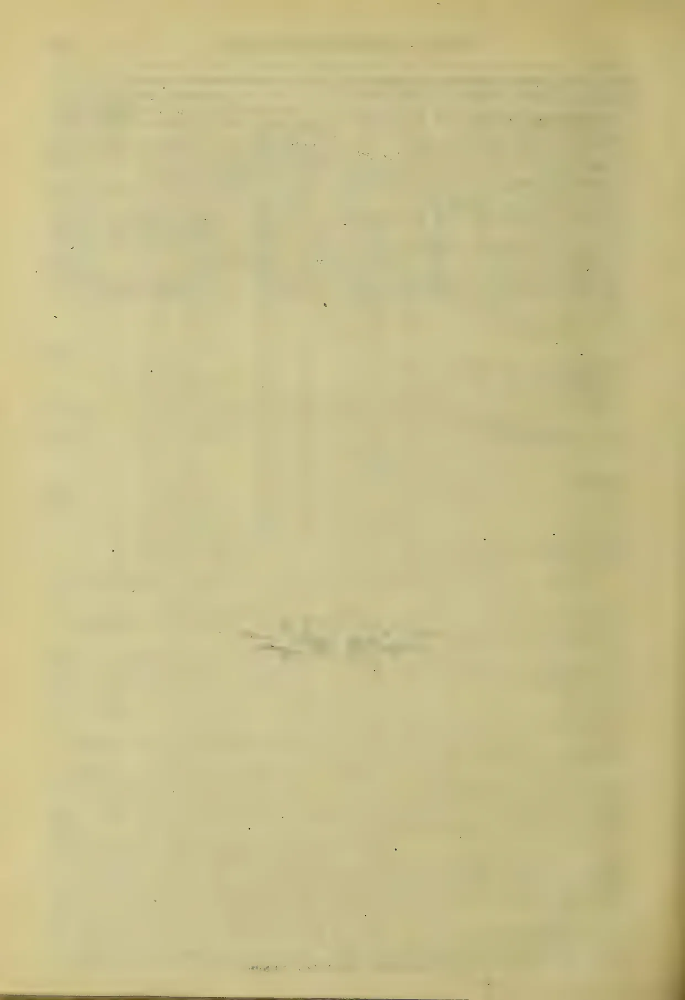This image shows a blank page with a light beige or cream-colored background. There are very faint, blurry horizontal lines across the page, which appear to be bleed-through from the reverse side. Near the bottom center, there is a small, dark, illegible mark that looks like a smudge or a faint stamp. The overall texture is slightly grainy, typical of old paper.

1396------------------------------------------------

# TEA COFFEE, CINCHONA, COCOA, AND CARDAMOM SALES.

No. 20.

COLOMBO, May, 25th 1904.

PRICE:—12½ cents each, 3 copies  
30 cents; 6 copies ¾ rupee.

## COLOMBO SALES OF TEA.

### LARGE LOTS.

#### Messrs. Gordon & Wilson.

[43,322 lb.]

<table border="1">
<thead>
<tr>
<th></th>
<th>Pkgs.</th>
<th>Name.</th>
<th>lb.</th>
<th>c.</th>
</tr>
</thead>
<tbody>
<tr>
<td>Goodnestone</td>
<td>22 hf ch</td>
<td>bro or pek</td>
<td>1210</td>
<td>36 bid</td>
</tr>
<tr>
<td></td>
<td>13 ch</td>
<td>pek No. 1</td>
<td>1040</td>
<td>33</td>
</tr>
<tr>
<td>Battalgalla</td>
<td>16 ch</td>
<td>pek sou</td>
<td>1360</td>
<td>33</td>
</tr>
<tr>
<td></td>
<td>23 hf ch</td>
<td>fans</td>
<td>1610</td>
<td>28</td>
</tr>
<tr>
<td></td>
<td>15 ch</td>
<td>dust</td>
<td>1425</td>
<td>26</td>
</tr>
<tr>
<td>Hornsey</td>
<td>3 hf ch</td>
<td>bro or pek</td>
<td>2080</td>
<td>46 bid</td>
</tr>
<tr>
<td></td>
<td>11 ch</td>
<td>or pek</td>
<td>1045</td>
<td>38</td>
</tr>
<tr>
<td></td>
<td>22 do</td>
<td>pek</td>
<td>1980</td>
<td>37</td>
</tr>
<tr>
<td>Doone Vale</td>
<td>13 do</td>
<td>or pek</td>
<td>1300</td>
<td>36</td>
</tr>
<tr>
<td></td>
<td>15 do</td>
<td>pek</td>
<td>1275</td>
<td>33</td>
</tr>
<tr>
<td>A, in est. mark</td>
<td>28 hf ch</td>
<td>pek</td>
<td>1452</td>
<td>35 bid</td>
</tr>
<tr>
<td>U H O</td>
<td>59 ch</td>
<td>bro pek</td>
<td>5605</td>
<td>34</td>
</tr>
<tr>
<td></td>
<td>60 do</td>
<td>pek</td>
<td>5400</td>
<td>32 bid</td>
</tr>
<tr>
<td>Goodnestone</td>
<td>15 do</td>
<td>or pek</td>
<td>1271</td>
<td>34</td>
</tr>
<tr>
<td></td>
<td>17 do</td>
<td>pek No. 1</td>
<td>1356</td>
<td>32 bid</td>
</tr>
<tr>
<td>Bunyán and Ovoca</td>
<td>36 hf ch</td>
<td>bro or pek</td>
<td>2160</td>
<td>51 bid</td>
</tr>
<tr>
<td></td>
<td>23 do</td>
<td>or pek</td>
<td>1150</td>
<td>44 bid</td>
</tr>
<tr>
<td></td>
<td>24 ch</td>
<td>pek</td>
<td>2280</td>
<td>38 bid</td>
</tr>
<tr>
<td></td>
<td>11 do</td>
<td>pek No. 2</td>
<td>1045</td>
<td>42 bid</td>
</tr>
<tr>
<td></td>
<td>10 do</td>
<td>pek sou</td>
<td>1800</td>
<td>35 bid</td>
</tr>
<tr>
<td></td>
<td>45 hf ch</td>
<td>pek fans</td>
<td>2925</td>
<td>29 bid</td>
</tr>
<tr>
<td></td>
<td>15 do</td>
<td>dust</td>
<td>1275</td>
<td>26</td>
</tr>
</tbody>
</table>

#### Messrs E. John & Co.

[401,940.]

<table border="1">
<thead>
<tr>
<th></th>
<th>Pkgs.</th>
<th>Name.</th>
<th>lb.</th>
<th>c.</th>
</tr>
</thead>
<tbody>
<tr>
<td>Brentford</td>
<td>28 ch</td>
<td>green tea fans</td>
<td>2660</td>
<td>8 bid</td>
</tr>
<tr>
<td>Karawakettia</td>
<td>16 ch</td>
<td>bro pek</td>
<td>1648</td>
<td>31</td>
</tr>
<tr>
<td></td>
<td>16 do</td>
<td>pek</td>
<td>1569</td>
<td>32</td>
</tr>
<tr>
<td>Kandahar</td>
<td>55 hf ch</td>
<td>pek</td>
<td>3025</td>
<td>34</td>
</tr>
<tr>
<td>Kelaneiya and Braemar</td>
<td>13 ch</td>
<td>bro or pek</td>
<td>1300</td>
<td>47 bid</td>
</tr>
<tr>
<td></td>
<td>11 do</td>
<td>bro pek</td>
<td>1100</td>
<td>38</td>
</tr>
<tr>
<td></td>
<td>23 do</td>
<td>pek</td>
<td>2185</td>
<td>37</td>
</tr>
<tr>
<td>Irex</td>
<td>29 ch</td>
<td>bro or pek</td>
<td>2900</td>
<td>36</td>
</tr>
<tr>
<td></td>
<td>24 do</td>
<td>bro pek</td>
<td>1920</td>
<td>33 bid</td>
</tr>
<tr>
<td></td>
<td>33 do</td>
<td>pek</td>
<td>2640</td>
<td>34</td>
</tr>
<tr>
<td></td>
<td>19 do</td>
<td>pek sou</td>
<td>1520</td>
<td>32</td>
</tr>
<tr>
<td>Mt. Everest</td>
<td>48 hf ch</td>
<td>bro or pek</td>
<td>2640</td>
<td>48 bid</td>
</tr>
<tr>
<td></td>
<td>38 do</td>
<td>or pek</td>
<td>1900</td>
<td>42</td>
</tr>
<tr>
<td></td>
<td>28 do</td>
<td>fly or pek</td>
<td>1400</td>
<td>49</td>
</tr>
<tr>
<td></td>
<td>66 ch</td>
<td>pek</td>
<td>6600</td>
<td>36 bid</td>
</tr>
<tr>
<td>Dotala</td>
<td>20 hf ch</td>
<td>bro or pek</td>
<td>1100</td>
<td>44 bid</td>
</tr>
<tr>
<td></td>
<td>13 ch</td>
<td>pek</td>
<td>1170</td>
<td>36 bid</td>
</tr>
<tr>
<td></td>
<td>14 hf ch</td>
<td>pek fans</td>
<td>1050</td>
<td>28</td>
</tr>
<tr>
<td>Mount Vernon Ceylon Tea Co. Ltd., Mt. Vernon, Inv. No. 21, A. C. W. in est. mark</td>
<td>25 ch</td>
<td>pek</td>
<td>2200</td>
<td>38 bid</td>
</tr>
<tr>
<td>Eila Tea Co. of Ceylon, Ltd., Eila</td>
<td>73 ch</td>
<td>bro pek</td>
<td>7300</td>
<td>33 bid</td>
</tr>
<tr>
<td></td>
<td>54 do</td>
<td>pek</td>
<td>4320</td>
<td>33</td>
</tr>
<tr>
<td>Morton</td>
<td>10 ch</td>
<td>bro or pek</td>
<td>1100</td>
<td>34</td>
</tr>
<tr>
<td></td>
<td>19 do</td>
<td>pek</td>
<td>1520</td>
<td>32 bid</td>
</tr>
<tr>
<td>St. Johns</td>
<td>26 hf ch</td>
<td>bro or pek</td>
<td>1456</td>
<td>37 bid</td>
</tr>
<tr>
<td></td>
<td>18 ch</td>
<td>or pek</td>
<td>1692</td>
<td>46</td>
</tr>
<tr>
<td></td>
<td>20 do</td>
<td>pek</td>
<td>1920</td>
<td>39 bid</td>
</tr>
<tr>
<td></td>
<td>20 do</td>
<td>pek sou</td>
<td>1640</td>
<td>36 bid</td>
</tr>
<tr>
<td></td>
<td>24 hf ch</td>
<td>pek fans</td>
<td>1632</td>
<td>31</td>
</tr>
<tr>
<td>Templestowe</td>
<td>17 ch</td>
<td>bro or pek</td>
<td>1530</td>
<td>41 bid</td>
</tr>
<tr>
<td></td>
<td>25 hf ch</td>
<td>bro pek</td>
<td>1350</td>
<td>38 bid</td>
</tr>
<tr>
<td></td>
<td>14 ch</td>
<td>or pek</td>
<td>1008</td>
<td>39</td>
</tr>
<tr>
<td></td>
<td>14 do</td>
<td>pek</td>
<td>1120</td>
<td>36 bid</td>
</tr>
<tr>
<td></td>
<td>14 do</td>
<td>bro pk No 2</td>
<td>1400</td>
<td>37</td>
</tr>
<tr>
<td></td>
<td>17 do</td>
<td>pek No. 2</td>
<td>1445</td>
<td>34 bid</td>
</tr>
<tr>
<td>Longvilla</td>
<td>21 ch</td>
<td>bro pek</td>
<td>2100</td>
<td>38</td>
</tr>
<tr>
<td>Elston</td>
<td>20 ch</td>
<td>pek</td>
<td>1600</td>
<td>35</td>
</tr>
<tr>
<td></td>
<td>39 do</td>
<td>pek sou</td>
<td>3315</td>
<td>34</td>
</tr>
<tr>
<td>Lynford</td>
<td>10 ch</td>
<td>or pek</td>
<td>1000</td>
<td>38</td>
</tr>
</tbody>
</table>

<table border="1">
<thead>
<tr>
<th></th>
<th>Pkgs.</th>
<th>Name.</th>
<th>lb.</th>
<th>c.</th>
</tr>
</thead>
<tbody>
<tr>
<td></td>
<td>16 do</td>
<td>bro pek</td>
<td>1680</td>
<td>34</td>
</tr>
<tr>
<td></td>
<td>15 do</td>
<td>pek</td>
<td>1425</td>
<td>34</td>
</tr>
<tr>
<td>Westhall</td>
<td>21 ch</td>
<td>bro pek</td>
<td>2100</td>
<td>35</td>
</tr>
<tr>
<td></td>
<td>32 do</td>
<td>pek</td>
<td>2720</td>
<td>34</td>
</tr>
<tr>
<td></td>
<td>27 do</td>
<td>pek sou</td>
<td>2025</td>
<td>33</td>
</tr>
<tr>
<td>Elta</td>
<td>18 ch</td>
<td>bro pek</td>
<td>1800</td>
<td>41 bid</td>
</tr>
<tr>
<td></td>
<td>11 do</td>
<td>pek</td>
<td>1100</td>
<td>35</td>
</tr>
<tr>
<td>Wilpita</td>
<td>11 ch</td>
<td>bro or pek</td>
<td>1100</td>
<td>26 bid</td>
</tr>
<tr>
<td>Horagalla</td>
<td>16 ch</td>
<td>bro pek</td>
<td>1616</td>
<td>33</td>
</tr>
<tr>
<td>Mount Vernon Ceylon Tea Co. Ltd., Mt. Vernon A. C. W. in est. mark</td>
<td>43 ch</td>
<td>pek</td>
<td>3956</td>
<td>39</td>
</tr>
<tr>
<td>Ottery, Invoice No. 10</td>
<td>30 ch</td>
<td>bro or pek</td>
<td>3000</td>
<td>48</td>
</tr>
<tr>
<td></td>
<td>15 do</td>
<td>or pek</td>
<td>1275</td>
<td>43</td>
</tr>
<tr>
<td></td>
<td>62 do</td>
<td>pek</td>
<td>5270</td>
<td>35</td>
</tr>
<tr>
<td>Gonavy, Invoice No. 7</td>
<td>19 ch</td>
<td>or pek</td>
<td>1615</td>
<td>37</td>
</tr>
<tr>
<td></td>
<td>25 hf ch</td>
<td>bro or pek</td>
<td>1375</td>
<td>38 bid</td>
</tr>
<tr>
<td></td>
<td>49 do</td>
<td>pek</td>
<td>4410</td>
<td>35</td>
</tr>
<tr>
<td>Verelapatna</td>
<td>58 ch</td>
<td>bro pek</td>
<td>5800</td>
<td>38 bid</td>
</tr>
<tr>
<td></td>
<td>59 do</td>
<td>pek</td>
<td>5900</td>
<td>37</td>
</tr>
<tr>
<td></td>
<td>18 do</td>
<td>pek sou</td>
<td>1800</td>
<td>35</td>
</tr>
<tr>
<td>Poilkande</td>
<td>25 ch</td>
<td>bro or pek</td>
<td>2250</td>
<td>34</td>
</tr>
<tr>
<td></td>
<td>31 do</td>
<td>bro pek</td>
<td>2790</td>
<td>32</td>
</tr>
<tr>
<td></td>
<td>31 do</td>
<td>pek</td>
<td>2480</td>
<td>32</td>
</tr>
<tr>
<td>Bowhill</td>
<td>21 ch</td>
<td>bro pek</td>
<td>2100</td>
<td>36 bid</td>
</tr>
<tr>
<td></td>
<td>11 do</td>
<td>or pek</td>
<td>1045</td>
<td>36</td>
</tr>
<tr>
<td></td>
<td>11 do</td>
<td>pek</td>
<td>1045</td>
<td>34</td>
</tr>
<tr>
<td>Mount Vernon Ceylon Tea Co. Ltd., Mt. Vernon</td>
<td>29 hf ch</td>
<td>bro fly pek</td>
<td>1740</td>
<td>66 bid</td>
</tr>
<tr>
<td></td>
<td>19 ch</td>
<td>or pek</td>
<td>1767</td>
<td>45 bid</td>
</tr>
<tr>
<td></td>
<td>39 hf ch</td>
<td>fly pek</td>
<td>2184</td>
<td>49 bid</td>
</tr>
<tr>
<td>Stubton</td>
<td>12 ch</td>
<td>bro pek</td>
<td>1200</td>
<td>39</td>
</tr>
<tr>
<td></td>
<td>12 do</td>
<td>pek</td>
<td>1200</td>
<td>34</td>
</tr>
<tr>
<td>M. B. in est. mark</td>
<td>12 ch</td>
<td>sou No. 1</td>
<td>1020</td>
<td>25</td>
</tr>
<tr>
<td>Kandahar</td>
<td>55 hf ch</td>
<td>or pek</td>
<td>3025</td>
<td>36</td>
</tr>
<tr>
<td>Parusella</td>
<td>11 ch</td>
<td>bro pek</td>
<td>1100</td>
<td>37</td>
</tr>
<tr>
<td></td>
<td>17 do</td>
<td>or pek</td>
<td>1530</td>
<td>36</td>
</tr>
<tr>
<td></td>
<td>18 do</td>
<td>pek</td>
<td>1612</td>
<td>34</td>
</tr>
<tr>
<td></td>
<td>17 do</td>
<td>pek sou</td>
<td>1445</td>
<td>33</td>
</tr>
<tr>
<td>Agra Ouvah Est. Co. Ltd., Agra Ouvah</td>
<td>18 ch</td>
<td>pek sou</td>
<td>1620</td>
<td>36</td>
</tr>
<tr>
<td></td>
<td>35 hf ch</td>
<td>pek fans</td>
<td>2800</td>
<td>29 bid</td>
</tr>
<tr>
<td>Glasgow Estate Co. Ltd., Glasgow</td>
<td>34 hf ch</td>
<td>bro or pek</td>
<td>2006</td>
<td>50 bid</td>
</tr>
<tr>
<td></td>
<td>45 do</td>
<td>bro pek</td>
<td>2565</td>
<td>41</td>
</tr>
<tr>
<td></td>
<td>26 ch</td>
<td>or pek</td>
<td>2470</td>
<td>39</td>
</tr>
<tr>
<td></td>
<td>31 do</td>
<td>pek</td>
<td>3100</td>
<td>39</td>
</tr>
<tr>
<td></td>
<td>22 hf ch</td>
<td>pek</td>
<td>1100</td>
<td>34</td>
</tr>
<tr>
<td>Yelattenne</td>
<td>33 hf ch</td>
<td>bro or pek</td>
<td>1815</td>
<td>44 bid</td>
</tr>
<tr>
<td>Winwood</td>
<td>27 ch</td>
<td>or pek</td>
<td>2565</td>
<td>36</td>
</tr>
<tr>
<td></td>
<td>37 do</td>
<td>pek</td>
<td>3330</td>
<td>34</td>
</tr>
<tr>
<td></td>
<td>21 hf ch</td>
<td>br pk fans</td>
<td>1260</td>
<td>30</td>
</tr>
<tr>
<td>Devon</td>
<td>33 hf ch</td>
<td>bro or pek</td>
<td>2046</td>
<td>41 bid</td>
</tr>
<tr>
<td></td>
<td>25 ch</td>
<td>or pek</td>
<td>2500</td>
<td>36</td>
</tr>
<tr>
<td></td>
<td>17 do</td>
<td>pek</td>
<td>1632</td>
<td>35</td>
</tr>
<tr>
<td>Tismoda</td>
<td>24 ch</td>
<td>bro or pek</td>
<td>1800</td>
<td>36</td>
</tr>
<tr>
<td></td>
<td>25 do</td>
<td>bro pek</td>
<td>2125</td>
<td>34</td>
</tr>
<tr>
<td></td>
<td>38 do</td>
<td>pek</td>
<td>2660</td>
<td>34</td>
</tr>
<tr>
<td></td>
<td>19 do</td>
<td>pek sou</td>
<td>1330</td>
<td>33</td>
</tr>
<tr>
<td>Greenford</td>
<td>16 ch</td>
<td>bro or pek</td>
<td>1728</td>
<td>37</td>
</tr>
<tr>
<td></td>
<td>15 do</td>
<td>pek</td>
<td>1350</td>
<td>34</td>
</tr>
<tr>
<td></td>
<td>15 do</td>
<td>pek sou</td>
<td>1410</td>
<td>32</td>
</tr>
<tr>
<td>Poonagalla, Invoice No. 19</td>
<td>20 ch</td>
<td>or pek</td>
<td>1900</td>
<td>36 bid</td>
</tr>
<tr>
<td></td>
<td>95 do</td>
<td>bro pek</td>
<td>5075</td>
<td>40 bid</td>
</tr>
<tr>
<td></td>
<td>52 do</td>
<td>pek</td>
<td>4784</td>
<td>35 bid</td>
</tr>
<tr>
<td></td>
<td>16 hf ch</td>
<td>fans</td>
<td>1392</td>
<td>27 bid</td>
</tr>
<tr>
<td>Poonagalla, Invoice No. 20</td>
<td>16 ch</td>
<td>or pek</td>
<td>1600</td>
<td>36 bid</td>
</tr>
<tr>
<td></td>
<td>67 do</td>
<td>bro pek</td>
<td>5695</td>
<td>39 bid</td>
</tr>
<tr>
<td></td>
<td>26 do</td>
<td>pek</td>
<td>2392</td>
<td>35 bid</td>
</tr>
<tr>
<td>Taunton</td>
<td>12 ch</td>
<td>bro or pek</td>
<td>1200</td>
<td>41</td>
</tr>
<tr>
<td></td>
<td>10 do</td>
<td>or pek</td>
<td>1000</td>
<td>37</td>
</tr>
</tbody>
</table>

1397------------------------------------------------

198

CEYLON PRODUCE SALES LIST.

<table border="1">
<thead>
<tr>
<th></th>
<th>Pkgs.</th>
<th>Name.</th>
<th>lb.</th>
<th>c.</th>
</tr>
</thead>
<tbody>
<tr>
<td></td>
<td>20 do</td>
<td>pek</td>
<td>1700</td>
<td>34</td>
</tr>
<tr>
<td></td>
<td>10 do</td>
<td>fans</td>
<td>1000</td>
<td>27</td>
</tr>
<tr>
<td>Tamworth</td>
<td>20 hf ch</td>
<td>bro or pek</td>
<td>1900</td>
<td>39 bid</td>
</tr>
<tr>
<td></td>
<td>30 do</td>
<td>pek</td>
<td>2460</td>
<td>33</td>
</tr>
<tr>
<td>Tintern</td>
<td>38 ch</td>
<td>bro pek</td>
<td>3800</td>
<td>35</td>
</tr>
<tr>
<td></td>
<td>30 do</td>
<td>pek</td>
<td>2700</td>
<td>33</td>
</tr>
<tr>
<td></td>
<td>13 do</td>
<td>pek sou</td>
<td>1040</td>
<td>32</td>
</tr>
<tr>
<td>Galloola</td>
<td>24 ch</td>
<td>bro pek</td>
<td>2400</td>
<td>37</td>
</tr>
<tr>
<td></td>
<td>34 do</td>
<td>pek</td>
<td>3060</td>
<td>35</td>
</tr>
<tr>
<td></td>
<td>20 do</td>
<td>pek sou</td>
<td>1800</td>
<td>33</td>
</tr>
<tr>
<td>M. L. K.</td>
<td>21 ch</td>
<td>bro pek</td>
<td>1974</td>
<td>30</td>
</tr>
<tr>
<td>Kolapatna</td>
<td>22 hf ch</td>
<td>bro or pek</td>
<td>1232</td>
<td>64</td>
</tr>
<tr>
<td></td>
<td>28 do</td>
<td>bro pek</td>
<td>1708</td>
<td>39 bid</td>
</tr>
<tr>
<td></td>
<td>23 do</td>
<td>or pek</td>
<td>1150</td>
<td>38 bid</td>
</tr>
<tr>
<td></td>
<td>14 ch</td>
<td>pek</td>
<td>1288</td>
<td>37</td>
</tr>
<tr>
<td>Theresia</td>
<td>19 hf ch</td>
<td>bro or pek</td>
<td>1045</td>
<td>56</td>
</tr>
<tr>
<td></td>
<td>12 ch</td>
<td>or pek</td>
<td>1020</td>
<td>39</td>
</tr>
<tr>
<td></td>
<td>11 do</td>
<td>bro pek</td>
<td>1100</td>
<td>38</td>
</tr>
<tr>
<td></td>
<td>16 do</td>
<td>pek</td>
<td>1360</td>
<td>38</td>
</tr>
<tr>
<td>Mount Vernon Ceylon Tea Co. Ltd., Mt. Vernon</td>
<td>20 ch</td>
<td>pek sou</td>
<td>1680</td>
<td>36</td>
</tr>
<tr>
<td>Agra Ouvah Est. Co., Ltd., Agra Ouvah</td>
<td>33 hf ch</td>
<td>bro or pek</td>
<td>1980</td>
<td>57 bid</td>
</tr>
<tr>
<td></td>
<td>31 do</td>
<td>bro pek</td>
<td>1922</td>
<td>44</td>
</tr>
<tr>
<td></td>
<td>35 do</td>
<td>or pek</td>
<td>1890</td>
<td>41</td>
</tr>
<tr>
<td></td>
<td>14 ch</td>
<td>pek</td>
<td>1288</td>
<td>40</td>
</tr>
<tr>
<td>Cleveland</td>
<td>12 ch</td>
<td>or pek</td>
<td>1080</td>
<td>46</td>
</tr>
<tr>
<td></td>
<td>30 do</td>
<td>pek</td>
<td>2850</td>
<td>36 bid</td>
</tr>
<tr>
<td>St. Johns</td>
<td>30 hf ch</td>
<td>bro or pek</td>
<td>1680</td>
<td>37 bid</td>
</tr>
<tr>
<td></td>
<td>18 ch</td>
<td>or pek</td>
<td>1656</td>
<td>44</td>
</tr>
<tr>
<td></td>
<td>20 do</td>
<td>pek</td>
<td>1920</td>
<td>39 bid</td>
</tr>
<tr>
<td>Lantern Hill</td>
<td>15 ch</td>
<td>bro pek</td>
<td>1500</td>
<td>34</td>
</tr>
<tr>
<td></td>
<td>16 do</td>
<td>pek</td>
<td>1440</td>
<td>31</td>
</tr>
<tr>
<td>Agra Ouvah</td>
<td>32 ch</td>
<td>or pek</td>
<td>1728</td>
<td>38</td>
</tr>
<tr>
<td>Peru</td>
<td>19 ch</td>
<td>bro pek</td>
<td>1995</td>
<td>38</td>
</tr>
<tr>
<td></td>
<td>23 do</td>
<td>pek</td>
<td>2070</td>
<td>35</td>
</tr>
<tr>
<td>Eila Tea Co. of Ceylon, Ltd., Eila</td>
<td>33 ch</td>
<td>bro pek</td>
<td>3300</td>
<td>33 bid</td>
</tr>
<tr>
<td></td>
<td>27 do</td>
<td>pek</td>
<td>2160</td>
<td>33</td>
</tr>
<tr>
<td>Ceylon Provincial Estates Co. Ltd., Brownlow</td>
<td>33 hf ch</td>
<td>bro or pek</td>
<td>1848</td>
<td>51</td>
</tr>
<tr>
<td></td>
<td>25 ch</td>
<td>or pek</td>
<td>2375</td>
<td>38</td>
</tr>
<tr>
<td></td>
<td>23 do</td>
<td>pek</td>
<td>2070</td>
<td>38</td>
</tr>
<tr>
<td>Ceylon Provincial Estates Co. Ltd., Glassaugh</td>
<td>30 hf ch</td>
<td>or pek</td>
<td>1770</td>
<td>64</td>
</tr>
<tr>
<td></td>
<td>21 do</td>
<td>bro or pek</td>
<td>1428</td>
<td>51 bid</td>
</tr>
<tr>
<td></td>
<td>20 ch</td>
<td>pek</td>
<td>2000</td>
<td>46</td>
</tr>
<tr>
<td>Kahagalla</td>
<td>22 ch</td>
<td>bro pek</td>
<td>2200</td>
<td>36</td>
</tr>
<tr>
<td></td>
<td>22 do</td>
<td>pek</td>
<td>2090</td>
<td>35</td>
</tr>
<tr>
<td>Elston</td>
<td>28 ch</td>
<td>pek</td>
<td>2240</td>
<td>37</td>
</tr>
<tr>
<td></td>
<td>34 hf ch</td>
<td>br pek fans</td>
<td>2550</td>
<td>30</td>
</tr>
<tr>
<td></td>
<td>33 ch</td>
<td>pek sou</td>
<td>2640</td>
<td>35</td>
</tr>
<tr>
<td>Gansarapolla</td>
<td>43 hf ch</td>
<td>br or pk No1</td>
<td>2365</td>
<td>35</td>
</tr>
<tr>
<td></td>
<td>35 do</td>
<td>br or pk No2</td>
<td>1855</td>
<td>33</td>
</tr>
<tr>
<td></td>
<td>16 ch</td>
<td>bro pek</td>
<td>1360</td>
<td>32</td>
</tr>
<tr>
<td>Ohiya</td>
<td>21 ch</td>
<td>or pek</td>
<td>1995</td>
<td>36</td>
</tr>
<tr>
<td></td>
<td>23 hf ch</td>
<td>bro or pek</td>
<td>1265</td>
<td>37</td>
</tr>
<tr>
<td></td>
<td>22 ch</td>
<td>pek No. 1</td>
<td>1848</td>
<td>35</td>
</tr>
<tr>
<td>Stonyhurst</td>
<td>20 ch</td>
<td>or pek</td>
<td>1680</td>
<td>35</td>
</tr>
<tr>
<td></td>
<td>42 do</td>
<td>pek</td>
<td>3360</td>
<td>33</td>
</tr>
<tr>
<td>Orwell</td>
<td>14 ch</td>
<td>or pek</td>
<td>1162</td>
<td>35</td>
</tr>
<tr>
<td></td>
<td>25 do</td>
<td>pek</td>
<td>1900</td>
<td>33</td>
</tr>
<tr>
<td>Gangawatte Est. Co. Ltd., Gangawatte</td>
<td>26 ch</td>
<td>bro or pek</td>
<td>2600</td>
<td>47 bid</td>
</tr>
<tr>
<td></td>
<td>30 do</td>
<td>bro pek</td>
<td>2000</td>
<td>36 bid</td>
</tr>
<tr>
<td></td>
<td>37 do</td>
<td>pek</td>
<td>3515</td>
<td>36</td>
</tr>
<tr>
<td></td>
<td>12 do</td>
<td>pek sou</td>
<td>1080</td>
<td>34 bid</td>
</tr>
<tr>
<td>Warleigh</td>
<td>27 hf ch</td>
<td>bro or pek</td>
<td>1512</td>
<td>60</td>
</tr>
<tr>
<td></td>
<td>25 ch</td>
<td>or pek</td>
<td>2400</td>
<td>40</td>
</tr>
<tr>
<td></td>
<td>40 do</td>
<td>pek</td>
<td>3400</td>
<td>37 bid</td>
</tr>
<tr>
<td></td>
<td>22 hf ch</td>
<td>fans</td>
<td>1364</td>
<td>32</td>
</tr>
</tbody>
</table>

Messrs. Somerville & Co.

[544,978.]

<table border="1">
<thead>
<tr>
<th></th>
<th>Pkgs.</th>
<th>Name.</th>
<th>lb.</th>
<th>c.</th>
</tr>
</thead>
<tbody>
<tr>
<td>Kudaganga</td>
<td>15 ch</td>
<td>bro pek</td>
<td>1650</td>
<td>35</td>
</tr>
<tr>
<td></td>
<td>25 do</td>
<td>pek</td>
<td>2375</td>
<td>34</td>
</tr>
<tr>
<td>Clodagh</td>
<td>13 ch</td>
<td>pek sou</td>
<td>1157</td>
<td>33</td>
</tr>
</tbody>
</table>

<table border="1">
<thead>
<tr>
<th></th>
<th>Pkgs.</th>
<th>Name.</th>
<th>lb.</th>
<th>c.</th>
</tr>
</thead>
<tbody>
<tr>
<td></td>
<td>10 do</td>
<td>dust</td>
<td>1000</td>
<td>26</td>
</tr>
<tr>
<td>Scottish Ceylon Tea Co., Ltd., Invery</td>
<td>28 hf ch</td>
<td>bro or pek</td>
<td>1708</td>
<td>53</td>
</tr>
<tr>
<td></td>
<td>25 do</td>
<td>or pek</td>
<td>1325</td>
<td>48</td>
</tr>
<tr>
<td></td>
<td>35 ch</td>
<td>pek</td>
<td>3430</td>
<td>38</td>
</tr>
<tr>
<td>Katukurundugoda</td>
<td>20 ch</td>
<td>bro pek</td>
<td>1800 withd'n</td>
<td></td>
</tr>
<tr>
<td>Lyndhurst</td>
<td>51 hf ch</td>
<td>bro pek</td>
<td>2805</td>
<td>37</td>
</tr>
<tr>
<td></td>
<td>48 do</td>
<td>pek</td>
<td>2400</td>
<td>33</td>
</tr>
<tr>
<td></td>
<td>26 do</td>
<td>pek sou</td>
<td>1300</td>
<td>32</td>
</tr>
<tr>
<td>Meddegodde, Inv. No. 3</td>
<td>14 ch</td>
<td>pek sou</td>
<td>1400</td>
<td>33</td>
</tr>
<tr>
<td>Mossville</td>
<td>42 ch</td>
<td>or pek</td>
<td>3990</td>
<td>36</td>
</tr>
<tr>
<td></td>
<td>27 do</td>
<td>pek</td>
<td>2160</td>
<td>34</td>
</tr>
<tr>
<td></td>
<td>19 do</td>
<td>pek sou</td>
<td>1615</td>
<td>33</td>
</tr>
<tr>
<td>K. E. N.</td>
<td>27 ch</td>
<td>bro pek</td>
<td>2862</td>
<td>33</td>
</tr>
<tr>
<td></td>
<td>61 do</td>
<td>pek</td>
<td>5612</td>
<td>32</td>
</tr>
<tr>
<td></td>
<td>17 do</td>
<td>pek sou</td>
<td>1360</td>
<td>31</td>
</tr>
<tr>
<td>Mary Hill</td>
<td>37 hf ch</td>
<td>pek</td>
<td>1850</td>
<td>33</td>
</tr>
<tr>
<td>R. K. P.</td>
<td>12 ch</td>
<td>bro pek</td>
<td>1200</td>
<td>37</td>
</tr>
<tr>
<td></td>
<td>23 do</td>
<td>pek</td>
<td>1840</td>
<td>34</td>
</tr>
<tr>
<td></td>
<td>31 do</td>
<td>pek sou</td>
<td>2170</td>
<td>32</td>
</tr>
<tr>
<td>Highfields, Inv. No. 15</td>
<td>38 hf ch</td>
<td>bro pek</td>
<td>1938</td>
<td>35</td>
</tr>
<tr>
<td>Evalgolla</td>
<td>20 ch</td>
<td>or pek</td>
<td>1800</td>
<td>33 bid</td>
</tr>
<tr>
<td></td>
<td>16 do</td>
<td>or pk No. 2</td>
<td>1440</td>
<td>32 bid</td>
</tr>
<tr>
<td></td>
<td>17 do</td>
<td>pek</td>
<td>1530</td>
<td>32</td>
</tr>
<tr>
<td>Scottish Ceylon Tea Co., Ltd., Lonach, Inv. No. 11</td>
<td>35 hf ch</td>
<td>bro or pek</td>
<td>1960</td>
<td>38</td>
</tr>
<tr>
<td></td>
<td>25 ch</td>
<td>or pek</td>
<td>2250</td>
<td>37</td>
</tr>
<tr>
<td></td>
<td>41 do</td>
<td>pek</td>
<td>3567</td>
<td>34</td>
</tr>
<tr>
<td></td>
<td>33 do</td>
<td>pek sou</td>
<td>2805</td>
<td>32</td>
</tr>
<tr>
<td>New Angamana</td>
<td>38 ch</td>
<td>bro or pek</td>
<td>3800</td>
<td>36</td>
</tr>
<tr>
<td></td>
<td>12 do</td>
<td>or pek</td>
<td>1080</td>
<td>34 bid</td>
</tr>
<tr>
<td></td>
<td>59 do</td>
<td>pek</td>
<td>5310</td>
<td>34</td>
</tr>
<tr>
<td>Gwernet</td>
<td>18 ch</td>
<td>bro pek</td>
<td>1800</td>
<td>38</td>
</tr>
<tr>
<td></td>
<td>26 do</td>
<td>pek</td>
<td>2080</td>
<td>35</td>
</tr>
<tr>
<td>Ambalawa</td>
<td>12 ch</td>
<td>bro pek</td>
<td>1200</td>
<td>33</td>
</tr>
<tr>
<td>Kelani Tea Garden Co. Ltd., Kelani</td>
<td>11 ch</td>
<td>bro pek</td>
<td>1100</td>
<td>35 bid</td>
</tr>
<tr>
<td></td>
<td>13 do</td>
<td>pek</td>
<td>1040</td>
<td>34</td>
</tr>
<tr>
<td></td>
<td>15 do</td>
<td>pek sou</td>
<td>1050</td>
<td>33</td>
</tr>
<tr>
<td>Abbotsford</td>
<td>60 hf ch</td>
<td>bro pek</td>
<td>3600</td>
<td>46</td>
</tr>
<tr>
<td></td>
<td>48 do</td>
<td>or pek</td>
<td>2304</td>
<td>41</td>
</tr>
<tr>
<td></td>
<td>25 ch</td>
<td>pek</td>
<td>2500</td>
<td>38</td>
</tr>
<tr>
<td></td>
<td>22 do</td>
<td>pek sou</td>
<td>2200</td>
<td>36</td>
</tr>
<tr>
<td></td>
<td>20 do</td>
<td>bro mixed</td>
<td>1000</td>
<td>34</td>
</tr>
<tr>
<td></td>
<td>12 do</td>
<td>pek dust</td>
<td>1080</td>
<td>25</td>
</tr>
<tr>
<td>Urulindetenne</td>
<td>48 ch</td>
<td>bro pek</td>
<td>4800</td>
<td>34</td>
</tr>
<tr>
<td></td>
<td>38 do</td>
<td>pek</td>
<td>3420</td>
<td>34</td>
</tr>
<tr>
<td></td>
<td>29 do</td>
<td>pek sou</td>
<td>2010</td>
<td>32</td>
</tr>
<tr>
<td>Oakwell</td>
<td>24 ch</td>
<td>or pek</td>
<td>2352</td>
<td>39</td>
</tr>
<tr>
<td></td>
<td>25 do</td>
<td>bro or pek</td>
<td>1450</td>
<td>42</td>
</tr>
<tr>
<td></td>
<td>21 do</td>
<td>pek</td>
<td>2058</td>
<td>39</td>
</tr>
<tr>
<td></td>
<td>12 do</td>
<td>pek sou</td>
<td>1056</td>
<td>36</td>
</tr>
<tr>
<td>Meeriatenne</td>
<td>18 hf ch</td>
<td>pek No. 1</td>
<td>1008</td>
<td>45</td>
</tr>
<tr>
<td></td>
<td>22 do</td>
<td>pek sou</td>
<td>1034</td>
<td>36</td>
</tr>
<tr>
<td></td>
<td>14 do</td>
<td>fans</td>
<td>1120</td>
<td>28</td>
</tr>
<tr>
<td>St. Leonards-on-Sea</td>
<td>15 hf ch</td>
<td>young hyson</td>
<td>1050</td>
<td>34 bid</td>
</tr>
<tr>
<td>Poyston</td>
<td>26 hf ch</td>
<td>bro or pek</td>
<td>1560</td>
<td>49</td>
</tr>
<tr>
<td></td>
<td>17 ch</td>
<td>or pek</td>
<td>1615</td>
<td>38</td>
</tr>
<tr>
<td></td>
<td>33 do</td>
<td>pek</td>
<td>3230</td>
<td>36</td>
</tr>
<tr>
<td>Nyanza</td>
<td>21 hf ch</td>
<td>bro pek</td>
<td>1155</td>
<td>46</td>
</tr>
<tr>
<td></td>
<td>15 ch</td>
<td>pek</td>
<td>1500</td>
<td>35</td>
</tr>
<tr>
<td>Hantane</td>
<td>29 ch</td>
<td>bro pek</td>
<td>2900</td>
<td>34</td>
</tr>
<tr>
<td></td>
<td>37 do</td>
<td>pek</td>
<td>2960</td>
<td>33</td>
</tr>
<tr>
<td>Glenanore</td>
<td>25 ch</td>
<td>bro or pek</td>
<td>2500</td>
<td>45 bid</td>
</tr>
<tr>
<td></td>
<td>11 do</td>
<td>or pek</td>
<td>1012</td>
<td>38 bid</td>
</tr>
<tr>
<td></td>
<td>12 do</td>
<td>pek</td>
<td>1032</td>
<td>40</td>
</tr>
<tr>
<td>Roseneath</td>
<td>31 ch</td>
<td>bro pek</td>
<td>3100</td>
<td>34</td>
</tr>
<tr>
<td></td>
<td>16 do</td>
<td>pek</td>
<td>1440</td>
<td>33</td>
</tr>
<tr>
<td>Monte Christo</td>
<td>54 ch</td>
<td>bro pek</td>
<td>5400</td>
<td>45</td>
</tr>
<tr>
<td></td>
<td>12 do</td>
<td>pek</td>
<td>1080</td>
<td>36</td>
</tr>
<tr>
<td></td>
<td>12 do</td>
<td>pek sou</td>
<td>1080</td>
<td>35</td>
</tr>
<tr>
<td>Kitulgalla</td>
<td>25 ch</td>
<td>bro pek</td>
<td>2500</td>
<td>35</td>
</tr>
<tr>
<td></td>
<td>21 do</td>
<td>pek</td>
<td>1890</td>
<td>34</td>
</tr>
<tr>
<td>Cooroondoowatte</td>
<td>13 ch</td>
<td>bro pek</td>
<td>1300</td>
<td>36</td>
</tr>
<tr>
<td></td>
<td>15 do</td>
<td>pek</td>
<td>1500</td>
<td>34</td>
</tr>
<tr>
<td></td>
<td>10 do</td>
<td>pek sou</td>
<td>1000</td>
<td>32</td>
</tr>
<tr>
<td>Mipitiakande</td>
<td>25 ch</td>
<td>pek sou</td>
<td>2000</td>
<td>33</td>
</tr>
<tr>
<td>Medhurst</td>
<td>10 ch</td>
<td>bro or pek</td>
<td>1000</td>
<td>37 bid</td>
</tr>
<tr>
<td></td>
<td>20 do</td>
<td>br pk No. 1</td>
<td>2000</td>
<td>36 bid</td>
</tr>
<tr>
<td></td>
<td>18 do</td>
<td>br pk No. 2</td>
<td>1800</td>
<td>34 bid</td>
</tr>
</tbody>
</table>

1398------------------------------------------------

CEYLON PRODUCE SALES LIST.

199

<table border="1">
<thead>
<tr>
<th></th>
<th>Pkgs.</th>
<th>Name.</th>
<th>lb.</th>
<th>c.</th>
<th></th>
<th>Pkgs.</th>
<th>Name.</th>
<th>lb.</th>
<th>c.</th>
</tr>
</thead>
<tbody>
<tr>
<td>Columbia, Inv. No. 5</td>
<td>36</td>
<td>hf ch bro pek</td>
<td>2160</td>
<td>35 bid</td>
<td>Romania</td>
<td>17</td>
<td>do pek sou</td>
<td>1360</td>
<td>31</td>
</tr>
<tr>
<td></td>
<td>21</td>
<td>do or pek</td>
<td>1092</td>
<td>43</td>
<td>Dodantela</td>
<td>10</td>
<td>ch pek</td>
<td>1004</td>
<td>29 bid</td>
</tr>
<tr>
<td></td>
<td>25</td>
<td>ch pek No. 1</td>
<td>2250</td>
<td>37</td>
<td>Ravenscraig</td>
<td>25</td>
<td>ch pek</td>
<td>2100</td>
<td>31</td>
</tr>
<tr>
<td></td>
<td>33</td>
<td>do pek</td>
<td>2805</td>
<td>34</td>
<td></td>
<td>16</td>
<td>ch bro or pek</td>
<td>1680</td>
<td>38</td>
</tr>
<tr>
<td></td>
<td>16</td>
<td>hf ch pek fans</td>
<td>1280</td>
<td>27</td>
<td>Ambalawa</td>
<td>15</td>
<td>do pek</td>
<td>1380</td>
<td>34</td>
</tr>
<tr>
<td>Avisawella</td>
<td>24</td>
<td>hf ch bro or pek</td>
<td>1200</td>
<td>44</td>
<td>Blinkbonnie</td>
<td>13</td>
<td>ch bro pek</td>
<td>1300</td>
<td>33</td>
</tr>
<tr>
<td></td>
<td>17</td>
<td>ch or pek</td>
<td>1615</td>
<td>36</td>
<td></td>
<td>31</td>
<td>hf ch bro or pek</td>
<td>1860</td>
<td>52</td>
</tr>
<tr>
<td></td>
<td>22</td>
<td>ch pek</td>
<td>1980</td>
<td>35</td>
<td>Mahatenne</td>
<td>18</td>
<td>ch pek</td>
<td>1620</td>
<td>44</td>
</tr>
<tr>
<td></td>
<td>20</td>
<td>do pek sou</td>
<td>1600</td>
<td>32</td>
<td></td>
<td>11</td>
<td>ch bro or pek</td>
<td>1100</td>
<td>42</td>
</tr>
<tr>
<td>Mount Temple, Inv. No. 19</td>
<td>50</td>
<td>ch bro pek</td>
<td>4500</td>
<td>33</td>
<td></td>
<td>12</td>
<td>do pek</td>
<td>1200</td>
<td>34</td>
</tr>
<tr>
<td></td>
<td>28</td>
<td>do pek</td>
<td>2100</td>
<td>33</td>
<td></td>
<td>13</td>
<td>do pek sou</td>
<td>1300</td>
<td>32</td>
</tr>
<tr>
<td></td>
<td>22</td>
<td>do pek sou</td>
<td>1540</td>
<td>32</td>
<td>Karagahatenne</td>
<td>18</td>
<td>ch or pek</td>
<td>1584</td>
<td>35</td>
</tr>
<tr>
<td></td>
<td>21</td>
<td>hf ch dust</td>
<td>1365</td>
<td>27</td>
<td></td>
<td>31</td>
<td>do pek</td>
<td>2573</td>
<td>33</td>
</tr>
<tr>
<td>Ferriby</td>
<td>26</td>
<td>hf ch bro or pek</td>
<td>1430</td>
<td>42</td>
<td>Cooroondoowatte</td>
<td>11</td>
<td>ch bro pek</td>
<td>1100</td>
<td>36</td>
</tr>
<tr>
<td></td>
<td>17</td>
<td>ch pek</td>
<td>1445</td>
<td>34</td>
<td></td>
<td>11</td>
<td>do pek</td>
<td>1100</td>
<td>33</td>
</tr>
<tr>
<td></td>
<td>13</td>
<td>do pek sou</td>
<td>1040</td>
<td>33</td>
<td>Vilgoda</td>
<td>18</td>
<td>ch bro pek</td>
<td>1800</td>
<td>32</td>
</tr>
<tr>
<td>Oononagalla, Inv. No. 15</td>
<td>11</td>
<td>ch bro or pek</td>
<td>1100</td>
<td>55</td>
<td></td>
<td>14</td>
<td>ch souchong</td>
<td>1233</td>
<td>24</td>
</tr>
<tr>
<td></td>
<td>16</td>
<td>do or pek</td>
<td>1408</td>
<td>39</td>
<td></td>
<td>12</td>
<td>do</td>
<td></td>
<td></td>
</tr>
<tr>
<td></td>
<td>21</td>
<td>do bro pek</td>
<td>2100</td>
<td>39</td>
<td>1 hf ch unassorted</td>
<td></td>
<td></td>
<td>1125</td>
<td>32</td>
</tr>
<tr>
<td></td>
<td>27</td>
<td>do pek</td>
<td>2430</td>
<td>34</td>
<td>Koladeniya, Inv. No. 13</td>
<td>28</td>
<td>ch bro pek</td>
<td>2800</td>
<td>33</td>
</tr>
<tr>
<td></td>
<td>21</td>
<td>do pek sou</td>
<td>1995</td>
<td>32</td>
<td></td>
<td>24</td>
<td>do pek</td>
<td>2280</td>
<td>30 bid</td>
</tr>
<tr>
<td>Tientsin, Inv. No. 7</td>
<td>19</td>
<td>hf ch bro or pek</td>
<td>1064</td>
<td>57</td>
<td>Ingeriya</td>
<td>20</td>
<td>ch bro or pek</td>
<td>2000</td>
<td>34</td>
</tr>
<tr>
<td></td>
<td>43</td>
<td>ch bro pek</td>
<td>4644</td>
<td>40 bid</td>
<td></td>
<td>18</td>
<td>do or pek</td>
<td>1710</td>
<td>34</td>
</tr>
<tr>
<td></td>
<td>38</td>
<td>do pek</td>
<td>3420</td>
<td>37 bid</td>
<td></td>
<td>24</td>
<td>do pek</td>
<td>2280</td>
<td>32 bid</td>
</tr>
<tr>
<td></td>
<td>13</td>
<td>do pek sou</td>
<td>1170</td>
<td>35</td>
<td></td>
<td>17</td>
<td>do pek sou</td>
<td>1615</td>
<td>32</td>
</tr>
<tr>
<td></td>
<td>17</td>
<td>hf ch dust</td>
<td>1394</td>
<td>27</td>
<td>Old Maddegama</td>
<td>24</td>
<td>hf ch bro or pek</td>
<td>1320</td>
<td>43 bid</td>
</tr>
<tr>
<td>Deniyaya</td>
<td>36</td>
<td>ch or pek</td>
<td>3420</td>
<td>36</td>
<td></td>
<td>12</td>
<td>ch or pek</td>
<td>1080</td>
<td>40</td>
</tr>
<tr>
<td></td>
<td>20</td>
<td>do bro pek</td>
<td>2000</td>
<td>35 bid</td>
<td></td>
<td>30</td>
<td>do pek</td>
<td>2550</td>
<td>33</td>
</tr>
<tr>
<td></td>
<td>42</td>
<td>hf ch bro or pek</td>
<td>2310</td>
<td>39</td>
<td>R. A. W.</td>
<td>18</td>
<td>hf ch bro or pek</td>
<td>1008</td>
<td>41</td>
</tr>
<tr>
<td></td>
<td>49</td>
<td>ch pek</td>
<td>4410</td>
<td>38</td>
<td></td>
<td>18</td>
<td>hf ch bro pek</td>
<td>1080</td>
<td>36 bid</td>
</tr>
<tr>
<td></td>
<td>25</td>
<td>do pek sou</td>
<td>2250</td>
<td>33</td>
<td></td>
<td>12</td>
<td>ch or pek</td>
<td>1020</td>
<td>39 bid</td>
</tr>
<tr>
<td></td>
<td>23</td>
<td>do souchong</td>
<td>2070</td>
<td>32</td>
<td></td>
<td>19</td>
<td>do pek</td>
<td>1596</td>
<td>35 bid</td>
</tr>
<tr>
<td></td>
<td>15</td>
<td>do pek fans</td>
<td>1500</td>
<td>28</td>
<td>D. M. O. G. in est. mark</td>
<td>28</td>
<td>hf ch bro pek</td>
<td>1540</td>
<td>37</td>
</tr>
<tr>
<td>Ambalawa</td>
<td>17</td>
<td>ch pek</td>
<td>1445</td>
<td>33</td>
<td></td>
<td>23</td>
<td>ch pek</td>
<td>1955</td>
<td>34</td>
</tr>
<tr>
<td>Paradise</td>
<td>21</td>
<td>ch bro pek</td>
<td>2142</td>
<td>34</td>
<td></td>
<td>18</td>
<td>do pek sou</td>
<td>1350</td>
<td>33</td>
</tr>
<tr>
<td></td>
<td>22</td>
<td>do pek</td>
<td>2090</td>
<td>32</td>
<td>Gangwarily Est. Co. of Ceylon, Ltd., Scarborough</td>
<td>15</td>
<td>ch or pek</td>
<td>1275</td>
<td>41</td>
</tr>
<tr>
<td>Blairavon</td>
<td>36</td>
<td>ch bro pek</td>
<td>1980</td>
<td>41 bid</td>
<td></td>
<td>15</td>
<td>do pek</td>
<td>1470</td>
<td>38 bid</td>
</tr>
<tr>
<td></td>
<td>16</td>
<td>do or pek</td>
<td>1440</td>
<td>38</td>
<td>Rambodde</td>
<td>19</td>
<td>hf ch bro or pek</td>
<td>1064</td>
<td>36</td>
</tr>
<tr>
<td></td>
<td>17</td>
<td>do pek</td>
<td>1445</td>
<td>36</td>
<td></td>
<td>25</td>
<td>do or pek</td>
<td>1250</td>
<td>35</td>
</tr>
<tr>
<td>Scottish Ceylon Tea Co., Ltd., Strath- don, In. No. 6</td>
<td>73</td>
<td>hf ch bro pek</td>
<td>4526</td>
<td>41</td>
<td></td>
<td>43</td>
<td>do pek</td>
<td>2064</td>
<td>33</td>
</tr>
<tr>
<td></td>
<td>63</td>
<td>ch pek</td>
<td>5955</td>
<td>36</td>
<td>Yahalattenne</td>
<td>31</td>
<td>ch bro pek</td>
<td>3100</td>
<td>37 bid</td>
</tr>
<tr>
<td></td>
<td>27</td>
<td>do pek sou</td>
<td>2376</td>
<td>34</td>
<td></td>
<td>21</td>
<td>do pek</td>
<td>1932</td>
<td>35</td>
</tr>
<tr>
<td></td>
<td>23</td>
<td>do pek No. 2</td>
<td>2070</td>
<td>33</td>
<td>Ferndale</td>
<td>21</td>
<td>hf ch bro or pek</td>
<td>1050</td>
<td>46</td>
</tr>
<tr>
<td>Wiharagama</td>
<td>17</td>
<td>ch bro pek</td>
<td>1530</td>
<td>36</td>
<td></td>
<td>12</td>
<td>ch or pek</td>
<td>1080</td>
<td>35</td>
</tr>
<tr>
<td></td>
<td>15</td>
<td>do pek</td>
<td>1200</td>
<td>33</td>
<td></td>
<td>18</td>
<td>do pek</td>
<td>1710</td>
<td>34</td>
</tr>
<tr>
<td></td>
<td>13</td>
<td>do pek sou</td>
<td>1040</td>
<td>32</td>
<td></td>
<td>24</td>
<td>do pek sou</td>
<td>2040</td>
<td>33</td>
</tr>
<tr>
<td>Dover</td>
<td>30</td>
<td>hf ch bro or pek</td>
<td>1650</td>
<td>44</td>
<td>J.E.A. in est. mark</td>
<td>11</td>
<td>ch fannings</td>
<td>1155</td>
<td>21</td>
</tr>
<tr>
<td></td>
<td>28</td>
<td>ch or pek</td>
<td>2520</td>
<td>36</td>
<td>Havilland</td>
<td>43</td>
<td>ch young hyson</td>
<td>4800</td>
<td>out</td>
</tr>
<tr>
<td></td>
<td>40</td>
<td>do pek</td>
<td>3600</td>
<td>34</td>
<td></td>
<td>53</td>
<td>do hyson</td>
<td>5510</td>
<td>out</td>
</tr>
<tr>
<td></td>
<td>18</td>
<td>do pek sou</td>
<td>1440</td>
<td>32</td>
<td></td>
<td>12</td>
<td>do siftings</td>
<td>1440</td>
<td>18</td>
</tr>
<tr>
<td>Damblagolla</td>
<td>17</td>
<td>hf ch bro pek</td>
<td>1020</td>
<td>35 bid</td>
<td>Glenalla</td>
<td>18</td>
<td>ch young hyson</td>
<td>1710</td>
<td>31 bid</td>
</tr>
<tr>
<td></td>
<td>29</td>
<td>ch pek</td>
<td>2465</td>
<td>33 bid</td>
<td></td>
<td>14</td>
<td>do hyson</td>
<td>1190</td>
<td>28 bid</td>
</tr>
<tr>
<td></td>
<td>30</td>
<td>do pek sou</td>
<td>2400</td>
<td>32 bid</td>
<td></td>
<td>23</td>
<td>ch bro pek</td>
<td>2300</td>
<td>35</td>
</tr>
<tr>
<td>New Valley</td>
<td>42</td>
<td>ch bro or pek</td>
<td>4200</td>
<td>41</td>
<td></td>
<td>30</td>
<td>do pek</td>
<td>2850</td>
<td>34</td>
</tr>
<tr>
<td></td>
<td>22</td>
<td>do or pek</td>
<td>2090</td>
<td>37</td>
<td></td>
<td>12</td>
<td>do pek sou</td>
<td>1080</td>
<td>32</td>
</tr>
<tr>
<td></td>
<td>26</td>
<td>do pek</td>
<td>2470</td>
<td>36</td>
<td>Oonankande</td>
<td>20</td>
<td>hf ch bro pek</td>
<td>1000</td>
<td>40</td>
</tr>
<tr>
<td>Rayigam Co. Ltd., Annandale</td>
<td>14</td>
<td>3ch or pek</td>
<td>1008</td>
<td>40 bid</td>
<td></td>
<td>14</td>
<td>ch or pek</td>
<td>1330</td>
<td>39 bid</td>
</tr>
<tr>
<td></td>
<td>14</td>
<td>do pek</td>
<td>1064</td>
<td>38</td>
<td>Murraythwaite</td>
<td>20</td>
<td>ch bro pek</td>
<td>2100</td>
<td>36</td>
</tr>
<tr>
<td>Scottish Ceylon Tea Co., Ltd., Aber- geldie, Inv No 6</td>
<td>34</td>
<td>hf ch bro pek</td>
<td>2108</td>
<td>43</td>
<td>Highgate</td>
<td>27</td>
<td>hf ch pek sou</td>
<td>1134 withd'n</td>
<td>32 bid</td>
</tr>
<tr>
<td></td>
<td>29</td>
<td>ch pek</td>
<td>2755</td>
<td>36</td>
<td>Piccadilly</td>
<td>23</td>
<td>hf ch fong mee</td>
<td>1480</td>
<td>32 bid</td>
</tr>
<tr>
<td></td>
<td>12</td>
<td>do pek sou</td>
<td>1056</td>
<td>33</td>
<td>Hobart</td>
<td>21</td>
<td>ch bro pek</td>
<td>1987</td>
<td>33</td>
</tr>
<tr>
<td>Kehelwatte</td>
<td>13</td>
<td>ch bro pek</td>
<td>1500</td>
<td>32</td>
<td>Walla Valley, Inv. No. 18</td>
<td>49</td>
<td>hf ch bro or pek</td>
<td>2695</td>
<td>53</td>
</tr>
<tr>
<td>Bodawa</td>
<td>11</td>
<td>ch bro pek</td>
<td>1100</td>
<td>35</td>
<td></td>
<td>19</td>
<td>ch or pek</td>
<td>1710</td>
<td>37</td>
</tr>
<tr>
<td>Carriglea</td>
<td>21</td>
<td>hf ch bro or pek</td>
<td>1092</td>
<td>44</td>
<td></td>
<td>40</td>
<td>do pek</td>
<td>3600</td>
<td>35 bid</td>
</tr>
<tr>
<td></td>
<td>26</td>
<td>do bro pek</td>
<td>1560</td>
<td>35 bid</td>
<td>Lyonsville</td>
<td>19</td>
<td>ch or pek</td>
<td>1634</td>
<td>38 bid</td>
</tr>
<tr>
<td></td>
<td>29</td>
<td>ch or pek</td>
<td>2842</td>
<td>34</td>
<td>Atherton</td>
<td>29</td>
<td>hf ch bro or pek</td>
<td>1595</td>
<td>32 bid</td>
</tr>
<tr>
<td></td>
<td>17</td>
<td>do pek No. 1</td>
<td>1445</td>
<td>31 bid</td>
<td></td>
<td>23</td>
<td>do bro pek</td>
<td>1219</td>
<td>32 bid</td>
</tr>
<tr>
<td>Gona</td>
<td>17</td>
<td>ch bro pek</td>
<td>1700</td>
<td>30</td>
<td></td>
<td>41</td>
<td>do pek</td>
<td>1963</td>
<td>31 bid</td>
</tr>
<tr>
<td></td>
<td>18</td>
<td>do pek</td>
<td>1440</td>
<td>33</td>
<td></td>
<td>33</td>
<td>do pek sou</td>
<td>1386</td>
<td>30 bid</td>
</tr>
<tr>
<td></td>
<td>23</td>
<td>do pek sou</td>
<td>1725</td>
<td>32</td>
<td>Bollagalla</td>
<td>13</td>
<td>ch bro pek</td>
<td>1300</td>
<td>34</td>
</tr>
<tr>
<td>S. R. K.</td>
<td>10</td>
<td>ch pek</td>
<td>1000</td>
<td>36</td>
<td></td>
<td>13</td>
<td>do pek</td>
<td>1105</td>
<td>33</td>
</tr>
<tr>
<td>Avon, Haputale</td>
<td>43</td>
<td>hf ch bro pek</td>
<td>2666</td>
<td>37 bid</td>
<td>Harrangalla</td>
<td>39</td>
<td>hf ch bro or pek</td>
<td>2340</td>
<td>38</td>
</tr>
<tr>
<td></td>
<td>34</td>
<td>ch pek</td>
<td>3400</td>
<td>34 bid</td>
<td></td>
<td>21</td>
<td>ch bro pek</td>
<td>2100</td>
<td>35</td>
</tr>
<tr>
<td>Warakamure</td>
<td>47</td>
<td>ch bro pek</td>
<td>4700</td>
<td>38</td>
<td></td>
<td>39</td>
<td>do pek</td>
<td>3510</td>
<td>34</td>
</tr>
<tr>
<td></td>
<td>33</td>
<td>do pek</td>
<td>2805</td>
<td>32</td>
<td></td>
<td>16</td>
<td>hf ch dust</td>
<td>1280</td>
<td>26</td>
</tr>
<tr>
<td></td>
<td></td>
<td></td>
<td></td>
<td></td>
<td>Dalveen</td>
<td>12</td>
<td>ch or pek</td>
<td>1140</td>
<td>36</td>
</tr>
<tr>
<td></td>
<td></td>
<td></td>
<td></td>
<td></td>
<td></td>
<td>22</td>
<td>do pek</td>
<td>1870</td>
<td>34</td>
</tr>
</tbody>
</table>

1399------------------------------------------------

200

CEYLON PRODUCE SALES LIST.

<table border="1">
<thead>
<tr>
<th></th>
<th>Pkgs</th>
<th>Name.</th>
<th>lb.</th>
<th>c.</th>
</tr>
</thead>
<tbody>
<tr>
<td>S. K.</td>
<td>12 ch</td>
<td>bro or pek</td>
<td>1320</td>
<td>34</td>
</tr>
<tr>
<td></td>
<td>41 do</td>
<td>or pek</td>
<td>4100</td>
<td>34</td>
</tr>
<tr>
<td>St. Catherine</td>
<td>36 hf ch</td>
<td>bro or pek</td>
<td>1911</td>
<td>35 bid</td>
</tr>
<tr>
<td></td>
<td>27 ch</td>
<td>pek</td>
<td>2430</td>
<td>32 bid</td>
</tr>
<tr>
<td>Hobart</td>
<td>19 ch</td>
<td>pek sou</td>
<td>1330</td>
<td>31</td>
</tr>
</tbody>
</table>

**Messrs. Keell and Waldock**

[141,542.]

<table border="1">
<thead>
<tr>
<th></th>
<th>Pkgs</th>
<th>Name.</th>
<th>lb.</th>
<th>c.</th>
</tr>
</thead>
<tbody>
<tr>
<td>Moulsley</td>
<td>29 hf ch</td>
<td>green tea</td>
<td>2282</td>
<td>8 bid</td>
</tr>
<tr>
<td>Bopitiya</td>
<td>36 hf ch</td>
<td>bro or pek</td>
<td>1980</td>
<td>41</td>
</tr>
<tr>
<td></td>
<td>26 ch</td>
<td>or pek</td>
<td>2470</td>
<td>39</td>
</tr>
<tr>
<td></td>
<td>24 do</td>
<td>pek</td>
<td>1968</td>
<td>35</td>
</tr>
<tr>
<td></td>
<td>20 do</td>
<td>pek sou</td>
<td>1640</td>
<td>33</td>
</tr>
<tr>
<td>Fairlawn</td>
<td>27 hf ch</td>
<td>bro or pek</td>
<td>1350</td>
<td>50</td>
</tr>
<tr>
<td></td>
<td>77 do</td>
<td>bro pek</td>
<td>4235</td>
<td>38</td>
</tr>
<tr>
<td></td>
<td>33 do</td>
<td>or pek</td>
<td>1650</td>
<td>46</td>
</tr>
<tr>
<td></td>
<td>39 ch</td>
<td>pek</td>
<td>3315</td>
<td>36</td>
</tr>
<tr>
<td>Oaklands, Inv.</td>
<td></td>
<td></td>
<td></td>
<td></td>
</tr>
<tr>
<td>No. 9</td>
<td>27 ch</td>
<td>young hyson</td>
<td>2700</td>
<td>35</td>
</tr>
<tr>
<td></td>
<td>26 do</td>
<td>hyson</td>
<td>2470</td>
<td>28 bid</td>
</tr>
<tr>
<td>Eadella</td>
<td>17 ch</td>
<td>bro pek</td>
<td>1700</td>
<td>34 bid</td>
</tr>
<tr>
<td></td>
<td>13 do</td>
<td>pek</td>
<td>1040</td>
<td>33</td>
</tr>
<tr>
<td>Pingarawa</td>
<td>15 ch</td>
<td>bro pek</td>
<td>1500</td>
<td>38 bid</td>
</tr>
<tr>
<td></td>
<td>22 do</td>
<td>pek</td>
<td>1980</td>
<td>35 bid</td>
</tr>
<tr>
<td>Belgravia</td>
<td>34 hf ch</td>
<td>bro or pek</td>
<td>1700</td>
<td>62</td>
</tr>
<tr>
<td></td>
<td>36 do</td>
<td>bro pek</td>
<td>1980</td>
<td>40</td>
</tr>
<tr>
<td></td>
<td>18 ch</td>
<td>or pek</td>
<td>1530</td>
<td>44</td>
</tr>
<tr>
<td></td>
<td>34 do</td>
<td>pek</td>
<td>3060</td>
<td>41</td>
</tr>
<tr>
<td>Farnham</td>
<td>41 ch</td>
<td>young hyson</td>
<td>4100</td>
<td>33 bid</td>
</tr>
<tr>
<td></td>
<td>16 do</td>
<td>hyson</td>
<td>1280</td>
<td>28 bid</td>
</tr>
<tr>
<td>Glenwood</td>
<td>16 ch</td>
<td>or pek</td>
<td>1440</td>
<td>35 bid</td>
</tr>
<tr>
<td></td>
<td>72 do</td>
<td>bro pek</td>
<td>7200</td>
<td>35 bid</td>
</tr>
<tr>
<td></td>
<td>45 do</td>
<td>pek</td>
<td>4275</td>
<td>34 bid</td>
</tr>
<tr>
<td>Deyanilakelle</td>
<td>10 ch</td>
<td>unassorted</td>
<td>1060</td>
<td>34 bid</td>
</tr>
<tr>
<td>Galgedioya</td>
<td>34 ch</td>
<td>bro pek</td>
<td>3230</td>
<td>33</td>
</tr>
<tr>
<td></td>
<td>36 do</td>
<td>pek</td>
<td>3240</td>
<td>32</td>
</tr>
<tr>
<td></td>
<td>20 hf ch</td>
<td>dust</td>
<td>1600</td>
<td>25</td>
</tr>
<tr>
<td>Gonakelle</td>
<td>25 hf ch</td>
<td>bro or pek</td>
<td>1500</td>
<td>43</td>
</tr>
<tr>
<td></td>
<td>24 do</td>
<td>or pek</td>
<td>1200</td>
<td>39</td>
</tr>
<tr>
<td></td>
<td>24 do</td>
<td>pek</td>
<td>1248</td>
<td>37</td>
</tr>
<tr>
<td>G T. in est. mark</td>
<td>13 ch</td>
<td>green tea fans</td>
<td>1300</td>
<td>8 bid</td>
</tr>
<tr>
<td>Hyde</td>
<td>27 ch</td>
<td>or pek</td>
<td>2700</td>
<td>37 bid</td>
</tr>
<tr>
<td></td>
<td>40 hf ch</td>
<td>bro or pek</td>
<td>2280</td>
<td>42</td>
</tr>
<tr>
<td></td>
<td>22 ch</td>
<td>pek</td>
<td>2068</td>
<td>34 bid</td>
</tr>
<tr>
<td></td>
<td>15 do</td>
<td>pek sou</td>
<td>1260</td>
<td>33</td>
</tr>
<tr>
<td>Kandahena, Inv.</td>
<td></td>
<td></td>
<td></td>
<td></td>
</tr>
<tr>
<td>No. 5</td>
<td>33 ch</td>
<td>bro pek</td>
<td>2805</td>
<td>36 bid</td>
</tr>
<tr>
<td></td>
<td>17 do</td>
<td>or pek</td>
<td>1275</td>
<td>34 bid</td>
</tr>
<tr>
<td></td>
<td>15 do</td>
<td>pek</td>
<td>1125</td>
<td>34 bid</td>
</tr>
<tr>
<td>K. G.</td>
<td>7 ch</td>
<td>dust</td>
<td>1050</td>
<td>25</td>
</tr>
<tr>
<td>Morahela</td>
<td>16 ch</td>
<td>bro or pek</td>
<td>1600</td>
<td>33 bid</td>
</tr>
<tr>
<td></td>
<td>38 do</td>
<td>bro pek</td>
<td>3800</td>
<td>34 bid</td>
</tr>
<tr>
<td></td>
<td>29 do</td>
<td>or pek</td>
<td>2494</td>
<td>34</td>
</tr>
<tr>
<td></td>
<td>21 do</td>
<td>pek</td>
<td>1932</td>
<td>33</td>
</tr>
<tr>
<td>P. T. N.</td>
<td>7 ch</td>
<td>pek dust</td>
<td>1130</td>
<td>26</td>
</tr>
<tr>
<td>Koslanda, Inv.</td>
<td></td>
<td></td>
<td></td>
<td></td>
</tr>
<tr>
<td>No. 9</td>
<td>41 ch</td>
<td>bro pek</td>
<td>4100</td>
<td>35 bid</td>
</tr>
<tr>
<td></td>
<td>24 do</td>
<td>pek</td>
<td>2160</td>
<td>34</td>
</tr>
<tr>
<td>Oodoowera, Inv.</td>
<td></td>
<td></td>
<td></td>
<td></td>
</tr>
<tr>
<td>No. 7</td>
<td>11 ch</td>
<td>bro pek</td>
<td>1232</td>
<td>37</td>
</tr>
<tr>
<td>Hangranoya</td>
<td>29 ch</td>
<td>bro pek</td>
<td>2755</td>
<td>34</td>
</tr>
<tr>
<td></td>
<td>19 do</td>
<td>pek</td>
<td>1520</td>
<td>33</td>
</tr>
<tr>
<td>K. in est. mark</td>
<td>28 ch</td>
<td>unast</td>
<td>2775</td>
<td>12 bid</td>
</tr>
</tbody>
</table>

**Messrs. Forbes & Walker.**

[908,096 lb.]

<table border="1">
<thead>
<tr>
<th></th>
<th>Pkgs.</th>
<th>Name.</th>
<th>lb.</th>
<th>c.</th>
</tr>
</thead>
<tbody>
<tr>
<td>Glenesk, Invoice</td>
<td></td>
<td></td>
<td></td>
<td></td>
</tr>
<tr>
<td>No. 4</td>
<td>34 ch</td>
<td>pek</td>
<td>2754</td>
<td>32</td>
</tr>
<tr>
<td>Chrystlers Farm</td>
<td>18 ch</td>
<td>bro or pek</td>
<td>1044</td>
<td>65</td>
</tr>
<tr>
<td></td>
<td>20 do</td>
<td>or pek</td>
<td>1040</td>
<td>52 bid</td>
</tr>
<tr>
<td></td>
<td>47 do</td>
<td>pek</td>
<td>4371</td>
<td>36</td>
</tr>
<tr>
<td>Beverley, Invoice</td>
<td></td>
<td></td>
<td></td>
<td></td>
</tr>
<tr>
<td>No. 5</td>
<td>24 hf ch</td>
<td>bro or pek</td>
<td>1320</td>
<td>47</td>
</tr>
<tr>
<td></td>
<td>24 do</td>
<td>or pek</td>
<td>1248</td>
<td>43</td>
</tr>
<tr>
<td></td>
<td>45 do</td>
<td>pek</td>
<td>2250</td>
<td>38</td>
</tr>
<tr>
<td>St. Helens</td>
<td>29 hf ch</td>
<td>bro or pek</td>
<td>1595</td>
<td>36 bid</td>
</tr>
<tr>
<td></td>
<td>12 ch</td>
<td>pek</td>
<td>1080</td>
<td>34</td>
</tr>
<tr>
<td></td>
<td>12 do</td>
<td>pek sou</td>
<td>1080</td>
<td>32</td>
</tr>
<tr>
<td>Bowlana</td>
<td>67 hf ch</td>
<td>bro or pek</td>
<td>4020</td>
<td>38</td>
</tr>
</tbody>
</table>

<table border="1">
<thead>
<tr>
<th></th>
<th>Pkgs.</th>
<th>Name.</th>
<th>lb.</th>
<th>c.</th>
</tr>
</thead>
<tbody>
<tr>
<td></td>
<td>38 ch</td>
<td>or pek</td>
<td>3040</td>
<td>36</td>
</tr>
<tr>
<td></td>
<td>55 do</td>
<td>pek</td>
<td>4125</td>
<td>35</td>
</tr>
<tr>
<td></td>
<td>25 do</td>
<td>pek sou</td>
<td>1875</td>
<td>33</td>
</tr>
<tr>
<td></td>
<td>12 do</td>
<td>fans</td>
<td>1248</td>
<td>29</td>
</tr>
<tr>
<td>Udabage</td>
<td>88 hf ch</td>
<td>young hyson</td>
<td>4400</td>
<td>35 bid</td>
</tr>
<tr>
<td></td>
<td>56 do</td>
<td>hyson</td>
<td>2520</td>
<td>34</td>
</tr>
<tr>
<td></td>
<td>40 do</td>
<td>hyson No. 2</td>
<td>2000</td>
<td>out</td>
</tr>
<tr>
<td></td>
<td>17 do</td>
<td>fans</td>
<td>1020</td>
<td>23</td>
</tr>
<tr>
<td>Geragama, Invoice</td>
<td></td>
<td></td>
<td></td>
<td></td>
</tr>
<tr>
<td>No. 16</td>
<td>16 ch</td>
<td>bro or pek</td>
<td>1680</td>
<td>34 bid</td>
</tr>
<tr>
<td></td>
<td>25 do</td>
<td>bro pek</td>
<td>2125</td>
<td>34</td>
</tr>
<tr>
<td></td>
<td>64 do</td>
<td>pek</td>
<td>5120</td>
<td>33</td>
</tr>
<tr>
<td>Igalkande</td>
<td>59 ch</td>
<td>bro pek</td>
<td>5900</td>
<td>35 bid</td>
</tr>
<tr>
<td></td>
<td>16 do</td>
<td>pek sou</td>
<td>1440</td>
<td>32</td>
</tr>
<tr>
<td>Mansfield, Invoice</td>
<td></td>
<td></td>
<td></td>
<td></td>
</tr>
<tr>
<td>No. 6</td>
<td>60 hf ch</td>
<td>bro pek</td>
<td>3600</td>
<td>43</td>
</tr>
<tr>
<td></td>
<td>25 ch</td>
<td>pek</td>
<td>2500</td>
<td>36</td>
</tr>
<tr>
<td>Coldstream Group,</td>
<td></td>
<td></td>
<td></td>
<td></td>
</tr>
<tr>
<td>Invoice No. 4</td>
<td>60 hf ch</td>
<td>bro or pek</td>
<td>3000</td>
<td>38</td>
</tr>
<tr>
<td></td>
<td>66 do</td>
<td>bro pek</td>
<td>3300</td>
<td>35</td>
</tr>
<tr>
<td></td>
<td>34 ch</td>
<td>pek</td>
<td>2890</td>
<td>34</td>
</tr>
<tr>
<td>O B E C, in</td>
<td></td>
<td></td>
<td></td>
<td></td>
</tr>
<tr>
<td>estate mark</td>
<td></td>
<td></td>
<td></td>
<td></td>
</tr>
<tr>
<td>Nilloomally</td>
<td>58 ch</td>
<td>pek</td>
<td>4988</td>
<td>34</td>
</tr>
<tr>
<td></td>
<td>26 do</td>
<td>or pek</td>
<td>2628</td>
<td>41</td>
</tr>
<tr>
<td></td>
<td>10 do</td>
<td>bro or pek</td>
<td>1000</td>
<td>41</td>
</tr>
<tr>
<td></td>
<td>13 do</td>
<td>bro pek</td>
<td>1300</td>
<td>36</td>
</tr>
<tr>
<td></td>
<td>13 do</td>
<td>pek sou</td>
<td>1014</td>
<td>33</td>
</tr>
<tr>
<td>Pansalattenne</td>
<td>17 ch</td>
<td>bro or pek</td>
<td>1700</td>
<td>40 bid</td>
</tr>
<tr>
<td></td>
<td>50 do</td>
<td>bro pek</td>
<td>4750</td>
<td>34 bid</td>
</tr>
<tr>
<td></td>
<td>38 do</td>
<td>pek</td>
<td>3420</td>
<td>34</td>
</tr>
<tr>
<td></td>
<td>27 do</td>
<td>pek sou</td>
<td>2160</td>
<td>32</td>
</tr>
<tr>
<td>Lyegrove, Invoice</td>
<td></td>
<td></td>
<td></td>
<td></td>
</tr>
<tr>
<td>No. 4</td>
<td>23 ch</td>
<td>bro pek</td>
<td>2415</td>
<td>37</td>
</tr>
<tr>
<td></td>
<td>17 ch</td>
<td>pek</td>
<td>1564</td>
<td>35</td>
</tr>
<tr>
<td>Udapolla</td>
<td>10 do</td>
<td>bro pek</td>
<td>1000</td>
<td>34</td>
</tr>
<tr>
<td>Tempo, Invoice</td>
<td></td>
<td></td>
<td></td>
<td></td>
</tr>
<tr>
<td>No. 7</td>
<td>16 ch</td>
<td>bro pek</td>
<td>1600</td>
<td>38</td>
</tr>
<tr>
<td></td>
<td>12 do</td>
<td>or pek</td>
<td>1080</td>
<td>35 bid</td>
</tr>
<tr>
<td></td>
<td>25 do</td>
<td>pek</td>
<td>2250</td>
<td>33 bid</td>
</tr>
<tr>
<td></td>
<td>14 do</td>
<td>pek sou</td>
<td>1050</td>
<td>32 bid</td>
</tr>
<tr>
<td>Glendon</td>
<td>23 ch</td>
<td>bro pek</td>
<td>2300</td>
<td>40</td>
</tr>
<tr>
<td></td>
<td>44 do</td>
<td>or pek</td>
<td>3960</td>
<td>35</td>
</tr>
<tr>
<td></td>
<td>41 do</td>
<td>pek</td>
<td>3280</td>
<td>34</td>
</tr>
<tr>
<td></td>
<td>18 do</td>
<td>pek sou</td>
<td>1440</td>
<td>33</td>
</tr>
<tr>
<td>Hentleys</td>
<td>22 hf ch</td>
<td>bro pek</td>
<td>1100</td>
<td>33</td>
</tr>
<tr>
<td></td>
<td>13 ch</td>
<td>pek</td>
<td>1027</td>
<td>33</td>
</tr>
<tr>
<td>Selvawatte</td>
<td>13 ch</td>
<td>bro or pek</td>
<td>1300</td>
<td>32</td>
</tr>
<tr>
<td>Rickarton, Invoice</td>
<td></td>
<td></td>
<td></td>
<td></td>
</tr>
<tr>
<td>No. 24</td>
<td>25 hf ch</td>
<td>bro or pek</td>
<td>1450</td>
<td>53</td>
</tr>
<tr>
<td></td>
<td>32 ch</td>
<td>or pek</td>
<td>3040</td>
<td>39</td>
</tr>
<tr>
<td></td>
<td>28 do</td>
<td>pek</td>
<td>2688</td>
<td>38</td>
</tr>
<tr>
<td>Shrubs Hill</td>
<td>43 ch</td>
<td>bro pek</td>
<td>4300</td>
<td>35 bid</td>
</tr>
<tr>
<td></td>
<td>45 do</td>
<td>pek</td>
<td>4050</td>
<td>34</td>
</tr>
<tr>
<td>Bramley</td>
<td>42 hf ch</td>
<td>flowery or pek</td>
<td>2184</td>
<td>42</td>
</tr>
<tr>
<td></td>
<td>40 do</td>
<td>bro pek</td>
<td>2240</td>
<td>35 bid</td>
</tr>
<tr>
<td></td>
<td>53 do</td>
<td>pek</td>
<td>2438</td>
<td>33 bid</td>
</tr>
<tr>
<td></td>
<td>29 do</td>
<td>pek sou</td>
<td>1334</td>
<td>32</td>
</tr>
<tr>
<td>Tunisgalla</td>
<td>42 hf ch</td>
<td>bro pek</td>
<td>2520</td>
<td>35</td>
</tr>
<tr>
<td></td>
<td>22 ch</td>
<td>or pek</td>
<td>2090</td>
<td>36</td>
</tr>
<tr>
<td></td>
<td>30 do</td>
<td>pek</td>
<td>2700</td>
<td>35</td>
</tr>
<tr>
<td>Sylvakandy</td>
<td>44 ch</td>
<td>bro or pek</td>
<td>4400</td>
<td>36</td>
</tr>
<tr>
<td></td>
<td>20 do</td>
<td>or pek</td>
<td>2000</td>
<td>36</td>
</tr>
<tr>
<td></td>
<td>39 do</td>
<td>pek</td>
<td>3705</td>
<td>34</td>
</tr>
<tr>
<td>Ardlaw and Wishford</td>
<td>23 hf ch</td>
<td>bro or pek</td>
<td>1334</td>
<td>51</td>
</tr>
<tr>
<td></td>
<td>13 ch</td>
<td>or pek</td>
<td>1170</td>
<td>40</td>
</tr>
<tr>
<td></td>
<td>12 do</td>
<td>pek</td>
<td>1008</td>
<td>38</td>
</tr>
<tr>
<td>Glenorchy</td>
<td>25 hf ch</td>
<td>bro pek</td>
<td>1500</td>
<td>53 bid</td>
</tr>
<tr>
<td></td>
<td>18 ch</td>
<td>pek</td>
<td>1710</td>
<td>39 bid</td>
</tr>
<tr>
<td>Arapolakande, Inv.</td>
<td></td>
<td></td>
<td></td>
<td></td>
</tr>
<tr>
<td>No. 5</td>
<td>9 ch</td>
<td>siftings</td>
<td>1125</td>
<td>20</td>
</tr>
<tr>
<td>St. Clair, Invoice</td>
<td></td>
<td></td>
<td></td>
<td></td>
</tr>
<tr>
<td>No. 25</td>
<td>39 ch</td>
<td>or pek</td>
<td>3354</td>
<td>38</td>
</tr>
<tr>
<td></td>
<td>27 do</td>
<td>bro pek</td>
<td>2970</td>
<td>40</td>
</tr>
<tr>
<td></td>
<td>25 do</td>
<td>pek</td>
<td>2050</td>
<td>38</td>
</tr>
<tr>
<td></td>
<td>31 hf ch</td>
<td>bro or pek</td>
<td>1736</td>
<td>53</td>
</tr>
<tr>
<td>Udaveria, Invoice</td>
<td></td>
<td></td>
<td></td>
<td></td>
</tr>
<tr>
<td>No. 10</td>
<td>23 hf ch</td>
<td>bro or pek</td>
<td>1288</td>
<td>withd'n.</td>
</tr>
<tr>
<td></td>
<td>64 do</td>
<td>bro pek</td>
<td>3392</td>
<td>do</td>
</tr>
<tr>
<td></td>
<td>31 do</td>
<td>pek</td>
<td>1488</td>
<td>do</td>
</tr>
<tr>
<td>Wiharagalla, Inv.</td>
<td></td>
<td></td>
<td></td>
<td></td>
</tr>
<tr>
<td>No. 31</td>
<td>46 ch</td>
<td>or pek</td>
<td>4140</td>
<td>37 bid</td>
</tr>
</tbody>
</table>

1400------------------------------------------------

CEYLON PRODUCE SALES LIST.201

<table border="1">
<thead>
<tr>
<th colspan="2">Pkgs.</th>
<th>Name.</th>
<th>lb.</th>
<th>c.</th>
<th colspan="2">Pkgs.</th>
<th>Name.</th>
<th>lb.</th>
<th>c.</th>
</tr>
</thead>
<tbody>
<tr>
<td rowspan="4">St. Heliers</td>
<td>40</td>
<td>hf ch bro or pek</td>
<td>2320</td>
<td>41</td>
<td rowspan="2">Atgalla, Invoice No. 3</td>
<td>22</td>
<td>ch pek dust</td>
<td>2200</td>
<td>26</td>
</tr>
<tr>
<td>44</td>
<td>ch pek</td>
<td>3960</td>
<td>35</td>
<td>22</td>
<td>hf ch bro or pek</td>
<td>1232</td>
<td>58</td>
</tr>
<tr>
<td>43</td>
<td>hf ch bro or pek</td>
<td>2408</td>
<td>37 bid</td>
<td rowspan="2">Bundland, Invoice No. 8</td>
<td>31</td>
<td>ch bro or pek</td>
<td>2790</td>
<td>36</td>
</tr>
<tr>
<td>17</td>
<td>ch pek No. 1</td>
<td>1632</td>
<td>35</td>
<td>13</td>
<td>do or pek</td>
<td>1144</td>
<td>35</td>
</tr>
<tr>
<td rowspan="4">Yelverton</td>
<td>15</td>
<td>do pek</td>
<td>1440</td>
<td>37</td>
<td>29</td>
<td>do pek</td>
<td>2175</td>
<td>33</td>
</tr>
<tr>
<td>43</td>
<td>hf ch bro pek</td>
<td>2580</td>
<td>38 bid</td>
<td rowspan="2">Kirriwana</td>
<td>45</td>
<td>hf ch young hyson</td>
<td>2520</td>
<td>32 bid</td>
</tr>
<tr>
<td>26</td>
<td>ch or pek</td>
<td>2392</td>
<td>36 bid</td>
<td>30</td>
<td>ch hyson</td>
<td>2700</td>
<td>out</td>
</tr>
<tr>
<td>22</td>
<td>do pek</td>
<td>2178</td>
<td>34 bid</td>
<td rowspan="2">Macaldenia, Invoice No. 9</td>
<td>10</td>
<td>ch bro pek</td>
<td>1060</td>
<td>38</td>
</tr>
<tr>
<td rowspan="3">Kennigton</td>
<td>12</td>
<td>do pek sou</td>
<td>1104</td>
<td>35</td>
<td>20</td>
<td>do pek</td>
<td>1900</td>
<td>34</td>
</tr>
<tr>
<td>11</td>
<td>ch <i>siftings</i></td>
<td>1210</td>
<td>13</td>
<td>17</td>
<td>ch bro pek</td>
<td>1768</td>
<td>withd'n.</td>
</tr>
<tr>
<td>55</td>
<td>hf ch bro or pek</td>
<td>2750</td>
<td>35 bid</td>
<td>49</td>
<td>do pek</td>
<td>4116</td>
<td>do</td>
</tr>
<tr>
<td rowspan="3">Castlereagh</td>
<td>15</td>
<td>ch bro pek</td>
<td>1350</td>
<td>33 bid</td>
<td rowspan="2">Waldemar</td>
<td>55</td>
<td>hf ch bro or pek</td>
<td>3300</td>
<td>41</td>
</tr>
<tr>
<td>18</td>
<td>do pek</td>
<td>1530</td>
<td>33 bid</td>
<td>30</td>
<td>ch or pek</td>
<td>2850</td>
<td>38</td>
</tr>
<tr>
<td rowspan="2">Choisy</td>
<td>23</td>
<td>ch bro or pek</td>
<td>1300</td>
<td>38 bid</td>
<td>34</td>
<td>do pek</td>
<td>3060</td>
<td>37</td>
</tr>
<tr>
<td>26</td>
<td>do or pek</td>
<td>2210</td>
<td>37</td>
<td>19</td>
<td>do pek sou</td>
<td>1615</td>
<td>37</td>
</tr>
<tr>
<td rowspan="2">Ellawatte</td>
<td>41</td>
<td>do pek</td>
<td>3895</td>
<td>35</td>
<td rowspan="2">Hemingford</td>
<td>52</td>
<td>ch bro pek</td>
<td>6500</td>
<td>36</td>
</tr>
<tr>
<td>42</td>
<td>ch bro pek</td>
<td>4200</td>
<td>39 bid</td>
<td>39</td>
<td>do pek</td>
<td>4095</td>
<td>34</td>
</tr>
<tr>
<td rowspan="3">Northcove</td>
<td>53</td>
<td>do pek</td>
<td>4770</td>
<td>36</td>
<td>20</td>
<td>do pek sou</td>
<td>1900</td>
<td>32</td>
</tr>
<tr>
<td>27</td>
<td>hf ch bro or pek</td>
<td>1485</td>
<td>66</td>
<td rowspan="2">Norton</td>
<td>15</td>
<td>ch bro or pek</td>
<td>1545</td>
<td>40</td>
</tr>
<tr>
<td>54</td>
<td>do bro pek</td>
<td>3132</td>
<td>40 bid</td>
<td>19</td>
<td>do or pek</td>
<td>1938</td>
<td>38</td>
</tr>
<tr>
<td rowspan="3">Tymawr, Invoice No. 9</td>
<td>27</td>
<td>ch pek</td>
<td>2565</td>
<td>44</td>
<td>18</td>
<td>do pek</td>
<td>1620</td>
<td>36</td>
</tr>
<tr>
<td>35</td>
<td>hf ch pek</td>
<td>1750</td>
<td>40</td>
<td rowspan="2">Ingestre</td>
<td>19</td>
<td>hf ch bro or pek</td>
<td>1045</td>
<td>63</td>
</tr>
<tr>
<td>21</td>
<td>do pek sou</td>
<td>1092</td>
<td>36</td>
<td>18</td>
<td>ch bro pek</td>
<td>1800</td>
<td>45</td>
</tr>
<tr>
<td rowspan="4">Delta, Invoice No. 11</td>
<td>18</td>
<td>do fans</td>
<td>1350</td>
<td>29</td>
<td>17</td>
<td>do or pek</td>
<td>1445</td>
<td>41</td>
</tr>
<tr>
<td>45</td>
<td>hf ch bro or pek</td>
<td>2520</td>
<td>41</td>
<td>34</td>
<td>do pek</td>
<td>3230</td>
<td>40</td>
</tr>
<tr>
<td>36</td>
<td>ch or pek</td>
<td>3420</td>
<td>36</td>
<td>24</td>
<td>do pek sou</td>
<td>1920</td>
<td>34</td>
</tr>
<tr>
<td>21</td>
<td>do pek</td>
<td>1995</td>
<td>35</td>
<td rowspan="2">Inverness</td>
<td>32</td>
<td>hf ch bro or pek</td>
<td>1760</td>
<td>48 bid</td>
</tr>
<tr>
<td rowspan="2">Amherst, Invoice No. 6</td>
<td>45</td>
<td>do pek sou</td>
<td>3555</td>
<td>53</td>
<td>34</td>
<td>ch or pek</td>
<td>3060</td>
<td>48 bid</td>
</tr>
<tr>
<td>52</td>
<td>hf ch bro pek</td>
<td>3016</td>
<td>42 bid</td>
<td>21</td>
<td>do pek</td>
<td>1785</td>
<td>41 bid</td>
</tr>
<tr>
<td rowspan="2">Opalgalla</td>
<td>52</td>
<td>do pek</td>
<td>2704</td>
<td>36 bid</td>
<td rowspan="2">Hayes</td>
<td>15</td>
<td>ch bro pek</td>
<td>1500</td>
<td>39</td>
</tr>
<tr>
<td>14</td>
<td>hf ch dust</td>
<td>1120</td>
<td>26</td>
<td>12</td>
<td>do or pek</td>
<td>1020</td>
<td>43</td>
</tr>
<tr>
<td rowspan="6">Algooltenne, Inv. No. 15</td>
<td>62</td>
<td>ch bro pek</td>
<td>6200</td>
<td>35</td>
<td>54</td>
<td>do pek</td>
<td>4590</td>
<td>34</td>
</tr>
<tr>
<td>33</td>
<td>do or pek</td>
<td>2640</td>
<td>35</td>
<td rowspan="2">Battawatte</td>
<td>63</td>
<td>hf ch bro or pek</td>
<td>3780</td>
<td>35</td>
</tr>
<tr>
<td>77</td>
<td>do pek</td>
<td>6930</td>
<td>34</td>
<td>12</td>
<td>ch or pek</td>
<td>1080</td>
<td>36</td>
</tr>
<tr>
<td>29</td>
<td>do pek sou</td>
<td>2755</td>
<td>32</td>
<td>41</td>
<td>do pek</td>
<td>3690</td>
<td>34</td>
</tr>
<tr>
<td>17</td>
<td>hf ch fans</td>
<td>1920</td>
<td>28</td>
<td>20</td>
<td>do pek sou</td>
<td>1700</td>
<td>32</td>
</tr>
<tr>
<td>16</td>
<td>do dust</td>
<td>1120</td>
<td>26</td>
<td rowspan="2">Kirklees</td>
<td>71</td>
<td>hf ch or pek</td>
<td>3550</td>
<td>37</td>
</tr>
<tr>
<td rowspan="3">Gonapatiya, Invoice No. 9</td>
<td>32</td>
<td>hf ch or pek</td>
<td>1600</td>
<td>37</td>
<td>20</td>
<td>ch pek</td>
<td>1900</td>
<td>34</td>
</tr>
<tr>
<td>24</td>
<td>do bro or pek</td>
<td>1368</td>
<td>38 bid</td>
<td rowspan="2">Dunkeld</td>
<td>17</td>
<td>hf ch bro pek</td>
<td>1071</td>
<td>33 bid</td>
</tr>
<tr>
<td>39</td>
<td>do pek</td>
<td>1794</td>
<td>34 bid</td>
<td>15</td>
<td>do dust</td>
<td>1350</td>
<td>27</td>
</tr>
<tr>
<td rowspan="4">Good Hope, Invoice No. 7</td>
<td>13</td>
<td>ch bro pek</td>
<td>1300</td>
<td>35</td>
<td rowspan="2">Dammeria</td>
<td>38</td>
<td>ch or pek</td>
<td>3420</td>
<td>35 bid</td>
</tr>
<tr>
<td>25</td>
<td>do or pek</td>
<td>2200</td>
<td>35</td>
<td>36</td>
<td>do pek B</td>
<td>3240</td>
<td>34</td>
</tr>
<tr>
<td>26</td>
<td>do pek</td>
<td>2340</td>
<td>34</td>
<td>53</td>
<td>do bro pek</td>
<td>5300</td>
<td>35 bid</td>
</tr>
<tr>
<td rowspan="2">B D W P, Invoice No. 6</td>
<td>11</td>
<td>ch bro or pek</td>
<td>1210</td>
<td>32</td>
<td>33</td>
<td>do pek</td>
<td>2970</td>
<td>34</td>
</tr>
<tr>
<td>20</td>
<td>hf ch bro or pek</td>
<td>1100</td>
<td>56 bid</td>
<td>37</td>
<td>do pek sou</td>
<td>2960</td>
<td>33</td>
</tr>
<tr>
<td rowspan="4">Middleton, Inv. No. 18</td>
<td>15</td>
<td>ch or pek No. 1</td>
<td>1500</td>
<td>51</td>
<td rowspan="2">Killarney</td>
<td>20</td>
<td>hf ch bro or pek</td>
<td>1200</td>
<td>56</td>
</tr>
<tr>
<td>24</td>
<td>do or pek No. 2</td>
<td>2160</td>
<td>40</td>
<td>48</td>
<td>do bro pek</td>
<td>2880</td>
<td>43</td>
</tr>
<tr>
<td>20</td>
<td>do pek</td>
<td>1700</td>
<td>38</td>
<td>14</td>
<td>ch or pek</td>
<td>1190</td>
<td>39 bid</td>
</tr>
<tr>
<td rowspan="2">Gonapatiya, Invoice No. 10</td>
<td>45</td>
<td>hf ch pek fans</td>
<td>3150</td>
<td>30</td>
<td>20</td>
<td>do pek</td>
<td>1700</td>
<td>37</td>
</tr>
<tr>
<td>14</td>
<td>do dust</td>
<td>1260</td>
<td>27</td>
<td rowspan="2">Blackwood</td>
<td>12</td>
<td>ch bro or pek</td>
<td>1248</td>
<td>35 bid</td>
</tr>
<tr>
<td rowspan="4">Lorne, Invoice No. 8</td>
<td>16</td>
<td>hf ch bro or pek</td>
<td>1008</td>
<td>64 bid</td>
<td>16</td>
<td>do or pek</td>
<td>1520</td>
<td>36 bid</td>
</tr>
<tr>
<td>44</td>
<td>do bro pek</td>
<td>2772</td>
<td>43</td>
<td>14</td>
<td>do pek</td>
<td>1148</td>
<td>34</td>
</tr>
<tr>
<td>35</td>
<td>ch or pek No. 1</td>
<td>3500</td>
<td>39</td>
<td rowspan="2">O.B.E.C. in est mark Forest Creek Inv. No 5c</td>
<td>17</td>
<td>ch bro or pek</td>
<td>1700</td>
<td>55</td>
</tr>
<tr>
<td>24</td>
<td>do or pek</td>
<td>2160</td>
<td>38</td>
<td>54</td>
<td>do bro pek</td>
<td>5670</td>
<td>37 bid</td>
</tr>
<tr>
<td rowspan="4">Monkswood, Inv. No. 8</td>
<td>11</td>
<td>do pek sou</td>
<td>1100</td>
<td>38</td>
<td>29</td>
<td>do or pek</td>
<td>2436</td>
<td>37 bid</td>
</tr>
<tr>
<td>37</td>
<td>hf ch bro or pek</td>
<td>2220</td>
<td>41 bid</td>
<td>35</td>
<td>do pek</td>
<td>3080</td>
<td>35</td>
</tr>
<tr>
<td>65</td>
<td>do or pek</td>
<td>3250</td>
<td>42</td>
<td rowspan="2">P.C.H in est mark Galle</td>
<td>24</td>
<td>hf ch pek</td>
<td>1200</td>
<td>33</td>
</tr>
<tr>
<td>12</td>
<td>ch pek</td>
<td>1080</td>
<td>39</td>
<td>20</td>
<td>hf ch pek</td>
<td>1000</td>
<td>43</td>
</tr>
<tr>
<td rowspan="3">Bandara Eliya</td>
<td>20</td>
<td>hf ch fans</td>
<td>1400</td>
<td>33</td>
<td rowspan="2">New Galway</td>
<td>35</td>
<td>hf ch bro or pek</td>
<td>2100</td>
<td>52</td>
</tr>
<tr>
<td>49</td>
<td>do or pek</td>
<td>2303</td>
<td>39</td>
<td>30</td>
<td>do or pek</td>
<td>1500</td>
<td>51</td>
</tr>
<tr>
<td rowspan="3">Bickley</td>
<td>40</td>
<td>do bro or pek</td>
<td>2200</td>
<td>36 bid</td>
<td>30</td>
<td>do pek</td>
<td>1500</td>
<td>41</td>
</tr>
<tr>
<td>45</td>
<td>do pek</td>
<td>1980</td>
<td>35</td>
<td rowspan="2">Tommagong</td>
<td>40</td>
<td>hf ch bro or pek</td>
<td>2400</td>
<td>60</td>
</tr>
<tr>
<td>27</td>
<td>hf ch bro or pek</td>
<td>1431</td>
<td>47 bid</td>
<td>12</td>
<td>ch or pek</td>
<td>1164</td>
<td>60</td>
</tr>
<tr>
<td rowspan="4">O B E C, in estate mark, Sindama lay</td>
<td>30</td>
<td>ch or pek</td>
<td>1900</td>
<td>44</td>
<td>12</td>
<td>do pek</td>
<td>1152</td>
<td>46</td>
</tr>
<tr>
<td>35</td>
<td>do pek</td>
<td>2170</td>
<td>37 bid</td>
<td>21</td>
<td>ch or pek</td>
<td>1995</td>
<td>53 bid</td>
</tr>
<tr>
<td>16</td>
<td>ch bro or pek</td>
<td>1600</td>
<td>46</td>
<td rowspan="2">Loinorn</td>
<td>18</td>
<td>do bro pek</td>
<td>1800</td>
<td>48</td>
</tr>
<tr>
<td>11</td>
<td>do bro or pek No. 2</td>
<td>1155</td>
<td>35 bid</td>
<td>24</td>
<td>ch pek sou</td>
<td>1920</td>
<td>32</td>
</tr>
<tr>
<td rowspan="4"></td>
<td>34</td>
<td>ch or pek</td>
<td>3060</td>
<td>35 bid</td>
<td rowspan="2">Rugby Rookatenne Invoice No 11</td>
<td>20</td>
<td>ch bro pek</td>
<td>2200</td>
<td>38 bid</td>
</tr>
<tr>
<td>45</td>
<td>do pek</td>
<td>3825</td>
<td>34 bid</td>
<td>17</td>
<td>do pek</td>
<td>1615</td>
<td>39</td>
</tr>
<tr>
<td>14</td>
<td>do pek sou</td>
<td>1008</td>
<td>33</td>
<td rowspan="4">Kincora Invoice No 8</td>
<td>15</td>
<td>ch bro or pek</td>
<td>1425</td>
<td>49 bid</td>
</tr>
<tr>
<td rowspan="4"></td>
<td>16</td>
<td>ch bro or pek</td>
<td>1600</td>
<td>46</td>
<td>12</td>
<td>do or pek</td>
<td>1080</td>
<td>39 bid</td>
</tr>
<tr>
<td>11</td>
<td>do bro or pek</td>
<td>1155</td>
<td>35 bid</td>
<td>18</td>
<td>do pek</td>
<td>1580</td>
<td>37</td>
</tr>
<tr>
<td>34</td>
<td>ch or pek</td>
<td>3060</td>
<td>35 bid</td>
<td>44</td>
<td>ch or pek</td>
<td>3960</td>
<td>35 bid</td>
</tr>
<tr>
<td rowspan="2"></td>
<td>45</td>
<td>do pek</td>
<td>3825</td>
<td>34 bid</td>
<td rowspan="2">Vogan Marlborough</td>
<td>83</td>
<td>hf ch bro or pek</td>
<td>3984</td>
<td>40 bid</td>
</tr>
<tr>
<td>14</td>
<td>do pek sou</td>
<td>1008</td>
<td>33</td>
<td>30</td>
<td>ch or pek</td>
<td>2400</td>
<td>35 bid</td>
</tr>
<tr>
<td></td>
<td></td>
<td></td>
<td></td>
<td></td>
<td>25</td>
<td>do bro pek</td>
<td>2375</td>
<td>35 bid</td>
</tr>
</tbody>
</table>

1401------------------------------------------------

202

CEYLON PRODUCE SALES LIST.

<table border="1">
<thead>
<tr>
<th></th>
<th>Pkgs.</th>
<th>Name.</th>
<th>lb.</th>
<th>c.</th>
</tr>
</thead>
<tbody>
<tr>
<td rowspan="4">Chrystlers Farm</td>
<td>22 do pek</td>
<td></td>
<td>1804</td>
<td>34 bid</td>
</tr>
<tr>
<td>21 hf ch bro pek</td>
<td></td>
<td>1218</td>
<td>65</td>
</tr>
<tr>
<td>19 do or pek</td>
<td></td>
<td>1045</td>
<td>56</td>
</tr>
<tr>
<td>51 ch pek</td>
<td></td>
<td>4743</td>
<td>35 bid</td>
</tr>
<tr>
<td colspan="5"><b>Polpitiya Invoice</b></td>
</tr>
<tr>
<td rowspan="2">No 28</td>
<td>36 ch</td>
<td>young hyson</td>
<td>3528</td>
<td>32 bid</td>
</tr>
<tr>
<td>23 do</td>
<td>hyson</td>
<td>2070</td>
<td>30 bid</td>
</tr>
<tr>
<td colspan="5"><b>Siddewatte Invoice</b></td>
</tr>
<tr>
<td rowspan="4">No 11</td>
<td>78 ch</td>
<td>young hyson</td>
<td>6630</td>
<td>out</td>
</tr>
<tr>
<td>119 do</td>
<td>hyson</td>
<td>9520</td>
<td>do</td>
</tr>
<tr>
<td>30 do</td>
<td>hyson No. 2</td>
<td>2250</td>
<td>do</td>
</tr>
<tr>
<td>16 do</td>
<td>siftings</td>
<td>1920</td>
<td>20</td>
</tr>
<tr>
<td colspan="5"><b>Polpitiya Invoice</b></td>
</tr>
<tr>
<td rowspan="2">No 29</td>
<td>32 ch</td>
<td>young hyson</td>
<td>3072</td>
<td>out</td>
</tr>
<tr>
<td>18 do</td>
<td>hyson</td>
<td>1548</td>
<td>do</td>
</tr>
<tr>
<td rowspan="2">Queensland</td>
<td>27 ch</td>
<td>bro pek</td>
<td>2700</td>
<td>38</td>
</tr>
<tr>
<td>16 do</td>
<td>pek</td>
<td>1408</td>
<td>35</td>
</tr>
<tr>
<td rowspan="4">Tonacombe</td>
<td>62 ch</td>
<td>bro pek</td>
<td>6200</td>
<td>38</td>
</tr>
<tr>
<td>69 do</td>
<td>pek</td>
<td>6210</td>
<td>35</td>
</tr>
<tr>
<td>16 do</td>
<td>pek sou</td>
<td>1280</td>
<td>33</td>
</tr>
<tr>
<td>16 hf ch</td>
<td>dust</td>
<td>1360</td>
<td>26</td>
</tr>
<tr>
<td rowspan="5">Dunbar</td>
<td>20 hf ch</td>
<td>bro or pek</td>
<td>1120</td>
<td>39 bid</td>
</tr>
<tr>
<td>11 ch</td>
<td>or pek</td>
<td>1056</td>
<td>47</td>
</tr>
<tr>
<td>27 do</td>
<td>pek</td>
<td>2403</td>
<td>36 bid</td>
</tr>
<tr>
<td>18 do</td>
<td>pek sou</td>
<td>1548</td>
<td>34</td>
</tr>
<tr>
<td>13 do</td>
<td>bro pek fans</td>
<td>1534</td>
<td>31 bid</td>
</tr>
<tr>
<td colspan="5"><b>O.B.E.C. in cst mark</b></td>
</tr>
<tr>
<td colspan="5"><b>Summer Hi. 1 Inv.</b></td>
</tr>
<tr>
<td rowspan="4">No 2</td>
<td>45 hf ch</td>
<td>bro or pek</td>
<td>2700</td>
<td>40 bid</td>
</tr>
<tr>
<td>27 ch</td>
<td>or pek</td>
<td>2349</td>
<td>39</td>
</tr>
<tr>
<td>36 do</td>
<td>pek</td>
<td>3312</td>
<td>36 bid</td>
</tr>
<tr>
<td>25 do</td>
<td>pek sou</td>
<td>1875</td>
<td>34</td>
</tr>
<tr>
<td colspan="5"><b>Ampitigodde Invoice</b></td>
</tr>
<tr>
<td rowspan="2">No 4</td>
<td>36 hf ch</td>
<td>bro pek</td>
<td>2160</td>
<td>37 bid</td>
</tr>
<tr>
<td>22 do</td>
<td>pek</td>
<td>1210</td>
<td>35</td>
</tr>
<tr>
<td colspan="5"><b>Munukettia in est mark Inv. No 8</b></td>
</tr>
<tr>
<td rowspan="4"></td>
<td>44 hf ch</td>
<td>bro or pek</td>
<td>2640</td>
<td>42 bid</td>
</tr>
<tr>
<td>14 ch</td>
<td>pek</td>
<td>1190</td>
<td>35</td>
</tr>
<tr>
<td>29 ch</td>
<td>br or pek</td>
<td>3103</td>
<td>40</td>
</tr>
<tr>
<td>46 do</td>
<td>bro pek</td>
<td>4830</td>
<td>38</td>
</tr>
<tr>
<td></td>
<td>33 do</td>
<td>pek</td>
<td>2970</td>
<td>35 bid</td>
</tr>
<tr>
<td colspan="5"><b>Deaculla Invoice</b></td>
</tr>
<tr>
<td rowspan="2">No 18</td>
<td>21 ch</td>
<td>or pek</td>
<td>1785</td>
<td>36</td>
</tr>
<tr>
<td>24 do</td>
<td>pek</td>
<td>2160</td>
<td>33</td>
</tr>
<tr>
<td>Saduwatte</td>
<td>12 ch</td>
<td>dust</td>
<td>1140</td>
<td>25</td>
</tr>
<tr>
<td colspan="5"><b>Gonapatiya Invoice</b></td>
</tr>
<tr>
<td rowspan="4">No 12</td>
<td>29 hf ch</td>
<td>or pek</td>
<td>1479</td>
<td>37</td>
</tr>
<tr>
<td>34 do</td>
<td>bro or pek</td>
<td>2040</td>
<td>36 bid</td>
</tr>
<tr>
<td>39 do</td>
<td>pek</td>
<td>1950</td>
<td>36</td>
</tr>
<tr>
<td>29 ch</td>
<td>bro or pek</td>
<td>2900</td>
<td>45</td>
</tr>
<tr>
<td rowspan="4">Vogan</td>
<td>49 do</td>
<td>or pek</td>
<td>4410</td>
<td>36</td>
</tr>
<tr>
<td>60 do</td>
<td>pek</td>
<td>5400</td>
<td>34</td>
</tr>
<tr>
<td>15 do</td>
<td>pek No 2</td>
<td>1350</td>
<td>32</td>
</tr>
<tr>
<td>19 hf ch</td>
<td>bro or pek</td>
<td>1102</td>
<td>59</td>
</tr>
<tr>
<td rowspan="4">Stamford Hilf</td>
<td>33 do</td>
<td>bro pek</td>
<td>2046</td>
<td>39</td>
</tr>
<tr>
<td>21 do</td>
<td>or pek</td>
<td>1092</td>
<td>40</td>
</tr>
<tr>
<td>54 ch</td>
<td>pek</td>
<td>5130</td>
<td>37</td>
</tr>
<tr>
<td>56 hf ch</td>
<td>bro or pek</td>
<td>3360</td>
<td>36</td>
</tr>
<tr>
<td rowspan="4">K. P. W.</td>
<td>35 do</td>
<td>bro pek</td>
<td>1925</td>
<td>35</td>
</tr>
<tr>
<td>80 do</td>
<td>pek</td>
<td>4000</td>
<td>33</td>
</tr>
<tr>
<td>28 do</td>
<td>pek sou</td>
<td>1400</td>
<td>32</td>
</tr>
<tr>
<td>10 ch</td>
<td>bro or pek</td>
<td>1060</td>
<td>35</td>
</tr>
<tr>
<td rowspan="4">Tembiligalla</td>
<td>22 do</td>
<td>or pek</td>
<td>2310</td>
<td>34 bid</td>
</tr>
<tr>
<td>14 do</td>
<td>pek</td>
<td>1190</td>
<td>34</td>
</tr>
<tr>
<td>31 hf ch</td>
<td>bro or pek</td>
<td>1860</td>
<td>44</td>
</tr>
<tr>
<td>23 ch</td>
<td>or pek</td>
<td>2070</td>
<td>39</td>
</tr>
<tr>
<td rowspan="4">Pine Hill</td>
<td>24 do</td>
<td>pek</td>
<td>2160</td>
<td>36</td>
</tr>
<tr>
<td>13 do</td>
<td>pek sou</td>
<td>1105</td>
<td>35</td>
</tr>
<tr>
<td>14 hf ch</td>
<td>dust</td>
<td>1190</td>
<td>27</td>
</tr>
<tr>
<td>22 ch</td>
<td>or pek</td>
<td>1976</td>
<td>38</td>
</tr>
<tr>
<td rowspan="4">St Vigeans</td>
<td>30 hf ch</td>
<td>br or pk</td>
<td>1770</td>
<td>47 bid</td>
</tr>
<tr>
<td>13 ch</td>
<td>or pek</td>
<td>1105</td>
<td>43</td>
</tr>
<tr>
<td>28 do</td>
<td>pek</td>
<td>2604</td>
<td>38</td>
</tr>
<tr>
<td>88 hf ch</td>
<td>or pek No 1</td>
<td>4752</td>
<td>48</td>
</tr>
<tr>
<td rowspan="4">High Forest</td>
<td>119 do</td>
<td>bro pek</td>
<td>7140</td>
<td>42</td>
</tr>
<tr>
<td>69 do</td>
<td>or pek</td>
<td>3588</td>
<td>38</td>
</tr>
<tr>
<td>97 do</td>
<td>pek</td>
<td>4753</td>
<td>38</td>
</tr>
<tr>
<td>40 do</td>
<td>bro pek fans</td>
<td>2960</td>
<td>30</td>
</tr>
<tr>
<td rowspan="6">Maha Uva</td>
<td>99 hf ch</td>
<td>br or pk</td>
<td>5544</td>
<td>39</td>
</tr>
<tr>
<td>26 ch</td>
<td>or pek</td>
<td>2979</td>
<td>38</td>
</tr>
<tr>
<td>30 do</td>
<td>pek</td>
<td>2640</td>
<td>35</td>
</tr>
<tr>
<td>15 do</td>
<td>pek sou</td>
<td>1320</td>
<td>33</td>
</tr>
<tr>
<td>14 hf ch</td>
<td>dust</td>
<td>1190</td>
<td>27</td>
</tr>
</tbody>
</table>

<table border="1">
<thead>
<tr>
<th></th>
<th>Pkgs.</th>
<th>Name.</th>
<th>lb.</th>
<th>c.</th>
</tr>
</thead>
<tbody>
<tr>
<td rowspan="3">Hatton</td>
<td>19 ch</td>
<td>or pek</td>
<td>1900</td>
<td>41</td>
</tr>
<tr>
<td>13 do</td>
<td>bro or pek</td>
<td>1430</td>
<td>50</td>
</tr>
<tr>
<td>27 do</td>
<td>pek</td>
<td>2430</td>
<td>37</td>
</tr>
<tr>
<td rowspan="5">Denmark Hill</td>
<td>23 hf ch</td>
<td>bro or pek</td>
<td>1357</td>
<td>43 bid</td>
</tr>
<tr>
<td>15 ch</td>
<td>or pek</td>
<td>1365</td>
<td>43 bid</td>
</tr>
<tr>
<td>25 do</td>
<td>pek</td>
<td>2425</td>
<td>38 bid</td>
</tr>
<tr>
<td>15 hf ch</td>
<td>fans</td>
<td>1065</td>
<td>31</td>
</tr>
<tr>
<td>37 ch</td>
<td>bro or pek</td>
<td>3774</td>
<td>45 bid</td>
</tr>
<tr>
<td rowspan="3">Pedro</td>
<td>20 do</td>
<td>or pek</td>
<td>1900</td>
<td>45</td>
</tr>
<tr>
<td>37 do</td>
<td>pek</td>
<td>3034</td>
<td>39 bid</td>
</tr>
<tr>
<td colspan="5"><b>Bullugolla Invoice</b></td>
</tr>
<tr>
<td rowspan="4">No 4</td>
<td>23 ch</td>
<td>bro or pek</td>
<td>2300</td>
<td>35 bid</td>
</tr>
<tr>
<td>28 do</td>
<td>or pek</td>
<td>2660</td>
<td>34 bid</td>
</tr>
<tr>
<td>24 do</td>
<td>pek</td>
<td>2160</td>
<td>34</td>
</tr>
<tr>
<td>13 do</td>
<td>pek sou</td>
<td>1170</td>
<td>33</td>
</tr>
<tr>
<td colspan="5"><b>Bullugolla Invoice</b></td>
</tr>
<tr>
<td rowspan="5">No. 5</td>
<td>28 ch</td>
<td>bro or pek</td>
<td>2800</td>
<td>35 bid</td>
</tr>
<tr>
<td>35 do</td>
<td>or pek</td>
<td>3325</td>
<td>34 bid</td>
</tr>
<tr>
<td>29 do</td>
<td>pek</td>
<td>2610</td>
<td>34</td>
</tr>
<tr>
<td>19 do</td>
<td>pek sou</td>
<td>1710</td>
<td>33</td>
</tr>
<tr>
<td>73 hf ch</td>
<td>bro or pek</td>
<td>4088</td>
<td>37</td>
</tr>
<tr>
<td rowspan="2">Kirklees</td>
<td>40 ch</td>
<td>pek</td>
<td>3800</td>
<td>35</td>
</tr>
<tr>
<td>10 ch</td>
<td>bro pek</td>
<td>1000</td>
<td>34</td>
</tr>
<tr>
<td colspan="5"><b>Bellongalla</b></td>
</tr>
<tr>
<td colspan="5"><b>Siddewatte Invoice</b></td>
</tr>
<tr>
<td rowspan="4">No 11</td>
<td>78 ch</td>
<td>young hyson</td>
<td>6630</td>
<td>withd'n</td>
</tr>
<tr>
<td>119 do</td>
<td>hyson</td>
<td>9520</td>
<td>do</td>
</tr>
<tr>
<td>30 do</td>
<td>hyson No. 2</td>
<td>2250</td>
<td>do</td>
</tr>
<tr>
<td>16 do</td>
<td>siftings</td>
<td>1920</td>
<td>do</td>
</tr>
<tr>
<td colspan="5"><b>Polpitiya Invoice</b></td>
</tr>
<tr>
<td rowspan="2">No 29</td>
<td>32 ch</td>
<td>young hyson</td>
<td>3072</td>
<td>do</td>
</tr>
<tr>
<td>18 do</td>
<td>hyson</td>
<td>1548</td>
<td>do</td>
</tr>
<tr>
<td colspan="5"><b>Ellakande Invoice</b></td>
</tr>
<tr>
<td rowspan="4">No 10</td>
<td>41 ch</td>
<td>ung hyson</td>
<td>4100</td>
<td>out</td>
</tr>
<tr>
<td>18 do</td>
<td>hyson</td>
<td>1800</td>
<td>do</td>
</tr>
<tr>
<td>18 do</td>
<td>gun powder</td>
<td>2250</td>
<td>do</td>
</tr>
<tr>
<td>21 hf ch</td>
<td>bro or pek</td>
<td>1392</td>
<td>50</td>
</tr>
<tr>
<td rowspan="4">Harrow Inv. No 21</td>
<td>17 ch</td>
<td>or pek</td>
<td>1564</td>
<td>38</td>
</tr>
<tr>
<td>26 do</td>
<td>pek</td>
<td>2340</td>
<td>36</td>
</tr>
<tr>
<td>14 ch</td>
<td>or pek</td>
<td>1260</td>
<td>35</td>
</tr>
<tr>
<td>13 ch</td>
<td>hyson</td>
<td>1000</td>
<td>out</td>
</tr>
<tr>
<td>J. B. G.</td>
<td>12 ch</td>
<td>hyson</td>
<td>1025</td>
<td>do</td>
</tr>
<tr>
<td>Letchmey</td>
<td>17 ch</td>
<td>bro pek</td>
<td>1734</td>
<td>37</td>
</tr>
<tr>
<td></td>
<td>25 do</td>
<td>pek</td>
<td>2200</td>
<td>34</td>
</tr>
<tr>
<td colspan="5"><b>Galatura Invoice</b></td>
</tr>
<tr>
<td rowspan="4">No. 13</td>
<td>23 ch</td>
<td>ung hyson</td>
<td>2300</td>
<td>out</td>
</tr>
<tr>
<td>19 do</td>
<td>hyson</td>
<td>1615</td>
<td>do</td>
</tr>
<tr>
<td>14 do</td>
<td>hyson No 2</td>
<td>1190</td>
<td>do</td>
</tr>
<tr>
<td>24 ch</td>
<td>bro pek</td>
<td>2400</td>
<td>35 bid</td>
</tr>
<tr>
<td>Inrogalla</td>
<td>17 do</td>
<td>pek</td>
<td>1530</td>
<td>33 bid</td>
</tr>
<tr>
<td>Bowlana</td>
<td>28 ch</td>
<td>or pek</td>
<td>2100</td>
<td>34 bid</td>
</tr>
<tr>
<td>Eastland</td>
<td>41 hf ch</td>
<td>or pek</td>
<td>2378</td>
<td>withd'n</td>
</tr>
<tr>
<td rowspan="5">Florence</td>
<td>25 hf ch</td>
<td>bro or pek</td>
<td>1350</td>
<td>55</td>
</tr>
<tr>
<td>43 do</td>
<td>bro pek</td>
<td>2666</td>
<td>40</td>
</tr>
<tr>
<td>14 ch</td>
<td>or pek</td>
<td>1204</td>
<td>46</td>
</tr>
<tr>
<td>25 do</td>
<td>pek</td>
<td>2400</td>
<td>44</td>
</tr>
<tr>
<td>14 hf ch</td>
<td>dust</td>
<td>1120</td>
<td>27 bid</td>
</tr>
</tbody>
</table>

SMALL LOTS.

Messrs. Gordon & Wilson.

<table border="1">
<thead>
<tr>
<th></th>
<th>Pkgs.</th>
<th>Name.</th>
<th>lb.</th>
<th>c.</th>
</tr>
</thead>
<tbody>
<tr>
<td>Hornsey</td>
<td>6 hf ch</td>
<td>pek fans</td>
<td>510</td>
<td>27</td>
</tr>
<tr>
<td rowspan="4">N B K, in estate mark</td>
<td>1 hf ch</td>
<td>bro or pek</td>
<td>55</td>
<td>35</td>
</tr>
<tr>
<td>1 do</td>
<td>pek</td>
<td>45</td>
<td>31</td>
</tr>
<tr>
<td>1 do</td>
<td>pek dust</td>
<td>75</td>
<td>25</td>
</tr>
<tr>
<td>4 ch</td>
<td>pek No. 2</td>
<td>317</td>
<td>32</td>
</tr>
<tr>
<td rowspan="3">Goodnestone</td>
<td colspan="4"></td>
</tr>
<tr>
<td colspan="4"><b>A O T, in estate mark</b></td>
</tr>
<tr>
<td>2 hf ch</td>
<td>pek</td>
<td>100</td>
<td>33</td>
</tr>
<tr>
<td rowspan="2">Bunyan and Avoca</td>
<td>1 do</td>
<td>bro or pek</td>
<td>55</td>
<td>34</td>
</tr>
<tr>
<td>1 ch</td>
<td>red leaf</td>
<td>110</td>
<td>24</td>
</tr>
</tbody>
</table>

Messrs. Keell and Waldock.

<table border="1">
<thead>
<tr>
<th></th>
<th>Pkgs.</th>
<th>Name.</th>
<th>lb.</th>
<th>c.</th>
</tr>
</thead>
<tbody>
<tr>
<td rowspan="5">Kirillawala</td>
<td>13 hf ch</td>
<td>bro pek</td>
<td>650</td>
<td>34</td>
</tr>
<tr>
<td>15 do</td>
<td>pek</td>
<td>750</td>
<td>31</td>
</tr>
<tr>
<td>2 do</td>
<td>pek sou</td>
<td>100</td>
<td>29</td>
</tr>
<tr>
<td>1 do</td>
<td>red leaf</td>
<td>45</td>
<td>22</td>
</tr>
<tr>
<td>1 do</td>
<td>dust</td>
<td>75</td>
<td>25</td>
</tr>
<tr>
<td>Bopitiya</td>
<td>4 ch</td>
<td>fans</td>
<td>460</td>
<td>28</td>
</tr>
</tbody>
</table>

1402------------------------------------------------

CEYLON PRODUCE SALES LIST.203

<table border="1">
<thead>
<tr>
<th colspan="5"></th>
<th colspan="5"></th>
</tr>
<tr>
<th></th>
<th>Pkgs.</th>
<th>Name.</th>
<th>lb.</th>
<th>c.</th>
<th></th>
<th>Pkgs.</th>
<th>Name.</th>
<th>lb.</th>
<th>c.</th>
</tr>
</thead>
<tbody>
<tr>
<td>Fairlawn</td>
<td>3 hf ch dust</td>
<td></td>
<td>255</td>
<td>26</td>
<td>Geragama, Invoice</td>
<td></td>
<td></td>
<td></td>
<td></td>
</tr>
<tr>
<td></td>
<td>10 hf ch bro pek fans</td>
<td></td>
<td>750</td>
<td>29</td>
<td>No. 16</td>
<td>7 ch pek sou</td>
<td></td>
<td>595</td>
<td>32</td>
</tr>
<tr>
<td>Oaklands, Inv.</td>
<td>1 do dust</td>
<td></td>
<td>100</td>
<td>26</td>
<td></td>
<td>5 hf ch dust</td>
<td></td>
<td>400</td>
<td>26</td>
</tr>
<tr>
<td>No. 9</td>
<td></td>
<td></td>
<td></td>
<td></td>
<td></td>
<td>1 do fans</td>
<td></td>
<td>60</td>
<td>28</td>
</tr>
<tr>
<td></td>
<td>5 ch fannings</td>
<td></td>
<td>500</td>
<td>24</td>
<td>Igalkande</td>
<td>10 ch pek</td>
<td></td>
<td>900</td>
<td>33</td>
</tr>
<tr>
<td></td>
<td>5 do dust</td>
<td></td>
<td>700</td>
<td>20</td>
<td></td>
<td>6 hf ch dust</td>
<td></td>
<td>480</td>
<td>26</td>
</tr>
<tr>
<td></td>
<td>8 do unast</td>
<td></td>
<td>720</td>
<td>10</td>
<td>Coldstream Group,</td>
<td></td>
<td></td>
<td></td>
<td></td>
</tr>
<tr>
<td>Eadella</td>
<td>5 hf ch bro or pek</td>
<td></td>
<td>275</td>
<td>37</td>
<td>Invoice No. 4</td>
<td>15 hf ch bro or pek</td>
<td></td>
<td></td>
<td></td>
</tr>
<tr>
<td></td>
<td>8 ch pek sou</td>
<td></td>
<td>600</td>
<td>31 bid</td>
<td></td>
<td></td>
<td></td>
<td>900</td>
<td>29</td>
</tr>
<tr>
<td></td>
<td>9 hf ch dust</td>
<td></td>
<td>720</td>
<td>26</td>
<td></td>
<td></td>
<td></td>
<td>400</td>
<td>26</td>
</tr>
<tr>
<td>K. G.</td>
<td>5 ch souchong</td>
<td></td>
<td>525</td>
<td>25</td>
<td>K C, in estate</td>
<td>6 do dust</td>
<td></td>
<td></td>
<td></td>
</tr>
<tr>
<td>R.</td>
<td>7 hf ch bro pek</td>
<td></td>
<td>350</td>
<td>37</td>
<td></td>
<td></td>
<td></td>
<td></td>
<td></td>
</tr>
<tr>
<td></td>
<td>4 ch pek</td>
<td></td>
<td>384</td>
<td>30</td>
<td>mark</td>
<td>1 ch bro pek</td>
<td></td>
<td>88</td>
<td>34</td>
</tr>
<tr>
<td></td>
<td>6 do pek sou</td>
<td></td>
<td>528</td>
<td>29</td>
<td></td>
<td>1 do pek</td>
<td></td>
<td>112</td>
<td>32</td>
</tr>
<tr>
<td></td>
<td>1 do souchong</td>
<td></td>
<td>72</td>
<td>27</td>
<td></td>
<td>1 do pek sou</td>
<td></td>
<td>101</td>
<td>31</td>
</tr>
<tr>
<td>Pingarawa</td>
<td>1 ch dust</td>
<td></td>
<td>122</td>
<td>24</td>
<td></td>
<td>2 do bro tea</td>
<td></td>
<td>250</td>
<td>21</td>
</tr>
<tr>
<td></td>
<td>8 ch bro or pek</td>
<td></td>
<td>800</td>
<td>50</td>
<td></td>
<td>1 do dust</td>
<td></td>
<td>101</td>
<td>26</td>
</tr>
<tr>
<td></td>
<td>8 do or pek</td>
<td></td>
<td>640</td>
<td>42 bid</td>
<td></td>
<td>2 do hyson</td>
<td></td>
<td>208</td>
<td>09</td>
</tr>
<tr>
<td></td>
<td>7 do sou</td>
<td></td>
<td>525</td>
<td>33</td>
<td></td>
<td>1 hf ch green tea dust</td>
<td></td>
<td>65</td>
<td>11</td>
</tr>
<tr>
<td>Belgravia</td>
<td>10 ch fans</td>
<td></td>
<td>700</td>
<td>28</td>
<td>Lyegrove, Invoice</td>
<td></td>
<td></td>
<td></td>
<td></td>
</tr>
<tr>
<td>Farnham</td>
<td>3 ch gunpowder</td>
<td></td>
<td>354</td>
<td>45</td>
<td>No. 4</td>
<td>5 ch pek sou</td>
<td></td>
<td>410</td>
<td>32</td>
</tr>
<tr>
<td></td>
<td>1 do dust</td>
<td></td>
<td>150</td>
<td>12</td>
<td></td>
<td>2 hf ch dust</td>
<td></td>
<td>180</td>
<td>26</td>
</tr>
<tr>
<td></td>
<td>3 do fans</td>
<td></td>
<td>360</td>
<td>22</td>
<td>Udapolla</td>
<td>5 hf ch bro or pek</td>
<td></td>
<td>275</td>
<td>35</td>
</tr>
<tr>
<td></td>
<td>2 do fans No. 2</td>
<td></td>
<td>180</td>
<td>8</td>
<td></td>
<td>9 ch pek</td>
<td></td>
<td>720</td>
<td>33</td>
</tr>
<tr>
<td></td>
<td>1 hf ch bro pek</td>
<td></td>
<td>42</td>
<td>30</td>
<td></td>
<td>2 do pek sou</td>
<td></td>
<td>150</td>
<td>31</td>
</tr>
<tr>
<td></td>
<td>1 ch pek</td>
<td></td>
<td>56</td>
<td>31</td>
<td></td>
<td>2 hf ch dust</td>
<td></td>
<td>160</td>
<td>26</td>
</tr>
<tr>
<td>Glenwood</td>
<td>8 hf ch dust</td>
<td></td>
<td>680</td>
<td>26</td>
<td>Glendon</td>
<td>1 hf ch bro fans</td>
<td></td>
<td>67</td>
<td>29</td>
</tr>
<tr>
<td>Deyanilakelle</td>
<td>7 hf ch dust</td>
<td></td>
<td>644</td>
<td>26</td>
<td></td>
<td>3 do pek fans</td>
<td></td>
<td>180</td>
<td>29</td>
</tr>
<tr>
<td>Kurugalla</td>
<td>3 hf ch bro pek</td>
<td></td>
<td>154</td>
<td>33</td>
<td></td>
<td>8 do dust</td>
<td></td>
<td>640</td>
<td>26</td>
</tr>
<tr>
<td></td>
<td>2 ch</td>
<td></td>
<td></td>
<td></td>
<td>Hentleys</td>
<td>4 ch pek sou</td>
<td></td>
<td>300</td>
<td>32</td>
</tr>
<tr>
<td></td>
<td>1 hf ch pek</td>
<td></td>
<td>225</td>
<td>32</td>
<td></td>
<td>3 hf ch sou</td>
<td></td>
<td>120</td>
<td>30</td>
</tr>
<tr>
<td></td>
<td>1 ch</td>
<td></td>
<td></td>
<td></td>
<td></td>
<td>1 do dust</td>
<td></td>
<td>87</td>
<td>25</td>
</tr>
<tr>
<td></td>
<td>1 hf ch pek sou</td>
<td></td>
<td>138</td>
<td>31</td>
<td>Selvawatte</td>
<td>4 do pek fans</td>
<td></td>
<td>260</td>
<td>28</td>
</tr>
<tr>
<td>Galgedioya</td>
<td>10 ch pek sou</td>
<td></td>
<td>900</td>
<td>31</td>
<td></td>
<td>4 ch pek</td>
<td></td>
<td>400</td>
<td>32</td>
</tr>
<tr>
<td></td>
<td>5 do unassorted</td>
<td></td>
<td>450</td>
<td>28</td>
<td></td>
<td>4 do pek sou</td>
<td></td>
<td>400</td>
<td>30</td>
</tr>
<tr>
<td>Gonakelle</td>
<td>3 hf ch fans</td>
<td></td>
<td>210</td>
<td>29</td>
<td></td>
<td>1 do sou</td>
<td></td>
<td>100</td>
<td>28</td>
</tr>
<tr>
<td></td>
<td>3 do dust</td>
<td></td>
<td>255</td>
<td>26</td>
<td></td>
<td>3 hf ch dust</td>
<td></td>
<td>225</td>
<td>26</td>
</tr>
<tr>
<td>Hyde</td>
<td>12 hf ch bro or pk fans</td>
<td></td>
<td>804</td>
<td>29</td>
<td>Rickarton, Invoice</td>
<td></td>
<td></td>
<td></td>
<td></td>
</tr>
<tr>
<td></td>
<td>5 do dust</td>
<td></td>
<td>420</td>
<td>26</td>
<td>No. 21</td>
<td>1 ch pek sou</td>
<td></td>
<td>100</td>
<td>34</td>
</tr>
<tr>
<td>Kandahena, Inv.</td>
<td></td>
<td></td>
<td></td>
<td></td>
<td></td>
<td>6 do fans</td>
<td></td>
<td>444</td>
<td>31</td>
</tr>
<tr>
<td>No. 5</td>
<td>5 ch pek sou</td>
<td></td>
<td>375</td>
<td>33</td>
<td></td>
<td>4 do dust</td>
<td></td>
<td>376</td>
<td>26</td>
</tr>
<tr>
<td></td>
<td>2 hf ch dust</td>
<td></td>
<td>160</td>
<td>26</td>
<td>Tunigalla</td>
<td>18 hf ch bro or pek</td>
<td></td>
<td>990</td>
<td>45</td>
</tr>
<tr>
<td></td>
<td>4 do br pk fans</td>
<td></td>
<td>280</td>
<td>28</td>
<td></td>
<td>9 ch pek sou</td>
<td></td>
<td>765</td>
<td>33</td>
</tr>
<tr>
<td></td>
<td>1 do unast</td>
<td></td>
<td>61</td>
<td>24</td>
<td></td>
<td>7 hf ch dust</td>
<td></td>
<td>630</td>
<td>26</td>
</tr>
<tr>
<td>Morahela</td>
<td>1 ch souchong</td>
<td></td>
<td>98</td>
<td>31</td>
<td>Sylvakandy</td>
<td>4 ch dust</td>
<td></td>
<td>400</td>
<td>26</td>
</tr>
<tr>
<td></td>
<td>2 hf ch dust</td>
<td></td>
<td>168</td>
<td>26</td>
<td>Ardlaw and Wish-</td>
<td></td>
<td></td>
<td></td>
<td></td>
</tr>
<tr>
<td>Taprobana</td>
<td>12 hf ch bro or pek</td>
<td></td>
<td>600</td>
<td>37 bid</td>
<td>ford</td>
<td>5 ch pek No. 2</td>
<td></td>
<td>420</td>
<td>34</td>
</tr>
<tr>
<td></td>
<td>10 do or pek</td>
<td></td>
<td>450</td>
<td>34 bid</td>
<td>Udaveria</td>
<td>3 hf ch bro pek fans</td>
<td></td>
<td>222</td>
<td>with'd'n.</td>
</tr>
<tr>
<td></td>
<td>9 ch</td>
<td></td>
<td></td>
<td></td>
<td></td>
<td>1 do dust</td>
<td></td>
<td>86</td>
<td>do</td>
</tr>
<tr>
<td></td>
<td>1 hf ch pek</td>
<td></td>
<td>765</td>
<td>33</td>
<td>Wihargalla, Inv.</td>
<td></td>
<td></td>
<td></td>
<td></td>
</tr>
<tr>
<td></td>
<td>9 ch pek sou</td>
<td></td>
<td>630</td>
<td>31 bid</td>
<td>No. 31</td>
<td>7 hf ch bro or pek</td>
<td></td>
<td></td>
<td></td>
</tr>
<tr>
<td></td>
<td>7 hf ch fans</td>
<td></td>
<td>455</td>
<td>28</td>
<td></td>
<td></td>
<td></td>
<td>490</td>
<td>31</td>
</tr>
<tr>
<td></td>
<td>3 do dust</td>
<td></td>
<td>240</td>
<td>25</td>
<td>St. Heliers</td>
<td>11 hf ch bro or pek</td>
<td></td>
<td></td>
<td></td>
</tr>
<tr>
<td>W. M. O. T. in est.</td>
<td></td>
<td></td>
<td></td>
<td></td>
<td></td>
<td></td>
<td></td>
<td></td>
<td></td>
</tr>
<tr>
<td>mark</td>
<td>3 ch pek</td>
<td></td>
<td>282</td>
<td>31 bid</td>
<td></td>
<td></td>
<td></td>
<td></td>
<td></td>
</tr>
<tr>
<td>Perusella</td>
<td>9 ch fans</td>
<td></td>
<td>747</td>
<td>26</td>
<td>P R S</td>
<td>4 hf ch dust</td>
<td></td>
<td>360</td>
<td>25</td>
</tr>
<tr>
<td>Koslanda, Invoice</td>
<td></td>
<td></td>
<td></td>
<td></td>
<td>Yelverton</td>
<td>3 do bro pek fans</td>
<td></td>
<td>284</td>
<td>29</td>
</tr>
<tr>
<td>No. 9</td>
<td>2 ch pek sou</td>
<td></td>
<td>200</td>
<td>32</td>
<td></td>
<td>2 do dust</td>
<td></td>
<td>194</td>
<td>26</td>
</tr>
<tr>
<td></td>
<td>3 do fans</td>
<td></td>
<td>360</td>
<td>27</td>
<td>Kennington</td>
<td>2 ch hyson</td>
<td></td>
<td>190</td>
<td>16 bid</td>
</tr>
<tr>
<td></td>
<td>1 do dust</td>
<td></td>
<td>150</td>
<td>26</td>
<td>Choisy</td>
<td>15 hf ch bro or pek</td>
<td></td>
<td></td>
<td></td>
</tr>
<tr>
<td>N.</td>
<td>11 hf ch dust</td>
<td></td>
<td>935</td>
<td>26 bid</td>
<td></td>
<td></td>
<td></td>
<td>750</td>
<td>52</td>
</tr>
<tr>
<td>T. in est. mark</td>
<td>9 hf ch bro or pek</td>
<td></td>
<td>477</td>
<td>35 bid</td>
<td>Rockside</td>
<td>5 ch bro pek fans</td>
<td></td>
<td>600</td>
<td>28</td>
</tr>
<tr>
<td></td>
<td>10 ch pek</td>
<td></td>
<td>800</td>
<td>32</td>
<td></td>
<td>3 do dust</td>
<td></td>
<td>420</td>
<td>26</td>
</tr>
<tr>
<td></td>
<td>2 hf ch dust</td>
<td></td>
<td>130</td>
<td>26</td>
<td>Ellawatte</td>
<td>3 ch pek sou</td>
<td></td>
<td>240</td>
<td>33</td>
</tr>
<tr>
<td>Oodoowera, Inv.</td>
<td></td>
<td></td>
<td></td>
<td></td>
<td></td>
<td>6 hf ch dust</td>
<td></td>
<td>516</td>
<td>26</td>
</tr>
<tr>
<td>No. 7</td>
<td>8 ch pek</td>
<td></td>
<td>800</td>
<td>34 bid</td>
<td>N P, Invoice</td>
<td></td>
<td></td>
<td></td>
<td></td>
</tr>
<tr>
<td></td>
<td>1 hf ch dust</td>
<td></td>
<td>95</td>
<td>26</td>
<td>No. 13</td>
<td>2 ch bro mix</td>
<td></td>
<td>200</td>
<td>23</td>
</tr>
<tr>
<td>Hangranoya</td>
<td>10 do pek dust</td>
<td></td>
<td>800</td>
<td>26</td>
<td>Amherst, Invoice</td>
<td></td>
<td></td>
<td></td>
<td></td>
</tr>
<tr>
<td></td>
<td>4 ch bro tea</td>
<td></td>
<td>340</td>
<td>26</td>
<td>No. 7</td>
<td>6 hf ch fans</td>
<td></td>
<td>420</td>
<td>29 bid</td>
</tr>
<tr>
<td>G.</td>
<td>6 ch green tea fans</td>
<td></td>
<td>492</td>
<td>out</td>
<td></td>
<td>6 do dust</td>
<td></td>
<td>510</td>
<td>26 bid</td>
</tr>
<tr>
<td colspan="10"><b>Messrs. Forbes &amp; Walker.</b></td>
</tr>
<tr>
<td></td>
<td>Pkgs.</td>
<td>Name</td>
<td>lb.</td>
<td>c.</td>
<td>Velana, Invoice</td>
<td></td>
<td></td>
<td></td>
<td></td>
</tr>
<tr>
<td>Glenesk, Invoice</td>
<td></td>
<td></td>
<td></td>
<td></td>
<td>No. 3</td>
<td>5 ch bro or pek</td>
<td></td>
<td>500</td>
<td>37</td>
</tr>
<tr>
<td>No. 4</td>
<td>8 ch bro or pek</td>
<td></td>
<td>800</td>
<td>35</td>
<td></td>
<td>10 ch bro pek</td>
<td></td>
<td>950</td>
<td>34</td>
</tr>
<tr>
<td></td>
<td>9 do bro pek</td>
<td></td>
<td>864</td>
<td>35</td>
<td>Velana</td>
<td>7 ch pek</td>
<td></td>
<td>630</td>
<td>35</td>
</tr>
<tr>
<td></td>
<td>11 do or pek</td>
<td></td>
<td>913</td>
<td>34</td>
<td></td>
<td>3 do pek sou</td>
<td></td>
<td>240</td>
<td>32</td>
</tr>
<tr>
<td></td>
<td>5 do pek sou</td>
<td></td>
<td>375</td>
<td>32</td>
<td></td>
<td>2 do bro or pek</td>
<td></td>
<td></td>
<td></td>
</tr>
<tr>
<td></td>
<td>3 hf ch dust</td>
<td></td>
<td>240</td>
<td>25</td>
<td></td>
<td></td>
<td></td>
<td>250</td>
<td>27</td>
</tr>
<tr>
<td>St. Heliers</td>
<td>9 ch or pek</td>
<td></td>
<td>810</td>
<td>35 bid</td>
<td></td>
<td>1 do dust</td>
<td></td>
<td>160</td>
<td>26</td>
</tr>
<tr>
<td>Bowlana</td>
<td>10 hf ch dust</td>
<td></td>
<td>870</td>
<td>25</td>
<td>Good Hope, Inv.</td>
<td></td>
<td></td>
<td></td>
<td></td>
</tr>
<tr>
<td>Udabage</td>
<td>2 do dust</td>
<td></td>
<td>170</td>
<td>13</td>
<td>No. 7</td>
<td>7 hf ch bro or pek</td>
<td></td>
<td>392</td>
<td>36</td>
</tr>
<tr>
<td>D</td>
<td>1 ch or pek</td>
<td></td>
<td>85</td>
<td>36</td>
<td></td>
<td>3 ch pek sou</td>
<td></td>
<td>264</td>
<td>32</td>
</tr>
<tr>
<td></td>
<td></td>
<td></td>
<td></td>
<td></td>
<td></td>
<td>7 hf ch bro pek fans</td>
<td></td>
<td>476</td>
<td>28</td>
</tr>
<tr>
<td></td>
<td></td>
<td></td>
<td></td>
<td></td>
<td></td>
<td>3 do dust</td>
<td></td>
<td>270</td>
<td>26</td>
</tr>
<tr>
<td></td>
<td></td>
<td></td>
<td></td>
<td></td>
<td>B D W P, Invoice</td>
<td></td>
<td></td>
<td></td>
<td></td>
</tr>
<tr>
<td></td>
<td></td>
<td></td>
<td></td>
<td></td>
<td>No. 6</td>
<td>4 hf ch dust</td>
<td></td>
<td>380</td>
<td>26</td>
</tr>
</tbody>
</table>

1403------------------------------------------------

204CEYLON PRODUCE SALES LIST.

<table border="1">
<thead>
<tr>
<th>Pkgs.</th>
<th>Name.</th>
<th>lb.</th>
<th>c.</th>
</tr>
</thead>
<tbody>
<tr>
<td colspan="4"><b>G P M, in estate mark, Invoice</b></td>
</tr>
<tr>
<td colspan="4">No. 11</td>
</tr>
<tr>
<td>2 hf ch or pek</td>
<td></td>
<td>96</td>
<td>34</td>
</tr>
<tr>
<td>4 do bro or pek</td>
<td></td>
<td>244</td>
<td>34</td>
</tr>
<tr>
<td>4 do pek</td>
<td></td>
<td>176</td>
<td>32</td>
</tr>
<tr>
<td colspan="4"><b>Monkswood, Inv.</b></td>
</tr>
<tr>
<td colspan="4">No. 8</td>
</tr>
<tr>
<td>9 ch pek sou</td>
<td></td>
<td>810</td>
<td>33 bid</td>
</tr>
<tr>
<td>7 hf ch dust</td>
<td></td>
<td>630</td>
<td>27</td>
</tr>
<tr>
<td colspan="4"><b>Dambakelle, Inv.</b></td>
</tr>
<tr>
<td colspan="4">No. 9</td>
</tr>
<tr>
<td>7 hf ch dust</td>
<td></td>
<td>630</td>
<td>26</td>
</tr>
<tr>
<td>7 do bro pek fans</td>
<td></td>
<td>525</td>
<td>28</td>
</tr>
<tr>
<td colspan="4"><b>Bundland</b></td>
</tr>
<tr>
<td>11 hf ch bro pek</td>
<td></td>
<td>605</td>
<td>48</td>
</tr>
<tr>
<td>4 ch pek</td>
<td></td>
<td>344</td>
<td>42</td>
</tr>
<tr>
<td>3 do pek sou</td>
<td></td>
<td>255</td>
<td>38</td>
</tr>
<tr>
<td colspan="4"><b>Marakona</b></td>
</tr>
<tr>
<td>4 ch pek sou</td>
<td></td>
<td>360</td>
<td>32</td>
</tr>
<tr>
<td>3 do dust</td>
<td></td>
<td>450</td>
<td>26</td>
</tr>
<tr>
<td colspan="4"><b>Torwood, Invoice</b></td>
</tr>
<tr>
<td colspan="4">No. 8</td>
</tr>
<tr>
<td>6 ch pek sou</td>
<td></td>
<td>468</td>
<td>32</td>
</tr>
<tr>
<td>2 do dust</td>
<td></td>
<td>29</td>
<td>28</td>
</tr>
<tr>
<td>5 do fans</td>
<td></td>
<td>575</td>
<td>28</td>
</tr>
<tr>
<td colspan="4"><b>Welkandals</b></td>
</tr>
<tr>
<td>7 hf ch dust</td>
<td></td>
<td>560</td>
<td>25</td>
</tr>
<tr>
<td>8 do fans</td>
<td></td>
<td>560</td>
<td>27</td>
</tr>
<tr>
<td colspan="4"><b>Kirriwana</b></td>
</tr>
<tr>
<td>4 ch <i>hyson No. 2</i></td>
<td></td>
<td>400</td>
<td>27</td>
</tr>
<tr>
<td colspan="4"><b>D</b></td>
</tr>
<tr>
<td>7 ch fans</td>
<td></td>
<td>840</td>
<td>29</td>
</tr>
<tr>
<td colspan="4"><b>M'Golla</b></td>
</tr>
<tr>
<td>3 ch fans</td>
<td></td>
<td>300</td>
<td>30</td>
</tr>
<tr>
<td colspan="4"><b>Macaldenia, Invoice</b></td>
</tr>
<tr>
<td colspan="4">No. 9</td>
</tr>
<tr>
<td>8 hf ch fans</td>
<td></td>
<td>680</td>
<td>27</td>
</tr>
<tr>
<td>5 do dust</td>
<td></td>
<td>400</td>
<td>withd'n.</td>
</tr>
<tr>
<td colspan="4"><b>Wewewatte</b></td>
</tr>
<tr>
<td>17 hf ch bro pek</td>
<td></td>
<td>935</td>
<td>35 bid</td>
</tr>
<tr>
<td>15 do pek</td>
<td></td>
<td>750</td>
<td>33 bid</td>
</tr>
<tr>
<td>1 hf ch pek sou</td>
<td></td>
<td>50</td>
<td>31</td>
</tr>
<tr>
<td>1 do bro or pek fans</td>
<td></td>
<td>78</td>
<td>26</td>
</tr>
<tr>
<td colspan="4"><b>Hemingford</b></td>
</tr>
<tr>
<td>6 ch sou</td>
<td></td>
<td>570</td>
<td>31</td>
</tr>
<tr>
<td>6 do dust</td>
<td></td>
<td>960</td>
<td>26</td>
</tr>
<tr>
<td colspan="4"><b>Ingestre</b></td>
</tr>
<tr>
<td>10 hf ch dust</td>
<td></td>
<td>650</td>
<td>28</td>
</tr>
<tr>
<td colspan="4"><b>Battawatte</b></td>
</tr>
<tr>
<td>5 hf ch dust</td>
<td></td>
<td>400</td>
<td>26</td>
</tr>
<tr>
<td colspan="4"><b>Killarney</b></td>
</tr>
<tr>
<td>5 hf ch fans</td>
<td></td>
<td>375</td>
<td>23</td>
</tr>
<tr>
<td colspan="4"><b>Blackwood</b></td>
</tr>
<tr>
<td>11 ch pek sou</td>
<td></td>
<td>825</td>
<td>32</td>
</tr>
<tr>
<td>5 hf ch dust</td>
<td></td>
<td>400</td>
<td>25</td>
</tr>
<tr>
<td colspan="4"><b>G.</b></td>
</tr>
<tr>
<td>9 ch or pek</td>
<td></td>
<td>981</td>
<td>33</td>
</tr>
<tr>
<td colspan="4"><b>"Norfolk" B. L.</b></td>
</tr>
<tr>
<td>2 ch bro pek</td>
<td></td>
<td>200</td>
<td>34</td>
</tr>
<tr>
<td>2 do pek</td>
<td></td>
<td>190</td>
<td>32</td>
</tr>
<tr>
<td>2 do pek sou</td>
<td></td>
<td>180</td>
<td>31</td>
</tr>
<tr>
<td colspan="4"><b>New Galway</b></td>
</tr>
<tr>
<td>12 hf ch bro pek</td>
<td></td>
<td>720</td>
<td>58 bid</td>
</tr>
<tr>
<td colspan="4"><b>Rugby</b></td>
</tr>
<tr>
<td>6 ch bro pek fans</td>
<td></td>
<td>600</td>
<td>30</td>
</tr>
<tr>
<td>5 do pek dust</td>
<td></td>
<td>600</td>
<td>25</td>
</tr>
<tr>
<td colspan="4"><b>Rookatenne Invoice</b></td>
</tr>
<tr>
<td colspan="4">No 11</td>
</tr>
<tr>
<td>9 ch pek sou</td>
<td></td>
<td>810</td>
<td>37</td>
</tr>
<tr>
<td>2 hf ch dust</td>
<td></td>
<td>168</td>
<td>26</td>
</tr>
<tr>
<td colspan="4"><b>B. B.</b></td>
</tr>
<tr>
<td>2 ch unassorted</td>
<td></td>
<td>142</td>
<td>22</td>
</tr>
<tr>
<td colspan="4"><b>C.</b></td>
</tr>
<tr>
<td>1 ch bro or pek</td>
<td></td>
<td>82</td>
<td>33</td>
</tr>
<tr>
<td>2 do or pek</td>
<td></td>
<td>170</td>
<td>33</td>
</tr>
<tr>
<td>2 do pek</td>
<td></td>
<td>180</td>
<td>31</td>
</tr>
<tr>
<td colspan="4"><b>Marlborough</b></td>
</tr>
<tr>
<td>7 hf ch bro pek fans</td>
<td></td>
<td>490</td>
<td>28</td>
</tr>
<tr>
<td colspan="4"><b>L. N. S. in estate mark</b></td>
</tr>
<tr>
<td>1 ch bro pek</td>
<td></td>
<td>84</td>
<td>33</td>
</tr>
<tr>
<td>2 do pek sou</td>
<td></td>
<td>186</td>
<td>31</td>
</tr>
<tr>
<td>1 hf ch dust</td>
<td></td>
<td>73</td>
<td>26</td>
</tr>
<tr>
<td>1 hf ch <i>hyson</i></td>
<td></td>
<td>60</td>
<td>09</td>
</tr>
<tr>
<td colspan="4"><b>Chrystlers Farm</b></td>
</tr>
<tr>
<td>7 hf ch dust</td>
<td></td>
<td>560</td>
<td>27</td>
</tr>
<tr>
<td colspan="4"><b>Polpitiya Invoice</b></td>
</tr>
<tr>
<td colspan="4">No 29</td>
</tr>
<tr>
<td>3 ch <i>hyson No. 2</i></td>
<td></td>
<td>240</td>
<td>out</td>
</tr>
<tr>
<td colspan="4"><b>Polpitiya Invoice</b></td>
</tr>
<tr>
<td colspan="4">No 29</td>
</tr>
<tr>
<td>6 ch <i>hyson No 3</i></td>
<td></td>
<td>504</td>
<td>39</td>
</tr>
<tr>
<td colspan="4"><b>Queensland</b></td>
</tr>
<tr>
<td>3 hf ch fans</td>
<td></td>
<td>231</td>
<td>28</td>
</tr>
<tr>
<td colspan="4"><b>Avondale</b></td>
</tr>
<tr>
<td>8 ch pek sou</td>
<td></td>
<td>760</td>
<td>32</td>
</tr>
<tr>
<td>12 hf ch fans</td>
<td></td>
<td>960</td>
<td>28</td>
</tr>
<tr>
<td colspan="4"><b>Deaculla Invoice</b></td>
</tr>
<tr>
<td colspan="4">No 18</td>
</tr>
<tr>
<td>9 hf ch bro or pek</td>
<td></td>
<td>513</td>
<td>40</td>
</tr>
<tr>
<td>14 hf ch bro pek</td>
<td></td>
<td>896</td>
<td>35</td>
</tr>
<tr>
<td colspan="4"><b>Saduwatte</b></td>
</tr>
<tr>
<td>8 ch pek fans</td>
<td></td>
<td>640</td>
<td>29</td>
</tr>
<tr>
<td>4 do br or pk fans</td>
<td></td>
<td>328</td>
<td>28</td>
</tr>
<tr>
<td>4 do bro pek dust</td>
<td></td>
<td>380</td>
<td>25</td>
</tr>
<tr>
<td colspan="4"><b>Gonapatiya Invoice</b></td>
</tr>
<tr>
<td colspan="4">No 12</td>
</tr>
<tr>
<td>15 hf ch pek sou</td>
<td></td>
<td>675</td>
<td>24</td>
</tr>
<tr>
<td colspan="4"><b>Vogan</b></td>
</tr>
<tr>
<td>7 ch pek sou</td>
<td></td>
<td>595</td>
<td>31</td>
</tr>
<tr>
<td>5 do pek fans</td>
<td></td>
<td>625</td>
<td>29</td>
</tr>
<tr>
<td>10 hf ch dust</td>
<td></td>
<td>800</td>
<td>26</td>
</tr>
<tr>
<td colspan="4"><b>Stamford Hill</b></td>
</tr>
<tr>
<td>7 hf ch dust</td>
<td></td>
<td>630</td>
<td>26</td>
</tr>
<tr>
<td colspan="4"><b>K. P. W.</b></td>
</tr>
<tr>
<td>12 hf ch or pek</td>
<td></td>
<td>600</td>
<td>37</td>
</tr>
<tr>
<td>8 do sou</td>
<td></td>
<td>560</td>
<td>26</td>
</tr>
<tr>
<td>4 do dust</td>
<td></td>
<td>360</td>
<td>26</td>
</tr>
<tr>
<td colspan="4"><b>Tembiligalla</b></td>
</tr>
<tr>
<td>3 ch pek sou</td>
<td></td>
<td>240</td>
<td>32</td>
</tr>
</tbody>
</table>

<table border="1">
<thead>
<tr>
<th>Pkgs.</th>
<th>Name.</th>
<th>lb.</th>
<th>c.</th>
</tr>
</thead>
<tbody>
<tr>
<td colspan="4"><b>St Vigeans</b></td>
</tr>
<tr>
<td>3 do fans</td>
<td></td>
<td>435</td>
<td>27</td>
</tr>
<tr>
<td>1 hf ch sou</td>
<td></td>
<td>60</td>
<td>33</td>
</tr>
<tr>
<td>4 do dust</td>
<td></td>
<td>352</td>
<td>26</td>
</tr>
<tr>
<td colspan="4"><b>Maha Uva</b></td>
</tr>
<tr>
<td>4 hf ch pek fans</td>
<td></td>
<td>272</td>
<td>29</td>
</tr>
<tr>
<td colspan="4"><b>Bullugolla Invoice</b></td>
</tr>
<tr>
<td colspan="4">No 4</td>
</tr>
<tr>
<td>4 ch fans</td>
<td></td>
<td>400</td>
<td>28</td>
</tr>
<tr>
<td>4 do dust</td>
<td></td>
<td>440</td>
<td>26</td>
</tr>
<tr>
<td colspan="4"><b>Bullugolla Invoice</b></td>
</tr>
<tr>
<td colspan="4">No 5</td>
</tr>
<tr>
<td>3 ch fans</td>
<td></td>
<td>300</td>
<td>27</td>
</tr>
<tr>
<td>3 do dust</td>
<td></td>
<td>330</td>
<td>26</td>
</tr>
<tr>
<td colspan="4"><b>Carfax</b></td>
</tr>
<tr>
<td>9 ch bro pek</td>
<td></td>
<td>990</td>
<td>33</td>
</tr>
<tr>
<td colspan="4"><b>Bellongalla</b></td>
</tr>
<tr>
<td>7 ch or pek</td>
<td></td>
<td>630</td>
<td>37</td>
</tr>
<tr>
<td>10 do pek</td>
<td></td>
<td>900</td>
<td>33</td>
</tr>
<tr>
<td>5 do pek sou</td>
<td></td>
<td>425</td>
<td>28</td>
</tr>
<tr>
<td>2 do dust</td>
<td></td>
<td>300</td>
<td>24</td>
</tr>
<tr>
<td>6 do fans</td>
<td></td>
<td>720</td>
<td>28</td>
</tr>
<tr>
<td colspan="4"><b>Harrow Inv. No 218</b></td>
</tr>
<tr>
<td>10 ch pek sou</td>
<td></td>
<td>704</td>
<td>35</td>
</tr>
<tr>
<td colspan="4"><b>Good Hope</b></td>
</tr>
<tr>
<td>10 ch or pek</td>
<td></td>
<td>900</td>
<td>36</td>
</tr>
<tr>
<td colspan="4"><b>Vincit</b></td>
</tr>
<tr>
<td>3 ch <i>hyson No 2</i></td>
<td></td>
<td>400</td>
<td>out</td>
</tr>
<tr>
<td colspan="4"><b>Letchmey</b></td>
</tr>
<tr>
<td>17 hf ch bro or pek</td>
<td></td>
<td>935</td>
<td>50</td>
</tr>
<tr>
<td>8 ch or pek</td>
<td></td>
<td>712</td>
<td>37</td>
</tr>
<tr>
<td>10 do pek sou</td>
<td></td>
<td>750</td>
<td>33</td>
</tr>
<tr>
<td colspan="4"><b>Ingrogalla</b></td>
</tr>
<tr>
<td>1 ch pek fans</td>
<td></td>
<td>100</td>
<td>29</td>
</tr>
<tr>
<td>2 do bro pek dust</td>
<td></td>
<td>280</td>
<td>26</td>
</tr>
<tr>
<td colspan="4"><b>B.B.B. in est mark</b></td>
</tr>
<tr>
<td>10 hf ch dust</td>
<td></td>
<td>800</td>
<td>27</td>
</tr>
</tbody>
</table>

**Messrs. E. John & Co.**

<table border="1">
<thead>
<tr>
<th>Pkgs.</th>
<th>Name</th>
<th>lb.</th>
<th>c.</th>
</tr>
</thead>
<tbody>
<tr>
<td colspan="4"><b>Kosgalla</b></td>
</tr>
<tr>
<td>11 hf ch bro pek</td>
<td></td>
<td>550</td>
<td>36</td>
</tr>
<tr>
<td>15 do pek</td>
<td></td>
<td>750</td>
<td>33</td>
</tr>
<tr>
<td>11 do pek sou</td>
<td></td>
<td>495</td>
<td>30</td>
</tr>
<tr>
<td colspan="4"><b>Kandahar</b></td>
</tr>
<tr>
<td>7 hf ch or fans</td>
<td></td>
<td>420</td>
<td>28</td>
</tr>
<tr>
<td>7 do dust</td>
<td></td>
<td>420</td>
<td>26</td>
</tr>
<tr>
<td colspan="4"><b>Kelaneiya and Braemar</b></td>
</tr>
<tr>
<td>8 ch pek sou</td>
<td></td>
<td>760</td>
<td>33</td>
</tr>
<tr>
<td>13 hf ch bro pek fans</td>
<td></td>
<td>910</td>
<td>30</td>
</tr>
<tr>
<td>5 do dust</td>
<td></td>
<td>400</td>
<td>26</td>
</tr>
<tr>
<td colspan="4"><b>Eila Tea Co. of Ceylon, Ltd., Eila</b></td>
</tr>
<tr>
<td>6 ch pek sou</td>
<td></td>
<td>450</td>
<td>32</td>
</tr>
<tr>
<td>13 hf ch fans</td>
<td></td>
<td>715</td>
<td>29</td>
</tr>
<tr>
<td>8 do dust</td>
<td></td>
<td>680</td>
<td>26</td>
</tr>
<tr>
<td colspan="4"><b>Morton</b></td>
</tr>
<tr>
<td>8 ch or pek</td>
<td></td>
<td>720</td>
<td>35</td>
</tr>
<tr>
<td>8 do pek sou</td>
<td></td>
<td>640</td>
<td>31</td>
</tr>
<tr>
<td>1 hf ch br or pk fans</td>
<td></td>
<td>70</td>
<td>28</td>
</tr>
<tr>
<td>2 do dust</td>
<td></td>
<td>160</td>
<td>26</td>
</tr>
<tr>
<td colspan="4"><b>Longvilla</b></td>
</tr>
<tr>
<td>9 ch pek</td>
<td></td>
<td>900</td>
<td>35</td>
</tr>
<tr>
<td colspan="4"><b>Wilpita</b></td>
</tr>
<tr>
<td>6 hf ch fans</td>
<td></td>
<td>480</td>
<td>28</td>
</tr>
<tr>
<td>5 ch or pek</td>
<td></td>
<td>475</td>
<td>30</td>
</tr>
<tr>
<td>9 do pek</td>
<td></td>
<td>855</td>
<td>28</td>
</tr>
<tr>
<td>4 do pek sou</td>
<td></td>
<td>360</td>
<td>26</td>
</tr>
<tr>
<td>1 do dust</td>
<td></td>
<td>145</td>
<td>20</td>
</tr>
<tr>
<td>2 do bro mixed</td>
<td></td>
<td>240</td>
<td>20</td>
</tr>
<tr>
<td colspan="4"><b>Horagalla</b></td>
</tr>
<tr>
<td>1 ch bro pek fans</td>
<td></td>
<td>153</td>
<td>25</td>
</tr>
<tr>
<td colspan="4"><b>Ottery, Invoice</b></td>
</tr>
<tr>
<td colspan="4">No. 10</td>
</tr>
<tr>
<td>6 hf ch fans</td>
<td></td>
<td>390</td>
<td>32</td>
</tr>
<tr>
<td>7 do dust</td>
<td></td>
<td>560</td>
<td>27</td>
</tr>
<tr>
<td colspan="4"><b>Verelapatna</b></td>
</tr>
<tr>
<td>5 ch fans</td>
<td></td>
<td>500</td>
<td>28</td>
</tr>
<tr>
<td>8 do dust</td>
<td></td>
<td>800</td>
<td>27</td>
</tr>
<tr>
<td colspan="4"><b>Stubton</b></td>
</tr>
<tr>
<td>6 ch bro or pek</td>
<td></td>
<td>600</td>
<td>34</td>
</tr>
<tr>
<td>2 do pek sou</td>
<td></td>
<td>190</td>
<td>32</td>
</tr>
<tr>
<td colspan="4"><b>M. B. in est. mark</b></td>
</tr>
<tr>
<td>1 ch dust</td>
<td></td>
<td>150</td>
<td>26</td>
</tr>
<tr>
<td>5 do fans No. 1</td>
<td></td>
<td>500</td>
<td>26</td>
</tr>
<tr>
<td colspan="4"><b>Kandahar</b></td>
</tr>
<tr>
<td>9 hf ch bro or pek</td>
<td></td>
<td>495</td>
<td>withd'n</td>
</tr>
<tr>
<td colspan="4"><b>Burnside Tea Co. of Ceylon, Ltd., M. 7</b></td>
</tr>
<tr>
<td>18 hf ch bro pek</td>
<td></td>
<td>420</td>
<td>34 bid</td>
</tr>
<tr>
<td>18 do pek</td>
<td></td>
<td>990</td>
<td>34</td>
</tr>
<tr>
<td>2 do bro tea</td>
<td></td>
<td>100</td>
<td>26</td>
</tr>
<tr>
<td colspan="4"><b>Burnside Tea Co. of Ceylon Ltd., Midlothian</b></td>
</tr>
<tr>
<td>10 hf ch br or pk fans</td>
<td></td>
<td>700</td>
<td>29 bid</td>
</tr>
<tr>
<td>9 do dust</td>
<td></td>
<td>720</td>
<td>27</td>
</tr>
<tr>
<td colspan="4"><b>Yelattenne</b></td>
</tr>
<tr>
<td>14 hf ch bro or pek</td>
<td></td>
<td>840</td>
<td>37</td>
</tr>
<tr>
<td>16 do bro pek</td>
<td></td>
<td>960</td>
<td>35</td>
</tr>
<tr>
<td>4 do pek sou</td>
<td></td>
<td>200</td>
<td>32</td>
</tr>
<tr>
<td>4 do br or pek fans</td>
<td></td>
<td>320</td>
<td>28</td>
</tr>
<tr>
<td colspan="4"><b>Greenford</b></td>
</tr>
<tr>
<td>9 ch or pek</td>
<td></td>
<td>900</td>
<td>36</td>
</tr>
<tr>
<td colspan="4"><b>Poonagalla, Invoice</b></td>
</tr>
<tr>
<td colspan="4">No. 20</td>
</tr>
<tr>
<td>8 hf ch fans</td>
<td></td>
<td>680</td>
<td>27 bid</td>
</tr>
<tr>
<td colspan="4"><b>Taunton</b></td>
</tr>
<tr>
<td>3 ch pek sou</td>
<td></td>
<td>255</td>
<td>32</td>
</tr>
<tr>
<td>2 do pek No. 2</td>
<td></td>
<td>170</td>
<td>32</td>
</tr>
<tr>
<td>1 do pek sou No. 2</td>
<td></td>
<td>85</td>
<td>31</td>
</tr>
<tr>
<td>2 hf ch bro pek fans</td>
<td></td>
<td>200</td>
<td>28</td>
</tr>
</tbody>
</table>

1404------------------------------------------------

CEYLON PRODUCE SALES LIST.205

<table border="1">
<thead>
<tr>
<th></th>
<th>Pkgs.</th>
<th>Name.</th>
<th>lb.</th>
<th>c.</th>
<th></th>
<th>Pkgs.</th>
<th>Name.</th>
<th>lb.</th>
<th>c.</th>
</tr>
</thead>
<tbody>
<tr>
<td>Tamworth</td>
<td>6</td>
<td>hf ch or pek</td>
<td>570</td>
<td>35</td>
<td>New Angamana</td>
<td>4</td>
<td>do fans</td>
<td>420</td>
<td>28</td>
</tr>
<tr>
<td></td>
<td>9</td>
<td>do pek sou</td>
<td>720</td>
<td>32</td>
<td></td>
<td>4</td>
<td>do dust</td>
<td>360</td>
<td>25</td>
</tr>
<tr>
<td></td>
<td>1</td>
<td>do bro mixed</td>
<td>51</td>
<td>27</td>
<td></td>
<td>11</td>
<td>ch pek sou</td>
<td>935</td>
<td>32</td>
</tr>
<tr>
<td></td>
<td>5</td>
<td>do dust</td>
<td>375</td>
<td>26</td>
<td></td>
<td>7</td>
<td>do pek fans</td>
<td>840</td>
<td>28</td>
</tr>
<tr>
<td></td>
<td>3</td>
<td>do bro pek fans</td>
<td>186</td>
<td>27</td>
<td>Gwernet</td>
<td>3</td>
<td>do dust</td>
<td>456</td>
<td>25</td>
</tr>
<tr>
<td>Tintern</td>
<td>3</td>
<td>hf ch dust</td>
<td>240</td>
<td>26</td>
<td></td>
<td>9</td>
<td>ch pek sou</td>
<td>675</td>
<td>32</td>
</tr>
<tr>
<td>Galoola</td>
<td>5</td>
<td>ch fans</td>
<td>500</td>
<td>29</td>
<td></td>
<td>2</td>
<td>ch souchong</td>
<td>150</td>
<td>32</td>
</tr>
<tr>
<td></td>
<td>4</td>
<td>do dust</td>
<td>400</td>
<td>26</td>
<td></td>
<td>2</td>
<td>ch dust</td>
<td>260</td>
<td>26</td>
</tr>
<tr>
<td>M. L. K.</td>
<td>6</td>
<td>ch fans</td>
<td>732</td>
<td>26</td>
<td>Ambalawa</td>
<td>4</td>
<td>ch souchong</td>
<td>340</td>
<td>31</td>
</tr>
<tr>
<td>Nagagala</td>
<td>3</td>
<td>ch</td>
<td></td>
<td></td>
<td>Kelani Tea Garden</td>
<td></td>
<td></td>
<td></td>
<td></td>
</tr>
<tr>
<td></td>
<td>1</td>
<td>hf ch bro pek</td>
<td>346</td>
<td>29</td>
<td>Co., Ltd., Kelani</td>
<td>4</td>
<td>ch pek fans</td>
<td>400</td>
<td>30</td>
</tr>
<tr>
<td></td>
<td>6</td>
<td>ch pek</td>
<td>512</td>
<td>31</td>
<td></td>
<td>2</td>
<td>do dust</td>
<td>210</td>
<td>26</td>
</tr>
<tr>
<td></td>
<td>3</td>
<td>do sou</td>
<td>217</td>
<td>29</td>
<td>Oakwell</td>
<td>4</td>
<td>hf ch fannings</td>
<td>256</td>
<td>28</td>
</tr>
<tr>
<td></td>
<td>4</td>
<td>do bro tea</td>
<td>378</td>
<td>18</td>
<td></td>
<td>5</td>
<td>do dust</td>
<td>415</td>
<td>26</td>
</tr>
<tr>
<td></td>
<td>7</td>
<td>do bro pek fans</td>
<td>714</td>
<td>27</td>
<td>U. K.</td>
<td>3</td>
<td>ch souchong</td>
<td>270</td>
<td>30</td>
</tr>
<tr>
<td></td>
<td>6</td>
<td>hf ch pek dust</td>
<td>604</td>
<td>25</td>
<td>T. C. A. in est.</td>
<td></td>
<td></td>
<td></td>
<td></td>
</tr>
<tr>
<td>J.</td>
<td>1</td>
<td>ch unassorted</td>
<td>107</td>
<td>10</td>
<td>mark</td>
<td>1</td>
<td>ch red leaf</td>
<td>105</td>
<td>27</td>
</tr>
<tr>
<td>Kolapatna</td>
<td>5</td>
<td>ch pek sou</td>
<td>460</td>
<td>34</td>
<td>Meeriatenne</td>
<td>15</td>
<td>hf ch or pek</td>
<td>675</td>
<td>45</td>
</tr>
<tr>
<td></td>
<td>6</td>
<td>hf ch br or pk fans</td>
<td>420</td>
<td>31</td>
<td>St. Leonards-on-</td>
<td></td>
<td></td>
<td></td>
<td></td>
</tr>
<tr>
<td></td>
<td>2</td>
<td>do dust</td>
<td>174</td>
<td>26</td>
<td>Sea</td>
<td>8</td>
<td>ch hyson</td>
<td>800</td>
<td>30 bid</td>
</tr>
<tr>
<td>Theresia</td>
<td>3</td>
<td>hf ch dust</td>
<td>240</td>
<td>27</td>
<td></td>
<td>1</td>
<td>do hyson No. 2</td>
<td>123</td>
<td>32</td>
</tr>
<tr>
<td>Fernlands Tea Co.</td>
<td></td>
<td></td>
<td></td>
<td></td>
<td></td>
<td>2</td>
<td>hf ch extra fine gun-</td>
<td></td>
<td></td>
</tr>
<tr>
<td>Ltd., Eton</td>
<td>5</td>
<td>ch bro or pek</td>
<td>545</td>
<td>34</td>
<td></td>
<td></td>
<td>powder</td>
<td>220</td>
<td>54</td>
</tr>
<tr>
<td></td>
<td>5</td>
<td>do or pek</td>
<td>525</td>
<td>34</td>
<td></td>
<td>1</td>
<td>ch gunpowder No. 1</td>
<td>120</td>
<td>42</td>
</tr>
<tr>
<td></td>
<td>4</td>
<td>do pek sou</td>
<td>436</td>
<td>32</td>
<td></td>
<td>3</td>
<td>hf ch yng hyson fans</td>
<td>225</td>
<td>26</td>
</tr>
<tr>
<td></td>
<td>3</td>
<td>do sou</td>
<td>300</td>
<td>32</td>
<td>Poyston</td>
<td>10</td>
<td>hf ch fans</td>
<td>700</td>
<td>28</td>
</tr>
<tr>
<td></td>
<td>2</td>
<td>hf ch dust</td>
<td>184</td>
<td>25</td>
<td>Glenanore</td>
<td>6</td>
<td>hf ch pek dust</td>
<td>510</td>
<td>26</td>
</tr>
<tr>
<td>Cleveland</td>
<td>13</td>
<td>hf ch bro pek</td>
<td>806</td>
<td>38</td>
<td>Rosenearth</td>
<td>4</td>
<td>hf ch dust</td>
<td>400</td>
<td>24</td>
</tr>
<tr>
<td></td>
<td>7</td>
<td>hf ch fans</td>
<td>525</td>
<td>29</td>
<td></td>
<td>3</td>
<td>hf ch fans</td>
<td>255</td>
<td>27</td>
</tr>
<tr>
<td>C. L.</td>
<td>2</td>
<td>hf ch bro mixed</td>
<td>160</td>
<td>18</td>
<td>Monte Christo</td>
<td>5</td>
<td>ch fans</td>
<td>500</td>
<td>30</td>
</tr>
<tr>
<td>Lantern Hill</td>
<td>2</td>
<td>ch pek sou</td>
<td>160</td>
<td>31</td>
<td>Meddegodde, Inv.</td>
<td></td>
<td></td>
<td></td>
<td></td>
</tr>
<tr>
<td></td>
<td>1</td>
<td>do dust</td>
<td>140</td>
<td>26</td>
<td>No. 4</td>
<td>3</td>
<td>ch bro pek</td>
<td>300</td>
<td>34</td>
</tr>
<tr>
<td>Galadola</td>
<td>6</td>
<td>ch bro or pek</td>
<td>625</td>
<td>27</td>
<td></td>
<td>8</td>
<td>do pek</td>
<td>800</td>
<td>33</td>
</tr>
<tr>
<td>Peru</td>
<td>7</td>
<td>ch pek sou</td>
<td>630</td>
<td>withd'n</td>
<td></td>
<td>4</td>
<td>do pek sou</td>
<td>400</td>
<td>31</td>
</tr>
<tr>
<td></td>
<td>3</td>
<td>do pek fans</td>
<td>405</td>
<td>"</td>
<td>Kitulgalla</td>
<td>4</td>
<td>hf ch dust</td>
<td>320</td>
<td>25</td>
</tr>
<tr>
<td>Eila Tea Co. of Cey-</td>
<td></td>
<td></td>
<td></td>
<td></td>
<td></td>
<td>8</td>
<td>hf ch br or pek fans</td>
<td>520</td>
<td>29</td>
</tr>
<tr>
<td>lon, Ltd., Eila</td>
<td>7</td>
<td>ch pek sou</td>
<td>525</td>
<td>31</td>
<td>Mipitiakande</td>
<td>8</td>
<td>ch pek fans</td>
<td>800</td>
<td>27</td>
</tr>
<tr>
<td></td>
<td>12</td>
<td>hf ch fans</td>
<td>660</td>
<td>28</td>
<td></td>
<td>6</td>
<td>do dust</td>
<td>600</td>
<td>26</td>
</tr>
<tr>
<td></td>
<td>4</td>
<td>do dust</td>
<td>340</td>
<td>25</td>
<td>Medhurst</td>
<td>2</td>
<td>ch pek</td>
<td>200</td>
<td>33</td>
</tr>
<tr>
<td>Kahagalla</td>
<td>9</td>
<td>do bro or pek</td>
<td>900</td>
<td>42</td>
<td>Avisawella</td>
<td>5</td>
<td>hf ch dust</td>
<td>375</td>
<td>26</td>
</tr>
<tr>
<td></td>
<td>10</td>
<td>ch pek sou</td>
<td>900</td>
<td>32</td>
<td>Labuduwu</td>
<td>5</td>
<td>ch bro pek</td>
<td>500</td>
<td>33</td>
</tr>
<tr>
<td>Gansarapo la.</td>
<td>10</td>
<td>ch pek</td>
<td>870</td>
<td>32</td>
<td></td>
<td>2</td>
<td>ch pek</td>
<td>200</td>
<td>32</td>
</tr>
<tr>
<td>Ohiya</td>
<td>9</td>
<td>ch pek sou</td>
<td>774</td>
<td>32</td>
<td>Deniyaya</td>
<td>9</td>
<td>do pek sou</td>
<td>810</td>
<td>31</td>
</tr>
<tr>
<td></td>
<td>12</td>
<td>hf ch bro pek fans</td>
<td>792</td>
<td>29</td>
<td>San Cio</td>
<td>4</td>
<td>hf ch dust</td>
<td>380</td>
<td>26</td>
</tr>
<tr>
<td>Gangawatte Est.</td>
<td></td>
<td></td>
<td></td>
<td></td>
<td></td>
<td>2</td>
<td>ch bro pek</td>
<td>138</td>
<td>20</td>
</tr>
<tr>
<td>Co. Ltd., Ganga-</td>
<td></td>
<td></td>
<td></td>
<td></td>
<td></td>
<td>2</td>
<td>ch pek sou</td>
<td>152</td>
<td>24</td>
</tr>
<tr>
<td>watte</td>
<td>7</td>
<td>hf ch dust</td>
<td>595</td>
<td>26</td>
<td></td>
<td>2</td>
<td>hf ch dust</td>
<td>134</td>
<td>13</td>
</tr>
<tr>
<td></td>
<td>11</td>
<td>do fans</td>
<td>715</td>
<td>28</td>
<td>Paradise</td>
<td>5</td>
<td>ch pek sou</td>
<td>480</td>
<td>31</td>
</tr>
<tr>
<td>K. P. H. L.</td>
<td>3</td>
<td>hf ch dust</td>
<td>270</td>
<td>25</td>
<td></td>
<td>2</td>
<td>do bro pek fans</td>
<td>254</td>
<td>28</td>
</tr>
<tr>
<td></td>
<td>8</td>
<td>do fans</td>
<td>584</td>
<td>28</td>
<td></td>
<td>2</td>
<td>do pek fans</td>
<td>286</td>
<td>26</td>
</tr>
<tr>
<td>Warleigh</td>
<td>7</td>
<td>hf ch dust</td>
<td>574</td>
<td>26</td>
<td>S</td>
<td>5</td>
<td>hf ch dust</td>
<td>425</td>
<td>26</td>
</tr>
<tr>
<td></td>
<td></td>
<td></td>
<td></td>
<td></td>
<td></td>
<td>7</td>
<td>do souchong</td>
<td>350</td>
<td>29</td>
</tr>
<tr>
<td></td>
<td></td>
<td></td>
<td></td>
<td></td>
<td>Wiharagama</td>
<td>11</td>
<td>ch bro pek sou</td>
<td>880</td>
<td>31</td>
</tr>
<tr>
<td></td>
<td></td>
<td></td>
<td></td>
<td></td>
<td></td>
<td>4</td>
<td>hf ch fans</td>
<td>280</td>
<td>27</td>
</tr>
<tr>
<td></td>
<td></td>
<td></td>
<td></td>
<td></td>
<td></td>
<td>1</td>
<td>do dust</td>
<td>80</td>
<td>25</td>
</tr>
<tr>
<td></td>
<td></td>
<td></td>
<td></td>
<td></td>
<td>Kapoogalla</td>
<td>7</td>
<td>ch bro pek</td>
<td>665</td>
<td>34</td>
</tr>
<tr>
<td></td>
<td></td>
<td></td>
<td></td>
<td></td>
<td></td>
<td>7</td>
<td>do pek</td>
<td>665</td>
<td>30</td>
</tr>
<tr>
<td></td>
<td></td>
<td></td>
<td></td>
<td></td>
<td></td>
<td>7</td>
<td>do pek sou</td>
<td>595</td>
<td>29</td>
</tr>
<tr>
<td></td>
<td></td>
<td></td>
<td></td>
<td></td>
<td></td>
<td>2</td>
<td>do pek No. 2</td>
<td>150</td>
<td>30</td>
</tr>
<tr>
<td></td>
<td></td>
<td></td>
<td></td>
<td></td>
<td></td>
<td>1</td>
<td>hf ch fannings</td>
<td>85</td>
<td>25</td>
</tr>
<tr>
<td></td>
<td></td>
<td></td>
<td></td>
<td></td>
<td>D. B. G.</td>
<td>1</td>
<td>do dust</td>
<td>69</td>
<td>25</td>
</tr>
<tr>
<td></td>
<td></td>
<td></td>
<td></td>
<td></td>
<td></td>
<td>3</td>
<td>ch or pek</td>
<td>270</td>
<td>36</td>
</tr>
<tr>
<td></td>
<td></td>
<td></td>
<td></td>
<td></td>
<td>F. in est. mark</td>
<td>1</td>
<td>ch pek sou</td>
<td>100</td>
<td>33</td>
</tr>
<tr>
<td></td>
<td></td>
<td></td>
<td></td>
<td></td>
<td></td>
<td>6</td>
<td>hf ch dust</td>
<td>486</td>
<td>27</td>
</tr>
<tr>
<td></td>
<td></td>
<td></td>
<td></td>
<td></td>
<td>New Valley</td>
<td>5</td>
<td>ch pek sou</td>
<td>450</td>
<td>34</td>
</tr>
<tr>
<td></td>
<td></td>
<td></td>
<td></td>
<td></td>
<td></td>
<td>4</td>
<td>hf ch dust</td>
<td>360</td>
<td>26</td>
</tr>
<tr>
<td></td>
<td></td>
<td></td>
<td></td>
<td></td>
<td>G. T.</td>
<td>6</td>
<td>ch bro mix</td>
<td>480</td>
<td>25</td>
</tr>
<tr>
<td></td>
<td></td>
<td></td>
<td></td>
<td></td>
<td></td>
<td>2</td>
<td>do bro tea</td>
<td>218</td>
<td>22</td>
</tr>
<tr>
<td></td>
<td></td>
<td></td>
<td></td>
<td></td>
<td></td>
<td>4</td>
<td>hf ch dust</td>
<td>360</td>
<td>24</td>
</tr>
<tr>
<td></td>
<td></td>
<td></td>
<td></td>
<td></td>
<td></td>
<td>12</td>
<td>do fans</td>
<td>924</td>
<td>26</td>
</tr>
<tr>
<td></td>
<td></td>
<td></td>
<td></td>
<td></td>
<td>Rayigam Co. Ltd.,</td>
<td></td>
<td></td>
<td></td>
<td></td>
</tr>
<tr>
<td></td>
<td></td>
<td></td>
<td></td>
<td></td>
<td>Anmandale</td>
<td>15</td>
<td>hf ch bro or pek</td>
<td>810</td>
<td>73</td>
</tr>
<tr>
<td></td>
<td></td>
<td></td>
<td></td>
<td></td>
<td></td>
<td>14</td>
<td>do bro pek</td>
<td>882</td>
<td>38</td>
</tr>
<tr>
<td></td>
<td></td>
<td></td>
<td></td>
<td></td>
<td>H. in est. mark</td>
<td>6</td>
<td>hf ch green siftings</td>
<td>385</td>
<td>16</td>
</tr>
<tr>
<td></td>
<td></td>
<td></td>
<td></td>
<td></td>
<td>Scottish Ceylon Tea</td>
<td></td>
<td></td>
<td></td>
<td></td>
</tr>
<tr>
<td></td>
<td></td>
<td></td>
<td></td>
<td></td>
<td>Co., Ltd., Abergel-</td>
<td></td>
<td></td>
<td></td>
<td></td>
</tr>
<tr>
<td></td>
<td></td>
<td></td>
<td></td>
<td></td>
<td>die, Inv. No. 6</td>
<td>11</td>
<td>ch pek No. 2</td>
<td>990</td>
<td>33</td>
</tr>
<tr>
<td></td>
<td></td>
<td></td>
<td></td>
<td></td>
<td>A.</td>
<td>2</td>
<td>hf ch dust</td>
<td>170</td>
<td>25</td>
</tr>
<tr>
<td></td>
<td></td>
<td></td>
<td></td>
<td></td>
<td></td>
<td>3</td>
<td>hf ch souchong</td>
<td>150</td>
<td>27</td>
</tr>
<tr>
<td></td>
<td></td>
<td></td>
<td></td>
<td></td>
<td>Kehelwatte</td>
<td>8</td>
<td>ch pek</td>
<td>720</td>
<td>31</td>
</tr>
<tr>
<td></td>
<td></td>
<td></td>
<td></td>
<td></td>
<td></td>
<td>6</td>
<td>do pek sou</td>
<td>510</td>
<td>30</td>
</tr>
<tr>
<td></td>
<td></td>
<td></td>
<td></td>
<td></td>
<td>Bodawa</td>
<td>8</td>
<td>ch pek</td>
<td>720</td>
<td>33</td>
</tr>
<tr>
<td></td>
<td></td>
<td></td>
<td></td>
<td></td>
<td></td>
<td>7</td>
<td>do pek sou</td>
<td>595</td>
<td>32</td>
</tr>
<tr>
<td></td>
<td></td>
<td></td>
<td></td>
<td></td>
<td>S. R. K.</td>
<td>1</td>
<td>ch dust</td>
<td>160</td>
<td>26</td>
</tr>
</tbody>
</table>

Messrs. Somerville & Co.

<table border="1">
<thead>
<tr>
<th></th>
<th>Pkgs.</th>
<th>Name.</th>
<th>lb.</th>
<th>c.</th>
</tr>
</thead>
<tbody>
<tr>
<td>F. F.</td>
<td>3</td>
<td>ch pek</td>
<td>285</td>
<td>32</td>
</tr>
<tr>
<td></td>
<td>8</td>
<td>do pek sou</td>
<td>677</td>
<td>32 bid</td>
</tr>
<tr>
<td></td>
<td>5</td>
<td>hf ch dust</td>
<td>422</td>
<td>26</td>
</tr>
<tr>
<td>Kudaganga</td>
<td>9</td>
<td>ch pek sou</td>
<td>810</td>
<td>32</td>
</tr>
<tr>
<td></td>
<td>2</td>
<td>do pek dust</td>
<td>260</td>
<td>26</td>
</tr>
<tr>
<td></td>
<td>3</td>
<td>do fans</td>
<td>240</td>
<td>30</td>
</tr>
<tr>
<td>Scottish Ceylon Tea</td>
<td></td>
<td></td>
<td></td>
<td></td>
</tr>
<tr>
<td>Co., Ltd., Invery</td>
<td>8</td>
<td>ch pek sou</td>
<td>720</td>
<td>34</td>
</tr>
<tr>
<td>Katukurundugoda</td>
<td>6</td>
<td>ch pek</td>
<td>510</td>
<td>withd'n</td>
</tr>
<tr>
<td>Meddegodde, Inv.</td>
<td></td>
<td></td>
<td></td>
<td></td>
</tr>
<tr>
<td>No. 8</td>
<td>4</td>
<td>hf ch bro pek fans</td>
<td>320</td>
<td>28</td>
</tr>
<tr>
<td></td>
<td>2</td>
<td>do dust No. 1</td>
<td>180</td>
<td>26</td>
</tr>
<tr>
<td></td>
<td>2</td>
<td>do dust No. 2</td>
<td>200</td>
<td>25</td>
</tr>
<tr>
<td>K. E. N.</td>
<td>3</td>
<td>hf ch dust</td>
<td>378</td>
<td>25</td>
</tr>
<tr>
<td></td>
<td>1</td>
<td>ch bro tea</td>
<td>95</td>
<td>30</td>
</tr>
<tr>
<td>Mary Hill</td>
<td>10</td>
<td>hf ch bro or pek</td>
<td>600</td>
<td>35</td>
</tr>
<tr>
<td></td>
<td>17</td>
<td>do or pek</td>
<td>884</td>
<td>30</td>
</tr>
<tr>
<td></td>
<td>5</td>
<td>do pek sou</td>
<td>270</td>
<td>31</td>
</tr>
<tr>
<td></td>
<td>4</td>
<td>do bro pek fans</td>
<td>264</td>
<td>27</td>
</tr>
<tr>
<td></td>
<td>2</td>
<td>do dust</td>
<td>176</td>
<td>26</td>
</tr>
<tr>
<td></td>
<td>1</td>
<td>do bro tea</td>
<td>50</td>
<td>33</td>
</tr>
<tr>
<td>R. K. P.</td>
<td>7</td>
<td>ch pek fans</td>
<td>700</td>
<td>29</td>
</tr>
<tr>
<td></td>
<td>8</td>
<td>do dust</td>
<td>840</td>
<td>26</td>
</tr>
<tr>
<td>Highfields, Inv.</td>
<td></td>
<td></td>
<td></td>
<td></td>
</tr>
<tr>
<td>No. 15</td>
<td>15</td>
<td>hf ch bro or pek</td>
<td>915</td>
<td>36</td>
</tr>
<tr>
<td></td>
<td>9</td>
<td>do flo. or pek</td>
<td>558</td>
<td>37</td>
</tr>
<tr>
<td></td>
<td>18</td>
<td>do pek</td>
<td>864</td>
<td>34</td>
</tr>
<tr>
<td>Evalgolla</td>
<td>9</td>
<td>ch pek sou</td>
<td>720</td>
<td>31</td>
</tr>
</tbody>
</table>

1405------------------------------------------------

206

CEYLON PRODUCE SALES LIST.

<table border="1">
<thead>
<tr>
<th></th>
<th>Pkgs.</th>
<th>Name.</th>
<th>lb.</th>
<th>c.</th>
</tr>
</thead>
<tbody>
<tr>
<td>Avon, Haputale</td>
<td>1 hf ch</td>
<td>dust</td>
<td>86</td>
<td>26</td>
</tr>
<tr>
<td>Romania</td>
<td>3 ch</td>
<td>unast</td>
<td>303</td>
<td>28</td>
</tr>
<tr>
<td>Dodantela</td>
<td>9 ch</td>
<td>bro pek</td>
<td>936</td>
<td>33</td>
</tr>
<tr>
<td></td>
<td>3 hf ch</td>
<td>dust</td>
<td>240</td>
<td>25</td>
</tr>
<tr>
<td>P. K. T.</td>
<td>2 hf ch</td>
<td>bro pek</td>
<td>112</td>
<td>30</td>
</tr>
<tr>
<td></td>
<td>2 do</td>
<td>pek</td>
<td>178</td>
<td>29</td>
</tr>
<tr>
<td>K. P. K.</td>
<td>9 ch</td>
<td>red leaf</td>
<td>810</td>
<td>26</td>
</tr>
<tr>
<td>Blinkbonnie</td>
<td>10 ch</td>
<td>or pek</td>
<td>900</td>
<td>46</td>
</tr>
<tr>
<td></td>
<td>6 do</td>
<td>pek sou</td>
<td>490</td>
<td>37</td>
</tr>
<tr>
<td>Mahattenne</td>
<td>6 ch</td>
<td>or pek</td>
<td>600</td>
<td>34 bid</td>
</tr>
<tr>
<td></td>
<td>4 do</td>
<td>dust</td>
<td>400</td>
<td>25</td>
</tr>
<tr>
<td>Vilgoda</td>
<td>9 ch</td>
<td>pek</td>
<td>855</td>
<td>31</td>
</tr>
<tr>
<td></td>
<td>4 do</td>
<td>pek sou</td>
<td>360</td>
<td>28</td>
</tr>
<tr>
<td>Koladeniya, Inv.</td>
<td>8 ch</td>
<td>pek fans</td>
<td>960</td>
<td>25</td>
</tr>
<tr>
<td>No. 11</td>
<td>8 do</td>
<td>bro mix</td>
<td>760</td>
<td>28</td>
</tr>
<tr>
<td>Primston</td>
<td>4 ch</td>
<td>bro pek</td>
<td>400</td>
<td>30</td>
</tr>
<tr>
<td></td>
<td>7 do</td>
<td>pek</td>
<td>665</td>
<td>30</td>
</tr>
<tr>
<td></td>
<td>1 do</td>
<td>pek sou</td>
<td>90</td>
<td>29</td>
</tr>
<tr>
<td>Patulpana</td>
<td>8 ch</td>
<td>bro pek</td>
<td>800</td>
<td>30</td>
</tr>
<tr>
<td></td>
<td>6 do</td>
<td>pek</td>
<td>570</td>
<td>29</td>
</tr>
<tr>
<td></td>
<td>3 do</td>
<td>pek sou</td>
<td>270</td>
<td>28</td>
</tr>
<tr>
<td></td>
<td>2 do</td>
<td>bro mix</td>
<td>190</td>
<td>26</td>
</tr>
<tr>
<td>Ingeria</td>
<td>4 ch</td>
<td>souchong</td>
<td>360</td>
<td>31</td>
</tr>
<tr>
<td></td>
<td>4 do</td>
<td>dust</td>
<td>520</td>
<td>26</td>
</tr>
<tr>
<td>Woodston</td>
<td>8 ch</td>
<td>or pek</td>
<td>720</td>
<td>33</td>
</tr>
<tr>
<td>Old Maddegama</td>
<td>6 ch</td>
<td>pek sou</td>
<td>510</td>
<td>28</td>
</tr>
<tr>
<td></td>
<td>5 hf ch</td>
<td>br or pk fans</td>
<td>350</td>
<td>28</td>
</tr>
<tr>
<td></td>
<td>1 do</td>
<td>dust</td>
<td>90</td>
<td>25</td>
</tr>
<tr>
<td>K. A. W.</td>
<td>6 ch</td>
<td>pek sou</td>
<td>492</td>
<td>33</td>
</tr>
<tr>
<td></td>
<td>4 hf ch</td>
<td>fans</td>
<td>272</td>
<td>28</td>
</tr>
<tr>
<td></td>
<td>1 do</td>
<td>dust</td>
<td>89</td>
<td>26</td>
</tr>
<tr>
<td>D. M. O. G. in est.</td>
<td>11 ch</td>
<td>or pek</td>
<td>935</td>
<td>41</td>
</tr>
<tr>
<td>mark</td>
<td>4 hf ch</td>
<td>dust</td>
<td>340</td>
<td>28</td>
</tr>
<tr>
<td></td>
<td>6 do</td>
<td>fannings</td>
<td>360</td>
<td>28</td>
</tr>
<tr>
<td>P. K. W.</td>
<td>3 ch</td>
<td>bro pek</td>
<td>285</td>
<td>36</td>
</tr>
<tr>
<td></td>
<td>3 do</td>
<td>pek</td>
<td>255</td>
<td>32</td>
</tr>
<tr>
<td></td>
<td>3 do</td>
<td>pek sou</td>
<td>225</td>
<td>32</td>
</tr>
<tr>
<td>Scarborough</td>
<td>16 hf ch</td>
<td>bro or pek</td>
<td>816</td>
<td>57</td>
</tr>
<tr>
<td></td>
<td>12 do</td>
<td>bro pek</td>
<td>744</td>
<td>36</td>
</tr>
<tr>
<td></td>
<td>9 do</td>
<td>fannings</td>
<td>720</td>
<td>29</td>
</tr>
<tr>
<td>Rambodde</td>
<td>8 hf ch</td>
<td>pek sou</td>
<td>360</td>
<td>32</td>
</tr>
<tr>
<td></td>
<td>4 do</td>
<td>fans</td>
<td>252</td>
<td>27</td>
</tr>
<tr>
<td></td>
<td>3 do</td>
<td>dust</td>
<td>240</td>
<td>26</td>
</tr>
<tr>
<td></td>
<td>1 do</td>
<td>bro mix</td>
<td>41</td>
<td>20</td>
</tr>
<tr>
<td>J. E. A. in est.</td>
<td>9 ch</td>
<td>fans</td>
<td>990</td>
<td>19</td>
</tr>
<tr>
<td>mark</td>
<td>9 do</td>
<td>fans</td>
<td>928</td>
<td>19</td>
</tr>
<tr>
<td></td>
<td>7 do</td>
<td>fans</td>
<td>441</td>
<td>19</td>
</tr>
<tr>
<td>Glenalla</td>
<td>6 ch</td>
<td>hyson No. 2</td>
<td>480</td>
<td>27</td>
</tr>
<tr>
<td></td>
<td>2 do</td>
<td>fans</td>
<td>200</td>
<td>23</td>
</tr>
<tr>
<td></td>
<td>1 do</td>
<td>siftings</td>
<td>115</td>
<td>16</td>
</tr>
<tr>
<td></td>
<td>8 ch</td>
<td>or pek</td>
<td>720</td>
<td>34 bid</td>
</tr>
<tr>
<td></td>
<td>4 hf ch</td>
<td>dust</td>
<td>340</td>
<td>25</td>
</tr>
<tr>
<td>Oonankande</td>
<td>4 ch</td>
<td>pek sou</td>
<td>280</td>
<td>32</td>
</tr>
<tr>
<td></td>
<td>3 hf ch</td>
<td>fannings</td>
<td>198</td>
<td>29</td>
</tr>
<tr>
<td>Murraythwaite</td>
<td>11 ch</td>
<td>pek</td>
<td>935</td>
<td>33</td>
</tr>
<tr>
<td>Fairfield, Inv.</td>
<td>11 ch</td>
<td>pek sou</td>
<td>877</td>
<td>37 bid</td>
</tr>
<tr>
<td>No. 14</td>
<td>1 ch</td>
<td>siftings No. 1</td>
<td>88</td>
<td>23</td>
</tr>
<tr>
<td>Caroblagh</td>
<td>1 hf ch</td>
<td>siftings No. 2</td>
<td>76</td>
<td>21</td>
</tr>
<tr>
<td>Maha Valley</td>
<td>4 ch</td>
<td>bro pek</td>
<td>372</td>
<td>31</td>
</tr>
<tr>
<td></td>
<td>4 do</td>
<td>pek</td>
<td>320</td>
<td>31</td>
</tr>
<tr>
<td></td>
<td>3 do</td>
<td>pek fans</td>
<td>360</td>
<td>26</td>
</tr>
<tr>
<td></td>
<td>6 do</td>
<td>bro tea</td>
<td>450</td>
<td>18</td>
</tr>
<tr>
<td></td>
<td>2 do</td>
<td>fans</td>
<td>29</td>
<td>14</td>
</tr>
<tr>
<td></td>
<td>2 do</td>
<td>dust</td>
<td>300</td>
<td>14</td>
</tr>
<tr>
<td>Atherton</td>
<td>4 hf ch</td>
<td>dust</td>
<td>300</td>
<td>26</td>
</tr>
<tr>
<td>Doormoadella</td>
<td>9 ch</td>
<td>hyson No. 2</td>
<td>807</td>
<td>27</td>
</tr>
<tr>
<td>Bollagalla</td>
<td>5 hf ch</td>
<td>fans</td>
<td>350</td>
<td>27</td>
</tr>
<tr>
<td>Harrangalla</td>
<td>11 ch</td>
<td>pek sou</td>
<td>935</td>
<td>32</td>
</tr>
<tr>
<td></td>
<td>12 hf ch</td>
<td>bro pek fans</td>
<td>846</td>
<td>27</td>
</tr>
<tr>
<td>Dalveen</td>
<td>6 ch</td>
<td>bro or pek</td>
<td>630</td>
<td>37</td>
</tr>
<tr>
<td></td>
<td>6 do</td>
<td>pek sou</td>
<td>570</td>
<td>32</td>
</tr>
<tr>
<td></td>
<td>4 do</td>
<td>dust</td>
<td>460</td>
<td>26</td>
</tr>
<tr>
<td>S. K.</td>
<td>9 ch</td>
<td>pek</td>
<td>864</td>
<td>32</td>
</tr>
<tr>
<td></td>
<td>1 do</td>
<td>pek sou</td>
<td>90</td>
<td>32</td>
</tr>
<tr>
<td></td>
<td>1 do</td>
<td>fans</td>
<td>130</td>
<td>25</td>
</tr>
<tr>
<td></td>
<td>1 do</td>
<td>dust</td>
<td>160</td>
<td>24</td>
</tr>
<tr>
<td>St. Catherine</td>
<td>5 hf ch</td>
<td>fannings</td>
<td>325</td>
<td>27</td>
</tr>
<tr>
<td></td>
<td>4 do</td>
<td>dust</td>
<td>323</td>
<td>25</td>
</tr>
</tbody>
</table>

CEYLON COCOA SALES IN LONDON:

MINCING LANE May 5th.

'Yorkshire.'—Warriapolla, 11 bags sold at 82s 6d ; 58 sold at 62s 6d ; 22 sold at 55s 6d ; 17 sold at 51s.

'Clan Chattan.'—Woodhorpe, 38 bags out.

'Calchas.'—Armagh London No. 1 Ceylon Cocoa, 19 bags sold at 55s 6d ; ditto T ditto. 5 sold at 48s 6d.

'Clan Gordon.'—Asgeria A, 116 bags out ; B, 17 bags sold at 56s ; T, 5 sold at 47s ; Weemalle A, 10 bags sold at 53s ; Ingurugalle A, 68 bags sold at 59s ; T, 9 sold at 47s ; Walton A, 18 bags sold at 55s ; Dangan Estate No. 1, 27 bags out ; No. 1 D, 7 bags sold at 55s ; Broken, 3 bags sold at 50s ; Katugastota No. 1, 112 bags out ; ditto No. 1, 7 bags sold at 53s 6d ; Pingoya No. 1, 71 bags out ; ditto No. 2, 10 bags sold at 53s 6d ; No. 4, 6 sold at 46s.

'Asia'—Lower Haloya, 10 bags out.

'Zaanstroon.'—Kepitigalla, 122 bags out ; Mausava AA, 24 bags out.

'Workman.'—CG in estate mark, 8 bags out.

'Orontes.'—Mausava AA, 24 bags out ; C, 2 bags sold at 49s.

'Statesman.'—Marakona 1, 46 bags sold at 60s ; 6 sold at 51s ; 2, 37 bags out.

'Ian Sinclair.'—Alliwatte, 14 bags out.

'Staffordshire.'—Walarambe A, 59 bags out ; B, 7 bags sold at 48s ; B1, 3 sold at 12s.

'Petrel.'—Ross R L Cross, 20 bags out.

'Flintshire.'—KRDG, 70 bags out.

'Clan Macpherson.'—Kaduwell A, 41 bags sold at 59s.

'Clan Chattan.'—CH in estate mark, 28 bags sold at 59s ; 2 sold at 50s ; Gilbury, 48 bags out.

'Clan Sinclair.'—1 MAK in estate mark Estate Cocoa, 173 bags out.

'Prometheus.'—B B Hinguralla Estate Cocoa, 32 bags out.

'Workman.'—KMA in estate mark, 90 bags out.

'Sinai.'—1J in estate mark, 8 bags out.

CEYLON AND INDIAN PRODUCE AND CITY TALK

For week ending 6 p m, 6th May, 1904.

THE PRODUCE MARKETS—are steady ; volume of business poor.

SUGAR—is active and Cloves and Quinine.

BANK RATE.—3 per cent tone easy. Consols 89½.

BLACK PEPPER—fine heavy Ceylon selling at 6½d.

COFFEE—Santos futures September 33/1½. Bulls expect improvement. Bears talk of 26/ would rather buy in flat markets.

SUGAR—active. Beet August is 9/1½ ; best Judges expect a rise of another 1s per cwt. Sweets in some London shops are still 4 ozs. 1d.

COTTON.—American crop looks 10½, and next depends on the weather and in sects and labour question. July-August Americans are 7 38-100d per lb. F G F c i f Tinnivelly 5 9-16. Spot 6 7-16d per lb.

CEYLON TEA—firm for low sorts and which are considered a bull card, but some City Brokers think all Teas now to pay. Some London Tea shops stick up "Our best Teas at 1s 8d are not raised although duty 2d dearer."

CITY TALK.—What are Ceylon and India doing about trying American Cotton Seed ? Some 42 tns going to Lagos and how many to Ceylon and India. City men asked. In America an area of 300,000 000 acres is available for Cotton. This year they are using 29 to 30,000,000. A funny thing is an acre in America produces 168 to 200 lb against 70 to 80 lb in India. West Africa we should estimate at 60 lb per acre.

Mr. R. Smith in Parliament said :—No amount of experiments would change the staple of Indian Cotton. Yet years ago Madras grew a long stapled Bourbon Seed Cotton. Texas Seed comes from Georgia and the Carolinas and this Seed should be tried in the Tinnivelly and Salem, Broach and Oomra districts, and over Ceylon. It seems the labour question in America is against a big crop being picked. They are thinking of importing Japanese to pick Cotton.

1406------------------------------------------------

# TEA, COFFEE, CINCHONA, COCOA, AND CARDAMOM SALES.

No. 21.

COLOMBO, June, 1st 1904.

PRICE:—12½ cents each, 3 copies  
30 cents; 6 copies ½ rupee.

## COLOMBO SALES OF TEA.

### LARGE LOTS.

#### Messrs. Gordon & Wilson.

[21,405 lb.]

<table border="1">
<thead>
<tr>
<th></th>
<th>Pkgs.</th>
<th>Name.</th>
<th>lb.</th>
<th>c.</th>
</tr>
</thead>
<tbody>
<tr>
<td colspan="5"><b>Battalgalla, Invoice</b></td>
</tr>
<tr>
<td rowspan="3">No. 23</td>
<td>25</td>
<td>ch bro pek</td>
<td>2500</td>
<td>37 bid</td>
</tr>
<tr>
<td>23</td>
<td>do or pek</td>
<td>2070</td>
<td>37</td>
</tr>
<tr>
<td>18</td>
<td>do pek</td>
<td>1580</td>
<td>35</td>
</tr>
<tr>
<td rowspan="3">Orangefield</td>
<td>15</td>
<td>ch bro or pek</td>
<td>1500</td>
<td>34 bid</td>
</tr>
<tr>
<td>21</td>
<td>do pek</td>
<td>1100</td>
<td>31 bid</td>
</tr>
<tr>
<td>10</td>
<td>do pek sou</td>
<td>1000</td>
<td>30 bid</td>
</tr>
<tr>
<td rowspan="2">Hangalla</td>
<td>31</td>
<td>ch bro pek</td>
<td>3096</td>
<td>36 bid</td>
</tr>
<tr>
<td>18</td>
<td>do pek</td>
<td>1616</td>
<td>34</td>
</tr>
<tr>
<td>Poyston</td>
<td>20</td>
<td>do pek</td>
<td>1700</td>
<td>36 bid</td>
</tr>
</tbody>
</table>

#### Messrs. Geo. White, Bartleet & Co.

[54,933.]

<table border="1">
<thead>
<tr>
<th></th>
<th>Pkgs.</th>
<th>Name.</th>
<th>lb.</th>
<th>c.</th>
</tr>
</thead>
<tbody>
<tr>
<td rowspan="3">Moragalla</td>
<td>26</td>
<td>ch bro pek</td>
<td>2730</td>
<td>37 bid</td>
</tr>
<tr>
<td>31</td>
<td>do pek</td>
<td>2945</td>
<td>34 bid</td>
</tr>
<tr>
<td>13</td>
<td>do pek sou</td>
<td>1196</td>
<td>33</td>
</tr>
<tr>
<td rowspan="6">Myraganga</td>
<td>54</td>
<td>ch or pek</td>
<td>4590</td>
<td>35 bid</td>
</tr>
<tr>
<td>32</td>
<td>do bro pek</td>
<td>3200</td>
<td>36 bid</td>
</tr>
<tr>
<td>12</td>
<td>do bro or pek</td>
<td>1200</td>
<td>38 bid</td>
</tr>
<tr>
<td>22</td>
<td>do pek No. 1</td>
<td>1980</td>
<td>34 bid</td>
</tr>
<tr>
<td>34</td>
<td>do pek No. 2</td>
<td>2550</td>
<td>33 bid</td>
</tr>
<tr>
<td>14</td>
<td>do br or pk fans</td>
<td>1680</td>
<td>29</td>
</tr>
<tr>
<td rowspan="5">Trafalgar C. L.</td>
<td>27</td>
<td>ch or pek</td>
<td>2160</td>
<td>33 bid</td>
</tr>
<tr>
<td>23</td>
<td>ch bro pek</td>
<td>2300</td>
<td>33 bid</td>
</tr>
<tr>
<td>20</td>
<td>do pek</td>
<td>1800</td>
<td>33</td>
</tr>
<tr>
<td>18</td>
<td>hf ch fans</td>
<td>1170</td>
<td>23</td>
</tr>
<tr>
<td>15</td>
<td>do dust</td>
<td>1275</td>
<td>18</td>
</tr>
<tr>
<td rowspan="3">Stockholm</td>
<td>54</td>
<td>hf ch bro or pek</td>
<td>2970</td>
<td>43</td>
</tr>
<tr>
<td>20</td>
<td>ch or pek</td>
<td>1800</td>
<td>38</td>
</tr>
<tr>
<td>28</td>
<td>do pek</td>
<td>2380</td>
<td>35 bid</td>
</tr>
<tr>
<td rowspan="3">A. T. A. Pitfield</td>
<td>15</td>
<td>hf ch dust</td>
<td>1305</td>
<td>26</td>
</tr>
<tr>
<td>41</td>
<td>ch bro pek</td>
<td>4100</td>
<td>36 bid</td>
</tr>
<tr>
<td>33</td>
<td>do or pek</td>
<td>2640</td>
<td>35 bid</td>
</tr>
<tr>
<td rowspan="3">B. Pitiya</td>
<td>41</td>
<td>do pek</td>
<td>3567</td>
<td>34 bid</td>
</tr>
<tr>
<td>4</td>
<td>ch</td>
<td></td>
<td></td>
</tr>
<tr>
<td>10</td>
<td>hf ch fans</td>
<td>1470</td>
<td>28</td>
</tr>
</tbody>
</table>

#### Messrs. Forbes & Walker.

[637,685 lb.]

<table border="1">
<thead>
<tr>
<th></th>
<th>Pkgs.</th>
<th>Name.</th>
<th>lb.</th>
<th>c.</th>
</tr>
</thead>
<tbody>
<tr>
<td>E D P</td>
<td>14</td>
<td>ch sou</td>
<td>1120</td>
<td>31</td>
</tr>
<tr>
<td>Igalkande</td>
<td>25</td>
<td>do bro pek</td>
<td>2500</td>
<td>34 bid</td>
</tr>
<tr>
<td rowspan="3">Glenorchy</td>
<td>18</td>
<td>ch pek</td>
<td>1710</td>
<td>41</td>
</tr>
<tr>
<td>27</td>
<td>hf ch bro pek</td>
<td>1620</td>
<td>51</td>
</tr>
<tr>
<td>36</td>
<td>ch bro pek</td>
<td>3600</td>
<td>35</td>
</tr>
<tr>
<td>Sirikandura</td>
<td>36</td>
<td>do pek</td>
<td>3240</td>
<td>34</td>
</tr>
<tr>
<td rowspan="2">Nakiadeniya</td>
<td>35</td>
<td>do pek sou</td>
<td>2800</td>
<td>33</td>
</tr>
<tr>
<td>12</td>
<td>ch bro pek</td>
<td>1200</td>
<td>40</td>
</tr>
<tr>
<td colspan="5"><b>Great Valley Ceylon, in estate mark, Invoice</b></td>
</tr>
<tr>
<td rowspan="4">No. 13</td>
<td>29</td>
<td>hf ch bro or pek</td>
<td>1653</td>
<td>44</td>
</tr>
<tr>
<td>18</td>
<td>ch or pek</td>
<td>1800</td>
<td>36</td>
</tr>
<tr>
<td>38</td>
<td>do pek</td>
<td>3496</td>
<td>35</td>
</tr>
<tr>
<td>15</td>
<td>hf ch dust</td>
<td>1170</td>
<td>25</td>
</tr>
<tr>
<td colspan="5"><b>Avoca, Invoice</b></td>
</tr>
<tr>
<td rowspan="5">No. 1</td>
<td>26</td>
<td>ch bro or pek</td>
<td>2704</td>
<td>45 bid</td>
</tr>
<tr>
<td>53</td>
<td>do or pek</td>
<td>5512</td>
<td>37 bid</td>
</tr>
<tr>
<td>35</td>
<td>do pek</td>
<td>3150</td>
<td>33 bid</td>
</tr>
<tr>
<td>12</td>
<td>do pek sou</td>
<td>1152</td>
<td>34</td>
</tr>
<tr>
<td>20</td>
<td>ch pek sou</td>
<td>1600</td>
<td>32</td>
</tr>
<tr>
<td>Rugby</td>
<td>62</td>
<td>hf ch bro pek</td>
<td>3410</td>
<td>44 bid</td>
</tr>
<tr>
<td>Ireby</td>
<td>28</td>
<td>ch or pek</td>
<td>2880</td>
<td>39 bid</td>
</tr>
<tr>
<td rowspan="3">Polpitiya, Invoice</td>
<td>18</td>
<td>do pek</td>
<td>1105</td>
<td>40</td>
</tr>
<tr>
<td>21</td>
<td>ch young hyson</td>
<td>1890</td>
<td>out</td>
</tr>
<tr>
<td>21</td>
<td>do hyson</td>
<td>1512</td>
<td>out</td>
</tr>
</tbody>
</table>

<table border="1">
<thead>
<tr>
<th></th>
<th>Pkgs.</th>
<th>Name.</th>
<th>lb.</th>
<th>c.</th>
</tr>
</thead>
<tbody>
<tr>
<td colspan="5"><b>Geragama, Invoice</b></td>
</tr>
<tr>
<td rowspan="3">No. 17</td>
<td>15</td>
<td>ch bro or pek</td>
<td>1575</td>
<td>35</td>
</tr>
<tr>
<td>25</td>
<td>do bro pek</td>
<td>2125</td>
<td>35</td>
</tr>
<tr>
<td>64</td>
<td>do pek</td>
<td>5125</td>
<td>34</td>
</tr>
<tr>
<td colspan="5"><b>Mahawale, Invoice</b></td>
</tr>
<tr>
<td rowspan="4">No. 9</td>
<td>17</td>
<td>ch bro pek</td>
<td>1785</td>
<td>35 bid</td>
</tr>
<tr>
<td>24</td>
<td>do or pek</td>
<td>2160</td>
<td>34 bid</td>
</tr>
<tr>
<td>49</td>
<td>do pek</td>
<td>4410</td>
<td>34</td>
</tr>
<tr>
<td>20</td>
<td>do pek sou</td>
<td>1900</td>
<td>32</td>
</tr>
<tr>
<td colspan="5"><b>Mahawale, Invoice</b></td>
</tr>
<tr>
<td rowspan="4">No. 10</td>
<td>14</td>
<td>ch bro pek</td>
<td>1470</td>
<td>35 bid</td>
</tr>
<tr>
<td>23</td>
<td>do or pek</td>
<td>2070</td>
<td>34 bid</td>
</tr>
<tr>
<td>40</td>
<td>do pek</td>
<td>3600</td>
<td>33 bid</td>
</tr>
<tr>
<td>24</td>
<td>do pek sou</td>
<td>2280</td>
<td>32</td>
</tr>
<tr>
<td colspan="5"><b>Chesterford, Inv.</b></td>
</tr>
<tr>
<td rowspan="3">No. 33</td>
<td>50</td>
<td>ch young hyson</td>
<td>4500</td>
<td>33 bid</td>
</tr>
<tr>
<td>47</td>
<td>do hyson</td>
<td>3760</td>
<td>31 bid</td>
</tr>
<tr>
<td>38</td>
<td>do hyson No. 2</td>
<td>3040</td>
<td>out</td>
</tr>
<tr>
<td colspan="5"><b>Erismere, Invoice,</b></td>
</tr>
<tr>
<td rowspan="3">No. 9</td>
<td>47</td>
<td>hf ch bro or pek</td>
<td>2585</td>
<td>44</td>
</tr>
<tr>
<td>17</td>
<td>ch bro pek</td>
<td>1632</td>
<td>36</td>
</tr>
<tr>
<td>17</td>
<td>do pek</td>
<td>1564</td>
<td>37</td>
</tr>
<tr>
<td colspan="5"><b>Wiharagalla, Inv.</b></td>
</tr>
<tr>
<td rowspan="5">No. 32</td>
<td>37</td>
<td>ch or pek</td>
<td>3330</td>
<td>37 bid</td>
</tr>
<tr>
<td>33</td>
<td>hf ch bro or pek</td>
<td>1914</td>
<td>44</td>
</tr>
<tr>
<td>34</td>
<td>ch pek</td>
<td>3060</td>
<td>35</td>
</tr>
<tr>
<td>20</td>
<td>hf ch pek fans</td>
<td>1400</td>
<td>29</td>
</tr>
<tr>
<td>42</td>
<td>ch bro or pek</td>
<td>4200</td>
<td>37</td>
</tr>
<tr>
<td>Sylvakandy</td>
<td>22</td>
<td>do or pek</td>
<td>2200</td>
<td>35</td>
</tr>
<tr>
<td rowspan="3">Madulkelie</td>
<td>34</td>
<td>do pek</td>
<td>3230</td>
<td>34</td>
</tr>
<tr>
<td>14</td>
<td>ch bro or pek</td>
<td>1400</td>
<td>41</td>
</tr>
<tr>
<td>20</td>
<td>do pek</td>
<td>1800</td>
<td>37</td>
</tr>
<tr>
<td>Tunisgalla</td>
<td>23</td>
<td>ch or pek</td>
<td>2185</td>
<td>withd'n.</td>
</tr>
<tr>
<td>Choisy</td>
<td>32</td>
<td>do or pek</td>
<td>2720</td>
<td>36 bid</td>
</tr>
<tr>
<td colspan="5"><b>Mawiliganga-</b></td>
</tr>
<tr>
<td rowspan="5">watta</td>
<td>48</td>
<td>ch bro pek</td>
<td>4560</td>
<td>33</td>
</tr>
<tr>
<td>37</td>
<td>do pek sou</td>
<td>2775</td>
<td>31</td>
</tr>
<tr>
<td>12</td>
<td>do pek dust</td>
<td>1200</td>
<td>26</td>
</tr>
<tr>
<td>15</td>
<td>hf ch fans</td>
<td>1125</td>
<td>26</td>
</tr>
<tr>
<td>37</td>
<td>ch or pek</td>
<td>3700</td>
<td>38 bid</td>
</tr>
<tr>
<td>G, Ceylon</td>
<td>24</td>
<td>hf ch bro or pek</td>
<td>1200</td>
<td>39</td>
</tr>
<tr>
<td>Lorne</td>
<td>26</td>
<td>do bro pek</td>
<td>1456</td>
<td>35</td>
</tr>
<tr>
<td rowspan="5">Penrhos</td>
<td>44</td>
<td>do pek No. 1</td>
<td>3608</td>
<td>34</td>
</tr>
<tr>
<td>13</td>
<td>ch pek No. 2</td>
<td>1014</td>
<td>33</td>
</tr>
<tr>
<td>50</td>
<td>do bro pek</td>
<td>5000</td>
<td>39</td>
</tr>
<tr>
<td>40</td>
<td>do pek</td>
<td>3600</td>
<td>34</td>
</tr>
<tr>
<td>22</td>
<td>do pek sou</td>
<td>1804</td>
<td>33</td>
</tr>
<tr>
<td colspan="5"><b>Baddegama, Invoice</b></td>
</tr>
<tr>
<td rowspan="3">No. 5</td>
<td>16</td>
<td>ch bro or pek</td>
<td>1600</td>
<td>37</td>
</tr>
<tr>
<td>12</td>
<td>do or pek</td>
<td>1080</td>
<td>37</td>
</tr>
<tr>
<td>16</td>
<td>do pek</td>
<td>1360</td>
<td>35</td>
</tr>
<tr>
<td colspan="5"><b>Middleton, Invoice</b></td>
</tr>
<tr>
<td rowspan="5">No. 19</td>
<td>20</td>
<td>hf ch bro or pek</td>
<td>1200</td>
<td>56</td>
</tr>
<tr>
<td>16</td>
<td>ch or pek No. 1</td>
<td>1600</td>
<td>50</td>
</tr>
<tr>
<td>25</td>
<td>do or pek No. 2</td>
<td>2125</td>
<td>36 bid</td>
</tr>
<tr>
<td>20</td>
<td>do pek</td>
<td>1700</td>
<td>37</td>
</tr>
<tr>
<td colspan="5"><b>Monkswood, Invoice</b></td>
</tr>
<tr>
<td rowspan="3">No. 9</td>
<td>26</td>
<td>hf ch bro or pek</td>
<td>1560</td>
<td>45</td>
</tr>
<tr>
<td>50</td>
<td>do or pek</td>
<td>2500</td>
<td>42</td>
</tr>
<tr>
<td>31</td>
<td>ch pek</td>
<td>2790</td>
<td>38 bi</td>
</tr>
<tr>
<td colspan="5"><b>Agraoya, Invoice</b></td>
</tr>
<tr>
<td rowspan="5">No. 5</td>
<td>17</td>
<td>hf ch bro or pek</td>
<td>1020</td>
<td>54</td>
</tr>
<tr>
<td>75</td>
<td>do bro pek</td>
<td>4650</td>
<td>37 bid</td>
</tr>
<tr>
<td>55</td>
<td>do or pek</td>
<td>2915</td>
<td>35 bid</td>
</tr>
<tr>
<td>23</td>
<td>ch pek</td>
<td>2234</td>
<td>36</td>
</tr>
<tr>
<td colspan="5"><b>Templehurst</b></td>
</tr>
<tr>
<td rowspan="5"></td>
<td>16</td>
<td>ch or pek</td>
<td>1440</td>
<td>38</td>
</tr>
<tr>
<td>16</td>
<td>do bro pek</td>
<td>1600</td>
<td>out</td>
</tr>
<tr>
<td>12</td>
<td>do pek</td>
<td>1080</td>
<td>35</td>
</tr>
<tr>
<td>65</td>
<td>hf ch bro or pek</td>
<td>8828</td>
<td>44 bid</td>
</tr>
<tr>
<td>18</td>
<td>do bro pek</td>
<td>1080</td>
<td>37 bid</td>
</tr>
<tr>
<td rowspan="5">Glencorse</td>
<td>19</td>
<td>ch pek</td>
<td>1615</td>
<td>45</td>
</tr>
<tr>
<td>30</td>
<td>ch bro pek</td>
<td>3150</td>
<td>33</td>
</tr>
<tr>
<td>27</td>
<td>do pek</td>
<td>2430</td>
<td>35</td>
</tr>
<tr>
<td>17</td>
<td>do pek sou</td>
<td>1445</td>
<td>32</td>
</tr>
<tr>
<td>Bogahagodawatte</td>
<td>13</td>
<td>ch bro pek</td>
<td>1300</td>
<td>35</td>
</tr>
<tr>
<td rowspan="3">Chesterford</td>
<td>15</td>
<td>do pek</td>
<td>1500</td>
<td>33</td>
</tr>
<tr>
<td>14</td>
<td>ch green fans</td>
<td>1816</td>
<td>20</td>
</tr>
<tr>
<td>34</td>
<td>ch bro pek</td>
<td>3298</td>
<td>25</td>
</tr>
<tr>
<td>Aberdeen</td>
<td>64</td>
<td>do pek</td>
<td>5184</td>
<td>34</td>
</tr>
</tbody>
</table>

1407------------------------------------------------

208CEYLON PRODUCE SALES LIST.

<table border="1">
<thead>
<tr>
<th></th>
<th>Pkgs.</th>
<th>Name.</th>
<th>lb.</th>
<th>c.</th>
<th></th>
<th>Pkgs</th>
<th>Name.</th>
<th>lb.</th>
<th>c.</th>
</tr>
</thead>
<tbody>
<tr>
<td>Erracht</td>
<td>23 do</td>
<td>bro pek</td>
<td>2415</td>
<td>36</td>
<td>Waitalawa</td>
<td>100 hf ch</td>
<td>bro pek</td>
<td>5000</td>
<td>45</td>
</tr>
<tr>
<td></td>
<td>39 do</td>
<td>pek</td>
<td>3120</td>
<td>33</td>
<td></td>
<td>60 do</td>
<td>pek</td>
<td>3000</td>
<td>35</td>
</tr>
<tr>
<td></td>
<td>19 do</td>
<td>pek sou</td>
<td>1615</td>
<td>32</td>
<td></td>
<td>59 do</td>
<td>pek</td>
<td>2950</td>
<td>35</td>
</tr>
<tr>
<td>Dunkeld</td>
<td>35 hf ch</td>
<td>bro or pek</td>
<td>2065</td>
<td>41</td>
<td></td>
<td>59 do</td>
<td>pek</td>
<td>2950</td>
<td>35</td>
</tr>
<tr>
<td></td>
<td>29 do</td>
<td>bro pek</td>
<td>1765</td>
<td>33 bid</td>
<td></td>
<td>59 do</td>
<td>pek</td>
<td>2950</td>
<td>35</td>
</tr>
<tr>
<td></td>
<td>13 ch</td>
<td>or pek</td>
<td>1170</td>
<td>38</td>
<td></td>
<td>19 do</td>
<td>dust</td>
<td>1520</td>
<td>27</td>
</tr>
<tr>
<td></td>
<td>18 do</td>
<td>pek</td>
<td>1674</td>
<td>36</td>
<td>Castlereagh</td>
<td>50 hf ch</td>
<td>bro or pek</td>
<td>2500</td>
<td>36</td>
</tr>
<tr>
<td>High Forest</td>
<td>84 hf ch</td>
<td>or pek No. 1</td>
<td>4528</td>
<td>44 bid</td>
<td></td>
<td>18 ch</td>
<td>or pek</td>
<td>1440</td>
<td>34</td>
</tr>
<tr>
<td></td>
<td>140 do</td>
<td>or pek No. 1</td>
<td>7560</td>
<td>43 bid</td>
<td>Pansalattenne</td>
<td>17 ch</td>
<td>bro or pek</td>
<td>1696</td>
<td>38 bid</td>
</tr>
<tr>
<td></td>
<td>83 do</td>
<td>bro pek</td>
<td>4980</td>
<td>40</td>
<td></td>
<td>50 do</td>
<td>bro pek</td>
<td>4746</td>
<td>34 bid</td>
</tr>
<tr>
<td></td>
<td>43 do</td>
<td>or pek</td>
<td>2236</td>
<td>38</td>
<td>Bramley</td>
<td>20 hf ch</td>
<td>bro pek</td>
<td>1120</td>
<td>withd'n</td>
</tr>
<tr>
<td></td>
<td>115 do</td>
<td>pek</td>
<td>5520</td>
<td>37</td>
<td>O.B.E.C. in est mark</td>
<td></td>
<td></td>
<td></td>
<td></td>
</tr>
<tr>
<td>B P C</td>
<td>21 hf ch</td>
<td>dust</td>
<td>1575</td>
<td>26</td>
<td>Newmarket Invoice</td>
<td></td>
<td></td>
<td></td>
<td></td>
</tr>
<tr>
<td>T F</td>
<td>14 ch</td>
<td>pek</td>
<td>1442</td>
<td>32</td>
<td>No 2c</td>
<td>55 hf ch</td>
<td>bro or pek</td>
<td>3025</td>
<td>46</td>
</tr>
<tr>
<td>Blackwood</td>
<td>12 ch</td>
<td>bro or pek</td>
<td>1244</td>
<td>35 bid</td>
<td></td>
<td>32 ch</td>
<td>bro pek</td>
<td>3520</td>
<td>34 bid</td>
</tr>
<tr>
<td></td>
<td>16 do</td>
<td>or pek</td>
<td>1516</td>
<td>37</td>
<td></td>
<td>36 do</td>
<td>or pek</td>
<td>3384</td>
<td>36</td>
</tr>
<tr>
<td></td>
<td>30 ch</td>
<td>bro pek</td>
<td>3240</td>
<td>34 bid</td>
<td></td>
<td>40 do</td>
<td>pek</td>
<td>3400</td>
<td>35</td>
</tr>
<tr>
<td>Newmarket</td>
<td>22 hf ch</td>
<td>bro or pek</td>
<td>1316</td>
<td>47 bid</td>
<td>O.B.E.C. in est mark</td>
<td></td>
<td></td>
<td></td>
<td></td>
</tr>
<tr>
<td>Monkswood</td>
<td>102 ch</td>
<td>young hyson</td>
<td>10200</td>
<td>32 bid</td>
<td>Forest Greek Inv.</td>
<td></td>
<td></td>
<td></td>
<td></td>
</tr>
<tr>
<td>Monerakande</td>
<td>93 do</td>
<td>hyson</td>
<td>7440</td>
<td>30 bid</td>
<td>No 5</td>
<td>29 ch</td>
<td>or pek</td>
<td>2432</td>
<td>36 bid</td>
</tr>
<tr>
<td></td>
<td>30 do</td>
<td>hyson No. 2</td>
<td>2460</td>
<td>out</td>
<td>Mousa Eliya</td>
<td>17 ch</td>
<td>bro or pek</td>
<td>1785</td>
<td>37</td>
</tr>
<tr>
<td></td>
<td>13 do</td>
<td>fans</td>
<td>1430</td>
<td>26</td>
<td></td>
<td>29 do</td>
<td>bro pek</td>
<td>2900</td>
<td>35</td>
</tr>
<tr>
<td>H G M</td>
<td>50 hf ch</td>
<td>bro or pek</td>
<td>2750</td>
<td>37</td>
<td></td>
<td>19 do</td>
<td>pek</td>
<td>1805</td>
<td>34</td>
</tr>
<tr>
<td></td>
<td>45 do</td>
<td>or pek</td>
<td>2025</td>
<td>38</td>
<td>Cobo</td>
<td>14 ch</td>
<td>bro pek</td>
<td>1428</td>
<td>38</td>
</tr>
<tr>
<td></td>
<td>15 ch</td>
<td>bro pek</td>
<td>1500</td>
<td>35 bid</td>
<td></td>
<td>14 do</td>
<td>pek</td>
<td>1260</td>
<td>36</td>
</tr>
<tr>
<td></td>
<td>34 do</td>
<td>pek</td>
<td>2890</td>
<td>34</td>
<td>Yelverton</td>
<td>26 ch</td>
<td>or pek</td>
<td>2388</td>
<td>35 bid</td>
</tr>
<tr>
<td>Theydon Bois</td>
<td>15 do</td>
<td>bro or pek</td>
<td>1350</td>
<td>38 bid</td>
<td>Castlereagh</td>
<td>55 hf ch</td>
<td>bro or pek</td>
<td>2746</td>
<td>35 bid</td>
</tr>
<tr>
<td></td>
<td>17 do</td>
<td>or pek</td>
<td>1615</td>
<td>35</td>
<td></td>
<td>15 ch</td>
<td>bro pek</td>
<td>1346</td>
<td>33</td>
</tr>
<tr>
<td>Ambragalla</td>
<td>64 hf ch</td>
<td>or pek</td>
<td>3008</td>
<td>34 bid</td>
<td></td>
<td>18 do</td>
<td>pek</td>
<td>1526</td>
<td>33</td>
</tr>
<tr>
<td></td>
<td>64 do</td>
<td>bro or pek</td>
<td>3584</td>
<td>36</td>
<td>Panmure Invoice</td>
<td></td>
<td></td>
<td></td>
<td></td>
</tr>
<tr>
<td></td>
<td>28 ch</td>
<td>pek</td>
<td>2240</td>
<td>33 bid</td>
<td>No 12</td>
<td>22 hf ch</td>
<td>br or pek</td>
<td>1210</td>
<td>43</td>
</tr>
<tr>
<td></td>
<td>24 do</td>
<td>pek sou</td>
<td>1872</td>
<td>32</td>
<td></td>
<td>39 do</td>
<td>or pek</td>
<td>1950</td>
<td>36</td>
</tr>
<tr>
<td>Igalkande</td>
<td>59 ch</td>
<td>bro pek</td>
<td>5900</td>
<td>34 bid</td>
<td></td>
<td>34 ch</td>
<td>pek</td>
<td>3060</td>
<td>34</td>
</tr>
<tr>
<td>D</td>
<td>29 hf ch</td>
<td>fans</td>
<td>2030</td>
<td>28 bid</td>
<td>O.B.E.C. in est mark</td>
<td></td>
<td></td>
<td></td>
<td></td>
</tr>
<tr>
<td>Vincit</td>
<td>42 ch</td>
<td>young hyson</td>
<td>4620</td>
<td>out</td>
<td>Nilomally Invoice</td>
<td></td>
<td></td>
<td></td>
<td></td>
</tr>
<tr>
<td></td>
<td>11 do</td>
<td>hyson</td>
<td>1122</td>
<td>do</td>
<td>No 4c</td>
<td>86 ch</td>
<td>pek</td>
<td>7396</td>
<td>34</td>
</tr>
<tr>
<td>H.</td>
<td>12 ch</td>
<td>bro or pek</td>
<td>1200</td>
<td>32 bid</td>
<td></td>
<td>18 do</td>
<td>bro pek</td>
<td>1800</td>
<td>35 bid</td>
</tr>
<tr>
<td>Ellaoya</td>
<td>57 hf ch</td>
<td>young hyson</td>
<td>3420</td>
<td>30 bid</td>
<td></td>
<td>12 do</td>
<td>bro or pek</td>
<td>1200</td>
<td>46</td>
</tr>
<tr>
<td></td>
<td>23 ch</td>
<td>hyson</td>
<td>2530</td>
<td>out</td>
<td></td>
<td>13 do</td>
<td>or pek</td>
<td>1040</td>
<td>40</td>
</tr>
<tr>
<td>Gonapatiya</td>
<td>24 hf ch</td>
<td>bro or pek</td>
<td>1368</td>
<td>37 bid</td>
<td></td>
<td>10 do</td>
<td>fans</td>
<td>1000</td>
<td>30</td>
</tr>
<tr>
<td></td>
<td>34 do</td>
<td>bro or pek</td>
<td>2040</td>
<td>36 bid</td>
<td>Dunbar</td>
<td>20 hf ch</td>
<td>bro or pek</td>
<td>1116</td>
<td>40 bid</td>
</tr>
<tr>
<td></td>
<td>39 do</td>
<td>pek</td>
<td>1794</td>
<td>34 bid</td>
<td></td>
<td>27 ch</td>
<td>pek</td>
<td>2399</td>
<td>36</td>
</tr>
<tr>
<td>Glenorchy</td>
<td>25 hf ch</td>
<td>bro pek</td>
<td>1500</td>
<td>50 bid</td>
<td></td>
<td>13 do</td>
<td>bro pek fans</td>
<td>1530</td>
<td>31</td>
</tr>
<tr>
<td></td>
<td>18 ch</td>
<td>pek</td>
<td>1710</td>
<td>withd'n</td>
<td>Stamford Hill</td>
<td>54 ch</td>
<td>pek</td>
<td>5126</td>
<td>37 bid</td>
</tr>
<tr>
<td>W. D. M.</td>
<td>10 ch</td>
<td>bro or pek</td>
<td>1100</td>
<td>30 bid</td>
<td>Laurawatte</td>
<td>30 ch</td>
<td>bro pek</td>
<td>2940</td>
<td>35</td>
</tr>
<tr>
<td>G. T. B.</td>
<td>8 ch</td>
<td>green tea dust</td>
<td>1128</td>
<td>7</td>
<td></td>
<td>21 do</td>
<td>pek</td>
<td>1806</td>
<td>33 bid</td>
</tr>
<tr>
<td>Vogan</td>
<td>44 ch</td>
<td>or pek</td>
<td>3952</td>
<td>35 bid</td>
<td></td>
<td>14 do</td>
<td>pek sou</td>
<td>1218</td>
<td>32</td>
</tr>
<tr>
<td>Munukettia</td>
<td>44 hf ch</td>
<td>bro or pek</td>
<td>2640</td>
<td>29 bid</td>
<td>Marlborough</td>
<td>83 hf ch</td>
<td>br or pk</td>
<td>3980</td>
<td>39 bid</td>
</tr>
<tr>
<td>Siddewatte Invoice</td>
<td></td>
<td></td>
<td></td>
<td></td>
<td></td>
<td>22 ch</td>
<td>pek</td>
<td>1800</td>
<td>34 bid</td>
</tr>
<tr>
<td>No 12</td>
<td>74 ch</td>
<td>young hyson</td>
<td>6290</td>
<td>out</td>
<td>Lebanon Group</td>
<td>12 ch</td>
<td>pek</td>
<td>1020</td>
<td>34</td>
</tr>
<tr>
<td></td>
<td>110 do</td>
<td>hyson</td>
<td>8800</td>
<td>do</td>
<td></td>
<td>23 hf ch</td>
<td>fans</td>
<td>1380</td>
<td>30</td>
</tr>
<tr>
<td></td>
<td>28 do</td>
<td>hyson No. 2</td>
<td>2100</td>
<td>do</td>
<td>Glengariff</td>
<td>19 hf ch</td>
<td>bro or pek</td>
<td>1102</td>
<td>39</td>
</tr>
<tr>
<td></td>
<td>15 do</td>
<td>siftings</td>
<td>1800</td>
<td>do</td>
<td></td>
<td>20 do</td>
<td>bro pek</td>
<td>1160</td>
<td>34 bid</td>
</tr>
<tr>
<td>Bramley</td>
<td>28 hf ch</td>
<td>flowy or pek</td>
<td>1568</td>
<td>51</td>
<td></td>
<td>12 ch</td>
<td>or pek</td>
<td>1080</td>
<td>35 bid</td>
</tr>
<tr>
<td></td>
<td>24 do</td>
<td>or pek</td>
<td>1104</td>
<td>37</td>
<td></td>
<td>16 do</td>
<td>pek</td>
<td>1520</td>
<td>33 bid</td>
</tr>
<tr>
<td></td>
<td>47 do</td>
<td>bro pek</td>
<td>2632</td>
<td>35 bid</td>
<td></td>
<td>23 hf ch</td>
<td>fans</td>
<td>1610</td>
<td>29</td>
</tr>
<tr>
<td></td>
<td>63 do</td>
<td>pek</td>
<td>2898</td>
<td>34</td>
<td></td>
<td>13 do</td>
<td>dust</td>
<td>1105</td>
<td>26</td>
</tr>
<tr>
<td></td>
<td>24 do</td>
<td>pek sou</td>
<td>1104</td>
<td>33</td>
<td>Chesterford</td>
<td>22 ch</td>
<td>young hyson</td>
<td>2636</td>
<td>out</td>
</tr>
<tr>
<td>Bencon</td>
<td>17 ch</td>
<td>bro pek</td>
<td>1700</td>
<td>32</td>
<td>Coreen Inv. No 6</td>
<td>23 ch</td>
<td>bro pek</td>
<td>2070</td>
<td>40 bid</td>
</tr>
<tr>
<td>Ampitigodde Invoice</td>
<td></td>
<td></td>
<td></td>
<td></td>
<td></td>
<td>18 do</td>
<td>or pek</td>
<td>1530</td>
<td>37 bid</td>
</tr>
<tr>
<td>No 4</td>
<td>36 hf ch</td>
<td>bro pek</td>
<td>2156</td>
<td>36 bid</td>
<td></td>
<td>20 do</td>
<td>pek</td>
<td>1500</td>
<td>35 bid</td>
</tr>
<tr>
<td>Ingrogalla</td>
<td>17 ch</td>
<td>pek</td>
<td>1526</td>
<td>33</td>
<td>St Heliers</td>
<td>35 hf ch</td>
<td>bro or pek</td>
<td>1960</td>
<td>38</td>
</tr>
<tr>
<td>Ellakande Invoice</td>
<td></td>
<td></td>
<td></td>
<td></td>
<td></td>
<td>17 ch</td>
<td>pek</td>
<td>1632</td>
<td>34 bid</td>
</tr>
<tr>
<td>No 11</td>
<td>29 ch</td>
<td>young hyson</td>
<td>2900</td>
<td>out</td>
<td>Yuillefield</td>
<td>20 hf ch</td>
<td>bro or pek</td>
<td>1100</td>
<td>48</td>
</tr>
<tr>
<td></td>
<td>13 do</td>
<td>hyson</td>
<td>1365</td>
<td>do</td>
<td></td>
<td>12 ch</td>
<td>or pek</td>
<td>1080</td>
<td>39</td>
</tr>
<tr>
<td></td>
<td>12 do</td>
<td>gun powder</td>
<td>1440</td>
<td>do</td>
<td></td>
<td>24 do</td>
<td>pek</td>
<td>2280</td>
<td>36</td>
</tr>
<tr>
<td>Galapitakande</td>
<td>20 ch</td>
<td>bro pek</td>
<td>2000</td>
<td>36 bid</td>
<td>Battawatte</td>
<td>33 hf ch</td>
<td>bro or pek</td>
<td>1980</td>
<td>35</td>
</tr>
<tr>
<td></td>
<td>17 do</td>
<td>or pek</td>
<td>1700</td>
<td>36</td>
<td></td>
<td>25 ch</td>
<td>bro pek</td>
<td>2500</td>
<td>34</td>
</tr>
<tr>
<td></td>
<td>26 do</td>
<td>pek</td>
<td>2470</td>
<td>35</td>
<td></td>
<td>19 do</td>
<td>or pek</td>
<td>1615</td>
<td>35</td>
</tr>
<tr>
<td>Morankande</td>
<td>24 hf ch</td>
<td>bro or pek</td>
<td>1344</td>
<td>36</td>
<td></td>
<td>29 do</td>
<td>pek</td>
<td>2610</td>
<td>33</td>
</tr>
<tr>
<td></td>
<td>23 ch</td>
<td>or pek</td>
<td>1955</td>
<td>34</td>
<td></td>
<td>32 hf ch</td>
<td>br or pk</td>
<td>1920</td>
<td>35</td>
</tr>
<tr>
<td></td>
<td>27 do</td>
<td>pek</td>
<td>2430</td>
<td>33</td>
<td></td>
<td>22 ch</td>
<td>pek</td>
<td>1980</td>
<td>33</td>
</tr>
<tr>
<td></td>
<td>16 do</td>
<td>pek sou</td>
<td>1120</td>
<td>31</td>
<td></td>
<td>12 dc</td>
<td>pek sou</td>
<td>1020</td>
<td>32</td>
</tr>
<tr>
<td>Passara Group Inv.</td>
<td></td>
<td></td>
<td></td>
<td></td>
<td>Blackwood</td>
<td>33 ch</td>
<td>br or pk</td>
<td>3432</td>
<td>35 bid</td>
</tr>
<tr>
<td>No 10</td>
<td>13 ch</td>
<td>bro or pek</td>
<td>1300</td>
<td>44</td>
<td></td>
<td>17 do</td>
<td>or pek</td>
<td>1615</td>
<td>36</td>
</tr>
<tr>
<td></td>
<td>40 do</td>
<td>bro pek</td>
<td>4000</td>
<td>38</td>
<td></td>
<td>37 do</td>
<td>pek</td>
<td>3034</td>
<td>34</td>
</tr>
<tr>
<td></td>
<td>27 do</td>
<td>pek</td>
<td>2700</td>
<td>35</td>
<td>Chesterford</td>
<td>23 ch</td>
<td>young hyson</td>
<td>2756</td>
<td>out</td>
</tr>
<tr>
<td></td>
<td>11 do</td>
<td>pek sou</td>
<td>1045</td>
<td>35</td>
<td>Udaveria</td>
<td>23 hf ch</td>
<td>br or pek</td>
<td>1288</td>
<td>59</td>
</tr>
<tr>
<td></td>
<td>18 hf ch</td>
<td>fans</td>
<td>1260</td>
<td>29</td>
<td></td>
<td>64 do</td>
<td>bro pek</td>
<td>3392</td>
<td>40 bid</td>
</tr>
<tr>
<td>Parsloes Invoice</td>
<td></td>
<td></td>
<td></td>
<td></td>
<td></td>
<td>31 do</td>
<td>pek</td>
<td>1488</td>
<td>39</td>
</tr>
<tr>
<td>No 4</td>
<td>18 ch</td>
<td>bro pek</td>
<td>1800</td>
<td>36</td>
<td>Mahawale Invoice</td>
<td></td>
<td></td>
<td></td>
<td></td>
</tr>
<tr>
<td></td>
<td>19 do</td>
<td>pek</td>
<td>1710</td>
<td>34</td>
<td>No 11</td>
<td>13 ch</td>
<td>bro pek</td>
<td>136535</td>
<td>bid</td>
</tr>
<tr>
<td>T, in est. mark</td>
<td>45 ch</td>
<td>young hyson</td>
<td>4676</td>
<td>30 bid</td>
<td></td>
<td>22 do</td>
<td>or pek</td>
<td>198034</td>
<td>bid</td>
</tr>
</tbody>
</table>

1408------------------------------------------------

CEYLON PRODUCE SALES LIST.209

<table border="1">
<thead>
<tr>
<th></th>
<th>Pkgs.</th>
<th>Name.</th>
<th>lb.</th>
<th>c.</th>
</tr>
</thead>
<tbody>
<tr>
<td rowspan="5">Cloyne</td>
<td>38 do</td>
<td>pek</td>
<td>342033</td>
<td>bid</td>
</tr>
<tr>
<td>22 do</td>
<td>pek sou</td>
<td>2090</td>
<td>32</td>
</tr>
<tr>
<td>14 ch</td>
<td>bro or pek</td>
<td>1470</td>
<td>37</td>
</tr>
<tr>
<td>23 do</td>
<td>or pek</td>
<td>2415</td>
<td>35 bid</td>
</tr>
<tr>
<td>36 do</td>
<td>pek</td>
<td>3420</td>
<td>33 bid</td>
</tr>
<tr>
<td rowspan="2">K. P. W.</td>
<td>31 hf ch</td>
<td>bro or pek</td>
<td>1860</td>
<td>35</td>
</tr>
<tr>
<td>63 do</td>
<td>pek</td>
<td>3150</td>
<td>33</td>
</tr>
</tbody>
</table>

Messrs E. John & Co.

[238,681.]

<table border="1">
<thead>
<tr>
<th></th>
<th>Pkgs.</th>
<th>Name.</th>
<th>lb.</th>
<th>c.</th>
</tr>
</thead>
<tbody>
<tr>
<td rowspan="3">Ratwatte Cocoa Co. Ltd., Ratwatte</td>
<td>23 ch</td>
<td>young hyson</td>
<td>2070</td>
<td>out</td>
</tr>
<tr>
<td>16 do</td>
<td>hyson</td>
<td>1280</td>
<td>out</td>
</tr>
<tr>
<td>34 ch</td>
<td>bro or pek</td>
<td>1870</td>
<td>37 bid</td>
</tr>
<tr>
<td rowspan="2">Dickapitiya</td>
<td>41 do</td>
<td>bro pek</td>
<td>4100</td>
<td>34</td>
</tr>
<tr>
<td>36 do</td>
<td>pek</td>
<td>3420</td>
<td>34</td>
</tr>
<tr>
<td rowspan="3">Wana Rajah Tea Co. of Ceylon, Ltd., Manickwatte</td>
<td>18 ch</td>
<td>or pek</td>
<td>1872</td>
<td>37</td>
</tr>
<tr>
<td>11 do</td>
<td>pek</td>
<td>1023</td>
<td>35</td>
</tr>
<tr>
<td>22 hf ch</td>
<td>bro pek fans</td>
<td>1672</td>
<td>30</td>
</tr>
<tr>
<td rowspan="7">Rookwood</td>
<td>31 hf ch</td>
<td>bro or pek</td>
<td>1736</td>
<td>35</td>
</tr>
<tr>
<td>27 do</td>
<td>bro pek</td>
<td>1620</td>
<td>33</td>
</tr>
<tr>
<td>27 ch</td>
<td>or pek</td>
<td>2592</td>
<td>35 bid</td>
</tr>
<tr>
<td>39 do</td>
<td>pek</td>
<td>3744</td>
<td>32 bid</td>
</tr>
<tr>
<td>26 do</td>
<td>pek sou</td>
<td>2340</td>
<td>31 bid</td>
</tr>
<tr>
<td>29 hf ch</td>
<td>pek fans</td>
<td>1827</td>
<td>30</td>
</tr>
<tr>
<td>12 ch</td>
<td>pek dust</td>
<td>1008</td>
<td>25</td>
</tr>
<tr>
<td rowspan="4">Mocha Tea Co. of Ceylon, Ltd., Glentilt</td>
<td>38 hf ch</td>
<td>bro or pek</td>
<td>2090</td>
<td>42 bid</td>
</tr>
<tr>
<td>22 ch</td>
<td>or pek</td>
<td>1980</td>
<td>39 bid</td>
</tr>
<tr>
<td>31 do</td>
<td>pek</td>
<td>2790</td>
<td>39</td>
</tr>
<tr>
<td>27 ch</td>
<td>young hyson</td>
<td>2754</td>
<td>35</td>
</tr>
<tr>
<td rowspan="4">Mt. Clare Elemane</td>
<td>34 ch</td>
<td>bro pek</td>
<td>3400</td>
<td>35</td>
</tr>
<tr>
<td>32 do</td>
<td>pek</td>
<td>2880</td>
<td>33</td>
</tr>
<tr>
<td>23 do</td>
<td>pek sou</td>
<td>2070</td>
<td>32</td>
</tr>
<tr>
<td>13 ch</td>
<td>bro or pek</td>
<td>1300</td>
<td>46</td>
</tr>
<tr>
<td rowspan="2">Ottery, Invoice No. 11</td>
<td>31 do</td>
<td>pek</td>
<td>2635</td>
<td>34 bid</td>
</tr>
<tr>
<td>29 ch</td>
<td>or pek</td>
<td>2776</td>
<td>38 bid</td>
</tr>
<tr>
<td rowspan="5">Warleigh Glasgow Estate Co. Ltd., Glas- gow</td>
<td>30 hf ch</td>
<td>bro or pek</td>
<td>1770</td>
<td>50 bid</td>
</tr>
<tr>
<td>40 do</td>
<td>bro pek</td>
<td>2280</td>
<td>41</td>
</tr>
<tr>
<td>21 ch</td>
<td>or pek</td>
<td>1995</td>
<td>39 bid</td>
</tr>
<tr>
<td>26 do</td>
<td>pek</td>
<td>2600</td>
<td>37 bid</td>
</tr>
<tr>
<td>19 hf ch</td>
<td>pek fans</td>
<td>1330</td>
<td>30</td>
</tr>
<tr>
<td rowspan="4">Burnside Tea Co. of Ceylon Ltd., Midlothian</td>
<td>19 hf ch</td>
<td>bro or pek</td>
<td>1140</td>
<td>43 bid</td>
</tr>
<tr>
<td>32 do</td>
<td>pek</td>
<td>1760</td>
<td>39</td>
</tr>
<tr>
<td>19 do</td>
<td>pek sou</td>
<td>1045</td>
<td>35</td>
</tr>
<tr>
<td>25 hf ch</td>
<td>bro or pek</td>
<td>1371</td>
<td>38 bid</td>
</tr>
<tr>
<td rowspan="3">Gonavy</td>
<td>18 ch</td>
<td>or pek</td>
<td>1544</td>
<td>35 bid</td>
</tr>
<tr>
<td>47 hf ch</td>
<td>bro or pek</td>
<td>2632</td>
<td>39 bid</td>
</tr>
<tr>
<td>23 ch</td>
<td>or pek</td>
<td>1840</td>
<td>36 bid</td>
</tr>
<tr>
<td rowspan="4">Roehampton</td>
<td>12 do</td>
<td>pek</td>
<td>1080</td>
<td>37</td>
</tr>
<tr>
<td>16 ch</td>
<td>pek No. 1</td>
<td>1352</td>
<td>35</td>
</tr>
<tr>
<td>19 do</td>
<td>pek</td>
<td>1607</td>
<td>34</td>
</tr>
<tr>
<td>27 ch</td>
<td>or pek</td>
<td>2696</td>
<td>38 bid</td>
</tr>
<tr>
<td>R. M. in est. mark</td>
<td>61 hf ch</td>
<td>or pek fans</td>
<td>4575</td>
<td>27</td>
</tr>
<tr>
<td>Mt. Everest</td>
<td>66 ch</td>
<td>pek</td>
<td>6596</td>
<td>34 bid</td>
</tr>
<tr>
<td>Shawlands</td>
<td>34 ch</td>
<td>pek</td>
<td>2852</td>
<td>33 bid</td>
</tr>
<tr>
<td rowspan="4">Poonagalla</td>
<td>20 ch</td>
<td>or pek</td>
<td>1896</td>
<td>38</td>
</tr>
<tr>
<td>95 do</td>
<td>bro pek</td>
<td>8071</td>
<td>41</td>
</tr>
<tr>
<td>52 do</td>
<td>pek</td>
<td>4780</td>
<td>37</td>
</tr>
<tr>
<td>16 hf ch</td>
<td>fans</td>
<td>1388</td>
<td>27</td>
</tr>
<tr>
<td rowspan="2">Parusella</td>
<td>15 ch</td>
<td>bro pek</td>
<td>1575</td>
<td>37</td>
</tr>
<tr>
<td>17 do</td>
<td>pek</td>
<td>1496</td>
<td>35</td>
</tr>
<tr>
<td rowspan="5">Siriniwasa, Invoice No. 5</td>
<td>26 ch</td>
<td>bro or pek</td>
<td>2860</td>
<td>35</td>
</tr>
<tr>
<td>47 do</td>
<td>pek</td>
<td>3995</td>
<td>33</td>
</tr>
<tr>
<td>23 do</td>
<td>pek sou</td>
<td>1840</td>
<td>31 bid</td>
</tr>
<tr>
<td>15 do</td>
<td>fans</td>
<td>1425</td>
<td>31</td>
</tr>
<tr>
<td>16 ch</td>
<td>or pek</td>
<td>1596</td>
<td>38</td>
</tr>
<tr>
<td rowspan="4">Poonagalla</td>
<td>67 do</td>
<td>bro pek</td>
<td>5691</td>
<td>40</td>
</tr>
<tr>
<td>26 do</td>
<td>pek</td>
<td>2388</td>
<td>37</td>
</tr>
<tr>
<td>20 hf ch</td>
<td>bro or pek</td>
<td>1096</td>
<td>45 bid</td>
</tr>
<tr>
<td>13 ch</td>
<td>pek</td>
<td>1164</td>
<td>36</td>
</tr>
</tbody>
</table>

<table border="1">
<thead>
<tr>
<th></th>
<th>Pkgs.</th>
<th>Name.</th>
<th>lb.</th>
<th>c.</th>
</tr>
</thead>
<tbody>
<tr>
<td>Nagala</td>
<td>15 ch</td>
<td>pek</td>
<td>1400</td>
<td>28</td>
</tr>
<tr>
<td rowspan="4">Templestowe</td>
<td>25 hf ch</td>
<td>bro pek</td>
<td>1346</td>
<td>37 bid</td>
</tr>
<tr>
<td>14 ch</td>
<td>pek</td>
<td>1116</td>
<td>36</td>
</tr>
<tr>
<td>17 do</td>
<td>pek No. 2</td>
<td>1441</td>
<td>34 bid</td>
</tr>
<tr>
<td></td>
<td></td>
<td></td>
<td></td>
<td></td>
</tr>
<tr>
<td rowspan="3">Ratwatte Cocoa Co. Ltd., Ratwatte</td>
<td>40 ch</td>
<td>bro pek</td>
<td>4000</td>
<td>34</td>
</tr>
<tr>
<td>19 do</td>
<td>pek</td>
<td>1710</td>
<td>32 bid</td>
</tr>
<tr>
<td>36 ch</td>
<td>bro pek</td>
<td>3596</td>
<td>38 bid</td>
</tr>
<tr>
<td rowspan="5">Ury Shawlands</td>
<td>23 ch</td>
<td>bro or pek</td>
<td>2300</td>
<td>38</td>
</tr>
<tr>
<td>52 do</td>
<td>pek</td>
<td>4160</td>
<td>34 bid</td>
</tr>
<tr>
<td>17 do</td>
<td>pek sou</td>
<td>1615</td>
<td>33</td>
</tr>
<tr>
<td>38 hf ch</td>
<td>hyson</td>
<td>1782</td>
<td>out</td>
</tr>
<tr>
<td>12 ch</td>
<td>or pek</td>
<td>1200</td>
<td>37</td>
</tr>
<tr>
<td rowspan="4">Avington Galloola</td>
<td>14 do</td>
<td>bro pek</td>
<td>1400</td>
<td>36 bid</td>
</tr>
<tr>
<td>36 do</td>
<td>pek</td>
<td>2880</td>
<td>34</td>
</tr>
<tr>
<td>22 do</td>
<td>pek sou</td>
<td>1980</td>
<td>33</td>
</tr>
<tr>
<td>12 ch</td>
<td>sou</td>
<td>1020</td>
<td>25</td>
</tr>
<tr>
<td rowspan="5">Abenpolle Agra Ouvah Est. Co., Ltd., Agra Ouvah</td>
<td>18 hf ch</td>
<td>bro or pek</td>
<td>1044</td>
<td>65</td>
</tr>
<tr>
<td>34 do</td>
<td>bro pek</td>
<td>2108</td>
<td>52</td>
</tr>
<tr>
<td>34 do</td>
<td>or pek</td>
<td>1836</td>
<td>41 bid</td>
</tr>
<tr>
<td>15 ch</td>
<td>pek</td>
<td>1380</td>
<td>44</td>
</tr>
<tr>
<td></td>
<td></td>
<td></td>
<td></td>
<td></td>
</tr>
<tr>
<td rowspan="4">Bolgoda, Invoice No. 19</td>
<td>56 ch</td>
<td>young hyson</td>
<td>5225</td>
<td>out</td>
</tr>
<tr>
<td>44 do</td>
<td>hyson</td>
<td>3740</td>
<td>out</td>
</tr>
<tr>
<td>32 do</td>
<td>hyson No. 2</td>
<td>2880</td>
<td>out</td>
</tr>
<tr>
<td>16 do</td>
<td>gun powder</td>
<td>1520</td>
<td>out</td>
</tr>
<tr>
<td rowspan="4">Tintern</td>
<td>30 ch</td>
<td>bro pek</td>
<td>3000</td>
<td>34</td>
</tr>
<tr>
<td>23 do</td>
<td>pek</td>
<td>2070</td>
<td>32</td>
</tr>
<tr>
<td>19 ch</td>
<td>or pek</td>
<td>1520</td>
<td>36</td>
</tr>
<tr>
<td>25 do</td>
<td>bro or pek</td>
<td>2375</td>
<td>37 bid</td>
</tr>
<tr>
<td rowspan="4">Oonoogaloya</td>
<td>22 do</td>
<td>pek</td>
<td>1870</td>
<td>36</td>
</tr>
<tr>
<td>27 hf ch</td>
<td>br or pk II</td>
<td>1755</td>
<td>33</td>
</tr>
<tr>
<td>12 ch</td>
<td>bro pek</td>
<td>1200</td>
<td>33</td>
</tr>
<tr>
<td>26 ch</td>
<td>bro or pek</td>
<td>2470</td>
<td>39</td>
</tr>
<tr>
<td rowspan="4">Tamworth</td>
<td>36 do</td>
<td>pek</td>
<td>2988</td>
<td>35</td>
</tr>
<tr>
<td></td>
<td></td>
<td></td>
<td></td>
<td></td>
</tr>
<tr>
<td rowspan="3">Ceylon Provincial Estates Co. Ltd., Glassaugh</td>
<td>21 hf ch</td>
<td>bro or pek</td>
<td>1428</td>
<td>45 bid</td>
</tr>
<tr>
<td>27 ch</td>
<td>bro pek</td>
<td>2700</td>
<td>39</td>
</tr>
<tr>
<td>26 do</td>
<td>pek</td>
<td>2210</td>
<td>35</td>
</tr>
<tr>
<td rowspan="3">Ury Balado</td>
<td>16 ch</td>
<td>pek</td>
<td>1280</td>
<td>35</td>
</tr>
<tr>
<td>15 do</td>
<td>pek sou</td>
<td>1125</td>
<td>33</td>
</tr>
<tr>
<td>13 hf ch</td>
<td>dust.</td>
<td>1040</td>
<td>27</td>
</tr>
</tbody>
</table>

Messrs. Keell and Waldock.

[148,822.]

<table border="1">
<thead>
<tr>
<th></th>
<th>Pkgs.</th>
<th>Name.</th>
<th>b.</th>
<th>c.</th>
</tr>
</thead>
<tbody>
<tr>
<td rowspan="5">Sevenmallay, Inv. No. 4 F B</td>
<td>87 hf ch</td>
<td>bro pek</td>
<td>5655</td>
<td>46 bid</td>
</tr>
<tr>
<td>59 ch</td>
<td>or pek</td>
<td>6608</td>
<td>42</td>
</tr>
<tr>
<td>55 do</td>
<td>pek</td>
<td>6160</td>
<td>40</td>
</tr>
<tr>
<td>35 do</td>
<td>pek sou</td>
<td>3675</td>
<td>37</td>
</tr>
<tr>
<td>40 hf ch</td>
<td>fannings</td>
<td>3200</td>
<td>32</td>
</tr>
<tr>
<td rowspan="4">Stafford</td>
<td>35 hf ch</td>
<td>bro or pek</td>
<td>2275</td>
<td>41 bid</td>
</tr>
<tr>
<td>21 ch</td>
<td>or pek</td>
<td>2100</td>
<td>38 bid</td>
</tr>
<tr>
<td>17 do</td>
<td>pek</td>
<td>1530</td>
<td>35 bid</td>
</tr>
<tr>
<td>25 ch</td>
<td>bro pek</td>
<td>2500</td>
<td>37 bid</td>
</tr>
<tr>
<td rowspan="4">Pingarawa</td>
<td>24 do</td>
<td>pek</td>
<td>2040</td>
<td>33 bid</td>
</tr>
<tr>
<td>16 ch</td>
<td>bro pek</td>
<td>1520</td>
<td>36 bid</td>
</tr>
<tr>
<td>20 do</td>
<td>pek</td>
<td>1900</td>
<td>33 bid</td>
</tr>
<tr>
<td>12 do</td>
<td>pek sou</td>
<td>1080</td>
<td>33</td>
</tr>
<tr>
<td rowspan="3">Westward Ho</td>
<td>18 hf ch</td>
<td>bro pek</td>
<td>1044</td>
<td>49 bid</td>
</tr>
<tr>
<td>23 ch</td>
<td>or pek</td>
<td>2070</td>
<td>38 bid</td>
</tr>
<tr>
<td>15 hf ch</td>
<td>br or pk fans</td>
<td>1140</td>
<td>31</td>
</tr>
<tr>
<td rowspan="4">Minna</td>
<td>57 hf ch</td>
<td>bro or pek</td>
<td>3420</td>
<td>44</td>
</tr>
<tr>
<td>18 ch</td>
<td>or pek</td>
<td>1620</td>
<td>40</td>
</tr>
<tr>
<td>16 ch</td>
<td>pek No. 1</td>
<td>1520</td>
<td>38 bid</td>
</tr>
<tr>
<td>37 do</td>
<td>pek</td>
<td>3330</td>
<td>35</td>
</tr>
<tr>
<td rowspan="4">Panilkande</td>
<td>28 hf ch</td>
<td>bro or pek</td>
<td>1400</td>
<td>51</td>
</tr>
<tr>
<td>31 ch</td>
<td>or pek</td>
<td>2790</td>
<td>35 bid</td>
</tr>
<tr>
<td>16 do</td>
<td>pek sou</td>
<td>1440</td>
<td>34 bid</td>
</tr>
<tr>
<td>14 ch</td>
<td>or pek</td>
<td>1260</td>
<td>36 bid</td>
</tr>
<tr>
<td rowspan="5">Glenwood</td>
<td>53 do</td>
<td>bro pek</td>
<td>5300</td>
<td>35 bid</td>
</tr>
<tr>
<td>37 do</td>
<td>pek</td>
<td>3515</td>
<td>33 bid</td>
</tr>
<tr>
<td>12 do</td>
<td>pek sou</td>
<td>1080</td>
<td>32 bid</td>
</tr>
<tr>
<td>37 hf ch</td>
<td>bro pek</td>
<td>2033</td>
<td>30 bid</td>
</tr>
<tr>
<td>28 hf ch</td>
<td>bro or pek</td>
<td>1568</td>
<td>50 bid</td>
</tr>
<tr>
<td rowspan="5">M. Agrakande</td>
<td>14 ch</td>
<td>or pek</td>
<td>1190</td>
<td>39</td>
</tr>
<tr>
<td>21 do</td>
<td>bro pek</td>
<td>2100</td>
<td>40 bid</td>
</tr>
<tr>
<td>22 do</td>
<td>pek</td>
<td>1936</td>
<td>37</td>
</tr>
<tr>
<td>23 ch</td>
<td>bro or pek</td>
<td>2300</td>
<td>35</td>
</tr>
<tr>
<td></td>
<td></td>
<td></td>
<td></td>
<td></td>
</tr>
<tr>
<td>Woodend</td>
<td></td>
<td></td>
<td></td>
<td></td>
</tr>
</tbody>
</table>

1409------------------------------------------------

210

CEYLON PRODUCE SALES LIST.

<table border="1">
<thead>
<tr>
<th></th>
<th>Pkgs.</th>
<th>Name.</th>
<th>lb.</th>
<th>c.</th>
</tr>
</thead>
<tbody>
<tr>
<td>E.</td>
<td>19 do</td>
<td>pek</td>
<td>1710</td>
<td>33</td>
</tr>
<tr>
<td>Maldeniya</td>
<td>78 ch</td>
<td>bro pek</td>
<td>7800</td>
<td>30 bid</td>
</tr>
<tr>
<td></td>
<td>33 ch</td>
<td>bro or pek</td>
<td>3300</td>
<td>35</td>
</tr>
<tr>
<td></td>
<td>20 ch</td>
<td>pek</td>
<td>1600</td>
<td>33</td>
</tr>
<tr>
<td>B. M.</td>
<td>25 ch</td>
<td>pek fans</td>
<td>3300</td>
<td>26 bid</td>
</tr>
<tr>
<td>B. B. B.</td>
<td>12 ch</td>
<td>pek</td>
<td>1140</td>
<td>25 bid</td>
</tr>
<tr>
<td>Farnham</td>
<td>41 ch</td>
<td>young hyson</td>
<td>4096</td>
<td>30 bid</td>
</tr>
<tr>
<td></td>
<td>16 do</td>
<td>hyson</td>
<td>1276</td>
<td>out</td>
</tr>
<tr>
<td>G. K.</td>
<td>14 hf ch</td>
<td>dust</td>
<td>1092</td>
<td>out</td>
</tr>
<tr>
<td>Kirana Inv No 18</td>
<td>49 ch</td>
<td>young hyson</td>
<td>4655</td>
<td>out</td>
</tr>
<tr>
<td></td>
<td>34 do</td>
<td>hyson</td>
<td>3060</td>
<td>out</td>
</tr>
<tr>
<td></td>
<td>26 do</td>
<td>hyson No. 2</td>
<td>2340</td>
<td>out</td>
</tr>
<tr>
<td></td>
<td>11 do</td>
<td>gunpowder</td>
<td>1100</td>
<td>out</td>
</tr>
<tr>
<td>L. T. D.</td>
<td>12 ch</td>
<td>bro or pek</td>
<td>1416</td>
<td>28 bid</td>
</tr>
<tr>
<td>Thedden</td>
<td>37 ch</td>
<td>bro pek</td>
<td>3885</td>
<td>36</td>
</tr>
<tr>
<td></td>
<td>23 do</td>
<td>pek</td>
<td>2185</td>
<td>32 bid</td>
</tr>
<tr>
<td>H. G.</td>
<td>36 hf ch</td>
<td>dust</td>
<td>2520</td>
<td>26</td>
</tr>
<tr>
<td>Kolattenne</td>
<td>75 ch</td>
<td>pek sou</td>
<td>6712</td>
<td>31 bid</td>
</tr>
</tbody>
</table>

**Messrs. Somerville & Co.**

[298,326.]

<table border="1">
<thead>
<tr>
<th></th>
<th>Pkgs.</th>
<th>Name.</th>
<th>lb.</th>
<th>c.</th>
</tr>
</thead>
<tbody>
<tr>
<td>Richlands, Inv. No. 14</td>
<td>10 ch</td>
<td>bro pek</td>
<td>1000</td>
<td>45</td>
</tr>
<tr>
<td></td>
<td>18 do</td>
<td>pek</td>
<td>1710</td>
<td>33 bid</td>
</tr>
<tr>
<td></td>
<td>15 do</td>
<td>pek No. 1</td>
<td>1350</td>
<td>33 bid</td>
</tr>
<tr>
<td></td>
<td>14 do</td>
<td>pek sou</td>
<td>1330</td>
<td>32</td>
</tr>
<tr>
<td>Highfields, Inv. No. 16</td>
<td>40 hf ch</td>
<td>bro pek</td>
<td>2160</td>
<td>34 bid</td>
</tr>
<tr>
<td></td>
<td>19 do</td>
<td>flo. or pek</td>
<td>1178</td>
<td>37 bid</td>
</tr>
<tr>
<td>Highgate</td>
<td>27 hf ch</td>
<td>pek sou</td>
<td>1134</td>
<td>34</td>
</tr>
<tr>
<td>Forest Hill</td>
<td>11 ch</td>
<td>or pek</td>
<td>1045</td>
<td>35</td>
</tr>
<tr>
<td></td>
<td>21 do</td>
<td>pek</td>
<td>1890</td>
<td>34</td>
</tr>
<tr>
<td>Salawe</td>
<td>14 ch</td>
<td>bro pek</td>
<td>1400</td>
<td>34</td>
</tr>
<tr>
<td></td>
<td>12 do</td>
<td>pek</td>
<td>1080</td>
<td>33</td>
</tr>
<tr>
<td></td>
<td>19 do</td>
<td>pek sou</td>
<td>1615</td>
<td>32</td>
</tr>
<tr>
<td>Rahatungoda, Inv. No. 5</td>
<td>26 hf ch</td>
<td>bro or pek</td>
<td>1430</td>
<td>40 bid</td>
</tr>
<tr>
<td></td>
<td>16 ch</td>
<td>or pek</td>
<td>1600</td>
<td>39</td>
</tr>
<tr>
<td></td>
<td>31 do</td>
<td>pek</td>
<td>3100</td>
<td>35</td>
</tr>
<tr>
<td>Scottish Ceylon Tea Co., Ltd., Mincing Lane, Inv. No. 4</td>
<td>61 hf ch</td>
<td>bro pek</td>
<td>3355</td>
<td>42</td>
</tr>
<tr>
<td></td>
<td>52 ch</td>
<td>pek</td>
<td>4680</td>
<td>36</td>
</tr>
<tr>
<td>St. Andrews K</td>
<td>26 hf ch</td>
<td>bro pek</td>
<td>1508</td>
<td>35</td>
</tr>
<tr>
<td>Laxapanagalla</td>
<td>17 ch</td>
<td>bro or pek</td>
<td>1700</td>
<td>36</td>
</tr>
<tr>
<td></td>
<td>24 do</td>
<td>pek</td>
<td>2400</td>
<td>34</td>
</tr>
<tr>
<td>Hanagama</td>
<td>12 ch</td>
<td>bro or pek</td>
<td>1296</td>
<td>35</td>
</tr>
<tr>
<td></td>
<td>33 do</td>
<td>or pek</td>
<td>3300</td>
<td>33</td>
</tr>
<tr>
<td></td>
<td>44 do</td>
<td>pek</td>
<td>4400</td>
<td>32</td>
</tr>
<tr>
<td></td>
<td>44 do</td>
<td>pek sou</td>
<td>3960</td>
<td>31</td>
</tr>
<tr>
<td>Karangalla</td>
<td>24 ch</td>
<td>bro pek</td>
<td>2520</td>
<td>34</td>
</tr>
<tr>
<td></td>
<td>21 do</td>
<td>pek</td>
<td>1785</td>
<td>33</td>
</tr>
<tr>
<td>Eilandhu</td>
<td>14 ch</td>
<td>pek</td>
<td>1260</td>
<td>33</td>
</tr>
<tr>
<td>Maragalla</td>
<td>18 ch</td>
<td>bro pek</td>
<td>1800</td>
<td>withd'n</td>
</tr>
<tr>
<td></td>
<td>15 do</td>
<td>or pek</td>
<td>1350</td>
<td>34</td>
</tr>
<tr>
<td>K.</td>
<td>17 ch</td>
<td>bro pek</td>
<td>1768</td>
<td>34</td>
</tr>
<tr>
<td></td>
<td>49 do</td>
<td>pek</td>
<td>4116</td>
<td>32</td>
</tr>
<tr>
<td>Damblagolla</td>
<td>29 ch</td>
<td>pek</td>
<td>2465</td>
<td>33 bid</td>
</tr>
<tr>
<td></td>
<td>12 do</td>
<td>or pek</td>
<td>1080</td>
<td>36 bid</td>
</tr>
<tr>
<td></td>
<td>17 hf ch</td>
<td>bro pek</td>
<td>1020</td>
<td>36 bid</td>
</tr>
<tr>
<td></td>
<td>26 ch</td>
<td>pek</td>
<td>2210</td>
<td>34</td>
</tr>
<tr>
<td></td>
<td>29 do</td>
<td>pek sou</td>
<td>2320</td>
<td>32 bid</td>
</tr>
<tr>
<td>Romania</td>
<td>14 ch</td>
<td>bro pek</td>
<td>1404</td>
<td>30</td>
</tr>
<tr>
<td></td>
<td>13 do</td>
<td>pek</td>
<td>1304</td>
<td>30</td>
</tr>
<tr>
<td></td>
<td>10 do</td>
<td>pek sou</td>
<td>1004</td>
<td>29</td>
</tr>
<tr>
<td>Damblagolla</td>
<td>17 hf ch</td>
<td>bro pek</td>
<td>1016</td>
<td>35 bid</td>
</tr>
<tr>
<td></td>
<td>29 ch</td>
<td>pek</td>
<td>2461</td>
<td>33 bid</td>
</tr>
<tr>
<td></td>
<td>30 do</td>
<td>pek sou</td>
<td>2396</td>
<td>32 bid</td>
</tr>
<tr>
<td>Cooroondoowatte</td>
<td>12 ch</td>
<td>bro pek</td>
<td>1200</td>
<td>35 bid</td>
</tr>
<tr>
<td></td>
<td>19 do</td>
<td>pek</td>
<td>1900</td>
<td>34</td>
</tr>
<tr>
<td>K. M. B.</td>
<td>40 ch</td>
<td>bro or pek</td>
<td>3800</td>
<td>34 bid</td>
</tr>
<tr>
<td>Kelani Tea Garden Co. Ltd., Kelani</td>
<td>53 ch</td>
<td>bro pek</td>
<td>5035</td>
<td>35 bid</td>
</tr>
<tr>
<td></td>
<td>28 do</td>
<td>pek</td>
<td>2240</td>
<td>33 bid</td>
</tr>
<tr>
<td></td>
<td>18 do</td>
<td>pek sou</td>
<td>1260</td>
<td>32</td>
</tr>
<tr>
<td></td>
<td>13 do</td>
<td>bro pek fans</td>
<td>1300</td>
<td>32</td>
</tr>
<tr>
<td>Weygalla</td>
<td>17 ch</td>
<td>pek</td>
<td>1700</td>
<td>33</td>
</tr>
<tr>
<td>H. G. L.</td>
<td>30 hf ch</td>
<td>dust</td>
<td>2400</td>
<td>25</td>
</tr>
<tr>
<td>Galphele</td>
<td>20 ch</td>
<td>bro or pek</td>
<td>1800</td>
<td>38 bid</td>
</tr>
<tr>
<td></td>
<td>13 do</td>
<td>or pek</td>
<td>1170</td>
<td>36 bid</td>
</tr>
<tr>
<td></td>
<td>18 do</td>
<td>bro pek</td>
<td>1800</td>
<td>35</td>
</tr>
<tr>
<td></td>
<td>21 do</td>
<td>pek</td>
<td>1890</td>
<td>33 bid</td>
</tr>
</tbody>
</table>

<table border="1">
<thead>
<tr>
<th></th>
<th>Pkgs.</th>
<th>Name.</th>
<th>lb.</th>
<th>c.</th>
</tr>
</thead>
<tbody>
<tr>
<td>X. X.</td>
<td>20 ch</td>
<td>bro pek</td>
<td>2120</td>
<td>30 bid</td>
</tr>
<tr>
<td>Avon, Haputale</td>
<td>43 hf ch</td>
<td>bro pek</td>
<td>2662</td>
<td>36 bid</td>
</tr>
<tr>
<td>Maha Valley</td>
<td>21 ch</td>
<td>red leaf</td>
<td>1512</td>
<td>21</td>
</tr>
<tr>
<td>Tientsin, Inv No 7</td>
<td>43 ch</td>
<td>bro pek</td>
<td>4640</td>
<td>39 bid</td>
</tr>
<tr>
<td></td>
<td>38 do</td>
<td>pek</td>
<td>3416</td>
<td>36 bid</td>
</tr>
<tr>
<td>Ratwewa</td>
<td>10 ch</td>
<td>bro pek</td>
<td>1010</td>
<td>30</td>
</tr>
<tr>
<td>Gangwarily Est. Co. of Ceylon, Ltd., Havilland</td>
<td>48 ch</td>
<td>young hyson</td>
<td>4796</td>
<td>cut</td>
</tr>
<tr>
<td></td>
<td>58 do</td>
<td>hyson</td>
<td>5506</td>
<td>out</td>
</tr>
<tr>
<td>Glenalla</td>
<td>18 ch</td>
<td>young hyson</td>
<td>1706</td>
<td>out</td>
</tr>
<tr>
<td></td>
<td>14 do</td>
<td>hyson</td>
<td>1186</td>
<td>out</td>
</tr>
<tr>
<td>Katukurundugoda Piccadilly, Inv. No. 4</td>
<td>18 ch</td>
<td>or pek</td>
<td>1620</td>
<td>32</td>
</tr>
<tr>
<td></td>
<td>32 hf ch</td>
<td>unfinished young hyson</td>
<td>1920</td>
<td>out</td>
</tr>
<tr>
<td></td>
<td>42 do</td>
<td>hyson No. 1</td>
<td>2100</td>
<td>out</td>
</tr>
<tr>
<td>R. A. W.</td>
<td>18 hf ch</td>
<td>bro pek</td>
<td>1076</td>
<td>35 bid</td>
</tr>
<tr>
<td></td>
<td>19 ch</td>
<td>pek</td>
<td>1592</td>
<td>34 bid</td>
</tr>
<tr>
<td>Annandale</td>
<td>27 ch</td>
<td>pek</td>
<td>2044</td>
<td>39 bid</td>
</tr>
<tr>
<td>Evalgolla</td>
<td>17 ch</td>
<td>or pek</td>
<td>1580</td>
<td>37</td>
</tr>
<tr>
<td></td>
<td>17 do</td>
<td>or pk No. 2</td>
<td>1580</td>
<td>34</td>
</tr>
<tr>
<td></td>
<td>13 do</td>
<td>pek</td>
<td>1170</td>
<td>33</td>
</tr>
<tr>
<td>Owlikande</td>
<td>26 ch</td>
<td>bro pek</td>
<td>2600</td>
<td>33</td>
</tr>
<tr>
<td></td>
<td>20 do</td>
<td>pek</td>
<td>1600</td>
<td>33</td>
</tr>
<tr>
<td>Rankande</td>
<td>31 ch</td>
<td>bro pek</td>
<td>2976</td>
<td>31 bid</td>
</tr>
<tr>
<td>Hantane</td>
<td>22 ch</td>
<td>bro pek</td>
<td>2200</td>
<td>34</td>
</tr>
<tr>
<td></td>
<td>28 do</td>
<td>pek</td>
<td>2240</td>
<td>33</td>
</tr>
<tr>
<td>Glenalmond</td>
<td>31 ch</td>
<td>bro. or pek</td>
<td>3100</td>
<td>34 bid</td>
</tr>
<tr>
<td></td>
<td>10 do</td>
<td>or pek</td>
<td>1000</td>
<td>33 bid</td>
</tr>
<tr>
<td></td>
<td>30 do</td>
<td>pek</td>
<td>3000</td>
<td>32 bid</td>
</tr>
<tr>
<td>Monrovia</td>
<td>34 ch</td>
<td>bro pek</td>
<td>3400</td>
<td>33 bid</td>
</tr>
<tr>
<td></td>
<td>38 do</td>
<td>pek</td>
<td>3420</td>
<td>33</td>
</tr>
<tr>
<td></td>
<td>16 do</td>
<td>pek sou</td>
<td>1440</td>
<td>31</td>
</tr>
<tr>
<td></td>
<td>13 do</td>
<td>fannings</td>
<td>1365</td>
<td>29</td>
</tr>
<tr>
<td>Yarrow</td>
<td>70 hf ch</td>
<td>bro pek</td>
<td>3920</td>
<td>36</td>
</tr>
<tr>
<td></td>
<td>45 do</td>
<td>pek</td>
<td>2520</td>
<td>35</td>
</tr>
<tr>
<td></td>
<td>39 do</td>
<td>pek sou</td>
<td>2262</td>
<td>34</td>
</tr>
<tr>
<td>Columbia, Inv. No. 6</td>
<td>29 hf ch</td>
<td>bro pek</td>
<td>1740</td>
<td>35</td>
</tr>
<tr>
<td></td>
<td>23 do</td>
<td>or pek</td>
<td>1196</td>
<td>42</td>
</tr>
<tr>
<td></td>
<td>22 ch</td>
<td>pek No. 1</td>
<td>1980</td>
<td>36</td>
</tr>
<tr>
<td></td>
<td>25 ch</td>
<td>pek</td>
<td>2050</td>
<td>34</td>
</tr>
<tr>
<td>Yahalattenne</td>
<td>24 ch</td>
<td>bro pek</td>
<td>2400</td>
<td>36 bid</td>
</tr>
<tr>
<td></td>
<td>21 do</td>
<td>pek sou</td>
<td>1890</td>
<td>33</td>
</tr>
<tr>
<td></td>
<td>13 hf ch</td>
<td>dust</td>
<td>1040</td>
<td>27</td>
</tr>
<tr>
<td>Mount Temple</td>
<td>51 ch</td>
<td>bro pek</td>
<td>4590</td>
<td>33</td>
</tr>
<tr>
<td></td>
<td>27 do</td>
<td>pek</td>
<td>2025</td>
<td>33</td>
</tr>
<tr>
<td></td>
<td>22 do</td>
<td>pek sou</td>
<td>1540</td>
<td>32</td>
</tr>
<tr>
<td>Avisawella</td>
<td>22 hf ch</td>
<td>bro or pek</td>
<td>1200</td>
<td>45</td>
</tr>
<tr>
<td></td>
<td>15 do</td>
<td>or pek</td>
<td>1350</td>
<td>37</td>
</tr>
<tr>
<td></td>
<td>21 do</td>
<td>pek</td>
<td>1890</td>
<td>35</td>
</tr>
<tr>
<td></td>
<td>18 do</td>
<td>pek sou</td>
<td>1440</td>
<td>33</td>
</tr>
<tr>
<td>Marigold</td>
<td>46 hf ch</td>
<td>bro or pek</td>
<td>2392</td>
<td>43</td>
</tr>
<tr>
<td></td>
<td>45 do</td>
<td>or pek</td>
<td>2160</td>
<td>39</td>
</tr>
<tr>
<td></td>
<td>25 do</td>
<td>pek</td>
<td>1250</td>
<td>37</td>
</tr>
<tr>
<td>Allacollawewa</td>
<td>38 hf ch</td>
<td>bro or pek</td>
<td>1976</td>
<td>42</td>
</tr>
<tr>
<td></td>
<td>40 do</td>
<td>or pek</td>
<td>1920</td>
<td>39</td>
</tr>
<tr>
<td>Ankande</td>
<td>35 ch</td>
<td>bro pek</td>
<td>3500</td>
<td>33</td>
</tr>
<tr>
<td></td>
<td>27 do</td>
<td>pek</td>
<td>2430</td>
<td>32</td>
</tr>
<tr>
<td></td>
<td>21 do</td>
<td>pek sou</td>
<td>2890</td>
<td>32</td>
</tr>
<tr>
<td>Mossville</td>
<td>39 ch</td>
<td>pek</td>
<td>3120</td>
<td>33 bid</td>
</tr>
<tr>
<td>Narangeda</td>
<td>15 ch</td>
<td>bro pek</td>
<td>1350</td>
<td>35</td>
</tr>
<tr>
<td></td>
<td>19 do</td>
<td>pek</td>
<td>1710</td>
<td>33</td>
</tr>
<tr>
<td></td>
<td>14 do</td>
<td>pek sou</td>
<td>1260</td>
<td>32</td>
</tr>
<tr>
<td></td>
<td>13 do</td>
<td>bro or pek</td>
<td>1235</td>
<td>35</td>
</tr>
<tr>
<td>Akuressa</td>
<td>23 ch</td>
<td>bro pek</td>
<td>2185</td>
<td>34 bid</td>
</tr>
<tr>
<td>Gona</td>
<td>21 ch</td>
<td>bro pek</td>
<td>2205</td>
<td>30 bid</td>
</tr>
<tr>
<td>N. G.</td>
<td>32 hf ch</td>
<td>bro pek</td>
<td>1600</td>
<td>35 bid</td>
</tr>
<tr>
<td>Alpitakande</td>
<td>12 ch</td>
<td>bro pek</td>
<td>1104</td>
<td>33</td>
</tr>
<tr>
<td>Ratwewa</td>
<td>16 ch</td>
<td>bro mixed</td>
<td>1675</td>
<td>18</td>
</tr>
</tbody>
</table>

**SMALL LOTS.**

**Messrs. Geo. White, Bartleet & Co.**

<table border="1">
<thead>
<tr>
<th></th>
<th>Pkgs.</th>
<th>Name.</th>
<th>lb.</th>
<th>c.</th>
</tr>
</thead>
<tbody>
<tr>
<td>Moragalla</td>
<td>3 hf ch</td>
<td>dust</td>
<td>225</td>
<td>27</td>
</tr>
<tr>
<td>Myraganga</td>
<td>11 ch</td>
<td>bro mixed</td>
<td>935</td>
<td>31 bid</td>
</tr>
<tr>
<td></td>
<td>6 do</td>
<td>dust</td>
<td>960</td>
<td>25</td>
</tr>
<tr>
<td>C. L.</td>
<td>7 ch</td>
<td>bro or pek</td>
<td>700</td>
<td>withd'n</td>
</tr>
<tr>
<td>Stockholm</td>
<td>4 hf ch</td>
<td>dust</td>
<td>320</td>
<td>26</td>
</tr>
<tr>
<td></td>
<td>4 ch</td>
<td>fans</td>
<td>400</td>
<td>29</td>
</tr>
<tr>
<td>Devonleigh</td>
<td>5 hf ch</td>
<td>br or pek fans</td>
<td>385</td>
<td>30 bid</td>
</tr>
</tbody>
</table>

1410------------------------------------------------

CEYLON PRODUCE SALES LIST.211Messrs. Gordon & Wilson.

<table border="1">
<thead>
<tr>
<th></th>
<th>Pkgs.</th>
<th>Name.</th>
<th>lb.</th>
<th>c.</th>
</tr>
</thead>
<tbody>
<tr>
<td>Orangefield</td>
<td>8 ch</td>
<td>or pek</td>
<td>800</td>
<td>32</td>
</tr>
<tr>
<td></td>
<td>1 do</td>
<td>bro or pek fans</td>
<td>100</td>
<td>26</td>
</tr>
<tr>
<td>M</td>
<td>1 do</td>
<td>unas</td>
<td>100</td>
<td>25 bid</td>
</tr>
<tr>
<td></td>
<td>2 do</td>
<td>bro mix</td>
<td>180</td>
<td>21</td>
</tr>
<tr>
<td></td>
<td>1 do</td>
<td>dust</td>
<td>100</td>
<td>22</td>
</tr>
<tr>
<td>D—K</td>
<td>9 ch</td>
<td>pek sou</td>
<td>720</td>
<td>23</td>
</tr>
<tr>
<td>K, in estate mark</td>
<td>1 do</td>
<td>pek sou</td>
<td>95</td>
<td>28</td>
</tr>
<tr>
<td></td>
<td>1 do</td>
<td>fans</td>
<td>88</td>
<td>25</td>
</tr>
<tr>
<td>Killin</td>
<td>17 hf ch</td>
<td>young hyson</td>
<td>849</td>
<td>out</td>
</tr>
<tr>
<td></td>
<td>7 ch</td>
<td>hyson</td>
<td>629</td>
<td>out</td>
</tr>
<tr>
<td></td>
<td>5 do</td>
<td>hyson No 2</td>
<td>419</td>
<td>20 bid</td>
</tr>
<tr>
<td></td>
<td>2 do</td>
<td>siftings</td>
<td>209</td>
<td>out</td>
</tr>
</tbody>
</table>

Messrs. E. John & Co.

<table border="1">
<thead>
<tr>
<th></th>
<th>Pkgs.</th>
<th>Name</th>
<th>lb.</th>
<th>c.</th>
</tr>
</thead>
<tbody>
<tr>
<td>Yahalakelle</td>
<td>1 ch</td>
<td>red leaf</td>
<td>110</td>
<td>with'd'n</td>
</tr>
<tr>
<td></td>
<td>2 do</td>
<td>bro mixed</td>
<td>234</td>
<td>"</td>
</tr>
<tr>
<td>Dickapitiya</td>
<td>1 hf ch</td>
<td>dust</td>
<td>80</td>
<td>24</td>
</tr>
<tr>
<td></td>
<td>3 do</td>
<td>fans</td>
<td>210</td>
<td>26</td>
</tr>
<tr>
<td>W. H.</td>
<td>2 ch</td>
<td>bro mixed</td>
<td>120</td>
<td>30</td>
</tr>
<tr>
<td>Wana Rajah Tea Co. of Ceylon, Ltd., Wana Rajah</td>
<td>5 ch</td>
<td>dust</td>
<td>455</td>
<td>27</td>
</tr>
<tr>
<td>Rookwood</td>
<td>7 ch</td>
<td>bro pek</td>
<td>700</td>
<td>32</td>
</tr>
<tr>
<td>Mt. Clare</td>
<td>10 ch</td>
<td>hyson</td>
<td>950</td>
<td>out</td>
</tr>
<tr>
<td></td>
<td>6 do</td>
<td>hyson No. 2</td>
<td>510</td>
<td>out</td>
</tr>
<tr>
<td></td>
<td>7 do</td>
<td>siftings</td>
<td>420</td>
<td>22</td>
</tr>
<tr>
<td>Elemane</td>
<td>8 ch</td>
<td>fans</td>
<td>800</td>
<td>27</td>
</tr>
<tr>
<td>Ottery, Invoice No. 11</td>
<td>9 ch</td>
<td>or pek</td>
<td>765</td>
<td>41</td>
</tr>
<tr>
<td></td>
<td>4 hf ch</td>
<td>dust</td>
<td>320</td>
<td>27</td>
</tr>
<tr>
<td></td>
<td>4 do</td>
<td>fans</td>
<td>260</td>
<td>32</td>
</tr>
<tr>
<td>Carendon</td>
<td>6 ch</td>
<td>bro pek</td>
<td>660</td>
<td>31 bid</td>
</tr>
<tr>
<td></td>
<td>4 ch</td>
<td>pek</td>
<td>380</td>
<td>31</td>
</tr>
<tr>
<td></td>
<td>1 do</td>
<td>dust</td>
<td>115</td>
<td>25</td>
</tr>
<tr>
<td></td>
<td>1 do</td>
<td>congou</td>
<td>86</td>
<td>24</td>
</tr>
<tr>
<td>Stubton</td>
<td>8 ch</td>
<td>pek</td>
<td>797</td>
<td>34</td>
</tr>
<tr>
<td>Roehampton</td>
<td>8 ch</td>
<td>pek sou</td>
<td>640</td>
<td>34</td>
</tr>
<tr>
<td></td>
<td>3 hf ch</td>
<td>dust</td>
<td>180</td>
<td>24</td>
</tr>
<tr>
<td></td>
<td>3 do</td>
<td>fans</td>
<td>240</td>
<td>28</td>
</tr>
<tr>
<td>Ury</td>
<td>1 ch</td>
<td>or pek</td>
<td>95</td>
<td>34</td>
</tr>
<tr>
<td>Siriniwasa</td>
<td>4 ch</td>
<td>dust</td>
<td>620</td>
<td>25</td>
</tr>
<tr>
<td></td>
<td>1 do</td>
<td>sou</td>
<td>85</td>
<td>25</td>
</tr>
<tr>
<td>Poonagalla</td>
<td>8 ch</td>
<td>fans</td>
<td>676</td>
<td>27</td>
</tr>
<tr>
<td>Udawatte</td>
<td>3 ch</td>
<td>bro pek</td>
<td>329</td>
<td>31</td>
</tr>
<tr>
<td></td>
<td>2 ch</td>
<td>pek</td>
<td>186</td>
<td>28</td>
</tr>
<tr>
<td></td>
<td>1 do</td>
<td>sou</td>
<td>68</td>
<td>15</td>
</tr>
<tr>
<td></td>
<td>2 hf ch</td>
<td>dust</td>
<td>140</td>
<td>24</td>
</tr>
<tr>
<td>Nagagala</td>
<td>6 ch</td>
<td>fans</td>
<td>566</td>
<td>24</td>
</tr>
<tr>
<td></td>
<td>1 do</td>
<td>dust</td>
<td>107</td>
<td>22</td>
</tr>
<tr>
<td>A. T.</td>
<td>7 hf ch</td>
<td>dust</td>
<td>560</td>
<td>24 bid</td>
</tr>
<tr>
<td>Ratwatte Cocoa Co. Ltd., Ratwatte</td>
<td>6 ch</td>
<td>pek sou</td>
<td>540</td>
<td>30 bid</td>
</tr>
<tr>
<td></td>
<td>3 hf ch</td>
<td>dust</td>
<td>240</td>
<td>24</td>
</tr>
<tr>
<td>Shawlands</td>
<td>7 ch</td>
<td>bro tea</td>
<td>665</td>
<td>34</td>
</tr>
<tr>
<td></td>
<td>3 do</td>
<td>sou</td>
<td>279</td>
<td>32</td>
</tr>
<tr>
<td>Galloola</td>
<td>2 do</td>
<td>dust</td>
<td>200</td>
<td>25</td>
</tr>
<tr>
<td></td>
<td>1 do</td>
<td>fans</td>
<td>100</td>
<td>30</td>
</tr>
<tr>
<td>Abenpolle</td>
<td>4 ch</td>
<td>bro pek</td>
<td>420</td>
<td>28 bid</td>
</tr>
<tr>
<td></td>
<td>2 do</td>
<td>unassorted</td>
<td>206</td>
<td>27</td>
</tr>
<tr>
<td>J. in est. mark</td>
<td>4 ch</td>
<td>fans</td>
<td>384</td>
<td>out</td>
</tr>
<tr>
<td>Tismoda</td>
<td>1 ch</td>
<td>bro pek</td>
<td>75</td>
<td>31 bid</td>
</tr>
<tr>
<td>Tintern</td>
<td>10 ch</td>
<td>pek sou</td>
<td>800</td>
<td>31</td>
</tr>
<tr>
<td></td>
<td>2 hf ch</td>
<td>dust</td>
<td>170</td>
<td>25</td>
</tr>
<tr>
<td>Handrookande</td>
<td>6 ch</td>
<td>bro pek</td>
<td>600</td>
<td>with'd'n</td>
</tr>
<tr>
<td></td>
<td>3 do</td>
<td>pek</td>
<td>300</td>
<td>"</td>
</tr>
<tr>
<td></td>
<td>1 do</td>
<td>pek sou</td>
<td>100</td>
<td>"</td>
</tr>
<tr>
<td>Peru</td>
<td>7 ch</td>
<td>pek sou</td>
<td>630</td>
<td>31</td>
</tr>
<tr>
<td></td>
<td>3 do</td>
<td>fans</td>
<td>405</td>
<td>28</td>
</tr>
<tr>
<td>Bowella</td>
<td>11 ch</td>
<td>pek</td>
<td>935</td>
<td>33</td>
</tr>
<tr>
<td></td>
<td>3 hf ch</td>
<td>dust</td>
<td>255</td>
<td>25</td>
</tr>
<tr>
<td>Ramskill</td>
<td>4 ch</td>
<td>bro pek</td>
<td>380</td>
<td>25</td>
</tr>
<tr>
<td>Tamworth</td>
<td>8 ch</td>
<td>or pek</td>
<td>744</td>
<td>35</td>
</tr>
<tr>
<td></td>
<td>10 do</td>
<td>pek sou</td>
<td>800</td>
<td>32</td>
</tr>
<tr>
<td></td>
<td>4 do</td>
<td>dust</td>
<td>304</td>
<td>25</td>
</tr>
<tr>
<td></td>
<td>3 do</td>
<td>bro pek fans</td>
<td>186</td>
<td>27</td>
</tr>
<tr>
<td>Ury</td>
<td>7 ch</td>
<td>pek fans</td>
<td>595</td>
<td>28</td>
</tr>
</tbody>
</table>

Messrs. Somerville & Co.

<table border="1">
<thead>
<tr>
<th></th>
<th>Pkgs.</th>
<th>Name.</th>
<th>lb.</th>
<th>c.</th>
</tr>
</thead>
<tbody>
<tr>
<td>Woodston</td>
<td>8 ch</td>
<td>or pek</td>
<td>720</td>
<td>35 bid</td>
</tr>
<tr>
<td>Rathalawewa</td>
<td>7 ch</td>
<td>bro pek</td>
<td>700</td>
<td>32</td>
</tr>
<tr>
<td></td>
<td>6 do</td>
<td>pek</td>
<td>540</td>
<td>32</td>
</tr>
<tr>
<td></td>
<td>5 do</td>
<td>pek sou</td>
<td>450</td>
<td>31</td>
</tr>
<tr>
<td></td>
<td>1 hf ch</td>
<td>dust</td>
<td>80</td>
<td>24</td>
</tr>
<tr>
<td>Weyhill</td>
<td>3 ch</td>
<td>bro pek</td>
<td>348</td>
<td>33</td>
</tr>
<tr>
<td></td>
<td>2 do</td>
<td>or pek</td>
<td>212</td>
<td>35</td>
</tr>
<tr>
<td></td>
<td>4 do</td>
<td>pek</td>
<td>350</td>
<td>32</td>
</tr>
<tr>
<td></td>
<td>8 do</td>
<td>pek sou</td>
<td>664</td>
<td>30</td>
</tr>
<tr>
<td></td>
<td>2 do</td>
<td>unast</td>
<td>192</td>
<td>27</td>
</tr>
<tr>
<td></td>
<td>3 do</td>
<td>souchong</td>
<td>210</td>
<td>23</td>
</tr>
<tr>
<td></td>
<td>5 hf ch</td>
<td>dust</td>
<td>500</td>
<td>20</td>
</tr>
<tr>
<td></td>
<td>10 ch</td>
<td>red leaf</td>
<td>850</td>
<td>24</td>
</tr>
<tr>
<td>Richlands, Inv. No.</td>
<td>6 ch</td>
<td>bro or pek</td>
<td>588</td>
<td>58</td>
</tr>
<tr>
<td></td>
<td>5 do</td>
<td>or pek</td>
<td>440</td>
<td>55</td>
</tr>
<tr>
<td>Higfields, Inv. No. 16</td>
<td>14 hf ch</td>
<td>bro or pek</td>
<td>896</td>
<td>37</td>
</tr>
<tr>
<td></td>
<td>19 do</td>
<td>pek</td>
<td>950</td>
<td>34</td>
</tr>
<tr>
<td>East Matale Co. Ltd., Mousa- kande</td>
<td>5 ch</td>
<td>bro pek</td>
<td>475</td>
<td>35</td>
</tr>
<tr>
<td></td>
<td>9 do</td>
<td>pek</td>
<td>810</td>
<td>33</td>
</tr>
<tr>
<td></td>
<td>2 hf ch</td>
<td>fans</td>
<td>150</td>
<td>27</td>
</tr>
<tr>
<td>Salawe</td>
<td>3 ch</td>
<td>pek fans</td>
<td>330</td>
<td>30</td>
</tr>
<tr>
<td>Rahatungoda, Inv. No. 5</td>
<td>5 hf ch</td>
<td>bro pek</td>
<td>345</td>
<td>30</td>
</tr>
<tr>
<td></td>
<td>3 do</td>
<td>dust</td>
<td>255</td>
<td>27</td>
</tr>
<tr>
<td>Scottish Ceylon Tea Co., Ltd., Mincing Lane, Inv. No 4</td>
<td>4 ch</td>
<td>pek sou</td>
<td>320</td>
<td>33</td>
</tr>
<tr>
<td></td>
<td>1 do</td>
<td>souchong</td>
<td>83</td>
<td>29</td>
</tr>
<tr>
<td></td>
<td>7 hf ch</td>
<td>pek fans</td>
<td>525</td>
<td>29</td>
</tr>
<tr>
<td></td>
<td>3 do</td>
<td>dust</td>
<td>270</td>
<td>27</td>
</tr>
<tr>
<td>St. Andrews K.</td>
<td>15 hf ch</td>
<td>pek</td>
<td>750</td>
<td>33</td>
</tr>
<tr>
<td></td>
<td>1 do</td>
<td>pek sou</td>
<td>50</td>
<td>31</td>
</tr>
<tr>
<td></td>
<td>1 do</td>
<td>dust</td>
<td>85</td>
<td>25</td>
</tr>
<tr>
<td>Laxapanagalla</td>
<td>3 ch</td>
<td>pek</td>
<td>285</td>
<td>32</td>
</tr>
<tr>
<td></td>
<td>3 do</td>
<td>pek sou</td>
<td>285</td>
<td>32</td>
</tr>
<tr>
<td></td>
<td>2 do</td>
<td>dust</td>
<td>200</td>
<td>25</td>
</tr>
<tr>
<td>Hanagama</td>
<td>3 ch</td>
<td>dust</td>
<td>414</td>
<td>26</td>
</tr>
<tr>
<td>Karrangalla</td>
<td>8 ch</td>
<td>pek sou</td>
<td>760</td>
<td>32</td>
</tr>
<tr>
<td></td>
<td>2 do</td>
<td>souchong</td>
<td>200</td>
<td>31</td>
</tr>
<tr>
<td></td>
<td>3 hf ch</td>
<td>bro tea</td>
<td>190</td>
<td>28</td>
</tr>
<tr>
<td></td>
<td>7 do</td>
<td>dust</td>
<td>560</td>
<td>25</td>
</tr>
<tr>
<td>Allakolla</td>
<td>8 hf ch</td>
<td>dust</td>
<td>800</td>
<td>25</td>
</tr>
<tr>
<td>Mousa</td>
<td>6 ch</td>
<td>bro pek</td>
<td>600</td>
<td>35</td>
</tr>
<tr>
<td></td>
<td>8 do</td>
<td>pek</td>
<td>720</td>
<td>33</td>
</tr>
<tr>
<td>Eilandhu</td>
<td>8 ch</td>
<td>bro pek</td>
<td>760</td>
<td>36</td>
</tr>
<tr>
<td></td>
<td>3 do</td>
<td>pek sou</td>
<td>270</td>
<td>31</td>
</tr>
<tr>
<td></td>
<td>2 do</td>
<td>bro tea</td>
<td>180</td>
<td>30</td>
</tr>
<tr>
<td></td>
<td>1 do</td>
<td>dust</td>
<td>135</td>
<td>25</td>
</tr>
<tr>
<td></td>
<td>1 do</td>
<td>bro mix</td>
<td>100</td>
<td>29</td>
</tr>
<tr>
<td>Marragalla</td>
<td>11 ch</td>
<td>pek</td>
<td>880</td>
<td>with'd'n</td>
</tr>
<tr>
<td></td>
<td>4 do</td>
<td>pek sou</td>
<td>300</td>
<td>"</td>
</tr>
<tr>
<td></td>
<td>1 do</td>
<td>bro pek fans</td>
<td>125</td>
<td>"</td>
</tr>
<tr>
<td></td>
<td>1 do</td>
<td>dust</td>
<td>150</td>
<td>"</td>
</tr>
<tr>
<td>Paragabakande</td>
<td>4 ch</td>
<td>bro pek</td>
<td>400</td>
<td>34</td>
</tr>
<tr>
<td></td>
<td>3 do</td>
<td>pek</td>
<td>285</td>
<td>31</td>
</tr>
<tr>
<td></td>
<td>1 do</td>
<td>pek sou</td>
<td>95</td>
<td>30</td>
</tr>
<tr>
<td></td>
<td>2 do</td>
<td>bro mix</td>
<td>190</td>
<td>26</td>
</tr>
<tr>
<td></td>
<td>2 do</td>
<td>fans</td>
<td>190</td>
<td>24</td>
</tr>
<tr>
<td></td>
<td>1 do</td>
<td>congou</td>
<td>90</td>
<td>26</td>
</tr>
<tr>
<td>K.</td>
<td>5 hf ch</td>
<td>dust</td>
<td>400</td>
<td>25</td>
</tr>
<tr>
<td>B. F.</td>
<td>2 hf ch</td>
<td>dust</td>
<td>152</td>
<td>27</td>
</tr>
<tr>
<td>Romania</td>
<td>6 ch</td>
<td>fans</td>
<td>590</td>
<td>27</td>
</tr>
<tr>
<td></td>
<td>2 do</td>
<td>dust</td>
<td>303</td>
<td>22</td>
</tr>
<tr>
<td></td>
<td>3 do</td>
<td>red leaf</td>
<td>320</td>
<td>19</td>
</tr>
<tr>
<td>Cooroondoowatte</td>
<td>4 ch</td>
<td>pek dust</td>
<td>600</td>
<td>25</td>
</tr>
<tr>
<td>M. in est. mark</td>
<td>1 hf ch</td>
<td>bro tea</td>
<td>54</td>
<td>29</td>
</tr>
<tr>
<td></td>
<td>1 do</td>
<td>dust</td>
<td>69</td>
<td>25</td>
</tr>
<tr>
<td>Kinross, Inv. No. 5</td>
<td>8 ch</td>
<td>bro or pek</td>
<td>880</td>
<td>85</td>
</tr>
<tr>
<td></td>
<td>9 do</td>
<td>or pek</td>
<td>900</td>
<td>84</td>
</tr>
<tr>
<td></td>
<td>6 do</td>
<td>pek</td>
<td>576</td>
<td>33</td>
</tr>
<tr>
<td></td>
<td>1 do</td>
<td>pek sou</td>
<td>90</td>
<td>32</td>
</tr>
<tr>
<td></td>
<td>1 do</td>
<td>fans</td>
<td>130</td>
<td>26</td>
</tr>
<tr>
<td></td>
<td>1 do</td>
<td>dust</td>
<td>168</td>
<td>25</td>
</tr>
<tr>
<td>Digdola, Inv. No. 15</td>
<td>5 ch</td>
<td>bro pek</td>
<td>525</td>
<td>37</td>
</tr>
<tr>
<td></td>
<td>5 do</td>
<td>or pek</td>
<td>600</td>
<td>34</td>
</tr>
<tr>
<td></td>
<td>8 do</td>
<td>pek</td>
<td>880</td>
<td>33</td>
</tr>
</tbody>
</table>

1411------------------------------------------------

212CEYLON PRODUCE SALES LIST.

<table border="1">
<thead>
<tr>
<th></th>
<th>Pkgs.</th>
<th>Name.</th>
<th>lb.</th>
<th>c.</th>
<th></th>
<th>Pkgs.</th>
<th>Name.</th>
<th>lb.</th>
<th>c.</th>
</tr>
</thead>
<tbody>
<tr>
<td>H. G. L.</td>
<td>8 hf ch</td>
<td>souchong</td>
<td>800</td>
<td>29</td>
<td></td>
<td>6 hf ch</td>
<td>bro pek fans</td>
<td>360</td>
<td>27</td>
</tr>
<tr>
<td>Maha Valley</td>
<td>2 ch</td>
<td>bro pek</td>
<td>182</td>
<td>32</td>
<td></td>
<td>3 do</td>
<td>dust</td>
<td>240</td>
<td>24</td>
</tr>
<tr>
<td></td>
<td>6 do</td>
<td>pek</td>
<td>570</td>
<td>32</td>
<td>Avoca, Invoice</td>
<td></td>
<td></td>
<td></td>
<td></td>
</tr>
<tr>
<td></td>
<td>7 do</td>
<td>fans</td>
<td>798</td>
<td>24 bid</td>
<td>No. 1</td>
<td>4 ch</td>
<td>bro pek fans</td>
<td>572</td>
<td>23</td>
</tr>
<tr>
<td></td>
<td>4 do</td>
<td>bro tea</td>
<td>340</td>
<td>16</td>
<td>Geragama, Invoice</td>
<td></td>
<td></td>
<td></td>
<td></td>
</tr>
<tr>
<td></td>
<td>6 do</td>
<td>bro mix</td>
<td>510</td>
<td>18</td>
<td>No. 17</td>
<td>6 ch</td>
<td>pek sou</td>
<td>510</td>
<td>31</td>
</tr>
<tr>
<td></td>
<td>2 do</td>
<td>dust</td>
<td>280</td>
<td>20</td>
<td></td>
<td>5 hf ch</td>
<td>dust</td>
<td>400</td>
<td>26</td>
</tr>
<tr>
<td>Ratwewa</td>
<td>3 ch</td>
<td>or pek</td>
<td>303</td>
<td>31</td>
<td></td>
<td>2 do</td>
<td>fans</td>
<td>120</td>
<td>27</td>
</tr>
<tr>
<td></td>
<td>7 do</td>
<td>pek</td>
<td>595</td>
<td>30</td>
<td>Mahawale, Invoice</td>
<td></td>
<td></td>
<td></td>
<td></td>
</tr>
<tr>
<td></td>
<td>5 do</td>
<td>pek sou</td>
<td>400</td>
<td>28</td>
<td>No. 9</td>
<td>2 ch</td>
<td>fans</td>
<td>200</td>
<td>25</td>
</tr>
<tr>
<td></td>
<td>4 do</td>
<td>bro tea</td>
<td>320</td>
<td>25</td>
<td></td>
<td>7 hf ch</td>
<td>dust</td>
<td>560</td>
<td>25</td>
</tr>
<tr>
<td></td>
<td>5 do</td>
<td>red leaf</td>
<td>400</td>
<td>16</td>
<td>Mahawale, Invoice</td>
<td></td>
<td></td>
<td></td>
<td></td>
</tr>
<tr>
<td>M. B. C.</td>
<td>8 hf ch</td>
<td>bro pek</td>
<td>480</td>
<td>26 bid</td>
<td>No. 10</td>
<td>1 ch</td>
<td>fans</td>
<td>95</td>
<td>29</td>
</tr>
<tr>
<td>Katukurundugoda</td>
<td>7 ch</td>
<td>bro pek</td>
<td>630</td>
<td>29</td>
<td></td>
<td>5 hf ch</td>
<td>dust</td>
<td>40</td>
<td>26</td>
</tr>
<tr>
<td></td>
<td>7 do</td>
<td>pek</td>
<td>595</td>
<td>30</td>
<td>Chesterford, Inv.</td>
<td></td>
<td></td>
<td></td>
<td></td>
</tr>
<tr>
<td></td>
<td>2 do</td>
<td>souchong</td>
<td>160</td>
<td>23</td>
<td>No. 33</td>
<td>3 ch</td>
<td>gun powder</td>
<td>240</td>
<td>26</td>
</tr>
<tr>
<td></td>
<td>3 do</td>
<td>dust</td>
<td>300</td>
<td>17 bid</td>
<td></td>
<td>5 ch</td>
<td>fans</td>
<td>700</td>
<td>12 bid</td>
</tr>
<tr>
<td>Piccadilly, Inv.</td>
<td></td>
<td></td>
<td></td>
<td></td>
<td></td>
<td>1 do</td>
<td>dust</td>
<td>170</td>
<td>10</td>
</tr>
<tr>
<td>No. 4</td>
<td>2 hf ch</td>
<td>finished young hyson</td>
<td>120</td>
<td>out</td>
<td>Erismere, Invoice</td>
<td></td>
<td></td>
<td></td>
<td></td>
</tr>
<tr>
<td></td>
<td>2 hf ch</td>
<td>foong mee</td>
<td>120</td>
<td>out</td>
<td>No. 9</td>
<td>3 ch</td>
<td>pek sou</td>
<td>252</td>
<td>35</td>
</tr>
<tr>
<td></td>
<td>2 do</td>
<td>dust</td>
<td>160</td>
<td>13</td>
<td></td>
<td>3 hf ch</td>
<td>dust</td>
<td>240</td>
<td>27</td>
</tr>
<tr>
<td></td>
<td>2 do</td>
<td>siftings</td>
<td>180</td>
<td>21</td>
<td>Sylvakandy</td>
<td>4 ch</td>
<td>dust</td>
<td>400</td>
<td>25</td>
</tr>
<tr>
<td>Owilikande</td>
<td>6 do</td>
<td>pek sou</td>
<td>480</td>
<td>31</td>
<td>G, Ceylon</td>
<td>8 hf ch</td>
<td>dust</td>
<td>680</td>
<td>24</td>
</tr>
<tr>
<td>P.T.N. in est mark</td>
<td>11 hf ch</td>
<td>bro pek</td>
<td>616</td>
<td>30</td>
<td>Hunugalla</td>
<td>8 ch</td>
<td>pek sou</td>
<td>600</td>
<td>31</td>
</tr>
<tr>
<td></td>
<td>16 do</td>
<td>pek sou</td>
<td>896</td>
<td>28</td>
<td></td>
<td>1 do</td>
<td>dust</td>
<td>150</td>
<td>24</td>
</tr>
<tr>
<td>Glenalmond</td>
<td>5 ch</td>
<td>pek sou</td>
<td>500</td>
<td>31</td>
<td></td>
<td>2 do</td>
<td>fans</td>
<td>240</td>
<td>27</td>
</tr>
<tr>
<td>Monrovia</td>
<td>2 ch</td>
<td>dust</td>
<td>320</td>
<td>24</td>
<td>Leanguwatte</td>
<td>6 ch</td>
<td>bro pek</td>
<td>600</td>
<td>25</td>
</tr>
<tr>
<td></td>
<td>4 do</td>
<td>bro tea</td>
<td>320</td>
<td>25</td>
<td></td>
<td>6 do</td>
<td>pek</td>
<td>600</td>
<td>31</td>
</tr>
<tr>
<td>Yarrow</td>
<td>11 hf ch</td>
<td>unassorted</td>
<td>506</td>
<td>32</td>
<td>Penrhos</td>
<td>15 hf ch</td>
<td>or pek</td>
<td>675</td>
<td>40</td>
</tr>
<tr>
<td>Avisawella</td>
<td>8 hf ch</td>
<td>fans</td>
<td>520</td>
<td>29</td>
<td></td>
<td>4 ch</td>
<td>pek sou</td>
<td>300</td>
<td>31</td>
</tr>
<tr>
<td>Allacollawewa</td>
<td>16 ch</td>
<td>pek</td>
<td>800</td>
<td>37</td>
<td></td>
<td>5 hf ch</td>
<td>pek dust</td>
<td>450</td>
<td>25</td>
</tr>
<tr>
<td>Ankande</td>
<td>9 hf ch</td>
<td>dust</td>
<td>720</td>
<td>25</td>
<td></td>
<td>7 do</td>
<td>fans</td>
<td>476</td>
<td>27</td>
</tr>
<tr>
<td></td>
<td>1 ch</td>
<td>souchong</td>
<td>100</td>
<td>28</td>
<td>Rothschild</td>
<td>5 ch</td>
<td>bro tea</td>
<td>555</td>
<td>31</td>
</tr>
<tr>
<td>T. C.</td>
<td>1 hf ch</td>
<td>dust</td>
<td>57</td>
<td>25</td>
<td>Sogama</td>
<td>5 do</td>
<td>bro tea</td>
<td>555</td>
<td>31</td>
</tr>
<tr>
<td>K. C.</td>
<td>1 ch</td>
<td>dust</td>
<td>170</td>
<td>24</td>
<td>S V, in estate</td>
<td></td>
<td></td>
<td></td>
<td></td>
</tr>
<tr>
<td>H. G.</td>
<td>1 ch</td>
<td>bro pek dust</td>
<td>100</td>
<td>25</td>
<td>mark</td>
<td>8 ch</td>
<td>pek sou</td>
<td>744</td>
<td>32</td>
</tr>
<tr>
<td>K.</td>
<td>2 hf ch</td>
<td>dust</td>
<td>130</td>
<td>25</td>
<td></td>
<td>14 hf ch</td>
<td>pek fans</td>
<td>980</td>
<td>29</td>
</tr>
<tr>
<td>B.</td>
<td>2 ch</td>
<td>or pek fans</td>
<td>250</td>
<td>26</td>
<td></td>
<td>5 do</td>
<td>dust</td>
<td>450</td>
<td>26</td>
</tr>
<tr>
<td>Alpitakande</td>
<td>8 ch</td>
<td>pek</td>
<td>600</td>
<td>33</td>
<td>Baddegama, Inv.</td>
<td></td>
<td></td>
<td></td>
<td></td>
</tr>
<tr>
<td></td>
<td>10 do</td>
<td>pek sou</td>
<td>740</td>
<td>32</td>
<td>No. 5</td>
<td>5 ch</td>
<td>pek sou</td>
<td>375</td>
<td>3</td>
</tr>
<tr>
<td></td>
<td>2 hf ch</td>
<td>dust</td>
<td>140</td>
<td>24</td>
<td></td>
<td>3 hf ch</td>
<td>dust</td>
<td>210</td>
<td>26</td>
</tr>
<tr>
<td></td>
<td></td>
<td></td>
<td></td>
<td></td>
<td></td>
<td>7 do</td>
<td>fans</td>
<td>490</td>
<td>28</td>
</tr>
<tr>
<td></td>
<td></td>
<td></td>
<td></td>
<td></td>
<td></td>
<td>6 hf ch</td>
<td>pek fans</td>
<td>420</td>
<td>29</td>
</tr>
<tr>
<td colspan="10"><b>Messrs. Keell and Waldock.</b></td>
</tr>
<tr>
<td></td>
<td>Pkgs.</td>
<td>Name.</td>
<td>lb.</td>
<td>c.</td>
<td></td>
<td>4 ch</td>
<td>pek sou</td>
<td>400</td>
<td>31</td>
</tr>
<tr>
<td>Stafford</td>
<td>4 hf ch</td>
<td>fans</td>
<td>340</td>
<td>29</td>
<td>Bogahagoda-watte</td>
<td>11 hf ch</td>
<td>bro pek fans</td>
<td>770</td>
<td>23</td>
</tr>
<tr>
<td>Pingarawa</td>
<td>6 ch</td>
<td>or pek</td>
<td>510</td>
<td>42</td>
<td>Aberdeen</td>
<td>4 ch</td>
<td>bro pek fans</td>
<td>480</td>
<td>29</td>
</tr>
<tr>
<td></td>
<td>8 do</td>
<td>sou</td>
<td>600</td>
<td>33</td>
<td>Erracht</td>
<td>6 do</td>
<td>dust</td>
<td>570</td>
<td>26</td>
</tr>
<tr>
<td></td>
<td>5 hf ch</td>
<td>dust</td>
<td>450</td>
<td>26</td>
<td></td>
<td>1 ch</td>
<td>bro pek</td>
<td>83</td>
<td>30</td>
</tr>
<tr>
<td>Alpha</td>
<td>5 hf ch</td>
<td>bro pek</td>
<td>350</td>
<td>29</td>
<td>P</td>
<td>2 hf ch</td>
<td>pek fans</td>
<td>154</td>
<td>25</td>
</tr>
<tr>
<td></td>
<td>1 do</td>
<td>dust</td>
<td>100</td>
<td>25</td>
<td>T F</td>
<td>8 ch</td>
<td>twankey</td>
<td>880</td>
<td>19</td>
</tr>
<tr>
<td></td>
<td>3 do</td>
<td>fannings</td>
<td>255</td>
<td>27</td>
<td>Monerakande</td>
<td>10 ch</td>
<td>pek sou</td>
<td>850</td>
<td>32</td>
</tr>
<tr>
<td>Westward H.</td>
<td>13 hf ch</td>
<td>bro or pek</td>
<td>793</td>
<td>50 bid</td>
<td>H G M</td>
<td>8 hf ch</td>
<td>dust</td>
<td>560</td>
<td>26</td>
</tr>
<tr>
<td></td>
<td>8 ch</td>
<td>pek</td>
<td>784</td>
<td>45 bid</td>
<td>Ambragalla</td>
<td>1 do</td>
<td>red leaf</td>
<td>62</td>
<td>26</td>
</tr>
<tr>
<td></td>
<td>3 do</td>
<td>pek sou</td>
<td>231</td>
<td>40</td>
<td></td>
<td>3 ch</td>
<td>hyson No. 2</td>
<td>300</td>
<td>24 bid</td>
</tr>
<tr>
<td>Minna</td>
<td>11 hf ch</td>
<td>bro pek fans</td>
<td>770</td>
<td>29 bid</td>
<td>Vincit</td>
<td>7 ch</td>
<td>siftings</td>
<td>602</td>
<td>16</td>
</tr>
<tr>
<td>Panilkande</td>
<td>6 ch</td>
<td>bro pek</td>
<td>600</td>
<td>36</td>
<td>New Galway</td>
<td>12 hf ch</td>
<td>bro pek</td>
<td>720</td>
<td>31 bid</td>
</tr>
<tr>
<td></td>
<td>5 do</td>
<td>pek</td>
<td>450</td>
<td>40</td>
<td>B. F. B.</td>
<td>9 ch</td>
<td>bro pek</td>
<td>880</td>
<td>35</td>
</tr>
<tr>
<td>Rock Cave</td>
<td>6 ch</td>
<td>bro pek</td>
<td>570</td>
<td>32 bid</td>
<td></td>
<td>1 hf ch</td>
<td>pek</td>
<td>30</td>
<td>29</td>
</tr>
<tr>
<td>Tientsin</td>
<td>8 do</td>
<td>pek</td>
<td>70</td>
<td>38 bid</td>
<td></td>
<td>1 ch</td>
<td>green tea</td>
<td>65</td>
<td>8</td>
</tr>
<tr>
<td>Glenwood</td>
<td>5 ch</td>
<td>dust</td>
<td>425</td>
<td>25</td>
<td></td>
<td>3 do</td>
<td>dust</td>
<td>337</td>
<td>26</td>
</tr>
<tr>
<td>Oakland</td>
<td>1 ch</td>
<td>young hyson</td>
<td>100</td>
<td>out</td>
<td>Bencon</td>
<td>5 ch</td>
<td>pek</td>
<td>500</td>
<td>31</td>
</tr>
<tr>
<td>Agrakande</td>
<td>3 ch</td>
<td>pek sou</td>
<td>255</td>
<td>33</td>
<td></td>
<td>1 do</td>
<td></td>
<td></td>
<td></td>
</tr>
<tr>
<td></td>
<td>4 hf ch</td>
<td>dust</td>
<td>320</td>
<td>27</td>
<td></td>
<td>1 hf ch</td>
<td>pek sou</td>
<td>140</td>
<td>29</td>
</tr>
<tr>
<td></td>
<td>2 ch</td>
<td>unast</td>
<td>176</td>
<td>33</td>
<td></td>
<td>3 ch</td>
<td></td>
<td></td>
<td></td>
</tr>
<tr>
<td>Woodend</td>
<td>7 ch</td>
<td>or pek</td>
<td>602</td>
<td>37</td>
<td></td>
<td>1 hf ch</td>
<td>fans</td>
<td>376</td>
<td>27</td>
</tr>
<tr>
<td></td>
<td>10 do</td>
<td>pek sou</td>
<td>800</td>
<td>32</td>
<td></td>
<td>2 ch</td>
<td>dust</td>
<td>300</td>
<td>25</td>
</tr>
<tr>
<td></td>
<td>2 do</td>
<td>dust</td>
<td>280</td>
<td>25</td>
<td>Galapitakande</td>
<td>5 ch</td>
<td>pek sou</td>
<td>475</td>
<td>32</td>
</tr>
<tr>
<td>B.</td>
<td>10 hf ch</td>
<td>bro pek fans</td>
<td>980</td>
<td>27 bid</td>
<td></td>
<td>7 hf ch</td>
<td>dust</td>
<td>595</td>
<td>26</td>
</tr>
<tr>
<td>Hopewell</td>
<td>1 ch</td>
<td>or pek</td>
<td>90</td>
<td>34</td>
<td>Morankande</td>
<td>2 hf ch</td>
<td>br or pk fans</td>
<td>140</td>
<td>26</td>
</tr>
<tr>
<td>Maldeniya</td>
<td>7 ch</td>
<td>or pek</td>
<td>630</td>
<td>34</td>
<td></td>
<td>1 do</td>
<td>dust</td>
<td>90</td>
<td>26</td>
</tr>
<tr>
<td></td>
<td>4 do</td>
<td>pek sou</td>
<td>320</td>
<td>31</td>
<td>Parsloes Invoice</td>
<td></td>
<td></td>
<td></td>
<td></td>
</tr>
<tr>
<td></td>
<td>2 do</td>
<td>fans</td>
<td>260</td>
<td>27</td>
<td>No 4</td>
<td>4 hf ch</td>
<td>fans</td>
<td>320</td>
<td>26</td>
</tr>
<tr>
<td>Thedden</td>
<td>3 ch</td>
<td>bro pek fans</td>
<td>375</td>
<td>27</td>
<td>Sidewatte Invoice</td>
<td></td>
<td></td>
<td></td>
<td></td>
</tr>
<tr>
<td></td>
<td>1 do</td>
<td>dust</td>
<td>160</td>
<td>25</td>
<td>No 12</td>
<td>7 ch</td>
<td>siftings</td>
<td>840</td>
<td>13</td>
</tr>
<tr>
<td></td>
<td></td>
<td></td>
<td></td>
<td></td>
<td>Glencorse</td>
<td>13 ch</td>
<td>pek No 2</td>
<td>975</td>
<td>33</td>
</tr>
<tr>
<td></td>
<td></td>
<td></td>
<td></td>
<td></td>
<td></td>
<td>5 hf ch</td>
<td>dust</td>
<td>400</td>
<td>26</td>
</tr>
<tr>
<td></td>
<td></td>
<td></td>
<td></td>
<td></td>
<td>Cobo</td>
<td>6 hf ch</td>
<td>bro or pek</td>
<td>330</td>
<td>33</td>
</tr>
<tr>
<td></td>
<td></td>
<td></td>
<td></td>
<td></td>
<td></td>
<td>2 ch</td>
<td>pek sou</td>
<td>176</td>
<td>32</td>
</tr>
<tr>
<td></td>
<td></td>
<td></td>
<td></td>
<td></td>
<td></td>
<td>1 hf ch</td>
<td>dust</td>
<td>80</td>
<td>26</td>
</tr>
<tr>
<td colspan="10"><b>Messrs. Forbes &amp; Walker.</b></td>
</tr>
<tr>
<td></td>
<td>Pkgs.</td>
<td>Name.</td>
<td>lb.</td>
<td>c.</td>
<td>Panmure Invoice</td>
<td></td>
<td></td>
<td></td>
<td></td>
</tr>
<tr>
<td>Sirikandura</td>
<td>6 ch</td>
<td>bro pek dust</td>
<td>810</td>
<td>29</td>
<td>No 12</td>
<td>9 hf ch</td>
<td>br or pk fans</td>
<td>630</td>
<td>30</td>
</tr>
<tr>
<td>Nakiadeniya</td>
<td>9 do</td>
<td>pek</td>
<td>765</td>
<td>34</td>
<td></td>
<td>3 ch</td>
<td>pek sou</td>
<td>270</td>
<td>32</td>
</tr>
<tr>
<td></td>
<td>5 do</td>
<td>pek sou</td>
<td>350</td>
<td>32</td>
<td></td>
<td>2 ch</td>
<td>bro tea</td>
<td>210</td>
<td>31</td>
</tr>
</tbody>
</table>

1412------------------------------------------------

CEYLON PRODUCE SALES LIST.213

<table border="1">
<thead>
<tr>
<th></th>
<th>Pkgs.</th>
<th>Name.</th>
<th>lb.</th>
<th>c.</th>
</tr>
</thead>
<tbody>
<tr>
<td rowspan="6">Y. D. A.</td>
<td>1</td>
<td>do dust</td>
<td>177</td>
<td>27</td>
</tr>
<tr>
<td>2</td>
<td>ch bro pek</td>
<td>180</td>
<td>32</td>
</tr>
<tr>
<td>5</td>
<td>do pek</td>
<td>410</td>
<td>31</td>
</tr>
<tr>
<td>2</td>
<td>do pek sou</td>
<td>130</td>
<td>29</td>
</tr>
<tr>
<td>1</td>
<td>hf ch bro pek</td>
<td>64</td>
<td>31</td>
</tr>
<tr>
<td>1</td>
<td>box dust</td>
<td>18</td>
<td>25</td>
</tr>
<tr>
<td>Laurawatte</td>
<td>5</td>
<td>hf ch fans</td>
<td>475</td>
<td>27</td>
</tr>
<tr>
<td rowspan="3">Lebanon Group</td>
<td>7</td>
<td>ch sou</td>
<td>700</td>
<td>32</td>
</tr>
<tr>
<td>7</td>
<td>hf ch dust</td>
<td>560</td>
<td>26</td>
</tr>
<tr>
<td>12</td>
<td>do dust</td>
<td>960</td>
<td>26</td>
</tr>
<tr>
<td>St Heliers</td>
<td>7</td>
<td>hf ch dust</td>
<td>595</td>
<td>27</td>
</tr>
<tr>
<td rowspan="4">Yuillefield</td>
<td>4</td>
<td>ch pek sou</td>
<td>380</td>
<td>33</td>
</tr>
<tr>
<td>3</td>
<td>hf ch fans</td>
<td>195</td>
<td>28</td>
</tr>
<tr>
<td>1</td>
<td>do dust</td>
<td>90</td>
<td>26</td>
</tr>
<tr>
<td>8</td>
<td>ch pek sou</td>
<td>680</td>
<td>31</td>
</tr>
<tr>
<td rowspan="3">Battawatte</td>
<td>3</td>
<td>hf ch dust</td>
<td>240</td>
<td>25</td>
</tr>
<tr>
<td>3</td>
<td>do dust</td>
<td>240</td>
<td>25</td>
</tr>
<tr>
<td>3</td>
<td>hf ch bro pek fans</td>
<td>222</td>
<td>29</td>
</tr>
<tr>
<td>Udaveria</td>
<td>1</td>
<td>do dust</td>
<td>86</td>
<td>26</td>
</tr>
<tr>
<td>Mahawale Invoice</td>
<td></td>
<td></td>
<td></td>
<td></td>
</tr>
<tr>
<td rowspan="3">No 11</td>
<td>1</td>
<td>ch fans</td>
<td>100</td>
<td>29</td>
</tr>
<tr>
<td>9</td>
<td>hf ch dust</td>
<td>720</td>
<td>25</td>
</tr>
<tr>
<td>10</td>
<td>ch pek sou</td>
<td>900</td>
<td>33</td>
</tr>
<tr>
<td>Cloyne</td>
<td>5</td>
<td>do fans</td>
<td>750</td>
<td>25</td>
</tr>
<tr>
<td rowspan="4">K. P. W.</td>
<td></td>
<td>Pkgs. Name.</td>
<td>lb.</td>
<td>c.</td>
</tr>
<tr>
<td>16</td>
<td>hf ch bro pek</td>
<td>880</td>
<td>34</td>
</tr>
<tr>
<td>4</td>
<td>do pek fans</td>
<td>280</td>
<td>27</td>
</tr>
<tr>
<td>3</td>
<td>do dust</td>
<td>270</td>
<td>25</td>
</tr>
<tr>
<td rowspan="3">El Teb</td>
<td>6</td>
<td>ch pek sou</td>
<td>570</td>
<td>37</td>
</tr>
<tr>
<td>10</td>
<td>hf ch dust</td>
<td>800</td>
<td>27</td>
</tr>
<tr>
<td>6</td>
<td>do fans</td>
<td>420</td>
<td>29</td>
</tr>
</tbody>
</table>

### CEYLON CARDMOMS SALES IN LONDON.

MINCING LANE May 5th.

'Clan Farquhar.'—Delpotonoya, 1 case out; 1 case sold at 1s 4d; 3 sold at 1s 3d; 4 sold at 1s; 4 sold at 9d; 3 sold at 8½d.

'Socotra.'—Kobo O, 13 cases out; ditto 1, 15 cases sold at 1s 1d; ditto 2, 4 sold at 9d; ditto 3, 4 sold at 8½d; ditto 5, 2 sold at 9d; 3 sold at 8½d; Seed, 1 sold at 11d.

'Clan Gordon.'—Walton 1, 3 cases out; 2, 1 case sold at 8d; 5, 1 sold at 11d.

'Clan Sinclair.'—Midlands O, 9 cases out; ditto 2, 2 cases sold at 8½d.

'Yangtze.'—Elkadua O, 8 cases out.

'Nubia.'—Midlands O, 9 cases out at 1s 8d; ditto 2, 5 sold at 8½d; ditto Seed, 1 sold at 10½d.

'Clan McKinnon.'—Valparai No 1 M, 6 cases out at 1s 8d; ditto No 2 M, 14 sold at 1s 2d; ditto No 3 M, 11 sold at 10d; ditto Splits, 6 sold at 9d.

'Nubia.'—A Kabragalla M, 12 cases out; C ditto, 2 cases sold at 10½d; 6 sold at 11d; Split ditto, 1 sold at 9d.

'City of Benares.'—OBEK in estate mark Dang-kande No. 1, 16 cases out at 1s 6d; ditto No. 2, 12 sold at 9d; OBEK Naranghena in estate mark AAA, 12 cases out at 1s 9d; ditto AA, 4 sold at 11½d; ditto A, 10 sold at 8½d; ditto BB, 5 sold at 10½d; OBEK Niloomally in estate mark OOO, 1 case sold at 1s 4d; ditto OO, 6 sold at 11d.

'Cheshire.'—Riverdale A OOO, 8 chests out; ditto A O, 6 chests sold at 10½d; ditto SS, 3 sold at 11½d; 1 sold at 6d; St Martins No. O, 10 cases out; ditto No. 2, 3 cases sold at 9d; ditto No. 1 Brown, 1 sold at 8½d; ditto No. 3 Splits, 1 sold at 8d; ditto No. 5 Splits, 1 sold at 11d; ditto No. O, 5 cases out; ditto No. 2, 2 cases sold at 9½d; ditto Brown, 2 sold at 8½d; Woodside 1, 10 cases sold at 1s 1d; ditto 2, 4 cases out; ditto 3, 11 cases sold at 8d; ditto Splits, 8 sold at 8½d; ditto Seed, 1 sold at 11½d.

'Clan Chattan.'—Gonakelle 1, 5 cases out.

'Staffordshire.'—Gammadua 3, 4 cases out.

'Cheshire.'—Nawanagalla 1, 25 cases out; ditto 4, 8 cases out.

'Nubia.'—Vicarton A, 3 cases sold at 1s; ditto B, 7 sold at 8½d; ditto C, 1 sold at 8d; ditto D, 1 sold at 8½d.

'Nubia.'—Nargalla 1, 8 cases out; ditto 2, 3 cases sold at 8½d; ditto Seed, 1 sold at 10½d.

'Achilles.'—Lauderdale Cardamoms O, 3 cases sold at 1s 3d.

'Jumna.'—Lauderdale Cardamoms O, 1 case sold at 1s 2d; ditto 1, 2 sold at 10d; 2 sold at 10½d.

'Comeric.'—VRP in estate mark FFC, 4 cases out.

'Cheshire.'—Kobo 2, 8 cases sold at 9d.

'Historian.'—Duckwari Ceylon Cardamoms D 1, 6 cases out.

'Clan Macpherson.'—Allakalla 1, 9 cases out.

'Nubia.'—Hooloo Group Poengalla No. 1, 5 cases sold at 11 1½d; ditto No. 2, 2 sold at 8½d; Seed, 2 sold at 10½d; S in estate mark Glenabbat Mysore, 32 cases out; ditto Seeds, 3 sold at 10d.

'Clan Sinclair.'—DB Calzagodde Malabar, 8 cases out.

'City of Sparta.'—Yelam Mallai O, 1 case out.

'Staffordshire.'—Yelam Mallai 1, 11 cases out; ditto Seed 2, 1 case sold at 11d.

'Orontes.'—Kelvin Ex, 6 cases out; ditto A, 4 cases sold at 9d; ditto B, 1 sold at 8½d; ditto C, 2 sold at 8d; Pingarawa OO, 15 cases out; ditto No. 1, 16 cases sold at 1s 1d; ditto Brown, 2 sold at 8½d; ditto Small, 4 sold at 8d; ditto Splits, 1 sold at 8½d; ditto Seed, 1 sold at 11d; ditto C, 10 sold at 9d; P O in estate mark Mysore, 79 cases out; P in estate mark 2, 28 cases sold at 8½d; ditto 3, 4 sold at 8d; ditto S, 2 sold at 9d; FB OS, 5 cases sold at 8½d; ditto O, 5 sold at 1s 2d; ditto 2, 4 sold at 8d; ditto OS, 1 sold at 9½d; ditto Split 2 sold at 9d.

'Nubia.'—Nicholaoya Ceylon OO, 13 cases out; ditto 3, 11 cases sold at 8d; ditto 2, 1 sold at 10½d.

### CEYLON RUBBER SALES IN LONDON.

'Land Carriage.'—No mark, 1 box sold at 3s 6d.

'City of Benares.'—Tudugalla Ceylon Para Rubber Fine Biscuits, 8 cases sold at 5s 2½d; ditto Fine Scrap, 3 sold at 4s 6½d; ditto No. 2 Scrap, 1 sold at 4s 6d; ditto Fine Scrap, 2 sold at 4s 7d.

'Clan Farquhar.'—Yatipaawa Estate Biscuit, 2 cases sold at 5s 2d; ditto Scrap, 1 sold at 4s 7d.

'Cheshire.'—Eastern Produce and Estates Co., Ltd., 1 bag and 2 cases sold at 5s 2d.

'Clan Lamont.'—Culoden, 5 cases sold at 5s 2d; 2 sold at 4s 6d; 1 sold at 5s 1d.

CEYLON RUBBER—has been sold today in public auction at highest prices yet obtained, especially the good scrap. Fine thin biscuits from Para Seed 5s to 5s 3½d per lb., good to fine scrap 4s 6d to 4s 7d per lb; tone good.

### CEYLON COCOA SALES IN LONDON:

MINCING LANE, May 13.

'Yangtze.'—North Matale Ceylon Cocoa, 61 bags sold at 65s.

'Staffordshire.'—Mawelaganga A, 26 bags out; ditto B, 1 bag sold at 44s; ditto A, 55 bags out; ditto C, 21 bags sold at 70s.

'Australia.'—Woodthorpe, 13 bags out.

'Nubia.'—Kirimettia A, 22 bags out; 7 bags sold at 54s; 11 sold at 53s 6d; B, 7 sold at 51s; T, 2 sold at 45s.

'Oaufa.'—1 Kahawatte, 24 bags out; 2 ditto, 2 bags sold at 49s.

'Clan Chattan.'—Flower Dew B in estate mark, 34 bags out.

'Clan Sinclair.'—Ratwatte, 26 bags sold at 58s; Old Haloya, 16 bags out.

'Historian.'—Ukunwela A, 30 bags out.

'Clan Farquhar.'—Coodoogalla, 8 bags out; 2 bags sold at 53s 6d.

'Formosa.'—Coodoogalla, 8 bags out.

'Socotra.'—AS in estate mark, 78 bags sold at 42s.

'Warwickshire.'—Batagalla London Ceylon Cocoa No. 1, 10 bags out; ditto No. 2, 2 bags sold at 50s.

'City of Sparta.'—Owella Ceylon Cocoa, 20 bags out; Alloowiharie Ceylon Cocoa B, 9 bags sold at 55s 6d; Strathisla Ceylon Cocoa A, 9 bags sold at 62s 6d; ditto A X, 10 sold at 58s 6d; ditto B, 40 bags out; ditto C.

1413------------------------------------------------

214CEYLON PRODUCE SALES LIST.

'Socolra.'—Clodagh A, 29 bags out; ditto B, 9 bags sold at 55s.

'Yangtze.'—Palli London 1, 99 bags out.

'Clan Gordon.'—J J V & C G in estate mark 436 Claremont, 76 bags out.

'Clan Farquhar.'—Loxahena 1, 19 bags sold at 65s;

ditto 2, 1 sold at 55s; Ashanti O in estate mark, 199 bags sold at 50s.

'City of Sparta.'—1 KMA in estate mark, 104 bags sold at 50s; M in estate mark, 173 bags out.

'Palma.'—1 M in estate mark, 129 bags sold at 50s.

J WY PER SONJ WYJ WYJ WY

1414------------------------------------------------

This image shows a blank, aged, cream-colored page, likely an endpaper or flyleaf from an old book. The paper has a slightly textured appearance with some minor discoloration and faint smudges, characteristic of old paper. There is no text or other markings on the page.

1415------------------------------------------------

1416------------------------------------------------

This image shows a blank, aged, cream-colored page, likely an endpaper or flyleaf from an old book. The paper has a slightly textured appearance with some minor discoloration and faint smudges, particularly along the left edge and bottom. There is no text or other markings on the page.

1417------------------------------------------------

